THE  
TROPICAL  
AGRICULTURIST

1------------------------------------------------

ES. 2,016.

*Economic Survey*

A circular purple ink stamp. The outer ring contains the text "BRITISH MUSEUM (NAT. H.)" at the top and "ZOOLOGY" at the bottom. In the center, there is a royal coat of arms with two lions supporting a shield. Below the coat of arms, the words "DEPARTMENT" and "OF" are printed.

2------------------------------------------------

122

3------------------------------------------------

4------------------------------------------------

Supplement to this day's issue.

"Step after step the ladder is ascended."—George Herbert, *Jaeta Prudentum*.  
Agriculture is the most healthful, most useful, and most noble employment of man."—WASHINGTON.

# THE TROPICAL AGRICULTURIST:

(ESTABLISHED 1881.)

A MONTHLY RECORD OF INFORMATION FOR PLANTERS

OF

TEA, CACAO, COFFEE, PALMS, RUBBER, CINCHONA, SUGAR,  
FIBRES, COTTON, TOBACCO, SPICES, CAMPHOR, RICE,

AND OTHER PRODUCTS SUITED FOR CULTIVATION IN THE TROPICS:

Circulating in India, Ceylon, Burma, Straits, Java, Sumatra, Borneo, Northern Australia,  
Queensland, Fiji, Mauritius, Natal, East and West Africa, West Indies, South and Central  
America, California, Southern States, and throughout Great Britain.

EDITED BY

J. FERGUSON,

Of the "CEYLON OBSERVER," "CEYLON HANDBOOK AND DIRECTORY," "PIONEERS OF THE  
PLANTING ENTERPRISE," PLANTING MANUALS, "CEYLON IN 1893" (ILLUSTRATED), &c.

"It is both the duty and interest of every owner and cultivator of the soil to study the best means  
of rendering that soil subservient to his own and the general wants of the community; and he, who  
introduces, beneficially, a new and useful *Seed, Plant or Shrub* into his district, is a blessing and an  
honour to his country."—SIR J. SINCLAIR.

**VOL. XXI:—Containing Numbers I. to XII. : July, 1901, to June, 1902.**

**CEYLON: A. M. & J. FERGUSON, COLOMBO.**

LONDON:

JOHN HADDON & Co.; KEGAN PAUL, TRENCH, TRUBNER & Co., LTD.; LUZAC & Co., &c

MADRAS: HIGGINBOTHAM & Co. CALCUTTA: THACKER, SPINK & Co.

BOMBAY: THACKER & Co., LTD. AUSTRALIAN COLONIES: GORDON & GOTCH.

WEST INDIES AND CENTRAL AMERICA: C. H. CALDERON, ST. THOMAS.

STRAITS SETTLEMENTS AND EASTERN ARCHIPELAGO: JOHN LITTLE & Co., SINGAPORE.

HONGKONG AND YOKOHAMA: KELLY & Co. JAVA: MESSRS. JOHN PRYCE & Co.

BATAVIA: G. KOLFF & Co.

1902.

5------------------------------------------------

<!-- stage4: FAINT old-images-only -->

[Faint page: no legible print of its own could be verified; text withheld (stage 4 review list)]

6------------------------------------------------

## TO OUR READERS.

---

In closing the Twenty-first Volume of the "*Tropical Agriculturist*," we would as usual direct attention to the large amount of useful information afforded and to the great variety of topics treated in the several numbers. From month to month, we have endeavoured to embody in these pages the latest results of practical experience and scientific teaching in all that concerns tropical agriculture; and our ambition has been to make this periodical not only indispensable to the planter, but of service to business-men and capitalists, never forgetting that agriculture trenches upon every department of human knowledge, besides being the basis of personal and communal wealth.

While directing our attention chiefly to the products prominently mentioned on our title-page, we have always taken care to notice minor industries likely to fit in with sub-tropical conditions; and our readers have an ample guarantee in the index pages before them, that, in the future, no pains will be spared to bring together all available information both from the West and East, the same being examined in the light of the teachings of common sense as well as of prolonged tropical experience in this, the leading Crown and Planting Colony of the British Empire.

Special attention has, for a few years back, been given to the introduction and extension in Ceylon, the Straits, Burmah, &c., of an industry in rubber-yielding trees (more especially in the planting of Para and Castilloa trees), and much literature on the subject will be found throughout our pages; also on cacao in Central America and the West Indies as well as in Ceylon; to "Spices" of various kinds (nutmegs, camphor, &c.); to palms, especially "coconuts" in different districts; to coffee and allied products in Brazil, Mexico, Costa Rica, East Java, Nyassaland, British Central Africa; Liberian coffee in Sumatra, Java, the Straits Settlements; and to other new developments in palms and tobacco planting, &c., in the Malayan Peninsula, Sumatra and North Borneo, as well as in this Island.

The Tea-planting Industry has sprung into so much importance in India (South as well as North) and Ceylon, as also in Java, that a considerable amount of space is naturally given to this great staple; and with reference to all Companies' Reports, to Sales and Prices, as well as to hints for economising, we think it will be admitted by impartial judges that the *Tropical Agriculturist* should be filed, for the convenience of planters, in every Tea Factory in this Island, in India and in Java.

A full and accurate Index affords the means of ready reference to every subject treated in this, the Twenty-first Volume, which we now place in our subscribers' hands, in the full confidence that it will be received with an amount of approval, at least equal to that which has been so kindly extended to its predecessors.

To show how fully other Products besides Tea are treated in this volume, we may mention the number of entries under several headings as follows:—Coffee (including Liberian) 28; Cacao 20; Indiarubber 59; many to Gutta Percha; to Coconuts and other Palms, Rice and other Grain, Cinchona, Camphor, Cloves, Fibres, Tobacco, Fruits and Miscellaneous Products nearly 1,000. In the 21 volumes, the references to Rubber, Cacao and Coffee number many thousands, as also to Coconuts and other Palms.

A "Topical Index" to the twenty-one volumes is in course of preparation.

We are convinced that no more suitable or useful addition can be made to a Planting Company's Library or gift to a tropical planter or agriculturist, whether he be about to enter on his career, or with many years of experience behind him, than the twenty-one volumes of our periodical which we have now made available. They are full of information bearing on every department and relating to nearly every product within the scope of sub-tropical industries.

In conclusion, we have to tender our thanks to readers and contributors, and our wish that all friends may continue to write instructively and to read with approval; for then, indeed, must the "*Tropical Agriculturist*" continue to do well.

J. FERGUSON.

COLOMBO, CEYLON; 7TH JULY, 1902.

7------------------------------------------------

<!-- stage4: FAINT old-images-only -->

[Faint page: no legible print of its own could be verified; text withheld (stage 4 review list)]

8------------------------------------------------

# INDEX.

<table style="width: 100%; border-collapse: collapse;">
<thead>
<tr>
<th style="text-align: left; width: 40%;"><b>A.</b></th>
<th style="text-align: right; width: 60%;">PAGE.</th>
</tr>
</thead>
<tbody>
<tr><td>Abyssinia, Products in ...</td><td style="text-align: right;">777</td></tr>
<tr><td>"Acacia Decurrens" ...</td><td style="text-align: right;">116, 122</td></tr>
<tr><td>Acetylene Gas Lamps ...</td><td style="text-align: right;">467, 486</td></tr>
<tr><td>Africa, British Central ...</td><td style="text-align: right;">27, 324, 391, 491, 495</td></tr>
<tr><td>do do do Cacao in ...</td><td style="text-align: right;">492</td></tr>
<tr><td>do Central, Planting in ...</td><td style="text-align: right;">651</td></tr>
<tr><td>do Coffee in ...</td><td style="text-align: right;">[See Coffee]</td></tr>
<tr><td>do Eastern, Planting in ...</td><td style="text-align: right;">651</td></tr>
<tr><td>do Planting in ...</td><td style="text-align: right;">651</td></tr>
<tr><td>do South, Agriculture in ...</td><td style="text-align: right;">69</td></tr>
<tr><td>do Tea Cultivation in ...</td><td style="text-align: right;">[See Tea]</td></tr>
<tr><td>Agriculture ...</td><td style="text-align: right;">124, 142</td></tr>
<tr><td>do Chemistry of ...</td><td style="text-align: right;">379, 444</td></tr>
<tr><td>do First Steps in ...</td><td style="text-align: right;">71, 138, 139, 213, 214</td></tr>
<tr><td>do Publications on ...</td><td style="text-align: right;">285, 286</td></tr>
<tr><td>Agra Elbedde Estates, Ltd. ...</td><td style="text-align: right;">340, 390</td></tr>
<tr><td>do Ouvah Estates Co., Ltd. ...</td><td style="text-align: right;">682</td></tr>
<tr><td>do Tea Co. of Ceylon, Ltd. ...</td><td style="text-align: right;">606</td></tr>
<tr><td>Agricultural Banks ...</td><td style="text-align: right;">680</td></tr>
<tr><td>do Education ...</td><td style="text-align: right;">112, 211, 435</td></tr>
<tr><td>Aldabra Islands ...</td><td style="text-align: right;">66, 101</td></tr>
<tr><td>Alliance Tea Company, Ltd. ...</td><td style="text-align: right;">109</td></tr>
<tr><td>Alligators for River Work... ..</td><td style="text-align: right;">841</td></tr>
<tr><td>Alkaline Phosphatic Manures ...</td><td style="text-align: right;">399</td></tr>
<tr><td>Aloe in Flower ...</td><td style="text-align: right;">750, 758</td></tr>
<tr><td>do Fibre ...</td><td style="text-align: right;">340</td></tr>
<tr><td>Amalgamated Tea Estates Co., Ltd. ...</td><td style="text-align: right;">185, 238, 406, 675</td></tr>
<tr><td>American Scientists in Sumatra ...</td><td style="text-align: right;">317</td></tr>
<tr><td>America, Cacao in ...</td><td style="text-align: right;">466</td></tr>
<tr><td>do Ceylon Tea in ...</td><td style="text-align: right;">[See Cacao]</td></tr>
<tr><td>do Coffee in ...</td><td style="text-align: right;">[See Tea]</td></tr>
<tr><td>do Indian Tea in ...</td><td style="text-align: right;">[See Coffee]</td></tr>
<tr><td>do Trade of ...</td><td style="text-align: right;">[See Tea]</td></tr>
<tr><td>Analytical Laboratory for Calcutta ...</td><td style="text-align: right;">602</td></tr>
<tr><td>Anamalai Hills, Planting on the ...</td><td style="text-align: right;">406</td></tr>
<tr><td>Andaman Islands ...</td><td style="text-align: right;">682, 756</td></tr>
<tr><td>Anglo-American Direct Tea Trading Co., Ltd. ...</td><td style="text-align: right;">543</td></tr>
<tr><td>do Ceylon and Genl. Ests. Co., Ltd. ...</td><td style="text-align: right;">336</td></tr>
<tr><td>do South American Rubber Syndicate Ltd. ...</td><td style="text-align: right;">132, 193</td></tr>
<tr><td>Animal Diseases, Periods of Incubation of ...</td><td style="text-align: right;">490</td></tr>
<tr><td>Animals, Wild, in Madras ...</td><td style="text-align: right;">366</td></tr>
<tr><td>Ankande Estate Co. of Ceylon, Ltd. ...</td><td style="text-align: right;">825</td></tr>
<tr><td>Ants, White ...</td><td style="text-align: right;">50</td></tr>
<tr><td>Anuradhapura Botanic Gardens ...</td><td style="text-align: right;">314</td></tr>
<tr><td style="text-align: right;">[See Botanic Gardens, Ceylon]</td><td></td></tr>
<tr><td>Areca Nut Disease ...</td><td style="text-align: right;">362</td></tr>
<tr><td>Arsenic and Treacle ...</td><td style="text-align: right;">362</td></tr>
<tr><td>Assam, New Products in ...</td><td style="text-align: right;">812</td></tr>
<tr><td>do Tea Soils of ...</td><td style="text-align: right;">322</td></tr>
<tr><td>Associated Tea Estates of Ceylon, Ltd. ...</td><td style="text-align: right;">467, 468</td></tr>
<tr><td>Assurance Trading Co., Ltd. ...</td><td style="text-align: right;">401</td></tr>
<tr><td>Augusta Tea Estates Co., Ltd. ...</td><td style="text-align: right;">849</td></tr>
<tr><td>Australian Colonies, Bush Life in ...</td><td style="text-align: right;">807</td></tr>
<tr><td>Australia, Tea in ...</td><td style="text-align: right;">571</td></tr>
<tr><td style="text-align: right;">[See Tea]</td><td></td></tr>
</tbody>
</table>

## B.

<table style="width: 100%; border-collapse: collapse;">
<tbody>
<tr><td>Balata in British Guiana ...</td><td style="text-align: right;">844</td></tr>
<tr><td>do of Venezuela ...</td><td style="text-align: right;">819</td></tr>
<tr><td>do Production of ...</td><td style="text-align: right;">295, 296</td></tr>
</tbody>
</table>

<table style="width: 100%; border-collapse: collapse;">
<thead>
<tr>
<th style="text-align: left; width: 40%;"></th>
<th style="text-align: right; width: 60%;">PAGE.</th>
</tr>
</thead>
<tbody>
<tr><td>Balmoral (Ceylon) Estates Co., Ltd. ...</td><td style="text-align: right;">898</td></tr>
<tr><td>Bamboo and its Uses ...</td><td style="text-align: right;">245</td></tr>
<tr><td>do Flowering of ...</td><td style="text-align: right;">34, 296</td></tr>
<tr><td>Bananas ...</td><td style="text-align: right;">[See Plantains]</td></tr>
<tr><td>Bandarapola Ceylon Co., Ltd. ...</td><td style="text-align: right;">837</td></tr>
<tr><td>Bandong Quinine Factory ...</td><td style="text-align: right;">125</td></tr>
<tr><td>Bannerman, Sir George, Bart. ...</td><td style="text-align: right;">489</td></tr>
<tr><td>Bark Stripping ...</td><td style="text-align: right;">428</td></tr>
<tr><td>Basic Superphosphate ...</td><td style="text-align: right;">[See Manure]</td></tr>
<tr><td>Battalgalla Estate Co., Ltd. ...</td><td style="text-align: right;">754</td></tr>
<tr><td>Batticaloa Planters' Association ...</td><td style="text-align: right;">608</td></tr>
<tr><td>Bee-keeping in Ceylon ...</td><td style="text-align: right;">30</td></tr>
<tr><td>Belgian Scientific Visitor to Ceylon ...</td><td style="text-align: right;">470</td></tr>
<tr><td>Bees ...</td><td style="text-align: right;">[See Apiculture]</td></tr>
<tr><td>Beeswax ...</td><td style="text-align: right;">366</td></tr>
<tr><td>Bible Plants of Ceylon ...</td><td style="text-align: right;">361</td></tr>
<tr><td>Biological Station for Ceylon ...</td><td style="text-align: right;">122</td></tr>
<tr><td>Biscuits, Moulding of ...</td><td style="text-align: right;">133</td></tr>
<tr><td>Blackman Export Co., Ltd. ...</td><td style="text-align: right;">162, 258</td></tr>
<tr><td>Blantyre and East Africa, Ltd. ...</td><td style="text-align: right;">350, 391</td></tr>
<tr><td>"Blue Mountain" Seed ...</td><td style="text-align: right;">332</td></tr>
<tr><td>Bogawantalawa District Tea Co., Ltd. ...</td><td style="text-align: right;">121, 122, 133</td></tr>
<tr><td>Bois Immortelle and Cacao Trees ...</td><td style="text-align: right;">171</td></tr>
<tr><td>Bolivia ...</td><td style="text-align: right;">241, 242, 693</td></tr>
<tr><td>Bolivian Exploration ...</td><td style="text-align: right;">133</td></tr>
<tr><td>Borneo, British North ...</td><td style="text-align: right;">32, 405, 535</td></tr>
<tr><td>do do do Planting in ...</td><td style="text-align: right;">256</td></tr>
<tr><td>do Coffee in ...</td><td style="text-align: right;">[See Coffee]</td></tr>
<tr><td>Botanic Gardens, Brisbane ...</td><td style="text-align: right;">368</td></tr>
<tr><td>do do Ceylon ...</td><td style="text-align: right;">125, 129, 528, 776</td></tr>
<tr><td>do do Nilgiris ...</td><td style="text-align: right;">266</td></tr>
<tr><td>do do on the Gold Coast ...</td><td style="text-align: right;">349</td></tr>
<tr><td>do do Sydney ...</td><td style="text-align: right;">658</td></tr>
<tr><td>Botanical Survey, Bombay ...</td><td style="text-align: right;">202</td></tr>
<tr><td>Bracken Fern as Litter ...</td><td style="text-align: right;">389</td></tr>
<tr><td>Brazil, Agriculture in ...</td><td style="text-align: right;">765</td></tr>
<tr><td>Brazilian Rubber Trust, Ltd. ...</td><td style="text-align: right;">345</td></tr>
<tr><td>Bremen Museum, Exhibits in the ...</td><td style="text-align: right;">247</td></tr>
<tr><td>Bricks from Slag ...</td><td style="text-align: right;">62</td></tr>
<tr><td>Brinjal ...</td><td style="text-align: right;">439</td></tr>
<tr><td>Britain, Tropical Greater, Planting in ...</td><td style="text-align: right;">525</td></tr>
<tr><td>British Trade in 1901 ...</td><td style="text-align: right;">599</td></tr>
<tr><td>Brucea Sumatrana ...</td><td style="text-align: right;">708</td></tr>
<tr><td>Buchan Farmer Scrutineered ...</td><td style="text-align: right;">683</td></tr>
<tr><td>Burliar Gardens ...</td><td style="text-align: right;">309</td></tr>
<tr><td>Burnside Tea Co. of Ceylon, Ltd. ...</td><td style="text-align: right;">837</td></tr>
</tbody>
</table>

## C.

<table style="width: 100%; border-collapse: collapse;">
<tbody>
<tr><td>Cacao ...</td><td style="text-align: right;">142, 231</td></tr>
<tr><td>do and Bois Immortelle Trees ...</td><td style="text-align: right;">171</td></tr>
<tr><td>do and Chocolate ...</td><td style="text-align: right;">367</td></tr>
<tr><td>do and Criticism ...</td><td style="text-align: right;">335</td></tr>
<tr><td>do Cultivation ...</td><td style="text-align: right;">53, 221, 252, 253, 313</td></tr>
<tr><td>do do in Ceylon ...</td><td style="text-align: right;">26, 721</td></tr>
<tr><td>do Canker in Ceylon ...</td><td style="text-align: right;">441, 517</td></tr>
<tr><td>do Diseases of ...</td><td style="text-align: right;">54, 776</td></tr>
<tr><td>do Grafting ...</td><td style="text-align: right;">703</td></tr>
<tr><td>do in Africa ...</td><td style="text-align: right;">492, 639</td></tr>
<tr><td>do in Costa Rica ...</td><td style="text-align: right;">333</td></tr>
<tr><td>do in the West Indies ...</td><td style="text-align: right;">830</td></tr>
<tr><td>do in Trinidad ...</td><td style="text-align: right;">77, 78</td></tr>
</tbody>
</table>

9------------------------------------------------

# INDEX.

<table border="0">
<thead>
<tr>
<th></th>
<th style="text-align: right;">PAGE.</th>
<th></th>
<th style="text-align: right;">PAGE.</th>
</tr>
</thead>
<tbody>
<tr>
<td>Cacao Plants</td>
<td style="text-align: right;">319</td>
<td>Ceylon, Trade of</td>
<td style="text-align: right;">529, 531</td>
</tr>
<tr>
<td>do Planters, Questions for</td>
<td style="text-align: right;">221</td>
<td>do Wastelands in the North of</td>
<td style="text-align: right;">761</td>
</tr>
<tr>
<td>do Pod, The Largest in the World</td>
<td style="text-align: right;">399</td>
<td>Chesnut Cultivation in France</td>
<td style="text-align: right;">310</td>
</tr>
<tr>
<td>do Pods and their Seed</td>
<td style="text-align: right;">14</td>
<td>Children, Diseases of, and their Treatment</td>
<td style="text-align: right;">339</td>
</tr>
<tr>
<td>do Some Conditions of</td>
<td style="text-align: right;">38, 39, 40</td>
<td>Chillies, Cultivation in Ceylon</td>
<td style="text-align: right;">14</td>
</tr>
<tr>
<td>do Stealing</td>
<td style="text-align: right;">631</td>
<td>Chocho</td>
<td style="text-align: right;">645, 709</td>
</tr>
<tr>
<td>Caffeine</td>
<td style="text-align: right;">674</td>
<td>Christmas Island: A Romance</td>
<td style="text-align: right;">28, 29</td>
</tr>
<tr>
<td>Caledonian (Ceylon) Tea Estate Co., Ltd.</td>
<td style="text-align: right;">493, 494</td>
<td>do do Phosphates and Prospects</td>
<td style="text-align: right;">703</td>
</tr>
<tr>
<td>California, Gem Mining in</td>
<td style="text-align: right;">763</td>
<td>Christy, Mr. Thomas, on his Travels</td>
<td style="text-align: right;">58</td>
</tr>
<tr>
<td>Calves, Feeding Milk to</td>
<td style="text-align: right;">803</td>
<td>Cinchona</td>
<td style="text-align: right;">31, 178, 323</td>
</tr>
<tr>
<td>Camphor</td>
<td style="text-align: right;">191</td>
<td>do in Java</td>
<td style="text-align: right;">61, 376, 539, 605</td>
</tr>
<tr>
<td>do Cultivation</td>
<td style="text-align: right;">587, 656</td>
<td>do on the Nilgiris</td>
<td style="text-align: right;">507</td>
</tr>
<tr>
<td>do in Formosa</td>
<td style="text-align: right;">110, 322</td>
<td>do Plantations of Indian Govt.</td>
<td style="text-align: right;">623, 673</td>
</tr>
<tr>
<td>do Manufacture</td>
<td style="text-align: right;">656</td>
<td>do Planting in India</td>
<td style="text-align: right;">565</td>
</tr>
<tr>
<td>do Oil</td>
<td style="text-align: right;">298</td>
<td>do do in Burma</td>
<td style="text-align: right;">169</td>
</tr>
<tr>
<td>do Yield of</td>
<td style="text-align: right;">657</td>
<td>Cinnamon Exports</td>
<td style="text-align: right;">[See Ceylon Exports]</td>
</tr>
<tr>
<td>Cardamom Sales</td>
<td style="text-align: right;">(See Supplement.)</td>
<td>do in London</td>
<td style="text-align: right;">91, 309</td>
</tr>
<tr>
<td>do Market</td>
<td style="text-align: right;">696</td>
<td>do Sales</td>
<td style="text-align: right;">496, 691</td>
</tr>
<tr>
<td>Cardamoms</td>
<td style="text-align: right;">31, 247, 418</td>
<td>Citronella in Ceylon</td>
<td style="text-align: right;">711</td>
</tr>
<tr>
<td>do for Australia</td>
<td style="text-align: right;">351</td>
<td>do Oil</td>
<td style="text-align: right;">59, 199</td>
</tr>
<tr>
<td>do in B. C. Africa</td>
<td style="text-align: right;">125</td>
<td>Citrus Trees</td>
<td style="text-align: right;">16, 158, 308</td>
</tr>
<tr>
<td>do in French Indo-China</td>
<td style="text-align: right;">601</td>
<td>do Fruit</td>
<td style="text-align: right;">28</td>
</tr>
<tr>
<td>do Overproduction of</td>
<td style="text-align: right;">628</td>
<td>Cloves</td>
<td style="text-align: right;">11, 112, 142, 232, 276</td>
</tr>
<tr>
<td>"Carnauba" or Wax-palm of Brazil</td>
<td style="text-align: right;">186, 189</td>
<td>do in Zanzibar</td>
<td style="text-align: right;">414</td>
</tr>
<tr>
<td>Carolina Tea Co. of Ceylon, Ltd.</td>
<td style="text-align: right;">401</td>
<td>Clunes Estates Co. of Ceylon, Ltd.</td>
<td style="text-align: right;">259</td>
</tr>
<tr>
<td>Cassava</td>
<td style="text-align: right;">106, 372, 447, 717, 795</td>
<td>Clyde Tea Estate Co., Ltd.</td>
<td style="text-align: right;">679</td>
</tr>
<tr>
<td>do Sweet</td>
<td style="text-align: right;">764</td>
<td>Coal, Indian, in Ceylon</td>
<td style="text-align: right;">737</td>
</tr>
<tr>
<td>Cassia Lignea, Chinese</td>
<td style="text-align: right;">693</td>
<td>Cocaine in Bengal</td>
<td style="text-align: right;">756</td>
</tr>
<tr>
<td>Castlereagh Tea Co. of Ceylon, Ltd.</td>
<td style="text-align: right;">679</td>
<td>Cocoa</td>
<td style="text-align: right;">[See Cacao]</td>
</tr>
<tr>
<td>Castor Cake, Oil and Seed</td>
<td style="text-align: right;">374</td>
<td>Cocoanut Butter</td>
<td style="text-align: right;">263</td>
</tr>
<tr>
<td>do Oil Trees in Natal</td>
<td style="text-align: right;">131</td>
<td>do Cultivation in Ceylon</td>
<td style="text-align: right;">60, 202, 526, 533, 546, 620, 621, 623, 750, 751</td>
</tr>
<tr>
<td>do Seed</td>
<td style="text-align: right;">298</td>
<td>do do in Fiji</td>
<td style="text-align: right;">698</td>
</tr>
<tr>
<td>Caterpillar Pests of Tea Plant</td>
<td style="text-align: right;">[See Enemies of Tea]</td>
<td>do do in Straits Settlement</td>
<td style="text-align: right;">743</td>
</tr>
<tr>
<td>Cattle-Breeding in Trinidad</td>
<td style="text-align: right;">371</td>
<td>do in the West Indies</td>
<td style="text-align: right;">240</td>
</tr>
<tr>
<td>do Disease in India</td>
<td style="text-align: right;">536</td>
<td>do Oil</td>
<td style="text-align: right;">242, 310</td>
</tr>
<tr>
<td>do Farming in Trinidad</td>
<td style="text-align: right;">188, 233</td>
<td>do Palm, Origin and Distribution of</td>
<td style="text-align: right;">476</td>
</tr>
<tr>
<td>do Housing of</td>
<td style="text-align: right;">363, 436</td>
<td>do do with 27 Heads</td>
<td style="text-align: right;">485</td>
</tr>
<tr>
<td>Ceara Rubber</td>
<td style="text-align: right;">[See India-rubber]</td>
<td>do Plants, Vitality of</td>
<td style="text-align: right;">76, 154, 278, 279</td>
</tr>
<tr>
<td>Central Province Ceylon Tea Co., Ltd.</td>
<td style="text-align: right;">427</td>
<td>do Products, Distribution of</td>
<td style="text-align: right;">8, 36</td>
</tr>
<tr>
<td>do Tea Co. of Ceylon, Ltd.</td>
<td style="text-align: right;">425</td>
<td>do Tree, Lesser Products of the</td>
<td style="text-align: right;">744</td>
</tr>
<tr>
<td>Ceylon and India as Tea Growers and Tea Rivals</td>
<td style="text-align: right;">693</td>
<td>Coconuts</td>
<td style="text-align: right;">2, 15, 67, 142, 186, 250</td>
</tr>
<tr>
<td>do Botanic Gardens</td>
<td style="text-align: right;">[See Botanic Gardens]</td>
<td>do Consumption of</td>
<td style="text-align: right;">621</td>
</tr>
<tr>
<td>do do Changes in 1889 to 1901</td>
<td style="text-align: right;">36, 37</td>
<td>do in South America</td>
<td style="text-align: right;">664</td>
</tr>
<tr>
<td>do Cinnamon in</td>
<td style="text-align: right;">[See Cinnamon]</td>
<td>do in Zanzibar</td>
<td style="text-align: right;">7</td>
</tr>
<tr>
<td>do Coconut Cultivation in</td>
<td style="text-align: right;">[See Coconut]</td>
<td>do Manuring of</td>
<td style="text-align: right;">620</td>
</tr>
<tr>
<td>do Coffee Cultivation in</td>
<td style="text-align: right;">[See Coffee]</td>
<td>do Prices for</td>
<td style="text-align: right;">534, 618</td>
</tr>
<tr>
<td>do Exports and Distribution</td>
<td style="text-align: right;">[See Exports]</td>
<td>Cocos Islands</td>
<td style="text-align: right;">733</td>
</tr>
<tr>
<td>do Fibre in</td>
<td style="text-align: right;">[See Fibre]</td>
<td>Coffee</td>
<td style="text-align: right;">1, 120, 142, 185, 230, 242</td>
</tr>
<tr>
<td>do Game Protection Society</td>
<td style="text-align: right;">[See Game Protection.]</td>
<td>do and Tea in the United States</td>
<td style="text-align: right;">194</td>
</tr>
<tr>
<td>do Geology of</td>
<td style="text-align: right;">409</td>
<td>do Cigarettes</td>
<td style="text-align: right;">602</td>
</tr>
<tr>
<td>do Handbook and Directory</td>
<td style="text-align: right;">347, 769</td>
<td>do Consumption of</td>
<td style="text-align: right;">194</td>
</tr>
<tr>
<td>do Hills Tea Estates Co.</td>
<td style="text-align: right;">34</td>
<td>do Cost of Production of</td>
<td style="text-align: right;">85, 86</td>
</tr>
<tr>
<td>do Import Tea Duty</td>
<td style="text-align: right;">[See Tea Duty]</td>
<td>do Cultivation</td>
<td style="text-align: right;">175, 249, 799</td>
</tr>
<tr>
<td>do Indiarubber Cultivation in</td>
<td style="text-align: right;">[See Indiarubber]</td>
<td>do do in British Central Africa</td>
<td style="text-align: right;">161, 651</td>
</tr>
<tr>
<td>do Investments</td>
<td style="text-align: right;">761</td>
<td>do do in Brazil</td>
<td style="text-align: right;">123, 183, 257, 384, 604, 663</td>
</tr>
<tr>
<td>do Land and Produce Co., Ltd.</td>
<td style="text-align: right;">425</td>
<td>do do in the United States</td>
<td style="text-align: right;">174</td>
</tr>
<tr>
<td>do Missionary Work and Irrigation in</td>
<td style="text-align: right;">697</td>
<td>do Drinking in Mexico</td>
<td style="text-align: right;">488</td>
</tr>
<tr>
<td>do Old Coffee Days in</td>
<td style="text-align: right;">489</td>
<td>do Enemies of</td>
<td style="text-align: right;">344</td>
</tr>
<tr>
<td>do Pearl Fisheries</td>
<td style="text-align: right;">[See Pearl Fisheries]</td>
<td>do Exports from Western India</td>
<td style="text-align: right;">Sup.</td>
</tr>
<tr>
<td>do Planted Area and Tea Crops in</td>
<td style="text-align: right;">616</td>
<td>do in Congo</td>
<td style="text-align: right;">240, 375</td>
</tr>
<tr>
<td>do Planters' Rubber Syndicate, Ltd.</td>
<td style="text-align: right;">678, 697</td>
<td>do in Costa Rica</td>
<td style="text-align: right;">95, 96</td>
</tr>
<tr>
<td>do do Association</td>
<td style="text-align: right;">Sup.</td>
<td>do in Java</td>
<td style="text-align: right;">335, 539</td>
</tr>
<tr>
<td>do Planting in Ceylon</td>
<td style="text-align: right;">618</td>
<td>do in Spain</td>
<td style="text-align: right;">275</td>
</tr>
<tr>
<td>do Proprietary Tea Estate Co., Ltd.</td>
<td style="text-align: right;">51</td>
<td>do in United States</td>
<td style="text-align: right;">544</td>
</tr>
<tr>
<td>do Provincial Estates Co., Ltd.</td>
<td style="text-align: right;">625</td>
<td>do Irrigated</td>
<td style="text-align: right;">83, 84</td>
</tr>
<tr>
<td>do Shipping</td>
<td style="text-align: right;">522</td>
<td>do Native Notions about</td>
<td style="text-align: right;">463</td>
</tr>
<tr>
<td>do Tea and Coconut Estates Co., Ltd.</td>
<td style="text-align: right;">755</td>
<td>do Overproduction of</td>
<td style="text-align: right;">120, 171, 172, 332</td>
</tr>
<tr>
<td>do Tea Companies' Results</td>
<td style="text-align: right;">45, 46</td>
<td>do Production in India</td>
<td style="text-align: right;">297</td>
</tr>
<tr>
<td>do Tea Kiosk</td>
<td style="text-align: right;">682</td>
<td>do do in the World</td>
<td style="text-align: right;">586, 825</td>
</tr>
<tr>
<td>do Tea Plantations Co., Ltd.</td>
<td style="text-align: right;">809 Sup.</td>
<td>do Prospects</td>
<td style="text-align: right;">40</td>
</tr>
</tbody>
</table>

10------------------------------------------------

## INDEX.

<table style="width: 100%; border-collapse: collapse;">
<thead>
<tr>
<th style="text-align: left;"></th>
<th style="text-align: right;">PAGE.</th>
</tr>
</thead>
<tbody>
<tr>
<td>Coffee Tea</td>
<td style="text-align: right;">85, 257</td>
</tr>
<tr>
<td>do The Tragedy of</td>
<td style="text-align: right;">184</td>
</tr>
<tr>
<td>do Tobacco</td>
<td style="text-align: right;">849</td>
</tr>
<tr>
<td>do Wild, in Central Africa</td>
<td style="text-align: right;">820</td>
</tr>
<tr>
<td>do World's Production and Consumption</td>
<td style="text-align: right;">586, 825</td>
</tr>
<tr>
<td>Colombo Commercial Co., Ltd.</td>
<td style="text-align: right;">702</td>
</tr>
<tr>
<td>Colonial Garden for Paris</td>
<td style="text-align: right;">178</td>
</tr>
<tr>
<td>Companies, Ceylon</td>
<td style="text-align: right;">111, 112</td>
</tr>
<tr>
<td>Commercial Notes</td>
<td style="text-align: right;">34</td>
</tr>
<tr>
<td>Congo, Planting in</td>
<td style="text-align: right;">651</td>
</tr>
<tr>
<td>Consolidated Estate Co., Ltd.</td>
<td style="text-align: right;">337</td>
</tr>
<tr>
<td>do Tea and Lands Co.</td>
<td style="text-align: right;">703</td>
</tr>
<tr>
<td>Coolies</td>
<td style="text-align: right;">[See Labour Supply]</td>
</tr>
<tr>
<td>do Indian, in Madagascar</td>
<td style="text-align: right;">394</td>
</tr>
<tr>
<td>Cooly Labour, Mr. Chamberlain on</td>
<td style="text-align: right;">468</td>
</tr>
<tr>
<td>do Sanitation</td>
<td style="text-align: right;">420</td>
</tr>
<tr>
<td>Cooper, Cooper &amp; Co.</td>
<td style="text-align: right;">466</td>
</tr>
<tr>
<td>do Cooper &amp; Johnson, Ltd.</td>
<td style="text-align: right;">409</td>
</tr>
<tr>
<td>Co-operative Credit Societies</td>
<td style="text-align: right;">711</td>
</tr>
<tr>
<td>Copra from Zanzibar</td>
<td style="text-align: right;">408</td>
</tr>
<tr>
<td>do in Fiji</td>
<td style="text-align: right;">503</td>
</tr>
<tr>
<td>Cotton Cultivation</td>
<td style="text-align: right;">393, 400, 783</td>
</tr>
<tr>
<td>do in German East Africa</td>
<td style="text-align: right;">748</td>
</tr>
<tr>
<td>Couch Grass</td>
<td style="text-align: right;">120</td>
</tr>
<tr>
<td>Cows, Breeding of</td>
<td style="text-align: right;">366</td>
</tr>
<tr>
<td>Craighead Tea Co., Ltd.</td>
<td style="text-align: right;">754</td>
</tr>
<tr>
<td>Crocodiles, Hunting in Ceylon</td>
<td style="text-align: right;">164, 165</td>
</tr>
<tr>
<td>Cuttings: Simple Method of Striking</td>
<td style="text-align: right;">79</td>
</tr>
</tbody>
</table>

### D.

<table style="width: 100%; border-collapse: collapse;">
<tbody>
<tr>
<td>Dairy Farm, Ceylon Government</td>
<td style="text-align: right;">142, 143, 144</td>
</tr>
<tr>
<td>Date Palm</td>
<td style="text-align: right;">88, 334</td>
</tr>
<tr>
<td>do do Arabian</td>
<td style="text-align: right;">186</td>
</tr>
<tr>
<td>do do Cultivation</td>
<td style="text-align: right;">4, 722</td>
</tr>
<tr>
<td>Dauracherra Fibre Co., Ltd.</td>
<td style="text-align: right;">603</td>
</tr>
<tr>
<td>Deer in New Zealand</td>
<td style="text-align: right;">102, 109</td>
</tr>
<tr>
<td>Dimbula Valley (Ceylon) Tea Co., Ltd.</td>
<td style="text-align: right;">49, 840</td>
</tr>
<tr>
<td>Distomatosis</td>
<td style="text-align: right;">575</td>
</tr>
<tr>
<td>Dolosage in 1889 and 1901</td>
<td style="text-align: right;">47, 48</td>
</tr>
<tr>
<td>Doomoo Tea Co. of Ceylon, Ltd.</td>
<td style="text-align: right;">338</td>
</tr>
<tr>
<td>Donnybrook Tea Co., Ltd.</td>
<td style="text-align: right;">702</td>
</tr>
<tr>
<td>Drayton Estates Co., Ltd.</td>
<td style="text-align: right;">681</td>
</tr>
<tr>
<td>Drug Trade Reports</td>
<td style="text-align: right;">536</td>
</tr>
<tr>
<td>Drugs, East Indian</td>
<td style="text-align: right;">31</td>
</tr>
<tr>
<td>Duckwari Ceylon Tea Plantations Co., Ltd.</td>
<td style="text-align: right;">401</td>
</tr>
<tr>
<td>Dumont Coffee Co., Ltd.</td>
<td style="text-align: right;">121</td>
</tr>
<tr>
<td>Dysentery, Cure for</td>
<td style="text-align: right;">56, 674</td>
</tr>
</tbody>
</table>

### E.

<table style="width: 100%; border-collapse: collapse;">
<tbody>
<tr>
<td>East India and Ceylon Tea Co., Ltd.</td>
<td style="text-align: right;">192, 500</td>
</tr>
<tr>
<td>Eastern Produce and Estates Co., Ltd.</td>
<td style="text-align: right;">800</td>
</tr>
<tr>
<td>Economic Gardens for Indian Tea Districts</td>
<td style="text-align: right;">35</td>
</tr>
<tr>
<td>Ederapolla Tea Co. of Ceylon, Ltd.</td>
<td style="text-align: right;">833</td>
</tr>
<tr>
<td>Egg, Preservation of</td>
<td style="text-align: right;">290</td>
</tr>
<tr>
<td>Eggs, Composition of</td>
<td style="text-align: right;">788</td>
</tr>
<tr>
<td>Egypt Fifty Years Hence</td>
<td style="text-align: right;">767</td>
</tr>
<tr>
<td>Eila Tea Co. of Ceylon, Ltd.</td>
<td style="text-align: right;">318</td>
</tr>
<tr>
<td>Electric Light and Plants</td>
<td style="text-align: right;">662</td>
</tr>
<tr>
<td>Elephant, African</td>
<td style="text-align: right;">175</td>
</tr>
<tr>
<td>do Catching in Madras</td>
<td style="text-align: right;">348</td>
</tr>
<tr>
<td>do Tusks, Indian, Measurements of</td>
<td style="text-align: right;">406</td>
</tr>
<tr>
<td>Elephants</td>
<td style="text-align: right;">35</td>
</tr>
<tr>
<td>do in Abyssinia</td>
<td style="text-align: right;">280</td>
</tr>
<tr>
<td>do in Burma</td>
<td style="text-align: right;">617</td>
</tr>
<tr>
<td>Elk in Queensland</td>
<td style="text-align: right;">102, 109</td>
</tr>
<tr>
<td>Empire of India and Ceylon Tea Co., Ltd.</td>
<td style="text-align: right;">192</td>
</tr>
<tr>
<td>Empire Tea Co., Ltd.</td>
<td style="text-align: right;">753</td>
</tr>
<tr>
<td>Entomology, Introduction to</td>
<td style="text-align: right;">144</td>
</tr>
</tbody>
</table>

<table style="width: 100%; border-collapse: collapse;">
<thead>
<tr>
<th style="text-align: left;"></th>
<th style="text-align: right;">PAGE.</th>
</tr>
</thead>
<tbody>
<tr>
<td>Epiphytic Plants</td>
<td style="text-align: right;">106</td>
</tr>
<tr>
<td>Essential Oils, Extraction of</td>
<td style="text-align: right;">674</td>
</tr>
<tr>
<td>do do of Ceylon</td>
<td style="text-align: right;">473</td>
</tr>
<tr>
<td>Estate Co. of Uva, Ltd.</td>
<td style="text-align: right;">680</td>
</tr>
<tr>
<td>Ether and Plants</td>
<td style="text-align: right;">662</td>
</tr>
<tr>
<td>Eucalyptus</td>
<td style="text-align: right;">100, 264, 318, 523</td>
</tr>
<tr>
<td>European Planters in Ceylon</td>
<td style="text-align: right;">275</td>
</tr>
<tr>
<td>Experimental Farm, Gangaroowa</td>
<td style="text-align: right;">765</td>
</tr>
<tr>
<td>Exports and Distribution, Ceylon</td>
<td style="text-align: right;">63, 135, 209, 281,</td>
</tr>
<tr>
<td></td>
<td style="text-align: right;">355, 429, Sup., 566, 641, 705, 779, 851</td>
</tr>
</tbody>
</table>

### F.

<table style="width: 100%; border-collapse: collapse;">
<tbody>
<tr>
<td>Fairchild, Mr. David G</td>
<td style="text-align: right;">569</td>
</tr>
<tr>
<td>Farmer, Practical</td>
<td style="text-align: right;">124</td>
</tr>
<tr>
<td>Fertilizers</td>
<td style="text-align: right;">[See Manures]</td>
</tr>
<tr>
<td>Fertilizers Ordinance, Ceylon</td>
<td style="text-align: right;">394</td>
</tr>
<tr>
<td>Fever, Intermittent, Care for</td>
<td style="text-align: right;">756</td>
</tr>
<tr>
<td>do Malarial</td>
<td style="text-align: right;">772</td>
</tr>
<tr>
<td>Fibre, Aloe</td>
<td style="text-align: right;">185, 238, 406, 675</td>
</tr>
<tr>
<td>do and Rubber</td>
<td style="text-align: right;">200, 206</td>
</tr>
<tr>
<td>do Aramina</td>
<td style="text-align: right;">603</td>
</tr>
<tr>
<td>do Rafie</td>
<td style="text-align: right;">59</td>
</tr>
<tr>
<td>do Rhea</td>
<td style="text-align: right;">[See Rhea]</td>
</tr>
<tr>
<td>Fibres</td>
<td style="text-align: right;">125</td>
</tr>
<tr>
<td>Fig-growing in Smyrna</td>
<td style="text-align: right;">154, 207</td>
</tr>
<tr>
<td>Figs</td>
<td style="text-align: right;">216, 217</td>
</tr>
<tr>
<td>Fiji, Planting in</td>
<td style="text-align: right;">487, 698, 700</td>
</tr>
<tr>
<td>Fish Culture</td>
<td style="text-align: right;">[See Pisciculture]</td>
</tr>
<tr>
<td>Fishing with a Steam Pump</td>
<td style="text-align: right;">16</td>
</tr>
<tr>
<td>do in New Guinea</td>
<td style="text-align: right;">165, 166, 167</td>
</tr>
<tr>
<td>Florida, Euphorbiaceous Plants in</td>
<td style="text-align: right;">796</td>
</tr>
<tr>
<td>do Fruits in</td>
<td style="text-align: right;">717, 794</td>
</tr>
<tr>
<td>Fly Nuisance, Lake</td>
<td style="text-align: right;">200</td>
</tr>
<tr>
<td>Fodder</td>
<td style="text-align: right;">234, 249, 577</td>
</tr>
<tr>
<td>Food Grains</td>
<td style="text-align: right;">577</td>
</tr>
<tr>
<td>Foot and Mouth Disease</td>
<td style="text-align: right;">417, 649</td>
</tr>
<tr>
<td>Forests and Climate</td>
<td style="text-align: right;">217, 218, 290, 291, 732</td>
</tr>
<tr>
<td>do and Circulation of Water at the Surface of the Soil</td>
<td style="text-align: right;">513, 592</td>
</tr>
<tr>
<td>do and Water Supply</td>
<td style="text-align: right;">757</td>
</tr>
<tr>
<td>French Duties on Colonial Produce</td>
<td style="text-align: right;">735</td>
</tr>
<tr>
<td>Frost, Humus as a Preservative against</td>
<td style="text-align: right;">758</td>
</tr>
<tr>
<td>Fruit, Cold Storage of</td>
<td style="text-align: right;">732</td>
</tr>
<tr>
<td>do Crops</td>
<td style="text-align: right;">340</td>
</tr>
<tr>
<td>do Cultivation in Ceylon</td>
<td style="text-align: right;">546</td>
</tr>
<tr>
<td>do do in Florida</td>
<td style="text-align: right;">717</td>
</tr>
<tr>
<td>do Trees, Dissemination of</td>
<td style="text-align: right;">81, 82, 83, 191</td>
</tr>
<tr>
<td>do do to Keep Birds off</td>
<td style="text-align: right;">440</td>
</tr>
<tr>
<td>do do Pruning of</td>
<td style="text-align: right;">155, 156, 157, 158</td>
</tr>
<tr>
<td>do do Planting of</td>
<td style="text-align: right;">9</td>
</tr>
<tr>
<td>do Tropical, in Natal</td>
<td style="text-align: right;">27</td>
</tr>
<tr>
<td>Fruits in Egypt</td>
<td style="text-align: right;">87, 88</td>
</tr>
<tr>
<td>Fuel, Liquid</td>
<td style="text-align: right;">692</td>
</tr>
<tr>
<td>Fungal Diseases in Ceylon</td>
<td style="text-align: right;">771, 789</td>
</tr>
</tbody>
</table>

### G.

<table style="width: 100%; border-collapse: collapse;">
<tbody>
<tr>
<td>Galaha Tea Estate Co., Ltd.</td>
<td style="text-align: right;">837</td>
</tr>
<tr>
<td>Gamboge</td>
<td style="text-align: right;">120</td>
</tr>
<tr>
<td>Game Fowl Show</td>
<td style="text-align: right;">667</td>
</tr>
<tr>
<td>do in the Straits</td>
<td style="text-align: right;">697</td>
</tr>
<tr>
<td>do Preservation in Ceylon</td>
<td style="text-align: right;">764, 773</td>
</tr>
<tr>
<td>do do in India</td>
<td style="text-align: right;">468</td>
</tr>
<tr>
<td>Gangawatte Estates Co., Ltd.</td>
<td style="text-align: right;">610</td>
</tr>
<tr>
<td>Gardening, Market</td>
<td style="text-align: right;">360, 432</td>
</tr>
<tr>
<td>Gem Mining in California</td>
<td style="text-align: right;">763</td>
</tr>
<tr>
<td>Gemming in Ceylon</td>
<td style="text-align: right;">54</td>
</tr>
<tr>
<td>General Ceylon Tea Estates Co., Ltd.</td>
<td style="text-align: right;">806, 808</td>
</tr>
<tr>
<td>German Colonial Enterprise</td>
<td style="text-align: right;">535</td>
</tr>
<tr>
<td>Gilbert, Sir Henry</td>
<td style="text-align: right;">45, 577</td>
</tr>
</tbody>
</table>

11------------------------------------------------

INDEX.

<table border="1"><thead><tr><th></th><th>PAGE.</th><th></th><th>PAGE.</th></tr></thead><tbody><tr><td>Giraffe-like Animal, The New</td><td>127</td><td>Indiarubber Cultivation ..</td><td>159, 160, 161, 604, 776</td></tr><tr><td>Glasgow Estate Co., Ltd.</td><td>607</td><td>do do in Brazil</td><td>90, 109</td></tr><tr><td>Gold Coast Botanic Gardens</td><td>349</td><td>do do in Burma</td><td>42, 556, 605</td></tr><tr><td>Goomera Tea Estates Co., Ltd.</td><td>424</td><td>do do in Ceylon</td><td>13, 15, 554, 616, 626, 751</td></tr><tr><td>Grafting ...</td><td>721</td><td>do do in Costa Rica</td><td>604</td></tr><tr><td>Graphite ..</td><td>[See Plumbago]</td><td>do do in India</td><td>407</td></tr><tr><td>Grass ...</td><td>231</td><td>do do in Mexico</td><td>198, 453, 683, 849</td></tr><tr><td>do Seed, A Gigantic ..</td><td>804</td><td>do do in Natal</td><td>462, 771</td></tr><tr><td>Great Western Tea Co. of Ceylon</td><td>52</td><td>do do in Soconusco</td><td>110</td></tr><tr><td>Green Bug ..</td><td>[See Tea, Enemies]</td><td>do do in Vera Cruz</td><td>802</td></tr><tr><td>Grenada, Cocoa and Nutmegs in</td><td>602</td><td>do do in West Africa</td><td>732</td></tr><tr><td>Grevilleas ..</td><td>777</td><td>do do do Indies</td><td>565</td></tr><tr><td>Groundnuts ..</td><td>[See Peanuts]</td><td>do Exploitation of, in Ceylon</td><td>384</td></tr><tr><td>do in Africa ..</td><td>651</td><td>do Ficus Elastica</td><td>2, 4</td></tr><tr><td>Guava ..</td><td>855</td><td>do Hevea</td><td>797</td></tr><tr><td>Guiana, British ..</td><td>417, 491</td><td>do do Brazilianis</td><td>8</td></tr><tr><td>Guttapercha ..</td><td>[See Indiarubbers]</td><td>do Imports</td><td>395</td></tr><tr><td colspan="4">
</td></tr><tr><td colspan="4"><b>H.</b></td></tr><tr><td>Hapugahalande Tea Co., Ltd.</td><td>259</td><td>do in Africa</td><td>651</td></tr><tr><td>Haputale Planters' Association</td><td>606</td><td>do in Assam</td><td>669</td></tr><tr><td>Hare in Ceylon</td><td>351</td><td>do in Bolivia</td><td>128, 267, 390, 744</td></tr><tr><td>Hawaii, Planting in ..</td><td>440</td><td>do in Burmah</td><td>278, 303, 304, 305, 306, 307, 312, 313</td></tr><tr><td>Helopeltis ..</td><td>188</td><td>do in Congo</td><td>528</td></tr><tr><td>Hemp, Sisal ..</td><td>34, 202, 238, 593</td><td>do in Dutch India</td><td>369</td></tr><tr><td>do do in Cuba ..</td><td>169</td><td>do in Lagos</td><td>128</td></tr><tr><td>Henry, Roll &amp; Co., Ltd.</td><td>634</td><td>do in Mexico</td><td>30</td></tr><tr><td>Herdman, Prof. W. A. ..</td><td>536, 538, 548, 738, 825</td><td>do in Natal</td><td>131, 484</td></tr><tr><td>Hewaheta Planters' Association</td><td>608</td><td>do in Paraguay</td><td>128</td></tr><tr><td>High Forests Estates Co., Ltd.</td><td>609</td><td>do in Pemba</td><td>267</td></tr><tr><td>Highland Tea Company of Ceylon, Ltd.</td><td>838</td><td>do in Perak</td><td>3, 37</td></tr><tr><td>Honey ..</td><td>106</td><td>do in Peru</td><td>8</td></tr><tr><td>Hornsey Tea Estates Co., Ltd.</td><td>494</td><td>do in the West Indies</td><td>677</td></tr><tr><td>Horrekelly Estate Co., Ltd.</td><td>679</td><td>do in Uganda</td><td>240</td></tr><tr><td>Horse-owners, Hints to ..</td><td>212</td><td>do Mangabeira</td><td>523</td></tr><tr><td>Horses, Breeding of ..</td><td>366</td><td>do Market and Prospects</td><td>614</td></tr><tr><td>House Fly, Entomology of</td><td>786, 859</td><td>do New Process for the Recovery of</td><td>670</td></tr><tr><td>Humus and Frost ..</td><td>758</td><td>do Para</td><td>1, 321</td></tr><tr><td>Hunasgeriya Tea Co., Ltd.</td><td>50</td><td>do do for Ratnapura</td><td>240</td></tr><tr><td colspan="4">
</td></tr><tr><td colspan="4"><b>I.</b></td></tr><tr><td>Imperial Ceylon Tea Estates, Ltd.</td><td>842</td><td>do do in Straits Settlements</td><td>524</td></tr><tr><td>Import Duties, India and French</td><td>126, 132</td><td>do Perishing of ..</td><td>30</td></tr><tr><td>India and Ceylon as Tea Growers and</td><td></td><td>do Planting in Ceylon</td><td>13</td></tr><tr><td>Tea Rivals ..</td><td>692</td><td>do do Companies</td><td>31</td></tr><tr><td>do British, Trade of ..</td><td>848</td><td>do Raw</td><td>108, 128</td></tr><tr><td>do Patents ..</td><td>[See Patents]</td><td>do Supply</td><td>493, 551</td></tr><tr><td>do Planting in ..</td><td>562</td><td>do Tapping</td><td>4</td></tr><tr><td>do do Industry in ..</td><td>770</td><td>do World's Production of</td><td>676</td></tr><tr><td>do Tobacco in ..</td><td>(See Tobacco)</td><td>do Yield of</td><td>4</td></tr><tr><td>"Indian and Eastern Engineer "</td><td>557</td><td>do Yielding Plants</td><td>775</td></tr><tr><td>do Cryptogamic Botanist ..</td><td>613</td><td>Indigo ..</td><td>91</td></tr><tr><td>do Estates, Cheap ..</td><td>621</td><td>Industries, Minor</td><td>399</td></tr><tr><td>do Fibre Co., Ltd. ....</td><td>681</td><td>Insect Pests and Insecticides</td><td>2, 177, 222</td></tr><tr><td>do Products ..</td><td>734</td><td>Insects, Luminous Traps for</td><td>849</td></tr><tr><td>do Tea Association [See Tea Assocn., Indian]</td><td></td><td>Insecticides ..</td><td>715</td></tr><tr><td>Indiarubber 2, 60, 142, 178, 194, 231, 324, 611, 757</td><td></td><td colspan="2">
</td></tr><tr><td>do and Electrical Trades Journal</td><td>611</td><td colspan="2"><b>J.</b></td></tr><tr><td>do and Gutta-Percha 114, 119, 669, 677</td><td></td><td>Jamaica, Sir E. Noel Walker on</td><td>739</td></tr><tr><td>do and United States Government</td><td>669</td><td>Japan, Fruit Culture in ..</td><td>325</td></tr><tr><td>do Balata ..</td><td>603</td><td>Java, Planting in ..</td><td>387, 505</td></tr><tr><td>do Castilloa ..</td><td>34, 222, 223, 224, 342, 449, 450, 451</td><td>Johore, Planting in ..</td><td>171</td></tr><tr><td>do Caoutchouc 21, 22, 23, 133</td><td></td><td>"Journal D'Agriculture Tropicale"</td><td>263</td></tr><tr><td>do Ceara ..</td><td>668</td><td colspan="2">
</td></tr><tr><td>do Ceylon ..</td><td>551</td><td colspan="2"><b>K.</b></td></tr><tr><td>do do Prices for ..</td><td>751</td><td>Kainit ..</td><td>700</td></tr><tr><td>do Coagulation of ..</td><td>4</td><td>Kajong Coffee and Rubber Co., Ltd.</td><td>733</td></tr><tr><td>do Crude ..</td><td>696</td><td>Kalkudah Coconut Estate Co., Ltd.</td><td>495</td></tr><tr><td colspan="4">
</td></tr><tr><td colspan="4"><b>K.</b></td></tr><tr><td colspan="4">Kajong Coffee and Rubber Co., Ltd.</td></tr><tr><td colspan="4">Kalkudah Coconut Estate Co., Ltd.</td></tr><tr><td colspan="4">Kalutara Company, Ltd. ....</td></tr><tr><td colspan="4">do (Ceylon) Planting in ..</td></tr><tr><td colspan="4">Kagan Devan Hills Produce Co., Ltd. ....</td></tr></tbody></table>

12------------------------------------------------

# INDEX.

<table border="0" style="width: 100%; border-collapse: collapse;">
<thead>
<tr>
<th style="text-align: left;"></th>
<th style="text-align: right;">PAGE.</th>
<th style="text-align: left;"></th>
<th style="text-align: right;">PAGE.</th>
</tr>
</thead>
<tbody>
<tr>
<td>Kanapediwatte Tea Company, Ltd. ....</td>
<td style="text-align: right;">633</td>
<td>Market Rates for Old and New Products</td>
<td style="text-align: right;">64, 136,</td>
</tr>
<tr>
<td>Kandapola Tea Company, Ltd. ....</td>
<td style="text-align: right;">840</td>
<td>210, 282, 356, 430, 504, 568, 642, 706, 780, 852</td>
<td></td>
</tr>
<tr>
<td>Kandy Hills Co., Ltd. ....</td>
<td style="text-align: right;">805</td>
<td>" Mashseer " in Northern India</td>
<td style="text-align: right;">97</td>
</tr>
<tr>
<td>Kashgar, Trade of India with</td>
<td style="text-align: right;">523</td>
<td>Matale (Ceylon) Planters' Association</td>
<td style="text-align: right;">559</td>
</tr>
<tr>
<td>Kearley and Tonge, Ltd. ....</td>
<td style="text-align: right;">395</td>
<td>Mate Leaves</td>
<td style="text-align: right;">329</td>
</tr>
<tr>
<td>Kelani Tea Gardens Co., Ltd.</td>
<td style="text-align: right;">690</td>
<td>Maturata Tea Co., Ltd. ....</td>
<td style="text-align: right;">404</td>
</tr>
<tr>
<td>do Valley Tea Association, Ltd.</td>
<td style="text-align: right;">838</td>
<td>Mazawatte Tea Co., Ltd. ....</td>
<td style="text-align: right;">339, 768</td>
</tr>
<tr>
<td>Kew Gardens</td>
<td style="text-align: right;">386</td>
<td>Medical Investigations in India</td>
<td style="text-align: right;">91</td>
</tr>
<tr>
<td>Kintyre Tea Estates Co., Ltd.</td>
<td style="text-align: right;">401</td>
<td>Mexico, Coffee in</td>
<td style="text-align: right;">[See Coffee]</td>
</tr>
<tr>
<td>Kirklees Estate Co., Ltd. ....</td>
<td style="text-align: right;">679</td>
<td>Mica</td>
<td style="text-align: right;">129, 499</td>
</tr>
<tr>
<td>" Kiul " Land</td>
<td style="text-align: right;">571</td>
<td>do in Zululand</td>
<td style="text-align: right;">524</td>
</tr>
<tr>
<td>Knavesmire Estates Co., Ltd.</td>
<td style="text-align: right;">626</td>
<td>Midland (Ceylon) Tea Plantation Co., Ltd.</td>
<td style="text-align: right;">52</td>
</tr>
<tr>
<td>Koch, Professor, on Malaria</td>
<td style="text-align: right;">268, 269, 270, 271</td>
<td>Midlands Ramie Spinning Co., Ltd.</td>
<td style="text-align: right;">123</td>
</tr>
<tr>
<td>Kola</td>
<td style="text-align: right;">208</td>
<td>Milk, Condensed</td>
<td style="text-align: right;">709</td>
</tr>
<tr>
<td>Korale Tea Estates, Ltd. ....</td>
<td style="text-align: right;">401</td>
<td>do Composition of</td>
<td style="text-align: right;">853</td>
</tr>
<tr>
<td></td>
<td></td>
<td>do Mems about</td>
<td style="text-align: right;">574</td>
</tr>
<tr>
<td></td>
<td></td>
<td>Milking</td>
<td style="text-align: right;">68, 141</td>
</tr>
<tr>
<td></td>
<td></td>
<td>Minerals in India</td>
<td style="text-align: right;">456</td>
</tr>
<tr>
<td></td>
<td></td>
<td>Minor Products Reports</td>
<td style="text-align: right;">623, 733</td>
</tr>
<tr>
<td></td>
<td></td>
<td>Moon, Mountains of the</td>
<td style="text-align: right;">332</td>
</tr>
<tr>
<td></td>
<td></td>
<td>Mosquito and Malaria</td>
<td style="text-align: right;">314, 315, 546, 595, 611, 748, 812</td>
</tr>
<tr>
<td></td>
<td></td>
<td>do Destruction of the</td>
<td style="text-align: right;">387, 439</td>
</tr>
<tr>
<td></td>
<td></td>
<td>do Nets</td>
<td style="text-align: right;">319, 342</td>
</tr>
<tr>
<td></td>
<td></td>
<td>Mosquitos</td>
<td style="text-align: right;">100, 264, 266</td>
</tr>
<tr>
<td></td>
<td></td>
<td>do A Book on</td>
<td style="text-align: right;">177</td>
</tr>
<tr>
<td></td>
<td></td>
<td>do and Colour</td>
<td style="text-align: right;">668</td>
</tr>
<tr>
<td></td>
<td></td>
<td>" Muir " Shareholders, Circular to</td>
<td style="text-align: right;">271, 272, 273</td>
</tr>
<tr>
<td></td>
<td></td>
<td>Mulching</td>
<td style="text-align: right;">787</td>
</tr>
<tr>
<td></td>
<td></td>
<td>Museum, Colombo</td>
<td style="text-align: right;">464</td>
</tr>
<tr>
<td></td>
<td></td>
<td>Mushrooms</td>
<td style="text-align: right;">437</td>
</tr>
<tr>
<td></td>
<td></td>
<td>Mycologist, Ceylon, Report of</td>
<td style="text-align: right;">771, 789</td>
</tr>
<tr>
<td colspan="4" style="text-align: center;"><b>L.</b></td>
</tr>
<tr>
<td>Labour in Assam and Ceylon</td>
<td style="text-align: right;">267</td>
<td colspan="2" style="text-align: center;"><b>N.</b></td>
</tr>
<tr>
<td>Ladybirds</td>
<td style="text-align: right;">268</td>
<td>Nahalma Tea Estate Co., Ltd.</td>
<td style="text-align: right;">338, 806</td>
</tr>
<tr>
<td>Lanka Plantation Co., Ltd.</td>
<td style="text-align: right;">424</td>
<td>Nahavilla Estates Co., Ltd.</td>
<td style="text-align: right;">702</td>
</tr>
<tr>
<td>Leaf Crops</td>
<td style="text-align: right;">340</td>
<td>Natal, " Ceylon Men " Wanted for</td>
<td style="text-align: right;">602</td>
</tr>
<tr>
<td>Leather Trade in Ceylon</td>
<td style="text-align: right;">538</td>
<td>National Animals</td>
<td style="text-align: right;">689</td>
</tr>
<tr>
<td>Lemon Grass Oil</td>
<td style="text-align: right;">59</td>
<td>" Nature Study"</td>
<td style="text-align: right;">132, 137, 234, 644, 713</td>
</tr>
<tr>
<td>Leopold, King, as Rubber Merchant</td>
<td style="text-align: right;">329</td>
<td>Neena Tree</td>
<td style="text-align: right;">[See Margosa]</td>
</tr>
<tr>
<td>Lightning and its Effects</td>
<td style="text-align: right;">372</td>
<td>Neboda Tea Co., Ltd.</td>
<td style="text-align: right;">606</td>
</tr>
<tr>
<td>Lime</td>
<td style="text-align: right;">88</td>
<td>Negri Sembilan</td>
<td style="text-align: right;">126</td>
</tr>
<tr>
<td>do Effect of</td>
<td style="text-align: right;">605</td>
<td>Negro Nileland and Uganda</td>
<td style="text-align: right;">239</td>
</tr>
<tr>
<td>do for Fowls</td>
<td style="text-align: right;">297</td>
<td>New Guinea, British</td>
<td style="text-align: right;">475</td>
</tr>
<tr>
<td>Limestones of Ceylon, Crystalline</td>
<td style="text-align: right;">759</td>
<td>do do Planting in</td>
<td style="text-align: right;">625</td>
</tr>
<tr>
<td>Limewater for Egg Preservation</td>
<td style="text-align: right;">290</td>
<td>Nigeria and its Trade</td>
<td style="text-align: right;">183</td>
</tr>
<tr>
<td>Lindula Tea Co., Ltd.</td>
<td style="text-align: right;">807</td>
<td>Nilgiri Game Association</td>
<td style="text-align: right;">630</td>
</tr>
<tr>
<td>Lion, Adventure with a</td>
<td style="text-align: right;">26</td>
<td>Nilgiris and Buriyar Gardens</td>
<td style="text-align: right;">246</td>
</tr>
<tr>
<td>Lion Hunting in Zululand</td>
<td style="text-align: right;">235, 236</td>
<td>do Botanic Gardens</td>
<td style="text-align: right;">266</td>
</tr>
<tr>
<td>Lippens, M., of Congo, and Tropical Products</td>
<td style="text-align: right;">470</td>
<td>North-Central Province, Ceylon</td>
<td style="text-align: right;">409</td>
</tr>
<tr>
<td>Lipton, Ltd.</td>
<td style="text-align: right;">396</td>
<td>Nuwara Eliya District Planters' Association</td>
<td style="text-align: right;">629</td>
</tr>
<tr>
<td>Liverpool Marine Biology Committee</td>
<td style="text-align: right;">534</td>
<td>do do Tea Estates Co., Ltd.</td>
<td style="text-align: right;">810</td>
</tr>
<tr>
<td>Lobelias</td>
<td style="text-align: right;">61, 520</td>
<td>Nyassaland Coffee Co., Ltd.</td>
<td style="text-align: right;">261</td>
</tr>
<tr>
<td>Lockyer on Sunspots and Climate</td>
<td style="text-align: right;">107, 108</td>
<td>do Planter Wanted for</td>
<td style="text-align: right;">677</td>
</tr>
<tr>
<td></td>
<td></td>
<td>do Planting in</td>
<td style="text-align: right;">114</td>
</tr>
<tr>
<td></td>
<td></td>
<td>do Railway for</td>
<td style="text-align: right;">466, 598, 740</td>
</tr>
<tr>
<td colspan="4" style="text-align: center;"><b>M.</b></td>
</tr>
<tr>
<td>Machinery, American vs. English</td>
<td style="text-align: right;">733</td>
<td colspan="2" style="text-align: center;"><b>O.</b></td>
</tr>
<tr>
<td>Madras Experimental Cultivation in</td>
<td style="text-align: right;">396</td>
<td>Odontoglossum Crispum</td>
<td style="text-align: right;">169, 178</td>
</tr>
<tr>
<td>do Wild Animals in</td>
<td style="text-align: right;">825</td>
<td>Oil Palms in Africa</td>
<td style="text-align: right;">651</td>
</tr>
<tr>
<td>Maha Uva Estate Co., Ltd.</td>
<td style="text-align: right;">607</td>
<td>Okapi</td>
<td style="text-align: right;">202</td>
</tr>
<tr>
<td>Maize Husker</td>
<td style="text-align: right;">395</td>
<td>Oils, Essential</td>
<td style="text-align: right;">[See Essential Oils.]</td>
</tr>
<tr>
<td>Malaria</td>
<td style="text-align: right;">268, 269, 270, 271, 392</td>
<td>Olive Oil, Californian</td>
<td style="text-align: right;">671</td>
</tr>
<tr>
<td>Malarial Fever</td>
<td style="text-align: right;">772</td>
<td>Onions, Properties of</td>
<td style="text-align: right;">439</td>
</tr>
<tr>
<td>do Insect, Another</td>
<td style="text-align: right;">551</td>
<td>Ophir and Tarshish</td>
<td style="text-align: right;">740</td>
</tr>
<tr>
<td>Malay States Coffee Co., Ltd.</td>
<td style="text-align: right;">53</td>
<td>Opium, A " Corner " in</td>
<td style="text-align: right;">198</td>
</tr>
<tr>
<td>do do Forestry in</td>
<td style="text-align: right;">393</td>
<td>Orange</td>
<td style="text-align: right;">268, 802</td>
</tr>
<tr>
<td>do do Planting in</td>
<td style="text-align: right;">273, 274, 348, 409</td>
<td>do Cultivation</td>
<td style="text-align: right;">167, 168, 586, 771</td>
</tr>
<tr>
<td>Maldives and Laccadives</td>
<td style="text-align: right;">478, 540</td>
<td>do do in Jamaica</td>
<td style="text-align: right;">659</td>
</tr>
<tr>
<td>Mango</td>
<td style="text-align: right;">2, 28, 70, 226, 495</td>
<td>do Curing and Packing</td>
<td style="text-align: right;">298, 299, 300</td>
</tr>
<tr>
<td>do Cuttings, Preservation of</td>
<td style="text-align: right;">784</td>
<td></td>
<td></td>
</tr>
<tr>
<td>do Grafts of</td>
<td style="text-align: right;">320</td>
<td></td>
<td></td>
</tr>
<tr>
<td>Mangoes in Florida</td>
<td style="text-align: right;">717, 796</td>
<td></td>
<td></td>
</tr>
<tr>
<td>Manila and its Trade, &amp;c.</td>
<td style="text-align: right;">383</td>
<td></td>
<td></td>
</tr>
<tr>
<td>Manure, a New</td>
<td style="text-align: right;">855</td>
<td></td>
<td></td>
</tr>
<tr>
<td>do Basic Superphosphate</td>
<td style="text-align: right;">31, 73, 74, 75, 76, 116, 123, 149, 150, 161, 152, 153, 202, 605, 820</td>
<td></td>
<td></td>
</tr>
<tr>
<td>do Conserving of</td>
<td style="text-align: right;">363, 436</td>
<td></td>
<td></td>
</tr>
<tr>
<td>do for Tobacco</td>
<td style="text-align: right;">178</td>
<td></td>
<td></td>
</tr>
<tr>
<td>do Guano</td>
<td style="text-align: right;">60</td>
<td></td>
<td></td>
</tr>
<tr>
<td>do Nitrogen</td>
<td style="text-align: right;">54</td>
<td></td>
<td></td>
</tr>
<tr>
<td>Manures, Chemical</td>
<td style="text-align: right;">723</td>
<td></td>
<td></td>
</tr>
<tr>
<td>do for Tea</td>
<td style="text-align: right;">[See Tea]</td>
<td></td>
<td></td>
</tr>
<tr>
<td>Margosa</td>
<td style="text-align: right;">748, 752, 768, 833, 834</td>
<td></td>
<td></td>
</tr>
<tr>
<td>Mariawatte Estate, Ceylon</td>
<td style="text-align: right;">521</td>
<td></td>
<td></td>
</tr>
<tr>
<td>Market Gardening</td>
<td style="text-align: right;">360, 432</td>
<td></td>
<td></td>
</tr>
</tbody>
</table>

13------------------------------------------------

## INDEX.

<table style="width: 100%; border-collapse: collapse;">
<thead>
<tr>
<th style="text-align: left;"></th>
<th style="text-align: right;">PAGE.</th>
</tr>
</thead>
<tbody>
<tr>
<td>Orange Growers, Hints for .....</td>
<td style="text-align: right;">490</td>
</tr>
<tr>
<td>do River Colony and Land Settlement .....</td>
<td style="text-align: right;">624</td>
</tr>
<tr>
<td>Oranges, Budding .....</td>
<td style="text-align: right;">698</td>
</tr>
<tr>
<td>do in Florida .....</td>
<td style="text-align: right;">717, 794</td>
</tr>
<tr>
<td>do Jamaica .....</td>
<td style="text-align: right;">185, 448</td>
</tr>
<tr>
<td>Orchids .....</td>
<td style="text-align: right;">120, 772</td>
</tr>
<tr>
<td>Ouvah Coffee Co., Ld. ....</td>
<td style="text-align: right;">49</td>
</tr>
<tr>
<td>Oyster-shell Cultivation .....</td>
<td style="text-align: right;">414</td>
</tr>
</tbody>
</table>

### P.

<table style="width: 100%; border-collapse: collapse;">
<tbody>
<tr>
<td>Pallegama Grant Association of Ceylon, Ld. ....</td>
<td style="text-align: right;">633</td>
</tr>
<tr>
<td>Palmerston Tea Co. of Ceylon, Ld. ....</td>
<td style="text-align: right;">678</td>
</tr>
<tr>
<td>Palu Wood .....</td>
<td style="text-align: right;">750</td>
</tr>
<tr>
<td>Panawal Tea Co., Ld. ....</td>
<td style="text-align: right;">807</td>
</tr>
<tr>
<td>Papaw .....</td>
<td style="text-align: right;">10</td>
</tr>
<tr>
<td>Paper Mulberry in Japan .....</td>
<td style="text-align: right;">766</td>
</tr>
<tr>
<td>Para Rubber [See India Rubber]</td>
<td style="text-align: right;"></td>
</tr>
<tr>
<td>Parasitic Plants .....</td>
<td style="text-align: right;">104</td>
</tr>
<tr>
<td>Paris Exhibition, Ceylon Section .....</td>
<td style="text-align: right;">846</td>
</tr>
<tr>
<td>Partridge, Grey .....</td>
<td style="text-align: right;">549, 552</td>
</tr>
<tr>
<td>Passion Fruit .....</td>
<td style="text-align: right;">655, 669</td>
</tr>
<tr>
<td>Patents .....</td>
<td style="text-align: right;">46, 552, 565, 626</td>
</tr>
<tr>
<td>Patiyagama Cinchona Company .....</td>
<td style="text-align: right;">121</td>
</tr>
<tr>
<td>Peanuts .....</td>
<td style="text-align: right;">788, 856</td>
</tr>
<tr>
<td>Pearl, A Large Block of .....</td>
<td style="text-align: right;">692</td>
</tr>
<tr>
<td>do Famine in London .....</td>
<td style="text-align: right;">694</td>
</tr>
<tr>
<td>do Fishing Experiments .....</td>
<td style="text-align: right;">835</td>
</tr>
<tr>
<td>do do in the Pacific .....</td>
<td style="text-align: right;">420</td>
</tr>
<tr>
<td>do Oyster Inspection .....</td>
<td style="text-align: right;">181, 182, 243, 244, 319</td>
</tr>
<tr>
<td>do Oysters .....</td>
<td style="text-align: right;">330, 614</td>
</tr>
<tr>
<td>do do in Ceylon .....</td>
<td style="text-align: right;">557, 683</td>
</tr>
<tr>
<td>do Shells and Oysters off Western Australia .....</td>
<td style="text-align: right;">342</td>
</tr>
<tr>
<td>do Trade in Australia .....</td>
<td style="text-align: right;">694</td>
</tr>
<tr>
<td>Pearling Industry in North Australia .....</td>
<td style="text-align: right;">758</td>
</tr>
<tr>
<td>do in Torres Straits .....</td>
<td style="text-align: right;">482, 596</td>
</tr>
<tr>
<td>do Regulations in South Australia .....</td>
<td style="text-align: right;">406</td>
</tr>
<tr>
<td>Pearls .....</td>
<td style="text-align: right;">313, 344</td>
</tr>
<tr>
<td>do and Pearl Shells .....</td>
<td style="text-align: right;">36</td>
</tr>
<tr>
<td>do do do Fisheries 247, 273, 618, 634, 672, 763, 765</td>
<td style="text-align: right;"></td>
</tr>
<tr>
<td>do in the Philippines .....</td>
<td style="text-align: right;">265, 328</td>
</tr>
<tr>
<td>do Origin of .....</td>
<td style="text-align: right;">741, 835</td>
</tr>
<tr>
<td>do Venezuelan .....</td>
<td style="text-align: right;">265</td>
</tr>
<tr>
<td>Peaty Soil, Culture in .....</td>
<td style="text-align: right;">696</td>
</tr>
<tr>
<td>Penang, Planting in .....</td>
<td style="text-align: right;">597</td>
</tr>
<tr>
<td>Penrhos Estates Company, Ld. ....</td>
<td style="text-align: right;">317</td>
</tr>
<tr>
<td>Pepper, Black .....</td>
<td style="text-align: right;">165</td>
</tr>
<tr>
<td>do Exports from Western India .....</td>
<td style="text-align: right;">Sup.</td>
</tr>
<tr>
<td>do Growing at a High Elevation .....</td>
<td style="text-align: right;">13</td>
</tr>
<tr>
<td>do in India .....</td>
<td style="text-align: right;">322</td>
</tr>
<tr>
<td>do in Wynaad .....</td>
<td style="text-align: right;">775</td>
</tr>
<tr>
<td>Peradeniya Botanic Gardens [See Botanic Gardens]</td>
<td style="text-align: right;"></td>
</tr>
<tr>
<td>Perak, Planting in .....</td>
<td style="text-align: right;">328</td>
</tr>
<tr>
<td>Persia, Minerals and Oil in .....</td>
<td style="text-align: right;">766</td>
</tr>
<tr>
<td>Peruvian Rubber Syndicate, Ld. ....</td>
<td style="text-align: right;">414</td>
</tr>
<tr>
<td>Pests and Diseases .....</td>
<td style="text-align: right;">820</td>
</tr>
<tr>
<td>Philippine Islands .....</td>
<td style="text-align: right;">383, 737</td>
</tr>
<tr>
<td>Phosphate Company, Pacific .....</td>
<td style="text-align: right;">843</td>
</tr>
<tr>
<td>Phosphates .....</td>
<td style="text-align: right;">265</td>
</tr>
<tr>
<td>do in Tea Soil .....</td>
<td style="text-align: right;">764</td>
</tr>
<tr>
<td>Pick-me-uping, Promiscuous .....</td>
<td style="text-align: right;">540</td>
</tr>
<tr>
<td>Pineapple Cultivation .....</td>
<td style="text-align: right;">224, 225, 226</td>
</tr>
<tr>
<td>Pineapples .....</td>
<td style="text-align: right;">28, 79, 80, 717, 724</td>
</tr>
<tr>
<td>Pines, Cultivation of .....</td>
<td style="text-align: right;">861</td>
</tr>
<tr>
<td>Pisciculture .....</td>
<td style="text-align: right;">46, 61</td>
</tr>
<tr>
<td>Pitakande Tea Co., Ld. ....</td>
<td style="text-align: right;">606</td>
</tr>
<tr>
<td>Plant Diseases .....</td>
<td style="text-align: right;">740</td>
</tr>
<tr>
<td>do Industry, Bureau of .....</td>
<td style="text-align: right;">804</td>
</tr>
<tr>
<td>do Inoculation .....</td>
<td style="text-align: right;">394</td>
</tr>
<tr>
<td>do Life .....</td>
<td style="text-align: right;">289, 363, 438, 576, 861</td>
</tr>
</tbody>
</table>

<table style="width: 100%; border-collapse: collapse;">
<thead>
<tr>
<th style="text-align: left;"></th>
<th style="text-align: right;">PAGE.</th>
</tr>
</thead>
<tbody>
<tr>
<td>Plantain Cultivation in Costa Rica .....</td>
<td style="text-align: right;">338</td>
</tr>
<tr>
<td>do do in Zanzibar .....</td>
<td style="text-align: right;">498</td>
</tr>
<tr>
<td>do Disease in Alexandria .....</td>
<td style="text-align: right;">655</td>
</tr>
<tr>
<td>do Flour .....</td>
<td style="text-align: right;">80</td>
</tr>
<tr>
<td>do Manuring .....</td>
<td style="text-align: right;">122</td>
</tr>
<tr>
<td>Plantains .....</td>
<td style="text-align: right;">27, 84, 213, 258, 264, 560</td>
</tr>
<tr>
<td>do Ripened by Gas .....</td>
<td style="text-align: right;">32</td>
</tr>
<tr>
<td>do under Irrigation .....</td>
<td style="text-align: right;">510, 589</td>
</tr>
<tr>
<td>Planters and New Products .....</td>
<td style="text-align: right;">133</td>
</tr>
<tr>
<td>do Associations .....</td>
<td style="text-align: right;">38</td>
</tr>
<tr>
<td>Planting Days of Old in Ceylon .....</td>
<td style="text-align: right;">323</td>
</tr>
<tr>
<td>do Industries in Zanzibar 7, 229, 230, 231, 282</td>
<td style="text-align: right;"></td>
</tr>
<tr>
<td>do in Nyassaland .....</td>
<td style="text-align: right;">114</td>
</tr>
<tr>
<td>do in Perak .....</td>
<td style="text-align: right;">928</td>
</tr>
<tr>
<td>do Manuals and other Publications .....</td>
<td style="text-align: right;">102</td>
</tr>
<tr>
<td>do Products in the Straits .....</td>
<td style="text-align: right;">1</td>
</tr>
<tr>
<td>Plants and Electric Light .....</td>
<td style="text-align: right;">662</td>
</tr>
<tr>
<td>do and Ether .....</td>
<td style="text-align: right;">662</td>
</tr>
<tr>
<td>do Disease in .....</td>
<td style="text-align: right;">100</td>
</tr>
<tr>
<td>do Potting of .....</td>
<td style="text-align: right;">288</td>
</tr>
<tr>
<td>do Sweet-smelling .....</td>
<td style="text-align: right;">527</td>
</tr>
<tr>
<td>Plumbago .....</td>
<td style="text-align: right;">186</td>
</tr>
<tr>
<td>do Ceylon vs. Bavarian .....</td>
<td style="text-align: right;">100</td>
</tr>
<tr>
<td>do Exporters of Ceylon .....</td>
<td style="text-align: right;">673</td>
</tr>
<tr>
<td>do in Travancore .....</td>
<td style="text-align: right;">416</td>
</tr>
<tr>
<td>do Market .....</td>
<td style="text-align: right;">673, 677</td>
</tr>
<tr>
<td>do Mining in Ceylon .....</td>
<td style="text-align: right;">825</td>
</tr>
<tr>
<td>"Podhitree" .....</td>
<td style="text-align: right;">311</td>
</tr>
<tr>
<td>Poetry .....</td>
<td style="text-align: right;">561</td>
</tr>
<tr>
<td>Poisons in India and Ceylon .....</td>
<td style="text-align: right;">526</td>
</tr>
<tr>
<td>Poisonous English Plants .....</td>
<td style="text-align: right;">599</td>
</tr>
<tr>
<td>Poonagalla Valley Ceylon Co., Ld. ....</td>
<td style="text-align: right;">839</td>
</tr>
<tr>
<td>Poor, Diet for the .....</td>
<td style="text-align: right;">358</td>
</tr>
<tr>
<td>Portmore Tea Co. of Ceylon, Ld. ....</td>
<td style="text-align: right;">754</td>
</tr>
<tr>
<td>Poultry Culture in France .....</td>
<td style="text-align: right;">827</td>
</tr>
<tr>
<td>do Notes .....</td>
<td style="text-align: right;">139, 140, 141, 433, 646</td>
</tr>
<tr>
<td>do Parasites of 215, 216, 286, 287, 288, 361</td>
<td style="text-align: right;"></td>
</tr>
<tr>
<td>Precious Stones .....</td>
<td style="text-align: right;">309</td>
</tr>
<tr>
<td>Priekly Pear, Destruction of .....</td>
<td style="text-align: right;">472</td>
</tr>
<tr>
<td>do do Eradication of .....</td>
<td style="text-align: right;">750</td>
</tr>
<tr>
<td>Price Current, Colombo 63, 135, 209, 281, 355, 429, 502, 567, 641, 705, 778, 850</td>
<td style="text-align: right;"></td>
</tr>
<tr>
<td>Produce and Planting Notes .....</td>
<td style="text-align: right;">320</td>
</tr>
<tr>
<td>Products, Minor [See Minor Product Report.]</td>
<td style="text-align: right;"></td>
</tr>
<tr>
<td>Pruning .....</td>
<td style="text-align: right;">9, 301, 302, 303, 377</td>
</tr>
<tr>
<td>Pundaluoya Tea Co. of Ceylon, Ld. ....</td>
<td style="text-align: right;">50, 51, 755</td>
</tr>
</tbody>
</table>

### Q.

<table style="width: 100%; border-collapse: collapse;">
<tbody>
<tr>
<td>Queensland as a Date Country .....</td>
<td style="text-align: right;">4, 7</td>
</tr>
<tr>
<td>do Lord Lamington on .....</td>
<td style="text-align: right;">813</td>
</tr>
<tr>
<td>do Plants for India .....</td>
<td style="text-align: right;">241</td>
</tr>
<tr>
<td>do Sub-tropical Culture in .....</td>
<td style="text-align: right;">185</td>
</tr>
<tr>
<td>do Temperature of .....</td>
<td style="text-align: right;">7</td>
</tr>
<tr>
<td>do Trees .....</td>
<td style="text-align: right;">368</td>
</tr>
<tr>
<td>Quinine .....</td>
<td style="text-align: right;">177, 315</td>
</tr>
<tr>
<td>do Java .....</td>
<td style="text-align: right;">376</td>
</tr>
</tbody>
</table>

### R.

<table style="width: 100%; border-collapse: collapse;">
<tbody>
<tr>
<td>Ragalla Tea Estates, Ld. ....</td>
<td style="text-align: right;">841</td>
</tr>
<tr>
<td>Rainfall in Ceylon .....</td>
<td style="text-align: right;"></td>
</tr>
<tr>
<td>do and Good Cultivation .....</td>
<td style="text-align: right;">344</td>
</tr>
<tr>
<td>do in Queensland .....</td>
<td style="text-align: right;">7</td>
</tr>
<tr>
<td>do Study of .....</td>
<td style="text-align: right;">395</td>
</tr>
<tr>
<td>do Returns 62, 65, 134, 138, 208, 280, 284, 358, 428, 487, 503, 566, 571, 640, 644, 704, 709, 778, 783, 850, 854</td>
<td style="text-align: right;"></td>
</tr>
<tr>
<td>Raisin Industry of California .....</td>
<td style="text-align: right;">594</td>
</tr>
<tr>
<td>Ramie .....</td>
<td style="text-align: right;">[See Rhea]</td>
</tr>
<tr>
<td>do Fibre Spinning Syndicate, Ld. ....</td>
<td style="text-align: right;">775</td>
</tr>
</tbody>
</table>

14------------------------------------------------

## INDEX.

<table border="0" style="width: 100%; border-collapse: collapse;">
<thead>
<tr>
<th style="text-align: left;"></th>
<th style="text-align: right;">PAGE.</th>
<th style="text-align: left;"></th>
<th style="text-align: right;">PAGE.</th>
</tr>
</thead>
<tbody>
<tr>
<td>Rangala (Ceylon) Planting in</td>
<td style="text-align: right;">552</td>
<td>Straits, Planting Products in the</td>
<td style="text-align: right;">1</td>
</tr>
<tr>
<td>do Tea Co., of Ceylon Ltd.</td>
<td style="text-align: right;">842</td>
<td>Straits Settlements, Planting in</td>
<td style="text-align: right;">1, 133, 524, 639</td>
</tr>
<tr>
<td>Ratwatta Cocoa Co., Ltd...</td>
<td style="text-align: right;">317</td>
<td>St. Helier's Tea Co., Ltd.</td>
<td style="text-align: right;">260, 262</td>
</tr>
<tr>
<td>Raygam Co., Ltd. ..</td>
<td style="text-align: right;">634</td>
<td>St. Petersburg Exhibition</td>
<td style="text-align: right;">43, 44</td>
</tr>
<tr>
<td>Rhea Cultivation in China and India</td>
<td style="text-align: right;">800</td>
<td>Steam Motor "Lorries" for Ceylon</td>
<td style="text-align: right;">534</td>
</tr>
<tr>
<td>do Fibre Extractor</td>
<td style="text-align: right;">440</td>
<td>Strobilanthes in Flower</td>
<td style="text-align: right;">342</td>
</tr>
<tr>
<td>Rhodesia</td>
<td style="text-align: right;">455</td>
<td>Stuhlmann, Dr.</td>
<td style="text-align: right;">105</td>
</tr>
<tr>
<td>Rhododendrons</td>
<td style="text-align: right;">163</td>
<td>Sugar</td>
<td style="text-align: right;">2, 133, 332</td>
</tr>
<tr>
<td>Rice</td>
<td style="text-align: right;">186, 208</td>
<td>do Bounties and British Guiana</td>
<td style="text-align: right;">605</td>
</tr>
<tr>
<td>do Cultivation</td>
<td style="text-align: right;">105, 440</td>
<td>do Cultivation in Fiji</td>
<td style="text-align: right;">825</td>
</tr>
<tr>
<td>do do in America</td>
<td style="text-align: right;">536</td>
<td>do do in the Straits</td>
<td style="text-align: right;">813</td>
</tr>
<tr>
<td>do in Australia</td>
<td style="text-align: right;">503</td>
<td>do Industry in India</td>
<td style="text-align: right;">562</td>
</tr>
<tr>
<td>do in Burma</td>
<td style="text-align: right;">536</td>
<td>do in Hawaii</td>
<td style="text-align: right;">8, 521</td>
</tr>
<tr>
<td>do Lands as Investment</td>
<td style="text-align: right;">765</td>
<td>do Overproduction of</td>
<td style="text-align: right;">618</td>
</tr>
<tr>
<td>do Meal, Analysis of</td>
<td style="text-align: right;">649</td>
<td>do Plant, The Largest in the World</td>
<td style="text-align: right;">544</td>
</tr>
<tr>
<td>Riddle, Mr. M.</td>
<td style="text-align: right;">163, 164</td>
<td>Sugarcane and Soil</td>
<td style="text-align: right;">670</td>
</tr>
<tr>
<td>Roeberry Tea Co., Ltd.</td>
<td style="text-align: right;">690</td>
<td>Sumatra</td>
<td style="text-align: right;">521</td>
</tr>
<tr>
<td>Rose as a National Badge</td>
<td style="text-align: right;">564</td>
<td>Sunflower</td>
<td style="text-align: right;">265, 631, 804</td>
</tr>
<tr>
<td>Roselle Jelly</td>
<td style="text-align: right;">621</td>
<td>do and Castor Oil</td>
<td style="text-align: right;">201</td>
</tr>
<tr>
<td>Ross, Major</td>
<td style="text-align: right;">315</td>
<td>Sun Motor</td>
<td style="text-align: right;">650</td>
</tr>
<tr>
<td>Rothamsted Experiments</td>
<td style="text-align: right;">804</td>
<td>Sunspot and Climate</td>
<td style="text-align: right;">107, 108</td>
</tr>
<tr>
<td>Ruanwella Tea Co., Ltd.</td>
<td style="text-align: right;">610</td>
<td>do Variation</td>
<td style="text-align: right;">127</td>
</tr>
<tr>
<td>Rubber</td>
<td style="text-align: right;">[See Indiarubber]</td>
<td>Sunnygama (Ceylon) Tea Estate, Co., Ltd.</td>
<td style="text-align: right;">839</td>
</tr>
<tr>
<td>Ruby Mines Co., Burmah</td>
<td style="text-align: right;">132</td>
<td>Sweet Potatoes, Cultivation of</td>
<td style="text-align: right;">228, 229</td>
</tr>
<tr>
<td>do Development Co., Ltd.</td>
<td style="text-align: right;">819</td>
<td></td>
<td></td>
</tr>
<tr>
<td>Rusha Grass Oil Distillation</td>
<td style="text-align: right;">542</td>
<td></td>
<td></td>
</tr>
<tr>
<td>Russian Trade with China</td>
<td style="text-align: right;">396</td>
<td></td>
<td></td>
</tr>
<tr>
<td colspan="4" style="text-align: center;"><b>S.</b></td>
</tr>
<tr>
<td>Sal Trees, Growth of</td>
<td style="text-align: right;">844</td>
<td>Talagaswela Tea Company, Ltd.</td>
<td style="text-align: right;">689, 701</td>
</tr>
<tr>
<td>Salt in Agriculture</td>
<td style="text-align: right;">554</td>
<td>Talawakele Estates Co., Ltd.</td>
<td style="text-align: right;">753</td>
</tr>
<tr>
<td>Sambur Hunting in Ceylon</td>
<td style="text-align: right;">17, 18, 19, 20, 21</td>
<td>Tea</td>
<td style="text-align: right;">169</td>
</tr>
<tr>
<td>San Jose Scale</td>
<td style="text-align: right;">373</td>
<td>do Advertising of</td>
<td style="text-align: right;">123</td>
</tr>
<tr>
<td>Sapakati Tea Co., Ltd.</td>
<td style="text-align: right;">604</td>
<td>do and Colombo</td>
<td style="text-align: right;">549</td>
</tr>
<tr>
<td>St. Lucia, Planting in</td>
<td style="text-align: right;">345</td>
<td>do and Tea Companies...</td>
<td style="text-align: right;">261</td>
</tr>
<tr>
<td>School Gardening</td>
<td style="text-align: right;">3, 124, 147, 148, 149, 357, 713</td>
<td>do Assam</td>
<td style="text-align: right;">404</td>
</tr>
<tr>
<td>Scottish Ceylon Tea Co., Ltd.</td>
<td style="text-align: right;">842</td>
<td>do Association, Indian</td>
<td style="text-align: right;">123, 180, 181, 201, 418, 617</td>
</tr>
<tr>
<td>do Trust &amp; Loan Co. of Ceylon, Ltd.</td>
<td style="text-align: right;">401</td>
<td>do Auctions, Private</td>
<td style="text-align: right;">262, 386</td>
</tr>
<tr>
<td>Secium Edule</td>
<td style="text-align: right;">[See Chocho]</td>
<td>do Averages for 1901</td>
<td style="text-align: right;">821</td>
</tr>
<tr>
<td>Seed Beds, How to Prepare</td>
<td style="text-align: right;">575</td>
<td>do Blight</td>
<td style="text-align: right;">[See Tea, Enemies of]</td>
</tr>
<tr>
<td>do Cultivation for Oil</td>
<td style="text-align: right;">153</td>
<td>do Blights and Acetylene Lamp</td>
<td style="text-align: right;">467</td>
</tr>
<tr>
<td>do Importation for Central Africa</td>
<td style="text-align: right;">340, 343</td>
<td>do Campaign, American</td>
<td style="text-align: right;">253</td>
</tr>
<tr>
<td>Seeds</td>
<td style="text-align: right;">115</td>
<td>do Cess, Ceylon</td>
<td style="text-align: right;">55, 190, 206, 522, 673, 687</td>
</tr>
<tr>
<td>Selangor, Planting in</td>
<td style="text-align: right;">739</td>
<td>do do Indian</td>
<td style="text-align: right;">94, 95, 255, 256, 277, 690, 695</td>
</tr>
<tr>
<td>Sericulture for Ceylon</td>
<td style="text-align: right;">854</td>
<td>do Ceylon, African Market for</td>
<td style="text-align: right;">105</td>
</tr>
<tr>
<td>Seychelles</td>
<td style="text-align: right;">60, 385</td>
<td>do do and Indian</td>
<td style="text-align: right;">13</td>
</tr>
<tr>
<td>Shade for Young Trees</td>
<td style="text-align: right;">858</td>
<td>do do at the Paris Exhibition</td>
<td style="text-align: right;">422</td>
</tr>
<tr>
<td>Share Lists</td>
<td style="text-align: right;">62, 134, 208, 280, 354, 428, 503, 566, 640, 704, 778, 850</td>
<td>do do Green</td>
<td style="text-align: right;">741, 742, 832, 833</td>
</tr>
<tr>
<td>Shows, Increasing of the Attraction of</td>
<td style="text-align: right;">734</td>
<td>do do in America</td>
<td style="text-align: right;">349, 404, 751, 834</td>
</tr>
<tr>
<td>do Town and Village</td>
<td style="text-align: right;">707</td>
<td>do do in Australia</td>
<td style="text-align: right;">250, 275</td>
</tr>
<tr>
<td>Shikar and Travel</td>
<td style="text-align: right;">161, 162, 541</td>
<td>do do in Canada</td>
<td style="text-align: right;">89, 836</td>
</tr>
<tr>
<td>Sierra Leone</td>
<td style="text-align: right;">484</td>
<td>do do in Europe</td>
<td style="text-align: right;">327, 328, 351, 418, 468, 523, 553, 687</td>
</tr>
<tr>
<td>Slugs, How to keep off</td>
<td style="text-align: right;">440</td>
<td>do do in Germany</td>
<td style="text-align: right;">14, 327</td>
</tr>
<tr>
<td>Snake Fossil Finds</td>
<td style="text-align: right;">682</td>
<td>do do in New Zealand</td>
<td style="text-align: right;">672</td>
</tr>
<tr>
<td>Snakebites, Poisonous</td>
<td style="text-align: right;">400, 491, 493</td>
<td>do do Lecture upon</td>
<td style="text-align: right;">579</td>
</tr>
<tr>
<td>Snakes' Skins and Millinery</td>
<td style="text-align: right;">194</td>
<td>do do Reports on</td>
<td style="text-align: right;">Sup.</td>
</tr>
<tr>
<td>Soap</td>
<td style="text-align: right;">60</td>
<td>do do vs. India</td>
<td style="text-align: right;">43</td>
</tr>
<tr>
<td>Sodium Arsenite</td>
<td style="text-align: right;">709</td>
<td>do Cheap Production, Mania for</td>
<td style="text-align: right;">104</td>
</tr>
<tr>
<td>Soil Analysis</td>
<td style="text-align: right;">643</td>
<td>do Chests</td>
<td style="text-align: right;">[See Tea Boxes]</td>
</tr>
<tr>
<td>do Improvement</td>
<td style="text-align: right;">291, 292</td>
<td>do Commissioner, a Japanese, for France</td>
<td style="text-align: right;">250</td>
</tr>
<tr>
<td>do in Queensland</td>
<td style="text-align: right;">7</td>
<td>do Companies British-grown</td>
<td style="text-align: right;">613, 735</td>
</tr>
<tr>
<td>do Map, A.</td>
<td style="text-align: right;">639</td>
<td>do do Ceylon</td>
<td style="text-align: right;">45, 46, 56</td>
</tr>
<tr>
<td>Soils, Humus of</td>
<td style="text-align: right;">565</td>
<td>do do Indian</td>
<td style="text-align: right;">331</td>
</tr>
<tr>
<td>do Maintenance of Fertility in</td>
<td style="text-align: right;">284</td>
<td>do Company Meetings</td>
<td style="text-align: right;">242</td>
</tr>
<tr>
<td>Solomon Islands, British</td>
<td style="text-align: right;">762</td>
<td>do Compressed</td>
<td style="text-align: right;">394</td>
</tr>
<tr>
<td>South Africa, Farms in</td>
<td style="text-align: right;">621</td>
<td>do Crop, Ceylon, 1902</td>
<td style="text-align: right;">603, 616, 836</td>
</tr>
<tr>
<td>do Wanarajah Tea Estates, Ltd.</td>
<td style="text-align: right;">50</td>
<td>do do Chinese</td>
<td style="text-align: right;">844</td>
</tr>
<tr>
<td>Sport in Days of Old</td>
<td style="text-align: right;">23, 24, 25, 26</td>
<td>do do Indian</td>
<td style="text-align: right;">266, 417, 561, 617, 686, 775, 836</td>
</tr>
<tr>
<td>Spring Valley Coffee Co., Ltd.</td>
<td style="text-align: right;">53, 843</td>
<td>do Crops and Manure</td>
<td style="text-align: right;">185, 324</td>
</tr>
<tr>
<td>Standard Tea Co. of Ceylon, Ltd.</td>
<td style="text-align: right;">808</td>
<td>do Cultivation in America</td>
<td style="text-align: right;">117, 331</td>
</tr>
<tr>
<td></td>
<td></td>
<td>do do in Brazil</td>
<td style="text-align: right;">477</td>
</tr>
<tr>
<td></td>
<td></td>
<td>do do in Burma</td>
<td style="text-align: right;">820</td>
</tr>
<tr>
<td></td>
<td></td>
<td>do do in Ceylon</td>
<td style="text-align: right;">17, 30, 57, 58</td>
</tr>
</tbody>
</table>

15------------------------------------------------

## INDEX.

<table border="0" style="width: 100%; border-collapse: collapse;">
<thead>
<tr>
<th colspan="3" style="text-align: center;">PAGE.</th>
<th colspan="3" style="text-align: center;">PAGE.</th>
</tr>
</thead>
<tbody>
<tr>
<td>Tea</td>
<td>Cultivation in India</td>
<td>130, 131, 772</td>
<td>Tea</td>
<td>Packets, Trade in</td>
<td>467, 844</td>
</tr>
<tr>
<td>do</td>
<td>do in Louisiana</td>
<td>261</td>
<td>do</td>
<td>Pests</td>
<td>[See Tea, Enemies of]</td>
</tr>
<tr>
<td>do</td>
<td>do in Russia</td>
<td>522</td>
<td>do</td>
<td>Prices of</td>
<td>276</td>
</tr>
<tr>
<td>do</td>
<td>do in the United States</td>
<td>544, 735, 811, 832</td>
<td>do</td>
<td>Pruning</td>
<td>407</td>
</tr>
<tr>
<td>do</td>
<td>Diseases</td>
<td>[See Tea, Enemies of]</td>
<td>do</td>
<td>Report by Carritt &amp; Co.</td>
<td>845</td>
</tr>
<tr>
<td>do</td>
<td>Distribution</td>
<td>106</td>
<td>do</td>
<td>do Geo. White &amp; Co.'s</td>
<td>746</td>
</tr>
<tr>
<td>do</td>
<td>Drinking</td>
<td>14</td>
<td>do</td>
<td>do Gow Wilson &amp; Stanton's</td>
<td>Sup.</td>
</tr>
<tr>
<td>do</td>
<td>Drying Machines, Liquid Fuel for</td>
<td>693</td>
<td>do</td>
<td>do Wilson, Smithett &amp; Co.'s</td>
<td>725</td>
</tr>
<tr>
<td>do</td>
<td>Dust</td>
<td>394</td>
<td>do</td>
<td>Reserve, Scheme</td>
<td>117, 132, 203, 204</td>
</tr>
<tr>
<td>do</td>
<td>Duty in America</td>
<td>671</td>
<td>do</td>
<td>Romance of</td>
<td>326</td>
</tr>
<tr>
<td>do</td>
<td>do in Ceylon</td>
<td>474</td>
<td>do</td>
<td>Russian</td>
<td>168, 293, 294, 295</td>
</tr>
<tr>
<td>do</td>
<td>do in China</td>
<td>844</td>
<td>do</td>
<td>Sales in Colombo</td>
<td>527, Sup., 742, 821</td>
</tr>
<tr>
<td>do</td>
<td>do in the United Kingdom</td>
<td>313, 485, 543, 547, 560, 601, 613, 334, 635</td>
<td>do</td>
<td>do in London</td>
<td>527, Sup., 556</td>
</tr>
<tr>
<td>do</td>
<td>do Russian</td>
<td>694</td>
<td>do</td>
<td>Seed Oil</td>
<td>98, 115, 116, 227, 240</td>
</tr>
<tr>
<td>do</td>
<td>Enemies of</td>
<td>181, 238, 388</td>
<td>do</td>
<td>Shares, Ceylon</td>
<td>761</td>
</tr>
<tr>
<td>do</td>
<td>Enzyme in</td>
<td>465, 476, 486, 514, 584, 653</td>
<td>do</td>
<td>do Indian &amp; Ceylon</td>
<td>125</td>
</tr>
<tr>
<td>do</td>
<td>Estates, Renovation of</td>
<td>826</td>
<td>do</td>
<td>Soils of Assam</td>
<td>467, 468</td>
</tr>
<tr>
<td>do</td>
<td>Exports to America</td>
<td>205</td>
<td>do</td>
<td>do Chemical Composition of</td>
<td>469</td>
</tr>
<tr>
<td>do</td>
<td>Exploitation in India</td>
<td>405</td>
<td>do</td>
<td>Specimens for Bordeaux</td>
<td>477</td>
</tr>
<tr>
<td>do</td>
<td>Extract, A Chinese</td>
<td>809</td>
<td>do</td>
<td>Standard</td>
<td>622</td>
</tr>
<tr>
<td>do</td>
<td>Fermenting</td>
<td>404, 405, 452, 464, 465, 476, 486, 514, 584, 563</td>
<td>do</td>
<td>do Australian</td>
<td>407</td>
</tr>
<tr>
<td>do</td>
<td>Garden, Size of, for Economical Management</td>
<td>324, 335</td>
<td>do</td>
<td>Statistics</td>
<td>556</td>
</tr>
<tr>
<td>do</td>
<td>Green</td>
<td>56, 122, 126, 131, 322, 768</td>
<td>do</td>
<td>Substitutes for</td>
<td>381</td>
</tr>
<tr>
<td>do</td>
<td>do and Mr. Drummond Deane</td>
<td>632</td>
<td>do</td>
<td>Trade</td>
<td>54, 60, 102, 103, 175, 176, 419, 597</td>
</tr>
<tr>
<td>do</td>
<td>do Bounty on</td>
<td>311</td>
<td>do</td>
<td>do American</td>
<td>384, 745</td>
</tr>
<tr>
<td>do</td>
<td>do Bulking at Calcutta</td>
<td>464, 465</td>
<td>do</td>
<td>do Indian</td>
<td>498</td>
</tr>
<tr>
<td>do</td>
<td>do Ceylon vs. Japanese</td>
<td>748</td>
<td>do</td>
<td>do Traders' Association, Ceylon</td>
<td>629</td>
</tr>
<tr>
<td>do</td>
<td>do do in America</td>
<td>90, 554, 671</td>
<td>do</td>
<td>Trees, Oldest</td>
<td>115</td>
</tr>
<tr>
<td>do</td>
<td>do Factory for Colombo</td>
<td>466, 467, 477</td>
<td>do</td>
<td>do Trust, Ld.</td>
<td>495</td>
</tr>
<tr>
<td>do</td>
<td>do for Canada</td>
<td>701</td>
<td>do</td>
<td>do Weighing Machine</td>
<td>771</td>
</tr>
<tr>
<td>do</td>
<td>do Manufacture of</td>
<td>632</td>
<td>do</td>
<td>do Yield per Acre in Ceylon</td>
<td>178</td>
</tr>
<tr>
<td>do</td>
<td>do Prospects in Ceylon</td>
<td>698</td>
<td>Teak, Prices of</td>
<td>134</td>
<td>416</td>
</tr>
<tr>
<td>do</td>
<td>do Report by Walker Lambe &amp; Co.</td>
<td>126, 131</td>
<td>Teapot in India</td>
<td>248, 249, 257</td>
<td></td>
</tr>
<tr>
<td>do</td>
<td>do Syndicate, Proposed</td>
<td>203, 204, 258</td>
<td>Teas, Inferior</td>
<td>414</td>
<td></td>
</tr>
<tr>
<td>do</td>
<td>Growers' Association in London</td>
<td>182</td>
<td>"Tef," Abyssinian</td>
<td>132</td>
<td></td>
</tr>
<tr>
<td>do</td>
<td>Grower, Delinquencies of the</td>
<td>499</td>
<td>Templestowe Estate Co., Ld.</td>
<td>805</td>
<td></td>
</tr>
<tr>
<td>do</td>
<td>Imports into America</td>
<td>745</td>
<td>Terminalia Chebula</td>
<td>455</td>
<td></td>
</tr>
<tr>
<td>do</td>
<td>Inspection of</td>
<td>325</td>
<td>Tiger Measurements</td>
<td>490</td>
<td></td>
</tr>
<tr>
<td>do</td>
<td>Inspection in America</td>
<td>745</td>
<td>Timber, Durability of</td>
<td>85</td>
<td></td>
</tr>
<tr>
<td>do</td>
<td>India</td>
<td>30, 54</td>
<td>do</td>
<td>Sleepers on Indian Railways</td>
<td>196</td>
</tr>
<tr>
<td>do</td>
<td>Indian</td>
<td>90, 263, 310, 321, 472</td>
<td>do</td>
<td>Supply on the Nilgris, Sources of</td>
<td>117, 120</td>
</tr>
<tr>
<td>do</td>
<td>do at the Paris Exhibition</td>
<td>423</td>
<td>do</td>
<td>Trees</td>
<td>784</td>
</tr>
<tr>
<td>do</td>
<td>do Report</td>
<td>Sup.</td>
<td>do</td>
<td>Tropical and their Rings of Growth</td>
<td>219, 220, 221, 665</td>
</tr>
<tr>
<td>do</td>
<td>Industry</td>
<td>199</td>
<td>Tobacco</td>
<td>185, 250</td>
<td></td>
</tr>
<tr>
<td>do</td>
<td>do and Mr. Kelway Bamber</td>
<td>17</td>
<td>do</td>
<td>British North Borneo</td>
<td>849</td>
</tr>
<tr>
<td>do</td>
<td>in Australia</td>
<td>250, 275, 630, 830</td>
<td>do</td>
<td>Climate for</td>
<td>674</td>
</tr>
<tr>
<td>do</td>
<td>in Canada</td>
<td>474</td>
<td>do</td>
<td>Cultivation</td>
<td>27, 169, 249, 256, 278, 595, 673, 691</td>
</tr>
<tr>
<td>do</td>
<td>in Chiengmai</td>
<td>552</td>
<td>do</td>
<td>do in Ceylon</td>
<td>621</td>
</tr>
<tr>
<td>do</td>
<td>in Java</td>
<td>332</td>
<td>do</td>
<td>Growing under Shade</td>
<td>668</td>
</tr>
<tr>
<td>do</td>
<td>in Natal</td>
<td>61, 759</td>
<td>do</td>
<td>in Central Africa</td>
<td>826</td>
</tr>
<tr>
<td>do</td>
<td>in Persia</td>
<td>549</td>
<td>do</td>
<td>in Ceylon</td>
<td>278, 595, 673</td>
</tr>
<tr>
<td>do</td>
<td>in Siam</td>
<td>488</td>
<td>do</td>
<td>Manure for</td>
<td>382</td>
</tr>
<tr>
<td>do</td>
<td>in Sicily</td>
<td>62</td>
<td>do</td>
<td>Shade-grown Leaf</td>
<td>693</td>
</tr>
<tr>
<td>do</td>
<td>in Tasmania</td>
<td>521</td>
<td>Tobago</td>
<td>488</td>
<td></td>
</tr>
<tr>
<td>do</td>
<td>in United States</td>
<td>205, 254, 618, 670, 831</td>
<td>Tomatoes</td>
<td>61, 820</td>
<td></td>
</tr>
<tr>
<td>do</td>
<td>Japanese</td>
<td>486, 733</td>
<td>do</td>
<td>Manure for</td>
<td>373</td>
</tr>
<tr>
<td>do</td>
<td>Kiosk, Ceylon</td>
<td>682</td>
<td>Tonacombe Estate Co. of Ceylon, Ld.</td>
<td>626</td>
<td></td>
</tr>
<tr>
<td>do</td>
<td>Leaf, Five-pointed</td>
<td>464</td>
<td>Town Draining as Manure</td>
<td>572</td>
<td></td>
</tr>
<tr>
<td>do</td>
<td>Machinery Patents</td>
<td>557</td>
<td>Trade of Ceylon</td>
<td>55</td>
<td></td>
</tr>
<tr>
<td>do</td>
<td>Market Expansion in India</td>
<td>612, 746</td>
<td>Travancore Cardamom Estates Co., Ld.</td>
<td>626</td>
<td></td>
</tr>
<tr>
<td>do</td>
<td>Do Reviews</td>
<td>558, Sups.</td>
<td>do</td>
<td>(Central) Planters' Association</td>
<td>563</td>
</tr>
<tr>
<td>do</td>
<td>Do United States; How to Capture for Indian and Ceylon Tea</td>
<td>187</td>
<td>do</td>
<td>Forest Wealth of</td>
<td>743</td>
</tr>
<tr>
<td>do</td>
<td>"Mate"</td>
<td>97, 98</td>
<td>do</td>
<td>Indiarubber Cultivation in</td>
<td>407</td>
</tr>
<tr>
<td>do</td>
<td>do in S. America</td>
<td>89</td>
<td>Treacle and Arsenic</td>
<td>812</td>
<td></td>
</tr>
<tr>
<td>do</td>
<td>Native Notions about</td>
<td>463</td>
<td>Trees, Age of</td>
<td>658</td>
<td></td>
</tr>
<tr>
<td>do</td>
<td>Oolong</td>
<td>472</td>
<td>do Dwarf</td>
<td>777</td>
<td></td>
</tr>
<tr>
<td>do</td>
<td>Output and Overproduction</td>
<td>118, 253, 254</td>
<td>Trincomalee and Coaling Ports</td>
<td>550</td>
<td></td>
</tr>
<tr>
<td></td>
<td></td>
<td></td>
<td>Trinidad, Cattle Breeding in</td>
<td>371</td>
<td></td>
</tr>
<tr>
<td></td>
<td></td>
<td></td>
<td>do Planting in</td>
<td>92, 488, 596</td>
<td></td>
</tr>
</tbody>
</table>

16------------------------------------------------

## INDEX.

<table style="width: 100%; border-collapse: collapse;">
<thead>
<tr>
<th style="text-align: left;"></th>
<th style="text-align: right;">PAGE.</th>
<th style="text-align: left;"></th>
<th style="text-align: right;">PAGE.</th>
</tr>
</thead>
<tbody>
<tr>
<td>Tropical Agriculturist ...</td>
<td style="text-align: right;">129</td>
<td>"Voandzou" ...</td>
<td style="text-align: right;">128</td>
</tr>
<tr>
<td>do Greater Britain, Planting in ...</td>
<td style="text-align: right;">525</td>
<td>Vogan Tea Co. of Ceylon ..</td>
<td style="text-align: right;">681</td>
</tr>
<tr>
<td>do Maladies ...</td>
<td style="text-align: right;">668</td>
<td></td>
<td></td>
</tr>
<tr>
<td>Trout Breeding in Ceylon ...</td>
<td style="text-align: right;">746, 834</td>
<td style="text-align: center;"><b>W.</b></td>
<td></td>
</tr>
<tr>
<td>do in Natal ...</td>
<td style="text-align: right;">194, 502</td>
<td>Wagtails ...</td>
<td style="text-align: right;">520</td>
</tr>
<tr>
<td>do in New Zealand ...</td>
<td style="text-align: right;">102, 109, 340, 348</td>
<td>Walking Sticks ...</td>
<td style="text-align: right;">8</td>
</tr>
<tr>
<td>do in Ootacamund ...</td>
<td style="text-align: right;">526, 689</td>
<td>Walawa Estates Co. ...</td>
<td style="text-align: right;">753</td>
</tr>
<tr>
<td>Turkey Raising ...</td>
<td style="text-align: right;">308</td>
<td>Wanarajah Tea Co. of Ceylon, Ld. ...</td>
<td style="text-align: right;">259</td>
</tr>
<tr>
<td>Turtle, 1,500-Year Old ...</td>
<td style="text-align: right;">331</td>
<td>Water Supply and Forests ...</td>
<td style="text-align: right;">757</td>
</tr>
<tr>
<td>Tyspane Tea Co., Ld. ...</td>
<td style="text-align: right;">807</td>
<td>Wattle, Australian ...</td>
<td style="text-align: right;">16</td>
</tr>
<tr>
<td></td>
<td></td>
<td>do Bark ...</td>
<td style="text-align: right;">764</td>
</tr>
<tr>
<td style="text-align: center;"><b>U.</b></td>
<td></td>
<td>Webster, Mr. R. V. ..</td>
<td style="text-align: right;">258, 688</td>
</tr>
<tr>
<td>Uganda ...</td>
<td style="text-align: right;">239, 390, 470, 478, 670</td>
<td>Weeds ...</td>
<td style="text-align: right;">153</td>
</tr>
<tr>
<td>do as a Rubber-producing District ...</td>
<td style="text-align: right;">262</td>
<td>West Indies, Agriculture in ...</td>
<td style="text-align: right;">561</td>
</tr>
<tr>
<td>do Fruits of ...</td>
<td style="text-align: right;">319</td>
<td>do do Products New in the ...</td>
<td style="text-align: right;">172, 173</td>
</tr>
<tr>
<td>Union Estates Co. of Ceylon, Ld. ...</td>
<td style="text-align: right;">755, 812</td>
<td>White, Mr. Geo. ..</td>
<td style="text-align: right;">849</td>
</tr>
<tr>
<td>Upper Maskeliya Estates Co., Ld. ...</td>
<td style="text-align: right;">608</td>
<td>Wholesale Co-operative Society ...</td>
<td style="text-align: right;">526</td>
</tr>
<tr>
<td>Uva District Revisited ...</td>
<td style="text-align: right;">457, 627, 628</td>
<td>Whyte, Mr. Alex., F.Z.S. ..</td>
<td style="text-align: right;">697</td>
</tr>
<tr>
<td>Uvakellie Tea Co., Ld. ...</td>
<td style="text-align: right;">672, 678</td>
<td>Wine, Overproduction of ..</td>
<td style="text-align: right;">555</td>
</tr>
<tr>
<td></td>
<td></td>
<td>Wood, Identification of ..</td>
<td style="text-align: right;">591, 712</td>
</tr>
<tr>
<td style="text-align: center;"><b>V.</b></td>
<td></td>
<td>World's Fair in St. Louis ..</td>
<td style="text-align: right;">736</td>
</tr>
<tr>
<td>Vanilla ...</td>
<td style="text-align: right;">60, 142, 231, 258, 463</td>
<td>Wynaad Tea Co., Ld. ..</td>
<td style="text-align: right;">494</td>
</tr>
<tr>
<td>do from French Colonies ...</td>
<td style="text-align: right;">617</td>
<td></td>
<td></td>
</tr>
<tr>
<td>do Wild ...</td>
<td style="text-align: right;">32</td>
<td style="text-align: center;"><b>Y.</b></td>
<td></td>
</tr>
<tr>
<td>Vegetable Products in Mincing Lane ...</td>
<td style="text-align: right;">823</td>
<td>Yataderia Tea Co. of Ceylon, Ld. ..</td>
<td style="text-align: right;">689</td>
</tr>
<tr>
<td>Vegetables ...</td>
<td style="text-align: right;">781</td>
<td>Yatiyantota Ceylon Tea Co., Ld. ..</td>
<td style="text-align: right;">425, 805</td>
</tr>
<tr>
<td>do Food Value of ...</td>
<td style="text-align: right;">495</td>
<td>Yule, Mr. David, on the Tea Industry ..</td>
<td style="text-align: right;">199</td>
</tr>
<tr>
<td>do How to Cook and Serve ...</td>
<td style="text-align: right;">647, 713</td>
<td></td>
<td></td>
</tr>
<tr>
<td>"Vegetaline" ...</td>
<td style="text-align: right;">264</td>
<td style="text-align: center;"><b>Z.</b></td>
<td></td>
</tr>
<tr>
<td>Vellikellie Tea Co. of Ceylon, Ld. ...</td>
<td style="text-align: right;">810</td>
<td>"Zaeco" Preparations ..</td>
<td style="text-align: right;">618</td>
</tr>
<tr>
<td>Venezuela Balata ...</td>
<td style="text-align: right;">819</td>
<td>Zanzibar, Planting in ..</td>
<td style="text-align: right;">264, 554</td>
</tr>
<tr>
<td>Veterinary Notes ...</td>
<td style="text-align: right;">195, 784</td>
<td>do do Industries 7, 229, 230, 231, 232</td>
<td style="text-align: right;">232</td>
</tr>
<tr>
<td>do Work in Ceylon 195, 196, 197, 198</td>
<td style="text-align: right;">185</td>
<td>Zebra, Taming of ..</td>
<td style="text-align: right;">740</td>
</tr>
<tr>
<td>Vine Cultivation in Queensland ...</td>
<td style="text-align: right;">649</td>
<td>Zululand, Lion Hunting in ..</td>
<td style="text-align: right;">235, 236</td>
</tr>
</tbody>
</table>

---

## "LITERARY REGISTER" SUPPLEMENT.

(See after the "Tropical Agriculturist" Volume),

---

Cingalese Insane Asylum, Visit to a ..  
 Geology of Ceylon ..  
 Sinhalese Language : its Origin and Struc ..

17------------------------------------------------

<!-- stage4: FAINT old-images-only -->

[Faint page: no legible print of its own could be verified; text withheld (stage 4 review list)]

18------------------------------------------------

All Planters of New Products or Pioneers in new lands should not fail to order this periodical as their best instructor.—Every Tea Factory, Coconuts or Cacao Store ought to have a file of the TROPICAL AGRICULTURIST, which contains a vast amount of information about these products, and a Record of the Tea and other Produce Sales.

The Portraits and Biographies of some more OLD COLONISTS AND PLANTING PIONEERS are likely to appear in the next Volume.

---

## ORDER FOR THE "TROPICAL AGRICULTURIST."

.....

Sirs, .....1902.

*Please forward the above publication from the beginning of  
Vol. XXII, 1st July, 1902.*

*Please send also (lettered as for.....Estate)  
Vols. I, II, III, IV, V, VI, VII, VIII, IX, X, XI, XII, XIII, XIV, XV,  
XVI, XVII, XVIII, XIX, XX, ANDOR XXI, for 1881-2, 1882-3, 1883-4,  
1884-5, 1885-6, 1886-7, 1887-8, 1888-9, 1889-90, 1890-91, 1891-2,  
1892-3, 1893-4, 1894-5, 1895-6, 1896-7, 1897-8, 1898-9, 1899-1900,  
1900-1901, ANDOR 1901-1902.*

*I am, Sirs,*

*Yours faithfully,*

.....

**To Messrs. A. M. & J. FERGUSON,**

**"CEYLON OBSERVER" OFFICE,**

**COLOMBO, CEYLON.**

19------------------------------------------------

## SUBSCRIBERS TO THE

# \* "TROPICAL AGRICULTURIST" \*

are reminded that with the June Number, already received by them, and the Index and Title-page now issued, the TWENTY-FIRST VOLUME (1901-1902) is closed.

SUBSCRIPTIONS are due payable in advance for 1902-1903, at the following rates:—

<table><tr><td>For Ceylon</td><td rowspan="2">{</td><td>Yearly</td><td>Rs. 12</td><td rowspan="2">{</td><td>For Europe, &amp;c.</td><td>Yearly £1 6.</td></tr><tr><td>and India</td><td>Half-yearly</td><td>Rs. 7</td><td>Half-yearly 15s.</td></tr></table>

N.B.—Subscribers to the *Ceylon Observer* or *Overland Ceylon Observer* Rs. 4 (6s.) LESS per annum.

Single copies, Rs. 1; back copies, Rs. 1½.

Per Bound Volume, Rs. 16; or £1 6s.

Those who have not settled for past subscriptions are requested to do so by return of Post, and to send Cheque, Post Office Order, or Bank Draft in favour of A. M. & J. FERGUSON, Colombo.

Covers for binding the Twenty-first Volume, July 1901 to June 1902 (862 pages) can be obtained for Rs. 1.50. Cost of binding and cover Rs. 2.50.

## WHAT IS THOUGHT OF

# THE "TROPICAL AGRICULTURIST."

A gentleman resident in the Central Province, who has as good opportunities of knowing what is of benefit to Planters as anyone we know, sent us the following explicit testimony to the value of the "T.A."—

"Since its commencement, I have regularly seen and perused the *Tropical Agriculturist*. There can be but one opinion that its scope and object are highly important, and that it supplies a distinct desideratum, which it is to the interest of every estate proprietor, to have available in the bungalow for the use of his *locum tenens*, or superintendent. As a magazine it provides varied and instructive fresh literature at intervals; deprived, as most in Ceylon are, of easy access to libraries; and as years go by it will growingly become 'The Ceylon Encyclopædia' with reference to agricultural operations. Viewing estate property as practically a permanent investment to any proprietor, the trifling charge of Rs. 12 per annum—a rupee a month—is certainly of no account, provided the separate numbers are kept and bound together yearly as a book of reference for the benefit of the manager and his successors. In that light, as the property of an estate to be handed over just as much as its office furniture, few proprietors would probably refuse to authorise its being taken and filed regularly (if the periodical was brought under their notice), more especially as on looking over the most recent volume one cannot fail to see how much valuable information on 'Tea' has been collated. In the belief that 'Tea' has restored prosperity to Ceylon, and that plantation property is a good investment for capitalists, such should not omit the office and connected equipment so advisable on all 'pukka' estates, a part of which should be the *Tropical Agriculturist*. I find I have gone on writing, but, as I am getting the numbers for the past year ready to be bound, the volume is before me."

THE VALUE OF THE "T.A." TO CEYLON ESTATE OWNERS.—A planting correspondent wrote some time ago:—"I think proprietors should supply every tea estate with the T.A. The information in it with regard to everything in connection with tea, &c. is invaluable: it would pay its value over and over again. Owners of estates should not leave it to hard-up superintendents to take it in."

A CORRESPONDENT WRITES:—"I venture to say the volumes of the *Tropical Agriculturist* will be at a premium a few years hence; it is a book which is bound to rise in value as time rolls on, and subscribers will probably, if they so choose, be able to sell at a handsome profit, besides having had the benefit of using the information in the meantime."

FROM A PROPRIETOR:—"I wonder how many planters know what they lose in not subscribing to your wonderful publication? The cost is absolutely nothing, compared to the convenience of having in at bound book all that is interesting and necessary in the literature of their calling. Information culled from a thousand sources, price lists of all produce sold locally, and home advertisements not seen elsewhere, and a hundred other things necessary for them to see and to know. The T.A. is, in fact, a convenient file of useful information daily arising and permanently preserved."

SIR W. T. THISTLETON DYER, F.R.S., F.L.S., C.M.G., OF KEW GARDENS:—"Sir Joseph Hooker and myself always look out for the successive numbers of the T.A. with eagerness, and I keep a file in my office for reference. It is impossible to speak too highly of the utility of such a publication and of the way it is managed."

SIR GEORGE KING, LATE OF THE CALCUTTA GOVERNMENT MUSEUM:—"I know your *Tropical Agriculturist* well, having carefully secured every number since the beginning. You have succeeded in making it a wonderfully useful magazine of information for planters."

SURGEON-MAJOR BIDIE, F.L.S., OF THE GOVERNMENT CENTRAL MUSEUM, MADRAS:—"I find the *Tropical Agriculturist* a most interesting and useful publication. It finds a place on the table of our Public Library and is much prized."

20------------------------------------------------

# \* The TROPICAL AGRICULTURIST \*

## ∞ MONTHLY. ∞

XXI.

COLOMBO, JULY 1st, 1901.

No. 1.

### PLANTING PRODUCTS IN THE STRAITS.

(From Annual Report of United P. A. Malay States.)

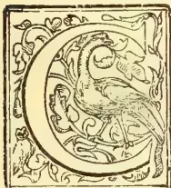

**OFFEE.**—In an Interesting Report the Selangor Planters' Association shows that in the principal European countries and the United States of America, the consumption of coffee during approximately the last 10 years has increased

from 1,101,146,000 lb. to 1,495,296,000 lb. and that the rate of consumption per head of the total population of the same countries has risen from 2.83 lb. to 3.59 lb. These figures are obtained from a return supplied to the House of Commons dated 3rd August, 1900, and may therefore be regarded as absolutely reliable. It is explained that accurate returns of production were not obtainable, owing to the ignorance of "statistical science" on the part of producers, principally in the Central and South American States, so that it is to the London Brokers' Reports that we have to refer for statistics regarding the balance of production over consumption, in other words, for the world's stocks, and these we find by latest advices to amount to 1,449,000 bags (a bag being approximately a pikul) as against 659,000 bags a year ago.

The Director of the San Paulo Agricultural Institute has complied a valuable report upon the existing condition of the estates in Brazil and their future prospects, and, without quoting from it at any length, it is sufficient to say that most estates are burdened with heavy mortgages, that they require much greater attention, especially as regards manuring, than they are receiving, whilst the rise in the value of the milrei from 8 13-32*d.* to 11 19-32*d.* in the last year (Rucker and Bencraft's Circular of 21st March)

cannot exercise other than an extremely deterrent effect upon that industry. The Brazils (Rio and Santos) produce such an enormous percentage of the world's supply, that an even partial collapse in that country would undoubtedly result in greatly improved values. The date of the San Paulo report is not known, but when it was written the milrei was 6½*d.*, and we find it stated that "with exchange a 6½*d.*, and coffee at \$15 in Singapore [i.e. Mexican dollar value] 3½ per cent interest could be paid on the capital"; again, if the Brazilian planter had to pay his labourers in gold he would have been ruined long ago, but he sells his coffee in gold which he reconverts into milreis, and the consequent effects of a rise of 3 3-16*d.* in one year and of 5 3-32*d.*, since that report was written, must be disastrous in the extreme. There is no denying, however, that the world's stock of coffee has increased over 100 per cent. in the last year, and the only conclusion to be drawn is that mortgagees have foreclosed and resold to a large extent, and that estates, at consequently a much lower capital value in other hands, are still capable of being worked at a profit. Your Committee have endeavoured to obtain statistics of coffee exported from Selangor, Negri Sembilan, and Perak. The following figures have resulted from their efforts:—

<table style="width: 100%; border-collapse: collapse;">
<thead>
<tr>
<th></th>
<th style="text-align: center;">1898.</th>
<th></th>
<th style="text-align: center;">1899.</th>
<th></th>
<th style="text-align: center;">1900.</th>
</tr>
<tr>
<th></th>
<th style="text-align: center;">Piculs</th>
<th></th>
<th style="text-align: center;">Piculs</th>
<th></th>
<th style="text-align: center;">Piculs</th>
</tr>
</thead>
<tbody>
<tr>
<td>Selangor ...</td>
<td style="text-align: center;">22,948</td>
<td style="text-align: center;">...</td>
<td style="text-align: center;">26,407</td>
<td style="text-align: center;">...</td>
<td style="text-align: center;">34,295</td>
</tr>
<tr>
<td>Negri Sembilan</td>
<td style="text-align: center;">3,163</td>
<td style="text-align: center;">...</td>
<td style="text-align: center;">4,541</td>
<td style="text-align: center;">...</td>
<td style="text-align: center;">6,199</td>
</tr>
<tr>
<td style="text-align: right;">Tota..</td>
<td style="text-align: center; border-top: 1px solid black;">26,111</td>
<td style="text-align: center; border-top: 1px solid black;">...</td>
<td style="text-align: center; border-top: 1px solid black;">30,948</td>
<td style="text-align: center; border-top: 1px solid black;">...</td>
<td style="text-align: center; border-top: 1px solid black;">40,494</td>
</tr>
</tbody>
</table>

We have not been successful in getting any returns from Perak, but from this State and other sources it is probable that the total production, in 1900, amounted to at least 50,000 pikuls, or say, roughly, 3,000 tons. That we have not been idle in endeavouring to get our coffee, straight from the plantations, brought

21------------------------------------------------

2THE TROPICAL AGRICULTURIST.[JULY 1, 1901.

prominently before the public will be seen from reference to the subject elsewhere in this report, but it must be admitted that we are far from being satisfied with our curing, though year by year no doubt the quality improves. There is a growing feeling that possibly a more acceptable coffee may be produced by sun-drying the cherry, and your 1901-1902 report will undoubtedly supply you with the result of several systematic experiments which are now being undertaken.

**RUBBER** (*Hevea Brasiliensis* or *Para*).—This variety of Rubber continues to come on exceedingly satisfactorily, the average growth of trees from nine months upwards amounting to about 1 foot per mensem, whilst at three years their average circumference at 3 feet from the ground is about 16 inches. This far exceeds anything reported from Ceylon and other countries where *Para* is being planted, and we consider that Mr. Curtis's description, in the 1900 annual Report on the Botanical Gardens of the Colony, of the tapping of the 15-year-old *Para* tree in the Gardens at Penang, is conclusive evidence of the contention of the writer "that in this cultivation lies a source of wealth of the greatest importance." In two years  $12\frac{1}{2}$  lb. of dry marketable rubber were procured "without any apparent injurious result to the health of this tree," and the conditions under which it is growing are reported as anything but favourable. It appears, in the opinion of the different Directors of the Botanical Gardens, that the size of a tree more than its age indicates its fitness for tapping, and probably a circumference of 30 inches 3 feet from the ground is the limit at which attempts to extract the rubber should be commenced. Reports from London show that prices for *Para* have of late declined, one reason alleged being the falling-off in the demand for bicycles, but in *Para* rubber we have undoubtedly the most valuable and highest quality rubber in the world, and your Committee feel that the large number of trees, amounting now to several millions, planted in the Federated Malay States, must, in the not very distant future, prove a source of revenue which will largely recoup the planters for the losses which they have sustained through the decline in value of Liberian coffee.

**FICUS ELASTICA** (*Gutta Ram bong*).—The only interesting fact that your Committee have to report over and above the continued luxuriant growth of this tree is the wonderful result obtained by Mr. R. Derry, of Perak, of 25 lb. per tree from two 19-year-old trees at Kuala Kangsar in one tapping. In your Annual Report for 1899-1900 it was recorded that some *Ficus Elastica* rubber which was sent home by Mr. Derry was valued at 3/6 per lb. as against 3/10 for the *Para* rubber sent to London for sale by the same gentlemen. Assuming, then that the *F. Elastica* rubber resulting from the above-mentioned tapping in any way approximates in value the quotation for the former shipment, it is clear that, in this variety also, planters will have a valuable source of revenue. Mr. Derry's conclusions on the subject of tapping *Ficus Elastica* are that trees may probably be first worked when from four to five years old, and that the average yield should amount to  $\frac{1}{2}$  lb. for every year of the tree's age, the cost of collection, both with *Para* and *Ficus Elastica*, being from 30 cents to 35 cents—i.e.,  $7\frac{1}{2}$ d. to 9d. per pound.

**COCONUTS**.—During the past year many reports have come to hand of trees planted as seedlings, about 2 feet high, from two years and ten months, to three years and three months ago, throwing out bunches of spike and blossom which has set well, and now form sturdy bunches of young nuts. These coconuts are the common variety which have hitherto been supposed only to commence flowering in their fifth to sixth year, and there can be no doubt that, as with both kinds of rubber, the growth of our coconut trees also is quite abnormal. There are thousands of acres of alluvial land in the Malay Peninsula, capable of being converted into flourishing rubber and

coconut properties, and your Committee feel that, when the investing public know and realise this, agriculture in the Malay Peninsula will receive a stimulus which will lead to infinitely more extensive operations than we have had any experience of in the past.

**SUGAR**.—Your Committee hear that great success has attended the sugar industry in Perak during the past year, and that enormous extensions are being contemplated. Unfortunately, however, Perak takes little interest in our Association, and we are not in a position to supply you with any data.

**INSECT PESTS**.—The season under review has, on the whole in Selangor, been free of severe attacks of insect pests, the bee hawk moth caterpillar has broken out rather badly on a few estates, but no damage to speak of has been done, the eggs, caterpillars, chrysalids and moths having been promptly collected by hand and destroyed. In Negri Sembilan, however, a bad outbreak is reported, which led, in one instance, to the cutting out of all the coffee on a large Chinese estate, and caused some considerable damage to a neighbouring property. Various caterpillars and borers have been found on rubber trees of both kinds, white ants have continued to do a certain amount of damage and coconut beetles have had to be regularly collected, but remedies of all kinds have been tried, generally with some measure of success, and the discovery has been made that a decoction of "tuba" roots applied to the base of affected trees is apparently so efficacious that the white ant known as "*Termes gestroi*" is completely kept under by it. Such a simple remedy, involving as it does only the planting up of an acre or two of this quick-growing creeper, which is easily procurable and equally easily propagated by cuttings, is a most valuable discovery, and there seems no reason why, by continued and intelligent effort, this the worst and most destructive pest known to us at present should not be completely mastered and eventually cease to give us any trouble.

---

## MANGOES.

If mangoes are not yet the most extensively grown and abundant fruit in Queensland, they soon will be. They thrive vigorously from Southport to Cape York. Almost everyone having a garden goes in for mangoes, but too frequently are regardless of the quality of the fruit, and hence really good mangoes are rare. Some growers realise this, and take all the care they can to plant nothing but the best kinds. Had this been done from the first, Queensland would now be celebrated for her mangoes, and prices would be more satisfactory. As an evidence of the increasing appreciation of choice fruit by growers, a seedsmen has during the last three years realised 2s. 6d. each for some fine specimens. I learnt with regret, at the market, that hundreds of cases had been thrown away this season for want of purchasers. Another, however, told me he had always been able to sell good mangoes. It has been recorded that in some places up North mangoes have been allowed to rot on the ground, the grower being unable to sell or use them. This should not be so, for there are many purposes for which mangoes may be used besides as a table fruit. The following information, in no case original, may prove interesting and useful to some of your readers:—A very delicious preserve is made by simply peeling them when unripe but nearly full-grown; slice, place in a dish, pile on sugar, and bake in a slow oven. When properly prepared this preserve is unexcelled, and would meet with a large demand in Europe and America, as well as the Southern colonies. The making of mango jam is well-known to all housewives, its variation in excellence is doubtless owing to the quality of the fruit and sugar, also to the amount of care taken in cooking. The fruit should always be peeled. I am

22------------------------------------------------

JULY 1, 1901.]THE TROPICAL AGRICULTURIST.3

informed that young mangoes, about the size of olives, make pickle superior to walnuts; if this is so, nothing can be better. In India full-grown but unripe fruit are partially cut through, the kernel removed, the cavity filled with chillies, ginger, and other condiments, then closed and put into vinegar. I do not know whether their yellow colour is imparted by mustard or turmeric. This pickle, which is excellent, is put up in jars of over 7 lb., and also in kegs. Mangoes make excellent sauce, equal to, and by many regarded as superior to, apple sauce. For making chutney mangoes are unrivalled. It is in this direction our pickle manufacturers should do a large trade; all the principal ingredients are produced in Queensland, and our market is secured to us by an import duty of 4s. per dozen quarts, 2s. per dozen pints, and smaller size in the same proportion. After our own wants are supplied there should be considerable demand for passenger ships. In vessels of the British India and P. and O. I have noticed chutney on the table three times a day: probably this is so in other lines of steamers. Chutneys are made in infinite variety, various grades of hot, sweet, and intermediate. Some of the following recipes may prove useful:—

1st.—Chillies, 1 to 1½ lb.; unripe mangoes, 1 lb.; red tamarinds, 2 lb.; sugar-candy, 1 lb.; fresh ginger root 1½ lb.; garlic, ½ lb.; sultana raisins, 1½ lb.; fine salt, 1 lb.; distilled vinegar, 5 bottles.

2nd.—1 lb. salt, 1 lb. mustard seed, 1 lb. stoned raisins, 1 lb. brown sugar, ¾ lb. garlic, 6 oz. cayenne pepper, 4 lb. green mangoes, 2 quarts best vinegar—the mangoes (sliced) and boiled in a quart of the vinegar, the mustard seed gently dried and bruised, the sugar made into a syrup with a pint of the vinegar, the mangoes, sliced and boiled in a quart of the vinegar, the garlic to be well bruised in a mortar. When cold gradually mix the whole, and with the remaining vinegar thoroughly amalgamate them. To be tied down close. The longer it is kept the better it will become.

3rd.—2 lb. of unripe mangoes, peeled and boiled in a pint of vinegar (a strip or two of the skin may be included if flavour wished; 1 lb. onions, finely chopped. In another pint of vinegar boil two lb. sugar (not loaf sugar), 2 oz. ground ginger, and ¾ lb. salt: when cold mix thoroughly and add 2 oz. yellow mustard seed, ½ oz. red pepper, ½ lb. large raisins stoned, ½ lb. dates, and ¾ lb. sultanas, all cut small; keep warm for a month.

4th.—3 lb. mangoes, 1 lb. onions, 1 lb. sugar 1 bottle vinegar, pepper and salt and any spices to taste; boil two hours.

5th.—Green mangoes, peeled and sliced 4 lb.; tamarinds, 1 lb.; sugar (preserving) 1 lb.; salt 1 lb.; cayenne pepper, 3 oz.; or chillies (finely cut up) 1 lb. spices, 2 oz; vinegar 3 pints; mix the ingredients thoroughly, and boil slowly for hours.

6th.—50 mangoes, medium size, peeled and sliced ½ lb. preserved ginger, ½ lb. garlic, ¼ lb. chillies 1 lb. raisins, 3 lb. sugar, 1 quart vinegar. Make a syrup with the sugar and vinegar, in which the mango must be boiled; when half done put in the other ingredients, mix well, and when thick remove from the fire. Time, one and a-half to two hours. Bottle when cold. I have not tasted any of those recipes, but some have been tried by friends who report favourably. Tastes differ considerably in chutneys; some persons prefer sweet to hot, others the reverse; it may, consequently, be found desirable to vary the proportions of some of the ingredients.

7th.—12 lb. peeled mangoes, 1½ lb. fine salt, ¼ lb. garlic, 3 lb. raisins, 2 lb. chillies, 3 lb. white sugar; 2 lb. green sugar, 7 bottle vinegar. The mangoes should be turning yellow, but not soft; remove the stone. These quantities are weighed when everything is peeled, and all put through a sausage machine. Boil till a nice brown for about four hours.

8th.—5 lb. green mangoes (weigh with stones in) 2 lb. raisins, ½ lb. mustard seed, ½ oz. red chillies, 1 oz. garlic or onion, 2 lb. dates, ½ lb. green ginger, 1½ lb. sugar, 2 oz. salt, 3 pints vinegar. Peel the mangoes slice half finely, put the rest through the mincer; chop half raisins and dates, put the rest through the mincer; ginger, garlic and chillies well pounded with a little vinegar. Boil all for an hour and bottle while hot.

9th.—Peel 4 lb. green mangoes, remove the stones and cut them into quarters lengthwise, boil them slightly in a bottle of vinegar, and put aside in a jar till cold. Take another bottle of vinegar, to which add 2 lb. sugar and boil till it becomes a thin syrup, put aside till cold. Take 1 oz. salt, 2 lb. picked and dried raisins, 1 oz. yellow mustard seed, 1 oz. garlic, 2 oz. dried chillies, 1 lb. green ginger sliced. Pound the garlic, chillies, and ginger finely in a mortar; mix all the ingredients together, bottle and expose to the sun for three or four days or place in a cool oven.—*Queensland Agricultural Journal*.

## RUBBER IN PERAK.

We take the following extracts from the report just issued by Mr. R. Derry, Superintendent of Government Plantations, Perak:—

Para rubber (*Hevea brasiliensis*).—The result of a parcel of this rubber sent to London for sale was received early in the year, all the best quality rubber, 327 lb., sold at the rate of 3s. 10d. per lb., and the scrap, 33 lb., at 2s. 6d. The nett proceeds amounted to £61 1s. 6d., or \$617.18. I believe this to have been the largest parcel of para rubber sent home from the East. It realised 6d. per lb. more than that sent home in 1898, and was reported on as "para character."

The tapping commenced in March, 1899, and was carried on till July. It was intended to tap a few trees, those which ran most freely, with a view of obtaining the maximum amount of latex without injury, and to obtain about 4–5 lb. from other trees. This much could have been done, but owing to the exceptionally heavy rains which frequently interrupted the work, and in order that the seed crop should not be damaged, tapping was stopped and with several trees long before completed.

The average age of trees tapped is 14 years, taking the yield at 4 lb. per tree, and estimating the trees at 100 to the acre, this would give a gross return of £73 6s. 8d. at present prices, or at half the price, £36 13s. 4d., and what other tropical product gives the same return? If the trees were only half this age, say 6–7 years, there would not be much difference in the gross result, as then there would be double the number of trees to the acre.

### HEVEA BRAZILIENSIS IN PERAK.

At Kuala Kangsar there are two well-marked varieties of Hevea—(1) the typical tree with large leaves attaining 13 inches long and 5 inches wide and generally branching low down; (2) smaller leaves, tall trunk and smaller rather pointed seeds, an inferior variety. The largest tree at Kuala Kangsar is 18 years old and has a girth of 8 feet 6 inches at 3 feet from the ground, this is larger than any observed by Cross in Brazil. Some trees planted by myself 3 years ago have now a girth of 1 foot 3½ inches at 3 feet from the ground. Hevea trees have a short resting season, shedding their leaves about the end of February, their new growth commencing with flowers followed by leaves. It is not uncommon, however, to see trees in September, half or many branches dormant, and without a leaf, while other parts are covered with verdant foliage. The seeds from March flowers commence ripening in August, those from September flowers in February, the heavier crop being in August. Here Hevea trees are planted on dry ground and also low swampy

23------------------------------------------------

4THE TROPICAL AGRICULTURIST.[JULY 1, 1901.

ground. I have not observed any difference in yield of latex, but I would not recommend land which is liable to heavy floods.

*Tapping.*—I consider the latex flows most freely when the new leaves appear, which with most Hevea trees is about March, and the advantage of tapping about that time is not so much a question of actual yield as it is of the amount of bark removed in the operation, which would be less at the best season. There would also be another season commencing in September with those trees then flowering. As with all trees, the ratio of growth is variable at different periods, but taking the girth of Hevea trees here, a 3-year-old tree at 3 feet from the ground being 13-15 inches, and an 18 year old tree 100 inches, the annual increment would average nearly 6 inches in circumference, and I am sanguine that Hevea trees can be tapped in Malaya when 6 years old, if not earlier when I estimate the girth at 24-30 inches on good free soil. Tapping should be commenced at the base of the tree, working upwards to 6 or 8 feet if necessary, and if a tree be operated on in a workman-like manner three annual tappings could be executed before going over old incisions.

#### COAGULATION.

Samples of rubber prepared at Kuala Kangsar have been reported on as equal to good para (Brazilian) and would fetch best para prices. I have always found the latex to coagulate readily with only the addition of a pinch of alum, and by placing immediately in smoke both putrefaction and mould are avoided. If the rubber is sound the market value depends on the state of dryness in which it is received. What has been prepared at Kuala Kangsar has been kept smoked until shipped. A parcel sent to London 3½ years ago was reported to have lost 26½ per cent. in washing and the manufacturers thought that if sent home in bulk the loss would reach 30 per cent. This, however, is a question for the planter himself. Smoke has a chemical action in the coagulation of latex from Hevea as well as saving decomposition, and assists in gradually drying. To be as dry as possible depends on the time the rubber has been kept smoked, and I am of opinion that dry marketable rubber could not be prepared under two months. Whether centrifugalisation will prove a practical method with Hevea is still in its infancy. I understand that the globules of *caoutchouc* in the latex of Hevea do not separate readily, as is the case with some other latices, and owing to its chemical combination the latex of Hevea will be probably best prepared by the natural method.

#### RAMBONG.

India rubber (*Ficus elastica*).—A sample of 5½ lbs. was sent to London, with the para parcel, for sale and opinion. It was reported on as "good clean Java character" and valued at 3s. 6d. per lb., but sold for 3s. 10d.

The largest tree at Kuala Kangsar is about 90 feet high, measures 88 feet and 3 feet from the ground, measuring round all the aerial roots, the branches extend to 36 paces, and the largest leaves are 13" × 7", its age 19 years. The growth of this tree has been remarkable during the last three years, from the time its aerial roots reached the ground.

*Ficus elastica* is an indigenous tree, found in Upper Perak. It is naturally an epiphyte, and its growth would be no doubt assisted if planted at the bases of felled trees. Its growth is slow at first but rapid when well established. Considering the enormous dimensions this tree attains, 10 to the acre would be close enough planting and as perhaps 8 years would have to elapse before the tree could be profitably tapped the intervening spaces could be utilized by some other crop, even Hevea, which would be beneficial to the growth of the *Ficus*.

#### YIELD.

I have not any information as to the age when *Ficus elastica* could be profitably tapped. At Kuala Kangsar there are two trees 12 years old, and two 19 years old; from the latter 25 lb. of rubber has been obtained from each tree, and the tapping was far short of being exhaustive. The result of the other trees has not yet been ascertained, but I expect good results.

Getah Singret (*Willoughbeia firma*). A small sample was sent to London with the Para parcel, and reported on as "good strong Borneo character," valued and sold at 2s 6d. per lb. This is the best of the indigenous creepers, but I doubt very much if it ordinarily reaches the European market in a pure state, being usually used to adulterate getah percha.

Getah Taban Sutra (*Dichopsis gutta var.*). There is one example of this tree in the Kuala Kangsar garden which is said to be 17 years old, and fruited for the first time in November, 1900. A few herbarium specimens were obtained, all the other fruits being carried off by squirrels before being ripe. The height of this tree is 25 feet, and girth 2 feet at 3 feet from the ground; a jungle tree growing under heavy canopy would of course be much higher, with less branching habit and smaller girth.

Central America Rubber (*Castilloa elastica*).—About 150 seedlings of *Castilloa* from Ceylon seeds have been raised. It appears doubtful, however, whether the Ceylon trees are *Castilloa elastica* (true) or only an inferior variety, *Castilloa Markhamiana*, the results of the Ceylon trees being far below South American returns.

Getah Percha (*Dichopsis polyantha*).—A variety of getah percha which grows from near the foot of Larut hill to 3,000 feet. A mountain form may prove valuable for planting on high land. None, however, was observed in fruit, and it presumed that with this tree, as with many indigenous trees, a fruiting season only occurs once every few years. Seedlings are abundant but the smallest seem two years old.

### THE DATE PALM FOR QUEENSLAND.\*

By T. MORRIS MACKNIGHT, F.L.S.

[Read at a meeting of the Natural History Society of Queensland, on 1st November, 1894]

#### WHY NOT FOR NORTHERN CEYLON?

The date palm is an example of extraordinary fruitfulness. Next to the coconut it is unquestionably the most interesting and useful of the palm tribe. Without it the desert would be uninhabitable. Do we not understand, then, the gratefulness of the Arab towards a tree which can derive its nourishment from the scorching sand, and scarcely less burning airs of heaven, and the brackish waters beneath the soil, which are fatal to all other kinds of vegetation; which retains its verdure fresh in the glare of a pitiless sun; which provides him with beams and coverings for his tent; cordage for the harness of his horses and mules; fruit to satisfy his hunger? What the vine is to the Italian, the coconut-tree to the Polynesian, the date palm is to the Arab. And more—far more. This single tree has peopled the desert. Without it the tribes of the Sahara would cease to be. The wealth of an oasis is computed by the number of its date trees.

\* The author prefaced his paper with the statement that he made no pretence of having an expert knowledge of his subject. He had collected information from all the sources which were available to him, and had given the matter his consideration for some time past. The results of this compilation he submitted as a guide to those in search of summary information on the subject.

24------------------------------------------------

JULY 1, 1901.]THE TROPICAL AGRICULTURIST.5HABITAT.

The habitat of the date is North Africa, Arabia, Persia, Egypt, Nubia, Syria, and it does not go further east than the mouth of the Indus. It is indigenous in the Canary Isles; wanting in the south of Senegal, and it no longer appears in the Oasis of Darfur, between the 13th degree and 15th degree of latitude. The zone in which it grows well in general is that between 35 degrees and 19 degrees north. According to Link (*Die Urwelt*, I., p. 347), it flowers freely in the south of Europe, as in Sicily, the Morea, and the south of Spain; and also bears fruit there, though this is not sweet. In Sicily it still grows at 1,700 feet—namely, at Aderno and Trecastagne on Etna, but it probably does not bear fruit on this island (Philippi on *Vegetation of Etna*, 'Linnæa,' vol. 7, p. 731). It needs 5,100 degrees Fahr. of heat accumulated during eight months for the date to ripen its fruit perfectly. If the sum of the heat be less, the fruits set but do not grow to their full dimensions; they also remain bitter to the taste, and lack much of the sugar and albumen, to which they owe their nutritive properties. The requisite conditions are realised in the Sahara. The mean temperature of the year there averages from 68 degrees to 76 degrees, according to the locality. The heat commences in April, and does not cease till October. Keith Johnston's 'Physical Atlas' gives the temperature in summer and winter as—July, 81 degrees to 86 degrees; January, 52 degrees to 61 degrees; mean temperature (annual), 68 degrees to 76 degrees. Biskra, the celebrated date-growing district in North Africa, is in latitude 34 degrees 51 minutes, altitude 410 feet; it faces towards the hot tropical south, and is protected by mountains on the north side. It has an annual mean temperature of 68.5 degrees (January 50.2 degrees, July 89.8 degrees). The thermometer seldom sinks in the cold season more than 2 degrees below freezing point, and the date can endure 6 degrees of frost.

The neighbourhood of the sea is unfavourable to the production of good dates. The general altitude of the central districts of North Africa, where it thrives, is 600 feet to 2,000 feet; the date palm also grows in some Egyptian oases from sea-level to 600 feet. The lower portions of the Rivers Euphrates and Tigris in Turkey are from sea-level to 600 feet.

The amount of annual rainfall requisite for the best dates is from 5 inches to 10 inches; for those of inferior qualities, from 10 inches to 25 inches. Mr. A. S. White, secretary the Royal Geographical Society of Scotland, gives, in his work, the 'Development of Africa,' 1890, a map of the rainfalls in North Africa, Arabia, and Persia, which may be profitably referred to in this connection. Although the date requires a hot, dry climate, yet its roots must have access to moisture. And though it is essentially a tree belonging to desert regions, yet it is confined to the oases in these deserts where water is found. It flourishes in rainless countries, but only where there is moisture in the soil, either naturally or produced by irrigation.

IRRIGATION AND OASES.

The 'Oases of the Tableland,' writes Charles Martins, in his 'Du Spitzberg au Sahara,' 'are each watered by a stream or copious spring, and are but a short distance from the Mediterranean region. The oases of El Kantara is the first (Mangin) we met on leaving the Mediterranean region to penetrate to the Sahara through a ravine called the 'Mouth of the Desert.' It is 1,800 feet above sea-level, and its temperature just suffices to enable the dates to ripen. The oases of the Valleys of Erosion are watered by natural or artesian wells. An example is Ouargla, situated in a profound hollow. The palms are planted at the rate of 1,000 to 1,100 a hectare ( $2\frac{1}{4}$  acres). Outside the gardens grow some wild date palms, which yield a smaller crop, but whose fruit is much more savoury. The

oases of the Sandy Desert need water. The trees are here planted in conical cavities hollowed by the hand of mango, that their roots may strike down to the subterranean reservoir which is to nourish them. These cavities are 15 feet, 25 feet, or 30 feet deep. The slopes around these hollow gardens are stayed indifferently well by a matting of palm-leaves. The wells are in the centre, and not deeper than 25 feet. These oases have a very precarious existence, as a gust of wind may bury them under an avalanche of sand. Every oasis is composed, in the main, of palms which seem to form a continuous forest; but in reality they are planted in rows and in gardens separated from one another by walls of earth, which are pierced with an aperture to admit of the entrance of the irrigating rill into the enclosed square. The soil employed in the construction of the walls is removed from the paths, which are consequently below the surface, and can be employed for a double purpose: they facilitate circulation in the oasis, and the waters, after having refreshed the gardens, discharge themselves into these hollow ways.

SOIL.

Meyen, in his 'Geography of Plants,' page 2, states that a sandy soil suits the date best; and Sonnini, in his 'Travels in Egypt,' saw it growing in the sands as well as in the more fertile parts. It will luxuriate even in saltish soil, and the water for its irrigation may be slightly brackish. The artesian water of the Oued Kur district in Algeria contains from 0.57 oz. to 1.07 oz. of dry salt in a gallon. Brigade-surgeon Bonavia says that on the whole it thrives best in sandy, granitic, schistic, and calcareous soils. The northern half of Arabia, which is an important centre for date culture, is granitic.

INFLORESCENCE.

The date is a dioecious tree, having the male flowers on one plant and the female or fruiting ones on another. The male flowers are considerably larger than the female, furnished with stamens only, and form a closed-up, folded, grape-like ball (previous to the ripening of the pollen) in an envelope called the spathe. 'It blossoms,' says Mr. Tristram, in his book 'The Great Sahara,' 'in the month of March. The male flower is borne on a very short calyx, a thin petalous corolla much larger, with six stamens, furnished with long linear anthers, the two cells of which open themselves from within by two longitudinal slits. The female flowers present a double floral envelope, each whorl of which is formed of three pieces, constituting three distinct pistils, each surmounted by a stigma in the form of a hook. Of these three pistils one only develops itself, ripens, and becomes an elongated ovoid berry, with a slight epidermis of a yellowish-red, a solid and slightly viscous pulp, and an endocarp represented by a slight pellicle enveloping the nucleus, which is the seed. The seed is grooved, and on the opposite side of it is a depression containing the germ.' Baron Mueller states that one male tree is considered sufficient for fifty females. Watts allows one or two males to from eighty to two hundred trees.

PROPAGATION.

The best trees are produced from suckers from three to four years old, having an average weight of about 6 lb. Those raised from seed are much slower in maturing, and are generally poor. The sucker is taken from the foot of the stem of an adult tree: when first planted it must be watered daily for six weeks, and on alternate days for another six weeks, after which the trees are watered once a week in summer, and every month in winter. The nut does not commence to germinate until from six to twelve months after planting have elapsed, and grows very slowly for the first two years. The trees yield fruit in from five to six years, and are in full bearing at from twenty to twenty-five years, after which they

25------------------------------------------------

6THE TROPICAL AGRICULTURIST.[JULY 1. 1901.

continue fruitful for about 150 years. Several bunches of flowers are formed in a season, each producing often as many as 200 dates. Select trees are reported as having borne a crop worth £2, but the average may be put down at 4s. per tree annually, common kinds less than 1s. A good date tree is sometimes exchanged for a camel in North Africa.

#### FECUNDATION.

"In Algeria and all over the East," says M. Cossona, a botanist who has studied the subject on the spot, "towards the mouth of April the tree begins to flower, and then artificial fecundation is practised extensively. The male spathes are opened at the time when a sort of crackling is produced under the finger, which indicates that the pollen of the flowers in the cluster is sufficiently developed, yet has not escaped from the anthers; the cluster is then divided into portions, each containing seven or eight blooms. Having placed these pieces in the hood of his burnous, the workman climbs to the summit of the female tree, supporting himself by a loop of cord passed round his loins, and at the same time round the trunk of the tree, and, having split open the spathe with a knife, he slips in one of the fragments, which he interlaces with the branches of the female cluster, the fecundation of which is made certain." Archer says that wild plants are fecundated by bees. The Arabs even keep the pollen from one year to another in case the male flower should fail the succeeding season. According to Watts the pollen is said to remain active for one or two months after its removal from the tree, so the flower is carefully kept and used as occasion demands. Hasselquist, who travelled in Egypt, describes the operations as follows:—"When the spadix has female flowers that come out of its spathe, they search on a tree that has male flowers, which they know by experience, for the spadix has not yet burst out of its spathe. This they open, take out the spadix, and cut it lengthwise in several pieces, but take care not to hurt the flowers. A piece of this spadix, with male flowers, they put length-wise between the small branches of the spadix which has female flowers, and then lay the leaf of a palm over the branches. In this situation I yet saw the greatest part of the spadices which bore their young fruit; but the male flowers which were put between were withered. The Arab also stated that unless they in this manner wed and fecundate the date-tree it bears no fruit; secondly, they always take the precaution to preserve some unopened spathes, with male flowers, from one year to another, to be applied for this purpose in case the male flowers should miscarry or suffer damage; thirdly, if they permit the spadix of the male flowers to burst or come out it becomes useless for fecundation; therefore, the person who cultivates date trees must be careful to hit the right time of assisting the fecundation, which is almost the only nicety in their cultivation."

To climb trees which have no branches but at the top, and the straight and slender stem of which cannot support a ladder, the Egyptians employ a sort of girth fastened to a rope that they pass round the tree. On this girth they seat themselves and rest their weight; then, with the assistance of their feet, and holding the cord in both hands, they contrive to force the noose suddenly upwards so as to catch the rugged protuberances with which the stem is symmetrically studded, formed at the origin of the branch-like leaves that are annually cut. By means of these successive springs the top of the tree is reached where, still sitting, they work at their ease, either in lopping off the leaves or gathering fruit, and afterwards descend in the same manner.

Professor Burnett says the age of bearing is from six to ten years. Haldane says seven years. Baron Muller says that trees from suckers commence to bear in five years and are in full bearing in ten years,

The fig, pomegranate, and apricot, and sometimes the olive, are grown as auxiliary crops. I would suggest also the watermelon, pumpkin, vegetable marrow and lucerne.

#### VARIETIES.

Dr. James Richardson in a letter in "Hooker's Journal of Botany," Vol. II., writing of the dates of Fezzan, describes forty-six varieties. Nineteen-twentieths of the inhabitants of Fezzan during nine months of the year live on dates. In Northern Arabia there are more than a hundred kinds of dates, each of which is peculiar to a district, and has its own special virtues. Many varieties of date exist, differing in shape, size, and colour of the fruit. Those of Gomera are large, and contain no seed. The Zadie variety produces the heaviest crop, averaging in full bearing trees 300 lb. to the tree. Professor Naudin states that the variety of "Dathers-sifia" ripens its fruit early in the season. The "Deglet Nour" is considered the best for keeping.

#### TREATMENT OF FRUITS.

Four or five months after the operation of fecundation has been performed the dates begin to swell, and when they have attained nearly their full size (about the beginning of August) they are carefully tied to the base of the leaves to prevent them from being beaten and bruised by the wind. If meant to be preserved they are gathered a little before they are ripe, but when they are intended to be eaten fresh they are allowed to ripen perfectly, in which state they are very agreeable and refreshing. Ripe dates cannot be kept any length of time or conveyed to any great distance without fermenting and becoming acid, and therefore those which are intended for storing up, or for being carried to a distant market, are dried in the sun on mats. They are sent in this way to Europe from the Levant and Barbary. Each tree is capable of yielding only a certain number of good fruits, and on adult trees not more than twelve bunches are left to ripen. The whole cluster of fruit is cut before it is quite ripe, when it is put into a basket made for the purpose, having no other opening than a hole through which the branching extremity of the cluster projects. In this situation the dates ripen successively.

In the Hedjax (which is the northern half of Arabia) the new fruit called *ruteh*, comes in at the end of June and last two months. The people cannot therefore depend on the new fruit alone, but during the ten months of the year, when no ripe dates can be procured, principally subsist on date paste, called *adjoue* which is prepared by pressing the fruit, when fully matured, into large baskets. "When the dates are allowed to remain on the tree till they are quite ripe, and have become soft and of a high red colour, they are formed into a hard solid paste or cake called *adjoue*. This is obtained by pressing the ripe dates forcibly into large baskets, each containing about 2 cwt. In this state," continues Burckhardt, "the Bedouins export the *adjoue*, and in the market it is cut out of the basket and sold by the lb. During the monsoon the ships from the Persian Gulf bring *adjoue* from Bussorah to Djidda for sale in small baskets weighing about 10 lb. each; this kind is preferred to every other."

The date seeds or kernels are soaked for two days in water, when they become softened, and are given to camels, cows, and sheep instead of barley. There are shops in Medina, in Arabia, where nothing else is sold except date kernels, and the beggars are continually employed in all the main streets in picking up those that are thrown away.

The best fruit is that which is gathered just before it is ripe and exposed to the sun for several days to mature. The crushed dates which arrive in England in bulk are inferior and damaged, having ripened on the trees and fallen. I have seen some beautiful dates in London on the stalks. These, in the same way as raisins, have the short

26------------------------------------------------

JULY 1, 1901.]THE TROPICAL AGRICULTURIST.7

pedicels left on them. Then, again, I have seen, in Port Said dates, prepared somewhat as we often see them in shops in Brisbane, sold very cheaply, being, I suppose, the refuse of the date groves pressed into a paste or soft mass. This is sold by weight in chunks. In Egypt, the dates of Upper Egypt and the Oases are those which are the most delicate. The hotter and drier the climate the richer is the date, and near the coast the poor fruit is fit only for animals, as mentioned in "French Colonies," by Bonwick, 1886.

MISCELLANEOUS.

Tunis has 2,000,000 date trees; Egypt, 4,000,000; Bussorah, in Turkey, has enormous date groves stretching along both banks of the Euphrates for a distance of over 140 miles, yielding 40,000 tons in good seasons.

The price in England in March, 1894, was—Bussorah (boxes) 9s to 13s 3d per cwt.; Taflet, 44s to 50s per cwt.

Dates contain more than half their weight in sugar, but there is a fair amount of flesh-forming material present as well. Dates, without the stone, contain in 100 parts—

<table>
<tbody>
<tr>
<td>Water</td>
<td>...</td>
<td>...</td>
<td>20.8</td>
</tr>
<tr>
<td>Albumen</td>
<td>..</td>
<td>..</td>
<td>6.6</td>
</tr>
<tr>
<td>Sugar</td>
<td>..</td>
<td>..</td>
<td>54</td>
</tr>
<tr>
<td>Pectose and gum</td>
<td>..</td>
<td>..</td>
<td>12.3</td>
</tr>
<tr>
<td>Fat</td>
<td>..</td>
<td>..</td>
<td>0.2</td>
</tr>
<tr>
<td>Cellulose</td>
<td>..</td>
<td>..</td>
<td>5.5</td>
</tr>
<tr>
<td>Mineral matter</td>
<td>..</td>
<td>..</td>
<td>1.6</td>
</tr>
</tbody>
</table>

The pungent rigidity of the foliage protects the date from encroachment of pasture animals; hence it can be left without fencing or hedging.

QUEENSLAND AS A DATE COUNTRY.

I have now given all the general information I can find in regard to the cultivation, &c., of the date palm in North Africa, Turkey in Asia, and Arabia. It will be convenient now to see if in Queensland similar conditions of temperature, &c., can be found. The part of Queensland which, bearing in mind the requirements of the plant already set forth, seems to be the most suitable for the cultivation of the *best* dates is to the west of Hughenden, Longreach, and Charleville, and from latitude 23 degrees to the southern border of the State. The following remarks all refer to this area:—

TEMPERATURE.

Comparing the region of Queensland which includes these places, with Biskra, in North Africa, in latitude 34 degrees 51 minutes at an altitude of 410 feet, we have—

<table>
<thead>
<tr>
<th></th>
<th>Queensland.</th>
<th>Biskra.</th>
</tr>
</thead>
<tbody>
<tr>
<td>Annual average temperature...</td>
<td>67.74</td>
<td>68.5</td>
</tr>
<tr>
<td>Mean temperature, coldest month ..</td>
<td>48.61</td>
<td>50.2</td>
</tr>
<tr>
<td>Mean temperature, hottest month ..</td>
<td>84.90</td>
<td>89.8</td>
</tr>
</tbody>
</table>

I do not know the extreme minimum temperature at Biskra, but the lowest in the part of Queensland above referred to is 26.4 degrees at Boulia in July, 1894. My information for Queensland is obtained from the Meteorological Reports, which are only available from 1st September, 1893, to 31st August, 1894. I believe this last winter was considered a very cold one throughout the colony, and as the date palm can stand as low a temperature as 26 degrees it should be safe even at Boulia from being killed by frost. The latitude, 20 degrees S. to 27 degrees S., also indicates generally the area in which the suitable temperature is to be met with.

RAINFALL.—In the above possible date-growing belt of Queensland the rainfall ranges from 5 inches to 24 inches, and in the more westerly portion this reaches the minor limit, therefore improving the quality of the date on account of the greater dryness of the air combined with the circumstance that there is greater heat also.

ALTITUDE.—Looking generally at West Queensland, the rivers and creeks all run to the south-

west, showing that the higher ground is the north and east. Then there are high downs between the Gulf of Carpentaria waters and the Diamantina and Thomson Rivers; so that all this higher ground must vary from 600 feet to 1,400 feet above sea-level. But to the south-west of Boulia and Windorah and to the south of Thargomindah and Charleville the altitude of the country is from sea-level to 600 feet. From the above figures it can easily be seen where there is the least likelihood of frost.

SOIL.—The geological formation in the region indicated is mesozoic, with desert sandstone on the higher ground between the various watersheds, and lower cretaceous on the plains and downs. As apparently the date palm prefers a sandy soil, the conditions in this case seem favourable also.

From the above data it will be seen that West Queensland is generally suited to the cultivation of the best dates. As to the local conditions, they must be ascertained by Queenslanders themselves. The object of this paper is to give to the State the information in regard to the date which is scattered throughout many books and is not easily obtained, and also to suggest the best place for initiating experiments in date cultivation in this country.

[We are indebted to Mr. Hy. Tryon, Government Entomologist, for the foregoing paper.]

ZANZIBAR PLANTING INDUSTRIES.COCONUTS.

What return will a coconut tree bring in per annum? The average yield of nuts in Zanzibar island is probably from 25 to 30 per tree. Calculating the price at R20 per 1,000 on the spot and the yield at 30 we get a gross return of 9.3-5 annas per tree. Gathering may be set down at R4 per 1,000, which leaves a net return of about 7½ annas, or half a rupee, per tree. Pemba trees yield less than Zanzibar; the average is probably less than 15 nuts per tree per annum. Labour is cheaper and the cost of gathering less than in Zanzibar: about R3 per 1,000. The net return per tree works out to about 4½ annas per annum in Pemba. Mr. J. T. Last, F.R.G.S., writes as follows upon the benefits of cultivation as he has found them at Mangapwani:—

"There are at Mangapwani about 200 bearing palms from which the nuts are gathered every three months. About three years ago I had the ground well dug up for some 6 feet round the base of each tree, and then packed round the tree any manure, grass or decayed vegetable matter I could get, covering the same up with soil. This has been repeated every year. The result of these operations is that the number of nuts gathered is greatly increased.

Formerly the three-monthly gatherings would average about 3,000 nuts, now more than double that amount is obtained. The last gathering reached the number of 7033. Since I started mulching the trees there have always been one or more trees at each 3-monthly gathering from which I obtained 100 nuts.

At the above gathering from

<table>
<tbody>
<tr>
<td>1 tree are gathered</td>
<td>110 nuts</td>
</tr>
<tr>
<td>2 trees ,, ,,</td>
<td>100 ,, each</td>
</tr>
<tr>
<td>1 tree ,, ,,</td>
<td>91 ,,</td>
</tr>
<tr>
<td>1 ,, ,, ,,</td>
<td>89 ,,</td>
</tr>
<tr>
<td>1 ,, ,, ,,</td>
<td>86 ,,</td>
</tr>
<tr>
<td>1 ,, ,, ,,</td>
<td>80 ,,</td>
</tr>
</tbody>
</table>

Making from 7 trees 556 nuts.

I think, judging from the above results, we could fairly expect that, with proper attention, a healthy full-grown coconut tree would produce 100 nuts a year.

We find at Dunga that individual trees occasionally yield close on 100 nuts at a gathering, though we have

27------------------------------------------------

8THE TROPICAL AGRICULTURIST.[JULY 1, 1901.

not found such good general results follow upon digging and mulching as Mr. Last has at Mangapwani. Our trees have all been dug and mulched but the average yield of nuts remains about the same, though we are, looking for some improvement this year. Our trees are scattered about through enveloping native villages, and the nuts are consequently exposed very much to theft. Loss by theft is the greatest evil cocoanut planters have to contend with in this country.

#### PLANTING THE NUTS.

Natives plant nuts on their sides and sometimes in an upright position. They declare that in the latter case a stronger plant is obtained. Dr. Krapf in his Swahili dictionary has the following note:—

"The natives plant the coconut (which is to become a tree) on the fourteenth day of the moon, because the moon is then at her full power. This takes place before the rain. They put it into the ground without removing the husk, taking care that the *nte* or bud is placed downwards in the pit, which they dig to the depth of one *mukono* (cubit). The tree (like the mango-tree) requires five years' growth before it bears fruit.

The Wanika consider the coco-tree to be their mother on account of its usefulness. Therefore they will not allow it to be cut down. They believe that a *koma* watches over it. Therefore when the tree yields no *tembo* they endeavour to appease the *koma* by a sacrifice. On this account they place a coco-shell on the grave of the dead, and fill it with *tembo* from time to time, in order to induce the *koma* to give them much *tembo*. The Swahili cut down the coco-tree without scruple."

The generally accepted way of planting a nut is to lay it on its side in a trench about 7-8 inches deep (its own depth.) It has been rightly pointed out that if a nut be planted eyes downwards, the young shoot may not before it reaches the surface; on the other hand if planted eyes upwards the milk inside, which is especially provided for the first nourishment of the germ, will settle at the bottom of the nut and the young shoot will then run a risk of being dried up. Nature seems to have especially pointed both ends of the nut so that, having fallen from the tree it shall remain upon its side to germinate. In the case of the mangrove the young seedling drops from the parent tree upon its pointed end and sticks in the mud and grows forthwith. But the bottom of the coconut could not have been pointed to enable it likewise to stick in the sand and germinate, because a nut always falls upon its side. This is well shown by dropping a few nuts from the roof of a high house. If the nut is suspended by the stalk, in the way it hangs upon a tree, and dropped, it will turn half over and fall sideways. The same thing happens if the nut be held upside down. If it be held horizontally, it will maintain this position till it reaches the ground. Nature is always a safe guide. Allow a space of nine inches or a foot between the nuts in the trench, and 18 inches between the trenches. This gives plenty room to lift the nuts when the time comes for them to be planted out, without doing much damage to the roots. April is the best time to plant out the seedlings, when they should be 5 or 6 months old. Hence the nuts should be planted in the nursery in November. But no hard and fast rule need be laid down, especially as our seasons are uncertain. 35 feet by 35 feet is a good distance for them to be placed in the plantation. This gives 35 trees to the acre.

#### ESTIMATE OF THE NUMBER OF TREES.

Cocoanut trees are scattered about so promiscuously that it would be almost impossible to arrive at the accurate number of trees on the islands. The average annual amount of copra exported from these islands during the last six years has been 6,519,216 lb. Counting that 2 nuts make 1 lb. of copra, this would be the product of 13,038,432 nuts. Probably as many nuts are consumed as food as are made into copra. If so the total average yield of nuts is 26,076,864. This is

the product of about 1,000,000 trees. If these trees were growing in regular plantations 35 feet apart they would cover an area of 28,571 acres.—"The Shamba," *Journal of Agriculture for Zanzibar*.

#### WALKING STICKS.

Messrs. Howell & Co., Old Street, London, have kindly supplied us with the following points to be observed in collecting walking sticks:—

*Length.*—The total length should not be less than 42 inches, end to end, but if possible they should be 48 inches.

*Size.*—The best sizes are of the diameter of  $\frac{1}{4}$  in to 1-in., measured about midway: they should not be larger than  $1\frac{1}{2}$  inches in diameter.

*Form.*—It is indispensable that the diameter should gradually diminish from the root or handle to the point, so that the stick is not "top heavy."

*Handle.*—It is always better, when possible, to send sticks with some kind of handle; if the plant be pulled up, the root should be left quite rough and untrimmed if a branch be cut off, a part of the parent branch should be left on to form a knob or crutch handle.

*Sticks without Handles.*—Sticks without handles can be used, especially if they are nicely grown, and have any peculiarity of structure or colour—but if there is any handle, however small, it should not be cut off. Young saplings of the different kinds of Palms, Bamboos, &c. should always have the root left on.

*Short Handles.*—Occasionally, the form of the root or handle part is attractive, while the stick itself is weak and defective, in such cases the handles only should be sent, and they should measure from 15 to 18 inches in length.

*Send only Specimens in first Instance.*—In sending specimens of new sticks, it is better to send only small quantities, say, 1 or 2 dozens at most of each kind, then if approved, further quantities can be asked for.

*All kinds of wood.*—Specimens of anything remarkable for form or colour, whether in the Roots or Stems, of Woody, Herbaceous, or Reedy structures should be sent, as sometimes the most unlikely things are found to possess value, for use either as Umbrella Handles or Walking Sticks.

*Details.*—Details as to quantity to be procured prices, &c., should be sent, if possible.—"The Shamba," *Journal of Agriculture for Zanzibar*.

**RUBBER IN PERU.**—The German Consul in Payta-Piara (Peru) reports the discovery of large rubber forests on the Niera River, a branch of the Amazon, which can be reached from the middle of the tobacco plantations by an eight-days journey. Several German firms organised a large expedition to start for the interior and to secure the rights to collect the rubber. As the natives are very poor, it is expected that cheap native labour will facilitate the collection.—*Engineering*.

**SUGAR IN HAWAII.**—Regarding the possibilities of the cultivation of sugar cane in the Hawaiian Islands, Prof. Stubbs said the soil was the best in the world for the cultivation of cane, being superior to that of Cuba. The yield on the arid and irrigated lands of the islands is from eight to fifteen tons of sugar per acre, while in Louisiana the yield is about  $1\frac{1}{2}$  tons per acre. But about all the available lands having been taken up in the cultivation of cane already, the increase of production cannot far exceed the present output. The total value of the agricultural produce of the islands is about \$20,000,000, of which \$17,500,000 is to be credited to sugar. Thus it will be seen that the islands have already reached, or nearly reached, the limit of yield. The drawbacks to the cultivation of cane in these particularly favored islands are the high price of coal—which reaches as high as \$12 per ton—the cost of irrigation and the great cost of sugar house plants. Nevertheless, the profits are so large as to practically preclude the cultivation of any crop but cane.—*Louisiana Sugar Planters' Journal*.

28------------------------------------------------

JULY 1, 1901.]THE TROPICAL AGRICULTURIST.9PLANTING FRUIT TREES.

There are planters and planters. The first digs out a small hole in hard, unmoved ground, and thrusts in the roots about as deep again as they ought to be; the earth is filled in and the planter passes on under the impression that he has done a good thing—for himself perhaps—but certainly for posterity. Such comfortable feelings are all very well, and we would be the last to say a word that would deter anyone from indulging in tree planting, but the subject demands that sentiment has no place in this connection. We are bound to look at it in a practical light. Trees that are improperly planted never do well, therefore the inexperienced do not meet with the result their good intentions deserve. The moral, therefore, is that only those should engage in planting trees who are practically acquainted with the work. Before we go further let us dive a little deeper into the behaviour of trees which have been unskillfully planted. The first year they make no progress; they live, and that is all that can be said about them. The next year they do a little better, but the growth is not so strong as it ought to be. In succeeding years moss and lichen begin to accumulate on the stem and branches, the result of the beneficial influence of sun and air. Trees in this condition from such a cause do not die, but at best they are short-lived as compared to those that were planted in a proper manner. Nor is the crop of much value; invariably such trees bear irregular crops of small and badly-formed fruit. Let us now look at the behaviour of the trees which are planted by experienced hands. In the first place the cultivator makes his anxiety manifest to do the planting well by making himself acquainted with the character of the land. If it is of a retentive nature, with a heavy subsoil, he is careful to have the position efficiently drained. If the soil is poor, it will be enriched with manure: but, more than all, he will avoid planting a young tree in a spot from whence an old one has been removed. If he does so, the old exhausted soil is taken away and fresh soil put in its place; but to avoid the labour attending the latter plan a fresh position altogether is selected, which in the end will be more satisfactory than supplying fresh soil to an old position.

The Depth to Set the Roots.—In every case the careful planter will study to plant his trees in ground that has been well moved up 18in. or 2ft. deep. If the whole of the space is not trenched over, then most of it must be, so that the roots have, for the first year or two at least, some recently-moved earth to feed upon. This is not all that the experienced man does. He will not plant a tree more than a few inches below the surrounding level on land that is liable to get water-logged in winter. In some cases he will plant altogether on the surface, and place a mound of soil over the roots. This plan has much to recommend it where there is not sufficient depth of good soil, as it gives the roots all the room there is of good earth; but it is not advisable to plant on the surface on light gravelly land. Such, then, are some of the differences between men who have experience in this matter and those who have not. We have not drawn upon our imagination to prove a case. We, and many others, have long been familiar with such mistakes in planting, and have seen both time and money wasted; but in all probability more trees are crippled through deep planting than from any other cause. Some cultivators of fruit purposely plant the roots deeper than they otherwise would do under the impression that the trees are not so easily blown down when they get old. A very little reasoning ought to convince anyone that they are under a mistake. To bury the stem of a tree more than 6 in. under the surface is "an error" that will speedily show itself in its after behaviour. This is a fact that has been demonstrated in practice many times during our experience, where

people in making alterations have, when excavating out the soil for a road, buried up the stems of trees 2ft. or more in height rather than remove them altogether. The result has always been that the trees so dealt with died in a few years. We therefore maintain that, if old trees suffer by having their roots too deep, young ones would also suffer in a proportionate degree.—The "Fruit Grower," London.

PRUNING.

By H. CONSTANTINE THOMAS, JAMAICA.

Pruning, from an agricultural point of view, may be briefly defined as regulating growth, cutting away all superfluous growth for the benefit of a tree or its fruit. Pruning is one of the most delicate and yet important branches of agriculture; not even a leaf should be cut off a plant unless the operator has some definite object in view; ignorantly performed, its injurious effects do not hesitate to manifest themselves, such as taking a cutlass and chopping off a branch from a cocoa tree a foot from the stem, the piece left on starts decaying, and this process continues right into the main stem itself, and often results in the death of the tree. On the other hand, when carried out intelligently by individuals who base their practice on the laws governing vegetation, regular symmetrical growth, production of well developed leaves, branches and fruits are secured. The beneficial results of pruning, done at the proper time, and in a proper manner, are too numerous for enumeration here, but I mention a few. By pruning, all the fruit-bearing branches of a tree are fully exposed to a free access of air and light: two things that are absolutely indispensable for the successful culture of plants. Leaves are the digestive organs of a plant, and should not be destroyed wilfully. The best season for pruning is a question of great importance, since the conditions under which the plants to be pruned are placed act such a prominent part, but under ordinary environments I think the best season is nearly the end of the dry season, just prior to the heavy rains, which in most of our districts can be correctly guessed. The implements are a pruning knife, a pruning saw, a pair of shears, and, in case of large trees, pole-pruning shears or a tree-pruner. The wounds must be smooth, *i.e.*, after using the saw take the knife and smooth off the surface well; the benefit derived therefrom is that it renders their healing easier, quicker, and with less strain on the plant. After having smoothed the surface of a wound it is also beneficial to rub it over with a little tar. This is a very useful antiseptic and is retailed at a very reasonable price.

Pruning at the time of transplanting is very technical. If citrus plants for example have to be transplanted during the dry season all the leaves must be carefully removed, as in such a case they would help to kill the plant by letting off all the moisture they contained; if it happens to be rainy they are to be left. Citrus trees require very little pruning after they are established; once in two years, and that slightly, is enough; in such cases the operator should confine himself chiefly to the removal of dried twigs. Some plants need constant and regular pruning; the cocoa for example. It is quite an ordinary thing for people to plant out "at stake" and never look after the plants from the day they discover that the seeds have grown until they are bearing. This plant naturally sends out branches as soon as it has reached the height of three or four and a half feet under favourable conditions; when shaded excessively it grows a long, spindly stem, often branching when entirely out of easy reach, and since climbing is detrimental, it is best to grow the plants so that the fruits can be obtained more easily; in climbing the flower-buds are rubbed off, thus lessening the next crop. I cannot deal with the general culture of the plant here, so returning

2

29------------------------------------------------

10THE TROPICAL AGRICULTURIST.[JULY 1, 1901.

to my subject—pruning. Let me say that when the trees have put out these branches all should be taken away when young, save three, which three must form the best triangle and left to develop into the three main branches. These branches also send out secondary ones; these secondary branches must not be left to grow on just as they came out, but care must be taken to remove every alternate one, leaving, on an average, eighteen inches between each. Gormandizers (or suckers as they are sometimes called), always block out air, use up a lot of valuable plant-food and give, comparatively, nothing in return. The tree should be kept clear of these. My diffusion of a gormandizer is a shoot springing from the stem of a plant, going straight up, and in the case of the cocoa, particularly, giving little or no return, thus wasting what would be profitably used by the true branches of the plant. I do not want to be called a critic, as I opine that, to-day, we have more agricultural critics than agriculturists; still the present system of plucking off the pods from the cocoa-tree is abominable. The flowers are produced chiefly on the stem of the fruit (the peduncle) and when the fruits are torn off, apart from the destruction of the bark of the parent-plant, the crop is greatly reduced the following year, so I would recommend people gathering the pods to use a knife and cut off the fruits; several little rings or marks will be seen on the peduncle, cut the fruit in the third one from the stem. With regular pruning this plant will yield two heavy crops annually; one about June and another in December. The time has come when all useful details must be brought out, "Experience teaches wisdom." Let each of us mention our experience, not thinking what the next man will say, and our fellow-men may benefit therefrom.—*The Journal of the Jamaica Agricultural Society.*

### THE PAPAW TREE.

"Forester" writes to the *Indian Planters' Gazette*:—This fruit tree, the Carica Papaya, Willd, is cultivated all over India for its fruit, which is eaten in its ripe state as well as cooked and used in curries when green. They can also be pickled and made into preserve. If the Linnean sexual system wanted any additional proofs of its being established on the most solid foundation, Roxburgh's experiment with this plant would have furnished a very strong one. The writer recently had occasion to consult his mukhtear on some business and noticed some very fine papaya fruit commencing to ripen in his compound. Upon remarking that they would be much better if thinned, he was informed that previous to some more trees being brought from a neighbouring compound about half-a-mile away they never grew thickly and what did grow were small and of little use in comparison with the fruit he had been getting since. Of course the reason was obvious enough. He had only one tree to start with and that was a female, and the trees he got from a neighbour were a mixed lot containing both sexes. When this was explained the man of law was incredulous; he had never heard of such a thing as a sexual system belonging to the vegetable kingdom, and was very much inclined to think that he was being humbugged. It must be said for him that he had some reason for doubting the truth of what was being explained to him, as he had somewhere or other seen the male tree fruiting. A Chittagong friend of the writer's informed him that he had male trees which regularly fruited. Some specimens of the male tree with fruit on them were shown to Dr. Roxburgh in 1793 by Sir William Jones. Dr. Roxburgh had never seen the male tree bearing fruit, and it was the only instance that had come to his knowledge where female or hermaphrodite flowers were found on the male papaya tree. It is said that the fruiting of the male tree is common enough in some districts. There is nothing impossible about it, as, if the male flowers are carefully examined,

they will all be found to be possessed of female organs, although as a rule they are merely rudimentary. The papaw tree, although usually looked upon as dioecious, perhaps would be more correctly described as being dioecio-polygamous or a polygamo-dioecious plant. Last season the writer came across what had every appearance of being a male tree with a lot of pear-shaped fruit hanging upon its pendulous racemes. It was growing amongst a lot of other trees close to the cook-house. He mentally marked it down for observation, but on going to examine it a few days later somebody (who, as usual, was nobody) had cut it down and taken away the fruit. This was in the Dibrugarh neighbourhood, but he could not find out whether there were any more in the district. In 1790 and 1791 Dr. Roxburgh reared a number of young trees in a garden situated a mile and a half from any other papaw tree. As soon as he could distinguish the male trees he had them all destroyed. The females, of which there were nine, grew luxuriantly, being in a good soil and well watered. They blossomed as usual and the fruit grew till it was about half the usual size; then as before they uniformly fell of without appearing to have more than the rudiment of seeds. If Dr. Roxburgh had made an experiment the reverse way, by destroying the female and preserving the male trees, he possibly might have had the male in the absence of the female tree fertilized by its own pollen and producing fruit. As often happens with other kinds of trees, the pollen of the male may be entirely impotent in regard to its own pistil only when the more vigorous pistil is present on a separate tree. The question is of more than botanical interest, as when the so-called male tree fruits, it is said that the juice is more copious and produces more of the digestive ferment papain, which the unripe fruit of this tree contains.

The hope which was once entertained that papain would prove a curative agent for cancer has not been realised. But, according to a paper read by Dr. Hirschfeld at a meeting of the Royal Society held at Brisbane, it has been found to be a most valuable palliative on account of certain qualities possessed by it that had been overlooked, namely, its analgetic and its antiseptic properties. It is somewhat strange that the natives of India do not seem to be aware of the properties of its juice. One variety of the plant at least is a native of this country—the common Carica papaya of the bustees, which was introduced into England in 1690. Besides this variety we have carica cauliflora, a native of Caraccas; C. citriformis, a native of Lima; C. microcarpa monica; C. pyriformis, Peru; C. Spinosa, Guiana.

As the name indicates *Microcarpa monica* would appear to answer the description of the male tree which is said to bear fruit. If this were the case it would not be the male tree bearing fruit, as this variety is a hermaphrodite tree.—*The Indian Agriculturist.*

### A NEW BANANA IN THE CONGO FREE STATE.

In the February number of the above journal, Mr. E. De Wildeman, Curator of the Botanical Gardens at Brussels, gives the following description of a new series of banana which was discovered by Mr. J. Dybowski, Director of the Colonial Garden at Nogent-sur-Marne, during his travels in the Congo country, of which he had neither seen the flowers nor fruit. Subsequently to his last voyage some fruits were received, of which the seeds were sown, and produced young plants at Nogent, and it is from these that Mr. Dybowski has given a summarised description of the "ietish banana" (*Musa religiosa*).

Although we have not been able to study the description of flowers, we immediately recognised that the plant from the French Congo had a great resemblance to those we propose to describe here. Mr. Dybowski has been good enough to forward, at our request,

30------------------------------------------------

JULY 1, 1901.]THE TROPICAL AGRICULTURIST.11

specimens of the seeds and a fragment of the fruit of his *Musa religiosa*, but these are not sufficient to enable us definitely to solve the question whether *M. religiosa* and *M. Gillettii* are two specific types.

We might give as a distinctive characteristic the colour of the seeds, which are grey and dull in the former, whilst in the latter species they are of a beautiful brilliant black; as regards the measurement they are about equal. In consideration of this difference, and in the complete absence of information as to the flower, we have preferred to describe our plant under a new name, and to dedicate it to our collaborator, J. Gillet, S.J., who devotes a large portion of his time to the collecting of the plants of the Lower Congo. Besides, this plant will shortly make its appearance commercially, for the seeds sent by J. Gillet to the Messrs. Damann, of San Giovanni, at Teduccio (Italy), have germinated and produced young plants.

**MUSA GILLETTI, De Wild** a new species. Plant 1 metre 50 to 2 metres high (4 feet 9 inches to 6 feet 4 inches), not stoloniferous, more or less swelled at the base, completing its cycle of evolution in three years; during the first year, the plant is low, and has few leaves; in the second year it makes its height growth still, foliated from the base; in the third year there is formed at the extremity of the stem, which bends over, a floral panicle. The lower leaves are elliptic-anceolate, with a very strong sheathed petiole, and with a very large and pronounced midrib. They are 1 metre 50 (57 inches) long, and have a translucent border. The upper leaves are 40 to 50 centimetres long (16 to 20 inches) those nearest to the inflorescence only attain to about 8 inches, and pass insensibly to the bracts; these become gradually narrowed as they reach the inflorescence; the leaves and the bracts are terminated by a narrow twisted elongated apex. The floriferous spike, shortly pedunculated, recurved, measures about 40 centimetres (16 inches) in length, not including the peduncle, and is formed of numerous persistent bracts, of which the ten or twelve inferior ones alone enclose the fertile flowers. The flowers situated at the seat of the superior bracts are male. The bracts are oval-anceolate, more or less elongated, and are from 4 to 5 and 9 centimetres (1 3/5, 2, and 3 3/5 inches) broad; and 71 to 35 centimetres (6 4/5 to 10 inches) long, more or less cuto at the top. The flowers are arranged in two rows, to the number of ten or twelve: five or six of the inside row, five on the outside. The perianth has two lips, the smaller enclosed at the base by the larger, the first tridentated at the top, and longitudinally mucronated, about 2 inches in length, not including the prolongation; the longer canaliculated, trilobed at the top, from 2 to 3 centimetres (4 5 to 1 5 inches) long with lobes sometimes 4 millimetres (4 25 inch) long, sub-obtuse or sub-acute at the top. Stamens to the number of six as long as the exterior lobe of the perianth, one of them often more or less abortive with slender pedicel, with 2-celled anthers, about 12 millimetres (12 25 inch) long, obtuse at the top, fixed at the top of the pedicel, attached in their whole length to the connective; pollen grains globular or sub-globular with a thick external wall showing grains at intervals. Inferior ovary, trilobed, with numerous ovules, of 2-series with elongated style as long as the stamens, exceeding them slightly, terminated in a claviform stigma, irregularly lobed. Fruit oblong, angular, sub-pyiform, attenuated to a sort of pedicel at the base, shiny, greyish exteriorly, irregularly tuberculate in consequence of the protuberance of the seed crowned by the base of the lobes of the persistent perianth, enclosing about twenty-three seeds, and measuring about 5 1/4 centimetres (2 1/4 inches) long by 2 1/4 centimetres (1 inch) broad towards the end. Seed enclosed in a pulp which becomes pulverous and white in a dry state, ovoid-angular through mutual pressure 8 millimetres (about 4 lines) high by 9 10 millimetres (about 3/4 line) broad, the attaching cicatrice 3 millimetres (3 25 inch) in diameter of a beautiful shiny,

black colour, limp, furnished at the top with a little punctiform depression surrounded with a slightly protruding border. Habitat: Borders of the ravines in the region from Kisautu to Luvituku, the two extreme points of the Lower Congo, where up to the present it has been observed. (J. Gillet, 1900).

From what we have said above, it would appear clear that Gillet's plant belongs to the group of *Musa Ensete* Gmel., and that, therefore it belongs to the sub-genus *Physocaulis*, Baker (1), which includes only six species in tropical Africa and eleven in the whole world. From the size of the seed it approaches *Musa Livingstonia* and *proboscidea*, but in the first of these, instead of being smooth, they are tuberculous, and as regards *M. proboscidea*, the height of the plant (four or five times as tall as a man) and the length of the inflorescence are sufficient to show that it is widely distinct from the former.—*Review Des Cultures Coloniales*

### CLOVE PLANTING.

Sir Lloyd Mathews writes to us as follows:—I send you a memorandum which was written for me by Mr. Lyne, and which please publish in the *Gazette*. It gives an idea of what the outlay would mean for anyone who desired to plant cloves in Zanzibar. Probably 20 per cent should be added to Mr. Lyne's figures to meet the case of a private individual who might not have such facilities as he had, as for example, in the employment of prison labour. Otherwise the figures represent what the actual expenditure would amount to in laying out and planting such a plantation as he describes.

As regards coconuts the cost per tree would probably amount to about 50% more, or roughly, 1 1/4 annas per tree to plant. In the interval between planting and bearing the ground can be occupied by bananas, muhogo, sweet potatoes, and other annuals which might be expected to pay for the cleaning and cultivation of the plantation during that interval. Planting cloves and coconuts in Zanzibar is not, it will be observed, a very serious undertaking here, and is well within the reach of small capitalists.

### THE LAYING OUT AND PLANTING OF A CLOVE PLANTATION OF 6550 TREES.

This work was begun at Dunga on March 5th and completed on April 22nd. Omitting Sundays and holidays—the Sikukuu of El Hadj fell within that period—the total number of working days was 39. As previous to March 5th no preparation had been made for the laying out of this clearing, and as from that time the work was carried on without interruption to its completion, it constitutes a useful experience as to the time and men required for, and the cost of, planting Cloves in Zanzibar. On an average there were 42 1/2 native people occupied daily, beside overseers; of these 16 1/2 were prisoners, 6 boys and 20 ordinary paid labourers.

The prisoners were employed chiefly in collecting the seedlings into the nursery, and afterwards, when the time came, in carrying them out to be planted. Some who were in leg irons were set on to dig holes, at which work they proved almost as good as the paid labourers. The boys were employed in helping the liners, in filling in the holes, in helping the planters and a few at times in digging holes. The employment of prisoners and boys has reduced the cost of the plantation considerably. Clove-planting consists of five main operations, namely: lining, holing, filling in the holes, collection of, and planting

31------------------------------------------------

12THE TROPICAL AGRICULTURIST.[JULY 1, 1901.

the seedlings, shading and mulching. *Lining*. The trees were placed 21 feet apart, which gives 98 trees to the acre.

Two men and a boy are required for each gang of liners. Each gang has a rope—or better still a surveyor's chain, which will not stretch nor shrink with the weather—with a piece of turkey red tied on at the required distances. The gang is also provided with three or four bamboo flags or ranging rods; attached to each gang are two extra men with grass-knives, who go ahead and clear a line through the long grass. These men work singly, not two together in one line, and have flags to keep them straight.

No large clearing operations were undertaken before laying out. There was no time for this in the first place; secondly the ground in every direction was occupied with native patches of muhogo etc; thirdly, in the case of trees placed so widely apart, it is not necessary to clear all the ground at first. Lines were set out parallel and at right angles at convenient places and marked off into 21 feet spaces for keeping the liners straight. When they came to know their work, a gang and two leaders could do 300 pegs a day, though at first they could not do half that number.

The lining cost R38, which is at the rate of nearly R6 per 1000.

*Holing* was performed with English spades and small crowsbars. The spades proved by far the better implements of the two. The men averaged 19.2 holes per day per man; a full day's task for an ordinary man was 20 to 30 holes according to the nature of the soil; boys less. The holes were 1½ ft. broad at the top, 1 ft. at the bottom, and 1½ ft. deep. The last three days of planting we reduced the dimensions of the holes to 9 inches wide and increased the task to 60 per man per day, as we were pressed for time and wanted to make the most of the rain. Holing cost R72-10, a little over R11 per 1000.

*Filling-in*. This should be done at least a fortnight before planting is begun, but owing to lack of time we had for the most part to plant immediately. The soil had therefore not sufficient time to settle in the holes and form firm compact beds for the reception of the young plants. The soil will now settle *after* the trees have been planted, instead of before, and thus disturb the roots. Filling-in cost R34-7-9 or R5½ per 1000 and the fillers-in averaged 45 holes per diem.

*Collecting the Plants*. We had at the time very few plants in the nursery, so we sent into the plantations for self-sown trees and in this way collected 10,513 seedlings; 7,072 came from Machui and 3,441 from Mbweni. The latter we purchased at the rate of R1 per 100. Most of the young trees we gathered into the nursery, watered and hardened them to the sun. A fortnight of this treatment enabled the young trees to develop new root growth before being left to themselves. It also weeded out those that drooped and died. We found the advantage of this after the clearing was finished, as the percentage of deaths among those trees so treated is at present very small. 1,500 trees were however put straight into their holes without being nursed. The weather was at the time very wet and excellent for planting. The contrast between the trees nursed and those planted straight-away is very marked. The former for the most part look extremely healthy

and resumed their growth almost immediately they were put out, while the latter drooped at once and I believe that a considerable proportion of them will die. It is too early yet to count the number of deaths altogether, as many of those whose leaves have drooped will doubtless recover.

The fact of our having collected 10,500 young trees in so short a time speaks well of the resources of the plantations if they were put to account. Most of the trees we planted had two years' growth, some three. Arabs, I believe, prefer to plant trees 3 to 4 ft. high. The method of lifting the trees in the plantation explains how it comes to pass that in Arab plantations several trees, sometimes as many as 7, are planted together. Self-sown clove trees often grow very thickly together. In lifting the trees the men carve out a cylinder of soil about 5 inches in diameter to preserve the soil intact about the roots, and as many trees as happen to be within that area are lifted and planted together.

The actual *planting* of the trees extended over 10 days and occupied on an average 4½ men a day. Thus each man planted on an average 145 trees per day. On April 10th 1225 trees were planted by 5 men, and on April 12th 1100 by 7 men.

The total number of trees collected into the nursery was 9013; of these 5050 were planted out and 2812 are still living in the nursery. Thus 1151 have died, a proportion of 12.7 per cent.

The plants cost R1.9 per 100 to collect.

*Shading and Mulching*.—This work is still continuing. After the first two days we ceased shading the trees that had come from the nursery, as it was found the exposure did not hurt them, that, in fact, they seemed to be better without the ferns. But the trees that were lifted and planted at once soon began to droop under the sun, and these were immediately mulched and afterwards shaded. We shall mulch all the trees, clear a large ring around them to let the air in, keep the soil round the roots well cultivated, and this will be all that they will require till they begin to bear, when the whole ground will have to be cleared.

#### TOTAL COST OF THE PLANTATION.

<table>
<tbody>
<tr>
<td>Nursery</td>
<td>...</td>
<td>50</td>
<td>—</td>
<td>9</td>
</tr>
<tr>
<td>Lining</td>
<td>...</td>
<td>38</td>
<td>—</td>
<td>—</td>
</tr>
<tr>
<td>Holing</td>
<td>...</td>
<td>75</td>
<td>10</td>
<td>—</td>
</tr>
<tr>
<td>Filling in</td>
<td>...</td>
<td>27</td>
<td>13</td>
<td>3</td>
</tr>
<tr>
<td>Collecting</td>
<td>...</td>
<td>102</td>
<td>5</td>
<td>0</td>
</tr>
<tr>
<td>Planting</td>
<td>...</td>
<td>19</td>
<td>4</td>
<td>9</td>
</tr>
<tr>
<td>Shading and mulching</td>
<td>...</td>
<td>23</td>
<td>3</td>
<td>6</td>
</tr>
<tr>
<td>General transport</td>
<td>...</td>
<td>7</td>
<td>1</td>
<td>9</td>
</tr>
<tr>
<td>Boys extra</td>
<td>...</td>
<td>13</td>
<td>2</td>
<td>—</td>
</tr>
<tr>
<td>Outside labour extra</td>
<td>...</td>
<td>11</td>
<td>11</td>
<td>0</td>
</tr>
<tr>
<td>Purchase of plants</td>
<td>...</td>
<td>44</td>
<td>7</td>
<td>—</td>
</tr>
</tbody>
</table>

Total... R412 11 6

The average cost per tree is therefore 4.03 pice.

The plantation is 66.8 acres in extent and contains 6550 trees, planted 21 feet apart.

We are still lining and holing in preparation for filling up the gaps among the big trees and the space that intervenes between them and the new clearing in order to bring the cloves together into one block. There are probably 1500 to 2000 more trees to plant, but it will depend upon the weather whether we do it now on later.

R. N. LYNE,

Dunga, April 25th, 1901,

32------------------------------------------------

JULY 1, 1901.]THE TROPICAL AGRICULTURIST.13Correspondence.To the Editor.CEYLON AND INDIAN TEA IN LONDON

London, 10th May.

SIR,—I send you an analysis of the proportions of the three lowest grades of Indian and Ceylon Tea, taken from Gow, Wilson & Stanton's Circular:—

<table>
<thead>
<tr>
<th colspan="3">INDIAN TEA, APRIL 4TH, 1901.</th>
</tr>
</thead>
<tbody>
<tr>
<td>36,790 packages;— of this</td>
<td></td>
<td></td>
</tr>
<tr>
<td>7,559 were Pekoe Souchong or</td>
<td>20</td>
<td>cent</td>
</tr>
<tr>
<td>2,571 were Broken and Souchong or</td>
<td>6½</td>
<td>do</td>
</tr>
<tr>
<td>3,445 were Dust, Fannings &amp;c., or</td>
<td>9¼</td>
<td>do</td>
</tr>
</tbody>
</table>

Total lowest grades 35¾ per cent

<table>
<thead>
<tr>
<th colspan="3">CEYLON TEA, APRIL 4TH, 1901.</th>
</tr>
</thead>
<tbody>
<tr>
<td>25,479 packages;— of this</td>
<td></td>
<td></td>
</tr>
<tr>
<td>2,991 were Pekoe Souchong or</td>
<td>12</td>
<td>per cent</td>
</tr>
<tr>
<td>107 were Broken and Souchong or</td>
<td>½</td>
<td>do</td>
</tr>
<tr>
<td>1,167 were Dust, Fannings &amp;c., or</td>
<td>4½</td>
<td>do</td>
</tr>
</tbody>
</table>

Total lowest grades 17 per cent

<table>
<thead>
<tr>
<th colspan="3">INDIAN TEA, APRIL 19TH, 1901.</th>
</tr>
</thead>
<tbody>
<tr>
<td>32,594 packages;— of this</td>
<td></td>
<td></td>
</tr>
<tr>
<td>7,270 were Pekoe Souchong or</td>
<td>22</td>
<td>per cent</td>
</tr>
<tr>
<td>2,447 were Broken and Souchong or</td>
<td>7½</td>
<td>do</td>
</tr>
<tr>
<td>2,053 were Dust, Fannings &amp;c., or</td>
<td>6¼</td>
<td>do</td>
</tr>
</tbody>
</table>

Total lowest grades 35¾ per cent

<table>
<thead>
<tr>
<th colspan="3">CEYLON TEA, APRIL 19TH, 1901.</th>
</tr>
</thead>
<tbody>
<tr>
<td>31,594 packages— of this</td>
<td></td>
<td></td>
</tr>
<tr>
<td>3,487 were Pekoe Souchong or</td>
<td>11</td>
<td>per cent</td>
</tr>
<tr>
<td>289 were Broken and Souchong or</td>
<td>7</td>
<td>do</td>
</tr>
<tr>
<td>1,362 were Dust, Fannings, &amp;c., or</td>
<td>4¼</td>
<td>do</td>
</tr>
</tbody>
</table>

Total lowest grades 16½ per cent

<table>
<thead>
<tr>
<th colspan="3">INDIAN TEA, APRIL 26TH, 1901.</th>
</tr>
</thead>
<tbody>
<tr>
<td>25,286 packages— of this</td>
<td></td>
<td></td>
</tr>
<tr>
<td>5,088 were Pekoe Souchong or</td>
<td>18</td>
<td>per cent</td>
</tr>
<tr>
<td>1,742 were Broken and Souchong or</td>
<td>7</td>
<td>do</td>
</tr>
<tr>
<td>2,581 were Dust, Fannings, &amp;c., or</td>
<td>10</td>
<td>do</td>
</tr>
</tbody>
</table>

Total lowest grades 37 per cent

<table>
<thead>
<tr>
<th colspan="3">CEYLON TEA, APRIL 26TH, 1901.</th>
</tr>
</thead>
<tbody>
<tr>
<td>33,329 packages— of this</td>
<td></td>
<td></td>
</tr>
<tr>
<td>4,144 were Pekoe Souchong or</td>
<td>12¼</td>
<td>per cent</td>
</tr>
<tr>
<td>372 were Broken and Souchong or</td>
<td>1¼</td>
<td>do</td>
</tr>
<tr>
<td>1,778 were Dust and Fannings or</td>
<td>5¼</td>
<td>do</td>
</tr>
</tbody>
</table>

Total lowest grades 18¾ per cent

<table>
<thead>
<tr>
<th colspan="3">CEYLON TEA, MAY 3RD, 1901.</th>
</tr>
</thead>
<tbody>
<tr>
<td>25,641 packages— of this</td>
<td></td>
<td></td>
</tr>
<tr>
<td>2,808 were Pekoe Souchong or</td>
<td>11</td>
<td>per cent</td>
</tr>
<tr>
<td>127 were Broken and Souchong or</td>
<td>½</td>
<td>do</td>
</tr>
<tr>
<td>1,173 were Dust, Fannings &amp;c., or</td>
<td>5</td>
<td>do</td>
</tr>
</tbody>
</table>

Total lowest grades 16½ per cent

I have not checked the figures. Anyone can do so, who may think they are wrong. They are worth consideration. As you know whence the figures are derived, you will be able to take them out for yourself; it will I think be worth your while to do so.

Those who ever thought that High Country planters would put out of plucking any of the Tea yielding profitable results, for the benefit of their Low Country neighbours, must have an imperfect knowledge of human nature.

It is the impracticable part of the scheme of the Joint Committee that has failed, Ceylon planters were blamed for making too much in-

ferior tea; they are now blamed for going to make too much good tea!! See Messrs. Gow, Wilson & Stanton's circular of 3rd May, 1901.

C. S.

P.S.—Does not making better tea mean restricted production from finer plucking?—C. S.

GROWING PEPPER AT A HIGH ELEVATION.

North Cove, Bogawantalawa, May 14.

DEAR SIR,—I have been looking through some of your back numbers for information about "Pepper" but can find nothing to help me. Would you or any of your correspondents tell me whether pepper may be grown to pay at 5,000 feet elevation, and if so what is the best variety to cultivate.

I know where to find any quantity of wild pepper and it seems to bear well. If you can afford me any information on this subject, I shall be extremely obliged, as I am thinking of applying to Government for a grant of land on lease for the purpose of experimenting at a high elevation.—I am, yours, &c., T. FARR.

[To save a delay of three weeks in answering, we venture to give Mr. Farr's letter insertion in our daily, in order to say that we have never heard of pepper being grown in Ceylon successfully above 2,000 to 2,500 feet. If therefore Mr. Farr is prepared to spend money in pioneering experiments at 4,000 to 5,000 feet elevation, he certainly will deserve encouragement by a grant of land. But first let him have the wild pepper tested by sending a sample to his Colombo and London Agents. Our manual "All about Spices" is unfortunately out of print; but we can send Mr. Farr two back numbers of the *T.A.* of which the late Dr. Trimen wrote in his Annual Report (in 1889) as follows:—

"As regards *Pepper*, I am glad to see signs of its being taken up on a larger scale. We have disposed of considerable quantities of both cuttings and seeds of the good native variety grown at Henaratgoda, and it is satisfactory to learn that a consignment of this sort grown on an estate near Kandy, so high as 2,000 feet, has sold in London at an excellent price. This cultivation is also of course eminently suited to the native villager, by whom indeed it has long been practised on a small scale. Good accounts of the modes of cultivation followed in Johore and in Malabar, respectively, will be found in the 'Tropical Agriculturist' for September and November, 1888, (pp. 154 and 354); the latter being probably the most suited to the conditions prevailing here."

—ED. T.A.]

RUBBER PLANTING IN CEYLON.

Upcountry, May 23.

SIR,—Would you advise anyone going in for rubber cultivation in Ceylon? What is the best kind to plant, and how long would one have to wait for returns? Any information on the above will much oblige, yours, AN INQUIRER.

[Certainly, we advise rubber planting in suitable soil and damp climate up to 1,500 feet. Study "All About Rubber," and the *Tropical Agriculturist*, with the Royal Botanic Gardens circulars of Mr. Willis and his coadjutors—and see our summary of all available information in the "Directory and Handbook" early next month,

33------------------------------------------------

14THE TROPICAL AGRICULTURIST.[JULY 1, 1901.

Enquire of Major Gordon Reeves if seed off his Castilloa trees is available: we should be inclined to try this kind in Matale.—ED. T.A.]

### CULTIVATION OF CHILLIES IN CEYLON.

Colombo, May 28.

SIR,—Could you put me in the way of obtaining reliable information about the planting of chillies on a large scale. Has this ever been tried in this country by a European? I understand that most of the chillies consumed here are imported from India, so that there should be a good profit if planted on suitable soil where they will crop well.

The estate where I would propose to plant them has very good soil and is situated at an elevation of about 1800-2000 feet. The climate is a dry one, excepting for the months of the N.-E. monsoon. Any information will be thankfully received.—Yours faithfully,  
W. E. G.

[We refer our correspondent to the *Tropical Agriculturist* for August, 1900, page 75, and still better to November, 1900, page 369, where—after instructions as to planting—it is stated that very little labour or trouble is required to cultivate chillies in almost any kind of soil on the N.-E. coast of Queensland. Whether that is a guarantee for success at 2,000 feet in Ceylon can only be proved by trial. We think the experiment well worth a trial. (Has our correspondent ever heard of the hard-up planter, whose coffee had gone to the bad, making an honest penny out of a patent medicine for rheumatism and other ills of the flesh in the mother-country—a medicine which took the breath away of old people, but certainly warmed them up in an innocent way: on being pressed by an old friend, the patentee confessed he had nothing but a decoction of Ceylon chillies!)—However, as our correspondent says, there is a real need for the local cultivation of chillies and other vegetables: it is a disgrace that we should be so dependent on India for so many products. Look for instance at our imports of arrow-root, tapioca and sago, all of which should be produced not only for local consumption but export; and yet Ceylon pays nearly R100,000 a year for its supply!—ED. T.A.]

### CACAO PODS.

Wattegama, May 30.

DEAR SIR,—Since writing my first report on Cacao Pods and Seeds, I have received a pod said to be a new variety called *Puerto Cabella* and sold by one planter at 30 cents per pod. I have been asked to say whether that pod was anything like the pods I gave an account of. This pod was 7½ inches long, 10½ inches circumference, weighed 1 lb in all; Seed 12 roundish and 28 flattish; weight of wet seed 4¼ oz. and colour of pod, shape and seed, when cut open, as near as possible to what I described as No. 2 Cundeamor. This latter was the name attached to the original plant received by me from Trinidad in 1878 and there is now many

trees of that variety in Ceylon, planted from seed of that original plant. The pod I described was larger, more in weight, number of seed, &c. Another pod has been sent to me; this is from a Ceylon cacao estate and is also a *Cundeamor*, but grown on poor soil, weight of pod ¾ lb, 41 seed 2½ oz. only (wet). C. P.

### CEYLON (AND OTHER) TEA IN GERMANY.

Kandy, May 31.

SIR,—I herein enclose interesting statistics, received from Mr. J H Renton, regarding Ceylon tea in Germany.—I am, Sir, Yours faithfully,  
A. PHILIP.

### TEA ENTERED FOR HOME CONSUMPTION IN GERMANY.

<table border="1">
<thead>
<tr>
<th></th>
<th>1899. Kilos.</th>
<th>1900. Kilos.</th>
</tr>
</thead>
<tbody>
<tr>
<td>From Great Britain</td>
<td>502,800</td>
<td>322,500</td>
</tr>
<tr>
<td>British East India }</td>
<td>370,500</td>
<td>235,100</td>
</tr>
<tr>
<td>Ceylon } included in India</td>
<td></td>
<td>116,700</td>
</tr>
<tr>
<td>Holland</td>
<td>193,100</td>
<td>104,000</td>
</tr>
<tr>
<td>Dutch East Indies</td>
<td>300,200</td>
<td>360,800</td>
</tr>
<tr>
<td>China</td>
<td>1,828,700</td>
<td>1,531,200</td>
</tr>
<tr>
<td>Elsewhere</td>
<td>34,100</td>
<td>63,200</td>
</tr>
<tr>
<td></td>
<td>2,958,900</td>
<td>3,053,500</td>
</tr>
<tr>
<td></td>
<td>lb.</td>
<td>lb.</td>
</tr>
</tbody>
</table>

Say 6,509,580 Say 6,717,760  
Ceylon has only been kept separate from India since September, 1900:—

### EXPORTS.

<table border="1">
<thead>
<tr>
<th></th>
<th>lb.</th>
<th>lb.</th>
</tr>
</thead>
<tbody>
<tr>
<td>From Colombo</td>
<td>346,959</td>
<td>402,717</td>
</tr>
<tr>
<td>From Calcutta</td>
<td>704,877</td>
<td>861,780</td>
</tr>
<tr>
<td></td>
<td>1,051,836</td>
<td>1,264,497</td>
</tr>
<tr>
<td>Against Imports for Home Consumption...</td>
<td>704,000</td>
<td>773,960</td>
</tr>
<tr>
<td>What has become of the balance of</td>
<td>347,836</td>
<td>490,537</td>
</tr>
</tbody>
</table>

### NATIVES AND TEA DRINKING.

Ambegamuwa, June 10th.

SIR,—I think it would be a capital idea if you would invite suggestions in your columns for educating the natives of Ceylon to drink tea; you will remember what Lord Curzon said about the 300,000,000 natives of India that were only waiting to learn to like tea before taking many million pounds of our output off the present markets, or words to that effect. At present my idea is that, though tea is dirt cheap, it is not so very easy for natives to buy it at anything like the price we sell it for in Colombo, even supposing they wish to buy it; and a great proportion do not wish to buy it at all because they have never learnt to like it.

I consider it is our duty to teach them to like it and to enable them to buy it from us at the price we are getting for it in Colombo, minus brokers' charges, rail freight, &c.,—and packing in certain cases. Now for my suggestions. They are put forward for what they are worth; better ideas should follow, but someone must make a start.

(1). Let every Superintendent have a notice up in Tamil and Sinhalese at some place where it will catch the eye of the passer-by, to this effect:—

"Good tea for sale for cash (say) 1st grade 20 cents per lb., 2nd grade 10 cents per lb.

34------------------------------------------------

JULY 1, 1901.]THE TROPICAL AGRICULTURIST.15BRING YOUR OWN SACKS."

The above would be for red leaf and sonchong. This would be a nuisance for the Superintendent, of course; it would be difficult, but not impossible, to check, and it might lead to thieving, which by the way would not be an unmixed evil, if they consumed what they stole. So much off the present market.

(2) Get natives under some sort of contract to hawk tea round the towns for sale cheap.

Here the Cess would have to come in. A certain amount of tea of low grades could be purchased from estates at ordinary Colombo rates, and sent round in carts and ladled out for cash at the doors of the inhabitants. It would not be advisable to sell at a profit at the start, I should say.

(3) "Given away with a pound of tea" is a saying that does not convey as much now perhaps as it used to, but, when I was a podian, the village grocer used to tempt the rustics to buy tea by giving as presents cheap crockery and ornaments of sorts to those that bought. What succeeded in the old country, and it did succeed, might succeed here.

If I were an enterprising Burgher lad, keen on making money and with a soul above commercial honesty, I would beg, borrow, or steal a waggon, bull, and stock; I would traverse the outlying districts from end to end, and I would flood the villages on my way with the cheapest of teas and the grandest of Birmingham tea-pots and German neckties.

There would be money in it. In towns Caddy-keepers might try the same thing. If too that enterprising Burgher youth could only learn the "Cheap Jack" business, what a time he would have of it. He might end up in the Legislative Council; think how his training would help him there, and, mind you, every pound of tea he sold, so much the better for us. You ought to get plenty of other suggestions; the difficulty is, who is to take it up? It is everyone's business and no one's business. Why cannot the "Thirty Committee" appoint a man (there are plenty out of billets) to boss the show, approach the principal natives, get their ideas, and try and work with them to open up a trade between the tea planters and the thirsty millions?

Who can deny that the object to be obtained is worth a little trouble and thought?—Yours, etc.,

"CHEAP JACK."

NUTS FROM THE COCONUT PALM.

ANOTHER "RECORD" NUMBER.

Hanwella, June 15.

DEAR SIR,—Re the question about the largest number of nuts of all sizes on a coconut palm at one time, in your paper of the 10th inst., I have much pleasure to inform you that, on a visit to Madampe, the large coconut planting district, about three years ago, I came across a few heavily laden palms, and out of curiosity I counted up the bunches and endeavoured to find out the number of nuts on one of the trees.

There were 27 or 37 bunches in all, and counted over 400 nuts of all grades, but I failed to count up all: I think there were about 500 to 600 nuts in all on that tree. As regards the largest number of nuts at a picking I know of some trees in the same district which gave 300 nuts at a quarterly picking. Of course, I admit that this is not the common yield of the district. I have a few well bearing palms here, some of which have about 20 bunches, having about 400 nuts of all grades.

A NATIVE PLANTER.

[Can any one beat this record? Signed letters preferred. ED. T.A.]

RUBBER CULTIVATION IN CEYLON:  
THE PRESENT STATE OF THE INDUSTRY;  
BACKWARDNESS OF TEA PLANTERS IN  
THE LOWCOUNTRY IN DOING THEIR  
DUTY BY RUBBER;  
GREAT ENCOURAGEMENT TO INTERSPERSE  
TEA WITH PARA RUBBER TREES IN  
MOIST LOW DISTRICTS.

We have just had the estate returns analysed and summed up, and we are distinctly disappointed with the result as regards the extent to which rubber plants—especially of the Para (Hevea) variety—have been put out among the tea, or along boundaries, or in separate clearings, in the lowcountry districts which are most suitable for their successful growth. These specially include the districts of Kalutara and Udagama, Ratnapura, Kuruwita, Lower Balangoda and Rakwana, Lower Morawak Korale, and in fact all the South-west division of Ceylon with a large slice of the Kelani Valley, Kegalla and the host of minor districts included between the Kelani and Nil gangas. This is apart from the opportunities for successful planting in some of the Kandy and Matale districts up to 1,500 feet altitude. But in saying we are disappointed at the result of our investigation, we have the satisfaction of finding that the total extent is much in advance of the estimate with which the Director of the Royal Botanic Gardens has favoured us. In March 1878, Mr. Willis estimated that the equivalent of 750 acres were covered with rubber. On the 13th instant he writes:—"I should double that now; but, of course, this is only a rough guess: we have sold locally enough seed for 1,200 acres; but there is more private, than Government, seed now available." This is true, and considering that a census on only two estates—Culloden and Heatherley, certainly the leading rubber growers—in the Kalutara district, shows a total of all ages of 40,000 growing rubber trees and that another estate in Matale West reports 22,000 Paras (some up to 6 and 9 years old) and that patches and interspersings of rubber are found on so many other places, the grand total must, in area, be a good deal in excess of the Director's estimate of 1,500 acres. Of course, a great deal depends on how many trees should be counted to an acre. One counsellor or specialist has actually gone so low as 50 trees. This, we think, many too few. Counting 15 by 15 feet as a fair allowance between Para trees, to do them full justice, we take 200 trees in round numbers as the equivalent of an acre and we find that, in May, 1891, we can count on 2,597 acres as the extent represented by rubber plantings against 1,071 acres in July, 1893. Of course, if 100 trees be taken as the equivalent of an acre, we should have 5,000 acres to deal with; but in any case we do not get beyond the half-million of growing trees of all ages and kinds—chiefly Para, but including a certain number of Ceara—many of them old trees put out in the "boom" of 15 to 20 years ago—with a few *Castilloas* and some of the *Landolphia* vine. Now with trees up to 9, 10, and 12 years, it is time we were hearing of

35------------------------------------------------

16THE TROPICAL AGRICULTURIST.[JULY 1, 1901.

appreciable harvestings and exports of rubber. But it is a fact, as Mr. Willis hints, that the fortunate owners of old trees have gone in for crops of seed rather than of rubber, and our export returns for the past three years will show how freely Para seed has been purchased from Ceylon for the Straits and other Far East regions, as well as Burma. Here are the figures for two years: 1898—exported Rubber seed to the (Customs) value of R10,363 and in 1899 to the value of R40,714; while, we feel sure, there has been no falling-off in 1900. As regards the export of crude rubber, the returns are very poor so far; but there is no question that the time is rapidly approaching when there should begin to be an appreciable export of rubber from Ceylon, and we would urge all low-country proprietors, who have not done so, to begin to add rubber as a minor, but valuable, product to their tea. Cannot something be also done with the old Ceara trees and their crops of seed, in districts not suitable for Para? Even this kind is not to be despised as has been shown by experience gained in Dumbara; while we append a recent report from an Uva district which shows that it should not be difficult to establish a nursery and to form clearings of Ceara, and, in spite of the drawbacks pointed out, a gathering of  $\frac{3}{4}$  lb. of rubber per cooly per day should surely leave a profit:—

“There are a few large trees here now. When taking the bark off for tapping about six feet up the trunk white ants are attracted by the juice. They attack the trees most vigorously and kill them very quickly.” The trees seed very freely and a lot of young plants come up, which grow rapidly; in fact they are rather a nuisance where they get amongst the cultivated tea. A cooly will collect about  $\frac{3}{4}$  lb. wet rubber per diem.”

But it is in respect of Para in our moist low districts that most planting has to be done and here is what one planter, of experience in rubber, writes:—

“A vast number of young plants die off before they have time to develop, but once established they are very hardy. (I am speaking of the Para variety). There are besides a number of old Ceara trees scattered about the country representing a very uncertain area, and lately some *Castilloa Elastica* have been planted, but not many.

“It has always been a surprise to me that more Para Rubber has not been planted through the tea on low-country estates. The shade they throw does the tea good rather than harm, and when they have reached a certain age (depending on soil and other conditions) they become a most valuable source of revenue.

“I have heard that the old trees on Culloden which, I understand, have been crudely tapped at intervals for some time past, must have averaged from 15 to 20 lb. of rubber apiece; and they are still in excellent heart, though the bark has been dreadfully lacerated by imperfect tapping. A cooly, after a little practice, can collect from 1 lb. to  $1\frac{1}{2}$  lb. per diem and at present prices (3s 6d

This is something entirely new—we never heard of it in Dumbara—and it is surely due to very rough handling of the tree in tapping?—Ed. T.A.

per lb.) this leaves a very fine margin of profit. Planters, however, are always impatient for returns and it is difficult to get them to see the advantage of introducing a cultivation unless there is a prospect of a speedy turn-over; hence the few rubbers that have been introduced amongst the tea, a source of regret now and it may become still more so before long!”

We think the above ought to stir up low-country tea planters to lose no time in adding this rubber string to their bow. We should fain see not half-a-million but many millions of rubber trees growing in the island to add to its agricultural wealth and increase the value of tea plantations.

#### PLANTING NOTES.

FUMIGATING CITRUS TREES FOR SCALE.—An orchardist, writing to the Fruit Expert as to results achieved by fumigating citrus trees for scale insects, says:—“I have fumigated about 900 trees with the most happy results. Trees badly infested with scale lost a large portion of foliage, but the after-growth was very luxuriant indeed; and from unhealthy, forlorn-looking things, they were transferred into bright, glossy, healthy trees.”—*Agricultural Gazette of New South Wales*.

A PRODUCT FOR OUR PATANAS.—Australian wattles (the *acacia dealbata* or *decurrens*) should grow readily on our patanas and the bark is valuable for tanning. We read that “the Wairangi wattle plantation in the South Island of New Zealand contains 1,900 acres. The output of bark annually reaches 150 tons, and this will shortly be increased to 200 tons. The variety grown is the *Acacia decurrens*.” Why not Uva patana plantations covering thousands of acres?”

A GERMAN BOTANIST is said to have discovered that, out of 4,300 species of flowers cultivated in Europe, only 420 possess an agreeable perfume. Flowers with white or cream-coloured petals are more frequently odoriferous than others. Next in order come the yellow flowers, then the red, after them the blue, and finally the violet, of which only thirteen varieties out of 308 give off a pleasing perfume. In the whole list 3,880 varieties are offensive in odour, and 2,300 have no perceptible smell, either good or bad.—*Indian Agriculturist*, June 1.

FISHING WITH A STEAM PUMP.—A pond on the farm of La Marlequette, bordered by rocky shores, had never been drained, owing to the expense. Last year the proprietor conceived the idea of making use of a powerful steam pump. Each stroke of the piston drew up a hectrolitre (25 gallons) of water, and the pond was therefore emptied in a few hours, and not only was the water drawn off, but also all the fish that it contained. This was a revelation. All the owners of the ponds in the neighbourhood have followed suit, and the owner of the pump is making a speciality of this kind of work. He lets out one of his pumps, modified for this purpose. Each stroke of the piston brings up a torrent, with which are mingled fish and crawfish, together with dirt and débris such as are contained in every pond—old sardine boxes and the like. A sort of metal basket receives the whole. The water and slime escape, while a boy collects the fish and sorts them according to species and weight.—*Home paper*, May 25.

36------------------------------------------------

JULY 1, 1901.]THE TROPICAL AGRICULTURIST.17

THE TEA PLANTING INDUSTRY OF  
CEYLON, MAY 1901:  
387,000 ACRES OF TEA ON PLANTATIONS  
AND 5,000 CULTIVATED IN NATIVE  
GARDENS.

A good deal of curiosity has been manifested by Visiting Agents and others as to how the figures for tea area would work out on the present occasion, in view of the check to planting and the possible abandonment of unprofitable fields. In July 1898, the total extent of plantations was 364,000 acres; but we showed that, reckoning a certain acreage of coffee planted up with tea and about 7,000 acres in native gardens, we might take the Tea Industry of Ceylon as being well on to 375,000 acres by the end of 1898. Now the extent covered with tea on the regular plantations is 387,000 acres, in consequence of additional clearings in 1899 and last year, besides 5,000 acres, which we make out the *cultivated* native gardens to represent at the present time, and a certain extent still, we fear, to come over from coffee fields; but, perhaps, against this may go the gradual exclusion of poor corners of tea in different districts, so that the safest reckoning will be to put 392,000 acres as representing the Tea Industry of Ceylon in May 1901—an increase of 17,000 acres on the full reckoning for 2½ years ago. Out of this total of 392,000 acres, we put the extent of tea which is five years old and upwards at 360,000 acres (and this must have given an average of 411 lb. per acre in last year's crop)—so that there are fully 30,000 acres of young tea yet to come into full bearing in Ceylon. This should be a further warning to our Indian neighbours against further planting at this time.

The greatest addition of tea to any district in the past two years is in Haputale, where the increase equals 4,000 acres; Badulla district shews an addition of 1,500; Kalutara 2,000; Kelani Valley 1,400; while Dimbula has more tea by 1,800 acres and Kuruwitta district an increase of 1,200 acres. On the other hand Dikoya has altered very little and the return for Pussellawa and a few other districts positively aggregates a less total than in 1898.

Dimbula of course heads the list with the largest acreage of tea—over 46,000; while the Kelani Valley comes next with well-nigh 35,000 acres, and Dikoya only a little under 30,000. In all Uva there are now 60,000 acres of the staple; while between Great Western and Adam's Peak the three districts comprise 95,000 acres—surely one of the finest expanses of tea in the world.

MR. KELWAY BAMBER AND OUR  
TEA INDUSTRY IN UVA AND DIKOYA.

Mr. Kelway Bamber has been away on a visit to an estate in the Lunugala district and also (yesterday afternoon) to another estate in Dikoya, and returns to Colombo early next week. His investigations are widening and, after the preliminary canter hitherto, the results should increase in interest to the planting community. One of

3

the most curious things that has struck Mr. Bamber is that young tea on new clearings nowadays, he is constantly being told, does not give anything like the same result in growth in the same time as when tea was first planted. The cause of this, Mr. Bamber thinks, must lie in the smaller quantity of carbonic acid, which goes to form organic matter, that is drawn from the air nowadays by the average tea-bush in any one district; and new clearings near old tea-fields are thus bound to show smaller results than the former young clearings in new country. As little as 3 to 5 per cent of inorganic matter in the tea bush is drawn from the soil, the material for organic matter mainly from the air. It is to return some of this organic material to the soil that should be object of the cultivator. In addition to the burying of prunings, Mr. Bamber advises cutting down and burying the jungle *nullu*,—after leaving it awhile to rot, preferably, so as to give off carbonic acid gas.

Other aids to tea-planters would be forthcoming if a Geological Museum, with specimens of rock from every district, were attainable in Ceylon. Rocks, it must be remembered, are almost invariably indicators of the soil to which they belong; and if such a geological branch could be added to the Colombo Museum, Mr. Bamber would be able to extend his scientific work to the analysis of the constituents of the rock-formations of the various districts and the determination of the suitability or otherwise of the soil for tea, or indeed for other products. We trust that, as soon as the time comes for Mr. Bamber to take his share in such a work—which, we think, will be intimately connected with the Geological Survey when *that* comes, but can scarcely wait for it entirely,—Government will do their part with a ready hand. The planters, in providing typical rock specimens from their several districts, we may be quite sure, will readily do their part.

SAMBUR-HUNTING IN CEYLON.

BY THOMAS FARR.

(From the *Wide World Magazine*, May.)

[A detailed description of a very exciting sport practised in the Horton Plains district. The photographs will be found interesting; but we desire to draw special attention to the spirited frontispiece and other special drawings which have been prepared for this narrative by Mr John G Millais, F Z S., etc. For twenty years Mr Farr has been the leading elk-hunter in Ceylon, and has been master of three different packs. In his article he describes "the run of his life."—ED.]

Sambur, or elk as they have been called in Ceylon from time immemorial, vary in courage to a most striking degree. There is the stag that will bellow and squeal almost as soon as he catches your eye—even before a hound has touched him; and then there is the gallant, fearless brute that will fight to the last and die game without so much as a groan.

But I must describe elk-hunting as it is carried on in Ceylon before I give you an account of the grand "day" we had on the 11th of June. Sir

37------------------------------------------------

18THE TROPICAL AGRICULTURIST.[JULY 1, 1901.

Samuel Baker has described the sport in two most readable books; but beyond this I have seldom come across an accurate account of it as it ought to be and generally is, I have once or twice read descriptions which were ludicrous from their inaccuracy, and the sport seemed to have degenerated into a scurry with a nondescript pack of tykes, attended by a crowd of people armed with guns and spears.

Then comes a very good portrait of THE AUTHOR, MR. THOMAS FARR, FOR TWENTY-YEARS THE LEADING ELK-HUNTER OF CEYLON.

(From a photo by F and R Speight, 178, Regent Street, W.)

"Elk" hunting, as it has always been carried on by some two or three recognised packs in Ceylon, is almost entirely on foot, and the only weapon used is the hunting-knife with a ten-inch blade. A horse is occasionally useful to take one from point to point in a hard run, where some game track, native path, or road lends its assistance; but in nine cases out of ten you would find your horse up to his girths in a swamp before you had followed a pack of "elk" hounds across country for a quarter of a mile.

The country is a very stiff one, lying at the summit, more or less, of the mountain zone of the island, and falling down from this undulating plateau of some 8,000 ft. to elevations of 4,000 ft. and 5,000 ft. Vast tracts of forest are here interspersed with open downs of short, coarse grass called patanas, and at the bottoms of the valleys are streams of some volume and size. These will be found widening out into grand pools, narrowing to shallow rapids over rocky beds and impassable in floods, or plunging down deep gorges and chasms and falling over bare precipices and crags. Waterfalls of 50 ft. and 100 ft. are necessarily common in such a country, and one I know of is some 2,000 ft. At the very lip of this "Banjy" I once killed a magnificent stag. It is a big country, too, where I have chiefly hunted during the past twenty odd years, and where the hunt I shall endeavour to describe took place. It is known as the Horton Plains Country, and may be described as the "Roof of the Island." Through its open grassy downs meanders the most perfect trout stream it is possible to imagine. For some ten years ova have been imported from England, and the stream has been well stocked, affording splendid sport to the members of our fishing club.

As for climate it would be hard to beat anywhere, and at this high elevation, over 7,000 ft., it is easy to imagine that hard exercise, even in the tropics though it be, is not only possible but enjoyable. Often during December, January, and February the patanas are white with hoar-frost up to 6-30 a.m., whilst the shade temperature during the day varies from 55 deg. to 65 deg. Fahr.

"HOUNDS ARE UNKENNELLED BY 5 A.M. ON A HUNTING MORNING."

[Picture From a Photo.]

Hounds are unkennelled by 5 a.m. on a hunting morning, and with luck are back on their benches by twelve noon. The pack consists of foxhounds, deerhounds, and kangaroo hounds. The following would be a very "killing" lot: eight to nine couple of 23 in. English foxhounds, three to four couple of deer and kangaroo hounds, and three or four good, hardy Norfolk lurchers to run with the finders. Foxhounds are too apt to confine themselves to baying the hunted stag, which

will often stand and defy them in the jungle, while he gets his wind, whereas a lurcher will give him a nip somewhere as a hint to move on.

As a rule the quarry carries a fine scent, and you may often see your lurchers ahead of the foxhounds, driving him for all he is worth. At this pace, especially if it is a matter of a mile up-hill or a quarter of a mile up a steep patana bluff, the stag gets blown, and comes down to the pool below to make his stand. There the deer and kangaroo hounds play their part. These are known as "long dogs" or "seizers," and they are distributed by one knowing the country and the run of the deer. Dog-boys are told off for this work, generally assisted by one or two of the field.

On more than one occasion I have seen the hunted stag or hind lie down in a pool close in front of hounds, all but the nostrils hidden beneath the surface of the water, and I have actually seen half a pack pass within a few feet of a stag's head just above the water without winding or seeing it. When, sooner or later, he stands to fight it is generally in shallow water to begin with. On some narrow ridge of rock in mid-stream, with deeper water around him, he awaits the leading hounds—one or two couple probably, which have to approach him swimming. He shows no sign of fear, but an impatient stamping of the water with his fore-feet betrays his rage. As more and more come on, and the more formidable-looking "seizers" arrive on the scene, the situation changes.

Instead of attacking his pursuers in fierce rushes, he breaks his "bay" and seeks deeper water where even the big kangaroo hounds must swim to reach him. Here he will stand up to his chest in water, rearing up occasionally to pound hunters and hounds as they approach him. The knife being the only weapon used, a near approach is necessary to give the fatal thrust behind the shoulder.

The stag, too, takes good care to keep his head towards you, so that the vulnerable point in his side seems unattainable. Then, when still harder pressed, he takes to deeper water, and swims at such a pace that, unless hampered with hounds at his ears, no human being in his clothes can hope to keep near him. As he crosses the shallows at the head of the pool or passes some convenient rock the sportsman takes his opportunity and a skilful thrust is often as effectual as a well-directed bullet would be.

If the stag takes to deep water, unless a man be a good swimmer it were wiser for him to remain on the bank and watch the fight until he can see his way to a dash at his quarry on the shallows. The stag uses his fore-feet with terrific force, and I have seen strong seizers

["WHEN, SOONER OR LATER, HE STANDS TO FIGHT

IT IS GENERALLY IN SHALLOW WATER

TO BEGIN WITH.—Picture.]

almost cut in two by them; while with his hind-feet he is as quick and handy as a pony. Now for the story of the fighting stag.

It was on the 11th of June that four of us met on the Horton Plains: Maitland (the Master), Ross, Wilson, and myself. The morning was fine, and we left the kennels at 5.45 a.m., but it was too windy to be called a good hunting morning, as it was almost impossible to locate sound accurately.

Seizers having been placed, Maitland with a short pack of about eight couple drew in along a low ridge of thick forest running parallel with the

38------------------------------------------------

JULY 1, 1901.]THE TROPICAL AGRICULTURIST.19

river. A stag had been harboured there the day before, so we were certain of a find. Just above Figure of Eight Pool the first whimper was heard, and Beauty proclaimed a good find, for immediately afterwards the hounds went away with a fine burst of music.

[A TYPICAL "PATANA" OR OPEN DOWN OF SHORT, COARSE GRASS.—Picture.]

Crossing the river and still keeping along the valley, Ross, Wilson and I ran down the open, keeping in touch with the pack now tonguing merrily on our left and making for a narrow belt of patana into and almost through the jungle above us. Here two seizers, Dainty and Vengeance, had been placed, as the stag was pretty sure to cross it on his way to Baker's Falls, where he would probably make his first stand, or, at any rate, cross the river there.

We reached the belt of patana just in time to see the tail hound flash out on to the grass, and just below us in the hollow we could hear a "bay." Before we could get to it the stag broke bay and dashed into the forest, heading for the falls. We could just catch a glimpse of a nasty red gash on the off-shoulder of Dainty, the fast kangaroo hound, as she passed us, and following we heard the whole pack racing down a precipitous slope to the top of the falls.

Getting over the top of a knoll, in front of us we could hear a grand "bay" going on in the river some 200 feet below us. We were tumbling down the patana side to this when the "bay" ceased, and a big, heavy stag passed in full view on a bit of swampy ground on the other bank of the river. Hounds were close at his heels and, after a momentary check in a stream down whose rocky bed the stag had trotted knee-deep in water, they dashed into the jungle on his line. A second later, amid a chorus of music, a fine stag trotted back into the open, apparently from the very middle of the pack. At the time it appeared that he must be the hunted stag, but subsequent events proved that this was not the case. Not a single hound came out on his line, and he was soon out of sight again in the jungle.

In the meantime we could hear hounds getting away up the opposite slope now in thick forest; but the noise of the wind and rushing water made it impossible to locate the sound. The "field" now divided, Maitland and I following the direction the pack had started in, whilst Ross and Wilson, thinking hounds had turned right-handed, made the best of their way in that direction. After a sharp run of about three-quarters of a mile to Onion Patana, with nothing but instinct to guide me, I heard far away in a thickly-wooded gorge a distinct baying of hounds. So, getting into a game path by the edge of the stream, I ran along as fast as dense undergrowth and trailing creepers would let me, and after going about half a mile all sound ceased.

THE FIGHT IN MID-STREAM COMMENCES.

The stag had again broken "bay" before I could come up with him and, swinging round left-handed up a narrow gorge, he soon took the pack out of hearing. Coming back to Onion Patana and disturbing on my way a large troop of Wanderer monkeys, whose bark or grunt is sometimes uncommonly like that of a wild boar, I met Maitland. He had heard no tongue, but had picked up two couple of hounds that had been thrown out in the run. Around us the forest trees swayed in the wind,

and occasionally the note of a distant bird or the wail of chafing branches would make us start with hope that we heard hounds running. The jungle was sodden with last night's rain, and by this time I was wet to the skin, so that standing still in the cold wind was not at all to my mind.

"THE STAG WOULD REAR HIMSELF UP ON HIS HIND LEGS."—ENGRAVING.]

We decided to return to the open plains by the way we had come and so get to the river as quickly as possible. The hounds we had recovered had evidently come from a high, forest-clad ridge rising some 600 ft. between us and the river. To get round a spur of this was now our object, and we had hardly entered the forest for this purpose when to our joy we heard the welcome sound of a "bay" far away below us, and again in the direction of Baker's Falls. Making the best pace we could, we were soon out on the open patana again.

Now the baying of hounds became more and more distinct, and forcing our way through the fringe of long grass and brambles, always to be found where jungle and patana meet, we gained a view of the river. Here a lovely and striking picture met our view—a long, broad reach of water extending to the very lip of the falls, and broken here and there by ridges of rock and rapids and intervening pools.

In one of these, out in the mid-stream, stood a magnificent stag at bay. His head was lowered to below the level of his withers, and his mane bristled with rage. Taking advantage of every favourable feature in the surroundings, the hounds approached him, baying furiously from ridges of rock, from the bank, and more venture-some ones from the water itself, all in a grand chorus. The stag was in fighting trim and fighting mood, and at frequent intervals with a bound or two forward he would rear himself up on his hind-legs and with lightning stroke his hoofs would break the water with a splash above or within a few inches of an approaching hound. To avoid his terrific and sudden attacks the old and experienced hound would allow himself to sink beneath the surface, whilst the water would break the force of the blow. So far only the leading hounds were up, and no seizers. We knew it was useless to expect to keep him at bay for long, or kill him with only half-a-dozen foxhounds, so the situation was becoming critical.

The master then blew his horn, giving his signal to the dog-boy to bring the seizers, and after many anxious minutes, during which the stag was fast getting his wind, first one and then another appeared in the distance galloping to the "bay." A few more hounds had come up on the line, and the bay became louder and louder as they joined in.

Then down the steep slopes to the river came Venus and Strathspey, Rover and Dainty, with Vestal, Vengeance, and Victor, Slavin and Rufus—a truly formidable band, all racing to join the baying pack. In a moment the situation was changed.

The hounds took heart of grace from the plucky seizers and leaped from rock to rock, whilst the latter splashed through shallow pools and, bursting through scrub and grass on the bank, soon showed the stag he had more formidable opponents to deal with than a few baying foxhounds. In a moment the stag broke his "bay" at once, and with a few bounds was across the river and once more in the sheltering jungle.

39------------------------------------------------

20THE TROPICAL AGRICULTURIST[JULY 1, 1901.

The pack, now almost all up, pressed him fiercely, and raised such a chorus on his line that even the roar of the falls and the noise of the wind could not drown it. They hustled him along through the dense forest, and now he tried a desperate move to baffle his pursuers. We were on the very top and brink of the falls, and Maitland waded across the pool just above where the stag had made a short stand, whilst I waited, expecting he would run a short ring and return to the same pool to continue the fight. Leaving the falls for a moment, I could hear hounds getting lower and lower, baying as they went.

It was a frightful bit of country. The falls are broken into three steps or ledges, with a deep pool worn into the solid rock, into which the water plunges with a roar. The first fall is some 25ft., on to a narrow ledge, thence, after a swift swirl in its water-worn basin, it spouts out again over another 15ft. of rock on to a broader ledge below. Above, the river has divided so that, while half of it descends to the narrow ledge I have just described, the other half falls sheer over some 30ft. into a deep, dark pool at its base. On either side of these falls and within the influence of the water are perpendicular cliffs, from crevices in which magnificent tree-ferns lean their graceful fronds towards the spray.

It had now become evident to me that there was no chance of the stag ever reaching the top of the falls again, and the sound of hounds could now only faintly be heard through the roar of water. Crossing with the greatest care over the very brink of the precipice, where a false step or a slip would have meant certain death, I reached the other bank, and forcing my way through dense undergrowth away from the falls I could again hear the furious baying of the pack now far below me.

Looking over the edge of the precipice, which extended into the jungle from the river, I could see Maitland lowering himself by saplings, roots of trees, and trailing creepers into a perfect chasm. But the baying of a pack of hounds and a fighting stag will lead a man anywhere, and down I went hand under hand, hanging sometimes directly over Maitland's head.

Just as I reached the bottom, drenched and almost blinded by the spray of the left-hand fall, I witnessed an extraordinary sight. On the brink of the fall in one living, struggling mass were the stag and two-thirds of the pack—the stag with his feet in the air and Rover fast on his ear. The good old hound had made his seize with such effect that the shock and the slippery foothold had turned him over. It was only a momentary glimpse, for at that instant the whole lot of them went over the fall together. The force of the stream and the narrowness of the ledge gave no chance for a single hound to avoid it.

Following Maitland, who was the clambering down the side of the fall, through pools and over boulders and down another wall of rock, we reached the second pool. Here the stag had reached his last stronghold wherein to make his final effort, and a gallant effort it was. The depth of the pool into which he had fallen had saved his life for the moment, for he had somehow crushed poor Rover in his fall. He lost no time in making good his advantage. The ledge of rock here was much broader than the one they had just left and the rocky basin was some 40ft. long and 20ft. wide. From this there was only one way out except over the falls, for on the far side rose a spur of some

50ft. whilst on the right was the fall and left the lower fall.

The rest of the field here joined us, coming down the face of the precipice where a few shrubs and saplings grew. Now the fight began in earnest. It was a grand and awesome sight that we looked upon. From above us the upper fall plunged down into the deep, dark pool at our feet with a thundering roar, and clouds of spray rose into the air around us. At the tail of the pool, and on the lip of the lower fall, in the fierce rush of the descending torrent stood the stag, facing the pack, as the bolder ones dashed or swam towards him. Below and behind him no living creature could have gained one second's foothold.

[THE MASTER SOUNDS HIS HORN AFTER THE KILL TO CALL UP STRAGGLERS.—ENGRAVING.]

[HERE IS A UNIQUE PHOTOGRAPH SHOWING TWO HOUNDS ABOUT TO ATTACK A STAG AT BAY IN THE STREAM.—ENGRAVING.]

The water from the pool confined in its narrow, worn channel rushed with swirl and eddy past him, breaking over his hocks, but barely reaching his knees. To reach him here with the knife was quite impossible. Over a sheer wall of rock the fall plunged with a reverberating thud into the pool some 30ft. below—a solid rock cauldron of black, seething water.

The gallant stag here held his own and gained his wind once more. Hound after hound, feeling the danger of the stream and fearing to face the stag in such a place, came away to adjacent rocks and ledges to bay their feelings to the full. But Venus, a grand white deerhound, was not to be denied. With the courage and recklessness of the best of her race she made her spring to seize, trying for the ear as Rover had successfully done in the pool above; but she missed her point. In a second she was drawn into the vortex of the deadly rush of water, and in another she disappeared like a flash into the pool some 30ft. below.

It was a sickening sight for her owner—indeed for us all—to see this grand hound whirled down, out of sight even before she was well over the cruel fall. Her attack, however, dislodged the stag, and forward he bounded once more into the safer environment of the pool. But other hounds encouraged by the good seizer's effort, had ventured too far out in the stream, and in a moment, one after the other, Beauty and Rosebud—a splendid couple of foxhounds—and Rufus and Pillager were swept past us over the fall. Another good hound followed and then another, and two were saved on the very brink.

Now hound after hound dashed in to seize, only to be pounded by the stag as he stood on some submerged rock as a point of vantage to meet his foes. Wilson sprang in at him knife in hand, but missed his point behind the shoulder, merely grazing the skin.

With all one's clothes it was no light matter to swim in the swirling eddies near these great falls and it was with some difficulty that he regained the ledge of rock from which he had jumped. The stag in the meantime, startled by the sudden plunge and the prick of the hunting-knife, swam immediately under the fall, and as he passed under the torrent of water he threw his head back and seemed to lift himself away from the suction of the under current, which must have been very strong where the fall met the pool.

40------------------------------------------------

JULY 1, 1901.]THE TROPICAL AGRICULTURIST.21

Coming round to my side, where I guarded the only path out of the pool to possible freedom, he faced me quite undaunted and walked calmly right up to the point of my knife as I stood on a ledge of rock level with the water. I knew I could not reach his heart with my knife in this situation, even if I had plunged straight in, and he did not consider it advisable to approach any nearer. A few hounds dashed in again and some of those still swimming tried to seize, so once more he swam across the pool.

Wilson then made a second attempt, and this time the under current seemed to draw him down; it was only by the greatest effort that he succeeded in clambering up to the ledge once more.

Dainty, in spite of the wound on her shoulder she had received at the first short "bay" on the patana, here seized magnificently, and over and over again had the stag by the ear, but the water was too rough for her. The stag would sink or even dive to choke her off, and invariably succeeded in doing so. Vestal, one of Venus's fine litter and almost a puppy, was barely a moment on the bank; and Blithesome and Reckless, two fox-hounds, went in over and over again most pluckily, but against them all the stag held his own most gallantly. We, too, were not idle, making a dash here and there as he seemed to expose himself to attack; but as often he eluded us. At last after an hour's fight Ross, taking an advantage of a fine bit of eezing by Vestal and Dainty in the shallow channel between the pool and the lower fall, got his knife into the heart. Our quarry was a fine stag, and must have weighed fully 30st. clean; a better fighter I have never seen. Having dragged the carcass ashore and performed the usual offices, the hounds were duly rewarded as they so well deserved.

We now turned our attention to the wounded and missing. Of the six hounds that had gone over the lower fall Venus, Beauty, and Rosebud had joined us. How any living creature could survive such a fall it was impossible to imagine; but all three took part in the "bay" again, although it must be confessed with ardour somewhat damped by their descent into the pool below.

Three hounds or more were still away and we feared the worst, but poor old Rover claimed our first attention. He seemed in a very bad way, indeed. While the "bay" was going on we had noticed him for some time perched on a boulder shivering and taking no interest in the proceedings; as we moved away to reach the open we realised how bad he was. He staggered and fell on his side, and seemed quite unable to move. A little whisky was poured down his throat, and he was at once carried to camp; but when we reached home an hour afterwards he was dead. Welkin, one of the fox-hounds, was badly pounded at the beginning of the "bay." The stag had caught him fair on the back and temporarily injured his spine. It was hours before he came round, and weeks before he could leave the kennel again. One or two others had bruises and slight wounds, but none of any consequence. Venus was injured going over the big fall, and for sometime showed signs of injury. We found the rest of the missing ones shivering on the sides of the pool—two of them so placed that another plunge into it was necessary before they could reach us.

## CAOUTCHOUC FROM THE CONGO.

WHENCE OBTAINED—PROTECTION AND FOREST CONSERVANCY—VARIETIES OF CAOUTCHOUC—PREPARATION OF THE JUICE—PROPAGATION—MULTIPLICATION—PLANTING.

### (RUBBER.)

Almost the whole of the caoutchouc exported from the Congo is obtained from climbing plants of the genus *Landolphia*, and some other *Apocynaceous* plants. Caoutchouc from some species of *Ficus* appears sometimes on the market.

The authorities of the Congo State have wisely decided that so valuable a product as caoutchouc should be protected from the inroads of traders and of natives, and that the trees should be carefully cultivated. King Leopold signed, in January, 1900, the necessary documents for the institution of a "Service de Controle Forestier."

This institution is of great importance from an economic point of view, and I may mention that the first results obtained by it have been highly satisfactory.

According to the regulations it is ensured, under the superintendence of this forest-service, that every individual who collects caoutchouc be by law obliged to propagate either the *Lianas* or the trees yielding the rubber, according to the discretion of the superintendent of the district. Therefore societies of growers (and they are numerous in the Congo States) have so well recognised the profit obtainable by working on a large scale, as the new State regulation requires, that they expect a bright future, and have despatched many specialists simply to re-stock exhausted forests, and to increase the riches of the others. It is certainly remarkable in colonial annals that a regulation, made in January, 1900, and confirmed in March, should not merely be in action within that year, but that important *Liana* plantations should within that short time be under the control of the appointed agents.

Already the plantations in the equatorial district (among others) include 3,000,000 of these *Lianas*. When in September, 1897, I left the Royal Gardens, Kew, for my duties in the Congo State, there was but little said concerning any extensive crops in equatorial Africa, except Coffee and Cocoa. Cultivations of Rubber-plants has come up wholly in the last two or three years.

### VARIETIES OF CAOUTCHOUC.

In Congo there are four very distinct caoutchoucs of the *Landolphia* genus, besides the "des herbes" species (*Carpodinus lanceolatus* and *Clitandra Henriquesiana*, an allied genus), and three other species imperfectly determined. The "des herbes" Caoutchouc is well-known. The difficulty of collecting the rubber, and the impurity of it, renders it of little use. The other species are quite distinct; the one is white, the second is black, the third is rosy.

The white caoutchouc (called by the natives *Matofemongo*, and by other names, according to the village in whose vicinity it is procured), is a vigorous *Liana*, whose stem rarely measures as much as a foot in diameter. The fruit is round, and from about the size of a green Walnut to that of a large Orange. The skin is thin, slightly wrinkled, violet when young, yellow-red or bright-red at maturity. The fruit contains from ten to thirty-two seeds, each surrounded by hairs, and

41------------------------------------------------

22THE TROPICAL AGRICULTURIST.[JULY 1, 1901.

filled with sugary-acid juice. The whole resembles yellowish-white mucilage. This is probably *Landolphia ovariensis*.

The rosy caoutchouc is probably a variety of *L. ovariensis*; it also is a sturdy *Liana*, the stem of which is sometimes 6 inches in diameter. It bears small, pyriform, yellowish-green or reddish-green fruits, with, at maturity, a "nubly" wrinkled skin, and containing from four to twenty seeds, surrounded with yellowish-white hairs filled with acid juices. This yields the most valuable rubber; specimens quoted 4s. 5d. per lb. Native names for the plant are Bongow, Mongew, &c.

Black caoutchouc (*Mondongo*, Boole, &c.), or *Landolphia florida* var., is a sturdy *Liana*, the stems from 4 to 6 inches across, bearing round fruits, easily recognisable, as the seeds are surrounded with a blood-red viscous pulp. They number from four to ten.

The Congo caoutchoucs are remarkable for their purity. The natives coagulate the milk either by precipitation in boiling water, or by the addition of a very acid juice, which at once incites the collecting together of the molecules held in suspension in the milk. Thus are both the white and the red caoutchouc coagulated immediately by the addition of juice from a plant known in all the equatorial regions as *Bosasanga*, the *Costus* afer. A fine specimen, brought from the Congo in 1896 by Professor Laurent, of Gembloux, is in the Victoria Regia house at Kew.

The rubber of the black caoutchouc, however, is not influenced by this material, and is only coagulated by precipitating it in boiling water. It is ignorance of these facts that cause the production of inferior rubber. For instance, if the native gathers in his calabash the white and the black rubber, and submits them to the influence of the *Costus* juice, the white rubber coagulates, and includes the molecules of the black rubber with it, but remains always more or less viscous. Similarly, if the mixture is precipitated in boiling water, the black rubber coagulates immediately, but as it encloses the white, the mass is depreciated in value. Thus merchants recommend that the different kinds be collected separately. Other natives, instead of precipitating the *mondongo* in boiling water, simply boil the milk, thus forming a porous and elastic mass. Coagulation with *Costus* juice is practised thus: the milk flowing from the incisions is first collected in leaves left under the cuts, then gathered into calabashes and taken to the village. While one man cuts the *Costus* canes and strips off the leaves (it is a somewhat shrubby plant, sending up suckers from 3 to 6 feet high, and from  $\frac{1}{2}$  to 1 inch in diameter), another man passes a piece of Banana leaf over the fire, rendering it wonderfully supple. A small hole is made in the ground in which the Banana leaf is laid and the milk poured into it. Three or four canes of *Costus* taken together are twisted above the milk, which coagulates immediately under the action of the acid juice. With the hands it is made up into a ball and firmly pressed until the rubber is all extracted.

It is noticeable that all caoutchouc coagulates naturally by simple evaporation if left in shallow vessels in airy and shady places. The product thus obtained is absolutely pure.

The caoutchouc *Liana* is found in all equatorial forests, whether these are inundated or not, and be the soil clay or sand. In the Congo (according to the botanist E de Wildeman) are found *Landolphia*

*Hendelotii*, *ovariensis*, *Kirkii* var., *Klainii*, *lucida*, *florida*, and *florida* var. *leiandra*; *Carpodinus ancelatus*, *turbinatus ligustrifolius*, *leptanthus*; *Oli-tandra gracilis*, *myriantha*, *Mannii*, *Schwein-furthii*, *visciffua*, and *cirrhosa*.

Several ways of propagating have been tried, as by cuttings, layering, collecting seedlings, and seed-sowing. Cuttings are not successful except when managed by practised hands, under glass, and where there is bottom heat. I have seen thousands, and not one has rooted. Layering on a large scale is not practicable, as it is too slow a method.

As regards the collection of seedlings it should be said that the ripe caoutchouc-fruits fall from a great height and generally break in so doing. The seeds retain germinating power but a short time, and owing to the very moist atmosphere of the undergrowth they germinate all together in the fruit, so that the fruits must be collected and the young plants separated. This task must be performed trusted to natives who would gather the whole of the seedlings beneath the trees, and so they would exterminate the young plants found in the forest.

The chief propagators of the caoutchouc *Lianas* are the apes who swallow the ripe fruits whole, and the undigested seeds germinate perfectly afterwards. This I discovered through a native, when I asked him if certain species did not grow in dry as well as in inundated forests. He replied, "Do not the apes climb all the trees." Another unconscious planter is the native who is also fond of the *Liana* fruit, so that frequently near a village small plantations arise full of caoutchouc *Lianas* accidentally established there.

#### MULTIPLICATION.

To turn from these casual acknowledged methods of cultivation, it may be said that the rubbers grow best from seed. The nursery must be made in the forest in a space between fine trees that is large enough for the formation of several borders. No tree must be cut down, and there need be no large plantation in any one place. The borders must be fenced but not roofed as the trees around afford sufficient shade. Each border should be about 3 ft. 6in. wide, and of any preferred length, and several borders may be divided by narrow paths. If the ground is sloping, the length of the border should be parallel with the slope and the plantation should be surrounded with a ditch, to keep the seeds from being washed away. The nursery can only be established when the fruits are ripe unless the soil is not in a fit condition for the seed to be sown.

Fruits brought in by the natives are at once opened and seeds are sown singly, thrusting them with the finger half an inch into the soil and each seed half an inch to an inch away from its neighbour. I insist on the immediate sowing of ripe seed, as dry seed is useless. Unripe fruits become ripe if stored. Germination generally ensues in a fortnight and when the seedlings have eight leaves they are easily transplanted. Seed in the nursery grow equally well as that *en place*; the fruits remain ripe for two or three months only. It is, therefore, advisable to gather as many as possible to be sown in an allotted space in the forest prepared for them.

#### PLANTING.

The nursery-ground made and the seeds planted, the space to be allotted to the *Lianas* is marked out in plots of (say) 24 acres. A central avenue is

42------------------------------------------------

JULY 1, 1901.]THE TROPICAL AGRICULTURIST.23

to be made as straight as possible, and about 16 feet wide by half a mile in length. Of course, not a single tree should be sacrificed, only small branches being removed. Further straight walks are made every 650 feet, measuring 16 feet wide and 1600 feet long. Thus are obtained plots of about 24 square acres each. If the forest is a very fine one, this area may be doubled.

When seedling plants with eight leaves are ready for moving the men prepare a place in the forest with their hatchets, cutting down the undergrowth but leaving all trees, old and young. They remove just enough brushwood to enable them to reach the foot of the trees. Experience has shown that 100 men can in a day prepare twenty-four acres of standard forest (*haute futaie*) suitably for the reception of Lianas. The forest is well adopted to a nursery ground and is worked with a short-handled shovel, with which the Lianas can be transplanted without injury to the roots. The planters take with them vessels of water into which they trust the roots of the young plants. These pots, full of a certain number of specimens, are taken to one of the prepared squares and there, with a dibber or shovel, little holes are made round each tree for a specified number of the plants, which are set in up to their first leaves. The number of each group varies from two to twenty according to the size and shape of the supporting trees. These trees are not so much to prop as to arrange the Lianas, which might otherwise choose a resting place more than 300 feet away. The plants are set some 12 to 20 inches from the foot of the trees, not in the fibrous earth generally found there to a certain extent but in the actual and firm natural subsoil. Thus there is a minimum of about 2500 Lianas for every 2 acres. After planting the ground is supervised for two months, and when the grower has replaced any dead plants and is certain that all are doing well, the forest is left to itself; in this consists one secret of caoutchouc growing. The plants require stagnant air saturated with damp and should be disturbed as little as possible. They should be allowed to ascend to the tops of the trees and after some years form a thicket impenetrable to the sunshine, thus destroying all the underwood. It is absolutely necessary to institute organised surveillance to guard against the depredations of natives and of animals who might destroy the trees and form new paths. No other precaution is necessary.

There is much difference of opinion as to when the caoutchouc may fitly be collected. I am disposed to say that the plants should not be disturbed before their tenth year.

The question of the number of Lianas to be planted to every 2 acres has little importance; from 2,500 to 5,000 is a fair estimate. Perhaps in the course of a few years some improved method of extracting the caoutchouc will be discovered, for, if all the rubber could be drawn from the tissues of the bark and leaves, the yield would be trebled.

It is in the above-mentioned manner that we have, in equatorial Africa, established trial-grounds on the scale of 10,000 plants per 2 acres on 74 acres of the forest. Wherever this industry may be started, it will be found indispensable to keep strictly to a detailed plan on a scale of 1 to 5,000, for instance, made of the ground under cultivation. Guide posts are also to be recommended for use in forests thus utilised. *Louis*

*Gentil, Inspecteur Forestier de l'Etat Indépendant du Congo.—Gardeners' Chronicle,--April 27.*

## SPORT IN DAYS OF OLD.

AFTER ELEPHANT IN BALANGODA JUNGLES

BY H. B.

Dunraven Estate, Mlanje, British Central Africa. It was in the year 18—when living at Ratnapura, Ceylon (in the most relaxing, hot, wet, and steamy climate in the world) that I was pining for a change but did not know where to go. So a happy thought struck me, viz., "write to old J M—get up to an elevation of about 3,000 ft. above sea level, recruit my lost energy, and have some sport at the same time"; for I heard there was a

### ROGUE ELEPHANT

near J M's estate, which should afford good sport; for the beast had the reputation of having hunted many a Tamil cooly, and being accountable for the death of a few, on a lonely path which had to be traversed by the labourers on their way to Balangoda bazaars for their weekly supply of rice.

This huge monster was said to be both deaf and blind, but his sense of smell was keen and he had hunted down his victims like a blood-hound; his age was guessed to be great by his enormous size and the fact of his having large white blotches all over his body,—particularly about the head, ears, and neck. A reward of Rs50 was offered by the Government for the destruction of this reputed rogue, said to be then in the neighbourhood of Bambarabotuwa, not very far from Adam's Peak.

Although I was bent upon shooting a rogue elephant (for which no license was required); in case of meeting others during my forest rambles I decided to obtain a license for one elephant, and also a license for shooting other game. So I proceeded to the Government Agent's Office, and obtained the documents necessary to save me from being run in by any officious village headmen, who are always ready to report any and every European shooting in their neighbourhood, whether licensed or not, although those officials always overlook and share in game shot without a license by natives in their district.

Well, my horse-keeper had orders to get ready for the road at 5 a.m. next morning, and my appu to have everything else prepared for a fortnight. By the appointed hour I was up and soon trotted along the road as far as Pelmadulla, where there is a Government Resthouse, 12 miles from Ratnapura. Here I intended to stop for only a few minutes to see an old acquaintance and get the news. I was told by my friend that I must stay breakfast, as he had an elephant yarn to tell me; of course, anything about such noble sport, especially as I was bent on shooting the notorious Bambarabotuwa rogue, was sufficient inducement for me to stop, although I fully intended to get along another nine miles or more.

Meantime my friend called for whisky and soda for two, by way of an appetiser to the yarn he had so often repeated to others before me, and which by the way I had, second-hand, heard myself. He began, "You know, B—, the

43------------------------------------------------

24THE TROPICAL AGRICULTURIST.[JULY 1, 1901,INTELLIGENCE OF ELEPHANTS

is past my understanding. Y — and myself were after a herd in that belt of forest in R—district just above S — estate (there were four in the herd) last month. I managed to get up to within 20 yards and Y — was close behind me, when one of the beasts turned round and deliberately walked towards me. Although dead with fear, I fired and down went the elephant; no sooner was he flat on the ground than I was behind him and out with my hunting knife, this very knife you see in my belt, and off with his tail before you could say Jack Robertson. Meantime Y — had fired, and I went off to see what luck he had. Upon my reaching the spot, he shouted, 'Come along, old chap, and let us drink to the bag.' So up we scrambled on to the top of the carcass of Y's fine bull elephant, killed by one bullet in the temple. Z—had got his tail too and we stood together and emptied the flask between us, oh! so proud of our tails. I soon set to work to cut off the elephant's feet with the assistance of my gun-coolies; meantime Z—went off to do the same but had not gone many minutes when he returned to say the other dead elephant was "non est," would I come and see for myself. I went and sure enough there were only the marks of the beast having fallen; nothing else but blood from the bleeding stump of the tail was to be seen.

We got the feet of one beast carried down to the resthouse, and I have with others been so chaffed by Z—about the tail that I cast it away and hardly ever mention elephant-shooting now. The coolies were sent next morning to bring the ears of the dead elephant but they returned with a yarn that the herd had returned during the night, carried away their comrade's body and thrown it over a precipice where they could not go!"

By the way when

COCONUT PLANTING

was first started in Jaffna the elephants were so destructive, nipping off the tops of the young trees, that a reward was offered by Government for their destruction.

For some time great numbers of tails (which was all that was required of the beast's body to lay claim to the reward) were brought in to the kachecheri; the reward, of R\$ I think, was always paid up, till it became known that large numbers of elephants were to be seen tail-less. The order was issued immediately to bring elephants' heads before any reward would be paid, but very few heads ever came in from Sinhalese guns although they were expert enough at cutting off tails.

Upon resuming my journey after a good meal, I began to ascend the zigzag approaching Balangoda; the air became so bracing and cool that it made me feel a new man after the sweltering heat of Ratnapura. I soon reached my friend's estate where I found a welcome and the hospitality, which planters have the reputation for, was liberally extended to me. After a few days rest, I felt as fit as ever and, with the permission of my host, I got ready for a start in pursuit of the rogue elephant. Coolies were mustered for carrying our belongings and we were soon on the footpath leading straight up to the forest where the rogue was said to reside. M—pushed through abandoned coffee estates as if walking for dear life, which was more than my feelings could stand, for I had not the

iron limbs, broad shoulders, and expanded chest of a coffee planter; so I called a halt, and sat down shouting to M—to join me in a bit of luncheon, or I would not and could not go any further that day. We sat down, had a sandwich and a drop of the 'crathur' and made another start soon after. M—began to yarn when he saw it was no use trying to pump me and said, "Do you remember B—?" "Yes" said I. "Well, he shot a cooly for a wild-boar on the face of that hill when out

ELK HUNTING

with me some 10 years ago, and it was never found out what became of Ryapen of H—estate. Of course I knew but I never told anybody but yourself before. B—is now in Australia." From early morning till nearly sunset we walked over hill and dale, M—keeping me up to the mark by yarning about old H—and M—estates, gem mining, &c. in days of old, till we reached a woody piece of open patana grass-land in the middle of virgin forest. "Here," he said, "we must camp for the night." My reply was, "But how much further have we to go for the rogue?" "Oh, no distance from here," said he, "we are sure to hear him trumpeting during the night."

For several years past I had been used to a sedentary life, and right glad I was to cry halt for the day. After a tub and some lunch, whether due to the keen mountain air or the food I cannot say, but I never felt better and suggested fishing, and off we went followed by our coolies to a large pool in the stream which was full of fish. A couple of dynamite cartridges, with a stone to sink them attached, was thrown into the pond, resulting in a grand haul of fish, about half a bag full. After all were collected, we returned to camp. Some good sport was got following and catching wounded fish in the pool which were only stunned, and dived whenever we tried to catch them, added to the difficulty in holding the slippery things when we did close on them. We found the best way to catch them was with both hands or by the gills with one hand; but one must be an expert swimmer with the feet to be able to use the hands freely at all.

Sportsmen, when out for a short time will find it a good plan to put up a few dynamite cartridges, with fuses and detonators, for fishing in time of need, but one must be careful not to get in the way of the smoke from a cartridge in case of a severe headache, caused by the nitro-glycerine burning; further, wait for no hints from your friends as to the best place to throw the explosive, (as I heard of a man doing once till his hand was blown to pieces) but decide beforehand, and throw the charge as soon as the fuse is lighted.

We turned in early and I heard M—giving orders to the boy to have tea ready by 4 a.m. and to wake him sharp at that hour, first cock-crow. It was quite dark and abominably early and cold, when I heard "Boy! Boy!" and a rattling of a bucket or basin in lieu of a tomtom. "Yes, Sar," shouted the boy. "I said I wanted tea at 4, and there is daylight. What the d— I do you mean?" and whizz went a boot. "Sar," roared the boy, "toast and tea nearly ready. Now coming, Sar." When I found it impossible to sleep after repeated attempts I got up, and I found M—ready dressed for the road and still blackguarding the servants. Early tea over,

44------------------------------------------------

JULY 1, 1901.]THE TROPICAL AGRICULTURIST.25WE STARTED

along a narrow foot-path through dense forest with a beastly matted undergrowth of bamboos which had fallen on the path in places, making it most difficult to get along at anything like a couple of miles an hour. The heat had now become terrible. Owing to the labour of getting along in a stooping attitude, the perspiration was pouring out of us both. I vowed I could not go on another 20 yards but M—kept on at the heels of Muttusamy for fully half an hour after this without paying the least heed to my protestations. His locomotion at last seemed to slow down, and finally stopped dead. Crawling up, I whispered "what is it?" "Look here," said he, "the finest tusker in Ceylon." "How do you know?" was my reply. "Just look at the shape of his foot, it's not round but long; tuskers have feet always shaped different to common elephants." "What is to be your move now? Shall we sit down and have some refreshment or go on?" "Go on, of course," said he, and off he went and I after him as fast as my legs could carry me till I got hold of his coat tails to stop his fearful rate of locomotion. I said, "Better wait for the coolies with spare guns as we may stumble upon the rogue at any moment" as the spoor looked quite fresh and, besides, we were running great risk which M— did not seem to see at all. The guns arrived and I whispered to Ramasamy to keep close to my heels with my 577 double express. Although I knew the least danger would send him flying up the nearest tree, my gun would be handy if pitched on the ground or stuck up against the nearest tree. I was carrying a Martini sporting carbine, and M— had a double 12 rifle, and a cooly carried his No. 8 bore. His son, a lad of about 18 years, was armed with a 12 bore rifle.

We had not gone very far when a large open space with steaming elephant's dung was found. My heart throbbed against my side when I saw M— making a move and pointing in front of him. I could see nothing but jungle. Up went his hand pointing in another direction. Suddenly some

HUGE FORMS

caught my eye, great black objects like so many rocks. I moved nearer to the living monsters, to within 10 yards. I saw M— moving along the path in front of me, clutching his rifle evidently intent upon shooting something. My beasts began to shake their legs and ears about, and suddenly one wheeled about as if by magic on his own axis. My rifle was up and Bang! Bang! and slowly one sank to the ground never to rise again. Screaming, trumpeting, and swaying of trees in every direction went on for a minute, and all was still again, till the silence was broken by the ring of M's rifle. I heard a shout "Look out, he's charging." I turned round to look for my 577. Of course Ramasamy was safely perched upon the top of the biggest tree in the neighbourhood. I ran along the path and picked up my rifle lying right in the middle of the road where the rogue was bound to pick it up and smash it to pieces. I just got hold of the weapon when "Shoot, Sandy, shoot! Somebody shoot!" rang in my ears. Upon turning round I saw Sandy (who was between me and his father) fire at the rogue (who was in full charge after his father) right over the old man's head, and on they came, father and son, pursued by the elephant. How I kept steady and waited till M— and his son ran past me, without

4

running myself, I hardly know. However, there I stood, a few feet off the path till, M— was within ten yards of being seized by the beast's trunk, when I fired and down went the rogue crushing the scrub like straw under him, killed by a small bullet instantaneously. M— looked back when he heard my shot, followed by the crash of the falling body, many tons in weight, which struck the earth all around. M— gasped, "Is he dead? look, he'll be up, his sides are moving, give him another shot!" which I did, but not a move was in him except that described above.

My remark to M—, when all the commotion was over, was, "I saved your life, then, old chap; for he nearly had you by the tail of your coat." "Oh no," said he, "I had my running legs on." I smiled, and he looked very angry, so I said nothing more but "come and let's drink to our good luck," and we did with good relish after cutting off the tail to make sure of this ever-coveted trophy.

To stand still

WHEN AN ELEPHANT CHARGES

till he gets within 20 or 30 feet, and then clear out of his way is much safer than running, being pursued by the infuriated animal, as he is sure to catch any man either in the open or in jungle, forest or scrub, but when in full charge and the object of vengeance has disappeared from the line of vision the beast goes on some distance, evidently unable to stop, and rarely returns: at least, that is my experience of a charging elephant. We returned to see my first bag and found a medium-sized bull with no ivory. When engaged examining the head as to the direction of the bullet, crashing through the scrub came a youngster right on top of us, taking us all so much unawares that we fled in every direction, nobody thinking of anything but his own safety, although the calf was only about 4 feet high. We wanted to shoot the little brute when we returned, but I proposed getting jungle ropes and tying him up, and taking him home a prisoner; this we failed to do, however, as nobody could hold him secure enough to get him noosed; the tail, trunk, and legs were all tried in vain, giving us fully three hours' grand sport; till at last the little beast made off, deprived of his tail which Sandy cut clean off near the root.

The cause of the trouble with the elephant which M— had fired at, and afterwards charged him, and I laid low, was in defence of her calf. We never saw the rogue elephant on this occasion, and were satisfied with the two we had bagged.

M— declared that the shot he fired was at my

FIRST ELEPHANT,

and not at the cow which charged him and became positively furious on the subject, setting to work with his coat off and shirt-sleeves turned-up to cut the head off, to find his bullet in proof of his assertion; the bullet was found buried about two feet in the head nearly escaping at the neck, and proved to be my 577 solid express. M—'s mouth dropped and his features changed and we retired to camp at the stream for the night.

Next morning large slabs of skin were cut from a carcass and the feet removed, the former to make a table, and the latter to be dressed as work-boxes, footstools, &c.

M— was a well-known Shikari, a splendid shot at all kinds of game, and as fearless and determined an elephant hunter as ever lived. It

45------------------------------------------------

26.THE TROPICAL AGRICULTURIST.[JULY 1, 1901.

was he who was selected to go into the kraal, held at Labugama, Ceylon, for the young Princes in 1886, and shoot the mother of a young calf, which almost spoiled the whole affair by killing natives, &c.

A cow elephant with a young calf, a cow and bull elephant together, and a single bull, usually a rogue, are always dangerous to sportsmen; at least, I have always found it so.

#### CACAO CULTIVATION IN CEYLON. (MAY 1901.)

In July 1898 the estate returns showed a total of 21,260 acres under Cacao; and in May 1901 the aggregate, worked out, amounts to 23,696 acres, or an increase of 2,436 acres. But this is apart from native gardens of 50 acres each and less, of which a special separate list has been compiled, showing a total in cultivation of very nearly 9,000 acres. We have therefore a grand total under Cacao Cultivation in Ceylon, of all ages and conditions, equal to 32,600 acres. Seeing that our heaviest export hitherto has been 42,745 cwt, it is quite clear that a large proportion of the acreage must be very young or in very poor bearing; for we should hope that when all the trees are mature, and the fields and gardens properly cultivated, our export should reach to 100,000 cwt. This would not average much more than 3 cwt an acre, which we suppose can be readily harvested from every properly planted and cultivated plantation. There are, however, enemies to reckon with, and successfully overcome: as these may be under the Cryptogamist's directions, we do not suppose that the bumper crop we refer to, can be anticipated for five or six years to come.

One thing seems very clear, that Ceylon can never be a leading Cacao-growing country,—can never attain, for instance, the position of Trinidad, which is officially credited with a yearly crop exceeding 200,000 cwt.; and still less that of Ecuador, which annually exports 500,000 cwt., or nearly one-third of the world's requirements. Ceylon Cacao planters have, at least, the consolation that their product is not likely to be overdone in this Island, in the sense in which Tea is supposed to be already overproduced. What they have to do now is to maintain and improve the high reputation of their product; to perfect their methods of curing; to apply (in Mr. Carruthers' words) "more sanitary methods of cultivation" and gradually to improve their varieties of Cacao by selection and other means so as to increase the profit from their fruit trees.—What the Cacao tree is capable of may be judged from the solitary specimen of the Caracas variety growing on Keenakelle estate, Badulla, to which we have so often referred in our Handbook. Mr. Carruthers has found that the tree is about 17 years old, over 22 feet high, with a spread of 30 feet; and for the last five years it has given an average of 434 ripe pods per annum; this is at 3,800 feet above sea-level. Of course, it would be absurd to assume what a plantation could be made to do from this solitary, well-cared-for tree;

but still this experience affords some idea, we trust, of what many of our Cacao planters may anticipate as their trees, planted in good soil, grow older and fully matured.—Dumbara, the Matales, Panwila, Kurunegala and Galagedara, and Monaragala are the leading Ceylon Cacao-growing districts, and we do not suppose the Government, if their officers were so instructed and tried their best, could sell another 5,000 acres of Crown land, really well adapted to the cultivation of *Theobroma cacao*—which requires not only rich, deep soil but shelter from wind and good drainage.

#### ADVENTURE WITH A LION IN CENTRAL AFRICA.

(To the Editor C. A. Times.)

Lualaba River, 21-1-1901.

Dear Sir,—I have read with deep interest, and I need hardly say with deep sorrow, the account of Mr. W R Johnston's death in your issue of the 1st December, 1900. He was undoubtedly one of the best sportsmen and shots in B C A.

I narrowly escaped the same fate, this time last year, in the Upper Choma Valley, being

#### KNOCKED DOWN BY A HUGE MAN-EATING LIONESS

I had severely wounded the previous evening, and which I was following up in terrific grass and "wait-a-bit" thorn trees. She charged and sprang at me almost before I had time to fire, which, owing to the grass, I was unable to do till she showed up about six yards from me. It was a bit more than a bit—tantalising to hear her roaring (short, sharp, coughing roars) and crashing through the high thick grass, which had been badly burned, and therefore would not burn again, towards us without being able to fire a shot. As she emerged she swerved, and, firing in no end of a hurry at the same moment, my bullet, I fancy, went over her. The next instant my rifle was knocked yards away, and I was sprawling on my back with the lioness on top of me. Luckily, weighing a mere nothing, I had gone down like a ninepin with the lioness's weight and she therefore partly overshot me, only her stomach being on my face and chest. Her foreclaws were busily engaged on the exposed headquarters of one of my boys who had taken shelter behind me, and who, ostrich-like, had hidden his head in the grass, fondly imagining the rest of his person invisible. My two gun-bearers, each with a spare loaded double-barrelled express rifle, bolted and surveyed the scene from a safe distance, leaving me to see it out as best I could. Neither attempted to come to my rescue or fire a shot. I escaped without a scratch, though a bit bruised and sore about the stomach and chest, but my clothes were torn. The details of this little adventure will appear in my book (if it ever gets as far as being published) so I will not encroach on your space here. One's

#### GUN-BEARERS

are in 99 cases out of 100 the rankest cowards out in an emergency of this sort, and it is as well for sportsmen to realize that they have only themselves to depend on in a tight corner; that not the slightest reliance is to be placed upon their gun-bearers.

46------------------------------------------------

JULY 1, 1901.]THE TROPICAL AGRICULTURIST.27

I do not wish for a moment to say a word in favour of Mr. Johnston's followers, police, etc., but how many white men, let alone natives, are there who would undertake to leave a post of safety to hand a spare rifle to a man in a tree at the foot of which, or at least within a very few yards of which, were two infuriated lions, one unwounded, the other wounded? Not many, I think.

I fully concur in your strictures on

#### THE SALE OF WORTHLESS AMMUNITION

such as Mr. Johnston was too evidently using, and those who offer it for sale are deserving of the deepest censure. It would be interesting to ascertain from whom this ammunition was procured, so that those who have laid in a supply from the same source could hand it back with the request to be refunded the amount. A couple of years ago I had occasion to buy in Blantyre, not without great misgivings, however, some soft-nosed bullets for my '303. My misgivings were justified, for at least four out of six cartridges were misfires. One day I had five in succession and therefore laid my '303 aside until the arrival of reliable ammunition from my gunmakers.

With regard to the fatal accident to Mr. Johnston, a native told me that the deceased gentleman had come across six lions. One came at him which Mr. Johnston wounded, but was killed by it. The police, he said, then accounted for the remaining five! In conclusion it is always advisable to carry a small revolver—if one has such an article—fastened to the belt at the back. Had either Mr. Johnston, or Dr. McKaye of the *Herald*, or possibly many others who have been fatally mauled by lions or leopards, adopted this simple precaution, the majority would doubtless be living now. Personally, however, I never, by any chance, think of burdening myself with either a revolver or a knife, but it is always "on the cards" that I may one day (but I trust, not before my book is completed) regret not having done so. As regards this bit of advice, it is a case of "Do as I say, but don't do as I do."—Yours, etc., POULETT WEATHERLEY.

—*Central African Times*, April 12.

#### PROGRESS IN BRITISH CENTRAL AFRICA.

From Mr. H. Brown, a former Ceylon planter, we have to acknowledge receipt of a copy of the Postal Guide of British Central Africa, which, from its up-to-date rules, bears evidence of the progress made in British Central Africa. It contains all necessary information and should be carefully studied by all who have any correspondence with the Colony.

#### TOBACCO CULTURE.

We have to acknowledge receipt, through Messrs. Freudenberg and Co., of a very useful little pamphlet (profusely and well illustrated) on this subject, published by the German Kali Works, 93, Nassau Street, New York City, by whom we are promised other publications, including "Potash in Agriculture," "Cotton Culture," "Principles of Profitable Farming," and "Farmers' Guide" which we shall be very glad to notice. With regard to the present brochure we fully endorse what the Compiler says:—

It is believed that this will give the Tobacco grower many "suggestions" which may be of value in a practical way. Thus, there are described the various Plants, Soils and Manures, and how the suc-

cessful Tobacco planter uses them in order to produce the very best, as well as largest crops, for quality in Tobacco culture is a more important item than quantity.

We notice that:—

At present, more than 7,000,000 acres of land are planted each year in this country (U.S.) with Tobacco. According to the Census report of 1890, the crop amounted to 488,255,896 pounds that year, valued at \$34,444,499.

#### TROPICAL FRUIT IN NATAL.

##### AN INTERVIEW WITH A GROWER.

[By "Ergates" in Durban "Agricultural Journal."]

From Pinetown to Durban the railway passenger sees on either side farm after farm of sub-tropical fruit. These farms are small, and possibly gardens might be a more appropriate word. The land is valuable, most of it within a mile of the railway stations being worth from £20 to £40 per acre. To get some information about this important district, I made inquiries as to a good authority and, by several who should be competent to judge, I was recommended to see Mr. Vincent Seymour, of Malvern. Mr. Seymour wrote, saying he would be pleased to give me all the information I might ask for. Mr. Seymour comes from a family of gardeners, one of his forbears having devised the plan in the middle of the eighteenth century of training fruit trees on walls, and still known under the name of "Seymour's System of Wall Training"; see "Louden's Encyclopaedia of Gardening." The land now occupied by Mr Vincent Seymour was purchased by his father, the late Mr George Seymour, in 1881.

"What are the fruits chiefly grown here?" I asked.

"Pines and bananas. The growing of these fruits is the most attractive to the Indian, and the Indian is a large cultivator in these parts. For the most part he is only a tenant; he pays £1 or so per acre per year, and tries to get the quickest return possible. It is only the white man who goes in for orchards, for the rearing of trees means capital lying dormant."

"One pound per acre rent is apparently tempting to landowners?"

"It is; but whether the policy is good I doubt. The Indian takes all he can out of the ground, growing all together at the same time bananas, beans, ground nuts, tobacco, round potatoes, mealies, and so on. Rest is never given to the soil, and nothing in the shape of manure is ever returned to the land. Having worn out one plot of ground, he moves on to pastures new, and continues his former programme. As a reviver for exhausted soils shall is one of the most effective things that can be grown on the Coast lands. Some Indians are beginning to buy outright. 'Bombay' merchants advance them the money. A great many of the cottages dotted about belong to mechanics, and their owners often do a little bit of fruit cultivation."

##### BANANAS.

"Bananas," said Mr Seymour, "require good soil; bush land, if gettable. In such soil they will last seven or eight years with help but in grass land they will be of no use in three years. In Durban County alone enough bananas are grown to supply all South Africa, but I doubt, if you wanted 50 cases delivered today, whether you could get them owing to the last three years of drought. As with others of our fruits, it is glut or nothing. What is wanted is cool storage at the moderate charges of other Colonies. We look to getting about 12s per case, for the fruit only; a packing case costs 3s, and a case signifies 800 of the fruit. When the Johannesburg market was closed by the 3d per lb prohibitive duty I was glad to get 4s, though the price was utterly unremunerative. On

47------------------------------------------------

28THE TROPICAL AGRICULTURIST[JULY 1, 1901.

good soil, such as I have, the banana requires manuring after the second or third year—stable manure or rough weeds. The manuring may be called mulching. Mulching, of course, means spreading the manure over the roots and surface of the stool of plants, but here, with the hot absorbing sun, the overspreading of soil on whatever is applied is necessary. Shelter from wind is most necessary for bananas, and for practically all Coast fruit. There cannot be too much of it, for the wind is our worst enemy. Every fruit-grower here should have high trees, say gums, growing as break-winds to the south and west of his farm. Orange trees are also good for shelter, and mealies help at a critical time. It is distressing for a grower to see all the beautiful leaves of his bananas torn into ribbons, as for the most part they are.”

#### MANGOES AND PINEAPPLES.

“The most marketable mango is the ‘Bombay.’ It is very large and not at all stringy. For my own eating I prefer the common kind. This country, however, is barely tropical enough for the mango. A cold, wet spring is fatal to the blossom, and such springs are not infrequent. In favourable seasons, however, crops are very heavy.”

“The ‘Jamaica Queen’ is the best pine. It does not top-sucker so much as the ordinary Natal kind. Pines, like potatoes, mealies, nuts, &c., require periodical changing. Pines should be top-dressed before fruiting. They require good land, and are benefitted by artificial manures—potash, preferably. Between the middle of October and the middle of December pines often fetch from 3s to 8s per dozen, for large, well-grown fruits, and afterwards they become a drug, and fetch barely as many pence. Jam-makers rarely offer more than a halfpenny per lb. for them, and, as they need only half a pound of sugar for the pound of fruit, the returns should be good at the price jam is sold. Messrs. Barker Bros., living near here, are generally recognised as the growers of the finest pines.”

#### CITRUS FRUIT.

“For the white man, the owner of land, citrus cultivation, in my opinion, is the most desirable. When once an orchard of these trees has been established—about seven years is necessary—he is in a good position. The profits are good, and the annual outlay in labour becomes comparatively small. Which of the varieties is best to plant? I unhesitatingly reply the naartje—a Dutch name. It is really the mandarin orange, or perhaps more correctly the China orange, although originally it came from Assam, India. We are much in want on the Coast of a Fruit Growers’ Society, to attend, among other things, to the nomenclature of our fruit. For instance, the Cayenne pineapple is popularly called the Queen, and Isabel grapes are called Catawbas, and so on. The common orange does not pay well, only 1s 6d to 2s per hundred, on the average. The naartje, on the other hand, fetches 2s to 5s per 100; it is less bulky, and travels well. Naartjes require plenty of attention. Half-a-dozen different blights,—mussel, green and round scales, American blight, &c. attack the trees from the earliest stage upwards, and the paraffin emulsion sprayer is in almost constant employment. Grasshopper ‘soldiers,’ who strip off the young bark, are also at times a great nuisance. I always plant from seed, and in tins, choosing only seed from the largest and finest quality fruits. Some prefer grafting on to lemon stocks. I think the fruit is not so good, although I know many will disagree with me on that point, and the gain in time, if the growing of the stocks is taken into consideration, is practically nothing. Naartjes should be transplanted in the second and third year. They require good soil. Where my soil is too light, I put on ant-heap. All along the Coast we have ant-heaps ten feet high, and more in diameter. The soil of which they are composed is of the most tenacious character, and is just the thing wanted for sandy lands. Our soil is in

great need of lime, and I hope, when the Port Shepstone railway is opened, that we shall be able to get it at a moderate price. I give my trees bone dust. In setting out naartjes, I always plant just a trifle above the general surface. No earth should be thrown up against the stems, or canker will follow. In manuring it should always be borne in mind that the side roots extend for a long way from the stem, and that they are never deeper than twelve inches from the surface. Proper pruning is most essential. At 18 or 20 in. from the ground let the tree branch out. I can show you an object lesson in this matter. One tree, which I pruned up to 2ft 6in, is as miserable a specimen as can well be conceived, and the next, with a short stem, where the soil and other conditions are identical, is about as fine a specimen as a grower can wish to see. The wood is hard, and the outer bark is closely attached to the wood, and will not stand the direct rays of the sun, especially when the thermometer registers—as it does sometimes—90 to 95 in the shade. The fruit should be all off by the middle of September. The ‘Spanish Lemon’ is also a good citrus for planting. The demand locally is small, but in England they would sell well. Some years ago I sent a small lot to Messrs. Wm. Draper & Sons, of Convent Garden, one of the leading fruit-breaking firms in London, and the lemons were valued at 12s per 100 there in October or November.—*Natal Mercury*, April 15.

#### AN ISLAND ROMANCE.

##### THE STORY OF CHRISTMAS ISLAND.

During the century which has just passed, the stream of population has practically completed the circle of the globe, yet it was only in its closing years that a tiny little colony was founded on an islet in the Indian Ocean, whose history to future generations promises to read as thrillingly as a tale from the Arabian Nights.

Far away in the Southern Seas, some 200 miles from the cost of the ancient “land of gold,” and almost 1,000 miles from the sunny country of the Golden Fleece, there may be described this little speck of land jutting heavenwards like an emerald cone. Scientists regard it as an upraised coral atoll, and take a peculiar interest in it from the fact that until the past few years it was the only known tropical island of any large extent which has never been inhabited by a savage or a civilised race. It is called Christmas Island. Why, no man living can tell. As to the date of its first discovery, the past is equally oblivious; yet it has been an object of spasmodic attention on the part of voyagers on the high seas for at least two and a-half centuries.

In 1666 the wandering Dampier of Holland sighted this small woody island, and since that date it has appeared in Dutch maps, but it was not until 1886 that a British surveying vessel succeeded in finding an anchorage and in landing and partially exploring the island. The following year H M S “Egeria” made further explorations, and the conclusion of the commander, in the light of what has since happened, is interesting:—“Man has never lived on Christmas Island, nor would it be a pleasant residence, as, apart from the fact that there is no water—the rains sinking into the limestone rock—the extreme discomfort of locomotion, and the absence of any harbour, whence the product could be conveniently shipped, will deter any settler from seeking a home there until other more favourable spots are occupied.” Within ten years or so after this prophecy, the island has a population living and thriving on it of some 600 souls, and from the phosphate deposits found

48------------------------------------------------

JULY 1, 1901.]THE TROPICAL AGRICULTURIST.29

on it a Pactolean stream of gold is flowing into the pockets of British shippers, commission agents, agriculturists, insurance agents, and stockholders of the company working it.

#### EARLY DEVELOPMENT.

The story of the island—which is situated in S. lat. 10 deg. 35 min. E long. 105 deg. 42 min.—is romantic and of more than passing interest. Its discovery in the commercial sense dates from the days of the 'Challenger' expedition. That expedition cost this country £300,000, and there have been many who have carped at the expenditure of so large a sum for results which apparently were of little value in an ordinary utilitarian sense.

The expedition has, however, been the indirect means of adding Christmas Island to the British Crown, and in years to come Singapore, and the mother country also, are likely to receive from it alone much more than the cost of the Expedition, the leading scientific member of which was convinced, in face of the eminent geographer's report quoted above, that there was value scientifically and also commercially in the island. His researches among the deep-sea deposits in the vicinity of the island led him to this conclusion, and, in order to secure protection in developing it, he pressed the Government in 1887 to take over the island, obtaining the assistance of the late Duke of Argyll, and Christmas Island was formally annexed by the British Government in the following year, a lease extending over a hundred years being granted to this scientist and Mr Clunies Ross of the Cocos-Keeling Island, jointly, at a yearly rental of £150.

The prospecting of the island covered fully a decade, and finally a small private Company, composed of a few men eminent in the worlds of science, chemistry and engineering, was formed. This Company, as if by a magician's touch, has transformed what was previously only a haunt of bats and rats and a resting-place for sea-birds into a basis for the output of one of the most valuable fertilisers known to modern agriculturists. Within a single year after the commencement of operations, the hidden wealth of the island has begun to teem from it, and quarters of the world as distant as England and Germany and Australia and Japan are absorbing its manorial treasure and calling out for increased supplies.

#### FULL OF PHOSPHATES.

To return to the island. This up-raised top of a submarine mountain, round which seas run down almost perpendicularly from its shores to a depth of three English miles, is but ten miles long and seven broad with an area of 46 to 50 square miles. As already indicated, it rises out of waters deeper than those which surround any other tropical island.

Moreover, from a scientific point of view, it is the most interesting island on the face of the earth. When the pioneer inhabitant pitched his tent on the virgin shoreland of the isle, he could only discover two species of bats, two species of rats, and a shrewmouse. These were the only mammals. Down to the very water's edge the surface of the islands is covered with vegetation. Slopes, clad with trees, 'tall as Norwegian pines,' through which nothing is visible but glints of the sky, lead to a great central plateau, some 800 to 900 feet above the sea level, and the highest peak in the island, called Murray Point, is 1,100 feet above the level of the Indian Ocean. The plateau is covered with excellent soil, so rich that all tropical fruits and plants grow luxuriantly, and a special form of

sago may yet find its way to the markets of the world from Christmas Island.

The plateau is one long succession of blocks of phosphate varying in depth down to 40 feet. At present these blocks are picked up from the roots of the trees and exported. They are white almost as snow, and full of pure phosphate of lime to the extent of 85 per cent. Great difficulties were for a time encountered in obtaining an anchorage, and as many as ten barges have been lost, but these difficulties have now been overcome in Flying Fish Bay, and on shore a line of railway, two miles in length, carries the phosphate to the point of embarkation. During last year 30,000 tons of phosphate were exported, giving a profit of 75 per cent on the capital; within a year, it is confidently hoped, the output will rise to at least 100,000 tons. Even then the wealth of phosphate will only be tapped, and the supply at a much greater rate of output will easily outlast the term of the lease.—*Singapore Free Press*, May 7.

#### GERMAN PUBLICATION ON TEA PLANTING.\*

—We have to thank Mr. J H Renton, our tea commissioner, for a copy of a supplement to the "Tropenpflanze" the organ of the Colonial Husbandry Committee, forming the May number of this periodical. It is a pamphlet of some 80 pages and gives the results of very recent research and work, whether of Mr. Kelway Bamber's or the writer's own analytical and chemical work. But it also explains very fully the processes of planting and tea-making, goes into the soils and climate required for profitable planting, the questions of labour and profits per acre. In fact we can imagine no more complete statement of the whole case in a nutshell than this *brochure*, and one well brought up to date. The pages upon fermentation and the relative values of first, second, third fourth and old leaves in the analysis are especially interesting; the writer also goes into the effects of light or heavy rolling and of various methods of withering which will all well repay a careful study by those who can manage the German.

RUBBER IN PERAK.—Mr. Derry, Superintendent of Government Plantations, has just published a very encouraging report which we shall reproduce in full in the *Tropical Agriculturist*. Moderately tapping 82 trees Para rubber, averaging 14 years in age, between March 1899 and July 1900, a harvesting of 327 lb. best quality and 33 lb. scrap rubber was got, and sold in London at 3s 10d for the former (pronounced equal to best Para), and 2s 6d for the latter. The net proceeds were £61 1s 6d which must be pronounced very handsome. Mr. Derry thinks that 200 trees to the acre at 6 or 7 years old might be able to give as good a return, —say, 2 lb. per tree, in place of the 4 lb. gathered from each 14-year old tree. But that has yet to be proved. Still the result is very encouraging to the planters of Para rubber in suitable soil and climate, and the margin of profit seems wide enough to cover all contingencies.—In the Kalutaradistrict, we believe, 4 lb. per tree have been got from trees 10 years old.

\* Beihefte zum Tropenpflanze. No. 2. Mai. 1901, Berlin, N.W. Unter den Linden 40r.

49------------------------------------------------

30THE TROPICAL AGRICULTURIST.[JULY 1, 1901.TEA PLANTING IN INDIA AND CEYLON.

A TOTAL OF 927,000 ACRES (OF WHICH 132,000 YOUNG) TEA;

CHINA STILL THE LARGEST EXPORTER OF TEA;

LONDON OPINIONS OF TEA "PROSPECTS" AND "MANURING."

Against the 332,000 acres now under tea cultivation in Ceylon—with 30,000 acres not yet in bearing,—we may put the area of tea in all India at not less than 525,000 acres, of which as many as 100,000 acres have been planted from 1897 onwards and cannot therefore be considered to represent mature trees or fields in bearing. There is therefore altogether, 130,000 acres of young tea which must be taken into account, in order to emphasize the absolute necessity for both countries fighting for new markets in Russia and the Continent of Europe generally, as well as in America. The case stands thus for the British Tea-growing industry:—

<table border="1">
<thead>
<tr>
<th></th>
<th>Acres in bearing.</th>
<th>Young tea, acres.</th>
<th>Tea crop 1890—1b.</th>
<th>Estimate crop when all in bearing with fine plucking.</th>
</tr>
</thead>
<tbody>
<tr>
<td>Total.</td>
<td></td>
<td></td>
<td></td>
<td></td>
</tr>
<tr>
<td>INDIA ..</td>
<td>435,000</td>
<td>100,000</td>
<td>187,500,000</td>
<td>220,000,000</td>
</tr>
<tr>
<td>CEYLON ..</td>
<td>360,000</td>
<td>32,000</td>
<td>148,400,000</td>
<td>160,000,000</td>
</tr>
</tbody>
</table>

Totals.. 795,000 132,000 335,900,000 380,000,000

[India has had planted over 250,000 acres with tea since 1885, and the greatest areas by far in single years were in 1896—37,000 acres; and in 1897, over 36,000.]

Now, we do not think there is anything to frighten us in a total output—say three years hence—of 380,000,000 lb. of British-grown tea; and we are prepared to give good reasons for our hopefulness. In the first place, let it be remembered that China is still by far the largest exporter of tea. During 1899 she sent away altogether no less than 217,467,000 lb. of tea and for 1900 we do not think the figures can be less. This includes overland supplies to Russia in Asia (in fact Central Asia altogether) as well as to Russia in Europe. By sea China sent away 8 millions lb. more in 1900-01 than in 1899-1900. This should make up for any shortage overland. In fact, China and Japan together still supply the world with no less than 270 to 280 million lb. of tea distributed to North America, Europe, Australasia, Central Asia, &c. Now we see no good reason why British-grown tea should not by 1904, supersede the teas of China and Japan to the extent of 45 million lb. of tea, apart from the natural growth of the world's consumption of our staple. This presupposes of course, that the campaign on the Continent of Europe on behalf of both Ceylon and India will be carried on energetically for the next three years, and that the "sinews of war" will be supplied by an Indian, as well as by a Ceylon, Tea Cess.

It may be of interest to learn that Travancore (and Cochin) in all its divisions has now about 27,000 acres under tea of which 11,000 (together with 1,700 acres of coffee, 660 cinchona and 300 cardamoms) are reported for Sir John Muir's Kanan Devan and

Anglo-America Companies in North Travancore—all being of course, comparatively recent plantings.

WHY RUBBER PERISHES.

The latex of plants may be compared with the milk of animals; it consists of a number of oil globules held in suspension in the form of an emulsion. In the case of rubber this oil is chemically a terpene C10 H16, which by oxidation becomes an oxidised terpene or resin. Hence they could understand why it was rubber eventually was said to "perish." The juice became oxidised to such an extent that resin was formed, and the mass becomes brittle.

Mr. T. DAVIS, Chemist.

—*British and Colonial Druggist.*

RUBBER IN MEXICO.

There are wild and cultivated rubber trees, now growing on the Isthmus, sufficient to make the country rich, without regard to any other product. Mexican rubber is now worth 80 cts. per lb. gold. A good, healthy, rubber tree will produce from two to four lb. of rubber annually at from eight to twelve years old. A rubber forest of 1000 acres, containing 250 trees per acre, would yield at least \$1 per tree profit, or \$250,000 annually. The Isthmus is the only natural rubber producing country within the limits of civilization. The demand for rubber is increasing at a rapid rate, and those who are now growing rubber forests confidently expect to see Mexican rubber sell for \$1 per lb. before their trees are in bearing. Those who have invested in rubber on the Isthmus will be well rewarded for their patient waiting.—*Home paper.*

BEE-KEEPING IN CEYLON.—Although greater interest is being shown in this pleasant and useful calling than, say, ten years ago, we are afraid as much attention is not paid to the domestication of the honey-bee by residents up-country and in the plains as might be done with profit. We fancy it is the sting of the bee, more than aught else, that deters people from experimenting as apiarists; but with experience there is really little to fear. Anyway, it is of interest to read that "Mr. W. K. Morrison, the bee expert attached to the Imperial Department of the West Indies, has recently discovered several colonies of stingless bees in the island of Montserrat. He is now trying what can be done by the use of modern hives to improve their honey-producing capabilities. Modern apiarists are of opinion that they can make the honey-bee conform to almost any conditions, so that Mr. Morrison's experiments will be watched with some interest. The honey of the stingless bee is clearer and thinner than that of ordinary commerce." In certain years there has been a considerable export of both honey and bees-wax from Ceylon to India; but usually, there is a steady import of the former for local use and this ought certainly to be saved by local production.

50------------------------------------------------

JULY 1, 1901.]THE TROPICAL AGRICULTURIST.31THE RUBBER PLANTING COMPANIES.

[Plantation: 'Buena Vista,' canton of Acayucan, state of Vera Cruz, Mexico.] "While we now have upwards of 500,000 rubber trees, ranging from young trees to 4½ years of age, the best showing on the isthmus [of Tehuantepec] is undoubtedly made by one of our neighbors, B Griffin, who has fully 30,000 rubber trees with his coffee, of 3½ and 4½ years of age, closely followed by J C Harvey, another neighbouring planter, who has occasionally written you articles on the subject." Rubber is planted 800 to the acre, with the idea of thinning out, by excessive tapping of some trees, when old enough to become overcrowded. Harvesting of sugar, tobacco, coffee, ginger, and corn has begun, and the first shipment of coffee was expected soon at Chicago. The Company favor rubber shade for coffee. Cultivated trees are reported to be shorter but of larger diameter than wild trees of the same age, and to yield more rubber. [Plantation "San Luis," near Palenque, department of Palenque, state of Chiapas, Mexico.] The Company own a tract of 24,700 acres, watered by the river Michol which empties into the Tujila, and that in turn into the Usumacinte, which enters the gulf near Frontera. The estate is divided into three "fincas"—named "San Luis," "San Francisco," and "Los Angeles"—the development of each of which has been begun. Up to January between 900 and 1000 acres had been cleared, except that trees of eight or 10 inches diameter are allowed to stand. Planting was begun last year, resulting in about 60,000 trees now standing. In January there were 50,000 or more nursery trees, to be transplanted this spring, when they would be a year old. Preparations are under way for creating more nursery stock, in order to provide for planting each season as additional land is cleared. Trees are planted sixteen feet apart, each way, the ground being cleaned for a space 5 feet square for each tree. It is estimated that one clearing of these spaces per year will be sufficient until the rubber trees have become large enough to dominate all other growths. —*The India Rubber World*, April 1.

"BASIC SUPERPHOSPHATE":MR. JOHN HUGHES' PATENT;  
AND THE MANURING OF TEA.

A planter, who has paid a good deal of attention to the subject of the proper manure for tea, thus deals with Mr. Hughes' pamphlet:—

"I have looked into Hughes' pamphlet on Basic Superphosphate. Unless it is relatively cheaper than Basic Slag, I doubt if there will be much sale for it in Ceylon. Phosphoric acid in my experience is an essential ingredient that tea draws upon only to a small extent. Many Ceylon soils have ample for all requirements, for apparently an indefinite period. Basic Slag, however, is largely used along with buried prunings and generally speaking is most effective applied in this way, more so than burnt and slaked coral lime applied in the same way. The acids formed during decomposition appear

to supply the necessary solvent, which in certain soils, if applied in the ordinary way, might be a-wanting. The cost per ton is not stated, which is rather an important omission, as there is no means of comparing the value. For instance concentrated superphosphate, and finely slaked coral lime, where lime was deficient, might be found a cheaper form of restoring the balance. Quick acting manures for annuals are economical and sound, but for tea the problem is more complicated. It is one, rather, of adjustment of the essential ingredients in available forms and in due proportions, over much longer periods. We have rough and ready ways of arriving at this, but are yet a long way, I fear, from having accurate and scientifically recorded facts that can aid us much. The complexity of the conditions which even vary from time to time, are great."

CINCHONA AND CARDAMOMS.

A planter on the Annamalai Hills, Coimbatore district, India, says that a large amount of *Ledgeriana cinchona* will be planted this year, the very free, deep soil, with its splendid drainage, appearing to suit to perfection. Some neighbours of his are giving *Sucirubra* and *Hybrid* a trial, thinking that cinchonidine will pay. The planter in question, however, believes in good-class *Ledgeriana*, and, if it grows as well as it promises, he thinks there will be no difficulty on the part of the Indian planter holding his own against the Java average of 5¼ per cent. quinine sulphate, or even the Java Government average of 7.16 per cent. As regards cardamoms, about 1,000 acres have been opened up to date in the Coimbatore district, Mysore seed has been tried, but not always with success.

EAST INDIAN DRUGS.

At a recent drug-auction five bales of jambul-seeds from India were offered, but no bid was made for them. This drug is apparently produced by *Eugenia Jambolana*, a myrtaceous tree, usually of considerable size, found in India and Ceylon, and distributed throughout the Malay Archipelago to Australia. The cotyledons are thick and more or less united or distinct. The fruit is subacid and edible, and is improved under cultivation. Of late years the seeds have been recommended as a remedy in diabetes, and the dried seeds, in combination with those of *Mangifera indica*, are administered with good effect as a powder in cases of diarrhoea and dysentery; they are also stated to be employed as an antidote to *nux-vomica* poisoning, the dose being 160 gr. in the form of a powder. Dymock, in "Pharmacographia Indica," gives the information that a vinegar is prepared from the juice of the ripe fruit, which forms an agreeable stomachic and carminative, and is also used as a diuretic. The bark is astringent, and is employed either alone or in combination with other drugs in gargles and washes.

Another East Indian drug offered at the same auction was three bales of hydrocotyle herb (*Hydrocotyle asiatica*), which we briefly noted at the time. The plant is a prostrate herb found in tropical and sub-tropical regions, occurring in India to an altitude of 2,000 feet in the Himalayas, and distributed throughout the Peninsula to Ceylon. It was known to Sanskrit writers of very remote times, being regarded as alternative, tonic, and useful in diseases of the skin. Boileau made its uses known in 1852 in the treatment of leprosy, and later, in 1885, Hunter experimented with it in Madras for the same disease, with sufficiently satisfactory results to bring about its admission to the Indian Pharmacopoeia. In preparing the plant for use the leaves are stripped from the petioles, and are air-dried in the shade and ground to a powder, as it appears that if dried in the sun or by artificial methods they lose

51------------------------------------------------

32THE TROPICAL AGRICULTURIST.[JULY 1, 1901.

a great part of their medicinal properties, owing to volatilisation of the oil which is their active principle. Another representative of this genus—viz. *H. Centella*, a native South of Africa—has astringent properties, the roots and stems being employed by colonists in decoction against violent diarrhoea. It is also said to be of great service in the treatment of chronic dysentery.

#### WILD VANILLA.

In an interesting article in last March number of *Chambers's Journal*, Mr Rowland W Cater relates his experiences and adventures while gathering vanilla in Central America. The author, while staying at San Jose, casually fell in with a native trader, and together they undertook an expedition into the interior of Costa Rica with the object of collecting wild vanilla and other forest products. Port Limon was the starting place, whence train was taken to Jimenez, a small settlement on the branch-line to Carillo. Here the travellers alighted and struck into the bush, the passage through which was comparatively easy. On the second day out a wild vanilla vine was discovered, hanging from a huge *zapotillo* tree, from which twenty-two pods were obtained and by sunset that day the travellers had found nearly 250 pods, or about twelve pounds, and that within a distance of little more than sixty miles.

Mr Cater gives a description of the wild vanilla vine (*Vanilla sylvestris*), which he says often reaches over 30 ft. in height, and is usually about the thickness of one's little finger. The vine is round, knotted at intervals, and covered with dark-green spear-shaped leaves. It throws out a number of thin arms or aerial roots as it rises, which, attaching themselves to neighbouring trees, appear to derive therefrom such nutriment that the vines are little dependent on the soil. Occasionally the wild vines completely cover the branches of the tree, and, running from it into adjacent ones, they will hang in huge festoons and arches so thick that they seriously impede one's progress in the bush. The vines blossom profusely—usually in the spring—the strange and delicate flowers, with their long, straggling, and pale-yellow petals, springing from the angles where the leaves branch off. After a few days' existence the flowers wither and fall; and as their chance of fertilisation through any of the outside agencies on which they depend is a brief one, and precarious at best, very few of them are succeeded by fruit. This takes the form of a large pod, and, although the pods attain their full growth within fifty days from the fall of the petals, they take fully seven months to ripen.

The pods vary from 5 to 12 inches in length, and are about an inch across. In shape they resemble a knife-sheath; hence the word vanilla, which is a corruption of the Spanish word *vainilla*—a small scabbard. Each pod contains a quantity of small black granules, surrounded by a balsamic pulp whose peculiar combination of oil and acid is supposed to impart to the pods the delicious flavour and powerful aroma they possess. Altogether the travellers were in the bush eight days, and as provisions were giving out they hastened with their plunder to Tortugero, where Mr Cater sold his portion to his companion at the current price in the settlement, and, having paid his share of the expenses of the trip, he came out financially so far to the good that he was prepared there and then to set out on a similar expedition, had the opportunity offered. Mr Cater winds up with a detailed description of the systematic cultivation and curing of vanilla in Central America (*Vanilla planifolia*), about which so much has been written in recent years by consuls and others. It is a fact not generally known, however, that Mexico produces the finest vanilla in the world, and that practically the whole of it is consumed in the United States.—*Chemist and Druggist*, April 20.

#### TURKEY'S PEARL FISHERIES.

A strong German syndicate is negotiating with the Porte for a monopoly of the pearl fisheries along the Ottoman shores of the

Red Sea and Persian Gulf, which are to be thoroughly developed by the most scientific methods. One-third of all pearls won will belong to the Porte.—Constantinople, May 8th.—*Daily Express*.

#### BANANAS RIPENED BY GAS.

The West Indian banana, possessing a tougher skin and "keeping" fully a week longer than its rivals, has speedily popularised itself among the London costers. Every fortnight ten railway trucks full are consigned by Messrs. Elder, Dempster at Bristol to one of their agents, who has been appointed a member of the Costers' Federation. The fruit is stored, quite green, in the head offices of the federation in London, and ripened by many gas jets. Here the costers select their own bunches, and are charged nothing for storage.—*Express*, May 9.

#### NORTH BORNEO.

The new Governor of North Borneo, Mr E W Birch, CMG, leaves London on 8th inst. for Singapore *en route* for his new post. He has had much experience in the Malay States of opening new territories in the tropics and is possessed of many qualities that admirably fit him for the duties he will shortly undertake in North Borneo.

Probably one of his first endeavours will be to devise means for increasing the population of the territory. North Borneo, like other districts of the vast island, is very sparsely populated. The all-important question in relation to enterprises almost invariably relates to labour, which is one of the crying wants of the country. Fears have also been expressed that the railway contractors for the Beaufort-Jesselton line may, to get their contracts through in time, raise the price of labour. It is not difficult to get up such rates by an abnormal and temporary demand but it is nearly impossible to get them back again to ordinary rates, unless an adequate supply is available. We believe that the new Governor is authorised to give assistance to the extent of \$20 to \$25 per man, which, though probably not sufficient to land a man in the country, goes a considerable way towards it. Free grants of land along the railway from Jesselton to Tenom, or in the vicinity of the line, will also be made. When the line is working through to Tenom one of the first matters, as a corollary to its construction, will be to provide that back country, of which such glowing accounts have been given, with a population. The numbers in that district and up the Tambunan Valley only total a very few thousands and will need largely supplementing. Chinese is the class to strike for, as they are enterprising, hardworking, thrifty, and immediately assist the revenue in various ways. If the development of North Borneo has not hitherto been as rapid as that achieved in the Malay States we must remember that it has not had such a fortune ready at hand as the tin deposits have supplied. But it possesses a soil and climate singularly blessed in many ways. Its land will produce most tropical products, whilst, like the Malay Peninsula, it is remarkably free from devastating storms and great natural disturbances. Capital would come easier if the great difficulties attaching to labour supply were not superadded to the other ordinary commercial or planting risks.—*London and China Express*, April 5.

52------------------------------------------------

JULY 1, 1901.]THE TROPICAL AGRICULTURIST.33

TO ALL PARTS OF ASIA, AFRICA, AMERICA AND OCEANIA.

# Seeds & Plants of Commercial Products.

**Hevea Brasiliensis.**—Orders being booked for the coming crop, August-September delivery 1901; booking necessary before the end of April; quantities of 100,000 and over at special low rates. Plants available all the year round. 100,000 and over at special low rates. A leading Rubber planter in Sumatra, who purchased 50,000 seeds in 1899, and 100,000 in 1900, writes us, under date 15th November, 1900:—"I received your letter of 20th October, from which I learn that you added another case of 5,000 seeds to replace the loss, &c. I am satisfied hereby, and even after this adding I am satisfied by the whole delivery of this year."

**Castilloa elastica.**—True superior variety cultivated in Mexico, seeds from specially reserved old untapped trees. Orders booked for August-September delivery, 1901, booking necessary before the end of March; large quantities on special terms; Plants in Wardian cases.

**Manihot Glaziovii.**—Seeds and Plants available all the year round, 100,000 and over at special low rates. A Mexican planter, in sending an order for this seed, wrote on the 22nd August, 1900:—"If they arrive fresh and germinate easily I may send you larger orders, as they are for high ground where the Castilloa does not thrive."

**Kickxia elastica.**—(*Funtumia elastica*).—Seeds and Plants, orders booked. (Lagos rubber.)

**Ficus elastica.**—Seeds available in May-June; booking necessary before the end of March; also plants.

**Urceola Esculenta** and **U. elastica.**—Same as above. (Burma rubber.)

**Parameria Glandulifera.**—Orders booked for seeds for January-February delivery; also plants; immediate booking necessary. (A good rubber creeper of Malacca.)

**Landolphia Kirkii.**—Seeds in July-August, early booking necessary. Plants can be supplied all the year round. (A highly-recommended species.)

**Chonemorpha Macrophylla.**—Seeds and Plants; orders booked. (A very valuable rubber-yielding creeper.)

**Memus ops Globosa** and **Payena Leerii.**—Seeds and plants in July-August, booking necessary before April.

**Achras Sapota, Willughbeia Firma, W. Edulis** and other **Rubber and Gutta Percha** yielding Trees and Creepers, Seeds and Plants.

**Cinnamomum Zeylanicum** (Cinnamon superior variety). New crop of seed in April to June, booking necessary before the end of February; also plants.

**Coffea Arabica, Liberian Hybrid** and **Maragogipe Hybrid.**—New crop March-April; immediate booking necessary.

**Cinchona Ledgeriana.**—Seeds now ready, also other varieties.

**Seeds and Plants** of Nutmeg, Clove, Sandalwood (white and red), Pepper, Cardamom, Vanilla, Cacao, Tea, Coca, Fibre, Medicinal and Fruit Trees, Shade and Timber Trees, Eucalyptus various varieties, also Palms, Bulbs, Orchids, &c.

Our enlarged Descriptive Price List of Tropical Seeds and Plants of Commercial Products of Foreign countries for 1901-1902, now being prepared, and will be ready in a few months.

"SOUTH AFRICA."—The great authority on South African affairs of 25th March, 1899, says:—"An interesting Catalogue reaches us from the East. It is issued by WILLIAM BROTHERS, Tropical Seed Merchants, of Henaratgoda, Ceylon, and schedules all the useful and beautiful plants which will thrive in tropical and semi-tropical regions. We fancy Messrs. Williams should do good business, for now that the great Powers have grabbed all the waste places of the earth, they must turn to and prove that they were worth the grabbing. We recommend the great Powers and Concessionaries under them to go to William Brothers."

Price List of Seeds and Plants for CEYLON use, post free, on application.

Our new Descriptive Price Lists of Seeds of Shade Trees for Coffee, Cacao, Tea, Cardamoms &c., Timber Trees, Trees for Avenues, Hedges, Wind and Shelter Belts, Ornamental Trees, Shrubs and Climbing Plants; and Seeds and Plants of Palms, Calamus, Pandanus, Cycads, Tree and other Ferns, Crotons, Orchids, Bulbs, Dracaenas, now being prepared, and will be ready shortly.

**Special Arrangements** made with foreign Governments, Botanical and Agricultural Departments, Planters and others for supplying seeds and plants of Commercial Products in large quantities.

*Agents in London*:—MESSRS. P. W. WOOLLEY & Co., 90, Lower Thames Street.

*Agent in Colombo, Ceylon*:—E. B. CREASY, Esq.

*Telegraphic Address*:

J. P. WILLIAM & BROTHERS,

WILLIAM, VEYANGODA, CEYLON.

*Tropical Seed Merchants,*

Lieber's, A.I. and A.B.C. Codes used,

HENARATGODA, CEYLON.

5

53------------------------------------------------

THE TROPICAL AGRICULTURIST.[JULY 1, 1901.]CASTILLOA RUBBER IN MATALE.

Major Gordon Reeves is good enough to answer our enquiry about this rubber as follows:—

“About Castilloa Rubber, this tree grows luxuriantly on suitable land, not only two miles from Matale, but on clearings opened ten miles to the North.”

“Year-old plants are having a growth of 3 to 4 feet. Our experiment in tapping at Wiharegama gave us a yield of about 2 lb. per tree good rubber; valuation of which has already appeared, viz., 3s 6d per lb.

“This was tapping from October to June. Latex does not flow in dry weather. These trees are about 10 to 12 years old and girth about 36 to 42 inches at 4 feet from ground.”

Well done! This beats the Straits—7s per tree in 9 months is exceedingly good. What now about seed?—which from 10-12 years old trees ought to be very valuable.

THE BAMBOO IN FLOWER.

Has anything, we wonder, corresponding to this been observed in Ceylon?—

“Mr. A. Smythies of the Forest Service writes to the *Indian Forester* on the extraordinary flowering of the bamboo in the Central Provinces of India: A somewhat remarkable event is taking place in the Chanda district of the Central Provinces, and that is the flowering, on a large scale of the ordinary bamboo. The area over which the flowering extends is estimated at 1,200 square miles, and in this area, although a few clumps here and there have escaped, the phenomenon is universal. But the extraordinary point about it is that clumps of all ages are flowering—not only mature clumps but quite slender seedlings of six or seven years' growth or even less. Last year the droughts affected the bamboos in the Dhaba Range of this district, and the bamboo flowered over a small area, and produced a kind of manna. Many thousands of people were kept alive for some weeks on the seed. This year the area is infinitely larger, and the whole population will, in course of time, flock to the forests to gather the seed. The consequences to the people in the vicinity of this flowering and subsequent death of the bamboo will be rather serious. It is probable that, in this district at least the bamboo does flower gregariously over fairly large areas, as three of the oldest inhabitants informed me that they had seen the bamboo flower twice.”

PRODUCE, PLANTING AND COMMERCIAL NOTES.

Discussing the new season for China teas, “The Grocer” points out that “statistics, if they mean anything, are unfavourable. Taking the official figures for the first four months of the year only, we note that, while the importations of China tea into the United Kingdom were but 3,201,066 lb., against 4,376,970 lb. in 1900, the clearances for home use had shrunk to 3,970,377 lb., in contrast with 6,277,523 lb. in the same period last year; and the quantity exported diminished to 3,988,648 lb. instead of reaching 8,780,505 lb., as in the four months of 1900. In all these totals the comparison for the year 1901 is on the wrong side, and to this fact must be added another of equal significance, viz., that a stock of over 30,000

half-chests of old season's teas are lying unsold or unshipped at Foochow Foo, at a time when the port there ought to be clear of such goods and waiting to receive arrivals of the new crop directly they are sent up from the interior. One cause for the flat condition of the market for China tea is that the chief blenders mix them much less freely than they did a year or two ago. Then there was an appreciable difference in the prices between China tea on the one hand and both Indian and Ceylon growths on the other—which difference was entirely in favour of China. Now, however, market rates for Indian and Ceylon are as low as, if not lower than, those for China teas; and consequently the former kinds claim more attention from the putters-up of packet teas than the latter. As is well known, the big blenders, who once took the commoner class of China tea to increase the bulk of Indians and Ceylons, and so bring down the averages of value where quotations for a quick sale were thought to be too high, are now careful to keep strictly to British-grown sorts which are extremely cheap and much more suited to their purpose.”—*H & C Mail*, May 17.

SISAL HEMP.

(From a letter of Dr. Morris, C. M. G., Jan 1901.)

As no doubt you are aware considerable sums have been lost in attempting to start a Sisal industry in the Bahamas, chiefly through want of knowledge of the requirements of the plant and the sudden rush of persons who took up perfectly useless land at ruinous prices, I have estimated that under favourable conditions the cost of cultivating and extracting the fibre should not exceed about £10 or £12 per ton. The market price, however, is very variable. It has been as low as about £13 per ton; on the other hand, it has, for one or two years continuously, been as high as £30 to £40 per ton, or even higher. The plant will undoubtedly grow in Trinidad and Tobago. There are already a large number of plants running wild in the latter Island. It is to be remembered that it is not a cultivation for small proprietors. It is carried on on very much the same lines as a cane cultivation. I estimate that it requires a capital of about £7,000 to £10,000 to start and maintain a plantation of, say, 1,000 acres in regular working. Anything less than the area above given would not keep the scutching machines in full working, and thus add to the cost of management and the up-keep of the plantations. As only about three per cent. of the weight of leaves is returned in fibre, there is a heavy cartage of leaves to the factory. On an estate turning out say 500 tons of fibre not less than about 15,000 tons of leaves have to be brought to the mill. This necessarily involves considerable expenditure in carts and stock, or in estate tramways. It is stated that in very rich soils the fibre is not so strong and abundant as in comparatively poor soils in dry climates. Again, in the Bahamas, it was found that absolutely barren land was quite useless and led to disappointment and loss. I would only add a word of caution that no one be advised to embark on the industry unless he has ample means and can afford to wait some years before the plantation begins to yield the first returns.—*Trinidad Bulletin*.

CEYLON HILLS TEA ESTATES COMPANY.—We regret to see that it should be deemed necessary to wind up this Tea Plantations Company, but apparently there is no alternative. The Company owns four plantations: Rowley in Balangoda, Agra-oya and Hardenhuish in Lower Dikoya, and Laxapanagala in Maskeliya—altogether about 1,314 acres of tea.

54------------------------------------------------

JULY 1, 1901.]THE TROPICAL AGRICULTURIST.35

### ECONOMIC GARDENS FOR INDIAN TEA DISTRICTS.

Although we have no wish to underestimate the value of the several botanical gardens scattered throughout India, they must be considered more in the light of public pleasure grounds and museums, of little use to the commercial world. One of the mistakes usually made is that of locating these places in the vicinity of the sudder station, in provinces where variations of soil and climate are as diversified as they are in Assam, the Dooars and Darjeeling districts, as results obtained in one case are apt to be regarded as infallible tests for the whole; thus many plants that would receive fair play in congenial situations receive condemnation, being considered of no account. We have an instance of this in

#### VANILLA,

which many planters, including a Kew gardener, have endeavoured to raise in the hot steamy plains. Had the habitat of the plant been taken into consideration and operations conducted in accordance with it adhered to, many places in Assam would now have been exporting the pods, or their essence, in considerable quantities; but those who have hitherto essayed this cultivation have, for convenience sake, attempted to do so at least 3,000 feet below the elevation, in similar latitudes, where it attains the requisite marketable qualifications. To ascertain the real value of the products of a province it will, we believe, be conceded that the sites for these must be

#### SELECTED IN ACCORDANCE WITH THE HABITS OF THE PLANT,

instead of forcing, or attempting to, the latter to conform to unaccustomed conditions. Many plants have been sent down to Sibpur that no amount of skilful treatment has been able to induce to yield the product they do in the localities whence they are obtained; Chalmugr is one. *Ficus elastica* grows luxuriantly enough in Government House compound, the Eden Gardens, and many private grounds, but no one in his senses would endeavour to argue from this that a rubber plantation would prove remunerative in Lower Bengal. It is therefore incumbent that each of the plantations many people are suggesting should be stocked with such plants as are indigenous to the elevation, aspect, and climate.

#### TO RENDER THE PROPOSED ECONOMIC GARDENS COMMERCIALLY VALUABLE

there must be a series of them, and as Assam, more especially, possesses the prototypes of most plants known in the commercial world, besides, as has been recently pointed out, enjoying a perfect epitome of climates, there should be no difficulty in choosing eligible sites for each; but, if it is sought to clump all together in one spot for the convenience of forest or district officers' inspection, we have no hesitation in prophesying that two-thirds of the experiment will turn out abortive.

What is more essentially required to make the proposed plantations of real benefit, productive of revenue alike to Government and profit to the cultivator, is a close study of all the bountiful vegetable wealth of the provinces, for though both the Dooars and Darjeeling districts have been in the past most ruthlessly ransacked and exploited, there still remains sufficient relics to show what they once produced and so indicate suitable localities for propagation. Assam has

not been so much denuded, so there is no difficulty there. It is not enough to argue that, because oranges, pineapples and other fruits are found growing from the plains up as high as 2,000 feet and more, a plantation of them will thrive equally well anywhere between these elevations; but we must ascertain at what height the best are produced, selecting the proper zones accordingly. No great expense need be incurred, as there are tea plantations already at various elevations on which a few acres could be set apart for experiments. Just

AT PRESENT THERE IS A RUSH FOR FIBRES, the quotations for the most valuable have been lately given, and there is an enquiry for Manila hemp, great doubts having been expressed as to the genuineness of the plants sent up to South Sylhet some years since, yet this plantain or something very closely allied to it, is, if we mistake not, to be found in the damp terai ravines under the northern hills from Mymensingh to the Jerrii. Thus no great exercise of judgment is required in selecting fields for its cultivation. The best pines, either for fruit, or leaves from which latter the hill people's carrying bands are made, come from between 1,500 and 2,000 feet, which would also correspond to the height at which the Socotra aloe grows; sarsaparilla, ginger, turmeric, though generally considered the product of the plains, attain much greater perfection in the jhums at the same elevation, while salep, though inferior to the Afghan tuber, as also a coarse truffle, may be found among the roots of the stunted oak in the scattered woods from 4,000 feet upwards. To gather these in the hot plains or high up in cloud-land, and expect each and all to attain perfection under such conditions, is manifestly absurd.—*Indian Planters' Gazette*, May 25.

#### CONCERNING ELEPHANTS.

In the January Number of the *Indian Forester*, Long Tom sums up his curious article on "Cowardly Elephants" with the sweeping assertion that the elephant has always appeared to him to be "the slowest in thought of all animals that are trained by man, and to be absolutely lacking in reasoning power \* \* \*." No doubt, a number of Forest Officers, who are friends of the patient beasts that do so much work for us, (and that I think with sufficient cleverness,) will come forward to prove, at length, that elephants are quite as sagacious and as capable of reasoning as, and even more so than, many domestic quadrupeds—like the horse—of whose intelligence we generally hold a high opinion.

Leaving such authorities on the subject to discuss the question to its right conclusion, I would like to just throw in a few observations of my own, in order to add weight to such arguments as may be forthcoming in favour of elephants and their decided ability to think. Perhaps Long Tom does not mean his article to be taken seriously, and, probably, wrote it to relieve his feelings after that old "female elephant" had smelt another dead green pigeon. But now that I have begun to write, I may as well go on for the sake of argument.

Firstly, it is beyond dispute that wild elephants show much cleverness, which is more of the nature of *thoughtfulness* than of common *instinct*. The way they collectively aid or defend their young; the practical manner in which they choose their feeding grounds and travel by well-selected permanent paths from one ground to another, just, as it seems, at the right time; the cunning manoeuvres of the rogue.—all go to prove this. So do the incidents befalling at any Khedda.

55------------------------------------------------

36THE TROPICAL AGRICULTURIST.[JULY 1, 1901.

Then, in the tame state, can any other animals be found that are able to remember and understand so many different words of command as our working elephants? Those who have seen elephants at work in timber yards, at any rate in Burma, will call to mind how cleverly they stack timber, although the methods of stacking may not be uniform. In rafting sunken timber, an elephant will readily, at command, hold a sinking log at the surface of the water until it is secured to some that are buoyant. In such cases, all that an elephant does cannot surely be put down to blind force of habit!

In the Andamans a few years ago, one of the forest tramways ended at a steep "shoot," leading down to a tidal creek that was used for floating out Padouk. The logs were large and far too heavy to be handled by men. So an old elephant, Bisheswar Prasad by name, was employed daily, when the timber was brought in from the felling, in turning each log round on its truck until it was in line with the shoot, and then sending it off with a butt from behind. Often he did this without guidance from his mahout, and he would do it accurately every time. Another elephant sometimes helped to put up rough bridges, and would lift a beam to the required height, and *hold it there* until it was secured to the uprights. I do not say that this elephant knew that a bridge was being built so many feet above flood-level; but he appeared to understand that his mahout wanted the beam lifted up and held in place for a certain time, and he patiently listened to and carried out orders without a mistake. There is no need to quote more instances of this kind, although there is no end to the variety of them. These two alone, with what I have written above, seem to me sufficient grounds for concluding that elephants, either wild or tame, are by no means "absolutely lacking in reasoning power."

—Indian Forester.

GYOK-BIN.

### COCONUT PLANTING IN THE TEA DISTRICTS AND INTERIOR GENERALLY.

An enquiry, as to the number of seed coconuts supplied from a well-known Veyangoda plantation to tea planters, has brought us the following interesting bit of information which we venture to quote:—

"I have sold about 80,000 seed nuts and plants during the last six years, of which about 32,000 went to the Kelani Valley. That ought to do, at 70 to the acre, for over 450 acres; but I believe, in order not to interfere with the Tea too soon, and not to shade the bushes out of flush, the plants have been put out 30 to 40 feet apart—say 50 to the acre; that would work out about 650 acres. I am surprised to hear that this estate had almost the sole honour of stocking the K.V. I thought resort was had to me after disappointment with purchases elsewhere. Any way, the progeny from here must cover a good part of the Island. Some nuts have, I think, gone as far as Anuradhapura; while the founder of the settlement got a contribution of seed nuts from me for Lemesuri-gama! Then, next to the K.V., my largest customer was Pallegama which took over 20,000 seed nuts; but, from what I hear, very few plants have survived the drought, neglect, porcupines and thieves in that ill-fated venture. The other districts I have served are Kaduganawa, Peradeniya, Kandy, Matale, Gampola, Wattegama, Nawalapitiya, and even Ragama and Kalutara in the low country; while several thousand nuts sent to Mr. J.—in the Kurunegala district means the faith of that veteran in change of seed, as he might have got any quantity of nuts in his own district."

Probably quite 1,000 acres of tea in the Kelani Valley have been covered by the 32,000 nuts interspersed.

### 1889 TO 1901: CHANGES IN CEYLON.

#### IN THE MOUTH OF THE KELANI VALLEY:

##### FIRST VISIT TO A PLUMBAGO MINE: KEGALLA AND WESTERN DOLOSAGE.

(By an Old Planting Correspondent.)

We had made up our minds to visit the TUMBAGE plumbago mine, and our party should have been six at least, but at the last moment dwindled down to two. Leaving early in the afternoon, we reached the Kegalle and Yatiyantote road at the 56th mile-post, crossing the fording place in safety beside the old suspension bridge. There is a bazaar and many people both Sinhalese and Tamil hanging about here.

The cart road is a new one and the three bridges between the 56th and 54th mile-posts are well constructed, with well-built stone abutments. The scenery is wild and in places picturesque. At the first bridge there is a waterfall above and below the road; then we came to many zigzags which might have been avoided by taking longer sights and a little extra blasting. At present the zigzag at the foot of one of the tea estates is rather unsightly; however, the Government made it and it must therefore be right.

We had the pleasure of meeting Messrs. Daniell and Lewis, both recently returned from South Africa. The former gentleman succeeded Mr. Fraser of WAHARAKA, about 450 acres of tea. After resting for half-an-hour at the bungalow, we proceeded to GLENALLA estate, one of the GANG WARILY Group, making up about one thousand acres of tea of the Company with Havilland and Gang Warily itself.

GLENALLA estate is a compact little place of 200 acres, awfully shut in by the hills around and sometimes very warm, about 92° in the shade. However, the tea looks well and so do the fruit trees and shrubs about the bungalow. Mr. Reeves is the present Superintendent. I doubt whether there is a thousand acres of tea requiring harder work than this group, in Ceylon. DEDUGALLA and St. BLANE are very steep places; but not so large an area.

After early tea we started for the Tumbage Plumbago Mine and rode from the Glenalla Factory through the Bazaar and past some villages, arriving at the settlement of the Tumbage Plumbago Mine about 9.30 a.m. The ascent to the pits was something awful, a gradient of one in five or one in three or four, in places.

##### THE TUMBAGE PLUMBAGO MINES IN KEGALLE OR KELANI VALLEY.

It was difficult to walk up these short cuts on account of the plumbago spilt on the paths making it very slippery and, by the time we reached the pit's mouth, we were very much out of breath.

My companion, Mr. W., did not take long to decide about descending the first shaft

56------------------------------------------------

JULY 1, 1901.]THE TROPICAL AGRICULTURIST.37

and your correspondent followed, holding on to the lining of the perpendicular wall with a coir rope stopped at intervals between the steps. It was quite an undertaking to climb down, but what about getting up again! I am glad the correspondent of the local "Times" was wrong in his statement that the shaft was two hundred feet deep. It was really only about fifty, but on reaching the bottom we had to creep along a serpentine tunnel for about one hundred feet, passing small galleries to the right and left, until we arrived at another shaft of fifty feet with two feet of water at the bottom of this pit. We jumped into the bucket and the men lowered him down to the water up to his knees. One Sinhalese was working in the side gallery, using a jumper, and the vein or seam of plumbago, about four inches wide, was embedded in granite rock, requiring to be blasted out, when the plumbago would be reduced to chips and dust and require washing and picking over before being ready for despatch. My friend was well pleased with his adventure into the bottom of a plumbago mine and obtained a sample from the vein or seam. My sample of plumbago came from the heap; however, my sample is still firm and in one block, whereas my companion's lump went to bits in his coat pocket.

Now for the

#### TUG OF WAR:

climbing up the shaft into the open air again, we found youth won the prize and your correspondent made a bad third in the race; but being an old sailor, he would not be beaten and, though much out of breath, climbed the side of the shaft to the pit's mouth, puffing and blowing like a grampus. We were glad it was over and much pleased with the civility of the miners and the young Sinhalese guide sent with us by the clerk of Mr. Peris, the proprietor of the mine.

The clerk informed me that the mine had paid the three proprietors very well; that they employed 200 Sinhalese, and that the output was from 40 to 50 tons, monthly, valued, at one time, at seven-hundred rupees per ton. We understood him to tell us that the Tumbage plumbago mine had made as much as £100,000 (one-hundred thousand pounds) and, when we remarked that it was better than tea growing, he, the clerk, laughed long and loud and thought it a splendid joke. Since our conversation, some planters tell me that plumbago reached as high a figure as fifteen-hundred rupees a ton. The working expenses would be heavy as the work is very hard and disagreeable; skilled men are paid  $1\frac{1}{2}$  and 2 rupees a day and the foremen four and five rupees daily. We found men washing the plumbago and spreading it out to dry. Then it is removed to a shed where a number of boys and girls are employed picking it over and sorting it into three qualities. We were agreeably surprised to find the Sinhalese plumbago miners willing and obliging and not the scum of the population as often mentioned.

Our visit will, however, last us a long time for it requires "an effort" on the part

of the visitor to understand the *modus operandi*, and he requires to be in "good form;" Many pits have been closed down through the fall in prices last year, yet as much as 7,981 tons were said to have been quarried in 1900 in the Kegalle district. There is another plumbago mine at the top of GLENALLA Estate, which is at present closed. It is called Knavesmire mine on KNAVESMIRE Tea Estate, also in the Kegalle district.

Our horses were very restive, waiting on the cart-road, and we had difficulty in holding them in returning to Glenalla bungalow to a late breakfast; however, it was part and parcel of the morning's adventures and a good shake up, though unpleasant at the time, may be beneficial afterwards. Anyhow, we had a good appetite for breakfast and did justice to a good curry.

The monsoon really seemed to have arrived on the afternoon of the 27th, and the wind and rain rushed through two gaps at once, making a great noise—yet this morning was as fine as the day before, and we enjoyed the ride back to HAVILAND, the pony ridden being the third animal on this trip kindly lent to me by the planters on this side in Kegalle, Kelani Valley, and West Dolosbage. We must explore DOOLGALLA next journey.

H. COTTAM.

#### PEARLS AND PEARL SHELLS FROM WESTERN AUSTRALIA.

The following is a list of the principal Westralian exports for the last three years:—

<table>
<thead>
<tr>
<th>Articles.</th>
<th>1898.</th>
<th>1899.</th>
<th>1900.</th>
</tr>
<tr>
<th></th>
<th>£</th>
<th>£</th>
<th>£</th>
</tr>
</thead>
<tbody>
<tr>
<td>*Pearls ...</td>
<td>20000</td>
<td>20000</td>
<td>20000</td>
</tr>
<tr>
<td>Pearlshell ...</td>
<td>78784</td>
<td>90647</td>
<td>86513</td>
</tr>
<tr>
<td>Sandalwood ...</td>
<td>31812</td>
<td>29719</td>
<td>39038</td>
</tr>
</tbody>
</table>

\* Estimated.

Pearl Shell (decrease, £4,134).—This industry, as far as quantity of shell raised is concerned, has practically kept up to the excellent record of the previous year; but the value seems to have suffered a slight reduction. From returns published every year by this department, I have tabulated some figures which cover a period of eight years, and shed considerable light upon the state of the industry. These I now submit for your information, as follows:—1893, 523 tons; 1894, 441 tons; 1895, 350 tons; 1896, 361 tons; 1897, 366 tons; 1898, 619 tons; 1899, 783 tons; 1900, 737 tons.—*Perth Herald*, May 15.

RUBBER IN PERAK.—The following paragraph appears in Mr. Derry's Report:—

Central America Rubber "Castilloa elastica."—About 150 seedlings of "castilloa" from Ceylon seeds have been raised. It appears doubtful, however, whether the Ceylon trees are "Castilloa elastica" (true) or only an inferior variety, "Castilloa Markhamiana," the results of Ceylon trees being far below South Africa.

Mr. Derry must be referring to trees in our Botanic Gardens; for nothing can be better surely than the Wiharagama tapping of 10-12 year old trees, 9 months tapping giving 2 lb. of rubber worth 3s 6d per lb.

57------------------------------------------------

38THE TROPICAL AGRICULTURIST.[JULY 1. 1901.UNITED PLANTERS' ASSOCIATION, F.MALAY STATES.

(Extracts from Report for 1900.)

EXPERIMENTAL GARDENS.—Mr Stanley Arden has been sent out from Kew Gardens and, after a period spent in Ceylon, acquainting himself with the methods in vogue over there, visiting the various Malay States with their Botanical Gardens, and becoming known to the planters, has now been entrusted with the opening of an Experimental Garden. At the time of writing this report the locality is still under discussion, though probably one of the blocks situated near Sungei Kengau will be the situation selected. The headquarters of the Manager, locality of the garden, products to be treated, &c, have all formed the subjects of correspondence between the Government and the Association.

PROPOSED LEGISLATION FOR DEALING WITH ABANDONED OR NEGLECTED COFFEE ESTATES.—The Chairman informed the meeting that, after very careful consideration, the Committee had come to the conclusion that they were not in a position to recommend legislation, inasmuch as it was the experience of members that "shuck" estates were never attacked, but only fine coffee, the owners of which would take prompt measures to keep the pest within bounds, and that they therefore proposed with the sanction of the meeting to forward the following resolution to the Government:—"That the Committee of the United Planters' Association do not feel disposed to take on themselves to recommend legislation on their own responsibility, but desire to express their great sense of the interest and assistance which the Government have shown in the matter, more particularly in connection with the remedial measures proposed by the Acting British Resident, Negri Sembilan." This resolution was eventually carried by 14 to 4.

EXPORT OF COFFEE TO EUROPE.—For some considerable time the question of finding a better market than Singapore has been before the Planting Community; various solutions were suggested. A bonded warehouse where coffee could be stored to enable it to mature has been and is still under discussion. An assessment of all estates to enable the Association to advertise has also been proposed. During the past year, and very largely on the recommendation of Mr. T. Haslop Hill, who has taken infinite pains in London to discuss the question, samples were sent home to Messrs. Sanderson & Co., of Mincing Lane. These samples were on the whole favourably reported upon, and the prices quoted were distinctly higher than those then obtainable in Singapore. The Association, on receiving guarantees of over 100 cwt. a month from various members, decided to try the experiment of monthly shipments. A special Committee of Selangor and Negri Sembilan Planters was elected, but owing to various initial difficulties, the first shipment has only recently been forwarded, the result of the sale being still unknown. It may be of interest to the Association to learn that the small retail business initiated by one of the Selangor Estates, under the name of the Kajang Coffee Co., is progressing favourably and, though at one time it was thought possible that the venture would have to stop, recent reports go to show that the monthly output, though small, is an increasing, and to a small extent a paying, venture. We understand that a similar concern is working successfully in Edinburgh. The fact that at various Temperance Exhibitions the Kajang Company's stall has earned bronze and gold medals proves that, if properly treated, our Malay coffee finds favour.

An interesting experiment is also being tried. Some 12 pikuls of coffee have been bought from the Port Dickson Coffee Curing Mill by the Association, five pikuls of which have been sent to Aden and the remainder kept at Port Dickson, with the object of testing the system of storing coffee in a dry place

before putting it on the market. Six months was the period decided upon and this has not yet elapsed.

[The Notes on "Planting Products" will be copied in full into our *Tropical Agriculturist*.—ED. T.A.]

SOME CONDITIONS OF COCOA:  
ATTENDANT ON THE GROWING OF  
SUCKERS.

The following is the paper on the above subject, read before the Uva Cocoa Committee on the 11th May, by Mr. L. Haweis:—

Mr. Chairman and Gentlemen.—There can be little doubt that, if canker had never made its appearance, the question of growing suckers on cocoa had never cropped up; therefore, at the outset, sucker-growing should be regarded as a method of defence against canker, and in no other light. Incident on the growing of suckers, however, it has been noticed how, generally speaking, the spread of a tree may be increased and its height curtailed, and, as this introduces quite another element into the question, the original motive for their cultivation is apt to be lost sight of, and even sacrificed to what at existing distances must be the very uncertain advantage of growing a broader tree. This advantage, or possibly disadvantage, I will not dwell on here; suffice it to say that sucker-growing for purposes of yield is contrary to all tenets of fruit-culture, and we have yet to learn that these do not apply to cocoa. I allude to the fact that fruit-trees bear best when kept to the primary branches; and if "spread" is the objective the means must be sought not in sucker-growing but in pruning.

There is an idea that the less the knife is used upon cocoa the better. It is obvious that any excess of its use must be deleterious but, to avoid excess, it is not necessary to go to the opposite extreme; that is no logical or sensible conclusion.

In the

WEST INDIES,

I believe, the cocoa tree, like fruit-trees in the world over, is subject to a certain amount of pruning; and pruning, as pruning, is not confined to what in relation to cocoa we call "suckers" and "gormandisers." The reason why the opinion is prevalent in Ceylon is owing probably to the fact that cocoa—Caraccas, at any rate—if carefully tended from its youth up, requires very little pruning of the larger branches and we have consequently been misled into the idea that the pruning of these larger branches is wholly unnecessary. Further it is said that every cut in a cocoa-tree is a door for a parasite to enter, but this applies chiefly, I take it, to the older wood and, considering the small amount of pruning needed, it is not absolutely unpractical to suggest that all larger cuts be treated with tar or some other preservative less injurious to green wood. On the other hand the objection strikes me as being of academic interest in comparison with the immense good obtained by a judicious use of the knife; theoretically the door is open, practically it is comparatively rarely utilised, except possibly by white ants—and white ants do not like tar, or a kerosine emulsion—while borers of all sorts show no particular preference for a cut surface, but prefer rather their own insidious method of the combined gimlet-and-corkscrew variety in greener and softer wood. But it is also a fact that very old wood is often actually softer than younger wood, and this may help to explain why such old wood does in many cases actually fall a prey to all sorts of insects—soavengers and others. This brings me round to my original point, for when the old wood arrives at the stage when on account of its softness it attracts pests, it seems fairly reasonable to cut it out. And this wood it is which most planters will believe with me to be most subject to canker.

58------------------------------------------------

JULY 1, 1901.]THE TROPICAL AGRICULTURIST.39

Canker having left its card in yellow leaves and impressed its seal of the familiar claret-hue, nature's first impulse is of reproduction. This effort may take the form of fruit or "suckers," or both. When the process of dying is rapid, the tree has time for no exhibition of this kind; but when it is long-drawn-out, fruit or suckers, or both, may appear, according to the virility and general condition of the tree. In the case of suckers, as in the case of fruit, they mature according to the extent they are unaffected. If affected badly the pods turn black, and the tips of the suckers droop and follow suit; but the suckers rarely die back in this way unless the process of dying is going on fast.

The process of dying, however, may be delayed and, under certain conditions, arrested by proper treatment, when the life of the suckers is saved, and we get new wood from the old root. It often happens, too, that the old tree recovers and, if not too many suckers are allowed from the base, continues to bear as formerly. But if the tree is aged, the old wood gets weaker and softer, the whole of its strength being absorbed by the suckers. When this is the case the old tree should be cut out to give the suckers every chance, and then?—then we have lost all crop from that tree for a year or eighteen months, until the suckers have matured.

This, I think, is a fair statement of facts, and this it is which has turned planters' attention to growing suckers, not merely on diseased trees, but on healthy trees also, in order to be prepared for a possible attack of canker.

Now, what is

#### THE EFFECT OF CANKER

in the old tree upon the suckers? It is clear that, if the suckers are to justify their existence, they must be kept from canker. A certain sacrifice of crop may have been, and is generally is, the immediate result of growing these suckers, therefore their well-being is of paramount importance; for should they become diseased we shall have lost both crop and suckers, and from every point of view this is disastrous. Then comes the fatal question, Can we cure the canker in the old tree? If we can, we must do so; if we cannot, the old tree must come away; for to keep tinkering at the tree while the canker is possibly spreading to the suckers is not to be recommended. The risk is too great, for once the suckers are gone our labour has been in vain. As scarcely the boldest, and youngest, planter would guarantee, I imagine, to "cure the canker," let us suppose the old tree is cut out. The immediate effect is probably diminution of crop, the ultimate effect the rotting away of the old stump. If the old stump rots away quickly, the suckers are again in jeopardy. Suckers, however, if close to the ground, or if the earth be heaped up around them, will throw down fresh roots, which very usually are not strong enough at first to bear their own weight. Sometimes, perhaps, in the majority of cases, nothing will induce them, short of props, to retain the perpendicular, and the weight of any pods they may bear generally brings them down in spite of the props which are seldom free from white ants. So, what are we to do? We cannot honestly trust 75 per cent. of these suckers, so that the need of putting in a supply becomes obvious. What is even more obvious is that the supply should have been there six years before.

The effect of canker on a medium-aged tree is not dissimilar but eminently more hopeful. There is little doubt that the best "bush-cocoa," that is to say, the bush the suckers may be trained into after the old tree is cut out, is grown from medium-aged trees. Their luxuriance of growth nearly always infects the old stump which is not so liable to decay, but they are by no means so apt to throw down roots of their own. The case appears to be one more of adaptation to circumstances than of independent action, and it is possible that, on this very account, perhaps, they are far more to be relied on than

suckers from aged trees. A medium-aged tree, the provided that the main stem is cut in time, has a fair chance against canker, but the suckers rarely bear under the year.

It is a curious thing, and I wonder if others have noticed it, that suckers in bearing while the old tree is still alive, when it is cut out, do either one of two things, but rarely both; either they continue to bear putting on leaf very slowly, or they expend the increased energy they obtain from the large root, deprived of its main stem, in growing out into a fine spreading bush, the branches of which cease bearing altogether, save for a pod or two, until they are fully matured. This applies to suckers on old and medium-aged cocoa alike, and points to the fact that "bush-cocoa" can be grown only at a sacrifice of crop, illustrating the old and unexploded dictum that suckers on fruit trees are deleterious.

But a tree in bush form has the advantage, not of being any less subject to canker indeed, but of having several more stems than nature usually supplies; so that it is often possible to cut away half or three-quarters of the bush, and still have something to show in its place. That such bushes bear as well as the original tree may be doubted, but that they do bear at least fairly well is undisputed; and, possibly, under a modified system of culture, they may be almost as remunerative. At any rate, experiments are encouraging.

So that, as it is obvious that a young plant, in bearing, if possible, should be ready to take the place of an old cankered tree, it now occurs to me to ask whether it would not be desirable to be ready with a tree in bush form.

Now,

#### THE GROWING OF BUSH-COCOA

introduces variations on methods and results, with which we are not entirely familiar.

Anyone who has cocoa at 12 ft. by 12 ft.—and we all have—knows that well-grown Caraccas trees in terrace at that distance; therefore, greater spread on our old fields we do not want. On the other hand, most of us are now replanting with Forastero, of altogether larger growth, and I am aware of an instance of a proprietor having planted Forastero at 18 ft., who complains of being laughed at. Some of you, gentlemen, at least will know of Forastero at 12 ft. and also that 15-year-old trees have an average perimeter of at least 20 feet; but I am not aware, except in one or two instances, of any practical conclusions having been drawn from that significant fact. On the contrary the "piling of Pelion on Ossa" is common, for on a certain such field I have in my mind the V. A. ordered suckers to be grown.

If, therefore, it proved advisable to start the cultivation of 'bush-cocoa' in good earnest, the usual distance of planting is manifestly inadequate for even Caraccas; how much more so, then, for Forastero.

And now I am going to be heterodox. Nothing is more noticeable in the story of Ceylon cocoa than the 'rule of thumb.' Cocoa in Ceylon was originally planted—I speak generally—without shade. Something occurred—probably helopeltis—to show that shade was beneficial. Everyone planted shade—even planters the condition of whose estates left nothing to be desired. I will not dwell on what distances that shade was planted at; everyone knows that; it was overdone. Then canker came; light was pronounced inimical to canker; the shade was cut out. Neither will I dwell on how that shade was cut out; everyone knows that that, too, in many cases was overdone. But canker has taught us something else: it has indicated that Forastero is the harderier (if less valuable) variety of the two; and, as Caraccas dies out, Forastero is now being almost universally substituted. And what I want to ask is whether this also does not threaten to be overdone. Unless Forastero is as remunerative as Caraccas, and as at present cultivated

59------------------------------------------------

40THE TROPICAL AGRICULTURIST.[JULY 1, 1901.

it certainly is not, it is quite possible planters will regret the universal adoption of it. Incidentally, it occurs to me to ask what would a large majority of estates have done if, instead of Caraccas, there had originally been planted Forastero? There can be little doubt that the wonderful bearing qualities of Caraccas have done for cocoa in this canker crisis what Forastero, as known at present, can never do. There is, however, good reason to suppose that many varieties of Forastero hybrids, besides being hardier (a fact which has not been indisputably established) are quite as remunerative as Caraccas, but they have yet to be sorted out and this has not been done. Moreover their great irregularity of form largely augments the difficulty of their cultivation, and it is well-known that Forastero suckers act in a very different and far more irresponsible manner from Caraccas suckers. To grow a fine bush from a felled Forastero tree is infinitely more difficult than from a Caraccas tree, so that it almost seems that suckers, if grown at all, were better started during the new clearing stage, and it has yet to be proved that suckers on new clearings, however carefully tended, do not increase the non-bearing period a full year, or even two.

The question of growing suckers, then, is a much deeper one than on the surface appears. In the latest stage they are untrustworthy, and as canker generally attacks the oldest trees first and worst, it would be well if, at the age of, say, ten or twelve years, all fields were planted up again, especially as cocoa planting is not an expensive item, and this system would be an excellent preventive against at any rate the spreading of canker, for we could well afford to cut out the old trees for the sake of the new ones. But a tree at ten or twelve years of age is at its prime—just the time when the most successful bush may be grown; the growing of it into a bush at this age in the event of canker making its appearance does not, however, obviate the necessity of supplying up.

Remains, then, the question whether planters are willing to start suckers on new clearings. I confess to a great reluctance on this point, and, in view of what may be done in the way of planting up afresh and cutting out later, the matter scarcely seems worth as much consideration, except as a counter to canker, as whether Caraccas should not again be planted up rather than Forastero.

Gentlemen, it has been said, and said truly, that the wisest minds are open to doubt; and I would point out that there is even more doubt in the cultivation of Forastero than in that of Caraccas, about which latter we certainly ought to know more. Whatever advantage Forastero can legitimately claim at this present over Caraccas, it is almost entirely speculative; for not even greater immunity to canker has been proved. Yet I am willing to cede this point, considering all things, and in ceding it I will quote against it height, twice and three times the yield, plus as near total immunity from canker as may be obtained by cutting out at a suitable age in favour of a younger and more vigorous tree.

With regard, then, to what is going on around us, I mean the almost universal adoption of Forastero, I would ask you to decide, if possible, upon something definite. I would ask you to weigh carefully all the pros and cons, and to judge whether Caraccas has indeed merited the disgrace heaped upon it. It has done us more good than ill. Whether canker has come to stay or not, it will not do, however, to be unprepared for it; but neither is it advisable to deceive ourselves into thinking that sucker-growing on old trees is effectual counter-policy. I have tried to point out that as a makeshift it passes muster, but that it cannot obviate the necessity of eventual supplying up. And I know of too many instances to the contrary to be convinced that sucker-growing on new-clearings is satisfactory. There can be little doubt that they delay crop, and there can be no doubt at all that, should the tree be attacked by *helopeltis*, it suffers more through being killed back

from six extremities than one. To carry the idea a little further is to introduce a possible absurdity, but it is worth noting that the abundance of extra flesh may even be regarded as the finest attraction for *helopeltis* that human ingenuity could invent.

So that, except as a makeshift against canker, I have no good thing to say for sucker-cultivation—least of all for Forastero-suckers which, after abusing every confidence and baffling every hope, not seldom remain to delude the trustful superintendent into apologising for them in the name of experiment.

On the other hand, and in conclusion, I have heard it mooted (I believe in connection with Samoa) that suckers on new clearings actually induce the tree to bear earlier! I do not know what truth there is in this, but we do know it is contrary to all cocoa planters' experience in Ceylon, and I am inclined rather to be content with those ills we have, and to make the best of them, than fly to others we may end by regretting even more.

THE FUTURE OF "COFFEE"—was thus sketched by Messrs. I. A. Rucker and Bencraft (on May 16th). On July 9th, 1900, we wrote about as follows:—"The 1899-1900 Brazil crop at first was said to be probably the largest ever grown (1897-98 crop was 10,461,000 bags), and half way through it was still estimated at 9,750,000 to 10,000,000 bags. It turned out 8,971,000 bags, or at least 1,500,000 bags short of the original idea. On the same day we wrote that the general belief was that the 1900-1901 Brazil crop would be smaller than the 1899-1900 crop. Estimates varied from 7,250,000 to 9,000,000 bags, about the mean appearing a reasonable figure. The 1900-1901 crop is turning out at least 10,500,000 bags, or over 2,000,000 bags larger than the mean figure. If under ordinary circumstances estimates are fallacious, are they likely to be less so under the conditions now current? Bears argue:—(a) That the visible supply will be the largest ever known on August 1st, next, for that period of the year, and at least 1,000,000 bags heavier than that on August 1st, 1900. (b) That we shall then be facing a Brazil crop of 11,000,000 to 12,000,000 bags. (c) That the sterling value, say 30s for g.a. Santos, is 5s 6d above the lowest point some two years ago. (d) That the currency value in Santos is of no importance to the consumer, and that, even if it were, in the early eighties 3,000 reis were current against 4,000 reis now. As regards (a) let us assume that the visible supply on August 1st next is 1,500,000 bags instead of 1,000,000 bags larger than a year ago. The figures will then read:—

<table>
<thead>
<tr>
<th></th>
<th>1901</th>
<th>1900</th>
<th>1899</th>
</tr>
</thead>
<tbody>
<tr>
<td>August 1st ...</td>
<td>430,000</td>
<td>340,000</td>
<td>399,000 tons</td>
</tr>
</tbody>
</table>

or an increase at the rate of 15,000 tons per annum since 1899, which is not very appalling, and hardly justifies all we hear about the enormous over-production. (b) Here Bears argue as if the crop were already harvested and secured; above, we have shown how erroneous estimates are. (c) The value of this statement of fact can only be gauged in conjunction with (d). We have seen it stated by a statistician that the equivalent, now, of 3,000 reis in the early eighties is near 5,000 reis, but, however that may be, 30s combined with 4,100 reis is a different tale to 24s 6d combined with 5,800 reis. The important point is, does 4,000 reis pay the planting community as a whole, or does it not? Time will determine these problems, and the position is undoubtedly one which may lead up to surprises."

60------------------------------------------------

JULY 1, 1901.]THE TROPICAL AGRICULTURIST.41THE CEYLON COMMISSIONER ON THE AMERICAN TEA MARKET.

The following letter has been addressed to Mr. E. Tye, the secretary of the Indian Tea Association (London):—DEAR SIR,—As requested by you, I send a short report on our tea business in America, as I found it during my recent visit there. Although the progress made in the introduction of Ceylon and Indian teas has been, I think, very considerable during the last seven years, it might have been very much more so, were it not for the many unforeseen obstacles we have encountered. Four years ago "standards" with a sieve-test were sprung upon us, in order that leading American houses might, by keeping out low grade teas, sell an immense quantity they had in hand. The success of this political move will be understood when I say that the value of their stocks rose from 4 cents per lb to 10 cents, as soon as the law was passed. Then followed the 10 cents duty, which has lowered the consumption of tea in the U.S. by  $\frac{1}{3}$ rd lb per head, or nearly 25,000,000 per annum. Our teas are the only kinds which have not fallen away, but on the contrary have increased year by year. Last year the war in China threw an immense surplus supply of China Congous into the States. This tea cost an average of 10 to 11 cents in New York, but owing to quantity the price fell at once to 8 to 9 cents, and cheap as our blacks have been they could not compete. Houses already loaded with Congous could not purchase other black teas, however cheap. The imports to the States and Canada during eight years of Ceylon and India tea have been as follows:—1894, 4,723,000; 1895, 7,792,000; 1896, 9,474,000; 1897, 11,361,000; 1898, 13,608,000; 1899, 16,700,100; 1900, 16,130,000. This last year shows a slight falling off, but very slight indeed, considering the statistical position of China Congous. The fall has been entirely in Indians, Ceylon showing a good increase. Can this be due to India's withdrawal of funds? Ceylon: 1899, 8,298,000; 1900, 9,173,000. India: 1899, 8,487,000; 1900, 6,958,000. In the teeth of all those obstacles, and especially considering the enormous decline in the U. S. consumption of tea generally, I think the expenditure incurred by Ceylon and India in introducing their teas into America has been amply justified by results.

The imports of Congous last year were over 19,000,000 lb. against 11,300,000 lb. the previous year. These figures are the shipments from Shanghai and Foochow, and with, say, 16,000,000 lb from India and Ceylon, represent the consumption of black teas in the States and Canada.

Of green teas, and partly fermented Oolongs and Formosas, the imports are about as in this table:—

<table>
<tbody>
<tr>
<td>Green Japans</td>
<td>..</td>
<td>36,000,000 lb.</td>
</tr>
<tr>
<td>Green China</td>
<td>..</td>
<td>15,000,000 lb.</td>
</tr>
<tr>
<td></td>
<td></td>
<td>51,000,000 lb.</td>
</tr>
<tr>
<td>Oolongs &amp; Formosas</td>
<td></td>
<td>17,000,000 lb.</td>
</tr>
</tbody>
</table>

We have already got the market for 16,000,000 lb, out of an average consumption of about 28,000,000 lb of black teas. Not the taste of the consumer, but his indifference to quality of tea and the vested interests in the East of the old established importers prevent us from rapidly acquiring the greater part of the remaining 12,000,000 lb.

Now as to green teas and partly fermented teas, where the field is 68,000,000 lb. as against

28,000,000 lb. of blacks—here again I must warn planters against the assertions of disappointed editors.

To London alone more than this amount has come. There is one firm in Colombo that executes a contract with a Toronto house for 20,000 lb. of green tea per month. This same firm landed 1,000 chests in America last week, in execution of an order entirely independent of the above Toronto firm. If only 16,000 lb. have been shipped, what has become of the 4 to 500,000 lb. on which duty was paid during December and January, February and March? I think there are four firms doing extensive business with Canada who can account for most of it.

I notice those editorial attacks only to show how difficult it is in the face of them to induce those interested in it to continue patiently the manufacture of green tea, until it becomes a factor on the American market. The enemy is in our own household. But, notwithstanding, I am more confident today of the ultimate success of Ceylon and Indian greens than I have ever been. I have had numberless opinions of its quality and merits from dealers able to judge and, except the coarseness and ugliness of the pekoe souchong, made when coarse plucking was in vogue, I have had only one complaint viz., that—for Quebec Province—the liquor was too fine.

Of course there are very strong obstacles—the strongest being the vested interests in the East (China and Japan) of those who control the grocers, as brewers do "tied houses." These few firms are more united in opposing our greens than they were with the blacks, because their trade in greens is so much larger. A second obstacle is indifference. A Montreal gentleman, who has been pushing our greens, writing a fortnight ago, says: "It is not so much public indifference as it is trade indifference, because Japans have an established sale and for Ceylon greens missionary work is necessary. Then the wholesale trade are showing a much more interested front in keeping out the greens; their travellers poison the grocers' minds against giving our teas a chance. In dealing with the grocers we are not dealing with business men, but with mildewy fossils, who will not draw one tea against another. If they did they would be speedily convinced." Another writing me some months ago said he had bought a few hundred chests: "The liquor of Ceylon greens, in our opinion, is excellent, but the leaf of the Ceylons being so different will make them hard to introduce. Can you not imitate the dry leaf more closely? Try to please the eye as well as the palate. This is the time to push them; one dollar spent now is worth double or treble six months hence, when Japans may be cheaper, and the sentiment for British goods not so strong." True, but I can spend nothing while I get nothing; I can only include "green" with "black" in advertising.

A few small subsidies just now would greatly help to remove prejudice. I believe the difference in appearance of dry leaf is merely a matter of machinery. A roller need not necessarily twist. Another obstacle is the way business is done in America. When our teas are bought in Calcutta or Colombo they are consigned to an agent or broker, say, in Toronto. This agent *must* sell to a wholesale house, not to the grocer direct. Now, wholesalers in the States and in Canada (French and English) have told me repeatedly they

6

61------------------------------------------------

42THE TROPICAL AGRICULTURIST.[JULY 1, 1901.

never handle a new article until the grower or manufacturer has made a market first. They will not do missionary work, their travellers object to it as, while they engaged in education, another firm's travellers sell the grocer what his customers have been accustomed to take. Travellers have to earn their wages, which depend on sales.

Now we had been making green teas in some quantity in Ceylon for six months before I reached Toronto in March. Nearly all these teas had been consigned to about six brokers in Toronto and Hamilton. I had been warning the Ceylon Committee almost every mail that their bounty and the very low prices for black teas would, combined, cause an accumulation in Toronto, as we had no money to help to make sales and overcome the obstacle of the wholesaler and his travellers. I found it so. True, some string packet tea firms were pushing the green teas, but they drew most of their supplies direct from Colombo. A few houses had bought some, which were chiefly used in packets. But the brokers were all loaded up, and had wired to stop shipments from Colombo. Things looked very blue, and the only encouraging features were that the packet people were hopeful, energetic, and full of praise of the quality, and that Japans were scarce and dear.

One importer suggested to me to get a number of ornamental canisters made, large enough to hold 50 or 60 lb of tea, and offer one to each wholesaler for each 100 lb of green he bought. This canister was to be given to any grocer who bought 100 lb of green, and photos of the canisters to be given to the travellers to show the grocers. I had 1,000 canisters made, marked "Ceylon Green Teas" in large letters, and the accumulation of teas was swept off in a fortnight. I returned to New York, and when there I had letters from various Toronto brokers to the effect that they had sold their stocks and all afloat. One of them wrote: "I wired on March 10th to double my order, and on the 20th inst. to treble it." These canisters are standing advertisements for Ceylon greens in perhaps 1,000 shops. In Montreal no wholesaler would listen to me, as they are much more conservative there. But I hope to break through the ring there before the end of this month. I have been waiting for greens to arrive from Colombo, as there were none left in Canada. In New York I will only say that I was surprised by the favourable reception our greens were receiving about end of March, and I have had most encouraging news since I returned.

I could give many pages of quotations from letters from many sources, all of which are encouraging. But I must confine myself to a few. From New York, a fortnight ago: "The only thing we have to fear now is cheap inferior teas being sent from Colombo to cut prices, destroy profits, and disgust our friends." This is from a strong New York tea firm. From Buffalo: "Our trade in this city in blacks is 1,000 lb a week. With the same trouble we should do 5,000 in greens. In Utica and Syracuse 'green' is the great factor. See enclosed orders." He strongly recommends our doing something to attract attention during the Exhibition at Buffalo, but, unfortunately, there is no money. From Toronto: "One of our travellers sent us nine orders this morning, six of which were for greens." Another Toronto man writes: "I am getting on well with the greens; had orders for 400 lb this morning." Another grocery firm in the country beyond Toronto writes: "We had 100 lb green Ceylon

first week in January, 500 lb at end of January, 500 lb early in March. It is the finest tea we ever tasted, and we have yet to hear the first complaint about it." These are samples of scores, all sent unsolicited. They may be deceiving me, but I think not. Many grocers have ordered them a second, third, fourth, and even fifth time, while, of course, others return theirs. It seems to me there are two ways of getting the teas introduced.

1. Make a large quantity and send it over to be sold for what it would fetch. If 2,000,000 lb were made in India and dumped in America at 1d per lb loss it would cost India £8,000, which the industry could well afford. It would relieve the English market, and be an introduction to the American one.

2. That Companies should agree as to who should make the tea, that the makers should blend the standards in large lots and that instead of making a loss of 1d per lb as in the first method, the teas should be held for paying prices, the 1d per lb being used to grease the wheels of distribution, as I did with the canisters in Toronto.

There are many other important matters of which I do not care to write, but over which I would like a talk with you.—Yours truly,

W MACKENZIE.

P.S.—What is wanted is a regular supply of green teas for America. Spot teas can be sold, but orders for teas to be delivered four to six months hence cannot be obtained. At present it is the supply, not the demand, that fails us. Since I wrote the above letter I have had two instances of valuable progress with those green Ceylons. A New York firm bought 25 chests six weeks ago, the first they had handled. Within a month they had opened up 90 accounts with grocers who had not handled any Ceylon green before, and they had increased their purchases from 25 to 300 chests. Another firm in New York bought 25 chests three weeks ago—their first order. I have just learnt by wire they have bought another 150 chests.—*H C Mail*, May 17.

## RUBBER CULTIVATION IN BURMA.

(House of Commons, May 18.)

In reply to Mr. Sharpe (Kensington, N.),

Lord G. Hamilton (Middlesex, Ealing) said:—The Government of India have recently authorised an extensive experimental plantation of the Para rubber tree in the Tenasserim Division of Burma, where the climate and other conditions are believed to be favourable. I am aware that attempts are being made to develop the production of rubber in Ceylon and elsewhere by private enterprise, but I do not think that this is a reason why the Government of India should not do their best to develop their resources in that country and encourage private enterprise by showing that this tree can be profitably cultivated in parts of India.—*London Times*.

PRUNE COFFEE and prune rum furnish a couple of channels for the relief of the terribly burdened prune market. The prune coffee contains 70 per cent. of the fruit, the remainder being cereals, and will soon be placed on the market in neat cartons. The distillers, however, are likely to get the larger part of the surplus of prunes.—*Merchants' Review*.

62------------------------------------------------

JULY 1, 1901.]THE TROPICAL AGRICULTURIST.43

### CEYLON *V.S.* INDIA IN THE TEA CONTEST.

We are favoured with the following remarks by an observant planting correspondent:—

“In the race for the survival we have this pull over India: owing to their short season and longer transport, I assume that most of their estates have to be financed in advance for the cost of production, whereas we can to a greater extent live from hand to mouth; but I am afraid the weaker in both cases will go to the wall. Gow, Wilson in their circular of the 10th show an annual increase in consumption, varying from nine to 26 millions. Ceylon is not likely to exceed last year’s exports; what is India going to do? Some of the Indian growers must have made serious losses in 1900. You published some months ago the profits per acre for the leading Indian Companies for 1899: these, with one or two exceptions, were shown at less than 30s per acre, say equal to 1d a lb. on a yield of 360 lb., less if the average yield was larger. Since then Indian teas for season 1900 dropped a 1d—where is the profit?”

There is much truth in what our correspondent says about “financing” and the advantage Ceylon has by its nine or ten months’ plucking season. As for profits, we hear very little of such this year in connection with many Indian Companies. We notice that a Calcutta contemporary (“Indian Gardening and Planting”) has been taking up the ridiculous view that, if India had gone in for extensive planting operations fifteen or twenty years ago, it could have closed Ceylon. The writer shows himself ignorant of the conditions prevailing in Ceylon, where 250,000 acres of land lying fallow (after the coffee collapse) did not require to be cleared, but were simply ready for planting at our planters’ hands and the planting had to be done or the property thrown away. Moreover we do not see that Indian Tea planters have restrained themselves very much in their annual planting at any rate in recent years, when we find that since 1897, they have put in 100,000 acres of tea on new land, and in two years no less than 73,000, although in 1899 it came down to 19,000 and we suppose to less in 1900 with the shock which non-paying prices must have administered.

### THE ST. PETERSBURG EXHIBITION.

INTERESTING INTERVIEW WITH THE IMPERIAL CONSULAR AGENT AT COLOMBO.

“We are officially authorised to state that the English exhibition which was to be held in St. Petersburg in November next, and about which full particulars have been published in the *Daily Mail*, has been postponed until March next. It has been found impossible to prepare the Tauride Palace, which the Czarina had promised to lend for the exhibition, by the date originally fixed. The decision is on many grounds to be regretted, although some of the Russian supporters of the scheme declare that March will be a better time for the exhibition to be held. Be this

as it may, the novelty of an exhibition held at the height of the mid-winter season in St. Petersburg will be lost.”

The above appears in the latest issue of the *Daily Mail* to hand by the last (French) mail and is dated May 18th.

We called this morning on Mr. Tchokoff, of the local Russian firm of Messrs. Stcherbatchoff, Tchokoff & Co., and Imperial Consular Agent for Russia, to learn if he was able to give us any further particulars of the Exhibition,—to be represented at which we understand Ceylon is already making a move. At least, the official papers dealing with the subject have already been received by the local Chamber of Commerce and we understand that the Chairman of the Planters’ Association has been asked to give the subject his early consideration.

“Mr. Bois was anxious to hear all we could tell them about the Exhibition,” Mr. Tchokoff said, “but as nothing has appeared in the Russian newspapers or reached us officially from home as yet, we were unable to assist. But, as I have told Mr. Waldock, Ceylon should be well represented at St. Petersburg, for it must do it a great deal of good as regards the sale of tea in Russia. I was eleven years at St. Petersburg,” said our informant, in response to a query, “and I know the Tauride Palace well. It is the largest palace in St. Petersburg—and here followed a significant pause, for St. Petersburg as every one knows is a city of great buildings—and could cover half Colombo!”—Mr. Tchokoff remarked, laughing, but adding: “No, not quite that, but most of the Fort, certainly.”

“On what scale will the Exhibition be?”

“Well, of course, it will not be anything like as big as the Paris Exhibition. It is purely a British Exhibition, for which the Czarina lends her palace. But for Ceylon it is quite as important as the Paris Exhibition and perhaps even more important. There will, of course, be a number of visitors from all parts of Europe, but it is chiefly for the information of the Russian people that the Exhibition will be of use. There are quite enough people in Russia of the classes to be reached by Ceylon tea to make it worth while for Ceylon to be well represented at St. Petersburg.”

#### SALE OF TEA AT THE EXHIBITION.

“Will the sale of Ceylon tea be permitted at the Exhibition?”

“Well, of that I am not sure. I have had no first-hand information on the subject. The papers which are in the hands of the Chamber of Commerce say that the sale of refreshments is not to be allowed; but this refers probably to intoxicating liquors and with due application from the Ceylon representative I have little doubt that not only will the sale of tea in packets be permitted, but a considerable business may be done in making known Ceylon tea to Russian visitors.

#### CEYLON TEA PREFERRED TO CHINAS IN RUSSIA.

Mr. Tchokoff, we should mention, has great belief in the future of Ceylon tea in Russia. It is not be, he thinks, a mere passing

63------------------------------------------------

44THE TROPICAL AGRICULTURIST.[JULY 1, 1901.

boom of 2, 3 or 4 years; but the increase in the quantity taken from Ceylon is a true indication of a growing taste in Russia for our teas. Compared with China, too, Ceylon is well off—for recent telegraphic advices mention that out of the last offerings of China tea, usually sold in a day, not more than 3 breaks could be disposed of and that this took 3 days to effect! The fact is, Mr. Tchokoff thinks, that China has been attempting to compete with Ceylon in the matter of cheap teas and that in these it is unable to hold its own against our local product.

“Have you any information as to the expense of representation at St. Petersburg?” we asked.

“No, but if you apply at the Chamber of Commerce you should be able to see the papers with regard to the Exhibition, which have only just been received. I am to see Mr Bois on the subject very shortly. I have heard nothing about the date of the exhibition; which I do not think has been fixed, so that news of its postponement is a little premature.” (Mr Tchokoff here referred to the *Daily Mail* announcement which we had already showed him.)

Thanking Mr Tchokoff for all he had told us, we next proceeded to the Chamber of Commerce; but first had a word with Mr Tokmakoff, of another Russian firm—Tokmakoff, Molotkoff & Co—whose early departure from Ceylon has just been announced. We asked if Mr Tokmakoff would be doing anything at St. Petersburg. “No: you see we can do all we want in the ordinary course of our present business, by sending samples through our Russian offices to our customers in Russia.” Mr Tokmakoff was uncertain when he would be returning to Ceylon. He felt in need of a holiday, but did not know how much he might require.

#### AT THE CHAMBER OF COMMERCE

we learnt that Mr Renton had forwarded the papers dealing with the Exhibition and had offered to look after the installation of a Ceylon section at St. Petersburg, as he proposed in any case going to the Russian Capital in October to open a

#### CEYLON TEA ROOM AT ST. PETERSBURG.

The space in the Exhibition would be charged at 8s per square foot. Mr Renton's offer will doubtless receive early consideration, whether the Exhibition be postponed till next spring, or be opened in November, which is now reported to be impossible.

#### THE COMMITTEE AND PATRONESS

From the official papers, which are headed simply “British Exhibition in St. Petersburg, 1901-2,” we found that the Exhibition (*confined solely to British producers and manufacturers*) is to be “held in the Tauride Palace and Grounds, St. Petersburg.” Though these are “graciously lent for that purpose” by Her Imperial Majesty the Empress Alexandra Feodorovna, the Exhibition will be under the patronage of H.I.H. the Princess Eugenie of Oldenburg and administered by a distinguished Russian Committee of 18 persons; amongst them the most important are:—H.E. Count Lamsdorf, Foreign Minister; M de Staal, Russian Ambassador in London; the Rev. Alex. Francis, Pastor of the British-American Church at St. Petersburg, and M.A. Bilbasoff Secretary to the Russian Section at Glasgow

The

#### COMMISSIONER FOR THE UNITED KINGDOM

is Mr George Collins Levey, C.M.G.; the Secretary. Mr. Edward Gorery, and there is a British Advisory Committee of 21 persons, chief of whom is Lord Avebury, President of the British Chambers of Commerce, and among whom we notice: Sir Jas. Fergusson, Sir Chas. Dilke, Mr. Geo. Wyndham, M.P., Sir Edward Sassoon, Sir H Seymour King, Sir Albert Rollitt, Sir Christopher Furness and Sir Jas. Linton.

The intention is to open the Exhibition on November 14th, 1901, and to continue it till February 14th, 1902. It is at this season of the year that Russian aristocracy, officials, army and navy, professional and mercantile classes, are resident in the capital, and Ceylon will thus have

#### A SPLENDID OPPORTUNITY

of bringing its products before the wealthy and intelligent classes of Russia. Part of the *raison d'être* of the Exhibition is the decline between 1888 and 1899 of British trade with Russia: in exports from Russia 15 per cent (36.5 of the total, to 21.5), and in imports 4.1 per cent (25.9 to 21.8). In 1899

#### TEA

is the first of a list of articles showing increase as compared with 1898. Meanwhile Germany's trade had increased during the decade to 38.8 per cent of the total imports of Russia or 17.3 more than those from Great Britain. The national prosperity is at stake and it is pointed out that Russia's magnificent display at Glasgow betokens Russia's desire to extend her trade with the United Kingdom. There are no less than 31

RULES AND REGULATIONS FOR EXHIBITORS which will doubtless be made fully known in due time. The most important are: (3) The Exhibition will be proclaimed a Bonded Store Warehouse; (4) space will be charged at 8s per square foot, arrangements for over 100 feet, or for special positions, being procurable. Minimum charge, £10; (15.) No articles of alimentation, refreshment, food, drink or tobacco shall be either sold or given away by any Exhibitor except by special arrangement with the Administration; (14) all goods to be in St. Petersburg not later than October 15th—penalty, forfeiture of both space and any money paid; (31) 25 per cent of the space money to be payable on application, the balance on allotment.

#### OTHER ARRANGEMENTS.

Juries of Russian and British subjects will award diplomas on the same principle as at Paris. The profits of the Exhibition will be devoted to the erection of improved dwelling-houses for the poorer classes of St. Petersburg on a site which has been granted by the Municipality. The Countess Elizabeth Schouvaloff, (who is on the Exhibition Committee) is president of the society devoted to the work. The Russian Committee will heat, light, and guard the buildings and grounds of the Tauride Palace and will make the necessary arrangements for music, publicity &c. It is intended that the Exhibition should be

#### OPEN AT NIGHT.

In conclusion, the following facts, indirectly affecting Ceylon (as a dependency of Britain and a colony trading with Russia) may be added. “The Russian Empire” covers one-half of Europe and one-third of Asia; contains every soil and climate, from arctic to sub-

64------------------------------------------------

JULY 1, 1901.]THE TROPICAL AGRICULTURIST.45

tropical; possesses vast forests and tracts of arable and pastoral land, mines of every known metal, extensive vineyards and productive oil wells. The present population is 129, 211, 213, the foreign trade in 1899 was £1,399,000. But Russia, with resources developed, could easily support three times her present population and indefinitely extend her trade. In that trade Ceylon wishes to take a substantial share and towards attaining that object one step will be getting the best possible representation at the forthcoming British Exhibition in St. Petersburg.

### CEYLON TEA COMPANIES' RESULTS.

The disastrous effects of over-production are very evident in the reports of the Ceylon Tea Companies, most of which, dealing with last year's results, are now to hand. Indeed, 1900 may be said to have marked the floodtide of over-production to date, and as the year advanced the effect on prices grew more and more serious, until in the autumn, and especially at the turn of the twelve months, the depreciation in values became very severe. The fall in prices more particularly affected the cheaper classes of tea, the highest grades, indeed, holding their own fairly well. In addition to the over-production evil, the trade was hampered by the increased duty of 2d per lb and by the heavy anticipatory clearances which were made both in respect of the 1900 and 1901 Budgets, so that the market during a twelvemonth or longer was kept more or less in a state of disorganisation, which interfered with a correct appreciation of the relations of supply and demand. As regards the Ceylon companies, the main point, however, which is brought out by an inspection of their reports is that the high-class producers and those which have taken care to fortify their position and maintain their finances on a sound basis have not suffered severely so far as their dividend distributions are concerned. A glance at the following list will substantiate this statement, the chief sufferers in these, as in other cases, being, as will be seen, the producers of lower-grade teas:—

<table border="1">
<thead>
<tr>
<th rowspan="3">Company.</th>
<th rowspan="3">Net Profit.</th>
<th colspan="4">Appropriations for Reserve and Depreciation.</th>
<th colspan="2">Dividend.</th>
</tr>
<tr>
<th colspan="2">1899</th>
<th colspan="2">1900</th>
<th colspan="2">1899 1900</th>
</tr>
<tr>
<th>£</th>
<th>£</th>
<th>£</th>
<th>£</th>
<th>pc</th>
<th>pc</th>
</tr>
</thead>
<tbody>
<tr>
<td>Ceylon Tea Plantations</td>
<td>43,664</td>
<td>41,010</td>
<td>10,000</td>
<td>10,000</td>
<td>18*</td>
<td>15</td>
</tr>
<tr>
<td>Eastern Produce and Estates</td>
<td>28,615</td>
<td>15,790</td>
<td>nil</td>
<td>nil</td>
<td>7</td>
<td>3½</td>
</tr>
<tr>
<td>Standard Tea</td>
<td>10,780</td>
<td>12,148</td>
<td>1,700</td>
<td>2,800</td>
<td>15</td>
<td>15</td>
</tr>
<tr>
<td>Nuwara Eliya</td>
<td>17,290</td>
<td>18,263</td>
<td>2,300</td>
<td>2,963</td>
<td>7</td>
<td>7</td>
</tr>
<tr>
<td>Scottish Ceylon Alliance</td>
<td>6,960</td>
<td>5,318</td>
<td>1,400</td>
<td>638</td>
<td>12</td>
<td>10</td>
</tr>
<tr>
<td>Yatyan-tota</td>
<td>7,900</td>
<td>4,660</td>
<td>1,000</td>
<td>1,000</td>
<td>8</td>
<td>7</td>
</tr>
<tr>
<td>The first company in our table, the</td>
<td>12,120</td>
<td>6,753</td>
<td>1,000</td>
<td>1,000</td>
<td>7</td>
<td>4</td>
</tr>
</tbody>
</table>

CEYLON TEA PLANTATIONS, shows only a slight diminution in net profits as against the preceding year, and it has been able to maintain its dividend at the usual rate of 15 per cent, although this time the 3 per cent. bonus which was distributed on account of 1899 is not forthcoming. The Company, however, appro-

priates £10,000 for depreciation, and as it possesses a reserve fund of £100,000, which is partly invested in coco-nut plantations, thus giving it a second string to its bow, it occupies a very strong position, and may be fairly expected to maintain its ground.

The EASTERN PRODUCE AND ESTATES Company, which comes next on our table, makes, unfortunately, a very different showing. The Company grows only medium, and in some parts indifferent teas, and it is handicapped by being obliged to redeem every year £7,500 of Debentures until the latter have been reduced to £50,000, an event which should take place in 1905. The fall in the price of cheap teas has, naturally, affected this Company severely, compelling a reduction in the dividend from 7 to 3½ per cent. It may be mentioned that an interim distribution of 2½ per cent. was made in the autumn, so that the Company appears to have been exceptionally hard hit by the break in prices which took place at the end of the season. It is probable that, so long as the undertaking is saddled with the heavy annual charge for debenture redemption, it will have rather difficult times to contend against. A strong contrast to the Eastern Produce Estates, and one well calculated to illustrate the differences which exist in this class of company, is presented by the STANDARD Tea Company, which, in a confessedly bad year, actually exhibits an increase of profits. The explanation is that the Company is a producer of high-class teas, and that it possesses a new acreage now coming into the yielding stage—a rather rare circumstance of Ceylon. It is consequently able not only to maintain its dividend at 15 per cent, but to increase its appropriation to reserves and depreciation. A point in favour of this Company is its small capital, but the fact that the shares most freely dealt in are only partly paid, having a liability of £4, will operate as a deterrent to some people. The NUWARA ELIYA has also enjoyed a very successful year, its prosperity being due to practically the same causes as those which we have just examined in the case of the Standard. Its estates, which are situated in the Highlands of Ceylon, produce first-class teas, and it also possesses some acreage of young plants which have just reached the bearing stage. Its profits, as will be observed, show a fair advance over those of 1899, and it has not only succeeded in maintaining its dividend, but also in strengthening its financial position. The quality of this Company's teas and the excellence of its grounds will probably enable it to stand out from the ruck both in good times and bad. A more indifferent though by no means a bad showing is made by the SCOTTISH CEYLON. This Company possesses a good middle-class garden, somewhat on the same lines as that of the well-known Ceylon Tea Plantations, and it has achieved very similar results during the past year. Its profits have fallen below those of 1899 and it has in consequence to reduce its dividend by 2 per cent., but it still maintains its distribution at the previously usual rate of 10 per cent. It may be remarked here that the shares of this Company are well held and are rarely negotiated. A heavy fall in profits has marked the operations of the ALLIANCE, and although it still distributes 7 per cent. dividend, against 8 per cent. for the previous year, it has been obliged to reduce its carry-forward by nearly £1,000. This Company is not particularly strong in the matter of reserves, and under the circumstances it might well have been a more

\* Including bonus of three per cent.

65------------------------------------------------

46THE TROPICAL AGRICULTURIST.[JULY 1, 1901.]

prudent policy to cut down the distribution for a time. Another Company whose profits have been heavily reduced is the YATIYANTOTA. This property produces large quantities of cheap tea at a very low cost, and it succeeded in doing so last year. The extremely low prices ruling, however, hit the Company hard and are responsible for the diminution of the dividend from 7 to 4 per cent. Nor at the present range of tea values can the shares of the Yatiyantota be considered very attractive. Still it is possible that the swing of the pendulum will bring about some slight improvement in the value of low-grade teas before the close of the year. As an illustration of the severity of the drop in prices, it may be mentioned that, while 18 months ago the average figure obtained for tea from these gardens was 6d and upwards per pound, the product only realised an average of 3½d to 4d per pound at the end of the year. We have not included the DIMBULA VALLEY in our list of Companies because the last report issued only covers nine months, the financial year being made up to the end of December instead of March as heretofore, in order to bring it into line with the other Companies. A dividend of 7½ per cent is distributed for the nine months, or at the rate of 10 per cent per annum, while £1,000 is placed to the reserve and £1,970 carried forward; the rate is the same as that for the previous financial year, so that in the conditions prevailing the Company must be considered as having done fairly well. In connection with the Companies dealt with above, the report and table of prices, compiled by the Indian Tea Share Exchange and published in our today's issue, should be studied.

Writing on the Ceylon Tea Companies at this time last year, we referred to the cloud of over-production which still overhung the horizon. That cloud, as he have seen, has since burst with a vengeance and caused a great shrinkage in prices. We also remarked that large extensions of gardens were practically at a standstill, and that remark applies with even greater force today. It is doubtful, however, whether we have even yet quite got over the effects of the extensions of previous years, so that, unfortunately, the over-production bogey is not definitely laid. Efforts are certainly being made to bring about a reduction in output, either by finer plucking or by resting the less productive portions of gardens for a time, but we do not think that sufficient attention has yet been drawn to the necessity of checking the expansion of gardens, and we would urge everyone interested in the welfare of the industry, either as a shareholder or otherwise, to press home this point. In Ceylon the danger of over-expansion is mitigated by the comparatively poor character of the low-lying lands, some of which under cultivation are already rumoured to show signs of exhaustion. But in India there is room for unlimited expansion, and if everything else fails to check it we can but hope that the increasing difficulty of financing such propositions will have that effect. As regards the Ceylon Companies not included in our list, it must be confessed that the majority show poor results for 1900—in some cases exceedingly poor results—the extenuating circumstance being that the conditions were exceptionally unfavourable. With these concerns it is a question of the survival of the fittest, and the weeding out process will not be altogether disadvantageous to the stronger undertakings. With reference to present

conditions, the Ceylon crop, now in full swing, shows a slight curtailment, while the latest news with regard to the coming Indian crop is to the effect that the drought has delayed the early pickings, so that it will probably be somewhat late on the market. That, however, is rather a favourable feature than otherwise, since it will allow of time to clear off accumulations but, as the Indian season is only just commencing, it is too early to speak with any certainty on the subject. —*Financial Times*, May 14.

#### FISH CULTURE IN INDIA.

The following information contained in the *Asian* will be read with interest by local fishermen :—

During a Municipal discussion upon the condition of the water in the Ootacamund lake, it incidentally transpired that the imported carp and-tench had multiplied up to myriads, as one piscatorial enthusiast put it. Whether due to climatic or other causes it is certain that the success of fish acclimatisation on the summit of the blue mountains is assured, and it is to be hoped, therefore, that efforts at emulation will be made in all our hill stations and other places where lakes already exist or can be improvised by bunding or stream diversion. A good deal of attention has recently been directed to Assam. It may not be generally known that in the mountain range, dividing that province, there are numerous lakes and tanks where pisciculture or rather acclimatisation could be carried out. Now that District Officers, like Mr. Earle of Darjeeling, have been permitted to take these matters in hand, we would direct special attention to the very considerable expanse of water at Nurtiang, eleven miles north of Jawai, in the Jyntia hills, the large artificial tank four miles west of that sub-division; the Batao tank (should the bund have been repaired), and the reservoir erected by Mr. Inglis in the centre of the abandoned station of Cherrapunji for, though the latter place has been given up as a European haunt, it is becoming a large native town. The localities mentioned are within easy distance now of steamer or rail communication.

#### INDIAN PATENTS.

Applications for the under-specified inventions have been made.

No. 162.—Andrew Gilmour McMeekin, tea planter of the Allynugger Tea Estate, Shamshernugger, South Sylhet, British India. Improvements in tea firing machines.

No. 164.—The Right Honourable Douglas Mac-kinnon Baillie Hamilton Cochrane, Earl of Dundonald, of 34, Portman Square, in the county of London, England. An improvement in tea and coffee pots.

No. 179.—Frank Edmund Winsland, engineer, and George Ernest Moore, engineer, both of Joyhing Tea Estate, North Lakhimpur, Upper Assam. Improvements in apparatus suitable for packing tea.

No. 180.—M Judah, mica merchant, residing at No. 40, Radhabazar Street, Calcutta. Improvements in sun-proof mica hats.

No. 182.—James Begg, tea planter, of Hoolun-gorie Tea Estate, Assam. A new or improved machine for artificially withering tea leaf. —*Indian and Eastern Engineer*, May.

66------------------------------------------------

JULY 1, 1901.]THE TROPICAL AGRICULTURIST.47DOLOSBAGE IN 1889 AND 1901.*(By an old Planting Correspondent.)*

DOLOSBAGE.—One of my old districts, with its Bible Rock and Sentry Box, are in sight and, with elevation, the mornings and evenings are much cooler and enjoyable.

DIFFERENT ESTATES—NOW AND THEN.

COOROONDOOWATTA was reached at midday and my old friend, A. J. S., gave me a hearty welcome, making me feel as much at home as he did down in the Fiji Islands.

We visited quite a new estate, called "Jak-Tree-Hill," next morning; in going there from Cooroondoowatta I had to retrace my steps towards Vellekande and descend a considerable distance into a deep valley, passing a few native tea gardens and Sinhalese villages—then the new bungalow appeared in sight and we made straight for it only to get a view of the country around, Mr. Blackett being absent in England. Jak-Tree-Hill is not only a valuable tea estate of over 200 acres, but is quite a Botanical Garden with shade trees and palms in profusion. Near the tea factory we came on some mango-steen trees in blossom; they bore a few dozen last year; cacao was doing remarkably well under the shade of fruit trees.

The factory is new with all improved machinery and Mr. Stephens has adopted his method of continuous hessian tatts for withering. The battens at the ends are about eight inches and the whole jute hessian must be stretched tight; this system is a good one, preventing much waste of jute hessian and extra carpenter's work at the stanchions. There is an oil-engine driving power here and everything goes on satisfactorily under the able supervision of Mr. A. J. Stephens.

COOROONDOOWATTA is well suited for a tea estate, being a gentle undulation and easy to dig and manure; the old terracing of the coffee thirty years ago, black with age, supports the tea round the edges of roads and on hill sides. Timber trees are plentiful, including mango, jak, breadfruit, wild artocarpus, sapu, grevilleas, acacias, papaw, plantains, and palm trees.

In the factory we find some 17 or 18 chulahs as well as a sirocco. The chulah-fired teas are of good flavour and preferred to machine-made teas. At the beginning of tea manufacture in India and Ceylon, many planters were of opinion that chulah firing was preferable to the sirocco and that the fumes of charcoal were directly beneficial to tea-making; what is the opinion you have formed on this subject? (I remember when in Assam, acting as your Special Correspondent, that very many, if not all, the planters of Assam used chulahs and charcoal fires. This was in 1876.) The cultivated area of Cooroondoowatta is three hundred and seventy acres, all under tea. With other charges, Mr. Stephens is managing about seven hundred acres of tea. Forking has been done here to advantage and there is a good flush on the bushes at the

present moment. Hapugahawatta is a good piece of tea, but not undulating like Cooroondoowatta; there is a drop down to the paddy fields below and an awful stiff climb up. However, A. J. S. looks in good condition, considering the amount of exercise he gets in a very steamy climate. It was a nice little walk up to Medegoda from Cooroondoowatta by short cuts, crossing a deep stream and climbing over slab rocks—my box cooly was a good fellow and helped me through all right. We had a coconut at a village and he got quite communicative; during the course of conversation in Tamil, Ramasamy expressed his views on the situation and the decline in the price of teas; he, Ramesamy, got a little mixed up about the war in South Africa and told me that so many gentlemen had been killed in the war that there was nobody left to drink tea and hence the sudden fall in prices; happy-go-lucky Ramasamy—his ideas of the outside world are very limited.

MEDEGODA is over 200 acres of tea. Coolies were clearing the drains and the estate looked well with some nutmeg trees in bearing and cacao thriving. We passed the bungalow and got into Wewekelle over the ridge. Wewekelle, the old place of Dr. Shipton, is now absorbed in the Tamaravelly group. We crossed the wide stream or river running below it and ascended Epplewatta on the other side. Old Stanmore Hill is forgotten in the Tamil name of Tamaravelly. By-the-by we noticed disease in the Lantana or wild Verbena; it is black with disease, a kind of blight. The planters must keep it clear of their boundaries or it will get into the tea. "Everybody" told me it did not hurt the tea, but unfortunately I found it very bad on some tea and hope it will not spread into tea as H. V. did into coffee. It would be good to cut it out and burn it in time. Lantana seeds very freely and spreads fast in chena lands and patana. There is not much in Dolosbage and it would not cost much to get rid of it at once.

PEN-Y-LAN or Balatakanda with over 500 acres of tea is still to the fore and possesses some old tea planted in the forties by Mr. Lewellyn; some of that tea still exists and measures two feet circumference of stem, and there is a bush measuring about thirty-six feet in circumference. Mr. W. R. Tringham has borne the heat and burden of the day in Ceylon, numbering his 35 years' experience in coffee, tea, and cinchona, and looks well and hearty. There is a good distance between the factory and the bungalow and the writer did not go down to the factory, but proceeded on to Kellie over the next gap, passing through some seed-bearing trees to the new bungalow. The Kellie group factory is a very large one with both water and steam-power; the water-wheel is thirty feet in diameter or ninety in circumference; the steam engine works the balance of the machinery and the three rollers and sifting machines may be seen all working at the same time. There was difficulty in getting up the boiler and elephants had to be employed. The Superintendent has good reason to be proud of his factory, as also of a flat field of tea, giving thirteen hundred pounds of leaf per annum per acre.

\* Some of the London Brokers to this day regret the gradual disappearance of chulah-fired teas.—ED. T.A.

67------------------------------------------------

48THE TROPICAL AGRICULTURIST.[JULY 1, 1901.

The cardamoms at Hormusjee are a great success and looking remarkably well, some seventy acres, thirty of which are in bearing, extending to the source of the Doteloya river; and cardamom cultivation continues on the Doteloya estate in the shade of forest in the deep gorge or valley of the Doteloya river. Hormusjee tea looks very well and we had pleasure in meeting one of the sons of an old Dolosbage planter. Thirty two years ago the son of Archdeacon Glenie was Superintendent of Barnagalla. Mrs. Glenie is now in Travancore with her son on a tea plantation.

DOTELOYA ESTATE or Nona Totum is now incorporated in the Tea Corporation, Limited. There are some 700 acres cultivated and 645 acres of tea. I believe there are 30 acres of cacao and 30 acres of cardamoms besides nutmegs, cinnamon, annatto and other products noticed near the bungalow. The writer obtained permission from the late Mr. Blackett to visit some cotton planted on the site of Jak-tree Hill. Mr. B., senior, was quite a pioneer in new products and was a very successful planter. Doteloya tea looks well as does all tea in Dolosbage; the district compares favourably with other districts according to the opinion of experts. We met the Superintendent on the road and continued through the jungle with the intention of hunting up another old landmark of Dolosbage, one of the pioneers of tea and cacao planting in the district, Mr. John Drummond. The weather has been severe in this quarter and we got a very good ducking on this journey through the bush and down the hill, coming to some slippery places in transit. The box coolie said "Appa Sami" and helped me over some queer places during the storm, but we reached Oonankande and met Mr. Gidlow who soon made us feel comfortable. Mr. John Drummond turned up in the evening and we had a talk of old times.

ONANKANDE is quite a new estate, the tea looks well and there is a good view of the low-country from the bungalow, looking out on the Kelani Valley. There is a fine estate under tea called YATADERIYA, Kegalla; it stands out in bold relief in the forests of the low-country. We got a bird's-eye view of this property from the vantage ground of Oonankande. Poor Mr. Gidlow has just lost his sister who was killed by lightning at Gangwarily estate just below Oonankande; the lightning split up two verandah posts and entered the bungalow under the ground, killing and injuring all the occupants of the room, then escaping and splitting a rock on the other side.

Taking advantage of a fine morning we came down through GANGWARILY, visiting the scene of the lightning accident and passing the bungalow of Mr. Kellow, the present Superintendent of Gangwarily, who had gone down to his factory by the river side; we crossed a bridge leading to the factory of Dedugalla and St. Blane, from where we could see the Gangwarily factory with its water-wheel working. Cacao is plentiful on Gangwarily and looking well and the tea is flourishing; there are twenty acres, giving fourteen hundred pounds to the acre. The new Company, called the Gangwarily Estates Company of Ceylon, Limited, includes Havilland, 340 acres of tea, on the opposite side of the river. There are

370 acres of land in cultivation on Gangwarily estate. The climb from the bridge to the DEDUGALLA bungalow was good manual exercise before breakfast and the Superintendent received us kindly, on our mentioning that we had once been in charge of Dedugalla and St. Blane; the teas made here were of very good flavour and the turbine drives the machinery. There is also a turbine on Havilland, doing excellent work. Around the Dedugalla bungalow we found some loquat trees and other plants of our own planting in 1876, twenty-five years ago. We opened up St. Blane in 1874 and found it a steep and hard working place; the *ageratum* and other fancy weeds, such as the Spanish Needle, were very plentiful, but now the properties look clean and in good order, and the tea made of very good flavour. We had not visited HAVILLAND since we took a very prominent part in a tragedy in 1874, but we will let bygones be bygones and pass that over. Havilland uses wire-shoots for transporting leaf and wood; a gradient of one in ten is considered safe for both wood and leaf, the runners travel very well and the coolies enjoy seeing the bags flying through the air. Liberian coffee looks healthy, and in bearing there are about twenty acres of Liberian coffee and about five of cacao. The old seed-bearers on both sides of the bridle path are fine bushes and their stems quite ten inches in diameter. Mr. Kellow came up to dinner and gave us much information about South Africa and his personal adventures as one of the Ceylon Contingent, but somehow the authorities have forgotten to send him his service medal and balance of pay.

We walked down to the factory of Havilland yesterday and saw the machinery working, driven by the turbine. The tea packer is an interesting machine and does good work; when it's in motion one can insert one's hand into the tea, but as soon as the machine is stopped it is impossible to put your hand into the centre of the chest. The fermenting drawers or trays, set up like a huge chest of drawers, attracted my attention. In visiting different tea factories there are many different ways of manufacture, and one learns a good deal. Returning from the factory your correspondent was treated to a ride instead of walking and managed to reach the bungalow of Havilland before the tea leaf was shot down the wire-shoot. Before dinner (7.30) we were sitting in the front verandah and suddenly caught sight of the comet to the West and to the left of the constellation Orion. We hope to see it again tonight as the weather is fine.—Yours faithfully,

HENRY COTTAM.

[Can Mr. Cottam tell us about "Doolgala" block of land entered in the Directory for many years as belonging to the heirs of the late John Gordon.—ED. T.A.]

THE MIDLAND TEA PLANTATIONS COMPANY.—The report which we publish on page 52 contains a repetition of the tale, to which we have now become accustomed, of serious loss on the past season's working. We trust, however, that the finer system of plucking which has been adopted will have a beneficial result.

68------------------------------------------------

JULY 1, 1901.]THE TROPICAL AGRICULTURIST.49OUVAH COFFEE COMPANY, LIMITED.REPORT

To be presented to the Sixth Ordinary General Meeting of the Company, to be held at No. 5, Dowgate Hill, London, on Tuesday, the 14th day of May, 1901, at 12 o'clock noon.

The following annual accounts are now presented to Shareholders, viz.:-

Balance sheet made up to 31st December, 1900.

Profit and loss account for the year ended 31st December, 1900.

The receipts from the sale of produce were as under—

<table>
<tr>
<td>Tea from the Company's own Estate</td>
<td>1,114,513 lb.</td>
<td></td>
<td></td>
</tr>
<tr>
<td>Tea made from bought leaf</td>
<td>161,035 do</td>
<td></td>
<td></td>
</tr>
<tr>
<td>Total</td>
<td>1,275,548 do</td>
<td>£</td>
<td>s d</td>
</tr>
<tr>
<td></td>
<td></td>
<td>34,023</td>
<td>13 8</td>
</tr>
<tr>
<td>Coffee 478 cwts. 3 qrs. 5 lb.</td>
<td>..</td>
<td>1,861</td>
<td>7 3</td>
</tr>
<tr>
<td>Cocoa 56 cwts. 2 qrs. 17 lb., estimated value</td>
<td>..</td>
<td>150</td>
<td>0 0</td>
</tr>
<tr>
<td>Cinchona 22,609 lb., estimated value</td>
<td>..</td>
<td>100</td>
<td>0 0</td>
</tr>
<tr>
<td>Plumbago 554 cwts. 3 qrs. 8 lb.</td>
<td>..</td>
<td>394</td>
<td>18 8</td>
</tr>
<tr>
<td>Sundry sales in Ceylon</td>
<td>..</td>
<td>99</td>
<td>19 7</td>
</tr>
</table>

Total receipts

£36,629 19 2

The total expenditure in Ceylon and London amounted to £28,908 3s 4d, and deducting this from the value of the produce a profit is shown of £7,721 15s 10d, to which has to be added the balance of £224 11s 9d, brought forward from the previous year, making a total of £7,946 7s 7d at the credit of Profit and Loss. From the above sum the Directors have transferred to the credit of Badulla Factory Account £1,000. The interim dividend of 2½ per cent., paid on 15th November, 1900, absorbed £2,500, and Income Tax £241 2s 3d, leaving a balance of £4,205 5s 4d, out of which it is proposed to pay a further dividend of 3½ per cent, making 6 per cent. for the year, and to carry forward to next account the sum of £705 5s 4d.

Favourable weather was experienced during the past year, and the yield of tea per acre was 602 lb. as against 404 lb. and 438 lb obtained during the two preceding years. The tea market, on the other hand, has been over-supplied and our average selling price dropped to 6.40d against 7.56d at which the previous 17 months' crop sold. The lower cost of production, brought about by the increased yield, has however to some extent compensated us for the fall in the value of our produce. The returns from coffee, cocoa and cinchona diminish as these products are replaced by tea. A heavy fall has taken place in the value of plumbago, and for this reason mining has not been actively pushed during the past year. Operations have been chiefly directed towards proving the extent and value of the deposits. If a sufficient body of mineral is proved to exist, it could be mined profitably at present prices with the aid of modern appliances. All the Company's properties are reported to be in excellent condition and promising well for the future.

The acreage of the Company's property is now as follows:—

<table>
<thead>
<tr>
<th></th>
<th>acres.</th>
</tr>
</thead>
<tbody>
<tr>
<td>Tea, over 5 years old</td>
<td>1,775</td>
</tr>
<tr>
<td>do Planted Nov.-Dec.</td>
<td>1896 151</td>
</tr>
<tr>
<td>do do</td>
<td>1897 133</td>
</tr>
<tr>
<td>do do</td>
<td>1898 23</td>
</tr>
<tr>
<td>do do</td>
<td>1899 18</td>
</tr>
<tr>
<td>do do</td>
<td>1900 40</td>
</tr>
<tr>
<td>Area under Tea</td>
<td>2,140</td>
</tr>
<tr>
<td>Area under Coffee and Cocoa</td>
<td>386</td>
</tr>
<tr>
<td>Area under Fuel</td>
<td>336</td>
</tr>
<tr>
<td>Forest, Patana and Waste</td>
<td>713</td>
</tr>
<tr>
<td>Total Areas</td>
<td>3,575 acres</td>
</tr>
</tbody>
</table>

Mr. L. F. F. M. F. M., a member of the Board, retires on this occasion, and, being eligible, offers himself for re-election.

Messrs. DELOITTE, DEVER, GRIFFITHS & Co., the Auditors, also offer themselves for re-election.

By order, J. ALEC ROBERTS, Secretary.  
London, 3rd May, 1901.

THE DIMBULA VALLEY (CEYLON) TEA COMPANY, LIMITED.REPORT

To be submitted to the Shareholders at the Fifth Annual Ordinary General Meeting, to be held at the Cannon Street Hotel, on Wednesday, 8th May, 1901, at 12 o'clock noon.

The Directors, in accordance with the intimation given at the general meeting on the 25th June last, that the accounts would henceforth be made up as at 31st December, instead of 31st March, beg to submit the General Balance Sheet and Profit and Loss Account for the nine months ending 31st December last.

After bringing forward £1,987 13s 7d from last account, and providing for general expenses, London Office expenses, Superintendents' commissions and £380 8d for depreciation, the net amount at credit of profit and loss account for the nine months ending 31st December last is £13,293 9s.

A dividend of 3 per cent., less income tax, has been paid for six months on the preference shares, amounting to £1,720 10

An interim dividend of 5 per cent., less income tax, has been paid on the ordinary shares, and amounts to 3,439 19 0

It is proposed to pay a final dividend of 4½ per cent. on the ordinary shares, making 7½ per cent. for the nine months, or at the rate of 10 per cent. per annum, absorbing a further sum of 5,159 18 6

It is proposed to carry to reserve fund a sum of 1,000 0 0

Leaving to be carried forward 1,973 10 6

£13,293 9 0

The crop amounted to 803,672 lb. to 31st December.

To enable Shareholders to judge how the 12 months would have worked out, had the year closed on the 31st March as heretofore, it may be stated that the yield for January, February, and March has been 315,000 lb., thus giving a total of 1,118,672 lb., against 1,079,829 lb., for the previous 12 months, or an increase of 38,843 lb.

The cost of cultivation and placing the crop on board ship was 26.97 cents, against 25.77 cents the previous year. It must, however, be explained that the reason for the somewhat higher cost is that all expenses connected with the culture of the tea fields fell upon a nine instead of a twelve-months' season. January, February, and March teas, having to bear only the cost of management, plucking, weeding, and manufacture, would have brought down the cost well under last year's.

The total crop, including 50 cwt. coffee, realised £27,405 18s 8d, or an average, for the tea, of 8.98d, against 9.40d last year and 10.09d for the previous season.

The Directors regret losing the services of Mr. Melville White as Manager in Ceylon, owing to his retirement from the Colony. He has been succeeded by Mr. Herbert Sinclair, a gentleman holding a large interest in the Company, and who has been in its employ since its inception.

7

69------------------------------------------------

50THE TROPICAL AGRICULTURIST.[JULY 1, 1901.

The Managing Director recently visited Ceylon, and reports favourably on the condition and general appearance of the Company's Estates.

It is with extreme regret the Directors have to record the loss the Company sustained during the year by the death of their colleague, Mr. E. R. Macdonell.

Mr. D Erroll Sinclair has been appointed to the Board of Directors.

Mr. Theodore C Owen retires by rotation, but, being eligible, offers himself for re-election.

Messrs. Singleton, Fabian & Co., the Auditors to the Company, retire, and, being eligible, offer themselves for re-election.

JAMES SINCLAIR, Managing Director; ROWE, WHITE & Co., Secretaries.

29th April, 1901.

### THE SOUTH WANARAJAH TEA ESTATES, LIMITED.

#### REPORT OF THE DIRECTORS.

The profit for the season, after writing off £250 for depreciation, is £1,490 19s 2d; out of which a dividend at the rate of six per cent on £7,000 preference shares has been paid, £420, leaving a balance of £1,070 19s 2d; from this the Directors recommend the payment of a dividend at the rate of five per cent on £20,000 ordinary shares, free of income tax, £1,000; and propose to carry to the next account the balance, £70 19s 2d.

The tea crop for the season, including that made from bought leaf, amounted to 592,641 lb. and the net average price was 4/93d per lb. The past year was generally unfavourable for tea producers, but the Directors are glad to be able to recommend a dividend of five per cent on the ordinary shares, after making a provision for depreciation to the extent of £250. The rate of exchange was 1s 4½d per rupee. To meet the unsatisfactory state of the tea market, owing chiefly to excessive supplies of inferior kinds, which forced prices down, the Directors have decided to adopt a finer style of plucking, and it is hoped that this system, coupled with close attention to manufacture, will enable the Company to secure better prices for the coming season's crop. The estates and buildings are reported by the Managing Director to be in good order. The acreages of the Company's estates are as follows:—South Wanarajah, 230 tea, three years' old and over; 25 grass, &c.; total 255—Dartry, 612 tea, three years old and over, 24 young tea, 44 grass, &c., total 680.

Under article 95 Mr. T. J. Lawrance resigned his office of Director, and the Board appointed Mr. William Figg to the vacancy. Under article 97 Mr. Figg retires, and, being eligible, offers himself for re-election. The appointment of auditors rest with the shareholders and Messrs. Fuller, Wise and Fisher offer themselves for re-election.

### HUNASGERIA TEA COMPANY, LIMITED.

#### REPORT OF THE DIRECTORS

to be presented to the sixteenth ordinary general meeting of the Company on 14th May 1901, at 1 o'clock p m, for the year ended 31st December 1900:—The tea crop amounted to 479,170 lb, which sold in London for £10,432 13s 8d, giving an average selling price of 5/22d per lb. The ordinary expenditure in Ceylon and London amounted to £11,112 15s 11d, showing a loss of £680 2s 3d on the year's working. A credit balance of £152 16s 0d was brought forward from last year and, after deducting this, there is a sum of £527 6s 3d at the debit of profit and loss account. The area under tea remains at 763 acres of which 31 acres are only in

partial bearing. A severe drought, extending over 2½ months, was experienced during the early part of the year, but it is satisfactory that in spite of this a good yield has been obtained, the return from the 763 acres in bearing being 628 lb of made tea per acre against 613 lb and 414 lb secured during the two previous years. Cultivation has been well maintained and extended to the whole tea area and from an agricultural point of view expectations have been fully realised. The loss on this year's working is entirely due to the adverse market position. Last year's shipments of medium quality tea from Ceylon and India proved to be largely in excess of requirements and a heavy fall in value resulted. Our average selling price fell from 6/67d to 5/22d per lb. To meet the situation finer plucking has been almost universally resorted to in Ceylon, which while improving the quality will reduce the quantity coming forward, and it is to be hoped that this will tide over the present glutted condition of the market. Mr P C Oswald, a member of the Board, retires from office on this occasion and, being eligible, offers himself for re-election; and Messrs J & J Sawyer & Co, the Company's Auditors, also offer themselves for re-election.

### THE ANKANDE ESTATE COMPANY OF CEYLON LIMITED.

#### Report of the Directors to 31st March, 1901.

<table border="1">
<thead>
<tr>
<th></th>
<th>ACREAGE</th>
<th>acres</th>
</tr>
</thead>
<tbody>
<tr>
<td>Tea</td>
<td>..</td>
<td>166</td>
</tr>
<tr>
<td>Cocoa and Liberian Coffee</td>
<td>..</td>
<td>104</td>
</tr>
<tr>
<td>Cardamoms</td>
<td>..</td>
<td>95</td>
</tr>
<tr>
<td>Jungle</td>
<td>..</td>
<td>197</td>
</tr>
<tr>
<td>Total</td>
<td>..</td>
<td>552 acres</td>
</tr>
</tbody>
</table>

The Directors have now to present to the Shareholders the Report, Balance Sheet, and Profit and Loss Account for the 15 months ending 31st March, 1901. Owing to the decline in value of tea during the period covered by this Report, and also to the short crop of cocoa, the result is far from being satisfactory.

Interest to the vendors was paid up to 30 June, but it has since been in arrears.

The total crops harvested during the period have been from

<table border="1">
<tbody>
<tr>
<td>ANKANDE—Tea</td>
<td>..</td>
<td>71,024 lb</td>
</tr>
<tr>
<td>Cocoa</td>
<td>..</td>
<td>52-3-13 cwt</td>
</tr>
<tr>
<td>GLENURY Tea, Green Leaf</td>
<td>..</td>
<td>12,679 lb</td>
</tr>
<tr>
<td>Cocoa</td>
<td>..</td>
<td>45-0-9 cwt</td>
</tr>
<tr>
<td>ALTWOOD Cardamoms</td>
<td>..</td>
<td>5,335 lb</td>
</tr>
</tbody>
</table>

Depreciation amounting to R278-81 has been written off from Profit and Loss Account.

The Directors regret that, under the circumstances disclosed by the Profit and Loss Account, they are unable to recommend any dividend distribution on this occasion.

Mr. John Aymer retires by rotation and is eligible for re-election.

The appointment of an Auditor for 1901 will rest with the Meeting.—By order of the Directors,

BAKER & HALL, Agents and Secys.  
Colombo, May 22nd, 1901.

### PUNDALOYA TEA COMPANY OF CEYLON, LIMITED.

#### REPORT

To be presented at the Fourth Ordinary Annual General Meeting of the Company to be held at the Office of the Company, on Tuesday, the 7th May, 1901, at Twelve o'clock noon.

1. The Directors now submit their Report for the year ending the 31st December, 1900, together with the Balance Sheet and Accounts of the Company, made up to that date, and duly audited, and they regret th

70------------------------------------------------

JULY 1, 1901.]THE TROPICAL AGRICULTURIST.51

the Accounts have been unavoidably delayed, owing to the serious illness of the Manager of one of the Estates in Ceylon.

2. The Tea Crop amounted to 697,359 lb. of which 697,155 lb. shipped to London realised a gross average of 8'68d per lb. The crop exceeded that of 1899 by as much as 52,794 lb., chiefly owing to unusually favorable weather, but the average price of tea has been tending steadily downwards during the year, while, in consequence of excessive stocks and supplies, the state of the market is far from satisfactory, and there is at present little prospect of any permanent improvement.

3. During the year 42 acres have been cleared and planted with tea, which practically completes all the extensions contemplated. The young tea planted during the past four years is reported to be coming on well, and the earlier clearings will contribute something towards the crop of 1901.

4. The following statement gives details which may be of interest:—

<table border="1">
<thead>
<tr>
<th>Season.</th>
<th>Average Plucked. acres.</th>
<th>Total Tea Crop. lb.</th>
<th>Yield per Acre. lb.</th>
<th>Cost of Crop per lb. f.o.b. Colombo.</th>
<th>Gross Average price obtained per lb. Tea.</th>
<th>Average rate of Ex- change per Rupee.</th>
<th>Dividend on Ordinary Shares free of Income Tax.</th>
<th>per cent.</th>
</tr>
</thead>
<tbody>
<tr>
<td>1900</td>
<td>1,640</td>
<td>697,359</td>
<td>425</td>
<td>4.86</td>
<td>8.68</td>
<td>1 4</td>
<td>17.64</td>
<td>6</td>
</tr>
<tr>
<td>1899</td>
<td>1,640</td>
<td>644,565</td>
<td>393</td>
<td>4.81</td>
<td>9.28</td>
<td>1 4</td>
<td>9.32</td>
<td>6</td>
</tr>
<tr>
<td>1898</td>
<td>1,640</td>
<td>627,886</td>
<td>383</td>
<td>5.29</td>
<td>9.27</td>
<td>1 4</td>
<td>3.16</td>
<td>6</td>
</tr>
<tr>
<td>1897</td>
<td>1,640</td>
<td>623,699</td>
<td>380</td>
<td>5.22</td>
<td>9.52</td>
<td>1 8</td>
<td>3.8</td>
<td>6</td>
</tr>
</tbody>
</table>

5. The net profit for the year amounted to .. £7,857 10 7  
To which has to be added  
Interest .. 170 18 11

And the Balance from last year of .. £626 9 0  
Less Factory Extensions .. 288 0 0

Making a Total of .. £8,366 18 6

The Directors have already paid, out of this, Interest for the year upon the Mortgage, less Income Tax .. £436 3 1

Dividend for the year upon the 6 per cent. Preference Shares, less Income Tax .. 1,889 5 0  
Income Tax .. 216 14 8

And they propose to deal with the Balance as follows:—

To pay a Dividend of 6 per cent., free of Income Tax, on the Ordinary Shares, requiring .. 3,960 0 0

To Transfer to Reserve for Depreciation and General Purposes (Increasing this Account to £6,000) .. 1,500 0 0

To write off cost of Investments .. 100 0 0

And to carry forward the balance of .. 264 15 9

£8,366 18 6

6. The Director retiring on this occasion is Mr. Edward Christian who, being eligible, offers himself or re-election.

7. Mr. John Smith, the Auditor also retires, and offers himself for re-election.—By order of the Board,

ROBERTSON BOIS & Co.,

Agents and Secretaries.

12, Fenchurch Street, London, E.C., 29th April, 1901.

SCHEDULE OF THE COMPANY'S ESTATES,  
ON 31ST DEC., 1900.

<table border="1">
<thead>
<tr>
<th>Estates.</th>
<th>Tea in full and partial bearing.</th>
<th>Tea not in bearing.</th>
<th>Forest and Pataua land.</th>
<th>Fuel and Tim- ber Plants.</th>
<th>Grass land, Buildings &amp; Waste.</th>
<th>Total.</th>
</tr>
</thead>
<tbody>
<tr>
<td>Sheen</td>
<td>482</td>
<td>204</td>
<td>112</td>
<td>45</td>
<td>52</td>
<td>895 acres</td>
</tr>
<tr>
<td>Pundaloya</td>
<td>452</td>
<td>43</td>
<td>25</td>
<td>19</td>
<td>95</td>
<td>634 "</td>
</tr>
<tr>
<td>Wootton</td>
<td>306</td>
<td>8</td>
<td>—</td>
<td>39</td>
<td>25</td>
<td>375 "</td>
</tr>
<tr>
<td>Deeside</td>
<td>400</td>
<td>—</td>
<td>10</td>
<td>—</td>
<td>26</td>
<td>436 "</td>
</tr>
<tr>
<td>Total</td>
<td>1,640</td>
<td>255</td>
<td>147</td>
<td>103</td>
<td>198</td>
<td>2,343 acres.</td>
</tr>
</tbody>
</table>

CEYLON PROPRIETARY TEA ESTATES  
COMPANY LIMITED.

REPORT OF THE DIRECTORS

to be submitted at the fourth annual ordinary general meeting of shareholders, to be held at the Office of the Company, on Monday, 20th May, 1901.

The Directors herewith submit the general balance sheet and profit and loss account for the year ending 31st December, 1900, duly audited.

The net amount at Credit of Profit and Loss Account after providing for General expenses, Income Tax, &c., is .. 4,695 16 0

Debenture Interest paid to 30th Sept., 1900 (less Income Tax) amounts to £718 15 0

Less from last account 181 5 0  
537 10 0

Three months' Debenture Interest to 31st December, 1900 (less Income Tax) amounts to .. 178 2 6

Preference Dividends paid for 1900 (less Income Tax) amount to .. 1,246 9 6

Interim Dividend of 1½ per cent. on the Ordinary Shares paid 31st October, 1900, amounts to .. 1,175 14 0

It is proposed to pay a final Dividend of 1½ per cent. on the Ordinary Shares (making 3 per cent. in all, free of Income Tax) which will absorb .. 1,175 14 0

And to carry forward to next year a balance of .. 382 6 0

£4,695 16

During the past year the Company's estates have given an increased crop of tea of 89,047 lb., the yield per acre being 490 lb. against 439 lb. in 1899 and 407 lb. in 1898.

The gross price realised for the teas sold in London and Ceylon averaged 6.10d as against 7.11d last year, and, the average rate of exchange is the same as last year, viz: is 4 13-32nds.

71------------------------------------------------

52

THE TROPICAL AGRICULTURIST.

[JULY 1, 1901.

The profits of the Company have been seriously diminished owing to the general fall in the market for teas grown at medium and low elevations.

<table border="1">
<thead>
<tr>
<th colspan="2">1900</th>
<th colspan="2">1899</th>
<th colspan="2">1898</th>
<th colspan="2">1897</th>
<th colspan="2">1896</th>
<th colspan="2">1895</th>
<th colspan="2">1894</th>
<th colspan="2">1893</th>
<th colspan="2">1892</th>
<th colspan="2">1891</th>
<th colspan="2">1890</th>
</tr>
</thead>
<tbody>
<tr>
<td>2,071</td>
<td>2,100</td>
<td>2,105</td>
<td>2,100</td>
<td>2,105</td>
<td>2,100</td>
<td>2,105</td>
<td>2,100</td>
<td>2,105</td>
<td>2,100</td>
<td>2,105</td>
<td>2,100</td>
<td>2,105</td>
<td>2,100</td>
<td>2,105</td>
<td>2,100</td>
<td>2,105</td>
<td>2,100</td>
<td>2,105</td>
<td>2,100</td>
<td>2,105</td>
<td>2,100</td>
</tr>
<tr>
<td colspan="22">/ Year.</td>
</tr>
<tr>
<td colspan="22">Acreage of Tea in bearing.</td>
</tr>
<tr>
<td>490</td>
<td>413</td>
<td>407</td>
<td>413</td>
<td>439</td>
<td>407</td>
<td>413</td>
<td>407</td>
<td>413</td>
<td>439</td>
<td>407</td>
<td>413</td>
<td>439</td>
<td>407</td>
<td>413</td>
<td>439</td>
<td>407</td>
<td>413</td>
<td>439</td>
<td>407</td>
<td>413</td>
<td>439</td>
</tr>
<tr>
<td colspan="22">Yield per Acre.</td>
</tr>
<tr>
<td>1/4</td>
<td>1/3</td>
<td>1/4</td>
<td>1/3</td>
<td>1/4</td>
<td>1/3</td>
<td>1/4</td>
<td>1/3</td>
<td>1/4</td>
<td>1/3</td>
<td>1/4</td>
<td>1/3</td>
<td>1/4</td>
<td>1/3</td>
<td>1/4</td>
<td>1/3</td>
<td>1/4</td>
<td>1/3</td>
<td>1/4</td>
<td>1/3</td>
<td>1/4</td>
<td>1/3</td>
</tr>
<tr>
<td colspan="22">Rate of Exchange.</td>
</tr>
<tr>
<td>6.10</td>
<td>6.90</td>
<td>7.11</td>
<td>6.94</td>
<td>7.11</td>
<td>6.94</td>
<td>7.11</td>
<td>6.94</td>
<td>7.11</td>
<td>6.94</td>
<td>7.11</td>
<td>6.94</td>
<td>7.11</td>
<td>6.94</td>
<td>7.11</td>
<td>6.94</td>
<td>7.11</td>
<td>6.94</td>
<td>7.11</td>
<td>6.94</td>
<td>7.11</td>
</tr>
<tr>
<td colspan="22">Sale price of Tea.</td>
</tr>
<tr>
<td>1016,442</td>
<td>868,710</td>
<td>857,351</td>
<td>857,351</td>
<td>927,335</td>
<td>857,351</td>
<td>857,351</td>
<td>857,351</td>
<td>927,335</td>
<td>857,351</td>
<td>857,351</td>
<td>857,351</td>
<td>927,335</td>
<td>857,351</td>
<td>857,351</td>
<td>927,335</td>
<td>857,351</td>
<td>857,351</td>
<td>927,335</td>
<td>857,351</td>
<td>857,351</td>
</tr>
<tr>
<td colspan="22">Estate Tea</td>
</tr>
<tr>
<td>99,351</td>
<td>32,799</td>
<td>38,550</td>
<td>32,799</td>
<td>61,772</td>
<td>38,550</td>
<td>32,799</td>
<td>38,550</td>
<td>61,772</td>
<td>32,799</td>
<td>38,550</td>
<td>32,799</td>
<td>61,772</td>
<td>38,550</td>
<td>32,799</td>
<td>61,772</td>
<td>38,550</td>
<td>32,799</td>
<td>61,772</td>
<td>38,550</td>
<td>32,799</td>
</tr>
<tr>
<td colspan="22">Bought Leaf Tea.</td>
</tr>
<tr>
<td>3,331</td>
<td>89,307</td>
<td>94,370</td>
<td>89,307</td>
<td>1,681</td>
<td>94,370</td>
<td>89,307</td>
<td>94,370</td>
<td>1,681</td>
<td>89,307</td>
<td>94,370</td>
<td>89,307</td>
<td>1,681</td>
<td>94,370</td>
<td>89,307</td>
<td>1,681</td>
<td>94,370</td>
<td>89,307</td>
<td>94,370</td>
<td>89,307</td>
<td>1,681</td>
</tr>
<tr>
<td colspan="22">Tea Manufactured for others.</td>
</tr>
<tr>
<td>1,119,124</td>
<td>990,816</td>
<td>990,251</td>
<td>990,816</td>
<td>990,848</td>
<td>990,251</td>
<td>990,816</td>
<td>990,251</td>
<td>990,848</td>
<td>990,816</td>
<td>990,251</td>
<td>990,816</td>
<td>990,251</td>
<td>990,848</td>
<td>990,816</td>
<td>990,251</td>
<td>990,848</td>
<td>990,816</td>
<td>990,251</td>
<td>990,848</td>
<td>990,816</td>
</tr>
<tr>
<td colspan="22">Total.</td>
</tr>
<tr>
<td>3,690</td>
<td>6,277</td>
<td>6,790</td>
<td>4,854</td>
<td>6,790</td>
<td>4,854</td>
<td>6,790</td>
<td>4,854</td>
<td>6,790</td>
<td>4,854</td>
<td>6,790</td>
<td>4,854</td>
<td>6,790</td>
<td>4,854</td>
<td>6,790</td>
<td>4,854</td>
<td>6,790</td>
<td>4,854</td>
<td>6,790</td>
<td>4,854</td>
<td>6,790</td>
</tr>
<tr>
<td colspan="22">Profits.</td>
</tr>
<tr>
<td>19</td>
<td>6</td>
<td>9</td>
<td>3</td>
<td>11</td>
<td>3</td>
<td>11</td>
<td>3</td>
<td>11</td>
<td>3</td>
<td>11</td>
<td>3</td>
<td>11</td>
<td>3</td>
<td>11</td>
<td>3</td>
<td>11</td>
<td>3</td>
<td>11</td>
<td>3</td>
<td>11</td>
</tr>
<tr>
<td colspan="22">s. d.</td>
</tr>
</tbody>
</table>

The following statement shows the results of the working of the Company for the last four years:—

A re-survey has been made of a portion of the Company's lands, and according to this there are 2,269 acres planted with tea, and the total area of the estates is 2,995 acres.

Under Clause 69 of the Articles of Association Mr. H K Rutherford retires from the Board on this occasion, but, being eligible, offers himself for re-election.

The Auditors, Messrs. Harper Brothers, Chartered Accountants, retire from office and offer themselves for re-election.—By order of the Board,

WM. JOHNSTON, Secretary.

London, 11th May, 1901.

THE MIDLAND (CEYLON) TEA PLANTATIONS CO. LTD.

REPORT OF THE DIRECTORS

to be submitted to the shareholders at the ordinary general meeting, to be held on Tuesday, 21st May, with the accounts, duly audited, for the year ending 31st December, 1900.

The receipts for the season are £7,198 13s 2d., less working expenses in Ceylon £6,858 18s 3d., leaving gross profit £339 14s 11d. And the following being also chargeable:—Debenture interest—6 per cent. per annum on £15,000 £900; interest of loans £175 6s 1d.; fees to trustees and auditors, office expenses in London, &c., £107 5s 3d., = £1,182 11s 4d.; the loss on the season's working is £842 16s 5d. Deducting the balance of profit for 1899, £300 6s 8d, the deficiency is, as shown in the balance-sheet, £542 9s 9d.

It is with much regret that the Directors report such a serious loss on the season's working,

this Company having suffered in common with others from the severe depression in the tea market, resulting from supplies both from Ceylon and India during the greater part of the year being in excess of the requirements of the trade. The account being so unfavourable, the Directors have again waived their fees, and the London Agents have reduced their charge for office rent and secretarial work. Owing in a measure to the very wet weather from June to October the crop was a little short of estimate, and the amount obtained was 376,499 lb., which realised a net average price of 4.54d. per lb. The rupee exchange for the Company's business averaged 1/4.15 per rupee. The acreages under cultivation are:—Over four years old 966, under two years old 75, total 1,041; and the crop for the season is estimated at 385,000 lb, of which there have been sold to date 32,675 lb, at a net average price of 5d per lb. Every effort is being made by the staff in the East towards maintaining the efficient and economical working of the estates, and a somewhat finer system of plucking is now adopted, it being expected that this change will be beneficial to the Company. Under the Articles of Association, Mr W Dunn retires from the Board and, being eligible, offers himself for re-election. The auditors, Messrs Brown, Fleming and Murray, also retire and their re-appointment remains with the shareholders.

THE GREAT WESTERN TEA CO. OF CEYLON, LTD.

Report of the Directors for presentation to the general meeting of the shareholders, to be held on Saturday, the 8th June, 1901, at noon.

Directors:—J. C. Dunbar, Giles F. Walker, James Ryan, A. Cantlay.

The Directors submit their Annual Report and Accounts for the Season ending March 31st, 1901.

The yield of Tea has been 428,510 lb., being an increase of 12,535 lb. on last season's crop: the price realized on 365,850 lb. for which account sales have been received is 48.91 cents per lb. against 48.96 cents last season, and 48.74 cents in 1898-99, a very satisfactory price in view of the lower range of the market.

The Cost F.O.B. Colombo is 31.71 cents per lb. (including 4.77 cents for manuring) against 31.27 cts. (including 4.23 cents for manuring) last season.

Estimating the unsold portion of the crop at a safe figure, the amount available for distribution, after setting aside R6,079.19 for depreciation, is R64,728.85 out of which the Directors recommend the payment of a dividend of 10 per cent absorbing ... R58,400 00

To place to Reserve Account a sum of ... 5,000 00 And to carry forward the balance of ... 1,328 85

R64,728 85

The result of the year's working is fully equal to that of the previous season in spite of a lower market, as last year the balance carried forward from 1898-99 was R7,416.88 or R5,640.78 more than the balance carried forward to this season, while the general condition of the estate is at the present time greatly improved, owing to the good and careful work done by the Superintendent.

The estimated crop for the current season is 420,000 lb., to cost R133,975.00, being at the rate of 31.89 cents per lb. tea inclusive of 4.49 cents for manuring, but from the present condition of the estate and the yield to date the Directors are now of opinion that the estimated crop will be exceeded

72------------------------------------------------

JULY 1, 1901.]THE TROPICAL AGRICULTURIST.53The Acreage of the Estate is

<table border="1">
<thead>
<tr>
<th>A.</th>
<th>R.</th>
<th>P.</th>
<th></th>
</tr>
</thead>
<tbody>
<tr>
<td>921</td>
<td>2</td>
<td>12</td>
<td>Tea in bearing.</td>
</tr>
<tr>
<td>39</td>
<td>0</td>
<td>0</td>
<td>Fuel clearing.</td>
</tr>
<tr>
<td>38</td>
<td>2</td>
<td>4</td>
<td>Ravines.</td>
</tr>
<tr>
<td>17</td>
<td>1</td>
<td>12</td>
<td>Grass field.</td>
</tr>
<tr>
<td>11</td>
<td>3</td>
<td>13</td>
<td>Building and Gardens.</td>
</tr>
<tr>
<td>30</td>
<td>0</td>
<td>14</td>
<td>Cart Road and Roads.</td>
</tr>
<tr>
<td>23</td>
<td>2</td>
<td>25</td>
<td>Railway.</td>
</tr>
<tr>
<td>1,082</td>
<td>0</td>
<td>0</td>
<td></td>
</tr>
</tbody>
</table>

In terms of the Articles of Association Mr. James Ryan retires by rotation, and being eligible offers himself for re-election.

It will be necessary to appoint an Auditor for season 1901-02.

By order of the Board of Directors,

J. M. ROBERTSON & Co., Agents & Secretaries.  
Colombo, 25th May, 1901.

### SPRING VALLEY COFFEE COMPANY, LIMITED.

REPORT

To be presented to the thirty-seventh ordinary general meeting of the Company to be held at No. 5, Dowgate Hill, London, on Tuesday, the 14th day of May, 1901, at 12.30 o'clock p.m.

The following annual accounts are now presented to shareholders:—Balance sheet made up to 31st December, 1900. Profit and loss account for the year ended 31st December 1900.

The crop of tea for the past season amounted to 656,220 lb, and this, together with 15,845 lb bought from neighbouring estates and manufactured at Spring Valley, sold for £19,062 19s 5d; the average selling price being 6.81 pence against 7.73 pence obtained for the 1898-99 crop.

The crop from the few remaining coffee trees amounted to 173 cwts 3 qrs 2 lb, and realised £592 5s 11d, being at the rate of 68s 2d per cwt against 62s 10d obtained for the 1898-1899 crop. Coffee sold in Ceylon to the value of £29 15s 6d.

The total proceeds from the sales of produce amounted to £19,685 0s 10d and expenditure in Ceylon and London to £16,007 0s 1d, leaving a profit on the year's working of £3,678 0s 9d. To this profit has to be added a sum of £240 10s 4d brought forward from last Account, and after debiting £15 12s 11d for Income Tax and £1,275 for Dividend on the Preference Share Capital for the seventeen months ended 31st December, 1900, there remains a balance of £2,627 18s 2d to be now dealt with.

The Directors recommend the payment of a Dividend of 2½ per cent. on the Ordinary Capital, which will absorb £2,000 of the above sum, and that the balance of £627 18s 2d be carried forward to next year.

Good flushing conditions prevailed during the year under review, and a crop of 482 lb. of made tea per acre was gathered, which compares with 326 lb. secured during the year 1898-99.

Cultivation and manufacturing accommodation and appliances are being well maintained, and the tea planted in recent years promises well.

The only unfavourable feature is the tea market. Prices have been steadily falling for a long succession of years, and the heavy supplies, more especially of common sorts, that came forward from Ceylon and India last Autumn, caused a further severe shrinkage in values.

This is being met by finer plucking on most Ceylon gardens, and the improved quality and anticipated smaller supplies have already had a beneficial effect on quotations.

Present conditions must arrest further extensions, whilst the consumption of tea should be stimulated, and it is hoped that these causes will operate to raise values to a figure that will leave a

fair margin of profit to the grower. The area of the estate as on 31st December, 1900, was as follows:—

<table border="1">
<tbody>
<tr>
<td>Tea 5 years old and over</td>
<td>1,362 acres</td>
</tr>
<tr>
<td>Planted November-December 1896</td>
<td>159</td>
</tr>
<tr>
<td>" " " 1897</td>
<td>194</td>
</tr>
<tr>
<td>" " " 1898</td>
<td>196</td>
</tr>
<tr>
<td>Total under tea</td>
<td>1,911</td>
</tr>
<tr>
<td>Total under fuel</td>
<td>163</td>
</tr>
<tr>
<td>Forest, &amp;c</td>
<td>257</td>
</tr>
<tr>
<td>Oolanakande estate</td>
<td>365</td>
</tr>
</tbody>
</table>

Total area .. 2,696 acres

Oolanakande Estate, comprising 100 acres of tea, has been let on lease for a term of years at a nominal rental. The lease has now expired, and the cultivation of the Estate by the Company is for the present suspended, as it is found to be unremunerative.

Mr. P. C. OSWALD, a member of the Board, retires on this occasion and, being eligible, offers himself for re-election.

Messrs. DELOTTE, DEVER, GRIFFITH & Co., the Auditors, also offer for re-election.—By Order,  
London, May 3, 1901. J. ALEC ROBERTS, Secy.

### THE MALAY STATES COFFEE COMPANY, LIMITED.

The Directors beg to submit to the Shareholders their report and accounts for the year ended February 28th, 1901.

During the year 79.97 piculs of coffee were secured, netting R2,385.59, this being slightly in excess of the amount estimated. The balance of the Capital has now been called up and it is calculated that the funds in hand will be sufficient for the working of the Estate until March, 1902, when it should be self-supporting. The cultivated acreage is now as follows:—

144 acres of coffee (from which 300 piculs is estimated as the crop for season 1901-1902.) 50 acres of Rubber planted 12' × 12'

34 acres of the Coffee has also been planted with Rubber 20' × 10' and with Coconut 54 trees to the acre, the remaining 110 acres of Coffee has likewise been planted with Rubber 20' × 20' and with Coconuts. The Rubber is all coming on well and we are advised by the Superintendent that the older trees are branching out, 8 to 10 feet up the stem.

The Directors have to record with much regret the death of their colleague, Mr. W Sandys Thomas, Messrs F W Bois and W Kingsbury have, owing to their departure from the Island, resigned their seats on the board, and the three vacancies have been filled up by Messrs. J Ryan, H G Bois and E M Shattock.

In terms of the articles of association Mr. V A Julius also retires from the Directorate but being eligible offers himself for re-election.

It will also be necessary to appoint an auditor for season, 1901-1902.

"SOME NOTES ON COCOA PLANTING IN THE WEST INDIES"—is a neat little pamphlet of 70 pages, by our London "Cocoa Correspondent," Mr. H Hamel-Smith, and contains a good deal of useful information, more particularly in reference to the industry in Trinidad and other West Indian islands, with estimates of cost of opening a plantation of this product (also of bananas,) and of the best means of improving the product. The author holds the opinion strongly that the world wants more cocoa than is as yet available and yet Trinidad exported over 260,000 cwt. in 1899.—Copies of the little work (published at Is nett) will be made available locally very soon.

73------------------------------------------------

54THE TROPICAL AGRICULTURIST.[JULY 1. 1901.]

### THE TEA TRADE:

According to an old newspaper, the tea habit is much more universal than is commonly supposed, as the following schedule will prove:

People of all classes take tea. Dead people take eterniT; gay people, festiviT; nice girls, puriT; free people, LiberT; fashionable folks, societT; good people, pietT; successful candidates, majoriT; editors, honesT; solemn citizens, graviT; funny roosters, leviT; orthodox citizens, deiT; polite people suaviT; bashful fellows, modesT; kind ones, chariT; bachelors, singulariT; short people, breviT; cunning folk, rascaliT; romantic simpletons, novelT; respectable people, ChristianiT; artistic people, beauT; strong people, responsibiliT; criminals, penalT; vicious cusses, enmiT; grocers, varieT—but the T-pot cracked at this juncture.

Among the fragments were found: Wedded couples, feliciT; Mormons, multipliciT; Quakers, tranquillT; the asylums, insaniT, mediciT, poverT, &c.; pretty girls, incomprehensibiliT; lovers, uniT; everybody, longeviT; the one who does not pay his subscription, T-total depraviT.—*American Grocer* May 1.

### CACAO DISEASE IN TRINIDAD.

#### MR. MASSEE'S REPORT.

Some time during the end of the year 1900, I received an enquiry from Suinam as to whether I had noticed in Trinidad a disease attacking the branches of cacao trees and causing growth in bunches like the European "Witches Brooms" or "Heckschenbesen." I was glad to answer that I had not yet seen such an appearance among our Trinidad trees. It was reported from several independent sources that the disease was very prevalent and did a large amount of damage to the trees, seriously affecting the crop. Specimens were kindly procured for me, and these on examination proved to be infected with one of the Fungi known to cause abnormal growth of the branches, running into knots or "brooms." The specimens were sent on to the Director, Royal Gardens, Kew, and attached is the Report of Mr. Massee the Mycologist who examined them:—

"*Exoascus Theobromæ*, Ritzema Bos, is the provisional name given to the Fungus parasitic on the Cacao branches, causing witches' broom thereon. The Author of the species could not find the fungus in a fruiting condition, neither did the material forwarded to Kew furnish fruit. Material should be sent at the time when the tips of the twigs are only slightly swollen, and covered with a white delicate bloom. In much swollen branches the fruit of the fungus has entirely disappeared and the persistent or perennial mycelium of the fungus can only be found. Owing to the perennial mycelium a crop of spores is produced each season on the diseased branches; such spores being spread to neighbouring trees by wind, &c., extends the disease. If it were possible to remove all diseased branches, the disease would soon disappear, but as this is hardly possible, in addition to removing as many diseased shoots as possible, it is advisable to spray with dilute Bordeaux mixture from time to time, so as to prevent the inoculation of young twigs and leaves."

It would be nothing short of a serious calamity were the infection introduced into this Colony, and steps have been taken with the view of securing effective regulations to prevent such an occurrence. Similar growths are to be observed in many trees growing in this Colony, Arabian coffee being con-

siderably troubled, but not so as to seriously affect its growth or productiveness. This, however, is not the same as attacks cacao, but is related thereto. It is probable that in the course of Nature many diseases exist among our indigenous trees which, on the occurrence of suitable conditions might attack and destroy many cultivated plants as did the *Hemeleia* with Ceylon coffee, and a careful watch is necessary for the first indication of disease, so that measures can be devised for its suppression before the damage becomes too extensive to be effectively dealt with. The disease of which we write is an easily recognised one and cultivators may see a preserved specimen showing its character, in the Herbarium of this department. In any case, where trees appear to be suffering, the department would be glad to receive and secure the determination of specimens which may be thought to be diseased.—*Trinidad Bulletin*.

### CHEAP NITROGEN.

After four years of research and application, Sir William Crooke, the eminent agricultural chemist, has solved the problem of furnishing nitrogen to the plant world at a cost which brings this all-powerful stimulant and renovator within the means of the poorest cultivator. Hitherto nitrates have had to be imported from far-away scattered deposits and, though of recent years the price has been brought down to between £7 and £10 per ton, this has proved far beyond the means of the average horticulturist and farmer. Sir William now separates the gas direct from the atmosphere by electricity, and, although the experiment of fitting the nitrates so obtained for commercial purposes was costly, the product was sold at a remunerative profit of £5 per ton.—*Indian Planters' Gazette*, June 1.

### TEA PLANTING IN ASSAM: THE OFFICIAL REPORT.

Cacutta, 7th June.—The official report of tea planting in Assam during the past year gives the total number of gardens as 8041, against 815 in the previous year, the total area being returned at 1,059,624 acres against 1028,431 in 1899. The number of persons employed permanently increased from 457,343 in 1899 to 468,326 during the year under report. Over 97 per cent. of the area under tea is in European hands, while less than 3 per cent. is owned by natives. The total outturn was 141,118,644 lbs. against 128,371,857 lbs. in 1899, showing an increase of 12,746,787 lbs.—*Madras Mail*.

### GEM MINING IN CEYLON.

With the exception of the diamond, emerald, turquoise, and opal (says a writer in *Kuhlow's German Trade Review*) almost every precious and semi-precious stone is found in Ceylon, and frequently a great variety of them are dug out of the same pit. Rakwana is especially famed for its sapphires. Spinels of all colours and garnets are almost invariably found in conjunction with the other stones; also the different varieties of zircon, commonly termed jargon. Cat's-eyes are usually found together with aquamarines and the different kinds of beryl, of which the alexandrite is the most sought after. A good proportion of the stones found are cut locally in the village of Ratnapura and in Kalutara, a small place on the coast some 40 miles south of Colombo.—*Globe*.

74------------------------------------------------

JULY 1, 1901.]THE TROPICAL AGRICULTURIST.55THE CEYLON TEA CESS FUND.

We have been compiling some figures for our Handbook in reference to the above Fund and the outlay by the "Thirty Committee" which may be of interest to planting readers. The Cess Collection was provided for by Ordinance No. 4 of 1894—an Ordinance to provide for the continuance of the Export Duty on Tea levied under Ordinance No. 15 of 1892. The collection commenced the next year and, so far as we can make out, the total collection up to the end of 1900 was R3,140,333; but of this R155,799 up to the end of October, 1894, was taken for the Chicago Exhibition, leaving R2,984,534 to be dealt with by the "Thirty Committee." Up to the end of 1897, their outlay was R575,141; during 1898 it was R531,344; in 1899 it equalled R726,799, while it rose to R1,069,209 last year, and yet apparently, so far as we can judge, there should be a balance of R82,000 over on 1st January last? We make the total receipts to be

<table style="width: 100%; border-collapse: collapse;">
<tr>
<td style="width: 50%;"></td>
<td style="width: 50%; text-align: right;">R2,984,534</td>
</tr>
<tr>
<td>Against disbursements</td>
<td style="text-align: right;">R2,902,493</td>
</tr>
</table>

<table style="width: 100%; border-collapse: collapse;">
<tr>
<td style="width: 50%;"></td>
<td style="width: 50%; text-align: right;">R82,041</td>
</tr>
</table>

Of special interest is it to know that the total of votes for America would seem to be R1,421,255 or not far short of £100,000, or between 400,000 and 500,000 dollars. For Europe altogether, including Mr. Rogivue's votes, the total would seem to be about R1,033,950.

The total votes for Russia, so far as we can judge, amount to R275,957 and for the rest of Europe, including the Paris Exhibition, R757,975. Very likely some corrections may be necessary on our figures; but we think they should be found to be at least close approximations.

Now, the point is what have we got in return for nearly £100,000 spent in America. It is true, as some one has said, that Canada should not be taken so much into account, because the people there were bound to become more and more customers for Indian and Ceylon teas. It was the United States that had to be fought for, and all we need say now is that if there had been no "subsidising"—partial and more or less mysterious—but open frank advertising of a good article, with "demonstrations" at all State Exhibitions, we cannot believe that more customers for our teas, and permanent ones too, would not have been won, than by the policy actually pursued. We know advertising was partially tried, chiefly through dealers—so gaining a temporary trade in our teas; but the object should have been to gain the notice of the masses in the way in which every great advertiser with a good article goes to work.

TRADE IN CEYLON: COLOMBO AND GALLE.

We have received the following remarks on the present condition of Ceylon trade, more especially among the natives, which come to us

from a correspondent at the leading port of the South:—

"The article on Madras steamer freights reproduced from the Madras Mail in the *Observer* of the 24th ult. affords some interesting information re the cute Bombay trader. It appears he has encroached on the Piece Goods trade of the Madras Presidency; and in Ceylon, too, we find the same element in active competition with the ubiquitous Moorish trader. The latter complains that he can make no profit on his cotton goods, although he imports them direct from Europe, so long as the Bombay trader can afford to undersell him. It was thought at one time that inferior goods, unsaleable in Bombay, were sent to Galle; but the secret leaks out now. 'J W' explains that the Dealers' Association contract price from Manchester to Bombay is 10s 6d per ton measurement with ten per cent prime. With such cheap freight, the Indian merchant is well able to secure a margin, notwithstanding the additional expense entailed on re-shipments to Galle or Colombo.

"The Maldive Islands' trade, which was formerly in the hands of the Moormen and gave them very lucrative returns, is now monopolised by Bombay capitalists. These latter have their representatives in Galle and Colombo, and carry on an extensive business in coconut oil, Bombay flour, curry-stuffs, etc.

"Since the Indian coasting steamers commenced to bring regular supplies of rice from Calcutta and the coast, the Chittagong rice trade has been extinguished. The Chittagong crafts traded regularly between that port, Galle, the Maldives, and Calcutta, and found here a ready market for their rice and paddy—but at present the grain trade is mostly in the hands of Chetty firms with agencies in all the principal rice ports, who effectually combine to discourage outside competition.

"Another feature of local trade is, that of late, with the acquisition of capital acquired during the plumbago boom, Sinhalese dealers have entered into keen competition with the Moormen and Parawas in the retail shop-keeping line.

"It is obvious therefore that our friend, the Tamby, is being gradually ousted from many of his happy hunting grounds. Even the trade in precious stones which has enriched so many Moor dealers is doomed—if the large finds of rubies and blue sapphires reported as having been discovered in the United States and Canada prove to be equal to the Ceylon specimens."

With regard to what is said above we have made enquiries in a reliable quarter and have found everything that is said confirmed. What is stated is only too true. Freights from Manchester to Bombay are a half, or a third, of what we have to pay to Ceylon. The quantity sent out to the former place being so enormous, the rates are low, and thus the dealers have a pull. With regard to remarks about the local trade and Sinhalese dealers having entered into keen competition, as a result of the plumbago boom at Galle, the same may be said of Colombo. During the last year or two, travellers for European houses have come to Colombo in large numbers, showing samples through native agents, and taking orders for quantities of goods far in excess of what the market could take off.

We understand that the Banks in London are much to blame for granting facilities for

75------------------------------------------------

56THE TROPICAL AGRICULTURIST.[JULY 1, 1901.

over-trading, by buying bills on natives in the way they have done; the consequence is that the place is full of goods, for which there is a limited sale. Bills cannot be met, and large stocks are held practically in pawn, stocks which should never have been imported. The best thing those interested could do with them would be to send them back to Europe.

#### CEYLON DIRECTORS AND COMBINATION.

(To the Editor, *Home and Colonial Mail*.)

SIR,—The remarks from the chair at the recent meetings of Ceylon tea companies, so far as they refer to the question of over-production of tea, are singularly unsatisfactory: They bring into prominence the question of whether directors are justified in taking upon themselves and imposing upon their constituents the risks involved by ignoring the present and prospective perilous position of the tea industry. The statistics of the last half-dozen years show, in spite of increased consumption, that there has been during that period a continually increasing excess of production over consumption to the extent of upwards of 50 million pounds of tea. The leading brokers are urging upon producers to take note of the Board of Trade returns, and warn them that, if surplus production is to go on increasing on the present scale, prices are likely to be even further reduced. Yet, with these and other equally serious facts before them, what was the attitude of the directors at the recent meetings? Several advocate a policy of drift, glibly disposing of the difficulty by stating that matters will right themselves by the simple law of supply and demand; a simple law, certainly, though, in the sense they intend it, not one to be contemplated with equanimity by shareholders. Then with regard to the late proposal to curtail output by mutual agreement as a remedy—which, by-the-bye, has fallen through entirely from the supine indifference or active opposition of Ceylon planters—some directors excuse themselves by expressing the opinion that it was not practicable, that it is difficult to get planters to combine for such a purpose. Indian planters showed that it was quite possible. Others were of opinion that there would be a sufficiently reduced yield, because a system of plucking finer leaf would be adopted by planters, though a reference to their own estimates of yield for the current season showed that they had framed estimates for an equal or increased yield. Expression was given to an opinion that it was even doubtful whether times were so bad that any combined effort to alter the position of the tea market was necessary. It would be interesting in this connection to know at what point such combination would become necessary. It is said there are some 70 or 75 per cent. of Indian and Ceylon tea companies that are not paying. Some companies are calling up the unpaid balances on shares, others are re-arranging their capital. Bankers are hesitating about giving facilities for credit to companies. Large areas of new plants are coming into bearing. As no agreement exists among planters as to output, the current season's crop may be as heavy as, or even heavier than, the last, for probabilities are that those planters who commenced the season by plucking finer leaf in order to reduce output may revert to coarser plucking and a larger yield if prices should

not sufficiently improve, and in the face of the present vast accumulation of tea in stock it is most likely prices, even for fine teas, may be disappointing.

Can such a state of things be considered as not sufficiently serious to render some co-operative movement necessary?

It was remarked by one director—whose utterances, however, were somewhat of the hot and cold order—that “planters have it absolutely in their own hands, on the day they combine, to alter the whole complexion of the tea market.” Let planters then see to it that they combine, lest the tea market alter the whole complexion of the planting community.

There need be no denying the fact, indiscriminate rivalry—in other words, cut-throat competition—has reached its limit. We have passed the days of long profits, when wild and reckless rivalry was possible. We are now in a period of close-margin profits, when all kinds of combination among buyers, carriers, &c., beset the industry on all sides.

Shareholders are usually slow to attribute blame to those who represent them, except in times of disaster, when, of course, it is too late. They are, however, becoming anxious. It has even been suggested that a shareholders' league might be serviceable.—Yours faithfully,

JAMES HODGES.

Birmingham, May 21, 1901.

[Our correspondent is in error in stating that the excess of production over consumption is to the extent of upwards of 50 million lb. Last year it was 20 million lb. in excess, and the previous year 14 million lb.]

#### GREEN TEAS FOR EGYPT AND NORTH AFRICA.

A colonist recalls an enquiry made of him in Egypt ten years ago for “green teas” which were said to be in great request for the Soudan. He wishes to know if samples of Ceylons are being sent to Egypt, Tunis, Algeria and Morocco?

A CURE FOR DYSENTERY.—Dr. Mougeot, whose investigations into the subject of a cure for dysentery have been attracting attention in Saigon for some time past, now claims to have discovered a remedy for the disease. This is the seed of the plant named *Brucca Sumatrana*, belonging to the family *Simarubaceæ*, which is found in those parts of Southern China, Lower India, the island of Sunda and tropical America where the malady prevails in its more virulent form. Both the tree and its seed are known in the vernacular of its habitat by the name of *kosu* or *kosam*. It may be remembered that several years ago the scientist Roger discovered a bacillus which was held to be the cause of dysentery. In experiments which he conducted upon animals, Dr. Mougeot found that, wherever these bacteria were most numerous in the bowels, the use of the *kosu* seed, which, by the way, is about a centimetre in length and lies hidden within a small oily kernel, led to their utter destruction. He usually administered from six to ten seeds on the first day and twelve on the second, in which time a change for the better generally became apparent. Dr. Mougeot claims that 871 out of 879 cases experimented upon proved successful.—*Pioneer*, June 2.

76------------------------------------------------

JULY 1, 1901.]THE TROPICAL AGRICULTURIST.57

ROYAL COLONIAL TOUR.  
TEA CULTIVATION IN CEYLON.  
(From Our Special Correspondent.)

H. M. S. ST. GEORGE, Singapore, April 22.

It is one of the penalties of a visit to Ceylon that a great feeling of regret arises when the day of departure arrives, tempered, it is true, by the hope that in the future one's eyes may again rest on a land so fair and beautiful. One of the leading residents of the island remarked recently, at some function, "that it is the opinion of the present Governor, Sir J. West Ridgeway, and of the leading Colonists and officials, that Ceylon only needs to be better and more widely known to be still more appreciated." This is a true sentiment, and the Royal visit should do much to enhance the popularity of the most prosperous of the Crown Colonies. It possesses features that should attract all. As the island is today, those travelling for pleasure will find much to gratify their tastes in the rich and glorious scenery, the simple, quiet, and inoffensive habits of the native races, and in the hill districts a climate which has the reputation of being one of the most enjoyable in the world. To the student of book-love there is no lack of opportunity for interesting research. The several races which now form the native population have woven in the past a fascinating record in which many of the blackest spots are, it is sad to say, due to the presence of unscrupulous European adventurers. In the wonderful ruins, which the archaeologist delights to unearth for his own instruction and that of mankind, are signs that in the earlier days of the world Ceylon was inhabited by a noble race, of high intelligence and capabilities.

The point of prosperity to which the island of Ceylon has attained at the commencement

OF THE 20TH CENTURY

is the more remarkable and praiseworthy since less than twenty years ago it was nigh sick unto death through a trade disease, brought about by the failure of the coffee berry in 1874, from which, thanks to the dauntless spirit and enterprise of the planters, whose salvation came with the planting of the tea-shrub, a recovery so rapid and marvellous has been made. It is true that the tea plant was first introduced into Ceylon as early as 1842, when a field was laid out in the Ramboda Pass, but no serious attempt at its cultivation was made till the collapse of coffee gave it the opening wanted. Happily, in this hour of tribulation, the planters did not despair. Like men they put their backs to the wheel, and shoved hard, until once more the cart of their fortunes no longer travelled brake-less down the road of ruin. A brilliant and most accomplished Governor, Sir Arthur Gordon, afterwards Lord Stanmore, was there to aid their efforts, and until the cultivation of tea came to maturity the evil years were tided over by the cultivation of cinchona, a tree from whose bark is produced the febrifuge, quinine. Its rise and fall forms a short chapter in the agricultural history of Ceylon, but it bridged over the most disastrous period.

The development of

TEA CULTIVATION

has been marvellous. Wherein, then, lies the secret of the marvellous diversion of a staple trade from an old-established centre to new and younger rivals, who,

8

moreover, were handicapped in their dealings, owing to the artificial rise in the value of the rupee, due to legislation, which operated to the disadvantage of the Indian and Ceylon planter in competition with the Chinese manufacturer? The secret will be found in the value, purity, and cleanliness of the tea manufactured under European supervision, and scientifically prepared by machinery, as compared with the primitive methods of Chinese hand labour. It is said by those speaking with knowledge that, if people at home knew how the China tea was prepared for the market, they would never drink it again. It is not my intention to enter into any detailed description of tea-growing and manufacture. Although passing a few estates, the journey to Kandy only takes the traveller to the border of the tea country, which lies more or less in a semi-circle running north and south to the east of this town; but as many of those with whom we came in contact during our stay were connected with the industry, it is obvious that with such an interesting subject for discussion our knowledge of tea cultivation was materially increased.

Of Colombo our glimpse was too brief to convey more than a pleasurable impression. It contains many modern and handsome buildings, and, further, possesses the reputation of having several of the best hotel in the East.

Although I fear I have written at too considerable length, for which the interest of my subject can be my only excuse, mention must be made of the

FAMOUS BOTANICAL GARDENS

at Peradeniya, some four miles from Kandy. Here, in a large space of 150 acres, most carefully laid out, and with its well-trimmed turf recalling at times the precincts of an English park land, is stored a marvellous wealth of tropical vegetation, such as is, perhaps, to be found in no other spot on earth. The utmost care is lavished on the growth and cultivation of the plants, with the result that one may wander for hours through avenues of stately beauty. Scientific instruction has not been allowed to overrule picturesque effect, and the feelings of the visitor are in a manner largely reflected by the remark of one who said his taste for an English hothouse had been absolutely spoilt by the view of this wonderful garden. Perhaps, in the midst of all the marvels of the earth's raiment none is more remarkable than the Talipot palm. The screw pine, the banyan tree, with its weird roots crawling like pythons over the ground, clumps of bamboos, which soar with tufted feathery crests a hundred feet or more above ground, and many others are all beautiful, but the Talipot palm outdoes them all. In its early growth for the first ten years it spreads out great fan-shaped leaves, and then the trunk begins to form. The natives compute the uses to which the tree can be put as 801, of which the foremost are a rain-cloak and a sunshade. Some of the leaves will shade or keep dry twenty men; three or four make an excellent tent. Like the papyrus of the ancients, the Talipot leaves when boiled and dried are used for writing under the native term of ola. On strips of ola historical records and religious codes have been handed down from time immemorial. There exist manuscripts 2,000 years old in a perfect state of preservation, with the Pali characters as clear and distinct as when

77------------------------------------------------

58THE TROPICAL AGRICULTURIST.[JULY 1, 1901.

first graven. When the palm approaches full maturity, it develops a great bud, which in due course bursts with a report, and lovely white blossoms unfold and spread in a pyramid shape of creamy flowers. But like the swan's song, the flowering of the Talipot announces its doom. Within a year it has drooped and dried.—*Daily Telegraph*, May 22.

MR. THOMAS CHRISTY OF LONDON  
ON HIS TRAVELS.

SOAP-MAKING AND COCONUT OIL:  
A NEW PATENT.

IMPROVED ORANGE CULTURE FOR  
EGYPT—WHY NOT FOR CEYLON?

There are few more enterprising, inventive or interesting men of business in the City of London than Mr. Thomas Christy, the head of the well-known drugs and new plants and products' importing house, the inventor of the Rubber-separating machine, and of many more useful little articles, and the first to utilise several new plants for medicinal, art or industrial purposes. We have just received two chatty letters from him, telling of a recent visit to Egypt where the temperature was so unusually cold that many of his old China friends on board the steamer pressed him to go on to Ceylon; but he could not spare the time. We venture to quote the purport of his letter regarding Egypt, dated 14th May:—

"While in Egypt I carried on my researches in that wonderful country, and I think, from what I can see, that it will come out one of the richest countries connected with England,—the people are so hard-working and they use their brains to arrive at a result, I take advantage of the present note to ask if you can help me in a matter. I believe that there are oil mills in certain parts of Ceylon; I want to know what class of oil they press, and if they turn any of it into soap; further, if the manufacture of soap direct from the oil would be a matter worth following up for Ceylon. The reason of my troubling you is that in Egypt some of the soap-makers complained that they were not successful in working the cotton-seed oil. I promised them that I would at once look into the matter, and I conferred with chemists in this country who have worked at it, and I believe we have hit off a very inexpensive process. If it works well in Egypt it will also be applicable for Ceylon.

"ORANGES.—I worked considerably at this, and was interested to find out why the oranges were so degenerating and becoming full of core and pips instead of being fine, large, juicy oranges. I learned that the natives were grafting plants yielding the red or blood orange on to grafts from their own varieties of oranges. This resulted in an orange that looks very well on the barrow or in the shop windows, and keeps its color for some length of time, but the natives will not allow the oranges to properly ripen; this is a very bad feature. The first-class orange that we know of in this country, and which stands the journey well from California, is the Waval Orange, and I have written to my friends in Egypt to try and secure plants and cuttings of these, and do away with the dry-cored, hard orange without juice. While on this question of the red or blood orange, I may say that with the assistance of Admiral Blomfield I threshed out this subject. The old idea was that the pomegranate pollen, impregnating that of the orange, caused the blood red color. This is a botanical impossibility, so I don't go into that matter further; but

I learned that it is the red pomelo which is found in the island of Labuan, and which is a species of orange; these pomelos were sent to Amoy and as Malta is supposed to be the origin of the red Maltese Blood Oranges, I was curious to find out how it was that this occurred. I learned that the Jesuits had sent the pomelo and orange trees home to Europe and they had sent them to Malta; hence the idea of the Malta blood orange being unique, whereas this red orange is now to be found all along the shores of the Mediterranean and in many instances has greatly deteriorated the fruit and it has also been largely sent to Egypt. People often express their disappointment when they see on a barrow or in a shop, especially abroad, a fine orange, very black in the centre, and on securing some from the same pile find that they are not nearly so red as the decoys put outside. I learned in Egypt that these decoys are produced by allowing the orange to thoroughly ripen on the tree, when it takes up a much deeper shade of color. Further, if it is desired to increase the size and the depth of color they manure the tree heavily. This will give them a good yield of large (decoy) fruit.

"I was enabled to secure some very fine oranges in Egypt. One of the dealers packed me a large basket, and when I went on board the steamer I handed it over to the second steward, who put it in the cool room. These oranges arrived in England in perfect condition and were very much appreciated for their fine flavour. I do not know if it has occurred to any of your merchants in Ceylon to purchase oranges at a low price and try shipping them in cold chambers to London. The Navel orange sells in the shops here for 3d, 4d, and 5d each, and there is a great demand for them.

"In Egypt the orange is being cultivated to an extent that is almost incredible; gardens of 300 to 400 acres each are not uncommon, and already the landed proprietors are seeking to get into connection with steamship owners to follow the example of the Jamaica firms of shipping their fruit to England, but in Egypt they have another great advantage, and that is that the country produces the most magnificent vegetables.

Alas! that Ceylon should be so far behind with its fruit cultivation, and that of oranges in particular; but Mr. Christy's letter affords encouragement to any planters who have gone in for Mr. Pearson's offer to supply reliable kinds, and we trust to hear of improvement and success in culture. Meantime, why should not a Raugala, Hewaheta or Maturata planter try a case of his oranges—such as they are—to the London market. Sent in the cold room, they should arrive in good order and possibly to a good market.

As regards coconut-oil and soap-making in Ceylon we have no very encouraging story to relate; but first let us hear what Mr. Christy has to tell us in a second letter, dated 17th May:—

"I send you by sample post a specimen of soap made in five minutes from coconut oil. I thought it would interest you to have a specimen that you could show, because it probably will become a valuable process, especially in countries where oil exists in quantities but yet is difficult of transport. I may say that the process is very inexpensive and most simple and it is done without heat. My friend, the chemist, labels it "process almost instantaneous," but I put it down at 5 minutes. Use it in any way and put it to any test you like; I can easily send you more at any time. I send you copy of the letter with sample that I received this morning."

(From the Chemist to Mr. Christy.)

"By this post I am sending you a sample of pure coconut oil saponified by my rapid cold process. Nothing beyond very ordinary mixing arrangements are re-

78------------------------------------------------

JULY 1, 1901.]THE TROPICAL AGRICULTURIST.59

quired for the purpose. It would remain sufficiently liquid to allow of being run into barrels or boxes, and it would quickly set as hard as a rock. The packages need not be expensive, as no ordinary atmospheric temperature would re-melt it. This appears to me the best way of packing this product, as in the raw condition the loss is enormous. Of course in this condition it would only be suitable for the soap-makers. But this trade uses the bulk of the production and in addition to the saving in waste they would have the advantage of having a ready-made soap which only requires mixing."

The specimen of soap sent to us is rather crude, and we fancy the article that used to be manufactured at the Hultsdorf local coconut oil mills was much superior. In 1890 we exported 660 cwt of local manufacture, chiefly to Mauritius: but all this manufacture and trade has died away; and we import now over R220,000 (£15,000) worth of soap each year, although we suppose more coconut oil is shipped from Colombo than from any other port in the world.

#### CITRONELLA AND LEMON-GRASS OIL.

From the Semi-Annual Report of Messrs. Schimmel & Co. (Fritzsche Brothers), Miltitz, near Leipzig, London and New York, April-May, 1901, we quote some paragraphs of local interest:—

**CINNAMON OIL, CEYLON.**—In consequence of insufficient demand, it has at last been decided at Colombo to reduce the price of larger parcels of fine chips. The reason why the sellers of these chips have given way is no doubt partly due to the favourable prices which they have recently obtained for the cinnamon quill shipments.

**CITRONELLA OIL.**—The value of this important perfume has, during the last six months, undergone a further decline to about 9½d per lb., at which figure it has now stood for three or four months. All reports agree that a further reduction is impossible. It is much more probable that there will be a decided rise: for it is stated in authoritative quarters that, owing to the unprofitable prices, the cultivation of citronella grass has been entirely given up on many large plantations in the Akuressa and Baddegama districts, and has been superseded by tea plantations which yield much more profitable results. Our correspondent estimates the falling-off in the production at at least 25 per cent. If this estimate comes true, which we do not doubt, the reduced production would probably soon affect the quotations. In spite of the low price, this article is constantly being adulterated in a most unheard-of manner. To the usual method of adulteration with kerosene has now been added that with camphor oil; in fact, no other article gives so much work to our analytical laboratory. In what condition should we be, if there were no means of checking the quality! The fine Java quality, specially distilled for us, is more and more appreciated, and is also purchased by many practical experts, who are well able to estimate a thing at its proper value. The yield of this quality is enormous, the perfume exquisite. For fine honey soaps only this oil should be used. We received recently several very interesting photographs of plantations and distilling installations supplying this oil, and hope to reproduce them, for the benefit of our readers, in our next Report.

**LEMONGRASS OIL.**—The value of this article has risen during the last few months to 4½d per ounce, which would be about equal to a quotation of 14 marks. Whereas the annual export from Cochin usually comes to between 2000 and 3000 cases, the export in 1900 only amounted to 1600 cases, a quantity which is decidedly too small for the present consumption, since the manufacture of citral has placed this article in a totally different position. A return to the previous values is not to be relied upon. The opportune importation of large quantities has placed us in a position to accept orders below the present quotations.

#### VARIORUM.

**RAFIA FIBRE IN MADAGASCAR.**—Rafia, or as it is generally spelt, "rafia," is the Malagasy name of a Palm which furnishes a staple article of commerce, called rafia fibre. It is indigenous to Madagascar, and it is to be met with everywhere on the coasts, needing neither cultivation nor attention of any kind. It is not a stately Palm, but sends its enormous branches from near the ground; in a fine specimen one branch is almost a tree in itself. The rib on each branch is as much as 20 feet long, of a pearly grey colour, smooth and shiny, flat on the inner surface, but otherwise round, without any knobs, and so exceedingly hard. At the base it is as large as an ordinary champagne-bottle and tapers to a point at the top. The inside consists of a light pith, which can be split into layers of any thickness. Possibly, says the United States Consul at Tamatave, it is this or an analogous production, which is used for making pith helmets in the East. Naturally these ribs combine great strength with wonderful lightness and are used for shafts for "filanjanas" or palanquins, ladders or other purposes, but otherwise have no particular commercial value. It is the pinnate leaves which produce the rafia fibre of commerce. One Palm frond will produce eighty or one hundred long green leaflets, from 2 to 5 feet in length, like the leaves of the Sugar-cane, but of a dark, lustrous green, and both thicker and stiffer. These again contain a round and pliant rib, which the natives utilise for making baskets and dredges for catching small fish and shrimps in the rivers after they have stripped off the green part which furnishes the fibre. The under part of this green leaf (which is not exposed to the light, as it remains folded), is of a pale greenish-yellow colour, and from that side the inner skin can be peeled off in the same manner as the skin on the outside of a Pea-pod, except that it peels off straight to the tip without breaking. It is then of the palest green, and after being dried in the sun assumes a light straw colour. This is the rafia fibre of commerce. It was originally sought for by the natives for use in articles of clothing. The men bring in the fronds, and women and girls weave it on hand-loom, of any coarseness or fineness. Woven just as it is peeled off from the fronds, it forms a kind of sack used for wrapping goods, while the perfection of the art, as known by the Hovas only, is to weave a tissue of which the warp is rafia fibre split very fine, and the weft of white silk. This gives an article called silk lamba, which fetches fancy prices in Europe and America. The coast tribes use it for clothing, but of moderate fineness, with dyed stripes of indigo, saffron, black, and a dirty green. It is a cold, comfortless-looking material, and refuses to adapt itself to any folds that a sculptor would care to copy. Rafia fibre is used in Madagascar by nurserymen, gardeners, &c., for tying up vines and flowers, and possibly for grafting. It possesses the advantage of being as soft as silk, and is not affected by moisture or change of temperature so as to risk cutting or wounding the most delicate tendrils, and it does not break or ravel when folded or knotted. These qualities bring it into use all over Europe, and consequently maintain its price. It is

79------------------------------------------------

60THE TROPICAL AGRICULTURIST.[JULY 1, 1901.

virtually inexhaustible in Madagascar, the supply being limited only by the scarcity of labour. For export the fibre is merely collected in large skeins, twisted up or plaited, and then baled like raw cotton, Madagascar exports about 20,000 bales annually.—*Journal of the Society of Arts.*

### THE MANUFACTURE OF COCONUT BUTTER IN GERMANY.

The manufacture of coconut butter is an industry of some importance in the City of Mannheim. The Mannheim factory is said to be the only one of any considerable size in Germany; it has an output of about 10 tons of butter a day. The product is sold under the name of "Palmin"—a registered trade name—or coconut butter ("Kokosnuss butter"). It is manufactured from the kernels of coconuts, and is used as a substitute for butter and lard in cooking. Consul Harris of Mannheim says that, as sold, it is generally white in colour, almost tasteless, melts at about 80° Fahr., and is of about the consistency of mutton or beef tallow. When desired by retail customers who are bakers, confectioners, &c., the product is coloured to resemble ordinary butter: When furnished to dealers it is unlawful to colour it. The proprietors of the factory at Mannheim, referred to above, claim that an analysis of their product shows it to contain more than 90 per cent. of vegetable fat, with but a slight trace of water, while ordinary butter contains about 85 per cent. of fat and nearly 15 per cent. of water. It is stated that the substance does not become rancid easily, that it will keep for three or four months in a cool room, and that it is much more wholesome and easily digested than the ordinary fats used for baking and cooking. For this reason the product has met with considerable favour in German hospitals and other institutions, and for use in army camps. Coconut butter is generally put up in square packages, wrapped in parchment paper, a small percentage being sold in tin cans. The latter are hermetically sealed for shipment during hot weather. The product is sold at one price throughout Germany, namely, about eight-pence per pound, or about half the price of ordinary butter. The kernel of the coconut is imported in thoroughly dried strips, forming the "copra" of commerce. It is subjected to various refining processes, by which all the free acids and other substances are separated, leaving only the vegetable fat. In the latter stages of the manufacture the product resembles ordinary butter recently churned. It is placed in machines, similar to the separators used in creameries, in which the water and other foreign substances are separated by centrifugal force. In the manufacture of coconut butter a by-product, consisting of free acids and other substances, is obtained, and sold to soap manufacturers.—*Journal of the Society of Arts*, May 24.

### RUBBER NOTES.

Experiments in the cultivation of the ficus elastica at Katha, in Upper Burmah, have not been very successful, only eighty-two out of 370 seedlings planted survived at the end of the past year. It is stated that the Rubber Trade in the Lagos district has almost reached a position of complete standstill. This anxiety is well founded, and there are some substantial reasons for believing that other causes than the failure of the rubber trees are operating, to obstruct and kill the trade.—*India Rubber Journal*, May 13.

### SEYCHELLES NOTES.

VANILLA.—Our next year's vanilla crop promises to be a very good one. The rains in November, however, prevented it being the bumper crop it then

appeared to promise. The owners of the mountain-vanilla estates were the heaviest losers, owing to the rain. It came down steadily just a day or two before the great flowering days, the result being that thousands of flowers were not fecundated. The area under vanilla in the Colony is steadily increasing. There are a good many diseased vines about all over the islands, but now, owing to each vine being kept distinctly separate from its neighbour, the fell vanilla-disease cannot cause the ruin of our plantations as it did in 1889 and following years.

SOAP.—The exports of soap from the Seychelles per the British India steamers to Zanzibar and the East Coast of Africa continue to expand. Consequently caustic soda is being imported here in increasing quantities. The bulk of it comes from Newcastle-on-Tyne. One of the chief causes of the flourishing state of our soap industry is the low price at which coconut oil has been selling. This oil is only worth now about 1/60 r per velt (1/4 gal.), instead of over 2 r a year or two ago.

GUANO.—The exports of so-called "guano" from the Admiralties Islands (a dependency of Seychelles) are also increasing. Shiploads have been sent recently from Remire Island to Durban and Mauritius. As I think I already told you, this stuff is only rich in phosphates, but it is an excellent material to use as a basis with which to mix other kinds of fertilisers.—A Seychelles *Cor.*, to the *Chemist and Druggist* or May 11.

### THE TRADE ON TEA: (To the Editor, Grocers' Journal.)

SIR,—In your capital leading article on "The Trade in Tea," in last week's *Grocers' Journal*, you say that tea is still, as it always has been, the chief glory of a grocer's business. This is certainly what it ought to be, but I must confess that it is difficult to see where the glory comes in. Selling a strong, dark, bitter, dyspeptic Assam, with a little tasteless unfreshing Ceylon thrown into the blend, and perhaps some uncommonly common China (not to improve the flavour but to make a little more profit), in possibly a very handsomely decorated canister, at an impossible price, does not, in my opinion, add largely to the glory of the tea trade. Neither is it likely to assist the public to value or enjoy the infusion. It is true there is "nothing like tea" when you get fine China tea properly made, and I have proved over and over again that ninety-five people out of a hundred appreciate such tea, which refreshes them more than cocoa or chocolate, and is palatable without milk and sugar. This is more than can be said of common Indian tea, which is not only injurious to health and temperance, but is decidedly nasty. I agree with you that China tea has long been under a cloud. This has been brought about through the trade, as a body, shirking the trouble of selecting China tea when they got strong liquoring Assams at low prices. These latter produced a dark-coloured liquor, and were puffed as more economical than China at the same price; and it was asserted that three-quarters of a pound made as much liquor as a pound of China at the same price. Old-fashioned people who knew anything about tea were not gulled by this specious argument, and did not give up drinking pure China tea; but gradually it became more and more troublesome to get a pound of tea anywhere that was not heavily dosed with Assam, which ultimately swamped all the old flavour of China tea out of the blend, and then the trade (all but a few old houses) bought and sold nothing but a mixture of Indian and Ceylon, to save trouble and secure a profit. At the present time it is almost impossible to find a grocer who has a pound of really fine China tea in stock, and equally impossible to find a customer who has any knowledge of the quality he gets for his money. Whisky and tobacco have not improved the public palate, or the teas now supplied by the bulk of the trade would

80------------------------------------------------

JULY 1, 1901.]THE TROPICAL AGRICULTURIST.61

command a very limited sale. I again agree with your remark about the complaint "I can't drink tea" being so common now, but this mostly comes from people over forty, who are wise enough not to swallow a tea that would give them dyspepsia, or from the young who have not tasted a really enjoyable cup of choice China tea, and are quite disgusted with the bitter burnt flavour of cheap Indian tea.—I am, yours, etc.,

CINQUE PORTS.

Boswell House, Bolt Court, E. C., May 20, 1901.  
—*Grocers' Journal*, May 25.

### CINCHONA IN JAVA AND PROSPECTS.

The condition of cinchona cultivation in Java is not altogether that of an open book, at least so far as knowledge in the London market is concerned, for it is a prey to all sorts of rumours, especially as to cultivation being on the decline. We have during the past ten days had the opportunity of getting authentic information on the matter from two gentlemen who are not primarily interested in cinchona production. One resided in Java for nearly ten years, following a scientific pursuit, and the other spent nearly two months in the island investigating the cinchona question. Both agree that cinchona cultivation is on the up grade in Java, and that the cultivation of ledger trees there may be said to be in its infancy. Everything is giving way to ledger trees, which are all planted as graftings upon succirubra seedlings. These compound plants flourish exceedingly in the well-cultivated soil, which is kept as clean as any Surrey market-garden. There is no sign of any plantations going out of cultivation; rather the contrary, as the whole tendency is to get bark of high quinine percentage. Much interest is taken by the planters in the Bandong Quinine-factory, and, as the planters can with advantage get their highest-yielding barks worked up there, they do not export the best barks. The factory is now the only one in Java, and it is slowly making its influence felt on the market. Last year it sold 900,000 oz. of quinine by auction locally, the bulk of it going to the United States. We may note that the exports of quinine from Germany to the United States decreased 1,000,000 oz. last year. It has often been asserted that the Java planters have the quinine situation in their own hands, if they would come to some agreement to restrict the output or control the supply of bark. This is just what they cannot, or will not, do. On the contrary, they ship larger quantities every season. For instance, the shipments for 1898-1900 have averaged over 11,000,000 Amsterdam lb. per annum, against an average of 9,000,000 for 1895-1897. During the first four months of this year the shipments also show the large increase of nearly 1,000,000 Amsterdam lb. To this fact, taken together with the heavy London stock of quinine, is attributed the recent depression of the market and want of confidence among speculators. During this week there has been a slight revival, but it is thought to be merely a "move" with the idea of giving a fillip to the bark auctions at Amsterdam at which the quantity offered is again large, representing nearly 1,080,000 oz. quinine in the bark, or over 30 tons. The result of these auctions will be found in our Trade Report, and will be eagerly awaited by quinine speculators and dealers generally, for upon it depends the immediate course of the quinine market. According to the drug statistics there was a stock of 3,330,000 oz of quinine in the London warehouses at the end of April, and, although this is slightly less than the

stock at the corresponding period of 1900, it has none the less disheartened speculators. The deliveries for April were only 37,000 oz., while the imports reached the respectable total of 218,480 oz. The above stock is a heavy one, and the figures since the beginning of the year, month by month, show that it is normal in recent history:—

<table border="1">
<thead>
<tr>
<th></th>
<th>1901 oz.</th>
<th>1900 oz.</th>
</tr>
</thead>
<tbody>
<tr>
<td>January</td>
<td>3,300,000</td>
<td>2,800,000</td>
</tr>
<tr>
<td>February</td>
<td>3,100,000</td>
<td>3,090,000</td>
</tr>
<tr>
<td>March</td>
<td>3,150,000</td>
<td>3,320,000</td>
</tr>
<tr>
<td>April</td>
<td>3,330,000</td>
<td>3,430,000</td>
</tr>
</tbody>
</table>

We may repeat, in regard to the heavy shipments of cinchona from Java, that they are not a matter of uprooting trees or anything of that kind, but are simply the natural outcome of a culture which is carried on with excessively cheap native labour, and under the best possible scientific conditions. There is no evidence, as far as we can gather, that this is done at a loss to the planters, and they are not in the slightest interested in what will suit quinine speculators.—*Chemist and Druggist*, May 11th.

### PLANTING NOTES.

**PISCICULTURE.**—We are obliged to Mr. Farr for his suggestive note on this subject. To improve the fish supply of the island, to stock our large rivers, tanks, and lakes with new and suitable species, is a matter of as much importance to the Colony at large, in its own proportion, as to spend large sums on "irrigation" or "railways." Let our Legislative Councillors bestir themselves.

**A NEW LOBELIA.**—Mr W V Fitzgerald has published in the *West Australian* a description of a new species of lobelia, named *L Gouldii*, after Mr L H L Gould, of Mt. Malcolm, who forwarded the specimens from which the species is determined. It flowers profusely late in September, forms large patches in ferruginous, gravelly, or sandy soil, and would be of horticultural value where a bedding-plant of violet colour was required. It is a little plant, two inches to four inches high, with large violet flowers, singly terminating in large branch-like peduncles. The corolla is three-quarters of an inch to nearly one inch long.—*Chemist and Druggist*.

**TOMATOES ARE MOST HELPFUL TO THE SYSTEM**—when eaten raw, as the volatile oil they contain is dissipated by the heat of cooking. Green vegetables, such as spinach and cabbage, are invaluable as medical articles of diet, as they possess blood-purifying properties and act indirectly on the liver. Turnips, are nutritious, while the young turnip-tops are possessed of tonic properties. Parsley is a blood purifier, and should be eaten both raw and cooked. An almost exclusive diet of fruit and vegetables is supposed to induce purity of complexion.—*Indian Agriculturist*, June 1.

**THE CULTIVATION OF TEA IN NATAL.**—Some ten years since we gave a few figures respecting the growth of Tea in Natal, supplied by the head of the Agricultural Department. At that time it was thought that a good market could be found in this country and at the Cape for all that could be spared after satisfying the needs of the proprietors of the Tea plantation. Progress has certainly been made, but not by leaps and bounds. The estimate for the supply of 1901 is  $1\frac{1}{2}$  million of pounds, or an increase over the production of last year of 250,000 lbs.—*Gardeners' Chronicle*, May 25.

81------------------------------------------------

62

THE TROPICAL AGRICULTURIST.

[JULY 1, 1901.

**SHARE LIST.**

ISSUED BY THE

COLOMBO SHARE BROKERS'

ASSOCIATION.

**CEYLON PRODUCE COMPANIES.**

<table border="1">
<thead>
<tr>
<th>Company</th>
<th>paid p. sh.</th>
<th>Buy- ers.</th>
<th>Sell- ers.</th>
<th>Trans- actions</th>
</tr>
</thead>
<tbody>
<tr><td>Agra Ouvah Estates Co., Ltd.</td><td>500</td><td>—</td><td>900</td><td>...</td></tr>
<tr><td>Ceylon Tea and Coconut Estates</td><td>500</td><td>—</td><td>—</td><td>...</td></tr>
<tr><td>Castlereagh Tea Co., Ltd.</td><td>100</td><td>...</td><td>70</td><td>...</td></tr>
<tr><td>Ceylon Provincial Estates Co. Ltd.</td><td>500</td><td>490</td><td>500</td><td>..</td></tr>
<tr><td>Claremont Estates Co., Ltd.</td><td>100</td><td>—</td><td>—</td><td>..</td></tr>
<tr><td>Clunes Tea Co., Ltd.</td><td>100</td><td>—</td><td>75</td><td>..</td></tr>
<tr><td>Clyde Estates Co., Ltd.</td><td>100</td><td>—</td><td>—</td><td>..</td></tr>
<tr><td>Deomoo Tea Co., of Ceylon Ltd.</td><td>100</td><td>60</td><td>..</td><td>..</td></tr>
<tr><td>Drayton Estate Co., Ltd.</td><td>100</td><td>...</td><td>...</td><td>...</td></tr>
<tr><td>Eila Tea Co., of Ceylon, Ltd.</td><td>100</td><td>..</td><td>40</td><td>...</td></tr>
<tr><td>Estates Co., of Uva, Ltd.</td><td>500</td><td>—</td><td>250</td><td>..</td></tr>
<tr><td>Gangawatta</td><td>500</td><td>—</td><td>—</td><td>..</td></tr>
<tr><td>Glasgow Estate Co., Ltd.</td><td>500</td><td>—</td><td>940</td><td>..</td></tr>
<tr><td>Great Western Tea Co., Ltd.</td><td>500</td><td>600</td><td>—</td><td>..</td></tr>
<tr><td>Hapugahaland Tea Estate Co.</td><td>200</td><td>—</td><td>—</td><td>..</td></tr>
<tr><td>High Forests Estates Co., Ltd</td><td>500</td><td>...</td><td>550</td><td>..</td></tr>
<tr><td>Do part paid</td><td>400</td><td>—</td><td>450</td><td>..</td></tr>
<tr><td>Horekelley Estates Co., Ltd.</td><td>100</td><td>65</td><td>..</td><td>..</td></tr>
<tr><td>Kalutara Co., Ltd.</td><td>500</td><td>—</td><td>250</td><td>..</td></tr>
<tr><td>Kandyan Hills Co., Ltd.</td><td>100</td><td>—</td><td>40</td><td>..</td></tr>
<tr><td>Kanapediwatte Ltd.</td><td>100</td><td>—</td><td>85</td><td>..</td></tr>
<tr><td>Kelani Tea Garden Co., Ltd.</td><td>100</td><td>—</td><td>—</td><td>..</td></tr>
<tr><td>Kirkles Estates Co., Ltd.</td><td>100</td><td>—</td><td>120</td><td>..</td></tr>
<tr><td>Knavesmire Estates Co., Ltd.</td><td>100</td><td>—</td><td>60</td><td>..</td></tr>
<tr><td>Maha Uva Estates Co., Ltd.</td><td>500</td><td>—</td><td>400</td><td>..</td></tr>
<tr><td>Mocha Tea Co., of Ceylon, Ltd.</td><td>500</td><td>—</td><td>..</td><td>..</td></tr>
<tr><td>Nahavilla Estate Co., Ltd.</td><td>500</td><td>—</td><td>300</td><td>..</td></tr>
<tr><td>Neboda Tea, Co. Ltd</td><td>500</td><td>..</td><td>500</td><td>..</td></tr>
<tr><td>Nyassaland Coffee Co. Ltd</td><td>100</td><td>—</td><td>—</td><td>..</td></tr>
<tr><td>Ottery Estates Co., Ltd</td><td>100</td><td>—</td><td>—</td><td>..</td></tr>
<tr><td>Palmerston Tea Co., Ltd.</td><td>500</td><td>...</td><td>400</td><td>..</td></tr>
<tr><td>Penrhos Estates Co., Ltd.</td><td>100</td><td>—</td><td>100</td><td>..</td></tr>
<tr><td>Pitakanda Tea Company</td><td>500</td><td>—</td><td>—</td><td>..</td></tr>
<tr><td>Pine Hill Estate Co., Ltd.</td><td>80</td><td>—</td><td>37.50</td><td>..</td></tr>
<tr><td>Putupaula Tea Co., Ltd.</td><td>100</td><td>—</td><td>—</td><td>..</td></tr>
<tr><td>Ratwatte Cocoa Co., Ltd.</td><td>500</td><td>—</td><td>250</td><td>..</td></tr>
<tr><td>Rayigam Tea Co. Ltd.</td><td>100</td><td>—</td><td>40</td><td>..</td></tr>
<tr><td>Roeberry Tea Co., Ltd.</td><td>100</td><td>50</td><td>..</td><td>..</td></tr>
<tr><td>Ruanwella Tea Co., Ltd.</td><td>100</td><td>—</td><td>30</td><td>..</td></tr>
<tr><td>St. Helier's Tea Co., Ltd.</td><td>500</td><td>—</td><td>500</td><td>..</td></tr>
<tr><td>Talgaswela Tea Co., Ltd.</td><td>100</td><td>—</td><td>35</td><td>..</td></tr>
<tr><td>Do 7 per cent. Prefs.</td><td>100</td><td>..</td><td>70</td><td>..</td></tr>
<tr><td>Toncombe Estate Co., Ltd.</td><td>500</td><td>—</td><td>325</td><td>..</td></tr>
<tr><td>Udabage Estate Co., Ltd.</td><td>100</td><td>...</td><td>...</td><td>..</td></tr>
<tr><td>Udugama Tea &amp; Timber Co., Ltd.</td><td>50</td><td>...</td><td>..</td><td>..</td></tr>
<tr><td>Union Estate Co., Ltd.</td><td>500</td><td>...</td><td>200</td><td>..</td></tr>
<tr><td>Upper Maskeliya Estates Co. Ltd.</td><td>500</td><td>—</td><td>450</td><td>..</td></tr>
<tr><td>Ovakellie Tea Co., of Ceylon, Ltd.</td><td>100</td><td>55</td><td>..</td><td>..</td></tr>
<tr><td>Vogan Tea Co., Ltd.</td><td>100</td><td>...</td><td>50</td><td>..</td></tr>
<tr><td>Wanarajah Tea Co., Ltd.</td><td>500</td><td>..</td><td>—</td><td>..</td></tr>
<tr><td>Vataderiya Tea Co., Ltd.</td><td>100</td><td>—</td><td>300</td><td>..</td></tr>
</tbody>
</table>

**CEYLON COMMERCIAL COMPANIES.**

<table border="1">
<tbody>
<tr><td>Adam's Peak Hotel Co., Ltd.</td><td>100</td><td>20</td><td>30</td><td>..</td></tr>
<tr><td>Bristol Hotel Co., Ltd.</td><td>100</td><td>...</td><td>...</td><td>125</td></tr>
<tr><td>Do 7 per cent Debts</td><td>100</td><td>105</td><td>—</td><td>..</td></tr>
<tr><td>Ceylon Gen. Steam Navgn. Co., Ltd.</td><td>100</td><td>200</td><td>225</td><td>..</td></tr>
<tr><td>Colombo Apothecaries Co. Ltd.</td><td>100</td><td>137½</td><td>...</td><td>..</td></tr>
<tr><td>Colombo Assembly Rooms Co., Ltd.</td><td>20</td><td>15</td><td>..</td><td>..</td></tr>
<tr><td>Do pref.</td><td>20</td><td>...</td><td>..</td><td>..</td></tr>
<tr><td>Colombo Fort Land and Building Co., Ltd.</td><td>100</td><td>75</td><td>55</td><td>..</td></tr>
<tr><td>Colombo Hotels Company</td><td>100</td><td>292.50</td><td>...</td><td>..</td></tr>
<tr><td>Galle Face Hotel Co., Ltd.</td><td>100</td><td>152.50</td><td>...</td><td>152.50</td></tr>
<tr><td>Kandy Hotels Co., Ltd.</td><td>100</td><td>...</td><td>122.50</td><td>..</td></tr>
<tr><td>Mount Lavinia Hotel Co., Ltd.</td><td>500</td><td>...</td><td>...</td><td>..</td></tr>
<tr><td>New Colombo Ice Co., Ltd.</td><td>100</td><td>...</td><td>200</td><td>..</td></tr>
<tr><td>Nuwara Eliya Hotels Co., Ltd.</td><td>30</td><td>22.50</td><td>...</td><td>..</td></tr>
<tr><td>Do 7 per cent pref.</td><td>100</td><td>100</td><td>...</td><td>..</td></tr>
<tr><td>Public Hall Co., Ltd.</td><td>20</td><td>12½</td><td>14</td><td>..</td></tr>
</tbody>
</table>

**LONDON COMPANIES.\***

<table border="1">
<thead>
<tr>
<th>Company</th>
<th>paid p. sh.</th>
<th>Buy- ers.</th>
<th>Sell- ers.</th>
<th>Trans- action</th>
</tr>
</thead>
<tbody>
<tr><td>Alliance Tea Co., of Ceylon, Ltd.</td><td>10</td><td>...</td><td>8½-9½</td><td>..</td></tr>
<tr><td>Anglo-Ceylon General Estates Co.</td><td>100</td><td>...</td><td>35-45</td><td>..</td></tr>
<tr><td>Associated Estates Co., of Ceylon</td><td>10</td><td>..</td><td>1½-2½</td><td>..</td></tr>
<tr><td>Do. 6 per cent pref.</td><td>10</td><td>..</td><td>4-6</td><td>..</td></tr>
<tr><td>Ceylon Proprietary Co.</td><td>1</td><td>...</td><td>3-4</td><td>..</td></tr>
<tr><td>Ceylon Tea Plantation Co., Ltd.</td><td>10</td><td>...</td><td>24-25</td><td>..</td></tr>
<tr><td>Dimbula Valley Co., Ltd.</td><td>5</td><td>...</td><td>5½-6</td><td>..</td></tr>
<tr><td>Do pref.</td><td>5</td><td>...</td><td>5½-6</td><td>..</td></tr>
<tr><td>Eastern Produce &amp; Estates Co. Ltd.</td><td>5</td><td>...</td><td>4½-5</td><td>..</td></tr>
<tr><td>Ederapolla Tea Co., Ltd.</td><td>10</td><td>...</td><td>7-10</td><td>..</td></tr>
<tr><td>Imperial Tea Estates Co., Ltd.</td><td>10</td><td>...</td><td>4½-5½</td><td>..</td></tr>
<tr><td>Kelani Valley Tea Asscn., Ltd.</td><td>5</td><td>...</td><td>5-6</td><td>..</td></tr>
<tr><td>Kintyre Estates Co., Ltd.</td><td>10</td><td>...</td><td>6-8</td><td>..</td></tr>
<tr><td>Lanka Plantation Co., Ltd.</td><td>10</td><td>...</td><td>4-5</td><td>..</td></tr>
<tr><td>Nahalma Estates Co., Ltd.</td><td>1</td><td>...</td><td>nom</td><td>..</td></tr>
<tr><td>New Dimbula Co., Ltd.</td><td>1</td><td>...</td><td>2½-3</td><td>..</td></tr>
<tr><td>Nuwara Eliya Tea Estate Co., Ltd.</td><td>10</td><td>9½</td><td>..</td><td>..</td></tr>
<tr><td>Ouvah Coffee Co., Ltd.</td><td>10</td><td>...</td><td>6-7</td><td>..</td></tr>
<tr><td>Ragalla Tea Estates Co., Ltd.</td><td>10</td><td>...</td><td>9-10</td><td>..</td></tr>
<tr><td>Scottish Ceylon Tea Co., Ltd.</td><td>10</td><td>...</td><td>13-15</td><td>..</td></tr>
<tr><td>Spring Valley Tea Co., Ltd.</td><td>10</td><td>...</td><td>2½-3½</td><td>..</td></tr>
<tr><td>Standard Tea Co., Ltd.</td><td>6</td><td>10½</td><td>..</td><td>..</td></tr>
<tr><td>The Shell Transport and Trading Company, Ltd.</td><td>1</td><td>..</td><td>2½-3½</td><td>..</td></tr>
<tr><td>Ukuwella Estates Co., Ltd.</td><td>25</td><td>...</td><td>par</td><td>..</td></tr>
<tr><td>Vatiantota Ceylon Tea Co., Ltd.</td><td>10</td><td>...</td><td>6½-7½</td><td>..</td></tr>
<tr><td>Do. pref. 6 o/o</td><td>10</td><td>...</td><td>10-10½</td><td>..</td></tr>
</tbody>
</table>

BY ORDER OF THE COMMITTEE.

Colombo, June 28th, 1901.

\* Latest London Prices.

**RAINFALL RETURN FOR COLOMBO.**

(Supplied by the Surveyor-General.)

<table border="1">
<thead>
<tr>
<th></th>
<th>1896.</th>
<th>1897.</th>
<th>1898.</th>
<th>1899.</th>
<th>1900</th>
<th>Av of 31yrs.</th>
<th>1901</th>
</tr>
<tr>
<th></th>
<th>Inch</th>
<th>Inch</th>
<th>Inch</th>
<th>Inch.</th>
<th>Inch.</th>
<th>Inch.</th>
<th>Inch*</th>
</tr>
</thead>
<tbody>
<tr><td>January ..</td><td>2.92</td><td>3.81</td><td>2.32</td><td>6.98</td><td>3.72</td><td>3.24</td><td>11.91</td></tr>
<tr><td>February ..</td><td>0.35</td><td>1.68</td><td>1.98</td><td>2.78</td><td>0.63</td><td>1.89</td><td>3.55</td></tr>
<tr><td>March ..</td><td>5.64</td><td>3.66</td><td>4.21</td><td>0.88</td><td>3.71</td><td>4.75</td><td>5.12</td></tr>
<tr><td>April ..</td><td>5.93</td><td>10.97</td><td>22.81</td><td>6.66</td><td>15.12</td><td>11.43</td><td>8.71</td></tr>
<tr><td>May ..</td><td>9.31</td><td>8.30</td><td>5.60</td><td>17.73</td><td>10.63</td><td>12.04</td><td>6.23</td></tr>
<tr><td>June ..</td><td>8.37</td><td>10.14</td><td>10.94</td><td>9.23</td><td>7.83</td><td>8.35</td><td>5.30*</td></tr>
<tr><td>July ..</td><td>2.85</td><td>5.24</td><td>6.15</td><td>1.11</td><td>6.77</td><td>4.30</td><td>..</td></tr>
<tr><td>August ..</td><td>6.35</td><td>9.09</td><td>0.97</td><td>0.62</td><td>7.35</td><td>3.79</td><td>..</td></tr>
<tr><td>September ..</td><td>10.99</td><td>4.58</td><td>6.90</td><td>1.48</td><td>4.00</td><td>4.98</td><td>..</td></tr>
<tr><td>October ..</td><td>16.78</td><td>4.71</td><td>20.60</td><td>12.99</td><td>9.47</td><td>14.36</td><td>..</td></tr>
<tr><td>November..</td><td>19.81</td><td>11.66</td><td>17.38</td><td>8.58</td><td>9.25</td><td>12.55</td><td>..</td></tr>
<tr><td>December..</td><td>11.76</td><td>8.89</td><td>3.05</td><td>4.44</td><td>5.20</td><td>6.35</td><td>..</td></tr>
<tr><td>Total..</td><td>101.06</td><td>82.73</td><td>103.11</td><td>73.48</td><td>83.68</td><td>88.03</td><td>41.47</td></tr>
</tbody>
</table>

\* From 1st to 26th June 4.36 inches, that is up to 9.36 a.m on the 27th June—Ed. C.O.

**BRICKS FROM SLAG.**

The problem of what to do with slag seems to have been solved by the George-Marien Mining and Smelting Company, at Osnabruck, where the granulated slag from blast furnaces is mixed with slag cement in the proportion of one part of slag to eight parts of cement, and the mixture is compressed into bricks weighing 7½ lb. After two or three months' exposure to the air these bricks are suitable for building purposes. Whilst they are newly made they can be cut to any shape desired, and their rough surface facilitates their use with a minimum of mortar. These bricks will sustain a pressure of 1,500 lb per square inch, and are very suitable for resisting the high temperature of factory chimneys. The slag finely granulated and mixed with cement in the proportions of eleven to one furnishes excellent mortar.—*Sell's Commercial Intelligence.*

**TEA IN SICILY.**—We learn from *Nature* that an attempt was made to grow the tea bush in Sicily (from Japan plants) so far back as 1872; but not much success attended the cultivation, and, as nothing has been heard of it since, we suppose the trial was abandoned.

82------------------------------------------------

JULY 1, 1901.]

THE TROPICAL AGRICULTURIST.

63

COLOMBO PRICE CURRENT.

(Furnished by the Chamber of Commerce.)

EXPORTS.

Colombo, 24th June, 1901.

CARDAMOMS:—

<table border="0">
<tr>
<td>All round parcel, well bleached per lb.</td>
<td>R1.45</td>
</tr>
<tr>
<td>Do. dull medium do.</td>
<td>R1.20</td>
</tr>
<tr>
<td>Special assortment, 0 and 1 only do.</td>
<td>R1.80</td>
</tr>
<tr>
<td>Seeds do.</td>
<td>R1.40</td>
</tr>
</table>

CINCHONA BARK:—

Per unit of Sulphate of Quinine 13c—1½ to 3 o/o.

CINNAMON:—

<table border="0">
<tr>
<td>Ordinary assortment per lb.</td>
<td>56c.</td>
</tr>
<tr>
<td>Nos. 1 and 2 only per lb.</td>
<td>60c.</td>
</tr>
<tr>
<td>Nos. 3 and 4 only per lb.</td>
<td>51c.</td>
</tr>
</table>

CINNAMON CHIPS:—

Per candy of 560 lb R80.00

COCOA:—

<table border="0">
<tr>
<td>Finest estate red; unpicked per cwt</td>
<td>R55</td>
<td rowspan="4">Quota- nominal. Supplies scarce.</td>
</tr>
<tr>
<td>Medium do do</td>
<td>R52</td>
</tr>
<tr>
<td>Bright native, unpicked and undried</td>
<td>R49</td>
</tr>
<tr>
<td>Ordinary do do</td>
<td>R43</td>
</tr>
</table>

COCONUTS—(husked).

<table border="0">
<tr>
<td>Selected per thousand</td>
<td>R46.00</td>
</tr>
<tr>
<td>Ordinary "</td>
<td>R38.00</td>
</tr>
<tr>
<td>Smalls "</td>
<td>R29.00</td>
</tr>
</table>

COCONUT CAKE:—

<table border="0">
<tr>
<td>Poonac in robins f. o. b. per ton</td>
<td>R82.50</td>
</tr>
<tr>
<td>Do in bags</td>
<td>None</td>
</tr>
</table>

COCONUT (Desiccated).

Assorted all grades per lb 16c

COCONUT OIL:—

<table border="0">
<tr>
<td>Dealers' Oil per cwt</td>
<td>R15.25.</td>
</tr>
<tr>
<td>Coconut Oil in ordinary packages f. o. b. per ton</td>
<td>R335.00. Business done.</td>
</tr>
</table>

COFFEE:—

Plantation Estate Parchment on the spot per bus.—None.

None.

Plantation Estate Coffee f.o.b. (ready) per cwt.—None.

None.

Native Coffee, f.o.b per cwt.—None.

CITRONELLA OIL:—

Ready do per lb.—47c

COPRA:—

<table border="0">
<tr>
<td>Boat Copra per candy of 560 lb.</td>
<td>R50.00</td>
</tr>
<tr>
<td>Calpentyn Copra do do</td>
<td>R53.00</td>
</tr>
<tr>
<td>Cart do do do</td>
<td>R47.00</td>
</tr>
<tr>
<td>Estate do do do</td>
<td>R52.00</td>
</tr>
</table>

CROTON SEED per cwt—None

ERONY:—

Sound per ton at Govt. depot—R190. As per sales of 3rd June.

Inferior R100. As per sales of 3rd June.

FIBRES:—

<table border="0">
<tr>
<td>Coconut Bristle No. 1 per cwt</td>
<td>R10.50</td>
</tr>
<tr>
<td>Do " 2 "</td>
<td>None</td>
</tr>
<tr>
<td>Do mattress " 1 "</td>
<td>4.00</td>
</tr>
<tr>
<td>Do " 2 "</td>
<td>3.00</td>
</tr>
<tr>
<td>Coir Yarn, Kogalla, " 1 to 8</td>
<td>18.00</td>
</tr>
<tr>
<td>Do Colombo " 1 to 8</td>
<td>16.00</td>
</tr>
<tr>
<td>Kitool all sizes "</td>
<td>None</td>
</tr>
<tr>
<td>Palmyrah "</td>
<td>None</td>
</tr>
</table>

PEPPER—Black

per lb None

PLUMBAGO:—

<table border="0">
<tr>
<td>Large lumps per ton</td>
<td>R550</td>
</tr>
<tr>
<td>Ordinary lumps do</td>
<td>525</td>
</tr>
<tr>
<td>Chips do</td>
<td>350</td>
</tr>
<tr>
<td>Dust do</td>
<td>225</td>
</tr>
<tr>
<td>Do (Flying) do</td>
<td>130</td>
</tr>
</table>

SAPANWOOD:—

per ton None.

SATINWOOD (ordinary)

per cubic ft. None.

Do do per cubic ft. None.

High Grown Medium Low Grown

TEA:—

<table border="0">
<tr>
<td>Broken Pekoe and Broken</td>
<td>cts</td>
<td>cts</td>
<td>cts</td>
</tr>
<tr>
<td>Orange Pekoe per lb</td>
<td>59</td>
<td>46</td>
<td>37</td>
</tr>
<tr>
<td>Orange Pekoe do</td>
<td>48</td>
<td>36</td>
<td>29</td>
</tr>
<tr>
<td>Pekoe do</td>
<td>42</td>
<td>33</td>
<td>24</td>
</tr>
<tr>
<td>Pekoe Souchong do</td>
<td>37</td>
<td>26</td>
<td>20</td>
</tr>
<tr>
<td>Pekoe Fannings do</td>
<td>33</td>
<td>26</td>
<td>26</td>
</tr>
<tr>
<td>Broken mixed—dust, &amp;c</td>
<td>26</td>
<td>25</td>
<td>24</td>
</tr>
</table>

CEYLON EXPORTS AND DISTRIBUTION, FOR SEASONS 1900 AND 1901.

<table border="1">
<thead>
<tr>
<th rowspan="2">COUNTRIES</th>
<th colspan="2">Black Tea.</th>
<th colspan="2">Coffee—cwt.</th>
<th colspan="2">Cocoa</th>
<th colspan="2">Cinnamon</th>
<th colspan="2">Coconut Oil.</th>
<th colspan="2">Copa</th>
<th colspan="2">Poonac</th>
<th colspan="2">Plumbago.</th>
<th rowspan="2">Fibre. cwt.</th>
</tr>
<tr>
<th>1900 lbs.</th>
<th>1901 lbs.</th>
<th>Green Tea. lbs.</th>
<th>Plan. N'tive. tation</th>
<th>Total. cwt.</th>
<th>Bales' lbs.</th>
<th>Chips. lbs.</th>
<th>1900 cwt</th>
<th>1901 cwt</th>
<th>Desic- cated. Coconut lb.</th>
<th>cwt.</th>
<th>cwt.</th>
<th>cwt.</th>
<th>Coconuts. No.</th>
<th>1900 cwt.</th>
<th>1901 cwt.</th>
</tr>
</thead>
<tbody>
<tr>
<td>To U K.</td>
<td>5293152</td>
<td>5446121</td>
<td>93449</td>
<td>2903</td>
<td>2903</td>
<td>226322</td>
<td>140871</td>
<td>80113</td>
<td>112747</td>
<td>3339372</td>
<td>3788</td>
<td>3788</td>
<td>570</td>
<td>6247270</td>
<td>69383</td>
<td>48019</td>
<td>30140</td>
</tr>
<tr>
<td>Austria</td>
<td>23750</td>
<td>590</td>
<td>..</td>
<td>..</td>
<td>..</td>
<td>5000</td>
<td>5600</td>
<td>1178</td>
<td>3038</td>
<td>31201</td>
<td>14242</td>
<td>14242</td>
<td>..</td>
<td>..</td>
<td>..</td>
<td>..</td>
<td>..</td>
</tr>
<tr>
<td>Belgium</td>
<td>8766</td>
<td>2115</td>
<td>..</td>
<td>53</td>
<td>53</td>
<td>25810</td>
<td>39700</td>
<td>2495</td>
<td>722</td>
<td>217755</td>
<td>30797</td>
<td>30797</td>
<td>..</td>
<td>..</td>
<td>..</td>
<td>19114</td>
<td>11046</td>
</tr>
<tr>
<td>France</td>
<td>14297</td>
<td>108409</td>
<td>..</td>
<td>204</td>
<td>204</td>
<td>20900</td>
<td>3920</td>
<td>..</td>
<td>..</td>
<td>2240</td>
<td>21215</td>
<td>21215</td>
<td>..</td>
<td>..</td>
<td>..</td>
<td>366</td>
<td>366</td>
</tr>
<tr>
<td>Germany</td>
<td>180524</td>
<td>188586</td>
<td>..</td>
<td>3</td>
<td>3</td>
<td>150900</td>
<td>281605</td>
<td>903</td>
<td>5443</td>
<td>376351</td>
<td>34808</td>
<td>34808</td>
<td>..</td>
<td>..</td>
<td>..</td>
<td>28941</td>
<td>6851</td>
</tr>
<tr>
<td>Holland</td>
<td>15459</td>
<td>5007</td>
<td>..</td>
<td>..</td>
<td>..</td>
<td>11000</td>
<td>58240</td>
<td>..</td>
<td>..</td>
<td>19340</td>
<td>..</td>
<td>..</td>
<td>..</td>
<td>..</td>
<td>..</td>
<td>912</td>
<td>569</td>
</tr>
<tr>
<td>Italy</td>
<td>6272</td>
<td>2000</td>
<td>..</td>
<td>..</td>
<td>..</td>
<td>40600</td>
<td>38872</td>
<td>499</td>
<td>..</td>
<td>..</td>
<td>..</td>
<td>..</td>
<td>..</td>
<td>..</td>
<td>..</td>
<td>..</td>
<td>..</td>
</tr>
<tr>
<td>Russia</td>
<td>4763133</td>
<td>3497759</td>
<td>..</td>
<td>..</td>
<td>..</td>
<td>58300</td>
<td>28000</td>
<td>..</td>
<td>..</td>
<td>10370</td>
<td>17123</td>
<td>17123</td>
<td>..</td>
<td>..</td>
<td>..</td>
<td>1004</td>
<td>..</td>
</tr>
<tr>
<td>Spain</td>
<td>..</td>
<td>15130</td>
<td>..</td>
<td>..</td>
<td>..</td>
<td>..</td>
<td>11200</td>
<td>..</td>
<td>..</td>
<td>6450</td>
<td>3925</td>
<td>3925</td>
<td>..</td>
<td>..</td>
<td>..</td>
<td>..</td>
<td>..</td>
</tr>
<tr>
<td>Sweden</td>
<td>25799</td>
<td>43218</td>
<td>..</td>
<td>..</td>
<td>..</td>
<td>..</td>
<td>..</td>
<td>199</td>
<td>..</td>
<td>..</td>
<td>..</td>
<td>..</td>
<td>..</td>
<td>..</td>
<td>..</td>
<td>..</td>
<td>..</td>
</tr>
<tr>
<td>Turkey</td>
<td>24822</td>
<td>1208</td>
<td>..</td>
<td>..</td>
<td>..</td>
<td>..</td>
<td>..</td>
<td>..</td>
<td>..</td>
<td>..</td>
<td>..</td>
<td>..</td>
<td>..</td>
<td>..</td>
<td>..</td>
<td>..</td>
<td>..</td>
</tr>
<tr>
<td>India</td>
<td>963337</td>
<td>299505</td>
<td>15093</td>
<td>61</td>
<td>61</td>
<td>72819</td>
<td>37900</td>
<td>36909</td>
<td>24802</td>
<td>..</td>
<td>502</td>
<td>502</td>
<td>..</td>
<td>..</td>
<td>..</td>
<td>163</td>
<td>19</td>
</tr>
<tr>
<td>Australia</td>
<td>758310</td>
<td>1467</td>
<td>10</td>
<td>1467</td>
<td>1467</td>
<td>1800</td>
<td>37000</td>
<td>94</td>
<td>83</td>
<td>391382</td>
<td>..</td>
<td>..</td>
<td>..</td>
<td>..</td>
<td>..</td>
<td>1637</td>
<td>2197</td>
</tr>
<tr>
<td>America</td>
<td>889100</td>
<td>2517236</td>
<td>307302</td>
<td>46</td>
<td>46</td>
<td>117100</td>
<td>25437</td>
<td>7007</td>
<td>31479</td>
<td>679653</td>
<td>..</td>
<td>..</td>
<td>..</td>
<td>..</td>
<td>..</td>
<td>82728</td>
<td>1013</td>
</tr>
<tr>
<td>Africa</td>
<td>143631</td>
<td>82578</td>
<td>..</td>
<td>..</td>
<td>..</td>
<td>..</td>
<td>..</td>
<td>76</td>
<td>..</td>
<td>5205</td>
<td>..</td>
<td>..</td>
<td>..</td>
<td>..</td>
<td>..</td>
<td>..</td>
<td>80</td>
</tr>
<tr>
<td>China</td>
<td>146743</td>
<td>64850</td>
<td>14</td>
<td>14</td>
<td>14</td>
<td>15000</td>
<td>..</td>
<td>707</td>
<td>622</td>
<td>7234</td>
<td>..</td>
<td>..</td>
<td>..</td>
<td>..</td>
<td>..</td>
<td>41</td>
<td>166</td>
</tr>
<tr>
<td>Singapore</td>
<td>66873</td>
<td>47882</td>
<td>..</td>
<td>..</td>
<td>..</td>
<td>..</td>
<td>..</td>
<td>..</td>
<td>..</td>
<td>..</td>
<td>..</td>
<td>..</td>
<td>..</td>
<td>..</td>
<td>..</td>
<td>..</td>
<td>..</td>
</tr>
<tr>
<td>Mauritius</td>
<td>15330</td>
<td>700</td>
<td>..</td>
<td>..</td>
<td>..</td>
<td>..</td>
<td>..</td>
<td>..</td>
<td>..</td>
<td>..</td>
<td>..</td>
<td>..</td>
<td>..</td>
<td>..</td>
<td>..</td>
<td>..</td>
<td>..</td>
</tr>
<tr>
<td>Malta</td>
<td>154933</td>
<td>20030</td>
<td>..</td>
<td>..</td>
<td>..</td>
<td>..</td>
<td>..</td>
<td>..</td>
<td>..</td>
<td>..</td>
<td>..</td>
<td>..</td>
<td>..</td>
<td>..</td>
<td>..</td>
<td>..</td>
<td>..</td>
</tr>
<tr>
<td>Total export from 1st Jan. to 24th June, 1901</td>
<td>71175533</td>
<td>69721356</td>
<td>420294</td>
<td>47.1</td>
<td>10</td>
<td>4761</td>
<td>27836</td>
<td>231734</td>
<td>68422</td>
<td>129185</td>
<td>179836</td>
<td>125901</td>
<td>50507</td>
<td>8030737</td>
<td>168711</td>
<td>182657</td>
<td>52247</td>
</tr>
</tbody>
</table>

83------------------------------------------------

64

THE TROPICAL AGRICULTURIST.

[JULY 1, 1901.

MARKET RATES FOR OLD AND NEW PRODUCTS

(From Lewis & Peat's Fortnightly Price Current, London, June 12th, 1901.)

<table border="1">
<thead>
<tr>
<th colspan="2"></th>
<th>QUALITY.</th>
<th>QUOTATIONS.</th>
<th colspan="2"></th>
<th>QUALITY.</th>
<th>QUOTATION</th>
</tr>
</thead>
<tbody>
<tr>
<td><b>ALOE</b>, Socotrine cwt.</td>
<td></td>
<td>Fair to fine dry</td>
<td>44s a 55s</td>
<td><b>INDIARUBBER</b>, (Contd)</td>
<td></td>
<td>Foul to good clean</td>
<td>8d a 2s 9d</td>
</tr>
<tr>
<td>Zanzibar &amp; Hepatic</td>
<td></td>
<td>Common to good</td>
<td>20s a 60s</td>
<td>Java, Sing. &amp; Penang lb.</td>
<td></td>
<td>Good to fine Ball</td>
<td>2s 6d a 3s 1d</td>
</tr>
<tr>
<td><b>ARROWROOT</b> (Natal) lb.</td>
<td></td>
<td>Fair to fine</td>
<td>5½d a 6½d</td>
<td></td>
<td></td>
<td>Ordinary to fair Ball</td>
<td>1s 10d a 2s 6d</td>
</tr>
<tr>
<td><b>BEE'S WAX</b>, cwt.</td>
<td></td>
<td>Good to fine</td>
<td>£6 a £7 10s</td>
<td>Mozambique</td>
<td></td>
<td>Low sandy B ll</td>
<td>1s 3d a 1s 7d</td>
</tr>
<tr>
<td>Zanzibar &amp; White</td>
<td></td>
<td>Fair</td>
<td>£6 6s a £6 15s</td>
<td></td>
<td></td>
<td>Sausage, fair to good</td>
<td>2s 6d a 3s 1d</td>
</tr>
<tr>
<td>Bombay</td>
<td></td>
<td>Dark to good palish</td>
<td>£6 10s a £6 17/6d</td>
<td></td>
<td></td>
<td>Liver and Livery Ball</td>
<td>2s 4d a s</td>
</tr>
<tr>
<td>Madagascar</td>
<td></td>
<td>Fair average quality</td>
<td>Nominal</td>
<td>Nyassaland</td>
<td></td>
<td>Fair to fine Ball</td>
<td>2s 3d a 3s 1½d</td>
</tr>
<tr>
<td><b>CAMPHOR</b>, China</td>
<td></td>
<td></td>
<td>15s</td>
<td></td>
<td></td>
<td>Fr to fine pinky &amp; white</td>
<td>2s 6d a 2s 9d</td>
</tr>
<tr>
<td>Japan</td>
<td></td>
<td></td>
<td></td>
<td>Madagascar</td>
<td></td>
<td>Fair to good black</td>
<td>2s a 2s 6d</td>
</tr>
<tr>
<td><b>CARDAMOMS</b>, Malabar lb.</td>
<td></td>
<td>Clipped, bold, bright, fine</td>
<td>8s 8d a 2s 4d</td>
<td></td>
<td></td>
<td>Niggers, low to fine</td>
<td>7d a 2s</td>
</tr>
<tr>
<td>Ceylon. Mysore</td>
<td></td>
<td>Middling, stalky &amp; lean</td>
<td>1s 6d a 1s 7d</td>
<td><b>INDIGO</b>, F.I.</td>
<td></td>
<td>Bengal--</td>
<td></td>
</tr>
<tr>
<td></td>
<td></td>
<td>Fair to fine plump</td>
<td>1s 6d a 4s 3d</td>
<td></td>
<td></td>
<td>Shipping mid to gd violet</td>
<td>3s 8d a 4s 6d</td>
</tr>
<tr>
<td></td>
<td></td>
<td>Seeds</td>
<td>1s 11d a 2s 6d</td>
<td></td>
<td></td>
<td>Consuming mid to gd.</td>
<td>3s 3d a 2s 6d</td>
</tr>
<tr>
<td>Tellicherry</td>
<td></td>
<td>Good to fine</td>
<td>2s 11d a 3s</td>
<td></td>
<td></td>
<td>Ordinary to mid.</td>
<td>2s a 3s 2d</td>
</tr>
<tr>
<td></td>
<td></td>
<td>Brownish</td>
<td>2s 6d</td>
<td></td>
<td></td>
<td>Mid. to good Kurpah</td>
<td>2s a 2s 10d</td>
</tr>
<tr>
<td>Long</td>
<td></td>
<td>Shelly to good</td>
<td>1s a 2s 9d</td>
<td></td>
<td></td>
<td>Low to ordinary</td>
<td>1s 8d a 1s 10d</td>
</tr>
<tr>
<td>Mangalore</td>
<td></td>
<td>Med brown to good bold</td>
<td>2s 3d a 3s 3d</td>
<td></td>
<td></td>
<td>Mid. to good Madras</td>
<td>1s 9d a 2s 8d</td>
</tr>
<tr>
<td><b>CASTOR OIL</b>, Calcutta</td>
<td></td>
<td>1sts and 2nds</td>
<td>4½d a 4½d</td>
<td><b>MACE</b>, Bombay &amp; Penang</td>
<td></td>
<td>Pale reddish to fine</td>
<td>2s a 3s</td>
</tr>
<tr>
<td>Chillies, Zanzibar cwt.</td>
<td></td>
<td>Dull to fine bright</td>
<td>35s a 45s</td>
<td>per lb.</td>
<td></td>
<td>Ordinary to fair</td>
<td>1s 4d a 1s 11d</td>
</tr>
<tr>
<td><b>CINCHONA BARK</b>, lb.</td>
<td></td>
<td>Ledgeriana Orig. Stem</td>
<td>3d a 5½d</td>
<td></td>
<td></td>
<td>Pickings</td>
<td>1s 3d a 1s 4d</td>
</tr>
<tr>
<td>Ceylon</td>
<td></td>
<td>Crown, Renewed</td>
<td>5d a 7d</td>
<td><b>MYRABOLANS</b>, } cwt</td>
<td></td>
<td>Dark to fine pale UG</td>
<td>5s a 6s</td>
</tr>
<tr>
<td></td>
<td></td>
<td>Org. Stem</td>
<td>3½d a 5½d</td>
<td>Madras</td>
<td></td>
<td>Fair Coast</td>
<td>5s</td>
</tr>
<tr>
<td></td>
<td></td>
<td>Red Org. Stem</td>
<td>3½d a 4½d</td>
<td>Bombay</td>
<td></td>
<td>Jubbepore</td>
<td>4s 3d a 5s 6d</td>
</tr>
<tr>
<td></td>
<td></td>
<td>Renewed</td>
<td>3d a 5½d</td>
<td></td>
<td></td>
<td>Bhimlies</td>
<td>4s 3d a 7s 6d</td>
</tr>
<tr>
<td></td>
<td></td>
<td>Root</td>
<td>3½d a 4d</td>
<td></td>
<td></td>
<td>Rhajpore, &amp;c.</td>
<td>4s 3d a 6s</td>
</tr>
<tr>
<td><b>CINNAMON</b>, Ceylon 1sts</td>
<td></td>
<td>Ordinary to fine quill</td>
<td>10d a 1s 6d</td>
<td></td>
<td></td>
<td>Calcutta</td>
<td>3s 6d a 5s</td>
</tr>
<tr>
<td>per lb.</td>
<td></td>
<td></td>
<td>9d a 1s 5d</td>
<td><b>NUTMEGS</b>, Bengal</td>
<td></td>
<td>64's to 57's</td>
<td>2d 1½d a 2s 6d</td>
</tr>
<tr>
<td>2nds</td>
<td></td>
<td></td>
<td>½d a 1s 4d</td>
<td>lb.</td>
<td></td>
<td>110's to 65's</td>
<td>1d a 2s 1d</td>
</tr>
<tr>
<td>3rds</td>
<td></td>
<td></td>
<td>8d a 11d</td>
<td>Bombay &amp; Penang</td>
<td></td>
<td>160's to 130's</td>
<td>6d a 11d</td>
</tr>
<tr>
<td>4ths</td>
<td></td>
<td></td>
<td>3d a 10d</td>
<td></td>
<td></td>
<td>Ordinary to fair fresh</td>
<td>1s a 17s</td>
</tr>
<tr>
<td>Chips</td>
<td></td>
<td></td>
<td>4½d a 9½d</td>
<td><b>NUTS, ARECA</b> cwt.</td>
<td></td>
<td>Ordinary to middling</td>
<td>4s a 5s 6d</td>
</tr>
<tr>
<td><b>CLOVES</b>, Penang lb.</td>
<td></td>
<td>Dull to fine bright bold</td>
<td>4½d a 5½d</td>
<td><b>NUX VOMICA</b>, Bombay</td>
<td></td>
<td>Fair to good bold fresh</td>
<td>7s a 10s 6d</td>
</tr>
<tr>
<td>Amboyna</td>
<td></td>
<td>Dull to fine</td>
<td>4d a 4½d</td>
<td>per cwt.</td>
<td></td>
<td>Small ordinary and fair</td>
<td>8s a 8s 9d</td>
</tr>
<tr>
<td>Zanzibar</td>
<td></td>
<td>Good and fine bright</td>
<td>3½d a 5½d</td>
<td>Madras</td>
<td></td>
<td>Fair merchantable</td>
<td>8s 6d</td>
</tr>
<tr>
<td>and Pemba</td>
<td></td>
<td>Common dull to fair</td>
<td>1½d</td>
<td></td>
<td></td>
<td>According to analysis</td>
<td>8s a 3s 6d</td>
</tr>
<tr>
<td>Stems</td>
<td></td>
<td>Fair</td>
<td></td>
<td><b>OIL OF ANISEED</b> "</td>
<td></td>
<td>Good flavour &amp; colour</td>
<td>4d</td>
</tr>
<tr>
<td><b>COFFEE</b></td>
<td></td>
<td></td>
<td></td>
<td><b>CASSIA</b> "</td>
<td></td>
<td>Biggy to white</td>
<td>1½d a 3d</td>
</tr>
<tr>
<td>Ceylon Plantation</td>
<td></td>
<td>Bold to fine bold colony</td>
<td>92s 6d a 110s</td>
<td><b>LEMONGRASS</b> "</td>
<td></td>
<td>Ordinary to fair sweet</td>
<td>3d a 1s 6d</td>
</tr>
<tr>
<td></td>
<td></td>
<td>Middling to fine mid</td>
<td>70s a 90s</td>
<td><b>NUTMEG</b> "</td>
<td></td>
<td>Bright &amp; good flavour</td>
<td>11d a 1s 9d</td>
</tr>
<tr>
<td></td>
<td></td>
<td>Low mid. and low grown</td>
<td></td>
<td><b>CINNAMON</b> "</td>
<td></td>
<td></td>
<td></td>
</tr>
<tr>
<td></td>
<td></td>
<td>Smalls</td>
<td>50s a 60s</td>
<td><b>CITRONELLE</b> "</td>
<td></td>
<td></td>
<td></td>
</tr>
<tr>
<td>Native</td>
<td></td>
<td>Good ordinary</td>
<td>30s a 70s</td>
<td><b>ORCHELLA WEED</b>—cwt</td>
<td></td>
<td>Mid. to fine not woody</td>
<td>10s a 12s 6d</td>
</tr>
<tr>
<td>Liberian</td>
<td></td>
<td>Small to fine bold</td>
<td>35s a 40s</td>
<td>Ceylon</td>
<td></td>
<td>Picked clean flat leaf</td>
<td>10s a 16s</td>
</tr>
<tr>
<td><b>COCOA</b>, Ceylon</td>
<td></td>
<td>Bold to fine bold</td>
<td>77s a 94s</td>
<td>Zanzibar</td>
<td></td>
<td>" wiry Mozambique</td>
<td>10s a 11s</td>
</tr>
<tr>
<td></td>
<td></td>
<td>Medium and fair</td>
<td>65s a 77s 6d</td>
<td></td>
<td></td>
<td></td>
<td></td>
</tr>
<tr>
<td></td>
<td></td>
<td>Native</td>
<td>55s a 65s</td>
<td><b>PEPPER</b> (Black) lb.</td>
<td></td>
<td>Fair to bold heavy</td>
<td>6d a 6½d</td>
</tr>
<tr>
<td><b>COLOMBO ROOT</b></td>
<td></td>
<td>Middling to good</td>
<td>10s a 22s 6d</td>
<td>Alleppe &amp; Tellicherry</td>
<td></td>
<td>Fair</td>
<td>6½-16d a 6½d</td>
</tr>
<tr>
<td><b>COIR ROPE</b>, Ceylon ton</td>
<td></td>
<td></td>
<td>nominal</td>
<td>Singapore</td>
<td></td>
<td>Dull to fine</td>
<td>5½d a 6½d</td>
</tr>
<tr>
<td>Cochin</td>
<td></td>
<td>Ordinary to fair</td>
<td>£13 14s a £13</td>
<td>Acheen &amp; W. C. Penang</td>
<td></td>
<td>Fair to fine bright bold</td>
<td>3s a 40s</td>
</tr>
<tr>
<td><b>FIBRE</b>, Brush</td>
<td></td>
<td>Ord. to fine long straight</td>
<td>£16 a £19</td>
<td><b>PLUMBAGO</b>, lump cwt.</td>
<td></td>
<td>Middling to good small</td>
<td>2s a 32s</td>
</tr>
<tr>
<td>Cochin</td>
<td></td>
<td>Ordinary to good clean</td>
<td>£20 a £24</td>
<td></td>
<td></td>
<td>Dull to fine bright</td>
<td>10s a 20s</td>
</tr>
<tr>
<td>Stuffing</td>
<td></td>
<td>Common to fine</td>
<td>£7 a £9</td>
<td></td>
<td></td>
<td>Ordinary to fine bright</td>
<td>8s 6d a 8s 6d</td>
</tr>
<tr>
<td><b>COIR YARN</b>, Ceylon</td>
<td></td>
<td>Common to superior</td>
<td>£15 a £30</td>
<td></td>
<td></td>
<td>Good to fine pinky</td>
<td>65s a 75s</td>
</tr>
<tr>
<td>Cochin</td>
<td></td>
<td>very fine</td>
<td>£12 a £32</td>
<td></td>
<td></td>
<td>Inferior to fair</td>
<td>40s a 60s</td>
</tr>
<tr>
<td>do.</td>
<td></td>
<td>Roping, fair to good</td>
<td>£10 a £14 10s</td>
<td><b>SAFFLOWER</b></td>
<td></td>
<td></td>
<td></td>
</tr>
<tr>
<td><b>CROTON SEEDS</b>, sift. cwt.</td>
<td></td>
<td>Dull to fair</td>
<td>25s a 35s</td>
<td></td>
<td></td>
<td></td>
<td></td>
</tr>
<tr>
<td><b>CUTCH</b></td>
<td></td>
<td>Fair to fine dry</td>
<td>28s a 35s</td>
<td><b>SANDAL WOOD</b>—</td>
<td></td>
<td>Fair to fine flavour</td>
<td>£20 a £50</td>
</tr>
<tr>
<td>Bengal, rough</td>
<td></td>
<td>Fair</td>
<td>3s</td>
<td>Bombay, Logs ton.</td>
<td></td>
<td></td>
<td>5s a £8</td>
</tr>
<tr>
<td><b>GINGER</b>, Bengal, rough</td>
<td></td>
<td></td>
<td>3s</td>
<td>Chips</td>
<td></td>
<td>Fair to good flavour</td>
<td>£20 a £50</td>
</tr>
<tr>
<td>Calicut, Cut A</td>
<td></td>
<td>Good to fine bold</td>
<td>80s a 100s</td>
<td>Madras, Logs</td>
<td></td>
<td>Inferior to fine</td>
<td>£4 a £8</td>
</tr>
<tr>
<td>B &amp; C</td>
<td></td>
<td>Small and medium</td>
<td>40s a 77s 6d</td>
<td>Chips</td>
<td></td>
<td>Fair to good</td>
<td>£5 a £5 10s</td>
</tr>
<tr>
<td>Cochin Rough</td>
<td></td>
<td>Common to fine bold</td>
<td>36s a 41s</td>
<td><b>SAPANWOOD</b> Ceylon</td>
<td></td>
<td>Rough &amp; rooty to good</td>
<td>£4 10s a £5 15s</td>
</tr>
<tr>
<td></td>
<td></td>
<td>Small and D's</td>
<td>80s a 35s</td>
<td>Manila</td>
<td></td>
<td>bold smooth</td>
<td>£7</td>
</tr>
<tr>
<td>Japan</td>
<td></td>
<td>Unsplit</td>
<td>33s a 34s</td>
<td>Siam</td>
<td></td>
<td>Ord. dusty to gd. soluble</td>
<td>50s a 55s</td>
</tr>
<tr>
<td><b>GUM AMMONIACUM</b></td>
<td></td>
<td>Sm. blocky to fine clean</td>
<td>20s a 45s</td>
<td><b>SEEDLAC</b> cwt.</td>
<td></td>
<td>Good to fine bold green</td>
<td>5d a 6d</td>
</tr>
<tr>
<td><b>ANIMI</b>, Zanzibar</td>
<td></td>
<td>Picked fine pale in sorts</td>
<td>£10 7s 6d a £20</td>
<td><b>SENNA</b>, Tinnevelly lb.</td>
<td></td>
<td>Fair middling medium</td>
<td>3½d a 4½d</td>
</tr>
<tr>
<td></td>
<td></td>
<td>Part yellow and mixed</td>
<td>£7 15s</td>
<td></td>
<td></td>
<td>Common dark and small</td>
<td>3d a 2½d</td>
</tr>
<tr>
<td></td>
<td></td>
<td>Bean and Pea size ditto</td>
<td>70s a £9 2/6</td>
<td><b>SHELLS</b>, M. o'PEARL—</td>
<td></td>
<td>Bold and A's</td>
<td></td>
</tr>
<tr>
<td></td>
<td></td>
<td>Amber and dk. red bold</td>
<td>£5 10s a £7 10s</td>
<td>Bombay cwt.</td>
<td></td>
<td>D's and B's</td>
<td>£3 a £4 15s</td>
</tr>
<tr>
<td></td>
<td></td>
<td>Med. &amp; bold glassy sorts</td>
<td>80s a 100s</td>
<td></td>
<td></td>
<td>Small</td>
<td></td>
</tr>
<tr>
<td>Madagascar</td>
<td></td>
<td>Fair to good palish</td>
<td>£4 8s a £8</td>
<td></td>
<td></td>
<td>Small to bold</td>
<td>£5 12s 6d a £7 10s</td>
</tr>
<tr>
<td></td>
<td></td>
<td>red</td>
<td>£4 5s a £9</td>
<td></td>
<td></td>
<td>Small to bold</td>
<td>22s a 65s</td>
</tr>
<tr>
<td><b>ARABIC F.I. &amp; Aden</b></td>
<td></td>
<td>Ordinary to good pale</td>
<td>35s a 55s</td>
<td></td>
<td></td>
<td>Mid. to fine bl'k not stony</td>
<td>10s a 11s</td>
</tr>
<tr>
<td>Turkey sorts</td>
<td></td>
<td>Pickings to fine pale</td>
<td>12s 6d a 35s</td>
<td></td>
<td></td>
<td>Stony and inferior</td>
<td>7s 6d a 11s</td>
</tr>
<tr>
<td>Ghatti</td>
<td></td>
<td>Good and fine pale</td>
<td>52s 6d a 55s</td>
<td></td>
<td></td>
<td></td>
<td></td>
</tr>
<tr>
<td>Kurrachee</td>
<td></td>
<td>Reddish to pale selected</td>
<td>30s a 40s</td>
<td><b>TAMARINDS</b>, Calcutta...</td>
<td></td>
<td></td>
<td></td>
</tr>
<tr>
<td></td>
<td></td>
<td>Dark to fine pale</td>
<td>23s a 35s</td>
<td>per cwt Madras</td>
<td></td>
<td></td>
<td></td>
</tr>
<tr>
<td>Madras</td>
<td></td>
<td>Clean fr to gd. almonds</td>
<td>60s a 137s 6d</td>
<td><b>TORTOISE SHELL</b>—</td>
<td></td>
<td>Small to bold dark</td>
<td>14s 6d a 22s 6d</td>
</tr>
<tr>
<td><b>ASSAFETIDA</b></td>
<td></td>
<td>Ord. stony and blocky</td>
<td>6s a 25s</td>
<td>Zanzibar &amp; Bombay lb.</td>
<td></td>
<td>mottle part heavy</td>
<td></td>
</tr>
<tr>
<td></td>
<td></td>
<td>Fine bright</td>
<td>1s 6d a 1s 9d</td>
<td><b>TURMERIC</b>, Bengal cwt.</td>
<td></td>
<td>Fair</td>
<td>24s</td>
</tr>
<tr>
<td><b>KINO</b></td>
<td></td>
<td>Fair to fine pale</td>
<td>90s a 107s 6d</td>
<td>Madras</td>
<td></td>
<td>Finger fair to fine bold</td>
<td></td>
</tr>
<tr>
<td>MUKKH, picked</td>
<td></td>
<td>Middling to good</td>
<td>50s a 80s</td>
<td></td>
<td></td>
<td>bright</td>
<td>22s a 27s 6d</td>
</tr>
<tr>
<td>Aden sorts</td>
<td></td>
<td>Good to fine white</td>
<td>35s 6d a 50s</td>
<td></td>
<td></td>
<td>Bulbs</td>
<td>20s a 21s 6d</td>
</tr>
<tr>
<td><b>OLIBANUM</b>, drop</td>
<td></td>
<td>Middling to fair</td>
<td>25s a 35s</td>
<td></td>
<td></td>
<td>Finger</td>
<td>20s</td>
</tr>
<tr>
<td></td>
<td></td>
<td>Low to good pale</td>
<td>18s a 2s</td>
<td></td>
<td></td>
<td>Bulbs</td>
<td>7s a 7s 6d</td>
</tr>
<tr>
<td>pickings</td>
<td></td>
<td>Slightly foul to fine</td>
<td>16s 6d a 18s</td>
<td><b>VANILLOES</b>—</td>
<td></td>
<td></td>
<td></td>
</tr>
<tr>
<td>Indiarubber, Assam lb.</td>
<td></td>
<td>Good to fine</td>
<td>2s 2d a 2s 9d</td>
<td>auritius</td>
<td></td>
<td>1sts Gd. crystallized 3½ a 9 in</td>
<td>16s a 26s 6d</td>
</tr>
<tr>
<td></td>
<td></td>
<td>Common to foul &amp; mxd.</td>
<td>7d a 1s 6d</td>
<td>Bourbon</td>
<td></td>
<td>2nds Foxy &amp; reddish 4½ a 8</td>
<td>15s a 18s</td>
</tr>
<tr>
<td>Rangoon</td>
<td></td>
<td>Fair to good clean</td>
<td>2s a 2s 9d</td>
<td>Seychelles</td>
<td></td>
<td>3rds Lean and inferior</td>
<td>8s a 13s</td>
</tr>
<tr>
<td>Borneo</td>
<td></td>
<td>Common to fine</td>
<td>1s a 2s 3d</td>
<td><b>VERMILION</b> lb.</td>
<td></td>
<td>Fine, pure, bright</td>
<td>3s a 3s 3s</td>
</tr>
<tr>
<td></td>
<td></td>
<td></td>
<td></td>
<td><b>WAX</b>, Japan, squares cwt</td>
<td></td>
<td>Good white hard</td>
<td>3s 6d</td>
</tr>
</tbody>
</table>

84------------------------------------------------

# THE AGRICULTURAL MAGAZINE, COLOMBO.

*Added as a Supplement Monthly to the "TROPICAL AGRICULTURIST."*

The following pages include the Contents of the *Agricultural Magazine* for July :—

Vol. XIII.]

JULY, 1901.

[No. 1.

## OURSELVES.

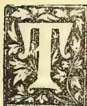

HE present number of the *Agricultural Magazine* begins a new volume. With the issue of the last number, the publication completed the 12th year of its existence, and is therefore now entering

upon its 13th—a good age for a Ceylon Magazine. There may be ventures of a similar character that have been carried on for longer periods, but we fear that these will be found to have passed through occasional seasons of hibernation, while our own monthly has appeared for a dozen years without a break. A bound collection of past volumes should, to the local agriculturist, prove as full as the proverbial egg; and in saying this we make no boast to ourselves, though we would wish to impress upon those for whom we labour (with no recompense to speak of) that they are bound to learn much and to derive much help by taking in the *Agricultural Magazine*, the subscription to which is the modest sum of Rs. 3 per annum. We have endeavoured with each new volume to increase the usefulness of its contents to our readers, and we hope to make the present volume still more useful by furnishing information on home industries and practical hints connected therewith, in addition to papers concerned with practical Agriculture and Horticulture.

We take this occasion, on the opening of a new volume, to thank our contemporaries for their kind countenance and our readers for their support and encouragement.

THE EDITOR.

## RAINFALL TAKEN AT THE SCHOOL OF AGRICULTURE DURING THE MONTH OF JUNE, 1901.

<table style="width: 100%; border-collapse: collapse;">
<tbody>
<tr>
<td>1</td><td>Saturday</td><td>..</td><td>·05</td><td>17</td><td>Monday</td><td>..</td><td>·21</td>
</tr>
<tr>
<td>2</td><td>Sunday</td><td>..</td><td>·15</td><td>18</td><td>Tuesday</td><td>..</td><td>·25</td>
</tr>
<tr>
<td>3</td><td>Monday</td><td>..</td><td>·07</td><td>19</td><td>Wednesday</td><td>..</td><td>·04</td>
</tr>
<tr>
<td>4</td><td>Tuesday</td><td>..</td><td>·01</td><td>20</td><td>Thursday</td><td>..</td><td>Nil</td>
</tr>
<tr>
<td>5</td><td>Wednesday</td><td>..</td><td>·23</td><td>21</td><td>Friday</td><td>..</td><td>Nil</td>
</tr>
<tr>
<td>6</td><td>Thursday</td><td>..</td><td>·03</td><td>22</td><td>Saturday</td><td>..</td><td>·02</td>
</tr>
<tr>
<td>7</td><td>Friday</td><td>..</td><td>·36</td><td>23</td><td>Sunday</td><td>..</td><td>·07</td>
</tr>
<tr>
<td>8</td><td>Saturday</td><td>..</td><td>1·53</td><td>2</td><td>Monday</td><td>..</td><td>·21</td>
</tr>
<tr>
<td>9</td><td>Sunday</td><td>..</td><td>1·11</td><td>25</td><td>Tuesday</td><td>..</td><td>·47</td>
</tr>
<tr>
<td>10</td><td>Monday</td><td>..</td><td>Nil</td><td>26</td><td>Wednesday</td><td>..</td><td>·89</td>
</tr>
<tr>
<td>11</td><td>Tuesday</td><td>..</td><td>·03</td><td>27</td><td>Thursday</td><td>..</td><td>·11</td>
</tr>
<tr>
<td>12</td><td>Wednesday</td><td>..</td><td>Nil</td><td>28</td><td>Friday</td><td>..</td><td>Nil</td>
</tr>
<tr>
<td>13</td><td>Thursday</td><td>..</td><td>Nil</td><td>29</td><td>Saturday</td><td>..</td><td>·01</td>
</tr>
<tr>
<td>14</td><td>Friday</td><td>..</td><td>Nil</td><td>30</td><td>Sunday</td><td>..</td><td>Nil</td>
</tr>
<tr>
<td>15</td><td>Saturday</td><td>..</td><td>Nil</td><td></td><td></td><td></td><td></td>
</tr>
<tr>
<td>16</td><td>Sunday</td><td>..</td><td>·99</td><td></td><td></td><td></td><td></td>
</tr>
<tr>
<td colspan="6"></td>
<td>Total..</td>
<td>6·79</td>
</tr>
<tr>
<td colspan="6"></td>
<td>Mean..</td>
<td>·21</td>
</tr>
</tbody>
</table>

Greatest amount of rainfall registered in 24 hours on the 8th inst. 1·53 inches.

Recorded by C. DRIEBERG.

## OCCASIONAL NOTES.

The *Queensland Agricultural Gazette* refers to the decision of the Ceylon Government to carry on agricultural work through rural schools with connected school gardens as "a step forward." Let us hope that the progression will continue.

The village industry of desiccating the pulp and seeds of the jak fruit is larger than is generally supposed; in fact, though most people are familiar with the jak nuts that have been dried and stowed away in sand—treatment which permits of the seeds being kept for future use, and which at the same time improves their flavour—few have probably seen the sun-dried pulp (dried with or without previous boiling) which is a convenient form of reserve food to be soaked and cooked (like apple chips) whenever required.

85------------------------------------------------

66Supplement to the "Tropical Agriculturist."[JULY 1, 1901.

There are many parts (such as the Kesbewe district) in which the industry is common, and where it is found to be rather a profitable business. We have been informed that when jaks are plentiful they sell for 3 cents (equivalent to a  $\frac{1}{2}$ d.) each, and that in seasons when they are scarce the dry stuff fetches as much as 6 cts. per lb., and jak fruits may weigh anything from 6 to 60 lbs.

Among our latest visitors from abroad (and there are many that call at the Colombo School of Agriculture—now, alas! only so in name) was Dr. F. Stuhlmann of German East Africa, who has lately been touring in India, Java, and the East generally. The doctor is a most interesting personage, and has a fund of information to entertain one with, not merely regarding his own African experiences—botanical and agricultural—but also with reference to the various countries he has been so fortunate as to visit with a view to studying their economic conditions. We are making a fairly representative collection of the vegetable products of the Island which Doctor Stuhlmann wants for a museum in which he is interested.

An Australian exchange in taking over an article on the composition of Indian cows' and buffaloes' milk remarks that some information regarding the quantity of milk yielded by milch buffaloes would be desirable. In north-west India the buffalo as a milk animal is found at its best. Mr. Mollison, late of the Poona Farm, in his paper on the Management of Dairy Cattle in India, speaks of buffaloes "giving over 30 lbs. of milk per day (a quantity sufficient to make 3 lbs. of butter), and of an average animal yielding 18 lbs. per day while suckling her calf. In his report on the Poona Farm for 1893, the same authority records that the best buffaloes yielded during the period of lactation (371 days) 6,959 lbs. of milk, and the worst (during 227 days) 1,971 lbs." This will give some idea of the milking capacity of the Indian buffalo. At the time of our visit to the Poona Dairy in 1893, the best buffalo was giving 36 lbs. per day.

In this connection it would be interesting to compare the yield of certain animals at the Allahabad Dairy Farm. In a recent account of a visit to this institution mention is made of a buffalo giving 32 seers of milk (a seer = 2 lbs.) equal to 5 lbs. of butter per day, and of a cow of the Hansi breed yielding 26 quarts of milk per day. We shall say more about the Allahabad Dairy and its successful work in another issue.

Mr. George Weerakoon, Mudaliyar of Wella-boda Pattu, Matara, draws our attention to the reported extraordinary flowering of the bamboo in Central India. The area over which the flowering extends is estimated at 1,200 sq. miles, and with the exception of a few isolated clumps the flowering is said to be universal. The extraordinary point is that clumps of all ages are seen in flower. Last year, it is said, the drought brought about flowering in the Dhaba

Range of this district, where the bamboo produced a kind of manna, the seeds keeping thousands in food for some weeks; so that this year it is expected that the entire population will flock, in a short time, to gather the seed. To the people in the vicinity it is said the result of flowering will be serious owing to the impending death of the bamboos. The oldest inhabitants recall the gregarious flowering of bamboos over fairly large areas some 60 years ago, a circumstance which points to the not unlikely fact that the bamboo found in the district flowers at intervals of about 30 years.

Mr. Weerakoon states that he remembers seeing a sample of the bamboo seed brought from Bintenne in the Badulla district some 35 years ago. The "paddy" as well as the "rice" resembled the products of *oryza sativa*, and in taste resembled el-wi or hill paddy. It would be interesting, as our correspondent remarks, to ascertain from Bintenne how often seed has been produced since then, and if it is procurable at present. We trust some of our readers will give the desired information.

Since writing the above we find a reference to the extraordinary flowering of bamboos in the last (June) number of the *Indian Agriculturist*. The approximate area over which the flowering is taking place is put down at "75,000 acres extending 50 miles from North to South, along belts 3 to 8 miles broad." Cart loads of bamboo grain are now seen plying along the roads, and no action is taken to arrest collection by the natives, as the deficiency of rain has produced scarcity of ordinary food grains, while this same drought has no doubt brought about the seeding of bamboos. The flour is either mixed with "Jowari" (*Sorghum vulgare*) or eaten by itself after preparation into flour cakes. It is considered nutritious by the natives, but it would be interesting to ascertain (as we hope to do) its chemical composition, and its true value as food.

#### MORE ABOUT AGRICULTURAL EDUCATION FOR COUNTRY DISTRICTS.

In the April number of the *Queensland Agricultural Journal* Mr. F. W. Teck deals with the question of Agricultural Education for our country districts, and many of the arguments in his paper apply forcibly to local conditions.

It is no wonder, says the writer, that with the conditions of life as it is generally found among the cultivating classes, our young country folk get dissatisfied with their isolated position and crowd into towns where life is made to appear more pleasant if not so healthy and independent. The pleasures of a town life and the alluring fixed period of work per day tend to attract the sons of the soil, who should be brought up to have a stronger liking for agricultural pursuits by better systems of education and by practical teaching. And how, it is asked, are the children of the rural districts brought up? As soon as they are old enough they are expected

86------------------------------------------------

JULY 1, 1901.]Supplement to the "Tropical Agriculturist."67

to follow in the old-fashioned ways, the old "Jig-Jog" of their parents, while the school teacher has to do all he can to prevent their absence from school. But what little is learnt in the school is soon forgotten, and that little is of small service to the rustic. No difference is made between the teaching in town and in country schools in the midst of agricultural districts. Nothing is done to meet the difficulties in which the people of these latter districts are placed. The system of teaching and the curriculum laid down by educational authorities are undoubtedly good, but so far as our country districts are concerned, are susceptible of much improvement, as the curriculum is more applicable to town children. What is desired is an education in our country schools by which children may be instructed in such matters as have a bearing on their every day life. The writer suggests the introduction of a series of Agricultural Readers, forming a continuous upward course of instruction. These, he says, would be of great value, while being attractive and interesting.

Again, the writer, recommends object lessons and cultivated school plots for the teaching and practical illustration of the rudiments and elementary science of agriculture. It is also suggested that prizes should be offered for the best-kept home or school garden and for essays on subjects of agricultural and rural importance. Though he is ready to admit that he may not have hit upon the best methods of teaching, he believes that the general outlines he has traced would be most suitable for the children's calling in after life. It will no doubt be stated by those engaged in teaching and those connected with the educational staff that there is no room for teaching agricultural subjects, the daily routine of work being already crowded and the teacher's time taxed to the utmost. Granted, but are there not some subjects that could be easily dispensed with in country schools, especially during the later years of school life when the system of practical instruction should take the foremost place in the curriculum? One of England's greatest statesmen is quoted to have said "the successful pursuit of Agriculture demands the exercise of a broader intelligence than any other calling." But do our educational arbiters recognise this fact at all?

### COCONUTS.

*The Benefits of Mulching.*—Mr. J. T. Last, F.R.C.S. writes as follows upon the benefits of cultivation as he has found them at Mangapwani:—"There are at Mangapwani about 300 bearing palms from which the nuts are gathered every three months. About three years ago I had the ground well dug up for some six feet round the base of each tree, and then packed round the tree any manure, grass or vegetable matter I could get, covering the same up with soil. This has been repeated every year. The result of these operations is that the number of nuts gathered has greatly increased.

*Yield of Nuts.*—Formerly the three-monthly gathering would average about 3,000 nuts, now more than double that amount is obtained. The

last gathering reached the number of 7,033. Since I started mulching the trees there have always been one or more trees at each three-monthly gathering from which I obtained 100 nuts. At this gathering 110 nuts were gathered from one tree, 100 from two, 91 from one, 89 from one, 86 from one, and 80 from one, making a total of 656 nuts from seven trees.

I think, judging from the above results, we could fairly expect that with proper attention a healthy full-grown coconut tree will produce 100 nuts a year.

*Coconuts in Zanzibar.*—The average yield of nuts in Zanzibar Island is from 25 to 30 per tree. Calculating the price at Rs. 20 per 1,000 and the yield at 30, there will be a gross return of 93 annas per tree. Gathering may be set down at Rs. 4 per 1,000, which leaves a net return of about 7½ annas or half a rupee per tree.

Pemba trees yield less, the average being probably less than 15 nuts per tree per annum. But labour is cheaper and cost of gathering less, about Rs. 3 per 1,000; so that the net return works out about 4½ annas per tree.

*Planting Nuts.*—Dr. Krapf in his Swahili Dictionary has the following note:—"The natives plant the coconut on the 14th day of the moon, because the moon is then at her full power. This takes place before the rain. They take care that the bud is placed downwards in the pit which is dug to the depth of a cubit. The tree (like the mango) requires five years' growth before it bears fruit.

The generally accepted way of planting a nut is to lay it on its side in a trench about 7-8 inches deep (its own depth.) It has been rightly pointed out that if a nut be planted eyes downwards, the young shoot may rot before it reaches the surface; on the other hand if planted eyes upwards the milk inside, which is especially provided for the first nourishment of the germ, will settle at the bottom of the nut and the young shoot will then run a risk of being dried up. Nature seems to have especially pointed both ends of the nut so that having fallen from the tree it shall remain upon its side to germinate. In the case of the mangrove the young seedling drops from the parent tree upon its pointed end and sticks in the mud and grows forthwith. But the bottom of the coconut could not have been pointed to enable it likewise to stick in the sand and germinate, because a nut always falls upon its side. This is well shown by dropping a few nuts from the roof of a high house. If the nut is suspended by the stalk, in the way it hangs upon a tree, and dropped, it will turn half over and fall sideways. The same thing happens if the nut be held upside down. If it be held horizontally it will maintain this position till it reaches the ground. Nature is always a safe guide. Allow a space of nine inches or a foot between the nuts in the trench, and 18 inches between the trenches. This gives plenty of room to lift the nuts when the time comes for them to be planted out, without doing much damage to the roots. April is the best time to plant out the seedlings, when they should be 5 or 6 months old. Hence the nuts should be planted in the nursery in November. But no hard and fast rule need be laid down, especially as our

87------------------------------------------------

68Supplement to the "Tropical Agriculturist."[JULY 1, 1901.

seasons are uncertain. 35 feet by 35 feet is a good distance for them to be placed in the plantation. This gives 35 trees to the acre.

[The above notes are culled from *The Shamba*.—Ed. A.M.]

## MILKING.

[The following interesting Prize-essay on milking was written by Mr. J. Petersen, of Dalum Agricultural College, Denmark, and translated for the Cape Colony Agricultural Journal by Mr. Arthur Muller of Clare College, Cambridge]:—

### CHAPTER I.—INTRODUCTORY.

The udder is, from the point of view of the milker, the most important part of the cow. That a proper use develops the living instrument is a maxim that applies to the udder of a cow as well as to a multitude of other things.

That use develops the instrument is easily shown by example. A workman knows that unusual labour causes a strain at first. The sower feels tired in his right arm, the harvester tired in the back, the milker tired in his arms and hands, etc., but before long they accomplish the one-sided work without feeling much strain or tiredness. Only the use which causes considerable exertion brings on further development. The way to exert the udder is to milk it completely dry. The milker should imitate the greedy calf, which sucks the last drop of milk out; this causes a greater flow of blood to the glands of the udder, and it is from the blood that all material for further development and for the forming of more milk must be sought.

It is in the above facts that one finds an explanation of the case (so common in Denmark) of the agricultural labourer's wife getting quite a lot of milk from her cow, which on a large farm would be found useless for the dairy. Whoever undertakes milking should certainly know the above facts.

### CHAPTER II.—HOW TO MILK.

The object of milking is to empty—as completely as possible—all the milk present in the udder, and in such a way that the cow finds it a pleasant sensation, and that the milk is kept clean.

The cow is by nature meant to nourish its young. We ought therefore to learn from the calf. The latter does not suck its mother in a brutal manner; on the contrary, it knows by instinct that if it wants milk it must behave properly. Therefore it never grabs a teat at once, but asks, by touching the belly and then the udder, if it may.

The milker ought to begin by speaking kindly to the cow, patting it, and afterwards with the back of the hand rubbing it gently on the belly and udder. By this means one not only puts the cow into a good temper, but the rubbing helps to get rid of loose hairs, scales and dust, etc., which otherwise easily find their way into the milk pail.

Next the milk pail is placed under the udder (always on the same side of the same cow), and the work is begun by catching hold round both the front teats with the whole hands. The hands are now in turn moved up against the udder with a gentle pressure, and they are then closed slowly and softly (likewise in turn) about the teat, the

closing beginning at the top and extending downwards.

These gentle movements should be continued until one notices that the cow lets the milk "come." The milk must now be emptied out in long unbroken jets by means of the same movements of the hands as before, but applied with more vigour than at the beginning. For every fresh grip the hand ought to exert a new pressure up against the udder, while at the same moment the first finger and thumb should grasp that portion of the udder which lies exactly above the teat. During this part of the milking the conscientious milker ought to fix the whole of his attention on his work, since *every interruption means a loss of milk*. Hence all loud talk or noise, which disturbs the cow as well as the man, is to be strictly avoided. A good enlivening song need not, however, be out of place.

When the front teats give no more milk, the work is carried on—without the preliminaries of patting, rubbing and so on—in the same way as regards the back teats.

The milk must be *squeezed*—not dragged—out of the teat. The teat should therefore be grasped with the whole hand, and the latter must not slide up and down the teat more than necessary. The sort of milking which is carried out by grasping the top of the teat with the thumb and first finger or thumb and second finger (the latter is the worse) and then pressing the fingers together and dragging them down the teat, is very bad indeed. The cow does not like it since it irritates the skin on the teat, and easily causes sores, and it is really much harder work for the milker.

In the case of those heifers, however, whose teats are too short for the whole hand to grasp them, the fingers must of course be used.

The milking is not over, even when the back teats (or the last milked) give no more milk. *A vigorous second milking must now take place*. After one has again changed a few times from the first milked to the last milked teat and back again, the udder must be thoroughly "worked" by means of gentle handling and afterwards the last drops of milk must be squeezed out of the teats.

Here we could also learn from Nature. Look at the lamb, when it sucks! See how it pushes its mother's udder when the teat gives too little milk.

The little pig also can be seen poking its mother by means of its soft snout, so as to get all the milk possible.

One would almost think that they found the last milk sweeter than the first! So they no doubt do, as it has been proved by a number of investigations that it is *by far* the richest.

If the first half pounds of milk are mixed (equal amounts being taken from the four teats) from each of say 40 cows, the 20 pounds of milk thus collected will as a rule not even produce half a pound of butter.

But if in the same way one were to collect the last half pounds, which after inadequate milking can still be worked out of the udders of the same 40 cows, nearly 2 pounds of butter can be got out of the 20 pounds of milk.

Any milker can roughly prove this for himself. Collect the first jet from a teat in a small glass,

88------------------------------------------------

JULY 1, 1901.]Supplement to the "Tropical Agriculturist."69

and the last jet (or the last drops) which can be squeezed out of the same teat in another glass. Place the two small glasses in a cool place; and after 24 hours it is astonishing to see the great difference there is in the layer of cream. The first milk is only good skimmed milk, while the last is nearly their cream. Getting out all the possible milk is therefore of importance not only for the development of the cow's power of giving milk, but also for obtaining rich milk. Thus the milker who does not take sufficient time to milk the cow quite dry, either does not know her or his work, or is not carrying it out conscientiously.

After the milking is finished the cow should again be patted in a soothing way, and a kind word may again be said to her. The milker should always keep an eye on the state of health of the udder and teats. If swellings or lumps or tenderness in the udder, sores on the teats or blocked milk channels are observed, or the milk looks unnatural (for example, lumpy, reddish, etc.), the owner or other responsible person should be at once informed.

As disease of the udder and teats are often infectious, such cows should always be milked last, and the milk from the diseased udder should be carefully put in a separate pail and thoroughly disinfected (and then thrown away, of course) or thrown away where it cannot spread the infection.

The milk canal inside the teat is occasionally very narrow or has a frequent tendency to get blocked. To make use of a straw or such means to clear it, is very wrong, as it can set up inflammation in the corresponding gland. A teat with a blocked milk canal should be rolled gently between the hands held out flat and then carefully milked.

After the first calf the heifer is apt to feel tender and hence inclined to object the milker's touch. This tenderness lasts, in a few cases, to the later years. In such cases one must set about milking with even greater gentleness and care. Nothing but kindness should be used unless the cow is very "wicked."

To milk quite dry, as a means of milk-giving power to a cow, is especially important in the case of a heifer after its first calf; since it acts with even greater power on the heifer than on the older cow.

It would be a good thing if every milker was provided with two smocks of washable material, one being always in the wash or clean, so that a clean one may be put on at least once a week. As one ought to milk with bare arms, these blouses should have short sleeves and be made so that they can easily be slipped on over the ordinary dress.

In wet weather, when milking is done out of doors, a waterproof cloak is almost a necessity. It should be a point of honour for the milker to see that all pails, etc., in which the milk is collected should be absolutely clean. This scrupulous cleanliness is of course a necessity. The pails, etc., are best made of tin-plated steel and must not be allowed to rust.

Complete cleaning is best and most easily done as follows:—Immediately they are finished with, the pails are washed with two or three lots of cold water; afterwards they are completely covered both inside and outside with thick lime water,

then scrubbed with cold water, rinsed and washed again two or three times in clean cold water, and finally in clean boiling water, and then allowed to drain dry in the open air; they must *not* be wiped with a cloth nor with anything else.

Be it morning, noon, or evening, the hands must be carefully washed before going to milking, and if the milking is done indoors one should also wash and dry the hands whenever they get at all dirty. For the sake of cleanliness it is best to milk with dry hands.

(To be concluded.)

## AGRICULTURE IN THE TRANSVAAL AND ORANGE RIVER COLONIES.

[The following reference to Agriculture in the Transvaal and Orange River Colonies is taken from a reprint of a lecture delivered by Prof. Wallace on Agriculture in South Africa, delivered at the Royal Colonial Institute on March 12th last. The reference should prove interesting at the present time when so large a number of the late inhabitants of these colonies is in our midst. We shall probably make further extracts from this interesting paper.—Ed. A.M.]

The Transvaal and the Orange River Colonies are grassy, pastoral, and essentially cattle countries. The area of the Transvaal is similar to that of France, while that of the Orange River Colony is less in the proportion of about 70 to 114.

Witwatersrand, or White Waters Ridge, is the watershed of two great river systems, being the highest surface traversing for about 300 miles, in an east to west direction, the elevated plateau of the "Hoogeveld" or High Veld of which the Transvaal forms a part. All the water to the north discharges into the Limpopo, the northern boundary of the Colony, and that to the south into the Vaal. The name Transvaal implies the position of the Vaal as the southern boundary. Johannesburg on the highest part of the "Rand," as it is curtly designated, is 5,735 feet above sea level (at Park Railway Station). To the north as well as to the south the elevation falls away pretty rapidly, so that Pretoria, the capital, only 35 miles to the north, is 1,600 feet lower, and Heidelberg, which is almost a like distance to the south-east, stands at only 4,900 feet. Kimberley, to the west of the Orange River State, has an elevation of 4,012 feet. The climate of Johannesburg is one of the coolest in Africa, the hot weather lasting for barely four months, while at Kimberley it extends to eight months in the year.

The high country—4,000 feet or upwards above sea level—occupies the southern section of the Colony.

North of this is the Bush-veld or bush country, at a lower level and having a warmer climate. In places it is broken by a series of hills, and it is covered with high grass, bush, and trees.

The south-eastern parts, including New Scotland, are especially suitable for sheep-breeding as well as for agriculture, the high central area for cattle and corn, the northern and lower elevations for coffee and sugar plantations and for tropical fruit

89------------------------------------------------

70Supplement to the "Tropical Agriculturist."[JULY 1, 1901.

culture. Good tobacco is largely grown in the Transvaal for export to other districts of South Africa. Maize, Kafir corn and other tropical or semi-tropical crops are grown in summer when rains are abundant.

In some parts, as near Pretoria, maize, the most extensively cultivated crop of all, only grows well on river banks, in the alluvial soil found there. European cereals suffer from rust and from hailstorms during the summer or wet season, and probably only one crop in five years could be secured. Oats are not so much injured as wheat. A variety known as the Sidonian oat, brought from Australia by way of Natal, is not affected by rust and is grown during summer. Planted in December and January, it is ripe in April and May. The Boer oat grows in suitable soils or where irrigation is possible during the dry season of winter.

Potatoes grow freely, and lucerne does remarkably well, and when planted in alluvial soil that can be irrigated during the dry weather, after frosts have disappeared, it can be cut as many as eight times in one year. Turnips and swedes, which suffer from the attacks of fungi, especially in a very dry season, do not always prosper, but mangels do better. Frosts are liable to do considerable damage, especially in the low-lying areas.

The high-veld plateau, healthy for cattle and sheep in summer, is too cold in winter when the grass is dry and hard, and the animals are moved off in May to the lower and warmer country, where sweet grass and shelter are both more abundant in the "Bankenveld," or terrace country to the eastern side of the Drakensberg range on the Natal and Swaziland borders, or to the north of the Magaliesberg mountains, to return in September after rain falls. The dry and withered grass on immense areas of the high-veld is burnt off during September, chiefly with the object of destroying ticks which swarm in countless myriads on cattle from land which has escaped burning. The ticks are then so numerous that the cattle cannot thrive, and moreover are liable to suffer from red-water or Texas fever. The periodical burning is of recent introduction, since ticks were brought into the country by "transport riders" (cattle-waggon carriers) from Natal, and the practice has so much injured the pastures that fewer cattle can now be kept than formerly on a given area, and the quality has also gone back in consequence.

Horses are bred on the high-veld, especially to the south-east, but they do not exceed more than two to five per cent. of the live stock. In Baustoland, the greatest horse-breeding centre of South Africa, they number from ten to twenty-five per cent. of the live stock. On the low ground of all the Colonies and other dependencies, and in the valleys even at considerable elevations, horses and also mules are subject especially during summer (February being the worst month) to uncertain and intermittent outbreaks of the deadly horse-sickness, a disease peculiar to South Africa. It is contracted by them at night when they are exposed in the open air. They take into their circulatory systems the germs of a filamentous fungus, *Edema mycosis*, of the form of a beer barrel,

which are carried by thin streaks of mist rising from the veld when climatic conditions are suitable for their propagation. About eight or nine days after such an exposure, or after eating grass from which the moisture deposited by the mist had not been dried up by the sun, very few affected animals escape death by suffocation induced by serum escaping into the air passages from the affected lung structure.

The Transvaal is now outside the area which is recognised to be affected by "tsetse fly," though at one time the river valleys, especially to the north and north-east, were included in it. The pest has disappeared from the whole of South Africa south of the lower area of the valley of the Limpopo and a comparatively narrow belt of coast country surrounding Delagoa Bay and terminating in the south at St. Lucia Bay.

The wholesale destruction of the large wild game, more especially the South African buffalo, has conferred this solitary advantage upon the country as a solatium for the injury which has thereby resulted.

A good deal of a mild type of malarial fever exists, especially in summer in the low and humid parts, but it is not confined to these areas. It was present at Pretoria when the waterworks were formed, on the surface of the hard dry land above the city being broken.

The country is well provided with springs of good water.

The Orange River Colony occupies the important area of high-veld lying to the south of the Transvaal. In the eastern part of the Colony the Drakensberg and subordinate ranges of mountains occur. The great breadth of the country is a rolling, grassy plain, with a general trend to the west and north-west. Like the Transvaal, it at one time grew coarse grass, and supported immense herds of antelopes and other species of wild game, very few of which remain. But now finer and sweeter grasses prevail, and the country is stocked chiefly with cattle and a few horses, and in certain places with sheep. From the higher and more exposed parts stock require to be removed to lower and more sheltered and more succulent pastures during winter. In what is known as the "Conquered Territory," to the south-east of the centre of the Colony, is the chief agricultural district, about 100 miles in length and 30 miles in breadth. The soil is rich and capable of growing good crops of cereals of all kinds, including wheat, without being manured or irrigated. It may be looked upon as a continuation of Basutoland—the granary of South Africa. Wheat produces 30 up to 80 fold even on land which has grown grain crops successively for a number of years. Farms usually range in extent from 1,000 to 3,000 acres, and the value of the land with buildings upon it is about £1 per acre. Considerable numbers of both sheep and cattle of improved types are bred in the district.

#### ABOUT MANGOES.

(Concluded.)

Mr. Knight certainly deserves the sincerest thanks of all mango growers for making known

90------------------------------------------------

JULY 1, 1901.]Supplement to the "Tropical Agriculturist."71

his process and experience. If others can achieve a like success we need not long have inferior mangoes in Queensland, for every bad tree can be converted into a good one. Mr. Knight says:—"It has been suggested that there is some room for improvements in our mangoes, and the writer is of that opinion also." Undoubtedly there is, and no time should be lost. Even in the West Indies, where so many fine kinds exist, it is thought desirable to import new strains from the East Indies. The following is from No. 24, *Trinidad Bulletin*:—"It has been thought advisable to import once more a number of selected varieties from the East, and to this end application was made to the Indian authorities for the best kinds from the various provinces, and cases of plants have been ordered from the Bombay, Bengal, and Madras Presidencies. It is almost certain we do not possess all the types of various strains of mango grown in the East, and although our number of seedling varieties is legion, yet it is probable the introduction of further East Indian kinds will be of great advantage in the endeavour to improve the strains now cultivated in the Western World."

We are not half as far from India as Trinidad is, and we have frequent and speedy steam communication. How much easier, then, for Queensland to get supplied than the West Indies.

When mango plants are next imported, a trial might be made of branches for grafting by Mr. Knight's method. He says:—"Experiments have proved beyond a doubt that sections of the mango-tree will keep good for grafting purposes from three to six months' time, according to variety and to the constitution of the tree from which they are obtained. This gives us the opportunity to import sections of the most desirable class of tree from any part of the globe with a certainty of their growing when properly prepared and tied on."

May not Mr. Knight be induced to go to India and procure a quantity of branches and plants of the choicest varieties? His doing so would be an inestimable boon to Australia. Branches in Wardian cases or simply in boxes having holes perforated at the sides near the top to admit air might easily be imported. I have in this way received fruit trees from California in first-rate condition, all of which grew; indeed, they could not have been better had they come from Sydney or Melbourne.

I have heard it remarked in Melbourne and in Sydney, "You Queenslanders keep your good mangoes for yourselves and send us your rubbish." My reply was, "This is not so; you have much the same mangoes as are sold in our shops, most of which are poor." Those who make mango growing a business should bestow particular attention on the keeping properties of their fruit, as well as excellence in other directions; also to careful grading and packing. Greater care should also be taken in transit. I have seen cases standing on their side and on end, and very roughly handled. This, I must say, has not been in our market. The carriage of mangoes long distances is a problem that is not yet been satisfactorily solved. I have eaten mangoes in London

from the West Indies, and in New Zealand from the Islands; they were wretchedly poor. The cause was probably owing to the necessity for picking them unripe.

I noticed on a visit to the market recently quantities of mangoes being sold by auction; 3s. per case was the highest price realised. I saw a couple of hours afterwards, at a fruiterer's, two cases, for which he informed me he had paid 7s. a case. They were certainly a very fine sample, in excellent condition, fairly large, clean, and not over-ripe; he was confident they would keep good a week or more if necessary; he expected to realise 2d. each for all of them. This is an instance of how desirable it is to cultivate only good varieties.

There are various points that go to make a good mango—on the outside, size, form, colour and texture of skin; inside, freedom from fibre, size of stone, and, most important of all, flavour. It is very rare to find all these conditions in the same fruit. The finest-flavoured mango I ever tasted was at the Island of St. Helena, South Atlantic; but it possessed no other condition of excellence, the price it realised was one shilling each. This and other fruit trees were brought to the island by Captain Bligh in H.M.S. "Providence" from Timor and the South Seas in 1792. I never saw a handsomer mango than one grown at Wickham terrace; it was entirely free from fibre, but had an enormous stone, was destitute of flavour and otherwise worthless. In marked contrast was one produced here, of fine form and colour, and without a blemish. It weighed 18 oz., the stone  $\frac{3}{4}$  oz.; it was quite free from fibre, and of delicious flavour. The tree is a shy bearer, and is this year without fruit. The specimen described was exceptional, the next being a bad second in size, though equal in other respects.

The nomenclature of mangoes seems to be in a hopeless state of confusion. This is greatly owing to the immense variety we have, and to our ignorance on the subject. I have seen several distinct kinds called the "Bombay." As well may we speak of the strawberry as the "London," simply because it originally came from London, or an apple the "English" because it came from England. Eight or nine distinct varieties are known as the "Apple" and as many as the "Strawberry," though why they are so named it is difficult to tell. They do not resemble the apple or strawberry in appearance, flavour, or anything else. Mr. Parker, who has given considerable attention to the cultivation of mangoes, has this season been fortunate in producing a new variety; it is of peculiar form, fairly large, of good colour, free from fibre, small stone, and of excellent flavour. The mango is so good that it is thought worthy of being named "Bobs."

## FIRST STEPS IN AGRICULTURE.

*First Stage—2nd Lesson.*

BY A. J. B.

In our last lesson I explained to you the necessity of ploughing and otherwise working the soil, which work is included in the word "culti-

91------------------------------------------------

72Supplement to the "Tropical Agriculturist."[JULY 1, 1901.

vation." You know that the farmer is not always ploughing his land. If he were to do nothing else but plough, he would not be able to sow any crops. There are certain times and seasons when ploughing has to be done, and there are seasons when the farmer and his men attend to other work.

You are not too young to understand why some crops grow best during the winter and others during the summer. I will therefore give you a short lesson on what I will call the "seasonable" work on the farm.

There are few Queensland children who do not know what maize is; only they know it by the name of "corn." Well, maize does not like cold weather. On a right frosty morning you like to get near a good fire, or, if you go out, you like to have a warm coat on. But a maize plant or a sugar-cane plant has no warm coat to protect it from the cold, so, if either of them happen to have been planted at a wrong season, its tender green leaves exposed to the frosty air of night become frost-bitten, and the whole plant dries up when the hot sun shines on it, and it withers away. Then, such plants as cauliflowers and cabbages love the cold weather, and if they are planted out of their season—that is, if they are exposed to the blazing heat of our summer—they will not thrive, and the greatest care has to be taken to make them grow at all. Then, again, the climate of Queensland changes. If you live away in the far North—at Cairns, Cooktown, or Thursday Island—you find that the weather is very hot almost all the year round; so it is on the coasts of the Gulf of Carpentaria, which you see on your map. But up on the country above the Main Range it is very cold in winter, even at Herberton in the North. So you see that all over Queensland the farmers have to remember the climate they live in, and so arrange the time for ploughing and sowing. On the Darling Downs they begin sowing the wheat in April—that is, in autumn. Then the wheat, which loves the cool weather, comes up, and if it gets sufficient rain at the proper time the farmer will expect a good crop, unless something happens which you will hear about in a future lesson.

The maize crop, on the contrary, loves the hot weather, so the farmers plough their corn land in July and August—that is, in the winter—and, as soon as there is no more fear of frost, they sow the maize, and soon the fields are covered with the beautiful dark-green maize plants, which produce their golden cobs in the height of summer.

Now, here is an easy lesson for you to learn. Remember that all the common vegetables—such as cabbages, cauliflowers, carrots, turnips, and many European vegetables—are best grown during the cold winter weather; and that sugar-cane, rice, yams, maize, melons, pumpkins, and other, what are called tropical, plants must be grown during the hot months of summer.

I told you that the farmer is not always busy ploughing the land. When his crops are sown, he has to keep the weeds down for the reasons I gave you in your first lesson. So he stops ploughing and cultivates the soil among his grow-

ing crops in order to supply them with plenty of plant food.

Then by and by his time is occupied with gathering in the harvest. In November he is busy harvesting his wheat and barley crops. In December and right up to April and May he pulls his corn. Then he has to dig his potatoes twice in a year, besides gathering vegetables. And again he has fields of lucerne to cut and turn into hay. And so, all the year round, each season brings its round of duties, and the farmer who does not watch the seasons, and who does not plough, sow, and plant at the proper time, will lose a great deal of time and money.

Now, having explained to you the necessity for watching the seasons, you can easily understand how a farmer may lose a great deal by ploughing and sowing too late. If he puts in a crop in June which should have been sown in April, he is a bad farmer, and almost deserves to lose his time and reap a bad crop. And if he is too great a hurry and hopes to get his crop out before his neighbour, and so plants in April instead of in August, he is just as bad a farmer, and can blame nobody but himself for his want of success.

Before we finish this lesson, I must tell you that all soils, although close to each other, are not alike. I may have a farm of which the soil is rich, and deep, and warm, and sheltered from cold and violent winds. My neighbour's farm has a stiff, cold soil exposed to the strong winds. If my neighbour and I were to cultivate our farms in exactly the same way, one of us would be doing wrong, and would suffer for our want of knowledge. If his farm is wet and cold, he must do something to the soil to get rid of the wet, and to warm it. If mine is too dry and too light, I must do something to retain the moisture and to make the land less loose and porous. So you see that every farmer has to learn what to do to his land so that it may yield him good crops.

Here are eleven more questions, the answers to which you can supply from what I have just told you.

*Questions on Lesson 2.*

1. 1.—Why does the farmer not spend all his time in ploughing the land?
2. 2.—Name the seasons.
3. 3.—What is meant by seasonable work?
4. 4.—Name any plants which thrive best in hot weather?
5. 5.—Name some that grow best in winter?
6. 6.—Name the warm and cool portions of the colony?
7. 7.—In what months does the farmer plant sugar-cane, sow rice, maize, wheat, barley, and kitchen vegetables?
8. 8.—When does he begin to harvest maize and wheat?
9. 9.—Why should the farmer watch the seasons?
10. 10.—Is the soil on all farms of the same quality?
11. 11.—Describe two different kinds of soil?

*(To be continued.)*

92------------------------------------------------

# \* The TROPICAL AGRICULTURIST \*

## ∞ MONTHLY. ∞

XXI.

COLOMBO, AUGUST 1st, 1901.

No. 2.

### BASIC SUPERPHOSPHATE: ITS PREPARATION AND USE AS A MANURE.

BY JOHN HUGHES, F.L.C.,

*Reprinted from the Journal of the Society of Chemical Industry, 30 April, 1901. No. 4. Vol. XX.)*

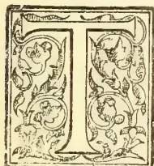

THE manufacture of superphosphate in this country may be considered to have commenced in 1842, when the late Sir John Bennett Lawes, F.R.S., obtained a patent for treating ground mineral phosphates with sulphuric acid.

The chemical theory then enunciated may be briefly expressed, namely, that the agricultural value of phosphate manures depended upon the extent to which the phosphoric acid they contained was rendered soluble in water through the aid of sulphuric acid.

It was contended that this solubility in water insured the most complete diffusion through the soil that could possibly be obtained, and this theory in itself is still regarded as correct.

At first the treatment of ground coprolites with commercial sulphuric acid was carried on in a cautious manner; only a portion of the phosphates, amounting perhaps to 20 per cent., was converted into what was known as soluble phosphates; and frequently as much as 8 to 10 per cent. was still left as undissolved phosphate.

The manure so produced was in an excellent dry condition. Indeed in those days complaints respecting damp condition were of rare occurrence.

When acid, however, became cheaper, as the result of improved manufacture, and as competition increased, the utmost amount of soluble phosphate was got out of the manure, so that only 2 or 3 per cent. of phosphate was left in a condition not soluble in water.

Superphosphates then became damper and more acid, so that complaints respecting the condition were of frequent occurrence, because the farmer could not obtain uniform distribution from the manure clogging in the drill.

Superphosphate when first introduced was chiefly applied as a manure for root crops, such as turnips and swedes, which were usually raised on good arable land containing a fair quantity of lime.

Indeed as early as 1863 the late Dr. Augustus Voelcker, writing in the journal of the Royal Agricultural Society upon "Phosphatic Manures for Root Crops," writes:—

"Superphosphates of lime applied to root crops has a different practical effect on different soils.

"The more rapidly and completely the soluble phosphate in commercial superphosphate and turnip manures is precipitated and rendered insoluble in the soil, the more energetic will be its effect upon the turnip crop.

"Purely mineral superphosphates fail to produce good turnip crops on light sandy soils.

"Bone dust partially dissolved by acid is a better manure on light soil than a purely mineral, superphosphate.

"It has indeed been observed that the exclusive use of superphosphate, however beneficial it may be in the majority of instances, has in some soils led to complete or partial failure or the presence of disease in the turnip crop.

"The reconversion of soluble into insoluble phosphate perhaps may appear undesirable, but in reality it is not only beneficial, but absolutely necessary to healthy and luxuriant development both of turnips and of all other crops to which superphosphate is applied.

"No acid combination as such can enter into plants without doing them serious damage; even free vegetable acids, such as humic and ulmic acids,

93------------------------------------------------

74

THE TROPICAL AGRICULTURIST.

[AUG. 1, 1901.

are injurious to all crops cultivated for food for the use of man or beast: and unless these acids, which are always present in what practical men call sour humus, are neutralised by lime, or marl, or earth, none but the roughest and most innutritious herbage can be grown.

"Free mineral acids are, I believe, still more injurious to all farm crops, and perhaps to all plants, than the free organic acids that are found in humus.

"A very dilute solution of sulphuric acid—say 1 part in 1,000 of water—may be used with advantage for killing grass in gravel walks made with flint or quartz sand; after one or two applications the weeds will be destroyed and will not reappear for a long time.

"But if the walks are made with limestone gravel, the application of a much stronger acid has little or no effect on the grass or weeds; after some time the latter indeed seem to grow all the better for having had a taste of dilute sulphuric acid.

"In reality, however, no acid enters these plants, but on coming into contact with the limestone gravel unites with the lime to form that useful fertilizer sulphate of lime or gypsum."

The above paragraphs express the opinion of one who was rightly regarded as an authority upon the properties and application of artificial manures.

In 1875 the Aberdeenshire experiments, conducted by Professor Jamieson, were instituted, and continued for some years.

The published results excited much interest, for they demonstrated by actual field experiments that insoluble, or more properly termed undissolved, phosphates, if applied in a finely ground state and in sufficient quantity, were of very considerable value as a manure, whereas according to the previously held theory they were supposed to possess no practical value at all.

Further, these experiments proved that on certain soils ordinary soluble phosphate, that is to say, phosphate of lime rendered soluble by acid, was not superior in its action to undissolved phosphate to anything like the extent that had hitherto been generally supposed.

Not unnaturally, these results, being opposed to the theory hitherto held, excited a considerable amount of hostile criticism, which, however, time and more extended enquiry has proved to have been unreasonable.

The experiments were carried out at five stations situated in different parts of the country, and the soils are described as being black mould resting upon a granite subsoil, and the analyses show that in every case they were specially deficient in lime.

The figures for lime at these five stations being respectively 0.08, 0.17, 0.21, 0.33, and 0.38 per 100 parts of the dry soil.

Such soils were, in fact, exactly those upon which soluble phosphate, as supplied by superphosphate, would not be likely to exert its full benefit, while the vegetable acids present in the black mould would be certain to dissolve the finely-ground mineral phosphate to a very considerable extent.

In short, the conditions were most favourable to the action of dissolved phosphates.

About the year 1883 the now well-known Thomas phosphate powder, prepared from basic slag, was introduced to the agricultural world as an entirely new manure.

At first, agricultural chemists of high repute were disinclined to place any agricultural value upon this material, which was really only the refuse in the manufacture of iron from ores which, by reason of containing much phosphorous and silica, required additional lime to be specially added to remove the same.

Little by little, however, farmers were induced to take small quantities for trial, chiefly on their old grass lands, and the practical results were so good on certain soils, rich in vegetable remains but

poor in lime, that scientific authorities were soon compelled to recognise the value of this manure when applied to suitable soils.

In this country the importance of fine grinding has been fully recognised as a test of the probable manurial value; but in Germany Prof. Paul Wagner of the agricultural station of Darmstadt has insisted upon the solubility in citric acid as a further test of probable manurial value, and it is to be hoped that the attention recently directed to this test by Mr. F. J. Lloyd will accentuate the importance of adopting some such additional test, rather than to confine the examination to a statement of the total phosphate of lime and the fineness of the grinding.

The author, however, had already adopted this citric acid method of testing the probable manurial value; but instead of employing the 2 per cent. cold solution of citric acid used by Wagner, or the 1 per cent. cold solution recommended by Dr. Bernard Dyer in his paper "On the Determination of probably available Mineral Plant Food in Soils" (Journal of the Chemical Society, 1894), he prefers to use a solution very much weaker, and in his opinion more nearly resembling the acidity of soil water.

The solution employed is 1 in 1,000, namely 1 grm. of citric acid to 1 litre of cold distilled water, taking 1 grm. of the slag or ground phosphate, and allowing the same to be exhausted with occasional stirring for 24 hours.

On referring to Table I. the relative solubility of five different kinds of ground phosphate is compared with that of basic slag.

The Peace River, with a fineness of 93.61, shows the highest figures for phosphoric acid dissolved out, namely 9.90 as against 8.70 in the basic slag; but as regards lime the latter shows 22.17 as against 15.23 in the former.

The French phosphate, specially rich in carbonate of lime, upon which the citric acid first acts, shows 15.34 of lime and only 2.85 phosphoric acid.

TABLE I.  
Solubility in a Weak Solution of Citric Acid  
1 grm. phosphate powder  
1 grm. citric acid  
1,000 c.c. cold distilled water.

Allowed to stand 24 hours, with occasional stirring; then filtered, the insoluble portion weighed, and the solution analysed.

<table border="1">
<thead>
<tr>
<th></th>
<th>1 French</th>
<th>2 Algerian</th>
<th>3 Florida</th>
<th>4 Tennessee</th>
<th>5 Peace River</th>
<th>6 Basic Slag</th>
</tr>
</thead>
<tbody>
<tr>
<td>Containing phosphate of lime per cent.</td>
<td>50.86</td>
<td>55.99</td>
<td>78.26</td>
<td>79.57</td>
<td>61.23</td>
<td>28.97</td>
</tr>
<tr>
<td>Fine powder passed through 100-hole sieve.</td>
<td>76.21</td>
<td>67.69</td>
<td>72.37</td>
<td>91.63</td>
<td>93.61</td>
<td>83.8</td>
</tr>
<tr>
<td>* Portion soluble in citric acid solution</td>
<td>30.00</td>
<td>30.00</td>
<td>22.60</td>
<td>22.80</td>
<td>31.40</td>
<td>38.80</td>
</tr>
<tr>
<td>* Containing—</td>
<td></td>
<td></td>
<td></td>
<td></td>
<td></td>
<td></td>
</tr>
<tr>
<td>Lime.....</td>
<td>15.74</td>
<td>13.66</td>
<td>11.87</td>
<td>11.64</td>
<td>15.23</td>
<td>22.17</td>
</tr>
<tr>
<td>Phosphoric acid.</td>
<td>2.85</td>
<td>6.35</td>
<td>8.25</td>
<td>8.40</td>
<td>9.90</td>
<td>8.70</td>
</tr>
<tr>
<td>Equal to phosphate of lime.</td>
<td>6.22</td>
<td>13.86</td>
<td>18.01</td>
<td>18.34</td>
<td>21.61</td>
<td>18.99</td>
</tr>
</tbody>
</table>

These results certainly go to prove that much of the good effects of basic slag must be ascribed to the ready supply of lime rather than to the supply of phosphoric acid. Further, that the solubility in citric acid solution depends upon the character of the phosphate, the fineness of the grinding, the strength and quantity of the solvent, and the time allowed for the treatment.

It has been stated that ordinary basic slag contains as much as 20 per cent. of free caustic lime, but this is not the case, and obviously so, because any such excess of lime would indicate a wasteful method

94------------------------------------------------

AUG. 1, 1901.]

THE TROPICAL AGRICULTURIST.

75

of manufacture, for lime is only added in sufficient quantity to remove the phosphorus and silica existing in the original iron ore.

Probably 2 or 3 per cent. of caustic lime is the utmost present, for most of the lime not combined with phosphoric acid exists as silicate of lime in a form readily soluble in weak solutions of vegetable acids, but not soluble in ordinary water, as may be easily demonstrated by actual trial.

*The Preparation of Basic Superphosphate.*—Bearing all the before-mentioned points in mind it occurred to the author that a manure, superior to ordinary basic slag in regard to its solubility, and at the same time combining its alkaline character, could be prepared by the addition of lime, preferably slaked lime, to ordinary superphosphate in sufficient quantity to convert such acid superphosphate into alkaline or basic superphosphate.

Experiments were accordingly made, and, it being found that the addition of lime in proper proportions did not render the soluble phosphates insoluble in very weak cold solutions of citric acid (1 in 1,000), such as might be expected to exist in certain soils, a provisional specification was at once filed and eventually a patent as granted.

The preparation in theory is very simple, but in practice there are certain mechanical difficulties to be overcome in order to effect a uniform and complete admixture of the acid superphosphate with the caustic lime.

The quantity of slaked lime required to be added depends upon its quality and the care with which it has been burned in the kiln. No particular degree of purity is necessary, but by preference the best commercially available is to be employed.

The original specimen of basic super was prepared from a super having the following composition:—

<table border="0">
<thead>
<tr>
<th></th>
<th>Per Cent.</th>
</tr>
</thead>
<tbody>
<tr>
<td>Soluble phosphate .. .. .</td>
<td>27.72</td>
</tr>
<tr>
<td>Insoluble phosphate .. .. .</td>
<td>4.82</td>
</tr>
</tbody>
</table>

This would be regarded as a somewhat wastefully made quality, having nearly 5 per cent. of undissolved phosphate; but it was found that a considerable portion of such phosphate, though insoluble in ordinary water, was readily soluble in weak solution of citric acid (1 in 1,000).

About 35 parts of the super were thoroughly mixed with 15 parts of good slaked lime and allowed to remain in a heap for fully 24 hours. Next day 1 grm. of the manure, with 1 litre of standard solution containing 1 grm. of citric acid, was placed in a large beaker, and, with occasional stirring, was allowed to stand for 24 hours, no artificial heat whatever being applied. On the following day the solution was filtered, the portion left insoluble was burned and weighed, and the filtrate carefully analysed for lime and phosphoric acid, with the following results:—

<table border="0">
<tbody>
<tr>
<td>* Portion soluble in citric acid solution</td>
<td>94.70</td>
</tr>
<tr>
<td>† Portion insoluble (after burning) in citric solution .. .. .</td>
<td>5.30</td>
</tr>
<tr>
<td>* Containing soluble lime .. .. .</td>
<td>34.66</td>
</tr>
<tr>
<td>do phosphoric acid .. .. .</td>
<td>12.00</td>
</tr>
<tr>
<td>Equal to phosphate of lime</td>
<td>26.19</td>
</tr>
<tr>
<td>† Containing insoluble lime .. .. .</td>
<td>2.40</td>
</tr>
<tr>
<td>do phosphoric acid .. .. .</td>
<td>0.65</td>
</tr>
<tr>
<td>Equal to phosphate of lime</td>
<td>1.41</td>
</tr>
</tbody>
</table>

According to calculation the sample so prepared should have contained—

<table border="0">
<tbody>
<tr>
<td>Ordinary soluble phosphate .. .. .</td>
<td>23.56</td>
</tr>
<tr>
<td>Ordinary insoluble phosphate .. .. .</td>
<td>4.09</td>
</tr>
</tbody>
</table>

But the actual results obtained by treatment with the standard citric acid solution were—

<table border="0">
<tbody>
<tr>
<td>Soluble phosphate .. .. .</td>
<td>26.19</td>
</tr>
<tr>
<td>Insoluble phosphate .. .. .</td>
<td>1.41</td>
</tr>
</tbody>
</table>

Consequently 2.68 per cent. of the phosphate originally insoluble in warm water was found to be readily soluble in the cold weak citric acid solution employed.

TABLE II.

Works Samples of Basic Superphosphate as actually prepared in England, Ireland, and Scotland.

<table border="0">
<thead>
<tr>
<th></th>
<th>1</th>
<th>2</th>
<th>3</th>
<th>4</th>
</tr>
</thead>
<tbody>
<tr>
<td>* Portion soluble in weak citric acid solution.</td>
<td>94.60</td>
<td>94.20</td>
<td>93.00</td>
<td>92.60</td>
</tr>
<tr>
<td>Portion insoluble in same (after burning).</td>
<td>5.40</td>
<td>5.80</td>
<td>7.00</td>
<td>7.40</td>
</tr>
<tr>
<td>* Containing—</td>
<td></td>
<td></td>
<td></td>
<td></td>
</tr>
<tr>
<td>Soluble lime.....</td>
<td>33.98</td>
<td>36.73</td>
<td>32.53</td>
<td>29.56</td>
</tr>
<tr>
<td>Soluble phosphoric acid.....</td>
<td>13.60</td>
<td>13.35</td>
<td>12.00</td>
<td>12.45</td>
</tr>
<tr>
<td>Equal to phosphate of lime.....</td>
<td>29.68</td>
<td>29.14</td>
<td>26.19</td>
<td>27.18</td>
</tr>
</tbody>
</table>

Manufacturers hitherto have never been paid anything on account of the so-called insoluble phosphate in superphosphate.

When made from materials like Tennessee rock phosphate, containing 4 to 4½ per cent. of oxide of iron and alumina, there must always be a considerable proportion of phosphoric acid retained in a form insoluble in water, but readily soluble in weak vegetable acids, and therefore probably available as plant food.

It is intended that the quality sent out shall average 25 to 27 per cent. of such so-called soluble phosphate, and that the manure shall always have a distinctly alkaline reaction.

Basic super is much more soluble in ordinary water than basic slag, as may be easily ascertained by treating 1 grm. of each with a litre of cold distilled water, allowing the same to remain in contact for 48 hours, with occasional stirring, and subsequently filtering off the insoluble portions and analysing the filtrate as follows:—

TABLE III.

Relative Solubility in Cold Water after 48 hours.

<table border="0">
<thead>
<tr>
<th></th>
<th>Basic Super</th>
<th>Basic Slag</th>
</tr>
</thead>
<tbody>
<tr>
<td>* Portion soluble.....</td>
<td>66.80</td>
<td>6.60</td>
</tr>
<tr>
<td>Portion insoluble (after burning)</td>
<td>33.20</td>
<td>93.40</td>
</tr>
<tr>
<td>* Containing—</td>
<td></td>
<td></td>
</tr>
<tr>
<td>Soluble lime.....</td>
<td>22.28</td>
<td>4.70</td>
</tr>
</tbody>
</table>

No phosphate soluble in water.

These results demonstrate the superior solubility of basic super and also may explain why basic slag fails on soils which do not contain an excessive proportion of accumulated vegetable matter.

It is not ordinary water, but water largely impregnated with vegetable acids, that is capable of dissolving a hard fused mass like slag. Ordinary water has but a slight action on slag, however finely ground it may be.

In this case the slag was very well ground, having a fineness of 83.88 and containing 38.97 per cent. of phosphate of lime.

TABLE IV.

Comparative Solubility in Ammoniacal Citrate of Ammonia

Taking 1 grm. of phosphate, 2½ grms. citrate of ammonia, and 100 c.c. water, gradually raised to boiling point and filtered, and the insoluble portion burned and weighed.

<table border="0">
<thead>
<tr>
<th></th>
<th>Basic Super</th>
<th>Basic Slag</th>
</tr>
</thead>
<tbody>
<tr>
<td>* Portion soluble.....</td>
<td>86.70</td>
<td>28.90</td>
</tr>
<tr>
<td>Portion insoluble (after burning)</td>
<td>13.30</td>
<td>71.10</td>
</tr>
<tr>
<td>* Containing—</td>
<td></td>
<td></td>
</tr>
<tr>
<td>Soluble lime.....</td>
<td>32.03</td>
<td>14.72</td>
</tr>
<tr>
<td>Soluble phosphoric acid...</td>
<td>10.20</td>
<td>3.35</td>
</tr>
<tr>
<td>Equal to phosphate of lime</td>
<td>22.27</td>
<td>7.31</td>
</tr>
</tbody>
</table>

The above results show that basic super is very readily dissolved by citrate of ammonia solution (slightly ammoniacal), while basic slag is only very slightly dissolved, though containing originally a higher percentage of phosphate of lime.

*Mechanical Condition.*—As may be expected, the condition of basic super is excellent, being a dry powder easily distributed either by hand or machine; and the farmer need not fear that clogging in the drill, resulting from damp condition, which is such a difficult matter to overcome.

The light bulky character of the material as compared with the heavy nature of slag may be con-

95------------------------------------------------

76THE TROPICAL AGRICULTURIST.[AUG. 1, 1901.

veniently illustrated by placing the same weight in two  $\frac{3}{8}$  inch diameter glass tubes, about 1 foot long, when it will be seen that the basic super occupies a space of 11 inches, as compared with only  $4\frac{1}{2}$  inches occupied by the basic slag the relation being as 100 to 40.

This greater bulk in itself ensures a more perfect distribution, and will be appreciated by farmers who have already recognised the difficulty of obtaining a uniform delivery of slag, especially when applied by hand, for the heavy gritty powder falls between the fingers before complete delivery can be effected.

*Its use as a Manure.*—Basic super is not intended to supersede ordinary superphosphate on good arable land containing plenty of lime, but is intended to be applied on soils that are either deficient in lime or contain an excessive quantity of vegetable acids, such as sour pastures do.

It is also recommended as specially suitable as a fertiliser for turnips grown on land subject to the disease known as "finger and toe."

Manure manufacturers have suffered seriously from competition with basic slag, because on sour grass land acid manures were unsuccessful, but now, by the simple addition of slaked lime, ordinary superphosphate can be converted into a manure particularly adapted to all sour soils.

*Field Experiments.*—Of course, as the provisional specification was only filed on the 1st November last, no field experiments have yet been made, but during the coming season a fair trial will be made upon a great variety of soils throughout the United Kingdom, and upon the results so obtained the future success of manures will depend.

It may, however, be interesting, and tend to engender confidence in the new manure, if attention is directed to the reports of certain field experiments in which superphosphate and lime were applied separately with most satisfactory results.

In the joint report of Prof. Carruthers and Dr. John Voelcker on the improvement of grass land, published in the Journal of the Royal Agricultural Society for March 1898, the following statement occurs in reference to an experiment in Lincolnshire upon a soil containing only 0.17 per cent. of lime.

The soil is of a very light character, with a subsoil of clay; it is deficient in vegetable matter, and has not much potash, but is fairly supplied with phosphoric acid; and, from the analysis, lime would appear to be the great requisite.

Half the experimental plot was limed in January 1896 at the rate of four tons of lime per acre, and the other half received no lime.

On the limed portion mineral superphosphate was applied in February at the rate of 4 cwt. per acre; and on the unlimed portion, basic slag, at the rate of 8 cwt. per acre, was applied also in February.

The report states that "the entire half that had been limed has shown marked improvement."

"Basic slag used alone has produced more clover, but is hardly as good as mineral superphosphate with lime."

In the Journal of the Board of Agriculture, December 1900, Dr. Somerville, in a paper "On the Influence of Manures on the Production of Mutton," resulting from experiments carried out on Cockle Park Farm, in Northumberland, writes, respecting the grass plot that had received a dressing of 7 cwt. superphosphate in 1897 and 1900, and 10 cwt. of ground lime for 1897 and again for 1899:—

"This is a plot in which the interest increases each season, and this year it merits special notice, as it has produced the greatest aggregate increase of all.

The results are further favourably contrasted with those obtained from two other plots, one of which had received a dressing of 7 cwt. superphosphate, but no lime; and the other had received as much as 4 tons per acre of ordinary burned lime, but no superphosphate. He writes:—

"The main reason for this difference in the effect of lime is that where used alone its action is limited by the want of phosphates, in which the soil is very deficient; whereas in the presence of a phosphatic

dressing it is able to exert its full, or nearly its full effect."

"On the other hand, phosphates, used alone, have not been able to exercise the maximum influence because of the want of lime."

The practical results obtained by Dr. Somerville agree so well with the opinions expressed by the late Dr. Augustus Voelcker in 1863 that the author has a reasonable hope that basic superphosphate will prove a useful and economical manure on the particular kinds of soils already mentioned.

Instead of going to the expense of liming a field so thoroughly that every square inch of soil shall contain sufficient lime to neutralise the acid superphosphate that may be afterwards applied, it is proposed to add sufficient lime to the super before application, and thus secure a very important economical saving both of time and money.

If superphosphate can be thus adapted for application to sour soils, a great increase in the demand may in a few years be expected.

Moreover, the superphosphate employed may be made from materials containing more oxide of iron and alumina than usual.

Phosphates which have once been rendered soluble in water by treatment with sulphuric acid are superior, and must always remain superior, in their action to all raw phosphates, which are merely mechanically divided, however finely ground.

Though the total phosphates supplied by basic super may be less in actual amount than that existing in ordinary basic slag, they will be found much more certain and effectual in their results.

Mr. D. Wilson, D. Sc., of Carbeth, Killearn, very truly remarked, in a recent lecture on the manuring of farm crops: "Artificial manures should be so arranged as to yield a profit on the first crop, and should be of a quick-acting class, and limited in quantity to the requirements of the particular crop."

Basic super may be regarded as a quick-acting manure, and may be used with advantage quite late in the season, with a reasonable expectation that under favourable climatic conditions satisfactory and economical results may be obtained.

(To be concluded.)

## THE COCO-NUT—INSECT ATTACKS AND THE VITALITY OF PLANTS &c.,

Coconuts are largely grown in Trinidad, but little attention, generally speaking, is paid to their requirements in the way of manure. At times they are stricken with disease, when the soil, the climate, an insect, or a fungus is sure to be blamed for the trouble; and in most cases special "remedies" are applied, which are expected to act "like a charm" in the removal of the mischief. Many instances could be cited where this has occurred, but it would be invidious to particularise. The scale insect is one which has generally been combatted with potions, poisons, or "remedies," and yet it still exists and is said to kill out the trees. Now there can be little doubt that ill health is one of the primary causes which lead to insect attack in the vegetable world; and, therefore, a due examination should be made of the soil and climate of the district in which the plants are growing for the purpose of ascertaining whether they are in reality getting all they require in the form of nutriment for the maintenance of healthy growth. From our personal observation it would appear that, if a soil is deficient in certain constituents, there is always a want of vigour in the plant cultivated and, in most cases, insect attack follows—and also follows where there is want of moisture, or too much of it, viz., drought and bad drainage. Instances have been seen where Coco-nut trees and other plants attacked by scale insects have completely recovered by being heavily manured, (*i.e.*) supplied with those ingredients necessary for the plant to maintain itself in a healthy state. Although it may be quite clear that insect attack always follows bad health, it would be too

96------------------------------------------------

AUG. 1, 1901.]

THE TROPICAL AGRICULTURIST.

77

much to argue that plants are never otherwise attacked; for it may be freely admitted that there are insects of a depredatory or predatory character, which destroy plants in good health, without affecting the point, which is, that attacks are invited by a condition of bad health, arising through weakness of constitution, induced by unsuitable conditions of climate or season and frequently by starvation. In many plants constitutional weakness can be shown to exist, which is adequately proved by their passing out of existence in the struggle for life, and no amount of skill in cultivation or manuring could possibly give them the vigour or vitality of their surviving brethren. Such plants may at times have qualities which make them of value to the cultivator, and if they are grown for economic purposes, cultivation becomes one interminable fight against such weaknesses. Where special products are desired, it is always better to raise and select seedlings possessed of such vitality or vigour of constitution as will suit the climate or soil in which they are grown, and this may be generally effected by the common processes of artificial selection. In this way we find that in the United States and other places plants are being raised, the progenitors of which could not stand certain climates. The publication of the proceedings of the Hybrid Conference recently held by the Royal Horticultural Society in London makes it clear there is every reason to hope that strains or varieties of plants may be raised by taking certain precautions, which possess a vigour or suitability of constitution enabling them to stand the extremes of either hot or cold climates. Now, while we may not expect any immediate or present advantage to the Coco-nut from these methods, yet it is to be clearly pointed out that a method of selection may be followed, even with this plant, by taking seed nuts only from those trees which show they possess a vigorous constitution and mature nuts of saleable size in paying quantity. It is not to be expected, however, that individuals will do much with a plant which would take so long a time before results could be observed, and therefore in this, as in many other cases, the work is best performed by Experiment Stations that the objects in view may be carried on through a series of years. Many years ago I recommended the practice of selection for the Coco-nut but was met by the argument from a Trinidad grower that "the smaller nut had most meat" or as much "meat" as the larger one. Even if this is granted it is an indisputable fact that the larger nut sells better than the smaller one, always has done, and probably always will do. A Coco-nut tree planted in an unsuitable position will soon show signs that it is not getting all it requires and much may be done by the cultivator to ascertain and supply what is actually needed. In the Queensland Agricultural Journal for April, 1900, there is published a complete analysis by Dr. F. Bachofen of Mr. A. Bain's chemical Laboratory at the Ceylon Manure Works. Mr. Bain\* writes:—

"Though there exist several analyses of parts of the Coco-nut, no one seems to have undertaken the task of getting a complete analysis made with the view of ascertaining the actual demand made by the Coco-nut upon the mineral constituents of the soil. Yet this knowledge is of paramount importance to those going in for manuring."

Dr. Bachofen's tables and analysis of quantities taken out of the ground by 1,000 nuts are here given as valuable addition to our knowledge.—*Trinidad Bulletin*.

### COCOA IN TRINIDAD.

From sugar we pass to the newer industry of cocoa, although, so far as Trinidad is concerned, this is by no means a new industry. There are plantations in

existence, the starting of which can be traced to over a hundred years ago. The development of this industry has certainly been remarkable. Forty years ago there were only some 7,000 acres of cocoa in cultivation. The total exports for the year 1899 amounted to the very large figure of 29,225,504 pounds—an increase in ten years of over fourteen million pounds. The cultivation is still being extended. The system of cultivation in Trinidad is a very interesting one. The present large estates have been made by the gathering together of the smaller areas under cultivation. These small areas have been started under what is known as the contract system. The contractors have generally been the descendants of the Spaniards and the French, and now to this class has got to add the coonie. The proprietor pays the cost of cutting down the forest, and when so cleaned the land is turned over to the contractor, who cultivates upon it plantains, tannias, (our cocoos, bananas and pigeon-peas, for a period of five or six or ten years. In return for this he undertakes to plant land with cocoa and shade trees, and when he gives the land up, the proprietor gives him a shilling for every tree planted. The laws in protection both of the contractor and of the proprietor who gives the contract are well drawn, enabling the contractor to get justice and at the same time safeguarding the rights of the proprietor under the contract. There is not much to be seen of coco cultivation from the roadside, but undoubtedly it is an ideal cultivation for a European in the tropics. In Trinidad the soil is of such a nature that it easily cakes and dries under the sun; and consequently it is necessary—in Jamaica, I understand, it is not so necessary—to plant permanent shade trees. In starting the plantation, after the trees have been raised in the nursery they are planted out, each tree being surrounded by four banana suckers. The banana which is principally used for this purpose in Trinidad is the so-called fig-banana plant producing a much smaller variety of fruit than ours. These young bananas form the shade for the young cocoa, but at the same time there has to be planted the permanent shade tree, and by the consensus of all opinion the tree that is best adapted for this purpose of permanent shade is the Immortelle, known by the Spaniards as the *Madre de Cocoa*, or the "Mother of Cocoa." This tree grows very rapidly, much more rapidly than the cocoa itself, and grows to a great height. By the time it is necessary for the cocoa to have shade the Immortelle is there. The protecting influence of this shade has given it the name it so well deserves of the "Mother of Cocoa." The Immortelle is a tree that does not throw deep roots into the ground, and apparently takes nothing from the soil which the cocoa needs. The falling of its flowers and leaves seems to supply a valuable manure to the soil. It is almost impossible to conceive a more beautiful sight than the hillside one mass of beautiful red when the Immortelle is in bloom for it bears a red flower. Walking through the cocoa plantations when the blossoms are falling, one treads on a carpet of fallen blooms. There are other shade trees that are spoken of, notably the hog-plum, the sand-box, and that variety of the rubber plant known as the *Castilloa*. The Immortelle, unfortunately, is easily blown down, and with the immense length does considerable damage to the cocoa trees when falling. As a rule, however, when it falls it is very largely rotten, and the decayed vegetable matter forms an important manure. The best authorities agree that the cocoa fields should be kept as free as possible from all grass, although of course, as in everything else, there are people who dispute this. The trees have to be pruned regularly and carefully, and it is interesting to state here that a very large percentage of the cocoa planters firmly believe that only at certain phases of the moon should this be done, the running of the sap in the trees being affected by the action

\* Sic. Mr. A. Baur, of course.—Ed. T.A.

97------------------------------------------------

78THE TROPICAL AGRICULTURIST.[AUG. 1, 1901.

of the moon. This has been disputed by scientific authorities, such as Mr. Hart, of the Botanic Gardens; but still the belief exists among the planters who personally told me that, though they can find no scientific reason for it, nevertheless they are right. It is necessary on cocoa estates to have good drainage, and the drains must be kept clear so that the land shall not get soured by the accumulation of water. A large quantity of moss is all the time gathering on the trees, and this moss has to be taken off by the process known as "brushing," brushes made of stiff fibre being used for the purpose. The moss, of course, accumulates on the trees with varying rapidity, according to the moisture of the climate, but it is generally conceded that in most districts the trees require brushing once in three years.

HOW PREPARED FOR MARKET.—It may, no doubt, be of interest to some of my readers to know just how the cocoa is picked and prepared for market in Trinidad, and the following account, I think, about covers it. Picking is started, say, on Monday, and the pods when picked are gathered in piles which are left there until Friday morning or afternoon, according to the quantity picked. The breaking or opening of the pods commences either on Friday or Saturday morning. The pods are opened at the pile and the beans taken out and "crooked" to the sweat-box that is to say carried in baskets on mule-tack to the sweat-box. The reasons for not breaking and taking the beans in every night are many:—(1.) Because it would be expensive. (2.) Because the fruit is too fresh from the tree. (3.) Because the sweating would not be regular and it would not be possible to get a regular kind of cocoa both as to size and colour. (4.) Because too many sweat-boxes would be required.

By allowing cocoa to remain in the pod for four or five days in the field before breaking, it is found that fermentation gradually begins, and the fruit benefits from all the aroma there may be in the pod. Once in the sweat-box, the beans are covered with plantain leaves, and in a couple of days fermentation is very strong. The sweat-boxes, on properly arranged estates, are fixed in a series so that, when fermentation commences, the beans are changed from one box to another, and this process is allowed to go on for four, five, or six days, according to the quantity of the cocoa it is desired to produce. Highly fermented cocoa formerly fetched very high prices, but to-day the difference in price is so little that the planters are seriously considering the question as to whether it is wise to waste the time and extra loss of weight that is required for extreme fermentation—though it is only right for me to state here that there is a great divergence of opinion as to whether after a certain period there is any extra loss of weight by fermentation. From the sweat-box the cocoa is put in the sun and spread out very thin, and while it is in that state, labourers, principally coolies, are employed to walk on the cocoa, or, as it is called, to "mash" it. Whilst the labourers are walking over the beans they are also busy picking off any pieces of fibre which may adhere to them from the pods. During the first day the beans are carefully watched and turned about so as to let the sun get at all of them. If the sun is too hot, the cocoa-house is closed and the cocoa heaped up. In the afternoon, it is opened out until sunset. After this process is over, the cocoa is "danced" for two or three days. That is to say, coolies are employed to perform a dance on top of the cocoa. This must be done when the beans are still soft, as when half-dry it is too late and the cocoa is apt to get spoiled. The cocoa is cured in eight days, provided there is sufficient sun. The cocoa drying-house is an interesting building and requires some explanation to the uninitiated. Posts are firmly driven into the ground at distances, say, of about four or six feet apart. On these are laid beams, and on the beams is put an iron rail,

The roof is a pitched roof covered with corrugated iron, and is made in two sections, the sheets of one slightly overlapping the sheets of the other. Underneath the beams, forming the sides of the roof, are wheels, which run on to rails. If the cocoa house is 60 feet long, then 15 feet on either side are left unfloored, whilst 30 feet in the middle are floored. The roof covers this centre part, but when the cocoa is to be exposed to the sun the two parts of the roof are pushed apart, leaving the boards bare to the sun. A couple of men can open or close the house, and they watch for every sign of rain in order to do this. On many well-regulated estates, underneath the cocoa house are situated all the rooms necessary for the cocoa—the sweat-boxes, the packing-room, etc. A good many of the estates, especially those in districts where there is a good deal of rain, are adopting artificial curing by means of hot air, but practically all are agreed that there is nothing like Nature for doing the work thoroughly and properly. In case of some of the finer grades of cocoa, during the dancing process a particular kind of red clay is sprinkled on the beans, which gives them a bright, shining, brown appearance. No cocoa is prepared by our method of washing, although this is sometimes done when the beans happen to get "weathered." A good many of the estates are situated in the highlands, and at present there are very few good roads, so that all the cocoa has to come down on mule-back either to the railway station or to the commencement of the cart road.

As regards the future of cocoa in the markets of the world, it is difficult to say. For many years the consumption of cocoa was comparatively a small one, and the article fetched a very high price. The fall which took place fifteen years ago called the attention of many people to the enormous profits being made by cocoa manufacturers. There was a sudden development of the industry and the consumption has been greatly increased. Unlike coffee and tea, cocoa has still large areas of cultivation to conquer, and, uniting in itself, as it does, the properties of a valuable beverage and a wonderfully sustaining food, it does look as though the future of cocoa is a good one. It must not be forgotten that large areas have been placed under cultivation recently, and enormous quantities are being grown in many parts of the world. The island of San Thome, off the African coast, which was practically unknown a few years ago, is now supplying vast quantities of cocoa. The only thing that can be said is that, at the present price, cocoa is an enormously remunerative industry, and that it can bear a considerable fall in price without its arriving at a point where it could not be cultivated. In Trinidad it is estimated that the cost of production of a fair bag of cocoa is \$3, the bag weighing 168 lb. The value of that bag of cocoa to-day is about \$21.

Nearly every day one is hearing of some new use to which cocoa is being put. This is largely owing to the advertising genius of the manufacturers. One can hardly open any magazine or newspaper without coming across some advertisement of cocoa or chocolate. It has been discovered that the article is of great nutritive value, and therefore it is constantly being put to some new use. It has been largely used by the British troops in South Africa, and has been found wonderfully sustaining under hard conditions of campaigning, with the additional advantage that a large quantity of nutriment can be compressed into a very small space. But of course I would say to Trinidad what I would say to Jamaica—that it is a bad thing to rely upon one article of export.

The life of a cocoa planter in Trinidad is certainly most pleasant, and work among the beautiful shaded cocoa trees is possible to a European without unduly suffering from the rays of the tropical sun. A walk through the cocoa plantations when the trees are bearing is a most beautiful sight. The same tree has on it flowers, buds, and pods, in every stage of

98------------------------------------------------

AUG. 1, 1901.]THE TROPICAL AGRICULTURIST.79

development, and one can practically from day to day watch the maturing of the crop.—*The Journal of the Jamaica Agricultural Society.*

### SIMPLE METHOD OF STRIKING CUTTINGS.

The accompanying illustration of a simple method of striking cuttings, which we take from *Farm and Home*, will commend itself to all horticulturists. We have tried a plan somewhat similar and find it of great advantage. The Journal in question, replying to a correspondent, says of the method:—It has been recommended to us by an experienced gardener. It is made and used thus: Take two flower pots, one large and one a few sizes smaller. Place in the larger one a layer of pebbles, broken bricks, &c., a few inches of black earth. With a good cork plug the drain hole of the smaller pot and put it inside the larger one, centring it upon the layer of mould. Fill it with water, and fill the circular space between the pots with more mould. Insert the cuttings all round, and without further attention they will strike roots and thrive in a way calculated to make the floriculturist's heart glad within him. The roots and fibres make straight for the sides of the water reservoir, through which all the moisture they require is absorbed. If the packing of the earth in the larger pot has been properly done, the smaller pot can be lifted out now and then, and the process of root formation readily observed. Seeds can also be germinated readily in a simple contrivance of this kind. Choose fine sandy loam for striking the cuttings. If the weather outdoors is very cold, stand the pot in the kitchen, particularly at nights.—*Queensland Agricultural Journal.*

### THE PINEAPPLE INDUSTRY.

Pineapples attain to greatest size in the West Indies, some weighing 12 to 13 pounds. Great care is taken in packing them to secure their arriving in England in sound condition. The stalk is cut several inches below the fruit; an ordinary large-sized flower pot is then filled with mould, into which the stalk is inserted in such a manner that a casual observer would almost take it to be the way it was grown. Each pine is then put into a skeleton wooden case made just enough to hold it, so that it can be safely handled without the risk of being bruised or injured.

Pineapple culture is yet in its infancy in Florida, but the success that it has already met with in some parts of the State promises to establish it as one of its most profitable industries. The following varieties have given the best satisfaction: Spanish, Sugar Loaf, Cayenne noted for its large fruit and the absence of stickers on its leaves, and the Egyptian Queen or Trinidad. This latter is probably the first variety grown in Florida: the fruit is of large size, superior quality, and with an almost entire absence of the toughness noticeable in some varieties. Cotton seed meal is found to be the best fertiliser, and generally fifteen thousand plants are put to the acre, yielding an average of ten thousand fruits. Three or four annual crops are produced without replanting. Last year a crop of Egyptian Queen yielded to the planter a net income of seven hundred dollars per acre. The lowest returns the same individual ever received were three hundred dollars. The net price received is from three cents to twelve cents each, depending upon size, quality, season, and condition of the market. But the pineapple area is limited. The bulletin of

the agricultural division of the Census Bureau states that there are now 23,496,000 bearing plants in Florida, which is the only State in the Union where it is cultivated.

MEXICO.—In the tropical districts of this country the culture of the pineapple is being rapidly promoted owing to the increased demand from the United States. Experiments made last year demonstrated that it was better to have the plants wider apart (say 8,000 to 10,000 per acre) as they then produced larger pines. The close planting hitherto practised is the cause of the larger quantity of small fruit that floods the markets. Between the rows of pines they planted corn, the product of which more than compensated for the necessary labour in caring for the pines. The pineapple not needing a very rich soil and only moderate food was benefitted rather than retarded by the corn: it was discovered that too much fertilizing actually retarded the growth of the pines, for being allied to air plants a large share of its nutriment is drawn from the air, leaving the roots, but little to do.

OTHER COUNTRIES.—In Ceylon, there are about 9,000 acres covered with pineapples, in Cochin China about 8,000 acres and in India enormous quantities are grown in great ranges in Assam, in Rangoon, in the Tenasserim provinces and at the foot of the Himalayas. But it is mostly consumed locally and does not figure in foreign exports. From Acapulco there are annually shipped to San Francisco about 800,000 pineapples realising about \$6 per 100. Cultivation is increasing, owing to the large demand from the Pacific Coast.

Honduras annually exports to the United States about 150,000 of three kinds—the horse, cherku and sugar-loaf.

Antigua exports to England about 5,000 barrels annually of the black-pine pineapple.

Havana exports principally to the United States the surplus over local consumption, about 60,000 barrels each containing 35 pines of first, 45 of second, or 50 of third cuttings. The average price per barrel ready for shipment is \$6 \$5, and \$4, for each quality respectively, and the freight to New York is 30c. to 50c. per barrel. There is a continued increase of production.

The annual import into the United States from the West Indies is over 5,000,000 pineapples.

PRESERVES.—In Florida an excellent wine and cider are made of the pineapple; and in the Azores wine and alcohol are largely made.

In Nassau the local demand of fruit for tinning equals the amount of fresh fruit exported. The operation of peeling and slicing is performed on tables in the yards near the waterside. The cans are carried to the warehouse on wooden trays (each containing fifteen), to be immersed in syrup. The tops of the cans are soldered on, and they are lowered in an iron framework, 400 and 500 at a time, into the steam boiling vats. After boiling, the cans are perforated at the top to allow the steam to escape. They are then hermetically sealed and spread over the yard to cool. Each can of fruit, before the syrup is added, weighs two pounds.

All the apparatus and the tins used in the canning factories are imported from new York.

Almost every modern cook book furnishes receipts for making jellies, marmalade and preserves from the pineapple. The following, which

99------------------------------------------------

80THE TROPICAL AGRICULTURIST.[AUG. 1, 1901.]

has been tested by the writer, is a receipt largely used in Florida for making pineapple marmalade for family use or in large quantities for trade. "Select large sugar-loaf pineapples, peel them, take out the eyes, which are not very deep in the sugar-loaf, and grate them on a porcelain grater into an earthen dish. Do not grate the core. Weigh the juice and pulp and measure out to every pound three-quarters of a pound of sugar. Mix the sugar with the pulp and boil it for an hour to an hour and three-quarters, until it is a smooth, clean paste and firm."

Chichi or pineapple wine is a delightful and favourite drink made of the pineapple in Mexico and other tropical countries. A small quantity is made as follows: Over the peelings of two pineapples pour one quart of boiling water: allow it to steep until cold, then sweeten to taste, strain and bottle. Tie down the cork and place the bottle on its side; if placed in a warm place it will be ripe in 24 hours. A small piece of ginger placed in each bottle will improve the flavour. If made in large quantities the whole pineapple chopped should be used.

**PINEAPPLE FIBRE.**—The plant affords fine fibre of practical utility from the leaves, which are about 3 feet long by  $1\frac{1}{2}$  to 2 inches wide, strongly edged with spines except in the one variety known as the smoothleaved Cayenne. Besides the fineness of the fibre for textile fabrics, it is remarkably strong when made into cordage. A government test made in India proved that a rope  $3\frac{1}{2}$  inches in circumference would bear a weight of 42 cwt., it actually breaking with 57 cwt. We quote from published reports concerning this fibre. This fibre however is produced chiefly from a species of wild pineapple, though the fibre of the cultivated plant is of excellent utility.

"The pineapple grows in great abundance in the Philippine Islands, but produces only a small dry fruit. We require, however, more precise information to enable us to determine whether this is actually the plant escaped from cultivation. Mr. Penelet, of Pondicherry, considers it a distinct species, and has named it *Bormelia pigna*.

"In preparing the fibre for weaving, the fruit is not allowed to ripen early; its removal causes the leaves to increase considerably both in length and in breadth. A woman places a board on the ground, and upon it a leaf with the hollow side upwards. Sitting at one end of the board, she holds the leaf firmly with her toes, and scrapes its outer surface with a potsherd, not with the sharp fractured edge, but with the blunt side of the rim; and thus the leaf is reduced to rags. In this manner a stratum of coarse longitudinal fibre is disclosed, and the operator, placing her thumbnail beneath it, lifts it up and draws it away in a compact strip, after which she scrapes again until a second fine layer of fibre is laid bare. Then turning the leaf round, she scrapes its back, down to the layer of fibre, which she seizes with her hand and draws at once, to its full length, away from the back of the leaf. When the fibre has been washed, it is dried in the sun. It is afterward combed with a suitable comb, sorted into four classes, tied together, and treated like the fibre of the lopi. In this crude manner are obtained the threads for the celebrated web "nipis de pina," which is considered by experts the finest in the world.

"In the Philippines, where the fineness of the work is best understood and appreciated, richly

embroidered costumes of this description have fetched about £200 each.

"This fine muslin-like fabric is also embroidered by the nuns of the convents in Manila with great skill and taste.

"The manufacture of the pina fabric is carried on in the metropolitan province of Fondo. From the extraordinary facility with which the pineapple is grown in the vicinity of the equator, it seems almost certain that, by the application of modern skill to the process of separating the fibre from the pulpy matter of the leaf, a valuable raw material composed of it might be obtained for the nations of Europe. The fibre by the hackling process could be rendered fit for the finest fabrics. The leaf consists of two different structures, the upper side being of a soft or pulpy character, easy of removal; and the under side, of a harder or more ligneous nature, and more difficult to separate. These two external bodies hold the fibre between them.

"In the Straits Settlements the Chinese laborers have taken kindly to this new and promising branch of industry. The process they adopt in preparing the fibre appears to be much the same as that pursued in the Philippines. After being scraped with a bamboo plane they are steeped in water and washed and then laid out to bleach on rude frames of split bamboo. The process of steeping, washing, exposing to the sun is repeated for some days, until the fibres are considered properly bleached. Without further preparation they are sent into town for exportation to China."

Nearly all the islands near Singapore are more or less planted with pineapples, covering an extent of about 2,000 acres. But the manufacture of the fibre or trade in fruit does not amount to much.

"The wild brother of the pineapple has a larger leaf and longer fibre. It is common in the Antilles, growing in the most arid spots. It makes excellent mats, hammocks, and ropes. Almost all the fishing tackle of the American mercantile marine is made of it.

"The leaves are 5 to 8 feet long, and from  $1\frac{1}{2}$  to 3 inches wide, thin and lined with a tough fibre. The plant is self-propagating, and left to itself in an open field will soon cover the ground. In Central America, but particularly in Nicaragua, it is so abundant in the forests as to be a serious obstruction to man or beast. It is largely cultivated in the districts of Mexico. It is indifferent to soil, climate and season, while the simplicity of its culture, and the facility of extracting and preparing its products render it of universal use. From it is fabricated thread and cordage, mats, bagging, clothing and hammocks."—*Hawaiian Planter's Monthly*.

**BANANA MEAL.**—We call attention to the letter of Messrs. Haddon & Company, of London, in Correspondence Column, and their offer to take Banana Meal at from 30s. to 35s. per cwt. It will just pay at the price, when the maker is in a good banana district, and yet is far from shipping places, and so can get plenty of bananas at his own door cheap; when also he goes into the business properly with artificial driers and other facilities for saving time and labour. At 30s. the price per lb. runs to about  $3\frac{1}{2}$ d., at 35s. the price is  $3\frac{3}{4}$ d., and at the latter figure there is a good working margin.—*Journal of the Jamaica Agricultural Society*.

100------------------------------------------------

Aug. 1, 1901.]

THE TROPICAL AGRICULTURIST.

81

**IMPERIAL GARDENS FOR FRUIT-TREE DISSEMINATION THROUGHOUT THE EMPIRE.**

By Dr. BONAVIA, F. R. H. S.

[Reprinted from the JOURNAL OF THE ROYAL HORTICULTURAL SOCIETY. Vol. XXV. Part 3.]

It is gratifying to learn that the two noble Bananas of India—or Plantains, as the English there call them—have been at last introduced into the Royal Gardens at Kew.

The *Ram Keld* and the *Champa* Bananas must have been known to the British in India for perhaps a hundred years, and yet nobody, until recently, has ever thought of introducing these fine things either into England or to any of our colonies.

I do not think there are many plants the stools of which—like bulbs—can be taken long distances without any special care. The Banana is such a plant.

The way it is grown in Northern India is this:—

A trench is dug, three feet deep and as many broad. The bottom of the trench is manured, and the bulbous roots, with their sprouts, planted there, four or five feet from each other. Then every year a lot of fresh cow-dung is thrown round the stems, until the trench is filled up in the course of years, when the site is changed and the same process repeated. The Banana requires plenty of water, except in rainy seasons.

In Northern India the choicest varieties cannot be cultivated, as both the hot winds and the cold winter nights are unfavourable to them. Bombay, Madras, and Bengal are the districts that suit them.

The comparatively inferior variety now so largely grown in the West Indies cannot be compared with the choicer ones of India.

It is surprising that wealthy persons in the United Kingdom have never devoted a special glass-house to the cultivation of these indubitably fine varieties of Plantain.

The introduction of these choice Bananas into England is a movement in the right direction. Eventually they can be disseminated throughout the tropical dependencies of Great Britain.

But this is not enough.

There is room for two or three Imperial Gardens, where some of the choicest fruit-trees of the world could be collected, studied, and not only disseminated throughout the Empire, but new ones evolved by seed variation and cross-fertilisation; for it is idle to suppose that all these choice fruits were originally contained in the "Garden of Eden."

Let us take them:—

(a) ONE OR TWO GARDENS FOR THE CITRUS GENUS.

There are so many fine and distinct varieties of this wonderful genus—some of which are very little known out of the localities in which they are grown—that it would be an advantage to the people of the Empire, and also to mankind in general, to have them collected for the study of their botanical and horticultural characteristics and commercial values.

THE PORTUGAL ORANGE GROUP.

The Portugal Orange, of which the British markets are now full, with its variations, the seedless oval Orange of Malta, and the oval Orange of Jaffa, also seedless, and the Blood Orange, &c., are sufficiently well-known to need no description.

I am informed that in Malta there exists a unique Orange of the same group, but which is never sour from beginning to end, but sweet and juicy. It is called there "*Loömmi-Larènj*." I have never met with an Orange of this description in India. It would be worth while getting hold of it for the purpose of multiplying it and bringing it into commerce. Such a unique Orange, I believe, has never appeared in the English market.

In India I met with two varieties of this group; both are fine and worthy of being more generally known. The one is the "*Bändir*" of Tanjore, a large Orange,

12 in. in girth or so, with a yellowish-orange skin when ripe. The other is the "*Mussèmbi*" of Poona. Its name is evidently a corruption of Mozambique, and it goes to the Bombay market. The exterior is orange-yellow, and is covered with longitudinal furrows from base to tip. Natives say this can be kept on the tree for a whole year without deteriorating.

THE SUNTARA GROUP OF INDIA.

The loose-skinned "*Suntarà*" Orange of India, as far as I know, has only appeared once in the London shops. There is a considerable trade in this Orange in India itself.

There are two widely spread varieties of it. The one is called "*Nagpore*" Orange, some of which find their way to Bombay. It is this, I believe, which, on one occasion, was sent to London.

The other is the "*Sylhet*" Orange, which mainly goes to Calcutta, and is grown solely from seed.

The fruit of the two differs little, but the tree of the former has a spreading form; while that of the latter is upright, somewhat in the fashion of a Lombardy Poplar, although, of course, not so tall by any means.

There are other good varieties of this group which are little known. One is grown in Lahore, the fruit of which is distinctly pyriform (see *Oranges and Lemons of India and Ceylon*, Plate cix.) It is wrongly called '*Kàrna*' in Lahore. Another is the '*Jawà-nàrun*' of Ceylon, resembling a purse with a much puckered surface.

A still more interesting variety is the green Orange of Ceylon, called there '*Kònda-nàrun*.' It is invariably eaten in its green state. Rumphius mentions an Orange which is green when quite mature, and if left on the tree till it colours becomes, he says, worthless. But in an experiment which I made with these green Oranges in 1884, I found them better flavoured and more juicy as they turned yellow.

Both the '*Jàwa-nàrun*' and the green '*Kòndanàrun*' are pictured in Miss North's Gallery at Kew, No. 266.

In Ceylon, a number of the varieties of the '*Suntarà*' group are called Mandarins, but the only true Mandarins I ever saw there were a few on a neglected tree which the late Dr. Trimen showed me in Peradeniya.

The Tangerines of the London shops are no other than Mandarins. \* I never could discover one in London worth eating. To enjoy it you must grow it your self, and take it off the tree when fully ripe. The perfume of its peel is not to be found in any other Orange.

To the '*Suntarà*' group belongs a small Orange grown almost wild on the borders of Nepal, north of Goruckpore. It is the sweetest Orange I ever came across, perhaps a little too sweet. It is locally known by the name of *Suntolah*.

Another important Indian Orange belongs to what I consider a subgroup of the '*Suntara*.' It goes by the name *Kèonla* or *Kamala*. Its exterior is of a deep lobster-red, and even when quite coloured is sourish, but if left for a long time on the tree it sweetens. It is the latest of all Indian Oranges.

The *Làroo* of Poona is, I consider, a variety of the foregoing. It is flat and very loose skinned, so much so that the pulp-ball can be made to rattle within the skin.

I have enumerated all the Indian Oranges that could, I think, be made marketable, although there are several others.

It is not easy to find a place for an Imperial Orange Garden, where all the Orange varieties of the Citrus genus could be studied, for one kind of soil might not suit them all. The Mediterranean climate would probably suit all varieties, and Cyprus or Egypt might perhaps be mentioned as an eligible locality. It must be a place where water could be easily procured, and not subject to frost.

(b) A MANGO GARDEN.

An Imperial Garden for Mango trees of the choicest varieties, for the study, propagation, and dissemina-

\* Perhaps they may be a seed variety, and a little smaller than the true Mandarin.

11

101------------------------------------------------

82THE TROPICAL AGRICULTURIST.[AUG. 1, 1901.

tion of this noble fruit. There are at least about fifty choice varieties of this unique fruit, some of which cannot be bought but are grown in the orchards of native gentlemen, and kept for presentation to important officials and select friends.

The Mango is the one fruit in which the native of India takes a real interest. You may mention to him many other fruits, but he will tell you "They don't come up to the Mango."

No one who has not lived some time in India, and has discovered what a choice Mango, just ripe, means, can form any adequate idea of the exquisite flavour of this fruit.

New arrivals in India, having heard of the Mango, very often get hold of seedling bazaar Mangos, and pronounce them a fine combination of tow and turpentine. They have a sort of turpentine flavour, and the inferior varieties are very stringy, and can only be sucked. Nevertheless, there are often exquisite flavours even among these.

The Mango is never allowed to ripen on the tree, but is plucked at a certain stage and packed in large jars among straw. This operation is called putting the fruit in *pad*. The reason given for this is that the Mango ripens more evenly and thoroughly than on the tree. In England Pears are treated in much the same way. When taken off the tree they are not fit to eat, and many kinds of Pears require to be kept a long time before they are fit to eat.

This characteristic of the Mango fruit would prove advantageous for exportation, as it would ripen on the voyage.

All the choice varieties most probably originated by seed-variation, and their good qualities are kept up by proper cultivation.

All the fine varieties are propagated by grafting them on seedlings of the ordinary ones.

The Mango tree cannot be grown successfully in localities subject to severe frost. On one occasion, in Lucknow, in the first week of January, five degrees of frost were registered. All the Poinsettias in the Horticultural Garden were, of course, killed outright; the young seedling Mango plants in the nursery prepared for grafting were killed; and up to six feet from the ground all the leaves of the large Mango trees were blackened, but above that line no leaves were touched.

In the hot dry weather the trees want regular watering.

Some place in India not subject to frost, and where water can be easily got at, and with good soil, would be suitable for a garden such as is here suggested.

There are so many exquisite varieties of Mango that they could not readily be studied, and their characteristics found out, without being collected in one garden. From thence they could be disseminated to all parts of the Empire where the climate would be likely to suit them.

I have often tried those that sometimes appear in the London shops from the West Indies and other Atlantic islands. I never found one worth eating. They would not be looked at by an Indian Mango connoisseur.

I have often wondered why wealthy English gentlemen, with extensive gardens and acres of glass-houses, have never, that I am aware of, undertaken to build a special house for the reception and growth of the trees that produce one of the finest fruits in the world.

It is the same with oranges. The British markets are flooded with foreign Oranges, which are often unripe and sour. When ripe they are mostly stale, and not infrequently have a flavor of onions or tar. The flavour of tar is acquired from the ship-hold, and that of onions comes from a mixed cargo of oranges and onions!

To eat an Orange off the tree when perfectly ripe would be a revelation to persons who have not been in Orange countries, and the difference between those imported and those taken off the tree at the right time is something like the difference between night and day.

And yet one never hears of any wealthy gentleman undertaking to erect a special house for Oranges, and

to collect these fine things which are to be found in various parts of the world.

There is such a thing as a movable glass-house on rails. Such contrivances would be very useful in England, where foreign fruit trees might be kept warm under glass in winter, and the house wheeled off them in summer to expose them to direct sunlight and rain, both being very invigorating to all trees.

If the present movable house is somewhat cumbersome it could be made in sections; and surely the engineers who have built the bridge over the Forth, and have done other wonderful things, would be equal to inventing a house that could be easily drawn away by either horse, steam, or hydraulic power.

Then I am told that the reason why Orange trees are not popular in England is that their leaves have to be washed, which is a great bother. I am afraid, however, that sufficient experiments have not been tried, with washes syringed over the leaves, to rid them of that curious sooty, powdery parasite that more or less covers them. There is the ammoniated sulphate of copper, used successfully by the French to combat mildew on vines; there is a carbolic soap, and petroleum, and other combinations that might be tried.

I must not forget, however, that I am writing about Imperial Gardens for the dissemination of fruit trees which are little known, and not about private gardens.

Where Mango trees in India can be grown, Guavas, Lichis, and Bananas can be also grown.

Of Guavas there are two forms, the globular and the pyriform. Those sold in bazaars are not choice, but they make one of the finest fruit jellies in existence. You have to eat Guava jelly, freshly made, with clotted cream, on toast, to understand what this fine thing means.

All Guavas make a capital stew—peeled, with the seeds scooped out, and stewed in sugar and a little water. They are excellent, with a *sui generis* flavour.

The raw fruits are not much relished by the English in India, owing to their strong scent; some cannot tolerate them in a room. But there are Guavas and Guavas. The choice varieties would be worthy of cultivation in an Imperial Garden. There is one fine variety which I came across in Lucknow. It was presented to me by a native gentleman, and strange to say, it had the flavour of Strawberries! It is curious that this flavour should be imitated by two such distinct fruits as the Grape and the Guava.

Of the Persimmon I know nothing, except what I read of it. Of the Mangosteen I know nothing from personal experience. Everyone who has eaten it declares it to be a delicious fruit. I was informed that it had been introduced into the lower ranges of the Nilgiri Hills. Why they have not introduced it into Ceylon and cultivated it for commercial purposes is a mystery.

I think I have enumerated all the choice fruit trees of which I have experience, and which might be grown in Imperial Gardens for dissemination throughout suitable places in the Empire. In such gardens these trees could be studied, and the best mode of cultivating them and propagating them discovered. Moreover, it is only in such institutions that new varieties could be evolved from seed, for no private garden could possibly undertake the creation of new varieties of the fruits herein mentioned on the scale that would be required for success.

It might be said, especially with regard to Oranges—why undertake such a troublesome and expensive job, when shiploads of Oranges are already imported from various places? Well, no one will say that Apples are not grown in this country in large quantities—the bewildering number of varieties at the shows testifies to this—yet shiploads of Apples come from Canada and the United States.

What is being done in America with regard to fruit trees should be a lesson to the rulers of the British Empire.

102------------------------------------------------

AUG. 1, 1901.]THE TROPICAL AGRICULTURIST.83

I have left out of consideration a large number of varieties of the Citrus tribe which are to be found in India, such as Lemons, Limes, and Citrons &c. The latter might be utilised in India and elsewhere for making candied citron-peel. On one occasion I gave some Citrons to a lady friend, and explained to her how this preserve was made. She turned out a candied peel which was much finer than any I could obtain in the shops, and the late Mr. Philip Crowley of Waddon always had most excellent home-made citron-peel.

The number of varieties of Citron to be found in India is astonishing, as a glance at the 'Oranges and Lemons of India and Ceylon' will show.

There is one fruit which must not be omitted in this sketch. It is the red-fleshed Pummelo of Bombay. When cut across, its pulp is of the colour of raw beef, and it is the thinnest-skinned Pummelo that I ever came across. It is fine-flavoured and juicy, and when the large juice vesicles are taken out and mixed with sugar they are delicious. This Pummelo is of the size of a child's head, and sometimes of the size of a child's head affected with hydrocephalus?

I have done with these fine fruits, but there is one plant which should be grown largely in India itself—I mean the Date Palm. In Imperial Gardens experiments might be systematically undertaken with the innumerable varieties of the Date Palm which are known in Asia and Africa; about 150 at least, although not all of first-class quality. The success obtained with these trees by the Superintendent of the Saharunpore Garden proves undoubtedly that the notion that the Date tree cannot be grown successfully in India for its fruit is an antiquated superstition. India is written with five letters, but it is as large as Europe without Russia? The Date tree experiments, if undertaken, should be under the care of a practical Date-grower imported from the Persian Gulf.

It is not intended in this sketch that Imperial Gardens should have anything to do with growing flower-plants and vegetables. That is already done in provincial horticultural gardens. The object should be to collect in one place, and under one supervision, as many of the choice fruit trees that can be grown in that locality, for the purpose of studying them, describing them, classifying them, and discovering the best mode of cultivating them, with the object of disseminating them throughout the Empire in suitable localities, for the health and enjoyment of the people, and for commercial purposes. —Reprinted from the *Journal of the Royal Horticultural Society*.

### IRRIGATED COFFEE.

The subject of improved coffee culture having been freely discussed in our columns, we requested Mr. Meenashaya, a retired Judge of the Mysore Chief Court, and now engaged in the interesting occupation of growing coffee under a system of irrigation at Gouripuram, near Tumkur, Mysore, to favour us with a description of his estate, methods of culture and other particulars. He has very kindly complied with our request, and we feel sure that all coffee planters will be interested in what he has to say. His estate is a small one of 40 acres and when the trees are mature he estimates that he will obtain 12 tons of coffee a year. The value of the crop he places at the modest figure of Rs. 10,000, or say Rs. 40 (53s) per cwt., while the cost of production, including everything, is estimated at only Rs. 3,600 or Rs. 2,700 under tank irrigation. Thus the net profit on the 40 acres is Rs. 6,400 or Rs. 7,300 per annum. Multiplied by 5, to make 200 acres, which ought not to be difficult to obtain under tanks, and the profit is Rs. 36,500. This does not, of course, include capital account and the necessary adjustments, but is the net profit of a matured estate. There are many other details

which prospective irrigation coffee planters would have to look into for themselves; but even if we halve the prospective net gain the return is still at the rate of say Rs. 1,500 a month, a profit that is not to be despised. Of course, it remains to be seen what the life of coffee trees will be under the irrigation system, but it does not seem unreasonable to calculate upon at least as long a life as trees which have to depend solely upon the lifegiving rains for their vitality. How irrigated coffee would fare in a famine year is another question that remains to be solved; but even in famine years all the rivers do not run dry, and the Cauvery certainly is a perennial stream whose waters might be always relied upon. The prospect of irrigated coffee certainly pleases, but the performances, on a large scale, may, conceivably, be vile. However, "nothing venture, nothing win" is a maxim that has a good deal to commend it, and as the capital necessary to start a fair-sized irrigated coffee estate would not be very large, if the worst came to the worst the loss would not be very heavy. At all events the subject seems to merit the attention of practical planters, and we hope that, if any of them resolve to make the plunge, they will be rewarded on a scale proportionate to their merits.

Mr. C. Meenashaya writes:—

I have an experience of about 15 years in the culture of coffee under irrigation, both in Bangalore (Rock-Dale Park), and in Gouripuram, near Tumkur, where I now reside. In Bangalore I had planted 15 acres, and here, during the last five years, I have planted 40 acres. Having sold Rock-Dale Park six years ago, I have no precise information about the state of the coffee there. But, as far as my experience goes, the results have proved to my satisfaction that, with a never-failing supply of water and careful management, an acre of coffee trees planted 6ft. apart, and five years old, ought to yield from 6 to 7 cwts. The plants when three years old give a crop of from 4 to 5 cwts. an acre, a crop much too large and exhausting for their age; the next year they rest for recuperation, producing little or no crop; and from the following year they give a steady crop of 6 to 7 cwts. year after year. Of the 40 acres I have planted here, eight are 5 years old, ten 4 years and five 3 years; the remaining 15 acres need not be considered, being too young. My five-years-old 8 acres gave me in 1898 a crop of 2 tons, i.e., at the rate of 5 cwts. for the whole eight acres, and this year I hope to get about 3 tons. My 4-year-old 10 acres gave me last year a ton and half, at the rate of 3 cwts., but I hardly hope to get more than 10 or 12 cwts. this year, but the trees have thrown out an immense quantity of excellent wood, and are just now looking so healthy that even a crop of 4 tons next year would not surprise me. My three-year-old plants (5 acres) have a crop in different stages which I estimate at about 1 ton. My experiments in Bangalore produced similar results.

My system of cultivation is as follows. I plant my coffee 6ft. apart, and plant simultaneously quick-growing shade-tree seedlings, silver-oak etc., Coffee grows more sturdily and with a much larger number of primaries under the shade, but when the trees begin to bear the shade-trees grow sufficiently high to afford protection. After two or three good showers in the South-West Monsoon I get the plantation dug up like a potato garden or apple orchard. When that is completed, the plants are manured pretty heavily with a compound of cattle manure, tank-silt, and leaf-sweepings. When the North-East Monsoon sets in I give oil-cake, about a ton for five acres; but this is given only to plants which have commenced to bear. I start irrigation in the latter part of January and each plant is watered once a week. The irrigation is stopped with the advent of the South-West Monsoon. I commence picking in July, and this lasts off and on till January. But I must admit that the berries picked till about the

103------------------------------------------------

84THE TROPICAL AGRICULTURIST.[Aug. 1, 1901.

middle or end of August are comparatively smaller and poorer-looking than those picked subsequently. As the heavy pickings are from September to January, and as the quantity picked previously seldom comes up to even one-twentieth of the total outturn, there is practically no loss worth mentioning. This extended period for picking saves me the necessity of employing cooly-labour. My permanent staff of servants, who are at that period relieved from irrigation work, do the picking and pulping. As to the quality of my coffee, Messrs. Binny and Co., through whom I sent a consignment to England, will bear testimony. In 1898, when the London market was exceedingly dull, my good kinds fetched 82 and 78 shillings per cwt. Dr. Lehmann, Agricultural Chemist to the Mysore Government, visited my plantation three weeks ago, and Mr. Cameron, of Lal Bagh reputation, so recently as the 4th instant, and both were greatly pleased with the condition of the plants, to say the least.

Assuming that my calculations will be realised in the future also, (and I am sanguine about this) my 40 acres ought to give me from two years hence about 12 tons a year, or at the rate of 6 cwts. an acre, and this means, at a modest estimate, R10,000. Now comes the most important question, viz., what it would cost me to raise this crop. The purchase of land and sinking wells or other means of irrigation will be capital laid up, and this will vary according to local circumstances. I may mention here that when the plants are four years old and upwards, I water them once in three weeks or a month only, according to their condition, and this relieves the irrigation works to a large extent. I have a permanent establishment which costs me R200 a month, including my head maistry, which would suffice for even double the acreage, as in a couple of years more the irrigation work of the present plantation will abate considerably. I have an oil-mill of my own, which after paying its own expenses, gives me the requisite oil-cake. In addition to the above R2,400 a year, I spend about R200 for manure, and a margin of R100 for contingencies is allowed, making a total annual expenditure of R2,700, which ought to enable me from two years hence to raise a crop of 12 tons, which means a ton at an outlay of R225. But I have special facilities for collecting, for the mere trouble of collecting, a large quantity of cattle manure from short distances where the cattle of neighbouring villages are sent out to graze, and I fortunately possess a spring the water of which flows throughout the year from elevated ground into my plantation and irrigates about 15 acres by gravitation. But R900 a year will more than adequately represent the money value of these special advantages, which additional item, in the case of others, will bring up the outlay for raising a ton to R300. This cheapness in production ought to defy more than one Brazil and the threatened French Customs duty.

Having said so much about coffee under irrigation, I must frankly admit that there is one important source of danger to this industry under well-irrigation. It is patent that water-springs in some localities are gradually failing, especially where a large number of wells are worked. A 50-acre plantation would require not less than 10 ordinary-sized wells. The constant drawing of water from so many wells must necessarily affect the under-ground springs in course of time, whereas a well or two only would cause no diminution. For a small plantation of five or even ten acres, unless in specially-favoured localities, well-irrigation will answer all purposes, and such specially favoured localities can be had by careful enquiry. But there ought to be no fear of future failure of water supply if lands are taken up for large plantations under any one of the magnificent tanks which the Mysore Government has constructed and is constructing. I feel confident that the the Durbar, in its policy of progress under the sympathetic advice of the distinguished British

Resident, will encourage the development of the coffee industry under such gigantic tanks at Binurakanavay and Marikanavay by granting lands under special concessions. One very great advantage in raising plantations under such tanks will be that they could be irrigated by gravitation, and the expenses of sinking wells will be saved. Instead of "putting all his eggs in one basket" the planter could also grow various fruit trees.—*Madras Mail*.

## BANANAS.

We have seen it stated that the Banana is one of the most extravagant plants known in its demands upon the soil, and very speedily exhausts it. We do not think so at all; on the contrary, there is comparatively very little taken from the land in a banana-walk by the crop,—not so much as by a crop of corn, and very much less than by sweet potato or any root crop, not so much even as Sugar Cane, and less than half a crop of tobacco does,—in fact we know of no common crop, except peas, which makes so light a demand. In saying so we may astonish many, but we adduce proof. The banana plant grows from a large bulb, it spreads a number of roots superficially and very widely; it builds up a stem or stalk ten or twelve feet high and a foot to six inches in diameter from bottom to top; this breaks into six or eight leaves, nine or ten feet long, and about a foot broad; it shoots forth a bunch of nine hands or say 120 bananas on a stem three feet long and, say, three inches in circumference at the thickest, tapering to one and a-half inch. Now all that is taken away from the field is this bunch with the stem to which the hands are attached, and the trash or withered leaves which is used as packing to prevent damage to the fruit. If a planter is wise, he brings back all this trash or as much of it as the buyers do not use for packing the fruit on the railway waggon. All the old bulb root and the long feeding roots through the soil remain to rot, the 10 or 12 feet of stem and the long broad leaves are chopped up and are dug or ploughed in around the growing suckers, and the young roots of the ratoons thus find plenty of available food at once. In a wet climate so much rank, juicy matter dug into the soil may cause some sourness, but there is usually, in banana walks, enough lime in the soil to counteract this, and at any rate, the stems and leaves are not generally dug in at once, but lie drying and weathering for a time; besides, the banana is a rank and gross a feeder as a cabbage (and it would thrive on a dung-hill) and it takes a deal of rough feeding to give it indigestion. Then again, bananas have usually—until lately,—been planted as widely as 14 or 15 feet apart, even 16 in Portland, and when we consider how fast weeds and grass grow here, and that four to six hoeings are given a year, we can easily see how great a quantity of humus is being turned in from weedings, in an area of seven feet round each root. To be sure all this stuff—the stalks, leaves and weeds,—is not really an addition to the soil; it is not manure in the sense of stable manure carted on to the land, but still the point is how really little is taken from a banana walk; at any rate, the rotting stalks and weeds form plant food in a very available form for the roots of the growing plants to feed upon; and that the roots appreciate such, rather than having to search through the soil to get inorganic food in littles, we have only to turn over a heap of rotten weeds that have been hoed out a month or two and left to decay. We should find a crowd of banana roots right under and through the heap. We think that when old banana walks begin to flag, even when cultivated, that they should be replanted in the middle of the old rows, and a free application of lime given to counteract probable acidity from the decaying of the old roots and stems and also to hasten decay. Or if this replanting may not be done, half a bushel of lime flung

104------------------------------------------------

AUG. 1, 1901.]THE TROPICAL AGRICULTURIST.85

round and into the old stool would have quite a rejuvenating effect. If anybody would place his nose near to the heart of an old stool, when one or two old roots are decaying surrounded by ratoons, the sour smell would soon convince him of the good a sweetener like lime could do.—*Journal of the Jamaica Agricultural Society.*

#### COFFEE-TEA.

To the Editor *Queensland Agricultural Journal.*

As you invited experiences re coffee-tea in the *Queensland Agricultural Journal* of March last, I am very pleased to send you mine. I acquired it when on a selection, on the road to Emu Park from Rockhampton. Having then an experimental plot of about twenty coffee-trees growing, and reading that tea made from coffee-leaves dried was very highly esteemed in some coffee countries, I determined trying it for myself. First, I dried leaves in the sun, but the product was disagreeably tasted when tried. Finally, I dried some leaves in a camp-oven, slung so as to swing over a fire, keeping them constantly stirred until they were dry and fairly crisp. Tea made from them was much enjoyed by all who tasted it; and one who did was the editor of the *Rockhampton Bulletin* at that time, but dead now for years past. He greatly enjoyed it, and my wife and I liked it better than any tea we could purchase. I intend growing a few coffee-trees for the leaves only where I am now, as I am sure if it be only dried properly we could dispense with tea, provided we had sufficient coffee leaves to make our own tea from. To dry it properly is everything. It must be done quickly, and done to a turn; then it has an aroma and flavour that any lover of tea would enjoy.

THEODORE WRIGHT.

Wellington Point, 1st May, 1901.—*Queensland Agricultural Journal.*

#### DURABILITY OF AUSTRALIAN TIMBER.

The durability of timber in a structure will depend very largely upon the season when the trees are felled. As matters stand in Queensland, timber of all sorts is felled and hauled to the mills during the whole year round. Now, it stands to reason that some of this timber, when worked up, will not stand as long as others, for the simple reason that, at one period of the year, the tree is in full growing vigour, and the sap in full flow. In such a case it is easy to understand that, in the necessary process of seasoning, timber cut in this condition will shrink considerably, and will be weaker than it would have been had it been cut when at rest, i.e., when the sap is down and the growth diminished. We see railway bridges and culverts built of timber often felled close to the line, and squared on the spot. Directly afterwards, this dressed timber is built into the structure. Then it is tarred or painted. Now, what is the result? The timber is full of moisture. This moisture is confined by the tar or paint, and fungoid diseases are provided with an excellent breeding ground at every joint. Then begins dry-rot. Instead of the logs, after or before dressing, being allowed to season and shrink by evaporation of the moisture contained in them, the shrinking goes on after the beams have been fitted in their places. Hence they warp and twist and open their joints, and the element of danger to the structure comes in.

Mr. James Mann, assistant to the Professor of Engineering at the University of Melbourne in his excellent work on Australian timber, says on this point:—

A slightly better condition is that of putting into the structure timber which has been felled during its dormant condition. It then contains the minimum moisture a live tree can contain; but it is only better in that it has completed its cycle of structural work, and is in the best condition for felling. It

contains far too much moisture to admit of being placed in any important position.

Partly seasoned lies mid-way between unseasoned and well-seasoned timber. The latter, of course, is less likely to encourage fungus growth than any. But there are other advantages to be gained:—

1. 1. There is little or no shrinkage. If green timber be used the amount of shrinkage is enormous, requiring the constant attention of a man to put in wedges and screw up bolts. This is almost unnecessary when seasoned timber is used.
2. 2. The whole may be finished, tarred, or painted, without incurring the danger of dry-rot.
3. 3. The timber also may be stronger.

The same authority says that one of the peculiarities of Australian timber is the great oxidizing effect it has upon iron. Place an iron bolt through a piece of partially seasoned eucalyptus, and in a few days there will be a very considerable coating of rust, while the bolt-hole will be blackened all round.

It is only natural that one should ask the question: *How shall we prevent this decay?* In the first place, use seasoned timber; it lengthens the life of the timber 100 per cent. Where seasoned timber cannot be used, protect those points where decay will first appear, and use every precaution in order to allow the timber to dry while in position.

Coaltar and paint, while preventing the water from soaking into the wood, also repel the attacks of insects. Hence, a coating at the joints when dry will retard decay. Do not paint unseasoned timber except at the joints.

If trees cannot be felled at the proper time, they may be ring-barked, and allowed to drain naturally. When felled they will be better than green timber.

As there seems to be a great diversity of opinion as to the necessity for tarring decks, beams, and piles, it may be stated that all the reports received of timbers that have been so treated confirm the opinion that tarring increases the life of a structure.—*Queensland Agricultural Journal.*

#### COST OF PRODUCTION OF COFFEE.

The following correspondence has appeared in the *New York Journal of Commerce*, in which the cost of production in Mexico and Brazil is compared:

“According to the owners’ statements the cost of producing Santos coffee on the Fazendas Schmidt and Dumont, which probably have more coffee trees than any other plantations in the world, is four cents per pound bagged, ready for shipment on the plantation; five cents per pound in Santos; six cents per pound in warehouse in New York. At this price nobody makes any money except the brokers, railway companies and steamship lines. These figures are based on the average product of the plantation, which would probably be somewhere between numbers five and six, New York exchange standards.

“Of course, the smaller plantations cannot produce at the same price as the larger ones and the question of the survival of the coffee planter is getting to be largely a matter of transportation. Undoubtedly many coffee planters will be forced out of business from mere inability to pay their labourers for the picking of the coffee and the care of the plantation. Probably the first decrease in production will come from this reason. The planter whose shipping facilities are close to a railroad can perhaps make expenses at the above figures, but the one who must cart his product five or twenty-five miles to a railroad station must go to the wail. Of course, this applies with greater force to those planters in Mexico, Venezuela and Columbia, who must put a couple of bags of coffee on a “burro” and take anywhere from one day to five days’ journey before they can reach a shipping point. All of them are at present losing money largely and it is only a question of time when they must stop.

105------------------------------------------------

86THE TROPICAL AGRICULTURIST.[AUG. 1, 1901.

"On the other hand those large plantations along the line of the Tehuantepec railroad in Mexico have a rate of freight of 50 cents per hundred pounds from the plantation to New York, as against 250 cents for the planter in Sao Paulo. These Tehuantepec plantations claim that they can put washed Oaxaca coffee in New York at a cost of five and one-half cents per pound. Now suppose the Brazilian planter receives nothing at all for his coffee on the plantation. It still costs him two and one-half cents per pound in New York in actual transportation expenses. It is probable that no one will dispute the statement that washed Oaxaca will always bring at least three cents per pound more than the average Brazil coffee. Consequently, while the Brazilian was getting two and a-half cents per pound for his coffee which would only pay the transportation expenses, the Tehuantepec planter would obtain five and one-half cents for his coffee at which price he could live, but not pay any dividends on his stock. There is no place in the world that can compete with him in coffee production, largely on account of his superior transportation facilities, and the superior quality of his product. Moreover, he can also raise rubber, pineapples, sugar, oranges, lemons and other products which pay a profit to reduce the cost of coffee production. A rubber tree shades his coffee tree and it costs him five cents per pound to produce the rubber after the tree is matured. The rubber sells for 65 cents. A handsome profit surely.

"Fortunately for the Brazilian the area suitable for coffee planting in this region is limited or the Brazilian would have harder competition than he ever had before. There is no doubt but that, were there area enough in Mexico along the line of this railway, all other coffee planters would be driven out of business, and no one in the world could compete with such plantations as the "Doa Rios" and "Uberos," run by American capital on American business principles, with a stable government and a railway depot on the plantation itself. Moreover they have two outlets, one by way of Coatzacoalcos to New York and Europe, and the other via Salina Cruz to San Francisco and the Pacific Coast. This road is now being four-tracked so that it will be able to handle all the freight which is presented to it with facility, even to the extent of competing with a Panama canal, because the saving in ocean travel is several days in favour of the more northern route.

"The practical question of decrease in coffee is :

"How long is the purse of the planter ? and how long will he fight against what appear to be hopeless odds ? and how can he pay his labourers for picking his product ?

Note by Ed. B. R.—The cost of production of coffee as of everything else is a relative and not a positive quantity, and is a function of general local prices. The price of any commodity is entirely distinct from its cost of production, and is determined by the ratio of supply to demand. But if price decline in such a manner as to fall under the cost of production, it is clear that either the cost must be reduced or production fall off. If, on the contrary, as is the case with Brazilian coffee, production instead of decreasing increase, the only logical conclusion that can be arrived at is that, however low prices may have fallen, they have not yet reached the limit at which production becomes impossible.

Because the cost of production may have ruled 4, 5 or 6 cents per lb. at one time, it does not follow that it will always do so, or even that it does so now. As exchange rises the cost of production declines, and the fact that Brazilian coffee has been sold as low as 5 cents in New York without stopping but rather stimulating production shows that the premises on which the whole argument of this correspondent is founded are unreliable. We do not pretend that at 5 or 5 1/2 cents planting can be very profitable. Indeed, if it leaves any profit at present it must be a very bare margin. But it does not,

therefore, follow that it must be always so, or that, by reduction of cost the margin may not be considerably widened in a manner that would be probably, impracticable elsewhere.

In the first place a readjustment of charges to the altered circumstances created by the rise of exchange is ultimately inevitable. Not only must the current rates of wages be reduced, but railways and intermediaries of all kinds will be forced to reduce their charges also. Half a loaf is better than no bread ; and if, as is stated, coffee at current prices is so unprofitable to the planter as to leave him only losses, the time cannot, evidently, be far off when they must be reduced or he must give up planting altogether and there will be nothing for the railway to carry ? Long before that could happen, if, as the correspondent of the "Journal of Commerce" states, railway freights really represent a charge of 2 1/2 cents per lb or 100 % on the prime cost of the coffee, there must be a tremendous margin for reduction in that item alone.

The interest of the railways are indented with those of the planter to the extent that they depend exclusively on coffee for their traffic, and would work at the bare cost of maintenance rather than shut up altogether. The very causes that are at present prejudicing the planter, viz. the rise of exchange and "overproduction", are a source of profit to the railways and make it easier for them ultimately to reduce their charges.

As regards the cost of delivery from the plantation in Mexico at New York, we have no means of verifying the statement that it rules only 50 cents per hundred lb, but it seems extremely low and probably, if correct, applies only to a limited area and does not include the cost of handling at all. Anyhow, the cost of delivery from Sao Paulo plantations which is put down at 250 cents per 100 lbs. is grossly exaggerated. The maximum freight charged in the Paulista railway, for example, is only 1\$ 500 per arroba of 15 kilos, equivalent, at even the relatively high exchange of 12d., to only 112 cents per 100 lb, whilst, at 35 cents a bag, ocean freight amounts to 26 cents, thus bringing up the total to 138 in lieu of 250 cents per 100 lbs. We do not include duties and other charges as they have evidently not been included in the calculation of the comparative cost of delivery estimated for Mexico.

The railways engaged here in this traffic nearly all earn handsome dividends of 12 to 14 % and could, in Sao Paulo at least, probably reduce rates to half without losing money. On the other hand, coffee has been constantly carried to New York at 10 cents per bag without loss and could be again if necessary. So that, altogether, a reduction of carrying charges from 112 to 60 or 70 cents per 100 lb. is by no means an impossibility. The method of estimating the cost of production followed by the correspondent of the "Journal of Commerce" is, however, misleading and arbitrary. Brazilian coffee is now selling in New York at little over 6 cents, or 1/2 cent under what he estimates to be the cost of delivery, and has before been sold at 5 cents, the price he estimated as the cost of delivery at Santos. In spite of such low prices, however, coffee does not cease to be produced nor to be shipped, which certainly would be the case had the price really fallen under the cost of delivery. At 5 or 6 cents per lb, coffee may not leave much profit to planters, but before Brazilian coffees could be driven from the markets, there are wide margins yet to be reduced not only in the prime cost of production but of freight and handling. Should extensive cultivation prove too costly, it must be made intensive and labour replace planters as proprietors, as was the case with cotton in the Southern States. But, come what may, coffee will never cease to be profitably produced, because Brazil possesses an almost unlimited area and climate suitable for growing coffee such as no other country enjoys.—*The Brazilian Review.*

106------------------------------------------------

AUG. 1, 1901.]

THE TROPICAL AGRICULTURIST.

87

FRUITS IN EGYPT.

(Annual Report: British Chamber of Commerce of Egypt.)

A tree of the orange tribe, known in India as the "Baël fruit," or Bengal Quince, (*Ægle marmelos*. Corr.), is very rarely seen in Egyptian gardens, but should be extensively cultivated if only for its long-recognised merits as an invaluable remedy in India in cases of dysentery and allied complaints. Its sun-dried unripe fruits, so common in Indian bazaars, do not seem to have found their way to Alexandria or Cairo though the liquid extract is official in the Indian Pharmacopoeia. Another medicinal tree belonging to a different natural order (*Leguminosæ*) the "Khyar Shambar" of the Arabs (*Cassia fistula* L.) of which Hugh Lindschoten the traveller tells us he saw more than a thousand trees in Egypt in 1580 A. D., mostly near Damietta, has almost disappeared, although an avenue of them is still to be seen in flower in the island of Rodah in June. Its laburnum-like flowers are highly ornamental and fragrant, whilst the pulp in its long cylindrical pods is a valuable laxative. The "Habbel Molook," or Physic nut (*Jatropha curcas* L.) is also rare in Egyptian gardens.

The "Mozz," Adam's fig or Tropical banana (*Musa sapientum* L.), with some of its many varieties, including the Plantain (*M. S. V. paradisaca*), has been cultivated in Egypt for many centuries, principally about Damietta, but with no pains to improve the quality of the fruit. This lofty species cannot be grown with success at Alexandria or anywhere near the sea in Egypt, without the protection of a very high wall, on account of continuous salt-laden sea breezes, and its cultivation has of late years been almost abandoned. During the last ten or fifteen years the low-growing Chinese species (*Musa Cavan-dishii* Lamb.) which grows to a height of only 6 or 8 feet, and is extremely prolific, has been cultivated with considerable success near Alexandria and in the interior. It is well-adapted to the climate, and fruit of excellent flavour has been produced. The Chinese banana is much cultivated in the Canary Islands.

Dr. Seemann (1) tells us that the species was taken to the Samoan or Navigator Islands by John Williams, the missionary martyr of Eromanga, from the Duke of Devonshire's seat at Chatsworth, and was carried thence in 1847 by the Rev. G. Pritchard to the Friendly and Fiji Islands where its introduction put an effectual stop to the famines which previously were experienced. It has now spread over the whole of Polynesia and has almost supplanted the "Musa Sapientum."

Of the latter species Simmonds (2) tells us that there are 17,000 acres under plantain gardens in the Madras Presidency of India and 24,000 acres of bananas in Ceylon.

Sufficient bananas are already cultivated to supply the Egyptian market, and export has commenced; but it seems that the fruit from the Canaries, which makes a better show but is inferior in quality as regards flavour, is preferred to the Egyptian bananas in the French market. Direct export to England has not yet been attempted.

The import of bananas into the U. S. A. in 1892 was 13,000,000 bunches, valued at £2,000,000, mostly from Honduras, Jamaica and Central America.

The Mango (*Mangifera indica* L.) is one of the best of Indian fruits, and, although unadapted to the Alexandria climate, has been for some years cultivated with success in the neighbourhood of Cairo and Ismailia; fruit of excellent flavour, although smaller than that grown in India, has been produced, and the markets are well supplied with it in August at a charge of from P. 1 to P. T. 2 per fruit.

As mangoes arrive in Egypt from Bombay in perfect condition, when wrapped in tissue paper and packed in boxes in such a manner as to prevent contact between the fruits, it is probable that a more extended

cultivation would repay export to the Continent and Great Britain.

Dates are not cultivated in Egypt to such an extent beyond the requirements of the population as to become an important article of export. The varieties are numerous, some being of the size and form of a lemon, and others of a banana; but there is much room for improvement by the extended and careful cultivation of the best kinds which are rare. Of the Nakhlet el Basha or Vanille date, (*facile princeps* in Egypt), Figari Bey tells us there were only, in 1865, four trees in the Ghizeh district near Bedra-sheen, "Safr el Dunyeh" or Sultani, a large dry kind cultivated near Belbeis and Zagazig and of excellent flavour, is also rare elsewhere.

The average quantity of dates exported during the 15 years 1884-98 was 645 tons per annum, valued at £11,864 or at nearly L.E. 18 per ton. The export in 1899 was... 892 tons valued at L. E. 14.221 and in

<table border="0">
<tr>
<td>1900</td>
<td>...</td>
<td>834</td>
<td>...</td>
<td>...</td>
<td>13,849</td>
</tr>
</table>

or at about L.E. 16 per ton. Of these Great Britain took more than one half, Turkey about 1/6 and Austria about 1/9. The import of dates is somewhat larger than the export; probably from the cheapness of inferior qualities from Turkish ports.

Out of a total import in 1899 of 1,061 tons valued at L.E. 8,187, 967 tons of Turkish dates were valued at L.E. 6982 or at a little over L.E. 7 per ton. On the other hand the superior quality of Tunisian dates of the best kind is evinced by 21 tons out of the above 1,061 tons imported from Tunisia being valued at about L.E. 657, or at about L.E. 31 per ton.

Shammam gawoon, &c., or melons (*Cucumis melo* L.) and Batteekh, or water melons, (*Citrullus vulgaris* Schrad), although cultivated on a tolerably large scale (about 15,000 feddans in Upper Egypt and more than 20,000 in the Delta, much of the latter being sandy desert), are not sufficient to supply the Egyptian market at all seasons, and there is a considerable import of them. This amounted in 1899 to 2,492,863 fruits, valued at L.E. 23,240 or at less than 1 P.T. each, all from Syrian or Turkish ports.

Of other fresh fruit in general, although strawberries during the last fifteen years have been abundant and of good quality in the market, there is much to be done in the way of improved cultivation and of acclimatizing new kinds. The loquat (*Eriobotrya japonica* Lindl.) is much cultivated but the fruit is of inferior quality and not worth eating. The Guava (*Psidium pomiferum* L., and *P. pyriforme* L.) is no better) whilst the Pope's Apricot (*Diospyros kaki*. Thunb) of Japan is scarcely more than a botanical curiosity. The Roumman or Pomegranate (*Punica granatum* L.) which has been cultivated since the days of the Pharaohs all over Egypt, and as far South as Khartoum, and is of good quality in the Delta, especially near Rosetta and Damietta, ripens too late in the season (August and September) for the European market, and is more appreciated for the beauty of its flowers and fruit (especially the double-flowered "gulnar") than for the flavour of the latter. But as an economic plant it is most valuable, the powdered rind being in great request for tanning, and dyeing yellow Morocco leather, and as an astringent remedy in dysentery; whilst the root bark is considered a specific for tapeworm.

The Kishta or sweet sop (*Anona squamosa*, L.) is in common cultivation and of good quality; but the better species of Anona, viz., the Cherimolia (*A. Cherimolia* Mill.) the Custard apple (*A. reticulata* L.) and the Bullock's heart or soursop (*A. muricata* L.) are never seen.

The Papaw apple (*Carica papaya* L.), which has a commercial value in the drug market from the "papayotin" extracted from the milk of its half-ripe fruits, and is a by-no-means unpalatable fruit to eat when at its best, thrives in Egyptian gardens, but is grown more for the sake of its handsome foliage than for the market.

107------------------------------------------------

88THE TROPICAL AGRICULTURIST.[AUG. 1, 1901.

The Barbadoes gooseberry (*Pereskia aculeata* Mill.); the Granadilla (*Passiflora quadrangularis*, L.); the Water lemon (*Passiflora laurifolia* L.) the Cape Gooseberry (*Physalis peruviana* L.) and the Cucumber Custard apple (*Monstera deliciosa*, Liebm.) are all cultivated in gardens, but, with the exception of the last two, only for ornamental purposes, although they should all be market produce. Of the Sapodilla or naseberry tree (*Achras sapota*, L.), a good fruit, sold in the Calcutta bazaar under the name of "mangos-teen," which it somewhat resembles but cannot be compared to for flavour, a fine old tree exists in the island of Roda which fruits annually; no other exists in Egypt.

The "Tamar Hindi", or Tamarind (*Tamarindus indica* L.), is cultivated in gardens and flowers well, but cannot ripen its fruit in the Egyptian climate. Two fruit trees which might be introduced advantageously are the Avocado Pear or subaltern's butter (*Persea gratissima* Gortn.) an excellent fruit, and the Litchee of China (*Nephelium Litchi* Camb.); the former is abundant in Algeria.

The total import of fresh fruit into Egypt is very considerable, and in 1899, omitting dates, melons and water-melons amounted to 51,691 tons valued at L.E. 44,079; more than 1/5 of the whole came from Malta and Gibraltar, the same from Italy and about 2/5 from Turkish ports.

Although a humble annual, the "Ful Soudani" or earthnut (*Arachis hyogaea*, L.), claims our attention as a larger export produce than dates from Egypt; and its cultivation, which only dates from the last twenty years, does not, as might be imagined from the Arabic name, belong to the Sudan, but to the Fayoum and Delta, especially in the Province of Charkieh. It is of South American origin although much cultivated in Central Africa and throughout the tropical world. The export from Egypt was in

<table border="0">
<tr>
<td>1899 ...</td>
<td>1926</td>
<td>tons valued at L.E.</td>
<td>22,225</td>
<td>and in</td>
</tr>
<tr>
<td>1900 ...</td>
<td>1434</td>
<td>"</td>
<td>16,763</td>
<td>or</td>
</tr>
</table>

at about L.E. 12 per ton. Almost the whole export went to Turkish ports.

"The consumption of this seed," says Simonds, (1) "is held in such estimation for eating in the U.S.A. (where it is known as the peanut) that flourishing sale stands are seen at almost every street-corner of New York. They are not much appreciated in England except by children. In America 3½ million of bushels are sold annually. There are full 750,000 bushels (18,750 tons) sold yearly in the city of New York alone. Previous to 1860 the product of peanuts in the U. S. A. did not amount to more than 150,000 bushels (3,950 tons), and of this total nearly 5/6 were from North Carolina. It was estimated that Virginia, Tennessee, Georgia and Carolina, sent conjointly over 3,000,000 bushels (75,000 tons) to market in 1886, of which 1/4 went to New York. As much as 10/- to 12/- is paid for the bushel (£20 to £24 per ton). The yield is from 80 to 120 bushels per acre." Apart from the question of food the earthnut is a valuable plant for the oil contained in its seeds and pods, the former containing 45 0/0 and the latter 30 0/0 of oil; they make an excellent but expensive oilcake for feeding cattle.

The cultivation of Henna (*Lawsonia inermis*, L. and *L. spinosa*, L.) represents about the same export importance as dates and earthnuts. It is cultivated, like the latter, almost entirely in the Delta and province of Charkieh. The average export of the powdered leaves during the 15 years 1884-98 was 1,115 tons per annum, valued at L.E. 15,025 or about L.E. 13½ per ton.

<table border="0">
<tr>
<td>1899 ...</td>
<td>1178</td>
<td>tons valued at L.E.</td>
<td>18,246</td>
<td>and in</td>
</tr>
<tr>
<td>1900 ...</td>
<td>1294</td>
<td>"</td>
<td>21,036</td>
<td>or</td>
</tr>
</table>

at from L.E. 16 to L.E. 17 per ton. Nearly the whole of this went to Turkey, Tunisia and Algeria. None goes direct to great Britain but a portion of the small export to Malta, valued at L.E. 74, may find its way there for the purpose of making hair-dye. The Henna is cultivated throughout India, as a hedge plant and in gardens, for the same purposes as in Egypt, and also as a hair dye. The glossy jet-black

colour of the hair so prized in the East is obtained by dyeing first with henna and then with indigo powder, each being made into a paste for that purpose, with a subsequent application of castor oil. Certain Moslems prefer only the first part of the operation and leave the hair of a brilliant red, dyeing the manes and tails of their horses of the same colour.—*The Egyptian Gazette*.

## THE COMMON DATE PALM.

### CAN IT BE GRAFTED?

TO THE EDITOR OF THE EGYPTIAN GAZETTE.

Sir,—I shall be glad if any of your correspondents can inform me, by means of your columns, of an instance they have known of a successful attempt to graft the common date palm. An Algerian agriculturist, Count de F., who makes the cultivation of this tree a speciality—has recently pointed out to a traveller at Biskra a date palm which he said he had himself grafted in the ordinary way when it was between five and six years old; this tree has now three branches or stems at its summit. The count informed the traveller that, for the purpose of grafting, he had made use of the young shoots, known to the Arabs as "ragab," which, occasionally, are found in the axils of the lower leaves near the base of the tree and are much smaller than those arising from the rhizomes beneath the ground (known as "jobar") which are the usual means of propagating the date palm. The fact of the existence of the triple-crowned stem is indisputable; but that it has resulted from the ordinary process of grafting appears almost incredible.

The curious mode in use in Egypt of continuing by "layering" (marcotage) the propagation of a valuable kind of date palm, which is deteriorating without any young shoots by which to replace it, has been accurately described by Figari Bey in his "Scientific Studies in Egypt." In this case, a cylindrical hole is bored, horizontally, in the stem, about six inches in diameter, at twelve feet from the summit of the tree; in this is placed a corresponding piece of wood, projecting at each end, to which is attached, below, a sort of sack, made of matting and filled with good earth and manure, which is carefully watered every few days for nine or ten months; the upper portion of the trunk is secured by ropes to neighbouring trees during the above-mentioned period. When the new roots are well formed (after expiration of ten months) the tree is sawn through near the base, and carefully lowered down, the newly rooted part being then removed and planted in the place previously prepared for it. In two years, if not too old, it will give excellent fruit of precisely the quality of the original tree. With care, date-palms forty or fifty years old may be safely transplanted. But "grafting" a palm tree is a long way in advance of any such process as the above, and I should like to be convinced.—*Egyptian Gazette*.

I am, etc.,  
APPELLA.

TO PRESERVE YOUNG LIMES.—Millions of limes go to waste every year in this island, which with very little trouble and slight cost could be made into a delicious and very saleable preserve. The following method of preserving young limes will be found useful:—Use limes not over ¾ inches in diameter. Prepare brine by dissolving salt in water until an egg will float, in which place the limes for from ten to fourteen days; then cut these in halves and scoop out the pulp; boil the skins in two or more waters until the salt and essential oil are removed; stew them in syrup made from white granulated sugar. If crystallised limes are required, after they are stewed dry them and dip them several times in thick syrup, drying them after each dipping.—*Journal of the Jamaica Agricultural Society*.

108------------------------------------------------

AUG. 1, 1901.]THE TROPICAL AGRICULTURIST.89CEYLON AND JAPAN TEAS IN CANADA.I.

The following letter, signed "P C Larkin, Toronto," appears in the *Canadian Grocer* :—

"We read with much interest in this week's issue your article headed 'Japan Tea Market Injured.' In it you state that the Japan tea market has been 'difficult to understand,' and you go on to state that, in spite of the material diminution in the amount of imports, the market has weakened rather than stiffened.' We personally, and without prejudice, cannot see that there is any reason for surprise. It is quite apparent to us that you have overlooked the strongest factor of all in bringing about the decrease of the demand for Japan tea, and that is, the green teas of Ceylon. Every wholesale house has, by this time, recognised the fact that there is no future for Japans, and that there is a great future for Ceylon greens in Canada. Consequently, not only the wholesale houses, but every bright retailer as well, are afraid to stock up with Japan teas, wishing rather to adopt a hand-to-mouth policy.—*Home and Colonial Mail*, May 31.

II

(To the Editor of the "*Home and Colonial Mail*.")

DEAR SIR,—Being an old Indian planter, and having been engaged in the Indian and Ceylon tea business in Toronto (Canada) for many years back, I have taken a great deal of interest in the many proposals made to better the state of the tea market. And while watching with much interest the very energetic campaign that has been carried on by Ceylon for some years, and which has shown such great results, especially here in Canada, I have been surprised, as well as disappointed, that as much, at least, has not been done by India. They did have an energetic and able representative in the United States for three or four years, with a small amount of money at his command with which to advertise; and he effected wonders, I think, with the amount at his disposal. But what is wanted to turn the consumption of the one hundred million pounds of Japan and China tea, that is now consumed annually in the United States, into a consumption of Indian and Ceylon tea, is the expenditure in advertising, for the next three or four years, of at least forty or fifty thousand pounds sterling per annum. This, well spent in the daily press, would force Indian teas on the attention of all tea drinkers; and I venture to say that in five years from now over fifty million pounds of Indian tea per annum would be consumed in the United States.

You will ask how this money is to be raised. Well, why can it not be raised as I understand the planters of Ceylon have raised theirs for years back? The imposition of an export duty of one-sixteenth of a penny per pound on all tea exported from India would create a revenue of £45,000 per annum; this is, basing the calculation on the output of Indian tea last year, and the expenditure of such a sum would enhance the value of Indian tea twenty-fold the amount expended.

It may be said that the planter is not in a position to stand this one-sixteenth of a penny per pound. The question just occurs to me, who

12

would pay it? Would not the consumer pay it in the long run, instead of the grower or exporter?

In any case I consider that a real live campaign carried on in the United States is the only feasible plan that will bring about the position so much desired by us all.

If one wants to see a recent result of advertising, I have only to point out the progress which Ceylon green teas have made in Canada during the past eighteen months. One firm to my knowledge, the "Salada" Tea Company, has for months back taken, on regular orders from one garden in Ceylon, over four hundred half-chests per month. Practically every wholesale house in Canada is now handling Ceylon green teas, and they are all predicting that they will entirely displace Japan teas. This has been brought about, first, by superior quality, and, secondly, by the tremendous advertising that "Ceylon green tea" has received. To the Indian planter the moral is: "Go thou and do likewise."—Yours faithfully,

ROSS W. HAYTER.

50, Front Street, East, Toronto.

May 16, 1901.

—*H. & C. Mail*.

WHY NOT FIGHT MATE TEA IN SOUTH AMERICA?

80 TO 100 MILLION LB. OF THIS "HOLLY"

MATÉ TEA CONSUMED.

It may come as a surprise to many people to learn that no fewer than from 80 to 100 million lb. of the indigenous tea of Brazil and Paraguay are consumed in the South American Continent. From Brazil alone 30 millions lb. are said to be "exported"—that is to countries farther south, such as Argentina, where the consumption of Maté is said to reach to 15 lb. a head per annum. All this we learn from the account we republish in our daily and *T.A.* of "Maté," from the latest edition of the "*Encyclopædia Britannica*." [The new edition or Supplement now in course of preparation will no doubt have later information.] It will be observed that Maté tea is really made from a kind of ilex or holly and, as apparently there is no cultivation of the plant, even the widespread forests of Brazil and Paraguay cannot supply groves of the ilex for ever, although perhaps the cutting of branches in the manner described, by the Indians, does not do permanent injury to the trees. Be that as it may, we cannot see why the people of the South American States—in Argentina especially—should not by degrees be won over from Maté to Ceylon and Indian teas. Already a few million lb. of our teas, as reported by Messrs. Gow, Wilson & Stanton, are taken for South America and, if some trouble were taken to exploit the States concerned, or their capitals at least, with samples of our stronger teas, it is quite possible that the supersession of the indigenous article, Maté, might go on a good deal quicker and that no inconsiderable quantity of our teas, and one yearly increasing, might be taken by South America. We commend the subject to the attention of the "Thirty Committee."

109------------------------------------------------

90THE TROPICAL AGRICULTURIST.[AUG. 1, 1901.

### CEYLON GREENS FOR AMERICA. HOW THEY MUST BE MADE: TO WIN FAVOUR IN THE WEST.

We have pleasure in giving prominence to the following letter to a Colombo firm from its Agents in the United States, in which it will be seen that valuable suggestions are made for the manufacture of green teas to suit the American market. We feel sure that all engaged in making greens so far will give them their careful attention, even if the time be not yet ripe for the measure suggested. With the expansion in our trade in green teas, the Ceylon Planters' Association should certainly consider the proposal made, more especially if the market for black teas is not to recover, as at present it shows signs of doing. The imitation of Japans, however, would not be confined to greens only, as the last paragraph shows:—

May 20th.

We note from late advices that the proposal of the India and Ceylon Association for the reduction of out-put has fallen through, and therefore the importance of finding other outlets for India and Ceylon Teas will become a matter of extreme importance to those interested in India and Ceylon Teas. Of late a good many so-called Ceylon Greens have been sent to this market, and have attracted some attention, but we feel convinced that there will not be a ready sale for this new description of Tea unless their manufacture is somewhat altered. If the leaf can be made to closely imitate Japan Teas, both basket-fired and pan-fired, we believe that there would be a great opportunity and a small fortune for those who are first in the field. To accomplish this, it would be necessary to have a firing establishment in say Colombo (and Calcutta, if the Indian Teas prove serviceable for the purpose) the same as exists in Yokohama and Kobé. The leaf would be brought down in the semi-raw state, viz., once fired, and then treated and manipulated in the same manner as Japan Teas. It would also be necessary to have the Teas packed in half chests, matted, and faced in the same way that Japan Teas are treated. We are forwarding to Ceylon a small quantity of Japan Green Tea for the purpose of ascertaining whether they can manufacture this leaf to imitate closely in appearance Japan Teas. If they can do so, the cup quality of Ceylons would certainly give them a distinct advantage over Japans. The annual export of Japan teas is approximately 40,000,000 lb., and if this trade can be diverted to Ceylon and India, the Associations interested in these classes of tea would certainly be greatly benefited. Our suggestion is that a Company be organised for the purpose of establishing firing establishments in both Calcutta and Colombo, provided, of course, that we are able to ascertain by experiment that our suggestion to imitate Japan teas is a feasible one. In a venture of this kind, we should be willing to subscribe liberally, and we think that both the India and Ceylon Associations should make some considerable concessions to the pioneers. The question is as to the best and most expeditious method of taking up such a venture. It seems to us that it would be necessary to form a small Company of those interested and obtain some skilled Japanese labor to initiate and start the manu-

facture. Speaking in general terms, we think that the export of such teas should be confined to one or two houses in the States and Canada.

We are sending you, by today's mail, samples of Japan teas that we suggest imitating. You will notice that one is a long black leaf tea called "Basket-fired" and the other is the regular style so-called "Pan-fired." We feel sure that the latter can be imitated very closely. Whether or not leaf is obtainable in Ceylon and India similar to the Basket-fired, is another question, of which you are the best judge. Please advise us as promptly as possible what suggestions you have in this matter.

### PLANTING RUBBER IN BRAZIL.

An occasional correspondent to our contemporary, *The South American Journal*, writing from Para, advocates the cultivation of rubber trees as follows:—The Government of this State could do very much to draw large amounts of foreign capital here by offering sufficient inducements for the establishment of rubber plantations. At present all the rubber exported is collected from the virgin forests; the trees are widely scattered, and the collecting of the rubber takes much time. If plantations were made, ten trees could be placed in an area now occupied by only one, so that a man collecting could work four or five times the number of trees that he can attend to now, resulting in a much greater production of rubber per man, consequently more profit to all concerned. Here is the natural home of the rubber tree, and the quality of the rubber is the best in the world.

About four or five years ago, a law was passed by the Legislature of the State, offering a premium of one conto of reis for every two thousand trees planted; that it has but little or no effect shows that the inducements offered are not sufficient; that it would be well if the Government would offer more. Suppose the Government were to offer, in addition to that now offered, half the export duties of all rubber from such plantations for a term of years, and exemption from all taxes of whatever sort for the same length of time, and make these terms known throughout the world. It seems credible that it only requires something of the sort to draw large amounts of foreign capital here to establish rubbish plantations. Millions of dollars have been invested in such plantations in Mexico and other places, and millions of trees have been and are now being planted every year; if something of the sort is not commenced here pretty soon, this country may have an unpleasant surprise some day not very distant. With sufficient inducements, millions of pounds would pour into this State to establish rubber plantations, which would revolutionise the whole rubber business of the world. Public land can at present be bought from the State on very favourable terms, from one milrei per hectare up, according to location and quantity of land required. The Government would not be required to spend any money in this enterprise for some years to come, and compared with the benefits to be derived, the sum to be paid in the future is very little. It is certain that it is worth all the privileges that might be offered as above, because Nature alone and unaided will never establish such plantations; they will only be planted by enterprising men, backed by large capital, and with the hope and expectation of large gains.—*India Rubber Journal*, May 13.

### INDIAN TEA EXEMPTED FROM FRENCH IMPORT DUTY.

Private telegrams received in Pondichery state that the French Government has decided to exempt

110------------------------------------------------

AUG. 1, 1901.]THE TROPICAL AGRICULTURIST.91

tea and coffee imported into France from British India from the prohibitive tariff, which comes into force next January. The favourable solution of this important subject—which will be hailed with thanksgiving by the large community of planters throughout India—is in a great measure due to the exertions of Monsieur Yves Guyot, editor of the Paris *Siècle*, who has thoroughly studied the conditions of the case.—*M. Mail*.

## BENGAL AND MADRAS INDIGO.

### THE CUSTOMS DUTY IN EGYPT.

Calcutta, May 14.—The Bengal Chamber of Commerce has addressed the Government of India, drawing attention to the very heavy incidence of the Customs duty in Egypt on Bengal indigo as compared with the duty imposed on Madras indigo, which has worked adversely to the interests of Bengal indigo, and requests that a fairer basis of assessment should be arrived at, more in accordance with the relative values of the two descriptions of indigo. The difference in the tariff rate between the two descriptions of indigo is extremely disproportionate to the prices ruling for the past three years. The average price of superior Madras qualities has been Rs 50 to Rs 55, while the average price for ordinary Bengal qualities has been Rs 60 to Rs 65 per maund of 251b. The difference between the ruling rates of the two qualities is under 17 per cent., while the difference in the tariff rates on which duty is charged is about 45 per cent., thus giving the Madras dye an enormous advantage over the Bengal product. The Committee is informed that the Customs duty in Egypt on all foreign goods and produce is 8 per cent *ad valorem*, and it is clearly apparent that Bengal dye is valued too high for the purpose of levying duty. The equivalent of 8 per cent. on 48 piastres, the Egyptian valuation for Customs purposes of Bengal indigo, is nearly 4 piastres per kilogramme, while the equivalent of 8 per cent on 28 piastres, the Egyptian valuation for Customs purposes of Madras indigo, is only a little over 2 piastres per kilogramme. The method of assessing duty on indigo which at present prevails in Egypt is unfair and requires readjustment. The Committee does not ask any concession in favour of indigo cultivated in one Province to the detriment of that cultivated in another. It simply desires that the whole of the indigo exported from India to Egypt should be placed on the same footing as regards assessment of duty in the latter country.—*Madras Mail*.

## MEDICAL INVESTIGATIONS IN INDIA.

### THE MALARIA COMMITTEE.

The delegates of the Malaria Committee of the Royal Society, Doctors Stephens and Christopher, whose main object in visiting India is to seek for and investigate cases of black-water fever, a most deadly disease to Europeans in Central and West Africa, and some cases of which have been reported from the Dooars, Sylhet, and other malarious localities in India, are now at Simla, where the following plan of work has been arranged, in consultation with the Sanitary Commissioner with the Government of India:—Dr.

Christopher goes to Mian Meer and Amritsar to make preliminary arrangements for the autumn campaign (in co-operation with the Medical Officers of those military Cantonments) against malaria. He then joins Dr. Stephens in Calcutta, by which time Captain S P James, I.M.S., will have returned from China. All three will then go to Darjeeling, the Terai, and the Dooars to investigate the black-water fever.—*Madras Mail*, June 19.

## CINNAMON IN LONDON.

The information which the last English mail has brought does not disclose any special features in the Quarterly Auction of Cinnamon held in London on the 20th ultimo. The tone of the sale was quiet; and naturally so, in view of the large leaveings from the heavy catalogues of February, when 2,132 bales had offered. The offerings last month were a fairly average quantity, having been 1,088 bales, against 1,058 at the corresponding auction last year. It was, therefore, scarcely to be expected that the fall in prices experienced in February would be recovered, the more so as heavy shipments of bark continue from this side, although the amount is not as large as it was last year. Unless there is a rush soon, following the big harvest which is now fairly on, prices may be expected to recover somewhat. It would be something, even if they were maintained, looking to the dullness of trade and the unhinging of business through the prolongation of the troubles in South Africa and China, the shuffling which there has been in the home duties on produce, and the recent scares in Wall Street and the London Stock Exchange.

As it was, more than half the quantity of spice offered was sold at prices which were on the whole satisfactory, and should pay producers. Whether they leave any profit to middlemen is another matter. Local traders are rather fond of paying fancy prices when there is a demand, hoping to make a profit by mixing with coarse bark, and they often burn their fingers, as London buyers are wide awake. The fate of shipments of wild cinnamon is proof of this. It may take some time for traders to recover who have embarked in "wild," but with stocks fairly easy in London, there is room for legitimate trade.

We quote as follows from the Report of Messrs. Forbes, Forbes & Co., Limited:—

London, May 21.

CINNAMON.—The periodical auctions were held yesterday and went off with a very quiet tone. The total offering was 1,088 bales plantation quill, compared with 2,132 bales at the February sales, and 1,058 bales at this period last year. Of this supply only 77 bales were good and fine "worked" quill. The steamer "Stentor" with fresh parcels of fine &c., some 240 bales, only arrived in the river yesterday, via Amsterdam, and her shipments were consequently shut out.

There was scarcely any change in prices, the 77 bales "worked" realising about last sales' rates and 621 bales "unworked" going irregularly and occasionally easier.

111------------------------------------------------

92THE TROPICAL AGRICULTURIST.[AUG. 1, 1901.

"Worked" firsts brought 11d to 1s 6d, seconds 9d to 1s 5d, thirds 1s 1d to 1s 4d and fourths 7½d to 11d per lb.

"Unworked" firsts sold at 9d to 1s; seconds, 8d to 10½d, thirds 7½d to 10d, fourths 7½d to 9½d per lb.

Of about 850 bags chips &c., only a few bags sold at 2½d per lb. for coarse.

WILD CINNAMON.—About 212 bales and 578 bags were offered and passed without bids. Present stocks 3,197 bales Ceylon, 2,666 bales "wild," 3,515 bales chips and 8,373 bales of wild bark, &c.

The next sales will be held 28th August.

## PLANTING IN TRINIDAD. CACAO—RUBBER—COCONUTS.

From "Trinidad and its Future Possibilities,"—a paper read by Sir Hubert Jermingham, ex Governor, before the Royal Colonial Institute, we quote:—

Trinidadians have every reason to take time by the forelock, for they possess a soil which can grow anything and everything. The cacao trade, which comes next in importance to the sugar trade, is one which, however remunerative, does not give work to many hands, though fortunately it is one in which the native Creoles take an interest, and the coolies are beginning to invest their savings. It is a trade which flourished in Trinidad up to 1827, when, owing to the fall in prices, it gradually dwindled to nothing, until in 1856 there were no more than 7,000 acres under cultivation. As the average yield per acre is 600 lb, or 2 lb per tree, some idea of the development it has now reached can be gathered from the fact that there are at the present time nominally 498 cacao estates, yielding 173,000 bags, or 29 million pounds of cacao, hence representing some 48,000 acres under cultivation. It is estimated that the cost of production of a bag of cacao containing 165 lb is 34s, while the sale price average for the last two years has been 75s a bag, representing a total of more than £600,000, of which half was clear profit and half was expended in the Colony. The demand is so much on the increase that prices maintain themselves in spite of accumulations and of old methods of growth; and the providential dispensation which places Trinidad outside the hurricane zone is also the guarantee of her future prosperity from this one article, if she had no other to rely on; but a great impulse has been given within the last three years to the cultivation of rubber, and this important article of commerce is expected to rank eventually as one of the most remunerative of the Colony's resources. Thanks to a Swedish Professor of botany and natural history, Professor Bovallius of the University of Upsala, who was introduced to me by letter from the Secretary of State, I modestly hope that I have had a slight share in the impetus given to this new industry from which so much is expected.

Professor Bovallius assured me that he had not seen along the Orinoco river any land better suited to the growth of Hevea or Castilloa than that which Trinidad affords, and he has since proved his confidence in the soil by the purchase of some 4,000 acres of Government land and the launching of the Narva Estates Co., Ltd., for the cultivation of rubber, cacao, and indigenous products.

I wish I had the time to explain to you how these estates, situated in, I think, the loveliest parts of the island, and selected with the greatest care and knowledge, are expected to give returns in the

eighth year, when the rubber-trees yield their milk, which are simply astounding to one who, like myself, has no money to invest.

But as the company is formed on what, I think, is the safest basis of investment in land, when the investor does not reside on the spot, viz., on a syndicate system, in which dividends are paid *pro rata* of the shares held after a lapse of half the time necessary for the produce plants to bear, it may be useful to point out that, in the case of a rubber plantation, which takes eight years, the coconut trees, the bearing cacao trees, the hardwood and the corn are made to pay full interest on the capital for four years, and a dividend after. On the Narva Estate, for instance, I see by the prospectus that at the start there are sixty acres of bearing cacao, equivalent to £1,200 a year, and coconut trees yielding nuts worth £750; while hardwood is expected to realise £400, and fifty acres of corn a further £200, in all £2,550, which is more than necessary to pay 8 per cent on the gross capital of the company in question, viz. £25,000: that this revenue increases to £3,000 the second year, £3,450 the third year, £4,800 the fourth year, and to £7,300 the fifth year, owing to enlarged acres of both bearing cacao and coconut trees. In the fifth year it exceeds, by £2,500 the cost of working the estate in that year, that cost, inclusive of interest, being estimated at £3,475 the first year, £3,930 the second year, £4,360 the third year, £4,915 the fourth year, and about the same in the fifth.

However correct these figures may be, they are so far reliable that, provided the cacao trees are bearing as well as the coconut trees, 8 per cent interest on capital is secure, though a deficit on working expenses, averaging £700 a year for four years, is expected.

But in the fifth year the balance of revenue covers that deficit and a dividend of 9 per cent becomes possible. The prospectus after that becomes aggressively alluring. Before the rubber adds its 100 per cent, the sixth year gives a dividend of 33 per cent, and the seventh year 44 per cent, and, although I am not quite capable of understanding such high profits, there is no reason, with the prices which cacao and rubber command, that this should not be realised, seeing especially that cacao is daily becoming more popular throughout the world as a nutritive beverage, and the demand for pure rubber is far in excess of the supply; and it will be interesting to note when the time comes how wise they have been who have asked of the soil and vegetation of Trinidad for returns equivalent to those of the best minerals elsewhere.

I have mentioned coconuts, and most people do not realise their value in the economy of nature.

In Trinidad these trees thrive particularly well, and especially so in the district of Mayaro, where the finest cocal, or coconut walk has curiously planted itself from nuts originally cast ashore from a wrecked vessel.

These trees bring forth a bunch of nuts every month, and the bunches average nine nuts each. Sixty good nuts go to a gallon of oil, and this gallon averages \$1, or 4s 2d. The yearly value of a coconut tree is therefore roughly set down at \$1, from which it will be seen that 9,600 coconut trees are sufficient of themselves to pay £2,000 interest, at 8 per cent, on £25,000.

In 1899 some 13,000,000 nuts were exported, representing 118,000 trees at least, and £45,000. As there are sixty nominal coconut estates in Trini-

112------------------------------------------------

Aug. 1, 1901.]THE TROPICAL AGRICULTURIST.93

dad, each estate exported on an average produce of the value of £740, and this sum, at 8 per cent, is interest on £9,250, a fact not be despised when a coconut walk is advertised for sale.

I will not weary you with Indian corn or maize, which gives two crops a year, and is only inferior to wheat as a nutritive aliment; or with rice, which is imported to the extent of £150,000 a year, and could be raised in the island for more than twice that value, were there proper appliances to thresh and clean the grain; or with coffee, every grain of which finds a sale in the local market, as Verdant Vale can testify; or with tobacco, which has been pronounced as good as the Havana leaf: alas! the secret of the curing rests with the Cubans and no one else—nor of the fruit, which is a drug in the markets of the Colony, and awaiting the success of Messrs. Elder, Dempster & Co.'s plucky venture in Jamaica; nor, indeed, of the spices, vegetables, and other riches which the marvellous soil offers eagerly to all who seek them; but I will point out in a few words the mineral wealth of which the Colony can also boast.—*Journal of the Royal Colonial Institute.*

### SCHOOL GARDENS AND NATURE STUDY.

#### MR. J. C. WILLIS' EDUCATIONAL LECTURE.

(Special Report.)

Mr. J. C. Willis, Director of the Botanical Gardens, Peradeniya, lectured to a large audience at the School of Agriculture last night on *School Gardens and Nature Study*. The chair was taken by the Bishop of Colombo. The lecture was of a different kind to those of the educational series that preceded it. It did not deal with the best and most practical methods of teaching particular subjects to junior classes: but had an altogether wider scope. It dealt with a new scheme for the teaching of Agriculture in Ceylon, a scheme already drawn up and ready to be put in practice. The lecturer did not begin at once by unfolding this scheme.

Mr. WILLIS began by laying stress on the need for improvement in agriculture in Ceylon, and by pointing out what sort of character must be developed before any improvement could take place. He said that at present all the efforts made by his Department to push the cultivation of plants that could with advantage be grown more largely here, such as cacao and cinchona, were unavailing owing to the resistance they met with through the ignorance of the people. There was also a constant waste of materials owing to this want of knowledge. In Jaffna, where there was less ignorance, the scanty soil was made to produce more than was produced by the richer soil of the South-Western Province. Constant complaints were being received by Mr. Green against insects as pests, when, in fact, these very insects were often not only harmless but actually beneficial to the plants. The only way to combat these and the many other evils of ignorance was by

#### THE TRAINING UP OF A MORE SCIENTIFIC SPIRIT.

There must be developed a capacity for taking accurate observations,

and for drawing accurate conclusions from them. It might be remembered, said the lecturer, that it was by close and accurate observation that Sherlock Holmes spun those wonderful theories of his, whose correctness was proved so conclusively in the Police Courts! For a proper scientific training there should be first accurate observation, then the collection of facts, then their classification, and lastly the deductions drawn from them and their application to life. The Germans were much ahead of us in their application of science to practical things. By their superiority in this, they had succeeded in crushing out the aniline dye trade in England, and they would very soon succeed in crushing the Indian Indigo industry as well.\* Both with nations as well as with individuals, those who chose to neglect science must be content to fall behind in the world's race. It was in the training of those still at school that the greatest hope of improvement lay. Children were by nature more observant than adults, and their faculties of observation should be encouraged. It was with a view to this that

#### A SCHEME FOR SCHOOL GARDENS

had been brought forward by the Director of Public Instruction in conjunction with the Director of the Botanical Gardens. Though the scheme was new here, it was not in New York where Professor Bailey (?) of the Cornell University had made it a great success. The gardens should be quite small, and useful and ornamental plants should both be grown. The seeds would be supplied by the Botanical Gardens, and a travelling Superintendent would be sent to visit and examine these gardens from time to time. They should be made to look as pretty as possible, and every scholar should grow a plant by himself. Circulars as to the laying out of the gardens, and leaflets with lists of plants would be supplied by his Department, and the master and pupils should make out the plan of their gardens together. The products of the garden should be studied for object lessons. Leaflets to assist the teachers in this would be sent them. The object lessons would need preparation and should be as informal as possible. The pupils should also be taken out into the fields and jungle and should be made to describe the things that they had seen. If they made inaccurate observations, they should not be corrected, but should be sent back to examine the things afresh. No other person's observations should be accepted by them without their being proved by themselves.

#### FORMER SCHEMES

for agricultural teaching in rural schools had failed because too much had been attempted. Another reason had been that

\* The German Company here referred to, is, we have ascertained, the Badische Co. Staufenfels. It employs 148 skilled chemists, 75 engineers, and 305 clerks, and makes a substitute for indigo by a synthetic chemical process. This product does not decay nor change its colour, and can be made much more cheaply than indigo can be grown.—This is how Germans make use of their technical education!—ED. T.A.

113------------------------------------------------

94THE TROPICAL AGRICULTURIST.[AUG. 1. 1901.

the teaching was not by scientific methods; it had been too dogmatic. A child should not be crammed with information; it should be taught to observe for itself. Formerly we had attempted to go too fast, but in this scheme we were preparing to go slowly, and more surely.

At the conclusion of Mr. Willis' lecture there was general applause. The seriousness with which it had been listened to was relieved by Mr. Philip Morgappah who made a few remarks on the benefits to character that resulted from a life devoted to agriculture.

Mr. JAYATILLEKA said he thought the scheme more applicable to village schools than to town schools, for town schools rarely possessed the luxury of a garden.

Mr. W. A. DE SILVA remarked that the scheme was not really new. It had been tried here before and had failed, but no doubt Mr. Burrows and Mr. Willis together would make it succeed. The practical difficulty had been in getting gardens; also in getting time. The teachers could seldom devote more than half-an-hour to this lesson, and the boys needed all their time to prepare for the ordinary school examinations.

Mr. F. LEWIS said that one of the many difficulties in the way of teaching agriculture in Ceylon was the many kinds of climate to be found here. For instance, the rainfall in Anuradhapura was totally different from what it was in Colombo. No doubt there was a great deal of ignorance of agriculture among the natives. A native knew much more about the cultivation of paddy than a European, yet he had never learnt to select the seed. Year after year the ground was sown with the same seed, and the crops grew poorer and poorer. But at Tissamaharama, where seed had been imported, and the land allowed to lie fallow for a time, the good results had been shown by the great increase in the crops.

Mr. S. M. BURROWS said that it was their intention that the experiment should be extended not only to Government Schools but also to Grant-in-Aid Schools. In his opinion nature study was applicable to town schools as well as village schools. In town schools there was a possibility of forming School Museums in which botanical specimens would take a large place. It was true, as Mr. de Silva said, that former schemes had failed, because they had not been given a fair chance. This time the scheme would only be developed in those schools which possessed or could possess gardens; and time for the proper study would be made in the curriculum. One good result he hoped from this scheme was that children would learn to love school.

After a short

#### SPEECH FROM THE BISHOP OF COLOMBO

—a very graceful one, in which he spoke of a knowledge of agriculture cheering old age; of a story from Virgil of an old man who had not enough land for grazing or ploughing, but only enough to grow lilies and cabbages, and yet who was as happy as a king and felt himself rich,—the meeting was concluded with a vote of thanks to the lecturer and chairman.

## THE CESS (FOR INDIA) AND THE TEA CRISIS

EXPERIENCED GARDEN MANAGERS AT THEIR WITS' END TO DO BETTER THAN THEY HAVE DONE.

THEY LOOK TO A DOUBLE CESS FOR INDIA AND CEYLON. COLOMBO SHOULD BE THE GREAT DISTRIBUTING CENTRE FOR INDIAN AND CEYLON TEAS.

(From the Indian Garden Manager's point of view.)

I have received, and gone through, the May number of the *Tropical Agriculturist*. You have never been backward in giving all the news on planting topics, but still a stranger reading that number from cover to cover would not learn that there is a "Tea Crisis." The article on page 759 by a specialist touches lightly on the matter. Your specialist was not in favour of resting tea; he would advise estates to "abandon outright" any unprofitable area. This is a remedy for each estate, and not for the industry. On page 751 you have a letter to "Planting Opinion" from Mr. Ashton who decries the voluntary system of subscriptions and says that a Cess is necessary. Mr Ashton is the Chairman of the I T A., and this letter, "*ex-cathedra*," gives his views. He points out the way to safety. He says that money is required and cannot be obtained by voluntary subscriptions. This letter was written in March; subsequent to that time the reduction scheme was adopted and dropped owing to the failure of Ceylon.\*

On page 371 of "Indian Gardening and Planting" I have found a fresh scheme proposed by other members of the I T Association. They ask for

#### FREE GIFTS OF TEA.

This is in the face of the declaration by their Chairman that the voluntary business is a snare and delusion. The scheme proposed is one which is sure to succeed in its object, i.e. to make profits for the subscribers, but everyone knows that private sale of tea is certain to succeed, if undertaken on sufficiently large a scale—*vide* Lipton, Mazawatte, &c. But this will not help the industry. The dead silence which has succeeded the letter by Mr. Ashton has encouraged me to take up the cudgels and I am endeavouring to stir up all concerned; I have dreaded attacks on my "blooming cheek," but am ready to face anything. In his interview with "Tea" (the new paper), Mr. Rutherford said that there would have been no overproduction if India had had a Cess. This is a "fall" saying because after all India did subscribe a considerable sum, and the small difference between the amount subscribed and what would have been obtained from a cess at the same rate as Ceylon† would have made practically no difference in the great surplus which we failed to place on New Markets.—I am a plain, practical Planter like hundreds of others who toil, and have toiled, to make the industry what it is. We—I dare to speak for the rest—do not understand the cause of the failure to produce and adopt any scheme which shall at least give hopes

\* Ceylon is practically carrying out the reduction through finer plucking.—Ed. T.A.

† The difference for all the years the Cess has been levied in Ceylon would have been very considerable.—Ed. T.A.

114------------------------------------------------

AUG. 1, 1901.]THE TROPICAL AGRICULTURIST.95

that prices will improve. How is it—we ask—that the only scheme which met with any pronounced favour—the reduction scheme—has been so universally condemned? We have absolutely come to the end of our tether as regards quality. We can, and do, change the quality of our teas to meet the requirements of the markets, but we invariably make a thorough mess of it. The market howled for coarse tea and paid up to 6d. for it; with great joy, we responded. The extra duty was imposed, but tons of coarse tea were on the sea and in our tea houses—it had to go on.

Then came such foul abuse regarding quality that every decent manager began to blush, and it ended up by Mr. Skrine setting up a cry of "stinking fish." He got a special man to find microbes on dry tea. The tea they got hold of was dry, yet rotten. May the Lord help us and give us peace because, as the sentence goes, "there is none other to fight for us." I am speaking out on behalf of tea managers, myself included.

I have done all that can be done. I have reduced my expenditure, and forfeited the greater part of my commission. If this state of affairs lasts much longer, the quality of my tea must suffer. I shall have to reduce rolling, and fuel, and labour in the tea house. My garden receives the minimum of cultivation, and will have to do with less. I shall soon have to reduce my own pay, or look for fresh work.

None of this is *my* fault, (I speak for hundreds of managers); the fault lies with *you*, (the owners). I tell you out straight that, unless you get a Cess, and a heavy Cess, your properties will be closed. Some of you, like Mr Rutherford, own properties that may weather *any* storm. Will you refuse help to us who have been less fortunate. Some of you have helped in the past, and are willing to help in the future, but naturally you do not move heaven and earth for redress. When it comes to the vote will you help us?

There is room for all, and for double our present area of tea. If Ceylon and India will combine and have a Cess worthy of the Industry we shall be able to conquer the Tea world.

*If Ceylon will let good Indian tea in free of duty, she would be able to blend her poor teas and make them valuable.*

COLOMBO SHOULD BE OUR DISTRIBUTING CENTRE FOR AMERICA AND AUSTRALIA AND RUSSIA IN EUROPE.

If it comes to a fight, India is *much* stronger than Ceylon. We shall be able, by means of cheaper labour, and bigger ventures, to crowd you out. You supply 37 per cent to our 53 per cent to British consumption. We shall be able to run you down—down—down as we did China, by being more capable of expansion than you are. It will be a dreadful fight, but we are bound to win. "We don't want to fight but by jingo if we do!" &c. &c. Again I appeal as a manager—to the owners; why cannot you agree? and pull together, and make our work *certain*?

Up to now, you—the owners directors, agents, of tea properties—have pocketed the proceeds. It is time now to think, and to think seriously; to formulate some plan—and stick to it. In the past your managers have pulled you through each crisis as it came up. I have recently learnt the reason why we cannot help you any more. It is because there is only seven million pounds of China tea to be displaced in British markets.

We can no more prevent our expansion than can the school-boy. We stick out at each end and our chests are cramped by our clothes. You have to get us a new suit, and if you imagine that a new suit costing seven lakhs of rupees will cover our partial nudity you are mistaken. But it will relieve the pressure on the chest and let us breathe. I beg to be excused if I am too outspoken, or frivolous, or for any other fault. I understand that there is a crisis, a bitter fight for existence. I cannot understand this lethargy, this utter apathy, this heathenish way of sitting down to meet our fate.

We, the managers, have trusted the owners to find a solution of the difficulty. If they will not or cannot find it, we shall be better employed in serving men who *can* manage their business. If another war was to the fore, I believe that we could organize a managers' strike, and take the best brains out of the country. At present men are *waiting*; some of them will lose their reason from the strain, many their lives, and more their employment; a large proportion of owners and shareholders will lose their properties. A few will gain in the end, and tea will become an industry of bloated properties and trusts. Am I placing more than the truth before you? If so, the papers lie. I glean my forebodings from them. Have I exceeded my station by an inch? If so, it is for the benefit of my fellow-managers. We, the managers, cannot "strike," but let us speak out, and blow the consequences; nothing worse can happen than what we have to face in 1901, if our owners are asleep. A. C.

#### COFFEE IN COSTA RICA,

(From an ex-Ceylon resident.)

Costa Rica, April, 1901.

Coffee planting and curing are carried on in this country in ways and under conditions peculiar to it. The only one which resembles it in some respects is the sister republic, San Salvador, as regards the size of the farms, and their being owned principally by native farmers who with few exceptions do all the manual labor necessary on their own lands, besides going out to look for work on larger estates when not too far off. The farmer sells his crop to different curing stations, and between these a lively competition has at all times existed, thus securing to the producer a lion's share of the profits, which would be much greater if he were to undertake to increase the productiveness of his land by an effective system of manuring, which alas is almost unheard-of, and cannot be hoped for. The present generation shut their eyes and ears to the most convincing of practical proofs. By this it can be inferred that coffee culture in general is not in a prosperous condition as regards crops produced, or prices of the same; the world's markets naturally being the cause of the drop in these of late years. With some exceptions, in the neighbourhood of the cities, the land under cultivation is owned by the small farmer who plants his coffee in lots which range from one acre upwards, and cultivates it in a manner which can well be termed orthodox, his principal implement being the broad shovel, in the handling of which he is an adept, so much so that no imported labour is employed to any extent, as all trials in this direction have resulted in failures. The cost of keeping up a manzana (1½ acre) is between 30 and 40 colonas per annum and means four cleanings a

115------------------------------------------------

96THE TROPICAL AGRICULTURIST.[AUG. 1 1901.

year in most cases, the colon being worth 464 cents American gold; this means to larger estates where a day's work is the way labor is employed and paid for. In the centre of the republic native labor is scarce only at certain times—in June when the maize-fields have to be cleaned, and in October when summer beans are planted,—the labourer prefers to work in these districts for less wages than are paid on banana farms or in districts nearer the coast line.

#### MANURING AND PRUNING UNKNOWN.

As manuring may be considered almost an unknown feature, the same is true of trimming or pruning, it being almost impossible to follow the native farmer when at this kind of work, and establish a fixed idea, the tree in most parts being *shrunk*, which becomes more scraggy in appearance as each succeeding crop is taken from it. There are ideas prevalent that the introduction of plantains and different kinds of shade trees are of benefit to the plantation, the first being an article of food, and therefore the origin of the idea; the latter, though planted with the object of giving shade to the coffee, is useful principally as a wind-break, during the dry months from Dec. to April, when the northerly winds are most violent, and also for firewood in some cases. Both however have their disadvantages, as at all times the plantain needs constant care to see that the stalks do not fall on the coffee, to say nothing of their being exhaustive of the fertility of the soil; while the cutting of firewood is also attended with damage to the coffee tree.

One crop of coffee is hardly picked and sold, before the farmer begins to think of

#### RAISING A LOAN

on the coming one, and has immediate recourse to some curing station, where it has long been the custom to make these advances for the purpose of securing as much as possible of the crops. This transaction, barring some risk, gives most of its advantages to the money-lender whose rate of interest is often  $1\frac{1}{2}$  per cent a month, sometimes more; capital and interest payable in coffee of stipulated good quality in fruit at current prices, the failure to deliver this incurs an additional fine of 20 per cent or more in case cash is taken instead of coffee; a backer's signature and pledge is exacted in all cases. This borrowing in advance has sent many a poor farmer to the wall, legal prosecution often following the non-fulfilment of such agreements.

Perhaps the most onerous of burdens laid on the farmer is the government

#### EXPORT TAX

which is levied when the coffee is shipped out of the country; it amounts to about one cent American gold per pound which means a considerable fraction of its value as prices are at present. No complaints are heard of, however on this point from the farmer, as it does not come from his pocket direct, but is paid by the exporter on whom he lays the blame of all reductions in his selling price. The daily papers often publish inflammatory articles in the same strain. When coffee begins to ripen, everybody is on the alert in ascertaining prices paid in the neighbouring stations, to make sure of not having to sell at a lower price than is possible, and soon afterwards men, women and children are out with baskets and cloths, some picking from higher branches, others from lower branches and what is on the ground, and everything is delivered to the

stations all of a rush, which puts some of the receivers into a squeeze to know how they can take care of it all. Picking is done in December on the lower levels of 2,500 and 3,000 on the Pacific slope, and in January on the upper levels of about 4,000 feet elevation.

The disheartening effects of

#### THE FALL IN PRICES

of coffee are felt alike by farmers and purchasers, many manzanas being abandoned of late years, on account of low prices and small crops; the first is unavoidable; the second, however, seems to have found a remedy in what few farms have practised,—chemical manuring. Coffee manured thus by a brand of manure well, known in the London market yields 30 fanegas to the manzana, of high quality (the fanega, equal to 4 hectolitres giving 116 lb. of cleaned coffee), leaving clear profit of 300 colones upwards to the manzana. Taking coffee at its current price, as delivered in fruit, this cannot be called a low return, and is only an exceptional case on account of the use of manure. This being so, many owners of coffee estates near the capital have realised similar returns from land that was supposed to be exhausted long ago. The introduction of manures into the country is free of duty, and obtains also 33 per cent reduction in railroad freight. What is wanted, as Professor Voorhees expresses himself in the preface to his "First Principles of Agriculture," is the teaching of the use of manures in public schools according to practice and theory: every inhabitant of the country could have a manzana of his own whose yield would not alter the markets of the world one single point. As it is, the farmer in despair has abandoned some or all of his coffee, and has devoted himself to sugar-cane and yucca, the produce of which has to be sold in the Republic, both of them following the downward drop in prices. Indeed, some are at their wits' end to know what to plant, and talk about leaving off pants and taking to long shirts like the aborigines. In the interior of the country coffee may be said to be the only exportable product, and this is the part of the country where the farmer will always live if he can.

When coffee was at a good price, four and five years ago, several large lots of land were taken up on the Atlantic slope close to the railroad by capitalised firms, principally in the Turrialba and Juan Ninas districts: at elevations of 2,500 and 3000 feet. The climate, one of almost continuously daily rainfall all the year round, is not favourable to the development of a single uniform crop, as on the Pacific slope, but has to be picked two or three times a year. The price of labour is here fifty per cent and seventy-five per cent higher also; and last, but not least, the quality of the produce after a few crops does not fetch such good prices as at the start, blights in the crops being often heard of.

[There is no hope for coffee, we fear, until Brazil abates her enormous crops, larger this year than ever before. But has our correspondent never seen "cacao" in Costa Rica? It is said to be the home of certain kinds and that the people cannot grow enough for local consumption, so keen is the demand in the towns. That then (*Theobroma Cacao*—the cocoa or "chocolate" plant) ought to be a profitable product in rich soil, though it cannot stand wind.—ED. T.A.]

116------------------------------------------------

AUG. 1, 1901.]THE TROPICAL AGRICULTURIST.97THE "MASHEER" IN NORTHERN INDIA.

Local fishermen have heard of the Mahseer, if they have not all seen it; and although there have been many proposals in the past to introduce the fish into our streams from India, we do not think that any have been successfully carried out. It may interest members of our Fishing Club and other sportsmen, however, to learn that sportsmen in Northern India have been obliged to take steps to protect the Mahseer from extinction in the rivers of the Punjab, where they have been systematically netted for years at all seasons, with disastrous effects on the supply. The Giri river is nominally preserved by the Sirmoor Fishing Club; and as the income of the Club had for several years fallen short of the expenditure—probably through the forgetfulness which obtains here, too, on the part of many members to pay their subscriptions,—the Committee resorted to the extraordinary expedient of letting portions of the river to netting contractors! As was to be expected, the contractors went beyond the contract, and outsiders joined in the game, until the river was almost depleted. Netting has now been prohibited, the Club has improved its financial position, and the Sirmoor State, to which the Club pays heavy rental, has been asked to lend a helping hand to stop poaching.

The river Poonch, which once had a large stock of the largest Mahseer in India, is in a worse state; and there, writes an Indian contemporary:—

"For the past two years a contractor has come from Jhelum, armed with a permit signed by some local official in the Jammu State, and has proceeded to net the whole of the pools and runs between Tangrot and Nar, a portion of the river in which nine-tenths of the mahseer in the Poonch hibernate. With the last closing showers of the monsoon the fish drop down from the upper waters, and the long reaches below Nar, the Pota pools, the famous water below the fantastic cliffs of Pulak, and, above all, the Jungoo pool close to Tangrot, are their refuges. In the cold weather the Jungoo pool presents a wonderful spectacle, being filled with thousands of huge masheer in a semi-comatose state, packed as close as sardines. They begin to assemble in September, and by the end of October the pool is full. Late in February, or more usually about the middle of March, the first slight spates come down the Poonch, and this is the signal for the mahseer at Jungoo to begin to work upwards. The same state of things holds good in the other pools of the lower portion of the Poonch. When, therefore, a band of men armed with nets, and with unlimited time at their disposal, proceed to clean out pool after pool, sparing nothing, it is easy to conjecture the enormous damage done to the river. During the summer time the large mahseer would probably succeed in breaking all ordinary nets; but in the winter they are overtaken by a strange species of lethargy, and lie for days together at the bottom of the pools without moving."

The Mahseer weighs up to 50 lb and affords excellent sport, and we can sympathise with those who complain of operations which sweep one pool after another of all fish. No less than 200 maunds of Mahseer are said to have been taken by nets out of two pools

last winter. The local Government should help our sportsmen to establish the Mahseer in some of our Ceylon rivers?

"MATÉ" TEA.

(From the *Encyclopædia Britannica*.)

Maté, or Paraguay Tea, consists of the dried leaves of *Ilex paraguayensis*, St Hil.,\* an evergreen shrub or small tree belonging to the same natural order as the common holly, a plant to which it bears some resemblance in size and habit. The leaves are from 6 to 8 inches long, short-stalked, oblong, wedge-shaped, rounded at upper end, and finely toothed at the margin. The small white flowers grow in forked clusters in the axils of the leaves; the sepals, petals, and stamens are four in number; and the berry is 4-seeded. The plant grows abundantly in Paraguay, Corrientes, Chaco, and the South of Brazil, forming woods called *yerbales*. One of the principal centres of the maté industry is the Villa Real, a small town above Asuncion on the Paraguay river; another in the Villa de San Xavier, in the district between the rivers Uruguay and Parana.

Although maté appears to have been used from time immemorial by the Indians, the Jesuits were the first to attempt its cultivation. This was commenced at their branch missions in Paraguay and the province of Rio Grande de San Pedro, where some plantations still exist and furnish the best tea that is made. From this circumstance the names Jesuits' tea, tea of the Missions, St Bartholomew's tea, &c., are sometimes applied to maté. Under cultivation the quality of the tea improves, but the plant remains a small shrub with numerous stems, instead of forming, as in the wild state, a tree with a rounded head. From cultivated plants the leaves are gathered every two or three years, that interval being necessary for restoration to vigorous growth. The collection of maté is, however, chiefly effected by Indians employed for that purpose by merchants, who pay a money consideration to Government for the privilege.

When a yerbal or maté wood is found, the Indians, who usually travel in companies of about twenty-five in number, build wigwams and settle down to the work for about six months. Their first operation is to prepare an open space, called a *tatacua*, about 6 feet square, in which the surface of the soil is beaten hard and smooth with mallets. The leafy branches of the maté are then cut down and placed on the *tatacua*, where they undergo a preliminary roasting from a fire kindled around it. An arch of poles, or of hurdles, is then erected above it, on which the maté is placed, a fire being lighted underneath. This part of the process demands some care, since by it the leaves have to be rendered brittle enough to be easily pulverised, and the aroma has to be developed, the necessary amount of heat being only learned by experience. After

\* Mr J Miers has proved that *I. cuitibensis*, *I. gigantea*, *I. ovalifolia* *I. Humboldtiana*, and *I. migropunctata*, besides several varieties of these species, are in general use for preparing maté.

13

117------------------------------------------------

98THE TROPICAL AGRICULTURIST.[AUG. 1, 1901.]

drying, the leaves are reduced to coarse powder in mortars formed of pits in the earth well rammed. Maté so prepared is called *caa gazu* or *yerva do polos*, and is chiefly used in Brazil. In Paraguay and the province of Parana in the Argentine Republic the leaves are deprived of the midrib before reasting; this called *caa miri*. A very superior quality, or *caa cuys*, is also prepared in Paraguay from the scarcely expanded buds. More recently a different method of drying maté has been adopted, the leaves being heated in large cast iron pans set in brickwork, in the same way that tea is dried in China; it is afterwards powdered by machinery.

The different methods of preparation influence to a certain extent the value of the product, the maté prepared in Paraguay being considered the best, that of Oran and Paranagua very inferior. The leaves when dried are packed tightly in serons or oblong packages made of raw hides, which are then carefully sewed up. These shrink by exposure to the sun, and in a couple of days form compact parcels each containing about 200 lb of tea; in this form it keeps well. The tea is generally prepared for use in a small silver-mounted calabash, made of the fruit of *Crescentia Curete* (Cuca) or of *Cucurbita lagenaria* Cabaco), usually about the size of a large orange, the tapering end of the latter serving for a handle. In the top of the calabash, or *maté*,\* a circular hole about the size of a florin is made, and through this opening the tea is sucked by means of a bombilla. This instrument consists of a small tube 6 or 7 inches long, formed either of metal or reed, which has at one end a bulb made either of extremely fine basket-work or of metal perforated with minute holes, so as to prevent the particles of the tea leaves from being drawn up into the mouth. Some sugar and a little hot water are first placed in the gourd, the yerva is then added, and finally the vessel is filled to the brim with boiled water, or milk previously heated by a spirit lamp. A little burnt sugar or lemon juice is sometimes added instead of milk. The beverage is then handed round to the company, each person being furnished with a bombilla. The leaves will bear steeping about three times. The infusion, if not drunk soon after it is made, rapidly turns black. Persons who are fond of maté drink it before every meal, and consume about 1 oz. of the leaves per day. In the neighbourhood of Parana it is prepared and drunk like Chinese tea. Maté is generally considered disagreeable by those unaccustomed to it, having a somewhat bitter taste; moreover, it is the custom to drink it so hot as to be unpleasant. But in the south-eastern republics it is a much-prized article of luxury, and is the first thing offered to visitors. The *güücho* of the plains will travel on horseback for weeks, asking no better fare than dried beef washed down with copious draughts of maté, and for it he will forego any other luxury, such as sugar, rice, or biscuit. Maté acts as a restorative after great fatigue in the same manner as tea. Since it does not lose its flavour so quickly as tea by exposure to the air and damp, it is more valuable to travellers.

\* The word *caa* signified the plant in the native Indian language. The Spaniards gave it a similar name, *yerva*. *Mate* comes from the language of the Incas, and originally means a calabash. The Paraguay tea was called at first *yerva de mate*, and then, the *yerva* being dropped, the name *mate* came to signify the same thing.

Some writers attribute deleterious effects to its use, while others praise it to an almost incredible degree. Its physiological action does not appear to have been carefully worked out, but its extensive use in countries where tea and coffee are known seems to indicate that it may possess virtues peculiar to itself.

Its properties appear to be chiefly due to theine or caffeine. Analysed by Dr H Byasson, 100 grains were found to yield.

<table>
<thead>
<tr>
<th></th>
<th>Grains.</th>
</tr>
</thead>
<tbody>
<tr>
<td>Caffeine ... ..</td>
<td>1.850</td>
</tr>
<tr>
<td>Glutinous substance or peculiar fatty matter and colouring matter ... ..</td>
<td>3.870</td>
</tr>
<tr>
<td>Complex glucoside ... ..</td>
<td>2.380</td>
</tr>
<tr>
<td>Resin ... ..</td>
<td>0.630</td>
</tr>
<tr>
<td>Inorganic salts, including iron ... ..</td>
<td>3.920</td>
</tr>
<tr>
<td>Malic acid not estimated.</td>
<td></td>
</tr>
</tbody>
</table>

According to analyses made by Alonzo Robbins it also contains about 1.5 of a peculiar tannin which does not precipitate potassiotartrate of antimony, nor tan leather. The glutinous substance resembles in consistence common birdlime, and is considered by Byasson to be a compound ether, the alcohol of which would be near cholesterol. Since the beginning of the 17th century maté has been drunk by all classes in Paraguay, and it is now used throughout Brazil and the neighbouring countries. In 1855 the amount of maté annually consumed in South America was estimated by Von Bibra at 15,000,000 lb, and the consumption is now probably three or four times as great; in Brazil it brings in a revenue of about £410,000. In the Argentine Republic alone the consumption is not less than 27,000,000 lb per annum, or about 13 lb per head, while the proportion of tea and coffee consumed is only about 2 lb of the former and  $\frac{1}{4}$  lb of the latter per head. The export of maté from Brazil to foreign countries has also increased from 2,720,475 kilos in 1840 to 5,236,485 kilos in 1850, 6,808,056 kilos in 1860, 9,507,086 kilos in 1870, and 14,063,731 kilos in 1879-80.

## TEA SEED OIL.

We are much indebted to Mr. Collett for his opportune letter on the subject of tea seed oil. We had rather more than a little doubt as to the prospect of its proving a more paying product than tea in even a few cases; but Mr. Collett finds from practical experience that not only is it not advisable to change non-paying tea-fields into seed-bearing plots for the purpose of oil production, but that even the plucking of the seed and production of oil from abandoned fields will not yield a profitable return. It will, in view of these results in Ceylon, much surprise us if Mr. Drummond Deane obtains satisfactory returns and we await the news of how his forthcoming shipment of tea-seed oil is received, with considerable interest. The *Encyclopædia Britannica* speaks of the oil as follows:—

*Tea-seed oil* is a commercial product in China, where it is used for food, lighting, and soap-making. It is said to yield a fine hard soap. The oil contains 75 per cent. of olein and 25 parts of stearin, has a yellow colour, and is destitute of taste and smell.

118------------------------------------------------

AUG. 1, 1901.]THE TROPICAL AGRICULTURIST.99PRODUCE, PLANTING AND  
COMMERCIAL NOTES.

An endeavour is being made in the United States by firms prominently identified with the Japanese tea trade to form a big combination in order to control the market. We learn from one American journal that the object is to "do away with the ruinous competition which the trade has recently been undergoing, which has placed Japan tea at a distinct disadvantage with the China and other teas which are fired and packed by natives." We like the term "other teas"; perhaps the firms who wish to establish a Japanese tea trust are sensitive on the subject of Indian and Ceylon tea in general and the green tea movement in particular.

The following letter from Mr P C Larkin, of Toronto, written to Mr Mackenzie, on reading in our columns the report of the Ceylon Commissioner on the American tea market, is of interest. He says:—"I have read with a great deal of interest your letter in the *Home & Colonial Mail* of May 17th. Mr Drummond, of the Anglo-American Direct Tea Trading Company, Limited, was good enough to bring it over to me. With regard to the figures which you gave as being the quantity of greens we take per month from Whittall and Co., you could have increased these one-fifth, as they ship us every month at least 24,000 lb. of Ceylon green tea. In addition to their shipments, we have bought many hundreds of chests from Odell, Crosfield and Lampard, and others. You know what I have been predicting for the last eighteen months; that is, that these Ceylon greens will entirely displace Japans in America. This is surely coming to pass. It may take twenty-five years or five years, just as the planters wish. If the Indian planter would do just as I, and dozens of other advertisers, do, viz., advertise, advertise, advertise, it would bring about the desired state of affairs in a very short time. If they don't advertise it will take them a mighty long time, however superior their goods may be in quality. I have shown you an instance up in North Bay. There is a firm up there who, under great persuasion, took a few pounds of Ceylon green tea with their black tea order. We got a list of names of Japan tea drinking customers, and sent out sample lead packets to them. This brought about sales, and made them fairly enthusiastic about our Ceylon greens, as they had been about our "Salada" blacks for some years. They said they could sell very large quantities of the greens, and displace Japans with them, if we would do something towards advertising. Well, I've shown you what we did. We subsidised them to advertise in their local paper, and you have seen the full pages and half-pages they have taken at different times to advertise our Ceylon greens. What has been the consequence? They have had three 500 lb. orders, the originals of which have all been sent on to you. Now that is only one very, very small point in our whole territory; and we cannot afford to subsidise all over, as you know; but it should be done by the Ceylon and Indian planters from one end of America to the other. There is a whole district around about North Bay now where the people are interested in Ceylon green tea, and who are drinking it; and Japan teas there have been displaced. It was experimental on our part, the subsidising of this firm, and we have shown

you the results. It may be said that the planters cannot afford to advertise. Neither can I afford to do so, but I can still afford less to drive. I note some remarks in your letter about 40,000-00 dols or 50,000-00 dols per year. It is not forty or fifty thousand dollars per year you want to exploit the United States and Canada properly, but six times forty or fifty thousand dollars, so that every newspaper will be full of Ceylon and Indian Tea, samples will abound, and so that the matter will be forced upon the attention of the whole people of the country in a very short period. This would bring about such a relief to the London market that teas would be a penny per pound higher than they otherwise would be. I am awfully glad that you look favourably on my suggestion of Ceylon teas of Oolong flavour. If this can be done it will be making our path still easier, and when they have succeeded in making such admirable greens I fancy they can produce anything in the tea line. If we had had greens in Canada here nine years ago, when I took up blacks, what an easy path we would have had, compared with what we have experienced. The same may be said of the last four or five years in the United States. Our sales there would have been at least double what they are now. A drinker of Oolong is just as much wedded to his peculiar kind of tea as a drinker of Japan is to his kind, or as a drinker of black is to his, and they can only be weaned away from their kinds by the greatest efforts, and it requires but one-fiftieth of the efforts to produce results when you are offering them a tea of a similar flavour and kind."

Last week we quoted some comments from the *Globe*, referring to Indian and Ceylon tea companies. These comments have called forth the following reply from Mr. George Seton, who, writing to the *Globe*, says: "A paragraph in your issue of the 28th instant with reference to Indian and Ceylon tea companies seems likely to lead to misapprehension. Owing to excessive extensions of the plantations during the good times, and to consequent over-production, tea prices have dropped very low, and results to tea companies last year are poorer than previously. Estates producing high-class tea, and those with a low cost of production, have done pretty well; but those with a weak financial position, or whose expenses of administration were high, have done poorly. The home market is at present over-supplied with tea, but foreign and colonial markets are every year taking off increasing quantities, and this was especially the case last year. British investors who purchased shares at top prices are no doubt disappointed, but up to 1898 they received good dividends, and they will doubtless do so again. Dividends, recently announced for 1900, have ranged from 15 per cent. down to nil. Share capital of 45 representative companies, whose market value rose in 1897 to 12½ millions sterling, has now dropped to little over seven millions! An endeavour has been made to collectively restrict production, but it has been found impossible to form a combination, as has been done in the nitrate-producing trade. Restriction of output, however, is being largely adopted by the leading companies, and all extensions, it is believed, have been stopped. Under these circumstances, then, the trade is likely, eventually, to recover its prosperous condition."

119------------------------------------------------

100THE TROPICAL AGRICULTURIST.[AVG. 1, 1901.]DISEASE IN PLANTS.

When a doctor is summoned to the bed-side of a patient, he listens attentively to the narrative given by the sick man or his friends, forming meanwhile his own general impressions from the aspect of the patient, and from what he sees and hears. These preliminary proceedings are generally quite inadequate, and, so far as the account and especially the theories framed by the patient are concerned, almost always misleading if not wholly incorrect. Having gained as much information as possible in this way, and having made the necessary allowances, the doctor proceeds to investigate "the case" for himself. He learns all he can about the family history, mode of life, and "constitution" of his patient; what previous illness he may have suffered from; when, and in what manner the present sickness began, and what has been its progress. Having thus obtained a general knowledge of the state of affairs, the doctor proceeds to investigate, in due and regular sequence, the condition and working of the several organs of the body. And not till he has made this through investigation of "signs" that he sees and can personally detect, and of "symptoms" that are made known to him by the patient, does he venture on either diagnosis, or prognosis; still less, unless he be a quack, on methods of treatment.

Nether the patient nor his friends desire, or could in most cases appreciate, the inductions that the doctor makes. They wish to know, in general terms only, what is the matter, what are the prospects of recovery, and what are the measures to be taken to secure that end.

Plant doctors up to this time have been too communicative, and not sufficiently practical. If they see a fungus they forthwith measure its spores in fractions of a millimetre, they compare it with other organisms of a similar nature, and they draw up a highly technical description, which is quite unintelligible and equally useless to the persons for whose benefit it is supposed to be framed. Now, we are far from wishing to depreciate these proceedings. For purposes of scientific research they are absolutely essential. It is likewise essential that the fungi be cultivated by the plant doctor, and their life-history accurately studied, as upon the information so obtained depend in most cases our methods of combating disease or preventing its onset. This cultivation takes time, and hence it is not always possible to give an immediate or even a speedy answer to enquirers. But the details to which we have alluded are appropriate only to the student. The busy cultivator has not the time nor the means to make the necessary investigations. He wants general results, and specially indications for treatment.

Many, perhaps we may say most, treatises and papers hitherto written have been drawn up by experts, with too little attention to the requirements of cultivators. A book now before us proceeds to a large extent on different lines.\* The very title, "*Disease in Plants*" (the italics are ours), indicates this. No one is more competent to compile such a book as this than Prof. Marshall Ward. The work is apparently based on a series of lectures, though we are not expressly told so; nevertheless, the following passage shows the intention of the writer:—"The purpose of these essays is to treat the subject of disease in plants with special reference to the patient itself, and to describe the symptoms [signs] it exhibits and the course of the malady, with only such references to the agents which induce or cause disease as are necessary to an intelligent understanding of the subject, and of the kind of treatment called for." The first part is devoted to an admirably clear and concise account of the living plant and what it does, to the biology of the soil—a comparatively new but most important subject, and to a short account of hybridisation and selection.

\* *Disease in Plants.* By H. Marshall Ward, Sc. D. (Macmillan & Co.)

Part II. is devoted to diseases in plants, their causes, nature, diffusion, and the remedial measures to be adopted. Sundry chapters are given to "symptoms" of disease, which in medical phraseology should be "signs," and these should be attentively read by cultivators. The inclusion of scale-insects among symptoms seems rather incongruous, but this is a matter of little moment. "Silver leaf" disease, characterised by the detachment of the epidermis from the subjacent tissues is, in our experience, confined to members of the Rosaceæ, and is as common out-of-doors as under glass, so that we do not think it has any special connection with hot summers. Not only are plants considered in their medical aspects, but their surgical injuries are also discussed, such as wounds of various kinds, including the burrowing excavations made by certain insects in leaf or branch. Among excrescences we do not find mention made of the warts on the under surface of Vine-leaves, which are so common in vineries where the proper balance between temperature, moisture, and ventilation is not maintained. Under "Gummosis," we do not find any reference to Beijerinck's observations on Coryneum.

The chapter on Life and Death is full of suggestive matter; the more so, as we know of but one book intended for the use of cultivators that deals with this subject, and in that only in a much less complete manner than in Prof. Ward's book.

The book has copious references to the literature of the subject, but these are not always sufficiently explicit; for instance, to cite the *Gardeners' Chronicle* without specifying the date of publication and page, is simply to embarrass the enquirer. The author has evidently been hampered by his desire to keep the book within convenient limits, a circumstance which has led to undue concision; but, on the whole, we have nothing but praise to bestow upon a book which will be so useful to the intelligent cultivator that no garden library should be without it.—*Gardeners' Chronicle*, May 18.

MOSQUITOS AND EUCALYPTUS.

The *British Medical Journal* doubts the wisdom of the proposal by the Sanitary Department of Havana to plant eucalyptus trees in all the marshy and malarial districts in and around Havana as a mosquito deterrent. The journal in question points out that in a paper by Prof. Celli, which appeared in the *Journal of the Sanitary Institute* for January, that distinguished authority says that the eucalyptus, so far from being protection, is, like other trees, rather a shelter for mosquitoes, and in the neighbourhood of dwelling-houses adds to the danger of malarial infection.—*Globe*, June 7.

CEYLON VERSUS BAVARIAN GRAPHITE.

This mineral, which is now much in request as a lubricator of machinery, is one of the most valuable products of Bavaria, the only formidable competitor in the supply of natural graphite being Ceylon. The production of graphite in Ceylon has, however, diminished, causing a great rise in prices, as the deficit could not be made good from other sources. The Bavarian graphite is inferior to the Ceylon product, as, while the latter is nearly pure, the former has about sixty to seventy-five per cent. of earthy substances mixed with it. With Bavarian methods, it is stated, there is a great waste of raw material, and it is alleged that nearly ninety per cent of the mineral is absolutely thrown away, owing to the shortsighted and unscientific system of working.—*United States Consular Report*.

120------------------------------------------------

AUG. 1, 1901.]THE TROPICAL AGRICULTURIST.101AGRICULTURAL EDUCATIONIN CEYLON.

(Extract from Report of Director of Public Instruction for 1900.)

SCHOOL GARDENS AND ELEMENTARY HORTICULTURE.

An order was issued several years ago that every Government school was to have a garden, but nothing was done to introduce method into the general scheme, and, although a few of the most intelligent school-masters set to work on practical lines, in the large majority of cases the effort stopped short at a few unsuccessful crotons. The scheme now gradually being developed is (1) to select in each Province those schools where, owing to climatic circumstances and space, a garden can be profitably developed and to let the other schools alone for the present, (2) to keep two objects in view, the picturesque and the utilitarian: to cultivate the ideas of taste, neatness, pleasant surroundings on the one hand, and on the other, in consultation with the revenue officer and headmen, to discover what economic products do best in or ought to be introduced into the neighbourhood, and to devote a large section of the garden to these, (3) to start supply gardens at various centres for the issue of seeds, cuttings, &c., (4) to appoint a special Inspector of Gardens who will take charge of the supply gardens, visit all the selected school gardens in turn, instruct the teachers how to instruct the pupils and what points to pay special attention to, and give a few elementary lessons in school on practical horticulture and botany. The Director of the Royal Botanic Gardens has given the scheme his warm support and his advice has been closely followed. The matter is one of great and growing importance. Whatever may be argued as to teaching the natives agriculture, there can be little doubt that in horticulture (especially as concerns manure, rotation, new products, &c.), there is a great deal they can be profitably taught if the education is practical and the scheme removes from our State educational system one of the chief reproaches levelled against it,—that it is mere book-learning and of no practical utility.

SCHOOL OF AGRICULTURE: BY MR. C. DRIEBERG.

The number of students on the roll was, as in the past few years, kept low by the continued uncertainty as to the future of the institution, and the persistent rumours of its impending abolition. For the year under review it was 16, made up of 6 seniors and 10 juniors. On the results of the final examination held in November, two students became entitled to first-class certificates granted by the Department of Public Instruction, and one to a second class certificate. M.D.S.A. Wijeyenayaka and E. Jayatilaka, old boys of the school, have been appointed stock inspectors.

Another Commission, distinct from that referred to in my last report, was appointed to deal specially with the question of the continuance of the school.

The recommendation of this Commission was to the effect that the School of Agriculture, as at present constituted, should be closed at the earliest opportunity; this will probably be on the 31st March, the end of the first school term of the year.

A scheme for establishing an experimental garden, and, possibly, scientific agricultural classes, in connection with the Royal Botanic Gardens (the staff of which has been augmented by the appointment of a number of scientific experts), and another distinct scheme for agricultural instruction through the children of village schools, by means of nature study lessons and school gardens, are under consideration. The developments under either scheme will be for further reports to deal with.

The experiment in bee-keeping continues, as must needs be with a pioneer industry, slowly, but with it a knowledge of the habits and instincts of our Ceylon bees is gradually acquired.

The school premises became the headquarters of the Paris Exhibition Committee's operations. I myself was connected with the Committee as Assistant to the Secretary-General (afterwards Delegate for the Ceylon Government at Paris). The work of organization, and particularly the collection and classification of the vegetable products of the island, proved of special interest, and served as a useful medium of instruction to the students of the year, who themselves helped me a good deal.

The "Agricultural Magazine" completed half its 12th volume at the end of the year.

The rainfall registered at the school was as follows:—January 4.33, February 3.50, March 1.17, April 16.01, May 11.11, June 7.71, July 7.47, August 7.96, September 7.12, October 11.85, November 6.98, December 6.98. This makes a total of 91.02 inches for the year. For purposes of comparison I give the rainfall as recorded in the Fort, viz., 83.63.

Of the forty acres originally attached to the Dairy about six acres were put up for public sale by the Government Agent of the Western Province, and the land sold (about four acres) realized Rs. 8,000 per acre. The land is to be utilized for building purposes.

SCHOOL GARDENS, NATURE STUDY, AND AGRICULTURAL TEACHING.

By Mr. J. C. Willis.

The most practical means of influencing the agricultural practice of the country for the better, and of introducing new products and ideas, is by working through the children at school. I think a system of school gardens, supplied from the Royal Botanic Gardens with the best kinds of plants, cultivated by the teachers and students, and used as object lessons by the former, aided by leaflets issued by the staff of the gardens for their guidance, and, if it can be arranged later, by actual lessons given by the staff to teachers, offers fair prospects of success and usefulness.

The opening of these school gardens and their stocking with good fruit, vegetables, &c., is sure to lead to the gradual introduction of new cultivations into the villages, and the stocking of the gardens from the Royal Botanic Gardens will ensure that these new introductions are good of their kind. In so far as these cultivations are concerned, the school gardens may be used to give a certain definite amount of agricultural instruction, but in general they should never be regarded as organizations for the teaching of agriculture. The teachers are not themselves sufficiently qualified to teach agriculture or to criticise methods already in use in the villages. The aim of the gardens should rather be what is now called "Nature Study," the inculcation of habits of observation and induction among the pupils. Such training will render such pupils much more capable when older of appreciating definite agricultural instruction, and will render them able to criticise intelligently the methods they employ in the actual cultivations that they may carry on in after life. They may be taught the reasons why such or such an operation is performed, and performed in such or such a way, but they should never be given definite instruction in the cultivation of staple products; to do so will be fatal to the success of the scheme.

School gardens should cultivate ornamental as well as useful plants, and pupils should be encouraged to do the same. A few gardens should first be selected for trial; these might be visited by the officers of the Royal Botanic Gardens, and the general plan of laying out and gardening decided. The seeds and plants should be supplied from the Botanic Gardens, planted and attended to according to instructions by the school teachers and scholars. Object lessons should be given at occasional intervals, and experiments carried on upon lines to be indicated in leaflets previously issued, and the teachers should never try to give these lessons or try the experiments with the pupils till they themselves have previously mastered them.

121------------------------------------------------

102THE TROPICAL AGRICULTURIST.[AUG. 1, 1901.

The following titles are suggested for such leaflets:—

<table border="1">
<tr>
<td>How a pumpkin plant gets out of the seed.</td>
<td>The soil.</td>
</tr>
<tr>
<td>Cuttings.</td>
<td>Seed travellers.</td>
</tr>
<tr>
<td>Children's gardens.</td>
<td>Why must plants be watered?</td>
</tr>
<tr>
<td>Annual flowers.</td>
<td>The growth of a rice plant.</td>
</tr>
<tr>
<td>The planting of school grounds.</td>
<td>The flower, what it is.</td>
</tr>
</table>

Many interesting entomological subjects can also be used.

Only a few kinds of plants should be cultivated in any one garden, and new ones should only, as a rule, be distributed one kind at a time.

Children should be encouraged to grow plants at home, and new kinds be given to those who do well.

The work done should not be made the subject of examinations. Children should be encouraged to observe accurately, and to record in writing and with drawings what they observe.

A book should be kept at school in which the dates of planting and the subsequent history of all the important products may be recorded. Much valuable information about the districts, climates, and soils suitable for such products may thus be collected.

One-third of the produce of each garden should be the property of the teachers in charge, another third be given to the pupils, and the remainder, after deducting what is needed for seed in the following season, be the property of the Department of Public Instruction, for distribution to other schools. What is not wanted for this purpose should be returned to the Botanical Gardens.

#### TROUT, DEER, AND INDIAN ELK IN NEW ZEALAND.

There were liberated in rivers in the Wellington acclimatisation district this year 46,000 brown trout and 15,000 rainbow trout—a total of 61,000. There were 80,500 fry sold to other societies—29,000 brown, 39,000 rainbow, and 12,500 Loch Leven. The total quantity of ova collected by the curator of the Masterton ponds was 700,000. Of these 10,000 were from "fontinalis," 25,000 from Loch Leven, 65,000 from "rainbow," and 600,000 from brown trout.

Mr. Grogan, the African traveller, it was stated at the meeting of the Wellington Acclimatisation Society last night, is very much struck with the extent of waste country in New Zealand suitable for such animals as African deer, and as it is the intention of the society to import deer of this description, the council will probably interview Mr. Grogan on the subject when he returns to Wellington.

The annual report of the Wellington Acclimatisation Society states that sambur (or Indian elk) were liberated on Carnarvon estate many years ago. The herd is now reported to number about 100, but there is good reason to think that they are really more numerous. That they are slowly but surely distributing themselves over the country most suitable for them is evidenced by a report just received by the Auckland Acclimatisation Society to the effect that a pair of sambur antlers had been found on the hills near Cambridge, and that two sambur had been shot there. No sambur have been liberated in the North Island except at Carnarvon, and these deer must of necessity have travelled overland from there, a distance of about 200 miles. The four moose imported by the Government, and liberated near Hokitika, have been seen several times, and are

reported to be looking well. The society's council contemplate importing some varieties of deer from South Africa, and hope to be able to get the Government to assist them in this venture.—*N. Z. Mail*, May 23.

#### PLANTING MANUALS AND OTHER LOCAL PUBLICATIONS.

Taking advantage of his freedom from the daily treadmill, Mr J Ferguson has been revising the manuals on "All about Spices" (Pepper, Cubebs, Nutmegs, Cloves, Ginger, Vanilla, Pimento and Cinnamon) and "All about Tobacco-growing and preparation"—both of which have been out of print for some time. He is also desirous of completing a Paper on the "Rise and Progress of Coconut Palm Cultivation in Ceylon,"—the material for which he has been collecting for a long time past. Any further information bearing on the above products or subjects from planters and others will be very welcome and may be addressed to "Naseby House, Nuwara Eliya."—The completion of a new edition of the popular Handbook to "Ceylon" (Ceylon in 1902) must come later. Copies of the recent editions of the Manuals on "Rubber and Gutta Percha" and on "Coconut Planting" are still available. The *Observer* Press is at present busy with reprints of two very useful little works, namely,—a new (the Fourth) edition of Dr. Vanderstraaten's well-known "Index of the Diseases of Children in Ceylon and their Treatment" with several additional Notes by the author; and also a Fourth Edition of "Cookery for Ceylon"—locally compiled, the recipes being given in Sinhalese and English, the *brochure* being dedicated to all housekeepers, cooks, &c.—A new edition is also required of the handy pamphlet, published at the *Observer* Office, on "Gardening Vegetables, Flowers and Fruit in Ceylon" in the compilation of which the late Messrs. W Ferguson, F.L.S., and H Sims and Messrs. W Cameron and W Nock took a part. Due notice will be given of the completion of these works.

#### THE TEA TRADE.

##### MESSRS. THOMPSON'S ANNUAL REVIEW.

38, Mincing Lane, June, 1901.

In the statistical record of the twelve months, ending 31st May, which we print at foot, will be found much that is of interest, and even a little that is encouraging amidst the disappointments which so many have suffered.

The figures show the great producing powers of Indian and Ceylon plantations; unlooked for vitality in China's export trade; a larger volume of business than ever before, but—a decline in the average value of our product, so considerable as to seriously affect the welfare of nearly everyone connected with the Industry.

As a year ago, so now, the statistics relating to Home Consumption have been disturbed by the heavy clearances before the Budget, and do not enable us to gauge what increase there has been, if any. We incline to the opinion, however, that consumption is increasing, notwithstanding the raising of retail prices, necessitated by the advance in the duty. That the proportion of British-grown tea used has increased is certain.

122------------------------------------------------

AUG. 1, 1901.]THE TROPICAL AGRICULTURIST.103

But important as this would be if supply and demand were evenly balanced, it is of comparative insignificance at the present juncture, for production has outstripped the combined requirements of home and foreign markets, and a limit has been found, for the present, to the quantity that can be taken at prices that will pay the producer.

To this untoward fact the decline in value must be directly attributed. The fall would probably have taken place eighteen months ago, if it had not been for the heavy speculative transactions in anticipation of the Budget of 1900; it has been accentuated by the re-action which followed, by the strain upon the Traders' resources caused by the high duty, by the heavy and poor crop, and to some extent by the use of unsuitable chests.

An opinion is held by some that economy has perhaps been pushed further than is wise, but we do not propose to tread upon this debatable ground, or to dwell upon market fluctuations, exchange, the rainfall or the temperature, or to discuss those details of administration and manufacture which rightly occupy the attention of Managers—preferring to pass to the consideration of broader issues.

Stated in the fewest words these issues are—improvement of quality, restriction of quantity, consolidation of interests, the development of new markets, and the outlook for our home and export trade.

To revert to a higher standard of quality, where it is possible, appears to us of primary importance. The stocks held everywhere consisting of inferior tea, the turn for a finer crop has come; London and Provincial buyers ask for it and will handle it with more confidence, whereas they regard with foreboding the possibility of another large and common one. It is quite true that trade has been stimulated in the past by abundant and cheap supplies, but a low quotation alone, without merit in the tea itself, no longer brings new customers, and a larger business without profit benefits no one but the shipowner, the warehouse-keeper, and the Custom House.

We emphasise the need of listening to what the Home Trade say, because they are in touch with consumers; while taking, as they do, 80 per cent. of the total output of India and Ceylon they ultimately determine the value of the whole, wherever sold or however distributed.

Methodical and deliberate curtailment of quantity is of almost equal importance. An agreement between a large number of planters to effect it would have been a useful addition to the measures which others are going to take in their own interest; but the reasons of those who were unable to bind themselves in the manner suggested are quite intelligible, and after all, it might have failed of its purpose if it had led managers to regard it as the one panacea for all ills, and to relax their efforts to make better quality. Its failure, however, is an additional reason for those who know that they can make finer and more valuable tea to do so, and not be turned from their purpose if they hear that a shorter supply has improved the position of low-priced teas without benefiting fine—an eventuality for which they must be prepared. It may be that, if managers were not required to make estimates before the season has commenced, or at least if their estimates were not published, they would be less tempted to realise them at all costs, when, perhaps, they ought to be doing just the reverse.

The amalgamation of separate and sometimes of conflicting interests might make it easier to unite in pursuit of a common policy. The process is capable of development—not necessarily in the form of a Trust but preferably on the lines of some of the older associations under one strong central management and control which have proved successful in Ceylon and India. The risk being distributed in this way over wider areas, and between estates yielding both high-priced and low-priced tea, the investment of capital becomes more secure, financing is made easier, and the shareholder has a more liquid asset.

We pass on to consider the markets outside the United Kingdom open to us, and the best means of gaining entrance to them. The fact that of the tea used at home only 5 per cent. now comes from China shows how little margin there is for increased sale here of British-grown tea, and illustrates the importance of finding customers elsewhere.

Useful and even necessary as advertisement, subsidy, and the intelligent work of special agents have been in countries where our tea was practically unknown, we have now to rely upon business expanding through the regular channels of trade, to work upon a commercial basis, and to trust to our ability to sell cheaper and better tea than can be obtained from other sources.

There is not room for a much larger business with Australia, which already draws from Calcutta and Colombo 80 per cent. of its supply (leaving only some 6 or 7 million lb. of China tea to be displaced), and can obtain from those markets all it wants, as London buyers will probably be ordering less this year. Canada takes about 45 per cent. of its import from us, leaving some 13 or 14 millions of Japan and China tea to be displaced. The trade with Asia is becoming useful, as it takes tea of which there is sometimes an over-supply, thus relieving this market. Germany, South America, and South Africa are still small outlets though steadily growing.

There remain the great markets of Russia and the United States, using annually some 180 million lb. Of these, the Russian is the more hopeful, because it requires black tea, appreciates quality, and is taking more from us every year, by direct importation or from London; it, too, is calling for better tea. Our trade with America continues to disappoint some who had not grasped the difficulty of persuading people who prefer tea uncoloured or green to drink our strong black sorts. The attempt to manufacture tea to suit their tastes is enterprising, but we fear lest it be made in a way which will give trouble and bring disappointment to a number of individual growers, without substantial benefit to anyone. It will take a decade to create a trade worth anything to us by means of specimens unlike in make or flavour; for large distributors hesitate to introduce a new kind of tea to their customers unless they can rely upon a regular, uniform and free supply. We think if Americans had this matter in hand on their own account they would rent for a term of years estates capable of producing, at the lowest possible cost, millions of pounds per annum, have it all made uniformly into two or three grades, procure men and materials from China for packing it in the way Americans like, give a constant supply, and undersell their rivals until the trade was made. It would cost money, but it might prove the cheapest and most effectual way of making a market—assuming, of course, that we can make unfermented tea that Americans will drink. Seeing that we have obtained less than 10 per cent of a trade amounting to 84 million lb. per annum, after twenty years of heavy expenditure by planters and strenuous effort by the agents of London Dealers, it is obvious that other means must be tried. It has been said that tea is not likely to become in America the popular beverage that it is here and in the Colonies; but it may be that the small and declining consumption in the United States—now only 1½ lb. per head per annum—is due to the astringent and unsatisfying nature of the Japan and China teas principally used, as compared with the softer and richer teas of India and Ceylon which other races of Anglo-Saxon origin find such a cheap and wholesome article of diet that their annual consumption has reached the rate of nearly 6 lb. per head. It should be noted how largely the use of tea here has increased since the introduction of our own in place of Chinese growths.

As regards the Home Trade—which is the most important factor, inasmuch as our 42 millions of people, taking their 250 million lb. per annum, use nearly as

123------------------------------------------------

104THE TROPICAL AGRICULTURIST.[Aug. 1, 1901.

much as the rest of the world put together—its position is financially sound. The tendency continues for business to come into the hands of the large specialists, whether Dealers, Blenders, or Distributors, who, by absorption or purchase, seem to be getting the trade under their control at the expense of the smaller vendors. If this entails risk of possible combination of buyers against sellers, it finds some compensation in the larger financial resources they command and their greater power of holding stocks.

It is of importance to growers that those who buy and pay for their produce should be financially strong and doing a profitable business; and we believe the Trade have had a good year, though just now they are overstocked. Retailers having raised their prices to the extent of the rise in duty a year ago, and having bought the crops for about 1*d.* per lb. less than before, it might be thought that they had made 1*d.* per lb. more profit on all they have sold to the public; but they have not done that, for although their quotations may be 2*d.* higher the average of their sales is not. A great number of consumers pay no more now than when the duty was 4*d.*, and it is owing to this that the increased tax has injured the growers; consumers in the aggregate are only paying a portion of it and producers are paying the rest; the middlemen are untouched while those of them who took the 40 million lb. out of bond before the Budget last year and have filled their stores with free sugar have made additional profits.

Our Export Trade is also healthy and growing; it is larger, indeed, than it has been for many years, notwithstanding that we have lost so much of the China trade that used to pass through London, but is now done direct. Nine years ago the total was about 37 million lb., of which only 7 million lb. were Indian or Ceylon; in the interval the volume of business has been gradually contracting but during the past season it has risen to 43 million lb., 28½ millions of this being British-grown tea.

We have said there is encouragement for producers even in the statistics of such a bad season as the last has been: we find it in the fact that the world is now largely dependent upon India and Ceylon and in the evidence that the use of our tea is increasing. It is, therefore, not an exaggeration to say that Planters hold the key to the position, and by combined action, resolutely followed on the lines indicated, have it in their power to recover a considerable degree of prosperity.

## PARASITIC PLANTS.

### A LECTURE AT THE ROYAL INSTITUTION.

At the Royal Institution, on Saturday, Professor J. B. Farmer gave the first of two lectures on the "Biological Characters of Epiphytic Plants." Epiphytes, he explained, differed from parasites in demanding only lodging from their host, without also exacting a food supply. Permanent humidity was necessary for them, and they were found at their best in tropical forests. From their mode of life they derived the advantages that they were raised up to the light and were enabled to occupy a space which every kind of plant was not qualified to fill; the great disadvantage was the precariousness of the water supply. Plants could only manufacture food when the light was sufficiently strong and their cells were turgid. If the water-supply was scanty or intermittent they could either expose less green foliage and so lessen transpiration, or store water, or in rare cases endure being quite dried up. In one cactus (*Phipsalis*) there were no leaves, the green stems taking on their functions. In *Peperomia* the leaves were fleshy, with a water-jacket on the upper surface. The band of green tissue was thin, and above it were numerous rows of water-holding

cells; as the water was used these collapsed and the leaf became thinner, thus preventing the entrance of air. Many orchids had two kinds of roots, one for attachment, the other for the storage of water. The latter were covered with a coat of strong-walled cells which would soak up water like a sponge. Pseudobulbs, *i.e.*, thickenings at the base of the stem and leaves, contained mucilaginous cells, which also retained water. When *Myrmecodia* was discovered in Java it was thought to be an ant's nest which had turned into a vegetable. Its tuberous base was channelled with galleries inhabited by ants, which were supposed to protect the plant from enemies. This theory, however, would not hold, for seeds grown at Kew developed plants with galleries and openings to the exterior, although no ants were present. The real use of the galleries was to aid respiration. Another orchid had fleshy leaves, some slimy inside and others modified into pitchers which caught the drops of water falling from the boughs on which the plant grew. By means of a root, running from the base of each leaf into this pitcher, the plant could utilise the water in times of drought.—*London Times*, June 3.

## THE MANIA FOR CHEAP PRODUCTION OF TEA.

### WHERE THE LONDON AGENTS AND DIRECTORS DO HARM.

This wild mania for cheap production swamps everything, without looking at ulterior results. What does it matter what it costs a manager to turn out his teas, so long as he gives a profit? Why look to cheapness if it is obtained at a loss in the price realized? It is this incessant desk work of irresponsible Directors without experience that has ruined half the big companies in India, and brought some to the verge of bankruptcy; and, unless stopped, will bring more. The manager of an estate is the best judge of how much money he should require, and, as long as it reveals a decent profit on overturn, should not be interfered with, unless in a fair honest way; in fact, as a rule, should require little or no criticism. What does it matter if A's tea cost 5 annas to make, if it realises 6, whilst B's costing 4 annas, sells for 3½? Some of our readers may quibble at our remarks, but let them follow the result of gardens last year, and they will find every word we have written verified. In the case of one company, which paid a dividend upon the prospective prices of the remainder of its crop, and afterwards revealed a loss, the Directors make as an excuse the exceedingly bad prices realised, the fault, they say, of the unfortunate manager, entirely forgetting that they had told him plainly how much tea he had to make, *not asking him*. If any one will mark the changes in the Directorate of many of our leading companies during the last year or two, a noticeable feature, they will find, will be the eager way in which old, retired and successful planters are pounced upon as a panacea for the present troubles; and in many cases, no doubt, they have done an immensity of good in restraining the spirit of government by mandate, which has of late years but too much made itself evident in the instructions communicated by London Boards to the local management. Of course there are exceptions to this, as in everything else; but we speak

124------------------------------------------------

AUG. 1, 1901.]THE TROPICAL AGRICULTURIST.105

of the matter in a broad sense, and the London school of Directors have been for many years gravitating towards the Government style of voluminous reports and tables of statistics that take a long time to make up, and are practically nullified for this very reason. There is no reason why a manager should not have the question put in a fair and square way.—How much tea can you make at such and such a figure, and how much profit would you expect? or, Can you do better? if so, we are willing to entertain your views. It is absolutely absurd a man in an armchair in a London office saying, Oh! that's all nonsense, you must make so much tea per acre, and at so much, and unless you do this we will get another man. What is the result? The poor manager must try, and, as must be the case, he either makes his tea at the price named, and drops a penny per pound; or he falls far short of the quantity, aiming to keep quality up, and *finis*—gets the sack. Until the London Agents and Directors leave a little more to the judgment of their local managers, and treat them as sensible human beings, doing their utmost for their employers, so long will we have rubbish to contend with in the market, and the only ones to blame will be the Agents and Directors, more especially at Home, as those in Calcutta understand the position and often themselves share in the mud thrown at the manager.—*Indian Planters' Gazette*, June 22.

#### A DISTINGUISHED GERMAN COLONIAL BOTANIST.

##### HIS VISIT TO CEYLON.

We have omitted to make special reference to the departure of Dr. Stuhlmann, a distinguished German Botanist who has been visiting Ceylon and who left for East Africa via Aden in the "Hamburg" on the 24th inst., after having travelled all over India, collecting information which might be of use in the German Colonies. Dr. Stuhlmann had visited Java as well, buying seeds and plants for experiments to be started by the Government at Dar-es-Salaam, the promising capital of German East Africa—Dr. Stuhlmann is not only a prominent botanist, but also one of the leading officials in German East Africa. He has even been Acting Governor there. Dr. Stuhlmann is one of the few, if not the only one, remaining of the first generation of pioneers in German East Africa, his time of service extending over 14 years. He accompanied the well-known Emin Pasha on an exploring expedition into the interior of Africa, on which he afterwards wrote a book of world-wide fame.

#### RICE CULTIVATION AND PRACTICAL EXPERIENCE.

We are indebted to Mr. Elliott for giving our readers the results of his experience as regards one important department—the supply of water—in paddy cultivation. Irrigation Engineers would no doubt be all the better for a course of training in the actual growing of paddy. They have something to learn in regard to the best means of utilising water, and Mr. Elliott questions if the growing paddy or rice plant can have too much water? He instances the case of Burma with its abundant rains and heavy crops; but we

14

suspect the latter are due even more to the rich alluvial soil than to the heavy rain. Still, a full water supply is undoubtedly necessary, and it is well to have the result of Mr. Elliott's personal experience as a rice-cultivator.

#### AFRICAN MARKET FOR CEYLON TEA INTERESTING INTERVIEW WITH SIR HARRY JOHNSTONE, COM- MISSIONER FOR UGANDA.

##### RELIEF FOR THE OVER-BURDENED MARKET: SUGGESTION TO EXPLOIT PORTUGAL.

A FIRM BELIEVER IN TEA-DRINKING AND THE  
PERMANENCY OF THE TEA-INDUSTRY.  
On the O.R.M.S. "Orizaba" at Naples,

19th June, 1901.

We arrived here early this morning. The weather is lovely now, the sea like a mill-pond all the way from Port Said, and it is expected we shall reach London about 21st.

I had an interesting chat with Sir Harry Johnstone, Governor of Uganda, who joined the ship at Port Said *en route* to England, on furlough. His ideas on the tea industry are distinctly refreshing in these times, and I think worth consideration.

To begin with, he takes a keen interest in planting, studies the *Tropical Agriculturist* and the *Observer*, and has tried growing various products, including tobacco and tea; this last with but small success. In his opinion this depression in the tea trade will not last, it cannot last, and when it passes over, as assuredly it must, tea will be in as sound a position as ever. Moreover, if he had money to invest, he would have

##### NO HESITATION IN INVESTING IN CEYLON TEA PROPERTY.

Regarding the question of over-production, Sir Harry declares that Africa will be a great tea-drinking country—already the native tribes are taking to it; and provided tea is good, cheap, and easy to get, Africa, now only in its infancy, will do away with the fear of over-production; and there will be no question, he believes, of glutting the market with India, Ceylon or China teas. Africa, for various reasons, will never compete with recognised tea-producing countries, like India, Ceylon, and China.

Talking of the "Thirty Committee," why on earth, he said, do they not

##### EXPLOIT PORTUGAL?

There is a good field there for tea shops. Portugal, unlike Spain and France, is not a coffee and chocolate drinking country. It drinks tea, and drank tea long before we did ourselves, but tea is dearer there than it ought to be. Then Morocco is another country where tea is drunk all day long, and the "Thirty Committee" would do well to turn their attention to it. The other day

##### IN SOMALILAND

he stopped at a café, and asked for some coffee; they told him they had only tea, and he was served with a delicious cup of tea.

125------------------------------------------------

106THE TROPICAL AGRICULTURIST.[AUG. 1, 1901.

There were great possibilities for opening up a trade in packet teas with the Arabs who of late have taken to drinking tea. If India and Ceylon turned their attention to these parts of the world, over-production would cease to cause alarm. Asked about the increased duty on tea, Sir Harry said he would have taxed fifty other things before he touched tea; he would have clapped the duty on, say, champagne, velvets, silks, and various foreign importations. Sir Harry, himself a good judge of tea, is a confirmed tea-drinker, and believes that tea is

DISTINCTLY BENEFICIAL, ESPECIALLY IN  
MALARIOUS REGIONS.

"Bad for the nerves and digestion, the Doctors say? Well, it has not injured mine," said Sir Harry, "and I don't care a rap for Doctors' fads. Much of the illness in Uganda is caused by scarcity of good cooks and good food, with too free and too frequent use of alcohol."

### "EPIPHYTIC PLANTS."

SECOND LECTURE AT THE ROYAL INSTITUTION.

Professor J. B. Farmer gave the second and last of his lectures on the "Biological Characters of Epiphytic Plants" at the Royal Institution last Saturday. Some plants, he explained, began life as epiphytes, and later made connexion with the earth. The seed of the common india-rubber fig usually germinated in the fork of a tree; the roots grew down the trunk to the soil and were firmly glued to the bark by a cementing substance; any excess of cement was re-absorbed, the roots coalesced and soon enclosed the tree, causing its death. The fig continued its existence as an individual. In one epiphytic, *Anthurium*, the leaves formed a sort of funnel in which vegetable detritus accumulated, sometimes to the amount of 20 or 30 pounds, and in this solid matter the roots ramified. In a fern called *Drymoglossum* the root hairs stood absolute drying up, and when moistened new root hairs sprung from the bases of the old. In *Polypodium quercifolium* one kind of leaf manufactured carbohydrate food, while another kind resembling oak leaves were addressed to the bark, forming pockets in which humus accumulated and in which the roots ramified. *Platycerium* also had two sorts of leaves; one for assimilation and one which, though becoming dead and brown, collected nutriment and water. Liverworts showed very diverse adaptations and occurred wherever there were epiphytes; they covered leaves or even grew on one another. In *Gottschea* the leaves folded over one another and held water by capillary attraction. In one species of *Physiotium* the leaves consisted of two lobes; one, acting as a gutter, conveyed water into the other, which was hollowed out and provided with a valve to prevent the escape of water. In *Physiotium acinosum* there were large sacs at the apex of the stem, which in most species contained the spore-bearing organisms, but had here become for the most part water reservoirs. *Frullania*, in addition to ordinary leaves, had pitcher-like leaves, which held water and in which small organisms lived. Lichens endured unlimited drying, and very little moisture served to swell them out and make them gelatinous. Only plants with small seeds or spores could attain to an epiphytic

existence. After Krakatoa was blown up, the whole island was covered with red-hot cinders. Three years after these were overgrown with a gelatinous *alga*, in which new vegetation, chiefly ferns, had taken root. The spores had had a distance of 25 miles to cover, and only the smallest kinds could be borne so far. Few, even of small-seeded plants, could become epiphytes; success depended on the adaptability of the individual to change of environment.—*London Times*, June 11.

### TEA DISTRIBUTION AMONG NATIVES.

AN APPEAL TO CAPITALISTS.

Up to date only some 300,000 lb. of tea have been subscribed to the scheme for disseminating our teas among the natives in this country. To ensure the project being a success, one million eight hundred and seventy thousand pounds is wanted; but, as is usual, in all matters relating to the welfare of the tea industry in this land, utter apathy is being evinced by those whose interests are most at stake. It is difficult to fathom the reasons for this only too apparent indifference, but one of the motives assigned is that the larger and more substantial proprietors (who are in a position to pull through the crisis and stand a prolonged strain, having ample means at their back) do not wish their weaker brethren to pull through, as it will be to their advantage if they fall in the struggle and go to the wall. In such cases it is the essence of selfishness which is at the bottom of the great want of support, which is at present so conspicuous. To eliminate self-greed is impossible, and we fear that the small concerns, with no reserves in the way of capital to help them to pull through, will ultimately have to cave in and give up a hopeless contest against adverse circumstances. This is the age for great things, for colossal undertakings, but compressed into one word they simply mean "Money." Without capital nothing can be done; with capital there is nothing that cannot be done. It is hopeless, therefore, for those who have not capital to try and compete with those who have. But this is no reason why capitalists should hold back at the present juncture; yet, we are told, they are doing so, in the hope that they will thereby wipe the indigent concerns out of existence.—*I.P.G.*, June 8th.

### THE POSITION IN CASSAVA.

A recent analysis made by Professor Carnody, Government Analyst, confirms the previous work of Francis as to the presence of Prussic acid in sweet cassava, the proportion found varying from 0.005 to 0.019 per cent. The skin was found to yield from 0.014 to 0.042 per cent., while the inner part gave only 0.003 to 0.015 per cent. The interior part of bitter cassava yielded 0.013 to 0.037 per cent., while the skin and outer layer yielded from 0.012 to 0.035 per cent. Peeling sweet cassava before cooking is therefore a wise precaution. Professor Carnody also suggests that the acid may in part be formed by fermentative change.—*Trinidad Bulletin*.

NEW ZEALAND FOR HONEY.—A shipment of honey recently made by a Poverty Bay (N.Z.) settler realised £42 10s per ton in the London market. The settler in question has been obtaining an average yield of 90 lb. honey per hive during the season.—*Sydney Mail*, June 1.

126------------------------------------------------

AUG. 1, 1901.]THE TROPICAL AGRICULTURIST.107

SUNSPOTS AND CLIMATE:  
J. NORMAN LOCKYER ON THE  
RECENT "SUNSPOT":  
ITS BEARING ON LOCAL  
METEOROLOGY.

Sir J. Norman Lockyer first took an active interest in the climate of India and the application of the Sunspot and Rainfall Cycle theory, when he came out to the East to observe the Eclipse of 1871. In a long paper to *Nature* of December 12th, 1872, on the "Meteorology of the Future," the distinguished Astronomer mentioned how, while preparing to go to India, he got valuable information from the editor of the *Ceylon Observer* (the late Mr. A. M. Ferguson) who happened to be in London, —as to the time of year at which the monsoons broke up in the island. "Nor was this all; he added"—said the Astronomer—"that everybody in Ceylon recognised a cycle of about 13 years or so in the intensity of the monsoon, that the rainfall and cloudy weather were more intense every 13 years or so. This, of course, set one interested in solar matters thinking; and I said to him: 'But are you sure the cycle recurs every 13 years? Are you sure it is not every 11 years?'—adding as a reason that the sunspot period was one of 11 years or thereabouts and that, in the regular weather of the tropics, if anywhere, this should come out."

Our senior sent us out an account of his conversation with Mr. Lockyer, as he was then, and on our publishing it in the *Observer*, the late Mr. R. B. Tytler—who in his too dry Dumbara Valley paid great attention to Meteorology—wrote to us to point out that Mr. Lockyer was right, that the cycle period in Ceylon was one of 11 years—five or six years dry and five or six years wet—although occasionally thirteen years might more accurately represent local experience. This statement was sent to Mr. Lockyer who at once paid special attention to our local records, getting also corroborative returns from Mr. Meldrum of Mauritius, from Brisbane and Adelaide, and later from Madras and the Cape. These he worked up in a paper for *Nature* on "The Meteorology of the Future." Recognising the eleven-year cycle, he declared that the true cause had yet to be discovered and for this two things were necessary: an accurate knowledge of the currents of the sun, and, secondly, of the currents of the earth. Photography and Spectrum Analysis were necessary for the former and for the latter the pursuit of Meteorology as a physical science.

Ever since that time, now thirty years ago, we have, in our "Ceylon Handbook and Directory," endeavoured, in our "Meteorological," to meet the requirements of the "Director of Solar Physics," so far as the maintenance of local statistics and observations is concerned. The dates of the advent of successive monsoons and of the annual rainfall are complete for well-nigh fifty years and we have had Mr. Archibald analysing the same with a view to shew the close connection between the Sunspot Cycle and the advent and magnitude of the Monsoon. The subject is, of course, of far more practical im-

portance to India—so often the scene of famine—than to Ceylon; but it is not without a good deal more than theoretical interest even in this favoured island. For, in respect of coconut and paddy cultivation (as well as a good deal of fruit and root culture in certain districts,) a poor monsoon or a dry season makes a world of difference.

We cannot say, however, that much progress has been made during the past thirty years in arriving at the results desiderated by Sir Norman Lockyer in 1872. But that gentleman has never lost his interest in a subject which is, of course, so closely related to his daily work as the "Director of Solar Physics Observatory, South Kensington"; and in *Black and White* of June 15th, we find an illustrated article headed "The Dream of a Great Scientist: what a Sunspot may mean for the human race." The veteran Astronomer is a firmer believer than ever as to the relation of solar influence upon terrestrial meteorology, and he has even now gone so far as to express the hope that, in a few years' time, meteorologists will be able, as the result of observation of solar phenomena, to predict the time, and even perhaps the place, in India, in which famine may be expected, so enabling precautions to be taken against loss of life; and that they will also be able to give warning of high and low floods in Egypt. Of more immediate importance is the following statement made in the course of this interview:—

The sunspot observed lately he regards as of the greatest importance. "It shows us, beyond all question, I think," he informed the writer, "that the minimum is past. And that is a very important matter. It is very remarkable that a spot in the minimum period, apparently the first spot of a new cycle, should be of such magnitude. We are working at it, but cannot say anything definite for the moment. It will take some time before any certain pronouncement can be made, but it looks very much as if it will enable us to fix the period of the minimum, which before was uncertain to a year. If we can fix that, it will be very helpful for subsequent work."

We take it that, in saying "the minimum is past," Sir Norman Lockyer means the period of dry or short rainfall years, more especially in India. We have not the figures of rainfall for the Central or North-West Provinces of India before us as we write; and the Madras Presidency has had no trouble with famine or short crops of late years, or a study of our meteorological returns might be of interest. But, as a matter of fact, in respect of Colombo at least, our rainfall is more distinguished for alternate years of heavy and light returns than for the periodicity of the larger cycles of dry and wet years. Thus, beginning with 1890, we get the following alternation:—

<table>
<thead>
<tr>
<th>Year.</th>
<th>Rainfall inches.</th>
<th>Year.</th>
<th>Rainfall inches.</th>
</tr>
</thead>
<tbody>
<tr>
<td>1890</td>
<td>72.80</td>
<td>1895</td>
<td>92.23</td>
</tr>
<tr>
<td>1891</td>
<td>119.08</td>
<td>1896</td>
<td>101.06</td>
</tr>
<tr>
<td>1892</td>
<td>60.83</td>
<td>1897</td>
<td>82.73</td>
</tr>
<tr>
<td>1893</td>
<td>89.67</td>
<td>1898</td>
<td>103.11</td>
</tr>
<tr>
<td>1894</td>
<td>77.46</td>
<td>1899</td>
<td>73.48</td>
</tr>
<tr>
<td></td>
<td></td>
<td>1900</td>
<td>83.68</td>
</tr>
</tbody>
</table>

It will be seen that 1896 breaks the alternation and a new series then begins, although

127------------------------------------------------

108THE TROPICAL AGRICULTURIST.[AUG. 1, 1901.

the fall of 1900 must be reckoned short (by five inches, of the average, and therefore we ought, with two scanty years in succession, to have an unusually heavy rainfall for 1901. That does not always follow, however, for in the "seventies" we had four years in succession with an abnormally low rainfall:—

<table>
<thead>
<tr>
<th></th>
<th>inches.</th>
<th></th>
<th></th>
<th>inches.</th>
</tr>
</thead>
<tbody>
<tr>
<td>1871</td>
<td>...</td>
<td>65.09</td>
<td>...</td>
<td>1873</td>
<td>...</td>
<td>85.62</td>
</tr>
<tr>
<td>1872</td>
<td>...</td>
<td>62.07</td>
<td>..</td>
<td>1874</td>
<td>...</td>
<td>57.03</td>
</tr>
</tbody>
</table>

Total... 269.81

Normal Annual Average; 88.03 inches  $\times$  4 = 352.12

Deficiency in 4 years ... 82.31

But to expect two more years—1901-2—of abnormally low rainfall in Colombo, would be contrary to the Astronomer's declaration that "the minimum is past" (and we suppose that he has no fear of a recurrence of famine in India for some years at least.) So far as the present year has gone, the first half shows a fall well up to the average, and by the end of December the prospect may well be of a total which will bear out Sir Norman Lockyer's belief that "the minimum is past." So mote it be, we say, in the interests of local paddy and coconut farmers; but still more with reference to the vastly more important claims of India throughout its length and breadth.

It only remains to be mentioned that taking our Colombo Rainfall returns from 1870—the year when the late Colonel Fyers established the Colombo Observatory (although it remains for Governor Ridgeway to place it on a proper footing before he leaves us)—the average for the eleven years 1870-1880 was 86.82 inches (a dry cycle comparatively) and of the next series 1881-1891, the average was 92.16 (or 4 inches above the average); while for the current cycle the average for the nine years expired is 84.58, pointing to another dry period and so far maintaining the law of the eleven-year cycle and its alternations, although in the case of the South West division of Ceylon—situated in the pathway of both monsoons—the difference between a wet and dry period, as illustrated above,—86.82, 92.16, 84.58 inches—is comparatively slight. Nevertheless, when we recall the fact that in 1874 the total rainfall was so low as 57.03 inches, and in 1878 so high as 139.70, we must bear in mind that, highly favoured as Colombo is, it is not beyond the influence of a tryingly dry season, involving poor crops of coconuts, rice, vegetables and fruit generally, or again of a season of heavy continuous rainfall—with all the injury which sudden and persistent flooding means to thousands of the people in the low-lying Colombo and neighbouring districts.

#### RAW RUBBER NOTES.

**NICARAGUA.**—Mr. Consul Chambers, in his report of trade in Nicaragua for 1900, states:—Rubber is getting more scarce every year, and the planting of rubber trees has not been taken up to any extent, possibly through the long time necessary before any result is seen, and the difficulty of preventing stealing. The Government allows a bonus of 1 dollar

currency (about 1s 5d) on every rubber tree planted in certain districts, also 5c currency (1d) for coffee trees, 20c currency (3½d) for every cocoa tree, and 10c currency (1½d) for every pound of indigo exported. During the year 1900, in order to benefit agriculture, the Government allowed the free transport of coffee to Corinto on the railway, also free transport of maize and plantains, when solicited, for the use of the estates. Through this concession, it is estimated, the Government lost 135,829 dollars 5c currency (100,611) in freight.

**BRAZIL.**—The report of Mr Acting-Consul Temple on the trade of Para and district for the year 1900 has just come to hand. In it he comments upon the commercial crisis which has occurred in the Amazon Valley during the past year, and, although many similar crises have occurred in past years, none has been experienced so disastrous or so wide reaching in its effects as that which developed during the spring of last year. Rubber, which still maintains its position as the chief item of export from Para, continues to show a steady increase in the total exported from the Amazon Valley, including Bolivia and Peru. In twenty years the total quantity has more than trebled the export in 1880 amounting to 8,635 tons, while that for 1900 amounted to 26,693 tons. Only in 1897 did the amount of any year fall short of the preceding one, and this was only about sixty tons. A considerable stir has been caused by the recent re-enactment on the part of the Congress at Manaus of a law which was referred to in our issue on the 1st ult, whereby all rubber produced in the State of Amazonas must be disembarked in Manaus, examined, classified, re-weighed and boxed up. This would entail a great quantity of rubber, which has hitherto been dealt with at Para, being treated at Manaus, and shipped direct from there without touching the port of Para. The Consul in his report says:—Trade has, however, a conservative tendency; in addition to this, the fact that the subfluvial cable which connects Manaus with Para has up to the present been so liable to interruption that no reliance could be placed upon it, and has caused a large proportion of the trade, which would naturally go to Manaus, to remain at Para. In justification of this law, the Legislature states that the Revenue collectors are not able to calculate the export duties in a satisfactory manner, whilst the rubber is in "pelles," and that it is necessary, in order to secure the interests of the Treasury, that fine rubber should be separated from the inferior grades before leaving the State. A land cable has been suggested, but it has been considered almost impossible, owing to the luxuriance of the forest growth which would cause as many interruptions as occur to the cable in the bed of the river. As Manaus is, therefore, not in such close touch with the exchange and produce markets, the merchants buying at Manaus must always risk a large loss, especially with an article like rubber, which is subject to such rapid fluctuations.

Although the effect of the Amazonas rubber being handled at Manaus would deprive Para of a considerable amount of trade, yet it must not be supposed that Para would be entirely eclipsed. Taking the total crop to be about twenty-six thousand tons per annum, eleven thousand tons of up-river would probably be handled at Manaus, and nine thousand tons of island at Para. Of the remaining six thousand tons coming from Bolivia and Peru, a certain quantity would still be handled at Para, thus bringing up the trade of the latter port to about the same total as the former. The probabilities of increase in production are about the same for both States. The total crop of rubber shipped from the Amazon Valley during the year was 26,881 tons, of which 12,474 tons went to the United States, and 14,407 tons to Europe. Of this quantity, the State of Para produced 5,000 tons, Amazonas 4,300 tons, Peru 123 tons, Bolivia 465 tons, making a total of 9,888 tons, of fine

128------------------------------------------------

AUG. 1, 1901.]THE TROPICAL AGRICULTURIST.109

with a total value of £4,906,000. Of this 5,100 tons went to the United States, 4,466 tons to the United Kingdom, 260 tons to France, fifty tons to Italy, and twelve tons to other European countries. The total export of entrefine amounted to 1,124 tons, with a value of £402,000. This was about equally divided between the United Kingdom and the United States, a small quantity going to France and Italy. The State of Para produced 4,000 tons of Sernamby, Amazonas 913 tons, Peru forty tons, Bolivia 235 tons, making a total of 5,188 tons, valued at £901,000. Of this amount the United States received 4,398 tons, the United Kingdom 664 tons, France 115 tons, and Italy eleven tons. Of Caucho amounting to 1,092 tons, valued at £210,000, chiefly produced in the State of Amazonas, about one-half went to the United States and Europe.—*India-Rubber Trades' Journal*, May 13.

### THE ALDABRA ISLANDS.

AN OUTPOST OF EMPIRE: LEASED FROM THE SEYCHELLES GOVERNMENT.

The curious group of islands lying north-west of Madagascar, and known as the Aldabra group, have recently changed hands. The Government of the Seychelles Islands, of which politically Aldabra forms part, has leased the group for a term of thirty years to Messrs Bates, Bergne & Co., acting for the Hon. Walter Rothschild, M.P., and themselves. Mr Rothschild's interest in the islands is probably derived from their remarkable fauna. Aldabra is almost the sole habitat of that antediluvian relic, the gigantic land tortoise, and is certainly the only spot in the world where that reptile flourishes. Some of these tortoises might have been seen in the Bombay Dockyard last September on their way to Mr. Rothschild's zoological gardens at Tring Park. Certain birds and insects, too, are believed to be peculiar to these islands. Besides Aldabra proper, which consists of a ring of land broken by channels and surrounding a lagoon about fifty square miles in extent, the group includes Cormoledo, an atoll of similar formation Astove and Assumption Islands. At the west end of the Aldabra lagoon there is a fine land-locked harbour named after H.M.S. Euphrates, and capable of giving shelter to the largest fleet. Owing to the large volume of water in the lagoon and the lack of sufficient outlet the tides are at times very strong, which is rather a drawback. Aldabra itself contains little land capable of cultivation; on the other islands, however, there are hundreds of acres suitable for coconut plantation, and the lagoons and coasts of the whole group swarm with fish and turtle, including the hawksbill variety, the source of the so-called tortoise-shell. An interest attaches to these islands from another point of view. In 1894 the French flag was hoisted on Glorioso Island, less than one hundred miles south of Astove. Before that date Glorioso, with some adjacent islets, had been considered British territory and was included in the list of the Dependencies of Mauritius. Aldabra is now the outpost of the British Empire to the west of the Indian Ocean, with the Comoro Islands, Glorioso and Madagascar stretching in a French semicircle from the south-west to the south-east. Glorioso was

lost; it is said, solely from the lack of a British flag or from the neglect to hoist it; it is to be hoped that the lessees of Aldabra will take proper precautions against similar aggression.—*Times of India*, July 1st.

### TROUT AND GAME IN NEW ZEALAND.

The Auckland Acclimatisation Society is doing its best to stock with trout all the suitable streams in the district, but their efforts are greatly discounted by the devastations of shags. If, therefore, the country settlers desire to profit by the efforts of the society, they would do well to further their intention by the destruction of these voracious birds. Few people are aware of the havoc they make. The number of young fish they destroy is almost incredible; some persons put the number they devour as high as 50 per cent of those distributed.—*Auckland Weekly News*, June 7.

Mr. Ernest Grogan, the African explorer, has been in communication with the Wellington Acclimatisation Society, and has informed it that there are many varieties of African game which would adapt themselves admirably to a New Zealand environment, and indeed thrive vigorously on the vast waste spaces of the north. He is insistent, however, that any importation of the best varieties which are projected must immediately be undertaken, because several of the species are on the verge of extinction. Indeed, he says, the transportation of these species to the colonies is the only means to prevent them being entirely lost sight of.

Mr. Avson, Inspector of Fisheries, is circularising the various Acclimatisation Societies of the colony, asking them to co-operate with the Government in securing the importation of South African game of different varieties, as recommended by Mr. Ernest Grogan.—*New Zealand Mail* (Wellington) June 6.

### BRAZILIAN "RUBBER" FARMS FOR SALE.

We have before us descriptions of several "rubber farms" in the Amazon river country that are for sale. Some of them are offered by the proprietors, and others by banks at Para, which, having made advances to the owners of the "farms," have taken over the properties in default of payment. We do not know the merit of these particular opportunities for investment, but the fact that they exist suggests several points of interest.

In the first place, the rubber gathering business probably is better organized than most of us hitherto have supposed. It appears that the 50,000,000 pounds or more of rubber annually exported from the Amazon is not gathered mainly by half-savages, roaming in vast forests, tapping at random such rubber trees as they may chance to find. It would require more than such haphazard methods to form the basis for the business of the banks and mercantile houses of Para and Manaus, the hundred or more steamers on the Amazon, and the rubber-carrying ships on the Atlantic which transport not infrequently a cargo of rubber worth \$1,000,000 or more.

On the contrary, each of the "rubber farms" is described as consisting of a definite number of *estradas* (paths, or roads), marked out so as to give ready and certain access to the particular rubber trees to be

129------------------------------------------------

110THE TROPICAL AGRICULTURIST.[AUG. 1, 1901.

tapped, the approximate number of trees also being given. This preliminary work of road making is not done for a single season, but is meant to be permanent so that, when a plentiful supply of prolific trees is once located on a navigable stream, they may be visited season after season, with an assurance of a yield that will prove profitable. From one description we quote: "This farm was marked off five years ago, for which service was paid 40 contos of reis (equivalent today to \$10,000)." The number of trees on this estate is estimated at 20,000. There are also said to be on the farm wooden buildings, cattle, etc., besides which four steam launches are owned. Doubtless on an estate where the business of rubber gathering has been prepared for with so much forethought and at such expense, we might today see a force of workers established all the year round, but for the fact that the annual rising of the rivers scatters the rubber hunters for a certain period. As it is, the crop season, during which the trees are tapped daily, is something more than six months in the year.

It may be asked why, in the face of such preparations and the presence of rubber in paying quantities, the owners of these farms should want to sell. The reason given is the financial depression from which all Brazil is suffering. Any manufacturer who buys Pará rubber is prepared to believe that somewhere, between the forest and the factory, good profits are made on it. The owners of many of these farms have profited largely, but their money has been made too easily for any thought to have been taken for the morrow. Hence the beginning of each new season finds most of them with nothing but their *estra as*, waiting to be worked. They must send for workers, and provide for them until the proceeds of the year's crop come to hand, all of which makes necessary advances from merchants or bankers who are generally at a distance. Whatever may be the prime cause, money is now a scarce article in the rubber country, the rate of exchange is most unfavourable, and credits have become contracted to an extent which leaves the waker operators helpless. It is quite possible that the number of persons in the rubber gathering business, and the number of estates, affected by the Brazilian financial crisis will be so great as to curtail seriously the production of rubber during the coming season.

All of which leads to the thought that, if the Pará rubber already produced has come to an important extent from systematically marked out farms, visited year after year by workers under the same control—albeit the general management of these estates may have been wasteful and improvident—there may be a good opportunity for the investment of capital by outsiders, on a basis of cash capital instead of advances of goods and credit, in very large tracts of rubber lands, to the profit of the investors, while rendering the supplies of rubber more stable and the ultimate cost to the manufacturer lower.—*India Rubber World* June 1.

## THE RUBBER PLANTING INTEREST.

### RUBBER PLANTING IN SOCONUSCO.

The Soconusco Rubber Plantation Co., incorporated under California laws, October 16, 1900, to develop a plantation in the Soconusco department in the state of Chiapas, in the extreme southern portion of Mexico, was organized by Mr. Charles G. Cano, C.E., who is its general manager. The company own 17,858 acres and are preparing to plant rubber on an extensive scale. They expect to ship considerable rubber this year from native trees on the property. This property is near the estates of La Zacualpa Rubber Plantation Co., comprising 18,791 acres, and which has been mentioned several times in *The India Rubber World*. This company, besides planning largely on their own account, have acquired a plantation formed ten years ago or more, from which some rubber has been shipped. In the same region is the rubber estate Los Cerritos, on which 40,000 trees were planted eleven

years ago, and which was sold recently by Rafael Ortega to Louis Tomalen for a large sum. Still another enterprise there is the Dona Maria Rubber Plantation Co., with 5,288 acres, owned by F. A. Quimby. Mr. Cano, mentioned above, has also interested eastern capitalists recently in forming the Pacific Rubber Co., for planting rubber, which has just been incorporated under Maryland laws. Mr. Cano is interested in the sale of other lands, on a large or small scale, suited for rubber planting, either alone or in connection with other crops, and may be addressed for the present to the care of *The India Rubber World*.

It is in this department, by the way, that the late Mexican ambassador, Senor Romero, made a rubber plantation in 1873. Some of the trees then planted still survive, in spite of long neglect, and rubber gathered from them formed a part of the Mexican exhibit at the Paris Exposition of 1900. The identical lands are now under control of Mr. Cano.

### PLANTING "LANDOLPHIA" IN AFRICA.

The Compagnie Anversoise des Plantations de Lubefu, formed in Belgium in 1897 to trade Africa, with 600,000 francs capital, and which have been shipping considerable rubber from the Cougo, are reported in *Congo Belge* as having commenced a plantation of *Landolphia* rubber vines on the river Lubefu, to cover 1,000 hectares = 2,471 acres besides which the company have an option on 4,000 hectares more, for the same purpose.—*India Rubber World*, June 1.

## FAILURE OF THE CAMPHOR MONOPOLY IN FORMOSA.

### DOWING TO INCREASE OF PRODUCTION IN JAPAN

The failure of the camphor monopoly in Formosa is supposed to be caused by the unexpected increase in the production of the staple in the interior of Japan, with the result that the markets in Japan and abroad have been considerably affected. It was therefore thought necessary by the last Cabinet to extend the monopoly to Japan, so as to maintain the price of the staple and protect the monopoly in Formosa. A proposal to this effect was agreed to by the last Cabinet. Viscount Katsura, the Premier of the new Cabinet, is reported to take special interest in the finances of the territory, as he was for a time the Governor-General of Formosa, and it is believed he will take up the proposal of the last Cabinet and favour the extension of the camphor monopoly to Japan. The *Kobe Chronicle* says:—It is stated that, if such a Monopoly Bill is passed, the export of camphor from Japan will be undertaken by the Agricultural and Commercial Department; and that Monopoly Offices will be established at Nagasaki and Kobe, the head office being at Kobe. The purchase price of camphor will be fixed at 75 yen per picul for Kobe, and 65 yen per picul for Nagasaki, while the sale price will be 85 yen per picul. From these particulars it would appear the Government has practically decided to introduce such a Bill.—*Hongkong Press*, June 22.

THE ORANGE INDUSTRY.—It is said that more oranges are grown at Riverside, Cal., than in any other city of equal area on the face of the earth. Out of fifty-six square miles, which is the area of Riverside, thirty square miles have been converted into orange groves. This means that the coming season's product will "aggregate," as Americans say, about 3,200,000 boxes of oranges. This represents a money value of 6,000,000 dollars.—*Morning Leader*, June 15.

130------------------------------------------------

AUG. 1, 1901.]

THE TROPICAL AGRICULTURIST.

111

RUPEE COMMERCIAL COMPANIES.

<table border="1">
<thead>
<tr>
<th colspan="5">RISE AND FALL DURING 1900-01.</th>
</tr>
<tr>
<th></th>
<th>Ordin- ary Capital.</th>
<th>Quot. Jan. 1901.</th>
<th>Q. ot. June 1901.</th>
<th>Rise or Fall.*</th>
</tr>
<tr>
<th></th>
<th>R.</th>
<th>R.</th>
<th>R.</th>
<th>R.</th>
</tr>
</thead>
<tbody>
<tr>
<td>Adam's Peak Hotel ...</td>
<td>113,800</td>
<td>28,450a</td>
<td>34,140</td>
<td>5,690</td>
</tr>
<tr>
<td>Bristol Hotel ...</td>
<td>315,000</td>
<td>393,750</td>
<td>393,750</td>
<td>—</td>
</tr>
<tr>
<td>Celton General Steam Navigation ...</td>
<td>75,000</td>
<td>161,250</td>
<td>168,750</td>
<td>7,500</td>
</tr>
<tr>
<td>Colombo Apothecaries ...</td>
<td>400,000</td>
<td>472,500</td>
<td>550,000a</td>
<td>78,000</td>
</tr>
<tr>
<td>Colombo Assembly Rooms ...</td>
<td>28,760</td>
<td>21,570</td>
<td>21,570a</td>
<td>—</td>
</tr>
<tr>
<td>Colombo Hotels ...</td>
<td>500,000</td>
<td>1,475,000</td>
<td>1,462,500a</td>
<td>-12,500</td>
</tr>
<tr>
<td>Columbo Fort Land Building ...</td>
<td>360,000</td>
<td>324,000</td>
<td>306,000</td>
<td>-18,000</td>
</tr>
<tr>
<td>Galle Face Hotel ...</td>
<td>500,000</td>
<td>700,000</td>
<td>762,500a</td>
<td>-62,500</td>
</tr>
<tr>
<td>Kandy Hotels ...</td>
<td>250,000</td>
<td>312,500</td>
<td>306,250</td>
<td>-6,250</td>
</tr>
<tr>
<td>Mount Lavinia Hotel ...</td>
<td>350,000</td>
<td>129,500a</td>
<td>129,500d</td>
<td>—</td>
</tr>
<tr>
<td>New Colombo Ice ...</td>
<td>210,000</td>
<td>399,000</td>
<td>420,000</td>
<td>21,000</td>
</tr>
<tr>
<td>Nuwara Eliya Hotels ...</td>
<td>42,000</td>
<td>49,000</td>
<td>31,500a</td>
<td>-17,500</td>
</tr>
<tr>
<td>Public Hall ...</td>
<td>55,000</td>
<td>28,000</td>
<td>24,500</td>
<td>-3,500</td>
</tr>
<tr>
<td><b>Total</b> ..</td>
<td><b>3,179,560</b></td>
<td><b>4,494,520</b></td>
<td><b>4,610,960</b></td>
<td><b>116,440</b></td>
</tr>
</tbody>
</table>

SUMMARY.

<table border="1">
<thead>
<tr>
<th></th>
<th>36 Produce Companies. R.</th>
<th>13 Commercial Companies. R.</th>
</tr>
</thead>
<tbody>
<tr>
<td>January 1901 ..</td>
<td>11,879,035</td>
<td>4,494,520</td>
</tr>
<tr>
<td>June 1901 ..</td>
<td>10,361,712</td>
<td>4,610,960</td>
</tr>
<tr>
<td><b>Fall</b> ..</td>
<td><b>1,517,323</b></td>
<td><b>Rise 116 440</b></td>
</tr>
</tbody>
</table>

RUPEE PLANTING COMPANIES.

RISE AND FALL DURING FIRST HALF OF 1901.

<table border="1">
<thead>
<tr>
<th></th>
<th>Ordin-ary Capital. R.</th>
<th>Quot. Jan. 1901.</th>
<th>Quot. June 1901.</th>
<th>Rise. or Fall.*</th>
</tr>
<tr>
<th></th>
<th>R.</th>
<th>R.</th>
<th>R.</th>
<th>R.</th>
</tr>
</thead>
<tbody>
<tr>
<td>Agra Onvah ...</td>
<td>375,000</td>
<td>750,000</td>
<td>675,000</td>
<td>-75,000</td>
</tr>
<tr>
<td>Caledonians ...</td>
<td>240,000</td>
<td>228,000</td>
<td>180,000</td>
<td>-48,000</td>
</tr>
<tr>
<td>Ceylon Provincial Coconuts ...</td>
<td>666,000</td>
<td>666,000</td>
<td>666,000</td>
<td>—</td>
</tr>
<tr>
<td>Ceylon Tea and Coconuts ...</td>
<td>348,000e</td>
<td>—</td>
<td>—</td>
<td>—</td>
</tr>
<tr>
<td>Caremont ...</td>
<td>65,000e</td>
<td>—</td>
<td>—</td>
<td>—</td>
</tr>
<tr>
<td>Clunes ...</td>
<td>332,000</td>
<td>249,000</td>
<td>249,000</td>
<td>—</td>
</tr>
<tr>
<td>Clyde ...</td>
<td>270,000e</td>
<td>—</td>
<td>—</td>
<td>—</td>
</tr>
<tr>
<td>Doomoo ...</td>
<td>400,000</td>
<td>260,000</td>
<td>240,000</td>
<td>-20,000</td>
</tr>
<tr>
<td>Drayton ...</td>
<td>715,000e</td>
<td>—</td>
<td>—</td>
<td>—</td>
</tr>
<tr>
<td>Eila ...</td>
<td>300,000</td>
<td>120,000</td>
<td>120,000</td>
<td>—</td>
</tr>
<tr>
<td>Estates of Uva ...</td>
<td>710,500</td>
<td>355,250</td>
<td>355,250</td>
<td>—</td>
</tr>
<tr>
<td>Gangawatte ...</td>
<td>178,500e</td>
<td>—</td>
<td>—</td>
<td>—</td>
</tr>
<tr>
<td>Glangow ...</td>
<td>321,000</td>
<td>633,750a</td>
<td>611,000</td>
<td>-22,750</td>
</tr>
<tr>
<td>Great Western ...</td>
<td>584,000</td>
<td>730,000</td>
<td>709,800</td>
<td>-29,200</td>
</tr>
<tr>
<td>Haugahalande ...</td>
<td>170,000e</td>
<td>—</td>
<td>—</td>
<td>—</td>
</tr>
<tr>
<td>High Forests ...</td>
<td>750,000</td>
<td>900,000</td>
<td>825,000</td>
<td>-75,000</td>
</tr>
<tr>
<td>Do. Part Paid ...</td>
<td>200,000</td>
<td>212,500</td>
<td>225,000</td>
<td>12,500</td>
</tr>
<tr>
<td>Horrekelly ...</td>
<td>400,000</td>
<td>280,000</td>
<td>260,000a</td>
<td>-20,000</td>
</tr>
<tr>
<td>Kaluarara ...</td>
<td>400,000</td>
<td>240,000</td>
<td>200,000</td>
<td>-40,000</td>
</tr>
<tr>
<td>Kampediwatte ...</td>
<td>334,000</td>
<td>300,600</td>
<td>283,900</td>
<td>-16,700</td>
</tr>
<tr>
<td>Kandy Hill's ...</td>
<td>125,000</td>
<td>87,500</td>
<td>50,000</td>
<td>-37,500</td>
</tr>
<tr>
<td>Kelani Gardens ...</td>
<td>300,000e</td>
<td>—</td>
<td>—</td>
<td>—</td>
</tr>
<tr>
<td>Kuklas ...</td>
<td>100,000</td>
<td>120,000</td>
<td>120,000</td>
<td>—</td>
</tr>
<tr>
<td>Knavesmire ...</td>
<td>415,000</td>
<td>269,750</td>
<td>249,000</td>
<td>-20,750</td>
</tr>
</tbody>
</table>

\* Figures prefixed by a "—" denote falling-off while the rest show increase.

a Buyers' quotations in the absence of those by sellers.

b Nominal quotations.

c Transactions in April.

d Last quoted price.

e No quotations are given for these Companies.

RISE AND FALL DURING FIRST HALF OF 1901

<table border="1">
<thead>
<tr>
<th></th>
<th>Ordinary Capital. R</th>
<th>Quot. Jan. 1901. R</th>
<th>Quot. June 1901. R</th>
<th>Rise. or Fall.* R</th>
</tr>
</thead>
<tbody>
<tr>
<td>Maha Uva ...</td>
<td>300,000</td>
<td>255,000</td>
<td>240,000</td>
<td>-15,000</td>
</tr>
<tr>
<td>Mecha ...</td>
<td>404,000e</td>
<td>—</td>
<td>—</td>
<td>—</td>
</tr>
<tr>
<td>Nahavilla ...</td>
<td>396,500</td>
<td>297,375</td>
<td>237,900</td>
<td>-59,475</td>
</tr>
<tr>
<td>Neboda ...</td>
<td>261,000</td>
<td>261,000</td>
<td>261,000</td>
<td>—</td>
</tr>
<tr>
<td>Ottery ...</td>
<td>298,000e</td>
<td>—</td>
<td>—</td>
<td>—</td>
</tr>
<tr>
<td>Palmerston ...</td>
<td>410,000</td>
<td>369,000</td>
<td>328,000</td>
<td>-41,000</td>
</tr>
<tr>
<td>Penrhos ...</td>
<td>150,000</td>
<td>150,000</td>
<td>150,000</td>
<td>—</td>
</tr>
<tr>
<td>Pine Hill ...</td>
<td>208,740</td>
<td>173,950</td>
<td>130,462</td>
<td>-43,488</td>
</tr>
<tr>
<td>Pitakanda ...</td>
<td>305,000e</td>
<td>—</td>
<td>—</td>
<td>—</td>
</tr>
<tr>
<td>Putupaula ...</td>
<td>200,000</td>
<td>240,000</td>
<td>—</td>
<td>—</td>
</tr>
<tr>
<td>Ratwatte ...</td>
<td>125,000e</td>
<td>—</td>
<td>62,500</td>
<td>-62,500</td>
</tr>
<tr>
<td>Rayigan ...</td>
<td>600,000</td>
<td>300,000</td>
<td>240,000</td>
<td>-60,000</td>
</tr>
<tr>
<td>Roeberry ...</td>
<td>300,000</td>
<td>210,000</td>
<td>135,000a</td>
<td>-75,000</td>
</tr>
<tr>
<td>Ruanwella ...</td>
<td>265,000</td>
<td>79,500</td>
<td>79,500</td>
<td>—</td>
</tr>
<tr>
<td>St. Helier's ...</td>
<td>50,000</td>
<td>51,000a</td>
<td>50,000</td>
<td>-1,000</td>
</tr>
<tr>
<td>Talgaswela ...</td>
<td>200,000</td>
<td>70,000</td>
<td>70,000</td>
<td>—</td>
</tr>
<tr>
<td>Touacombe ...</td>
<td>280,000</td>
<td>196,000</td>
<td>182,000</td>
<td>-14,000</td>
</tr>
<tr>
<td>Udabage ...</td>
<td>170,000e</td>
<td>—</td>
<td>—</td>
<td>—</td>
</tr>
<tr>
<td>Udugama ...</td>
<td>315,000e</td>
<td>—</td>
<td>—</td>
<td>—</td>
</tr>
<tr>
<td>Union ...</td>
<td>320,000</td>
<td>128,000</td>
<td>128,000</td>
<td>—</td>
</tr>
<tr>
<td>Upper Maskeliya ...</td>
<td>350,000</td>
<td>297,500</td>
<td>315,000</td>
<td>17,500</td>
</tr>
<tr>
<td>Uvakellie ...</td>
<td>240,000</td>
<td>168,000</td>
<td>132,000a</td>
<td>-36,000</td>
</tr>
<tr>
<td>Vogan ...</td>
<td>720,000</td>
<td>432,000</td>
<td>360,000</td>
<td>-72,000</td>
</tr>
<tr>
<td>Wanarajah ...</td>
<td>378,000</td>
<td>801,360</td>
<td>680,400c</td>
<td>-120,960</td>
</tr>
<tr>
<td>Yataderia ...</td>
<td>190,000</td>
<td>665,000</td>
<td>570,000</td>
<td>-95,000</td>
</tr>
<tr>
<td><b>Total</b> ..</td>
<td><b>16,301,040</b></td>
<td><b>11,879,035</b></td>
<td><b>10,361,712</b></td>
<td><b>-1,517,323</b></td>
</tr>
</tbody>
</table>

STERLING PLANTING COMPANIES.

(Continued.)

RISE OR FALL BETWEEN JANUARY AND JUNE 1901.

<table border="1">
<thead>
<tr>
<th>Name of Company.</th>
<th>Paid-up Capital. £</th>
<th>Highest Quot. June 1901.</th>
<th>Highest Quot. Jan. 1901.</th>
<th>Rise or Fall.</th>
</tr>
</thead>
<tbody>
<tr>
<td>Alliance Tea Co. ...</td>
<td>65260</td>
<td>58734</td>
<td>58365</td>
<td>369</td>
</tr>
<tr>
<td>Anglo-Ceylon General Estates ...</td>
<td>250000</td>
<td>137500</td>
<td>112500</td>
<td>25000</td>
</tr>
<tr>
<td>Associated Estates of Ceylon ...</td>
<td>50000</td>
<td>12500</td>
<td>12500</td>
<td>—</td>
</tr>
<tr>
<td>Bandarapola Tea Co. Do ...</td>
<td>7000</td>
<td>5600</td>
<td>8400</td>
<td>-2800</td>
</tr>
<tr>
<td>Do ...</td>
<td>14000</td>
<td>11200</td>
<td>16800</td>
<td>-5600</td>
</tr>
<tr>
<td>Battalgalla Est. Co. B. gawantawawa Dis- trict Tea Co. ...</td>
<td>15000</td>
<td>30000</td>
<td>30000</td>
<td>—</td>
</tr>
<tr>
<td>Burnside Tea Co. ...</td>
<td>100000</td>
<td>110000</td>
<td>110000</td>
<td>—</td>
</tr>
<tr>
<td>Do ...</td>
<td>6000</td>
<td>4800</td>
<td>6000</td>
<td>-1200</td>
</tr>
<tr>
<td>Do ...</td>
<td>11600</td>
<td>8700</td>
<td>11600</td>
<td>-2900</td>
</tr>
<tr>
<td>Caledonian (Ceylon) Estates, Ltd. ...</td>
<td>35000</td>
<td>Nominal</td>
<td>Nominal</td>
<td>—</td>
</tr>
<tr>
<td>Carolina Tea Co. ...</td>
<td>50000</td>
<td>50000</td>
<td>50000</td>
<td>—</td>
</tr>
<tr>
<td>Do Deferred ...</td>
<td>10000</td>
<td>Nominal</td>
<td>Nominal</td>
<td>—</td>
</tr>
<tr>
<td>Central Province ...</td>
<td>50000</td>
<td>20000</td>
<td>26000</td>
<td>—</td>
</tr>
<tr>
<td>Central Tea Co. of Ceylon ...</td>
<td>22500</td>
<td>24750</td>
<td>24750</td>
<td>—</td>
</tr>
<tr>
<td>Ceylon Land &amp; Pro- duce ...</td>
<td>5500</td>
<td>13200</td>
<td>13200</td>
<td>—</td>
</tr>
<tr>
<td>Do Cocoa and Coffee ...</td>
<td>19200</td>
<td>51200</td>
<td>51200</td>
<td>—</td>
</tr>
<tr>
<td>Ceylon &amp; Indian P.A. Ceylon Estates In- vestment ...</td>
<td>40000</td>
<td>32000</td>
<td>32000</td>
<td>—</td>
</tr>
<tr>
<td>Ceylon Proprietary Tea Estates ...</td>
<td>78380</td>
<td>39190</td>
<td>48987</td>
<td>-9797</td>
</tr>
<tr>
<td>Ceylon Plantations ...</td>
<td>167380</td>
<td>401712</td>
<td>418450</td>
<td>-16738</td>
</tr>
<tr>
<td>Consolidated Estates ...</td>
<td>30000</td>
<td>27300</td>
<td>31200</td>
<td>-3900</td>
</tr>
<tr>
<td>Dummal-Valle Tea Co. Duckvari Tea Plan- tation ...</td>
<td>114665</td>
<td>126132</td>
<td>137593</td>
<td>-11465</td>
</tr>
<tr>
<td>Do ...</td>
<td>8000</td>
<td>8000</td>
<td>8000</td>
<td>—</td>
</tr>
<tr>
<td>Eastern Produce and Estates ...</td>
<td>298250</td>
<td>238600</td>
<td>293250</td>
<td>-59650</td>
</tr>
<tr>
<td>Edarapola Tea Co. of Ceylon ...</td>
<td>25500</td>
<td>19350</td>
<td>25500</td>
<td>-6150</td>
</tr>
</tbody>
</table>

131------------------------------------------------

112

THE TROPICAL AGRICULTURIST.

[AUG. 1, 1901.

RISE OR FALL BETWEEN JANUARY AND JUNE 1901.

<table border="1">
<thead>
<tr>
<th rowspan="2">Name of Company.</th>
<th rowspan="2">Paid up. Capital. £</th>
<th>Highest Quot. June 1901</th>
<th>Highest Quot. Jan. 1901</th>
<th>Rise or Fall</th>
</tr>
</thead>
<tbody>
<tr>
<td>Galthe Tea Estates &amp; Agency Co. ...</td>
<td>50000</td>
<td>Nominal</td>
<td>Nominal</td>
<td>—</td>
</tr>
<tr>
<td>General (Ceylon) Tea Estates ...</td>
<td>109350</td>
<td>Nominal</td>
<td>Nominal</td>
<td>—</td>
</tr>
<tr>
<td>Goochey (Ceylon) Tea Estates, Ltd. ...</td>
<td>8500</td>
<td>Nominal</td>
<td>Nominal</td>
<td>—</td>
</tr>
<tr>
<td>Haputale Co. ...</td>
<td>8831</td>
<td>44 7</td>
<td>44 7</td>
<td>—</td>
</tr>
<tr>
<td>Highland Tea Co. ...</td>
<td>32000</td>
<td>32000</td>
<td>32 00</td>
<td>—</td>
</tr>
<tr>
<td>Horns v Tea Estates</td>
<td>120 0</td>
<td>Nominal</td>
<td>Nominal</td>
<td>—</td>
</tr>
<tr>
<td>Hunasgeria Tea Co.</td>
<td>23728</td>
<td>11364</td>
<td>11364</td>
<td>—</td>
</tr>
<tr>
<td>Imperial Ceylon Tea Estates ...</td>
<td>90000</td>
<td>40500</td>
<td>49500</td>
<td>9000</td>
</tr>
<tr>
<td>Kelani Valley Tea Association ...</td>
<td>2530</td>
<td>2530</td>
<td>3036</td>
<td>500</td>
</tr>
<tr>
<td>Do ...</td>
<td>16235</td>
<td>16235</td>
<td>19182</td>
<td>3247</td>
</tr>
<tr>
<td>Kellie Tea Plantation</td>
<td>20000</td>
<td>Nominal</td>
<td>Nominal</td>
<td>—</td>
</tr>
<tr>
<td>Kinyre Tea Estates</td>
<td>450 0</td>
<td>36000</td>
<td>36000</td>
<td>—</td>
</tr>
<tr>
<td>Korale Estates ...</td>
<td>13000</td>
<td>—</td>
<td>—</td>
<td>—</td>
</tr>
<tr>
<td>Lanka Plantations ...</td>
<td>150000</td>
<td>67500</td>
<td>75000</td>
<td>7500</td>
</tr>
<tr>
<td>Mayfield Tea Co. ...</td>
<td>30620</td>
<td>15310</td>
<td>15310</td>
<td>—</td>
</tr>
<tr>
<td>Maduluma Coffee &amp; Cinchona Co. ...</td>
<td>68000</td>
<td>Nominal</td>
<td>Nominal</td>
<td>—</td>
</tr>
<tr>
<td>Marurata ...</td>
<td>8000</td>
<td>10400</td>
<td>10400</td>
<td>—</td>
</tr>
<tr>
<td>Nahelma Estates Co. ...</td>
<td>14000</td>
<td>Nominal</td>
<td>Nominal</td>
<td>—</td>
</tr>
<tr>
<td>New Dmbu Co. ...</td>
<td>789 4</td>
<td>2 6862</td>
<td>23862</td>
<td>—</td>
</tr>
<tr>
<td>Nwaw Eiya T Est. ...</td>
<td>200000</td>
<td>200000</td>
<td>2100 0</td>
<td>10000</td>
</tr>
<tr>
<td>Ouvah Coffee Co. ...</td>
<td>100000</td>
<td>70000</td>
<td>70000</td>
<td>—</td>
</tr>
<tr>
<td>Punal ...</td>
<td>17000</td>
<td>17000</td>
<td>17000</td>
<td>—</td>
</tr>
<tr>
<td>Pooagalla Valley Ceylon Co. ...</td>
<td>10000</td>
<td>5000</td>
<td>10000</td>
<td>5000</td>
</tr>
<tr>
<td>Do ...</td>
<td>7500</td>
<td>37 0</td>
<td>75 0</td>
<td>3750</td>
</tr>
<tr>
<td>Portnora Tea Co. ...</td>
<td>40000</td>
<td>40000</td>
<td>60000</td>
<td>—</td>
</tr>
<tr>
<td>Punduloya Tea Co. ...</td>
<td>66000</td>
<td>79200</td>
<td>79 00</td>
<td>—</td>
</tr>
<tr>
<td>Ragala Tea Estates ...</td>
<td>39000</td>
<td>39000</td>
<td>3 000</td>
<td>—</td>
</tr>
<tr>
<td>Rangalla Tea Co. ...</td>
<td>22000</td>
<td>22000</td>
<td>2 000</td>
<td>—</td>
</tr>
<tr>
<td>Scottish Ceylon Tea Co. ...</td>
<td>41000</td>
<td>61500</td>
<td>61500</td>
<td>—</td>
</tr>
<tr>
<td>Scottish Trust and Loan Co. ...</td>
<td>45000</td>
<td>45000</td>
<td>75000</td>
<td>30000</td>
</tr>
<tr>
<td>Spring Valley Coffee Co. ...</td>
<td>80000</td>
<td>40000</td>
<td>280 0</td>
<td>12000</td>
</tr>
<tr>
<td>Standard Tea Co. ...</td>
<td>20500</td>
<td>45100</td>
<td>45100</td>
<td>—</td>
</tr>
<tr>
<td>Do Ordinary ...</td>
<td>39000</td>
<td>78000</td>
<td>74750</td>
<td>3250</td>
</tr>
<tr>
<td>Sunnigama Tea Co. ...</td>
<td>50000</td>
<td>30000</td>
<td>30000</td>
<td>—</td>
</tr>
<tr>
<td>United Planters of Ceylon ...</td>
<td>156400</td>
<td>172040</td>
<td>153340</td>
<td>18700</td>
</tr>
<tr>
<td>Veikelie Tea Co. ...</td>
<td>35250</td>
<td>35250</td>
<td>35250</td>
<td>—</td>
</tr>
<tr>
<td>Yatiyattota ...</td>
<td>90000</td>
<td>49500</td>
<td>67500</td>
<td>18000</td>
</tr>
<tr>
<td><b>Total</b> ...</td>
<td><b>335 636</b></td>
<td><b>3030926</b></td>
<td><b>3133812</b></td>
<td><b>102886</b></td>
</tr>
</tbody>
</table>

<table border="1">
<thead>
<tr>
<th rowspan="2">Week ending.</th>
<th colspan="2">Weekly Average.</th>
<th rowspan="2">No. Packages.</th>
<th rowspan="2">Per Cent.</th>
</tr>
<tr>
<th>Indian—</th>
<th>Ceylon—</th>
</tr>
</thead>
<tbody>
<tr>
<td>5th Aug., 1898.</td>
<td>10 38</td>
<td>7 81</td>
<td>1 673</td>
<td>59 87</td>
</tr>
<tr>
<td>4th Aug., 1899.</td>
<td>7 73</td>
<td>7 80</td>
<td>1 298</td>
<td>6 49</td>
</tr>
<tr>
<td>3rd Aug., 1900.</td>
<td>7 28</td>
<td>7 35</td>
<td>1 687</td>
<td>23 60</td>
</tr>
<tr>
<td>4th Nov., 1898.</td>
<td>8 41</td>
<td>—</td>
<td>197</td>
<td>7 00</td>
</tr>
<tr>
<td>3rd Nov., 1899.</td>
<td>8 43</td>
<td>8 70</td>
<td>130</td>
<td>4 61</td>
</tr>
<tr>
<td>2nd Nov., 1900.</td>
<td>7 56</td>
<td>7 50</td>
<td>1 945</td>
<td>20 64</td>
</tr>
<tr>
<td>3rd Feb., 1899.</td>
<td>8 05</td>
<td>—</td>
<td>20 64</td>
<td>18 301</td>
</tr>
<tr>
<td>2nd Feb., 1900.</td>
<td>7 71</td>
<td>7 50</td>
<td>3 657</td>
<td>7 53</td>
</tr>
<tr>
<td>1st Feb., 1901.</td>
<td>6 40</td>
<td>6 55</td>
<td>7 53</td>
<td>4 111</td>
</tr>
<tr>
<td>5th May, 1899.</td>
<td>8 15</td>
<td>8 45</td>
<td>7 04</td>
<td>—</td>
</tr>
<tr>
<td>4th May, 1900.</td>
<td>7 16</td>
<td>7 50</td>
<td>34</td>
<td>—</td>
</tr>
<tr>
<td>3rd May, 1901.</td>
<td>6 68</td>
<td>6 55</td>
<td>6018 681</td>
<td>29 33</td>
</tr>
</tbody>
</table>

MEMO: showing a Weekly Sale of Tea at intervals of three months—from 5th August, 1898, for three Years.

AN INTERESTING TEA TABLE.

THE AGRI-HORTICULTURAL SOCIETY OF MADRAS was established in 1835 and has had a useful career. From the annual report just to hand, we quote:—

RECEIPTS AND EXPENDITURE.—The receipts from various sources, viz:—Sale of seeds, plants, sundries, admission tickets at the Flower show, subscription from Members, and Government grants amounted to R11,872-3-3 and the expenditure by pay of establishment, purchase of seeds, plants, erecting palm house, cisterns, printing advertising, &c R11,329-5-3, leaving a balance of R542-14-0.

BREAD FRUIT (seedless)—The one sent to us from the Peradeniya gardens, planted out near a water channel, is now about 25 feet high and bearing fruits for the last 4 years. The other plant from the Lacadives planted in an open place and getting only a scanty supply of water is not more than 8 feet high and bears a sickly appearance—now dead.—LANDOLPHIAS—L Kinkii and L florida, two African rubber climbers. The former is a delicate twining plant producing fruits in profusion, and the latter is a giant, covered up four trees already but did not fruit as yet. FICUS VOGELII—This rubber plant has made no progress yet. Evidently the climate does not suit it.

132------------------------------------------------

Aug. 1, 1901.]THE TROPICAL AGRICULTURIST.113

TO ALL PARTS OF ASIA, AFRICA, AMERICA AND OCEANIA.

# Seeds & Plants of Commercial Products.

**Hevea Brasiliensis.**—Orders being booked for the coming crop, August-September delivery 1901; booking necessary before the end of April; quantities of 100,000 and over at special low rates. Plants available all the year round. 100,000 and over at special low rates. A leading Rubber planter in Sumatra, who purchased 50,000 seeds in 1899, and 100,000 in 1900, writes us, under date 15th November, 1900:—"I received your letter of 20th October, from which I learn that you added another case of 5,000 seeds to replace the loss, &c. I am satisfied hereby, and even after this adding I am satisfied by the whole delivery of this year."

**Castilloa elastica.**—True superior variety cultivated in Mexico, seeds from specially reserved old untapped trees. Orders booked for August-September delivery, 1901, booking necessary before the end of March; large quantities on special terms; Plants in Wardian cases.

**Manihot Glaziovii**—See seeds and Plants available all the year round, 100,000 and over at special low rates. A Mexican planter, in sending an order for this seed, wrote on the 22nd August, 1900:—"If they arrive fresh and germinate easily I may send you larger orders, as they are for high ground where the Castilloa does not thrive."

**Kickxia elastica.**—(*Funtumia elastica*).—Seeds and Plants, orders booked. (Lagos rubber.)

**Ficus elastica.**—Seeds available in May-June; booking necessary before the end of March; also plants.

**Urceola Esculenta and U. elastica.**—Same as above. (Burma rubber.)

**Parameria glandulifera.**—Orders booked for seeds for January-February delivery; also plants; immediate booking necessary. (A good rubber creeper of Malacca.)

**Landolphia Kirkii.**—Seeds in July-August, early booking necessary. Plants can be supplied all the year round. (A highly-recommended species.)

**Chonemorpha Macrophylla.**—Seeds and Plants; orders booked. (A very valuable rubber-yielding creeper.)

**Memusops Globosa and Payena Leerii.**—Seeds and plants in July-August, booking necessary before April.

**Achras Sapota, Willughbeia Firma, W. Edulis and other Rubber and Gutta Percha yielding Trees and Creepers, Seeds and Plants.**

**Cinnamomum Zeylanicum** (Cinnamon superior variety). New crop of seed in April to June, booking necessary before the end of February; also plants.

**Coffea Arabica, Liberian Hybrid and Maragogipe Hybrid.**—New crop March-April; immediate booking necessary.

**Cinchona Ledgeriana.**—Seeds now ready, also other varieties.

Seeds and Plants of Nutmeg, Clove, Sandalwood (white and red), Pepper, Cardamom, Vanilla, Cacao, Tea, Coca, Fibre, Medicinal and Fruit Trees, Shade and Timber Trees, Eucalyptus various varieties, also Palms, Bulbs, Orchids, &c.

Our enlarged Descriptive Price List of Tropical Seeds and Plants of Commercial Products of Foreign countries for 1901-1902, now being prepared, and will be ready in a few months.

"SOUTH AFRICA."—The great authority on South African affairs of 25th March, 1899, says:—"An interesting Catalogue reaches us from the East. It is issued by WILLIAM BROTHERS, Tropical Seed Merchants, of Henaratgoda, Ceylon, and schedules all the useful and beautiful plants which will thrive in tropical and semi-tropical regions. We fancy Messrs. Williams should do good business, for now that the great Powers have grabbed all the waste places of the earth, they must turn to and prove that they were worth the grabbing. We recommend the great Powers and Concessionaries under them to go to William Brothers."

Price List of Seeds and Plants for CEYLON use, post free, on application.

Our new Descriptive Price Lists of Seeds of Shade Trees for Coffee, Cacao, Tea, Cardamoms &c., Timber Trees, Trees for Avenues, Hedges, Wind and Shelter Belts, Ornamental Trees, Shrubs and Climbing Plants; and Seeds and Plants of Palms, Calamus, Pandanus, Cycads, Tree and other Ferns, Crotons, Orchids, Bulbs, Dracaenas, now being prepared, and will be ready shortly.

**Special Arrangements** made with foreign Governments, Botanical and Agricultural Departments, Planters and others for supplying seeds and plants of Commercial Products in large quantities.

**Agents in London:**—MESSRS. P. W. WOOLLEY & Co., 90, Lower Thames Street.

**Agent in Colombo, Ceylon:**—E. B. CREASY, Esq.

**Telegraphic Address:**

**J. P. WILLIAM & BROTHERS,**

WILLIAM, VEYANGODA, CEYLON.  
Lieber's, A.I. and A.B.C. Codes used,

Tropical Seed Merchants,  
HENARATGODA, CEYLON.

15

133------------------------------------------------

114THE TROPICAL AGRICULTURIST[AUG. 1, 1901.Correspondence.To the Editor.PLANTING IN NYASSALAND: B. C. AFRICA.FRIGHTENED AGAINST PLANTING TEA: CHILLIES TO THE FRONT.

Mlanje, May 9.

DEAR SIR,—The prices Ceylon tea is now fetching frightens one from extending much here on that product. Over-production and low prices usually, in time, find a remedy. Low coffee prices and short crops in B. C. Africa are causing a great funk, and planters are going in for tobacco and chillies at a great rate. I hear of thousands of acres being put under the latter product.

Chillies may be over-done, but tobacco won't I am sure. I am getting 1s per pound, for all I can produce, in the South African market. —I cannot go in extensively for this product for want of a steady supply of labour. We have now got established a Labour Bureau which is doing good work, I have had thirty men sent down during the last month. There is labour galore in this country, but owing to the interference of Government Officials, and the unscrupulous recruiting by native kapatus belonging to Transport Companies and planters, the people are afraid to leave their homes. H. B.

P. S.—So the Nyassaland Company is likely to close down, and I hear Lochnagar Estate is abandoned. It had bad treatment indeed.—H. B.

INTERESTING INFORMATION FROM PARIS IN RESPECT OF GUTTA PERCHA AND RUBBER.

Paris, May 25th.

DEAR SIR,—You will receive by this mail a little sample of Gutta Percha: submit it to any expert and he will report—'Gutta Percha fine quality.' And yet, I can certify that neither *Dichopsis*, *Palaquium*, *Isonandra*, *Payena*, nor any other plant yielding Gutta Percha has any thing to do with this sample.

This little sample is perhaps the solution of an urgent problem, the certitude of the supply of this substance for the future. All the Gutta Percha yielders from the "Insulande," \* are localised, and the crop will be quickly exhausted. Their product is slowly obtained; the trees require four years and more and give 1 or 2 lb of marketable gum. The extraction from the leaves has proved till now a failure, and has not been accepted by the manufacturer of electric cables; extraction from the bark is on trial and I cannot say anything about it yet.

But chemists have recognised the presence of gutta percha in a number of plants growing in all parts of the tropical world. All the *Mimusops* contain Gutta; and *M Balata* and *M Globosa* are reported to yield 60 to 70 per cent of pure Gutta in the gum. *M Schimpen* of Abyssinia and very probably the species from Asia, contains a limited quantity of the product. I know that other

*Sapotaceous* plants and a few *Euphorbiaceous* are in the same case. The sample I send you has been obtained from Balata, *Mimusops Balata*.

I do not know the process, but I know it is a very simple and economical one. One kilo of Balata gives 700 grammes of Gutta. As the sample is valued at 7 francs per kilo, one can obtain 700 grammes of a substance easily sold at 14 francs for 700 grammes or 20 frs. per kilo. The chemist says that, all expenses paid, the kilo comes out at 12 to 12½ francs the kilo. This sample is sold here at a much higher price, for 30 francs have been paid in every case, so you can judge of the commercial value of the substance.

But just now I write with another point in view. I write only to planters, and I say all the gutta-yielders actually known are trees, slow-growing, requiring a special soil and climate, and very few will try the culture of the trees out of the regions where nature has sown *Dichopsis*, *Isonandra*, &c.,

But amongst the numerous species containing gutta, mixed with other substances, many are easy to propagate and to grow in very varied conditions of temperature, soil, and moisture. So it will be of enormous interest to know what percentage of Gutta all these plants contain, and to see beforehand if the culture can be remunerative. Till now the process has been a secret, but I believe it will not be so for long. But never mind, if this gutta-yielder becomes the subject of a great enterprise, Balata gum will jump high, so the grower will be interested in trying some other gutta-yielders. *Balata* (*Mimusops Balata*) is a tree more easily grown than *Isonandra* or others from the same region, and other sorts of *Mimusops* are largely spread over the world.

Any chemist will give you the percentage of true gutta the trees contain; do not take any notice if the chemist says it will be too expensive to isolate the gutta. My inventor says that his process allows him to make a profit from the gums containing only 10 per cent. of true gutta. But we will speak of that again some day or other.

I received a few days ago two plants in a very bad state from the centre of the Orenoque region. One of these plants has begun to show a few leaves and I was very ashamed when I identified it with the numerous varieties of *Sapium Biglandulosum*. The travellers reported:—Big tree, yielding a large quantity of the rubber exported under the name of Para rubber. \*

I know that Para rubber is not the product of *Hevea* alone, and an Englishman sent me a few years ago a sample of rubber made from *Micrandra*. But *Sapium* from the hot countries has always been reported to yield Rubber of very inferior quality. Strange to say, I have had in my hands plants collected by one of my collectors, M Guillot, from English Guiana, known by such an authority as Mr Jenmann as a bad yielder; others from Columbia, giving the virgin Caucho known as a very fine sort; others from Ecuador, just at the limit where the *Castilloa* is met: all these sorts are exactly the same in general appearance. But the area where *Sapium* gives good rubber is immense, nearly as large as its competitors, *Hevea* or *Castilloa*.

I have not been able till now to identify that new Rubber yielder from San Luiz Potosi, Mexico. I know that the plant is a very common one in all the dry countries of the Mexican region, but I

\* See. What does our correspondent exactly mean by this?—*Ed. T.A.*

134------------------------------------------------

Aug. 1, 1901.]THE TROPICAL AGRICULTURIST.115

do not know its botanical name. My correspondent told me that the plant was known under the name of *Synanthera prepennia*, but *Synanthera* is not the name of a botanical genus, so I believe this species has been determined as a plant of the *Synanthera* family, which will also be called part of the "composite" family. The sample I have had in hand is really a plant of this family, but I have not had any flower, so I can say nothing more. As the region where the plant grows presents many plants suitable for the dry countries of North Africa, it has great interest for us.

After many trials I have received in good order seeds of the *Mangiaba* rubber (*Ilencornia speciosa*). These reached me in the forests, packed in saw-dust, but I believe it will never pay to import the seeds. All insects are fond of these seeds, and I have been obliged to place the pots on supports with the feet of these supports in Lysol to avoid the incursions of ants. It is a common proceeding in your countries, but not here. The seeds begin to germinate in a few days. The plants remain very delicate in our houses, but are easily propagated by cuttings.

I trust some of your planters will be enterprising and kind enough to send me through you a few samples of the gum from *sapotaceous* plants from your fine country, and if possible latex from the same. The latter must be packed in bottles mixed with 2 per cent of formol.\* I believe that will be sufficient for avoiding the coagulation of the latex, for I can do nothing with coagulated latex.—Truly yours A. GQDEFROY LEBEUF.

[The following are the trees of the order *Sapotaceæ*, mentioned in Trimen's "Handbook of the Flora of Ceylon," of which the author says that 'all contain a milky juice, which, after evaporation of its liquid portion, affords that variety of Caoutchouc known as Guttapercha:—(1) *Chyrophylum*; (2) *Sideroxylon*; (3) *Isonandra*; (4) *Bassia*; (5) *Palaquium* and (6) *Mimusops*.—Ed. T.A.]

#### TEA SEED FROM NATAL.

##### AN INTERESTING HYBRID.

Ifafa, Alexandra County, Natal, May 28.

DEAR SIR,—At the request of the late Mr. John Fraser, of Umzimkulu, formerly well-known to you as of the "Brae Group" of Gardens, Ceylon, I have taken the liberty of sending you, through Messrs. King and Sons of Durban, a small box of tea seed. Mr. Fraser had a quantity of the seed from me and mentioned that there would probably be an opening for seed in Ceylon, so pleased was he with the jât. All the seed on my place I have imported—some from Darjeeling, some from the Kodanaard (Nilgiris) and some from Ceylon (from a Mr. Inglis.) Consequently the seed I am sending you is a hybrid. I shall take it as a great favor if you would kindly ask one of your friends to try the seed and let me know what you think of it. Our seed is ready for shipment February-April. Thanking you in anticipation, I beg to remain, yours truly,

JAS. A. MCMILLAN.

[We will get the seed tried at once, but there is certainly no opening for tea seed in Ceylon!—Ed. T.A.]

\* ? Ether or some acid.—Ed. T.A.

#### THE OLDEST TEA-TREE,

##### A SCOTTISH EX-PROPRIETOR'S CONFIRMATION.

Edinburgh, May 28.

DEAR SIR,—A letter appears in your Overland issue of 9th May by Mr. Cottam from Pen-y-lan estate, headed "Have we found the oldest tea-tree?" I think so; for on reading the name "Llewellyn" and "Pen-y-lan," a dormant memory of the decade forty is awakened. I remember Mr. Llewellyn (senr.) visiting Captain Reddie at "The Eagle's Nest" bungalow on Karagastenne estate, somewhere in the middle of the "forty decade," and of his saying either that he was about to experiment in planting tea, or that he had done so on his estate in Dolosbage. The tea-tree mentioned by Mr. Cottam cannot be under 55 years old—probably more, if it could be found out in what year Mr. Llewellyn bought and settled on Pen-y-lan.—Yours truly,  
P. D. MILLIE.

#### "TEA SEED OIL":

##### MR. DRUMMOND DEANE'S LATEST EXPERIMENT.

Travancore, S. India, June 16.

DEAR SIR,—I have read with interest the extracts you give of Mr. Thomas Christy's letter asking for information about Ceylon oils. Now I have been recently experimenting with tea seed oil, the seed taken from "China" and hybrid bushes, and am in correspondence with my London agents about it and am sending them a sample gallon of oil and also some of the poonac by next steamer from Cochín. The poonac when potash is added "lathers" freely and has the cleansing properties of soap. The oil is clear and not unlike olive oil; 1 lb. of clean seed gives, so far as my experiments go, 20 lb. clean oil, but I think if the poonac were boiled and oil taken out, it would be quite 25. Tea seed oil has been used in China from time immemorial for burning purposes; for light, it burns well and gives little smoke.

I am unaware that it has ever been tried as an article of commerce, but the yield in low jât fields if not pruned frequently is very large and possibly it might pay planters to abandon such fields for the purpose of converting the seed into oil. Next hot season I intend gathering off a field of low jât tea systematically, with the object of testing fully the cost of production.—I am, sir, yours faithfully,

H. DRUMMOND DEANE.

P.S.—Before reading your article I was in correspondence with "Indian Gardening" and the "I.T.A." on this subject, and no doubt that paper will shortly have something to say about the matter, as I sent samples of oil and poonac for analysis. I am posting you a small bottle of ordinary oil. Some I have sent London is much clearer. Also a small piece of poonac in case you think it worth while to have them analysed for your readers' information.

H. D. D.

135------------------------------------------------

116THE TROPICAL AGRICULTURIST.[AUG. 1, 1901.

“ACACIA DECURRENS”: AS A  
“NEW” PRODUCT FOR CEYLON.

Albion, Nuwara Eliya, June 20.

DEAR SIR,—Your paragraph in *Observer* of 17th instant, *re acacia decurrens* as a possible new product for Ceylon, is likely to give anyone interested the impression that it has not yet had a trial. I first planted *acacia decurrens* here in 1887 on very ordinary patana soil, and there is no doubt as to its being a success, as I have marketed several tons of bark from a small belt, and during the past few years have sold (mostly locally), over 300 lb. of seed, the produce of my older trees; while a sample of bark that was sent to the last Paris Exhibition was awarded a medal. (The tree that produced it was raised from my own seed.) To make it a really paying concern it should be grown on a large scale for export, and if in a locality where the timber would command a sale (fuel), that item would add considerably to the profits. You might publish some of the detailed estimates given in Maidan’s “Wattles and Wattlebarks;” and if a syndicate could be formed to take the matter up, Government might reasonably be asked to lease or grant free for a term of 10 or 12 years, a few thousand acres of the now useless patanas, not only in Uva but say between Nanuoya and Summit Level. Mr. Thomas Kent “discovered” the virtues of mimosa bark extract and received as a reward (10,000) ten thousand acres of the richest land he could find in Tasmania.—  
Yours faithfully, A. J. KELLOW.

BASIC SUPERPHOSPHATE AND “HUGHES PATENT.”

London, June 21st, 1901.

DEAR SIR,—The *Overland Observer* received this week contains a criticism on the above from a planter who, you state, “has paid a good deal of attention to the subject of the proper manure for tea.”

It would be very out of place for me to occupy your space with a view to supporting the merits of a manure introduced by myself. Basic Superphosphate must succeed on its own merits, and it will be sufficient to mention that the material has been devised upon chemical principles in order to supply phosphate of lime in a readily available form, for application to soils naturally deficient in lime, upon which ordinary Acid Superphosphate, when used alone, cannot exert, its full benefit.

The practical value of the invention has been recognised by the formation last January of a syndicate consisting of six of the largest manure firms in the United Kingdom who have taken up the patent rights, and the manure is now being prepared and sold in considerable quantities. Ceylon planters, who are shrewd men of business, will properly appreciate the above facts and I now proceed to briefly reply to the points of objection raised by the planter already referred to. He states that, unless Basic Superphosphate is cheaper than Basic Slag, he does not think there will be much sale for it in Ceylon. In reply I can assure him that this is no reason whatever, because the new manure

is of superior solubility in regard to its composition and therefore should command a higher price per ton.

I quite agree with the planter that tea only requires Phosphoric Acid in comparatively small proportion, but it requires to get it in a form readily available as plant food, and not in the condition of a hard fused mass like slag, however finely the latter may be ground.

“Planter” rather contradicts himself in first stating that Tea only requires Phosphoric Acid as an essential ingredient to a moderate extent, and then going on to state that Basic Slag which contains fully 38 to 40 per cent of Phosphate of lime is more effective as a material for burying with prunings than even burnt and slaked lime which practically contains no Phosphate of lime *at all*.

The cost of Basic Superphosphate in England is about £2 10s per ton for the usual quality which contains 26 per cent of Phosphate of lime soluble in a weak solution of Citric Acid (1 in 1,000 parts of water.) For foreign shipment it has the great advantage over Acid Superphosphate that, being Alkaline in character, there is no danger of the bags being rotted during the voyage; and importers will fully appreciate what immunity from damage in that respect means.

“Planter” evidently recognises the value of the invention when he concludes his letter by remarking that concentrated Superphosphate of lime could be mixed with finely-slaked coral lime, and might be found a cheaper form for restoring the balance to crops which are annuals, but he adds, for Tea the problem is more complicated.

My patent consists in the conversion of Acid Superphosphate into alkaline or Basic Superphosphate by the use of lime, and I am not restricted to any particular strength or quality of the respective ingredients; so that the most concentrated Superphosphate can be treated with lime prior to shipment, and thus all the annoyance of damage, through the rotting of the bags during transit, will be avoided and the manure will arrive in a fine, dry, powdery condition admirably adapted for mixing with the other ingredients necessary to form a suitable complete compound fertiliser for Tea or Coffee.

I enclose you an official reprint of my paper read before the Society of Chemical Industry at Burlington House on April 1st, which also gives an account of the discussion which followed the same.

JOHN HUGHES,  
Agricultural Analyst.

TEA SEED OIL.

AN ACCOUNT OF SOME EXPERIMENTS.

Mount Lavinia, June 22.

DEAR SIR,—In answer to your request for some information regarding tea seed oil, perhaps the following notes may be useful:—

Some five years since, I experimented with this oil, which was extracted in two different ways:—(1) by pressing the seed in a “chekku” and (2) by boiling the seed, when the oil was removed by skimming the surface of the liquor. The first kind was like fine olive oil in appearance; and, according to the City Analyst, to whom I submitted samples, it was possessed of many of the latter’s properties. It made an excellent illuminant, being in that respect fully equal to coconut oil; and was also very useful as a lubricant for machinery, being equal to the

136------------------------------------------------

Aug. 1, 1901.]THE TROPICAL AGRICULTURIST.117

best vegetable oils used for that purpose. I used it in the tea factory for some time, and gave samples to my neighbours, who spoke well of it. Tea seed oil has been used for centuries by the Chinese and Japanese for lighting, cooking and varnishing purposes. Our estate coolies use it for lighting and cooking, and also for anointing their bodies. The boiled oil gives a good stain and polish to wood work of all kinds, and would make a very fair varnish; and the poonac after the oil has been extracted from it would most probably make an excellent fertilizer for tea.

The raw oil is specially well suited for purposes of soap-manufacture, and would in this respect undoubtedly rival coconut-oil, if it could be produced at the same cost. But here is the rub!—and I came to the conclusion, after going carefully into the question of production, etc., that, excepting perhaps upon land already abandoned (*i.e.* unweeded and uncultivated), it would not be harvested with profit. And even then the seed would inevitably deteriorate in quantity and quality as the bushes become gradually enveloped in new jungle growth. In South India the conditions may perhaps be different.

I published an account of my experiments in "Planting Opinion" for (I think) June or July 1896, but at present I am away from my notes. On my return to the estate, I will furnish Mr. Deane with a copy of Mr. Cochran's report.—Yours faithfully,

OLIVER COLLETT.

#### TEA-GROWING IN SOUTH CAROLINA.

To the Editor, *The Tropical Agriculturist*.

Office of Special Agent, Tea Culture, U.S. Dept. Agriculture, "Pinehurst," Summerville, S.C., June 6th, 1901.

SIR,—I note in the May No. of your ever-instructive and welcome journal your apparent surprise that the article written by Mrs. Ellis for the "Review of Reviews" did not allude "to the part played by an old Ceylon planter—Mr. Henry Cottam" in the local experimentation. Aside from the fact that the work was that of another, it is but justice to Mr. Cottam and myself to state that his visit to Pinehurst was most agreeable, inspiring, and advantageous to me; although the first cold winter caused me to abandon, as unsuitable to this climate, the Ceylonese methods of cultivation of which, very naturally, Mr. Cottam was the enthusiastic exponent. And I might add that experience has demonstrated that it is better to conform to the taste of the buyer than to attempt to convert him.—Yours very truly,

CHARLES U. SHEPARD.

#### MR. A. COOKE'S SCHEME FOR A TEA RESERVE

Watawala, July 8.

DEAR SIR.—Referring to Mr. A. Cooke's scheme—I see no reason why it should not be quite workable, with good agents in Calcutta and Colombo; provided that it receives sufficient support in India and Ceylon. Of course, there would be a tug of war, for

some months after its inauguration, between the buyers and the Syndicate; and the side that holds on longest wins.—Yours faithfully,  
D. K.

#### SOURCES OF TIMBER SUPPLY ON THE NILGIRIS.

SIR,—A Forest Conservator in 1876 declared that, if forest conservancy on the Nilgiris was efficiently carried out and an adequate number of exotic trees, Australian gums and acacias, planted, thousands of tons of timber would be available annually to send down the ghaut for locomotive purposes, sleepers, building, etc.; adding that *eucalyptus globulus*, though inferior to teak for the interior fitting of houses, is known to be a valuable building material and used in Australia for beams, joists, rafters, and in outdoor work for piers, bridges, fences, rails, railway sleepers and shafts and spokes, and other purposes. Twenty-five years have elapsed since this was said, and the sanguine expectations of this enthusiastic forest official remain unrealised, for no hill-grown timber finds its way down the ghaut and the Nilgiri Railway burns coal and refuses to depend for its sleepers on a local supply.

It was not so long ago either, that an indent for timber from Calicut could not be supplied from the Mudumallay forest for the reason that none was available.

Mudumallay, referred to, is a forest lying to the north-west of the Nilgiris on the Mysore frontier, extending from Tibbakadu northwards beyond the Mudumallay Hill, until it joins the Wainad teak hill. It is approximately 300 square miles in extent, of which 200 square miles have been leased by Government from the Tirumalapad of Nilambur, for 99 years, at a rental of rupees 3,500, beginning with the year 1862. Before that date a five years' lease existed of the same forest, from which the supply of teak for the construction of the Wellington barracks was drawn. This forest contains much teak and other timber, but is so remote that such timber really has little marketable value, except for the Nilgiri plateau and for Mysore, and communication with the former is by a ghaut of stiff gradient; and with the latter the road is some 80 miles in length.

The teak planted at Mudumallay by the Forest Department in 1868-69, is not promising—being too far away from the influence of the South-West Monsoon; in fact, experience has shown that teak planting in mountainous countries does not promise so well as when planted in rich valleys, though the mountain timber is regarded as superior to the produce of richer and moister soils.

There is another teak forest on the confines of the Nilgiri District, though strictly speaking no part of it, named Benie. It is 80 square miles in extent, and the property of Government, very similar to Mudumallay in contents, but more exposed to the South-West Monsoon, for which reason its growth of teak is judged to be finer.

Barring the above, there are really no indigenous timber forests on the Nilgiris. Officially planted Australian gums and acacias amount to something like 1,000 acres in extent—but they have no appreciable effect on the house building of the plateau, where the gum is found to be too stringy and wanting in durability—though I have heard the District Board Engineer say that a

137------------------------------------------------

118THE TROPICAL AGRICULTURIST.[AUG. 1, 1901.

timber bridge of blue gum piers that had stood in the water for 15 or 20 years were found on lifting to be as sound as when put down. This, however, has not been the experience of others, and the fact remains that no one who can afford teak or vengay will build with blue gum.

The 1,000 acres of planted blue gum and acacia above mentioned are in 21 plantations, but beyond using these plantations for fuel the Forest Department has no demand for their growths. Most of them are not more than 20 years old, and this may be a reason why the capability of the exotics are not known and appreciated.

Of the blue gum—the Forest authority above quoted says that from measurements made he can state that 25 tons of dry timber per acre per annum are sure of being returned,—but a proviso is added that the growths in most if not all the plantations are very uneven and variable—mere spindlings being interspersed with trees of 2 and  $2\frac{1}{2}$  feet diameter.

The 21 plantations are scattered over a wide area,—and are in some instances 20 miles apart, so that every aspect and soil has been tried.

Private owners have done a great deal in the way of growing blue gums, but no single planter that I know of will admit that he is growing the tree for timber, all being satisfied with it for fuel, and more particularly for shelter, for which latter purpose it is admirably adapted.

I was told the other day by the Forest Officer of the Nilgiris, that the unrestricted growth of blue gum was seriously menacing the water-supply of the district, and thus stultifying the purpose for which conservancy was being carried out. That purpose will be understood when I tell you that, at present, no less than 369 square miles of forest are close reserves, and proposals are now under consideration to add 5 or 6 more square miles to the area. The proportion thus represented in a small district of only 957 square miles, with 124 square miles of unculturable waste, is simply unprecedented. The only benefit this officer claims for such wholesale reservation is the alleged regularity and abundance of the waterflow in the Cauvery River. But as this river has two other confluent, one from Coorg and the other from the Annamalais—it is hardly fair for the Nilgiri Forest Officer to take all the credit—even if the water-supply in the Cauvery River has been as he claims it to be. The late scarcity and drought in the Southern Presidency was attributed to the deficiency of irrigation water—then how can the river flow be what is claimed for it?

A. M. I. C. E.

—*Indian Engineering*, June 22.

## THE TEA OVERPRODUCTION QUESTION:

MR. A. COOKE OF CHOLA NAGPORE  
ON WHAT IS BEST TO BE DONE;

A BOLD SCHEME FOR TEA GROWERS;

HIS PAST ADVICE IN RESPECT OF AMERICA.

DEAR SIR,—In the pages of “*Indian Gardening and Planting*” I proposed a scheme for the use of the Cess: at that time (April) there had been such strong recommendations for a Cess from the majority of those who spoke at public meetings that it appeared a certainty.

But as week followed week and nothing was done, I continued my exertions to get a Cess, and acting under advice I confined my endeavours to

rousing the tea public to vote for the Cess. My friends said that we must first catch the Cess before we cook it. It is different in Ceylon. You have a Cess, and are open to receive proposals for the use of it, and so perhaps your planters will receive my idea without scoffing. I strongly hold the doctrine that an absolute reduction of yield would be fatal, but that the prices of tea at the open sales could be raised by withdrawing the *surplus*; that is to say if the buyers want 1,000 pounds or maunds, or tons, and 1,100 are offered, prices will be low; but if the surplus of 100 can be withdrawn the buyers will have to pay the price we want.

Some time ago your planters offered to reduce the yield by three million lb. and my advice is to *make* that three million, but withdraw it as required by the rates ruling at the sales. If prices are extremely low it might be necessary to withdraw 20 % from each sale for three or four successive sales, and as prices improved the amount to be withdrawn would become less until absolute equilibrium should be established. “*Equilibrium*” means a price which would pay for production and also for selling, the producer and buyer would both get their *legitimate* profits.

I may note here that a *reserve* of tea would enable us to fill up any temporary deficiency which otherwise would force the buyer to pay a price that left him no margin of profit.

Any sensible scheme *must* protect the interests of the buyer.

To return to the promised reduction of offerings, I proposed that the tea should be made, but the cost of making it would have to be *repaid* to those who join the scheme.

The cost of making tea in India, *i. e.* plucking, manufacture, fuel, boxes, freight to Calcutta and sale charges, comes to about R12 $\frac{1}{2}$  per maund of 80 lbs, *i. e.* 2 $\frac{1}{2}$  annas per pound of Tea. \*

I advised Indian Planters to put on a Cess of 2 pies per pound which would give a revenue of from 19 to 20 lakhs of rupees; the cost of 10 million lbs of tea at 2 $\frac{1}{2}$  annas comes to about 15 $\frac{1}{2}$  lakhs, and leaves 3 $\frac{1}{2}$  to 4 $\frac{1}{2}$  lakhs for expenses of distribution. I recommended that percentage of tea should be drawn from the sales of each class of tea, not only the lowest, but of *all* classes. Thus according to the orders for the amount of tea to be withdrawn, each garden would reserve one out of 20 or one out of 30 or 40 chests of each class of tea. This reserve could be forwarded on demand to the Association for disposal, and would be paid for at 2 $\frac{1}{2}$  annas per pound out of the Cess.

The tea thus reserved would be credited to the garden at the prices actually obtained at the sale for the unreserved tea.

The reserved tea would be sent to new markets and disposed of.

If it is *given* away, there would be no return, but supposing it to be sold at 2 $\frac{1}{2}$  annas, clear of all expenses, that sum would be refunded to the gardens.

By this means a certain proportion would refund the cost of the Cess itself. The Cess on 1,000 pounds at 2 pies comes to R10/6/0. 66 lb of tea at 2 $\frac{1}{2}$  annas is also R10/6/0, and 66 is about 5 $\frac{1}{2}$  per cent of 1,000, so that 5 $\frac{1}{2}$  per cent of tea reserved and sold at 2 $\frac{1}{2}$  annas would recover the cost of the Cess at 2 pies per pound on the whole crop. There is an old saying that

\* Fifteen cents per lb., to which cost of cultivation has to be added.—*Ed. T.*

138------------------------------------------------

AUG. 1, 1901.]THE TROPICAL AGRICULTURIST.119

you get nothing for nothing and very little for a ha'penny. Apparently I want to propose that the Cess shall pay itself and thus cost nothing. But in this case we gain by *unity* and efficiency. The mere fact of union amongst tea owners with a sufficient capital at their backs, will, to begin with, force the buyers to pay the Cess. The *first* two pies increase in prices will pay for the Cess. That sum of money, instead of being distributed amongst the producers, will be collected for the *general* good. It will buy *average* tea which will be sent forward to create a demand. When you *give* your surplus to the dealers they reserve the best tea for their ordinary customers, and they send forward the lowest classes to create a demand.

I have thus shown that, by *pretending* to pay a Cess of two pies per pound, we shall force the buyers to pay it, and we shall be able to extend our markets with *average* tea at cost price instead of with low-class rubbish at double that price.

Our *average* tea will be placed on new markets at 2½ annas at Calcutta, say 3½ annas anywhere in the world, and the present low-class tea bought in Calcutta at 2 annas is placed on those markets at about 4 to 5 annas. Does it not follow that better tea at half price would do more to create a demand than worse tea at double the price?

To put it in a clearer light, we could transfer the profit from the buyer in Calcutta or London to the pockets of the actual tea dealer in the new market; and he, having placed the new tea at a big profit, would go to Calcutta or London and get more of it.

In armed conflicts the one who can *show* overwhelming force is not compelled to *use* it; it is only necessary to send a commissioner or two to take possession of the desired territory.

In our case we can show an overwhelming force by paying a cess of 2 pies per pound *on the first few invoices of tea*, and we compel the buyer to refund that, and to go on paying this heavy cess, which we use in recovering that territory which the force of circumstances has made over to him. We shall recover the two annas per pound of tea which we do *not* get now, and which is *due* to us, and which the buyer and consumer have taken from us.

I have provided for the greatest difficulty, which is the *storage* of the reserved tea, by proposing that the reserves shall be kept (sealed) on the garlens till required. We can expect so much loyalty from managers that they will *honestly* reserve the tea, and not fill up the chests with bad tea or sand.

Even if all is granted there will be a minority who will refuse to reserve any tea. They will benefit by selling their *whole* crop at the improved rates. The *only* method of preventing this illicit gain would be to impose a Cess at a rate that would cover the gain in prices, and to fund the surplus funds to those who subscribed to any generally approved movement, but this of course is not practicable.

I fear that I exhibit a daring which may be considered folly in lightly mentioning sums of 20 lakhs of rupees per annum, but I have endeavoured to show that we shall *not actually have to pay it* ourselves, and these sums are small compared with the amount of gain to be obtained.

Our Indian crop, when it reaches 190 millions, at on eanna per pound represents 118½ lakhs of rupees, and an actual expenditure of 20 lakhs would be cheap for such a return. And then I have stated

that we shall be able to recover *two annas* per pound, which comes to 237½ lakhs.

You in Ceylon spend about two to three lakhs of rupees per annum, and you do *not* get the buyers to pay it, because India has no Cess and the prices cannot be *forced* up. Let us suppose that you get a return of 200 per cent. on your expenditure, that is to say, you profit to the extent of 20 or 30 lakhs of rupees; that is real good business, but what is the use of this paltry profit divided amongst all tea owners?

It seems to me to be useless to struggle unless we, the tea makers, get the absolute command of the situation, and I reckon that 20 lakhs in India and 14 to 15 in Ceylon would effect this.

Unlike the simile used above, we send an insufficient force to capture the desired territory, and that force is cut up, and we remain vanquished; we remain the absolute slaves of the buyers. They will allow us only sufficient food to keep us alive.

By using ten times our present force we *shall* conquer and make up for lost time, and the tea world will belong to us; and China and Japan will retire into their own borders.

This scheme of mine surpasses even Mr. Mackenzie's aspirations. You could let him handle millions of pounds of *good* tea. Several years ago I ("1874") advised you to make "Green Tea," and to send big lots of tea to America to sell for what they would fetch; but Mr. Mackenzie would not dare to be years ahead of his time.

I understand that your Associations are feeling sore with him, but in point of fact you set him to an impossible task; you wanted to get a return of one anna per pound on your tea for an expenditure of two lakhs of rupees.—Yours,

A. COOKE.

GUTTA PERCHA AND RUBBER.—There can be no doubt that in these we have two products, the demand for which is bound to go on increasing for many years; while it is very doubtful if the present supply from the natural forests of South America, Africa, the Malayan archipelago and India can be maintained. Planters in suitable regions are bound more and more to study all available information about Rubber, &c., and to go in for the cultivation as far as possible. In this connection we call attention to an interesting suggestive letter from our correspondent, Mr. Godefroy-Lebeuf, of Paris, accompanied by a very fine sample of raw gutta percha, due to some process not yet generally known, although the tree is a well known one in the Straits. In other respects, the information of our correspondent is interesting, as when he speaks of rubber-yielding trees suitable to a dry climate and soil, such as prevails in Algiers and Tunis, and which might therefore be of service in Northern Ceylon. We hope to hear more on this subject. A great deal of information respecting *Mimusops balanta* is given in our Manual, "All about Rubber." As to gutta-yielding trees, we fear there are few in Ceylon—none yet grown by planters (?) we believe—though the late Dr. Trimen did much to promote the growth of the best (*Dichopsis gutta*) in the Peradeniya and Henarattgoda Gardens. We should be glad to have any sample of "gum" or "latex" to send to our correspondent in Paris.

139------------------------------------------------

120THE TROPICAL AGRICULTURIST.[AUG. 1, 1901.PLANTING NOTES.

**GETTING RID OF COUCH GRASS.**—The following method is reported to be entirely successful:—Plough during midsummer, and keep couch from getting much headway by occasional harrowing during autumn months. Cross-plough in spring, harrow thoroughly, and sow some strong-growing crop in drills. Hoe constantly until crop is mature. Then repeat first year's proceedings. At the close of the second year not a vestige of couch will remain.—*Agricultural Gazette of New South Wales*.

**COCONUTS.**—The question has recently been raised as to the largest number of nuts of all sizes which a coco palm can have on it at one time? Some one mentions 500 to 700; but we are inclined to think this too much. Has any one ever taken the trouble to count?—Then again, what was the largest number ever got at one plucking from a single tree? At Zanzibar we see that in one case, where quarterly pluckings were observed, over 100 nuts (110 in one case) were got from several trees. Is that unusual?

**TIMBER ON THE NILGIRIS**—Some interesting notes on the timber supply of the Nilgiris appear in our daily and *T. A.* It is pointed out that the exotics, Australian gums and acacias, though extensively planted, are not held in much favour for timber, but are rather grown for fuel and shelter. Wood for timber is usually drawn from the teak forests of the Nilgiris. A drawback to gums and acacias is their great capacity for the exhaustion of moisture.

**ROYAL HORTICULTURAL SOCIETY: ORCHIDS.**—The fortnightly show of the Royal Horticultural Society was held yesterday at the Drill hall, James-street, Westminster. The orchids made a beautiful show, and nearly every collection included numerous specimens of *Cattleya Mossiae*. Sir F. Wiggin sent a group which contained some fine *Miltonias*, with a few *Masdevallias*, a pretty example of *Sobralia macrantha alba*, white with a tinge of yellow in the throat, and two plants of the *Thunia Marshalliana*, bearing white blooms with variegated hairy lips, on the top of flag-like foliage. Messrs. Veitch and Sons' group included three *Oncidiums* of the divaricatum variety, having long sprays of small yellow flowers. Among the orchids staged by Mr J. Colman, of Gatton-park, Reigate, there was a well-grown *Cymbidium* and many excellent *Odontoglossums*. Mr H. Smee, of the Grange, Hackbridge, and Messrs. H. Sow and Co. exhibited some handsome *Cattleyas*. Mr H. T. Pitt's collection included a splendid *Odontoglossum Crispum Pittianum*, well marked with brown blotches on white; Messrs. Stanley, Ashton, and Co. sent a large variety, one of the orchids which took an award of merit being a pretty *Cattleya Mossiae* of the "Mrs F. W. Ashton" variety, which had white petals, prettily crimped lip, with very light crimson-purple markings, and a rim of yellow round the middle of the lobe; and Mr H. F. Simmonds, of Beckenham, staged a beautiful group. All the above exhibitors were awarded medals, and Mr R. H. Murray, of Great Marlow, received "cultural commendation" for a grand plant of *Dendrobium thyrsoflorum*. Among the miscellaneous groups there were several charming displays of hardy flowers.—*London Times*, June 5th.

**GAMBOGE FRUITS.**—Mr. Gutteridge, the Curator of the Liverpool Botanic Gardens, obligingly sends us fruits of the tree yielding the gum known as Gamboge. We do not remember to have seen them previously. They are globose, the size of a small Apple or *Diospyros kaki*, and of a yellow colour. We may allude to them on a future occasion.—*Gardeners' Chronicle*, May 25.

**COFFEE IN COSTA RICA**—is the subject of a second contribution in our daily and *T. A.* from a planter who owes his birth if not his training to Ceylon and who has a good deal to tell us about the mode of working in the Central American Republic; but strange to say, as our note to the letter mentions, nothing is said about Cacao which we understand to be a great crop in Costa Rica for local consumption.

**TEA SEED OIL.**—Mr. Drummond Deane's letter elsewhere opens up a happy vista for the proprietor with abandoned, or anything but paying tea fields. Tea seed oil may figure in our Chamber of Commerce exports by this time two years hence! But we have first to await the result of the experiments Mr. Deane is making, unless any planters in Ceylon will experiment for themselves. We shall be glad, if so, to hear of their results.

**A COFFEE EXCHANGE IN RIO DE JANEIRO.**—It is proposed to establish a Coffee Exchange in Rio de Janeiro, with branches and depôts in Santos, Bahia and Victoria. A petition has already been made to the President of the Republic. This Exchange is to be managed by seven directors to be chosen by parties interested in the trade, except the chairman, who is to be nominated by the Government. It is also proposed to establish agencies to furnish statistics of the production and consumption of coffee, in order to establish a basis for arranging the prices.—*Handel's Museum*.

**OVERPRODUCTION AND THE FUNCTION OF GOVERNMENT.**—There is a curious remark in a recent London market Report in reference to the Overproduction of Brazilian Coffee which we do not think has been noticed locally. The writer says:—

"In December last, the popular figure was 9,500,000 bags receipts for the season, today 10,500,000 bags is likely to be nearer the mark. Another object lesson is that, even half way through a crop, estimates are anything but infallible. It is curious that, whilst modern Governments can take away from the individual in money, for the benefit of himself and his country, they cannot take away from him in kind, for the same benevolent purpose. We hear of Government bounties to stimulate production, but we never hear of Government action to check the same. If the Brazilian Government were to destroy a percentage of the Brazilian Coffee Planters' production, the individual and the Government would benefit, and why, if it be wise to stimulate, it should be foolish to check, we cannot understand."

This has reference to the fact that the current season's Brazil Coffee Crop—or rather Rio and Santos exports—are to reach 11 to 12 million bags, whereas the world (according to W. H. Crossman & Brothers) only wants 8½ million bags of "Rio and Santos."

140------------------------------------------------

AUG. 1, 1901.]THE TROPICAL AGRICULTURIST.121THE DUMONT COFFEE CO., LTD.

DIRECTORS IN LONDON.—P R Buchanan (Chairman), H K Rutherford, Hon. H A Lawrence, G A Talbot, R Hart, and S Boulnois.

DIRECTORS IN BRAZIL.—John Buchanan and Senhor Rodolfo Miranda.

AUDITORS.—Messrs. Jackson, Pixley, Browning, Husey & Co.

SECRETARIES AND MANAGING AGENTS.—Messrs. P R Buchanan & Co.

OFFICES.—45, Leadenhall Street, London, E.C.

Report to be presented at the Fifth Annual General Meeting of the Dumont Coffee Company, Limited, to be held at Winchester House, Old Broad Street, London, E.C., on Monday, the 24th day of June, 1901, at 12 noon. The Directors submit the General Balance Sheet and Profit and Loss Account for the year ending 31st December, 1900.

The Gross Profit for the year, exclusive of £7,097 12s 8d brought forward from previous year, amounted to ... £58,495  
And the London Charges were ... 3,340

Leaving a Nett Profit of ... £55,155  
Amount brought forward from 1899 ... 7,098

£62,253

Interest at 5½ per cent. per annum (less Income Tax) has been paid on the Debentures, amounting to ... £20,981  
Income Tax on same ... 1,008

A payment of 2½ per cent. (less Income Tax) was made on 19th April, 1901, on account of arrears of Dividend on the Preference Shares ... 9,500  
Income Tax on same ... 500

31,989

Leaving a balance of ... £30,264  
It is proposed to place to a Reserve Account ... 20,000

And to carry forward a balance of ... £10,264

The Crop, which was estimated at 75,000 cwt., amounted to 81,781 cwt. Of this quantity, 70,478 cwt. were sold in London, and the remainder in Santos and New York.

The gross average price realised for the whole crop was equivalent to 40/2 per cwt. landed in London, as against 29/4½ per cwt. the previous year, but owing to the adverse milreis Exchange the cost in London was 6/10 per cwt. more than in 1899.

The spot price of "good average Santos Coffee," during the period of the year in which the Company's crop was sold, was 35/8 per cwt., while the average price realised for the Company's pulped Coffee, of which there were 22,760 cwts., was 47/7, and for the Company's unpulped Coffee 37/4 per cwt.

Owing to the increased production of Coffee from Brazil during the year under review, the price of ordinary Santos Coffee has now fallen to 29/ per cwt., and with the Exchange at about 11¼d per milreis, the margin of profit is considerably diminished, causing the position of growers to be one of anxiety at the present time.

Under these circumstances, and in view of the necessity of providing working capital, the Directors, after serious consideration, do not feel justified in recommending the distribution of any further dividend, but consider it prudent to place the sum of £20,000 to Reserve Account, carrying forward £10,263 15s 7d.

With regard to the condition of the Estate and of crop prospects, the Manager writes, under date the 8th April:—

"GENERAL APPEARANCE OF PROPERTY.—This continues most satisfactory, and there is lots of wood to give another good crop in 1902. I suppose that Bourbon Coffee at Agua Vermelha and Paty will

give less, as it seems only to yield well every second year, but all the old Coffee looks as well as ever it did, and the young fields at Guerra, Iguapec, and Paty have very much improved and ought to bear well next year."

• The Coffee crop harvested to 31st ultimo was 38,000 cwts., as against 23,300 cwts. to same date last year, and the Manager's latest estimate of the current crop is 120,000 cwts.

Mr. R Hart and Hon. H A Lawrence are the retiring Directors, and, being eligible, offer themselves for re-election.

The Auditors, Messrs. Jackson, Pixley, Browning, Husey & Co., also retire, and again offer themselves for re-election.—By order of the Board, P. R Buchanan & Co., Secretaries.

12th June, 1901.

PITIAGAMA CINCHONA COMPANY.

Minutes of general meeting held at No. 11 Queen Street, Colombo, at 12 noon on Saturday the 29th June, 1901.

Present.—Messrs S Bois, H G Bois and C E H Symons.

Minutes of last general meeting were read and confirmed.

Notice convening the meeting was read.

Proposed by Mr H G Bois and seconded by Mr C E H Symons:—That the Report and accounts for the 13 months ending 31st January 1901 be adopted.—Carried.

Proposed by Mr C E H Symons and seconded by Mr F W Bois' attorney:—That Mr Stanley Bois be re-elected Director.

Proposed by Mr. C. E. H. Symons and seconded by Miss W. Cross Buchanan's attorney, that Mr. E. M. Shattock be re-appointed auditor on a fee not exceeding R50.

The report was as follows:—

The Directors herewith beg to submit their Report and Balance Sheet for the thirteen months ended 31st January, 1901.

The total quantity of Tea manufactured during the period under review amounted to 106,948 lb., of which 101,195 lb. was secured during the twelve months to 31st December last, against an estimate of 77,000 lb.; the average price per lb. realised being cents 33.02. against cents 38.33 in 1899.

The Directors have to point out that the amount of R23,206.68 appearing in last year's account as in suspense has been transferred, which accounts for the balance of the Profit and Loss Account (viz., R27,765.64, as will be seen from the accounts) being so considerably in excess of that for the year 1899.

As previously intimated to the Shareholders, the estate has now been leased for a term of ten years, with the option to the Lessee of discontinuing same after the expiry of seven years as from the 1st February, 1901.

The Lessee is to have the option of purchase at any time during the currency of the lease for the sum of £7,000—less £500 to be spent by him in putting the Estate and Factory into good working order—i.e., for £6,500 sterling nett.

Mr Stanley Bois retires from the board, but is eligible for re-election.

The appointment of an Auditor for the current year rests with the meeting.

THE BOGAWANTALAWA DISTRICT TEA COMPANY, LIMITED.ANNUAL REPORT.

The Directors have the pleasure to submit the Balance Sheet and Accounts of the Company for the year ending 31st March 1901, duly audited.

16

141------------------------------------------------

122THE TROPICAL AGRICULTURIST.[AUG. 1, 1901.

The yield of Tea largely exceeded the estimate in spite of finer plucking during the last three months of the season, and the cost of production, though slightly higher than last year, is still moderate. The average price obtained for the Tea is again lower, owing to the unsatisfactory state of the market during the year. The expenditure includes that incurred on New Clearings, Buildings, and Machinery.

The total yield was 1,236,272 lb. Tea plucked off 2,185 acres, being at the rate of 565 lb. per acre all round, costing free on board at Colombo 23.92 cents or 3.93d per lb. The gross average price of the 1,220,246 lb. sold in London was 7.51 per lb.

The crops for the current season owing to finer plucking are estimated at 1,188,000 lb. tea.

The gross average at which drafts were negotiated was 1s 4½d per Rupee against 1s 4.5-16d in the previous season.

The Directors desire to place on record their appreciation of the services of their Manager and his staff in Ceylon.

STATEMENT SHOWING RESULTS OF WORKING FOR THE FOUR YEARS ENDING 31ST MARCH, 1901.

<table border="1">
<thead>
<tr>
<th rowspan="2">Season.</th>
<th colspan="2">Acreage Plucked.</th>
<th rowspan="2">Total Tea Crop.</th>
<th rowspan="2">Yield per acre.</th>
<th colspan="2">Cost of Crop per lb.</th>
<th rowspan="2">Gross Average per lb. Tea sold in London.</th>
<th rowspan="2">Average Rate of Exchange per Rupee.</th>
<th colspan="2">Dividends</th>
</tr>
<tr>
<th>Acres.</th>
<th>lb.</th>
<th>d. f. o. b. Colombo.</th>
<th>p.</th>
<th>Preference.</th>
<th>Ordinary.</th>
</tr>
</thead>
<tbody>
<tr>
<td>1897-98</td>
<td>2,041</td>
<td>994,413</td>
<td>487</td>
<td>4.22</td>
<td>8.20</td>
<td>1/3</td>
<td>9.16</td>
<td>6</td>
<td>6</td>
<td></td>
</tr>
<tr>
<td>1898-99</td>
<td>2,081</td>
<td>1,031,782</td>
<td>495</td>
<td>4.12</td>
<td>8.71</td>
<td>1/4</td>
<td>5.32</td>
<td>6</td>
<td>7½</td>
<td></td>
</tr>
<tr>
<td>1899-00</td>
<td>2,185</td>
<td>1,209,451</td>
<td>553</td>
<td>3.69</td>
<td>7.98</td>
<td>1/4</td>
<td>5.16</td>
<td>6</td>
<td>7½</td>
<td></td>
</tr>
<tr>
<td>1900-91</td>
<td>2,185</td>
<td>1,236,272</td>
<td>565</td>
<td>3.93</td>
<td>7.51</td>
<td>1/4½</td>
<td></td>
<td>6</td>
<td>6</td>
<td></td>
</tr>
<tr>
<td colspan="11">The Profit for the year amounts to</td>
<td>£13,290 5 11</td>
</tr>
<tr>
<td colspan="11">To which has to be added Interest ..</td>
<td>132 7 11</td>
</tr>
<tr>
<td colspan="11">And the Balance from last year of ..</td>
<td>952 10 5</td>
</tr>
<tr>
<td colspan="11">
</td>
<td>£14,375 4 3</td>
</tr>
<tr>
<td colspan="11">Interest on the Mortgage Debentures has been paid, less Income Tax ..</td>
<td>399 0 0</td>
</tr>
<tr>
<td colspan="11">Dividends on the 6 per cent. Preference Shares for the 12 months were paid on the 3rd October 1900, and 3rd April 1901, less Tax ..</td>
<td>5,301 0 0</td>
</tr>
<tr>
<td colspan="11">An Interim Dividend of 1½ per cent. on the Ordinary Shares was paid, less Tax, on the 9th January, 1901 ..</td>
<td>1,425 0 0</td>
</tr>
<tr>
<td colspan="11">Income Tax to April 1901 has been paid ..</td>
<td>722 2 0</td>
</tr>
<tr>
<td colspan="11">It is PROPOSED—</td>
<td></td>
</tr>
<tr>
<td colspan="11">To pay a final Dividend of 4½ per cent. on the Ordinary Shares, making 6 per cent. for the year, which will require, less Tax, ..</td>
<td>4,275 0 0</td>
</tr>
<tr>
<td colspan="11">To transfer to Reserve (increasing this account to £4,500) ..</td>
<td>1,500 0 0</td>
</tr>
<tr>
<td colspan="11">And to carry forward to next year the balance of ..</td>
<td>753 2 3</td>
</tr>
<tr>
<td colspan="11">
</td>
<td>£14,375 4 3</td>
</tr>
</tbody>
</table>

The Director retiring on this occasion is Mr Charles Fetherstonhaugh and, being eligible, he offers himself for re-election.

Mr. John Smith, the Auditor, also retires and offers himself for re-election.

By Order of the Board, ROBERTSON, BOIS & Co., Agents and Secretaries.

12, Fenchurch Street, London, E.C., 18th June, 1901.

SCHEDULE OF THE COMPANY'S ESTATES.

<table border="1">
<thead>
<tr>
<th>Estates.</th>
<th>Tea, full bearing.</th>
<th>Tea, not in bearing.</th>
<th>Forest.</th>
<th>Grass.</th>
<th>Chena and Patana.</th>
<th>Total.</th>
</tr>
</thead>
<tbody>
<tr>
<td>Kirkoswald</td>
<td>756</td>
<td>35</td>
<td>74</td>
<td>12</td>
<td>—</td>
<td>877</td>
</tr>
<tr>
<td>Bridwell</td>
<td>382</td>
<td>36</td>
<td>35</td>
<td>5</td>
<td>15</td>
<td>473</td>
</tr>
<tr>
<td>Elbedde</td>
<td>705</td>
<td>—</td>
<td>27</td>
<td>15</td>
<td>—</td>
<td>747</td>
</tr>
<tr>
<td>Bogawana</td>
<td>342</td>
<td>26</td>
<td>44</td>
<td>6</td>
<td>18</td>
<td>436</td>
</tr>
<tr>
<td>Total</td>
<td>2,185</td>
<td>97</td>
<td>180</td>
<td>38</td>
<td>33</td>
<td>2,533 acres.</td>
</tr>
</tbody>
</table>

PLANTING NOTES.

OTTERY TEA COMPANY.—This Company will be wound up shortly and the purchasers of the property of the Company ought to make a good bargain.

GREEN TEAS.—We call attention to the weekly report of Messrs. Walker, Lambe & Co. on another page. The quantity of Ceylon green teas sent is said to have been so insignificant as not to make it worth buyers' while to attend to it.

A BIOLOGICAL STATION FOR CEYLON.—Referring to the appointment of Professor Herdman to report on the Pearl Fisheries of Ceylon, unofficially announced by us, Mr. Collett looks forward to its consummation in that it will probably lead to the establishment of a Biological station for the island, whither students will come from all parts of the world, a station such as is found at Naples today. Fees from such students, it was pointed out to us, would go a good way towards paying for the expense of the station.

"ACACIA DECURRENS."—We have pleasure in publishing today the letter sent us by Mr. A. J. Kellow of Albion estate Nuwara-Eliya, giving his experience of growing "acacia decurrens." His experiment has been attended with undoubted success, and he thinks the cultivation of this plant could be made a really paying concern if it were carried out on a large scale for the purpose of export. This could be done by a syndicate and the reasonable suggestion is made that Government might be asked to lease or grant a few thousand acres of the patnas in Uva and between Nanuoya and Summit Level.

MANURING BANANAS.—Mr R H Elworthy, of Priestman's River, took 5 acres of his coast lands in Portland, red soil which, he states, does not grow bananas; he manured one acre with sheep manure and on this acre the bananas made luxuriant growth, and came in earliest, but bore small bunches of seven and eight hands. On one acre rotten coconut husks were dug in, and here the fruit came slow, with less stem and head growth than the acre with sheep manure, but the bunches were larger and fairly good on the whole. On the remaining three acres no manure was applied, and the bananas grew very poorly, producing, when they produced fruit at all, small bunches and poor fruit.—*Journal of the Dept. of Agriculture of Western Australia* for June.

142------------------------------------------------

AUG. 1, 1901.]THE TROPICAL AGRICULTURIST.123

**ADVERTISING TEA.**—Mr. P. C. Larkin's letter to Mr. Mackenzie provides very sound reading and his battle-cry, "advertise," is well spoken. As to the progress of Greens in the West, it rests with the planters, as Mr. Larkin says. But for pushing black teas Mr. Larkin's argument applies equally, except in so far as an established taste has to be changed, and it is only wholesale advertising, thus getting at the consumer, that will make a way for Ceylon black teas in America.

"BASIC SUPERPHOSPHATE."—We direct attention to Mr. John Hughes' reply to the criticism which has appeared in our columns. The contents of the accompanying pamphlet, we shall give in our *Tropical Agriculturist*, more particularly because the discussion—where Mr. Hughes' views met with a good deal of criticism, though on the whole he carried the experts present with him,—is exceptionally interesting. It is curious to read that "some years ago (Mr. D. A. Louis, a pupil in Rothamstead Laboratory, is speaking) "Dr. Augustus Voelcker, Sir John Lawes and Sir Henry Gilbert all set their faces against basic slag and considered it absolutely valueless." Again, later on, Dr. John Voelcker considered it worthless. The latter afterwards pointed out that the basic slag as now used was a very different body from the slag that was first introduced.—But all the same, we infer from the discussion that the first agricultural chemists of the age were mistaken at first as to the future before basic slag—and why not possibly in some other matters? We live to learn.

**THE INDIAN TEA ASSOCIATION IN CALCUTTA**—is inclined to be bitter against the Ceylon Planters or their Association for reasons which will be found in their proceedings given elsewhere. If we could only have foreseen war and a war-tax in 1898, doubtless the course taken in Ceylon that year in regard to the Tea Duty would have been very different.—On the other hand we have been urging the Indian Tea Association and planters for half-a-dozen years back to establish a "Tea Cess" after the example of Ceylon; and only now do they realise the necessity and importance; and yet, still, we may ask, where is the Memorial to the Viceroy, signed by every Tea or Planters' Association Chairman and Secretary—or better still by every planter—in India? Instead of a move of this kind, all the planters' energy seems to be spent in writing to the press, and we have even appeals to us in Ceylon, to help them to get a Tea Cess! So strongly do we feel in the matter that we would have our P.A. last year to ask the Governor of Ceylon to mention the importance of the matter to Lord Curzon; but there is a certain degree of local jealousy; and it is far more important that the Indian Tea Planters should memorialise on their own account. Cannot so prolific a writer as "A.C." draft a brief pithy Memorial of half-a-dozen paragraphs at most? Then, if such were approved in Calcutta, printed and circulated with sheets for signature, the whole business could be done in a month or so.

**MIDLANDS RAMIE SPINNING CO., LTD.**—Registered June 13th, with a capital of £10,000, in £1 shares, to adopt an agreement with E A Wallis and W Watson, to acquire any patents, inventions, and the like, and to carry on the business of ramie manufacturers, growers and merchants, etc. No initial public issue. The number of directors is not to be less than 2 nor more than 5; the subscribers are to appoint the first qualification, £100; remuneration as fixed by the company. Registered by Fullilove & Co., 120, Cannon St E C.

**COFFEE IN BRAZIL.**—In his message to the Congress of the State of S. Paulo, the President refers to "the financial crisis through which the whole country is passing aggravated by the low price of coffee." He shows that, in 1892, 245½ millions of kilograms of coffee shipped were officially valued at close on 252 million dollars; and, in 1900, about 267 millions only was the value of as much as 387 million kilograms! He then goes on:—

Undoubtedly other coffee-producing countries will likewise feel the fall and have to contend with difficulties as great as ours. Planters in Java and Sumatra already complain of the damage inflicted by the over-production of this country and maintain that the future of coffee will be everywhere controlled by conditions here. In Mexico, the West Indies and Central America complaints are also heard that coffee is no longer profitable in consequence of our competition. After spending so much labour and money on raising the coffee industry to its present proportions, it would be a tremendous mistake to abandon the struggle when the exceptionally favourable conditions and the fertility of our soil and the tenacity of our planters are the most certain guarantee of ultimate success. If coffee cultivation has to be abandoned anywhere, it will not be in S. Paulo, where the conditions of resistance are better than anywhere else!

What is wanted is that planters, merchants and Government should work all together and harmoniously, for the common end and give no attention to fanciful measures that can effect no real remedy and only make things worse.

To cut down working expenses, improve their process and secure permanent and steady labour, should be the aim of planters thus imitating the example of countries where production is far more insignificant, but better prices are secured by better products. On the side of *commissarios*, they should aim at extending old markets and opening new ones as well as at organising local elements of resistance to speculation, and the elimination of useless middlemen and consequent reduction of commission and direct dealing with consumers. The Santos market, important as it is, is now too narrow for operations so vast and branches of several exporting houses have, we are informed, been already started in America and Europe, whilst a few planters have commenced selling direct to consumers with good results. Energy and agitation cannot fail to produce good results for planters, if persisted in. By *Le Brésil* I observe that during the last few days a new house for exclusive sale of São Paulo coffees was opened in Paris by *Snr. Conceição*, with the object of promoting consumption and raising the reputation of Brazilian coffees so unjustly depreciated by retailers.

The responsibility of the government, deriving as it does nearly all its revenue from coffee, cannot and has not been overlooked. By promoting immigration, improving the means of transport, reducing railway charges, funding agricultural schools and encouraging mortgage banks and other cognate measures, the government has already done much to benefit the planting interest.

There is much here that is applicable to planters, merchants and the Government in Ceylon in reference to tea.

143------------------------------------------------

124THE TROPICAL AGRICULTURIST.[AUG. 1, 1901.IMPROVED AGRICULTURE FOR THE PRESENT AND NEXT GENERATION.SCHOOL GARDENS AND THE SINHA-LESE AND TAMILS :A KACHCHERI EXPERIMENTAL GARDEN IN EVERY REVENUE DISTRICT.

The Director of the Royal Botanic Gardens, in his lecture on Thursday the 13th inst., laid a sound foundation for all agricultural instruction and training with reference to the rising generation of Ceylonese. The educating (educating) and training of the powers of observation among young people has long been recognised as of much greater importance than the "cramping" with facts, whether of grammar, geography or history or the learning of lessons "by heart"; and it has also been recognised that no branch of study is better fitted to educate and train the observing power of children than "botany"—the study of plants. In this connection we may say there is immense encouragement in dealing with oriental pupils, at any rate in rural districts; from the simple fact that all Sinhalese and Tamil villagers, as a rule, know a great deal more about the plants and vegetables around them, and their various uses, than do the same class of people in the United Kingdom or perhaps anywhere in Europe, save in France where the peasantry cultivate a very close and practical acquaintance with nearly every plant within their reach. Dependent, as the rural Ceylonese are, on the products of the soil for their food and medicine, they know far more in their own way regarding a great many plants than Europeans usually give them credit for. Waring's "Bazaar Medicines of India" is a standing proof of the wonderful extent to which the people in Ceylon (as in India), under the guidance of their *Vedarālas*, utilise the vegetation of all degrees within their reach, from the stately tamarind tree or palm to the lowliest of roots or mosses. Such information and experience trickles down from father to son; and therefore it is that schoolmasters interested in their agricultural work, and well-equipped themselves, should find apt pupils among Sinhalese and Tamil lads and lasses as they teach them about plants, how best to cultivate, observe, and utilise them, with a view to gardens of their own in days to come.

But a generation must pass before the fruit of such a course of study can be seen, even if Mr. Burrows had at hand the qualified and interested schoolmasters; and this fact brings us to another side of agricultural progress among the people, which, we trust, will not be lost sight of by Mr. Willis, the Revenue Officers, or the Government. Just as every Village School ought to have its Garden for experiment, teaching and observation, so ought every Kachcheri in the island to have an Experimental Garden attached to it, specially with a view to the introduction of new products, but also for the improvement of existing plants and fruits. Such Gardens should be under the direction of the Revenue Officers (with trained gardeners from Peradeniya?) and they should be periodically inspected

by Mr. Willis or a member of his Staff. Moreover, once a year there should be an Agri-Horticultural Show—an occasion as well for holiday-making and games—at the headquarters of each revenue division, such Show to be confined to the products of the district, with prices in cash, medals, and even higher honours (costing nothing!) for exceptionally meritorious cases. The expense of an annual Show, if carried on after a modest and practical fashion, and specially in the interest of the native cultivators and their headmen, should be very little; while the good achieved, through stirring up emulation as to field and garden produce and live-stock, could not fail to be considerable and to increase year by year, more especially when the annual gathering afforded the opportunity for comparing the villagers' products with those from the Kachcheri Experimental Garden, Cattle &c. Establishment; and for observing and trying useful new vegetables, fruits or other products.

We do not overlook the progress already made in multiplying Gardens, at Badulla as well as Heneratgoda, at Anuradhapura, and Jaffna. But why not in the same way at the capital of each province and each district? If Revenue Officers bestir themselves to make a start with their Kachcheri Headmen, we feel sure the Peradeniya authorities will help them with plants, seed and personal aid—and that for this the sanction of H.E. the Governor in executive Council can readily be obtained. In this way, every Kachcheri might have an Experimental Garden begun before the present year expired; and if we were Governor we should take special note, in reading the Provincial and District Administration Reports for 1901, of any mention made of such Gardens and the progress attained with them. In this way, we feel certain a great advance could be made in and around our rural villages, even in the present generation. Recalling the great interest taken by Sir West Ridgeway in this subject of improved Agriculture and His Excellency's evident desire to see the well-equipped Peradeniya Scientific Staff fully utilised for the benefit of local industries, the multiplication of Experimental Gardens or Stations must have the Governor's fullest approval. They cost little (comparatively a trifle); but may achieve much.

THE PRACTICAL FARMRE (Price 1s.)—A Vade Mecum of Grasses, Roots and Forage crops.—Messrs. James Carter & Co. have issued a valuable pamphlet book, which will be helpful in the selection of suitable grass seed as well as for its directions for the preparation of grass land. Numerous illustrations make it easy to recognise the kinds common in Ceylon. One chapter is devoted to "Pernicious Weeds likely to occur in uncleaned samples of grass and clover seeds," and another to Furze, Gorse or Whin. From the latter we learn that Gorse as a young plant is useful as forage, being especially valuable for milch cows as causing an increasing yield of milk; but the Gorse must be young and well bruised. Other chapters are devoted to Crop Pests; Root cultivation; the cabbage as a field crop; a description of the soils of Great Britain (Agricultural and Geological); Permanent Pastures.

144------------------------------------------------

AUG. 1, 1901.]THE TROPICAL AGRICULTURIST.125THE BANDONG QUININE FACTORY.

The annual report of the Bandong quinine-factory expresses much satisfaction with the results of the Batavia quinine-auctions, and states that new contracts have been made with the planters, which ensure a full supply of bark for this year. As the whole of the Company's capital is invested in the buildings, plant, and stock, it is proposed to issue six per cent debentures for 6,250*l.*, redeemable in six years, in order to provide the necessary working capital; the whole of this issue has practically been applied for. After allowing for depreciation there remains a net profit sufficient to pay a dividend of four per cent which the Directors propose.

The Board refers to the great assistance rendered by Mr. P. van Leersum, who superintends the work on behalf of the Government, and to whose advice the improvement in the manufacturing process is due.—*Chemist and Druggist*, June 22.

CARDAMOMS IN BRITISH CENTRAL AFRICA.

(To the Editor of the *Central African Times*.)

Dear Sir,—In Mr Hastings' very interesting article on cotton cultivation it is suggested to plant cotton between coffee, which reminds us once more that up till the present no planter has given a proper trial to Cardamoms.

It has been said that some Mlanje planters have gone in for them, but I gather it is only the wild specimen that has been exported. From the fact of their presence here in a wild state one may surely assume that the cultivation of the marketable quality is practicable. A circumstance to be observed in general produce reports is that Malabar and Mysore are the only qualities ever quoted, and this would lead one to the conclusion that countries such as Brazil and the West Coast of Africa cannot produce the Cardamom. A great drawback to a trial has probably been the difficulty of importing seeds from India, but it should be possible to obtain them from Kew. I regret I am unable to give statistics as to the yield per acre, but I have, in Calcutta, sold Cardamoms from Ceylon at prices from three to seven rupees per seer (2 and 1-7th lb); home quotations are from 1*s* 6*d* to 4*s* per lb. The plant is, I understand, of the vine species and is planted between six by six coffee. The picking season immediately follows the coffee crop. I am aware that this information is unfortunately very meagre; but Mr Hastings having suggested that a few acres of cotton at an estimated price of 5*d* per lb will do no planter any harm, I think that cardamoms, at a possible 4*s* per lb deserve also to be experimented with, especially as owing to our present crude and expensive transport methods only the higher-priced products can be profitably handled. Few more valuable items than cardamoms can be found in the produce market reports.—Yours, etc., J W KIRK

INDIAN AND CEYLON TEA SHARES.  
"TEA" ON RECOVERY IN VALUES AND SPECULATIVE TENDENCY.

June 15, 1901.

GENERAL REMARKS.—As I said in my last report, only those companies which have conserved their financial position are likely to see their way comfortably through the present crisis. In the future a closer criticism of non-effective charges must be made, and directors will be wise in limiting their dividend distributions in such a way as to leave something "up their sleeves." Some of the companies appear to be feeling the pinch of finance, as witness the Imperial Company with its recent issue of debentures, and the Dooars Company seeking power from its share-

holders to create fresh preference capital. In regard to the immediate market prospect for the produce, it is satisfactory to note that from Ceylon the exports appear recently to be tending smaller, while in India, owing to drought in some of the districts, the opening of the season has been backward, and no great bulk of tea is likely to come to the market here until about a month later than usual. In regard to the question of shares, there appear to be indications to an increasing extent of speculative enquiry for the cheaper as well as for the more solid issues, and shares on the whole are difficult to obtain.

At the present juncture it is interesting to note that of Indian and Ceylon companies registered in this country with sterling capital, there are altogether nearly 150, with a share and debenture capital amounting to between fifteen and twenty millions sterling. The figures compiled by Mr. George Seton, of 120, Bishopsgate Street, relating to the values of the shares of 45 representative companies, and to which we refer elsewhere, will show the depreciation on a portion of this capital—some £9,000,000. On the whole amount the loss would probably be proportionately the same, or even more so.—*Tea for June*.

FIBRE IN GERMAN EAST AFRICA.

It is expected that the cultivation of fibre will be very profitable. There are at present over 800,000 *Fourcroya gigantea* plants and 750,000 *Agave sisalana*. Compared to other products, the cultivation of fibre is very simple and inexpensive. The only fear is that, owing to over-production, the price will fall considerably, and the article will become a drug in the market. Within the last few months *Fourcroya* hemp has fallen from 33*s* to 25*s* per cwt. The first *Sisal Agave* bulbs were introduced by the German East Africa Company in 1891, forty-six being brought from Yucatan and planted in the Kikogwe estate. From the original forty-six plants over 700,000 have been obtained in nine years. At Kikogwe alone there are 640,000 covering an area of 1000 acres, whilst 65,000 have been distributed amongst the German East Africa Company's other estates. The *Sisal Agave* at Kikogwe only lives for five or six years when allowed to go to seed. When the leaves are regularly cut, the life of the plants will probably be considerably longer. The annual produce of each plant is about forty leaves, or 2½ lb of dry fibre. During the year under review a sample of 100 cwt of fibre was sent out and sold for 50*s* per cwt.—*British Acting Vice-Consul at Dar-es-Salaam*.—*British Trade Journal*.

"ANNALS OF THE R. B. GARDENS,  
PERADENIYA."

We have to give a hearty welcome to this new periodical, edited by Mr. Willis as Director and to be representative of the work of himself and the full scientific staff now attached to his department. We have already published the prospectus, and the first part opens very appropriately with a succinct and interesting history of the Ceylon Botanic Gardens, from the days of Governor North onwards, from the pen of the Director. It is interesting to be reminded that J. G. Lear who was in charge of the Gardens from 1837 to 1840 (and many of whose letters are reproduced in our *Literary Register*) planted

145------------------------------------------------

126THE TROPICAL AGRICULTURIST.[AUG. 1, 1901.

tea at Nuwara Eliya so early as 1837! He also laid out the beautiful group of palms at the entrance to the Peradeniya Gardens.

A second paper by Mr. Willis is on 'the Royal Botanic Gardens of Ceylon as a centre for Botanical Study and Research,' a popular statement which ought to be the means of bringing many scientific visitors to Ceylon. It is mentioned, *inter alia*, that a resthouse is shortly to be opened at Peradeniya and other accommodation is often available.

It will be understood that the "Annals" are to be devoted chiefly to scientific botanical papers (some in French and German) and will not interfere with the appearance from time to time of the Gardens "Circulars" on planting topics which have hitherto been so much appreciated, and most of which have been reproduced in our *Tropical Agriculturist*. In conclusion we may quote the following particulars from the History of the Gardens:—

The present organization and staff of the Department is as follows:—

Director: J. C. Willis, M.A., F.L.S.  
Chief Clerk: R. H. Pereira.

#### SCIENTIFIC DEPARTMENT.

Botanist: The Director.  
Assistant Director and Mycologist: J. B. Carruthers, F.L.S.  
Entomologist: E. E. Green, F.E.S.  
Agricultural Chemist: M. K. Bamber, F.C.S.  
Assistant: H. Wright, A.R.C.S.  
Draughtsman: W. de Alwis, Muhandiram.  
Herbarium and Laboratory Attendants, and two Plant Collectors.

#### BOTANIC GARDENS DEPARTMENT.

Peradeniya.—Curator: H. F. Macmillan, and native staff.

Hakgala.—Superintendent: W. Nock, and native staff.

Henaragoda.—Conductor: S. de Silva, and coolies.  
Anuradhapura.—Conductor: D. F. de Silva, and coolies.

Badulla.—Conductor: D. D. Fernando, and coolies.  
PROPOSED EXPERIMENTAL GARDENS DEPARTMENT

#### AND AGRICULTURAL SCHOOL.

(Not yet organised.)

Superintendent, foremen, and coolies.  
Teaching Staff: The Officers of the Department.

#### GREEN TEA REPORT.

(FOR THE WEEK ENDING 6TH JUNE, 1901.)

CEYLON GREEN TEA.—The prices paid are a little stronger than at last sales, full-sized breaks being competed for, but so many of the teas arrive in quantity so insignificant as not to make it worth buyers while to attend to them: twenty lots this week totalled only 103 packages, only one line exceeding 13 chests, many being but one to three chests or halves: the prices consequently being very low, one invoice averaging 2½d per lb.

WALKER, LAMBE & Co.

THE DEAF HEAR.—No. 479 of *The Illustrated World* of 626, Chiswick High Road, London, W., England, contains a description of a Remarkable Cure for Deafness and Head Noises which may be carried out at the patient's home, and which is said to be a certain cure. This number will be sent free to any deaf persons sending their address to the Editor.

#### INDIA AND FRENCH IMPORT DUTIES.

##### EXTENSION OF THE MINIMUM TARIFF.

Simla, July 10.—The following has been issued by the Finance Department:—"By a Decree published on the 27th December, 1900, the French Government continued till the 30th June, 1901, their minimum tariff for Colonial produce of various countries, including British possessions. Intimation has been received from the Secretary of State for India, that the minimum tariff has been further prolonged till the 23rd Feb. next."

##### NO FRENCH COUNTER-PROPOSALS.

Simla, July 11.—No special proposals from the French Government have reached the Government of India for relaxing the Indian import duties in favour of France, or facilitating cooly emigration to Madagascar, in return for continuing the present French tariff.—*Madras Mail*.

#### NEGRI SEMBILAN.

(Extracts from the Annual Report for the year 1900.)

THE REVENUE collected during the year amounted to \$1,251,366.14, as against \$1,085,015 collected in 1899. The total value of trade amounted to no less than \$11,330,000, being an increase of \$2,489,000 over that of the previous year. The export of coffee, tapioca, and tin showed a considerable increase, but in the case of gambier and pepper there was a decrease.

COFFEE.—The price of coffee, which showed some little improvement in March, has again fallen to a figure which can only be remunerative to the most economically managed, as well as the most productive, estates. To make matters worse, in June, a veritable plague of caterpillars, the larvae of *Gephenodes hylas*, one of the bee hawk moths, was found to be infesting many estates. Previous experience in Selangor has shown that the only remedy likely to be of use was to pick the caterpillars off by hand, and to enable this to be promptly done the Government lent as much labour as was available. Many estates were attacked, most were rescued after a large expenditure, but one had to be cut down and burnt. The owner of the latter, a Chinaman, was compensated by the grant of a tract of mining land. The Resident of Selangor rendered much assistance to Negri Sembilan by sending Mr. Butler, the Curator of the Selangor Museum, who had experience of previous outbreaks in Selangor, to advise and assist in the extermination of the caterpillars. I desire to record the thanks of this Government to both the above gentlemen. More than one estate went out of cultivation during the year, which has been one of great severity to all coffee estate owners.

PADI.—The crop of padi just harvested has proved generally poor. This is attributed to a prolonged drought, which set in soon after the young plants were transplanted to the fields, and to the absence, through the ravages of rinderpest, of a sufficient number of buffaloes when the fields were prepared. In parts, rats are said to have done much damage. Next season it is proposed to experiment with Löffler's typhimurim bacillus, which, if successful, should prove a great boon to the native community. In the Coast district steps were taken to encourage the settlement of some Banjarese padi planters, but nothing has yet been settled. These people have shown themselves most expert padi planters in the Krian district of Perak and their settlement in Negri Sembilan is greatly to be desired.

TAPIOCA.—Applications continue to come in for lands for tapioca cultivation, and attempts, not altogether successful, have been made to insist on some

146------------------------------------------------

AUG. 1, 1901.]THE TROPICAL AGRICULTURIST.127

form of permanent cultivation on lands to be planted with this product. I doubt whether the results would in any case be commensurate with the outlay involved. Chinese who understand the cultivation of tapioca do not necessarily understand the planting of coconuts or rubber, and are consequently loth to undertake such cultivation.

COCONUTS.—I am glad to say that the cultivation of coconuts has received much attention and many new plantations have been started, more especially in the Coast district, which is the most suited to them. Coconut planters, like other agriculturists, have their troubles. In new plantations wild pig do enormous damage by rooting up and eating the seed coconuts. Nothing seems to be quite effective against their ravages, although both barbed wire fencing and deep ditches have been tried. Again, when the trees have grown, the boring beetles (*Oryctes rhinoceros* and *Rhynchophorus ferrugineus*), by eating the heart of the trees, kill large numbers. A special enactment has been provided to compel owners of trees to keep them clean and free from the larvae of these beetles. The provisions of this enactment were carefully enforced by the Forest Officer and Inspector. The District Officers write in favourable terms of the work done by the Inspector, who visited upwards of three thousand gardens during the year.

### THE NEW GRAFFE-LIKE ANIMAL.

SKIN AND TWO SKULLS RECEIVED IN LONDON.

Prof. Ray Lankester has now received the case, shipped at Mombassa on April 19th, containing the skin and two skulls of the remarkable new giraffe-like animal obtained from the Semliki forest by Sir Harry Johnston, and sent by him for preservation in the Natural History Department of the British Museum. Writing to the *Times* with reference to the specimens, Prof. Lankester says:—“The animal is a giraffe-like creature devoid of horns, with relatively short neck and with colour stripes on the limbs, but nowhere showing spots or areolæ like those of the giraffe. Sir Harry Johnston was amply justified in assimilating the animal to the extinct Helladotherium, but after an examination of the skulls I am of opinion that the ‘Okapi’ (the native name by which the new animal is known) cannot be referred to the genus of the Helladotherium, but must be placed in a new genus. I must say that, although the horny hoofs are not present, yet the double bony supports of the hoofs are preserved with the skin, and leave no doubt, even without reference to the accompanying skulls, that the animal which bore the skin was not a horse-like creature, but one with cloven hoofs.”—*Nature*, June 20.

### A LONG PERIOD SUNSPOT VARIATION.\*

It has long been known, and Dr. Rudolf Wolf of Zurich was the first to draw attention to it, that the length of a sunspot period is only in the mean eleven years, and that the real length of any one period might differ from this value by as much as  $\pm$  two years. Another fact of observation is that the times of maxima do not occur a constant number of years after a preceding minimum, and Dr. Wolf determined the mean interval as 4.5 years. The minimum also follows the maximum in a mean interval of 6.5 years.

It has further been noticed that the intensity of each period, i.e. the total amount of spotted area, included between one minimum and the next, was not constant. Dr. Wolf held that these quantities indicated a certain periodicity, and at first suggested a period of 178 years, and later 55.5 years, or a period extending over five eleven-year periods ( $11 \cdot 1 \times 5 = 55 \cdot 5$ ).

The present investigation was limited to the interval of time, namely, 1833-1900, over which systematic observations of the sun's surface have been regularly made, and, as Dr. Wolf's relative numbers agree well with the actual facts of observation over this period, these numbers have been employed.

Since then, in addition to the well-known eleven-year period of sunspot frequency, there is another cycle which extends over about thirty-five years, and which is indicated clearly, as has been shown, both by the changes in the times of the occurrence of the epochs of maxima and in the variations in area included in consecutive eleven-year periods of both sunspot and magnetic curves, it is only natural to suppose that this long-period variation is the effect of a cycle of disturbances in the sun's atmosphere itself.

Such a cycle, if of sufficient intensity, should cause a variation from the normal circulation of the earth's atmosphere, and should be indicated in all meteorological and like phenomena.

We are indebted to Prof. Ed. Brückner for the great work on the changes in climates, and in this investigation he sought variations in the observations of the height of the waters in inland seas, lakes, and rivers; in the observations of rainfall, pressure, and temperature; in the movements of glaciers; in the frequency of cold winters; growth of vines, &c.

The result of the whole of the investigation led him to the conclusion that there is a *periodical variation in the climates over the whole earth, the mean length of this period being  $34 \cdot 8 + 0 \cdot 7$  years.*

Prof. Brückner was so convinced of the undoubted climate variations which he deduced, and so certain that such variations could only be caused by an external influence, that he investigated Wolf's sunspot numbers to see whether such a cycle was indicated. Not finding any, he was led to make the bold suggestion that such a variation as he sought must really exist in the sun, but might possibly be independent of sunspots. He finally concluded that the climate variations are the first symptom of a long-period variation in the sun, which probably will be discovered later.

In the light of the secular period of solar activity dealt with in this article, Prof. Brückner's conclusions are of great interest, because not only does the length of the period, but the critical epochs of his cycle, completely harmonise with those found in the present discussion of the sunspot and magnetic curves.

Prof. Ed. Richter, in a detailed investigation of the movement of glaciers, has also found a cycle of thirty-five years, and he pointed out that the variations agreed generally with Brückner's climate variations, the glacier movement being accelerated during the wet and cool periods.

Again, Mr Charles Egeson not only finds a secular period of about thirty-three to thirty-four years in the occurrence of rainfall, thunderstorms, and westerly winds in the month of April for

\* Extracts from a paper, “The Solar Activity 1833-1900,” read before the Royal Society on May 23rd, by Dr. William J. S. Lockyer.

147------------------------------------------------

128THE TROPICAL AGRICULTURIST.[AUG. 1, 1901.

Sydney, but the epochs of maxima of the two latter harmonise with the epochs of the thirty-five-yearly period deduced for sunspots.

There seems little doubt that, during the interval of time covered by the present sunspot discussion, the meteorological phenomena, number of auroræ, and magnetic storms show secular variations of a period of about thirty-five years, the epochs of which harmonise with those of the secular variations of sunspots. As we are now beginning to approach another maximum of sunspots which should correspond both in intensity and in time of occurrence after the epoch of the present minimum with that of 1870-8, it will be interesting to observe whether all the solar, meteorological and magnetical phenomena of that period will be repeated.

WILLIAM J. S. LOCKYER.

—*Nature*, June 20.

---

### RAW RUBBER NOTES.

#### LAGOS.

The exports of rubber from Lagos show a marked falling off since 1896; the figures for the past five years are as follows:—1895, £269,892; 1896, £347,721; 1897, £233,184; 1898, £235,409; 1899, £160,315. The decrease in the export of rubber, from £347,721 in 1896 to £160,315 in 1899, is clearly due to the reckless and unskilful manner in which rubber was collected, which resulted in killing the majority of the trees. The collecting of rubber has been prohibited for a period of two years, to give time to the trees that survived to recover themselves. Planting is also being encouraged. Concessions of timber lands are being granted to Europeans and natives, with exclusive timber-cutting rights, on the condition that certain payments are made to the native authorities, and young trees planted to take the place of those cut down.

In places where the native authorities are unwilling to protect the timber, trees continue to be felled recklessly, and no attempt is made at replanting. But it is hoped in time to overcome these difficulties and extend the protected areas. Vigorous action is being taken to suppress the ruthless tapping of the rubber trees, and every assistance is being given with regard to planting. By these means there are possibilities in the future of reviving this industry.

#### PARAGUAY.

Rubber is not found in the wild state to any great extent in Paraguay, but attempts are being made to cultivate it, and it is thought that the most suitable species for artificial cultivation will be the manicoba of Brazil, owing to its rapid growth and general hardiness. The manicoba is said to have given excellent results in Brazil and in Central America, and it is stated that the Paraguayan Government intends to offer special inducements to agriculturists in order to develop this industry.

#### GUTTA-PERCHA FROM CENTRAL AMERICA.

Dr. Paul Preuss has found plentifully in the west of Central America, especially in Nicaragua, Salvador, Guatemala, and Mexico, a plant with strange-shaped leaves, which the natives called "Cojon de puerco." Its real name is *Tabernæmontana Donnell Smithii* Rose, and it belongs to the family of the Apocynaceæ; it grows mostly as bushes, but often attains the height of trees, and can therefore be used as a shade to coffee and cocoa trees in regions up to 700 metres above sea level. The leaves, bark, and especially the fruits, produce a great quantity of milk, which does not change in a solution of salt, acetic acid, or cold citric acid, but is coagulated by cooking in water into a yellow-white, and later on yellow-brown, mass, that gets hard in the open air slowly, and is soft

and kneadable again in warm water. By order of the Colonial Committee of Berlin, the plant has been cultivated from the seeds in the botanic gardens at Berlin and Victoria (in the Cameroons), and it is pretty sure that it will be introduced into the Cameroons on a large scale. About 6 gr. of the coagulated milk have been analysed in the Pharmaceutical Laboratory at Berlin by Professor Dr. Thoms and Dr. Mannich, and no substantial distinction has been noted between this product and the real gutta-percha. Fifty per cent. of the coagulated stuff is soluble in acetone, but Dr. Mannich does not think this bad, as many descriptions of gutta-percha in the market do not contain less resin. As the power of resistance against solutions of salt especially is all right, it may be well used as a substitute for gutta-percha. Dr. Preuss thinks that this discovery is of a great and practical importance, for in his opinion there is nothing in the way of cultivating the plant. The first fruits are received after four to five years, whereas the growing of the Sapotaceæ, which furnishes us at present with gutta-percha, takes a much longer time. With regard to the high prices of gutta-percha, it may be recommended to ascertain the quantity of gutta-percha in the dried leaves, bark, and fruits of this plant in order to effect the most advantageous method of cultivation.

#### BOLIVIA.

The German Consul in Cochabamba, in his recent report, states that the export of caoutchouc has much increased during recent years. According to the port of shipment, Bolivia is divided into different regions: (1) The region of the Acre River takes the first place on account of the quantity of caoutchouc exported. Villa Bella has been appointed by the Bolivian-Brazilian Government as the port of shipment for this district, a town about 4½ miles from the Brazilian frontier. (2) The region of the rivers Madidi, Beni, Orton, Manurini, Tahuamann, and other small rivers, which are of great importance to the caoutchouc trade. (3) The region of the forests belonging to La Paz—namely, Challana, Songo, Mapiri, Huanay, Coroica, and the province of Oampolican partly. The export of these districts goes chiefly *via* Puente Perez (Chililaya), on the Titicaca Sea, Puno, and Mollendo. (4) The region in the north and east of the department Santa Cruz, with the Velasco and Magdalena provinces. The regions round the Paragua and Verde rivers are the principal districts in this part, and they are not much explored on account of the bad lines of communication. But these districts will doubtless gain some importance later on. The export goes mostly *via* Puerto Suarez, on the Paraguay River, and only a small quantity comes *via* Cochabamba. Many caoutchouc trees have recently been discovered in Yuracares, Puerto, Santa Rosa, etc., in the Cochabamba departments, and the right to explore these forests has been granted. These districts will also be of great importance in later years. The export *via* Puerto Perez, Villa Bella, and Puerto Suarez amounted in 1895 to 820,410 kilos., in 1896 to 1,140,712 kilos., in 1897 to 1,674,216 kilos., and in 1898 to 3,155,955 kilos. —*India Rubber Trades Journal*, June 10.

---

THE "VOANDZOU" is a bean from tropical Africa which, by the analysis of M. Ballard, communicated to the Académie des Sciences, Paris, consists of 10 per cent water; 19 of nitrogenous matter, 6 of fatty matter, 5 of amylose matter, and 4 of cellulose or sugar. A kilogram of voandzu contains the food required to support a man each day, namely, 120 to 150 grammes of nitrogenous matter, 56 grammes of fat, and 500 grammes of hydrate of carbon. The conclusion is that voandzu is a complete food in itself, and would be serviceable for troops in the field. It could, no doubt, be cultivated in most of our tropical or even hot countries.—*Globe*.

148------------------------------------------------

AUG. 1, 1901.]THE TROPICAL AGRICULTURIST.129"THE TROPICAL AGRICULTURIST."

The twentieth annual volume of this periodical was completed with the June number; but the title page, index, &c. for the same are included with the first issue of a new year, the July number, and we give the same as a Supplement today. We began the *Tropical Agriculturist* in 1881 ("Timehri" in British Guiana began a year later), and we do not know of any similar publication in the British Dependencies, at any rate within the tropics, that has lasted so long, or been so generally appreciated by the constituency for whose benefit it was started. It has carried the name and reputation of Ceylon and its planters far and wide, and the copies officially filed in the West Indian, African, and some of the Australian Colonies afford evidence of the value attached to its contents. Of late years, not the least flattering testimony has come from French and German Dependencies; but the greatest compliment was that paid by the Agricultural Department in Washington where, on our visit in 1884, the "T.A." file was brought forward as including one of their most treasured foreign receipts, and we were even asked if we knew of the existence of this Magazine from the East Indies! Of course, primarily, the periodical has been begun and continued with reference to Ceylon, Southern India and the Straits, and there are certain features—the London and Colombo Sales of Produce, Reports of Tea Limited Companies, &c.,—which make the periodical specially useful for local reference, so that it has been well said a copy should be filed in each large Tea Factory or on all plantations, especially where several products are being cultivated.

Having concluded a third series of "Planting Pioneers" in our monthly, we cried "halt" for a time; but we have been urged to resume, as there are several names of departed and living worthies still available, that ought to be embodied. The new volume is likely, therefore, to include several for a new or fourth series. But what is now wanted is a more concise and yet general Dictionary of Biography for Ceylon, to embrace, say, all the notable men of the past century in connection with the Colony with brief accounts of their career, somewhat after the fashion of Mr. Henniker-Heaton's Australian compilation, or of "Who's Who." Believing that such a work would be widely appreciated, and having a great deal of the material at hand, we are anxious to put one through our press.

Meantime as regards the *Tropical Agriculturist*, the chief desideratum will now be a Topical Index to the twenty volumes, and this is hastening to completion, and will enable all who possess the set (or a goodly number) of the volumes, to refer very quickly to information in respect of any product or subject treated.

A RECORD BLOCK OF MICA.

A block of pure mica, measuring a cube of six feet, has been found in Canada. This is the largest piece ever discovered, and is to be exhibited at the Pan-American Exhibition at Buffalo.—*Globe*, May 31st.

17"ANNALS OF THE ROYAL BOTANIC GARDENS."

A new Official periodical makes its appearance on the scene with the second half-year of 1901, and we have to thank Mr Willis for the first issue to hand. It is introduced thus in a Circular from the Royal Botanic Gardens, Peradeniya, dated June 1901. "Commencing with the present year it is intended to issue a new Botanical Periodical, to be called 'The Annals of the Royal Botanic Gardens, Peradeniya.' It will be a journal of pure and applied Botany and will contain chiefly the results of work performed wholly or in part in the laboratories and herbarium of the Ceylon Botanic Gardens, or upon materials supplied by the gardens. It will also contain notes, papers, and reviews dealing with general tropical Botany and its applications. While in general conception it thus resembles the well-known 'Annales du Jardin Botanique de Buitenzorg,' it will include a somewhat wider range of matter. As in that journal, papers written in French or German will at times be included. It will be issued by the Government Printer, Ceylon, in an octavo form equal in size of page to the 'Annals of Botany,' and will be illustrated as required.

The "Annals" will appear at irregular intervals, each paper of any considerable size being published separately as soon as ready. The number of pages that may appear in one year will be variable, probably at first between 250 and 300. When sufficient matter has been published to make a volume of convenient size, the Index and Title Page will be issued; there will not necessarily be annual volumes.

It is not of course possible to mark out in advance the exact line to be followed by such a publication. One great object in view is the keeping together of the large amount of work dealing with Ceylon Botany, and the fostering of an *esprit de corps* among the workers in the Research Institute now established in the Colony. In the pursuit of this object, not merely will original papers be inserted, but also reviews of other papers and books and summaries of preceding work. It is intended also to publish short floras of special districts or of biological areas in Ceylon, and figures and descriptions of the less-known species of the Ceylon Flora. The following list of papers that may probably appear within the first two years will help to indicate the scope of the journal:—

A History of the Botanical Department in Ceylon, by the Editor.

The Research Institute of the Royal Botanic Gardens of Ceylon, by the Editor.

The Life-History of the Cacao Canker, by J B Carruthers.

A Revised Catalogue of the Phanerogamic Flora of Ceylon, by J C Willis.

A Revision of the Podostemaceæ of India and Ceylon, by J C Willis.

The Ceylon Ebonaceæ and their Timbers: a Systematic and Anatomical Monograph, by H Wright.

A Botany of the Maldive Islands, by J C Willis and J Stanley Gardiner.

Notes on *Hemileia vastatrix*, the Coffee Leaf Fungus, by C Holtermann.

The *Oitronella* Oil Industry of Ceylon, by J C Willis and M K Bamber.

Notes on the Sapotaceæ of Ceylon and the *Gutta-percha* yielded by them, by H Wright.

149------------------------------------------------

130THE TROPICAL AGRICULTURIST:[AUG. 1, 1901.

Studies in the Phylogeny of the Sympetalæ, by J C Willis.

The Growth in Thickness of Tropical Trees, by H Wright.

## STATISTICS OF THE PRODUCTION OF TEA IN INDIA.

### THE OFFICIAL RECORD FOR 1900.

AREA.—The area under tea in India at the end of 1900 extended over 522,487 acres, nearly two-thirds (64.6 per cent.) being in the valleys of the Brahmaputra and Surma, which contain as much as 337,327 acres, namely, 204,985 in Assam (the Brahmaputra Valley) and 132,342 in Cachar and Sylhet (the Surma Valley). In extent of cultivation Bengal comes next, the area under tea being 134,572 acres; or 25.8 per cent. of the whole, and a little more than that in the Surma Valley.

The production of tea is, therefore, to the extent of nine-tenths of the whole area, limited to the two provinces of Assam and Bengal.

The other tenth is divided between Northern and Southern India, thus:—

<table border="1">
<thead>
<tr>
<th colspan="2">NORTHERN INDIA—</th>
<th colspan="2">SOUTHERN INDIA—</th>
</tr>
<tr>
<th></th>
<th>Acres.</th>
<th></th>
<th>Acres</th>
</tr>
</thead>
<tbody>
<tr>
<td>North-West Provinces ..</td>
<td>8,055</td>
<td>Madras ..</td>
<td>6,107</td>
</tr>
<tr>
<td>Punjab ..</td>
<td>9,745</td>
<td>Travancore ..</td>
<td>25,202</td>
</tr>
<tr>
<td>Total ..</td>
<td>17,800</td>
<td>Total ..</td>
<td>31,309</td>
</tr>
</tbody>
</table>

The principal localities in each province where tea is grown are these:—

<table border="1">
<thead>
<tr>
<th colspan="2">IN ASSAM.</th>
<th colspan="2">IN THE NORTH-WESTERN PROVINCES.</th>
</tr>
<tr>
<th></th>
<th>Acres.</th>
<th></th>
<th>Acres.</th>
</tr>
</thead>
<tbody>
<tr>
<td>Surma Valley:</td>
<td></td>
<td>Kamaun ..</td>
<td>2,921</td>
</tr>
<tr>
<td>Cachar ..</td>
<td>60,852</td>
<td>Dehra Dun ..</td>
<td>5,134</td>
</tr>
<tr>
<td>Sylhet ..</td>
<td>71,490</td>
<td></td>
<td></td>
</tr>
<tr>
<td>Brahmaputra Valley.</td>
<td></td>
<td></td>
<td></td>
</tr>
<tr>
<td>Sibsagar ..</td>
<td>78,422</td>
<td></td>
<td></td>
</tr>
<tr>
<td>Lakhimpur ..</td>
<td>67,509</td>
<td></td>
<td></td>
</tr>
<tr>
<td>Darrang ..</td>
<td>41,708</td>
<td></td>
<td></td>
</tr>
<tr>
<td>Nowgong ..</td>
<td>12,673</td>
<td></td>
<td></td>
</tr>
<tr>
<td>Kamrup ..</td>
<td>3,973</td>
<td></td>
<td></td>
</tr>
<tr>
<td></td>
<td></td>
<td></td>
<td></td>
</tr>
<tr>
<td>IN BENGAL.</td>
<td></td>
<td></td>
<td></td>
</tr>
<tr>
<td>Darjeeling ..</td>
<td>50,769</td>
<td></td>
<td></td>
</tr>
<tr>
<td>Jalpaiguri ..</td>
<td>76,278</td>
<td></td>
<td></td>
</tr>
<tr>
<td>Chittagong ..</td>
<td>4,146</td>
<td></td>
<td></td>
</tr>
<tr>
<td>Ranchi and</td>
<td></td>
<td>Nilgiris ..</td>
<td>2,542</td>
</tr>
<tr>
<td>Hazaribagh ..</td>
<td>3,284</td>
<td>Malabar ..</td>
<td>3,058</td>
</tr>
<tr>
<td></td>
<td></td>
<td>Travancore ..</td>
<td>25,202</td>
</tr>
</tbody>
</table>

There is a small area of 1,479 acres in Upper Burma, but in this province the leaf which is produced is not made into tea, but is pickled to be eaten by the Burmans, and the area and production may therefore be left out of account.

Tea cultivation in India has been mainly concentrated in tracts where a heavy rainfall and a humid and equable climate permit of repeated flushes and pluckings of the leaf. In the valleys of the Brahmaputra and Surma the yield averages about 468lb to the acre; in Jalpaiguri (the Dooars) 484lb. in Darjeeling about 279lb in the North-Western Provinces it is 309lb. In Travancore it is stated at 360lb. Elsewhere it is much lower.

The area under tea has expanded from year to year without a pause during the sixteen years comprised in the statistics appended. In 1885 the area was about 284,000 acres; in 1900 it had increased to 522,487 acres, the increase being in the ratio of 84 per cent.

The number of acres added to the tea-growi area each year has been:—

<table border="1">
<thead>
<tr>
<th></th>
<th>Acres</th>
<th></th>
<th>Acres</th>
</tr>
</thead>
<tbody>
<tr>
<td>1886 ..</td>
<td>14,294</td>
<td>1893 ..</td>
<td>207</td>
</tr>
<tr>
<td>1887 ..</td>
<td>14,584</td>
<td>1894 ..</td>
<td>49</td>
</tr>
<tr>
<td>1888 ..</td>
<td>11,524</td>
<td>1895 ..</td>
<td>156</td>
</tr>
<tr>
<td>1889 ..</td>
<td>9,374</td>
<td>1896 ..</td>
<td>173</td>
</tr>
<tr>
<td>1890 ..</td>
<td>11,126</td>
<td>1897 ..</td>
<td>36</td>
</tr>
<tr>
<td>1891 ..</td>
<td>17,610</td>
<td>1898 ..</td>
<td>316</td>
</tr>
<tr>
<td>1892 ..</td>
<td>12,432</td>
<td>1899 ..</td>
<td>137</td>
</tr>
<tr>
<td></td>
<td></td>
<td>1900 ..</td>
<td>6,58</td>
</tr>
</tbody>
</table>

It appears then that as much as about 107,000 acres have been added to the area under tea during the last five years. This area, in full bearing, will yield at least 40 million pounds of tea a year.

The plantations vary greatly in size. In Assam, where the industry is mainly carried on by Europeans with ample capital, where fusions of estates have been in progress for some years in view of economy of management, and where most plantations have large unplanted areas attached to them, the area of a plantation averages as much as 1,318 acres. In Bengal the average area of a plantation is 734 acres; in the North-Western Provinces the average falls to 121 acres; while in the Panjab, where natives grow tea extensively in the Kangra Valley, there are only about four acres to each plantation. In Madras the average is about 172 acres, and in Travancore 445 acres.

PRODUCTION.—The quantity of tea produced has increased in much greater ratio than the area under cultivation, for while the area has increased by 84 per cent, the increase in production had been 176 per cent.

Representing the area and production in 1885 by 100 in each case, the ratio of increase is stated below, the actual increase of production each year over the production of the preceding year being also stated:—

<table border="1">
<thead>
<tr>
<th></th>
<th>Area</th>
<th>Quantity produced</th>
<th>Actual increase annually in lb.</th>
</tr>
</thead>
<tbody>
<tr>
<td>1885 ..</td>
<td>100</td>
<td>100</td>
<td>..</td>
</tr>
<tr>
<td>1886 ..</td>
<td>105</td>
<td>115</td>
<td>10,899,835</td>
</tr>
<tr>
<td>1887 ..</td>
<td>110</td>
<td>129</td>
<td>9,826,270</td>
</tr>
<tr>
<td>1888 ..</td>
<td>114</td>
<td>139</td>
<td>7,540,462</td>
</tr>
<tr>
<td>1889 ..</td>
<td>117</td>
<td>149</td>
<td>7,250,331</td>
</tr>
<tr>
<td>1890 ..</td>
<td>121</td>
<td>156</td>
<td>4,993,531</td>
</tr>
<tr>
<td>1891 ..</td>
<td>127</td>
<td>173</td>
<td>11,831,496</td>
</tr>
<tr>
<td>1892 ..</td>
<td>132</td>
<td>170</td>
<td>−1,873,628</td>
</tr>
<tr>
<td>1893 ..</td>
<td>139</td>
<td>185</td>
<td>10,253,626</td>
</tr>
<tr>
<td>1894 ..</td>
<td>141</td>
<td>188</td>
<td>2,465,144</td>
</tr>
<tr>
<td>1895 ..</td>
<td>146</td>
<td>200</td>
<td>8,694,783</td>
</tr>
<tr>
<td>1896 ..</td>
<td>152</td>
<td>219</td>
<td>13,018,227</td>
</tr>
<tr>
<td>1897 ..</td>
<td>165</td>
<td>215</td>
<td>−2,643,846</td>
</tr>
<tr>
<td>1898 ..</td>
<td>177</td>
<td>222</td>
<td>3,693,192</td>
</tr>
<tr>
<td>1899 ..</td>
<td>182</td>
<td>254</td>
<td>24,322,055</td>
</tr>
<tr>
<td>1900 ..</td>
<td>184</td>
<td>276</td>
<td>15,663,209</td>
</tr>
</tbody>
</table>

PERSONS EMPLOYED.—The number of persons employed in the tea industry in 1900 is returned at 621,287 (permanently) and 98,446 (temporarily), or altogether a little below three-quarters of a million (719,733 persons), which would work out to about 1.38 persons to the acre.

EXPORTS AND CONSUMPTION.—The tea produced in India is exported, mainly to the United Kingdom, to the extent of about 96.6 per cent. of the average production. The subjoined figures give approximately the quantity of tea consumed in India, the figures representing the average of the last five years:—

<table border="1">
<tbody>
<tr>
<td rowspan="3">INDIAN TEA.</td>
<td>Produced ..</td>
<td>170,509,067</td>
</tr>
<tr>
<td>Exported ..</td>
<td>164,634,913</td>
</tr>
<tr>
<td>Left in India ..</td>
<td>5,874,154</td>
</tr>
<tr>
<td rowspan="3">FOREIGN TEA.</td>
<td>Imported ..</td>
<td>5,801,241</td>
</tr>
<tr>
<td>Re-exported ..</td>
<td>2,563,029</td>
</tr>
<tr>
<td>Left in India ..</td>
<td>3,238,212</td>
</tr>
</tbody>
</table>

150------------------------------------------------

AUG. 1, 1901.]

THE TROPICAL AGRICULTURIST.

131

Thus more than 9 million pounds were left in India on the average, of which 5.87 millions were Indian and 3.24 millions foreign, the bulk of the foreign tea being Chinese, though a substantial quantity consists of Ceylon tea. More than a million pounds are purchased annually for the British army, and a larger quantity must be consumed by the European and Eurasian civil population, as also by natives who, in some of the larger towns, are adopting the tea-drinking habit.

The principal markets for Indian tea are stated hereunder, with the quantity exported (in lb.) to each country in the last five years :—

<table border="1">
<thead>
<tr>
<th>BY SEA.</th>
<th>1896-97</th>
<th>1897-98</th>
<th>1898-99</th>
</tr>
</thead>
<tbody>
<tr>
<td>United Kingdom..</td>
<td>185,456,884</td>
<td>137,655,957</td>
<td>139,245,995</td>
</tr>
<tr>
<td>Australia ..</td>
<td>6,155,895</td>
<td>6,792,654</td>
<td>6,306,135</td>
</tr>
<tr>
<td>United States and Canada ..</td>
<td>1,607,731</td>
<td>1,523,236</td>
<td>2,457,880</td>
</tr>
<tr>
<td>Persia ..</td>
<td>1,993,823</td>
<td>1,464,394</td>
<td>3,456,791</td>
</tr>
<tr>
<td>Russia ..</td>
<td>457,634</td>
<td>689,271</td>
<td>500,889</td>
</tr>
<tr>
<td></td>
<td>1899-1900</td>
<td>1900-01</td>
<td></td>
</tr>
<tr>
<td>United Kingdom ..</td>
<td>154,161,492</td>
<td>166,171,556</td>
<td></td>
</tr>
<tr>
<td>Australia ..</td>
<td>8,362,797</td>
<td>10,438,984</td>
<td></td>
</tr>
<tr>
<td>United States and Canada ..</td>
<td>4,677,797</td>
<td>3,490,451</td>
<td></td>
</tr>
<tr>
<td>Persia ..</td>
<td>1,953,900</td>
<td>2,429,140</td>
<td></td>
</tr>
<tr>
<td>Russia ..</td>
<td>467,451</td>
<td>772,495</td>
<td></td>
</tr>
</tbody>
</table>

TRANS-FRONTIER—

<table border="1">
<thead>
<tr>
<th></th>
<th>1896-97</th>
<th>1897-98</th>
<th>1898-99</th>
</tr>
</thead>
<tbody>
<tr>
<td>Kabul, Kashmir, &amp; other countries on the North-Western Frontier ..</td>
<td>1,498,672</td>
<td>867,888</td>
<td>1,040,704</td>
</tr>
<tr>
<td>Other trans-frontier countries ..</td>
<td>13,552</td>
<td>18,144</td>
<td>23,968</td>
</tr>
<tr>
<td></td>
<td>1899-1900</td>
<td>1900-01</td>
<td></td>
</tr>
<tr>
<td>Kabul, Kashmir, &amp; other countries on the North-Western Frontier ..</td>
<td>2,099,328</td>
<td>1,942,640</td>
<td></td>
</tr>
<tr>
<td>Other trans-frontier countries ..</td>
<td>25,312</td>
<td>25,760</td>
<td></td>
</tr>
</tbody>
</table>

The production of tea in India and Ceylon has increased so much more rapidly than the consumption in the United Kingdom, which is the principal market for these teas, that there has been a heavy fall in price and the tea industry is at the moment in a position of great embarrassment. Producers are busily engaged seeking relief from the introduction of economies and from the enlargement of markets other than that in the United Kingdom.

PRICES.—The course of prices of tea in Calcutta is illustrated in the appended figures in which the price in March 1873 is taken as equal to 100.

They represent the course of prices of fine Pekoe in January of each year as given by the Bengal Chamber of Commerce. It will be observed that the price in January 1901 fell to the lowest level yet known :

<table border="1">
<tbody>
<tr><td>1873</td><td>100</td><td>1888</td><td>84</td></tr>
<tr><td>1874</td><td>123</td><td>1889</td><td>77</td></tr>
<tr><td>1875</td><td>123</td><td>1890</td><td>63</td></tr>
<tr><td>1876</td><td>136</td><td>1891</td><td>81</td></tr>
<tr><td>1877</td><td>148</td><td>1892</td><td>71</td></tr>
<tr><td>1878</td><td>135</td><td>1893</td><td>87</td></tr>
<tr><td>1879</td><td>129</td><td>1894</td><td>52</td></tr>
<tr><td>1880</td><td>126</td><td>1895</td><td>97</td></tr>
<tr><td>1881</td><td>135</td><td>1896</td><td>84</td></tr>
<tr><td>1882</td><td>126</td><td>1897</td><td>64</td></tr>
<tr><td>1883</td><td>110</td><td>1898</td><td>61</td></tr>
<tr><td>1884</td><td>116</td><td>1899</td><td>58</td></tr>
<tr><td>1885</td><td>90</td><td>1900</td><td>64</td></tr>
<tr><td>1886</td><td>90</td><td>1901</td><td>45</td></tr>
<tr><td>1887</td><td>77</td><td></td><td></td></tr>
</tbody>
</table>

In the Statistical Department the average prices of the various descriptions of tea sold at the public sales held in Calcutta during the tea season have been computed for some years past. From these accounts the figures below are taken, being the prices in annas and pies per pound of the three descriptions which form the largest proportion of the tea sold and the variations in the prices, the average price of 1888 being represented by 100 :—

<table border="1">
<thead>
<tr>
<th rowspan="3"></th>
<th colspan="3">Broken Pekoe</th>
<th colspan="3">Pekoe</th>
<th colspan="3">Pekoe Sou.</th>
</tr>
<tr>
<th>Price</th>
<th>Variation</th>
<th></th>
<th>Price</th>
<th>Variation</th>
<th></th>
<th>Price</th>
<th>Variation</th>
<th></th>
</tr>
<tr>
<th>As.</th>
<th>Pies.</th>
<th></th>
<th>As.</th>
<th>Pies.</th>
<th></th>
<th>As.</th>
<th>Pies.</th>
<th></th>
</tr>
</thead>
<tbody>
<tr><td>1888..</td><td>10</td><td>3</td><td>100</td><td>8</td><td>1</td><td>100</td><td>6</td><td>3</td><td>100</td></tr>
<tr><td>1889...</td><td>9</td><td>9</td><td>95</td><td>7</td><td>5</td><td>92</td><td>5</td><td>7</td><td>89</td></tr>
<tr><td>1890..</td><td>8</td><td>10<math>\frac{1}{2}</math></td><td>87</td><td>7</td><td>2</td><td>89</td><td>5</td><td>8<math>\frac{1}{2}</math></td><td>91</td></tr>
<tr><td>1891..</td><td>8</td><td>7<math>\frac{1}{2}</math></td><td>85</td><td>7</td><td>0<math>\frac{1}{2}</math></td><td>87</td><td>5</td><td>3<math>\frac{1}{2}</math></td><td>184</td></tr>
<tr><td>1892..</td><td>11</td><td>3<math>\frac{1}{2}</math></td><td>110</td><td>8</td><td>9</td><td>108</td><td>6</td><td>5<math>\frac{1}{2}</math></td><td>103</td></tr>
<tr><td>1893..</td><td>9</td><td>24-5</td><td>90</td><td>7</td><td>2<math>\frac{1}{2}</math></td><td>90</td><td>5</td><td>44-5</td><td>87</td></tr>
<tr><td>1894...</td><td>11</td><td>8</td><td>114</td><td>9</td><td>44-5</td><td>116</td><td>7</td><td>25-7</td><td>116</td></tr>
<tr><td>1895..</td><td>9</td><td>—</td><td>88</td><td>7</td><td>34-7</td><td>91</td><td>5</td><td>11</td><td>95</td></tr>
<tr><td>1896..</td><td>8</td><td>7<math>\frac{1}{2}</math></td><td>85</td><td>6</td><td>99-10</td><td>85</td><td>5</td><td>5<math>\frac{1}{2}</math></td><td>88</td></tr>
<tr><td>1897..</td><td>7</td><td>55-7</td><td>73</td><td>6</td><td>0<math>\frac{1}{2}</math></td><td>75</td><td>4</td><td>10<math>\frac{1}{2}</math></td><td>79</td></tr>
<tr><td>1898..</td><td>7</td><td>—</td><td>68</td><td>5</td><td>8</td><td>70</td><td>4</td><td>7</td><td>73</td></tr>
<tr><td>1899..</td><td>6</td><td>9<math>\frac{1}{2}</math></td><td>66</td><td>5</td><td>8<math>\frac{1}{2}</math></td><td>71</td><td>5</td><td>0<math>\frac{1}{2}</math></td><td>81</td></tr>
<tr><td>1900..</td><td>6</td><td>—</td><td>59</td><td>5</td><td>—</td><td>62</td><td>4</td><td>1<math>\frac{1}{2}</math></td><td>66</td></tr>
</tbody>
</table>

J. E. O'CONOR;

June 28th, 1901. Director-General of Statistics.  
—*Capital*, July 14th.

GREEN TEA REPORT.

[FOR THE WEEK ENDING JULY 4, 1901.]

(Walker, Lambe & Co.)

London, July 5, 1901, E.C.

Owing to the small supply left in importers' hands, there has been no auction sale this week, but privately there have been a few transactions at fully late rates.

CEYLON GREEN TEAS.

The only offerings have been three small lines of very nice cup teas, which, being in such small quantity, buyers neglected and they sold very cheaply at from 4d to 6 $\frac{1}{2}$ d. Buyers are remarking that, having taken trouble to introduce these teas, the supply is not continuous enough to meet the enquiries which have followed from the earlier sales, and that, as it is put by some, "They will have to do the work of introducing them all over again."

THE RUBBER INDUSTRY IN NATAL.

A few months ago the Government advertised for a man capable of carrying on experiments in connection with the institution of a "rubber" industry, and for a man competent to point out where rubber trees existed in a wild state, or where imported trees might grow. It is understood that such a man could not be found in South Africa. Messrs. Medley Wood and Maurice S Evans interested themselves in the subject, and it is probable that a Commission will start, when the labours of the session are over, for a part of the Colony in which it is probable good rubber soil will be found.—*Natal Mercury*, June 24.

CASTOR OIL TREES IN NATAL.—The General Manager, Natal G. R., has seen that the new engine-sheds on the Zwaartkop Road have been constructed near large plantations of castor oil trees, and it is rumoured that a castor oil factory is to be started near the City, with the N.G.R. as chief consumer.—*Natal Witness*, June 18,

151------------------------------------------------

132THE TROPICAL AGRICULTURIST.[AUG. 1, 1901.

ABYSSINIAN 'TEF' (*poa abyssinica*) is the seed of a grass which the people consume (see Sagot's 'Manuel des Cultures Tropicales'). By analysis it contains 8½ per cent of nitrogenous matter, 75½ per cent of amylose, and nearly 2 of fatty matter, besides nearly 2 of cellulose. It is, therefore, a grain worthy of attention in other hot countries.—*Globe*.

BURMA RUBY MINES CO.—16½ PER CENT.—The report of the Burma Ruby Mines Co., for the year ended February 28th. shows a profit of £33,845, from which the percentage payable to the Government of India, amounting to £12,440, has to be deducted. Including £8,881, brought forward, there is a total balance of £36,286. The Directors recommend a dividend of 16½ per cent., free of tax, on the ordinary shares for the year, leaving a balance of £10,123 to be carried forward. During the year under review 947,444 loads of ruby earth were washed at an average cost of 10.39d., as compared with 888,135 loads in the previous year.

MR. A. COOKE'S SCHEME FOR A TEA RESERVE.—So far we have had but three opinions vouchsafed to us upon the striking scheme for a great tea Indo-Ceylon reserve and an immense increase to the forces available for exploiting foreign markets. One of them is that the proposals are quite impracticable. Another, which we shall publish tomorrow, comes from a planter who adds that he "cannot see that Mr. Cooke's scheme is practicable at present. What we want is more money to encourage Traders in foreign countries to hold and make known by advertising and other methods the high qualities of our teas." The third appears elsewhere. This scheme is not one that can leap into popular favour at once and will require a good deal of backing before it can be put into forces. But it cannot be denied that the exploitation of foreign markets will have to be taken up on a good deal larger scale than now if cultivation continues to increase with the opening up of new land—outside the countries where it is the leading product today.

FIJI.—The Receiver-General's annual report on the trade and commerce of Fiji shows that the exports from the colony for 1900 were valued at £619,836, as against £481,856 for the previous year. The imports were £349,890 (including £6,027 for re-exportation) as compared with £263,044 for 1899; and the total trade of £969,726, as compared with £744,900. The improvement in the export is mainly due to the greatly increased production of copra. The import of live stock amounted to £23,358, as against £8,292 for 1899. The Customs duties levied for 1900 were £65,932 11s 5d, an increase of £13,305 16s 11d on the previous year. Included in the exports were 32,961 tons of sugar, 15,605 tons of copra, 158,224 gallons of distilled spirit, and 396,242 bunches and 46,224 cases of green fruit. The export of copra exceeds that of any previous year by 7,000 tons. Minor exports show no tendency to increase. Of the total trade the port of Suva contributed £770,266 and Levuka £199,460. The wharves at the former port are now being extended. There are in the islands 68 European-owned vessels aggregating 1,106 tons, and 105 native-owned vessels aggregating 893 tons.—*London Times*, June 19.

ANGLO-CEYLON AND GENERAL ESTATES COMPANY.—We direct attention to the full report of the past year's working of this Company which we give on our sixth page today, having been kindly placed at our disposal by the Hon. Mr. J. N. Campbell. The very wise precaution has been taken of strengthening the reserve fund and, making allowance for a dividend of 4 per cent on the consolidated stock, there is the substantial balance to be carried forward of over £13,000 in order to meet contingencies in view of the unsettled state of the market. The price of the Company's tea has, we are glad to see, been well maintained. A fairly good account is also given of the Mauritian sugar estates as well as of the rubber, coconuts and other products in Selangor.

INDIAN AND FRENCH IMPORT DUTIES.—Indian and perhaps Ceylon planters will be glad to read the Notification of the Finance Department, issued on Wednesday, to the effect that the French Government has decided to prolong till the end of February next the minimum tariff for tea, coffee, pepper, etc. The fact that the minimum tariff has merely been prolonged temporarily for eight months shows that the French Government has not yet altogether made up its mind in the matter. The truth seems to be, as was lately pointed out, that the French Government has a *quid pro quo* in view; and it has prolonged the *status quo* for eight months longer in order that there may be time to negotiate with the British Government. There seems to be no room for doubt that the principal "compensation" that France is seeking is British Indian coolie emigration for Madagascar, where such labour is urgently required. Already one batch—says the *Madras Mail*—of Indian coolies has been sent there from Pondicherry, as the result of a private recruiting venture.

"NATURE STUDY" IN RURAL SCHOOLS.—The Technical Instruction Committee of the Bedfordshire County Council have this year arranged, for the assistance of elementary teachers in rural districts, a series of 12 lectures on Saturday mornings upon "Naked-Eye Botany," supplemented on six of the Saturday afternoons by field excursions under the direction of local botanists at which "attention was specially directed to the commonest and most widely representative examples." Both the lecturer and excursion guides, we are told, disclaimed as an end in view the collection of rare specimens or minute scheduling of variations, their object being to encourage in young teachers such a knowledge of the common plants of the countryside as may enable them to stimulate in their pupils "an interest in the vital processes and in the leading characters of the vegetation of both farm and garden." Those who attend are invited to answer weekly questions on paper, and also to forward specimens of plants for identification to their excursion guides—"an invitation that might conceivably encourage the spoliation of rare flora, that is complained of elsewhere. But the scheme, speaking generally, seems carefully designed to avoid such a result; and is stated thus far to have been much appreciated.—*London Times*, June 21.

152------------------------------------------------

AUG. 1, 1901.]THE TROPICAL AGRICULTURIST.133

THE EXPORT OF CAOUTCHOUĆ—from French Tonquin last year—amounted to 300,400 kilos, says the *India Rubber Journal*, the greatest part of which went *via* Hongkong, only a small quantity being shipped from Haiphong direct to Europe.

A NEW PROCESS FOR MOULDING SWEET BISCUITS is being worked in Philadelphia, which includes the use of rubber. It consists in placing a thin sheet of tough elastic India-rubber between the moulding dies and a layer of dough. When the die cutter is forced into the dough the rubber conforms exactly to the design in the die by minutely reproducing the same through the rubber upon the dough. By this process very thin wafer-like biscuits, with a highly embossed surface, can be turned out at much greater speed than ordinary methods.—*India-rubber Trades' Journal*, July 24.

PLANTERS AND NEW PRODUCTS.—A correspondent writes:—"We tried making tea seed oil and the oil was successfully made, but the cost was prohibitive. I was reading somewhere about sunflower-seed oil being valuable. Now sunflowers grow like weeds here and our patanas could soon be full of them, if some one with means and leisure would kindly experiment and give less fortunate planters the benefit of his experience?" We fear neither sunflower nor tea seed oil will pay to make in Ceylon. But sunflower seed is said to be valuable for feeding stock. The time is approaching when systematic experiments can be made at the new Government Farm, Gangaroowa, under the auspices of Mr. Director Willis and staff.

COMPANY REPORTS.—We publish on page 121 the annual report of the Bogawantalawa Company. The yield of tea largely exceeded the estimate in spite of finer plucking during the last three months of the season, and the cost of production, though slightly higher than last year, is still moderate. The expenditure includes that incurred on new clearings, buildings, and machinery. The total yield was 1,236,272 lb. tea plucked off 2,185 acres, being at the rate of 565 lb. per acre all round, costing free on board at Colombo 23.92 cents or 3.93 d. per lb. The gross average price of the 1,220,246 lb. sold in London was 7.51d. per lb. The crops for the current season owing to finer plucking are estimated at 1,188,000 lb. tea. The gross average at which drafts were negotiated was 1s. 4½d. per rupee against 1s. 4.5-16d. in the previous season. The profit for the year amounts to £13,290 5s. 11d., to which has been added interest, £152 7s. 11d., and the balance from last year of £952 10s. 5d. It is proposed to pay a final dividend of 4½ per cent. on the ordinary shares making 6 per cent. for the year, which will acquire less tax, £4,275; to transfer to reserve (increasing this account to £4,500) £1,500 and to carry forward to next year the balance of £753 2s. 3d. —We also give the report of the Dumont Coffee Company in which Ceylon men are interested. The causes are explained, which have led to a considerable diminution of profit. As the result of this the directors have considered it advisable, instead of declaring a further dividend, to place the sum of £20,000 to reserve account and carry forward £10,263 15s. 7d. The property of the Company seems to be in a satisfactory condition.

THE FRENCH INDO-CHINA CONSULAR REPORT for 1900, sent here May 8th, states that the exports of gutta-percha for 1900 amounted to 39,000 kilos, against 58,813 kilos in 1899. The gutta-percha comes chiefly from Annam and Laos. A piece of good quality is worth about £13. The rubber and gutta-percha are subject to an export duty per 100 kilos of 100 francs—equal to £4.—*India-rubber Trades' Journal*, July 24.

SUGAR-GROWING IN THE STRAITS.—It appears that sugar planters are prepared to take up thousands of acres in the Selinsing division, if the Government will grant the land for that purpose. A large sugar factory of the latest type was opened on the Gedong Estate late in the year, where over a thousand acres are under cultivation. There is no doubt a great future before sugar in this district, if difficulties be not thrown in the way of its cultivation.—*Official Report for 1900*.

PLANTING IN THE STRAITS.—The Collector of Klang reports high prices prevailing for land in the neighbourhood of Kuala Klang, on which he has reason to believe the present owners propose to erect permanent buildings, and, although there is a tendency to surrender the unopened land on some European-owned estates, agricultural land is still in request by both European and Native planters. Coconuts, rubber and coffee are the principal products at present under cultivation.—*Official Report for 1900*.

BOLIVIAN EXPLORATION.—Reuter's Agency is informed that an expedition sailed yesterday for the Isthmus of Panama, whence it will proceed to Bolivia for the purpose of continuing the exploration work in that country which was begun by Sir Martin Conway. The region to be explored lies between the crest of the Andes and the great Amazonian plain, and between the rivers Kaka and Beni and the river Pando or Tambopata, an area of over 10,000 square miles. The expedition is equipped and sent out by Sir Martin Conway. Its leader is Mr John W Evans, D.Sc., a well-known geologist and traveller, who has previously done good work in the western part of Brazil. With him go Mr John Turle, assistant geologist, and Mr Gerard A Watney, B.A., surveyor. They will be joined by an experienced botanist from the United States and by a zoologist already in the country. The expedition is fully equipped with all needful scientific appliances, and will spend one year in making a thorough scientific examination of the region. They will make as complete scientific collections as possible, and, if expectations are realised, will bring back valuable observations and maps of general scientific and geographical importance. The collections will ultimately be presented to the public museums of London and New York, and it is hoped that they may fill a gap in the national collections on both sides of the Atlantic. The country to be explored cannot be described as wholly unknown, but it is for the most part unmapped; it has never been scientifically explored, and great areas of it have only been visited by native prospectors. In this region are the fertile valleys of Las Yungas and the famous gorges of the Tipuani, Mapiri, and Coroico, whence so large a part of the gold of the Incas was brought. The hill-sides produce every kind of tropical and sub-tropical crop, Yungas coffee being in the opinion of many experts the best in the world. Indeed, all the products of the Yungas valleys are not merely rich, but of singular excellence.—*London Times*, June 27.

153------------------------------------------------

134

THE TROPICAL AGRICULTURIST.

[AUG. 1, 1901.

**SHARE LIST.**

ISSUED BY THE  
**COLOMBO SHARE BROKERS'**  
ASSOCIATION.

**CEYLON PRODUCE COMPANIES.**

<table border="1">
<thead>
<tr>
<th>Company</th>
<th>paid p. sh.</th>
<th>Buy- ers.</th>
<th>Sell- ers.</th>
<th>Trans- actions</th>
</tr>
</thead>
<tbody>
<tr><td>Agra Ouvah Estates Co., Ltd.</td><td>500</td><td>—</td><td>865XD</td><td>865XD</td></tr>
<tr><td>Ceylon Tea and Coconut Estates</td><td>500</td><td>—</td><td>—</td><td>—</td></tr>
<tr><td>Castlereagh Tea Co., Ltd.</td><td>100</td><td>70</td><td>—</td><td>—</td></tr>
<tr><td>Ceylon Provincial Estates Co. Ltd.</td><td>500</td><td>—</td><td>500</td><td>500</td></tr>
<tr><td>Claremont Estates Co., Ltd.</td><td>100</td><td>—</td><td>—</td><td>—</td></tr>
<tr><td>Clunes Tea Co., Ltd.</td><td>100</td><td>—</td><td>75</td><td>—</td></tr>
<tr><td>Clyde Estates Co., Ltd.</td><td>100</td><td>—</td><td>—</td><td>—</td></tr>
<tr><td>Doomoo Tea Co., of Ceylon Ltd.</td><td>100</td><td>—</td><td>—</td><td>65</td></tr>
<tr><td>Drayton Estate Co., Ltd.</td><td>100</td><td>—</td><td>—</td><td>—</td></tr>
<tr><td>Ella Tea Co., of Ceylon, Ltd.</td><td>100</td><td>—</td><td>40</td><td>—</td></tr>
<tr><td>Estates Co. of Uva, Ltd.</td><td>500</td><td>—</td><td>250</td><td>—</td></tr>
<tr><td>Gangawatta</td><td>500</td><td>—</td><td>—</td><td>—</td></tr>
<tr><td>Glasgow Estate Co., Ltd.</td><td>500</td><td>940</td><td>915XD</td><td>—</td></tr>
<tr><td>Great Western Tea Co., Ltd.</td><td>500</td><td>600</td><td>—</td><td>—</td></tr>
<tr><td>Hapugahaland Tea Estate Co.</td><td>200</td><td>—</td><td>—</td><td>—</td></tr>
<tr><td>High Forests Estates Co., Ltd</td><td>500</td><td>—</td><td>550</td><td>—</td></tr>
<tr><td>Do part paid</td><td>400</td><td>—</td><td>450</td><td>—</td></tr>
<tr><td>Horekelley Estates Co., Ltd.</td><td>100</td><td>—</td><td>—</td><td>65</td></tr>
<tr><td>Kalutara Co., Ltd.</td><td>500</td><td>—</td><td>250</td><td>—</td></tr>
<tr><td>Kandy Hills Co., Ltd.</td><td>100</td><td>—</td><td>40</td><td>—</td></tr>
<tr><td>Kanapediwatte Ltd.</td><td>100</td><td>—</td><td>85</td><td>—</td></tr>
<tr><td>Kelani Tea Garden Co., Ltd.</td><td>100</td><td>—</td><td>—</td><td>—</td></tr>
<tr><td>Kirklees Estates Co., Ltd.</td><td>100</td><td>—</td><td>120</td><td>—</td></tr>
<tr><td>Knavesmere Estates Co., Ltd.</td><td>100</td><td>—</td><td>60</td><td>—</td></tr>
<tr><td>Maha Uva Estates Co., Ltd.</td><td>500</td><td>—</td><td>400</td><td>—</td></tr>
<tr><td>Mocha Tea Co., of Ceylon, Ltd.</td><td>650</td><td>—</td><td>—</td><td>—</td></tr>
<tr><td>Nahavilla Estate Co., Ltd.</td><td>500</td><td>—</td><td>300</td><td>—</td></tr>
<tr><td>Neboda Tea, Co. Ltd</td><td>500</td><td>—</td><td>500</td><td>—</td></tr>
<tr><td>Nyassaland Coffee Co. Ltd</td><td>100</td><td>—</td><td>—</td><td>—</td></tr>
<tr><td>Palmerston Tea Co., Ltd.</td><td>500</td><td>—</td><td>400</td><td>—</td></tr>
<tr><td>Penrhos Estates Co., Ltd.</td><td>100</td><td>—</td><td>100</td><td>—</td></tr>
<tr><td>Pitakanda Tea Company</td><td>500</td><td>—</td><td>—</td><td>—</td></tr>
<tr><td>Pine Hill Estate Co., Ltd.</td><td>60</td><td>—</td><td>37.50</td><td>—</td></tr>
<tr><td>Putupaula Tea Co., Ltd.</td><td>100</td><td>—</td><td>—</td><td>—</td></tr>
<tr><td>Ratwatte Cocoa Co., Ltd.</td><td>500</td><td>—</td><td>250</td><td>—</td></tr>
<tr><td>Rayigam Tea Co. Ltd.</td><td>100</td><td>—</td><td>40</td><td>—</td></tr>
<tr><td>Roeberry Tea Co., Ltd.</td><td>100</td><td>50</td><td>60</td><td>—</td></tr>
<tr><td>Ruanwella Tea Co., Ltd.</td><td>100</td><td>—</td><td>30</td><td>—</td></tr>
<tr><td>St. Helier's Tea Co., Ltd.</td><td>500</td><td>—</td><td>500</td><td>—</td></tr>
<tr><td>Talgaswela Tea Co., Ltd.</td><td>100</td><td>—</td><td>35</td><td>—</td></tr>
<tr><td>Do 7 per cent Prefs.</td><td>100</td><td>—</td><td>70</td><td>—</td></tr>
<tr><td>Tonacombe Estate Co., Ltd.</td><td>500</td><td>—</td><td>325</td><td>—</td></tr>
<tr><td>Udugama Tea &amp; Timber Co., Ltd.</td><td>50</td><td>—</td><td>—</td><td>—</td></tr>
<tr><td>Union Estate Co., Ltd.</td><td>500</td><td>—</td><td>200</td><td>—</td></tr>
<tr><td>Upper Maskeliya Estates Co. Ltd.</td><td>500</td><td>—</td><td>450</td><td>—</td></tr>
<tr><td>Uvakellie Tea Co., of Ceylon, Ltd.</td><td>100</td><td>55</td><td>—</td><td>—</td></tr>
<tr><td>Vogan Tea Co., Ltd.</td><td>100</td><td>50</td><td>—</td><td>—</td></tr>
<tr><td>Wanarajah Tea Co., Ltd.</td><td>500</td><td>—</td><td>—</td><td>—</td></tr>
<tr><td>Vataderiya Tea Co., Ltd.</td><td>100</td><td>—</td><td>300</td><td>—</td></tr>
</tbody>
</table>

**CEYLON COMMERCIAL COMPANIES.**

<table border="1">
<tbody>
<tr><td>Adam's Peak Hotel Co., Ltd.</td><td>100</td><td>—</td><td>30</td><td>—</td></tr>
<tr><td>Bristol Hotel Co., Ltd.</td><td>100</td><td>—</td><td>125</td><td>—</td></tr>
<tr><td>Do 7 per cent Debts</td><td>100</td><td>105</td><td>—</td><td>—</td></tr>
<tr><td>Ceylon Gen. Steam Navgtn. Co., Ltd.</td><td>100</td><td>220</td><td>—</td><td>220</td></tr>
<tr><td>Colombo Apothecaries' Co. Ltd.</td><td>100</td><td>—</td><td>137½</td><td>—</td></tr>
<tr><td>Colombo Assembly Rooms Co., Ltd.</td><td>20</td><td>15</td><td>—</td><td>—</td></tr>
<tr><td>Do prefs.</td><td>20</td><td>—</td><td>—</td><td>—</td></tr>
<tr><td>Colombo Fort Land and Building Co., Ltd.</td><td>100</td><td>75</td><td>85</td><td>—</td></tr>
<tr><td>Colombo Hotels Company</td><td>100</td><td>292.50</td><td>—</td><td>—</td></tr>
<tr><td>Galle Face Hotel Co., Ltd.</td><td>100</td><td>155</td><td>—</td><td>—</td></tr>
<tr><td>Kandy Hotels Co., Ltd.</td><td>100</td><td>—</td><td>122.50</td><td>—</td></tr>
<tr><td>Mount Lavinia Hotel Co., Ltd.</td><td>500</td><td>—</td><td>—</td><td>—</td></tr>
<tr><td>New Colombo Ice Co., Ltd.</td><td>100</td><td>—</td><td>190</td><td>175</td></tr>
<tr><td>Nuwara Eliya Hotels Co., Ltd.</td><td>30</td><td>27½</td><td>—</td><td>—</td></tr>
<tr><td>Do 7 per cent prefs.</td><td>100</td><td>100</td><td>—</td><td>—</td></tr>
<tr><td>Public Hall Co., Ltd.</td><td>20</td><td>12½</td><td>14</td><td>—</td></tr>
</tbody>
</table>

**LONDON COMPANIES.\***

<table border="1">
<thead>
<tr>
<th>Company</th>
<th>paid p. sh.</th>
<th>Buy- ers.</th>
<th>Sell- ers.</th>
<th>Trans- action</th>
</tr>
</thead>
<tbody>
<tr><td>Alliance Tea Co., of Ceylon, Ltd.</td><td>10</td><td>—</td><td>8-9</td><td>—</td></tr>
<tr><td>Anglo-Ceylon General Estates Co.</td><td>100</td><td>—</td><td>45-55</td><td>—</td></tr>
<tr><td>Associated Estates Co., of Ceylon</td><td>10</td><td>—</td><td>1-3</td><td>—</td></tr>
<tr><td>Do. 6 per cent prefs.</td><td>10</td><td>—</td><td>4-6</td><td>—</td></tr>
<tr><td>Ceylon Proprietary Co.</td><td>1</td><td>—</td><td>½-2</td><td>—</td></tr>
<tr><td>Ceylon Tea Plantation Co., Ltd.</td><td>10</td><td>—</td><td>24-25</td><td>—</td></tr>
<tr><td>Limbula Valley Co., Ltd.</td><td>5</td><td>—</td><td>5-5½</td><td>—</td></tr>
<tr><td>Do prefs.</td><td>5</td><td>—</td><td>5-6</td><td>—</td></tr>
<tr><td>Eastern Produce &amp; Estates Co. Ltd.</td><td>5</td><td>—</td><td>3½-4½</td><td>—</td></tr>
<tr><td>Ederapolla Tea Co., Ltd.</td><td>10</td><td>—</td><td>6-8</td><td>—</td></tr>
<tr><td>Imperial Tea Estates Co., Ltd.</td><td>10</td><td>—</td><td>3½-4½</td><td>—</td></tr>
<tr><td>Kelani Valley Tea Asscn., Ltd.</td><td>5</td><td>—</td><td>3-5</td><td>—</td></tr>
<tr><td>Kintyre Estates Co., Ltd.</td><td>10</td><td>—</td><td>6-8</td><td>—</td></tr>
<tr><td>Lanka Plantation Co., Ltd.</td><td>10</td><td>—</td><td>3½-4½</td><td>—</td></tr>
<tr><td>Nahalma Estates Co., Ltd.</td><td>1</td><td>—</td><td>nom</td><td>—</td></tr>
<tr><td>New Limbula Co., Ltd.</td><td>1</td><td>—</td><td>2½-3</td><td>—</td></tr>
<tr><td>Nuwara Eliya Tea Estate Co., Ltd.</td><td>10</td><td>9½</td><td>10</td><td>—</td></tr>
<tr><td>Ouvah Coffee Co., Ltd.</td><td>10</td><td>—</td><td>6-7</td><td>—</td></tr>
<tr><td>Ragalla Tea Estates Co., Ltd.</td><td>10</td><td>—</td><td>12</td><td>—</td></tr>
<tr><td>Scottish Ceylon Tea Co., Ltd.</td><td>10</td><td>—</td><td>12-15</td><td>—</td></tr>
<tr><td>Spring Valley Tea Co., Ltd.</td><td>10</td><td>—</td><td>2-4</td><td>—</td></tr>
<tr><td>Standard Tea Co., Ltd.</td><td>6</td><td>10½</td><td>10-11</td><td>—</td></tr>
<tr><td>The Shell Transport and Trading Company, Ltd.</td><td>1</td><td>—</td><td>2½-3½</td><td>—</td></tr>
<tr><td>Ukruwella Estates Co., Ltd.</td><td>25</td><td>—</td><td>par</td><td>—</td></tr>
<tr><td>Catiyantota Ceylon Tea Co., Ltd.</td><td>10</td><td>—</td><td>5-6</td><td>—</td></tr>
<tr><td>Do. pref. 6 o/o</td><td>10</td><td>—</td><td>9-10</td><td>—</td></tr>
</tbody>
</table>

BY ORDER OF THE COMMITTEE.

Colombo, August 2nd 1901.  
\* Latest London Prices.

**RAINFALL RETURN FOR COLOMBO.**

(Supplied by the Surveyor-General.)

<table border="1">
<thead>
<tr>
<th></th>
<th>1896.</th>
<th>1897.</th>
<th>1898.</th>
<th>1899.</th>
<th>1900</th>
<th>Av of 31yrs.</th>
<th>1901</th>
</tr>
<tr>
<th></th>
<th>Inch</th>
<th>Inch</th>
<th>Inch</th>
<th>Inch.</th>
<th>Inch.</th>
<th>Inch.</th>
<th>Inch</th>
</tr>
</thead>
<tbody>
<tr><td>January ..</td><td>2.92</td><td>3.81</td><td>2.32</td><td>6.98</td><td>3.72</td><td>3.24</td><td>11.91</td></tr>
<tr><td>February ..</td><td>0.35</td><td>1.68</td><td>1.98</td><td>2.78</td><td>0.68</td><td>1.89</td><td>3.55</td></tr>
<tr><td>March ..</td><td>5.64</td><td>3.66</td><td>4.21</td><td>0.88</td><td>3.71</td><td>4.75</td><td>5.12</td></tr>
<tr><td>April ..</td><td>5.93</td><td>10.97</td><td>22.81</td><td>6.66</td><td>15.12</td><td>11.43</td><td>8.71</td></tr>
<tr><td>May ..</td><td>9.81</td><td>8.30</td><td>5.80</td><td>17.73</td><td>10.63</td><td>12.04</td><td>6.28</td></tr>
<tr><td>June ..</td><td>8.37</td><td>10.14</td><td>10.94</td><td>9.23</td><td>7.33</td><td>8.35</td><td>5.93</td></tr>
<tr><td>July ..</td><td>2.85</td><td>5.24</td><td>6.15</td><td>1.11</td><td>6.77</td><td>4.30</td><td>4.52</td></tr>
<tr><td>August ..</td><td>6.35</td><td>9.09</td><td>0.97</td><td>0.62</td><td>7.35</td><td>3.79</td><td>—</td></tr>
<tr><td>September ..</td><td>10.99</td><td>4.58</td><td>6.90</td><td>1.48</td><td>4.00</td><td>4.98</td><td>—</td></tr>
<tr><td>October ..</td><td>16.78</td><td>4.71</td><td>20.60</td><td>12.99</td><td>9.47</td><td>14.36</td><td>—</td></tr>
<tr><td>November..</td><td>19.81</td><td>11.66</td><td>17.38</td><td>8.58</td><td>9.25</td><td>12.55</td><td>—</td></tr>
<tr><td>December..</td><td>11.76</td><td>8.89</td><td>3.05</td><td>4.44</td><td>5.20</td><td>6.35</td><td>—</td></tr>
<tr><td>Total..</td><td>101.06</td><td>82.73</td><td>103.11</td><td>73.48</td><td>83.68</td><td>88.03</td><td>43.02</td></tr>
</tbody>
</table>

\* From 1st to 31st July 4.52 inches, that is up to 9.30 a.m on the 1st Aug.—ED. C.O.

**TEAK PRICES.**—The rise in the price of Teak timber is thus discussed by an Indian paper.—“The large rise which has taken place in the price of teak-wood is attributed to a number of causes, of which, curiously enough, the experiments conducted with the “Belleisle” is one. The last Report of the Burma Forest Department, in discussing the state of the market for this timber in London and on the Continent of Europe, states: “Planks have been in even greater request than before, owing to new sources of demand for carpentry and decorative and electrical purposes. The satisfactory results reached with H M S “Belleisle” as to the degree of inflammability of teak have tended to increase the demand for this wood by the British Admiralty.” So great was the effect of these various causes that the price of teak rose in the London market, in twelve months, from £10 to £17 per load, and the Conservator of Forests, Pegu Circle, writes:—“Every indication points to a continued increase in demand and to steady maintenance, or even enhancement, of present prices.”

154------------------------------------------------

AUG. 1, 1901.]

THE TROPICAL AGRICULTURIST.

135

**COLOMBO PRICE CURRENT.**

(Furnished by the Chamber of Commerce.)

**EXPORTS.**

Colombo, 29th July, 1901.

**CARDAMOMS:—**

<table border="0">
<tr>
<td>All round parcel, well bleached per lb.</td>
<td>R1.40</td>
</tr>
<tr>
<td>Do. dull medium do.</td>
<td>R1.20</td>
</tr>
<tr>
<td>Special assortment, 0 and 1 only, do.</td>
<td>R1.80</td>
</tr>
<tr>
<td>Seeds do.</td>
<td>R1.35</td>
</tr>
</table>

**CINCHONA BARK:—**

Per unit of Sulphate of Quinine 13c—1/2 to 3 o/o.

**CINNAMON:—**

<table border="0">
<tr>
<td>Ordinary assortment per lb.</td>
<td>54c.</td>
</tr>
<tr>
<td>Nos. 1 and 2 only per lb.</td>
<td>59c.</td>
</tr>
<tr>
<td>Nos. 3 and 4 only per lb.</td>
<td>49c.</td>
</tr>
</table>

**CINNAMON CHIPS:—**

Per candy of 560 lb R75.00

**COCOA:—**

<table border="0">
<tr>
<td>Finest estate red; unpicked per cwt</td>
<td>R50</td>
<td rowspan="4">} Quotations nominal. L business doing,</td>
</tr>
<tr>
<td>Medium do do</td>
<td>R48</td>
</tr>
<tr>
<td>Bright native unpicked and undried</td>
<td>R45</td>
</tr>
<tr>
<td>Ordinary do do do</td>
<td>R41</td>
</tr>
</table>

**COCONUTS:—(husked).**

<table border="0">
<tr>
<td>Selected per thousand</td>
<td>R46.00</td>
</tr>
<tr>
<td>Ordinary "</td>
<td>R40.00</td>
</tr>
<tr>
<td>Smalls "</td>
<td>R30.00</td>
</tr>
</table>

**COCONUT CAKE:—**

<table border="0">
<tr>
<td>Poonac in robins f. o. b. per ton</td>
<td>R82.50</td>
</tr>
<tr>
<td>Do in bags</td>
<td>None</td>
</tr>
</table>

**COCONUT (Desiccated).**

Assorted all grades per lb 16c

**COCONUT OIL:—**

<table border="0">
<tr>
<td>Dealers' Oil per cwt</td>
<td>R16.00.</td>
</tr>
<tr>
<td>Coconut Oil in ordinary packages f. o. b. per ton</td>
<td>R355.00.</td>
</tr>
</table>

**COFFEE:—**

Plantation Estate Parchment on the spot per bus.—None.

**None.**

Plantation Estate Coffee f.o.b. (ready) per cwt.—None.

**None.**

Native Coffee, f.o.b per cwt.—None.

**CITRONELLA OIL:—**

Ready do per lb.—45c

**COPRA:—**

<table border="0">
<tr>
<td>Boat Copra per candy of 560 lb.</td>
<td>R56.50</td>
</tr>
<tr>
<td>Calpentin Copra do do</td>
<td>R56.50</td>
</tr>
<tr>
<td>Cart do do do</td>
<td>R52.00</td>
</tr>
<tr>
<td>Estate do do do</td>
<td>R56.50</td>
</tr>
</table>

**CROTON SEED per cwt:—None**

**EBONY:—**

Sound per ton at Govt. depot—R190. As per sales of 3rd June.

Inferior R100. As per sales of 3rd June.

**FIBRES:—**

Coconut Bristle No. 1 per cwt R12.00

Do 2 " " None

Do mattress " 1 " 3.75

Do " 2 " 3.00

Coir Yarn, Kogalla " 1 to 8 None

Do Colombo " 1 to 8 None

Kitool all sizes " " None

Palmyrah " " None

PEPPER—Black per lb None

**PLUMBAGO:—**

Large lumps per ton R550

Ordinary lumps do 530

Chips do 350. Fine qualities scarce.

Dust do 200

Do (Flying) do 120

SAPANWOOD—per ton None.

SATINWOOD (ordinary) per cubic ft. 2.50

Do do per cubic ft. None.

High Grown Medium Low Grown

Average. Average. Average.

**TEA:—**

Broken Pekoe and Broken cts cts cts

Orange Pekoe per lb 55 46 41

Orange Pekoe do 51 36 32

Pekoe do 40 29 25

Pekoe Souchong do 37 26 20

Pekoe Fannings do 36 24 21

Broken mixed—dust, &c 22 20 20

**CEYLON EXPORTS AND DISTRIBUTION FOR SEASONS 1900 AND 1901.**

<table border="1">
<thead>
<tr>
<th rowspan="2">COUNTRIES</th>
<th colspan="2">1900</th>
<th colspan="2">1901</th>
<th rowspan="2">Cocoa</th>
<th rowspan="2">Cinnamon</th>
<th rowspan="2">Coconut Oil</th>
<th rowspan="2">Copa</th>
<th rowspan="2">Poonac</th>
<th rowspan="2">Plumbago</th>
<th rowspan="2">Fibre</th>
</tr>
<tr>
<th>lbs.</th>
<th>cts.</th>
<th>lbs.</th>
<th>cts.</th>
</tr>
</thead>
<tbody>
<tr>
<td>To U K</td>
<td>63840591</td>
<td>69930162</td>
<td>139500</td>
<td>4320</td>
<td>4320</td>
<td>20332</td>
<td>159855</td>
<td>296565</td>
<td>148857</td>
<td>119865</td>
<td>134917</td>
</tr>
<tr>
<td>Austria</td>
<td>29455</td>
<td>11057</td>
<td>6555</td>
<td>63</td>
<td>53</td>
<td>45</td>
<td>6000</td>
<td>5000</td>
<td>5000</td>
<td>1178</td>
<td>5679</td>
</tr>
<tr>
<td>Belgium</td>
<td>181456</td>
<td>118907</td>
<td>204</td>
<td>204</td>
<td>204</td>
<td>1163</td>
<td>1469</td>
<td>25800</td>
<td>3920</td>
<td>2495</td>
<td>1025</td>
</tr>
<tr>
<td>France</td>
<td>234526</td>
<td>217396</td>
<td>9</td>
<td>9</td>
<td>9</td>
<td>9</td>
<td>14684</td>
<td>276763</td>
<td>276405</td>
<td>903</td>
<td>7044</td>
</tr>
<tr>
<td>Germany</td>
<td>15459</td>
<td>2000</td>
<td>114</td>
<td>114</td>
<td>114</td>
<td>125</td>
<td>480</td>
<td>57600</td>
<td>56240</td>
<td>499</td>
<td>...</td>
</tr>
<tr>
<td>Holland</td>
<td>7711</td>
<td>5007</td>
<td>...</td>
<td>...</td>
<td>...</td>
<td>...</td>
<td>764</td>
<td>...</td>
<td>39672</td>
<td>...</td>
<td>...</td>
</tr>
<tr>
<td>Italy</td>
<td>5567459</td>
<td>4733171</td>
<td>...</td>
<td>...</td>
<td>...</td>
<td>...</td>
<td>...</td>
<td>...</td>
<td>...</td>
<td>...</td>
<td>...</td>
</tr>
<tr>
<td>Russia</td>
<td>26874</td>
<td>16139</td>
<td>...</td>
<td>...</td>
<td>...</td>
<td>...</td>
<td>...</td>
<td>...</td>
<td>...</td>
<td>...</td>
<td>...</td>
</tr>
<tr>
<td>Spain</td>
<td>26669</td>
<td>12343</td>
<td>...</td>
<td>...</td>
<td>...</td>
<td>...</td>
<td>...</td>
<td>...</td>
<td>...</td>
<td>...</td>
<td>...</td>
</tr>
<tr>
<td>Sweden</td>
<td>817097</td>
<td>434807</td>
<td>61</td>
<td>61</td>
<td>61</td>
<td>79382</td>
<td>...</td>
<td>...</td>
<td>...</td>
<td>...</td>
<td>...</td>
</tr>
<tr>
<td>Turkey</td>
<td>11850896</td>
<td>936359</td>
<td>1630</td>
<td>10</td>
<td>10</td>
<td>3856</td>
<td>...</td>
<td>...</td>
<td>...</td>
<td>...</td>
<td>...</td>
</tr>
<tr>
<td>India</td>
<td>1183875</td>
<td>2781050</td>
<td>124</td>
<td>124</td>
<td>124</td>
<td>147100</td>
<td>...</td>
<td>...</td>
<td>...</td>
<td>...</td>
<td>...</td>
</tr>
<tr>
<td>Australia</td>
<td>166197</td>
<td>111663</td>
<td>34</td>
<td>34</td>
<td>34</td>
<td>15100</td>
<td>...</td>
<td>...</td>
<td>...</td>
<td>...</td>
<td>...</td>
</tr>
<tr>
<td>Africa</td>
<td>1852356</td>
<td>851705</td>
<td>...</td>
<td>...</td>
<td>...</td>
<td>5205</td>
<td>...</td>
<td>...</td>
<td>...</td>
<td>...</td>
<td>...</td>
</tr>
<tr>
<td>China</td>
<td>81100</td>
<td>57308</td>
<td>...</td>
<td>...</td>
<td>...</td>
<td>7700</td>
<td>...</td>
<td>...</td>
<td>...</td>
<td>...</td>
<td>...</td>
</tr>
<tr>
<td>Singapore</td>
<td>20320</td>
<td>700</td>
<td>...</td>
<td>...</td>
<td>...</td>
<td>...</td>
<td>...</td>
<td>...</td>
<td>...</td>
<td>...</td>
<td>...</td>
</tr>
<tr>
<td>Madagascar</td>
<td>218258</td>
<td>241858</td>
<td>...</td>
<td>...</td>
<td>...</td>
<td>...</td>
<td>...</td>
<td>...</td>
<td>...</td>
<td>...</td>
<td>...</td>
</tr>
<tr>
<td>Malta</td>
<td>...</td>
<td>...</td>
<td>...</td>
<td>...</td>
<td>...</td>
<td>...</td>
<td>...</td>
<td>...</td>
<td>...</td>
<td>...</td>
<td>...</td>
</tr>
<tr>
<td>Total export from 1st Jan. to 29th July, 1901</td>
<td>86126065</td>
<td>85921491</td>
<td>567855</td>
<td>10</td>
<td>6609</td>
<td>80236</td>
<td>271206</td>
<td>963184</td>
<td>697325</td>
<td>183769</td>
<td>218059</td>
</tr>
</tbody>
</table>

155------------------------------------------------

136

THE TROPICAL AGRICULTURIST.

[AUG. 1, 1901.

MARKET RATES FOR OLD AND NEW PRODUCTS

(From Lewis & Peat's Fortnightly Price Current, London, July 10th, 1901.)

<table border="1">
<thead>
<tr>
<th></th>
<th>QUALITY.</th>
<th>QUOTATIONS.</th>
<th></th>
<th>QUALITY.</th>
<th>QUOTATION</th>
</tr>
</thead>
<tbody>
<tr>
<td><b>ALDES, Soccotrine cwt.</b></td>
<td>Fair to fine dry ..</td>
<td>44s a 80s</td>
<td><b>INDIARUBBER, (Contd)</b></td>
<td>Foul to good clean ..</td>
<td>8d a 2s 9d</td>
</tr>
<tr>
<td>Zanzibar &amp; Hepatic "</td>
<td>Common to good ..</td>
<td>20s a 60s</td>
<td>Java, Sing. &amp; Penang lb.</td>
<td>Good to fine Ball ..</td>
<td>2s 6d a 3s 2½d</td>
</tr>
<tr>
<td><b>ARROWROOT (Natal) lb.</b></td>
<td>Fair to fine ..</td>
<td>5½d a 6½d</td>
<td></td>
<td>Ordinary to fair Ball ..</td>
<td>1s 10d a 2s 6d</td>
</tr>
<tr>
<td><b>BEES' WAX, cwt.</b></td>
<td></td>
<td></td>
<td></td>
<td>Low sandy Ball ..</td>
<td>1s 3d a 1s 7d</td>
</tr>
<tr>
<td>Zanzibar &amp; { White "</td>
<td>Good to fine ..</td>
<td>£6 a £7 10s</td>
<td>Mozambique "</td>
<td>Sausage, fair to good ..</td>
<td>2s 6d a 3s 1d</td>
</tr>
<tr>
<td>Bombay { Yellow "</td>
<td>Fair ..</td>
<td>£6 6s a £6 15s</td>
<td></td>
<td>Liver and Lively Ball ..</td>
<td>2s 4d a 3s</td>
</tr>
<tr>
<td>Madagascar "</td>
<td>Dark to good palish ..</td>
<td>£6 10s a £6 17/6d</td>
<td></td>
<td>Fair to fine ball ..</td>
<td>2s 2d a 3s</td>
</tr>
<tr>
<td><b>CAMPHOR, China "</b></td>
<td>Fair average quality ..</td>
<td>Nominal</td>
<td>Nyassaland "</td>
<td>Fr to fine pinky &amp; white ..</td>
<td>2s 6d a 2s 9d</td>
</tr>
<tr>
<td>Japan "</td>
<td>165s ..</td>
<td>2s 3d a 2s 4d</td>
<td>Madagascar "</td>
<td>Fair to g od black ..</td>
<td>2s a 2s 6d</td>
</tr>
<tr>
<td><b>CARDAMOMS, Malabar lb.</b></td>
<td>Clipped, bold, bright, fine ..</td>
<td>1s 5d a 1s 7d</td>
<td></td>
<td>Niggers, low to fine ..</td>
<td>7d a 2s</td>
</tr>
<tr>
<td>Ceylon.—Mysore "</td>
<td>Middling, stalky &amp; lean ..</td>
<td>1s 6d a 4s 3d</td>
<td><b>INDIGO, E.I.</b></td>
<td>Bengal—</td>
<td></td>
</tr>
<tr>
<td>" Tellecherry "</td>
<td>Fair to fine plump ..</td>
<td>1s 11d a 2s 6d</td>
<td></td>
<td>Shipping mid to gd violet ..</td>
<td>3s 8d a 4s 6d</td>
</tr>
<tr>
<td>" Long "</td>
<td>Seeds ..</td>
<td>2s 11d a 3s</td>
<td></td>
<td>Consuming mid, to gd ..</td>
<td>3s 3d a 3s 9d</td>
</tr>
<tr>
<td>" Mangalore "</td>
<td>Good to fine ..</td>
<td>2s 6d</td>
<td></td>
<td>Ordinary to mid ..</td>
<td>3s a 3s 2d</td>
</tr>
<tr>
<td><b>CASTOR OIL, Calcutta, "</b></td>
<td>Shelly to good ..</td>
<td>1s a 2s 9d</td>
<td></td>
<td>Mid. to good Kurpah ..</td>
<td>2s a 2s 10d</td>
</tr>
<tr>
<td>Chillies, Zanzibar cwt.</td>
<td>Med brown to good bold ..</td>
<td>2s 3d a 3s 3d</td>
<td></td>
<td>Low to ordinary ..</td>
<td>1s 8d a 1s 10d</td>
</tr>
<tr>
<td><b>CINCHONA BARK.—lb.</b></td>
<td>1sts and 2nds ..</td>
<td>4d a 4½d</td>
<td>MACE, Bombay &amp; Penang</td>
<td>Mid. to good Madras ..</td>
<td>1s 9d a 2s 8d</td>
</tr>
<tr>
<td>Ceylon</td>
<td>Dull to fine bright ..</td>
<td>35s a 45s</td>
<td>per lb.</td>
<td>Pale reddish to fine ..</td>
<td>2s a 3s</td>
</tr>
<tr>
<td></td>
<td>Ledgeriana Orig. Stem ..</td>
<td>3d a 5½d</td>
<td></td>
<td>Ordinary to fair ..</td>
<td>1s 4d a 1s 11d</td>
</tr>
<tr>
<td></td>
<td>Crown, Renewed ..</td>
<td>5d a 7d</td>
<td></td>
<td>Pickings ..</td>
<td>1s 3d a 1s 4d</td>
</tr>
<tr>
<td></td>
<td>Org. Stem ..</td>
<td>3½d a 5½d</td>
<td></td>
<td>Dark to fine pale UG ..</td>
<td>5s a 6s</td>
</tr>
<tr>
<td></td>
<td>Org. Stem ..</td>
<td>3½d a 4½d</td>
<td>MYRABOLANS } cwt</td>
<td>Fair Coast ..</td>
<td>5s</td>
</tr>
<tr>
<td></td>
<td>Renewed ..</td>
<td>3d a 5½d</td>
<td>Madras ..</td>
<td>Jubbepore ..</td>
<td>4s 3d a 5s 6d</td>
</tr>
<tr>
<td></td>
<td>Root ..</td>
<td>3½d a 4d</td>
<td>Bombay "</td>
<td>Bhimlies ..</td>
<td>4s 3d a 7s 6d</td>
</tr>
<tr>
<td><b>CINNAMON, Ceylon 1sts</b></td>
<td>Ordinary to fine quill ..</td>
<td>10d a 1s 6d</td>
<td></td>
<td>Rhajapore, &amp;c. ..</td>
<td>3s 6d a 5s</td>
</tr>
<tr>
<td>per lb.</td>
<td>" ..</td>
<td>9d a 1s 5d</td>
<td></td>
<td>Calcutta ..</td>
<td>2d 1½d a 2s 6d</td>
</tr>
<tr>
<td>2nds</td>
<td>" ..</td>
<td>8½d a 1s 4d</td>
<td>NUTMEGS— Bengal "</td>
<td>64's to 57's ..</td>
<td>1d a 2s 1d</td>
</tr>
<tr>
<td>3rds</td>
<td>" ..</td>
<td>8d a 11d</td>
<td>Bombay &amp; Penang "</td>
<td>110's to 65's ..</td>
<td>6d a 11d</td>
</tr>
<tr>
<td>4ths</td>
<td>" ..</td>
<td>2½d a 10d</td>
<td></td>
<td>160's to 130's ..</td>
<td>14s a 17s</td>
</tr>
<tr>
<td>Chips</td>
<td>" ..</td>
<td>4½d a 9½d</td>
<td></td>
<td>Ordinary to fair fresh ..</td>
<td>4s a 5s 6d</td>
</tr>
<tr>
<td><b>CLOVES, Penang lb.</b></td>
<td>Dull to fine bright bold ..</td>
<td>4½d a 5½d</td>
<td>NUTS, ARECA cwt.</td>
<td>Ordinary to middling ..</td>
<td>7s a 10s 6d</td>
</tr>
<tr>
<td>Amboyna ..</td>
<td>Dull to fine ..</td>
<td>4d a 4½d</td>
<td>NUX VOMICA, Bombay</td>
<td>Fair to good bold fresh ..</td>
<td>5s a 6s 6d</td>
</tr>
<tr>
<td>Zanzibar ..</td>
<td>Good and fine bright ..</td>
<td>3½d a 3¾d</td>
<td>per cwt. Madras</td>
<td>Small ordinary and fair ..</td>
<td>5s 6d</td>
</tr>
<tr>
<td>and Pemba ..</td>
<td>Common dull to fair ..</td>
<td>1½d</td>
<td></td>
<td>Fair merchantable ..</td>
<td>3s a 3s 3d</td>
</tr>
<tr>
<td>Stems ..</td>
<td>Fair ..</td>
<td></td>
<td></td>
<td>According to analysis ..</td>
<td>4½d</td>
</tr>
<tr>
<td><b>COFFEE</b></td>
<td></td>
<td></td>
<td></td>
<td>Good flavour &amp; colour ..</td>
<td>1½d a 3d</td>
</tr>
<tr>
<td>Ceylon Plantation "</td>
<td>Bold to fine bold colory ..</td>
<td>92s 6d a 110s</td>
<td></td>
<td>Dingy to white ..</td>
<td>3½d a 1s 6d</td>
</tr>
<tr>
<td></td>
<td>Middling to fine mid ..</td>
<td>70s a 90s</td>
<td></td>
<td>Ordinary to fair sweet ..</td>
<td>10½d a 11d</td>
</tr>
<tr>
<td></td>
<td>Low mid. and low grown ..</td>
<td>50s a 60s</td>
<td></td>
<td>Bright &amp; good flavour ..</td>
<td></td>
</tr>
<tr>
<td></td>
<td>Smalls ..</td>
<td>30s a 70s</td>
<td>ORCHELLA WEED—cwt</td>
<td></td>
<td></td>
</tr>
<tr>
<td></td>
<td>Good ordinary ..</td>
<td>35s a 40s</td>
<td>Ceylon ..</td>
<td>Mid. to fine not woody... ..</td>
<td>10s a 12s 6d</td>
</tr>
<tr>
<td>Native ..</td>
<td>Small to fine bold ..</td>
<td>77s a 93s</td>
<td>Zanzibar. ..</td>
<td>Picked clean flat leaf ..</td>
<td>10s a 14s</td>
</tr>
<tr>
<td>Liberian ..</td>
<td>Bold to fine bold ..</td>
<td>65s a 77s 6d</td>
<td></td>
<td>" wiry Mozambique ..</td>
<td>10s a 11s</td>
</tr>
<tr>
<td><b>COCOA, Ceylon</b></td>
<td>Medium and fair ..</td>
<td>55s a 62s</td>
<td></td>
<td></td>
<td></td>
</tr>
<tr>
<td></td>
<td>Native ..</td>
<td>10s a 22s 6d</td>
<td>PEPPER—(Black) lb.</td>
<td>Fair to bold heavy ..</td>
<td>6d a 6½d</td>
</tr>
<tr>
<td></td>
<td>Middling to good ..</td>
<td>10s a 22s 6d</td>
<td>Alleppe &amp; Tellecherry</td>
<td>Fair ..</td>
<td>6 1-16d a 6½d</td>
</tr>
<tr>
<td><b>COLOMBO ROOT</b></td>
<td></td>
<td></td>
<td>Singapore ..</td>
<td>Dull to fine ..</td>
<td>5½d a 6½d</td>
</tr>
<tr>
<td>Coir Rope, Ceylon ton</td>
<td>Ordinary to fair ..</td>
<td>£13 10s a £18</td>
<td>Acheen &amp; W. C. Penang</td>
<td>Fair to fine bright bold ..</td>
<td>35s a 40s</td>
</tr>
<tr>
<td>Cochin "</td>
<td>Ord. to fine long straight ..</td>
<td>£16 a £19</td>
<td></td>
<td>Middling to good small ..</td>
<td>20s a 32s</td>
</tr>
<tr>
<td><b>FIBRE, Brush</b></td>
<td>Ordinary to good clean ..</td>
<td>£20 a £24</td>
<td>PLUMBAGO, lump cwt.</td>
<td>Dull to fine bright ..</td>
<td>10s a 20s</td>
</tr>
<tr>
<td>Cochin "</td>
<td>Common to fine ..</td>
<td>£7 a £9</td>
<td>chips</td>
<td>Ordinary to fine bright ..</td>
<td>3s 6d a 5s 6d</td>
</tr>
<tr>
<td>Cochin "</td>
<td>Common to superior ..</td>
<td>£15 a £30</td>
<td>dust</td>
<td>Good to fine pinky ..</td>
<td>65s a 75s</td>
</tr>
<tr>
<td>Cochin "</td>
<td>" .. very fine ..</td>
<td>£12 a £32</td>
<td>SAFFLOWER</td>
<td>Inferior to fair ..</td>
<td>40s a 60s</td>
</tr>
<tr>
<td>Cochin "</td>
<td>Roping, fair to good ..</td>
<td>£10 a £14 10s</td>
<td></td>
<td></td>
<td></td>
</tr>
<tr>
<td><b>CROTON SEEDS, sift. cwt.</b></td>
<td>Dull to fair ..</td>
<td>22s a 30s</td>
<td>SANDAL WOOD—</td>
<td>Fair to fine flavour ..</td>
<td>£20 a £50</td>
</tr>
<tr>
<td>CUTCH "</td>
<td>Fair to fine dry ..</td>
<td>23s a 35s</td>
<td>Bombay, Logs ton.</td>
<td>..</td>
<td>5s a £8</td>
</tr>
<tr>
<td>GINGER, Bengal, rough, "</td>
<td>Fair ..</td>
<td>38s</td>
<td>Chips "</td>
<td>Fair to good flavour ..</td>
<td>£20 a £50</td>
</tr>
<tr>
<td>Calicut, Cut A "</td>
<td>Good to fine bold ..</td>
<td>50s a 100s</td>
<td>Madras, Logs "</td>
<td>Inferior to fine ..</td>
<td>£4 a £8</td>
</tr>
<tr>
<td>B &amp; C "</td>
<td>Small and medium ..</td>
<td>40s a 77s 6d</td>
<td>Chips "</td>
<td>Fair to good ..</td>
<td>£5 a £5 10s</td>
</tr>
<tr>
<td>Cochin Rough "</td>
<td>Common to fine bold ..</td>
<td>36s a 41s</td>
<td>SAPANWOOD Ceylon "</td>
<td>{ Rough &amp; rooty to good ..</td>
<td>£4 10s a £5 15s</td>
</tr>
<tr>
<td></td>
<td>Small and D's ..</td>
<td>30s a 35s</td>
<td>Manila "</td>
<td>bold smooth... ..</td>
<td>£7</td>
</tr>
<tr>
<td>Japan "</td>
<td>Unsplit ..</td>
<td>33s a 34s</td>
<td>Siam "</td>
<td>Ord. dusty to gd. soluble ..</td>
<td>50s a 55s</td>
</tr>
<tr>
<td><b>GUM AMMONIACUM</b></td>
<td>Sm. blocky to fine clean ..</td>
<td>20s a 45s</td>
<td>SEEDLAC cwt.</td>
<td>Good to fine bold green ..</td>
<td>5d a 6d</td>
</tr>
<tr>
<td>ANIMI, Zanzibar "</td>
<td>Picked fine pale in sorts ..</td>
<td>£10 7s 6d a £20</td>
<td>SENNA, Tinnevelly lb.</td>
<td>Fair middling medium ..</td>
<td>3½d a 4½d</td>
</tr>
<tr>
<td></td>
<td>Part yellow and mixed ..</td>
<td>£7 15s</td>
<td></td>
<td>Common dark and small ..</td>
<td>3d a 2½d</td>
</tr>
<tr>
<td></td>
<td>Bean and Pea size ditto ..</td>
<td>70s a £9 2/6</td>
<td></td>
<td></td>
<td></td>
</tr>
<tr>
<td></td>
<td>Amber and dk. red bold ..</td>
<td>£5 10s a £7 10s</td>
<td>SHELLS, M. o'PEARL—</td>
<td>Bold and A's ..</td>
<td>{ £3 a £4 15s</td>
</tr>
<tr>
<td></td>
<td>Med. &amp; bold glassy sorts ..</td>
<td>80s a 100s</td>
<td>Bombay cwt.</td>
<td>D's and B's ..</td>
<td>Small ..</td>
</tr>
<tr>
<td>Madagascar "</td>
<td>Fair to good palish ..</td>
<td>£4 8s a £8</td>
<td></td>
<td>Small to bold ..</td>
<td>£5 12s 6 a £7 10s</td>
</tr>
<tr>
<td></td>
<td>" .. red ..</td>
<td>£4 5s a £9</td>
<td></td>
<td>Mussel ..</td>
<td>22s a 65s</td>
</tr>
<tr>
<td><b>ARABIC F. I. &amp; Aden</b></td>
<td>Ordinary to good pale ..</td>
<td>35s a 55s</td>
<td></td>
<td>Mergui ..</td>
<td>10s a 11s</td>
</tr>
<tr>
<td>Turkey sorts ..</td>
<td>45s a 55s ..</td>
<td>12s 6d a 35s</td>
<td></td>
<td>per cwt. Madras ..</td>
<td>Stony and inferior ..</td>
</tr>
<tr>
<td>Ghatti ..</td>
<td>12s 6d a 35s ..</td>
<td>52s 6d a 55s</td>
<td></td>
<td>TORTOISESHELL—</td>
<td>Small to bold dark ..</td>
<td>{ 14s 6d a 22s 6d</td>
</tr>
<tr>
<td>Kurrachee ..</td>
<td>Reddish to pale selected ..</td>
<td>30s a 40s</td>
<td></td>
<td>Zanzibar &amp; Bombay lb.</td>
<td>mottle part heavy ..</td>
<td>23s</td>
</tr>
<tr>
<td></td>
<td>Dark to fine pale ..</td>
<td>20s a 35s</td>
<td></td>
<td></td>
<td>Fair ..</td>
<td></td>
</tr>
<tr>
<td><b>ASSAFGETIDA</b></td>
<td>Clean fr. to gd. almonds ..</td>
<td>60s a 137s 6d</td>
<td></td>
<td></td>
<td>Finger fair to fine bold ..</td>
<td>22s a 27s</td>
</tr>
<tr>
<td></td>
<td>Ord. stony and blocky ..</td>
<td>6s a 25s</td>
<td></td>
<td></td>
<td>bright ..</td>
<td>20s a 21s</td>
</tr>
<tr>
<td><b>KING</b></td>
<td>Fine bright ..</td>
<td>1s 3d a 1s 6d</td>
<td></td>
<td></td>
<td>Bulbs ..</td>
<td>20s</td>
</tr>
<tr>
<td>MYRRH, picked ..</td>
<td>Fair to fine pale ..</td>
<td>90s a 107s 6d</td>
<td></td>
<td></td>
<td>Finger ..</td>
<td>7s</td>
</tr>
<tr>
<td>Aden sorts ..</td>
<td>Middling to good ..</td>
<td>50s a 80s</td>
<td></td>
<td></td>
<td>Bulbs ..</td>
<td>2s a 7s 6d</td>
</tr>
<tr>
<td><b>OLIBANUM, drop</b></td>
<td>Good to fine white ..</td>
<td>35s 6d a 50s</td>
<td></td>
<td></td>
<td></td>
<td></td>
</tr>
<tr>
<td></td>
<td>Middling to fair ..</td>
<td>25s a 35s</td>
<td></td>
<td></td>
<td></td>
<td></td>
</tr>
<tr>
<td></td>
<td>Low to good pale ..</td>
<td>18s a 23s</td>
<td>VANILLOES— lb.</td>
<td>Gd. crystallized ¾ a 9 in ..</td>
<td>16s a 26s 6d</td>
</tr>
<tr>
<td></td>
<td>Slightly foul to fine ..</td>
<td>16s 6d a 22s</td>
<td>Mauritius ..</td>
<td>Foxy &amp; reddish 4½ a 8 ..</td>
<td>15s a 18s</td>
</tr>
<tr>
<td><b>INDIARUBBER, Assam lb.</b></td>
<td>Good to fine ..</td>
<td>2s 2d a 2s 9d</td>
<td>Bourbon ..</td>
<td>Lean and inferior ..</td>
<td>8s a 13s</td>
</tr>
<tr>
<td></td>
<td>Common to foul &amp; mxd. ..</td>
<td>7d a 18 6d</td>
<td>Seychelles ..</td>
<td>Fine, pure, bright ..</td>
<td>3s 3d</td>
</tr>
<tr>
<td></td>
<td>Fair to good clean ..</td>
<td>2s a 2s 9d</td>
<td>VERMILION lb.</td>
<td>Good white hard ..</td>
<td>33s 6d</td>
</tr>
<tr>
<td>Rangoon</td>
<td>Common to fine ..</td>
<td>1s a 2s 3d</td>
<td></td>
<td></td>
<td></td>
</tr>
<tr>
<td>Borneo</td>
<td></td>
<td></td>
<td></td>
<td></td>
<td></td>
</tr>
</tbody>
</table>

156------------------------------------------------

# THE AGRICULTURAL MAGAZINE, COLOMBO.

*Added as a Supplement Monthly to the "TROPICAL AGRICULTURIST."*

The following pages include the Contents of the *Agricultural Magazine* for August:—

Vol. XIII.]

AUGUST, 1901.

[No. 2.

## NATURE STUDY.

We have placed ourselves in communication with the authorities who are conducting the agricultural extension work in connection with Cornell University College of Agriculture with so much success, and are extremely gratified at the encouragement we have received at their hands. In addition to a letter of welcome to us to join in the movement for the promotion of Nature Study, we have also received a collection of very useful publications that have been issued by that body. These consist of leaflets of instructions to teachers for the preparation of lessons in Nature Study, with directions for the laying out of school gardens, numbers of the Nature Study Quarterly and Junior Naturalist Monthly, and reading-lessons for farmers, all of which have furnished us with most entertaining information, inasmuch as we are only just beginning to work on the same lines in connection with our village schools in Ceylon, where, we venture to think the new movement for the promotion of agriculture is particularly well adapted, and that if persisted in without too great an anxiety for speedy results, which it would indeed be absurd to expect, would be attended with a full measure of success.

We have to thank Mr. J. C. Willis for bringing the Cornell University Organization for Nature Study to our notice. We now proceed to cull from the papers referred to above with a view to laying before our readers the aim and object of Nature Study.

Nature Study consists in a word, of seeing the things which one looks at, and drawing proper conclusions therefrom. It is not the study of a science as of botany, geology, and the like. That it takes the things at hand and endeavours to understand them, without reference to the systematic order or relationship of the objects. Indeed, it is wholly informal and unsystematic, the same as the objects are which one sees. It is therefore supremely natural. It simply trains the eye and the mind to see and to comprehend the common things of life; and the result is not directly the acquirement of science but the establishing of a living sympathy with everything that is.

If the objects to be studied are informal, the methods of teaching should be the same. If Nature Study were made a stated part of a curriculum, its purpose would be defeated. The chief difficulty with our present school methods is the necessary formality of the courses and the hours. Tasks are set, and are as a rule, hard on a learner. The only way to teach Nature Study is with no course laid down, but by taking up and studying natural objects, as far as possible as we find them, and it is the pupils who must do the work under the eye of the teacher, and the exercise should not be long. It should, indeed, come as a real exercise, (if possible whenever the pupils become listless), and above all, the exercise should not be looked upon as a recitation, and there should never be an examination. The teacher must studiously avoid definitions and types. For instance, he must not speak of the model flower which indeed does not

157------------------------------------------------

138Supplement to the "Tropical Agriculturist."[AUG. 1, 1901.

exist in Nature, he should begin with things and not with ideas; in other words, the ideas should be suggested by the things, and not the things by the ideas and proceed from the known to the unknown.

This will give some ideas of the *raison d'être* of Nature Study, about which a great deal more might be said, if necessary, but sufficient has been said, we think, to show that the intention of the new movement (for it is little known outside America) are such as to commend Nature Study as the most rational method of enlarging the minds of children, giving them a new interest in life, and placing them in closer sympathy with Nature, results which will at once be admitted by all to be most worthy of attainment under any circumstances, and especially so in the case of village children.

RAINFALL TAKEN AT THE SCHOOL OF AGRICULTURE DURING THE MONTH OF JULY, 1901.

<table border="1">
<tbody>
<tr>
<td>1</td>
<td>Monday</td>
<td>.. Nil</td>
<td>17</td>
<td>Wednesday</td>
<td>Nil</td>
</tr>
<tr>
<td>2</td>
<td>Tuesday</td>
<td>... Nil</td>
<td>18</td>
<td>Thursday</td>
<td>.. Nil</td>
</tr>
<tr>
<td>3</td>
<td>Wednesday</td>
<td>... Nil</td>
<td>19</td>
<td>Friday</td>
<td>.. .08</td>
</tr>
<tr>
<td>4</td>
<td>Thursday</td>
<td>... Nil</td>
<td>20</td>
<td>Saturday</td>
<td>.. .21</td>
</tr>
<tr>
<td>5</td>
<td>Friday</td>
<td>.. .15</td>
<td>21</td>
<td>Sunday</td>
<td>... .05</td>
</tr>
<tr>
<td>6</td>
<td>Saturday</td>
<td>.. 1.16</td>
<td>22</td>
<td>Monday</td>
<td>.. Nil</td>
</tr>
<tr>
<td>7</td>
<td>Sunday</td>
<td>.. Nil</td>
<td>23</td>
<td>Tuesday</td>
<td>.. Nil</td>
</tr>
<tr>
<td>8</td>
<td>Monday</td>
<td>.. Nil</td>
<td>24</td>
<td>Wednesday</td>
<td>Nil</td>
</tr>
<tr>
<td>9</td>
<td>Tuesday</td>
<td>.. .25</td>
<td>25</td>
<td>Thursday</td>
<td>.. Nil</td>
</tr>
<tr>
<td>10</td>
<td>Wednesday</td>
<td>.. .59</td>
<td>26</td>
<td>Friday</td>
<td>.. Nil</td>
</tr>
<tr>
<td>11</td>
<td>Thursday</td>
<td>.. .60</td>
<td>27</td>
<td>Saturday</td>
<td>... .70</td>
</tr>
<tr>
<td>12</td>
<td>Friday</td>
<td>.. 1.12</td>
<td>28</td>
<td>Sunday</td>
<td>.. Nil</td>
</tr>
<tr>
<td>13</td>
<td>Saturday</td>
<td>.. .43</td>
<td>29</td>
<td>Monday</td>
<td>.. .10</td>
</tr>
<tr>
<td>14</td>
<td>Sunday</td>
<td>.. .86</td>
<td>30</td>
<td>Tuesday</td>
<td>.. Nil</td>
</tr>
<tr>
<td>15</td>
<td>Monday</td>
<td>.. .02</td>
<td>31</td>
<td>Wednesday</td>
<td>Nil</td>
</tr>
<tr>
<td>16</td>
<td>Tuesday</td>
<td>.. Nil</td>
<td>1</td>
<td>Thursday</td>
<td>.. .13</td>
</tr>
</tbody>
</table>

Total..6.45

Mean.. .20

Greatest amount of rainfall registered in 24 hours on the 6th July 1.16 inches.

Recorded by C. DRIEBERG.

OCCASIONAL NOTES.

On 1st July last the Government Dairy was transferred from the Department of Public Instruction to the Veterinary Department. Presumably, the change was necessitated by the fact that the late Superintendent (who was the Superintendent of the School of Agriculture as well) is now doing duty as Inspector of School Gardens, an office which calls for his frequent absence from Colombo.

Mr. P. Samaranayake, late manager of the Colombo Stock Garden, has been appointed clerk to the Colonial Veterinary Surgeon.

It is intended to establish typical school gardens at Murugampola, Kahatuduwa, Jambureliya, Kiriwattuduwa, Panala, Handapangoda, Kumbaloluwa, Danowita and Matugama schools during the present half year.

On June 15th, Mr. J. C. Willis, Director of Botanic Gardens, Ceylon, delivered a lecture on School Gardens and Nature Study at the School of Agriculture, Colombo.

Mr. J. H. Barber of the "Grove" cacao estate, Ukuwala, Ceylon, and the only local manufacturer of chocolate and cocoa essence, has left on a tour through the Australian Colonies with a view to establishing a business in the chief cities there.

FIRST STEPS IN AGRICULTURE.

First Stage—3rd Lesson.

BY A. J. B.

In the last lesson you were told something about the soil. We will continue that subject and find out what soils are made up of. If you go into the country and look round you, you will notice that in some places the soil is black, in others it is red; further on you find brown or chocolate-coloured soil; on the open hillsides you will often observe stony, gravelly soil; and, lastly, you will meet with soils which contain a good deal of sand (this is called a sandy loam), or others, again, which are composed entirely of pure sand. It is too soon to explain to you what it is that gives the various colours to all these soils. That you will learn when you are more advanced in the subject. Now, if a farmer were looking for a good piece of land which will yield him good crops, he would not be content with merely looking at the surface. You have already seen that the roots of many farm crops run deeply into the ground, so the farmer wants to know what sort of soil there is beneath the surface. To find this out he must dig down into it for at least two feet. The surface may be composed of rich soil, but just below it there may be very bad soil, which would prevent the land from yielding heavy crops.

A rich soil, you told me the other day, is such as is found in scrubs and on the black and red soil plains of the Darling Downs. What is it that makes scrub soils, as a rule, so rich and fertile? If you were to examine scrub soil by the help of a microscope, you would find that it is principally made up of decomposed (that is rotten) leaves, sticks, and trees, which have fallen to the ground during a number of years, probably for many hundreds of years. Mixed with this rotted matter called "humus," there is a quantity of lime. This lime is derived from countless thousands of snail shells, which you can find in most scrubs. If you have ever seen the great mounds heaped up by the scrub turkeys, you must have noticed the ground surrounding them strewn with these shells. The mother turkey has gathered them day after day to feed her little chickens until they are able to run about and hunt for their own food. At a future time you will learn that lime is very valuable to the farmer. Then, in addition to the humus and the lime, there is a certain quantity of fine sand and slime washed on to the land during floods. These scrub soils are often of great depth, and the deeper a soil is the better it is able to supply plant food to the crops.

158------------------------------------------------

AUG. 1, 1901.]Supplement to the "Tropical Agriculturist."139

The great black and red soil plains are not formed in the same manner. Most of them are what is called volcanic soils. Their great fertility is not derived from decomposed vegetable substances, but from decomposed mineral matter. This also will form a subject for future lessons.

The soil which lies below the surface is often very different to that on the surface. It is called the "subsoil" from a Latin word which means "under." So remember that the soil immediately below the surface is called the *subsoil*. This subsoil consists sometimes of stiff clay, sometimes of gravel, and in very rich lands is as good as the surface soil when it is turned up by the plough and allowed to sweeten in the air. Well, the farmer who is looking for good land will first of all examine the surface, and will then look below it to see what the subsoil is like. Perhaps he finds a stiff clay close to the surface. This he passes by, because a shallow soil, no matter how rich it is, resting on stiff clay will not yield good crops without a great deal of labour. When heavy rains come, the water sinks through the shallow upper soil, but it cannot sink through the clay, so, if the land is at all flat, the water lies upon the clay, and when the roots of the plant pass into it they begin to turn sickly, and if the root is sick the whole plant suffers and at last dies. Just think how you would feel if you had to sit all day with your feet on a cold wet floor. You would soon become ill, and if something were not done to dry and warm the floor, you would die. So it is with the plant. If its roots are resting on a cold, wet, sour, clay subsoil, it soon turns yellow and dies. But clay soils can be cultivated and made to yield large crops, especially of turnips. The work of making such soils fertile is, however, very expensive, and only farmers with plenty of money can afford to cultivate them. You will learn as we go along how these soils are treated. Now, I am not going to tell you at this stage all about subsoils, because it is a very difficult subject, and there is no need for you to know much about it at present. All you need learn now is that a good farmer will always try and find out what lies below the surface, and by knowing that, amongst other things, he knows whether the land he is examining will be suitable for growing good crops or not.

You have seen farms which are perfectly flat, and others which lie on a hillside. Land which is flat is exposed to the sun all day long, and it is also exposed to every wind that blows. But land on hillsides running north and south can only receive the sun's rays either in the early morning and during a great part of the day, or else it does not receive the morning sun until late, owing to the height of the hills towards the east in which direction the sun rises.

On the other hand it has the benefit of the evening sun. The position of the land with regard to the sun is called its "aspect." If it faces the rising sun, it is said to have an easterly aspect, and if it faces the setting sun, the aspect is called westerly.

The aspect of a farm is a very important matter. In cold countries like Scotland and Denmark and North America, farmers always try to avoid a northern or a north-western (sometimes a north-

eastern) aspect. The reason for this is that the cold cutting winds from those directions cause injury to the crops. The soil remains cold and wet until far into the spring, when the farmers should be sowing his crops, and the cold winter sets in earlier than it does in more sheltered localities. You will easily understand how this comes about. When a strong, cold, westerly wind is blowing, place yourself on that side of the house facing the wind. You soon begin to feel cold. Now go to the opposite side of the house. Here you are sheltered from the cutting wind and you do not suffer from the cold. Now imagine the house to be a range of hills. The hillsides facing the west are exposed to the full force of the cold wind, whilst the opposite slope is entirely sheltered. From this you can at once see that a farm on the western side in this State must be much colder than one on the eastern side in the winter time, and that consequently the planting season will be later, and the hot weather of shorter duration on the western than on the eastern slopes. There is one more little thing I may mention to you in connection with aspect. The rays of the morning sun are more beneficial to plant growth than those of the setting sun, and in case I may forget to tell you later on, it is always well in sowing a crop of corn or potatoes, or in planting any crop in rows, to arrange the rows so that the rays of the morning sun may pass along them. Such an arrangement has been found to result in better crops than if the rows cross the sun's rays. Why this is so is not for us to consider here.

Now, we will close this lesson, and I will, as before, give you some questions to answer.

*Questions on Lesson 3.*

1. 1. Of what materials is a rich scrub soil composed?
2. 2. What is meant by a sandy loam?
3. 3. Why should a farmer want to know the kind of soil beneath the surface?
4. 4. What is a "subsoil"? Why is it called a subsoil?
5. 5. Of what does a subsoil usually consist?
6. 6. Why is clay subsoil bad for field plants?
7. 7. Can land with a clay subsoil be cultivated?
8. 8. What is meant by the aspect of land?
9. 9. What aspect is the best with respect to crops?
10. 10. Why is this so?

—*Queensland Agricultural Journal.*

---

## POULTRY NOTES.

*(Culled from various sources.)*

When poultry are at liberty, animal food need not be given them, especially in warm weather. Indeed, it is quite out of place. The birds get as much healthy insect and animal food as they require, and a sufficiency of nutritious green food to balance it and act as a corrective. Birds kept always in confinement may have an occasional allowance, even in warm weather, as they have no chance of securing insect life for themselves, and when there is an abundance of green food supplied at the same time no harm is likely to result. But the animal food should not be too strong and coarse for use in warm weather. Boiled and grated

159------------------------------------------------

140Supplement to the "Tropical Agriculturist."[AUG. 1, 1901.

liver and fish food are the best for such times. There are few things more detrimental to the well-being of poultry than an excess of animal food. Birds become listless and unhealthy and cease to lay regularly under such treatment.

If the poultry-keeper has no idea of raising his or her chicks to renew or increase his stock, no males whatever need be kept. Many people imagine that males are necessary for the production of eggs; whereas the males are only needed for fertilising the eggs for hatching. Indeed, the hen will do a trifle better in laying if no male is present. This uselessness of the male should be noted by all poultry-keepers who want eggs only, as sometimes the male is an absolute annoyance and hinders egg production to a much greater extent than is commonly believed. For egg production the so-called "non-sitters" should be chosen, viz., Leghorns, Hamburgs, Houdans, Polish, Spanish, and Minorcas. The white Leghorn, Minorca, and Houdan lay the largest eggs; Hamburgs the smallest of any of the breeds named.

The sterility of eggs may arise from various causes. Over-feeding is a very common one, especially over-feeding penned-up fowls with Indian-corn. If some of the eggs be fertile and others clear, the cause may be, amongst others, either neglect on the part of the cock or some fault of the hen. In some cases the average of the fertility of the eggs may be improved by taking away to another pen those hens which lay fertile eggs, when they are known, for a day or two, and then putting them back for a like period, and so on until some improvement is noticed. The pens should be as much alike as possible, so that the fowls may feel at home, and obviously they should be kept isolated from a cock. This temporary absence is at times quite beneficial to some hens, which become weakened by the too constant attention of the cock, and they, in consequence, begin to lay clear eggs. Sometimes one hen is the favourite of the cock, to the neglect of the others; in this case the hen should be taken away for a time. This may be suspected if only a small percentage of the eggs are fertile, especially if those eggs look as if they had been laid by one hen, and often the question may be settled by watching the fowls in the pen. Sterility may sometimes be overcome by removing the cock during the day and putting him back at evening feeding time, or keeping him away altogether for a couple of days at a time, and then giving only a few hours' run with the hens. When all kinds of dodges have been tried, and the feeding and housing are not at fault, and yet the eggs are clear, you may conclude the fowls will not breed together in the way they are mated. Some cocks will not breed with certain hens, and some hens will not breed with certain cocks. In such extreme cases the sexes should be separated for quite a fortnight, and then an entirely different mating be tried, the fowls being put together even in a different pen if any way possible.

In an article on the "British Egg Supply" in the *Royal Agricultural Society's Journal*, the

writer classifies the breeds thus:—Non-sitting varieties are Hamburgs, Minorcas, Campines, Leghorns, Anconas, Andalusians, Redcap, Houdans, Scotch Greys, and Barbezheux. General purpose varieties are Plymouth Rocks, Wyandottes, Langshans, Orpingtons, and Brahmans.

Says an American Bulletin:—Poultry are quite susceptible to diseases of the brain. Commonly, symptoms of brain disorder are due to indigestion or intestinal worms. The removal of these causes may lead to recovery; otherwise no remedy can be applied. Vertigo, due to congestion of the brain with blood, shows itself in an unsteady, staggering gait, the bird walking backward, sideways, or turning in a circle. Sometimes this giddiness is followed by epileptiform attacks. As treatment, apply ice to the head until thoroughly cooled. Then open the bowels with a purgative, as Epsom salts 30 grains, or calomel  $1\frac{1}{2}$  grains. Keep the bird in a quiet, shady place. If this method is not successful, administer bromide of potassium in 1 to 5 grain doses three times a day. If the trouble is due to intestinal worms, treat the fowl for worms. Epilepsy, commonly known as fits, is occasionally seen in fowls. Birds attacked may fall and may lie on either the back or the abdomen, the eyes opening and closing. After a time the attack subsides. Unless due to intestinal worms, no reliable treatment is known.

W. B. Tegetmeier, the well-known authority on poultry, says:—One of the fallacies of the present day is that the production of eggs can be increased by the use of highly-spiced stimulating foods. These are consequently advertised by the makers very extensively. The slightest acquaintance with anatomy and physiology would prove the absurdity of such a belief. Animals cannot be made more fertile by giving them an unnatural diet and irritating their digestive organs with food which they do not obtain in a natural state. Some of these substances which are sold as egg producers are fiery and stimulating to the highest degree, and cannot possibly tend to increase. I have recently received several complaints of the ill-health of birds that had been fed on spiced foods. If the natural diet of a fowl is taken into consideration, it will be found that the bird never takes voluntarily any substance of the kind. The production of eggs in quantity requires that the fowls shall be provided with the materials out of which they can be secreted or made, and certainly turmeric and cheap waste peppers do not furnish these substances.

We give the following extract from *Station, Farm, and Garden*:—Much of the foraging done by fowls is more for grit than for food. Do not content yourself with the fact that your hens have a gravel run, for hens do not pick up gravel for grit unless it is sharp. They may be but a week on a gravel bed, and yet in that short time a large flock will clear it of the material they require, as is shown by their constant search for sharp material, which they always need. Yet there are those who have kept hens in large numbers on one place for years, without supply.

160------------------------------------------------

AUG. 1, 1901.]Supplement to the "Tropical Agriculturist."141

ing them with any, and when the hens become sick from indigestion they resort to poisonous nostrums. Keep a box of pounded glass where your hens can always get at it. Perhaps some may smile when advised to give pounded glass to the hens, but try it and notice how readily they will eat it, and you will wait quite a long while if you expect any of them to die from eating the glass. Anything that is hard and sharp will answer. The hard pearly-portions of oyster-shells make an excellent grit, but they lack hardness, though they are better than nothing at all. Pounded bones are a delicacy to any flock of hens, and this is a material which is available at the cost of a little trouble in every household. Remember, fowls cannot lay well unless kept healthy, and cannot be kept healthy without grit.

A writer in the *Field* writes to prove that Shakespeare knew even the merits of poultry! When Master Robert Shallow orders a dinner for Fulstaff, he is made to say "Some pigeons Davy, a couple of short-legged kickshaws, a joint of mutton, and any pretty little kickshaws." This passage, it is said, shows that even in Shakespeare's time short-legged hens were regarded as being, what they undoubtedly are, the best and plumpest for the table. At that time the fancy breeds were unknown, and the farm-yard fowls that were regarded as the most valuable were those that had, like the Dorking and the present Surrey and Sussex fowls, short legs. Many fancy breeds are characterised by long legs produced by unnatural selection, until some enormities such as the long-legged game, Langshaws, &c., have resulted, the former being so obviously useless as table fowl that they have been excluded from the schedules of the Royal and other Agricultural Societies.

### MILKING.

(Concluded from last number.)

#### CHAPTER III.

Whoever has the care of the cows, it should be their object to keep them clean. If the udder is in a filthy condition it must, before milking is begun, be washed clean with lukewarm water and rubbed dry with a piece of cloth.

Milk has great capacity for absorbing gases from the air, and since it offers an extensive surface as it passes in jets through the air between the teat and the pail, the air in the shed should—especially during milking—be kept as pure as one can possibly keep it. For this reason, if the cows are indoors, they should be made to stand up a little while before milking begins. They will then probably get rid of their manure. Afterwards all available doors and windows should be opened for a few minutes, the litter is arranged and things are put in order, so that everything is as it should be when the milking is to begin.

Light helps to keep the air pure, so one should always have plenty of daylight in the shed; and if the cows are milked indoors in the dark winter

mornings and evenings, plenty of lantern light gives a better chance of good clean milking.

#### MILKING TIMES.

If a cow is milked three times in every twenty-four hours the milk obtained is both more abundant and richer than if milking takes place only twice a day. But whether one milks three times or only twice daily, the times between the milkings should always be as nearly as possible of the same length.

The cow is a creature of *habit*; its udder works steadily and regularly. Hence the milking times should be most carefully kept, and the same pair of hands should milk the same cows in the same order. If milking is begun too late the cow becomes restless, and as regards those which give much milk the tension in the udder can give pain—in all cases milk is lost.

Altogether it ought to be clearly realized that the cow repays all unpleasantness by giving less milk.

#### GOOD ADVICE (IN BRIEF).

1. (1) *The cow is a living creature.*  
   Use her kindly and you get more milk from her.
2. (2) *Use develops the living instrument.*
   1. a. Milk dry! Milking dry develops the udder and consequently the power of giving milk.
   2. b. And one obtains richer milk, since the very last milk is by far the richest.
3. (3) *Milk in the right manner.*
   1. a. Grasp the teat with the whole hand.
   2. b. Press the milk out.
   3. c. Don't forget the gentle push up against the udder.
   4. d. Never stop nor let the work be interrupted when milk is "coming."
   5. e. Remember the second milking and the last drops.
   6. f. Pat the cow when you have finished milking.
4. (4) *Cleanly milking.*
   1. a. Have clean pails (to milk into and for carrying the milk).
   2. b. Wash your hands before and (in the shed) during milking.
   3. c. It is best to milk with dry hands.
   4. d. Milk in a suitable and clean smock.
5. (5) *The state of health of the udder.*
   1. a. Tenderness or hard lumps in the udder or on the teats.
   2. b. Blocked milk channel, etc., or
   3. c. Unnatural looking milk—should all be at once reported to the owner or other responsible person.
6. (6) *Milking Times.*
   1. a. Begin at a fixed time.
   2. b. Milk the same cows in the same order.

To whoever has charge of the cows:—

1. (1) Clean cows.
2. (2) Good air in the shed.
3. (3) Plenty of light.

—Agricultural Journal of Cape Colony.

161------------------------------------------------

142Supplement to the "Tropical Agriculturist."[AUG. 1, 1901.AGRICULTURAL PROGRESS IN ZANZIBAR.

We have to acknowledge with thanks receipt of a copy of the Annual Report (dated the 24th Feby., 1900) of the Agricultural Department of Zanzibar.

Among the more important crops referred to are

1. CLOVES.—The year is reported to have been a bad one for this product, the general crop of the island having been about  $3\frac{1}{2}$ -tenths of last season.

2. COCONUTS.—At Dunga the average number of nuts per tree is put down at 31 per annum; the price varied between Rs. 18 and 25 per thousand. A new plantation of 1,579 trees is said to have been laid out in April and May, the palms being put 35 feet apart. Mr. Herbert Lister's report on Tundana plantation puts down the total yield at 14,300 nuts, an average of 18 nuts per tree, showing an increase of 2,400 last year, and 4,400 over 1897. The price at the end of the year was Rs. 24 per thousand.

3. COFFEE.—A small beginning has been made with both the Arabian and Liberian variety, both of which are reported to be doing well, particularly the latter. Snails seem to be the chief enemies.

4. TEA has been grown experimentally, seed having been procured from Horagalla, Ceylon. The experiment has so far proved successful, and the opinion is expressed that Zanzibar should be able before long to meet all local demands, though there is not sufficient suitable land for an export trade.

5. CACAO.—The verdict as to cacao is "Cacao is a most disheartening product to grow; it is the most delicate of all the economics nearly every insect attacks it, &c." It is evident that the requisite conditions for cacao growing are wanting in Zanzibar. There are few plants more particular as regards its natural conditions, but given these conditions it will grow like a forest tree if not interfered with. The area under cacao is comparatively small owing to the unsuitability of the greater part of our planting areas to the growth of the plant; and it is rather misleading to read "Cacao does well down to sea-level in Ceylon," which, indeed, it does not do. As suitable shade—not referred to in the report—we might mention *Erythrina indica* and *E. lithosperma*.

6. RUBBER.—The summing up of the experiment in growing this product is that the experience has so far been unfavourable both in Zanzibar and Pemba.

7. VANILLA.—The plantation of Vanilla is favourably reported on. There is little to report regarding rhea which is only being grown on a "small plot." As regards chillies it is a surprise to read that "there is no doubt that in Zanzibar these do not pay to cultivate, except for the native to whom time is no object." As a "Catch crop" it has given excellent results on a large scale here.

THE GOVERNMENT DAIRY FARM.

This institution has had a record year of success. It still continues under the good management of Mr. J. A. G. Rodrigo, whose experience of dairy

cattle and of breeding, gained during the eight years he has been in charge of the farm might be considered mature, and therefore particularly valuable. The expenditure during the year on the dairy was Rs. 21,207.62, and the receipts Rs. 26,838.86, so that the nett profits from the working of the institution as a milk dairy was Rs. 5,631.24 (*vide* Statement-A.).

Two lots of cows were purchased and added to the dairy herd on 31st March and 22nd December. The first consisted of 15 Scinde cows which were imported with the help of Veterinary Surgeon Haji of Karachi, no special officer having been sent from here to effect the purchase. The second batch of animals was secured in Madras by Mr. Rodrigo himself, who was sent to India for the purpose, Mr. Wijenayaka acting for him in the dairy. These latter were principally of the Nellore breed, and the new departure of purchasing other than Scinde cows (which have proved so satisfactory) was necessitated by the great advance in the market value of our favourite breed, chiefly owing to the losses resulting from famine in North-West India. The new animals are good of their kind, but certainly not as good as our old stock, and the calves bred from them will, I fear, be of small value in the eyes of stock owners, among whom the young Scinde animals bred in the dairy are highly prized for improving their own herds. It is hoped that we shall be able to get future supplies of cows from Scinde, so as to preserve the uniformity of the dairy herd, which certainly cannot be improved by the addition of South Indian cattle, though the introduction of a good English milking strain should prove an advantage. The first purchased batch cost the dairy Rs. 2,375.99 and the second Rs. 2,514.98.

The sales were held in the dairy on 30th March and 8th June. At these sales 10 cows and 27 calves were disposed of for Rs. 1,955.86. The average price per calf (taking both sales into consideration) was Rs. 50; at the first sale of rather old animals it was Rs. 62. As a result the Scinde breed is being introduced into the Western, Southern, and North-Western Provinces. No public sales were held at provincial centres as in past years; but three bull calves were sold to the Government Agent, Ratnapura, for Rs. 320; two to the Assistant Government Agent, Kegalla, for Rs. 220; one to the Government Agent, North-Central Province, for Rs. 100; and one heifer to the Government Agent, Northern Province, for Rs. 60. These animals were the pick of the older lot of calves, and are intended for breeding purposes under Government auspices. The dairy has been most fortunate in the matter of casualties, only one cow and one calf having died from ordinary ailments during the year. The calves suffered from a peculiar affection during the latter part of November and beginning of December. This disease, which attacked the most thrifty animals of about two years of age, was considered by the Government Veterinary Surgeon to be "quarter ill," which though as a rule very fatal in England did not cause the death of a single animal in the dairy herd. I have no doubt that Mr. Sturgess will refer fully to this outbreak in his report, so that I need not give any further particulars with regard to it.

162------------------------------------------------

AUG. 1, 1901.]Supplement to the "Tropical Agriculturist."143

Considering that both rinderpest and foot-and-mouth diseases prevailed in the near neighbourhood during the year, it speaks well for the management that these contagious diseases did not reach our herd.

Though the lease of the Havelock Racecourse grounds (for which the dairy pays Rs. 60 per mensem) secures distinct advantages in the way of providing pasture and exercise for the stock, the difficulty of checking cattle trespass under the conditions of the lease is much to be deplored, as it will be readily understood what serious risks are run in permitting our cattle to graze over pasture at the disposal of outside cattle all night, and sometimes also by day. I trust that in the interests of the dairy, with its excellent herd, put together at so much cost and pains, and forming a valuable asset (potentially if not so intrinsically), some means will be found to cope with the evil complained of. A much needed addition to the building was made by the erection of a small detached block of two rooms to be used as a food store. Hitherto much trouble and some loss was experienced by the incursions of rats that persistently burrowed beneath the foundation to reach the cattle food, and so formed excavations which affected the stability of the dairy walls. After trying various remedies it was decided to erect a separate building in the open, as a surer means of watching for and preventing the nuisance caused by the rats.

#### Model Farm.

As shown by Statement B. appended, the gross receipts for the year were Rs. 3,980.20, the expenses Rs. 240.35, and the profits, after deducting a sum of Rs. 1,350 paid as rent to the Government Agent, Western Province, Rs. 2,389.85.

The Kelani Valley Railway runs through the farm, and to meet the requirements of Government in this connection about five acres of cultivated grass land were appropriated for the railway. The reduction in the revenue as compared with last year is attributable to our giving up this land as well as the digging for cabook and gravel.

An extent of 11 acres was given over with the sanction of Government to Messrs. W. H. Davies & Co., who have acquired the land on a 25 years' lease and a rental of Rs. 1,000 per annum for the first ten years, and Rs. 1,500 for the fifteen years following.

As appendices to this report are annexed the following statements:—

A.—Receipts and expenditure of the Government Dairy for the year 1900.

B.—Receipts and expenditure of the Model Farm for the year 1900.

C.—Financial statement of the Government Dairy and Model Farm for the year 1900.

D.—Capital Account of the Government Dairy, 1900.

E.—Balance Sheet showing the position of the Government Dairy attained of 1900.

F.—Live-stock return of the Government Dairy for the year 1900.

#### A.—Receipts and Expenditure of the Dairy for the Year 1900.

<table border="0">
<thead>
<tr>
<th colspan="2"></th>
<th colspan="2">Amount.</th>
</tr>
<tr>
<th colspan="2"></th>
<th>Rs.</th>
<th>c.</th>
</tr>
</thead>
<tbody>
<tr>
<td colspan="4" style="text-align: center;"><i>Receipts.</i></td>
</tr>
<tr>
<td>January</td>
<td>... To amount realized by sale of milk</td>
<td>2,128</td>
<td>56</td>
</tr>
<tr>
<td>February</td>
<td>... do.</td>
<td>1,731</td>
<td>75</td>
</tr>
<tr>
<td>March</td>
<td>... do.</td>
<td>1,843</td>
<td>56</td>
</tr>
<tr>
<td>April</td>
<td>... do.</td>
<td>1,726</td>
<td>35</td>
</tr>
<tr>
<td>May</td>
<td>... do.</td>
<td>2,000</td>
<td>29</td>
</tr>
<tr>
<td>June</td>
<td>... do.</td>
<td>2,361</td>
<td>30</td>
</tr>
<tr>
<td>July</td>
<td>... do.</td>
<td>2,648</td>
<td>89</td>
</tr>
<tr>
<td>August</td>
<td>... do.</td>
<td>2,589</td>
<td>64</td>
</tr>
<tr>
<td>September</td>
<td>... do.</td>
<td>2,765</td>
<td>92</td>
</tr>
<tr>
<td>October</td>
<td>... do.</td>
<td>2,726</td>
<td>25</td>
</tr>
<tr>
<td>November</td>
<td>... do.</td>
<td>2,126</td>
<td>49</td>
</tr>
<tr>
<td>December</td>
<td>... do.</td>
<td>2,136</td>
<td>36</td>
</tr>
<tr>
<td colspan="2">To amount of fees for the services of the stud bull</td>
<td>20</td>
<td>00</td>
</tr>
<tr>
<td colspan="2">Carriage for delivering the milk</td>
<td>33</td>
<td>50</td>
</tr>
<tr>
<td colspan="2" style="text-align: right;">Total</td>
<td>26,838</td>
<td>86</td>
</tr>
</tbody>
</table>

#### Expenditure.

<table border="0">
<tbody>
<tr>
<td>Expended in the purchase of milk</td>
<td>6,186</td>
<td>64</td>
</tr>
<tr>
<td>Paid to the Manager as part salary</td>
<td>300</td>
<td>00</td>
</tr>
<tr>
<td>Paid to Mr. Kuruppu</td>
<td>180</td>
<td>00</td>
</tr>
<tr>
<td>Paid as rent of Havelock Racecourse</td>
<td>720</td>
<td>00</td>
</tr>
<tr>
<td>Paid as salary for dairy coolies</td>
<td>1,539</td>
<td>00</td>
</tr>
<tr>
<td>Paid as salary for grass land coolies</td>
<td>1,656</td>
<td>00</td>
</tr>
<tr>
<td>Paid in transporting milk</td>
<td>279</td>
<td>25</td>
</tr>
<tr>
<td>Paid in repairing dairy utensils and the dairy building</td>
<td>305</td>
<td>00</td>
</tr>
<tr>
<td>Paid in purchase of dairy utensils and two grass garden carts...</td>
<td>131</td>
<td>00</td>
</tr>
<tr>
<td>Paid in purchase of cadjan, coir, and lime</td>
<td>32</td>
<td>63</td>
</tr>
<tr>
<td>Paid in purchase of provisions for cattle...</td>
<td>9,663</td>
<td>36</td>
</tr>
<tr>
<td>Paid in purchase of oil, medicines, and stationery</td>
<td>118</td>
<td>97</td>
</tr>
<tr>
<td>Paid for licensing two carts...</td>
<td>10</td>
<td>00</td>
</tr>
<tr>
<td>Paid for analyzing a sample of milk</td>
<td>10</td>
<td>50</td>
</tr>
<tr>
<td>Paid in purchase of a boiler, a hose, and Jeye's fluid</td>
<td>70</td>
<td>15</td>
</tr>
<tr>
<td>Paid for binding the dairy account book</td>
<td>1</td>
<td>00</td>
</tr>
<tr>
<td>Paid for lucerne seed for experiment at the School of Agriculture</td>
<td>13</td>
<td>12</td>
</tr>
<tr>
<td>Nett profit</td>
<td>5,631</td>
<td>24</td>
</tr>
<tr>
<td colspan="2" style="text-align: right;">Total</td>
<td>26,838</td>
<td>86</td>
</tr>
</tbody>
</table>

#### B.—Receipts and Expenditure of the Model Farm for 1900.

<table border="0">
<thead>
<tr>
<th colspan="2"></th>
<th>R.</th>
<th>c.</th>
</tr>
</thead>
<tbody>
<tr>
<td colspan="4" style="text-align: center;"><i>Receipts.</i></td>
</tr>
<tr>
<td colspan="4">Receipts of the Model Farm for the year 1900</td>
</tr>
<tr>
<td>Rent of the Bungalow</td>
<td>...</td>
<td>3,521</td>
<td>20</td>
</tr>
<tr>
<td>Do Old link</td>
<td>...</td>
<td>120</td>
<td>00</td>
</tr>
<tr>
<td>Do New link</td>
<td>...</td>
<td>3</td>
<td>00</td>
</tr>
<tr>
<td>Do Health Depôt</td>
<td>...</td>
<td>300</td>
<td>00</td>
</tr>
<tr>
<td colspan="2" style="text-align: right;">Total</td>
<td>3,980</td>
<td>20</td>
</tr>
</tbody>
</table>

#### Expenditure.

<table border="0">
<tbody>
<tr>
<td>Pay of the Watchers</td>
<td>240</td>
<td>00</td>
</tr>
<tr>
<td>Rent paid to Government</td>
<td>1,350</td>
<td>00</td>
</tr>
<tr>
<td>Cost of a check-book of receipts</td>
<td>0</td>
<td>35</td>
</tr>
<tr>
<td>Nett profit</td>
<td>2,389</td>
<td>85</td>
</tr>
<tr>
<td colspan="2" style="text-align: right;">Total</td>
<td>3,980</td>
<td>20</td>
</tr>
</tbody>
</table>

163------------------------------------------------

144Supplement to the "Tropical Agriculturist."[AUG. 1, 1901.C.—Financial Statement of the Government Dairy and Model Farm for the year 1900.*Receipts.*

<table>
<thead>
<tr>
<th></th>
<th>R. c.</th>
<th>R. c.</th>
</tr>
</thead>
<tbody>
<tr>
<td>To balance in bank on January 1, 1900 ...</td>
<td>5,194 63</td>
<td></td>
</tr>
<tr>
<td>To recoveries on account of 1899 credited in 1900 ...</td>
<td>4,302 45</td>
<td></td>
</tr>
<tr>
<td></td>
<td></td>
<td>9,497 08</td>
</tr>
<tr>
<td>To profits on the working of the Dairy Farm during 1900 ...</td>
<td>5,631 24</td>
<td></td>
</tr>
<tr>
<td>To profits on the working of the Model Farm during 1900 ...</td>
<td>2,389 85</td>
<td></td>
</tr>
<tr>
<td>To sale of live stock in 1900 ...</td>
<td>2,655 86</td>
<td></td>
</tr>
<tr>
<td></td>
<td></td>
<td>10,676 95</td>
</tr>
<tr>
<td>To interest allowed by Bank ...</td>
<td>—</td>
<td>191 25</td>
</tr>
<tr>
<td></td>
<td></td>
<td>10,868 20</td>
</tr>
<tr>
<td>Total ...</td>
<td>20,365 28</td>
<td></td>
</tr>
</tbody>
</table>

*Expenditure.*

<table>
<tbody>
<tr>
<td>By purchase of stock for the Dairy ...</td>
<td>4,755 97</td>
<td></td>
</tr>
<tr>
<td>By cost of advertising sale of cattle ...</td>
<td>49 00</td>
<td></td>
</tr>
<tr>
<td>By cost of extending Dairy buildings ...</td>
<td>700 00</td>
<td></td>
</tr>
<tr>
<td>By commission at 6 per cent. to Manager, Dairy, on R5,631.24, being nett profits on the working of the Dairy Farm during 1900 ...</td>
<td>337 87</td>
<td></td>
</tr>
<tr>
<td></td>
<td></td>
<td>5,842 84</td>
</tr>
<tr>
<td>By balance in bank on December 31, 1900 ...</td>
<td>12,652 30</td>
<td></td>
</tr>
<tr>
<td>By amount recoverable on account of 1900 during 1901 ...</td>
<td>1,870 14</td>
<td></td>
</tr>
<tr>
<td></td>
<td></td>
<td>14,522 44</td>
</tr>
<tr>
<td>Total ...</td>
<td>20,365 28</td>
<td></td>
</tr>
</tbody>
</table>

D.—Capital Account of the Government Dairy.*Receipts.*

<table>
<thead>
<tr>
<th></th>
<th>R. c.</th>
<th>R. c.</th>
</tr>
</thead>
<tbody>
<tr>
<td>To amount expended from the sum of R22,980 voted for the establishment of the Dairy Farm in 1893 ...</td>
<td>19,539 12</td>
<td></td>
</tr>
<tr>
<td>To amount of special advances for the working of the Dairy Farm received in 1894 ...</td>
<td>11,500 00</td>
<td></td>
</tr>
<tr>
<td></td>
<td></td>
<td>31,039 12</td>
</tr>
<tr>
<td>Total ...</td>
<td>31,039 12</td>
<td></td>
</tr>
</tbody>
</table>

*Expenditure.*

<table>
<thead>
<tr>
<th></th>
<th>R. c.</th>
<th>R. c.</th>
</tr>
</thead>
<tbody>
<tr>
<td>By amount paid into revenue as proceeds of sale of milk in 1893 ...</td>
<td>7,627 86</td>
<td></td>
</tr>
<tr>
<td>Do in January, 1894 ...</td>
<td>1,262 65</td>
<td></td>
</tr>
<tr>
<td></td>
<td></td>
<td>8,890 51</td>
</tr>
<tr>
<td>By amount paid to Treasurer in part settlement of the advance on Dec. 31, 1895 ...</td>
<td>5,237 35</td>
<td></td>
</tr>
<tr>
<td>Do Dec. 31, 1896 ...</td>
<td>2,087 55</td>
<td></td>
</tr>
<tr>
<td>Do Dec. 31, 1897 ...</td>
<td>4,175 10</td>
<td></td>
</tr>
<tr>
<td></td>
<td></td>
<td>11,500 00</td>
</tr>
<tr>
<td>By amount paid on June 13, in part payment of the original vote ...</td>
<td>4,000 00</td>
<td></td>
</tr>
<tr>
<td>By balance of vote not repaid to revenue...</td>
<td>6,648 61</td>
<td></td>
</tr>
<tr>
<td>Total ...</td>
<td>31,039 12</td>
<td></td>
</tr>
</tbody>
</table>

E.—Balance Sheet showing the position of the Government Dairy at the end of 1900.*Receipts.*

<table>
<thead>
<tr>
<th></th>
<th>R. c.</th>
</tr>
</thead>
<tbody>
<tr>
<td>To balance of vote not repaid to Government ...</td>
<td>6,648 61</td>
</tr>
<tr>
<td>To assets over liabilities on December 31, 1900 ...</td>
<td>31,273 83</td>
</tr>
<tr>
<td>Total ...</td>
<td>37,922 44</td>
</tr>
</tbody>
</table>

*Expenditure.*

<table>
<tbody>
<tr>
<td>By amount paid as compensation to the late lessees of the Model Farm from the sum voted ...</td>
<td>4 400 00</td>
</tr>
<tr>
<td>By estimated value of Dairy stock and utensils ...</td>
<td>19,000 00</td>
</tr>
<tr>
<td>By balance at credit on Dec. 31, 1900 ...</td>
<td>12,652 30</td>
</tr>
<tr>
<td>By amount recoverable during 1901 ...</td>
<td>1,870 14</td>
</tr>
<tr>
<td>Total ...</td>
<td>37,922 44</td>
</tr>
</tbody>
</table>

F.—Live Stock Return of the Government Dairy for the year 1900.

<table>
<thead>
<tr>
<th>Particulars.</th>
<th>Bal in hand on Dec. 31, 1899.</th>
<th>Purchased during the Year.</th>
<th>Born during the Year.</th>
<th>Total.</th>
<th>Died during the Year.</th>
<th>Sold during the Year.</th>
<th>No. to be struck off the List.</th>
<th>Total.</th>
</tr>
</thead>
<tbody>
<tr>
<td>Cows ..</td>
<td>82</td>
<td>37</td>
<td>—</td>
<td>125*</td>
<td>1</td>
<td>10</td>
<td>11</td>
<td>114</td>
</tr>
<tr>
<td>Calves ..</td>
<td>69</td>
<td>—</td>
<td>51</td>
<td>114*</td>
<td>1</td>
<td>34</td>
<td>35</td>
<td>79</td>
</tr>
<tr>
<td>Stud Bulls ..</td>
<td>4</td>
<td>1</td>
<td>—</td>
<td>5</td>
<td>—</td>
<td>—</td>
<td>—</td>
<td>5</td>
</tr>
<tr>
<td>raught Bulls</td>
<td>3</td>
<td>—</td>
<td>—</td>
<td>3</td>
<td>—</td>
<td>1</td>
<td>1</td>
<td>2</td>
</tr>
</tbody>
</table>

\* Six calves were transferred to the list of cows.

INTRODUCTION TO ENTOMOLOGY.  
(MISS ELEANOR A. ORMEROD.)*Classification of Insects.*

Opinions of different writers vary much as to the most desirable form, but the method appears to be the most simple and comprehensive in which are divided into thirteen orders, arranged according to general similarity in the early stages, and also in the general appearance of the perfect insects composing each order; also, according to the number or nature of the wings or the method in which they are folded beneath the wing-cases.

In the table the orders are arranged accordingly in the classification given in Prof. Westwood's Introduction to Entomology, these thirteen orders being formed into two great tribes of Mandibulata and Haustellata, according to whether they feed by means of jaws (mandibles) as in the case of beetles, or by means of some kind of sucker (haustellum) as in the case with butterflies, aphides, &c.

These orders are placed in succession according to the nearest resemblance which the insects of one order bear to the one preceding or following; and the reader will notice that the two last syllables of the name of each order are *Ptera*, meaning

164------------------------------------------------

AUG. 1, 1901.]Supplement to the Tropical "Agriculturist."145

"wings," from the Greek word Petron, a wing. The preceding part of the word signifies the nature of the wing.

#### Mandibulata.

Coleoptera—Sheath-winged—Beetles.  
Euplexoptera—Tightly-folded-winged—Earwings.  
Orthoptera—Straight-winged—Cockroaches, Crickets, Grasshoppers, &c.  
Thysanoptera—Fringe-winged—Thrips.  
Neuroptera—Nerve-winged—White ants, May flies, Dragon flies.  
Trichoptera—Hairy-winged—Caddice flies.  
Hymenoptera—Membrane-winged—Saw-flies, Gall flies, Ichneumon flies, ants, wasps, bees, &c.  
Strepsipetra—Twisted-wings—Bee parasites.

#### Haustellata.

Lepidoptera—Scale-winged—Butterflies, moths.  
Homoptera—Similar-winged—Lanthorn flies, Cuckoospit flies, aphides, scale insects, &c.  
Heteroptera—Dissimilar-winged—Plant bugs, &c.  
Aphaniptera—Imperceptible-winged—Fleas.  
Diptera—Two-winged gnats—Dabby, long-legs, gad flies, bot flies, flesh flies, &c.

---

#### GENERAL ITEMS.

---

Perjeval-ky's horse is the name given to what has not been decided to be a distinct species of the horse in the desert region of Central Asia. Further specimens of the animal have lately been secured and the characteristics of the animal have been well studied. It has much shorter ears than any species of ass. In its shape it resembles the horse, with thicker legs and broader and sounder hoofs than the ass. The colour is dun with a yellow tinge on the back, but without a stripe down the centre. Under the belly it is almost white. The hair, which is long, is brick red on the head, cheeks and jaw, the muzzle is white. There is no forelock but an upright hogged mane, which extends to the withers and is of a dark brown colour. The tail is thicker at the root than that of the ass, and has long dark brown hair at the end. The legs are

brow near the hoof—a character never found in the wild ass.

A well-known English Veterinary Surgeon gives the following recipe in reply to a correspondent in the *Farmer and Stockbreeder* — In general use among horses where some obstruction is likely enough to be the cause of gripe there is a good formula, but a horse given the mixture should not be worked the following day though apparently well:

<table>
<tr>
<td>Barbadoes aloes in solution</td>
<td>...</td>
<td>6 dr.</td>
</tr>
<tr>
<td>Spirits of turpentine</td>
<td>...</td>
<td>2 ozs</td>
</tr>
<tr>
<td>Sweat spirit of nitre</td>
<td>...</td>
<td>1 oz.</td>
</tr>
<tr>
<td>Compound tincture of Morphia and Chloroform</td>
<td>...</td>
<td>4 drs.</td>
</tr>
<tr>
<td>Linseed oil</td>
<td>...</td>
<td><math>\frac{1}{2}</math> pt.</td>
</tr>
</table>

Mix with a pint of thin gruel and drench slowly. If the animal's bowels are known to be in soft condition leave out the aloes.

The Hush tomato (of which the botanical name is not available to us) is the latest reported novelty. It is like the ordinary tomato, a native of the new world (coming from Mexico) and has been successfully introduced into the Channel Isles. It is described as no bigger than a horse chestnut and enclosed in a hard skin which dries as the fruit ripens, so that it is easily pulled off. It is never eaten raw in the land of its origin, but is most palatable when properly cooked, and is especially good when prepared as a conserve. The *Farmer and Stockbreeder* thinks that it will doubtless be in considerable evidence before many seasons are past.

The *Exchange* says:—There are hundreds of horses and thousands of cattle in the Hawaiian Islands which never take a drink of water throughout the whole course of their lives. The cattle runs are in the upper altitudes of the mountains, and here they run wild. Excepting possibly two or three mouths in the rainy season, there are no pools or streams in these parts, but everywhere there grows a recumbent pointed grass known as the "maninia" which is both food and drink to the animals.

165------------------------------------------------

<!-- stage4: FAINT old-images-only -->

[Faint page: no legible print of its own could be verified; text withheld (stage 4 review list)]

This image is a scan of a blank page. The paper has a light beige or cream-colored tint. There are several small, dark specks scattered across the surface, which appear to be dust or scanning artifacts. No text, lines, or other markings are present on the page.

166------------------------------------------------

# \* The TROPICAL AGRICULTURIST \*

## ∞ MONTHLY. ∞

XXI.

COLOMBO, SEPTEMBER 2ND, 1901.

No. 3.

### SCHOOL, BUNGALOW, AND REST- HOUSE GARDENS, AND SOME HINTS ON HOW TO PLANT THEM.

(Circular, Royal Botanic Gardens, Ceylon.  
Series 1.—No. 22, July 1901.)

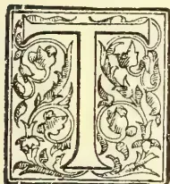

THE general scheme for the working of school gardens, as has been set forth elsewhere, is to have small gardens at the schools, worked by the personal labour of the masters, and scholars, who may divide two-thirds of the produce between them, and to give the scholars simple lessons in "Nature Study," using as objects of study the simpler operations of the garden, and the innumerable natural objects and phenomena around them. In providing these gardens with plants, the object to be kept in view is to provide only the best varieties of each kind, so far as possible. There is no great variety of plants in most of our villages; what is cultivated in the school gardens will gradually diffuse into the neighbourhood; hence it should be the best possible of its kind. In the second place, the village teacher is not qualified to teach agriculture, nor to criticise intelligently the agricultural operations of the district: he must carefully avoid trying to grow the staple crops of the neighbourhood, lest he fail—as he probably will—to do as well as the villagers and thus bring himself into ridicule. Hence the school garden must cultivate in general things not common in the district.

Every child in the school should help in the garden, and if possible grow a few plants him or herself. We want all the children to learn something about plants, to grow them as well as they

can, and to come to love them. The school garden and perhaps more especially that part that is worked by the joint labour of masters and scholars, will of course contain many useful plants, but we do not want the children to look upon all cultivation for the sake simply of the rupees it may bring in and ornamental plants should be grown also. There are other interests in life than mere money-making. The child who grows up to love nature, and the beauty of natural objects and phenomena, and to observe what goes on around him, will live a happier life than the one who gives himself up from the first to the consideration of monetary gain; in the long run, too, he will probably be the richer in actual money, and he will be less liable to spend his earnings on coarse and expensive pleasures.

Let, then, the school garden, in addition to the useful plants in the narrower sense, cultivate as many as possible of the ornamental. Let it be laid out as beautifully as possible with the means at disposal. Let masters and scholars take a pride in the prettiness of their garden. An attractive school garden will be a great benefit to the neighbourhood in many ways; it will make school more attractive to the scholars, will promote in them good taste and a love of natural beauty, and will stimulate the neighbours to do likewise.

The remarks made below apply equally to rest-house or private bungalow gardens. Parents should encourage their children to work in the garden and take an intelligent interest in it and in the plants growing in it.

The first point to be borne in mind is that the beauty of a garden depends, not on the particular plants it may contain, but mainly on the skill with which it is laid out, its natural advantages further improved and emphasised, and its defects lessened or concealed. The world-famous beauty of the

167------------------------------------------------

148THE TROPICAL AGRICULTURIST.[SEPT. 2, 1901.

Peradeniya Gardens depends partly on the natural advantage of the site, with its broad river and mountain background, but quite as much on the great skill and taste with which it was laid out and planted by Dr. Gardner and others. The plants with which the beautiful scenic and gardening effects are produced are nearly all the same as the common ones that one may see in almost every large garden in the Island, but by skill in grouping and laying out so fine an effect is produced that it is often difficult to get people to believe this.

In an ordinary native garden the planting is not ornamental, because the object is to obtain as much monetary return from the land as is possible, and the ground is thickly planted up with useful trees and plants with no attempt at artistic grouping. The bulk of the trees are usually coconuts. Individually or in clumps these are very beautiful trees, but their effect in great plantations is wearisome, depressing, and inartistic. We do not want our school gardens to be mere monotonous coconut groves: we want some variety, some taste in laying out, some pretty flowers, something which will make the garden pleasant to look at. If, as, in some cases, the land is already a dense coconut grove, then, unless some of the trees can be cut down, not much can be done, for few things will grow in the shade of coconut palms.

Let us now consider some general principles of laying out, which are applicable equally to any garden on a small scale, such as a resthouse or bungalow garden. The first great thing to remember in ornamental planting is the provision of open spaces: not merely are these pleasant in themselves, and useful as lungs and playgrounds, but the trees and shrubs, as well as the flowers, have room to be seen to advantage, and make much better growth, forming leafy masses, instead of growing up tall and spindly with all their leaves at the top. Put the larger trees and shrubs near to the sides of the ground. Especially put them on the sides that will protect the central parts from the wind in the monsoons, *i.e.*, in most localities put them on the south-west and the north-east. But do not have too many trees—give them room to grow and spread out so to show themselves to the best advantage.

Plant the trees and shrubs in clumps or singly, as the case demands, not in rows or belts. Contrast the ugliness of the wind belts in the tea estates with the beauty of the irregular patches of natural jungle. The latter are also made up of different kinds of trees, and this is an important feature in their beauty. In mixing trees, however, do not mix those which differ too radically in form and habit; do not mix many palms among ordinary leafy trees of conical or spherical form; palms lend themselves very well indeed to massing in groups of palms and cycads, with the larger in the middle or at the back and the smaller near the edge or the front, as in the beautiful groups at Peradeniya. Remember, too, in mixing trees, the colour of their flowers, and do not put trees whose flowers are of inharmonious colours together. For instance, do not put a pink-flowered Cassia beside a red Flamboyant or grow a purple *Bougainvillea* or an *Amherstia*. If the trees do not flower at the same time of year, this is of less importance.

Before you begin to plant, look at your ground from all sides and think how to use it to the best advantage. Draw a rough plan of it on the black-board, and mark out on this as you think best the way in which you mean to plant your ground. Make the most of its natural advantages. If there is an unpleasant view or building in any direction, plant so as to conceal or diminish its ugliness, but if there is a pretty view do not hide it, but give it a good foreground, *i.e.*, one clear of trees and shrubs or flower beds in the centre, so as not to interfere with the view, but prettily framed with trees or shrubs at the sides; bamboos make especially pretty

frames to a good view, but there are many ways in which the object can be attained. If there are any steep banks in the ground do not, if you can help it, plant them with trees; they lend themselves well to small plants, especially if rocky. Bring up all the stones that interfere with the work in other parts of the garden, and put them in natural positions on the bank, and plant the bank with ferns, mosses and flowers. When it is planted put the smaller stones close together in the surface earth between the plants, and this will keep the earth from being washed away by the heavy rain. Go out into the country round and see how beautiful nature makes these steep banks at the sides of the roads and elsewhere with ferns, mosses, and other little plants, provided it be shady enough. Try to imitate nature; bring in pretty plants from the banks of the roads and put them in places as like those they came from as you can. The success of a gardener depends on his being able to give to his plants the nearest possible imitation of the conditions under which they do well in nature. Let each child have a little piece of the garden if there is room for it, and let him try to imitate nature, bringing in wild plants and trying to grow them successfully. If the bank in the garden is not shady enough, plant some trees near it, but not upon it. If it is too high for convenient working, make a terrace on it. Otherwise make pockets in it and put the plants in these.

We must also, if possible, find room for some shrubs as well as trees. A close shrubbery makes an excellent screen for outhouses or for ugly surroundings outside the school grounds, and serves as a good background for flower beds. Shrubs and trees may be mixed together; some shrubs will do well in the shade of trees and may be put right among them, others must be put at the edges of the groups of trees. Do not, however, plant shrubs among or around all the tree clumps. Leave most of these as they are. Large flowering or foliage plants may often be mixed among shrubberies with great advantage: *caladiums*, *alocassias*, *cannas*, &c., are especially suitable under this head.

Ceylon gardens are famous for their pretty flowering creepers, and we must not forget these very effective plants, if we have an old tree, or a trellis, or a side wall to plant them on; but do not have many in a school garden, and do not cover the building with large loose-growing creepers. *Ficus repens*, which clings closer than ivy, is very suitable for the walls of the building. Remember the colours of the flowers of the creepers you plant, and do not have a *Bougainvillea*, as it is too overpowering for a small garden, and to make it effective from an artistic point of view everything else must be subordinated to it, even the dresses of the people frequenting the garden.

The garden must have some flower beds. Flower beds should not be put without a background in the middle of the lawn or open space—flowers want a dark background to show up their bright colours, so we must put them against a mass of trees or shrubs or against a wall with creepers on it, or near the house, or against the dark shadow of a mass of trees at a little distance. If you put them near the school house wall, be careful that the drip from the eaves is taken away by guttering; otherwise, they will not thrive.

In laying out flower beds, do not put the plants in stiff rows but in groups and clumps, and fill up the ground as much as possible; nature does not leave patches of bare earth between her plants, and if such are left the best part of the soil is washed away and the plants are injured by mud splashed upon them. Let the plants grow as they will till they fill up the spaces, and keep away weeds, and trim the plants carefully to keep them in their places when they have filled those places. Use as many different kinds of flowers as you can, and bring

168------------------------------------------------

SEPT. 2, 1901.]THE TROPICAL AGRICULTURIST149

in pretty wild flowers from similar situations as regards light and soil and plant these. Remember not to mix inharmonious colours. Put the small plants at the front and the larger at the back.

Do not make the beds more than three feet wide, so that the children can easily get at all the plants in them. When first making them dig out the soil to a good depth and remove all the roots of trees from it: break up the soil finely with the mamoty and the fork if you have such a tool, and mix with it a supply of well-rotted manure if you have any. If you have not, make a pit in some out-of-the-way corner of the garden and begin a leaf mould store putting into it all the dead leaves and other garden rubbish and keeping it covered from the rain as well as possible. Put your flower beds in well-drained places, not in the lowest parts of the garden. The digging up and manuring should be a yearly operation and in some cases even more frequent.

We must not forget the walks in laying out our garden. Do not, as a rule, make straight ones, unless the distance is short or between points where short cuts are possible. If the walks are in the open spaces of the garden let them be walks only, do not plant flower beds beside them.

Do not leave the schoolhouse or bungalow a bare exposed building in the middle of an open space; group your trees so as to make a picture in which the schoolhouse shall be the prominent feature as seen from the principal road. For instance, put a clump of trees near to the house on one side and tapering away into the open area, but do not let the line of the trees be at right angles to that of the building. Put some flower beds near the building in unsuitable positions. Avoid exact regularity in the arrangement of the garden on the two sides of the building, from whatever direction it may be seen.

Now, let us turn to the consideration of the economic or more strictly useful plants of the garden. Many of these will be trees or shrubs, e.g., cloves, nutmegs, sago, oranges, cacao, limes, mangoes, coffee. These may be planted, with strict regard to the principles of ornamental gardening laid down above in the places best suited to them. Cacao must be in the shade of other trees, also coffee, but not very dense shade is required. Sago palms must be put in damp or even swampy places. The other trees will do very well almost anywhere and may be planted in clumps, but oranges and limes, which are small trees, must not be put in the centre of the clumps.

Such economics as are climbing plants may be put among the trees or shrubs on suitable supports if they require shade, or out in the edges of the clumps if they require sunshine, as the case may be. Pepper and vanilla need a good shade, but many yams, &c., prefer some sunshine. Other economics, such as yams of some varieties, pineapples, ginger, maize, guinea corn, cassava, arrowroot, sweet potatoes, and other vegetables, are herbaceous or only small shrubby plants, and are best cultivated in special beds laid out in rows. These beds should be in good sheltered parts of the garden, but need not be obtrusive. They must of course be prepared and cultivated with special care.

Lastly, we must have a nursery in which we may start our trees and shrubs, and even some of the smaller plants. This also must be in a good soil, well-drained, in a sheltered but not too shady part of the garden, and must be the object of special care and attention.

Now, in conclusion, let us sum up the main points to be attended to. First attend to the broad general features of the garden, then to the details. Go over all the ground, dig holes here and there if necessary to see what kind and depth of soil you have in different parts, and make a rough plan showing the house and boundaries, and any other unalterable features of the land, such as neighbouring houses visible from the ground, pretty views, &c. Decide the position of your clumps of trees, with

reference to the making of screens from wind, hiding ugly views or buildings, emphasizing pretty ones, making a good setting for the schoolhouse, &c. Then settle the position of the shrubberies, vegetable garden, nursery, and flower beds, and see that the most is made of steep banks or of other good natural features, such as rivers, streams, or ponds. Then, as your plants come on in the nursery, plant them out according to your pre-arranged plans, of which you should keep a copy, but do not try to arrange everything in an hour or two. Go into the garden again and again on different days and think everything over carefully, and look at everything from all sides and decide what will be best.

Attention must always be paid to the special local or other conditions of the particular garden. For example, in the case of railway gardens, or of bungalows which have merely a narrow strip of garden along the front or side, the provision of open spaces is impracticable in the sense described above. With a railway garden, the object to be aimed at is to provide for travellers by the passing trains and for people walking along the platform, a succession of small pictures of the greatest possible beauty. A long platform garden is perhaps best treated by being laid out in irregular smaller plots open to the platform, and with a few trees and shrubs at the back and sides of these and flower beds and creepers in suitable places. In the case of a bungalow with only a strip in front, it must be decided whether privacy shall be aimed at, or a pretty appearance as seen from the road. In the one case shrubs and trees must be planted along the road, and the space between them and the house laid out to make the best possible effect as seen from the latter. In the other case the house should be used as the centre of a picture as seen from the road, and shrubs and trees planted near it as required, the clumps tapering away down the sides of the plot towards the road.

JOHN C. WILLIS,  
Director, Royal Botanic Gardens,  
Peradeniya, June 25, 1901.

## BASIC SUPERPHOSPHATE: ITS PREPARATION AND USE AS A MANURE.

BY JOHN HUGHES, F.I.C.,

(Reprinted from the *Journal of the Society of Chemical Industry*, 30 April, 1901. No. 4. Vol. XX.)

(Continued from page 73.)

### DISCUSSION.

Dr. J. A. VOELCKER said that not many weeks ago a lecture had been read to chemical manufacturers, and more especially to manufacturers of superphosphates, to the effect that they must "put their house in order." Now they had another warning—they must no longer use dissolved phosphates; that seemed to him a retrograde step, for, when one considered the great benefits to agriculturists which had come from the introduction of dissolved phosphates, one could not but wonder at the proposal to dissolve phosphate first and then precipitate it again; in other words, to go to the trouble of undoing the work already done. Mr. Hughes had referred to the labours of his (the speaker's) father on the subject: but it was necessary to consider the present question in its different aspects, and to remember also the attitude taken up by the late Dr. Voelcker with regard to the comparative values of dissolved and undissolved phosphates. Mr. Hughes had referred to one point which the late Dr. Voelcker had always insisted upon, viz., the very fine state of division of the phosphate when superphosphate was washed into the soil by rain; but Dr. Voelcker was always decidedly opposed to the views

169------------------------------------------------

180THE TROPICAL AGRICULTURIST.[SEPT. 2, 1901.

held by Mr. Jamieson, of Aberdeen, as regards the harm done to the soil by the use of superphosphate. On his farm at Woburn he (the speaker) had a plot of land which had been manured yearly with superphosphate for the last 24 years to his own knowledge. The soil had, at the commencement, a very small amount of lime, 0.25 per cent, of carbonate of lime only, but the plot had not yet suffered from deficiency of lime. There were other plots in the same field which had, indeed, so suffered, the lime having been removed to a very great extent by the continued use of soluble nitrogenous manures. He could not, therefore, altogether agree with Mr. Hughes as to the great necessity for a manure which had the acid character taken away by admixture with such a substance as finely ground lime. He had certainly come across soils which were so poor in lime as to require nothing so much as a good dressing of lime; he had not yet had experience with the new material which Mr. Hughes had just introduced, and so did not know whether that purpose might be well served by it; but, if so, he ventured to suggest that it could be done without the necessity of buying a patent manufactured manure. He was not going to discuss the question of citric acid, and how far it was a test of the availability of phosphatic materials; but, as they had just heard the use of hot water mentioned for determining the amount of phosphate available, and had been reminded that it did not occur in the soil, he might equally well point out that they did not have citric acid in the soil either. With regard to basic slag he did not think they had yet arrived at a solution of the cause of its utility. Attempts had been made to estimate this by the solubility in citric acid solution; but there were many other things in the soil which might exercise an influence on the solubility of the materials applied to it. He would like to have seen some comparison given between basic slag and basic superphosphate with regard to their respective solubilities in citric acid solutions of different strength. What was the behaviour of each in a solution of the strength likely to be met with in soils? It might be taken for granted that there were soils which were sorely in need of lime, and where superphosphate might do harm; but he would ask Mr. Hughes where was the advantage of using superphosphate mixed with lime as compared with the use of a material like precipitated phosphate, which was just as soluble in citric acid as was Mr. Hughes' mixture. And then, even if it were granted that the mixture had advantages, what was there to prevent the farmer from buying the lime and the superphosphate separately and mixing them together himself? If Mr. Hughes said that a farmer could not do this, but would be bound to buy a patent manure, ready mixed, he (the speaker) had still to learn that such a patent was of any value when it was taken out. If the farmer thought it a good thing to neutralise superphosphate by lime he would mix the two materials together, patent or no patent. There was, to his mind, a further disadvantage, inasmuch as Mr. Hughes did not sufficiently imitate the action of the soil in the mixing together of the two materials. If superphosphate was taken and ground lime added to it, the lime did not work through the whole mass, but there was only a superficial action, the external portion being neutralised and the inner left as it was. So one did not get a through neutralisation and distribution of precipitated phosphate purely by a mechanical mixing of the ground lime and superphosphate. The only advantage apparent to him was that there might be some places abroad or in the colonies where lime was not obtainable, or where it was so expensive that its use in any quantity was practically out of the question. If soils in such places were very deficient in lime one might certainly get some advantage by using lime and superphosphate together, but, for that matter, he did not see the advantage which the new

material had over precipitated phosphate in this respect, nor why one should not get the materials separately and mix them for himself.

Mr. F. J. Lloyd said that it was now about a quarter of a century since any new manure was brought before the agricultural world and that was a sufficient reason for thanking Mr. Hughes for having brought before them a new manure. Whether it would prove of value or not, time only could show. The author had given two reasons why it might prove valuable: first, because from the empirical tests made there was every reason to suppose that the phosphate of lime would be quite as available to the plant as the phosphate in superphosphate, and more available than that in basic slag, which for the last twenty years had proved a valuable and effective manure; and, secondly, because it was not acid, and therefore suitable for soils of an acid character or deficient in lime. There was another reason, in his own opinion, why Mr. Hughes's mixture should be a valuable manure. The progress of science in agriculture had of late years been mainly bacteriological. As lecturer on agriculture at King's College, it was his duty to explain why we manure the land. Formerly there were only two reasons: one, to supply a deficiency of any material in the soil; and the other to supply material of a nutritive character to the particular crop to be grown. But science had recently shown a third reason of considerable importance, and one which threw light on the action of manures hitherto difficult to explain. The soil was full of bacteria, and many of the plants grown in the soil were affected by bacteria. These bacteria must be fed in order to carry on the functions of their life. Taking the bacteria most studied, those which produced nitrification in the soil, it had been proved that they were most active in a material of an alkaline nature, and did not act and grow, except slowly, in any material of an acid nature; therefore, if one added something to the soil which, while it supplied the plant with one variety of food, also supplied conditions which enable the bacteria to supply another form of food, and helped the nitrifying organisms to carry on their work, that manure served a double purpose. Basic slag had had that effect, because of the double action brought into play—the supply of nitrogenous matter to the plant as well as phosphatic food. Arguing *a priori*, there was every reason to suppose that this basic superphosphate would have the same effect, and he really believed that they had to thank Mr. Hughes for the introduction of a material of considerable value. It was all very well to say that, if the soil contained lime and acid, superphosphate did no injury; but they had to deal with the British farmer, and he was a peculiar man. For the last twenty years liming had gone out of fashion, and the soil was deprived of lime as much by the use of nitrogenous manures as by superphosphate. Consequently, the soils of the country were becoming more and more deficient in lime, and an acid superphosphate, was not, in his opinion, likely to have the same effect as a basic superphosphate, which gave the farmer the lime and available phosphates at the same time. He would not enter into the question of the estimation of the value of this material; but he did hope, as an official agricultural analyst having to carry out the Fertilisers Act, that those who put the manure on the market would give a distinct guarantee as to what it should contain. He was sure they would find it beneficial to themselves, and it would be a subject for future discussion to determine whether that guarantee was a satisfactory one or not. He felt personally grateful to Mr. Hughes for bringing this valuable communication forward.

Mr. J. RUFFLE agreed with the last speaker. He was not surprised that Dr. Voelcker should throw cold water on this new idea, for it was just what happened on the introduction of basic slag 20 years

170------------------------------------------------

SEPT. 2, 1901.]THE TROPICAL AGRICULTURIST.151

ago. One after another the authorities refuse to have anything to do with it, and he got a wiggling because he suggested that it would have a manurial value. The fact was that basic slag had become a very useful manure both in England and on the continent. Dr. Voelcker asked, Why should not a farmer take his superphosphate and add lime to himself? He might, but he would not do it so well as a manufacturer. But would one gain anything by taking superphosphate and adding lime to it? He ventured to think one would, wherever an alkaline phosphate would be useful; also because the ordinary acid superphosphate was, after all, not on the average in a very fine condition; it would hardly go through a 10-hole sieve. But after mixing it with lime, one could send the mixture through a 30- or 40-hole sieve. Taking the relative surfaces which the increased fineness yielded, one would find very great advantage by that superior subdivision, so that in many cases it would be found quite equal to the ordinary acid superphosphate, even where this article was successfully used. One advantage it had was that it was more readily distributed, and that it would allow of the simultaneous use of nitrate of soda, and where it was desirable to put them together that could be done. One point had not been touched upon which he thought the makers of this article would find desirable, namely, the degree of hydration of the lime to be added to the superphosphate. If they took quicklime and added it after grinding, they would get tricalcic phosphate, but if they hydrated it with as much water as it would carry, they would get a finely divided powder; this, added as Mr. Hughes directed, was one that produced a hydrated mono- or dicalcic phosphate which was far more soluble. Therefore he suggested that they should take a lime that would take two-thirds of its weight of water, and hydrate it at that rate; this would break down readily. If they took lime and water in those proportions, namely, one of lime ( $\text{CaO}$ ) to two of water ( $\text{H}_2\text{O}$ ), when added to the superphosphate it would form a body which would be more soluble than with a greater number of molecules of lime ( $\text{CaO}$ ) only. He believed it would prove to be more valuable as a manure than even basic slag had been.

Dr. BERNARD DYER said that it was interesting to think that the author of the paper before them, Dr. Voelcker, Mr. Lloyd, Mr. Ruffe, and himself were all old pupils of the same grand old master, and he could not help thinking that most of what was best in the knowledge of all of them had been derived from him. For really the quotations that Mr. Hughes had made from the early paper by Dr. Voelcker went to the heart of this matter. The great value of a superphosphate lay in its diffusibility, and the utmost value to be derived from this quality could only be realised in those soils which had a satisfactory proportion of carbonate of lime. He had tried to persuade farmers to use more discrimination as to the kind of phosphatic manure they employed, and had laid it down as a rule for guidance that, if they had a soil that would effervesce when hydrochloric acid was poured on it, an acid or dissolved phosphatic manure was the most valuable one they could use; but that, when no such effervescence took place, they should have recourse to some other form, such as bonemeal, guano, or basic slag. There was another material which was manufactured to a large extent some years ago, and was referred to by Dr. Voelcker, namely, precipitated phosphate. Large quantities of it were made on the Rhine by precipitating a solution of phosphoric acid with lime, and it was suitable for use on soils which were deficient in lime. What Mr. Hughes made was precipitated phosphate. He felt inclined to quarrel with his term "basic." He really made a precipitated phosphate, and he probably made it more cheaply by this "dry" process than it could be made by the "wet" method of precipitation. But

the manufacture of precipitated phosphate by the "wet" process had almost entirely disappeared since the efficacy of basic slag had been recognised, and basic slag had quite taken its place. That fact was presumably due to questions of cost. The question now was whether it was more economical to dissolve phosphate by the process of Mr. Hughes, and then use lime to neutralise it. He took it that the unit price of the phosphoric acid in this material would be higher than in some other forms of manure; and they had yet to learn whether it was so much more useful as to warrant that higher price. Following the teaching of Dr. Voelcker, he had recommended farmers having soils poor in lime to buy superphosphate and bone-meal, and make a compost of it and also neutralise it. It occurred to him that it might possibly be more economical to use finely ground phosphate itself instead of lime. One would thus be retaining in an available form all the phosphate already dissolved, and the free phosphoric acid which existed in the phosphate would react on the fresh quantity and make some of that available, as well as being itself converted into the non-acid form. What Mr. Lloyd had said with regard to farmers being reluctant to use lime was quite true. He did not think, however, it was due to obstinacy, but rather to poverty; for to lime soil in some districts was very expensive, and in the present time the farmer had to look at every source of expense. He had no doubt that Mr. Hughes' mixture would be a very useful and valuable manure; his only doubt was as to its economy. He had shown it to be more soluble than slag phosphate in such weak solutions of citric acid as he had taken; but he feared that, if he took acids of such strength as were used on the continent, those great differences would disappear. As to the doubt which Dr. Voelcker had thrown on the validity of Mr. Hughes' patent, he would not like to express an opinion. Patent law was very complicated, and there was no knowing what the result of litigation on such a subject might be. He should think the case would go right up to the House of Lords, and that a great many experts would be found on each side of the question.

Mr. A. G. BLOXAM presumed that the 27.7 soluble in Mr. Hughes' table represented that percentage of tricalcium phosphate rendered soluble. Mr. Hughes treated the same sample of superphosphate with lime, and found 94 per cent. soluble in citric acid. Did he mean to say that the calcium sulphate and all dissolved up? If so, the comparison appeared to the speaker to be valueless. Then, with regard to that same determination, the sample mixed with lime was washed with water and citric acid, the soluble matter weighed, and the residue ignited and weighed; the whole then added up to 100. Was that so?

Mr. HUGHES replied that it was so.

Mr. D. A. LOUIS said it might interest the meeting to hear the views of one who had not had the advantage of being in the late Dr. Voelcker's laboratory. Some years ago, however, he had been in the laboratory at Rothamsted and he remembered the position taken up by Dr. Augustus Voelcker, Sir John Lowes, and Sir Henry Gilbert in connection with basic slag. They all persistently set their faces against it, considered it absolutely valueless, and even refused for some time to experiment with it. It was thought to contain deleterious ingredients, and the phosphoric acid to be in an unsuitable condition, and that it could be valuable as a plant food seemed to them an impossibility. He remembered discussing the subject with Dr. John Voelcker some years ago, who, too, considered it quite worthless. In course of time, however, all these gentlemen came to recognise basic slag as an important manurial agent. That fact showed the position that some of our dear old agricultural friends were liable to take up when anything novel was presented to them, although

171------------------------------------------------

152THE TROPICAL AGRICULTURIST.[SEPT. 2, 1901.

one would think it would be wiser to suspend judgment until experimental evidence was forthcoming. By Mr. Hughes' suggestion it seemed that a factor which rendered superphosphates unsuitable for certain soils was removed in a very simple manner, and at the same time yielded a mixture in a convenient form for use on the farm, which, moreover, on the face of it, might prove of high manurial value; but, of course, this point could only be decided by trustworthy experiments, to which the speaker, amongst others, would look forward with interest. As chemists, of course, they must all admit that in these mixtures they had sulphuric acid, phosphoric acid and lime, and these bodies had always been the constituents of such artificial manures from the beginning. When Mr. Hughes told him of his invention, it struck him that the proposal was somewhat retrogressive, and he suggested that to him; and further, that on putting lime into the manure the phosphoric acid would possibly assume a reverted condition, that was, go back to tribasic phosphate. However, in practice things did not always happen as we expected them to happen, and so perhaps in this case the expected might not happen. He would like to ask Mr. Hughes how long the mixture given on the table had been prepared, so as to yield 66.8 of soluble matter, inasmuch as if it consisted of phosphate, it would at once put out of court Dr. Dyer's argument, as there was no dibasic phosphate that would give that solubility in water.

Mr. HUGHES: Table III. represents the portion soluble in water. The whole of the phosphates were rendered insoluble in water, and therefore it did not appear on the table.

Mr. LOUIS, continuing, said, if that were the case, Dr. Dyer's contention might be right. Then there was the other point mentioned by Mr. Lloyd, and admitted by all who knew, that without any doubt it was valuable to add lime in some soils; and, as Dr. Voelcker held, the farmer might be free to buy the lime and phosphate separately and mix them himself; but the farmer would not do that; he liked things made easy for him, and liked to buy his materials ready for use as "wheat manure," "barley manure," and so forth. The farmer, for want of means, would not put lime on his soil, but he knew that he must put some phosphate; and if he could conveniently buy the lime at a moderate price along with the phosphate, he would very likely do so, especially if he got it in a form convenient for handling, and could by one sowing and one expenditure introduce two valuable factors into his soil. He was sorry to learn from the author that the 66.8 was not the material one would have liked to see soluble and suitable for plant food, though it might prove suitable for Mr. Lloyd's bacteria, and probably do good in that way.

*Note.*—At the time of speaking Mr. Louis was not aware of the fact that excess of lime was employed in Mr. Hughes' mixture.

The CHAIRMAN had no wish to stand as umpire between two contending parties. No doubt each of these materials had its value in the right place, and each of them was useless in the wrong place. If Mr. Hughes's mixture could be made at such a price as to be as cheap as other phosphates, he thought it had a considerable future before it. But when he considered that first in the making of the superphosphate the original raw phosphate got diluted by sulphuric acid, and then still further diluted by the addition of lime, the net result was a mixture containing only a fraction of the tribasic calcium phosphate present in the raw material; and it was difficult to see how such a mixture could compete with a material like Thomas slag, which had not to undergo these processes of dilution. Assuming that the material of Mr. Hughes was more soluble and more available than soluble Thomas meal, the question was, how could such a material, which had to stand the cost of grinding, treatment with solphu-

ric acid, lime, and carriage on a reduced percentage of phosphoric acid, hope to compete with basic slag? If, however, Mr. Hughes could give satisfactory assurances on that point he had rendered a service to agriculture.

Mr. RUFFLE said that Dr. Voelcker had referred to the precipitated phosphate made on the Rhine, and had questioned whether Mr. Hughes' material would be able to compete with it. Was that precipitated phosphate hydrated? He believed it was a very rich tricalcic phosphate, but not hydrated. Mr. Hughes' proposal really was to take the hydrated  $P_2O_5$  in the superphosphate; to that he added hydrated lime, and thus got a hydrated compound of phosphoric acid and lime. Would not that hydration give it such a start of superiority that it would answer where the precipitated phosphate would not?

The CHAIRMAN: Does Mr. Ruffle assume that a different compound would be obtained by adding calcium hydroxide instead of calcium oxide? Is there any chemical evidence to that effect? No matter what form the lime may be in, the same product would probably result.

Mr. RUFFLE said he thought one would get Mr. Hughes's compound by putting 15 to 20 per cent. of hydrated lime. One would want more than that to form a tricalcic phosphate; but by adding 17 per cent. one got a phosphate which had some water and some lime. In fact, Hughes produces an alkaline hydrated dicalcium phosphate in the superphosphate ( $P_2O_5$ ,  $CaO$ ,  $CaO$ ,  $H_2O$ , plus a slight excess of  $CaO$   $H_2O$  for alkalinity).

Mr. STEWART remarked that if one added calcium oxide there was a danger of forming pyrophosphate of lime. Did Mr. Hughes confine himself to producing dibasic phosphate? Was there just sufficient lime to form two of  $CaO$  to one of  $PO_5$ ?

Mr. HUGHES, in reply, said he was pleased to find that he had very little to answer. Dr. Voelcker had suggested that farmers would add lime to superphosphate themselves. They were quite welcome to do so, for it would increase the sale of superphosphate; but they would find a difficulty in preparing a perfectly uniform mixture. Further, it was a fact that in those parts of the country where lime did not occur in sufficient quantity in the soil, the farmer would have to purchase it from a distance and at considerable cost; therefore the application of lime where it was most required was generally neglected. Moreover, instead of purchasing superphosphate and lime separately, the farmer could purchase basic super, and so supply both available phosphates and lime at one dressing. With regard to precipitated phosphate, which had been referred to, it was well known that it was an expensive material, prepared by a wet process, whereas basic super was a comparatively cheap material prepared as a dry mixing, so that any manufacturer could make it; consequently there was no fear of competition with precipitated phosphate. Bearing in mind the opposition that basic slag had originally met with at the hands of scientific men, and knowing the immense quantities of it that were now used, he took encouragement that, even if his material met with similar opposition now, he felt confident that the practical results in the field would be satisfactory.

Dr. VOELCKER, interposing, said he thought it ought in justice to be pointed out that basic slag as it was known now was a very different body from the slag that was first introduced, and the results now obtained could not have been obtained by the material then condemned and rightly condemned.

Mr. HUGHES, resuming, said that the only improvement that had taken place in the quality of slag was due to improved grinding; and he would like to refer to Table I., in which the Peace River phosphate, with a grinding of 93.61 fineness, actually showed a greater amount of phosphate of lime dissolved by the weak solution of citric acid than was shown by the basic slag, the figures being 21.61 as against 18.99. He ventured to think that

172------------------------------------------------

SEPT. 2, 1901.]THE TROPICAL AGRICULTURIST.153

had the Aberdeenshire experiments been carried out more extensively in this country the actual value of finely ground raw phosphates would have been demonstrated long ago. Basic slag being, however, introduced just when these experiments in the north had terminated, attention was naturally concentrated upon it, especially as the cost was then so low, and it naturally became the favoured material for field experiments, with increasing success; though, as will be seen from Table I., its solubility was greatly inferior to that of basic super.

DR. DYER: But the solubility of basic slag in a stronger solution, such as 1 per cent., was much greater than that referred to in Table I.

MR. HUGHES, continuing, said no doubt a 1 in 100 solution, would dissolve out more than his weaker solution, 1 to 1,000; but the relative solubility was still against basic slag and in favour of basic super, as the following figures clearly indicated:—

*Comparison of Solubility.*

1 grm. of each of these materials was treated respectively with 200 c.c. of 1 per cent. solution of citric acid, 400 c.c. of 0.5 per cent., 1,000 c.c. of 0.1 per cent., and 2,000 c.c. of 0.05 per cent.; allowed to stand 24 hours, with occasional stirring.

<table border="1">
<thead>
<tr>
<th></th>
<th>Basic Super.</th>
<th>Basic Slag.</th>
</tr>
</thead>
<tbody>
<tr>
<td>Portion soluble in 200 c.c. 1 per cent..</td>
<td>94.70</td>
<td>64.70</td>
</tr>
<tr>
<td>" " 400 " 0.5 "</td>
<td>95.30</td>
<td>54.50</td>
</tr>
<tr>
<td>" " 1,000 " 0.1 "</td>
<td>95.70</td>
<td>33.30</td>
</tr>
<tr>
<td>" " 2,000 " 0.05 "</td>
<td>92.40</td>
<td>30.30</td>
</tr>
</tbody>
</table>

It would be seen that, while the solubility of the basic super remained practically constant up to a dilution of only one part of citric acid in 2,000 parts cold water, the solubility of the basic slag declined with the dilution enormously. He could not agree with Dr. Dyer's suggestion that perhaps it would be more economical to use ground phosphate instead of slaked lime. The lime was hydrated and in a very soluble form, whereas the raw ground phosphate would be coarse or fine according to the grinding, and the action of the acid in the superphosphate would be directed rather upon the carbonate of lime than upon the phosphate of lime. In conclusion he would say that the new manure must stand upon its own merits; and it only remained for him to thank those gentlemen who had supported him in expressing their opinion that the manure would prove useful. Experience had shown that basic slag was a very valuable manure, and if his manure was still more soluble and rapidly available, as was indicated by its much greater solubility in the particularly weak solution of citric acid (1 in 1,000), he had every reason to hope that the field experiments would prove it to be a quick-acting and reliable manure, which was just what the farmer wanted.—*Journal of the Society of Chemical Industry.*

## CULTIVATION OF SEEDS FOR OIL AND CAKE EXTRACTION.

### SUNFLOWER AND CASTOR OIL PLANT.

SIR.—Seeing that there are some planters thinking of going in for the cultivation of sunflower seed (for oil extraction), I thought it might not be out of place to give a few particulars with reference to the growing and treatment of the seed to be converted into oil.

I think a valuable vegetable oil industry might be carried on in Ceylon if the planters would go in for the cultivation of the various kinds of oil plants, such as castor oil, sunflower seed, pea nuts, mustard, cotton seed, gingelly, and even olives, I think, might be grown to advantage.

I have extracted a very large quantity of oil from the above variety of seeds, grown in Victoria by the Department of Agriculture, in whose services I was for several years as manager of the department's mills.

To encourage the oil seed industry the Department gave a bonus of £2 per acre to farmers to cultivate the seed for three years, and extracted the oil for them at a nominal cost, refining and packing the oil ready for the market.

If the Ceylon Government would do likewise, the planters would only be too glad to try some new industry to help them over the present very hard time.

Sunflower seed: 8 lbs. of seed per acre is enough to plant, the oil cake is excellent as a food for horses, cattle, pigs, &c., and is worth about £6 per ton for feeding purposes.

The best to grow for oil is the small black variety (*grandiflora*) as it yields the larger percentage of oil, 20 to 25 per cent of good oil, almost equal to the best olive oil; it is a first class table oil and there is always a good market for it if properly refined. When in Colombo I could let you see samples of the above oils if you care to inspect them. I hope to be down in a week or so.

Since writing the above, I see another correspondent asks information about the castor oil plant. There are two kinds of this seed that I have manufactured into oil, the large and small variety. The small is the best, as it contains from 40 to 42 per cent. oil; the price of the seed varies from R5 to R6 per cwt. It can be obtained in Bombay, and is grown in the Gujarat district; castor cake is worth from R40 to R50 per ton, and it is an excellent manure, as it contains a large percentage of nitrogen. It should find a ready market in Ceylon.

For "Palma Christi's" information:—

(1) In my opinion it is better to put in seed say 3  $\times$  3"—two seeds in a hole about 2.

(2) Bombay, that which is grown in Gujarat district is the best.

(3) After the seed is ripe enough, it is cut off in clusters, allowed to dry and then trampled on by bullocks, same as paddy, then collected and cleaned.

(4) About 40 bushels per acre, or more on good soil.

(5) There is a good market both in England and France for good castor seed, also oil; seed is worth say in Colombo from R5 to R6 per cwt. Castor cake should bring at least R40 to R50 per ton.

(6) By hydraulic pressure, a small plant could be got for £500 or 600, but this would depend on what power could be got on owner's property.

(7) In my opinion plants grown as an annual give best value. After seed is sown, there is little or no attention required until seed is ready for plucking.

(8) The plants would certainly crop best grown alone. When in Colombo I could give you more information than by writing, such as cost of machinery, refining oil, &c.—Yours, &c.,

E. WILSON,

Engineer, Finlay Muir & Co.

Katugastota Estate, Katugastota, August 10th.—  
"Local Times."

WEEDS.—On new and unexhausted lands the bad effects of weed growth are doubtless due fully as much to the waste of moisture going on through their leaves as to the competition with the crop for plant-food. Hence all good orchardists are very careful about keeping their ground clear in summer; but it must not be forgotten that by doing so they quickly deplete their lands of vegetable matter which requires systematic replacement by green manuring if production is to continue normally, yet of the two evils, the loss of moisture is more to be dreaded, and very generally in practice the more difficult to remedy.—PROFESSOR HILGARD. Weeds in a dry country waste enormous quantities of soil moisture, each pound of weeds reducing the growth of corn by two pounds. Clean farming conserves moisture for the useful plants and useful plants produce more bulk as well as more value from a given amount if available moisture.—W. M. HAYS, Minnesota. Agricultural Experiment Station.—*Agricultural Gazette of N. S. Wales.*

173------------------------------------------------

154THE TROPICAL AGRICULTURIST.[SEPT. 2, 1901.

THE COCO-NUT.—INSECT ATTACKS  
AND THE VITALITY OF  
PLANTS &c., &c.,

DR. BACHOFEU'S ANALYSIS OF THE COCONUT.  
HUSK, SHELL, KERNEL, MILK.

<table border="1">
<thead>
<tr>
<th></th>
<th>HUSK.</th>
<th>SHELL.</th>
<th>KERNEL.</th>
<th>MILK.</th>
</tr>
</thead>
<tbody>
<tr>
<td>Total weight in lbs. ..</td>
<td>2.702</td>
<td>0.546</td>
<td>0.875</td>
<td>0.593</td>
</tr>
<tr>
<td>Do. in per cent..</td>
<td>57.28</td>
<td>11.59</td>
<td>18.54</td>
<td>12.58</td>
</tr>
<tr>
<td>* { Moisture in per cent ..</td>
<td>65.56</td>
<td>15.20</td>
<td>52.80</td>
<td></td>
</tr>
<tr>
<td>  { Dry matter in per cent</td>
<td>31.44</td>
<td>84.80</td>
<td>47.20</td>
<td></td>
</tr>
<tr>
<td>Pure ash in per cent ..</td>
<td>1.63</td>
<td>0.29</td>
<td>0.79</td>
<td>0.38</td>
</tr>
<tr>
<td>Containing viz:—</td>
<td></td>
<td></td>
<td></td>
<td></td>
</tr>
<tr>
<td>Silica Si O2 ..</td>
<td>8.22</td>
<td>4.64</td>
<td>1.31</td>
<td>2.95</td>
</tr>
<tr>
<td>Oxide of iron and alumina, [Fe2O3 AL2O3 ..</td>
<td>0.54</td>
<td>1.39</td>
<td>0.59</td>
<td>Trace.</td>
</tr>
<tr>
<td>Lime, Ca O ..</td>
<td>4.14</td>
<td>6.26</td>
<td>3.10</td>
<td>7.43</td>
</tr>
<tr>
<td>Magnesia Mg O ..</td>
<td>2.19</td>
<td>1.32</td>
<td>1.93</td>
<td>3.97</td>
</tr>
<tr>
<td>†Potash K2O ..</td>
<td>30.71</td>
<td>45.01</td>
<td>45.84</td>
<td>8.62</td>
</tr>
<tr>
<td>Soda Na2O ..</td>
<td>3.19</td>
<td>15.42</td>
<td></td>
<td></td>
</tr>
<tr>
<td>†Potassium chloride KCl ..</td>
<td>...</td>
<td>...</td>
<td>13.04</td>
<td>41.09</td>
</tr>
<tr>
<td>Sodium chloride Na Cl ..</td>
<td>45.95</td>
<td>15.56</td>
<td>5.01</td>
<td>26.32</td>
</tr>
<tr>
<td>Phosphoric acid P2O5 ..</td>
<td>1.92</td>
<td>4.64</td>
<td>20.33</td>
<td>5.68</td>
</tr>
<tr>
<td>Sulphuric acid So3 ..</td>
<td>3.13</td>
<td>5.75</td>
<td>8.79</td>
<td>3.94</td>
</tr>
<tr>
<td></td>
<td>100.00</td>
<td>99.99</td>
<td>99.99</td>
<td>100.00</td>
</tr>
</tbody>
</table>

†Containing total

potash K2O .. 30.71 45.01 54.05 34.54

\*Containing nitrogen N .. 0.137 0.100 0.504

Thus of the more important ingredients of the soil  
1,000 nuts remove the following:—

<table border="1">
<thead>
<tr>
<th></th>
<th>IN LBS.</th>
<th>HUSK.</th>
<th>SHELL.</th>
<th>KERNEL.</th>
<th>MILK.</th>
<th>TOTAL LBS.</th>
</tr>
</thead>
<tbody>
<tr>
<td>Nitrogen N ..</td>
<td>3.7017</td>
<td>0.5460</td>
<td>4.4100</td>
<td>...</td>
<td>8.6577</td>
</tr>
<tr>
<td>Phosphoric acid P O ..</td>
<td>0.8456</td>
<td>0.0735</td>
<td>1.4053</td>
<td>0.1279</td>
<td>2.4523</td>
</tr>
<tr>
<td>Potash K2O ..</td>
<td>13.5255</td>
<td>0.7127</td>
<td>3.7362</td>
<td>0.7783</td>
<td>18.7527</td>
</tr>
<tr>
<td>Lime Ca O ..</td>
<td>1.8234</td>
<td>0.0991</td>
<td>0.2143</td>
<td>0.1674</td>
<td>2.3042</td>
</tr>
<tr>
<td>Sodium chloride Na Cl ..</td>
<td>20.2375</td>
<td>0.2464</td>
<td>0.3563</td>
<td>0.5431</td>
<td>21.4233</td>
</tr>
</tbody>
</table>

It will be seen that *sodium chloride* is found in the Coco-nut at 21 lb. to 1,000 nuts, and shows therefore that common salt should enter largely into all manorial material applied to this tree. One of the best and cheapest methods of applying this is to use the waste pickle of the salt provision stores, such as that from herring and pork barrels, &c. Other constituents should be supplied in a suitable manner, or in a form that comes cheapest. Chemists tell us, however, that we should not depend upon a single analysis, which is undoubtedly true, and therefore growers should know whether nuts of Trinidad, nuts of Tobago, nuts of Grenada, &c., &c., &c., would give the same results in the Laboratory as those obtained in Ceylon. It is reputed that the water or milk of the Coco-nut is a powerful diuretic, but to which of its constituents this property is due is not stated.

It is clear from the analysis that it is not sufficient merely to bury the nut in earth or sea sand to succeed in raising fine trees, but that such cultivation requires considerable attention, and the trees are benefitted, like all other plants, by the application of suitable manures when necessary. The want of such applications, where the plant food is deficient, undoubtedly leads to ill-health and subsequent insect attack.

The question of vitality in plants is not generally well understood, but it means everything to the cultivator. The Pine Apple in the English hot-house is ruined by an attack of mealy-bug—but growing in the open under natural conditions and with all its requirements at command, the Pine Apple laughs at and despises the attack of this insect. Some stools of seedling sugar cane succumb to the attack of fungus and insect pests, while growing under exactly the same conditions as to culture, soil, and general attention, as their untouched stronger brothers (i.e., their vitality is low and their constitution weak, which renders them unable to survive. This vitality is also seen in fields newly planted, among cane

cuttings planted on the same day on the same lands and under exactly the same conditions. One row will have but very few misses, while another variety will require supplying to the extent of 40 or 50 per cent. In some cases this is due, as is well known, to the condition of the cane; for joints or tops containing a large amount of glucose are much quicker in developing growth than the hard or ripened joints which contain a major portion of sucrose. It may be argued that plants, if well cultivated, can have no weakness of constitution; but nevertheless, it can be shown in hundreds of instances that, where plants are exotics, it is a difficult matter to get them to thrive; and their adaptability for culture often depends upon their power of becoming acclimatised (i.e.,) acquiring a strong constitution. Some plants never appear to acclimatise, and others are apparently ubiquitous and appear to adapt themselves to change of climate with greatest facility. From those facts it is fairly clear that the constitution plants possess is affected and also weakened or strengthened by several conditions.

1st, by inheritance; 2nd, by temperature; 3rd, by humidity; 4th, by want of nutriment; 5th, by unsuitable lands; and 6th, by persistent attacks of fungoid or insect pests. So far as it is yet known, the best course to be followed, instead of using the nostrums often advocated, is to secure by hybridization and seminal selection, varieties possessing a vitality and strength of constitution which will enable them to overcome attacks of fungoid or insect enemies. It is of course admitted that the application of insecticides is often of the greatest service when the plant suffers from special invasions not due to want of cultivation, plant food, or lessened vitality, but the cultivator should be careful in discriminating between attacks caused by these wants, and attacks having a special character or cause. In the latter, insecticide can be used with advantage—in the former, even endless repetition of their use will not render them effective.—*Trinidad Bulletin*.

FIG GROWING IN SMYRNA,

In his report on the trade of Smyrna, Mr. Vice-Consul Hampson gives some information as to the cultivation of figs in Smyrna. He says that the fig district lies almost entirely along the Smyrna-Ardin Railway, the best quality of fruit called "erbeilli" coming from Inovasi, while those from Nasli and Sultan Hissar are also much vained, though their skins are thicker and lighter. There are two kinds of figs, both from the same tree; those for eating and those for distilling purposes (*hurdas*). The fruit of trees growing on the plains is larger and richer in saccharine matter; but, on the other hand, the trees in the plains often suffer from excess of moisture in a wet season, which those on higher ground escape owing to facilities for draining. The trees begin to bear in their sixth year, and are in full vigour in their 15th year. The fruit ripens about the middle of August, when it is picked and dried in the open air for from three to six days. It is then packed in sacks of about 250lb, each, two of which constitute a load for each camel, by which means figs are carried to the nearest station to be conveyed by train to Caravan Bridge, Smyrna. Thence the sacks are again conveyed by camels to the depots of the purchasers. An attempt was made to employ carts (*arabias*) in the place of camels, but it was found that the fruit was damaged if the sacks were piled one on the other. The arrival of the camel load of figs in Smyrna each season is celebrated as a popular festival, as the washing, drying and packing of the fruit gives employment to thousands of families. The sale of dried figs for food takes place from the end of August till the beginning of November, after which the sales are almost entirely of "hurdas" (figs for distilling.) A certain quantity of these latter are also sent to Austria-Hungary, where they are used as a substitute for chicory.

174------------------------------------------------

SEPT. 2, 1901.]THE TROPICAL AGRICULTURIST.155

### PRUNING FRUIT TREES.

The general principles of pruning have already been discussed in the previous issue of the *Journal of the Department of Agriculture*, and to these the reader must be referred. Several of the most approved methods of vine pruning have also been reviewed and illustrated by means of diagrams in the same publication. In this chapter the shaping and the pruning of the several varieties of those temperate clime fruit trees grown in our orchards will be more particularly referred to.

#### GENERAL PRINCIPLES.

There are a few rules, however, which are applicable in every circumstance, and which should be borne in mind whatever the system of training or the kind of tree to be pruned may be. Thus, when pruning, cut off all dead wood; also one of any two branches which may happen to cross and rub against each other, thus chafing the bark and injuring the limb. Suppress water shoots and suckers. When cutting to a bud do not leave a stump above the bud; but on the other hand do not cut the wood off too close to that bud. When compelled to cut large limbs, pare off the wound with a sharp knife, and cover the wound with some dressing, such as already recommended in the previous chapter on pruning (p. 316), or even with clay, which, while preventing the air and the dampness from drying and rotting the wood, will not prevent the young bark overgrowing the wound and gradually healing it. Before cutting the limb off try to see what the result of your action is likely to be a few years hence, and thus save at an early stage the possible necessity of having to cut large limbs at some future period.

Should it be found necessary to cut a large limb, saw it a short distance from the bottom first. Then saw down from above, and the limb can be removed without fear of splitting off below. Under the climatic conditions which prevail here, it is better to err on the side of cutting hard back, so as to keep the tree low, than on the side of sparing the tree the first year of its growth, and letting it run up a high stem, topped with long lanky branches.

#### SYSTEMS OF TRAINING AND SHAPING FRUIT TREES.

Climatic conditions to a great extent influence the methods of training trees. Thus in colder climates they often trained *Cordon* fashion, or in *Espaliers*. Then again the *Pyramid* shape was for a long time a favorite in warmer climates, until the *Low Standard* or *Vase* system supplanted it.

This latter method of training fruit trees has been found by long experience to be the form best suited to the Australian climate; it is also the one best adapted to Californian conditions. Unlike the *pyramid* shape, which has the cone pointing upwards, the *vase, goblet or wine-glass* form, as it is at times

called, rests on its cone, and directs its branches upwards and outwards

Amongst the advantages it offers it is simple to understand and to master; it is applicable to all kinds of fruit trees; it is suitable to all localities where fruit trees can be grown out in the open without artificial shelter; it forms a vigorous, stocky tree, well balanced, easy to prune, spray and pick; it efficiently shelters the stem against sun scald; it resists the onslaughts of heavy gusts of wind better than the other forms of training; it requires less space than the *pyramid* form; it offers greater facility of approach to the stems by the horses when cultivating.

#### FIRST PRUNING.

Young budded trees in nursery rows present the first season of their growth the appearance of a straight switch, with good buds all along the stem.

Sometimes they grow so vigorously that they throw out laterals. Both such young trees are found in nurseries. As their customers like to see as much growth as possible, nurserymen generally send out their trees without cutting them back.

Experienced orchard owners generally prefer, when ordering from the nursery, one year old trees, which are merely straight switches with good buds all along the stem. These they can cut back to the height they prefer, with a length of stem pretty well uniformly the same all through the orchard. If they plant trees with a head ready formed in the nursery they cut it short back on the laterals. Those who, on the other hand, have little or no experience of fruit growing, would do wisely to select from the nursery trees with their heads ready formed. When cutting back, especially in the warmer and drier localities, a stem, 12 to 18 inches high, will be found the best. In the cooler districts it can be given a height of 18 to 24 inches. Cut back to a good bud, care having been taken that the tree has not been planted too deeply, but

A YEARLING TREE WITHOUT BRANCHES. The cross line shows where to cut back when planting.—BARRY.

that its collar, or point of junction between the roots and the stem, be as nearly as possible flush with the surface of the ground. If the tree has suffered much, and the buds are very small, the bark leathery and wrinkled, the stem somewhat dried and the roots much injured, it is advisable to cut the stem lower still, say at a height of about 9 inches from the ground, or even lower, but in every case above the graft. In such cases, however, the proper height should be given to the stem, either by pinching the straight shoot which will grow from it, as soon as it reaches the desired height, or by cutting it back later on at the time of winter pruning. From stem topped to a height of 15 to 18

20

175------------------------------------------------

156THE TROPICAL AGRICULTURIST.[SEPT. 2, 1901.

inches, several short shoots will be sent up from the upper buds; of these three or four of the best shoots, placed symmetrically round the stem, are allowed to grow, all superfluous vegetation being rubbed off. These three or four shoots, which will form the main limbs of the tree, should be placed in such a manner that they form a well-balanced head, and do not all come out together, but spring out of the stem with an interval of an inch or two between them. This knits them better to the trunk, and they are thus less liable to split, as they sometimes do in windy weather, when grown in forks and laden with fruit. The apricot more especially, with buds very close together, has a tendency to grow its limbs all in a bunch.

Three limbs growing symmetrically round the stem are better than four. During the first season, these three or four shoots are left to grow without interference, so as to favor as good a root system as possible. Should one of the rods, however, grow with such exuberant vigor that it draws all the sap for its own use, to the detriment of the other two or three, it would be advisable to pinch it off and check it, so as to maintain a fairly equal growth of the head. A tree is very easily thrown off its balance at this stage of its growth, and unless properly trained and watched it might be difficult subsequently to re-establish the harmony of growth between the main branches that constitute the head.

#### SECOND PRUNING.

During the summer following the first pruning, the young tree should be allowed to grow unchecked, so as to ensure a good root development. Some young trees, however, at times persist in sending up one solitary shoots. Should this be the case, the tender growth is pinched back when it has reached a length of five or six inches, and this will excite the bud immediately underneath into life, with the result that the three or four limbs required to form a well-balanced head will be secured.

The reverse at other times happens, the young trees sending up a bunch of shoots of such vigorous and luxuriant shoots that there is danger of the stems splitting. To guard against this, it is in such case also, although for a different purpose, advisable to take in the sails, and relieve the plant of any excess of shoots, or of its threatening top weight.

During the first winter following the planting of a year-old tree from the bud, the three shoots, or —BARRY, may be the four, which constitute its head, are shortened to four to ten inches, according as to whether these shoots are feeble, or strong and vigorous. Fruit-growers often get their trees from the nursery at this stage of their growth, and the accompanying figure illustrates their shape after pruning. This operation excites the somewhat dormant buds at the base of the shoot into active life. As previously said, the terminal bud should be a plump and healthy one. It should be directed either upwards, downwards, or sideways, so as to prolong the growth of branch outwards or inwards, or towards a lateral blank space.

The growth of the main shoots is regulated by pinching, and should a third or fourth twig grow amongst them between the forks they are rubbed off. When the tree is ready for pruning a third time it has then, if three main limbs only, six branches, which, at the time of the

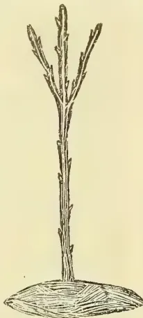

Pruning of a two-year-old tree from the bud.

#### THIRD PRUNING

Are cut back to 6 to 12 inches, according to their strength. Two of the top shoots on each of these branches with an upward direction are left, and the lateral shoots from the other buds on the limbs below are pinched back in the summer time, when they are a few inches long, to four or five leaves.

These little tufts of leaves shelter the branches, strengthen them by coverting sap into woody tissues, and ultimately develop fruit spurs. Branches which approach the vertical line most are cut shorter than those inclined to an angle, to thus force the buds at the base to grow.

#### FOURTH PRUNING.

The same treatment described in the case of the first, second and third pruning is applied in the case of the fourth pruning, and generally at this age the tree will begin to bear readily. At this period a stocky, low standard tree will have been formed, which will have a well-balanced head, constituted of branches growing in an upward direction, and carrying fruit spurs all along their length. Such a tree, will resist high winds well, can easily be approached by horse and implements, so that comparatively little hand-labour will be required to keep the orchard in a high state of cultivation; the crop will be evenly carried along the main branches, which will not stand in need of artificial props, lest they should break down under the load of fruit which, at this

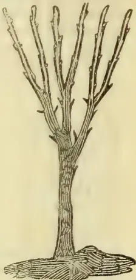

Winter Pruning of a tree three years from the bud.—BARRY.

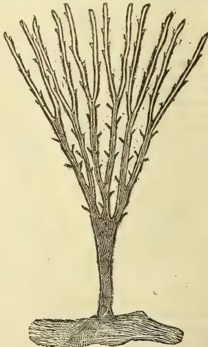

Young standard tree, four years from the bud, after pruning.—BARRY.

176------------------------------------------------

SEPT. 2, 1901.]

THE TROPICAL AGRICULTURIST.

157

early stage, they will begin to carry. The pinching of the superabundant laterals is best done in the early autumn, when buds, which would otherwise have remained sterile, are transformed into fruit buds. This operation will besides save much butchering in the winter time, as, by suppressing either entirely or partly an undesirable shoot at an early stage, much sap, which would be turned into wood growth, destined to be cut off in the winter, is saved, and the energy and the vitality of the plant thrown into more useful channels. This practice leads to the enunciation of the fact that severe winter pruning induces wood growth, while summer pruning tends to fruit production. Thus, if a tree is stunted, and for some obscure reason does not make much wood, but shows a tendency to produce more fruit buds than it can safely carry, prune close in the winter; if, on the other hand, a tree grows so quickly that all its energy is wasted in wood and leaves, and does not pause to produce fruit, either summer pruning or root pruning will throw it into bearing. By such means the plant realising, while in full flow of sap, that its constitution has been attacked and its life menaced, will make an effort to reproduce its kind forthwith and the result will be the evolution of leaf buds into fruit-bearing spurs. Subsequent prunings consist mostly in rubbing off water shoots, in suppressing branches that cross and rub against one another, and trimming the twigs and the fresh growth made during the season's growth. As this stage the tree will have ceased making much wood, and will begin the business of setting and carrying fruit.

REDUCTION OF SWELLINGS AND HIDE-BOUND TREES.

At the time of pruning swellings are occasionally noticed on the stems or limbs of trees. These swellings are either due to the disproportionate growth of the scion or fruiting part, compared with the stock or root end of the tree.

They may also be due to strings used in previous seasons as ties, which have cut through the bark. These swellings, which interfere with the free circulation of the sap, must be reduced. This is best done by running longitudinal incisions from C downwards to the stock B. The bark will thus expand, and, should the deformity continue the next season, these incisions should be renewed.

Trees which have been neglected, or whose growth has been stunted by the presence of moss and lichen, scale insects or other pests, or by want of drainage of the soil, by the aridity and poverty of the ground, or are debilitated in consequence of having been allowed to bear too early, often show a miserable, sickly appearance. Their growth is stopped, the bark becomes tough and leathery; they are hide-bound. The cause of the mischief may have already been removed, and still they will make no growth.

Such trees should be similarly treated at the time of pruning. They should be cut hard back and at pruning time the knife should be run longitudinally through the bark, from the heel to the top of the stem, and even along the main limbs. It is also advisable to whitewash the stems of such trees. Lime, in the shape of whitewash, is well known to be beneficial in most bark diseases.

Under this treatment the stunted trees of last season are seen to spring into fresh and healthier growth. The cambium or growing wood layers force the strip of leathery bark apart, the stems and limbs are soon seen to swell, the sap runs freely from the roots to the top branches of the plant and the whole growth looks healthier.

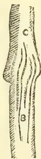

Incisions to reduce the swelling of the graft or the stem.

INCISIONS TO CONTROL THE GROWTH OF SHOOTS AND BUDS.

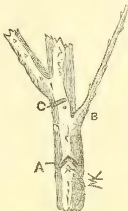

INCISIONS.—DU BRENIL.

growth, and in that case an incision as shown at A will be found useful. On the other hand, should a strong branch become uncontrollable in spite of heading back, it may, in extreme cases, be advisable to check the flow of sap towards it by making an incision as shown at C, immediately below its point of attachment to the stem.

Thus we have a means of transforming wood bud into a fruit bud and *vice versa*, by making a cut below the rudimentary bud if we want a fruit bud, or above it if we want a wood bud. These methods should, however, be only used with discrimination, else more harm than good will ensue.

RENOVATING OLD TREES.

Fruit trees, planted in good soil and possessed of a good stem, are susceptible of living to a great age. It, however, often happens that through years of neglect their branches have grown to excessive length and are, to a great extent, deprived of fruit shoots, or that the crop is carried up too high, hence adding considerably to cost of gathering; or again the trees are diseased, and in order to successfully combat the pests which infect them they must be shortened in. Again the variety of fruit the tree bears may be unsuitable, and it may be expedient to change the variety by means of budding or of grafting. In all these cases it may be desirable, or even imperative, to shorten the tree and head it back. For that purpose the saw is called into requisition, and the cuts smoothly pared with a sharp knife, the wound being then smeared with clay, or with the shellac paint, or some of the other paint already referred to.

The figure illustrates an old plum tree which has thus been renovated. The plum, better than most other fruit trees, stands cutting back hard to old wood without showing symptoms of dying back, which, under similar conditions, are often shown by apples and more particularly peaches and nectarines.

Early in the spring, the roots of the tree, which may be good for many years more, become active, the sap commences to move upwards and a number of hidden and dormant buds are excited into life. Shoots burst out of the old stumps and as they grow they should be thinned out to the number of three or four only, well placed and likely to form a

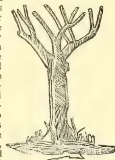

Top of an old plum tree headed back for the purpose of renovating.

177------------------------------------------------

158THE TROPICAL AGRICULTURIST.[SEPT. 2, 1901.

symmetrical head. Should these few shoots, which are destined to serve as main limbs, grow too rankly, they may be pinched or cut back during the summer and laterals will grow on the tree, which will be shortened at the time of winter pruning. Should, however, these shoots show only a moderate growth, they are better left alone until the pruning season, when they are cut back and treated as directed under the heading "First and Second Pruning."

Except in the case of plum trees referred to already, it is inadvisable to cut back trees in the process of renovation to blind stumps, but this should always be done just above a young branch or a small shoot, so situated that it can be used for giving start to the fresh growth. Old apple trees, apricots, and especially peaches are at times killed through overlooking this detail. The sap becomes stagnant, a dying-back process sets in, and carries off the limb. Peach trees more particularly must be cut back with judiciousness when it is intended to renovate them, the reason being that fewer buds are found on the old bark of peaches and nectarines than on the old bark of pippins, and what few buds there may be left are less easily thrown into active life again than buds of apple and pear trees. In the case of peach trees, indeed, the basal buds are frequently bloom-buds which blossom and then die off, leaving no wood buds to spring into life at a later period and send up fresh growing shoots.

When renovating trees of the citrus tribe, it is also advisable to cut large limbs above on young, fresh growth, although in their case this is not so essential as in the case of peaches. These trees are fairly well stocked with miniature, dormant buds, which are thrown into life whenever the emergency arises.—*Journal of the Department of Agriculture*.

#### A FEW NOTES ON CITRUS TREES AND ALSO WORKING OVER WORTHLESS OLD ORANGE AND PEACH TREES, W. J. ALLEN.

In many of our citrus orchards are frequently found a few or perhaps a good number of trees which do not bear as well as they should, or it may be that the fruit is of such inferior quality as to be of comparatively little value. In such cases it would pay the grower, if the trees are vigorous, to cut them back and graft or bud the new shoots to varieties which have been found thriving and bearing well in the particular district. In California many good old seedling and other orange orchards have been treated in this way and worked largely to the Washington Navel, which is the most popular orange grown there.

While many growers in the Cumberland district might deem it advisable to rework some of their trees, there are but few who would care to bud to the navel, as, up to the present, most of those who have done so have found to their sorrow that the navel orange has proved a shy bearer with them, and consequently these feel disposed to rework such trees with other varieties which bear regular crops of fruit. The grower should be most careful that the buds or scions intended for use are taken from good trees, and not from young immature trees which have not yet justified their existence in the orchard.

In the orchard at the Hawkesbury Agricultural College I have been, and am even now, getting some of our worthless trees worked over to better varieties, and from time to time the Department is importing some of the best Californian varieties. In the accompanying illustrations I have had the artist photograph one specimen of each of the following Mandarins, viz.:—The Emperor, Scarlet, and Thorny—these three being largely grown throughout

our citrus-growing districts. At some future time I hope to have the Beauty of Glen Retreat illustrated. Other illustrations show the progress made from year to year by worthless trees which have been cut back and reworked at the same orchard.

Fig. No. 1 (a) is a typical Emperor Mandarin tree, which is carrying a heavy crop of fruit. Up to the present time it has been found that this is one of the most profitable varieties to grow, and is a good mid-season variety. If held on the trees too long the fruit is likely to become very puffy in many districts. Should the Beauty of Glen Retreat prove to be a constant, heavy bearer it will no doubt supersede this and other varieties.

Fig. No. 1 (b) shows another style of Emperor Mandarin tree, started out nearer the ground and trained to spread wider, and not allowed to grow as high as fig No. 1. The tree is carrying a very heavy crop of fruit. The fruit is more easily picked from this tree, and the process of fumigating for the destruction of scale is carried out more easily in the case of this tree than in that fig. No. 1.

Fig. No. 2, a Scarlet Mandarin tree, heavily laden with fruit. The tree grows more upright than the Thorny and not so tall as the Emperor. A good cropper, fruit rather large and flat, but inclined to go puffy when kept on the tree any length of time. This variety has not found the same favour with growers as the Thorny and Emperor.

Fig. No. 3 shows the Thorny Mandarin tree. A very heavy cropper. Fruit small and rather flat. One of the best flavoured of all the Mandarins, and very much liked by the public. Ripens about the same time as the other varieties. The tree shown is a typical one, but at the time of photographing it was bending in all directions with the weight of its fruit, which, however, being green, does not show.

Fig. No. 4 shows an orange-tree cut down to force out new shoots preparatory to budding, which method I prefer to grafting. The tree will throw out numerous shoots, but as these grow the surplus ones should be removed, and only a few should be left, and these in positions where the new main limbs are required. If this work is carried on early in the spring there will be some good strong limbs by the fall, ready to receive the buds, which should be inserted about the first week in March, or just sufficiently late that they will not start into growth that autumn, but lie dormant until the following spring, when they will push out and form a very good tree by the next autumn, and in all probability some of them would carry a little fruit the second year.

Fig. No. 5 shows the tree at the time of budding, the buds being inserted at the base of the new growth.

Fig. No. 6 shows a tree after the new buds have made their first year's growth.

Fig. No. 7 is a Washington Navel tree two years after budding. Five fine oranges were picked from it this season, but owing to the visitation of night birds of prey it was thought advisable to pick them before they were coloured, and in consequence they do not show to advantage, as the rind would have been much thinner and the cells finer if the fruit could have been allowed to hang until properly ripe. It will, however, be seen that the size is all that could be desired. Fig. No. 8 shows the fruit before being cut, and fig. No. 9 shows the same orange cut in halves.

Fig. No. 10 shows an assorted row of best varieties of imported orange trees, two years from the dormant bud, and consisting of the following varieties, viz.:—Washington Navel Paper Rind, St. Michael, Mediterranean Sweet, Valencia Late, Egg-shaped St. Michael, and a few other varieties.

Fig. No. 11 shows part of a consignment of orange trees procured from California twelve months ago. All arrived in good condition and are doing well

178------------------------------------------------

SEPT. 2, 1901.]THE TROPICAL AGRICULTURIST.159

The trees shown in figures 10 and 11 are worked on orange stocks, as were also the parent trees from which the buds were taken to work these trees, so that when they come into bearing it will give us a good idea as to their suitability for this district. The object in importing these trees was to ascertain which were the best and most profitable varieties to grow in this State, as also to prove whether it is the true Washington or some other variety of navel which has proved such a shy bearer with us.

As there are thousands of peach trees bearing poor fruit in the State, it will be of interest to many to have the reworking of such trees demonstrated. Fig. No. 12 shows a large peach-tree cut back during winter's pruning. If the grower wishes, however, he may leave them until the latter part of August, when they can be cut back and grafts inserted, by splitting the bark down the side, then raising the bark and inserting a scion between the wood and bark. Bind firmly with waxed cloth, and cover the cut with a thin coating of grafting wax. Should any of the grafts miss, buds may be inserted the following February in the new growth. All surplus growth should be rubbed off, leaving young shoots in such positions as are most desirable to start main branches, the latter to have buds inserted in the exact places where main branches are required. It is generally found best to bud on the outside of the tree as that generally gives the tree a good crown, whereas, if the buds are put on the inner side of the branches, the limbs grow towards the centre of the tree, making a very close and undesirable crown.

Fig. No. 13 is the same tree after it has made six months' growth. The buds will be inserted within a few inches of the base of the new growth. The top will be well cut back in the winter at pruning time, and the growth forced into the buds so that they will form a good crown.

Fig. No. 14. A tree which has been cut back and budded—the buds showing the first summer's growth.

Fig. No. 15. The same tree as in fig. 14, two years after budding. It will be seen that this tree had longer arms left on it at time of cutting back than fig. No. 12, and consequently the tree is not nearly so well shaped as it would have been had the main branches been well cut back in the first place.

It will be seen that in treating a tree intended for reworking to better varieties it is best to cut it back to within 6 inches of the trunk rather than to leave arms 2 feet or more in length.—*Agricultural Gazette of N. S. Wales.*

#### CULTIVATION OF RUBBER TREES,

Some people may be surprised to learn that there is still a raw product that man finds just as difficult to obtain as it was a hundred years ago, and that it is harder to obtain than ever. It is the milk of a very insignificant-looking tree, growing in great quantities over a large tract of territory. The tree itself is generous; liquid follows the incision; a wait of a few hours for the milk to harden and a man has the equivalent of a day's wages. This white liquid, after exposure to heat, and many species to that of the sun alone, and without any further treatment, gives thirty per cent of its bulk in pure rubber. Despite this, the world cannot obtain a tithe of the supply it needs. The simple reason for this state of affairs is that the tree, although generous itself, elects to grow in regions which for the most part are death to white men, and are removed from civilization by thousands of miles of swamp and jungle.

To alter this condition of this two sets of men are working on opposite lines. They are engaged in a sort of race for a very high stake—an unusually

high stake indeed, as the pure rubber is now selling for something more than \$1 a pound. One set are chemists, who have been trying their best for the last twenty-five years to find a substitute for rubber. So far there has not been an unqualified success among their attempts, and there are experts who go so far as to say that chemically it is impossible to combine for the market a substitute having the different properties of pure rubber. Be that as it may, hardly a day passes but the long-expected substitute is brought forward and the company formed to exploit the perfect substitute of the year before goes into the hands of a receiver.

The field of activity of the other set of men is very different. It is found in a few farms in Mexico and Central America, and in a few government stations, notably in Jamaica and Ceylon. There are a small number of farms where something like a systematic attempt is being made to farm rubber on a large scale; some half dozen in the Isthmus to Tehuantepec and a very few more in Nicaragua, Costa Rica and the rest of Central America.

The difficulties which confront this handful of farmers are peculiar. In the first place, no one ever tried before to make rubber grow as a crop for the market. There are no data, no facts of even the simplest kind to tell these men whether their ideas are the right ones. The natives of the country take no interest in this outside their own particular business, and a man about to establish a plantation has had to start fresh, with his own ideas to guide him! and these latter cannot be said as yet to have become authoritative, for none of the farms are more than six years old, and the trees must be up that time before the question of growing them can be settled. Rubber planting, then, is not only an absolutely untried undertaking, but there has been nothing of tradition or general knowledge of the subject with which to make a start. If rubber were a delicate tree, or difficult to cultivate, the outlook would be disheartening indeed.

Second, the general conditions are against the planter. The nature of the country throws him entirely upon his own resources, and the climate is apt to be enervating, to say the least. Transportation is a great problem. Labour is scarce and not easy to handle, the native peon of Central America being a mixture of childishness and independence, and a hard drinker to boot. Although strong and active as young men, excellent axemen and better with a spade than any other labourers in the world, they become debilitated very early in life. They have no constitution and must be cared for like children. Furthermore, they look to the patron, or owner, for the settlement of every ill, spiritual or temporal. You must keep them sober, get them out of debt, make peace between them and their wives, arrange any infelicities that may occur between them and their neighbours' wives, doctor the whole family and educate the children, if you have time. For the peon is essentially a creature formed for the patriarchal system. With a chief or employer whom they know or respect the better class of peons become in many essentials ideal labourers—steady, careful, hard-working, quick to catch an idea, faithful to follow it out, entirely honest; their employer's interests become their own. But in order to obtain this desirable state of things a farmer should be a first-rate judge of capacity and character, a fair lawyer, physician and man of business.

A third problem before the farmer of rubber is where to plant. *Castilloa elastica*, for practical purposes the only rubber in Central America, has an extremely varied habitat. It is found at all elevations up to 2,000 feet and in a great variety of soils and locations, with a consequent variation of rainfall. So, here, again, the farmer must make a choice, and one upon which his success will probably depend, with nothing to guide him in the making. As regards location, it is conceded that *Castilloa* needs a tropical climate, a rainfall that

179------------------------------------------------

160THE TROPICAL AGRICULTURIST.[SEPT. 2, 1901.

can be depended upon, a good drainage, and an elevation of less than 1,500 feet, but these conditions have great latitude of choice.

The most important of the questions relative to the method of planting rubber is the one about which the farmers are most divided, and is probably the most vital connected with its cultivation. It is the question whether to plant in groves, in the open, or under forest shade. The advocate of the former system says that in any other part of the world, if one wants to get a particular crop, it is customary to give the tree or plant all the chance possible. One clears the ground, turns it up, and after the tree is planted keeps all weeds from encroaching upon its light and food space. Why not apply these elementary principles to rubber and plant in plowed and open land, in groves, like an apple orchard?

The advocate of the forestry system points, however, to the manner in which the tree grows naturally and says that rubber is found thriving best under shade, in a cool, wet spot, and by "thriving" he says he means gives the most rubber. The tree will grow, it is quite true, faster in the open than in the forest, and you will get your groves of rubber trees more quickly, but the question is, Will you get the milk from them? For it does seem to be a fact that rubber found in open pastures will not yield so much milk as those trees growing in the forest, where it is cooler and moister. If it could be ascertained exactly what function the milk of the tree performed, one would probably be able to tell how much sun and how much rain would produce the tree with the largest quantity of rubber. The milk is not a sap, but a latex, which is carried just under the outer bark, and the slightest nick from a pen-knife will be followed by a thick liquid, which if caught on the finger dries at once, leaving a shred or two of pure rubber, like small elastic bands.

There are farms established by exponents of each theory. One can see in Mexico rows of young trees in open cleared land, in every respect like a coffee or orange plantation; and again in Costa Rica the farm consists of rubber trees planted in among the forest trees, only cleared where the growth is very thick, though of course the bush is kept down by cutting twice a year. Those who are following these two theories will be relieved when they get their first crop. But at present they are having rather an anxious time of it, for on the one hand it will be expensive business, not to say impossible, to plant shade among those trees in the open, and the rubber may be ruined before the shade comes up. But this course would be imperative should the advocates of the orchard theory find themselves in the wrong. On the other hand, should the forestry people be at fault, it will require considerable skill for the owner of the rubber growing in the forest to cut out the trees and let in the sun without injuring the rubber. Ringing trees at the right phases of the moon, some eminent scientists to the contrary notwithstanding, will go far toward solving the problem for the grower of rubber in the forest and make his position the stronger of the two, on the whole, in that he runs the lesser risk, as it is easier to cut out the shade than to put it back.

As for the rubber planter's profits nothing definite can be said about them as yet. A man might buy a thousand acres of good rubber land for \$5,000, and he might plant it and bring it to production for \$45,000 more—\$50,000 in all. But now as to the returns, it is like figuring on the chicken industry; one becomes alarmed at the rate chickens, eggs and profits pile up. In the same way it is estimated that rubber will produce a handsome return every year at the end of the sixth year from planting. Anyone can work out for himself the following sum in multiplication for the profits of the eighth year: One thousand acres with 200 trees to the acre, one pound of rubber to the tree each year, sold at a net profit of 50 cents a pound.—*Agricultural Gazette*.

## VANILLA CULTIVATION.

To judge by occasional notes, which appear in our planting journals, this product appears to be having its full share of attention at the hands of those planters who are on the alert for anything in the shape of a profitable auxiliary to the main crop they may be growing. In certain planting districts it is being propagated year by year with the view of raising a sufficient number of plants to form a plantation of an acre or so, in order that a regular squad of people may be told off specially to look after the plants. This is absolutely necessary, and is the right way to go about the matter,—where there are only a few plants scattered here and there about a compound, they cannot get that special attention which is necessary to forming an opinion as to whether the raising of them on a larger scale will be a profitable undertaking. Of course there is always the probability of over-production, and this ought to be steadily kept in view, and nothing but the very best quality of pods put upon the market. If we may take South Sylhet, for instance, which, by the way, we are inclined to place in the very first front rank amongst planting communities, in the matter of the introducing and cultivating of valuable plants from other regions with an analogous climate and habitat, we can see no reason whatever why that district should not make a name for itself for a good quality of vanilla.

The large majority of our planting districts in Assam will grow vanilla. There are a few districts in Upper Assam, which are sometimes too cold and damp during the winter months, and the plants get what is known as "spot." This is not what we should call a disease, but simply a "hurt" caused by water resting upon the leaf when the atmosphere is at a low temperature. The vanilla "plant" will stand a much lower temperature than any we ever get in the valley of Assam, but it will not tolerate dampness as well. Even in the South Sylhet district, where we never get such a degree of cold as is usually experienced in Upper Assam, vanilla will not succeed in lowlying situations where there is sufficient moisture during the dry season to cause a continual raw feeling during the day.

That it grows, flowers, sets and grows pods of a good quality as are produced in the Seychelles Islands has been already proved. The prices have been well maintained, for many years past, despite the invention of vanilla (the coal tar product) which has not commended itself as anything likely to be a competitor, where the real vegetable product is to be had. There are lands more suitable for its cultivation than others, but any ordinary forest land with a good surface accumulation of vegetable mould will be found adaptable for the cultivation of vanilla. At the same time, vanilla-growing, being one of the most concentrated of Agri-Horticultural industries, can be grown upon the most barren of lands, in the absence of other unfavourable conditions. The writer is not aware as to what size the vanilla plantations of Reunion and Mauritius run, but we may take it that a 5-acre vanilla garden would be considered a very large "auxiliary" indeed to a 500-acre tea garden. And if 5 acres of first-class forest land could not be had, 5 acres of scrub jungle could very easily be made almost as suitable by carrying fresh jungle soil to plant the vanilla plants in. It would cost no more than it does to make large pits and fill them with fresh soil—a necessary work when filling tea vacancies if any measure of success is to be counted upon. The Mexican system of allowing the vines to grow under trees nearly wild appears to be almost universally adopted now, and is a decided improvement on the old system of training the vine on artificial supports. According to a report on the

180------------------------------------------------

SEPT. 2, 1901.]THE TROPICAL AGRICULTURIST.161

vanilla growing in Seychelles nothing pays better than vanilla. Its production costs the planter about Rs. 3 per lb., and as prices vary from Rs. 5 to Rs. 16 per lb., a net profit of from Rs. 5 to Rs. 13 is the result. The average price was Rs. 15 in 1898, and at the present time runs much about the same. The yield may safely be taken to be 200 lbs. an acre according to the report above alluded to. "Taking, therefore, an average of Rs. 10 only, an acre of vanilla should produce Rs. 2,000." Five acres of vanilla at this rate would not come amiss to plenty of large tea concerns, to say nothing of small ones.

It would even pay them to keep a European who thoroughly understood the plant, its growth, fertilisation (which has to be done artificially) and last, but by no means least, the curing, sizing, and packing. The object of this article is not to make planters believe that they have nothing to do but procure vanilla plants, stick them in and wait for the pods to come. We may go the length of asserting that out of every 100 planters who attempted vanilla growing 98 would very probably not succeed. It requires special knowledge all through as to the habits of the plants and its requirements. The curing alone requires considerable study, care and experience. The plant when growing, although preferring to take its own sweet will during its adolescence, is entirely helpless when it comes to maturity. It will keep on growing certainly, but is quite incapable without human aid of reproducing its own species; consequently, if this process is not understood, the growers will have no produce in the shape of the fragrant vanilla pods of commerce.

Whatever may happen in the future the industry is not suffering at present from over-production to the extent of affecting the profitable nature of the industry. In 1898 the vanilla crop of the Seychelles amounted to 63,000 lb., and was sold for Rs. 936,000. It cannot be gainsaid that the large output of vanilla has given a fresh impetus to its cultivators, and large quantities have been planted during the last two years. Still, according to the chemist and druggist, the consumption of vanilla pods is increasing every year and likely to continue to do so far a long time.—"A. P." in *Capital*.

## COFFEE CULTIVATION IN BRITISH CENTRAL AFRICA,

To the flowering of coffee the planter looks for a forecast of the season's crop. Naturally one would expect this to be correct, but, for several reasons, it cannot always be depended upon. It is now well known that *Antestia variegata* is responsible for the reduction of both the flower and the berries after they have been formed. Drought was supposed to do considerable damage also, and, in fact, is the reason given for the failure of so much crop. I assumed this as correct, and, by some notes on the subject to the *Central African Times*, I concluded that, with the destruction of *Antestia variegata*, and a system of irrigation, our success in coffee production was assured. Now I must admit I have been misled, and, therefore, made a mistake. My views of the subject now are that irrigation would do very little good, and that it is not the roots that require moisture, but the plant above ground. This drought which we get occasionally is not directly the cause of our failure of crop, or the burnt-up or dead appearance of our plants, but of course it is so indirectly.

From my observations I with no hesitation declare thrips to be almost the sole cause of this damage put down to sun and heat. Damage caused by sun and heat is relatively so immaterial that little account need be taken of it. We have thrips every dry season, and it is only the want of rain or a drought which helps to bring them forth in such

vast numbers. At the beginning of the dry season they are few and far between, but become more conspicuous towards its close. Some time before the wet season commences, I should say, they are found at the very least to average a dozen larvae to every leaf, and the whole of the underside of that leaf is sucked and discoloured completely. The time when the destruction is disastrous is immediately after the coffee has flowered. Here are tender berries much superior in the estimation of thrips to leaves months old, or leaves that they have been living on and sucked from the under side, giving them the appearance of pieces of brown paper hanging from the branches instead of leaves, and now discarded for berries. Ultimately these leaves fall off, leaving the branch and berries black and dead.

Thrips are first seen as minute red insects generally with a drop of dark fluid or excrement attached to their abdomen; they afterwards change to a lighter green than the colour of the leaf; a few of the imago or perfect insect with wings and dark body are also observed. The elongated abdomen of the larvae gives them the appearance of minute worms or caterpillars. In fact, there is sometimes seen on the coffee leaves a grub resembling them which is not unlike the larva of a fly. Wherever they are they darken the leaf, tender stem, and berries by their puncture and excrement.

As to the possibility and feasibility of destroying or keeping thrips in check by hand picking in their initial stages, I am not in a position to say at present.

Besides hand-picking we have another alternative; we are aware that some seasons we get a shower every month; those showers and everything else being favourable, we get a good crop; in other seasons these beneficial showers fail to come, and our crop is more or less a failure. Now those monthly showers have been the means of keeping the thrips in check. Likewise the wet season almost completely overwhelm them. From these facts we may conclude that spraying with a syringe or a garden engine is the next best thing, and with the addition of tobacco juice or any other insecticide less spraying may be required.

There can be little doubt as to thrips being indigenous, and possibly new to science. The nearest approach I can get to the species of thrips on coffee, is one found on grass, which may be the same species or quite different. To me it appears smaller or shorter. The result of thrips on grass is that they are accompanied by a fungus. This fungus is red, and can be easily noticed; it is on the under side of the blade, but can be seen from the top, so that grass with thrips can be easily detected. This grass had not been burnt in the previous year with bush fires; on grass that had been burnt, or grass grown from seed, I have not noticed them. The appearance of this fungus in most cases resembles the larvae of thrips in their red stage.

The next nearest approach to the species found on coffee is one found on a shrub, *Dissotis princeps*, growing in our marshes.

Thrips belong to the Thysanoptera order, and like our plant bugs imbibe the juice of plants by suction. At the recommendation of Dr. Sharp, F.R.S., Cambridge University, I have sent all the specimens of thrips, &c., to Miss Embleton, Balfour Laboratory of the above University, for identification, and any advice which may be of use to us in the matter.

KENNETH J. CAMERON.

Namasi, Feb. 26th, 1901.

—*Journal of the Society of Arts.*

## SHIKAR AND TRAVEL :

### ONLY A CUP.

That there was a tigress in the jungles somewhere near my camp I knew, but she could not be persuaded to kill any of the baits that I had had tied up for

181------------------------------------------------

162THE TROPICAL AGRICULTURIST.[SEPT. 2, 1901.

her. Her tracks one morning showed that she had gone along a nullah not ten yards from one of the tied-up bullocks, but she had not touched it, and it seemed as if she fed on game only, as no damage to any of the cattle herds in the neighbourhood had been reported. I had quite given up all hope of getting a shot at her, and had, on my last day at the village of A., arranged for coolies to be collected to beat through a hill near my camp which was a sure find for bear if only they could be persuaded to break which was not always the case, as there were so many caves in the hillside), when word was brought that a kill had taken place in a nullah between the bear's hill and my camp. On going to inspect the place where this had happened, I found that the carcass had only been dragged a short way from the nullah into the jungle along its banks, and but little of it had been eaten. The tracks showed that there was a cub with the tigress—a fact of which I had not been aware, and the tracks further showed that after their meal the two animals had separated, the cub remaining in the jungle near by while its mother had returned by the way she had come to the kill. For about two miles we followed her tracks which led us away from the nullah, and then they struck a small village path and we lost them. This was disappointing; but there was the chance that the tigress had gone round by some other way to join its cub, so I gave up all thought of having a bear beat, and instead made arrangements to beat along the foot of the hill on both sides of the nullah for the cub, and, if possible, for its mother too. The spot that I selected for my station was on the side of a small dried-up stream (a tributary in the rainy season of the nullah where the kill had taken place); all around me was grass jungle with scattered trees, and about 400 yards to my left was the bear's hill. Directly behind me, about 600 yards away, was another hill, for which it was anticipated the tigers would make on being disturbed. It was necessary, in such a grass jungle to have a large number of stops, for although the grass was high and thick it was not matted, and a tiger could get through it easily anywhere, so I selected forty of the least stupid-looking from among the coolies assembled and placed twenty on each side of me, those on the left extending up to the foot of the hill. While laying the stops on the left my "shikari" came face to face with the tigress who was sleeping alone—the cub not being with her, at least my "shikari" did not see it—in a small depression at the foot of the hill. Fortunately, on being disturbed, she bounded off into the forest through which the beaters were to pass.

I had waited about two hours in my *machan* before I heard the welcome sound of the beaters advancing and, as I lifted up and cocked my rifle, I scared a covey of bush quail, that had allowed me to watch them feeding among the sal leaves below me and they scurried away across the dry stream and into the grass on my right. Ten minutes later I heard the sound of an animal coming towards me on my right; at first I thought it must be the tigress as it made so much noise among the dry leaves in the nullah, but it was only a four-horned antelope buck that stood and looked at me and offered a most tempting shot at twenty yards which, of course, I did not take. Then after another wait of 10 or 15 minutes, the tiger-cub appeared. It came towards me across the bed of the nullah at a good rate, and I fired, when it was almost below me, between the shoulders, killing it at once.

All this time I was not aware that the tigress was in the beat, as my *shikari* did not tell me till afterwards that he had almost stumbled upon her as he was laying out the stops, and I was consequently very pleased to hear a low growl that could only come from her, soon after I had shot the cub. I heard her moving about the bed of the

nullah, apparently coming and recrossing it, and though I imagine she saw me, I never caught a glimpse of her, until the beaters were nearly up to her, and then she sprang across the nullah and through the grass to my left offering me two snap shots, both of which were unfortunately misses. They were both difficult shots: the first among the trees, and as there was a bend in the nullah when she crossed it, I could not get a clear view of her; and the second, in the long grass. The latter I ought to have made fairly sure of, but as I was on the point of firing I noticed that one of the stops, who was in a low tree to my left and rather below me, was almost in the line of fire, and I had to hold my fire until the tigress got well clear of this line. This delay put me off my shot, and, in all probability, accounted for my miss. After the beaters had come up, and I had searched carefully to see if either of my shots at the tigress had taken effect, I decided on another beat, through the low hill that I have already said was situated behind where I had been stationed. The tigress' track lay straight in this direction, and it appeared as if she must be lying up there; but the beat which was a miserable, uncomfortable one, as a drizzling rain set in while the stops were being placed, proved blank, and we found that the tigress had made for this hill; but instead of ascending it, she had skirted along its foot and gone thence to some thick jungle and hills to the south-west. It was too late then to think of trying to hunt her up there, for I had 8 miles to go to my next camp and the sun was then very near the horizon, so I had to be contented with the cub I had bagged, and leave the mother for some future occasion.

ANTONG, Raipur, C.P.

LONG TOM.

Indian Forester.

GLASGOW EXHIBITION: BLACKMAN EXPORT COMPANY LTD.—The Blackman Company's Exhibit 700 sq. feet is an interesting one. Seventeen of their well-known Blackman Fans are shown in motion, the largest of which, 96 inches in diameter, is driven from the shafting overhead by means of a belt; others varying from 72 "to 12" in diameter are driven direct by electric current, these Fans being combined with Electric Motors of the Company's own manufacture, especially designed for this class of work. Four of the Fans deliver air, warm or cold at pleasure, from the four sides of the upper part of a central column or Kiosk, which is a prominent feature of the stand. On this stand there is also a Model Drying Installation consisting of a drying compartment arranged in conjunction with a Blackman Electric Fan 24" in diameter and suitable Radiators for heating the air. The main advantages gained by the Blackman System of drying is that almost every class of material and produce is effectively and rapidly treated with the greatest economy both in cost of drying and in the space occupied by the drying chambers whilst the quality of the material so dried is much superior to that baked or stewed in closed stoves. Twenty-four Blackman Electric Fans are used for ventilating the Restaurants in different parts of the exhibition. Messrs. McKillip & McKenzie have 14 of them, from 24 "to 42" in diameter, in Restaurants Nos. 1, 2 and 3, where their cooling and ventilating effect is highly appreciated. Four others of similar sizes are used by Mr. Jenkins, in Restaurant No. 5: two more in the Indian Theatre, and two in the Bermaline Model Bakery. An imposing addition to the Exhibit is a large assortment of Keith's patent Hydraulic Rams and pumps, heating Apparatus, and High Pressure Gas lamps of great brilliancy, for which the Blackman Export Company Ltd., of 70, Finsbury Pavement, London, E. C., are the Exporting Agents,

182------------------------------------------------

SEPT. 2, 1901.]THE TROPICAL AGRICULTURIST.163RHODODENDRONS.

After the floral flood-tide of early spring, there is a brief but perceptible ebb in the beauty of the lawn and garden-border. The ever-welcome bulbs, whose gay but not deep colourings remind us a little of the tremulous winter sunshine, have had their hardy day, and Nature pauses as if to gather strength for the production of the richer and riper beauties of the glowing summer. But this wonderful pause is garlanded for us with a magnificent display of flowers, which belong to the landscape rather than the parterre. They do not easily lend themselves to the restrictions of "interiors," nor to the narrow embraces of the flower-vase. But when a dry May-month gives them their opportunity the tree flowers are not to be surpassed for the veritable enchantment which they work upon the scene. The half-dozen homely kinds upon which we customarily rely for this magical effect have been this year close confederates and have conspired to delight us by an almost simultaneous effort. The white and pink of the chestnuts have challenged the white and pink of the hawthorn. Honours are fairly easy, but, as if to abate any nascent feeling of rivalry, the softer syringa with its white and "lilac" has held a commanding position between its loftier fellows. And the golden tassels of the laburnum have so brightened and relieved the competition that the wide sylvan stage has been a scene of the most refreshing variety and enjoyment.

Flora thus descends to our meadows and pastures by way of the trees; and true to time and season, and her own good will, she finally alights upon the lawn in a blaze of triumph lighted among the dark evergreen leaves of the rhododendrons. The fire has been smouldering for some days, but the punctuality of the plants in "lighting up" is proverbial. They seem to claim the early days of June as their special prerogative, and seldom indeed do they disappoint us. As handsome evergreen shrubs they do splendid service all through the year; and when their too-fleeting glories have passed away, we may enter the portals of the garden proper, with all its marvellous assortment of "bedded-out" plants, making themselves at home, and gradually expanding into blossom. But for the moment, the rhododendrons hold us; nor are we in the least doubt as to the point of view from which they are, and should be, popularly regarded. The botanist tells us—in the seemingly callous, but perhaps necessary, way which makes so many persons shrink from him—that "the rhododendron is a genus of glabrous, pubescent, tomentose, or lepidotod shrub." Not even Mrs Gamp herself would have been provoked into a "denigging" of this proposition. But a pleasant voice floats across the lawn freighted with a dictum much more germane to the occasion. "Are they not perfectly lovely?" The precise value of which phrase lies in the intonation, which, unhappily is not producible in print. But it is true—so far as it goes. Critics, indeed, might demur to it, as placing the rhododendron on the same plane of comparison as its latest fanciful imitation in ladies' headgear. But that is a captious objection. The flowers are lovely. The mere man only employs a more square-set word when he calls them magnificent.

When the early settlers in Virginia had time to look about them their first astonishment was at the splendour of the autumnal forest tints. Against the dark livery of the pines were set the golden yellow of the beech, the red foliage of the maple,

21

and the glories of the scarlet oak. But another natural feature presently drew their eyes downward. The mountain-sides and valleys were thickly covered with a handsome shrub which they soon learned to call the mountain laurel, and which in its season bore abundant flowers of a "pale blush." This was simply the quite unauthorised American edition of the rhododendron, which does not appear to have found its way to England much before the beginning of the last century. Even its great Oriental predecessor, the Pontic rhododendron, from which so many of our present varieties have sprung, was little known among us before the early years of the 18th century. Since that time, however, the florists have found the tribe so very teachable that they have devoted much time and skill to their higher instruction. Both the oleander and azalea are scientifically included in the family, which even at the beginning of its school career was one of the greatest promise. And now in the parks of town and country rhododendrons have long been flowers of course. Planted "walks" have enlivened the more sombre vistas of forest scenery, and no garden which attains to the dignity of a lawn can now afford to dispense with them. The very severity of their dark, leathery, but always attractive, leafage affords only the greater contrast to the vivid splendour of the flowers. The colours of the more delicate greenhouse kinds are a wonderful feast for the eye, passing from white to silvery, and through the softest sulphur-shades to yellow and deepest orange. In another direction we are led through the gradations of rose and mauve to the most gorgeous depths of crimson and purple. Nor are their open-air sisters much behind them, though here we are scarcely in the mood for nice discrimination. The flowers strike us by their splendid massing, and the one truth which impresses us is that they are the glory of the lawn in early June.

Travellers take pleasure in assuring us that we know but little of the possibilities of the rhododendrons until we have seen their lavish beauties in the Himalayas. It may well be so, but then the entire natural scale differs accordingly, and contrast is only greater or less by the sum of its surroundings. We are standing on a verdant stretch of English turf, and, at least for the moment, are willing to leave comparisons to those who seek them. Our own varieties are "beautiful exceedingly," and that suffices. The plants yield their blossoms freely; there is nothing of the coyness and reluctance which seems a natural, though not always unpleasant, feature of so many of our English beauties. But this is mainly due to the shrub's natural habit. When once the rhododendron is in flower, it seems to be all flower, because the innumerable blooms are so completely unveiled. Every flower-head is a mass of separate flowers, the calyx of each being so very slight that the whole beauty of the bloom is unfolded. Let us gaze at the rhododendrons while we may. Fast fleets their transient beauty, and the greater perhaps is the delight of its return.—*Globe*, June 10th.

A TYPICAL MEXICAN RUBBER PLANTER.

The "India Rubber World" has published so much in the last few months regarding the planting of India-rubber in Mexico, that further information regarding the individuals who have made a study of this question should be of interest to its readers

183------------------------------------------------

164THE TROPICAL AGRICULTURIST.[SEPT. 2, 1901.

The following is a brief sketch regarding Mr. Maxwell Riddle who is now acting as general manager and treasurer of the Republic Development Co., which is engaged in planting a large property for the Obispo Rubber Plantation Co., on the isthmus of Tehuantepec.

Mr. Riddle was born in Ravenna, Ohio, where his father has been engaged in the manufacture of carriages for nearly half a century. On leaving college Mr Riddle entered his father's office and started to learn the details of carriage manufacturing. During the course of the six years which he devoted to this business, he became much impressed with the increasing use of rubber in rubber tyres, which led him to a study of the sources of supply for the crude product, and then to the question of rubber planting, in the investigation of which he was assisted greatly by the Bureau of American Republics in Washington, the various foreign consuls, and the late Minister Romero. After studying the question for more than a year, he started on a trip through Central America to learn for himself the facts regarding this interesting question.

After a long trip through Central America he visited various localities in Mexico, making a particularly thorough examination of the plantations in the states of Vera Cruz, Oaxaca, Chiapas and Tabasco. He found that the true rubber belt in Mexico was a narrow strip of land following the border of the states of Vera Cruz and Oaxaca and continuing along the border of the states of Chiapas and Tabasco. This narrow strip having been enriched for centuries by the wash from the mountains behind it, and being drenched by the continuous rains due to its proximity to the great plateau, made it ideal for the cultivation of tropical products. He decided to purchase a property near the border of Oaxaca and Vera Cruz. After returning to the United States for a short trip, he went back to Mexico and started planting his property in earnest, and has now set out more than 100,000 trees, which he reports are doing magnificently. During the year 1899 he became interested with Chicago capitalists, chief of whom was Mr Alfred Bishop Mason, president of the Vera Cruz and Pacific railway, in the purchase of a tract of 2,500 acres in the state of Vera Cruz to be planted in rubber and sugar cane and pasturage for cattle. This company have already succeeded in putting their plantation on a dividend-paying basis and are anticipating very large returns when their rubber is in bearing.

Some months ago some capitalists in New York, recognizing the value of Mr Riddle's practical experience as a planter, induced him to become associated with them as general manager of the Republic Development Co., now planting about 1,500,000 trees on their Obispo plantation in Oaxaca. Mr Riddle is compelled to make frequent trips between Mexico and the United States, and the proper management of this plantation, as well as his private place, keeps him very busy. He reports that they have had no difficulty in getting all the labor they could use up to the present time, and anticipates no difficulty in the immediate future, as the large town of Tuxtpec is within walking distance of the plantation, and the men much prefer to work on a place where they can get into town to see their friends on Sunday. He reports also that the town of Tuxtpec ships a large amount of crude rubber every year, much of it coming from the region immediately adjoining their plantation. Although their system of planting requires the burning of the timber and the underbrush, they are in hopes of saving many of the wild trees, the returns from which will assist materially in paying dividends.

It is encouraging to see people of Mr Riddle's business experience engage in this important undertaking. The question is becoming recognized as of vital importance to the rubber manufacturers, and when men of training and experience take hold of it, its ultimate success seems assured.—*India Rubber World*, June 1.

## AFTER CROCODILES IN CEYLON.

[By Tom-Tit.]

To the sportsman who has time and means to spend amongst elephants, buffalo, and deer, the attractions offered by the crocodile will perchance not be very great. But, as elephants and buffalo are scarce, and the pursuit of them an enjoyment entailing great expenditure and much equipment, there are many who are glad indeed to spend a day or two after the crafty saurian, especially as these days are usually attended by a little diversion among the innumerable wild owl which share their haunts. The two species that will most interest the sportsman in Ceylon or India are the estuarine and the marsh crocodile. The former are ferocious brutes, which frequent the mouths of rivers and salt-water lakes by the sea, feeding on anything from a bird to a bullock, and only too often on human beings. The marsh crocodile is very common in Ceylon, and is to be found in most rivers and lakes all over the country. It grows to an enormous size, though to shoot anything over 15 feet is not common. The "mugger," as it is often called, seldom attacks man, unless it is wounded or its nest molested, when it becomes a savage and dangerous customer.

Most crocodiles feed and roam at night, returning to the water before dawn, and leaving it again to bask when the sun is at its hottest, about noon. Their favourite basking haunts are on shelving rocks and mounds of sand or mud that have silted up during flood time; and in tidal waters on mudbanks left by the receding tide. In unfrequented localities it is easy to approach crocodiles in a canoe at mid-day, as they are then usually asleep or dozing on the sand spits and rocks, and can be shot before reaching the water. They become very wary, however, if often molested.

Crocodile shooting, if not the highest form of sport, is at least exceedingly good fun. The outfit required for an expedition of a few days is by no means extensive; a folding canoe, a double or repeating rifle, a tent, some rope, and a sharp grappling iron, skinning knives, food and cooking apparatus about make up the list. When staying with a coconut planter near Batticaloa some years ago, I was much attracted by the wonderful lake or fresh water lagoon which extends over thirty miles along the coast—a perfect chaos of islets, river mouths, and mangrove swamps. This lake teems with fish and wildfowl, and some parts of its serrated edges literally swarm with crocodiles. Cranes, pelicans, duck, snipe, and endless varieties of aquatic birds find sanctuary on the many islands and swampy nooks: while at night the place is alive with crabs, crocodiles, and snakes, which seek their food to the tune of mysterious "musical shell fish," which live at the bottom of the lagoon, and tinkle away all night, the effect in toto of these myriads of tiny voices vibrating to the surface of the still water being very impressive.

But to return to the crocodiles, which range in size from a few inches to twenty feet. I soon found out the whereabouts of some of the monsters—the old ones frequent the same spot for years—and we decided to have a good try for some of them. My host, who was an old hand at the game, sent a couple of coolies on with our tent etc. in a bullock cart giving them some instructions about mosquito nets

184------------------------------------------------

SEPT. 2, 1901.]THE TROPICAL AGRICULTURIST.165

the value of which I afterwards appreciated. When we arrived all was ready, the coolies having, at my friend's dictation, arranged some very effective bait, consisting of two dead dogs, cut open and secured to the ground by stakes about twenty yards apart. When it was dark, and just before the moon rose, we crept down to within a few yards of our baits, and, taking the best cover we could find, waited for whatever might turn up. After a little time our friends began to show themselves—and ugly beggars they looked in the moonlight, slowly crawling out of the water, with that hideous, jerky motion peculiar to the saurian. It was not long before our dainty offerings, which were about fifteen yards from the water's edge, were discovered. One, and then another, approached the bait opposite me, and as the creeping monsters drew nearer I became conscious of a feeling of nausea I had never felt before. But the excitement of the moment soon overcame any other emotion, and, picking out the longest reptile, I covered him and waited for the signal from my companion. That wait must have made my hand unsteady, for when the signal came and we both fired, I saw my gentleman turn and make for the water as hard as he could shuffle. I was using a Colt 44 repeater, and gave him two more before he splashed into the water after the others. My companion had done better, having placed a 450 bullet slap in the brain of his beast which was a fine one.

We left the coolies to skin him and anchor his carcass in a suitable spot as an enticement to his cannibal brethren to return, and, launching the canoe, started off for another place, where we were pretty sure of a find. But the moon clouded over, and we had to give it up and turn in, which I did in anything but a good mood. However, next morning I had the satisfaction of finding my crocodile belly upwards at the bottom of the water a few yards out. He was fished up, and had been hit twice—in the jaw, and by a lucky fluke also in the spine, which was broken.

Before it was time to start in the canoe to pot baskers, I took my rifle and wandered along the reedy banks, intent on killing something. There were birds galore, but nothing for a rifle could I find till I came upon a mound of rotten leaves, the sight of which sent my heart into my mouth. It was the first crocodile's nest I had ever seen, and I knew the owner was not far off, lying in watch for intruders. I pitched stones about in every direction, but did not move in the thick reeds, having no fancy to be taken by the leg. At last, a slight movement in the rushes at my side betrayed the presence of the lady. There she was, a few yards off, with one wicked eye fixed unfearingly on me. I moved quietly round till I could see the other; then, taking careful aim between them, relieved her of her brains.

That morning we had good sport. Paddling quietly along the banks we came across some monsters. Though numerous, they were very wary, and, while apparently asleep, at the slightest sound glided into the water and disappeared. However, we got some good shots, the best being at one that was crawling out of the water on to a bank, and which I shot through the head as he was half in and half out, and just as he spotted us.

In shooting on tidal waters it is essential to kill dead, as otherwise the beast will scramble into the water, sink, then be carried away and lost. A dead crocodile rises to the surface after about fifteen to twenty hours, but by that time

is not a pleasant object to approach. Speaking of the keeping propensities of the tribe reminds me of a young subaltern, newly quartered in Colombo, who was very anxious to shoot his first crocodile. He returned one day in a state of high excitement, with a reptile in a state of still higher condition. It had been shot ten hours before, and he could get nobody to take it to the local taxidermist, one Lazarus. Ultimately, by the help of the all-powerful rupee, a man was induced to take it in his rickshaw, which he did, with its tail tied to its head like a whiting. What the good Lazarus said when it arrived I never heard, but he skinned and set it up, and, after all, our young friend had not yet shot his first crocodile—it was a harmless iguana!—*Shooting Times and British Sportsman*, June 15.

#### BLACK PEPPER (PIPER NIGRUM.)

This does not get the attention in Assam and its sub-districts of Cachar and Sylhet as it ought to. I don't know what amount of this spice is annually imported into Assam, but it must be enormous. Everybody uses it, from the highest to the lowest. Assam used to be in former years, a very large producer and now it is only found in *barris* here and there up and down the country. We have a variety of it growing in South Sylhet, but it must be the Bengal variety, as it does not compare in either pungency or flavour with the true Assam plant. So much is this the case that I am inclined to think that it is an entirely different species. The Bengal species has got into Upper Assam too and the real old original Assam Black Pepper plant is exceedingly rare, and anyone who has once used it will never think of using any other that the writer is acquainted with. This plant should not only be better known commercially, but from a botanical point of view it is well worthy of the closest attention. I don't know whether the pepper growers of Malabar or Sumatra are aware that *Piper Nigrum* is a dioecious plant, but Marsden never mentions it being so in his "History of Sumatra," and it does not appear to have been generally known in Roxburgh's time. But there is every reason to think that this plant, like many thousands more, is in its transitory stage, and little if any perceptible change in such a plant will take place in the comparatively short period of one hundred years. So we may conclude that the plant occurs in some instances in a complete dioecious state, sometimes in the monoecious and probably most often in the hermaphrodite condition. When these circumstances are taken into consideration the intending planter of Black Pepper will do well to bear in mind that he has more chance of having a good well developed crop of corns when he plants his vines three or four together round their supporting tree. Coffee and pepper are eminently adapted for growing with each other, because the shade trees can be utilised for the vines. Such I believe is the common practice in Southern India. I tried Vanilla upon our shade trees, but it would not answer owing to the difficulty in fertilising them. The pepper of course presents no such difficulty, as it is capable of fertilising itself. We have no less than three species which we are going to try and cross fertilise in order to get a bigger corn, at the same time retaining the far-famed Assam flavour and pungency.—*South Sylhet Notes*, June 22.

#### FISHING IN NEW GUINEA.

BY CHARLES PROTHEROE.

The methods of fishing in different parts of the South Sea Islands are manifold, and some of them would surprise the disciples of Izaak Walton. One of the most ingenious may be laid claim to by the natives of a portion of British New Guinea, namely, Dawson Straits. Here, the web

185------------------------------------------------

166THE TROPICAL AGRICULTURIST.[SEPT. 2, 1901.

of a spider made use of in conjunction with a kite affords a novel and successful method of fish catching.

On first visiting these islands, and seeing the natives kite flying, I thought I had dropped among them whilst at play. I was mistaken, for upon investigation I found they were engaged in fishing.

On shore many of the trees are covered with cobwebs, spun by huge spiders. The kite is made of the dry leaves of the sago palm, stitched together and ribbed. It is furnished with two wings, and when flying looks not unlike a good-sized bat. To this is attached a long tail, having, at the extreme end, cobweb gathered from the trees and rolled into a ball. The native paddles out in his canoe against the wind, his kite made fast to the canoe, and flying behind him. The craft, being propelled gently, keeps the kite flying at a certain altitude, and the ball of cobweb, fast to the tail, is kept bobbing on the water. The fish common in these waters, a long narrow kind, not unlike barracouta, or like our garfish, but much bigger, and often two or three feet long, jump at anything moving. They no doubt take the cobweb for a flying-fish, and getting their teeth into it are unable to withdraw them, and so fall an easy prey. The native then pulls in the kite and fish together. As the fish are plentiful, and seldom miss anything they jump at, a few hours of this sport well repays the native for his labour.

About thirty miles from Dawson Straits the natives make use of the cobweb in another kind of fishing, and catch flying-fish during certain months of the year—from December to March, which is the calm season of the year, as you know. Coconuts grow in bunches, and, after they are plucked, the pliant, tough, elastic stem, with perhaps twenty or thirty shoots along it on which the nuts once grew, is brought into use. A lot of these stems are covered with cobweb, and thrust into long narrow baskets made out of the coconut leaf. A long line is made fast to the basket, and after paddling perhaps a mile or so from the land the basket is thrown out, and allowed to drift astern. The flying-fish, to escape from their voracious enemies, which are numerous, seek refuge in these baskets, and, once in, the cobweb effectually prevents them from coming out again. The basket as it gets wet sinks just below the surface of the water; then, after it has been out some time, the native pulls it in, empties the contents, and then repeats this operation. The craft most used in this part for flying-fish catching is the catamaran, just three logs of cedar, roughly shaped and lashed together, and cut away underneath at the ends, to cause less resistance on being driven through the water. You may meet them three or four miles from the shore when engaged in this occupation, lazily floating, and going with the tide.

This sort of fishing appeals to the native mind, for there is no real work about it, the only exertion required being to haul the basket in from time to time. He is a keen trader, and is always willing to do a deal with you for his flying-fish, which are excellent eating. The size of the fish range from a few inches to a foot; the biggest one I ever saw was little short of two feet long. Their lot is not, I should think, a very happy one, the big fish driving them up from below, and a flock of sea-birds waiting to pounce upon them as soon as they show above the surface. The larger fish give them no rest, and you can

tell the course they are taking by the birds which hover about and follow them for miles. The flying-fish use their wings when startled or in danger, which indeed seems to be their chronic state in the day time. Their flight is limited to six or seven hundred yards, for, as soon as their wings dry, the fish drop into the water again, and do not continue their flight unless compelled to. The picture shows a party of New Guinea men net-fishing. The way the natives keep their equilibrium, standing upright on the catamaran, is an acrobatic feat only to be attained by practice. The confident manner in which they move about on their primitive craft gives one the impression that it is easy. I thought so myself until I tried it, but was glad to drop gingerly on to my hands and knees until I came within reach of something more solid, which in this instance took the shape of a thirty-ton cutter. When engaged in fishing each catamaran carries two men and a pile of netting. This is shot and laid out on the water in the form of a horse-shoe. Two catamarans are then paddled up the centre of this net, the natives on them beating the water with long poles, and making a violent noise so as to frighten the fish into their net.

The mode of fishing in favour with the white people in New Guinea, when they do not use the ordinary baited hook and line, is quicker and more simple than any of the native methods. At the same time it is more brutal and destructive, and the man who makes use of it without absolute necessity should be looked upon in the same light as a sportsman would regard a person who shot at a sitting bird. When a shoal of fish is sighted in shore they go out in a dinghy, or small boat, the fisherman having a fire-stick in one hand and a charge of dynamite in the other. Shepherding the fish round for a time until he gets them in a favourable position, he touches the fuse that is inserted in the dynamite with his fire-stick and throws it in the midst of the shoal. The fish, instead of taking fright at the splash caused by the cartridge falling among them, rush towards it. A dull explosion follows, and hundreds of fish rise to the surface, but quickly sink again. Some people believe that dynamited fish float on the water, but such is not the case; the shock having stunned them, and burst their swimming bladders, they immediately find the bottom. The natives then dive and pick the fish up with both hands, the dynamiter having taken care that they were not in more than three or four fathoms of water when the charge was thrown among them. I fired a charge one day, and the boys (natives) had gone down in this usual manner to pick the fish up. Looking over the side of the boat I was horrified to see five or six large sharks quietly picking up the fish on their own account, and taking not the slightest notice of the boys, who were close enough to have touched them with their hands. The immunity enjoyed by the natives in this respect is remarkable. They are constantly in the water, but for one of them to be attacked, or bitten by a shark, is almost an unheard-of occurrence. This is explained, I think, by the fact that the island shark finds plenty of food in the fish which abound, and so is never very hungry. A white person, however, does not enjoy the same immunity as the native, perhaps because the colour of his skin is more attractive. The mid-ocean shark, on the contrary, will tackle anything, and is no respecter of persons, black or white,

186------------------------------------------------

SEPT. 2, 1901.]THE TROPICAL AGRICULTURIST.167

Having to travel a long way for what food he picks up he is always in a savage state of hunger, and I doubt if it is ever fully satisfied.

The native simply delights in dynamite-fishing. The noise, the splash, and the result all appeal to him, and give him the idea that they are just what they should be. He would give anything to possess the explosive, but fortunately a wise and paternal government has stepped in, and made it a punishable offence to supply natives with fire-arms or explosives. The man who is foolish enough to furnish them with the means of blowing up themselves or their friends will find himself liable to a fine of a hundred pounds. A spice of danger about dynamite-fishing is perhaps answerable to some extent for its use. With the trader dynamite is looked upon as an essential part of his outfit, and he would almost as soon think of leaving port without a mainmast as start on a cruise without a supply.

Familiarity breeds contempt. In the handling of dynamite it generates carelessness. The man who understands it, and has used it frequently, is usually caught in the end, and the old saw of the pitcher that goes often to the well is fully justified. One could hardly imagine a man throwing away the fire-stick and retaining the cartridge in his hand. Yet that is what one man I know did, in his excitement and absent-mindedness, with the result of losing his arm; and had not a friend been on the spot, with surgical knowledge enough to amputate the limb above the elbow, he must have lost his life. As it is, he adds one more to the long list of one-armed and one-handed men in the islands, maimed through the careless use of dynamite, I was once lying at a place called 'Senapa,' on the north-east coast of New Guinea. A small trading-vessel called in one day, and the trader after the usual fashion started fishing. Putting half a dozen cartridges down, and turning his back for a moment, the natives, who were expert thieves, purloined one of them. It was impossible to recover it from among such a crowd, so my friend sailed away and left it in their hands. I came back to the place some few days after, and then I heard what had happened. The man who had stolen the cartridge, when the coast was clear, invited his friends to come and witness him dynamite fish in the same manner as the white man. Poor fellow! he didn't know much about the article he was handling, and it is certain he never will. The dynamite was a double charge; it was two days since he had given his exhibition, and they hadn't found all of him then. After witnessing many accidents, dynamite strikes me as being a splendid article—for what it is intended for, that is mining purposes in the hands of experts.

The sort of fishing practised by the native women is mostly done from the beach, or in shallow water. A number of them, each provided with large two-handed nets, will wade out at different points, meeting when up to their armpits in something like a half-circle. The fish, if any remain visible, are then frightend into the nets by the women who remain on shore. As many as fifty will sometimes take part in this kind of fishing, furnishing a most animated scene. The only wonder is that they catch anything at all, for the shouting and laughter that goes on should be sufficient, one would think, to frighten fish that were half a mile away.

Tow-line-fishing is too well known to need much description. When you are sailing, a hook covered with a piece of red and white rag is stowed over the stern with a good length of line, and proves a tempting bait for the king fish. Fifteen to twenty pounds is the average size of this fish, which in appearance is something like a salmon, but white flashed, and remarkably good eating.

The canoe on the beach is a sailing craft, used by the natives to go from one island to another, and long journeys are undertaken in such boats when used on trading expeditions. The bottom is a large cedar log hollowed out, the flat sides being built up with sago palm slabs, sewn together with cane, and made watertight with a gluey substance extracted from certain trees. A large mat, made of sago leaves, and oval in shape, is hoisted on the mast as a sail, and the way these canoes lie in the wind and travel is nothing short of marvellous. There is a platform for deck, and an outrigger stretching five or six feet out on one side, the outrigger being a light log lashed to two poles that are fastened to the main canoe. This outrigger gives such stability that it is impossible to capsize the boat, and altogether they are a most seaworthy craft. Another good point in them is that when they are required to go in an opposite direction to what you have been sailing there is no need to turn them round. Both ends being alike the natives simply slues the sail about, and what was the stern then becomes the bow. Great care is taken of this class of canoe, and some of the carving on the ends is really a work of art. They are also decorated with cowrie shells along the water line, and on the stern and stern posts.—*Badminton Magazine* for July.

## ORANGE CULTIVATION IN EGYPT.

There is no doubt but that the cultivation of oranges is a far too neglected branch of horticulture in Egypt, which has been especially recommended by experts as one of the best suited spots for the establishment of a garden for oranges and other fruits of its class. Although much progress has recently been made in its cultivation in this country, there is still room for much greater extension. At present the export of oranges only amounts to about one-eleventh of the import, and, fortunately for those in the orange trade, the fruit comes in at the same time of the year as the annual influx of visitors, much to their mutual satisfaction. The "Yussuf Effendi" is the variety most extensively grown here. These are mostly sold locally or at neighbouring large towns at a fair price. Although a nicely-flavoured and satisfactory fruit it has been cultivated too exclusively. The smaller variety, sold in England as Tangerines, fetch about the same price as the best Jaffas. They should prove very remunerative to growers here for export. Belonging to the same loose-skinned group are the "Nagpore" of Bombay and "Syhet" of Calcutta. Both of these are grown very largely in India and are very much alike. The "Nagpore" tree is a spreading variety while the "Syhet" is an upright tree, grows higher, and is only grown from seed. Both are excellent varieties for exportation. Two other varieties which should do well here are the "Suntolah" and the "Keonla." The former orange is very small but extremely sweet. It grows almost wild in the hot, humid part of India between the Himalayas and the Ganges. It should be suitable for those parts of Egypt or the Soudan which have a similar climate but should, of course, be tried in any part which can be kept well supplied with water throughout the year. Naturally, it requires very little attention. As novelties are always acceptable in English markets

187------------------------------------------------

168THE TROPICAL AGRICULTURIST.[SEPT. 2, 1901.

and as it is sweet almost before it is quite yellow, it promises well. The "Keonla," another Indian orange, is to be greatly recommended on account of its lateness. On comparing one of these trees with the "Yussuf Effendi" one would imagine that, as both oranges were of the same hue and size, they would both be ripe. This, however, is not so. Long after the other oranges have been gathered the "Keonla" stays on the tree until at last its colour is a beautiful dark red, and not till then is sweet. Of course, in Egypt, this should be ready for gathering just as the "Yussuf Effendi" is over and when the "Portugal" is dearest, at about the end of April. Many other varieties of the Suntara group, grown in India, Ceylon, South China, and East Indies, and Australasia, might be tried. The Australians have for two or three years been sending oranges to England. They are mostly of the Portugal variety and have reddish skins. This is, of course, rather an attraction, and so they sell at about two or three times the price of the ordinary ones. Considering that it takes three times as long for ships to reach England from Australia than from Egypt, this should greatly encourage growers here.

Belonging to the Portugal group there are many kinds which ought to be grown here with great success. Already Egypt has successfully reproduced the blood orange from seed—a feat apparently as yet unaccomplished in any other country. Other varieties have been grown well in private gardens. There should, therefore, be a great extension in the growth of the seedless egg-shaped orange of Malta, the Jaffa seedless varieties, and the "Bisray," which is grown from seed, and is one of the best of Jaffa oranges. All of these are too well known to need description. The great advantage of this class of orange is its keeping qualities. With careful packing it will keep for two or even three months. The British Chamber of Commerce in Egypt reports that the egg orange has been introduced into Florida and has been so successfully cultivated that it is probably now more extensively planted there than any other kind. In Malta there is said to be also a unique orange of the same group which is never sour from beginning to end but sweet and juicy. It is there called "Loomi Larenj." Such an orange should be well worth cultivating and should always command a good price. Another orange sold in Bombay, the "Mussembi," is brought from Poona, and it is said that it can be kept on the trees for a whole year without deteriorating. The Chamber of Commerce rightly complain that the "Lemon Hind," often exhibited at our horticultural shows, is not properly cultivated. To obtain a really delicious fruit the trees must have, as nearly as possible, conditions of soil, heat, and humidity similar to what they have in the island of Labuan and at Amoy, where they grow to perfection.

As regards the treatment of the orange tree, practical experience, combined with logical reasoning, is of far more value than theoretical book information. Nevertheless, it is both interesting and very useful to read of the results of others' experiments and work, and to profit by their successes and failures. The number of trees per feddan should be to obtain the best results, one hundred. At Jaffa, however, as many as six hundred per feddan are generally to be found. Abundance of irrigation water is the *sine qua non* of a plantation and the watering should be done continually. The fruit—consisting of over 90 per cent water, it will be understood that without a sufficient supply the tree cannot possibly do well. The average of several analyses of the orange shews that there are four parts each of nitrogen, phosphoric acid, and potash per thousand. Calculating from this, 1,000 kilos of oranges will contain 4 kilos of each of these three constituents. Growers generally fail to supply this amount again to the soil, and consequently it gets weaker and the produce of oranges less. To obtain theoretically this amount each of the trees supplying the thousand kilos of fruit should receive 2 $\frac{1}{2}$ , 2 $\frac{1}{2}$ , and

$\frac{2}{3}$  kilos respectively of nitrate of soda, superphosphate of lime, and sulphate of potash in return, besides an additional quantity for their growth of wood and leaves. Manure is one of the absolute necessities of the orange tree if it is to produce well. Every piastre properly expended in well manuring the trees brings much over a piastre's worth of extra fruit, either numerically or in size, besides giving a better flavour to it. The soil of Egypt is admirably suited to the physical requirements of the orange tree. A perfect soil is a mixture of sand and a little clay and lime. The lightness of this soil allows the water to sink in easily and the roots to spread out well. Now, if there be added to this good food for the tree, it can of course do well. The Nile mud, like the "loess" of China, is a typical fertiliser. But growers must remember that where the deposit is thin or absent, cultivation cannot be carried on profitably without abundance of artificial manures. Speaking in a simple way, nitrogen produces wood and leaves, phosphates produce fecundity, and potash produces sweetness and flavour. Lime is absolutely necessary for the orange tree, which absorbs great quantities of it. If not present in the soil it should be supplied in the form of Gypsum. If too abundant the sap will not run freely, but  $\frac{1}{2}$  kilo of sulphate of iron for each thousand kilos of fruit produced will correct it. The Gypsum and iron sulphate also help to fix the fruit on the tree. Seeds should not be treated with mineral fertilisers but should be given plenty of organic food. Stable refuse is excellent for the seed beds, but it should be passed through a very coarse sieve and the big straws taken away. Most people in Egypt make the mistake of digging holes round their trees and filling these with water. Instead of a hole, in the middle of which stands the tree, a ring should be made so that neither fertiliser nor water will touch the trunk. One very successful orchard owner bores holes in the ground in a circle round the tree varying in size, depth, and distance from the stem according to the size of the trees. These he frequently fills with liquid fertilisers so that the roots thus receive a greater benefit and the tree can better keep its upright position. The best time to apply the manures is about a month after the gathering of the crop and again when the fruit is about half-grown. Thus the first part will strengthen the tree for producing the fruit and the other part will supply the nourishment for the fruit when growing.

Lemons, limes, citrons, and other trees of the Citrus group require almost the same treatment. The lemon and citron need more nitrogenous manures than the orange to the extent of about 12 per cent, and the other sour fruits of about 10 per cent. Lemons in this country are smaller but more juicy than others and limes are very inferior. Both would repay generously more liberal feeding. A few only of the best and most suitable kinds of oranges have been named. There are many others which might be grown to advantage. Young trees and picked seeds can generally be obtained from the nurserymen and horticulturist in the different countries. Those who are anxious to obtain them would no doubt be able to get information and help from their respective Consuls. It is to be hoped that orange growers will take "Excelsior" as their motto and that we shall soon see a great development in the orange trade. With a little experimenting and care, many new varieties should be well established and both quantity and quality improved. Those who prefer to keep to their present variety should at any rate spend a little on improving it. One thing is certain, any expenditure the growers may make in doing either or both will prove a good investment.—*Egyptian Gazette*, July 1.

#### RUSSIAN TEA.

A PRINCE'S ENTERPRISE ON THE BLACK SEA.

It is not generally known that Russia—next to England the greatest tea-drinking country

188------------------------------------------------

SEPT. 2, 1901.]THE TROPICAL AGRICULTURIST.169

in Europe—is making great efforts to grow a portion of her own tea in Russia. Along the eastern shore of the Black Sea, a district favoured with a suitable soil and climate, a number of Russian landowners, at their head Prince Voronzoff, have begun tea-planting on a considerable scale, and the result of their efforts encourages them to persevere. One planter has about 40,000 acres which he is carefully preparing for tea culture. This year's harvest promises to be about six tons, but each year, as the plants grow older, the harvests will increase. On Prince Voronzoff's estate it is expected that next year a harvest of twenty-five tons will be gathered. These are only small beginnings, but it has now been proved that tea will grow in that favoured locality, and that its growth will pay. The quality of the tea grown on the Black Sea coasts is said to be of the purest. —M. A. M.  
—*Leisure Hour*, (July.)

#### THE M. P.'S ORCHID.

“*Odontoglossum crispum* var *Triomphe de Rambouillet*.” This is the name of an orchid for which Mr J. Rutherford, M.P. for the Darwen division of Lancashire, paid the Land Horticole Coloniale of Brussels £80 in November 1899. According to the diagram supplied by the sellers the flower had a pinkish ground, dark red marks and spots, and a pure white lip. Instead of this, when the plant flowered in 1900 it had, said Mr Rutherford, a muddy yellow ground with brown spots. Yesterday Mr Rutherford sued the Land Horticole Coloniale to recover damages for breach of warranty in regard to the sale. The defendants admitted the warranty, but contended that a genuine *Rambouillet* had been sent and that Mr Rutherford must have got his orchids mixed. John Lupton, Mr Rutherford's gardener, said that, had this orchid blossomed as represented, it would have been worth £150. As it actually bloomed it was worth something under £5. The case was adjourned.—*Daily Mail*, July 3.

#### CINCHONA PLANTATIONS IN BURMAH.

It would be interesting to learn what has become of the cinchona plantations spoken of in 1880 as existing in the Toungoo district by Major Spearman in his Gazetteer. In December 1863 a small plantation was commenced on Plo'o-ma-do hill, south-east of Toungoo at an elevation of 2,100 feet. One hundred and eighty plants of the “*Succinubra*,” or red bark variety, were planted, of which 128 were living twelve years afterwards. Two plants of the same species planted on Bogale hill at an altitude of 2,800 feet, but in rather an exposed situation, had attained a height of nine and ten feet in thirteen years. A plantation was formed in 1871-2 at Thandaung, eighteen miles east of Toungoo, at an elevation of 3,700 feet. The red bark variety is the only one of the different species tried which has succeeded at all. Plants of this species, though vigorous enough, have a bushy and gnarled appearance, and were covered with seed though only about ten to fifteen feet high. The other variety, planted over two-thirds of the whole area of 100 acres, failed. The plants grew well for two or three years but then began to sicken and die. Plants were gratuitously distributed to heads of Christian Missions. We have not noticed in any Forest Department report any account of these cinchona plantations, the oldest of which were planted from thirty to thirty-five years ago. It would be interesting to learn what has become of them.—*Rangoon Gazette*, July 15.

#### SISAL HEMP INDUSTRY.

Dr. Morris [in a letter dated Barbados, January 28th] has estimated that under favourable conditions the cost of cultivating and extracting the fibre should not exceed about £10 or £12 per ton. The market price, however, is very variable. It has been as low as about £13 per ton; on the other hand, it has, for one or two years continuously, been as high as £30 to £40 per ton, or even higher. The plant will undoubtedly grow in Trinidad and Tobago. There are already a large number of plants running wild in the latter island. It is to be remembered that it is not a cultivation for small proprietors. It is carried on on very much the same lines as cane cultivation. I estimate that it requires a capital of about £7,000 to £10,000 to start and maintain a plantation, say, of 1,000 acres in regular working. Anything less than the area above given would not keep the scutching machines in full working, and thus add to the cost of management and the up-keep of the plantations. As only about three per cent of the weight of leaves is returned in fibre, there is a heavy cartage of these to the factory. On an estate turning out, say, 500 tons of fibre, not less than about 15,000 tons of leaves have to be brought to the mill. This necessarily involves considerable expenditure in carts and stock, or in estate tramways. It is stated that in very rich soils the fibre is not so strong and abundant as in comparatively poor soils in dry climates. Again, in the Bahamas, it was found that absolutely barren land was quite useless and led to disappointment and loss.—*Proceedings of the Jamaica Agricultural Society*.

#### TOBACCO GROWING IN NORTH NEW ZEALAND.

Mr. G. F. Sutherland, of Fiji, who was commissioned by the Government of New Zealand to report upon the suitability of the North Island for growing tobacco as a commercial crop, has just sent in his report. Mr. Sutherland has had 23 years' experience as a tobacco-grower in India, Australia, and Fiji. He has on the present occasion visited the whole of the North Island, and we understand that his report is generally of a favourable character. He deals with the questions of soil, climate, economic conditions, former experiments, and the reasons why they failed. Mr. Sutherland leaves on the 26th inst. for Fiji.—*Auckland News*, June 21.

TEA IN MAURITIUS.—According to a report recently received at the Colonial Office from the Government of Mauritius and Rodriguez, there are four factories of tea in that colony and several plantations, covering approximately 200 acres. The tea made is nearly all consumed in the colony. In 1898 there were five factories and 367 acres under cultivation. The average selling price in 1898 and 1899 was R1.20 per kilo. The approximate quantity manufactured in 1899 was 27,000 kilos., of which only 2,585 were exported, chiefly to the United Kingdom. In 1898 it was 40,000 kilos., of which 7,266 kilos. were exported, chiefly to Madagascar. The year 1899 shows an approximate decrease of 13,000 kilos.—*Tea* (May.)

189------------------------------------------------

170THE TROPICAL AGRICULTURIST.[SEPT. 2, 1901.

## THE PROPOSED TEA GROWERS' ASSOCIATION.

[To the Editor, HOME AND COLONIAL MAIL.]

SIR,—As a private proprietor in Ceylon, I am more than pleased to see Mr. Sholto G D Skrine's resolution at the meeting this last week of the Ceylon Association in London to form a "Tea Growers' Association," and if it is to be a success we must get India to join us and look to the support of all the large companies in India and Ceylon; the smaller proprietors, I am sure, will follow. I am plucking finer this year and throwing away all leaf three rounds at least after pruning. What has it benefited me up to date? A yield of 3,500lb less tea and lower price per lb. It is no good to say that some of the "tea companies" have done well, and therefore they cannot join a "Tea Growers' Association," or some such scheme of this sort. The small proprietors might equally say the same. No, we must all help one another by joining in some such scheme as this for the common good, and the sooner the better.—Yours faithfully,

CHARLES E. G HATHERELL.

Radford House, near Leamington.

July 1, 1901.

—*H and C Mail*, July 5.

## COCONUTS AND TAPIOCA IN PAHANG, STRAITS.

In the Pekan districts 3,000 acres of land on the coast have been alienated to a Syndicate (for planting coconuts, I understand), of which about 500 acres have been cleared and are being fenced. A block of another 2,000 acres, alienated for tapioca cultivation, will probably revert to the Government, no work having been begun on the block.—*Official Report*, 1901.

## PRODUCE, PLANTING AND COMMERCIAL NOTES.

Although the tea industry is under a cloud, which we hope is but temporary, the attendance at the Annual Assam Dinner last week was remarkably good, nor were there any marked signs of depression observable in the tone of the speeches. These festive gatherings are of ancient standing now. The first took place in 1883, and since then death has claimed some of those who were wont to be so regular in their attendance. It seems long, although it is but really only a short time, since the late Mr John Berry White was a conspicuous figure at these gatherings, of which he was one of the chief founders, and his cheery "Hear, hear," when one or another of the speakers referred to the old Assam days or touched a chord of memory, still ring in one's ears. But although several of the veterans no longer grace the festive board, the attendance does not diminish, and the chairman of last Thursday was as full of eloquence and enthusiasm as in the good old days when tea was higher by some pence per lb. If some of the old familiar faces were absent those present were fairly representative of all departments of the industry, and the dinner was a great success. We trust that when next Assam planters meet to dine the outlook for tea will be brighter. A special feature of this occasion was the presence of Lieutenant-Colonel D M Lumsden, of Lumsden's Horse, who, needless to say, received a very hearty welcome.

Commenting upon the position of the tea market in the Dominion, the "Canadian Grocer" says:—"Japan teas are in a somewhat unique position at present, they being strong in price, while those of other countries are weak. The chief factor in this is the buying on

United States account. If the present high price of Japan tea is maintained, benefit will certainly accrue to Ceylon greens."

America took considerably more Indian and Ceylon tea in the first three months of 1901 than during the corresponding period last year—5,112,871 lb., against 4,043,062 lb., an increase of 1,069,809 lb. As the main increase was received from London, there is no doubt, say Messrs. Gow, Wilson and Stanton, in their last report, that low prices have been the cause, and the expansion has therefore been in black tea. To capture the North American market for green, unfermented, and Oolong teas is more important, say they, than ever. There seems no reason why this should not be done, now that absolute necessity demands it and it has been proved that suitable tea can be made.

In view of the fluctuating fortunes, in the past ten years, of the Assam Frontier Tea Company, the directors are no doubt acting prudently in the policy they will recommend to their shareholders for adoption at the coming meeting. The available surplus for the year 1900, after providing for the six per cent. dividend on the Preference shares, is equal to a distribution of 7 per cent. on the Ordinary; but they propose to pay 3 per cent. thereon, and to devote £4,454 in part payment of the upkeep of recent new extensions, leaving £1,229 to be carried forward, as against £2,873. Last year the Ordinary shares got 8 per cent., previous dividends having been (reading backwards) 4, nil, 6, 6, 3, nil, 2½, 7½ and 11, this last being for the company's first year.—*Home and Colonial Mail*.

RAILWAY ENTERPRISE IN ECUADOR.—Our, Guayaquil Correspondent writes under date May 13:—"The extension of the Railway from Guayaquil to Chimbo and the capital of Ecuador has made some substantial progress in the course of the past year. A large quantity of rails and other material for the construction of the line has recently been received. Some 25 miles of earthworks have been built, and over the first half-dozen miles the track is now laid. The remaining portion of about 100 miles, however, presents greater difficulties than any hitherto encountered by the contractors. Before Quito is reached many steep valleys must be crossed, and innumerable rivers and streams bridged. The construction will be costly and calls for engineering skill of no mean order to carry the undertaking to a successful issue. While the line may prove to be a benefit to Ecuador from a political point of view, inasmuch as it will give easy access to the national capital from the seaboard, the commercial prospects of the undertaking are not brilliant. The city of Quito contains 1800 inhabited houses and 40,000 may, therefore, be regarded as a most liberal estimate for the population. The route followed by the line traverses no thickly settled districts, nor does it tap a country where the natural resources promise any great future development for mining or agricultural industry. The climate throughout the regions lying between Chimbo and Quito is totally unfitted for the settlement of immigrants from Europe. In the vicinity of Quito there is little production of any kind, except of such foodstuffs as are required to meet the demand of the local markets. In these circumstances it is impossible to see where the traffic is to be obtained to support the railway on any satisfactory commercial basis. Unfortunately it is British capital, largely subscribed in Glasgow, that has been invited in this enterprise.—*London Times*. June 17.

190------------------------------------------------

SEPT. 2, 1901.]

THE TROPICAL AGRICULTURIST.

171

PLANTING IN JOHORE.

The following information respecting the State of Johore has recently been received from the Corresponding Agent of the Imperial Institute, the Hon. Dato James Meldrum, F. R. G. S. :—

The cultivation of gambier is beginning to languish, owing to the distance planters require to go from the water before they can find virgin forest and fresh land for new plantations. This industry is entirely in the hands of Chinese. The destruction of valuable forest trees is to be regretted—thousands of acres have been cut down by gambier planters, who, when the soil is exhausted, seek for "fresh fields and pastures new." Some have gone to Raja Brooke's territory, Sarawak; some have gone to British North Borneo.

The cultivation of tea has practically ceased, owing to want of cheap labour; otherwise, the frequent rains and heat are favourable for leaf crops.

A new steam saw-mill has been erected by Chinese assisted by Johore officials. The Johore Steam Saw mills, erected in 1866, are in full work; supplies are now brought from greater distances. Ballow, sometimes called Johore teak, has become scarce; this wood was admitted by Lloyd's for "all parts in ships of the highest grade"; it is harder and heavier than *Tectona grandis*, and nearly double the strength.

No planting of gutta percha trees has been attempted; the supply cannot be kept up much longer. As regards forest trees, there are no private individuals in Johore to undertake such planting; indeed it is only Government who can perform this important duty.—*London and China Express*, July 5.

THE MANURIAL RELATIONS OF THE BOIS IMMORTELLE AND CACAO TREES.

With reference to the Analysis of Bois Immortelle Flowers made in the Government Laboratory, and recently published by command of H.E. the Governor as a Council Paper (No. 38 of 1901), we quote as follows: I have the honour to add for the information of the Agricultural Society that these flowers appear to supply all the Nitrogen permanently removed from the soil by the cacao beans. And in support of this I submit the following figures:—

Nitrogen per acre.

<table border="0">
<tr>
<td>250 Cacao Trees—500 lb cured cocoa containing 2½ per cent of Nitrogen</td>
<td>12½ lb</td>
</tr>
<tr>
<td>50 Immortelle—500 lb dry flowers containing (say) 4% of Nitrogen</td>
<td>20 lb</td>
</tr>
</table>

In making this estimate, I have allowed for a full yield of cacao; and I believe I have not overestimated the yield of Flowers.

The Flowers lose their Nitrogen rapidly as the following results show:—

<table border="0">
<thead>
<tr>
<th></th>
<th>Nitrogen %</th>
</tr>
</thead>
<tbody>
<tr>
<td>1st Analysis (fresh flowers)</td>
<td>6.32</td>
</tr>
<tr>
<td>2nd do (2 days old)</td>
<td>5.16</td>
</tr>
<tr>
<td>3rd do (5 days old)</td>
<td>4.14</td>
</tr>
</tbody>
</table>

I recommend the attention of cacao cultivators to these results which appear to me to be of considerable importance.

BOIS IMMORTELLE AND OTHER FLOWERS, MANURIAL VALUE OF.

<table border="0">
<thead>
<tr>
<th>Source of Flowers</th>
<th>% of Nitrogen in dry Flowers.</th>
</tr>
</thead>
<tbody>
<tr>
<td>Saman fresh</td>
<td>4.40</td>
</tr>
<tr>
<td>Do same sample older</td>
<td>3.55</td>
</tr>
<tr>
<td>Poui</td>
<td>4.55</td>
</tr>
<tr>
<td>Sugar Cane (old flowers)</td>
<td>1.43</td>
</tr>
<tr>
<td>Hibiscus</td>
<td>2.71</td>
</tr>
<tr>
<td>Water Lily</td>
<td>4.68</td>
</tr>
</tbody>
</table>

22

<table border="0">
<tr>
<td>Immortelle (anauca) from Tacarigua</td>
<td>6.30 fresh flowers</td>
</tr>
<tr>
<td>Do same sample older</td>
<td>4.05</td>
</tr>
<tr>
<td>Do do</td>
<td>3.96</td>
</tr>
<tr>
<td>Do from Tortuga</td>
<td>6.32 fresh flowers</td>
</tr>
<tr>
<td>Do same sample 2 days later</td>
<td>5.16</td>
</tr>
<tr>
<td>Do do</td>
<td>4.14</td>
</tr>
<tr>
<td>Do do</td>
<td>3.91</td>
</tr>
<tr>
<td>Do from Botanic Gardens</td>
<td>4.21 fresh flowers</td>
</tr>
<tr>
<td>Do do Cascade Valley</td>
<td>4.81 do</td>
</tr>
<tr>
<td>Do do Caroni</td>
<td>3.25 do</td>
</tr>
<tr>
<td>Immortelle (Bocare) from Cunipia</td>
<td>4.93 (2 or 3 d'ys old)</td>
</tr>
<tr>
<td>Do do Caroni</td>
<td>3.84 fresh flowers</td>
</tr>
<tr>
<td>Immortelle leaves</td>
<td>2.87</td>
</tr>
<tr>
<td>Locust Beans (from Saman tree)</td>
<td>3.07</td>
</tr>
</table>

P. CARMODY, Government Analyst, Trinidad, 14th March, 1901.

BRAZIL AND OVERPRODUCTION OF COFFEE.

THE LABOUR SUPPLY—RAILWAYS—GOVERNMENT PAPER—FOOD SUPPLIES—THE RUBBER INDUSTRY—SUGAR AND RUM—COTTON AND WEAVING—AMERICAN FARMERS—GERMAN SETTLERS—ITALIAN LABOUR—BRAZILIAN EXCHANGE—PURCHASING POWER OF THE MILREIS.

Great changes have taken place in Brazil during the past twenty-five years. The coffee crop has doubled in quantity and improved in quality. Many of the coffee planters of Brazil have put up improved machinery and take great pains to cure their coffee properly and endeavour to improve prices. The great difficulty is that a large number of the planters still harvest their crops in a slip-shod manner, stripping off the green coffee with the matured berries, and leave the cherry too long on the ground before raking it up and sifting the coffee from the rubbish. The consequence is that, however much trouble and extra expense the leading coffee planters take to improve their prices, the small farmers undo all by their slovenly work and, instead of improved prices, Brazilian coffee still bears a bad reputation and the middlemen make capital out of the producer's want of co-operation and want of system in preparing their coffee crops for the markets of the world.

Attractive labels are printed for the grocers, calling the ordinary Santos and Rio Coffee "Old Java" or rather "Old Government Java and Mocha" and the conservative old ladies in all parts of the world still believe they are using the genuine article and get quite angry if anything but "Old Government Java and Mocha Coffee" is offered to them.

The origin of the brand "Old Government Java" was, I believe, brought about by the Java Dutch Government leasing land to the farmers of Java on condition that the coffee crop was sold to them.

The Dutch would in all probability receive the bulk of such coffee and, after Amsterdam and Rotterdam were served, there would be very little left for the United Kingdom, Canada, and the United States of America.

Then again the Brazilian planters call their pea-berry "Mocha" and it is duly shipped from Santos and Rio de Janeiro as Mocha coffee!

"What's in a name? The rose by any other name would smell as sweet," and so does *Indian and China tea* when labelled *Ceylon*!

The overproduction of tea is a very serious thing and so is the over-production of coffee. Will the cheapness of coffee as compared with tea lead to the return of some of your tea-drinkers to coffee?

191------------------------------------------------

172THE TROPICAL AGRICULTURIST.[SEPT. 2, 1901.

Will the wholesale adulteration of coffee still continue when Brazil has despatched her twelve millions of sacks or fifteen millions of hundred-weight?

I remember a nice old German coffee-dealer in Canada who was one day very busy mixing roasted barley with his coffee. The perfume was delicious, and he looked up with a grim smile and said, "It is goot for dare stomachs. When I give dem pure coffee, day say it give dem de headache and now day say my coffee is de best day ever drink it."

There will be plenty of Brazilian coffee with the addition of chicory, beans, and barley, converted into fine "old Government Java and Mocha."

It was thought that, when the slaves of Brazil were withdrawn from cotton and sugar culture and concentrated on coffee growing in Brazil, the coffee crops would reach their zenith and diminish with the dying out of the two-and-a-half million of slaves; but this is not the case, for the Brazilian Government imported European labourers from Germany, Austria, Spain, and Italy; hence the large area planted by the poor slaves, who have disappeared from the face of the earth, is now harvested at great expense by Italians and Spaniards.

I have no sympathy with the latter race who rose to grandeur by slavery in South and Central America and now substitute themselves in the place of the dead and departed slave in Brazil.

Before the railways were made many colonists made a footing in the country by the carrying of coffee, on mules and by bullock-carts, to the shipping ports.

The Germans are small farmers and form snug settlements both inland and on the coast—some are engaged in cattle-farming at Rio Grande de Sul and many keep hotels. The making of the railways employed thousands, many of whom are now well-to-do coffee planters and storekeepers in the numerous Brazilian cities, such as Rio de Janeiro—Santos—San Paulo—Campinas—Rio Claro—San Carlos de Pinhal—Araraquara—Jabatacabal—and many other thriving townships scattered throughout the coffee district. It is true that, through the rise in the value of the milreis or paper money of Brazil, many colonists take advantage of the cheapness of gold to visit their homes in Europe and therefore labour is very scarce just at the moment when the big crop is coming in with a rush.

Food supplies are much dependent upon the weather; the corn and bean crops are often failures through prolonged droughts in Brazil; each estate or Fazenda grows corn and beans, manioc and tobacco, between the rows of coffee as well as separate fields ploughed and harrowed for reserve supplies of food.

It is a melancholy fact that in Brazil one travels hundreds of miles through monotonous country without seeing villages or market gardens. Everybody must work for the coffee planter and nobody is allowed any ease or independence in that country where the slaves were locked up at night inside an enclosure by the planter's house and coffee stores.

Out of the coffee region there are rubber collectors who recruit men and make them advances of food and money. The export of rubber from Brazil is very considerable, but they have a wasteful way of harvesting by cutting down the rubber-bearing trees and leaving them to rot on the ground.

Sugar is largely cultivated, chiefly for the making of a cheap rum called "Pinga," largely used by all sorts and conditions of men in Brazil; it is so cheap that everybody can drink it, sometimes only two millreis per gallon or about four pence per bottle on the estate.

Cotton was once largely exported from Pernambuco and other parts of Brazil and weaving establishments were making money from the ready sale of cloth. At Santa Barbara a number of Americans grew cotton for a mill located in Santa Barbara, but they discontinued growing cotton and cultivated melons. Near Santa Barbara in the Province of Sao Paulo; there is a German Settlement called Limea where a number of pretty fruit gardens and orange and lemon groves may be seen by the traveller journeying from the city of Sao Paulo to Rio Claro, many pretty flower gardens round their neat little cottages bordering the railway track. All the railway stations are crowded with a miscellaneous crew of every nationality under the sun, but chiefly Italians with their wives and numerous families going and coming to and from Italy. The rise in exchange and the cheapness of gold in Brazil is the main cause of so many Italians returning to Italy where they buy a small farm and place some relation in charge of it, then returning to Brazil and taking more contracts to cultivate and harvest coffee on the Fazendas.

The Italian seems to be the only colonist that thrives in Brazil; he grows grapes and makes his own wine—keeps pigs and goats—grows his own Indian corn and beans—does a little trade in tobacco and rum (Pinga); he even receives his regular mail and is well up in the rise or fall of Exchange, discusses the War in South Africa and is a sea-lawyer generally, being quite a match for his master, the coffee Planter or Fazendero. The stay-at-home storekeeper is a very different kind of animal; he likes his pipe of strong tobacco, his pinga, and his dirty cards, does not bother about Exchange, the purchasing power of the milreis not affecting him; his prices are always the same to his customers, and he laughs and grows fat.

The prosperity of Brazil depends on the labour supply from Italy. HENRY COTTAM.

#### NEW PRODUCTS IN THE WEST INDIES.

In the course of a lecture before the Royal Colonial Institute on "Impressions of the British West Indies," Mr. Henry de R. Walker, a visitor from England to several of our Colonies (with a view to qualifying himself to speak on Colonial subjects when he goes into Parliament), made the following interesting references to products cultivated in Ceylon:—

The most salient feature (after sugar) is the enormous increase in the cultivation of cocoa\* and bananas. Grenada has so largely replaced sugar by cocoa that it no longer grows enough of the former for its own requirements. Dominica, from its physical configuration, should never have placed its confidence in sugar. It was not introduced until the beginning of last century, and has never thriven as well as the coffee for which it was substituted. At present cocoa, limes, and coffee are in the ascendant. Trinidad divides its allegiance between sugar and cocoa; but, whereas the output of sugar products other than rum

\* More properly cacao; but I have preferred the popular designation.

192------------------------------------------------

SEPT. 2, 1901.]THE TROPICAL AGRICULTURIST.173

has fallen during the last fifteen years, that of cocoa has nearly doubled, and two-thirds of the amount goes to Europe. This is an additional proof, if any were needed, that, under fair competition, the British West Indies are able to hold their own. Equal success might be anticipated with fruit if the facilities enjoyed by Jamaica for the transport of perishable produce could be extended to some of the other islands. The Royal Commission recommended, as a start in that direction, that Dominica and St. Vincent should be placed by a subsidised service in direct communication with New York. But the Secretary of State has preferred to persuade the Imperial Parliament to pay £13,500 annually for a connection between the Lesser Antilles, British Guiana, and Canada. The experiment has not been altogether a success; one of the ships was wrecked on the coast of Grenada under circumstances which were the reverse of creditable.

The only other subsidised service, with the exception of the Royal Mail Steam Packet Company, which has been in existence for nearly sixty years, is the direct line between Jamaica and Bristol, which has been inaugurated so recently that its value cannot adequately be determined. Its object is to encourage the growth of fruit in Jamaica, and especially of bananas and oranges. The extent to which the cultivation of bananas has already been carried is an exemplification of the results following from the judicious application of brains and capital. Two extracts will show the transformation undergone by a district in the north of the island.

In 1861, after a personal visit, Trollope wrote that Port Antonio was once a goodly town, and the country round it, the parish of Portland, as fertile as any in the island. But now there is hardly a sugar estate in the whole parish. It is given up to the growth of yams and plantains. It has become a provision ground for Negroes, and the palmy days of the town are of course gone.

Twenty-six years later Dr. Morris could write the following glowing report:—At first the fruit was purchased in small quantities from Negro peasants in the neighbourhood of Port Antonio. There was practically no capital invested in the cultivation. The settlers were induced to grow bananas in small patches of an acre or two and to deliver the fruit at the port of shipment. In the aggregate these small patches produced bananas sufficient to fill all the first ships engaged in the trade. The fruit trade in Jamaica is now the means of circulating nearly £500,000 annually amongst all classes of the community, and this large sum is immediately available in establishing other and more permanent industries. Bananas come into bearing at the latest in about fifteen or eighteen months from the time of planting, and, as the return is usually from £10 to £20 per acre, the planter is able, with a comparatively small capital, to establish his land in cocoa, coffee, nutmegs, limes, oranges, and coconuts, which, when the bananas are exhausted, will remain a permanent source of revenue. It is on this account that the fruit trade has always been regarded as capable of building up, little by little, an improved condition for the people, not only of Jamaica, but of other West Indian Islands suitable for the industry. Latterly, many sugar estates have been converted into banana walks, and all sections of the community have taken part in the enterprise.

This vast improvement is entirely due to the Boston (now United) Fruit Company, which, during the season, which lasts from March to August, despatches as many as six or eight steamers weekly to Boston, Philadelphia, and New York. And the progress has been well maintained, eight million bunches having been exported in 1899 as against four and a quarter in 1895. When it is considered that each bunch contains more than 100 bananas, some idea may be formed of the magnitude of the trade.

For the present the Bristol to Jamaica line will operate on a much smaller scale than the United Fruit Company; but it is understood that Messrs. Elder, Dempster & Co. are prepared to extend their under-

taking as soon as success is assured. We should welcome this scheme, not only because it fosters trade between the Mother Country and a British Colony, but because it affords to that Colony access to a secure market. It is an open secret that Jamaica desired a Reciprocal Treaty with the United States, not so much for the sake of the sugar industry as in order to obviate the danger of a duty upon its bananas. Citrus fruits are heavily taxed in the interests of the growers of California and Florida, and it is feared that a similar fate may befall bananas if Cuba and the Philippines are admitted, similarly with Puerto Rico and Hawaii, into the American commercial union. It is almost superfluous to point out that the present policy of the United States is to impose heavy duties upon all articles which are, or might be, produced within its borders. And in Cuba and Puerto Rico, however it may be in the Philippines, are many districts thoroughly suited to the cultivation of bananas. The new line is, therefore, a most wise form of insurance; nor can Jamaicans grumble at the annual charge of £20,000 when the Imperial Parliament pays an equal amount.

Mr. Walker had much to say about "sugar" and the work of Dr. Morris, and here is a curious paragraph:—

I wish to touch upon a somewhat delicate matter. There is not the cordiality of relationship between the Department and the planters which might be expected in view of its principal aim and object. To this extent its utility is impaired; but, while I sympathise with Dr. Morris and his subordinates, I cannot altogether blame the planters if I am right in seeing herein the cloven hoof of the bounties. They argue, I take it, that an increase in the productivity of the cane might be counterbalanced by higher bounties, and that it could have no effect in improving the credit of the industry, the lack of which is its greatest misfortune, while it might be held to weaken the claim to countervailing duties. In any case, the protected cane-sugar growers of Louisiana are equally able to profit by the work of the Department, and they do not hesitate to do so.

## THE AFRICAN ELEPHANT QUITE TAMABLE

(To the Editor of the *Times*.)

Sir,—In several journals I have lately read allusions to the supposed fact that the African elephant cannot be tamed, or, at all events, that all modern attempts to use it in the same way as its Indian relative have failed. I venture to ask the authors of these paragraphs (which appear to have been derived from Belgian authority) to pay a visit to this society's gardens, where they may see every afternoon a full-grown elephant of the African species engaged in carrying women and children up and down the principal parade. So far as the experience of this society goes, the African elephant, if proper measures are taken, is as easily-trained and reduced to obedience as the Indian elephant, although the males of both species, when they attain fully adult age, become, in some instances, liable to occasional fits of ill-temper.

It is desirable that the fact of the African elephant being perfectly tamable should be more widely known, because the belief that the contrary is the case may tend to interfere with the very laudable efforts now being made in several of our African protectorates for the preservation of this noble beast.—Yours, &c.,

P. L. SCLATER, F.R.S.

Zoological Society of London, 3, Hanover-square,  
July 3rd.—*London Times*, July 5,

193------------------------------------------------

174THE TROPICAL AGRICULTURIST.[SEPT. 2, 1901.PRODUCE, PLANTING, AND COMMERCIAL NOTES.

Last week the long threatened movement for establishing private sales of tea in Mincing Lane took practical shape. The object is, of course, the securing of secrecy as to the price paid, and this does not at all suit the retail tea trade. The "Grocer" warns its readers to be very careful in making any purchases of Ceylon tea, otherwise they will probably find that they have been paying the dealers the very large profits that these secret tea auctions are desired to effect, with the result that their tea trade will be seriously damaged.

Referring to these private sales, which opened last week it says: "Last Tuesday the usual public sales of Ceylon tea took place, but the result was more or less a fiasco, as several leading buyers decided to abstain from active operations pending Thursday's private sales, and the greater portion was withdrawn, although the various parcels have been since dealt with privately without material change in values. On Thursday 9,839 packages Ceylon were offered at the private auction, which quantity was sold with fair competition at, on the whole, steady rates, showing no alteration from the public sales of last week. The attendance was very large, many being doubtless present from curiosity. In answer to the question whether buying brokers were to be allowed to circulate their lists of bought-over teas amongst buyers, it was stated that no objection would be raised, and beyond this there was no discussion. Some further private auctions are announced for next week besides the usual public ones, but so far Indian tea has not been included. The success of these private auctions depends on whether all those whom it is intended to benefit are able to see their expectations realised, but it would appear as if the majority of buyers were dubious as to its ultimate good effects. Merchants doubtless expect that by joining this experiment they will get better prices for their teas, but most buyers are keenly alive to the importance of purchasing in the cheapest market, and it is unlikely that an artificial rate of profit can be maintained. It must be refreshing to buying brokers to know that their presence at these sales is tolerated, especially in depressed times, when they have often proved to be the backbone of the market, as other important operators are content for the moment to fill the role of spectators, whilst upon buying brokers the principal burden has fallen of carrying over stock and taking their chance of selling it later with commission only."

At the conference held last week at Brighton of the Federation of Grocers' Associations, Mr. Collis Clark proposed the following resolution on behalf of the Metropolitan Association:—"That in the opinion of this conference the proposals which have recently been made to hold private auctions for tea sales, and so to establish a private tea exchange, is undesirable, and appears to be an attempt to bring about a corner in tea." Mr. Palmer Bryant (London), in seconding the resolution, said he did not think they had anything to fear from the scheme. He believed it would die out very shortly. The resolution was carried, and the Secretary was instructed to forward a copy to the Tea Brokers' Association.

The French Government has again postponed the application of the law of February 24th, 1901, which provided for the imposition of the French maximum tariff on foreign colonial produce. This latest postponement is to February 23rd next.—*H. and C. Mail*, July 12.

THE UNITED STATES TO RAISE THEIR OWN COFFEE.

The United States is a wonderful country and Americans a wonderful people worthy of their origin but there are some things that cannot be done, no even by electricity, and one of them is to grow coffee

on the sea. We do not know to a nicety what the area of the American "possessions" suitable for coffee growing may be, but are willing to risk a guess that, even with Cuba thrown in, it would not reach a quarter of what is already under cultivation here. There is, of course, the resource that we refer to in another column of building plantations out on trestles into the sea, but short of that, however anxious Americans may be to raise everything they consume within their own borders, it is impossible just at present. Besides, why be in a hurry? Is it not written that, in the fulness of time, when American markets are surfeited with their own products and the power of the Trusts is waning, Americans will enter on the fulness of the vast inheritance reserved by Monroe and annex South America in a lump with Brazil and her Coffee plantations, all ready made, without any complicated engineering at all? Meanwhile, why alienate the sympathies of a possible possession by so cruelly usurping functions so alien? Let Brazil grow her coffee and sell it to the beneficent protector of South Americans—at a price—and be thankful it is no lower.

No doubt the programme of raising everything you consume is attractive enough to some minds, but, unless it can be completed by consuming all you raise, it has its weak points. It is all very well to assert that, come what may, decrepit Europe must take the States' produce at any price; but, if Europe is to go on buying without selling, she must soon have nothing left to buy with and be bankrupt, when we suppose the U. States would supply everything gratis, out of pure philanthropy. All the same, Brazil has a few advantages in the coffee line that defy competition and will enable her, in the expressive American vernacular, to lick not only the States, but the whole creation. Every time more Revenue is required, or a commercial treaty with this country is involved, pressure is brought to bear and Brazil warned of the awful consequences that obduracy may entail. Its undisguised official origin is sufficient this time to show that, like its predecessors, the present is but another attempt to bluff reluctant Brazil into reciprocity. We can see no use or advantage in so tying our hands. No commercial treaty would prevent Americans from cultivating coffee in their "colonies", if it pays; and, if it doesn't, we require no treaty to give currency to our products in the States; because, if as they are so fond of saying, Europe cannot do without their cereals, the States cannot do without coffee, and in that particular line we boss the show!—*The Brazilian Review*, June 18.

GERMANY AND SPAIN: AND FERNANDO PO.

THE RIGHT OF PRE-EMPTION ACQUIRED.  
(*London Times* correspondent.)

Berlin, July 10.

The report of the acquisition by Germany of the right of pre-emption of Fernando Po is confirmed by the *Coloniale Correspondenz*, which states that the agreement in question was made while the former Conservative Ministry of Senor Silvela was still in power. The value of the island, according to the same authority, consists in its cocoa and coffee plantations. These, which at the present moment are about 140 in number, are in the hands of half-breeds, Spaniards, Englishmen, and in some cases Germans. The trade is concentrated in the port of Santa Isabel, and is carried on almost exclusively by Spaniards and Englishmen. The British firms of Holt and the Ambas Bay Trading Company have each an establishment at Santa Isabel, with branch offices on the coast. At present almost all the goods imported

194------------------------------------------------

SEPT. 2, 1901.]

THE TROPICAL AGRICULTURIST.

175

come either from Spain or from England, but it is hoped that German goods will find a market if they are once introduced. A "Fernando Po Committee" is being formed in Berlin for the purpose of promoting German trade and of directing the attention of German manufacturers and merchants to the commercial possibilities of the island.

A BOER PRISONER—EX-JAVA PLANTER  
—ON COFFEE CULTIVATION.

SIR,—Having, from past experience of tea and coffee planting in Java, always retained a strong interest in these important branches of tropical agriculture—I could not help noticing in your issue of the 16th instant the article, "Wynaad Planting Notes" and the reprint from the *Ceylon Observer* headed "Coffee in Brazil." What struck me more particularly in the first-named article was the reference made therein to a seemingly enthusiastically advocated system of leaving coffee plantations (old ones, I presume) unweeded. "Weedy" gardens must be detrimental to the production of the crop. This at least is my experience both in Java and Sumatra, while during a visit in 1895 to an important coffee-growing district in Mexico I had ample opportunity to see the superiority of weeded over unweeded coffee gardens illustrated, and that under climatological conditions and nature of soil vastly differing from those of Java and Sumatra, Ceylon and, I should say, the Nilgiris as well. In Swazieland (South Africa) I visited a small coffee plantation, started by some enterprising Scotchman (but unfortunately guided by a West Indian planter of limited experience), where the three year-old trees were only fit to be pulled up by the roots, standing in almost a forest of weeds, and black and shrivelled up by the *Hemeleia vastatrix*. Although unacquainted with the state of the coffee industry in India, I should say that the words of the President of the State of San Paulo, as quoted by you from the *Ceylon Observer*, might be studied with advantage by "Herobollos." To "give no attention to fanciful measures that can effect no real remedy and only make things worse," is sound advice to coffee planters in every part of the world, where the enormous output of the Brazilian article threatens the very existence of the local industry, a danger only to be warded off by studying quality rather than quantity, and which so far has enabled Java coffee planters to maintain their foothold, and prevented their being swamped by the ever-increasing flood of the Santos article. While in charge of the Java exhibit at the World's Columbian Exhibition in Chicago, during 1893, I noticed the strenuous efforts made by the Ceylon Tea Growers' Association for the capture of the American markets, and which I saw repeated at the Brussels Exposition in 1897. The brazen audacity of modern advertising speaks volumes in this revolution of the world's tea markets, which towards the end of the first half of the 19th century was still in the hands of the Chinese and Japanese. Let us hope for the honour of the civilised

world's palate that the tea history does not repeat itself in the future of coffee; for in that case we may expect to see some day the Liberia coffee holding the same position in the civilised world over the coffee Arabica which Assam tea holds at present over the Chinese article—and why not, with these respective articles running on almost parallel lines. The Liberia coffee has more body and less flavour than the Arabica, and the same qualities hold good in the case of Assam *versus* Chinese teas. However, Arabica will last our day, and I think that I am expressing the spirit of our times when I exclaim, *Après nous le déluge!* This deluge, however, might arrive a little "too previous" at those plantations which indulge in "weedy gardens,"—*pour revenir à nos moutons!*

J. N. KALFF.

Officers' Quarters,  
Boer Prisoners of War Camp, Bellary,  
1st July.—*Madras Mail*.

THE INDIAN TEA TRADE IN 1900.

MR. J. E. O'CONOR'S OFFICIAL REVIEW.

To producers and all concerned in the trade, the year was one of anxiety and depression resulting from the decline of prices to a level much lower than the lowest ever before touched. The statement appended of the prices realised at the public sales in Calcutta illustrates the depth of the descent (annas and pies per pound):

<table border="1">
<thead>
<tr>
<th></th>
<th>Or. (&amp; bio or.) pek.</th>
<th>Bto. pek.</th>
<th>Pekoe.</th>
<th>Pek. fans.</th>
<th>Pek. sou.</th>
<th>Bto. sou.</th>
<th>Average.</th>
</tr>
</thead>
<tbody>
<tr>
<td>1895-96..</td>
<td>11-14</td>
<td>9</td>
<td>7-3 4/7</td>
<td>6</td>
<td>5-11</td>
<td>5-6 4/5</td>
<td>8-9</td>
</tr>
<tr>
<td>1896-97..</td>
<td>9-11</td>
<td>8-7</td>
<td>6-9 9/10</td>
<td>5-9</td>
<td>5-5</td>
<td>5-3 5/6</td>
<td>8-8</td>
</tr>
<tr>
<td>1897-98..</td>
<td>8-9 5/6</td>
<td>7-55/76</td>
<td>6-0</td>
<td>5</td>
<td>4-10</td>
<td>4-6</td>
<td>8-5</td>
</tr>
<tr>
<td>1898-99..</td>
<td>8-1 2/5</td>
<td>7</td>
<td>5-8</td>
<td>4-8</td>
<td>4-7</td>
<td>4-3 3/7</td>
<td>8-1</td>
</tr>
<tr>
<td>1899-1900</td>
<td>7-9 1/10</td>
<td>6-9</td>
<td>5-8</td>
<td>5-2</td>
<td>5-0</td>
<td>4-11</td>
<td>8-3</td>
</tr>
<tr>
<td>1900-01..</td>
<td>7</td>
<td>6</td>
<td>5</td>
<td>3-11</td>
<td>4-1</td>
<td>3-9</td>
<td>7-11</td>
</tr>
</tbody>
</table>

While prices were falling so heavily, the imposition of the additional duty of 2d a lb in April 1900 on tea imported into the United Kingdom also filled the minds of producers with dread that the additional cost to the consumer would have the effect of reducing consumption, and the alarm was revived towards the end of the year when it was rumoured, but untruly, that the duty was to be increased. The fall in prices reduced profits on all tea estates so materially that dividends were paid to shareholders in but few cases and then on a very reduced scale. The reduction of prices was the consequence of overproduction, that is, of production expanded in excess of the expansion of consumption in the strictly limited market which now exists for Indian and Ceylon tea. According to the returns made by the owners and managers of tea estates for 1900, it appears that in the five years ending with that year about 107,000 acres were added to the area under tea in India, being an increase of about 26 per cent. This area, in full bearing, can produce at least 40 million pounds of tea. Unfortunately, while reduced prices were the consequence of over-production, they also became the cause of the continuance of over-production, for, to compensate for the fall in prices, as much leaf as possible was taken from the plant, and the quantity was increased

195------------------------------------------------

176THE TROPICAL AGRICULTURIST.[SEPT. 2, 1901.

at the cost of the quality. This operation again, by lowering the quality, had the effect of maintaining and accentuating the fall in prices. It is not intended here to tender advice to producers in respect of their own business, or to join in the lively controversy on the merits of "coarse" plucking *versus* "fine" plucking. It is only intended to record the conclusion that, when prices fell because tea was produced in excess, the fall induced directors to endeavour, by further increasing production, to continue dividends to shareholders, and that this endeavour to increase quantity was inevitably attended by a reduction in quality, the combination of the two bringing about a further fall in prices. The obvious inference is that the remedy is inefficacious, and that the quantity produced must be proportionate to the consuming capacity of the market which the tea enters. Either the market must be enlarged, or that area in which tea is produced at the greatest cost, whether by reason of the nature of the soil or of the remoteness and inaccessibility of markets, must necessarily be abandoned and some of the existing tea estates be thrown out of cultivation. The extent to which the supply of Indian and Ceylon tea has exceeded the demand is thus presented by the well-known London brokers, Messrs. Gow, Wilson, and Stanton, in a recent circular (ib):

<table border="1">
<thead>
<tr>
<th></th>
<th>Imports.</th>
<th>Consumption.</th>
<th>Excess.</th>
</tr>
</thead>
<tbody>
<tr>
<td>1895 ..</td>
<td>233,634,519</td>
<td>227,806,249</td>
<td>6,028,270</td>
</tr>
<tr>
<td>1896 ..</td>
<td>253,141,438</td>
<td>246,647,478</td>
<td>6,533,960</td>
</tr>
<tr>
<td>1897 ..</td>
<td>268,865,989</td>
<td>261,875,872</td>
<td>6,990,117</td>
</tr>
<tr>
<td>1898 ..</td>
<td>276,437,473</td>
<td>279,031,828</td>
<td>2,594,355</td>
</tr>
<tr>
<td>1899 ..</td>
<td>302,590,293</td>
<td>288,695,931</td>
<td>13,894,362</td>
</tr>
<tr>
<td>1900 ..</td>
<td>334,072,942</td>
<td>314,230,316</td>
<td>19,842,626</td>
</tr>
</tbody>
</table>

It appears from these figures that the quantity thrown on the market during these six years has exceeded the demand by over fifty million pounds, and that the excess of the last two years has been quite remarkable, amounting to 33½ million pounds. As the firm who issue the figures justly observe, there is in this excess supply "abundant reason for the present severe depression in price." If nine-tenths of the Indian and probably a similar proportion of Ceylon production are sent to the United Kingdom, and if the exports increase as they have done from year to year for the last ten years, it is not easy to see how a further fall in prices can be avoided. There is no circle of people in the United Kingdom to whom the advantages of drinking tea are unknown, and it is probably not going in any way beyond the facts to say that every person in the British islands who desires to drink tea can and does obtain of it as much as he or she wishes to consume or can safely consume. It is indeed likely that some, women especially, drink more tea than is good for them. No material expansion of consumption can therefore be looked for amongst the population of those islands beyond that which is the consequence of waste when the article consumed is very cheap, and that which follows the annual increase of population, but the rate at which the population increases is far slower than the rate at which the production of tea increases. For a material increase in consumption, therefore, the Indian producer must look to the further exclusion from the British market of the remnant—some 35 or 40 million lb.—of non-Indian (or Ceylon) tea still taken in that market. He must also depend upon the capture of markets other than that of the United Kingdom. Some progress has been made

in this direction, but it is not flattering to our self-esteem to find that in this campaign the producers of Ceylon have made much more headway than Indian producers. The following figures are quoted from a circular issued by Messrs. Gow, Wilson, and Stanton last month, in which they printed a table to show the expansion in foreign and colonial markets of Indian and Ceylon tea:

<table border="1">
<thead>
<tr>
<th></th>
<th>Indian.</th>
<th>Ceylon.</th>
</tr>
</thead>
<tbody>
<tr>
<td>1896 ..</td>
<td>19,226,789</td>
<td>23,222,434</td>
</tr>
<tr>
<td>1897 ..</td>
<td>22,440,687</td>
<td>29,074,498</td>
</tr>
<tr>
<td>1898 ..</td>
<td>25,892,985</td>
<td>36,353,643</td>
</tr>
<tr>
<td>1899 ..</td>
<td>29,651,933</td>
<td>38,778,595</td>
</tr>
<tr>
<td>1900 ..</td>
<td>33,566,241</td>
<td>49,255,833</td>
</tr>
</tbody>
</table>

It appears then that the increased consumption of Indian tea in markets outside the British islands between 1896 and 1900 was over 14 million pounds, but the increase of exports from India in the same years was over 41 million pounds. The principal consumers in these markets are:

<table border="1">
<thead>
<tr>
<th></th>
<th>million lb.</th>
</tr>
</thead>
<tbody>
<tr>
<td>Australia ..</td>
<td>9.58</td>
</tr>
<tr>
<td>United States and Canada ..</td>
<td>6.96</td>
</tr>
<tr>
<td>Turkey and Persia ..</td>
<td>7.71</td>
</tr>
<tr>
<td>Germany and Russia ..</td>
<td>5.58</td>
</tr>
<tr>
<td>South Africa ..</td>
<td>1.27</td>
</tr>
</tbody>
</table>

The owners of Indian tea estates, while striving to gain possession of such markets as these, also recognise, somewhat late in the day, the importance of creating a market in India and in the countries across the Indian frontiers. They have sent a small venture overland from Quetta to Seistan, and are considering arrangements to place packets of tea for sale in the bazaars of Indian cities, at railway stations, and other places where consumers are likely to be found. As these arrangements will be undertaken by an enterprising and substantial mercantile firm in Calcutta, there is reason to anticipate that the business will be done in a manner to deserve success.

The exports of tea have expanded without a pause since 1893-94.

<table border="1">
<thead>
<tr>
<th></th>
<th>lb (000 omitted)</th>
<th>R</th>
</tr>
</thead>
<tbody>
<tr>
<td>1893-94 ..</td>
<td>126,332</td>
<td>6,58,58,355</td>
</tr>
<tr>
<td>1894-95 ..</td>
<td>129,099</td>
<td>7,55,57,447</td>
</tr>
<tr>
<td>1895-96 ..</td>
<td>137,710</td>
<td>7,66,48,887</td>
</tr>
<tr>
<td>1896-97 ..</td>
<td>148,908</td>
<td>8,12,45,480</td>
</tr>
<tr>
<td>1897-98 ..</td>
<td>151,452</td>
<td>8,05,86,233</td>
</tr>
<tr>
<td>1898-99 ..</td>
<td>157,471</td>
<td>8,04,48,038</td>
</tr>
<tr>
<td>1899-1900 ..</td>
<td>175,038</td>
<td>9,09,21,120</td>
</tr>
<tr>
<td>1900-01 ..</td>
<td>190,305</td>
<td>9,55,09,301</td>
</tr>
</tbody>
</table>

Last year's exports were directed as follows:—

<table border="1">
<thead>
<tr>
<th></th>
<th>lb (000 omitted)</th>
</tr>
</thead>
<tbody>
<tr>
<td>United Kingdom ..</td>
<td>166,171</td>
</tr>
<tr>
<td>Australia ..</td>
<td>10,439</td>
</tr>
<tr>
<td>Turkey, Asiatic ..</td>
<td>3,240</td>
</tr>
<tr>
<td>" European ..</td>
<td>618</td>
</tr>
<tr>
<td>Persia ..</td>
<td>2,429</td>
</tr>
<tr>
<td>Canada ..</td>
<td>1,725</td>
</tr>
<tr>
<td>Hongkong ..</td>
<td>1,143</td>
</tr>
<tr>
<td>Germany ..</td>
<td>838</td>
</tr>
<tr>
<td>Russia ..</td>
<td>772</td>
</tr>
</tbody>
</table>

These are direct exports as declared in India and do not include re-exports from the United Kingdom.

**RUBBER SUBSTITUTE.**—The following appears in the American Rubber paper:—For Sale, the American patent of a new substitute (floating, white) superior to the best on the market, and already appreciated in Europe. Enormous profit for the manufacturer. Address Substitute, care of the *India Rubber World*.

196------------------------------------------------

SEPT. 2, 1901.]THE TROPICAL AGRICULTURIST.177

## THE "SHOT-HOLE" BORER. ADVICE TO THE PUSSELLAWA PLANTERS.

WHAT THE GOVERNMENT ENTOMOLOGIST THINKS OF  
THE PEST.

At yesterday's meeting of the Pussellawa Planters Association, Mr. E. Ernest Green, the Government Entomologist, attended and gave the members some valuable information regarding the "shot-hole" borer, a beetle which does damage to tea plants.

The CHAIRMAN (Mr. G. C. Bliss) said Mr. Green had been making extensive enquiries regarding the "shot-hole" borer, and his information would be valuable to planters. The pest was undoubtedly one of the most serious that attacked the tea plant, and he had offered Mr. Green opportunities of studying it on the Atgalla estate.

Mr. Green said the insect was a minute beetle known to scientists by the name of *xyleborus fornicatus*, and belonged to the family of scolytidae. It was popularly known as the "shot-hole" borer. He had known the pest in question for about twelve years in the Nawalapitiya district and probably all those present were well acquainted with it. They would see from the specimens of tea trees that were on the table that the beetle bored holes in the wood, which very much resembled a single shot. It seemed to affect the tree from the top to the bottom practically. Its *modus operandi* was to commence from the base and go on to one of the branches; it almost went through the branch, and then took a spiral turn round which girdled the branch just above where it went in. It then went back and made another girdle below the original circle. The object of the beetle was to choke the flow of sap and enable it to go on breeding without having too much moisture. The way that it had affected whole fields showed that it had been going on for a very large number of years. It was very difficult to do anything with it when it had got to that stage. If it was noticed in the beginning, the way to treat it was by cutting and burning the prunings. Where the beetle had affected the whole field, of course, to prune would not be worth while, as it would be necessary to practically hack the bush away; he thought the best thing to be done under such circumstances was to leave as much bearing weight as possible and to stimulate the tree by manuring, producing more sap to counteract the effect of the beetle. In fields where the beetle had only just appeared it certainly should be possible to control it by cutting down below the place wherever the beetle had been, and carefully collecting and burning the clippings. It would be a great pity in young clearings to let the thing get a hold from the commencement. It was absolutely necessary to burn the clippings. Their Chairman had very kindly consented to undertake any experiments that he (Mr Green) might suggest; it was, however, more or less working in the dark, excepting that they would have to try all sorts of things likely and unlikely. Probably they would have to try and find some deterrent which would render the bushes more or less obnoxious if attacked after pruning, and he proposed experimenting in that way. He would put the result of what would be done in black and white for the benefit of the planters, and he hoped to be able to himself find the time to supervise the experiments and see how they were going on. His main object at present was to point out the gravity of the pest. When it had got to the stage in which it was at present on many fields they never knew where it would stop. After pruning, they would find that a certain number of the branches did not throw out any shoots, or at any rate they were very much retarded and might appear a month or six weeks after the main part of the bush. That was because of the beetle, and they could easily see that there was no limit to its ravages. It had thoroughly infected the estates around Nawalapitiya and Gampola, and it had also appeared sporadically on one or two estates up-country. Many

people had an idea that it had got into the estates from the grevillea trees; he (Mr Green) had examined those trees and came to the conclusion that it was much more probable that it had got into the grevillea trees from the tea. With the assistance their Chairman had been good enough to offer, he hoped to be able to do something. (Hear, hear.)

Mr. Green produced specimens of the male and female beetles, which were examined with interest. The beetle was allied to the true weevil, but it had not the long snout. The weevils were very dangerous, but as a rule they preferred dead wood to any other. The shot-hole borer unfortunately, preferred the half-living wood, for, as soon as the branch was absolutely dead, it seemed to desert it, or at all events did not continue to breed in the dead wood.

Mr. CHRISTIE enquired whether the beetle was able to fly and whether it did fly.

Mr. GREEN said the female insect flew about, but the male insect had no wings. The male insect was very much smaller than the female.

Mr. CHRISTIE asked whether Mr. Green would recommend the prunings to be burned green, or would it be sufficient to burn them afterwards, as there was, of course, a difficulty in burning the green prunings.

Mr. GREEN said it was most important that the prunings should be burned as soon after being cut as possible. It would be a great mistake to let the branches dry, and if the branches were only scorched when green and not entirely consumed, it might be enough. He had made experiments to try and attract the beetle by light and also with a preparation of alcohol, but the only result was the inebriation of ants. (Laughter.) It was a very bad night for the experiment, as there was a very bright moon and few insects were flying about, and as he did not consider it by any means conclusive, he meant trying again under more favourable circumstances.

The CHAIRMAN thanked Mr Green for the information he had given the meeting. There was no doubt that the shot-hole borer was a very serious pest, he would say the most serious pest that they had. The best return they could make to Mr Green for his kindness in attending the meeting and giving them information as he had done was to thoroughly try every suggestion that he made, and thus co-operate in the attempt to exterminate the pest.—Local "Times," July 26.

## A BOOK ON MOSQUITOS.

Dr. Howard, Chief Entomologist of the United States Department of Agriculture, has published a book on Mosquitos, in which the fly and the remedies to be used against the infection of malaria and yellow fever are fully treated. It is published by McClure, Phillips, and Co, New York.—Globe.

QUININE-INJECTIONS.—M. Emery-Desbrousses reports that during the Madagascar expedition the military physicians found themselves frequently obliged to administer quinine hypodermically to soldiers with fever. It was found, however, that patients who had received the injections of quinine developed tetanus. The injections had been made in the limbs, and were then ordered to be made under antiseptic conditions in the abdomen and sides, with the result that no further case of tetanus was produced. These facts suggest that tetanus may have a non-microbial origin, the cause being probably aneuritis, due to irritation caused by the quinine solution.—*Chemist and Druggist*, July 13.

197------------------------------------------------

178THE TROPICAL AGRICULTURIST.[SEPT. 2, 1901.

### TEA, RUBBER AND CLOVES IN THE STRAITS.

A resident of Malacca, on a visit to Singapore, states that the tea industry is making headway there by leaps and bounds. It is now just over nine years ago since the first seed was planted upon the soil of the Peninsula, and the enterprise of those who have pioneered the country has been well rewarded. The area under cultivation on one estate is 500 acres. Tea, together with para rubber and cloves, which have a great future before them, will soon, it is said, form important items of export from Malacca. Already, four thousand pounds of tea a month are exported, and the demand for the leaf is growing.—*I. P. G.*, Aug. 3.

### YIELD OF TEA PER ACRE IN CEYLON.

The question has been asked us by Mr. Bamber:—Is the average yield of tea in Ceylon per acre increasing or diminishing? It is not easy to find out exactly; but if we begin with 1896, the export of that year of 108,141,000 lb. must have come from about 273,000 acres, making an average of 396 lb. an acre; in 1897 our crop was 116,054,000 from 288,000 acres, giving 403 lb.; in 1898, we find 305,000 acres giving about 120 million lb., or very close on 400 lb.; then 1899 we had very nearly 130 million lb. from 330,000 acres which again works out as nearly as possible to an average of 400 lb.; while last year our crop of 148,431,000 lb. must be reckoned as from 350,000 acres which would give an average of 424 lb.—so that manure has not done much more than maintain the average for the past five years, and evidently "fertilisers" will be required to keep up a large number of the older plantations especially.

### PLANTING NOTES.

**RUBBER.**—The "India Rubber World" has been applied to, through the consulate of Salvador at New York, for information bearing upon the suitability of the Ceara rubber tree for cultivation in that republic. A late issue of the Salvador *Boletín de Agricultura* prints an advertisement of Ceara rubber seeds for sale in San Salvador, and also mentions the planting at San Miguel of seeds of *Sapium biglandulosum*, an important rubber tree of Columbia.—*India Rubber World*, July 1.

**ODONTOGLOSSUM CRISPUM PITTIANUM**—is the name of the famous orchid, which was in flower at Mr. Horace Pitt's place, Rosslyn, Stamford Hill, when last mail left, and has won the highest prizes at home. It was discovered three years ago by the agents of Mr. John Corder, the collector, in the Columbian Woods, flowered near London last year for the first time in Europe, and stands only second to Baron Schroder's anatum.

**MANURE FOR TOBACCO.**—Where wattle ashes can be procured, they are said to form an excellent manure for tobacco. Mr. J. M. Van Leenhoff, tobacco expert in Natal, states that they may be used for procuring a mild, good-burning tobacco. The ashes should be ploughed in very shallow, four or five months before planting.—*Queensland Agricultural Journal*.

**THE REPORT ON THE GOVERNMENT HORTICULTURAL GARDENS, Lucknow, for the year ending 31st March 1901**—does not contain much of interest to Ceylon readers; but we quote on fruit culture:—

The principal fruit crop in the garden (from a revenue point of view) viz. the mango crop, was almost a complete failure. Pine apples were fairly good. Nearly all sections of the citrus family did well, the Sylhet oranges and pummelos bore good crops of fruit; peaches and *alubukharas* were moderate crops, but *aluchas* were bad, *loquatas* were a light crop, while figs and *leechis* were fair crops. The seedling Malta orange trees again bore well, and a large amount of seeds was secured from the fruit and sown with the object of raising a good stock of seedlings, among which possibly new varieties may eventually be found.

**CINCHONA BARK PROSPECTS.**—Messrs. C. M. and C. Woodhouse report on 9th July, favourably, as follows:—

In spite of the temporary depression in the Quinine market, the present statistical position, taken as a whole, cannot be considered unfavourable. On the one hand, the exports of Bark from Java for first six months show an increase of about 1,100,000 Amst. lb. compared with last year, and 130,000 lb. compared with 1899, but this is probably more than balanced by decrease in exports from British India. It will be noticed that during the last three years the exports from Java during the last six months of the year have been nearly the same as a total, though they have differed very much month by month. They have averaged slightly over 1,000,000 lb. per month. The Stocks of Bark in London (which are now 11,107 packages, against 16,598 packages in 1900) were reduced by 7,600 packages last year between 1st July and 31st October. A similar reduction this year would not leave London with much stock. The Stock of Quinine is now slightly the largest of recent years, but as importations since 1st January are 200,000 oz. less and deliveries 100000 oz. more, it is evident that it must compare more favourably with last year now than it did on 31st December. After all it only represents about three months of world's consumption, and in the absence of stocks of Bark it forms the only reserve to meet any extra demand that might arise. Consumption shows a marked increase this year, especially in United States, British India and Italy.

**A COLONIAL GARDEN AT PARIS.**—Do Englishmen appreciate Kew? What is certain is that foreigners envy them their superb botanical garden. The Dalham Gardens at Postdam are probably known to German tourists, and an interesting brochure about the Kolozsvar Gardens (Hungarian University) was distributed to the members at the Paris 1900 Botanical Congress. The Paris Jardin des Plantes is a small, starved affair. The Colonial Garden at Nogent-sur-Marne, near Paris, is a new and interesting experiment by the French Government. M Dybowski, the superintendent, is an African exploier and an ex-director of agriculture in Tunis. Many interesting studies and experiments are carried out in his pleasant leafy gardens, near the Bois de Vincennes. Naturally there is a laboratory, to which any explorer from the French colonies has only to submit his specimens and a scientific analysis will be made gratis. The results may be exploited by the explorer, and the Garden does not interfere with his commercial rights. As a consequence of this, it is reported that two kinds of wood from the Congo were shown at the 1900 Exhibition, and examined by the laboratory. From these a new perfume is now made, which, if properly pushed and advertised, may be worth a fortune. We have Congo soap: why not Congo perfume?—*Chemist and Druggist*.

198------------------------------------------------

SEPT. 2, 1901.]THE TROPICAL AGRICULTURIST.479

TO ALL PARTS OF ASIA, AFRICA, AMERICA AND OCEANIA.

# Seeds & Plants of Commercial Products.

**Hevea Brasiliensis.**—Orders being booked for the coming crop, August-September delivery 1901; booking necessary before the end of April; quantities of 100,000 and over at special low rates. Plants available all the year round. 100,000 and over at special low rates. A leading Rubber planter in Sumatra, who purchased 50,000 seeds in 1899, and 100,000 in 1900, writes us, under date 15th November, 1900:—"I received your letter of 20th October, from which I learn that you added another case of 5,000 seeds to replace the loss, &c. I am satisfied hereby, and even after this adding I am satisfied by the whole delivery of this year."

**Castilloa elastica.**—True superior variety cultivated in Mexico, seeds from specially reserved old untapped trees. Orders booked for August-September delivery, 1901, booking necessary before the end of March; large quantities on special terms; Plants in Wardian cases.

**Manihot Glaziovii**—Seeds and Plants available all the year round, 100,000 and over at special low rates. A Mexican planter, in sending an order for this seed, wrote on the 22nd August, 1900:—"If they arrive fresh and germinate easily I may send you larger orders, as they are for high ground where the *Castilloa* does not thrive."

**Kickxia elastica.**—(*Funtumia elastica*).—Seeds and Plants, orders booked. (Lagos rubber.)  
**Ficus elastica.**—Seeds available in May-June; booking necessary before the end of March; also plants.

**Urceola Esculenta** and **U. elastica.**—Same as above. (Burma rubber.)

**Parameria Glandulifera.**—Orders booked for seeds for January-February delivery; also plants; immediate booking necessary. (A good rubber creeper of Malacca.)

**Landolphia Kirkii.**—Seeds in July-August, early booking necessary. Plants can be supplied all the year round. (A highly-recommended species.)

**Chonemorphia Macrophylla.**—Seeds and Plants; orders booked. (A very valuable rubber-yielding creeper.)

**Memusops Globosa** and **Payena Leerii.**—Seeds and plants in July-August, booking necessary before April.

**Achras Sapota, Willughbeia Firma, W. Edulis** and other **Rubber and Gutta Percha** yielding Trees and Creepers, Seeds and Plants.

**Cinnamomum Zeylanicum** (Cinnamon superior variety). New crop of seed in April to June, booking necessary before the end of February; also plants.

**Coffea Arabica, Liberian Hybrid and Maragogipe Hybrid.**—New crop March-April; immediate booking necessary.

**Cinchona Ledgeriana.**—Seeds now ready, also other varieties.

**Seeds and Plants of Nutmeg, Clove, Sandalwood (white and red), Pepper, Cardamom, Vanilla, Cacao, Tea, Coca, Fibre, Medicinal and Fruit Trees, Shade and Timber Trees, Eucalyptus** various varieties, also Palms, Bulbs, Orchids, &c.

Our enlarged Descriptive Price List of Tropical Seeds and Plants of Commercial Products of Foreign countries for 1901-1902, now being prepared, and will be ready in a few months.

"SOUTH AFRICA."—The great authority on South African affairs of 25th March, 1899, says:—"An interesting Catalogue reaches us from the East. It is issued by WILLIAM BROTHERS, Tropical Seed Merchants, of Henaratgoda, Ceylon, and schedules all the useful and beautiful plants which will thrive in tropical and semi-tropical regions. We fancy Messrs. Williams should do good business, for now that the great Powers have grabbed all the waste places of the earth, they must turn to and prove that they were worth the grabbing. We recommend the great Powers and Concessionaries under them to go to William Brothers."

Price List of Seeds and Plants for CEYLON use, post free, on application.

Our new Descriptive Price Lists of Seeds of Shade Trees for Coffee, Cacao, Tea, Cardamoms &c., Timber Trees, Trees for Avenues, Hedges, Wind and Shelter Belts, Ornamental Trees, Shrubs and Climbing Plants; and Seeds and Plants of Palms, Calamus, Pandanus, Cycads, Tree and other Ferns, Crotons, Orchids, Bulbs, Dracaenas, now being prepared, and will be ready shortly.

**Special Arrangements** made with foreign Governments, Botanical and Agricultural Departments, Planters and others for supplying seeds and plants of Commercial Products in large quantities.

**Agents in London:**—MESSRS. P. W. WOOLLEY & Co., 90, Lower Thames Street.

**Agent in Colombo, Ceylon:**—E. B. CREASY, Esq.

**Telegraphic Address:** J. P. WILLIAM & BROTHERS,

WILLIAM, VEYANGODA, CEYLON.

Lieber's, A.I. and A.B.C. Codes used,

Tropical Seed Merchants,

HENARATGODA, CEYLON.

13

199------------------------------------------------

180THE TROPICAL AGRICULTURIST.[SEPT. 2, 1901.

### THE INDIAN TEA ASSOCIATION (LONDON).

The following is from the annual report of the Association:—

The General Committee of the Indian Tea Association (London) have the pleasure to submit to members the following statement on the conclusion of the twenty-first year of its operations.

#### THE INDIAN TEA CROP OF 1900.

The estimate of the crop issued by the Indian Tea Association in Calcutta on September 8, 1900, which was based on the actual outturns of tea to August 15, 1900, was in round figures as given below, the final results being alongside for comparison:—

<table border="1">
<thead>
<tr>
<th>District.</th>
<th>Estimated. million lb.</th>
<th>Actual Crop. million lb.</th>
</tr>
</thead>
<tbody>
<tr>
<td>Assam ...</td>
<td>66<math>\frac{1}{2}</math></td>
<td>68</td>
</tr>
<tr>
<td>Cachar and Sylhet ...</td>
<td>60<math>\frac{1}{2}</math></td>
<td>61</td>
</tr>
<tr>
<td>Darjeeling and Terai ...</td>
<td>10<math>\frac{1}{2}</math></td>
<td>11</td>
</tr>
<tr>
<td>Doors ...</td>
<td>23</td>
<td>30</td>
</tr>
<tr>
<td>Kangra Valley, Dehra Dun, Chittagong, Kumaon, and Chota Nag-pore ...</td>
<td>6</td>
<td>6<math>\frac{1}{2}</math></td>
</tr>
<tr>
<td>Private and Native Gardens, including those from which no returns were received ...</td>
<td>16</td>
<td>11<math>\frac{1}{2}</math></td>
</tr>
<tr>
<td></td>
<td>182</td>
<td>187<math>\frac{1}{2}</math></td>
</tr>
</tbody>
</table>

Owing to incomplete returns, about five millions pounds of tea were included in the last item of the estimated crop which should have been added to the figures furnished for Doors.

The crop of 1899 was 175 million lb, the increase in outturn last year being therefore 12 $\frac{1}{2}$  million lb, exclusive of the tea produced in Southern India, of which no reliable statistics are obtainable.

#### GREEN TEA.

As mentioned in last year's report, a bonus of 1 $\frac{1}{2}$  annas per lb. was offered to planters who were prepared to manufacture green tea for the American market, but the committee regret to say that few applications were received for the same, and it is not, therefore, as yet definitely ascertained how far tea of this description can be made in India to take the place of the China and Japan greens, now so largely consumed in America. A misunderstanding also arose in Calcutta as to the terms on which the gardens applying for the bonus were entitled to receive it, and the proposed 200,000 lb were not made. The offer of a bonus at the same rate has been renewed for the present year, and it is hoped that in view of the great importance which attaches to the securing of this outlet for Indian teas, more advantage will be taken of the offer.

The terms of the committee's resolution on the subject were as follows:—

"That 1 $\frac{1}{2}$  annas per lb, up to a maximum of 200,000 lb to be manufactured this season, be allowed out of the funds of the levy on shipments of green tea to the American market sent there direct from India, such funds to be distributed as a bounty at the discretion of the Calcutta Committee, the definition of the term 'green tea' for the receipt of the bounty being taken to be tea made from the ordinary leaf plucked on the gardens such as would ordinarily be made into black tea, but which in its altered manufactured state would not compete with the sale of black tea in America or elsewhere.

The bounty to be paid on the same quantity as before sanctioned, viz., 200,000 lb, until it is seen what success is attained in the manufacture of green tea.

"The Association in Calcutta to be requested to notify the committee promptly if a larger quantity than 200,000 lb is likely to be specially prepared for shipment to America."

In a report furnished by Mr. William Mackenzie in connection with a recent visit to America, he says that of green teas and partly fermented Oolongs and Formosas the imports are about as follows:—

<table border="1">
<thead>
<tr>
<th></th>
<th>lb.</th>
</tr>
</thead>
<tbody>
<tr>
<td>Green Japans ..</td>
<td>36,000,000</td>
</tr>
<tr>
<td>Green China ..</td>
<td>15,000,000</td>
</tr>
<tr>
<td></td>
<td>51,000,000</td>
</tr>
<tr>
<td>Oolongs and Formosas ..</td>
<td>17,000,000</td>
</tr>
<tr>
<td></td>
<td>68,000,000 lb.</td>
</tr>
</tbody>
</table>

[Then follows Mr Mackenzie's statement as to winning the market for green teas, familiar to our readers.—ED. C. O.]

To attain success, however, Mr Mackenzie recommends a syndicate being formed in Calcutta and another in Colombo, to take over the green teas manufactured, and to blend and pack the same in uniform and attractive packages, making regular shipments to one or more firms in America, so as to ensure continuous supplies of teas of standard qualities. The committee have advised that steps should be taken in Calcutta to carry out Mr Mackenzie's commendation.

It is essential also, the Committee consider, that Indian planters should make greater efforts to produce the class of tea required, which, so far, they do not generally appear to have succeeded in doing.

#### LEVY FOR 1901.

The large increase in the crops of British grown tea in 1900 has rendered it imperatively necessary that continued efforts should be made to find new outlets for the growing output, and as will be seen by the lately issued report on the operations in America and other foreign markets for the year ending May 31, 1901, it has been decided to call for a levy for 1901 on the same basis as in previous years, viz.:—4 annas per acre of cultivation and  $\frac{1}{2}$  anna per maund of tea manufactured, to be paid as usual in Calcutta, and the Committee earnestly beg that all interested in the welfare of the industry will subscribe to the fund.

#### WORK ON THE CONTINENT.

Mr. J E M Harrington, as mentioned in last year's report, was deputed to visit Italy, Turkey, Austria, and Germany to inquire as to the prospects for Indian teas in those countries, and the best means of increasing their sale. Mr. Harrington afterwards visited Belgium, and extracts from his reports are annexed:—The tea rooms in Rome, which were subsidised on Mr. Harrington's recommendation, have since been successful in enlarging their sphere of operations, and branches have been opened by the proprietors in Florence and Naples, where a taste for Indian teas appears to be developing. The question of opening tea rooms in Berlin and Frankfort is now under consideration, as well as the establishment of an agency in Antwerp.

The committee have come to the conclusion that now is the time to make a strong effort to develop the market in Russia for Indian teas.

200------------------------------------------------

SEPT. 2, 1901.]THE TROPICAL AGRICULTURIST.181

Messrs W J and H Thompson in their last annual report point out that Russia is a most hopeful market; "because it requires black tea, appreciates quality, and is taking more from us every year by direct importation, or from London; it, too, is calling for better tea."

The committee are now in negotiation with an agent who has been in the tea business for many years, and who, it is thought, will prove a good medium for carrying out the measures which may be considered desirable in order to push the sale of our teas in Russia.

#### TEA SAMPLES BY POST.

Further correspondence has taken place between your committee and the Postmaster-General on the subject of permitting samples of tea to be sent by the sample post in hermetically sealed tin boxes so as to fully preserve their condition. Unfortunately, it appears that the department is precluded under the conditions settled by the last Congress of the Postal Union, which met at Berne, and which will not reassemble until the year 1903, from allowing samples of tea to be sent at the sample-post rate of postage, except when packed in such a manner that the contents can be examined. The Postmaster-General has therefore been asked to take the earliest possible opportunity to get this particular rule amended.

#### DOCK TRUST FOR THE PORT OF LONDON.

As was mentioned in last year's report, it was considered advisable, in the interests of the tea industry, to support the opposition to the proposals of the dock companies, and a donation of £10 10s. was given to the London Chamber of Commerce towards the necessary expenses. The Royal Commission appointed to consider the whole question of dock accommodation for the Port of London is now engaged in taking evidence on the subject.

#### PRIVATE AUCTIONS

Importers having been approached by the buyers with a view to the restriction of the publication of prices realized at auctions, a meeting was held on December 11, 1900, to consider the question. It was then suggested that the printing of garden marks in the catalogues might be discontinued, but this proposal was not approved of by the Association.

Afterwards a proposal to establish a Tea Exchange was put forward, and a meeting of the committee was held to discuss the matter on April 23 last. Considerable divergence of opinion was found to exist on the subject, and no decision was come to.

As an outcome, however, of these proposals, some importers, with a view to meet the wishes of the tea buyers, expressed their willingness to the experiment of offering their teas at private auctions, and the Tea Brokers' Association was asked to draw up rules for holding these. These rules have now been formulated, and the first sale under them took place on July 4, when a quantity of Ceylon tea was catalogued.

[Reference is also made in the report to the following subjects, all of which have been fully dealt with in our columns during the past few months—Reduction of output; the import duty on tea; the Labour Bill; Consular reports on the position of the tea trade in various countries; Indian tea at the Paris Exhibition; regulation of sales; and tea statistics.]

### TEA BLIGHTS, &c.: THE DISTRIBUTION OF FUNGI SPORES.

#### A USEFUL SCHEDULE FOR OBSERVATIONS.

The following schedule of observations to be taken by the co-observers in the tabernacle experiments, planned to gain information as to the distribution by wind, insects and other agencies of spores of parasitic fungi, has been issued from the Scientific Department at Peradeniya Gardens:—

The Mycologist, while wishing to reduce the amount of trouble taken by each observer, will be glad to receive as complete answers as possible. If the terms suggested in the footnotes only are used the comparisons of the observations at the different stations will be simplified. When convenient the returns should be sent to Peradeniya next day, so that the diseased leaves can be examined with little delay. All the diseased leaves should be sent unless too bulky, when they should be weighed and the weight sent, with as many of the leaves as possible. The tabernacle should be kept closed and only the kangany or cooly who is to pluck the bushes admitted.

Name of Estate; Date of Plucking; Weather Conditions (very wet, rainy, no rain, no sun, sunny, hot sun); Wind (no wind, little wind, variable, constant wind, strong wind); Weight of leaf plucked from enclosed bushes (green); Approximate number of bushes from which the diseased leaves came; Conditions of nearest bushes on north side of tabernacle; Condition of nearest bushes on south side of tabernacle; Does the flush on enclosed bushes fairly agree with the rest of the field? Remarks or Observations.

[The tabernacles are all erected or will be by the end of September. They are at various heights from 50 to 5,000 feet above sea level and in various districts in which the areas over which the wind has passed is different. Nothing has been done to solve some of the knotty questions as to spore distribution by wind, heretofore, and as this has a most important bearing on the spread of diseases caused by parasitic fungi, all knowledge gained by these experimental screens will be valuable.—Ed T.A.]

#### PEARL OYSTER INSPECTION.

Captain Donnan's last inspection was a very full and exhaustive one and his Report is now published in a Sessional paper, the summing up of which runs:—

The result of the inspection may be summed up thus. There are nine pearl banks with oyster beds on them aggregating 8,335 acres in area, and estimated to contain nearly 543 millions of oysters, most of which have survived their first year on the beds, which is the most disastrous period to young pearl oysters. Of the nine banks the two chief and largest ones, the Cheval and Muttuvaratu, attract the most attention. Both of these banks are now largely stocked with young oysters, and judging by their present condition they ought to be capable of giving two large fisheries in succession each, the first one coming off in March 1903, by which time the large number of oysters now estimated to be on them will no doubt be much reduced, probably by half. Of the remaining seven minor banks the Periya Paar Karrai, Kondatchi, Paar, Karaitivu Paar, and Alantura Paar may probably keep a due proportion of the oysters now on them until they arrive at maturity but the times remaining banks I have no faith in.

201------------------------------------------------

182THE TROPICAL AGRICULTURIST.[SEPT. 2, 1901.

Captain Donnan concludes that rock fish running from 5 to 15 lb. weight each, are responsible for the destruction of young oysters. As regards the conservation and culture of oysters, there is the following interesting paragraph:—

A few months ago in Colombo I had a visit from Dr. H. Lyster Jameson, Fishery expert, on his way home from Conflict Group, British New Guinea, where he had been studying the subject of pearl oyster cultivation on behalf of a London Company, which had sent him out for that special purpose. Dr. Jameson told me that the oyster he had to deal with is commonly named the black lip, a different class of oyster to that of the Gulf of Mannar, but he had not doubt the system of cultivation or preservation that would suit the black lip oyster would also be found suitable for the Gulf of Mannar oyster. He also said that after studying the question for some time, he had come to the conclusion that the only successful way of dealing with the black lip oyster would be by placing the young oysters in baskets made of wire meshing, of a suitable size of mesh, and then placing the baskets on the oysters' natural beds and keeping them there until they were old enough to be able to resist attacks of their enemies; then to take them out of the baskets and lay them back on their natural home without the baskets. And he was of opinion that beds similar arrangement would be likely to prove the most successful in dealing with the Gulf of Mannar oysters. I quite agree with Dr. Jameson that his plan would be likely to prove quite successful as regards preserving the oysters, but I am inclined to believe that by the time such oysters came to yield a fishery, what with the cost of the number of wire baskets that would be required to cover the bottom of a pearl bank—say, half a mile square or more—the cost of a staff of boats and divers required to place the baskets on the bottom, and to take them up again after (say) two years, remove the oysters, and place them back again without the baskets, there would not be much profit left from the fishery. Mr. Jameson (who called upon us) had much the same experience as Mr. Savile-Kent. No doubt, Professor Herdman, F.R.S., who is coming out in charge of the Ceylon investigation, will inquire into all that has already been done off the Australian coast with a view to its bearing on the conditions found in the Pearl-oyster Banks of Ceylon.

## PROPOSED TEA-GROWERS' ASSOCIATION IN LONDON.

### THE MEETING OF IMPORTERS.

(Special Report.)

LONDON, July 19.

There was a meeting of some 20 of the largest Tea importers at Winchester House on 17th inst, to discuss a proposal to form an Association with a capital of £1,000,000 to protect Indian and Ceylon Teas in the London and other markets.

Mr. THOMSON of Messrs. Whittall & Co. was in the chair and briefly explained the scheme which was, he said, to regulate the quantity of tea for the Trade by purchasing any quantity in excess of actual requirements and holding the same—until required. Some discussion was begun by those present on the details of the scheme, when Mr. H. K. RUTHERFORD pointed out that it would be advisable, before they went on to discuss the details, that the meeting should come to a decision whether such a gigantic combination was necessary in the interests of growers at the present time. He said that, after giving the matter his

most careful consideration, he regretted he did not see how he could support the scheme. The present state of affairs solely hinged on the question of supply and demand, and he firmly believed, with the influences now at work, that supply and demand would become more evenly balanced in a shorter time than most of them seemed to think. The proposed scheme did not strike at the root of the existing evil; as it would still leave the surplus tea in existence and act as a drug on the market, whereas he contended, if a remedy was necessary, it could only be found at the fountain head and that was either in the non-production of the tea or the opening out of new markets, or a combination of both, and not in simply holding the tea off the market for a given period. Poor lands going out of cultivation would, he thought, counterbalance the crops from new areas coming into bearing; the unlikelihood of a favorable season taking place concurrently in India and Ceylon in 1900 and the expansion of new markets coupled with the severe lesson planters had learned from coarse plucking last year, would inevitably tend to bring supply and demand into closer relationship, and prosperity would return. This scheme, which was to protect the grower, instead of diminishing the output would have the tendency to increase it, as the proprietor with a non-paying estate would make as much tea as he could if he were assured of protection to even  $\frac{1}{2}$ d per lb over the cost of production. We were undoubtedly, as had been pointed out by Mr. Thomson, at the present time in the hands of the buyers, as regards the price of our teas. This was only the natural position, for, when there was an over-supply of a commodity, the purchaser had the seller under his control, but the position becomes reversed when the supply is not in excess of the demand. This altered situation was bound to come about in the tea industry in time, and we could not force that period by any such scheme as the one proposed as it did not permanently get rid of the tea. He concluded by saying that, once this crisis of over-production was over, which he ventured to predict was not far off, we would gradually enter a period of remunerative prices, and he did not think that in our time at least we would again suffer from over-production.

MR. ALFRED BROWN said he regretted he could not share Mr. Rutherford's views, and he also had given this matter a great deal of thought, and willingly hailed the proposal for the promotion of such an Association. The buyers had combined and were strong, and unless we also combined we would continue to be in their grasp even if there was no over-production. It would require a very great margin between supply and demand to make them compete and pay up for our teas. He asked how it was that, before we heard so much about over-production, indeed since 1890, the price of teas had gone steadily down, entirely in his opinion through the workings of the dealers' combination to keep down prices, and we would never be right until we put combination against combination. He certainly thought that some combination was necessary.

Mr. W. MCKENZIE pointed out that the gradual fall in the price of tea dated from the time of the packet-tea man, and that Lipton Ltd. made nearly the entire profit of their business out of tea, selling most of their other commodities

202------------------------------------------------

SEPT. 2, 1901.]

THE TROPICAL AGRICULTURIST.

183

at cost, or under. He could not agree with Mr Rutherford in his opinion that Ceylon had practically reached its maximum production. Ceylon, if prices improved, could double its yield by manuring, so the question was a wider one than that of excessive areas of new land coming into bearing. With reference to green tea, there was an enormous field for their energies in America and Canada; but he regretted to say, while they talked of combination between India and Ceylon, the former had started to undersell the latter in green teas, and this, he understood, arose from India giving a higher bounty than Ceylon. This state of affairs should not be allowed to go on.

Mr. JAS. SINCLAIR said he would like to know if any one present could authoritatively say there was a combination among dealers or whether the low prices of our teas were solely due to excessive supplies.

Mr. MAGOR (Williamson and Magor) gave it as his opinion that what importers suffered from was the want of combination to give the trade the quantity required at the proper time. At one time of the year we throw thousands of chests at them, and sell regardless of price. At another time we have nothing on the market. He thought if an Association could be formed to "carry" the tea it would be a good thing, and he also thought it was necessary to have such an Association. He believed, if the great mass of importers came to this conclusion, then he was sure the money would be forthcoming.

Messrs. Macleod, Bryans and others spoke in favor of something being done, if not exactly on the lines proposed, in some way that would limit the offerings to the buyers.

It was finally decided to appoint a Committee of eight, four representing India and four Ceylon, to consider the whole question and report.

BRAZIL'S ECONOMIC POSITION.

TOO MUCH COFFEE.

The production of coffee in Brazil is so severely felt, says Mr. Consul Rhind in his report on the financial economic situation in Brazil, that a strong opinion has gained ground that a 20 per cent. reduction in output is necessary and that compulsory destruction of the crops to that proportion should be insisted on.

It is stated that the world's production of coffee now attains 16,500,000 bags per annum, while the consumption is only 14,500,000, the excess of 2,000,000 bags being attributed entirely to Brazil; and it is felt that this surplus should be done away with.

Happily, other action of a more practical nature has, in the meantime, been taken to relieve the agriculturists, in the form of reducing the railway freights and conceding extension of time for foreclosure of mortgages on agricultural estates. The improvement in the valuation of Brazil's fiduciary currency by the recent funding operations is incontestable, and the appreciation attained, in combination with the system applied in the collection of duties, more than balances, from the importer's point of view, the additional gold taxation now imposed. In demonstration of this fact the following table may be instructive.

It is intended to show the relative cost in milreis of a parcel of goods invoiced at £5 and paying duties to the amount of 30 milreis at the higher exchanges of the present time, as compared with the local cost of a similar value at the time when the Funding Loan was arranged.

<table border="1">
<thead>
<tr>
<th>Year.</th>
<th>Rate of Exchange per Milreis.</th>
<th>Currency Value of £5</th>
<th>Proportion of 30 Milreis Duties Payable in Paper.</th>
<th>Proportion of 30 Milreis Duties Payable in Gold</th>
<th>Total Cost of £, with Duties of 30 Milreis included.</th>
</tr>
<tr>
<th>d</th>
<th>Reis.</th>
<th>Per cent.</th>
<th>Reis.</th>
<th>Per cent.</th>
<th>Reis.</th>
</tr>
</thead>
<tbody>
<tr>
<td>1893 6</td>
<td>21 08 00</td>
<td>100</td>
<td>230 000</td>
<td></td>
<td>230 000</td>
</tr>
<tr>
<td>1899 7-7-16</td>
<td>161 340</td>
<td>91</td>
<td>27 000</td>
<td>10</td>
<td>108 90</td>
</tr>
<tr>
<td>1900 8½</td>
<td>137 140</td>
<td>80</td>
<td>25 500</td>
<td>15</td>
<td>13 80</td>
</tr>
<tr>
<td>1901 12½</td>
<td>96 000</td>
<td>75</td>
<td>22 500</td>
<td>25</td>
<td>16 20</td>
</tr>
<tr>
<td></td>
<td></td>
<td></td>
<td></td>
<td></td>
<td>134 700</td>
</tr>
</tbody>
</table>

On a transaction, therefore, as here imagined, there would be, at the rate of 12½d per milreis, a reduction of 95£300 reis in comparison with the conditions prevailing in 1898.

Unfortunately the necessity for increased taxation has shown itself simultaneously with a great local depreciation in the value of the national produce, which depreciation, strange as the statement may seem, is in great measure due to the enhanced sterling value of the currency. It is not always realised that, although expenditure within the country has naturally to be liquidated in paper currency, the exports, which represent the marketable wealth of the community, are valued according to the sterling value on consuming markets.

Thus, a bag of coffee which, when exchange is at 6d per milreis, may be worth in London 30s, is still worth there only the same amount if exchange be at 12d, but locally the 30s represents 60 milreis when exchange is at 6d and only 30 milreis when exchange is at 12d. With the rise of exchange, therefore, the local value will have diminished by 50 per cent. This is exactly the position of coffee at the present time.

Altogether it is a trying time for Brazil, and there is a general absence of prosperity amongst the community at large.—*Sell's "Commercial Intelligence."*

"NIGERIA AND ITS TRADE"—is the subject of a paper in Murray's "Monthly Review" from which we quote:—

Practically speaking, the exports of Nigeria are confined to palm-oil and kernels. A little rubber comes out—there will be more some day, though at present Lagos holds the monopoly—but to all intents and purposes a little nut accounts directly or indirectly for the white man's presence in Nigeria. It grows beneath the curving fronds of a palm in clusters which, although it is not a very good simile, resemble a pineapple, and when detached it looks like a plum painted scarlet and saffron. Under the thin skin lies a layer of scented grease, which is scraped off, and boiled to extract the fibre, and the result is palm-oil, indispensable in many manufactures, and worth from £20 to £25 a ton. Then there remains a thin-shelled nut, which is cracked, and its two back kernels thrown into baskets, to be shipped by thousands of tons to Europe for oil-extraction. It is a simple process, for it must be remembered that the tribesman, who makes no attempt at cultivation, merely gathers what Nature lavishly provides, but it is probable that every few puncheons cost a human life. The possession of favourite native markets is periodically fought for, petty robber chieftains waylay the oil-carriers going down stream, or exact illegal blackmail, until an expedition is sent up against them, while the mortality among the white men who purchase the oil is very heavy.

203------------------------------------------------

184THE TROPICAL AGRICULTURIST.[SEPT. 2, 1901.THE TRAGEDY OF COFFEE.

We drink our coffee as a matter of course for breakfast; we sip it contentedly after luncheon and dinner; but never a thought passes through our minds of the tragedy that may lie in the accustomed cup. Yet many a brave British heart has been broken, and many a British life sacrificed in the struggle for the berry which we buy complacently from our grocer, and grumble over when, over-roasted or badly prepared, the beverage turns out too bitter for our taste. If our coffee be bitter, we ring the bell and the servant takes it away. If their coffee proves bitter they have to drink that bitter drink to the last dregs, waiting silently until death shall remove them out of the loneliness of exile and close their eyes to the hopeless wreck of all youth's golden dreams. They—those well-plucked British coffee-planters—have suffered defeat through no fault of their own. It was just the luck of life. They had to battle against Nature; Nature was too strong for them: she remained the conqueror. Woe to the conquered!

Most of the coffee consumed in the United Kingdom comes from Ceylon and Southern India. Five-and-twenty years ago Ceylon was practically ruined as a coffee-producing country. Men, who two or three years previously had been accounted almost millionaires, found themselves face to face with absolute poverty. This was due to the appearance of a red fungus called the "hemileia vastatrix," which wasted thousands of acres under coffee. The long and glorious records of the Empire hold no more splendid illustration of grit and iron determination than the final triumph of Ceylon over this overwhelming disaster. There was no wailing, no thought of retreat, but first cinchona cultivation was tried, then tea-growing, and new methods were introduced on the few surviving coffee plantations, until at last the tide turned, and prosperity refloated, but in fuller flood than before. In South India the story of coffee growing reads the same, but with this difference. In the isle of spices the whole community suffered simultaneously, on the mainland individuals have fallen one by one.

Coffee and tea belong to the same natural order of plants, but, whereas tea is the easiest plant possible to cultivate, coffee is the most difficult. It needs a peculiar climate, one free from extremes of heat and of moisture. If too dry the shrub will not blossom freely, if too wet after a few years it falls an easy prey to one of the many pests that beset it. In India the virgin forest that clothed the Western ghats were selected. Young fellows with capital at their backs and enthusiasm in their hearts threw themselves gladly into the enterprise. The life was lonely but adventurous, and visions of fortune danced before their eyes. Only a few, a very few lucky ones, ever realised them. The forest soil was sodden with malaria. In the early days a mud hut, grass thatched, was the recognised planter's home. When the rains came, and for weeks the hills were enveloped in cloud and mist, he lived perpetually in sopping raiment. There was no leaving the work then, for it was the time for planting out. So in utter loneliness he shivered and sweated when the fever gripped him; no doctor within fifty miles; his next-door neighbour five miles away. He vainly hoped for better days. One would die before his capital

was half expended, another would live on till all his money was gone, his property mortgaged to the hilt. Then followed foreclosure. Perhaps he would receive a pittance to manage what he had formerly owned, or else the plantations on which his life's work had been spent, and to which health and fortune had been freely given, would be again swallowed up in the jungle. There are valleys in Southern India into which literally tens of thousands of pounds sterling have been poured, and from which not a dozen good crops have been picked. A more melancholy prospect than an abandoned coffee district can hardly be imagined, and the sadness of the scene deepens when it is remembered that every ruined plantation means at least one brave life broken in exile.

The contrast between a thriving and a deserted district is not a whit greater than between life and death. There is no happier prospect than a planting district in full working order. Every acre has been won labouriously, and at risk of death in the jungle. Until the European planter came, these acres of dark-green coffee bushes were the haunt of wild elephant, tiger and bear, and where to-day go up the sound of the healthful toil and the bright laughter of children, formerly the silence was only broken by the booming cry of the black monkey and the hideous laughter of the solitary jackal. The coffee planter has done well for the land of his adoption, cruel step-mother though she has often proved herself. He has created a new industry; he has given work at high wages to thousands who needed it; has practically populated the solitudes, drawing the people from areas already too thickly crowded—war against nature no less than war against man has its roll of martyrs, of victims, and of heroes, and the roll of coffee planting is brilliantly illustrated with many bright deeds of which the world has never heard and never will hear anything. The good work still goes forward in Ceylon and in South Africa, and has also now been extended to Central Africa. On the Shiré Highlands coffee plantations have been opened by Europeans, and there again the white planter is proving himself a true philanthropist.

Of recent years the coffee planter's life has been brighter. His bungalow nowadays is a pleasant brick house, embosomed in trees and surrounded by a garden. An epoch of prosperity, all too brief, enabled him to make himself comfortable. Many married. But there has been a return of bad times. Prices have fallen when the seasons have been good, and short crops have not raised them. Tragedy still lurks in those hospitable bungalows. Coffee is a bitter brew for many a planter to-day. He seldom grumbles at fate, though constantly at the weather. He fights on to the last without a thought of surrender, and when the end comes, leaves behind a memory of silent endurance and unfailing courage, which all who knew him love to cherish. Over the lintel of the coffee planter's bungalow might be engraved those lines from Kipling's sorrowful song of exile:—

"Oh, the toil that knows no breaking! Oh, the heimweh ceaseless aching!

Oh, the black dividing Sea and alien Plain!  
Youth was cheap—wherefore we sold it; Gold was  
good—we hoped to hold it;

And today we know the fulness of our gain."  
—*Globe*, July 9.

204------------------------------------------------

SEPT. 2, 1901.]THE TROPICAL AGRICULTURIST.185TEA CROPS AND MANURE.

It may be of interest to mention the imports and transport (by Railway) of manure, for the series of years corresponding to those for which we have reckoned the average yield of tea per acre. Taking the country as a whole, it is not easy to say on what particular crop, within one, two or three years, an application of manure has most effect. But for a rough comparison it will do to contrast the "manure" figures for any particular twelve months with the succeeding year's yield, thus:—

<table border="1">
<thead>
<tr>
<th rowspan="2">Average yield of tea per acre.</th>
<th colspan="2">Imports of Carried</th>
</tr>
<tr>
<th>Manure. tons.</th>
<th>by Rail: tons.</th>
</tr>
</thead>
<tbody>
<tr>
<td>1895</td>
<td>12,487</td>
<td>7,213</td>
</tr>
<tr>
<td>1896</td>
<td>11,576</td>
<td>8,186</td>
</tr>
<tr>
<td>1897</td>
<td>10,874</td>
<td>8,431</td>
</tr>
<tr>
<td>1898</td>
<td>12,745</td>
<td>9,025</td>
</tr>
<tr>
<td>1899</td>
<td>14,200</td>
<td>11,126</td>
</tr>
<tr>
<td>1900</td>
<td>26,341</td>
<td>17,717</td>
</tr>
</tbody>
</table>

It may be said that the increased yield per acre last year corresponded with an increased application of manure in the previous twelve months; but the most striking fact is the enormous increase in imports and carriage upcountry of fertilizers during the past year. With "fine plucking" following on "liberal cultivation," estates should continue in very good order for some time.

### SUB-TROPICAL CULTURE IN QUEENSLAND. VITICULTURE.

The area under vine cultivation in Queensland last year was nearly 2,000 acres, showing an increase of about 300 acres on the two preceding years. To judge from the demands made on this department for cuttings this season, the area is being rapidly extended, applications for upwards of 8,000 cuttings in excess of last season having already been made. Fruit-growers are beginning to find out that a vineyard properly looked after is a paying undertaking, and that the demand for grapes exceeds the supply. If table grapes are sold at as low as 1d per lb., the return from an acre of vines is not less than £18; and if sold at 2d per lb., a common price, the return is £36 per acre. Wine grapes would return not less than £10 and turned into wine by the grower himself would realise much more. The cost of cultivation in both cases is about £3 per acre, if labour is employed. Much of the grape crop for 1899 was injured by frost, yet it totalled £3,230 627 lb. weight of grapes, which, calculating the value of the wine made from the wine grapes, has a total value of £46,000. Experiments are being carried on at the State farms with a view to establishing in Queensland one or more of the Almerica varieties; if successful, a large export trade in grapes to Canada and Great Britain would grow up. Experiments in currant growing and drying are being also carried on; the imports of currants into the State for 1899 were 1,636,185 lb., with a value of £13,646.

Some of the finest varieties of European wine grapes have been imported by the Department for propagation and distribution, which should eventually materially assist in improving the quality of Queensland wines. With regard to winemaking, we have a satisfactory proof that some of our vignerons appreciate the assistance given them by the Viticulturist, one winemaker having written to the Department to the effect that £500 a year had been put into his pocket by Mr. Rainford's services. Improvement in

the quality of table grapes and wine is evident although in the latter case the result is obtained more slowly.

TOBACCO.

Since the last meeting of this Conference, an experiment farm for tobacco has been established at Texas, and 9½ acres of desirable leaf has been successfully grown, housed and cured. The varieties grown are those producing the favourite tobacco for the British and United States markets of the heavy pipe-smoking sorts. The results, so far, have been satisfactory. The industry is growing, and may be said to be in a fairly prosperous condition. White men are going more into the cultivation as they realise the value of the crop. New South Wales buyers have entered the market, and, if the product proves satisfactory to them, and there is every reason to believe it will, the future of the industry is most promising. It is to be regretted that an interest has not been manifested in cigar tobacco, as under federation, Sydney and Melbourne would give an outlet for considerable quantities and at a fair price. These tobaccos can be grown on many of the alluvial soils north of Brisbane, below the Range, the crop being suitable for both the large and the small farmer.

COFFEE.

In view of the great demand for coffee, and of the suitability of a large portion of Queensland for its cultivation, nothing has been left undone to place the coffee-growing industry on a sound basis, and to bring before the growers the latest and most effective methods of production. For years the Department scattered broadcast the best literature on the subject, and in 1899 appointed a most competent expert to give practical assistance and instruction to the planters, with the result that at present coffee-growing, though not conducted on a very extensive scale or in all the localities adapted for it, is one of the most prosperous of our industries. So favourable, indeed, is our seaboard from Rockhampton northward, so far as climate and soil are concerned, for the cultivation of coffee of the best kind, that Queensland within the next decade will be able to supply the coffee required for the whole population of the Australian Commonwealth.—*Queensland Agricultural Journal*, June 1.

JAMAICA ORANGES.

The "Fruitman's Guide" of New York publishes the following interesting figures on the receipts of Jamaica oranges in that city from September to March:—

<table border="1">
<thead>
<tr>
<th>Month.</th>
<th>Boxes.</th>
</tr>
</thead>
<tbody>
<tr>
<td>September</td>
<td>12,700</td>
</tr>
<tr>
<td>October</td>
<td>51,200</td>
</tr>
<tr>
<td>November</td>
<td>105,200</td>
</tr>
<tr>
<td>December</td>
<td>19,300</td>
</tr>
<tr>
<td>January</td>
<td>4,700</td>
</tr>
<tr>
<td>February</td>
<td>800—193,900</td>
</tr>
</tbody>
</table>

This amounts to over 530 carloads, and indicates that Jamaica is quite a factor in the orange market, in spite of the tariff. The crop was a light one this year and under normal conditions with a lower tariff the island could easily put one thousand or even two thousand carloads of oranges into New York. Naturally the California orange grower does not enthuse over any reciprocity treaty that will increase imports from Jamaica.—*Cal. Cultivator* in the *Hawaiian Planters' Monthly* for June 1901.

### ALOE: A NEW INDUSTRY IN SOUTH INDIA.

SIR,—It may interest your readers to know that a new planting industry is being opened up in our midst and one which may help the much distressed tea and coffee planters out of their

205------------------------------------------------

186THE TROPICAL AGRICULTURIST.[SEPT. 2, 1901.

difficulties. I refer to Agave, or as it is commonly known Aloe, planting and the extracting of fibre therefrom on a commercial scale. A Syndicate has been formed in this Presidency under the designation of "The South Indian Fibre Syndicate" and the Manager has taken, on its behalf, for a period of years, all the aloe plants belonging to the Forest Department and the Local Fund Board along the various roads in the Anantapur District, in all perhaps some 300 miles. Probably, if all India were searched, no such extent of aloe hedging could be found, and therefore the concession is of priceless value to the Syndicate, for money could not purchase it in any other part of India, for it is simply not to be had. Further, it has secured through its Manager a grant of 20,000 acres of land for planting purposes. The Syndicate is now turning out fibre superior to anything that is produced by the Bahamas or Mexico, the two chief fibre-producing countries. I hear from a reliable source that a gentleman named Gribble has, on behalf of a Company at Home, offered to purchase the rights and property of the South Indian Fibre Syndicate for a sum of £60,000, and I should say, from all I hear, that the property is fully worth this or more to any Company in England with capital, and that they are getting a cheap bargain. I may mention that the fibre now being manufactured by the South Indian Fibre Syndicate has been reported upon by experts at Home as superior in every way to that received from other countries.

#### AGAVE.

—*Madras Mail*, Aug. 6.

#### PLANTING NOTES.

THE REPORT on the progress and condition of the Government Botanical Gardens, Saharanpur and Arnigadh, for the year ending 31st March 1901, shows that certain drugs—Colocynth fruit, Kamela powder and extract or dried leaves of Hyoscyamus—are given and supplied to the Indian Medical Department. Could this not be done in the same way in Ceylon? In regard to fruits and palms we quote:—

Seedling trees of the coarse stringy mangoes bore heavy crops in some of the groves in the district, but the crop carried by the choice grafted kinds grown in the garden was very light. Bets, figs, lichis, loquats, peaches, country pears and country plums were somewhat better in yield; but in no single instance was the crop sufficiently heavy to be classed as good. Oranges, limes, lemons, and grapes all gave very light crops, and so very light in the case of the lime that considerable difficulty was experienced in collecting sufficient seed to meet the wants of our nurseries for sowing purposes.

*Arabian Date Palm* (*Phoenix dactylifera*).—The date palms, with some few exceptions, are making excellent growth, but the yield of fruit is still insignificantly small. Fruit of excellent quality was produced by 17 trees, but the bunches were all too small to be of any value for market purposes. The trees which were noted in the last annual report as having been treated to a cart-load of manure apiece threw out a magnificent crop of leaves, but those which fruited did not bear larger bunches of fruit than trees which were not manured. The manured trees are however without question stronger and healthier-looking plants than those which have not been manured, and are almost sure to respond to the manuring given by yielding larger-sized bunches of fruit within the next year or two.

"THE WAX-PALM OF BRAZIL"—referred to by a correspondent the other day—is thus noticed in the "Treasury of Botany":—

The Carnaúba or Wax-Palm of Brazil, *C. cerifera*, grows about forty feet high, and has a trunk six or eight inches thick, composed of very hard wood, which is commonly employed in Brazil for building and other purposes, and is sometimes sent to this country and used for veneering. The upper part of the young stems, however, is soft, and yields a kind of sago; and the bitter fruits are eaten by the Indians. The young leaves are coated with wax, called carnauba wax, which is detached by shaking them, and then melted and run into cakes; it is harder than bees' wax, and has been used by Price and Co. for making candles, but, as no process of bleaching has been discovered, they retain the lemon-coloured tint of the raw wax. The leaves are also used for thatching, making hats, &c., and while young as fodder for horses.—A.S.

COCONUTS AND RICE IN THE SOUTHERN PROVINCE CEYLON.—Here is an interesting paragraph from Mr. Fowler's able Administration Report just received today:—

NEW AREAS OF CULTIVATION.—The extension of coconut cultivation progresses rapidly, and the sale of land affords a fairly correct index of the extent annually brought under cultivation. Tea planting is at a stand-still, and very little additional land has been planted with citronella. Most of the small lots are cultivated as gardens, and the total area of these is very considerable. A large extent of paddy land can be sold if the purchasers are allowed to buy under Sir Henry Ward's Minute, payment being made in four instalments, and I expect to be able shortly to submit applications. Mr Elliott has favoured me with some notes on his interesting experiment at Walawe, and it is pleasant to hear that experience has not affected his belief in paddy cultivation as a paying investment. He has found that working with hired labour, as on an estate upcountry, is impracticable. It is contrary to all Sinhalese traditions and customs. No reasonable wages would secure the services of the regular cultivators, and he could only get men who took no interest in their work. He then adopted the customary share system, and had then no difficulty in securing any number of the regular "goyas," and only the want of sufficient buffaloes has prevented him from securing a highly satisfactory return. Ploughs cannot be used on newly-opened land, and buffaloes, for which a high rate of hire must be paid, are indispensable. The area now under cultivation is nearly 500 acres, and the yield per acre was about 30 to 35 bushels. His experience shows that, exclusive of cost of land, a sum of 61 cents represents the working expenses in producing a bushel of paddy, including European supervision. As the price of paddy varies from Rs. 1.33 to Rs. 1.56 per bushel, the return on a large acreage is sufficient to justify Mr. Elliott's faith in his enterprise, and it may be hoped that the time will come when European capital will be largely invested in the broad acres that lie waiting under so many restored tank and channels. It is possible that in the Hambantota District cotton-planting may prove to be remunerative. On a circuit in that district in company with Mr. Brown, the Conservator of Forests, we found cotton growing apparently wild in the jungle and bearing freely. Mr. Brown took specimens of the pods which proved to be those of a cultivated variety gone wild. As the locality was far from any existing village of any importance, it must have been planted very many years ago, a proof that the soil and climate are congenial.

206------------------------------------------------

SEPT. 2, 1901.]THE TROPICAL AGRICULTURIST.187Correspondence.*To the Editor.*HOW TO CAPTURE THE UNITED STATES MARKET FOR THE TEAS OF INDIA AND CEYLON.ADVERTISE—WIDELY AND BOLDLY.

MESSRS. P. C. LARKIN & CO.'S VIEWS.

Toronto, June 12th.

DEAR SIR,—We are enclosing herewith a copy of a letter which we have written to the *Home and Colonial Mail* of London, England, as we thought it might be of interest to your readers also.—Yours very truly,

P. C. LARKIN & CO.

*(To the Editor "the Home & Colonial Mail.")*

June 12th.

DEAR SIR,—I have been reading with a great deal of interest the many suggestions made by the friends of the tea trade, to bring that Industry into a better condition than it has been in of late. I read with special interest the letter signed "Ross W. Hayter," and agree with everything Mr. Hayter says. In the first place I believe that the only cure-all India and Ceylon can find is in the conversion of the hundred million pounds of Japan and China Tea, used in the United States annually, to the consumption of the products of India and Ceylon. That this is feasible is beyond question, and is best evidenced by the progress that has been made in the United States during the past six or seven years, for I consider that wonderful progress has been made for the amount of money that has been expended. Surely the newspaper writers, who occasionally give expression to their unsatisfied expectations, can know little of business, and less of this Continent, when they expect such wonderful results (as they apparently do) from the small efforts, in the shape of expenditure, that have been put forth by these two tea-growing countries. No sum less than Mr Hayter mentioned, viz.—forty or fifty thousand pounds sterling per year, and continued for at least five years, can have the effect of converting this Continent to the use of Indian and Ceylon Tea. And to put this into the hands of an inexperienced man, and allow him to purchase his experience on arrival here, would be a great waste. The money should be given to a man with a wide experience. To give you an idea of what amounts are expended by single firms, who exploit much more insignificant articles than tea, we might quote what is a well-known fact among advertisers; and it is that the Royal Baking Powder Co. spends in the United States and Canada five hundred thousand dollars, or one hundred thousand pounds sterling, annually in exploiting "Royal Baking Powder"; and they have done it consistently for years, and have found it most profitable. In our small way,

IN CANADA,

we spend and have for many years past, an average of twenty-five thousand dollars per

24

year on newspaper advertising alone. In addition to this we expend large sums on sampling, showcards, street-car advertisements, demonstrations, etc., etc. Now, if we, in our small way, find this profitable (and the best evidence of the fact that we have found it so is that we are at it today, after nine years) how very much more profitable could the Planters of India find it, if they took the matter up in a whole-souled manner. Mr. Hayter suggests the collecting of one-sixteenth of a penny per pound on all exports from India, which would amount, roughly speaking, to about forty thousand pounds sterling per annum. This sum would be excellent, and, if continued for five years, would have a wonderful effect. But I venture to say that, if, instead of one-sixteenth, one-eighth of a penny was collected, the much desired state of affairs would be brought around much more quickly; for not only would the London market be relieved of an enormous quantity of tea in a few years, but I believe that the advertising would greatly increase the consumption of tea per head per annum in the United States. The vast majority of teas sold in the United States today are poor teas, and to an amateur it seems the easiest thing in the world to convert the consumers of this poor stuff to become consumers of good teas; but Mr. Amateur has only to try it to be convinced that it is by no means an easy thing. Getting at the people of the United States is a most expensive process, and it has to be kept up for a number of years before the desired object can be achieved.

In conclusion, I can only say that I agree thoroughly with Mr. Hayter that India has had wonderful results for the amount expended. This continent consumes now close upon twenty million pounds of Indian and Ceylon black and green tea per annum, as a result of a few years' work and only a moderate amount of money expended. If it is desired to increase this five-fold, increase the amount five-fold. There is no "royal road" to it. There is only the every-day road travelled by many, who, when advertising was first suggested to them, said they could not afford it; but they soon found that they could still less afford to do without it, and that advertising made them rich, always providing they had a good article to offer the public.

I might mention that in Canada the Ceylon green tea is meeting with the most wonderful success, and in a very few years it will have driven out ten million pounds of Japan tea entirely. Now I have seen some of the most beautiful green tea, the product of Travancore; and therefore the Indian planters can supply both black and green tea to the United States. The deplorable condition of the Indian tea market, I think, calls for fresh, vigorous efforts to be made to exploit the great market of the United States.

The India planters must go whole-souledly into this matter, or else the results will be as they have been before; that is, "small expenditure and only comparatively good returns." If you were to ask a man, who has successfully exploited any article in the markets of the World, what he would do if he owned the entire tea product of India, I feel sure his answer would be.—"I would exploit the United States market by advertising."—Yours truly,

P. C. LARKIN,

207------------------------------------------------

188THE TROPICAL AGRICULTURIST.[SEPT. 2, 1901.

FARMING AND STOCK IN TRINIDAD:  
OFFSPRING OF "CINGALESE"  
CATTLE,

Government Farm, Trinidad, June 13.

(The Editor "Tropical Agriculturist.")

DEAR SIR,—May I ask you again to accept my Annual Report. I cannot say whether there is any matter of importance therein: simply that last year was successful, and that the department has been removed to much larger and superior ground and the work can therefore be widely extended.

The Cingalese bull has quite recovered from his broken leg and is as pugnacious as ever. Two calves have been born to him, altogether unlike the sire. They are marked like Alderneys, and I wonder whether these Cingalese are a distinctive breed or only dwarfed by inbreeding and environment. Every one is struck by the unsimilarity between sire and progeny. The bull was put to a well-bred red-poll heifer, first time. She produced a bull calf, a strong sturdy animal, but a nondescript showing no characteristics of either parent.—I am, yours truly,

C. W. MEADEN.

[We must ask Dr. Sturgess to give an opinion on the question raised by Mr. Meaden: we know of no records available to show how far back Sinhalese cattle have had their present distinctive characteristics. Mr. Meaden's Report is a very practical and satisfactory one, such as no doubt we shall be getting from the "Gangaroo Farm" by and bye. We make a couple of extracts of local interest and application and showing the good work done:—

The chief occupation during the year has been the transfer of the Farm from St. Clair to St. Joseph. The latter place will in time become an ideal farm. There is an extensive range of first-class land for stock, well-watered and laid out for irrigation. The work of the farm can be widely extended to the evident advantage of the colony. A fine set of buildings are in the course of construction. In acquiring this property the Government will be in a position to produce the meat, as well as milk, for the Medical institutions at a great saving. I have shown above that 384 lb. of meat was produced at a cost of \$4.80. This quantity at the present contract rate would cost \$28.80. If there were sufficient stock on hand to fulfil the institutions' demand for beef, a clear saving of \$7,000 per annum might be made in their expenditure. This is a question worthy of consideration, and whether it would not be advisable to spend a sum of money in the purchase of stock so that the supplying of beef might be speedily undertaken. This would not interfere with any private enterprise as all the money for beef practically goes out of the Colony. Another advantage to the Government would be that they would have a large reserve of cattle on hand in the event of a beef famine. Twice during the year, the Colony has had to face this though fortunately without great inconvenience. Quoting from the *Port-of-Spain Gazette* the following was stated—

"At present there is very little beef to be had, and on some days during the week the sales close

as early as noon. The larger and more important proprietors can boast of having a few head of cattle in their pens, but this is not so with the smaller proprietors who have to go a scouring all over the country, with much inconvenience and with little and in some cases no success."

Although Trinidad may never be a pastoral country still she ought to be in a better position as regards her meat supply. An enterprising firm introduced a first consignment of cold storage meat with apparent success. This would fill a certain demand, but would be of little service to the poor or country districts.

Altogether the sale of stock during the year realized \$3,727 60, and stock to the value of \$1,396 was transferred to the Tobago Farm. This with the production of 132,000 quarts of milk and leaving live stock in hand to the value of \$18,500, off about 150 acres of land, is, I respectfully submit, a record of a good year's work. A profit of 9.32 per cent was made upon the capital outlay.

At a time when "poultry" are under local notice, the following is of interest:—

Sale of poultry and eggs realized during the year £12 7s 3½d. The White Minoreas were disposed of. These fowls were unsuccessful: they laid a large number of fine eggs but generally they proved unfertile and any chickens produced died. The probability is that in a tropical climate their abundant egg-laying tended to weaken their fertility. The Silver Wyandottes have proved to be suited to the climate and soil and their introduction has been a success; they grow to a good size and lay well. Silver Dorkings were imported during the year and so far promise to make a useful addition to this branch of the Farm. Dorkings are well-known for their table qualities and their introduction will be useful.

Ed. T.A.]

THE REARING OF "HELOPELTIS  
ANTONII."

(To the Editor of the "Tropical Agriculturist.")

Salatiga, (Java), 7th July, 1901.

DEAR SIR,—In reading the very interesting *Helopeltis antonii* sign., published in the *Tropical Agriculturist* of June, 1901, I was struck by the mention that Mr. Green was not able to rear up this insect from the egg to the adult. One year ago I also made some observations on *Helopeltis antonii* and I found that rearing up this insect is very easy, bringing up the freshly-hatched larvæ on young cacao pods, which are often renewed (every 1 or 2 days) and kept in closed glass-boxes. In doing so I could point out that the larvæ of *H. antonii* change their skin five times. The freshly-hatched larvæ are about 1 to 1.25 millimeter long, the processus of the sentellum is visible, but only 0.2 millimeter long, while nothing at all is to be seen from the wing rudiments. After the first moult the wings are indicated, the hind edges of the meso and metanotum projecting slightly behind. After the 2nd and 3rd moult these rudiments become bigger and bigger, so that, after the 4th, they extend themselves to the middle of the length of the abdomen; and with the 5th moult the insect acquires its perfect wings. As to

208------------------------------------------------

SEPT. 2, 1901.]THE TROPICAL AGRICULTURIST.189

the duration of the different stages I noted the following data:—

<table>
<tr>
<td>Egg stage</td>
<td>... ..</td>
<td>6 days</td>
</tr>
<tr>
<td>Until to the first moult</td>
<td>... ..</td>
<td>2 "</td>
</tr>
<tr>
<td>" second "</td>
<td>... ..</td>
<td>1-2 "</td>
</tr>
<tr>
<td>" third "</td>
<td>... ..</td>
<td>2 "</td>
</tr>
<tr>
<td>" fourth "</td>
<td>... ..</td>
<td>2 "</td>
</tr>
<tr>
<td>" fifth "</td>
<td>... ..</td>
<td>2-3 "</td>
</tr>
</table>

Total ... .. 15-17 days.

Not longer than two days after the insects were full-grown, they entered into copulation; and one day after copulation the females commenced egg-laying. Each female is able to lay about 30 eggs. In captivity I could conserve alive the adult insects during 4-6 days.—Yours very truly,

L. ZEHNTNER.

Salatiga, (Java), 7th July, (Cacao Experiment Station.)

[Mr. Green, to whom we showed the manuscript, thinks this a very interesting letter. He would like to know if the *Helopeltis* is found on tea in Java; and, if so, the experiment would be an interesting one to try if the tea insect thrived on cacao and *vice versa*. —ED. T.A.]

#### THE DEMAND FOR PLUMBAGO IN THE UNITED STATES.

Jersey City, N. J. (U.S.A.) June 19.

GENTLEMEN,—You will remember the writer as Vice President of the Dixon Crucible Company. We receive every week your *Ceylon Observer* paper and you have our order for your "Ceylon year book," the particular book that is to have a detailed account of all the plumbago pits.

The question was raised some time ago in one of your numbers, in the correspondence of Mr. Peto, which was followed by an editorial from you, as to the demand for plumbago ceasing in the United States, or if not ceasing, of its being very much less. The enclosed editorials, one called "Tricks in Crucible Steel Trade" and the other called "Crucible Steel's Hard Struggle" in the 'American Manufacturer and Iron World,' one of the leading trade papers in the United States, bears on this question and will speak for itself. The condition of affairs as described in these editorials is somewhat overdrawn; nevertheless, there is a good deal of truth in them. You need not return these articles as we have duplicates here, and we submit them to you as more or less evidence on a topic that is vital to the plumbago industry of Ceylon.—Yours respectfully,

JOHN A. WALKER, V.P.

[The articles are from the "American Manufacturer and Iron World" and we make a few extracts:—

A correspondent calls attention to one of the tricks in the crucible steel trade, that of substituting open-hearth steel for the product made in the crucible. . . . For many years the "American Manufacturer" with many other good publications have been calling attention to the advancement in the science of steel-making. Columns upon columns of reading matter has been offered on the subject of

the substituting of open-hearth for crucible steel. Those who have been paying fancy prices for crucible steel, if there are any such, are probably those who will not subscribe for a technical or trade paper, believing they know all that is possible for them to know about their business. . . . It can scarcely be possible that many consumers of crucible steel have been buying open-hearth steel and paying the same price they paid for crucible steel. Right here it might be well to add that the purchase of steel by brand such as has been the practice for centuries is not in keeping with modern methods. Many manufacturers are paying two prices for material which can be had for far less money and will answer the same purpose. . . . The strong invasion of the field that was formerly held exclusively by crucible steel by high carbon open-hearth is even more serious to the crucible trade than the mere fact that competition may be so easily introduced in the crucible field itself. The makers of crucible steel employed open-hearth furnaces and much of that product went into the crucible market as genuine crucible steel. The character of high carbon open-hearth steel so closely approaches that of crucible that, except for special uses mentioned, the making of the very hardest tools, that consumers accepted the substitute without question. It might be strong to assert that the Crucible Steel Company will be compelled to make a fight for existence, but in the light of the development of the manufacture of open-hearth steel and the decline of crucible, except for those special uses referred to, probably the statement is not too strong. When the consumers of crucible steel become aware of how much open-hearth steel they are buying as crucible, there cannot but be severe changes in the crucible steel trade. The higher cost of making crucible as against open-hearth, will be another important feature of the competition. Not the least, however, will be the fact that the latest crucible, company will have new and modern plants with which to compete with the older and less economical plants of the crucible combination. The field for open-hearth steel is bound to expand rapidly and with the extension of its active territory will come the decline in crucible as was the case with the cruder and cheaper Bessemer product." [All this would seem to point to a lessened demand for plumbago for crucibles, ere long? —ED. T.A.]

#### THE CARNAHUBA PALM OF BRAZIL.

Hatton, July 27.

DEAR SIR,—I enclose a cutting from an old "Review of Reviews" on a rather wonderful sort of palm that grows in Brazil. Have you ever heard of it? Perhaps the tree would grow in Ceylon.—Yours faithfully, H.

##### A MIRACULOUS PALM TREE

which grows like a weed in Brazil, but the like of which is unknown in any other part of the world. It is the carnahuba palm. (*Coperucia ceriferi*), which grows uncultivated in the States of Parahiba, Ceara, Rio Grande do Norte, Piaui, and some of the neighbouring States. The descriptions given of it to me seem incredible. Perhaps in no other region is a tree to be found that can be employed for such varied and useful purposes. It resists intense and protracted droughts, and is always green and vigorous. Its roots produce the same medicinal effects as sarasaparilla. Its stem affords strong, light fibres which acquire a beautiful lustre, and serves also for joists, rafters, and other building materials, as well

209------------------------------------------------

190THE TROPICAL AGRICULTURIST.[SEPT. 2, 1901.

as for stakes for fences. From parts of the tree wine and vinegar are made. It yields also a saccharine substance, as well as a starch resembling sago. In periods of famine, caused by protracted droughts, the nutritious substances obtained from it are of immense benefit to the poorer classes. Its fruit is used for feeding cattle. The pulp has an agreeable taste; and the nut, which is oleaginous and emulsive, is sometimes used as a substitute for coffee. Of the wood of the stem musical instruments, water-tubes and pumps are made. The pith is an excellent substitute for cork. From the stem a white liquid, similar to the milk of the coconut, and a flour resembling maize, may be extracted. Of the straw, hats, baskets, brooms, and mats are made. A considerable quantity of this straw is shipped to Europe; and a part of it returns to Brazil manufactured into hats. The straw is also used for thatching houses. Moreover, salt is extracted from it, and likewise an alkali used in the manufacture of common soap. But from an industrial and commercial point of view, the most valuable product of the carnahuba tree is the wax obtained from its leaves.

[We do not find the name of this palm in Trimen's Guide to the Peradeniya Gardens; but it is very probably growing there and we think we noticed the description in the magazine at the time it appeared. At the same time, this palm is no more wonderful in the multifarious purposes to which it can be put than the coconut or palmyra with the hundred or more uses found for the fruit, leaves, fibre &c.—ED. C.O.]

## THE TEA CESS AND THE TEA INDUSTRY.

August 1st.

SIR,—I want to put a searching question to your readers, *i.e.*, to Ceylon tea men generally: If there is a "Cess," who pays the Cess? Mr Ross W Hayter, writing to the "Home and Colonial Mail," advises a Cess of £45,000 and says:—"It may be said that the planter is not in a position to stand this 1-16th of a penny per pound. The question just occurs to me, Who would pay it? Would not the consumer pay it in the long run instead of the grower or exporter?" How is it that such a question can be asked by any business man? Is it not *evident* on the face of it that any article which is successfully advertised *pays* for the advertisement. Does anyone suspect for a moment the Ceylon planters are actually out of pocket—*i.e.*, have paid the Cess which they imposed on themselves? Can anyone say that the Ceylon Cess, if it had not been imposed, would have remained in the pockets of the producers? With that money you created a demand for *your* teas in America. Your tea is not as good as Indian tea and yet it has made more headway. Can you still doubt that the Cess was not paid by yourselves but by the consumer? Mr Larkin says that he not only dares to spend large sums in advertising but does not dare *not to advertise*. The only fault about your Cess is that it is not large enough. It ought to be ten times as large, so that you could not only advertise but *purchase* tea with which you could back up your advertisements. Mr Hayter's question is ridiculous. He should have put it as a statement. He knows well enough surely that planters do not *pay* the Cess. Seeing that he put it as an interrogation I am encouraged to put the same question; there may be a few tea owners who have not looked at the subject in its obvious light.

Let us look at what your owners promised. They promised to reduce the yield by four million pounds of tea. They knew that if they made this 4 millions they would get money for it at market rates, that is to say, 5 annas per pound—4 millions at 5 annas is equal to 1,250,000 rupees. A few of your owners promised to give 12 lakhs and fifty thousand rupees with the hope that this sacrifice would raise the prices of the remaining tea. The statement is so startling that it is worth while to work out the sum in full and leave no doubt of the figures. Four million pounds of tea would have been sold at the lowest rate at 5 annas per pound.

$$\begin{array}{r} 4,000,000 \text{ lb} \\ 5 \text{ annas} \\ \hline 16) 20,000,000 \text{ annas} \end{array}$$

1,250,000 rupees

That is to say, these few owners promised nearly as much as the whole Cess at two pies per pound, which I advocate. Why should these owners *now* refuse to advocate the two-pie Cess? The promised reduction was about ten per cent., so we can conclude that the above owners make 40 million pounds of tea between them. 40 millions at two pies works out as follows:—

$$\begin{array}{r} 40,000,000 \text{ lb} \\ 2 \text{ pies} \\ \hline 12) 80,000,000 \text{ pies} \\ \hline 16) 6,666,666 \text{ annas} \\ \hline 4,16,666 \text{ rupees} \end{array}$$

This is less than *one-third of their former promise*. In the first case they would have paid 12 lakhs of rupees, because the simple reduction of 10 per cent from old markets would not be sufficient to raise prices. But in the second case, whatever is paid is paid by *all* equally, and there is tea ready wherewith new markets *can* be opened, and demand increased, and, after all is said and done, no one can refute the statement that the Cess would be *paid* by the consumers. What is it then that prevents the producer from demanding a big Cess? Let each man amongst you answer this question; some may know the *real* reason. And when once the obstacle is known it can be overcome.

A pony will not face a paper screen; he has to be shoved through it backwards; when the screen is torn the rest of the competitors gallop through without fear. The obstacle between us and the Cess is a paper screen, and it is to be feared that a great number of the runners in this race have longer ears than ponies. Who will tear the screen and let all through? I have been trying to show that there is open country beyond the screen. The producer fears that he will have to pay the Cess! The pony says "*Mon Dieu*, that wall will break my head!" Our Association do not wear spurs, and when the producer jibs he is allowed to stand, and the world is amused at the spectacle of our crowd jostled around the paper screen, and no race worth looking at. In "Indian Gardening and Planting," of July 25, an expert gives his views as to what should be done and asks the question, How is this to be done? The time for questions is over, let every man answer his own questions, let him say *this* should be and *must* be done. Producers *have an object*

210------------------------------------------------

SEPT. 2, 1901.]THE TROPICAL AGRICULTURIST.191

in view, and it is absolutely ridiculous that they should be undecided as to their course, but human nature *en masse* requires a lead. However, some of your men took the lead and promised to reduce ten millions; let them now moderate the big Cess, and *force* it on by all means in their power. Were those promises false? Were they merely blinds to deceive others? If not, if they were "pukka," honest real promises to do *whatever* was required, let them now adopt some other course.

The Tea Industry had a promise of 12 lakhs of rupees from these men, and if they are asked to subscribe four lakhs is there any good reason why they should refuse? Remember that a "Cess" means that *all* shall pay equally and without fail, there will be no possibility of subterfuge, there can be no doubt that a certain sum will be available and that it will be sufficient for the purpose, and that it will be paid by our natural enemies, the buyers. We ourselves have allowed the buyers to become our enemies—we have forced them to be so, because we had no Cess, no system, no union of any sort, no common knowledge of the rulings of supply and demand, no common sense to foresee that supply would overtake demand unless we ourselves increased the demand by advertising, and *shoving* our tea into new places. I should like you to note that those who object to my scheme do not propose any alternative; they merely doubt the possibility of this, that, and the other thing. You remember about Cleopatra's Needle in Rome and how it was got up by the suggestion of one man out of ten thousand; he only said "throw water on the ropes!" Well, then! I say to you:—Break down the paper screen. There will be long-eared ones who will shy at the broken screen, but "the Cess" will *force* them through.

A. C.

#### PLANTING NOTES.

THE CAOUTCHOU export from New Caledonia reached in 1900 only 24,083 kilos. No rubber was exported in January last year.—*India Rubber Trades' Journal*, July 22.

THE CAMPHOR MONOPOLY.—The Vernacular papers report that the Japanese authorities contemplate the creation of a monopoly to cover the sale of the camphor manufactured in Japan outside of Formosa. The camphor industry in Japan has made great progress in recent years, and threatens to endanger the monopoly in Formosa. Mr Gato, the chief of the Formosan Administration Bureau, has framed a scheme for the restriction of the camphor industry in Japan, and recently laid the scheme before Government. It is understood that the camphor monopoly law will be put in operation in Japan in order that sufficient protection may be given to the industry in Formosa. The construction of an additional building to the Kobé branch of the Formosan Camphor Bureau at Ono, Hyogo, and the improvement of machinery and plant having been completed, operations for refining camphor will be commenced shortly. Three oil engines of 17, 5 and 3 horsepower have been fitted. The number of operatives has been gradually increased, and there are now fifty-three men and women employed, in addition to a technical expert; About twenty thousand pounds of camphor recently refined for trial was delivered to Messrs Samuel, Samuel and Co., who shipped it to India and Australia.—*Chemist and Druggist*, July 13.

PERUVIAN COCA, COCAINE, CINCHONA, &c.—The value of the coca leaves exported from Peru in 1899 was £17,359, against £22,437 in 1898; of cocaine, £67,097, against £65,197; of cocaine, £499, against £709; of borax, £61,102, against £57,422; of cinchona bark, £7,830, against £3,046. No weights are given for Peruvian exports as a whole, but they appear in relation to various centres. Thus, Salaverry exported 335 tons of coca leaves in 1900, and 214 tons in 1899, and 284 kilos of cocaine in the former year as well, this being the beginning of the alkaloid trade at this port. Most of the leaves were sent elsewhere in Peru, probably to be re-exported. Germany received direct 16,019 kilos of coca and 110 kilos of cocaine, whilst the United Kingdom received direct only sixty kilos of the latter. Mollendo sent to Liverpool in 1900, 48,575 kilos of bark; to London, 93,051 kilos of bark, and 670 kilos of coca leaves; to Hamburg, 32,962 kilos of bark, 212,922 kilos of coca leaves, 261 kilos of cocaine; to New York 138,569 kilos, of coca leaves, and 137 kilos of cocaine. The total export of bark was 183,549 kilos; of coca leaves, 352,161 kilos; of cocaine, 398 kilos. There was no sarsaparilla exported from Mollendo in 1900, but 35 kilos were exported the previous year. From Cuzco 617,150 lb of coca leaves were exported, the average price being 16s per drum of 25 lb in Cuzco. The shipments have gone principally to Hamburg via Mollendo, but some hundreds of pounds went to New York.—*British and Colonial Druggist*, July 12.

"IMPERIAL GARDENS FOR FRUIT-TREE DISSEMINATION THROUGHOUT THE EMPIRE."—Such is the title of a pamphlet by Dr. Bonavia, F.R.H.S., sent to us with the author's compliments, the six pages of which we shall have pleasure in reproducing in our *Tropical Agriculturist*. Dr. Bonavia is well known for his horticultural writings, and his monograph on the Citrus genus in two large volumes—one of them almost entirely diagrams—we frequently refer to. In the pamphlet under notice, he discusses bananas, guavas, mangoes, mangosteens and date palms, as well as oranges. The date palm ought to do well in the drier regions of Ceylon; but not better than the useful palmyre, a grove of which ought long ago to have extended from Jaffna to Anuradhapura. One remark of Dr. Bonavia we must notice: he says "Why they have not introduced it (the mangosteen) into Ceylon and cultivated it for commercial purposes is a mystery." Well, Dr. Bonavia should know that the mangosteen is not unknown in Ceylon. Both in Kalutara and Colombo on the moist warm South-West coast it grows and bears well in some gardens; but it is a very ticklish plant to deal with. We have half-a-dozen times over got relays of healthy plants from a Kalutara friend to grow in a Colombo garden; but without being successful in growing a single tree—they take root and look very healthy for six months or so and then wither away and die down. We have at present two plants of a larger growth (which have cost us R5 each) and they are being sheltered from the sea-breeze and coddled as well as we know, in the hope of sturdy trees resulting. But evidently the mangosteen is far less easily cultivated commercially than either the mango or orange, in Ceylon.

211------------------------------------------------

192THE TROPICAL AGRICULTURIST.[SEPT. 2, 1901.

## THE EAST INDIA AND CEYLON TEA COMPANY, LTD.

### THE REPORT OF THE DIRECTORS

for the year ended 30th November, 1900, to be presented at the meeting to be held in London on 8th instant, states that the amount at credit of the profit and loss account, after crediting the balance (£8,669) carried over in last year's accounts, is £10,459. From this the preference dividend to 31st May 1899, on account of season 1898-1899, absorbed £3,000; preference dividend final on account of season ended 30th November, 1899, £3,000; interest on debentures for year ended 30th November, 1900, £14.00; Mahaousa Factory, amount written off, £701; deficit for the season 1899-1900, £2,911, leaving a balance at debit of profit and loss account of £152. The crop, excluding that from Madampe, amounted to 1,811,850 lb., as against 1,841,718 lb. the previous year. There was thus a small decrease from the older estates, and this reduction in yield is mainly attributable to the severe hailstorm which was mentioned at the last annual meeting. The average sale price was 5 3/2d per lb. and the cost of production 5 7/7d. The yield of the Ceylon estates was satisfactory. The chief cause of the diminished receipts of the Company is the reduction in the market price of tea. For Ceylon tea the average price fell 3/4d per lb. during the year and that of Sylhet 1 1/4d per lb. This heavy drop has undoubtedly been caused by over-production; however there is reason to hope that, with the contemplated reduction of output, prices will improve. The capital cost of Madampe estate, after crediting the value of its crop, stood on 30th November last at £10,594. The Directors consider the block account should now be closed, and have every hope that this property will now make a profit. Its yield during the past year was 123,565 lb. and the latest estimate for the current season is 175,000 lb. When the serious position of the tea market and probable result of the year's working were seen, Mr Richardson, at the Directors' request, visited the Company's Indian estates, and at his recommendation it has been thought advisable to change the management of these properties, and considerably reduce the expenditure. In order to replace tea injured by drought and hail in India, 75 acres of which have been abandoned, 70 acres of new land have been planted out, and the cost of same has been all charged to revenue. If the rate of exchange ruling for the past season had been the same as that in the first year of the Company's existence, the result would have been £3,139 more favourable. The increase of duty by 50 per cent, that is, from 4d. to 6d., has undoubtedly curtailed the expansion of consumption, and, consequently, injuriously affected the market. With reference to the Hopewell Tea Company, one-third of which belongs to this Company, calls to the amount of £5 per share have been made this year, making £9 per share paid up. Payment of this has been mainly met by withdrawing the deposit of £32,000 placed in anticipation of calls with that Company. The properties are said to be in good order and coming on well, and it is reasonable to hope that, with a better market for tea, the estates will show a substantial profit when they come into full bearing. With a view to manufacturing a better class of tea, the current season's crop estimates have been reduced by 107,400 lb. The total crop expected this season is now 866,600 lb. as compared with 529,934 lb. gathered during 1900.

## EMPIRE OF INDIA AND CEYLON TEA COMPANY, LIMITED.

### REPORT OF THE DIRECTORS

to be presented at the fifth annual ordinary general meeting, to be held on Thursday, the

4th July, 1901. The Directors have the pleasure to present to the shareholders their fifth annual report, with accounts made up to the 31st Dec. 1900:—

The following table shows the area of the Company's properties, and particulars of the land under tea:—

<table border="1">
<thead>
<tr>
<th>Group.</th>
<th>Name of Garden.</th>
<th>Tl. Area of Grants.</th>
<th>Total acres under tea.</th>
</tr>
</thead>
<tbody>
<tr>
<td>Assam</td>
<td>Borjuli</td>
<td>... 2,518</td>
<td>1,985</td>
</tr>
<tr>
<td>do</td>
<td>Sonajuli</td>
<td>... 2,347</td>
<td>1,135</td>
</tr>
<tr>
<td>do</td>
<td>Namgaon</td>
<td>... 1,487</td>
<td>692</td>
</tr>
<tr>
<td>do</td>
<td>Daputa</td>
<td rowspan="2">} ... 3,910</td>
<td>461</td>
</tr>
<tr>
<td>do</td>
<td>Dhulapadong</td>
<td>791</td>
</tr>
<tr>
<td>Dooars</td>
<td>Good Hope</td>
<td>... 1,610</td>
<td>971</td>
</tr>
<tr>
<td>do</td>
<td>Hahaipatha</td>
<td>... 1,251</td>
<td>700</td>
</tr>
<tr>
<td>do</td>
<td>Dangua Jhar</td>
<td>... 260</td>
<td>235</td>
</tr>
<tr>
<td>do</td>
<td>Tasati</td>
<td>... 1,500</td>
<td>1,100</td>
</tr>
<tr>
<td>Ceylon</td>
<td>Lebanon</td>
<td>... 1,641</td>
<td>675</td>
</tr>
<tr>
<td>do</td>
<td>Knuckles</td>
<td>... 950</td>
<td>847</td>
</tr>
<tr>
<td colspan="2">Total</td>
<td>... 17,474</td>
<td>9,592</td>
</tr>
</tbody>
</table>

Capital expenditure on "Tasati" has ceased with the charge to block account in the present balance sheet. 1,100 acres have been opened out most economically in the last three years, and the work has been thoroughly well done.

CROP AND PRICES.—Alike in Assam, the Dooars and Ceylon, the gardens of the Company showed a satisfactory increase in crop in 1900 as compared with 1899, as will be seen by the foregoing tables. But the results of 1900 were unsatisfactory. This was partly due to the general fall in the price of tea, and to other causes which have injured the tea industry all round, but it was also partly the result of increased expenditure on all the gardens of the Company. Generally speaking, the local management deserved commendation for their successful efforts to improve cultivation, but the Board could have wished for a more strenuous effort to keep within the sanctioned expenditure. The average of the Bramapootra Valley of the Assam Province was 8.53 against the Company's average of 8.19 for its Assam gardens. The Dooars district secured 5.69, while the average for this Company's Dooars gardens was 6.32. In Ceylon this Company's gardens secured only 5.56 which price is below the rest of the district in which the Company's gardens lie.

DIRECTOR'S VISIT.—Mr Geo. Moore, a Director of this Company, has again spent several months in India during the past cold weather, and, while successfully promoting further measures to better the health of the labour force and improve cultivation, has done a very great deal towards introducing and enforcing economies which are of vital necessity in face of the present critical position of the Indian tea industry, owing to the heavy fall in prices. The Board, is, however, pressing for still further efforts at economy under all heads of charges except wages, a reduction of which is often the worst form of extravagance.

212------------------------------------------------

SEPT. 2, 1901.]

THE TROPICAL AGRICULTURIST.

193

THE ANGLO-CEYLON AND GENERAL ESTATES COMPANY, LIMITED.

ANNUAL REPORT.

The Directors herewith submit their Report and the Accounts for the year ending the 31st March, 1901.

The nett profit, with the balance of profit carried forward from the previous year, after debiting the Debenture Interest and placing £4,000 to Reserve, as shown in the audited accounts annexed hereto amounts to £23,675 6s 7d., and the Directors recommend the payment thereout of a Dividend of Four per cent. on the Consolidated Stock of the Company, leaving a balance of £13,075 6s 7d. to be carried forward. The very unsettled outlook, and the disorganization of the market for tea, in view of the existing excessive supplies, make it necessary in the opinion of the Directors to carry forward a larger sum than usual. It is proposed to pay the Dividend on the 22nd July, 1901.

The year in Ceylon was generally favourable to the production of Tea; and the crop, which in the previous year amounted to 2,064,515 lb. from Estate leaf and 70,103 lb. from bought leaf, rose to 2,180,675 lb. and 133,672 lb. from Estate and bought leaf, respectively. The crop of Cocoa amounted to 2,285 cwts. as against 1,938 cwts. in the previous year. The gross price of the Company's Tea was equal to a price of 7-68 pence per lb. in the London market, as against 7-70 pence per lb. in the year 1899-1900. Thus, notwithstanding the general weakness of the tea market during part of the year, the price for the Company's tea was well maintained. The average price for Cocoa was 74/3 per cwt. as against 73/3 in the previous year.

In Mauritius, the crop of canes was in most places abundant, though drought affected the Beau Sejour Estate. In all, 3,106 tons of cane were handled on the Estates in which the Company is interested, and produced a crop of 8,565 tons of sugar, as against 10,723 tons in the year 1899-1900. This diminution is accounted for by the sale of Mon Songe, one of the estates of the Beau Sejour Company, in which this Company is interested, and by the fact that the crop of Mon Songe is no longer handled by this Company. The sale of the Mon Songe Estate enabled the Beau Sejour Company to pay off the mortgage of £30,105 11s 7d. due to this Company. The sales of, and realizations from, the Highlands and La Flora lands were continued, and the net proceeds have been applied to the reduction of the Mauritius assets.

The result of the working of the Estates in Ceylon and Mauritius respectively is given in the Profit and Loss Account, calculated at the average rate of exchange of 1/4½, as against 1/4¾ in the year 1899-1900.

The crop prospects of the current year, and the condition of the estates, both in Ceylon and Mauritius, are reported to be good. From Selangor, the reports of the progress made by the Rubber, Coconuts and other products are satisfactory. A statement of the Acreages is given in the schedule annexed hereto.

Mr. Henry Kerr Rutherford, under the provisions of the Articles of Association, retires from the Board, and, being eligible, offers himself for re-election.

The Auditors, Messrs. Welton, Jones & Co., also retire from office, and have expressed their readiness to act, if re-elected.

By Order of the Board,

HENRY GREEY,  
Secretary.

24th June, 1901.

CEYLON TEA ESTATES.

<table border="1">
<thead>
<tr>
<th>Estates.</th>
<th>Districts.</th>
<th>Tea in bearing 1900/1901.</th>
<th>Tea not in bearing 1900/1901.</th>
<th>New plantings 1900/1901.</th>
<th>Cardamoms.</th>
<th>Fuel Reserves and Nurseries.</th>
<th>Forest, Chena, &amp;c.</th>
<th>Total Acreage.</th>
</tr>
</thead>
<tbody>
<tr>
<td>Bellwood</td>
<td>Hewaheta, Lower ..</td>
<td>266</td>
<td>—</td>
<td>—</td>
<td>85</td>
<td>66</td>
<td>79</td>
<td>496</td>
</tr>
<tr>
<td>Craige Lea</td>
<td>Dimbula ..</td>
<td>702</td>
<td>3</td>
<td>—</td>
<td>—</td>
<td>95</td>
<td>105</td>
<td>800</td>
</tr>
<tr>
<td>Dangkande</td>
<td>Matale, East ..</td>
<td>328</td>
<td>—</td>
<td>—</td>
<td>58</td>
<td>41</td>
<td>58</td>
<td>532</td>
</tr>
<tr>
<td>Darrawella</td>
<td>Dikoya ..</td>
<td>595</td>
<td>—</td>
<td>—</td>
<td>—</td>
<td>22</td>
<td>675</td>
<td>675</td>
</tr>
<tr>
<td>Delmar</td>
<td>Udapussellawa ..</td>
<td>855</td>
<td>36</td>
<td>—</td>
<td>—</td>
<td>60</td>
<td>392</td>
<td>1,343</td>
</tr>
<tr>
<td>Glendevon</td>
<td>Ditto ..</td>
<td>409</td>
<td>14</td>
<td>—</td>
<td>—</td>
<td>43</td>
<td>16</td>
<td>432</td>
</tr>
<tr>
<td>Loocondera</td>
<td>Hewaheta, Lower ..</td>
<td>1,134</td>
<td>66</td>
<td>—</td>
<td>125</td>
<td>228</td>
<td>413</td>
<td>1,906</td>
</tr>
<tr>
<td>Nilloomally (3/4ths)</td>
<td>Kelombokka ..</td>
<td>390</td>
<td>20</td>
<td>3</td>
<td>82</td>
<td>45</td>
<td>213</td>
<td>754</td>
</tr>
<tr>
<td>Sinnapittia</td>
<td>Kadugannawa ..</td>
<td>335</td>
<td>—</td>
<td>—</td>
<td>—</td>
<td>80</td>
<td>341</td>
<td>756</td>
</tr>
<tr>
<td>St. Coombs</td>
<td>Dimbula, Upper ..</td>
<td>178</td>
<td>7</td>
<td>—</td>
<td>—</td>
<td>—</td>
<td>231</td>
<td>416</td>
</tr>
<tr>
<td>Stellenberg</td>
<td>Pussellawa ..</td>
<td>497</td>
<td>18</td>
<td>—</td>
<td>—</td>
<td>—</td>
<td>74</td>
<td>589</td>
</tr>
<tr>
<td>Wattawella</td>
<td>Dikoya, Lower ..</td>
<td>314</td>
<td>30</td>
<td>—</td>
<td>—</td>
<td>18</td>
<td>390</td>
<td>752</td>
</tr>
<tr>
<td></td>
<td></td>
<td>6,003</td>
<td>194</td>
<td>3</td>
<td>351</td>
<td>698</td>
<td>2,312</td>
<td>9,561</td>
</tr>
</tbody>
</table>

CEYLON COCOA AND COCONUT ESTATES.

<table border="1">
<thead>
<tr>
<th colspan="6">Dumbara District.</th>
<th></th>
</tr>
<tr>
<th>Estates.</th>
<th>Cocoa in bearing</th>
<th>Cocoas interplanted with Coconuts not in bearing.</th>
<th>Cocoas not in bearing.</th>
<th>Sundries.</th>
<th>Fuel Reserves, Grass, &amp;c.</th>
<th>Total Acreage.</th>
</tr>
</thead>
<tbody>
<tr>
<td>Kondesalle</td>
<td>579</td>
<td>10</td>
<td>33</td>
<td>238</td>
<td>20</td>
<td>880</td>
</tr>
<tr>
<td>Mahaberiatenne</td>
<td>473</td>
<td>—</td>
<td>19</td>
<td>125</td>
<td>645</td>
<td>1,262</td>
</tr>
<tr>
<td></td>
<td>1,052</td>
<td>10</td>
<td>52</td>
<td>363</td>
<td>665</td>
<td>2,142</td>
</tr>
</tbody>
</table>

SELANGOR COFFEE ESTATE.

<table border="1">
<thead>
<tr>
<th>Estate.</th>
<th>District.</th>
<th>Coffee not in bearing interplanted with Coconuts and Rubber.</th>
<th>Coconuts and Rubber.</th>
<th>Forest, Chena, &amp;c.</th>
<th>Total Acreage.</th>
</tr>
</thead>
<tbody>
<tr>
<td>Bukit Rajah</td>
<td>Klang</td>
<td>490</td>
<td>95</td>
<td>616</td>
<td>1,201</td>
</tr>
</tbody>
</table>

MAURITIUS ESTATES.

<table border="1">
<thead>
<tr>
<th>Estates.</th>
<th>Under Cane.</th>
<th>Cane lands under rotation.</th>
<th>Other lands.</th>
<th>Total Acreage.</th>
</tr>
</thead>
<tbody>
<tr>
<td>Britannia ..</td>
<td>1,599</td>
<td>101</td>
<td>807</td>
<td>2,507</td>
</tr>
<tr>
<td>Cent. Gaulettes ..</td>
<td>898</td>
<td>—</td>
<td>865</td>
<td>1,763</td>
</tr>
<tr>
<td colspan="5">Estates in which the Company is interested:—</td>
</tr>
<tr>
<td>Beau Sejour Sugar Estates, Co. ..</td>
<td>1,274</td>
<td>962</td>
<td>295</td>
<td>2,531</td>
</tr>
<tr>
<td>Bon Air ..</td>
<td>462</td>
<td>32</td>
<td>123</td>
<td>617</td>
</tr>
<tr>
<td>Highlands ..</td>
<td>—</td>
<td>—</td>
<td>172</td>
<td>172</td>
</tr>
<tr>
<td>La Flora ..</td>
<td>—</td>
<td>—</td>
<td>268</td>
<td>268</td>
</tr>
</tbody>
</table>

213------------------------------------------------

194THE TROPICAL AGRICULTURIST.[SEPT. 2, 1901.

### TROUT CULTURE IN NATAL.

Pietermaritzburg, June 18.

A meeting of gentlemen interested in angling met at the Natal Club yesterday to form an angling association. Mr Cecil Yonge took the chair, and there were present 25 anglers. The Chairman gave a sketch of the efforts made to introduce trout into the Colony, and said results showed that a penny spent in Natal in trout culture was equal to a pound spent in any other country. Mr J C Barker proposed that the objects of the association should be to obtain fishing rights on the rivers of Natal, to preserve and regulate the capture of fish. Mr R J Harrison said that land owners would see that it was to their advantage to have their rivers fished. The Chairman said that, although the Attorney-General had given the opinion that the Government and the public had no rights over the landowner, in future the Government in putting trout in should have a right over them. He questioned whether the landowners would or could decline to assist the anglers. —*Natal Mercury*

### SNAKES' SKINS AND MILLINERY.

At a recent meeting of the Bombay Natural History Society a suggestion was made for the utilisation of snakes' sloughs or discarded skins. Mr E L Barton exhibited a number of pieces of the slough cast by the large python in the Society's rooms, mounted on different materials, with a view of ascertaining what use, if any, these sloughs might be put to. The specimens mounted on bright-coloured calicoes, especially green, were by far the most successful, and the consensus of expert opinion appeared to be that, from a millinery point of view, the sloughs might be used with advantage for the purpose of trimming hats! —*Madras Mail*.

### THE CONSUMPTION OF COFFEE.

One-half of the world's production of coffee berries is brought to the United States. Americans are the greatest coffee drinkers on the face of the globe now, and every year the consumption of coffee is increasing here. Last year it was more than 80,000,000 pounds for the whole country, or more than 10½ pounds a head of the population. Germany and France together only consumed half as much coffee. Germany less than 6½ pounds a head and France only 4½ pounds per capita. The United Kingdom used little more than half a pound of the berries per head of the population, but over there they made up for it by drinking more tea than any other nation. More than a million dollars is sent out of the United States every week in payment for coffee. South and Central American countries, which supply us with more than 6,000,000 pounds of coffee a year, get most of the money. Porto Rico, Java and the Philippines get almost all the rest, but a little goes to Hawaii. Last year the total value of the coffee imported into the United States was about \$60,000,000, and that was less than for several years, because the import price of coffee has fallen about one-half. —*Bradstreet's*.

### RUBBER.

#### ACCORDING TO THE CONSULS.

The exports of rubber from Sierra Leone in 1900 amounted to £3,406 to Germany, and £22,335 to Great Britain. In Cochin China the

Government is patronising the cultivation of the gutta-percha tree, and planting is now being tried in various parts, chiefly in Laos, also in Annam and Tonkin. In Indo-China the exports of gutta-percha for 1900 amounted to 339,000 kilos, against 52,813 kilos in 1899. Gutta-percha comes chiefly from Annam and Laos. A picul of good quality is worth about £13. —*India-Rubber Trades' Journal*, July 22.

COFFEE AND TEA IN THE UNITED STATES. —Quite a number of publicists among our American cousins have gone "a wee bit daft" over the idea that coffee as well as tea can be successfully and profitably grown within the bounds of the vast western Republic. The talk about coffee-growing is the subject of amusing comment by our Brazilian contemporaries, of which the paragraph we quote today from the *Brazilian Review* is a specimen; and now we have a long article on "American Tea Growers" in the *Florida Agriculturist* from which we take an opening paragraph:—

Ere the present cycle of a hundred years is rounded out, Uncle Sam will, in all probability, be producing within his domain sufficient tea leaves for all the soothing beverage which his people can possibly drink, and mayhap will have some to spare for his brethren across the sea.

That this will be a highly desirable consummation must be appreciated even by the person who never sipped a cup of tea in his life. For one thing, it will enable the poorer classes to obtain good tea at lower prices, and for another it will keep in the coffers of the American people a fortune, amounting to many million dollars annually, which now goes to feed and clothe men and women on the other side of the globe. Under present conditions every man, woman and child in the United States consumes about twenty cents' worth of tea each twelve months, and the immense aggregate sum is divided between the tea growers in China, Japan and Ceylon, several middlemen and agents, and the vessel owners who carry the precious product to market.

The best feature of the new era which is coming, however, is found in the fact that finer tea can be grown in the United States than in the Orient. This has been conclusively proven by some interesting experiments which the United States Department of Agriculture has been conducting during the past few years at the pioneer tea plantation established in the New World.

All this "high-falutin" is based on the fact that Dr. Shepard has produced some few thousands of pounds from his tea garden in South Carolina which he can sell at a dollar per lb; while the very finest "Darjeeling" or choicest high-grown Ceylon can be imported and sold for half-a-dollar a lb. As to fineness, delicacy and flavour, it is not likely the two kinds we speak of can be excelled. With labour in India and Ceylon costing from one-sixth to one-tenth what it does in the States, it is not likely any great Tea Industry can be profitably developed in the latter. A few gardens as novelties may succeed, so long as people like to pay a fancy price from patriotic or such-like feelings.

214------------------------------------------------

SEPT. 2, 1901.]THE TROPICAL AGRICULTURIST.195

### THE VETERINARY SURGEON'S REPORT FOR 1900.

It cannot be said of many Administration Reports that the bulk of them provide reading matter of universal interest; but an exception to this general rule must be found in the Veterinary Report of Mr. Sturgess, M.R.C.V.S., presented by itself this year for the first time and which came into our hands yesterday. Considering that the writer was engaged in special work in connection with conveyance of the C.M.I. horses to South Africa and an examination of the treatment and conditions of rinderpest there—the Ceylon Government thus killing two birds (but no horses!) with one missile—we congratulate him the more on the full and clear statement he has given for 1900. As the records available have hitherto been more than meagre, it is satisfactory to find that Mr. Sturgess's systematic efforts to render these annually more complete have met with a fair measure of success during the year under review. And now that the importance of his work is coming to be officially recognised, no obstacle should be placed in the way of his thorough supervision of the scientific duties of his staff in the shape of necessitated personal attention to a quantity of clerical work which might be undertaken by less skilled hands. A mere perusal of the Government circular (given elsewhere with extracts we quote from the Report) will indicate the proportions to which this labour has attained.

Rinderpest and inoculation are, of course, the two principal topics of which Mr. Sturgess treats, the usual visits to Delft and Iranativu having nothing of exceptional interest, except the curing of Iranativu ponies of internal trouble during the October visit. Rinderpest, we learn, has been worst in the three thickest populated provinces—Western, Central and Sabaragamuwa. The cause of its spreading, when an outbreak occurs, is generally found to be the fact that the animal (the disease usually occurring in a town or some way from home) is hurried back to the estate and this infects a perfectly free place. In introducing reforms among a people where so personal a property as cattle is reared and kept under the shadow of many superstitions and popular prejudices, a trained western officer will not find his route one that facilitates unimpeded marching. So original a people as the Sinhalese will not be driven into doing what the white doctor tells him and ancient custom has to be won by persuasion, by the persuasive force of success in treatment and in their neighbours' adherence to new rules—not conquered by the overriding weight of official order or decree. In following Mr. Sturgess's remarks on native methods, we are pleased to read between the lines how appreciatively he grasps the native ways and mind and recognises what perhaps Tennyson meant when he said:—

Science moves but slowly, slowly,  
Creeping on from point to point.

On the subject of inoculation Mr. Sturgess has much of interest to say and for experts

his remarks on the various methods of inoculation are of high interest. For practical purposes, however, we quote details of only the Cape Colony method, which is to be followed in Ceylon. Passing over the subjects of the staff, returns of stock imported, foot-and-mouth diseases, and classes at the School of Agriculture, we come to the Government Dairy and the Improvement of Native Cattle.

Mr. Sturgess thinks that the want of good cattle and absence of native effort to improve their stock is partly due to the fact that Ceylon does not possess a meat-eating population and partly because the native cannot (or will not, in some cases?) afford to feed his cattle better, the better the cattle the more being the food required. The plan pursued at present, of sending the best bull-calves from the Government Dairy, throughout the island, wherever applied for by the Government Agent of a province, is likely to prove a first step towards extending a desire among the natives to devote more attention to their cattle. In due time, perhaps, they will come to exercise greater care over their herds, alter the breeding methods (or want of method!) in vogue and generally raise the quality of the stock, to the increased welfare and prosperity, agricultural and otherwise, of the population generally. Next to the promotion of staple agricultural industries—in cereals, palms, vegetables, &c.—there is nothing so important in respect of native interests, as the maintenance of healthy herds of live stock and the improvement of the same. The best guarantee that such a course is being opened out with all judicious rapidity is to be found in the fact that it is under the immediate charge of a gentleman of Mr. Sturgess's experience and keenness in his work, admirable sympathy with deep-rooted custom and recognition that the pace cannot be forced where the immemorial ways of an ancient people are concerned. On the one side of the District and Provincial Revenue Officers, Mr. Sturgess has as notable work to do as have Dr. Willis and his Scientific Staff on the other.

---

### VETERINARY WORK IN CEYLON. (Extracts from the Report of the Government Veterinary Surgeon for 1900.)

I have the honour to present my report for the year 1900. Early in January my services were placed at the disposal of the Commandant, Ceylon Volunteers, in connection with the despatch of the Ceylon Contingent of Mounted Infantry

#### TO SOUTH AFRICA.

I left for South Africa on 24th February with seventy-five horses, reaching Capetown on the evening of 16th March. The horses were all safely landed on the 18th in good condition. I was on duty with the horses until 9th April, when I returned to Capetown and commenced the investigation of the methods employed in South Africa in dealing with rinderpest, as directed by His Excellency the Governor before my departure from Ceylon. After presenting my letters to the Government of Cape Colony, I was referred to

25

215------------------------------------------------

196THE TROPICAL AGRICULTURIST.[SEPT. 2, 1901.

the Minister of Agriculture and the Principal Veterinary Surgeon, Mr Hutcheon, who kindly assisted me in every way he could, and whose office I attended during my stay in the Colony, collecting all the information possible, which was presented to Government on my return to Colombo on 8th July. Dr. Turner, the Principal Medical Officer, also gave me great assistance and copies of his reports upon the subject.

On my return rinderpest was prevailing in the Kegalla and Ratnapura Districts, and I visited Badalgama, Katukinda Dehiwita, Yatiyantota, and Ruanwella and surrounding villages, leaving Stock Inspectors to carry out the measures advised for the suppression of the disease. On the 25th July I left Colombo for

#### DELFT AND IRANATIYU

to inspect and carry out the necessary work in connection with the horses there. On Delft the mares and foals, about seventy in number, were put into the kraal and examined one by one, all being found healthy. From Delft I went on to Iranativu, where the young growing stock are kept. The ponies, forty-eight in number, were examined, and fifteen colts caught and operated upon on 30th July and 1st August, all successfully. None of them had to be caught again and were not dressed in any way after operation. In October reports reached Colombo of disease amongst the ponies on Iranativu, which I left perfectly healthy the first week in August. I again left for the Island on the 17th October in company with the Government Agent, Northern Province. I discovered after considerable trouble it was due to internal parasites in the shape of "thread worms," and all the ponies were caught and warm medicines administered. There was no further loss. Up to the time of our visit six had died, and the cause had been wrapped in obscurity, as there was no one to observe and give an intelligent account of the symptoms when a pony fell ill, and the animal was dead long before the report reached Jaffna from the island, and from Jaffna to Colombo. The disease is referred to under the name of "Helminthiasis."

#### THE OFFICE WORK AND GENERAL CORRESPONDENCE

has greatly increased during the year. Information relating to various cattle diseases has been given whenever applied for. Before leaving for South Africa I prepared a special paper on Rinderpest for the Planters' Association of Ceylon, which has been circulated amongst the members. During the year a circular was issued by Government making the following rules:—

(1) That Government Agents do impress on headmen the necessity of promptly reporting every outbreak, or hold them responsible for failure to do so.

(2) On receipt of intimation of an outbreak, Government Agents are to at once report the matter by wire to the Colonial Secretary and to the Veterinary Surgeon direct.

(3) So long as an outbreak lasts, weekly reports are to be furnished to the Colonial Secretary by them.

(4) The Veterinary Surgeon is, on being communicated with by the Government Agent, to take necessary steps and report to the Colonial Secretary action taken by him.

(5) He is also to furnish a list weekly, showing all the localities in the Island where the disease prevails, and extent of the outbreak in each case.

(6) Further, he is to furnish a monthly report showing what has been done by each member of his staff during the preceding month.

These rules have been regularly observed, with great benefit. It will be seen that considerable clerical work is entailed, which principally falls upon me, as I have only the assistance of the Stock Inspectors, who are very often away from Colombo.

#### RINDERPEST.

During the year the Western, Central, and Sabaragamuwa Provinces have been most affected. Small outbreaks occurred in the Central, Southern, and Uva Provinces. All the outbreaks have been sporadic and not epidemic, and have principally been on the line of main roads caused by cart bulls spreading the disease from place to place.

Much is written and said about the losses due to rinderpest and other cattle disease. No doubt serious loss does occur, and is due to various causes, amongst which carelessness, prejudice, and apathy occupy a prominent place. The first few cases are not reported or isolated in the majority of cases, and infection is spread from one village to another because the cattle from adjacent villages mingle and graze together. In some cases the disease is not known, and so it goes on until a firm hold has been gained. Villagers are, as a rule, very conservative, and object to the new-fangled European interference. There is also deep-rooted superstition to deal with, as they think the disease is due to the anger of some supernatural being, and if they endeavour to check it some evil will fall upon themselves, or they fear that some measure may be ordered by Government which will give them a little trouble and so try as well as they can to conceal cases. My aim has been to meet their prejudices and objections half way, and explain what I wanted to do and the reason for it. So far we have worked smoothly, and the methods of treatment have been steadily gaining ground, slowly perhaps, but changes against deep-rooted beliefs and custom have to be gradually effected everywhere. In several villages when I first suggested inoculation the greatest fear and reluctance was shown, and only one or perhaps two cattle could I obtain for inoculation, and only these to satisfy what I am quite sure was regarded as a mad freak on my part. Afterwards, when it was found the cattle did not die or evil happen to them, owners would perhaps allow a few more to be done, and so more and more would be brought. Another thing to be considered is the

#### QUALITY AND STAMINA OF THE CATTLE

in the villages. Hundreds of semi-wild cattle (I am not referring to working bulls on estates in any way) are kept by village owners for apparently no purpose whatever. They are not milked or fattened for food, not fed or housed, and perhaps only seen once or twice a year. They are allowed to wander about, often in drought time, miles from their owner's home; they breed "in and in" and degenerate until they are no larger than good-sized sheep dogs. If disease appears, as it often does amongst these miserable rats of cattle, no one looks after them; half of them die, and a report comes of the alarming prevalence of murrain in a district, and the Government Veterinary Department is expected to put things straight by a few days' stay in the place, or by the enforcement, as people call it, of some imaginary regulations, but which they are

216------------------------------------------------

SEPT. 2, 1961.]THE TROPICAL AGRICULTURIST.197

unable to frame or even suggest in practicable shape. The regulations, if I suggested, would be to compel owners to feed and take better care of their cattle or else not to keep any at all. In reading "A Naturalist on the Prowl" by "Eha," I was much interested in the following passage, which I cannot do better than quote in full, as it exactly expresses what I mean. It occurs, I think, in the description of an Indian morning:—

"Then a slow procession of spectral cattle will come upon the scene—gaunt frames of bullocks and cows and calves, with scabby hide drawn tight over sharp bones, lustrous eyes staring wantingly, and prematurely-grown, distorted horns. And they will greedily feed on what the bats have dropped. Poor things! The wide world seems to have no food to spare for them. The ground is bare of grass and the shrubs are bare of leaves as far as their famished tongues can reach. They belong to somebody, of course; a farmer somewhere calls them his. But he does not feed them. Why should he? He does not need them just now. In due time the rain will come and the grass will grow and keep them alive until ploughing time. Then, if well beaten, they will put forth all the strength needed to pull his little crooked plough through the muddy rice ground. If the lives of some of them flicker out before that, his loss will be small and his conscience will be free. If he lifted his own hand to shorten their lives the waters of the Ganges could not purge away his sin."

There is also the question of reporting cases. The disease may exist for days and weeks in a village before the headman hears of it, and then in some cases it is not reported quite as soon as it should be. As a general rule, however, headmen do report as soon as they hear of an outbreak; one cannot put blame on a class for the negligences of a few individuals. This is the crux of the whole question. If the first few cases were reported at once, and destroyed if necessary, there would not be much difficulty in dealing with an ordinary sporadic outbreak as is usual in this country.

#### INOCULATION.

The great preventive measures are the methods of inoculation discovered and worked out during the South African outbreak, and which gave the very excellent results most people have heard all about. But the conditions of life under which cattle are kept in the East generally render such results almost impossible. The conditions are in every way different from those under which European and South African cattle are kept; the numbers, too, are immense, as will be seen from the returns of each Province. Almost every man endeavours to keep his trotting bull for travelling purposes, and a few semi-wild cattle running in the jungle as well; there are no good pastures; no enclosed farms; the cattle of one village mix freely with those of the adjoining village in the jungle, and are only recognizable by their brand. The effects of inoculation are temporary, and pass off in a few months. There are several methods of inoculation discovered during the epidemic in South Africa, after a great deal of research and expense, and which are of great value.

The method of inoculation advised in sporadic outbreaks by Mr. Hutcheon, Principal Veterinary Surgeon in Cape Colony, is as follows, and is the method I intend to follow as far as possible,

as I consider it most suitable and practicable in this country:—

*For Infected Herds*—These should be inoculated at once with either serum or glycerinated bile; every animal which indicates infection by a rise of temperature should receive a large dose of not less than 100 c c\* of serum or 30 c c of glycerinated bile. The latter should by preference be injected into the jugular vein, so as to secure its immediate action. Then from eight to twelve days after all the animals in the herd which give no indication of being infected with the disease or fever temperature should receive an injection of pure bile, not less than 10 c c, and for large animals 20 c c. This will confer a lasting immunity sufficient for all practical purposes.

*Clean Herds*—When it is decided to inoculate a clean herd, which is in danger of becoming infected through its proximity to diseased cattle, I would recommend that the animals composing the herd should be inoculated first with 20 c c of glycerinated bile, and to follow this inoculation in from eight to twelve days with an injection of from 10 to 20 c c of pure bile. This will confer a strong and lasting immunity on the animals in the herd, and will be free from risk arising from the inoculation or of introducing the disease.

When I came to the country in 1895 there were no records at all, in fact very little information of any kind available. I stood alone, and had to find all out for myself. I drew up a form in the manner in which I wanted the information, and it was not until 1897 that returns came in anything like a complete manner, and since their publication attention has been drawn to the amount of disease.

The following shows the number of cattle and the deaths in each of the Provinces for 1900 from all diseases as shown in the complete returns annexed:—

<table>
<thead>
<tr>
<th>Province.</th>
<th>Number of Cattle.</th>
<th>Deaths.</th>
</tr>
</thead>
<tbody>
<tr>
<td>Western</td>
<td>173,371</td>
<td>2,109</td>
</tr>
<tr>
<td>Central</td>
<td>102,214</td>
<td>1,514</td>
</tr>
<tr>
<td>Northern</td>
<td>214,213</td>
<td>—</td>
</tr>
<tr>
<td>North-Western</td>
<td>293,979</td>
<td>7,246</td>
</tr>
<tr>
<td>Eastern</td>
<td>76,499</td>
<td>50</td>
</tr>
<tr>
<td>North-Central</td>
<td>117,107</td>
<td>661</td>
</tr>
<tr>
<td>Uva</td>
<td>66,189</td>
<td>2,137</td>
</tr>
<tr>
<td>Sabaragamuwa</td>
<td>85,237</td>
<td>1,541</td>
</tr>
<tr>
<td>Southern</td>
<td>179,167</td>
<td>1,523</td>
</tr>
</tbody>
</table>

Total 1,307,976 16,781  
giving a percentage of 1.28 deaths from all diseases.

#### STAFF.

The Assistant Veterinary Surgeon, Mr. Hoole, came to Colombo from Anuradhapura in January to assist me, as I was busy purchasing and examining horses for the Contingent. On my departure to South Africa in February he acted for me with great success and earned the thanks of Government. I took over charge again early in July, but as there were outbreaks of rinderpest frequently occurring in the Western Province, and I was likely to be away a good deal, he stayed on in Colombo until the end of the year, when I proposed to effect a fresh arrangement of staff consequent upon the appointment of additional Stock Inspectors. From 1st January he takes up his residence at Kandy, as a permanent station, for work in the Central Province.

217------------------------------------------------

198THE TROPICAL AGRICULTURIST.[SEPT. 2, 1901.

At the time of writing this report the arrangement of the [rest of the] staff is as follows:—

STOCK INSPECTORS.—D L Dias, Anuradhapura; T Mahamooth, Jaffna; A M Fernando, M D S Wijayanaka, E W Jayatilaka, Colombo; Messrs. Fernando and Wijayanaka go out shortly—one to Kurunegala and the other to Ratnapura—for work in the North-Western and Sabaragamuwa Provinces. In this way the Central, Northern, and North-Central Provinces have been provided with assistance, and shortly the North-Western and Sabaragamuwa Provinces will be provided, and the others in turn. The inspectors work in the Provinces under the direct orders of the Government Agent, subject to my general control and advice.

RETURN OF HORSES, CATTLE, AND SHEEP IMPORTED DURING 1900.

<table border="1">
<thead>
<tr>
<th>Port.</th>
<th>Horses.</th>
<th>Cattle.</th>
<th>Sheep and Goats.</th>
</tr>
</thead>
<tbody>
<tr>
<td>Colombo ..</td>
<td>534</td>
<td>26,535</td>
<td>96,329</td>
</tr>
<tr>
<td>Mannar ..</td>
<td>—</td>
<td>5</td>
<td>3</td>
</tr>
<tr>
<td>Jaffna ..</td>
<td>15</td>
<td>3,793</td>
<td>5,865</td>
</tr>
<tr>
<td>Galle ..</td>
<td>—</td>
<td>—</td>
<td>—</td>
</tr>
<tr>
<td>Trincomalee ..</td>
<td>—</td>
<td>—</td>
<td>61</td>
</tr>
</tbody>
</table>

GOVERNMENT DAIRY.

Daily visits are usually paid when in Colombo. The health of the stock has been excellent during the year. There has only been two deaths—one cow and one calf—out of a total of 114 cows and 79 calves and seven bulls, a total of 200 cattle. In November and December a disease appeared amongst the larger calves; there were fourteen cases, and all recovered. The disease is specially referred to later on in this report. When I first came out I found the yearly losses of calves was very great, and there were a number of very weak calves on hand. Thirty-four died during my first year. Since then there has been very few losses, which shows, I think, that the changes suggested in their management and the preventive measures adopted have met with some success.

IMPROVEMENT OF NATIVE CATTLE.

Some time ago the question of the improvement of the native cattle by the importation of stud bulls from India was under consideration by Government, and I drew up regulations for their management and service. On going into the question thoroughly it was found rather impracticable, and I suggested the sale of a number of calves from the Government Dairy in each Province in turn. This was not very successful, as it was found that the calves made more money in Colombo, and principally native estate owners purchased them at the dairy sales and sent them out to their estates in the country. This plan, however, did not reach the small village owner, who could not afford to buy expensive calves, and I suggested that six of the best bull-calves bred at the Government Dairy should be specially selected and retained each year for distribution to the different Provinces, being sent as applied for by the Government Agents. This was sanctioned, and is being carried out successfully, I believe, so far. Six have gone to the Northern Province and two bulls are on Irantivu island where the native owners have got rid of all their native bulls and are breeding from them only. During the year three have been sent to Ratnapura, two to Kegalla, and one Anuradhapura. Beyond a few European and native estate owners, there is no real attempt at breeding good cattle in Ceylon. Indeed, it would be pretty difficult to improve the breed by importing good bulls unless

good pasture is provided, and I do not yet know of any pasture lands worth the name, although I believe they could be made under good management. Under proper care and good feeding the native bull is a strong, capable little fellow, well adapted for the work which his owner requires of him; and he would be considerably bigger and stronger and better in every way if taken care of when young. There is any amount of fresh blood being brought into the Island year by year from Great Britain, India, and Australia, principally by planters, which should give to the native cattle all the fresh blood necessary for their improvement, besides the calves bred at the Government Dairy, of which an average of thirty to forty are sold every year. I once asked in a village if they would like a good stud bull sent to their district. The spokesman of the group, an old man, said "No, they did not want one, because if they bred better stock they would want more feeding, and they could not afford that, as they could hardly get rice themselves; their own cattle kept themselves mostly and required very little feeding. My advice to most cattle owners here is, Keep fewer cattle and feed them better; breed only from the best, and the cattle will improve. Take an average estate where cattle disease breaks out, and what is found? I generally find three or four hundred cattle kept solely for the purpose of manuring coconut trees; they are tied in groups round each tree in turn and manage to exist upon the poor and scanty herbage afforded; no food is given; the animals are lean and hungry; a newly-calved cow has not sufficient milk to raise her calf. What is the use of putting a good bull on the place under circumstances like this unless there is better management to follow, and unless there is some demand for good stock when reared? With a meat-eating population this would soon change and good fat stock would be produced to meet the demand for food. It must be understood that these remarks are general.

RUBBER FROM A MEXICAN PLANTATION.

The San Francisco *News Letter*, in its issue of June 15, 1901, said:—"La Zacualpa Rubber Plantation Co., on June 1, brought to this city 1050 pounds of clean, crude rubber. This is the first shipment of this year's crop, the largest single shipment received at this port, and the first from a cultivated plantation. The shipment is on exhibition this week at the plantation's general offices, Nos. 703-4, Claus Spreckel's building. This exhibit is of interest, as it enables the Zacualpa company to declare itself the only company in the United States which has produced rubber to show to its investors. The Zacualpa company is shipping to London 30,000 pounds of rubber yearly, but the Bowers Rubber Co., which bought up the present shipment, is competing strongly with other local firms for more. This rubber is so pure as to delight the hearts of dealers. The Zacualpa company now has a plantation of 725,000 rubber trees. Their plantation is situated on the Pacific coast within the department of Soconusco, Mexico. Mr. J W Butler is president and managing director, and Mr. E Noel secretary. The economical management of the company, together with its superior product, makes it a gilt-edged proposition for investors."—*India Rubber World*, July 1.

A "CORNER" IN OPIUM.

WEATHER AIDS THE SMART AMERICAN SPECULATORS.

Even opium has not evaded the commercial octopus of America. English opium-eaters are now threatened with a corner in their favourite drug,

218------------------------------------------------

SEPT. 2, 1901.]THE TROPICAL AGRICULTURIST.199

for American speculators have bought up the available supply, and prices are already on the rise. London opium importers have received advice from Smyrna, saying that rain has hurt the Turkish crop greatly and that, before the destructive storms, American brokers bought 79,400lb. of opium, thus securing the visible supply. The highest grade of the drug is grown in Turkey, and England usually takes about half-a-million pounds. Owing to the damage to the new crop the Americans can ask their own rates, and already prices have gone up 9d. a pound in London, with every prospect of a much greater advance. A leading opium importer said recently that the Americans had acted very cleverly in cornering opium. Only a light crop was planted last year, and this fact, coupled with the weather, increased the certainty of a shortage. Usually there is too much opium for it to be cornered, but this year conditions favour the Yankees.—*Express*, July 25.

#### TIMBER SLEEPERS ON INDIAN RAILWAYS.

The substitution of metal for wooden sleepers in Indian Railway construction owes its origin not merely to comparative life and cost of each article, but as much to the important factor of supplies in the past not being equal to demands. In the early days India was dependent on Europe for her creosoted Pine sleepers, a trade which is, we believe, now about extinct with the general adoption of cast-iron and steel sleepers, and a more abundant supply of Indian timber sleepers, as well as Jarrah sleepers from Australia. The Bengal Timber Trading Company, Limited, Managing Agents, Messrs. Jardine, Skinner and Company, Calcutta, we would remind Railway and other Administrations, are in a position to supply first-class Sal, Jarrah and Teak sleepers, also Teak and Pine timber, in all sizes and in large quantities, at favourable rates.—*Railways*, Aug. 7.

#### CITRONELLA OIL.

BY ERNEST J. PARRY, B.SC., F.I.C.

Apart from general analysis of oil of citronella, with a view to determining its purity, the great bulk of the oil on the London market is examined in order that it may be certified as passing the so-called "Schimmel's test." Pure oils of commerce give somewhat different results with this test, some being quite soluble in 80-per cent alcohol, and others, although quite soluble in 3 or 4 volumes of the alcohol, become slightly turbid on addition of 10 volumes of the solvent. Occasionally one has to decide as to what constitutes "slight turbidity" in this respect. In general I find that the citronella oils (that is the pure oils), with low sp. gr. are those which give a perfectly clear solution, whilst those with a high sp. gr. often give a slight turbidity when the full 10 volumes of alcohol are added. In cases where any possible doubt can arise as to what is the limit that this turbidity may assume, without the oil failing to pass the test, the use of alcohol of slightly higher strength will be found of service. With pure oils the turbidity almost, if not quite, disappears when the alcohol is increased to 81-83 per cent, whilst, if even very small quantities of petroleum are present, there is practically no change by using alcohol up to 85-per cent strength. It has been shown that the high gravity oils usually contain more methyl-eugenol than the low gravity samples; but this would not account for the lower solubility in alcohol. It is probable that this is due to the greater preponderance of sesquiterpene in the high-gravity oils.—*Chemist and Druggist*, July 27.

#### WATERPROOF PAPER.

Quite a new product into which rubber enters as an essential element is waterproof paper. This is now sold in Manchester, and is largely used in the packing of Manchester goods for abroad. It is a particularly strong brown paper, made from wood pulp, two layers of this being glued together by a solution of rubber of the ordinary type. It is expected to be a great success when it is better known, although, as it has only been on the market a short time, it is too soon to prophesy regarding its future popularity. The rubber solution used in this manufacture is not employed in the same manner as in calico-printing, for, whereas in the latter case the rubber was expected to confer very durable qualities, in the case of the paper it is not intended to be of any service after it has served its purpose as a wrapper of goods.—*India Rubber Trades' Journal*, July 22.

#### MR. DAVID YULE ON THE TEA INDUSTRY.

At the annual meeting of the Bank of Calcutta Mr. D. Yule, the Chairman, in his speech, referred to the tea industry as follows:—

Our tea gardens are still under a cloud, and the large capital locked up gives hardly any return on the average. I think, however, the cloud is breaking up, for we find buyers of tea willing to pay good prices for quality, although they decline to give anything like covering rates for common descriptions. It has often been pointed out that Indian gardens should endeavour to make their manufacture distinct from the coarse and badly made teas which are produced by Ceylon and China. This is far and away a better policy than throwing a percentage of the bushes out of cultivation. Nature this year has come to our assistance in reducing outturn, and our gardens are fully 20 per cent, behind last year. On the 15th of this month gardens will have made half their crop, but as we are now having September weather in August, there is not much hope of the deficit being made up and early cold weather being expected. Such being the prospects of the crop, I consider present prices too low, and unless garden proprietors bestir themselves to get some advance in values, they will find the balance of their profit and loss accounts on the wrong side at the close of the season. I am glad to say that at last there is some prospect of planters working up a demand for their produce among the millions of Indian people, who so far have not enjoyed the taste of the health-giving properties of the fragrant cup. I say fragrant cup, for recently I have made it my business to get samples of tea sent to me from the bazaars in Calcutta and other towns in India. The stuff our native friends know as tea would, I think, be called by you slow death. The majority of the samples held a visible percentage of shellac and mica sweepings, and others were doctored with some pungent scent apparently for the use of "high life." The Commission which has now been formed is the outcome of a suggestion made by His Excellency the Viceroy in the debate on the Assam Labour Bill, and as you may have noticed in the *Englishman* this morning, the practical effort now being made has his greatest sympathy. This should be sufficient to induce every well-wisher of a struggling Indian industry to say a good word for tea to the people they are in touch with. I am quite sure the Indian people will become a hardier and more

219------------------------------------------------

200THE TROPICAL AGRICULTURIST.[SEPT. 2, 1901.

thoughtful nation, if instead of drinking the fiery juice of the palm and unboiled tank water they drink pure Indian tea direct from the gardens. The tea industry of India employs many thousand Indian people, as well as hundreds of our own countrymen; this is only one reason why it deserves the sympathy and help of every thoughtful person in the Empire.

#### FIBRES AND RUBBER.

We are again indebted to our Paris correspondent, M. Godefroy-Lebeuf, for a chatty letter in respect of his Rubber and Fibre experiences, given in our daily issue and *Tropical Agriculturist*. We may tell him that, while many experiments in Fibre extraction have been made in Ceylon, none has resulted profitably. At the time of coffee depression, Mr. Chas Shand improvised a machine and tried all the local fibres available, and got the best results from *Sansevieria Zeylanica* which grows freely in Colombo gardens; but the margin, even in this case, was too narrow to allow of any profit. Later experiments, by a Colombo Syndicate of practical men, were made to give a full trial of locally-grown aloes in a machine strongly recommended by a Natal patentee, and which was fitted up at the Colombo Iron Works, supplies of aloe branches being brought down free by railway; but the result was not satisfactory and there was an appreciable loss to the pockets of the gentlemen concerned. And yet Ceylon might well be said to be a paradise for the growth of fibrous plants; and Mauritius keeps up a steady export of aloe fibre as much as R700,000 worth being shipped in one year.

#### THE LAKE FLY NUISANCE.

##### REPORT OF THE ENTOMOLOGIST.

"My visit to Colombo extended from Tuesday, July 30th, to Friday, August 2nd, during which time I studied the life history of the "Lake Fly" and made the following observations. The insect proves to be a species of *Chironomus*, one of the aquatic flies, the early stages being passed in the water of the Colombo Lake." Then follows a scientific description of the insect. The concluding part of the report we quote as follows:—

##### SUGGESTIONS FOR REMEDIAL MEASURES.

In dealing with this pest we are fortunate in having a nearly complete knowledge of the life history of the insect, and it will be possible to attack it at each of the principal stages of its existence.

The eggs, as noticed above, are laid in the water, anchored to some solid substance which will retain them at the surface, ensuring them the amount of light and air necessary for their development. As this part of the lake is kept free from floating weeds by a system of contracts, it follows that the deposition of the eggs must be confined to the margins of the water. The removal and destruction of all floating rubbish and herbage growing in the water at the margins of the lake will ensure the destruction of an enormous number of eggs. This will not prevent the subsequent deposition of fresh batches of eggs on the bank. But, from my observation that floating sticks form a favorite point of attachment for the egg-masses, I think it would be possible to trap the bulk of the eggs by laying down,

in the water along the margins, bamboos lightly covered with brushwood. The eggs would be deposited on these during the night. The following morning the bamboos should be lifted out and left on the bank to dry. The heat and drying action of the sun would kill any eggs deposited on these traps. The bamboos would be returned to the water each afternoon at about 5 o'clock. To reduce the available breeding places, the smaller unoccupied islets might be removed.

The larvæ, living on the surface of the mud and being independent of gaseous air, would be unaffected by any application of kerosene to the surface of the water. The restriction of the eggs to the margins of the lake fixes a limit to the feeding grounds of the larvæ. It is improbable that they would wander very far from their native spot. A zone of some ten yards from the bank, all round the lake, would practically cover the sphere of action of the larvæ. The removal of the mud, to a depth of only six inches, along this marginal zone, will effectually destroy the myriads of larvæ now breeding there. A shallow dredging, repeated twice or thrice during the year, will be much more effective than deeper dredging at longer intervals. It will be necessary to remove the oozy surface mud only. The larvæ will not thrive in the firmer gravelly or sandy mud. The insects inhabiting, as they do, merely the surface layer of the mud, it may be necessary to contrive some modification of the ordinary method of dredging to prevent the dispersal of this superficial layer during the operation. Possibly some form of hand dredging might be employed. I am confident that a judicious system of dredging, on the lines here suggested, will practically remove the nuisance or, at any rate, very greatly mitigate it.

The greater number of the pupæ would be destroyed by the same measures that have been suggested for the removal of the larvæ. But in this stage the insect is also vulnerable at a different point, namely at the time when it rises to the surface of the water preparatory to the liberation of the fly. A film of kerosene on the water at this time would kill any of the pupæ with which it came in contact, and would certainly prevent the successful emergence of any flies. If it is decided to give this plan a trial, the application should be made in the evening, shortly before dusk. The simplest and most effective way of applying the oil would be by trailing a rope, covered with rags or tow soaked in kerosene, along the surface, the ends of the rope being attached to two boats which would be rowed along the margins of the lake at a suitable distance from each other. The rope should be periodically recharged with oil.

The adult flies are notoriously attracted by light and might, perhaps, be trapped by bonfires or lighted chulahs placed along the edge of the lake. But I am of opinion that this measure would not really repay the cost. An enormous number of flies might, however, be slaughtered on Dhobies' Island and at other places where they are known to rest during the day, by spraying the grass with a mixture of kerosene and water.

I am most sanguine of profitable results from the employment of the system of dredging suggested above.

E. ERNEST GREEN,  
Government Entomologist.

Royal Botanic Gardens, Peradeniya, 10th August, 1901.

THE DEAF HEAR.—No. 479 of the *Illustrated World* of 626, Chiswick High Road, London, W., England, contains a description of a Remarkable Cure for Deafness and Head Noises which may be carried out at the patient's home, and which is said to be a certain cure. This number will be sent free to any deaf persons sending their address to the Editor.

220------------------------------------------------

SEPT. 2, 1901.]THE TROPICAL AGRICULTURIST.201NEW PRODUCTS :SUNFLOWER AND CASTOR OIL.

THERE is no end to the revivals of so-called "new products" in this island. It would be a great saving of time and patience if newcomers inclined to publish their views on such subjects could make themselves acquainted with what has already been written and done in the columns of the Ceylon press and even in the annals of the Planters' Association in past years. There is scarcely any possible product for local exploiting, about which much practical information, with a bearing on Ceylon conditions, cannot be found in the past volumes of the *Tropical Agriculturist*. We see that at present there is a good deal of discussion in regard to the sunflower and castor oil plants. How often, and from how many different points of view, have both products been discussed in past years! In 1889, a Colombo Firm made known its readiness to take as many as 400 gallons of castor oil a month, but without result. Possibly, inattention to this offer at the time was due to the difficulty attending the extraction of the oil; but, on the other hand, there can be little doubt that soils in Ceylon, as a rule, are too poor to yield, for long, profitable crops of oil-yielding seeds such as appertain to the sunflower and castor-oil plants. The former especially requires good soil and it is a question whether it would not, in situations suitable to it, be more profitable to grow cacao. On the other hand, there are districts in the island where the castor oil plant has been found growing like a weed. What would suit the native and even the planter best would be to gather the seed and forward it to Colombo for the extraction of the oil, if the cost of carriage were not prohibitory? A practical Engineer, writing to our contemporary, says that hydraulic plant to extract oil would cost £500 to £600. Would it not be more economical for a suitable "plant" to be established in Colombo or in some central spot upcountry—say on Katugastota estate—to which the cultivators could send and sell their crops of seed? Individual planters could scarcely face an experiment of this kind; but a Firm, with an Engineer who knows all about it, might well do so, and if a suitable Oil Mill were found successful North of Kandy, we would recommend another to be fitted up in Uva; for, it was in Walapane that "the castor-oil plant was reported to grow as a weed." Perhaps, however, the best way to make experiments in regard to oil-seed, as well as fibre extraction, would be to establish suitable machinery on the Government Farm at Gangarooa, the result being given in periodical circulars for the information of the planting and native community.

COLOMBIA.—The Board of Trade have now received Decrees dealing with these matters, dated April 30th, and May 1st, 1901, respectively, that export duties are to be levied in gold as follows: India-rubber, 100lb. 0 pes. 60 cts, 2s 5d.—*India-Rubber Trades' Journal*, July 22.

INDIAN TEA ASSOCIATION.

Royal Exchange Building, Calcutta, July 30. Present:—Mr H S Ashton (CHAIRMAN), Mr A Tocher (VICE CHAIRMAN), Messrs H W Boyd, W Brown, D A Campbell, R H A Gresson, A C Lawrie, and R Magor. Mr R R Toynbee was absent from Calcutta.

GREEN TEA MANUFACTURE.

Letters dated 5th and 12th July, from the Secretary, Indian Tea Association, London, were brought up for final consideration and disposal. The principal question raised in these letters had reference to the bounty to be granted to Companies and Proprietors manufacturing green teas suitable for the American market. With his letter dated 23rd May, Mr. Tye had sent a statement of the views of Mr. W Mackenzie, the India and Ceylon Commissioner in America, upon this question. This statement was summarised in the proceedings of the General Committee meeting held on 18th June. In the letter dated 12th July Mr. Tye stated, in reply to enquiries made by the Committee, that the opinion had been expressed in London that "green" tea of the Ceylon type would no doubt in the long run take the place to some extent of the green tea now used in America. But the manufacture of a pure green tea resembling the Japan type, but without any mineral facing, would be more likely to find a ready market. It was also suggested by the London Committee that a Sub-Committee should be appointed in Calcutta to deal specially with the production and shipment of green teas. After discussion it was decided to appoint a Sub-Committee as suggested. The Vice-Chairman consented to serve upon it; and Mr L C Baines (Messrs. Moran & Co.) and Mr H B Yuille (Messrs Balmer, Lawrie & Co.) were to be invited to act. The Sub-Committee were to be asked to consider and to report upon the feasibility of inducing growers to manufacture green teas of similar quality; and of making arrangements whereby such teas might be bulked in Calcutta, the object being to ensure greater uniformity and to enable orders to be duplicated without difficulty.

3. Considered letters dated 16th and 24th July, from the Honorary Secretary, Central Travancore Planters' Association, respecting the proposal that steps should be taken to induce the Colonial Authorities

TO ABOLISH THE IMPORT DUTY LEVIED IN CEYLON upon Indian Tea. Reference was made to this proposal in the proceedings of the last meeting. It was there recorded that the Committee had decided to ask the Planters' Association for further information with regard to a statement made by their Honorary Secretary that there would be no objection to an *ad valorem* duty of 5 per cent being levied in Ceylon as in India. In replying to these enquiries the Honorary Secretary of the Planters' Association had stated that the members of that Association were quite agreeable to the suggestion that Government should be asked to move for the abolition of the Ceylon duty. The Committee understood that the question generally had been considered at the Annual Meeting of the Assam Branch, which was held on the 20th July. They decided to await the report of the proceedings of that meeting before addressing the Government of India.

H. S. ASHTON, Chairman.  
H. M. HAYWOOD, Assistant Secretary.

221------------------------------------------------

202THE TROPICAL AGRICULTURIST. [SEPT. 2, 1901.

THE BOMBAY BOTANICAL SURVEY.  
THE EXPERIMENT WITH SISAL HEMP.  
COLLECTING FOR MR. WILLIS.

The report of Mr. G A Gammie, F.L.S., officer in charge of the Botanical Survey, Bombay Presidency, for 1900-1901, includes the following:—

Mr. Bhide, the Herbarium keeper, completed a tour from Poona to Nagothna. He found many interesting plants, but his purpose was more especially to collect good material of *Podostemon hookerianus* and other species on behalf of Mr. J C Willis, the Director of the Royal Botanic Gardens, Peradeniya, Ceylon, who is making a special study of the order *Podostemonaceæ*. Mr. Willis, during his visit to the Bombay Presidency in search of these plants, was good enough to give us valuable information and identifications of the materials in this herbarium. During the tours special attention was devoted to obscure plants, and many—especially Orchids—were brought back alive to Poona so that Mr. Bhide could figure them at leisure as they came into flower.

*Experimental culture of Sisal Hemp.*—The station at Nandgaon was fully planted out during the early part of the rains, and the plants under observation there now number 2,000. The plants were in a flourishing condition at the time of my visit, and there is a certainty of the plantation ultimately proving a success. Twenty-one thousand young plants and bulbs were distributed to various applicants and a large number have been promised for this season to the Divisional Forest Officer at Nasik. As the area at my disposal is so circumscribed and as sisal culture has become established in several parts of India, this department may now restrict itself to the growth of plants solely for distribution. During the year ten plants flowered and produced bulbs which were gathered and planted.  
—*Madras Mail*.

THE NEW MANURE.

Mr. John Hughes writes by last mail:—

Basic superphosphate is taking very well. At the Highland Show at Inverness I was told by the head partner of Messrs. Cunningham & Co. of Leith that they, as the Scotch representatives of the Syndicate, were doing *very well* and had sold over 400 tons already in Scotland. It will be advertised *next* year when we have collected the results of numerous field experiments.

COCONUT DISTRICT: N.W.P.;

Marawila, Aug. 17th.

While the western and central parts of the island are suffering from too much rain, we are passing through rather a

SEVERE DROUGHT.

For over a month we have had no rain, and whatever moisture there happens to be on the surface soil is licked up by a dry, scorching wind that prevails. Rain is very much wanted in these parts. The two biggest

CROPS

of the year are generally harvested between May and August. This year the current crops are said

to be very short everywhere. This ought still further to raise the price of copra, for which the demand is as keen as ever it was during this year. A native estate owner is reported to have erected

A FIBRE MILL

on his estate at Kirimetiyana, and to be erecting a desiccating mill. With one mill at Lunuville, one at Horrekelle, and one in prospect between the two, we cannot be said to be badly served as regards the sources of demand for our nuts. The more mills the merrier, say estate owners. In time there will be no such articles of commerce as Madampe, Marawila and estate copra. It is with extreme regret that the whole district of Chilaw has heard of

THE REMOVAL OF MR FRASER

while it cannot withhold from him congratulations on his well-deserved promotion. If he had been permitted to remain two years longer here, those who had been acquainted with the town and the district would hardly have been able to recognise it. The Civil Service has not another more gentlemanly, courteous, hard-working and whole-hearted member than Mr Fraser. His subordinates, from the highest to the lowest, affirm that they seldom worked harder and more cheerfully than with Mr Fraser. It was a pleasure to work with a superior who worked hard himself and who was the soul of courtesy. I have just seen in the papers that Chilaw is intending to give Mr Fraser a "send-off." It is an honour that was not accorded his five predecessors since I have been in the district. That reminds me how badly Chilaw is being treated. It has had six Assistant Government Agents during the 5 years I have been in the district!

PLANTING NOTES.

THE OKAPI.—"Nature" records the fact that Sir Harry Johnston's okapi has now been mounted for the Natural History Museum, and will be exhibited at first in the North Hall. It is said it presents a considerable resemblance in form to a small, short-limbed and short-necked giraffe, although furnished with the large ears characteristic of all forest-dwelling animals, and with an absolutely peculiar type of coloration. No such important discovery has occurred since the giant panda (*Eluropus*) was made known to the scientific world in the sixties of the last century.  
—*Globe*, July 26.

AGRICULTURAL PRIZES IN ITALY.—The Federation of the Agricultural Unions of Italy, together with the Agricultural Unions of Padua and Florence, has opened an International Prize Competition for the sum of 1,000 francs in gold, to be awarded to the person who discovers and makes public the best method for obtaining exact and constant results in the determination of the fineness of the flowers of sulphur and of mixtures of sulphur and copper sulphate, to be used for combating diseases of plants. Competitors must send in their papers in a sealed envelope to the Head-office of the Federation (*Ufficio direttivo della Federazione italiana dei Consorzi agrari*, Piacenza, Italy), before March 1st, 1902. The papers will be examined by a special Commission to be named by the "Reale Academia de' Lincei, Rome," whose decision will be without appeal.  
—*Journal of the Society of Arts*, July 5.

222------------------------------------------------

SEPT. 2, 1901.]THE TROPICAL AGRICULTURIST.203Correspondence.To the Editor.MR. COOKE'S RESERVE TEA SCHEME:  
A REPLY TO "PATIENCE."

August 3rd.

DEAR SIR,—A clergyman's wife once heard her husband using very strong language; he was out of sight behind a hedge, and she called to him "Patience, dear John; Patience," and he howled back "Would you have patience with your foot in a man-trap?"

It does not remain for me to say why simple reduction would be fatal. Many Brokers and writers on tea say that any deficiency of supply from ourselves or even an excessive rise in prices of our teas would drive the Blenders to take China and Japan Tea.

In order that prices *can* be forced up, we have to limit the supply to our present markets to the actual requirements of our Buyers, that is to say, leaving them only a fair margin of profit between purchase and sale price, a certain addition to prices can be made to the customer without reducing consumption.

If we can manage to get a half-penny out of the consumer, and the average price of tea is 18 pence—this half-penny is 1/36th of the price of the tea; it cannot be expected that by raising the price 1/36th the same proportion of reduced consumption will necessarily be made. My idea is that by regulating supplies we shall be able to get one penny out of the buyers and dealers without reducing their profits too much, and a further half-penny or quarter-penny out of the consumers without reducing the consumption to any marked degree.

As long as we can keep within these limits no China tea will be imported to fill up the vacuum.

The reduction scheme proposed to leave the leaf on the bushes, and if this were actually done where would the supply for new markets be obtained?

My scheme permits of a supply for this purpose, but the cost of manufacture has to be considered, and this would be obtained from a Cess of two pies per pound.

The grower having paid two pies on his whole crop would be that amount out of pocket, unless his action resulted in raising prices by two pies.

Then he would have paid two and a half annas for making the reserved tea, but, as this would be paid for out of the Cess, he would be repaid out of his own money, and would still be two pies per pound out of pocket. But when the reserve tea had been sold and two and a half annas refunded to him he would be exactly in the same position as regards expenditure of money, as if he had allowed the leaf to stay on the bushes. "Patience" says that I have made no suggestion for stimulating demand. If I have not, I will now say that it stands to reason that good average tea, placed in the hands of new dealers, is more likely to create a rapid demand than *are* present system.

The buyers reserve all our good tea for stimulating the demand of their customers; they are continually able to give better quality for the same price; but they send only *scourings* (tea they don't want) to new markets,

26

I argue that average Indian tea put into circulation on the outskirts of our present demand will prove of better effect than offscourings offered at a higher price. We can *if necessary* put this good tea into new hands at *cost price*, not the total cost price, including all expenditure, but merely at the cost of *making* it. New markets are fed on skim milk, the cream being extracted by our buyers. I propose that we send the fresh milk (which includes the cream) direct to those who do *not* handle our teas.

I do not propose to "dump" our reserve tea on new markets; that would be fatal, and it would simply return to our present buyers, but by creating a fund (a 2-pie Cess) of sufficient magnitude we shall be able to place our reserve tea with all necessary precautions that it shall *not* return, but stay and create a demand.

A Cess of three pies or four pies would do better, because those who refuse to supply tea would contribute *more* towards the general expenditure. I do not propose to reserve tea and *hold* it for a rise in prices. Having reserved the tea and been paid for it out of the Cess, each estate would keep the tea for the Association and send it *when wanted*. This would prevent the necessity of having an enormous storehouse. The agents of the "Cess Scheme" would wire for supplies to Calcutta and then whatever quantity was wanted would be collected, bulked, &c., and despatched to the agents. "Patience" says that neither growers nor Government will accept a compulsory Cess, Government will certainly agree if we can show that this course of action will allow of the expansion of the tea industry. Germany would *subsidise* the industry and so make all the inhabitants subscribe. We are content to force *all* tea owners to subscribe.

Indian and Ceylon owners offered to reduce, *i.e.*, to wipe out 14 million pounds, which, taken at five annas per pound, comes to over 43 lakhs of rupees. Why should they refuse to pay a Cess which would cost them less than  $\frac{1}{3}$  that amount? Taken at 10 per cent, 14 millions show a production of 140 millions—that is to say the makers of 140 millions offered to pay 43 lakhs without much hope of return and a two-pie Cess on 140 millions would cost them about 14 $\frac{1}{2}$  lakhs only, and I have shown that this would be repaid by the sale of the tea itself. I would point out also that the greater part of the owners, who promised to reduce quantity, were getting *paying* prices and they must have made the promise either because they want better prices, or fear that they may get worse. In my opinion the raising of prices is the last and lowest object in view. I myself am getting a price that pays, but I want to *increase* my yield so that the same prices shall pay more profit. Seeing the necessity for *expansion*, I have gone far beyond all other "schemers" and proposed a Cess of two pies per pound *added on to the reduction scheme*.

A. C.

THE PROPOSED GREEN TEA  
SYNDICATE.ITS ADVANTAGES SHOWN BY THE ORIGINAL  
MAKER OF GREEN TEA IN CEYLON.

Travancore, August 9th.

SIR,—With interest I have read in your issue of 3rd inst. your leader, and also Mr. Ryan's interesting letter on the subject of the proposed "Green Tea Syndicate."

223------------------------------------------------

204THE TROPICAL AGRICULTURIST.[SEPT. 2, 1901.

This Syndicate is undoubtedly a step in the right direction and I only wish such a scheme were as feasible in this country as it certainly is in Ceylon. In addition to other advantages as pointed out by Mr. Rosling and Mr. Ryan, such as uniformity of invoices, and ability to book repeat orders, two of the greatest difficulties this young trade has had to contend with can be by its means overcome successfully, viz:—

1. It is a matter of common notoriety that most London tea firms, if not openly, then secretly, are against the expansion of the green tea industry, which will undoubtedly deflect tea from their hands, for, however bad prices may rule for black tea in London, however bad prospects may be for proprietors or for shareholders, still a certain amount of 'sugar' in the shape of commissions on sales, return commissions on freights and often interest on Warehouse and Dock Companies' charges, will stick to the fingers of the London merchant so long as the tea enters that port. Not that this is not right and reasonable from his point of view, but the Planters' Association exists for the very purpose of upholding planting interests before any other and by its members forming a Green Tea syndicate or Guild the first difficulty, that of finance, will be overcome. At present the private proprietor in most cases finds great difficulty in drawing against green teas or in any way financing himself save and except by a forced sale in Colombo; but, Sir, I take it that a Syndicate or Guild run under the auspices of the Ceylon Planters' Association (blending its own teas in Colombo to uniform standards under the instructions of some well recognised green tea expert such as Mr. F. Street) would have no difficulty in drawing on America or Canada sufficiently to enable all members of the 'Guild' to receive at least the cost of production, say 25 cents, against the tea on its arrival in Colombo. And this facility would, I believe, give an impetus to the industry of green tea manufacture.

2. The other great drawback to the industry has been the difficulty of disposing of good fannings and clean tea dust—except at a loss—because the Canadian and American markets will have none of it in that shape, and we have not the green-tea-drinking population as in China and Japan to consume it. To suit, then, the tastes of our American and Canadian purchasers, we must eliminate all fannings and dust, which means in practice about 15 per cent and 1 per cent of our manufacture, if thoroughly done, and by this means get a good name in the above markets, where *whole* leaf teas only are of any use. (I would mention here that I have had some samples of Ceylon green teas sent me by Messrs. Moran & Co., Calcutta, which had fetched poor prices in America and that these teas, though drawing good liquor and having good flavour, were simply ruined by a proportion of fannings being mixed in with each grade, no doubt to get over the above-mentioned difficulty).

I submit, Sir, that with a "Syndicate" it will not only be feasible, but urgently advisable, to procure for the Syndicate's use the very best Hydraulic Compressing Machine that money can buy (probably it will be good policy to purchase it in America) and then deal with *this 15 per cent of tea*, moulding it into slabs of, say, 8 oz. again divided into 1 oz. divisions, easily detachable by breaking with the hand as is done with many

brands of chocolate. The slabs might be covered with silver paper and stamped "Pure Ceylon Compressed Tea" on the wrappers, the usual advertising matte' stating also that the purity and good quality is guaranteed by the C. P. A., who employ an expert to pass the teas and that this method of preparation is introduced to save bulk in carriage and for the special convenience of travellers and military camps. All experts in green tea are aware that, given the teas are well-made, these neglected qualities draw a good liquor and have an excellent flavour and it is solely the appearance that is against them. Well then with a Syndicate it is at once possible to say "Vanish" fannings, "appear" "Ceylon Compressed Green Tea," which latter, if carefully made and well-advertised, will soon become a very saleable article; or I am much mistaken. The Hydraulic Press is, I know, expensive as I made enquiries years ago, but what was *prohibitive* to a private individual, with no one backing up his experiments, becomes easy of purchase and certain of success when in the hands of that powerful body the C. P. A. Apologising for the length of this letter, which I hope may be of some encouragement to the successful expansion of the Green Tea Enterprise, which was started by myself and in which, though exiled, I take a great interest, —I am, Sir, yours faithfully,

H. DRUMMOND DEANE.

#### THE TEA RESERVE SCHEME.

August 10th.

DEAR SIR,—Your weekly *Observer* of August 1st to hand today. I was going through it as usual without much hope of improvement in our prospects, till I suddenly came on your leader of July 29th about

#### THE IMPORTANT COMBINE.

My scheme proposed a sum of 20 lakhs, gathered from the entire body of Indian Owners and is five times more than proposed by the Association, but you tell us of one million pounds sterling!!! capital of 150 lakhs of rupees!!  $7\frac{1}{2}$  times more than I proposed!! and it is to be gathered from a combination of Importers. There is some discrepancy in the rumour because 750,000 acres at  $15 \times 5 = 20$  shillings per acre does not amount to one million pounds. Besides that the area to be brought into line *must* include half of Ceylon also. If we take 240 lb. of tea per acre for 750 thousand acres it comes to 180 million lb., about the total yield of India, and if it was intended that India *only* was to join the scheme it would have been stated definitely. The scheme seems even more complicated than mine, because the owners would have to decide the value of each class of tea separately, and then buy in any particular sort which failed to fetch their valuation. My scheme was intended to rest on the *average* price of all Indian tea and to allow Producers to find out whether they could make tea at that average price.

I do not want to run down the new scheme. It is an excellent one, and I proposed it myself some years ago, but I think that the strongest point in my scheme is "the Cess," a circumstance, a condition, which will force *all* owners to join in supporting their mutual interests. The other scheme would be apt to fall to pieces and leave us worse off than before, but a Cess would last for a definite period. When all owners

224------------------------------------------------

SEPT. 2, 1901.]THE TROPICAL AGRICULTURIST.205

are forced to pay the Cess they will interest themselves in the spending of it. You may not have noticed the intimate connection between private tea sales and the Importers' Combine, but when the importers refuse tea to the general buyer they will *get higher prices* at the private tea sales; we understand that some of the buyers want to pay more, and the Importers will let them have their way even at the cost of secrecy. The rumour of this Great Combine, although not absolutely correct, has probably a good foundation. Divide the figures by half—£500,000 and 500,000 acres at £1 per acre, there would be *money* and that is the prime factor to success. The 20 lakhs of my scheme is really all I want to see accomplished, but I could not go on repeating this short sentence. I had to concoct a decent scheme for the use of it. I would warn Tea owners, however, that, if they allow any combine of the sort indicated, those left out will sooner or later be left in the lurch. The combined importers will be able to crush competition amongst buyers, and our fondest hope is that we shall be able to stimulate competition for our Tea.

On July 31st, in your notes you say that Ceylon and India are still far from sufficiently united to run together in the *complicated* working of the plan I proposed in your columns. If I did advise anything complicated and objectionable I withdraw it, and shall expect your full support for the following of a 20-lakh Cess for India and a corresponding amount for Ceylon. A promise on the part of Proprietors to withdraw their surplus from London and to place it in Calcutta or Colombo, and when there is a surplus there, to place it on any terms, (the best they can procure)—on foreign markets with sufficient precautions that it shall not return to Calcutta, Colombo or London. There is certainly no use in going into further details, which can only be decided by those who will be put in charge of our affairs.

On July 29th, in the letter from your London correspondent, he refers to a recent letter for "Regulating Tea sales by a general Syndicate of Proprietors who should feed the market in exact proportion to its requirements &c., &c." I regret that I have missed that letter, unless he refers to my own scheme!! I think it is time to warn all concerned that it is *necessary* for them to join in combined action if they would save their estates. The amalgamation of a few gardens renders them stronger, and lessens the chances of those not amalgamated (excepting of course the great concerns). The amalgamation of large Companies will be infinitely more serious; they will be able to *enforce* the rule of the survival of the fittest. So that, whatever combine is contemplated, it is urgent for each Proprietor that he should insist on belonging to it.

Times are moving, Mr. Editor, and it is to be hoped that you will add all your weight to the movement. Please cease to doubt that Ceylon and India will combine; if you say they *will* do so and they do not do so, it cannot injure your reputation. If you will only pick out the slightest symptoms of mutual agreement and enlarge on it, it will do an infinity of good to the cause. At present we are ready to combine or fight if only our leaders will say which it is to be. Your Ceylon Planters come to India, and promptly "go for" Ceylon on the question of over-production. Some of the big Companies own estates in both

countries, and they would surely like to further any chance of agreement and combination. A Cess of 20 lakhs and 14 lakhs from both would do much more good than 20 from India and four from Ceylon. India has robbed Ceylon to three-fourths of the benefit of its Cess, because it had no Cess at all. Ceylon poured tea into foreign markets, but what was the use of it? India poured more into London and prevented a rise in prices. I think that I have already pointed out that there will be a struggle for the extra 2d duty when it is remitted. Our united crop is worth over two million pounds at 2d per pound; surely that is worth having, and shall we get it unless we are combined? Can you propose any scheme, other than the one I have proposed, which will enable us to prevent that two million pounds passing into the hands of the buyers and consumers?

If we put *all* our tea in the market, why should the buyers pay more than they now pay? The customer will pay what he is now paying, and when 2d duty is taken off, who will get it? It can be given to the consumer in order to stimulate consumption, but we ought to see that it is not given too rapidly, *i.e.*, not until consumption has increased in *proportion* to the prices reduced. A.C.

---

#### CEYLON TEA IN AMERICA.

Colombo, Aug. 20.

DEAR SIR,—To my mind nothing can justify a continuance of the secret payments made by the Ceylon Tea Commissioner to tea firms whether in Canada or the States. Take the case of a local merchant or exporter who is also interested in estates. He is a tea producer and contributes to the Cess. He is a shipper and a seller in the States and Canada; but the money he provides in the Cess, is paid to the Commissioner who hands it to this taxpayer's competitors in America, who are thus enabled to undersell the Colombo grower-merchant there! There are many in the above position, and we object to money thus provided being paid away to local detriment.

#### GROWER AND EXPORTER.

[We have never seen the condemnation of the Ceylon Commissioner's policy put so neatly in a nutshell before. From the beginning though, we have held that the Cess money should have gone in advertising for the benefit of all interested in selling our teas and not in secret subsidies sure to provoke jealousy and ill-will.—Ed. T.A.]

---

#### TEA EXPORTS TO AMERICA.

Colombo, Aug. 20.

DEAR SIR,—Have you statistics by you, showing the total quantity of tea imported into the U. States and Canada in each of the last five years from Ceylon, India, China and Japan, each country separately?

It would be an interesting statement.—Yours truly,

MERCATOR.

225------------------------------------------------

206THE TROPICAL AGRICULTURIST.[SEPT. 2, 1901.

[We give the best information available at the moment, as follows:—

*Tea Exports to North America in lb.*

<table border="1">
<thead>
<tr>
<th>From</th>
<th>1896.</th>
<th>1897.</th>
<th>1898.</th>
<th>1899.</th>
<th>1900.</th>
</tr>
</thead>
<tbody>
<tr>
<td>INDIA</td>
<td>5,258,773</td>
<td>5,662,244</td>
<td>5,971,701</td>
<td>8,487,443</td>
<td>6,958,370</td>
</tr>
<tr>
<td>CEYLON</td>
<td>4,364,510</td>
<td>5,698,596</td>
<td>7,636,995</td>
<td>8,259,376</td>
<td>9,173,824</td>
</tr>
<tr>
<td>CHINA</td>
<td>30,149,000*</td>
<td>57,000,000§</td>
<td>53,000,000§</td>
<td>44,307,271†</td>
<td>50,901,974†</td>
</tr>
<tr>
<td>JAPAN</td>
<td>62,064,000†</td>
<td>45,000,000§</td>
<td>42,611,909</td>
<td>40,000,000§</td>
<td>36,000,000§</td>
</tr>
</tbody>
</table>

India and Ceylon are given for the calendar years; but the China and Japan 'seasons' end with April. The total imports into the United States for years ending June 30th are given as follows by the *American Grocer*:—

<table border="1">
<tbody>
<tr>
<td>1896</td>
<td>...</td>
<td>93,340,248 lb.</td>
<td>1899</td>
<td>...</td>
<td>72,834,816 lb.</td>
</tr>
<tr>
<td>1897</td>
<td>...</td>
<td>112,907,548 lb.</td>
<td>1900</td>
<td>...</td>
<td>84,843,491 lb.</td>
</tr>
<tr>
<td>1898</td>
<td>...</td>
<td>67,697,295 lb.</td>
<td></td>
<td></td>
<td></td>
</tr>
</tbody>
</table>

To this must be added the imports into the Canadian Dominion and Newfoundland, about 25 million lb. a year. Altogether, it is estimated North America requires annually 28 to 30 million lb. of black teas at present and 65 to 68 millions of green and partly fermented teas. The 'Commissioner' has also declared that the duty of 10 cents per ton lowered the consumption of tea in the United States by nearly 25 million lb. per annum!—*Ed. T.A.*]

THE SPENDING OF THE TEA CESS FUND AND THE CEYLON IMPORT DUTY ON TEA.

DEAR SIR,—I am sure all we planters are much indebted to the Ceylon press for the keen interest being taken in matters that so closely concern us in connection with the spending of the Tea Cess Funds, especially as regards America.

From 1894 to end of 1900, the total sum collected by the Cess aggregates close on one-and-a-half million rupees.

It would be interesting and instructive, if the "Thirty Committee" were to issue a pamphlet, to all who contribute to the Cess, showing roughly how and where this sum has been spent, and the results of such expenditure to end of 1900. For example, if such as the following information were put clearly before all interested, it might result in the "Thirty Committee" receiving valuable suggestions for their future guidance: such as:—

Summary of Tea Cess Expenditure with results for year:—

<table border="1">
<thead>
<tr>
<th>Country.</th>
<th>Salary of Commissioner, &amp;c.</th>
<th>Sums spent by Do.</th>
</tr>
</thead>
<tbody>
<tr>
<td>Proportion of General Expenditure.</td>
<td>Total Expenditure.</td>
<td>Increase during year in lbs. Ceylon tea sold.</td>
</tr>
</tbody>
</table>

One such schedule for each year since the commencement of the Cess, and one general schedule showing the totals for the 7 years. Another schedule for *green tea* would also be necessary.

Now that the Cess has been in existence for several years, there is something to go on, but I, like a good many other planters, am not suffi-

ciently well posted up in the Tea Fund figures to pass any opinion on future expenditure. If the "Thirty Committee" were a little more liberal in distributing concise information to all, as regards expenditure and results, good would I feel sure, come of it.

There need be no occasion to publish full details of subsidies made by our Commissioner and the Committee, although I, for one, doubt the necessity for "secret payments." The "Thirty Committee" must judge whether such payments have given results good enough to justify their continuance.

The Committee is composed of the best men in Ceylon, but they are likewise the busiest, and cannot spare the time to go into details. So I think they should appoint a managing Secretary, to devote his *whole* time to the collecting of information as to how and where fund money should be spent.

The salary of such a Secretary or adviser would be money well spent and so would his travelling expenses to Russia or America, or to any country, where it might be necessary for him to visit personally.

The taste for Ceylon tea is gradually becoming universal, so I think the time has now come when the efforts of the "Thirty Committee" would be greatly benefitted, if Government were to appoint an Inspector to prohibit the sale and export of all tea below a certain standard to be fixed by the Committee.

I also think the import duty on all British-grown tea into Ceylon should be abolished, and every endeavour made to make Colombo a large tea distributing centre, the *market* for foreign lands. Why force the foreigner to go to London or China! Give him a market sufficiently large and representative in a port so favourably situated as Colombo is, then we shall see foreign markets for British-grown teas increase with leaps and bounds.—Yours faithfully,

ONE OF THE NEW ORDER.

Upcountry, 19th August, 1901,

ON RUBBER, FIBRES, &c.

Paris, la 21 Juillet.

DEAR SIR,—I meant by Insulinde (INSULINDE) not Insulande, the country constituted by the islands Sumatra, Borneo, Java, etc.—to answer to your demand of last C.O. June 28th.

Formol for the conservation of latex is Aldehydeformique with 60 per cent of water. You obtain Formol at 40 per cent—2 per cent of Formol is sufficient for the conservation of latex. For conservation of flowers and fruits it is preferable to alcohol; it does not change the colour of the samples nor the colour of the nose of the black bearers because these cannot drink this substance.

That the process of extraction of rubber is industrially adopted, any of your readers when in Paris can see if they call at our Co.'s office, 3 rue Scribe, near the Grand Hotel. One block of rubber weighing 105 kilos has been made entirely mechanically with barks of *Landolphia Hendelotii*, perhaps the best rubber plant for dry and almost unfertile soils.

I have received some time ago from the oriental coast of Africa a sample of a new *Sansevieria* or I believe so; and as Ceylon is the paradise for SANSEVIERA, I believe this plant will be an interesting one for you. You will see by the adjoining design that the leaf is respectable one, fully six feet long, weighing

\* Excluding Formosa teas. † Including Formosa. ‡ Including Formosa. § About.

226------------------------------------------------

SEPT. 2, 1901.]THE TROPICAL AGRICULTURIST.207

little more than 2 kilos.; the circumference is about 17 centimeters. This leaf was certainly larger when fresh.

I do not know if *Sansevieria Zeylanica* is regularly grown in Ceylon, for fibre purposes, but I do not believe *S. Zeylanica* is comparable with this new sort. It is not *S. Thunbergii*, but a distinct species. It is no more *S. Perrotii* from Zanzibar but perhaps near it. A few years ago M. M. Nicholson and Watson called my attention to *Thunbergii* and I found this new sort a long way from the place where *Thunbergii* is met with. I believe this gigantic species will be easily adopted by growers, if any *Sansevieria* grower exists. How do you obtain fibre, by machinery? by hand? We are combining a little measure, but if we succeed well with all the *Sansevieria* with round leaves, such as *cylindrica*, *sulcata* and the new species; we have been unsuccessful with the species with flat leaves such as *Zeylanica*, *longiflora*, *Guiniensis* or others. I hope, in a few years, growers will think about these fibre producers and *Sansevieria* fields will be as common as Mauritius hemp or Henequin fields! This new *Sansevieria* gives fully 7 per cent of very fine and silky fibre.

I have introduced recently a new rubber producer, the *Forsteronia floribunda*. *Forsteronia* is an apocynaceous climber and more than forty are known in America, chiefly in Brazil. Two species have been regarded as producers of rubber: *F. gracilis* from Guiana and *F. floribunda* from Jamaica. *F. gracilis* is a gigantic climber, one plant sent by one of my collectors reached 4½ yards in two months, in my house. I believe *floribunda* is not a free grower but its product is as good as Para rubber. Kew regards its quality and I have been astonished when I received this same field plant from Haiti. I hope to receive fresh seeds in a few weeks. As my thermometer is always at 27 degrees Centigrade (81 to 82 degrees Fahrenheit!—Ed.), allow me to present you my best compliments.

A. GODEFROY-LEBEUF.

#### PLANTING NOTES.

ABANDONING TEA AND COFFEE IN SUMATRA.—We learn that the British Deli and Langkat Tobacco Co., Ltd., have closed their Tea and Coffee estate, confining their attention to their staple, tobacco. A grain of comfort this for coffee and tea planters suffering from over-production.

TEA COMPANIES' CAPITAL.—From the latest *Investors' Guardian* we see that as much as £484,500 sterling was registered in new tea companies during the first six months of 1901, as against £18,000 in the same period, 1900, and £420,000, 1899. We quote as follows:—

"With the depression which has been the chief characteristic of the business of tea companies and from which not even the most soundly established have escaped, it is rather surprising to find a sum of nearly £500,000 to the credit of this year against only £18,000 in the first six months of 1900. It would appear as if some were possessed with a sublime confidence in the future of the tea industry which no depth of present depression can affect."

No capital was registered for Scotch or Irish tea companies this year or last; and only £3,000, in Irish, was invested for the period in 1900.

PINE HILL ESTATES COMPANY.—In these times of depression even 4 per cent must be regarded as a fairly good dividend on tea property, and we are pleased to notice from the report of the Pine Hill Estates Company meeting today that this amount has been declared. We congratulate all concerned.

CACAO GROWING IN SAMOA.—For Mr. Moors' long and interesting letter on this subject, see our last weekly issue and next *T.A.* We have given answers to certain questions in editorial notes to the letter. It will be observed that Mr. R. Carruthers expected to get 22 cwt. of cocoa per acre altogether in one year's crop, having got 17 from the Spring return and more looked for in October.

PEMBA RUBBER.—Various species of rubber vines grow wild all over the island, but can hardly be said to exist in paying quantity. The late Mr. Robertson, of His Highness's Agricultural Department, devoted some attention to the rubber vines during a visit which he paid to Pemba in the course of last year. He established some fifteen workmen at Ghazi, a district in the north of the island, where the vines exist in considerable number, their duty being to clear away the dense growth of useless vegetation and generally to look after the vines. There appears to be no reason why rubber should not be successfully cultivated here, and it certainly is one of the most paying of crops.—*India-Rubber Trades' Journal*, July 22.

THE FIG TRADE OF SMYRNA.—Figs form one of the most important items of export from Smyrna and a description of the trade is contained in the last report of the British Vice-Consul at that place. The chief markets for Smyrna figs are the United Kingdom and the United States, some of the Continental countries also taking small quantities. The district in which the fruit is grown lies wholly along the Smyrna-Aidan railway. There are two kinds of figs, both growing on the same tree—that for eating and that for distilling. The fruit grown on the plains is larger and richer in saccharine matter, but on the other hand the trees here suffer frequently from excess of moisture, while those on the higher ground escape the consequences of wet seasons. The fruit ripens about the middle of August, when it is picked and dried in the open air for a few days. It is then packed in sacks of about 250lb. each on camels and sent to the nearest station, whence it is conveyed by train to Caravan Bridge, Smyrna, and so to the purchasers in that town. The arrival of the first camel-load there is celebrated as a popular festival for the washing, drying and packing give employment to thousands of families. The dried figs for food are sold before the end of November, after which the sales are almost wholly those of figs for distilling; some of the latter are sent to Austria, where they are used as a substitute for chicory. Last year the crop amounted to 65,000 loads of 500lb. each, the usual price being £1 to £1 5s. per load. Another agricultural product of the Smyrna district, which forms an important item of export, is valonia, the cup of the acorn, which is of great value in tanning, as it gives weight and consistency to the leather, while the colour which results is very fast. The oaks which bear the acorns are beaten with long sticks during the autumn and the valonia dried in the sun and then sent to Smyrna, where it is graded. Last year the export from Smyrna amounted to 68,000 tons, of the value of £2 6s. to £3 6s. per ton.—*London Times*, July 2.

227------------------------------------------------

208

THE TROPICAL AGRICULTURIST.

[SEPT. 2, 1901.

**SHARE LIST.**

ISSUED BY THE  
**COLOMBO SHARE BROKERS'**  
**ASSOCIATION.**

**CEYLON PRODUCE COMPANIES.**

<table border="1">
<thead>
<tr>
<th>Company</th>
<th>paid p. sh.</th>
<th>Buy- ers.</th>
<th>Sell- ers.</th>
<th>Trans- actions</th>
</tr>
</thead>
<tbody>
<tr>
<td>Agra Ouvah Estates Co., Ltd.</td>
<td>500</td>
<td>—</td>
<td>865XD</td>
<td>865XD</td>
</tr>
<tr>
<td>Ceylon Tea and Coconut Estates</td>
<td>500</td>
<td>—</td>
<td>—</td>
<td>—</td>
</tr>
<tr>
<td>Castlereagh Tea Co., Ltd.</td>
<td>100</td>
<td>70</td>
<td>—</td>
<td>—</td>
</tr>
<tr>
<td>Ceylon Provincial Estates Co. Ltd.</td>
<td>500</td>
<td>485XD</td>
<td>—</td>
<td>500</td>
</tr>
<tr>
<td>Claremont Estates Co., Ltd.</td>
<td>100</td>
<td>—</td>
<td>—</td>
<td>—</td>
</tr>
<tr>
<td>Glunes Tea Co., Ltd.</td>
<td>106</td>
<td>40</td>
<td>75</td>
<td>—</td>
</tr>
<tr>
<td>Clyde Estates Co., Ltd.</td>
<td>100</td>
<td>—</td>
<td>—</td>
<td>—</td>
</tr>
<tr>
<td>Doomoo Tea Co., of Ceylon Ltd.</td>
<td>100</td>
<td>65</td>
<td>—</td>
<td>—</td>
</tr>
<tr>
<td>Drayton Estate Co., Ltd.</td>
<td>100</td>
<td>—</td>
<td>—</td>
<td>—</td>
</tr>
<tr>
<td>Ella Tea Co., of Ceylon, Ltd.</td>
<td>100</td>
<td>—</td>
<td>40</td>
<td>—</td>
</tr>
<tr>
<td>Estates Co of Uva, Ltd.</td>
<td>500</td>
<td>—</td>
<td>250</td>
<td>—</td>
</tr>
<tr>
<td>Gangawatta</td>
<td>500</td>
<td>—</td>
<td>—</td>
<td>—</td>
</tr>
<tr>
<td>Glasgow Estate Co., Ltd.</td>
<td>500</td>
<td>900</td>
<td>—</td>
<td>—</td>
</tr>
<tr>
<td>Great Western Tea Co., Ltd.</td>
<td>500</td>
<td>610</td>
<td>—</td>
<td>—</td>
</tr>
<tr>
<td>Hapugahaland Tea Estate Co.</td>
<td>200</td>
<td>—</td>
<td>—</td>
<td>—</td>
</tr>
<tr>
<td>High Forests Estates Co., Ltd</td>
<td>500</td>
<td>—</td>
<td>550</td>
<td>—</td>
</tr>
<tr>
<td>Do part paid</td>
<td>400</td>
<td>—</td>
<td>450</td>
<td>—</td>
</tr>
<tr>
<td>Horekelley Estates Co., Ltd.</td>
<td>100</td>
<td>60</td>
<td>—</td>
<td>—</td>
</tr>
<tr>
<td>Kalutara Co., Ltd.</td>
<td>500</td>
<td>—</td>
<td>250</td>
<td>—</td>
</tr>
<tr>
<td>Kandy Hills Co., Ltd.</td>
<td>100</td>
<td>—</td>
<td>40</td>
<td>—</td>
</tr>
<tr>
<td>Kanapediwatte Ltd.</td>
<td>100</td>
<td>—</td>
<td>85</td>
<td>—</td>
</tr>
<tr>
<td>Kelani Tea Garden Co., Ltd.</td>
<td>100</td>
<td>—</td>
<td>—</td>
<td>—</td>
</tr>
<tr>
<td>Kirklees Estates Co., Ltd.</td>
<td>100</td>
<td>—</td>
<td>120</td>
<td>—</td>
</tr>
<tr>
<td>Knavesmire Estates Co., Ltd.</td>
<td>100</td>
<td>—</td>
<td>60</td>
<td>—</td>
</tr>
<tr>
<td>Maha Uva Estates Co., Ltd.</td>
<td>500</td>
<td>—</td>
<td>400</td>
<td>—</td>
</tr>
<tr>
<td>Mocha Tea Co., of Ceylon, Ltd.</td>
<td>500</td>
<td>—</td>
<td>—</td>
<td>—</td>
</tr>
<tr>
<td>Nahavilla Estate Co., Ltd.</td>
<td>500</td>
<td>—</td>
<td>300</td>
<td>—</td>
</tr>
<tr>
<td>Neboda Tea, Co. Ltd</td>
<td>500</td>
<td>—</td>
<td>500</td>
<td>—</td>
</tr>
<tr>
<td>Nyassaland Coffee Co. Ltd</td>
<td>100</td>
<td>—</td>
<td>—</td>
<td>—</td>
</tr>
<tr>
<td>Palmerston Tea Co., Ltd.</td>
<td>500</td>
<td>—</td>
<td>400</td>
<td>400</td>
</tr>
<tr>
<td>Penrhos Estates Co., Ltd.</td>
<td>100</td>
<td>—</td>
<td>100</td>
<td>—</td>
</tr>
<tr>
<td>Pitakanda Tea Company</td>
<td>500</td>
<td>—</td>
<td>—</td>
<td>—</td>
</tr>
<tr>
<td>Pine Hill Estate Co., Ltd.</td>
<td>60</td>
<td>—</td>
<td>37.50</td>
<td>—</td>
</tr>
<tr>
<td>Putupaula Tea Co., Ltd.</td>
<td>100</td>
<td>—</td>
<td>—</td>
<td>—</td>
</tr>
<tr>
<td>Ratwatte Cocoa Co., Ltd.</td>
<td>500</td>
<td>—</td>
<td>250</td>
<td>—</td>
</tr>
<tr>
<td>Raygam Tea Co. Ltd.</td>
<td>100</td>
<td>—</td>
<td>40</td>
<td>—</td>
</tr>
<tr>
<td>Roeberry Tea Co., Ltd.</td>
<td>100</td>
<td>60</td>
<td>70</td>
<td>—</td>
</tr>
<tr>
<td>Buanella Tea Co., Ltd.</td>
<td>100</td>
<td>—</td>
<td>—</td>
<td>—</td>
</tr>
<tr>
<td>St. Helier's Tea Co., Ltd.</td>
<td>500</td>
<td>—</td>
<td>500</td>
<td>—</td>
</tr>
<tr>
<td>Talgaswela Tea Co., Ltd.</td>
<td>100</td>
<td>—</td>
<td>35</td>
<td>—</td>
</tr>
<tr>
<td>Do 7 per cent Prefs.</td>
<td>100</td>
<td>—</td>
<td>70</td>
<td>—</td>
</tr>
<tr>
<td>Tonacombe Estate Co., Ltd.</td>
<td>500</td>
<td>—</td>
<td>325</td>
<td>—</td>
</tr>
<tr>
<td>Tdugama Tea &amp; Timber Co., Ltd.</td>
<td>50</td>
<td>—</td>
<td>—</td>
<td>—</td>
</tr>
<tr>
<td>Union Estate Co., Ltd.</td>
<td>500</td>
<td>—</td>
<td>200</td>
<td>—</td>
</tr>
<tr>
<td>Upper Maskeliya Estates Co. Ltd.</td>
<td>500</td>
<td>430</td>
<td>450</td>
<td>—</td>
</tr>
<tr>
<td>Uvakellie Tea Co., of Ceylon, Ltd.</td>
<td>100</td>
<td>55</td>
<td>—</td>
<td>—</td>
</tr>
<tr>
<td>Vogan Tea Co., Ltd.</td>
<td>100</td>
<td>—</td>
<td>—</td>
<td>—</td>
</tr>
<tr>
<td>Wanarajah Tea Co., Ltd.</td>
<td>60</td>
<td>—</td>
<td>1600</td>
<td>—</td>
</tr>
<tr>
<td>Yataderiya Tea Co., Ltd.</td>
<td>100</td>
<td>100</td>
<td>—</td>
<td>150</td>
</tr>
</tbody>
</table>

**CEYLON COMMERCIAL COMPANIES.**

<table border="1">
<tbody>
<tr>
<td>Adam's Peak Hotel Co., Ltd.</td>
<td>100</td>
<td>—</td>
<td>30</td>
<td>—</td>
</tr>
<tr>
<td>Bristol Hotel Co., Ltd.</td>
<td>100</td>
<td>—</td>
<td>120</td>
<td>120</td>
</tr>
<tr>
<td>Do 7 per cent Debts.</td>
<td>100</td>
<td>105</td>
<td>—</td>
<td>—</td>
</tr>
<tr>
<td>Ceylon Gen. Steam Navtng Co., Ltd</td>
<td>100</td>
<td>200</td>
<td>225</td>
<td>225</td>
</tr>
<tr>
<td>Ceylon Superaeration Ltd.</td>
<td>100</td>
<td>—</td>
<td>70</td>
<td>—</td>
</tr>
<tr>
<td>Colombo Apothecaries' Co. Ltd.</td>
<td>100</td>
<td>—</td>
<td>137½</td>
<td>137½</td>
</tr>
<tr>
<td>Colombo Assembly Rooms Co., Ltd.</td>
<td>20</td>
<td>15</td>
<td>—</td>
<td>—</td>
</tr>
<tr>
<td>Do prefs.</td>
<td>20</td>
<td>—</td>
<td>—</td>
<td>—</td>
</tr>
<tr>
<td>Colombo Fort Land and Building Co., Ltd.</td>
<td>100</td>
<td>—</td>
<td>85</td>
<td>—</td>
</tr>
<tr>
<td>Colombo Hotels Company</td>
<td>100</td>
<td>290</td>
<td>—</td>
<td>290</td>
</tr>
<tr>
<td>Galle Face Hotel Co., Ltd.</td>
<td>100</td>
<td>160</td>
<td>—</td>
<td>160</td>
</tr>
<tr>
<td>Kandy Hotels Co., Ltd.</td>
<td>100</td>
<td>—</td>
<td>120</td>
<td>—</td>
</tr>
<tr>
<td>Mount Lavinia Hotel Co., Ltd.</td>
<td>500</td>
<td>—</td>
<td>250</td>
<td>—</td>
</tr>
<tr>
<td>New Colombo Ice Co., Ltd.</td>
<td>100</td>
<td>—</td>
<td>190</td>
<td>190</td>
</tr>
<tr>
<td>Nuwara Eliya Hotels Co., Ltd.</td>
<td>30</td>
<td>30</td>
<td>—</td>
<td>—</td>
</tr>
<tr>
<td>Do 7 per cent prefs.</td>
<td>100</td>
<td>127</td>
<td>113</td>
<td>—</td>
</tr>
<tr>
<td>Public Hall Co., Ltd.</td>
<td>20</td>
<td>12½</td>
<td>14</td>
<td>—</td>
</tr>
</tbody>
</table>

**LONDON COMPANIES.\***

<table border="1">
<thead>
<tr>
<th>Company</th>
<th>paid p. sh.</th>
<th>Buy- ers.</th>
<th>Sell- ers.</th>
<th>Trans- action</th>
</tr>
</thead>
<tbody>
<tr>
<td>Alliance Tea Co., of Ceylon, Ltd.</td>
<td>10</td>
<td>—</td>
<td>8-9</td>
<td>—</td>
</tr>
<tr>
<td>Anglo-Ceylon General Estates Co.</td>
<td>100</td>
<td>—</td>
<td>45-55</td>
<td>—</td>
</tr>
<tr>
<td>Associated Estates Co., of Ceylon</td>
<td>10</td>
<td>—</td>
<td>1-5</td>
<td>—</td>
</tr>
<tr>
<td>Do. 6 per cent prefs.</td>
<td>10</td>
<td>—</td>
<td>4-6</td>
<td>—</td>
</tr>
<tr>
<td>Ceylon Proprietary Co.</td>
<td>1</td>
<td>—</td>
<td>2-½</td>
<td>—</td>
</tr>
<tr>
<td>Ceylon Tea Plantation Co., Ltd.</td>
<td>10</td>
<td>—</td>
<td>24-25</td>
<td>—</td>
</tr>
<tr>
<td>Dimbula Valley Co., Ltd.</td>
<td>5</td>
<td>—</td>
<td>5-5½</td>
<td>—</td>
</tr>
<tr>
<td>Do prefs.</td>
<td>5</td>
<td>—</td>
<td>5-6</td>
<td>—</td>
</tr>
<tr>
<td>Eastern Produce &amp; Estates Co. Ltd.</td>
<td>5</td>
<td>—</td>
<td>3½-4½</td>
<td>—</td>
</tr>
<tr>
<td>Ederapolla Tea Co., Ltd.</td>
<td>10</td>
<td>—</td>
<td>6-8</td>
<td>—</td>
</tr>
<tr>
<td>Imperial Tea Estates Co., Ltd.</td>
<td>10</td>
<td>—</td>
<td>3½-4½</td>
<td>—</td>
</tr>
<tr>
<td>Kelani Valley Tea Assen., Ltd.</td>
<td>5</td>
<td>—</td>
<td>3-5</td>
<td>—</td>
</tr>
<tr>
<td>Kintyre Estates Co., Ltd.</td>
<td>10</td>
<td>—</td>
<td>6-8</td>
<td>—</td>
</tr>
<tr>
<td>Lanka Plantation Co., Ltd.</td>
<td>10</td>
<td>—</td>
<td>3½-4½</td>
<td>—</td>
</tr>
<tr>
<td>Nahalma Estates Co., Ltd.</td>
<td>1</td>
<td>—</td>
<td>nom</td>
<td>—</td>
</tr>
<tr>
<td>New Dimbula Co., Ltd.</td>
<td>1</td>
<td>—</td>
<td>2½-3</td>
<td>—</td>
</tr>
<tr>
<td>Nuwara Eliya Tea Estate Co., Ltd.</td>
<td>10</td>
<td>9½</td>
<td>10</td>
<td>10</td>
</tr>
<tr>
<td>Ouvah Coffee Co., Ltd.</td>
<td>10</td>
<td>—</td>
<td>6-7</td>
<td>—</td>
</tr>
<tr>
<td>Ragalla Tea Estates Co., Ltd.</td>
<td>10</td>
<td>—</td>
<td>12</td>
<td>—</td>
</tr>
<tr>
<td>Scottish Ceylon Tea Co., Ltd.</td>
<td>10</td>
<td>—</td>
<td>12-15</td>
<td>—</td>
</tr>
<tr>
<td>Spring Valley Tea Co., Ltd.</td>
<td>10</td>
<td>—</td>
<td>2-4</td>
<td>—</td>
</tr>
<tr>
<td>Standard Tea Co., Ltd.</td>
<td>6</td>
<td>10½</td>
<td>10-11</td>
<td>—</td>
</tr>
<tr>
<td>The Shell Transport and Trading Company, Ltd.</td>
<td>1</td>
<td>—</td>
<td>27-3½</td>
<td>—</td>
</tr>
<tr>
<td>Ukuwella Estates Co., Ltd.</td>
<td>25</td>
<td>—</td>
<td>par</td>
<td>—</td>
</tr>
<tr>
<td>Yatiyantota Ceylon Tea Co., Ltd.</td>
<td>10</td>
<td>—</td>
<td>4½-5</td>
<td>—</td>
</tr>
<tr>
<td>Do. pref. 6 o/o</td>
<td>10</td>
<td>—</td>
<td>8-10</td>
<td>—</td>
</tr>
</tbody>
</table>

BY ORDER OF THE COMMITTEE,  
Colombo, August 30th 1901.  
\* Latest London Prices.

**RAINFALL RETURN FOR COLOMBO.**

(Supplied by the Surveyor-General.)

<table border="1">
<thead>
<tr>
<th></th>
<th>1896.</th>
<th>1897.</th>
<th>1898.</th>
<th>1899.</th>
<th>1900</th>
<th>Av of 31yrs.</th>
<th>1901</th>
</tr>
<tr>
<th></th>
<th>Inch</th>
<th>Inch</th>
<th>Inch</th>
<th>Inch.</th>
<th>Inch.</th>
<th>Inch.</th>
<th>Inch</th>
</tr>
</thead>
<tbody>
<tr>
<td>January ..</td>
<td>2.92</td>
<td>3.81</td>
<td>2.32</td>
<td>6.98</td>
<td>3.72</td>
<td>3.24</td>
<td>11.91</td>
</tr>
<tr>
<td>February ..</td>
<td>0.35</td>
<td>1.68</td>
<td>1.98</td>
<td>2.78</td>
<td>0.63</td>
<td>1.89</td>
<td>3.55</td>
</tr>
<tr>
<td>March ..</td>
<td>5.64</td>
<td>3.66</td>
<td>4.21</td>
<td>0.88</td>
<td>3.71</td>
<td>4.75</td>
<td>5.12</td>
</tr>
<tr>
<td>April ..</td>
<td>5.93</td>
<td>10.97</td>
<td>22.81</td>
<td>6.66</td>
<td>15.12</td>
<td>11.43</td>
<td>8.71</td>
</tr>
<tr>
<td>May ..</td>
<td>9.31</td>
<td>8.30</td>
<td>5.50</td>
<td>17.73</td>
<td>10.63</td>
<td>12.04</td>
<td>6.23</td>
</tr>
<tr>
<td>June ..</td>
<td>8.37</td>
<td>10.14</td>
<td>10.94</td>
<td>9.23</td>
<td>7.83</td>
<td>8.35</td>
<td>5.93</td>
</tr>
<tr>
<td>July ..</td>
<td>2.85</td>
<td>5.24</td>
<td>6.15</td>
<td>1.11</td>
<td>6.77</td>
<td>4.30</td>
<td>4.54</td>
</tr>
<tr>
<td>August ..</td>
<td>6.35</td>
<td>9.09</td>
<td>6.97</td>
<td>0.62</td>
<td>7.35</td>
<td>3.79</td>
<td>0.41*</td>
</tr>
<tr>
<td>September ..</td>
<td>10.99</td>
<td>4.58</td>
<td>6.90</td>
<td>1.48</td>
<td>4.00</td>
<td>4.98</td>
<td>—</td>
</tr>
<tr>
<td>October ..</td>
<td>16.78</td>
<td>4.71</td>
<td>20.60</td>
<td>12.99</td>
<td>9.47</td>
<td>14.36</td>
<td>—</td>
</tr>
<tr>
<td>November..</td>
<td>19.81</td>
<td>11.66</td>
<td>17.38</td>
<td>8.58</td>
<td>9.25</td>
<td>12.55</td>
<td>—</td>
</tr>
<tr>
<td>December..</td>
<td>11.76</td>
<td>8.89</td>
<td>8.05</td>
<td>4.44</td>
<td>5.20</td>
<td>6.35</td>
<td>—</td>
</tr>
<tr>
<td>Total..</td>
<td>101.06</td>
<td>82.73</td>
<td>103.11</td>
<td>73.48</td>
<td>83.68</td>
<td>88.03</td>
<td>46.43</td>
</tr>
</tbody>
</table>

\* From 1st to 28th Aug. 0.41 inch, that is up to 9.30 a.m on the 29th Aug.—ED. C.O.

KOLA—to the value of 2,280*l.* was shipped from Gambia during 1900, against 2,199*l.* in 1899, and 1,345*l.* in 1898. The exports of bees' wax decreased considerably last year, being valued at 922*l.* only against 4,411*l.* in 1899.—*Chemist and Druggist*, August 10.

RICE AND CLIMATE IN THE NORTH-CERN. TRAL PROVINCE.—A gentleman interested in agricultural progress in the more backward divisions of Ceylon, writes from Anuradhapura:—"Why is it so little so-called 'table rice' appears to be grown in Ceylon? Up here only the 'quick' rice is grown, which is of course due to the precariousness of the water supply; even where village tanks exist, as they are usually only too small, 'heeneti' is mostly patronised. There does not seem to be much 'public' information to be had about rice. I can understand it, though, as only a few whites are directly connected with the plant. I must say so, for I am charmed with the climate as a whole, up in this district."

228------------------------------------------------

SEPT. 2, 1901.]

THE TROPICAL AGRICULTURIST.

209

**COLOMBO PRICE CURRENT.**

(Furnished by the Chamber of Commerce.)

**EXPORTS.**

Colombo, Aug 26th, 1901.

**CARDAMOMS :—**

- All round parcel, well bleached per lb. R1.45
- Do. dull medium do. R1.30
- Special assortment, 0 and 1 only do. R1.80
- Seeds do. R1.35

**CINCHONA BARK :—**

Per unit of Sulphate of Quinine 9c— $\frac{1}{2}$  to 3 o/o.

**CINNAMON :—**

- Ordinary assortment per lb. 51c.
- Nos. 1 and 2 only per lb. 55c.
- Nos. 3 and 4 only per lb. 47c.

**CINNAMON CHIPS :—**

Per candy of 560 lb R75.00

**COCO A :—**

- Finest estate red; unpicked per cwt None
- Medium do do " " } No quotations.
- Bright native unpicked and undried " " }
- Ordinary do do do " "

**COCONUTS :—(husked).**

- Selected per thousand R47.00
- Ordinary " R39.00
- Smalls " R29.00

**COCONUT CAKE :—**

- Poonac in robins f. o. b. per ton R80.00
- Do in bags None

**COCONUT (Desiccated).**

Assorted all grades per lb 16c

**COCONUT OIL :—**

- Dealers' Oil per cwt R15.25.
- Coconut Oil in ordinary packages f. o. b. per ton R338.75 Business done at lower figure

**COFFEE :—**

Plantation Estate Parchment on the spot per bus.

**None.**

Plantation Estate Coffee f.o.b. (ready) per cwt—

**None.**

Native Coffee, f.o.b per cwt.—None.

**CITRONELLA OIL :—**

Ready do per lb.—44c

**COPRA :—**

- Boat Copra per candy of 560 lb. R55.00
- Calpenty Copra do do R55.00
- Cart do do do R50.00
- Estate do do do R55.50

**CROTON SEED per cwt :—None**

**EBONY :—**

Sound per ton at Govt. depot—R190. As per sales of 3rd June.

Inferior R100. As per sales of 3rd June.

**FIBRES :—**

Coconut Bristle No. 1 per cwt R12.00

Do " 2 " None

Do mattress " 1 " 3.75

Do " 2 " 3.00

Coir Yarn, Kogalla, " 1 to 8 None

Do Colombo, " 1 to 8 None

Kitool all sizes " None

Palmyrah " None

**PEPPER :—Black**

per lb None

**PLUMBAGO :—**

Large lumps per ton R550

Ordinary lumps do 530

Chips do 350 Fine qualities scarce.

Do do 200

Dust (Flying) do 120

**SAPANWOOD :—**

per ton None.

**SATINWOOD (ordinary)**

per cubic ft. 3.10

Do do per cubic ft. None.

High Grown Medium Low Grown

**TEA :—**

Average. Average. Average.

**BROKEN PEKOE and BROKEN**

cts cts cts

**ORANGE PEKOE per lb**

cts 44 41

**ORANGE PEKOE do**

cts 51 38

**PEKOE do**

cts 45 32

**PEKOE SOUCHONG do**

cts 40 28

**PEKOE FANNINGS do**

cts 33 26 27

Broken mixed—dust, &c 25 24 25

**CEYLON EXPORTS AND DISTRIBUTION FOR SEASONS 1900 AND 1901.**

<table border="1">
<thead>
<tr>
<th rowspan="2">COUNTRIES</th>
<th colspan="2">Black Tea.</th>
<th colspan="2">Coffee—cwt.</th>
<th colspan="2">Cocoa/Crmons</th>
<th colspan="2">Cinnamon</th>
<th colspan="2">Coconut Oil</th>
<th colspan="2">Copa</th>
<th colspan="2">Poonac</th>
<th colspan="2">Plumbago</th>
<th colspan="2">Fibre</th>
</tr>
<tr>
<th>1900 lbs.</th>
<th>1901 lbs.</th>
<th>Green Tea. lbs.</th>
<th>Plan. N'tive tation</th>
<th>Total. cwt.</th>
<th>Cocoa/Crmons lbs.</th>
<th>Bales/ lbs.</th>
<th>Chips. lbs.</th>
<th>1900 cwt.</th>
<th>1901 cwt.</th>
<th>cwt.</th>
<th>Desic-cated Coconut lb.</th>
<th>cwt.</th>
<th>cwt.</th>
<th>1901 cwt.</th>
<th>1900 cwt.</th>
<th>cwt.</th>
</tr>
</thead>
<tbody>
<tr>
<td>To U. K.</td>
<td>7085830</td>
<td>7747218</td>
<td>139800</td>
<td>5245</td>
<td>5245</td>
<td>28184</td>
<td>176877</td>
<td>397635</td>
<td>147839</td>
<td>152604</td>
<td>15288</td>
<td>6574601</td>
<td>1000</td>
<td>8579395</td>
<td>112587</td>
<td>76102</td>
<td>44033</td>
</tr>
<tr>
<td>" Austria</td>
<td>38495</td>
<td>11057</td>
<td>..</td>
<td>..</td>
<td>..</td>
<td>45</td>
<td>..</td>
<td>5900</td>
<td>12320</td>
<td>5679</td>
<td>21251</td>
<td>65166</td>
<td>..</td>
<td>..</td>
<td>..</td>
<td>..</td>
<td>..</td>
</tr>
<tr>
<td>" Belgium</td>
<td>13169</td>
<td>12455</td>
<td>..</td>
<td>53</td>
<td>53</td>
<td>10</td>
<td>6000</td>
<td>38300</td>
<td>6400</td>
<td>1025</td>
<td>44430</td>
<td>298935</td>
<td>40135</td>
<td>176125</td>
<td>12701</td>
<td>25618</td>
<td>15685</td>
</tr>
<tr>
<td>" France</td>
<td>159404</td>
<td>155121</td>
<td>..</td>
<td>204</td>
<td>204</td>
<td>30</td>
<td>1469</td>
<td>30900</td>
<td>3920</td>
<td>..</td>
<td>42911</td>
<td>2240</td>
<td>500</td>
<td>406</td>
<td>286</td>
<td>102</td>
<td>856</td>
</tr>
<tr>
<td>" Germany</td>
<td>298077</td>
<td>238762</td>
<td>..</td>
<td>9</td>
<td>9</td>
<td>1415</td>
<td>16389</td>
<td>439265</td>
<td>328932</td>
<td>5245</td>
<td>60339</td>
<td>795991</td>
<td>41539</td>
<td>508920</td>
<td>31025</td>
<td>34249</td>
<td>369</td>
</tr>
<tr>
<td>" Holland</td>
<td>..</td>
<td>..</td>
<td>..</td>
<td>..</td>
<td>..</td>
<td>..</td>
<td>..</td>
<td>13500</td>
<td>56240</td>
<td>..</td>
<td>..</td>
<td>39000</td>
<td>..</td>
<td>..</td>
<td>..</td>
<td>912</td>
<td>..</td>
</tr>
<tr>
<td>" Italy</td>
<td>..</td>
<td>15550</td>
<td>..</td>
<td>..</td>
<td>..</td>
<td>..</td>
<td>450</td>
<td>77600</td>
<td>61072</td>
<td>..</td>
<td>31156</td>
<td>..</td>
<td>..</td>
<td>6542</td>
<td>..</td>
<td>1004</td>
<td>..</td>
</tr>
<tr>
<td>" Russia</td>
<td>..</td>
<td>8881</td>
<td>..</td>
<td>126</td>
<td>126</td>
<td>..</td>
<td>764</td>
<td>90800</td>
<td>..</td>
<td>..</td>
<td>..</td>
<td>..</td>
<td>..</td>
<td>..</td>
<td>..</td>
<td>..</td>
<td>..</td>
</tr>
<tr>
<td>" Spain</td>
<td>..</td>
<td>5513545</td>
<td>..</td>
<td>..</td>
<td>..</td>
<td>..</td>
<td>..</td>
<td>..</td>
<td>..</td>
<td>..</td>
<td>..</td>
<td>..</td>
<td>..</td>
<td>..</td>
<td>..</td>
<td>..</td>
<td>..</td>
</tr>
<tr>
<td>" Sweden</td>
<td>..</td>
<td>15130</td>
<td>..</td>
<td>..</td>
<td>..</td>
<td>..</td>
<td>..</td>
<td>..</td>
<td>..</td>
<td>..</td>
<td>..</td>
<td>..</td>
<td>..</td>
<td>..</td>
<td>..</td>
<td>..</td>
<td>..</td>
</tr>
<tr>
<td>" Turkey</td>
<td>..</td>
<td>51118</td>
<td>..</td>
<td>..</td>
<td>..</td>
<td>..</td>
<td>..</td>
<td>..</td>
<td>..</td>
<td>..</td>
<td>..</td>
<td>..</td>
<td>..</td>
<td>..</td>
<td>..</td>
<td>..</td>
<td>..</td>
</tr>
<tr>
<td>" India</td>
<td>..</td>
<td>27299</td>
<td>..</td>
<td>62</td>
<td>62</td>
<td>..</td>
<td>..</td>
<td>..</td>
<td>..</td>
<td>..</td>
<td>..</td>
<td>..</td>
<td>..</td>
<td>..</td>
<td>..</td>
<td>..</td>
<td>..</td>
</tr>
<tr>
<td>" Australia</td>
<td>..</td>
<td>532216</td>
<td>16124</td>
<td>..</td>
<td>..</td>
<td>..</td>
<td>99063</td>
<td>3556</td>
<td>47869</td>
<td>..</td>
<td>..</td>
<td>541961</td>
<td>..</td>
<td>..</td>
<td>230</td>
<td>800</td>
<td>19</td>
</tr>
<tr>
<td>" America</td>
<td>..</td>
<td>10290312</td>
<td>1714</td>
<td>1807</td>
<td>1817</td>
<td>168</td>
<td>..</td>
<td>..</td>
<td>..</td>
<td>94</td>
<td>..</td>
<td>771219</td>
<td>..</td>
<td>..</td>
<td>132</td>
<td>1637</td>
<td>3130</td>
</tr>
<tr>
<td>" Africa</td>
<td>..</td>
<td>3285095</td>
<td>455484</td>
<td>155</td>
<td>155</td>
<td>1061</td>
<td>2781</td>
<td>169300</td>
<td>26837</td>
<td>9010</td>
<td>..</td>
<td>8773</td>
<td>..</td>
<td>..</td>
<td>108041</td>
<td>100350</td>
<td>1708</td>
</tr>
<tr>
<td>" China</td>
<td>..</td>
<td>138406</td>
<td>..</td>
<td>..</td>
<td>..</td>
<td>..</td>
<td>496</td>
<td>..</td>
<td>..</td>
<td>76</td>
<td>..</td>
<td>..</td>
<td>..</td>
<td>..</td>
<td>..</td>
<td>..</td>
<td>80</td>
</tr>
<tr>
<td>" Singapore</td>
<td>..</td>
<td>2019779</td>
<td>..</td>
<td>34</td>
<td>34</td>
<td>149</td>
<td>5205</td>
<td>15100</td>
<td>..</td>
<td>827</td>
<td>..</td>
<td>74334</td>
<td>..</td>
<td>..</td>
<td>..</td>
<td>..</td>
<td>41</td>
</tr>
<tr>
<td>" Malta</td>
<td>..</td>
<td>62558</td>
<td>..</td>
<td>..</td>
<td>..</td>
<td>..</td>
<td>60</td>
<td>7700</td>
<td>..</td>
<td>1927</td>
<td>..</td>
<td>..</td>
<td>..</td>
<td>..</td>
<td>..</td>
<td>..</td>
<td>..</td>
</tr>
<tr>
<td>" Mauritius</td>
<td>..</td>
<td>23576</td>
<td>..</td>
<td>20</td>
<td>20</td>
<td>..</td>
<td>..</td>
<td>..</td>
<td>..</td>
<td>..</td>
<td>..</td>
<td>..</td>
<td>..</td>
<td>..</td>
<td>..</td>
<td>..</td>
<td>..</td>
</tr>
<tr>
<td>" Malta</td>
<td>..</td>
<td>214505</td>
<td>..</td>
<td>..</td>
<td>..</td>
<td>..</td>
<td>..</td>
<td>..</td>
<td>..</td>
<td>..</td>
<td>..</td>
<td>..</td>
<td>..</td>
<td>..</td>
<td>..</td>
<td>..</td>
<td>..</td>
</tr>
<tr>
<td>Total export from 1st Jan. to 20th Aug. 1901</td>
<td>9899551</td>
<td>6179778</td>
<td>7715</td>
<td>18</td>
<td>7725</td>
<td>32616</td>
<td>310034</td>
<td>1289756</td>
<td>790348</td>
<td>251699</td>
<td>219385</td>
<td>9479040</td>
<td>89234</td>
<td>10765103</td>
<td>268715</td>
<td>242922</td>
<td>74009</td>
</tr>
</tbody>
</table>

229------------------------------------------------

<!-- stage4: ACCEPT_TABLE vsplitV/V_005:15+16+17+18+19 -->

210THE TROPICAL AGRICULTURIST.[SEPT. 2, 1901.MARKET RATES FOR OLD AND NEW PRODUCTS*(From Lewis & Peat's Fortnightly Price Current, London, August 7th, 1901.)*

QUALITY.

QUOTATIONS.

QUALITY.

QUOTATION

**ALOES**, Socotrine cwt.  
 Zanzibar & Hepatic ,,  
**ARROWROOT** (Natal) lb.  
**BEES' WAX**, cwt.  
 Zanzibar & { White ,,  
 Bombay { Yellow,,  
 Madagascar ,,  
**CAMPHOR**, China ,,  
 Japan ,,  
**CARDAMOMS**, Malabar lb  
 Ceylon.—Mysore ,,  
 ,, Tellicherry ,,  
 ,, Long ,,  
 ,, Mangalore ,,  
**CASTOR OIL**, Calcutta,,  
**CHILLIES**, Zanzibar cwt.  
**CINCHONA BARK.**—lb.  
 Ceylon  
  
**CINNAMON**, Ceylon 1sts  
 per lb. 2nds  
 3rds  
 4ths  
 Chips  
  
**CLOVES**, Penang lb.  
 Amboyna ..  
 Zanzibar }  
 and Pemba }  
 Stems ..

**COFFEE**

Ceylon Plantation ,,

Fair to fine dry .. 44s a 80s  
 Common to good .. 20s a 60s  
 Fair to fine .. 5½d a 6¼d  
  
 Good to fine £6 a £7 10s  
 Fair ,, £6 5s a £6 15s  
 Dark to good palish £6 10s a £6 15  
 Fair average quality Nominal  
 165s  
 ... ..  
 Clipped, bold, bright, fine 2s 3d a 2s 4d  
 Middling, stalky & lean 1s 5d a 1s 7d  
 Fair to fine plump .. 1s 6d a 3s 9d  
 Seeds .. 1s 11d a 2s 1d  
 Good to fine .. 2s 11d a 3s  
 Brownish .. 2s 6d  
 Shelly to good .. 3d a 6d  
 Med brown to good bold 2s 3d a 3s 3d  
 1sts and 2nds .. 4d a 4½d  
 Dull to fine bright ... 35s a 45s  
 Ledgeriana Orig. Stem 3d a 5½d  
 Crown, Renewed 5d a 7d  
 Org. Stem 3¼d a 5½d  
 Red Org. Stem 3¾d a 4½d  
 Renewed 3d a 5¾d  
 Root 3¼d a 4d  
 Ordinary to fine quill 10d a 1s 6d  
 ,, ,, 9d a 1s 5d  
 ,, ,, 8½d a 1s 4d  
 ,, ,, 8d a 11d  
 ,, ,, 2¾d a 10d  
 Dull to fine bright bold 4½d a 9½d  
 Dull to fine 4¾d a 5½d  
 Good and fine bright 4d a 4½d  
 Common dull to fair 3¾d a 3¾d  
 Fair 1¾d  
  
 Bold to fine bold colory 92s 6d a 117s  
 Middling to fine mid ... 70s a 104s

<table border="1">
<tbody>
<tr>
<td>Native</td>
<td></td>
<td>Low mid. and low grown</td>
<td>40s a 60s</td>
</tr>
<tr>
<td>Liberian</td>
<td>„</td>
<td>Smalls</td>
<td>30s a 40s</td>
</tr>
<tr>
<td>COCO, Ceylon</td>
<td>„</td>
<td>Good ordinary</td>
<td>30s a 37s 6d</td>
</tr>
<tr>
<td></td>
<td></td>
<td>Small to bold</td>
<td>77s a 93s</td>
</tr>
<tr>
<td></td>
<td></td>
<td>Bold to fine bold</td>
<td>65s a 77s 6d</td>
</tr>
<tr>
<td></td>
<td></td>
<td>Medium and fair</td>
<td>55s a 62s</td>
</tr>
<tr>
<td></td>
<td></td>
<td>Native</td>
<td>10s a 22s 6d</td>
</tr>
<tr>
<td>COLOMBO ROOT</td>
<td>„</td>
<td>Middling to good</td>
<td>nominal</td>
</tr>
<tr>
<td>COIR ROPE, Ceylon</td>
<td>ton</td>
<td></td>
<td></td>
</tr>
<tr>
<td></td>
<td>Cochin „</td>
<td>Ordinary to fair</td>
<td>£13 10s a £18</td>
</tr>
<tr>
<td>FIBRE, Brush</td>
<td>„</td>
<td>Ord. to fine long straight</td>
<td>£16 a £19</td>
</tr>
<tr>
<td></td>
<td>Cochin „</td>
<td>Ordinary to good clean</td>
<td>£20 a £24</td>
</tr>
<tr>
<td></td>
<td>Stuffing „</td>
<td>Common to fine</td>
<td>£7 a £9</td>
</tr>
<tr>
<td>COIR YARN, Ceylon</td>
<td>„</td>
<td>Common to superior</td>
<td>£15 a £30</td>
</tr>
<tr>
<td></td>
<td>Cochin „</td>
<td>„ „ very fine</td>
<td>£12 a £32</td>
</tr>
<tr>
<td></td>
<td>do. „</td>
<td>Roping, fair to good</td>
<td>£10 a £14 10s</td>
</tr>
<tr>
<td>CROTON SEEDS, sift. cwt.</td>
<td></td>
<td>Dull to fair</td>
<td>20s a 22s</td>
</tr>
<tr>
<td>CUTCH</td>
<td>„ „</td>
<td>Fair to fine dry</td>
<td>23s a 35s</td>
</tr>
<tr>
<td>GINGER, Bengal, rough,</td>
<td>„</td>
<td>Fair</td>
<td>34s</td>
</tr>
<tr>
<td></td>
<td>Calicut, Cut A „</td>
<td>Good to fine bold</td>
<td>35s a 95s</td>
</tr>
<tr>
<td></td>
<td>B &amp; C „</td>
<td>Small and medium</td>
<td>40s a 77s 6d</td>
</tr>
<tr>
<td></td>
<td>Cochin Rough „</td>
<td>Common to fine bold</td>
<td>34s a 41s</td>
</tr>
<tr>
<td></td>
<td></td>
<td>Small and D's</td>
<td>30s a 35s</td>
</tr>
<tr>
<td></td>
<td>Japan „</td>
<td>Unsplit</td>
<td>33s a 34s</td>
</tr>
<tr>
<td>GUM AMMONIACUM</td>
<td>„</td>
<td>Sm. blocky to fine clean</td>
<td>15s a 45s</td>
</tr>
<tr>
<td>ANIMI, Zanzibar</td>
<td>„</td>
<td>Picked fine pale in sorts</td>
<td>£10 7s 6d a £</td>
</tr>
<tr>
<td></td>
<td></td>
<td>Part yellow and mixed</td>
<td>£7 15s</td>
</tr>
<tr>
<td></td>
<td></td>
<td>Bean and Pea size ditto</td>
<td>70s a £9 2s 6d</td>
</tr>
<tr>
<td></td>
<td></td>
<td>Amber and dk. red bold</td>
<td>£5 10s a £7 1</td>
</tr>
<tr>
<td></td>
<td></td>
<td>Med. &amp; bold glassy sorts</td>
<td>80s a 100s</td>
</tr>
<tr>
<td></td>
<td>Madagascar „</td>
<td>Fair to good palish ...</td>
<td>£4 8s a £8</td>
</tr>
<tr>
<td></td>
<td></td>
<td>„ „ red ...</td>
<td>£4 5s a £9</td>
</tr>
<tr>
<td>ARABIC E. I. &amp; Aden</td>
<td>„</td>
<td>Ordinary to good pale</td>
<td>35s a 58s</td>
</tr>
<tr>
<td></td>
<td>Turkey sorts „</td>
<td></td>
<td>40s a 45s</td>
</tr>
<tr>
<td></td>
<td>Ghatti „</td>
<td>Pickings to fine pale ...</td>
<td>12s 6d a 35s</td>
</tr>
<tr>
<td></td>
<td>Kurrachee „</td>
<td>Good and fine pale ...</td>
<td>52s 6d a 55s</td>
</tr>
<tr>
<td></td>
<td></td>
<td>Reddish to pale selected</td>
<td>30s a 40s</td>
</tr>
<tr>
<td></td>
<td>Madras „</td>
<td>Dark to fine pale ...</td>
<td>20s a 35s</td>
</tr>
<tr>
<td>ASSAFETIDA</td>
<td>„</td>
<td>Clean fr. to gd. almonds</td>
<td>60s a 137s 6d</td>
</tr>
<tr>
<td></td>
<td></td>
<td>Ord. stony and blocky</td>
<td>6s a 25s</td>
</tr>
<tr>
<td>KINO</td>
<td>„</td>
<td>Fine bright</td>
<td>1s 3d a 1s 6d</td>
</tr>
<tr>
<td>MYRRH, picked</td>
<td>„</td>
<td>Fair to fine pale</td>
<td>90s a 107s 6d</td>
</tr>
<tr>
<td></td>
<td>Aden sorts „</td>
<td>Middling to good</td>
<td>50s a 80s</td>
</tr>
<tr>
<td>OLIBANUM, drop</td>
<td>„</td>
<td>Good to fine white</td>
<td>35s 6d a 50s</td>
</tr>
<tr>
<td></td>
<td></td>
<td>Middling to fair</td>
<td>25s a 35s</td>
</tr>
<tr>
<td></td>
<td>pickings „</td>
<td>Low to good pale</td>
<td>18s a 23s</td>
</tr>
<tr>
<td></td>
<td>siftings „</td>
<td>Slightly foul to fine</td>
<td>16s 6d a 22s</td>
</tr>
<tr>
<td>INDIARUBBER, Assam</td>
<td>lb</td>
<td>Good to fine</td>
<td>2s 2d a 2s 8d</td>
</tr>
<tr>
<td></td>
<td></td>
<td>Common to foul &amp; mxd.</td>
<td>7d a 1s 6d</td>
</tr>
<tr>
<td></td>
<td>Rangoon</td>
<td>Fair to good clean ...</td>
<td>2s a 2s 9d</td>
</tr>
<tr>
<td></td>
<td>Borneo</td>
<td>Common to fine</td>
<td>1s a 2s 3d</td>
</tr>
</tbody>
</table>

**INDIARUBBER, (Contd.)**  
**Java, Sing. & Penang lb.**

Mozambique „  
 Nyassaland  
 Madagascar

Foul to good clean ... 8d a 2s 9d  
 Good to fine Ball ... 2s 6d a 3s 2d  
 Ordinary to fair Ball ... 1s 10d a 2s 6d  
 Low sandy Ball ... 1s 3d a 1s 7d  
 Sausage, fair to good .. 2s 6d a 2s 11d  
 Liver and Livery Ball .. 2s 4d a 3s  
 Fair to fine ball ... 2s 3d a 3s  
 Fr to fine pinky & white 2s 6d a 2s 9d  
 Fair to good black .. 2s a 2s 6d  
 Niggers, low to fine .. 7d a 2s  
 Bengal--

**INDIGO, E.I.**

Shipping mid to gd violet 3s 8d a 4s 6d  
 Consuming mid. to gd. 3s 2d a 3s 6d  
 Ordinary to mid. 2s 10d a 3s 1d  
 Mid. to good Kurpah 2s a 2s 6d  
 Low to ordinary 1s 6d a 1s 10d  
 Mid. to good Madras 2s a 2s 10d  
 Pale reddish to fine 2 a 3s  
 Ordinary to fair 1s 4d a 1s 11d  
 Pickings 1s 3d a 1s 4d

**MACE, Bombay & Penang**  
 per lb.

MYRABOLANS,  
 Madras } cwt  
 Bombay „  
 Bengal „

Dark to fine pale, UG 5s a 6s  
 Fair Coast 5s  
 Jubbepore 5s a 6s 3d  
 Bhimlies 4s 3d a 7s 6d  
 Rhajpore, &c. 4s 3d a 6s  
 Calcutta 3s 6d a 5s

NUTMEGS—  
 Bombay & Penang „

64's to 57's 2s 1½d a 2s 6d  
 110's to 65's 1d a 2s 1d  
 160's to 130's 6d a 11d

**NUTS, ARECA cwt.**

NUX VOMICA, Bombay  
 per cwt. Madras

Ordinary to fair fresh 14s a 17s  
 Ordinary to middling 4s a 5s 6d  
 Fair to good bold fresh 7s a 10s 6d  
 Small ordinary and fair 5s a 6s 6d

**OIL OF ANISEED „**

Fair merchantable 5s 3d

**CASSIA „**

According to analysis 3s a 3s 3d

**LEMONGRASS „**

Good flavour & colour 5d a 5½d

**NUTMEG „**

Dingy to white 1½d a 3d

**CINNAMON „**

Ordinary to fair sweet 3½d a 1s 6d

**CITRONELLE „**

Bright & good flavour 9½d a 10d

**ORCHELLA WEED—cwt**

Mid. to fine not woody... 10s a 12s 6d  
 Picked clean flat leaf ... 10s a 14s  
 „ wiry Mozambique 10s a 11s

<table border="1">
<tbody>
<tr>
<td>PEPPER - (Black) lb.</td>
<td>Fair to bold heavy</td>
<td>5<math>\frac{1}{2}</math>d a 6<math>\frac{1}{2}</math>d</td>
</tr>
<tr>
<td>Alleppe &amp; Tellicherry</td>
<td>Fair</td>
<td>6d</td>
</tr>
<tr>
<td>Singapore</td>
<td>...</td>
<td>...</td>
</tr>
<tr>
<td>Acheen &amp; W. C. Penang</td>
<td>Dull to fine</td>
<td>5<math>\frac{1}{2}</math>d a 6<math>\frac{1}{2}</math>d</td>
</tr>
<tr>
<td>PLUMBAGO, lump cwt.</td>
<td>Fair to fine bright bold</td>
<td>30s a 35s</td>
</tr>
<tr>
<td>chips</td>
<td>Middling to good small</td>
<td>20s a 32s</td>
</tr>
<tr>
<td>dust</td>
<td>Dull to fine bright</td>
<td>9s a 15s</td>
</tr>
<tr>
<td>SAFFLOWER</td>
<td>Ordinary to fine bright</td>
<td>3s 6d a 8s</td>
</tr>
<tr>
<td></td>
<td>Good to fine pinky</td>
<td>65s a 75s</td>
</tr>
<tr>
<td></td>
<td>Inferior to fair</td>
<td>40s a 60s</td>
</tr>
<tr>
<td>SANDAL WOOD—</td>
<td>Fair to fine flavour</td>
<td>£20 a £50</td>
</tr>
<tr>
<td>Bombay, Logs ton.</td>
<td>...</td>
<td>5s a £8</td>
</tr>
<tr>
<td>Chips "</td>
<td>Fair to good flavour</td>
<td>£20 a £50</td>
</tr>
<tr>
<td>Madras, Logs "</td>
<td>Inferior to fine</td>
<td>£4 a £8</td>
</tr>
<tr>
<td>Chips "</td>
<td>Fair to good</td>
<td>£5 a £5 10s</td>
</tr>
<tr>
<td>SAPANWOOD Ceylon "</td>
<td>Rough &amp; rooty to good</td>
<td>£4 10s a £5 15s</td>
</tr>
<tr>
<td>Manila "</td>
<td>bold smooth</td>
<td>£7</td>
</tr>
<tr>
<td>Siam "</td>
<td>Ord. dusty to gd. soluble</td>
<td>50s a 55s</td>
</tr>
<tr>
<td>SEEDLAC cwt.</td>
<td>Good to fine bold green</td>
<td>4d a 6d</td>
</tr>
<tr>
<td>20 SENNA, Tinnevelly lb.</td>
<td>Fair greenish</td>
<td>3d a 3<math>\frac{1}{2}</math>d</td>
</tr>
<tr>
<td></td>
<td>Common dark and small</td>
<td>1d a 2<math>\frac{1}{2}</math>d</td>
</tr>
<tr>
<td>0s SHELLS, M. o'PEARL—</td>
<td>Bold and A's</td>
<td rowspan="2">{</td>
</tr>
<tr>
<td>Bombay cwt.</td>
<td>D's and B's</td>
<td>£3 a £5 5s</td>
</tr>
<tr>
<td></td>
<td>Small</td>
<td rowspan="2">{</td>
</tr>
<tr>
<td>Mergui "</td>
<td>Small to bold</td>
<td>£7 10s</td>
</tr>
<tr>
<td>Mussel "</td>
<td>Small to bold</td>
<td>22s a 65s</td>
</tr>
<tr>
<td>TAMARINDS, Calcutta...</td>
<td>Mid. to fine bl'k not stony</td>
<td>10s a 11s</td>
</tr>
<tr>
<td>per cwt. Madras</td>
<td>Stony and inferior</td>
<td>7s 6d a 10s</td>
</tr>
<tr>
<td>TORTOISESHELL—</td>
<td>Small to bold dark</td>
<td rowspan="2">{</td>
</tr>
<tr>
<td>Zanzibar &amp; Bombay lb.</td>
<td>mottle part heavy</td>
<td>18s a 22s 6d</td>
</tr>
<tr>
<td>TURMERIC, Bengalcwt.</td>
<td>Fair</td>
<td>23s</td>
</tr>
<tr>
<td>Madras "</td>
<td>Finger fair to fine bold</td>
<td rowspan="2">22s a 25s</td>
</tr>
<tr>
<td></td>
<td>bright</td>
</tr>
<tr>
<td>Do. "</td>
<td>Bulbs</td>
<td>20s a 21s</td>
</tr>
<tr>
<td>Cochin "</td>
<td>Finger</td>
<td>20s a 22s</td>
</tr>
<tr>
<td></td>
<td>Bulbs</td>
<td>6s 9d a 7s 6d</td>
</tr>
<tr>
<td>VANILLOES— lb.</td>
<td>Gd. crsallized 3<math>\frac{1}{2}</math> a 9 in</td>
<td>14s a 24s</td>
</tr>
<tr>
<td>Mauritius ... } 1sts</td>
<td>Foxy &amp; reddish 3<math>\frac{1}{2}</math> a 8</td>
<td>13s a 17s 6d</td>
</tr>
<tr>
<td>Bourbon ... } 2nds</td>
<td>Lean and inferior</td>
<td>8s a 12s</td>
</tr>
<tr>
<td>Seychelles 3rds</td>
<td>Fine, pure, bright</td>
<td>3d</td>
</tr>
<tr>
<td>VERMILION lb.</td>
<td>Good white hard</td>
<td>32s a 33s</td>
</tr>
<tr>
<td>WAX, Japan, squares cwt.</td>
<td></td>
<td></td>
</tr>
</tbody>
</table>

230------------------------------------------------

# THE AGRICULTURAL MAGAZINE, COLOMBO.

*Added as a Supplement Monthly to the "TROPICAL AGRICULTURIST."*

The following pages include the Contents of the *Agricultural Magazine* for September :—

Vol. XIII.]

SEPTEMBER, 1901.

[No. 3.

## AGRICULTURAL BANKS.

F there is any place where the establishment of State Agricultural Banks would prove to be of undoubted value it is Ceylon, where the condition of the small landholder is deteriorating day by day. There are several causes which have been and which are at work in reducing the prosperity of the *goyiya*. The limitation of the area of land available for his operations through the better defining of Crown titles and the division of land among a large number of inheritors, the exhaustion of the soil in patches of land which have been under cultivation for long periods without the addition of fertilizers, and the increase of individual expenses of the cultivators through the introduction of new articles of food and clothing, and through the increase in the prices of articles of daily use, have one and all contributed to the increasing poverty of the cultivator. These and other causes have driven him into the hands of the money-lender, whose exorbitant rates of interest have in many cases completed the ruin of many a prosperous cultivator. Before one can advocate the establishment of Agricultural Banks, there are two questions that will have to be satisfactorily answered :—Are the cultivators of land involved to such an extent as to make indebtedness a general rule, and are they paying rates of interest which can be classed as unreasonable and ruinous? Secondly, is this state of things causing any serious deterioration of the prosperity of the country, and will the establish-

ment of Agricultural Banks lead to an improvement in the existing state of things, and bring on such results as will justify the trouble and labour that will be required in their establishment and maintenance? Both these questions can be satisfactorily answered without entering into an elaborate system of calculation, which cannot be accurate for want of necessary statistics and particulars. There is one simple way of gauging the indebtedness of the cultivator. A return of accounts lent on mortgage deeds during a year can be obtained from the Registrar-General's Department. Such a return for a series of years will not only shew the amount of indebtedness, but will shew the proportions in which this has increased year by year. In addition to loans raised on mortgages, there is the continual secondary loan system by which a cultivator borrows from the petty trader in the village all the seed paddy he requires for sowing his rice fields, all the manure he requires for use in the fields, and the little money he takes for his urgent necessities. All these are received against the crops, and after harvesting the lender is repaid with such rates of interest as are now commonly agreed on. Both these systems of raising loans are, it may be said, becoming universal in every village, but as regards the last-mentioned method there is no way of obtaining a return or of expressing in figures the extent to which it is resorted to. The best means for obtaining anything like an idea of the extent of these temporary loans will be to select three or four villages in different districts at random and obtain returns of the temporary lo

231------------------------------------------------

212Supplement to the "Tropical Agriculturist."[SEPT. 2, 1901.

with a view to forming an idea as to the extent to which they prevail. Then it will be found that almost every acre of paddy land under cultivation is indebted to the extent of 6 to 7 rupees each season. As to the rates of interest it will easily be found that they are most unreasonable and ruinous. The usual rates of interest in a village on a mortgage bond is from 20 to 30 per cent per annum on the capital, and on advances against crops from 50 to 100 per cent per four months on the capital advanced, working to about 150 to 300 per cent per annum. The crop loans are always given for the season, and 50 per cent is the lowest charge ever made in a village. These figures are so enormous, it is to be feared that in many quarters they may be put down as exaggerations or isolated instances; however, it may be emphatically stated here that 20 per cent on the mortgage of property and 50 per cent against crops are the minimum rates.

It must be plain to any observer, that with the depression in the productive power of land and the limitation of the area of land obtainable, and the increase in the cost of living, the margin of profits left to the cultivator must be really small, or in the most cases is a diminishing quantity. And when to all these depressing effects the rates of interest at which capital is borrowed is added, there is no reason to suppose that the average cultivator will be able to stem the current of depression unless he gets some timely aid from some new direction. There is another question which, if explained, will make our case clearer. It may be said that there must be a certain amount of prosperity in the villages to enable the cultivators to borrow to such an extent, and the sooner the weaker men succumb, the better it will be for the general state of prosperity. However, the village lender is not the villager, but the itinerant hawker, the Moorman, who has now his boutique in almost every village in the island, and who is the only man profited by this state of depression. He lends the money, he makes the advances on crops, and buys the produce at his own rates, and charges the ruinous rate of interest.

The establishment of Agricultural Banks at this juncture will be very opportune. They will just be in time to give the necessary stimulus to industry which is passing through depression.

Agricultural Banks are not new institutions, they have been established in a limited scale in the Deccan, and have worked with immense success. The latest Indian Budget statement shows that arrangements are in progress for their establishment in India on a more general scale. New Zealand has a successfully worked loan office established since 1895. The operations at this loan office were restricted to freehold mortgages upon gardens and farms, the charges for the survey of land proposed to be mortgaged was only half a guinea to two guineas, and the legal fees from 25s. to £2 according to the scale of the loan raised. The interest charged is fixed at 5 per cent, and the borrower has the option of obtaining his loan in two forms, either for a fixed period, or on an instalment system. Where the instalment system is adopted an annual charge of 1 per cent extra is made as a sinking fund; on this basis a

borrower of £100 by paying £6 per annum wipes out his debt in 37 years. This scheme has since been adopted in Victoria, South Australia, and other Australian Colonies.

The conditions prevailing in Ceylon will require the working of details to suit our circumstances, but this will not present many difficulties.

In addition to affording immediate relief to the cultivators, an Agricultural Bank, if established, will be the means of opening up a large extent of new land under our projected railway and irrigation schemes. It may also not be out of place to mention here that the benefits of a scheme of a properly-organized State Agricultural Banks will not in any sense be confined to the small agriculturist, whose claims have been advocated here. The large and more enterprising landowners, European and Native, are in a measure bound to benefit greatly by such an institution.

W. A. D. S.

Colombo, 18th August, 1901.

RAINFALL TAKEN AT THE SCHOOL OF AGRICULTURE DURING THE MONTH OF AUGUST, 1901.

<table border="1">
<tbody>
<tr>
<td>1</td>
<td>Thursday</td>
<td>..</td>
<td>.13</td>
<td>17</td>
<td>Saturday</td>
<td>..</td>
<td>.01</td>
</tr>
<tr>
<td>2</td>
<td>Friday</td>
<td>..</td>
<td>.01</td>
<td>18</td>
<td>Sunday</td>
<td>..</td>
<td>.09</td>
</tr>
<tr>
<td>3</td>
<td>Saturday</td>
<td>..</td>
<td>.01</td>
<td>19</td>
<td>Monday</td>
<td>..</td>
<td>Nil</td>
</tr>
<tr>
<td>4</td>
<td>Sunday</td>
<td>..</td>
<td>Nil</td>
<td>20</td>
<td>Tuesday</td>
<td>..</td>
<td>Nil</td>
</tr>
<tr>
<td>5</td>
<td>Monday</td>
<td>..</td>
<td>Nil</td>
<td>21</td>
<td>Wednesday</td>
<td>..</td>
<td>Nil</td>
</tr>
<tr>
<td>6</td>
<td>Tuesday</td>
<td>..</td>
<td>Nil</td>
<td>22</td>
<td>Thursday</td>
<td>..</td>
<td>.03</td>
</tr>
<tr>
<td>7</td>
<td>Wednesday</td>
<td>..</td>
<td>0.2½</td>
<td>23</td>
<td>Friday</td>
<td>..</td>
<td>Nil</td>
</tr>
<tr>
<td>8</td>
<td>Thursday</td>
<td>..</td>
<td>Nil</td>
<td>24</td>
<td>Saturday</td>
<td>..</td>
<td>Nil</td>
</tr>
<tr>
<td>9</td>
<td>Friday</td>
<td>..</td>
<td>Nil</td>
<td>25</td>
<td>Sunday</td>
<td>..</td>
<td>Nil</td>
</tr>
<tr>
<td>10</td>
<td>Saturday</td>
<td>..</td>
<td>Nil</td>
<td>26</td>
<td>Monday</td>
<td>..</td>
<td>Nil</td>
</tr>
<tr>
<td>11</td>
<td>Sunday</td>
<td>..</td>
<td>Nil</td>
<td>27</td>
<td>Tuesday</td>
<td>..</td>
<td>Nil</td>
</tr>
<tr>
<td>12</td>
<td>Monday</td>
<td>..</td>
<td>Nil</td>
<td>28</td>
<td>Wednesday</td>
<td>..</td>
<td>Nil</td>
</tr>
<tr>
<td>13</td>
<td>Tuesday</td>
<td>..</td>
<td>Nil</td>
<td>29</td>
<td>Thursday</td>
<td>..</td>
<td>.11</td>
</tr>
<tr>
<td>14</td>
<td>Wednesday</td>
<td>..</td>
<td>Nil</td>
<td>30</td>
<td>Friday</td>
<td>..</td>
<td>Nil</td>
</tr>
<tr>
<td>15</td>
<td>Thursday</td>
<td>..</td>
<td>.9</td>
<td>31</td>
<td>Saturday</td>
<td>..</td>
<td>.03</td>
</tr>
<tr>
<td>16</td>
<td>Friday</td>
<td>..</td>
<td>.05</td>
<td>1</td>
<td>Sunday</td>
<td>..</td>
<td>.01</td>
</tr>
</tbody>
</table>

Total..1.27

Greatest amount of rainfall registered in 24 hours on the 15th Aug. .9 inches:

Recorded by C. DRIEBERG.

PRACTICAL HINTS TO HORSE-OWNERS.

CHAPTER III.—SHOING (Continued).

The portion of the hoof that touches the ground is called the sole surface, and is of very great practical interest to the horse-owner. The rim of the hoof  $\frac{1}{4}$  in. or so wide that extends from one heel to the other and above up to the coronet is the wall. The heel is that portion of the wall where the latter meets the bar. The angle of the heel is formed by the heel and bars. The quarter of the wall extends from the heel to the shoulder of the wall, which is the point where the quarter and toe of the wall meet. The toe or tip is that semilunar portion situated anteriorly to the hoof. The white line on "linea alba" separates the wall from the sole. This line is the guide to the farrier

232------------------------------------------------

SEPT. 2, 1901.]Supplement to the "Tropical Agriculturist."213

when driving nails, and when he gets inside of this he pricks the horse's foot. The sole protects the internal sensitive part of the foot from injury below and is surrounded by the bars of the wall. The bars are inflex portions of the wall which run inward from the heel and from which the frog emerges. The foot pad or what is vulgarly known as the frog, is a soft elastic lining of horny substance which occupies the space between the two bars. The parts of the frog are the toe on the point, body, heel and cleft.

I shall now briefly touch upon the function of the different parts of the horse's foot. The anatomy and physiology of the hoof of the horse are of the first importance to the Veterinary student. That part of the limb of the horse to which in ordinary language the name foot is applied is nothing but the extremity of the fingers or toes regarded from a zoological point of view, and extends from the carpal and tarsal (knee or hock) to the extremity of the limb.

The wall protects the inner structure from violence and atmospheric influences. The bars bear a certain amount of concussion and prevent the contraction of the hoof. It is the cutting away of these bars by the farrier that causes hoof contraction. The frog is the elastic cushion which prevents jar and concussion, and the cutting away of it also results in contraction. The coronary band is a soft elastic structure which unites the wall of the hoof with the main structure, and the duty of which is to prevent concussion.

A. CHINNIAH,  
Veterinary Surgeon.

## THE PLANTAIN.

*Musa Sapientum* is supposed to be what was intended by the Grapes, one bunch of which was borne upon a pole between two men, that the spies of Moses brought out of the Promised Land. It is no other than our Plantain or Banana. It prefers a rich fat soil, but it is agreed that we could and do grow it, though to a degree, in any soil; and who of us will deny it is one of the most interesting objects of cultivation for the subsistence of man? It is often the sole support of a family. Three dozen fruits will maintain a person instead of his rice and curry, or, whatever it may be, for a week. Whether used in a raw or dressed form it may be regarded rather as a necessary article of food than as a luxury. "To point out all the kinds" says a writer, "cultivated in East India alone would be as difficult to describe as the varieties of apples and pears in Europe, for the names vary according to the form, size, taste and colour of the fruit." Sixteen principal kinds are described at length by Rumphius from which all the others seem to have diverged. Of these the worst are Pisang Swangi, P. Tando and P. Gabba Gabba; and the best are the round, soft, yellowish sorts called P. Madji and P. Radja. Some cultivators at Batavia boast of having 80 sorts. Rheed distinguishes fourteen varieties by name as natives of Malabar. In Sumatra alone twenty varieties are cultivated, among which the P. Amas or small

yellow plantain is esteemed the most delicate, and next to it P. Radja, P. Dingen and P. Kalle.

Sometimes they are baked in their skins, and then they taste like the best pears of Europe. The best sorts are served up raw at the table as in the East Indies, and have been compared for flavour to an excellent reinette apple after its sweetness has been condensed by keeping through the winter. They are also the principal ingredient in a variety of dishes, particularly in one called mantegue, which is made in slices of them fried in butter and powdered over with fine sugar. Of the many cultivated sorts, that called by the French La Banana musque, is considered the best; it is smaller than the others, but has a more delicate flavour.

Coming nearer home we have our (1) Rat kehel (red), (2) Suwandel, (3) Púwálu or Kólikuttu (sweet), (4) Anámálu (elephant), (5) Horanawálu (sour), all used in their raw state; while (6) Alukehel (ash), (7) Kitala (green), (8) Soramundan (giant), (9) Newukehel (imported), and (10) Eta-kehel (wild) are made into dishes.

It is hardly known that No. 9, besides the fruit, affords a delicate vegetable in the young shoots. A peculiarity in No. 10 is that the unopened blossom is only edible. It grows wild and so nice to the palate and nutritious that it is seldom left out in the notices calling for tenders for victualling our jails and hospitals! The fruit has too many seeds and no flesh. Hence its name. I can state by experience that plantains can by cultivation be made to acquire exquisite flavours.

The Plantain takes 8 to 12 months to yield. About 100 bushes gave me a return of Rs. 20 to Rs. 25 per mensem for 5 years, and with no more attention than keeping cattle off.

Here is an opening for safe enterprize.

GEO. WEERAKOON,  
Mudaliyar, Wellaboda Pattu, Matara.

## FIRST STEPS IN AGRICULTURE.

*First Stage—4th Lesson.*

BY A. J. B.

You must not run away with the idea that everything a farmer sows in the ground will be sure to grow nicely and yield him a good crop. There are a great many enemies which the plant has to fight against, and it must conquer them all, because, once these enemies have beaten the plant, the poor thing can never rise up or gain strength to fight again. At every attack it gets weaker and weaker, and at last, if no help comes, it must droop and die. You know that a small band of soldiers has often been surrounded by such a large number of the enemy that there seemed to be danger of their all being killed. Then a strong body of their friends has appeared, and together they have attacked and beaten off the enemy, and the first little band was saved. Now, just suppose the plant to be in the place of the little band of soldiers. The enemy comes along in the shape of caterpillars and other insects, and they begin eating up the leaves or fruit or

233------------------------------------------------

214Supplement to the "Tropical Agriculturist."[SEPT. 2, 1901.

blossoms, and some stick to the stem, others to the roots, others again to the leaves and fruit, and as fast as the poor plant is drawing in its food by the roots and leaves, the enemies are sucking it out through the stems, branches, and leaves. Then the farmer comes along to help it and kill and drive off these enemies, and he does all sorts of things, which you will understand by-and-by, to destroy them, and all the time he keeps giving the sick plants medicine, just as you get medicine when you are sick, till at last he has beaten off the enemy, and the plants are once more vigorous and strong, and yield their fruit at the proper season. You will learn all about these enemies, and their names, and how they kill the plant, and how the farmers got rid of them later on. Meanwhile, there are other enemies these unhappy plants have got. Why, if you knew all that seeds and plants and crops have to fight against, you would wonder how any green thing could possibly live to ripen its fruit. Frost is a great enemy of some plants, but it is also an enemy to insects, and kills millions of them. When a frost comes on one very early in the season, or, worse still, very late, the farmers sometimes lose their crops or a great part of them. There were two or three hard frosts in the South of Queensland in 1899 which came when all the wheat fields were looking beautiful and promised to yield a very large crop. The wheat was just in the ear, when the grain is soft and milky. Then these terrible frosts froze the ears of the wheat, and killed them, and many farmers did not get a sheaf of wheat to thresh. They cut it all down and made it into hay, and built it up in big stacks waiting for someone to come and buy it. That was what an "unseasonable" frost did.

Then there are floods. Most Queensland boys and girls know what harm floods do. Some of the best and richest lands on the east side of the Main Range are situated along the banks of rivers and creeks. After heavy rains lasting for a long time, the land cannot soak up any more water, and it pours into the creeks. These run to the rivers, which cannot carry away the water as quickly as the creeks pour it in, so it spreads over the low-lying land, and farmers have often had so much water on their farms that they have been obliged to leave their houses in boats and camp on high ground until the water had run off, and then they had nothing left of all their crops and had to begin again.

If too much water is a bad thing, too little is much worse. As you already know, plants cannot live without water, neither can animals. So when many weeks or even months or years have passed without any heavy rain, the grass and water disappear, dried up under the hot rays of the sun. Where there is no grass sheep and cattle cannot live. Where there is no rain the crops will not grow on a farm. And so all animals and plants suffer, and thousands of animals die as soon as the plants have died. Thus you see a "drought," as it is called—that is, a long period without rain—is far worse for everybody than a flood. A flood does not remain on the land more than two or three days, and there is always plenty of grass everywhere in rainy

weather. So perhaps a few cattle and sheep are drowned and all the crops are lost, but the farmer soon set to work and puts in a new crop. And this is one of the great advantages which you possess of living in Queensland. You can grow some crop all the year round. Supposing that big floods were to carry away all your corn crop in February, that is, the ripe corn that you were just going to pull and carry to the barn. In some countries you would have to wait a whole season before you could sow anything again. You would have to wait till all the snow and ice had gone before you could plough your land; and all the wheat, which, in cold countries like England, Germany, and North America, is sown just before the snow falls, so that the snow may cover it up and keep it snug and warm till the warm spring-time, having been swept away by the flood, you would have lost the wheat season and could plant nothing for at least four months.

There in Queensland, if a crop is destroyed, you at once put in another either of the same kind or something else. If you have lost all your crops in February, you can begin to plant potatoes in March, and then you can next month plant acres of onions and cabbages and other things. So that a flood is not nearly so bad as a drought.

Very often a careless farmer gets a bad crop because of his carelessness. Let us consider the question of seeds. A poor shrivelled seed, even if it has strength to grow, cannot produce a fine vigorous plant, and anyone who sows bad seeds is a bad farmer, and ought not to be pitied by anybody because his crops are pure. Did you ever see a farmer sorting out maize for seed? What did he do?

Either he spread the corn on the table and picked out all the largest and best-shaped flat grains, or he took the best-looking cobs and broke off the tops and bottoms of them where you often see single, round, small grains.

Then he threshed the grain off the rest, and so obtained the largest seeds. That is what a careful farmer would do.

But I have seen a farmer take corn for sowing out of a full sack without caring whether it was round, or flat, or broken, or withered. Such a man could not expect a good crop, and he would never make a successful farmer because, remember this, "If a thing is worth doing at all it is worth doing well." And when a man or a boy or a girl does one thing badly owing to laziness or carelessness they will in all probability be as lazy and careless about all the rest of the work, and so such people had better go and crop firewood if any one will keep their axes sharp for them, because they will never make farmers. Why, you may not think so now, but farming requires more head-work, and more careful work, and more reasoning things out than driving a locomotive engine. And farmers should learn all they can by reading plenty of books on agriculture, and they should get all the best machinery and buy the best implements and the best horses, cattle, pigs, and sheep if they mean to succeed in their business. It used to be the fashion to look down upon farmers as ignorant men, but now-a-days the farmers are looked upon as the most intelligent of men, and the greatest

234------------------------------------------------

SEPT. 2, 1901.]Supplement to the "Tropical Agriculturist."215

men not only farm themselves, but they hold the farmers in the highest respect.

Our late beloved Queen Victoria was a most successful farmer, and so also is King Edward the Seventh. Thus no boy or girl need be ashamed to say my father is a farmer because being a farmer means to belong to a profession which requires as much learning as age, and a great deal more than to be a soldier or a school-master or a clergyman. Well, I have gone a little off the subject, but still you have quite enough to remember in this lesson, so I shall now give you the usual questions to answer.

*Questions on Lesson 4.*

1. 1. Why may the farmer not obtain a good crop from everything that he sows or plant?
2. 2. What have plants to fight against?
3. 3. How do they overcome their enemies?
4. 4. State some of the enemies the farmer has to overcome?
5. 5. What name is given to a time of long continued weather?
6. 6. Which state of weather causes most loss to a farmer—long dry seasons or very wet ones?
7. 7. State your reasons for thinking so?
8. 8. Why is a Queensland farmer more fortunate to the seasons than, say, a German or Scotch farmer?
9. 9. What happens if a farmer is careless in selecting seed?
10. 10. How would you select maize seed?
11. 11. Why should you be proud to be called a farmer's son or a daughter?—*Queensland Agricultural Journal*.

## INTERNAL PARASITES OF POULTRY.

The internal parasites of poultry are numerous, but only two serious diseases are caused by such agents. The chief internal parasites are worms, but an often fatal complaint in fowls is due any how in part to minute single-celled animals known as Protozoa. The most important vermiceous disease is gapes. Gapes is a disease caused by a nematode or round worm which take up its abode in the bronchial tubes. It is called scientifically *Syngamus trachealis*. The gape-worm is also known as the Red-worm and Forked-worm. Not only fowls and turkeys, but pheasants, sparrows, linnets, starlings, rooks, partridges, martins, swifts, and wood-peckers are also invaded by this parasite. The disease is caused by the worms taking up their abode in the air-passages and there irritating the mucous membrane, causing inflammation. These pests, if present in large numbers, also block up the trachea and stop the passage of air to the lungs. In both ways the birds may succumb. The gape-worm is nearly always found in copula inside the host, the small male-worm being permanently attached to the female towards her head end, the two worms making a fork, hence its name the Forked-worm. In colour the gape-worm is red, often bright red; in length the female may reach four-fifths of an inch, the male seldom more than one-fifth. There is great variation in size, some females being only one-fourth of an inch long. As a rule, a number of worms may be found

together in a fowl's trachea, often as many as twenty crowding in particular parts of the tube.

The symptoms of gapes are a curious listless gaping of the mouth, a whizzing cough, a stretching forward of the neck and the frequent appearance of frothy saliva in the mouth and sometimes in the nostrils. When the female worm becomes mature and full of eggs, she and the attached male are expectorated by the bird. These worms lie about the ground, and sooner or later burst by cadaveric decay, when the minute eggs not 1-25th of an inch in length are spread over the ground or in the water. Each worm contains a great number of eggs. It will be thus seen that land may soon be contaminated by a few birds suffering from the disease.

The eggs hatch in damp places and in water into small white embryos. Both eggs and embryos on entering a chick develop direct into the gapeworm.

Experiments have shown that birds fed with ova and embryos of *S. trachealis* will develop gapes, and thus no second host, such as we find in the tapeworms, is necessary. Although a second host is not necessary, numbers of the eggs and embryos are swallowed by earthworms, and doubtless fowls very often contract gapes when eating these useful annelida, which thus act as carriers.

It is chiefly in chicks and turkey poults that gapes causes the greatest mortality, although old birds are sometimes attacked. The birds obtain the embryos especially from polluted water and from damp ground, but also through the agency of earthworms. That wild birds play some part in its dissemination is also extremely probable,

### *Prevention and Remedies.*

Any bird showing signs of the disease should be isolated. Chicks should not be kept with the stock birds. Fresh breeding ground should be used if possible every year. The worst outbreaks are always on overstocked land. Water vessels should be kept scrupulously clean, and only pure water given to the birds. The drinking troughs are best cleansed by being put in boiling water and well scalded. The worms may be partly removed from the trachea by means of a feather dipped in oil of cloves or eucalyptus oil pushed down the windpipe and turned round and round, but not those lower down the bronchi. A fumigating box, in which several birds can be placed at once, is useful; either Camlin powder or finely-ground chalk and camphor blown into the box will loosen the worms, which the birds expectorate during the violent fits of coughing the powder produces.

It is most essential that all chicks which die from gapes should be burnt or otherwise destroyed. If the birds are kept in small runs, the run should be purified, after an outbreak, either with gas-lime or watered with a 1-per cent. solution of sulphuric acid.

### *White Intestinal Worms.*

Although death is not frequent from intestinal worms, of which both round worms (Nematodes) and flat worms (Cestodes) are present, yet debility is very often caused by two species of Nematodes—the White Intestinal Worms (*Heterakis papillosa*

235------------------------------------------------

216Supplement to the "Tropical Agriculturist."[SEPT. 2, 1901.

and *inflexa*). These small white or creamy-coloured worms are chiefly found in the duodenum, and generally in groups of from ten to fifteen. Sometimes they form a plug which blocks up the alimentary canal. Birds infected with them are usually ravenous and yet keep losing condition. In length these white worms vary from one-third to the three-fifths of an inch in the case of *H. papillosa* and from 1 to 4 inches in *H. inflexa*. The eggs or embryos are probably obtained from dirty water but also off the ground. Diseased birds should be isolated. The worm can easily be expelled by a dose of thymol; one grain made up in a dough pill and administered morning and night. Similar good results have sometimes been obtained by the use of three grains of santonine given in the same way.

*Diphtheritic Roup* is one of the most contagious diseases from which fowls suffer. It is due at least in part to certain very lowly organised single-celled animals called Protozoa which invade the mucous membrane of the mouth, pharynx, and even the drop and windpipe. This virulent disease manifests itself either as loose yellow cheesy patches or as small firmly-fixed nodules in the mouth, the latter especially around the tongue and beak. In these false membranes and the tissues beneath them may be found the minute parasites which either directly or indirectly cause the false growths. Certain authorities state that bacteria are the active agents, but the probability is that these Protozoa are entirely accountable for the disease. If left alone a diseased bird is almost sure to die.

It is most important that any bird showing any symptoms of this complaint should at once be isolated, and the drinking vessels in the run well disinfected by boiling and strong carbolic acid.

The loose growths should be very carefully removed with a blunt knife or two blunt needles, and the mouth well washed out with a 10 per cent. solution of salicylate of soda or boracic acid. Probably several operations will be necessary, as some small diseased areas may escape notice. In any case the mouth is best treated several times with the disinfectant. The hard patches may be burnt away with lunar caustic. Every dead bird should be carefully destroyed and the run or yard disinfected either by sulphuric acid or by a dressing of fresh gas-lime after an outbreak. The best results in treatment have been obtained with salicylic acid or salicylate soda, and it is advisable to place a one per cent. solution for the fowls to drink for a week after any signs of the disease have been noticed in the run. In no case should a bird be allowed freedom until it has been completely cured. When the disease is very advanced it is best to kill the bird and destroy it, but if taken in time a cure can be easily affected. Another disease closely related in origin to this form of Roup and often found with it is a comb and wattle disease called *Epithelioma contagiosum*. It appears as yellowish brown nodules varying in size from a pin's head to that of a bean. A hollow from which a yellow exudate oozes and forms a brownish crust or scab appears in the nodules. The parasites

are minute protozoa which invade the epithelial cells. The best treatment seems to be painting the diseased areas with oil of turpentine and isolating the bird.

To avoid all parasitic diseases of poultry it is very important that fresh stock birds should be well examined before being turned out, as a single diseased bird, especially if it be a cock, may soon contaminate a whole run.—*N.S.W. Agricultural Gazette*.

#### THE FIG.

In view of the fact that a number of people are trying to grow figs and grapes, we insert the following notes—with reference to the fig industry near Smyrna, one of the chief fig-growing districts—which, we believe, will prove of interest to local growers of the fruit. The notes are extracted from a report by Mr. W. Finacre after a visit to the country:—

The soil in the Meander Valley, where the fig of commerce grows, is, owing to its position, very loose, and very deep, and has the advantage of retaining moisture. Many opinions have been advanced to me why this valley is so adapted for this peculiar kind of fig, one being that the tree requires moisture, and the character of the soil is such that it retains it. Another, that the valley is sheltered, which is the case; it is surrounded by mountains. Another, that the soil contains a certain amount of sweetness, a proof of which is instanced the immense quantity of Liquorice it produces. It is impossible, to my mind, to arrive at any correct conclusion, because cultivation is carried on so recklessly and stupidly that it is difficult to say what are the precise advantages from which the tree profits.

The cultivation as conducted by the natives is bad. The soil is badly tilled, the trees badly grown, they are untrained, and the suckers which grow off the parent tree, under the delusion that they add to the producing power, are fastened on to the tree. No doubt this gives a greater bulk, but it is not agriculture. Rules as to drainage are utterly disregarded; the fig may require much moisture, but a certain amount of drainage is also necessary. I have seen a whole plantation flooded with rain water for want of escape, simply because the natives are too lazy to form the ground properly. All Englishmen to whom I have spoken agree with me that the impressions which I formed as to the slovenliness of the peasants are quite correct, and I am certain that as a consequence of bad cultivation the fig has deteriorated. The skin is leathery, and the flavour poor. The fact is, Nature has done so much in Asia Minor that man is not inclined to exert himself.

Fertilisation takes place when the fruit is one-third the size; it will attain when ripe and to prevent the fruit dropping prematurely, and to hasten its ripening, caprification is resorted to. It consists of placing the wild fig among the branches of the domestic one. Wreaths are made by stringing loosely on pieces of rushes from two to twelve wild figs, according to the size of the tree upon which it is to be placed. The peasant takes a basketful of these wreaths and flings

236------------------------------------------------

SEPT. 2, 1901.]Supplement to the "Tropical Agriculturist."217

them into the branches where they remain. The insect which infects the wild tree leaves it and enters the domestic fruit by the orifice. This is the process which is called caprification, and it is undoubtedly this action which prevents the domestic fig from dropping before maturity and makes it grow large. There are, of course, many proofs in support of this theory, but the most recent and authentic one which I have heard is from the lips of Sir Edwin Egerton, the British Minister at Athens, a gentleman who takes a considerable amount of interest in matters of this kind. Sir Edwin told me that there is a fig tree in the Embassy garden, the fruit from which always dropped prematurely. He procured a wild tree and planted it in the garden, and when it bore fruit he followed the caprification practice. Since then the fruit remains on the tree, not only until quite mature but actually until half dry.

The rainfall at Aidin\* for the twelve months from July, 1895, to June, 1896, was 21.71, and from July, 1896, to June, 1897, was 26.45. In ordinary regime July and August are rainless in all the country from Smyrna to Ortakchi. If there is rain, as I am informed, there was this year, it is not seasonable for the fig, and if there is rain early in September it is damaging, inasmuch as it prevents the completion of the drying and interferes with the despatch of the fruit in its best condition.

The temperature in the shade runs freely to 90 degrees Fahr., any time in June to August, and with north-easterly winds to 95 degrees to 100 degrees occasionally. In winter it runs as low as 45 degrees to 50 degrees. I have not been able to obtain complete data as to the temperature, because no record is kept, but I am informed by the British Vice-Consul at Aidin that the above is a correct estimate.

I have been informed by the Director of the Railways that his lines have carried this year to port (Smyrna) over 30,000 tons of figs; this, of course, does not represent the whole production, which this year was below the average owing to unseasonable rains, for immense quantities are carried by the caravans, besides the enormous consumption in the country. Apart from the fig, which is the staple product of the country, corn, maize, barley, oats, millet, and all cereals are grown. All fruit, excepting tropical fruit, grow; the date palm is grown but does not bear fruit owing to too much cold in winter.

Enormous quantities of the liquorice root are dug out of the ground in the Aidin district. Messrs. McAndrews and Forbes, of London, have an establishment where they collect the root, pack it in bales, and export it chiefly to the United States, where the juice is used in the preparation of tobacco. I see no reason why the production of liquorice should not be made an industry in Queensland. All that it requires is, after digging up the roots, to cut them in suitable lengths, pack them in a kind of wool-press, and they are ready for export.

The importance of the colony entering into the fig cultivation cannot be over-estimated, when it

\* 81 miles from Smyrna and in the heart of the fig-growing district.

is remembered that the cost of experimenting is not very great. Any farmer can grow a row of trees on the margin of his allotment in much the same way as that in Italy. Trees are grown along the border of land carrying cereals, adding very much to the effect of that beautiful country.

There are parts of the country in which I am sure the fig will succeed, and if once we are successful it will be a source of great wealth to the colony. The Smyrna fig is deteriorating, as I have already said, owing, I suppose, to cultivation; and if the colony obtains a footing in the markets of Europe, Asia Minor will have reason to regret its lethargy. The countries which mostly draw the best quality of figs, those called Elemes, are the United States and Germany.

#### INFLUENCE OF FORESTS ON THE CLIMATIC CONDITIONS OF A COUNTRY.

Though it has been admitted in the first part of this introduction that the climate of each country and of each district is *prima facie* dependent upon its geographical position, its elevation, the configuration of the ground, and other cosmic causes which are independent of local circumstances it can hardly be denied that the existence or non-existence of large well-wooded areas in a country naturally capable of growing forests affects its climate in a very marked degree. History proves this to us in numerous instances where the deterioration of the climate of who le districts, and even of whole countries, has followed the destruction.

The once well-wooded Dalmatia is a stony desert; Persia once one of the granaries of the East is barren and desolate over a large extent of the country. North Africa, formerly one of the main corn markets of Rome, is subject to the severest droughts. Spain, Italy, Sicily, Greece and Asia Minor have suffered greatly from deforestation, and finally, but not least, India especially in the intermediate and dry zones in the Deccan, and in the north-west of the country has been injured by the destruction of her forests.

Even Oskar Peschel, who questions the importance of the influence of forest growth on the climate of a whole country perhaps more than any other writer of note, throws no doubt on the observations made by Boussingault, Hamboldt, and Bompland, and acknowledges the local influence of forests on the precipitation of moisture. He says, however, and he has numerous followers even within the ranks of the Forest Department, that the amount of rain which falls year by year on the Continent would be exactly the same if there were no forests at all.

"The amount of rain," he states, "depends on the extent of oceans and seas, on the degree of heat, and on the rapidity with which the air moves over the surface of the waters. None of these conditions are changed," he writes, "by the extent or absence of forests. All air currents blowing from the sea are year by year charged with the same amount of moisture, which precipitates as soon as the air is cooled below the point of saturation. If such precipitation be caused by forests, the air currents reach the

237------------------------------------------------

218Supplement to the "Tropical Agriculturist."[SEPT. 2, 1901.]

regions behind these forests drier and unable to yield a further supply of water."

It is thus Oskar Peschel teaches in his well-known work "Neue Probleme der vergleichenden Erdkunde," but he entirely omits from his calculation re-evaporation of moisture precipitated on the land, and his conclusions cannot consequently be accepted. A well-wooded forest area may best be compared to a landlord who spends his income derived from the country within it and for the benefit of his neighbours where as cleared areas resemble absentee proprietors who scatter their revenues in foreign parts. It rains; the drops are scattered on the leaves and fall in a soft gentle spray or in slow falling big drops, which have collected on the foliage on to the spongy forest ground. The water has thus time to percolate slowly into the soil below, whence a large quantity is gradually pumped up again through the roots of the forest trees exhaled by their leaves and again assists in forming rain clouds. Wooded areas, no doubt, extract under the same circumstances more moisture out of the air than for deforested regions, but they serve as a store-house and yield again what they take, whereas a great portion of the water precipitated on barren soil is only recovered by evaporation from rivers, lakes, and oceans. Forests use, therefore, much less moisture than barren areas in the same position and under similar conditions and augment the atmospheric moisture in regard to regions which are separated by such forests from the sea instead of diminishing it. Their action in this respect is not the same time as that of an intervening mountain range.

In Assam, which is a broad, isolated, well-wooded valley, rain clouds form in the winter and it rains when no air currents reach it from the sea. The clouds are home-born and are to some extent, at least, due to re-evaporation from the vast forest areas still in existence. The same laws naturally apply to any locality, though they may not be so strikingly exemplified. It may be argued that evaporation from open ground is much more intense than from soil covered by forests. No doubt this is the case, and Ebermayer in his "die Physikalischen Einwirkungen des Waldes auf Luft und Boden" gives the following data:—"The forest alone, without the cover or dead leaves diminishes the evaporations by 62 per cent. as compared with that in the open. Evaporation is consequently 2.6 times less in the forests. A covering of dead leaves and vegetable mould diminishes evaporation by a further 22 per cent. Forests with an undisturbed covering of dead leaves and vegetable mould lessen the evaporation as compared with that in the open by 84 per cent.

These data are based on observations made in Bavaria during the summer months. In the Indian climate the difference, which increases in proportion to the heat and dryness of the atmosphere would be even more considerable.

The above data refer to the evaporation from the soil, which, of course, can only take place as long as there is water on the surface which in the open is not the case for long, as it either flows off or gravitates out of reach of the influence

of evaporation. In a forest the water does not flow off with the same rapidity, and much of that which gravitates into the soil is pumped back by the long roots of the forest trees, and especially during the period of vegetation is exhaled by the leaves in quantities which represent far more than the moisture evaporated from the open ground. There can be no doubt, whatever may be said to the contrary, that the widely-spread notion that forests tend to increase the rainfall, and that in a warm country, diminishes its moisture, and consequently its fertility is correct. As already pointed out the theory is proved by history and ruins, and the rapidity with which changes in the climate of different countries have taken place entirely forbids that such sudden modifications should be ascribed to cosmic causes. We accept other scientific problems on such more flimsy evidence, but in this instance a large number of us suddenly swerve aside and follow a school which starts new theories on partial observations and leaves re-evaporation out of consideration. Ebermayer found from experiments made that during July, the hottest month in Bavaria, only 6 per cent which filtered down to the depth in a forest, the ground of which was covered with complete and undisturbed vegetable mould.

In the one case the water rapidly runs off into streams and seas by sudden floods and freshets, and this too when the whole atmosphere is surcharged with moisture. In the other instance the water is stored for re-evaporation through the foliage of the forests, and is given forth at the time when the air is drier and the winds do not blow from the sea. It may be safely stated that more than the rain which is thus stored in the ground is re-evaporated by the trees in time of need, and even at this low computation a well-stocked, a well-protected forest area, the vegetable mould of which is undisturbed by either fire or the axe or rake of the "rab" or "sir" collector would re-supply to the atmosphere at least one-third of the moisture which is precipitated on it. This would be available for the open country. If therefore 30 per cent of the country was under complete forest, the rainfall should increase by 10 per cent under conditions similar to those which exist in Bavaria in July.

In India, or any other country with such a fierce climate as ours, the influence should be more marked.

The monsoons in India, it is argued, must be quite independent of forest growth. Quite so. Forests can have no influence whatever on the amount of moisture drawn from the ocean, and the general direction of the winds is unquestionably governed by greater causes, but, apart from this, periodical rains are subject to the same general laws as all other rains, and must, therefore, be affected by the same causes, and amongst them by extensive forest growth, in exactly the same way and degree. The air may be charged with moisture, which need not, however, be precipitated. If an extensive snowfall in the outer Himalayas can affect the monsoon rainfall, it seems certain that forests can do the same, though probably not to the same degree.

[*Forestry in British India by B. RIBBENTROP.*]  
(To be concluded.)

238------------------------------------------------

# \* The TROPICAL AGRICULTURIST \*

## ∞ MONTHLY. ∞

XXI.

COLOMBO, OCTOBER 1ST, 1901.

No. 4.

### TROPICAL TIMBERS AND THEIR RINGS OF GROWTH.

BY HERBERT WRIGHT, A.R.C.S.

[Especially written for *Indian Gardening and Planting*.]

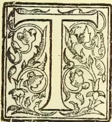

HERE is probably no more interesting study in timbers than that of the seasonal elements which a transverse section of the stem exhibits. The majority of persons are familiar with the historical tables usually attached to, or painted upon, the successive annular rings of stem sections in the museums and gardens of Europe. The validity of the idea that each ring counts for a definite period of time in the life of the plant is accepted as sound, though in past times much controversy was waged on the nature of the causes producing these time-checking arrangements of the timber elements. The bark pressure theories of Sachs and T. Hartig, the theory of osmotic variation waged by Russow, and the ideas of Weiler and Robert Hartig, respecting nutritive supplies to the tree, were all found insufficient to explain the nature of the causes which determined the formation of rings of growth. It was left to the genius of Strassburger and his contemporaries to explain the formation of the rings in terms of the varying physiological needs of the plant.

In temperate zones the deciduous trees burst into new foliage during spring, and the main function which the wood has to perform, is that of supplying copious quantities of water to the growing leaves. This is accomplished by the production of large lumined, thin walled elements, which form connected systems from roots to leaves. During autumn the demand for water is not as great, but there is an

increased weight of plant tissue, and the necessary elements to give support and rigidity are added in the form of narrow elements possessing very thick walls.

The thick walled narrow elements of autumn abut directly on the large elements of the next spring, and hence the line of demarcation showing the limit of growth for any particular year is often very conspicuous. The idea that each ring represents one year of time is therefore correct for those trees in temperate zones which exhibit such periodicities in leaf production. In the tropics, however, where as many as four seasons have each a recognised power, and the arborescent vegetation is often characterised by more than one periodicity in leaf production per year, the time represented by each ring of growth is not necessarily one year.

It is obvious to a casual observer that the very great differences between the periodicities in leaf production of the Flamboyant and Cotton trees, or those between the Candle, Almond and Para rubber trees, or better still between an evergreen having no fixed periodicity and a deciduous tree having the annual regularity of *Schizolobum excelsum*—such differences must result in the production of very dissimilar tissue arrangements in the wood of the respective trees. We therefore see that in order to correctly interpret the "seasonal" rings of growth we must know exactly the characteristic periodicity and, since the climate and vegetation in the tropics are as widely different from those of temperate zones, we may expect the problem to assume some degree of complicity.

In tropical countries such as Ceylon, where the air is hot and damp throughout the year, the majority of trees are usually considered to be of an evergreen nature. Many of these evergreens, such as species of *Cinnamomum* and *Eugenia*, *Mangoe*

239------------------------------------------------

220THE TROPICAL AGRICULTURIST.[OCT. 1, 1901.

and Jak, etc., have no fixed periodicity, and new leaves may occur any month in the year; others produce leaves at a definite time each year, and of this class the most conspicuous are the ebony trees. Further, it is worthy of note that those trees of *Diospyros embryopteris* and *Diospyros Gardneri*, which as yet have not produced sexual organs, are invariably characterised by a biannual foliar periodicity. A comparison between the rings of growth of a young ebony—not flowering—and one regularly producing flowers, should therefore prove highly interesting. Next to the evergreens we may for comparison place those trees which drop their old leaves simultaneously, but which have produced leaf buds prior to the fall of the old ones, as in *Dillenia indica*, *Rhopalocarpus lucidus*, etc. Many others however, have gone a step further, and the production of new leaves is delayed until the greater part of the old leaves have dropped and the tree assumes a semi-bare condition, as in *Ficus Trimeni*. Continuing in this direction we come next to those trees which, like the *Inga saman* and *Candle*, are bare for a few days, and finally to those like *Erythrina umbrosa*, *Careya arborea*, *Bombax*, *Hevea brasiliensis*, *Dalbergia frondosa*, *Plumieria acutifolia* and a host of less familiar trees which remain leafless for several weeks or months during every year.

There are very few species in Ceylon which drop their old leaves and produce new foliage more than once per year, a notable exception being the almond—*Terminalia catappa*.

Not only does the foliar periodicity vary with the species, but trees of the same species exhibit great variability, and it is even doubtful whether the same tree produces new leaves at exactly the same time from year to year. These differences must be due either to the varying personal requirements of the plants or the environment under which they exist.

In studying the personal equation of the plant one cannot but conclude that one of the foremost objects in dropping the leaves is to check excessive transpiration. In the *Peradeniya* districts and in all those parts of the island which feel the dry heat of the N.-E. Monsoon, many of the deciduous trees drop their leaves before or during the hottest months—February to April and thereby avoid a condition of transpiration which might otherwise prove fatal. The noteworthy examples are *Crataera Roxburghi*, *Erythrina indica*, *Ficus Amottiana*, *Sterculia balanchos*, *Schizolobium excelsum*, *Oroxylum indicum*, *Cupania edulis*, *Antiaris innoxia*, the Cotton and Para and Ceara rubber trees and many others familiar to the tropical tourist. That this is one of the prime objects is further indicated by the behaviour of *Careya arborea*, *Eriodendron aufractuosum*, and others in the Bible and Batticaloa districts, since in these places the production of new leaf is delayed considerably—an obvious advantage where the S.W. Monsoon is replaced by hot dry weather. If it were necessary to bring proof in support of this idea, one need only point out the behaviour in desert areas where those plants, the tissues of which are neither fleshy nor protected by hairs or other contrivances, drop their leaves prior to a period of drought. The xerophytic plants having leaves which either in virtue of their succulence retain for a long time the greater part of the water they have obtained, or are so protected by hairs, wax, cuticle, sunken stomata, etc., that loss of water by transpiration is at a minimum, such plants remain ever green throughout the hottest months. The plants not so adapted must necessarily drop their leaves in order to prevent excessive loss of water. In temperate zones a reversion is seen, since it is during the cool months that the trees become bare, and only when heat and sunshine present their maximum strength that the arborescent vegetation puts on the best show of leaf.

One of the reasons why, in temperate zones, the trees drop their leaf in winter is probably to be found in the fact that the soil is so cold that absorption cannot take place through the roots, and hence no supply being guaranteed, the plants lose their foliage until the warmer weather arrives.

Though the checking of transpiration seems to be one object, it is rather surprising to notice the comparative xerophytic nature of the leaves of *Ficus Amottiana*, *Ficus Trimeni*, and others where the transpiration is probably much less than that from the tender leaves of *Brownea grandiceps*, and yet the former are deciduous and the latter is evergreen. Further, we have to face the difficulty that the hottest part of the year is not that chosen by all the deciduous trees, as is instanced by the behaviour of *Albizia procera* and *Dalbergia frondosa*, which become bare in the *Peradeniya* districts during the dull wet month of July when transpiration cannot be at all excessive. But what is still more difficult to bring into conformity with the theory of checking transpiration is the production of abundance of fresh foliage when the dry heat of the N.-E. Monsoon is asserting its maximum power. This occurs with trees of *Sclerocarya caffra* and *Terminalia melanocarpum* during the hot month of March, and similarly *Sterculia balanchos* and *Chlorocylon Swietinia* in April. It is highly probable that many of these trees have, in the migration of species, found their way into districts where the climate is not in agreement with their old periodicities. They may, or may not, acquire a new periodicity, and it would be important if we could determine whether the periodicity of imported species grown from seed remains the same as in the native districts. One might also notice whether a species, native of our country, shows the same periodicity as locally grown trees when introduced again from abroad.

Many of the peculiarities will probably have to be explained on purely personal grounds, since they do not lend themselves to correlation with known environments. The power of the personal equation can be better studied in the tropics than in temperate zones, since the variation of season has such a preponderant influence in the latter areas.

Many instances are known which point to the operation of purely individual forces within the plant. In *Java et ses Habitants*, by I. Chailley-Bert, mention is made of the fact that trees of the same species of *Palauquium* are growing side by side and under conditions almost identical, and yet one may be bare at a time when the others retain full possession of their foliage.

Mr. Nock also informs me that the English oaks grown at Hakgala under a comparatively temperate climate behave in the same irregular manner. This individual variation cannot be better studied than at *Peradeniya*, where *Lagerstroemia flos-regina*, a native of the moist lowcountry of Ceylon, grows in abundance. Here, in the month of February, one tree was perfectly bare and yet others only a few yards distant were in full foliage; others were about to drop their leaves, and during the same month one had not only dropped its foliage, but burst into new leaf and followed this by production of flowers. Similarly with trees of *Bridelia retusa*, also a native of the moist lowcountry. So much then to indicate that internal factors may be at work in determining periodicity of leaf production.

On the other hand, there is considerable evidence in the acclimatisation of trees that the power of environment is very great. A moment's consideration of the powerful influence of a temperate climate on the phases of vegetation is alone sufficient. There are instances which seem to point to the possibility of a new periodicity, without the loss of the old one, being produced by a change of climate. Here we must content ourselves with a few examples which indicate the power of climate. One case of

240------------------------------------------------

OCT. 1, 1901.]THE TROPICAL AGRICULTURIST.221

more than usual interest is given by Dr. Watt, Vol. I., p. 46, where the behaviour of *Acacia dealbata*, Link, indigenous to New South Wales, Victoria and Tasmania, has been entirely changed by the climate in the Nilgiris. The facts are, that in 1845 and up to about 1850, the trees in the Nilgiris flowered in October, which corresponded with the Australian time, but about 1860 they were observed to flower in September; in 1870 they flowered in August; in 1878 in July; and in 1882 they began to flower in June, this being the spring month in the Nilgiris corresponding with October in Australia. It therefore takes nearly 40 years to regain its habit of flowering in the spring, i.e., to become perfectly acclimatised (*Ind. For.*, VIII., 26).

I am also informed that the English oaks now growing at Johannesburg further illustrate this point, since they begin to drop their leaves towards the end of May, remain here until near the end of August, when new leaf appears, to be followed by flowers which ripen into fruit by Christmas.

These are very striking examples, and what we are particularly anxious to obtain is a satisfactory table of comparison showing the behaviour of the deciduous trees under different climates. The importance cannot be overestimated, as we shall obtain one string of facts which, together with some knowledge of the rates of growth of the plants in question, will materially assist us in our attempt to interpret the seasonal peculiarities of tropical woods. Having in view the innumerable side-issues to which such a problem may lend itself, we confine ourselves to the following points:—

I.—When the plant drops its leaves.

II.—When the new leaves appear.

III.—When the flowers appear.

A list of those plants which are deciduous in Ceylon is now appended in the hope that all interested will forward as much knowledge as they possess respecting the behaviour of any or all of these plants: *Albizzia stipulata*, Borr.; *Albizzia Lebbeek*, Benth.; *Albizzia procera*, Benth.; *Antiaris toxicaria*, Lesch.; *Anogeisus latifolia*; *Acacia summa*, Kurz.; *Aleurites triloba*, Forst.; *Alstonia scholaris*, Br.; *Adenanthera bicolor*, Moon.; *Bombax malabaricum*, D.C.; *Bassia longifolia*, L.; *Bauhinia*; *Bridelia retusa*, Spreng.; *Crataera Roxburghii*, Br.; *Cochlospermum gossypium*, D.C.; *Cassia multijuga*, Rich.; *Cassia grandis*, Lf.; *Cassia nodosa*, Ham.; *Cassia fistula*, L.; *Clerodendron Thomsonae*, Balf.; *Cedrela serrulata*, Mig.; *Cedrela odorata*, L.; *Careya arborea*, Gaertn.; *Chickrassia tabularis*, A. Juss.; *Chloroxylon swietenia*, D.C.; *Canthium macrocarpum*; *Cupania edulis*; *Citherexylum cinereum*, L.; *Couroupea guianensis*, Aubl.; *Derris robusta*, Benth.; *Derridalbergiodes*, Baker.; *Digelostyles axillaris*; *Dipterocarpus zeylanicus*, Thw.; *Dipterocarpus hispidus*, Thw.; *Dalbergia melanoxylen*, G. and P.; *Dalbergia frondosa*, Roxb.; *Dilenia indica*, L.; *Eriodendron anfractuosa*, D.C.; *Enterlobium cyclocarpum*, Grisib; *Erythrina indica*, L.; *Erythrina veutina*, Willd.; *Erythrina umbrosa*, H.B.K.; *Eugenia jambolana*; *Ficus religiosa*, L.; *Ficus Trimeni*, King.; *Ficus Arnottiana*, Mig.; *Ficus Wightiana*, Wall.; *Ficus infectorea*, Roxb.; *Ficus semicordata*, Mig.; *Ficus elastica*, L.; *Ficus altissima*, Bl.; *Flacourtia Ramontchi*, L. Herit.; *Gmelina arborea*, Roxb.; *Hevea brasiliensis*, Muell Arg.; *Heterophragma adenophylla*, Seem.; *Litsea sebifera*; *Lagerstroemia flos-reginae*, Retz.; *Lagerstroemia tomentosa*; *Manihot Glaziovii*, Mull.; *Michelia champaca*, L.; *Oroxylon indicum*, Vent.; *Odina Woodier*, Roxb.; *Pithecolobium saman*, Benth.; *Pericopsis Mooniana*, Thw.; *Poinciana regia*, Boj.; *Piumeria acutifolia*, Poir.; *Pterospermum semisagittatum*, Ham.; *Phyllanthus emblica*, L.; *Pahudia Javanica*, Mig.; *Peltophorum Leunei*, Benth.; *Peltophorum ferrugenum*, Benth.; *Pterocarpus echinatus* Pers.; *Pterocarpus marsupium*, Roxb.; *Pterocarpus indicus*, Willd.; *Parmentiera cereifera*, Seem.; *Pityran the verrucosa*, Thw.; *Parkia biglandulosa*, W. and A.; *Phopalocarpus lucidus*, Boj.;

*Spondias mangifera*, Willd.; *Sapindus laurifolia*, Vahl.; *Sclerocarya caffra*, Sond.; *Sterculia Balangas Schizolobium*, excelsum, Vog.; *Sterospermum Xylocarpum*, B. and Hkf.; *Sterospermum chelenoides*, D.C.; *Sterospermum suaveolens*, D.C.; *Schleichera trijuga*, Willd.; *Stephegne tuberosa*, L.; *Saccocephalus esculentus*, Afz.; *Sapium biglandulosum*; *Swietenia Mahogany*, L.; *Styrax Benzoin*, Dryand.; *Terminalia catappa*, L.; *Terminalia belerica* Roxb.; *Terminalia melanocarpum*, F. M.; *Terminalia parviflora*, Thw.; *Terminalia chebula*; *Tectona grandis*, L.; *Tabebuia Pallida* Lindl.; *Tamarindus indicus*, L.; *Vitex Leucoxylon*, L. F.; *Vitex altissima*, L. F.; *Xanthoxylon Rhetse* *Yizyphns glabrata*, Heyne.

## QUESTIONS FOR CACAO PLANTERS.

(To the Editor, "Tropical Agriculturist.")

SIR,—I heard some time ago that Mr. Carruthers and Mr. Huxley were compiling a set of questions which it might be hoped cacao planters would find it in their interest to answer for the purpose of enabling Mr. Carruthers in particular, and everyone in general, to obtain some reliable information, or at least to enable such to be deduced from replies which would be elicited. This was some time ago, and I personally have received nothing up to date of the kind. In view of this I venture to send you a list of questions, for publication if you think fit. By the medium of your paper, in which—for the discussion of planters' interests you have given already, from time to time, considerable space—a publicity would be obtained for a subject, that needs considerably more light on it than we have at present.—Yours, &c.,  
P. O. D.

Moneragalla, August 24th.

(Questions for circulation among Cacao Planters.)

District

Aspect (N., S., E., W., &c.)

Date (year)

Maximum and minimum elevation

Heavy rainfall per annum

Wettest monsoon (quote months)

Principal cropping season (quote months)

I.—Varieties.—1. Is *Forastero* or *Caraccas* in your opinion the more remunerative?

1. 2. Quote any particular variety or hybrid doing especially well with you?
2. 3. At about what elevation is your best cacao?
3. 4. What coloured flowers in your opinion mature best?

II. Canker.—1. How do you treat for canker (a) by light shaving, (b) deep cutting, or (c) any other methods.

2. Do you destroy diseased shavings and pods: if so how?

1. 3. Do you treat systematically? if so, state length of round?
2. 4. In what months is canker most prevalent with you?
3. 5. What was the original environment of your worst cankered fields?

III. Suckers.—1. Do you grow suckers from the base or lateral branches, or both? and what are their respective effects on the tree?

2. Do you encourage suckers with any idea of immunity to canker?

3. Are you satisfied with them on this or on any other count; if so, what?

IV. Manure.—1. With what do you manure, if anything?

2. How do you apply it?

How much per tree?

4. Any improvement in appearance, or what increase of crop?

V. Pruning.—1. Do you prune either old or young cacao?

2. Lightly or heavily?—for crop, ventilation, &c.,?—for spread or shape?

VI. Helopeltis.—1. State your method of treatment.

241------------------------------------------------

222THE TROPICAL AGRICULTURIST.[OCT. 1, 1901.

1. 2. Length of round.
2. 3. Length of time under treatment.
3. 4. When most prevalent.
4. 5. With what result, satisfactory or otherwise?

VI. *Shade*.—1. What shade do you prefer if any?

1. 2. At what distance for new clearings?
2. 3. At what age would you thin out, and how, if at all?

VIII. *Crop*.—1. What is the annual average yield of pods per tree on your cacao in full bearing? State Caraccas or Forastero (hybrid mixed, &c.) and approximate age.

1. 2. What proportions of good and black cacao do you get?
2. 3. To what do you attribute any variation of these proportions throughout the year?

### INSECT PESTS.

#### CIRCULAR TO FRUIT GROWERS.

The Secretary of the Department of Agriculture has caused a circular letter to be sent to all the Societies in the State, of which the following is a copy:—

"I beg to draw the attention of your Society to the recently amended regulations under 'The Insect Pests Amendment Act, 1898,' and more particularly to the new Regulation 20, governing the use of second hand fruit cases, which reads as follows:

"The use within the State of second-hand fruit cases or packages that may reasonably be supposed to have contained fruit is prohibited, and the Chief Inspector or Local Inspector may order the disinfection of same, as provided in Order 11, or by any other means that may be directed by the Secretary of the Department of Agriculture, and failing such disinfection shall seize and destroy same.

"Experts are agreed that the use of second-hand fruit cases, without being disinfected, is one of the surest methods of disseminating disease. This being so, it behoves everyone interested in the horticultural advancement of the State to prevent the use of second-hand cases as far as possible, unless they have been previously disinfected.

"In accordance with the expressed desire of recent Producers' Conference, the Department has, in order to discourage the use of second-hand cases, obtained the co-operation of the Railway Department in the matter of differential rates being levied on new cases imported or locally made, and second-hand cases.

"The material for cases in shooks can be obtained in Perth, subject to slight market fluctuations, at the average price of 8s. 6d. per dozen.

"Not only is it in the interests of growers to discourage the use of second-hand cases, but also to encourage the use of an uniform case, and it stands to reason that, the contents being good, the more attractive the manner in which fruit is marketed the higher will be the returns.

"A new and uniform case, the distinctive individual brand of the shipper, an attractive address-label, and careful grading and packing, will secure a maximum return and drive the worthless fruit out of the market—it is carelessness and rubbishy fruit that brings down the average—and, while ensuring to the grower a better profit, will also ensure to the consumer a cheaper, because a better, and a more regular supply of the best fruit.

"Now local growers have to compete against the Eastern States, it is imperative they should attend carefully to details.

"No matter how careful the inspection at the port of entry, experts are of opinion that the danger of introducing diseases new to this State will always be present, and this knowledge should stimulate the local growers to exercise the greatest vigilance in preventing the possible introduction of diseases into their orchards.

"The saving of a penny or so per case, by using second-hand cases, may be the means of introducing into an orchard a disease that may cost hundreds of pounds to eradicate, if it does not finally render the orchard worthless.

"This Department, as you are doubtless aware, has only four Inspectors to supervise over four thousand widely-scattered orchards and vineyards, and I am appealing to your Society now to appoint from its membership, one or two, or three or more—as you may think fit—honorary inspectors, who will assist this Department in administering the Insect Pests Act. It is in your own interests I ask you to assist the Department. You have now to face the competition of the Eastern States in fruit and diseases, and you can only successfully do this by exercising eternal vigilance in keeping your orchards and vineyards free from disease, and the best way to do this is to follow the lines indicated:—

"1. Plant vigorously, but only the best varieties, having an eye always on the export trade of the future.

"2. Cultivate thoroughly and prune properly, and do not starve the trees if a little fertilizer will help them.

"3. Spray carefully and often, remembering that a single spraying is seldom of much use.

"4. Allow no second-hand cases to come on to your place. If they do disinfect at once.

"5. In the interests of your neighbours send no second-hand cases away unless disinfected.

"6. Ship only the primest fruit turning the rest into jam or pork. Either will pay you better than spoiling your own market by supplying rubbish. "It is an ill bird that foals its own nest."

"7. Pick grade, and pack as if you were handling eggs, and use only new cases, branded with the name of the orchard, and legibly addressed on an attractive label, to your agent.

"If you decide to appoint honorary inspectors, in the different centres of your district, as I hope you will, I will endeavour to secure them any actual out of pocket expenses they may incur in the execution of their duties.

"Remember 'Eternal vigilance is the price of success."

"I have the honour to be, Sir

"Yours obedient servant,

L. LINDLEY-COWEN,

"Secretary."

—Journal of the Department of Agriculture Western Australia.

### GOOD AND BAD CASTILLOA.

(Translation of an Article in the *Journal de Agriculture Tropicale*, July 1901.)

*Castilloa* is the rubber-tree par excellence of Mexico and Central America. The innumerable companies for rubber-growing formed lately with North-American capital have the *Castilloa* always in view. From this we may conceive the very strong interest which attaches to the communication translated herein. It is extracted from a German pamphlet \* appearing early this month, and from which we shall have occasion to borrow still further. The author, Mr. Th. F. Koschny, has been a settler on the Rio de S. Carlos (Republic of Costa Rica) for nearly twenty-five years. He is certainly a most observant man; Professor Warburg, in his book on *Castilloa* and its culture, quotes him on every page; Mr. Koschny is in fact a most devoted correspondent of the Tropenpflanzen-

\* Th. F. Koschny:—Die culture des *Castilloa*-Kautschuks. In 8d.; 50; published as a Supplement (Beilheft) of the Tropenpflanzen, that admirable review of Tropical Agriculture, of Berlin.

242------------------------------------------------

OCT. 1, 1901.]THE TROPICAL AGRICULTURIST.223

zer, the review directed by Mr. Warburg. Nevertheless, Koschny does not seem to be a botanist; on this side matters seem to require some controlling by some one in this line of business. Mr. Koschny moreover mentions that he sent to the Botanic Gardens of Berlin samples of all the parts of the species and varieties he refers to; so that we shall not be long without attaining a fixed idea of the distinctions and assimilations he establishes.

Several authors have already distinguished species and varieties in the genus *Castilloa*; all the information on this point will be found in the French edition of the *Plantes a Caoutchouc* of Warburg now being brought out in serial form by Challamel (that excellent colonial publisher, 17 rue Jacob, Paris.)

This edition has been executed under our supervision; we have provided it with a great number of annotations completing the original text and putting the facts in their true light. In particular, on what concerns the species and varieties of *Castilloa*, we have made a resume of all that is known up to date of Koschny's new monograph; even the facts set forth below will be found indicated in our book, as the outcome of anterior communication with Koschny, but less precisely.

All this goes to say that the reader with a real interest in getting accurate information as to the *Castilloas* to cultivate and the *Castilloas* to avoid would do well not to rest content with the statements he will find below, but to re-peruse also the corresponding paragraph of our edition of Warburg. It would be a waste of available space were we to reprint that paragraph here; and there is no necessity for doing so, for the book will be on sale in a few days.

In the text which follows, we shall see that we have four sorts of *Castilloa* to deal with. The catalogues of dealers in seeds and tropical plants only comprise two:—

1. 1. *Castilloa elastica*, without distinction of varieties;
2. 2. *Castilloa Tumu*, this last *Castilloa* being of quite recent appearance.

The last list of seeds and plants distributed in the German colonies by the agency of the "Kolonial-Wirtschaftliches Komitee" of Berlin, mentions the *Castilloa alba*; this is probably seeds coming from Koschny.

After this preamble, here is what Koschny says:—

"I know here four sorts of *Castilloa*; three seem to belong to the "species *elastica*, the fourth to the species *tamu*.\* Here are the native names of these four sorts of *Castilloa*:-

HULE (pronounced OULE) BLANCO; translation: white rubber-tree; as a scientific name I propose for this variety, that of *Castilloa alba*.

HULE NEGRO; blackrubber-tree; I propose to call it *Castilloa nigra*.

HULE COLORADO; red rubber-tree; I propose to call it *Castilloa rubra*.

HULE TANU; the people of the country call it also gutta percha; its scientific name is *Castilloa tanu*.

"The four sorts of *Castilloa* I have just enumerated are identical or nearly so as regards the exterior aspect of the branches, pseudo-branches" (for the explanation of this term, see the Chapter *Castilloa* in our edition of Warburg.—Editor's Notes), leaves, &c.

"The base of the trunk of the *Castilloa* presents folds or tabs of which the height varies from thirty centimetres to two metres according to the age of the tree. We call these prolongations of the trunk here *Gambas* (limbs); they correspond to the thick roots which run along the surface of the soil or immediately under the surface. The three varieties of *Castilloa elastica* have these *gambas* thick, with the upper edge slightly rounded; with the *Tamu*, on

the contrary, the *gambas* are thin and their upper edge more acute.

"1. HULE BLANCO (*Castilloa elastica* var. *alba*.) Seen from a distance the trunk shews glimmers of white and red. The white colour is due to a white lichen, very delicate, which causes no injury to the tree.

"The very old trees have the bark covered with heavier mosses and lichens of a dull colour; and then it becomes almost impossible to distinguish them from the other forest trees: the underwood prevent one from seeing the crown of the *Castilloa*, and the HULERO (rubber-gatherer) as likely as not goes by without suspecting the presence of a rubber-tree, unless by chance he finds some of its leaves on the ground; these are as a fact bigger than those of most of the forest trees, and moreover may be recognised by their rolling themselves up into tubes as they dry.

"The latex of the HULE BLANCO is thick. When we tap the tree, only a part of the latex follows the track of the gutter and reaches the receiver, unless one guides it with the finger to make it take the exact direction desired; under natural conditions, nearly half of it sticks in the incisions themselves.

"The HULE BLANCO is, of the three varieties of the *Castilloa elastica*, that most frequently met with in the mixed forests; it is the only one worth the trouble of cultivation. Its bark and its bast are thicker and at the same time softer than those of the other varieties. The HULE BLANCO is never met with in the high forests; it prefers the places rather thinly grown, where its crown can be sufficiently exposed to the air, while at the same time its stem is shaded by the undergrowth. It is the HULE BLANCO which stands wounding best; it is the tree which gives the most caoutchouc with the least risk of premature exhaustion; this thanks to the property in its latex of coagulating within a short time. By sticking in the furrow and cracks of the bark the latex of the HULE BLANCO begins by giving a mass quite soft, like thick cream, which would at once be washed off were it to rain at that moment; but should a dry wind be blowing at the time of tapping, the solidification of the latex would be produced so quickly that next morning its condition would quite defy the rain. At the end of from six to eight days, according to weather, the transformation into caoutchouc is complete.

"HULE NEGRO. The bark of this variety is dull in colour and very much furrowed. It is rich in latex; but as the latter is very watery, its flow easily becomes excessive and the tree dies of exhaustion. The bark of the HULE NEGRO is a little thinner than that of the HULE BLANCO, but it is very fibrous and resistant. This variety is certainly shade-loving and only to be found in high forest. Its bark resembles in every respect that of the common trees of the forest; for this reason HULE NEGRO is very difficult of detection when one is traversing the forest. The cultivation of the HULE NEGRO cannot be recommended, on account of its tendency to die when wounded. This tree is generally to be found mixed with other *Castilloas*. All the same, it is perhaps the least common variety; most likely because being particularly sensitive to wounds it must have succumbed before the other kinds to the brutal methods of exploitation of the hulero.

"3. HULE COLORADO, 'red-rubber-trees.' It is the bark which shews the reddish tinge, especially that of the branches. It is smooth, thin, and brittle; its fracture is conchoid; the edges of the channel made for its bleeding have a tendency to open out and burst. The yield of latex is scanty; still the caoutchouc is of good quality.

"The bark of this variety has so little resemblance to that of the others that one would hardly recognise the tree as a rubber-tree were it not for the identity of its general form, the shape of its crown

\* Editor's Note, Botany only knows *C. Tumu*; this difference of spelling is unimportant; but what is strange is the discrepancy as to the quality of caoutchouc furnished by the tree in question,

243------------------------------------------------

224THE TROPICAL AGRICULTURIST.[OCT. 1, 1901.

of its ramification, foliage, &c. As a matter of fact, while the bark of the HULE BLANCO and HULE NEGRO splits in the longitudinal (vertical) direction, that of the HULE COLORADO is smooth but presents quite a curious aspect by virtue of the light furrows running over it in a very oblique direction. By these furrows the bark of the HULE COLORADO appears as it were garlanded. These garlands or ribbons have yet another peculiarity: they are ornamented with little round knobs, disposed in vertical and horizontal series. At a given moment, these knobs break up; they then contribute towards making the bark take on that general reddish discoloration characteristic of the HULE COLORADO. Apart from these oblique furrows, this be-ribboned arrangement, and these knobs, the bark of the HULE COLORADO is absolutely smooth, without the least fissure, if we except the twigs and young branches of which the bark has not yet taken on its final form. The bark of the HULE COLORADO is much thinner than that of the two preceding varieties; the bast is scarcely developed at all. This variety is found everywhere mixed with the others, both in the high forests and in the mixed; as a rule it is rarer than the HULE BLANCO; still there are places where it predominates. I should not be surprised if the poor results of *Castilloa* cultivation in Java and Ceylon were due to their having unsuspectingly planted this worthless variety. Should it turn out that the Java and Ceylon cultivation has been of the HULE COLORADO, the relative check to this culture would be explainable by the fact that this variety is much more shade-loving than the HULE BLANCO; now it is very likely that in those islands the *Castilloa* may have been grown without any shade."\*

"4. CASTILLOA TANU. This tree is called TANU by the Mosquito Indians; the huleros call it *gutta percha*. The bark is very like that of the HULE BLANCO, but rather greyer in colour; to distinguish this *Castilloa* from its three fore-runners, the easiest feature is that offered by the prolongations of the base of the trunk (*gambas*), which are more salient, much slenderer and with the upper edge more acute. This *Castilloa* does not exist in the valley of San Carlos; † it is only to be met with starting from the outskirts of Blewfields (on the Mosquito Coast) and further to the north; on the Pacific slope there are certain places where the TANU is very frequent.

"The leaf and all the bearing of the tree suggest the HULE BLANCO; the latex is very abundant, but in drying it resinifies and hardens; as for elasticity, this so called caoutchouc is no-where"

#### ABOUT CASTILLOA TUNU, HEMSLEY.

Just as we are going to press we receive from Mr. Godefroy-Lebeuf to whom we had communicated Mr. Koschny's study, a note in favour of the *Castilloa Tunu*, Hemsley. Mr. Godefroy-Lebeuf works out in a more circumstantial fashion the idea expressed by us in our annotations on the account of observations published by Mr. Koschny under the title "Good and Bad *Castilloa*." We cannot do better than reproduce just as it stands the letter of Mr. Godefroy-Lebeuf.

"We must not scatter discredit on the *Castilloa Tunu*, Hemsley. Should all the TANU's or TUNU's of Costa Rica be deemed unfit for any purpose, the *Castilloa Tunu*, Hemsley, will still stand out as a most excellent caoutchouc, equal to the best *Castilloa* rubbers.

\* *Editor's Note.*—The discussion as to whether *Castilloa* should be grown in the sun or in the shade will be found fully set forth in Mr. Warburg's book; but besides that we shall give, in a coming number, some more extracts from Koschny's pamphlet. He is a decided advocate of shade.

† *Editor's Note.*—Where the author has his property.

"This species has been determined by Hemsley chiefly on the specimens of my collaborateur, Eugene Poisson, who has brought back from Costa Rica not only herbarium specimens but samples of latex and of caoutchouc drawn from this species.

"That the tree known in Mr. Koschny's country as 'Tanu' or 'Tunu' gives bad caoutchouc is quite possible, but the plant is undetermined botanically. Is it alone a *Castilloa*?

"There is another proof of the good quality of Hemsley's *Castilloa Tunu*, in the care taken by planters to use this kind alone. Mr. Eugene Poisson, now actually in France, can give us more definite information.\* It is unfortunate that Koschny did not accompany his particulars with botanical specimens; one cannot trust to simple descriptions. The genus *Castilloa*, notwithstanding the small number of species described, is terribly mixed. Where does *Castilloa elastica* begin? Is *Castilloa Markhamiana* a true species? Is *Castilloa australis* distinct from the Costa Rica species?

"I only know one thing, and that is that the *Castilloa Tunu* of Hemsley gives an excellent gum."

A. GODEFROY LEBEUF.

#### PINE CULTIVATION.

THERE has been a very great interest taken of late in Pine Cultivation. Pines have always been grown more or less in Jamaica, but given very scant attention, and comparatively few have been shipped abroad. Since good hopes of a direct line of fast steamers, especially fitted to carry fresh fruit between Great Britain and Jamaica, were first held out, there has been a considerable planting of pines, and since the "Direct Line" became a certainty, still greater attention has been directed to pine cultivation as a probable source of profit. There have come to Jamaica men from Florida who were engaged in the growing of pines there, and who have taught us a great deal in better ways to deal with the plants; at the same time they have also learned that they had to adapt their ideas to Jamaica conditions as these are in many ways different to Florida. These Floridians also brought with them suckers of pine-apples new to Jamaica, some of which may be very useful to us. Oh, it is easy to plant pines! says somebody. Of course it is; it is also just as easy to plant bananas, cocoa, or oranges, that is, by just sticking them in holes in the earth: but there are also ways of dealing with all plants that are expected to produce as high a return of a marketable product as possible, that will tend to this end, while the merely sticking in process will always give only a precarious chance of producing something. Now in dealing with Pines we have first to choose the land. Pines will grow almost anywhere, but if the land is not naturally dry such as around Kingston, and on the plains on the south side, it is best to have a natural drainage and so the best plan is to choose sloping land; the freer the soil is naturally, the better, although some varieties of

\* *Editor's Note.* Our mutual friend, Mr. Poisson Junr., has just returned to Paris after a long and difficult journey of exploration; agricultural and commercial, through Dahomey. We would ask him to spare a few moments from his well-earned rest to give the readers of the *Journal d'Agriculture Tropicale* an account of how he collected the specimens of leaves, fruits, and caoutchouc which have served Mr. Hemsley in his description of *Castilloa Tunu* in the 'Icones Plantarum' of Hooker.

2. Unless we have mis-read the German text, which by the way is none of the clearest, Mr. Koschny has sent botanical specimens of his *Tunu* to the Botanic Gardens of Berlin. The 'Tropenpflanzer' will no doubt let us have the result of their study, which we will duly notice.

244------------------------------------------------

OCT. 1, 1901.]THE TROPICAL AGRICULTURIST.225

Pine-apples seem to delight in stiff soil, for on such land are they found growing naturally wild. The land must always be well drained, if not naturally, then artificially. You would, of course, fork or plough your land first; digging little holes and sticking the plants in, is no good at all, for remember, that it is not simply a fruit that is to be produced; it is a good sized fruit that will stand a Journey; be attractive and have a good chance of fetching a fair price. The soil must be made loose, but not necessarily to any great depth as the pine is a surface feeder; still the soil must not be only scratched loose for an inch or two; the ordinary depth of a foot fork is a suitable depth to dig. Having forked the land, it will be all lumpy and rough; the sun and breeze will dry it up, and then the rains will partially crumble it down: it is therefore well to commence on your land a month or two before you mean to plant; you can assist this fining process by going over the land with an Assam fork, and smashing the clods, thereby making the soil smoother and more level. Of course if a plough and cultivator and harrow can be used, the land will be ready so much the quicker. These implements for saving labour are exceedingly handy and are now sold so very cheap as to be within the reach of nearly everybody. Neighbours can cooperate and one get a plough, the next a cultivator, and the next a harrow, and arrange to use them consecutively; that is, when one man has had the plough a week, he passes it on, and starts out with the cultivator for a week to stir up and break the land more thoroughly after the plough has broken the soil up into clods: then he passes on the cultivator, and starts with the harrow to crumble the surface still finer, and smooth it down level. Of course the co-operators must not be of quarrelsome and jealous dispositions, else there will be disagreement. But with suitable people, the plan works well and saves outlay and waste, for few of the smaller cultivators require all three implements like a plough, a cultivator and a harrow constantly. Now when your land is prepared, in wet districts it is good, though not an absolute necessity, to put the pines in raised beds with small drains between, which also do as foot paths. This is for more complete drainage. It suits well to put pines in beds between young orange trees and thus utilise the land, while the cultivation given to the pines will leave the land in good condition for the roots of the orange trees when they extend in the course of a few years, and fill up the space between; the soil will then be in fine tilth. The beds should be of a breadth to be reached at all parts between by a rake or hoe, from the walks, so 6, 7, or 8 rows will be quite enough.

The next great question is the kind of pines you will plant. There are far more varieties of what we call native pines than are generally known. There are the Ripley, (Red and Green,) Sugar Loaf, Bull-head Black and Cowboy which are more or less commonly known, though the Bull-head and Cowboy are often mixed; but they are not the same. There are other native pines, which are not so well distributed throughout the island, and yet are distinct from any of those I have named. The same pines, however, often receive different names in some parts of the island: thus the Cowboy, is the Man o' Wa Pine in Hanover, and the Mammee Pine in St. James and in other districts the "Crab Pine." About Porus there is a Pine called the Cheese Pine which bears a fairly good fruit, and in the St. Thomas-y-Vale district of St. Catherine, there is a Pine of very fine appearance, called the "Sam Clark"; it grows absolutely wild in the bush, and seems to delight to make head-way among the long rank, wet grass, for the district is rather a wet one. There is also a curious pine called—the "Jerusalem," which bears miniature pines—complete little pines, tops and all, round the base. Of the im-

ported pines, there are the Rothschild, the Abbaka, the Envile, the Golden Queen, the Porto Rico, the Smooth Cayenne, the last of which is proving the best grower and most marketable pine of all these. It has smooth leaves, no thorne, and grows to a large size, and is a quick, strong grower, and sure fruiter, the suckers are at present rather expensive, being from 9d. to 1s. each, as they are in great demand both here and in Florida. Imported suckers take a year and a-half to fruit, and then bear at any time of the year, but the suckers from these bear fruit at 10 and 14 months from planting the same as native suckers, depending upon the season when they are planted. The Smooth Cayenne weighs from 6 to 12 lbs.—often more. If any one can afford to plant out such expensive pines, and has favourable land, I am sure it would be a profitable speculation, as hardly less than 2s. a piece would be the return in the London market and if grown with some judgment and care, and brought in out of the usual season in Jamaica, (for our usual season is exactly the worst season for foreign markets,) would fetch not less than 3s. 6d. each, if of good size. The only other imported pine that has been in any way freely planted is the Abbaka; it grows to a good size, hardly so large as the Smooth Cayenne, and is screw shaped, large at the base and tapering up much like the Ripley. The Ripley stands easily at the head of all Pines for flavour; not one of the imported can compare with it in this respect, nor indeed with the Black and Sugar Loaf Pines. Unfortunately for us, pines sell almost entirely by their appearance; if they are big, well shaped, with good tops and with an attractive colour as they ripen, they will sell well. The Ripley is not more than 4 or 5 lb. weight at the very best, generally 2 or 3 lb., though I quite believe that good cultivation and selection of the sucker from plants that have made the largest fruits would result in bigger fruits ultimately. Nor is the Ripley, as usually grown, a very nicely shaped fruit, and its top is generally small and often twisted. These defects, I believe, can be remedied. Otherwise the Ripley is an excellent pine, it packs easily, and stands transport very well. Perhaps the next best pine in flavour is the Black Pine: and as it grows to a large size without much cultivation, is a very shapely and nice coloured pine when ripe, and stands transport exceedingly well, it is one of the best to plant; its one weak point is that until it is very nearly full-ripe it does not colour-up, so that markets not used to it think that its dark colour means unripeness. Then there is the Bull-head, which is known by the smooth leaves of its suckers, which have only a few little prickles at the top or here and there on the leaves. I think that the smooth Cayenne may be a highly improved type of the same pine, or the Bull-head and uncultivated or degenerate Smooth Cayenne, at any rate they are like each other. The fruit of the Bull-head Pine under cultivation grows to a very large size, is shapely and stands transport exceedingly well, but is not, as yet, palatable fruit. The "Sam Clark" has hardly more than been tried as a marketable fruit, and so I will not speak much of it, only to say that it has a very pretty appearance. By this time next year I hope to speak with authority on it. The Cheese pine, too, I have not yet had personal experience of as a shipper. The Sugar Loaf, perhaps the most common pine in Jamaica, one which grows equally well from sea level to the hill tops, and a fruit which grows to a very large size, and which is very agreeable to eat, is unfortunately a very poor shipper. I have noticed in the market reports of the United States this year, enormous—that is the word—receipts of pines from Havana in Cuba, whole steamer loads, as many as 2,000 barrels in one cargo, and that often twice a week these were Sugar Loaf Pines, and the prices were often as

245------------------------------------------------

226THE TROPICAL AGRICULTURIST.[Oct. 1, 1901.

low as  $2\frac{1}{2}$  to  $3\frac{1}{2}$  cents., that is less than a "quatte" each. Of course, these pines would not be in very good condition, and were roughly packed probably, and the fruit goes soft very easily.

Having fixed on the kinds of pines you will plant, you must see that you get good suckers. A ratoon sucker is the young plant that springs from the root of the old one, other suckers start out from the base of the fruit stem. The little plants starting out from the base of the fruit itself are called "slips," and the tops are the "crowns." A good sucker should not be less than 9 inches in length or more than 18 inches to be at the best for planting. If the suckers are very young and small, the eyes from which the roots are to start will not be sufficiently developed, and so will be likely to rot out if the soil is wet or in a dry spell to dry up and wither, before the eyes can swell out sufficiently to start roots, which development ought to take place while the sucker is growing with its parent's support. Larger suckers than 18 inches do well enough, but are too top heavy, so that they have to be deeply planted to prevent the wind blowing them over; deep planting is, however, one of the things to be avoided. To get over this difficulty, it is quite correct to chop off the ends of the long leaves, and plant a stump as it were, leaving all the heart of the sucker; the leaves will grow up again and the plant produce a very good fruit; but if the sucker is too advanced, and is thus cut and planted, it will probably send out a young sucker instead of growing itself, which is just as good. The base of the root-stalk of the suckers should always be cut smoothly across before planting, and the lowest leaves around the stem and which cover the eyes, peeled off; this will allow the roots to start out into the soil at once; if these lower leaves are left on, the young roots often cannot pierce through, and simply curl themselves round and round; the plant is then spoken of as root-bound. It does not kill the plant, but retards its progress. The sucker is now ready for planting. Close planting has been found most suitable, for not only is there less ground to prepare and keep clean for a grater number of plants, but the grown plants leaning against each other support the fruits erect, as they have a tendency, through being top heavy, to fall over, and either break or get sun-scalded. Not more than three feet wide, between the rows for all Jamaica pines, and two feet between the plants are now considered the regulation distances, and I think Bull-heads could be closer, such as two feet by  $1\frac{1}{2}$  feet, with advantage, as not having thorny leaves, workers can go through them easily. When you plant, you scoop out some of the soil, and put in your suckers, sufficiently only to cover the eyes, and press the earth tightly around it. Keep your ground clean; you will find a common garden rake a handy implement for stirring the surface soil, and there are small hand cultivators, one-wheeled and two-wheeled, with a variety of implements that can be fixed on at pleasure, such as little ploughshares, weed scrapers, cultivator teeth, rakes—which are most expeditious and effective workers. For cutting out weeds in pines when they are grown thick and for loosening the top soil, there is an implement called a Scuffle Hoe which is very well adapted to its purpose.

About manuring,—if you can cover your ground with pen manure of any kind before cultivating, it will stimulate the growth of the plants greatly, and if you are able to find enough wood-ashes, these will be most beneficial to the pines as fertilizers used as a top dressing lightly raked in. If you have not manures of any kind, and you wish to push your pines on faster, you can always buy artificial fertilizers in Kingston, specially made up for the needs of Pineapples. Your plants, if Jamaica suckers, will fruit in from 9 to 12 months from

planting if planted from June to August—if planted from November to January they will take over 12 months, even to 15 and 18 months; this is because the plant will ever make an effort to come in at its natural season no matter when planted, and will try to delay blossoming until the hot dry months from January to March—with irrigation and some control of the elements it is likely this would not matter. If imported suckers, as I have already said, they will take longer, the Puerto Rico taking likely enough two years from planting, but although exceedingly large it is not a desirable pine to plant. The natural season for the fruiting of Pineapples in Jamaica is from May to August, and there is also nature's season for planting, as it is then the young plants are produced, but as it happens, late June, July and August, are just the times when our fruit is least wanted in northern countries as the fresh, home-grown fruits, cherries, strawberries, plums, tomatoes, gooseberries, etc., are just coming in then. The best time of the year to get our pines is from November on to May; before Christmas, pines are in best demand. It is quite possible for large plantations to get them in then, but not for the small man, and this is how. You must plant from September to December; at that time you cannot find medium sized suckers, unless you have been planting out earlier simply to get suckers, for as we have said the natural season is midsummer, so that the suckers have been growing since then; if you break these large suckers of six months' growth towards making a fruit, from the old stem and plant, it may cast them back enough for them to take about a year to fruit, but many will shoot their blossoms and fruit in their usual seasons all the same, and the fruits will be small, so that you may not have any gain at all, although the prices abroad may be better at the end than in the middle of the year. If persisted in, I think it sure that good young plants could be got in from October to December quite regularly, and the fruit brought in at the desired season, a year to 15 months later, and by replanting small suckers every year in August and September, the fruits will mostly come from November to March. Slips take 18 months from planting to produce fruit, but they give fine fruits even better than from suckers. Crowns take 20 months to two years, to produce fruit. It looks as if there would be a good market in Great Britain, and after that the Continent of Europe, for all the pines we can produce, and I deem it very probable that the new Direct Line of fast fruit steamers will enable us to supply the whole of Europe with pines, from Gibraltar to St. Petersburg, the only query left, but an important one, being the net profits to the growers. This remains to be tested. J. B.

—*Journal of the Jamaica Agricultural Society.*

MANGO.—It may not be generally known that wheat is not the largest grain crop produced. Maize stands first with 2,778,108,000 bushels to its credit in 1900, against 2,468,799,000 bushels of wheat. Nearly the whole of the maize was grown in the American continent—*Journal of the Department of Agriculture.*

How to PLANT CUTTINGS.—Many amateurs make great mistakes, in planting cuttings. They leave three-fourths of the lengths of the cutting above ground, and very often push the cutting down by main force into the soil. The most successful way is to make cuttings from 6 to 12 inches long. Make a narrow trench, and put 1 inch of sand at the bottom, and place the cuttings at such a depth that only about two eyes or buds are exposed above ground. Throw a little more sand against the base of the cutting, fill in the soil a little at a time, and tread it very firmly against the base of the cutting. Leave the surface loose,—*Queensland Agricultural Journal.*

246------------------------------------------------

OCT. 1, 1901.]THE TROPICAL AGRICULTURIST.227TEA SEED OIL, AND OIL CAKE.

MEMO:—The subjoined report by Mr. H. H. Mann, R.Sc., F.I.C., upon these products is published for information, by the Indian Tea Association:—

On the 27th June I received from the Secretary of the Indian Tea Association samples of Tea seed Oil and Tea Seed Oil Cake which had been sent, through Mr. H. St. J. Jackson, by Mr. H. Drummond Deane of the Stagbrook Estate, South India, with a request that I should make an analysis of them and report to the Committee. This I have now done so far as is necessary for our purpose—and it is perhaps a convenient opportunity to lay before you my views as to the possible value and usefulness of both products, especially as a large amount of speed is now produced, and must be utilised, if utilised at all, in some other way than for sowing.

The value of seed of this character almost entirely depends on the usefulness of the oil and on the possibility of getting good feeding or manurial material from the residual cake. It was attempted in 1885 to put tea seed, as such, on the London market under the name 'tanne.' Great interest, I understand, was manifested, but the seeds found no buyer, and the price asked sank quickly to a level far below the cost of importation. At the present day the seed does not come into commerce at all except for the production of new bushes.

The following analysis by Mr. D. Hooper ("South of India Observer," 1894) of Tea Seed from the Nilgiris previously dried, shows the composition of the material:—

<table>
<tbody>
<tr>
<td>Fixed Oil</td>
<td>..</td>
<td>..</td>
<td>..</td>
<td>22.9 per cent.</td>
</tr>
<tr>
<td>Albuminoids</td>
<td>..</td>
<td>..</td>
<td>..</td>
<td>8.5 "</td>
</tr>
<tr>
<td>Saponin</td>
<td>..</td>
<td>..</td>
<td>..</td>
<td>9.1 "</td>
</tr>
<tr>
<td>Carbohydrates</td>
<td>..</td>
<td>..</td>
<td>..</td>
<td>19.9 "</td>
</tr>
<tr>
<td>Starch</td>
<td>..</td>
<td>..</td>
<td>..</td>
<td>32.5 "</td>
</tr>
<tr>
<td>Fibre</td>
<td>..</td>
<td>..</td>
<td>..</td>
<td>3.8 "</td>
</tr>
<tr>
<td>Mineral Matter</td>
<td>..</td>
<td>..</td>
<td>..</td>
<td>3.3 "</td>
</tr>
<tr>
<td colspan="4"></td>
<td>100.0</td>
</tr>
</tbody>
</table>

Of these constituents, those of interest for our purpose are the fixed oil, the saponin, the albuminoids i.e., the nitrogen and the mineral matter. Let us take these *seriatim*.

THE FIXED OIL

Is present in small amount compared with that in most other oil seeds, such as linseed, cotton, or castor. I am bound to say, however, that many samples appeared to contain much more oil than the seeds quoted above, but I should consider Mr. Deane's figure of 25 per cent. obtainable by hot pressure as an extreme one for practical working. If high quality oil is wished, the seeds will have to be pressed cold, and not more than 20 per cent. may be anticipated. Even this, I fear, may be taken as higher than would on the average be obtained under commercial conditions.

The oil itself is a clear, light yellow, liquid, non-drying oil, approaching olive oil in character, but which always has a more or less acrid taste. The samples sent by Mr. Deane appears to be free from saponin—a poisonous substance (see below) which nearly always occurs in it, but in order to get this freedom great care has to be taken in pressing. Though when heated the poisonous properties of the saponin are destroyed yet the small quantity which may be present would condemn it as an edible oil for use in western countries. The Chinese, it appears, have long used it for cooking purposes and it might possibly be employed by the people of the tea districts in a similar manner if it were easily obtainable.

As a lamp oil it answers very well, and would seem to be quite capable of local introduction for this purpose. I say local introduction because burning oils are at present rather at a discount

29

in the markets of the world compared with their former position—kerosine and petroleum products having largely taken the market in the great centres which was formerly theirs. At the same time the fact that it is satisfactory for this purpose should not be forgotten.

The oil produces an excellent soap hard and white. For this purpose the presence of saponin would be no disadvantage but would rather add to the lathering power of the soap. If the oil could be produced in quantity and a supply guaranteed at a rate which would compete with the other vegetable oils, there is no doubt an opening for it in this direction.

THE SAPONIN.

This poisonous constituents of the Tea Seed is all but entirely contained in the cake, after expression of the oil. It is a white solid sweetish to the taste at first but rapidly becoming bitter and acrid in the mouth and it leaves a biting sensation in the throat for some time. It is exceedingly poisonous and its presence at once destroys any chance of using the cake or the seeds as a feeding stuff for animals.

THE ALBUMINOIDS AND NITROGEN.

To the nitrogen contained in the albuminoids the cake would owe the greatest part of its manurial value. In this respect, however, it does not for one moment compare with most other oilcakes. Compare, for instance, the following figures representing the average amount of nitrogen in other manure cakes compared with that given by Tea Seed Oil Cake:—

<table>
<thead>
<tr>
<th></th>
<th>Nitrogen per cent.</th>
</tr>
</thead>
<tbody>
<tr>
<td>Mustard Cake</td>
<td>4 to 5</td>
</tr>
<tr>
<td>Linseed Cake</td>
<td>4 to 5.5</td>
</tr>
<tr>
<td>Castor Cake</td>
<td>5.5 to 6.5</td>
</tr>
<tr>
<td>Decorticated Cotton Cake</td>
<td>6.5 to 8</td>
</tr>
<tr>
<td>Undecorticated Cotton Cake</td>
<td>3.5 to 4.5</td>
</tr>
<tr>
<td>Tea Seed Cake</td>
<td>1.92</td>
</tr>
</tbody>
</table>

Thus, if castor cake were worth 2 rupees per maund in Calcutta, calculating on the basis of the nitrogen alone, the tea seed cake would only be worth about 12 annas per maund.

THE MINERAL MATTER.

In other points the Tea Seed Cake is likewise inferior for manurial purposes. Comparing again the following figures for mineral matter and phosphoric acid in several manure Cakes, this will be clearly seen:—

<table>
<thead>
<tr>
<th>Mineral Matter per cent.</th>
<th>Phosphoric Acid per cent.</th>
</tr>
</thead>
<tbody>
<tr>
<td>Mustard Cake .. 8 to 10</td>
<td>2 to 3</td>
</tr>
<tr>
<td>Linseed Cake .. 4 to 6</td>
<td>1.5 to 3</td>
</tr>
<tr>
<td>Castor Cake .. 9 to 10</td>
<td>2 to 3</td>
</tr>
<tr>
<td>Cotton Cake .. 7 to 8</td>
<td>3 to 4</td>
</tr>
<tr>
<td>Tea Seed Cake .. 3.3 to 4.07</td>
<td>0.58</td>
</tr>
</tbody>
</table>

Taking these various points into consideration, it will at once be seen that as a manure the cake produced by pressing tea seed is of very inferior character, and would hardly pay for carriage over very long distances for this purpose,—nor can it compete in any market with cakes produced from other oil seeds. On the other hand it is quite good enough to use locally, provided the net cost does not exceed 8 to 12 annas per maund on the garden.

It (the cake) is however supposed to have insecticidal properties; and might be useful for this purpose. In the paper above quoted, Mr. Hooper suggests spraying the bushes with a decoction of the seeds, or dusting the plants with a powder made by grinding them up. Such a decoction is likely to be serviceable against red spider, but exactly of what value it is can only be determined by trial. Spread on the ground round the bushes

247------------------------------------------------

228THE TROPICAL AGRICULTURIST.[Oct. 1, 1901.

the cake would be likely to keep away some types of caterpillar, and other pests which spread by creeping from bush to bush, or which make their home in the ground during the day. A strip covered with the cake between the tea and the jungle would probably keep out many of the pests which creep the surrounding land into the tea.

The utility of the cake itself as an efficient substitute for soap is very doubtful. Though it lathers well, on account of its saponin content, yet this does not necessarily mean that it has great cleaning properties. Nevertheless it has been used for many years in China instead of soap, and it would probably be of some value for this purpose. One more use is made of the cake in China. It is there stated to be very effective as a poison for fish.

On the whole, therefore, while I think there would be a market for the oil if it could be obtained in quantity and fairly cheaply it must, for the present, be a local one, and the material could hardly compete with oils already in general commerce, unless it be for the production of superior soaps. As a lamp oil it has distinct advantages which should recommend it for local consumption. The press cake is useless for feeding, and forms an inferior manure, though one quite good enough to apply to the land and also to cart for some distance, provided the cost on the garden does not exceed 8 to 12 annas per maund. It would probably be useful as an insecticide—both as cake against certain caterpillars, and as decoction which might replace that of a wild fern now used in Dibrugarh against Red Spider. The analysis of the cake supplied by Mr. Deane was as follows:—

<table>
<tbody>
<tr>
<td>Moisture</td>
<td>...</td>
<td>...</td>
<td>11.99</td>
</tr>
<tr>
<td>Oil</td>
<td>...</td>
<td>...</td>
<td>10.48</td>
</tr>
<tr>
<td>*Albuninoids</td>
<td>...</td>
<td>...</td>
<td>12.00</td>
</tr>
<tr>
<td>Carbohydrates, &amp;c.</td>
<td>...</td>
<td>...</td>
<td>58.80</td>
</tr>
<tr>
<td>Woody Fibre</td>
<td>...</td>
<td>...</td>
<td>2.66</td>
</tr>
<tr>
<td>†Phosphoric Acid</td>
<td>...</td>
<td>...</td>
<td>.58</td>
</tr>
<tr>
<td>Lime</td>
<td>...</td>
<td>...</td>
<td>.11</td>
</tr>
<tr>
<td>Alkaline Salts, &amp;c.</td>
<td>...</td>
<td>...</td>
<td>2.78</td>
</tr>
<tr>
<td>Sand</td>
<td>...</td>
<td>...</td>
<td>.60</td>
</tr>
<tr>
<td></td>
<td></td>
<td></td>
<td>100.00</td>
</tr>
</tbody>
</table>

<table>
<tbody>
<tr>
<td>*Containing nitrogen</td>
<td>...</td>
<td>...</td>
<td>1.92</td>
</tr>
<tr>
<td>†Phosphate of Lime</td>
<td>...</td>
<td>...</td>
<td>1.26</td>
</tr>
</tbody>
</table>

HAROLD H. MANN

CALCUTTA, August 12th, 1901.

## CULTIVATION OF SWEET POTATOES.

BY PERCY G. WICKEN.

The Sweet Potato (*Batatus edulis*) is a native of tropical South America. It was first introduced into Europe from Brazil, and has since proved to be well adapted for cultivation in the Australian States. It is a robust and hardy growing plant, and, given suitable soil and locality, is a prolific bearer; it is valuable both as food for man and cattle and should take a much higher position in our rotation of crops than it has done in the past.

### SOIL AND LOCATION

A soil free from stones seems essential, and a sandy loam is the best for this crop. A stiff clayey soil causes the tubers to split when the weather becomes dry and hot.

The ground requires to be well drained, and in a district that will be free from frost during the growing months, viz: October to April. In many localities the cuttings cannot be planted out until November, owing to the weather not being sufficiently warm to start the cuttings in time to plant out earlier.

### SEED BED.

Many settlers fail in growing this crop from want of knowledge as to how to produce the cuttings

to plant out. The following is the method I have found most successful. Mark out a piece of land, in a sandy soil if possible, sufficiently large to allow the potatoes to be spread over. An area of 6 ft. by 6 ft. will be sufficient for 2 cwt. of potatoes. Then remove the top four inches of soil from the space and place on each side of the bed, now take your potatoes and lay on the bottom of the bed, taking care that they do not touch each other, and throwing out any that have started to go bad then put back the soil previously removed on the top of the potatoes, levelling the bed and lightly packing down with the back of the spade. If the ground is very dry give a good watering. In a few weeks' time, according to the weather, the young shoots will appear above ground, when about three inches high they are ready for planting out. Start in one corner of the bed and remove the soil and lift out the potato, and it will be found to be covered with young shoots, some potatoes having a few dozen, others up to a hundred shoots, according to the size of the potato. These shoots are now broken off from the tuber and are ready for planting out. The tubers can be replaced in the ground the same as before, and in a very short time a fresh crop of shoots will appear which can be removed in the same way, and if not too late in the season, a third crop may also be obtained.

In localities where the season is late the following method may be adopted. Make a frame of same old boards, sink about 1 ft. in the ground and about 1 ft. above it. Throw out the first foot of soil and then place in the space about 18 inches of good stable manure and tread well down and cover with about 4 inches of soil, leave for a couple of days, and then lay the potatoes on top of the soil the same as in the other seed bed and cover with 3 or 4 inches of fine soil. The shoots will come very quickly. If there is still any danger of frost, the beds must be covered at night with a light brush or calico screen, and the cuttings must not be planted in the field until all danger of frost is over. If the shoots appear in the bed in an irregular manner, it is better to pull them out by hand when required, than to disturb the whole tuber, which will be covered with small sprouts. The shoots will come away easily, and if pulled carefully very few will be broken. The shoots should be kept in a box or wrapped up in a wet sack while being taken from the seed-bed to the field, and should not be left lying about exposed to the sun.

### MANURE

The Sweet Potato feeds largely on Nitrogen and Potash with a smaller amount of Phosphoric Acid, and a manure containing these ingredients should be used. A mixture composed as follows:—

<table>
<tbody>
<tr>
<td>3 cwt. Nitrate of Soda</td>
</tr>
<tr>
<td>4 cwt. Kainit</td>
</tr>
<tr>
<td>3 cwt. Superphosphate</td>
</tr>
</tbody>
</table>

per half ton would probably give good results. It should be applied in the ridges at the rate of 3 or 4 cwt. per acre at the time of ridging up the ground preparatory to transplanting the cuttings.

### PREPARATION OF LAND.

The land requires to be well and deeply worked, and the crop responds well to deep cultivation; being a summer crop it requires to obtain its moisture during the dry weather and for this purpose sends its roots deep down into the soil. For this reason subsoiling is of great advantage to the plant as it is to most other plants. After the soil is well broken up it requires to be brought to a fine tilth by discing, harrowing, etc. As soon as the plants are nearly ready for transplanting the land should be drilled out into ridges, 3 feet 6 inches apart, by a drill plough, or a corn hilling disc is very useful for this purpose. The system I carried out for planting was as follows:—A small hill was made by running the cornhill disc along the rows with

248------------------------------------------------

OCT. 1, 1901.]THE TROPICAL AGRICULTURIST.229

the discs set at a slight angle, the manure was then spread along this drill by hand, the machine again run over the hill with the discs set at a greater angle which hilled it up to a good height and covered the manure, and the land is then ready for planting the cuttings or slips.

PLANTING.

The slips should be planted in rows about 18 inches apart, and with the rows 3 feet 6 inches apart it will take 8,556 to the acre. If the rows are 4 feet apart 6,136 to the acre. The best method for planting is for one man to go along the row with a marker and mark out where the slip is to go and to make a hole in the ground, the planter following and putting the slip in the hole previously made, care being taken to press the earth well round the slip. If planted on a dull day and the ground is fairly moist the percentage of misses will be very small. Any slips that fail to take root can be replaced later on. Later in the season if it is desirable to put out a larger area, or a large number of misses require to be replaced, slips can be cut from any of the growing vines and planted out in exactly the same manner as those taken from the seed bed as previously described. From observations made by the writer it does not appear to have any effect on the crop whether the slips are taken from large or small tubers, so long as they are healthy and vigorous. It would therefore be more profitable to use the smaller size potatoes for this purpose, which are not so ready of sale as the larger ones.

CULTIVATION.

When the young plants are once established very little more requires to be done, except to run the Planet Junr. cultivator between the rows at frequent intervals so as to keep the ground free from weeds and well stirred. If there are many weeds come up, it will be advisable to give the hills a good hoeing to prevent the weeds from growing and depriving the potatoes of their food and moisture. In running the cultivator between the hills care must be taken not to set the implement too wide so as to tear down the side of the hills and expose the young roots to the sun.

HARVESTING.

This operation must be performed by hand, as the tubers grow to a large size, and if dug by a plough large numbers are cut to pieces, and otherwise damaged. They should be dug during dry weather and as soon as the tubers have reached maturity and before they have time to make a second growth. The maturity of the sweet potato may be ascertained by breaking it. If the sap oozes freely it is of course immature, if little sap exudes it is nearly mature. Experience will soon be gained in this matter. As a rule the tubers are ready to dig about the end of March or the beginning of April. Care must be taken in digging and handling not to bruise the potatoes, as a small bruise when freshly dug is likely to cause the potato to rot. It is also beneficial to leave the potato in the sun for a short time after being dug before bagging or putting into a shed, and when bagging all damaged, cut or bruised potatoes must be excluded. These damaged potatoes will only keep for a short time, and can be used on the farm for feeding pigs or other stock.

PRESERVATION.

One of the most difficult points about Sweet Potato growing is difficulty of keeping them so as to market at times of the year when they will fetch a good price, and also during the winter months so as to have a supply for the seed beds in the spring. The best way on a large scale is the method of "hilling or banking." This should be carried out under a shed or open roof so that the bank is not exposed to the weather. The best method to proceed is—lay on the ground, which must be dry, a good layer of saw; on top of this pack the potatoes in the form

of a mound and cover the whole heap with a quantity of straw, and then put sufficient earth on top to cover the whole. In many instances where large stacks are built a zinc pipe perforated with 1 inch holes is placed through the centre of the stack, which allows all surplus moisture to escape while the potatoes are going through the sweating process. Another method which is only applicable on a smaller scale, but which I have always found very successful, is to obtain a number of old empty cement barrels, which can generally be picked up very cheap, place in the bottom of the barrel a layer of dry sand about 3 inches deep, then a layer of potatoes, then another layer of sand and so on until full, placing about 4 inches of sand on top of the barrel; this will keep the tubers quite sound all through the winter, and only one barrel need be opened at a time as required for use.

VARIETIES

There are a large number of varieties of sweet potatoes. At the Georgia Experimental Station, U.S.A., thirty-four varieties were grown last season and reported on, the heaviest yield being the White St. Domingo. In the Australian States, however, only two varieties are at the present time obtainable, and they are generally known as the White Sweet Potato and the Red Sweet Potato. Both are good varieties and grow and yield well; the white will grow in cooler districts than the red.

DISEASES.

The Sweet Potato is attacked by several fungus diseases. The most important of these is the Black Rot Fungus *Ceratocystis Fimbrata*. The accompanying illustrations show a tuber attacked by this disease. It attacks the plant at any time of its existence even after being stored. The black spot is at first very small, gradually increasing in size until the whole tuber is destroyed. Owing to the nature of this disease, it is important that every precaution should be used to prevent it obtaining a footing. For this reason no diseased tubers should be used in obtaining shoots, young plants should be selected with great caution and diseased or suspicious tubers destroyed. Should any signs of the disease appear the plant should be immediately sprayed with Bordeaux mixture, which will prevent the development of the spores. All diseased plants should be burned, so that the spores of the disease do not remain in the soil. Do not plant in the same ground as a previous crop has been in, but carry out a system of rotation of crops and thereby prevent the spread of disease.—*Journal of the Department of Agriculture of Western Australia*.

PLANTING AND NEW PRODUCTS IN ZANZIBAR.

COFFEE—TEA—CACAO—RUBBER AS WELL AS COCONUTS AND CLOVES.

Only in April 1901 does the report dated February 24th, 1900, of Mr. R. N. Lyne, Director of Agriculture, reaches us:—

He says:—Mr. W. J. Robertson (who must be an old Ceylon planter) has briefly explained the progress that has been made at Dunja with Coffee, Tea and Cocoa. You will observe that in each case the condition of the young plantation is satisfactory and the prospects encouraging. Mr. H. Lister's report on the Tundaua plantation is included. This has been a very bad year for cloves, coconuts and fruit, and the natives at one time suffered much from the failure of their first crops. Growth has, however, revived under the timely rains of December and January.

(From Mr. W. J. Robertson's Report on New Products.)

249------------------------------------------------

230THE TROPICAL AGRICULTURIST.OCT. 1 1901.

*Coffee.*—A Liberian coffee clearing of  $4\frac{1}{2}$  acres was planted early in April. The distance of the rows were 9 ft. apart and the plants in the rows 9 ft. from one another. These distance, 9ft. x 9ft., when planted, give 537 plants to an acre. Holes 18" x 18" were cut for each plant, and left open for some days and filled in with top soil. The plants were only about 6 inches in height and were most carefully planted, each one being shaded with bracken fern at the same time. The plants in the clearing are now nearly all 3 ft. high, a most vigorous growth for 8 months, and the clearing has a good even cover. This I also attribute to the judicious shading. The only vacancies in the clearing have been caused by snails (*kono-kono*) eating the young plants, and reattacking them after shooting out new young leaves, until they eventually die. We put on women every morning going over the clearing collecting the snails which had a slight effect in reducing the number. They do their work of destruction at night and early in the morning and their way back to cover such as bananas, aloes, etc., and this is the time to catch them. We have since found the best remedy is to put a little lime or ashes round each plant. Snails will not go over this. They do not attack tea or cocoa but seem to have a particular liking for coffee, fruit, kola and shade tree plants, which latter we have to protect by fencing with sticks put close together round each tree. They will always be a source of destruction to young plants and a means must be found of exterminating them. The growth of the Liberian coffee plants equals anything I have seen in Ceylon, where it is chiefly grown in the low country, and the clearing is quite a little pitcaire. A nursery of young L. coffee plants is coming on well at Mpapa and the few vacancies there are will be filled up when the planting season comes.

I would not recommend the further planting of Liberian coffee as I am of opinion that Arabian would grow well at Dunga, and it is a far more satisfactory variety to grow and deal with in every way. Liberian has a rough coarse berry and is hard to pulp and fetches a low price compared with Arabian. I think that Dunga is adapted in every way for a Coffee estate, the lay of the land is good, the soil a dark sandy loam with sandy clay bottom, and the rainfall considerable. Dr. Voelker's report showed the soil at Dunga fairly rich in phosphoric acid which, with lime, is the most important mineral constituent in a coffee soil. A few (about 20) Arabian coffee plants were planted at Dunga about 3 years ago and lived and grew all through the drought of 1898. I topped these a few months ago and they are now forming into good bushes, equal to any of the same age that I have seen in Ceylon. About  $3\frac{1}{2}$  acres of land has been cleared, lined 6 ft. x 6 ft., holed and filled in. The holes were cut 18" deep, 18" wide at the top and at the bottom. This clearing will be planted with Arabian coffee when the season comes round. The seed was procured from Nyassaland and as the plants are coming on well at Mpapa nursery they will be fully 1 ft. high when planted out. We have also ordered  $\frac{1}{2}$  bushel of seed from Nyassaland, which will give enough plants for supplies in 1901 and to open up a further 25 acres. There are also a few plants of *Coffea stenophylla* in the Mpapa Nursery, the seed of which was sent us from Sierra Leone. These will also be planted out in the rainy season.

*Tea.*—An experimental clearing of about  $4\frac{1}{2}$  acres was planted in April at the N. end of Dunga near the labour houses at the end of the avenue. The plants were set 5 ft. by 5 ft., giving 1,742 plants to an acre. Holes 18" deep x 12" wide were cut and, like the coffee, left open for some days to take all sourness out of the soil and, previous to planting, were filled in with good top loam. The holes in this way contain good free soil and the young roots of the plants can find their way down without any obstruction. The seed of the plants, an Assam Hybrid,

the most suitable variety for low elevation was obtained from Horagalla Estate, Ceylon. It was packed in charcoal and, considering the long voyage it had to undergo, reached here in first rate condition, quite 50% of the seed giving plants, often a very good percentage for seed sown in local nurseries in Ceylon. The seed arrived here rather late in December 1898 and the plants were only about 4 months old from seed when put out in the clearing. Plants should be at least 6 months in the nursery before being moved, but as the monsoon was on and showed every sign of being a good one we decided to plant up the  $4\frac{1}{2}$  acres rather than lose a year. There are some vacancies, the smallest plants having died out, but on the whole the clearing is a success and has a fair cover, most of the plants being now over 2 ft. high and looking vigorous. The growth of these plants has been as good as I have seen in the low country of Ceylon, for the 8 months they have been planted out. The plants were all shaded lightly with bracken fern when planted and to this I attribute the success of the clearing. In a country like Zanzibar where the weather is so uncertain and the sun so fierce all plants should, in my opinion, be lightly shaded immediately after planting, even in wet and cloudy weather, and after they show signs of having set the shading can be cautiously and by degrees taken off and so harden the plants. A half maund (40 lb.) of the same seed arrived from Ceylon in September 1899. This was put out at the Mpapa nursery, and has come up well. The vacancies in the clearing will be planted with these plants in April next when they will be nearly 7 months old and should thrive well. It is most important to always have a nursery of young plants coming on to supply what vacancies have occurred during the year, whatever size the clearing may be, as in this way alone can an even cover be obtained. After the tea is three years old supplies do not thrive, so during the 3 years special attention should be given to supplying each planting season. This holds good for all clearings of coffee, cocoa, etc. After supplying the vacancies in the old clearing there will be sufficient plants to extend the area 2 or 3 acres. Two acres have already been lined and holed ready for the planting season and as all the plants will be 7 months old from seed, with a favourable season this clearing should do well. The first planted tea will be ready for its first topping about July 1900 when it will be 15 months old. The plants will be cut down on red wood to 18" leaving the young laterals around untouched, which will soon reach the level to which the plant has been topped and increase the surface of the forming bush. From this topping a little leaf can be collected and a few lb. of tea made. The bushes will then be left alone till about the end of the second year, viz., about January 1901, when they will get their 2nd topping. Should the growth be very vigorous a little leaf could be plucked a month or so before this topping. The bushes will then be cut down to 22 inches on red wood, or 4 inches above the 1st topping, leaving all lateral branches as in the first topping and when they reach the level the bushes will have a good surface. When the shoots from the 2nd topping have reached over 6 inches (or 28 inches in all) they will be plucked off to this height and this will be the plucking surface of the bushes for the year, and anything below this must be left until it reaches above the surface. After this the bushes will be gone round regularly every 9 days and what leaf is ready over the plucking surface, plucked off. The bushes should be in full bearing by the end of 1901; but great care must be taken to see they are not over plucked by the labour when going round them. Judging from the growth of the plants that are coming on now and from the forcing nature of the climate as well as by the continuous heavy dews all the year round I

250------------------------------------------------

Oct. 1, 1901.]THE TROPICAL AGRICULTURIST.231

am of opinion that tea will grow and flush well in Zanzibar, wherever there is a fair depth of soil. There is a great similarity of climate between Zanzibar and low country, Ceylon, where tea gives a yield of from 600 to 800 lb. an acre. There is also a good proportion of iron in the soil about here, a most important mineral constituent of tea. Tea can never be a large industry in Zanzibar as there is not sufficient suitable land, but there is enough to grow what is required for local consumption and this I believe would pay handsomely. But in any case our experimental clearing will be able to test this in a year or so. A maund (80 lb.) of seed is on order from Horagalla Estate, Ceylon, and this should give enough plants, when put out in the nursery, to supply vacancies in season 1901, and extend the area 6 acres. This will give a total area of nearly 13 acres and be sufficient to thoroughly determine if tea will grow and pay to grow here. A careful account of all expenditure under tea will be kept.

*Cocoa*.—An acre of Cocoa was planted in November, 1898, but as the N. E., monsoon was a failure, hot dry weather set in, and we lost about 40 o/o of the plants. These were supplied in April last and the clearing has now a good cover. Another 7 acres of land was opened and planted up last April. The distances of the plants were 14 ft. x 14 ft., which give 222 to the acre. Holes 18 in. x 18 in. were dug for these. The plants were brought up from seed in bamboo pots and were all fine sturdy plants over a foot high when planted out. The pot being planted out in the hole the roots were in no way disturbed, a most essential point with cocoa, as the slightest damage to the root would cause the death of a plant. The clearing has a good cover and the plants are looking most promising. Cocoa is a most disheartening product to grow. It is the most delicate of all the common economics and has to be carefully dealt with from seed to planting. Nearly every insect attacks it and the plants are from time to time bared of their leaves and hang, many of them dying out in consequence. They must be kept supplied yearly. After a plant is 3 years old it may be called set. Cocoa does well down to sea level in Ceylon and should do well here. It is a struggling plant and will eventually make a soil for itself. It is very hard to get good fresh seed into Zanzibar as it does not keep any time and would arrive here in a perished condition if subjected to a long sea voyage. The last lot from Seychelles did well and we are getting 100 pods more from here. This will give enough plants to supply the old clearing and extend the area another 5 acres in season 1901.

Cocoa is a product that must have permanent shade to thrive well, while young bananas and mohogo act as good temporary shade. These we have planted in our clearing and in April will plant more permanent shade trees. For this purpose we have some plants of *Pithecolobium saman* coming on well at Mpapa nursery. This tree is a rapid grower as well as a deep feeder and the particular property which it possesses, and which makes it so valuable as a shade tree, is that of closing its leaves at night and thereby not interfering in any degree with the deposition of dew, whilst in the day time the foliage is not so thick as to exclude too much light. The jak tree, though it does not grow very rapidly, is also a deep feeder and its timber is valuable. We have plants of this tree coming on which will be planted out in the S. W. monsoon and we also intend to try castilloa elastica for shade. The bois immortelle has been already planted in the 7-acre clearing and the trees are nearly 3 years old. It is the chief and favourite shade tree in Ceylon and Trinidad on account of its rapid growth but does not seem to thrive well in Zanzibar, many of them dying out after they are 2 years old and the growth is very backwards. While on the subject of shade trees I may men-

tion that I am of opinion that in a hot country like Zanzibar where the sun is so fierce and droughts are apt to occur, shade trees should be planted through all clearings at the time the product plants are planted, as in this way they will not impede the root growth of the young plants. Good deep feeding timber trees should be selected as in the event of the clearing proving a failure, value can be got out of them afterwards.

W. J. ROBERTSON.

*Rubber*.—We have not been fortunate with our rubber plantations, principally because we were tempted to put out most of our young Para and castilloa trees in November 1898 in anticipation of the small rains, which, however, failed. During the subsequent hot weather many of the trees died. Those that survived are doing well, especially the castilloa, the few remaining trees of which look extremely healthy. Two of the Para rubber trees that were planted at Dunga in 1897 have shot up to over 15 ft., but others, contemporary with these two, seem to hang. The Para rubber trees that were planted at Pemba in one of the rice flats of Tundana, and which I spoke of last year as having surpassed our Dunga trees, have received a check which I attribute to stagnant water at the roots remaining over from the rains. It was after the rains that they began to fail. These trees may recover though some of them have been killed, but in any case it is instructive to note that the young Para trees which were planted in a fairly typical Pemba rice flat—a low moist forcing valley, swampy as all Pemba valleys are—in the wet season, have not up to now been a success. We have not proceeded with the planting of Ceara on the coral. The trees do not thrive there and their stunted growth makes them an easy prey to parasitic attacks. There is not a good vigorous tree from the one thousand we put out two years ago. By contrast there are a few Ceara trees in the deep soil round the house which have grown to fifteen feet in the same number of months and are now bearing seed. The soil of the coral is too shallow for the proper support of this plant. We may sum up our experience in rubber planting as being on the whole so far unfavourable both in Zanzibar and Pemba. We still intend, however, to continue the experiments as individual trees of all the species represented grow well. These are *Hevea brasiliensis*, *Castilloa elastica*, *Manihot glaziovii* and *Ficus elastica*. We purpose, however, to confine our attention principally to improving the natural forests of Pemba, work in which is now proceeding.

*Vanilla*.—We have increased the cultivation of vanilla to 3,000 vines. All the new plantations were set out in small patches of natural forest dotted about the estate. Lines of mbono were laid out inside as live supports and the vanilla trained along these. The first plantation in 1897 was planted with mbono as the only shade, and we have had much trouble in keeping the vanilla protected from the sun's rays during the cold season when the mbono sheds its leaves, as well as during the hot months. Planting in forest shade relieves all anxiety upon this point, though it remains to be seen whether the vines bear so well, as the cover may prove too thick. The plantations look well. This year we may expect the old plantation to flower and fruit.

*China Grass* (*Bahmeria nivea*).—Two cuttings have been made from the small plot of China grass, the first on April 7th. Seven roots yielded 70 stalks,  $\frac{3}{4}$  inch thick and 5 to 6 feet long, the total gross weight, including leaves, being 25 $\frac{1}{2}$  lbs. The ribands had a good length but were not considered good enough to send home. The canes had 2 feet of young growth at the top, the ribands from which had not matured and easily broke. The canes have always this young growth at the top which materially diminishes the fibre-bearing length. The plants have been allowed to grow without watering in order that their growth might be observed.

251------------------------------------------------

232THE TROPICAL AGRICULTURIST.[OCT. 1, 1901.

under conditions corresponding to those they would encounter in a plantation here. Another small patch has been planted with stolons from the original plants and is growing well.

*Machui Plantation*.—Clove picking began in July. Our yield of cloves this season has been under 100 frasilas as compared with 1,537 last season, so we have practically nothing to report about the crop except to say that it has been a failure. The trees however look well and I hope next year we shall see some return from the extra weeding we have given this plantation since we took it over. The yield of coconuts has also fallen off. We gathered 93,489 nuts from about 3,106 trees, an average of about 30 nuts per tree. 75,000 of these were gathered during the first 7 months of the year. Trees always yield poorly after July, but the contrast this year has been striking; moreover the nuts have been small. The net profit shown on this shamba for 1898 was Rs. 3,711: and for 1899 Rs. 2,384. The profit on the season, August 1899—July 1899, was Rs. 5,917. This is after paying all expenses—weeding contracts, overseer's wages, the planting of 5,000 coconut trees and 12,000 seed nuts, from which we have 9,000 young plants ready to put out in April. The monthly expenditure averaged about Rs. 200 including overseer's wages. We intend this year to replant all the vacant places, amounting to several thousands, both in the Machui and Dunga clove plantations.

*Dunga Plantation*.—Clove picking began at Dunga on July 24th. The yield up to the end of December has been about 190 frasilas with very little more indeed to come in. The 1898 99 crop amounted to 381 frasilas. The shipment of 35 bales (140 frasilas) of cloves we sent home last year to Messrs. Gray, Dawes & Co., sold very well. The following correspondence was received from Messrs. Gray, Dawes & Co., on the subject of these cloves:—"March 22nd, 1899. We have received your small shipment of thirty five bales cloves and are pleased to be able to report most favourably on the condition and quality. We class them as very fine picked Zanzibar cloves, bright heads and stems. Up to the present we have succeeded in selling twenty five bales at 5½d. per lb. and we hope soon to be able to sell the remaining ten bales at the same price. This rate is fully 2d. above the market quotation, and we think we are right in saying that a difference to this extent between fair and fine cloves has never been realized before."

"June 5th, 1899. As already explained there is only a very limited demand for fine cloves at such a high price, and should a shipment of say 500 bales come forward they would only realize about ¼d. per lb. over the market price for fair cloves. For shipments of say twenty to thirty bales at a time we think the high price could be kept up provided sales were not forced." The remaining 10 bales were sold at 5d. As explained in my report for 1898 very simple measures were adopted in the preparation of these cloves. They included picking, as far as possible, only ripe cloves (when picking is kept well in hand the difficulty is to prevent the people gathering green cloves to make up their measure, green cloves shrivel); separating the burst from the sound buds in the stalking; spreading out in the godown at night and never allowing any fermentation to set up; turning over the dried heap every day; passing the dried cloves through a screen to separate out the light heads and dirt. A portion of the cloves were dried in the glass house, but I think this had not much to do with the improvement in quality, though perhaps a little. The net proceeds of this small consignment, after paying all expenses of freight, commission, etc., was Rs. 1,332 equal to Rs. 9½ per frasil. Messrs. Gray, Dawes & Co. state that this high price could not probably be obtained for more than 20 or 30 bales, but they also say

that for large quantities of, say, 500 bales, ¼d. per lb. over the market price for "fair" might be expected, which is equal to over a rupee a frasil, well worth the small extra expense and trouble incurred. His Highness the Sultan directed me to construct some clove drying stages at Machui. They consisted of a number of square wooden frames 5ft. by 5ft., into each of which 4 sliding trays closed, one on the top of the other. The square frame or box was supported on 4 short posts and roofed over with makuti. The cloves are spread out on the shelves and remain there till dry. At night or in a shower of rain the four shelves can be at once closed, thus saving a great amount of labour, besides allowing the cloves free circulation of air. The trays are of the size of the ordinary drying mats and can be made either of canvas or of perforated zinc. They can be constructed by the plantation carpenter at little expense. We had not sufficient cloves at Machui to judge of their efficacy, but we erected two of the stages at Dunga for the sake of experiment and sent a sample of the cloves home to Messrs. Gray, Dawes & Co. who reported on them as follows:—"In the present state of the market [Dec. 1899] they would we think realize 5½d. per lb. in small quantities. The cloves are nice and clean and heads particularly bright. A comparison of these with the shipment of 35 bales shows them to be of much finer appearance, although this is no doubt partly caused by the previous lot having gone off considerably through keeping." We continue to plough between the rows, to dig round the trees and to scatter a little manure, already with marked effect upon the appearance of the plantation, and we are now topping all except the largest trees. The tops of the trees can never be properly picked and are therefore better cut away. This, besides, develops lateral growth in the tree, keeping the buds within access of the pickers. Topping should also induce a more vigorous growth of leaf and bud. I believe that in the old days when labour was plentiful Arabs systematically topped their clove trees.

The coconut trees at Dunga have not yielded well, the average being 31 nuts per tree. The decline occurred during the latter half of the year. The number of trees bearing ripe nuts also showed a falling off as the year advanced, only 50 per cent. of the trees being climbed during the August gathering. The price has varied between Rs. 18 and Rs. 25. A new plantation of 1,579 trees was laid out in April and May, the young palms being placed 35 feet apart. The gaps in the old plantations were also supplied. The receipts from the sale of fruit and from the rent of cultivating tenants amounted to Rs. 187-14-0 which just covers the cost of collection. This has been an extremely bad year for fruit of all kinds, with the exception of pineapples.

CLOVE RETURNS.

<table>
<thead>
<tr>
<th></th>
<th></th>
<th></th>
<th></th>
<th>Frasilas.</th>
</tr>
</thead>
<tbody>
<tr>
<td>1895</td>
<td>..</td>
<td>..</td>
<td>..</td>
<td>537,845</td>
</tr>
<tr>
<td>1896</td>
<td>..</td>
<td>..</td>
<td>..</td>
<td>361,869</td>
</tr>
<tr>
<td>1897</td>
<td>..</td>
<td>..</td>
<td>..</td>
<td>332,521</td>
</tr>
<tr>
<td>1898</td>
<td>..</td>
<td>..</td>
<td>..</td>
<td>368,851</td>
</tr>
<tr>
<td>1899</td>
<td>..</td>
<td>..</td>
<td>..</td>
<td>483,881</td>
</tr>
</tbody>
</table>

SEASON SEPTEMBER TO AUGUST.

<table>
<thead>
<tr>
<th></th>
<th></th>
<th></th>
<th></th>
<th>Frasilas.</th>
</tr>
</thead>
<tbody>
<tr>
<td>1895-6</td>
<td>..</td>
<td>..</td>
<td>..</td>
<td>579,955</td>
</tr>
<tr>
<td>1896-7</td>
<td>..</td>
<td>..</td>
<td>..</td>
<td>312,130</td>
</tr>
<tr>
<td>1897-8</td>
<td>..</td>
<td>..</td>
<td>..</td>
<td>188,957</td>
</tr>
<tr>
<td>1898-9</td>
<td>..</td>
<td>..</td>
<td>..</td>
<td>642,195</td>
</tr>
</tbody>
</table>

During the 5 years, 1895-9, Pemba has yielded 73 per cent., and Zanzibar 27 per cent., of the total crop.  
—Zanzibar Annual Report.

252------------------------------------------------

OCT. 1, 1901.]THE TROPICAL AGRICULTURIST.233ZEBU CATTLE IN TRINIDAD.

BY C. W. MEADEN.

Manager of the Government Farm, Trinidad.

AND J. H. HART, F.L.S.,

Superintendent, Royal Botanic Gardens, Trinidad.

The introduction of Zebu cattle into Trinidad dates from the year 1879, when three bulls and three cows were imported. Others were introduced about the same time or a little latter, by enterprising planters, and the resulting influence on the herds on their estates was markedly apparent. The notes in this paper, however, refer in the main to the work of the Government Farm. The bulls originally introduced were obtained from the East Indian Government Hissar, an establishment maintained by that Government for the production of gun bullocks. This institution does not part with female stock and Trinidad is under an obligation to General Angel of Hissar, farm for the purchase of its cows, which were described as pure bred Hurinahas. From this beginning the Trinidad herd has been formed. It has been kept pure, and, by the introduction of a new bull every fourth year, deterioration has been prevented. Photographs and measurements have been exchanged with the Indian Department which show that Trinidad is not only on equal terms with, but, in some instances, even in advance of them.

The Zebu or Brahmin is of great antiquity, and the continuity of special characters and form is specially remarkable, naturalists classing it as a distinct species under the name of *Bos indicus*, a name which indicates its native country. The points of a true Zebu are not difficult to describe, but their crosses are scarcely distinguishable from a pure bred animal and it is only when an authentic herd-book is available that any positive pronouncement can be made; a state of affairs which obtains in almost any breed of cattle. The distinguishing points of this magnificent breed may be described as follows:—Prominent hump on the forequarter of the male and female—smaller in the latter; long pendulous ears, silky to the touch; heavy dewlap extending to the lower jaw; short crescent horns; drooping hind quarters; fineness of skin; slender limbs; and tail terminating with a fine trace of black hairs. The appearance of the animal should be calm and dignified, the eye full and prominent, with a look of latent power than can at times be well displayed. A pure bred bull on his own domain is one of the most stately animals in existence. The Zebu ox is a splendid draft animal well adapted for tropical agricultural work, extremely active, and possessed of great powers of endurance. His fine limbs, sound hard feet and good action are all in his favour as a working animal. With a minimum amount of feeding and care he is capable of doing more heavy and exhausting work than any other beast of burden in the tropics. Well bred oxen are however somewhat difficult to break in, but once broken, they are very docile and obedient, as can be seen by the way in which little coolie boys are able to control them. The Negro is, as a rule, unable to exercise the same control over this class of cattle as the East Indian driver. Good working oxen are always saleable and the prices realized at the Government sales have invariably been satisfactory, although of late years they have decreased somewhat owing to the uncertain state of the sugar industry.

As milkers, the pure breed fails in some respects. Most of them resist the restraint which necessarily accompanies the act of milking and in consequence their yield is deficient. Their milk is somewhat weaker than that of ordinary milch cows under the same treatment, the analysis showing as follows:—

<table border="1">
<thead>
<tr>
<th></th>
<th>Specific gravity.</th>
<th>Solids (not fat).</th>
<th>Fat.</th>
<th>Ash.</th>
<th>Cream</th>
</tr>
</thead>
<tbody>
<tr>
<td>Zebu Cow</td>
<td>1031.0</td>
<td>8.9</td>
<td>3.72</td>
<td>.72</td>
<td>4.5</td>
</tr>
<tr>
<td>Ordinary Cow</td>
<td>1027.7</td>
<td>9.09</td>
<td>4.55</td>
<td>.75</td>
<td>7.0</td>
</tr>
</tbody>
</table>

The above analysis was made with the afternoon milkings. It would not be fair to the Zebu, however, to condemn them entirely on the trial of their milking qualities in Trinidad. It is certain that for long years in India the milking qualities have not been at first consideration, other points have been considered as of more importance in selection. It is clearly possible that, by proper selection, a strain of Zebu milkers might be obtained little, if at all, inferior to any other class of cattle. This view is strengthened by the fact that individual cows have been found among the herd which have proved themselves excellent milkers. The practice in Trinidad is to allow the calves to run with the dams as soon as they are strong enough, with the object of bringing them forward as fast as possible, and giving them every advantage at the annual sales.

Crossing milch cows with a pure bred bull has often resulted in the production of first class milkers, but the milking qualities appear to suffer if bred too close. A first or second cross produces animals eminently suited to the tropics, inured alike to heat or moisture, invariably thrifty, and giving milk which compares favourably both in quantity and quality with that of any country. What knowledge we have of the crossing of this breed for the production of beef is distinctly favourable, the quality is good, and from the butcher's point of view, they scale well. The waste in offal in animals killed in the tropics is generally greater than in temperate climates, on account of certain local conditions.

Our bullocks from the time they are weaned until reaching four years old are entirely grass fed, except for a short preparation previous to selling. At this age they scale some 1,000 to 1,200 pounds, and are generally sleek and in prime condition for the butcher. Having been fed in clean pastures the meat is tender and entirely free from the large amount of "muscle" which renders the flesh of the imported Venezuelan cattle so tough and tasteless.

Well bred Zebu cattle cannot be termed tractable in the same way as the Hereford, the Polled or the Jersey, but on their own ground they are not difficult to deal with. Trouble arises, however, on their transference from one place to another, or on any alteration in the handling to which they have become accustomed. In such cases they show extreme excitement and are prepared to go over, or through, anything. Another disagreeable feature is their lying down and offering passive resistance when evercome. The best treatment in such a case is, not to beat them or to permit the too common practice of tail twisting, but to fill their nostrils and ears with cold water by throwing it smartly in their faces. Nothing brings them to their feet quicker than this simple and harmless treatment. The plan of dealing with cattle in the Trinidad herd is not to drive them but to call them, rattling the feeding bucket at the same time. Zebus can be easily led, but they cannot be driven. To effect this, one or two of the herd are trained to hand-feeding. They soon recognize the rattling of the bucket, so that when the herd is wanted, the cry of the herdsman and the rattling of the bucket brings them home at a gallop.

Before being sold oxen are put into a reserve pasture which has been shut down in preparation for them, where they remain for some three months, and are hand-fed during this time with a mixture containing coco-nut meal, Indian cornmeal, and "middlings" with a small addition of salt and linseed meal, which binds the whole and prevents waste in feeding. The ingredients are made into a mess with water and hand-fed in about half-pound lumps, each animal receiving about three pounds at a time. The mixture is carried to the field in buckets, one man stands guard, while the remainder, taking each a certain number, see that

253------------------------------------------------

234THE TROPICAL AGRICULTURIST.[OCT. 1, 1901.

every animal receives its share. This feed costs about five cents a day or 6s. 3d. per month, and has the effect of putting on a nice clean finish to the animal previous to sale.

For crossing with other breeds there is no better animal than the pure bred Zebu, the cross with native stock giving excellent results. The half or three part Zebu heifers crossed with Devon, Hereford, or Polled bulls, give rise to a very profitable class of stock.

Jamaica has for years been a good customer at the Trinidad sales of pure bred stock, and is probably largely indebted to Trinidad importations for the improvement in her herds. British Guiana, Antigua, Grenada, Honduras, and Venezuela have also been purchasers, and as the export has been in no way restricted, the neighbouring Colonies have been able to take advantage of and to benefit by the Trinidad importations, a privilege of which they have not been slow to avail themselves. It is understood that in Jamaica half-breeds from the Zebu are in great demand and sell at considerable advantage as compared with the native cattle. The value of pure bred two-year-old bulls has ranged from £50 to over £100 in accordance with the size and points of each animal, the number offered and the number of buyers present. Pure bred heifers are now worth about 75 to 150 dollars, while bulls will probably range from 150 to 300 dollars. As, however, all cattle are sold by auction, this must must be taken as only an approximate estimate of the price they are likely to realize.

The Government Stock Farm in Trinidad is now entering on a wider phase of existence, and it is hoped that the management will be able to handle a certain number at least of all the most useful classes of stock. In a short time additions will be made to the Zebu, Guernsey, Red Polled, and Hereford herds, from which it is hoped to secure acclimatized progeny possessing the best characters of the various breeds, and that the support afforded will enable the Trinidad Farm to maintain its position of being one of the best institutions of its kind and to become the stud farm of the West Indies.—*West Indian Bulletin*.

### THE FODDER FOR INDIA.

Mr B. F. CAVANAGH, Superintendent of the Agricultural Gardens, Madras, writes to us with reference to "*Paspalum dilatatum*."—Its native habitat is doubtful. Some authorities affirm that it is a native of South America while others claim Ceylon as its origin. The grass was first brought to the notice of Australians by the late Baron von Muller, who recommended it on account of its high nutritious qualities and its drought-resisting properties. A very interesting account of Mr. Williams' experiments with this grass is given in the "Agricultural Ledger" Series No. 33 (1901) No. I. Page 3. But the climate of New South Wales, where those experiments have been carried out, and the climate of the Indian plains cannot be compared. The most northern point of New South Wales is 32 degrees south of the equator, and again, their experiments were carried out not at sea level but at an altitude of from 400 to 500 ft. We have a small plot here, which we have to water regularly; otherwise, it would shrivel up. It flowers freely, but the seeds are barren. There is no doubt that at any elevation above 1,000 ft. and on any poor soil it will be worth cultivating and will pay, provided it has water. I received a letter from an Ootacamund correspondent in which he says "*P. dilatatum* is a valuable grass, slow of growth at first, but when once established it forms dense tufts 4 feet high, and seeds freely, "no doubt seeds collected at this elevation would be good." I have not heard of a single success on the plains. There is a small place just outside Bangalore, viz. Whitefield, where I believe if it was tried it would prove a success. There, I am told

water can be obtained at 7 feet from the surface, which means that the ground would hardly ever get into the hard, dry state it does on the plains.

Re cultivation to form a good pasture at once. It requires from 6 to 8 lbs. of seed per acre. This allows for barren seeds, as there is always a percentage of failures. The ground may be prepared the same as for ordinary pasture and seeds sown broadcast. Again, 2 and 3 lb. may be sown to an acre, and left until it ripens its seeds; these will fall to the ground and germinate, with the result, a good thick pasture. When once established it will choke all other weeds. Another way is to sow in nursery beds and transplant into drills 18 inches apart and the plants 6 inches apart. An acre of ground treated in this way reached a height of 5ft. and a test cutting produced 13 tons 3 cwt. Never sow in the dry season; either sow in showery weather or just before the rains. Seeds are obtainable from Messrs. Law, Summer and Co., Swanston Street, Melbourne, Victoria, at 5s. 6d. per lb.

Re your correspondent's question:—

(1) I would advise sowing in nursery beds and transplanting when large enough to handle. If he is on the plains he will certainly have to water them; it does not require a rich soil. (2) To my knowledge, no experiments on a large scale have been carried out on the plains. The chief authorities for this grass are the farmers of New South Wales and Victoria. The Calcutta Horticultural Gardens were the first to carry out experiments, but these would count for nothing, as the climate there is more genial, and they have always a supply of good fodder from Indian grasses. (3) It may be grazed green; none of it being wiry, cattle will eat any part of it, even from the crown to the seed head. There is no reason why it should not make good silage.

To sum up *P. dilatatum* will thrive on almost any soil, sandy or otherwise, provided it can obtain sufficient moisture. Salt water will not effect its growth, and it will stand the two extremes, heat and cold.

"NATURE TEACHING."—This mail brings us "with the compliments of the Commissioner Imperial Department of Agriculture for the West Indies," a copy of a clearly printed, compact little manual of some 200 pages including glossary, appendix and index, which should at once be revised, adapted and published by the Government of Ceylon for use in nearly all schools in this island. The full title of the book is:—

Nature Teaching based upon the general principles of agriculture, for the use of schools by Francis Watts, F.I.C., F.C.S., Assoc. Mason. Coll. Birmingham, Government Analytical and Agricultural Chemist, Leeward Islands.

The following extracts from the introduction indicate the purpose and use of the little manual:—

In the pages of *Nature Teaching* prepared by Mr. Francis Watts, F.I.C., F.C.S., and now issued as a Text book by the Imperial Department of Agriculture, an attempt is made to place in the hands of Teachers both in Elementary and Secondary schools a well selected, but co-ordinate body of information suitable to West Indian conditions, to be supplemented in each case by numerous illustrations and experiments in which the pupils themselves take an active part.

By a judicious combination of work in boxes and pots, and work in the open garden, a teacher should succeed in keeping a class well in hand without confusion or loss of time. In the absence of a school garden a considerable amount of instruction may be given by means of boxes and pots alone.

254------------------------------------------------

OCT. 1, 1901.]THE TROPICAL AGRICULTURIST.235LION HUNTING IN ZULULAND.AN EXCITING EXPEDITION.

WITHIN THREE YARDS OF A LION: A FAMILY

OF SEVEN APPEAR: WILDEBEESTE,

ZEBRA, AND HYENA: A BIG BAG.

We have received permission to publish the following letter written by Mr. C. Manning, of Mt. Edgecombe, describing a lion-hunting expedition in Zululand, in which he and a friend had a most exciting experience:—

Almost immediately on our arrival at the Uhombo, Leslie and I (Mr. Miller had not turned up), obtained the best information procurable from native sources, as to the usual haunts and hunting grounds of the lions, which obviously lay up in the thick bushes near to where the herds of wildebeeste roam about on the open plains. These and the zebras (Burchell's) form the lion's ordinary bill of fare. We, primed with the above information,

ERECTED A SMALL SCHERM OF UKMINZA  
THORNS,

and a few strands of wire, in a very likely-looking donga, fringed on all sides with fairly heavy timber. Our scherm was about three yards square, and we made ourselves fairly comfortable for the nights to follow, by means of a waterproof sheet, air pillow, and a couple of blankets each. We arranged the bait we had brought from Nongoma, 12 yards from the scherm, and awaited developments. I should have mentioned that, most unfortunately, the blue lights we had ordered through Mr. Miller had not come to hand, owing to his delay *en route*, and we had, therefore, to depend on the use of E.C. powder to light up the scene when the lions should arrive. As the flash of the powder would be only momentary, and there was no moon until about 2 a.m., we, after some discussion, decided to use S.S.S.C. in our shot guns, and keep our '303 rifles as an emergency.

The first night passed off without any event. Our living bait, to our consternation, remained absolutely silent, and we heard only the cough-like bellow of the wildebeeste all round us, varied occasionally by the weird cry of a prowling impisi (hyena). We had reckoned on our bait giving the lions some evidence of his presence, but no doubt instinct warned him from giving himself away, and he remained as silent as the Sphinx, and quite impervious to our occasional attempts to rouse him up. We put in time next day by shooting a wildebeeste bull each, and sent the meat to our main camp. The night following

THE DENOUEMENT

came off. We were aroused at 10 o'clock, and realised that the opportunity of our lives had come. I had only just raised myself on my elbow, and had not got hold of my gun, when above me, not three yards off, distinct against the skyline, loomed the body and large round head of a lion, who had evidently walked up to reconnoitre our scherm. It was only for an instant, however, for, satisfied, or the reverse, as to our vicinity, the lion glided off like a ghost into the darkness. I confess that, for those few seconds, my heart

appeared likely to knock my ribs in. We could hear the savage, hoarse grunt of the lions, but the intense darkness veiled the scene only 12 yards from us, except for the occasional glow of a huge feline's eyes, which resembled the phosphorescent flash of the glow-worm. We had spread a quantity of powder on a box, and matches being handy, Leslie struck one, applied it to the former and night became day. Never shall I forget the scene which for a few seconds presented itself. The bait was still there, and at the first flash of the powder, from the carcass, on all sides, sprang lions, their tawny hides looking white as polar bears in the bright light. I fired at one huge brute, which was lying right across the carcass, and Leslie fired a bullet at one which bounded away to the right. Then darkness again—darkness made more intense by the bright glare of the preceding few seconds. What was happening? Were the startled lions rushing away to the deep and wooded hollow below us, or were we to feel the crash and impact on our slightly-built scherm, of some charging and wounded monster? It was impossible to say, and we sat tight, clutching our guns in hand, and awaiting events. Leslie had been handicapped by lighting up the powder, and did not therefore feel sure of the result of his shot, but I knew I had been on the mark, and a

LOW GRUNTING, AND ALMOST HUMAN-LIKE  
MOANING

near us told me that I had made no mistake. We expected no re-appearance of the lions that night, but, to our amazement, in less than 15 minutes from our shots, deep hoarse grunts, the rending of flesh and the cracking of bones, made it evident that the enemy entertained no idea of relinquishing the "spoils of war." It was now my turn to light up, but the powder had been too heaped up, and the flesh which resulted on my applying the match was barely momentary and so vivid that, for a few minutes, I was absolutely blinded and feared my eyesight had gone. Fortunately this was not the case; but I was effectually prevented from seeing anything of the lions. Leslie had fired, but apparently without any effect, for no welcome response answered to the shot. Darkness—Egyptian—and again the terrible uncertainty of what was happening, or what would happen. As seven lions were around (one brushed our scherm, as we found by the spoor next day), developments might be expected at any moment, but again we sat tight as wax and as silent and motionless as mummies, hoping that thereby we might yet get another chance if fortune were so kind. This proved to be the case and once more during this eventful night were we to hear the low murderous grunts and savage snarls of the fierce beasts as they assembled and squabbled over the dead animal. We had an old Zulu kebla with us in the scherm and we decided in low, whispered undertones that, to give us an equal chance at the lions, Umgeschow should light up the powder. He did so, and the nitro being now more evenly distributed than before, the flash which resulted was the best of the three attempts,

30

255------------------------------------------------

236THE TROPICAL AGRICULTURIST.[Oct. 1, 1901.ONLY FOUR LIONS

had returned, but I was able to put in a quick right-and-left at one of them as it sprang to the right of the carcass. Leslie also hit a big chap hard, as he broke away to the left, and we heard him grunting furiously down in the donga, and he had evidently, in his rage, turned upon one of his companions who had approached the wounded beast. My lioness, stricken to death, was meanwhile grunting hoarsely, and moaning *in extremis* hard by our scherm. Soon these sounds ceased, and the silence of the night was broken only by the weird and mournful cries of an owl, or the "kwawk" of some distant wildebeeste. Almost breathless we lay and hoped, but hoped in vain, for a further visit from the giant feline. Slowly the crescent moon rose over the tree-tops, about half past one, and just as its faint rays pierced the dark shadows around we heard the savage growling of a lion by the carcass, and felt sure that luck was once more with us. Not so, however, for silence soon reigned unbroken, and it was evident that one of the party of lions had come up, had winded us, and had then followed his companions down the valley to the Umkusi River. It seemed ages before this never-to-be forgotten night passed, and we were enabled by the wan light of the coming dawn to crawl out of our scherm, and find out what result had been achieved during those, the most exciting hours of our lives. This was soon seen, for there, within, respectively, 20 and 30 yards from the carcass,

LAY THE GRIM AND TAWNY FORMS OF TWO FINE LIONESSES.

They were both in perfect condition and looked the personification of brute strength with their massive limbs, as we shook hands warmly by them, and drained a flask of mountain dew to the goddess of sport.

Natives from our camp soon arrived, and we endeavoured, but in vain, to track Leslie's wounded lion, through the thick thorn bushes along the donga. Poor Leslie was naturally terribly disappointed at losing his lion in this way, and I think you will understand my feelings as a sportsman when I say I fully sympathised with him in his hard and cruel luck. I have now little more to add *re* lions. Naturally we were exultant in the success of our plans, and I may add, by the way, that, had the blue lights come to hand, I am firmly of opinion that we

SHOULD HAVE BAGGED THE WHOLEFAMILY PARTY

of lions. We laid bait, and changed our scherm to other places, when we found that the surviving lions did not return to the carcass the following night. All in vain, however, and I may say, briefly, that we had no more luck, the remainder of the lions having apparently had their nerves so badly shattered that they cleared right away from that district. We slept in scherm for nearly a fortnight after the big event, and did all that the wit of man and native cunning could do to bring us to terms with more lions, but it was not to be, and Leslie

had to return to Nongoma without retrieving his ill-fortune. I am now also forced to throw up the sponge, and am of opinion, in the light of past experience, that lions in the Ubombo district are restricted to those mentioned, and that, had other and undisturbed packs, or even single lions, been about, we must inevitably have come across them, or at least seen their spoor about the neighbourhood. Fever is worse there than in any other part of Zululand, and poor Gold, clerk to the Ubombo Magistracy, contracted fever, and died after a few days of hut-tax collecting in the vicinity of our lion-shoot. So we shall be lucky indeed if we get off scot free. I have shot altogether about 200 head of game, buck, and bird, but my

BAG HAS BEEN GREATLY LESSENED BY DANGER OF BOER RAIDS,

and on account of our not firing shots while hunting, to avoid disturbing the ground.  
—*Natal Mercury*. C. M.

PRODUCE, PLANTING, AND COMMERCIAL NOTES.

The wisdom of the policy of selling tea by means of

SECRET AUCTIONS

has been keenly debated from the first, and the controversy still goes on. We notice that the *Grocer* of last Saturday publishes a list occupying several pages of the marks of teas disposed of in secret, so that the retailer may, if he choose, trace these packages. Those who favour the new departure claim that, apart from the right of the producer to sell his teas in any way he may think fit, the publication of the sales has long been a sore point with many wholesale dealers, and has been one of the factors operating against higher prices. Some of those who believe that these secret sales are a mistake claim that a false impression as to the extent of the dealers' profits is thereby created, and that the wholesale trade will suffer in consequence. There is a letter in the *Grocer* of last week signed "Kandpore Tea Company," in which the writer takes exception to these secret sales on other grounds. They say: "This, we think, is one of the greatest blunders ever made by the wholesale tea dealers, i.e., by a few of the leading houses who have prevailed upon the importers to try the system. It is a blunder because this step is open to misunderstanding and misrepresentation: misunderstanding on the part of the misinformed daily press, which is publishing absurd and misleading articles; misrepresentation by some blenders, brokers, travellers, and others interested in doing wholesalers an injury. It is monstrous to represent wholesale tea dealers, as a class, as bloodsuckers, and secret sales as a scheme for adding to their already exorbitant gains. Nothing could be much further from the truth. Whose trade is suffering from inadequate profits more than the wholesale tea dealer's and who has been so much the grocer's friend in the way of credit-giving and otherwise as he has been? Not a few grocers finance their business mainly on the credit they take on tea and duty. This system of small profits and slow returns is, though a boon to the retailer, the reason for the hard times amongst the wholesalers, who in looking round for some means of bettering their terribly cut profits have hit upon this expedient of secret sales, an expedient, however, which will not help them, because it will not lessen competition. The whole trouble is due to the prevalent Yankee system of trading, which makes not only some dealers, but also some blenders, brokers, travellers, and grocers utterly selfish, untruthful, vindictive, and morally dishonest. The golden rule is in sad disuse nowadays; indeed, some men

256------------------------------------------------

Oct. 1, 1901.]THE TROPICAL AGRICULTURIST.237

devote half their thoughts to devising schemes for injuring their competitors. Unfair competition (including printed and verbal hulkum, weight with package, and charlatanism) is the root of all evil in trade, and is more rampant in tea than in most businesses. We can write on this subject of secret sales without bias, as our trade is not in originals."

The "Daily Express," commenting on these sales, is rough on the

#### TEA BROKER,

without regard to the question that some brokers are opposed to these secret methods. It says:—Failure appears to have attended the efforts of the London tea brokers to withhold the market price of tea from country grocers. Some of the inner reasons for the bad 'secret sales' system were given to an 'Express' representative yesterday by a member of the trade. 'The attempt to conceal prices,' he said, 'marks another stage in the downfall of the middleman, the broker who has stood so long between the importer and the retailer. The first step was the assault made upon the market by big firms like Lipton's, the Home and Colonial Stores, and the International Tea Stores, who are now represented at the public sales by their own buyers. After these came the man who gives you a teapot with your pound of tea, or a pension for your widow, or a quarter of a pound overweight. All these people are taking lots of tea off the market without troubling the dealers. As a natural consequence the latter have endeavoured to make up their losses by extra profit out of their sales to country grocers. But the country grocer is too wide awake to pay more than a fair percentage on the market price, and, with the help of his trade journals, and a list supplied by the Market Prices Company, has managed to hold his own. To demonstrate the possibility of doing business on a fair and equitable basis, the Market Prices Company has now offered to supply grocers with teas bought at public sale, the only charge being a 5 per cent commission, the company always handing over the original weight notes, invoices, or contracts to verify the actual prices paid.'

With reference to the letter of "Kar Guzar" to the *Financial Times*, on the question of

#### TEA COMPANIES,

which we printed last week, Mr. George Seton, writing to our contemporary, says: "The letter of your correspondent, 'Kar Guzar,' on Indian tea companies comes at an opportune moment, and his suggestions are well worthy of consideration. Your own editorial remarks also are very much to the point. I would only add to them that shareholders in tea companies would gain much by keeping a close eye on your editorial columns. There is no doubt that the issue of a half-yearly interim report, or, even better still, the holding of a half-yearly meeting of shareholders, would be a great gain to shareholders both in the case of tea companies and, indeed, if any similar industrial undertakings which, like tea, are subject to sudden and great change in the degree of their prosperity. Your suggestion for an association of shareholders is one that has occurred to me, and I think the present moment would be a favourable opportunity for creating such a body. Such an association would, of course, be of little use unless it embraced a large majority of the shareholders in these companies, and it would also be necessary that it should have some official or representative as a centre round which shareholders might gather for mutual protection, and if you, Mr. Editor, could in any way assist in bringing about the formation of such an association you would do a great benefit to the industry. The difficulty would be in drawing in all the scattered shareholders, both large and small, throughout the country. In advocating the idea, I wish it to be clearly understood that it is not desired to interfere in any way with the

ordinary administrative duties and obligations of directors and managing agents. The chief object of the association should be to control the general policy of the companies whenever, in the minds of the majority of the chief shareholders, it appeared to be drifting into a wrong channel. As a case in point, I would merely instance the recent excessive garden extensions, which, by causing an abnormal increase of production, has brought about the great fall in the price of tea that has occasioned the present unfortunate and disastrous state of the tea industry."

Another correspondent, who signs himself "An Importer," says: "In reference to a letter signed 'Kar Guzar,' as I have considerable experience of

#### LIMITED COMPANIES,

I trust that a few remarks may not be out of place. I quite agree that reports should be issued within three months of closing of accounts, and in many cases it would be desirable to publish interim half-yearly reports. I question, however, the expediency of publishing or sending to shareholders the confidential reports made to the directors by managers or visiting agents. If such a custom were to obtain, there is a danger of reports being made merely with a view to publication. With all defence to the shareholders generally, I venture to state that comparatively few understand the business of tea planting, and it is highly probable that, if they were fed with continual reports as suggested, they would be misled, simply because they are not experienced in the matter. Moreover, I think such a system would lead to much more speculation in tea companies' shares, and that is most undesirable. Of course, any enterprise depending on corps is largely speculative, but I hold that those who are interested in tea companies' shares should do so with the idea of holding, and not of selling when there is a rise. We must expect occasionally to have depression in the tea trade as in every other trade, but, if investors are judicious in their selections, they ought not to lose their heads because of the present crisis, but 'wait till the clouds roll by.'

"A feature of the tea trade in Toronto," says the *Canadian Grocer*, "is the samples of

#### INDIAN GREEN TEAS

that are being submitted to the trade this week. They are from the Dooars and Sylhet districts, and they are being offered at a most favourable price. But their chief recommendation is their quality. Those who have tested them say they are beautiful in style, and in cup quality exceptionally good. One dealer declares they are the finest he ever saw. Hitherto green teas of India shown here have not been properly made. But, however excellent the quality of the Indian teas may be, the attention of the public must be drawn to them if they are to become an important factor in the market, either in Canada or the United States."

It is but a poor consolation to tea planters to hear of the troubles of those who grow other products, but just at present it is difficult to discover anything very inspiring about the position of either

#### TEA, COFFEE,

or sugar. The latter we know has been under a cloud for years, and so far as the West Indies is concerned; the planter of cane sugar, or what there is left of him, is endeavouring to imagine that the silver lining is somewhere about, even though he cannot see it. Coffee planting in India is not a pursuit which recruits the ranks of millionaires, nor does it satisfy the aspiration of those who engage in it elsewhere. In Brazil coffee planters are suffering from depression, while in less favoured climes there are various causes operating against the grower of coffee. The latest Consular report from Costa Rica shows that planters are making grievous complaint, notwithstanding the prices which prevailed here last year. Coffee

257------------------------------------------------

238THE TROPICAL AGRICULTURIST.[OCT. 1, 1902.]

is still Costa Rica's staple product and most important article of export. The year was a good one for exporters, the average price paid by them to the growers for the berry in fruit being only £1 10 per fanega (400 lbs), as against £1 11s per fanega in 1899, while the prices realised abroad were higher by  $1\frac{1}{2}$  per lb, the actual figures being—1899, net average value,  $4\frac{1}{2}$  per lb; 1900, net average value,  $5\frac{1}{2}$  per lb. Growers complain, however, that at these prices coffee barely pays expenses, and it is possible that, if there is no improvement in the near future, many of the older farms and also those in inferior soil will be abandoned. The Consul remarks that, so far from any prospect of an advance in price, appearances all point the other way. The improvement in the coffee markets abroad was only temporary, and the prices obtained for the first part of the 1901 crop are, in many instances, as much as £1 per cwt less than those of the preceding year.

The attempt to cultivate

#### COTTON

in West Africa will be watched with interest. Experts are of opinion that the soil in some districts is congenial to the plant, and the similar attempt made many years ago failed more through lack of encouragement than anything else. The firm of Messrs. Elder, Dempster are said to be promoting experiments in British West African Colonies.—*E. and C. Mail* August 2.

#### AGAVE (ALOE) FIBRE INDUSTRIES IN INDIA.

We are greatly interested to learn from the *Madras Mail* of textile industries (extraction of fibre from Aloes) being started in both the Bombay and Madras Presidencies:—

"We read and hear so much from time to time of new textile industries being introduced or recommended for introduction into this country, and see, as a rule, proportionately so little being really and practically done, that it is positively refreshing to learn that aloe planting and the extracting of fibre therefrom on a commercial scale has actually been set on foot in the little District of Anantapur. Two years ago, an Agave Fibre Company was formed at Pawai, in the Bombay Presidency, and an area of 469 acres, 366 of which were occupied by a lake, were acquired for the purpose of carrying on the industry. Work was started with a swing, and now that a similar industry has been launched here, it will be of much interest to know how the Bombay experiment is getting on. It may be noted that this is not the first time that the Bombay Presidency has considered in a practical way the utilisation of Agave fibre, for in 1873, under the auspices of the Government of Bombay, an experiment was undertaken for the manufacture of paper at the Girgaum Paper Mill, but the experiment was most awkwardly and carelessly put through, and the result was, of course, a failure."

We shall watch very closely for the results of the experiments at Pawai and Anantapur, and even now to learn what machinery is employed and whether existing Agaves are being utilised, or the results of planting are to be waited for, would be useful.

#### A TEA DISEASE IN SOUTH INDIA.

Mr. C. A. Barber, Government Botanist, Madras, has written an interesting report on "A Tea Eelworm Disease in South India." The disease

was first brought to notice in Madras by Mr. A. Brown, of Glenfruen Estate, Devala. The virulence of the outbreak at "Glenfruen," says Mr. Barber, fully justified the fears expressed by the manager of the estate; but it was strictly localised, and there does not appear to be any great fear of the pest spreading. But Mr. Barber does not disguise the fact that, if the pest "once got a fair hold of a perennial like tea, it might spell disaster." The parasite is known as *Heterodera rediciola*, and is frequently the result of careless or inefficient cultivation, especially on old garden lands which have been allowed to run to waste. It was discovered in five different localities in the Wynnaad and is said to be probably widespread. The disease causes an immense amount of damage all over the world, and Mr. Barber says there is little doubt that it has been a root parasite for centuries.—*Madras Mail*, Aug. 20.

#### SISAL HEMP AND OTHER FIBRE PLANT CULTIVATION IN TRINIDAD.

BY MR. QUESNEL, 11TH JUNE, 1901.

I have seen, with a deep regret, some persons rejecting at first the idea of cultivating fibre plants in Trinidad as requiring too much capital and too costly machinery.

This is a great mistake. Yucatan is there as a proof of it, because the Indians of that country export now more than 100,000 tons, prepared with a very rough machine called "Raspador," a wheel of four feet diameter, working at 160 revolutions a minute. The cost of it cannot be, with horse gear, above \$150. That machine is easy to move from one place to another. It wastes a certain amount of material, and is slow at work; but it is not the first time that the primitive appliance of the peasantry has succeeded better than costly machines and big capital, with their heavy interests and annuities. The Raspador gives net 333 lb. in ten hours. A machine for working three quarters of a ton would cost, with steam engine and the buildings to correspond, £1,200 at least, when five Raspadores would not cost more than £150.

A steam engine would not be moveable and could not be economically established where the area under cultivation would be less than 1,000 acres.

I take my data from various reports from Dr. Morris, Imperial Commissioner of Agriculture, Barbados, and from Mr. Richard Dodge, of the Washington Fibre Investigation Committee on account of the Government of the United States.

From them I come to the conclusion that the fibre plant gives a hemp of a value of £30 a ton in London, which I reduce to £14 a ton after all wing for discount, commission and freight, and also for cultivation and packing. This is less than the amount given in the reports referred to.

I take for planting five rows in 36 feet, that is to say, four at six feet distance and the fifth at twelve. I put the plants six feet apart in the rows. This gives me more than 1,000 plants to an acre. Each plant at four years gives forty leaves a year of a weight of 50 lb. of which four per cent turns into fibre, dried and white, or two lb. of fibre to a plant, or 2,000 lb an acre. £14 a ton is more than three cents a pound. I allow only  $2\frac{1}{2}$  cents a pound to make \$50 an acre. Thus an acre producing net \$50 yields double the results of 200 cacao trees on an acre, at ten bags per 1000 trees at \$12 net (when 65 the London market quotation) or two bags, \$12=\$24. It is a great deal more than 20 tons of sugar canes to an acre at 9s a ton, leaving probably not more than 1s a ton to the cane farmer, or £1 an acre.

If an acre gives 2,000 lb a year, and a Raspador prepares some 333 lb a day—100,000 lb a year of 300

258------------------------------------------------

OCT. 1, 1901.]THE TROPICAL AGRICULTURIST.

days—it will require 50 acres to produce sufficient fibre for one Raspador's work in one year, five Raspadores for 250 acres, 20 for 1,000 acres.

But what strikes me more is that I noticed that on all the sugar plantations, all the cacao estates, everywhere on Crown lands, there is a large extent of useless land, when not first class. Well, the fibre plants grow nearly everywhere except on absolutely barren lands. And immediately every one can foresee what is the future of Trinidad when all lands, unless barren, will be cultivated with plants yielding double what cacao gives: 1,000 acres of land for sugar canes giving 1,500 tons of sugar, will require (if I do not make a mistake) £37,000 worth of machinery, at least: and 1,000 acres of land for fibre plants will require only 20 Raspadores costing £600, and will give yearly, at £50 or £10 per acre, £10,000 sterling to repay cost of land and of contracts.

But no industry can be established with safety if it is not started with economy and perseverance or if any one is discouraged because purchasers do not come from abroad to buy the first pound before it is ready. I believe that this, and five or six years' gambling in the London Exchange, have stopped the first attempt made in Tobago and in the Bahamas some ten years ago. But the machines have been greatly improved during the last four years, the prices after fluctuating during the time of speculation between £13 and £75 have become steady at £30, and the plants, ten years old now, are everywhere giving sprouts from their roots, and seeds from their poles.

The Agricultural Society is being called upon to decide regarding the introduction of hard-working immigrants from Tenerife. Can we find a better basis for settlement by free companies of these free people, in a free country? Profitable contracts could be offered to them on landing at the Quay at a rate of \$25 an acre, five after brushing, \$5 after planting, \$15 on delivery on fourth year. Each contractor would not receive more than 12 acres to be planted in three years—four acres a year. As there is very little trouble in cultivating the fibre plant when it is a year and a half old, every year each contractor could receive some four acres more. In five years he would have planted 20 acres and from the fourth to the ninth year he would receive \$500, whereas 12 acres in cacao, or 2,400 trees, would give him only \$480 in the same time.

Port of Spain, 11th July 1901.

—*Journal of the Jamaica Agricultural Society.*

## “NEGRO NILELAND AND UGANDA”

Form the subject of an instructive paper (with map) in the latest *Quarterly Review*, and the strong hope is expressed that, by the wealth of its products and the mart offered for trade, this land of the greatest lake and the greatest river in Africa will soon justify its being brought under the British sphere of influence. Reference is made to the recent discovery by the head of the Scientific Department of the Uganda Protectorate (Mr. Alex. Whyte, so well-known in Ceylon, and who has surely taken a new lease of life since he went to East Africa) of the “potto lemur,” and although “the plagues of Egypt,” indeed of the tropical world, seem to be concentrated in one part of the land, yet there are most glowing accounts of beauties and advantages as may be judged from the following extracts:—

The Uganda Protectorate is the crown of tropical Africa; it contains all the wealth, all the wonders, all the beauties which are elsewhere widely scattered or are found in incomplete assemblage. Here we have the mightiest of African rivers and the largest of African lakes, a lake, moreover

whose shores—in its northern part, at any rate—exhibit many an earthly paradise. Here we have attractions like the Ripon and Murchison Falls, only surpassed in beauty by the Victoria Falls on the Zambezi, and in size by some of the Congo falls; a mountain-range—Ruwenzori—whose perpetual snows extend for twenty miles; an extinct volcano of extraordinary grandeur—Mount Elgon; forests in Uganda, in Unyoro, and in Toro, which in tropical luxuriance rival those of the Amazons, woods of conifers (on the Mau Plateau), recalling the scenery, temperature, and aroma of the Black Forest. Over the western part of the Protectorate coffee grows wild. Indian rubber, incense, acacia gum, and most other vegetable products characteristic of Africa are found in abundance. The rivers—even the small mountain streams—and the lakes abound with fish of excellent quality. This land of Beulah, with a climate often delicious and scarcely anywhere disagreeable, would be an earthly paradise if it were not for the fever—malarial or hæmaturic—which is prevalent in most parts below an altitude of 6,000 feet. Fortunately, the greater part of the eastern third of the Protectorate actually lies above an average of 6,000 feet, ranging between that altitude and 10,000 feet on its plateaux, with here and there a peak ascending to still greater heights. A not inconsiderable proportion of the western area of the Uganda Protectorate also rises to plateaux fairly free from malarial fever. Whole districts of this description have been found so absolutely healthy by those Europeans who have resided there for any length of time that there is good reason to hope that we have discovered here a portion of Equatorial Africa which may be colonised by the European races; the more so because inter-tribal warfare and other causes have depopulated this temperate region to a considerable extent, leaving large tracts of it without a single human inhabitant.

All Negro Nileland, with the exception perhaps of the forests near the Congo watershed, is suited for the breeding of cattle, horses, goats and sheep. There is apparently no tsetse fly, and as yet no dreaded horseshickness has arisen to prevent the keeping and breeding of horses, mules and donkeys. Donkeys indeed are native to the land, the wild ass from which our domestic animal is derived being found in the eastern territories of the Uganda Protectorate and in the eastern parts of the Nile basin. Camels are likewise kept in the regions round Lake Rudolf and the south west of Abyssinia. It is in fact a stock rearing country of the very best. A steamer placed on the Victoria Nyanza could convey goods round two thousand miles of coast to the railway terminus on Kavirondo Bay, where, before many months are over, the British Government railway from the Indian Ocean will have attained its first objective in placing the Victoria Nyanza within thirty-six hours' journey from Mombassa and three weeks' from London.

Ivory is the present wealth of all this land—ivory in quantities unknown, unheard of, in any other part of Africa; and elephants are still living in such enormous herds as to stand in no danger of extinction from past excesses on the part of ivory-hunters, while it is now made a misdemeanor to shoot a female elephant, or a male elephant carrying tusks less than ten pounds in weight. In the marshy districts, which are uninhabitable by man and which are spotted all over Negro Nileland (as though on a map one had dropped a little wet sponge at intervals), the elephant will find pre-

259------------------------------------------------

240THE TROPICAL AGRICULTURIST.[OCT. 1, 1901.

serves where he will not be in rivalry with human cultivation, and yet will be within reach of the authorised sportsman and the *keddah* manager—for there is no reason why attempts should not be made after a time to drive the young wild elephants into domesticity, as is done in Siam, Ceylon, and India. Grain will be another staple of Negro Nileland—dhurra, maize, millet on the Nile flats and in the lowlands; wheat, barley, and oats, on the plateaux and on the mountains. Already wheat has penetrated southward from the Arab Nile and is cultivated on the highlands north of Lake Rudolf. Enormous quantities of other grains already familiar to African cultivation are produced in these lands. Bananas grow by millions in Uganda and Unyoro. In all the upland countries such as those of the Bahr-el-Gazal watershed, Uganda, and the mountainous region between Uganda and Lake Rudolf, the coffee shrub grows wild, and wild coffee is chewed by natives as an agreeable bitter. The lakes and river swarm with fish of excellent quality. Nor is salt wanting to season these food-stuffs; for within British territory there is a salt appanage of Lake Albert Edward, and there are salt deposits along the eastern shore of Lake Albert, and on the shores of Lake Rudolf. In many districts ground-nuts grow so abundantly that quantities of vegetable oil of fine quality are produced. In the forests of Mount Ruwenzori, and on the plateaux and mountains to the north of the Victoria Nyanza there are conifers growing which produce timber of the finest quality for building purposes. In the forests of Uganda and the Bahr-el-Ghazal watershed, indiarubber, dye woods, ebony, and building timber are abundant.

#### RUBBER IN UGANDA.

We are glad to see that Sir Harry Johnston is opposed to the granting of exclusive concessions of rubber forests in Uganda to individuals or associations, and advocates the plan of allowing the natives under proper supervision to gather the rubber and sell it to whom they will.—*Westminster Budget*, Aug. 2.

#### COFFEE PLANTATIONS IN THE CONGO

A Belgian correspondent, who has served in the agriculture and forestry department in the Congo Free State, writes to explain the means by which the Congo authorities have created the shadow rather than the reality of a great industry in coffee. In their haste to fill the country with extensive plantations they gave rewards for every area planted with more than a certain number of trees, the trees to be no less than 75 centimetres in height. The sum of money awarded was to be shared between the magistrate and the planters of the district. The result has been that trees have been planted everywhere and anywhere, in all kinds of soil and without any kind of care. Enormous numbers of trees have reached the requisite height for the reward, but either from subsequent neglect or conditions unfavourable to further development they have stopped short of fruitful maturity. Our correspondent alleges that the planting of cocoa has not been in any degree more careful, and that the whole policy of the Congo authorities towards cultivation is compounded of a foolish lavishness—as in the case of these rewards—and a very short-sighted economy.—*London Times*, Aug. 1.

#### PARA RUBBER FOR RATNAPURA.

##### LEASE OF 1,000 ACRES.

Mr. Margetson, a gentleman who arrived in the Island from South Africa about two months ago and has had extensive experience of Para Rubber cultivation in South Africa, and is confident of being able to grow it easily in Ceylon, has leased a thousand acres of land in the Ratnapura district for a period of forty-nine years, and means to plant it fully with Para Rubber. The land in question is known as "Nimitigala Nindagama," belongs to Idumalgoda Kumarihami, and is situated about twelve miles from the town of Ratnapura. Mr. Margetson means to import the best seeds from South Africa, and will proceed on the most approved lines.—Ceylon "Standard." [In view of the above announcement we quote as follows from our work, "All about Rubber and Gutta Percha":—

##### AFRICAN SOURCES OF SUPPLY.

At the Cape of Good Hope there are many species of *Euphorbias* which are said to yield a substance very similar to Cattimandoo, but hitherto I have only been able to see fragments, and thus have been precluded from making any experiments. Like the *Euphorbia officinalis* the juice is so acrid as to give intense pain and irritation to any part of the body with which it may come in contact, especially the eyes and nostrils. Dr J Cormbie Brown, whilst holding the post of Government Botanist at the Cape, paid much attention to the subject, and favoured me with much correspondence upon it. Our united efforts bore no fruit. The substance has been well spoken of as an anti-foulng dressing for ship's bottoms. Mr Baxter, whilst on the Niger Expedition, collected a specimen of *Chrysophyllum* (Sapotaceæ) yielding a substance like gutta-percha, but no specimen seems to exist. Tropical Africa should indeed be rich in such substances, and doubtless such will prove to be the case when careful search and enquiry is made. With regard to the whole question of the Pseudo Guttas, Balata should most certainly receive attention, and efforts should be made by the Government to introduce it into Ceylon and elsewhere. Pauchontee, too, should receive attention, and the possibility of the utilisation of the rest of the group not denied till further trial has been made.—J. C.—*Indiarubber and Guttapercha Journal*.—ED. T.A.

#### COCONUTS IN THE WEST INDIES.

In Trinidad coconut trees thrive particularly well, and especially so in the district of Mayaro, where the finest coconuts, or coconut walk, has curiously planted itself from nuts originally cast ashore from a wrecked vessel. These trees bring forth a bunch of nuts every month, and the bunches average nine nuts each. Sixty good nuts go to a gallon of oil, and this gallon averages \$1 or 4s 2d. The yearly value of a coconut tree is therefore roughly set down at \$1, from which it will be seen that nine thousand six hundred coconut trees are sufficient of themselves to pay £2,000 interest, at eight per cent on £25,000. In Jamaica eight and nine inland-grown coconuts go to a quart of oil, coast nuts six to eight; thus, it seems as if a gallon of oil could be produced from half the quantity of nuts here than in Trinidad.—From *The Journal of the Jamaica Agricultural Society*, for July 1901.

#### TEA SEED OIL AND CAKE.

MR. MANN'S REPORT TO THE I.T.A. Calcutta, Aug. 22.—Mr. Harold Mann, a chemical expert, has submitted to the Indian

260------------------------------------------------

OCT. 1, 1901.]THE TROPICAL AGRICULTURIST.241

Tea Association a report on tea seed oil and oil cake, which concludes as follows:—"While I think there would be a market for oil, if it could be obtained in quantity, and fairly cheaply, it must for the present be a local one, and the material could hardly compete with oils already in general commerce unless it be for the production of superior soaps. As a lamp oil it has distinct advantages, which should recommend it for local consumption. The pressed cake is useless for feeding, and forms an inferior manure, though one quite good enough to apply to land and also to cart for some distance provided the cost on the garden does not exceed 8 to 12 annas per maund. It would probably be useless as an insecticide, both as cake against certain caterpillars, and as a decoction which might replace that of wild fern now used in Dibrugarh against red spider."—*Madras Mail*, Aug. 22.

## TWO QUEENSLAND PLANTS (PESTS!) REFUSE TO APPLICANTS FOR INDIA.

The Agricultural Adviser in Queensland (Mr. P. M'Lean) has received two applications from India, which in view of the experiences in Queensland, appear peculiar. In one case some specimens of the water hyacinth are required for ornamental ponds near Madras, and the application points out that all precautions will be taken to prevent it spreading. In another case some seed of the weed, *sida ritusa*, are asked for. Mr. M'Lean has declined to be the medium for probably affecting India with such pests, (says the *Queenslander*). Those who saw the water hyacinth in the Brisbane River after the recent fresh, and who can realise what a pest it has become in the upper reaches of the stream, and those also who know the tenacious and prolific nature of the weed of which seed is asked, will commend Mr. M'Lean's decision.—*Metbourne Leader*, Aug. 3.

## BOLIVIA AND AMERICA.

(Special to the "*India Rubber Journal*.")

We are in receipt of information of such an astonishing character that were the source of information not so good, we would be compelled to hold it back for further investigation. We are assured, however, from indisputable evidence, that this great deal is in progress, if not already finished.

The abundant resources of Bolivia are not likely long to remain unexplored. By a recent agreement between the Brazilian and Bolivian Governments, an immense territory covering over 75,000 square miles in the northern province of Acra is now in the undisputed possession of the latter Government. The boundaries of the territory are these: On the N.E. the frontier line between Bolivia and Brazil; N.W., W., and S.W., the frontier line of Bolivia and Peru; S.E., the river Abuna, and a line from its fountain head to the junction of the Inambary and the Madre de Dios rivers. The area covers one of the richest rubber-producing countries of the world.

This concession has been acquired by one of the most powerful financial groups in America, who will practically stand possessed of all rights, with the Bolivian Government as partners. Custom-houses, stores, steamers, etc., will be established throughout the territory.

The possibilities of the territory are best illustrated by the fact that in January and February, 1899, with one Custom House, something like £80,000 was collected in duties, and at present the practically undeveloped territory is producing rubber to the extent of 2,000 tons a year.

Not only are the trees in this district very numerous, but it is common knowledge among the rubber gatherers that the yield given is immensely greater than on the Amazon. The rubber estates of Para knew this to their cost when the difficulty of obtaining labour began, for the gatherers would far sooner travel up and obtain the rubber with less than 50 per cent of the exertion.

And now, having given the facts which time will substantiate, it may be interesting to wander into the realms of conjecture and try to discover the leading motive in this agreement. Is this group of financiers, whose strength is absolutely beyond cavil, entering into this agreement for philanthropy, or to create free market in raw rubber for the benefit of the whole community of rubber manufacturers? Or is there any connection between them and the Rubber Trust of America?

It is impossible for us at the moment to substantiate the statement that the Rubber Trust is the controlling power in this group of financiers, but, like the Scotsman, we "hae oor doots," and we fancy that our view will be shared by many who know something of the inside working of the organisation.

Sir Martin Conway, in his book which was published last week, "*The Bolivian Andes*," has a chapter upon the rubber industry. It may be worth mentioning here that if we were told Sir Martin Conway had an interest in this enterprise, we should not feel greatly surprised, and should be rather glad of the fact that an Englishman had a finger in the pie.

This is what Sir Martin Conway says: "My position in Bolivia as a scientific explorer commended to the consideration of the Government, placed me in an exceptionally good position for obtaining information about the undeveloped resources of the country, and the attitude of the leading men towards foreigners and foreign enterprise. I soon learned that it was the desire of men of all political parties to attract foreign and particularly English and United States capital, in order to open up the great mineral and other wealth of the country, which local capital does not avail to exploit." "Land or claims in old occupation, but now unworked or little worked, are liable to have doubtful titles, which, however, it is no one's interest to dispute till some wealthy individual or corporation buys them from the apparent owner and spends money on their development. But lands such as the rubber forests, to which I shall presently refer at length, which have never passed out of the public domain into private ownership at all till quite recently, and under the provisions of Acts of the Legislature, are now owned by an indefeasible title which no one attempts to dispute. "Up to the present time, however, none of the titles have been contested and it does not appear to be the interest of any individual to contest them; while the chief interest of the Government is to induce men of capital to work the forests, introduce immigrants, develop lines of communication, and so increase the general trade and prosperity of the country. It is not likely, therefore, that the Government will attempt to upset titles, even if they are not absolutely satisfactory, provided that the forests in question are properly worked. "It must be borne in mind that the area under discussion does not include the whole Rio Beni and the region of the plains about it, but only the upper part of that region and about the foothills of the Cordillera. The rubber that comes from the lower Beni is carried away to the eastward, and emerges into the light of commerce as Para rubber. It is only the forests of the lowest eastward Cordillera slopes and the plains immediately at their foot that are comprised in the Mollendo district. The rubber trees there are *Hevea*

261------------------------------------------------

242THE TROPICAL AGRICULTURIST.[OCT. 1, 1901.

Lutea, a large forest tree, approximately as big as an average English elm. These trees are self-planted. They grow in clumps, or *estrañas*, of from 100 to 150 together, and these clumps rise well above the other forest trees, and can be seen from afar, so that the richness of any area can be judged by a general oversight from a commanding position.

"The cost of production, in Bolivian dollars, of 100 lb of Mollendo rubber in the Mapiri forest is as follows:

<table>
<tr>
<td>Paid to contractor, per 100 lb</td>
<td>..</td>
<td>73.00</td>
</tr>
<tr>
<td>Loss in weight, 10 per cent</td>
<td>..</td>
<td>7.30</td>
</tr>
<tr>
<td>Freight from the forest to Sorato Town</td>
<td>..</td>
<td>5.01</td>
</tr>
<tr>
<td>Commissions and road tolls</td>
<td>..</td>
<td>.60</td>
</tr>
<tr>
<td>Cost of administration</td>
<td>..</td>
<td>10.00</td>
</tr>
<tr>
<td>Sacking, packing, commission, and freight to Chililaya, on Lake Titicaca</td>
<td>..</td>
<td>2.20</td>
</tr>
<tr>
<td>Freight, insurance, and all incidental expenses to London</td>
<td>..</td>
<td>12.00</td>
</tr>
</table>

110.10

"Or, reckoning the Bolivian dol. equal to 18d, the cost of a pound of Mapiri rubber put down in London is 19 82d.

"From the books of two other forest owners in the same neighbourhood, I find a slightly higher cost, 20.16d per lb. The present price of this rubber in London is about 4s per lb.

"Coming now to a consideration of the possible supply of rubber to be drawn from the Mollendo forests, we enter a region of conjecture, for, of course, the trees have not been counted, not even the number of *estradas*. A part of one estate has been recently proven to contain 6,410 *estradas* (961,500 trees), when, according to the original estimate, the whole estate contained only 500,000 trees. Twenty million trees may be taken as the lowest probable limit of the number of trees, while they may not improbably turn out to reach 50,000,000, or even more. Now, in the season 1897-8, the amount of Mollendo rubber exported was 491,037 lb, which, at 3 lb per tree, represents the yield of only 163,695 trees, and the same number of days' labour at 3 lb per man per day. If one Indian is taken as working for three weeks, it represents the labour of only 7,795 Indians out of a population of 300,000 in the Department of La Paz. The possible increase of output is thus clearly enormous. How is it to be brought about?

Sir Martin's answer to this query is that the forest proprietors must make roads for themselves, for the Government is too poor yet; the rubber-producing provinces must be governed wisely and well, with scientific foresight. The query, we imagine, was half answered before it was asked.—*India-Rubber Trades' Journal*, July 22.

#### COFFEE IMPORTS AND EXPORTS.

We recently showed that, according to the Customs Accounts for 1900, about a million lb. of coffee approximately, was imported into, and exported from, Ceylon last year. But we learn from a Colombo merchant that a certain quantity of coffee from Southern India is brought over in "parchment," to be "cured" and re-exported home from Colombo, there being no import duty (as in the case of tea) to interfere with this trade coming to our port for the benefit of the men, women and children employed in local mills.

Now, what we want to point out to the Chamber of Commerce and Planters' Association is that no notice is taken of the coffee referred to as "re-exported" in the Customs Accounts. On the contrary, all the imports are put down as for "home (local) consumption," and all the exports as the

"produce of Ceylon"! But it is evident that, by whatever quantity came here from Southern India to be "cured," the figures for local consumption and production are wrong for 1900. This is a matter of some importance and should be looked into; for both the Chamber and Association publish the coffee exports as indicating the local crop. The fault may not be with the "Customs," but rather with the owners or agents of the coffee brought here to cure, in that they have failed to declare to the Customs that the same was not for local consumption, and again, in exporting, that it was not the produce of Ceylon.

#### PLANTING NOTES.

COFFEE.—Dr. David B Re der, of Chicago, condemns the habitual use of coffee as harmful, and his opinion is supported by the *Journal of the American Medical Association*. Coffee is said to produce serious nervous disorders, and is considered by some physicians to have a worse effect than alcohol. It is urged that Americans consume too much coffee.—*Rio News*.

CUSTOMS INSPECTION OF TEA.—We remarked yesterday that what Ceylon chiefly wanted was a "standard" below which no tea should be allowed to be exported; but the same standard could, of course, be applied to imports when Ceylon is made a "free port" in respect of tea, and then rapidly becomes the greatest Tea Port in Asia.

TEA COMPANY MEETINGS.—Two important Tea Company meetings were held in Colombo today, the Hapugthalande Company (of which Messrs. Lewis Brown & Co. are agents) declaring a dividend of 5 per cent, and the Wanarajah Company (Messrs. Baker & Hall, agents,) paying 12 per cent for the half year or 17 per cent for the full period. This we consider a very splendid result indeed in these depressed times and reflecting the greatest credit upon Mr. Keith Rollo and the other members of the staff, as was duly recognised by the shareholders today.

COCONUT OIL.—It is curious how reports seem to get about, that are so utterly unforwinded, that the people concerned are often the most astonished at the news. The Secretary of Central Trelawny Branch reports an interview with the manager of the Kokal Company at Rio Bueno (See Branch Notes.) It was currently reported and mentioned at one of the meetings of the Board of Management of this Society that the Kokal Company were going to shut down; that they could not get nuts enough, or that they could not get them cheap enough, or make enough oil from them to make them pay. But Mr Scott reports that the manager has said to him that anyone saying the Company was going to stop business is very far wrong, that they have contracts for two to three millions of nuts, that they do not buy less than one thousand at a time, (which shows that they can get plenty,) and that they pay thirty shillings per one thousand for nuts, and for husked nuts forty shillings per one thousand. We are glad that the enterprise is prospering.—*The Journal of the Jamaica Agricultural Society*, July 1901.

262------------------------------------------------

OCT. 1, 1901.]THE TROPICAL AGRICULTURIST.243INSPECTION OF PEARL BANKS.

CAPTAIN J. DONNAN TO THE HON. THE COLONIAL

SECRETARY,

Master Attendant's Office,

No. 62. Colombo, April 15, 1901.

SIR,—I have the honour to report on my recent inspection of the Pearl Banks, during which I examined the following banks:—

BANKS IN THE NEIGHBOURHOOD OF  
ARIPPU.

2. Cheval Paar, Modragam Paars North and South, Periya Paar, Periya Paar Karrai, Outer Vankalai Paar, Kallatidel Paar, Jaggerboom Paar, and Kondatchi Paar.

BANKS IN THE NEIGHBOURHOOD OF  
KARAITIVU ISLAND AND DUTCH BAY.

3. Dutch Modragam Paar, Karaitivu Paar, Alantura Paar, Muttuvaratu Paar, Modelicoolie Paar, Hamilton's Muttuvaratu Paar, and Steuart's Paar fished in 1832.

BANKS IN THE NEIGHBOURHOOD OF CHILAW.

4. Udupankare Paar, Muttubundi Paar, Jokenpiddi Paar, Nagul Paar, Wanatty Paar, Karakupane Paar, and Chilaw Paar.

BANKS IN THE NEIGHBOURHOOD OF  
MARAWILA.

5. Marawila Paar South and Ooloowette Paar.

BANKS IN THE NEIGHBOURHOOD OF  
NEGOMBO.

6. Negombo Paar, Muttooparawatte Paar, Haly's Paar; and prospecting on a new spot where I found a fine rocky bank very suitable as regards position and depth of water for pearl oysters to settle upon, but unfortunately no oysters were found in it. This rocky bank is a new discovery.

7. I found pearl oysters on the Cheval Paar, Periya Paar, Periya Paar Karrai, Outer Vankalai Paar, Modragam Paars North and South, Kondatchi Paar, Dutch Modragam Paar, Karaitivu Paar, Alantura Paar, and Muttuvaratu Paar. No oysters were found on the other banks.

CHEVAL PAAR.

8. On the west side of this bank three detached beds of pearl oysters were found, one on the south part, one on the centre part, and one on the north part. The bed on the south has an area of about 151 acres, estimated to average 23 oysters to a dive, and to contain about six millions of oysters; the bed on the centre part has an area of about 1,000 acres, estimated to average 30 oysters to a dive, and to contain about 54 millions of oysters; and the bed on the north part has an area of about 534 acres, estimated to average 21 oysters to a dive, and to contain about 20 millions of oysters.

(a) These three beds total up for the west side of the Cheval an area of about 1,685 acres, estimated to contain about 80 millions of oysters.

(b) On the east side of this bank two detached beds of pearl oysters were found, one on the south side and one on the north side. The one on the south side has an area of about 2,523 acres estimated to average 34 oysters to a dive, and to contain about 155 millions of oysters; and the bed on the north side has an area of about 636 acres, estimated to average 37 oysters to a dive, and to contain about 42 millions of oysters.

(c) These two beds total up for the east side of the Cheval an area of about 3,159 acres, estimated to contain about 197 millions of oysters.

The total for the whole Cheval Paar is an area of 4,844 acres, containing 277 millions of oysters.

(d) The area of oysters in March, 1900, was about 5800 acres, so that the present area is less by 16 $\frac{1}{2}$  per

cent. No estimate was then made of the number of oysters on the bank, as they were too young to be estimated.

(e) The age of the oysters now on both sides of the Cheval are similar, 1 $\frac{1}{2}$  to 2 years. The oysters on the east side are somewhat larger than those on the west side, and therefore look older. I have noticed however on previous occasions that oysters on the east side Cheval grow larger in size and more rapidly than those on the west. I have no doubt that the oysters now on both sides of the Cheval are the same oysters that were found on it in March, 1900. They were then all on the west side of the bank, only two small insignificant patches being on the east side. It therefore seems that many of the young oysters must have migrated from the west side to the east, or were probably drifted over by the effect of the last south-west monsoon, thus accounting for there being now fewer oysters on the west side, and so many more on the east side of the bank, than there were in March 1900.

PERIYA PAAR.

9. On this bank a bed of young oysters from 12 to 18 months old was found, having an area of about 557 acres, estimated to average 18 oysters to a dive, and to contain about 20 millions of oysters. In March, 1900, the area of the bed of oysters on his bank was about 2,000 acres, and therefore it is now diminished by 72 per cent., with a corresponding loss of oysters. There seems to be therefore very little hope of the oysters now on this bank being found on it next March.

PERIYA PAAR KARRAI.

10. On the south-west side of this bank a bed of oysters from one to two years old was found, having an area of about 248 acres, estimated to average 20 oysters to a dive, and to contain about seven millions of oysters. This bank has not been fished since the years 1835 to 1836. Oysters are very seldom found on it, but the present stock of oysters may possibly come to maturity.

OUTER VANKALI PAAR.

11. On this bank two detached beds of oysters from one to two years old were found. The beds lie close to each other and, combined, have an area of about 273 acres, estimated to average 26 oysters to a dive, and to contain about 12 millions of oysters. In March, 1900, this bank had a bed of young oysters in abundance from three to six months old, of an area of 564 acres. Now the two beds of oysters on it are only half that area, showing a loss of 50 per cent. in one year. This bank seems to be quite as unreliable as the Periya Paar.

NORTH AND SOUTH MODRAGAM PAARS.

12. On the north bank a very small patch of oysters about two years old was found; and on the south bank a small scattered patch of pinna shells with oysters of two years old attached to them were found. These two patches of oysters are quite insignificant.

KONDATCHI PAAR.

13. On this bank two detached beds of pearl oysters from 1 $\frac{1}{2}$  to 2 years old were found, having a combined area of about 196 acres, estimated to average 39 oysters to a dive, and to contain about 12 millions of oysters. It is said that oysters on this bank are deficient in pearls, and therefore never become worth fishing, but I presume that character applied to the old Kondatchi Paar, which lies much nearer to the shore, and has less water on it than the present bank, which is not far from the east side of Cheval Paar, and I see no reason why the oysters on it should not become as valuable as on other banks, if they remain on it.

DUTCH MODRAGAM PAAR.

14. On this bank two small detached beds of pearl oysters from 1 $\frac{1}{2}$  to 2 years old were found, having a combined area of about 51 acres, estimated to average 21 oysters to a dive, and to contain about 1 $\frac{1}{2}$  million of

31

263------------------------------------------------

244THE TROPICAL AGRICULTURIST.[OCT. 1, 1901.

oysters. The bed of oysters on this bank in March 1900, was about 386 acres in area covered with young oysters. Since that time the oysters have rapidly disappeared from the bank, and therefore there is little chance of any oysters being found on it a year hence.

#### KARAITIVU PAAR.

15. On this bank a fairly large bed of pearl oysters six to twelve months old was found, having an area of about 234 acres, estimated to average 40 oysters to the dive, and to contain about 30 millions of oysters. This bank has produced mature oysters before, some having been fished from it in December, 1889, and in April, 1890, and therefore there is no reason against a due proportion of the young oysters now on it coming to maturity.

#### ALANTURA PAAR.

16. On this bank a small bed of pearl oysters 12 to 18 months old was found, having an area of about 46 acres, estimated to average 33 oysters to a dive, and to contain about five millions of oysters. A very small bed of mature oysters was found on this bank in February, 1892, and therefore there is a likelihood of a due proportion of the oysters now on it coming to maturity.

#### MUTTUVARATU PAAR.

17. There is an extensive bed of pearl oysters on this bank from 1,  $\frac{1}{2}$ , to 2 years old, having an area of about 1889 acres, estimated to average 51 oysters to a dive on the northern portion of it, and 31 oysters to a dive on the southern portion, and to contain about 178 millions of oysters. The area of this bed of oysters in March 1900, was about 2,020 acres. The present configuration of the bed shows that a large area on the north-west side of the southern portion of the bank has been completely cleared of oysters since March, 1900, and this accounts for the present deficiency in area as compared with that of March, 1900. On the other hand, the oysters on the north part of this bank have spread a little more to the north-east than they were before.

#### (No. 18 appeared in last night's issue)

19. On several occasions during the inspection when at anchor on pearl banks the crew of the vessel caught some rock fish from about 5 to 15 lb. in weight. The stomachs of these fish were found to contain nothing but fragments of pearl oyster shells and other shells; some of which must have required considerable pressure to crush them, and on some occasions I saw from the deck of the vessel swarms of fish moving about near the bottom. I have no doubt that rock fish are chiefly responsible for the destruction of young pearl oyster beds, and I firmly believe that all that is necessary to preserve the oyster beds and to increase the number of pearl fisheries is to devise some practicable means of protecting young oysters up to the age of two years or more from the attacks of such fish.

20. There is no lack of pearl oyster spat in the neighbourhood of our Northern Pearl Banks, as young oysters have been frequently found on some of the banks, but none left when the same bank has been examined the following year. Such disappearance has generally been attributed to migration of the oysters, but I am however convinced that the chief cause of it rests with the rock fish.

#### No. 21. (Appeared in last night's issue.)

22. I annex for facility of reference a tabulated statement of the pearl banks on which beds of oysters have been found, and of their area and estimated number of oysters, also an explanatory note of how the estimates have been framed.—I am, &c.,

J. DONNAN, Inspector of Pearl Banks.

Tabulated Statement referred to, showing the Name of the Banks on which Pearl Oysters were found during the Inspection of March, 1901, the Area of

the beds of Oysters, and the number of Oysters estimated to be on them.

<table border="1">
<thead>
<tr>
<th>Name of Bank.</th>
<th>Area of Bed of Oysters in Acres.</th>
<th>Total estimated Numbers of Oysters on the Bank.</th>
<th>Age of the Oysters.</th>
<th>Remarks as to future Prospects.</th>
</tr>
</thead>
<tbody>
<tr>
<td>Cheval Paar</td>
<td>4,844</td>
<td>277,000,000</td>
<td>1½ to 2 yrs</td>
<td>Prospects of fishery good</td>
</tr>
<tr>
<td>Periya Paar</td>
<td>557</td>
<td>20,000,000</td>
<td>12 to 18 ms</td>
<td>Bank unreliable</td>
</tr>
<tr>
<td>Periya Paar Karrai</td>
<td>248</td>
<td>7,000,000</td>
<td>1 to 2 yrs</td>
<td>Oysters likely to mature</td>
</tr>
<tr>
<td>Outer Van- kalai Paar</td>
<td>273</td>
<td>12,000,000</td>
<td>1 to 2 yrs</td>
<td>Bank unreliable</td>
</tr>
<tr>
<td>Kondatchi Paar</td>
<td>196</td>
<td>12,000,000</td>
<td>1½ to 2 yrs</td>
<td>Bank has not produced a previous fishery</td>
</tr>
<tr>
<td>Dutch Mod- ragam Paar</td>
<td>51</td>
<td>1,750,000</td>
<td>1½ to 2 yrs</td>
<td>Bank unreliable</td>
</tr>
<tr>
<td>Karaitivu Paar</td>
<td>234</td>
<td>30,000,000</td>
<td>6 to 12 ms</td>
<td>Oysters likely to mature</td>
</tr>
<tr>
<td>Alantura Paar</td>
<td>46</td>
<td>5,000,000</td>
<td>12 to 18 ms</td>
<td>Oysters likely to mature</td>
</tr>
<tr>
<td>Muttuvaratu Paar</td>
<td>1,889</td>
<td>178,000,000</td>
<td>1, 1½ to 2 ys</td>
<td>Prospects of fishery good</td>
</tr>
</tbody>
</table>

Total 8,388 542,750,000

#### NOTE EXPLANATORY OF HOW THE ESTIMATE IS FRAMED.

The inspection vessel is anchored on the centre of the bank, and from it three buoys are laid out north east, south and west at  $\frac{1}{4}$  mile,  $\frac{1}{2}$  mile and  $\frac{3}{4}$  mile from the vessel, by a steam launch towing a patent log to give the distances. Four inspecting boats with crew and divers and coxwain in charge range themselves between the vessel and the quarter-mile buoy on north side, at equal distances apart, the outer or fourth boat being close to the buoy. They start on a circuit round by east keeping their respective places until they return to the starting point. The coxwains are supplied with diagrams of the three circular lines they have to make. They mark on these lines the position of each dive that is made, and note down the nature of the dive, whether on sandy bottom, rocky bottom or oysters, each of these having a separate distinguishing mark, and at each dive on oysters the number of oysters obtainable to a dive and the number of square yards of bottom surface required to give that number of oysters are also noted. These particulars the coxwains obtain from the divers. When the first set of rounds has been made the boats range themselves between the quarter and half mile buoys and complete the second round in a similar to the first; and then a third similar round is made between the half mile and three-quarter mile buoys, so that when the third round is finished twelve equidistant circular lines have been dived upon over a circular space of  $1\frac{1}{2}$  mile in diameter, which is considered a fairly good day's work for the boats and divers.

When the boats come in I transfer the dives marked on each coxswain's diagram to mine, which has a circular line for all the tracks of each boat, and when that is done all the dives that have been made on

264------------------------------------------------

Oct. 1, 1901]THE TROPICAL AGRICULTURIST245

oysters, which have a special mark, show up most plainly. Then by running a pencil line round the outer edge of the dives on oysters the configuration of the whole bed of oysters is made clear, and as the circular lines are drawn to scale the area of the bed of oysters is easily calculated. Of course the area obtained in this way is only approximate, but it is sufficiently so for the purpose required.

Then as regards estimating the number of oysters on the bed. The percentage of blank dives, that is, dives without oysters, to dives on oysters, within the lines defining the bed of oysters, is ascertained, and a corresponding percentage of the whole area of the bed is deducted from the area, and the remainder represents the area for oysters; which area divided by the area to an average dive given by the divers produces the number of dives required to clear the whole bed of oysters; and that number of dives multiplied by the average number of oysters to a dive for the whole bed, as also given by the divers, gives the total number of oysters on the whole bed. Of course the accuracy of such an estimate depends upon the accuracy of the estimates given by the divers of the number of oysters obtainable to a dive and of the space cleared by a dive. Hitherto, however, my estimates framed in this manner have been less than the actual number of oysters taken up at a fishery.

J. DONNAN, Inspector of Pearl Banks.

### THE BAMBOO AND ITS USES.

Small coppices of bamboo form one of the most striking features of the farm, or estate—as fruit orchard in Natal—to use the more common coast designation. The bamboo serves many purposes. Primarily, as a shelter to the fruit crops from wind, it is of great value. Then it has very material and direct uses, and on this account Mr James urges general cultivation throughout the colony. On the coast, the growth, of course, is more luxuriant than can be expected in the upper and colder parts of the colony, but, as there are immense varieties—many excellent kinds growing in parts of Japan and China, where the winters are of intense severity—he believes that ever for the coldest parts of South Africa suitable varieties might be found. When he first planted a few clumps, some twenty years ago, he did so with two objects in view: first, to give shelter; and, secondly, for selling to Indians as poles for their house construction. A ready sale for the poles is found from 3d to 1s each. The top height of his bamboos is about seventy feet, but there are kinds which reach in India 120 feet, the diameter at the base being one foot, and from sections of this thick part the Indians make barrels for oil.

The bamboo fruit box often seen in Durban, and sometimes in Maritzburg and beyond, was, so to say, invented by Mr James. He now has imitators, and he would be glad to see more. The boxes are of great strength, and, for permitting the free circulation of air among the fruit, they are perfect. The only sawn wood required is for the ends. The ends for the small boxes—weighing, with contents about one hundred pounds—are solid, while for larger boxes the ends are square frames, and are filled in with small bamboo slats. These boxes can be made of any size, and, as they cost less than half what boxes cost made of ceiling boards, they would serve admirably for sending certain kinds of farm or garden produce from a distance to market. The manufacture is simple, and, moreover, it is easily learnt by Indians,

or by intelligent natives. The poles, which are taken from plants at least ten years old, are first allowed to dry. They are sawn to the required length, rather a small-tooth hand-saw being used. The lengths are then split; a bamboo of four-inch gives about five slats. For this work, the man I saw at work was using a plough coulter, which had had the upper end shaped into a handle by the village blacksmith. The trimming follows. This was done by an Indian, squatting on his haunches. His tools were a side axe and a bush knife. The latter was the implement most used, and the rate at which he trimmed the length was astonishing. The nailing of the boxes together was done with a sort of automatic ease and regularity. Mr James has always in training several of the hands, so as to avoid ever being in a fix for want of capable workers. Here are the prices:—

<table>
<thead>
<tr>
<th></th>
<th>S.</th>
<th>D.</th>
</tr>
</thead>
<tbody>
<tr>
<td>The sawn timber ends</td>
<td>.. 0</td>
<td>6</td>
</tr>
<tr>
<td>Hoop iron</td>
<td>.. 0</td>
<td>1</td>
</tr>
<tr>
<td>Wire nails</td>
<td>.. 0</td>
<td>1½</td>
</tr>
<tr>
<td>Labour and bamboo..</td>
<td>.. 0</td>
<td>6½</td>
</tr>
</tbody>
</table>

Total 1 3

Such is the cost of a bamboo box two feet two inch by one foot six inch, and nine-inch deep, which, filled with citrus fruit, weighs almost exactly one hundred pounds. The increase of cost is comparatively small, owing to the fact that the timber required for the ends is not solid, but, as explained, is made into a square frame. Mr James is convinced that a factory for the making of these boxes and other articles from bamboo would do a profitable business. The difficulty lies in the want of bamboo. It is not commonly enough grown to justify the manufacture being undertaken as an independent business. Ten years would have to go by before purposely-planted bamboos on a large scale would be fit for manufacture.

The bamboo is impressed into many more services by Mr James. The walls and doors of his sheds and stable are bamboo, the ladders for gathering fruit are bamboo, the water troughs for the poultry are bamboo, and even the handles for hammers and the kitchen Kaffir's axe are of bamboo. Most Colonists know how soon the handle of the last-named implement comes to grief, and when they learn that a bamboo handle successfully resists the bad treatment it gets from average kitchen boys, they will realise how tough must be the fibre of the bamboo. In some parts of the shed walls I noticed the "borer" was busy, while other sections were untouched. Mr James is of opinion that, if bamboo is cut at a certain time of the year, the "borer" makes no entrance, but what that time is he has not yet concerned himself to determine.

"Some people," said Mr James, "find the propagation of the bamboo difficult. I cannot say I have found any difficulty. It should be planted as sugar-cane, the holes being a little deeper, and about thirty feet apart. The lengths planted should be about four feet or five feet, and great care should be taken not to injure the shoots. In damp rich soil they grow big and strong, and on dry poor soil, thinner and harder. Very poor, dry soil gives the best whip sticks?"—*Natal Mercury*, July 13.

265------------------------------------------------

246THE TROPICAL AGRICULTURIST.[Oct. 1, 1901.

## NILGIRIS AND BURLIYAR GARDENS:

### ECONOMIC AND OTHER NOTES: TAPIOCA—PLANTAIN FIBRE—CAMPHOR PLANT —RUBBER—CINCHONA.

(From Mr. Proudlock's Administration  
Report.)

In July 1900, cuttings and plants of four varieties of the Tapioca plant, which is largely grown in Travancore, were obtained by exchange from Mr M Labouchardiere of Trivandrum. One variety has not been established, but the remaining three varieties are now doing well at Burliyar. Mr Labouchardiere very kindly sent samples of the prepared Tapioca, together with an interesting note on the methods employed in Travancore in cultivating the plant and in preparing the flour from the tuberous roots.

Thirty-six plants of *Musa textilis*, Née, the species of plantain which is so largely grown in the Philippines for the production of the valuable fibre known in commerce as "Manilla hemp," were presented by Charles Gray, Esq., of Coonoor. They are growing vigorously at Burliyar, and also fairly well in Sim's Park, Coonoor. From the accounts of "Manilla hemp" given in the Kew Bulletin, Additional series II., I.—Vegetable fibres, and also in Volume IX. Part I, new series, in 1891, pages 57—62, of the journal of the Agri-Horticultural Society of India, the Curator had several of the two patterns of fibre-cleaners made, that are in general use by the natives of the Philippine Islands for cleaning Manilla hemp. The essential parts of these fibre-cleaners can be made at a cost not exceeding Rs. The fibre can also be extracted by scraping the  $1\frac{3}{4}$ "—wide strips, with a blunt knife or piece of bamboo, on a hard, smooth board or plank, with some arrangement for a dribbling supply of water to fall on the fibre while it is being cleaned.

It may be appropriately mentioned here that one of these fibre-cleaners was supplied, gratis, in July 1900, to the Superintendent of Coimbatore Jail, at the request of Lieutenant-Colonel O'Hara, I. M. S., Inspector-General of Prisons, who had one of the Coimbatore Jail wardens sent to Ootacamund to be shown the method of extracting fibre by means of one of these simple machines. It is understood that the Inspector-General of Prisons has directed experiments in cleaning plantain-fibre to be carried out in his department.

It, however, requires a considerable amount of practice before a man becomes expert at the work of cleaning plantain-fibre with one of these simple machines. Besides this, it is well understood that the conservative traditions, suspicions and prejudices of the people are by no means easy to overcome when any attempt is made to introduce among them (although it may be intended for their ultimate benefit) the knowledge of any useful art from another part of the world.

Demonstrations in cleaning both the *Musa textilis*, and the common plantain-fibre with these primitive, but very effective, machines were given to natives at Ootacamund, at Sim's Park, Coonoor, at Burliyar, and also at Kullyar, with a view to making them practically acquainted with the fibre, which they, one and all, confessed they were previously unaware of. Among them were persons from such places as Mettupalaiyam, Coimbatore, Palghat, Nilambur, Trichinopoly, Krishnagiri and Mysore province.

When an ordinary plantain stem\* has borne a

\* The word "stem" is used here for the sake of simplicity. Botanically, the so-called stem of the plantain is not a stem at all, but is really composed of the broad laterally-curved leaf stalks compactly folded over each other to form a support (which serves the purposes of a stem) for the blades of the leaves.

bunch of fruit, it is cut down and usually thrown away by the owner or by his servant. Taking the aggregate of the plantain stems in this Presidency alone that are cut down annually and thrown away, the waste of fibre, which might be put to some use, must be enormous. If therefore, the roots could be induced to clean and to make use of the fibre locally, perhaps an export trade in it, and also in Manilla hemp, might be created in course of time.

In the Dictionary of Economic Products of India, volume V, pages 296—307, will be found a great deal of valuable information regarding "Manilla hemp" and other plantain-fibres, and of the many, mostly unsuccessful, efforts that have already been made to establish an industry in them in India.

The best camphor plant among those that were planted on the 1st December 1899 was 7ft. 9in. in height on the 22nd March 1901. The species (*Cinnamomum Camphora*, Nees and Eberm.) which furnishes the Formosan Camphor of commerce and which is now fetching very high prices, will grow in India at sea level e.g., the short avenue in the Royal Botanic Gardens, Sibpur, near Calcutta, as well as at high elevations in Southern India, e.g., the trees in the Botanic Gardens, Ootacamund, 7,400 feet elevation. It will, therefore, be seen that the tree will grow successfully under a very wide range of conditions as to temperature.

The Para rubber trees (*Hevea brasiliensis*, Muell. Arg.) which were planted in November 1898, are growing rapidly. The tallest tree was measured on the 22nd March 1901; it was 18' 8" in height and had a girth of  $7\frac{1}{2}$  inches at one foot above the ground. This species yields the most valuable kind of rubber hitherto discovered.

The Central American rubber trees (*Castilloa elastica* ?), which were planted in September 1898, are doing well. The tallest tree, measured on the 22nd March 1901, was found to be 12 feet in height, and the stem was 14 inches in circumference at one foot from the ground.

Of the plants of *Kickxia Africana* ? (one of the most valuable species of West African rubber trees) that were planted in December 1899, the best tree was found to be 8' 10" in height on the 22nd March 1901. This may be considered as very satisfactory growth.

The Ceara Rubber—*Manihot Glaziovii*, Muell. Arg.—Much attention was given to this species during the year at Kullyar, at Burliyar, and also at Nellacotta and at Pandalur in the Wynad. It may be mentioned here that the practical study of this rubber tree has been carried on by the Curator for several years now as opportunities occurred, but chiefly in the intervals between his official duties.

One of the main outcomes of these observations is that trees of the same age and size have been found to differ from one another remarkably in their yield of rubber. A large tree, girding 3' 10" at four feet from the ground, was tapped at Pandalur in February 1901, and it yielded only about a tea-spoonful of latex. This tree was cut down and brought to Ootacamund as a specimen of a perfectly useless Ceara rubber-yielding tree. On the other hand, a few good rubber-yielding trees have been met with and noted at Kullyar, at Nellacotta and at Pandalur. Cuttings of one of the best rubber-yielding trees at Kullyar were taken and planted in Burliyar in January 1900; and a few of the plants raised from them are now over 14 feet in height.

In February 1901 cuttings were taken from the best latex-yielding tree at Nellacotta, and also from the best tree at Pandalur, and have been placed in one of the glass houses in the Ootacamund garden in order to get them to grow. Later on, it is intended to plant them out at Burliyar or elsewhere, with the object of testing them, and to propagate them if they are found to be as good rubber-yielders as the parent trees.

What has been accomplished by the Dutch in Java in connection with the selection, propagation and

266------------------------------------------------

Oct. 1, 1901.]THE TROPICAL AGRICULTURIST.247

improvement of cinchona trees, which now yield surprisingly high percentages of alkaloids, and also by the Vilmorins of Paris in connection with the production of new varieties of the sugar beet-root which yield high percentages of sugar, might also be done in connection with rubber trees with probably equally encouraging results in course of time.

It will be observed that only a small beginning has been made to discover the best rubber-yielding tree or trees in each of the plantations named, and to propagate them by cuttings. This should, however, also be done in the case of all plantations or groups of the trees in the district or even beyond it. The yield of latex by the progeny of the best trees, planted in order in one garden, would, in turn, have to be compared; and by working on the lines of intensive selection, propagation and cultivation of only the very best latex-yielding trees it is reasonable to hope that, in course of time, a variety of the tree yielding a really paying percentage of rubber may be evolved.

These principles will no doubt also apply to all other species of rubber-yielding trees.

51. For the sake of convenience it may here be mentioned that, in February 1901, the Curator tapped a tree of *Plumeria acutifolia*, Poiré, at Gadbroom, Nellacotta, Wynad, and obtained a small cake of rubber from it. A report on the quality and value of this rubber will be obtained in due course.

#### CEYLON EXHIBITS IN THE BREMEN MUSEUM.

The *Weser Zeitung* has a full notice of the additions recently introduced into the Museum of the great trading centre, Bremen, from Ceylon. This journal writes: "The products from this pearl of the British Colonial possessions are almost all beautiful samples, well laid out; especially noteworthy are the tea, spices, cinnamon, pepper, vanilla, cardamoms and the products of the coconut; there is also a fine collection of specimens of graphite and mica. The trade of Ceylon with Germany, though small, is increasing. In shipping intercourse Germany stands second. In the year 1899 only 132 German ships entered the Colombo harbour with a tonnage of 336,530 tons; but with the duplicating of the East Asian Postal line and further extensions of freight lines to Hamburg the rate must have been greatly increased. Germany's export to Ceylon was in 1898 1.7 million rupees, in 1899 2 million rupees, while the imports from Ceylon rose in the same time from 3.8 million to 4.75 million. Tea occupies the first place among the exports of Ceylon. [Then follow figures to show how tea has taken the place of coffee....] Tea production has increased so rapidly that just now over-production is feared, especially of the lower grades. Already many methods have been tried to bring down excessive production...the 10 p.c. limit, &c. Tea cultivation is carried on, increasingly, on scientific principles, with the assistance of English and other European chemists. Manures scientifically selected are largely imported into the island.

"But the cultivation of cacao, bark (cinchona) and cinnamon have all gone back, of the latter large quantities still go to Germany. If we include the chips used for the extract of oil, a larger quantity goes to Germany than even to England....The products of the coconut palm have greatly risen in importance for exports, i.e. coir fibre,

oil, poonac, copra, &c...In the year 1900 443,959 cwt. coconut oil were exported and 362,467 copra, the latter mostly to Russia. Poonac is largely sent to Germany where it is used as fodder.".....[Fibres and kitul fibre are then enlarged on]...Also precious stones and talc, from which latter lamp glasses, cylinders and shields are now made.

#### VENEZUELA PEARL FISHERIES.

The United States Consul at Maracaibo, in a recent report, says the principal pearl beds are at El Tirana, north-east, and Macanao, north-west, of Margarita. About 2,000 men find constant employment in this trade. The fishers use meal scoops which are dragged over the cyster beds, and when filled are brought to the surface, where the shells are opened and carefully examined. The pearls are very fine in quality, beautiful in lustre, and run from white to yellow; occasionally a black one, priceless in value, is brought to the surface. One white pearl of large size and good quality was recently sold in Margarita for £354. The value of pearls found near Margarita is estimated at about £180,000 per year. Most of these pearls go to the Paris market, which sellers claim to be best,—*Globe*, Aug. 9.

#### QUALITY OF CARDAMOMS.

Messrs. R. C. Cowley and J. P. Calford have made investigations into the quality of cardamoms and have aimed at the following results:—

<table border="1">
<thead>
<tr>
<th></th>
<th>Malabar.</th>
<th>Mysore.</th>
<th>Mangalore.</th>
</tr>
</thead>
<tbody>
<tr>
<td>Number of fruits in 10 gms</td>
<td>80</td>
<td>55</td>
<td>45</td>
</tr>
<tr>
<td>Percentage proportion of pericarp ..</td>
<td>30</td>
<td>25</td>
<td>20</td>
</tr>
<tr>
<td>Percentage proportion of seed</td>
<td>70 { dark 57 } light 13 }</td>
<td></td>
<td>80</td>
</tr>
<tr>
<td>Percentage of ash from dark seed ..</td>
<td>5</td>
<td>3.3</td>
<td>2.9</td>
</tr>
<tr>
<td>Percentage of ash from light seed ..</td>
<td>8.5 to 9</td>
<td>4.5</td>
<td>—</td>
</tr>
<tr>
<td>Percentage of ash from pericarp</td>
<td>13</td>
<td>7.1</td>
<td>7.6</td>
</tr>
</tbody>
</table>

They say that lime predominated in the pericarps of all varieties to such an extent that an admixture of twenty per cent of pericarp with seed would be readily distinguished by precipitation as oxalate from acetic acid solution of ash. Two-thirds the ash of Malabar pericarps is soluble in acetic acid, but of the seed ash less than one-half is soluble, and this portion is mainly potassium salts. Manganes and iron are present in all varieties, but in Mysores the proportion is very small. Cobalt was not found. It is suggested that the yield of volatile oil might be a useful test. (1) They conclude that an ash determination of the seed is *per se* of questionable value as an index of quality. (2) The mineral constituents are not constant. (3) The large proportion of lime in pericarps is characteristic of all varieties. 4 The ash percentage of light-coloured seed is always higher than that of dark because of the imperfect development of matter. The reference to lime is somewhat astonishing in the face of the general deficiency of this ingredient in South Indian soils.—*Planting Opinion*, August 24.

267------------------------------------------------

248THE TROPICAL AGRICULTURIST.[OCT. 1, 1901.

PRODUCE, PLANTING AND COMMERCIAL NOTES.

A paragraph has appeared in some of the papers here to the effect that Mr. Wilson, United States Secretary of Agriculture, has stated that the United States "will soon be able to produce all the tea she needs. Last year the department sent tea plants to every Gulf State for experimental purposes. At Summerville, South Carolina, the two tons grown there last year so satisfied the New York investors that they immediately formed a syndicate and bought 6,000 acres to devote to tea cultivation." Those tea experts who know the flavour of this home-grown tea are less sanguine than Mr. Wilson about the success of American tea—at any rate, this side of eight or ten years. No doubt if the duty on tea is maintained the American tea industry, thus protected, will some day assume proportion, but this is all the more reason why Indian and Ceylon planters should capture as much of the American market as they can, and endeavour to stick to and develop it as promptly as possible. It is well worth a strong effort.—*Home and Colonial Mail*, Aug. 9.

THE TEAPOT IN INDIA.

BY SIR EDWIN ARNOLD.

(*Daily Telegraph*, Aug. 3rd.)

In a recent speech upon the Assam labour question Lord Curzon made a suggestion which may prove to be the beginning of a new social era in India. Full of ideas as is the accomplished Viceroy, I am inclined to think that the most brilliant and fruitful of them all was set on foot when his Excellency asked why India could not be induced to drink her own tea. Why not, indeed? we may well inquire. It is known that she grows the best tea in the world, and Assam, indeed, is the original mother-country of the little bush which has become so famous and necessary. Yet, as a matter of fact, hardly an ounce of tea, black or green, is consumed by Indian natives; it is still as strange and foreign to them as it was to Mr. Pepys when, on Sept. 28, 1660, he wrote in his diary: "I did send for a cup of tea, a China drink, of which I had never drank before." That was the beginning of the "cup that cheers" in England, and it was about the same time when the chairman of the East India Company, writing to Calcutta, added the famous postscript to his letter, "Tell our agent to buy and send hither six pounds of the best tea he can gette." And now what a business it is! India and Ceylon between them do an enormous trade, which has quite outpaced the tea-gardens of China, and could and will be greatly extended. Japan and the Celestial Empire are her principal rivals; but Japan drinks a great deal of her own and sends all the surplus to the United States, the world in general, which in this case really means Russia, America and England, being supplied, the first-named entirely from China and the others from the general market. Now it would be an excellent thing if India would take to the drinking of tea. That it may become

A UNIVERSAL AND POPULAR BEVERAGE

is proved by Japan, where, taken without milk or sugar, its use is constant and pervading. Many other nations have special drinks. The South American takes his "maté"; the African his "pombe"; the Polynesian "kava," and so on. But the Hindoo has always been contented with

simpler water. I hardly know of any other potable among them except the liquid in which rice has been boiled, which they call "conjee," and sometimes, perhaps, milk and water, with a little spice in it. The Hindoo housewife does not make stews nor soups—prohibited these things by her creed—and very rarely does she provide anything like a vegetable broth. Most of the household food, such as chupattis, grain, &c., is cooked on sheets of iron, the saucepan coming very little into the domestic cuisine. The Hindoo housewife knows nothing of cocoa or chocolate, and has never even tasted that coffee of which her Mohammedan sister partakes. But what an excellent thing it would be if Lord Curzon's idea should make her a tea-drinker! Taken as the Japanese take it, pure and simple, without cumbrous paraphernalia, tea-drinking would well suit the population. First of all it would, as in Japan and China, lead to the general habit of boiling all the drinking-water. That one custom would save lives by hundreds of thousands, for the peasants, once habituated, would take cold tea with them to the fields, and avoid for themselves and their children the terrible evils of the village tank. Next, tea, though only slightly nourishing, prevents waste of tissue, and helps food to assimilate; so that the trifle spent in a cheap but good leaf would be well repaid. Thirdly, it is a social cup, conducive to conversation and family peace, and would be a great boon to the patient, gentle womanfolk who have such few pleasures.

Of course, there must be no question of five o'clock fashions and elaborate tea equipages. A kettle, a teapot, and some cups should comprise all the machinery necessary. Milk and sugar are innovations introduced by the West; and spoons, plates, and cream-jugs are not in popular knowledge. Every morning the Hindoo household sends forth a mother, an aunt, or a sister to the village-well, where the chatty of copper, brass, or baked clay is filled to the brim, corked with a tuft of convolvulus or lemon-grass, and carried back to the hut for the day's consumption. The cooking stove is a hole in the ground with a few stones, the fuel charcoal or cow-dung cakes. Everything is primitive, and will remain so. Yet, if once Lord Curzon's good idea should strike root into the soil, I hardly know what boon could prove greater than tea-drinking established as

A HABIT AMONG THE HINDOOS.

Beside the countless lives saved by boiling the water, the homes made pleasant by the little social graces which cluster round the tea-pot, and the pride and comfort of a little luxury embellishing daily life, it would be a stupendous lift for the tea industry of the land. Accordingly the Viceroy's suggestion has been intelligently taken up. An official crusade for the propagation of the tea-kettle has actually been started. We learn from a high Indian authority: "A tea distributing agency has been formed, and Messrs. Andrew Yule & Co., have undertaken the work of distribution for three years without remuneration except out-of-pocket expenses. The Tea Association has given, a grant of 40,000 rupees. The large agency houses, headed by Messrs. Finlay, Messrs. Muir, Messrs. Yule, Messrs. MacNeill, Messrs. Octavins Steel and others, have agreed to contribute three-quarters of a million pounds of tea annually. With the present low prices, the native consumption is expected to reach 15,000,000 or 20,000,000 pounds. If this is achieved, nothing more is likely to be heard of over-

268------------------------------------------------

Oct. 1, 1901.]THE TROPICAL AGRICULTURIST.249

production. Special efforts will be made to cultivate a taste for tea-drinking among the native passengers on the railways, who exceed 160,000,000 annually. An average consumption of one ounce would give 10,000,000 pounds consumed in a year on the railways alone, without counting the consumption of the general population."

Mark how splendid is the outlook of all this! Talk of storms in a teacup; here is promise and potency of golden profits for the planters, enhanced revenue for the Government, and health and pleasure for a population of 250,000,000,

#### ALL ENSHRINED IN A TEA-CHEST

If the notion took root, Assam and Cachar might safely double their tea-gardens; the Indian potters might make a little fortune in each district by turning out such utensils as native taste would demand, and although sobriety is a virtue which few Hindoos have to learn, the use of tea is everywhere seen, and above all in Japan, to be the greatest friend of temperance and gentle manners. There is a whole gold-mine in the idea of supplying Indian railway travellers with hot and cold tea in place of the untempting and rather perilous water-jars now on offer at all stopping stations. Cold weak tea is probably the best and safest beverage for thirsty throats; and if Lord Curzon's suggestion led to nothing more than a growing habit of boiling drinking-water, it would be a result worth any efforts. Only too much must not be hoped for. The Hindoo is beyond all men cautious, conservative, and caste-ridden. The tea he uses would have to be specially grown, prepared, and guaranteed, and the Brahmins and higher classes must first be won to the teapot. Perhaps something classical might be found in the scrolls of Hindoo mythology which would sanctify and recommend the tea-leaf, as has happened in the case of the sweet basil. In front of almost every Hindoo door will be seen a square earthenware pot marked with rude figures in coloured chalk, and containing a dwarf shrub. This is the holy Tulsi—the plant consecrated to the protecting deity; and the Indian housewife would as soon forget to grind the day's grain in the little stone-mill as to pour the morning water over the Tulsi-plant on her doorstep. My good friend,

SIR MOUNTSTUART GRANT-DUFF,

who, like King Solomon, knows the Eastern flora from the cedar to the hyssop, could find, I am sure, something charming and authoritative about that plant which, indigenous in Assam, has borrowed its name of "Tcha" from China, and is least of all known in the land where it grows best and most naturally. If, then, Lord Curzon can teach India to drink tea he would, in my judgment, deserve for ever to rank among her greatest benefactors, and it is a policy which I am sure all Englishwomen will appreciate and support.

#### TOBACCO AND COFFEE PLANTING IN DELI, SUMATRA.

*From an old Ceylon planter.)*

O. K. Sumatra Aug. 11.

For two years it has been a hard struggle; beef \$1 per lb. and heavy Dutch import duties on all goods. It has been all I can do to cover current expenditure. There is a cruel inequality in this world. Here am I slaving away on what might almost be called sweating wages, in

coffee; and about four hours' distance is a man, in tobacco, whose commission last year is stated to be 240,000 guilders. Don't mistake it: *Two hundred and forty thousand guilders* at 1s 8d = £20,000, twenty thousand golden sovereigns as one man's commission on profits for one year's working. This may be exaggerated: but not by very much, I believe. At any rate, though this be the highest perhaps ever won, £10,000, ten thousand pounds, is not an uncommon sum for a tobacco manager to pocket as his commission on a year's working.

I know very little of

#### TOBACCO;

and just now, my chief being in Europe, I am tied hand and foot. Next year I shall have more freedom and will try and move about and get some tobacco figures for you.

As for

#### CACAO,

with ideal soil and ideal climate, nobody will look at it here.

Last year Von Roll, managing Director of the premier coffee Company in this district, went home and I gave him a letter to you—but homeward his ship called on Sunday, and outward at night, so he had no chance of seeing you. To Baumann also I gave a letter. His steamer also called on a Sunday!

We are just now picking two crops here,

#### COFFEE AND CATERPILLARS.

We have the same pest that Selangor suffered from two or three years ago, but I am not nervous about it, as I think we have taken it in time. One estate was eaten to besoms before any one knew that caterpillars were in the district; but this gave the alarm, and no ragged bushes are to be seen.

#### "A NEW FODDER GRASS FOR INDIA."

is the title of a paper filling the first number for 1901 of Dr. Watt's "Agricultural Ledger," dealing with "*Paspalum dilatatum*." Much of the information given refers to Australian reports and very little experience so far has been got in India. Knowing the great interest Mr. Nock of Hakgalla takes in "fodder grasses," we sent him the paper in the "Ledger" for his opinion and he has been good enough to write as follows:—

"I notice Dr. Watt states on page 3 that 'this grass is indigenous to Ceylon,' which, I think, is a mistake, as I never met with it wild and it is not mentioned under *Paspalum* in Trimen's 'Flora of Ceylon.' Baron Ferd. von Mueller (p. 1) gives 'Extra Tropical South America' as its native habitat. I am afraid I cannot say very much about it yet. I have it growing here, also in Nuwara Eliya and Badulla. In Nuwara Eliya in good soil it is growing very well and is particularly robust, but its habit is nothing like what is described in Dr. Watt's paper, the longest blades in Nuwara Eliya being not more than 12-14 inches, instead of 5 feet. Probably this is on account of the cold. It has, however, taken firm hold of the soil and bids fair to become a valuable addition to the few good fodder plants of the locality. A small bed of it at Hakgala is looking very healthy and promises to do well, although it is too young (6

269------------------------------------------------

250THE TROPICAL AGRICULTURIST.[OCT. 1, 1901.

months old) to be sure about it. Another small bed in the Badulla gardens has made a very good start, but was only about 3 months old when I saw it last and it was then 9 inches high."

#### COCONUTS IN DEMAND.

Coconut cultivation has been rapidly extending in these parts through European and native enterprise during the last fifty years; but instead of the apprehension of over-production which, like a hobgoblin, now haunts the pillows and disturbs the slumbers of the Tea-planter, the local coconut planter is cheered by the bright prospect of steadily increasing prices for his produce for which the demand is in excess of the supply. Coconut timber, nuts, oil, copperah, fibre, in fact, the various produce of the palm, fetch very good prices. Coconuts are at present very dear and the demand for them will be greater when the railway begins to run.—*Cor. Jaffna, Catholic Guardian, Aug. 31.*

#### TOBACCO AND OTHER CULTIVATION IN NORTH-CENTRAL CEYLON—AND IN BORNEO.

Mr. W. D. Gibbon writes:—

"I note your footnote to my news from Borneo. 'God help the man' who tries to plant tobacco of the sort that Borneo and Sumatra supply, in the North-Central Province. You seem to forget the melancholy failure made by the Sumatra planters who certainly knew how to grow in Kurunegala the sort of leaf wanted; but whose undertaking was such a ghastly failure.

#### A JAPANESE TEA COMMISSIONER STARTING FOR FRANCE.

The late Paris Exposition of 1901 has unexpectedly had a good effect upon our tea trade. Since the close of the exposition, during which display our tea house opened there enjoyed universal favour, the Central Tea Guild in the Capital, by which corporation the above tea house was opened in the Exposition grounds, has received many orders either officially or privately from various establishments and individuals in France for the shipment of the Japanese leaves; our honorary Consul in Marseilles having likewise been asked by some French merchants for recommendation to a respectable Japanese establishment for the opening of transactions in the tea business. Such being the case, the Tea Guild will despatch Mr. Kisaburo Sano to France for the purpose of arranging contracts with the French establishments in connection with orders received and the gentleman is expected to set out on his mission on the 10th instant, taking with him a variety of samples consisting of 500 kilo. of leaves from the Kobe Seicha Kaisha, 300 kilo. from the Yokohama Seicha Kaisha, 100 kilo. each from the Chuo Kaigisho, the Formosa, Chasho Kokai, etc. It is said that, in case the contracts will be arranged between the French establishments and the commissioner above referred to, our tea shall hereafter be shipped directly to France from various tea establishments both in Formosa and Japan proper.—*Japan Weekly Times, Aug. 10.*

#### TEA IN AUSTRALIA.

"THE STORY OF THE TEA TRADE" is the title of an attractively written and illustrated pamphlet issued by the well-known Indo-Ceylon Tea Firm, James Inglis & Co. of Sydney, the founder of which has done so much to popularise British-grown teas in the Australian Colonies. Charming pictures are given of both Indian and Ceylon tea plantations and of all the processes from the clearing of land to the shipping of tea boxes. The following page is worth reproducing:—

The Melbourne International Exhibition of 1880-81 was inaugurated with much pomp and ceremony in the Victorian capital. Mr. Inglis, under Sir Edward Buck, K.C.S.I., Chief Commissioner for the Indian Empire, was again put in charge of the Indian Court and Exhibits, as Executive Commissioner. Special attention was, of course, paid to the exploitation of the Indian Tea industry. A dear old colleague of the writer—the late A. M. Ferguson, C.M.G., proprietor of *The Ceylon Observer*, and Executive Commissioner for Ceylon—proved a willing and able co-worker with Mr. Inglis, in the effort to exclude impure and objectionable China Teas from the Australian market, and substitute therefor, the pure, strong, and flavoury growths of India and Ceylon. It was a "hard row to hoe." Vested interests were strong. The China traders and importers had long "ruled the roost," but the twin colonies in Her Majesty's Indian Empire, had a "good cock to fight," and they fought it for all it was worth. In the Press and on the platform, white-heated controversy raged. Mr. Inglis was in the thick of the fight. He wrote pamphlets; he lectured; he wrote to the Press, and in both the Indian and Ceylon Courts, beautifully furnished Tea kiosks or lounge rooms were fitted up, wherein Tea was dispensed; and so by "here a little and there a little," the undoubted merits of the Indo-British-grown Teas forced their acceptance far and wide, and the following table, kindly compiled for us by Mr. Dyer, of Alfred Harvey and Co., shows at a glance how the fortunes of the fight have gone. In 1880-1, the total recorded imports of Indian and Ceylon Teas to all Australia, were less than 100 lb. of either. Leaving the intermediate early years out of the record, a glance at this table will, we think, somewhat astonish you.

#### SHIPMENTS OF TEA TO AUSTRALIA SINCE 1888. Year.

<table border="1">
<thead>
<tr>
<th>1st May to 30th April.</th>
<th>China. lb.</th>
<th>Indian. lb.</th>
<th>Ceylon. lb.</th>
</tr>
</thead>
<tbody>
<tr>
<td>1888-89 ..</td>
<td>24,118,451</td>
<td>2,880,596</td>
<td>846,104</td>
</tr>
<tr>
<td>1889-90 ..</td>
<td>21,050,332</td>
<td>3,600,000</td>
<td>1,533,440</td>
</tr>
<tr>
<td>1890-91 ..</td>
<td>15,378,142</td>
<td>4,716,827</td>
<td>2,514,713</td>
</tr>
<tr>
<td>1891-92 ..</td>
<td>13,875,993</td>
<td>5,139,523</td>
<td>3,541,618</td>
</tr>
<tr>
<td>1892-93 ..</td>
<td>14,898,258</td>
<td>3,845,328</td>
<td>5,694,729</td>
</tr>
<tr>
<td>1893-94 ..</td>
<td>13,986,445</td>
<td>6,514,356</td>
<td>7,650,000</td>
</tr>
<tr>
<td>1894-95 ..</td>
<td>10,463,585</td>
<td>8,000,000</td>
<td>4,452,214</td>
</tr>
<tr>
<td>1895-96 ..</td>
<td>11,262,500</td>
<td>11,102,506</td>
<td>6,818,503</td>
</tr>
<tr>
<td>1896-97 ..</td>
<td>6,756,656</td>
<td>12,862,701</td>
<td>6,267,000</td>
</tr>
<tr>
<td>1897-98 ..</td>
<td>4,593,000</td>
<td>6,596,723</td>
<td>13,337,604</td>
</tr>
<tr>
<td>1898-99 ..</td>
<td>5,737,063</td>
<td>6,248,811</td>
<td>15,899,389</td>
</tr>
<tr>
<td>1899-1900..</td>
<td>6,517,406</td>
<td>8,301,839</td>
<td>15,349,144</td>
</tr>
</tbody>
</table>

See the enormous shrinkage in China Teas. Even now Indian imports exceed those from China, and the Ceylon shipments about equal both combined.

✚ QUININE IN COREA.—Our Consul at Corea says that the importation of quinine, to which reference was made in the trade Report for 1898, continues to be an item of some importance in the import trade. During 1900 the quantity imported was 120 cases of 100 1-oz. bottles each, representing a value of about £8,000. The business is in the hands of a German firm.—*British and Colonial Druggist, Aug. 23.*

270------------------------------------------------

Oct. 1, 1901.]THE TROPICAL AGRICULTURIST.251

TO ALL PARTS OF ASIA, AFRICA, AMERICA AND OCEANIA.

# Seeds & Plants of Commercial Products.

**Hevea Brasiliensis.**—Orders being booked for the coming crop, August-September delivery 1901; booking necessary before the end of April; quantities of 100,000 and over at special low rates. Plants available all the year round. 100,000 and over at special low rates. A leading Rubber planter in Sumatra, who purchased 50,000 seeds in 1899, and 100,000 in 1900, writes us, under date 15th November, 1900:—"I received your letter of 20th October, from which I learn that you added another case of 5,000 seeds to replace the loss, &c. I am satisfied hereby, and even after this adding I am satisfied by the whole delivery of this year."

**Castilloa elastica.**—True superior variety cultivated in Mexico, seeds from specially reserved old untapped trees. Orders booked for August-September delivery, 1901, booking necessary before the end of March; large quantities on special terms; Plants in Wardian cases.

**Manihot Glaziovii**—Seeds and Plants available all the year round, 100,000 and over at special low rates. A Mexican planter, in sending an order for this seed, wrote on the 22nd August, 1900:—"If they arrive fresh and germinate easily I may send you larger orders, as they are for high ground where the Castilloa does not thrive."

**Kickxia elastica.**—(*Pantumia elastica*).—Seeds and Plants, orders booked. (Lagos rubber.)

**Ficus elastica.**—Seeds available in May-June; booking necessary before the end of March; also plants.

**Urceola Esculenta and U. elastica.**—Same as above. (Burma rubber.)

**Parameria glandulifera.**—Orders booked for seeds for January-February delivery; also plants; immediate booking necessary. (A good rubber creeper of Malacca.)

**Landolphia Kirkii.**—Seeds in July-August, early booking necessary. Plants can be supplied all the year round. (A highly-recommended species.)

**Chonemophia macrophylla.**—Seeds and Plants; orders booked. (A very valuable rubber-yielding creeper.)

**Memusops Globosa and Payena Leerii.**—Seeds and plants in July-August, booking necessary before April.

**Achras Sapota, Willughbeia Firma, W. Edulis and other Rubber and Gutta Percha yielding Trees and Creepers, Seeds and Plants.**

**Cinnamomum Zeylanicum** (Cinnamon superior variety). New crop of seed in April to June, booking necessary before the end of February; also plants.

**Coffea Arabica, Liberian Hybrid and Maragogipe Hybrid.**—New crop March-April; immediate booking necessary.

**Cinchona Ledgeriana.**—Seeds now ready, also other varieties.

**Seeds and Plants of Nutmeg, Clove, Sandalwood (white and red), Pepper, Cardamom, Vanilla, Cacao, Tea, Coca, Fibre, Medicinal and Fruit Trees, Shade and Timber Trees, Eucalyptus various varieties, also Palms, Bulbs, Orchids, &c.**

Our enlarged Descriptive Price List of Tropical Seeds and Plants of Commercial Products of Foreign countries for 1901-1902, now being prepared, and will be ready in a few months.

"SOUTH AFRICA."—The great authority on South African affairs of 25th March, 1899, says:—"An interesting Catalogue reaches us from the East. It is issued by WILLIAM BROTHERS, Tropical Seed Merchants, of Henaratgoda, Ceylon, and schedules all the useful and beautiful plants which will thrive in tropical and semi-tropical regions. We fancy Messrs. Williams should do good business, for now that the great Powers have grabbed all the waste places of the earth, they must turn to and prove that they were worth the grabbing. We recommend the great Powers and Concessionaries under them to go to William Brothers."

Price List of Seeds and Plants for CEYLON use, post free, on application.

Our new Descriptive Price Lists of Seeds of Shade Trees for Coffee, Cacao, Tea, Cardamoms &c., Timber Trees, Trees for Avenues, Hedges, Wind and Shelter Belts, Ornamental Trees, Shrubs and Climbing Plants; and Seeds and Plants of Palm, Calamus, Pandanus, Cycads, Tree and other Ferns, Crotons, Orchids, Bulbs, Dracaenas, now being prepared, and will be ready shortly.

**Special Arrangements** made with European Governments, Botanical and Agricultural Departments, Planters and others for supplying seeds and plants of Commercial Products in large quantities.

**Agents in London:—**MESSRS. P. W. WOOLLEY & Co., 90, Lower Thames Street.

**Agent in Colombo, Ceylon:—**E. B. CREASY, Esq.

**Telegraphic Address:**

**J. P. WILLIAM & BROTHERS,**

**WILLIAM, VEYANGODA, CEYLON.**  
Lieber's, A.I. and A.B.C. Codes used.

*Tropical Seed Merchants,*  
**HENARATGODA, CEYLON.**

32

271------------------------------------------------

252THE TROPICAL AGRICULTURIST.[OCT. 1, 1901.

## Correspondence.

### To the Editor.

#### CACAO-GROWING IN THE SOUTH PACIFIC ISLANDS.

22 CWT. CACAO PER ACRE IN SAMOA !

Apia, Samoa, May 21st, 1901.

SIR—In your issue of March 1st this year and on page, 615 is an article styled "Cacao : Pollination and 10 cwt. to the acre."

I regret to say that none of us in Samoa have sufficiently followed your valuable Journal to understand properly what the term "Pollination" means. We suppose it means that the pollen from the male flowers is to be introduced into the female flowers by hand, in a manner somewhat similar to that employed in fertilising Vanilla. Would you be so kind as to explain the term to us? [Yes: to apply pollen to a stigma.—ED. T.A.]

The culture of cacao has but begun in these islands and less than 500 acres are now planted. Within the next six months we look to get in an additional 200 acres and such arrangements are being made that we believe a very large area will be set out in 1902, probably over 1,000 acres for that year.

Next year about 150 acres will be in full bearing—that is lands cultivated by foreigners. It is also likely that an additional 100 acres of native cultivation may also be in good bearing as well. As we are cultivating cacao quite differently from the manner stated in "Pods" article, I have thought it might be of some interest to recount for you our experiences, and the results so far obtained.

Mr "Pod" speaks of cultivating trees so close that 300 may be set out on a single acre. And he fears that the Ceylon soil will not stand such a drain as 5 cwt. of cacao per acre per annum. And he calculates that 15,000 pods will produce about 5 cwt. of cacao—about 30 pods to the lb. In Samoa we are planting our trees spaced so that we get from 120 to 150 trees to the acre, and some people think this too close. Last year they averaged 6 lb per tree of cured merchantable cacao of the highest quality, and this year's first crop has already averaged close upon 6 lb per tree, so that, with the October crop yet to come, it is pretty safe to say we will get from 8 to 10 lb cacao per tree. Mr. "Pod" seems to be well satisfied with a yield of from 2½ to 3 cwt per acre, per annum, but thinks that pollination may double this yield. We are not resorting to this expedient here to get still more favourable results.

We have both the Criollo and the Forastero varieties, and their crosses, in all our fields and all thrive equally well. So far we have had no disease or pest to fight, and we hope we may escape such difficulties. Manuring is not thought of yet, but in time we may have to resort to it, though we see no present signs of so doing.

As this enterprise is of a comparatively recent date in Samoa—the life of the cacao tree in these islands is as yet undetermined; but with our trees spaced 18 feet apart, we think they should last reasonably well. When the seasons have been particularly dry, we have noticed that a good few pods turn black just before maturing. No

one here has been able to account for this. This year we have had showers quite constantly and the percentage of black pods is very low. Some have said that our trees were not able to mature so many pods as were being produced, and nature, in order to relieve the tree, destroyed in this way a part of the produce. Possibly in Ceylon the same phenomenon has been observed and most likely you can tell us its cause; maybe you can also name its cure. [Is it not evident that drought in Samoa is to blame?—ED. T.A.]

I have seen very many trees this year with from 150 to 200 well-matured cacao pods on them for the April crop—and it is to be noted that the tree will keep right along, bearing slowly till October—when another sizable crop will be harvested, probably about one half as large as that produced in April.

On a tree just four years old, within a mile and a half of Apia, I have this April personally counted 270 fine well-matured cacao pods, and the cacao from this orchard, being cured, distinctly showed that 16 pods were sufficient to make a pound of merchantable cocoa.

We have here cacao trees but two years and five months old which are now full of young cacao pods, but it is my belief that, although many cacao trees will bear soon after they are three years old, a paying crop cannot be counted on until the fourth year.

As to the price we have had for our cocoa I may say that, though the buyers have found some fault with our methods of curing it, still what we have sent away has brought, in San Francisco, from 16 to 18 cts. per lb. and the bulk of it, which has gone to Hamburg, has realized of late 93/6 per cwt., with the promise of a better price as soon as we could deliver in quantities sufficiently large to induce the manufacturer to make up our variety of cacao by itself. Mixed with other cocoas it loses its identity.

We see no reason to apprehend that the price will fall—in fact all of our information leads us to believe we may even get more before long. We cultivate either variety indifferently. If one raises the Forastero cacao he gets larger pods, but not so many as if he attempted the Criollo. There is no difference in the cost of cultivation and little in the gathering and curing.

If we are raising from 8 to 11 cwt. here in Samoa per acre against your 2½ and 3 cwt. in Ceylon, the conditions here must be infinitely better than with you.

I may say that very many people believe we have here the most perfect cacao conditions in the whole world. Others say that "Mr Pod" is surely underestimating the usual yield in Ceylon. Will you, Mr Editor, kindly inform us which opinion is right? [Samoa has undoubtedly far richer soil than Ceylon.—ED. T.A.]

The Cacao outlook has been such as to attract a great deal of notice here in Samoa, and nearly every storekeeper, and trader, is getting into it for all he is worth.

Previous to the discovery of our capacity for production, lands back from the sea—no matter how good—were almost unsaleable.

Four years ago, 3000 acres, almost adjoining Apia, were sold to the French Catholic Mission for \$2 per acre U. S. gold.

Similar land farther away was sold during the early part of this year for from \$2.50 to \$4 per acre. Just now this land could be easily resold at

272------------------------------------------------

Oct. 1, 1901.]THE TROPICAL AGRICULTURIST.253

from \$6 to \$20, and to my mind is still remarkably low. We have here to pay our labourers much more than you pay to your coolies, but we expect, I think, more work out of them.

Just now we are paying \$8 per month and feeding the people at a cost of \$4 more per man:—\$12 in all. You will please understand that we are up till now using English money, and that we reckon 4 shillings to the dollar, and therefore our dollars are about twice as expensive as those mostly in the East Indies. [Rupees in East Indies at 1s 4d each, and 10 rupees a month is high for a working coolie.—ED. T.A.]

Still with the high rate we are paying we expect to make profits up to, and in fact much past, 20 pounds sterling per acre, per annum, after our Cacao trees are past their fourth year.

All of our land is covered with dense forest which has to be cleared out, and this expense runs into about 8 or 10 pounds per acre, including seed and planting. Some retain part of the forest for shade and so get their land in cheaper. I am using both methods myself and cannot yet say which I prefer. All readers of your esteemed Journal who reside here will be glad if you will kindly comment upon these statements and if you will answer the few questions propounded.

The British Consul at Apia is well versed in the culture of Cacao as practised here—and he will cheerfully corroborate any of the above statements I have made.

H. J. MOORS.

Apia, July 6th 1901.—Somehow the above letter, dated away back in May, has remained here unsent. Since it was written we have got our April cacao cured and away before this. On the 4th inst. at the usual jollification held at the U S Consulate, Mr R H Carruthers of this place announced that his cacao for the earlier part of the year had turned out 17 cwt. to the acre. Now there is no more reliable man in the world that this gentleman, an accomplished British Barrister.

The October crop is yet to come and I make no sort of doubt but that Mr Carruthers will be able to harvest, at the very least 5 cwt. more per acre, thus making 22 cwt. for the year for each acre. The trees are seven years old, planted 15 feet apart at an elevation of 450 feet and just two miles from the sea shore. A little breadfruit shade has been left. No disease has so far attacked any trees here: a little trouble we have had with white ants, and with a sort of fungus. Borers also in rare cases attack the tree, but do not seem to be able to kill it.

The only difficulty so far as I can see is that we have at times a number of black pods, and we do not rightly know why they get so. The bees probably assist at the pollination in some way.

Land seems every month to enhance upon older values. Shortly, I expect, when we begin handling easy cacao moneys, there will be a little excitement over our prospects.—Very truly yours,  
H. J. MOORS.

THE AMERICAN TEA CAMPAIGN:  
QUESTIONS FOR THE "THIRTY COMMITTEE"  
AND MR. WM. MACKENZIE TO CONSIDER  
AND ANSWER.

Honolulu, July 17.

DEAR SIR,—Mr. Mackenzie in his report to the "Thirty Committee" dated New York March 20th, 1901 writes:—"I did not go to

Chicago this time, because I met down here all the men I wished to see." What more proof can be required to show the absurdity of continuing the tea campaign in America on present lines. That the funds from the Tea Cess, spent in America, have been devoted to our Advertising Agent's chosen disciples, to the detriment of the unfortunate cess-payer, (who is anxious to see Ceylon tea throughout the length and breadth of the land, not merely confined to the few stores controlled by our Advertising Agent's chosen disciples), must be clear to those who have the privilege of reading our Advertising Agent's private reports. It is little wonder that nine-tenths of the tea merchants in the United States of America have a bitter feeling against the Ceylon Tea Planters in general, and take no interest in the sale of the teas they grow; and so long as our advertising funds are restricted to the chosen friends of our Advertising Agent they are not likely to change. No doubt our Advertising Agent will cry poverty, but then why does he continue to pay a third of the advertising? If funds are limited, and over applied for in the United States on the one-third basis, why not offer to pay a fourth, and so on from time to time, reducing the assistance as firms come forward.

Mr. Mackenzie has been working the tea campaign in America for about seven years; it would be very interesting to those who perforce have to contribute to the Cess fund to know how many cities in the United States and Canada Mr. Mackenzie has visited during the seven years? If, during the seven years, he has ever visited the Western States, or any cities in the West of Canada?—which I have been informed he has not. How many firms he has honored with a call, (I don't think that would be a difficult matter), and last but not the least important, how many months—during the seven years he has been our paid Advertising Agent for America—has he resided in that country?

R. V. WEBSTER.

A NEW SCHEME FOR REDUCING THE  
OUTPUT AND OVERPRODUCTION  
OF TEA:

AN INCREASED CESS TO BUY UP, AND ABANDON  
50,000 ACRES OF TEA.

Central Province, Ceylon, August 26th, 1901.

SIR,—Four schemes have now been put before tea producers which the authors believed would save the large number of growers of low quality teas from ruin and make the more fortunate owners of estates which produce the better quality teas more certain of being able to continue to secure the handsome profits they have secured till lately. Two of these schemes (Mr A Cooke's, and Mr A Thomson's brought forward in London) are based on the regulation of the sale of the tea produced in India and Ceylon and do not depend on the reduction of the output. The regulation of the sale of tea would no doubt benefit producers; but considering the large over-production of last year and the heavy stocks of Indian and Ceylon Tea at the beginning of this year it seems to me that the reduction of the output is of far greater importance than the regulation of the sale. One

273------------------------------------------------

254THE TROPICAL AGRICULTURIST.[OCT. 1, 1901.

of the schemes for reducing the output, the Rutherford-Rosling, has fallen through. It would have done good if it could have been carried out; but it was impracticable. The other, Mr James Sinclair's, would be a sure way of reducing the output, but it will probably come to nothing from the same course (want of unanimity) as the Rutherford-Rosling scheme, produced to some extent by the difficulty of finding work for the coolies during the month, the tea bushes are to be left unplucked and from a considerable minority of producers not being willing to adopt it because they think it unnecessary.

I venture to put forward a scheme, which, if brought into operation will reduce the output and can afterwards be made to regulate it. I propose that Government be asked to raise the Tea Cess to 2 or 2½ cents per lb. and to advance, if required, any reasonable amount on the security of the Tea Cess. The excess of the increased Tea Cess over the present Cess to form a Fund to be used by a Sub-Committee of the "Thirty Committee" to buy estates which may be in the market or offered at a low rate per acre, to the extent of 50,000 acres of tea in cultivation. These estates to be abandoned with the exception of a small part of each sufficient to give employment to a small gang of coolies to be kept to guard the buildings, machinery, furniture, &c. A large staff consisting of an experienced Inspector and Valuator, a number of itinerating superintendents and a native overseer (Conductor or Kanak-kapulle) on each estate will be required. If 50,000 acres of tea could be bought at once and 45,000 be left unplucked, there can be no doubt whatever that the price of tea would go up. It would not be desirable that the price should be forced up too much, that could be prevented by taking a larger part of some of the better of the purchased estates into plucking again and if deemed desirable some of the poorer estates could be totally abandoned and the moveables sold. The Cess would be levied from the producers, but consumers would actually pay it, by being obliged to pay higher prices for the teas put on the market.

This, Sir, is my scheme. It is a large, daring and elaborate one. There are, I am aware, many difficulties to be overcome, but I feel confident that if it can be brought into operation it will effect all that I claim for it. B. C. C.

[There can be no harm in such a scheme as this being put on record and advanced for consideration—but we fear it will be labelled "not feasible" for the present time at least.—ED. T.A.]

## TEA IN THE UNITED STATES AND CANADA.

*To the Editor of "The Home and Colonial Mail."*

SIR,—We have been much interested in the correspondence that has appeared in your journal on the subject of the development in the United States and Canada of a market for Indian teas, and more particularly with reference to the introduction of Indian green teas in this country, with a view to the displacement of Japan and China green teas, which form such a large part of the teas consumed in North America.

We, as brokers, handling chiefly Indian and Ceylon teas, have a personal interest in the development of this business, and it occurs to us that

we might add a few remarks to what has been already said, without presumption.

We believe that it is a possibility to capture the tea-drinking population of the United States for Indian and Ceylon tea.

We believe it is also possible to increase the per capital consumption of tea in the United States by, in some measure, increasing the relative consumption of tea as against coffee, which is now the great beverage of the people of the United States. These are objects which, we understand, are ardently desired to be obtained by the tea growers of India and Ceylon.

There is, therefore, the only question of how, and how best, to obtain these ends.

We doubt not that, if the planters give the matter serious consideration, and, we are informed, they have been seriously considering it, that they will be able to collect such information as will enable them to enter on a campaign along the right lines.

We believe that all will be agreed that the plan of operation must be advertising in some form or other, and we think that the most effective form can be arrived at by conferring with those who have had most experience, as we can quite conceive of a very large amount of money being expended judiciously in advertising without realising in any adequate or compensating degree the end desired.

Happily the Indian planters can have the benefit of the experience of those who may be said to have gone before them in the struggle.

The Ceylon Association has done some excellent work, and we would suppose that community of interests between Indian and Ceylon producers is such that the knowledge and experience gained by Mr. Mackenzie, the Ceylon Commissioner, would be gladly placed at the disposal of the Indian Association. Certainly we do not look on India and Ceylon so much as competitive, as of co-operative forces in the campaign.

We think the growth of Indian and Ceylon tea business in Canada, and the means that brought this about give an experience that the planters might well consider as a proper guide in their efforts to capture the United States, and to further extend their business in Canada by the development here of a market for green tea, for in Canada we consider the work practically done as regards black tea, the importation of China black being now comparatively trifling.

There can be no doubt whatever that the advertising persistently, extensively, and continuously of some private parties here of packet teas, and the sale resulting therefrom which compelled all dealers to follow (some less willingly than others, but all of necessity), and to stock and offer for sale Indian and Ceylon tea accounts for the very general use in Canada today of Indian and Ceylon, and the relatively small use of China, and we look for the displacement of Japan tea in this country in exactly the same way by the advertising of Ceylon and Indian green teas.

We might mention this fact (which is not questioned by any well informed person here) for the encouragement of your planters, that no consumer of Japan tea, who has once got accustomed to the use of Indian and Ceylon tea, ever goes back to drinking Japan, so all progress made and every advantage gained becomes permanent.

We think the present season presents an exceptional opportunity for the activities of your planters, as Japan teas are even higher in price than last year,

274------------------------------------------------

OCT. 1, 1901.]THE TROPICAL AGRICULTURIST.255

while Indian and Ceylon are on a very low level, so that the natural tendency of the curtailment of consumption of a high-priced article, and the natural increase of the consumption of a low-priced article, will have a tendency to assist the efforts of the Indian Association.—We are, yours respectfully,  
J. L. WATT AND SCOTT.

Toronto, Canada, July 17.

—*H. and C. Mail*, August 23.

### THE INDIAN TEA CESS.

August 26th.

DEAR SIR,—For many months the possibility that India would consent to a Cess has appeared almost hopeless, but in spite of the difficulties in the way, it was evident to me that Tea owners would take steps to protect their interests if sufficient endeavours were made to influence them. At the present moment the idea of a Cess on the same lines as that of Ceylon is openly discussed, and appears almost certain. I do not know how much my own endeavours have had any influence on public opinion, and at present the small Cess only is advocated, while I have persistently advocated a Cess of two pies per pound without receiving much support in "the Press."

A prominent Southern India planter advised me to draft a circular and have it printed in pamphlet form so that all the Associations could be appealed to directly. He offered R50 towards expenses, and I am arranging to carry out his advice. But I am strongly impressed with the idea that the way to get at India is through Ceylon. Ceylon men were the first to have a "Cess," and this is an Industrial departure which may have great results. Ceylon is almost certain to have a Green Tea Association before we have it in India. And if by any means Ceylon can be impressed with the necessity of a 2-pie Cess it will be passed and become a fact. Ceylon made a grand effort, and the Indian Tea owner will shortly follow in the same course. This would be within the reach of my poor comprehension if Ceylon had not passed through a crisis, and the only hope for better things seems to be that Ceylon will lead the way.

What has your Cess done for you? It has enabled you to keep pace with India, but it has not averted the crisis. Your markets are still too restricted, and do not absorb your yield at a fair price. I cannot understand why Tea owners will not face the situation and take measures to insure prosperity and expansion. I will put the matter before you in a nutshell:— $\frac{3}{4}$  lakhs for foreign markets have failed to avert a crisis. Is it reasonable to hope that six lakhs will have any appreciable effect? Is there *any* reason to expect that  $2\frac{1}{2}$  lakhs more will enable our dearly beloved Associations to increase the demand even to the extent of our natural increase from extensions already growing into maturity? Are we to be left for ever with a mere permission to make tea and reap no benefit from it? The six lakhs of the Combined Cesses will enable most of us to continue making tea, but cannot possibly enable us to make more profit. I am ready to retire from the lists, if anyone can give even a glimmer of hope that the strain will be removed if India consents to a Cess "like that of Ceylon." Everyone admits that a very large sum of money is required, that tea supply must be regulated; that new markets must be fed; in fact everyone knows exactly what is wanted, but will not propose a

sufficient remedy. If we had to *pay* a Cess of two pies, it would be madness to speak of it to Tea owners. If we do actually have to pay that Cess it will mean that those who make a profit *now* will get R833 per thousand maunds of tea *less* profit. And those who lose will lose *more* to that extent. Certainly this state of affairs would end the discussion by the Parliamentary method of "Closure."

I do not, for one moment, advocate *paying* a Cess of two pies a pound. What I do advocate is imposing a tax which shall be paid by the buyers and consumers, and that the amount imposed on *them* shall be of sufficient magnitude to enable us to place good average tea on new markets, so that the increased demand shall keep pace with our certain increase in yield. It puts my scheme in a pleasant light, rose-coloured if you will, but to my mind the dawnlight of a new era in tea. We will force the buyers for our present markets to pay enough money to open out new markets. If any of your Ceylon men will see it in this light let them say so, and let them try and influence others. My own dreams may be too bright because of the contrast with the black darkness of the past, but your men have clear heads and the above idea should settle the matter. If they decide that the Cess has to be paid by the grower, no one would be such an idiot as to advocate a continuance of it. But if you decide that it is paid by others, the only question remaining is how much is it advisable to take from them. I propose 2 pies per pound because this sum would make practically *no* difference to the Buyers and Consumers, and it would be sufficient to lighten our markets of seventeen million pounds of tea. Mr Rosling ought to back up the scheme, because it is the outcome of his reduction scheme. His proposal was jumped at by Indian growers, but Mr Rosling forgot to make provision for the "space" which would feel the want of the reduced Tea, and he forgot the new tea growing so gaily in the sun and rain, and the jolly little estimates for extensions which we have since then seen mentioned in Company reports. He forgot that, by shutting off steam, a train going up-hill will retire backwards until it comes to its natural level. Recent proposals for a small Cess are not much better: they simply put on the breaks and keep us where we are. Had Mr Rosling known that owners would promise to reduce he might have extended his scheme, I began where he left off, and with the certain and stupendous fact that Indian owners had promised to give 31 lakhs of rupees to control the market. They say that straws show which way the wind blows, but the above was no "straw"; it was the "set" of a strong current. If we can guide that current, our difficulties will vanish.

Let us examine the hidden meaning of "the Cess." Germany pays a bounty to its sugar producers, that is to say it pays a Cess on every pound of sugar exported; but it forces every soul in the country to pay its share in that Cess. Is Germany poorer by the amount paid as bonus? If not, then nothing has been paid by Germany. Have Ceylon owners paid their Cess? If not, who has paid it? Of course, *new* consumers of tea have paid it; had there been no new consumers, the growers would have been heavier losers than they are now; their only fault was that they did not go far enough. Your Cess is a 100 horse-power engine. You have so far used only one

275------------------------------------------------

256THE TROPICAL AGRICULTURIST.[Oct. 1, 1901.

horse-power and have failed to move your industry. I advocate the use of 10 horse-power by India and Ceylon combined. Will you forgive me for pointing out that your writers are more ready to advance objections to any scheme than to forward any ideas of their own.

Your recent Green Tea Syndicate scheme is a case in point, and the balance is on the side of objections. Mr Fraser shows that the scheme is practicable, but doubts whether money can be obtained. He says that the Cess should be doubled, and this is quite right, and if we want a Black Tea fund, the Cess must be quintupled.

Mr Ryan recommends you to be slim, wily, and up-to-date; India has been so "slim" that it refused to take money from the buyers and customers, and Ceylon was so "wily" that it restricted the amount taken to an insufficient sum. It is "economy" to refrain from spending money on Foreign Markets, but it is real political economy to get enough for the purpose out of the buyers and consumers; anyhow it is the best policy.

For the future I recommend that everyone who enters the discussion shall give his name. We know the names of the men who speak at Association meetings, and by giving names to the press we can form an informal Association. The weakness of newspaper discussion lies in the fact that the whole discussion is not placed before the readers. I collected all the "crisis" letters to the *Indian Gardening and Planting*, and made a book of them; it would cost about 400/ to 50'/ to print all this as a pamphlet but the result would be great. I have seen all the "pros and cons" and I am convinced that the scheme I advocate is feasible. The "Pros" are so decided and sensible, and the "Cons" so weak and futile, that I have no doubt of success if the matter could be placed before Tea men in a condensed form. I interviewed a few heads of Tea firms in Calcutta and found that they had not had time to study the question in full, and it seemed to me that with time and opportunity I could convert them to favour the Cess.

We have absolute indications that the British Tea producer is willing to adopt measures for reform when he considers them sufficient. They know that a small Cess is not sufficient and that is the reason why they have not spoken of it sooner. They imagined that "reduction" was a sufficient measure and promptly promised to reduce 14 millions. It was the insufficiency of the measure that stopped your Ceylon growers from promising their proportionate amount. Now I have put before them measures which will be sufficient, and I have no doubt of success, because I do not judge by castles in the air, but by past solid facts, and by experience.

If Messrs. Rosling, Ryan, and Fraser, &c., &c., will place any other scheme which has even the look of being sufficient, they need not doubt of success. You take it for granted that opposition comes from men with their eyes open; try the method of discovering whether these men really do know all sides of the question to the same extent as you yourself know it.

The fate of the Private Tea Sales should show that growers are tired of being fed on chaff, and that they intend to get "wheat" somehow. I believe in your Ceylon men because they have

done things to secure unity and strength amongst Tea growers. I have that sure ground to stand on when I appeal to them to go further, and to go far enough.

A. COOKE.

## PLANTING IN BRITISH NORTH BORNEO:

TOBACCO—CARDAMOMS—COTTON.

Kandy, Aug. 30.

DEAR SIR,—The following news I have today received from British North Borneo may be interesting to your readers:—"Our tobacco industry is holding its own. I should like to see some one try cardamom planting which is such a success in Ceylon.

"Enquiries are being made regarding land for cotton which grows here like a weed. Ceylon men might find a good opening here as cotton planters.

"The railway is nearly finished and we will soon have many Chinese settled between Jesselton and Beaufort."—Yours truly,

W. D. GIBBON,

Agent, British North Borneo Government.  
[Ceylon men had better first see what land the Northern Railway is to make available in Ceylon, with cheap labour, for Cotton and Tobacco.—ED. T.A.]

## TOBACCO-GROWING IN NORTH BORNEO AND CEYLON.

Kandy, Sept. 5.

DEAR SIR,—Our correspondence regarding the merits of British North Borneo and Ceylon is of service to both countries. What I contend is that tobacco wrapper leaf is acknowledged to be a profitable cultivation in Sumatra and British North Borneo where they have undoubtedly now a suitable soil, rainfall and transport facilities.

I know nothing about rice or cotton cultivation either in Ceylon or British North Borneo, but I do know that tobacco wrapper leaf cultivation was a ghastly failure in Ceylon, though we had Sumatra experts and capitalists on the spot to watch its cultivation.—Yours truly,

W. D. G.

[Tobacco-growing by Europeans in the tropics is surely the most uncertain of pursuits—one year giving large fortunes and another yielding little or no profit. We were in Amsterdam in 1891 when Java and Sumatra Tobacco companies were so depressed that Dutch friends of our acquaintance were ready to sell out at a fraction of what they had paid in. Since then, there has been a great recovery, and Mr. Turing Mackenzie now reports "£10,000" or "£20,000" as a Sumatra Company's Manager's Commission in one year! In Ceylon even, we know of the grand return Mr. Vollar got from one Dumbara crop of tobacco (all used as "wrapper leaf") but such a handsome return was, we believe, never afterwards repeated. We do not, for a moment, deny the advantages of North Borneo as a tobacco-growing country; but seeing the risks attending the transfer of

276------------------------------------------------

OCT. 1, 1901.]THE TROPICAL AGRICULTURIST.257

men with limited capital to a new country, we have said that there should be room ere long in Ceylon for new ventures in cultivation, in connection with the public works now under construction.—ED. T.A..]

#### PLANTING NOTES.

THE CONSUMPTION OF QUININE—in the United States, is rapidly increasing. For the year ended 30th June last, there was an increase of one million ounces in the consumption as compared with the previous year, and nearly three-fourths of the world's supply are now required for America. There is every prospect of a keen demand and good prices for bark and the febrifuge.

MR. COOKE'S TEA SCHEME.—Mr. Cooke deserves a better reward than we fear he is likely to obtain. His latest reply (see page 255) to an objector who has not grasped his full proposals is lucid and satisfactory, except that we are now told the reserved tea will be kept by the producers until wired for. Hitherto we understood the tea was to be ready on the spot to meet the demand, whenever created.

THE TEAPOT IN INDIA.—Fanciful in much of his imagination, perhaps, but practical in at least two or three suggestions he makes, is Sir Edwin Arnold in his useful contribution to the literature of tea expansion, which we quote on page 248 from the *Daily Telegraph* of Aug. 3. He points out carefully what an improving effect tea is likely to have on the native health, habit and character. It will obviate the dire drinking of unboiled water; it will be nourishing, and (but we query this) act as a digestive, and it will promote peace, socially! There are minor slips, e.g., in speaking of the agency houses of Messrs. Finlay and Messrs. Muir; but the article is well worth reading.

COFFEE-TEA.—A correspondent writes to the editor of the *Queensland Agricultural Journal*—As you invited experiences re coffee-tea in the *Queensland Agricultural Journal* of March last, I am very pleased to send you mine. I acquired it when on a selection, on the road to Emu Park from Rockhampton. Having then an experimental plot of about twenty coffee trees growing, and reading that tea made from coffee leaves dried was very highly esteemed in some coffee countries, I determined trying it for myself. First, I dried leaves in the sun, but the product was disagreeably tasted when tried. Finally, I dried some leaves in a camp-oven, slung so as to swing over a fire, keeping them constantly stirred until they were dry and fairly crisp. Tea made from them was much enjoyed by all who tasted it; and one who did was the editor of the Rockhampton Bulletin at that time, but dead now for years past. He greatly enjoyed it, and my wife and I liked it better than any tea we could purchase. I intend growing a few coffee-trees for the leaves only, where I am now, as I am sure, if it be only dried properly, we could dispense with tea, provided we had sufficient coffee leaves to make our own tea from. To dry it properly is everything. It must be done quickly, and done to a turn; it has an aroma and flavour that any lover of tea would enjoy.—*Planting Opinion*, Aug. 23.

THE WEST INDIAN BULLETIN—No. 11, VOL. II, last received, is an unusually interesting number, and includes a variety of useful papers, such as "The treatment of soils in Orchard cultivation in the tropics" by the Hon. F. Watts, F.I.C., F.C.S., Government Analytical and Agricultural Chemist to the Leeward Islands; the Marine Resources of the B. W. Indies, by Dr. Duerden, A.R.C.S.; the cultivation of Onions at Antigua by W. N. Sands, Curator of Botanic Station; Artificial Drying of Cacao by G. W. Smith; Zebu Cattle and Breeding for Beef in Trinidad by C. W. Meaden of the Government Farm; but, above all, an illustrated paper on "Rubber Planting in the West Indies" by J. H. Hart, F.L.S., Superintendent, R. B. Gardens, Trinidad, with the resulting discussion. Mr. Hart quotes from our T.A.—Dr. Morris mentioned that the Mexican rubber, *Castilloa*, had answered admirably in Honduras as a shade for cacao. The largest tree in Trinidad is over 75 feet high with a girth of 6 feet at 3 feet from the ground; others planted in 1886 are 58 feet high and 60 inches in girth. One of these on being tapped gave 2.14 lb. of rubber fluids and '69, or 32 per cent of clean rubber. We must quote at length in our monthly periodical.

THE PROSPECTS OF COFFEE IN BRAZIL.—The accounts of the Dumont Company for the past year, says the *Brazilian Review*, conclusively prove two points—that, when properly managed, coffee estates can yet be made to yield handsome profits, and the advantage of efficient over the careless and unscientific methods that have generally prevailed. By strict attention to economy and the introduction of the most modern machinery the quality of the output of the Dumont has been so improved as to command an average price of 40s 2d per cwt, more than 12½ per cent. better than the average quotation for "Santos, good average" for the same period. However planters may grumble, the future of coffee is all right. If the present owners cannot work at a profit there will not be wanting others with more energy and more capital to put the industry into shape and make it pay once more. The future of coffee lies in co-operation and the introduction of more economical methods, the improvement of quality and more attention to grading. By the concentration of a dozen or so small plantations into one property, the present wasteful and inefficient administration must be economised and replaced by scientific treatment and every advantage taken of the hydraulic power so abundantly provided in many districts by Nature, by which the cost of handling and transport on the estate might be reduced at least to half. The slow and costly "terreiro" process will have to be given up and the coffee be dried mechanically, probably also by electricity. In fact coffee planting is yet in an almost primitive state. The creaking wooden-axled bullock cart is still the common means of conveyance, and drying as primitive as in the year 1. Something has been done in the way of pulping and hulling machinery, but as far as cultivation itself is concerned everything is primitive. At present plantations are going almost for the asking in some districts and offer a splendid opportunity to men of energy, imbued with modern notions of the superiority of machinery and science to brute force and rule of thumb, for lucrative investment of capital.

277------------------------------------------------

258THE TROPICAL AGRICULTURIST.[OCT. 1, 1901.

**GREEN TEA SYNDICATE.**—We direct attention to a letter from Mr. Drummond Deane (see page 203) with a good deal of interesting information in respect of Green Tea. In regard to the Syndicate, our correspondent should know that scarcity of capital, and the difficulty of reconciling contending mercantile interests stand in the way of its local formation, however desirable in theory it may appear to be.

**SAILING THROUGH A SEA OF BANANAS.**—Captain Farrant, of the London-owned steamer Aldborough, on his arrival at New Orleans told a remarkable incident of the passage. He thought he had lost his reckoning in Crooked Island Passage, and had steered into a banana plantation. The blue waters of the passage threw a shade of green over them ahead of the vessel, when the Aldborough, which was going at about nine knots speed, began to throw bunches of bananas from each bow. It was then seen that what appeared to be an emerald sea was a perfect sea of bananas surrounding the vessel. The crew tried to hook them with anything at hand, the coal-heavers bringing coal-baskets into requisition but with all their efforts none were captured. Captain Farrant could not account for the bananas in the sea until it was known that the Norwegian steamer "Uller" had been ashore and had jettisoned about two-thirds of her cargo of bananas before she could be floated.—*Perth Herald*, Aug. 23.

**GLASGOW EXHIBITION, BLACKMAN EXPORT COMPANY, LTD.**—The Blackman Company's Exhibit covering 700 sq. feet is an interesting one. Seventeen of their well-known Blackman Fans are shown in motion, the largest of which, 96 inches in diameter, is driven from the shafting overhead by means of a belt; others varying from 72" to 12" in diameter are driven direct by electric current, these Fans being combined with Electric Motors of the Company's own manufacture, especially designed for this class of work. Four of the Fans deliver air, warm or cold at pleasure, from the four sides of the upper part of a central column or Kiosk, which is a prominent feature of the Stand. On this Stand there is also a Model Drying Installation consisting of a drying compartment arranged in conjunction with a Blackman Electric Fan 24" in diameter and suitable Radiators for heating the air. The main advantages gained by the Blackman System of drying is that almost every class of material and produce is effectively and rapidly treated with the greatest economy both in cost of drying and in the space occupied by the drying chambers, whilst the quality of the material so dried is much superior to that baked or stewed in closed stoves. Twenty-four Blackman Electric Fans are used for ventilating the restaurants in different parts of the Exhibition. Messrs. McKillip and McKenzie have 14 of them, from 24" to 42" in diameter, in Restaurants Nos. 1, 2 and 3, where their cooling and ventilating effect is highly appreciated. Four others of similar sizes are used by Mr. Jenkins in Restaurant No. 5; two more in the Indian Theatre, and two in the Bermaline Model Bakery. An imposing addition to the Exhibit is a large assortment of Keith's patent Hydraulic Rams and Pumps, Heating Apparatus, and High Pressure Gas Lamps of great brilliancy, for which the Blackman Export Company, Ltd., of 70, Finsbury Pavement, London, E.C. are the Exporting Agents.

**"DR. KOCH'S MODE OF TREATING MALARIA"**—says a local medical authority—"should be given a trial. We have not yet learnt whence the organisms come, when the ground is turned up. This is not satisfactorily discovered. We hope to arrive at it soon."

**VANILLA.**—Although only a small supply offered at auction the demand was poor, and only part sold, at about 1s decline, as follows:—Seychelles: 7 to 8 inches, 15s to 18s; 3 to 7 inches, 11s to 15s 6d; and common splits, 3s 6d to 10s 6d per lb. Mauritian: good, 7½ to 8½ inches, 20s; 6½ to 7 inches, 18s 6d to 19s; 6 to 6½ inches, 15s to 17s 6d; and common splits, 10s to 15s 6d. Bourbon: fair, 5½ to 7 inches, 15s to 15s 6d. The export of vanilla from Mexico decreased considerably both in quantity and value during 1900, as the frosts and rains in the early part of the year and the want of the latter at the proper season spoilt the plants, and the crop was subsequently lost. The quantity exported was 60,921 lb, as against 133,675 lb in 1899, and the values were respectively 62,565*l* and 181,547*l*. Vanilla is now receiving the attention of many of the American agricultural companies whose properties are in the State of Vera Cruz, and it is quite probable that the exports during 1901 will, under normal conditions, be greater than in 1900.—*Chemist and Druggist*, Aug. 24.

**PLANTS AND ELECTRICITY.**—M. Berthelot announces he has proved that the development of plants is affected by electricity. He has been carrying out the experiments at his country seat at Meudon, near Paris. A tower nearly 90 feet high is erected in the grounds, which M. Berthelot has been using for experimenting on the influence of natural electricity in transferring to plants free nitrogen from the atmosphere, and also for studying the variations produced on plants by altitude. One of M. Berthelot's experiments was directed to proving that a plant submitted to the influence of electric waves absorbs more nitrogen than another plant placed under the same conditions, but not influenced by electricity. M. Berthelot considers he is justified in supposing that he has fully demonstrated that free nitrogen in the atmosphere plays an important part in the life of plants, on the ground that crops of vegetables are obtained in high altitudes without the use of artificial manure, owing to the greater tension of the electricity.—*Chemist and Druggist*, Aug. 10.

**MR. R. V. WEBSTER'S LETTER FROM HONOLULU**—on page 253—offers a wonderful comment on the speeches in favour of the Tea Commissioner at the recent meeting. To our evening contemporary, with whom Mr. Webster used to be a far greater favorite than Mr. Mackenzie, this contribution ought to prove perfectly delightful reading. The "Thirty Committee" will now see what one of their Agents thinks of the other's work. We verily believe Mr. Webster is perfectly right as to secret partial payments to certain favorites, *enraging 9-10ths of the American tea dealers against the very name of "Ceylon tea."* We said this would be the result of the secret policy, at the beginning, and have repeated our opinion at intervals ever since. Ceylon tea, in fact, would have been in a far better position in the United States, if not a single secret or partial payment had ever been made: a million of rupees have, probably, gone for worse than nothing.

278------------------------------------------------

OCT. 1, 1901.]THE TROPICAL AGRICULTURIST259

### THE HAPUGAHALANDE TEA COMPANY, LIMITED.

#### REPORT OF THE DIRECTORS.

The seventh annual general meeting of the shareholders was held at the Company's Registered Office, 22 Baillie Street, Fort, Colombo, today at 11.30 a.m., there were present:—Messrs A Cantlay in the Chair, Keith Rollo, R Davidson, Wm. Taylor, Wm. Milne, (by Attorney R Davidson); Mrs Grace Stanton (by her Attorney A Cantlay), and Tudor Stanton for Agents and Secretaries.

The Secretaries read the notice convening the meeting as it appeared in the Government *Gazette* of 2nd August 1901 and then the minutes of general meeting of shareholders held on 18th August 1900 which were confirmed.

The report and accounts having been taken as read, the Chairman favourably moved the adoption of same. This was duly seconded and unanimously adopted. A dividend at the rate of 5 per cent for season 1900-1901 payable forthwith was then declared.

Mr A Cantlay was re-elected a Director and Mr John Guthrie appointed auditor for the current season on the usual fee.

With a vote of thanks to the Chairman the proceedings terminated. Appended is the report:

#### ACREAGE.

<table border="1">
<thead>
<tr>
<th></th>
<th>A.</th>
<th>R.</th>
<th>P.</th>
</tr>
</thead>
<tbody>
<tr>
<td>Tea in full and partial bearing</td>
<td>...</td>
<td>385</td>
<td>0 0</td>
</tr>
<tr>
<td>Jungle, &amp;c.</td>
<td>...</td>
<td>369</td>
<td>1 3</td>
</tr>
<tr>
<td>Total Acreage</td>
<td>...</td>
<td>754</td>
<td>1 3</td>
</tr>
</tbody>
</table>

Your Directors beg to submit their annual report and accounts for the twelve months ending 30th June, 1901.

The quantity of tea manufactured for the season (including estate and bought leaf, but exclusive of that manufactured for other estates) was 181.020 lb.

Estimating the unsold tea at a safe valuation, the nett amount realised for this product has been R49,050.27, equal to an average of R27.09 per lb.

After setting aside R3,293.58 for depreciation on buildings and machinery, the sum available for distribution (including R1,861.14 brought forward from last account) is R13,992.13. From this sum the Directors recommend payment of a dividend of 5 per cent absorbing R8,500, and leaving R5,492.13 to be carried forward.

In terms of the articles of association Mr Alex. Cantlay retires from the Board of Directors and is eligible for re-election.

The appointment of an Auditor for the current season will rest with the meeting.

### THE WANARAJAH TEA COMPANY OF CEYLON, LIMITED.

#### REPORT OF THE DIRECTORS.

#### ACREAGE:

<table border="1">
<tbody>
<tr>
<td>Tea in bearing</td>
<td>..</td>
<td>1,028</td>
<td>acres</td>
</tr>
<tr>
<td></td>
<td>1896</td>
<td>12</td>
<td>..</td>
</tr>
<tr>
<td></td>
<td>1898</td>
<td>20</td>
<td>..</td>
</tr>
<tr>
<td></td>
<td></td>
<td></td>
<td>Acres</td>
</tr>
<tr>
<td></td>
<td></td>
<td></td>
<td>1,060 in tea</td>
</tr>
<tr>
<td>Timber Trees</td>
<td>..</td>
<td>..</td>
<td>20</td>
</tr>
<tr>
<td>Forest</td>
<td>..</td>
<td>..</td>
<td>27</td>
</tr>
<tr>
<td>Grass not available</td>
<td>..</td>
<td>..</td>
<td>27</td>
</tr>
<tr>
<td>Total</td>
<td>..</td>
<td>1,134</td>
<td>acres</td>
</tr>
</tbody>
</table>

The Directors have the pleasure of presenting to the Shareholders the Report, Balance Sheet, and Profit and Loss account for the year ending 30th June, 1901.

The crop harvested amounted to 436,945 lb., against an estimate of 420,000 lb. The crop for 1900 was

33

lb. 447,235. This result may be considered satisfactory in view of the slightly finer plucking considered necessary to meet the altered conditions of the market.

Lb. 279,529 have been sold in London at an average of 51.55 cents, but it is not anticipated that the balance will realise so high a figure.

MANURE.—The estimate provided for 311 acres. The acreage completed was 333, at a cost of R13,187, or R39.66 per acre.

<table border="1">
<tbody>
<tr>
<td>The amount at the credit of</td>
<td></td>
</tr>
<tr>
<td>Profit and Loss account is</td>
<td>... R107,820.00</td>
</tr>
<tr>
<td>Including the balance brought forward of</td>
<td>... R 42,376.56</td>
</tr>
</tbody>
</table>

in which is incorporated a sum of R7,372.32, being the amount underestimated in last year's account for Tea in store or afloat. After payment of an Interim Dividend of 5 per cent there remains a sum of R86,975 available, which the Directors recommend to be applied as follows:—

<table border="1">
<tbody>
<tr>
<td>To a final dividend of 12 per cent,</td>
<td></td>
</tr>
<tr>
<td>making a total of 17 per cent. for the year</td>
<td>... R45,360</td>
</tr>
<tr>
<td>To be carried forward</td>
<td>... R41,615</td>
</tr>
<tr>
<td></td>
<td>R86 975</td>
</tr>
</tbody>
</table>

The estimated crop for the season 1901/1902 is 440,000 lb. of made Tea.

The Visiting Agent's reports can be seen by Shareholders at the Company's Offices.

Mr. J C Dunbar retires from the Board by rotation, but is eligible for re-election.

The election of an Auditor for the ensuing year rests with the Shareholders.

By Order of the Board  
BAKER & HALL,  
Agents and Secretaries.

### CLUNES ESTATES COMPANY OF CEYLON, LIMITED.

#### REPORT OF DIRECTORS,

#### CLUNES DIVISION.

Superintendent:—R. O. DE SARAM, Esq.

<table border="1">
<tbody>
<tr>
<td>Tea in bearing</td>
<td>..</td>
<td>..</td>
<td>..</td>
<td>340</td>
<td>Acres.</td>
</tr>
<tr>
<td>Tea in partial bearing</td>
<td>..</td>
<td>..</td>
<td>..</td>
<td>50</td>
<td>..</td>
</tr>
<tr>
<td>Forest</td>
<td>..</td>
<td>..</td>
<td>..</td>
<td>174</td>
<td>..</td>
</tr>
</tbody>
</table>

Total 564 Acres.

#### ERRCHT DIVISION.

Superintendent:—S. LAYARD, Esq.

<table border="1">
<tbody>
<tr>
<td>Tea in bearing</td>
<td>..</td>
<td>..</td>
<td>..</td>
<td>361</td>
<td>Acres.</td>
</tr>
<tr>
<td>Tea in partial bearing</td>
<td>..</td>
<td>..</td>
<td>..</td>
<td>142</td>
<td>..</td>
</tr>
<tr>
<td>Forest and Waste Land</td>
<td>..</td>
<td>..</td>
<td>..</td>
<td>244</td>
<td>..</td>
</tr>
</tbody>
</table>

Total 747 Acres.

GRAND TOTAL ... 1,311 Acres.

The Directors now submit to the Shareholders Accounts and Balance Sheet of the Company for the year ending 30th June, 1901.

The amount of crop secured was very disappointing—i.e.: 392,580 lb. against an estimate of 468,000. The shortfall of 75,120 lb. being due partly to unfavourable weather and partly to the adoption of a fine system of plucking necessitated by the serious drop in prices in common teas experienced for the last eight months. The nett average price realized was 25.60—whilst the cost of production was 21.67 cents per lb. which included the cost of manuring 140 acres.

After providing the usual sums for Depreciation of Buildings and Machinery, the result of the year's working shews a nett profit of R3,203.78, equal to about 1 per cent on the paid up Capital of the Company. To this must be added the balance of R3,667.23 brought forward from last year, bringing the total at credit of Profit and Loss Account to R6,871.01.

279------------------------------------------------

260THE TROPICAL AGRICULTURIST.[OCT. 1, 1901.

The Directors recommend that a sum of R2,500 be transferred to the Extension Fund and that the balance of R4,371.01 be carried forward to next year's account.

It will be noticed that the loans have been further reduced during the past year—and that Government has acquired rather over 6 acres of land for Railway purposes.

The estimate for the season 1901-1902 is 453,000 lb of Tea against an expenditure on Working Account of R83,553.20.

The estimated expenditure on Capital Account is R5,600 for extension to Erracht Factory, not undertaken last year.

In terms of the Articles of Association Hon. Mr. W H Figg now retires from the Board but is eligible for re-election.

The appointment of an Auditor for the current year will rest with the meeting.

### ST. HELIER'S TEA COMPANY.

The Ninth Annual Ordinary General Meeting of this Company was to have been held on the 7th ult. at the office of Messrs. Bois Bros. and Co., but did not take place on account of the want of a quorum. The following is the directors' report:—

<table>
<thead>
<tr>
<th colspan="3">ACREAGE.</th>
</tr>
</thead>
<tbody>
<tr>
<td>250 acres</td>
<td colspan="2">in bearing</td>
</tr>
<tr>
<td>29 do</td>
<td>planted in</td>
<td>1896</td>
</tr>
<tr>
<td>34 do</td>
<td>do</td>
<td>1898</td>
</tr>
<tr>
<td>313 acres</td>
<td colspan="2"></td>
</tr>
<tr>
<td>114 do</td>
<td>Jungle, &amp;c.</td>
<td></td>
</tr>
</tbody>
</table>

Total 427 acres

The Directors have now the pleasure to submit their Ninth Annual Report to the 30th June last.

The crop, which was originally estimated at 105,000 lb. of made tea to the 30th June, has turned out only 88,181 lb., realizing and average price of 33.03 cents per lb. as against 36.29 last year.

The cost of the tea in Colombo, exclusive of the sum of R885.61 expended on Capital Account, works out at 28.65 cents per lb., as against 24.65 cents per lb. last season.

The Visiting Agent's report, dated 4th August, 1901, can be seen by the Shareholders at the Company's office.

The Directors much regret having to record the death of Mr. W Sandys Thomas, who had been connected with the Company since its inception. Mr. H G Bois was appointed to the seat thereby rendered vacant, and retires in accordance with the Articles of Association, but, being eligible, offers for re-election.

Mr. Stanley Bois retires from the board by rotation, but, being eligible, also offers himself for re-election.

The Shareholders will have to elect an Auditor for the season for 1901-02.

### KANAN DEVAN HILLS PRODUCE COMPANY, LIMITED,

#### REPORT OF THE DIRECTORS

for the year ending 30th November, 1900, to be submitted to the fourth annual ordinary general meeting of shareholders of the Kanan Devan Hill Produce Company, Limited, to be held in the registered office of the Company, 22, West Nile Street, Glasgow, on Monday, the 26th day of August, 1901, at two o'clock p.m.

The Directors have now to submit their report for the year ending 30th November, 1900. The crop gathered during the season from the tea estates amounted to 1,444,695 lb. and realized an average of

7.27d per lb. The coffee amounted to 1,400 cwts, and cinchona to 555,089 lb. The amount at credit of profit and loss account, after providing for commission on profits to tea estate Managers, Agents in Calcutta, and Secretaries, interest and discount on bills &c., and dividend on preference shares, is £10,037 7s 8d. Out of this the Directors propose to pay a dividend at the rate of 3½ per cent. on the ordinary shares, payable on 30th August, 1901. This will absorb £9,100, leaving a balance of £937 7s 8d to be carried forward to the following year. Considering the unprecedented crisis which has prevailed in the tea market during the past six months, the result is satisfactory. In Assam the properties are all in good order. In Travancore the progress in the important works in hand has not been so rapid as was anticipated. Communications have been much improved by the completion of the wire ropeway, which is now working satisfactorily. The cart road of 10 miles from Bodinayakanur to the foot of the hills, constructed by the Company's officers, has been inspected, approved, and taken over by Government, and it is believed that a Steam Tramway will be laid down on this road, and on to Ammayanayakanur, the station of the South Indian Railway where the Company's produce is despatched. The cart road from the top of the ropeway to the Company's headquarters at Munaiar is now being metalled, and it is hoped this work will be finished by the end of the year, when permanent cart traffic will be established. Meantime, the one line tramway is working fairly well. Three new factories for the manufacture of the Company's tea were under construction during the year under review. These have been opened for manufacture during 1901 and are now fully equipped. Another factory is being erected, and three more are on order. Owing to want of accommodation and a defective water-course, full justice could not be done to the tea in 1900, but it is hoped, with the new factories mentioned above, a marked improvement in the quality will be effected during the year. Some of the 1901 invoices have been sold in the London market at a considerable improvement in price, and samples recently to hand show good valuations. An area of 2,763 acres new tea was added to the cultivation during the past year. The result of this planting was generally satisfactory, but the vacancies are being carefully supplied.

As the shareholders are aware, the Company's Concession in Travancore is considered one of the finest fields for cinchona in the East, and the Directors, finding the product to be profitable, are doing all they can to judiciously develop it. The cinchona tree yields the bark from which quinine, so much valued in medicine, is obtained. It has been arranged that 2½ millions cinchona seedlings, reared from specially selected seed, will be planted during 1901, and a similar quantity will be planted in 1902. These seedlings will be planted throughout the existing tea cultivation; and, as the growing and putting out of the plants will be practically the only expense incurred, the outlay will be small. The up-keep will cost little extra; and it is anticipated that a valuable crop of bark will thus be secured cheaply. With a view of obtaining the fullest information in regard to cinchona, the Directors recently sent one of their managers on a visit to the cinchona plantations of Java, and his report is both useful and encouraging. The Directors feel that, with its large holding in cinchona, the prospects of this Company are more assured than if they rested on tea and coffee alone. The greatest care will be taken to make the cinchona-planting a thorough success. The season in Assam, although a bad one generally, did not materially affect the Noakacharee Group of estates, the yield both in quantity and quality being fairly satisfactory, namely—898,128 lb against an estimate of 827,600 lb, while the average price realized was 7.83d per pound.

During the year under review the following extensions, arranged for shortly after the formation of the Company, have been made:—19 acres tea in Assam, 2,744 acres tea and sixty acres cinchona in Travancore,

280------------------------------------------------

OCT. 1, 1901.]THE TROPICAL AGRICULTURIST.261

The total area under cultivation at 30th November last was 16,086 acres, namely, 14,441 acres tea, 944 acres coffee, 701 acres cinchona. The estimated crops for the current year are 2,217,225 lb of tea, 942 cwts of coffee, and 248,500 lb of cinchona bark. As explained in the circular letter of 7th August, addressed to the shareholders, Mr P R Buchanan, the special adviser to and visitor for the Board proceeded to India by the mail of January last and he, along with the managing agents in Calcutta and Colombo, and the Company's visiting superintendents, has been able to effect considerable economies in working without impairing the efficient up-keep of the estates, which should help the results of 1901 and subsequent years. In the circular of 7th August, above referred to, and in the circular of 9th ultimo, the Directors gave information regarding the position of the tea industry and the prospects of the Company.

In terms of the articles of association one of the Directors, Sir Robert D Moncreiffe, Bart., retires at this time and is eligible for re-election.

The auditors, Messrs Alexander Sloan & Co., C. A., retire, and offer themselves for re-election.

#### POSITION OF TEA AND ADMINISTRATION OF TEA COMPANIES.

The *Financial Times* has published several letters of late on the position of tea from a shareholder's point of view. The main object most of the correspondents have in view is the necessity for accelerating the production of annual reports and bringing pressure to bear on directors, so that there shall be no keeping back of information.

Mr. George Seton, writing to our contemporary on the position of tea and the administration of tea companies, says:—"It is now, I think, generally admitted that the chief cause of the present disastrous position of the tea industry is to be found in the undue additions to the planted area, which have been made during the past ten years or more. The earlier large extensions were made by new companies, which were formed avowedly with the object of planting out entirely new gardens. These were, of course, the original and chief sinners in the race of competition and over-production, but they had this excuse that, to all appearances, the Indian exchange was progressively falling, and there seemed every reason to believe that this favourable influence would continue. Since 1894 or 1895, however, the principal extensions have been made, as additions to their areas, in all the different districts by the older companies, which already possessed large productive properties, and they have been made with a full knowledge of impending unfavourable conditions—a high rupee and dropping prices for tea. It has been contended, however, by the administrations of these companies that this course was prudent, and was forced upon them by the necessity of providing against a known depreciation of their older gardens. Granted that this contention was right, it was to be expected that the entire cost of such improvements would be charged to revenue. But what do we find to be the case? Of all the leading companies only a few—notably the Assam, the Jorehaut, Bramapotra, Chubwa, and (in a measure) the Assam Frontier—followed this course, and their additions to area were of modest extent. Nearly all the other large companies carried the cost of these additions wholly, or in very large part, to block account. Some of them—wise in their generation—made fresh capital provision at a favourable time. Doom Dooma, owing to the exceptional soundness of its finance, could always raise fresh capital when required; Jhanzie issued capital at the top of the tea boom at almost Consol rate of interest; Jokai issued preference capital, and also accumulated a real invested reserve. But what of others whom we shall allude to alphabetically to avoid invidious distinction? The Dooms Company has more than out-

spent its entire reserve; the Empire Company has done the same, and now suspends preference dividends; the Imperial Company, the Lunga Company, the Makum, the Nedeem and Singlo Companies all developed their gardens on borrowed money, and either have had, or will have, to raise heavy prior charges, which practically cut off shareholders for a series of years from any hope of dividends. Possibly those responsible for these laches will point to English railway administrations, and say they have 'sinned in good company' but this like folly of our railway kings is now, I think, generally condemned both by the financial Press and by public opinion. Railway companies moreover had the excuse that these heavy betterments were forced on them by the public demand for increased facilities and by Government pressure. Tea men had no such excuse, and in any case two blacks do not make a white. The prevention of such errors of the past, with a due control of the policy to be followed in the future, is a work well suited for the Tea Shareholders' Association, the formation of which has been advocated so ably in your columns; this question, moreover, touches very closely on the matter of the appointment of auditors, so ably treated of by one of your correspondents only a few days since, as depreciation and additions to block are essentially an auditor's matter."—*Home and Colonial Mail*, Aug. 9.

#### THE NYASSALAND COFFEE COMPANY'S ESTATE.

SALE WITHDRAWN AFTER A BID OF £300.

The auction sale of the Nyassaland Coffee Company's estate was held on the 7th ult. but the highest bid was £300, and the estate was withdrawn. The plant on the estate was also withdrawn on account of the low figures offered.—*Central African Times*, July 13.

TEA GROWING IN LOUISIANA.—From the thirteenth annual report of the Agricultural Experiment Stations of the Louisiana State University and A M College, for 1900, just received we learn:—

Tea Plants.—In co-operation with the United States Department of Agriculture, this Station is growing over six hundred tea plants, with a view of testing practically the raising and curing of tea leaves. The success of the industry in South Carolina has stimulated the Department of Agriculture to try it elsewhere in the South.

It will take some time yet before six hundred plants develop into plantations of thousands of acres required to enable America to do without foreign tea!

TEST FOR EXHAUSTED TEA.—Dr. Nestler in the *Journal de Pharmacie d'Alsace-Lorraine*, puts forward a test to determine whether tea leaf has been previously used or not. Professor Tickchinow's test is said to be untrustworthy. This depends on the production of a greenish tint by unused tea after two days' standing in a solution of acetate of copper. Tea which has been twice infused, however, will sometimes give this colour. Dr. Nestler's test is as follows: A little of the tea is crushed between the fingers and placed on a watch-glass. This is covered with another watch-glass, and heated gently. On the upper glass there is soon an appearance of small drops, and after ten minutes' heating crystals of theine are visible to the naked eye. The identity of these crystals can be shown by hydrochloric acid and a solution of chloride of gold, which gives a more or less yellowish prisms of a silky, long, slender character.

281------------------------------------------------

262THE TROPICAL AGRICULTURIST.[OCT. 1, 1901.PRODUCE PLANTING AND COMMERCIAL NOTES.THE RUSSIAN EXPERIMENTS IN TEA GROWING,

like those in the Southern States of America, do not suffer for lack of advertisement. The news of the success of these experiments in both countries is noisey abroad at intervals, and expectations are raised which, if fulfilled, may at some future date have an effect on the tea markets of the world; but this will not be just yet. Referring to the Russian experiments, the Vienna correspondent of *The Times* says (Aug. 21st):—"According to Austro-Hungarian official reports the efforts that are being made to introduce the cultivation of the tea plant in the eastern districts of the Trans-Caucasian territory are proving successful. The plantations in the neighbourhood of Batoum are flourishing and the two crops already gathered were very satisfactory. The series of experimental plantations established last year on the Caucasian coast of the Black Sea are to be greatly extended. Further plantations are to be started this year in Mingrelia and the Sukhumi district. Up to the present the plants have chiefly consisted of slips grown from Chinese seed. This year it is decided to try the species known as kangru, which has yielded excellent results on an estate at Tohakva belonging to the Imperial family."

OPPOSITION TO SECRET TEA AUCTIONS.

Active opposition to the secret tea auctions is shown wherever grocers congregate. The Metropolitan Grocers, Provision Dealers, and Oilmen's Association passed a resolution last week appealing to the Grocers' Federation to issue a circular on the subject, and the Bradford Grocers' Association made a formal protest also. The *Grocer* last week again publishes a list of marks of tea sold at the private sales. It also publishes a letter on the subject in which the writers say: "It is evident that an organised attempt is being made by the brokers, wholesalers, and big retailers to get the conditions of tea sales back to a level of the old times which were so good for the wholesale teaman. The retail grocer (what is left of him) has, however, had quite as keen a time as his friend above, and having been brought to the grindstone by Government-fed competition, combinations of every kind, 'presents' humbug, bonus delusions, pension weeds stamp trick, and war tax oppression, he is of necessity no longer the easy-going tradesman of those 'good old times,' but has perforce to keep himself posted with all the means at his command, and will accordingly kick against this attempt to put on the extinguisher and bid him shut his eyes, open his cheque-book, and take what 'plums' the 'secret' dealer has to send. Probably the country grocers have been waiting for the trade associations to give the ball a start, and, unless the Federation does vigorously take up the matter, it should put up the shutters." The *Grocer*, commenting on this, says: "We strongly sympathise with the writers of the above excellent letter, but have not much faith in the black-list idea. Most firms buy at the secret sales in order to pick up bargains thereat. The exposure should rather be of those who, to make the secret auctions a success, agreed to boycott the public sales and so damage the legitimate and proper method of conducting the wholesale tea business.—*H and C Mail*, Aug. 23.

ST. HELLIER'S TEA COMPANY.—We publish on page 260 the annual report of the directors which shows a shortage in crop of 16,819 lb., as compared with the estimate, while the average price realised was only 33.03 cents per lb as against 36.29 in the previous year. The cost of the tea in Colombo had also been greater.

UGANDA AS A RUBBER-PRODUCING DISTRICT.SIR H. JOHNSTON'S REPORT.

About one-fifth of the area of the Uganda Protectorate is covered more or less densely with rubber-producing trees and vines, principally belonging to the Apocynaceous order (*Tabernaemontana*, *Landolphia*). There is said also to be a species of real gutta-percha tree, but of this I have no certain proof. The rubber derived from the above-mentioned sources is of very good quality, and the samples which we have submitted to examination on the east coast of Africa, and at Kew, though not quite properly prepared, have fetched from 2s to 3s per lb. A much larger consignment of various kinds of rubber is now on its way to England for examination. I regret that it should not have arrived in time for me to add to this report more definite particulars, but the matter must be treated of in a subsequent despatch, when Sir W. Thistlethwaite Dyer has examined the specimens. I can, however, speak confidently, both in regard to the extent of the country with rubber-producing trees and vines and to the average value of the rubber. When I first arrived in Uganda, I found the natives totally ignorant of the resources of their forests. They valued the rubber vines chiefly for their edible fruit, and the sap, if used at all in any local industries, was not known to have any commercial value. Mr. Whyte, the director of the Scientific and Agricultural Department, assisted me to take the matter up, and the Uganda chiefs, once informed of the value of this industry, co-operated in sending young men to be instructed by Mr. Whyte in the methods of procuring the rubber from the tree or vine without injury to the source of supply. We endeavoured to impress on the natives that they must "milk" the trees, but not kill them, and that the trees or vines, dealt with properly in this fashion, furnish a continual revenue. Prior to this course of instruction, an agreement was concluded with the native chiefs, which brought all the forests of the Uganda Protectorate directly under the Crown. It has become, therefore, illegal for anyone to gather rubber in those forests without permission. But in order to encourage the nascent industry, I informed all the chiefs that until further notice, we would permit their people, without restriction, to obtain rubber from the Government forests on the understanding that they only did so after the manner prescribed by the Scientific Department. They would then be permitted to sell the rubber thus obtained at a reasonable price to the merchants, retaining the price received for their own benefit. The Government profit comes in through the establishment of a 15 per cent ad valorem duty on rubber exported from the Protectorate. The buying price, duty, and other expenses combined, should bring up the local cost of the rubber to the merchant to 1s per lb. Another 3d per lb would probably meet the entire cost of transport by the Uganda Railway and ocean steamer to a European market, where the eventual selling price might range between 2s and 2s 6d per lb, so that something like 100 per cent profit ought to be made on the transaction. I have not up to the present time taken any steps to regulate the native price of the rubber; but, in consideration of the facilities we afford the natives, I think it would be as well, later on, to limit their selling price to the merchants to a maximum of 9d per lb. I am not in favour, personally, of granting at present any exclusive concessions of rubber forests to individuals or associations. I think it would be far better to adopt, experimentally, the plan I have sketched forth of allowing the native, under proper supervision, to gather the rubber and to sell it to all and sundry at his own price up to a reasonable maximum. The Government profit would, as I have pointed out, be represented by the export duty, which I found already established in the Protectorate before my arrival. I

282------------------------------------------------

OCT. 1, 1901.]THE TROPICAL AGRICULTURIST.263

consider, therefore, that all parts of the Protectorate, bearing in any profusion rubber trees or vines, should be kept under Government control. Of course, if the native does not spring to the advantages offered him, and remains too lazy to gather the rubber, we must consider some other method of producing it for sale. Considering how deeply the various missionary societies are interested in the welfare of the natives, it might not be out of place to suggest that they should in their schools give technical instruction on the subject of rubber-collecting, and urge on the natives the importance of taking a leading share in this industry.  
—*India-Rubber and Gutta-Percha Journal*, Aug. 5.

#### MANUFACTURE OF COCONUT BUTTER

We have had our attention drawn to an article that appeared in your *Journal* in May last (see *ante* p. 535), with reference to the manufacture of coconut butter in Germany, but we fear that the prominence given to a foreign manufacture (while the fact that the same article was originally invented and manufactured in this country is entirely ignored) may mislead some of your readers. It is no doubt most interesting to your readers to learn that coconut butter is made in Mannheim, and we trust that it is of equal interest to them to know that the same article is made in this country. Our factory at Silvertown was the first to produce coconut butter; and so large has the trade become that we have started a second factory at Liverpool. We believe that in this particular industry our foreign rivals have failed to secure the lead, as they have in many others, for the output of our two factories is believed to be greater than that of all other makers put together.

Our coconut butter and coconut suet, to which we give the registered trade names of "Nucoline" and "Vejsu," are sold in very considerable quantities by the leading stores in London and provincial towns, and are fairly well-known in the colonies and abroad, and most popular amongst Vegetarians, Jews, Mahomedans, and others who prefer vegetable to animal fats, on account of the guaranteed purity and economy. The sales to tropical climates, where the good keeping qualities of nucoline are much appreciated, increase rapidly. For retail trade, nucoline is packed in tins of various sizes, from 1 lb upwards, and the price compares favourably with the foreign makes.

We also make several harder fats from the same source, specially for manufacturing confectioners; in fact the predecessors of this company were the original makers of "Cocos Butter," which is now so extensively used in the manufacture of chocolates and other sweets.

We trust that, with this information before you, you will correct any possible misunderstanding on the part of your readers that the centre of the coconut butter industry is situated abroad.

FRANCIS T LODER, Managing Director.

Loders & Nucoline, Ltd.,  
Cairn Mills, Silvertown, London,  
31st July 1901.

—*Journal of the Society of Arts* Agu. 9.

#### "JOURNAL D'AGRICULTURE TROPICAL."

Such is the title of a new French Magazine, commenced last month in Paris (10 Rue Delambre) and published by M. J. Vilbouchevitch. It aims at supplying information not only for planters and scientific men, but also for investors, those engaged in com-

merce with colonial products or in supplying material for the colonies; in fact it aims at serving a commercial as well as planting community. In Paris, four years ago, M. Henri Lecomte started a similar brochure, called "*La Revue des Cultures Coloniales*," but we learn that this does not meet the wants of the Colonial public, edited as it is now by a Doctor of Law. Then, there is "*L'Agriculture Pratique des Pays Chauds*," but this is a bulletin of the *Jardin Colonial*, an official publication appearing every two months, and is likely to be too bulky and documentary, to embrace matter culled from various tropical countries outside the limit of the French colonies.

There are excellent publications in the French Colonies in Réunion, Mauritius, New Caledonia, Indo-China and Madagascar, from which the editors hope to quote and they refer to the *Bulletin Agricole de la Martinique*, edited by Messieurs Landes, Saussière and Thierry as having been a remarkable paper. But this new venture is not intended as a rival to all these but rather will work together with them. The publisher writes: — "We hope to bring forward products such as the Ramie which are not yet profitable for Europeans but offer problems that interest hundreds of investors and planters. We shall avoid dwelling on products that are almost monopolised by countries to which the French language does not penetrate. We shall reserve a little corner for European vegetables and fruit trees which, while not calling for any big outlay, add a pleasure to life in the tropics. To the tropical fruits, among which some are so delicious, we shall steadily revert as they are increasingly exported to Europe. Cattle and poultry, bees and silk-worms will also engage our attention, and, as we become rich, we hope further to enlarge our scope." In the present number the following are the subjects of the chief articles: Sisal Hemp and the other fibre-yielding aloes: Machines for the preparation of Hemp fibre; The Ground nut and its enemies; Good and bad Castillea; The Mulberry of Tonkin; Coffee in the Transvaal; Plantains, sweet and cooking ones, and methods of drying; Reviews of books; Commercial aspects.

#### INDIAN TEA MANUFACTURE, 1901 SEASON. ESTIMATE FOR THE REST OF THE SEASON.

184 MILLION POUNDS FOR THE YEAR.  
CALCUTTA, Aug. 29.

The following has been issued by the Indian Tea Association:—

<table>
<thead>
<tr>
<th colspan="2">"The tea manufactured to August 15th is</th>
</tr>
</thead>
<tbody>
<tr>
<td>Assam</td>
<td>29,549,019 lb.</td>
</tr>
<tr>
<td>Cachar</td>
<td>9,996,256 lb.</td>
</tr>
<tr>
<td>Sylhet</td>
<td>11,581,497 lb.</td>
</tr>
<tr>
<td>Darjeeling</td>
<td>4,330,034 lb.</td>
</tr>
<tr>
<td>Terai</td>
<td>1,525,254 lb.</td>
</tr>
<tr>
<td>Dooars</td>
<td>11,430,509 lb.</td>
</tr>
<tr>
<td>Chota Nagpore</td>
<td>80,600 lb.</td>
</tr>
<tr>
<td>Chittagong</td>
<td>319,562 lb.</td>
</tr>
<tr>
<td>Kangra Valley</td>
<td>2,200,000 lb.</td>
</tr>
<tr>
<td>Dehra Dun,</td>
<td>1,153,794 lb.</td>
</tr>
<tr>
<td><b>Total</b></td>
<td><b>72,166,525 lb.</b></td>
</tr>
</tbody>
</table>

283------------------------------------------------

264THE TROPICAL AGRICULTURIST.[OCT. 1, 1901.

CALCUTTA, Aug. 29, 4-8 p.m.

The continuation of the Indian Tea Association's statement reads:—

<table>
<tr>
<td colspan="2">“The balance of tea to be made is:—</td>
</tr>
<tr>
<td>Assam</td>
<td>40,775,333 lb.</td>
</tr>
<tr>
<td>Cachar</td>
<td>14,292,421 lb.</td>
</tr>
<tr>
<td>Sylhet</td>
<td>19,839,723 lb.</td>
</tr>
<tr>
<td>Darjeeling</td>
<td>3,178,390 lb.</td>
</tr>
<tr>
<td>Terai</td>
<td>1,605,040 lb.</td>
</tr>
<tr>
<td>Dooars</td>
<td>18,524,426 lb.</td>
</tr>
<tr>
<td>Chota Nagpore</td>
<td>73,000 lb.</td>
</tr>
<tr>
<td>Chittagong</td>
<td>551,837 lb.</td>
</tr>
<tr>
<td>Kangra Valley</td>
<td>870,000 lb.</td>
</tr>
<tr>
<td>Dehra Dun</td>
<td>670,000 lb.</td>
</tr>
<tr>
<td>Total</td>
<td>100,380,170 lb.</td>
</tr>
<tr>
<td>[Total manufactured</td>
<td>72,166,525 lb.</td>
</tr>
<tr>
<td>Total for 1901 season</td>
<td>172,546,695 lb.]</td>
</tr>
</table>

<table>
<tr>
<td colspan="2">To this there must be added:—</td>
</tr>
<tr>
<td>Kumach</td>
<td>300,000 lb.</td>
</tr>
<tr>
<td>Outside Gardens</td>
<td>11,500,000 lb.</td>
</tr>
</table>

[Grand total] 184,346,695 lb.]

The shipments to America and the Colonies and other ports are estimated at 25,000,000 lb. and, to meet local and trans-frontier demand 9,000,000 lb. which leaves 150,000,000 lb. for Great Britain.”

[We give the totals we have arrived at, but our correspondent telegraphs 172,496,695 lb. as the total, for 1901 season,\* showing a difference of 50,000 lb. unaccounted for.—ED. T.A.]

#### “VEGETALINE”: A PRODUCT FROM REFINING THE COCONUT.

Anxious housewives will be glad to know that “Vegetaline,” made by a Marseilles firm by refining the oil extracted from the copra (dried coconut), and now placed on the English market, is not, as was feared, an imitation butter, or even a substitute for butter in its domestic uses. According to Messrs. McAulay Brothers, the maker's agents, “vegetaline” is almost entirely a manufacturer's article, although it can be used in the kitchen for making pastry, and will be supplied in retail if there is any demand for it. But the value of the process by which “vegetaline” is made will, it is claimed, be in providing bakers and biscuit manufacturers with a substitute for butter which is not only pure and cheap, but which, for biscuits in particular, is better than butter. “Vegetaline” only resembles butter in its fatty nature; it is white, and much harder than the dairy product.—*Daily Express*, August 15.

#### UNIQUE USE FOR THE PLANTAIN.

Amongst the multifarious purposes to which the indispensable plantain is put, surely the most unique is to make it yield a substitute for salt in cooking! Mr B C Basu, in a bulletin recently issued by the Assam Agricultural Department, asserts that alkaline water, made from the plantain, is used to an amazing extent by the natives of the Province in this way. The sheaths of the fruit and the thick corn are dried and reduced to ashes, which are kept till required for use. To extract the alkali the ash is put in a pot, which has a few holes in the bottom lightly plugged with straw. Water is added and the filtrate which runs off is caught in another pot, and is ready for use. When the sheaths alone are used the process

is even simpler. The ashes are placed in a cup of water and in a few minutes the solution is prepared. The practice seems to have grown up in Assam when common salt was scarce and could only be drawn from Bhutan and the Naga Hills. That it should be persisted in now, when fine Liverpool salt can be purchased in every country shop and the custom of bartering paddy for salt prevails in the country at the foot of the Bhutan Hills, is a remarkable instance of the tenacity with which the native clings to his ancient customs.—*Times of India*, Aug. 29.

#### THE MOSQUITO THEORY.

##### RIDDEN TO DEATH: ANOTHER PHASE:

##### THE LAGOS VIEW.

There seems to be an impression in Lagos that the great new mosquito theory is being ridden to death. The *Lagos Standard* characterises it as “a craze which threatens to cause as much annoyance and inconvenience as the ravages of the much-maligned insect itself.” The latest development is that, owing to water in the houses being likely to breed mosquitoes, the Sanitary Inspectors have been commissioned to enter into private dwellings and overturn and destroy utensils used for storing water. The wisdom of this edict is, in the opinion of our contemporary, more than questionable. “How our Sanitary Inspectors, who have had no particular training in that respect, can tell the larvae of the mosquito is not very clear. Besides, it is very hard lines that the Government will not provide the town with pure drinking water, and after people have been to the trouble of getting good water from Apapa and other distant places, they should lose not only the water, but their utensils as well. When the authorities have filled up the many swamps that abound in the island town of Lagos, and looked after the drains, so that there will not be so many stagnant pools and muddy puddles in the most prominent streets after every heavy downpour of rain, it will be time enough to interfere with the domestic arrangements of peaceable householders.”

The *Lagos Weekly Record* takes the same tone, saying that the new regulation implies a very serious interference with the domestic concerns of individuals and will doubtless lead to much vexation and trouble. The mosquito will breed everywhere and anywhere, and putting people under privation in this way is not likely to retard or prevent the process of breeding, as experience has shown.—*Central African Times*, July 27.

#### ZANZIBAR NOTES.

(From the Zanzibar Gazette, Aug. 14.)

##### PEARL DISCOVERIES.

Captain Oldfield has found a shell which, besides containing two very large pearls, is covered all over its inside with knotty pearly excrescences. Unfortunately the pearls, which are of a very good colour, are not regular in shape and are not therefore of much value, but this find shows that our pearl-oysters are really good ones and that the reputation enjoyed by Zanzibar and Pemba as pearl-producing Islands is quite justified.

#### EUCALYPTUS AND MOSQUITOES:

Sir,—In a recent issue a suggestion was made recommending the use of eucalyptus oil as a preventive against the bite of the mosquito. An

284------------------------------------------------

OCT. 1, 1901.]THE TROPICAL AGRICULTURIST.265

experience of mine proves the exact contrary. Staying some years ago with a friend in Venice, conversation after dinner turned upon this subject. Having noticed the large quantities of mosquitoes, and my friend suggesting the possibility of being bitten, recommended me to rub my face with the oil upon going to bed, and also to sprinkle a few drops upon my pillow. The next day on rising my face was bitten in many places, and very painful, thereby proving, to me at least, in the most satisfactory or unsatisfactory manner that the oil of eucalyptus has no virtue whatever in keeping the dreaded insects away.—Yours, &c.,

C. TATTERSALL DODD.

Tunbridge Wells.  
—*Morning Leader*, Aug. 12.

### CENTRAL AFRICAN NEWS.

(*Central African Times*, July 13th.)

Mr Brown, formerly at Mount Zion Plantation, Mlanje, has become connected with the Church of Scotland Mission, and has gone to Domasi.

The rubber-collecting in most of the Napula district is said to be getting pretty precarious at present, on account of the plants being used up. There is every likelihood that in the course of a year or two when other plants come away there will be plenty to be had.

We learn from the Secretary to the Chamber of Agriculture & Commerce that at a special meeting of the Committee of that body, held on the Thursday, the business was of an interesting nature. The subject of cotton growing was discussed at great length, and various opinions from gentlemen and firms interested in the question were put before the meeting. It was felt that the great drawback to an industry in cotton is the high rates of freight. The Secretary has had some correspondence with the Administration on the subject of the new coffee seed, but we regret to hear the seed may not be available for this year's nurseries. This is a great misfortune, but we hope that some of it may yet be in time for this season.

July 27th.—Mr Blenkiron and Mr Casson, of the B.C.A. Administration, left for home on Sunday morning on furlough.

Mr Theo. Cox has been very successful in raising a most excellent crop of tobacco grown from American and other seeds at Nyamitete Estate, Cholo. The crop is now being harvested, and should give a very fair return.

### CHRISTMAS ISLAND PHOSPHATES.

In the course of his report on his recent visit to Christmas Island, Mr. L. H. Clayton states:—

"That two kinds of phosphates are found on the island—lump and granulated. The latter has the appearance of coarse white sand. A large number of narrow pits have been dug, and the quantity of phosphate discovered has been enormous. Mr Clayton says the latest estimates of the amount of phosphates on Phosphate Hill is 12,000,000 tons. He expects that 75,000 tons will be shipped this year, against 37,000 tons in 1900."—*Chemist and Druggist*, Aug. 10.

### VENEZUELAN PEARLS.

One of the principal sources of the wealth of the Venezuelan Island of Margarita lies in its pearl fisheries. The pearls of Margarita have been known since the discovery of the island by Columbus and his followers. It was on this island and on the mainland

adjoining that the Spaniards found the natives decked with pearls. History claims that these pearls were one of the prime causes of trouble among the adventurers who first visited and settled on those shores. Pearls having lately risen in value, there has been extraordinary activity on the island. Buyers from different parts of the world reside there, and purchase from the native fishermen the products of their industry. About four hundred sailing boats are used by the natives in the fisheries of Margarita and its neighbouring islands of Moche and Mubagua. The principal beds are at El Tirano, north-east, and Macanao, North-west of Margarita. About two thousand men find constant employment in this trade. The fishermen use metal scoops which are dragged over the oyster beds, and when filled brought to the surface where the shells are opened and carefully examined. The boats in use are from 3 to 15 tons, and pay to the Venezuelan authorities about 12s each for permits to fish. According to Consul Goldschmidt, the pearls are very fine in quality, beautiful in lustre, and run from white to yellow in colour; occasionally a black one, priceless in value, is brought to the surface. One white pearl of large size and good quality was sold in Margarita and not long since for £340. The shell of the oyster is not of much commercial value being too thin for the manufacture of buttons and other fancy articles such as are made from the Oriental pearl shell; this, it is stated, is due to the short life of the Margaritan pearl oyster, eight years being about the average age. Pearls from dead oysters have very little value, as they lose their lustre. A French company has recently started fishing for pearls by means of divers and diving apparatus, and expect great results from their enterprise. The divers claim that they can select the larger oysters and leave the smaller undisturbed giving them time to grow and increase in value. This company, at the head of which is a prominent jewel merchant, purchased the concession from a Venezuelan, and must pay the Venezuelan Government 10 per cent royalty on the profits of the enterprise. The value of pearls found near Margarita is estimated at about £120,000 a year. Most of these pearls go to the Paris market, which, sellers claim, gives the best results. If the new method adopted by the French company is successful, the output of pearls will, it is stated, be considerably increased in quality and value in the future.—*Journal of the Society of Arts*, August 9.

### A GIGANTIC SUNFLOWER.

An enormous Russian sunflower has been grown at Manly by Mr. J. A. Beal, of the Lands Department. The plant only bore one flower, which was 14 inches in diameter when cut. It is not often that such large flowers are seen, although we believe that in England specimens of Sutton's giant sunflower have attained a diameter of 16 inches, the plants being 10 feet in height.—*Queensland Agricultural Journal*, August 1.

### PEARLS IN THE PHILIPPINES.

Colonel Clarence R. Edwards, chief of insular division, War Department, is preparing a gazetteer of the Philippine Islands which will contain much valuable information from official and other sources. He has just completed a comprehensive account of the pearl and shell fisheries of the Sulu archipelago. During the year 1899 the value of shells, not sawed, cut, polished or otherwise manufactured, imported into the United States for home consumption was \$969,319, and in 1900 \$1,016,728. The manufactures of shell, mother-of-pearl, etc., are now almost entirely confined to the United States. In the years above-mentioned but \$82,610.40 and \$38,362.32 respectively of shell and mother-of-pearl manufactures of all kinds were entered for consumption. In regard to pearls, the best English expert says that the Sulu archipelago produces

285------------------------------------------------

266THE TROPICAL AGRICULTURIST.[OCT. 1, 1901.

the finest round pearls in the world. The known pearling area in the Sulu and Celebes seas possesses of the United States is 15,220 square miles. More than double that area possesses the physical conditions necessary to the best form of pearl oyster life and the nacreous shell which contains it. Siassi, in the Tapul group of the Sulu archipelago, is the strategic centre of the most active pearling industry in United States territory, and should be made the station. There are a number of fishing villages and several thousand fishers in the vicinity. The value of pearls, in their natural state or split, imported into the United States for home consumption during nine months ending March 31st 1901 was \$1,636,480, ranking next in value to diamonds.—*Chicago Record Herald*, July 22nd.

#### MOSQUITOES AND DRAUGHTS.

Mr F G Afalo writes in the *Morning Leader* of August 19th :—The mosquito, malarial or otherwise, appears to have a dread of draughts and air-currents generally, and small punkahs, worked by electric motors of one-sixth horsepower, are being used with excellent results in hotels and private houses in the States. The insect pests are found to avoid the rooms thus ventilated, and there is no reason why every bedroom in mosquito country should not be thus rendered immune.

#### THE WORK OF LEAVES.

Under the belief that the sun has a great deal to do with ripening fruit, many people remove the leaves of grape-vines and tomatoes to allow the sunlight to reach the fruit. *Meehan's Monthly* says—Sunlight does usually add to the sweetness and general good character of the fruit; but ripening is a vital process, in which an abundance of good, healthy foliage is the prominent agent in the work. In short, a bunch of grapes ripening in comparative darkness would be far preferable to one grown in the full light with most of the vine leaves taken off. But the leaves themselves must be vigorous and healthy. They are not healthy when crowded. For this reason, the good gardener thins out the weak branches in the early stage, so as to have plenty of room for the development of larger ones later on.—*Queensland Agricultural Journal*, August 1.

#### NILGIRIS BOTANIC GARDENS.

We are in receipt of Mr. Proudlock's Administration Report for 1900-01 which is as full, varied and interesting as usual. The following refers to his recent visit to Ceylon :—

The Curator visited the Royal Botanic Gardens Peradeniya, and the Botanic gardens at Hakgala and at Heneratgod, Ceylon, in January 1901, in accordance with the orders of Government, for the purpose of seeing these gardens, of gaining information about rubber trees in Ceylon and of obtaining such species of plants as were unrepresented here. A list of desiderata was made and submitted to the Director of the Royal Botanic Gardens, Peradeniya. The seeds and plants asked for will be forwarded by him to Ootacamund from time to time as they can be spared in due course. Mr. Willis, the Director, very kindly showed the Curator, in the gardens and in the excellently-equipped laboratory at Peradeniya, the methods employed at Peradeniya and at Heneratgod in tapping the Para rubber tree *Hevea (brasilensis)*, and in preparing the rubber for export.

Judging from the rapid growth made by the Para rubber trees at Heneratgod (about 33 feet above sea level), it is a tree of considerable value

that is eminently suitable for extensive cultivation in suitable situations in Southern India; while this opinion is amply confirmed by the growth made by trees of the same species at Burliyar (2,400 feet) on the Nilgiris.

The Curator desires to acknowledge the kind help and courtesy which he received at Peradeniya from Mr John C Willis, M.A., the Director, from Mr Herbert Wright, Scientific Assistant, and from Mr Hugh Macmillan, the Curator; and at Hakgala Botanic gardens from Mr W Nock, the Superintendent. From the notes on the Experimental Garden at Burliyar (we should like to know its situation, elevation, etc.) we quote some interesting paragraphs, which will be found on page 246.

#### THE INDIAN TEA CROP AND ESTIMATE: FOR THE SEASON, 1901-2.

We direct special attention to the remainder of the important statement issued by the Indian Tea Association, estimating the total crop for the current Season, the first portion of which we give on page 263 and in which we have only to make one slight correction—that the figure telegraphed for Dooars was, we find, 11,430,509 (not 11,435,109) lb.; this will give the total of tea already manufactured (up to August 15th) as 72,166,525, (not 72,171,125 lb.) On page 177 of our Directory it is shown that no estimate of the current crop had been issued up to June 5th and the figures elsewhere are therefore the first of their kind for the 1901-2 season. Seeing how the market is rising week by week, thanks to smaller outturn and finer plucking, we trust that the Indian difference of nearly 5½ million lb between Revised Estimate and Actual Outturn, for 1900, will not be realised again this year. The figures in question read :—

<table>
<tr>
<td>Actual outturn for 1900</td>
<td>... 187,527,435 lb.</td>
</tr>
<tr>
<td>Revised estimate of crop of 1900</td>
<td>182,144 874 lb.</td>
</tr>
</table>

Difference: 5,382,561 lb.

Now the current estimate is, to begin with, 2,201,821 lb. ahead of the estimate last year, but with the considerable reduction of output that is taking place in India, we should hope that the actual outturn will prove quite within the estimate of 184,346,605—or a decrease of 3,180,830 lb. on the actual crop of 1900-01.—So may it prove.

THE INDIAN TEA CROP FOR 1901-2 (season ending 31st March) being now estimated at 184 296,695 lb. is expected to be ¾ million lb. behind the actual crop of 1900-01; but for Great Britain, only 150 million lb. are estimated to be shipped this season or 10,753,157 lb. less than were sent to London in the past season, according to the statement of the Indian Association, although another statement shews the deficiency at less than two millions. With some million lb. less from China as well as Ceylon, there ought to be a considerable difference in London stocks by the end of the year.

286------------------------------------------------

Oct. 1, 1901.]THE TROPICAL AGRICULTURIST.267

## RUBBER IN THE PEMBA ZANZIBAR FORESTS.

The chief interest in the forests centres about the rubber creeper, *Landophia Kirkii* (Mpyo). In some places the rubber creepers grow thickly, and in the others large areas are without any rubber. The *L. Kirkii* as it grows in Pemba is not a large creeper, rarely exceeding the thickness of a man's wrist. But it attains considerable length in creeping along the ground, or in linking itself over the boughs of the trees. The bark is red and rough and when sliced off liberates a snow-white latex which almost immediately coagulates into india-rubber. The process of collection requires some skill and experience to be profitably conducted. Where the vines are plentiful and rich, an experienced and industrious man will bring in as much 3 lbs. a day while an unskilled workman will scarcely gather a quarter of a pound. The general mode of collection consists in slicing off the bark in the form of scarfs at intervals of a few inches or a foot. When three or four scarfs have been made the collector dabs the wounds with salt water, which he carries in a calabash by his side for the purpose. The salt water causes the juice to coagulate as it exudes, preventing it from dripping to the ground and being wasted. He now leaves these scarfs and proceeds to make and treat others on the same vine or an adjacent one, after which he returns to his original group. This interval gives the rubber time to collect. The latex is now pure rubber and pulls off clean and white. With the ball he may have already gathered, the collector goes over each scarf in succession, merely rolling it along. The fresh rubber clings to the ball which grows in size, but does not cling to the fingers. If the collector has no salt water he smears the juice at once upon his arm when it coagulates rapidly. Probably the saline exudations of the skin assist the process.

A good deal of waste in the collection takes place if the men are left to themselves. They will, for instance, only operate upon those parts of the vines which are within easy reach, leaving the upper regions among the trees untapped. Again there is always an "aftermath" upon the creepers, which collects a quarter of an hour or so after it has apparently been done with. The "aftermath" consists of only a small quantity of rubber scarcely worth the collector's while to return and gather, but the accumulations from hundreds of vines amount to a good deal in a day and in time would sensibly affect the quantity gathered.

Growing side by side with *L. Kirkii* is another creeper known to the natives as *Mbungo*. It exudes a sticky juice if tapped. The juice, however, will not coagulate but clings tenaciously to the fingers like treacle. Upon the application of heat it is converted into a semi-solid mass like putty.—*Zanzibar Gazet e*, Aug. 14.

## MANY RUBBER SPECIES IN BOLIVIA.

Sir Martin Conway, in his latest work, "In the Bolivian Andes," ascribed the rubber of south-western Bolivia—known commercially as Mollendo rubber—to the tree *Hevea lutea*. Sir Martin having previously stated, in a lecture before the Society of Arts in London, his impression that the rubber tree of this region was the *Hevea Brasiliensis*, some interest has been felt as to the cause of the change in his conclusion. On this point he has written to us as follows:

To the Editor of the *India Rubber World*: *Hevea lutea* is, I believe, the chief form of *Hevea* on the eastern slope of the Andes. My authority is the collection in the Kew herbarium, which has specimens of *Hevea lutea* from that district, but none of *H. Brasiliensis* except from regions further east and lower down. My own specimens were only leaves, and insufficient to determine the species.

My information is to the effect that rubber is extracted, along the eastern slope and foothills of the Cordillera Real, in Bolivia, from some twelve different kinds of trees. What are they? No one knows. I have just sent a properly-equipped botanist to spend a year investigating the matter from a purely scientific point of view, and I shall present a complete set of his collected specimens to the New York herbarium. We shall then know something definite.

I have received specimens of yet another kind of *Hevea* from the southeast of Bolivia, but the specimens are not good enough for complete description. There doubtless exist heaps of kinds of rubbers in the Amazon basin about which we know nothing.

MARTIN CONWAY.

Red House, Hornton Street, London, W., July 3, 1901.

The exploration work begun by Sir Martin Conway in Bolivia, referred to already in the *India Rubber World*, is to be continued by a party organised and equipped by this gentleman, and which left London on June 26, to be absent a year. At New Year the party were joined by the botanist mentioned in Sir Martin's letter, Mr. Robert S. Williams, one of the senior aids of the New York Botanical Garden. It is to this institution, by the way, that the specimens collected are to be sent. The New York Botanical Garden of late has developed into an establishment of much importance, and its herbarium bids fair soon to rank with those at Kew and Berlin. There is now being arranged a collection of over 3,000 fine specimens obtained for the garden in Colombia, and which is described as one of the most important collections of herbarium material that ever came out of tropical America. The scientific directors are much interested in whatever pertains to a fuller knowledge of rubber-producing species. By the way, there is now at the garden a rubber plant grown from a seed of an undetermined species obtained from Colombia in the collection mentioned above.

The rate of increase in the exports of Bolivian rubber *via* Mollendo, on the Pacific coast, recorded from time to time in the *India Rubber World*, seems not to have been maintained latterly. Our last return published was for the fiscal year 1898-99—1,037,127 pounds, of which 793,418 pounds appear to have been shipped in the first half of the period. There is now at hand a return for the calendar year 1900, as follows: Shipped to Liverpool, 314,162 pounds; to London, 22,752; to Hamburg, 240,033; to Havre 37,816; to New York, 1751; total, 616,514 pounds.—*India Rubber World*, Aug. 1.

## ASSAM AND CEYLON COOLIES'

### WAGES COMPARED.

On the topic of wages, Mr Cotton says in his report, just issued, on Labour Immigration in Assam;—

The most remarkable feature of the figures for 1900 is that they show a lower rate of wages than the average of any year since 1895. The amount is considerably below the statutory so-called minimum wage, and when the average is below the minimum of R5 and R4, it follows that in the majority of cases the minimum was not earned. Converted to a daily rate, the average wage paid to men has been a little over two annas and nine pies, and the average wage paid to women has been a little over two annas a day. This is a miserable average pittance, and leaves no room for doubt that employers have been endeavouring to effect economy in working at the expence of the labour force. Figures, and facts, when they are considered in connection with the annual expenditure of some 30 lakhs of rupees in acquiring coolies—an outlay which

34

287------------------------------------------------

268THE TROPICAL AGRICULTURIST.[OCT. 1, 1901.

would have been unnecessary if the wages offered were sufficient to attract labour—leave the Chief Commissioner more and more convinced that the insufficiency of wages is the most serious of the troubles from which the industry in Assam is suffering. He is no longer prepared to advocate half measures, and it is, in his opinion, a serious consideration whether the Legislature ought not now to accept the situation which the Secretary of State has always pointed out would be inevitable when the means of communication were improved and abolish a penal contract altogether and leave Assam planters to get their labour in the same manner that the Duars and Chittagong and Ceylon Planters obtain their supply. The case of Ceylon is particularly in point. The Chief Commissioner finds, from information published by a special correspondent in the *Englishman*, who wrote after making local enquiries on the island, that labour there is free and unfettered by indenture, or anything in the nature of agreement that either party cannot terminate with a month's notice; that the coolies are imported by sea from the Madras Presidency, and that the average cost of importing labour is only R10 per head; that men are paid a daily wage of 33 cents, or about 5½ annas, and women 25 cents, or exactly 4 annas; and that they receive, as they do in Assam, free quarters and medical attendance, etc. There is no labour difficulty in Ceylon, because the labourers are paid a fair market wage; but in Assam the difficulty is always present, and Mr Cotton's recent experience has led him to the conclusion that it will never cease until it is allowed to solve itself, without the assistance of Government, and without any kind of penal legislation, by the ordinary laws of supply and demand.

It appears to the *Englishman* that Mr Cotton here falls into the error of comparing the Tamil coolie with the Kol, with whom he has no analogy. The crux of the question is—are the coolies better off in Assam, or are they not, than they would have been if they had remained in their own country? Without analysing the figures supplied by the Assam Administration, we maintain that they are—or why do they emigrate with their families?—*Madras Mail*, August 28.

#### A NEW NATAL ORANGE.

In his district report to the *Agricultural Journal*, Mr. J. L. Knight, magistrate, Inanda, writes: It may not be generally known that a gentleman in this county, who is a scientific horticulturist by profession, has raised a new and very fine species or variety of orange, which he has decided to call the "Natal Victoria," the latter after our late Queen, with Natal prefixed to denote the country of its origin. I think the "Natal Mammoth" would have been a more appropriate name, as it is certainly a mammoth orange. It is without exception the most delicious orange I have ever eaten, with a flavour which is new and entirely its own. Some of the fruits have reached 25 oz. in weight, and measured 15½ in. in circumference. A little time since, one twig was picked with four oranges on it, which turned the scales at 5¼ lb the four and this notwithstanding that the tree had suffered severely from the drought last year, and has not yet quite recovered, and the size of the fruit, therefore, this season, not up to the usual average. The "discoverer" informs me

that, given suitable soil, and a favourable season, the oranges will average at least 20 oz. The tree is quite distinct from all other oranges, very large, with curly leaves, and the seedlings partake of the parent tree, proving it to be a really distinct orange from all others. It is a most robust and vigorous grower; a few grafted four years ago are now in full bearing. The grower has at present some 200 young grafted trees for disposal, and hopes to have 600 more by this time next year. Any person, being desirous of obtaining young plants, could do so by applying to me for the address. In the meantime I may say that I have seen and tasted the oranges, and can vouch for the above facts. I have written entirely on my own initiative, and for that reason am unable to give the name of the grower.—*Natal Mercury*, August 5.

#### LADYBIRDS: A PENNY EACH.

An agent of Professor Lonsbury, of Cape Colony, is collecting 20,000 ladybirds in Massachusetts. One hundred children gather them in, and receive one penny each for them. The farmers, who never before appreciated their ladybirds, want the exportation stopped. They suggest a close season for the insects.—*Daily Express*, Aug. 6.

#### PROFESSOR KOCH ON MALARIA.

"When I was a student of medicine, we were taught that malaria was not an infection disease, i.e., not transmissible from person to person, and that it was originated by inhaling bad air. It was regarded as the type of the miasmatic as contrasted with the contagious diseases. What a change has taken place since then! Now we know that malaria can be transmitted when one injects the blood of a malaria patient into the body of a healthy person,—a case, indeed, which does not occur under natural circumstances. We know also that malaria is not caused by gaseous substances but by micro-organisms, which belong to the category of the animal parasites, are imbibed by gnats with the blood they suck, further developed in the bodies of the gnats, and finally inoculated into healthy human beings again. So, according to the views now prevalent, malaria cannot possibly be produced without the co-operation of two factors, namely the malaria parasites and the gnats. \* \* \*

#### PREVENTIVE MEASURES.

"Now a number of other measures, based on better knowledge of the etiology of malaria, have been proposed, of which the following are the most important. Firstly, people are advised to avoid the neighbourhood of malaria patients, and to fix their abode at least one mile away from places where malaria prevails. Secondly, it is proposed to exterminate the malaria-transmitting gnats by destroying their larvae at the easily-accessible breeding places. Thirdly, human beings are to be protected against the gnats by wire-nets for their dwellings and by gloves and veils for their hands and faces. Fourthly, efforts are to be made to exterminate the malaria parasites by the rational use of quinine.

"It is obvious that these four proposals are theoretically of equal value. If one never has occasion to go near people suffering from malaria,

288------------------------------------------------

OCT. 1, 1901.]THE TROPICAL AGRICULTURIST.269

or if one is never stung by gnats one cannot get malaria: and if either the gnats or the malaria parasites are exterminated malaria must vanish for ever, because one of the factors absolutely necessary for its production has ceased to exist. How these proposals will stand the test of practice however, whether it is possible to carry them out to so general an extent as we had to suppose in estimating their theoretical value, is quite another question. The discussion of this question is of special interest at present, because experiments are now being made everywhere with a view to proving the practicability of the measures I have mentioned. I believe, therefore, that I may count on your assent, if I choose the said measures for the theme of this lecture, and take the liberty to discuss the measure proposed by myself in somewhat fuller detail.

#### THE DRYING-UP OF SWAMPS.

"If we begin with the drying-up of swamps, a measure which has been known from of old, we must regard its efficacy as confirmed by manifold experience and consequently as proved. Now, indeed, we know that the effect is not due, as was formerly supposed, to the prevention of the rotting of vegetable matter which was supposed to emit the gases that caused the disease, but to the destruction of the breeding-places for the gnats. So, strictly speaking, this measure coincides with that aimed directly against the larvæ of the gnats, of which I shall speak later on. Formerly attention was paid almost exclusively to extensive swamps, which could be dried up by regulating rivers and by means of deep drains through which the water could flow off. In this way districts have not infrequently been freed of malaria. In those cases, however, the purpose was always gained by very expensive works, of which it cannot even always be said that they were necessary, for it has been discovered that the anopheles gnats, which are the chief transmitters of malaria, have their breeding-places much more frequently in little puddles and pools than in great swamps. Several times in New Guinea I saw many larvæ of anopheles gnats in quite small gatherings of water, in wheel-marks and even in water-butts. In Italy I repeatedly found them in water-vessels which were placed in gardens for the purpose of watering the plants. In future, then, it will be necessary to pay attention to the small and even smallest gatherings of water—which can generally be rendered harmless by filling up or by frequent emptying—rather than to large swamp which cannot, as a rule, be easily got rid of. \* \* \*

#### LARVICIDE.

"Of the direct extermination of the larvæ of the gnats by destroying the breeding-places, pouring petroleum into the water, or other larvicidal means the same may be said. \* \* \*

#### SEGREGATION.

"The proposal to run away from malaria, so to speak, by living at least one mile away from all native settlements where malaria prevails, is one with which I have very little sympathy. \* \* \*

#### NETS, VEILS AND GLOVES.

"The proposal to protect the inhabitants of malarial districts at night against the gnats' stings by nets, veils, and gloves sounds very plausible at first. It has been received with great enthusiasm, and has been acted upon in Italy at many places, and, to all appearance, with good success.

But in the case of this measure, too, reasonable as it looks from the theoretical point of view, it was soon found that it admits of but very limited application in practice. In Italy at least the arrangements for securing houses against malaria seem not to have been resorted to yet, except in the case of the railway signalmen's cottages and some small railway stations; and as to the wearing of veils and gloves, it may perhaps be practicable in the Italian climate, but in the tropics the number of people that will willingly adopt this measure is not likely to be great.

#### QUININISING THE POPULATION.

"I come now to the measure proposed by myself, which aims at exterminating the malaria parasites in man by means of quinine. In making this proposal I presuppose two things, firstly, that the malaria parasites are restricted to man, and secondly, that we can destroy them, or at least render them harmless, by means of quinine. As to the first of these two presuppositions, I regard it as adequately proved by the fact that nobody has yet succeeded in finding parasites identical with the human malaria parasite in the blood of any animal. Just as little has anyone succeeded in artificially transmitting human malaria parasites to animals. The second presupposition is proved by the observation that may be made in medical practice every day that, when quinine is properly used, the malaria parasites disappear from the blood of the patient. The fact, it is true, does not afford certainty that they really are destroyed; they may have only disappeared from the circulating blood, but remained in the internal organs, especially in the spleen and in the bone-marrow. And in fact this is mostly the case after a single treatment with quinine, as the extreme frequency of relapses proves; the malaria parasites are not got rid of till after the treatment with quinine has been continued for a length of time.

"But as soon as one knows this effect of quinine on malaria parasites, one will of course not restrict one self to a single application of quinine, but will continue to give it in suitable doses till the parasites have really died. \* \* \*

#### MICROSCOPIC EXAMINATION.

"If, therefore, we wish to render all, or as nearly as possible all, parasites innocuous by quinine, we must take chronic sufferers from malaria and also the children into account. But the only way to gain this end is to examine the blood of all persons suspected of malaria with the microscope. In all the attempts I have hitherto made to exterminate the malaria parasites I have acted on this principle, and have been able to convince myself that the execution of this measure is not so difficult as it may at first sight appear. \* \*

#### MOSQUITOES' PREDILECTIONS.

"A very interesting and also practically important fact strikingly observable at Fasanana and partly at Stignano, too; the malaria cases were specially numerous in certain houses and groups of houses, and these were in the periphery of the place, whereas the centre was almost free. I had occasion to make the same observation before at the town of Grosseto in Italy. From this we may conclude that the infecting mosquitoes do not fly anywhere and everywhere, or disperse equally over a place but have predilections for certain places. Now, in

289------------------------------------------------

270THE TROPICAL AGRICULTURIST.[OCT. 1, 1901.

combating malaria, it will be very advantageous to find out what places they prefer, and to pay special attention to such. From this focal behaviour of malaria I drew the practical conclusion that it is not necessary at the outset to free whole places or extensive regions of the malaria-parasites. It will be perfectly practicable to advance step by step, in exact accordance with the number of assistants at disposal, without having to fear that the ground just freed of malaria will be at once re inundated by infected mosquitoes from the still malarial neighbouring districts.

#### THE EFFECTIVE QUININE DOSE.

"I now come to the question as to the best method of removing the parasites permanently from the blood of malaria-patients by treatment with quinine. With a view to deciding this question I have made very many experiments, and have arrived at the following results, which, for the rest, every observing physician who has frequent opportunities of treating malaria patients will find confirmed by his own experience. Doses of quinine of less than one gram (15.432 grains) are insufficient for adults. The effect of the quinine is very greatly strengthened by giving full doses several days running. Considering these two facts, and in order to minimise the use of quinine, I order one gram of quinine to be given two mornings running, which is repeated after an interval of nine days. This treatment must be continued for at least two months, or better three, because one is not safe till then against relapses. In obstinate cases one gives one gram of quinine three days running, and reduces the interval, if necessary, to seven days. In quartan-fever, which is well known to be the most obstinate form of malaria, quinine must be given three days running from the first. There are people with whom quinine does not agree if taken through the mouth; in such cases it must be given under the skin. The patient must be observed for a length of time after the treatment, and his blood must be examined from time to time, in order that one may be quite sure that he is permanently cured and free of malaria parasites. In malarial districts proper the combating of malaria will restrict itself in the main to the treatment of the children and of the persons who have immigrated in the immediately preceding years. To children under six months one generally gives one-tenth of a gram, to older ones more, according to their age. They generally stand quinine very well even in comparatively larger doses than adults, so that one need not hesitate to give children of five to six half a gram. They do not dislike it either, if given as a powder mixed with raspberry syrup, or if sweet tea or the like is given after it. If necessary, one can give euquinine, which, however, unfortunately cannot be used much, owing to its high price. For the rest, the treatment of children suffering from malaria is one of the most grateful tasks for a physician. When I arrived at Stephansort in New Guinea there were no children there. They had always died of malaria. I took special pains to protect the children that were born during my stay there, and those that came to the place with their parents against the pernicious influence of malaria. They were all examined from time to time for malaria parasites, and treated with quinine, if any were found. Under such treatment those children, whose number amounted at last to about a dozen, thrived splendidly; not one of them died,

"The practicability of my method was proved by an experiment I made at Stephansort in New Guinea. It is a settlement of the New Guinea Company with 734 inhabitants. Of these 157, *i.e.*, 21.4 per cent, were suffering from malaria. This figure was soon reduced to a small remainder, consisting exclusively of quartan cases, and this favourable result was not a merely temporary one, but lasted till the date of the last news I received.

#### PRACTICAL TESTS OF DR. KOCH'S METHOD.

"Further experiments, testing the practical efficiency of my method, are going on at this moment in German South-West Africa and in the Brioni Islands, and experiments are to be begun soon in East Africa, and the former ones continued in New Guinea. At bottom, however, no further proofs of the value of my method are at all necessary, for the results of the extensive and successful attempts to stamp out malaria are already at our disposal. You are well aware that malaria was very prevalent in most European countries only thirty to forty years ago. Since then it has very rapidly diminished, and now it has nearly everywhere wholly or almost wholly disappeared. What I have just said is especially true of England, France, Belgium, Holland, and Germany. Attempts have been made to explain this very striking decrease of malaria by the drying up of the swamps, but this explanation is by no means admissible. There still are swamps enough everywhere, and the transmitters of malaria, the anophelis gnats, are still to be found in large numbers wherever malaria used to be. So there must be other reason, and the only other reason discoverable is the much more general use of quinine, which is the only deadly weapon we have against the malaria parasites. Quinine used to be so dear that only well-to-do people could get it. Moreover, since its use became more frequent, the doctors have learned to use it more rationally. So the number of malaria cases that were properly treated and permanently cured became greater and greater, whereas formerly every case was followed by endless relapses. Consequently the infectious matter has become rarer and rarer, and the anophelis gnats, which are probably just as numerous as they used to be, no longer find any malaria parasites to transmit. The prevalence of malaria in Germany only thirty years ago, and the extent to which it has diminished since then, is best shown by the statistics of the German army. In 1869 the number of cases still amounted to 54.5 per thousand; now it is 0.45 per thousand; that is, it is more than a hundred times rarer now than then. In 1874 the garrison of Spandau, a fortress near Berlin, surrounded by swampy meadows, had 664 cases of malaria per thousand men; now, though the swamps are just as they were, the figure is one half to one per thousand. In Batavia and other towns in Dutch India, which used to be notorious for their malaria death rate, and were called "the European's Grave," a considerable improvement has taken place since the gratuitous dispensing of quinine was introduced.

#### THE CASE OF POLA.

"A very interesting illustration of what I am now saying came to my knowledge lately at Pola, the principal seaport of Istria. Being also a war-port, it has a large garrison, and it has from old had the reputation of being severely infected with malaria. In 1864 the naval garrison there had 887

290------------------------------------------------

OCT. 1, 1901.]THE TROPICAL AGRICULTURIST.271

cases of malaria per thousand men. But the state of things gradually improved, and malaria has considerably diminished since then. In the last few years the number of malaria cases in the same part of the garrison has been only about 30 per thousand that is only one-thirtieth of what it used to be. In this case also people were disposed to ascribe the improvement to the drying up of two swampy meadows near the town, which was effected in the years 1868 to 1870. But apart from the fact that the decrease of the malaria was not simultaneous with the draining of the swampy meadows, but took place quite gradually and equally in the course of the last thirty years, at about the same rate as in the German army, there is another circumstance which speaks very decidedly against the causal connection between the decrease of the malaria and the draining of the meadows, namely the following: while malaria has been diminishing in the garrison it has been increasing among the civil population, which is no more and no less exposed to the influences of the climate and the soil, including the swamps near the town, than the garrison. In 1890 the number of malaria cases in Pola and its suburbs was 24.8 per thousand; since then it has risen to 132.5 in the year 1900, that is more than five-fold, and that not suddenly, but quite gradually. In the same period the number of cases in the garrison has gone down to one third. So here we have the striking phenomenon of an increase of the number of cases in one part of the population and a decrease in another in one and the same place. This can be due only to some difference in the circumstances of these two parts of the population, and the difference is that the garrison is under continual medical supervision, so that every case of malaria is at once properly treated, whereas among the civil population, for which medical assistance and quinine are too expensive, this is not the case.

"Of reasons, then that speak for the practicability of the measure proposed by me in different climates under different social circumstances, and on whatever scale one likes, there is certainly no lack. Nevertheless I do not ask you to come to a decision on this question just at this moment, when, as already stated, experiments testing the value of the various methods proposed are everywhere being made. In a few years the practical results of these experiments will be known to us, and then you may act on the good old saying "Prove all things; hold fast that which is good."  
—*Pioneer*.

## STRANGE CIRCULAR TO THE "MUIR" SHAREHOLDERS.

### INADEQUATE REASONS GIVEN FOR DELAYING REPORTS AND ACCOUNTS.

On the top of the discussions that have recently taken place as to the position of Indian Tea Companies, the circular just issued by the Muir concerns comes with peculiar force and serves to illustrate in a sufficiently startling way the critical state of the industry. We believe this is the second communication of the kind the shareholders of these companies have received this summer, and therefore more interest attaches to the present document than at first sight appears. We reproduce the circular practically at length in

order that our readers may fully appreciate the arguments set forth:—

Registered Offices—22, West Nile-street, Glasgow, 7th August, 1901.

Dear Sir,—

The Consolidated Tea and Lands Company, Ltd.

The Amalgamated Tea Estates Company, Ltd.

The Kanan Devan Hill Produce Company, Ltd.

The Anglo-American Direct Tea Trading Company, Ltd.

We are requested by the Directors of the above companies to inform you that the issue of the reports and accounts for year ending 30th November last has been unavoidably delayed by the absence in India of Mr P R Buchanan, the practical tea planting member of the Board, with whom the Directors have always hitherto consulted in the preparation of these documents, and with whom they are at present in communication in regard to same. As some shareholders are desirous to obtain information at this juncture, we think it right, meantime, to give the following particulars:—

The Consolidated Company has 52 estates in the Dooars, Assam, Sylhet, Darjeeling and Ceylon, with 28,896 acres under cultivation. The Amalgamated Company have 22 estates in Assam, Sylhet, Darjeeling and Ceylon, with 13,355 acres under cultivation. The Kanan Devan Company have 26 estates in Assam and Travancore, with 16,019 acres under cultivation. The Anglo-American Company have 27 estates in Assam, Cachar, Southern India and Ceylon, with 15,221 acres under cultivation.

Mr P R Buchanan, on whose advice these estates were originally purchased and planted, has already visited India four times with the view of promoting the interests of these Companies. Towards the end of last year Mr Buchanan, on account of the depressed state of the tea market, and the unfavourable prospects then prevailing, considered that it would be in the interests of the Companies that he should visit India and Ceylon that he might, from his practical experience, extending over many years, be able to advise and assist the managing agents, superintendents and managers on the spot in their services on behalf of the Companies. This offer the directors gladly accepted, and he left London for Ceylon by mail of 4th January.

While in India at this time Mr Buchanan's headquarters have been principally at Munar in Travancore, but he has been in close touch with the managers of the various estates in Northern India and Ceylon, and has had several important interviews with some of the Companies' superintendents and principal managers and has thus been enabled to suggest certain alterations and economies in the working of the estates by means of which improved qualities of tea are being produced at the lowest possible cost, and without impairing the efficient upkeep of the estates.

There can be no doubt that the present crisis is very acute, and that the tea industry has seen nothing like it since the year 1860, when a considerable number of planters in India suffered very severely.

Your directors, along with the directors of other companies, were prepared to support a scheme which was formulated about five months ago, to restrict production, but unfortunately through the apathy of the Ceylon planters, the scheme had to be abandoned.

The directors do not anticipate any immediate relief from the depression which is now existing,

291------------------------------------------------

272THE TROPICAL AGRICULTURIST.[Oct. 1, 1901.

and think it important that the shareholders should fully realise how much our four companies and other leading tea companies are affected by the recent legislation on the part of the home and Indian Governments. You would notice from previous communications there were three factors which exerted prejudicial effects on the tea industry:—

(1) The action of the Indian Government in arbitrarily fixing exchange at 1s 4d, for the rupee, irrespective of the rate that would be automatically fixed by the balance of trade.

(2) The large production of low-class tea in India and Ceylon.

(3) The increase of 50 per cent. by the home Government on the duty on tea.

These conditions still prevail, and the position has been accentuated by an increased production of both Indian and Ceylon teas.

While the scheme for restricting the production has fallen through, to some extent the object will be accomplished in consequence of the fact that a great many planters have resorted to finer plucking, which, combined with unfavourable weather at the start of the season in Assam, Sylhet, Cachar, Darjeeling and Dooars, will bring about a smaller out-turn than was anticipated some months ago.

In view of the production being thus curtailed, markets will, no doubt, in course of time, improve, and better prices will be obtained for the produce. Meantime, the directors would advise the shareholders to rest assured that no efforts will be wanting on the part of the officers of the companies to do everything possible to strengthen their position and enable them satisfactorily to weather the storm. The companies' estates are in thorough order and well-supplied with labour and machinery, and will bear comparison with any estates in their respective districts.

The teas produced have proved during the past year superior to, and in some cases far better than, other teas produced in the same districts, and the directors look forward with confidence to the result of the struggle in which these companies, in conjunction with all other tea companies, are engaged.

The tendency of the extremely low prices now ruling will be to force tea into consumption in places where it would not otherwise reach, and, with this in view, the directors are doing their utmost to assist in introducing tea amongst the natives of India.....

The directors are also doing their best to encourage the consumption in other countries, and are specially engaged in endeavouring to find markets, for green tea, which, they think, can be manufactured on their estates to sell at a good profit.

As the Companies produce a large quantity of common tea, the present rate of duty, namely, 6d per lb., represents a very heavy percentage of the average price obtained for the tea.

The Chancellor of the Exchequer expected that the greater part of the increase of duty would be borne by the consumer, but in the case of Consolidated Tea and Lands Company, Ltd., the directors estimate that it suffers to the extent of 1½d per lb, which means about £60,000, and this added to the amount referred to in last report, arising from loss from exchange, say, £22,677 represents £82,677.

The tea industry, like other businesses—such as coal, iron, cooper, cotton, tin, coffee, shipbuilding, &c.—will be subject to vicissitudes, and the directors hope that, just as these have had periods of depression followed by times of prosperity, the tea industry will emerge from the cloud which

is overhanging it at present, and become again profitable as it has been in the past. We would remind you that the North and South Sylhet Tea Companies, which were merged in the Consolidated Tea and Lands Company, Ltd, had one of the highest records among good dividend-paying Indian tea companies. From 1882 to 1886 inclusive, while the plants were young and yielding little or no leaf, no profits were made from the newly-planted estates, but out of the profits of the seasons 1887 and 1888 the Companies paid to their shareholders compound interest at the rate of 5 per cent. per annum for the whole period of about five years during which the estates were practically non-productive, besides placing £16,000 to reserve account for depreciation. For the seven succeeding years—namely, from 1889 to 1895—in which latter year the properties were acquired by the Consolidated Company, sufficient profits were earned to pay an average dividend of 10 per cent. per annum on the capital paid up and to put aside £24,000 to reserve account for depreciation.

The Chairman of these four Companies in conjunction with Mr Buchanan, Sir Robert D Moncreiff, Bart, Mr. A B Murray and Mr A M Brown—being five of the directors of the present Boards—were amongst those who formed and conducted these successful Sylhet Companies, and they continue to manage the Consolidated, Amalgamated, Kanan Devan and Anglo-American Companies on precisely the same lines as were so successful in the case of the North and South Sylhet Tea Companies.

An arrangement has been made whereby a considerable quantity of the Companies' produce will, in future, be shipped from Chittagong to London, and it is expected that this will effect a substantial reduction in the cost of transit of tea from the estates to the London market.—We are, yours faithfully, JAMES FINLAY & Co., Secretaries.

The first point that will probably strike shareholders is that in all this lengthy pronouncement there is no sound reason adduced why the reports and accounts should not have been produced long ago. Though the financial year ends on 30th November, it has generally been July or August before any statements were issued, though they should have been out by April or May. No doubt some delay must arise through all four Companies being in one office, but a mere adjustment of staff ought to prevent any congestion of business there. Now we are asked to believe that because Mr Buchanan is away in India we cannot have the reports and accounts, notwithstanding the fact that his presence in the East cannot possibly influence events and finances that relate to a period months prior to his departure from Great Britain. When Sir John Muir and his colleagues put forward shallow reasons like this for not fulfilling one of the elementary duties of Directors to their shareholders, the public are apt to place a construction on such action that is by no means favourable to the position and prospects of the Companies. In the long review of the situation which is advanced as a substitute for a legitimate narrative of operations, there is nothing that can be held to affect the Muir undertakings worse than any others, and if there is a good excuse why these Muir undertakings should not reveal their trading position it must be an excuse that applies equally to all. Since other companies have published their reports, though in the case of most the financial year ends on 31st December and not on 30th Novem-

292------------------------------------------------

OCT. 1, 1901.]THE TROPICAL AGRICULTURIST.273

ber, we can only conclude that the Board is not over-anxious to reveal the result of working in 1899-1900, because it compares badly with previous terms. Of the Anglo-American Direct Tea Trading Company we have no details, but the dividend records of the other three concerns since they were formed are as follows:—

<table border="1">
<thead>
<tr>
<th></th>
<th>1898-9.</th>
<th>1897-8.</th>
<th>1896-7.</th>
<th>1895-6.</th>
</tr>
<tr>
<th></th>
<th>per</th>
<th>per</th>
<th>per</th>
<th>per</th>
</tr>
<tr>
<th></th>
<th>cent.</th>
<th>cent.</th>
<th>cent.</th>
<th>cent.</th>
</tr>
</thead>
<tbody>
<tr>
<td>Consolidated</td>
<td>.. 7</td>
<td>10</td>
<td>10</td>
<td>10</td>
</tr>
<tr>
<td>Amalgamated</td>
<td>.. 10</td>
<td>12½</td>
<td>10</td>
<td>10</td>
</tr>
<tr>
<td>Kanan Devan</td>
<td>.. 5</td>
<td>13</td>
<td>38</td>
<td>—</td>
</tr>
</tbody>
</table>

This is not such a bad showing, and no wonder Sir John Muir is anxious to delay spoiling the picture, if it is unpleasant news he is keeping back. The passing of the June Preference dividend of the Consolidated Tea and Lands does not make us very hopeful.

As to Mr. Buchanan's presence in India, it may be well to point out that he can exercise very little influence on the current season's operations. Planting was all over before he left these shores, and the most he can have done is to supervise the plucking, which one would have thought the local managers should have been regarded as quite competent to look after. Mr. Buchanan is, however, in ample time to initiate drastic reforms for the coming year—that is to say, for the period the account of which the shareholders may expect in the summer of 1903! If the circular had said this plainly, it might not have been supposed that an attempt was being made to use this visit to blind the eyes of proprietors to real issues. It is satisfactory to find that Sir John Muir is willing to stand in with the scheme of restricting production. It is also easy to understand why. His companies are responsible for much of the over-cultivation in the past, and as they were in the first to feel the effects of glutted markets owing to their lavish expenditure on extensions, it was to be expected they would readily grasp at any solution of the problem they had themselves created. But even now this adhesion seems to be only a qualified one. It is true the Muir concerns are restricting planting schemes in Assam, but what of the policy that is being pursued in Southern India? The exports from the North will probably show a fair decline this season, but it is also pretty certain that from Madras the shipments will be nearly doubled. This is due almost entirely to the large developments in Travancore, where the Kanan Devan has huge estates. According to its own reports, it brought into cultivation under tea there in 1898-9 over two thousand six hundred acres and in 1899-1900 proposed to plant nearly three thousand acres more. During those same periods the additions in Assam were reckoned at only one hundred and thirty-four acres. The tea grown in Travancore is of a low grade quality, and must necessarily help more to depress prices than even an excess of better class descriptions.

To sum up the whole matter, then, there is no valid reason why the reports and accounts of these four Companies should not be immediately published, and the shareholders ought to bring pressure to bear on the Directors to produce them.—*Financia Times*, August 10.

## PEARL AND PEARL SHELL FISHERIES.

IN CEYLON AND AUSTRALIAN WATERS.

(To the Editor of "Nature.")

In connection with Sir West Ridgeway's anxiety, as Governor of Ceylon, to revive the pearl fishery off the north-west coast of the island, and the appointment by the Secretary of State for the Colonies of so able a zoologist as Prof. Herdman to report on the subject—so classic to zoologists since Dr. Kelaart's paper and the display of fine examples of the pearl shells by the Indian Government in the London Fisheries Exhibition of 1883—it may be interesting to mention the activity of the Queensland Government in this and allied subjects. Besides the work of Mr. Saville Kent and the recent (private) investigations of Mr. Lyster Jameson, the Queensland Government early last year appointed an able young zoologist, Mr. James R. Tosh, to make investigations on the life-history of the species which produces the pearl-shells of commerce, the formation and growth of pearls, and other questions bearing on the pearl fishery. He is now busy on Thursday Island. Moreover Mr. Tosh informs me that the Queensland Government has just sanctioned a grant of £1,500 for the erection of a marine laboratory on a small island about two miles distant (from Thursday Island), and in the centre of the pearl-fishing grounds, though at some distance from the coral area. This laboratory will have, besides the work-room and quarters for Mr. Tosh and his staff, three concrete tanks for experimental work.

W. C. MCINTOSH.

Barham, Springfield, Fife.

—*Nature*, Aug. 15.

## PROGRESS AND PLANTING IN THE FEDERATED MALAY STATES.

(From the Resident-General's Report for 1900.)

The fortunate possession of extraordinarily large alluvial deposits of tin-ore, easily worked by Chinese miners, whose luxuries and vices are taxable, has been the basis of the financial prosperity of the States, and the development of this source of wealth has been rendered possible by British methods of administration. To take, as an instance, the case of Perak, the most important and, at present, the wealthiest of the four States, the amount of duty collected on tin exported in 1877 was \$140,292, while during the past year the collections amounted to \$3,570,631. From the first days of protection the Government has kept in view the desirability, or rather the necessity, of encouraging agriculture, and slow but steady progress has been and is being made in this direction. The first year for which reliable figures of trade values (imports and exports) for Perak, Selangor and Negri Sembilan are available is 1882. The value of imports and exports for that year was \$11,207,719. For 1900 the figures for the four States are—

<table border="1">
<tbody>
<tr>
<td>Imports</td>
<td>..</td>
<td>..</td>
<td>$38,402,531</td>
</tr>
<tr>
<td>Exports</td>
<td>..</td>
<td>..</td>
<td>60,361,045</td>
</tr>
<tr>
<td>Total trade 1900</td>
<td>..</td>
<td>..</td>
<td>$98,763,626</td>
</tr>
</tbody>
</table>

293------------------------------------------------

274THE TROPICAL AGRICULTURIST.[Oct. 1, 1901.

No cart roads and no railways were in existence in the States in 1875; at the close of 1900 the actual cart road mileages were as follows—

<table border="1">
<thead>
<tr>
<th colspan="3">Cart Roads.</th>
</tr>
<tr>
<th colspan="3">Miles.</th>
</tr>
</thead>
<tbody>
<tr>
<td>Perak .. ..</td>
<td>..</td>
<td>586</td>
</tr>
<tr>
<td>Selangor .. ..</td>
<td>..</td>
<td>408</td>
</tr>
<tr>
<td>Negri Sembilan ..</td>
<td>..</td>
<td>249</td>
</tr>
<tr>
<td>Pahang .. ..</td>
<td>..</td>
<td>90</td>
</tr>
<tr>
<td>Total .. ..</td>
<td>..</td>
<td>1,333</td>
</tr>
</tbody>
</table>

in addition to some hundreds of miles of bridle paths and foot tracks. The construction of railways was first undertaken in Perak, where a short Government metre-gauge line of railway, eight miles in length, from the capital to the port, was opened for traffic in 1885. In September, 1886, a metre-gauge line, 22 miles in length, was completed by Government in Selangor, and a line connecting Port Dickson with Seremban, Negri Sembilan, 24½ miles long, was completed by a guaranteed company in 1891: total mileage up to 1891, 54½ miles. The total railway mileage open for traffic at the close of 1900 was:—

<table border="1">
<thead>
<tr>
<th colspan="3">Miles.</th>
</tr>
</thead>
<tbody>
<tr>
<td>Perak .. ..</td>
<td>..</td>
<td>114</td>
</tr>
<tr>
<td>Selangor .. ..</td>
<td>..</td>
<td>97½</td>
</tr>
<tr>
<td>Negri Sembilan ..</td>
<td>..</td>
<td>24½ Private Co.</td>
</tr>
<tr>
<td>Total .. ..</td>
<td>..</td>
<td>235½</td>
</tr>
</tbody>
</table>

to which may be added 23 miles in colonial territory, constructed and worked by the Federated Malay States. It is expected that by 1920 the completed mileage will be:—

<table border="1">
<tbody>
<tr>
<td>Prai harbour, (opposite Penang, Province Wellesley), through Perak to Selangor boundary, with branch lines to Port Weld and to Telok Anson port .. ..</td>
<td>..</td>
<td>213½ miles</td>
</tr>
<tr>
<td>From the Selangor boundary to Seremban (Negri Sembilan) with branch line to Kuala Klang ..</td>
<td>..</td>
<td>126 „</td>
</tr>
<tr>
<td>From Seremban to Port Dickson (Sungei Ujong Railway Company)..</td>
<td>..</td>
<td>24½ „</td>
</tr>
<tr>
<td>Probable total railway mileage, Federated Malay States and Province Wellesley, 1902 .. ..</td>
<td>..</td>
<td>364½ „</td>
</tr>
</tbody>
</table>

The length of telegraph wires under the charge of the Postal Departments is:—

<table border="1">
<tbody>
<tr>
<td>Perak .. ..</td>
<td>..</td>
<td>680 miles</td>
</tr>
<tr>
<td>Selangor .. ..</td>
<td>..</td>
<td>515 „</td>
</tr>
<tr>
<td>Negri Sembilan ..</td>
<td>..</td>
<td>141½ „</td>
</tr>
<tr>
<td>Pahang .. ..</td>
<td>..</td>
<td>53 „</td>
</tr>
<tr>
<td>Total .. ..</td>
<td>..</td>
<td>1,389½ „</td>
</tr>
</tbody>
</table>

Education in former days was confined to learning to read the Koran by rote, and few of the common people could read or write. There are now 193 vernacular and State-aided schools in the Federated Malay States, with 8,092 scholars. To most of the vernacular schools, hospitals, again, were formerly unknown institutions. There are now Government free hospitals throughout the States, exclusive of Gaol Hospitals and Lunatic Asylums. The Government Medical Staff includes fourteen European qualified Surgeons, a Pathologist, eight European Nurses, and two European Veterinary Surgeons.

A regular Police Force was likewise an unknown quantity. The Police Force at present is composed of 1,970, besides Buglers, Drill Instructors, Detectives and 14 Troopers.

The cultivation of sugar-cane is only practised to any extent in Perak, to which it has spread from the adjoining Colony. It is rapidly becoming an important and successful industry and it is to be hoped will, in time, extend to the other States or portions of them. A considerable amount of European and Chinese capital has been invested and machinery of the latest type is employed. The export of sugar from Perak for the last three years is given as:—

<table border="1">
<thead>
<tr>
<th></th>
<th>Quantity.</th>
<th></th>
<th>Value.</th>
</tr>
<tr>
<th></th>
<th>Pikuls.</th>
<th></th>
<th></th>
</tr>
</thead>
<tbody>
<tr>
<td>1898 ..</td>
<td>274,720</td>
<td>..</td>
<td>1,214,701</td>
</tr>
<tr>
<td>1899 ..</td>
<td>276,689</td>
<td>..</td>
<td>1,282,237</td>
</tr>
<tr>
<td>1900 ..</td>
<td>278,156</td>
<td>..</td>
<td>1,315,974</td>
</tr>
<tr>
<td></td>
<td>829,565</td>
<td>..</td>
<td>3,812,912</td>
</tr>
</tbody>
</table>

Owing to the continued large supplies of coffee from South America, the price for this product rules so low in the European markets that none but the best situated and best cultivated estates can ever earn sufficient to cover working expenses.

The European planters, with the pluck and determination which characterised the planters of Ceylon in former days, under somewhat similar adverse circumstances, have manfully turned to other forms of cultivation, Rubber (Para and Ficus Elasticus) and coconuts being most in favour, while still maintaining, in the greater number of cases, the upkeep of their coffee estates and waiting for better times. A large area has been planted with para rubber, which thrives well. Three years hence we should know what will be the result. The climate and rainfall of the Federated Malay States is all that can be desired for tropical agriculture, Indian labour is becoming cheap, fairly abundant and good, and the policy of the Government in investing its large mining receipts in the construction of roads and railways has afforded facilities to planters, which probably are not to be found in most tropical Colonies. An expert in the subject of gutta percha and rubber has been obtained from Kew, and his knowledge will doubtless prove of great value to the planters. Amongst other things he will superintend a Government experimental garden.

I regret to find that Mr. Belfield reports that the Selangor Ramie estate has practically discontinued cultivating that product for the present on account of want of demand for the fibre. Ramie is indigenous in the Peninsula.

The subject of irrigation has received attention during the past year. It has been found advisable, owing to the small number of the possible rice cultivators, not to indulge in heroic schemes as a rule, but to assist or undertake smaller ones where circumstances demand. The very important scheme sanctioned for the Krian district, Perak, is being ably carried out by Mr. R. O. N. Anderson, the Engineer in charge, who has had to contend with great diffi-

294------------------------------------------------

Oct. 1, 1901.]THE TROPICAL AGRICULTURIST.275

culties caused by the unhealthy nature of the work in the swamps. The revised estimates show a probable expenditure of over \$900,000, the area benefited will be about 60,000 acres and the date of completion is put at December, 1903. An irrigation work of considerable magnitude is under consideration for the district of Lower Perak. Five hundred acres of land are being made available for paddy cultivation by a system of sluices and channels, in the Ulu Selangor district.

#### EUROPEAN PLANTERS IN CEYLON.

In our summary of planting statistics up to the end of May last, we gave 1,544 as representing the total number of Managers and Superintendents on the Tea, Cacao, &c. plantations included in the Directory. We have now been asked to say what number of these are Europeans. To enable a proper return to be made we have had the General Directory analysed, with the result that a total of 1,697 names of European planters has been arrived at. But this includes 86 men who are resident in Travancore, no fewer than 235 who are away in Europe, &c., 92 with no address, and 25 who are coconut or cinnamon planters. This brings us down to a total of 1,261 European (tea and cacao) planters in active service against 263 Ceylonese Superintendents—apart from coconut and cinnamon estates where Europeans only number 25 against a vast preponderance of Ceylonese. It is noteworthy that for 92 “planters” in the Directory, there was no address given. Possibly a good many of these have left the island; but a certain proportion must be, like Mr. Micawber, waiting for something to turn up and perhaps therefore we should put the result as follows:—

<table>
<tbody>
<tr>
<td>European Tea, Cacao Cardamom &amp;c. planters in Ceylon ..</td>
<td>1,261</td>
</tr>
<tr>
<td>“ Out of billets (say)...</td>
<td>39</td>
</tr>
<tr>
<td>“</td>
<td>1,300</td>
</tr>
<tr>
<td>“ On Coconut and Cinnamon plantations ..</td>
<td>25</td>
</tr>
<tr>
<td>“</td>
<td>1,325</td>
</tr>
<tr>
<td>Connected with Ceylon, but out of the island just now...</td>
<td>235</td>
</tr>
<tr>
<td>“</td>
<td>1,560</td>
</tr>
</tbody>
</table>

#### CHEAP AND ADULTERATED TEAS IN AUSTRALIA.

(From the “Melbourne Age.”)

The letters recently published in our columns about Cheap Teas have claimed special attention since the issue of the Queensland Health Commissioner's report. Amongst other equally startling facts menacing the health of the community, the report states that thirty chests of tea had been seized which was found to be so badly adulterated that it was ordered to be destroyed or immediately exported. The system of adulteration adopted, according to the official report was to mix magnetic oxide of iron with tea dust and sand, rolled by means of starch into little pellets of various sizes in imitation of genuine tea. The special class of the adulterated

tea, unfortunately, is not mentioned in Dr. Ham's report, but one of the best English authorities points out that these ferruginous particles are found more often in capers and what are termed in the trade “buds.” It is almost unnecessary to state that the black irregular pellets found in tea and attracted by a magnet are not metallic iron. The chemical composition, experts admit, vary. They all contain magnetic oxide of iron, and many of them, in addition, phosphate of iron, titanate of iron, quartz and mica, with a little sand. These are the substances used mostly in tea adulteration, and the fact that a very recent examination in Queensland proves that teas so treated are shipped to these States may to some extent explain the poverty of the quality of our cheap teas.

The public is wholly blameless for the adulteration complained of. The demand of late years has been for cheap teas, and importers here and their buyers abroad have had to supply this want. A careful examination of imports will show that with the reduction in cost there has in the majority of instances been a sacrifice of quality.

One writer ascribes the fault to the introduction of blending and packing teas. Here to a certain extent there may be some justification for the charge, but it really applies only in instances where the amateur blender tries to follow in the steps of the expert. Our large blenders and packers have registered brands, and it is to their interest to keep up the standard of the teas so supplied to the public. To ensure this involves a heavy outlay of capital, not only for warehouses and machinery, but for the purchase of large parcels of teas for bulking and blending purposes, as well as the employment of experts.

It has long been recognised that the Victorian Tea Act, which is now incorporated in the Customs Act of 1900, is far too liberal. For instance, in order that teas should be deemed to be “mixed with other substances,” it is necessary that there should be evidence of some foreign substance being mixed with them. Dirty teas, mixed with broken leaves, stalks, tea seeds, or even decayed leaves, would not come within the category of “foreign substances.” Further, teas not having proper strength or quality cannot be excluded unless it is shown that they have been artificially deprived of these properties. It is in this latter direction our law wants revision, so as to bring up the standard of quality in our imports. Such a proposal, it need hardly be said, would immediately create an outcry from those who make a handsome profit even at existing low retail prices. There is little doubt that if something were attempted in the direction indicated the bulk of the trade and the public generally would be largely benefitted. Further, it would prevent the reshipment to this State of the rubbish condemned in Great Britain, as well as in the other States.

#### COFFEE CULTIVATION IN SPAIN.

The cultivation of coffee for commercial purposes is about to be undertaken for the first time in the province of Malaga, at the little village of Campanillas, some five miles from the capital. Don Guirco Lopez, a merchant of Malaga will, according to Consul Ridgeley, begin by setting out from twenty thousand to fifty thousand coffee plants on his plantation there. As long as Cuba and Porto Rico were Spanish possessions, the cultivation of coffee in the peninsula

35

295------------------------------------------------

274THE TROPICAL AGRICULTURIST.[OCT. 1, 1901.

No cart roads and no railways were in existence in the States in 1875; at the close of 1900 the actual cart road mileages were as follows—

<table border="1">
<thead>
<tr>
<th colspan="4">Cart Roads.</th>
</tr>
<tr>
<th colspan="4">Miles.</th>
</tr>
</thead>
<tbody>
<tr>
<td>Perak ..</td>
<td>..</td>
<td>..</td>
<td>586</td>
</tr>
<tr>
<td>Selangor ..</td>
<td>..</td>
<td>..</td>
<td>408</td>
</tr>
<tr>
<td>Negri Sembilan ..</td>
<td>..</td>
<td>..</td>
<td>249</td>
</tr>
<tr>
<td>Pahang ..</td>
<td>..</td>
<td>..</td>
<td>90</td>
</tr>
<tr>
<td>Total ..</td>
<td>..</td>
<td>..</td>
<td>1,333</td>
</tr>
</tbody>
</table>

in addition to some hundreds of miles of bridle paths and foot tracks. The construction of railways was first undertaken in Perak, where a short Government metre-gauge line of railway, eight miles in length, from the capital to the port, was opened for traffic in 1885. In September, 1886, a metre-gauge line, 22 miles in length, was completed by Government in Selangor, and a line connecting Port Dickson with Seremban, Negri Sembilan, 24½ miles long, was completed by a guaranteed company in 1891: total mileage up to 1891, 54½ miles. The total railway mileage open for traffic at the close of 1900 was:—

<table border="1">
<thead>
<tr>
<th colspan="4">Miles.</th>
</tr>
</thead>
<tbody>
<tr>
<td>Perak ..</td>
<td>..</td>
<td>..</td>
<td>114</td>
</tr>
<tr>
<td>Selangor ..</td>
<td>..</td>
<td>..</td>
<td>97½</td>
</tr>
<tr>
<td>Negri Sembilan ..</td>
<td>..</td>
<td>..</td>
<td>24½ Private Co.</td>
</tr>
<tr>
<td>Total ..</td>
<td>..</td>
<td>..</td>
<td>235½</td>
</tr>
</tbody>
</table>

to which may be added 23 miles in colonial territory, constructed and worked by the Federated Malay States. It is expected that by 1920 the completed mileage will be:—

<table border="1">
<tbody>
<tr>
<td>Prai harbour, (opposite Penang, Province Wellesley), through Perak to Selangor boundary, with branch lines to Port Weld and to Telok Anson port ..</td>
<td>..</td>
<td>..</td>
<td>213½ miles</td>
</tr>
<tr>
<td>From the Selangor boundary to Seremban (Negri Sembilan) with branch line to Kuala Klang ..</td>
<td>..</td>
<td>..</td>
<td>126</td>
</tr>
<tr>
<td>From Seremban to Port Dickson (Sungei Ujong Railway Company)..</td>
<td>..</td>
<td>..</td>
<td>24½</td>
</tr>
<tr>
<td>Probable total railway mileage, Federated Malay States and Province Wellesley, 1902 ..</td>
<td>..</td>
<td>..</td>
<td>364½</td>
</tr>
</tbody>
</table>

The length of telegraph wires under the charge of the Postal Departments is:—

<table border="1">
<tbody>
<tr>
<td>Perak ..</td>
<td>..</td>
<td>..</td>
<td>680 miles</td>
</tr>
<tr>
<td>Selangor ..</td>
<td>..</td>
<td>..</td>
<td>515</td>
</tr>
<tr>
<td>Negri Sembilan ..</td>
<td>..</td>
<td>..</td>
<td>141½</td>
</tr>
<tr>
<td>Pahang ..</td>
<td>..</td>
<td>..</td>
<td>53</td>
</tr>
<tr>
<td>Total ..</td>
<td>..</td>
<td>..</td>
<td>1,389½</td>
</tr>
</tbody>
</table>

Education in former days was confined to learning to read the Koran by rote, and few of the common people could read or write. There are now 193 vernacular and State-aided schools in the Federated Malay States, with 8,092 scholars. To most of the vernacular schools, hospitals, again, were formerly unknown institutions. There are now Government free hospitals throughout the States, exclusive of Gaol Hospitals and Lunatic Asylums. The Government Medical Staff includes fourteen European qualified Surgeons, a Pathologist, eight European Nurses, and two European Veterinary Surgeons.

A regular Police Force was likewise an unknown quantity. The Police Force at present is composed of 1,970, besides Buglers, Drill Instructors, Detectives and 14 Troopers.

The cultivation of sugar-cane is only practised to any extent in Perak, to which it has spread from the adjoining Colony. It is rapidly becoming an important and successful industry and it is to be hoped will, in time, extend to the other States or portions of them. A considerable amount of European and Chinese capital has been invested and machinery of the latest type is employed. The export of sugar from Perak for the last three years is given as:—

<table border="1">
<thead>
<tr>
<th colspan="2">Quantity.</th>
<th colspan="2">Value.</th>
</tr>
<tr>
<th colspan="2">Pikuls.</th>
<th colspan="2"></th>
</tr>
</thead>
<tbody>
<tr>
<td>1898 ..</td>
<td>274,720</td>
<td>..</td>
<td>1,214,701</td>
</tr>
<tr>
<td>1899 ..</td>
<td>276,689</td>
<td>..</td>
<td>1,282,237</td>
</tr>
<tr>
<td>1900 ..</td>
<td>278,156</td>
<td>..</td>
<td>1,315,974</td>
</tr>
<tr>
<td></td>
<td>829,565</td>
<td>..</td>
<td>3,812,912</td>
</tr>
</tbody>
</table>

Owing to the continued large supplies of coffee from South America, the price for this product rules so low in the European markets that none but the best situated and best cultivated estates can ever earn sufficient to cover working expenses.

The European planters, with the pluck and determination which characterised the planters of Ceylon in former days, under somewhat similar adverse circumstances, have manfully turned to other forms of cultivation, Rubber (Para and Ficus Elasticus) and coconuts being most in favour, while still maintaining, in the greater number of cases, the upkeep of their coffee estates and waiting for better times. A large area has been planted with para rubber, which thrives well. Three years hence we should know what will be the result. The climate and rainfall of the Federated Malay States is all that can be desired for tropical agriculture, Indian labour is becoming cheap, fairly abundant and good, and the policy of the Government in investing its large mining receipts in the construction of roads and railways has afforded facilities to planters, which probably are not to be found in most tropical Colonies. An expert in the subject of gutta percha and rubber has been obtained from Kew, and his knowledge will doubtless prove of great value to the planters. Amongst other things he will superintend a Government experimental garden.

I regret to find that Mr. Belfield reports that the Selangor Ramie estate has practically discontinued cultivating that product for the present on account of want of demand for the fibre. Ramie is indigenous in the Peninsula.

The subject of irrigation has received attention during the past year. It has been found advisable, owing to the small number of the possible rice cultivators, not to indulge in heroic schemes as a rule, but to assist or undertake smaller ones where circumstances demand. The very important scheme sanctioned for the Krian district, Perak, is being ably carried out by Mr. R. O. N. Anderson, the Engineer in charge, who has had to contend with great diffi-

296------------------------------------------------

Oct. 1, 1901.]THE TROPICAL AGRICULTURIST.275

culties caused by the unhealthy nature of the work in the swamps. The revised estimates show a probable expenditure of over \$900,000, the area benefited will be about 60,000 acres and the date of completion is put at December, 1903. An irrigation work of considerable magnitude is under consideration for the district of Lower Perak. Five hundred acres of land are being made available for paddy cultivation by a system of sluices and channels, in the Ulu Selangor district.

#### EUROPEAN PLANTERS IN CEYLON.

In our summary of planting statistics up to the end of May last, we gave 1,544 as representing the total number of Managers and Superintendents on the Tea, Cacao, &c. plantations included in the Directory. We have now been asked to say what number of these are Europeans. To enable a proper return to be made we have had the General Directory analysed, with the result that a total of 1,697 names of European planters has been arrived at. But this includes 86 men who are resident in Travancore, no fewer than 235 who are away in Europe, &c., 92 with no address, and 25 who are coconut or cinnamon planters. This brings us down to a total of 1,261 European (tea and cacao) planters in active service against 263 Ceylonese Superintendents—apart from coconut and cinnamon estates where Europeans only number 25 against a vast preponderance of Ceylonese. It is noteworthy that for 92 “planters” in the Directory, there was no address given. Possibly a good many of these have left the island; but a certain proportion must be, like Mr. Micawber, waiting for something to turn up and perhaps therefore we should put the result as follows:—

<table>
<tbody>
<tr>
<td>European Tea, Cacao Cardamom &amp;c. planters in Ceylon ...</td>
<td>1,261</td>
</tr>
<tr>
<td>“ Out of billets (say) ...</td>
<td>39</td>
</tr>
<tr>
<td>“</td>
<td>1,300</td>
</tr>
<tr>
<td>“ On Coconut and Cinnamon plantations ...</td>
<td>25</td>
</tr>
<tr>
<td>“</td>
<td>1,325</td>
</tr>
<tr>
<td>Connected with Ceylon, but out of the island just now ...</td>
<td>235</td>
</tr>
<tr>
<td>“</td>
<td>1,560</td>
</tr>
</tbody>
</table>

#### CHEAP AND ADULTERATED TEAS IN AUSTRALIA.

(From the “Melbourne Age.”)

The letters recently published in our columns about Cheap Teas have claimed special attention since the issue of the Queensland Health Commissioner's report. Amongst other equally startling facts menacing the health of the community, the report states that thirty chests of tea had been seized which was found to be so badly adulterated that it was ordered to be destroyed or immediately exported. The system of adulteration adopted, according to the official report was to mix magnetic oxide of iron with tea dust and sand, rolled by means of starch into little pellets of various sizes in imitation of genuine tea. The special class of the adulterated

tea, unfortunately, is not mentioned in Dr. Ham's report, but one of the best English authorities points out that these ferruginous particles are found more often in capers and what are termed in the trade “buds.” It is almost unnecessary to state that the black irregular pellets found in tea and attracted by a magnet are not metallic iron. The chemical composition, experts admit, vary. They all contain magnetic oxide of iron, and many of them, in addition, phosphate of iron, titanate of iron, quartz and mica, with a little sand. These are the substances used mostly in tea adulteration, and the fact that a very recent examination in Queensland proves that teas so treated are shipped to these States may to some extent explain the poverty of the quality of our cheap teas.

The public is wholly blameless for the adulteration complained of. The demand of late years has been for cheap teas, and importers here and their buyers abroad have had to supply this want. A careful examination of imports will show that with the reduction in cost there has in the majority of instances been a sacrifice of quality.

One writer ascribes the fault to the introduction of blending and packing teas. Here to a certain extent there may be some justification for the charge, but it really applies only in instances where the amateur blender tries to follow in the steps of the expert. Our large blenders and packers have registered brands, and it is to their interest to keep up the standard of the teas so supplied to the public. To ensure this involves a heavy outlay of capital, not only for warehouses and machinery, but for the purchase of large parcels of teas for bulking and blending purposes, as well as the employment of experts.

It has long been recognised that the Victorian Tea Act, which is now incorporated in the Customs Act of 1900, is far too liberal. For instance, in order that teas should be deemed to be “mixed with other substances,” it is necessary that there should be evidence of some foreign substance being mixed with them. Dirty teas, mixed with broken leaves, stalks, tea seeds, or even decayed leaves, would not come within the category of “foreign substances.” Further, teas not having proper strength or quality cannot be excluded unless it is shown that they have been artificially deprived of these properties. It is in this latter direction our law wants revision, so as to bring up the standard of quality in our imports. Such a proposal, it need hardly be said, would immediately create an outcry from those who make a handsome profit even at existing low retail prices. There is little doubt that if something were attempted in the direction indicated the bulk of the trade and the public generally would be largely benefited. Further, it would prevent the reshipment to this State of the rubbish condemned in Great Britain, as well as in the other States.

#### COFFEE CULTIVATION IN SPAIN.

The cultivation of coffee for commercial purposes is about to be undertaken for the first time in the province of Malaga, at the little village of Campañas, some five miles from the capital. Don Guirco Lopez, a merchant of Malaga will, according to Consul Ridgeley, begin by setting out from twenty thousand to fifty thousand coffee plants on his plantation there. As long as Cuba and Porto Rico were Spanish possessions, the cultivation of coffee in the peninsula

35

297------------------------------------------------

276THE TROPICAL AGRICULTURIST.[OCT. 1, 1901.

of Spain was forbidden, but under present conditions the Government interposes no objection. Senor Lopez has already made some experiments, and is convinced that coffee can be advantageously grown in the province of Malaga and elsewhere in Andalusia. Others who have examined the question claim that there is not sufficient humidity in the Andalusian climate. Practical experiments on a large scale will be made, and the result is awaited with great interest. Cuba and Porto Rico formerly supplied Spain with nearly all her coffee, paying the Government at consumption tax of sixty pesetas per one hundred kilograms (£1 4s 5d per cwt) on all coffee entering the Peninsula. At present the import duty on coffee is one hundred and forty pesetas per one hundred kilograms (£2 16s 11d per cwt) from all countries except from the Spanish island of Fernando Po, and Spain's supply last year came largely from Valparaiso and other South American ports. Coffee from Fernando Po pays a duty of 105 pesetas per one hundred kilograms (£2 2s 8½d per cwt). If coffee can be successfully cultivated in the province of Malaga, it is believed that it will be generally grown throughout Andalusia.—*Journal of the Society of Arts*, for August 23.

## PRODUCE, PLANTING, AND COMMERCIAL NOTES.

### TEA AND COFFEE.

The "Morning Post," in a long article on "Vegetable Food Products," discusses tea and coffee, and its remarks, especially about the former, should serve to increase the popularity of tea with its readers. After referring to the prejudice against tea on its introduction to these isles, the "Post" says: "Thus in 1678 Mr Henry Savile, writing to his uncle, Mr Secretary Coventry, blames the conduct of certain friends of his who call for tea instead of pipes and bottles after dinner, a base unworthy Indian practice, which I must ever admire your most Christian family for not admitting. Even as late as 1756 Jonas Hanway, in his 'Essay on Tea,' ventured to assert that 'What Shakespeare ascribes to the concealment of love is in this age more frequently occasioned by the use of tea. However, these were but stray voices in a widening chorus of praise, and when the East India Company's monopoly terminated in 1834, tea, which had then become a necessary luxury, was soon regarded as a necessity even by the labouring classes. The notable fact that all substances, wherever found which contain the alkaloid 'theine'—it is the characteristic constituent not only of tea but also of coffee, the mate and guarana of South America and the kola of Central Africa—are highly prized by the human race, would seem to prove that this alkaloid, the chemical formula for which is C8H10N4O2, satisfies some common craving of all sorts and colours of men. But doctors disagree as to what precisely craving may be and as to how and why it is satisfied by the drinking of tea or coffee.

### TEA DUST.

The "Financial Times" publishes a letter from a correspondent signing himself "Puesellawa," who says: "May I suggest we all agree to burn our tea dust? On my estate it represents three per cent of production. This withdrawal would afford some little relief, and some of the objections of your correspondent be met. As I am addressing, I presume, practical tea planters, it is needless to occupy your space with details." Upon which our contemporary says: "The idea is an ingenious one, but we fear it is impracticable. The same suggestion was thrown out timidly some six months ago when the tea interests were in consultation, but it failed to receive support. Each man was willing that his neighbour should burn his tea dust, but failed to see why he should do so himself, seeing that it commands a substantial value in the market. As a matter of fact,

the course of Nature is solving the tea problem, the present short season restoring the average as against the two previous superabundant seasons. What is now concerning tea growers is how further expansion of estates may be prevented rather than how the output may be restricted."

It is possible that the leaves of the coffee tree will one day become marketable in the Lane. A chemical analysis shows that the leaf contains all the characteristic properties of the berry, but is richer in the oil. The natives of Sumatra make a drink from these leaves, and the editor of the "Queensland Agricultural Journal," who, presumably, has tried it on his own account, declares the coffee-leaf tea to be a pleasant and refreshing beverage.—*H. and C. Mail*, Aug. 30.

## TEA AT SALE PRICES, PLUS 5 PER CENT.

The following advertisement in the latest *Grocer*—referred to yesterday in our London Letter—is the outcome of the secret tea sale scheme, and must be rather a thorn in the sides of the dealers who see the cost price, date of purchase and lot number of the tea declared and purchasable at an advance of five per cent:

The Market Prices Company, Tea Brokers and Clearing Agents, 72, Mark Lane, London, E.C.

The undernoted teas have been purchased in this week's public sale, and are offered at public sale cost. On market terms.

Purchasers can have 6 chests or 6 ½-chests of any lot. It is only necessary to wire lot number when ordering.

Samples will be sent free of cost on application. [Here come half-a-dozen lines in Assams, brought on Monday, the 12th August; and the announcement then proceeds:—

### CEYLON TEA (BOUGHT TUESDAY, 13TH AUG. 1901.)

<table border="1">
<thead>
<tr>
<th></th>
<th>Mark</th>
<th>Price.</th>
<th>Lot.</th>
<th>No.</th>
</tr>
</thead>
<tbody>
<tr>
<td>23</td>
<td>Chests Pek. souchong</td>
<td>Peacock Hill</td>
<td>4½</td>
<td>94</td>
</tr>
<tr>
<td>23</td>
<td>do. Pekoe</td>
<td>Lauderdale</td>
<td>4½</td>
<td>95</td>
</tr>
<tr>
<td>27</td>
<td>do. Pekoe</td>
<td>Dartry</td>
<td>6</td>
<td>96</td>
</tr>
<tr>
<td>49</td>
<td>do. Broken pekoe</td>
<td>Dartry</td>
<td>6½</td>
<td>97</td>
</tr>
<tr>
<td>19</td>
<td>do. Pekoe souchong</td>
<td>Lauderdale</td>
<td>4</td>
<td>98</td>
</tr>
<tr>
<td>20</td>
<td>do. Pekoe souchong</td>
<td>Ingurgalla</td>
<td>4½</td>
<td>99</td>
</tr>
<tr>
<td>24</td>
<td>do. Pekoe</td>
<td>Ingurgalla</td>
<td>5</td>
<td>100</td>
</tr>
<tr>
<td>14</td>
<td>do. Pekoe</td>
<td>Mahagastota</td>
<td>6½</td>
<td>101</td>
</tr>
<tr>
<td>16</td>
<td>do. Pekoe souchong</td>
<td>Polatagama</td>
<td>4½</td>
<td>102</td>
</tr>
<tr>
<td>6</td>
<td>do. Pekoe souchong</td>
<td>Dartry</td>
<td>4½</td>
<td>103</td>
</tr>
<tr>
<td>22</td>
<td>do. Broken or pekoe</td>
<td>Tangakelly</td>
<td>11½</td>
<td>104</td>
</tr>
<tr>
<td>25</td>
<td>½ do. Broken or pekoe</td>
<td>Ouvahkellie</td>
<td>10½</td>
<td>105</td>
</tr>
</tbody>
</table>

The above prices are subject to our commission of 5 per cent. only.

No charge for paying duty, clearing, or samples. Market terms: A deposit of £1 per chest payable at purchase.

The remainder of the purchase-money to be paid on clearance or prompt day.

Discount allowed to prompt day at the rate of 5 per cent per annum.

**GATHERING CLOVES.**—The clove tree grows to from 40 feet to 50 feet high, with large oblong leaves and crimson flowers at the end of small branches in clusters of from ten to twenty. The cloves are at first white, then light green, and at the time of gathering bright red. Pieces of white cloth are spread under the trees at harvesting time, and the branches are beaten gently with bamboo sticks until the cloves drop. They are dried in the sun, being tossed about daily till they attain the rich dark colour which proclaims them ready for shipment. A clove tree begins to bear at the age of about ten years, and continues until it reaches the age of seventy-five years.—*Journal of Horticulture*, Aug. 29.

298------------------------------------------------

Oct. 1, 1901.]THE TROPICAL AGRICULTURIST.277Correspondence.To the Editor.THE TEA CESS.

Sept. 1.

DEAR SIR,—The Indian Tea Association have declared that the Cess will not be handed over to themselves but to a special Committee. It is to be hoped that this Committee will have funds sufficient for the purpose, or they will come in for much of the style of criticism dealt out to Mr. Mackenzie. It will be a thankless task; the problem they will have to tackle is to renovate the Indian Tea Industry with 4 lakhs of rupees or perhaps only  $2\frac{1}{2}$  lakhs according to the rate,  $\frac{1}{2}$  or  $\frac{1}{3}$  pie per pound, fixed on. I have sent a circular proposing a 2-pie Cess, to be printed and sent to all the local Associations and to the London Association, and will ask you to print a copy of it in your paper. I can see no reason for doubting that the majority of proprietors can be persuaded into asking for a Cess of 2 pies per pound. I have carefully watched all the tea news, and it will be observed that proprietors *do* respond to any scheme which seems to be capable of ending the crisis but I have never seen that any attempt has been made to canvas for votes.

The Indian Tea Association proposed a Cess over 6 months ago, and it is *now* being taken notice of, and would have been long ago, but for the want of some organisation to collect votes. Refusal is anticipated, but when the matter comes to "yes" or "no," there is no room for doubt, and many will assent who were supposed to be against the measure.

The chief fact that I keep in view now is that there is a spirit of "union" amongst both Producers and Buyers. The million pounds sterling Scheme and the Secret Sale Scheme show that those interested are aware of the actual necessity for combined action. There is a tendency to drop all endeavour to attain to universal combination, and to enter into Schemes for personal safety. If the Cess scheme is abandoned those who have money will no longer drag along the rest with them, but with a sufficient Cess *all* can advance together; there is ample room still for our tea in the world, and I firmly believe that the majority will decide for combined action if the matter can be placed clearly before them and if they are forced to give a vote by a certain date.

Who was the promoter of your Ceylon Cess? How long did it take for the idea to become "law?" Was there much hope of success when the idea was first proposed? Ceylon is compact, whereas India is scattered and it is more difficult to bring about assent to any common measure, but the crisis is more severe now than at the time you succeeded in getting a Cess. Necessity is the mother of invention, and so there is hope for my invention. But for the short yield this year, both from India and Ceylon I believe that the two pie Cess which I have advocated since April would now be receiving more support. When in Calcutta, I called on the Head of one of the firms who are Agents for large Companies. I was given to understand that they were more or less content with affairs as they stood, that their gardens were paying, and that their people at Home were not keen on the Cess; but I find one of these "people at Home" spoke

distinctly in favour of large measures at the London meeting of July 17th, a date very shortly after that of my interview. If I had had the resolutions expressed at that meeting, I might have received a different answer from the Calcutta Head of the Firm. (I mention this as a reason why I really expect that the two-pie Cess may be adopted.) Again Messrs. Andrew Yule & Co., have taken up the Indian supply business, and it would surely help them greatly if Tea and money were available from a general fund. I have looked through the Tea Directory and find that Ceylon is chiefly composed of private owners, but India is practically all "Companies." It ought to have been easier to get the consent of Indian Producers, and I reckon that the reason why Ceylon got the Cess by general consent, so much sooner than India, is because the small Proprietors had come to the end of their tether and were forced to submit to a general endeavour. But the past few years have been so disastrous to many Indian Companies (who practically benefited by the action of Ceylon) that common measures are now *urgent* to them.

I cannot believe that a small Cess will remedy our disease, and so I urge a larger Cess and the fulfilment of the promise made only six months ago to withdraw 10 millions of Indian Tea from our markets. If Indian Proprietors will consent, Ceylon will join. I now appeal to your Planters for one man who will give his heart and soul to obtaining a Cess of two pies per pound at least. We want a big fund worked by Experts; in the letter by "One of the New Order" in yours of August 20th, he says:

"The Committee is composed of the best men in Ceylon, but they are likewise the busiest and cannot spare time to go into details. So I think they should appoint a managing Secretary to devote his *whole* time to the collecting of information as to how and where funds have been spent."

If one man could be appointed to collect information as to the public opinion about the rate of the Cess, I feel sure that it would reveal a strong current of opinion towards general combination, provided the scheme proposed is *sufficient*. I put it before you that a Cess of  $\frac{1}{2}$  or  $\frac{1}{3}$  pie per pound is *not* sufficient, and that is proved by the experience gained from your Ceylon Cess and the voluntary subscriptions from Indian growers. It is not possible to say decidedly that a Cess of 2 pies will effect the desired improvement in our affairs, and the proposal of one million pounds capital for a Syndicate to control the market shows that some men would consider this insufficient; so it stands to reason that there are opinions varying from doing nothing, up to subscribing 150 lakhs of rupees, and all we have to do is to get some to go up and others to come down to a *general level*.

In yours of 14th August you are good enough to say that my explanation is lucid and satisfactory, except that the reserved tea will be kept by the producers until wired for. "Hitherto we understood that the tea was to be ready on the spot to meet the demand." I beg that you will lay no stress on the details of my Scheme. All details are subject to circumstances. All that we want is a *sufficient* fund subscribed to by *all* producers and a promise of tea *when* required. I suggested that, instead of storing the tea in one room, which would require enormous premises, the tea should be left with each producer *until* required. The only delay would thus

299------------------------------------------------

278THE TROPICAL AGRICULTURIST.[Oct. 1, 1901.

occur on the journey down to Calcutta (or Colombo) and the second instalment could be wired for and bulked immediately after the despatch of the first. There would thus always be tea at hand, without the expense or risk of storing the whole reserve. I rather regret having made any suggestions beyond the essentials of the Scheme, to have a sufficient fund and a reserve of tea. At present the Scheme most likely to be adopted is a Cess of from  $\frac{1}{4}$  to  $\frac{1}{2}$  pie, i.e., a fund of 2 to 4 lakhs of rupees and no tea in reserve.

My Scheme is a fund of 20 lakhs from India and 15 or so from Ceylon and a reserve of 10 and 7 million lb. of tea and a special Board of Control. The largest Scheme proposed is of 150 lakhs of rupees as a fund and an unlimited reserve of tea. We have certainly a large choice of schemes.

A. COOKE.

### RUBBER-GROWING ON A SEWAGE FARM IN BURMA.

Rangoon, Sept. 5.

(The Editor, "Tropical Agriculturist.")

DEAR SIR,—I send you today some papers giving an account of experiments conducted here with a view to utilising sewage in the raising of a crop other than a food-stuff—the outcome of a strong local agitation against the methods of the Chinese market gardeners—a successful but unsavoury cultivator, whose energies, it is thought, might be better employed in other directions.

An article on the *Castilloa tunu* and *hule* as rubber-yielding plants (you may remember our correspondence on this question of last October) has appeared in the new Parisian journal "d'Agriculture Tropicale," with a note on the subject from your correspondent, M. Godefroy Lebeuf. I enclose a translation if you care to insert it in your paper. The question is an interesting one, and seems now in a fair way to a solution.

I hope, before leaving Burma finally, to see something done towards the introduction of *Castilloa* on a larger scale. The climate of Rangoon is much more suited to it than to *Hevea*, but Burma is fortunate in the possession of climates suited to all species of rubber-yielding plants, and of a goodly number of indigenous varieties as well. We have some guttas and pseudo-guttas to which attention has deservedly been drawn of late. There is no reason why the province should not become a great caoutchouc-yielding country in time.—Yours faithfully,

J. A. WYLLIE.

[We are much obliged to Major Wyllie (Indian Staff Corps, &c.) for the useful and interesting papers he sends us, which will appear in full, in due course, in our monthly *Tropical Agriculturist*. A plan is given of the "Kambe Rubber and Sewage Farm" which can be seen at our office by any one interested, and it seems to indicate land very much like that found in the low-lying suburbs of Colombo. There are fields alongside the Kelani Valley railway which might well be utilized as a "Rubber Garden and Sewage Farm" after the example set in Burma.—ED. T.A.]

### TOBACCO-GROWING IN CEYLON AND B. N. BORNEO.

Kandy, Sept. 7.

DEAR SIR,—Your foot-note to my letter of 5th (see page 256) scarcely does justice to my side of the argument re Cultivation of Tobacco wrapper leaf in Ceylon and British North Borneo.

Mr. Vollar was successful in his tobacco wrapper leaf cultivation, because he was first in the field and his leaf was purchased locally, mostly by three tobacco experts from Sumatra who at first starting were deceived by the apparently good quality as far as work of leaf was concerned. They found out their mistake when they sold the stuff in the European tobacco market. Mr. Vollar also made money by the manufacture of leaf for others who however dropped very heavily when they sold the made leaf.

Mr. Vollar, like the wise man he is, pocketed what he made and gave up tobacco wrapper leaf cultivation. The others also gave up the cultivation without pocketing any money.

I grant that there may be risks attending the transfer of men with limited capital or unlimited for that matter to countries belonging to other Governments than British, but British North Borneo is British.—Yours faithfully, W. D. G.

[It is quite news to us that Mr. Vollar's famous crop of wrapper leaf tobacco was sold by him locally and not in Europe, and we thank our correspondent for his fuller information.—ED. T.A.]

### COCONUT PALMS AND ENEMIES.

Colombo, Sept. 9.

DEAR SIR,—I send you some leaves off coconut plants on a new plantation along the Kelani Valley line. They are affected with what is evidently a parasitic disease which, however, is localized. The natives attribute it to the "evil eye" and state they have not seen it before in those parts, but the leaves of the young plants are being freely attacked by it. It would be interesting to know what the parasite is and what would prevent its further devastations.—Yours faithfully,

X.

P.S.—In the specimen sent the cocoon-like structures on the back of the leaf may be distinctly seen. [We have sent the leaves on to Peradeniya for examination by Mr. Carruthers.—ED. T.A.]

### COCONUT PALMS AND ENEMIES.

Sept. 11.

DEAR SIR,—With reference to the letter "Coconut Palms and Enemies" (see above), the leaves have been attacked by caterpillars of some small moth. The symptoms lead me to believe that the pest is the same that has given so much trouble in the Batticaloa district from time to time, (vide Annual Report R. B. Gardens, 1900, p. H7, first para of Entomologist's Report). But as the insects had deserted the leaves submitted to me, I cannot definitely determine it. I should be glad of further specimens, with the living caterpillars, sent in a closed box,

300------------------------------------------------

OCT. 1, 1901.]THE TROPICAL AGRICULTURIST.279

Meanwhile all affected fronds should be at once destroyed. If the plants are young, the caterpillars and their webs can be stripped off by hand. If taken in time it should be possible to stamp out the pest, (see directions in above-mentioned report).—Yours truly,

E. ERNEST GREEN,  
Government Entomologist.

[We quote the important paragraph referred to as follows:—

"A tour through the Badulla and Passara districts and across country to Batticaloa was undertaken in April, occupying sixteen days. The main object of the tour was to study a caterpillar pest that was seriously affecting the coconut palms in the neighbourhood of Batticaloa. On badly attacked estates the fronds of the palms were being completely skeletonized. A few trees are killed outright; but this is exceptional. I was informed that they usually recover from the attack, but that their bearing capacity is seriously diminished for several years. It was found, as expected, that the properties that were suffering most severely were those on which no efforts had been made to check the pest, or on which unsuitable methods had been employed. On estates where prompt and intelligent action had been taken from the commencement of the attack, comparatively little damage was incurred. The only course to adopt is to watch for the earliest signs of the pest, which are quite easily detected, and immediately to cut off and burn the affected fronds. It is useless to wait until the leaves have been killed before removing them. By that time the caterpillars will have deserted such fronds and migrated to fresh ones. The insect responsible for all this damage is the caterpillar of a small moth belonging to the family *Gelechiidae*. The species appears to be undescribed, but specimens have been sent to England for determination. The caterpillar may be recognized by the black head and second segment, the hinder parts being of a pale yellowish tint. It conceals itself beneath galleries composed of silk and sawdust-like pellets of excrementitious matter. The resulting moth is of a pale gray colour with minute black specks on the front wings. It measures about one inch in expanse."

it is for our coconut-owning correspondent now to respond promptly to Mr. Green's request for further specimens.—ED. I.A.]

#### PLANTING NOTES.

THE PEARL FISHERIES of the Gulf of California are let out as a concession by the Mexican Government, and are said to be very valuable. The shells of the pearl oyster are shipped to Europe and sell for from 16 cents to 18 cents a pound. The gross earnings of the fisheries are estimated at \$200,000 per annum.—*Financial News*.

LEMON JELLY.—Rub the yellow rind of three large lemons upon  $\frac{1}{2}$  lb. sugar, pour over it the strained juice of six lemons, and put it into an enamelled pan with 1 oz. isinglass, 1 pint of water and a glass of sherry. Stir these over the fire until the isinglass is dissolved, strain the jelly through a bag, and if not perfectly transparent mix it when cool with the whites and crushed shells of three eggs with a  $\frac{1}{2}$  pint of cold water. Let the jelly boil for three minutes without stirring, then let it settle for five or six minutes, and strain it again. Set it in dishes or in small jelly glasses.—*Journal of Horticulture*, Aug. 29

ROYAL BOTANIC GARDENS, KEW.—Bulletin of Miscellaneous Information. Contents:—Jarrah and Karri, Maromba Vine Disease in Portugal, Chinese Printing Blocks, Lungan Pulp, and Miscellaneous Notes.

WHY WE PRUNE.—First, to modify the vigour of the plant; second, to produce larger and better fruit; third to keep the tree within manageable shape and limits; fourth, to change the habit of the tree from fruit to wood production, or *vice versa*; fifth, to remove surplus or injured parts; sixth, to facilitate harvesting and spraying; seventh, to facilitate tillage; eighth, to train plants to some desired form.—*Journal of Horticulture*, Aug. 29.

"ARE THE TROPICS DOOMED?"—is the heading of an editorial in which a foreign contemporary discusses the manner in which the tropical production of various articles of commerce are being ousted from the markets of the world by the scientific discoveries of the age, both in the laboratory and the field. The writer instances cinchona, indigo, and sugar as cases in which the tropical industries appear to be falling to the ground in the face of the manufacture of the article in temperate countries. But we suspect it will be a long time before tropical sugar and cinchona or even Bengal Indigo planters become extinct? Perhaps the date may be simultaneous with the year when the Russian Caucasus and American Southern States produce enough tea for the requirements of Russia and the United States respectively!

THE COFFEE CROP IN COORG.—An estimate of the coffee crop in Coorg for 1901 has been received in Calcutta from the local Administration, and the figures are appended, with the estimates of 1900, for comparison:—

<table border="1">
<thead>
<tr>
<th></th>
<th>1900. tons.</th>
<th>1901. tons.</th>
</tr>
</thead>
<tbody>
<tr>
<td>Estimated yield (2 cwt. an acre for Europeans in 1900 and <math>\frac{1}{2}</math> cwt. in 1901) ..</td>
<td>2,751</td>
<td>1,988</td>
</tr>
<tr>
<td>Estimated yield (<math>\frac{1}{2}</math> cwt. an acre for natives in 1900 and <math>\frac{1}{2}</math> cwt. in 1901) ..</td>
<td>1,120</td>
<td>701</td>
</tr>
<tr>
<td>Total ..</td>
<td>3,871</td>
<td>2,689</td>
</tr>
</tbody>
</table>

Estimated average yield per acre of ordinarily well cultivated coffee in full bearing .. 2 $\frac{1}{2}$  cwt. 2 cwt.  
Export of coffee taken from the toll gate returns .. 2,366 tons 3,665 tons  
Average annual export of coffee in the ten preceding years .. 3,326 tons 3,358 tons  
Taking the average crop to be about 4,560 tons, the estimate of 2,689 tons for the present season represents about 59 per cent. of the average against 76 per cent. in 1900.

Poor old coffee is gradually going down in Coorg, as in Mysore, and everywhere in India; and yet we know that Coorg planters have, of late years, been importing coffee seed from Uva, Ceylon.

THE DEAF HEAR.—No. 479 of *The Illustrated World* of 626, Chiswick High Road, London, W., England, contains a description of a Remarkable Cure for Deafness and Head Noises which may be carried out at the patient's home, and which is said to be a certain cure. This number will be sent free to any deaf persons sending their address to the Editor.

301------------------------------------------------

280

THE TROPICAL AGRICULTURIST

[OCT. 1, 1901.

**SHARE LIST.**

ISSUED BY THE  
**COLOMBO SHARE BROKERS'**  
ASSOCIATION.

**CEYLON PRODUCE COMPANIES.**

<table border="1">
<thead>
<tr>
<th>Company</th>
<th>paid p. sh.</th>
<th>Buy. ers.</th>
<th>Sell. ers.</th>
<th>Trans. actions</th>
</tr>
</thead>
<tbody>
<tr><td>Agra Onvah Estates Co., Ltd.</td><td>500</td><td>—</td><td>865</td><td>—</td></tr>
<tr><td>Ceylon Tea and Coconut Estates</td><td>500</td><td>—</td><td>—</td><td>—</td></tr>
<tr><td>Castlereagh Tea Co., Ltd.</td><td>100</td><td>70</td><td>75</td><td>—</td></tr>
<tr><td>Ceylon Provincial Estates Co. Ltd.</td><td>500</td><td>500</td><td>—</td><td>—</td></tr>
<tr><td>Claremont Estates Co., Ltd.</td><td>100</td><td>—</td><td>—</td><td>—</td></tr>
<tr><td>Clunes Tea Co., Ltd.</td><td>100</td><td>40</td><td>65</td><td>—</td></tr>
<tr><td>Clyde Estates Co., Ltd.</td><td>100</td><td>—</td><td>—</td><td>—</td></tr>
<tr><td>Doomoo Tea Co., of Ceylon Ltd.</td><td>100</td><td>60</td><td>65</td><td>—</td></tr>
<tr><td>Draycon Estate Co., Ltd.</td><td>100</td><td>—</td><td>—</td><td>—</td></tr>
<tr><td>Ella Tea Co., of Ceylon, Ltd.</td><td>100</td><td>—</td><td>30</td><td>—</td></tr>
<tr><td>Estates Co. of Uva, Ltd.</td><td>500</td><td>—</td><td>250</td><td>—</td></tr>
<tr><td>Gangawatta</td><td>500</td><td>—</td><td>—</td><td>—</td></tr>
<tr><td>Glasgow Estate Co., Ltd.</td><td>500</td><td>900</td><td>—</td><td>—</td></tr>
<tr><td>Great Western Tea Co., Ltd.</td><td>500</td><td>610</td><td>—</td><td>—</td></tr>
<tr><td>Hapugahalande Tea Estate Co.</td><td>200</td><td>—</td><td>—</td><td>—</td></tr>
<tr><td>High Forests Estates Co., Ltd.</td><td>500</td><td>—</td><td>550</td><td>—</td></tr>
<tr><td>    Do part paid</td><td>400</td><td>—</td><td>450</td><td>—</td></tr>
<tr><td>Horekelly Estates Co., Ltd.</td><td>100</td><td>—</td><td>—</td><td>—</td></tr>
<tr><td>Kalutara Co., Ltd.</td><td>500</td><td>—</td><td>250</td><td>—</td></tr>
<tr><td>Kandy Hills Co., Ltd.</td><td>100</td><td>—</td><td>40</td><td>—</td></tr>
<tr><td>Kanapediwatte Ltd.</td><td>100</td><td>—</td><td>85</td><td>—</td></tr>
<tr><td>Kelani Tea Garden Co., Ltd.</td><td>100</td><td>20</td><td>25</td><td>—</td></tr>
<tr><td>Kirklees Estates Co., Ltd.</td><td>100</td><td>—</td><td>120</td><td>—</td></tr>
<tr><td>Knavesmire Estates Co., Ltd.</td><td>100</td><td>—</td><td>60</td><td>—</td></tr>
<tr><td>Maha Uva Estates Co., Ltd.</td><td>500</td><td>—</td><td>400</td><td>—</td></tr>
<tr><td>Mocha Tea Co., of Ceylon, Ltd.</td><td>500</td><td>675</td><td>—</td><td>—</td></tr>
<tr><td>Nahavilla Estate Co., Ltd.</td><td>500</td><td>—</td><td>300</td><td>—</td></tr>
<tr><td>Neboda Tea Co. Ltd.</td><td>500</td><td>—</td><td>500</td><td>—</td></tr>
<tr><td>Nyassaland Coffee Co. Ltd.</td><td>100</td><td>—</td><td>—</td><td>—</td></tr>
<tr><td>Palmerston Tea Co., Ltd.</td><td>500</td><td>—</td><td>—</td><td>—</td></tr>
<tr><td>Ponrhos Estates Co., Ltd.</td><td>100</td><td>—</td><td>90</td><td>—</td></tr>
<tr><td>Pitakanda Tea Company</td><td>500</td><td>—</td><td>—</td><td>—</td></tr>
<tr><td>Pine Hill Estate Co., Ltd.</td><td>60</td><td>—</td><td>3750</td><td>—</td></tr>
<tr><td>Putupaula Tea Co., Ltd.</td><td>100</td><td>—</td><td>—</td><td>—</td></tr>
<tr><td>Ratwatte Cocoa Co., Ltd.</td><td>500</td><td>—</td><td>250</td><td>—</td></tr>
<tr><td>Rayigam Tea Co. Ltd.</td><td>100</td><td>—</td><td>40</td><td>—</td></tr>
<tr><td>Roeberry Tea Co., Ltd.</td><td>100</td><td>—</td><td>6750</td><td>—</td></tr>
<tr><td>Ruanwella Tea Co., Ltd.</td><td>100</td><td>20</td><td>—</td><td>—</td></tr>
<tr><td>St. Helier's Tea Co., Ltd.</td><td>500</td><td>—</td><td>500</td><td>—</td></tr>
<tr><td>Talgaswela Tea Co., Ltd.</td><td>100</td><td>—</td><td>35</td><td>—</td></tr>
<tr><td>    Do 7 per cent Prefs.</td><td>100</td><td>—</td><td>70</td><td>—</td></tr>
<tr><td>Tonacombe Estate Co., Ltd.</td><td>500</td><td>—</td><td>325</td><td>—</td></tr>
<tr><td>Tjugama Tea &amp; Timber Co., Ltd.</td><td>60</td><td>—</td><td>—</td><td>—</td></tr>
<tr><td>Union Estate Co., Ltd.</td><td>500</td><td>—</td><td>200</td><td>—</td></tr>
<tr><td>Upper Maskeliya Estates Co. Ltd.</td><td>500</td><td>—</td><td>—</td><td>—</td></tr>
<tr><td>Yakellie Tea Co., of Ceylon, Ltd.</td><td>100</td><td>56</td><td>—</td><td>—</td></tr>
<tr><td>Vogan Tea Co., Ltd.</td><td>100</td><td>—</td><td>50</td><td>—</td></tr>
<tr><td>Wanarajah Tea Co., Ltd.</td><td>500</td><td>—</td><td>1000</td><td>—</td></tr>
<tr><td>Yataderiya Tea Co., Ltd.</td><td>100</td><td>—</td><td>220</td><td>—</td></tr>
</tbody>
</table>

**CEYLON COMMERCIAL COMPANIES.**

<table border="1">
<tbody>
<tr><td>Adam's Peak Hotel Co., Ltd.</td><td>100</td><td>—</td><td>30</td><td>—</td></tr>
<tr><td>Bristol Hotel Co., Ltd.</td><td>100</td><td>—</td><td>115</td><td>—</td></tr>
<tr><td>    Do 7 per cent Debts.</td><td>100</td><td>105</td><td>—</td><td>—</td></tr>
<tr><td>Ceylon Gen. Steam Navgn. Co., Ltd.</td><td>100</td><td>22250</td><td>225</td><td>—</td></tr>
<tr><td>Ceylon Superaeration Ltd.</td><td>100</td><td>—</td><td>70</td><td>—</td></tr>
<tr><td>Colombo Apothecaries' Co. Ltd.</td><td>100</td><td>—</td><td>13750</td><td>—</td></tr>
<tr><td>Colombo Assembly Rooms Co., Ltd.</td><td>20</td><td>15</td><td>—</td><td>—</td></tr>
<tr><td>    Do. pref.</td><td>20</td><td>—</td><td>—</td><td>—</td></tr>
<tr><td>Colombo Fort Land and Building Co., Ltd.</td><td>100</td><td>—</td><td>85</td><td>—</td></tr>
<tr><td>Colombo Hotels Company</td><td>100</td><td>295</td><td>300</td><td>—</td></tr>
<tr><td>Galle Face Hotel Co., Ltd.</td><td>100</td><td>16250</td><td>—</td><td>16325</td></tr>
<tr><td>Kandy Hotels Co., Ltd.</td><td>100</td><td>—</td><td>11750</td><td>—</td></tr>
<tr><td>Mount Lavinia Hotel Co., Ltd.</td><td>500</td><td>—</td><td>—</td><td>250</td></tr>
<tr><td>New Colombo Ice Co., Ltd.</td><td>100</td><td>—</td><td>190</td><td>—</td></tr>
<tr><td>Nuwara Eliya Hotels Co., Ltd.</td><td>30</td><td>30</td><td>—</td><td>—</td></tr>
<tr><td>    Do 7 per cent pref.</td><td>100</td><td>107</td><td>110</td><td>—</td></tr>
<tr><td>Public Hall Co., Ltd.</td><td>20</td><td>1250</td><td>14</td><td>—</td></tr>
</tbody>
</table>

**LONDON COMPANIES.**

<table border="1">
<thead>
<tr>
<th>Company</th>
<th>paid p. sh.</th>
<th>Buy. ers.</th>
<th>Sell. ers.</th>
<th>Trans. action</th>
</tr>
</thead>
<tbody>
<tr><td>Alliance Tea Co., of Ceylon, Ltd.</td><td>10</td><td>—</td><td>8-9</td><td>—</td></tr>
<tr><td>Anglo-Ceylon General Estates Co.</td><td>100</td><td>—</td><td>45-55</td><td>—</td></tr>
<tr><td>Associated Estates Co., of Ceylon</td><td>10</td><td>—</td><td>1-3</td><td>—</td></tr>
<tr><td>    Do. 6 per cent pref.</td><td>10</td><td>—</td><td>4-6</td><td>—</td></tr>
<tr><td>Ceylon Proprietary Co.</td><td>1</td><td>—</td><td>2-3</td><td>—</td></tr>
<tr><td>Ceylon Tea Plantation Co., Ltd.</td><td>10</td><td>—</td><td>24-25</td><td>—</td></tr>
<tr><td>Dimbula Valley Co., Ltd.</td><td>5</td><td>—</td><td>5-550</td><td>—</td></tr>
<tr><td>    Do. pref.</td><td>5</td><td>—</td><td>5-6</td><td>—</td></tr>
<tr><td>Eastern Produce &amp; Estates Co. Ltd.</td><td>5</td><td>—</td><td>350-450</td><td>—</td></tr>
<tr><td>Ederapolla Tea Co., Ltd.</td><td>10</td><td>—</td><td>6-8</td><td>—</td></tr>
<tr><td>Imperial Tea Estates Co., Ltd.</td><td>10</td><td>—</td><td>350-450</td><td>—</td></tr>
<tr><td>Kelani Valley Tea Asscn., Ltd.</td><td>5</td><td>—</td><td>3-5</td><td>—</td></tr>
<tr><td>Kintyre Estates Co., Ltd.</td><td>10</td><td>—</td><td>6-8</td><td>—</td></tr>
<tr><td>Lanka Plantation Co., Ltd.</td><td>10</td><td>—</td><td>350-450</td><td>—</td></tr>
<tr><td>Nahalma Estates Co., Ltd.</td><td>1</td><td>—</td><td>nom</td><td>—</td></tr>
<tr><td>New Dimbula Co., Ltd.</td><td>1</td><td>—</td><td>250-3</td><td>—</td></tr>
<tr><td>Nuwara Eliya Tea Estate Co., Ltd.</td><td>10</td><td>950</td><td>10</td><td>10</td></tr>
<tr><td>Onvah Coffee Co., Ltd.</td><td>10</td><td>—</td><td>6-7</td><td>—</td></tr>
<tr><td>Ragalla Tea Estates Co., Ltd.</td><td>10</td><td>—</td><td>12</td><td>—</td></tr>
<tr><td>Scottish Ceylon Tea Co., Ltd.</td><td>10</td><td>—</td><td>12-15</td><td>—</td></tr>
<tr><td>Spring Valley Tea Co., Ltd.</td><td>10</td><td>—</td><td>2-4</td><td>—</td></tr>
<tr><td>Standard Tea Co., Ltd.</td><td>6</td><td>1050</td><td>10-11</td><td>—</td></tr>
<tr><td>The Shell Transport and Trading Company, Ltd.</td><td>1</td><td>—</td><td>250-350</td><td>—</td></tr>
<tr><td>Ukuwella Estates Co., Ltd.</td><td>25</td><td>—</td><td>par</td><td>—</td></tr>
<tr><td>Yatiyantota Ceylon Tea Co., Ltd.</td><td>10</td><td>—</td><td>450-5</td><td>—</td></tr>
<tr><td>    Do. pref. 6 o/o</td><td>10</td><td>—</td><td>9-10</td><td>—</td></tr>
</tbody>
</table>

BY ORDER OF THE COMMITTEE  
Colombo, September 27th 1901.  
\* Latest London Prices

**RAINFALL RETURN FOR COLOMBO.**

(Supplied by the Surveyor-General.)

<table border="1">
<thead>
<tr>
<th></th>
<th>1896.</th>
<th>1897.</th>
<th>1898.</th>
<th>1899.</th>
<th>1900</th>
<th>Δt of 3lyrs.</th>
<th>1901</th>
</tr>
<tr>
<th></th>
<th>Inch</th>
<th>Inch</th>
<th>Inch</th>
<th>Inch.</th>
<th>Inch.</th>
<th>Inch.</th>
<th>Inch</th>
</tr>
</thead>
<tbody>
<tr><td>January ..</td><td>2.92</td><td>3.81</td><td>2.32</td><td>6.98</td><td>3.72</td><td>3.24</td><td>11.91</td></tr>
<tr><td>February ..</td><td>0.35</td><td>1.68</td><td>1.93</td><td>2.78</td><td>0.63</td><td>1.89</td><td>3.55</td></tr>
<tr><td>March ..</td><td>5.64</td><td>3.66</td><td>4.21</td><td>0.88</td><td>3.71</td><td>4.75</td><td>5.12</td></tr>
<tr><td>April ..</td><td>5.93</td><td>10.97</td><td>22.81</td><td>6.66</td><td>15.12</td><td>11.43</td><td>8.71</td></tr>
<tr><td>May ..</td><td>9.31</td><td>8.30</td><td>5.80</td><td>17.73</td><td>10.63</td><td>12.04</td><td>6.28</td></tr>
<tr><td>June ..</td><td>8.37</td><td>10.14</td><td>10.94</td><td>9.23</td><td>7.83</td><td>8.35</td><td>5.93</td></tr>
<tr><td>July ..</td><td>2.85</td><td>5.24</td><td>6.15</td><td>1.11</td><td>6.77</td><td>4.30</td><td>4.52</td></tr>
<tr><td>August ..</td><td>6.35</td><td>9.09</td><td>9.97</td><td>0.62</td><td>7.35</td><td>3.79</td><td>0.46</td></tr>
<tr><td>September ..</td><td>10.99</td><td>4.58</td><td>6.90</td><td>1.48</td><td>4.00</td><td>4.98</td><td>3.12*</td></tr>
<tr><td>October ..</td><td>16.78</td><td>4.71</td><td>20.60</td><td>12.99</td><td>9.47</td><td>14.36</td><td>—</td></tr>
<tr><td>November..</td><td>19.81</td><td>11.66</td><td>17.38</td><td>8.58</td><td>9.25</td><td>12.55</td><td>—</td></tr>
<tr><td>December..</td><td>11.76</td><td>8.89</td><td>3.05</td><td>4.44</td><td>5.20</td><td>6.35</td><td>—</td></tr>
<tr><td>Total..</td><td>101.06</td><td>82.73</td><td>103.11</td><td>73.48</td><td>83.68</td><td>88.03</td><td>49.00</td></tr>
</tbody>
</table>

\* From 1st to 25th Sept. 3.12 inch, that is up to 9.30 a.m. on the 6th sept.—ED. C.O.

**ELEPHANT IN SOUTHERN ABYSSINIA.**—Captain Wellby (says the *Spectator*, Aug. 3, in reviewing the new book of this gallant traveller who fell lately in South Africa) talks with the greatest equanimity of walking into a herd of elephants and shooting right and left. According to him a charging elephant, and still more easily, a charging rhinoceros can be evaded by a step aside. It is pleasant to say that he shot with discretion and humanity, and not for a record bag; though his first encounter with elephants was disastrous as he fired at the head three times with a rifle or cartridges deficient in power to penetrate. When he had secured as much ivory as his men could carry without inconvenience, he let the elephants alone and watched instead of shooting them. It will be surprising if the reading of this book does not tempt many big-game shots to make the journey to the shores of Lake Rudolf. If they go, it is to be hoped that they will bring back more detailed information about the tribes. For example, the Turkanas are described as a race of giants but we have no measurements given.

302------------------------------------------------

OCT. 1, 1901.]

THE TROPICAL AGRICULTURIST.

281

**COLOMBO PRICE CURRENT.**

(Furnished by the Chamber of Commerce.)  
EXPORTS

Colombo, Sept 23rd, 1901.

<table border="0">
<tr>
<td colspan="3"><b>CARDAMOMS :-</b></td>
</tr>
<tr>
<td>All round parcel, well bleached per lb.</td>
<td colspan="2">R1.45</td>
</tr>
<tr>
<td>Do. dull medium do.</td>
<td colspan="2">R1.30</td>
</tr>
<tr>
<td>Special assortment, 0 and 1 only do.</td>
<td colspan="2">R1.80</td>
</tr>
<tr>
<td>Seeds do.</td>
<td colspan="2">R1.35</td>
</tr>
<tr>
<td colspan="3"><b>CINCHONA BARK :-</b></td>
</tr>
<tr>
<td colspan="3">Per unit of Sulphate of Quinine 9:-1½ to 3 o/o.</td>
</tr>
<tr>
<td colspan="3"><b>CINNAMON :-</b></td>
</tr>
<tr>
<td>Ordinary assortment per lb.</td>
<td colspan="2">50c.</td>
</tr>
<tr>
<td>Nos. 1 and 2 only per lb.</td>
<td colspan="2">54c.</td>
</tr>
<tr>
<td>Nos. 3 and 4 only per lb.</td>
<td colspan="2">44c.</td>
</tr>
<tr>
<td colspan="3"><b>CINNAMON CHIPS :-</b></td>
</tr>
<tr>
<td colspan="3">Per candy of 560 lb R75.00</td>
</tr>
<tr>
<td colspan="3"><b>COCOA :-</b></td>
</tr>
<tr>
<td>Finest estate red; unpicked per cwt</td>
<td colspan="2">None</td>
</tr>
<tr>
<td>Medium do do</td>
<td colspan="2">No quotations.</td>
</tr>
<tr>
<td>Bright native unpicked and undried</td>
<td colspan="2">"</td>
</tr>
<tr>
<td>Ordinary do do</td>
<td colspan="2">"</td>
</tr>
<tr>
<td colspan="3"><b>COCONUTS—(husked).</b></td>
</tr>
<tr>
<td>Selected per thousand</td>
<td colspan="2">R47.00</td>
</tr>
<tr>
<td>Ordinary "</td>
<td colspan="2">R40.00</td>
</tr>
<tr>
<td>Smalls "</td>
<td colspan="2">R30.00</td>
</tr>
<tr>
<td colspan="3"><b>COCONUT CAKE—</b></td>
</tr>
<tr>
<td>Poonac in robins f. o. b. per ton</td>
<td colspan="2">R75.00</td>
</tr>
<tr>
<td>Do in bags</td>
<td colspan="2">None</td>
</tr>
<tr>
<td colspan="3"><b>COCONUT (Desiccated).</b></td>
</tr>
<tr>
<td>Assorted all grades per lb</td>
<td colspan="2">16½c</td>
</tr>
<tr>
<td colspan="3"><b>COCONUT OIL—</b></td>
</tr>
<tr>
<td>Dealers' Oil per cwt</td>
<td colspan="2">R16.25.</td>
</tr>
<tr>
<td>Coconut Oil in ordinary packages f. o. b. per ton</td>
<td colspan="2">R355.00—Business done</td>
</tr>
<tr>
<td colspan="3"><b>COFFEE.—</b></td>
</tr>
<tr>
<td>Plantation Estate Parchment on the spot per bus.</td>
<td colspan="2">None.</td>
</tr>
<tr>
<td>Plantation Estate Coffee f.o.b. (ready) per cwt—</td>
<td colspan="2">None.</td>
</tr>
<tr>
<td>Native Coffee, f.o.b per cwt.—</td>
<td colspan="2">None.</td>
</tr>
<tr>
<td colspan="3"><b>CHITRONELLA OIL—</b></td>
</tr>
<tr>
<td>Ready do per lb.</td>
<td colspan="2">44c</td>
</tr>
<tr>
<td colspan="3"><b>COPRA—</b></td>
</tr>
<tr>
<td>Boat Copra per candy of 560 lb.</td>
<td colspan="2">R55.50</td>
</tr>
<tr>
<td>Calpentyn Copra do do</td>
<td colspan="2">R56.00</td>
</tr>
<tr>
<td>Cart do do do</td>
<td colspan="2">R53.00</td>
</tr>
<tr>
<td>Estate do do do</td>
<td colspan="2">R55.00</td>
</tr>
<tr>
<td colspan="3"><b>CROTON SEED per cwt—None</b></td>
</tr>
<tr>
<td colspan="3"><b>EBONY—</b></td>
</tr>
<tr>
<td>Sound per ton at Govt. depot—</td>
<td colspan="2">R200.00 Per Govt sales of 2nd September.</td>
</tr>
<tr>
<td>Inferior</td>
<td colspan="2">R150.00 Per Govt. sales of 2nd September.</td>
</tr>
<tr>
<td colspan="3"><b>FIBRES—</b></td>
</tr>
<tr>
<td>Coconut Bristle No. 1 per cwt</td>
<td colspan="2">R12.00</td>
</tr>
<tr>
<td>Do "</td>
<td colspan="2">None</td>
</tr>
<tr>
<td>Do mattress "</td>
<td colspan="2">3.75</td>
</tr>
<tr>
<td>Do "</td>
<td colspan="2">2.50</td>
</tr>
<tr>
<td>Coir Yarn, Kogalla, 1 to 8</td>
<td colspan="2">15.00</td>
</tr>
<tr>
<td>Do Colombo, 1 to 8</td>
<td colspan="2">11.50</td>
</tr>
<tr>
<td>Kitool all sizes</td>
<td colspan="2">None</td>
</tr>
<tr>
<td>Palmyrah "</td>
<td colspan="2">None</td>
</tr>
<tr>
<td colspan="3"><b>PEPPER—Black</b></td>
</tr>
<tr>
<td>per lb</td>
<td colspan="2">None</td>
</tr>
<tr>
<td colspan="3"><b>PLUMBAGO—</b></td>
</tr>
<tr>
<td>Large lumps per ton</td>
<td colspan="2">R550</td>
</tr>
<tr>
<td>Ordinary lumps do</td>
<td colspan="2">530</td>
</tr>
<tr>
<td>Chips do</td>
<td colspan="2">350 Fine quality</td>
</tr>
<tr>
<td colspan="3">ties scarce.</td>
</tr>
<tr>
<td>Dust do</td>
<td colspan="2">200</td>
</tr>
<tr>
<td>Do (Flying)</td>
<td colspan="2">120</td>
</tr>
<tr>
<td colspan="3"><b>SAPANWOOD—</b></td>
</tr>
<tr>
<td>per ton</td>
<td colspan="2">None.</td>
</tr>
<tr>
<td>SATINWOOD (ordinary) per cubic ft.</td>
<td colspan="2">3.10</td>
</tr>
<tr>
<td>Do do per cubic ft.</td>
<td colspan="2">None.</td>
</tr>
<tr>
<td colspan="3"><b>TEA—</b></td>
</tr>
<tr>
<td colspan="3">High Grown Medium Low Grown</td>
</tr>
<tr>
<td colspan="3">Average. Average. Average.</td>
</tr>
<tr>
<td>Broken Pekoe and Broken cts</td>
<td>cts</td>
<td>cts</td>
</tr>
<tr>
<td>Orange Pekoe per lb</td>
<td>63</td>
<td>49</td>
</tr>
<tr>
<td>Orange Pekoe do</td>
<td>54</td>
<td>45</td>
</tr>
<tr>
<td>Pekoe do</td>
<td>46</td>
<td>41</td>
</tr>
<tr>
<td>Pekoe Souchong do</td>
<td>40</td>
<td>36</td>
</tr>
<tr>
<td>Pekoe Fannings do</td>
<td>35</td>
<td>26</td>
</tr>
<tr>
<td>Broken mixed—dust, &amp;c</td>
<td>24</td>
<td>23</td>
</tr>
</table>

**CEYLON EXPORTS AND DISTRIBUTION FOR SEASONS 1900 AND 1901.**

<table border="1">
<thead>
<tr>
<th rowspan="2">COUNTRIES</th>
<th colspan="2">1900</th>
<th colspan="2">1901</th>
<th rowspan="2">Cocoa C'toms</th>
<th rowspan="2">Cinnamon</th>
<th colspan="2">Coconut Oil</th>
<th rowspan="2">Copa</th>
<th rowspan="2">Poonac.</th>
<th rowspan="2">Plumbago</th>
<th rowspan="2">Fibre</th>
</tr>
<tr>
<th>1900 lbs.</th>
<th>1901 lbs.</th>
<th>1900 cwt</th>
<th>1901 cwt</th>
<th>1900 cwt</th>
<th>1901 cwt</th>
</tr>
</thead>
<tbody>
<tr>
<td>To U.K.</td>
<td>757,590</td>
<td>696,466</td>
<td>142,650</td>
<td>59,822</td>
<td>285,733</td>
<td>187,928</td>
<td>161,261</td>
<td>168,391</td>
<td>15,474</td>
<td>7,960</td>
<td>13,891</td>
<td>4,907</td>
</tr>
<tr>
<td>Austria</td>
<td>41,940</td>
<td>11,132</td>
<td>...</td>
<td>...</td>
<td>45</td>
<td>17,728</td>
<td>4,208</td>
<td>64,79</td>
<td>6,713</td>
<td>...</td>
<td>87,165</td>
<td>...</td>
</tr>
<tr>
<td>Belgium</td>
<td>13,860</td>
<td>12,455</td>
<td>53</td>
<td>53</td>
<td>1,0</td>
<td>5,900</td>
<td>9,800</td>
<td>11,85</td>
<td>3,812</td>
<td>17,615</td>
<td>14,118</td>
<td>17,32</td>
</tr>
<tr>
<td>France</td>
<td>20,220</td>
<td>19,859</td>
<td>204</td>
<td>204</td>
<td>30</td>
<td>4,210</td>
<td>102</td>
<td>5,311</td>
<td>2,240</td>
<td>406</td>
<td>286</td>
<td>644</td>
</tr>
<tr>
<td>Germany</td>
<td>31,802</td>
<td>25,738</td>
<td>51</td>
<td>51</td>
<td>142</td>
<td>6,292</td>
<td>6,646</td>
<td>10,056</td>
<td>9,802</td>
<td>5,137</td>
<td>3,732</td>
<td>874</td>
</tr>
<tr>
<td>Holland</td>
<td>15,580</td>
<td>20,000</td>
<td>...</td>
<td>...</td>
<td>124</td>
<td>16,000</td>
<td>8,340</td>
<td>...</td>
<td>5,300</td>
<td>...</td>
<td>912</td>
<td>753</td>
</tr>
<tr>
<td>Italy</td>
<td>9,991</td>
<td>5,007</td>
<td>...</td>
<td>...</td>
<td>450</td>
<td>9,200</td>
<td>3,162</td>
<td>...</td>
<td>...</td>
<td>6,542</td>
<td>...</td>
<td>14</td>
</tr>
<tr>
<td>Russia</td>
<td>6,374</td>
<td>6,283</td>
<td>126</td>
<td>126</td>
<td>764</td>
<td>2,320</td>
<td>199</td>
<td>...</td>
<td>10,370</td>
<td>...</td>
<td>1,004</td>
<td>...</td>
</tr>
<tr>
<td>Spain</td>
<td>5,173</td>
<td>5,173</td>
<td>...</td>
<td>...</td>
<td>...</td>
<td>...</td>
<td>...</td>
<td>...</td>
<td>6,450</td>
<td>...</td>
<td>106</td>
<td>...</td>
</tr>
<tr>
<td>Sweden</td>
<td>27,132</td>
<td>27,132</td>
<td>...</td>
<td>...</td>
<td>...</td>
<td>...</td>
<td>...</td>
<td>...</td>
<td>...</td>
<td>...</td>
<td>...</td>
<td>...</td>
</tr>
<tr>
<td>Turkey</td>
<td>9,729</td>
<td>5,719</td>
<td>...</td>
<td>...</td>
<td>...</td>
<td>...</td>
<td>...</td>
<td>...</td>
<td>...</td>
<td>...</td>
<td>...</td>
<td>...</td>
</tr>
<tr>
<td>India</td>
<td>95,651</td>
<td>117,421</td>
<td>168</td>
<td>168</td>
<td>10,741</td>
<td>9,856</td>
<td>8,479</td>
<td>5,594</td>
<td>55,695</td>
<td>...</td>
<td>1,045</td>
<td>19</td>
</tr>
<tr>
<td>America</td>
<td>15,231</td>
<td>17,113</td>
<td>189</td>
<td>189</td>
<td>2,781</td>
<td>20,900</td>
<td>11,039</td>
<td>4,492</td>
<td>81,642</td>
<td>...</td>
<td>1,32</td>
<td>36,38</td>
</tr>
<tr>
<td>Australia</td>
<td>19,386</td>
<td>50,226</td>
<td>155</td>
<td>155</td>
<td>1061</td>
<td>5,000</td>
<td>76</td>
<td>...</td>
<td>823</td>
<td>...</td>
<td>1,950</td>
<td>10,97</td>
</tr>
<tr>
<td>Arctica</td>
<td>2,228</td>
<td>1,422</td>
<td>...</td>
<td>...</td>
<td>...</td>
<td>...</td>
<td>...</td>
<td>...</td>
<td>...</td>
<td>...</td>
<td>...</td>
<td>80</td>
</tr>
<tr>
<td>China</td>
<td>2,236</td>
<td>2,236</td>
<td>34</td>
<td>34</td>
<td>149</td>
<td>1,510</td>
<td>914</td>
<td>...</td>
<td>7,433</td>
<td>...</td>
<td>...</td>
<td>332</td>
</tr>
<tr>
<td>Singapore</td>
<td>9,955</td>
<td>8,089</td>
<td>...</td>
<td>...</td>
<td>1516</td>
<td>7,700</td>
<td>30.0</td>
<td>...</td>
<td>...</td>
<td>...</td>
<td>...</td>
<td>...</td>
</tr>
<tr>
<td>Mauritius</td>
<td>2,876</td>
<td>700</td>
<td>20</td>
<td>20</td>
<td>...</td>
<td>...</td>
<td>...</td>
<td>...</td>
<td>...</td>
<td>...</td>
<td>...</td>
<td>...</td>
</tr>
<tr>
<td>Malta</td>
<td>2,420</td>
<td>3,355</td>
<td>...</td>
<td>...</td>
<td>...</td>
<td>...</td>
<td>...</td>
<td>...</td>
<td>...</td>
<td>...</td>
<td>...</td>
<td>...</td>
</tr>
<tr>
<td>Total export from 1st J.n. to 23rd Sept 1901</td>
<td>1,035,337</td>
<td>1,071,499</td>
<td>63,032</td>
<td>8,599</td>
<td>3,310</td>
<td>1,683,200</td>
<td>2,792,18</td>
<td>2,399,44</td>
<td>2,831,80</td>
<td>11,092</td>
<td>31,654</td>
<td>8,372</td>
</tr>
</tbody>
</table>

303------------------------------------------------

292

THE TROPICAL AGRICULTURIST.

[OCT. 1, 1901.

MARKET RATES FOR OLD AND NEW PRODUCTS

(From Lewis & Peat's Fortnightly Price Current, London, September 4th, 1901.)

<table border="1">
<thead>
<tr>
<th colspan="2">QUALITY.</th>
<th>QUOTATIONS.</th>
<th colspan="2">QUALITY.</th>
<th>QUOTATION</th>
</tr>
</thead>
<tbody>
<tr>
<td>ALCOES, Socotrine cwt.</td>
<td>Fair to fine dry</td>
<td>44s a 80s</td>
<td>INDIARUBBER, (Contd)</td>
<td>Foul to good clean</td>
<td>8d a 2s 6d</td>
</tr>
<tr>
<td>Zanzibar &amp; Hepatic "</td>
<td>Common to good</td>
<td>20s a 60s</td>
<td>Java, Sing. &amp; Penang lb.</td>
<td>Good to fine Ball</td>
<td>2s 6d a 3s 2d</td>
</tr>
<tr>
<td>ARROWHOOT (Natal) lb.</td>
<td>Fair to fine</td>
<td>6 3/4d a 6 1/4d</td>
<td></td>
<td>Ordinary to fair Ball</td>
<td>1s 10d a 2s 6d</td>
</tr>
<tr>
<td>BEE'S WAX, cwt.</td>
<td></td>
<td></td>
<td></td>
<td>Low sandy Ball</td>
<td>1s 3d a 1s 7d</td>
</tr>
<tr>
<td>Zanzibar &amp; White "</td>
<td>Good to fine</td>
<td>46 a 47 10s</td>
<td></td>
<td>Sausage, fair to good</td>
<td>2s 6d a 2s 11d</td>
</tr>
<tr>
<td>Bombay Yellow "</td>
<td>Fair "</td>
<td>45 10s a 46 10s</td>
<td>Mozambique "</td>
<td>Liver and Livery Ball</td>
<td>2s 4d a 2s</td>
</tr>
<tr>
<td>Madagascar "</td>
<td>Lark to good palish</td>
<td>46 10s a 48 15s</td>
<td></td>
<td>Fair to fine ball</td>
<td>2s 3d a 3s</td>
</tr>
<tr>
<td>CAMPHOR, China "</td>
<td>Fair average quality</td>
<td>Nominal</td>
<td>Nyassaland "</td>
<td>Fr to fine pinky &amp; white</td>
<td>2s 6d a 2s 9d</td>
</tr>
<tr>
<td>Japan</td>
<td>170s</td>
<td></td>
<td>Madagascar</td>
<td>Fair to good black</td>
<td>2s a 2s 6d</td>
</tr>
<tr>
<td>CARDAMOMS, Malabar lb.</td>
<td>Clipped, bold, bright, fine</td>
<td>7s 5d a 2s 4d</td>
<td></td>
<td>Niggers, low to fine</td>
<td>7d a 2s</td>
</tr>
<tr>
<td>Ceylon, - Mysore "</td>
<td>Middling, stalky &amp; lean</td>
<td>1s 5d a 1s 7d</td>
<td></td>
<td>Bengal--</td>
<td></td>
</tr>
<tr>
<td>" Tellicherry "</td>
<td>Fair to fine plump</td>
<td>1s 5d a 3s 9d</td>
<td>INDIGO, E.I.</td>
<td>Shipping mid to gd violet</td>
<td>3s 8d a 4s 6d</td>
</tr>
<tr>
<td>" "</td>
<td>Seeds</td>
<td>1s 10d a 2s 4d</td>
<td></td>
<td>Consuming mid, to gd,</td>
<td>3s 2d a 3s 6d</td>
</tr>
<tr>
<td>" Long "</td>
<td>Good to fine</td>
<td>2s 11d a 3s</td>
<td></td>
<td>Ordinary to mid.</td>
<td>2s 10d a 3s 1d</td>
</tr>
<tr>
<td>" Mangalore "</td>
<td>Brownish</td>
<td>2s 6d</td>
<td></td>
<td>Mid. to good Kurap.</td>
<td>2s a 2s 6d</td>
</tr>
<tr>
<td>CASTOR OIL, Calcutta "</td>
<td>Shelly to good</td>
<td>3d a 6d</td>
<td></td>
<td>Low to ordinary</td>
<td>1s 6d a 1s 10d</td>
</tr>
<tr>
<td>CHILLIES, Zanzibar cwt.</td>
<td>Med brown to good bold</td>
<td>2s 3d a 3s 3d</td>
<td></td>
<td>Mid. to good Madras</td>
<td>2s a 2s 10d</td>
</tr>
<tr>
<td>CINCHONA BARK, - lb.</td>
<td>1sts and 2nds</td>
<td>4d a 4 1/2d</td>
<td>MACE, Bombay &amp; Penang</td>
<td>Pale reddish to fine</td>
<td>2s a 3s</td>
</tr>
<tr>
<td>Ceylon</td>
<td>Dull to fine bright</td>
<td>35s a 45s</td>
<td>per lb.</td>
<td>Ordinary to fair</td>
<td>8d a 1s 11d</td>
</tr>
<tr>
<td></td>
<td>Ledgeriana Org. Stem</td>
<td>3d a 5 1/2d</td>
<td></td>
<td>Pickings</td>
<td>1s 3d a 1s 4d</td>
</tr>
<tr>
<td></td>
<td>Crown, Renewed</td>
<td>5d a 7d</td>
<td></td>
<td>Dark to fine pale</td>
<td>5s a 6s</td>
</tr>
<tr>
<td></td>
<td>Org. Stem</td>
<td>3 1/2d a 5 1/2d</td>
<td>MYRABOLANS, } cwt</td>
<td>Fair Coast</td>
<td>5s</td>
</tr>
<tr>
<td></td>
<td>Org. Stem</td>
<td>3 1/2d a 4 1/2d</td>
<td>Madras</td>
<td>Jubbelpore</td>
<td>5s a 6s 3d</td>
</tr>
<tr>
<td></td>
<td>Renewed</td>
<td>3d a 5 1/2d</td>
<td>Bombay "</td>
<td>Bhimlies</td>
<td>4s 3d a 7s 6d</td>
</tr>
<tr>
<td></td>
<td>Root</td>
<td>3 1/2d a 4d</td>
<td></td>
<td>Rhajapore, &amp;c.</td>
<td>4s 3d a 6s</td>
</tr>
<tr>
<td>CINNAMON, Ceylon 1sts</td>
<td>Ordinary to fine quill</td>
<td>9 1/2d a 1s 6d</td>
<td></td>
<td>Calcutta</td>
<td>3s 6d a 5s</td>
</tr>
<tr>
<td>per lb. 2nds</td>
<td>" "</td>
<td>8 1/2d a 1s 5d</td>
<td></td>
<td>Bengal "</td>
<td>2s 4d a 2s 6d</td>
</tr>
<tr>
<td>3rds</td>
<td>" "</td>
<td>8 1/2d a 1s 4d</td>
<td>NUTMEGS, - lb.</td>
<td>04's to 57's</td>
<td>1s 1d a 2s 4d</td>
</tr>
<tr>
<td>4ths</td>
<td>" "</td>
<td>8d a 11d</td>
<td>Bombay &amp; Penang "</td>
<td>110's to 65's</td>
<td>6d a 1s</td>
</tr>
<tr>
<td>Chips</td>
<td>" "</td>
<td>7 1/2d a 10d</td>
<td></td>
<td>160's to 130's</td>
<td></td>
</tr>
<tr>
<td>CLOVES, Penang lb.</td>
<td>Dull to fine bright bold</td>
<td>4 1/2d a 9 1/2d</td>
<td></td>
<td>Ordinary to fair fresh</td>
<td>14s a 17s</td>
</tr>
<tr>
<td>Amboyna</td>
<td>Dull to fine</td>
<td>4 1/2d a 5 1/2d</td>
<td>NUTS, ARECA cwt.</td>
<td>Ordinary to middling</td>
<td>4s a 5s 6d</td>
</tr>
<tr>
<td>Zanzibar</td>
<td>Good and fine bright</td>
<td>4d a 4 1/2d</td>
<td>NUX VOMICA, Bombay</td>
<td>Fair to good bold fresh</td>
<td>7s a 10s 6d</td>
</tr>
<tr>
<td>and Pemba</td>
<td>Common dull to fair</td>
<td>3 1/2d a 3 15-16d</td>
<td>per cwt. Madras</td>
<td>Small ordinary and fair</td>
<td>5s a 6s 6d</td>
</tr>
<tr>
<td>Stems</td>
<td>Fair</td>
<td>1 1/2d</td>
<td></td>
<td>Fair merchantable</td>
<td>5s</td>
</tr>
<tr>
<td>COFFEE</td>
<td></td>
<td></td>
<td></td>
<td>According to analysis</td>
<td>2s a 3s 3d</td>
</tr>
<tr>
<td>Ceylon Plantation "</td>
<td>Bold to fine bold colory</td>
<td>92s 6d a 117s</td>
<td>OIL OF ANISEED "</td>
<td>Good flavour &amp; colour</td>
<td>6d a 5 1/2d</td>
</tr>
<tr>
<td></td>
<td>Middling to fine mid</td>
<td>70s a 104s</td>
<td>CASSIA "</td>
<td>Lingy to white</td>
<td>1 1/2d a 3d</td>
</tr>
<tr>
<td></td>
<td>Low mid. and low grown</td>
<td></td>
<td>LEMONGRASS "</td>
<td>Ordinary to fair sweet</td>
<td>3 1/2d a 1s 6d</td>
</tr>
<tr>
<td></td>
<td>Smalls</td>
<td>40s a 60s</td>
<td>NUTMEG "</td>
<td>Bright &amp; good flavour</td>
<td>9 1/2d a 10d</td>
</tr>
<tr>
<td>Native</td>
<td>Good ordinary</td>
<td>30s a 40s</td>
<td>CINNAMON "</td>
<td></td>
<td></td>
</tr>
<tr>
<td>Liberian "</td>
<td>Small to bold</td>
<td>30s a 37s 6d</td>
<td>CITRONELLE "</td>
<td></td>
<td></td>
</tr>
<tr>
<td>COCO, Ceylon "</td>
<td>Bold to fine bold</td>
<td>72s 6d a 93s</td>
<td>ORCHELLA WEED--cwt</td>
<td>Mid. to fine not woody..</td>
<td>10s a 12s 6d</td>
</tr>
<tr>
<td></td>
<td>Medium and fair</td>
<td>66s a 70s</td>
<td>Ceylon</td>
<td>Picked clean flat leaf ..</td>
<td>10s a 14s</td>
</tr>
<tr>
<td></td>
<td>Native</td>
<td>52s 6d a 62s 6d</td>
<td>Zanzibar.</td>
<td>" wiry Mozambique</td>
<td>10s a 11s</td>
</tr>
<tr>
<td>COLOMBO ROOT "</td>
<td>Middling to good</td>
<td></td>
<td></td>
<td></td>
<td></td>
</tr>
<tr>
<td>COIR ROPE, Ceylon ton</td>
<td></td>
<td></td>
<td>PEPPER - (Black) lb.</td>
<td>Fair to bold heavy</td>
<td>5 1/2d a 6 1/2d</td>
</tr>
<tr>
<td>Cochin "</td>
<td>Ordinary to fair</td>
<td>13 1/2s a 18s</td>
<td>Alleppe &amp; Tellicherry</td>
<td>Fair</td>
<td>6d</td>
</tr>
<tr>
<td>FIBRE, Brush "</td>
<td>Ord. to fine long straight</td>
<td>16 a 19</td>
<td>Singapore</td>
<td>Dull to fine</td>
<td>5 1/2d a 6 1/2d</td>
</tr>
<tr>
<td>Cochin "</td>
<td>Ordinary to good clean</td>
<td>20 a 24</td>
<td>Acheen &amp; W. C. Penang</td>
<td>Fair to fine bright bold</td>
<td>30s a 35s</td>
</tr>
<tr>
<td>Cochin "</td>
<td>Common to fine</td>
<td>20 a 24</td>
<td>PLUMBAGO, lump cwt.</td>
<td>Middling to good small</td>
<td>2s a 32s</td>
</tr>
<tr>
<td>COIR YARN, Ceylon "</td>
<td>Common to superior</td>
<td>17 a 19</td>
<td></td>
<td>Dull to fine bright</td>
<td>9s a 15s</td>
</tr>
<tr>
<td>Cochin "</td>
<td>" very fine</td>
<td>15 a 230</td>
<td></td>
<td>Ordinary to fine bright</td>
<td>3s 6d a 3s</td>
</tr>
<tr>
<td>do. "</td>
<td>Roping, fair to good</td>
<td>12 a 14 10s</td>
<td></td>
<td>Good to fine pinky</td>
<td>65s a 75s</td>
</tr>
<tr>
<td>CROTON SEEDS, sift. cwt.</td>
<td>Dull to fair</td>
<td>20 a 20s</td>
<td>SAFFLOWER</td>
<td>Inferior to fair</td>
<td>40s a 60s</td>
</tr>
<tr>
<td>CUTCH "</td>
<td>Fair to fine dry</td>
<td>23s a 35s</td>
<td></td>
<td></td>
<td></td>
</tr>
<tr>
<td>GINGER, Bengal, rough,</td>
<td>Fair</td>
<td>34s</td>
<td>SANDAL WOOD--</td>
<td>Fair to fine flavour</td>
<td>20 a 25</td>
</tr>
<tr>
<td>Calicut, Cut A "</td>
<td>Good to fine bold</td>
<td>50s a 95s</td>
<td>Bombay, Logs ton.</td>
<td>Chips "</td>
<td>5s a 8s</td>
</tr>
<tr>
<td>B &amp; C "</td>
<td>Small and medium</td>
<td>40s a 75s</td>
<td>Madras, Logs "</td>
<td>Fair to good flavour</td>
<td>20 a 25</td>
</tr>
<tr>
<td>Cochin Rough "</td>
<td>Common to fine bold</td>
<td>34s a 41s</td>
<td>Chips "</td>
<td>Inferior to fine</td>
<td>4s a 8s</td>
</tr>
<tr>
<td>Japan "</td>
<td>Small and D's</td>
<td>30s a 35s</td>
<td>SAPANWOOD Ceylon</td>
<td>Fair to good</td>
<td>25 a 25 10s</td>
</tr>
<tr>
<td>GUM AMMONIACUM "</td>
<td>Unsplit</td>
<td>36s</td>
<td>Manila "</td>
<td>Rough &amp; rooty to good</td>
<td>4 10s a 5 15s</td>
</tr>
<tr>
<td>ANIMI, Zanzibar "</td>
<td>Sm. blocky to fine clean</td>
<td>15s a 45s</td>
<td>Siam "</td>
<td>bold smooth..</td>
<td>27</td>
</tr>
<tr>
<td></td>
<td>Picked fine pale in sorts</td>
<td>10 7s 6d a 20</td>
<td>SEEDLAC cwt.</td>
<td>Ord. dusty to gd. soluble</td>
<td>55s a 57s 6d</td>
</tr>
<tr>
<td></td>
<td>Part yellow and mixed</td>
<td>17 15s</td>
<td>SENNA, Tinnevelly lb</td>
<td>Good to fine bold green</td>
<td>4d a 6d</td>
</tr>
<tr>
<td></td>
<td>Bean and Pea size ditto</td>
<td>70s a 29 2s 6d</td>
<td></td>
<td>Fair greenish</td>
<td>3d a 3 1/2d</td>
</tr>
<tr>
<td>Madagascar "</td>
<td>Amber and dk. red bold</td>
<td>25 10s a 27 10s</td>
<td></td>
<td>Common dark and small</td>
<td>1d a 2 1/2d</td>
</tr>
<tr>
<td></td>
<td>Med. &amp; bold glassy sorts</td>
<td>80s a 100s</td>
<td>SHELLS, M. o'PEARL--</td>
<td>Bold and A's</td>
<td></td>
</tr>
<tr>
<td></td>
<td>Fair to good palish</td>
<td>4 8s a 8s</td>
<td>Bombay cwt.</td>
<td>D's and B's</td>
<td>3s a 5s 5s</td>
</tr>
<tr>
<td></td>
<td>" red</td>
<td>4 5s a 29</td>
<td></td>
<td>Small</td>
<td></td>
</tr>
<tr>
<td>ARABIC E. I. &amp; Aden "</td>
<td>Ordinary to good pale</td>
<td>35s a 55s</td>
<td></td>
<td>Small to bold</td>
<td>7 10s</td>
</tr>
<tr>
<td>Turkey sorts "</td>
<td>Pickings to fine pale</td>
<td>40s a 45s</td>
<td></td>
<td>Mussel</td>
<td>22s a 65s</td>
</tr>
<tr>
<td>Ghatti "</td>
<td>Good and fine pale</td>
<td>12s 6d a 35s</td>
<td></td>
<td>Small to bold</td>
<td>10s a 11s</td>
</tr>
<tr>
<td>Kurrachee "</td>
<td>Reddish to pale selected</td>
<td>52s 6d a 55s</td>
<td>TAMARINDS, Calcutta..</td>
<td>Mid. to fine blk not stony</td>
<td>7s 6d a 10s</td>
</tr>
<tr>
<td></td>
<td>Dark to fine pale</td>
<td>30s a 40s</td>
<td>per cwt. Madras</td>
<td>Stony and inferior</td>
<td></td>
</tr>
<tr>
<td>ASSAFOETIDA "</td>
<td>Clean fr. to gd. almonds</td>
<td>20s a 35s</td>
<td>TORTOISE SHELL--</td>
<td>Small to bold dark</td>
<td>18s a 22s 6d</td>
</tr>
<tr>
<td></td>
<td>Ord. stony and blocky</td>
<td>60s a 137s 6d</td>
<td>Zanzibar &amp; Bombay lb.</td>
<td>mottle part heavy</td>
<td>20s</td>
</tr>
<tr>
<td>KINO "</td>
<td>Fine bright</td>
<td>1s 3d a 1s 6d</td>
<td></td>
<td>Fair</td>
<td></td>
</tr>
<tr>
<td>MIRRH, picked "</td>
<td>Fair to fine pale</td>
<td>1s 3d a 1s 6d</td>
<td>TURMERIC, Bengal cwt.</td>
<td>Finger fair to fine bold</td>
<td>22s a 25s</td>
</tr>
<tr>
<td>Aden sorts "</td>
<td>Middling to good</td>
<td>90s a 107s 6d</td>
<td>Madras "</td>
<td>bright</td>
<td>17s a 18s</td>
</tr>
<tr>
<td>OLIBANUM, drop "</td>
<td>Good to fine white</td>
<td>50s a 80s</td>
<td></td>
<td>Bulbs</td>
<td>17s 6d a 18s</td>
</tr>
<tr>
<td></td>
<td>Middling to fair</td>
<td>25s a 35s</td>
<td></td>
<td>Finger</td>
<td>7s 6d</td>
</tr>
<tr>
<td></td>
<td>Low to good pale</td>
<td>18s a 23s</td>
<td></td>
<td>Bulbs</td>
<td></td>
</tr>
<tr>
<td></td>
<td>Slightly foul to fine</td>
<td>16s 6d a 22s</td>
<td>VANILLOES-- lb.</td>
<td>Gd. crystallized 8 1/2 a 9 in</td>
<td>14s a 23s</td>
</tr>
<tr>
<td>INDIARUBBER, Assam lb.</td>
<td>Good to fine</td>
<td>2s a 2s 6d</td>
<td>Mauritius ... 1sts</td>
<td>Foxy &amp; reddish 3 1/2 a 8</td>
<td>13s a 16s 6d</td>
</tr>
<tr>
<td></td>
<td>Common to foul &amp; mxd.</td>
<td>7d a 18 6d</td>
<td>Bourbon ... 2nds</td>
<td>Lean and inferior</td>
<td>8s a 12s</td>
</tr>
<tr>
<td></td>
<td>Fair to good clean</td>
<td>2s a 2s 6d</td>
<td>Seychelles ... 3rds</td>
<td>lb. fine, pure, bright</td>
<td>3s 3d</td>
</tr>
<tr>
<td>Rangoon</td>
<td>Common to fine</td>
<td>1s a 2s 3d</td>
<td>VERMILION</td>
<td>Good white hard</td>
<td>32s a 33s</td>
</tr>
<tr>
<td>Bernee</td>
<td></td>
<td></td>
<td></td>
<td></td>
<td></td>
</tr>
</tbody>
</table>

304------------------------------------------------

# THE AGRICULTURAL MAGAZINE, COLOMBO.

Added as a Supplement Monthly to the "TROPICAL AGRICULTURIST."

The following pages include the Contents of the *Agricultural Magazine* for October :—

Vol. XIII.]

OCTOBER, 1901.

[No. 4.

## OCCASIONAL NOTES.

**W**RITING to us in connection with reference to the School Garden and Nature Study movement, Mr. John Spencer, Deputy to the Chief of the Bureau of Nature Study (Cornell University, College of Agriculture) says:—"Your cordial letter of recent date just to hand. I am considering how I may ask a favour with a minimum of trouble to you. The situation is this. During the past early summer, when speaking to any part of our 20,000 Junior Naturalists, I have always held them enraptured when I told them that a knowledge of their work has gone so far round the earth, that when they were fast asleep at midnight, people would be thinking about their midday meal and perhaps at that moment would be talking about them. I am wondering if you have near at hand any English-speaking children who would write me a letter about some common thing in their lives. Such would give great pleasure to our boys and girls. Such a letter would go from school to school and from town to town. Ceylon and your particular town would have an interest for them that it never had before, all because they would conceive they had some friends living there. There would be nothing within their power that young boys and girls would not do in return. Some would be glad to send photographs of scenes connected with their home and school life. With this idea in my mind I leave you to help me in its solution.—Yours cordially, JNO. W. SPENCER.

We have before now recommended the utilizing of all kitchen waste (bones, ashes, &c.,) for garden purposes, and we would again point out the way in which a valuable fertilizer could be prepared by interlayering wood ashes and bones in a cask, covering with a top layer of earth and keeping the whole moist till a complete fertilizer containing nitrogen, phosphoric acid and potash is got. The Editor of the *Cape Colony Agricultural Journal* states in a note referring to this subject that kitchen bones contain about 50 per cent of phosphate of lime and 3 per cent nitrogen; average wood ashes 7 per cent of potash and 30 per cent lime. One or more casks should always be at hand for the preparation of this valuable fertilizer. The wood ashes used should be fresh and dry, and old accumulations should always be dried, or better still, calcined, so that they may become caustic for acting on the bones. If every village dwelling had some arrangement for collecting household rubbish, the gain to the occupants would be two-fold—clean surroundings and a useful compost for the garden.

In the Year Book of the Department of Agriculture so far back as 1898 we find the following reference to the use of kerosene against the mosquito: For the mosquito, kerosene has proved a very efficient preventive. Applied at the rate of an ounce to fifteen square feet, to the surface of small ponds or stagnant water in which mosquitoes are breeding, it forms a uniform film over the water and destroys all forms of aquatic insects, including the larvae of the mosquito

305------------------------------------------------

284Supplement to the "Tropical Agriculturist."[OCT. 1, 1901.

and the adult females which come to the surface of the water to deposit their eggs. The application retains its efficiency for several weeks.

A Ceylon man at present travelling in Australia, writing from Perth, says:—"In Western Australia, which is quite a baby colony, what the visitor can never forget is the wild growth. There is not a weed but has its pretty blossom, and in such luxuriance and variety that I would sooner walk through into miles of sand than through a Botanic Garden or a park. No pen can describe the infinite variety of its attractions. There is every colour and every shade of colour from pink to purple and the lightest yellow to orange and deep red. Then there are grasses of exquisite beauty and form, and "everlastings" of all shapes, sizes, and colour some of which I send you."

Mr. Christien Fernando, late of Ceylon, writes from Durban:—"The cold season is past, and the days are warm, sometimes disagreeably so, and the mango trees are in blossom. Perhaps you are not aware that we have mangoes here? Yes, we do, and jak as well, but they are miserable specimens compared with those in Ceylon. The mango trees blossom when they are merely saplings 8 to 15 feet, and I have not yet seen a taller specimen. Fancy being able to just reach out your hand and pluck the fruits off the trees. But they are never very long lived, and I believe this peculiar phenomenon is explained by the energy and haste characteristic of stunted vegetation in alien and unfavourable climes to blossom and reproduce their kind ere they die.

"A Native Horticulturist writes to the *Mercury* recommending all fruit-growers to have an apiary as well, but this does not seem to be necessary for a good mango crop, for all the blossoms I saw were largely visited by house-flies and blue bottles, and not by bees. Is this the case with our Ceylon mango blossoms? They are too high up for casual observation. The jak, too, fruits when trees are from 15 to 20 ft. high. The fruits are small, but esteemed a great delicacy by the Indian population, and fetch from 6 to 12 shillings each. (I have seen them priced as much last October.) Of course these fruits with Naartjes (a variety of mandarins) and bananas are only grown in the coast districts. From all I can gather there is much scope for Horticulture in Natal, if a convenient market could be found. If a direct line of steamers started running between Natal and London for conveying produce, just as has been done between England and the West Indies, there would be a deal of money to be made from fruit culture."

A local vine growers, who is experimentally growing grapes imported from Australia, and is studying the requirements of the plants in its altered surroundings, decided to train his vines *espalier* fashion, as he expects that that will give better control over the training and pruning than if the vines were allowed to run over a frame-work or pandal.

We would draw special attention to the advertisement of "Gardener" on our back cover. The mixing and preparation of an insecticide according to a standard recipe is, we must confess, a most troublesome and tedious business, and we suppose one reason why amateur gardeners do not take measures against the infestation of their gardens by pests of various sorts, (as evidenced by rose trees with their leaves all eaten away, ferns covered with scale insects, brinjals affected with "soot," and tomatoes drooping and dying owing to fungoid disease) is that they shirk the preparation of the "remedies." "Gardener" now offers ready-made preparations which have only to be diluted with water in the required proportion, according to the directions that will be given.

#### RAINFALL TAKEN AT THE SCHOOL OF AGRICULTURE DURING THE MONTH OF SEPTEMBER, 1901.

<table border="1">
<tbody>
<tr>
<td>1</td>
<td>Sunday</td>
<td>..</td>
<td>.01</td>
<td>17</td>
<td>Tuesday</td>
<td>..</td>
<td>1.62</td>
</tr>
<tr>
<td>2</td>
<td>Monday</td>
<td>..</td>
<td>Nil</td>
<td>18</td>
<td>Wednesday</td>
<td>..</td>
<td>.21</td>
</tr>
<tr>
<td>3</td>
<td>Tuesday</td>
<td>..</td>
<td>.06</td>
<td>19</td>
<td>Thursday</td>
<td>..</td>
<td>Nil</td>
</tr>
<tr>
<td>4</td>
<td>Wednesday</td>
<td>...</td>
<td>Nil</td>
<td>20</td>
<td>Friday</td>
<td>..</td>
<td>.02</td>
</tr>
<tr>
<td>5</td>
<td>Thursday</td>
<td>..</td>
<td>Nil</td>
<td>21</td>
<td>Saturday</td>
<td>...</td>
<td>Nil</td>
</tr>
<tr>
<td>6</td>
<td>Friday</td>
<td>..</td>
<td>Nil</td>
<td>22</td>
<td>Sunday</td>
<td>..</td>
<td>Nil</td>
</tr>
<tr>
<td>7</td>
<td>Saturday</td>
<td>..</td>
<td>Nil</td>
<td>23</td>
<td>Monday</td>
<td>..</td>
<td>.10</td>
</tr>
<tr>
<td>8</td>
<td>Sunday</td>
<td>..</td>
<td>Nil</td>
<td>24</td>
<td>Tuesday</td>
<td>..</td>
<td>.02</td>
</tr>
<tr>
<td>9</td>
<td>Monday</td>
<td>..</td>
<td>Nil</td>
<td>25</td>
<td>Wednesday</td>
<td>..</td>
<td>.09</td>
</tr>
<tr>
<td>10</td>
<td>Tuesday</td>
<td>..</td>
<td>Nil</td>
<td>26</td>
<td>Thursday</td>
<td>..</td>
<td>.23</td>
</tr>
<tr>
<td>11</td>
<td>Wednesday</td>
<td>..</td>
<td>Nil</td>
<td>27</td>
<td>Friday</td>
<td>...</td>
<td>.03</td>
</tr>
<tr>
<td>12</td>
<td>Thursday</td>
<td>..</td>
<td>Nil</td>
<td>28</td>
<td>Saturday</td>
<td>..</td>
<td>Nil</td>
</tr>
<tr>
<td>13</td>
<td>Friday</td>
<td>..</td>
<td>Nil</td>
<td>29</td>
<td>Sunday</td>
<td>...</td>
<td>Nil</td>
</tr>
<tr>
<td>14</td>
<td>Saturday</td>
<td>..</td>
<td>Nil</td>
<td>30</td>
<td>Monday</td>
<td>...</td>
<td>.02</td>
</tr>
<tr>
<td>15</td>
<td>Sunday</td>
<td>...</td>
<td>Nil</td>
<td>31</td>
<td>Tuesday</td>
<td>..</td>
<td>.72</td>
</tr>
<tr>
<td>16</td>
<td>Monday</td>
<td>..</td>
<td>.04</td>
<td>1</td>
<td></td>
<td></td>
<td></td>
</tr>
</tbody>
</table>

Total..3.16

Mean.. .10

Greatest amount of rainfall registered in 24 hours on the 17th Sept. 1.62 inches.

Recorded by C. DRIEBERG.

#### MAINTENANCE OF SOIL FERTILITY.

The triumph of successful agriculture, as a contemporary truly remarks, is the growing of good crops continually over a series of years, and yet keeping up the fertility of the soil. As long as there is fresh land to cultivate there is little need for the use of fertilizers, but with changed conditions cultivators have begun to understand the necessity of keeping the soil that has given returns for any length of time without added fertility. It is an axiom of agricultural science that land should be compensated for what is removed from it by the use of manures and by growing rotations of crops differing in their requirements.

The more common form of manure consists either of animal excreta or decomposed animal or vegetable matter of any kind. In view of the fact that cattle are not housed in the same way as in England, a great proportion of the manure yielded by them is lost to the cultivator. Under such circumstances the greatest care must be taken of

306------------------------------------------------

OCT. 1, 1901.]Supplement to the "Tropical Agriculturist."285

what can be saved, and it is utilised to the best advantage. At the same time all materials that can be made use of to the benefit of the land should be impressed into service.

As regards special fertilizers, which contain particular substances concentrated generally in comparatively small bulk, though their value is generally admitted, yet owing to their cost in most cases and the lack of knowledge as to their economical use, they have not come into extended use in the Colonies. Though plants contain various substances which they, for the most part extract from the soil, yet the demands of the crops are supplied mainly by three. These are nitrogen which must be in the form of soluble nitrates or ammonia salts, potash, and phosphoric acid, which must also be in a soluble condition. Unless these materials are in such a state as to supply plants with the necessary amount of food for their development, they might as well not exist in the soil. Through the absence of one essential ingredient land may be too poor to pay for cultivating, though it may be rich in the other elements of fertility. Thus a piece of land may be very rich in potash and phosphoric acid, yet if wanting in nitrogen it will be practically barren. By the use of special manures such deficiencies when known can be made good, and in the land brought into condition for cultivation. Again, special fertilizers may be said to be necessary for particular crops that extract large proportions of certain materials from the soil. But to use these fertilizers properly a knowledge both of the material that is being used and of the requirements of the lands. To apply any ingredient which is already amply provided in the soil will not only be a waste of money, but may actually lessen fertility. The right material must be supplied in the right proportion, and the careful cultivator can always pretty correctly find out what his land requires by making experiments. There is no doubt that in most cases the outlay on special fertilizers (in spite of their cost) will prove a judicious investment.

Again, it must be remembered that manures should be applied in such a manner as to afford the greatest amount of benefit. The practice of leaving manure in heaps for any length of time entails both waste of material and labour as well as irregular fertilising. For fruit trees it is recommended that manure should be applied just before the hot weather sets in, as it will shelter the soil from the sun and furnish plants with food when they most require it. As a general rule, it is not advisable to bury manure too deeply, and it should be distributed as evenly as possible. Artificial or special fertilizers should be applied to the surface and afterwards incorporated with the soil.

We have to acknowledge our indebtedness for many of the ideas in the above to "Alfulta," a familiar contributor on agricultural subjects.

#### FIRST STEPS IN AGRICULTURE.

*First Stage—5th Lesson.*

BY A. J. B.

So far I have told you very little about seeds, but a farmer must know all about the seeds he buys or produces. He must be able to judge

whether they are living and whether they are such as will produce a good plant. It is also very necessary to be sure that they are not mixed with other seeds. In lesson 1 I explained to you how even useful plants become weeds whenever they grow with a crop which requires all the ground for itself. Thus you learned that oats may be looked upon as weeds if they grow up in a wheat field. The farmers on the Darling Downs do all they can to get rid of these "strangers" as they call them, because if they ripen and are harvested with the wheat, the miller will not give such a good price for the grain as they would if it were not mixed with oats. Seeds are very often destroyed by little tiny insects. They bore a hole in them, and eat that little living part which you remember is called the "germ." If the germ is destroyed, the seed cannot grow, and all the farmer's labour and expense will be lost if he is not careful to get good, fresh seed. But how is he to tell whether they are good and fresh? Look for yourselves. Here I have a packet of one kind of seed, and here is another of the same kind. One is very old, the other is quite fresh. Now examine each lot of seeds carefully, and try to find out which is good, and which is bad. You point out the dusty lot, and say, that is bad? You are quite right, but how do you know that I did not put the dust into that packet? You think the seeds in it look duller than those in the other packet, and they feel lighter than the other. Now, without my telling you how to distinguish the bad seed from the good, you yet have done so. You see, therefore, that by making use of the intelligence God has given you, you can make a little discovery like this. If, as you grow older, you continue to use that intelligence, to keep your eyes and ears open to learn from others who have studied many things belonging to agriculture, you will not fail to be successful farmers. But there is yet another way to tell whether the seeds are bad or good. You noticed the dust? Well, I did not put that dust there. How then did it make its appearance? Examine a seed carefully. What have you found! Oh! so your sharp eyes have found a tiny hole in several of the seeds. How did the hole get there? Did I make it with a pin? No, it was done by an insect, and now you see that the dust is caused by the insect devouring the germ of the seed, and masticating and digesting its food. The dust then is composed of the remains of the inside of the seed.

You told me that the seed in one packet felt lighter than the seed in the other. Let us see if that is so, but first we will blow away the dust. Here is a small pair of scales. I place the seeds of one packet in this scale. Now drop the others into the empty scale. What happens? You notice that one scale is still resting on the table and the other is raised in the air. That shows you, that although there are exactly the same number of seeds in each packet, yet one lot is lighter than the other, and therefore must have lost something. That something is the life of the seed—the germ.

307------------------------------------------------

286Supplement to the "Tropical Agriculturist."[OCT. 1, 1901.

I will give you one more proof of the lightness of the bad seed. Here is a cup of water. Throw a dozen grains of the good seed into it. Observe, they have all sunk at once to the bottom. Now throw in the same number of bad seeds into the water. Notice that only a few sink, but most of them float. An experienced farmer or gardener would not take all this trouble with his seeds, because, by merely taking a few in his hand and examining them, he can at once decide whether they are good or bad. And when you are old enough to leave school and begin farming for yourselves, you will soon learn to distinguish the good from the bad.

You have perhaps heard someone say: "Oh! I will save the seed of such and such a flower, because it is so beautiful." Of course, if any plant is allowed to go to seed, the seed may be gathered and saved. But many people, particularly flower gardeners, who do not grow flowers to sell, keep cutting off the flowers to put them on the table, or to give to their friends, until the blooming time is nearly over, and then they allow the very last flowers to go to seed, and this seed they save. When it is sown in the following year, they are very much disappointed to find that they do not get nearly such fine healthy plants, nor such splendid flowers as they did from the original plant; and they wonder why this is so. The reason is very simple. As the plant approaches the end of the season, the flowers are not so strong and large, and when they go to seed, the seed is very small and weakly, because it had not sufficient nourishment supplied to it from the soil by the dying plant. Therefore, bear this in mind: Let the best plants and best flowers produce the seed you wish to save. When a wheat-grower wants to produce a new kind of wheat of which he has only been able to get a few pounds weight, he carefully sows it in rows at proper distances apart, and keeps it nice and clean, and waters and tends it until at last it ripens. Then he goes through it and selects the very finest heads with the best-filled grain, and saves these for next year's crop, and by-and-by, instead of a few pounds weight, he has several thousand bushels of fine wheat. Had wheat-growers kept on growing wheat from their own fields year after year on the same ground, the wheat would gradually have become smaller and the grains fewer and pinched up, till at last it would not have been worth growing. But in all wheat-growing countries, there are people who make it their business to improve the wheat and make it more valuable for food. However, it will be many years before you will understand how this is done, and I merely mention it to you in order to impress upon you the great importance of a careful selection of seeds.

We were talking about holes being bored in seeds by insects, but there are a vast number of holes in the skin of the seed, just as there are, thousands of holes in your own skin. These holes are called "pores," and it is through them that the moisture of your body passes out when

you are very much heated. The moisture is "perspiration."

The holes or pores in the seed are there for the purpose of enabling the seed when it has been grown to take in the amount of water required to make it swell and grow. In the dirty seed, these are stopped up and the seed will not grow properly, if at all, for want of water which cannot get in at the closed-up pores. It is precisely the same with your own pores. If you do not keep your skin clean and thus open the pores, the moisture within you which wishes to pass out as perspiration cannot do so, and you will find that you do not feel so healthy and strong as you would if you regularly bathed and washed.

The depths at which to sow seeds depends entirely upon the kind of seeds you are sowing. Some require to be barely covered with a thin layer of fine soft soil, others should be planted at a depth of from  $\frac{1}{4}$  an inch to 3 or 4 inches, but this you will learn when you begin to study the methods of sowing and planting adopted in different parts.

#### Questions on Lesson 5.

1. 1. Why should a farmer be a good judge of seeds?
2. 2. In what way may seeds be destroyed?
3. 3. How are you able to tell whether seeds are good or bad?
4. 4. By what experiments can you determine the weight of seeds?
5. 5. State the wrong and the right methods of saving seeds.
6. 6. How can wheat seed be improved?
7. 7. What are the natural holes in the skin of seeds called?
8. 8. What is the object of these holes?
9. 9. What would happen if the holes are stopped up with dirt?
10. 10. At what depth should seeds be sown?

—Queensland Agricultural Journal.

#### EXTERNAL PARASITES OF POULTRY.

The parasitic infestation of poultry causes far more loss than most breeders imagine. Birds are rarely examined, and the cause of their poor condition is not ascertained or even considered. The evil is allowed to spread unmolested, in many instances it spreads with great rapidity, and a general weak and unhealthy condition results. The chief parasites of poultry are insects, mites, and worms.

These parasites are most injurious to young chicks and "brood" hens. The persistent loss of chicks, and the failure of hens to bring off their young, are often due to the irritation caused by the presence of parasites upon their bodies—enemies that are frequently unsuspected. The insect and mite pests weaken the constitution and predispose to other maladies, such as diphtheric roup and "gapes"; in many cases they have been the forerunner of these worse epizootic diseases. Parasites on the young birds stunt their growth. What is termed "scoly-leg" is due to a parasite—a mite. Another species of

308------------------------------------------------

OCT. 1, 1901.]Supplement to the "Tropical Agriculturist."287

mite at the roots of the quills causes birds to pluck their feathers.

There are three distinct groups of insect and mite pests upon fowls, namely :—(1) Fleas (*Puleicidæ*); (2) Lice (*Mallophaga*); and (3) Mites (*Acarina*). The two former only are true insects, having the six insect legs; the *Acarina* have four pairs of legs and are quite distinct from true insects. The fleas and some of the worse mites are armed with a piercing and sucking mouth, the bird lice having biting mouths and thus differ from ticks found on animals. The pests with piercing mouths weaken the birds not only by causing irritation but by actual robbing of blood. The biting lice, on the other hand, only cause severe irritation, which keeps the birds in constant unrest. Most birds have distinct parasites upon them, each species of louse only flourishing on a particular species of bird; duck lice, for instance, cannot live permanently upon fowls, and *vice versa*.

Different species also seem partial to particular parts of the bird's body. The favourite positions seem to be the head, neck, rump, and under the wings. Some of these parasites live permanently on their hosts (lice and some mites), whilst others (fleas and some mites) go to and fro. Some *Acari* live entirely upon, and even under, the skin, deep amongst the feathers and at their roots; some lice live like "ticks" with their heads against the skin and their bodies erect; whilst a single genus (*Lipeurus*) lives between the barbs of the feathers. All these parasites are encouraged by dirt.

*Fleas (Puleicidæ).*—The fleas, which are true insects, belong to the order of flies (*Diptera*). They feed upon the blood. One species only lives upon the fowl, namely, the bird-flea (*Pulex gallinæ*), which attacks also most other birds. The hen-flea, as it is generally called, is abundant in dirty fowl runs, and especially in the nests where straw is used. The adult flea is dark in colour, and, as in all fleas, is devoid of wings. The fleas are provided with very sharp piercing mouths. They are what are termed "partial parasites"—parasites that only go to their hosts to feed. The fleas are not noticed on the birds because they generally attack them at night; then, however, they do much harm, causing constant irritation and loss of blood, and depriving them of rest.

*Life-history of the Hen-flea.*—The female flea lays her eggs (nits) chiefly in the nests amongst dust and dirt and in the crevices of the walls and floor. These nits give rise to pearly white maggots, with brown horny heads, which can often be found in the bottom of the nests among the dust. These larvæ are mature in two or three weeks, when they reach about  $\frac{1}{8}$  of an inch in length. In warm weather they may be full fed in even ten days. They then spin a pale cocoon amongst the dirt, in which they pupate. The pupa is at first pale brown, then dark chesnut brown. In this condition the flea remains ten or twenty-one days, when the pupa hatches into the adult. They breed all the year round, but chiefly in warm weather. It is well to remember that, whenever there are dark and dirty hen roosts, there are sure to be numbers of *Pulex gallinæ*.

(2) *Lice (Mallophaga).*—The bird lice belong to the group *Mallophaga*, quite distinct from human lice (*Pediculidae*), and from mammalian lice (*Haematopinus*, &c.) These *Mallophaga* have not a piercing mouth; their mouth is simply used for biting. They subsist upon the productions of the skin and fragments of feathers. They cause violent itching, and bite sharply, and must produce considerable pain when in large numbers, as is too often the case. The feathers, especially the saddle trackle, generally show notched edges with lice infestation. Eight distinct species of lice attack fowls. The presence of these lice (*Phthiriases*) is generally ascribed to two uniform or insufficient nutrition, or else to damp, dark, and dirty runs, especially those badly ventilated. Food, either when uniform or insufficient has no effect upon their presence. Dark, damp places, however, when dirty, are sure to harbour all these pests, especially when badly ventilated. It is also said that breed affects their presence, but observations tend to show that all breeds are more or less subject to infestation. In every case they set up severe irritation and inflammation of the skin, which often leads to stunted growth, and even death! Lice and other parasites flourish on unhealthy birds.

*Life-history of Lice.*—All the lice breed fairly rapidly. The eggs or nits are laid upon the down feathers as a rule; they are often beautifully sculptured objects, oval in form. In about six to ten days they hatch into small, pale, active lice, which at once commence to irritate the birds. The adults are occasionally found in the nests. Some species are found copulating in the nests, others always on the birds. They live a considerable time. *Menopon pallidum* has been kept active for months upon pre-h feathers, the quick epidermis being especially eaten. Before reaching the full-grown state, as many as ten to twelve months apparently take place, there being little difference in each stage except the gradual darkening of the markings.

(3.) *Mites (Acari, Acariases, Dermanyssus).*—Mites are very minute creatures, having four pairs of legs. Some are partial parasites, living on the birds at night, as *Dermanyssus avium*, the common fowl mite; others are permanent parasites, as *Sarcoptes*, living at the base of the feathers, and popularly called "depluming scabbies." Others, again, live under the skin, forming scabby growths, such as are seen on fowls' legs (*Sarcoptes mutans*). These are armed with a pricking mouth, with which they torment the birds, especially at night, causing loss of condition, hindering setting, and creating loss in other ways.

The most injurious form is the red or common fowl mite.

*The Fowl Mite (Dermanyssus avium).*—This very minute creature is yellowish white to dark red in colour, according to the amount of blood it contains, drawn from the birds. They are found in abundance in pigeon-houses and poultry-roosts. Both sexes are armed with a sharp rostrum; the female is most blood-thirsty. They feed upon the birds only at night, and hide away in cracks and crevices in the nests, perches, floors, walls, and ceilings during the day. Numerous colonies

309------------------------------------------------

288Supplement to the "Tropical Agriculturist."[OCT. 1, 1901.

can be found in the nests free and coupled together, with countless eggs and quantities of exuviae and young forms, especially in straw nests. They are most prolific, and can remain for months without any food; hence the removal of the birds from the runs is useless as a remedy. The ova hatch rapidly. The young are at first silvery white, with six legs like a true insect. They moult their skin a number of times. The exuviae or cast skins forming a whitish or silvery powder often seen on the perches. As the mites grow older they become darker in colour. Light and air are distasteful to them; damp, dark, and badly-ventilated roosts are where they flourish best. Breeding is especially rapid in spring and summer. This mite is often unobserved, owing to its strict nocturnal habits, and hence the cause of the fowls keeping backwards, and even dying, is not understood. Birds should, when looking dejected and emaciated, be examined at night, and if mites are found treatment should be at once resorted to. Transmission to man and other animals is not unusual; but, although the mites for a time cause severe irritation, they will not remain for any length of time, and readily yield to treatment. Hens should not roost in stables and sheds where other animals are kept.

*Prevention and Treatment of Fleas, Lice, and Mites.*—Infestation is always worse in dirty and neglected runs and roots, and such are a standing danger to more cleanly neighbours. Cleanliness and freedom will always put these pests under a disadvantage—not only cleanliness of the nests, walls, and floor, but also of the ceilings and perches. To suppress these pests the houses should be cleaned down at least twice a year with a wash made of hot lime and soft soap, the ceilings, walls, and nests having a good coating; the wash should be fairly liquid, so as to run into every crack and crevice. To every gallon of lime-wash add  $\frac{1}{4}$  lb. of soft soap, previously dissolved in boiling water. Early spring and autumn are the times for these applications. The perches are best treated with boiling water and soft soap, or with an emulsion of kerosene. It is important that houses should be well built, with as few cracks and crevices as possible, for in such harbours these pests congregate and may escape from any wash used. Special attention should be paid to the nests; they should be frequently cleansed and changed to keep off fleas and other parasites. Neither nest-boxes nor perches should be fixed, relays of each should be at hand, so that they can be changed to ensure complete disinfection. The nest-boxes should be now and then cleaned out, and dressed with hot lime. Either dusting the prepared nests with Persian insect powder (*pyrethrum*) or putting a little sawdust or sand soaked in naphthaline at the bottom will keep off these depredators. Wood-shavings, or wood wool, in the nests instead of straw is most beneficial. No lice or fleas will live in it owing to the aromatic odour given off from the wood. Care of course must be taken that the remedies employed do not affect the eggs with nest. Regarding the infestation of the birds themselves, white preci-

pitate seldom fails. The heads and necks of young chicks should be early dressed very sparingly and repeated when necessary. White precipitate is a strong irritant poison, and needs the greatest care in the use, especially in young chicks. It is best obtained as an ointment from the chemists. Hens selected for sitting should have a small quantity of this ointment rubbed in under the vent, head and sides, and then well dusted with insect powder (*pyrethrum*). Sitting hens are greatly tortured by parasites, and their young are often lost by neglect of these simple precautions. Dust baths are the natural remedy for lice and mites, and fowl should never be kept without them. Sand and road dust, mixed with a small quantity of paraffin will generally keep the birds free from vermin. In place of paraffin *Pyrethrum* powder may be used with the dust.

(To be concluded.)

#### POTTING OF PLANTS.

If new pots are to be used, be sure and seek them for several hours first, for unless the ottery has been well moistened it will suck out all moisture from the soil. Old pots are as good and even better than new, but they should be well washed inside and out before using again. Warm soap suds with a table spoonful of washing soda dissolved in it will wash the most soiled pot as clean as a new one. Fresh soil is the best for plants, and that which is obtained from under the stiff, wiry sharp-looking grass is very fine for use. Such tufts when well rotted make the best composts to mix with garden loam, leaf mould, &c. A little sand is needed for nearly all plants as it keeps the soil light and lets the roots extend freely. Leaf mould should be prepared by every gardener by gathering the autumn leaves and piling them in a heap to decay. It is well to throw a little soil over them to prevent them from blowing away. In eighteen months they are ready to use. Thoroughly decayed cow manure is also needful for healthful growth, and that collected in dry cakes in pastures piled up but kept dry for 12 months is exactly to our purpose. Little bits of charcoal and coarse gravel are of great use in preparing compost and potting plants. Put some bits of charcoal into the bottom of the pot, then a little fine straw or moss, and now add an equal mixture of loam leaf mould or cow manure and a sprinkling of sandy gravel. Shake this down well, wet it a little, and put in the plant, spreading out the roots as evenly as possible. Add more compost by degrees, pressing it firmly about the roots; do this till the pot is nearly full. Sprinkle the whole surface of the leaves and shade for two or three days. For repotting give the earth in the pot a good wetting, then run a knife around the edge and spread the fingers of the left hand over the soil, with the other hand turn the pot topsy turvy and a ball of earth will drop into your hand. If it does not fall out directly strike the edge of the pot against some hard substance

310------------------------------------------------

OCT. 1, 1901.]Supplement to the "Tropical Agriculturist."289

and it will drop. Disentangle the fibres of the root at or near bottom, and set the plant firmly into a pot one or two sizes larger with a little charcoal and rich earth at the bottom of it, water well and shade for a few days. Give also a top dressing of fresh soil if needed, and your plants will repay the care. As a general rule pots from 4 in. to 7 in. are large enough. Plants will often flower better if the root is bound a little. This is especially the case with double geraniums. Give careful culture, keep them clean, well-watered, properly ventilated and well-fed, and you will never regret the care expended upon them.

### PLANT LIFE.

[A SERIES OF SIMPLE LECTURES INTENDED FOR A CLASS OF JUNIOR STUDENTS.]

#### *Lecture I.*

Not long ago you listened to a lecture on Nature Study and School Gardens delivered here by the Director of the Royal Botanic Gardens. Do you think you fully realize the significance and importance of what is called "Nature Study" and the connection between it and School Gardens? Let me see if I can make this matter clear to you. You must not imagine that Nature Study implies anything very new or extraordinary. It is simply the study of nature or natural objects. It consists of closely observing these natural objects so as to clearly understand all about them, and to draw correct conclusions regarding them as the result of such observations.

There are many people who may be said to see and yet not see. That is to say, their eyes are open, but they do not observe or notice what they see. Objects are pictured in their eyes as in a looking-glass, but no impressions or ideas of these pictures are conveyed to the mind. If you have read a description of the structure of the human eye you will know that there is a part of it (the retina) upon which a picture of every object which one sees is cast (look into your neighbour's eyes and you will see your own image), and that there is also a nerve (the optic nerve) which conveys the impression of that picture to the mind. Have you heard of the expression "the mind's eye"? Well, it is with this eye that we must see things in order that we may grasp and retain impressions of them. If we only see things with what we may term "the reflecting or mirror eye," then we see to little effect. It is really the want of a little effort—the want of a little exercise—on the part of the mind that makes people fail to notice and observe what they see. Listless people, who cannot rouse themselves to take an interest in what is around them, are particularly lacking in this respect. They cannot concentrate their minds on any object they are looking at; they keep wandering in their minds, and allow objects to pass before their eyes unnoticed.

Other people again are observant in a degree, but their observation is only superficial and does not take in details. There are others still, but unfortunately not a very large number, who not

only take in the details of a picture before their eyes, but they make a point of closely scrutinizing and studying every natural object they come across; and further, they enquire into its structure and functions; in fact, they learn all they can about it, reason about it, and draw conclusions from their study which will probably prove useful to them in a practical way. These are true nature-students, and their method of study is the basis of all science. It is by observing, comparing, and classifying natural objects and phenomena that we are able to lay down certain principles which go to constitute sciences.

But what have School Gardens to do with Nature Study, you will ask? School gardens furnish a field for nature study, and children cultivate a taste for nature study by spending their leisure hours working amid the pleasant surroundings of these gardens. The method of nature study learnt in school gardens can afterwards be applied to natural objects outside them. All natural objects are full of interest, and whether it is a plant, a rock, or a stream, there is a fascination in the study of them, and the minds of the children who study them are enlarged; they find a new interest in life, and a pleasant and profitable way of spending their leisure hours. But I think you will find that the study of plants is particularly interesting and profitable, particularly to children who live in the country. I will mention one reason why plants have a peculiar interest for us, viz., they are like us, that is like animals, living things, and hence different from other natural objects. Of the many sciences which fall within the scope of that vast subject called Natural Science, the study of animals and the study of plants are together known as Biology or the science of life, because the objects they treat about are animate objects or living things, while other sciences deal with inanimate objects such as rocks, stones, soil, rivers, rain, gases, &c. You see, therefore, that animals (like ourselves) and plants, are very closely related in this natural way. You may say that you are not inclined to admit that plants are living things in the sense that human beings are. Well, of life we know very little beyond the fact that it is something distinct from the organism itself, whether plant or animal. These organisms may be said to be the dwellings which the mysterious power called life inhabits. When life is present in the organism we say that it is alive or living, when it is not present we say it is without life or dead. The presence of life is characterised by certain vital phenomena which are never known to exist in inanimate objects or organisms from which life has departed. We all know the characteristics of the living being—the various functions which are carried on by the organs of the living body. Everyone is familiar with the five senses, for instance, taste, touch, hearing, feeling, seeing. But these are not the most important, in that they are not the most characteristic of life, nor are they common to all living things or even to all animals. You must not fancy that all animals are as highly organised as ourselves, for man is the highest of animals. In the study of animals if we begin with man we must descend

311------------------------------------------------

290Supplement to the "Tropical Agriculturist."[OCT. 1, 1901.

gradually lower and lower in the scale of organization through animals like the horse and cow, birds and reptiles, fishes, insects, earthworms, starfish and coral insects until we come to the lowest of animal organisms which are devoid of all organs and even of any definite form, consisting only of a jelly-like mass, such as you may have seen lying on the seashore.

But in the case of all animals, whether of the highest or lowest types, there must be respiration or breathing, nutrition or the sustenance of the body by means of food, as well as growth and reproduction.

Perhaps the most important of these vital functions are respiration and nutrition. You will, I think, readily admit that nothing can be called alive which does not breathe. Why, breathing is the most striking characteristic of life. If we doubt that a man or other animal is alive, we watch closely to see if he breathes, and when he breathes we say he lives.

Then again take nutrition. We all know that no man or animal can live without food, which we say is necessary to sustain life. For the present I will not go into an explanation of how these two vital functions are carried on; it is sufficient for us to recognise that they are necessary to life. I also mentioned growth and reproduction. By growth I mean a certain development through time from the young to the old stage, and by reproduction, a continuation of the species or kind—the begetting of new organisms from the original.

Now inanimate objects such as rocks and stones show none of these phenomena. They do not breathe, they require no food, they do not grow, nor do they reproduce their kind. But plants do all these things—they breathe just as we do, and cannot live in the absence of air; they require food and water as we do, and without nutriment they starve and die; they also grow and reproduce their kind. How all this is done we must gradually learn, and by so doing we shall find a new interest in plants, and by understanding their wants better, we shall be able to care for them better, just as by learning the wants of children we are enabled to bring them up better. C. D.

#### LIMEWATER FOR EGG PRESERVATION.

The solubility of lime in water, ordinary temperatures is one part in 700 parts of water. Such a solution would be termed saturated lime-water. Translated into pounds and gallons this means one lb. of lime is sufficient to saturate 70 gallons of water. However, owing to impurities in commercial lime it is well to use more than is called for in this statement. It may not, however, be necessary if good freshly-burnt quicklime can be obtained to employ as much as was at first recommended, namely, 2 to 3 lb. to 5 gallons of water. With much lime as is here referred to one could rest assured that one lb. to 5 gallons (50 lb.) would be ample, and that the resulting limewater would be thoroughly saturated. The method of preparation is simply

to slake the lime with a small quantity of water, and then stir the milk of lime so formed into the 5 gallons of water. After the mixture has been kept well stirred for a few hours it is allowed to settle. The supernatant liquid which is now "saturated" lime water is drawn off and poured over the eggs previously placed in a crock or water-tight barrel. As exposure to the air tends to precipitate the lime (as carbonate) and thus to weaken the solution, the vessel containing the eggs should be kept covered. The air may be excluded by a covering of sweet oil or by sacking upon which a paste of lime is spread. If, after a time there is any noticeable precipitation of the lime, the lime water should be drawn or siphoned off and replaced with a further quantity newly prepared. It is essential that attention be paid to the following points:—(1.) That perfectly fresh eggs only be used. (2.) That the eggs should throughout the whole period of preservation be completely immersed.

Although not necessary to the preservation of the eggs in a sound condition, a temperature of 40° F. to 45° F. will no doubt materially assist towards retaining good flavour, or rather in arresting that "stale" flavour so characteristic of packed eggs.

Respecting the addition of salt it must be stated that our experiments—conducted now throughout three seasons—do not show any benefit to be derived therefrom. Indeed salt appears to impart a limy flavour to the egg probably by inducing an interchange of the fluids within and without the egg.

Water glass (sodium silicate) has been extensively experimented with using solutions varying from 2 per cent to 10 per cent. Although in the main the results have been fairly satisfactory, we are of the opinion that lime water is fully its equal, if not its superior as a preservative, and that this latter preservative is both cheaper and pleasanter to use there can be no doubt.—*Live Stock Journal*.

#### INFLUENCE OF FORESTS ON THE CLIMATIC CONDITIONS OF A COUNTRY.

With regard to the actual decrease of rainfall consequent on the destruction of forests, Major-General Fisher, R.E., an old resident of Bellary and Ramandrag, supplies the most interesting information in the following note:—

"I arrived in the Bellary district in June 1856, and visited the Ramandrag at once; the hills were covered with a good strong jungle; there was a heavy cloud during the night resting on the hills and for the greater part of the day, rainfall during the South-west monsoon constantly and frequently, during the North-east monsoon it was much lighter in the months of March, April and May, the mango showers were usually very heavy and accompanied with much thunder and lightning. The average rainfall we calculated was then 45 inches in the year; all the springs about the hills ran abundantly throughout the year, and the Narehulla, the

312------------------------------------------------

OCT. 1, 1901.]Supplement to the Tropical "Agriculturist."291

main feeder of the Daroju tank, with all its tributaries, had water running in them all through the year. The climate of the Drag during the monsoons and the cold weather was quite cold enough to make very necessary, although its elevation is not more than 3,300 feet above the sea-level. The water supply was most abundant during the whole of the hot weather, and the tank was almost always full surpassing very largely during the South-west monsoon.

These observations refer to the years 1856 up to 1864 inclusive, when I left the Bellary district and did not visit the Drag again till January, 1879, I found every thing changed, the jungle has been almost entirely destroyed; the rainfall is most precarious, and certainly not so much as 24 inches in the year; the tank has not filled for the last three years, and is generally 10 or 12 feet below full tank level, the springs are almost free, always dry, dribbling only at the best, the climate is so changed that in the cold water it is hardly necessary to shut the doors and windows, except for the high wind and slight mists of the South-west monsoon, it would not be necessary to close the house at all. The main feeder of the Daroju tank dries up altogether by the end of February, and all its tributaries have no water in them."

Mr. Macartney, the Agent of the Sandar State in the Bellary district, Madras Presidency, also maintains that the rainfall within the last ten years has become lighter and more irregular with the increased destruction of forests by wood cutters and charcoal burners, and indiscriminate grazing of cattle, sheep and goats. Mr. Macartney speaks from an experience extending over 22 years, and supports his observation by the following facts:—

"In the first decade of my residence here, the tank near my house used to be regularly filled every year and to be running over for several weeks at a time. Latterly, though it has accumulated an immense amount of silt, and is now consequently of diminished capacity, it rarely fills. The same remarks apply equally to the Ramandrag tank and to that of Sigankeni.

The Rushikulya, a river in the Ganjam district, Madras Presidency, is formed by two main branches. One of these coming from the well-wooded hills of Sadara and Pandakol, carries water for nine or ten months in the year, whereas the other, the Mahanadi, taking its rise in the much more open country of Gumsar and Chokapad, is dry for nearly eight months.

A difference of 10 per cent in the average rainfall, combined with a more equal distribution, especially over the drier month, would suffice to bring about the historical changes already noted.

Ebermayer's exhaustive experiments have shown that the mean annual temperature in a closed forest is 10 per cent less than in the open. In both cases the measurements were taken at 5 feet from the ground. The difference is greatest in summer, and consequently to us in India of much greater importance than to the inhabitants of more northern latitudes.

That when a much greater part of India was covered with forests the climate of the country

was on this account different seems equally indisputable. Fa Hian, the great Chinese traveller in India in the 4th century A.D. says, in describing the country, that its temperature was neither cold nor hot.

This as already stated is corroborated by the ruins of an old civilization in many localities where this could not now exist without the large works of artificial irrigation. It may, I think, be assumed that the same state of things would re-establish itself if a considerable proportion of the country were again brought under dense forests which is physically possible; but that this could be effected to the extent desirable by any measures of the forest conservancy that any Government could under existing circumstances apply is out of the question. As this aim cannot therefore in practice be reached, the foregoing paragraphs might be branded as fanciful and useless, but if it can be accepted that the climate of India would regain its pristine state by a complete afforestation of a large proportion of the country, every step in that direction must exercise a small advance (however immeasurable) in that direction.

During the earlier period of the present administration shifting cultivation (kumti) was practised to a large extent in the central provinces, and several thousands of sugar mills were thereby laid barren year after year.

Early in the seventies this method of cultivation was stopped and extensive growth of young forests sprang upon its place. It is true the whole area is grazed over to a considerable extent and cannot therefore exercise that influence which would exert under more favourable conditions, but it would appear that the influence has nevertheless been beneficial.—[*Forestry in British India by B. Ribbenthorp.*]

(To be concluded.)

## SOIL IMPROVEMENT.

The *Fruit Grower* has some useful remarks on the above subject, and as they are such as cannot be brought too often before the mind of the cultivator, we are inclined to follow the example of our contemporary and dwell on the subject for the benefit of our readers.

It is a common complaint that "land is not what it used to be," or "the soil has greatly deteriorated of late." Now the explanation of this very often is that it is not the soil that is at fault, but that its condition is bad. The importance of perfect conditions of soils is patent when we consider the needs of the seeds or plants whose growth it has to support. Seeds require aerated, warm and moist conditions, and the more perfect these conditions the greater success will attend their germination and development. We often come across soils that are sodden during wet weather and caked during dry, but which nevertheless contain plenty of plant food, and it is the work of the cultivator to treat the soil so that the available plant food may be made fit for ready assimilation of the rootlets of plants and trees.

313------------------------------------------------

292Supplement to the "Tropical Agriculturist."[OCT. 1, 1901.

Soil aeration is an absolute necessity if heavy and healthy crops are to be obtained by cultivation. To aerate the soil we must till it, and this soil turning by various methods lies at the bottom of all improvement.

In fact, *ceteris paribus*, the better aerated the soil the more fruitful will it be. "Air-feeding" of soils is thus of the utmost importance to them and the crops they bear. The *Fruit Grower* is very strong on the subject of drainage. "We are so freely convinced of the value of drainage," it says, "that we have said that all soils for fruit-culture cannot be drained too freely—and we repeat it—whether the land be light or heavy." The object to be sought in drainage is to ensure the disappearance of water through and down into the soil. The important results of such drainage (and especially under-drainage) are the increased mechanical action and air absorption that follow. When a soil is well drained the rain percolates through it readily

and sinks tolerably fast into the soil below. Then, it must be remembered that air pressure exerts a force equal to 15 lbs. sq. in. As a result, when rain passes down air is forced to follow, and thus it is that the well-drained soil is aerated by a natural process. The air is, therefore, both drawn and forced into the soil, and the more freely this mechanical process is performed, the better for the fertility of the land.

In badly-drained land, on the other hand, the rain instead of sinking down into the earth is carried away, and thus soil aeration is prevented, and the fertility brought from the air by the rain lost. Though the air collects small proportions of fertility from the air, what it does bring is valuable, and the more that can be obtained in this way the better. The rain brings down from the air carbonic acid gas, ammonia salts and Laccognitric acid, and that is why plants look so much fresher after a shower in dry weather than they did before.

A decorative horizontal flourish or scrollwork design, symmetrical with ornate, swirling patterns.

314------------------------------------------------

# \* The TROPICAL AGRICULTURIST \*

## ◇ MONTHLY. ◇

XXI.

COLOMBO, NOVEMBER 1ST, 1901.

No. 5.

### FIRST RUSSIAN TEA.

THE TEA PLANTATIONS OF CONSTANTINE POPOFF IN THE CAUCASUS.

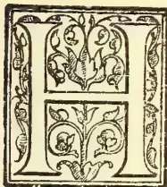

HAVING been closely connected with the tea trade from a very early age, the project of introducing the plant into Europe had long interested me deeply. I clearly saw, however, that before such a scheme could be carried out with any prospect of success, the conditions under which the plant flourishes in its natural habitat, the various properties of soil most favourable to the growth of the tea shrub, and the processes attending the manufacture of tea in China, would have to be closely studied. It was not until 1889 that I was in a position to carry out my long cherished scheme. For this purpose I visited Hankow in 1899; thanks to the influence exerted in my behalf by some Chinese friends, I was enabled, in spite of the disturbances then agitating the country, to make a thorough study of the cultivation of the plant, and of the manner of plucking and drying the leaves, as practised in the province of Yung-low-toong. I there worked side by side with the Chinese workmen. Twice subsequently—viz., in 1891 and in 1893—I visited China. On the first of these two visits to China I turned my whole attention to the flower teas, as well as to the black, yellow and green teas of Foochow, studying later on the methods of tea cultivation in Moning and Ningchow. On my third visit to China, in 1893, a visit which I consider as the most satisfactory of all, by its results, I succeeded in studying the culture of tea, not only in the provinces I have already named, but in those of Mankong, Sanho, Ta-sar-ping, Yung-low-see, and Nip-car-see, observing the progress of the plant from the first buds to the plucking of the leaf,

noting the conditions of soil and temperature, the atmospheric phenomena, as well as the methods employed in the culture and preparation of the leaf. Ceylon, Java, the Himalaya district, Japan, the Sandwich Islands, and Assam were all afterwards visited, in turn, more than once. The result of these voyages, and several subsequent ones, is that I possess; (a) A collection of specimens of the various kinds of soil in which the tea plant flourishes best; (b) An herbarium of the branches of the tea shrub; (c) A collection of the various parasites that infest the tea plant; (d) A collection of tools used for cultivating the tea shrub; (e) Specimens of the tea-leaf in every phase of its manipulation; and (f) Various kinds of manufactured teas.

I have imported on to my estates in the Caucasus:

- (a) 10,000 tea shrubs from three Chinese provinces—viz., Mankong, Ningchow, and Yung-low-toong.
- (b) 5,000 tea shrubs from Japan.
- (c) 500 ,, ,, Ceylon.
- (d) 200 ,, ,, the Himalaya district.
- (e) 200 ,, ,, Assam.
- (f) 50 ,, ,, Java.

Unfortunately, several of the shrubs perished before they reached their destination. I have still, however, 1,257 bushes imported from China, 67 bushes from Japan, 40 from Ceylon, 7 from Java, 16 tea shrubs from the Himalaya district, and 22 from Assam.

The 1,500 bushes which had arrived intact out of the 10,000 imported from China had cost me, by the time they were landed in Batoum, and I had paid the Customs duties on them, close upon £5,000 sterling.

Moreover, as I was particularly anxious that these plants should be given every chance, I had engaged fourteen Chinese labourers to accompany them to Russia, plant them in my estates,

315------------------------------------------------

294THE TROPICAL AGRICULTURIST.[Nov. 1, 1901.

superintend their growth, sow pure Chinese tea seeds, gather the crop, and manufacture the tea. Messrs. Butterfield and Swire, the owners of the steamer on which the plants were carried as far as Port Said, had agreed to demolish the partitions separating the second-class cabins, thus forming a second deck, and obviating the necessity of their being placed in the hold of the vessel. By this means a sufficient quantity of air and light could be assured.

Whoever attentively examines my tea plantations in the Caucasus may make a very clear comparison between the tea plants imported from the various localities, and anyone versed in tea will find no difficulty in forming an accurate idea of the respective merits of each class of tea.

In 1892 I purchased three tracts of land in the district of Batoum—viz., Salibaouri, Kapreshoum and Chakva, comprising, altogether, about 900 acres, and at once commenced preparing the ground for tea-planting. The three estates differ totally from one another both as regards the nature of the soil and the climatic conditions, a circumstance which enables me to judge what elevation is the most favourable for tea culture in the Caucasus.

Before I purchased them in 1892, the three tracts of land were entirely covered with virgin forests of rhododendrons, wild laurel trees with stems thicker than a man's arm, with beech trees and alder trees, twelve feet in thickness and very tall. Thickly intertwined with furze and thistle, the trees effectually shut off every ray of sunshine, while rendering the forests absolutely impenetrable. Such was the tangled and swampy ground it now became necessary to clear and cultivate.

Not satisfied with having imported plants from China and the other localities before mentioned, I procured large quantities of Chinese seeds, as well as smaller lots from the other places, in order to be able to draw a comparison between them. I am obliged to admit that the seeds from China have been comparative failures, notwithstanding all the measures resorted to in order to induce germination. This unsatisfactory result, always the same after many trials, induced me to try and plant shoots from the imported Chinese plants, and this experiment has proved quite satisfactory.

My tea plantations are in my three estates in the district of Batoum; they are: Privolnoe (Salibaouri), Zavetnoe (Kapreshoum), and Otradnoe (Chakva). They are at the following distances from Batoum:—  
Privolnoe 3 verst's distance from Batoum  
Zavetnoe 6 " " "  
Otradnoe 12 " " "

The space occupied by each estate is about:

Privolnoe 120 dessatins (equal to 27.10 of an acre).  
Zavetnoe 50 " "  
Otradnoe 100 " "

The three estates differ greatly both in altitude (from zero to 1,150 feet), in their proximity to the sea, in their accessibility to the influence of the sun and of the wind, and in the properties of the soil. My chief aim in purchasing these three estates was to see clearly, by practical experience, the climatic conditions, etc., which are best suited for the culture of the tea shrub in the Caucasus.

The following tracts of land have now been divided into tea plantations, and planted with tea shrubs of various ages:

In Privolnoe there are about 70 dessatins planted.

In Zavetnoe " " 30 " "

In Otradnoe " " 40 " "

making 140 dessatins in all. I purpose shortly to portion out the rest of available land into new plantations, i.e., about 130 dessatins more.

It is only the seedlings that have been raised from imported seeds that are cultivated on my estates; the tea shrubs that have been grown on the estates are not even allowed to flower, much less to turn to seed. Only a few seedlings have been

raised from our own seeds, in Otradnoe, by way of experiment, viz.:

In 1898 there were 345.

338.

All the rest of the seedlings have been raised from imported seeds. In reference to the latter, I may add that, in 1893, besides the chief quantum of China seeds, I imported seeds from other lands as an experiment; but none of the seeds except those imported from China yielded sprouts, or at least, if they did, the sprouts all perished.

In 1895 I once more imported seeds from Ceylon, Assam, the Himalaya district, but it was a last and futile attempt, and from that time I have only imported China seeds.

From 1892 up to the present year I have continued importing seeds from China every spring. It has even sometimes happened that I have received a cargo of seeds in the autumn in addition to those brought over in the spring.

In the year 1899 the seeds imported from China yielded about two millions of sprouts, and in 1900 about three millions, in the nursery gardens.

At the present time my plantations contain the following number of tea shrubs raised from seeds:—

(a) IN ZAVETNOE.

<table>
<tbody>
<tr>
<td>Planted in 1893</td>
<td>from China</td>
<td>seeds</td>
<td>7,228</td>
</tr>
<tr>
<td>" 1897</td>
<td>" "</td>
<td>" "</td>
<td>8,319</td>
</tr>
<tr>
<td>" 1897</td>
<td>" Assam</td>
<td>" "</td>
<td>2,464</td>
</tr>
<tr>
<td>" 1898</td>
<td>" China</td>
<td>" "</td>
<td>56,600</td>
</tr>
<tr>
<td>" 1898</td>
<td>" Himalaya</td>
<td>" "</td>
<td>78</td>
</tr>
<tr>
<td>" 1898</td>
<td>" Ceylon</td>
<td>" "</td>
<td>4,102</td>
</tr>
<tr>
<td>" 1899</td>
<td>" China</td>
<td>" "</td>
<td>59,052</td>
</tr>
</tbody>
</table>

(b) IN OTRADNOE.

<table>
<tbody>
<tr>
<td>Planted in 1893</td>
<td>from China</td>
<td>seeds</td>
<td>19,302</td>
</tr>
<tr>
<td>" 1897</td>
<td>" "</td>
<td>" "</td>
<td>35,144</td>
</tr>
<tr>
<td>" 1898</td>
<td>" our own</td>
<td>" "</td>
<td>345</td>
</tr>
<tr>
<td>" 1898</td>
<td>" China</td>
<td>" "</td>
<td>383</td>
</tr>
<tr>
<td>" 1900</td>
<td>" "</td>
<td>" "</td>
<td>284</td>
</tr>
</tbody>
</table>

(c) IN PRIVOLNOE.

<table>
<tbody>
<tr>
<td>Planted in 1893</td>
<td>from China</td>
<td>seeds</td>
<td>11,181</td>
</tr>
<tr>
<td>" 1896</td>
<td>" "</td>
<td>" "</td>
<td>5,023</td>
</tr>
<tr>
<td>" 1897</td>
<td>" "</td>
<td>" "</td>
<td>18,655</td>
</tr>
<tr>
<td>" 1898</td>
<td>" "</td>
<td>" "</td>
<td>20,313</td>
</tr>
<tr>
<td>" 1899</td>
<td>" "</td>
<td>" "</td>
<td>210,455</td>
</tr>
</tbody>
</table>

The original tea shrubs have been planted in small experimental patches in my three estates.

At present there are the following original tea shrubs on my three estates:—

<table>
<tbody>
<tr>
<td>(1) From China, Mankong</td>
<td>..</td>
<td>..</td>
<td>401</td>
</tr>
<tr>
<td>" " Ningchow</td>
<td>..</td>
<td>..</td>
<td>447</td>
</tr>
<tr>
<td>" " Yung-low-toong</td>
<td>..</td>
<td>..</td>
<td>409</td>
</tr>
</tbody>
</table>

Total...1,257

<table>
<tbody>
<tr>
<td>(2) From Japan</td>
<td>..</td>
<td>..</td>
<td>67</td>
</tr>
<tr>
<td>(3) " Ceylon</td>
<td>..</td>
<td>..</td>
<td>40</td>
</tr>
<tr>
<td>(4) " Java</td>
<td>..</td>
<td>..</td>
<td>7</td>
</tr>
<tr>
<td>(5) " the Himalaya district</td>
<td>..</td>
<td>..</td>
<td>16</td>
</tr>
<tr>
<td>(6) " Assam</td>
<td>..</td>
<td>..</td>
<td>22</td>
</tr>
</tbody>
</table>

Total .1,409

All the rest have perished.

The bushes mentioned above are distributed over my three estates thus:

<table>
<tbody>
<tr>
<td>(1) In Zavetnoe, Assam shrubs</td>
<td>..</td>
<td>..</td>
<td>22</td>
</tr>
<tr>
<td>(2) " Privolnoe, China and Japan shrubs</td>
<td>..</td>
<td>..</td>
<td>662</td>
</tr>
<tr>
<td>(3) " Otradnoe, China, Ceylon, Java and Himalaya shrubs</td>
<td>..</td>
<td>..</td>
<td>725</td>
</tr>
</tbody>
</table>

Total..1,409

In 1894 I tried the experiment of raising new tea bushes from grafts taken exclusively from China bushes. Of these I have now

<table>
<tbody>
<tr>
<td>(1) In Privolnoe</td>
<td>..</td>
<td>..</td>
<td>2509</td>
</tr>
<tr>
<td>(2) " Zavetnoe</td>
<td>..</td>
<td>..</td>
<td>1350</td>
</tr>
<tr>
<td>(3) " Otradnoe</td>
<td>..</td>
<td>..</td>
<td>2120</td>
</tr>
</tbody>
</table>

316------------------------------------------------

Nov. 1, 1901.]THE TROPICAL AGRICULTURIST.295

Personally I am inclined to look upon no tea as really genuine but such as comes "from China", and, indeed, only from two or three provinces in China, while, as regards the preparation of the tea, hand labour, such as it is practised in China, seems to me infinitely preferable to mechanical labour.

Notwithstanding this preference, however, a preference which has led me to bring Chinese cultivators to the Caucasus at an exorbitant cost, I found myself forced, after several failures, to procure from England the necessary machinery for the preparation of tea, as well as the framework for a new factory.

Messrs. Davidson & Co., of Belfast, furnished me with the apparatus for drying, rolling, fermenting and sorting the leaves, apparatus for cutting and pressing the green twisted leaves, and also a hydraulic press to form the tea into tablets, and another to make tea in the form of a 'pill'.

The tea 'pills,' for the preparation of which I had to order a new machine, present, I think, a rather interesting and novel feature. They weigh each half a zolotnik (about 14 to the ounce), and should prove very useful for the army, as well as for sportsmen and travellers. A single 'pill,' steeped in boiling water, is sufficient to give a cup of good strong tea, and I believe that before long these 'pills' will be known and appreciated at their true value.

The first tea I prepared and placed on the market was in 1895; the quantity in the year being, however, only 20 lb. Since then the progression has been rapid. Thus I sold: Tea in packets—

<table>
<tbody>
<tr>
<td>In 1895</td>
<td>..</td>
<td>..</td>
<td>20 lb.</td>
</tr>
<tr>
<td>1896</td>
<td>..</td>
<td>..</td>
<td>37 lb.</td>
</tr>
<tr>
<td>1897</td>
<td>..</td>
<td>..</td>
<td>1200 lb.</td>
</tr>
<tr>
<td>1898</td>
<td>..</td>
<td>..</td>
<td>2900 lb.</td>
</tr>
<tr>
<td>1899</td>
<td>..</td>
<td>..</td>
<td>3610 lb.</td>
</tr>
</tbody>
</table>

In addition I sold in 1898 10,000 lb. of compressed tea (tablets).

The tea in 'pills' has been already shown at several exhibitions, commencing with that held at Nijni Novgorod in 1896, then at Stockholm in 1897, St. Petersburg, 1899, and Paris 1900. They were sold at the Exhibition in Batoum, 1900, too.

As regards the demand for Russian tea and the rapidity with which it is bought up, the only thing I can complain of is the small production, which is far inferior to the demand, owing to the newness of the enterprise and the fact that most of the shrubs are very young as yet.

The entire production of the three qualities I have placed on the market—viz. at 2 roubles, 1 rouble 60 kop, and 1 rouble a pound, has been disposed of in Moscow, St. Petersburg, and Warsaw, as soon as offered. Almost everyone who has tried it prefers it to all other tea, many customers buying 10 lb. at a time, in case they may have finished their supply before a fresh one is procurable.

It would be idle to deny that I am somewhat proud of such results. The examination of my teas from the point of view of flavour, as well as the chemical analysis which has been made of it, have proved that if this tea, grown on Russian territory, be not actually superior to the best Chinese kinds, its quality is in no way inferior. There is therefore every ground for hoping that ere long Europe will accord it full rights of citizenship.

CONSTANTINE POPOFF.

Moscow, 15th May, 1901.

## GROWTH OF BALATA PRODUCTION.

There are indications that the production and consumption of Balata are increasing, though at what rate it is difficult as yet to say, owing to the want of system which prevails in most quarters in the statistics kept of this commodity. Mr. Henry Soutner Tufts, formerly of Boston, who was a recent visitor to THE INDIA RUBBER WORLD offices, stated that he was interested in a company employed in the collec-

tion of Balata in the section, rich in that gum, due south from Cuidad Bolivar, on the Orinoco, in Venezuela. The company has been devoted to this business alone for a year or more, with such success that more capital is to be employed. Mr. Tufts reports that the Orinoco Co., an American company holding large concessions in the delta of the Orinoco, are also devoting their attention in a large measure to the collection of Balata. It seems that the Venezuelan product is shipped chiefly to Hamburg, owing to the predominance of the German element in the trading in the Orinoco valley. But the German trade statistics do not happen to specify Balata. In the German reports of imports of "Kautschuk und Gutta-percha" the following quantities have been credited to Venezuela, and in the opinion of Mr. Tufts the greater part—or possibly all—is Balata:

<table>
<thead>
<tr>
<th></th>
<th>1897.</th>
<th>1898.</th>
<th>1899.</th>
<th>1900.</th>
</tr>
</thead>
<tbody>
<tr>
<td>Pounds ..</td>
<td>103,400</td>
<td>219,780</td>
<td>552,420</td>
<td>773,080</td>
</tr>
</tbody>
</table>

Meanwhile the arrivals of Balata at Rotterdam have about held their own, private statistics supplied by Messrs. Weise & Co. being as follows, and the Venezuelan sorts predominating:

<table>
<thead>
<tr>
<th></th>
<th>1897.</th>
<th>1898.</th>
<th>1899.</th>
<th>1900.</th>
</tr>
</thead>
<tbody>
<tr>
<td>Pounds ..</td>
<td>497,970</td>
<td>524,920</td>
<td>324,390</td>
<td>407,220</td>
</tr>
</tbody>
</table>

Coming to Great Britain, the official statistics still include Balata in the imports of Gutta-percha, the latest available figures showing the following results (by converting cwt. into pounds):

<table>
<thead>
<tr>
<th></th>
<th>1897.</th>
<th>1898.</th>
<th>1899.</th>
</tr>
</thead>
<tbody>
<tr>
<td>British Guiana ..</td>
<td>538,608</td>
<td>547,120</td>
<td>329,504</td>
</tr>
<tr>
<td>British West Indies ..</td>
<td>87,696</td>
<td>136,976</td>
<td>102,928</td>
</tr>
<tr>
<td>Venezuela ..</td>
<td>9,072</td>
<td>32,256</td>
<td>178,864</td>
</tr>
<tr>
<td>Colombia ..</td>
<td>1,568</td>
<td>17,248</td>
<td>53,200</td>
</tr>
<tr>
<td>Dutch Guiana ..</td>
<td>24,976</td>
<td>58,352</td>
<td>..</td>
</tr>
</tbody>
</table>

<table>
<tbody>
<tr>
<td>Total ..</td>
<td>661,920</td>
<td>791,952</td>
<td>664,496</td>
</tr>
</tbody>
</table>

How much of these British imports were actually Balata there is no means of knowing, but presumably all, though the figures for Colombia yet require some explanation. The amounts credited to the West Indies were first imported at Trinidad, mainly from Venezuela.

A summary of the above figures shows imports at the three centers mentioned of 1,263,290 pounds in 1897. Allowing as much for Great Britain in 1900 as in the preceding year, the total for that date would reach 1,644,796 pounds. Formerly the Guianas were almost the only sources of Balata, and figures are at hand covering the exports from those colonies very thoroughly for the earlier years of the industry. These figures show the average exports during the five years 1892-1896 inclusive:

<table>
<tbody>
<tr>
<td>British Guiana ..</td>
<td>229,824 pounds.</td>
</tr>
<tr>
<td>Dutch Guiana ..</td>
<td>185,472 "</td>
</tr>
</tbody>
</table>

<table>
<tbody>
<tr>
<td>Total ..</td>
<td>415,296 "</td>
</tr>
</tbody>
</table>

It will be seen, therefore, that the total movement of Balata is taking on greatly increased proportions. It does not appear, however, that the United States have participated in this increase. The official import returns for the fiscal year 1898-99 embraced only 21,913 pounds of Balata, valued at \$7633. But the classification is not very exact at the custom house in relation to this material, and for the year 1899-1900 the Balata item disappeared completely. From the reports of arrivals published monthly in *The India Rubber World* it appears that Balata was imported into the United States during the calendar year 1900 as follows (in pounds):

<table>
<thead>
<tr>
<th>From</th>
<th>From</th>
<th>From</th>
<th>From</th>
<th>TOTAL.</th>
</tr>
</thead>
<tbody>
<tr>
<td>Trinidad.</td>
<td>Surinam.</td>
<td>Great Britain.</td>
<td>Hamburg.</td>
<td></td>
</tr>
<tr>
<td>30,500</td>
<td>6,900</td>
<td>23,000</td>
<td>17,291</td>
<td>77,691</td>
</tr>
</tbody>
</table>

The leading firm handling Balata, however, state that their arrivals alone were 75,000 pounds, and that probably 100,000 pounds altogether were imported:

The usual methods of collecting Balata are treated fully in *The India Rubber World* for August, 1899,

317------------------------------------------------

296THE TROPICAL AGRICULTURIST.[Nov. 1, 1901.

by Mr. Joubert. It appears, however, that in Venezuela the practice of felling the trees is general, on account of the much greater immediate return, and the area over which the trees are distributed is so great that no possibility of exhaustion is admitted by those engaged in the business. By tapping, the tree can be made to yield only up to the highest point reached conveniently with a ladder, while by felling the tree the sap can be obtained sometimes for a length of 100 feet or more. Besides, under a method used by the Orinoco Co., all the bark is stripped from the tree, after as much Balata as possible has been extracted, and whatever remains in the bark removed by a chemical process. The high price of Balata is accounted for partly by the relative scarcity of labour. As high as 28 cents per pound has been paid to collectors employed in Venezuela, though payment was made in goods. Again, the better supplies of Balata are remote from navigable streams, one company being obliged to pay 3 cents a pound (=\$60 per ton) for the haulage of Balata to the nearest boat landing.

Sheet Balata is obtained by spreading the sap in shallow pans and exposing it to the sun, the process lasting sometimes nearly two weeks. The dried sheets are 1/8 to 3-16 inch in thickness, and are sometimes rendered thinner by running them between rollers, the chief purpose of which operation is to render the sheets less liable to curl up. Tin plate is well adapted for Balata pans, though the natives use wooden troughs, lined with tree leaves to keep the gum from sticking to the wood.

Block Balata is formed by boiling the sap in kettles holding from 8 to 12 gallons, until it reaches the consistency of molasses candy at the stage when it can be "pulled." It is then formed into masses in size suited to the packing cases, and placed in water to cool. The boiling requires about 2 hours for the first kettleful; the proper heat having then been reached, subsequent lots are boiled sufficiently in about 45 minutes. The cooling and hardening requires 3 or four hours. Packing cases of wood are usually 18 or 24 by 12 inches, and 4 inches deep.

The new treatment adopted in Venezuela does not extend to the whole production from each tree, but is rather a supplementary process. That is, after the usual method of extraction, the Balata remaining in the bark is obtained by grinding the bark and removing the Balata by distillation. Only the inner bark is ground up, the rough outer bark being first cut off. The further processes are kept secret, but naphtha is supposed to be used.

The average yield of Balata milk is about 3 gallons per tree, or 27 pounds, which yield 15 to 21 pounds of Balata. Mr. Tufts mentions having removed all the bark from a felled tree, before extracting any sap, and running it between the steel rolls of a sugar mill, with the result of obtaining three times as much Balata, but it contained more impurities than that obtained by ordinary means.

#### LATEST BALATA REPORT FROM VENEZUELA.

In the June issue of *Der Tropenpflanzer* (Berlin) appears a report by E. Englehardt, of Cuidad Bolivar, Venezuela, to the effect that during the year 1900 the production of Balata in that country was very largely increased, while the output from the Guianas had become relatively insignificant. The preservation of the trees, he says, has in no wise been considered. They are simply felled and allowed to rot on the ground, although the timber would be of great value if it were possible to convey it to the seaboard. The balata gatherers are compelled to invade the forests deeper and deeper every year, every tree for miles from the original starting point having been destroyed. The only shipments are now made from Bolivar. The rate of increase has been as follows:

<table>
<tbody>
<tr>
<td>In 1897</td>
<td>.. .. .</td>
<td>650,613</td>
<td>pounds,</td>
</tr>
<tr>
<td>1898</td>
<td>.. .. .</td>
<td>1,043,170</td>
<td>"</td>
</tr>
<tr>
<td>1899</td>
<td>.. .. .</td>
<td>1,659,295</td>
<td>"</td>
</tr>
<tr>
<td>1900</td>
<td>.. .. .</td>
<td>2,628,784</td>
<td>"</td>
</tr>
</tbody>
</table>

It will be noticed that these figures, obtained evidently from official sources in the country of production, are much larger than those given in the preceding article, which was prepared before Mr. Englehardt's report was available. It is stated, also, that very little sheet Balata is produced in Venezuela, the block Balata being produced more readily.

During 1900 rubber was shipped from Venezuela only in small quantities, owing to the seat of the revolution which existed for months being in the district whence the necessary labour for rubber gathering is secured. [The rubber from the Orinoco, marketed usually as "Angostura," is of the Paratype, and classified as "fine" and "coarse." The shipments by the river Orinoco were: Fine, 114,970 pounds; coarse, 32,532; total, 147,502 pounds. However, some Venezuelan rubber, from the back districts, finds its way to the Amazon, being exported through Para, but the total export Herr Englehardt estimates at not over 100 tons for the year. The production for 1901 is expected to be much larger—possibly 400 tons, owing to an increased interest in the business and the investment of new capital on a systematic basis.—*India Rubber World*.

#### FLOWERING AND SEEDING OF MANWELL BAMBOOS (DENDROCALAMUS STRICTUS)

#### IN THE CENTRAL THANA DIVISION, BOMBAY PRESIDENCY.

This bamboo known as Manwell all over the Thana district flowered in the Mokhada Hills, which form the western projection of the Ghats over an area of about 3 square miles in the reserved forests of the village of Assa, in December, 1900 and January, 1901, and the seeding occurred in March. The flowering was not entirely gregarious, but very nearly so, and was confined to the mature clumps. A clump here and there seemed to escape. In the Wada Range, which is in the central portion of the district, I observed the flowering wassporadic and scanty. In the Bassein Range on the Sea Coast, the flowering was a little more copious than in Wada, but not gregarious. I am informed that at Yewa, a village in the Kalyan Taluka of South Thana, the Manwell bamboo planted in the village also flowered this (1900) season, and that about half-a-dozen clumps in the forests close by flowered as well. In these cases, the flowering was not confined, it is said, to the mature clumps only, but also to the younger ones. In 1899 I met with a solitary clump of the same species in seed in the Bhiwandi Range of the South Thana Forest division.

#### METHOD OF COLLECTION OF SEED.

While in the Assa Forest, in March 1901, I found the wild tribes gathering the bamboo seed for home consumption, and also for sale in the neighbouring native State of Jawhar. The outer culms of each clump are cut one by one at about 4 feet from the ground, and each culm bearing seeds is laid on the ground, which has been previously cleared and swept. The culm is well beaten with a stout stick till all the seeds from it have fallen. The fallen seeds with husks are carefully collected and winnowed by children. It appears that on being taken home, the seeds are crushed in a mortar. One adult is said to be able to collect 2 to 8 seers, i.e., 4 to 6 lb. of seed per diem. Seed was also collected and sold in the Jawhar State which is adjacent to the Assa Forest at Rs 16 per 16 adhohes, i.e., 64 lb. I have a few pounds available for distribution if required.

G. M. RYAN.

—*Indian Forester*.

318------------------------------------------------

Nov. 1, 1901.]

THE TROPICAL AGRICULTURIST.

297

PRODUCTION OF COFFEE IN INDIA.

After noting that the figures are imperfect and defective, and that, for example, the statistics of the Nilgiri district are very imperfect, the Director-General of Statistics reports as follows:—

**AREA.**—At the end of 1900 there were 245,405 acres of land under coffee in India, all, with the exception of 387 acres, in Southern India. The production of coffee is restricted for the most part to a limited area in the elevated region above the South-Western coast, the coffee lands of Mysore, Coorg and the Madras districts of Malabar and the Nilgiris, comprising 88 per cent of the whole area under the plant in India. About 52 per cent. of this area is in Mysore, where there were 128,087 acres in 1900, and the plant is grown on 99,088 acres, being 40 per cent. of the whole, in the British districts of Coorg (68,596 acres), the Nilgiris and Malabar (30,492). In Madras there is no extensive cultivation except in these two districts, and in Salem and Madura. Coffee is also grown, but on a very restricted scale in Burma, Assam, Bengal, and Bombay.

**PRODUCTION.**—The fall in prices since 1897 has removed the stimulus which had been given for a few years to the further expansion of the coffee-growing area, while disease has combined with adverse climatic conditions to reduce the yield. The quantity produced last year was but little more than half the quantity produced ten years ago. Taking 100 to represent the area and production in 1885, the ratio of yearly increase or decrease is as follows:—

<table border="1">
<thead>
<tr>
<th></th>
<th>Area.</th>
<th>Production.</th>
</tr>
</thead>
<tbody>
<tr><td>1885</td><td>100</td><td>100</td></tr>
<tr><td>1886</td><td>97</td><td>90</td></tr>
<tr><td>1887</td><td>103</td><td>109</td></tr>
<tr><td>1888</td><td>104</td><td>76</td></tr>
<tr><td>1889</td><td>110</td><td>85</td></tr>
<tr><td>1890</td><td>114</td><td>63</td></tr>
<tr><td>1891</td><td>111</td><td>13</td></tr>
<tr><td>1892</td><td>110</td><td>97</td></tr>
<tr><td>1893</td><td>109</td><td>109</td></tr>
<tr><td>1894</td><td>117</td><td>101</td></tr>
<tr><td>1895</td><td>119</td><td>115</td></tr>
<tr><td>1896</td><td>121</td><td>75</td></tr>
<tr><td>1897</td><td>116</td><td>69</td></tr>
<tr><td>1898</td><td>118</td><td>68</td></tr>
<tr><td>1899</td><td>115</td><td>50</td></tr>
<tr><td>1900</td><td>103</td><td>62</td></tr>
</tbody>
</table>

**PERSONS EMPLOYED.**—According to the statements there were 22,128 persons permanently, and 91,685 temporarily, employed on the coffee estates in 1900, making a total of 113,813 persons, which is equal to one person to about 2.16 acres.

**EXPORTS AND CONSUMPTION.**—The following figures are the average of the ten years ending 1900-01:—

<table border="1">
<thead>
<tr>
<th></th>
<th>lbs.</th>
</tr>
</thead>
<tbody>
<tr>
<td><i>Indian Coffee—</i></td>
<td></td>
</tr>
<tr>
<td>Production</td>
<td>30,040,608</td>
</tr>
<tr>
<td>Exports</td>
<td>30,163,056</td>
</tr>
<tr>
<td><i>Foreign Coffee—</i></td>
<td></td>
</tr>
<tr>
<td>Imports</td>
<td>1,529,819</td>
</tr>
<tr>
<td>Exports</td>
<td>787,520</td>
</tr>
</tbody>
</table>

It is of course not the case that exports have exceeded production during this period; the figures merely illustrate the difficulty of obtaining an accurate view of an industry when those who are engaged in it think fit to withhold information which is indispensable in the consideration of any questions affecting the industry. The figures, however, imperfect as they are, indicate that the Indian producer of coffee has no local market on which he can depend for the consumption of any portion of his production. He is entirely dependent upon the external markets which are contained in the countries mentioned below, these being the principal countries to which Indian coffee is exported (in lbs):

<table border="1">
<thead>
<tr>
<th></th>
<th>1897-98</th>
<th>1898-99</th>
</tr>
</thead>
<tbody>
<tr><td>United Kingdom ...</td><td>12,773,376</td><td>17,392,480</td></tr>
<tr><td>France... ..</td><td>8,607,872</td><td>9,356,816</td></tr>
<tr><td>Ceylon .. ..</td><td>293,888</td><td>505,680</td></tr>
<tr><td>Asiatic Turkey and Persia ..</td><td>868,856</td><td>131,264</td></tr>
<tr><td>Australia .. ..</td><td>199,024</td><td>265,440</td></tr>
<tr><td>Arabia .. ..</td><td>630,896</td><td>229,488</td></tr>
<tr><td>Germany .. ..</td><td>297,584</td><td>618,688</td></tr>
<tr><td>Austria-Hungary ...</td><td>591,360</td><td>1,023,568</td></tr>
</tbody>
</table>

<table border="1">
<thead>
<tr>
<th></th>
<th>1899-1900</th>
<th>1900-01</th>
</tr>
</thead>
<tbody>
<tr><td>United Kingdom ..</td><td>17,640,000</td><td>15,678,708</td></tr>
<tr><td>France... ..</td><td>10,847,536</td><td>8,430,016</td></tr>
<tr><td>Ceylon .. ..</td><td>1,224,272</td><td>1,088,528</td></tr>
<tr><td>Asiatic Turkey and Persia ..</td><td>137,984</td><td>610,288</td></tr>
<tr><td>Australia .. ..</td><td>272,496</td><td>447,104</td></tr>
<tr><td>Arabia .. ..</td><td>85,232</td><td>274,960</td></tr>
<tr><td>Germany .. ..</td><td>292,544</td><td>126,560</td></tr>
<tr><td>Austria-Hungary ...</td><td>298,704</td><td>123,312</td></tr>
</tbody>
</table>

As France takes on an average about a third of the whole quantity exported, it is obvious that the Indian coffee producer has an intimate interest in the outcome of the question at present under discussion of the application to Indian coffee into France of a rate of duty higher than that which is imposed upon Brazilian coffee.

**PRICES.**—Coffee is not sold, as tea is sold, before shipment for export, and therefore there is no Indian quotation of price. The average prices in London for East Indian plantation coffee since 1874 are here subjoined with their variations, taking the price of 1874 as the datum=100. Prices dropped last year, as a consequence of the great expansion in the production of Brazilian coffee to the lowest level known:—

<table border="1">
<thead>
<tr>
<th rowspan="2"></th>
<th rowspan="2">Per cwt.</th>
<th colspan="2">Variation.</th>
</tr>
<tr>
<th>s.</th>
<th>d.</th>
</tr>
</thead>
<tbody>
<tr><td>1874</td><td>92</td><td>1</td><td>100</td></tr>
<tr><td>1877</td><td>110</td><td>0½</td><td>120</td></tr>
<tr><td>1879</td><td>100</td><td>10</td><td>110</td></tr>
<tr><td>1882</td><td>85</td><td>4</td><td>93</td></tr>
<tr><td>1884</td><td>76</td><td>4½</td><td>83</td></tr>
<tr><td>1887</td><td>94</td><td>9½</td><td>103</td></tr>
<tr><td>1889</td><td>99</td><td>10</td><td>108</td></tr>
<tr><td>1890</td><td>106</td><td>2½</td><td>115</td></tr>
<tr><td>1893</td><td>105</td><td>4½</td><td>114</td></tr>
<tr><td>1894</td><td>101</td><td>0</td><td>110</td></tr>
<tr><td>1897</td><td>94</td><td>8</td><td>103</td></tr>
<tr><td>1898</td><td>78</td><td>1</td><td>85</td></tr>
<tr><td>1899</td><td>65</td><td>2½</td><td>71</td></tr>
<tr><td>1900</td><td>48</td><td>0</td><td>51</td></tr>
</tbody>
</table>

—Planting Opinion:—

**LIME FOR FOWLS.**—It has not been demonstrated that oyster shells, or lime in any form, produce egg shell or rather shells for the egg, as there are thousands of hens that are in no manner provided with oyster shells. It is true, however, that oyster shells, being sharp, assist in grinding the food. Carbonate of lime is insoluble, and the lime for the egg shells must consequently come from what can be digested and conducted to the eggs through the blood. As nearly all kinds of food contain lime in a soluble form by combination with vegetable acids, as well as in the form of inorganic salts that are soluble, the process of covering the eggs with shells goes without the aid of substances that are insoluble. There is one source of soluble lime, however, that is frequently overlooked—the water—which holds lime in a soluble form when it abounds in carbonic acid. Hard limestone water contains lime, and the hens can, by drinking it, secure more lime in a convenient form than from oyster shells. When a hen lays eggs with soft shells the cause is due not to the lack of lime, but to the condition of the hen, as she is then, as a rule, in an over-fat condition. To this cause may be traced all the eggs with soft shells.—*Journal of the Department of Agriculture of Western Australia.*

319------------------------------------------------

298THE TROPICAL AGRICULTURIST.[Nov. 1, 1901.CAMPHOR OIL.

By PROFESSOR SHIMOYAMA, Ph.D.

(Communicated by Our Yokohama Correspondent.)

There is scarcely any need to say that camphor is one of the chief export staples from the Japanese Empire, and according to statistics, during the first four months of this year 1,435,000 yen worth have been exported. The Formosan Government estimates the annual production in that island at 50,000 piculs of camphor and 20,000 piculs of so-called original oil of camphor, the latter containing 50 per cent of camphor. At present two Japanese merchants in Kobe are engaged in redistilling camphor out of the original oil by arrangement with the Formosan Government. In the course of redistillation two grades of red and white oils are yielded. White oil, more popularly known as camphor oil, finds its way throughout the interior, and is very widely used by the Japanese for disinfection; while red oil is exported to Europe and elsewhere to the extent of from 7,500 piculs at the best to 3,500 piculs at the least annually. This red oil of camphor is used in foreign countries for the manufacture of safrol, which is very widely used abroad in the soap and perfume industries; and is also used as a raw material for the manufacture of heliotropin, the price of which has been reduced from 500 yen per kilo. to something like 17 yen per kilo.

About twenty years ago, when no one knew how to use this red oil economically, and distillers used to throw it away, Mr. K. Goto, a merchant in Kobe, made a trial shipment of it, in order to find a market, but without any success at the time. In 1883 Mr. Peltman, of Messrs. Schimmel & Co., Leipzig, Germany, invented a process for making safrol out of it; thus red camphor oil found its way to Europe. In the first instance prices were abnormally low, foreign buyers paying only 3 yen per picul for it. Since then, owing to increased demand, it has advanced to nearly six times the price; present export quotations are from 17 to 18 yen per picul.

Out of a picul of this red oil 50 catties of safrol are produced, so that there is no doubt that foreign buyers were, and are, making enormous profits, as the cost of production is trifling, and they get for safrol 60 yen to 70 yen per 50 catties.

When I visited Formosa in February last year for botanical research, by instruction of the Imperial University, I was asked by Dr. S. Goto, Chief of the Civil Affairs Bureau, to submit a report about the manufacture of safrol out of red oil of camphor. Consequently I began an investigation in April, 1900, and completed it by July. A detailed report was submitted to the Formosan Government in November. As a result, it was decided to make experiments on a large scale at a cost of 50,000 yen, and the plant has been laid down in Kobe. The result is satisfactory so far, but when the plant is completed not less than 500 catties of safrol can be made daily. When safrol is manufactured out of red oil a blue-coloured oil is obtained, which I estimate to amount to 1,000 "koku" in a year. After a long research and hard labours I found that it is a very powerful disinfectant. So I named it "Disinfectant." A sample of it was sent to the Government Laboratory, and I was informed that it has great power as a disinfectant, and is particularly potent in destroying the plague bacillus. In my opinion, it is a stronger disinfectant than carbolic acid, and will be used widely in the interior. It is a custom of the Japanese peasants to use kerosine for killing worms and insects, which sometimes do serious harm to the rice-harvest; and I believe this "Disinfectant" can be used instead of kerosine at a far cheaper rate. The Colonial Government, it is said, is to make practical tests in their experimental agricultural stations. The result will, no doubt, be satisfactory.—*Chemist and Druggist.*

CRUSHING CASTOR SEED.

The 'Dutch mill' is nothing more than two heavy iron uprights connected by two rods on which slide, by means of holes, thin sheet iron plates. One upright carries a screw thread into which a massive shaft, cut into screw form, works. This screw is actuated by long levers fitting into socket holes in a boss at its outer extremity after the manner of a windlass. The castor seed after being carefully shelled or divested of its black skin, and winnowed so that no black particles remain, is braised and made up into little packets with thin muslin cloth. These are placed between the plates of the machine, one between each division, to the number of 40 or 50. The screw is then tightened upon them, two men working the levers windlass fashion till the oil is expressed. There is a limit of course to the power of manual labour, and the process does not extract the whole oil, much of which remains in the resulting cake. The shelling and winnowing process demands care, as upon the freedom from the black skin depends the purity of the oil; besides which this skin is of a horny and elastic nature and very resistant to pressure. This matters little under the enormous pressure of the hydraulic, but when manual labour is used the incompressibility of the skin would result in a loss of oil, by reason of the resistance offered to the action of the press.

Although this process is called a cold process, it must be remarked that unless a moderate heat is applied to the plates of the machines to heat the seeds, the oil will not flow freely. Heat is applied in practice by shallow troughs of lighted charcoal placed one on each side beneath the row of plates, but not under the seed being crushed. The 'Dutch mill,' owing to its simplicity, is cheap to construct and easily worked by unskilled labour—*Indian Gardening and Planting.*

ORANGE AND LEMON CURING AND PACKING.

By A. DESPEISSIS.

Late in the autumn the attention of the grower is turned from his deciduous to his evergreen trees, of these, those which are of greatest importance to him are the trees of the citrus family.

As in the case of the deciduous trees which furnish the summer fruit crop, the choice of varieties to grow is made from a long list. In deciding what varieties to plant, several factors will influence the grower's choice, and, amongst others, the peculiarity of the local climate; the requirements of the market to supply; the character of the soil.

No climate is too warm for trees of the citrus tribe, provided that the parching effect of the torrid atmosphere is mitigated by a sufficiency of moisture in the ground. On the other hand, oranges, lemons and their like, cease to be profitable if grown in cooler climate better suited to the cultivation of pippins or of berries. A few strong trees may be found to thrive excellently under the conditions which prevail in such localities when sufficiently protected, but these are exceptions, from which it would be unwise to draw general deductions.

As regards the susceptibility of citrus trees to withstand hard frost, pomaloes and mandarins come first; they are followed by oranges and kumquats, lemons come next, with limes and citrons last on the list.

A description of each variety of these several species of citrus trees does not come within the scope of this chapter, and the information has already been given.

To the average West Australian grower pomaloes, kumquats, citrons and limes are of as great account.

The first three are valuable for their peel, which is candied, whilst limes, and sometimes citrons, are more largely cultivated for the sake of the acid juice of their fruit. As old trees only of these varieties are to be found in West Australian groves, all information referring to the manufacture

320------------------------------------------------

Nov. 1, 1901.]THE TROPICAL AGRICULTURIST.299

of lime juice and to candied peel may well be left out. Mandarins, oranges and lemons are, therefore, of all citrus fruits, those which, having proved themselves well suited to the conditions of soil and climate of this country and to the requirements of our local as well as of our export markets will be reviewed in the following paragraphs:—

#### MANDARINS.

Of all our citrus fruits mandarins or tangerines are, for the purpose of the local market, the most valuable, the trees are hardy, they bear even when young heavy crops of fruit, they do not occupy much room in the orchard, being dwarf in comparison with other citrus trees. For this reason the crop is easily gathered, the trees are more easily sprayed and protected against the infestation of scale insects—that curse of our orange groves—they are, besides most delicious fruit, easily peeled and greatly liked by everyone, young and old. Our market is at present badly supplied with this fruit, and as growers have, besides, for some unaccountable reason, been somewhat chary in planting them, it is quite unlikely that the demand will, for a long time to come, be satisfied. Nor can the Eastern States supply us with any large quantities of these fruits, as our mandarin season seems to be more protracted over here than it is in the east. Moreover, the fruit is not a very good carrier, the rind being puffy and the fruit tender, and on that account a heavy percentage of the shipments sent over here is lost to the importers.

In order to be profitable, the mandarin tree must be grown on the best of soils, deep, moist and fertile. Of varieties, the best in the order in which they ripen are Parker's Special, Thorny, Queen, Scarlet, Beauty of Glen Retreat and Emperor.

Mandarins can only carry when packed with the greatest care and attention, and when this is done with intelligence, the result is always satisfactory. They are best packed like figs, in shallow boxes, in layers of a dozen each for fruit of the first grade, and eighteen of the second grade, it is not advisable to have more than two such layers. Each mandarin should be wrapped in soft wrapping paper. Some packing houses have their trade mark and name printed on the paper, and as they use large quantities of that material, the extra cost is only nominal. If the mandarins are of especial quality and are meant for a select market, they are often wrapped in tin foil, and packed in neat boxes having an edging of lace paper, with an artistically colored design on the paper cover.

The fruit is, of course, as in the instance of oranges and lemons, carefully clipped and never pulled from the tree, it is allowed to sweat before packing, and none but fruit free from blemish is ever packed.

#### ORANGES

Are of all the citrus fruit those most extensively planted in this State, where they thrive with great luxuriance. They require good soil, moist, but well-drained, and wherever the best varieties are cultivated in congenial locations and are well fertilised, the West Australian oranges invariably supplant the imported fruit on the local market.

Thickness of the rind and sweetness of the juice, as well as abundance of crops, can to a large extent be influenced by manuring.

Heavy dressings of coarse farmyard or pig manure promote thick and puffy rind, and the growth of spongy wood tissue, particularly liable when under unfavourable circumstances to gumming and die-back diseases. Whenever the trees require a dressing of a nitrogenous fertiliser either nitrate of soda or sulphate of ammonia should be given the preference.

Potash fertilisers influence a thrifty growth, a healthy, deep color of both foliage and of rind, and a greater degree of sweetness. For that purpose sulphate of potash, muriate of potash or kainit can be used. When using kainit the dressing should be more liberal than when either of the first two fertilisers are used.

Phosphates increase the productiveness of the trees and the general excellence of the fruit. Either bone dust, phosphatic guano or Thomas' Phosphate give very good results. When it is intended to benefit more particularly the current season's crop, superphosphate of lime, which is more soluble than the other phosphatic fertilisers, applied in the late winter, or as late as the early spring, will be found most useful. Two to six lbs. of these fertilizers, according to the size of the trees, constitute a very good dressing.

Unlike lemons, which should be picked before they turn yellow, oranges are always better when left to hang until ripe and sweet. There is a degree of ripeness however, which, if over-reached, proves detrimental to the long keeping of oranges.

Nothing but the best fruit, absolutely free from scale insects will carry and open satisfactorily when marketed. Fruit trees cannot carry a heavy crop and sustain large colonies of scale insects at the same time.

For picking the fruit some growers twist the stalk until it snaps; fruit thus plucked have a poor chance of keeping. Clippers that will not injure the fruit should be used in preference to a knife. The stalk is cut short, just above the star; if cut too long, it will probably puncture some of the fruit in the case and thus engender decay.

Some orchard hands when stripping a tree place the fruit in a turned up apron fastened over their shoulders and round their loins; this plan is not to be recommended, as the fruit rolls about and thus gets more or less bruised; light buckets are most convenient for that work; they can be hanged until full to the step-ladder and then lowered and emptied in boxes with open salts and there left to sweat until packed for market. These boxes are filled so that one can be placed on the top of another without the oranges below being crushed by the case above.

If a spring cart is not available for conveying the fruit to the packing shed, and more especially if the road be rough and uneven, a bedding of straw in the bottom of the dray will save the fruit from being bruised. When freshly picked the rind of oranges and lemons is indeed brittle and its cells filled with moisture, essential oils and air.

After standing a few days, beads of sweat can be seen on the rind, which then becomes smoother, more pliable and leathery and less liable to be bruised by pressing in the case.

When properly sweated, which will take three to four days, the packer handles each fruit, wipes it dry and grades it according to size and quality. Fruit picked after heavy rain takes longer to sweat and is more easily bruised. It is then wrapped in a piece of tough but soft tissue paper, the four corners being gathered up at the stem end and twisted, thus acting as a spring buffer which saves the fruit around from possible bruises. The paper should not be too large, and of course varies in size with the size of the fruit; that more common dimensions being 9 x 9 inches, 10 x to 10 or 10 x 12 inches.

This done, each fruit is firmly set in its proper place in the case, tier upon tier. Should the last layer rise above the edges of the case, quarter of an inch or so, so much the better; the lid is placed on top and pressed down gently and firmly and nailed down. Oranges packed in this way, will not, when opened on sale, be found as several cases of otherwise choice fruits despatched last season to the Agent-General in London, to have "too much paper, be of mixed size, and slackly packed," but they should carry in good condition even as ordinary cargo.

The cases should be made of light and well-seasoned wood, stowed away under shelter until used, so as to protect them from weather stains, and the name or trade mark of the grower, the grade of the fruit, and number in the case should be neatly stencilled on the end pieces.

Two defects should be guarded against with fruit cases. They should not be made of such wood as

321------------------------------------------------

300THE TROPICAL AGRICULTURIST.[Nov. 1, 1901.

might impart to the contents an unpleasant flavour, and they should not be constructed of too flimsy material. When the slats are less than  $\frac{1}{4}$  in. in thickness, and especially if these slats are wide, the cases are often damaged and go to pieces when slung in loading and unloading, and much fruit is in consequence injured or lost. A trifling saving may possibly be made in first cost of the thinner packages, and pounds' worth lost in the end on the consignment.

#### LEMONS.

A few notes on lemon curing will end this chapter. A number of new methods have been propounded for curing lemons by enthusiastic experiments and the results have at times surpassed the most sanguine expectations, and at other times proved disastrous. When all is said and done, the only secret in the art of curing lemons consists of no more than careful handling.

Several desiderata, when found combined, ensure profit to the lemon grower, and unless these are secured there is no money in lemons, which are imported in large quantities from the Mediterranean ports in the height of summer, when they are most required, and sell at a comparatively low price.

The first of these is suitable soil and climate, then come suitable varieties, careful picking and handling, and long storing.

The best soils for lemons is a loose, deep, and well-drained loam, moist and fertile; it also does well on coarse granite soil, intermixed with a sediment of rich sand, but in these soils will require irrigation oftener than in the heavier soils.

Except in the more arid localities, irrigation is deprecated for the first two or three years, so as to force the tree to send its roots deeper into the soil in search of moisture and of nourishment. The wisdom of this treatment is made more apparent in the matter of both water and fertiliser in after years, when the trees are in full bearing. Early irrigation also stimulates an already excessive tendency on the part of the lemon to make too rapid a growth of wood.

The cultivation amongst the lemon trees, as indeed amongst all citrus trees, should be frequent but shallow, as the roots are mostly surface feeders, and too deep cultivation would tear them to pieces.

A climate moist and warm suits the lemon best, as the tree is susceptible to hard frost and loves moisture.

As to varieties, the list is a long one, but three or four stand out prominently, each having its advantages as well as its disadvantages, viz., the Eureka, the Villa Franca, and the Lisbon. Of this last several strains are known, good, bad and indifferent, and every care should be taken, when propagating by buds, to ascertain the merits or the defects of the parent plant.

Picking is the essence of curing, and when lemons have been rightly picked, they will with ordinary care keep for a long period.

All lemons which have reached 3 to 4 inches in diameter, those that have already turned yellow, or show thorn pricks, those that have been punctured by scale insects, or are soiled by the sooty mould, are not fit for curing and long keeping, and should be sold to the best advantage and without delay.

The lemon tree blooms and sets its fruit continuously all the year round, although in the early spring and the late autumn more especially the picking is heaviest. The tree it is known makes in favourable seasons several growths in the year, and likewise produces two main crops, with a few stray lemons in between.

For curing, the autumn pick of lemon is the best. This is done not all at once, but the trees are gone over several times, and the fruit picked as it reaches the right degree of development. At that time the skin is perfectly smooth and the end is filled out; before this time there seems to be a little depression or a little ring at the end. When this stage is reached the rind is thinner and less puffy than

later on, the juice cells are tender and gorged with acid. The months May and June in Australia are the best for picking lemons for curing. The fruit should be picked when still green, with just a tinge of yellow showing. They should be stem cut and handled as carefully as has been mentioned in the case of the orange.

The sizes most suitable for the market are those ranging between  $2\frac{1}{4}$  to 3 inches transverse diameter. Some people use a ring for the purpose of measuring the fruit, and every lemon that just goes through is clipped, the eye, however, soon gets trained to the size required, and when in doubt, the forefinger and the thumb round the lemon will, if they nearly meet at the stem, approximate the size wanted.

When picked, the lemons are placed in the sweat boxes, as described above when speaking of oranges and there left for a week or so.

The size of the sweat box is of no special importance, but it should be shallow and not more than 9 to 10 inches deep, with a few slits on the side to allow ventilation, and check the growth of the moulds of decay.

Packing is done when the skin is dry, clear and smooth. Several grades are made, each fruit is handled separately and none but those absolutely without blemish are wrapped in tough tissue paper and cased for long keeping.

When it is intended to store for a long period, the sorted and graded fruit may be placed on shallow trays superposed one on the top of the other in a cool, dark room, with sufficient ventilation provided to carry away the foul gases and the moisture thrown off the lemons. In this way they will keep through the winter until the approach of the warm weather in the early summer. A cool temperature is maintained in the room by opening the door and window at night, and closing them in the day time if found necessary.

Some packers place the fruit from the sweating boxes into barrels or large cases, and run over them fine dry sand and thus leave them until they are marketed when the demand sets in later in the year.

Other packers anoint each lemon with a light film of vaseline. For that purpose they rub the fruit all over with a piece of flannel with the vaseline on. It is claimed that vaseline never becomes rancid and is tasteless and odourless, and after a few weeks it is difficult to pick out the fruit that have been thus rubbed with vaseline, as by that time they have lost their oily and shining appearance. Vaseline checks the growth of moulds of decay and prevents the skin drying up too quickly. Some use steam for colouring the lemons, but the process is not to be recommended. Others dip their lemons in some antiseptic fluid and thus keep them sound for a long time, but lemons thus preserved, although bright and fresh when fresh from the dip, soon turn brown and show a horny rind.

In conclusion the art of curing lemons consists in:—

Growing the right kinds.

Manuring, cultivating and tending the trees well and maintaining them in a state of health and thrift.

Picking at the right time and in the proper manner as where the stem is pulled from the lemon the cells are exposed to the air and decay sets in.

Sweating and grading; storing in a cool, dark place. Specially constructed storing sheds have been constructed for keeping cured lemons in, but any ordinary chamber answers the purpose just as well, provided it is not damp or too much exposed to sudden changes of temperature. Such a chamber should be dark and well ventilated.

The lemons are marketed as are the oranges, and in connection with our local market it may be mentioned that the best months for handling the local crops are September and October, and before the November-cut main crop of Sicilians come in, and also in April and May, after the Sicilians are done, and before the cold winter sets in.—*Journal of the Department of Agriculture.*

322------------------------------------------------

Nov. 1, 1901.]THE TROPICAL AGRICULTURIST.301

## PRUNING

By A. DESPEISSIS.

In previous chapters the general principles of pruning vines, and also fruit trees, have been dealt with. In this issue the consideration of the best ways of training and pruning a few more of the fruit trees generally cultivated in our orchards is proceeded with.

### PRUNING THE CHERRY.

The instructions given about the shaping of young trees apply to the cherry. The stem should be low and headed back to 12 to 15 inches when planting; the main limbs are also cut short, as the tree is very subject to sunburn. To guard against this it is a good practice to pinch all side shoots not necessary for the extension of the tree to a pair of leaves or two; fruit epurs will thus in time be formed all along the lower branches, while these tufts of leaves will afford to the branches protection against the sun.

Cherry trees in general produce their fruit upon small spurs, or studs, from half-an-inch to two inches in length, which proceed from two, three, or four year old wood. New spurs will continue to shoot out right up to the extremities of the branches; in the centre of every cluster of fruit spurs there is a wood spur, which, as it extends each season, bursts into blossom and carries the year's crop; this should be remembered when pruning. These spurs will carry fruit for several years.

Once the cherry tree has commenced to fruit it should, unlike the peach and the apricot, be very sparingly touched with the knife, as it is besides very subject to "gumming." This peculiarity of the plant is aggravated in individuals presenting long stems exposed to the sun, on trees with many forked limbs, and on those which have had large limbs taken off. It is found that by doing all the necessary severe cutting during the summer, and after the crop has been gathered, the wounds heal more readily. Whenever a branch thicker than the size of the finger is cut off it is advisable to apply to the fresh cut a covering of white lead, gum shellac varnish, of hot wax or of clay.

The *Heart* and *Bigarreau* sorts, which are sweet varieties, are luxuriant growers, attaining large size, and possess large drooping leaves. Mazzard stock are preferred for these, the trees being long-lived, larger, and healthy when planted on fairly good loam.

The *Duke* and *Morelloss* classes are slow growing sorts of the sour kind. The first have stiff and erect branches with smaller leaves, thicker and of a darker green color than the preceding classes; the second or Kentish Cherries are of a bushy habit, with smaller leaves still and more drooping and more numerous twigs. The branches must be kept far enough apart to admit the sun and air freely amongst them, and the stem and main branches strengthened by cutting hard for several seasons. If the tree grows too luxuriantly, an occasional root pruning will throw it into fruit. They do best on Mahaleb stock, which gives smaller trees, but is more accommodating as regards soil. This stock gums on wet, retentive soil. If it were not for the sprouting habit, sour varieties on their own roots do very well. Cherry trees when shaped for the first few years as a rule keep a good form, and bear well without pruning.

### PRUNING THE FILBERT.

Suckers should be carefully eradicated every season, and the bushes pruned somewhat after the fashion of the quince, or else they will be a mass of branches, and remain almost barren. Yet the filbert, in the majority of cases, is completely left to itself, although to be fruitful it requires proper and regular pruning. The blossoms, like those of the walnut, are monœcious, i.e., the male flower or catkins, and the female flowers are borne on the same tree, but from different buds. These fruit buds bear

in a cluster at the extremity of small twigs, and are produced on shoots of one year's growth, and bear the next.

Unless the bushes are pruned, they bear very heavily one year, and remain barren several seasons to recuperate. The mode of pruning consists in cutting back severely the first few years, so as to favour the growth of side shoots, which are shortened to prevent the whole nourishment being carried to the top of the branch, the consequence being that small shoots grow from their base, which carry fruit. By this method of spurring, bearing shoots are produced, which would otherwise have remained dormant.

### PRUNING THE WALNUT AND CHESTNUT.

Much of what is said about the pruning of the fig applies to these trees. Their habit of growth is symmetrical, and the growers will, by cutting off misplaced branches, broken or dead, and by shortening bending limbs, do much to keep them growing symmetrically. As their feeding roots are close to the surface, light hoeing only should be done in close proximity to the trees. They should be trained with a general upright tendency, so as to interfere as little as possible with cultivation. Limbs branching low down will protect the stem from sunburn.

### PRUNING THE LOQUAT.

The loquat, or Japanese medlar, has hitherto been raised from the seed as a tree suitable for wind breaks. The choicer varieties are, however, now propagated by grafting or by budding, either on its own roots or on the quince, to which it is botanically somewhat related. In the first instance it forms large trees, which take four or five years to mature its fruit. In the second instance it comes into bearing at an earlier age. When grown for shelter the higher trees worked on loquat seedlings should be selected and trained with a stem 3 or 4 feet high. In the second case, whether it is on its own or on quince roots, it should be headed lower down. As the tree carries permanent foliage, and later on heavy crops of fruit, the main limbs should be as strong and sturdy as possible, and trained with a generally upright direction. These in course of time, as the branches extend and carry more foliage and more fruit, will gradually be bent down, hence the importance of throwing strength and vigor into them at an early stage. This is done by encouraging the growth of three or four leaders, low down on the stem (if not grown as a wind break); all other shoots are either cut off or pinched back, and the young tree is subsequently shaped much in the same manner as has been explained in connection with the shaping and framing of young trees generally. The fruit bunches issue from the terminal points of young shoots. They bear at their base wood buds, which will in growing season push out young shoots. These, if too numerous, should be thinned out to two or three only, so as to insure for each its due share of light, air and sun. The decaying flower stalks are cut off, as well as also all dead branches.

### PRUNING THE FIG.

Fig trees naturally form symmetrical heads. They are best shaped when young with the main arms arranged symmetrically round the stem. Figs for table purposes are headed low, so that the fruit can be picked without difficulty. Figs for drying are headed higher, so that the picking of the dead ripe and fallen fruit can be easily done over the smooth ground. The fig tree suckers pretty freely, and these should be removed in the winter time. Wherever the ground is rich the tree will often run excessively to wood, and in that case root pruning will force it into bearing. Drooping branches are cut off, and those growing obliquely upright retained. Dead wood and branches that cross and interfere with one another are suppressed, but the end of the shoots should be sparingly touched with the pruning knife on account of the mode of bearing of the tree. This is as follows:—The fruits are

35

323------------------------------------------------

304

THE TROPICAL AGRICULTURIST.

[Nov. 1, 1901.

by the daily turning over of the adjacent soil and the addition of clean earth to it. But even on freshly trenched land the method of planting on mounds, as described above in connexion with wet lands, has given very good results. Another mode successfully employed has been to have the trenched land turned over, ploughed if possible, several times in succession at intervals of say a week, or if time does not allow of this, to have the pits for transplanting dug and left open for a day or two, then lightly filled with clean earth up to the surface and a little higher, the young plant being put down so that its roots do not at once come in contact with the crude manure. Growth in such cases is comparatively rapid, as will be seen from the statement attached, giving the height and girth of trees of different ages. The statement of stock in the plantation does not include the fresh supply above referred to, no plants having as yet appeared above ground, 6700 pods were received and opened for planting, giving 20,100 seeds or thereabouts. These were sown without delay. I am reporting on them separately after a reasonable time has been given for seedlings to come up.

5. *Species other than Hevea*. There is abundance of Ceara (*Manihot glaziovii*), and in response to a request of the Director of Agriculture I have forwarded a Wardian case of it to the Superintendent Northern Shan States for experimental cultivation. In the same case I have sent a few specimens of Para rubber, but without much hope of their thriving in so extreme a climate. The Superintendent having been kind enough to offer, when returning the Wardian case, to give me a supply of plants obtainable there, I have asked him for *Ficus elastica*—a tree I think might be successfully grown on the higher land in B Block of this plantation, where *Hevea* has not done well.

I have two remarkably healthy specimens of *Castilloa*, and if the seeds you have been kind enough to order for me from Trinidad do as well, I should be inclined to suggest that this plantation be devoted mainly to *Castilloa*, leaving the culture of *Hevea* on a large scale to be dealt with at Mergui, where the climate undoubtedly suits it better. This of course assumes that we get the true *Castilloa*—the Mexican *Hule*, and not the Panama *Tunu* which has proved worthless in Ceylon and elsewhere. Reports from Trinidad shew that they have secured the real *Castilloa elastica* there.

Two specimens of *Payena Leerii* are also thriving, and in fact so closely resemble many indigenous jungle-plants that I should not be surprised to hear that this gutta-percha yielding plant is after a native of Burma, as well as of the straits and Borneo.

Of creepers from Africa (*Landolphia Kirkii* and *Vahea Senegalensis*) I have a fair stock. They give no trouble, and look healthy.

6. *Roads and Buildings &c.* There is not much to be noted under this head. A Norton's tube-well was sunk at a cost of Rs. 65 and water found. A new Road has been made by the P. W. D. from the Kokkaing main road about a mile south of the plantation gate, to the village of Kambe. This will be useful as a second approach to the plantation and to the land proposed for its extension.

A mounding-mill, for the conversion of nightsoil into manure without the delay involved in trenching and waiting upon nature for the completion of the process, is under construction. I do not expect it to be of much use during the rains, but in the dry weather it should be capable of providing all the manure the plantation requires, and in a more portable and cleanly form. Manure prepared by this process is almost inodorous from the first.

7. *Experiments*. I have submitted about twenty trees to marcottage. Of these, six have thrown out roots, and cuttings have been detached and planted in the nursery. So far they are doing well, but past experience is not encouraging as regards repro-

duction from cuttings. Last year's cuttings of which in your remarks on my report you asked that a careful record should be kept, did very well for about three months after they were put down, then (during my absence on leave) sickened and died. Being the rainy season it could not have been for want of water. Possibly they had not the vigour necessary to resist the weeds and the jungle surrounding them. The present cuttings will be given a better chance by planting them in prepared soil.

As regards our experiments in root-grafting upon cuttings, you have yourself noted their want of success. I do not think it desirable to sacrifice well-grown trees for the sake of a few doubtful cuttings, so have not continued the experiments.

*Cost of the Undertaking.*

<table border="0">
<thead>
<tr>
<th colspan="3">Receipts.</th>
</tr>
<tr>
<th></th>
<th></th>
<th>R.</th>
</tr>
</thead>
<tbody>
<tr>
<td>To</td>
<td>Unexpended Balance from last year (1899-1900)</td>
<td>435</td>
</tr>
<tr>
<td>"</td>
<td>Grants received during year</td>
<td>2,381</td>
</tr>
<tr>
<td>"</td>
<td>Sales of grass .. ..</td>
<td>3:11</td>
</tr>
<tr>
<td colspan="2"></td>
<td>
Rs. 2,819; 11</td>
</tr>
<tr>
<th colspan="3">Expenditure.</th>
</tr>
<tr>
<th></th>
<th></th>
<th>R.</th>
</tr>
<tr>
<td>By</td>
<td>Cost of Fencing</td>
<td>629</td>
</tr>
<tr>
<td>"</td>
<td>Tube well .. ..</td>
<td>65</td>
</tr>
<tr>
<td>"</td>
<td>Labour .. ..</td>
<td>888</td>
</tr>
<tr>
<td>"</td>
<td>Contingencies (tools &amp;c.)</td>
<td>138:10</td>
</tr>
<tr>
<td colspan="2"></td>
<td>
</td>
</tr>
<tr>
<td>"</td>
<td>Balance in hand .. ..</td>
<td>1,670:10</td>
</tr>
<tr>
<td>"</td>
<td>Balance in hand .. ..</td>
<td>1,148: 1</td>
</tr>
<tr>
<td colspan="2"></td>
<td>
Rs. 2,819: 11</td>
</tr>
</tbody>
</table>

The following rates were given for works done:—  
*Fencing*—composed of three strands barbed wire, or two strands and a top rail, on *pyingado* posts 10' apart, 1653-I/3rd yards at 6 annas 1 pie per yard.

*Tube Well*—consisting of pump, five sections tube, and driving point Rs. 51:12, commission annas 4 and labour Rs. 15; total Rs. 65.

*Cost per acre*—Rs. 56:4. *Cost per planted out tree*—As 8:8 *Stock of Heveas*. Opening Balance 2159+1201=3360—628 dead=2732 in hand. Failures heavy on account of cuttings.

*Stock of Rubber Trees on 1st July 1901.*

*Block and Species.* Para. Ceara. Other.

<table border="0">
<thead>
<tr>
<th colspan="4">A Block.</th>
</tr>
</thead>
<tbody>
<tr>
<td>Para (Hevea Braziliensis)</td>
<td>..</td>
<td>866</td>
<td>..</td>
</tr>
<tr>
<td>Ceara (Manihot Glaziovii)</td>
<td>..</td>
<td>..</td>
<td>96 ..</td>
</tr>
<tr>
<td>Mexican (Castilloa elastica)</td>
<td>..</td>
<td>..</td>
<td>.. 2</td>
</tr>
<tr>
<td>Burman (Parameria glandulifera)</td>
<td>..</td>
<td>..</td>
<td>.. 2</td>
</tr>
<tr>
<th colspan="4">B Block.</th>
</tr>
<tr>
<td>Para .. ..</td>
<td>..</td>
<td>240</td>
<td>..</td>
</tr>
<tr>
<td>Coara .. ..</td>
<td>..</td>
<td>..</td>
<td>103 ..</td>
</tr>
<tr>
<td>Gutta percha (Payena Leerii)</td>
<td>..</td>
<td>..</td>
<td>.. 2</td>
</tr>
<tr>
<th colspan="4">C Block.</th>
</tr>
<tr>
<td>Para .. ..</td>
<td>..</td>
<td>187</td>
<td>..</td>
</tr>
<tr>
<td>Ceara .. ..</td>
<td>..</td>
<td>..</td>
<td>70 ..</td>
</tr>
<tr>
<th colspan="4">African Creepers:—</th>
</tr>
<tr>
<td>Landolphia Kirkii ..</td>
<td>..</td>
<td>..</td>
<td>51</td>
</tr>
<tr>
<td>Vahea Senegalensis ..</td>
<td>..</td>
<td>..</td>
<td>5</td>
</tr>
<tr>
<th colspan="4">D Block.</th>
</tr>
<tr>
<td>Para .. ..</td>
<td>..</td>
<td>771</td>
<td>..</td>
</tr>
<tr>
<td>Ceara .. ..</td>
<td>..</td>
<td>..</td>
<td>24 ..</td>
</tr>
<tr>
<td colspan="2">Total Trees</td>
<td>
2732</td>
<td>
293</td>
</tr>
<tr>
<td colspan="2"></td>
<td></td>
<td>
62</td>
</tr>
</tbody>
</table>

324------------------------------------------------

Nov. 1, 1901.]THE TROPICAL AGRICULTURIST.305Selected Measurements.

<table border="1">
<thead>
<tr>
<th>Height of best trees Para only</th>
<th>Girth at 3' above ground</th>
<th>Date of sowing from seed</th>
<th>Notes</th>
</tr>
</thead>
<tbody>
<tr>
<td>14</td>
<td></td>
<td></td>
<td></td>
</tr>
<tr>
<td>14</td>
<td>3/5 in.</td>
<td>Oct. 99</td>
<td>In A. Block. Raised in nurseries Kambe, and transplanted to present site—trenched land.</td>
</tr>
<tr>
<td>6'</td>
<td>1.75 "</td>
<td>do 1900</td>
<td>Comparatively rapid growth due to proximity to open water, and to good drainage at roots.</td>
</tr>
<tr>
<td>5'6"</td>
<td>1.5 "</td>
<td>do do</td>
<td></td>
</tr>
<tr>
<td>9'6"</td>
<td>2.5 "</td>
<td>Sep Oct 1899</td>
<td>In B. Block. Seed raised in nurseries Kambe, and transplanted when 3' high to present site. On trenched land with a poor natural soil.</td>
</tr>
<tr>
<td>9'</td>
<td>2.5 "</td>
<td>do</td>
<td>In C. Block. Planted at stake in present position and land subsequently trenched over.</td>
</tr>
<tr>
<td>12'</td>
<td>3 "</td>
<td>Oct 98</td>
<td>In D. Block. Seed planted in nurseries Rangoon. Seedlings</td>
</tr>
<tr>
<td>11'6"</td>
<td>3.75 "</td>
<td>do do</td>
<td>carted out 4 miles when from 2' to 5' high. Put down in pits in unprepared soil.</td>
</tr>
<tr>
<td>11'</td>
<td>2.875 "</td>
<td>do do</td>
<td>This tree was over 5' high when</td>
</tr>
<tr>
<td>8'</td>
<td>2.5 "</td>
<td>do do</td>
<td>transplanted. Has suffered from exposure to high winds.</td>
</tr>
<tr>
<td colspan="4" style="text-align: center;">J. A. WYLLIE. Major I. S. C. Secretary Cantonment Committee, Rangoon</td>
</tr>
<tr>
<td colspan="4">From F. B. Manson, Esq., Officiating Conservator of Forests, Tenasserim Circle, to the Revenue Secretary to the Government of Burma,—No. 1092, dated the 17th July 1900.</td>
</tr>
</tbody>
</table>

WITH reference to correspondence resting with your letter, Forest Department No. 401-4R.—1, dated the 17th April 1900, relating to the small plantation of India-rubber at kambe, beyond Kokkaing, I have the honour, to forward, in original, Major Wyllie's letter No. 47-6, dated the 6th July 1900, with three enclosures, this being his first annual report.

2. I have recently visited the plantation and beg to offer the following remarks:—

*Paragraph 2.*—The shedding of leaves in the cold weather is only natural.

*Paragraphs 3 and 6.*—A continuous fence is, in my opinion, necessary for excluding cattle. Until this can be provided, the barbed wire fence of the original plantation, namely, the square on D, D 10, D 20, D 30, has been utilized to protect those parts of the boundary most in need of it.

*Paragraph 7.*—The trenching operations will doubtless be beneficial to the rubber plants, and are not so offensive as I expected.

*Paragraph 9.*—The plantation has been neatly laid out and the compartments are being numbered.

*Paragraph 10.*—The sowing of seed at stake has not been so successful as raising plants in nurseries, but there can be no doubt that the seed was of poor quality. The seed put out at stake was probably also more subject to the depredations of rodents.

*Paragraph 13.*—The propagation of *Hevea* by cuttings should be continued, a careful record being kept of the number of cuttings put down, the per-

centage of success, and remarks standing any abnormal conditions affecting the result.

The plantation has been made for the most part in scrub jungle, but partly on cleared land covered with turf. On the latter it is known to be difficult to raise forest trees owing to the absence of shelter. The covering of turf is also disadvantageous. If labour can be spared, the turf should be hoed up around the *Hevea* plants to aerate the soil. The plants which have been put down in the jungle look healthy, but they must have head room. Overhanging branches must be cut back, and the plants be kept free from creepers.

*Paragraph 15.*—It is a pity to plant *Ceara* in the place of *Hevea*, except it be to provide shelter for *Hevea* which will be planted later.

*Paragraph 16.*—An order has been given for the plants referred to in your letter No. 401-4R.—1, dated 17th April 1900. *Hevea* and *parameria* seeds will be ordered from South Tenasserim.

*Paragraph 17.*—This shows that a satisfactory beginning has been made.

*Paragraph 18.*—The arrangements appear to be quite satisfactory. Receipts to the extent of Rs. 100 are already shown, and the sale of fodder grass may bring in some more revenue.

*Paragraph 19.*—The men seem to be good workmen, and I understand that the money advanced for their journey from Madras is being recovered.

*Paragraph 20.*—The masonry well should be made as soon as possible for irrigating the plantation in dry weather.

*Paragraph 21.*—The area of the plantation is small. It will be an advantage if it can be extended hereafter. A larger plantation could be more economically managed.

3. If Major Wyllie's report is printed, I should like to have ten copies.

From Major J. A. WYLLIE, Secretary, Cantonment Committee, Rangoon, to the Conservator of Forests, Tenasserim Circle,—No. 47-6, dated the 6th July, 1900.

KAMBE RUBBER PLANTATION.

I have the honour to submit, as the annual report for the first year of experimental cultivation:—

1. (i) Extracts from notes of stock taking, in continuation of those accompanying my No. 93-6, dated the 10th October 1899.
2. (ii) A plan showing actual progress of planting operations up to date; and
3. (iii) Statement of the labour employed.

2. From the figures in statement (i) it will be observed that the young plants put down in the original 2-acre enclosure (737 in number) did well up to the close of 1899. But at January's stock-taking this year many were found sickly and apparently in want of special watering, shading and manuring. I accordingly took on some extra hands, and by giving individual attention to each plant in turn a fair number were induced to put forth fresh leaves. Others were saved by transplanting fresh pits being dug to a depth of 18 inches and filled in with manure. Where the natural shade of the jungle was insufficient, gabions to serve as shade and wind screens were placed round each tree.

3. Between January and July the original enclosure was gradually planted up to its full capacity with seedlings of *Hevea* from a nursery (raised from seed planted early in September 1899). It will soon become desirable to move two sides at least of the fence you put down in July 1899, so as to form a plot 500 feet by 500 feet and thus accommodate (at 10 feet by 10 feet intervals) 2,500 trees in all. The present capacity of the enclosure is 900 trees.

4. You will see from my letters Nos. 148 and 149-6, of the 8th February and 16th March 1900, that the extension of the plantation up to the south-eastern boundary of the Military cholera camp (minus a small portion specially asked for by the

325------------------------------------------------

306THE TROPICAL AGRICULTURIST.[Nov. 1, 1901.

Executive Engineer, Construction Division, to give access from the camp to the Kambe tank) has been arranged for; also that the Deputy Commissioner, Hanthawaddy District, has assigned for temporary occupation by the Forest Department a portion of waste land lying between the west edge of the "dangerous zone" and the Kokkaing high-road. This I have added to the area under cultivation and planted it up from last September's seedlings on the lines shown in plan (ii).

5. *Roads, fences, and buildings.*—Through the extended portions of the plantation I have cut (and partly completed) cart-tracks, taking off from the high road at the south-west corner of the additional land assigned by the Deputy Commissioner. With that officer's permission three huts have been erected beside the first cart-track, one as a store, the others as dwelling-houses for the gardeners and trench-coolies employed in cultivating and manuring the land. At the Deputy Commissioner's suggestion I have marked each hut distinctly to show that it is Cantonment property and not to be taken as the occupant's own. This should defeat any attempt to prefer squatters' claims hereafter.

6. Two streams crossing the cart-roads have been bridged by wooden culverts, paid for as Cantonment conservancy works, as they serve mainly for the passage of the Cantonment night-soil carts. As regards fencing-in, the southern limit of the plantation has been left indefinite for reasons which I will explain at the end of this report, but temporary fencing is being carried out on all the other sides, quick-growing trees having been previously planted to mark the line for a permanent hedge. Belts of these trees have also been planted wherever the existing jungle is so thin as to expose the *Hevea* to damage from high winds.

7. *Manuring.*—As arranged prior to your departure on privilege leave, the night-soil trenching of the Cantonment is now being carried out on the planted as well as the unplanted land. I have submitted a full report of the methods employed to the Cantonment Committee (Meeting of 9th March 1900). Where risk of injury to the young trees might result from the passage of the carts, the manuring is done outside on the mounding system, i. e., the night-soil is mixed with dry earth and stirred till it becomes an inodorous, clayey mass, when it is spread out to dry and removed in baskets to be worked into the soil near each tree.

8. The unplanted lands are being prepared by the ordinary method of trenching, filling, and covering with earth. Similarly, with the land intended for nurseries and for cultivation otherwise than with rubber (some portions are unsuitable for rubber-growing), except that fresh wood-ashes and leaf-mould are added after covering the trenches. The results of manuring, so far, seem satisfactory. On the 7th ultimo the plantation was inspected by Major Davies, R. A. M. C., Bacteriologist with the Government of India, and Colonel Branfoot, C. I. E., Principal Medical officer, Rangoon district. These officers noted and, I believe, approved from a sanitary point of view the arrangements made for combining sewage-disposal with cultivation. I trust the scheme will meet with the approval of the Government of Burma.

9. *Laying out of the plantation.*—*Vide* Enclosure (ii). Parallel lines 100 feet apart run throughout the length of the area taken up, crossed at right-angle every 100 feet by similar lines, thus dividing the total area into squares of 100 feet side whenever possible. On either side of every such line or cross-line the jungle has been cut back to a depth of 5 feet, thus leaving a 10 feet lane. Starting from a point 5 feet from the intersection on either side of the central line a pit has been dug and a rubber tree planted. By this means a path has been kept open for the gardeners, retaining the back-ground of original jungle as shade for the young plants. As

the trees come to maturity and seed, it is likely that spontaneous seedlings (as at Mergui) will spring up, converting the sides of the 10 feet land into a nursery for the adjoining square of jungle. That square can then be subdivided into four squares of 50 feet side, and the dividing lines planted on the same plan. These again can be further subdivided and planted up until the minimum interval of 10 feet by 10 feet is reached.

10. You may remember (*see* paragraph 4 and 5 of my report No. 93-6, dated the 10th October, 1899) our planting out at stake, between the 31st August and 5th September 1899, 3,780 seeds of *Hevea Brazilianensis* on unprepared land. It was arranged that these plants should not be tended in any way, but simply left to nature, as an experiment made to ascertain whether *Hevea* forests could safely be started on such a plan. From these seeds I regret to say only 32 plants are now in existence.

11. This result was not altogether unexpected, as the seed in question was doubtful, having been kept too long before it reached Rangoon. But, as I succeeded in raising nearly 25 per cent. of plants from the same consignment of seeds, planted under shade in a prepared nursery and watered daily, the age of the seeds, is evidently not the only reason for the failure.

12. The few trees remaining from this experiment, have only been saved by artificial shading, watering and manuring. Of 75 trees found alive on the 1st January 1900, the heat and drought of February and March have killed 43. It may not be correct to condemn planting out at stake as a means of forming *Hevea* forests elsewhere in Burma, on the strength of this series of observations, but the results of nursery cultivation are clearly more satisfactory as far as Kambe is concerned.

13. I have tried the reproduction of *Hevea* by cuttings a method which answers admirably for *Ceara* rubber, by the way. Of my experiments in *Para* rubber I can report 56 successful, 56 doubtful, and 121 failures. The uncertainty of the rains this season has led to an unusual number of failures among newly transplanted seedlings, so that the cuttings, come in opportunely to fill blanks. I find it necessary to arrange for artificial shading whenever a seedling or cutting is planted out, unless the natural jungle happens to be very thick. As the trees grow, the jungle can be cut back, but to what extent it is advisable to clear the undergrowth will be matter for future observation. I must say, however, that where weeds and under growth among the plants here have been removed, none of the bad results observed in Ceylon and elsewhere have followed.

14. There are now in the plantation—

<table>
<tbody>
<tr>
<td><i>Hevea</i> trees of first planting (July 1899)</td>
<td>...</td>
<td>696</td>
</tr>
<tr>
<td><i>Hevea</i> trees of second planting (Sep, 1899)</td>
<td>..</td>
<td>32</td>
</tr>
<tr>
<td><i>Hevea</i> trees put down to replace dead trees...</td>
<td>..</td>
<td>29</td>
</tr>
<tr>
<td><i>Hevea</i> seedlings of 1899 planted out 1900</td>
<td>..</td>
<td>1,169</td>
</tr>
<tr>
<td><i>Hevea</i> cuttings</td>
<td>do do do ..</td>
<td>233</td>
</tr>
</tbody>
</table>

Total trees of *Para* rubber .. 2,159

15. *Ceara rubler (Manihot glaziovii).*—The stock of seedlings and cuttings this year is a fairly large one, so much so, that in planting out I may have to encroach to some extent on the land reserved for *hevea*. I have marked out a nursery at Kambe for the propagation of this tree, and stocked it from cuttings of the young trees planted last year, and of older trees in the Cantonment Gardens. This is a very hardy plant and requires on special care. I can easily make a large stock of young plants available, should Conservators of Forests in Burma or elsewhere require supplies.

16. *Other rubber trees and vines.*—The seeds to *Cas-tilloa* ordered by last year have not yet been received. The same remark applies to the *Mengaberra* rubber, for which an order has, I understand, been

326------------------------------------------------

Nov 1, 1901.]

THE TROPICAL AGRICULTURIST.

307

sent to Brazil by your *locum tenens*. The folliclea of *Parameria glandulifera* sent me by you on 18th July last have produced nothing. I have ordered seeds of *Charannesia esculenta* to be collected and planted under the wild mango trees in the centre of the plantation. There are about 25 or 30 specimens in the Cantonment Gardens, planted by me in 1896, and doing fairly well, but they have not yet fruited.

17. *Arca* taken up.—Gross acreage 32.14 acres. Deducting unsuitable or otherwise occupied land 4.5. Net acreage for planting 27.64 acres. Planted as follows:—

<table border="1">
<thead>
<tr>
<th rowspan="2">Block.</th>
<th rowspan="2">Contents.</th>
<th colspan="2">Stock, 1st July.</th>
</tr>
<tr>
<th><i>Para</i>.</th>
<th><i>Ceara</i>.</th>
</tr>
</thead>
<tbody>
<tr>
<td>A</td>
<td><i>Para</i> on 100 feet lines, part planted. ... ..</td>
<td>625</td>
<td>..</td>
</tr>
<tr>
<td></td>
<td><i>Ceara</i> on northern triangle not yet planted. Southern belt part planted ..</td>
<td>..</td>
<td>40</td>
</tr>
<tr>
<td>B</td>
<td><i>Para</i> on 100 feet lines, part planted. ... ..</td>
<td>186</td>
<td>...</td>
</tr>
<tr>
<td></td>
<td><i>Ceara</i> on Southern belt, planted 10 feet by 10 feet ..</td>
<td>..</td>
<td>180</td>
</tr>
<tr>
<td>C</td>
<td><i>Para</i> on 100 feet lines, part planted .. ..</td>
<td>468</td>
<td>...</td>
</tr>
<tr>
<td></td>
<td><i>Ceara</i> not yet laid out for planting .. ..</td>
<td>..</td>
<td>..</td>
</tr>
<tr>
<td>D</td>
<td><i>Para</i> on 300 feet by 300 feet fully planted at 10 feet by 10 feet intervals. Rest of block planted on 100 feet lines ... ..</td>
<td>880</td>
<td>..</td>
</tr>
<tr>
<td></td>
<td><i>Ceara</i> scattered trees on fence line .. ..</td>
<td>..</td>
<td>30</td>
</tr>
<tr>
<td colspan="2">Total trees</td>
<td>2,159</td>
<td>502</td>
</tr>
</tbody>
</table>

This calculation is exclusive of dead and doubtful trees and of nurseries containing about 60 *Para* and 1,000 *Ceara* trees to be planted out shortly.

18. *Establishment*.—The grant sanctioned by Government for the current year is Rs. 500, with a promise of its increase, if necessary. To the amount drawn may be added a sum of, say, Rs. 100, the yield of land included in the plantation, but unsuited for India-rubber growing, making the sum available about Rs. 600. This would of course be inadequate were it not so arranged that the plantation is worked as a sewage farm. Thus the co-operation of the night-soil trenching staff is secured. Their pay is a charge to be met from the General Cantonment fund. Statement III shows the sanctioned scale for actual trenching work apart from the labour employed in collecting and carting out the night-soil, as well as the staff engaged and paid out of the rubber grant. This will give an adequate idea of the cost of the experiment as a whole.

19. For the better working of the project I have engaged a small gang of Mappillas from Malabar. Those men show a keen interest in their work, and, though I must acknowledge the pains taken by the Burman head mali and the Coringis under him to make the cultivation a success, I prefer the Mappilla to the Coringi, on account of his physical strength and energy if for no other reason. It is too early yet to report definitely on the gang, but they show capacity and I hope will justify their importation.

20. *Future requirements*.—As the plantation extends, more attention, and possibly a larger temporary establishment will be required for watering and shading young trees in the dry weather. A masonry well in a central position will sooner or later become necessary, and for access of the carts to the ground to be manured (especially in the wet season) the main cart-tracks should be covered with laterite. There is abundance of laterite in the adjoining cholera camping ground, but for its extraction the orders of the Government of India in the Military Department are necessary. The General Officer

Commanding Rangoon District has been applied to in this matter in the interests of Cantonment conservancy.

21. Another point for consideration is the acquisition of land in extension, should the present experiments be approved by Government. Extension to the north and to the east is barred by the cholera camp and the kambe tank, but the soil of the whole "dangerous zone" of the Kokkaing rifle-range to the south (*i.e.*, to the stop-butts of the rifle-range itself) is of the same class as that of the land now occupied.

22. The plantation at present is, for all practical purposes, safe from stray bullets and will be so until the impending change in the weapon used by native troops take place. Although a much-used throughfare crosses the line of fire at 300 or 400 yards beyond the butts, no accident as far as I can ascertain has ever been reported to the District authorities. But with the '303 rifle in use, as may be the case next year, not only the military cholera camp, but nearly half a mile of metalled high-road (the circular road round the Victoria Lakes) will fall into the "dangerous zone," and accidents may then be looked for.

23. Under these circumstances, there is every probability that the Military authorities will move for the range to be abandoned and the musketry of the whole garrison carried out upon the Thamaling rifle-range, which is suited to weapons of greater carrying power. Should this occur, it might be desirable that the land be created a forests reserve and planted up throughout its length with India-rubber.

*Statement of establishments employed upon the Combined Rubber Plantation and Conservancy trenching-ground at Kambe.*

<table border="1">
<thead>
<tr>
<th rowspan="3">Establishment.</th>
<th rowspan="3">No</th>
<th colspan="2">PAID FROM CANTONMENT FUND.</th>
<th colspan="2">PAID FROM RUBBER GRANT.</th>
</tr>
<tr>
<th>Rate per mensem.</th>
<th>Rate per annum.</th>
<th>Rate per mensem.</th>
<th>Rate per annum.</th>
</tr>
<tr>
<th>Rs.</th>
<th>Rs.</th>
<th>Rs.</th>
<th>Rs.</th>
</tr>
</thead>
<tbody>
<tr>
<td>(1) Head gardener (Burman rated on Cantonment establishment as 'trench cooly'). ... ..</td>
<td>1</td>
<td>10</td>
<td>120</td>
<td>5</td>
<td>60</td>
</tr>
<tr>
<td>(2) Trench maistry (Koringi sweeper caste) ... ..</td>
<td>1</td>
<td>15</td>
<td>180</td>
<td>...</td>
<td>...</td>
</tr>
<tr>
<td>(3) Garden coolies Mappillas) ... ..</td>
<td>4</td>
<td>...</td>
<td>...</td>
<td>11</td>
<td>528</td>
</tr>
<tr>
<td>(4) Trench coolies—(Mappillas) ... ..</td>
<td>2</td>
<td>11</td>
<td>264</td>
<td>...</td>
<td>...</td>
</tr>
<tr>
<td>(5) Trench coolies (Koringi Hindus) ... ..</td>
<td>2</td>
<td>10</td>
<td>240</td>
<td>...</td>
<td>...</td>
</tr>
<tr>
<td>(6) Trench coolies (Koringi sweepers) ... ..</td>
<td>5</td>
<td>10</td>
<td>600</td>
<td>...</td>
<td>...</td>
</tr>
<tr>
<td>Total</td>
<td>14</td>
<td>...</td>
<td>1,404</td>
<td>...</td>
<td>588</td>
</tr>
</tbody>
</table>

(1) Duties include supervision of all day work, whether trenching or gardening—two-third pay to Conservancy, one-third to garden.

(2) For night work. Receives night soil carts as they arrive (midnight to 4 A.M.) and sees contents discharged into trenches and buried by the sweepers.

(3) General gardening operations. To help in opening trenches if required, but not in filling them.

(4) To open trenches on clean lands only.

(5) To open trenches, and repair and extend cart-tracks, fence, &c.

(6) To cover in trenches and to mound night soil &c.

327------------------------------------------------

308THE TROPICAL AGRICULTURIST.[Nov. 1, 1901.HINTS ON PLANTING CITRUS TREES.

By HON. T. H. SHARP.

THE HOLES.—Dig holes 2 feet wide by 1 foot deep, 20 feet apart each way a week before planting if possible. The earth out of the holes should be placed in two heaps, on either side of the hole. See that the land is well drained.

PLANTING.—Expose the roots of the plant as little as possible. Examine and cut away all injured and broken roots. Dip the roots of the trees in a bucket of thick wood ashes and water and leave them there. Draw the surface earth surrounding the hole into it, leaving the two heaps intact. When the hole has been filled add a little from each heap so as to make a large mound—place the plant to stand on top of the mound and lay all the roots out in their natural position, then open the mound, place the tree in the earth, breaking down one side of the mound so that your hand can get under the tree—get hold of the end of the tap root and see that it is not bent—press the earth firmly around it and ram with the hand to settle it. Then carefully raise the roots with the back of your hand, placing them in their natural position, ramming in earth all the time under the roots until you get to the base of the tree. Should some of the roots be longer than the width of the whole be careful not to bend them in, but break the land with a fork and lay the roots out at full length, covering them with fine surface earth about two inches deep. When you have finished planting, the crown roots or part of the tree which originally joined the earth, should be four to six inches above the surrounding land, because the mound will gradually subside, and it is fatal for the tree to sink below the level of the surrounding earth so as to be in a hollow. Nine out of ten citrus plants are planted too low in the first instance. Be sure to press the earth above the roots and around the tree with the naked feet, for unless the tree is firmly set in the earth, the wind will start it shaking, and as it begins to shake a little space will appear between the earth and the tree leading down to the roots, and the air will get in and kill the tree. Be sure to press the earth around the roots and around the tree after planting; it is absolutely necessary. Be very careful to see that fine earth is pressed against every part of every root, or small cavities will be left against the roots and the foul air will start to rot that portion of the root and injure the tree. After planting put one basket of stable manure around the top of the mound, and water. Do not let the manure be within six inches of the stem of the tree. After watering throw some light trash over the mound, then examine the top of the tree, and cut back to within one inch of the first joints which show good buds. The stem should be within three or four feet above the level of the ground. Do not wrap paper or anything around the tree to shade it from the sun, because it will offer such resistance to the wind as will cause it to shake the tree. Be careful not to cut back your tree too much; if you cut below the soft wood and succulent buds it will not live; better to leave too much than too little on the tree.

AFTER PLANTING.—As soon as the tree starts to grow do not go fooling with it by cutting and pruning and disturbing its system, remember that every leaf it puts out has its corresponding root, and what you want is to create growth with vigour. Placing manure or anything but fresh, fine, sweet earth in the hole before planting is a mistake; the tree cannot feed on coarse manure at its start, and it congests around the new roots, and very often starts acidity at the base of the tree. If no rain falls, water every third day after planting until the tree starts to spring. The citrus family are not great water drinkers, and after starting them they do not require very much more

than the rain they get. When practicable plant two Castor Oil seeds about four feet from each hole; they will grow and form a good shade for the trees and keep off insects. Two weeks after planting throw on the balance of the two heaps of earth to cover cracks.—*Journal of the Jamaica Agricultural Society.*

Eltham Park, Jamaica.

RAISING TURKEYS.

1. 1. Never let the young turkeys get wet. The slightest dampness is fatal.
2. 2. Feed nothing the first twenty-four hours after they are hatched.
3. 3. Before putting them in the coop, see that it is perfectly clean and free from lice, and dust them three times a week with insect powder.
4. 4. Be sure the hen is free from lice. Dust her, too.
5. 5. Look out for mites and the large lice on the heads, necks, and vents. Grease heads, necks, and vents with lard, but avoid kerosene.
6. 6. Nine-tenths of the young turkeys die from lice. Remember that.
7. 7. Filth will soon make short work of them. Feed on clean surfaces. Give water in a manner so that they can only wet their beaks.
8. 8. The first week feed a mixture of one egg (beaten) and sifted ground oats, mixed with salt, to taste and cooked as bread; then crumble for them, with milk or curds, so that they can drink all they want. Feed every two hours early and late.
9. 9. Give a little raw meat every day; also, finely chopped onions or other tender green food.
10. 10. After the first week, keep wheat and ground bone in boxes before them all the time, but feed three times a day, on a mixture of cornmeal, wheat middlings, ground oats, all cooked, and to which chopped green food is added.
11. 11. Mashed potatoes, cooked turnips, cold rice and such, will always be in order.
12. 12. Too many hard boiled eggs will cause bowel disease.
13. 13. Remove coop to fresh ground often in order to avoid filth.
14. 14. Ground bone, fine gravel, ground shells, and a dust bath must be provided.
15. 15. Finely-cut fresh bones, from the butcher's, with the adhering meat, is excellent.
16. 16. They must be carefully attended to until well feathered.
17. 17. Give them liberty on dry, warm days.
18. 18. A high roost, in an open shed, which faces the south (north here), is better than a closed house for grown turkeys.
19. 19. A single union of a male and female fertilizes all the eggs the hen will lay for the season; hence, one gobbler will suffice for twenty or more hens.
20. 20. Two-year-old gobblers with pullets, or a yearling gobbler with two-year-old hens is good mating. Gobblers and hens of the same age may be mated, but it is better to have a difference in the age.
21. 21. Turkeys can be hatched in an incubator and raised to the age of three months in a brooder, but only in lots of twenty-five, as they require constant care.
22. 22. Capons make excellent nurses for turkeys and chicks.
23. 23. It is not advisable to mate a 40-pound gobbler with common hens, as the result will be injury. A medium sized gobbler is better.
24. 24. Young gobblers may be distinguished from the females by being heavier, more masculine in appearance, more carunculated on the head, and by a development of the "tassels" on the breast. A little experience may be required at first.
25. 25. Adult turkeys cannot be kept in confinement, as they will pine away. By feeding them in the barnyard a little, night and morning, they will not stray off very far, but they cannot be entirely prevented from roaming, and the hen prefers to make her own nest.—*Poultry Keeper.*

328------------------------------------------------

Nov. 1, 1901.]THE TROPICAL AGRICULTURIST.309CINNAMON IN LONDON.

The news brought by a recent mail touching the last quarterly sale of cinnamon reads better than the telegram we published three weeks' back. The prices realized for the finer qualities of spice are decidedly encouraging—being almost on a level with the highest prices recorded in recent years; while those obtained for lower marks and "unworked" were by no means bad. The result was probably due, in great measure, to the moderate offerings, only 834 bales having been catalogued last month; against 1,141 at the corresponding sale last year, and 1,088 bales in May last. Our export tables for the last seven or eight months showed that there had been a wholesome check to the steady increase in production, whose effect on prices is naturally depressing; and the consequence was a catalogue of reasonable proportions. The demand for fine cinnamon, which can bear the cost of the operations of unbaling, examining and rebaling, known to the trade as "worked," was such as to have ensured the clearing of the whole of the 395 bales which offered, at prices which were in some cases as much as a penny in advance of those realized at the second quarterly auction for the year—Firsts realising as high as 1s 7d, Seconds 1s 5d, Thirds 1s 4d and Fourths 11d. Of "unworked," 300 bales changed hands at prices ranging from 8½d to 11¾d—leaving less than one-half that quantity unsold by auction; but such leaveings are generally taken off almost immediately at sales' rates underhand. Any way, the statistical position of the spice is good, as will be seen from the figures appended to the Report we give below—both quilled bark and chips showing appreciably lower stocks than at this time last year. Only of so-called "wild Cinnamon" is the quantity greater; while the fact that the enormous quantity of wild chips, 8,037 bags, which was shown in last year's stocks, remained unaltered this year, confirms the report that this recent and discreditable addition to our exports is quite neglected. The discovery by importers and exporters that the prices offered are insufficient to cover even the Dock charges incurred, is likely to give the quietus to a trade which should never have begun, and which, we are glad to think, has not benefited those who doubled in it.

While the restricted output of the first seven months of the year has undoubtedly helped prices, it must be noted that there has been quite a rush of shipments the last few weeks; and the exports to date for the last four years compare as follows:—

<table border="1">
<thead>
<tr>
<th>Total Export from 1st Jan. to 16th Sept.</th>
<th>Bales.</th>
<th>Chips.</th>
</tr>
<tr>
<th></th>
<th>lb.</th>
<th>lb.</th>
</tr>
</thead>
<tbody>
<tr>
<td>1901 .. ..</td>
<td>1,627,200</td>
<td>915,156</td>
</tr>
<tr>
<td>1900 .. ..</td>
<td>1,602,639</td>
<td>1,040,414</td>
</tr>
<tr>
<td>1899 .. ..</td>
<td>1,509,545</td>
<td>1,403,288</td>
</tr>
<tr>
<td>1898 .. ..</td>
<td>1,722,301</td>
<td>794,539</td>
</tr>
</tbody>
</table>

The following is Messrs. Forbes, Forbes & Co.'s Report on last sales in London:—

LONDON, 27th August, 1901.

CINNAMON.—The third series of auctions for the year were held yesterday, when 834 bales

Plantation kinds were offered against 1,088 bales in May, and 1,141 bales at this period last year. Of this supply 395 bales were "worked" and 439 bales "unworked."

There was a very fair demand and the whole of a 395 bales "worked" spice changed hands at last sales prices to occasionally one penny per lb. advance. For the "unworked" the demand was not so good, barely 300 bales being cleared, good sorts going at firm prices, but common sorts a shade cheaper here and there.

"Worked" Firsts ranged from 11d to 1s 7d; Seconds 9d to 1s 5d; Thirds 8½d to 1s 4d; Fourths 8½d to 11d per lb. "Unworked" Firsts 9½d to 11½d; Seconds 8d to 11d; Thirds 8½d to 11d; Fourths 8½d to 9d per lb. Of so called "Wild" Cinnamon 687 bales and bags were offered, but were quite neglected, a few bags only meeting a bid of a half-penny per lb. not sufficient to cover the Dock charges incurred.

Chips, &c.—664 bags offered, about 160 bags less sold; chips 2½d to 3½d. Quillings 7d to 8½d per lb. The ss. "Prometheus" with some Cinnamon on board arrived in the River on 24th inst. too late for the sales.

<table border="1">
<thead>
<tr>
<th></th>
<th></th>
<th>1900.</th>
</tr>
</thead>
<tbody>
<tr>
<td>Stocks of Ceylon</td>
<td>1,736 bales</td>
<td>2,544 bales.</td>
</tr>
<tr>
<td>Do do chips</td>
<td>3,236 bags</td>
<td>5,205 bags.</td>
</tr>
<tr>
<td>Do Wild</td>
<td>2,633 bales</td>
<td>2,581 bales.</td>
</tr>
<tr>
<td>Do do bark, &amp;c.</td>
<td>8,037 bags</td>
<td>8,037 bags.</td>
</tr>
</tbody>
</table>

The next auctions will be held 25th November.

THE BURLIAR GARDENS.

I observe that you would like to know the situation, elevation, etc., of Burliar. Burliar is situated on the Coonoor Ghat, within a few miles of the S. E. base of the Nilgiris, at an elevation of about 2,400-2,500 feet. The garden is only about seven acres in extent, and a considerable variety of tropical and sub tropical plants are cultivated in it.—R. E. P.

TESTING PRECIOUS STONES.

The United States Consul-General at Frankfurt in his last report, calls attention to a lecture on precious stones, recently delivered before the Industrial Association of Berlin, by Dr. Immanuel Friedländer, in which it was stated that the testing of diamonds is comparatively simple. The common test for hardness suffices. If the stone resists strong attacks, it is certain to be genuine; if it does not, the damage is insignificant as only an imitation has been destroyed. The test, however, is doubtful with rubies. If a ruby can be affected by a steel file or by quartz, it is not genuine, but such a test with a topaz is likely to injure a valuable stone. The test for hardness is of no avail with emeralds, as these stones are not much harder than quartz, and in addition possess the quality of cracking easily. For examining rubies and emeralds the optical test is best. A glass magnifying about one hundred times suffices. Every expert knows that almost all precious stones have, according to Dr. Friedländer, little flaws. Nearly every ruby, and all emeralds have many defects, which are so characteristic that the genuineness of the stone is readily established. Such a test is necessary with rubies, because the imitations are very deceiving. Their colour is absolutely durable, and often much finer than that of the genuine stone, although it may be stated that a somewhat yellowish tint is always suspicious. The only reliable way in which genuine rubies can be distinguished from imitations, is by the minute air bubbles of the latter, which become clearly visible under the magnifying glass. These are not to be found in the natural gem; on the other hand, the

39

329------------------------------------------------

320THE TROPICAL AGRICULTURIST.[Nov. 1, 1901.

imitations lack certain defects, characteristic of genuine rubies—certain vacuums, whose outlines are much more indistinct than those of the air bubbles in imitations. Fine emeralds have similar characteristic defects, such as enclosures of liquids and curious dentrites. Sapphires also show peculiar netlike formations.—*Journal of the Society of Arts*, for August 23.

#### CHESTNUT CULTIVATION IN FRANCE.

The work of growing chestnuts and preparing them for the market is extensively carried on in France, and Lyons is the centre of this industry. Many varieties of chestnuts are grown in a number of Departments, and are called 'Marrons' and 'Chataignes.' The latter is the smaller and the less desirable of the two. The marron is cultivated only by grafting, while the chataigne grows wild. Among the different varieties are the following:—'Chataignes des Bois' (wild chestnuts), small but of little savour; 'Chataignes Ordinares', a little larger and taller than the former; the 'Yellow Spring', early and very productive; 'Exalade', the best of all; the 'Pealoue', a large, good eating fruit. The best marrons are those known as 'Marrons de Lyon,' of which the fruit is large and almost round, the shell is thin and the epiderm light; the 'Dauphinoise,' the 'Great Red,' the 'Great Green,' the 'Partalonne,' the 'Pelagrine,' the 'Marron d'Aubray,' the 'Marron d' Agen,' and the 'Marron du Luc.' In the Department of the Correze the favourite marrons are the 'Early Black,' the 'Early Red,' the 'Early May,' the 'Humineaux,' the 'Humineaux Rouge,' the 'Matronne' and the 'Correze.' In some parts of France in what are called the schist lands, chestnuts from a very important article of daily food. They are boiled, pulverised, and eaten like mashed potatoes. In every city, and nearly every village, during the autumn and winter, they are sold in doorways and at street corners fresh from large roasting pans. The chestnut occupies a conspicuous place in confectionery. Every confectioner buys them and prepares them. There are large establishments all over France where chestnuts are prepared. According to the United States Consul at Lyons, the principal one in that city employs from 200 to 250 hands, chiefly girls and women. In this establishment over 25,000,000 lb. of chestnuts are dealt with annually. In the preparation, the nuts are first peeled and then boiled in clear water, when the second skin is removed. They are then placed in a syrup highly perfumed with Mexican vanilla. It is said that this vanilla retains the perfume better than other kinds. The fruit is left three days in the syrup, and then set to drain. Afterwards it is treated to a thin coating of vanilla packed in boxes and shipped. The work of preparing chestnuts for the market goes on night and day for three or four months of the year, while the fruit is in condition. During the rest of the year the establishment is engaged in preserving other fruits. Chestnuts are grown in Limousin, Perigord, Cevennes, Alpes, Isère, Pyénées Ardeche, Var, Auvergne, Sarthe, and in Corsica. The wood of the chestnut tree is considered valuable for many purposes. It is strong and tenacious, and may be subjected for years to the influence of air, wind or water without decaying. In some places the trees are cultivated solely for the wood. It burns well and produces a great heat, but is considered dangerous as fuel on account of its tendency to throw out sparks. It makes excellent charcoal. The wood finds many uses in France, the smaller branches for hoops, bread tally sticks (short pieces containing a number of notches which mark the number of loaves of bread sold to a customer), lattice work, small baskets, supports for vines, ladders, &c. The tree flowers in May and June, and requires no special care in its cultivation on account of its hardy character. It flourishes in gravelly soil or shale. A calcareous soil is fatal to

its growth. In many parts of France the trees have been planted on hill sides, and it is said that losses from inundations have greatly decreased in the Cevennes since these trees have been planted on the mountain slopes there.—*Journal of the Society of Arts*, August 30.

#### COPRA AND COCONUT OIL IN THE STRAITS SETTLEMENTS.

On account of numerous inquiries from the United States in regard to copra, coconut oil, poonac and also an allied substance, vegetable tallow, Consul O F Williams submits the following report:

Copra.—During the calendar year 1900 there was imported into the Straits Settlements 93,074,933 1-3 pounds of copra, the import value of which was \$4,455,489 Mexican. Of this, Bali Island sent about 24 per cent.; Natunas 17 per cent.; Dutch Borneo, 16 per cent.; Celebes, 11 per cent.; the Netherlands Archipelago, 7 per cent.; Sulu, 7 per cent., and Johore 6 per cent.

During the same year there was exported 91,160,026 2-3 pounds of copra, valued at \$4,416,937 Mexican (\$2,102,462). The following countries received the greater part: Russia 39 per cent.; France, 32 per cent.; Italy, 10 per cent.; Spain, 5 per cent.; Germany, 4 per cent.; Austria, 3 per cent.; and Belgium, 2 per cent. About one-fourth of 1 per cent. went to the United States.

Coconut Oil.—Of coconut oil there was imported during 1900 10,105,733 1-3 pounds, the import value of which was \$1,011,679 Mexican (\$381,599). About 97 per cent of the oil came from Ceylon. During 1900 coconut oil was exported to the amount of 14,740,533 1-3 pounds, the export value of which was \$1,500,910 Mexican (\$714,433).—*Oil Paint and Drug Reporter*, Aug. 19.

#### INDIAN TEAS FOR ODESSA : COLOMBO AND SINGAPORE AS PORTS FOR TRANSHIPMENT.

Our special telegram from Calcutta shows us that the Indian Tea Association are keenly on the alert as to the merits of Colombo and Singapore respectively as ports of transhipment. Misled by information which we believe appeared in the local "Times", Messrs. Aitken, Spence & Co., quoted freight from Calcutta to Singapore at R25 per ton, whereas it should be only half that amount or the same as to Colombo. The comparison therefore runs:—

<table>
<thead>
<tr>
<th colspan="3"><i>Via Colombo.</i></th>
</tr>
</thead>
<tbody>
<tr>
<td>Freight from Calcutta ..</td>
<td>R12 50</td>
<td></td>
</tr>
<tr>
<td>Transhipment charges ...</td>
<td>R 4 00</td>
<td></td>
</tr>
<tr>
<td>Freight to Odessa at 30s say</td>
<td>R22 50</td>
<td></td>
</tr>
<tr>
<td>Total ..</td>
<td>R39 00</td>
<td></td>
</tr>
<tr>
<th colspan="3"><i>Via Singapore.</i></th>
</tr>
<tr>
<td>Freight from Calcutta ..</td>
<td>R12 50</td>
<td></td>
</tr>
<tr>
<td>Transhipment charges ...</td>
<td>R 1 50</td>
<td></td>
</tr>
<tr>
<td>Freight to Odessa ...</td>
<td>R22 50</td>
<td></td>
</tr>
<tr>
<td>Total ..</td>
<td>R36 50</td>
<td></td>
</tr>
</tbody>
</table>

Doubt may well be felt as to whether transhipment charges at Singapore can really be less than half those prevailing here or R1½ against R4 for Colombo? Then, there are chances, we understand, of freight being got

330------------------------------------------------

Nov. 1, 1901.]THE TROPICAL AGRICULTURIST.311

at Colombo for Odessa at 25s in place of the 30s quoted, which would make a considerable difference. Messrs. Aitken, Spence & Co. deserve thanks for taking up this matter in the public-spirited way they have, and we trust in further correspondence, they will be able to show that the economic, as well as every other advantage rests with Colombo. Apart from gain in time, there must surely be many more opportunities for freight between Calcutta and Colombo than between Calcutta and Singapore. The latter part of our telegram refers to liners which are willing to book tea from Calcutta to Odessa, for 47s 9d—that is 28s 9d, to Port Said and 19s thence to Russian ports, the latter freight being guaranteed in vessels flying the Russian flag. But Colombo steamer Agents should do better than this.

---

### THE "PODHI-TREE."

["The Committee will be greatly helped in their work of gaining knowledge of cocoa in relation to profitable cultivation if you will make experiments and carefully record notes of their results."—Extract from *memo of suggestions* (to planters) issued by the Sub Committee, March 1901.

"Mr. Carruthers has denied having seen the final draft of the *memo* before it was attempted to circulate it, which narrows the Sub-Committee down to Mr. Huxley, *ipsissimus solus*."—"Pod" in the "Times of Ceylon," September 13th.]

The cultivator then ringed the branch with nine cuts over the original cut at intervals of three inches. From the original cut the principal and from the other cuts the minor roots, ten from each, shooting forth like a network, descended (into the famous casket). The Theras [of the P.A.] on witnessing this miracle (with uplifted hands) set up a shout which was echoed by the surrounding spectators. A delighted deva expressed his joy by shouts of 'Sadhu' and the crowds of cultivators, waving thousands of shade-trees over their heads, cheered.

Thus this (branch of the) great 'Podhi-tree' established itself in the begrudged casket with a hundred roots, filling with delight the whole attendant plantinghood. The stem thereof was ten cubits high; there were five branches, each four cubits long, adorned with five pods each [at the rate of 2½ cwt. per acre]. From the five main lateral branches (others) amounting to a thousand were formed. Thus was this great 'Podhi-tree' endowed with a fullness of beauty that enracned the mind of Peradeniya, the cultivator.

From the pods of the great Podhi branch, brilliant rays of the six primitive colours issuing forth, illuminated the whole island.

On the fifteenth, being the full moon day of the bright half the month Assayuja the deva took possession of the great podhi-branch. At the end of two weeks from that date, being the fourteenth day of the dark half of the month Assayuja, canker appeared. On the first day of the bright half of the month Kattika, having compounded some *bordo mittchcha*, he made many cuts applying the *mittchcha*. On the seventeenth day after the deva had received charge of it, its new leaves a turned yellow. From that circumstance the deva, no longer overjoyed, dedicated

a third of Kalpa to the great podhi-branch. Thus this excellent and pleasing experiment on the great podhi-branch, radiant with the mingling of divers colours, became the means of its attaining 'Nirvana.'

The gifted Theras, for the purpose of ascertaining the capacity of the cultivators, interrogated him:—

'O Peradeniya! what is this tree called?'

'It was called a podhi-tree.'

'Besides this one, are there any other podhi-trees?'

'There are many *canker*ed podhi-trees.'

'Besides this podhi-tree, and those other *canker*ed podhi-trees, are there any other trees on the earth?'

'Lords! there are many trees, but they are not *canker*ed.'

'Besides the other *canker*ed podhi-trees, and the trees that are not *canker*ed, is there any other?'

'There is this tree.'—Worse luck!

Then, still for the purpose of ascertaining capacity, the gifted Theras interrogated the deva:—

'*Ipsissimus solus*! have you any questions to ask?'

'O Lord!—I have many.'

'*Ipsissimus solus*! are there any questions you have not asked?'

'There are many, but they are not my questions.'

'Besides the questions you have not asked, and those that are not thy questions, are there or are there not any others in existence?'

'Well! there are always *my* questions.'

'*Sadhu*!' 'shouted with one accord the Theras, thou art wise!'

A chapter in the 'Podhivansa,' entitled 'The introduction of canker,' calculated little to delight but to afflict poor planters.

---

### THE INDIAN BOUNTY ON GREEN TEAS.

The Indian Tea Association (Calcutta) has issued the following circular, dated 9th Sept., 1901:—

At the meeting of the General Committee held on the 30th July last, a sub-Committee was appointed to consider and to report upon the feasibility of inducing growers to manufacture green teas of like qualities, and of making arrangements for bulking them in Calcutta.

2. I am now directed to subjoin for your information a copy of a memo., dated 26th August, containing the outlines of a scheme which the sub-Committee have suggested. For the reasons stated in the concluding paragraph of the memo., the scheme cannot be put into practice until next season. And before definitively accepting it, the General Committee desire to ascertain the views regarding it of those members of the Association who are interested in the manufacture of green teas. The scheme is based upon the assumption that the money required will be forthcoming, but this will depend upon the measure of support given to the new levy for the Foreign Market Fund. I am however instructed to suggest that members should now submit samples of the green teas which they will be able to manufacture next season; and should also state the quantity which they will be prepared to offer, and the time when it will be delivered in Calcutta. As will be understood from clause 7 of the memo., it is proposed that the bounty should be paid at the present rate, *i.e.*, 1½ anna per lb.

3. The whole question is one of great importance, and the General Committee are most anxious that any scheme which may be ultimately adopted should first be thoroughly approved of by the industry. They trust therefore that if you have any criticisms to offer upon the memo., you will kindly submit them without delay.

331------------------------------------------------

312THE TROPICAL AGRICULTURIST.[Nov. 1, 1901.

"**PARA RUBBER IN BURMA**";  
**A MEMORIAL FROM THE CEYLON  
 PLANTERS' ASSOCIATION.**

The Memorial of the Planters' Association to Mr. Chamberlain, on the above subject, will be found given *verbatim* below. At first sight, the protest it embodies may seem narrow-minded and altogether unworthy of the planters' representative institution in the first of Crown Colonies. But a little further consideration and reflection will, we think, show the movement to be both justifiable and well-timed, in order that a clear understanding may be arrived at as to the purpose to be held in view by the Indian Government in forming experimental plantations for rubber-growing in Burma. One enthusiastic writer, some time ago, went so far as to anticipate a large increase to the revenue from the extension of rubber plantations by Government in suitable localities in Burma. The Memorial speaks of 5,000 acres; but we think one estimate was that the Government might extend their planting to 10,000! Now, this undoubtedly would be an interference with private enterprise; because the produce would have to be sent to Europe or America to find a market. The case of Cinchona is very different; for, all the produce of the Government plantations of this bark is required for local consumption in the laboratories at work for the benefit of poor fever-stricken people in India. No such philanthropic object can be pleaded in the case of "rubber." True the authorities are fully justified in leading the way in exploiting a new product either in their Botanic Gardens or in an experimental plantation. To such a mission in the case of Burma, where private capitalists interested in planting are few and far between, there can be no valid objection, and the Government of India is to be congratulated on having in the spot one so well-qualified to take an interest in rubber experiments as is Major J. A. Wyllie of the Indian Staff Corps who recently addressed us on the subject of certain rubber varieties. It is when successful results have been attained and when the industry has been established on a profitable basis, that the Indian Government must stand on one side, refrain from shipping the product and be prepared to sell their plantation to the highest bidder and look for their reward through an influx of capitalists and practical planters ready to purchase or rent Crown land suitable for rubber plantations and to go ahead as cultivators. This, we feel sure, is all that the Planters' Association requires. Their Memorial is not intended to stop an interesting official experiment in rubber planting; but to make it clear from the outset that the Government of India is not to compete as producers in the home market; and we have no doubt that the required assurance will be forthcoming.

Incidentally, the Memorial before us affords Mr. Chamberlain and all its readers, a good deal of interesting information respecting the rubber-growing enterprise, more parti-

cularly as it stands at the present time in Ceylon and the Straits Settlements; and enough of progress is reported to show that for the Indian Government to plant up 5,000 acres with the view of becoming rubber growers for the markets of the West, would be a serious and unjustifiable interference with private planters in the adjacent Colonies if not later on in Burma itself. To an experimental plantation of a few hundred acres, no such objection could be raised, provided it were understood that Government would be prepared to dispose of their successful venture to private capitalists whenever such came forward with a price adequate to the outlay incurred.

The following is the text of the Memorial sent by the Planters' Association of Ceylon to the Secretary of State of the Colonies on the subject of experimental cultivation of Para Rubber in Burma which we were obliged to hold over Monday:—

To the Right Hon. JOSEPH CHAMBERLAIN, M.P.,  
 His Majesty's Secretary of State for the Colonies,  
 Downing Street, London.

The Humble Memorial of the Planters' Association of Ceylon, and others.

Respectfully Sheweth:—

1. That your Memorialists, having received information that the Government of India is taking steps to develop the cultivation on a large scale of Rubber-producing trees in Burmah notably the Para Rubber tree—*Hevea brasiliensis*, Mull. Arg—in the Tenasserim division of Burmah, desire to bring the question under your consideration.

2. Since 1880, when the late Director of the Royal Botanic Gardens, Peradeniya, drew up notes on some trees yielding India Rubber, considerable interest has been taken in the cultivation of Rubber both in Ceylon and in the Straits Settlements, and our Memorialists now approach you in the hope that His Majesty's Government may make such representation as will prevail upon the Government of India not to enter into the field as competitors with private enterprise in the Markets of the World.

3. In a report of the Planters' Association of Ceylon a few years ago the following sentences appear:—"The increasing demand for Rubber both in Europe and the United States has again of late drawn the attention of the Planting Community to this product, and the area being planted with the Para variety is rapidly increasing. Several of the lower district estates have a fair acreage under this cultivation." Since the above was written the planting of Para and other varieties of Rubber yielding trees has been considerably extended and from the returns furnished for "Ferguson's Handbook and Directory" it has been estimated that there are now over 2,500 acres planted with trees of all ages and varieties in Ceylon alone.

These trees have in most cases been planted on tea and cacao estates as a subsidiary cultivation with a view to mitigate the losses sustained by planters through the serious decline in the price of Tea.

The following is from a report of Mr. Willis, Director of the Royal Botanic Gardens, Peradeniya, dated 1898:—"From what I saw of the condition of the trees and the results of the tappings, I am strongly confirmed in my previous opinion that the cultivation of rubber bids fair to form a profitable industry in Ceylon and a useful adjunct to the larger industry of tea and coconut cultivation." In his report for 1899 Mr. Willis points out that six or more years must elapse before any returns are forthcoming and warns planters that in a few years substitutes for Rubber may be largely used and cause a drop in the price.

332------------------------------------------------

Nov. 1, 1901.]THE TROPICAL AGRICULTURIST.313

The above is quoted as showing that the results of private enterprise in the planting of Rubber would not be apparent for some years, meanwhile it is known that considerable quantities of seed have been exported to the Straits and elsewhere so that it can hardly be necessary to commence an extensive experimental plantation in a similar climate and under similar conditions.

4. In a recent Report of the United Planters' Association, Malay States, the following sentences occur:—"Rubber (*Hevea brasiliensis* of Para). This variety of rubber continues to come on exceedingly satisfactorily, the average growth of trees from nine months upwards amounting to about 1 foot per month, whilst at three years their average circumference at 3 feet from the ground is about 16 inches. This far exceeds anything reported from Ceylon and other countries where Para is being planted, and we consider that Mr. Curtis' description in the 1900 annual Report on the Botanical Gardens of the Colony, of the tapping of the 15 year-old Para tree in the Gardens at Penang, is conclusive evidence of the contention of the writer 'that in this cultivation lies a source of wealth of the greatest importance.' In two years 12½ lb of dry marketable Rubber were procured 'without any apparent injurious result to the health of this tree', and the conditions under which it is growing are reported as anything but favourable. It appears in the opinion of the different Directors of the Botanical Gardens, that the size of a tree more than its age indicates its fitness for tapping, and probably a circumference of 30 inches 3 feet from the ground is the limit at which attempts to extract the Rubber should be commenced. Reports from London show that prices of Para have of late declined, one reason alleged being the falling off in the demand for bicycles; but in Para Rubber we have undoubtedly the most valuable and highest quality rubber in the world, and your Committee feel that the large number of trees amounting now to several millions, planted in the Federated Malay States, must, in the not very distant future, prove a source of revenue which will largely recoup the planters for the losses which they have sustained through the decline in value of Liberian coffee."

5. From the above quotations it seems plain that the success of the planting of Para Rubber in a suitable climate is apparently assured and that, therefore, no extensive experimental plantation of 5,000 acres is necessary, and your Memorialists submit that Government rivalry with private enterprise in the production of Rubber is to be deprecated. The industry is already threatened with the production of cheap substitutes, and prices are declining and it is felt that the production by the Government of India of such a large amount as is likely to be secured from the plantations in contemplation would be a serious and undue competition with private growers who have, as it is, to contend with the enormous productions of the indigenous trees in the forests of South America and East and West Africa.

6. An authoritative statement that the Government of India had no intention of placing Rubber on the London market nor competing with private enterprise by large operations, would, of course, tend to remove any cause for alarm. In 1882 representations were made to your predecessor Earl Kimberley on the subject of Government sales of Cinchona bark, and at that time Government was asked to obtain all possible information regarding the Indian Plantations, and the intention of Government as to the future disposal of the product of the Cinchona tree. Government then gave a distinct assurance that it was not intended in any way to interfere with the ordinary course of trade or to do anything prejudicial to private interests. The two cases seem to be sufficiently analogous to call for similar treatment, and your Memorialists venture to express a hope that His Majesty's Government will respond to the representations submitted.

7. Wherefore your Memorialists pray that the present position of British-grown Rubber Producers may be considered by His Majesty's Government, and that any necessary action may be taken in the matter. And your Memorialists as in duty bound will ever pray. On behalf of the Memorialists.  
(Sgd.) A. PHILIP, Secretary. (Sgd.) EDWARD ROSLING, Chairman.

Kandy, Ceylon, 3rd Sept.

## THE KING ACCEPTS A BOOK ON "COCOA" PLANTING.

BY OUR CORRESPONDENT, MR. H. H. SMITH.

The King has graciously accepted a copy of Mr. Harold Hamel-Smith's book entitled "Some Notes on Cocoa Planting in the West Indies."—*Daily Express*, Aug. 31.

## INCREASE OF OVER £1,060,000 IN THE BRITISH TEA DUTY REVENUE.

(Extract from the Report of the Commissioners of Customs.)

The annual report of the Commissioners of his Majesty's Customs for the year ended March 31, 1901, which was issued as a Blue-book on Saturday, is rather more interesting than usual. The gross Imperial Customs Revenue collected in 1900-1901 amounted to £26,614,609, or, after deduction of drawbacks and repayments, to £26,270,959. This is £3,227,487 more than the produce of 1899-1900 and £2,650,959 more than the Budget estimate for the year.

The amount received from the tea duty was £6,264,515, an increase of £1,635,569 over the previous year. The Commissioners say:—

The progress of the increased consumption of tea in the past three financial years has been obscured by the quantity held over from one year and by the forestalments of the other two years. A truer comparison is afforded by the quantities retained for consumption in the past five calendar years, viz:—

<table>
<thead>
<tr>
<th></th>
<th>lbs.</th>
<th></th>
<th>lbs.</th>
</tr>
</thead>
<tbody>
<tr>
<td>1896</td>
<td>227,722,000</td>
<td>1899</td>
<td>242,506,000</td>
</tr>
<tr>
<td>1897</td>
<td>231,328,000</td>
<td>1900</td>
<td>249,751,000</td>
</tr>
<tr>
<td>1898</td>
<td>235,353,000</td>
<td></td>
<td></td>
</tr>
</tbody>
</table>

The forestalments by the tea trade occurred in the last quarter of the financial year; and so disturbed the normal out-turn of the year; but by comparing calendar years these irregularities are corrected by adjustments of the trade during the rest of the year. In each of the past two years there have been increased quantities taken for consumption of about seven million pounds or 3 per cent. over the preceding years. In the last calendar year the increase of duty from 4d. to 6d. per pound commenced on March 6, so that there was ample time in the succeeding year for the effect to be observed. The result showed a continued increase of consumption. But while this testifies to the well-being of the population, another cause, that of low prices, has also contributed to bring about this satisfactory result.—*London Times*, Sept. 2nd.

PEARLS IMPERVIOUS TO RÖNTGEN RAYS.—An experiment conducted by Professors David and Pollock at the instance of Messrs. Fairfax and Roberts, demonstrated that pearls are impervious to the Röntgen rays, though somewhat transparent under powerful electric vibrations. Thousands of pounds worth of pearls are lost annually through failing to discover a better skin or lustre, and it was desired to ascertain the internal layers of a very large pearl.—*Sydney Mail*, Aug. 10.

333------------------------------------------------

314THE TROPICAL AGRICULTURIST.[Nov. 1, 1901.EXPERIMENTS WITH WHITE ANTS.

BY A PHILIPPINES FOREST OFFICER.

Capt. McCabe, in charge of the Forestry Bureau in the Philippines, has commenced a series of experiments to test the extent of damage done to wood by white ants or termites, and to learn remedies or checks for these tropical scourges. He is obtaining specimens of the wood boring ants and testing their damage to the various classes of woods grown and used here, and the tests extend also to American woods in use. To this end he is inviting all those interested to send him specimens of ants wherever they are found committing their injuries, and most probably his experiments will result in a highly interesting report.—*O. China Mail*, Sept. 9.

MAJOR ROSS'S ANTI-MALARIA MISSION.

AN INTERESTING ACCOUNT FROM LAGOS.

The Liverpool School of Tropical Medicine received on Saturday the following account of the progress of Major Ross's mission at Lagos:—

The praiseworthy activity of the Lagos Government in health matters has been prominently brought to public notice during the visit of Major Ronald Ross, F.R.S., of the Liverpool Tropical Medicine to the colony. Major Ross, having inaugurated his campaign against mosquitoes in Sierra Leone, arrived on a brief visit to see what was being done here in the same line, and received a very warm welcome. He was entertained at dinner by his Excellency the Governor, Sir William MacGregor, and by Mr. C. Tambaci, president of the Chamber of Commerce, most of the leading people of Lagos being present on both occasions. He was also conducted by his Excellency in his yacht to Badagry, and by Dr. Henry Strachan, the chief medical officer, to the great native city of Ibadan, by the new railway, 120 miles from Lagos.

On August 2nd at a lunch given by the Governor for the purpose of introducing Major Ross to

THE LAGOS LADIES' LEAGUE,

speeches were made which indicated the nature of the important sanitary efforts now being attempted in Lagos to control malaria—efforts which will probably soon be followed in many other parts of the tropical world. His Excellency remarked that there was something very appropriate in bringing together Major Ross and the ladies of the league, for it was quite likely that, had there been no Major Ross, there would have been no league. He felt it a great honour to have Major Ross at his table and in the colony; he took a pardonable pride in presenting to him a society of ladies who had voluntarily come forward to work in the cause of humanity, and he believed that no other governor on the continent of Africa could produce before Major Ross a similar band of workers. Sir William Macgregor continued:—

"You have seen, Sir, that Lagos is not the charnel-house it has often been represented. You have observed something of the country between this and Ibadan, and will have noticed that the land is fertile and lends itself readily to agriculture. Indeed, Sir, in the 30,000 square miles which form this territory there are probably not 400 or 500 square miles unfit for cultivation. We are proud of our country and of our people. We feel that this race has taken the foremost place in West Africa. The Yorubas have shown that they are capable of attaining to a high degree of civilization. We hold unanimously a clear and concise policy. We believe that Lagos, already the first town in West Africa, will become a great city. We are of opinion that our energies must be

devoted to three great undertakings in order to work out the future of the country—

RAILWAYS, ECONOMIC DEVELOPMENT, AND SANITATION.

You have seen that we have 122 miles of railway now working to Ibadan—a city of 150,000 souls. That railway must be extended towards the interior. We are alive to the fact that in the extensive province of Northern Nigeria there lies a great, a magnificent  *hinterland*, of which Lagos is the natural inlet and outlet. There are no other European possessions in West Africa which can claim to have behind them a population of 20 millions. We see clearly that military and commercial invasion of this great country can best be prevented by the extension of the Lagos railway to Northern Nigeria. Accordingly, Sir, we shall never rest content until our railway arrives not only at the Niger but at Kano. The economic development of the country we are fostering by setting apart forest reserves; by making numerous roads; by opening model-farms; by establishing a proper botanic garden for the distribution of economic plants; and we are educating a similar number of the young men of the country in industrial pursuits. You see, Sir, what immense value we attach to our railway and our industrial life. But now I must add our conviction that these undertakings must be carried on hand in hand with sanitation. The first condition of Lagos is improved sanitation, without which these undertakings will not raise the country to the place it should occupy. It is in connection with this point that I bring you and this ladies' league together.

"The primary object in forming this league was as follows:—We have an appalling infantile mortality in this town. We lose 42 per cent of all our children before they reach one year of age. In 1899 we lost 864; in 1900, 842. The principal causes of death are fever and bowel complaints. Fever is our great enemy. It was

TO COMBAT FEVER BY THE ADMINISTRATION OF QUININE

that the ladies' league was created. We are building additional dispensaries; we are earnestly trying to improve the water supply; we are reclaiming swamps, we are delivering courses of public lectures on sanitation, and a medical officer has been appointed for the sole purpose of attending the sick poor. But it was felt with all this that there would remain a residuum of the population which we should not be able to reach—and it was to reach it that the ladies' league was formed. The league today numbers 95 members, who are the most refined and highly-educated ladies in the community—all animated by the right spirit to assist the less enlightened people of their country, to preach the use of quinine, the prevention of fever by scientific methods, and the cleanliness of private houses; and that they will succeed in doing very much good I have no doubt whatever."

In introducing Major Ross, his Excellency dwelt, on the importance of his work in connection with malaria. Great Britain, Germany, and Italy had taken up the work. Liverpool stood pre-eminent in this, perhaps because it possessed Major Ross and Mr. A. L. Jones. The Romans were acquainted with the connection between fever and marshes, and even suspected mosquitoes. The same notion had arisen even in the wilds of Africa. Unfortunately, for 20 centuries philosophers and men of science had surrounded and obscured the subject with unfertile hypotheses. The disease had been attributed to water, to earth, to bad air without proof. The speaker continued by describing the progress of research, and particularly the investigations of Major Ross, who first determined with experimental exactness the mode of infection in malarial fever, and concluded by referring to the vast importance and far-reaching influence of his work, in the light of which steps were now being taken to deal with malaria.

334------------------------------------------------

Nov. 1, 1901.]THE TROPICAL AGRICULTURIST.315MAJOR ROSS ON THE PROGRESS MADE.

Major Ross, in thanking his Excellency for his speech, said that he had been on the point of believing that his countrymen were becoming an unscientific and unpractical people. More than two years ago the fact that malarial infection is communicated by mosquitoes had been established by the most stringent scientific and experimental proof; and yet to his knowledge practically nothing had been done by his countrymen to act on this new information, in spite of its economic importance. He had therefore accepted with alacrity the offer of a large sum of money and other facilities from a generous philanthropist and from Mr. A. L. Jones, Mr. John Holt, and others in England to pay the expenses of practical work against malaria in Sierra Leone. This work had been commenced with every promise of success by his friend, Dr. Logan Taylor, and he had therefore felt himself free to proceed to Lagos to watch the work being done there. He was delighted to find that his pessimistic attitude was not justifiable as regards Lagos. He strongly eulogized everything that was being done against malaria by Sir William MacGregor, himself a distinguished member of the medical profession, by his most able friend, Dr. Henry Strachan, and by the enlightened medical profession and the Ladies' League in Lagos. He had witnessed the rapid and successful filling up of marshes by sand from the lagoons, and the rational utilization of gaol prisoners for this useful work. He had inspected numerous houses rendered mosquito-proof by fine wire-netting, which, while it did not exclude the breeze, as he expected it would, did exclude insects and damp, much to the comfort of the inmates. He highly commended the efforts of the Government to induce their officials and others to take quinine—a prophylactic which was much neglected in consequence of ignorance and faddism. He expressed himself as much delighted with the popular sanitary lectures of Drs. Strachan, Best and Rice—a most useful and striking innovation in Africa, or indeed anywhere. Above all he was delighted with the admirable measures—prompted by the highest scientific knowledge—taken

TO PRESERVE THE IMPORTANT LINE OF RAILWAY  
FROM THE DEADLY FEVER OF THE FOREST  
TRACT

through which it passed; and with the Ladies' League, to which he offered, through the president Mrs Sapara Williams, an annual prize on behalf of the Liverpool School of Tropical Medicine. The speaker said that he had come prepared to teach, but had remained to learn; and concluded by exhorting all present to support Sir William MacGregor in the splendid work which he was undertaking not only for the benefit of Lagos, but as an example to the rest of the Empire.

The proceedings terminated with speeches by Bishop Tugwell and Bishop Oluwole.

Before the departure of Major Ross for Accra, Mr C Tambaci and other leading merchants promised to place an annual subscription of £150 in the hands of the Governor to pay for a "Mosquito Brigade" for Lagos.—*London Times*, Sept. 2.

MAJOR ROSS'S RETURN FROM WEST AFRICA.

Major Ronald Ross, Royal Army Medical Corps, landed yesterday at Plymouth on his return from West Africa and proceeded to Liverpool by train. Before leaving Plymouth he gave a Press representative on account of the work which is being done in Freetown and Lagos under his direction as leader of the expedition sent out by the Liverpool School of Tropical Medicine, of which an account was given in *The Times* of yesterday.

Major Ross said it was too early to speak of the gangs employed in sanitary work at Freetown, but the number of mosquitoes in the centre of the town had certainly been largely reduced. There were hardly any to be found in Dr. Logan Taylor's house, where formerly they used to swarm, and the same state of affairs prevailed at Government House, where Major Ross stayed with the Governor. Dr. McKendrick, of the Indian Medical Service, who had been deputed to watch over the operations of the expedition on behalf of the Government of India, was not bitten once during a whole month. In former days he would certainly have been bitten at least five or six times a day. Major Ross said he had no doubt that the expeditions would be successful and that they would be continued as long as necessary. At Lagos the measures adopted by Sir William Macgregor, were admirable and he was confident of success. The Governor of Accra, Major Nathan, was anxious to start similar work there at once, and doubtless experts would be sent out immediately by the Liverpool School of Tropical Medicine. On the whole, Major Ross expressed himself as being well satisfied with his tour. Personally he did not think the health of the Coast was as bad as was painted. He believed that by minute attention to details the place would be made as healthy as India for Europeans. Old West Africans were sober and careful and generally live in very good health. It was the improvident newcomer who generally seemed to suffer. He had been informed that there was a high rate of mortality amongst such on the Cape Coast.—*London Times*, Sept. 3.

QUININE.

The following table will be of interest, showing as it does the highest and lowest prices quoted for quinine by manufacturers during the past ten years. Thus far this year the lowest price quoted by manufacturers in this market has been twenty-seven cents, and the highest thirty-six cents:—

<table border="1">
<thead>
<tr>
<th>Year.</th>
<th>High.</th>
<th>Low.</th>
<th>Year.</th>
<th>High.</th>
<th>Low.</th>
</tr>
</thead>
<tbody>
<tr>
<td>1891</td>
<td>30</td>
<td>24</td>
<td>1896</td>
<td>27</td>
<td>17½</td>
</tr>
<tr>
<td>1892</td>
<td>24</td>
<td>20</td>
<td>1897</td>
<td>28</td>
<td>15</td>
</tr>
<tr>
<td>1893</td>
<td>25</td>
<td>20</td>
<td>1898</td>
<td>25</td>
<td>18</td>
</tr>
<tr>
<td>1894</td>
<td>27½</td>
<td>25</td>
<td>1899</td>
<td>40</td>
<td>21</td>
</tr>
<tr>
<td></td>
<td></td>
<td></td>
<td>1900</td>
<td>37</td>
<td>29</td>
</tr>
</tbody>
</table>

—*New York Drug Reporter*.

PLANTING NOTES.

SEEDLING APPLES FOR GRAFTING.—It is claimed that fully 90 per cent. of the Apple tree seedlings used in the United States for grafting purposes are grown near Topeka, Kans. Shawnee County, Kans, is said to now have at least 600 or 700 acres devoted to the growing of these seedlings.—*Journal of Horticulture*.

WOOD ASHES as a fertiliser are specially valuable used in conjunction with stable manure. They contain the elements of potash and phosphoric acid in proportions of about 5 and 2 per cent., the potash sometimes running to 7 per cent. The Canada wood ashes made from hard woods are the richest.—*Journal of Horticulture*, Aug. 29.

"TROPICAL TIMBERS AND THEIR RINGS OF GROWTH" is the title of a paper contributed by Mr. Herbert Wright, A. R. C. S., of the Peradeniya Staff, to "Indian Gardening and Planting." It is of considerable and permanent interest, and we are reproducing it in the *Tropical Agriculturist*.

335------------------------------------------------

316THE TROPICAL AGRICULTURIST.[Nov. 1, 1901.

**TO DRIVE MOSQUITOES AWAY.**—Oil sassafras oil wintergreen, equal parts. Apply to exposed portions of body. The oils of cajuput and origanum are also very effective, but they have a rather unpleasant odour.—*Journal Trop. Med.*

**POOR TEA !—WHAT NEXT ?**—A recent post has brought us from the Department of Land Records and Agriculture, Madras, Agricultural Branch, Vol. II, Bulletin No. 45, namely, on "A Tea-Eelworm Disease in South India," by C. A. Barber, Government Botanist, Madras. And we read:—

The disease in question was first brought to notice by Mr. A. Brown of Glenfruen Estate, Devala, who sent a parcel of tea seedlings to Dr. Watt while he was on tour in Madras. After a hasty examination the plants were forwarded to the Royal Gardens, Kew. It turned out, however, that the seedlings had been destroyed by nematode worms. The whole correspondence, which was freely reported in the *Madras Mail*, has caused a good deal of perturbation among the tea planters of the Wynaad district, and the object of the present notice is to allay their fears, while at the same time it is hoped that their attention will be drawn to this class of parasite and that a sharp look-out will be kept in case of the spread of the disease to other nurseries. I wish at the same time to direct the attention of planters and others interested in agriculture to the whole subject of root-nodules. These are not always beneficial, nor do they at once determine the plant bearing them to be leguminous and therefore nitrifying. It will also be seen later on that leguminous plants may also be attacked by the eelworm, and sowings of such plants for the purpose of green-dressing must be conducted with a certain amount of caution. The particular outbreak at present referred to is undoubtedly caused by the root-eelworm, *Heterodera radicicola* (Greef) Muell. The attack has proved to be a very destructive one for tea seedlings and is confined to the nurseries of the Glenfruen Estate. A careful examination on the spot has brought to light several interesting facts. The virulence of the outbreak fully justified the fears expressed by the manager of the estate, on the other hand it is strictly localised and there does not appear to be any great fear of the pest spreading.

And then follows a full account (and illustrations) which we may give in our *Tropical Agriculturist*. There is no need for alarm: persistent neglect of weeding, etc., is to blame for the visitation for we are told:—

*Heterodera* is particularly fond of old and ill-kept garden land, and I accordingly attempted to trace it to some place whence it might have been distributed in the manure. The examination of the manure heaps near the house and their weeds, however, completely disposed of this idea, and the plants found near the house seemed to be free from the disease. The conclusion arrived at was that the eelworm had been on the place for a long period, probably dating from the time when the coffee bushes were allowed to run wild. They had then gradually established themselves, and this especially in the *Ageratum*, which, lying about in half-dead heaps, would form an ideal ground for the pest. Having adapted itself to this composite it was carried all over the estate, and, arriving at the nurseries, found the young tea plants and the neighbouring weeds suitable hosts.

**CIRCUMVENTING THE MOSQUITO.**—One of the most dangerous breeding grounds of *Anopheles* is the pool generally to be found outside the bathroom of an Indian bungalow, says the *Madras Mail*. It is more dangerous even than the pools to be found in the native quarters, because, being composed of cleaner water, it is more likely to be fit for the growth of the green water-weed on which the larvæ principally live. In searching the pools, etc. in our compound for larvæ it is little use attempting to do so by merely looking into the water. Dip a tumbler into the water and hold it with its contents up to the light. If the water is muddy, wait till it settles. If there are any larvæ present, it will be easy to see them. They are minute worm-like bodies more or less transparent, with a large head and a pair of black eyes. The tail looks as if it were forked, and the animals are characterised by vivacious wriggling movements. Once seen they will always be easily recognised again.

**INTERESTING PLANTING EXPERIMENTS.**—The German Foreign Office Report for 1901 contains an interesting account of an attempt to improve the vegetation in the vicinity of Swakopmud, the port of German South Africa. The neighbourhood is a dreary and barren desert of sand, and it was necessary to choose such plants as required but scanty soil, could stand considerable changes of temperature, and resist excessive dryness. It was also desirable to guard against the strong sea wind. The latter difficulty was met by planting a screen of wild Tobacco, which, while flourishing well, presented an interesting instance of adaptation to altered conditions. The leaves, which at a distance from the sea are well known to be large and thin, became in the new habitat narrow and thick. Young trees of Oak, Pine, Juniper, Eucalyptus, Date Palm, Vine and Fig quickly perished, but the seeds of the Date Palm and Port Jackson Acacia promised good results, another instance of adaptation to environment.—*Journal of Horticulture*, Aug. 15.

**PRESERVING THE FORM AND COLOUR OF FLOWERS.**—From a French botanical journal we extract several recipes for preserving the form and colour of flowers. One method is to immerse the stem of the fresh specimen in a solution of 31 parts by weight of alum, four of nitre, and 186 of water, for two or three days until the liquid is thoroughly absorbed, and then to press in the ordinary way, except that dry sand is sifted over the specimen, and the packet submitted to the action of gentle heat for twenty-four hours. Another method is to make a varnish composed of 20 parts of powdered copal and 500 parts of ether, powdered glass or sand being used to make the copal dissolve more readily. Into this solution the plants are carefully dipped; then they are allowed to dry for ten minutes, and the same process is repeated four or five times in succession. Plants may also be plunged in a boiling solution of one part of salicylic acid and 600 of alcohol, and then dried in bibulous paper. But this act should be very rapidly done, violet flowers especially being decolorised by more than an instantaneous immersion. Red flowers, which have changed to a purplish tint in drying, may have their colour restored by laying them on a piece of paper moistened with dilute nitric acid (one part to ten or twelve parts of water), and then submitting them to a moderate pressure for a few seconds. But this solution should never be allowed to touch the green leaves, as they would be decolorised by it.—*Journal of Horticulture and Cottage Gardener*, Aug. 29.

336------------------------------------------------

Nov. 1, 1901.]THE TROPICAL AGRICULTURIST.317PENRHOS ESTATES COMPANY.THE DIRECTORS' REPORT

was as follows:—

The Directors have pleasure in laying before the Shareholders their Report and Accounts for the year ending 30th June, 1901.

The amount of Tea secured was 234,171 lb.—199,143 lb. on Estate account as against an Estimate of 200,000 lb., showing an increase over last season of 2,539 lb., and 35,028 lb. manufactured from bought leaf, a decrease, as compared with last season, of 11,259 lb.

The Comparative Table for the past five seasons is appended, and will doubtless be found of interest:—

<table border="1">
<thead>
<tr>
<th></th>
<th>Crops in lbs.</th>
<th>Cost laid down in Colombo in cents.</th>
<th>Or without Manure.</th>
<th>Nett average Price.</th>
</tr>
</thead>
<tbody>
<tr>
<td>1896—1897</td>
<td>155,625</td>
<td>27.52</td>
<td>26.31</td>
<td>36.42</td>
</tr>
<tr>
<td>1897—1898</td>
<td>145,250</td>
<td>26.23</td>
<td>25.65</td>
<td>39.12</td>
</tr>
<tr>
<td>1898—1899</td>
<td>158,106</td>
<td>25.41</td>
<td>24.05</td>
<td>41.03</td>
</tr>
<tr>
<td>1899—1900</td>
<td>196,554</td>
<td>23.74</td>
<td>22.32</td>
<td>37.46</td>
</tr>
<tr>
<td>1900—1901</td>
<td>199,143</td>
<td>26.29</td>
<td>23.88</td>
<td>34.89</td>
</tr>
</tbody>
</table>

These figures apply to the Estate Tea only and although the average price realised has fallen below that obtained last season, yet in view of the extremely depressed state of the market during a great portion of the year the result cannot be regarded as otherwise than satisfactory.

The total Crop secured cost, including Manure, 25.67 cents per lb. laid down in Colombo, and realised a nett average price of 33.25 cents.

The comparatively heavier expenditure during the present season is accounted for by the fact that it has been found necessary to lay out some R1,200 on the erection of new lines, and repairs to existing ones. A portion of the Estate has also been re-drained, and on Dahanaike a field of twenty acres, which was making no progress, has been experimentally manured, and it is anticipated that this will show considerable improvement in the near future.

During the year a sum of R3,101 has been spent on the Planting and upkeep of new clearings and R1,082 on extensions to Factory, this latter being found necessary in order to make thorough provision for the rush of crop in the busy months of the season. After payment of the Interest on Debentures viz. R3,030, the amount available for distribution inclusive of R285 brought forward from last account, and a surplus of R155.58 on the estimated proceeds of last season's Tea, comes to R12,142.38, which is equal to slightly over 8 per cent on the Capital of the Company. The Directors recommend that this should be apportioned as follows:—

<table border="1">
<tbody>
<tr>
<td>By payment of a Dividend of 4 per cent</td>
<td>R.</td>
<td>c.</td>
</tr>
<tr>
<td>.. ..</td>
<td>6,000</td>
<td>00</td>
</tr>
<tr>
<td>By payment of Bonus to Superintendent</td>
<td>..</td>
<td>500 00</td>
</tr>
<tr>
<td>By placing to Reserve Fund</td>
<td>..</td>
<td>4,500 00</td>
</tr>
<tr>
<td>By carrying forward to the next Account</td>
<td>..</td>
<td>1,142 38</td>
</tr>
<tr>
<td></td>
<td>12,142</td>
<td>38</td>
</tr>
</tbody>
</table>

The acreage of the Company's Estate is as follows:—

<table border="1">
<tbody>
<tr>
<td>Old Tea</td>
<td>548½ acres</td>
</tr>
<tr>
<td>Tea under 4 years</td>
<td>7½ do</td>
</tr>
<tr>
<td>Tea under 2 years</td>
<td>44 do</td>
</tr>
<tr>
<td>Forest</td>
<td>600 do</td>
</tr>
<tr>
<td>Chena, &amp;c.</td>
<td>42 do</td>
</tr>
<tr>
<td></td>
<td>296 do</td>
</tr>
</tbody>
</table>

Total acreage .. 938

During the year Mr. W. Kingsbury retired from the Board owing to his departure from the Island, and his place has been filled by Mr. G. W. Suhren.

40

It will be necessary to appoint an Auditor for season 1901-1902.

THE AMALGAMATED TEA ESTATES COMPANY, LIMITED.REPORT OF THE DIRECTORS,

for the year ending 30th November, 1900, to be submitted to the fifth annual ordinary general meeting of shareholders of the Amalgamated Tea Estates Company, Limited, to be held in the registered office of the Company, 22 West, Nile Street, Glasgow, on Tuesday, the 27th day of August, 1901, at 2 o'clock p.m.

The Directors beg to submit the accounts for the year ending 30th November, 1900. The crop gathered amounted to 2,582,657 lb. against 2,143,710 lb. in 1899. The effect of the increase in yield from the Company's estates was, unfortunately, neutralized by a drop in the price. The average price was 9.90d per lb. against 10.29d during the previous year. The accounts now submitted show a balance at credit of profit and loss account of £52,869 3s 8d. Against this sum are chargeable:—Commission on profits to managers of estates, Agents in Calcutta, and Secretaries; interest, discount on bills, &c. and dividends paid to the preference shareholders, which total £29,125 17s 6d, leaving a balance to be dealt with of £23,743 6s 2d. Out of this balance the Directors propose to pay a dividend at the rate of 5 per cent per annum, payable on the 31st August to the ordinary shareholders, on the amount called up, which will absorb a further sum of £14,350 10s 0d, and leave a balance of £9,392 16s 2d to be carried forward to next year. Considering the crisis in the tea market, this result is encouraging and satisfactory.

As explained in the circular letter of 7th August, addressed to the shareholders, Mr. P. R. Buchanan, the Special Adviser to and Visitor for the Board, proceeded to India by mail of 4th January last, and he, along with the managing Agents in Calcutta and Colombo, and the Company's Visiting Superintendents, has been able to effect considerable economies in working without impairing the efficient up-keep of the estates, which should help the results of 1901 and subsequent years. In the circular letter of 7th August above referred to, and in the circular of 9th ultimo, the Directors gave information regarding the position of the tea industry and the prospects of the Company.

Advises from the estates show that they are maintained in good cultivation. The estimated yield for 1901 is 2,915,760 lb. The total area now under cultivation is 13,355 acres. The Company's investment in the Kanan Devan Hills Produce Company, Ltd., remains as before, and the Directors are pleased to be able to report that the prospects of that Company continue to be favourable. This is especially the case in regard to its cinchona properties, the visible supply of that product being at the moment moderate and the prices remunerative. In terms of the Articles of Association, one of the Directors, viz., Mr. A. B. Murray, retires at this time, and is eligible for re-election.

The Auditors, Messrs. Alexander Sloan & Co., C.A., retire, and offer themselves for re-election.

RATWATTA COCOA COMPANY, LTD.

The annual meeting was held today at the offices of Messrs. Geo. Stewart & Co. The business was entirely formal as indicated in the notice calling the meeting. Mr. Jeffries was re-elected a director and Mr. MacDermott was re-appointed auditor for the current season.

The directors were also authorised to borrow further money as mentioned in the notice.

337------------------------------------------------

318THE TROPICAL AGRICULTURIST.[Nov. 1, 1901.REPORT.

The Directors beg to present their Report for season ended 30th June, 1901, together with the audited accounts for the same period.

The Cocoa Crop amounted to cwt. 324-0-12, and sold at an average of about R44-17 per cwt. The estimate was cwt. 400.

The Tea Crop secured, including about 7,600 lb. from bought leaf, was 86,229 lb. and sold at an average of about 25cts. per lb. The estimate was 81,000 lb.

The profit for the year after charging all expenditure to Revenue Account is R3,410-86, which, however, disappears and becomes a deficit of about R4,000 when interest, Directors' Fees, Secretariat, &c. are brought into the reckoning.

The future outlook from an agricultural point of view is satisfactory. Young fields are coming into bearing, and there will be no more Capital Expenditure, with the exception of the cost of additional withering room to meet the increase of the crops. The monetary position of the Company, however, is embarrassing, and the Directors beg to invite the Shareholders to come forward and assist them in placing the finances on a good sound basis. This is the most important business before the Company at present, and it is hoped that Shareholders will not neglect this opportunity of providing the necessary help.

The estimated Crops for the coming year are 400 cwts. of Cocoa and 120,000 lb. of Tea against an expenditure of R36,895-01.

The acreage of the property as at present cultivated is

<table>
<tbody>
<tr>
<td>Cocoa planted in</td>
<td>1893</td>
<td>72</td>
<td>acres.</td>
</tr>
<tr>
<td>do ..</td>
<td>1894</td>
<td>85</td>
<td>"</td>
</tr>
<tr>
<td>do ..</td>
<td>1895</td>
<td>56</td>
<td>"</td>
</tr>
<tr>
<td>do ..</td>
<td>1898</td>
<td>10</td>
<td>"</td>
</tr>
<tr>
<td></td>
<td></td>
<td>223</td>
<td>acres.</td>
</tr>
<tr>
<td>Tea in full bearing</td>
<td></td>
<td>119</td>
<td>acres.</td>
</tr>
<tr>
<td>do planted in</td>
<td>1896</td>
<td>24</td>
<td>"</td>
</tr>
<tr>
<td>do do</td>
<td>1897</td>
<td>100</td>
<td>"</td>
</tr>
<tr>
<td>do do</td>
<td>1898</td>
<td>75</td>
<td>"</td>
</tr>
<tr>
<td></td>
<td></td>
<td>318</td>
<td>acres.</td>
</tr>
<tr>
<td>Total in cultivation</td>
<td></td>
<td>541</td>
<td>"</td>
</tr>
<tr>
<td>Jungle ..</td>
<td></td>
<td>180</td>
<td>"</td>
</tr>
<tr>
<td>Grass ..</td>
<td></td>
<td>3</td>
<td>"</td>
</tr>
<tr>
<td>Total acreage</td>
<td></td>
<td>724</td>
<td>"</td>
</tr>
</tbody>
</table>

Mr. Gordon Pyper having been appointed Managing Director for a term of years, Mr. Edmund Jeffries only retires from the Directorate by rotation, but he is eligible for re-election.

An Auditor has to be appointed for the current year. The appointment rests with the meeting.

EILA TEA COMPANY OF CEYLON, LTD.THE REPORT.

The Directors herewith submit their Report and Accounts for the year ending 30th June.

The crop on Eila estate was 244,775 lb. against an estimate of 281,500 lb. and on Kanangama estate 88,568 lb. against an estimate of 135,000 lb.

The average price of the tea, which has all been realized, was 24-16 cents per lb. as against 30-38 for the previous season and the cost of the same was 22-83 cents.

During the year a further instalment of £500 was paid to the Standard Assurance Company, in reduction of their loan per £7,000. The amount now standing is £5,500.

The Directors have great regret in reporting the low prices which the Company's teas have fetched during the season, especially as every effort has been made to maintain them by finer plucking than has been hitherto customary. This however is the experience of practically all tea estates. The crop on Kanangama turned out very short of the estimate, for which two facts are

accountable—namely the finer plucking resorted to in consequence of the depression of the market and the unusually severe and persistent attack of *helopeltis* which has visited the estate. The Superintendent is now taking further measures in order to try and cope with this pest which he hopes will be successful.

The result of this combination of low prices and short crop and the necessary consequence of enhanced cost of production is a loss of R4,096-65 on Kanangama's working for the season. Eila has made a profit of R11,712-73 and a matter of congratulation is that the young tea has come on well and will in time be the finest tea on the estate.

The nett profit for the season is R779-54, which the Directors propose to carry forward to the next season's account.

The Estimates for the current season provide for a crop of 367,050 lb. Tea at a cost of R78,515-65 which the Superintendent considers he will be able to work to.

The Estates of the Company now consist of:—

<table>
<tbody>
<tr>
<td>Eila ..</td>
<td>626</td>
<td>acres</td>
<td>5</td>
<td>years old and upwards.</td>
</tr>
<tr>
<td></td>
<td>90</td>
<td>do</td>
<td>4</td>
<td>do</td>
</tr>
<tr>
<td></td>
<td>240</td>
<td>do</td>
<td></td>
<td>Forest.</td>
</tr>
<tr>
<td></td>
<td></td>
<td></td>
<td></td>
<td>956 acres.</td>
</tr>
<tr>
<td>Kanangama ..</td>
<td>215</td>
<td>acres.</td>
<td>5</td>
<td>years old and upwards.</td>
</tr>
<tr>
<td></td>
<td>108</td>
<td>do</td>
<td></td>
<td>Forest.</td>
</tr>
<tr>
<td></td>
<td></td>
<td></td>
<td></td>
<td>323 acres.</td>
</tr>
</tbody>
</table>

During the year Mr H G Bois was elected to the Boards of Directors in place of Mr F W Bois who has left the Island.

Mr G F Walker retires in accordance with the Articles of Association, but being eligible offers himself for re-election.

It will be necessary to appoint an Auditor for season 1901-1902.

**AUSTRALIAN EUCALYPTUS TIMBERS.**—The Journal of the Society of Arts, for September 6th, contains interesting information about the Australian Hard Woods of commerce. The "Jarrah" (*Eucalyptus marginata*, Sm.) is the principal tree in the forests of Western Australia and attains a diameter of 2 feet in 40 or 50 years. It grows best in that part of the country upon which the heaviest rains of the season fall. The wood which is very hard resists the attacks of *Cheirura*, *Teredo*, and termite and in consequence of this property may exist in an almost perfect condition of preservation for nearly 100 years. Such a wood can be used to advantage in the construction of houses, harbours, bridges, etc. The "Karri" (*Eucalyptus diversicolor*, F Muell.) often known as the "white gum," comes a good second to "Jarrah." When mature the trees are of straight growth and tower skywards for great heights without branching. It is not unusual to fell trees 200 feet in height. This species grows well in the humid portions of the temperate region of West Australia where the annual rainfall is from 30 to 40 inches. The wood is extensively used for street blocking and in the paving of the London streets a very large quantity has been used. In the Peradeniya Gardens, there are half a dozen species, including "Karri," "Iron bark," and the "Lemon-scented gum tree." In the Hakgala and Nuwara Eliya districts there has been a recent importation of "Eucalyptus robusta."

338------------------------------------------------

Nov. 1, 1901.]THE TROPICAL AGRICULTURIST.319THE FRUIT OF UGANDA.AN INTERESTING CHAT.

We had a call yesterday from Mr. A Whyte, F.Z.S., F.L.S., director of the scientific department of the Uganda Administration, who is on his way Home on leave of absence. In the course of his visit, Mr. Whyte informed us that Uganda is a beautiful country. Its great drawback is its distance from the sea—700 miles from the port of Mombassa. The railway from Mombassa, however, is being vigorously pushed on, and some 500 miles have already been laid. Some very heavy cuttings and embankments occur on the remainder of the route, but it is expected that the line will be finished about April of next year. Two new steamers are being built to add to the one at present plying on Lake Victoria Nyanza, which will take goods from the railhead to Entebbe, the present capital of Uganda, on the western shore of the lake, where a breakwater is being constructed. It is very probably that this will be the permanent capital.

Mr. Whyte has opened up what he himself already regards as beautiful botanical gardens, and believes that in course of time they will be amongst the finest gardens in the East. The climate of Uganda is almost perfect. The temperature seldom rises above 80 degrees, or falls below 60 degrees. It is difficult to say what will not grow in Uganda, excepting European cereals, which have not proved satisfactory. There are two wet seasons in the year, and scarcely a month without rain all the year round. The rainfall is not very heavy, but is well distributed, and therefore of greater value. Uganda is a great rubber country, and Mr. Whyte informs us that he has seen more rubber-yielding plants in the forests of Uganda than in any other tropical forest. We may say that Mr. Whyte has had a large experience in the interior, being formerly Director of the British Central Africa Administration. There is a dense native population. He describes the Waganda as a very intelligent and interesting people, especially amongst the better classes. The lower orders have been rather chief-ridden, but are now developing into good labourers. Some of the Waganda are remarkably well educated, and write a good hand. This is the result of missionary enterprise, both Protestant and Roman Catholic, extending over a long period of years. It is a curious fact that right over the long distance of country between Uganda and the coast only barbarians are found. The development of the Waganda can only be attributed to the work of the missionaries; indeed, the celebrated Missionary Mackay, when he desired to leave the country, was practically made a prisoner by them, so loth were they to lose him. Trade is being gradually opened up by the Banyans, who are beginning to arrive in the country, and it is well-known that these men are expert traders.—*Natal Mercury*, Aug. 23.

OUR PEARL OYSTERS AND THE EXPECTED EXPERT.SPECIMENS TO BE SENT TO PROFESSOR HERDMAN.

Professor Herdman who is expected in January next year to make personal investigation of our pearl banks is to be supplied with a few specimens of the oysters beforehand. A representative of this paper learnt from Captain Donnan today that these specimens will be forwarded shortly, and was also informed that this fact will in no wise affect the projected visit of Professor Herdman. It is likely that Captain Donnan will visit the pearl banks shortly to secure these specimens but the date of his departure has not been settled yet. The actual reason for the sending of these specimens could not be ascertained.

CACAO PLANTS FROM THE DUTCH EAST INDIES.

The following regulations made by the Governor, with the advice of the Executive Council, are published for general information:—

*Regulations under Section 3 of "The Insect Pest and Quarantine Ordinance."*

1. The importation of Cacao "plants" from any part of the Dutch East Indian Colonies is prohibited.

2. The Principal Collector of Customs shall destroy all Cacao "plants" imported from any part of the Dutch East Indian Colonies and no compensation shall be payable in consequence of such destruction.—*Gazette*.

A MOSQUITO NET FOR THE TROPICS.

Mr Carmody, in the American "Journal of Tropical Medicine," has sketched a mosquito net for travellers in hot countries. It is attachable to the ordinary umbrella or sunshade, and serves the double purpose of keeping off the sun by day and the insects by night.—*Globe*, Sept. 13.

USEFUL NOTES ON EVERYDAY TOPIC.DIPHTHERIA AND HORSES.

In a leading Bacteriological Magazine, Dr. L. Cobet puts on to horses some quilt with relation to the spread of diphtheria. He shows that horses are peculiarly liable to this disease. In 9 out of 13 animals he found the diphtherial bacillus and he infers from his observations that the horses acquire diphtheria naturally and do not in many cases suffer any serious inconvenience from it.

GRAFTING.

A recent investigation of the physiological and practical sides of grafting by Dr. S. Daniel lead him to lay down the following conditions for successful grafting:—1. The maintenance of the adhesion of the plants. 2. The maintenance of the vitality of the scion and stock. 3. A suitable temperature neither too high or too low. 4. The maintenance of the life of the graft up to a definite level. 5. The possibility of the graft to get back the moisture lost in cutting. 6. The necessity of never leaving, after the operation, the level of the graft under water.

MALARIAL MOSQUITOS.

Messrs. Grassi & Noe have discovered that the filarial or malarial organism passes from the mosquito to man only in the act of biting. They explain the

339------------------------------------------------

320THE TROPICAL AGRICULTURIST.[Nov. 1, 1901.

interesting way in which these larvae are passed in the act of biting and not when the mosquito is sucking the blood. Dr. Stephens and Mr Christophers have examined a series of native villages in Sierra Leone and find that 50 to 90 per cent of the children were infected with malaria. In all the villages the malarial mosquito (*Anopheles*) was present and each hut contained one or more cases of infected children and infected mosquito. Thus the native in these parts is the prime agent in spreading malaria to Europeans.

### MANGO GRAFTS FROM BOMBAY FOR FLORIDA.

The American Consul at Bombay has lately sent a dozen mango-grafts from nine selected varieties grown in Bombay to Florida, as a horticultural experiment. They were packed in boxes with plate glass lids, and he hopes that as tropical fruit introduced into America generally improves on cultivation, some very superior mangoes may be the result of his enterprise.

### PRODUCE AND PLANTING.

#### THE TEA DUTY.

We are glad to find that the question of the tea duty is not allowed to slumber. The increased duty was a blow to the industry which there have been attempts to minimise, but no apathy on the subject or acceptance of the inevitable can alter the fact that an act of injustice has been committed against the tea grower. In a letter to the *Financial Times*, "Kar Guzar" deals with this duty question, and he protests against this burden on the producer. He says: "Messrs. Finlay & Co., in their circular addressed to the shareholders in their companies, and published in your issue of the 10th inst., rightly stated that the sudden increase of 50 per cent to the duty previously levied on tea has prejudicially affected the industry. They place the amount of their losses by it at £60,000, and at the rate of 1½d per lb. The lower the tea produced is classed the greater is its producers' loss. The quality of tea depending upon the lay of the land, the altitude at which it is grown and the qualities contained in the soil, it is not in the producers' power to vary its quality at pleasure; he may pick finer or coarser, he may improve the appearance of the tea, but its chemical qualities will remain the same to the end of the chapter. We are told that the average price of Indian tea before the levying of the surcharge was 8d without duty. To get an average of 8d a lb. much tea must have been sold at 4d per lb. some at 1s, but we must not think, because one producer received 12d a lb for his tea and another received only 4d, that the one was intrinsically worth three times the price of the other. The difference in price is not regulated by its intrinsic properties—the prices the consumers pay the merchant are regulated by the relative intrinsic values of the teas—but the price the merchant pays producers by the amount of duty plus the price he can afford to pay to equalise its cup value to the consumer.

#### THE INEQUALITY OF THE IMPOST

is pointed out. "The duty falls unequally on teas of different qualities, and it forces merchants to buy the higher-classed teas to the neglect of the others. A rate of duty which produces a revenue equal to 75 per cent. of the whole value of the industry, a rate of duty varying from 50 per cent. to 150 per cent., is out of all proportion to its value. The price to be paid to the producer will be reduced by every penny that the merchant will not be able to recover from the consumer. If the merchant wishes to sell two teas to the consumer,

the one at double the price of the other, it will be necessary for him to purchase the lower-classed one at a third of the price of the other—hence we may conclude that every 2d added to the duty takes a penny per lb off the prices received for all teas below a certain value. When the duty stood at 4d low-classed teas were handicapped 2d per lb, and the average, or 8d, teas by 1d. Now that the duty has been raised to 6d, low-classed teas are handicapped 3d on the pound of tea, and average teas 1½d, as against the higher-classed teas. The duty as it is now levied acts as a direct tax on the majority of us producers. The amount levied from me as a war tax I estimate at £2,000 per annum. It would have been less had the merchants not succeeded in passing so much free of increased duty and would have been greater had my tea not been in some request for outside markets. It is, I think, much to be regretted that Messrs. Finlay & Co. limited their statement to a bare chronicle of results, and did not boldly state in what manner and why the duty has borne, and is still bearing, hardly on our industry. The Chancellor of the Exchequer, when introducing his Budget, stated his reasons for having selected tea as a fit article for increased taxation: (a) because it was not an article of manufacture in this country; (b) it is largely consumed, and (c) at the time of the Crimean war the duty on tea stood at 1s 6d per lb, and that it was promptly raised 3d with practically no objection from anybody concerned. He then went on to state that even with the addition of 2d per lb tea would still cost the consumer 2d per lb less than it cost the consumer in 1889, before the duty was reduced from 6d to 4d per lb, and wound up by saying that he did not think the population at large will have any very fair ground for complaint at the amount which they will be called upon to bear towards the cost of what the vast majority of them believe to be a necessary war. It is very evident from what fell from the Chancellor's lips, as from the tenour of the debate in Parliament, that the Chancellor and also Parliament intended that the tax should be levied from the tea-consuming public, and not from the producers. I am one of the vast majority who deem the war to have been a necessary war, but I deem it wrong to attempt to levy any special portion of its cost under a special tax from the persons we made war to protect. If we are to be taxed, by all means tax us, but levy the tax in such a manner that it will not act unequally in its incidence. Had the duty fallen to the lot of the consumer to pay, as it was intended it should have done, the reproach that it added to the poor man's burden would have been a just one. Why an article produced and manufactured by a large number of his Majesty's subjects residing in His Majesty's colony, as also in a Dependency of the British Crown, should be taxed, and articles manufactured within the United Kingdom should be exempted, we can leave those who talk so glibly of consolidating our Empire to inquire into; the principle therein propounded found favour with Parliament, and with the rest we have no concern, and it is most certainly largely consumed."

#### THE OBJECTIONS TO THE TAX

are urged. "At the time of the Crimean War the duty certainly stood at 1s 6d, and was promptly raised 3d per lb, but in 1852 it stood at 2s 1d. was reduced in 1853 to 1s 10d, and again in 1854 to 1s 6d per lb. Thus, when it was raised 8d it still stood at 1d per lb less than it had previously done. A duty levied on trade will fall either on the consumer or the producer, in no instance on the merchant, and in some instances, as in the present instance, it may act to his direct advantage. In 1854-55 the consumers, acknowledging the necessity of levying a duty to meet war expenditure, could not fairly object to having the rate of duty raised, more particularly as the duty and surcharge together left them a penny better off than they had been in the habit of paying. Producers could not object, as the article taxed was of foreign origin, and they had no cause to object, as

340------------------------------------------------

Nov. 1, 1901.]THE TROPICAL AGRICULTURIST.

they had possession of the markets of the world. What they could not sell to us they could sell elsewhere; our custom or our values did not rule their prices. Our case at the present day is wholly different. The major portion of the tea brought for sale to the English market is of British production, owned by British subjects. It is not an article that can be increased or decreased at will, and it is an article which spoils after a time in keeping. Our home market was, until recent times, our sole market, and is still our principal market; its prices regulate the prices for all; whatever we make must come forward, and we must accept the prices offered or not sell at all. When it was suggested in Parliament to substitute an *ad valorem* duty for a duty on weight, the Chancellor voted against the suggestion mainly on the ground that it had been tried and found wanting—I presume on the ground that it left openings to the quick-witted merchant to pass his goods through the Customs House at lower values than he should do. I cannot help thinking that where there is the will the way will be found, and that an industry which yields a revenue of several millions sterling is worth trying to do justice to, and for my own sake and for the sake of others I sincerely hope the Chancellor of the Exchequer will see his way to perfecting one. For my own part, I believe, a duty of  $\frac{4}{10}$ d on all teas valued at 6d and under and *ad valorem* duty of 75 per cent on all teas from 6d to 10d (all teas over 10d paying  $\frac{7}{10}$ d) would more than make good the loss the revenue might incur from the acts of the quick-witted merchants and if the Customs House officials find difficulty in assessing duty on the fractions of a penny, fractions of a penny might count as one."

Whether the views of the majority of producers are for or against "secret" or, as the supporters of the movement prefer to call them,

"PRIVATE" SALES OF TEA,  
they continue to be bitterly resented by grocers. "Spectator," writing to the "Grocer," says, in the course of his letter: "Regarding Wednesday's secret sale itself, it was somewhat remarkable in that it partook of a more mysterious nature than anything we have yet seen. Competition amongst buyers to buy their own property afforded a special feature of interest, and the good old games of 'bluff' and 'puff' were merrily played, to the satisfaction of all concerned. It is, however, very apparent to the ordinary mortal that a scratch lot of Calcutta-bought tea is not the class of article which promoters of private sales have in view. The auction might perhaps be best likened to a bird-catcher's nest, with many decoy birds in various false feathers hopping about and greedily picking up gilded oats. Its attractions do not, however, so far appear to have ensnared any of the wary old birds who own the bulk of the fine tea gardens; perhaps they do not care to risk having their marks prejudiced in the country, or perhaps the Ceylon merchants who have tried the scheme may have whispered that the gilded oats only chaff after all. I understand that the Tea Buyers' Association anticipates that private sales may 'by a more extended range of prices in some way confer a benefit on the retailer.' There can be no doubt as to the question of 'extended prices,' as they will most certainly extend down for the merchants and up for the grocers, but with regard to the benefits to the retailers the prospects do not appear to be so clear. I would, therefore, suggest, Sir, with all due deference, that the General Purpose Committee of the Grocers' Federation invite the Chairman and a few other members of the Committee who drew up the private sales scheme, and have taken a leading part in the movement, to meet them next month and explain the advantages likely to accrue to the grocer. By this means the grocers would be enabled to gather much valuable information, and the representatives of the Tea Buyers' Association would not only be afforded an opportunity of gaining increased notoriety but if their scheme is found to possess the merits claimed

for it, their names would probably also be handed down to posterity as public benefactors. If I recollect rightly such a meeting took place at the time of the pound-draft dispute three years ago, when, I believe, the grocers were given to understand that the protection of their interests was one of the principal objects for which the London wholesale trade existed. It is probably fresh in the memory of many of your readers the quarter from which that unfortunate disturbance emanated. In conclusion, I would venture to take the liberty of most strongly impressing upon the General Purposes Committee the extreme importance of giving this subject of secret auctions their most serious attention, as if allowed to continue without protest or action from the country it may, although the Ceylon merchants destroyed the recent public sale boycott, yet develop into a most dangerous situation for the retailers. I understand on good authority that many leading Indian and Ceylon merchants intend to adhere to the policy of the 'open door,' and I know that there are several powerful blenders and many old-established leading dealers who look upon the new movement with suspicion, and are prepared to support the public saleroom. To these firms I would most earnestly recommend the grocers to accord their support and countenance, and, by making common cause with them, stamp out once for all the most mischievous scheme that ever was concocted for benefiting a few at the expense of many."

#### PARA RUBBER IN CEYLON.

Sir,—It may interest some of your readers to know that the last consignment of 2 cwt. of Para rubber from this estate sold in the London market at 3s 9d per lb.

My coolies are regularly bringing me in at the rate of  $\frac{1}{2}$  lb. dry rubber per coolie. Considering that some of the trees now being tapped are not in a very favourable location for a good yield, being up a hillside, the result is very satisfactory.

<table style="width: 100%; border-collapse: collapse;">
<tr>
<td style="width: 70%;"></td>
<td style="text-align: right;">R.</td>
<td style="text-align: right;">c.</td>
</tr>
<tr>
<td>Taking value 3s 9d in rupees as</td>
<td style="text-align: right;">2</td>
<td style="text-align: right;">70</td>
</tr>
<tr>
<td>And 1 lb. rubber, costing two coolies,</td>
<td style="text-align: right;">0</td>
<td style="text-align: right;">70</td>
</tr>
<tr>
<td>C R average, if 35 cents</td>
<td style="text-align: right;">..</td>
<td style="text-align: right;">0 70</td>
</tr>
</table>

Leaves a clear profit per lb. of .. 2 00

This includes cost of curing it, as the same coolies have to do it, in the middle of the day. The result may not be so satisfactory as some well-known Kalutara estates, but is still good enough.

If only all our "dadap" trees were Para rubber!  
—Yours, &c. FRANCIS J. HOLLOWAY,  
Kepitigalla, Matale, Sept. 22nd.—Local "Times."

#### INDIAN TEA NOTES.

##### GREEN TEAS.

(From a *Planting Correspondent*.)

"You will probably find that the Indian Tea crop will not be short at all. I believe on pretty good Calcutta authority the 'short crop of output' report will not long hold good; however, we shall soon see. It is difficult to say much about the future of Ceylon "Green Teas," but it would be interesting if Mr J N Campbell of Moray or Mr Hamlin of Darrawella or Mr Wright of Brunswick would publish their *nett* average for last twelve months' shipment. If the returns have been reasonably fair ones the output of these teas would be increased, which is to be desired, especially from low-country estates where black tea averages would be lower than Dikoya and Maskeliya ones.

341------------------------------------------------

322THE TROPICAL AGRICULTURIST.[Nov. 1, 1901.

"I still think that all estates getting the bonus should send their account sales or copies to the 'Thirty Committee,' not necessarily for publication, but to enable the Committee to judge if the business is likely to prove a paying one in the future."

#### THE CAMPHOR TRADE OF FORMOSA: INFORMATION FROM MR. DAVIDSON, AMERICAN CONSUL.

Pending the arrival of a copy of Mr. Davidson's exhaustive book on Formosa, it may be well to mention a few of the facts contributed by him in the course of conversation. First of all, it is a mistake now to talk of camphor from Japan, China or even Borneo. The high prices and monopoly during the war, completely used up all the available camphor in both China and Japan; while the Bornean article is so inferior as scarcely to be worthy of the name of camphor proper. Still, a considerable quantity of camphor enters the American market even now as "Japan," and Mr. Davidson found it difficult to convince merchants in New York that it was really the product of Formosa, but exported *via* Japan and there packed differently. Two years ago, Japan shipped 1,500 lb. of camphor, the very last got from her own trees.

Mr. Davidson does not give much encouragement to Ceylon or any other country to grow camphor trees in order to secure a profitable, as well as marketable, product. The indigenous forests of Formosa are of a very large extent, and it will take a long series of years before they are exhausted, even if

##### THE WORLD'S REQUIREMENTS

should increase a good deal over the present standard. So large and rich are some of the Formosan forest trees, that Mr. Davidson has known one tree yield as much as

##### £200 WORTH OF CAMPHOR.

Four per cent is about the best yield from the richest part of the tree. Should competition by any chance arise, the Formosan monopoly can be worked to run down the price for a time, in order to shut out rivals. All this is not encouraging.

#### GREEN TEA.

Mr. Davidson further made reference to Ceylon Green Teas and mentioned how he was in the office of a leading New York tea firm and witnessed a testing of a package of Ceylon "Greens." The verdict was,—a fair average green tea as to make and appearance, but with the Ceylon flavour, to which American consumers are not attracted. We mentioned how we learned in 1884 from the largest American buyer of Japan tea, that every ounce was artificially faced; and remarked that surely now the Americans would prefer to use a pure article. "Yes," replied Mr. Davidson, "but then your Ceylon Greens are fermented." (There he must be mistaken: no fermentation takes place in the preparation of Ceylon green tea; but this shows how a wrong belief arises and spreads.)

"But the Oolongs of Formosa are quite pure and natural, and they must long remain a favourite tea in America."

It will be seen from all this, that Mr. Davidson is a firm believer in Formosa and her products; and it is pleasant to find the most made of one's adopted home. Mr. Davidson is a great lover of botany, horticulture and tropical cultivation generally. He has long known and appreciated the *Tropical Agriculturist*, and he was delighted to be able to study our Review of all planting products prefixed to the "Handbook and Directory." Mr. Davidson was curious to know whence the first camphor seed or plants received in Ceylon, came? He supposed from Japan.

#### PEPPER AND COFFEE EXPORTS FROM WESTERN INDIA.

We are indebted to Mr. C. W. Layard, the successor of our lamented friend, Mr. Ralph Tatham, as agent for Messrs. Arbuthnott & Co., Tellicherry, for the annual report and statistics of the above products for the year ending 30th June. [Given as a Supplement to this issue]. It is surprising to see how well coffee keeps up, considering all that has been said of disease and decay in Coorg and Mysore. The large proportion, too, of native-grown coffee is noteworthy and seems to indicate that if prices were only satisfactory, the export of our old staple from Southern India could be maintained, for some time to come. As regards Pepper, the same rule of an alternate good and poor crop seems to prevail: the returns for five past seasons comparing thus:—

<table>
<tbody>
<tr>
<td>1896-97</td>
<td>...</td>
<td>Export of Pepper cwt.</td>
<td>222,383</td>
</tr>
<tr>
<td>1897-98</td>
<td>...</td>
<td>"</td>
<td>125,231</td>
</tr>
<tr>
<td>1898-99</td>
<td>...</td>
<td>"</td>
<td>237,041</td>
</tr>
<tr>
<td>1899-00</td>
<td>...</td>
<td>"</td>
<td>168,001</td>
</tr>
<tr>
<td>1900-01</td>
<td>...</td>
<td>"</td>
<td>211,987</td>
</tr>
</tbody>
</table>

The value of last season's pepper crop (July 1900 to June 1901) is given at R7,949,512, or close on 8 millions of rupees. Would that Ceylon could produce enough pepper for its own requirements and still more export even as much as it did in 1739 when the Dutch sent away 465,000 lb. chiefly from Kandyan districts.

#### NEW PRODUCTS IN ASSAM.

The Report of the Director of Land Records and Agriculture in Assam contains notices of the cultivation of "sisal" hemp at Dauracherra, in Sylhet, which is being energetically pushed, and of experiments made by Babu Debeswar Gohain and Mr. Matilal Haldar in growing sugarcane on a considerable scale, and the manager of the Bambgaon tea estate in growing "balam" rice and husking paddy by steam machinery. These experiments, as well as the experimental cultivation of the rubber tree on a considerable scale in the Charduar plantation by private enterprise and of rhea fibre in more than one locality, are all of interest and fraught with importance to the future prosperity of the province, and the Chief Commissioner remarks that he is glad to encourage them in every reasonable way.—*Bombay Gazette*, Sept. 24.

342------------------------------------------------

Nov. 1, 1901.]THE TROPICAL AGRICULTURIST.323PLANTING "DAYS OF OLD"

IN CEYLON.

BY A VETERAN WHO ROSE FROM S. D.  
TO BE CHAIRMAN OF THE P. A., AND  
M. L. C.;

BUT NOT TO MAKE £50,000!  
1864-5 AND ——— 1901.

Thank you very much for sending me so promptly a copy of the "1901 Ceylon Handbook and Directory," which is to me most interesting and which I find almost as necessary as when I lived in Ceylon. I have beside me while I write—I have unearthed it for purposes of comparison—your Handbook and Directory of 1864-65, which I remember considering at the time a most imperfect and inaccurate work because I had been a few months in Ceylon before it came out, and my name did not appear in it. I suppose I was fonder of seeing my name in print then than I am now, and felt the disappointment.

But despite this (to me) great blemish, I am prepared at the present moment to pass an examination in 1864-65 Handbook against any man living, the Editor not excepted!

At that time I lived in the usual Sinne Durai's mud-hut with a library consisting of a Bible and Prayer-book, Smile's Self-help, Burns' Poems and a few greasy yellow-backs which had been read and re-read, and often by the dim light of a cotton wick floating in coconut oil in the inverted top of a bottle as a red pedestal, have I read myself to sleep over the Ceylon Directory. To go to sleep once, when reading a book is a doubtful compliment to the author; to go to sleep many times over the same book is the highest compliment you can pay him.

How times have changed in those thirty six years is vividly brought before me by your new Directory. A generation of planters and merchants has almost passed away; districts and estates have changed their names and vanished from view; the only things which strike me as not having changed are the native names of estates. I began life in Ceylon under Bas Gray on Algooltenne, the situation being procured for me by my good old friend and neighbour in Aberdeenshire, W. D. Gibbon. I think George Beck and myself are the sole survivors of the Hunasgiriya I knew at that time. I moved on from there to Gona Adika; Spencer Shelley and myself are the only survivors I know, of the Kadugannawa of that time. I look back with great pleasure on my Sinne Durai days; there was not much expected of Assistants in those days and though salaries were small, a rupee was worth 2s, and we had enough for our wants. Beer was sometimes 21s per dozen, so we did not drink it; but occasionally when a neighbouring Sinne Durai came on a Saturday night, a bottle of bazaar brandy—which seemed nectar then, but would be poison now—was procured.

I was fledged as a Periya Durai on Kinrara; but when I had been there a couple of months, I was sent down to take charge of

\* Well done! and yet we can recall many months of toil over that old-fashioned volume which stands Number 6 in our list.—Ed. T.A.

Mahaberiatenne and Keenegahawella in the Dumbara Valley. George Greig and H. G. Mackenzie, now in London, were my neighbours, and after two years of Dumbara, I was promoted to the management of the Pendleton Group of estates where I remained for five years.

In 1873 I made my first investment: in Malvern estate, one of the group I had been managing. I bought early in the year when parchment coffee was worth about 14s per bushel and before the end of the year 25s and even 26s, I think, was paid for coffee. The result was that the value of the crop was considerably more than I paid for the estate, and the latter I sold immediately afterwards.

I think it must have been about this time that, at a social function, I said two things which I have very often been twitted with since:—1st, That every twenty-year-old planter should be shot to make room for younger men, as if he had not made his fortune in twenty years, he could not be much good. 2nd, That I had come to Ceylon to be Chairman of the Planters' Association, Member of the Legislative Council—and to make £50,000!

I lived long enough in Ceylon to modify the first statement, and I did not succeed in carrying out the last clause of the second.

From Pendleton I moved to Dimbula and Dikoya, and my life is much brightened by many friendships formed there.

Your Directory always carries me back to days far away, but they seem but yesterday, and it creates in me a great longing to re-visit Ceylon, which I live in hope of some day doing. Again thanking you for the big volume, which not only serves the practical purposes of today, but awakens pleasant memories of the past.—J. L. S.

CINCHONA.

Mr. John H. Stallman, of New York, is the author of a brief but interesting article on "Peruvian Bark as viewed from a Commercial standpoint," which appears in the July number of the *Journal of Pharmacology*. The article is mainly historical, and although Mr. Stallman finds a difficulty in saying anything new, he deals concisely with the data of the industry up to the present time. Mr. Stallman calls attention to the enormous increase in the consumption of cinchona of late years. The average annual production of bark in all countries twenty years ago, he says, was about 6,000,000 lb; in 1890 the production had increased to over 18,000,000 lb, which seems to have been the high-water mark. In 1900 the production was not over 14,000,000 lb, but of a high test, while the accumulated stocks in Europe had become much reduced. Appended to the article is an extract from a London price-list which says:—

To sum up, it appears that consumption has at last overtaken production, and increased shipments from Java will be required to supply manufacturers and make up for the expected deficiency from British East India and Ceylon, and in any case we fancy the days of quinine selling below 1s per oz. are numbered, and we think it safe to prophesy that the average value of the unit during the next three years will be above the average of 1896-98. The present state of the cinchona and quinine markets do not now seem to favour this view, especially if the increased shipments from Java (which already show an excess of 1,710,000 Amsterdam lb over 1900) should continue —*Chemist and Druggist*, Aug. 24.

343------------------------------------------------

324THE TROPICAL AGRICULTURIST.[Nov. 1, 1901.

### WHAT IS THE MOST CONVENIENT AND PROFITABLE SIZE FOR A TEA GARDEN IN CEYLON?"

This is a question which has recently come before us from several directions and owing to differing circumstances. For instance, it has been said that one reason why certain Limited Companies do not prosper as they ought, in proportion to the total area, and quality, of their tea-planted land, is that some of their "gardens" are very much detached and of too small an area to be worked profitably. Again, in answer to an enquiry as to why So-and-so does not make more out of his property,—we are often told that his acreage is too limited and he is weighted with a fully-equipped factory equal to double the leaf he has to bring in. All this makes one ask in turn as to what may be considered the proper average of extent planted to constitute a really profitable plantation. Now, of course, we are aware how great is the diversity in soil, in *jât*, in climate and other conditions in Ceylon, and how 200 acres of tea at a high elevation may be more fitted to be worked as a profitable property than 400 acres in the low country, both being supposed to have adequate factories and sufficient labour supply. We directed an enquiry as to our problem to an experienced Visiting Agent and had, for answer, that in his opinion, "100,000 lb. of made tea" was the proper gauge of a really profitable plantation if turning out fairly good teas, and that the nearer the outturn was to 200,000 lb. the more certain the proprietor should be of an adequate, handsome margin of profit. That would clearly mean, estates of not less than 200 to 250 acres in bearing under any circumstances; and we suppose that this may really be taken as a minimum area for an efficient Superintendent and well-equipped factory? How then about detached estates in the hands of Limited Companies of as low an area as 150 acres? Should these be sold or exchanged as a favourable opportunity occurs, and would it not be a wise policy generally to aim at amalgamating small adjacent properties, so as to save in superintendence and factory working. The subject is one on which we should like to hear from practical planters.

### PROGRESS IN B. C. AFRICA. A RAILWAY TO BLANTYRE SANCTIONED. (From *Our Planting Correspondent*.) Mlanji, B.C. Africa, 22nd Aug., 1901.

A telegram was received last week by the Manager of Sharrer's Zambezi Traffic Company that the Foreign Office had granted the necessary concession for the construction of a railway from Chiromo to Blantyre; but no further information has been received to date. Sharrer's Z. T. Company have been pressing the home Government for 3 per cent. guarantee on the capital required for the construction of our railway for some years and it has doubtless

been granted. For some years back it has been known that Mr. Sharrer had the promise of the capital to build our railway, provided 3 per cent. guarantee was given by Government.

Lord Stanmore, formerly Sir Arthur Gordon, Governor of Ceylon, is one of the Directors, and has been using his best efforts for years back with the home Government to secure our much-needed line. Great credit is due to Mr. Sharrer, the Managing Director of this enterprising company, for sending out a Mono-Railway to relieve the human traffic on the road from the lower Shire to Blantyre. It is now being laid down from Katnugus to Blantyre. An attempt was made to lay this line from Chiromo to Maqueras some miles further up the river to Blantyre, but it was found that the gradients were too steep and now there will be no need for it on the Chiromo-Blantyre route. The gauge of our line is likely to be 3 ft. 6 in., the same as in all the South African Railways.

The opening up of the country from Chiromo to Blantyre should do much good, leaving out of the question the capital to be spent and the labour set free for agriculture. R. B.

### RUBBER FROM YOUNG "FICUS ELASTICA" TREES.

In recent proceedings of the Selangor Planters' Association, we read:—

Letter, dated 20th June, 1901, from Mr. Derry, Government Plantation Office, Perak, to the Hon. Secretary, Selangor Planters' Association, enclosing copy valuation of sample of rubber sent some time ago by Mr. Tan Chay Yan, of Malacca, from *Ficus elastica* trees four years old. The following is the valuation made by Messrs. W. J. and H. Thompson:—"This is a good rubber and well prepared. The value is about 3/- per pound, provided the bulk is fully equal to the small sample (one kati), equally clean and equally dry."

### IMPERIAL RUBBER.

It is stated that the present annual consumption of rubber all over the world is about 54,000 tons, with a production of only 54,600, so that the margin between consumption and production is extremely small, and may easily vanish altogether in a year or two, says a contemporary. In looking through the list of countries which supply the world with rubber, it is rather annoying to note that Imperial Britain takes a very small share in the trade: a share which could surely be greatly increased, were attention and capital to be drawn to the industry. It is one of these occupations wherein a brisk market at high prices is a matter of practical certainty, and hence the risk of sinking capital is reduced to a minimum. We have many colonies where rubber could be grown; and especially is the colony of Queensland suited for the business. In many parts of that great country conditions exist similar to those in Brazil, Peru, and Bolivia, from which countries at present half the world's supply of rubber is drawn. The value of the material produced by these South American States cannot be far short of £8,000,000 sterling per annum—a sum sufficiently tempting to induce the employment of capital on a large scale. We have yet hopes of seeing a big Queensland rubber trade established which shall rival the Brazil and Peru in quantity and quality of exports.—*India-rubber Trades' Journal*.

344------------------------------------------------

NOV. 1, 1901.]THE TROPICAL AGRICULTURIST.325TEA INSPECTION AT THE PORTS.REDUCTION OF DUTY.

SIR,—There are two circumstances affecting the tea trade at the present time which demand attention. The first is the excessive duty, for it is against all the traditions of the country that the most wholesome of non alcoholic stimulants, which has become the staple beverage of the masses, should bear a tax 30 per cent over the cost of production, while a tax representing only one-third of the same ratio is raised on beer. That the temperance party has not taken this up is a matter of surprise. The second circumstance which equally calls for attention is the necessity of preventing the importation of really bad and unsound teas.

These two questions are inter-related, and should be taken up as parts of one scheme of reform, for it will be useless to reduce the duty if the result is only to flood the country with bad tea, and so prejudice, instead of stimulating, consumption. The year 1900 gave a good sample of what some producers can do in that respect, and that a stop must be put to the practice is proved by the admissions of the planters' own newspapers, which would have been very prejudicial to the sale of tea had they been read in this country. It is also becoming daily more necessary to disarm the medical opposition to the use of tea, which is justifiable only if confined to badly manufactured teas, none of which need be passed by the Customs.

One fact not generally known about tea is that it is the only commodity of universal consumption the supply of which can be indefinitely increased at a few weeks' notice by the action of a few large companies.

We cannot instantly increase the supply of coffee or cocoa, because these are fruits. Even a grain crop requires new cultivation, and a full year must elapse before much increase can occur. It is not so with tea. The same bush can at a fortnight's notice be made to increase its production 30 per cent by "coarser plucking." Nor does the evil merely end in glutting the market and so injuring the stability of the industry. In coffee, cocoa, or wheat the article—whether it be a bean or grain—remains the same in quantity; but in tea simultaneously with this sudden increase of the supply the quality is deteriorated and the consumption—a very serious matter alike to the consumer and the distributor—is prejudiced. If these are facts they must be met by any remedy that may be practicable and within the limits of fair legislation.

The Food and Drugs Act is provided by the nation in this spirit, but is inoperative in tea, because it deals with teas after they have passed through the "blending process," instead of detecting the bad constituents before they have left the Custom House. No grocer wants "rubbish teas," but if tea, however bad, may be offered without restriction at public sale—which is the delightfully permissive state of the law at present—there will always be people to buy it and pass it on, flavoured with something else, to the grocer.

It is this, specially bad tea, which will not keep that ought to be put under the ban of the Customs, specially in view of the extortionate duty levied. Now I am no supporter of the principle for Government interference, such as might be attempted on the unfortunate retailer through the Food and Drugs Act, but I do believe in prevention being better than cure, and can show that prevention in this instance is the more easily applied. All that the Government need do is to appoint a few trade tea experts—the only people who have an instinctive knowledge of tea—to detect the really noxious teas. These men, as inspectors, should have the necessary authority to draw samples at will, as the shipments are landed, from the teas indicated by the brokers' published sale-lists to be under suspicion.

It would mean sampling but a very small percentage of the supplies, but the mere risk of a mark being condemned would deter unscrupulous producers from taking the risk of plucking for quantity regardless of their ability to convert that quantity to wholesome tea.

41

If it is said that this form of Government interference is objectionable it may be replied that the Government do employ inspectors as it is, but they merely examine the dry leaf—a test which is practically useless, and may just as likely stop good tea as bad. This actually did occur a few months ago, a mark of a well-known Ceylon estate having been condemned by the Customs on its appearance, but proved on analysis to be of excellent quality. Yet the Customs authorities who had condemned this were passing millions of pounds of offensive teas. From amongst them a set of samples was obtained in the ordinary trade way for the purpose of the pamphlet, "The Tea We Drink," recently noticed in your columns. These samples proved to be of a very objectionable description. They can be produced and verified, and they represent estates owned by some of the first tea companies in India and Ceylon.

Obviously, then, a change of the system of inspection from a mere ocular examination of the dry leaf to an infusion test by experts is necessary if the public and distributor are to be protected. There is no necessity that the test, in the first instance should be an analytical one, but only that the analyst should report on what the trade expert has condemned. By this means much assistance might be rendered to the planter in avoiding faults of manufacture. If it is said that now is not the time to introduce the reform because little bad tea is coming in the reply is that it is of all others the very best time on that account. If it had been introduced last November, when much bad tea was coming in, it would have created a great deal of trouble.

Now the person who should lead the way in pressing for these reforms, viz., the reduction of the tea duty and the stoppage of really bad tea, is the grocer. In doing this he will be fighting both the people's battle and his own for it is, to start with, a trade question requiring some technical knowledge. The public do not possess this, but will support what is in their interest if pressed for by the grocer.

I am, &c., E. H. SKRINE.

5, Victoria avenue, Bishopsgate-street, E. C., July 30.—Grocer. Aug. 3.

FRUIT CULTURE IN JAPAN.

(To the Editor, "North-China Daily News.")

SIR,—The subject of fruit culture has always been of interest to me, and when I first came out to the East in 1863 we always used to wonder why it was that the Japanese insisted upon gathering their fruit before ripe and that even then you could hardly ever get a peach that had not a grub in it. I thought I would try for myself, and got a collection of peach and pear trees out from England. I also got some of your excellent peach trees from Shanghai.

Under my care, for a variety of reasons, chiefly that I had not room, they never really succeeded. I gave the plants away in various directions, and now in the country hereabout, partly thanks to these trees, the cultivation has increased and is rapidly increasing.

It is found that a light, sandy soil, especially where it is well watered by a river, is best suited for fruit culture and some of our peaches are really splendid; whilst among the pears I have seen fruit of a size that I never saw in France or England. But my object is chiefly to tell you how the Japanese have managed to get good crops of peaches with no grubs in them, for in talking with an old Shanghai resident the other day, he told me you were still unable to secure a crop of peaches free from this pest. The Japanese select the peaches they wish to keep on a tree, and when the fruit is the size of a walnut they cover it with a paper bag made from the ordinary cheap Japanese paper, which has been steeped in what is called here "Shibui," a preparation of the juice of the persimmon tree. This has a peculiar acrid odour that insects will not approach. The bag is virtually air-tight, and the throat is fastened by a string round the branch to which the

345------------------------------------------------

326THE TROPICAL AGRICULTURIST.[Nov. 1, 1901.

fruit hangs. The special grub against which you take these precautions is the produce of a fly which is generally seen about the month of April. It lays its eggs one by one on the young fruit generally close to the stem. There the egg sticks for some weeks, until just about the period when the fruit commences to swell and take its sugar; then it hatches and the first object in life of the young grub is to bore its way into the fruit where it proposes to live. Prevent the fly from laying its eggs on your fruit and you save it. It is not very material if you leave the bags on or take them off when the fruit has increased in size. If you have provided by making the bags large enough, the fruit will generally ripen inside and it has one advantage; if your fruit falls when ripe, it will fall into your bag and not get bruised but on the whole if you have the time and can give the necessary attention you should take the bag off about June, for the flies are no longer to be dreaded then and the fruit will generally be better for having ripened in the sun.—I am, etc.,

R D ROBISON.

Yokohama, 9th Sept.—*N China Herald*, Sept. 18.

### THE ROMANCE OF TEA.

The cold reality of a grocer's price-list would suggest to few of those who read it any poetical or romantic associations, and yet the part of it which relates to tea is full of veiled poetry. Most of us leave it to our wives or housekeepers to select the brand they prefer, ladies being commonly supposed to take more interest in the cup that cheers than the sterner and more alcoholic sex. But in these days of Temperance men are beginning to lose their former shame at being discovered "in their tea cups," and it is well that they should understand a little of what the names in the grocer's list are meant to tell them. Not that worthy tradesman intends to tell them anything by the names he uses, for he is quite ignorant of their real meaning. Nevertheless, these names were not given by the Chinese without a reason, and they are the more worthy of notice because in spite of the talk of adulteration in connection with Chinese teas, the fact remains that tea is one of the very few things that fires the enthusiasm of the Chinese mind, and leads the growers of that pretty camellia-like plant to take a pride in its quality apart from more cash considerations. Let us deal first with some of the uncouth names to be found in our aforesaid grocer's list. Hyson will probably be found to figure among them. This is a corruption of two Chinese words, one of which signifies "before the rains;" while the other Hi-chun is the name of a young girl, which, being translated, signifies Flourishing Spring. About two hundred years ago this girl suggested to her father an improved method of sorting his tea. He adopted it, much to his advantage, and his tea having become famous, he gratefully called it after his daughter. To this day members of the same family are selling this same tea, and the "chop," or brand, of this particular kind of Hyson is Li Ya-hing, *i.e.*, Li's Extra Perfume. But this is a name which we must not look for in the grocer's list until the public knowledge of tea and its various qualities becomes very much greater than it is at present. Oolong is a name we may look for with more confidence. This word means Black Dragon, owing to the fact that one Su was the first to bring to notice the peculiar excellence of a tea plant in which he had discovered a black snake coiled up. Congou is a name commonly applied in this country to tea suitable for breakfast. It simply means "well-worked."

Applied to Ceylon tea it used to mean tea made from the lower and coarser leaves of the plant as opposed to the Golden Tips, which sufficiently indicate the young buds growing higher on the main stem. This Golden Tip tea is mostly allotted to the Court and to high Chinese officials. The writer was once favoured with a cup

### OF A VERY SPECIAL BRAND

of the Ceylon variety. After first being handed round to be inspected and admired in its dry form, it was infused with the aid of a sand glass, and then poured off to be drunk, it is needless to say, with no allaying mill. Comet Port could not have been produced with more ceremony, and the feeling of respectful awe with which the golden beverage was imbibed has survived the memory of its exquisite flavour.

It is not perhaps generally known that the flower petals of roses, olea fragrans tuberose, orange, jasmine, gardenia, and azalea are largely used to perfume the teas we drink though the name Orange Pekoe might, perhaps, have suggested this fact. The Chinese call this tea by a name meaning superior perfume, while the pure Pekoe is called Lau-tse's eyebrows. It should be explained that Pekoe means "white hair," and is applied to the young tea leaves owing to the fact that they are covered with a fine white down. Most of this tea is sent to this country or Russia, where it constitutes the bulk of the famous caravan tea sent overland. Lauteze was the founder of the Taoist religion, but as he was born about a thousand years before the earliest mention of tea, we may presume he never realised the virtue of his own eyebrows as a beverage. Other interesting Chinese names are "Carnation Hair," "Red-Plum-blossom," "Lotus Kernel," "Sparrow's Tongue," "Dragon's Pellet," "Dragon's Whiskers," "Autumn Dew" and "Pearl Flower." The name Souchong simply refers to the mode of packing the tea. It is odd that the grocer should have fastened on this word for the purposes of his list. Ceylon growers however, used to apply it to the leaves growing above the so-called Congou leaves. Gunpowder tea, it needs scarcely be remarked, is an English term which, though the Chinese are sometimes said to have invented the explosive, they have never thought of applying to the tea themselves. So is "Imperial tea;" the Chinese call this variously "Sore Crabs' Eyes," "Sesamum Seeds," or "Pearis." To remove the bad impression which it is feared the name Sore Crabs' Eyes may have produced, it should be added that the vast majority of Chinese names for various kinds of tea are very picturesque, as, for instance, Hearts of the Water Lily, Hearts of the Nine Curves, Eyebrows of Esteemed, Old Age, Palm of the Gods, Tea of the Princess Peak, Tea of the Clouds and Mists of Mount Mung, Tea of the Dragon's Well, Spikes of Silver, and Interwoven Branches. There is

### A CHARMING CHINESE BALLAD

which the tea-pickers sing as they gather the leaves. It describes the hardships undergone by the girls who do this work, and makes mention both on the Sparrow's Tongue and Dragon Pellet kinds incidentally. One of the stanzas runs as follows:—

"My face is dirty; out of trim my hair is, and away;  
Oh, tell me, where's the little girl so ugly now as I?  
T's all because whole weary hours I'm forced to  
pick the tea,

346------------------------------------------------

Nov. 1, 1901.]THE TROPICAL AGRICULTURIST.327

And driving winds and soaking showers have made me what you see."

After alluding to the fact that early hours and hard work have made her thin, the singer continues:—

"But if my face be somewhat lank, more firm shall be my mind;

I'll fire my tea that all else shall be my golden buds behind;

But yet the thought arises who the pretty maid shall be

To put the leaves in a jewelled cup, from which to sip my tea.

"Her griefs all flee as she makes her tea and she is glad; but oh!

Where shall she learn the toils of us who labour for her so?

And shall she know of the winds that blow, and the rains that pour their wrath,

And drench and soak us through and through, as plunged into a bath?

The Chinese, it may be mentioned, dread rain. The pathos of the situation described by the little bedraggled girl in the ballad will, therefore, be duly appreciated.

Naturally, the Chinese think very highly of their national beverage. It is not, perhaps, generally known that no less a person than one of the Chinese Emperors has laid down instructions for the proper infusion of it. You are to take, he says, clear spring water, and heat it to the extent that would be sufficient to turn a clay fish red. You pour this on the leaves and forthwith drink it. Whether these directions are generally observed in China we are not aware. The native made tea that one gets in the Far East generally seems slightly insipid until the palate has grown used to its delicate gradations of flavour. Stewing and the abominable habit of "cosying" are, of course, unknown; though in Thibet tea of a coarse quality is literally made into soup with milk and butter vinegar, and pepper being added when procurable. Other things are sometimes mixed with it by the poor, as will be seen from the following notice of tea, by a Chinese expert, written nearly three centuries ago:—"Tea is of a cooling nature, and if drunk too freely will produce exhaustion and lassitude. Country people before drinking it add ginger and salt to counteract this cooling property. It is an exceedingly useful plant; cultivate it, and the benefit will be widely spread; drink it, and the animal spirits will be lively and clear. The chief rulers, lords and great men esteem it; the lower people, the poor and beggarly will not be destitute of it; all use it daily and like it." And it is because this is still true that the Chinese are one of the most temperate and sober peoples in the world.—*Evening Standard*.

#### CEYLON TEA ON THE CONTINENT.

We make the following extracts from a letter from Mr. J. H. Renton, dated "Bückenburg, Germany, 11th Sept., 1901":—

I am sending you by this mail a little

##### PAMPHLET IN GERMAN

which gives a short, but clear account of the rise of the Tea Industry in Ceylon, the culture of the tea bush, and the manufacture. This is known in Germany as the defence pamphlet ("Abwehr Brochüre"). It was written as a reply to the numerous libels on Ceylon tea which appeared in numerous Continental market reports in the early part of this year. It does not enter into any controversial points,

nor does it attack China tea. It simply shows our teas are clean, well-made teas and that our cultivation is good and sound. This pamphlet has been distributed to every wholesale tea dealer, most of the wholesale colonial produce dealers, 3,000 newspapers and 1,000 hotels in Germany. The demands for more copies are numerous and the notices which have been received are very flattering.

Well, now to give a very brief summary of what I have done this year:—

I visited Western and Southern Germany, Austria, Bohemia, Hungary and Trieste, Northern Italy, Southern and Western France and Paris in the first four months of this year. In May I went to Hamburg, Berlin, Leipzig, Dresden, Magdeburg and I have now been round the Baltic and Eastern Germany, going as far north as Königsberg. These visits have not only been made to thoroughly acquaint myself with the tea trade in these places, but also with a view to preach Ceylon tea to the dealer and the grocer, leaving as I do copies of your book and of Bamber's pamphlet. Apart from those visits I have been carrying on the campaign in Switzerland and Scandinavia by correspondence.

##### IN GERMANY,

a Bremen importer furnished me with the names of all the wholesale dealers in the inland towns, and although several of them have been induced to give small orders for Ceylon tea, only three of his friends have been found willing to take it up, make a speciality of it, and put *their own money* into the pushing of it. These three firms are in Breslau, Strassburg and Holstein. A special circular (I sent you one in the book marked Talanda tea) has been printed for these firms. The circular is illustrated and they bear two-thirds of the cost. The same firm in Bremen has also induced (K—Co.) the great coffee distributing firm, with their 780 shops throughout Germany, to take up Ceylon tea. They get 500,000 circulars and a special mark and label. They bear half the cost of all this expenditure. Their campaign does not open till November as the teas are all put up in  $\frac{1}{4}$ -lb. and  $\frac{1}{2}$ -lb. packets. If properly managed and run, we want no better agencies in Germany. In addition to these firms I have secured other wholesale dealers who are making a speciality of Ceylon tea—one important firm in Frankfurt, a smaller one in Berlin, another beside Böhringer in Stuttgart. Böhringer is doing excellent work in Stuttgart. In Dresden and Königsberg there are two firms who use it largely in their mixtures, but will not advertise it, because they maintain that, owing mainly to —'s association with Ceylon, and the poor teas he has put on the German market, the name Ceylon has got into bad repute for tea. In Munich a lady, —'s sister, carries on an active propaganda for pure Ceylon tea.

##### IN AUSTRIA.

Mr. Marinitsch has done well in Karlsbad and got the gold medal at the Exhibition. We have three agencies in Vienna. A dealer in specialties, who has for years imported it direct and sold small quantities, is now getting aid to advertise it. Mr. Marinitsch has

347------------------------------------------------

328THE TROPICAL AGRICULTURIST.[Nov. 1, 1901.

associated with himself a wholesale coffee dealer with a connection amongst town and country grocers and is working hard, not with much success though, Toiffl the client of the Bremen importer, is doing better. He promised me to place the tea with 500 of his clients throughout the Austrian provinces. He has got 350 up to date, he has to pack the tea in 1-16th lb.,  $\frac{1}{8}$  lb. and  $\frac{1}{16}$  lb. packets for them; and then the Anglo-Continental Company of Paris are working from Trieste, so is also another house in Trieste.

#### IN FRANCE.

We have three Paris houses, and in Mar-seilles two smaller firms at work. The Paris firms are working hard; one has specially distinguished itself by its enterprise in starting the big new tea rooms in the Rue Caumartin, by its display at the Exhibition in the Petit Palais this year, and at the Exhibition Culinaire, and by its handbill posters, bills and general advertising. Another has done very well in various advertising schemes; but more particularly by taking up at my express with a demonstration scheme. A man is going round the Provinces, and in all the big towns where he can get the grocers to buy the tea, he gives a demonstration of from four to ten days. It is advertised in the local press that free teas will be distributed in cup at that grocer's shop from 4 to 7 o'clock. Samples of the tea are given away free—and lots of literatures on how to make it etc., and Bamber's book, in French. Here is a résumé of the work done in June and July in Normandy:—Six towns visited. Tea distributed in cup on 28 days. 4,425 cups teasured; tea sold to the public 2,055 people: advertised in 11 local papers; tea sold, 650 kilos. New grocers secured, 24. Printed matter distributed, 41,500. Placards posted in and on windows of shops, 110. Both these firms are spending far more than three times my grant on their work this year.

#### IN SWITZERLAND

we have four firms at work, in Sweden two, in Christiania two, in Copenhagen two.

#### IN ITALY

in Naples one, in Florence one. The arrangements I made in Genoa have fallen through, unfortunately.

I go to

#### SCANDINAVIA

tomorrow to inspect the work there and on my return start immediately for Frankfurt and Stuttgart. In the latter town a client of Böhringer's opens a tea room on 1st October. From Stuttgart I proceed to Switzerland to inspect work and accounts and then to France. I shall go to all the towns in France where the demonstrator has been, to see personally how the work agrees with his report. In Paris I inspect accounts and talk over schemes for next year.

I then go to London to see the British Commissioner for the

#### ST. PETERSBURG EXHIBITION

and obtain letters of introduction from our Foreign Office to the British Embassy there. End of November I shall probably go to St. Petersburg to inspect the land and make the necessary arrangements

for our show in the autumn of 1902. From Germany, Austria, and France I receive *half-yearly reports* and an abstract of accounts and expenditure. All vouchers in these three countries are examined and compared with the accounts in my visit in each town. From Scandinavia and Switzerland the vouchers are sent to me and then returned. I keep a most watchful eye on all expenditure and I feel quite certain the Committee get full value for their money. In Germany I know I could get an agent in each large town to run, push and advertise Ceylon tea; but then I should have to bear all the expense. The difficulty is to get them to put their hand into their own pockets and bear even half the expenditure.

#### PEARLS IN THE PHILIPPINES.

Colonel Clarence R. Edwards, chief of insular division, War Department, is preparing a Gazetteer of the Philippine Islands which will contain much valuable information from official and other sources. He has just completed a comprehensive account of the pearl and shell fisheries of the Sulu archipelago. During the year 1899 the value of shells, not sawed, cut, polished or otherwise manufactured, imported in to the United States for home consumption was \$969,349, and in 1900 \$1,016,728. The manufactures of shells, mother-of-pearl, etc., are now almost entirely confined to the United States. In the years above mentioned but \$82,610 40 and \$88,362 32 respectively of shell and mother-of-pearl manufactures of all kinds were entered for consumption. In regard to pearls, the best English expert says that the Sulu archipelago produces the finest round pearls in the world. The known pearling area in the Sulu and Celebes seas possessions of the United States is 15,220 square miles. More than double that area possesses the physical conditions necessary to the best form of pearl oyster life and the nacreous shell which contains it. Siassi, in the Tapul group of the Sulu archipelago, is the strategic centre of the most active pearling industry in United States territory, and should be made the station. There are a number of fishing villages and several thousand fishers in the vicinity. The value of pearls, in their natural state or split, imported into the United States for home consumption during nine months ending March 31st 1901 was \$1,086 40, ranking next in value to diamonds.—*Straits Times*, Sept. 23.

#### PLANTING IN PERAK.

COCONUTS.—COFFEE.—RUBBER.—TAPIOCA.—GUTTA.

COCONUTS.—Next to the cultivation of sugar that of coconuts at present finds most favour with planters. Where the soil is suitable, either coconuts or para rubber, and sometimes both, are being planted between the rows of coffee on the estates hitherto devoted to coffee alone. Applications covering many acres have been received, more especially in the district of Lower Perak, between the Perak and Bernam rivers, where an extraordinary energy has been displayed. Here 318 applications have been received from natives, chiefly foreign Malays, for small holdings to be devoted to this form of cultivation. In the same part of the districts the Straits Plantation Company has planted up between three and four hundred acres of the two thousand owned. The Government is devoting special attention to opening this country by roads and bridle-paths.

348------------------------------------------------

Nov. 1, 1901.]THE TROPICAL AGRICULTURIST.329

recently visited this part of the State and was struck by the richness of the soil as evinced by the extraordinary growth and strength of the coconuts, many of which were in bearing at four years old.

**COFFEE.**—The prospects of coffee have shewn but little signs of improvement during the year. On the estates that have been maintained in good order the crops have been good, but the present price of coffee, it is feared, prevents its being cultivated with success, except in connection with other products such as rubber or coconuts.

**RUBBER.**—Para rubber is now extensively planted on many estates. Where well tended it grows well and the young trees are strong and healthy. In many places, however, white ants, which attack the roots of the trees, are a dangerous enemy, and one against which the planter will have to guard. On no estate have the trees arrived at sufficient maturity to enable them to be tapped.

**TAPIOA.**—Go Hooi Chew's tapioca estate at Temerloh is well reported on. It is kept in excellent order and coconuts, durians and other valuable trees are planted throughout it at regular intervals, a tram line runs through the estate connecting the outlying fields with the mill.—Mr H C Hill, the Conservator of Forests, I.F.S. is of opinion that the State has an ample area of

**GUTTA PERCHA-PRODUCING FOREST**—and that no recourse is necessary to the establishment of special plantations outside the limits of its natural growth. A working plan is advocated whereby the *palauium* forests be divided into a number of areas, which should come under operation at regular intervals of five to ten years; the operation would consist in giving more light and space to each *palauium* tree, and in transplanting seedlings to blank spaces.

**KUALA KANGGAR GARDENS.**—The result of a sale in London market of a parcel of Para Rubber (*Hevea braziliensis*), was received early in the year, 327 pounds of the best quality rubber fetched 3s 10d per pound, and twenty three pounds of scraps, i.e., the fragments of rubber picked off the stems of the trees after tapping, were sold at the rate of 2s 6d per pound. Eighty two trees, of an average age of fourteen years, were tapped to give this result; the yield is thus a little over four pounds to the tree, but the Superintendent, Mr Derry, reports that exceptionally heavy rains frequently interrupted the work and threatened in conjunction with the tapping, to damage the seed crop, and that therefore the tapping was stopped in many cases long before the supply of latex was exhausted. From the eleven best trees over ninety seven pounds of dry rubber were obtained, one tree yielding twelve pounds and one and half ounces. A small sample of Gutta Rambong (*Ficus elastica*) was reported on in England as "good clean Java character," and sold at the rate of 3s 10d per pound. A tree in the Kuala Kanggar garden yielded twenty five pounds at a single tapping; this nineteen years old, and about ninety feet high, measured round the aerial roots at three feet from the ground, it has a girth of eighty eight feet. Mr Derry's report on the preparation of the rubber for the market is most interesting, and a copy of it will be supplied to the Managers of the Plantations in the State.—*Perak Administration Report*.

#### KING LEOPOLD, RUBBER MERCHANT.

The interest of the king of the Belgians in Congo rubber is mentioned so often, in his own country as well as elsewhere, that it must amount to something. In fact so far as the Congo Free state is Belgian at all, it may be considered as King Leopold's private property. The value of the rubber resources in the Congo was no sooner appreciated than a "private domain" was established, within which rubber gathering without official permission was prohibited. It happened that the richest rubber forests were included in the

reserved district. Every steamer from the Congo which arrives at Antwerp with rubber includes on its manifest a liberal shipment on account of the "Domaine privé"—in other words state rubber. But this is not all. Some time ago, *The Speaker*, an English journal, published an article pointing out that several of the supposedly private companies in the Congo rubber trade were in reality permitted to operate there only on condition that the state—practically the king—should be admitted as a shareholder, in most cases to the extent of 50 per cent. of the capital. The amount of rubber coming from that country from really private companies, therefore, is comparatively small. Taking the reports of Congo rubber arrived at Antwerp during the first half of 1901, as published in detail each month in the *India Rubber World*, the figures permit of the following analysis, in the light of the article published in the English paper:—

<table>
<thead>
<tr>
<th></th>
<th style="text-align: right;">Kilograms.</th>
</tr>
</thead>
<tbody>
<tr>
<td>Domaine privé Etat du Congo</td>
<td style="text-align: right;">.. 1,592,101</td>
</tr>
<tr>
<td>Companies in which the state is interested</td>
<td style="text-align: right;">.. 614,087</td>
</tr>
<tr>
<td>All other companies</td>
<td style="text-align: right;">.. 761,831</td>
</tr>
<tr>
<td>Total</td>
<td style="text-align: right;">.. 2,968,019</td>
</tr>
</tbody>
</table>

While these figures may be subject to revision, the salient fact remains that the rubber output is largely in the hands of the government. And if half the reports be true, the rubber collectors who work for the government agents do not receive such high wages, but that a very comfortable profit exists, at the prices commanded by Congo rubber at Antwerp for several years past. King Leopold may fairly be recognized, therefore, as one of the greatest of rubber merchants. And he can afford to laugh at competition.—*India Rubber World*.

#### MATÉ LEAVES.

Cador, in an interesting paper on this subject (*Jour. de Pharm. et de Chim.* 1901, ii. 162) points out that various observers have established the fact that not only the leaves of *Ilex paraguayensis*, but also leaves of other species, and even plants not belonging to this genus, go to make up to what is known as maté. Cador has examined twenty-five species histologically in order to determine differences in the structure of the leaves, and also the relative amounts of caffeine in the various portions of the leaf. Nineteen of the species belonged to the genus *Ilex*, two were of *Villarezia*, and four were of *Symplocos*. All these plants grow in South America, in the basin of the Rio de la Plata and its tributaries, in the basin of the Rio Uruguay, and in those of the Rio Paraguay, and the Rio Parana. All the *Ilex* leaves have a bifacial structure. The upper epidermis is usually a single layer, is doubled in *Ilex affinis*, and partially doubled in certain varieties of *I. Theezans*. The cells of the mesophyll enclose corpuscles of a fatty nature and crystals of oxalate of calcium. Numerous peculiarities are noted in certain species, which enable one to differentiate between many of them. Such, for example, are cuticular striations on the lower epidermis, and spherocrystals of hesperidine found in certain parts of the leaves. In the two species *Villarezia* which are utilised, the cells of the lower epidermis are characterised by very thick walls, and in *V. Conghonga* very large isolated crystals are observed. Species of *Symplocos* are distinguished by the brownish

349------------------------------------------------

330THE TROPICAL AGRICULTURIST.[Nov. 1, 1901.

green contents of the cells of the upper epidermis, and by the disposition of the cells annexed to the respiratory apparatus. These are so placed as to have their long axis parallel to the ostiole. Of the various reagents suggested for the histological-chemical examination of maté, Cador prefers concentrated hydrochloric acid and a three-per-cent solution of gold chloride. By means of these re-agents well-defined groups of crystals of the double chloride of gold and caffeine are obtained. The reaction is particularly marked in the case of *Ilex paraguarensis*—*Chemist and Druggist*, August 31.

#### PEARL OYSTERS.

Mr. Lyster-Jameson, B.A. Ph. D., sent us by a recent mail a copy of his paper:—"On the identity and distribution of the Mother-of-Pearl Oysters: with a revision of the Sub-genus *Margaritifera*."—reprinted from the proceedings of the Zoological Society of London, April 16th, 1901. This instructive paper, of some 23 pages, opens:—

"Acting upon a suggestion made to me by Professor E. Ray Lankester, I have recently been engaged in rearranging the collection of *Margaritifera* in the British Museum of Natural History, and in revising and extending the series illustrating the commercial forms. The nomenclature of these forms has hitherto been in a chaotic state, and it has occurred to me that this revision of the genus may be worth publication if only to prevent further confusion of the common commercial forms by zoological and economic writers." Can Mr. Lyster-Jameson be coming out with Professor Herdman to Ceylon, Professor E. R. Lankester having been originally consulted by the Colonial Office? The passage of special interest to us in Ceylon, in the paper is the one we quote below:—

#### MOTHER OF PEARL OYSTERS.

(From paper by H. Lyster Jameson, B. A., Ph. D.)

Species 13. MAGARITIFERA VULGARIS.

*Perlamater vulgaris* Schumacher, 1817 p. 108, pl. xx. fig 8; no loc.

Chemnitz, 1785, tab 80. fig. 717 (referred to by Schumacher as a second figure of his *P. vulgaris*).

*Avicula fucata*, Gould, 1850, p. 309 1852. p. 441, pl. 39. fig. 551; New Zealand

*Avicula fucata*, Reeve, 1857, sp. 74; Japan. Type in B. M.

*Avicula occa*, Reeve, 1857, sp. 24; Red Sea. Type in B. M.

*Avicula aerata*, Reeve, 1857, sp. 32; Australia. Type in B. M.

*Avicula perviridis* Reeve, 1857, sp. 20; Australia. Type in B. M.

*Avicula (Meleagrina) varia*, Dunker, 1872, p. 17, tab. 4. fig. 6; Red Sea.

*Avicula (Meleagrina) badia*, Dunker, 1852, p. 79; 1872 p. 12. tab. 2 fig. 7; no loc.

Savigny, 1811, pl. 11. figs. 8 & 9.

As Schumacher's figure, and the one by Chemnitz to which he refers, are evidently typical Eastern Lingah shells (from convexity, posterior "auricle" of hinge-line, sharp separation of the inner surface of the rostrum from the general surface of the nacre by a well-defined ridge, and distinct anterior and lateral teeth in Schumacher's figure), the name *vulgaris* must replace the more familiar *fucata* (Gould) for this species.

This shell is extremely variable, and young examples have been described as distinct species over and over again, while, until comparatively recently, the grown shell has been confused by many writers with *M. margaritifera*.

It is highly probable that some of the described forms which I am still treating as separate species will, on better acquaintance, prove to be merely geographical races of *M. vulgaris* Schumacher.

#### Geographical Distribution and Variation:—

**Ceylon and Southern India.** The Ceylon Pearl-Oyster is the best known local form of this species. It frequents the Gulf of Manaar, Palk Straits, and the Southern coast of India. It differs from most other local races in its lighter colour, and the whitish or pink ground-colour of the interior of the lip.

**Maldivé Islands.** Mr J Stanley Gardiner, on his recent visit to the Maldives, found this species fairly plentiful there, but not in extensive beds. Unlike *M. margaritifera*, this shell is not fished by the natives of the Maldives. Mr Gardiner's specimens closely resembles those from Ceylon, and were at once referred by Captain Donnan to the same species.

**Persian Gulf.** The Lingah shell of the Persian Gulf belongs to this species. It is distinguishable from the Ceylon form by its darker colour, the exterior being usually more purple and the radial markings almost black. The interior of the lip is dark red. The shells attain somewhat larger dimensions than in Ceylon waters. It is shipped in quantities to the London markets, but is of small and fluctuating value, owing to large supply and limited demand.

**Red Sea.** Throughout the Red Sea this shell is common, but is fished almost exclusively for pearls. There are a number of specimens from the Red Sea in the British Museum, but with one exception (Aden, Major Verbury) they are very young. The Aden specimen is very like a Ceylon shell.

**[Mediterranean.** Since the opening of the Suez Canal this species has wandered into the Mediterranean. There are typical examples from Alexandria (W. B. Tegetmeier) and Malta (Col. Feilden) in the British Museum. An account of this interesting immigration has been published by Vassel, 1896.]

**East Africa.** Specimens from Mauritius (B. M.; Mus. Cuning), S. Africa (B. M.; J. H. Ponsonby Coll.), Bazaruto Isl. (do.), and Durban (do.), although differing slightly from normal Lingahs in form and markings, are probably merely a local race of this very valuable species. I do not feel disposed to describe them even as a geographical variety on the small amount of material available.

**Malay Peninsula and Archipelago.** Specimens from Malacca and Singapore in the Brit. Mus. are hardly different from Ceylon examples. I have found typical examples associated with the young of *M. margaritifera* in a trade sample from Flores.

**Australian Waters.** "The Australian Lingah" shell of the London markets, most of which comes, I believe, from West Australia, and the "Bastard Shell" of Torres Straits (Pace, 1898) are preferable to this species. There are immature examples of *M. vulgaris* from various localities on the north coasts of Australia in the British Museum. Two specimens from Sydney, presented by the Earl of Derby, are the most southerly record. On the West coast it occurs as far south as Sharks Bay (Saville Kent). Australian Lingahs closely resemble those from the Persian Gulf in colour,

350------------------------------------------------

Nov. 1, 1901.]THE TROPICAL AGRICULTURIST.331

*New Guinea.* The Pearl Shell of the Trobriand Island, which is fished almost exclusively for its pearls, belongs to this species. The fishing is carried on entirely by the natives, in 0 2 ins., and the live shells are purchased in bulk by the traders. They yield quantities of pearls mostly of inferior value. The shell has been exported and sold as Lingah in small quantities. The external colour of the Trobriand shell is as in the Persian Gulf form, but the nacre is more smoky and leaden in lustre. I have occasionally found isolated examples in other localities in Eastern New Guinea.

*New Zealand.* Gould (*M. fucata*).

*Japan.* Reeve (*M. fucata*) (locality doubtful).

### A 1,500 YEAR-OLD TURTLE.

The largest turtle in the world rejoices in the appropriate name of Jumbo. He weighs a trifling 500 lb., and is credited with having celebrated a modest 1,500 birthdays. He was brought to San Francisco from the Galapagos Islands last year, and had to be carried by his proud, but exhausted, captors over no fewer than eighteen miles of the lava beds which characterise certain parts of these islands. "Jumbo" is over 5 ft. in length and is a valuable property. It is estimated that he is likely to live 500 years longer, and he is valued at nearly £1,000. He seems none the worse for his cruise or change of air. If "Jumbo" should live out his allotted number of years there is no knowing what disposition will eventually be made of him—*Daily Express*, Sept. 12.

### PRODUCE, PLANTING, AND COMMERCIAL NOTES.

Commenting on the table published by Mr George Seton, giving results of Indian tea companies during the season 1900, the "Financial Times" says: "It will be observed that despite an increase in the output of tea amounting to nearly 10 per cent, the profit per lb has fallen to nearly one-half of what it was last year, the working cost being little under that of 1899. There is, however, one encouraging feature. Over-production is admittedly the root of the evil, and it is therefore gratifying to find that notwithstanding the failure of the scheme to effect a combined reduction in the output, there is evidently a disposition on the part of the companies to follow out this principle individually. A glance at the figures representing the acreage shows that the increase in the area planted is only a little over 1 per cent. This can only be regarded as a very moderate proportion to meet the depreciation in the gardens, and goes to show that the different managements have fully realised the folly of large extensions. As to the outlook for the current season, it is as yet too early to express any reliable opinion. We are informed that in all districts, with a few exceptions, there was a considerable shortage in the tea crop at the end of August, owing, to a large extent, to the weather, which curtailed the pickings, and this being the case it is certain that unless this falling-off is made up by the end of September the crop will be materially reduced. It must not be overlooked, however, that there was a large surplus from the past season at the end of May, and the question is as to what stocks are held in private hands. The opinion expressed by an authority is that it is now but small, and in that event, if there should be, as is not unlikely, a shortage in the current crop, it is not improbable that we shall see better prices at Mincing Lane before very long. This view is corroborated by Messrs. Gow, Wilson and Stanton in their weekly report, issued yesterday, but, at the same time, they emphasise the warning that as

young tea from the recent extensions of tea plantations in India is now coming into bearing, every effort will be required on the part of planters to reduce the output. In the meantime it is interesting to note that the direct export of Indian tea to places outside the United Kingdom for the first half of the year was largely increased, no fewer than 5,774,600 lb having been shipped, as compared with 3,344,200 lb in the corresponding period."

A writer in the "Trade Press List," published at Boston, U.S.A., seems more scornful than hopeful on the subject of tea-growing in the Southern States. He says: "For over a hundred years different individuals have used the United States Agricultural Department as a nursing bottle to draw funds from the Treasury, to let them pose as tea-planters. Secretary Wilson has lately slooped over in a statement, 'we are succeeding admirably in producing tea in the United States.' As a fact, supported by the Treasury of the United States, it is a very pretty occupation, but, from a commercial stand-point, the quality of the stuff as yet produced, makes his remarks rank nonsense."—*H. and C. Mail*, Sept. 20.

### LONDON-INDIAN TEA COMPANIES.

We have received Mr George Seton's annual table setting forth the results for the season 1900 of the working of forty-five Indian Tea Companies registered in London. There is no more carefully compiled or, within its range, more valuable compilation of Indian Tea Company statistics than this. Year after year Mr Seton's figures enable tea shareholders and the trade to follow the course of business and to estimate future probabilities. For the past year we regret to say the figures in the table confirm all that has been advanced in our columns about the unsatisfactory position of Indian tea cultivation. Running through the totals but omitting a comparison of the total capital, because this year debenture issues have been added in the table to the share capital figures heretofore alone given, raising the total by nearly £300,000 to £8,760,000, we find first of all that 10,600 acres additional matured garden were harvested in the past season, the total having risen to 162,690 acres. This involved, however, a decrease of 8,491 acres in the area of immature gardens under cultivation, so that the aggregate increase of cultivated area was rather less than 2,200 acres. From the plants on this ground 79,272,489 lb. of tea were gathered, or 6,982,320 lb. more than in the season 1899. That this increase was not the product of the small net increase in the acreage, is proved by the fact that 12 lb. per acre more tea were harvested last season than in the previous one, the 1900 total being 487 lb. per acre. In the present state of trade that additional output was not any benefit to the companies, whose working expenses alone ran up £149,397 to a total of £2,136,407 so that, even had the price obtained for the leaf averaged as much as in the preceding year, the net results would have been unsatisfactory. As it was, the average price receded 0.13d per lb. or 17 per cent to 6.47d.

Taking the lower average price and the somewhat higher working cost together, it followed as a matter of course that the profit fell off £245,100 to £279,554. It was in fact 0.89d per lb. lower, although the gross income fell off only £95,703 to £2,415,961. This represented a decline of fully 1d in the lb, and the ratio of expenses to receipts rose to 88 per cent, compared with 79 per cent the year before. This again invol-

351------------------------------------------------

332THE TROPICAL AGRICULTURIST.[Nov. 1, 1901.

ved a decrease of £1 13s 10d in the profit per acre, which fell from £3 8s 2d to £1 14s 4d, and meant that the profit on the total capital was only 3.20 per cent compared with 6.59 per cent in 1899. From all this a decline in the average dividend naturally ensued, and the distribution on the total capital fell to 3.90 per cent compared with 5.65 per cent for the season 1899. Even so, however, the dividends paid exceed the profits, their aggregate amount being £346 92s or £102,386 less than in the preceding season. But to pay even this the reserves and balance carried forward had to be reduced by £70,469 to £498,684. How disastrous the season was to the companies may be measured to some extent by looking in detail at some of the figures relating to individual companies, but we can do this only in the most summary way, for lack of space. In 1899 there were three companies whose teas commanded upwards of 11d per lb in the market and eight that obtained more than 10d, while there was only one among the whole forty-five whose crop realised less than an average of 6d per lb. In the past season not one single company secured as much as 11d per lb for its tea, and only five got more than 10d, while there were eleven Companies that received less than 6d, and five whose average sales yielded between 4.45d and 4.56d per lb. How far the additional weight marketed had to do with the decline in price thus roughly exhibited, and how far it was due to increased British taxation, we are unable to say, but would naturally ascribe the fall to the increased supply more than to any other cause. By another year we shall perhaps see more clearly.—*Investors' Review*, Sept. 21.

#### PLANTING NOTES.

"BLUE MOUNTAIN" SEED.—Those who were fortunate in getting a pound of the new Blue Mountain seed from Jamaica report that this seed is germinating splendidly and shews every sign of coming on well.—*Central African Times*, August 17.

"CEYLON TEA ON THE CONTINENT."—We direct attention to the long and interesting letter from Mr. Renton which will be found on another page: he is evidently covering a great deal of ground and making some interesting experiments in different countries which ought to bear fruit.

SUGAR.—It is claimed that the price of raw sugar has reached a point where it barely covers the cost of production. Only the most modern plantations in Cuba can expect to secure the coming crop without actual loss. Beet sugar is also down close to the line of actual cost of production.—*American Grocer*, August 28.

COFFEE OVER-PRODUCTION.—The over-production of coffee in Brazil has become very serious. According to the following paragraph, one great coffee producing country at least seems even in worse case than any great Tea producer:—

"Letters reaching Lisbon from Brazil report that the coffee-growing industry of that country is threatened with ruin. The Province of San Paolo is already reduced to a state almost bordering on famine. At the depots of Santos and Rio de Janeiro, stocks are accumulating to an extent which makes them a drug in the market, and the fall in prices is ruinous. The crisis is attributed to the large quantities of coffee now in Central Africa, the Congo, German East Africa, and Uganda. From these regions it is transhipped at Aden or Hodeida, where it becomes "Arabian," if not actually "Mocha."

TEA IN JAVA.—It is very satisfactory to learn, on the authority of Mr. R. C. Wright, that no matter how much the cultivation of tea extends in Java, the production is not likely to exceed the local demand, so greatly is the drinking of tea extending among the Javanese, Malays, &c. This is good news in the interest of the people, as well as of tea planters everywhere. It will be a grand thing when tea becomes the universal drink in India and Ceylon to the ousting of arrack in a large number of cases.

THE MOUNTAINS OF THE MOON.—The volume which Mr J E Moore has just published on this subject has two main lines of interest, says the *Spectator*. It describes the chain of lakes which lie like puddles up the central rift valleys, in proper relation to their geological time and formation, and it pieces together the great central ranges of mountains east of these lakes, until it is difficult not to agree with him that there exists there what is practically an immense central range, often snow-capped and glacier-worn, almost as long as the Rocky Mountains in their United States section. On this subject, he has also proved that instead of there being some single "Mount Ruwenzori" north of Albert Edward Lake, there is a splendid snowy range, "composed of as many different elemental peaks as the Alps seen from the Italian plain." In a length of seventy-five miles visible from one spot were four immense distinct groups of snowy peaks. To talk of "ascending Ruwenzori" is as absurd as to talk of ascending the Alps. The forests and their bases, the snow speaks, the glaciers, the astonishing views looking up and looking down, form the subject of the most interesting chapters of the book. We can only touch on a few of the main discoveries. The vegetation is extraordinary. Above the tropical forest in a cold zone lies a *forest of heather*. The heather grows in trees to a height of 80 ft., and these trees, fallen and decayed, cover the old watercourses like rotten platforms. Both the men and the goats which the explorers inquisitively selected to drive up the mountain with them, and so to ensure a food supply, constantly fell in through natural flooring. Various points were reached on a line as long and as high as that between Mont Blanc and St. Gothard. Mr. Moore ascended above the line of snow and ice to a connecting ridge, where calculations showed an altitude of 14,900 ft. and immense snow-fields and green glaciers shone around. Mr Moore admits that South Africa has the finest climate in the world, and says nothing against the high plateaux over which the Uganda railway runs, and from which English ladies have recently returned, after accompanying their relatives on hunting-trips, in the best of health and spirits. Somaliland, too, is all that could be desired in regard to the conditions of health. But Mr Moore deals with the centre, the lakes, the adjacent mountains, the river outlets, and casts an eye over the Upper Nile swamps. Below, to the west, are the endless marshes and feverish forests of the Upper Congo tributaries. Consequently, when he pronounces Central Africa to be unfit for habitation, he passes a verdict on the whole country from the Zambesi north to Gondokoro, and from the central line to the western ocean. It is perhaps as well to know and remember this. It may narrow the area which a certain class of Englishmen think we are bound to police, settle, and "develop."

352------------------------------------------------

Nov. 1, 1901.]THE TROPICAL AGRICULTURIST.333Correspondence.To the Editor.CACAO PLANTING IN COSTA RICA.

[A melancholy interest attaches to the following letter from Costa Rica, the writer—a cacao planter there—being the son of the late Rev. S. Coles, to whose address the manuscript came.—ED. T.A.]

Costa Rica, August 10. h, 1901.

(To the Editor of the "Tropical Agriculturist,"  
Colombo, Ceylon.)

DEAR SIR,—In reply to your foot-note appended to my article "Coffee in Costa Rica," I give you the benefit of what knowledge I have been able to acquire about Cacao in this country. What is most surprising about it is that with such facilities as exist for its production, it should not be able to supply even the local market, which is a very small one, a few hundred quintals sufficing to supply consumption throughout the republic; one may go to several stores in the cities and villages and enquire for cacao in quite a few before he will find it, and then most likely have to pay about one colon per pound of native best, lower grades from Colombia and Ecuador selling for 60 centimos upwards. It is generally supposed that there are some millions of acres specially adapted for the cultivation of cacao in the following districts of the republic, Golfo Dula, El General, Talamanca, San Carlos, and Matina, the last-named being the only one with railroad advantages. This, however, should not be considered much of a drawback to the others on taking into account the high prices realised in the capital. The principal hindrance to the development of cacao culture on lands known to be of the best, is that unwise legislation has allowed anybody with or without intentions of cultivation to grab up enormous tracts of land wherever they chose by merely "denouncing" them according to a prescribed law: 99 out of 100 who did so, are doing nothing with the land, and are only waiting or somebody to turn up some day, and pay them a big price for it, meanwhile they are stubbornly fighting any small road-tax that is levied once or twice a year: the only lands of account that a poor man can work on are small lots of 50 hectares a piece, along the sea-coast or banks of navigable rivers known as the maritime mile, which can be taken up and held according to what is known as squatter's right, which is indisputable to all-comers as long as it is not abandoned for over one year.

The Government is just beginning to offer some inducement to the culture of cacao by giving premiums of 30 centimes per tree on what is in production, Mrs. Arnold of Limon thereby coming in for a bonanza of some 1,000 colones on her farm in Matina: Messrs. Codleman and Heinsen, who have been planting for the past seven years in San Carlos, also received a considerable benefit from the same source. This coming season should give them splendid returns, and they are well-prepared for it, having put in a great deal of drying apparatus this year, as well as a tramway to different parts of their estate.

It is to be regretted that cacao will not flourish in the most populated part of the country, the central plateau, and it is difficult to foretell when

42

conditions will change for the better as regards the present tenure of lands. Many are looking hopefully for the opening of the Nicaragua canal, which they believe will be the means of foreign capital developing the enormous plains of San Carlos, and give a river and ocean outlet for all products. In the hands of the present owners the land can never improve.

I am indebted to Mr. Hugo Karlson of San Carlos for the following details of a farm of 80 acres, that has been run for several years by Mr. W. Armstrong of Bluefields, Nicaragua, and hope that the same may be of interest to your readers. To abbreviate as much as possible I will summarize small items by stating that they call for:—gathering, planting, and taking care of seed; planting cleaning, pruning, marketing of produce; tools, houses, foreman's salary, mules and equipments, boats, drying houses, stationery, etc; values are given in American gold.

First year.—Cutting down forest, planting and cleaning once of 12,000 banana suckers, gathering and planting 10,000 rubber seeds, gathering and planting of 13,000 cacao seeds, erection of houses, etc.

<table>
<tbody>
<tr>
<td>Second year.—Transplanting and cleaning rubber and cacao, marketing of 15,000 bunches of bananas</td>
<td>...</td>
<td>$2,957</td>
</tr>
<tr>
<td>Third year.—Cleaning, replanting, and marketing of bananas</td>
<td>...</td>
<td>1,832</td>
</tr>
<tr>
<td>4th year, cleaning, replanting and marketing of bananas</td>
<td>...</td>
<td>1,845</td>
</tr>
<tr>
<td>5th year</td>
<td>do</td>
<td>do 10,000 lb of cacao</td>
<td>1,920</td>
</tr>
<tr>
<td>6th year</td>
<td>do</td>
<td>do 18,000 lb do</td>
<td>2,405</td>
</tr>
<tr>
<td>7th year</td>
<td>do</td>
<td>do 30,000 lb do</td>
<td>2,575</td>
</tr>
<tr>
<td>8th year</td>
<td>do</td>
<td>do 48,000 lb do</td>
<td>2,805</td>
</tr>
<tr>
<td>9th year</td>
<td>do</td>
<td>do { 60,000 lb do</td>
<td>3,425</td>
</tr>
<tr>
<td></td>
<td></td>
<td>do { 15,000 lb rubber</td>
<td rowspan="2">4,365</td>
</tr>
<tr>
<td></td>
<td></td>
<td>do { 19,200 lb rubber</td>
</tr>
<tr>
<td>10th year</td>
<td>do</td>
<td>do 60,000 lb cacao</td>
<td>4,475</td>
</tr>
</tbody>
</table>

Total of expenses for ten years... \$28,604  
Proceeds.

<table>
<tbody>
<tr>
<td>2nd year,</td>
<td>by sale of 15,000 bunches of bananas at 16c</td>
<td>$</td>
</tr>
<tr>
<td>3rd year</td>
<td>do 20,000 do do</td>
<td>2,400</td>
</tr>
<tr>
<td>4th year</td>
<td>do 20,000 do do</td>
<td>3,200</td>
</tr>
<tr>
<td>5th year</td>
<td>do 20,000 do do</td>
<td>3,200</td>
</tr>
<tr>
<td></td>
<td>do 10,000 lb cacao at 18c</td>
<td>1,800</td>
</tr>
<tr>
<td>6th year</td>
<td>do 20,000 bunches of bananas at 16c</td>
<td>3,200</td>
</tr>
<tr>
<td></td>
<td>do 18,000 lb cacao at 18c</td>
<td>3,240</td>
</tr>
<tr>
<td>7th year</td>
<td>do 12,000 bunches of bananas at 16c</td>
<td>1,920</td>
</tr>
<tr>
<td></td>
<td>do 30,000 lb cacao at 18c</td>
<td>5,400</td>
</tr>
<tr>
<td>8th year</td>
<td>do 6,000 bunches of bananas at 16c</td>
<td>960</td>
</tr>
<tr>
<td></td>
<td>do 4,800 lb cacao at 18c</td>
<td>8,640</td>
</tr>
<tr>
<td>9th year</td>
<td>do 15,000 lb rubber at 60c</td>
<td>9,000</td>
</tr>
<tr>
<td></td>
<td>do 60,000 lb cacao at 18c</td>
<td>10,800</td>
</tr>
<tr>
<td>10th year</td>
<td>do 19,200 lb rubber at 60c</td>
<td>11,520</td>
</tr>
<tr>
<td></td>
<td>do 60,000 lb cacao at 18c</td>
<td>10,800</td>
</tr>
</tbody>
</table>

Total of proceeds... \$79,280  
Total of expenses... \$28,604

Profits... \$50,676

I would remark that these are favorable returns. all of which cannot be obtained in some parts as represented here; in the case of bananas nothing could be sold to advantage where the distance from the port or railroad is great. The Bluefields climate must always be a drawback to foreign settlement, whatever advantages it may have in the question of cheap labor; otherwise I see no reasons why similar results should not be obtained in favorable districts in this republic.—I remain, yours truly, E. A. C.

353------------------------------------------------

334THE TROPICAL AGRICULTURIST.[Nov. 1, 1901.TEA CROPS AND MANURE.

London, E.C., Sept. 6th, 1901.

DEAR SIR,—Under the above heading the *Overland Observer* received this week contains a short editorial comment upon the increased imports of manure and especially upon the marked increase in the quantity sent Upcountry by rail during the year 1900.

Appended to these annual returns for the past few years, there is given a statement of the average yield of tea per acre, and for convenience of reference these several returns are repeated as follows:—

<table border="1">
<thead>
<tr>
<th colspan="2">Average yield of Tea per acre.</th>
<th colspan="2">Manure Im- ported.</th>
<th colspan="2">Manure carried by rail.</th>
</tr>
</thead>
<tbody>
<tr>
<td>1896</td>
<td>396 lb.</td>
<td>1895</td>
<td>12,487 tons.</td>
<td>1896</td>
<td>7,213 tons.</td>
</tr>
<tr>
<td>1897</td>
<td>403 do</td>
<td>1896</td>
<td>11,576 do</td>
<td>1897</td>
<td>8,186 do</td>
</tr>
<tr>
<td>1898</td>
<td>400 do</td>
<td>1897</td>
<td>10,874 do</td>
<td>1898</td>
<td>8,431 do</td>
</tr>
<tr>
<td>1899</td>
<td>400 do</td>
<td>1898</td>
<td>12,745 do</td>
<td>1899</td>
<td>9,025 do</td>
</tr>
<tr>
<td>1900</td>
<td>424 do</td>
<td>1899</td>
<td>14,200 do</td>
<td>1900</td>
<td>11,126 do</td>
</tr>
<tr>
<td></td>
<td></td>
<td>1900</td>
<td>20,341 do</td>
<td></td>
<td>17,717 do</td>
</tr>
</tbody>
</table>

The average yield of tea per acre cannot be taken as being dependent upon the manuring, as in the majority of cases it is reasonable to suppose that no manure had been applied, for at present it will be admitted that manuring has only been generally adopted on comparatively a very small number of estates. The increased yield of tea per acre, therefore, given as 424 lb. in 1900 as against 400 lb. per acre in the preceding year of 1899 may fairly be ascribed to the coarser plucking which was so generally resorted to in order to increase the outturn as a consequence of a demand for tea of low quality.

The real interest in these returns is in reference to the increased imports of manure which have risen from 14,200 tons in 1899 to 20,341 tons in 1900.

Further, of this 20,341 tons imported 17,717 tons were carried Upcountry by rail as against only 11,126 tons so carried in 1899. Obviously, therefore, the great bulk of the manure imported is sent Upcountry, presumably for application on tea and coffee estates.

In 1895 the manure carried by rail was only 7,213 tons so that in six years the quantity of manure so carried had more than doubled.

It would, of course, be interesting to know what proportion of the 17,717 tons was carried up during the first six months of 1900, also whether the returns for the first six months of the present year at all correspond in tonnage. Probably the low prices which have been obtained for the past year have materially checked the application of manure on certain estates.

But nevertheless the very remarkable increase in manuring is evidently the result of practical experience. Planters on estates above 2,000 feet, are finding out that an exhausting crop like tea cannot be maintained in a flourishing condition on a naturally poor soil with a heavy rainfall, without some manurial assistance. As the writer has frequently pointed out in private reports the manure for Tea, or rather the judicious combination of different manures, should be so arranged that only a moderate percentage of nitrogenous ingredients in different degrees of solubility should be supplied, in union with a more generous quantity of potash salts which constitute the dominant element in the mineral portion of Tea, to which also must be added Phosphate of lime in an alkaline form, readily available as plant food.

From the reports of the practical results of such a system of manuring which the writer has received direct from planters, there certainly is every prospect that judicious manuring will continue to be carried out on the tea estates of Ceylon.

In conclusion it may be mentioned that in order to withstand the attacks of grubs and bugs it is very desirable that Bone dust, dried Fish, dried Blood or even crushed Cake should be chemically treated or mixed with chemical salts before application; otherwise such dressings may encourage insect life rather than benefit the Tea shrub.

JOHN HUGHES.

ANTIQUATED NOTIONS ABOUT THE  
DATE-TREE.(To the Editor of the *Tropical Agriculturist*.)

12th Sept., 1901.

SIR,—There are some persons that still believe that the Date-Palm grows and flourishes in deserts—which it never did, and never will do.

The Date-tree, like other trees, requires certain conditions of climate and soil. But apart from these, one of the first conditions of its healthy development is *irrigation*. In the desert of the Sahara it can be grown only in oasis, where there are springs of water. It does not seem to mind brackish water, and to bring out the luscious quality of the best varieties, they require in addition manure.

The following quotation, from the Journal of the Royal Horticultural Society of England for August 1901, p. 213, may interest the readers of the *Tropical Agriculturist*: "Date-trees in Spain (Rev. Hort. Belge, May 1901)—Contrary to the usual opinion that Dates do not ripen in S. Europe, there is at least one locality where trees produce excellent fruit. Elche is a small town near the Mediterranean which has an 'oasis' of Date-trees, yielding excellent fruit equal to those of the Algerian Sahara. They were introduced and grown by the Moors when ruling Spain; to whom also was the introduction of the orange due into Valencia and Portugal. The Dates are of a good variety. They are multiplied, just as the African Arabs used to do it, by separating the shoots from the base, and not by sowing the stones. Twenty-five female trees are fertilized by means of one male."—G. H. The probability is that the Date-Palm was introduced into Spain by the Moors, but it is doubtful whether what is known as the Valencia or Portugal orange was known to the Moors. The bitter, or Seville orange, was known to the Arabs, and it is *that* which the Moors probably introduced into Spain.

In Oranges and Lemons of India and Ceylon p. 225, there is a letter from Sir C F Bonham which points to the introduction of the Portugal orange into the Peninsula by the Portuguese from China, or the Malay Archipelago, after they had doubled the Cape. It is probable that in many parts of Queensland, and perhaps other parts of Australia, and of South Africa, the Date-Palm would flourish, and become of importance to the inhabitants. Its requirements are a suitable climate and soil, and water; and the two former can be discovered only by experiment. If the stones of the best Dates (Taflel, and others) were sown as an experiment, they might reveal whether the climate and soil were suitable to the healthy growth of their palm. There would be uncer-

354------------------------------------------------

Nov. 1, 1901.]THE TROPICAL AGRICULTURIST.335

tainty about the sexes that would result from the seeds, but they would undoubtedly show whether the climate and soil were suitable. It is reported that the Americans are making an effort to introduce the Date-Palm in Arizona.

E. BONAVIA, M.D.

#### CACAO AND CRITICISM.

Sept. 28.

DEAR SIR,—“Pod” has the *cacoethes loquendi* (*et scribendi*) and gets inebriated with the exuberance of his own verbosity. Is he not the gentleman who lectured before the Uva Cacao Committee in June last on the *academic* question of growing suckers? He is more adept in dialectics than in practical enquiry or application. His accusation of tactlessness in the Committee's questions is ridiculous. It is quite optional to answer or not, any or all or none, of the questions submitted in the *amended* circular of 26th July. District Associations can have as many copies as they please for distribution among those interested (if they will apply to Secretary, P. A.)

Having asked the aid of a Scientist in formulating the queries and some experienced planters having passed in Committee the questions aforesaid, it is absurd of “Pod” to pose as one who desires information he cannot reach, and yet himself act only as a captious and not too well-informed critic.

The parody in your issue of the 20th on the “Mahawansa,” is clever as a literary *jeu d'esprit* and was worthy of a good hearty laugh. Even the poor casket incident, though in questionable taste, was irresistible to anyone knowing the original. Those who are curious enough will find enlightenment in Barthelemy Saint Hilaire's “The Buddha and his religion” (in the appendix at the end of the volume.)

Questions which may seem unimportant to some, may be most interesting to others. We have undoubtedly to thank the Mycologist for *identifying* the worst pest cacao has yet suffered from. Sunlight is the best cure, and we have had very sunless weather this year in many districts, and yet the battle is, I think, in our favour, using the various methods suggested by Mr. C. If that gentleman could give more time to cacao interests, and if he credited average planters with more knowledge, intelligence and common-sense generally than he has implied in some of his imperfectly prepared lectures, we should all score in the end, for his abilities are undoubted. Kew and Peradeniya are somewhat too prone to scorn the practical agriculturist, and to encourage too exclusively the scientific work of the Gardens.

But I must stop. It might be wise to enlarge the Cacao Committee and try to increase interest in this product; but we do not want over-production! —Yours truly,

IN CACAO.

#### SIZE OF “TEA GARDEN” FOR ECONOMICAL MANAGEMENT.

Sept. 29.

DEAR SIR,—I have never given the question of the best size of a tea garden, from an economical point of view, any special hought; so much depends on the bearing qualities of the estate.

But an ordinary decent place for one man to work should not, I think, be more than 300 to 350 acres. With a good assistant he could do double that. — Yours truly,

PROPRIETOR AND MANAGER.

#### LARGE vs. SMALL TEA GARDENS :

THE BEST SIZE FROM AN ECONOMICAL POINT OF VIEW.

Oct. 5.

DEAR SIR,—As to the profitable size of a tea garden, it depends very much on the age, elevation, soil, &c.; but I think about 300 acres is a workable average. Where manufacture can be centralised I believe in the grouping of estates under a *permanent* staff. As things are, every superintendent has to spend a great deal of his time in correspondence, finessing and arranging about labour, doctoring coolies, &c., which on larger estates could be more organized and combined. This is, from the purely commercial point of view, the desideratum to be aimed at; but a more ideal system I consider to be a smaller and individual proprietorship, growing the leaf and supplying it to central factories; these being worked as separate concerns, like the creameries and butter factories in Australia. But it is too late in the day for this now and it is no use crying over “spilt milk.” —Yours truly,

#### AN OLD HAND AT TEA.

#### THE CACAO CIRCULAR: A SEVERE CRITIC.

Wattegama, Oct. 10.

DEAR SIR,—I welcome P.O.D.'s challenge to “In Cacao”, but I would much prefer to listen to the combatants in the Planters' Hall and in the presence of any cacao planter who may wish to listen to or take part in the argument; for our Cacao Committee has sent out circulars—like the one I have received—with a number of foolish questions which at least some of the Committee ought to have been able to answer on the spot, if they are entitled to serve on the Committee. I have no desire personally for further information *re* Cacao as I can tell from appearance of leaf, bark, and pods, the requirements of the trees; and the taste of the dye extracted from the soil around the trees is of further use to prove the correctness. As we have so many planters able and willing to speak out, I, as an old planter of 43 years' experience and 70 years of age, left younger men to carry on correspondence, &c., of late; but this circular is so silly that I welcome P.O.D. —Yours faithfully,

JOSEPH HOLLOWAY.

#### THE JAVA COFFEE CROP, 1901.

According to a telegram sent to Europe by the Governor-General of Netherlands India, the Government coffee crop in Java is estimated for the year at 95,000 piculs. —*Straits Times*, Sept. 30.

355------------------------------------------------

336THE TROPICAL AGRICULTURIST.[Nov. 1, 1901.

SIR JOHN MUIR COMPANIES.  
ANGLO-AMERICAN DIRECT TEA TRADING COMPANY, LIMITED.

At last we have been able to get sight of the report of this Company for the year ended November 30th last, but it has not illuminated us much. It is printed on the same coloured paper as the reports of other subsidiary companies of the Consolidated Tea and Lands parent and the directorial report signed by "James Finlay and Company, Secretaries," is divided into the same kind of paragraphs telling us about the quantity of tea marketed, the extensions of the acreage cultivated, the balance at credit of profit and loss, and sundry other matters, but into the true position of the company we get not the slightest glimpse. Very little profit has come from the company's estates in Ceylon, we are told, because of the fall in prices, but the directors are glad to state that Ceylon producers generally are now "plucking much finer," therefore it is hoped that an enhanced averaged price will be realised by the company in 1901. Even so, we cannot think it will be benefited much, for coffee is falling in price, and the company does seem to produce a little of that berry, although its directors are careful to avoid confiding to their shareholders how much. What, though, has become of the "direct trading" portion of the business? It is all very well to inform shareholders that "Cardamoms are produced in the form of three-celled capsules, containing numerous seeds which yield an aromatic pungent spice with a peculiar but agreeable taste." This is interesting and quite nice, but where is the market for the company's teas in America of which so much was originally made? There is not a syllable about the subject in the report, nor can we trace anything relating to it in the accounts.

In order to bring the statistics of these various and fascinatingly peculiar emanations of Sir John Muir's company-framing industry into uniformity we have drawn up tables to exhibit the figures of this company on the same lines as those laid down for his other companies in last week's issue. These tables show that the Anglo-American Direct Tea Trading Company offers as good an example of the financial "rake's progress" as any one of them. It has extended the acreage under cultivation somewhat in the year ended November 30th last, and marketed a much larger crop of tea but the price exhibited a disastrous fall, and worse, than all, the company has to lean more and more upon borrowed money, while dividends on the ordinary shares, have become impossible. Twelve months before, the directors boldly paid a five per cent dividend, with a four per cent bonus, making nine per cent for the year on those shares and for last year they got nothing, in spite of the large amount of additional money poured into the business. This "manceuvring with capital" has become quite appalling. The paid-up share capital remains much as it was twelve months before, but loans and advances from shareholders have risen from £156,000 to £233,000, and advances by bankers from £171,000 to £202,000. The company thus owes £108,000 more than it did twelve months previously, and has not a rag of a Scotch £1 note to show for the money. All that we can discover is a slight increase in the value of the tea pledged to the bankers against advances, but that increase left the bankers un-

covered at the date of the balance sheet to the extent of £145,000. What have they got for that money? Adding it to the debt of the other companies, over £500,000 has been advanced by bankers to the various companies known as the Muir group, apparently without security unless the "investments" paraded in the accounts are pledged to them. But these investments have all shrunk in value, so far as we know, and probably could not now be realised at one-half their cost price. It is only necessary to state facts of this description to indicate what a bottomless quagmire of unstable credit the accounts of these companies present. We must, however, congratulate the directors on being able to write off £434 on account of preliminary expenses during the past year, although this is almost balanced by the increase in the suspense account for coolies, &c. That, however, is the only word of commendation it is possible to utter, and against it we must place a decrease of over £2,700 in the cash, the total of which is now down for £1,117. No wonder it was deemed prudent to abstain from declaring any dividend on the ordinary shares. Who holds these ordinary shares? Not the public, it is to be hoped. If the public, may the gods help them! Sir John won't.

ANGLO-AMERICAN DIRECT TEA TRADING COMPANY.

<table border="1">
<thead>
<tr>
<th></th>
<th>1899.</th>
<th>1900</th>
</tr>
</thead>
<tbody>
<tr>
<td>Cultivated area (tea, coffee, cardamoms)</td>
<td>14,449 acres</td>
<td>15,222 acres</td>
</tr>
<tr>
<td>Tea crop</td>
<td>2,955,750 lb.†</td>
<td>3,520,332 lb.</td>
</tr>
<tr>
<td>Average price</td>
<td>9/83d</td>
<td>6/37d</td>
</tr>
<tr>
<td></td>
<td>£</td>
<td>£</td>
</tr>
<tr>
<td>Proceeds of tea and coffee sold</td>
<td>92,666</td>
<td>95,987</td>
</tr>
<tr>
<td>Transfer fees</td>
<td></td>
<td>3</td>
</tr>
<tr>
<td>Dividends and interest</td>
<td>10,792</td>
<td>10,889</td>
</tr>
<tr>
<td>Balances brought up</td>
<td>17,047</td>
<td>6,449</td>
</tr>
<tr>
<td>Total</td>
<td>120,505</td>
<td>113,327</td>
</tr>
<tr>
<td>Working expenses</td>
<td>75,419*</td>
<td>84,313*</td>
</tr>
<tr>
<td>Commissions on profit</td>
<td>438</td>
<td>392</td>
</tr>
<tr>
<td>Interest, &amp;c.</td>
<td>5,719</td>
<td>5,120</td>
</tr>
<tr>
<td>Net profit</td>
<td>38,930</td>
<td>23,552</td>
</tr>
<tr>
<td>Preferred share dividend</td>
<td>14,949</td>
<td>16,543</td>
</tr>
<tr>
<td>Ordinary Share dividend and bonus (5 per cent and 4 per cent)</td>
<td>17,631</td>
<td>—</td>
</tr>
<tr>
<td>Balances forward</td>
<td>6,449</td>
<td>7,010</td>
</tr>
</tbody>
</table>

ITEMS IN THE A/CS, CAPITAL AND DEBT.

<table border="1">
<thead>
<tr>
<th></th>
<th>1899.</th>
<th>1900.</th>
</tr>
<tr>
<th>Dr.</th>
<th>£</th>
<th>£</th>
</tr>
</thead>
<tbody>
<tr>
<td>Paid-up share capital</td>
<td>528,788</td>
<td>529,446</td>
</tr>
<tr>
<td>Loans and advances by shareholders, &amp;c.</td>
<td>155,869</td>
<td>232,691</td>
</tr>
<tr>
<td>Bankers' loans</td>
<td>170,970</td>
<td>202,003</td>
</tr>
<tr>
<td>Sundry creditors</td>
<td>4,918</td>
<td>7,175</td>
</tr>
<tr>
<td>Reserve</td>
<td>13,600</td>
<td>13,600</td>
</tr>
<tr>
<td>Current charges unpaid</td>
<td>11,419</td>
<td>7,528</td>
</tr>
</tbody>
</table>

\* Including £2,073 commission paid to Finlay, Muir & Co. and £1,047 to P R Buchanan & Co. in 1899, and £2,045 and £1,023 respectively in 1900.

† Coffee crop not given in either year, only estimates of coming crop and estimates of price, the latter 44s per cwt. in 1900, against 63s in 1899.

356------------------------------------------------

Nov. 1, 1901.]THE TROPICAL AGRICULTURIST.337ITEMS IN THE A/CS, CAPITAL AND DEBT.

<table border="1">
<thead>
<tr>
<th></th>
<th>1889.</th>
<th>1900.</th>
</tr>
<tr>
<th>Cr.</th>
<th>£</th>
<th>£</th>
</tr>
</thead>
<tbody>
<tr>
<td>Cost of properties</td>
<td>672,229</td>
<td>735,895</td>
</tr>
<tr>
<td>Value of tea pledged to bankers</td>
<td>42,974</td>
<td>57,095</td>
</tr>
<tr>
<td>Stores</td>
<td>4,405</td>
<td>5,297</td>
</tr>
<tr>
<td>Suspense account for coolies, &amp;c.</td>
<td>4,200</td>
<td>4,792</td>
</tr>
<tr>
<td>Preliminary expenses</td>
<td>434</td>
<td>—</td>
</tr>
<tr>
<td>Loans in India and Ceylon</td>
<td>49,266</td>
<td>54,865</td>
</tr>
<tr>
<td>Cash</td>
<td>3,838</td>
<td>1,117</td>
</tr>
<tr>
<td>Sundry debtors</td>
<td>18,407</td>
<td>12,281</td>
</tr>
<tr>
<td>Sundry Investments, at cost</td>
<td>121,536</td>
<td>135,769</td>
</tr>
</tbody>
</table>

—Investors' Review, Sept. 14.

THE CONSOLIDATED ESTATES CO., LTD.

The tenth annual report of the general managers, to be submitted to the shareholders at the general meeting, to be held at 34, Great St. Helens, E.C., on Wednesday next, states that the profit and loss account shows a balance (including £596 18s 7d brought forward from last year) of £3,488 2s 9d, after paying interest on the Debentures, and an interim dividend of 4 per cent on the Preferred shares. Out of this sum the general managers propose to pay a balance dividend of 4 per cent on the Preferred shares, making 8 per cent for the whole year, which will absorb £1,450; to set aside for redemption of 2 per cent of the Debentures at 103, £927; carrying forward the balance, viz., £1,081 2s 9d. Total £3,488 2s 9d. (By the articles of Association it is provided that no dividend can be paid on the ordinary shares in any one year unless 5 per cent of the debentures have been redeemed for that year.) The following shows the result of the year's working viz:—Net proceeds of Crop—1,787,560 lb of tea at an average net price of about 5 5-16d per lb realised £39,715 17s 9d; cocoa, cardamoms, cinchona bark, and cinnamon, £961 19s 7d; surplus on estimated value of produce brought forward from 1899-1900, £330 1s 6d; interest on account, £109 12s 3d; total, £41,117 11s 1d. Expenditure on Estates—Messrs. George Stewart and Co.'s drafts—R480,732 at an average of 1s 4 2-61/2d per rupee, £32,784 2s 6d; balance of coast advances, £300 3s 3d; bonus to superintendents—R4,000 at 1s 4 1-16d, £267 14s 2d. The shareholders are no doubt aware that, owing to the heavy fall in the price of tea, the past year has been an unfortunate one for tea-producing companies, and the general managers much regret that they are unable to recommend the payment of any dividend on the ordinary shares, but they think the result of the year's working is not unfavourable as compared with that of other similar companies. They are also glad to say that the prospects for the new season are much more satisfactory, for not only is the market in a much stronger position, but also some further economy in the production may be looked for, while the crops are still increasing, and with normal weather it is hoped that a further addition of about 50,000 may be expected. During the past season the weather in Ceylon was favourable for the growth of tea, and it will be seen that the actual crop exceeded the estimate by over 100,000 lb., so that, but for the heavy fall in price, the results would have been quite satisfactory. The fall was mainly due to over-production, but planters are now thoroughly alive to the danger of this, and shipments from

Ceylon show a considerable reduction, while the consumption continues to increase. The cost of production on the company's estates was slightly in excess of that of last year, which is due to the large sum spent in manuring; the arrangements for this had been made, and in fact nearly all the manure had actually been applied before the serious fall in price of tea took place, but during the new season it will not be necessary to spend nearly as much on this item, as the company's estates are now in a high state of cultivation; but the subject is one which engages the special attention both of the general managers and the company's agents in Ceylon. Exchange during the past twelve months has been slightly more favourable for the company, the average rate for three months' drafts having been 1s 4 2s-64d, against 1s 4 31-64d last year. The amount realised from products other than tea is rather less than the estimate, which is mainly due to the fact that it was found necessary to let a good deal of the cinchona bark stand over till the present season, and consequently only about half the quantity estimated for was actually harvested. The crop of cardamoms was also somewhat short of the estimate. No new properties have been acquired since the date of the last annual report, and the total acreage of the company's estates remains unaltered—viz., 5,484 acres. But it has been decided to abandon the cultivation of a plot of about 70 acres on Wariagalla which does not pay, and the land under tea is thus reduced from 3,927 to 3,857 acres.

The usual tabulated statement showing the distribution of the acreage is appended, but a careful survey of the reserve land suitable for Tea is being made, and this will probably result in some slight alteration of the figures given below:—

<table border="1">
<thead>
<tr>
<th>Name of Estate.</th>
<th>Ceylon District.</th>
<th>Tea Full Bearing.</th>
<th>Tea Partial Bearing.</th>
<th>Tea Recently Planted.</th>
<th>Reserve Suitable for Tea.</th>
<th>Other Products, Grass Waste, Water, &amp;c.</th>
<th>Total Acreage.</th>
</tr>
</thead>
<tbody>
<tr>
<td>Wattegodde</td>
<td>Dimbula</td>
<td>800</td>
<td>Nil</td>
<td>25</td>
<td>Nil</td>
<td>70</td>
<td>895</td>
</tr>
<tr>
<td>Hoonocotua</td>
<td>Kotmale</td>
<td>560</td>
<td>25</td>
<td>15</td>
<td>45</td>
<td>117</td>
<td>762</td>
</tr>
<tr>
<td>Tallagalla</td>
<td>Kalutara</td>
<td>515</td>
<td>48</td>
<td>54</td>
<td>60</td>
<td>23</td>
<td>700</td>
</tr>
<tr>
<td>Ellagalla</td>
<td>Matale</td>
<td>225</td>
<td>6</td>
<td>9</td>
<td>38</td>
<td>167</td>
<td>445</td>
</tr>
<tr>
<td>Rutland</td>
<td>Hewaheta</td>
<td>443</td>
<td>6</td>
<td>70</td>
<td>85</td>
<td>59</td>
<td>663</td>
</tr>
<tr>
<td>Wariagalla</td>
<td>Nilambe</td>
<td>423</td>
<td>61</td>
<td>26</td>
<td>57</td>
<td>694</td>
<td>1,261</td>
</tr>
<tr>
<td>Sorana</td>
<td>Kalutara</td>
<td>422</td>
<td>79</td>
<td>45</td>
<td>81</td>
<td>131</td>
<td>758</td>
</tr>
<tr>
<td>Total</td>
<td></td>
<td>3,388</td>
<td>225</td>
<td>244</td>
<td>366</td>
<td>1,261</td>
<td>5,484</td>
</tr>
</tbody>
</table>

The capital expenditure last year somewhat exceeded the estimate, as the requirements on factory and machinery account were found to be rather larger than had been anticipated, the estimate having been £1,800, whereas the actual expenditure amounted to £2,210 10s 7d, thus bringing the total amount at debit of the factory and extension account to £6,544 4s 1d. To provide for this and further small requirements in the future the general managers made an issue in July, as the shareholders are aware, of £2,000 in £10 Preferred shares, and £5,000 in 5 per cent. Debentures, which have all been taken up, but mainly by the general managers under their guarantee. As, however, this issue was made in July, the figures in connection with it do not appear in the annexed

\* Of which more than 300 acres are planted with Cardamoms, Cocoa, Cinnamon and Cinchona.

357------------------------------------------------

338THE TROPICAL AGRICULTURIST.[Nov. 1, 1901.

accounts, which are for the year ending June 30. For the present it has been decided to discontinue the extension of cultivation, as the shareholders seem for the most part disinclined to provide the additional capital that would be necessary, and the expenditure on factory and extension account will therefore in the future be small. It is estimated for next year at about £600 to £700, and is chiefly required for the upkeep of the extensions of tea and cardamoms made during the last two or three years, which are not yet in bearing.

The Estimates of Crop Expenditure and Yield for the New Season have as usual been very carefully prepared, and are as follows:—

<table border="1">
<thead>
<tr>
<th></th>
<th>EXPENDITURE. R.</th>
<th>CROP. lb. Tea.</th>
</tr>
</thead>
<tbody>
<tr>
<td>Wattegodde ..</td>
<td>114,141 ..</td>
<td>440,000</td>
</tr>
<tr>
<td>Hoono cotua ..</td>
<td>78,687 ..</td>
<td>280,000</td>
</tr>
<tr>
<td>Ellagalla ..</td>
<td>28,469 ..</td>
<td>120,000</td>
</tr>
<tr>
<td>Tallagalla ..</td>
<td>62,785 ..</td>
<td>250,000</td>
</tr>
<tr>
<td>Warriagalla ..</td>
<td>60,196 ..</td>
<td>230,000</td>
</tr>
<tr>
<td>Rutland ..</td>
<td>62,309 ..</td>
<td>240,000</td>
</tr>
<tr>
<td>Sorana ..</td>
<td>66,422 ..</td>
<td>275,000</td>
</tr>
</tbody>
</table>

Totals R473,009 @ 1,835,000  
1/43 = £32,273.

Also about 20,000 lb. of Cinchona from Rutland 5,500 lb. Cardamoms, and 1,680 lb. Cocoa from Warriagalla, and 15,000 lb. Cinnamon from Sorana; the value of the whole of such products being estimated at about £1,000 to £1,200.

The general managers are glad to be able to state that the reports they have received as to the condition of the company's estates continue to be very satisfactory, and there is almost an entire absence of blight or pest of any kind, so that with normal weather and even moderate prices for tea, the prospects for the coming season appear to be decidedly hopeful.

#### NAHALMA TEA ESTATES COMPANY, LIMITED.

The report states that there is a loss for the year ended December 31st, 1900, after providing for general expenses, directors' and auditors' fees, interest on debentures, &c., of £1,544. It is proposed to adjust the accounts in the company's books by writing £910 off the balance of the amount set aside for the redemption of debentures, and £109 off the amount set aside for provision against loss on coolie advances. There was also a credit balance carried forward from profit and loss for 1899 of £100, which leaves a debit balance to be carried forward to 1901 of £423.—*Home & Colonial Mail*, September 27.

#### REPORT OF THE DIRECTORS

to be presented to the shareholders at the seventh annual ordinary general meeting, to be held on Wednesday, October 16th:—

The Directors beg to submit the general balance sheet and profit and loss account for the twelve months ending 31st December, 1900, duly audited, which results in a loss for the year ending 31st December, 1900, after providing for general expenses, Directors' and Auditors' fees, interest on debentures, &c., of £1,544 7s. 9d. It is proposed to adjust the account in the Company's books by writing off this sum the following items:—The balance of the amount set aside for the redemption of debentures £910 2s. 6d; the amount set aside for provision against loss on coolie advances £109 11s. 6d; there was also a credit balance carried forward from profit and loss for 1899 of £100 14s. 8d; which leaves a debit balance to be carried forward to 1901 of £423 19s. 1d.

The Directors beg to hand their report for 1900. The crop obtained was 208,419 lb as against an estimate

of 230,000. The debenture holders and shareholders have been fully advised as to the various causes tending to contribute towards the disastrous position of the Company. Messrs Bosanquet & Co., Colombo, have been appointed the agents to the Company in Ceylon as from 1st April, 1901.

The acreage of the Company's properties on 31st December last remained unaltered, at—Tea in full bearing, 446 acres; jungle, 246 acres; total 692 acres.

The Directors report that Mr. Arthur Marshall has resigned his seat upon the Board; they have also to record the resignation of Mr. William Forsythe. Mr. Richard Arthur Bosanquet was elected a Director of the Company at an extraordinary general meeting of the shareholders in November last.

Mr. John Abernethy, the Director retiring by rotation, being eligible, offers himself for re-election. Mr. Richard Arthur Bosanquet being eligible also offers himself for re-election.

Messrs Fox, Sissons & Co., Auditors to the Company, offer themselves for re-election.

#### DOOMOO TEA COMPANY OF CEYLON, LTD.

##### REPORT OF THE DIRECTORS.

Your Directors beg to submit their Report and Accounts for the season ending 30th June, 1901.

The Tea produced on the two Estates was 240,130 lb costing 26.95 cents per lb and realising 40.39 cents per lb as against 40.57 cents for last season, a result which may be considered eminently satisfactory in view of the condition of the tea market during the financial year.

During the year a new bungalow has been built on Verellapatna at a cost of R3,000 and the estimates for the present season provide for the erection of fans on Verellapatna factory at a cost of R3,500, which it is hoped will improve the manufacture of the tea.

R.

The amount available to be dealt with is 37,481.22 and your directors recommend that a divided of 7 per cent be paid absorbing 28,000.00 That there be passed to Depreciation account

a sum of ... 2,500.00  
That there be passed to Reserve account  
a sum of ... 5,000.00  
That there be carried forward a sum of ... 1,981.22

37,481.22

The estimates for the current season provide for a crop of 260,000 lb tea at a cost of R69,838 exclusive of Capital Expenditure.

The acreage of the two Estates is as follows:—

Doomoo .. 213 acres Tea 5 years old and upwards.  
9 ,, ,, under 2 years old.  
19 ,, Timber.  
58 ,, Chena and Patana.

299

Verellapatna 465 acres Tea 5 years old and upwards.

35 ,, ,, 4 ,,  
24 ,, ,, 3 ,,  
10 ,, Grass.  
154 ,, Chena and Patana.

680

In accordance with the Articles of Association Mr. W D Gibbon retires from the board, but being eligible offers himself for re-election.

It will be necessary to appoint an Auditor for season 1901-2.

358------------------------------------------------

Nov. 1, 1901.]THE TROPICAL AGRICULTURIST.339

## THE MAZAWATTE COMPANY: CHOCOLATE AND COCOA.

NEW "ALL-BRITISH" ENTERPRISE.  
(*Globe*, Sept. 27.)

One may fairly describe chocolate as the queen of sweetmeats. Thanks to the foreigner, who often supplies us with what we could well provide for ourselves, eating chocolate has long usurped whatever position drinking chocolate may have held in the past, and where the cocoa bean is used in liquid form it is as cocoa pure and simple that we know it. After all, the difference between chocolate and cocoa is largely one of degree—the degree of butter, in fact, which is extracted or is allowed to remain. A cocoa bean contains something like 50 per cent of butter; for cocoa essence this is nearly all extracted, but in making chocolate of the best quality the rich vegetable oil is not to any considerable extent interfered with, whereas in chocolate of the lower grades (and it is to be feared a good many people know none other), for the natural butter, which is a very marketable commodity, there is substituted inferior animal fats, while arrowroot, sago, and all kinds of colouring matter find a home in the cheaper chocolates that have but slight acquaintance with the cocoa bean, and that only with the husk discarded by the high-class manufacturer.

Holland, France, Switzerland, and Germany have, so far, almost monopolised the trade in the best chocolate and the finest cocoa essence in this country, and it is interesting to learn that an attempt is to be made by the Mazawatte Company to capture some of this trade from the hand of the foreigner. Of course, competition being what it is, the public is not prone to extend any particular favour to an article simply because it is British-made. This fact is often deplored, but the answer (and one which the Mazawatte Company would surely make) is that the buyer seeks the best article for his money, whether it bears a Dutch name or a French title. It is such a commodity that the vast undertaking so long identified with packet teas promises to place on the market, and, having regard to assured reputation, no less than to the elaborate preparations, extending over five years, or entrance upon the new enterprise, and to the unique facilities for distribution possessed by the firm, promise may almost be taken as performance. Something not far short of half-a-million sterling has been sunk in the enterprise, which is not only already giving work to about 3,000 hands at New Cross, but is further stimulating trade with our Colonies.

Some of the finest of the cocoa beans come from Ceylon, while a large quantity is imported from Trinidad; and in the making of the chocolate in all its varied form—but of one quality—at New Cross, including the most popular milk chocolate, in regard to which again the foreigner must now look to his own, cocoa from our British Colonies is alone being used by Mazawatte. At New Cross this new and self-contained enterprise, with which the public will make more intimate acquaintance in a few days, is now in full swing. Everything is done there—from washing the cocoa bean to turning out the chocolate with that bloom and smoothness of surface known to the connoisseur and producing the best of cocoa essence, and from cutting the tin to finishing the boxes in which the chocolates

are so daintily placed. Cardboard is said to contaminate, and is therefore to be rigidly excluded. The works cover an immense acreage, divided almost equally between the tea trade and the new industry, which has its centre at New Cross. It is a bold venture and a big one, which, as a purely British enterprise, may be wished that success which is already assured.

## DISEASES OF CHILDREN AND THEIR TREATMENT :

BY J. L. VANDERSTRAATEN, M. D.\*

This very valuable work, which has been out of print for some time, has now passed through a fourth edition. It used to be the book to which every English-reading mother in Ceylon, turned in time of sickness, and in which she seldom sought in vain for guidance. Dr. Vanderstraaten had had so many years' experience in Ceylon that he knew just how to direct and advise. The first Edition appeared in 1873 and now the work has been completely revised; the chapters on the management of children in Health and in Illness have been re-written and several additions have been made to the Table of Ailments, while another chapter on Directions for Infant Feeding is given. The book itself is divided into two parts:—Part I contains a concise account of each disease so that the symptoms may be readily recognized before the treatment is attempted. The List of Medicines in general use and the Table of Prescriptions, contain the doses suited to children, from under one year to ten years of age. In addition to the results of the Doctor's own experience, much of the valuable information in this part is obtained from the works of Drs. Goodeve, Hooper, Kesteven Rees, Tanner and West. A section on Accidents and Poisons is also added. Part II. is composed mostly of extracts on the Hygienic and the General Management of the Young, the most valuable extracts being from Goodeve's Hints for Management of Children in India. The Address to Nurses, by Dr. West should be studied carefully by mothers.

The work is one that every mother ought to keep close at hand. It tells when a doctor ought to be called in, and gives such clear directions what to do when symptoms are first observed that no time is lost before the Medical man can appear. Especially on tea and other estates should this little volume be valued. Goodeve's work is a larger and more expensive one and, for fevers especially, is fuller, but, in a general way, this book will be found the more handy. The prescriptions are such as any one can understand and copy for the chemist and then the Alphabetical List of Medicines, giving their Operation, Diseases in which gives doses according to age, and remarks, is one to be often consulted.

Equally valuable is the chapter one the Preparation of Invalid's Food, that on Nursing and what not to do, and one on cholera, precautions against it and the treatment of it

Published by A. M. & J. Ferguson, Colombo. Price R2.60 by V. P. P. Post.

359------------------------------------------------

340THE TROPICAL AGRICULTURIST.[Nov. 1, 1901.PLANTING NOTES.

MR W WATSON has been granted a special license for the purpose of issuing certificates to any persons having control of any boiler or boilers used in any factory.—*Gazette*.

COCOA AND BANANA PLANTING IN CENTRAL AMERICA.—We direct attention to a letter on this subject on page 333 from a British planter in Costa Rica. He gives us figures of a highly satisfactory kind; but these are not on his own experience, and seem almost based too good to be true. However, we give them *quantum alean*.

TROUT IN NEW ZEALAND.—Twenty thousand trout ova were received at Rotorua from the Okoroire trout hatchery a few weeks ago. The ova has now developed into healthy little fry.—*Auckland News*, September 12.—An enormous male trout was recently found lying dead near the mouth of the Mimihaui river, a tributary of the Mataura river. It was 3ft. 1in. in length, and although in very poor condition, weighed no less than 18lb.—*N. Z. Mail*, September 11.

ALOE IN FLOWER.—There is now being exhibited in the conservatory at the West Park, Wolverhampton, a fine specimen of the American aloe which is said only to flower once in about a hundred years. It has been given to the Park Committee by Mr H Lovatt, of Law Hill Hall, and as it is now commencing to flower it will doubtless be an object of interest for several weeks. It is 18ft high, and it is estimated that it will develop about 2,000 blooms.—*Globe*, Sept. 27.

DOOMOO TEA COMPANY.—Elsewhere we give an account of the proceedings at the annual general meeting of this Company which discloses a state of affairs upon which the shareholders may very well be congratulated, considering the condition of the market during the year. A dividend of 7 per cent has been declared and considerable additions made to the depreciation and reserve accounts while there is a balance of nearly R2,000 to be carried forward. A good deal of attention has been paid to Verellapatna estate and there is every reason to believe that the new factory which it is proposed to erect there, will help very materially in improving the manufacture of tea.

FRUIT AND LEAF CROPS.—We have in the Island hill districts whose climate hardly suited coffee, so far as fruiting at least went, as well as it suited the health and comfort of the European Proprietor and Superintendent, and in the low-country there are tracts in which the coconut tree flourishes luxuriantly, but which are too rainy to bear paying crops. In the Upper Shillory Experimental Farm in Assam, they are just beginning to realise that, while there is no difficulty in raising fodder crops, and in preserving them for cattle in the winter. When natural grass is very scarce in parts, seed crops yield disappointing results. Grasses, cloves and even root crops have been successful; but wheat, barley, oats and linseed have proved very disappointing owing to the rains setting in about the time of flowering, and preventing the development of seed,

"THE AGRICULTURAL GAZETTE" of New South Wales. Issued by Direction of the Hon. John Kidd, M. P., Secretary for Mines and Agriculture. Edited by W. H. Clarke, for August 1901, has the following contents:—Introduction by the Under Secretary for Mines and Agriculture; Report of the Chief Inspector of Agriculture; Report of the Chemist; Report of the Entomologist; Report of the Dairy Expert; Report of the Fruit Expert; Report of the Wheat Experimentalist; Report of the Viticulturist; Report of the Inspector of Agriculture and Timber; Report of the Fruit Inspectors; Report of the Principal, Hawkesbury Agricultural College; Report of the Manager, Wagga Experimental Farm; Report of the Manager, Bathurst Experimental Farm; Report of the Manager, Wollongbar Experimental Farm; Report of the Manager, Pera Bore Experimental Farm; Report of the Manager, Coolabah Experimental Farm; Report of the Secretary, Board for Exports; List of Agriculture Societies' Shows, 1901.

CENTRAL AFRICA AND SEED IMPORTATION.—The mail from Central Africa brings us news of importance to those who have coffee and cocoa seed for sale, in the announcement that the B C A Chamber of Agriculture and Commerce has asked the Commissioner to permit a specially chosen committee to consider applications to import economic seeds from countries at present prohibited under the Coffee Leaf Disease Regulation Act of 1894. Coffee seed will be imported as "cherry-dried" only, and all seeds will be chemically disinfected. The need of new products is being felt, and the following (*Central African Times*, Aug. 24th) is germane to the subject:—

Mr. J W Moir, of Lauderdale Estate, Mlanje, who has for many years imported Jamaica Coffee seed, has another consignment on the way now which we trust will prove successful. Mr. Moir deserves credit for his persistent efforts to introduce not only new Coffee seed, but also to establish the Cocoa plant in this country.

SEED FOR CENTRAL AFRICA.—With reference to this subject, upon which we quote fully elsewhere, the *Central African Times* has the following:—

We think it may be said that the Planters have supported the Administration throughout and that the present untoward result is due to the extreme stringency imposed upon both the Administration and the Planters by the Kew authorities with, we may remark, the very best intentions. The Regulations so far have been completely successful and as yet we have been able to keep the leaf disease at bay. In barring the importation of seed from all countries where leaf disease is known to be, or has been, we have, however, handicapped ourselves to a tremendous extent as, unfortunately for a young country like ours, we have been unable to import seed from all those countries which are our immediate neighbours. We have, in fact, had to face the problem of importing our seed from the uttermost ends of the earth and seed is a commodity which cannot stand long carriage. For example, it is practically impossible to establish cocoa here because in ninety-nine cases out of a hundred the germinative power of the cocoa seed is lost by the time the seeds arrive in this country from the East Indies, the Leaf Disease Regulations absolutely prohibiting the importation from our nearest neighbours such as Natal, Mauritius, India or Ceylon. It is, however, apparent to all that this risk must be taken and we have no doubt but that H. M. Commissioner, recognising the urgency of the case, will at once accede to the Chamber Committee's proposals.

360------------------------------------------------

Nov. 1, 1901.]THE TROPICAL AGRICULTURIST.341.

TO ALL PARTS OF ASIA, AFRICA, AMERICA AND OCEANIA.

# Seeds & Plants of Commercial Products.

**Hevea Brasiliensis.**—Orders being booked for the coming crop, August-September delivery 1901; booking necessary before the end of April; quantities of 100,000 and over at special low rates. Plants available all the year round. 100,000 and over at special low rates. A leading Rubber planter in Sumatra, who purchased 50,000 seeds in 1899, and 100,000 in 1900, writes us, under date 15th November, 1900:—"I received your letter of 20th October, from which I learn that you added another case of 5,000 seeds to replace the loss, &c. I am satisfied hereby, and even after this adding I am satisfied by the whole delivery of this year."

**Castilloa elastica.**—True superior variety cultivated in Mexico, seeds from specially reserved old untapped trees. Orders booked for August-September delivery, 1901, booking necessary before the end of March; large quantities on special terms; Plants in Wardian cases.

**Manihot Glaziovii.**—Seeds and Plants available all the year round, 100,000 and over at special low rates. A Mexican planter, in sending an order for this seed, wrote on the 22nd August, 1900:—"If they arrive fresh and germinate easily I may send you larger orders, as they are for high ground where the Castilloa does not thrive."

**Kickxia elastica.**—(*Fantumia elastica*).—Seeds and Plants, orders booked. (Lagos rubber.)  
**Ficus elastica.**—Seeds available in May-June; booking necessary before the end of March; also plants.

**Urceola Esculeata** and **U. elastica.**—Same as above. (Burma rubber.)

**Parameria Glandulifera.**—Orders booked for seeds for January-February delivery; also plants; immediate booking necessary. (A good rubber creeper of Malacca.)

**Landolphia Kirkii.**—Seeds in July-August, early booking necessary. Plants can be supplied all the year round. (A highly-recommended species.)

**Chonemorphia Macrophylla.**—Seeds and Plants; orders booked. (A very valuable rubber-yielding creeper.)

**Memusops Globosa** and **Payena Leerii.**—Seeds and plants in July-August, booking necessary before April.

**Achras Sapota, Willughbeia Firma, W. Edulis** and other **Rubber and Gutta Percha** yielding Trees and Creepers, Seeds and Plants.

**Cinnamomum Zeylanicum** (Cinnamon superior variety). New crop of seed in April to June, booking necessary before the end of February; also plants.

**Coffea Arabica, Liberian Hybrid and Maragogipe Hybrid.**—New crop March-April; immediate booking necessary.

**Cinchona Ledgeriana.**—Seeds now ready, also other varieties.

Seeds and Plants of Nutmeg, Clove, Sandalwood (white and red), Pepper, Cardamom, Vanilla, Cacao, Tea, Coca, Fibre, Medicinal and Fruit Trees, Shade and Timber Trees, Eucalyptus various varieties, also Palms, Bulbs, Orchids, &c.

Our enlarged Descriptive Price List of Tropical Seeds and Plants of Commercial Products of Foreign countries for 1901-1902, now being prepared, and will be ready in a few months.

"SOUTH AFRICA."—The great authority on South African affairs of 25th March, 1899, says:—"An interesting Catalogue reaches us from the East. It is issued by WILLIAM BROTHERS, Tropical Seed Merchants, of Henaratgoda, Ceylon, and schedules all the useful and beautiful plants which will thrive in tropical and semi-tropical regions. We fancy Messrs. Williams should do good business, for now that the great Powers have grabbed all the waste places of the earth, they must turn to and prove that they were worth the grabbing. We recommend the great Powers and Concessionaries under them to go to William Brothers."

Price List of Seeds and Plants for CEYLON use, post free, on application.

Our new Descriptive Price Lists of Seeds of Shade Trees for Coffee, Cacao, Tea, Cardamoms &c., Timber Trees, Trees for Avenues, Hedges, Wind and Shelter Belts, Ornamental Trees, Shrubs and Climbing Plants; and Seeds and Plants of Palms, Calamus, Pandanus, Cycads, Tree and other Ferns. Crotons, Orchids, Bulbs, Dracaenas, now being prepared, and will be ready shortly.

Special Arrangements made with foreign Governments, Botanical and Agricultural Departments, Planters and others for supplying seeds and plants of Commercial Products in large quantities.

**Agents in London:**—MESSRS. P. W. WOOLLEY & Co., 90, Lower Thames Street.

**Agent in Colombo, Ceylon:**—E. B. CREASY, Esq.

Telegraphic Address:

J. P. WILLIAM & BROTHERS,

WILLIAM, VEYANGODA, CEYLON.

Tropical Seed Merchants,

Lieber's, A.I. and A.B.C. Codes used.

HENARATGODA, CEYLON.

43

361------------------------------------------------

342THE TROPICAL AGRICULTURIST.[Nov. 1, 1901.A FLORAL DISPLAY.

We were very much struck, during a few days' stay at the Sanitarium recently, with the rich display of flower on a shrubby specimen of the "Strobilanthes" or "Nelu"—which we learn from Mr. Nock to be *Strobilanthes gossypinus*, an introduction from the Nilgiris. Hence, we do not find it entered in Trimen's "Flora," although he gives a long list of "Nelus" and much interesting information derived from Mr. T. Farr who is a special authority on the habits, and particularly the flowering of these plants, from his long residence in our hill country and habits of observation in respect of much concerning local natural history, botany, &c. The shrub we refer to with its profusion—a perfect covering of flowers—is certainly a notable addition to our hill gardens. Mr. Nock reports that a plant of it was got from the Nilgiris about twelve or fourteen years ago, and having propagated it from cuttings, he sent it out as an ornamental plant. "It has flowered in Ceylon before; but this year it has flowered very generally." One of the most beautiful of local varieties is "Strobilanthes pulcherrimus" and is thus referred to by Trimen:—

"Montane region, 4000-7000 feet; gregarious, rather rare. Ambagamuwa; Madukelle; Elk and Horton Plains, abundant. Fl. November-Feb.; pale pink-violet, cal. bright pink.

"A lovely plant when in blossom, the whole inflorescence densely covered with long pink-purple spreading gland-tipped hairs, causing a rose-coloured halo in the sunlight. This is too striking a plant to be overlooked when in flower, and it is pretty certain that there was no general flowering between the seasons 1881-2 and 1893-4.

"The Nilgiri plant referred to this by Wight, and figured in Wight, Ic. t. 15C7, is different, *S. amabilis*, Clarke, and is said to be even more beautiful.

Beddome in writing of the Flora of the Nilagiri district" makes special reference to the "Nelus" and speaks of some of them (*sessilis*, Kunthianus) as

"often gregarious and covering several acres in extent, and when out in flower is one sheet of blue, and some people say that it is from this that the Nilagiris, or Blue Hills, derive their name." But of *S. gossypinus*, *pulcherrimus* and some others he "says they are well worthy of introduction into gardens and hothouses as among the most beautiful plants found on these hills."

PEARLING OFF WESTRALIA.A VALUABLE PEARL: PEARLERS' PARALYSIS.

Broome, Sept. 10.—Mr. A E Gumnow's pearling skipper brought to his employer today a beautiful pearl, absolutely perfect in shape and lustre, weighing 63 grains. The stone is valued at about £600.

Several divers have been paralysed here lately. One, a young fellow named Tillen, who recently undertook diving, stayed down below too long, and was totally paralysed. The doctor, however, has hopes of pulling him round.

London, Sept. 14.—Pearls. The pearlshell market is firm. Australian have all been sold at from par to 10s advance, but West Australian inferior are cheaper.—*Perth Herald*.

MOSQUITOS' NETS AND MALARIA.

Calcutta, Oct. 8.—The experiment has been sanctioned of supplying mosquito curtains to the men of the R G A doing duty at the River Forts, Rangoon, to ascertain whether any reduction in malarial fever amongst them can be thereby effected.—*M Mail*, Oct. 9.

ALGERIAN EXPERIENCE: THE MOSQUITO'S BREEDING-GROUND.

In a paper read to the Académie des Sciences, Paris, M Billet shows that the malaria fever of Constantine, Algeria, is due to the anopheles mosquito. It begins regularly at the end of June, when these mosquitoes appear in the unhealthy spots. Mr. John Chamberlain, an American, believes that the Mosquito does not always hatch its young in pools, but sometimes makes shift with heavy grass and thick woodlands. In such places the food of the larvæ, decaying vegetable matter, is abundant.—*Globe*, Sept. 20.

MOSQUITOES VIRULENT IN LONDON.

The mosquito has again appeared in London, and his bite is more vicious than ever. Every summer and autumn, the victims of the mosquito become more and more disfigured. The swelling caused is now often as big as a duck's egg. The eye, head, hands, and legs are attacked. The cause is attributed to the neglect of the authorities to drain the marshy ground and running brooks in the suburbs, which, with the growth of London, become more and more filthy, and are the breeding beds of the mosquito or gnat. Unless something is done to clear out these beds, London before long will be as mosquito-ridden as Italy.—*Daily Express*, Sept. 19.

PLANTING "CASTILLOA ELASTICA" IN OPEN PATHWAYS.

By Francis Child Nicholas, Ph. D.

[To the Editor of *India Rubber World* :] On the rubber estates belonging to The South American Land and Exploration Co., Limited, the following results have been obtained: Rubber trees (*Castilloa elastica*) on the company's property in the Sierra Nevada de Santa Marta of Colombia are now two years old. The company has had the advantage of almost unlimited lands for its operations. The seeds were collected in Costa Rica, and reached the property in fair condition; after their arrival, planting was commenced almost immediately. The plan adopted was to cut pathways through the forests by the side of streams, and along rivers. The seeds having sprouted before they reached the property, there was urgent necessity to plant in haste.

The seeds were put in the ground about the middle of June, 1899, and the paths were cut with a view of maintaining a deep shade to protect the young trees for the first four months, July, August, and a part of September, being dry and hot in that region. It was intended, when the autumn rains should set in, to cut away overhanging trees and underbrush for the purpose of providing sufficient sun and plenty of air for the development of the young trees. Where the seedlings were too close together, cross paths were to have been made for transplanting. Before this plan could be carried out, the civil war, so lately disastrous in Columbia, made it necessary to suspend operations, and for eighteen months the young rubber trees were almost abandoned. The only thing that could be done was to clean away the dead leaves, which falling from surrounding

362------------------------------------------------

Nov. 1, 1901.]THE TROPICAL AGRICULTURIST.343

trees, threatened to smother the seedlings; but even this work was not thorough, and for months at a time the young rubber trees were without any care.

Work was resumed on the company's plantations during the spring and early summer of the present year, and is now being regularly carried on. It was found on cleaning up the rubber plantation that, while losses had been heavy, there were thousands of "young rubber trees," and that some of them were doing remarkably well, showing the first developments of that enormous length of trunk, found among trees of the forest which have grown upwards until the sunlight above the woodlands has been reached—a condition that produces a great length of trunk for breeding, promising pounds of rubber where less favourable trees would yield only ounces. Many varied conditions of development were found at the company's plantations, the most important being as follows: Trees on moist, but not wet land, where the surrounding forest had been opened to allow a fair amount of sunlight, but not enough to burn the young trees, were the best. At such places many of the trees presented a growth sufficiently vigorous to promise the development of strong rubber producing trees without any further attention. After these the most favourable were those trees growing on moist land, but with the sunlight and free circulation of the air impeded by the surrounding forests these, however, were doing well, and while their growth was not phenomenal it was very satisfactory. Trees showing a rather unfavorable development were those on moist ground but too much in the open sun. Growth had been vigorous, but there were too many sunburned buds to give much promise of successful maturity. Of very poor development were trees growing in rather dry places in the hot sun. Many of these were dead the few that remained were very small, some being only two or three inches high. Of very bad appearance were those trees which were on rather dry land in the deep shade, almost entirely cut off from the sun. Nearly all of these were dead, among the very few remaining alive none were vigorous, many had not progressed beyond the first stages of growth, though wood was forming where the tender shoot had been, they were simply dwarfed trees, that had never progressed after the cotyledons had been absorbed.

It appears from these results, that under ordinary circumstances, the *Castilloa elastica*

#### REQUIRES FOR ITS BEST DEVELOPMENT

damp soil, open shade, and some sunlight. The best trees on the plantations of the South American Land and Exploration Co., Limited, at their Sierra Nevada de Santa Marta properties, are on rather damp land, and have had about one hour's full sunlight each day. The very favourable results that have been obtained on these plantations, after subjecting them to nearly eighteen months' abandonment, is to my mind strong evidence that the best method for planting *Castilloa elastica* is along open pathways through the forests which enable the planter to make an adjustment of shade and sunlight suitable to the special requirements of the locality selected for planting; and further I am fully convinced that to clear all the land, and keep it clean is a useless expense, that a series of pathways intersecting at right angles will give quite as many trees to the acre as on cleared land and, that under some climatic conditions at least, too much sun will burn the tender buds of young rubber trees, and, influencing older trees, will harden the bark, thereby checking the flow of latex through the ducts, which in *Castilloa elastica* are just under the bark, a condition which when the bark is too hard may impair the tree's capacity to produce rubber.

While I advocate open pathways for *Castilloa elastica*, justice to all conditions requires a brief notice of results obtained at

#### PLANTATIONS IN JAMAICA,

owned by the same company. These plantations are in Portland parish, where rains are excessive, the ground usually saturated with water, and penetrating fogs are frequent. Here the most vigorous among the young rubber trees are those where there is an abundance of sunlight. At places where there is some shade, the trees are vigorous and healthy, but are not so large as those in the more open places, their leaves are a deeper green, and perhaps they are rather more healthy than those grown in the sun. Trees which were planted where there is a very limited amount of sun, are straggling and unhealthy. In the few places where there is little, if any sun, the trees are nearly all dead.

The advantages of open pathways were demonstrated in Jamaica; for, on my last annual inspection of the company's properties, it was a simple matter to order that overhanging branches should be cut away to provide sufficient sun to meet the requirements of this region, and at present all the company's trees in Jamaica are growing vigorously.

These results furnish strong evidence that *Castilloa elastica* requires an adjustment of sunlight and shade, varying with the climate, and the geological conditions of the region that has been selected for planting. Whether the best means of providing this adjustment is to be found in open pathways, is, perhaps, not fully proved; but at any rate they have given good results at the plantations which are being developed under my direction.—*India Rubber World*, September 1st.

#### SEED IMPORTATION FOR CENTRAL AFRICA.

A special meeting of the B C A Chamber of Agriculture and Commerce was held on Wednesday afternoon to consider a motion with reference to the importation of seed from countries prohibited under the present coffee leaf disease regulations. There were present:—Messrs. Beaton, Metcalfe, Hynde, Stark, Luke, Partridge, Lloyd, and MacMorland, Secretary. Being a special meeting the Chairman called upon Mr Hynde to make his motion. Mr Hynde moved the adoption of the scheme which we publish below and supported it for the following reasons:—

He stated that it was quite evident that there was a want of stamina in the coffee, and while he did not attribute the bad condition of many of the coffee plantations to this cause alone, but thought that the recent labour troubles, bug and borer, had a great deal to do with the weakening plants; still there was no doubt that a large influx of new seed was necessary. He pointed out that hitherto seed had been only imported from Jamaica, and that many of their importations were failures. The Government scheme had not worked out, while valuable time was being lost. Importing seed from Jamaica meant that we were importing from one little island, and from one particular district of that island, whereas it was essential to get new seeds from widely different places. Especially was it necessary to get some of the seeds from the Indian coffee districts. It was also necessary to import shade seeds. Under the present regulations we had been compelled to make experiments with new seeds, and these experiments had been costly in the extreme, and in many cases had ended in failure. Such experiments were unnecessary when tested shade trees could be imported direct from the Indian coffee districts under proper safeguards. It was further absolutely necessary to import new economic plants and many of these could only be got from prohibited countries. There would be, in many cases, no danger as they could be got from districts where no coffee had been grown, and where the disease was not likely to be. It was a question, he thought, for the planters to decide whether they were willing to take the risk. He proposed a scheme in which every precaution which could be suggested by science and experience would be taken against the in.

363------------------------------------------------

344THE TROPICAL AGRICULTURIST.[Nov. 1, 1901.

roduction of leaf disease, and he thought that with these precautions we might well take the risk. The gravity of the situation demanded that some such steps should be taken. After some discussion it was unanimously agreed to support Mr Hynde's motion.

#### DETAILS OF THE SCHEME DECIDED ON.

It is hereby notified for general information that at a special meeting of the Committee of the above Chamber held in the Labour Bureau Offices on 28th August, 1901, Mr. R S Hynde brought forward the following motion, viz., "That H. M. Commissioner and Consul General be asked to temporarily amend, for the period of one year from 1st October next, the Regulations at present in force for the Prevention of the Introduction of Coffee Leaf Disease into this Protectorate to the following effect:—

1. That a Committee consisting of the Resident Government Medical Officer, the Secretary of the B. C. A. Chamber of Agriculture and Commerce, and one elected member of the Chamber, be formed to specially consider applications to import economic seeds from countries at present prohibited under the Coffee Leaf Disease Regulations of 1894.

2. Anyone desiring to import seeds for economic purposes, from countries at present prohibited under these Regulations, must *first* make written application to this Committee. Should their application be approved they may then import the seed, but it must be addressed to the care of the Committee and all charges paid to Blantyre.

3. The Committee will then take such steps towards disinfecting the seed as they may deem necessary, and after disinfection the seed will be forwarded to the applicant without delay, the applicant paying all charges for carriage if such be necessary.

4. Applicants must agree to waive any claims against the Committee for any loss or damage arising from delay, the disinfecting process, or any other cause, while the seed is being dealt with by the Committee.

5. Applicants must engage to carry out any other precautions which the Committee may think fit to prescribe and the Committee must give written notice of special precautions to particular cases when agreeing in applications.

#### PRECAUTIONS.

The Committee will take the following among other precautions:—

1. Coffee seed will only be allowed to be imported from a prohibited country as cherry-dried.

2. The Committee will cause the pulp to be removed and it, along with all packing material, will be incinerated under their supervision. The seed will then be further chemically disinfected.

3. Other seeds will be treated in a similar manner according to the degree of danger, and special instructions, which must be adhered to by all applicants, may be issued at the discretion of the Committee in special cases."

The above scheme was unanimously approved of by the Committee owing to the urgent need for the importation of new seeds of economic plants and it was decided to publish the scheme before the Annual General Meeting and to request members to lodge any objections they may have to its adoption by the Chamber on or before the General Meeting called for the 18th September.

It is hereby notified therefore that members are requested to signify their approval or otherwise of the above scheme on or before the 18th September. Members who cannot attend the meeting personally are requested to send their opinions on the subject and to indicate their vote to the Secretary of the Chamber Committee. (Signed) J. MACMORLAND, Secretary.  
—*Central African Times*, August 31st.

#### GOOD CULTIVATION NEARLY AS EFFECTIVE AS RAINFALL.

In a letter to the Department concerning his experience in farm and orchard work at Ellerton, Mr J Stephens says:—"I have followed the advice of the *Agricultural Gazette* in respect to thorough cultivation of crops, and in pruning and working among fruit-trees, and I have often raised good crops in both farm and orchard in very dry seasons. I consider good cultivation amongst growing crops nearly equal to rainfall."—*Agricultural Gazette of New South Wales*.

#### COFFEE AND BLACK BUG.

A correspondent writes to us:—Government is making enquiries of the planters on the Nilgiris as to the damage done to coffee trees by black bug, from which many estates have suffered severely. Planters will be interested to know that all hybrid Maragogipe plants in the Mekanaad District are free from the pest. This cross seems to be immune.—*M Mail*, Oct. 16.

#### PEARLS.

Mr C Burt, of Victoria square, has in his possession a number of pearls obtained from Shark's Bay, Western Australia, which he has been informed are of most uncommon size and rare value. His attention was directed a short while ago to an illustration of a specimen  $\frac{3}{4}$  in. in length which was valued at £600. Until then he had not regarded his own as of any considerable worth, but several jewellers in the city have since told him that they are beautiful specimens and of immense value, and he intends sending them to England for sale. The largest is a cluster  $1\frac{1}{2}$  in. long, and contains some hundreds of small round pearls; another is of purer quality about half the size; a third cluster consists of three pearls almost circular, each about  $\frac{3}{8}$  in. in diameter. There are also two large single ones and three smaller clusters.—*S A Register*, Oct. 2.

The most famous pearl discovery in Australia of late years is that known as the Southern Cross. It consists of a cluster of nine pearls in the shape of a crucifix, and is almost perfect in proportion. This freak of nature was picked up at low water on the Lacipede Islands by a beachcomber named Clark; it was last sold for £10,000.—*Ibid*, Sept. 26

Not a hundred miles from Piccadilly-circuit there is a sight at present to be seen in a jeweller's window calculated to afford mugs food for the cynical. Preserved in spirits of wine is a large oyster, whose succulent body beloved in its fresh state by the gourmet, has taken a yellow parchment-like appearance, which irresistibly recalls the unholy horrors one seen in a hospital museum. Close to the sickly-coloured flesh of the bivalve is a large pearl, milky and lustrous, its beauty contrasting oddly with the dead hideousness which adheres to the shell by it; and underneath is a card which informs the spectator that 'the pearl if it grows large enough kills the oyster.' Nature must have been in a malicious mood when she 'started in the pearl line.' It is nothing short of ironical of her to have ordained that the

364------------------------------------------------

Nov 1, 1901.]THE TROPICAL AGRICULTURIST.345

diseased mollusc should bestow upon the world as a result of its ailment that 'white wealth of the sea,' which, from the night when Cleopatra feasted with Antony to the present time, human beings have valued as the queenliest of gems. For who is there who is not aware that the finest pearl is only, as the dictionaries coldly say, 'the calcareous concretions produced by certain molluscs, valued as articles of personal adornment'? And further inquiry proves the fatal card in the jeweller's to be only too accurate: for whether it be as some believe a parasitical growth, or a malignant eruption which attacks an oyster who lives 'not wisely but too well' it is certainly the experience of all pearl-fishers that the shells which bear the most beautiful pearls are those which by their distorted shape and ugly excrescences give most signs of disease in the creature itself. Someone once criticised the Norwegian author Henrik Ibsen as a man 'who mistook every pimple on the face of humanity for a cancer.' But in the matter of the pearl the human race has reversed this and 'gone one better' for we have mistaken the cancer of the oyster for a jewel. But even if he could give the lie to the cynical man of science who would have us believe that we owe these natural wonders to a diseased mollusc, the pearl is at its best but a lowly object, nothing grander in fact than carbonate or silicate of lime. In old days few mortals had such disagreeable knowledge. For the early inhabitants of the globe the pearl was simply a lovely miracle of Nature, and many were the beautiful myths which were current to account for it. But even today 'the treasures of an oyster' are able by sheer loveliness to survive the fatality of fact. Much can be pardoned to beauty; and no one is so impolite as to inquire into the pearl's past.

A perfect pearl is indeed one of the most beautiful objects in the world. But jewellers will tell you that it is hard to come by. First, it must be accurately spherical, and not spoilt in shape by its contact with the shell. And then it must have a faultless 'skin' and a fine 'orient,' which are jewellers' terms for the delicate texture and delicious milky color of the natural product. The "pearl of pearls" is said to be a specimen in the Zosima Museum at Moscow, called La Pellegrina and weighing 28 carats. It is absolutely perfect in form and color. The famous pearl of the Hope collection at South Kensington weighs 3 oz., and has a circumference of 4½ inches, but it is of irregular shape. It is specially in the oyster of the Persian Gulf and that fished in the Straits of Mannaar, near Muticorin, that the finest pearls are found. But there are many other places where they are to be found. Philip the Second of Spain had a pearl, 250 carats in weight, fished off the island of Margarita, in the West Indies, and Columbus found the natives fishing for them all round the Gulf of Mexico. One of the most important industries of the Bahama Islands is the gathering of pink pearls. It is the only place in the world where the variety is found. They are not taken from the oyster shell, but from a shell resembling a large snail shell called a 'conch.' These pearls, when perfect,

fetch very high prices, ranging from £10 to £1,000! In the East Indies, whence, as has been said, the world's supply comes, the month of March is the pearling season. The fishing lasts four or five weeks; the boats go 60 or 70 together, beginning work at sunrise and leaving off at noon. The men labor in pairs, one diving naked without apparatus except a 'sinking-stone' while the other holds the cords and the diver, himself descending in his turn when his companion returns wearied to the surface. Hard labor enough, and risky too, is the industry, but round it has grown a romance which must be always irresistibly associated with the wondrous chances of the work. The pearl fisher has symbolised for poets those entrancing vicissitudes of fortune which must secretly fascinate even the most sober of the supporters of the Anti-Gambling League. The bard will have it that there are two periods in the ideal pearl-seeker's life:

One, when a beggar he prepares to plunge;

One, when a prince he rises with the pearl.

—*Morning Leader*, Sept. 27.

#### NEW COMPANY: BRAZILIAN RUBBER TRUST, LIMITED.

Registered on September 28, by Maddisons, 6, Old Jewry, E.C., with a capital of £37,500 in 5s shares. Object, to acquire certain rubber-producing properties in the State of Para, in the Republic of Brazil, to adopt an agreement between the Rubber Estates of Para, Limited, of the one part and T Y Curtis, for the Company, of the other part, and to carry on in Brazil or elsewhere the business of planters, growers, collectors, manufacturers, curers, merchants, salesmen, importers and exporters of and dealers in indiarubber and other articles and substances, timber growers and merchants, and farmers and planters generally. No initial public issue. The first directors (to number not less than two nor more than five) are to be appointed by the subscribers. Qualification, £250 shares. Remuneration, £100 each per annum (£150 for the Chairman,) and a share in the profits (latter not to exceed £1,000 each in any year).—*Financial News*, October 4.

#### PLANTING IN SAINT LUCIA.

According to the latest report of the Administrator of Saint Lucia, last year was, on the whole, the most prosperous in the history of the colony since the time when sugar was supreme. There were no hurricanes, earthquakes, or fires in populous places, the cocoa crop was the largest ever exported and prices were good for this as well as for sugar, while the coal trade was the largest of any year since Oastries became a coaling-station. The Administrator hopes that soon the means of communication may be extended, the cultivation of the land increased, and the harbour improved. "Saint Lucia seems now to be established in a career of prosperity, and I can foresee nothing in the near future which is likely to interfere with it." The total exports amounted to £229,436, of which bunker coal was valued at £124,554, or 54 per cent., while sugar and its products amounted to 24 per cent. and cocoa 17 per cent. The population is very nearly 50,000, and 1900 was the first year in the history of the colony in which no death from snake-bite was recorded,—*London Times*, Sept. 30.

365------------------------------------------------

346THE TROPICAL AGRICULTURIST.[Nov. 1, 1901.CEYLON AT THE PARIS EXHIBITION.

We give the following extracts from Lord George Hamilton's Report on "the Indian and Ceylon Sections":—

The exhibits of Ceylon occupied the large portion of the eastern side of the Indian Pavilion, as well as a considerable space in the grounds, which as before mentioned I was able to allot for this purpose. In the Commercial Court the great staple products of the island, such as tea, coffee, cocoa, cinchona, spices, etc., were well represented by exhibits from every important garden and estate in Ceylon, and the adjoining verandah contained a fine collection of plumbago and graphite, shown by the Morgan Crucible Company, of Battersea.

In the main Ceylon Court the attention of the visitor was immediately arrested by a jungle trophy, which occupied a large space in the centre of the court. This trophy, which comprised, among other animals, a full-sized elephant, a leopard, bears, samburs, axis deer, boars, crocodiles, a gigantic python, birds, insects, and characteristic flora, was excellently arranged by Mr E Gerard, of London, in four realistic tableaux. The conception of this impressive exhibit was due to Mr W E Davidson, the secretary of the Ceylon section, and it proved a never-ending source of enjoyment to the crowds who visited the pavilion.

The collection of precious stones, exhibited by Mr J Hayward, of Argyll Street, London, attracted special attention. It was the largest and most comprehensive collection of gems of the island that has ever been brought together. The exhibit of this important industry could not have been placed in better hands, and Mr Hayward deserves great credit for the success which resulted from his enterprise and special knowledge. Samples of coir and other fibre products were also shown in this court, as well as silver, ivory, tortoise-shell, and the artistic manufactures of the island. In the gallery above, a large number of paintings and photographs of the people and scenery of Ceylon were exhibited, also excellent examples of art furniture and beautiful curios.

In the grounds of the Ceylon Tea House, a characteristic pavilion, in which tea and coffee in the cup were sold, soon became one of the most fashionable centres of the Exhibition, and it is gratifying to know that the strenuous exertions of Sir William Mitchell and Mr J H Renton, the representatives of the Ceylon planters to make Ceylon tea better known and appreciated in France and the Continent generally, have met with the recognition that the commercial enterprise of the planters so well deserved.

The creditable position taken by Ceylon at the Exhibition is due to the able manner in which the whole of the details were carried out by Sir Montagu Ummanney and Sir C Clementi Smith, aided by Mr W E Davidson, the energetic secretary of the section, Sir W Mitchell, Mr J H Renton, and the other gentlemen associated with the Ceylon Court.

The popularity of the Indian and Ceylon exhibits may be judged by the fact that not less than six millions of people passed through the pavilion during the period it was opened to the public. It should be mentioned that the main buildings of the Exhibition, being entirely unlighted had to be closed at dusk, whereas, owing to a wise resolution of my sub-committee, the Indian and Ceylon Sections were brilliantly lighted by electricity, and could thus be kept open later and give admission to the inquisitive crowds who had little else to see after dark.

From the Reports of British Jurors we quote:—

REPORT BY MR. J. H. RENTON,

British Juror in Class 39: Vegetable Food Products.

COFFEE.—The only exhibitors of this article were Ceylon and the Madras Presidency. The British West Indies were not represented. Notwithstanding the fact that in Ceylon, owing to the ravages of leaf disease, this article is rapidly disappearing from the list of this

Colony's products, the exhibits, though small in number and from only four plantations, were excellent in quality and appearance. One plantation made a very handsome exhibit of Liberian coffee, and the Grand Prix was awarded to Messrs. Lipton, Limited, in this section for their collective exhibit of coffee and cocoa. The United Planters' Association of Southern India made a very good exhibit of coffee, to which a Gold Medal was awarded. Awards were given to all the other exhibitors of coffee.

COCOA.—Ceylon was the only British Colony that made any exhibit in this article; the exhibit, so far as number of exhibitors was concerned, was not to be compared with the large exhibits made by Ecuador, Guatemala, Salvador, and Mexico; yet the appearance and quality of the Ceylon cocoa was admitted to be very superior, and created a favourable impression. It is much to be regretted that Trinidad and the other West India Islands made no exhibits. Trinidad cocoa is very much appreciated in France. The export of cocoa from Ceylon has grown from 16,000 cwt. in 1890 to 42,700 cwt. in 1899. Cocoa was exhibited from seven plantations; they all obtained awards.

A very interesting sample of cocoa was shown by the Administrator of the Gold Coast. I understand this was collected from a few experimental trees at Accra. The quality of this cocoa leaves nothing to be desired and if suitable labour can be obtained, there is evidently a future for this product in West Africa. There will not be a large increase in the export of this article from Ceylon, as much more suitable land is not now available in that Colony.

REPORT BY SIR W. W. MITCHELL, C.M.G.,

Member of the Ceylon Executive Committee;  
British Juror in Class 41: Non-Edible Agricultural Products.

Non-edible agricultural products comprised:—

OILS.—Animal and vegetable.

FIBRES.—Cotton, wool, ramie, aloe, coconut, palmyra, and kitul.

PLANTS.—Medicinal and oleaginous.

France and her colonies were represented by eleven jurors, and the following countries by one each, viz., Germany, Bulgaria, United States, Great Britain, Japan, Mexico, Peru, St. Salvador, Hungary and Russia.

The products of the various countries exhibiting under Class 41 were examined in a painstaking manner, and the awards of merit were judiciously bestowed on the recipients of them; the proceedings of the jury were characterised by fairness and cordial co-operation throughout.

OILS.—Animal and vegetable.—The exhibits from French manufacturers were all of a high order, but notably in animal oils, the finest display being made by M. Artus, 13, Rue Montmartre, Paris.

In vegetable oils, after palm oil, coconut oils occupied a prominent position amongst the exhibits, and those from Ceylon claimed a leading place, their purity and good colour being pre-eminent. Improvements in machinery have contributed towards this, together with care in the selection and preparation of the nuts from which the oil is made. The oil is used in the manufacture of candles, but it is also largely utilised in soap-making, principally owing to the peculiar property it possesses of carrying water to about sixty per cent. of its weight.

Fair samples of copra (coconut kernel) and oil were exhibited from the South Sea Islands.

A new product is now being manipulated from the oil expressed from the coconut, called "cocoa-butter" or "vegetaline," and this edible substitute for ordinary butter is free from objectionable smell and without colour other than that artificially imparted to it. This industry is being prosecuted more especially at Marseilles, where there is an extensive trade in expressing the oil from the kernel of the coconut; but there is every probability of a further development of it elsewhere.

Another industry closely allied to the one above alluded to is that of desiccated coconut. This con-

366------------------------------------------------

Nov. 1, 1901.]THE TROPICAL AGRICULTURIST.347

sists of the nut operated upon by machinery, which cuts it into various sizes from the ribbon to the granulated form. It is used largely for confectionery and domestic purposes, and the principal centre of manufacture is in Ceylon, which sent forward some fine exhibits of it from the Orient Co., and others.

**Linseed Oil and Cake.**—The Gourepore Jute Co., Ltd., exhibited good samples of these, and were awarded a Silver Medal.

**Cotton-Seed Oil.**—Some samples of this useful oil were deserving of interest. The oil is used by soap makers, and as a lubricant, and as the area planted with cotton in America goes on increasing, it has resulted in a large production of seed, from which the oil is expressed, its cheapness enabling it to some extent to replace more costly oils.

**Essential Oils.**—There were several exhibitors of cinnamon, lemon grass and citronella oils, chiefly from Ceylon. These are used principally for perfuming soap and to a small extent in drugs, and in cooking.

A number of oils used in native medical practice were exhibited. Some of these possess ascertained definite properties, whilst others have traditional repute, but they are of no commercial importance.

**FIBRES.**—**Cotton.**—The exhibits from the United States, as might be expected, were exceptionally fine, and the award of a Grand Prix for the collective exhibit is one that is well merited for its excellence in every respect. Specimens of cotton from other countries received attention, but all of them represented a growth insignificant as compared with that of the United States of America.

**Wool.**—The exhibits of wool were numerous and interesting, but those of New South Wales were of surpassing excellence, and the collective exhibit was awarded the Grand Prix.

The Collaroy Company, Ltd., exhibited some fine specimens—one fleece merino ram, two years, growth of wool 368 days, the largest ever shorn in one piece, the texture being remarkably fine, close and very firm and tough. A Grand Prix has been awarded to this exhibit.

**The Glen Moan Station.**—I. C. Manchee—submitted three very fine samples and a bale of wool weighing 300 lb. this latter being of uniform excellence, long in staple, thick cluster, fine, and very tough in fibre. For this exhibit a Gold Medal was awarded.

These wools serve to show that great advances have been made in scientific agriculture and in producing sheep giving large size and heaviness in the fleece, combined with a high-class wool.

A collective exhibit of **Max** from Canada claimed attention and approval, and a Gold Medal was awarded.

**Aloe.**—Many very fine specimens of aloe fibre were exhibited, but those from Mauritius were remarkable for their excellence, those of Messrs. Rougier, Lagane & Goupille were of a stand-out description, and obtained the award of a Gold Medal.

**Ramie.**—Several samples were contributed, which gave evidence of the great value that may rightly be attached to this article in future from a commercial point of view.

Thus far the endeavours to perfect the process of decortication, and to separate the fibre from the substances enclosing it, have only been partially successful. A conference on the subject is about to be held, when it is expected that special efforts will be made for the achievement of what is so much to be desired.

**Palmyra fibre and kitul fibre** were hown, and attracted the attention of those interested in the brush-making industry.

**Coir Fibre, Rope, and Yarn.**—These are produced from the husk of the coconut, and a large export trade is done from Ceylon. The finest range of exhibits was contributed by Messrs. C P Hayley & Co., of Galle, to whom was awarded a Gold Medal.

**Cinchona.**—Some choice specimens of cinchona bark were exhibited, chiefly from Ceylon, and a Gold Medal was awarded to Mr. F G A Lane for succubrum description.

REPORT BY MR. C. A. PAYTON, H.M.'S CONSUL AT CALAIS,  
British Juror in Class 53: Fishing Appliances.  
CEYLON.

The Ceylon exhibits were incomplete, a valuable collection of pearls having been lost on the voyage but some interesting things were shown, including an excellent collection of marine shells from Trincomalee.

REPORT BY PROFESSOR C. LE NEVE FOSTER, F.R.S.  
British Juror in Class 63: Mines and Quarries.

The Geological Survey of India sent a very excellent collection of economic minerals, decidedly superior in extent and value to that of the Home Government.

Ceylon fared badly. A fine collection of specimens of plumbago had been got together, and then much of the labour was lost owing to the sorry manner in which they were displayed. Magnificent blocks of plumbago were huddled under a counter in a narrow passage, and other specimens were in dirty boxes on the floor uncared for. Printed information and proper explanatory labels were lacking. Plumbago was sacrificed to tea.

“FERGUSON'S CEYLON HANDBOOK  
AND DIRECTORY, 1901.”

(By an ex-Ceylon Colonist.)

“Give us your ideas about it: a post-card will do.” I was dreaming that something was being handed to me, light and effervescent, with ice in it, invigorating. I awoke to find before me a huge red tome measuring 3½ inches by 5½ by 8½, weighing exactly 2 kilogrammes—say 4 2-5th lb avoirdupois, and containing 1,403 pages of subject matter, with about 150 pages of advertisements, illustrated and otherwise! Hardly to be dismissed by a post card. The book is divided as follows:—Planting and Agricultural Review; General and Useful; Statistical; Directories; Errata and Addenda; and anything about Ceylon that is not contained within these limits, is not worth knowing. As a reliable book of statistics it has held its own for many years. Its accuracy has never been challenged. Its compilation has been undertaken and accomplished with the most scrupulous care; and with regard to other Directories, if the late lamented Artemus Ward were still in the land of the living, he would certainly say,

Ekalled by few, and excelled by none!

I am not sure that he would not go further. The writer certainly has never come across a “Handbook and Directory” the equal of this in completeness of information and accuracy of detail.

In a book of this description a good *Index* is not the least important part, and here we are well-provided, the *Index* covering 44 pages and being exceedingly well-arranged. Take for instance *ad valorem customs duty*. A friend once told me that when he was a youngster in an office, making out some documents, the chief looked over his shoulder and asked, “Are you stamping these with a penny stamp? or *ad valorem*?” The youngster looked up with “I beg your pardon, Sir?” “I asked you, are these to be stamped with a penny stamp? or *ad valorem*?” “Thank you, Sir, I’ll take a cup o’ coffee” was the impudent reply. Small wonder that that youngster was soon after drinking his coffee on the hill-sides of Ceylon.

The *Planting and Agricultural Review* is of great value, not alone to the Ceylon planter

367------------------------------------------------

348THE TROPICAL AGRICULTURIST.[Nov. 1, 1901.

but to everyone who is interested in Tropical Agriculture, be it in the Eastern or Western Hemisphere.

*General and Useful* should be gone through, not for what you expect to find in it; but for the unexpected. There is much useful information that one does not look for usually between the boards of a Directory, e.g., Method of Dressing and Softening Skins; a Monograph on Ceylon Woods with matter of interest to others than those who only need planks for tea-chests, Snake-bites and Antidotes; Compass Variations and many other odds and ends of useful knowledge. It should also be a happy hunting ground for those seekers after curious tit-bits of information with which some folks delight to astonish their friends.

*Statistics* there are in plenty for those who love to read in figures; and these are relieved from their usual dryness by 25 very interesting pages on "Curiosities of our Customs." Here, for instance, we learn that in 1899, nine elephants valued at R15,750, and two cats value R210, were exported. But, what in the name of wonder is Benjamin? It sounds like the name of an American Bar Drink!—and was imported to the value of R16,715. As I suppose we are within almost measurable distance of adopting the Metrical system, I would with all humility suggest that the next issue of this really wonderful work should contain a comparison of British with metrical weights and measures. This rather comes home to one who sends away his produce in Kilogrammes, and gets account sales in Kilogrammes, Piculs, or Cwts., according to the country it is sold in!

The *Directories*, like all else in this volume, are a marvel of detail and accuracy. The Book itself is indispensable not only to Ceylon residents, but to everyone who has any interest or connection whatever with Ceylon, no matter where his domicile and, as I have pointed out above, it contains much information of great value to the cultivator of Tropical products, be he in the East or West.

For my part, whenever I am reading the London *Times*, Whitaker is at my elbow. Whenever I am reading my *Ceylon Observer*, I have beside me for reference "Ferguson's Hand-Book and Directory."

### MADRAS ELEPHANT CATCHING OPERATIONS.

The Report received from the Conservator of Forests, Southern Circle, on the conduct of elephant-capturing operations during the year ending the 30th June, 1901, has been submitted to Government. No elephants were captured during the year, as, owing to the additional work thrown on the department in connection with the supply of sleepers to the Madras Railway Company, neither men nor elephants could be spared for the removal of captures. The pits were accordingly kept open in South Coimbatore and North Malabar. In South Malabar, three sambhur and one bear fell into the pits. Of these, the sambhur were all extricated, while the bear was shot. In his endorsement forwarding the report, the Conservator remarks that there is a want of suitable elephants for capturing purposes in South Coimbatore as well as in North Malabar. In its order, Mis. No. 2152,

Revenue, dated 15th June, 1899, Government sanctioned the purchase of four elephants for this purpose from the Mysore Darbar at a total approximate cost of R10,000; but this sanction was not acted on, as the elephants on inspection proved to be too old to be of use. The Conservator reported that he was in correspondence with the Conservator of Forests in Mysore and the District Forest officers of North and South Malabar as to whether any good elephants could be hired or purchased, but the Board has no information as to what the results of this correspondence have been. Mr. Gass will be requested to report on the point.—*Madras Mail*, Oct. 7.

### PLANTING NOTES.

THE DATE PALM.—We attract attention to Dr. Bonavia's useful letter on page 334. It may be a question whether date or palmyra should be the palm to plant in our unoccupied Northern regions—probably the latter will stand drought better, but the date should do well on the borders of coast "backwaters" and marshy places.

TROUT IN NEW ZEALAND.—The number of trout hatched at the Masterton fishponds this year is approximately 450,000. This is one of the poorest returns for some years past. There are at present at the hatcheries about 350,000 fry ready for distribution. Of this number, 300,000 are brou trout, and the remainder rainbow. About 150,000 brown trout fry will be liberated in the streams in Wellington province this year.—*Auckland News*, September 19.

PLANTING IN THE FEDERATED MALAY STATES.—The following is from a despatch dated 1st July 1901 from Sir Frank Swettenham, the High Commissioner for the Federated Malay States to the Secretary of State for the Colonies:—"The direct interests of planters have never been neglected by the Residents of the Malay States, and, while the Government expended large sums, years ago, in experiments with Arabian Coffee, Indian Tea, Cinchona, Pepper and South American Rubbers, it is now, as already explained, constructing great works for the irrigation of 60,000 acres of Rice land, and last year appointed an Officer to superintend an Experimental Plantation and specially to advise on the cultivation of various kinds of Rubber and its extraction from the tree. I believe that the European Planters, who have hitherto gained but poor reward for their determined efforts in the Malay States, fully recognise that they have the warm sympathy of the Government which will continue to afford them all reasonable assistance. The planting of sugar, originally introduced by Chinese, promises great developments with European capital under European management."

### TO KEEP THE BUYING PRICES DOWN.

The Belgian Associations of Kassai, in the Congo, whose competition raised the buying prices of indiarubber considerably, have formed a trust to keep the prices down to a moderate level, and they are receiving the support of the Congo State in the matter.—*Daily Mail*, Sept. 12.

368------------------------------------------------

Nov. 1, 1901.]THE TROPICAL AGRICULTURIST.349Correspondence.

To the Editor.

BOTANIC GARDENS ON THE GOLD COAST, WEST AFRICA.(Editor, *Tropical Agriculturist*, Colombo, Ceylon.)

Aburi, Gold Coast, Aug. 26.

SIR.—Enclosed please find a list of the plants cultivated in these Gardens, which I thought might be of interest to you.

I am very grateful for the copy of the *Tropical Agriculturist* which I receive regularly through the Colonial Secretary,\* and I need scarcely add I find the information it contains most useful.

I very much regret that I have not been able to reciprocate, but I shall always be happy to supply you with any information you may require from this part of the world, if it is in my power.—Yours very faithfully,

W. H. JOHNSON, Curator.

[The list of plants is very interesting and embraces representatives from all parts of the world including Ceylon cinnamon. Among those peculiar to West Africa are the following:—

*Abrus precatorius*, *Acrostichum punctulatum*, *Alpinia nutans*, *Anchomanes Hookeri*, *Angraecum bilobum* and *imbricatum*, *Begonia macrostyla*, *Calamus decratus*, *Clorodendron fallax*, *fragrans* and *splendens*, *Cola acuminata*, (the kola tree), *Crinum giganteum*, *Cyperus esculentus*, *diffusus* and *fertilis*, *Dioscorea prehensilis*, *Dracaena Godseffiana*, *Goldieana*, *Elæis guineensis*, (oil palm), *Eriodendron anfractuosum*, *Eulophia englosa guineensis* and *Saundersiana*, *Funtumia (Kickxia) elastica* and *aficana*, (rubber), *Garcinia Hanburyana*, *Gladiolus* sp., *Gloriosa superba*, *Gymnogramme lanceolata*, *Kalanchoe crenata*, *Laudolphia owariensis* and *florida*, (rubbers), *Mussaenda erythrophylla*, *Nephrodium albopunctatum* and variable, *Nephrolepis acuta*, *Psilotum triquetrum*, *Pteris atrovirens*, *Solenostemon ocymoides*, *Spathodea compnallata*, *Strophanthus* sp., *Tabernaemontana crassa*, *Thunbergia erecta*, *Urena lobata*, *Vanilla crenulata*, *Vittaria lineata*, *Voanôzia subterranea*.—Ed. T.A.]

CEYLON TEA IN N. AMERICA AND ITS PROSPECTS GENERALLY.

London, Sept. 27th.

DEAR SIR,—I enclose copy of another letter I have written to the Secretary of the Ceylon Association. Much of its contents will have appeared in the *Observer*, but there are a few points which are new.

I see amongst the many suggestions for getting rid of what is called rubbishy tea, is to buy it up and burn it! I think mine, to convert it into brick tea, is better. It appears that, after all the fuss about Japan tea in Canada, she only takes 5,424,000 lbs. per annum. How 10,000,000 lb. is to be captured out of that by Ceylon Greens is a puzzle which Mr Larkin will perhaps be able to solve when he comes back next week. I missed seeing him by a couple of minutes. If Ceylon planters continue their restrictive policy six months longer until the duty is reduced, they will set the industry on its legs again, because there will be an expansion in the home trade. I believe, however, even this is going on satisfactorily, but it will probably be checked by the rise in common tea.

I am not sure whether the statement in the Yokohama Prices Current includes shipments from Kobe, but I will find out. The Japan Blue Book is rather confusing; first they are given in kins, (100th part of a picul) and then the pan-fired and basket-fired are given separately. I shall no doubt find out all about it at the American Consulate and the Colonial Office; perhaps I may find it in the "Encyclopedia Ceylonica." 50 millions from China, 20 from Japan, and 17 from Ceylon and India—make up in all 87 millions.—  
Yours truly, C. S.

The Secretary of the Ceylon Association, London;  
52, Longridge Road, 25th September, 1901.

DEAR SIR,—In my letter of the 9th inst., I asserted that the importers of Japan tea into America held an impregnable position, from which they could not be ousted by the costly and unpractical methods adopted by the Ceylon Planters' Association.

As this opinion is contrary to that of many intelligent and experienced planters, it will certainly be disputed. I, therefore, think I may as well anticipate criticism, by stating my reasons for making so bold a statement, and, by thus raising the question, give my critics an opportunity of refuting my arguments, if they can do so.

That importers of Japanese tea in America have an advantage of thirty per cent in the difference between 25 pence per yen, and 16 pence per rupee will not be denied. There are none better qualified to appreciate this advantage than Ceylon Planters, for has not the action of the Indian Government in factitiously raising the sterling value of the rupee to the extent named, been, for the last four years, a standing grievance of India and Ceylon Planters?

There is little doubt that Ceylon Planters can, if they choose, make better Green Tea than the Japanese, but to do so, fine-plucked leaves must be used, and as the lower grades are not admitted into America, and cannot be sold elsewhere at prices that would cover the cost of packages and transport, they have to be eliminated, and this adds considerably to the cost of the exportable grades, which I think cannot be less than 36 cents per pound, laid down in Colombo.

That the leaves used in making superior Greens, would, if made into Black Tea, give more profitable results is proved by the fact, that very little Green Tea is now being made in Ceylon, and it looks probable, that there will be even less during the next few months.

Hitherto very little has been publicly written regarding the cost of tea in Japan, except vague statements that the prices of labour having advanced, there, the cost must be greater than in Ceylon. It is very difficult to obtain accurate information on this point, as there are very few merchants here who are interested directly in the trade between Japan and America. I have interviewed every one likely to be able to give me information on the subject, and Mr Comes of Messrs Comes & Co., was the only one I found practically acquainted with it. From him I learned that Japan tea was not sold packed ready for shipment, as in China, India and Ceylon; but was sent to the shipping ports, in a half manufactured state, and there refired, sorted, and packed by exporters, and that the cost of doing this was about five yen per picul. By adding this sum to the market quotations, the price ready for shipment is obtained. This was

\* Ordered officially.—Ed. T.A.44

369------------------------------------------------

350THE TROPICAL AGRICULTURIST.Nov. 1, 1901.

confirmed by Mr Walters, Manager of the Hongkong and Shanghai Banking Corporation, who has been in Japan.

I find by the Yokohama Prices Current of the 13th August, that common teas including re-firing &c., cost 28 yen per picul; this at an exchange of 25d is equal to 5.26d per pound. Good medium tea at 25 yen equals 6.37d, and finest at 40 yen equal 7.52d.

Taking good medium to correspond with the quality usually shipped from Colombo, it would appear that there is not much difference between the cost of Japan, and Ceylon Green.

It is authoritatively stated that, to capture the Japanese stronghold, it will be necessary to expend a very large sum in advertisements, and that Ceylon Green Tea must be made to resemble in every way Japanese, and moreover, for a considerable time, Ceylon planters will have to carry on the trade on philanthropic, and not on business, principles.

I will not dwell in this letter on the subject of the bonus paid by the "Thirty Committee" of the Planters' Association, because in a letter to the *Financial Times* in April last, copy of which you obtained, I fully explained its nature and object, I would simply ask what effect could the substitution of a couple of million pounds of Green for Black Tea have in counteracting the over-supply to Great Britain?

Those who are old enough to recall the time when China was the only source of supply, will remember that the consumption of Green went *pari passu* with Black.

Outside the producing countries, and North America, who now drinks Green Tea? I gather from the subjoined statement, taken from the Yokohama Chamber of Commerce Prices Current, that, even in the United States and Canada, the taste for it is diminishing; whilst that for Black, as in all other Anglo-Saxon countries, is increasing.

Is it worth while Ceylon's spending large sums to try and revivily a declining trade?

I learn from Ferguson's "Encyclopedia Ceylonica" that the American campaign costs no less than £20,000 per annum.\* This amount if diverted to practical purposes, would pay five per cent dividend on £400,000 of capital.

Your Committee can imagine what this vast sum could be made to do in promoting the consumption of Ceylon tea in Muhammedan countries.

It appears that the chief part of the annual cost of the campaign, is the secret services! One year's savings would cover the expense of erecting in Colombo a Brick Tea Factory, to use up those grades which every one, but the Chinese are anxious to get rid of. Those astute people are, I gather from the Ceylon newspapers, beginning to find out their value.

It would only cost £2,500 per annum to subsidise a Joint Stock Company with a capital of £50,000 to work the factory.—Yours faithfully,

C. SHAND.

\* £10,000 per annum is more like the amount: £20,000 is above the total realised for the Cess last year.—Ed. T.A.

TOTAL EXPORTS OF JAPAN TEA FOR THE PAST SIX SEASONS.

<table border="1">
<thead>
<tr>
<th>Shipments.</th>
<th>1900-1901.</th>
<th>1899-1900.</th>
<th>1898-1899.</th>
</tr>
</thead>
<tbody>
<tr>
<td>To U. S. America...</td>
<td>19,859,749</td>
<td>19,846,372</td>
<td>15,947,030</td>
</tr>
<tr>
<td>To Canada ..</td>
<td>5,424,678</td>
<td>6,859,829</td>
<td>7,979,284</td>
</tr>
<tr>
<td></td>
<td>1897-1898.</td>
<td>1896-1897.</td>
<td>1895-1896.</td>
</tr>
<tr>
<td>To U. S. America..</td>
<td>21,890,953</td>
<td>19,641,751</td>
<td>23,436,023</td>
</tr>
<tr>
<td>To Canada ...</td>
<td>5,565,810</td>
<td>7,708,267</td>
<td>6,500,277</td>
</tr>
</tbody>
</table>

You know that of the 84 million pounds of tea imported into America 50 millions is from China—the consumption of tea in the U. S. appears to have made no progress during the last twelve years.

BLANTYRE AND EAST AFRICA, LIMITED.

DEAR SIR,—I send under separate cover prospectus of the above Company. It was only begun to be issued by the public yesterday and it remains to be seen whether sufficient capital will be raised. The opening of the Railway to Blantyre would greatly improve the prospects of planters there and I don't think anyone could say the Company was over capitalised. The Nyssaland Coffee Company's estate has not been a success, but there may have been reasons for that such as the opening of too much land at once, and unsuitable sites.—I am, yours truly,  
A. L. C.

[We give a brief summary of the prospectus.—ED. T.A.]

BLANTYRE AND EAST AFRICA, LIMITED, has sprung from an amalgamation of some of the best Planting Interests in British Central Africa. The main objects of the Company are the cultivation of coffee, tobacco, rubber, Chillies, Capsicums, sugar, tea, cocoa, camphor, and other products.

BUCHANAN BROTHERS.—These early Planters are dead, and their Trustees wish to realise their Assets, and have been willing to accept £21,250—a very reasonable sum—for their extensive interests.

HYNDE & STARK have sent the best coffee lately to the London market, and have made large profits on their tobacco. Their senior partner, a man of large experience and much energy, is to be the Company's Manager in Africa.

JOHN W MOIR, by properly preparing and grading coffee on the spot, has secured the highest prices in in the South African Market.

THE SCOTTISH CENTRAL AFRICAN SYNDICATE LIMITED, is a newer Company, whose estates are not fully developed. This Company has been reorganised, and has become the nucleus to which the other estates have been added.

The land under coffee amounts to over 3,000 acres, and only costs the company an average of about £13 5s. per acre or £39,970. There are also included 154,385 acres of uncultivated land costing on average about 1s 4d. per acre, or £10,047, although part of this acreage, being Township blocks, is worth about £100 per acre.

The Shire Highlands Railway, which has just been contracted for with H. M. Foreign Office, will increase immensely the value of these lands, besides rendering the working of this large Company more economical and more effective.

Central African coffee has already made a great name for itself in the coffee market, and this new Company, with its Experienced Staff, and with the economies and improvements to be effected, should give excellent results and substantial Dividends in the near future, for Coffee is indigenous, the quality is excellent, while labour is plentiful, and costs under twopence per day.

The detailed Prospectus, on page 14, shows an estimated Profit on the first complete year's working of

370------------------------------------------------

Nov. 1, 1901.]THE TROPICAL AGRICULTURIST.351

£3,654, which would permit of a Dividend of 7 per cent on the Ordinary Share Capital called up.

The Directors confidently expect that this profit will be largely increased in succeeding years.

#### LARGE HARE SHOT AT PUTTALAM.

Puttalam, Oct. 14.

DEAR SIR,—I am sending you by this post the skin of a hare I shot, on the 20th ult., at Nideniya, 2½ miles from Puttalam town, and shall feel obliged if you can inform me whether you have a record of a hare shot, larger than the one whose skin I send you. The shot caught her full on the head, and the animal, when skinned, was found to be with young. Please forward the skin to the Maha Mudaliyar, Mr S D Bandaranaike, after you have done with it, as he may be able to say something about it, as a better sportsman than he cannot be found in the lowcountry. I have seen him bring down ten, out of a possible 12, snipe, and his estates and forest reserves are always abounding with hare.—Yours very truly,

FRED, GINGER.

[The skin, measuring 21 by 18 inches, certainly looks unusually large. The following is from "Clark's Sport in Ceylon":—

HARES.

The hare found in Ceylon is the "black-necked hare," *lepus nigricollis*. The Sinhalese name is hāwā, and the Tamil mūsal. They are found almost everywhere, but are most common in the sandy coast-forests. In some places in the northern parts they can be kicked out of almost every bush. They also swarm round the tanks and open places and in abandoned over-grown fields in the interior. The best time to go after them is at dusk. The weight of a well-grown one will be from 5 to 8 lb.

Possibly Mr. Clark, as well as the Maha Mudaliyar, may have something to say about this skin.—ED T.A.]

Elie House, Colombo, Oct. 17.

DEAR SIR,—I have read with interest Mr. Ginger's letter to you dated 14th instant, re the large hare shot by him. From the description given I am inclined to believe that it belongs to a breed called by the natives "Góna Hāwa" ("Elk hare"). This species is of an unusual size, and I have come across and shot some on my "owitas" on Attanagalla, but they are very rare. The general opinion is that this large size is due to the result of a mono-birth, and good grazing ground on land abounding with "Undupialy" or "Rabbit leaf" (trefoil). It may also have been one of this species of full growth, if not of venerable age.—Yours truly,

S. D. BANDARANAIKA.

#### CARDAMOMS FOR AUSTRALIA.

Colombo, Oct. 15.

DEAR SIR,—I feel sure there is nothing remarkable in the absence of a direct supply of cardamoms to the Southern Colonies. With such a limited population, a very small quantity of cardamoms would go a long way in Australia. There could not be any inducement to ship except on order and I expect orders would be of a very retail nature.—Yours faithfully,

MERCHANT.

#### CEYLON TEA ON THE CONTINENT OF EUROPE.

Kandy, Oct. 17.

SIR,—I herein enclose for the information of those interested copy of letter from Mr. J H Renton to Mr. Rosling with reference to Ceylon tea in Sweden, Norway and Denmark.—I am, sir, yours faithfully,

A. PHILIP,  
Secretary, "Thirty Committee."

#### TEA IN SCANDINAVIA.

My dear Rosling,—I have been for the last 12 days in Sweden, Norway and Denmark, and give you herewith impressions of my visit.

#### SWEDEN.

Ceylon tea has been well introduced into this country, owing to the fact that two or three planters are connected with Sweden, and have introduced the tea and pushed it through their agents and friends. Some ten years ago the Messrs Seton of the Agras began the work, and others have followed, viz., Mr Dickson, who is himself a Swede, the Lethenty Co., and Mr Luck. With the exception of the agents and friends of the Ceylon planters, I found only one other firm importing tea in Stockholm, and this firm has tea only as one of its departments. It is a large firm importing all Colonial produce. I called on two other large firms whose names had been given to me as tea importers, and found they did not touch the article. I was somewhat puzzled therefore as to how the 216,270 kilos of tea consumed in Sweden got into the country. But when I got to Gothenburg I found nearly as much tea is imported here as in Stockholm, and that tea is imported into Sweden through no less than 22 other ports. Detailed statistics are as under:—

<table border="1">
<thead>
<tr>
<th>From</th>
<th>1899.</th>
<th>1900.</th>
</tr>
</thead>
<tbody>
<tr>
<td>Norway</td>
<td>1,106 kilos</td>
<td>1,242 kilos</td>
</tr>
<tr>
<td>Finland</td>
<td>675 do</td>
<td>3,522 do</td>
</tr>
<tr>
<td>Russia</td>
<td>22 do</td>
<td>687 do</td>
</tr>
<tr>
<td>Germany</td>
<td>64,598 do</td>
<td>60,618 do</td>
</tr>
<tr>
<td>Denmark</td>
<td>55,117 do</td>
<td>52,108 do</td>
</tr>
<tr>
<td>Holland</td>
<td>5,659 do</td>
<td>7,820 do</td>
</tr>
<tr>
<td>Belgium</td>
<td>7,201 do</td>
<td>14,056 do</td>
</tr>
<tr>
<td>Great Britain</td>
<td>67,105 do</td>
<td>75,084 do</td>
</tr>
<tr>
<td>France</td>
<td>26 do</td>
<td>223 do</td>
</tr>
<tr>
<td>Total</td>
<td>201,509 kilos</td>
<td>216,270 kilos</td>
</tr>
</tbody>
</table>

These statistics give no information as to original country of production. Tea transshipped at Hamburg, Amsterdam and Antwerp for instance, is all entered as coming from Germany, Holland and Belgium, and these countries figure therefore as the countries of export. The population of Sweden is just over five millions. The consumption of about 0.09 English lb. per head is very poor, especially when it is considered that the duty is only 50 öre per kilo, say 3d per English lb. The consumption, however, is increasing slowly. Ten years ago the quantity imported for home consumption was only 80,000 kilos. From careful enquiries, I think, quite one-third of the above quantity of 475,794 English lbs (I should say it was over a third but not a half) is of Ceylon tea. With the exception of the quantity imported by the Messrs. Seton's and Dickson's agents *via* Antwerp and Hamburg, all the rest of the Ceylon tea imported into Sweden is bought in London. Even Messrs. Seton's friends are buying now more in London. The reasons of this are mainly, the London market is cheaper, the dealer gets samples in advance of the auctions and

371------------------------------------------------

352THE TROPICAL AGRICULTURIST.[Nov. 1, 1901.]

buys exactly what he wants, and finance is easier. For teas shipped from Colombo the drafts come forward by the mail in 3 weeks' time, and have to be laid at once, whereas the teas themselves are always 7 weeks on the road, sometimes longer. Credit is much abused both in Norway and Sweden. The dealers have to give their clients the grocers a nominal four but generally six months' credit, because private individuals pay their accounts sometimes once in six months, sometimes in a year's time. On teas bought in London the Swedish and Norwegian dealers obtain the usual London terms and are not called upon to pay for the teas till long after their arrival. I called on the following:—

IN STOCKHOLM.

*Firm A.* General importers of colonial goods with a tea department—has imported direct from Colombo and are quite satisfied with their work, but prefer to buy in London. Use however, mostly China tea and keep Ceylon only for clients who ask for it, are not inclined to go out of the way to push it; think the taste is growing for Ceylon.

*B.* Tea importers only. Ten or twelve years ago took up Ceylon at the instance of the Messrs. Seton of Preston estate, now purchase only Ceylon and push it entirely. This firm received a grant from the Committee in 1897 I believe, and one through me this year of £100. Last year they expended on general and special advertisements 8,550 kronen say £475, their travellers' expenses were 14,000 kronen, say £777.

In 1901 to date they have expended in general advertisements, signs to grocers, apisters, &c. 5,350 kronen = £297  
Travellers' expenses 10,000 ,, = £555  
They well deserve our support.

Their imports in 1900 were 61,000 lb. To date 1901 only 25,500 lb but 22,200 are on the way from London, Ceylon and Hamburg. They anticipate that they will import about 6,000 lb less in 1901 than in 1900 as they got a large quantity just at the end of last year, but they are buying more in London this year, and quantity from there will be 10,000 lb over last year and correspondingly less from Ceylon direct.

*C.* A small limited Company called Ceylon Plantage le Dépôt commenced by a coffee broker who unfortunately has failed by plunging in coffee. This firm has been in existence four years—and seems to have spent a great deal on advertising in many ingenious ways. To instance one, they have a number of neat little match boxes, which they give away. Up to date they say they have lost money. They are supplied exclusively by the Lethenty Estates Company from London. I have promised them a grant for next year, and will, if I have funds, make them a contribution for this. As vouchers were not ready for me, their accounts are to follow me.

*D.* Mr Dickson's agent has Dickson's tea and placards in three or four shops, but he is working mainly through private persons, and has only commenced his general propaganda.

*E.* Is a firm of first-class grocers with five shops in Stockholm. The head of the firm, a born Englishman, but now a naturalised Swede has a nephew, a proprietor in Ceylon. This firm some three years ago imported packet teas direct from Colombo, but now they have their own Ceylon Packets packeted in London. They also run a pure Indian blend—and give the preference to the Indian. The London firm which supplies them

having a branch in Calcutta naturally tries to push Indian teas in preference to Ceylon. This Calcutta firm seems to be doing a good business in Norway, Sweden and Denmark.

As we have quite enough firms in Stockholm making Ceylon teas their speciality I did not try to get any of the Gothenburg firms to take it up specially and push it. A special return is issued yearly of Gothenburg trade which gives amongst other things the quantity imported by each firm. The return for 1900 is not out yet, but in 1899, 73,000 kilos were imported by 14 different firms. Two of these only are purely tea firms, the others are general Colonial produce importers. I called on the principal—entirely tea.

*F.* By far the biggest importer has correspondents in Colombo, but buys now always in London, is favourably disposed towards Ceylon tea and buys about 20,000 lb. per annum, which is about one-third of his total import.

*G.* 2nd largest importer, total import though only 15,000 lb. buys principally Ceylon and Indian, all in London.

*H.* Imports 12,000 lb., principal retail mostly China from Hamburg, uses Ceylon for mixing purposes.

*I.* Entirely tea, imports only 2,000 lb! all China—was at one time the biggest tea business in Sweden.

*J.* General importer, buys blends from a firm in Putney, London, S.W. !!!

NORWAY.

The consumption in Norway is as follows:—

<table border="1">
<thead>
<tr>
<th></th>
<th>1899.</th>
<th>1900.</th>
</tr>
<tr>
<th>From</th>
<th>Kilos.</th>
<th>Kilos.</th>
</tr>
</thead>
<tbody>
<tr>
<td>Sweden .. ..</td>
<td>1,656</td>
<td>4,799</td>
</tr>
<tr>
<td>Denmark .. ..</td>
<td>20,340</td>
<td>18,805</td>
</tr>
<tr>
<td>Germany .. ..</td>
<td>51,884</td>
<td>58,571</td>
</tr>
<tr>
<td>Holland .. ..</td>
<td>2,091</td>
<td>1,640</td>
</tr>
<tr>
<td>Belgium .. ..</td>
<td>7,262</td>
<td>907</td>
</tr>
<tr>
<td>Great Britain .. ..</td>
<td>34,030</td>
<td>38,960</td>
</tr>
<tr>
<td>East India, China and Asia</td>
<td>673</td>
<td>807</td>
</tr>
<tr>
<td>Other Countries .. ..</td>
<td>51</td>
<td>47</td>
</tr>
<tr>
<td>Russia .. ..</td>
<td>108</td>
<td>339</td>
</tr>
<tr>
<td>Total..</td>
<td>118,095</td>
<td>124,875</td>
</tr>
</tbody>
</table>

Last year the consumption was 274,725 English pounds. The population is 2,000,000, so the consumption per head of 0.13 of an English lb. is better than Sweden, and this notwithstanding the fact that the duty on tea in Norway is 2 kronen per kilo, or about 1s 2d per lb. The Norwegian importers have petitioned their Parliament on successive occasions to have the duty reduced. The justice of their demand has been acknowledged, but the Government cannot do without the revenue. The dealers say if the duty were only reduced by half, the consumption would be doubled. I have not been able to find out through whom most of the tea comes, and think Hamburg and Copenhagen dealers must supply the retail firms direct. I hear there is a firm in Bergen importing a good deal of tea direct from London, but I could only learn of five firms in Christiania interesting themselves to any extent in tea. Of these five three are general colonial produce houses.

*K.* A big firm, tea is a minor article with them, and they confine their purchases almost entirely to China. What little Ceylon they get, they buy in Bremen or Hamburg.

372------------------------------------------------

Nov. 1, 1901.]THE TROPICAL AGRICULTURIST.353

L. Also another large firm with whom tea is only a minor article, all of which they buy in London, and they sell principally their Assam blend.

M. A smaller firm who took up Ceylon tea in 1897 and import it in packets direct from Colombo. They advertised and pushed it vigorously in 1898-99, and last year. It is gradually displacing their China, as this year they will import two-thirds Ceylon, one-third China, but their total imports will not exceed 7,000 lb. this year. They got a grant last year, and I have promised one for next to include this year's expenditure.

N. A new firm started two years ago and entirely tea. They are to put up and run a pure Ceylon tea of three qualities, are getting special placards for it and circulars. Their first purchases of Ceylon have just been made, and we will see what they can do.

O. Is the Christiania branch of the Stockholm firm B. They opened in Christiania four years ago—and only sell Ceylon. Have worked up the importation to 8,000 lb. but have lost money every year. They have advertised very largely, but the expensive part of the business is their travellers as it does not pay in travel only for tea. If I have funds available I will give them something towards their expenditure this year and have promised them £50 for next. I fancy that nearly one-third of the tea sold in Norway is Ceylon tea, if not sold pure it is sold in blends. I have urged on the dealers the importance of getting grocers to reduce their prices. Tea especially in Sweden is far too dear; until it is much cheaper the public will not take to it. The drink of these countries is, of course, coffee. I fear nothing can be done at present in the way of tea rooms. The customs of these countries do not lend themselves to afternoon coffee, and consequently not afternoon tea. The cafés are deserted between 4 and 6, as this is the dinner hour of the dwellers in towns. Coffee is drunk at breakfast and at supper. In a few families tea is taken at 4 o'clock occasionally, but when it is drunk it is at 9 or 10 o'clock at night. The peasants and fishermen will have no tea. Still the taste for tea is growing, and there is no reason why the  $\frac{2}{3}$  million lb. of tea drunk now in these two countries should not be all Ceylon.

#### DENMARK.

In Denmark much more tea per head is drunk. Quantity entered for home consumption in 1900 was 910,000 Danish lb. The total import was 1,490,000 Danish lb., but as Copenhagen is a free port, a good deal is transshipped there for Russia and Sweden and Norway. The steamers of the East Asiatic Company receive the same privileges as steamers flying the Russian flag. The import for home consumption in 1899 was 900,000 Danish lb. but, in 1898 it was 990,000 Danish lb. The population is a little over  $2\frac{1}{2}$  millions, of which nearly half a million is resident in Copenhagen and suburbs, 900,000 Danish lb. equal to say 990,000 English lb. is equivalent to 0.35 per lb. per head of the population. I am convinced that the Copenhagen dealers supply the retailers in South of Sweden, so that Denmark offers a good field for Ceylon tea. In Copenhagen I see no less than 5 large shops and 3 smaller ones selling only tea. In addition to these special tea businesses, tea is displayed in many grocers' windows. But in Denmark Ceylon has

made but a very small beginning, and where other than China is used it is all Indian, that is used and prepared. The usual story is, it keeps better and is much better adapted for mixing.

#### IN COPENHAGEN

there are four large Colonial Importers with tea departments. Four firms selling tea only wholesale, and five semi-wholesale, with good warehouses and offices but with retail shops as well.

1. The oldest and most important in the first group—do put (*sic*) Ceylon tea, but frankly told me they only kept it if it was asked for. They had sold China tea for 50 years and did not intend to sell any other, if they could help it.

2. Keep only China—and their tea is a very minor article.

3. A small house principally coffee and exclusively China tea.

4. One of the partners in this firm has been in Colombo, and has correspondents there. Their business is principally other articles, but he takes a keen interest in Ceylon tea and has tried to open up a trade in it though he finds it very difficult to do so.

The second group, all keep Ceylon tea and buy it in London or through Bremen firms. One of them gives all the preferable Indian. But another tells me he imports 100,000 lb. of which one-third is Ceylon and Indian, mostly Ceylon bought in the London market. I have hopes that in time this man will take up and push Ceylon. The 3rd firm have agreed to make Ceylon a special feature in their trade, to run it in packets in 3 qualities under a special label and will issue special circulars. I am to contribute the cost of placards and circulars, and this is a beginning at any rate of the 3rd group. I found one who said he sold practically no China. He keeps to the China designations but his teas are all Indian blends. He maintains the public do not care for Ceylon. The other four firms all keep Ceylon, but use it mainly in their blends. The demand for pure Ceylon is they say very small. They buy all their Indians and Ceylon teas in London; one of them has the agency for the *Santhol Mission* teas from Bengal!

You will see from the above that the work in the interests of Ceylon tea was begun in Sweden and Norway long ago; and that what has been done there, has been through the initiative of the individual Ceylon Planter. The increase in the consumption has been very slow, but continuous, and the work has been a very uphill work. We have made a beginning in Denmark and I hope it will not be either so slow or such hard work as in Norway and Sweden.

The duty on tea in Denmark is 66 öre per kilo say 3 $\frac{1}{2}$ d. per English lbs.—Yours, &c.,

J. H. RENTON.

Copenhagen, September 26th, 1901.

---

THE DEAF HEAR.—No. 479 of the *Illustrated World* of 626, Chiswick High Road, London, W., England contains a description of a remarkable Cure for Deafness and Head Noises which may be carried out at the patient's home, and which is said to be a certain cure. This number will be sent free to any deaf persons sending their address to the Editor.

373------------------------------------------------

354

THE TROPICAL AGRICULTURIST.

[Nov. 1, 1901.

SHARE LIST.

LONDON COMPANIES.\*

ISSUED BY THE  
COLOMBO SHARE BROKERS'  
ASSOCIATION.

CEYLON PRODUCE COMPANIES.

<table border="1">
<thead>
<tr>
<th>Company</th>
<th>paid p. sh.</th>
<th>Buy- ers.</th>
<th>Sell- ers.</th>
<th>Tran- saction</th>
</tr>
</thead>
<tbody>
<tr>
<td>Alliance Tea Co., of Ceylon, Ltd.</td>
<td>10</td>
<td>...</td>
<td>8-9</td>
<td>..</td>
</tr>
<tr>
<td>Anglo-Ceylon General Estates Co.</td>
<td>100</td>
<td>..</td>
<td>55-60</td>
<td>..</td>
</tr>
<tr>
<td>Associated Estates Co., of Ceylon</td>
<td>10</td>
<td>..</td>
<td>12-12 1/2</td>
<td>..</td>
</tr>
<tr>
<td>Do. 6 per cent prefs.</td>
<td>10</td>
<td>..</td>
<td>3-5</td>
<td>..</td>
</tr>
<tr>
<td>Ceylon Proprietary Co.</td>
<td>1</td>
<td>..</td>
<td>2-1/2</td>
<td>..</td>
</tr>
<tr>
<td>Ceylon Tea Plantation Co., Ltd.</td>
<td>10</td>
<td>..</td>
<td>23 1/2-24</td>
<td>..</td>
</tr>
<tr>
<td>Dimbula Valley Co., Ltd.</td>
<td>5</td>
<td>..</td>
<td>5-5 1/2</td>
<td>..</td>
</tr>
<tr>
<td>Do. prefs.</td>
<td>5</td>
<td>..</td>
<td>6-6</td>
<td>..</td>
</tr>
<tr>
<td>Eastern Produce &amp; Estates Co. Ltd.</td>
<td>5</td>
<td>3 1/2</td>
<td>3 1/2-3 1/2</td>
<td>..</td>
</tr>
<tr>
<td>Ederapolla Tea Co., Ltd.</td>
<td>10</td>
<td>..</td>
<td>6-6</td>
<td>..</td>
</tr>
<tr>
<td>Imperial Tea Estates Co., Ltd.</td>
<td>10</td>
<td>..</td>
<td>4-4 1/2</td>
<td>4</td>
</tr>
<tr>
<td>Kelani Valley Tea Asscn., Ltd.</td>
<td>5</td>
<td>..</td>
<td>3-5</td>
<td>..</td>
</tr>
<tr>
<td>Kintyre Estates Co., Ltd.</td>
<td>10</td>
<td>..</td>
<td>6-8</td>
<td>..</td>
</tr>
<tr>
<td>Lanka Plantation Co., Ltd.</td>
<td>10</td>
<td>..</td>
<td>3 1/2-4 1/2</td>
<td>..</td>
</tr>
<tr>
<td>Nahalma Estates Co., Ltd.</td>
<td>1</td>
<td>..</td>
<td>nom</td>
<td>..</td>
</tr>
<tr>
<td>New Dimbula Co., Ltd.</td>
<td>1</td>
<td>..</td>
<td>2 1/2-3</td>
<td>..</td>
</tr>
<tr>
<td>Nuwara Eliya Tea Estate Co., Ltd.</td>
<td>10</td>
<td>..</td>
<td>9 1/2-10</td>
<td>10</td>
</tr>
<tr>
<td>Ouvah Coffee Co., Ltd.</td>
<td>10</td>
<td>..</td>
<td>6-7</td>
<td>..</td>
</tr>
<tr>
<td>Ragalla Tea Estates Co., Ltd.</td>
<td>10</td>
<td>..</td>
<td>11-13</td>
<td>..</td>
</tr>
<tr>
<td>Scottish Ceylon Tea Co., Ltd.</td>
<td>10</td>
<td>..</td>
<td>10-15</td>
<td>..</td>
</tr>
<tr>
<td>Spring Valley Tea Co., Ltd.</td>
<td>10</td>
<td>..</td>
<td>2-5</td>
<td>..</td>
</tr>
<tr>
<td>Standard Tea Co., Ltd.</td>
<td>6</td>
<td>..</td>
<td>10-12</td>
<td>..</td>
</tr>
<tr>
<td>The Shell Transport and Trading Company, Ltd.</td>
<td></td>
<td></td>
<td>2 1/2-3 1/2</td>
<td>..</td>
</tr>
<tr>
<td>Uknwella Estates Co., Ltd.</td>
<td>5</td>
<td>..</td>
<td>par</td>
<td>..</td>
</tr>
<tr>
<td>Yatyanbotta Ceylon Tea Co., Ltd.</td>
<td>10</td>
<td>4 1/2</td>
<td>4 1/2-5</td>
<td>..</td>
</tr>
<tr>
<td>Do. pref. 6 o/o</td>
<td>10</td>
<td>..</td>
<td>9-10</td>
<td>..</td>
</tr>
</tbody>
</table>

BY ORDER OF THE COMMITTEE

Colombo, Nov. 1st, 1901.

\* Latest London Prices.

RAINFALL RETURN FOR COLOMBO.

(Supplied by the Surveyor-General.)

<table border="1">
<thead>
<tr>
<th></th>
<th>1896.</th>
<th>1897.</th>
<th>1898.</th>
<th>1899.</th>
<th>1900</th>
<th>Av of 51yrs.</th>
<th>1901</th>
</tr>
<tr>
<th></th>
<th>Inch</th>
<th>Inch</th>
<th>Inch</th>
<th>Inch.</th>
<th>Inch.</th>
<th>Inch.</th>
<th>Inch.</th>
</tr>
</thead>
<tbody>
<tr>
<td>January ..</td>
<td>2.92</td>
<td>3.81</td>
<td>2.32</td>
<td>6.98</td>
<td>3.72</td>
<td>3.24</td>
<td>11.91</td>
</tr>
<tr>
<td>February ..</td>
<td>0.35</td>
<td>1.68</td>
<td>1.98</td>
<td>2.78</td>
<td>0.63</td>
<td>1.89</td>
<td>3.55</td>
</tr>
<tr>
<td>March ..</td>
<td>5.64</td>
<td>3.66</td>
<td>4.21</td>
<td>0.88</td>
<td>3.71</td>
<td>4.75</td>
<td>5.12</td>
</tr>
<tr>
<td>April ..</td>
<td>5.93</td>
<td>10.97</td>
<td>22.81</td>
<td>6.66</td>
<td>15.12</td>
<td>11.43</td>
<td>8.71</td>
</tr>
<tr>
<td>May ..</td>
<td>9.31</td>
<td>8.30</td>
<td>5.50</td>
<td>17.73</td>
<td>10.63</td>
<td>12.04</td>
<td>6.23</td>
</tr>
<tr>
<td>June ..</td>
<td>8.37</td>
<td>10.14</td>
<td>10.94</td>
<td>9.23</td>
<td>7.83</td>
<td>8.35</td>
<td>5.93</td>
</tr>
<tr>
<td>July ..</td>
<td>2.85</td>
<td>5.24</td>
<td>6.15</td>
<td>1.11</td>
<td>6.77</td>
<td>4.30</td>
<td>4.52</td>
</tr>
<tr>
<td>August ..</td>
<td>6.35</td>
<td>9.09</td>
<td>6.97</td>
<td>0.62</td>
<td>7.35</td>
<td>3.79</td>
<td>0.46</td>
</tr>
<tr>
<td>September ..</td>
<td>10.99</td>
<td>4.58</td>
<td>6.90</td>
<td>1.43</td>
<td>4.00</td>
<td>4.93</td>
<td>3.93</td>
</tr>
<tr>
<td>October ..</td>
<td>16.78</td>
<td>4.71</td>
<td>20.60</td>
<td>12.99</td>
<td>9.47</td>
<td>14.26</td>
<td>3.80*</td>
</tr>
<tr>
<td>November..</td>
<td>19.81</td>
<td>11.66</td>
<td>17.38</td>
<td>8.58</td>
<td>9.25</td>
<td>12.55</td>
<td></td>
</tr>
<tr>
<td>December..</td>
<td>11.76</td>
<td>8.89</td>
<td>3.05</td>
<td>4.44</td>
<td>5.20</td>
<td>6.35</td>
<td></td>
</tr>
<tr>
<td>Total..</td>
<td>101.06</td>
<td>82.73</td>
<td>103.11</td>
<td>73.48</td>
<td>83.68</td>
<td>83.03</td>
<td>54.21</td>
</tr>
</tbody>
</table>

\* From 1st to 30th Oct. 3.80 inch, that is up to 9.30 a.m. on the 31st Oct.—ED. C.O.

DOUBLE-HEADED BROWN TROUT.—Freaks of nature, in the shape of two brown trout each with two heads, and two fish of the same species joined at the fins, in Siamese twins fashion, were exhibited at the Mining Exchange on Monday by Mr. Robert Taylor, of the Acclimatisation Society. The fish were obtained in the hatching boxes at Lake Wendouree, and were three weeks old.—Melbourne Leader, Oct. 5.

ECUADOR—exported during 1900, 1,103,511 pounds of India-rubber, valued at 1,076,068 sueres (=about \$460,000, gold). These figures are larger than the average for a good many years past. The exports from Guayaquil in 1876 reached 1,013,000 pounds, after which there was a heavy falling off, only 380,390 pounds having been exported in 1893. A recent visitor to the "India Rubber World" offices is about to begin, in company with some other Americans, the planting of *Castilloa elastica* rubber near Guayaquil.—India Rubber World, October 1.

CEYLON COMMERCIAL COMPANIES.

<table border="1">
<tbody>
<tr>
<td>Adam's Peak Hotel Co., Ltd.</td>
<td>100</td>
<td>...</td>
<td>80</td>
<td>..</td>
</tr>
<tr>
<td>Bristol Hotel Co., Ltd.</td>
<td>100</td>
<td>110</td>
<td>115</td>
<td>112 1/2</td>
</tr>
<tr>
<td>Do 7 per cent Debts.</td>
<td>100</td>
<td>105</td>
<td>..</td>
<td>..</td>
</tr>
<tr>
<td>Ceylon Gen. Steam Navigation Co., Ltd.</td>
<td>100</td>
<td>..</td>
<td>215</td>
<td>..</td>
</tr>
<tr>
<td>Ceylon Superaerati n Ltd.</td>
<td>100</td>
<td>135</td>
<td>..</td>
<td>187 1/2</td>
</tr>
<tr>
<td>Colombo Apothecaries' Co. Ltd.</td>
<td>100</td>
<td>135</td>
<td>..</td>
<td>..</td>
</tr>
<tr>
<td>Colombo Assembly Rooms Co., Ltd.</td>
<td>20</td>
<td>..</td>
<td>..</td>
<td>..</td>
</tr>
<tr>
<td>Do. pref.</td>
<td>20</td>
<td>..</td>
<td>..</td>
<td>..</td>
</tr>
<tr>
<td>Colombo Fort Land and Building Co., Ltd.</td>
<td>100</td>
<td>85</td>
<td>90</td>
<td>..</td>
</tr>
<tr>
<td>Colombo Hotels Company</td>
<td>100</td>
<td>295</td>
<td>..</td>
<td>235</td>
</tr>
<tr>
<td>Galle Face Hotel Co., Ltd.</td>
<td>100</td>
<td>..</td>
<td>..</td>
<td>175</td>
</tr>
<tr>
<td>Kandy Hotels Co., Ltd.</td>
<td>100</td>
<td>..</td>
<td>117.50</td>
<td>..</td>
</tr>
<tr>
<td>M. Lavinia Hotel Co., Ltd.</td>
<td>500</td>
<td>250</td>
<td>350</td>
<td>..</td>
</tr>
<tr>
<td>New Colombo Ice Co., Ltd.</td>
<td>100</td>
<td>..</td>
<td>90</td>
<td>19</td>
</tr>
<tr>
<td>Nuwara Eliya Hotels Co., Ltd.</td>
<td>80</td>
<td>..</td>
<td>..</td>
<td>..</td>
</tr>
<tr>
<td>Do. 7 per cent pref.</td>
<td>100</td>
<td>..</td>
<td>137</td>
<td>..</td>
</tr>
<tr>
<td>Public Hall Co., Ltd.</td>
<td>20</td>
<td>12 1/2</td>
<td>14</td>
<td>..</td>
</tr>
</tbody>
</table>

374------------------------------------------------

Nov. 1, 1901.]

THE TROPICAL AGRICULTURIST.

355

**COLOMBO PRICE CURRENT.**

(Furnished by the Chamber of Commerce.)  
EXPORTS

Colombo, Oct 28th, 1901.

**CARDAMOMS:—**

<table border="0">
<tr>
<td>All round parcel, well bleached per lb.</td>
<td>R1.55</td>
</tr>
<tr>
<td>Do. dull medium do.</td>
<td>R1.40</td>
</tr>
<tr>
<td>Special assortment, 0 and 1 only do.</td>
<td>R1.90</td>
</tr>
<tr>
<td>Seeds do.</td>
<td>R1.40</td>
</tr>
</table>

**CINCHONA BARK:—**

Per unit of Sulphate of Quinine 9c—1½ to 3 o/o.

**CINNAMON:—**

<table border="0">
<tr>
<td>Ordinary assortment per lb.</td>
<td>51c.</td>
</tr>
<tr>
<td>Nos. 1 and 2 only per lb.</td>
<td>55c.</td>
</tr>
<tr>
<td>Nos. 3 and 4 only per lb.</td>
<td>44c.</td>
</tr>
</table>

**CINNAMON CHIPS:—**

Per candy of 560 lb R77.50

**COCOA:—**

<table border="0">
<tr>
<td>Finest estate red; unpicked per cwt</td>
<td>R50</td>
</tr>
<tr>
<td>Medium do do</td>
<td>None</td>
</tr>
<tr>
<td>Bright native unpicked and undried</td>
<td>R45</td>
</tr>
<tr>
<td>Ordinary do do</td>
<td>None</td>
</tr>
</table>

**COCONUTS:—(husked).**

<table border="0">
<tr>
<td>Selected per thousand</td>
<td>R52.00</td>
</tr>
<tr>
<td>Ordinary "</td>
<td>R45.00</td>
</tr>
<tr>
<td>Smalls "</td>
<td>R35.00</td>
</tr>
</table>

**COCONUT CAKE:—**

<table border="0">
<tr>
<td>Poonac in robins f. o. b. per ton</td>
<td>R75.00</td>
</tr>
<tr>
<td>Do in bags</td>
<td>None</td>
</tr>
</table>

**COCONUT (Desiccated).**

Assorted all grades per lb 17½c

**COCONUT OIL:—**

<table border="0">
<tr>
<td>Dealers' Oil per cwt</td>
<td>R17.50.</td>
</tr>
<tr>
<td>Coconut Oil in ordinary packages f. o. b. per ton</td>
<td>R380.00</td>
</tr>
</table>

**COFFEE:—**

Plantation Estate Parchment on the spot per bus.

None. Plantation Estate Coffee f.o.b. (ready) per cwt—None.

Native Coffee, f.o.b per cwt.—None.

**CITRONELLA OIL:—**

Ready do per lb.—44c

**COPRA:—**

<table border="0">
<tr>
<td>Boat Copra per candy of 560 lb.</td>
<td>R59.00</td>
</tr>
<tr>
<td>Calpentyn Copra do do</td>
<td>R60.00</td>
</tr>
<tr>
<td>Cart do do</td>
<td>R56.00</td>
</tr>
<tr>
<td>Estate do do</td>
<td>R59.00</td>
</tr>
</table>

**CROTON SEED per cwt:—R15.00**

**EBONY:—**

Sound per ton at Govt. depot—R200.00 Per Govt. sales of 2nd September.

Inferior R150.00 Per Govt. sales of 2nd September.

**FIBRES:—**

<table border="0">
<tr>
<td>Coconut Bristle No 1 per cwt</td>
<td>R11.50</td>
</tr>
<tr>
<td>Do " 2 "</td>
<td>None</td>
</tr>
<tr>
<td>Do mattress " 1 "</td>
<td>3.50</td>
</tr>
<tr>
<td>Do " 2 "</td>
<td>2.00</td>
</tr>
</table>

**COIR YARN, Kogalla:—**

<table border="0">
<tr>
<td>Do Colombo " 1 to 8</td>
<td>15.00</td>
</tr>
<tr>
<td>Do " 1 to 8</td>
<td>11.50</td>
</tr>
</table>

Kitool all sizes " None

Palmyrah " None

**PEPPER:—Black**

<table border="0">
<tr>
<td>per lb</td>
<td>None</td>
</tr>
</table>

**PLUMBAGO:—**

<table border="0">
<tr>
<td>Large lumps per ton</td>
<td>R550</td>
</tr>
<tr>
<td>Ordinary lumps do</td>
<td>530</td>
</tr>
<tr>
<td>Chips do</td>
<td>350 Fine qualities scarce.</td>
</tr>
</table>

Dust do 200

Do (Flying) do 120

**SAPANWOOD:—**

per ton None.

**SATINWOOD (ordinary) per cubic ft.**

3.10

Do do per cubic ft. None.

**TEA:—**

<table border="0">
<thead>
<tr>
<th></th>
<th>High Grown Average.</th>
<th>Medium Average.</th>
<th>Low Grown Average.</th>
</tr>
</thead>
<tbody>
<tr>
<td>Broken Pekoe and Broken cts</td>
<td>cts</td>
<td>cts</td>
<td>cts</td>
</tr>
<tr>
<td>Orange Pekoe per lb</td>
<td>57</td>
<td>45</td>
<td>41</td>
</tr>
<tr>
<td>Orange Pekoe do</td>
<td>48</td>
<td>43</td>
<td>36</td>
</tr>
<tr>
<td>Pekoe do</td>
<td>42</td>
<td>38</td>
<td>33</td>
</tr>
<tr>
<td>Pekoe Souchong do</td>
<td>36</td>
<td>33</td>
<td>30</td>
</tr>
<tr>
<td>Pekoe Fannings do</td>
<td>39</td>
<td>26</td>
<td>29</td>
</tr>
<tr>
<td>Broken mixed-dust, &amp;c</td>
<td>24</td>
<td>18</td>
<td>22</td>
</tr>
</tbody>
</table>

**CEYLON EXPORTS AND DISTRIBUTION FOR SEASONS 1900 AND 1901.**

<table border="1">
<thead>
<tr>
<th rowspan="2">COUNTRY!</th>
<th colspan="2">1900</th>
<th colspan="2">1901</th>
<th rowspan="2">Green Tea lbs.</th>
<th colspan="2">Coffee-cwts.</th>
<th colspan="2">Cocoa C'mons</th>
<th colspan="2">Cinnamon</th>
<th colspan="2">Coconut Oil</th>
<th colspan="2">Copa</th>
<th colspan="2">Poonac.</th>
<th colspan="2">Plumbago.</th>
<th rowspan="2">Fibre cwts</th>
</tr>
<tr>
<th>1900 lbs.</th>
<th>1901 lbs.</th>
<th>Plan-tation</th>
<th>Total</th>
<th>cwts.</th>
<th>lbs.</th>
<th>lbs.</th>
<th>lbs.</th>
<th>lbs.</th>
<th>1900 cwts</th>
<th>1901 cwts</th>
<th>cwts</th>
<th>lb.</th>
<th>cwts</th>
<th>cwts.</th>
<th>cwts.</th>
<th>cwts.</th>
<th>cwts.</th>
</tr>
</thead>
<tbody>
<tr>
<td>To U K.</td>
<td>8340219</td>
<td>9075157</td>
<td>6139</td>
<td>6439</td>
<td>29001</td>
<td>210273</td>
<td>580650</td>
<td>205198</td>
<td>189.85</td>
<td>18.231</td>
<td>17231</td>
<td>7559992</td>
<td>79.0</td>
<td>10094883</td>
<td>169171</td>
<td>104047</td>
<td>2</td>
<td>45390</td>
<td></td>
</tr>
<tr>
<td>" Austria</td>
<td>43270</td>
<td>11592</td>
<td>..</td>
<td>..</td>
<td>45</td>
<td>..</td>
<td>6040</td>
<td>17220</td>
<td>5030</td>
<td>7281</td>
<td>25232</td>
<td>86723</td>
<td>..</td>
<td>..</td>
<td>..</td>
<td>..</td>
<td>..</td>
<td>..</td>
<td>199.40</td>
</tr>
<tr>
<td>" Belgium</td>
<td>14516</td>
<td>12585</td>
<td>..</td>
<td>..</td>
<td>1.0</td>
<td>..</td>
<td>71500</td>
<td>93000</td>
<td>5752</td>
<td>1326</td>
<td>52532</td>
<td>457391</td>
<td>..</td>
<td>..</td>
<td>..</td>
<td>..</td>
<td>..</td>
<td>..</td>
<td>644</td>
</tr>
<tr>
<td>" France</td>
<td>22303</td>
<td>24952</td>
<td>..</td>
<td>..</td>
<td>30</td>
<td>..</td>
<td>42100</td>
<td>3920</td>
<td>602</td>
<td>..</td>
<td>95728</td>
<td>1044500</td>
<td>..</td>
<td>..</td>
<td>..</td>
<td>..</td>
<td>..</td>
<td>..</td>
<td>102</td>
</tr>
<tr>
<td>" Germany</td>
<td>23543</td>
<td>28348</td>
<td>..</td>
<td>..</td>
<td>1424</td>
<td>..</td>
<td>671935</td>
<td>463574</td>
<td>9574</td>
<td>10373</td>
<td>122059</td>
<td>71253</td>
<td>..</td>
<td>..</td>
<td>..</td>
<td>..</td>
<td>..</td>
<td>..</td>
<td>292</td>
</tr>
<tr>
<td>" Holland</td>
<td>18494</td>
<td>2000</td>
<td>..</td>
<td>..</td>
<td>..</td>
<td>..</td>
<td>16000</td>
<td>86240</td>
<td>3716</td>
<td>..</td>
<td>..</td>
<td>..</td>
<td>..</td>
<td>..</td>
<td>..</td>
<td>..</td>
<td>..</td>
<td>..</td>
<td>733</td>
</tr>
<tr>
<td>" Italy</td>
<td>11218</td>
<td>5032</td>
<td>..</td>
<td>..</td>
<td>..</td>
<td>..</td>
<td>112600</td>
<td>82432</td>
<td>134</td>
<td>..</td>
<td>..</td>
<td>..</td>
<td>..</td>
<td>..</td>
<td>..</td>
<td>..</td>
<td>..</td>
<td>..</td>
<td>14</td>
</tr>
<tr>
<td>" Russia</td>
<td>7676506</td>
<td>6927666</td>
<td>..</td>
<td>..</td>
<td>127</td>
<td>..</td>
<td>255500</td>
<td>5.000</td>
<td>..</td>
<td>..</td>
<td>..</td>
<td>..</td>
<td>..</td>
<td>..</td>
<td>..</td>
<td>..</td>
<td>..</td>
<td>..</td>
<td>..</td>
</tr>
<tr>
<td>" Spain</td>
<td>..</td>
<td>15180</td>
<td>..</td>
<td>..</td>
<td>..</td>
<td>..</td>
<td>..</td>
<td>..</td>
<td>..</td>
<td>..</td>
<td>..</td>
<td>..</td>
<td>..</td>
<td>..</td>
<td>..</td>
<td>..</td>
<td>..</td>
<td>..</td>
<td>..</td>
</tr>
<tr>
<td>" Sweden</td>
<td>..</td>
<td>56285</td>
<td>..</td>
<td>..</td>
<td>..</td>
<td>..</td>
<td>..</td>
<td>..</td>
<td>..</td>
<td>..</td>
<td>..</td>
<td>..</td>
<td>..</td>
<td>..</td>
<td>..</td>
<td>..</td>
<td>..</td>
<td>..</td>
<td>..</td>
</tr>
<tr>
<td>" Turkey</td>
<td>..</td>
<td>22502</td>
<td>..</td>
<td>..</td>
<td>..</td>
<td>..</td>
<td>..</td>
<td>..</td>
<td>..</td>
<td>..</td>
<td>..</td>
<td>..</td>
<td>..</td>
<td>..</td>
<td>..</td>
<td>..</td>
<td>..</td>
<td>..</td>
<td>..</td>
</tr>
<tr>
<td>" India</td>
<td>93964</td>
<td>670693</td>
<td>..</td>
<td>..</td>
<td>..</td>
<td>..</td>
<td>..</td>
<td>..</td>
<td>..</td>
<td>..</td>
<td>..</td>
<td>..</td>
<td>..</td>
<td>..</td>
<td>..</td>
<td>..</td>
<td>..</td>
<td>..</td>
<td>..</td>
</tr>
<tr>
<td>" Australia</td>
<td>17500670</td>
<td>13741724</td>
<td>..</td>
<td>..</td>
<td>..</td>
<td>..</td>
<td>..</td>
<td>..</td>
<td>..</td>
<td>..</td>
<td>..</td>
<td>..</td>
<td>..</td>
<td>..</td>
<td>..</td>
<td>..</td>
<td>..</td>
<td>..</td>
<td>..</td>
</tr>
<tr>
<td>" America</td>
<td>5073107</td>
<td>3581117</td>
<td>..</td>
<td>..</td>
<td>..</td>
<td>..</td>
<td>..</td>
<td>..</td>
<td>..</td>
<td>..</td>
<td>..</td>
<td>..</td>
<td>..</td>
<td>..</td>
<td>..</td>
<td>..</td>
<td>..</td>
<td>..</td>
<td>..</td>
</tr>
<tr>
<td>" Africa</td>
<td>..</td>
<td>23176</td>
<td>..</td>
<td>..</td>
<td>..</td>
<td>..</td>
<td>..</td>
<td>..</td>
<td>..</td>
<td>..</td>
<td>..</td>
<td>..</td>
<td>..</td>
<td>..</td>
<td>..</td>
<td>..</td>
<td>..</td>
<td>..</td>
<td>..</td>
</tr>
<tr>
<td>" China</td>
<td>2538339</td>
<td>104357</td>
<td>..</td>
<td>..</td>
<td>..</td>
<td>..</td>
<td>..</td>
<td>..</td>
<td>..</td>
<td>..</td>
<td>..</td>
<td>..</td>
<td>..</td>
<td>..</td>
<td>..</td>
<td>..</td>
<td>..</td>
<td>..</td>
<td>..</td>
</tr>
<tr>
<td>" Singapore</td>
<td>112292</td>
<td>99029</td>
<td>..</td>
<td>..</td>
<td>..</td>
<td>..</td>
<td>..</td>
<td>..</td>
<td>..</td>
<td>..</td>
<td>..</td>
<td>..</td>
<td>..</td>
<td>..</td>
<td>..</td>
<td>..</td>
<td>..</td>
<td>..</td>
<td>..</td>
</tr>
<tr>
<td>" Mauritius</td>
<td>..</td>
<td>29376</td>
<td>..</td>
<td>..</td>
<td>..</td>
<td>..</td>
<td>..</td>
<td>..</td>
<td>..</td>
<td>..</td>
<td>..</td>
<td>..</td>
<td>..</td>
<td>..</td>
<td>..</td>
<td>..</td>
<td>..</td>
<td>..</td>
<td>..</td>
</tr>
<tr>
<td>" Malta</td>
<td>..</td>
<td>263308</td>
<td>..</td>
<td>..</td>
<td>..</td>
<td>..</td>
<td>..</td>
<td>..</td>
<td>..</td>
<td>..</td>
<td>..</td>
<td>..</td>
<td>..</td>
<td>..</td>
<td>..</td>
<td>..</td>
<td>..</td>
<td>..</td>
<td>..</td>
</tr>
<tr>
<td>Total export from 1st Jan. to 28th Oct 1901</td>
<td>11734348</td>
<td>11793765</td>
<td>9269</td>
<td>10</td>
<td>33712</td>
<td>307757</td>
<td>203111</td>
<td>1110379</td>
<td>834005</td>
<td>335647</td>
<td>840150</td>
<td>11171945</td>
<td>41655</td>
<td>12361481</td>
<td>357677</td>
<td>206497</td>
<td></td>
<td></td>
<td>94614</td>
</tr>
</tbody>
</table>

375------------------------------------------------

<!-- stage4: ACCEPT_TABLE vsplitV/V_005:20+21+22+23 -->

356THE TROPICALMARKET RATES FOR OILS

(From Lewis & Peat's Fortnightly Price List)

<table border="1">
<thead>
<tr>
<th></th>
<th>QUALITY.</th>
<th>QUOTATIONS.</th>
</tr>
</thead>
<tbody>
<tr>
<td><b>ALOES</b>, Socotrine cwt.</td>
<td>Fair to fine dry ..</td>
<td>44s a 40s</td>
</tr>
<tr>
<td>Zanzibar &amp; Hepatic ,,</td>
<td>Common to good ..</td>
<td>20s a 00s</td>
</tr>
<tr>
<td><b>ARROWROOT</b> (Natal) lb.</td>
<td>Fair to fine ..</td>
<td>6½d a 6¼d</td>
</tr>
<tr>
<td><b>BEES' WAX</b>, cwt.</td>
<td></td>
<td></td>
</tr>
<tr>
<td>    Zanzibar &amp; { White ,,</td>
<td>Good to fine</td>
<td>£6 a £7 10s</td>
</tr>
<tr>
<td>    Bombay { Yellow,,</td>
<td>Fair ,,</td>
<td>£5 5s a £6 10s</td>
</tr>
<tr>
<td>    Madagascar ,,</td>
<td>Fair to good palish</td>
<td>£5 17/6d a £5 10s</td>
</tr>
<tr>
<td><b>CAMPHOR</b>, Formosa ,,</td>
<td>Crude and semi refined</td>
<td>100s a 185s</td>
</tr>
<tr>
<td>    Japan ,,</td>
<td>Fair average quality ..</td>
<td>170s</td>
</tr>
<tr>
<td><b>CARDAMOMS</b>, Malabailb</td>
<td>Clipped, bold, bright, fine</td>
<td>2s 2d a 2s 4d</td>
</tr>
<tr>
<td></td>
<td>Middling, stalky &amp; lean</td>
<td>1s 5d a 1s 7d</td>
</tr>
<tr>
<td>    Ceylon.- Mysore ,,</td>
<td>Fair to fine plump ..</td>
<td>1s 4d a 2s 9d</td>
</tr>
<tr>
<td></td>
<td>Sticks ..</td>
<td>1s 2d a 2s 5d</td>
</tr>
<tr>
<td>    ,, Tellicherry ,,</td>
<td>Good to fine ..</td>
<td>2s 11d a 3s</td>
</tr>
<tr>
<td></td>
<td>Brownish ..</td>
<td>2s 6d</td>
</tr>
<tr>
<td>    ,, Long ,,</td>
<td>Shelly to good ..</td>
<td>1d a 2s 6d</td>
</tr>
<tr>
<td>    ,, Mangalore ,,</td>
<td>Med brown to good bold</td>
<td>2s 2d a 3s 3d</td>
</tr>
<tr>
<td><b>CASTOR OIL</b>, Calcutta,,</td>
<td>1sts and 2nds ..</td>
<td>3½d a 4d</td>
</tr>
<tr>
<td><b>CHILIPEPS</b>, Zanzibar cwt.</td>
<td>Fair to fine bright ..</td>
<td>45s a 45s</td>
</tr>
<tr>
<td><b>CINCHONA BARK</b>.- lb.</td>
<td>Edgeriana Orig. Stem</td>
<td>3d a 5½d</td>
</tr>
<tr>
<td>    Ceylon</td>
<td>Crown, Renewed</td>
<td>5d a 7d</td>
</tr>
<tr>
<td></td>
<td>Orig. Stem</td>
<td>3½d a 5½d</td>
</tr>
<tr>
<td></td>
<td>Red Orig. Stem</td>
<td>3½d a 4½d</td>
</tr>
<tr>
<td></td>
<td>Renewed</td>
<td>3d a 5½d</td>
</tr>
</tbody>
</table>

<table border="1">
<tbody>
<tr>
<td><b>CINNAMON, Ceylon</b></td>
<td><b>Root</b></td>
<td>Ordinary to fine quill</td>
<td>3<math>\frac{1}{2}</math>d a 4d</td>
</tr>
<tr>
<td>per lb.</td>
<td>2ds</td>
<td>" "</td>
<td>9<math>\frac{1}{2}</math>d a 1s 6d</td>
</tr>
<tr>
<td></td>
<td>3ds</td>
<td>" "</td>
<td>8<math>\frac{1}{2}</math>d a 1s 5d</td>
</tr>
<tr>
<td></td>
<td>4ds</td>
<td>" "</td>
<td>8<math>\frac{1}{2}</math>d a 1s 4d</td>
</tr>
<tr>
<td></td>
<td>Chds</td>
<td>" "</td>
<td>8d a 11d</td>
</tr>
<tr>
<td><b>CLOVES, Penang</b></td>
<td>lb.</td>
<td>" "</td>
<td>7<math>\frac{1}{2}</math>d a 10d</td>
</tr>
<tr>
<td>Amboyna</td>
<td>..</td>
<td>Dull to fine bright bold</td>
<td>4<math>\frac{1}{2}</math>d a 9<math>\frac{1}{2}</math>d</td>
</tr>
<tr>
<td>Zanzibar</td>
<td rowspan="3">}</td>
<td>Dull to fine</td>
<td>4<math>\frac{1}{2}</math>d a 5<math>\frac{1}{2}</math>d</td>
</tr>
<tr>
<td>and Pemba</td>
<td>Good and fine bright</td>
<td>4d a 4<math>\frac{1}{2}</math>d</td>
</tr>
<tr>
<td>Stems</td>
<td>Common dull to fair</td>
<td>7<math>\frac{1}{2}</math>d a 3 15-10d</td>
</tr>
<tr>
<td><b>COFFEE</b></td>
<td>..</td>
<td>Fair</td>
<td>1<math>\frac{1}{2}</math>d</td>
</tr>
<tr>
<td>Ceylon Plantation</td>
<td>..</td>
<td>Bold to fine bold colour</td>
<td>9<math>\frac{1}{2}</math>s 6d a 12<math>\frac{1}{2}</math>s</td>
</tr>
<tr>
<td></td>
<td></td>
<td>Middling to fine mid ..</td>
<td>7<math>\frac{1}{2}</math>s a 10<math>\frac{1}{2}</math>s</td>
</tr>
<tr>
<td></td>
<td></td>
<td>Low mid. and low grown</td>
<td></td>
</tr>
<tr>
<td>Native</td>
<td></td>
<td>Smalls</td>
<td>4<math>\frac{1}{2}</math>s a 6<math>\frac{1}{2}</math>s</td>
</tr>
<tr>
<td>Liberian</td>
<td>..</td>
<td>Good ordinary</td>
<td>3<math>\frac{1}{2}</math>s a 4<math>\frac{1}{2}</math>s</td>
</tr>
<tr>
<td><b>COCO A, Ceylon</b></td>
<td></td>
<td>Small to bold</td>
<td>7<math>\frac{1}{2}</math>s a 3<math>\frac{1}{2}</math>s</td>
</tr>
<tr>
<td></td>
<td></td>
<td>Bold to fine bold</td>
<td>7<math>\frac{1}{2}</math>s a 8<math>\frac{1}{2}</math>s 6d</td>
</tr>
<tr>
<td></td>
<td></td>
<td>Medium and fair</td>
<td>6<math>\frac{1}{2}</math>s a 6<math>\frac{1}{2}</math>s 6d</td>
</tr>
<tr>
<td><b>COLOMBO ROOT</b></td>
<td>..</td>
<td>Native</td>
<td>5<math>\frac{1}{2}</math>s 6d a 1<math>\frac{1}{2}</math>s 6d</td>
</tr>
<tr>
<td><b>COIR ROPE, Ceylon</b></td>
<td>ten</td>
<td>Middling to good</td>
<td>10s a 20s</td>
</tr>
<tr>
<td>Cochin</td>
<td>..</td>
<td>Ordinary to fair</td>
<td>nominal</td>
</tr>
<tr>
<td><b>FIFRE, Brush</b></td>
<td></td>
<td>Ord. to fine long straight</td>
<td>£13 1<math>\frac{1}{2}</math>s a £18</td>
</tr>
<tr>
<td>Cochin</td>
<td>..</td>
<td>Ordinary to good clean</td>
<td>£16 a £19</td>
</tr>
<tr>
<td>Stuffing</td>
<td>..</td>
<td>Common to fine</td>
<td>£20 a £24</td>
</tr>
<tr>
<td><b>COIR YARN, Ceylon</b></td>
<td>..</td>
<td>Common to superior</td>
<td>£7 a £9</td>
</tr>
<tr>
<td>Cochin</td>
<td>..</td>
<td>" " very fine</td>
<td>£15 a £30</td>
</tr>
<tr>
<td>do.</td>
<td>..</td>
<td>Roping, fair to good</td>
<td>£12 a £32</td>
</tr>
<tr>
<td><b>CYCOTON SEEDS, soft. cwt.</b></td>
<td></td>
<td>Dull to fair</td>
<td>£10 a £14 10s</td>
</tr>
<tr>
<td><b>CLUTCH</b></td>
<td>..</td>
<td>Fair to fine dry</td>
<td>1<math>\frac{1}{2}</math>s a 2<math>\frac{1}{2}</math>s</td>
</tr>
<tr>
<td><b>GINGER, Bengal, rough</b></td>
<td>..</td>
<td>Fair</td>
<td>2<math>\frac{1}{2}</math>s a 3<math>\frac{1}{2}</math>s</td>
</tr>
<tr>
<td>Calicut, Cut A</td>
<td>..</td>
<td>Good to fine bold</td>
<td>3<math>\frac{1}{2}</math>s</td>
</tr>
<tr>
<td>B &amp; C</td>
<td>..</td>
<td>Small and medium</td>
<td>4<math>\frac{1}{2}</math>s a 9<math>\frac{1}{2}</math>s</td>
</tr>
<tr>
<td>Cochin Rough</td>
<td>..</td>
<td>Common to fine bold</td>
<td>4<math>\frac{1}{2}</math>s a 7<math>\frac{1}{2}</math>s</td>
</tr>
<tr>
<td>Japan</td>
<td>..</td>
<td>Small and D's</td>
<td>3<math>\frac{1}{2}</math>s a 4<math>\frac{1}{2}</math>s</td>
</tr>
<tr>
<td><b>GUM AMMONIACUM</b></td>
<td>..</td>
<td>Unsplit</td>
<td>3<math>\frac{1}{2}</math>s</td>
</tr>
<tr>
<td>ANIMI, Zanzibar</td>
<td>..</td>
<td>Sm. blocky to fine clean</td>
<td>1<math>\frac{1}{2}</math>s a 4<math>\frac{1}{2}</math>s</td>
</tr>
<tr>
<td></td>
<td></td>
<td>Picked fine pale in sorts</td>
<td>£10 7s 6d a £18</td>
</tr>
<tr>
<td></td>
<td></td>
<td>Fart yellow and mixed</td>
<td>£7 a £8</td>
</tr>
<tr>
<td></td>
<td></td>
<td>Bean and Pea size ditto</td>
<td>7<math>\frac{1}{2}</math>s a £9 2s 6d</td>
</tr>
<tr>
<td></td>
<td></td>
<td>Amber and dk. red bold</td>
<td>£5 10s a £6 7s 6d</td>
</tr>
<tr>
<td></td>
<td></td>
<td>Med. &amp; bold glassy sorts</td>
<td>8<math>\frac{1}{2}</math>s a 10<math>\frac{1}{2}</math>s</td>
</tr>
<tr>
<td>Madagascar</td>
<td>..</td>
<td>Fair to good palish ...</td>
<td>£4 8s a £8</td>
</tr>
<tr>
<td></td>
<td></td>
<td>" " red ..</td>
<td>£4 5s a £9</td>
</tr>
<tr>
<td><b>ARABIC F. I. &amp; Aden</b></td>
<td>..</td>
<td>Ordinary to good pale</td>
<td>3<math>\frac{1}{2}</math>s a 5<math>\frac{1}{2}</math>s</td>
</tr>
<tr>
<td>Turkey sorts</td>
<td>..</td>
<td>Pickings to fine pale ..</td>
<td>4<math>\frac{1}{2}</math>s a 5<math>\frac{1}{2}</math>s</td>
</tr>
<tr>
<td>Glatti</td>
<td>..</td>
<td>Good and fine pale ..</td>
<td>5<math>\frac{1}{2}</math>s 6d a 5<math>\frac{1}{2}</math>s</td>
</tr>
<tr>
<td>Kurrachee</td>
<td>..</td>
<td>Reddish to pale selected</td>
<td>8<math>\frac{1}{2}</math>s a 4<math>\frac{1}{2}</math>s</td>
</tr>
<tr>
<td>Madras</td>
<td>..</td>
<td>Fark to fine pale ..</td>
<td>9<math>\frac{1}{2}</math>s a 2<math>\frac{1}{2}</math>s</td>
</tr>
<tr>
<td><b>ASSAFOETIDA</b></td>
<td>..</td>
<td>Clean fr to gd. almonds</td>
<td>6<math>\frac{1}{2}</math>s a 13<math>\frac{1}{2}</math>s 6d</td>
</tr>
<tr>
<td><b>KING</b></td>
<td>..</td>
<td>Ord. stony and blocky</td>
<td>6s a 2<math>\frac{1}{2}</math>s</td>
</tr>
<tr>
<td><b>MILKH, picked</b></td>
<td>..</td>
<td>Fine bright</td>
<td>1s 6d a 1s 6d</td>
</tr>
<tr>
<td>Aden sorts</td>
<td>..</td>
<td>Fair to fine pale</td>
<td>1<math>\frac{1}{2}</math>s a 1<math>\frac{1}{2}</math>s</td>
</tr>
<tr>
<td><b>OLIPANUM, drop</b></td>
<td>..</td>
<td>Middling to good</td>
<td>1<math>\frac{1}{2}</math>s a 8<math>\frac{1}{2}</math>s</td>
</tr>
<tr>
<td></td>
<td></td>
<td>Good to fine white</td>
<td>3<math>\frac{1}{2}</math>s a 5<math>\frac{1}{2}</math>s</td>
</tr>
<tr>
<td></td>
<td></td>
<td>Middling to fair</td>
<td>2<math>\frac{1}{2}</math>s a 3<math>\frac{1}{2}</math>s</td>
</tr>
<tr>
<td></td>
<td></td>
<td>Low to good pale</td>
<td>1<math>\frac{1}{2}</math>s a 2<math>\frac{1}{2}</math>s</td>
</tr>
<tr>
<td></td>
<td></td>
<td>Slightly foul to fine</td>
<td>1<math>\frac{1}{2}</math>s 6d a 2<math>\frac{1}{2}</math>s</td>
</tr>
<tr>
<td><b>INDIARUBI BELL, Assam lb</b></td>
<td></td>
<td>Good to fine</td>
<td>2s a 2s 4d</td>
</tr>
<tr>
<td></td>
<td></td>
<td>Common to foul &amp; mxd.</td>
<td>7d a 1s 6d</td>
</tr>
<tr>
<td>Rangoon</td>
<td></td>
<td>Fair to good clean ..</td>
<td>2s a 2s 4d</td>
</tr>
<tr>
<td>Borneo</td>
<td></td>
<td>Common to fine</td>
<td>1s a 2s 3d</td>
</tr>
</tbody>
</table>

AGRICULTURIST.

[Nov. 1, 1901]

AND NEW PRODUCTS.

Current, London, October 2nd, 1901.)

<table border="1">
<thead>
<tr>
<th></th>
<th>QUALITY.</th>
<th>QUOTATION</th>
</tr>
</thead>
<tbody>
<tr>
<td colspan="3"><b>INDIARUBBER (Contd)</b></td>
</tr>
<tr>
<td>Java, Sing. &amp; Penang lb.</td>
<td>Foul to good clean ...</td>
<td>8d a 2s 6d</td>
</tr>
<tr>
<td></td>
<td>Good to fine Fall ...</td>
<td>1s 6d a 3s 1d</td>
</tr>
<tr>
<td></td>
<td>Ordinary to fair Fall ...</td>
<td>1s 10d a 2s 6d</td>
</tr>
<tr>
<td>Mozaambique ,,</td>
<td>Low sandy Ball ...</td>
<td>1s 3d a 1s 7d</td>
</tr>
<tr>
<td></td>
<td>Sausage, fair to good ..</td>
<td>1s 6d a 2s 11d</td>
</tr>
<tr>
<td></td>
<td>Liver and Livery Fall ..</td>
<td>2s 4d a 1s</td>
</tr>
<tr>
<td>Nyassaland</td>
<td>Fair to fine Fall ..</td>
<td>1s 1d a 2s 11d</td>
</tr>
<tr>
<td></td>
<td>Fair to fine jinky &amp; white</td>
<td>2s 3d a 2s 6d</td>
</tr>
<tr>
<td>Madagascar</td>
<td>Fair to good black ..</td>
<td>2s a 2s 6d</td>
</tr>
<tr>
<td></td>
<td>Niggers, low to fine ..</td>
<td>7d a 2s</td>
</tr>
<tr>
<td colspan="3"><b>INDIGO, E.I.</b></td>
</tr>
<tr>
<td></td>
<td>Bengal--</td>
<td></td>
</tr>
<tr>
<td></td>
<td>Shipping mid to gd violet</td>
<td>3s 8d a 4s 6d</td>
</tr>
<tr>
<td></td>
<td>Consuming mid. to gd.</td>
<td>3s 2d a 3s 6d</td>
</tr>
<tr>
<td></td>
<td>Ordinary to mid.</td>
<td>2s 10d a 3s 1d</td>
</tr>
<tr>
<td></td>
<td>Mid. to good Kuryah</td>
<td>2s a 2s 6d</td>
</tr>
<tr>
<td></td>
<td>Low to ordinary</td>
<td>1s 6d a 1s 10d</td>
</tr>
<tr>
<td></td>
<td>Mid. to good Madras</td>
<td>2s a 2s 10d</td>
</tr>
<tr>
<td>MACE, Bombay &amp; Penang per lb.</td>
<td>Pale reddish to fine</td>
<td>2s a 3s</td>
</tr>
<tr>
<td></td>
<td>Ordinary to fair</td>
<td>1s 4d a 1s 11d</td>
</tr>
<tr>
<td></td>
<td>Pickings</td>
<td>1s 3d a 1s 4d</td>
</tr>
<tr>
<td>MYRABOJANS, } cwt</td>
<td>Dark to fine pale UG</td>
<td>5s a 6s</td>
</tr>
<tr>
<td>Madras</td>
<td>Fair Coast</td>
<td>5s</td>
</tr>
<tr>
<td>Bombay ,,</td>
<td>Jubblepore</td>
<td>5s a 6s 3d</td>
</tr>
<tr>
<td></td>
<td>Bhimlies</td>
<td>4s 3d a 7s 6d</td>
</tr>
<tr>
<td></td>
<td>Rhajpore, &amp;c.</td>
<td>4s 3d a 6s</td>
</tr>
</tbody>
</table>

<table border="1">
<tbody>
<tr>
<td></td>
<td>Bengal ..</td>
<td>Calcutta</td>
<td>8s 6d a 1s</td>
</tr>
<tr>
<td>NUTMEGS—</td>
<td>lb.</td>
<td>64's to 57's</td>
<td>2s 4d a 1s 6d</td>
</tr>
<tr>
<td></td>
<td>Bombay, &amp; Penang ..</td>
<td>110's to 65's</td>
<td>1s a 2s 1/2d</td>
</tr>
<tr>
<td></td>
<td></td>
<td>100's to 130's</td>
<td>6d a 1s</td>
</tr>
<tr>
<td>NUTS, ARECA</td>
<td>cwt.</td>
<td>Ordinary to fair fresh</td>
<td>14s a 17s</td>
</tr>
<tr>
<td>NUX VOMICA, Bombay</td>
<td></td>
<td>Ordinary to middling</td>
<td>4s a 5s 6d</td>
</tr>
<tr>
<td></td>
<td>per cwt. Madras</td>
<td>Fair to good bold fresh</td>
<td>7s a 10s 6d</td>
</tr>
<tr>
<td></td>
<td></td>
<td>Small ordinary and fair</td>
<td>5s a 6s 2d</td>
</tr>
<tr>
<td>OIL OF ANISEED</td>
<td>..</td>
<td>Fair merchantable</td>
<td>5s a 5s 1/2d</td>
</tr>
<tr>
<td>CASSIA</td>
<td>..</td>
<td>According to analysis</td>
<td>2s a 2s 3d</td>
</tr>
<tr>
<td>LEMONGRASS</td>
<td>..</td>
<td>Good flavour &amp; colour</td>
<td>5d a 5/2d</td>
</tr>
<tr>
<td>NUTMEG</td>
<td>..</td>
<td>Longy to white</td>
<td>1/2d a 3d</td>
</tr>
<tr>
<td>CINNAMON</td>
<td>..</td>
<td>Ordinary to fair sweet</td>
<td>3/2d a 1s 6d</td>
</tr>
<tr>
<td>CITRONEILLE</td>
<td>..</td>
<td>Bright &amp; good flavour</td>
<td>9/2d a 10d</td>
</tr>
<tr>
<td>ORCHELLA WEED—cwt.</td>
<td></td>
<td></td>
<td></td>
</tr>
<tr>
<td></td>
<td>Ceylon</td>
<td>Mid. to fine not woody..</td>
<td>10s a 12s 6d</td>
</tr>
<tr>
<td></td>
<td>Zanzibar.</td>
<td>Picked clean flat leaf ..</td>
<td>10s a 14s</td>
</tr>
<tr>
<td></td>
<td>..</td>
<td>.. wiry Mozambique</td>
<td>10s a 11s</td>
</tr>
<tr>
<td>PEPPER— (Black)</td>
<td>lb.</td>
<td></td>
<td></td>
</tr>
<tr>
<td></td>
<td>Alleppe &amp; Tellicherry</td>
<td>Fair to bold heavy ..</td>
<td>5/2d a 6/2d</td>
</tr>
<tr>
<td></td>
<td>Singapore</td>
<td>Fair .. ..</td>
<td>6d</td>
</tr>
<tr>
<td></td>
<td>Acheen &amp; W. C. Penang</td>
<td>Dull to fine .. ..</td>
<td>5/2d a 6/2d</td>
</tr>
<tr>
<td>PLUMBAGO, lump</td>
<td>cwt.</td>
<td>Fair to fine bright bold</td>
<td>20s a 25s</td>
</tr>
<tr>
<td></td>
<td>chips</td>
<td>Middling to good small</td>
<td>20s a 22s</td>
</tr>
<tr>
<td></td>
<td>dust</td>
<td>Dull to fine bright ..</td>
<td>9s a 15s</td>
</tr>
<tr>
<td>SAFFLOWER</td>
<td></td>
<td>Ordinary to fine bright</td>
<td>2s 6d a 8s</td>
</tr>
<tr>
<td></td>
<td></td>
<td>Good to fine pinky</td>
<td>6s a 7s</td>
</tr>
<tr>
<td></td>
<td></td>
<td>Inferior to fair</td>
<td>40s a 60s</td>
</tr>
<tr>
<td>SANDAL WOOD—</td>
<td></td>
<td></td>
<td></td>
</tr>
<tr>
<td></td>
<td>Bombay, Logs ton.</td>
<td>Fair to fine flavour ..</td>
<td>£20 a £50</td>
</tr>
<tr>
<td></td>
<td>Chips ..</td>
<td>.. ..</td>
<td>5s a £8</td>
</tr>
<tr>
<td></td>
<td>Madras, Logs ..</td>
<td>Fair to good flavour ..</td>
<td>£20 a £50</td>
</tr>
<tr>
<td></td>
<td>Chips ..</td>
<td>Inferior to fine ..</td>
<td>£4 a £8</td>
</tr>
<tr>
<td>SAPANWOOD</td>
<td>Ceylon ..</td>
<td>Fair to good</td>
<td>£5 a £5 10s</td>
</tr>
<tr>
<td></td>
<td>Manila ..</td>
<td>Rough &amp; rooty to good</td>
<td>£4 10s a £5 15s</td>
</tr>
<tr>
<td></td>
<td>Siam ..</td>
<td>bold smooth...</td>
<td>£7</td>
</tr>
<tr>
<td>SEEDLAC</td>
<td>cwt.</td>
<td>Ord. dusty to gd. soluble</td>
<td>2s 6d a 6s</td>
</tr>
<tr>
<td>SENNA, Tinnevelly</td>
<td>lb.</td>
<td>Good to fine bold green</td>
<td>4d a 5/2d</td>
</tr>
<tr>
<td></td>
<td></td>
<td>Fair greenish</td>
<td>3d a 3/2d</td>
</tr>
<tr>
<td></td>
<td></td>
<td>Common dark and small</td>
<td>1d a 2/2d</td>
</tr>
<tr>
<td>SHELLS, M. o'PEARL™</td>
<td></td>
<td></td>
<td></td>
</tr>
<tr>
<td></td>
<td>Bombay cwt.</td>
<td>Bold and A's</td>
<td rowspan="2">{</td>
</tr>
<tr>
<td></td>
<td></td>
<td>D's and B's</td>
<td>£2 10s a £3 7s 6d</td>
</tr>
<tr>
<td></td>
<td></td>
<td>Small ..</td>
<td></td>
</tr>
<tr>
<td></td>
<td>Mergui ..</td>
<td>Small to bold ..</td>
<td>£6 7s 6d a £8 15s</td>
</tr>
<tr>
<td></td>
<td>Mussel ..</td>
<td>Small to bold ..</td>
<td>22s a 5/2s</td>
</tr>
<tr>
<td>TAMARINDS, Calcutta...</td>
<td></td>
<td>Mid. to fine bl'k not stony</td>
<td>8s a 10s</td>
</tr>
<tr>
<td></td>
<td>per cwt. Madras</td>
<td>Stony and inferior ..</td>
<td>2s a 8s</td>
</tr>
<tr>
<td>TORTOISE SHELL—</td>
<td></td>
<td></td>
<td></td>
</tr>
<tr>
<td></td>
<td>Zanzibar &amp; Bombay lb.</td>
<td>Small to bold dark</td>
<td rowspan="2">{</td>
</tr>
<tr>
<td></td>
<td></td>
<td>mottle part heavy</td>
<td>16s a 28s</td>
</tr>
<tr>
<td>TURMERIC, Bengal</td>
<td>cwt.</td>
<td>Fair ..</td>
<td>20s</td>
</tr>
<tr>
<td></td>
<td>Madras ..</td>
<td>Finger fair to fine bold</td>
<td></td>
</tr>
<tr>
<td></td>
<td></td>
<td>bright</td>
<td>22s a 25s</td>
</tr>
<tr>
<td></td>
<td>Do. ..</td>
<td>Bulbs ..</td>
<td>17s a 18s</td>
</tr>
<tr>
<td></td>
<td>Cochin ..</td>
<td>Finger ..</td>
<td>17s (d a 18s)</td>
</tr>
<tr>
<td></td>
<td></td>
<td>Bulbs ..</td>
<td>8s a 8s (d</td>
</tr>
<tr>
<td>VANILLOES—</td>
<td>lb.</td>
<td></td>
<td></td>
</tr>
<tr>
<td></td>
<td>Mauritius ..</td>
<td>1sts Gd. crystallized 3 1/2 a 9 in</td>
<td>14s a 24s</td>
</tr>
<tr>
<td></td>
<td>Bourbon ..</td>
<td>2nds Foxy &amp; reddish 1/2 a 8</td>
<td>13s a 16s 6d</td>
</tr>
<tr>
<td></td>
<td>Seychelles</td>
<td>3rds Lean and inferior ..</td>
<td>8s a 12s</td>
</tr>
<tr>
<td>VERMILION</td>
<td>lb.</td>
<td>Fine, pure, bright ..</td>
<td>2s 3d</td>
</tr>
<tr>
<td>WAX, Japan, squares</td>
<td>cwt.</td>
<td>Good white hard ..</td>
<td>32s a 3</td>
</tr>
</tbody>
</table>

376------------------------------------------------

# THE AGRICULTURAL MAGAZINE, COLOMBO.

*Added as a Supplement Monthly to the "TROPICAL AGRICULTURIST."*

The following pages include the Contents of the *Agricultural Magazine* for November :—

Vol. XIII.]

NOVEMBER, 1901.

[No. 5.

## SCHOOL GARDENING IN CEYLON.

**T**HE scheme for establishing gardens in connection with village schools may now be said to be fairly launched. The object of the scheme is threefold: (1) To make the surroundings of school children pleasant and attractive to them; (2) To evoke a healthy interest in the study of plant life and Nature in general, and to encourage methodical observation and reasoning therefrom; and (3) To introduce and extend the cultivation of vegetables and fruits in the localities in which the schools are situated. To this end the gardens will be planted with both ornamental and useful plants.

In order to ensure a constant supply of such plants and seeds as will be required for school gardens, a "stock garden" has been established in the grounds of the late School of Agriculture, Colombo, where vegetables and flowers are kept under cultivation and nurseries of fruit trees maintained. The chief ultimate sources of supply are the Botanic Gardens at Peradeniya and Henaratgoda. This stock garden—no doubt only the first of many—is under the supervision of the Superintendent of School Gardens, but in direct charge of a manager and a small staff of coolies.

The difficulties in selecting sites for school gardens are considerable, for the reason that the grounds which have been allotted to schools were

not in the first instance selected with any idea of providing space (for sport and gardening) beyond the bare foundation area for the school building. Indeed, the conditions at present attaching to Government school buildings are far from satisfactory. To begin with, many of the sites are private property given gratuitously by the owners, but for purposes of gardening they are unsuitable owing to their being either too limited in extent, or already fully planted up with perennial trees (such as coconuts), while often they are badly provided as regards soil and water supply. At present there is also some difficulty experienced as a result of the ignorance of the principles of gardening among teachers. There are, however, a number that either from having come in touch with the late School of Agriculture or through previous experience, make very fair amateur gardeners, but they unfortunately often have little scope for gardening, while better favoured teachers are found to have little knowledge of, or no aptitude for horticulture. This latter anomaly will no doubt be remedied in time and suitable land be brought to suitable sites, but until all Government schools come to stand on Crown land, and a large enough area for all purposes be placed at the disposal of the Department of Public Instruction, there will be many obstacles in the way of school gardening. Once, however, this is brought about, the land will be at the disposal of the school garden authorities to treat as is thought best for the object in view, so that, given a fair water supply the possibilities of gardening should not be wanting.

377------------------------------------------------

358Supplement to the "Tropical Agriculturist."[Nov. 1, 1901.

At present there are in the Western Province six schools (originally selected to be worked by way of experiment) which have established gardens that should in a general way serve as types for other school gardens. There are the schools at Kirriwattuduwa, Jambureliya, Handapangoda, Homagama, Kumbaloluwa, and Kahatuduwa. The first two and last gardens reflect great credit on the teachers, and go to prove that we have among that body, men who are both able and willing to carry out the requirements of the new scheme. The names of these teachers deserve to be mentioned in this account of the initiation of the school garden scheme, and we mention them trusting that their example will be speedily followed by all others who have the welfare of the children and the people of the village at heart, and wish to see their pupils proud of their school.

Kirriwattuduwa—M. D. Peiris.

Kahatuduwa—W. A. Perera.

Jambureliya—M. D. Neris.

#### OCCASIONAL NOTES.

Mr. Alexander Perera, late Clerk and Foreman Botanic Gardens, Hakgala, has been appointed assistant to the Superintendent of School Gardens. Mr. Perera assumed duties on the 10th October.

The Superintendent of School Gardens made a tour through the North-Western Province during July and September, visiting the schools at Karukuliya, Medagama, Walahapitiya and Nattundia (in the Chilaw district), and Nickaweratiya, Wariapola, Weuda and Watareke in the Kurunegala district.

We have been permitted to look through a new work on "Nature Teaching" by Mr. F. Watts, Government Chemist, Leeward Isles, issued under the authority of Dr. Morris, Director of Agriculture, West Indies. It is really an elementary textbook on Agriculture, in which the lessons are presented in a very practical way calculated to create an interest in the minds of the scholars. We agree with the *Imperial Institute Journal* in thinking that "teaching conducted on these lines should be attended with the best possible results."

The following reference to Agricultural Education occurs in H.E. The Governor's address at the opening of the new session of the Legislative Council on October 18th:—"The School of Agriculture has been closed, and in its stead a scheme has been started for the extension of School Gardens, whereby it is hoped eventually to improve the supply and increase the variety of vegetables and fruits throughout the Island, and to teach just so much practical horticulture and botany to the boys as will really be of use to them in their home life. The progress of this effort will be watched with interest." While in the "Message to the Council" we read: "The School of Agriculture has been closed with a view to its transfer to Kandy. Meantime, as against the expenditure

thus saved, provision is made for the encouragement of school gardens, the supervision of which has been entrusted to the late Superintendent of the School of Agriculture."

Among our latest exchanges is the *Agricultural Gazette of New South Wales*, an excellently got up and edited publication, specially well illustrated. In our last number we omitted to mention that the notes on Poultry Parasites were taken over from this paper.

#### RAINFALL TAKEN AT THE SCHOOL OF AGRICULTURE DURING THE MONTH OF OCTOBER, 1901.

<table border="1">
<tbody>
<tr>
<td>1</td>
<td>Tuesday</td>
<td>..</td>
<td>.72</td>
<td>17</td>
<td>Thursday</td>
<td>..</td>
<td>Nil</td>
</tr>
<tr>
<td>2</td>
<td>Wednesday</td>
<td>...</td>
<td>.07</td>
<td>18</td>
<td>Friday</td>
<td>..</td>
<td>Nil</td>
</tr>
<tr>
<td>3</td>
<td>Thursday</td>
<td>..</td>
<td>Nil</td>
<td>19</td>
<td>Saturday</td>
<td>...</td>
<td>Nil</td>
</tr>
<tr>
<td>4</td>
<td>Friday</td>
<td>..</td>
<td>Nil</td>
<td>20</td>
<td>Sunday</td>
<td>..</td>
<td>Nil</td>
</tr>
<tr>
<td>5</td>
<td>Saturday</td>
<td>..</td>
<td>.16</td>
<td>21</td>
<td>Monday</td>
<td>..</td>
<td>Nil</td>
</tr>
<tr>
<td>6</td>
<td>Sunday</td>
<td>..</td>
<td>1.13</td>
<td>22</td>
<td>Tuesday</td>
<td>..</td>
<td>Nil</td>
</tr>
<tr>
<td>7</td>
<td>Monday</td>
<td>..</td>
<td>Nil</td>
<td>23</td>
<td>Wednesday</td>
<td>...</td>
<td>Nil</td>
</tr>
<tr>
<td>8</td>
<td>Tuesday</td>
<td>..</td>
<td>Nil</td>
<td>24</td>
<td>Thursday</td>
<td>..</td>
<td>.52</td>
</tr>
<tr>
<td>9</td>
<td>Wednesday</td>
<td>..</td>
<td>Nil</td>
<td>25</td>
<td>Friday</td>
<td>...</td>
<td>Nil</td>
</tr>
<tr>
<td>10</td>
<td>Thursday</td>
<td>..</td>
<td>Nil</td>
<td>26</td>
<td>Saturday</td>
<td>..</td>
<td>Nil</td>
</tr>
<tr>
<td>11</td>
<td>Friday</td>
<td>..</td>
<td>Nil</td>
<td>27</td>
<td>Sunday</td>
<td>...</td>
<td>Nil</td>
</tr>
<tr>
<td>12</td>
<td>Saturday</td>
<td>..</td>
<td>.16</td>
<td>28</td>
<td>Monday</td>
<td>...</td>
<td>2.21</td>
</tr>
<tr>
<td>13</td>
<td>Sunday</td>
<td>...</td>
<td>.07</td>
<td>29</td>
<td>Tuesday</td>
<td>...</td>
<td>.67</td>
</tr>
<tr>
<td>14</td>
<td>Monday</td>
<td>...</td>
<td>.34</td>
<td>30</td>
<td>Wednesday</td>
<td>..</td>
<td>Nil</td>
</tr>
<tr>
<td>15</td>
<td>Tuesday</td>
<td>...</td>
<td>.02</td>
<td>31</td>
<td>Thursday</td>
<td>..</td>
<td>.48</td>
</tr>
<tr>
<td>16</td>
<td>Wednesday</td>
<td>..</td>
<td>Nil</td>
<td>1</td>
<td>Friday</td>
<td>...</td>
<td>.46</td>
</tr>
<tr>
<td colspan="7"></td>
<td>Total.. 6.29</td>
</tr>
<tr>
<td colspan="7"></td>
<td>Mean.. .20</td>
</tr>
</tbody>
</table>

Greatest amount of rainfall registered in 24 hours on the 28th Oct. 2.21 inches.

Recorded by C. DRIEBERG.

#### DIET FOR THE POOR.

Dr. J. L. Vanderstraaten, M.D., late Principal of the Ceylon Medical College, has very thoughtfully sent us some copies of a leaflet on "Diet for the Poor" written by him many years ago for the "Miscellany" and specially draws our attention to the value of the pea or more correctly Pigeon Pea (*Cajanus indicus*), and the facility with which the plant grows, thriving well in the sandy soil in Colombo and round the tank at Nickaweratiya. This pea is the "Dhall" which forms so important an element in the vegetarian diet of the Hindus in India. We have always felt that the value of dhall has never been sufficiently recognised in Ceylon, and some years ago did all in our power to popularise it by distributing seed, and in other ways. While reserving further remarks with reference to this pulse, we here reprint the paper referred to as worthy of perusal, just at this time when a special effort is being made to improve the diet of the people. We would merely add by way of preface that despite the many services which Dr. Vanderstraaten has rendered in connection with sanitation and in other ways, he will always be remembered as the home physician who always spoke with authority.

378------------------------------------------------

Nov. 1, 1901.]Supplement to the Tropical "Agriculturist."359

on questions of domestic economy, and especially on the subject of diet. We now give the paper referred to:—

The subject of "Diet" for persons in health, for the invalid, and for the poorer classes, in particular, is one which will not only be interesting to the readers of the "Miscellany," but be productive of much good to the individual and to the community, if the principles which regulate the supply of nutriment to the body are clearly understood and carried out in practice, daily.

There is no doubt that there is much ignorance and neglect in the daily selection of articles of food, and it is with the object of pointing out what articles have more nutritive value than others that I send you a few notes on the diet of the poorer classes for daily use in health.

The staple article of food in this country is rice, which is plentiful and cheap, within reach of the poorest labourer who earns from twenty-five to thirty-seven cents per diem, and even of the street beggar who accumulates a large quantity from the small handfuls doled out to him from house to house. If the readers of this paper, particularly the Chief Mudaliyars, Ratamahatmeyas, Presidents of Village Tribunals, Headmen, Officials, and Clerks in the various Kachcheries throughout the island could induce the ignorant villagers to cultivate other articles of food, and not to depend upon rice cultivation alone, much destitution and misery could be averted in the remote villages of the interior.

The value of meat is well known, it is true, but its cost is prohibitive, and when indulged in, in the interior it is generally by dishonest means. The flesh of wild boar, elk, deer and smaller game is appreciated, and even the uncivilized denizens of our forests, the *veddahs*, preserve venison in the dry state and eat it with honey; these are nutritious and are "flesh and fat formers." In Batticaloa, Badulla, Hambantota, dry venison called "din ding" is eaten by the better classes in the same way as dry Maldivé fish is prepared—with onions, lime juice and chillies. Pork is freely consumed, when obtainable, in the domestic or wild state. Mutton is only consumed in the Northern and Eastern Provinces by the Tamils, and by the better classes of Hindus and Moormen in the larger towns. Beef is forbidden flesh to the *Sivites*, who pride themselves on being strict vegetarians. It is well known that man cannot live on meat alone, but these vegetarians try to convince us that "they live on vegetables alone," which is also an impossibility, as pure and strict vegetarianism cannot keep a person in health and enable him to "live and move" about. These so-called vegetarians consume a large quantity of milk, curds, butter-milk, and clarified butter called "ghee," and many of them eat eggs in curry. The poorer classes eat fish in small quantities in the fresh and in the dry or salted state, and vegetables in large quantities in their curries; and in a dry compound of chopped up vegetables and scraped

coconut, flavoured with dry Maldivé fish and condiments, called *mellun*.

Europeans, who do not know the composition of the native diets often express their surprise to find strong able-bodied men among those who live on such simple fare as rice and curry, without meat as an ingredient. They do not know that the national dish is a rich compound of "flesh-forming" and "fat-accumulating" substances.

The milky juice of the scraped coconut, which is thoroughly squeezed out after two or three washings, forms an oily ingredient of all curries, one coconut being sufficient for 4 or 5 persons for two meals. In India, where coconuts are very scarce, ghee is used instead, and then the curries are drier in consequence. Most vegetables are consumed accordingly as they are plentiful and in season, without reference to their nutritive qualities. Green vegetables not of the bean tribe are poor in nutritive properties, but all beans and peas are rich in flesh-forming properties and are well calculated to supply the place of animal flesh. During the Franco-German war, the German soldiers were well fed on a portable dry compound of compressed vegetables of the bean tribe, principally the flour of peas, mixed with a small proportion of bacon or lard, all compressed into small cakes, which when boiled with water formed a most nutritious pea-soup.

The stalwart Afghans whom we see in our midst eat pancakes made of wheat flour with a curry composed of "Dholl" or dry peas to which ghee is added, and this is a close imitation of the substance alluded to above as used in the German army.

In this country, all vegetables of the bean tribe grow freely, and it is with the object of suggesting a larger cultivation of them in the interior, so as to induce the villagers to keep them in stock, in their fields and gardens, when the paddy crop fails, that I indicate these notes. When rice is abundant they can form the principal ingredient of their curries, and thus a flesh-forming substance can be substituted for meat which is not obtainable.

The dry pea used in India is called "Dholl" or "Dhall," and it can be readily cultivated even in dry sandy localities, for I notice its ready growth and fruitfulness in the sandy soil of the Cinnamon Gardens. The other grains of the pea tribe are *ulundu*; native peas (*panse pyaru*); native bean (*thala pyaru*), etc., etc.; *kurakkan* (a millet) can also be used.

In conclusion, I desire to impress one and all who read these notes to spread the knowledge far and wide that all leguminous vegetables, such as beans and peas are the most nutritious, and can supply the place of meat. Green herbs and vegetables contain principally water, and very little actual nutriment. Farinaceous substances such as rice, *kurakkan*, sweet potatoes, yams, green plantains, breadfruit, *jak*, with all the various pulses, lentils, beans, peas, etc. should be regularly cultivated as articles of food; the other esculent vegetables as pump-

379------------------------------------------------

360Supplement to the "Tropical Agriculturist."[Nov. 1, 1901.

kins, gourds, cucumbers, are useful, but deficient in nutriment.

[For the benefit of our readers we append a list of the commoner leguminous food products or "pulses," together with their popular names:—

*Dolichos biflorus*—Horse gram or kollu.

*Canavalia ensiformis* var. *Viroso*—Sword bean or awara

*Cicer arietinum*—Chick pea, common gram or kadala.

*Cajanus indicus*—Pigeon pea, dhall or paripoo.

*Arachis hypogaea*—Ground or earthnut or rata-kaju.

*Canavalia obtusifolia*—Mudu awara.

*Phaseolus trilobus*—Bin-me.

*Phaseolus max*—Green gram or mun-eta.

*Phaseolus radiatus*—Black gram or ulundu.

*Vigna cutians*—Nil-me and li-me.

*Vigna sineusis*—Long bean or mē-karal and wandaru-me.

*Dolichos lablab*—Dambala.

*Glycine hispida*—The sega bean.

*Phaseolus lunatus*—Bonchi.

*Phaseolus vulgaris*—French or kidney bean, bonchi.

*Lens esculenta*—Lentil.—Ed. A.M.]

#### HOW TO LAY OUT A MARKET GARDEN.

The following hints given by Mr. H. W. Gorrie, Horticulturist, appearing in the *Queensland Agricultural Gazette* should prove useful to our readers who are amateur gardeners. The remarks of the writer apply equally well to Ceylon. For wind belts, however, there are many suitable trees locally available instead of those named, while horse labour is of course a thing unknown here; but all the same, the remarks as to the necessity of so planting as to admit of working up the soil during the growth of the plants is one to be remembered. Mr. Gorrie's directions are particularly useful at this time when School Gardens are being established in the colony.

##### THE SITE.

In selecting the site of a garden there are four essential points to be considered—namely, water, soil, aspect, and shelter. Of course in growing garden stuff for sale there is also the question of convenience to rail and market to be taken into account.

I have placed water first in my list of essentials, because to attain any degree of success in gardening a good water supply is an absolute necessity. As a rule, the best situation for a garden is on the bank of the creek, or near a lagoon or waterhole; but if none of these are available then you had better sink a well in your garden, for water you must have.

True there may be months and months during which no watering will be required; but it is quite certain that sooner or later a dry spell will come, and then, if no water is to be had, you will probably lose the result of months of labour, and perhaps, as in the case of valuable fruit trees, of years.

Therefore, above all things, be certain that, whether you are going to plant twenty acres or only one, you will be able to command a sufficient supply of water in time of need.

Now as to soil—

##### THE SOIL.

In the first place you may be assured that you cannot have soil too good for gardening; but at the same time, if it is impossible to obtain very rich soil, a liberal and judicious use of manures will ensure the same results, although, of course, at some additional expense. For plants of the *Brassica* family, such as cabbage and cauliflower, which are greedy feeders, you must have rich soil; and, if not rich naturally, it must be made so by liberal manuring.

The deep alluvial flats commonly found near the banks of many of our creeks and rivers are ideal soils for this class of produce, being, as a rule, very rich in humus, and containing all the elements necessary to produce high-class vegetable crops.

A light sandy loam is better for such crops as onions, carrots, &c.; but as it is not always possible to get several kinds of soil within the limits of a garden, it follows that the soil must be made, as far as practicable, to suit each different crop by varying methods of treatment and manuring.

In locating the garden it is well not to have it too far from the dwelling; in fact, if the house is in the garden, so much the better.

As to aspect, if the garden is on a slope, the fall should be to the east, but a level site is preferable, as level ground can be more easily and economically worked than a slope; and there is not the danger of both soil and crops being washed away during heavy rains, which is always to be feared when the garden is on a hillside. Then, if possible, the garden should be protected from the prevailing winds by a ridge or a belt of timber. In clearing scrub lands for a garden it is advisable to leave a belt of trees standing on the side from which the prevailing winds blow. This belt should be two or three chains wide, and not sufficiently close to the garden to interfere with the free access of light and air to the plants.

If no natural shelter exists, it is advisable to plant a belt of such trees as camphors, silky oaks, or loquats on the exposed side.

This belt should consist of two or three rows of trees; the trees in the rows not being all in one line, but alternating with each other. This mode of planting breaks the force of the wind more effectually than straight rows. It is, of course, impossible to obtain a garden site fulfilling all the conditions you would like; but get the best you can, and then try to supply yourself what Nature has left out.

##### PREPARING THE LAND.

In preparing the land for gardening, I should recommend deep working to be done with. Get down 15 or 18 inches with a subsoil plough if you can. The advantage of deep working will be chiefly apparent in a long spell of dry weather,

380------------------------------------------------

Nov. 1, 1901.]Supplement to the "Tropical Agriculturist."361

when plants in deep soil will be found to grow and thrive, while others in shallow soils will require constant care and watering to keep them alive.

Having thoroughly broken up your land, the next step is to mark it off in sections for various kinds of vegetables, trees, &c. This will be largely a matter of convenience and circumstances, as no hard-and-fast rule can be laid down, but always bear in mind that even in a small garden horse labour is cheaper than hand labour; therefore, arrange things in such a manner that as much of the work as possible may be done by means of horses.

In this connection, I would say, never sow garden crops of any kind broadcast. This is an obsolete custom which should have been done away with long ago.

Always sow or plant in rows, and have the rows far enough apart to enable you to use either horse or hand cultivators between them. By following this system it is easy to keep the ground clean, and also to keep it open, and conserve the moisture by cultivation—a thing which cannot be done where crops are sown broadcast.

This broadcasting of garden crops cannot be too strongly condemned; as it is wasteful, untidy, and unprofitable, except to the seed-sellers, who are the only people benefiting much by it.—*Queensland Agricultural Gazette*.

#### EXTERNAL PARASITES OF POULTRY.

(Concluded.)

*The Supposed Connection between "Gapes" and "Lice."*—It has been stated that there is a connection between the nematode worm *Syngomus trachealis* (the "red worm" of gamekeepers), that produces "gapes" in fowls and pheasants, and lice. The one is thought to give rise to another in some mysterious way, needless to say there is no connection whatever. The life story of that destructive scourge, the gape worm, has been clearly traced, and it is known that no intermediate host is required for its development.

*Feather Eating or Depluming Scabies.*—Feather eating in poultry is due to a minute parasitic mite (*Sarcoptes laevis*) at the root of the feathers. It is generally supposed to be due to a "vicious habit" numerous theories, such as idleness and thirst, having been put forward to account for it. There are two kinds of feather eating, viz., Self-feather eating and the plucking of other birds' feathers. The former is chiefly due to the mites living upon and irritating the roots and quills. The form on the fowl makes its appearance about April, and is most prevalent in Spring and Summer. The mites can be easily found amongst the white powdery matter at the base of the quill. The minute young are transmitted during copulation. The fowls pluck out the feathers to destroy the irritation caused by the mites at their base. Lice, also, are partly accountable for feather plucking. The birds in picking off the mites and lice pull out the feathers.

*Prevention and Remedies.*—As the mite disease is contagious, isolation of the affected bird is the first step, especially if it be a cock. The mites readily yield to treatment with oil of cloves rubbed into the infected area. One part of creosote to twenty of lard or vaseline is still more successful.

*Scaly Leg.*—This well-known disease is again due to a mite (*Sarcoptes mutans*). This complaint is a serious matter and very prevalent. The scales of the legs and feet become raised and separated, and a chalk-like excretion accumulates between and over them. Rough lumpy crusts are formed, and under these and the scales the mites live and breed. The disease is slightly contagious.

*Prevention and Remedies.*—Isolating of diseased birds is most essential. Removal of the crusts without causing bleeding, and the application of creosote (one part) and lard (twenty parts) will be found sufficient. A mixture of equal parts of flower of sulphur and vaseline rubbed into the limb also cures the complaint. In every case the limb, some days after treatment, should be well cleaned with hotwater and soft soap.

It is most important that any new stock should be examined, especially the cock, and if any signs of parasites are seen they should be cleared off before the birds are given their freedom. If exhibits of poultry infested with parasites were prohibited by Poultry Show Committees, it would force attention to the subject in a way that could not fail to greatly reduce parasitic infestation.—*Agricultural Gazette of N.S. Wales*.

#### SOME BIBLE PLANTS OF CEYLON.

*Ebony (Diospyrus Ebenum).*—The Hebrew word *Hobnim* which occurs in Ezekiel xxvii. 15 (They brought thee for a present horns of ivory and ebony") has been translated Ebony. The generic name *Diospyros* was the name of Dale-champs (1586) for the original (Mediterranean) species *D. Lotus* with edible fruit, from *Dios*, Jupiter, and *pyros*, grain. There are twenty known species native to the Island, and nearly all have the dark-coloured heartwood characteristic of true ebony. The ebony tree is chiefly found in the dry region (especially in the north-eastern portion and near Puttalam) where it is common and often gregarious. Though the heartwood (ebony) has been known from distant times, the tree is not mentioned by Hermann and the wood only by Burm who quotes from Grim (1679) as to its medicinal virtues. Rumph records the fact that ebony trees are abundant about "Trinkenemale" (1750), and this is the earliest record. A large export of ebony wood takes place from Ceylon.

The Sycamine tree (which must not be confounded with the Sycamore) is the black mulberry (*Morus nigra*). In Luke xvii. 6, we read: "If ye had faith ye might say to this Sycamine tree be thou plucked out of the root and be thou planted in the sea, and it should obey you." So common and familiar a tree as was the mulberry in Palestine would be peculiarly suited for such an illustration. In North Palestine the mulberry was usually planted in the courtyard and the juice mixed with water in which violets were infused

381------------------------------------------------

362Supplement to the "Tropical Agriculturist."[Nov. 1, 1901.

formed one of the most favourite sherbets. A writer says that in the neighbourhood of Mount Lebanon the land-tax of the peasants is assessed according to the mule-loads of mulberry leaves their little farms yield, so that the cultivation of the tree is directed to favour the growth of the leaves (for feeding silkworms) at the expense of the fruit. Even at the present day the black mulberry is known in Greece as *Sycamenia*.

The Castor-oil tree (*Ricinus communis*) is the gourd of the Scriptures (Hebrew *Kikayar* and the *Kiki* of the Greeks). The plant is referred to in Jonah iv. 6, ("He had prepared a gourd and made it come up over Jonah"), also 7, 9 and 10. "Palma Christi" is another old name for the Caster-oil plant, which belongs to the order *Euphorbiaceæ*. The oil is the chief product and is got from the seeds, though the refuse cake has also a commercial value as a fertilizer. It is said that the modern Jews in London use the oil for their Sabbath lamps. In China a peculiar fungus called *Exidia auriculata*, used in soups, grows on the decaying stems of *Ricinus*.

#### AN EXTRAORDINARY DISEASE AFFECTING ARECANUTS.

*Agricultural Ledger* No. 8 of 1901 consists of a report on the above subject by Dr. George Watt, Reporter on Economic Products to the Government of India. As the arecanut is now being cultivated pretty extensively in the Island, the information contained in the report should prove of much interest to local growers of the so-called "betel nut palm," but as it consists of no less than 179 pages (illustrated), the reproduction of the whole would not be possible, in our limited space. We, however, make a few extracts which will give our readers a fair idea of the purport of the report.

The indications of the disease are first, the withering of a few leaflets (pinnæ) of one of the innermost leaves. In about 8 or 10 days the whole leaf is seen to be withered. The next leaf to be affected is that immediately outside. In 20 or 30 days the bud and innermost leaves, which still remain green, fall off through the decomposition that is set up at the point of their union to that of the stem. If a tree be felled just before the crown of leaves falls off, it will be found to emit an offensive smell—and the bud when it falls to the ground of its own accord gives out the same smell. It would appear that the older trees become first affected, but that eventually both old and young suffer alike.

What is most alarming is that many Indian cultivators affirm that the disease even extends to coconuts. If this is really so, there is all the more reason for our planters to be forewarned.

Dr. Watt states that he has not had a fair opportunity of investigating this 'very remarkable and alarming disease,' as it had reached its inactive stage when he was deputed to examine it. We may therefore expect further information of fresh research. He, however, suggests that the disease

is due to a pathological condition known as *Tyloses*, which may be briefly described as the destruction of the vascular by means of the fundamental tissue, a condition brought about by certain unfavourable climatic conditions. We will not here refer to the opinions of various Botanical writers (Bohm, Mohl, Reess, Sachs) as to the exact nature of *Tyloses*, but will only mention that the observations of Dr. Watt coincide more with the views of Bohm than with those of the other writers.

To briefly explain these views: The Thylles or cells seen within the pitted vessels of the xylem or wood are produced by a protruding expansion (a kind of hernia) of the adjacent (parenchymatous) cell, which penetrates the pore and either tears through or causes the absorption of the primary membrane of the vessel,—the expansion being supposed to be due to rapid development of fundamental tissue under the conditions previously referred to,—and pushing through the pores of the pitted vessels as presenting little resistance they practically fill these vessels. And not only are the vessels of the xylem ruptured, but the so-called sporules or vesicles soon produce great caverns and rapidly effect the complete destruction of all the tissues. At this stage fermentive and other saprophytic organisms find a way into the young growing parts, and in a few days the terminal bud and all the young leaves emit an offensive smell. With the fall of the terminal bud the destruction extends to the stem, so that in a marvellously short time, says Dr. Watt, what was a valuable property is converted into a forest of dead stems. This disease in arecanuts is said to be the first record of this extraordinary suicidal degeneration having assumed the form of a serious malady; but it must be viewed (as Dr. Watt thinks) as far more of the nature of a constitutional malady than of an infectious or contagious disease. It clearly originates from climatic conditions, but, most fortunately, conditions (so far as India is concerned) that do not often occur. According to the observations of Dr. Watt the sprouting of the cells of the fundamental tissue is to be explained by a pressing need for moisture in the young growing terminal bud, which impels them to enter the xylem in order to absorb the crude sap. With the filling of the vessels by sprouting fundamental tissue and the consequent interception of circulation, the starvation and death of the terminal bud and ultimately of the whole palm ensues.

The above is the theory of Dr. Watt, and the only means of averting the disease is, in his opinion, more careful cultivation and drainage so as to better control the water supply to the growing plants. He recommends that the trees should be put far enough to admit of the interplanting of other trees, preferably leguminous trees which would tend to preserve the natural balance in the soil that can hardly help being disturbed by planting up forests of arecanuts put 4 to 6 feet apart. It was indeed found that where *Erythrina indica* (Erabodu) was found growing with arecanuts, the liability to disease seemed greatly lessened.

382------------------------------------------------

Nov. 1, 1901.]Supplement to the "Tropical Agriculturist."363PLANT LIFE.

[A SERIES OF SIMPLE LECTURES INTENDED  
FOR A CLASS OF JUNIOR STUDENTS.]

LECTURE II.

*Respiration or Breathing.*—In human beings respiration consists as you know of breathing in and out, and you no doubt further know that what is breathed in is "pure air," and what is breathed out "impure air." Now the essential difference between these two is that the former consists almost entirely of a gas called oxygen and the latter of a gas known as carbonic acid. At present I do not mean to go fully into the nature and properties of these gases as taught us by chemistry, but in order that you may correctly understand the process of respiration, I must tell you one or two facts about them. The air which we breathe consists of a mixture of two gases called oxygen and nitrogen. It is the oxygen of the air which is the essential element for the purpose of respiration, though in breathing we take in both gases. Chemists tell us that nitrogen exists in the atmosphere as a diluent of the oxygen, as pure oxygen is, so to speak, too strong and by itself is unsuitable for human respiration, just as certain medicines cannot be taken without reducing their strength by the addition of water. As the derivation of the word signifies, oxygen is the "life giver," and when a person is suffocated for want of air, it is the absence of oxygen which causes the loss of life. The chief function of the oxygen which is breathed in may be said to purge the blood of the waste matters which occur in it as the result of wear and tear. Now the element which predominates in the human body (as well as in the plant) is carbon, and hence carbon is the chief waste material found in the blood. It is removed by oxygen combining with it and carrying it away in the combined form of carbonic acid, the compound of carbon and oxygen which is found in the expired breath. This carbonic acid is in any appreciable quantity hurtful to man, that is it is poisonous. Hence the necessity of well-ventilated dwellings. You know how uncomfortable any one feels in a crowded room in which many people are breathing out carbonic acid and there is no free current of air. As a rule his head aches and he begins to feel sick under such circumstances, while some people faint off. These are all indications of the presence of too much carbonic acid in the air. If you have read Indian History you will recall to mind the incident of the Black Hole at Calcutta where a number of English soldiers were crowded into a small room and left to be suffocated. In cleaning old and abandoned wells people have to be careful that there is not a collection of carbonic acid at the bottom which will suffocate them. The gas being heavier than air has a tendency to remain at the bottom of wells and tan pits in which organic matter has been left to decompose. Under such circumstances it is safe to first employ some means for disturbing the gas and mixing it with ordinary air, and one way that this is done is by letting down a bundle of straw by a

rope and moving it up and down frequently till the gas has been sufficiently mixed with air to render it less harmful than it would otherwise be. Some people think that if a lighted lamp which is lowered into the well does not go out, it is safe for a man to venture, but though a light may burn in it, the air in the well or pit would still be dangerous for a person to breathe. For the present I think I have told you quite enough about oxygen and carbonic acid, but later on I mean to show you in a practical way something of the properties and behaviour of these gases that would interest you more than the mere description I have given you.

Now the process of respiration in plants is practically the same as that of animals, for in breathing plants take in oxygen and give out carbonic acid just as animals do. You might well ask how is it, if all plants and animals take in oxygen and give out carbonic acid that the atmosphere does not become poisoned, so to speak, by the exhaustion of the oxygen of the air, and the increase of the carbonic acid. Well this is prevented by a provision of nature whereby the composition of the atmosphere is practically the same at all times. But I will not make any further explanation as regards this matter, because I shall have to refer to it more fully under the subject of nutrition.

There is another point I might refer to in order to explain the importance of respiration, namely, the maintaining of the internal heat of the organism, for the combination of oxygen with carbon produce a certain amount of heat which is necessary for a healthy condition. The machinery for respiration is, of course, not the same in plants and animals, no more than it is the same in different animals such as man, fish, insects and so on. You would no doubt like to know by what means plants take in oxygen and give out carbonic acid, or how gases pass in and out. In our case the mouth is the external opening through which respiration takes place. Well, the plant too may be said to have a mouth or rather several mouths. On the leaves, and particularly on the under surface of ordinary leaves, are openings called stomata (each being called a stoma which in Greek signifies a mouth.) These openings are guarded by two more or less curved cells which we may compare to our lips. It is through these stomata that respiration in plants takes place. They are so small that we cannot see them with the naked eye, but we can do so by the aid of the microscope, and I will close my lecture to you to-day by showing you these minute mouths through that instrument. There are other duties required of these stomata which I shall tell you about later on in another connection.

C. D.

DIFFERENT SYSTEMS OF HOUSING CATTLE  
AND CONSERVING MANURE.

[REPORT BY THE PRINCIPAL, CAWNPORE  
AGRICULTURAL SCHOOL.]

At the Cawnpore Experiment Station this subject has been under experiment and observation during the past five or six years, and the object

383------------------------------------------------

364Supplement to the "Tropical Agriculturist."[Nov. 1, 1901.

of this bulletin is to place before the public the results of this study accompanied by such general remarks as are thought necessary for a clear understanding of the subject.

*Farmyard Manure or Cattle Manure* is the chief mainstay of farmers in all countries, and especially in India, where artificial or chemical manures are not practicable at present. It contains all the elements of plant food, nitrogen, phosphoric acid and potash. It also exerts a powerful influence in improving the mechanical texture of the soil: by its application heavy clays are rendered more open and easy to work and light sands get greater coherence and absorptive and retentive power. Of the several plant food ingredients supplied by cattle manure *nitrogen* is by far the most important as it is most deficient in Indian soils, gives the quickest results when applied as manure, and is most difficult and costly to get. So the aim of every farmer should be to get the largest quantity of *nitrogen* in a form readily available for growing crops.

Farmyard manure consists of the dung and urine of cattle and of other farm animals. Its quality and composition will depend upon:—

1. (1) the kind and condition of the animal producing it;
2. (2) the quality and quantity of the food supplied;
3. (3) the care bestowed in collection and preservation.

1. *The Animal.*—Sheep yield more concentrated dung and urine than horses; horses than cattle; and cows than buffaloes. The following table shows the average amount of nitrogen in 100 parts of the excrements of these animals:—

*Percentage of nitrogen in animal excrements.*

<table border="1">
<thead>
<tr>
<th></th>
<th>Dung.</th>
<th>Urine.</th>
</tr>
</thead>
<tbody>
<tr>
<td>Sheep</td>
<td>07</td>
<td>1.4</td>
</tr>
<tr>
<td>Horse</td>
<td>05</td>
<td>1.2</td>
</tr>
<tr>
<td>Cow</td>
<td>03</td>
<td>0.8</td>
</tr>
</tbody>
</table>

This table brings out clearly not only the difference in the composition of the excrements of different species of animals, but also the fact that in every case the urine is much richer than the dung.

Amongst cattle themselves an adult animal gives a richer manure than a growing calf; a dry cow better than a milking or a pregnant one, because in the latter cases a part of the food is spent in putting forth the fresh growth or in forming the milk.

*The food used in feeding* the animals is a more important factor in determining the quality of the manure than even their kind or condition. The excrements of the animals of which farm manure is chiefly made up are simply the food sent out of the body after it has performed its functions. So what comes out as manure is what has been put in as food: the richer the food is in valuable ingredients the richer will be the manure. Foods vary very largely in their composition, i.e., in the proportion of nitrogen and other valuable ingredients they contain. The foods given to cattle may be broadly divided into (a) the staple straws or green fodders which

are given in large quantities, when possible, as much as the animals will eat, and (b) the concentrated foods generally given in small quantities at so much a day per head, as cotton seed, rape or mustard cake, *juár* seed, gram, arhar, lobia, moth, &c. Practically speaking, the bulky foods of the former kind are more or less uniform in their composition and may be taken to contain about 4 lb. of nitrogen in 1,000 lb., while the concentrated foods named contain about 35 to 50 lb. of nitrogen in 1,000 lb. Thus these concentrated foods contain about 10 or 12 times as much nitrogen as the straws, and the manure produced by an animal as well as its health and condition will depend not so much upon the straw or fodder given to it as upon the quantity of concentrated food given daily.

This was clearly shown by the analyses made by Dr. Leather, the Agricultural Chemist to the Government of India, not to speak of the countless analyses that have been made in Europe and America. He took 13 samples of dung, six of which were produced by cattle that were daily getting concentrated food in addition to their straw, and the remaining seven by ordinary village cattle that depend upon grazing and the ordinary ration of straw, but get no concentrated food. It was found that the former six samples contained on the average 0.54 per cent. of nitrogen, against the average of 0.17 per cent. of nitrogen contained by the latter seven samples. That is, the dung of cattle that get concentrated foods contained three times as much nitrogen as the dung of cattle that do not get concentrated food. By allowing concentrated food it is not the dung alone that becomes richer as a manure but the urine also, and that in a greater proportion.

In fact with adult working animals *the whole of the nitrogen and ash constituents* contained in the food eventually comes out into the manure either through the dung or the urine. A clear grasp of this fact by the farmers of England and other advanced countries has not only contributed to their collecting and preserving the excreta of their live stock more and more carefully in proportion to the cost of the food; but has led them to purposely adopt a more liberal feeding of their stock. For they see that the money they spend in the purchase of food secures them a double advantage: stronger and more useful animals, and a richer manure as well.

*The care bestowed in Collection and Preservation.*—All the dung and all the urine excreted by farm animals, together with any litter that may be used, when well-rotted without undergoing any loss of plant food ingredients, make the best possible farmyard manure. But in the general practice of the cultivators a great part of the dung, almost the whole of that collected during the dry months, is burnt as fuel either in his own household or sold outside to be used as such. Thereby the organic matter of the burnt dung and the nitrogen contained in it are lost. Assuming that a pair of working cattle will produce about 100 maunds of fresh dung per annum during nights and the non-working hours

384------------------------------------------------

Nov. 1, 1901.]Supplement to the "Tropical Agriculturist."365

in the day, and assuming that the cultivator burns  $\frac{2}{3}$  of this quantity he loses about 11.6 lb. of nitrogen if his cattle do not get concentrated food, and 36 lb. of nitrogen if they do, as in the case of cart bullocks or plough cattle belonging to the better cultivators in the Meerut Division.

The case of this objectionable practice is the want of sufficient fuel. This can be met to a certain extent by live fences, by fuel plantations and by greater attention to those crops that supply in their stalks fuel also, such as arhar, cotton, castor, &c. Under present conditions, however, it cannot be expected that the whole of the dung will be saved.

In certain parts of India, as in parts of the Madras Presidency, the Panjab and Gujerat, where the fuel supply is better, or where the general agricultural practice is of a higher order, the cultivators do not burn their cattle dung but carefully preserve it to be put to its legitimate use. In this respect the North-Western Provinces and Oudh appears to be the worst, probably on account of the more crowded population and greater scarcity of fuel.

*The Urine is weight for weight, a richer Manure than the Dung.*—We have seen this already. Dr. Voelcker found one specimen of the urine of Indian working cattle to contain 1.16 per cent. of nitrogen, and Dr. Leather found in another specimen that he analysed, 0.87 per cent. of nitrogen. A pair of working cattle can be taken to void about 4,000 lb. in the year during nights and non-working hours, and this would mean about 35 lb. of nitrogen. But the cultivator in his ordinary practice not only does not utilize it, but allows it to ferment in the sheds and become a nuisance to his cattle and the people living in the house.

The nitrogen in the urine is in the form of urea, and this substance speedily undergoes fermentation and changes into ammonium carbonate and passes off into the air. The loss of nitrogen in this way occurs chiefly in the cattle shed. The strong pungent smell so common in ordinary cattle sheds is due to the formation and evaporation of this ammonium carbonate. The best and surest way of getting most of this nitrogen into the soil is to have the cattle sheds on the land of the farmer, and failing it at least to tether the cattle on the land as long as circumstances and weather will permit. So long as this is not done and cattle are tied in villages a certain part of the nitrogen of the urine cannot but be lost into the air, do what we may; and only a varying fraction of it can be got to do work as manure.

The way commonly adopted in Europe and in the United States of America for securing the urine and preventing the loss of its nitrogen is the use of litter. In this country the want of bedding material is the difficulty, but this can be got over in many places, by careful collection and preservation of the leaves of sugarcane, sheesham, mangoes, jack or other trees, and all kinds of vegetable refuse. The following system of housing cattle, known as the Box system, is well suited for absorbing urine and supplying a well-rotted, rich farm yardmanure.

*Box system.*—Dig the floor of the ordinary cattle shed about 3 to 3½ feet deep. Plaster the

bottom and sides with clay and sprinkle a little ashes and spread a thin layer of whatever litter may be available. The manger for holding the straw and other fodder will be in front of the cattle. For a pair of cattle, the shed may be about 7 feet broad and about 10 feet long. When more than a pair are to be housed a long shed of the above width may be used, allowing at the rate of about 10 feet length of shed for each pair. It may be found convenient to separate the lot of each pair by two or more bamboos put across the shed. Every morning after the cattle have gone out for work the cattle attendant enters the shed, takes the dung dropped during the previous day and night, sprinkles it all over the shed; covers it with the dry part of the bedding in the seed and spreads about 5 or 6 lb. more bedding for each pair of cattle. That part of the bedding which is wet with urine may be spread likewise, before using the fresh bedding of the day. In the rainy weather somewhat more bedding will be necessary, and especially when the roof happens to be leaky. The manure will go on accumulating and the box will get full in about six to eight months according to the size of the cattle and the amount of litter used. When the box is full, the fresh accumulation at the surface may be first removed, and the rest of the manure dug out and carted to the field for immediate use. The manure thus made will be moist, well-rotted and of a rich-brown colour. In the corners and those parts of the shed where the cattle do not tread much, the manure may be dry, mouldy and very hot. A little care on the part of the cattle attendant while sprinkling the wetted straw in the mornings, and his treading down these parts with his foot will less this mouldiness considerably. The unrotted top portion may be put back into the box to be taken out with the next removal of the manure. The box-system of housing cattle is now frequently adopted by the more enterprising farmers of Europe and America for fattening as well as working cattle, one of the objects being to make as large a quantity of rich well-rotted manure as possible. For one thing well-known to the western farmers and practised by them is that if they want a large quantity of manure they must make it, and they can if they like. The box system has been under trial at the College Farm in Saidapet (Madras) for the past 22 years and at the Cawnpore and other Indian experimental farms for some years. The cattle have been found to keep perfectly healthy like those in other sheds, and the objection that is raised against it by those who have not tried it, as affecting the feet and health of cattle, is against all experience in India and other countries. By this means about 12,000 lb. or 150 maunds of rich manure can be made from every pair of working cattle.

(To be concluded.)

## GENERAL ITEMS.

The temperature, pulse and respiration of domestic animals varies considerably. The artery usually selected for taking the pulse of the horse is the sub-maxillary where it winds around the

385------------------------------------------------

366Supplement to the "Tropical Agriculturist."[Nov. 1, 1901.

lower jaw-bone. On the inner side of the artery may be readily felt and pressed against bone, the number of beats in a minute, the regularity, and the strength are to be noticed as indicating the condition and action of the heart. In the cow the same artery should be felt, the precise location being at the lower edge of the flat muscle on the side of the cheek. When the cow is lying down the metacarpal artery on the back part of the fore fet-lock may be felt conveniently. For both horse and cow the temperature is taken by inserting a clinical thermometer in the rectumen. Care should be taken that mercury is below the normal temperature of the animal, and the thermometer should remain in the gut for three or four minutes. The following table give the normal temperatures etc. of the principal domestic animal. The frequency of the pulse and of respiration even in repose depends somewhat upon the temperature of the air stable, or house, and upon whether the observation is made before or after feeding.

Periods of incubation or latency of disease; anthrax  $\frac{1}{2}$  to 1 day; canine distemper 7 to 21 day; cattle plague 5 to 8 days; contagious foot rot 3 to 6 days; foot and mouth disease 2 to 4 days; glanders or facey 7 to 42 days; pleuro-pneumonia 21 to 100 days or more; rabies 10 days to months; tuberculosis 14 to 60 days or more; Variola (cow) 6 to 9 days; Variola (horse) 6 to 8 days; Variola (sheep) 8 to 12 days.

There are many who depend blindly on rainfall for supplying moisture to plants without making any effort to preserve the moisture already in the soil. The following are some useful figures regarding the breeding of cows and horses: Age to begin breeding—horse 4 years, cow 3 years; period of gestation—horse 317, 342, or 419 days,

cow 226, 280 or 316 days; duration of aestrum—horse 5 to 7 days, cow 2 to 4 days; return for breeding after parturition—horse 7 to 10 days, cow 21 to 28 days; return to ascertain pregnancy—horse 14 to 21 days, cow 21 to 28 days; age of weaning—horse 5 to 8 months, cow 4 to 6 months; females to each male—mares 20 to 30, cows 20 to 40; period of usefulness for breeding purposes—horse or cow 10 to 12 years.

Here in Ceylon where Guinea grass and Mauritius grass are so largely cultivated (they are indeed the only cultivated fodder crops) we never hear of either being grown for pasture. In the *New South Wales' Agricultural Gazette* we find a correspondent recommending that 5 to 6 lbs. of the seed should be sown broadcast for grazing.

Mr. Albert Gale, writing in the *New South Wales' Gazette*, draws attention to the misapprehension that wax is got from flowers, and that bees gather it there from and carry it on their hinder legs. What is seen on the hinder legs is pollen, and bees' wax is really a secretion from the body of the insect.

Mr. J. Stephens, writing with reference to his farm and orchard work says:—"I have followed the advice of the *Agricultural Gazette* (of New South Wales) in respect to thorough cultivation of crops and in pruning and working among fruit trees, and I have often raised good crops in both farm and orchard in very dry seasons. I consider good cultivation amongst growing crops nearly equal to rainfall." This report of a practical test should induce all cultivators to follow the example of Mr. Stephens in keeping the soil in good tilt so that the stores of moisture within so far from being dissipated by evaporation, may be taken advantage of by the roots of growing plants.

386------------------------------------------------

# \* The TROPICAL AGRICULTURIST \*

## ◇ MONTHLY. ◇

XXI.

COLOMBO, DECEMBER 2ND, 1901.

No 6.

### COCOA AND CHOCOLATE.

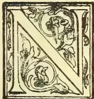

EARLY a century before Sir Walter Raleigh astonished the English people by bringing tobacco from America and teaching them how to smoke it, to the great scandal of the "unco' guid" of those days, Columbus had introduced cocoa

into his native land. How long the inhabitants of Mexico and Peru had been acquainted with its nourishing properties we do not know; but certainly it was carefully cultivated and so much esteemed that the cocoa bean was an article of currency when the Spanish explorer first visited those shores. There is not the halo of tradition and sentiment which centers around that most popular drink, tea; mainly, perhaps, because while nearly all the traces of the aboriginal South American have been swept away, China, the home of the tea plant, with all its ancient civilisation, has endured. Now is it clear how the botanists who first named the *genus* to which the cocoa tree belongs fixed on the scientific term it bears. Anyhow *theobroma* means "food of the gods," and there are those who think that, considering what valuable properties it possesses, the plant was not inaptly christened. A long time went by before it was introduced into England, for the earliest intimation of it as an article of commerce is to be found in the *Public Advertiser* of June, 1657, when it is notified that "in Bishopsgate-street, in Queen's Head-alley, at a Frenchman's house, is an excellent West India drink called chocolate to be sold where you may have it ready at any time, and also unmade at reasonable rates."

It is not a little curious that the introduction of tea and coffee dates almost from the same time;

Just a year after we find in the *mercurius Politicus* an advertisement of "that excellent and by all physicians approved China drink, called by the Chineans 'teha,' by other nations 'tay,' *alias* 'tee,'" which was to be had "at the Sultanesse Head Cophee House in Sweeting's-rents by the Royal Exchange." This notice would seem to show that as a drink coffee, as far as this country is concerned, has the palm of years, though now it has fallen on, comparatively speaking, evil days. Chocolate, from the first, caught the taste of the town. It was the fashionable temperance beverage—to use a modern phrase—perhaps because it was so dear—during the greater part of the Eighteenth Century, and the cocoa tree was a favourite sign and name for places of public refreshment. The writers of that time frequently refer to it. But its price kept it beyond the reach of the bulk of the people, and when fashion changed its consumption fell. In Spain and Italy chocolate—which is a rather different thing from the cocoa as we know it—has always been very largely consumed. In England it early became the subject of taxation, and in the middle of last century a customs duty of sixpence had the effect of limiting the consumption to some 440,000 lb. a year. With the new financial era the use of it began to revive, but it is only during the present generation than it has become at all popular. Of course, the Frenchman in Queen's Head-alley was wrong in calling it "a West India drink." Then it came almost wholly from South America. Now it is grown also in Dutch and British Guiana, in our Indian Empire, Ceylon, the Straits Settlements, West Africa, and the West India Islands, so that the Frenchman after all only anticipated events.

### THE MODERN ARTICLE.

Its popularity in recent times is usually accounted for by the fact that it has been largely recommended by the medical profession. Unlike tea and coffee—

387------------------------------------------------

368THE TROPICAL AGRICULTURIST.[DEC. 2, 1901.

which are infusions and more stimulants—the whole substance of cocoa is absorbed. But a late Chancellor of the Exchequer—Mr. Goschen if memory serves aright—attributed the growth of its use as against coffee to the extensive advertising of rival manufacturers. He spoke regretfully because, as between the two in the raw state, coffee pays the higher duty. Whatever the cause, the consumption has enormously increased, and continues to grow. The cocoa we drink and the chocolate we eat—for the chocolate powder from which the beverage is made is not very popular here—are two very different things. The cocoa bean contains from 40 to 50 per cent. of cocoa-butter, the greater part of which has to be extracted in order to make the liquid digestible. In the best makes some 10 per cent. is retained. The cheaper qualities have very little left, and, moreover, the powder is mixed with the bean shell, while arrowroot or sago is added, to say nothing of colouring matter. But with chocolate confectionery in its almost countless forms the case is different, or should be. Here the fat is kept, sugar and milk is added, with a very small proportion of flavouring essence, and generally speaking, the chocolate is simply used to cover a cream, an almond, a walnut, and things of that sort.

#### FOREIGN COMPETITION.

In a few articles of daily consumption has the non-British producer laboured so hard to catch trade as in this. Of course, there are first-class English makers, both of cocoa and of chocolate confectionery. But we believe it is the fact that of the first named some of the best comes from Holland, and of the second from France, Germany, and Belgium. How much the home trade has grown, however, is shown by the latest Blue-book from the Statistical Department of the Customs House. In 1896 we imported the raw material to the extent of 32,218,803 lb.; in 1900 the total had mounted up to 52,647,818 lb. We exported five years ago to foreign countries 474,500 lb. and to British possessions 2,146,300 lb. of the manufactured article; the figures for 1900 being 758,000 lb. and 3,850,800 lb, respectively. In other works, taking both sets of figures we nearly doubled our exports. But when we turn to the other side of the slate we find that there is room for apprehension. The record of imports is:

<table>
<thead>
<tr>
<th></th>
<th>1896.</th>
<th>1900.</th>
</tr>
<tr>
<th></th>
<th>lb.</th>
<th>lb.</th>
</tr>
</thead>
<tbody>
<tr>
<td>Manufactured cocoa or chocolate...</td>
<td>3,794,422</td>
<td>7,754,879</td>
</tr>
<tr>
<td>Manufactured with the use of spirits</td>
<td>51,603</td>
<td>106,087</td>
</tr>
<tr>
<td>Confectionery containing not more than 50 per cent. of chocolate..</td>
<td>12,095</td>
<td>37,546</td>
</tr>
<tr>
<td>Ditto, with the use of spirits....</td>
<td>22,796</td>
<td>36,937</td>
</tr>
</tbody>
</table>

Totals ... .. 3,877,916 7,935,449

When it is remembered that the bulk of our exports is within the Empire the statistics show how keen and successful has been the rivalry of the foreigner,

#### A NEW ASPIRANT.

It is in these circumstances of the trade that another home-made cocoa has entered the field. In the old days when a man had a good thing he used to start making it in a small way and gradually push his ware. But other times other methods. Now the plan seems to be to perfect arrangements—taking, it need be, years in the process—and then, having prepared the ground as thoroughly as a von Moltke would calculate a campaign, to spring the new product on the consuming world. This is what the Mazawatee Tea Company has done. For five years experts have been studying the question, experimenting and investigating; and very soon the "Lateriba" cocoa and chocolates will be proclaimed from the housetops. The company's large new works at Newcross are divided by a corridor into two portions. One is devoted to their tea, which the sweet uses of advertisement have made known in every part of the country, and the other to cocoa and chocolate. The factory is one of the most perfectly equipped places

for the preparation of food stuffs it is possible to conceive. Electricity is the motive power, generated by gas made on the premises. Cleanliness and perfect ventilation have been sought after and attained. The completion of an immense laundry has enabled the company to provide linen overalls for every employee, though, from the time tea chest or cocoa bag is opened to the moment the finished product is sent out in its leadfoil packages or dainty tin, hand never touches either article.

#### MODEL WORKS.

Every manufacturing country contributes to the collection of machinery to be found; and many trades and crafts go on within the walls. The work of eminent artists in lithographed and printed on tins and boxes—themselves made in the works—labels are printed, lead and tin mixed to pack tea in—as little, in fact, as possible is left for outsiders to supply. The process of cocoa and confectionery making are most interesting to watch, especially the second. The maternal care which the high-class sweetmeat receives would astonish the ladies who eat it. In the "covering" room, for instance, the rich brown substance is simmering over hot water, but the upper air is cooled by brine-charged pipes fixed half way up to the ceiling, so that when a little of the delicate mixture has enclosed cream or praline it may settle quickly enough to preserve its taste and aroma. Then in the packing there is a notable departure from the custom of the trade. The sweetmeats are placed in tasteful airtight tin boxes, and the chocolates rest on layers or crepe paper coloured in harmony with the box. This is not merely for effect—though that is pleasing—but to ensure that the contents shall remain in perfect condition. Chocolate with its large proportion of fat is very susceptible to damp and to odours of flavours which may arise from the materials composing the cardboard and the coloured paper which surround many of the most expensive forms of this kind of sweetmeat. Contamination of that sort is of course, deterioration, and this the Mazawatee Company claims will be impossible with its system of packing. The company's experience with tea has shown it the importance of this consideration, and, as only one quality of cocoa and chocolate is to be made—the best, and all grown in the British Empire—precautions are doubly necessary. The cocoa, too, will be all put up in airtight cans, which, like the boxes, will be advertisements in themselves. For the Mazawatee Company believes in educating the eye as well as the palate of the people. It has shown this in the past. It intends to prove it again immediately. A well-known artist has painted an allegorical picture—Britannia welcoming the new cocoa—the reproduction of which by colour-photography makes a distinct step in the art of the hoarding. The actual process is not novel; what is new is the size to which it has been found possible to make the various blocks. In the character of the tones—particularly the dusky flesh tint of the female figure representing cocoa—and in the way the individuality of the painter is preserved the new process is unquestionably better than the best chromolithography.—*Morning Post*.

#### QUEENSLAND TREES & C. : IN BRISBANE BOTANIC GARDENS.

Between the central entrance and the one on the river bank is the cricket-field, a considerable stretch of ground, ample for the purpose. From this entrance, running the whole length of the garden, is a row of *Aracacia B'dwillii*, from 40 to 60 feet high. As here seen, little can be said in praise of this tree for ornamental purposes: its branches, 10 to 15 feet long, are almost invariably leafless, except from 12 to 24 inches at the end. The immense cones, of several pounds weight, are clustered at the top, hidden from view, and difficult to obtain without the assistance of a storm.

388------------------------------------------------

DEC. 2, 1901.]THE TROPICAL AGRICULTURIST.369

*Ficus macrophylla*, also a native tree, is very handsome. In the gardens is a broad-spreading specimen, with a stem 2 feet in diameter, the roots exposed for many square yards around the base; the fruit, not large, is freely borne, and the brown under-surface of the leaf offers a pleasing contrast to the solid green of the whole. *Kigelia pinnata* is at home, and bears many loose racemes of large deep carmine blooms, on pendent stalks 3 to 5 feet long.

The rose-garden, containing many beds surrounding the finest *Arancaria Bidwillii* in the grounds (a specimen about 70 feet high), is filled with well-grown plants, almost exclusively Teas and Chinas, as one might expect. A box-wood tree, *Hæmatoxylon campechanum*, with a much-divided stem, is close to *Quercus suber*, *Q. Toza*, and *Q. cerris*, from South Europe; they are, however, scarcely fine specimens, though the English Oak, *Quercus pedunculata*, seeds well, and makes a good tree. *Liquidambar* and *Liriodendron* are also both evidently thoroughly at home.

Near Mr. MacMahon's house is a fine bed of Arabian Coffee, loaded with berries. A bed of *Allamanda neriifolia*, close by, was one mass of flower.

*Cedrus Deodara*, *Magnolia grandiflora*, and *Eriobotrya japonica*, are not good, the climate being evidently too dry and hot for them, though a *Camellia* seems in a very fair condition. *Plumeria acuminata* is as fine and free-blooming as in India; as is a species of *Terminalia*, with its peculiar oblong sessile foliage. Near a *Poinciana regia*, its stems carrying many immense *Platycerium alciorne*, a group of Palms, two of which are probably the best specimens of the order in the gardens—one a *Jubæa spectabilis*, the other a *Sabal Palmetto*. Also fine, are an *Oreodoxa regia* 30 feet high, and some broad masses of *Rhapis fabelliformis*.

The most successful examples of growth here, as in Bowen Park, are unquestionably the Bamboos. Several large clumps of *Bambusa arundinacea*, with thickly interlaced tough stems, 40 to 50 feet high, cracking and bending in every breeze, shade, near the centre of the grounds, one of its prettiest spots—a large open-air fernery, containing *Asplenium Dicksoniae*, *Asplenium nidus*, *Platycerium*, *Ravenalas Cannas* with flower-spikes 8 feet high, *Caryotas Livistonas*, &c. At the end is a neat avenue of Guavas (*Psidium guava*), the smooth *Stuartia*-like stems, and pale glossy foliage, through which now peep the innumerable fruits just commencing to swell, being very pretty.

The Moreton Bay Chestnut (*Castanospermum australe*), of course does well, as do *Butea frondosa* and *Strychnos nux-vomica*. A curious tree is *Davidsonia pruriens*; each leaflet of its large pinnate foliage is nearly of the substance, size, and colour of a good-sized Loquat leaf. *Sterculia rupestris*, the narrow-leaved Bottle-tree, is more noticeable still; of one specimen, the smooth circular stem is 4 feet in diameter at the base, but narrows gradually to 1 foot at 8 feet from the ground, whence for the remainder of its height (another 7 feet) only the smallest branches are seen.

The native trees do not, as here represented, strike me as particularly ornamental, though in the bush, from all accounts, some must be very fine. In the gardens, however, some trees are not particularly interesting. *Agathis robusta* is an exception. This can be picked out anywhere by its tall, slim clean stem and pear-shaped head of dark foliage. Two good specimens are not less than 70 feet in height.

*Bleocarpus grandis*, *Spondia pleiogyne* (the Burdeckin Plum-tree), *Aleurites mollucana* (the Candle-nut-tree), with long-lobed foliage and bunches of green fruit each as large as a good-sized egg-Plum; *Erythrina Vespertilio* the Australian Bark trees, and *Cassia Brewsteri*, its thin, circular, brown pods, 12 to 15 inches long, hanging in profusion, are all representative of the native flora. On leaving I passed beneath an Indian Cluster Fig, *Ficus glo-*

merata, the fruit on short stalks in thick bunches of every shade of colour, from green through yellow to bright red, cluster on the old branches 18 inches in diameter. The masses of fruit rotting on the ground beneath the tree testify to its extraordinary productiveness. I also noted on leaving *Combretum purpureum*, and *Beaumontia grandiflora*, growing luxuriantly. At the end of the garden Mr. MacMahon has erected a tall house, composed of long twigs so tied on rafters as to give partial shade. Beneath, sheltered from the sun's fiercest rays, are *Philodendrons*, *Anthurium Scherzerianum*, *Dracaenas*, *Marantas Gymnostachyum Percei*, *Lomaria gibba*, *Selaginellas*, *Aspleniums*, *Platyceriums*, *Dicksonia antarctica*, *Asophila australis*, flowering *Begonias*, and a few Orchids, chiefly the native *Dendrobium undulatum*.—*Gardeners' Chronicle*.

## GUTTA-PERCHA IN DUTCH INDIA.

(TRANSLATED FROM THE "GUMMI-ZEITUNG.")

About the year 1845 the first gutta-percha, the milk of several tropical trees, appeared in the market. The gutta-percha comes almost without exception, from the Malay Archipelago, and its greater part from Dutch India, especially from Borneo and Sumatra. The natives collect his valuable product in the virgin forests, whence it is brought, through Chinese buyers, to the Singapore Market. As long as the request for it was only a small one, the natives were content with getting the gutta-percha by means of incisions in the trees, but when the export from Singapore, which was in 1845 only 10,140 kilos., and in 1848, 720,000 kilos., increased, they began to sell the trees, in order to get more sap, without providing for the after-growth. The consequence of this bad policy, which must have been increasing during recent years, cannot be definitely seen from the figures of export from Dutch India, which were:—

<table>
<tbody>
<tr>
<td>1,598,330 kilos.</td>
<td>in 1839</td>
</tr>
<tr>
<td>2,277,326 "</td>
<td>1890</td>
</tr>
<tr>
<td>1,402,923 "</td>
<td>1891</td>
</tr>
<tr>
<td>1,201,631 "</td>
<td>1892</td>
</tr>
<tr>
<td>1,270,533 "</td>
<td>1893</td>
</tr>
<tr>
<td>1,281,664 "</td>
<td>1894</td>
</tr>
<tr>
<td>1,347,834 "</td>
<td>1895</td>
</tr>
<tr>
<td>1,337,745 "</td>
<td>1896</td>
</tr>
<tr>
<td>1,448,973 "</td>
<td>1897</td>
</tr>
<tr>
<td>4,361,514 "</td>
<td>1898</td>
</tr>
<tr>
<td>7,263,048 "</td>
<td>1899</td>
</tr>
</tbody>
</table>

but they are proved through the exhaustion of several districts which produced gutta-percha in earlier years. If the number of the felled trees can be estimated according to the export at some millions, and if the export increases in the same proportion as in recent years, one can imagine how we are drawing closer to the end of the gutta-percha export, whereas the request for this indispensable insulating material for telegraphic cable is, on the other hand, daily increasing. Dr. W. Burck, at that time sub-director of the Botanic Gardens at Buitenzorg, first drew attention to this danger in 1883, when, taking an official journey to the Pandangschen Bovenlanden, on the west coast of Sumatra, in order to study the gutta-percha trees, he noticed the felling of the trees. As an official law preventing the felling of the trees could not be enforced in the districts, Dr. Burck proposed a way out of the difficulty by systematic cultivation of trees. This proposal found approbation with the Dutch-Indian Government, and in 1884 Doctors Burck and Treub, now director of the Botanical Gardens at Buitenzorg, were commissioned to find some land not far from Buitenzorg suitable for a plantation of gutta-percha trees. They chose for this a hilly ground of 625 acres in Tjipetir, about 1,640 feet above the sea-level, and at a distance of eight miles from the railway station of Tjibadak, in the country of Preanger Hill. In the

389------------------------------------------------

370THE TROPICAL AGRICULTURIST.[DEC. 2, 1901.

west monsoon, April, 1885, they began with the planting of over twelve acres. In the following year the plantation was so extended that it was necessary to bring it under constant European supervision, and it was put under control of the Council for Forests in 1891, with the order to plant only the best sorts of *Palauquium*. But as it did not flourish so well under this council, it was in 1900 once more brought under the supervision of the directors of the Botanic Gardens. The directors have taken the matter at once in hand in order to effect the purposes of the plantation, namely: (1) To find out the best kind of *Palauquium* suitable for forest-culture; (2) Study of the botanical derivation; (3) To ascertain which climatological and other conditions are the best for the growing of the plant; (4) Study of the way in which they multiply, if by seeds or otherwise. To make these tests on a bigger scale, the Government allowed a considerable amount in 1901 for the Indian Budget. In the west monsoon of this year the plantation will be enlarged by 250 acres and 1901-1902 by 552 acres. In this way an extension of 963 acres will be reached, and it is hoped to plant in the next five years 3,625 acres more. Only good kinds of *Palauquium* will be employed as *Palauquium gutta* (*Isonandra gutta* in earlier times), *Palauquium borneense* and *Palauquium oblongifolium*. If the old seed, which the tropical garden of Tjikemeuh, Tjipetir itself and a *Palauquium oblongifolium* plantation at Poerwokerto give sufficient it will all be used, and there will be just enough material for the planned extension of the plantation, so that no seeds can be given away from the Botanic Gardens at Buitenzorg for other purposes. This new enterprise promises to open fresh means for the settlement of the burning question of gutta-percha production, and will become a guide for private enterprise in this field later on. With regard to profit, these experiences in Tjipetir will hardly be as authoritative regarding other questions, as labour is rather dear in that district on account of the great amount of private plantations, and as a Government enterprise of this kind, which answers in the first place general purposes and not the gaining of profit, works under quite different circumstances and is generally dearer than a private business, chiefly establishes with economical views. In any case the trial plantation at Tjipetir, which has been put under the leadership of the experienced expert Dr. P. van Romburgh, late director of the trial garden in Tjikemeuh, promises to become of a high technical and economical interest. The market for the gutta-percha obtained in Dutch India lies not in the district of production but in Singapore. This fact is proved by the figures given below which

give the export for 1899, giving origin and destination of the gutta-percha:

The dominant position which Singapore takes according to this as a market for gutta-percha from Dutch India is owing to its favourable situation in the centre of the Malay Archipelago and partly to the smartness of its European and Chinese merchants. Singapore gives to a buyer of gutta-percha all possible advantages of a great market, where he can buy all kinds of gutta-percha according to sample, whereas Dutch India puts only certain kinds of gutta-percha out. If Java, which is more independent than Singapore, and where gutta-percha plantations are now flourishing, should develop and create a market for this article in its own district, cannot as yet be decided upon, but it is hardly to be expected. Besides the gardens in Tjipetir and Tjikemeuh there are only two more plantations at Java, near Poerwokerto, in the country of Banjoemas, of which the elder one, from 1856, consists only of 58 trees, whereas the younger and a bigger one was founded in the early eighties. But both plantations have been neglected up to now. In other parts of Dutch India the gutta-percha plantation, for which the natives seem also to show more interest, now is only cultivated in a few districts, and in recent times through some private enterprise. In 1898 a Nederlandsch-Indische Getah Pertja Maatschappy was founded in Medan, on the east coasts of Sumatra; another recent plantation exists on the island of Bintay, in the Riouw Archipelago. Two other companies, an English and a German one, are said to be at work on the west coast of Borneo, near Pontianak, and another firm has been established under the style of Gutta Rubber Syndicate for the production of gutta-percha and caoutchouc, the plantations of which are in the territory of the Sultan of Johore. And, lastly, the Nederlandsche Getah Pertja Maatschappy, established at the Hague, has still to be mentioned. All these companies use the process of extracting the gutta-percha out of the leaves by a mechanical process, which a Dutchman, P. J. Ledebour, now a French subject, has invented. Not much has become public about the process, but it is said to be a perfect success. If, through this process, a material is created which is equal to the gutta-percha gained from the trees, and if the trees can be deprived of their leaves without being interrupted in their growing, as seems to be possible, a further important step has been made in the production of gutta-percha, for through this process quicker and larger results can be effected than through the old simple way.

EXPORTS IN 1899.

<table border="1">
<thead>
<tr>
<th>From</th>
<th>To Singapore.</th>
<th>Penang.</th>
<th>Holland.</th>
<th>England.</th>
<th>Germany.</th>
<th>France.</th>
<th>Belgium.</th>
<th>America.</th>
<th>Total.</th>
</tr>
</thead>
<tbody>
<tr>
<td>Borneo.</td>
<td>5,722,307</td>
<td>—</td>
<td>—</td>
<td>32,409</td>
<td>—</td>
<td>—</td>
<td>—</td>
<td>—</td>
<td>5,754,716 kilos.</td>
</tr>
<tr>
<td>Sumatra.</td>
<td>1,247,342</td>
<td>145,856</td>
<td>36,389</td>
<td>—</td>
<td>8,377</td>
<td>—</td>
<td>—</td>
<td>80</td>
<td>1,438,044 „</td>
</tr>
<tr>
<td>Total</td>
<td>6,969,649</td>
<td>145,856</td>
<td>36,389</td>
<td>32,409</td>
<td>8,377</td>
<td>—</td>
<td>—</td>
<td>80</td>
<td>7,192,760 kilos.</td>
</tr>
<tr>
<td>Java and Madeira }</td>
<td>29,019</td>
<td>—</td>
<td>18,408</td>
<td>—</td>
<td>16,964</td>
<td>5,594</td>
<td>303</td>
<td>—</td>
<td>70,288 „</td>
</tr>
<tr>
<td>Total export</td>
<td>6,998,668</td>
<td>145,856</td>
<td>54,797</td>
<td>32,409</td>
<td>25,341</td>
<td>5,594</td>
<td>303</td>
<td>80</td>
<td>7,263,048 kilos.</td>
</tr>
</tbody>
</table>

CURE FOR THE BLACK SPOT IN TOMATOES.—Ever since this fungus disease of the Tomato made its appearance in this country, gardeners have been helpless in the matter of cure or alleviation; and beyond removing the fruit and burning it, so as to prevent the diffusion of the spores, nothing could be done. Now, Mr. J. Thomas, landscape gardener, 1, Warwick Grove, Surbiton, alleges that he has found the remedy for attacks of *Cladosporium lycopersici*, and certainly some fruits, which he brought to us a few days ago, and which are lying before us, show that

he is correct in his statement, for the fungus is killed superficially, and appears as a dry, brown incrustation; even the flesh below it is quite sound and uninjured and the fruit as good as possible, barring the little blemishes of about the size of a shilling. The inventor would willingly dress any diseased fruits if requested to do so, but until he has patented the substance, he will not let it out of his hands. It is obvious that the remedy should be applied to the leaves and to the berries when quite young. It must be remembered also that the spawn of the fungus is internal, so that external applications, however useful, are only of a palliative nature.—*Gardeners' Chronicle*.

390------------------------------------------------

DEC. 2, 1901.]THE TROPICAL AGRICULTURIST.TIPS FOR RUBBER GROWING.

Mr. James Maunder writes to us from San Juan Evangelista, Vera Cruz, Mexico, under date 24th June:—

I will send rubber seed to you and others during the next 10 or 15 days. Seed is now well ripened, and just begun to come in. Instead of writing another letter *re* Nursery making, I send you a copy of a letter I have just written to the President of the Company I am working for. In it I have described the *modus operandi*. The Nursery described is, I think, the largest one ever made in this, or any other country. I am surprised that more attention is not paid to rubber cultivation all over India. In Travancore and Mysore there are thousands of acres of land adapted to the cultivation of rubber, from which the respective Governments only get a little money from grazers of cattle. I remember many years ago, while on a shikar expedition out in the western part of Wastara Taluk of Mysore, alone the Budra River, near Balehunoor, also on the Toongabadia, I saw some of the best kinds of rubber lands. I shall send a few hundred seed to the Amildra of that Taluk, as well as to parties in Munzerabad, asking them to give them a fair trial. I will send you 2 lbs. of seed. Please make up your mind to whom you will give them, so that there will be no delay in sending them out on arrival. The seed must be planted on arrival, as I am afraid that many will have lost their germinating power on so long a journey. If the parties receiving the seed will follow the instructions as per letter herewith, all good seed will germinate; the seeds are large and well packed in charcoal as per instructions received from the best experts in the seed business. If we can make rubber pay here in Mexico where we pay a little over Rs. 2 per day, what could not your people do in India, where you have the cheapest and best labour in the world?

Following is the letter referred to above.

The work been done this week on this place is the planting of rubber seed in the large nursery now being laid out near the banyan tree. We selected this place for the nursery on account of its excellent soil, being near to our next year's location for planting, and because there were about 15 acres of nearly level land, so necessary for making a good nursery.

The forests having been cut down by the contractor, and burnt, we went to work, cut up and burnt the remaining logs, then dug out all the small stumps, roots and creepers; after this stump pullers were set to work, with a good pair of strong oxen, with the yoke tied to the horns, Mexican fashion, they did excellent work, in fact saved the Company hundreds of dollars, besides tearing up the ground so much there was no necessity of digging it over.

The earth having been dug out from among the roots of the stumps, they were piled in heaps and burnt. After this the ground was levelled, raked over smooth, roads laid out; then the lines were laid off at right angles to the roads 18 inches apart, and just one inch deep. Rubber seed sown about one inch apart in the lines, and covered as soon as possible after sowing.

Any of the readers of the *Planter* having a fancy for figures they might find out the number of seed sown in this rubber nursery. Here is the sum:—The nursery is 15 acres in extent. Deduct for a road 8 feet wide, and 900 feet long. The lines are 18 inches apart, and seed sown one inch apart in the lines. Now, if one-third of the seed sown grows, how many plants will we have to plant out next season?

We also had a gang of men planting corn, of which we have about 160 acres planted, and seed corn enough to plant about 90 acres more.

I will explain to you the Mexican method of corn planting; the forests having been cut down

and burnt for planting rubber, the lines staked out seven and a half by seven and a half feet; two lines of corn are planted between the lines of stakes, each hill of corn being three feet nine inches apart. Yesterday we had forty men planting. Each man had a stick about seven feet long sharpened to a point at one end. This was stuck into the ground about four inches. Three or four grains of corn were then put into each hole, and the corn planted. Nothing more is done to it till "breaking down," the ear season comes. If, however, the weeds become too high for the young rubber plants, they are cut down, thereby weeding corn as well as rubber. Your farmers of the West will naturally ask "how many bushels of corn does such outlandish planting produce." I will answer the anticipated question, and say the average crop is about 40 to 45 bushels per acre. We will send to the Chicago office a few ears from this crop, so that your people may see for themselves the kind of corn produced by this Mexican mode of planting. It is all right for this country. Corn planted 10 days ago is now 10 to 12 inches high.

We are going to sow a large cattle pasture with Paral and other grasses as soon as we get through with our coffee and rubber nurseries. In my next letter I will give details of the 5 acre rubber nursery we are going to plant out near the river, as well as the seven coffee nurseries already cut down and burnt; these have been selected near the land to be planted, as the system of "pilon" or ball planting is a very expensive mode of planting, seeing that 6 to 8 pounds of earth is carried with each plant from the nursery to the place of planting. I said above that the pilon system is expensive; it is, but it is the best in the long run. Last year's failures do not amount to over two per cent.; *i. e.*, not over two per cent. of the plants planted last year have died, we got no rain after the first week in February till the second week in June.—*Madras Mail*.

BREEDING FOR BEEF IN TRINIDAD.\*

By C. W. MEADEN,

Manager of the Government Farm, Trinidad.

It is a general belief in Trinidad that our native grasses are not sufficiently nutritious to enable the Colony to produce its own meat supply and particularly of beef. A sum of £40,000 is annually spent in the supply of meat, so that the question is one of sufficient interest to demand thorough consideration. From a purely agricultural aspect the production of beef would form an additional industry, and bring into a healthy and remunerative condition land which is now waste and a burden to its owners.

In order to bring our natural grasses into good grazing condition systematic treatment is required. Sub-division for the purpose of rest and change, and, where the formation of the land permits, the use of agricultural implements such as the hay-mower, horse-rake, and the harrow, should soon result in the formation of sound feeding pastures.

The present paper deals only with the conditions of Trinidad for the production of beef; that is to say, whether there is suitable land and other facilities, and sufficient inducement in the way of profit to encourage the industry.

That there is land enough is evident from the areas lying idle on abandoned sugar estates, and the great Caroni Savannah,—a menace to health

\* This subject has already been dealt with by the author in two communications presented to the Agricultural Society of Trinidad, which form papers Nos. 98 and 131, in Volume III, pp. 119 and 310 respectively, of the Society's Proceedings. The information contained in the present paper summarizes and carries to a conclusion the history of these experiments. (*Ed. W. I. B.*)

391------------------------------------------------

372THE TROPICAL AGRICULTURIST.[DEC. 2, 1901.

and unproductive. With regard to facilities, there are good roads and railways cutting through what might be the heart of the industry. The market value of the product has already been shown, and a recent rise in the price of meat shows that, at present, there is little danger of oversupply. The present meat trade in Trinidad is open to serious interruptions which often renders it difficult to meet the demand, and the poorer people are deprived of meat in consequence. It is therefore very desirable that a reserve supply should be available, that the market should not continue in its present dependent position.

During the last year an experiment in breeding for beef was brought to a satisfactory conclusion, although only carried out in a small way. The subject of the experiment was a cross between a Red Polisire and an ordinary Creole cow. This steer, when turned out to grass at fourteen months old, weighed 465 lb. He was kept under conditions such as might be expected would be given in the general way in the Colony, to test the value of grass feeding. The season proved exceedingly severe and grass was scarce. At two years old, he had gained only 83 lb. As grass became more plentiful a rapid increase in growth ensued, and at the end of his third year, he scaled 770 lb. showing a gain of 222 lb. for the latter period. This rate of gain would probably have continued so that at four years old he would, in all likelihood, have scaled 1,100 lb. the weight of a prime beast in Trinidad. The cost of rearing this animal amounted to \$4.80 including milk and feed. The gain in weight during his last year cost two shillings, one shilling land-tax and one for upkeep of fences and land, calculated on the average cost of the herd of oxen running together.

The dead weight was 384 lb. The animal was in a perfectly healthy condition, every organ sound and, to use a butcher's term, "cleaned well." The meat was tender and juicy and altogether superior to what is generally obtainable, and realised in the open market, sold under the same conditions as any other beef, \$32.28, which after paying for slaughtering, market dues and commission left a profit of \$27.48 or \$9.16 per annum. With a large herd, sufficient working capital, and sound management such returns indicate the possibility of a lucrative industry.—*West Indian Bulletin*.

### LIGHTNING AND ITS EFFECTS.

The day after one on which a thunderstorm took place I came across a chir pine (*P. longifolia*), which had then been struck. The tree was mature, standing on the top of a hill, and he had no leader, which had evidently been broken or cut off in its youth. The lightning had struck one of the uppermost radiating branches and took a straight course for a short distance, when it encountered a branch which turned it off its course, and from this point the ditrection taken was a spiral one, the turns being closer together at the top of the tree, where there were more branches with the fluid avoided. About 5 feet from the ground the electric current encountered a swelling, evidently caused by the heating up of an old wound, and at this place it left the tree, joining it again about one foot from the ground. A strip of bark about 4 inches in width was removed the whole way down the tree where the fluid took its course. This strip was not removed in one broad piece, but in two slips of 2 inches each in width, for its full length, the division being exactly in the centre and quite clean. The length of the strips varied from 2 feet to 4½ feet in length some of them being found on the ground, whilst others remained on the tree, usually being fixed to it at their upper ends, the lower ones being quite free and curling outwards. The outer rough bark was totally removed, not a single piece

remaining on the strips mentioned above. It was found lying in small pieces under the tree. In no case were any actual sings of burning to be found, although the long strips of underbark were dried and curled up with the heat, and neither the bark on either side of the course taken by the lightning, nor the needles at the foot of the tree where the current entered the ground were damaged in any way. Both the inner and outer edges of the strips of underbark were quite clean as if cut by a knife.

Curious to relate, down the whole length of passage a thin narrow layer on underbark was left, exactly in the middle, firmly fixed to the tree; of the blaze where the separation of the two strips took place and at the foot of the tree where the electric fluid joined it again, two distinct courses could be traced as if the fluid had become separated in its leap.

The tree I had cut down, and it was examined carefully. Judging from appearances it would seem that the lightning threw off, simply by shock, the rough outer bark which opposed its passage, thus uncovering the smooth underbark, over which the fluid passed uninterrupted. The great heat dried up this underbark and turned the sap underneath it into vapour, which forced it up causing to divide at its centre, leaving the thin line of bark where the separation took place, caused also by the contraction of the underbark. The pressure underneath caused by the formation of steam, coupled together with the fact that the strips of underbark were quite shrivelled up and contracted, is quite sufficient to explain the clear way in which they were separated from each other and from the bark on each side of the course taken. There would appear to be no doubt that lightning, if possible, will avoid all serious obstacles by going round them, and this being impossible, it will either remove that obstacle or be broken itself into two or more currents by trying to do so.

It would be interesting to know if in any other parts of India lightning has been observed to have had similar effects as the above.

E. RADCLIFFE, *Forest Officer*.  
Camp Choch, Mirpore, Jammoo: February 8th, 1901  
—*Indian Forester*.

### CASSAVA.

We have had many inquiries since we wrote on the cultivation of cassava as to its commercial value, and with reference to the method of cultivation. Cassava is sometimes called Brazilian arrowroot. It resembles arrowroot in one respect, so far as manufacture is concerned, in that tubers are rasped, and the starch precipitated as in the case of arrowroot. There are two species of the plant (which is one of the Euphorbiaceæ)—viz., the Bitter Cassava, *Manihot utilisima*, and the sweet, *M. Aipi*. Both furnish highly nutritious food starches. The bitter contains a poisonous element, hydrocyanic acid (prussic acid), and, as a consequence, cannot be eaten in a fresh state, whilst the sweet variety may be used as a table vegetable without any preparation. The poison of the bitter variety is, however, rendered volatile by heat, after the application of which the juice may be safely used as the basis of cassareep and other sauces. In Brazil great use is made of the bitter cassava. The dried roots are rasped, and a kind of flour results, from which cassava cakes are made.

The plant is easily cultivated and finds a congenial home in Queensland. When the land intended for cassava is well broken up and reduced to a good tith, the rows are laid off much in the same manner as for sugar-cane, but only 4 feet apart. The sets consist of portion of the stalk cut into pieces about 6 inches long. Four inches is a better length, because the roots springing from the cut ends are those which produce the tubers. Like all other such crops, they must be kept clean. There is no need

392------------------------------------------------

DEC. 2, 1901.]

THE TROPICAL AGRICULTURIST.

373

for deep cultivation, indeed, shallow works is the best. A very fair profit may be made by growing cassava, as is shown by the *Florida Agriculturist*. That Journal, quoting from the *Leesburg Commercial*, says—

While there is no great big money in growing cassava, there can be reasonable profit made in growing it, and it is not subject to be killed out by the frost like some crops, for it is planted after the first frosts are over, and matures before the frost comes again.

The following information on this important subject is furnished us by Mr. George E. Pybus, of Fruitland Park, who has been growing cassava for several years. He estimates the cost of growing cassava as follows:—

<table border="1">
<thead>
<tr>
<th></th>
<th>Per Acre.</th>
<th>$</th>
<th>s.</th>
<th>d.</th>
</tr>
</thead>
<tbody>
<tr>
<td>Ploughing .. .. .</td>
<td>1.50</td>
<td>=</td>
<td>6</td>
<td>0</td>
</tr>
<tr>
<td>Harrowing .. .. .</td>
<td>0.35</td>
<td>=</td>
<td>1</td>
<td>5½</td>
</tr>
<tr>
<td>Seed, planted 4x4, 2,700 hills, 6-inch pieces, 1,500 feet, at 12½ cents .. .. .</td>
<td>1.70</td>
<td>=</td>
<td>6</td>
<td>11</td>
</tr>
<tr>
<td>Planting... ..</td>
<td>1.07</td>
<td>=</td>
<td>4</td>
<td>0</td>
</tr>
<tr>
<td>Six cultivations at 35 cents</td>
<td>2.10</td>
<td>=</td>
<td>8</td>
<td>5</td>
</tr>
<tr>
<td>Four hoeings at 1 dollar ..</td>
<td>4.00</td>
<td>=</td>
<td>16</td>
<td>0</td>
</tr>
<tr>
<td>Fertiliser, 350 lb. at 23 dollars per ton .. .. .</td>
<td>4.00</td>
<td>=</td>
<td>16</td>
<td>0</td>
</tr>
<tr>
<td></td>
<td>14.65</td>
<td>=</td>
<td>58</td>
<td>8½</td>
</tr>
<tr>
<td>Digging and hauling, say 1 mile</td>
<td>1.25</td>
<td>=</td>
<td>5</td>
<td>0</td>
</tr>
<tr>
<td>Value, f.o.b. .. .. .</td>
<td>5.00</td>
<td>=</td>
<td>20</td>
<td>0</td>
</tr>
<tr>
<td>Net .. .. .</td>
<td>3.75</td>
<td>=</td>
<td>15</td>
<td>1½</td>
</tr>
<tr>
<td>Necessary to make, say, 4 tons to pay expenses .. .. .</td>
<td>14.00</td>
<td></td>
<td></td>
<td></td>
</tr>
</tbody>
</table>

Leaving a net profit of 3.75 dollars per ton on all above 4 tons. Of course, two of the above items, cultivating and hoeing, may vary, but to make a success of the crop, it must be kept clean until it can take care of itself, and he believes his estimate to be a fair one. Notwithstanding the ill-luck which attended all who adopted fall planting, in 1899, he has just finished planting 10 acres, being determined to give cassava-growing as a farm crop a fair trial.

The resulting crops with good fertilisers will amount to from 6 to 8 tons per acre, and the digging can be done for about 2s. per ton. The cost of hauling will, of course, depend on the distance. On sandy soil it will yield more feed than any other crop that can be grown. For feeding pigs, horses, cows, and chickens no better crop can be grown. It will produce the best of pork and bacon; it will make excellent pastry and delicious breakfast cakes.—*Queensland Agricultural Journal*.

COMBATING SAN JOSE SCALE ON FRUIT-TREES.

At the present time San José scale is being found in many orchards, and although advice as to the best treatment has been given repeatedly in the *Agricultural Gazette*, many growers may have overlooked it, and are in doubt as to the steps to take to rid their trees of this extremely destructive pest. The scale itself is not unlike red scale in appearance, and during the winter months when the peaches, pears, plums, and apples which it chiefly affects are bare of leaves, the scale may be noticed on the wood of the trunk and branches. When the scale is picked off on the point of a knife a little yellow-coloured mass is seen inside. As the result of numerous successful trials the Fruit Expert is able to recommend a painting of pure kerosene for smaller trees and spraying with lime, salt, and sulphur for larger trees which could not be readily gone over with a brush. Before applying the kerosene the affected tree should be pruned, and the prunings burned. Then the kerosene should be applied

so as to wet the tree but not trickle down to the roots; care to be taken not to miss any portion of the stem or limbs. It does not injure the buds, and apparently has little or no effect on the cuts.

The lime, salt, and sulphur wash is prepared as follows:—

<table border="1">
<tr>
<td>Formula:—Lime .. .. .</td>
<td>30 lb.</td>
<td>(fresh slacked)</td>
</tr>
<tr>
<td>Sulphur .. .. .</td>
<td>20 lb.</td>
<td></td>
</tr>
<tr>
<td>Salt .. .. .</td>
<td>15 lb.</td>
<td></td>
</tr>
<tr>
<td>Water .. .. .</td>
<td>60 gallons.</td>
<td></td>
</tr>
</table>

Take 10 lb. of lime and 20 lb. sulphur, and boil them until thoroughly dissolved, then add the rest of the lime and the salt and water to make 60 gallons. Strain and spray when rather more than milk warm.

The only difficulty likely to be experienced making up this mixture is in getting the sulphur thoroughly incorporated. To do this requires continuous boiling, with constant stirring, until the liquid is of a deep yellow colour. If it is possible, the sulphur should be first ground up with a small quantity of water into a paste, in the same way that mustard is made, so that the grains of sulphur may be thoroughly wetted. This will greatly hasten the process, and if as much as 20 lb. of sulphur is to be used, this may be ground up a little at a time in a largish mortar and added to the boiling solution.

The best thing to use for boiling this mixture is an enamelled vessel. If only a small quantity is made at a time, an ordinary enamelled preserving pan is the very best kind of vessel. In the absence of these, an iron vessel or an ordinary oil-drum may be used. On no account use copper vessels.

The actual manner in which the ingredients are added does not matter. It will be found best to slack the lime on a board in preference to slacking it in the vessels. Hot water is not necessary for slacking it.

The main point is that the lime and sulphur should be well mixed and thoroughly boiled together.

The action of this spray is to smother and destroy the scale and eggs. Some people scrub the bark of the trunk and main branches with a brush before spraying them with this wash.

This is a splendid spray for clearing trees of all sorts of pests that escape notice, and it is really worth while giving all deciduous trees in the orchard a spraying with it immediately after the annual pruning.—*Agricultural Gazette of New South Wales*.

MANURE FOR TOMATOES.

The Chemist, at the request of several tomato-growers in the Minmi district, has furnished the following information as to the best means of fertilising tomato and cucumber crops with dry and liquid manures:—

For Tomatoes.

A complete dressing for an acre would be—

<table border="1">
<thead>
<tr>
<th></th>
<th>Costing about.</th>
</tr>
<tr>
<th></th>
<th>£ s. d.</th>
</tr>
</thead>
<tbody>
<tr>
<td>Sulphate of ammonia... ..</td>
<td>160 lb. 0 13 6</td>
</tr>
<tr>
<td>Superphosphate ... ..</td>
<td>250 lb. 0 10 6</td>
</tr>
<tr>
<td>Sulphate of potash ... ..</td>
<td>150 lb. 1 0 3</td>
</tr>
<tr>
<td>Total, ... ..</td>
<td>560 lb. or 5 cwt. 2 4 3</td>
</tr>
</tbody>
</table>

For Cucumbers.

<table border="1">
<thead>
<tr>
<th></th>
<th>Costing about.</th>
</tr>
<tr>
<th></th>
<th>£ s. d.</th>
</tr>
</thead>
<tbody>
<tr>
<td>Dried blood ... ..</td>
<td>250 lb. 0 12 6</td>
</tr>
<tr>
<td>Superphosphate ... ..</td>
<td>235 lb. 0 10 0</td>
</tr>
<tr>
<td>Sulphate of potash ... ..</td>
<td>75 lb. 0 10 0</td>
</tr>
<tr>
<td>Total ... ..</td>
<td>5 cwt. £1 12 6</td>
</tr>
</tbody>
</table>

This quantity will be rather much for an acre, the exact amount being 4½ cwt., which would come to about £1 10s. per acre.

393------------------------------------------------

574THE TROPICAL AGRICULTURIST.[Dec. 2, 1901,

Both the above formulæ are based on the actual manurial requirements of a crop of the kind mentioned in a soil of fair average quality. Where materials like well-conserved and rotted stable manure, fowl-yard sweepings, and wood ashes are available, the quantities of commercial fertilisers can be reduced; but it must be remembered, especially as regards tomatoes, that the principal manurial requirement for good crops is potash, and the proportion of it in most of the manures that can be home-saved is very small.

The fertilisers mentioned may be used as liquid manure, by dissolving in water, though the best plan is to add in the dry state mixed with earth and to water the plants afterwards.

In the case of dried blood, this does not dissolve in water and would have to be added separately.—*New South Wales Agricultural Gazette.*

### CASTOR-CAKE, CASTOR-OIL, AND CASTOR-SEED AND ITS PRO- PERTIES.

Many people are under the impression that the castor-cake contain 7 per cent. nitrogen and 12 per cent. of moisture, and is thereby considered a manure sufficiently lucrative for cheena barley and other *rabi* crops. Such is not the case. Castor-cake contains 11.86 per cent. of moisture and 5.23 per cent. of nitrogen and can be used for all purposes. Moisture is of very little consequence to the agriculturist, whereas, on the other hand, nitrogen potash and phosphoric acid are considered the most valuable ingredients in a manure, especially for leafy crops, and it is needless to say that the castor-cake contains all these properties, which renders it a manure of the very first class. The reason why it may be looked upon as a manure of the very best, is because it contains 2.53 per cent. of nitrogen, more than any other manure. We all know that potash, which forms one of its component parts, is by itself equal to any ingredient in a manure. Besides phosphoric acid, the other component part is in such a condition of chemical combustion as to be easily assimilated by the plant. Further, it may be stated that the cake contains a certain amount of oil. This oil in itself acts as a manure, and at the same time prevents the cake from decomposing rapidly in the ground; thus allowing the cake a fertilizing action of more than a year. When once a person has studied closely and scrutinizingly the properties of the castor-cake manure, it does not take him long to testify to the effect it has on potatoes, wheat, oats, cheena and makai. If on eight biggahs of land you sowed 180 maunds of well pulverized castor-cake, and sowed this land with oats, you would find that your return would be 143 maunds or thereabouts, of good clear oats, with and exceedingly heavy crop of straw. Again, if you were to sow on 14 cottahs of this land dug out into trenches, Naini Tal seed potatoes, you would get a return of 82 maunds of crop from about four maunds of seed. After these two crops were cleared out, if cheena was sown, your return would be just as much. Again, after the cheena crop was taken up, if makai was planted on the same eight biggahs of land, your yield would be 122 maunds from not a very liberal sow. Thus in one year you have realized three substantial crops from the same piece of land without any trouble of manuring for each crop. This manured land will answer the following year without any trouble, to rear up another supply of the crops mentioned above, excepting that the potatoes this time will not be so large as on the former occasion. The husk obtained from the castor-seed, also, acts as a very good manure for flower-

beds, but great care must be taken in the administration of it, as the ingredients with which this husk forms a manure, have a tendency to either burn up the plants or prevent them from budding. Too much cannot be said on this score, as the making of this manure is a secret. Another mistaken idea is that castor oil cannot be bleached. It can be done, and the process is very simple. Pass the oil through the folds, say two, of pure white blotting paper, and then expose it to the rays of the sun, under the cover a pane of glass. Oil of a reddish hue is of course beyond bleaching, as it contains a large portion of moisture, which is obtained from the husk. It may be remarked that castor-seeds are of various sizes, though more or less of the same shape and form. It will be observed that the smaller the seed, the more oil you get. Seeds of a large form generally contain very little moisture; as the shell, which is of an absorbing nature, derives its moisture from the kernel.

The foregoing statements may call forth comments from those in the manufacture of oil, owing to there being a keen competition in the trade, but reliance can be put on what has been stated above, as the statements to a certain degree are the outcome of the experience of the late Chief Engineer of the Suran Oil Mills, Mr. Edward Austin Neame.—*Indian Planters' Gazette.*

### COFFEE CULTIVATION IN THE FRENCH CONGO.

The following interesting particulars with regard to the cultivation of coffee in the French Congo, based on information applied by the Director of the experimental Cultivation Gardens at Libreville, in reply to questions addressed to him by the "Office Colonial" in Paris, were given some time back in the *Board of Trade Journal*:

Libarian coffee is the kind principally grown in the French Congo, the cultivation of the San Thome coffee (*Coffea arabica*) being now almost abandoned. Kouilon (*coffea canephora*) and Oubangi (*coffea Chaloti*) grow wild, but the latter variety is now beginning to be cultivated.

The amount of coffee exported from the French Congo during the past four years was as follows:

<table>
<thead>
<tr>
<th></th>
<th>Kilos.</th>
</tr>
</thead>
<tbody>
<tr>
<td>in 1896 .. .. .</td>
<td>4,471</td>
</tr>
<tr>
<td>" 1897 .. .. .</td>
<td>30,094</td>
</tr>
<tr>
<td>" 1898 .. .. .</td>
<td>57,660</td>
</tr>
<tr>
<td>" 1899 .. .. .</td>
<td>41,281</td>
</tr>
</tbody>
</table>

In January, 1900, 30,473 kilos., valued at about 33,500 francs, were exported. The coffee is exported in bags of from 50 to 70 kilos each, the freight for coffee, unhulled, being 66 francs per ton of 1,000 kilos, by the Chargeur-Reunisteamer from Libreville to Havre. The bagging in which the coffee is packed is imported from abroad. The coffee planters who are themselves merchants export their coffee to Europe themselves without the intervention of middlemen. Only a small quantity of the coffee is sold for local consumption, the retail price at Libreville being 2 francs 50 cents per kilo.

There are at present about 1,800 hectares of coffee plantations in the colony in bearing; in addition about 150 hectares have been planted, but will not yield a crop till about 1905.

There is no export duty on coffee coming from the Gaboon district, but that produced in the conventional basis is dutiable at the rate of 5 per cent. *ad valorem* on a valuation of 60 francs per 100 kilos. Note.—Kilog.=2.2 lb. Hectare.=2.47 acres, Franc.=9 6/1, —Tea.

394------------------------------------------------

DEC. 2, 1901.]THE TROPICAL AGRICULTURIST.375RUBBER IN RHODESIA.

In a report received from North-West Rhodesia Major Colin Harding, the Acting Administrator, says:—

The indigenous rubber found in North-West Rhodesia is of three distinct species, which should be classed as: (1) *Landolphia-Florida*, (2) *Kickxia-Elastica*, (3) *Capodinus-Lanceolatus*. I will first take the *Landolphia-Florida*, which is a species of vine rubber in this country, growing to a considerable length, varying from 20 yards to 60 yards, and in size from  $\frac{1}{2}$  in. to 1 $\frac{1}{2}$  in. in diameter. It is found growing usually in marshy tropical localities.

This rubber first came under my notice on a small tributary of the Zambesi, north-west of Nyakatoro, during my journey to the source of the latter river last year. Again I saw and collected portions of this vine in the same latitude, also found in a very marshy and verdant spot, on an east bank tributary of the Kabompo River, called the Mumbasi. This vine at the latter place was seen to perfection, extending round the adjacent trees, forming an impenetrable thicket, and affording, besides a lucrative employment for the native, a shelter and protection to the kraal which was built beneath its shade. I am forwarding samples of this vine for your identification. Judging from the quantities of prepared rubber which I have found in the possession of different natives during my journey, I am convinced that considerable quantities of this valuable species are found surrounding the majority of the numerous tributaries which flow into the Kabompo and Zambesi Rivers, or, to put it more concise and plainly, the *Landolphia-Florida* is found between the twelfth and fourteenth parallels, throughout the whole of Barotseland.

The mode of collecting and preparing the *Landolphia-Florida* is similar to that adopted by the natives when making the ground rubber into a marketable commodity. Without thought for to-morrow, they promiscuously hack and cut the vine, selecting, when their work of destruction is complete, the best and largest branches only, leaving the smaller, which in another year would have attained maturity, to rot on the ground. Divided into various lengths, from 3ft. to 4ft., the vine is taken to the kraal where, after forty-eight hours' continual soaking, it is hammered and pounded with the idea of removing the bark, which secretes the rubber from the stem; this process complete, the rubber—or blanket, as it is termed—is again immersed and continually boiled for three or four days, or, in fact, till the bits of bark are completely removed. In examining a piece of vine rubber before boiling, you would find no albuminoid or resinous matter. The rubber seems a part and parcel of the bark, and, unlike *Kickxia-Elastica*, the juice could never be extracted by incision or tapping. The boiling operation being complete, the rubber whilst warm is rolled into sticks about 6 in. long, called matallas. It is then hung under the various roofs to dry, and later made up into chetotes, ready for Mombari traders, who periodically visit the kraals to purchase and transport this valuable product to the West Coast. Whilst on my tour I purchased several chetotes of rubber, for which I paid two yards of calico, each valued at 1s. 8d. per yard, on the spot. The weight of a good chetote should be about 2lb., and the price of this class of rubber at Benguela would run from 1,800 to 2,000 reis, or in English money from 2s. 9d. to 3s. 6d. per lb.

(2.) *Kickxia-Elastica*.—My knowledge of this rubber, which I have set down as *Kickxia-Elastica*, is very limited. Undoubtedly it is a true rubber found in the same districts and in close proximity to the *Landolphia-Florida* described above. Several samples were shown to me when east of the Kabompo; also I inspected the same species of rubber in the possession of natives north-west of the Zambesi, near the Kasi River. It is of a superior quality to either of the

other two kinds; and as it is procured by an incision made in the trees, it is absolutely free from all dirt and bark, the only damaging ingredient being grease, which is infused by the natives whilst collecting and rolling it into various shapes. In selling the inferior species of rubber the natives will mix the *Kickxia-Elastica* with other unsaleable root rubber. I saw a rubber much resembling the *Kickxia-Elastica* at Kota-Kota, some two years ago, the only appreciable difference being, as far as I could see, the different shapes in which it was rolled.

(3.) *Capodinus-Lanceolatus*.—Accepting Sir William Dyer's authority, the third and last species of indigenous rubber which I am about to describe must be the *Capodinus-Lanceolatus*. Its description as being worthless is, I think, unwarranted. On the contrary, I have seen *Capodinus* growing, prepared, and finally sold at good and remunerative prices, although admittedly it is of inferior quality, still it is a rubber that thrives in the soil where no other root could exist, and will, with an ordinary amount of care in collecting it, eventually prove a valuable asset to Western Barotseland. To substantiate my statement, I might point out that already, both east and west of the Kwito River, the Portuguese have erected stations and conducted trading expeditions for the object of collecting this rubber, and apparently for that object alone. Again, at Katende, a large village situated some sixty miles north-west of Nyakatoro, and well within the boundaries of King Lewanika's kingdom, during the last two years no less than ten waggons have penetrated to the heart of that country for the object of collecting and transporting this rubber to the west, and I am led to believe that these expeditions met with an ordinary amount of success. The *Capodinus-Lanceolatus* is found in considerable quantities between the Kwando and Kwito Rivers, and also west of the latter. At the head waters of the Lungwe-Bungo and in the Balachazie country its growth is also noticeable; in fact, the whole Barotse country west of the East Lunga River, above parallel 15, is dotted with portions full of this indigenous root. The process of manufacturing and preparing this root I have described under the heading of *Landolphia-Florida*. Strange to say, the root of the *Capodinus-Lanceolatus* and a portion of the *Landolphia* vine are, when gathered, so alike that only the most competent judge could correctly define the species. This *Capodinus* is phanelogamous, growing from 6in. to 10in. in height. The roots are found about 4in. under the surface of the soil, and, spreading themselves evenly and uniformly, cover a considerable quantity of ground. At present this plant is so plentiful that in rubber districts the natives collect only the larger roots, leaving the smaller exposed and perishing under a tropical sun. The surface, after the natives have collected their rubber, resembles an orchard or meadow which has been upturned by a grub-seeking hog. For two or three years the production of rubber from such a spot is nil, and treated on similar lines to his garden, the native never returns for a second crop, but seeks pastures new, where the same work of destruction is carried on in the same reckless and extravagant manner. It is useless disguising the fact that, with one or two exceptions, the most prolific and thriving rubber districts are found outside of the present provisional boundary, and until the question of demarcation is satisfactorily settled, the idea of preserving or encouraging the production of rubber in this country to any great extent is out of the question. In the meantime, whilst we are arbitrating and settling the boundaries, the Portuguese are extending their power to within 100 miles west of Lialui, destroying districts which beyond all doubt must eventually come under the control of the Chartered Company.

The fact that North-West Rhodesia is a rubber-producing country has been proved beyond doubt, although the full extent is yet unknown. Each

47

395------------------------------------------------

376THE TROPICAL AGRICULTURIST.[DEC. 2, 1901.

journey has resulted in further ocular demonstrations, and I am convinced that the more we see of this country the more we shall become confirmed in the knowledge of the existence in considerable quantities of this valuable plant, which only awaits the early settlement of the boundary question, the prevention of the slave traffic, and the establishment of police posts, to secure a successful future for the development of the rubber industry.—*India-Rubber Trades' Journal*.

## CINCHONA AND QUININE IN JAVA.

The following is based on an interview with and memorandum supplied by Mr. F. L. Seely, St. Louis, Miss., in regard to his recent journey of investigation in India and Java. The illustrations of Java scenes are reproduced from photographs taken by Mr. Seely.

Java is generally supposed to have come later into the cinchona-field than Ceylon and India, and some say that Java started where the British dependencies left off—not an uncommon thing with Britain's trade-rivals. But this is scarcely the case. As early as 1829 the cultivation of cinchona in Java was mooted, but it was not until 1852 that the Dutch Government sent Hasskarl, who had been director of the Botanic Gardens at Buitenzorg, to Peru and Bolivia, where he got with much difficulty seedlings that he took to Java, but these did not come to much. In 1855, Dr. Franz Junghuhn, an eminent Dutch botanist was sent to Java with a number of seedlings, commissioned also in the following year to superintend the cinchona culture. Junghuhn was one of the most diligent workers in the field up to sixties of the nineteenth century, indeed, by the end of 1860 there were about a million cinchona plants in Java, but 939,809 were the comparatively valueless *Cinchona Phudiana*, which had been propagated from the seeds of *C. ovata* brought from South America by Hasskarl, and renamed after Pahud, Governor General of the Netherlands India. Dr. J. E. de Vrij was sent out to Java in 1857 as a chemist, but he was really the man who recognised that the future of cinchona-cultivation in Java depended upon the adoption of the particular kind of *calisaya* that Charles Ledger had obtained in South America and which is now known by the generic name of the man who risked his life to get the seed. Ceylon and India might still be the centres of profitable cinchona-cultivation had the British Government realised that Ledger's work was the consummation of a long and expensive inquiry; but the Dutch Government, thanks to De Vrij, was sufficiently fortunate to try the new seed well, and within twenty years planters had proved that *C. Ledgeriana* (at first regarded as a rich *calisaya*) is the tree best worth cultivating. De Vrij's great service to quinology was the early recognition of the necessity for cultivating plants with a high quinine yield.

The Island of Java is only 673 miles long and about 125 miles wide. About 25,000 acres of the Island are under cinchonas. There are 25,000,000 natives in the Island, and only two of them speak the English language. The first thing Mr. Seely did was to secure the services of one of these men, whom he kept through his visit. He was a very accomplished young man, and somewhat of an aristocrat as compared with his countrymen. His main accomplishment lay in the fact that he had two wives, and he claimed that for a man to be a sincere Mahomedan he should have four; if his means permit. He explained to Mr. Seely, however, that one wife did not know of the other's existence, and he was quite confident that matters would run somewhat smoother if he maintained that ignorance on their part. The day after Mr. and Mrs. Seely arrived they proceeded to Bandung, which is about eight hours' ride from Batavia, at which port they landed. It is a delightful little town of about 1,000 Europeans and probably 60,000 natives, and the hotel

was as comfortable as any one could hope for. Nearly all houses in Java are one storey high, and, in the case of hotels, only one room wide, and sometimes a mile long. This is to prevent serious injury in case of earthquakes, which are common out there.

After resting for a few days Mr. Seely made trips to the plantations, which lay in different directions around Bandung, ranging from 9 to 30 miles distant, all of which had to be covered by pony-carts, pony-back, or in mountain-chairs each carried by four natives. Cinchona was seen growing in all its stages, beginning with the seed and the little plants just above the ground, to immense forest trees which have been allowed to grow for nearly half a century, and some of which are 100 feet high, and could not be spanned more than half-way round by the embrace of a full-grown man.

Over 20,000 trees grow from Ledger's seeds, and a large number of the trees are still standing, as is evident from one of the photographs. These trees have been allowed to go to seed, and are simply used for their seed, as they are now about 45 years old, and a tree is harvestable at six years.

The seed is planted in what is known as the nurseries (see page 165). Both Ledger seed and succirubra seed are planted. When the latter seedlings grow to a height of about 3 feet they are cut down close to the root, and a Ledger shoot about 6 inches long is grafted to each. This is covered up with wax and bound with a piece of banana-leaf, whereupon, after a short time, the wound heals and the little Ledger shoot comes out in leaf; then the tall top of the little succirubra tree is cut off, and we have the completed combination ready to be transplanted in the forests. This is one of the most important events in the life of the cinchona-tree in Java—the bit of scientific culture which has enabled Java to outstrip the world in cinchona supply. It is done because the Ledger plant does not grow well in the soil, while the red-bark tree flourishes exceedingly. It is a wise procedure to graft the rich ledger top on the poor succirubra-root, for the Ledger bark is so rich in quinine that as much as a fourth of the weight of the dry bark has on rare occasions been quinine sulphate.

The so-called cinchona "forests" are clearings made from the jungle, and the ground is kept clean from weeds and rubbish by diligent gardening. The trees are planted in rows systematically, and the ground is so worked that the rains penetrate to a great depth. The trees are allowed to grow until the sixth year, when they are ready to be harvested. The old system of harvesting was to peel the bark of the trees. This is no longer done, but each tree is sawed off at the roots, divested of its bark, and a new tree planted near by. It has long been a familiar *canard* in commercial circles that the Java planters had tired of their work, and were uprooting the trees in order to put tea in their place. It will be seen that Mr. Seely's observation proves exactly the opposite; the uproot because it pays. The new trees grow to the harvesting stage nearly as soon as the bark would grow on again, and the trees are much richer in quinine than renewed bark.

After the trees are hewn down and cut into short lengths native women beat the bark off the pieces. The wood is dried and used to heat the ovens in which the bark is dried. The drying, however, is largely done in the sun before the bark is put into the ovens, and the guilled or pharmaceutical bark is usually dried entirely in the sun, the native women and children sitting in the drying-trays and tying the bark into pipes while it is green and pliable. After the bark has been thoroughly dried it is coarsely ground, usually by water-power, and it is then packed tightly in bags of 100 kilos each; these bags are sent to Amsterdam (90 per cent. of the Java bark going there), and the remaining 10 per cent, is manufactured into quinine at Bandung.

396------------------------------------------------

DEC. 2, 1901.]THE TROPICAL AGRICULTURIST.377

This 10 per cent. yields 1,000,000 oz. of quinine per year, and will very soon be increased to 2,000,000 a year.

Mr. Seely found the Java quinine-factory to be particularly attractive, as his own business-interest in quinine is equal to the annual output of the factory. It was a surprise to him to find so finely equipped a laboratory, and especially to receive from managers and owners such courtesy as belied the current tales of mystery about the Bandong works. Most people know that the manufacture of quinine has always been treated as a very profound secret, and probably there is not a quinine-factory in the world, outside Java, where a stranger would be permitted to learn anything of the process of manufacture. For this reason it was naturally difficult for the Bandong works to secure chemists who were conversant with the manufacture of the article, particularly on account of their being so far removed from civilised countries where chemists usually are found. In the first instance, the Bandong factory was placed in the hand of a man who was not familiar with the manufacture of quinine, though he had had a large experience in sugar-making, and was otherwise a man of scientific attainments, so the quinine first produced was not up to commercial standard. The enterprise went through a trying experience for about three years, and, although it was a hard struggle, it continued to exist and to manufacture quinine—such as it was. The owners were fortunate, however, in securing the services of Dr. A. R. van Linge, who had studied under Dr. de Vrij, as manager and head chemist for the Bandong factory. He is the moving spirit of the enterprise now, and not only has he perfected the processes of manufacture, but has invented and personally supervised the construction of the machinery and apparatus used in the works.

Mr. Seely saw about 4,000 oz. of quinine made per day, which he could not distinguish when placed among the best-known European brands, and, in addition to this, every lot of quinine the factory manufactures is tested by the director of the Government plantations, and he was present at one of these examinations, where he saw for himself that the samples were above the requirement laid down in the Pharmacopoeia. The quinine is sold at open auction.

A word as to the process of manufacture. When the bark reaches the factory every parcel is assayed, and the natives mix the various lots so that an average strength of alkaloid is represented in each day's work. Tons of bark are ground up every day and sifted by very improved machinery, after which it is moistened with an alkali and pumped into immense digesters containing hot crude petroleum. There are agitators inside the digesters, which mix the bark well with the oil, and the oil extract the alkaloid which the alkali sets free from the bark. The bark is then allowed to settle out and the oil is decanted off and washed with sulphuric-acid water, which again takes the alkaloid from the oil. The oil is returned to the storage-tanks to be used over again. The crude quinine sulphate crystallises from the hot solution as it cools, and is afterwards purified by recrystallisation, the mother-liquors, of course, being worked up too. It is a beautiful sight to see the immense rows of big porcelain crystallising-pans, hundreds in number, full of the crystallised sulphate, which looks like snow in water; and it was a delight to Mr. Seely to run his hand down through the solid crystals and squeeze the water out as one would in making a snowball.

After the crystals have formed in the pans and the solution is thoroughly cooled, their contents are dumped into centrifugal extractors, which throw the water out and leave the quinine sulphate nearly dry. The last crystallising solution (distilled) water with a trace of quinine sulphate in it is returned to this main building through underground pipes, sulphuric acid is added to it, and it becomes the first washing-solution as above described. The

quinine is then taken out of the centrifugal machines and spread upon trays to dry. Nearly every druggist knows that quinine sulphate should contain between 14 and 16 per cent. water of crystallisation. One of the most delicate operations in the manufacture of quinine is to produce the article without too much or too little moisture in the finished product. The Bandong factory follows a process, invented by Dr. van Linge, which enables the workers to regulate the air and other conditions in the drying-room, to the extent that the product exactly meets Pharmacopoeia requirements.

After the quinine sulphate has been properly dried it is accurately weighed, under the supervision of a European chemist, like all other operations in the laboratory. The photograph of the operation of packing the salt in the tins shows the chemist whose duty it is to look after this part of the work.

The crystallising building, in which all of this work is done and in which no manufacturing operations are carried on except the purifying and crystallising of the quinine sulphate, is the most perfect specimen of absolute cleanliness Mr. Seely has ever seen. The floors are covered with porcelain-finished tiles, which are kept as clean as dishes, and he noticed that if the smallest dripping of solution was spilt on the floor it had hardly landed before there was a native after it with a cloth. The machinery and apparatus are kept in perfect order, and even the porcelain-lined crystallising-pans are washed with soap and water every time the solutions are changed. Cloths are stretched over each row of pans to keep out the dust and light.

The quinine sulphate, after being put into tins, is sent to the stock-room, where it is put in cases which are manufactured by natives on the ground. After the goods are placed in the cases, a sample is extracted from each lot that is represented in the finished product, and the director of the Government cinchona-plantation, who has spent twenty-five years in the service and who is a disinterested party, comes to the laboratory and applies the pharmacopoeial tests to every sample.

The quinine then goes to Batavia, the principal business city and port of Java, where it is sold at public auction about once a month. The factory owners have no interest in the sales, as they do no business except with the planter himself, who pays the factory a stated sum (8s. for every 35 oz. for manufacturing costs), for it must be borne in mind that the planter owns the bark, and sends it to the factory simply to have the quinine taken from it, which is done on a guarantee that he shall receive the quinine that the bark assays, and he is at liberty to have assays made on his own account before he sends the bark to the factory. The quinine which comes from the bark belongs to the planters until it is sold at public auction. The factory owners have agreed not to enter into the manufacture of quinine on their own account.

The auctions in Batavia are carried on by Messrs. Tiedeman & Van Kerchem, the oldest-established bankers in Java. The quinine is bid for by various brokers, who act for any one that wishes to employ them, and who charge a stated commission for their work, but do not speculate. So strict are they with the auctions that a broker must mention the names of the persons for whom he is purchasing. The quinine is then shipped to various parts of the world.—*Chemist and Druggist*.

## NOTES ON PRUNING.

By A. DESPEISSIS.

Numerous enquiries reach the Department of Agriculture every season on the matter of pruning. The subject has already been discussed with detail in previous publications, and to Parts 4 and 5, Vol. V., 1898, of the *Producers' Gazette and Settlers' Record* I must refer those in search of more definite information on this subject.

397------------------------------------------------

378THE TROPICAL AGRICULTURIST.[DEC. 2, 1901.

Of the methods of pruning, there are two practised in the orchard, viz.; winter pruning and summer pruning. In the course of these notes, the first method alone will be considered.

Several objects are aimed at when pruning. It helps to control the growth of the plant and train it in such a way that the operations of cultivation, of treating and dressing the trees and vines whenever required, and of gathering the fruit, are made easier and more economical. It equalises the wood and fruit capacity of the tree, checking the one to favour the other if need be, suppressing rank growth of the boughs or limiting the productiveness of the plant in such a way that the quality is not affected by the excessive quantity of the fruit crop.

It checks the growth of suckers, water sprouts, and unsightly knobs and enlargements along the stem and branches; it tends to keep the plant in a thriving and healthy condition, promoting the growth of luxuriant foliage which tend to shelter the fruit and limbs from sunburn.

#### PRUNING OUTFIT.

The tools required for pruning are few, but it is essential that they should be of the best quality and of a type suitable for the work to be done. It is also essential that they should be kept in good order, sharp and smooth, as a jagged or a blunt blade will inflict upon the wood bruises and injuries which will either cause the sap to sour and the limb to die back or will delay the healing of the wound and thus leave a door open to the entrance of the fungi of canker and other moulds productive of rot and decay.

Secateurs, or pruning shears, are easier to handle than the pruning knife. They do the work quickly, neatly and without giving a jerk to the branches of fruit trees and vines as does the pruning knife.

The first illustration represents Riesler's Secateur, which can be procured in Perth. It is sold with a duplicate blade made of well-tempered steel, the tool is made of chilled steel, the tool is 9 inches long, strongly made and well finished.

The second illustration shows two types of secateurs and a handy pruning saw. The longer pruning shears, 15 to 17 inches long, is a two-handled one and a very powerful tool, suitable for pruning strong vines and hard and knotty wood. One of its handles is chisel-shaped and is found very convenient with sucker vines or trees, an operation which, when made with the blade, jags its edge and makes it blunt.

The edge of the blade of the secateur should be kept sharp by the use, whenever required, of a small hone or an oil stone, while the file will keep the teeth of the pruning saw well set.

When using the secateurs a clean and neat cut is given by seeing that the blade, and not the prong, faces the part of the wood which is left on the plant. As strong branches as can well be inserted between the blade and the prong can with little effort be snapped by gently pushing the top part of the branch or rod it is intended to cut away from the operator and against the prong side of the secateur.

The pruning knife, if kept sharp, will, in the hands of an experienced pruner, do very good work, and makes a very clean cut, which soon heals over. The blades should be strongly made, of the best steel, and with a beak curved at a sharp angle. A rough buckhorn handle will ensure a good grasp in the hand while in use; the blade, well-ground, will be found useful for trimming and paring the wound and giving it a smooth face after sawing.

To the other tools and appliances described, the following two will be found of great use when high trees have to be pruned and handled:—

This long pruning shear, mounted on a light pole about the size of a broom-stick, six to eight feet long, is a very handy device for reaching to the tops of the higher trees. It is found at the leading ironmongers.

An orchard ladder, properly constructed, is a very handy appliance when pruning trees and gathering fruit.

Orchard ladders of several designs are made. Some consist of a pole of a fibrous kind of timber, such as stringy-bark, bound with a strong band of hoop-iron a foot or so from the top end; this will prevent the pole, which is sawn to that point, splitting when the two lower ends are stretched and the rungs fastened.

Hinged, four-footed step-ladders, like the one here illustrated, are, as a rule, clumsy appliances, which are inconvenient on hillside or uneven ground besides being heavy and easily dislocated. Those found ready-made for sale in shops are often so lighty made as to be of little use in the orchard.

Varnish or wax paper is found useful for preventing wounds, caused by the removal of a large limb, cracking and decaying owing to exposure; it also promotes a more speedy healing. For that purpose gum shellac is often used. It is made by dissolving in a little strong alcohol as much gum shellac as will make the varnish of the consistency of paint. This varnish is kept in a well-corked flask, with a mouth wide enough to admit a brush, and is thus always ready for use. It is applied over the cut surface, well pared with the knife. Other good coverings for wounds made in pruning are also common white lead paint, grafting wax, coal tar, in the order named. The last-named is often a hindrance, while pine tar is even somewhat detrimental to healing.

#### CUTTING TO A BUD.

It is important before cutting off a branch of a tree or a rod of a vine to make sure that the last bud left on the plant, and which is intended to prolong the growth of the plant, is a sound, plump one, likely to grow, or whether it has accidentally been rubbed off or otherwise destroyed. Such a terminal bud should be a leaf bud, and not a fruit bud.

Leaf buds differ from fruit buds in being more elongated, flattened, and more pointed in the same species of plants; they are either single, or give growth to single shoots, or double and even triple, when grouped in small clusters, two or three together, as in the case of stone fruits, they produce either leaves or branches.

Fruit buds are distinguished from leaf buds by their rounder and fuller form, the scales that cover them are broader, and they begin to swell and burst open earlier in the Spring.

Fruit buds are also single, as in the case of apples, pears, quinces or single, double and triple, as in stone fruits and berries. They are, besides, simple or compound; that is to say they produce but one flower, as in the peach, nectarine, almond, and apricot, or two or more flowers, in clusters, as in apples, pears, plums and cherries.

All buds are leaf buds when first formed; some at a later stage develop, either by being allowed to mature naturally or by artificial means, into fruit buds. Many trees develop their fruit buds towards their terminal shoots, unless these are cut off, when those left at the base of the branch, or along it, are thus excited into growth, and transformed into lateral fruit buds.

When cutting to a bud a slight slant is generally given to the cut, at a place close to the bud, although in so doing it is advisable not to approach the bud too closely, nor on the other hand leave above it a useless stump, which might endanger decay; a piece of wood about an eighth of an inch above the bud is sufficient to leave. In the case of the grape vine the practice is often to cut though the joint, above the last bud it is intended to leave on the spur, as shown at C2. A longitudinal section of the young wood of a vine shows in each joint a tubular cavity filled with pith; at each joint or node that tube is closed, as in the case of the

398------------------------------------------------

DEC. 2, 1901.]THE TROPICAL AGRICULTURIST.379

bamboo, and if the section is made at C1 that pith dries up and the bud below is at times endangered. The section should be made either at C or at C2 as shown on the fig., and never at C1. The buds B. are those left on the spur. D is an axillary bud which often fails to shoot. E is a piece of the previous season's wood.

#### WHEN BEST TO PRUNE.

For the winter pruning of deciduous trees, May, June, July and August are the best months. Pruning may be started directly the wood is ripe, when the leaves fade and begin to drop off. It is recommended to give to apricots and cherries a preliminary pruning in the late summer, after the crop has been gathered. Trees thus pruned are less subject to gumming and dying back, and the leaf buds have thus more time to transform into fruit buds, and to perfect themselves.

As a rule older trees are ready for pruning before younger ones.

In frosty localities, where stagnant cold air hangs about hollows and gullies, it is advisable to delay the pruning of vines, peaches, and plants whose sap moves early, until later in the season. This delays the period of active growth, and may save the crop. As regards the grape vine, late pruning is, if anything, also preferable to early pruning, in respect to yield of the crop and earliness of the period of maturity; but of course where wide areas have to be gone through, it is not possible to delay until the right moment this operation.—*Journal of the Department of Agriculture of Western Australia.*

### SOME RECENT INVESTIGATIONS IN THE CHEMISTRY OF AGRICULTURE.

A Lecture delivered on College Day at the Saidapet College of Agriculture, Madras, by Dr. J. W. Leather, Ph. D., F.I.C., &c., Lecturer at the Imperial Forest School, Dehra Dun, N.-W.P.

When you did me the honour to ask me to read a paper on College Day, I thought that I could not well choose a more suitable subject than the one which has been announced, namely, a brief account of some of the recent work on the chemistry of agriculture.

As a matter of fact, however, I have found it impossible, without unduly occupying your time, to deal with more than one or two subjects, and I have had to leave unnoticed the greater part of the very extensive work which has been done on vegetable physiology.

#### SOILS.

There is perhaps no subject which has claimed the attention of the agricultural chemist more than the soil, and there is certainly no subject which is more deserving; at the same time it is one of the domains of agriculture about which, if we have learnt much in the past, we have much to learn in the future.

Playfair when editing Lebig's Agricultural Chemistry, expressed surprise that the chemist of that day should be content with the determinations of the amount of silicates and iron and alumina, leaving the potash, phosphoric acid, &c., undetermined. It was a comparatively simple matter for the chemist to free himself from this criticism, and he proceeded to determine the amount of the valuable plant foods, the lime, potash, phosphoric acid and nitrogen, with very great precision. This told us how much of these ingredients were in the soil.

As years passed on, it became evident that, valuable as this information was, it was insufficient. The chemist would find what appeared to be only a small proportion of potash or phosphoric acid, whilst if a manure were given to supply the deficiency, it might happen that the crop did not respond to the more liberal treatment in such a measure as

one might have expected. Or, conversely, it was found that whilst a few tons of farm manure, or a few hundred pounds of more concentrated artificial manures, would have a remarkable effect on a crop, the actual amount of plant food contained in such manures, was far less than the soil itself contained.

One explanation of this was provided by the teachings of the field experiments at Rothamsted, which showed clearly enough that all crops have not the same requirements. It was found, for instance, that the cereal crops were particularly effected by a nitrogenous manure though at the same time it paid to give them mineral plant food also. Turnips and Mangels showed that if the supply of phosphoric acid were not liberal, they felt it keenly, and returned, for an application of comparatively small allowances of super-phosphates, a largely increased crop.

The third class of plants which fills an important place in English agriculture, namely, the Papilionaceæ, behaved again differently, and often refused to grow at all in a field, however liberal the supply of manure might be. The latter is for several reasons perhaps not quite so suitable an example as the two former, but the evidence, as you will see, went to show that the methods employed by the chemist in the analysis of soils, were by no means perfect.

One fact that appeared very striking was that soils, which either appeared poor from the chemical analysis, or were actually known to be poor agriculturally, contained admittedly very much more plant food than several, or indeed many, crops required. It was known that at the most, a good crop only required a few pounds, 10, 20 or 30, of potash or phosphoric acid, whilst on the other hand soils rarely contained less than 1 per cent. of either of these plant foods, usually indeed more than this, and such a proportion amounts to no less than about 4,000 lb. per acre in the surface soil, to say nothing of the stores which the subsoils were known to contain.

It was clear that all this plant food could not be equally within the reach of the crops, that some portion of it must be in a different state of combination to another, the plant being able to assimilate the one more readily than the other. One commenced to speak therefore of "readily available plant food" as distinct from that which was not so.

Whilst a recognition of such a difference was easy, and the problem to be solved made clear, the method of differentiating between, say the portion of the phosphoric acid which the plant could readily utilize, and that other portion of the same material which it could not, was by no means clear.

Ville offered a method, which was at least rosette on the surface. He said, why not divide the land to be examined into plots, and to one plot give all the valuable plant foods excepting one say phosphoric acid, to another plot give all the several plant foods excepting another, say potash, and by providing a series of manures each deficient in one particular food, surely, will not such a method enable one to tell, from the weight of crop raised, what the soil is deficient in?

The Rothamsted experimenter, had however shown very clearly that one cannot accept the answer which one sort of crop might give, as being that which would be given by another sort of crop. And furthermore, that in the case of field experiments with crops one season is not sufficient to provide a definite answer, that, indeed the experiment must be repeated at least a number of times before one can eliminate from it the influences of season, and the original inequalities of the land. Such a method then becomes impracticable, for the farmer does not wish to wait years before he knows what sort of manure to apply to his crops.

Lastly, Wilfart has experimented upon the value of another method, based on somewhat similar lines. He raised the question whether, supposing a crop say of wheat, be grown in a soil which is deficient

399------------------------------------------------

380THE TROPICAL AGRICULTURIST.[DEC. 2, 1901.

in some one food, will the grain have a normal composition, or will it prove to contain less of the element in which the soil is deficient, than is common to it? Whilst the stems and leaves of a plant vary very much in composition, that of the seed remains usually very constant, and the question was, would grain produced from a soil deficient, say in phosphoric acid, be itself deficient in this substance? He has therefore tested this question by growing plants in pots of the particular soil under examination, to which manures of different composition were added. After the grain was perfected, he has analysed it to see if, from its composition, the deficiencies of the soil might be detected. The work is comparatively new and is probably still incomplete, but the last paper published indicated that whilst the method might be used for one particular crop, any one soil would have to be tested in relation to its value for each crop separately. This naturally entails a very great deal of labour.

The foregoing relates to methods in which it has been sought to utilise the services of the plant itself to answer the question—"In what respect is this or that soil deficient?"

I turn now to the question of applying tests in the chemical laboratory.

Some investigators, more particularly in Germany, attempted to apply certain dilute solvents to the soil, which might provide a measure of the available plant food.

Such a method has a great advantage over any cultivation experiment, because it can be accomplished in a short time. On the other hand, many considered that such tests were unsuitable. If the chemist takes a portion of soil and submits it to any treatment, he is submitting the *whole* of that portion to a like treatment. The roots of the plant, on the other hand, do not come in contact with more than a certain limited number of soil particles.

About ten years ago Dr. Dyer of London took up the matter in a somewhat different manner.

The agricultural value of some of the experiment fields at Rothamsted was known with great accuracy. Here a plot of land was known to be deficient in phosphoric acid, there another which was with equal certainty deficient in potash, and Dr. Dyer raised the question whether it might not be possible to find a chemical standard which, though more or less arbitrary in itself, would have a definite relation to the known qualifications of some of the Rothamsted soils.

Dr. Dyer's method of procedure may be stated very briefly. It may be assumed that much of the food of plants exists in the soil in a more or less insoluble state, and that it is rendered soluble by the action of the juices of the roots, which are acid. The amount of such acidity was therefore determined in the roots of a great number of plants, and from the result of this investigation an artificial acid solution was prepared. This resembled more or less the root sap. Dr. Dyer then allowed this to act on certain of the Rothamsted soils for a given time, and determined the amount of potash and phosphoric acid which has been dissolved. In order to illustrate the result obtained, the following may be quoted:—

*Proportions of "readily available phosphoric" acid in Rothamsted soils.*

*Thirty-nine crops of Barley had been taken off the land.*

<table border="1">
<thead>
<tr>
<th>Manures used per acre.</th>
<th>Yield, 1890. Bushels grain.</th>
<th>% of readily soluble <math>P_2O_5</math></th>
</tr>
</thead>
<tbody>
<tr>
<td>Plot 1—O. Unmanured continuously</td>
<td>13</td>
<td>.0055</td>
</tr>
<tr>
<td>2—O. <math>3\frac{1}{2}</math> cwt. super- phosphate</td>
<td>16.75</td>
<td>.0463</td>
</tr>
<tr>
<td>1—A. 200 lb. ammonia salts</td>
<td>24.5</td>
<td>.0060</td>
</tr>
</tbody>
</table>

Manures used per acre. Yield, 1890. % of readily  
Bushels soluble  $P_2O_5$ ,  
grain.

<table border="1">
<tbody>
<tr>
<td>2—A. 200 lb. ammonia salts and <math>3\frac{1}{2}</math> cwt. super-phosphate</td>
<td>33.5</td>
<td>.0425</td>
</tr>
<tr>
<td>1—AA. 275 lb. Nitrate of soda</td>
<td>29.5</td>
<td>.0067</td>
</tr>
<tr>
<td>2—AA. 275 lb. Nitrate of soda and <math>3\frac{1}{2}</math> cwt. superphosphate.</td>
<td>47.5</td>
<td>.0350</td>
</tr>
</tbody>
</table>

In this statement is set out in the first column the manures employed on the different plots, and in the second column the yield of barley per acre in 1890, that being the thirty-ninth crop. The effect of phosphates will be readily perceived. Plot 1—O, which has always remained unmanured, yielded 13 bushels, the next plot manured with phosphates yielded  $16\frac{1}{2}$  bushels. Similarly, from plot 1—A manured with ammonia salts,  $24\frac{1}{2}$  bushels were reaped, whilst an addition of phosphates raised the yield to  $33\frac{1}{2}$  bushels. The third pair of plots yield similar evidence. 1—AA, manured with nitrates yielded  $29\frac{1}{2}$  bushels, whilst an addition of phosphates effected a yield of  $47\frac{1}{2}$  bushels.

It is clear, then, that plots 1—O, 1—A, and 1—AA were all in need of phosphoric acid.

When these several soils and others also, for I only give here a small extract of Dr. Dyer's work in order to illustrate his method, were treated with a dilute solution of citric acid, it was found that these soils yielded the proportions of phosphoric acid which are found in the third column of the statement. From these figures you will see how very great is the difference between the amounts of readily available phosphoric acid in the soils of the several plots. Where barely had been grown for a long series of years without phosphatic manure, the proportion of readily available phosphoric acid had fallen to a very low figure, '.005 or '.006. Where phosphates had been annually applied to the land the proportion was many times greater.

The deduction which Dr. Dyer made, was that, if a soil contains less than '.01 per cent. of readily available  $P_2O_5$  or less than '.005 per cent. of readily available  $K_2O$ , such a soil is probably in need of an artificial supply of this plant food.

It is very desirable to bear in mind that this standard is not one made arbitrarily by Dr. Dyer, but one which was indicated by the Rothamsted soils.

It did not however follow that a standard which was applicable to Rothamsted soils would be equally applicable to soils generally. The method has been since applied to soils in other parts of the world, and apparently it has a remarkably uniform value. In India I have had a like experience. Applying it to the soils of the different experimental farms, it has shown that at Poona, Nagpore, Cawnpore and Dumraon these is rather more than the '.01 per cent. of available  $P_2O_5$  in the soil, and at none of these farms have bones proved of material value as manure. On the other hand, the soil at Burdwan contains a low proportion of phosphate, and it is only at this farm that bones have proved of any value.

The evidence which has been gained in England with Dyer's method has gone to show its general applicability for the determination of the soil's requirements for potash as well as for phosphoric acid.

In India no manurial experiments has been made at the Farms to test the question whether the soil is in urgent need of an artificial supply of potash, but I may mention that most, if not all, these soils contain more available potash than what, according to Dr. Dyer's test, is a minimum quantity. Thus, so far as these two elements are concerned, one may say that the chemist has supplied a means of detecting whether any particular land is urgently in need of an artificial supply of them or not.

400------------------------------------------------

DEC. 2, 1901.]THE TROPICAL AGRICULTURIST.381NITROGEN.

It will have been noticed that in the above all reference to nitrogen has been omitted:

It has been known for a long time now that, whilst the mineral foods remain in the soil in much the same state of chemical combination, suffering within moderate periods of time but little change, the nitrogen compounds of the soil are constantly undergoing very great changes. When first placed in the soil, either by accident, such as the remains of crops or leaves of trees, or by the agency of man in the form of farm manure, the nitrogen exists as a part of complex compounds, which are classed principally under two heads, the albuminoid and amide bodies.

It then becomes forthwith the food of a host of micro-organisms which resolve it gradually into simpler states of combination, such as a ammonia and nitrates. Another class of organism is unfortunately also present, which may proceed a step further than many of us consider desirable, for it liberates the nitrogen altogether, a state in which this element is useless to most plants.

Now these changes in the condition of the nitrogen of the soil are constantly going on, more vigorously at one time than at another, a moderate degree of warmth and a proper supply of moisture being among the most desirable conditions. Furthermore, since some of these nitrogenous compounds are soluble in water, they are apt to be carried away by drainage water, which is not the case with either phosphates or potash. Thus it is probable that no simple method will ever give us the answer corresponding to the one we have for valuing the supplies of the mineral foods.

At present, at any rate, we can only determine the total amount of nitrogen in a soil, and judge from it whether it will repay us to supply manure. So far as Indian soils are concerned, I may say that, with few exceptions, they uniformly contain very low proportions of nitrogen, and at the experimental farms we have found that nitrogenous manures have given greatly increased crops. In a series of experiments at the Cawnpore farm for instance, farm yard manure has produced, weight for weight, a greater increase of wheat over a period of 15 years than it has done at either Rothamsted or Woburn in England.\*

NITROGENOUS FOODS.

Chemists have, however, sought to answer another question about nitrogenous food for plants.

I have already indicated the states in which the nitrogen exists in the soil. There is in addition a very abundant supply of free nitrogen in the atmosphere. It has therefore been a problem to determine in which of these different states is the nitrogen most useful to plants.

As to the nitrogen of the atmosphere, I need not dwell at any length, more especially as I dealt fully with the subject in this room about 12 months ago. You are all probably aware, that it has been proved that elementary (*i.e.*, uncombined nitrogen) is assimilated by the plants of the papillionaceæ and likewise by some of the algae, but among our farm crops, those of other natural orders are dependent on a supply of combined nitrogen.

Many years ago, experiments were made by Cameron in England, and Hampe, Knop and Wagner in Germany, to test whether the higher plants were able to assimilate various forms of combined nitrogen, and the result of the experiments was that the cereals were found to assimilate such nitrogenous compounds as urea, hippuric acid, glycolic acid and guanidin, as well as nitrates and ammonia.

Later, however, it became evident that these experiments were open to doubt. It became known

that nitrogenous substances may be readily changed by the various micro-organisms into simpler compounds. It followed as quite possible, nay probable, that in Cameron's experiments, the complex nitrogenous compounds which he had added as manure, were, during the progress of the experiment, transformed by such organisms into simpler substances.

In order to determine definitely whether such compounds were useful to higher plants, the experiment must be conducted in the entire absence of such micro-organisms.

The question has therefore been lately taken up again, and with the result that, apparently none of these complex nitrogenous compounds are directly useful to higher plants. Lyebyedyer found that barley could not feed on them in the absence of soil-organisms. And he practically proved this result by adding, in a second series of cultivations, a quantity of organisms from a soil, when his barley plants managed to make some headway. The growth was only moderate, for the plant had to wait until the micro-organisms had reduced the complex compounds to simpler forms. Finally he showed that nitrates, supplied in the absence of bacteria, were readily assimilated. Other workers have been Maze, Lietz and Pagnoul, whose experiments generally confirm those of Lyebyedyer. These experiments are quite recent and will probably be repeated, but it is highly probable that the higher plants can only assimilate nitrates and ammonia, and that the more complex nitrogenous compounds must first be converted by the myriads of minute organisms, which inhabit the surface soils, into simpler compounds, before they can be useful to our crops.

Before passing on to the next chapter of this paper, I must not omit a very brief reference to the work on soils which Professor Hilgard, and those who are associated with him at the University of California, have undertaken. It consists of an exhaustive examination of the inherent differences which exist between the soils of the humid and the arid regions of America. Unfortunately these investigations cannot well be done justice to in any brief digest, and I must therefore refer my hearers to Dr. Hilgard's original papers. Nor shall I detain you with details of the investigations which Hilgard and Loughbridge in America, and I, here, have made on the salty land called *usar* in India, or "alkali lands" in America; excepting to say that, whilst working independently, we have arrived at corresponding conclusions. The result of those investigations has gone to show that comparatively small amounts of these salts are sufficient to prevent the proper growth of crops; that in some cases drainage may effect their removal, though in other cases the soils are in a less amenable state. Also that in some cases gypsum may be of service, in other cases useless.—*Indian Forester*.

(To be Continued.)

SUBSTITUTES FOR TEA.

At the present time, when the important question of how best to increase the consumption of tea with profit to producers and pleasure to consumers is engaging so much attention, it may be interesting to remind readers in this country that the cup that cheers does not everywhere contain the beverage with which we are all so familiar and which is prepared from the leaves of a plant that is known scientifically as *Theachinensis*. "Tea" is, in fact, an accepted term for a good many beverages that are no more tea than beer is, any infusion or decoction made from the leaves, flowers or twigs of edible plants and shrubs being conveniently described as tea. To begin with, it is doubtless commonly known that in many parts of Southern India, the Natives prepare a palatable and aromatic beverage from the long leaves of the lemon grass. The leaves

\* (An exhaustive examination of these experiments is now in the Press.)

401------------------------------------------------

382THE TROPICAL AGRICULTURIST[DEC. 2, 1901.

are gathered fresh and tender, infused in boiling water, and then served with sugar and milk added, although the poorer classes do without the addition of the last luxury. The preparation is known as *pachachaya* or green tea, and it is highly valued as a night drink for patients ailing with certain disorders, for the leaves possess carminative, antispasmodic and other medicinal properties. The people of Arabia and Abyssinia make their tea from the twigs and leaves of the shrub known as *Ca'ha edulis*. Slender shoots of the plant along with the attached leaves are gathered and made into bundles, and when required for use, a decoction is prepared which is said to be pleasant to the taste and very similar to ordinary green tea. The leaves are also chewed by the labouring classes in Arabia and Abyssinia when food is scarce or when work demanding physical endurance has to be accomplished, for they are believed to possess the property of sustaining human energy. Cafta, as the beverage is properly called, had to make a struggle to obtain popularity among the Arabs, for when it was first brought into use, the orthodox condemned it on the ground that it was excessively stimulating, and, therefore, *taboo* to Mahomedans. But a Council of learned and holy men assembled to discuss the matter and arrived at the conclusion that though a stimulant, the drug was not sufficiently intoxicating to be included in the category of drinks forbidden by the Koran. It is said to produce great hilarity of spirits and to remove drowsiness. The leaves of a species of *Hydrangea* are very largely used in Japan as tea, being prepared in the form of a decoction, and the beverage is so highly valued by the Japs that they call it, with true Oriental imagery of expression, *Ama-tsjia*, or the Tea Heaven. In Tasmania and the Falkland Isles, species of myrtle are used for tea, the leaves being infused and furnishing a fragrant and fairly palatable drink, which has, however, to be made weak, as the leaves possess emetic properties. Other species of trees belonging to the myrtle order, such as the *Glaphyria nitida*, in Ben-coolen, the *Leptospermum*, in some of the Australasian Colonies, and the *Eugenia* in Chili, are all largely used by the Natives for the same purpose. It is almost a matter of history that a certain species of myrtle often served for tea on board the vessels of Captain Cook's expeditions in the South Seas. In parts of Siam, a leaf known as *Laoten* is the substance which furnishes the people with their drink. The leaves are steamed, tied up into bundles and buried in the earth for several days, and after they have undergone a process of fermentation they are taken out and either drunk as tea or chewed. Like the cafta of the Arabs, this tea is supposed to impart powers of endurance to those who partake of it. The leaves are so prepared that they keep well for over a year.

A particular species of *Simlax*, the roots of which constitute the sarsaparilla of commerce, was at one time very extensively employed in Australia as the tea of the Natives, and thereby came to obtain the title of Botany Bay tea. In parts of Africa, a leguminous plant, akin to the English broom, furnishes the leaves known as Bush tea, the prepared drink possessing an agreeable smell and a pleasant taste, not very different from the tea that is served at our own tables. Another leguminous plant is used in Chili as a substitute for the more famous Mate or Paraguay tea. Mate itself is of considerable importance, being very largely used in Paraguay, Brazil and other parts of South America. It is also known as Jesuits' tea and St. Bartholomew's tea. It is plucked from an evergreen plant of the holly tribe, the leaves being roasted on the branches, stripped off when dry, and coarsely powdered. The powder, with sugar to taste, is thrown into a cup, which is then filled with boiling water. Sometimes, burnt sugar and lemon squash are added to heighten the flavour. The beverage is not drunk, but is shipped *pp* through a glass tube. Three brews are commonly

made use of, the first one being the most pleasant to the taste and but slightly stimulating, the other two being very much stronger, and yet harmless. Mate has been drunk by the Natives of South America almost from time immemorial, and it is called Jesuits tea merely because the Missionaries were the first to cultivate it systematically, and just in the same manner as quinine is known as Jesuits' bark. Afternoon mate is as fashionable in South America as five o'clock tea in English drawing rooms. The consumption of mate in the various South American Republics is from 30 to 40 millions of pounds annually. The Brazilian variety of this tea is known as Gongonha.

In North America, we find another species of holly largely used by the Indians for the manufacture of a kind of black tea, which is said to contain the active principle of China tea and to possess certain advantages over the latter. It is sometimes called Appalachian tea. The United States Government has lately interested itself in this shrub with a view to ascertaining whether it could not be brought under systematic cultivation. In the same region, the leaves of a species of *Viburnum* or honeysuckle are mixed with the above, the result being locally considered a fairly satisfactory blend. In Tropical and Central Africa, a species of *Eupatorium*, or daisy, makes an excellent tea, the dried leaves, which are used for the purpose, giving an aromatic smell and an agreeable taste. The use of this tea, which is now known in Mauritius, Ceylon and elsewhere, is said to be harmless. The leaves are also possessed of valuable medicinal properties. This tea, it may be mentioned, is commonly known as Ayapaca. In parts of the East, *Ocynum* leaves furnish what is known as Tuisi tea, while the dried leaves of the wild marjoram are a popular substitute of China tea. Two other species of marjoram are employed in North America for the preparation known as Oswego tea, while an allied species of rosemary is another occasional substitute for tea. It may not be generally known that in Sumatra and some of the adjoining Islands, as well as in parts of India, the poorer classes, with whom necessity is the mother of invention, employ the roasted leaves of coffee for an infusion which goes under the name of coffee tea, but we would doubtless want our palates especially educated to discover anything satisfying in such a wonderful decoction. In North America, two species of heath are pretty largely used as substitutes for China tea, one variety going by the name of Salvador tea and the other of Labrador tea. Turning to Europe, we are at once reminded of the extensive use to which a species of Mullein or Figwort has been used for centuries by the Germans in the preparation of tea, the flowers and not the leaves being used, and care being taken to detach the hairy filaments which cover the flowers and which would cause a most irritating sensation if taken into the mouth. Mullein has been so largely employed that it has obtained the name of *The de l'Europe*. Finally, it may be mentioned that the familiar English cowslip was once largely used in England by the lower orders for the manufacture of a tea by the name of Paigle. It would not be difficult to mention the names of several other plants, shrubs and herbs, whose leaves, flowers or roots have at some time or other administered to the service of man as substitutes for tea, but enough has been said to show that our familiar friend, China tea, is not the only beverage that the world has drunk out of "the cup that cheers but not inebriates." Yor.  
Madras Mail, 11th Oct.

MANURE FOR TOBACCO—Where wattle ashes can be procured, they are said to form an excellent manure for tobacco. Mr. J. M. Van Leenhoff, tobacco expert in Natal, states that they may be used for procuring a mild, good burning tobacco. The ashes should be ploughed in very shallow, four or five months before planting.—Queensland Agricultural Journal.

402------------------------------------------------

Dec. 2, 1901.]THE TROPICAL AGRICULTURIST.383

THE AMERICAN "BOY TRAVELLER"  
ROUND THE WORLD.

IN THE PHILIPPINES :

WHAT HE THINKS OF MANILA AND  
ITS TRADE, NEW AND OLD PRO-  
DUCTS, PROSPECTS, &c.

AMERICAN JUSTICE AND THE "FILIPINOS."

Manila, P. I., Sept. 28.

I am leaving on Monday for Hongkong, and this morning the spirit moves me to write and tell you something of my experiences since leaving Ceylon. It seems an age since I visited your sunny isle, not but what I have a lively recollection of your kindness and my good times, but because so much has transpired since. As you know, we proceeded from Colombo to

SINGAPORE,

where, much to my disgust, we remained five days. I didn't find the city nearly so interesting as your capital, and one day sufficed to exhaust all the "sights" there were to see. I visited the Botanical Gardens the first night, to attend a band concert, but that was the only experience in Singapore which I will remember with real pleasure. The Chinese were everywhere, and I think we have too many of them in New York to be interested in seeing them out here. I thought at first that their shops and residence streets were worth seeing, but they were all alike, and the smells were nauseating. I think you should be glad that you haven't the Chinese plague in Colombo : the Sinhalese are ever so much nicer to have around. All the English in Singapore say they couldn't possibly get along with only the Malays to do the work, and that is doubtless true, so they are wise in makind the Chinaman welcome.

I have been in

MANILA

now for three weeks, and in some ways I am greatly pleased with our new possessions. The city of Manila, under proper laws, should become one of the greatest ports in the East, if not the very greatest, next to Hongkong, because the Islands are evidently rich in agricultural, mineral and timber resources ; and there must eventually be built up a great exporting business. The Government has experts who are investigating these resources, and their reports have so far been very encouraging. In lumber alone there is untold wealth, and there are millions of acres of uncultivated fertile lands. The tobacco and orange plantations are by no means as numerous as they should be, and, of course, there are unlimited possibilities in the cultivation of hemp and coconuts. This must surely be one of the richest archipelagoes in the world, and I trust we Americans can make it pay.

Conditions, as you have read, have been rather discouraging until the last few months. The insurrectos kept up their guerilla warfare in several of the provinces, and the whole country was unsettled and anxiously awaiting what was to come next. But since

Civil Government was established, on July 4th, everything has quieted down. There is fighting in only two or three of the most remote districts, and the vast majority of the Filipinos seem to have become good Americans. In Manila business of every kind is on the increase, and everyone takes it for granted that the war in the Philippines is over. But the Civil Commission has still a great deal of hard work ahead of it. They have to proceed with exceeding care, for fear of making a mistake now which will have to be paid for with interest later on. Governor Taft is a strong man, and he is making a deep study of conditions, so I have faith that everything will come out all right. Business development will be slow until our Congress meets in December and decides the status of the islands. Then American banks can be established, and large corporations will not hesitate to invest their capital. It appears certain that some great fortunes will be started out here within a very few years, and I hope that there will soon be several lines of American steamers running around the islands. The line which at present does all the business is owned in England, and unfortunately the managers are not disposed to treat Americans with much consideration. The same is true of the two English banks here, so that I am afraid your countrymen are not laying a good foundation for future success here.

The streets and public buildings of Manila are being rapidly improved, but there is plenty to be done before the city can compare with Colombo, Hongkong and other English Colonial cities in the East. The Spaniards found the Philippines a source of revenue, but the revenue was certainly not spent here, from the looks of things. It is expected that an electric railway will soon be started by an American Company, and various manufacturing concerns are contemplated. The Government has erected the largest artificial ice plant in the world, so our soldiers have plenty of coolness during these hot days.

There is a large element

"AT HOME"

which is anxious to get rid of these colonies in any possible way, but I'm sure that if they saw these people and how glad they are to have American justice, they would be willing to accept this great responsibility which fate has thrown upon us. It is possible that we won't be quite so successful at first as England is now in governing her colonies, but I feel confident that we will in time do just as well. I hope we won't be looked upon as you English look upon France and her colonies,—something to be laughed at. What man has done, man can do, and after all, we're of the same blood, and should share the same capabilities for colonisation. I only hope that the extreme Republicans at home won't insist on giving the Filipinos full citizenship. They may deserve it after a while, but at present they need a lot of educating. Several hundred school teachers have recently arrived from the States and are being scattered through-

48

403------------------------------------------------

384THE TROPICAL AGRICULTURIST.[DEC. 2, 1901.

out the provinces, so in a few years we may expect to hear English where we now hear Spanish.

I must close this rambling narrative. I am looking forward with pleasure to seeing China and Japan and then to getting home, for I am rather tired of travelling. My articles on Ceylon will soon begin to appear and I will try to send you copies of some of them, so you will know I wasn't exaggerating my appreciation.

HARRY STEELE MORRISON.

### THE TEA TRADE: AMERICAN NOTES.

A British Consular report from Kiukiang states that in brick tea the export shows an advance from 51,610 to 60,794 hundred-weights, but this is partly accounted for by the fact that whereas the figures for 1,900 include a portion of the 1899 crop, none of the 1900 crop was left over to be dealt with in 1901. The same remark applies to tablet tea, of which the output has, however, slightly fallen off. Expensive hydraulic

#### ENGINES FOR MAKING TABLET TEA

are now in use in the factories, and the old wooden presses for making the bricks are being, or have been, replaced by steel moulds of an improved pattern. At the beginning of last season the price of the dust used for brick tea ruled at about 11 to 12 taels per picul, and against 7 to 8 taels in 1899. The Chinese dealers combined to demand 13 taels, but the outbreak of the northern troubles compelled them to accept a reduction, and before the season closed they were selling at about 6 taels. For tablet tea a better quality of tea, at considerably higher price, is required.

For the manufacture of brick tea the dust is moistened by steam. It is then subjected to a pressure, applied by steam power, of twelve tons to the whole surface of each brick. The pressure is only applied for a second or two, but the mould is immediately locked with wedges and kept so for about two hours. The bricks are about 8½ x 6 x 1 inch in size, and vary in weight from one to two and one-half pounds for different grades.

The tablets are made by means of a hydraulic press. The dust is used dry, and a very high pressure is required, as it is only applied for a fraction of a second. When made they somewhat resemble cakes of chocolate, weighing about four ounces each. They are then tastefully wrapped in paper covers, and packed in baskets suitable for camel transport.

The British Army requires 1,000,000 pounds of tea annually. Brig.-Gen. John P. Hawkins (retired), late Commissary-General United States Army, stated that, during the Civil War, the troops in his division travelled farther, and sustained the fatigues of the

#### MARCH BETTER, WHEN TEA WAS SERVED

instead of other beverages.

W. K. King & Co., Detroit, Mich.:

"Tea-drinkers are rapidly dying-off. America is destined to become a great coffee-drinking nation."

Man, Sadler & Co., San Francisco.:

"We decidedly think the

DEPRESSION IN TEA IS DUE TO THE PRESENT DUTY. The imposition of the duty has been a detriment,

decreasing the consumption among the poorer and medium classes. The duty has caused the importation of very much lower grades. Less fine tea is used at present than formerly. The removal of the duty would be a benefit to the consumer, and better grades would be imported."

C. W. Antrim & Sons, Richmond, Va.:

"We consider the depression in the tea trade due to two causes:

"First.—On account of the Government allowing low-class, trashy teas to be brought into this country before the duty was put on,

"Second.—When the duty was put on, it made the medium class of teas, that are great sellers, too high.

"Now, we think if the duty is taken off and low-class teas are prohibited, you will see quite a difference in the tea trade."

The above opinion are among many of similar import, given in reply to inquiries made by the New York *Commercial*. The facts are that the per capita consumption in 1901 is practically the same as in 1900, not varying over one-hundredth of a pound. The use of tea, judged by the per capita record, has been lower since the imposition of the duty of 10 cents per pound.

#### AMERICANS ARE NOT LOVERS OF TEA AS A

#### BEVERAGE,

and so because the average quality of imports has always been low—very low. Very fine tea forms a small part of the total imports. If consumers were educated to an appreciation of fine flavor, and would acquire the habit of using the beverage as a means of gratifying the palate the tea trade would be in a more satisfactory condition. But how can we expect the inexperienced housekeeper to appreciate niceties of flavor, and pay for the same, when tea experts differ as much as 20 cents per pound in their estimate of value on a sample of fancy Formosa Oolong?—*American Grocer*, Sept. 11,

### THE COST OF PRODUCTION OF COFFEE IN BRAZIL.

A propos of the figures published in a late number of the Review on the cost of production at the Fazenda Uniao, a correspondent from Pernambuco writes under the designation of "Gold versus Exchange" as follows:—

<table border="1">
<thead>
<tr>
<th>Arrobas per</th>
<th>1896</th>
<th>1897</th>
<th>1898</th>
<th>1899</th>
<th>1900</th>
</tr>
</thead>
<tbody>
<tr>
<td>1,000 trees.</td>
<td>170</td>
<td>87</td>
<td>121</td>
<td>57</td>
<td>217</td>
</tr>
<tr>
<td>Average exchange</td>
<td>91-32</td>
<td>711 16</td>
<td>7 5-32</td>
<td>7 27-64</td>
<td>9 27-64</td>
</tr>
<tr>
<td>Price per 15 kilos</td>
<td>8d</td>
<td>8s.</td>
<td>6s.</td>
<td>5s. 4d</td>
<td>6s.</td>
</tr>
</tbody>
</table>

A *reductio ad absurdum* to begin with! The table can be read to show that a low exchange causes the trees to bear less whilst a higher exchange causes them to bring forth more abundantly! This deduction is no more wide of the mark than is the assertion that exchange can affect the gold price—as great a fallacy as that it is the 'tail that wags the dogs.'

The sterling price—assuming that this is based solely on supply and demand and that Stocks and Visible Supply, are the prism through which the relative effect is foreseen, then we can arrive at an evident reason why coffee was worth 11s. 8d. in 1896 and 8s. in 1897. In 1896 the reading of the prism was too optimistic, and so this year we got more for our coffee than the actual circumstances warranted. In 1897 the reading of the prism was still too optimistic at 8s, for next year still shows a decline, notwithstanding a smaller crop. In 1898 the prism is still too optimistic, for next year shows a drop from 6s. to

404------------------------------------------------

DEC. 2, 1901.]THE TROPICAL AGRICULTURIST.385

5s. 4d. In 1899 the prism too low, for next year shows a rise from 5s. 4d, to 6s. and so we can go on *ad infinitum*.

The above seems to disclose of two fallacies, viz— that exchange can be a factor in the fixing of the gold price—it at most, can only be a fact r for accepting or rejecting the fixed gold price during, say, a month or two; the other fallacy is that of Dr Assis Brazil, and of many others, viz, that Importers and Retail dealers can combine to sell at fantastic rates. The import price, as we have seen, depends on the sanguine or doleful view of the probable effect of supply or demand, and the Coffee market is not yet nor is it likely to be collared by any one Trust, so supply and demand hold the field. As for the fantastic difference between the price of Coffee here and its retail price, this is naturally accounted for by the actual cost of retail distribution. A corollary can easily be deduced from all this, viz. that speculation can have much less to do with the price of Coffee than is often supposed to be the case.— *Brazilian Review* Sept. 3.

### THE BOTANIC GARDENS AND GUTTAPERCHA.

The expedition to the hilly districts of the S W of Ceylon for determining the yield of guttapercha from indigenous species of Sapotaceae is meeting with undoubted success. The party consists of Mr Herbert Wright, the Scientific Assistant and Acting Curator of the Royal Botanic Gardens, Peradeniya, together with forest guide, plant collectors, interpreter, appu, and twenty coolies who are well loaded with boxes containing the necessary herbarium, paper, collecting utensils, preservatives, and general scientific instruments. Mr Herbert Wright, writing to a Colombo friend, states:—"Hinidoonkanda is just the place I anticipated. The soil is very poor, there is plenty of water, and an altitude of 2,200 ft. Under such conditions you will not be surprised to learn that I found over 70 trees of the particular species required, and some of which attain considerable dimensions. There is plenty of guttapercha in these trees and I could go on collecting for three months quite comfortably. Should the samples prove of high commercial value, it will be an easy matter to collect many thousands of seeds and seedlings of this species from Hinidoon alone, to say nothing of Kittulgalla, Eratua, Singhe Raja, and Hewesse where I know this species to abound. The vegetation here is a perfect treat consisting of huge woody climbers, epiphytic ferns, abundance of pitcher plants, and that pretty leaved orchid—the finest in Ceylon—*Anactochilus regalis*, or Wana-raja of the Sinhalese. I had a fine stroke of good fortune with *Diospyros oppositifolia*, a species of ebony limited to, and almost extinct in, Ceylon. I did not find it until the 11th day and had well-nigh lost all hope of ever seeing it. Dr Trimen never saw it and Dr Thwaites described it as very rare. I managed to get male and female flowers, fruit and timber. You will remember that hitherto the female flower and fruit were unknown. I shall have to disagree with the opinion of Dr Thwaites about the value of the timber of this species which he asserted was equal to that of the Calamander. It is a plain white wood, and the trunk frequently

quite hollow. It grows alongside trees of Calamander and the appearance of the bark and the arborescent habit is the same for both species. Hence the source of error is obvious.

"We have some very pleasant evenings when the weather is fine, and to see the glare of a roaring fire and hear the crackling of the branches reminds one of other days along the west coast of Scotland; altogether it is a rough happy life and well worth time and money to experience."

### THE SEYCHEILES.

The revenue of Seychelles last year was the largest ever collected, and amounted to R399,311, while the expenditure was R351,919. The revenue has gone on steadily increasing of recent years, and in the last 36 years it has increased more than seven-fold, while the expenditure has in most years been less than the revenue, and has invariably been so since 1896. Customs duties form more than half the total revenue. The value of the imports last year was, R908,911 and the exports R1,036,161. The chief exports are vanilla and coconut oil; small quantities of guano and tortoise-shell are also sent abroad, while rice, coal, cotton goods and sugar are the chief imports. The United Kingdom sends over a third of these, India nearly a third, Mauritius about a sixth, and France the remainder. In the preparation of vanilla, coffee, cocoa, and tobacco, the extraction of coconut oil, the manufacture of aloe fibre and lime-juice, the making of preserves and pickles, the extension of the fruit industry, and the development of the fisheries the colony offers full scope for the energies of its people. Seventy-four islands are included in the administration of a total area of 248 square miles; the chief is Mahé with an area of 55½ square miles, and nearly the whole of the land in all the islands is in private hands. The population was estimated at 20,275 at the close of the year, and has almost trebled in the last 50 years. The administrator of the colony, from whose report for the past year these facts and figures are taken, says that, in spite of the excellent climate, the islands are not adapted for white labourers, though Europeans do well as managers of estates and owners of property. Residents can lead an outdoor life without fearing the usual effects of exposure in tropical countries. "For a man of energy, perseverance, and temperate habits Seychelles affords as good an opening as any other tropical colony. But he must be provided with sufficient capital to enable him to buy land outright and to wait until the crops give a return. He must live on his estate, and make himself acquainted with the peculiarities of each vanilla vine as well as those of his labourers. He must be ready to learn and to make use of his knowledge when acquired. He should not rely, as many planters do, on the somewhat capricious return which a vanilla plantation gives, but endeavour to plant up his estate with other tropical products for which the climate and soil of Seychelles are well-suited. He should, in fact, be guided by the same principles

405------------------------------------------------

386THE TROPICAL AGRICULTURIST.[DEC. 2, 1901.

which actuate the skilled agriculturist in England and other countries, and remember that the chief elements of success are patience and hard work."—*London Times*, Oct. 2.

### PRODUCE AND PLANTING.

The following letter signed "Taster," in the *Grocer* of last Saturday, shows that although some grocers are apathetic on the subject of the private tea auctions, others in the trade are doing their best to rouse up the sleepers. It says: "In view of the committee meeting of the Grocers' Federation in Glasgow next week, it may perhaps prove of interest for these gentlemen to learn that, so far from the secret tea sales 'fizzling out' as many grocers appear to believe, they are very much alive. Messrs. P R Buchanan & Co. continue well to the fore; and dealers and blenders are merrily competing every Wednesday for the privilege of squeezing the grocer. The ranks of the 'ring' have this week been swelled by the accession of Messrs. Shaw, Wallace & Co., who include tea from the Budla Beta Company in next week's private auction. This in itself is not a matter of much importance, so long as the great majority of leading merchants remain solid for the policy of the open door, but we have had some experience of the cheerful methods adopted by the Tea Buyers' Association in the matter of Ceylon sales, and if the supply of secret off rings can only be made sufficiently large, there is little doubt that the private room would again be used as an engine of coercion against sellers in the public sales. The new ewe lamb will doubtless be welcomed into the secret fold next week with suitable adulation and plausible promises; a high price will probably be paid for him by his admirers, and he will be afterwards distributed to the confiding grocers. Whether the sellers obtain a better or a worse price at these sales is not a question into which I propose to enter. The seller has a perfect right to dispose of his property as he thinks fit, and in this case there may be advantages which are not apparent to other people. It is sufficient for the grocer to know that supplies are now forthcoming for secret auction from a fresh source. It might perhaps be well, however, for the retailer to clearly understand that the opposition on the part of merchants to the secret sale scheme does not arise from any special desire to protect the grocers interests or to fight the grocers' battles; it simply arises from the fact that the great majority of merchants have the common sense to perceive that it would be as detrimental to their interests to be shut into a private room as it would be detrimental to the grocers to be shut out. The extraordinary apathy displayed by the grocers throughout the country in not grasping the fact that their interests are in this case identical with the merchants is certainly somewhat remarkable. I would venture to point out, that if the grocers do not see their way to speedily make common cause with the merchants who are combating the 'ring,' the 'fizzling out' process may develop in a way which grocers least expect."

Propos the reference made in a recent issue to the Inland Revenue statistics about drink, a return prepared by the authorities of the Board of Trade giving information as to the consumption of alcoholic beverages in various countries contains plenty of material for thinking, and proves that there is plenty of scope for the consumption of tea, coffee and cocoa. Of the total revenue of the United Kingdom 36 per cent comes from the taxation of alcohol. The United States derive 29 per cent of their income, France 19 per cent, and Germany 18 per cent from this source. Of wine the United Kingdom consumes 0.39 gallon per head, Germany 1.45, the United States 0.33, and France 2.5 gallons per head. France is the largest wine-consuming country. The figures for our own country shows a consumption of 31 gallons of beer

per head, whilst France has 6 gallons, Germany 27, and the United States 13. In spirit drinking, as in wine drinking, France takes the lead. A comparison between Great Britain and her colonies is instructive. In New Zealand the consumption of wine amounts 0.15 gallon per head, that of beer to 8.6 gallons, and that of spirits to 0.69 gallons. Even more remarkable are the figures for Canada, where the consumption of wine is 0.08 gallon per head, of beer 4.0 gallons, and of spirits 0.68 gallon per head. It is clear that some of our colonies can give us lessons in temperance.

In this connection it is worthy of note that the writer of some special articles on the spread of temperance in the *Echo* says:—"Tea is the salvation of Australia. In Russia the whole of the vast nation would grovel under the rule of the vodka demon but for the counteracting effect of the samovar, which brews the most delicious preparations of tea to be obtained in the world; so Australia would in a few generations become a country of frivolous and volatile wine-bibbers were it not for the allurements of the teapot. Throughout the Australasian Colonies tea is taken at every meal by all classes. It is safe to say that our 'corn-stalk' cousins do not on the same average spend more than half as much on intoxicants as we do. The temperance movement is a much more powerful social factor there than here."

As will be seen on reference to the summary of the new Fiscal Bill of the Australian Federal Parliament, given in another column, the duty on tea per pound is 2d, plus twenty per cent ad valorem' and on cocoa per pound, 2d, plus fifteen per cent ad valorem'.—*H. and G. Mail*, Oct. 11.

### KEW GARDENS.

Mr JOHN PURCELL QUINTON, a member of the Gardening Staff of the Royal Botanic Gardens, has been appointed by the Secretary of State for the Colonies, on the recommendation of Kew, Curator of the Botanic Station, Sierra Leone. Mr Aage Engelbreth Casse, Director of the Plantations and Experimental Gardens in Hayti. Messrs James G Duncan and George Douglas, assistants in St. Geore's Park, Port Elizabeth. —"Kew Bulletin," April-June, 1901.

RETIREMENT OF CURATOR.—It will be a matter of genuine regret to all acquainted with Kew that Mr George Nicholson, F.L.S., was compelled by impaired health to retire on June 31st from the post of Curator of the Royal Botanic Gardens. Mr Nicholson entered the Curator's office on February 15th, 1873, after a public competition. In 1886 on the retirement of the preceding curator, the late Mr John Smith, Mr Nicholson was appointed by the Treasury to succeed him. Mr Nicholson's services to Kew are well-known. To him in a great measure is due the present efficient condition of the Arboretum. The *Hand list of Trees and Shrubs grown in Arboretum* was prepared by him, and is universally accepted as a standard authority for their nomenclature. Kew still hopes to retain the benefit of Mr Nicholson's botanical experience now that he has been relieved from the pressure of administrative duties.

NEW CURATOR.—The First Commissioner has filled the vacancy created by Mr Nicholson's retirement by the appointment of the assistant curator, Mr William Watson. This officer entered the service of Kew in 1879 as foreman. In 1886 he was raised to the position of assistant curator, in charge of the indoor cultivation; this, as curator, he will still retain. Mr W J Bean, the Assistant Curator in charge of the Arb

406------------------------------------------------

DEC. 2, 1901.]THE TROPICAL AGRICULTURIST.387

return, will now take the general charge of the grounds of the ligneous collections.—Kew Bulletin," July-September.

## MOSQUITO BRIGADES FOR INDIA.

(To the Editor of the "Pioneer.")

Sir,—The great interest taken in the subject of malaria and mosquitoes by medical men and other persons in India suggests the hope that the time has now arrived when some general measures can be commenced to limit the propagation of mosquitoes in Indian cantonments, towns and plantations. The operations now being conducted in West Africa by the Liverpool School of Tropical Medicine, cordially assisted by the Governments of the various colonies on the coast, and by the Americans in Havana, demonstrate not only the advantage of such measures but the best means of executing them. In order materially to diminish the number of mosquitoes in any town or cantonment it is necessary only to organise a Mosquito Brigade in the following manner:—The local Health Officers, or District Medical Officer, or other person interested in the subject, should at once engage the services of an intelligent head man and a sufficient staff of workmen, who will constitute the brigade. These should first be instructed how to find the larvae of mosquitoes in vessels of water in the vicinity of houses, in pools of stagnant water on the ground, in garden cisterns, drains, and so on. Native agents, carefully selected, will be found quite capable of learning the work. The brigade should now be at once employed in getting rid of all the collections of stagnant water in which mosquitoes breed within the area of operations. Empty tins and bottles, broken flower-pots and unconsidered vessels of the kind, in most of which mosquitoes multiply during the rains, should be carefully collected from the compounds and back yards of houses and dumped in an assigned spot. Tubs or vessels of water which cannot be dispensed with by occupants of houses should be periodically emptied or treated with kerosine oil. Once a week will suffice. Cisterns and wells which are in use and are found to contain larvae should be treated with oil; others should, if possible, be closed or filled up. Shallow rainwater pools and slushy areas in which larvae occur can generally be easily obliterated by means of a "scratch drain" and a few basket-loads of gravel; deeper pools, but rubbish collected from houses and covered with earth. If pools occur in the course of drains or gutters, the attention of the local municipality should be called to the fact. The oil can and especially the broom are most useful until more permanent work can be done. Small driving streams, which are often prolific sources of mosquitoes at the end of the rains, can be periodically cleared by a gang of coolies with brooms, especially after the last showers of the season; but for more permanent effects, hollows in rocks should be filled with concrete and rubble. The guiding principle is contained in three words: no stagnant water.

Experience in Africa shows that these operations are not nearly so formidable as may at first sight appear. It is astonishing how much can be done even by a few men, when they are steadily employed. Thus it has been found in Sierra Leone that six men can clear fifty houses and remove ten cart-loads of broken bottles and empty tins daily. As to ways and means, beyond the salaries of the men the cost is little, a few spades, brooms, pickaxes, and kegs of crude petroleum sufficing—at least under ordinary circumstances. The local Municipality and Public Works Department will generally give much assistance in the way of carts, implements and even labour. In my opinion, however, it is best not to wait for or depend solely upon Government aid, but at once to raise a local public subscription for the costs of the local brigade. In Africa the response has been so immediate and so generous that there is no doubt a health officer will be able to raise

similar funds almost everywhere where Europeans reside. Even R50 a month will suffice to maintain a gang of five or six men, who will do much for any ordinary Indian cantonment. It is emphatically my opinion that the campaign against mosquitoes in towns can best be commenced by private enterprise. At Lagos, for instance, the merchants subscribed £150 a year at my first request; for Cape Coast Castle, a single gentleman has given £400 a year; while the Sierra Leone £2,000 was put down immediately by another philanthropist.

A warning must be recorded against commencing operations over too large an area. It is best to begin in the immediate vicinity of the houses of Europeans and other subscribers. Experience shows that in the large majority of cases, where mosquitoes abound in a house, they are being bred close at hand. But in this matter, as well as in the questions of the number of men to be employed, the superintendent of the operations must be guided by local conditions, and, needless to say, nearly all medical men are now well enough acquainted with the subject to form their own plans. A beginning once made, the work will shape itself as it proceeds; and it will generally be found that as soon as neighbouring breeding places are carefully removed, the winged insects will vanish as if by magic. In order to prevent theft or imposition it is advisable to give a distinctive badge to every man employed. No special legislation is required; and experience proves that the occupants of even the poorest houses willingly second the efforts made to rid them of these troublesome and dangerous pests. In military cantonments the officer commanding can generally be induced to give the assistance of fatigue parties of men. Planters who suffer so frequently from malaria both in purse and person should at once request their medical officers to commence the operations required. Seeing that mosquitoes are responsible for malaria, yellow-fever, and elephantiasis, and are a great source of annoyance to all, there can be little doubt that before many years have passed pretty general efforts will be made to get rid of them in the principal centres of civilisation in the tropics. It seems to me that the sooner these efforts are commenced the better.

In conclusion I should like to add that if any medical man who is desirous of employing a mosquito brigade in the town where he is stationed, but who finds after proper efforts that he cannot raise the necessary money, will represent the facts of the case to me, I shall probably be able to supply him with certain funds out of those placed at my disposal for this purpose by the Liverpool School of Tropical Medicine and by several private persons.

RONALD Ross, F.R.C.S., D.P.H.,

F.R.S., MAJOR, I.M.S., Retired.

University College, Liverpool, 28th Sept.—*Pioneer* October 23.

## PLANTING IN JAVA. WEEDY TEA NOT SUBJECT TO BLIGHTS?

(From a Practical Planter.)

Oct. 10,

I have often intended sending you a few Java planting notes, as it has sometimes struck me as so peculiar that Ceylon and Indian men seem to know so little of this island or what she is doing, and the notices that have appeared in the *T. A.* in reference to cinchona &c. have not struck me as very "inspired" or generally near the mark. Tea, —it is apparently not yet generally realized in your part of the world,—exists in Java, except in an amateur way. I only hope it won't go on increasing as it has done last five years and that Ceylon planters won't

407------------------------------------------------

388THE TROPICAL AGRICULTURIST.[DEC. 2, 1901.

wake up one day to the fact that Java has given them the "go by" in that product, as she has formerly done in cinchona and in a lesser degree, in coffee. These Dutch planters travel slow, but sure! I am sure it is to none of our advantages to see *more* tea—anywhere. [But what about local condemnation?—ED. T.A.] I wonder, too, if that

ULTRA-CLEANLINESS FROM WEEDS  
that every Ceylon planter I have ever met seems to think a "*sine qua non*" of good tea cultivation, has anything to do with the increase in both quality and quantity of diseases which tea in Ceylon seems more subject to than here?

After nearly 10 years planting in Java I am prepared to bet my bottom dollar that *young* tea, just as is the case with young cinchona, grows stronger and heartier, if amongst weeds. Sometimes old tea seems to do so too—of the right sort of course—not but grasses, which should be regularly forked out in my opinion, and the fertilising weeds sometimes left though not to a *too* luxuriant amount and then dug in. Young tea on my estate and on others I have to do with, seems to me to revel in such conditions—and surely it is only following "Nature" that it should do so—for the young stems and crowns of the roots are all the time protected from excesses of sun, wind, wash and all forms of exposure and in the warm season kept cool and regularly re-dewed.

I saw really bad

"GREY BLIGHT"

for the first time in my life in Java last week and that was on the young tea estate of a Ceylon co-Director of mine, now resident in Java, on whose estate there is not a single weed of any sort to be seen. It is a perfect example of a clean tea estate and the weeding cost per bouw is very cheap, but on more or less 100 bouws the bushes were bare, from the joint attack of *Helopeltis* and this awful Grey Blight, and at that rate the weeding cost cannot be very cheap per lb. even if it is per bouw! Can it not be possible the young tea would have been hardier and better able to withstand these attacks, if let to run a bit wild at first? On this estate I am sure such is the case.

But this is all treason to write to a Ceylon man, I know! So I will refrain.

LECTURE ON TEA-BLIGHTS.

BY J. B. CARRUTHERS, ESQ., F.L.S.

Coming to Ambegamuwa to talk about the diseases of tea is somewhat like taking coals to Newcastle as your Chairman has observed so carefully and knows so well the nature and effects of your common blights. Still you are already interested in them by means of Mr Collett, you may be, more willing to hear what I have to say.

We may for practical purposes group the diseases which tea and other cultivated plants are subject to as environmental and specific. Environmental are those diseases which are due to physical conditions injurious to the vigorous growth of the plant such as drought, excess of water at the roots, continuous and powerful wind, absence of nutritive substances in the soil &c. These are evils which the planter knows well and he knows the way to cure the plant suffering from a disease of this order—remove the conditions

if possible and the plant recovers if it is not too late. While mentioning this I may say that it would be an advantage if planters would make themselves acquainted with the usual symptoms in the leaf of some of these environmental diseases. If he can do it in no other way let him select a bush of no great value, somewhere that he can conveniently examine each day, and damage the roots by severely cutting them, so as to imitate to some extent the physiological effects of drought. He will then have an object lesson of a tea bush suffering from an environmental disease—a disease which he is able himself to deal with quite as well as if not better than a plant pathologist. I have frequently sent to me specimens of tea leaves and the leaves of other cultivated plants, which are merely discoloured and partially dead from the effects of drought or "wet feet." It is not always easy to say without a microscopical examination if this is so; but in many cases an acquaintance with the effects caused by drought, wind etc., would lead to the planter being himself able to remedy the evil.

In the other class—the specific diseases are more common perhaps and more difficult to remedy or cure. They are diseases due to the attacks of a foreign organism on the plant an insect, fungus or bacterium. It is the duty of all to endeavour by observation and experiment to get all the knowledge possible of these enemies, so that we may be able to war intelligently against them and reduce the loss to the tea bush. It is important to remember that though the fungus or bacterium is called the "cause" of the disease yet it is only one of the causes, strictly speaking. Such disease are the effect of a number of factors working together. In the case of leaf diseases on tea we can see what conditions in addition to the presence of the spores of fungi are needful. We have in tea in Ceylon some specific leaf diseases, of which grey blight (*Pestalozzia quipini*) is the most widely distributed and best known; and as it is known so well a great many leaves which are dying owing to environmental diseases, and other specific diseases not gray blight, are attributed to it. Grey blight is due to the presence of the growing mycelium of *Pestalozzia* in the leaf tissues, but the attack of blight in any spot on the leaf cannot take place unless when the spore lights on the under surface of the leaf when there is moisture in the atmosphere to allow it to germinate. Here in Ambagamuwa you have exceptionally favourable conditions for the germination of spores of fungi. Your days in which there is a moist atmosphere sufficient for spores to germinate are in a tremendous proportion to your anti-fungus growing days, *i. e.*, with dry atmosphere. The spore of the grey blight lights on the under surface of the leaf—as in the diagram—and in a moist air—a very damp atmosphere is not needed. I have grown the spores of grey blight on dry glass plates in the evening and early morning of an average day at Peradeniya when the air was not, either by the wet and dry bulb thermometer or to one's own senses, damper than usual. The spore grows along the surface of the leaf until it reaches a breathing hole or stoma in the leaf, of which there are large quantities on the under surface of the tea or other leaves. When it reaches one of these holes it turns in and grows in the space between the cells of the leaf. After it has grown for some time in these spaces it penetrates the cells and kills them successively. The time taken to kill any definite area of tissue in a leaf varies with the condition of the leaf, the moisture of the air, and other factors. In some experiments of tea leaves I found that a discoloured patch about the size of a ten-cent piece was produced some time after the spore had been sown on the leaf. In one case a visible patch of this size was caused in 12 days, in another 19, and in a third in 24 days. It is important to keep in mind that the time of the visible signs of disease is not the same as the time of the outbreak of the disease or rather the origin. Planters frequently say of tea diseases as well as others "a sudden outbreak—I know exactly when it occurred"

408------------------------------------------------

DEC. 2, 1901.]THE TROPICAL AGRICULTURIST.389

but it must be remembered that the time responsible for the evil may have been 12, 19, 24, or even more days previously. The mycelium of the fungus is present in the leaf long before the discolouration is perceptible. In fact, there is no doubt in some of the flush picked and taken to the factory some mycelium of the fungus so that, if these leaves had been left, in a few days the disease would have been noticeable.

The methods of cultivation of tea are most fortunately the most excellent means of combating leaf diseases. The grey blight in nearly all cases is confined to the leaf tissues, not spreading to the leaf stalk, but I have in a few cases found this not to be the case, and I have received specimens from three different districts in which the fungus has spread to and partially killed the leaf stalk and the young wood of the bush. This should be looked out for by all planters carefully, and directly it is observed the bush should be pruned back below the discoloured leaf stalks and young branches. If the grey blight began to invade the permanent portions of the tea bush it would prove a much more serious enemy than it is at present.

After the grey blight mycelium has grown for some time and produced a fairly large discoloured patch, spores are produced and these becoming detached float about in the air and are carried by the wind to other tea and the same process goes on again.

A most interesting instance of the nature of the wind distribution of spores is to be seen quite near to this place. There is a belt of jungle along the crest of a hill about 30 yards wide and a road cut through the trees. The tea on the far side of the jungle was blighted fairly badly but the tea on the near side—the leeward—was only blighted just at the place where the wind blew through the gap in the jungle—a clear case of wind borne spores and a most instructive one.

With regard to the measures to be taken to reduce or avoid the evils caused by Grey Blight, our knowledge of the life history of this (though this is not yet complete) shows us the direction in which success is most likely to be gained. The destruction of as many diseased leaves as possible remove an immense quantity of spores. Burning is the only effective means of destruction. Unfortunately men who had taken trouble and spent money in removing their blighted tea leaves were discouraged when the effects were not so markedly beneficial as they hoped. This would always be so while only one man here and there went in for preventive measures. Universal co-operation in such sanitary means was essential to a complete success.

The study of the factors which are needed for an outbreak of grey blight is of importance and it is a matter for surprise that after an abnormal prevalence of this disease in 1898, followed by two years of rather exceptionally favourable weather for the spread of fungi, the quantity of grey blight is less than before. What factor is missing is not known. It is probable that the distribution of spores by the wind has been in some way favourable—perhaps a larger quantity has been carried away from the areas of tea cultivation than at other times.

The other diseases of the leaf in tea common in Ceylon are *Colletotrichum camellie* and *Cladosporium herbarum*. The former was observed in 1897, and sent home to a mycologist, Mr Masseé, at Kew and named. I had not seen it on any tea in Ceylon until some months ago I got it from the same estate as it was got from before, so that in the four years intervening it has not spread, and therefore need not be considered as a serious danger. *Cladosporium* is also comparatively rare.

Turning to root diseases, for I am thankful to say we have no stem diseases, there is a disease which must be watched for and guarded against as carefully as possible. It is known to science as *Rossellinia radiciperda*, and is characterised by a white thread like mycelium which can easily be seen with the naked eye. The majority of fungi are either saprophytic *i.e.*, living on dead and decaying substances, or parasitic, *i.e.*, preying on living animals or plants, but in this

case of *Rossellinia* the fungus starts as a saprophyte on any dead timber, roots especially, and spreads to the living roots of tea and other plants. The white threads of mycelium can stretch out 7-10 inches from the dead root on which they are growing until they reach the young and tender rootlets of the growing tea bush. Those roots of jungle trees like *Simplocos* which are soft and spongy in tissue afford the best home for the fungus and enable it to spread more luxuriantly. In connection with this I have been working for some little time lately upon a disease of *Grevilleas* which may be due to the savager of this same root disease. I have not yet discovered whether the root disease, (*Rossellinia*) is the cause of the death of the *Grevilleas*, or whether it comes on the dead roots of that tree after the tree is killed. I am experimenting by infecting the roots of a *Grevillea* tree with the fungus to see if it is capable of killing the tree. However it is important for every planter to recognise that the *Grevillea* roots may be the harbourers of this dangerous disease, and when they have a tree dying or dead to use preventive means. The best preventive means for this and other root diseases is to isolate the diseased tree or trees by means of a trench one foot wide, and at least two feet deep, over which the mycelium of the fungus cannot stretch—in addition lime should be put into the affected patch and all diseased roots should be taken out and burnt. If this is not done the roots of supplies will contract the disease, sometimes three or four supplies dying in the same way and from the same cause. Buried prunings also where this root disease existed are a source of danger as the fungus could start there on a piece of buried prunings not thicker than a pencil. In affected spots it is best not to bury prunings at all and in places where from damp or adjacency to infected places danger is feared lime should be freely used with the prunings. Damp and undrained spots were the most likely to be the starting points of this evil, and the cutting of the isolating trenches would tend to reduce his condition.

---

### “BRACKEN FERN AS LITTER.”

Under this heading the following paragraph appears in *The Field*, of the 19th ultimo:—

Mr J Hughes F.R.C., refers to the manurial value which the dung-heap supplies to the land where this fern is used, but it is not generally known that the animals which are littered with it are believed to be safe from the attacks of insect pests. The South Cheshire Foxhounds (the bitch pack) have for many years had no other litter in their kennels and the late kennel huntsman informed me that neither the puppies nor the working pack ever were troubled with insect parasites of any kind, and to all appearance it was inimical to lice, fleas, and all other insects. It was believed that the fine condition of skin and coat which these hounds always possess must be attributable to its use. The late master has a large stretch of wood some six or seven miles from the kennels, where the bracken grows in great profusion and is cut down and stacked like hay every summer being carted to the kennels in great trusses as required.—W.G.

---

“CACAO AND CRITICISM.” — Under this heading a practical cacao planter delivers himself in reference to recent writings and criticism in general. It is, as he points out, comparatively easy to find fault with Committees and Scientists: the great matter is to lend a hand and endeavour to work for the common good, by making further useful suggestions, or additions to the questions which have been circulated.

409------------------------------------------------

390THE TROPICAL AGRICULTURIST.[DEC. 2, 1901.NOTES FROM OUR LONDON LETTER.

LONDON, Oct. 18.

One day this week I spent an hour with Mr. Alex. Whyte and had a most interesting talk with him on his

EXPERIENCES IN UGANDA

where he has been for the last three years. Tropical life seems to agree with him, for he really appeared more robust and energetic than when I last saw him just before his departure. He has kept his health well and considers the climate of Uganda an ideal one. His chief work when there was the laying out of Government Botanical Gardens and introducing various new plants into the country. Grain he does not consider so far a success, but almost everything else one could mention will grow well, he says, in the Protectorate. English vegetables, rice, fruits of most sorts, save stone fruits for which winter is necessary, thrive well; and the natives who, up to the arrival of Europeans, attempted hardly anything in the way of agriculture, are now beginning to learn something of the wealth that is hidden in the soil. The native lives almost entirely on the banana which may almost be said to grow by itself. Once the trouble of stocking the banana plantation is over, the owner has little else to do for the rest of his life but to gather the fruit. Consequently he is indolent and reluctant to go in for experiments in novelties. But the labourers under Mr Whyte's instructions were brought up by the chiefs in levies of a hundred or more, who worked for a month and then retired to their homes, giving place to a fresh relay; and though the system involved extra trouble in the teaching each new lot afresh, it has been found that these men have become in many cases pioneers in their own villages and are eager to introduce the new plants to others. The country, Mr Whyte predicts, will become a magnificent coffee-growing district. Coffee already grows wild over all the more hilly parts of Uganda, and the conditions of the soil, water supply and abundance of shade present advantages such as are seldom met with for its cultivation. Local labour is cheap, and once the railway is completed and transport becomes easier, possibly no other part of Africa will be able to compete with Uganda as a coffee country.

Tea also, Mr Whyte is of opinion, has a great future before it in Uganda, where the rainfall, though less than in Ceylon is better distributed throughout the year. He places the districts in Uganda suited for tea as about equal to the medium elevation tea estates in Ceylon. But I am afraid news of districts where more tea can be grown, will not be particularly welcome to Ceylon readers at present, so I hasten to add that there is a large local demand for tea among the more civilized natives.

Rubber, it appears, is to be found in almost every thicket below 5,000 feet altitude, chiefly from the liana creepers which abound in two species (*Landolphia* and *Strobilanthes*). The natives knew of its existence and where to find it; but until urged thereto by the Europeans, had made no attempt either to collect or sell it. Now they have begun to extract rubber, and one of Mr. Whyte's aims in

London is to get the different varieties separated and valued. The natives valued the rubber vines principally for their fruit which is eaten, but the chief, once become alive to the importance of the plants commercially, are now beginning to send their men to be taught the proper methods of milking the trees. Sir Harry Johnston has concluded an agreement with the chiefs which places all the forests of the Protectorate under the Crown, and it is no longer open to the natives to collect rubber in these forests without permission, but the people are encouraged to do so as long as the rubber gathering is carried on under Government conditions and to sell what they get to the merchants. The Government benefit by a tax of 15 per cent which is put on all rubber exported from the Protectorate. The specimens already sold, though not perfect, realise from 2s to 3s per lb. Mr. Whyte hopes to go back for another short spell, till he has seen something further of the results. After that he talks of giving up tropical life, and coming home definitely to settle. At present he goes north for a few weeks to Aberdeen, Edinburgh, not forgetting to stop off route for a look at the Glasgow Exhibition ere it closes. Mr. Whyte would be a capital subject for one of the sketches in the *Tropical Agriculturist*, it strikes me.

B. P.

THE WORKING OF RUBBER—has been begun in the department of Santa Cruz, in Bolivia, where the supplies of "fine" rubber are reported very abundant. "Caucho" has also been discovered in southern Bolivia. In order to facilitate the export of these products a national custom house has been established on a tributary of the Paraguay river, the waters of which discharge successively into the Parana and the Rio de la Plata, reaching the seaboard at Buenos Ayres.—*India Rubber World*, Oct. 1st.

JOURNAL OF THE ROYAL AGRICULTURAL AND COMMERCIAL SOCIETY OF BRITISH GUIANA.—By last mail we have received a copy of this publication being a record of the transactions of the society for 1900. From its pages we note that on November 8th, the secretary of the society read to the members a letter from the Honorary Secretary of the Imperial Institute in reference to coconut fibre. The letter indicated that it was possible for British Guiana to develop a trade in this product. As to the revenue to be derived from such a source he referred the people to the case of Ceylon, a sample of the coconut fibre of which island he enclosed them, and stated that at the present time Ceylon fibre fetched £15 per ton when landed in London. Abstracts are also published showing the land under various products, etc., in the colonised parts of British Guiana for the years 1897 and 1898. The total area given as under the production of coffee in 1897 in the four districts:—Berbice, Demerara, Essequibo, and North-Western district, is 1,553 acres. Roods are also given but in such a manner as to be unintelligible to us; cacao, 1,916 acres; kola, 48 acres; spices, 3 and coconuts 3,526 acres. In 1898 the totals given for the three districts of Berbice, Demerara and Essequibo are:—coffee, 608 acres cacao, 433 acres; kola, 82 acres; coconuts 1,159 acres.

410------------------------------------------------

DEC. 2, 1901.]THE TROPICAL AGRICULTURIST.391

## THE LATEST VENTURE IN BRITISH CENTRAL AFRICA.

We have now studied with some care the papers sent us respecting the new Company entitled "Blantyre and East Africa, Ltd." The term "East" is rather confusing, because British East Africa is the official term given to the Uganda, rather than the Nyassa or Blantyre territory. But let that pass. The capital of the new Company is to be £60,000 and the Directors include such practical men as Mr. John W. Moir, of Lauderdale estates, B.C. Africa, and Mr. A. L. Cross, so long and favourably known in Ceylon. Now the present Company has been formed for the purpose of amalgamating the concerns known as:—

I.—Buchanan Brothers' Trust Estates, II.—Hynde and Starke's Estates, III.—John W Moir's Lauderdale Estate, IV.—The Scottish Central African Syndicate, Limited, and for the purchase of other selected estates in British Central Africa and elsewhere, and for carrying on and extending the various existing businesses connected with these properties, comprising coffee planting and curing, tobacco growing and manufacturing, ivory, rubber and general trading, and for the production of chillies, capsicums, rubber, sugar, tea, cocoa, camphor, &c., and for developing the agricultural resources, Trade, and Commerce of British Central Africa, Northern Rhodesia and East Africa.

And then we read:—

Among the immediate results of the amalgamation will be the reduction of the management expenses, the more efficient distribution of the native labour supply, and generally a more economical and efficient working of the properties under the direction of a Local Board of experienced planters.

The Directors believe that planting in British Central Africa, on the high and healthy plateau known as the Shire Highlands, has a bright future before it, as the native labour is probably the cheapest in the world, and is chiefly paid in goods. Nyassaland coffee has already a reputation in the London Market, and Blantyre tobacco is gaining the premier position in Rhodesia and the East Coast. The present scheme provides for the amalgamation of the oldest and best coffee estates and tobacco businesses with the recently formed Scottish Central Africa Syndicate, Limited, on the lowest and most favourable terms, and for the working of the amalgamated concerns under the direct management of the most experienced and successful local planters in both coffee and tobacco.

The valuations certainly seem moderate enough, take for instance the "Buchanan" coffee lands:—

<table>
<tr>
<td>Coffee in bear-</td>
<td>ing, 363.53 acres, valued at £18, £6,534</td>
</tr>
<tr>
<td>Planted 1897-8,</td>
<td>177.44 ,, ,, 15, 2,655</td>
</tr>
<tr>
<td>Planted 1898-9,</td>
<td>91.80 ,, ,, 10, 910</td>
</tr>
<tr>
<td>Planted 1899-00,</td>
<td>280.60 ,, ,, 6, 1,680</td>
</tr>
<tr>
<td>Planted 1900-1,</td>
<td>226.45 ,, ,, 3, 678</td>
</tr>
</table>

Total area, 1,139.82 ,,

Total capital value, £12,457

If coffee does not pay at these capitalized rates, there is no hope for it in Central Africa at all. But the Buchanan estate gives the Company Township and Uncultivated

Lands, Trade Goods and Live Stocks. Here is the full valuation:—

<table>
<tr>
<td>Coffee Acreage (as above)</td>
<td>... £12,457</td>
</tr>
<tr>
<td>Township Lands, 50 acres at £30,</td>
<td>1,500</td>
</tr>
<tr>
<td>Uncultivated Land,—140,000 acres at 1s 6d</td>
<td>... 10,500</td>
</tr>
<tr>
<td>Trade Goods, Cattle, Buildings, &amp;c. (per Report of the Trust's London Agents)...</td>
<td>... 3,000</td>
</tr>
<tr>
<td></td>
<td>£27,457</td>
</tr>
</table>

Coffee crop (per the estimate of Mr. V J N Cox, Estate Manager),—less expenses from 1st April, 1901 ... 1,125

Total estimated value at current prices... £28,582  
Price to be paid ... £21,250

Next we have Meesrs. Hynde's and Starke's estates which include coffee and tobacco, a good trading connection in the latter having been established with Rhodesia. Here is the summing-up in this case:—

The Company have acquired these estates at £12,000, one-half of which has been taken in Ordinary Shares of the Company, and the balance will be paid in cash or Debentures. The Balance-Sheets of Hynde & Starke's Estates for 1899 and 1900 may be seen at the Offices of the Company. They shew an average net Profit for that period of £820 19s 1d.

Then comes Mr. Moir's Lauderdale property of which we read:—

The Lauderdale Estate, belonging to Mr. John W Moir, late Joint Manager of the African Lakes Company, Limited, and one of the early planters of British Central Africa, is situated in the Mlanje District, and extends to 1,399 acres of well selected land, of which 226 acres are under Coffee. In addition to the Coffee Mr Moir has been experimenting with Tea, which is manufactured and sold locally, and which gives every promise of being a distinct success. Other economic products, such as Cocoa, Ginger, Rubber, &c., are also being tried on this estate.

The acreage under Coffee, and the uncultivated land, is valued at £2,607, and the buildings, machinery, cattle &c. at £2,270: the price has been fixed by the Vendor at £4,500, of which one-half is payable in cash, and the balance in fully paid-up Shares of the Company.

Next we have the Scottish C. African Syndicate, the report being:—

The estates of Scottish Central African Syndicate, Limited, are situated in the Blantyre, Zomba and Cholo districts, and have been carefully selected for the purposes of Coffee, Tobacco and other cultivations. Like other properties in the Shire Highlands, the Syndicate had to face in 1900 an abnormal scarcity of labour, due chiefly to Portuguese political action, which prevented the ordinary influx of labourers during the rains, when labour is essential: but the total receipts reported to date have amounted to £3,390. Among the receipts there is included a substantial profit from experimental trading in the Lakes district in ivory and rubber. Over 7 tons of rubber were secured last season, 6 tons of which have come forward and been sold in the London market at 3s per lb., realising a total of £2,024. The remainder is now on its way to this country. The profit on these transactions represents over 30 per cent on the outlay.

As these Estates were only recently formed, and have not yet been developed to the same stage as

49

411------------------------------------------------

392THE TROPICAL AGRICULTURIST.[Dec. 2, 1901.

the other Coffee properties forming this amalgamation, the contract with this company provides that the Syndicate's Estates should be amalgamated on exceedingly moderate terms, and that the price of £17,000 will be paid, £11,990 in ordinary shares and £5,010 in debentures, and will consist, as regards more than one-half, in shares and debentures deferred as to dividend until these Estates are fully developed. In addition, the amalgamated concerns take over the whole assets of the Syndicate (including its uncalled capital of the value of £4,612 10s being 7s 6d per share on 12,300 Ordinary shares, the total number formerly offered and allotted to the public, the balance of 12s 6d per share having already been paid up), as well as its liabilities, which are fully covered by these assets.

Finally here are the immediate expectations:—

For the season 1901-2 the Directors expect that, under average conditions, the coffee crop will amount to at least 180 tons. Recent sales warrant their quoting this at 45s net per cwt. in London, and latest private advices predict an immediate advance. The prices obtained in South Africa are about double the above figure, and will greatly raise the average selling price. Taking 60s per cwt as a low average rate for the sale of the whole crop, they estimate the Profit as follows:—

<table>
<tbody>
<tr>
<td>180 tons at 60s per cwt</td>
<td>..</td>
<td>£10,800 0 0</td>
</tr>
<tr>
<td>Tobacco and Sundries</td>
<td>..</td>
<td>1,600 0 0</td>
</tr>
<tr>
<td></td>
<td></td>
<td>
</td>
</tr>
<tr>
<td></td>
<td></td>
<td>£12,400 0 0</td>
</tr>
<tr>
<td>Less Expenses of Cultivation, Management, Superintendence, Accounting, &amp;c. (3,008½ acres at 49s 6d per acre).</td>
<td>..</td>
<td>£7,446 0 0</td>
</tr>
<tr>
<td>Carriage of Crop</td>
<td>..</td>
<td>800 0 0</td>
</tr>
<tr>
<td>Home Expenses, Contingents, &amp;c.</td>
<td>..</td>
<td>500 0 0</td>
</tr>
<tr>
<td></td>
<td></td>
<td>
</td>
</tr>
<tr>
<td></td>
<td></td>
<td>£8,746 0 0</td>
</tr>
</tbody>
</table>

Leaving a Net Profit of £3,654 0 0

<table>
<tbody>
<tr>
<td>On the capital required, supposing all the Preference Shares are taken up, and £15,000 Debentures in all are issued, this balance would pay—</td>
<td></td>
<td></td>
</tr>
<tr>
<td>5 per cent on £15,000 Debentures</td>
<td>..</td>
<td>£750 0 0</td>
</tr>
<tr>
<td>6 per cent on 10,000 Preference Shares</td>
<td>..</td>
<td>600 0 0</td>
</tr>
<tr>
<td>Balance available for Ordinary Shareholders</td>
<td>..</td>
<td>2,304 0 0</td>
</tr>
<tr>
<td></td>
<td></td>
<td>
</td>
</tr>
<tr>
<td></td>
<td></td>
<td>£3,654 0 0</td>
</tr>
</tbody>
</table>

This balance would equal a dividend of about 7 per cent on the ordinary share capital, so far as paid up. In 1897 the average price of Nyassaland coffee was about 85s per cwt in London, and almost half as much again in South Africa. Later, overproduction in Brazil caused a heavy downfall in prices, which however has now been checked, and recovery is taking place. A return to these earlier prices, with a like tonnage, would permit of a dividend of 10 per cent on the ordinary shares being paid, and over £3,000 carried forward. The Directors confidently anticipate both larger crops and better prices in subsequent years, and consequent handsome profits. No credit has been taken in these estimates for sales of land and rents. These have yielded annual, and sometimes very considerable profits in the past and once the Railway is undertaken would add largely to revenue. The Directors have agreed to leave the amount of their remuneration to be fixed by the shareholders.

## TO FIGHT MALARIA.

### £100,000 REQUIRED FOR AN ENGLISH SCHOOL.

Under the auspices of the Seamen's Hospital Society, the third winter session of the London School of Tropical Medicine was opened by Lord Brassey, KCB, yesterday afternoon at a meeting held in the large hall of the Royal United Service Institution, Whitehall, SW. "To carry on this work efficiently," said his lordship, "more funds will be required, and I have to ask for no less a sum than £100,000. It is not a large sum to ask to establish an efficient institution, and a favourable response must come from the large section of the public who have interests in the tropics."

Dr. Patrick Manson, medical adviser to the Colonial Office, followed, and spoke about the functions the London School of Tropical Medicine wanted to fulfil. "The first was to promote the education of men for the special work. "No youths come to us in the hope that we will provide them with situations abroad. At the outset of the scheme, medical men proclaimed from platforms and in letters to the medical Press that medical schools were able to supply what was required. But those who have made a special study of tropical diseases regard such opinions as vamped-up figments of the imagination."

Dr. Patrick Manson then went on to illustrate his case by referring to errors in diagnosis made by ships' doctors and others, and to a recent case at the Seamen's Hospital, where a negro was admitted suffering from a tropical disease of which medical men who saw him knew nothing. "To enlarge our borders we must have more room for laboratories, museum, and a library. At present there are only six rooms where students can live. The big mercantile companies recognise the value of the London School of Tropical Medicine, and ask us to supply them with medical men."

A statement of unusual interest was made by Dr. Patrick Manson during his speech. "In the course of one generation the blood of the Barbarians can be freed from elephantiasis and cognate diseases."

Sir Francis Lovell, who has seen thirty years' service under Government, then spoke to the meeting in regard to his mission to obtain funds for the School of Tropical Medicine. He will visit India, Burma, Ceylon, Straits Settlements, China, Japan, New Zealand, Australia, the USA, and Canada in order to put the school forward as a teaching body and provide sufficient funds for larger buildings, newer appliances, and better arrangements. The appeal will be made to wealthy residents abroad.

After the meeting an "Express" representative interviewed Dr Patrick Manson.

"We are sending out an expedition to the Christmas Island to investigate beri-beri and study the pathology of other diseases. Dr Durham is the senior medical, and he will be assisted by my son, Dr P T Manson. They will remain on the island two years. Germany is far ahead of us in spending money on the study of tropical diseases. In a conversation I had with Professor Koch we compared notes, and I was forced to admit that they spent five times as much as we did. Men in England go out to the tropics for study and research work for a mere pittance—I am ashamed to mention the amount—but Germany pays a comparatively handsome salary to her men.—*Daily Express*, Oct. 17.

412------------------------------------------------

DEC. 2, 1901.]THE TROPICAL AGRICULTURIST.393COTTON CULTIVATION.

There are many obvious reasons why the cultivation of cotton in the island should be encouraged and fostered by the Government; and these reasons find forcible illustration in the Governor's Opening Address to Council, though no direct mention is made of it. There is first the undoubted fact that the increase of the revenue "by leaps and bounds" is a thing of the past. If, with the presence of thousands of Boers consuming dutiable articles which further pay for carriage by rail almost the whole length of our Railway system and with tens of thousands of labourers engaged on the non-recurrent Public Works now in progress there is a backward tendency in the revenue, its maintenance at the figures to which we have been accustomed during the past few years is the most that can be expected. The probability is that there will be an appreciable set back when "our guests" have taken their departure, both those who are here under compulsion, and those who have come to us of their own free will. Another element which may re-act on the revenue is a diminished output of tea, whether as a means of helping up prices, or as the inevitable result of prices which cannot leave a margin of profit. But the unwisdom of placing all one's agricultural eggs in a single basket has been often preached, and occasionally experienced, so every effort to give encouragement to the cultivation of new products becomes a duty. The circumstances of the Colony do not favour the initiation of experiments with cotton by private enterprise. The European capitalist has not the attractions of climate to draw him into the Northern Provinces where alone, or chiefly, the cultivation is likely to prove successful, even if his investments in the hill country do not call for his anxious and undivided attention at this particular juncture. The native capitalist is too conservative to take the lead in experiments, though he is receptive enough of ideas, bearing on up-country or low-country cultivations which have been proved to be remunerative. The Government should, therefore, take the initiative, both on general grounds of policy, and also because the Northern Extension is specially its own work, and, in the opinion of not a few, a risky venture. If it is wise, it will anticipate events, and make a vigorous effort to demonstrate the possibility of cultivating cotton successfully in the arid districts which the line is to traverse, before its completion. By such action it will, if successful, provide *some* traffic for a line which, at its start certainly, will not have much to carry; while it may induce the settlement, in that part of the country, of precisely the classes of people who will best aid in its development—we mean the labourers and artisans from South India who have grown up under conditions which should attract, or at any rate, reconcile, them to the tank country.

We have referred to the support which our suggestion derives from His Excellency's Speech. We have specially, in view the remarks on the helpfulness to the export

trade of the coconut industry, on the decrease in the cotton import trade under exceptional circumstances, on the evil influence on crime of the depression in various industries during the past twelve-month, on the effective equipment of the Botanical Department and the practical work which it has been able to accomplish, and on the attempts being made to encourage agriculture by means of School Gardens. No systematised effort has yet been put forth to enlist cotton among our regular products; the more reason, perhaps, why Mr. Willis will throw himself into the task of establishing the new product. Cotton may not be among the sort of plants which are to be grown in connection with village schools which, we suppose, will have to do chiefly with fruit culture and market-gardening; but there is no reason why small plots in the Northern, North-Western and North-Central Provinces should not be devoted to cotton, and placed under the care of village schools. Mr. Drieberg's experience with cotton in the Agricultural School, though intermittent, should stand him in good stead in pressing on experiments. India is keeping its eyes wide open on cotton, as the following extract

A writer in *Capital* remarks:—"I observe that the Chief Commissioner of Nagpur is devoting great attention to the improved cultivation of cotton in his district, and that he has been sending Mr R S Joshe, Superintendent of the Experimental Farm, on a tour round the villages to converse with the cultivators regarding the most suitable land, the best kinds of seed, and the most improved methods of raising the finer qualities of cotton. In promoting this educational work, the Chief Commissioner is laying the foundations of enduring agricultural wealth in his province, and all other Commissioners in India ought to follow his example in reference to the chief products of the soil of their districts. Especially do my remarks apply to Lower Bengal, where the jute plant has been undergoing a slow process of deterioration during the last twenty years, and this season, although we have a bumper crop we have a 'starved' fibre. And no wonder, for the ryots go on breeding in and in, year after year, from the seed raised on the same plots. Will we have to send for a loan of the Chief Commissioner of Nagpur and the Superintendent of his Experimental Farm to show the Bengal authorities how they ought to proceed? There is an Experimental Farm over at Seebpore. Why not ask the able Superintendent there to go in at once for the culture of improved jute seed, and then send him round the jute districts to interview the ryots, and instruct them as to what they ought to do. The one thing to do is to get a beginning made, and this ought to be done at once in preparation for the next seed time."

FOREST DEPARTMENT FOR THE MALAY STATES.  
—The *Rangoon Gazette* says that Mr. A M Burn-Murdoch, Deputy Conservator of Forests, Burma, has been deputed to the Federated Malay States to initiate a forest department there. This is a result of the report of Mr. H C Hill, Inspector General of Indian Forests, who recently visited the Federated States and reported on the conduct of forest conservancy there and in the Straits Settlements.—*Perak Pioneer*, Oct. 22.

413------------------------------------------------

394THE TROPICAL AGRICULTURIST.[DEC. 2, 1901.INDIAN COOLIES IN MADAGASCAR.

(*London "Times" Correspondent.*)

Paris, Oct. 15.—According to a letter from Madagascar, the Hindu coolies who recently went to Antananarivo are rendering good service to their employers, and a fresh convoy of 1,700 is expected. The Chinese, however, who are being set to road-making, seem to be less sluggish and better fitted for heavy labour. Two-thirds of the trade on the west side of the island are in the hands of Germans and Hindus. They are more conversant than French merchants with the native language, and give longer credit. Some Lyons firms are endeavouring to compete with them.—*London Times*, Oct. 16.

INOCULATING PLANTS AGAINST DISEASE.

Do you know that it is possible to render the plants in your garden or greenhouse disease proof by inoculation? This the latest preventive scientific discovery, and it offers the world a novel means of fighting the numerous maladies which attack the garden, the orchard, and the ripening fruit crops.

Briefly the system is this: hypodermic injections of certain germ cultures are given to the plants, which, being mildly sickened for a while, presently recover and are thereafter proof against infection—veritable vegetable immunes, in fact.

Moreover, it is necessary to administer the treatment to every plant in a field, for that would be far too costly and elaborate a process.

The object of the new system is to establish varieties that are immune, and these may be counted upon to transmit to their descendants the disease-proof qualities acquired by them through inoculation.

Thus all the gardener or tiller of the soil has to do is to cultivate the immune strains of vegetables, cereals, and fruit. Recent experiments have proved that plants may be made more vigorous by watering them with oxygenated water; and rendered more resistant to disease by inoculating them with apple acid or grape acid.

Of course, there are certain germs which, far from being injurious to plants, are highly beneficial to them. Each kind of podbearing plant has its own species of bacteria, upon which it depends for a supply of nitrogen from the air.

Thus the modern gardener or farmer may inoculate his land with the microbes required or growing various plants in the event of the desired microbes being scarce on a given piece of land.

Nowadays the successful tiller of the soil may be somewhat of an intelligent scientist.—*Da Express*, Oct. 16.

PROGRESS IN MANILLA AND THE PHILIPPINES.—We direct attention to an interesting letter on page 383 from Mr. W. H. Steele Morrison—"the boy traveller"—in which he gives us a good deal of useful information about the Philippines and their capital, Manilla, and what the American officials and merchants are doing and hope to do with their latest Dependency. We have no doubt that there is a great future before these splendid islands under American auspices,

THE CEYLON FERTILIZERS ORDINANCE, 1901.

The regulations under section 9 of this Ordinance, made by the Governor with the advice of the Executive Council, are published in yesterday's "Gazette" for general information. They refer to the following:—Definition of terms, Appointment of Agent, Proceedings by buyer to procure samples, Regulations as to samples taken by buyers, Regulations as to samples taken by analyst or authorised representative, General regulations for taking samples, General directions, and Regulations as to samples sealed by seller and buyer. The regulations are to take effect on the first day of January next and to remain in force until altered or revoked.

We quote the following:—

PROCEEDINGS BY BUYER TO PROCURE SAMPLES.—When the buyer of not less than a hundredweight of a fertiliser desires to have the same analysed in pursuance of the 6th section of the above Ordinance, he is, within ten days after delivery of the article to him or receipt of the invoice, whichever is later, either to give notice to the seller that he intends to take samples of the article himself, or to give notice in writing to the Analyst or authorised representative, stating that he desires that the sample shall be taken by the Analyst or authorised representative, as the case may be.

REGULATIONS AS TO SAMPLES TAKEN BY BUYER.—When the buyer intends to take the samples himself, he is to give at least three days' notice in writing of such intention to the seller, with particulars as to the place, day, and hour of sampling. If the seller does not attend, the samples are to be taken in the presence of a witness, who is to initial each sample. The buyer is forthwith to deliver or send by post to the Analyst one of such samples, with the invoice or a copy thereof. One of the remaining samples is to be delivered or sent by post to the seller and the other is to be retained by the buyer.

GENERAL REGULATIONS FOR TAKING SAMPLES.—When the fertiliser is delivered in bags or other packages, a number of bags or packages are to be selected as follows, viz:—

Not less than 2 bags or packages where the quantity does not exceed 1 ton

<table border="0">
<tr>
<td>"</td>
<td>3</td>
<td>"</td>
<td>"</td>
<td>2 tons</td>
</tr>
<tr>
<td>"</td>
<td>4</td>
<td>"</td>
<td>"</td>
<td>3 tons</td>
</tr>
</table>

and one additional bag or package for every additional ton or part of a ton; provided that in no case need more than ten bags or packages be selected.

COMPRESSED TEA AND THE POPULARITY OF TEA DUST.

An up-country correspondent writes:—"The growing favour accorded to tea dust in the London market is, we understand, due to the appreciation the tea tablets (for which Mr. William Gow has acquired a patent) are acquiring among hotel-keepers, coffee room people and others who use large quantities of the articles. Concentrated foods are now so much in vogue that these cakes, as likewise the bigger 'bricks,' bid fair in the near future to supplant loose leaf to a very great extent. The several advantages of using them are self-evident, not the least being that while the necessary compression will ensure, in retention of strength and aroma; double, and more, of the quantity of material that can be got into the usual space, the tinfoil wrapping will also hermetically seal the packet. While on this subject, I may as well note that Japan bricks are being largely imported in Vladivostok for consumption in Siberia, and as the population of that great internal colony is rapidly increasing—we should enter the field. Our Ambassador at Yokohama and the Consuls at other centres

414------------------------------------------------

Dec. 2, 1901.]THE TROPICAL AGRICULTURIST.395

might be moved to procure samples of these bricks for the guidance of producers here. My impression is that the bulk of the home Indian trade which has been undertaken by Messrs. Yule & Co. will eventually take the concentrated form. Judging by results already obtained, I may safely predict that in much less than a decade hence, the consumption within the country will amount many millions of pounds monthly. The advantages to the planter, of compressed tea taking on with the masses, would be that he could dispense with much of the classification now used, as most of the coarser leaf could be broken down in the brick-making. In fact I see ahead realisation of my prediction that almost all our teas below the Pekoes, will be known as brick or tablet."—*Indian Planters' Gazette*, Nov. 2.

### PLANTING NOTES.

**CEYLON TEA IN SCANDINAVIA.**—Mr. Renton's record of his work is a plain and businesslike statement, but so full of detail as to make excellent reading, even for the outsider interested only in a general way in commercial enterprise. He gets a very clear idea of the ground already gained and works upon it with rare judicial impartiality. For the amount of work he has got through and its methodical achievement, we commend Mr. Renton's letters as models for a Tea Commissioner in an even less promising field! see page 351.

**THE STUDY OF RAINFALL** in a really scientific way is scarcely twenty years old,—it was in 1882, as Dr. Herbertson points out, that the first good "annual rainfall map of the world" was published. Yet its importance can hardly be over-rated, says the *Spectator*—since it is by the study of rainfall alone the variation of the water contained in the atmosphere can be investigated, and ultimately, perhaps, predicted. Meteorologists have recognised this, and now there are more than twenty-five thousand stations where the rainfall is watched by skilled observers. Dr. Herbertson has set himself *The Distribution of Rainfall over the Land*. By Andrew J. Herbertson. (J. Murray, 5s)—to co-ordinate their reports, and has adopted the graphic plan of presenting a map of the world for each month in the year, coloured and contoured in accordance with rainfall, supplemented by a map of the mean annual rainfall, and a table of the monthly distribution of rain at a number of selected stations. We are full of admiration for the truly scientific and accurate manner in which Dr. Herbertson has compressed his immense study into these simple and easily comprehensible maps. We cannot deal at length with the results of his work, which should long remain a standard authority, but we may conclude this notice by quoting his interest in deductions:—

"First of all there are seven well-marked bands of high and low rainfall girdling the earth. These are:—

1. 1 Sub-equatorial wet belt.
2. 2 and (3) Sub-tropical dry belts.
3. 4 and (5) Temperate wet belts.
4. (6) and (7) Polar dry caps.

Secondly, these hyetal belts move north and south with the sun. Thirdly, in equatorial regions there are two wet and two dry seasons every year; and fourthly, most rain falls when the sun is highest at noon, except on the west coast of temperate lands."

**RUBBER IMPORTS** at Antwerp during the past month included one cargo by steamer from the Congo of 1,783,540 pounds. The receipts of Congo sorts had previously amounted, for the year, to 7,725,291 pounds. This volume of trade, built up only in a few years, is a most notable development in rubber, and particularly the large single shipment here recorded. If this sort of thing can be kept up, the annexation of the Congo Free State will prove a good thing for Belgium, but there is no assurance that a decline in the Congo rubber production is not near at hand.—*India Rubber World*, Oct. 1st.

**RUBBER PRODUCTION OF COLOMBIA.**—Record of importations from Colombia into the United States for Fiscal Years ending June 30, and into Great Britain for Calendar Years—in Pounds:

<table border="1">
<thead>
<tr>
<th rowspan="2">Years.</th>
<th colspan="2">United States.</th>
<th colspan="2">Great Britain.</th>
</tr>
<tr>
<th></th>
<th></th>
<th></th>
<th>Total.</th>
</tr>
</thead>
<tbody>
<tr>
<td>1855-1860 ..</td>
<td>2,300,920</td>
<td>17,472</td>
<td>2,318,392</td>
</tr>
<tr>
<td>1861-1865 ..</td>
<td>3,495,264</td>
<td>5,516,240</td>
<td>6,951,504</td>
</tr>
<tr>
<td>1866-1870 ..</td>
<td>9,608,376</td>
<td>5,594,512</td>
<td>15,202,888</td>
</tr>
<tr>
<td>1871-1875 ..</td>
<td>22,952,386</td>
<td>3,907,232</td>
<td>26,859,618</td>
</tr>
<tr>
<td>1876-1880 ..</td>
<td>17,394,793</td>
<td>1,194,144</td>
<td>18,588,937</td>
</tr>
<tr>
<td>1881-1885 ..</td>
<td>9,503,916</td>
<td>979,136</td>
<td>10,483,052</td>
</tr>
<tr>
<td>1886-1890 ..</td>
<td>4,309,306</td>
<td>727,516</td>
<td>5,036,822</td>
</tr>
<tr>
<td>1891-1895 ..</td>
<td>3,848,365</td>
<td>1,035,328</td>
<td>4,883,693</td>
</tr>
<tr>
<td>1896-1900 ..</td>
<td>3,152,957</td>
<td>1,146,980</td>
<td>4,299,837</td>
</tr>
<tr>
<td>Total..</td>
<td>76,506,283</td>
<td>18,118,460</td>
<td>94,624,743</td>
</tr>
</tbody>
</table>

—*India Rubber World*, Oct. 1st.

**WANTED AN INVENTOR.**—"The man who invents a really practical maize husker which will husk standing maize is assured of a fortune," says *American Agriculturist*. "As in the case of the trying work of picking cotton, but little help has been given to the farmer by the inventor. Numerous attempts have been made, but none of them machines constructed has proved practical. One of the latest is a combination of the maize binder and the husker and shredder, which is attached to the ordinary farm waggon. The fingers of the husker collect the stalks and convey them to the rollers of the shredder, where the husks are removed and the ears elevated to the waggon box. The principle seems to be all right, but the practicability of the machine is yet to be demonstrated."

**MESSRS. KEARLEY AND TONGE, Ltd.**—the well-known tea firm of Mitre Square—have produced one of the most tasteful and artistic little pamphlets that I have yet seen issued by the tea trade. It explains in an instructive and entertaining manner, the general principles which ought to govern the buying and blending of tea. Blending was an operation carried on at one time in a very haphazard sort of way. A great number of varieties of tea were chosen without discrimination, thrown together and left to chance for the result. Sometimes this was good, sometimes bad, and sometimes indifferent, but in no case could the blender claim any credit for it. If by a special dispensation of Providence the tea came out all right and the customer was pleased the blender considered himself lucky. As for producing the same result a second time, that was a thing of which he could be by no means certain.—*Tea*, (October.)

415------------------------------------------------

396THE TROPICAL AGRICULTURIST.[DEC. 2, 1901.PRODUCE AND PLANTING.

The trade between China and Russia over the Kiakhta route is being superseded by the Vladivostock and Nicolaievsk route. It consists chiefly of tea which had been bought in Hankow, and was forwarded by camel caravans via Tientsin and Kiakhta for the Central Asian and Russian markets. The following are the most recent figures supplied by Messrs J Welch and Co., of Mincing Lane, of this year's trade, being dated Shanghai, September 4, and are compared with the figures for the corresponding periods of the two previous years, showing at a glance the change which has taken place in the past two years. May 1 commences a season. Export of tea via Port Arthur, Newchwang, and Tientsin (old route): From May 1 to September 4, 1901, 1,398,961 lb; from May 1 to September 4, 1900, 2,715,488 lb; from May 1 to September 4, 1899, 20,391,931 lb. Export of tea to Vladivostock and Nicolaievsk (new route): From May 1 to September 4, 1901, 21,787,556 lb; from May 1 to September 4, 1900, 8,908,130 lb; from May 1 to September 4, 1899, 7,285,485 lb. The same change has taken place between Bombay and Batoum. Teas which formerly found their way to Central Asia via Bombay now go in increasing quantities via Batoum.

Several letters have recently appeared in the provincial Press about the weighing of paper with tea, and now a correspondent of the "Times" calls attention to an anomaly in our laws whereby we punish for false, but not for short weight. He instances bread and tea, and says, with regard to the latter, the grocer used to blend his own tea. Now he buys it quite as cheaply, much better blended, made up into packets, ready to hand across the counter. The packet in many cases does not contain a pound of tea. The little printed notice on the wrapper to the effect that the packet weighs a pound with the paper means nothing to the ordinary purchaser. How many even of the intelligent middle-class read what is printed upon the wrappers of the goods delivered to them? Neither of the two classes is aware that the notice means thousands of pounds extra profit every year to the big packet-tea firms who use it.

A writer in the "Tea and Coffee Journal," of New York, referring to the tea market there, says:—"Ceylon and India teas must increase in popularity, so far as black teas are concerned; and from some experiments made this season in 'Ceylon Greens' it is not unlikely that before many years more they may occupy an important place in our tea distribution, and the jobber and retailer who fosters the trade in both of the tea products from India and Ceylon will not be the loser."

It is mentioned by Mr. Robert Mitchell Floyd, of the "Trade Press List," published in Boston, U.S.A., that tea culture in the Southern part of the United States was attempted as far back as a century since, the produce costing about £15 per lb. to grow. Again an attempt was made in 1848. In 1881 Congress made an appropriation for an experiment in tea culture, but when Mr. William Saunders, of the Department of Agriculture, made an examination of the work done under it, he found that owing to the illness of the expert and other causes, he had to report that there was little prospect of anything of value being accomplished. Mr. Floyd, in the April number of the "Trade Press List," published an interesting account of a visit paid to the South Carolina tea gardens of Dr. Shepard.—*H and C Mail*, Oct. 25.

EXPERIMENTAL CULTIVATION IN MADRAS.—The Madras Government has sanctioned expenditure of R15,000 next year on experimental cultivation, of which R5,000 will be spent on starting a "sugar-cane station" in Godavery. R2,000 have also been sanctioned for public Exhibitions and Fairs.—*Madras Mail*.

FAMOUS TEA HOUSES  
LIPTON, LIMITED.

The Tea House founded by Sir Thomas Lipton, although of comparatively recent date, may fairly claim to be the most famous, as it is, perhaps, the largest, in the world. It was the overstocking of the markets with very cheap growths for some years that furnished Sir Thomas Lipton with the opportunity for building up his enormous canister trade in blended tea. He uses Indian and Ceylon teas chiefly, and these are blended with scrupulous care. Nothing is neglected. Even the kind of water used in each district is taken into consideration. This was explained to our representative in the tasting department, where hundreds of small boxes filled with samples of the choicest growths of Ceylon and India are neatly arranged around the walls. The quality of water varies of course, in different parts of the Kingdom. Therefore, whenever a branch is opened, a sample of water of the district is taken; the tasters experiment therewith again and again until the special blend is obtained which is best suited to the varying chemical constituents of the water. The result is that tea which is sold in London differs from that which is supplied to towns north, south, east, or west, where the proportions of lime or other substances in the waters are different.

Apart altogether from the Ceylon estates, with their tea factories and bungalows, or the Calcutta establishment, and thinking only of the British Island, Sir Thomas has a Liverpool centre, which supplies the North of England and the Midland Counties; a Glasgow establishment, serving the whole of Scotland, and sending cakes all over these islands; and Irish stores, including the one for the collection of Irish produce situated at Clones, and the Dublin centre of distribution. Besides these, there are various depots required for the military contracts and shipstore work, and specially chartered craft which wait upon his Majesty's fleets in the Mediterranean and upon other stations with all sorts of provisions for British sailors. In London alone, the survey must needs embrace the rapidly-extending bonded and export bottling vaults at Shadwell and the central racking, vatting and bottling stores at St. Katharine's Docks; the enormous jam and preserve factories in Bermondsey, covering already two acres and about to be enlarged, which are supplied from the Lipton fruit gardens in Kent; and the premises for making extract of beef.

LIPTON'S TEA DEPARTMENT

may fairly be ranked as one of the wonderful sights of London. In the basement of the great building in City Road are immense piles of chests containing duty-paid tea from India, Ceylon and China. The "Celestial" consignments are, however, insignificant in comparison with the quantities that pour in from India and Ceylon. The tea is not allowed to remain very long in the warehouse. By rising in a lift to the upper storeys of the building the interested visitor may discover what sort of treatment it undergoes before being sent forth to carry fragrance and good cheer to the homes of the weary millions. On emerging from the lift, one's nostrils are filled with a hundred different odours, each of which the practised tea man, with his miraculous olfactory sense, seems able to trace to its origin in the plantations of India, Ceylon, or China. Each chest of tea is

416------------------------------------------------

DEC. 2, 1901.]THE TROPICAL AGRICULTURIST.397

distinguished by its own mark, and from each is taken a sample to be passed on to the "tasters" below. These gentlemen are engaged all day long in tickling their palates with little sips of tea, upon which they eventually pass judgments from which there is no appeal. These judgments are afterwards communicated to the foreman above by means of little slips with hieroglyphics which none but the initiated may decipher. The contents of various chests are then poured in rapid succession into a huge mouth in the wooden floor. Some six or more of such mouths yawn all round the rooms, and down each of them a black torrent is continually rushing like a little Niagara, from which rise clouds of tea-dust instead of foam. Empty tea-chests are sent out another way, and one man is employed all day long in stripping their leaden linings, the value of which amounts to about £5,000 a year.

Descending to the next floor, the visitor penetrates into the great stomach which is fed by the six gullets from above. Here a sort of digestive process goes on. The apparatus consists of great iron hoppers, with a marvellous faculty of deglutition, which devour cheerful little meals weighing about a ton.

#### THE WHIRL OF THE BLENDING ROOM.

When they have got as much as they can hold, they begin a wild whirl, which is kept up until the different sorts of tea are mixed up into a perfect blend. Here, too, is the tasting-room, with its nests of white cups, and the big kettle always on the boil. The tasting is an affair of great moment, and over it arise frequent debates, carried on with all the solemnity of the National Palaver at Westminster. Some new flavour is suddenly discovered, or a quality, hitherto unsuspected, begins to develop in the cup which is, perhaps, less cheering to the professional taster than it is to the ordinary tea-drinker. This furnishes subject matter for investigation by a committee of experts, whose profound and earnest mien is quite in keeping with the importance of the issues involved. The qualities that fit a man for becoming a successful tea-taster are given only to a privileged few, and these may be said to carry their fortunes in their mouths.

When the tea is thoroughly blended, it is sent down to another floor, where we find a long array of tables and an army of girls in white "chef" caps, who are continually employed in packing it in appropriate canisters. Bins are placed at the ends of the tables, and at each table sixteen girls are engaged. Then there are four scalers, two "funnellers," two girls opening bags, seven more wrapping and packing, and one girl putting the parcels into boxes. The scalers weigh up the tea, and the funnellers receive it from them for the packets. All the operations proceed together, the speed of the whole table being dependent upon the manner in which the various workers assist each other. It is interesting to learn that a money bonus awards the smartest table weekly, and, in addition, dependent upon the aggregate output, a bonus in tea, varying from  $\frac{1}{2}$  lb. to 2 lb. to each girl, is made when it has been fairly earned. There are busy workers, too, in the bonded department, where tea is packed in wooden cases exactly fitting, which then, duly marked and labelled, are put on its vans and waggons ready for export. In spite of the fluctuations of prices at public auctions, Lipton's blends have continued to be offered to the

public almost at the prices with which he started, namely, 1s. 1s 4d, 1s 6d and 1s 9d per pound. There are altogether some 400 girls engaged in weighing out and packing dozens of different blends of tea, and at Christmas time their number rises to 600. The normal output is some fifty tons a day.

Another building is given over to

#### THE PREPARATION OF COCOA.

The processes incidental to this are exceedingly complicated, but at Lipton's they are carried on with a degree of exactness and regularity that seems little short of the miraculous. Cocoa is an increasing article of consumption, which has demanded the use of very powerful machinery. Fully £30,000 worth of steam presses, mills, and grinding apparatus are in operation in a building that has been recently enlarged, and in which work goes on night and day. Prominent features of this department are the wholesale way in which chocolate cream is made, and the practical use of refrigerators. The process of cocoa manufacture is of intense interest. We see the cocoa-nibs in their raw state, watch them put in the great revolving metal globes over the fires, rested occasionally until the exact degree of roasting has been attained, then picked over carefully by hand before they go to the mills, from which presently we see them issue in more or less minute fragments. This is an early stage. Much sorting and sifting has yet to be done before the still semi-raw product goes into a large department, where strange-looking machines, combined with heat, are extracting the superfluous fat, though leaving just the right amount to ensure proper nutritive qualities. Hydraulic presses reduce this fat into solid blocks, and it is put on little trolleys and wheeled away, to find its way latter on to the wholesale chemists. There is no more ingenious machinery on the premises than that which separates and refines the cocoa as it swishes round the great receivers in a liquid state.

As most of the products of the City Road establishment are carefully packed in tin, it follows that an immense number of such packages are daily required, and most, if not all of these are made on the premises. One department deals with the coloured lithographs, which are printed directly on the tins such as adorn the tea-canisters. In the basement of the huge block there are ponderous machines, which by sheer pressure block out and finish lids and portions of tins. On another floor of the same building more machinery, each apparatus doing its allotted part, is turning out the tins themselves— $\frac{1}{4}$  lb.,  $\frac{1}{2}$  lb. and 1 lb. and larger sizes still, to 14 lb. Then, too, there are coffee tins round, of  $\frac{1}{4}$  kilo. to 20 lb. capacity. Some idea of

THE COLOSSAL NATURE OF LIPTON'S BUSINESS may be gathered from the fact that 2,000 workers are employed in the City Road alone. The frontage building is only one among eight separate blocks. In addition to this Sir Thomas Lipton controls tea plantations, stores, factories, buyers, agents, and upwards of 400 shops in various parts of the United Kingdom. And yet, so inexhaustible is the man's marvellous energy that, in the midst of all this, he finds time to attend to numerous schemes of philanthropy and industrial progress. Among the latter may be mentioned the Alexandra Trust, for supplying food to working classes at very little over cost price, and to which he contributed £100,000. For

417------------------------------------------------

398THE TROPICAL AGRICULTURIST:[DEC. 2, 1901.

Sir Thomas Lipton recreation consists simply in a charge of work, and it is certain that he has never had to endure that most inksome of all miseries, the misery of doing nothing. Any one visiting the great establishment in City Road will be able to see how organisation has served to reduce every operation to perfect simplicity, and so to economise the labours of the work-people, as well as to promote harmony and happiness among them. Sir Thomas Lipton has for his general manager Mr. Duncan McDiarmid, who has been associated with him from his start in Glasgow, and who opened the first of his London branches, which flourishes still in Westbourne Grove; and his tea department manager, Mr. T. R. Smith, another of the directors, has been associated with him ever since the firm began to build up the reputation which they now enjoy as the "largest tea dealers in the world." Huge as the business is, it still keeps steadily expanding. Everyone must remember the rush for shares that took place when the firm was floated into a company, under the title of Lipton Limited. The market value of the concern is now little short of five millions sterling. This implies an immense turn-over, and is an indication of the perfection that has been attained in the system of organisation and administration. The spreading branches of this wonderful business are all centralised in the private room of Sir Thomas Lipton in the City Road establishment.

Sir Thomas Lipton understands the importance of keeping

IN TOUCH WITH ALL WHO SERVE HIM, from the chiefs of departments down to the humblest message boy. Of all the thousands in his employ none is ever debarred from access to him. Much of his success, as well as his popularity, is doubtless to this, which is, after all, only the quality of a skilful organiser. His dining-room in the City Road premises seems to the visitor a most delightful oasis in a well-kept wilderness of tea-chests and packing cases. Every day when in town he dines here with his chiefs of staff, and here hangs framed the historic cheque which was drawn for one week's clearance of tea. Here also may be found several interesting mementoes of Sir Thomas's travels to his Ceylon estates elsewhere.

Sir Thomas Lipton's parents migrated from the North of Ireland to Glasgow, where he was born just forty-five years ago. Beginning life as an industrious warehouse lad, he has climbed the ladder of success from the very lowest rung. At the present moment the business operations of Sir Thomas Lipton include Kentish fruit farms, meat stores and refrigerating cars all over America, curing factories in Liverpool and elsewhere, biscuit bakeries in Scotland, and "markets" all over the United Kingdom. From the City Road he is in direct communication with Glasgow, Liverpool, and Dublin. Sir Thomas Lipton is tea merchant to His Majesty, and some two hundred tons of tea are received and sent out by him every week. Every other department of his enormous business is organised on the same scale, and, in addition to his own "markets," he employs over six thousand agents. The secret of the phenomenal success he has achieved lies in an

IMPROVED SYSTEM OF PRODUCTION AND THE ELIMINATION OF THE MIDDLEMAN.

An interesting picture has been drawn of Sir Thomas Lipton in his beautiful home at Osidge, Southgate. Although his average working hours are popularly supposed to vary from twelve to fifteen out of every twenty-four, Sir Thomas certainly looks somewhat younger than he really

is. His stalwart frame (his height is well over six feet) is as erect as that of a youth of twenty, and one is not likely to easily forget his intelligent face and strongly marked features. During the time he has resided in Osidge he has never once patronised either of the two railways which have invaded the traditional privacy of Southgate. He drives to and from his great central offices every morning and night, and his fast-going American trotters excite much admiration and attention in the neighbourhood of Seven Sisters Road, Green Lanes, and Palmer's Green. Orchid-growing is one of his favourite forms of diversion, and an electrophone connects him with all the principal theatres and concert-halls in the Metropolis.

A visit to one of Sir Thomas Lipton's tea and coffee estates

IN CEYLON.

is an event never to be forgotten. The beautiful scenery, the coolies at work in the gardens, pruning and plucking the tea, the great bags whizzing down the wire to the valley below, the coming and going of bullock wagons—all these and many other curious sights make up together a scene full of life and colour which leaves an indelible imprint on the memory. Dambattenne is, perhaps, one of the best-known of Sir Thomas's estates. It is situated in one of the loveliest and most fertile parts of the Island, being reached from Colombo by railway passing through innumerable "paddy" and rice fields and estates of every description. The first stoppage is at Kandy, or Newera Eliya, aptly described by Mr. Clement Scott as a veritable paradise of lilies and roses. Starting from Newera Eliya, the journey up country is continued with relays or horses, the nights being spent at "resthouses" or hotels maintained by the Government. At Dambattenne the tea is plucked on the hills and manufactured in the valley many miles below. The tea, when gathered, used to be despatched to the factory, packed on the heads of native bearers, who had to find their way by long and winding pathways down the mountain, the journey being frequently one of considerable peril. They have changed all that, however, on Lipton's estates. The aid of science has been invoked to devise a means of transit which, besides being expeditious, obviates entirely all danger to life and limb. A powerful wire is stretched from the tea garden on the mountain to the factory in the valley beneath. The tea, when gathered, is packed with great care in bags, which are fastened with rings to this wonderful aerial railway, and sent swishing along at a tremendous rate. "It almost makes you dizzy," says Mr. Clement Scott, "to see the bags dancing down, down, over forests, rocks, and rivers, until they arrive by sheer force of descent safe at the manufactory door." In order to show how quickly tea is manufactured at Dambattenne, Mr. Scott relates how he picked some tea on the mountain very early one morning. He started the machinery that sent the bag whizzing into the valley. There it was dried, curled, and made into tea, a cup of which he had the pleasure of drinking before going to bed that night. The tea, when manufactured, is despatched in large bullock wagons to the nearest railway leading to the Port of Colombo, and very soon afterwards it may be purchased in the shops and stores. It is now many years since coffee planting saw its best days in Ceylon, but at Dambattenne and other estates, Sir Thomas Lipton still cultivates the fragrant berry and manages to make it pay almost as well as tea.

—Tea, October,

418------------------------------------------------

DEC. 2, 1901.]THE TROPICAL AGRICULTURIST.399Correspondence.To the Editor.A TEAM OF ALLIGATORS FOR RIVER WORK.

New Galway, Oct. 23.

DEAR SIR,—Enclosed you will find a cutting from a home paper *re* alligators : has the experiment been tried in Ceylon? If not, why not?—

Yours faithfully, CONNEMARA.

A TEAM OF ALLIGATORS.—Jefferson Lee, who lives on the St. John's River in Putnam Country, Fla., has the most extraordinary team in the country. It is a team of alligators that Mr. Lee uses to tow his boat up and down the river when he goes to market. Mr. Lee has to go six miles down the river to his post-office, and it is a hard pull against the current coming back. He noticed how swiftly alligators swam, and it occurred to him that it might be a good thing to turn the alligators that abound in the St. John's River to some account. He captured a pair of young 'gators and raised them in his yard. He taught them to swim and drag a weight behind them, and he also taught them to turn either to the right or left by pulling ropes fastened to their teeth on either side. When the alligators were big enough he put a harness that he had constructed on them and harnessed them to his boat. They swam well and pulled the boat through the water at a good speed. By pulling on the reins that passed through the mouths of the 'gators Mr. Lee was able to turn his strange water team in any direction he pleased. Mr. Lee made a point of never feeding his alligators until after they returned from a trip, when he would immediately reward each one with a fine meal. The alligators seem to be willing to perform their task of pulling his boat, and when he turns them out of the pen in which they are stabled and starts them for the water they shuffle down to the boat in the liveliest style, and after they are hitched they plunge into the water with grunts of delight. Mr. Lee says his strange team has never run away or kicked out the dash board of his river craft, but that they have one fault, for which, however, he does not blame them. They sometimes sweep their powerful tails in a curve through the water, and once smashed one of his boats into small bits and threw Mr. Lee and a party that he was taking boat riding into the river. They would have all been drowned had not the alligators swam back to them and permitted the party to climb on their backs, after which the alligators swam swiftly to the shore and all the party were saved. Mr. Lee now hitches up his team twenty feet in front of the boat, so that the sweep of their tails will not endanger the craft. Mr. Lee's success has created great interest among all of his neighbours, and now many alligators are being trained for duty as sea horses.

THE LARGEST CACAO POD IN THE WORLD :GOOD CROPS IN WATTEGAMA ;  
"DAYS OF OLD" IN HUNASGERIA.

Franklands, Wattegama, Oct. 25.

DEAR SIR,—I was very glad to read in your paper about the large Cacao pods (4 to each) sent you from our friend, Mr. J. Martin, of Katugastotte estate ; no doubt, grown from seed planted from pods I supplied to Mr. Fairweather and him. I have now the pleasure to send you one pod, length 13 in. girth 15½ in. which weighs 5 lb., just ripening and plucked from a tree this day. There is another pod on same tree (amongst other pods) about the

same size, but quite green as yet. This grown on land which one intending purchaser would not take as it was too steep and worn out! This shows what practical cultivation can do. You remember, I also supplied you with the largest Cacao leaf 24 inches long by 10 inches broad taken from the same land. I am glad to say my crop for this year again promises well, though I had to fell much shade and so lost some blossom.

Our neighbour, Major Pain, expects 5 cwt. per acre from Meegama cacao in full bearing. This also from land which was formerly chena; then planted with Tobacco and Cotton, after that with Cacao and Coconuts. This land has also been carefully planted and its wants attended to.

Our friend, Mr. J. L. S., is wrong when he says Mr. George Beck is the only survivor of Hunasgeria estate while Messrs. Tindall and Co. were proprietors. I joined Hunasgeria in July 1858 under the late Mr. W. Henderson on Sina Mally ; afterwards was sent to Maha-oya division to put up the large bungalow and assist Mr. Geo. Harcourt in opening the estate. Then I built and lived in another bungalow under the Peak where I received a number of visitors on their way to the Peak. From thence I was sent to Gavattenne and Mr. Geo. Beck came there to learn the opening of new land, and I was always glad to hear of his great success in Dinbula. He was a most painstaking, careful planter. In those days we had Mr. Adie, as Manager of Pendleton ; he had a fine Billiard Table, and we, young planters from Hunasgeria, used to spend our spare time at his bungalow. Mr. Vincent Harcourt, who was on Hunasgeria in my time as Assistant, is still alive and is now a Minister in India.—Yours faithfully,

JOSEPH HOLLOWAY.

[The Cacao pod sent by Mr. Holloway is indeed a superb one measuring 13 inches long by 15½ inches in circumference and weighing close on 5 lb.—it has lost a little in drying. Has anything larger or heavier been grown in Ceylon? We shall ask the same question with reference to Trinidad and other Cacao-growing countries in our monthly *Tropical Agriculturist*. We are to circulate the pod round the Fort, as requested by Mr. Holloway, as perhaps the largest pod ever seen.—ED. T.A.]

Franklands, Wattegama, Nov. 2.

DEAR SIR,—*Re* Mr. P. D. Young's letter of 28th Oct. in the "Times of Ceylon" of 29th Oct. "Kulos and Cocoa seeds." Mr. David Fairweather of Glen Esk wrote on 29th Oct.—"I have read your letter of 25th in the "Times" of 26th inst. The cacao pods supplied by you to Katugastota Estate, I am pleased to say gave me every satisfaction." In reply to my letter of 30th Oct., Mr. T. J. Martin writes :—"I am unable to say who supplied the seed from which I got the tree which bore the large pods I sent in last year. We have had seed pods from Franklands, Woodthorpe, Goomambil and a few from other places during the last six or seven years. P. D. Young had no authority from me to make any statement as to the seed which produced my big pod trees." I (J. H.) supplied Mr. Young seed

50

419------------------------------------------------

400THE TROPICAL AGRICULTURIST.[DEC. 2, 1901.

Pods from Franklands when he planted cacao, and sold to Mr. D Fairweather 6,500, prior to February 1895, for Katugastota when he sold the estate to Messrs Finlay Muir & Co. I had three Trinidad plants given me by Mr. F M Mackwood in 1878. These I planted on Maria; when he got 12 plants from Trinidad, balance were planted on Goonambil by me. I also got some seed pods from Goonambil afterwards from those plants for planting on Franklands.

As Mr. Young poses as possessing good cacao trees with large pods, let us now see the other side:—On same date that he wrote the letter "Kudos &c." on 28th Oct., there was a case against him in D C Kandy for trial in which I was a witness for plaintiff where one Manickrala sued Mr. Young for 2 years' lease money due, on a land said to be 3 acres in extent, taken on lease by Mr. Young in 1891, to have land 5 years free, then to give one-third profit each year from the whole land. The claim was for the one-third profit for the 2 years 1899 and 1901 put at R250. Mr. Young had planted same with cacao and tea in 1891 and had 16 old coconut trees on the land, which was almost flat.

Cacao planted 8 x 8 with tea between, 600 trees to the acre (roads, etc., deducted) Mr. Young tendered R73.78 as the one third profit for two years on this garden of three acres or say (one-third of 3 acres is) 1 acre, profit as per Mr. Young's account R36.89 per annum. Coconut income would be R5 per annum—(tea not counted) leaves cocoa R31.89 profit, add working R40 or R71.89 income from cacao; this at R40 per cwt would only be 1¼ cwt or even say 2 cwt crop per acre. This from cacao trees on a flat land, in good deep soil and well sheltered, in its eighth and 9th year (?) where such trees must have given at least between 4 and 5 cwt per acre: here "Kudos" wishes to show poor result of his bearing cacao, so to pay less rent where in his letter he wishes to take credit for large pods. Upkeep would not have exceeded R40 per acre as cacao was in its prime and healthy: flat land, no wash, no weeds or roads and drains, expenses and no supplies required.

Measurements of some of the large cacao trees "Forester" on Franklands:—

<table border="1">
<thead>
<tr>
<th>No.</th>
<th>Height.</th>
<th>Spread.</th>
<th>Girth.</th>
<th>From Ground.</th>
</tr>
</thead>
<tbody>
<tr>
<td>1</td>
<td>33½ ft.</td>
<td>26 ft.</td>
<td>2 ft. 2 in.</td>
<td>2 ft.</td>
</tr>
<tr>
<td>2</td>
<td>31 ft.</td>
<td>32 ft.</td>
<td>2 ft. 4½ in.</td>
<td>2 ft.</td>
</tr>
<tr>
<td>3</td>
<td>33 ft.</td>
<td>33 ft.</td>
<td>2 ft. 7 in.</td>
<td>1½ ft.</td>
</tr>
<tr>
<td>4</td>
<td>30 ft.</td>
<td>31 ft.</td>
<td>2 ft. 8 in.</td>
<td>1½ ft.</td>
</tr>
<tr>
<td>5</td>
<td>26½ ft.</td>
<td>20 ft.</td>
<td>2 ft. 4 in. (2 stems)</td>
<td>2 ft.</td>
</tr>
<tr>
<td>6</td>
<td>23 ft.</td>
<td>25 ft.</td>
<td>2 ft. 4 in. do</td>
<td>1½ ft.</td>
</tr>
</tbody>
</table>

No 5 is at 1 ft. above ground, 3 ft. 4 in girth then. as 2 stems girth 2 ft. 4 in. each.

So far back as the Matale Exhibition in 1887 I send a broad basket full of large selected cacao pods weighing from 2½ to 3lb with a card sent herewith: "Cocoa pods from Franklands estate Wa tegama.

"N.B.—This variety of cocoa is very hardy and prolific, well suited for natives to cultivate. On this card was written:—"Not according to condition. Prize for native garden-grown pods only." Highly commended by the Committee. Yours faithfully, JOSEPH HOLLOWAY.

P.S.—Please refer to my letter to you of 16th Oct. when I sent you eight pods weighing as per your remarks 19th and the heaviest one was 2½ lb. You were also pleased to say:—"This is certainly the finest collection of cacao pods we have ever seen. We shall try that all interested in the Fort shall see them. "Dr. Duke visited Frank-

lands on 10th December 1893, walked over the estate, could not believe my cacao would bear like that, both the crop already in and what was on the trees, yet with weeds from 2 to 3 feet high. These I told him I let grow to help on my trees in preventing wash, hacking them down and using them as manure, and it was a very great help to work up pumped out chena land by digging them up and liming soil.—J.H.

## COTTON CULTIVATION IN CEYLON.

Colombo, Nov. 11.

DEAR SIR,—With reference to your article about "Cotton Cultivation in Ceylon" (see page 393) we herewith beg to hand you a pamphlet entitled "Cotton Culture" published by the New York branch of the German Potash Syndicate whose sole agents we are for Ceylon. You will observe that the book, which contains 90 pages and many interesting engravings, is very instructive and will be of great use to everybody who has an interest in cotton cultivation. We shall be pleased to supply a pamphlet free of charge to all planters who will ask for it.—Yours faithfully,

FREUDENBERG & Co.

## POISONOUS SNAKE-BITES.

Mr Robert Miller, writing from the offices of the Bengal-Nagpur Railway Company under date October 17, sends us the following interesting extract from the narrative report of the company's medical officer in India for the month of August:—"On the night of the 23rd I was called to see a coolie woman who had been bitten by a large snake, supposed to be a cobra. She was said to have been bitten at about 7 p.m., and I did not see her till two hours later. She was then practically moribund, the throat paralysed, and consciousness completely lost. All the symptoms of poisoning by colubrine venom were well marked. I injected a full dose of Dr Calmette's antivenene, but was not sanguine as to the results the patient's condition being apparently hopeless. The effect of the remedy was marvellous; consciousness returned in 15 minutes, and I was so encouraged by the result of the first injection that I decided to give another dose of the serum. It acted like magic, and within three hours of the first injection the patient was well. Dr Sen, my assistant surgeon, was present at the time. I have sent the notes of the case to Dr L Rogers, the professor of pathology to the Calcutta Medical College, and propose to also send a report to Dr Calmette, who is, I know, always glad to hear of cases in which his remedy has been used. I am satisfied that in even desperate cases we have in Dr Calmette's serum a really reliable remedy for the bites of poisonous snakes, and I propose to supply all assistant surgeons with a syringe and some bottles of serum. At present only this place and Chakardharpur are so supplied. I am now convinced that the case reported by me in May would in all probability have been saved had a large dose of the serum been injected and had the patient come under treatment earlier,"—London Times, Oct. 21.

420------------------------------------------------

DEC. 2, 1901.]

THE TROPICAL AGRICULTURIST.

401

**DUCKWARI (CEYLON) TEA PLANTATION COMPANY, LIMITED.**

**REPORT BY THE DIRECTORS TO THE ELEVENTH ORDINARY GENERAL MEETING OF THE COMPANY.**

The Directors beg to submit to the Shareholders the statement of the affairs of the Company, for the year ending June 30th, 1901.

The accounts, including the balance brought forward from last year, and after writing off 10 per cent depreciation on value of Machinery and Buildings, show a credit balance of £788 9s 0d. Out of this sum, the Directors recommend the payment of a dividend to the Preference Shareholders, at the rate of 5 per cent per annum, carrying forward £188 9s 0d to next year.

The season has been a very unfavourable one for tea, owing to depressed and over-supplied markets. If the present curtailment in production is maintained, the prospect of better times are confidently looked for in the future.

The returns of crop have been 301,530 lb tea, and 8,159 lb. Cardamoms, against 321,026 lb tea, and 8,779 lb. Cardamoms last season. The estimates for the coming year are 310,000 lb tea, and 9,000 lb cardamoms. Mr Hull retires from the Direction by rotation and, being eligible, offers himself for re-election. The Auditors, Messrs Brown, Fleming and Murray, also retire, and offer themselves for re-appointment.—P. G. SPENCE, Chairman; R Cross AITKEN, Secretary.

**THE KINTYRE TEA ESTATES, CO., LTD.**

The following is from the fifth report of the directors:—

The directors have the pleasure to present the accounts for the twelve months ending June 30, 1901. The estimated tea crop for the season was 521,000 lb, and this was considerably exceeded, the total secured being 565,861 lb, or 25,000 lb more than was harvested the previous year. The average cost of production was 23½ cents per lb, which may be considered a very satisfactory rate. The profit is again less, however, owing to the extremely low price of tea during the greater portion of the twelve months under review. The causes which brought about that low price, over-production and inferior quality, have now disappeared, at all events for the present, and the smaller quantities of tea now coming forward have already resulted in a much-improved market for all Ceylon teas. The net profit amounts to £4 030 2s 7d, and after paying directors' and auditors' fees, &c., income-tax, and commission to superintendents, there remains a balance at profit and loss account of £3,486 1s 8d, to which has to be added £132 19s 11d brought forward from last year. The board have paid, half-yearly as usual, the dividends on the Preference shares, amounting to £1,000 and an interim dividend of 2 per cent. on the ordinary shares, which absorbed further £900. They have written off for depreciation of machinery £250, and they now recommend the payment of a final dividend of 3 per cent. on the Ordinary shares (making 5 per cent. for the year), for which £1,350 will be required, leaving £119 1s 7d to be carried forward. The capital expenditure on Ayr estate during the year amounted to £527 0s 11d, this amount including the cost of a block of land sixty-eight acres in extent adjoining the estate, which was offered for sale during the year and acquired by this company at a cost of £187 2s 2d. It is not contemplated to spend any more on capital account on this estate. The sum of £81 16s 8d is the equivalent of the coast advance recoveries during the year. The average yield of tea in full bearing was 671 lb per acre, and the gross average price realised in London was 65s per lb, while the average rate of exchange was 1s 4½d. The

estimates for the current season point to a tea crop of 528,000 lb, to cost 24½ cents per lb. Mr. W. Nevett, a director, retires on this occasion, and being eligible, offers himself for re-election.—*Home and Colonial Mail*, Oct. 18.

**KORALE TEA ESTATE, LIMITED.**

[REGISTERED 27TH MAY, 1896]

Report of the Directors, to be submitted at the Fifth Annual Ordinary General Meeting of Shareholders, to be held at the Office of the Company, on Thursday, 10th October, 1901, at 3 p.m.

The Directors now submit the Report and Accounts for the year ending 30th June, 1901, which have been duly audited.

The net amount at Credit or Profit and Loss Account after providing of General Expenses is

504 19 10

To which should be added the balance brought forward from 30th June, 1901

46 18 1

551 17 11

To dispose of which, it is proposed to write off the balance of expenses of formation, which will absorb

238 19 2

To Adjustment of Income Tax

20 2 1

Directors' Fees

150 0 0

And to carry forward a balance of

142 16 8

£551 17 11

The Directors regret that the continuous range of low prices for all classes of tea, has left so small a margin of profit over working expenditure, that they are this year unable to declare a dividend and think it well to devote the small balance at their disposal to writing off the balance at debit of "Expenses of Formation."

The reports as to the condition of all the estates satisfactory, and the new fields on Karagawawa and Wewesse give promise of considerably increasing the yield from these estates, but Directors of adopting the policy of treating the young trees rightly, and not plucking them until they have attained sufficient maturity.

A new cart road to Riverside factory which has long been promised by Government, has at length been sanctioned, which will materially lessen the cost of transport of goods, both to and from the estate and make the labourers more settled and contented.

The average selling price of Ceylon tea is now higher than it has been for two years, and the shortage from India and China as well as from Ceylon gives promise of a further improvement in prices.

In accordance with the Articles of Association Mr J L Shand retires from the Board, and being gible offers himself for re-election.

The Directors desire to express their satisfaction with the Agents and Managers in Ceylon, who have kept down expenditure on the estates, as far as has been consistent with effective working.—By Order of the Board,  
H. C. DOWLING, Secretary.

**ACREAGE OF ESTATES.**

<table border="1">
<thead>
<tr>
<th rowspan="2"></th>
<th colspan="7">Tea.</th>
<th rowspan="2">Forest.</th>
<th rowspan="2">Total</th>
</tr>
<tr>
<th>Over 4 years.</th>
<th>Over 2 years.</th>
<th>Over 1 year.</th>
<th>Under 1 year.</th>
<th>Chena &amp; Patana.</th>
<th>Fuel.</th>
<th></th>
</tr>
</thead>
<tbody>
<tr>
<td>Riverside</td>
<td>290</td>
<td></td>
<td></td>
<td></td>
<td>83</td>
<td>12</td>
<td></td>
<td></td>
<td>390</td>
</tr>
<tr>
<td>Glenloch</td>
<td>175½</td>
<td>3</td>
<td></td>
<td></td>
<td>82</td>
<td>55½</td>
<td></td>
<td></td>
<td>316</td>
</tr>
<tr>
<td>Karagastalawa</td>
<td>148</td>
<td>59</td>
<td>32</td>
<td>1</td>
<td>80</td>
<td>58</td>
<td></td>
<td></td>
<td>392</td>
</tr>
<tr>
<td>Wewesse</td>
<td>356</td>
<td>199</td>
<td>45</td>
<td>1</td>
<td>151</td>
<td>3</td>
<td></td>
<td>50</td>
<td>804</td>
</tr>
<tr>
<td></td>
<td>969½</td>
<td>261</td>
<td>77</td>
<td>1</td>
<td>401</td>
<td>128½</td>
<td></td>
<td>64</td>
<td>1902</td>
</tr>
</tbody>
</table>

421------------------------------------------------

402

THE TROPICAL AGRICULTURIST.

[Dec. 2, 1901.

<table border="1">
<thead>
<tr>
<th rowspan="3">Crop.</th>
<th colspan="2">Expenditure on Production.</th>
<th colspan="4">Exchange, 1/4</th>
</tr>
<tr>
<th>1899/1900</th>
<th>1900/1901</th>
<th colspan="4">11-32.</th>
</tr>
<tr>
<th>lb.</th>
<th>lb.</th>
<th>£.</th>
<th>s.</th>
<th>d.</th>
<th></th>
</tr>
</thead>
<tbody>
<tr>
<td>Riverside</td>
<td>154,620</td>
<td>137,423</td>
<td>2,229</td>
<td>3</td>
<td>5</td>
<td></td>
</tr>
<tr>
<td>Glenloch</td>
<td>60,427</td>
<td>54,839</td>
<td>1,249</td>
<td>12</td>
<td>11</td>
<td></td>
</tr>
<tr>
<td>Karagastalawa</td>
<td>82,468</td>
<td>63,995</td>
<td>1,416</td>
<td>13</td>
<td>9</td>
<td></td>
</tr>
<tr>
<td colspan="7">including bought leaf</td>
</tr>
<tr>
<td>Wewesse</td>
<td>95,000</td>
<td>98,000</td>
<td>2,319</td>
<td>17</td>
<td>2</td>
<td></td>
</tr>
<tr>
<td></td>
<td colspan="2">Cost of Pro-duction.</td>
<td colspan="4">Average Net Price in London.</td>
</tr>
<tr>
<td></td>
<td>1899</td>
<td>1900</td>
<td>1899</td>
<td>1900</td>
<td>1899</td>
<td>Return per Acre.</td>
</tr>
<tr>
<td></td>
<td>d.</td>
<td>d.</td>
<td>d.</td>
<td>d.</td>
<td>lb.</td>
<td></td>
</tr>
<tr>
<td>Riverside</td>
<td>3.61</td>
<td>3.89</td>
<td>5.28</td>
<td>4.51</td>
<td>473</td>
<td></td>
</tr>
<tr>
<td>Glenloch</td>
<td>5.02</td>
<td>5.46</td>
<td>5.98</td>
<td>5.84</td>
<td>312</td>
<td></td>
</tr>
<tr>
<td>Karagastalawa</td>
<td>5.23</td>
<td>5.31</td>
<td></td>
<td></td>
<td>335</td>
<td></td>
</tr>
<tr>
<td colspan="7">including bought leaf</td>
</tr>
<tr>
<td>Wewesse</td>
<td>5.38</td>
<td>5.68</td>
<td>5.79</td>
<td>5.67</td>
<td>275</td>
<td></td>
</tr>
</tbody>
</table>

THE CAROLINA TEA COMPANY OF CEYLON, LIMITED.

REPORT OF THE DIRECTORS.

Report of the Directors to be submitted at the ninth annual general meeting of shareholders, to be held at the Offices of the Agents, Messrs Frith, Sands & Co., Winchester House, Old Bond Street, E.C., on the 30th October, 1901.

Your Directors beg to submit the balance sheet and Profit and Loss Account for the year ending 30th June, 1901.

The nett profit is £2,280 8s 9d, amount brought forward from last year at credit of the ordinary shares £475 18s 1d = £2,756 6s 9d; from which has to be deducted debenture interest £2,450, leaving a balance of £306 6s 9d, which it is proposed to carry forward to the credit of the ordinary shares.

The crops secured during the season compare as follows with those of previous seasons:—

<table border="1">
<thead>
<tr>
<th rowspan="2"></th>
<th colspan="2">Tea from Tea from estates.</th>
<th colspan="2">Cocoa purchased from leaf, estates.</th>
</tr>
<tr>
<th>lb.</th>
<th>lb.</th>
<th>cwt.</th>
<th></th>
</tr>
</thead>
<tbody>
<tr>
<td>1900-1901</td>
<td>953,399</td>
<td>29,575</td>
<td>466</td>
<td></td>
</tr>
<tr>
<td>1899-1900</td>
<td>1,131,333</td>
<td>43,195</td>
<td>414</td>
<td></td>
</tr>
<tr>
<td>1898-1899</td>
<td>961,757</td>
<td>32,862</td>
<td>555</td>
<td></td>
</tr>
</tbody>
</table>

The smaller outturn this year is due to a system of finer plucking having been adopted on some of your estates, in order to raise the standard of quality of the tea.

The tea crop cost 4.78d per lb. free on board Colombo, being the same as in the preceding season. The average gross sale price was 6.34d, per lb., as against 7.06d for the previous season. This fall again presents about the decline established in Ceylon teas generally, and is the chief factor in the reduction of profit for the season. The yield of cocoa has been normal both in quantity and quality but market conditions have been less favourable. The total area of land now under cultivation is 2,608 acres, comprising:—Tea in full bearing 1,801 acres, tea in partial bearing 630 acres=2,431 acres; cocoa, coffee, &c. 177 acres=2,608 acres.

The Directors much regret having to present to the shareholders a report showing such disappointing results, attributable to the crisis in the tea industry, arising from the production of supplies of common teas largely in excess of requirements, and the period of greatest depression being embraced in the financial year under review. Notwithstanding the smaller output the cost per lb. of the tea has been kept down to the level of last year, while it includes the usual expenditure on manuring, &c., for the maintenance of the properties in good cultivation, thus leaving the Company in a position to reap the full benefit of a return to prosperity in the tea industry. Your Direc-

tors have to express their satisfaction with the work of the staff in the Company's employ. The Directors retiring by rotation are Mr. Evelyn Heseltine and Mr. Wharram Megginson, who, being eligible, offer themselves for re-election.—Local "Times."

THE SCOTTISH TRUST AND LOAN COMPANY OF CEYLON, LTD.

Report by the Directors of the Scottish Trust and Loan Company of Ceylon Limited, to the twenty-fourth ordinary general meeting of shareholders, to be held within the Company's Registered Office, No. 123, George Street, Edinburgh, on Wednesday, the 30th day of October 1901, at 3 o'clock afternoon.

The Directors present their twenty-fourth report, being for the year to 31st August, 1901.

ESTATES IN THE COMPANY'S POSSESSION.—The past season has been an anxious one, as over-production in India and Ceylon disorganised the market to a greater extent than at any previous time. The yield of tea on the Company's estates has been an average of 376 lb. per acre, as compared with 393 lb. last season. The prices realised by the Company have been well maintained, considering the low range of price which has generally obtained during the period of depression. Coffee cultivation has now practically ceased on the Company's estates.

FACTORIES, BUILDINGS AND MACHINERY.—The extension of the Factory at Alnwick has been completed, and new machinery for Brookside and Sarnia erected.

ACCOUNTS.—The balance at the credit of Profit and Loss Account 1 0454 ..

And the Directors propose—

To pay a Dividend of 5 per cent per annum, free of Income Tax .. £2250 0 0

NOTE. Two and a half per cent of this was paid as an Interim Dividend at Whitsunday 1901.

To pay Bonus of 5 per cent free of Income Tax .. 2250 0 0 4500 0 0

Leaving .. £941 0 4

to be carried forward to next Account.

The Board regret to record the death of Mr. Wm. Beattie, the esteemed Superintendent of Sarnia estate, while on his return voyage to Ceylon. Mr Beattie, during the period of his residence at Sarnia, had charge of the practical transformation of the estate from Coffee to Tea production, and the erection of the new Factory.

Mr W G Smith, who on the death of Mr Bowden Smith was appointed Joint London Agent, resigned office during the year to commence business on his own account, and Mr A Gordon Dickson has been appointed sole London Agent.

During the past year there has been a prolonged agitation in favour of a general reduction in the output of tea, and the Directors have fortunately been able to discuss this important question personally with the Colombo Agents, as well as the methods of plucking, pruning and manuring most suitable to the Company's Estates.

The Directors retiring by rotation is Mr Henry Johnston, K C, and he is eligible for re-election.

Auditors for the current year fall to be appointed. Messrs Moncreiff & Horsburgh, C A, are eligible, and offer themselves for re-election.—By order of the board.

FRANCIS A. BRINGLOE, Secretary.  
Edinburgh, October 22nd.

THE ASSOCIATED TEA ESTATES OF CEYLON, LTD.

REPORT OF THE DIRECTORS.

for the twelve months ended 30th June, 1901. During the year under review no alteration was

422------------------------------------------------

Dec. 2, 1901.]

THE TROPICAL AGRICULTURIST.

403

made in the area or the estates belonging to the Company, or in the planting of same with tea, so that the total stand as in last year's report, with the exception that at Silver Kandy estate 20 acres were planted out with fuel trees, with a view to future economy in the supply of firewood.

The yield of manufactured tea for the twelve months was as follows:—

<table border="0">
<tr>
<td>Silver Kandy</td>
<td>...</td>
<td>112,045</td>
</tr>
<tr>
<td>Chesterford</td>
<td>..</td>
<td>345,292</td>
</tr>
<tr>
<td>Horagoda</td>
<td>..</td>
<td>42,833</td>
</tr>
<tr>
<td>Doragalla</td>
<td>...</td>
<td>229,035</td>
</tr>
</table>

Total ... 729,205 lbs.

This shows and aggregate increase of 36,847 lbs. on the total yield of the previous 12 months, but it falls short of the total of the Superintendent's estimates by 5,795 lbs. With the exception of Horagoda, each estate showed an increase in yield over the figures for the corresponding previous 12 months and had finer plucking not been introduced about the middle of the season the total crop would have been much heavier.

The cost of production per lb. f.o.b. Colombo on each of the estates was as follows:—

<table border="0">
<thead>
<tr>
<th rowspan="2"></th>
<th>Exclusive of Manure, Buildings, and New and Immature Cultivation.</th>
<th>Proportion of Cost of Manurings, Buildings, and New and Immature Cultivation.</th>
<th>Total.</th>
</tr>
<tr>
<th>Cts.</th>
<th>Cts.</th>
<th>Cts.</th>
</tr>
</thead>
<tbody>
<tr>
<td>Silver Kandy</td>
<td>35.15</td>
<td>2.01</td>
<td>37.16</td>
</tr>
<tr>
<td>Chesterford</td>
<td>25.34</td>
<td>2.50</td>
<td>27.84</td>
</tr>
<tr>
<td>Horagoda</td>
<td>31.77</td>
<td>.95</td>
<td>32.72</td>
</tr>
<tr>
<td>Doragalla</td>
<td>30.14</td>
<td>5.57</td>
<td>35.71</td>
</tr>
</tbody>
</table>

As in the previous season, the Directors considered it judicious to sell in the Colombo market all the produce of the Company's estates, except the teas from Silver Kandy and the finest grade made on Doragalla, and are satisfied that by so doing they have obtained the highest value possible.

<table border="0">
<thead>
<tr>
<th></th>
<th>The average prices realised were as follows.</th>
<th>Against comparative prices for previous year.</th>
</tr>
<tr>
<th></th>
<th>IN LONDON.</th>
<th>IN LONDON.</th>
</tr>
</thead>
<tbody>
<tr>
<td>Silver Kandy</td>
<td>per lb. 7.81d.</td>
<td>per lb. 9.22d.</td>
</tr>
<tr>
<td></td>
<th>IN COLOMBO.</th>
<th>IN COLOMBO.</th>
</tr>
<tr>
<td></td>
<td>per lb.</td>
<td>per lb.</td>
</tr>
<tr>
<td>Chesterford</td>
<td>23.74 cts.</td>
<td>34.22 cts.</td>
</tr>
<tr>
<td>Horagoda</td>
<td>26.39 ,,</td>
<td>32.73 ,,</td>
</tr>
<tr>
<td>Doragalla</td>
<td>34.47 ,,</td>
<td>35.31 ,,</td>
</tr>
</tbody>
</table>

The fall in prices has again been a very serious one and especially the values obtained for the tea produced on Silver Kandy have caused grave concern to the Directors. The bushes on this estate have taken a long time to recover from the effects of the severe cutting down which was found necessary two years ago and the tea has been very thin in the cup and deficient in the fine qualities which formerly caused it to realise high prices. In consequence instead of the price improving during the last working year, it has again fallen considerably, but there are at last indications of some improvement. The prices of the Teas from the other Estates have merely shared in the severe fall which, mainly because of the excessive overproduction in India and Ceylon, has effected all Tea. A turn in the course of markets has, however, come, and should there be a continuation of the moderate crops produced during the last six months, a higher

level of prices will probably be definitely established.

The whole of the Company's Estates remain under the same superintendence as at the date of the issue of last report, and the work upon same has been done generally to the satisfaction of the Directors and of the Company's Visiting Agent.

In the course of the working year a sum of £150 was accepted by the Directors in full settlement of claims in connection with the misappropriations of the late Mr. Pomeroy, formerly Superintendent of Silver Kandy.

The estimates for the 12 months ending 30th June, 1902, are based on a crop of 780,000 lbs., and there seems little reason to doubt that this should be harvested, having in view the liberal manuring policy of recent years. Having regard to the financial position of the Company the Directors with regret, decided that it was impracticable for them to continue the system of heavy manuring they had adopted. In this direction during the new season nothing will be done beyond burying with basic slag the prunings taken off the Silver Kandy, Doragalla and Chesterford Estates, a method of treatment which has been found of value in restoring important constituents to the soil.

The ordinary local expenditure for the year has shown a serious increase, but a large proportion of the increase is attributable to the larger crop, which of course entails a direct increase in many ways, also the cost of burying prunings is charged in the ordinary local expenditure, and this in itself amounts to a considerable sum. The cost of visiting agency has, for the first time, been transferred from the Colombo to the Estate Expenditure. Unfortunately, while the expenditure shows the increase referred to, the receipts have fallen off materially because of the lower prices, and the result is a loss on Revenue Account. It will be seen that including the balance brought forward and the amount or bad debt recovered, there remains at the debit of profit and loss account a sum of £963 11s. 3d. It is with extreme regret that the Directors find themselves again unable to pay any dividend. The efforts they made during the last year to obtain an increase in production, although successful to some extent in the direction intended, have been nullified by the extreme severity of the fall in the prices of all tea. The Directors have again drawn only half fees, and the Secretaries have rebated a considerable portion of the sum paid to them for managing the Company's affairs.

As is well-known, the general position of the tea industry has recently been a very bad one, and the Directors joined with others in an effort to come to a common agreement as to the restriction of production. The scheme was not, however, carried out, owing to the opposition of many producers, but the general result desired has, in some way, been attained, and the yields from both India and Ceylon having seriously fallen off, there is at the present moment a much more healthy position and a fairer prospect for those interested in tea than for a long time back. There seems little doubt that, should producers continue to work on the moderate scale they have recently operated on, and consumption at home and abroad continue to increase as it has been doing, a more healthy basis of trade for tea producers will be firmly established,

423------------------------------------------------

404THE TROPICAL AGRICULTURIST.[DEC. 2, 1901.

The accounts, duly audited, are presented herewith.

Under the Articles of Association, Mr. John McEwan retires from the directorate, and being eligible, offers himself for re-election. An auditor falls to be appointed by the shareholders at the general meeting. Mr. J M Henderson, F.C.A., is eligible for re-election.

#### MATURATA TEA COMPANY, LIMITED.

The following is from the directors' report, to be submitted to the shareholders at the fourth annual ordinary general meeting, to be held at the offices of the company on Wednesday next:—

After bringing forward £1,424 14s 7d from last year's account, and after payment of debenture interest and London charges (directors' fees, &c.), the net amount at credit of profit and loss account is £3,250 17s 3d. An interim dividend of 3 per cent has been paid on the Preference shares for the half-year amounting to £121, and the final 3 per cent was paid on the Preference shares on July 1, making 6 per cent for the year, amounting to £120. It is proposed to pay a dividend of 10 per cent less income-tax, on the ordinary share capital, which will absorb £800, thus leaving to be carried forward to next year a balance of £2,210 17s 3d. The result of last year's trading is particularly gratifying, as the past year has been the worst that the Ceylon tea-growing industry has ever had to face, yet the position of this Company today has improved as compared to this time last year—a result that is certainly highly satisfactory, and which reflects great credit on the manager of the estate, Mr. Alder Alderson-Smith, as well as the Company's visiting agent; and your directors take this opportunity of giving public expression of their appreciation of the excellent way in which the estate has been worked during the past year. During the past year £500 of the Debenture debt has been paid off. This reduces the debt to £6,500, thus enhancing the value of the Preferred and Ordinary shares. Your directors, considering it to the advantage of the Company, appointed Mr. G B Owen their managing director. Mr. R F Bayford retires in accordance with the articles of association, but being eligible offers himself for re-election as a director.—*H. and C. Mail*, Oct. 11.

THE NEW TEA DISCOVERY.—*Apropos* the information appearing in our columns in reference to the new tea discovery, we quote the following from the *Indian Planters' Gazette*:—"We have advocated for years that more scientific methods are requisite in the manufacture of tea, and that in this way, to some extent, the evils of the present depression may be partially averted. Indigo has felt the pinch and is setting its house in order, with the prospect that it will be able to compete on satisfactory terms with its German rival. Tea must arise and do likewise, and by every scientific means possible, so improve its quality and reduce its cost of production as to raise itself once again to one of the most paying industries of India."

#### CEYLON TEA IN BOSTON, U.S.A.

After the years' labours of our Tea Commissioner and the expenditure of thousands in bringing the merits of our staple before the American people, the following extract from a Boston letter is amusing and affords food for thought:—"Ceylon tea is little known here in Boston, and you cannot get it at hotels or restaurants. There is only one hotel here where Ceylon tea is mentioned on the menu, and that is the new 'Lennox,' which has just been opened. Now why does not the Planters' Association—or whoever it is that has to do with advertising Ceylon tea—open a first-class tea-room in Boston—there is no such thing there now—and have afternoon tea served from 3 till 6 at 25 cents; while the morning hours could be used for selling the tea and taking orders. A nice large room in Boylston Street, one of the principal shop streets on the Back Bay, could be nicely got up with individual tables, etc., and three or four neat waitresses to serve the tea. A man could take charge and take the orders, etc., and the maids could be hired for the afternoon only. If wisely advertised, it would certainly 'take,' and once it was fashionable to go to the 'Tea Shop,' it would be a great success. This is merely a suggestion, but I think it a good one. Rents are high on Boylston Street. \$1,500 I think would be the cost for a large room on the ground floor (£300), but if it were done at all it would have to be done well."

Tea rooms at home have done much to spread a taste for good tea and reform morals as well, and that Boston, "the hub of the universe," should know so little of our product and have so little of it publicly on offer, does not say much for the methods which have obtained to bring our teas before the notice of the American people. The person who starts a suitable tea room in Boston for the sale of Ceylon tea, would evidently "strike it." All that is wanted is that someone would "hitch on."

#### THE RECENT TEA DISCOVERY: MR. BAMBER'S OPINION.

Prominence is given in the issue of *Indian Gardening and Planting* for November 7th to a paragraph which announces the discovery of a ferment having the same effect on tea leaf as one already existing there. The paragraph, which appears on page 405 is vague upon the nature of the ferment or the matter from which the ferment is to be isolated.

Recognising the discovery to be of more than passing interest to our many readers connected with the tea industry, a representative of ours waited upon Mr. M. K. Bamber, Analytical Chemist, Colombo, recently to ask his opinion, which was courteously given.

Mr. Bamber says that it is possible that the ferment discovered by Mr. Newton may have a similar effect on tea to the one already there, but this would seem to

424------------------------------------------------

DEC. 2, 1901.]THE TROPICAL AGRICULTURIST.405

act more on the tannic and other organic acids to produce the coloury liquor of black tea, rather than on any constituent which produces the well-known flavour of upcountry teas. It is well known that the most delicate flavour is found in very *lightly fermented*, teas, while over fermentation either removes the flavour altogether, or disguises it by the production of other odourless constituents in the leaf. If the soluble ferment (in tea) has an effect on the flavour at all, it probably takes place partly during growth, and partly during the withering process, as it is then that the distinctive flavour is most noticeable; and it would be practically impossible to employ any external fermenting agent at this stage. Mr. Mann, the chemist to the I.T.A., is working out this question of ferments and their effect on flavour in tea, and a similar enquiry is now being made in Ceylon, as to the effect of the euzyme referred to in Mr. Kelway Bamber's report to the Ceylon P.A., and other causes likely to produce flavour and quality.

Mr. Bamber has himself on a previous occasion experimented in this direction and it is interesting, in view of the present discovery, to quote from his "Report on Ceylon Tea Soils and their effect on the quality of Tea" the result of these experiments: "Quite recently, he says I have succeeded, after numerous attempts, in isolating a minute proportion of a soluble oxidising ferment, somewhat similar to the oxidases recently discovered in several plants of different natural orders. The substance in question, which evidently has a considerable bearing on the oxidising properties of the tea, apparently does not exist in the active form in the fresh green leaf, but is changed either during the withering of the leaf is bruised, or during the rolling processes, when the various organic acids &c., are liberated from the cells."

Again he says. "There is one variety of proteid present in the leaf which in dilute acid undergoes a slight decomposition, with the production of a very sweet aroma, almost identical with that of the essential oil, which has been isolated and kept some weeks. It is more than probable a similar decomposition takes place with withering leaf especially if the sap is distinctly acid from the presence, in excess, of organic acids." Further on Mr. Bamber says—"An experiment on the effect of the ferment on a solution of gallatannic acid resulted in the formation of a considerable proportion of sugar (glucose), and a slight colouring of the solution from absorbed oxygen."

Further information on the matter will be waited for with interest.

## A NEW DEPARTURE IN TEA MANUFACTURE.

### ISOLATION OF A FERMENT.

Mr C R Newton, of Kurseong, an old Fellow of the Royal Microscopical Society of England, and who has, under the *nom-de-plume* of "F R M S," frequently contributed to our columns, principally

on microbes, ferments and the diseases of tea, has, we understand, after an enormous number of experiments, isolated a ferment having the same effect on the tea leaf as one already existing there and has applied for patents for its utilisation in tea manufacture. Mr Newton has always been anponent of the bacteria theory in the flavouring oatea, and has maintained that it was caused by *flerment* contained in the tea itself—a *fermentum avidum vivum*. These ferments and their action are, we understand, but little known, and it is only within comparatively recent years that they have been recognised, and this is, we believe, the first occasion on which it has been proposed to make artificial use of their great power of rendering soluble many plant substances.—*Indian Engineering and Planting*, Nov. 7.

## BRITISH NORTH BORNEO: NEW DUES.

A new customs tariff came into force in British North Borneo on the 15th October. Under it, imported rifles and guns are charged at the rate of \$5 a barrel, and pistols and revolvers \$3 each. Cloth, flour, rope, building materials, leather, rice, stationery, and tinned provisions are charged 5 per cent on the value, 10 per cent is the rate on chemicals, cutlery, haberdashery, machines, medicines, paints silk stuffs, timber and pipes. Imported fireworks pay 25 per cent on the value. Liquors are rated high, gin being \$7.50 a case. As to exports, barks and roots are charged 25 per cent on the value, camphor four dollars per catty, copra 5 per cent ad valorem, gutta percha 10 per cent ad valorem—or \$20 on every picul of the red kind—cattle \$5 per head, gambier and cutch to be charged under agreement, rattans and rice 10 per cent ad valorem, raw sago 16 cents per picul, timber \$2, \$1.75, and 0.75 per ton: tobacco (estate) one cent per English pound, and (native) one dollar per thousand rolls.—*Straits Times*, Nov. 2.

## THE INDIAN TEA EXPLOITATION SCHEME.

### SOME SEARCHING CRITICISM.

It is difficult now to make anyone believe that the exploitation scheme is really being worked for the benefit of the *whole* tea industry; and the reasons given for this non-belief are as follow. It is pointed out, that though the work has now been carried out for nearly a year, yet the Association and its Commissioners have made no attempt to take the interested public into its confidence. No reports nor accounts have been published. No statement has been announced showing the progress made,—the quality or quantity of tea sold,—the receipts and disbursements made,—the composition of the staff employed, and so on. Such information can only be rightly withheld by a purely private firm; but the Expansion Commission, which is alleged to be a national concern, is not justified in keeping the public in the dark about such matters. Further, an impression has got abroad that the Commissioners are more intent on advertising their own firm, instead of solely advertising the tea entrusted to them. In support of this, it is pointed out that tea labels on the packets now offered for sale have the full name and address of a private firm, when reference should only have been made to the impersonal "Tea Markets' Expansion Commission." And again, that this firm has included its own name in its communications; and has been receiving fulsome congratulatory messages from thoughtless Government officials, as if the whole exploitation scheme was really owned by the firm instead of the firm being merely the Commissioners, or working agents of the Indian Tea Association. It is argued that the drift

425------------------------------------------------

406THE TROPICAL AGRICULTURIST.[DEC. 2, 1901.

of everything points more to the existence of a private Calcutta firm, than to a public institution promoted by the tea industry for its own benefit.

All the criticisms I have heard are, however, directed not against individuals, but against the suicidal and unbusiness-like methods adopted by the Tea Association for carrying out the behests of its *clientele*. Its methods are now condemned by practically everyone outside Calcutta and many even there. What is wanted is the formation of some association or company which will be owned, controlled, and worked entirely in the interests of shareholders and proprietors, or, in other words, the producers of tea. The object aimed at should be to benefit the whole Indian tea industry, and not merely, as now, to benefit a few favoured ones at the expense of the rest. If some such alterations are not immediately made, there is every probability of rival schemes springing up all over the country. In fact two such schemes are already known to be maturing; the promoters of which are only waiting to see whether the Expansion Commission means to continue its present methods or not. Should the Commission insist on continuing as it has begun, it will undoubtedly have to face a very strong opposition, and probably be kept entirely out of the markets over a large area of the country. But, on the other hand, should more enlightened principles be followed, the Commission will not only be left the field to itself, but will also gain the good will and active support of those who at present strongly oppose its methods and ways.

It now rests with the Indian Tea Association to assure the public, by full and unreserved explanations, that the exploiting scheme is really not a close preserve for Calcutta, with selfish interests behind as the motive power; but that the work will in future be carried out solely with the object of directly benefiting the whole Indian tea industry. Until some such assurances are convincingly given, the Association cannot reasonably expect to have that moral and material support from the planting community, which is very essential to the success of the scheme. Some have gone so far as to strongly advise shareholders, proprietors, and others who have joined the levy, to withhold their future contributions unless immediate reforms are made in the directions indicated. But it is sincerely to be hoped no such drastic measures will be necessary, and that wiser counsels will prevail, before irretrievable damage is done to a scheme, which after all is the best that has yet been proposed for the amelioration of the Indian tea industry.

J. B. LESLIE ROGERS.

Gora Gully, Punjab.

—*Indian Gardening and Planting*, Nov. 7.

#### ALOE FIBRE AT MADRAS.

Mr F W Tytler is going well ahead with his aloe fibre factory at Madras. Government gave him a grant of some twenty thousand acres, part of it rent free for three, and a part rent free for five years, and he has now on this land about 300 miles of aloe hedging which should give about three tons of clean fibre per acre, but Mr Tytler is cramped for want of more machinery, so he is getting out the Todd machine, which is in exclusive use in the Bahamas and which at a minimum of cost turns out between half to a ton of fibre per day. Messrs Ide and Christian, the London brokers, have pronounced Mr Tytler's fibres to be very superior quality, and their *flat* was borne out by the results in the sale room, as the Madras fibre fetched £32 10s a ton where the other was selling at £28, and this in spite of its being only a small lot and the packing inferior.—*I.P.G.*, Nov. 9.

#### AN ANALYTICAL LABORATORY FOR CALCUTTA.

We have more than once commented upon the absence of a reliable analytical laboratory in this country to which the public could resort. That such an institution has not been established before is a matter for surprise, considering the requirements of the commercial community in this city alone. We are therefore glad to see that Dr C Schulten will shortly open such a laboratory at 12, Mission Row, Calcutta. Dr Schulten holds the Diploma of a graduate in Chemistry and Natural Science of the University of Erlangen (Germany), and has acquired a thorough practical experience in testing commercial, agricultural and other articles as an assistant of Professor Dr König at the Public Station for Chemical and Scientific Research in Münster in Westphalia. He has kept up his connection with this institute and will continue to do so by correspondence. He is thoroughly experienced in the different branches of analytical testing and his laboratory will be fitted with the latest appliances for this work. The following are a few of the articles of which he will undertake the chemical analysis:—Soil, Manure, Bone-meal, Saltpetre, Lime, Stones, Shellac, Coal, Metals, Indigo, Seeds, Oil, Sugar, Spirits, Water, Food-stuffs, etc. In indigo testing he has special experience gained during the last nine indigo seasons in Calcutta and Samarang (Java). Microscopical investigations will be undertaken by him as well as chemical ones. To ensure against delay in the execution of work, he has engaged a qualified assistant who holds the Diploma of a graduate in Chemistry, etc., of the University of Heidelberg (Germany), and has for the last three years been working in one of the largest laboratories in Germany.—*Indian Gardening and Planting*, Nov. 7.

#### TUSK MEASUREMENTS OF INDIAN ELEPHANTS.

SIR,—In continuation of my letter in your issue of the 8th instant, under the heading of "A Notorious Rogue Elephant," I write to give particulars of some measurements of *record* tusks. The late Sir Victor Brooke shot a large elephant in the Mysore forests which is said to have been 11 feet high and its single tusk measured 8 feet in length, 16½ in circumference and 90 lb in weight. Another single tusk from Gorakhpur is said to have weighed 100 lb. Lieutenant Fowler, of the 5th Fusiliers, Bangkok, writing to the Bombay Natural History Society (Vol. XI. No. 2 Page 335) gives the length and circumference of the elephant tusks in the Royal Siamese Museum, Bangkok, of which there are several large ones, the largest as 9' 10" and the thickest 20¾" circumference. There is a skeleton of an Indian elephant in the Calcutta Museum which measures 11' 3" so that in flesh it must have been over 12 feet in height; yet there are sportsmen who say that there are no elephants of 10 feet found in India.

Mysore, 11th Nov.  
—*Madras Mail*, Nov. 13.

BIG BORE.

#### PEARLING REGULATIONS IN SOUTH AUSTRALIA.

Adelaide, Oct. 30.—The Legislative Assembly today passed a bill to regulate pearling in the Northern Territory by means of licensing dealers, and preventing illicit traffic.—*Australian paper*.

426------------------------------------------------

DEC. 2, 1901.]THE TROPICAL AGRICULTURIST.407

## PARA RUBBER PLANTING IN TRAVANCORE.

INTERESTING ENTERPRISE: GOVERNMENT AND  
PRIVATE.

Trevandrum, Nov. 9.—Considerable interest is being evinced both by the Government and private gentlemen in the planting of para rubber. There is a small para rubber plantation at Maliatur worked by the Government, but it is not thriving as it should. I learn that Mr Sawyer, a Dehra Dun scholar of considerable attainments, who was formerly in the Travancore Forest Service and resigned it is to be re-employed. He will probably be placed in charge of the rubber planting as he was in charge of the rubber plantations at Mergui, in Burma. Mr Sawyer's health not being good in Burma, he has come back to Travancore.

Meanwhile, Mr Hunter, a cardamom planter on the High Range, has been traversing the unreserved forests near Maliatur which he thinks are suitable for para rubber. He purposes planting 3,000 acres if he can get them from Government, and the area will be worked by a syndicate. To be early in the field appears to be the object of everybody. Ceara rubber grows well in Travancore, but is not remunerative.—*Madras Mail*, Nov. 13.

## THE COMMONWEALTH STANDARD FOR TEA.

UNDER THE NEW CUSTOMS REGULATIONS.

Sec. 54 of the Customs Act, clause *e*, states :—“Any tea not complying with the prescribed standard of strength and purity shall be deemed unfit for human use.” Clause 15 of the regulations, which have been issued only a few days, provides that “Tea which does not comply with the following standard of strength and purity shall be deemed unfit for human use :—

“The analysis to be made on the tea dried at a temperature of 212 deg. F., and then powdered and totally exhausted with boiling distilled water. Total aqueous tea extract, not less than 30 per cent.; total ash, not more than 8 per cent.; soluble ash, not less than 3 per cent.”—*Australian Grocer*, Oct. 24.

## TEA PRUNING,

[From Our Special Correspondent.]

The various systems of pruning the tea bush are the result of experience, and consequently each manager holds on strongly to that system which he has proved to give the best results.

But, as time goes on, and conditions change, systems which apply to any branch of tea cultivation or manufacture, should be adapted to the altered conditions.

As a rule, men who have themselves proved any fact, are inclined to be conservative, and there are only a few who move with the times, and adapt their systems to their present conditions. Of these again a few look ahead, and prepare for what they see as an inevitable necessity.

This is the reason why a scientific enquirer is necessary at this period of our history, so that he shall go ahead and save us the trouble of making trials, and give authority for any necessary change,

The remarks I propose to make are intended to call the attention of anyone who will make pruning his special study. A change in the system of pruning is required, because of our altered conditions. In the old days when tea was worth a rupee a pound it became the natural tendency to get as many pounds as possible, without any regard to the future welfare of the property. It is a fact that light pruning will give the greatest possible yield in the coming season, and so the general system has been to prune as lightly as possible until, after a succession of years, the bush gets choked up with a superabundance of small twigs, and the yield begins to get less, because it is more difficult to pluck the small new shoots. Then the bush has to be cut down, and will again, within a few years, get nearly up to its maximum yield. If in its prime, a plot has yielded ten maunds of tea per acre, it may, after cutting down, reach nine maunds per acre. After the second “cutting down” it may get up to seven maunds. I hold that each successive “cutting down” reduces the vitality of the bush, and of its roots, so that eventually the bush will die. I am speaking from long experience, and am ready to argue out this point if necessary. The haste to get yield succeeds at the time, but leads eventually to the ruin of any property. As prices fall it becomes all the more necessary to keep up the bushes to a fixed standard. In the old days the loss of a maund of tea per acre did not make much difference in the course of ten years, because economy of expenditure kept pace with the fall in prices; but now when economy cannot be carried further, the loss of yield is a dead loss, which cannot be replaced. The system of pruning *must* look to the future welfare of the bushes. They cannot be strained now without fear of actual ruin.

I will propose a system, and will leave it for others to improve on my suggestions. If it is true that each time a bush is cut down it receives a shock which reduces its vitality, it stands to reason that “cutting down” must be abolished. But it is a fact that each branch of a tea bush sooner or later gets hide-bound and covered with mosses, and ceases to yield. Therefore each branch must be cut out whenever it reaches this stage. I have pointed out that the custom is to allow the majority of the branches to grow too old, and then cut them all out at once. This renders the pruning simple and inexpensive. One man can cut down 100 bushes, and the operation will last for five to ten years, whereas it will take one man to cut out only old wood from 100 bushes, and this must be repeated every second year. But in the first case the bush is injured, and in the second it is actually benefitted by the removal of old wood. Let it be accepted then that no bush to be cut down all at once, but at stated periods old, useless wood *must* be removed carefully, and with discrimination. If this is done the bushes will always remain at their best, with due consideration of soil exhaustion. Beyond the health of the bush there is a very important consideration for Indian estates, one which gives Ceylon a distinct advantage over India, and that is the

## REGULATION OF SUPPLIES

to the market. The Editor of *Indian Gardening and Planting* made out a table of offerings to London in 1900.

<table border="1">
<thead>
<tr>
<th></th>
<th>Packages, Average offerings.</th>
<th>Excess over average.</th>
<th>Deficiency under average.</th>
</tr>
</thead>
<tbody>
<tr>
<td>India</td>
<td>135,026</td>
<td>100,142</td>
<td>125,478</td>
</tr>
<tr>
<td>Ceylon</td>
<td>107,443</td>
<td>55,116</td>
<td>40,492</td>
</tr>
<tr>
<td colspan="4">Average of Variations.</td>
</tr>
<tr>
<td>India</td>
<td>...</td>
<td>33,861</td>
<td>67,206</td>
</tr>
<tr>
<td>Ceylon</td>
<td>...</td>
<td>27,333</td>
<td>19,803</td>
</tr>
</tbody>
</table>

This shows at a glance that India has greater variations, and I will propose a system of pruning, which is certain to lessen the variations without decreasing the yield.

51

427------------------------------------------------

408THE TROPICAL AGRICULTURIST.[DEC. 2, 1901.PRUNE ONLY HALF THE GARDEN.

Ceylon gardens prune at long intervals; they always have the bulk of the garden unpruned at the beginning of each year. The unpruned parts yield well as soon as warm weather comes, but the Indian gardens, having pruned all the bushes, have to wait till April before the bushes yield well. The maximum yield is attained in September and October. The Indian offerings in 1900 were greatest in November, 235,168 chests, and least in June, 10,543 chests. The Ceylon heaviest was in June, 162,562, and the least in July 66,954. That means that Ceylon had the run of the market in June, when Indians were practically unobtainable. The remedy is, as stated above, to prune only half the garden, the other half can either be left entirely unpruned or merely tipped, an inch or two only of growth being removed. The unpruned parts will give more leaf from February to June, and less from June to November, so that the total yield will be the same but more evenly distributed over the year.

I do not wish to claim too many advantages for this system, but there is one more which I think of great importance, and that is allowing the *new wood* to grow for two years instead of one. It gets stronger and will send out stronger shoots. There is one danger in not pruning a plot for two years, but I do not know how it would affect the low lying districts. In the second year after pruning the bushes may die back in a severe drought. The *new flush* will start from lower down, leaving dead twigs above. This will certainly affect the yield of the early part of the season, but I doubt whether it would injure the bush permanently, or even reduce the total yield in that season.

Each writer on pruning advocates the common-sense system of clearing out old wood, and deprecates the entire cutting down of the bushes. But in practice the advantage of this system must be clearly seen, and up to this time the advantage has been hidden by the urgency of getting in the largest possible yield. The advantage of this system is, of course, not visible until it has been carried out for several years, and the bushes have been proved to remain in good condition. As a rule, the manager of an estate cannot *wait*; he is forced by the proprietors to gather in the largest possible crop with the least possible expenditure. The system I have proposed would consist of three different sorts of pruning. Firstly, one-half the garden would be only light tipped, and would cost very little; secondly, one half the garden would be thoroughly pruned; thirdly, the old wood should be cleaned out of (secondly) the the pruned bushes, which are then open to inspection, as they are quite bare of leaf or twigs. The cost of these three operations should not be more than that of an ordinary pruning of the whole garden. But the value of the system cannot be proved for a year or so. I myself am convinced of the value of it, both in theory and in practice, but the gardens I work are in an isolated district, and the conditions of climate are quite different from those of the plains gardens. Chota Nagpur is 2,000 ft. elevation, rainfall from 35 to 85 in. April, May, and part of June are very hot and dry, and the bushes are dormant at that time (if no rain has fallen) as well as from December to March. We prune from May 1, and get it done early in June, and we prune only half the area. But besides the off time in the cold weather, the pruned bushes take two months to start again, and three months to get into full yield. I argue that if tea will stand the above treatment in such a severe climate, the same treatment will be more beneficial in better climates. But whatever system of pruning is adopted it is more than ever necessary to look to the future welfare of the bushes, and to prevent them from deteriorating for the fancied gain of the coming season.

In the case of taking over an ill-used estate it might be best to cut the bushes below the surface level, and "also to cut the roots," so that there may be reciprocal

growth between the branches above and the roots below. I have dug up seedlings with their roots "entire," and I found that when the upper growth was "at rest"—i.e., Bangi, the roots were longer, but when there was upper growth (i.e., Pekoe Bud) the roots were shorter. And so I conclude that "both" the roots and branches must have periods of rest and activity. If a bush is cut down, the roots cannot rest until the upper growth stops. But if the roots are cut off there will be a natural and reciprocal growth which should be beneficial. Having once cut down and renewed the bushes they should never again be subjected to the trial. The fact that many bushes die after being cut down proves that the trial is severe. If anyone doubts whether the biennial pruning is of any benefit, and not practicable, on account of droughts, etc., etc., I recommend that pruning at the end of April should be tried. If half the garden should be pruned in December and half in May, this also would equalise the yield of the year. We practise this safely in Chota Nagpur, because the bushes are dormant in May, and in Assam or Cachar they would be in vigorous growth. There is an idea that it is harmful to prune a plant when it is growing, but as the tea plant is "leaf pruned" constantly, I doubt whether wood pruning would injure it. At the first glance this latter plan appears absurd, because it gives two periods of rest instead of one, but it is worth trying. The systems of pruning will never be changed unless proprietors recognise the damage done to their property by cutting down, and put an end to it once for all. If cutting down is forbidden the managers will find the best system under the circumstances, and will soon find that no deficiency in yield comes from letting the bushes remain at their full size permanently.—*Tea*.

ABOKE.

COPRA FROM ZANZIBAR.MORE CARE WANTED.

We wonder why Zanzibar planters are so hopelessly apathetic and stupid. Produce is often brought into town in a very disgraceful condition, coprah especially being frequently offered for sale in a half dried and almost rotten state. This is either due to sheer laziness or else it is done deliberately because half dried copra weighs more than the properly prepared article, and the fact that the loss in weight is more than compensated for by the price on the quality is completely lost sight of. For this reason Zanzibar coprah has lost much ground on the European markets of late years, and were it not for the fact that our coprah yields a very large percentage of oil, we would probably be unable to hold our own in the face of the keen competition of other countries.—*Zanzibar Gazette*, October 23rd.

PROSPEROUS MALAY STATES.

Here are striking "bits" from Sir Frank Swettenham's latest Report on the "Federated Malay States":—

The value of trade for the year 1900 reached nearly a hundred million dollars or ten millions sterling. In the twenty-six years during which the Malay States have had the advantage of British advice and protection, the revenue has grown from about £100,000 to over £1,500,000. Over 250 miles of railway, 1,300 miles of cart-road and 1,400 miles of telegraph have been constructed. Waterworks, wharves, hospitals, prisons, schools, and many other public buildings have been constructed, while, at this moment, the Government of Perak is engaged upon an important scheme of irrigation which will benefit about 60,000 acres of land and cost about a million dollars. The four States under British protection were federated in 1896, their total revenue for that year being a little over eight million dollars. As some proof of the

428------------------------------------------------

DEC. 2, 1901.]THE TROPICAL AGRICULTURIST.409

success of this step it is not a little remarkable that in 1900 the revenue should have almost doubled, thus securing in less than five years as large a measure of increase as had been gained in the previous twenty years. About 500,000 tons of tin, worth over £40,000,000 sterling, have been exported during the last fifteen years.

#### A MANUAL OF THE NORTH CENTRAL PROVINCE.

We have to welcome the appearance of an excellent and handy manual of a province before which perhaps there lies the richest future in contrast with its recent past of any in the island. We refer to the "Manual of the North-Central Province, Ceylon" compiled by the Hon. R. W. Ivers, M.A., present Acting Colonial Secretary, but who was formerly for nearly seven years—from May 7th 1886 to April 14th 1893, Acting Government Agent of this province. The book issues from the Government Press. The preface explains the *raison d'être* of the work and we are glad to quote it in full:—

When Agent of the North-Central Province I was directed by Government to prepare a *Manual of the Province*, and the materials which I then put together are now printed. I regret the incompleteness of the work, and hope that my successors may be able to bring it up to date in a later and more useful form. I have to acknowledge obligations to many who have assisted me with information, and especially to Mr H C P Bell, Archaeological Commissioner, who has helped me in various ways. R. W. IEVERS.

Jaffna, 1899.

We are not prepared to admit that it contains any serious omissions. The maps alone—North-Central Province, Nuwarakalaviya, and Tamankaduwa—are most valuable, while the titles of the chapters—Physical Features and Topography, Ancient History, Modern History, Political History, Population, Inhabitants, Climate, Health, Religion, Oaths, and Ordeals, Revenue and its Collection, Irrigation, Agriculture, Food Supply Roads, Archaeology, Trees, Shrubs, &c., Beasts and Birds, List of Sinhalese words used in a peculiar sense or used only in the North-Central Province, and Forests,—quite belie—superficially, at least—any apology for incompleteness. We notice Mr. Ivers quotes from White's Selborne: "Every Kingdom, every Province, should have its own Monographer" and—following in the footsteps of Sir A. C. Lawrie with the Central Province—Mr. Ivers could hardly have been surpassed as the chronicler of things as they have been, and are, and might be, in the North-Central. On a cursory glance we have found this manual of 276 pages in every way admirable and its translation into Sinhalese, and even Tamil, should prove a profitable as well as most useful task for an official.

#### COOPER, COOPER, & JOHNSON.

##### THE DAWN OF RECONSTRUCTION.

After months of delay owing to the fact that a promised £10,000 was not forthcoming there seems at last some chance of the reconstruction of this business taking shape. It seems that there

are really to be two concerns, the retail shops being separated from the plantation properties. Existing shareholders will have an opportunity of taking up the shares in the shops business, and it is satisfactory to note that all debenture or other first charges are to be got rid of. Of course the re-organisation proposals will involve a wholesale reduction in the capital, and shareholders will be asked to contribute 1s 6d per share, but this assessment will be reissued in the shape of second debentures. We await the full details with some curiosity, and shall be glad to know that something has been saved from the wreck.—*Investors' Review*, Nov. 2.

#### THE GEOLOGY OF SOUTH-CENTRAL CEYLON.

We direct attention to an interesting paper by Mr John Parkinson, read before the Geological Society, on the Geology of South-Central Ceylon. Mr Parkinson visited Nuwara Eliya, Hakgala, and other popular places during a visit, with Mrs Parkinson, last year—on their way round the world. The "notes" are published below.

#### NOTES ON THE GEOLOGY OF SOUTH-CENTRAL CEYLON.

BY JOHN PARKINSON, ESQ., F.G.S.

##### I.—INTRODUCTION.

The following notes are the result of a tour of a few weeks duration in the south-central parts of Ceylon. The time spent in the island was brief, and the work was done entirely upon inland sections; but in many places the exposures of rock are good, especially along the lines of railway. Petrological descriptions of Ceylon rocks are not wanting, but details of their field-relations are few, and it is hoped that the following paper may direct attention to the interesting problems which are likely to arise from such an investigation.

##### II.—THE GNEISSOID GRANULITES.

(a) ON THE CEYLON GOVERNMENT RAILWAY FROM RAMBUKKANA EASTWARD IN THE DIRECTION OF ALAGALA.—Leaving the station at Rambukkana, and proceeding along the metals, we walk over country which is flat, or nearly so, for about half mile, when we come to a small cutting. Here is exposed a rather coarse\* granitic rock with pinkish brown feldspars up to .3 across. In about six yards this gives place to one more finely grained, rather saccharoidal in appearance, and speckled with patches of mica.

On the opposite side of the railway line the rock is banded, but not in the clear even way which, for instance, characterises the gneiss on the south side of the St. Gotthard Pass. The darker, parts are rich in hornblende and brown mica, and contain little or no quartz. These bands often have a wavy habit, as though torn, and sometimes small black patches, like fragments of bands, appear isolated in the more granitic rock. Rather frequently we find large feldspars rounded in outline, and an inch or more in diameter. In 25 to 30 yards a very hornblendic rock crops out, followed in turn by one conspicuously banded. We find next the hornblendic rock veined by the

\* Granite and granitic are used merely as field terms; as will be seen, the structure of the rocks here described is not that of a granite.

429------------------------------------------------

410THE TROPICAL AGRICULTURIST.[DEC. 2, 1901.

granitic : some of the veins are only 5 inches across, and frequently contain a fair proportion of the darker minerals. The hornblende rock itself often exhibits much felspar. Sometimes long lenticular bands of the dark rock appear; at others it is represented merely by a few broken minerals.

A very fine section is exposed near the 54 benchmark. This shows in some places the rock beautifully and wavily banded, the darker parts varying somewhat in their proportions of hornblende and mica, and hence in colour. In places a light-coloured vein cuts across an older banding and yet seems to form an integral part of the rock; at others, the bands are disjointed and lie in fragments in the lighter matrix as though broken, while occasionally we find strongly-marked puckers. The gigantic rock varies in texture, and sometimes for a foot or so, is almost free from dark folia.

Thin sections show the dark rock to consist of a mosaic of green hornblende-crystals, extremely irregular in shape, and plagioclase, the former predominating in quantity. Occasionally, rounded grains of the hornblende are enclosed in the felspar. Apatite is very plentiful, and small zireons are not uncommon. The section also contains a little pleochroic augite with the characteristic colours of hypersthene. The specific gravity of the rock is 2.95.

The granitic rock, taken at \* point where it possesses a minimum of hornblende or mica, is of medium grain or rather pink in colour. A thin section discloses microcline in considerable quantity, some orthoclase with microperthitic intergrowth, and a good deal of plagioclase. Quartz is plentiful. In addition, the rock contains a few irregular flakes of biotite, zircon, and iron-oxide.

Specimens from the banded part of the same mass are characterized by rather small hornblendes and micas, often with a few larger individuals of the former scattered through the rock. The specific gravity of such a rock is 2.82.

One possessing well-marked bands has a peculiar though quite distinct foliation, making an angle of about 45° to the direction of the bands. Under the microscope the rock is seen to consist of plagioclase, orthoclase, quartz, green hornblende, a little brown mica, zircon, and apatite : the darker minerals predominating in certain parts, and, together with less quartz than in the remainder of the slide, constituting the banding. The proportion of mica varies and in several instances it is associated with hornblende in a way which suggests very strongly its formation from that mineral. Iron-ores are abundant : for the most part they are probably ilmenite, together with some pyrites. The rock shows no indication of crushing and the foliation referred to above seems probably due to a fresh movement preceding final consolidation, causing the mica-flakes to take up a new position oblique to the plane of banding.

(b) ON THE CEYLON GOVERNMENT RAILWAY : WESTWARD FROM KADUGANNAWA.—Along the railway-line good but monotonous sections are exposed, essentially resembling those just described. The rock is both finely, and coarsely banded, in some places the granitic veins measure 4 inches across, and although they frequently remain straight for some distance, yet they often vary in thickness, thinning out, then swelling. Occasionally the rock is gnarled, but this is not characteristic; while not frequently the veins, by inter-

secting, produce an appearance of brecciation. This seems incompatible with any theory which would impute the banded structure to crush. A little farther west the rock, banded in its lower part, has a much more brecciated look in its upper. The whiter veins seem partly to enclose lenticular masses of the darker rock, and, in a few cases, to form a rather high angle with the underlying bands. In one case a long band of the darker rock, containing one or two small white bands, has been broken in two (fig. 3), so that probably the granitic rock is not all quite of the same age (fig. 4). Some coarse felspar-veins are certainly younger than the granitic rock which constitutes the more regular bands.

The cross-cutting granite-vein of fig. 4 is fine-grained and white in the hand-specimen, thereby differing from the granite described on p. 199. A thin slice exhibits large and very irregular grains of quartz, orthoclase in considerable quantity, microcline rare or absent, plagioclase, and a few greenish flakes of mica. The rock has a granulitic structure, the quartz usually penetrating the felspar, or in some places forming quartz vermicule. Its specific gravity is 2.62.

A dark band (specific gravity 3.28) in the banded rock below Kadugannawa shows in a thin section much pale green augite, altering to darker green hornblende. A brown mica is present, often presenting the appearance of a further product of alteration, but at others seemingly independent and in well-formed flakes with a distinct orientation. The rest of the slide consists of pyrites with some magnetite, unwinned felspar (not very plentiful), perhaps a little dolomite, and apatite.

A thin section, from a well-banded specimen from the same cutting, exhibits both in constituent minerals and in structure a great resemblance to those already described in § (a). In the lighter bands the only ferro-magnesian mineral is mica; the remainder consists of grains of quartz, plagioclase, and some orthoclase. The extinction of the plagioclase symmetrically with regard to the trace of the composition-plane varies from 7 dg. to 9 dg. The darker parts of the slide are distinguished by large plates of green hornblende and a quantity of brown mica. The two minerals are intimately connected the one with the other; in one instance the mica seems to be an alteration-product of the hornblende. The constituent grains of the light and dark parts interlock, and there is nothing approaching to a sharply defined line of contact. Quartz is less plentiful in the darker parts, a few grains of an apatite-like mineral occur, and an occasional crystal of zircon. There is very little quartz vermicule, but no microperthite.

In the cutting just below Kadugannawa (that is, on the west) the banded rock becomes strikingly garnetiferous. The garnets favour the dark parts in their distribution, but occur also in the lighter. One or two are of the size of a very small pea, but this is exceptional. A typical specimen is dark and micaceous, markedly foliated, slabby in fracture, and crowded with small garnets, about .025 inch in diameter. A thin section shows that hornblende is entirely absent, its place being taken by the garnets. These are irregular in shape, rather cracked, and may be either pyrope or almandine.\* Occasionally we find mica-flakes embedded in the garnet. The plagioclase gives symmetrical

\* M. Lacroix refers the garnet to almandine, Bull. Soc. min. France, vol. xii (1889) pp. 288, 306, etc.

430------------------------------------------------

DEC. 2, 1901.]THE TROPICAL AGRICULTURIST.411

extinctions from 18 dg.—18 dg. to 22 dg.—22 dg.

A thin section has been cut from a specimen taken near the small wayside station of Balana, on the Colombo side of Kadugannawa. Here the darker rock is in excess, but the white bands are still clearly seen in places. Under the microscope we see it to be closely related to the series already described. It contains a considerable quantity of hornblende and mica in approximately equal proportions.

A thin section has been cut from a very similar rock cropping out on the path to Lanka Tileka near Kandy. It is a black and white speckled, rock, the white constituents being granular and saccharoidal. Under the microscope the resemblance to the Balana rock is very great: the ferromagnesian silicates are somewhat less strongly developed, but iron-ores are not uncommon.

(c) RAILWAY TO THE NORTH OF MAHAIIYAWA KANDY.—A well-preserved banded rock is found the north of Mahaiyawa. It sometimes contains quartz-grains of considerable size and, locally, garnet. Not far from this is a small quarry near the railway, excavated in a grey biotite-gneiss, streaked rather regularly by a red coarse granite, which occasionally contains large black mica plates. The rock is often very coarse, and exhibits big eye-shaped felspars such as were seen near Rambukkana. The bands which this granite forms run parallel with the general foliation, and from the field-evidence seem clearly to be an integral part of it. A slide cut from a fairly coarse specimen of the granite shows that it is essentially the same rock as that which forms the lighter-coloured part in the cuttings near Rambukkana (p. 199). Both rocks are characterized by microcline and micropertite, and by the presence of large, very irregular quartz-grains, while the ferromagnesian silicates are represented in both by a few flakes of mica. A thin section taken from a specimen showing the banding of this rock with the biotite-gneiss, demonstrates that no line of demarcation can be drawn between the two varieties, that is, that whole must have solidified at the same time. The darker part, that called biotite-gneiss, consists of an interlocking mass of quartz and feldspar, with orthoclase and plagioclase. A little microcline is found, and one or two grains of orthoclase contain micropertite. Biotite with a slight foliation is the sole ferro-magnesian silicate, and possesses the same characters as before. The specimen is almost identical with one from near Rambukkana.

A little farther north we come to a very slabby, rather fine-grained, and uniform pinkish 'granite,' the planes of parting being determined by mica-flakes. This 'granite' forms the greater part of the cutting, but the gneiss also appears, and specimens were taken showing the junction of the two. A thin section proves a perfect gradation between the two rocks and both are characterized by the same type of structure.

The pink rock contains no ferromagnesian silicate at all (except the black mica just referred to), and is distinguished by a quantity of orthoclase with micropertitic intergrowth, though the mineral does occur without it, and a little plagioclase. The rest of this rock consists of quartz in small and very irregular grains, which frequently occur as inclusions in the feldspar and *vice versa*. The other part of the slide (that is, the gneiss) contains orthoclase without a micro-

perthitic intergrowth, large and very irregular quartzes, some plagioclase, and no microcline in addition, we find a few flakes of mica. In passing from the pinker rock to that just described the first sign of change is the appearance of the larger grains of quartz, and then the gradual disappearance of the micropertitic structure. It seems clear that the pinkish 'granite' is a fine-grained representative of the coarse rock which streaks the biotite-gneiss in the small quarry above described.

The rocks of Kadugannawa, Rambukkana, and Mahaiyawa are usually well foliated, and commonly banded. The dark bands are characterised by green hornblende in varying quantity, and the association with this of a brown mica. Garnets are found locally. Field-evidence shows that the inter-relationship of the light and dark bands may be best explained by the streaking together of the component parts of a magma which had undergone differentiation, and that occasionally this process was carried to a rather unusual extent.

### III. CONTACT OF LIMESTONE AND PYROXENE-GRANULITE.

Railway between Matale and Ukuwela.—On leaving Matale Station we see, first, a few outcrops of white crystalline limestone, followed and overlain by hard red soil. This exhibits a number of small ferruginous concretions, which are, however merely the outcome of a weathered condition, for internally it is mottled red and yellow, and is apparently an argillaceous soil rich in iron.

In a short distance we come to a level crossing, and on the left hand side or the track a small section is disclosed by the railway-cutting. The dominant rock is a crystalline limestone, but in this, and looking like an approximately horizontal dye, is a fine-grained rock rather saccharoidal on a fractured surface, but with a greasy lustre. This very closely resembles the pyroxene-granulites exposed on the road to Hakgala from Nuwara Eliya (see p. 207). This rock which I will call 'the Band,' in order not to prejudice the question of its intrusive nature, is about 4 inches thick at the only place where its upper and lower surfaces are seen. It can be traced for about 5 yards, the base not been seen; and in one place it forks, and partly includes a mass of limestone about a yard square.

After this exposure, we find a good cutting of well-crystallized limestone (specific gravity=2.86), followed by another of red rock similar to that seen before, but less concretionary on the weathered surface. This is succeeded in turn by limestone, and again by the red soil, which must be a kind of laterite.

Thin sections from the 'Band' and limestone will now be described. In a slide cut from a specimen of the former (specific gravity=2.96) the dominant mineral is a pleochroic augite. In an orthopina-coidal section the colour for vibrations normal to the prismatic cleavage is a pale pink with a slight tinge of crimson; at right angles a pale, rather bluish, green. The pleochroism thus closely resembles that of hypersthene. The polarization-tints are brilliant, rather recalling those of olivine. Occasionally this augite is of a medium shade of sage-green, non-pleochroic or but feebly so, and probably merely a variety. Mixed in with this augite area few irregular grains of pale red garnet, which are absent in a second slide. The augite is altering to brown hornblende, pleochroism of which

431------------------------------------------------

412THE TROPICAL AGRICULTURIST.[DEC. 2, 1901.]

ranges from a yellow to a red-brown. There are also a few grains of pyrites. Brown mica occurs in other specimens. These darker minerals constitute the greater part of the rock. The rest of the slide is made up of clear and colourless plagioclase, with well-marked twins and extinction angles of 14 dg. to 17 dg. (agreeing with oligoclase) on either side of the trace of the plane of composition.

A thin section, cut from a specimen showing the contact between the 'Band' and the mass of limestone which appears to be included in it, exhibits points of interest. The aspect of the 'Band' is greatly altered. It is fine grained, rather pink in colour, and discloses no distinctive minerals when examined by the naked eye. The lime stone is not so coarse as in the cutting nearer Ukawela, but is crowded with green malacolites. At the junction exists a line of dark minerals. Under the microscope the 'Band' is represented by a fine-grained aggregate of calcite and malacolite, the latter preponderating, the former interstitial. The smaller grains of malacolite are full of inclusions, perhaps of a carbonate. The limestone consists of plates of dolomitic calcite,\* and is exceptionally rich in malacolite, thus resembling the rock on the other side of the junction, except that the carbonates predominate over the malacolite, and the whole is coarser. The last-named mineral becomes more plentiful as we approach the boundary, and is also serpentinized along cracks and edges; while near the junction many grains are converted into yellow and green serpentine. The line of demarcation between the two rocks consists of greenish and yellow serpentine, without definite form and showing but few traces of its origin from malacolite.

A second contact-section, cut from another specimen a couple of yards or so away, unfortunately gives but little information about the composition of the 'Band' near the junction. We find the same serpentinized zone; and the line of demarcation between the two rocks is not strongly marked; so that it is difficult to say where one begins and the other ends. This section is, however, noteworthy for the grains of spinel embedded in the serpentine-zone. There is some iron-oxide, possibly of the nature of a residue, and a few small flakes of reddish-brown mica, almost colourless for vibrations normal to the basal plane. The spinel is of a dull sage-green, considerably cracked, and occurs in rounded subangular grains up to .025 inch in diameter.

Perhaps some monticellite may be present, as well as malacolite. The limestone 12 inches from the junction contains abundant grains of malacolite, fresh and not serpentinized, and a few plates of slightly-coloured augite. The dolomitic calcite here and in the cuttings to the south often has a vermiculated structure, owing to the presence of threads of a colourless mineral with an exceedingly low index of refraction and apparently no action on polarized light.† Very rarely we find a few flakes of yellow-brown mica, and still less frequently a grain of spinel.

\* The rock effervesces sharply with cold hydrochloric acid. See Bull. Soc. Min. France, vol. xii (1889) p. 336, where the presence of both calcite and dolomite are recorded by M. Lacroix.

† An identical structure is described and figured by M. Lacroix in the dolomite of these rocks; see Bull. Soc. Min. France, vol. xii (1889) pp 337-38 and fig. 60.

Prisms of pale blue apatite are common, ranging up to .07 inch in length. When detached entirely from the rock and examined in polarized light we find them to be strongly dichroic (pale blue to pale claret-red).\*

A specimen of the 'Band' distinguished by the presence of large brown plates of mica, 1 to 1½ inches across, deserves a few words. The rock is much lighter in colour than normal specimens. A thin section shows that there are three primary minerals and one secondary—the former are malacolite, mica, and spinel, the last named brownish hornblende. This replaces the malacolite completely in many places. It is yellowish-brown for vibrations parallel to the prismatic cleavage, and possesses a fairly strong absorption. The mica includes plates of the hornblende, and extends its irregular edges amongst the hornblende-crystals. It is brownish-red for vibrations parallel to the basal plane, and pale straw at right angles to this direction. The mica also encloses small grains of green spinel, which make only the faintest attempt at an idiomorphic outline. The same mineral occurs embedded in the malacolite, and occasionally forms conspicuous aggregates which measure 1 inch across. The malacolite-grains are closely packed together, cracked, and rather stained. Very commonly the hornblende and mica contain a large number of small rounded greenish inclusions, with a high refractive index. They are so minute that their double refraction cannot be safely estimated, but it seems that a regular gradation can be traced from them to indubitable grains of spinel, and it may be inferred that they are that mineral.

The laterite-exposures found alternating with those of the limestone must originally have been represented by a crystalline rock of some such type as that described from the west of Kandy or from the neighbourhood of Bandarawella.‡ Accordingly we find the less difficulty in correlating the small rock-mass termed the 'Band' with those between Nuwara Eliya and Hakgala, which it closely resembles. The presence of crystalline limestone above and below this 'Band' and the way in which it partially encloses a mass of the former are unaccountable by any explanation other than that of intrusion.§

#### IV. HORNBLENDE AND PYROXENE-GRANULITES.

(a) THE NEIGHBOURHOOD OF BANDARAWELLA.—In the quarry on the hillside above the station we find a garnet-bearing hornblende-felspar-quartz rock with a very granulitic structure (specific gravity = 2.76). It is often well banded,

\* See A. K. Coomara-Swamy Quart. Journ. Geol. Soc. vol. lvi (1900) p. 600; Lacroix, Bull. Soc. Min. France, vol. xii (1889) p. 339; and C. Barrington Brown and J. W. Judd, Phil. Trans. Roy. Soc. vol. clxxxvii (1893) A, p. 212.

† Some iron must be present in the original mineral.

‡ Decomposition *in situ* seems to be the true explanation of the formation of this type of soil in Ceylon.

§ I am of opinion that the peculiar mineralogical composition of the two rocks described above, namely, the representative of the 'Band' at the junction with the limestone, and the malacolite-mica-spinel rock, may be best accounted for on the hypothesis that local incorporation of the limestone accompanied the intrusion.

432------------------------------------------------

DEC. 2, 1901.]THE TROPICAL AGRICULTURIST.413

the more felspathic containing much quartz, but frequently such parts, instead of forming bands, occur as patches coarser than the rest. The felspar is greenish, which gives the rocks a rather dark appearance, and, by the aid of the quartz, a greasy lustre. Occasionally we find large eye-shaped felspars about 1.5 inch in length. A typical specimen is a finely-banded rock, the darker parts being composed of garnet, magnetite, and hornblende. These bands vary in breadth from about .1 inch to mere lines. To these three constituents the microscope adds a mineral, which I think is apatite. The magnetite is often embedded in the garnet; its outlines are irregular or sinuous. An angle or a side of the garnet is often finished off by hornblende, and flakes of the latter frequently connect small outlying grains of the former. A few crystals of zircon are present. Quartz is abundant, and occurs in the usual elongated grains, which occasionally divide and ramify among the other constituents. The felspar is, for the most part, orthoclase with microperthitic inter-growth; but a little plagioclase is found.

In some specimens the garnetiferous parts of the rock are represented by a short band, about .4 inch broad, composed almost entirely of garnet, while in other places the mineral is aggregated into patches.

A specimen collected at the station before Bandarawella is essentially the same as the banded rock of the quarry above described. It is compact and greenish in colour, slightly banded, and with a greasy lustre. The irregular outlines of the garnet and their association with green hornblende, magnetite, and the apatite-like mineral, merely repeat the characters of the Bandarawella rock. A very few flakes of brown mica are found. The largest garnet is about 0.10 inch in diameter.

Similar rocks are met with by the new road which runs along the side of the hill above Bandarawella village. The numerous cuttings usually show the common sandy soil, which seems certainly to result from the disintegration *in situ* of the gneiss. The bands which characterized that rock are still clearly visible, and even the remains of the garnets can be seen as reddish spots. A few small quarries and road-cuttings show a little variation in the character of the rock. Sometimes no garnets at all appear, and the rock is uniform when seen from a distance. Frequently, however, closer inspection reveals the presence of a few dark bands (specific gravity = 3.16). Such and one possessed green hornblende as its dominant constituent, while a pleochroic augite was common, and biotite not rare. The rest of the slide was composed of plagioclase, as usual quite translucent.

A thin section cut from a banded rock near here showed that, as in all instances met with of banded rock in Ceylon, no line of demarcation could be drawn between the dark and light portions of the slide. The darker parts contain hornblende and pleochroic augite; and more sparingly, magnetite, brown mica, and garnet in order of frequency. The greater part of the hornblende is an alteration-product from the augite. The remainder of the specimen is a light greenish rock containing large quartz crystals, but as a whole much finer in grain than those from the Station Quarry at Bandarawella. Some red garnets about .03 inch in diameter catch the eye, and also a few flakes of mica,

(b) ROAD FROM NUWARA ELIYA TO HAKGALA.—In the quarry at the end of the lake at Nuwara Eliya occurs a dark greenish rock, with greasy lustre and some variation in degree of coarseness. Felspar is present in considerable quantity, and also conspicuous elongated grains of quartz.

A specimen, less finely grained than usual, has been sliced for examination. The ferromagnesian silicates (both biotite and horn-blende) are inconspicuous. The two constituents which build up the greater part of the rock are quartz and orthoclase with microperthitic structure. Some of the felspars measure .4 inch across. The quartz is occasionally micropegmatitic, and accessory minerals are plagioclase zircon, pyrites, and (?) apatite.

Cropping out by the side of the road to Hakgala, close to the quarry just mentioned, is a garnet-bearing rock closely related to the above, but more finely-grained and richer in the ferromagnesian silicates (specific gravity = 3.11). A little farther on, in a quarry on the left bank of the stream, the rock of the Nuwara Eliya quarry appears. The rock is traversed by coarser quartz-felspar veins, essentially the same as the coarse patches from the Nuwara Eliya quarry, and in these rather large flakes of mica are scattered. Occasionally the mica-flakes have a distinct orientation.

A small exposure above and to the right of the road consists of a banded garnetiferous gneiss, containing some quantity of pink felspar and a good deal of quartz. A vein or band of pink felspar and quartz, recalling the pinker parts of the gneiss (from which indeed it cannot be separated), traverses the rock roughly parallel to its foliation. It measures about three inches across, and contains patches of mica. No hard-and-fast line as of a contact can be drawn between the two.

About 230 paces down the road we find the compact greenish rock of the Nuwara Eliya quarry (specific gravity = 2.63). Its sections prove that this type is identical with the pinkish banded gneiss, in spite of the rather striking difference of colour: hence there can be, I think, no doubt that they form one group.

A well-banded rock crops out about  $\frac{1}{2}$  mile below the entrance to Hakgala Gardens. The more felspathic part is compact greenish-yellow, of uniform texture, of specific gravity 2.59, and contains a pyroxene and a few inconspicuous red garnets. The pyroxene is monoclinic and pleochroic, but the pink colour which distinguishes this mineral elsewhere is almost imperceptible. The rest of the section consists of an aggregate of quartz orthoclase (microperthite and microcline absent) and plagioclase (extinction 7°), and a few grains of zircon.

(c) OHIYA.—The rocks of the railway cutting between Ohiya and the ascent to Horton Plains are identical with those of Nuwara Eliya and the road to Hakgala, so that a detailed description is unnecessary.

Taken as a group, these rocks are distinguished, with a few exceptions, by a greenish colour accompanied by a greasy lustre, and usually by the presence of garnets. These garnets are associated with hornblende, a pleochroic pyroxene, magnetite, and frequently biotite. Irregular grains of quartz are common. There can be, I think, no doubt that these rocks are closely related to those of § II, p. 202.

433------------------------------------------------

414THE TROPICAL AGRICULTURIST.[DEC. 2, 1901.

Mr T H Holland,\* in a most valuable memoir, describes 'a group of Archæan Hypersthenic Rocks in Peninsular India' under the name of the Charnockite Series, and states that members of it occur in Ceylon. Some stress is laid by Mr Holland on the presence of the rhombic pyroxene. So far as my work goes, it tends to show that hypersthene is not distinctive of the Ceylon rocks. I have not, in fact, found the indubitable mineral at all (though it has been recorded by Mr A K Coomara-Swamy), but a monoclinic pyroxene with the pleochroism of hypersthene does occur.

The preceding observations show that the series of igneous rocks studied are closely related one to the other, and have arisen through the variation of a single magma. This variation, in places, has resulted in a well-marked differentiation into acid and basic parts which, by subsequent intermingling, have produced a banded gneiss. Further the evidence brought forward indicates that these rocks are younger than the crystalline limestone and are intrusive into it.

In conclusion, I wish to express my indebtedness to Prof. Bonney, D Sc F R S, for valuable suggestions and help during the preparation of this paper.

#### PRODUCE AND PLANTING.

On the subject of "Teas of Low Grade" the *Grocer*, says: "'Keep your tea customers together,' an old grocer used to say, 'and other goods will virtually sell themselves. People who come to buy good tea,' he would add brightly, 'stop to buy other things, and the net all-round profit is satisfactory.' Many grocers are now acting on that advice, and are working energetically to keep their tea customers together. Moral suasion, taking the form perhaps of a little personal homily, is not a neglected method. It tickles the ears of consumers, so to speak; whilst in numerous cases printer's ink is largely employed. During the winter season a number of persons drink more tea; consequently they become, in a sense, more important to their grocer, and, like a wise man, he is handling them accordingly. He keeps in touch with them, telling them what is good, giving small samples and excellent advice. One of our subscribers, addressing his tea patrons, states that 'recent exhaustive experiments by an eminent physician have demonstrated the value of pure, high-class tea as a stimulant and dietetic . . . Many low-class and adulterated mixtures of so-called teas are placed on the market by large advertising firms, and it behoves every householder to view with considerable suspicion brands retailed at prices which, with the cost entailed in advertising them, render it impossible to give anything like value for money.' It is also pointed out that teas of low grade 'contain an excess of tannin and other ingredients injurious to the nerves and irritating to the alimentary canal.' Harping on the same theme whilst eager to keep their tea customers together and attract fresh buyers, another firm of grocers describe how they have established a reputation for the sale of good tea. 'We watch,' they write, 'what other people are doing; we personally sample all the advertised and unadvertised teas in the town, and do not rest until we have beaten or at least equalled them; thus our blends are the concentration of years of study and skill.' It will be perceived that, so far as tea is concerned, the education of consumers is now taken in hand with some degree of confidence; and we are glad to notice that they are being warned off low-grade stuff. That article does not give much satisfaction to the buyer; it is not really economical in use since it does

not 'go far' whilst retailers get little profit or credit from the sale of an inferior commodity. Their present action by way of pushing finer qualities, is worthy of hearty commendation. It is pretty sure to be successful in the long run."

While efforts have lately been made and with success, to improve the condition of the tea market by restricting production in India and Ceylon, there is apparently the prospect that tea cultivation in Natal will tend to expand. In the latest report of the Commissioner for Agriculture in Natal it is estimated that the yield for the year ended June 30 last was 1,600,000 lb. in contrast with 1,300,000 lb. in the preceding twelve months and 1,000,000 lb. in 1899. Something like 500 acres more land have been planted in tea in the Colony since 1899, and it is expected that within two years the yield will reach 2,000,000 lb. while the hope is expressed that it will shortly be increased so much as to supply the whole requirements of South Africa. —*H & C Mail*, Nov. 1.

#### CULTIVATION OF THE OYSTER-SHELL.

Geraldton, Nov. 6.—Some years ago, at the instance of Messrs. Broadhurst, M'Neill and Co., the Government of the day sent Mr Saville-Kent to inspect the waters of the Abrolhos with a view to the cultivation there of the Nor'-West coast variety of mother-o'-pearl shell. This expert reported in favour of the experiment, and some of the Nor'-West pearl oysters were deposited in the shoal waters of the Pelsart lagoon. Mr. Broadhurst, while recently visiting the islands, had as company the Rev. P U Henn, who was collecting conchological specimens for the Sydney Museum. This gentleman picked up a young live m.o.p. shell, and Mr. Broadhurst sent the specimen away for expert examination and it has been pronounced, true Nor'-West shell, "Meleagrina margaritiferae", and identical with those planted by Mr. Saville-Kent. There are doubtless many others three by this time, and the above discovery tends to show that the Nor'-West shell will thrive in the Abrolhos waters.—*Perth (W A) Herald*.

#### PLANTING NOTES.

THE CLOVE CROP AT PMBA.—News from Pemba states that the clove crop which promised to be a very good one this year, is practically at an end, there being nothing left on the trees. The Labour Bureau which was established by the Zanzibar Government a few months ago, has rendered great services to the Sister Island where Mr. Commissioner Farler who had charge of the movement at Chaki-Chake has been able to help many a planter to collect cloves which otherwise might have been lost.—*The Gazette*, Oct. 30.

PRUVIAN RUBBER SYND. LD. (71,664).—Regd.—Oct. 23, with capital £1,500 in £1 shares to acquire any estates, lands, plantations, premises, etc., in Peru or any part of the world, and to carry on the business of cultivators, collectors, and manufacturers of and dealers in India rubber, gums, coffee, cocoa, rice, grain, tobacco, spirits, gold, silver, copper, tin, timber, wood, hides, skins, ivory, etc. No initial public issue. Registered without arts of association by Waterlow Brothers and Layton, Ltd. Birch Lane, E C.—*Investors' Guardian*, Nov. 2.

\* *Men, Geol. Surv. India*, vol. xxxviii (1900) p. 119.

434------------------------------------------------

DEC. 2, 1901.]THE TROPICAL AGRICULTURIST.415

TO ALL PARTS OF ASIA, AFRICA, AMERICA AND OCEANIA.

# Seeds & Plants of Commercial Products.

**Hevea Brasiliensis.**—Orders being booked for the coming crop, August-September delivery 1901; booking necessary before the end of April; quantities of 100,000 and over at special low rates. Plants available all the year round. 100,000 and over at special low rates. A leading Rubber planter in Sumatra, who purchased 50,000 seeds in 1899, and 100,000 in 1900, writes us, under date 15th November, 1900:—"I received your letter of 20th October, from which I learn that you added another case of 5,000 seeds to replace the loss, &c. I am satisfied hereby, and even after this adding I am satisfied by the whole delivery of this year."

**Castilloa elastica.**—True superior variety cultivated in Mexico, seeds from specially reserved old untapped trees. Orders booked for August-September delivery, 1901, booking necessary before the end of March; large quantities on special terms; Plants in Wardian cases.

**Manihot Glaziovii.**—Seeds and Plants available all the year round, 100,000 and over at special low rates. A Mexican planter, in sending an order for this seed, wrote on the 22nd August, 1900:—"If they arrive fresh and germinate easily I may send you larger orders, as they are for high ground where the Castilloa does not thrive."

**Kickxia elastica.**—(*Puntunia elastica*).—Seeds and Plants, orders booked. (Lagos rubber.)

**Ficus elastica.**—Seeds available in May-June; booking necessary before the end of March; also plants.

**Urceola Esculenta and U. elastica.**—Same as above. (Burma rubber.)

**Parameria glandulifera.**—Orders booked for seeds for January-February delivery; also plants; immediate booking necessary. (A good rubber creeper of Malacca.)

**Landolphia Kirkii.**—Seeds in July-August, early booking necessary. Plants can be supplied all the year round. (A highly-recommended species.)

**Chonemorpha macrophylla.**—Seeds and Plants; orders booked. (A very valuable rubber-yielding creeper.)

**Memusops Globosa and Payena Leerii.**—Seeds and plants in July-August, booking necessary before April.

**Achras Sapota, Willughbeia Firma, W. Edulis and other Rubber and Gutta Percha yielding Trees and Creepers, Seeds and Plants.**

**Cinnamomum Zeylanicum** (Cinnamon superior variety). New crop of seed in April to June, booking necessary before the end of February; also plants.

**Coffea Arabica, Liberian Hybrid and Maragogipe Hybrid.**—New crop March-April; immediate booking necessary.

**Cinchona Ledgeriana.**—Seeds now ready, also other varieties.

**Seeds and Plants of Nutmeg, Clove, Sandalwood (white and red), Pepper, Cardamom, Vanilla, Cacao, Tea, Coca, Fibre, Medicinal and Fruit Trees, Shade and Timber Trees, Eucalyptus various varieties, also Palms, Bulbs, Orchids, &c.**

Our enlarged Descriptive Price List of Tropical Seeds and Plants of Commercial Products of Foreign countries for 1901-1902, now being prepared, and will be ready in a few months.

"SOUTH AFRICA."—The great authority on South African affairs of 25th March, 1899, says:—"An interesting Catalogue reaches us from the East. It is issued by WILLIAM BROTHERS, Tropical Seed Merchants, of Henaratgoda, Ceylon, and schedules all the useful and beautiful plants which will thrive in tropical and semi-tropical regions. We fancy Messrs. Williams should do good business, for now that the great Powers have grabbed all the waste places of the earth, they must turn to and prove that they were worth the grabbing. We recommend the great Powers and Concessionaries under them to go to William Brothers."

Price List of Seeds and Plants for CEYLON use, post free, on application.

Our new Descriptive Price Lists of Seeds of Shade Trees for Coffee, Cacao, Tea, Cardamoms &c., Timber Trees, Trees for Avenues, Hedges, Wind and Shelter Belts, Ornamental Trees, Shrubs and Climbing Plants; and Seeds and Plants of Palms, Calamus, Pandanus, Cyceus, Tree and other Ferns, Crotons, Orchids, Bulbs, Dracaenas, now being prepared, and will be ready shortly.

Special Arrangements made with foreign Governments, Botanical and Agricultural Departments, Planters and others for supplying seeds and plants of Commercial Products in large quantities.

**Agents in London:—**MESSRS. P. W. WOOLLEY & Co., 90, Lower Thames Street.

**Agent in Colombo, Ceylon:—**E. B. CREASY, Esq.

**Telegraphic Address:**

**J. P. WILLIAM & BROTHERS,**

**WILLIAM, VEYANGODA, CEYLON.**  
**Lieber's, A.I. and A.B.C. Codes used.**

**Tropical Seed Merchants,**  
**HENARATGODA, CEYLON.**

52

435------------------------------------------------

416THE TROPICAL AGRICULTURIST.[DEC. 2, 1901.

## THE TEAK TRADE OF NORTHERN SIAM.

The British capital invested in the teak forests of Northern Siam is about two millions sterling, and three-fifths of the total teak trade of the country is in British hands, the bulk of the remainder belonging to Chinese and Siamese. British foresters and British companies were the pioneers of the trade, and those now concerned in it have lately been caused some anxiety by a change in the old conditions and the concentration of the forest administration as well as the establishment of new rules by the authorities at Bangkok. There are two main channels for the trade one down the Salwin to Moulmein, the other by the Me-nam and its tributaries to Bangkok. The timber floated down by the former, where the rains are plentiful and the valley deep, reaches its destination in a month or two; by the Me-nam Valley the time taken is often more than a year. Nevertheless, the trade by the Salwin, according to the last report of the British Consul at Chiang-mai (Zimmé), has steadily decreased in the last three years, probably because of the indiscriminate felling of the Burmese and Shan foresters prior to the new leases of 1897, since which time the work of extraction has been restricted and controlled by the leases, as well as by a British firm which finances the foresters. This firm has spent a large sum in making the new arrangements, and the increased inaccessibility of the timber causes a large and permanent outlay, so that some years must elapse before the returns will be commensurate with the outlay. On the Me-nam side there was a large and well-distributed rainfall, which floated out of the streams a large number of logs (as the stripped trunks are called), which had accumulated for years awaiting a favourable floating season, so that 120,000 full-sized logs, valued at about £3 a log, reached Bangkok, the largest number in any previous year having been 73,000 in 1893. These logs having thus got beyond the boundaries of the forests, escaped confiscation under the provision that timber lying within the boundaries on the expiration of the lease becomes the lessor's property, and this gave great relief to the British companies and traders engaged in the staple industry of Northern Siam, who would otherwise have suffered heavy losses. But, on the whole, under the new leases and the new regulations for forest conservancy, the Consul's opinion is that if the regulations are enforced with impartiality against all concerned, "British foresters and traders are entitled to anticipate, if not the same profits as heretofore, at least a maintenance in the future of the same proportion of the teak trade in their hands as in the past." Last year the value of the teak sent down the Salwin to Burma was over £75,000, that sent down the Me-nam and its tributaries about £350,000.—*London Times*, Oct. 25.

## PLUMBAGO IN TRAVANCORE.

"C." writes as follows in *Capital* :—

In a recent order of the Madras Government reviewing the Administration Report of the Travancore State for 1899-1900, a three-line reference is all that is made to the important plumbago industry which has been introduced into the country, mines being for some time past in excellent working at Vellanad, a place about 15 miles

from Trevandrum. They have timbered shafts underground, are worked by Cornish miners, and turn out more than a hundred tons of plumbago each month. Last year, 1,600 tons were shipped

Europe. At present the main disadvantage is with regard to the existing arrangements for shipping. Shippers, including those of plumbago, have frequently to send their goods a hundred and forty miles to Cochin for shipment. This is certainly a lamentable state of affairs. Recently, the facilities which Quilon offers for the construction of a harbour have been ventilated, and the Travancore Durbar might do worse than examine the question seriously. We believe that the plumbago industry in Travancore has now emerged from the experimental stage and is justifying the enterprise of its promoters. The existence of the mineral in the country was established long ago by the late General Cullen, a former British Resident, but it wanted the boldness and enterprise of Europeans to found an industry out of it. There are said to be more than one or two deposits of the mineral within the State, but in the mines which are now working, though the plumbago is not always easy to find, experience has shown that good "pockets" exist to a paying extent. The plumbago is taken out in irregular lumps, stored in an open shed, broken up into small pieces, and all its sand, etc., separated. It is then washed, cleaned and sorted, and after a further process of picking and sorting, is packed for shipment. The shafts which descend to a depth of about 150 feet are well timbered, and the mines solidly and safely constructed. Labour is cheap in the Travancore State, and no difficulty, we believe, is experienced in obtaining a sufficient number of men, women and children for work, underground and on the surface, in the different departments of the industry. In fact, the labourers on the mines have already attained so much skill that those who are employed to sort the mineral after it has been washed are well able to differentiate the ore and to select from the entire mass the particular ore which is called "needle plumbago" and which fetches a higher price than the ordinary ore. The enterprise is a most laudable one, and it is for the Travancore Durbar to render it all possible reasonable assistance.—*M. Mail*, Nov. 15.

## PLANTING NOTES.

THE TEA CAMPAIGN IN FRANCE.—In a letter from Mr. Renton, dated Grand Hotel, Calais, October 27th, are very glad to read :— "Our demonstration goes on right merrily. At Boulogne, Dunkerque and here we have now got several depôts besides those at Havre, Rouen, Caen, Dieppe, etc. Those shops may not sell much tea, but the result of those 'degustations' will be that in course of time we will knock China tea out of France."

TEA PRUNING.—This is the subject of a special article which we quote from "Tea" on page 407. It advocates the appointment of a scientific enquirer to give authority for any necessary change in the system of pruning, and the remarks that are made will, no doubt, receive the attention of all who intend to make of pruning a special study. The practice that prevails in Ceylon comes in for special mention, and the advice is given to prune only half the garden. Many other useful hints are thrown out.

436------------------------------------------------

DEC. 2, 1901.]THE TROPICAL AGRICULTURIST.417PLANTING NOTES.

**FOOT-AND-MOUTH DISEASE DISCOVERY.**—A Reuters wire dated Pisa, October 27, states Signor Baccelli, Minister of Agriculture, presiding at the opening sitting of the National Congress of Medicine, yesterday, delivered a speech in which he explained more fully than in his speech at Novara the method discovered by him for the cure of foot-and-mouth disease. The speaker said that some time after having been appointed Minister of Agriculture he happened to be at Civitavecchia, and, hearing that there were cases of foot-and-mouth disease in the neighbourhood, he instructed the veterinary surgeon of the town to employ in the treatment of the diseased cattle the Baccelli therapeutic method, which consisted in injecting sublimate of mercury into the veins. He prescribed the following doses:—For calves, two to four centigrammes for each injection, according to the seriousness of the case; for adult animals, four to six centigrammes; and for bulls, six to eight centigrammes. The solution was to contain 75 millegrammes of sodium chloride (common salt) for every four centigrammes of sublimate of mercury. Out of 52 cases of the disease 52 were cured. In Sardinia, where the Baccelli method was also employed, there were 26 rapid and complete cures out of 26 cases. In short, all the cattle which underwent treatment at Civitavecchia, in Sardinia, and elsewhere were promptly and completely cured by the treatment. Signor Baccelli was warmly applauded and received many congratulations on his success.—*London Times*, Oct. 28.

**BRITISH GUIANA**—is by far the largest of the West Indian Colonies—says the *London Times*, October 28th, indeed, it is nearly fifteen times as large as all the British Antilles put together. The *Hinterland* is almost totally neglected. It contains at least 20,000,000 acres of land not beneficially occupied, "an area of country," says Dr. Morris, an unimpeachable authority, "equal to two Ceylons quite untouched." "These undeveloped Guiana lands," says the same authority in his report to the Royal Commission of 1897, "are amongst the richest existing in any part of the tropics." Mr. Chamberlain, at the instance of the late Governor and late Colonial Secretary of the colony, recommended the appointment of Mr. W. D. Barnes as Commissioner of Lands, Forests, and Mines in British Guinea. Mr. Barnes, who has had much experience of the climatic and mineral conditions of the Malay Peninsula, which are more or less similar to those of British Guiana, was recommended to the Secretary of State by Sir Frank Swettenham, the Resident-General in the Malay States, and his brother, Sir Alexander Swettenham, the Colonial Secretary of Singapore, as a person highly qualified for the proposed appointment. It was necessary, however, for the salary of the new Commissioner—which was fixed at £1,000 a year—to be voted by the Combined Court; this by a narrow majority of nine votes to eight has lately rejected the vote. We cannot but think that the action of the Combined Court was deplorably shortsighted and impolitic. The colony is manifestly unable, even if it were willing,

to develop the *Hinterland* itself. The influence of the sugar industry appears to have been allowed, directly, or indirectly to frustrate Mr. Chamberlain's well-conceived measure for setting the development of the *Hinterland* on foot, or at least for giving it a fair and promising start.

**THE INDIAN TEA CROP FOR 1901-2.**—The *Indian Planters' Gazette*, in its issue of Sept. 23th, enters into calculations based on the best available information which show a probable falling-off in production of 12 million lb. We extract as follows:—

In our calculations we have taken into account the reduction in output already caused by, and likely yet to ensue from, more careful plucking and abnormal and unfavourable weather. Taking also into consideration our present position, relative to the different markets in which our teas are sold, we think the following approximate forecast will prove about correct:—

ESTIMATE FOR ALL INDIAN TEA, SEASON

1901-1902.

<table>
<thead>
<tr>
<th></th>
<th>lb.</th>
</tr>
</thead>
<tbody>
<tr>
<td>Australia and New Zealand...</td>
<td>10,500,000</td>
</tr>
<tr>
<td>America ... ..</td>
<td>3,500,000</td>
</tr>
<tr>
<td>All other places...</td>
<td>5,500,000</td>
</tr>
<tr>
<td></td>
<td>
19,500,000</td>
</tr>
<tr>
<td>United Kingdom ... ..</td>
<td>157,000,000</td>
</tr>
<tr>
<td></td>
<td>
176,500,000</td>
</tr>
<tr>
<td>Left in India ... ..</td>
<td>9,000,000</td>
</tr>
<tr>
<td></td>
<td>
Total ... .. 185,500,000</td>
</tr>
</tbody>
</table>

The total production for all India last season was 197,460,664 lb, deducting the above 185,500,000 lb, the probable shortage in output this season will amount to 11,960,664 lb, or in round numbers, (say) some 12 millions lb. The outlook is by no means so gloomy as was anticipated. \* \* Apart, however, from the above estimate, viewing the subject from the stand-point of the reports received from Home, we find that the average price for this season's new teas sold on garden account, is 0.51d better than last year's average. \* \* Calcutta averages, moreover, cannot well be compared with London averages, for the simple reason that the bulk of the fine and good teas produced is shipped Home direct, to be sold on garden account. London averages are therefore naturally higher than those realised out here. It will be seen from the statistics which we have furnished that the present position of Indian tea is strong, and the outlook a hopeful one. Our readers must not be misled into thinking that *all* gardens are realising an average of 8.42d per lb for their teas in London, or that *all* estates are only getting As. 5.6 per lb for their teas in Calcutta. The figures represent the *average* price for the sales during the periods named. There are gardens and gardens. Some will pull through the present depression and move strong in the future; others will gradually fall away and eventually become extinct. The law of the survival of the fittest must and *will* work so far as individual gardens are concerned, but the Indian Tea Industry will go on and gather strength in its course, and will come out all the better for having been tried by the fire.

437------------------------------------------------

418THE TROPICAL AGRICULTURIST.[DEC. 2, 1901.MR. RENTON'S CAMPAIGN IN  
EUROPE.

LONDON, NOV. 1

Mr. Renton has many interesting things to tell of his European Campaign. Demonstrations and tea lectures have been given in a large number of towns on the Normandy Coast with great success. In one place, in fact, the people collected in a perfect throng, each one bringing some sort of household vessel from a bed-room ewer down to an empty can, in which to carry away the tea they expected to be presented with! In consequence of Mr. Renton's efforts also a number of depôts for the sale of tea have been established, and in Germany especially several firms have taken up the "business," and are pushing it by the aid of circulars, etc., extensively. It seems to me that Mr. Renton

CARRIES ON HIS PROPAGANDA VERY  
ECONOMICALLY,

and it is a pity he has not been better backed up by Ceylon this year as he is just at the critical time one might say of his work. If the money is not to be continued, it is almost to be regretted that it was given at the start. A little longer support, and Ceylon tea will be able to stand by itself—especially in Germany, where there is at present a strong temperance movement setting in, which must undoubtedly help the cause of tea immensely. This anti-beer drinking crusade pervades all ranks of society at present in Germany and Germans are not anxious to alternate beer with more coffee of which already they have sufficient. Here is where the opportunity for pushing tea comes in, and, I believe, the "Thirty Committee" by taking the moment wisely, could effect a great change in the consumption of tea at present in that country. Speaking of

THE AMERICAN TASTE FOR GREEN TEA, Mr. Renton made a good suggestion. If, he said, some Japanese tea makers could be induced to come to Ceylon and show the Ceylon planters how Japanese Green Tea is made, it would place the question of whether Ceylon grown tea can be manufactured into Greens, similar to the Japan Greens, beyond a doubt; and also teach the planters how to do it. Or alternatively perhaps one or two Ceylon men could visit Japan and take notes. Doctors differ, and so this week the London merchants have been interviewed by an American who seems to think Green Tea no such desideratum as Messrs. Mackenzie and Larkin would impress on us. Whether he has the experience sufficient to make his evidence reliable, I should rather doubt, but at all events,

MR. FELS,

representative of a firm of the same name, has come over here to study the tea question from all points, with a view of pushing the article in the States. He appears to hold that Americans are just as likely to drink Black Tea as Green, and it is Black Teas that he purposes starting with, though he will sell Greens too, no doubt if he finds them go. The more Black Tea he sells the better, so all

we can say is more power to his elbow. But the planters need not stop making Green Tea yet awhile, I imagine.—*London Cor.*

INDIAN TEA ASSOCIATION.

Royal Exchange Building, Calcutta, 5th Nov., 1901.

*(Extracts from the Proceedings.)*

Letters dated 4th, 11th and 18th October, from the Secretary, Indian Tea Association, London, were brought up for final consideration after previous circulation. The principal matters dealt with in these letters were:—

(a) GREEN TEAS.—The London Committee had considered the circular issued in Calcutta on the 9th September, in which proposals for bulking green teas in Calcutta were advanced. They were in general agreement with the scheme outlined in the circular. Information was also contained in the letters regarding an offer made by the Baraoora (Sylhet) Tea Co., Ltd., to manufacture 200,000 lb. of "faced" green tea for 1902 in consideration of the bounty. This offer had been accepted by the London Committee conditionally on (a) funds being available; (b) the tea made by the Company in 1901 being suitable; and (c) the teas being sent to the firms in America selected by the Calcutta Committee to deal with green teas.

The General Committee observed that the offer of the Baraoora Co. had reference to "faced" green teas which, they understood, were in demand in the United States. The scheme set forth in their recent circular, dealt with the unfermented or Ceylon type of green teas, which they believed was preferred in Canada. They regretted to find that, in response to the circular, only two Companies had offered to manufacture green teas on the lines suggested. The London Committee were to be informed of this. It was also to be added, in writing to London, that the Committee here intended to approach one or two of the larger agency houses with a request that they should take up the matter of manufacture and bulking.

(b) PROPOSED TEA CESS.—It was stated in the letter that a memorial to H.E. The Viceroy upon this question had been prepared, and was being signed in London. Subsequently, it would be forwarded to Calcutta for additional signatures and presentation.

(c) CROP ESTIMATES.—In the letter dated 4th October, the opinion of the General Committee was invited upon the following resolution which had been adopted at a recent meeting of the London Committee, viz:—

'That in the opinion of this meeting it is advisable that monthly figures of production with comparative figures for the two previous years should be published at the end of each month commencing from the 31st July, 1902, to the end of the Season, so as to enable people to form their own opinions as to the probable size of the coming crop, and that the Calcutta Committee be asked for their opinion on this subject. And also (as a separate matter) whether the forecast based on the tea manufactured to the 31st August (in lieu of the 15th August) should or should not be issued in future years.'

The General Committee, after thoroughly discussing the whole question, came to the conclusion that the most satisfactory method of procedure would be to restrict the information published by the Association to the fortnightly statements of exports. In other words to abolish entirely all estimates and returns of the crop because of the difficulty of procuring complete and correct figures. They thought it would not be practicable to obtain the particulars required for the monthly statements proposed by the London Committee. Moreover they recognised that the Director-General of Statistics was giving special attention to that aspect of the question which was dealt with in the statements of actual crop, hitherto annually issued by the Association. And they were of opinion that the returns which the Statistical Department was in a position to procure, were gene-

438------------------------------------------------

DEC. 2, 1901.]THE TROPICAL AGRICULTURIST.419

rally speaking, much more likely to be comprehensive and reliable than those obtainable by the Association. For these reasons they considered that, at the next Annual General Meeting of the Association, a resolution to discontinue the existing system of preparing and publishing crop statements should be proposed. These views were to be conveyed to the London Committee.

(d) REGULATION OF SALES.—In the letter dated 18th October, it was stated that the London Committee had resolved to resume the regulating of sales until the 31st January 1902, on the lines of the regulation of 1893-99. A circular had accordingly been issued to all Companies and Proprietors, explaining the importance of the matter and inviting support. The Ceylon Association had also been asked to co-operate.

The General Committee noted this announcement with satisfaction, and hoped that the regulation would be successfully carried out.

In the proceedings of the meeting held on the 20th September, reference was made to correspondence with Messrs. Aitken Spence & Co. of Colombo regarding the shipment of teas from Calcutta to Black Sea ports. The letter which it was then decided to write to Messrs. Aitken Spence & Co., had been forwarded in due course; and the Committee now had before them a further communication, dated 18th October, from that firm. In this it was stated that the owners of a line of Russian steamers were willing to establish a regular service between the East and Odessa, provided sufficient inducement were offered. Calcutta might possibly be included in the itinerary although it was feared that the stringency of the Russian quarantine regulations would be a serious obstacle. But even if this proved to be the case, shipments might be arranged on special terms via Colombo. And in order that the owners might have some idea of the probable extent of the trade, Messrs. Aitken Spence & Co., asked for information as to the quantity of tea which would be likely to go forward to Odessa. They also enquired whether, in the event of special terms being arranged, Calcutta shippers would be prepared to enter into an agreement to ship by the line, which was run under the Russian flag.

The Committee noted this letter with interest. They were not, however quite clear as to whether the reduced tariff on Russian railways applied to all steamers flying the Russian flag, or whether it was restricted to the vessels of the Volunteer Fleet. Messrs. Aitken Spence & Co. were accordingly to be asked to furnish information upon this point. If the reduced tariff did apply, the Committee were inclined to think that the Russian line in question might, by offering sufficient inducement, secure the bulk of the trade between Calcutta and Odessa. It was difficult to estimate the quantity of Indian tea which would be likely to go forward; but they noticed that the shipments to Odessa from 1st January 1901 to 30th September amounted to 560,000 lb. They were not at present prepared to enter into the question of an agreement, but they thought that if ample notice of the arrival of a steamer were given, and if the rates of freight quoted were favourable, practically all the cargo available would be secured. A reply in these terms was to be sent to Messrs. Aitken Spence & Co.

10. Considered a letter dated 29th October, from the Director-General of Statistics, enquiring as to whether there is recognised tare for tea chests. In the case of most of the tea imported into Calcutta by rail the gross weight of the packages was registered, and a deduction of 23½ per cent was made as representing the average weight of the chests. The opinion of the Association was asked whether this rate—which had been adopted twenty years ago—was still correct.

The Committee were of opinion that the principal changes during the last twenty years were (a) a reduction in the number of half chests, and (b) the introduction—since 1896—of patent chests of metal and veneer. These weighed from about 20 lb to 22 lb each, as against wooden chests at about 28 lb; and the average weight of tea per chest might be taken as 90 lb. The use of patent chests had fluctuated; but

the Committee thought that by referring to the statistics of the imports of such chests, the Director-General would be able to form a fairly accurate idea of the extent to which they were used. With the information thus obtained it would be possible to determine what correction, if any, in the deduction of 23½ per cent from the gross weight, was needed. A reply in these terms was to be sent to the Director-General.

H S ASHTON, Chairman.

H M HAYWOOD, Assistant Secretary.

## STATE OF THE TEA TRADE.

The recent rise in the market value of Tea, which in some cases is very considerable, has lightened the previous deep depression, it might almost be said the despair, which has for some months existed among the growers and importers. No one will grudge this piece of comfort, coming at a time when there seemed so small a chance of improvement. But a bad crop in some or all of the Indian districts is, after all, only a matter of one season. It remains to be seen, even this year, how much of the deficiency in the older gardens will be filled from new land now coming into bearing, and which it has been said will yield many millions of extra lb. for several years to come. We are certain that the home trade cordially wish for renewed and continuous prosperity in the Indian and Ceylon industry. Better times, however, if they happily come, will afford an excellent opportunity for considering how far the recent extraordinary depression (due, of course, mainly to the production outstripping the consumption) may have been added to by the obsolete and costly organisation of the tea trade.

We are called on by every hoarding to remember the delicious teas of thirty years ago, but it is not added that the average price in bond at that time was 1s 9d per lb, while at the present time to probably only averages something like a third of that amount. Yet, notwithstanding this fall to something like one-third of the old price, the expenses connected with the import, sale and distribution of a chest of tea are, if anything, higher than they were a generation ago. In the interval, every other article of consumption sold through grocers has had the expenses connected with it reduced to a minimum, and the organisation of the trade has been modernised, so much so, indeed, that our predecessors, if they could come to life again, would hardly recognise their businesses. In tea they would be quite at home, for as it was in the days of the East India Company, so it is now, and many are so conservative as to believe that so it will ever be. That it costs ten or more times to sell a chest of Tea than to sell a hundred weight of Sugar is in the minds of such people a perfectly natural and inevitable state of things. Dock charges four times what they are in Coffee and immensely greater than in any other grocery, intricate weight notes and warrants of an aggravatingly useless and costly character—are some of the marks of antiquity which hallow the trade in the mind of some of its members. Unnecessarily long prompts, coupled with a system of deposits abandoned in all other commodities in Mincing Lane make matters worse. Then we have a system of public sales, well suited for potatoes or onions, but one main effect of which is to depress the price of medium and fine Teas. These points mainly affect the growers and importers of Tea, but they appear to accept the disastrous position as desirable, unavoidable, and inevitable,

439------------------------------------------------

420THE TROPICAL AGRICULTURIST.[DEC. 2, 1901.

It is true that we knew one respected member of the home trade, who so far agreed with them, that he said that he would as soon join attacking the four Gospels as the organisation of the Tea trade, hallowed as it was by long antiquity. We contend, on the other hand, that this obsolete system has materially aggravated the depression caused by the over-production of Tea, and that it will continue to be most injurious, whatever the price may be. Tea at 1s 9d can stand expenses, that Tea at 7d, 8d, or 9d cannot do.

While the growers and importers have had such terrible prices to contend with, it might be thought that the home trade would have found the sufferings of their suppliers highly beneficial, and it is likely enough that many of the less informed planters think so. As a matter of fact, the home trade, whether wholesale or retail, have never done so badly in Tea as they have done during the last few years. House after house with names honoured and familiar in the trade for generations, have given up their wholesale businesses. Others go on with their profits reduced to something like the funds would yield them without any trouble. The facts are quite notorious and familiar to every one connected with the trade. An immense sum of capital has been withdrawn, which incidentally used to steady prices, and to foster and create a demand for fine Teas. If things were to go on as they are doing now, far larger sums will yet be withdrawn, and businesses will perforce be so altered as to bring all teas to an even dearer level of price, than even the very unsatisfactory one now existing. Nor is the position of the retail trader any better. Taste and care in tea, in which the older generation of grocers used to pride themselves, no longer pay, and cheapness is the aim of all distributors. The public, no doubt, are the greatest offenders in this respect, for, as *Punch* humorously remarked, the male giver of a dinner party boasts how much his Port costs, while his wife in the drawing-room tells her guests how little she gave for her tea at the stores. No doubt this feeling exists to a considerable extent, but there are yet left connoisseurs who appreciate fine tea and would gladly pay a reasonable price for it. If any effort were made to meet such a demand such buyers would rapidly increase, but it is worth no one's while to foster it. More fine tea is grown than ever, but it is so blended and muddled up that it is practically lost to the consumer. If the planters still further lose the support of the wholesale houses, who practically finance the 100,000 retail grocers of the kingdom, and if the public is allowed to continue to believe that the finest Tea the world produces can be sold wholesale at something like 1s per lb., when unpacked and unadvertised—things must go from bad to worse. Teas are already not sold on their value, but according to their cost, and of course the lowest cost secures the order, so that depression simply leads to more depression.

Things, indeed, have got into such a position that to find the remedy appears to be almost impossible. Here we have the grower on the one hand and the distributor on the other complaining, while some, at any rate, of the depression can be alleviated by concerted action. Such action is difficult, for between these two sections of the trade there is a great gulf fixed, imperfectly bridged by the brokers, who, quite unintentionally, keep the two sufferers from knowing each other's names on entering into each other's griev-

ances. Yet if they would only come together they would find that to a large degree they were suffering from the same causes, and that they could do much to help each other and to bring about better conditions. We believe frankly that the interests of all parties are at the present time absolutely identical, and that by meeting together and openly talking things over they would find this to be the case. Separated, the branches of the trade are quite powerless, but jointly they can effect much. In the question of Dock charges, weight notes, and so on, the aid of the trade is essential, and would be readily given. There are many other matters in which the distributors can help the growers, and any mutual attitude of suspicion can only arise from absolute ignorance of the feelings and desires of the other side. Had there been free and constant communication between the various sections, for instance, the late difficulty as to drafts could never have arisen. In almost every other Mincing Lane product, joint interests are looked after by a body representing them all, and fairly and carefully considering what each section has to say. Tea has been poetically described as the cup that cheers but not inebriates, but those who trade in it, or grow it, have all found it very bitter and anything but exhilarating of late years. To sit at tea is the proverbial acme of domestic bliss. Why should not the importing and home tea trade meet round a table, restore internal peace and talk over how things can be bettered? If no remedy can be found and nothing is done, at any rate they would get to know each other and would find that there were no Machiavellis on either side, but simply plain, honest people, who find the position intolerable and wish to alter it.—*Produce Markets' Review*, Oct. 26.

#### PEARL FISHING IN THE PACIFIC.

At the beginning of 1899 a Mr Wickham held a lease of some islands in the South Pacific, and his object was to develop a trade in pearls and mother-of-pearl. In June of that year Mr Leo Ferdinand Sachs agreed to purchase of Mr Wickham his interest in the islands, and paid a deposit. In August it was agreed that Dr Henry Lyster Jameson, who had made a special study of shell fish, should go out to the islands to look into the trade, that if a syndicate were formed to take over the islands the plaintiff should receive the appointment of scientific manager of fisheries, and that if he did not receive the appointment within six months he should be paid £150 by the defendant. The plaintiff went out to the islands, where he remained for eleven months. He was not appointed as scientific manager.

Yesterday Dr Jameson, who is lecturer at the Technical College, Derby, sued Mr Sachs, before Mr Justice Darling and a common jury, to recover the £150, and obtained a verdict for that amount.—*Daily Chronicle*, Nov. 1st.

#### "COOLY SANITATION."

(Paper read by Mr. MacLure at the Maskeliya Planters' Association Meeting on Wednesday.)

Mr. MacLure, in introducing the following paper, read at the Maskeliya Club on Wednesday, said that his idea in meeting it was that it might be a help to some of the younger members amongst them:—

440------------------------------------------------

DEC. 2, 1901.]THE TROPICAL AGRICULTURIST.421

"This is a question the importance of which is not sufficiently realised by a good many people.

"We can all remember the terrible death-rate through disease among our troops at one period of the war in South Africa. In response to the popular outcry, a Commission was appointed by Government to inquire into the working of the hospitals at the front. The results of the investigations of the Commission went to show that a large proportion of the deaths must have been due to the neglect of proper sanitary precautions.

"I think we might take this lesson home to ourselves. This and last year there has been a great deal of sickness amongst our coolies, and the death-rate has been higher than usual, and we have all been rather alarmed at the prevalence in our midst of enteric fever, an epidemic which, medical men tell us, is directly due to insanitary conditions of some sort. This abnormal sickness is no doubt due in a great measure to the seasons, but perhaps some of it is also due to the neglect of proper sanitary precautions in coolie lines. Anyhow we should see to it that everything is done that can be done to keep lines and surroundings clean, and prevent all sickness that is preventable, for our own sakes as well as the coolies. Having to pass and re-pass dirty lines might very easily affect Superintendents' health too. There may be contamination in the atmosphere as well as in water or milk.

"It has seemed to me that greater efforts might be made to try and get our coolies to show a little more attention to cleanliness. It is uphill work I know. I don't suppose there is a single planter, who has the welfare of his coolies at heart, who has not at one period of his career, made an honest effort to induce his coolies to keep their lines and surroundings cleaner, but spasmodic efforts are not enough. We must keep pegging away, and in time you will find coolies begin to appreciate the efforts, and show their appreciation by complaining of dirty neighbours, suggesting that they should be fined. I know a good many men look upon it as a hopeless and thankless task to try and instil any ideas of cleanliness into the coolie. Let us not forget that it is not so very many years ago when the lower classes in our own country were every bit as careless, and sanitary officers found the same indifference and even obstruction. It may be a disagreeable duty, but it is none the less a duty to see that our coolies live decently. The Superintendent who takes some trouble has his reward in better behaved coolies, not to mention the pleasure it would be to him in passing and re-passing his lines to see them swept and garnished. If they are allowed to live like pigs, coolies will behave like pigs.

"And now if I am not wearying you and you will forgive me for my little lecture, I will try and give you the results of my experience and efforts,—in the hope that they may be some little help to the younger generation of planters amongst us.

"The Superintendent should see to it that there is ample line accommodation for his labour force, crowded lines are a most fruitful source of disease. Better to have too much than too little line room. I am sure proprietors or directors would never be so blind to their own interests as to refuse to sanction necessary expenditure on lines. We all know what an important thing it is in the busy months to get our coolies to

ilturn out to work, and how the outturn depends on the condition of the coolies as regards health. A room of  $10' \times 10'$  or  $10' \times 12'$  should be provided for, at most, every 5 labourers. Coolies should not be allowed to build in their verandahs; this excludes light and air from the rooms. If there is not sufficient room without the verandahs, then additional accommodation should be built. Nor should they be allowed to erect their garden fences bang up to their lines; there should be a good open space between lines and garden fence.

"In building a new set of lines the first essential is a plentiful supply of good water. I have some lines near a good supply of water, and elsewhere the supply is rather scanty, the difference in health is most marked, and yet such is the callousness of the coolies that they prefer the less healthy lines, as they are on flat land, the others are on the hillside.

"If a plentiful supply of good water be not available, I will tell you how a rough and cheap but effective filter may be improvised. A coolie mason could make one in a few days. Build four walls of rough masonry, enclosing a space of  $4' \times 4'$  walls, say 3 ft. high; no mud or mortar should be used, it must be dry masonry; then at the bottom of the enclosure lay down charcoal, broken into small pieces, to the depth of about 1 ft.; then on the top of the charcoal put say 2 ft. of clean river sand. The water supply should be conducted in spouting or pipes on to the top of the sand. It will percolate through the sand, then through the charcoal, and find its way through the stone walls into the drain or spouting conveying it to the lines. It should be made as near the lines as possible, and it should not be put in the natural bed of the stream, or floods will carry it away.

"Care should be taken when applying artificial or other manure, not to put it anywhere near the sources of the water supply.

"Next in importance to the water supply are clean surroundings, and with a lot of dirty and indifferent coolies this is hard to get, but not impossible. The coolie is a selfish creature and will do nothing for the general good, so a certain amount of compulsion must be used. Regular line-sweepers are I believe a mistake. Left to themselves as they are, they do little or nothing, and that little is useless. I believe the best system is to make each line occupant responsible for the space, immediately in front of his room, and periodically to put on a small gang of coolies to clean up round about burning all rubbish that will burn, and burying the rest. This is the system in South India where the climate necessitates very strict attention to sanitation.

"I have walked through some of the villages there, and I was surprised to find how clean they were. What they can do there we can surely do here. Coolies who do not keep the space in front of their houses clean are, find, I have found a system of rough latrines to work fairly satisfactorily, but they must be made easy of access, and kept clean. It is a common sight to see a woman come out to the door of her room with a chatty full of rice water, and just throw it down right in front of the door. This should not be allowed. A good plan, for those who have a drain and running water round their lines, is to make paved receptacles, say one to every two rooms, into which the dirty water can be thrown. For those lines that have no running water, the same kind of thing can be made, some distance

441------------------------------------------------

422THE TROPICAL AGRICULTURIST.[Dec. 2, 1901.

away, and leading into a drain, which should be flushed regularly. In the light of recent discoveries, no stagnant water should be allowed near lines, and swampy places should be well drained.

"We all know what an unsightly, dirty, rotten thing the usual cooly garden fence is. If I had an estate of my own, and if it were paying fairly well, I would go in for galvanized wire netting for the fencing of cooly gardens. 5 feet netting can be got for about £5 per 100 yards. It would greatly help towards keeping surroundings clean, and would prevent gardens continually encroaching on the tea or line compounds. Another good fence can be made, cheaper but not so permanent, by those who have suitable timber available, and that is by sawing good splitting logs into lengths of say 5 feet, and then splitting up the logs into sticks, about one and half inch thick, in the same way as coolies split firewood, these sticks, which should be all the one length, can be nailed on to horizontals, fixed on to uprights in the usual way. Two good coolies I found could split about 300 of these sticks in a day. I do not believe in restricting coolies in gardens, it is a good sign to see them busy in their gardens, it means they have settled down, but they should not be allowed to make their gardens just where they please. To those who are convinced of the necessity for greater attention to sanitation in cooly lines, and wish to put their convictions into practice, I would say, tackle one set at a time, do it thoroughly, and when it is done, keep it right, and get your Kangany to help you. The coolies in the other sets will soon ask you do the same to theirs, and perhaps help you in your endeavours."

The meeting closed as follows:—

A hearty vote of thanks was proposed by Mr G O ALSTON, and seconded by Mr G GREIG, to Mr MacLure for his most interesting paper. This was carried with acclamation. The meeting closed with the usual vote of thanks to the chair.

## CEYLON AND INDIAN TEA AT THE PARIS EXHIBITION.

THE LATEST, LAST AND FINAL OFFICIAL REPORT

(Extracts from the report on the Indian Section by Mr. Benjamin J. Rose, Honorary Secretary Indian and Ceylon Committee, Paris Universal Exhibition, 1900.)

### THE CEYLON SECTION.

A full official report on the work of the Ceylon Section having been issued by Mr. W E Davidson, the Government Officer in executive charge of that section, it is only necessary to very briefly refer to Ceylon in this report.

By a friendly agreement with the Royal Commissioners for Ceylon, Sir Montagu Ommaaney and Sir Cecil C Smith, the Indian Committee consented to place an area of 3,750 square feet of space in the Indian Pavilion at the disposal of the Ceylon Government for the display of exhibits from that Island, as well as a space of 3,065 square feet in the grounds for the erection of a tea house, in return for a contribution of £5,000 towards the cost of buildings, &c. This sum was later on reduced to £4,150 on the strong representations of Sir Montagu Ommaaney. The Indian Committee were pleased to be able to give ultimately more than double the space granted to Ceylon without requiring any increase on the

contribution paid by that Colony. The actual space granted was:—

<table>
<thead>
<tr>
<th></th>
<th>sq. ft.</th>
</tr>
</thead>
<tbody>
<tr>
<td>In Indian Pavilion Ground Floor</td>
<td>... 4,766</td>
</tr>
<tr>
<td>Do do Gallery</td>
<td>... 3,715</td>
</tr>
<tr>
<td>Tea House and Grounds</td>
<td>... 5,728</td>
</tr>
<tr>
<td>Total</td>
<td>.. 14,209</td>
</tr>
</tbody>
</table>

The arrangements made by the Government and Exhibition Committee in Ceylon, under the presidency of the Hon. Mr. F R Ellis, for the participation of the Colony in the Paris Exhibition of 1900, were admirably planned and executed. The whole of the 256 cases of exhibits were despatched from Ceylon in December, and arrived in Paris in good time, and Mr. Davidson, ably assisted by Mrs Davidson, was, by almost continuous work, under the most trying climatic conditions, able to have the whole of the exhibits installed by the opening day.

The Ceylon exhibits comprised the great staple products of the Island, tea, coffee, cocoa, cinchona, spices, plumbers, &c., as well as the largest and most comprehensive collection of gems and precious stones ever brought together. The most popular exhibit was the large and well-executed Jungle Trophy, in which among other stuffed animals, were shown a full-sized elephant, a leopard, bears, deer, crocodiles, &c. This trophy was arranged by Mr. E Gerrard, of London, and was a never ending source of pleasure to visitors.

### THE CHARACTERISTIC CEYLON TEA HOUSE.

In the grounds was largely patronised, and it occupied a better and far more prominent position than the Indian Tea Courts. Mr J H Renton, the special Ceylon Tea Representative at Paris, reports that during the six months the Tea House was open 134,257 pots of tea and 12,000 lbs of Tea in small packets were sold, a result which Mr Renton states exceeded all his expectations and he attributes this marked success to the following causes:—

(1) To the good quality of the articles, the tea being very carefully made and then poured, after five minutes' infusion, into an urn, heated by hot water;

(2) To the Sinhalese boys, with their rapid and Civil waiting; and

(3) To the aid of lady friends, journalists, and others, who from the first assisted in advertising the merits of the tea and the attractions of the Tea House.

The total number of exhibitors in the Ceylon Courts was 205; and the awards they gained were four Grand Prix, 19 Gold Medals, 60 Silver Medals, 61 Bronze Medals, and 47 Honourable mentions. The success of the Ceylon Section was undoubtedly due to (a) the ample funds lavished upon it; and (b) to the skill and energy with which the Government and the Commercial Community of Ceylon took advantage of the unique opportunity placed at their disposal by the Indian Committee for an effective advertisement of the products of the Island; and (c) to the strenuous exertions of the Royal Commissioners, Sir Montagu Ommaaney and Sir Cecil C Smith, aided in Paris by the untiring zeal of Mr W E Davidson, the Executive Secretary of the Ceylon Section, and Sir William Mitchell and Mr J H Renton, the Commercial representatives of Ceylon.

The cost of the Ceylon Courts was about £16,500, of which £2,000 was paid by the Ceylon Planters' Association and the remainder by the Government.

442------------------------------------------------

DEC. 2, 1901.]THE TROPICAL AGRICULTURIST.423THE BRITISH INDIAN TEA COURT.HOW THE WORK WAS DONE.

48 Rue du Faubourg St. Honoré, Paris,  
Nov. 29th, 1900.

I am in great hopes that this my final report of work done at the exhibition will satisfactorily show the Committee that the prospects of Indian Tea in France are brighter now, even than they were when I wrote on the subject in September last, and that the Association will feel how justified they were in deciding to continue a business which has commenced so well.

As the sale of tea in the cup was chiefly intended to serve as a means to popularise Indian tea in France, the Association will be pleased to note what progress was made in

THE SALE OF PACKET TEA.

At their stall in the exhibition which was opened on 13th June, the sales increased, *pari passu*, in a manner which I think the Committee will consider highly satisfactory. A tabular statement will be given at end of this report. It will show that to date over 8,000 lb. tea have been sold.

The liking for Indian tea undeniably increased during the run of the exhibition, but the increase of sales for the last few days is partly to be accounted for by the fact that purchasers had formed the idea that when the exhibition closed the price of tea would be raised. This opinion was held by the trade, but that such will not be the case is now fast becoming evident to all, and our hopes, therefore, are that we shall not lose much ground by reason of the exhibition now being closed. That the low price can and will be maintained is, of course, in consequence of the support we have received, and are to continue to receive, from the Association, and which I venture to say is of far better form than that of subsidising grocers, with whom, however, we shall have to reckon later on when Indian tea is more generally inquired for in France. Up to the present we have not been able to do very much with the trade itself, for the reason that our price does not permit us to give a discount anything approaching the customary one in France—viz., 25 per cent—but our hopes are that the present trade price may be modified if we can buy our tea through more direct channels than we do now.

INFUSION.

Owing, as I have already said, to their somewhat unexpected secluded situation, the "Indian Tea Courts" were not easily found by many chance visitors, or by those who came especially to visit them, but once they were found they became the resort of the best society, members of which have been known to say that the Indian Tea Courts were the most *chic* of any in the Exhibition. Although in such "rushes" of business as occurred in the Tea Courts it was utterly impossible to give entire satisfaction to every one, the complaints were very few indeed, and of rather a hypercritical kind. On the other hand I am happy and content to mention that unstinted and warm praise was given by the *habitues* of the Courts, notably the Princess Malakoff (who for nine days took her seat regularly at four o'clock), the Duchess of Mecklenburg, Baron and Baroness Alphonse Rothschild, and the French

Commissary-General. The Baron and Baroness were pleased to say that the Grand Prix should have been awarded the Association for the manner in which the tea was served, as well as for the goodness of the tea itself.

THE PRETTY BOXES OF SAMPLES

were much appreciated by all visitors, and happily by the French in particular. About 20,000 sample boxes were given away during the exhibition, and the balance of our stock will be distributed in connection with the work to be continued at the Rue du Faubourg St. Honoré and Rue d'Alger.

\* \* \*

TO REVERT TO TEA.

By a calculation of mine that on an average no one person ordered less than 75 *centimes*' worth of tea in the cup, the 69,500 francs receipts represent 96,400 pots of tea (two cups in each); but that number is considerably under-estimated because so many people often ordered pots of tea for a smaller number than their party consisted of, and also extra cups for the rest. Tea for two and cups for three, four and five, was an order frequently executed. As also hot water in addition was served, sufficient for another two cups, the quantity of tea drunk by each person was, of course, much increased. I have not taken that into my calculations but only the number of pots of tea served. Putting it, however, at a reasonably low figure, I believe that not less than 50 to 60 people were every day served with extra cups without having to pay anything except a penny for the accommodation. At this rate, in the 210 days of the Exhibition 10,000 cups of tea can be added to the 96,400 pots accounted for. The

FRENCH DO NOT ALWAYS TAKE THEIR TEA ASTHE ENGLISH DO,

but they persevere in their attempt and evidently wish to like the beverage. Some, more often than not, dip their bread and butter and even cake into the cup of tea they are drinking, and some novices seemed to consider the tea was a kind of grog to be mixed with the hot water, which they poured into the cup first. Others poured the tea into the sugar basin, half the contents of which they had previously eaten and then into the hot water jug and from that into the cup. Or, for another change, they would partially empty the milk jug and then pour the tea into that. Our American visitors liked a glass of iced water to drink either with their tea or after it. I do not mention these little peculiarities for the purpose of ridicule, but rather to show that tea-drinking in France is yet very much in its infancy.

THE EXPERT

was, of course, sometimes present in the Tea Courts, judging from the procedure of some of the visitors, who, to the great wonderment of the foreign waitresses, would turn the leaves out into the saucer or plate, examine them closely and then turn them back into the tea pot, and, having added more water, drink another cup of tea. [Here comes the portion we have already quoted specially criticising Ceylon methods to secure public attention, to which we have directed the notice of the "Thirty Committee" and Mr. Renton.—ED. T. A.]

The exhibit of Tea in the Commercial Court attracted much attention, more particularly so as the tea sales stall was close to two of the show

53

443------------------------------------------------

424THE TROPICAL AGRICULTURIST.[DEC. 2, 1901.

cases. The light, however, was not good, and although, with the object of showing up the tea better, I did not fill the globes more than three-quarters full, the exhibit at certain hours of the day was not so effective as could be desired. I may mention that the exhibit of very fine tip from some of the gardens, apart from all other merits, was most useful, in that many of the purchasers of our packets became disabused of the idea that tea with tip in it was not good, but contained some foreign matter. I do not know if it is within my province to allude to

THE "JUDGING,"

for, of course, the reputation of the gentlemen appointed by the British Commissioners as jurors is undisputed; but I may, I hope, without presumption, ask to be permitted to say that no one could have taken more pains than Mr Wilson did to have the tea properly judged and the awards fairly given. All the samples, more than R400, which were in the show cases were carefully examined in the leaf by all the jurors of class 59, who, however, not being experts in tea, often deferred their opinion to Mr Wilson and that of Mr Dérôde, the French expert, on the jury, and I would particularly mention how hard Mr Wilson fought to have awards given to individual gardens independently of the Grand Prix which was to be awarded to the Indian Tea Association for the collective exhibit and how, too, he won his point in spite of very great opposition offered seemingly only on technical grounds.

The gold medal for coffee was, by a clerical error, first of all awarded to Ceylon, but was ultimately given to the United Planters' Association of Southern India, after repeated and strenuous representations on my part. Summary of quantity and value of Tea in packets sold at the Exhibition and at Dépôt, 3 Rue d'Alger, Paris:—

<table border="1">
<thead>
<tr>
<th></th>
<th>K.</th>
<th>Frs.</th>
</tr>
</thead>
<tbody>
<tr>
<td>From 17th to 30th April at Dépôt</td>
<td>13,125 ..</td>
<td>90.40</td>
</tr>
<tr>
<td>For May do</td>
<td>3,890 ..</td>
<td>737.60</td>
</tr>
<tr>
<td>For June at Exhibition &amp; do</td>
<td>88,010 ..</td>
<td>2,704.60</td>
</tr>
<tr>
<td>For July do do</td>
<td>483,600 ..</td>
<td>3,354.10</td>
</tr>
<tr>
<td>For August do do</td>
<td>492,375 ..</td>
<td>3,208.60</td>
</tr>
<tr>
<td>For September do do</td>
<td>673,750 ..</td>
<td>4,642.85</td>
</tr>
<tr>
<td>For October do do</td>
<td>1,021,575 ..</td>
<td>7,117.25</td>
</tr>
<tr>
<td>For November (approximately) at Exhibition and Dépôt</td>
<td>1,000,000 ..</td>
<td>6,600.00</td>
</tr>
</tbody>
</table>

4,187,325 .. 28,455.40

(Equals 8,364 English lb.)

(Signed) EDWARD F. LANGDALE.

THE GOOMERA (CEYLON) TEA ESTATES COMPANY, LIMITED.

REPORT OF THE DIRECTORS.

The directors beg to submit herewith their seventh annual report and balance sheet for the year ending 30th June, 1901.

The accounts after paying debenture interest and London expenses, show a loss of £2,205 12s which amount after deducting the credit balance of £29 16s 2d brought forward from last year leaves a loss of £2,175 15s 10d to be carried forward.

The total crop from the Company's estates amounted to 245,313 lb, realising a net average of 4.13d per lb, against 223,758 lb. harvested from the Company's estates last year, which realised net average 5.27d

During the past year the system of high cultivation advocated by Mr Joseph Fraser and mentioned in last year's report, has been entered upon by the

Directors. The result of this expenditure have not shown themselves to the extent that was hoped during the past season, the figures for which, including as they do all manuring expenditure, show a very heavy loss. It is believed that the present season will show the effect of the money that has been spent, and the directors consider that, in face of the present and past conditions of the tea market, the only hope for the Company is by a continuance of a policy of liberal cultivation.

The Directors have not drawn their fees for the year, and propose waiving them.

During the year, Mr. B F White, who was re-elected as a director at the last general meeting, resigned his seat in favour of Mr. F E Cobb, a large shareholder in the Company, who was so kind as to accept a seat on the board.

Mr. A V Holland retires in accordance with the articles of Association, and being eligible, offers himself for re-election.

The auditor, Mr. J D Stewart Bogle, C.A., retires, and offers himself for re-election.

THE LANKA PLANTATIONS COMPANY, LIMITED.

REPORT.

Presented at the twenty-first ordinary annual general meeting of the Lanka Plantations Company Limited, held at the offices of the Company on Wednesday the 13th November, 1901, at twelve o'clock noon precisely.

1. The Directors now submit their report for the twelve months ending 30th June last, together with the Balance Sheet and Accounts of the Company made up to that date and duly audited.

2. The Coffee crop amounted to 139 cwts. 0 qrs. 17 lb, and realised £490 12s 5d. Last year the crop was 174 cwts. 3 qrs. 13 lb, and realised £573 8s 5d. The cultivation of this product being no longer remunerative has ceased, but there will be a little crop for a year or two from the trees that remain among the Tea.

3. The total crop of Cocoa gathered on Yattawatte amounted to 1,026 cwts., and realised £3,610 3s 10d, against 1,099 cwts. last year, which realised £5,121 8s 5d. The expenditure on clearings not yet in bearing is charged to Capital Account. On the same Estate 340 lb of Cardamoms were gathered, realising £19 2s 10d.

4. The total yield of Tea was 974,511 lb plucked off 2,164 acres, being at the rate of 450 lb. an acre and realised £23,979 17s 2d the average being 6.64d. per lb. net. Last year the crop amounted to 947,194 lb. which realised £27,566 4s 7d the average being 6.93d per lb. net.

5. The average rate at which drafts were negotiated on account of the season's crops was 1/4 3.8 per Rupee against 1/4 1/2 last year.

6. The following Statement shows the approximate acreage and state of cultivation of the Company's Estates on the 30th June last, as per recent surveys:—

<table border="1">
<thead>
<tr>
<th>Estate.</th>
<th>Coffee.</th>
<th>Tea.</th>
<th>Cocoa.</th>
<th>Grass.</th>
<th>Chena and Pama &amp; Waste.</th>
<th>Forest and Timber Trees.</th>
<th>Total.</th>
</tr>
</thead>
<tbody>
<tr>
<td>Ampittiakande</td>
<td>..</td>
<td>291</td>
<td>..</td>
<td>4</td>
<td>..</td>
<td>70</td>
<td>365</td>
</tr>
<tr>
<td>Arnhall</td>
<td>..</td>
<td>174</td>
<td>..</td>
<td>..</td>
<td>255</td>
<td>..</td>
<td>429</td>
</tr>
<tr>
<td>Fruit Hill</td>
<td>..</td>
<td>227</td>
<td>..</td>
<td>..</td>
<td>10</td>
<td>..</td>
<td>237</td>
</tr>
<tr>
<td>Fordyce, Garbawn, Gonnagalla &amp; Paramatta</td>
<td>..</td>
<td>798</td>
<td>..</td>
<td>5</td>
<td>..</td>
<td>135</td>
<td>938</td>
</tr>
<tr>
<td>Rappahannock</td>
<td>..</td>
<td>322</td>
<td>..</td>
<td>31</td>
<td>30</td>
<td>90</td>
<td>473</td>
</tr>
<tr>
<td>Rillamulle</td>
<td>..</td>
<td>195</td>
<td>..</td>
<td>..</td>
<td>343</td>
<td>22</td>
<td>560</td>
</tr>
<tr>
<td>Thotulagalla</td>
<td>55</td>
<td>327</td>
<td>..</td>
<td>..</td>
<td>60</td>
<td>114</td>
<td>556</td>
</tr>
<tr>
<td>Yattawatte</td>
<td>..</td>
<td>..</td>
<td>751</td>
<td>95</td>
<td>312</td>
<td>82</td>
<td>1,240</td>
</tr>
<tr>
<td></td>
<td>552,334</td>
<td>751</td>
<td>135</td>
<td>1,010</td>
<td>513</td>
<td>4,793</td>
<td></td>
</tr>
</tbody>
</table>

444------------------------------------------------

DEC. 2, 1901.] THE TROPICAL AGRICULTURIST.

425

7. The Net Profits of the past year amounted at £5,115 3s 1d, to which must be added the sum of £614 18s 9d, the balance brought forward from the year 1899-1900 making together £5,730 1s 10d.

8. Having already paid a half years' interim dividend on the 6 per cent Preference Shares to the 31st December, 1900, amounting (less property tax) to £418 19s 0d, the Directors recommend the payment of the dividend on these shares to 30th June last, requiring (less property tax) £417 2s 3d, and they further recommend a dividend of 5s per share (free of income tax), being 2½ per cent on the ordinary shares, amounting to £3,750 carrying forward the balance of £1,144 0s 7d to next account. The Directors do not consider it necessary to make any deduction from the Suspense Account this year, as they deducted last year in anticipation £999 4s 5d, being one-tenth of the sums charged to this account during the ten years ending 30th June, 1900.

9. Mr. Henry Bois, the Director retiring on this occasion, being eligible, offers himself for re-election.

Mr. John Smith, the Auditor also retires, and being a shareholder offers himself for re-election.—By order of the Board,

C. M. ROBERTSON, Secretary.  
12, Finchurch St., London, E.C., 1st Nov., 1901.

THE YATYANTOTA, CEYLON TEA COMPANY, LIMITED.

27, Mincing Lane, London, E.C., 29th October, 1901.

To the Shareholders.

DEAR SIR (or MADAM),—An Interim Dividend of 3 per cent. for 1901 on the Preference Shares was declared and paid, as usual, on 1st July last, but the Directors regret to announce that the working of the Company for the first half of this year does not admit of the payment of an Interim Dividend on the Ordinary Shares, as is usual at this time.

At the annual general meeting of the Company, held on 25th April last, the Chairman referred to the movement then under the consideration of producers, having for its object a curtailment in the output of tea, in order to meet the adverse position caused by the then existing accumulation of stocks and serious depression in prices. Although concerted action was found impossible, growers generally have taken steps to lessen their production, with the result that the excessive stocks have been absorbed, and market prices have lately shown appreciable improvement.

The latest advices from Ceylon indicate that, consequent upon the alteration in the method of working adopted this year, the crops from the Company's estates will show a falling off of 10 to 12 per cent on the quantity produced last year, and that the cost of production, per pound of tea, is likely to be about three-eighths of a penny higher than it was in 1900. The net average price obtained for the first half-year's production, however, shows but a very trifling advance on the average secured for the whole of last year's crops, notwithstanding a marked improvement in quality, resulting from the higher character of the leaf plucked. The margin of profit for the half-year has thus been reduced to about three farthings per pound of tea, which does little more than meet the Preference Dividend, after making the usual provision for depreciation, &c.

Present market prices, however, show fully a penny per pound advance on last season's average, and if this improvement should continue until the balance of the current crops has been sold, the net profit on the years' working will, in all probability, equal that of last year.

The Directors desire to take this opportunity of informing the Shareholders that Mr. Walter J Smith, having assumed charge of the working of part of the Company's property, has resigned his seat on the Board as at 30th September. The Directors have appointed Mr. John McInnes Skinner to fill the

casual vacancy thus created.—I am, dear sir (or madam), yours faithfully,  
T. A. WILLIAMS,  
Secretary.

CENTRAL TEA CO. OF CEYLON, LD.

Report of the directors submitted at the sixth Annual Ordinary General Meeting of shareholders held at 20, Eastcheap, E.C., on Monday, the 18th November, 1901.

The directors beg to submit the general balance sheet and profit and loss account for the year ending 30th June 1900, duly audited.

<table border="0">
<tr>
<td>The net amount at credit of profit</td>
<td>£ 5</td>
<td>d</td>
<td>£</td>
<td>s</td>
<td>d</td>
</tr>
<tr>
<td>and loss account including the balance brought forward at 30th June 1900, and after providing for general expenses, directors' fees, income tax, etc., is</td>
<td></td>
<td></td>
<td></td>
<td></td>
<td>1,885 1 9</td>
</tr>
</table>

<table border="0">
<tr>
<td>Dividends on the 6 per cent preference shares were paid for 1900/1901 to 30th June (less income tax) amounting to</td>
<td>..</td>
<td>960 9 4</td>
</tr>
</table>

<table border="0">
<tr>
<td>The 1½ per cent unpaid on the preference shares at 30th June (less income tax) has since been paid amounting to</td>
<td>317 16 3</td>
</tr>
</table>

<table border="0">
<tr>
<td>It is proposed to write off for depreciation</td>
<td>..</td>
<td>300 0 0</td>
</tr>
</table>

<table border="0">
<tr>
<td>And to carry forward to next year a balance of</td>
<td>..</td>
<td>306 16 2</td>
</tr>
</table>

1,885 1 9

Owing to the heavy fall in the market price of tea and a diminished yield the directors regret the results for the past year have been disappointing.

The gross average price realised for the tea was 6.55d per lb, as against 7.03d per lb last season, and the rate of exchange was 1s 4 13-32d as against 1s 4-31-64d.

The yield of tea was 374,383 lb, being 418 lb per acre over a plucking area of 895 acres.

The increase of expenditure under the head of Cost of Estates during the past year is due principally to necessary additions to machinery for Somerset; and for an installation of an aerial tramway; factory extension; and cart road for Kabragalla. These works have all been made with a view to reducing the cost of production.

The vendor having surrendered the 400 ordinary shares allotted but not issued, the agreement and the allotment for the same have been cancelled.

The current year has opened with better prospects for tea, and encouraging reports have been received as to the future of the acreage under cardamoms.

Under clause 24 of the Articles of Association, Mr. W H Anderson retires on this occasion from the Board, and being eligible, offers himself for re-election. The auditors, Messrs. Harper Brothers, Chartered Accountants, also retire from office, and offer themselves for re-election.

By order of the Board, WM. JOHNSTON, Secretary.  
London, Nov. 8th.

THE CEYLON LAND AND PRODUCE COMPANY, LTD.

Report of the Directors, submitted to the seventeenth annual general meeting of shareholders held at the Registered Office of the Company, Nos. 353 and 354, Leadenhall House, 101, Leadenhall Street, in the City of London, on Friday, the 15th day of November, 1901, at 2 o'clock p.m.

Your directors have the pleasure to submit the annexed Profit and Loss Account and Balance Sheet for the Crop year ending 30th June 1901, duly audited.

The amount at credit of Profit and Loss Account is £6,533 18s 11d which with the sum of £745 11s 7d brought forward from last year, leaves £7,279 10s 6d to be distributed.

445------------------------------------------------

426THE TROPICAL AGRICULTURIST.[DEC. 2, 1901.

On the 22nd July last an Interim Dividend of 7½ per cent on the Ordinary Shares and 3 per cent on the Preference Shares was paid, and your Directors now propose to pay on the 14th day of December 1901, the balance of the fixed Cumulative Dividend on the Preference Shares (3 per cent) making 6 per cent for the year, 7½ per cent on the Ordinary Shares making 15 per cent for the year, all free of Income Tax. It is also proposed to set aside the sum of £100 as a provision for possible losses on Coast Advance Account, and carry forward the balance of £1,172 12s 6d subject to the Directors' remuneration for the year under review and to the payment of Income Tax, &c.

A sum of £1,693 17s 6d spent upon permanent improvements during the year has been debited to Revenue.

In accordance with a resolution of the Board, a call of 10s. per share was made upon all the members, holding preference shares upon which only £4 had been paid, and the same was payable on the 1st July last. Your Directors take this opportunity of pointing out that the security of the debenture-holders is thereby increased, as the borrowing powers of the Board on debenture are restricted to the amount of the subscribed but uncalled share capital at the time of such borrowing.

Your Directors have to report that the total crop of tea from the Company's estates for the year fell short of the estimates by 28,462 lb., but on the other hand, there were increases of 79,167 lb. made from purchased leaf, and of 138,935 lb. made for others, the total excess amounting to 189,640 lb. It is regrettable, however, that the net average price secured has fallen from 6 2½d to 5 28d per lb; during the currency of the season the mean rate of exchange has receded from 1s 4½d to 1s 4 3/8d, whilst freights have also shown a lower tendency as compared with the previous financial year.

Your Board specially wish to inform the members that no expense has been spared to bring the Company's estates into the best possible state of cultivation even in face of the low prices that have prevailed: not only has extensive manuring been done, but in every case where tea bushes were cut down they were lightly plucked for six months, and in consequence, the Company's Manager in Ceylon reports that each estate shows improvement in the cover of tea.

Your Directors are of opinion that the important work of manuring should be continued judiciously year by year, not in order to increase the yield, but principally to give nourishment to the bushes and keep up their strength and vigour, with the result that they will be better able to resist blight, which has not been at all prevalent during the past year.

A total sum of £31,350 (£2,138 19s 8d) has been expended on manuring Tea and Cocoa during the season, the whole of which has been debited to Revenue account.

The cocoa crop totalled 2,378 cwt, against an estimate of 2,165 cwt.

Your Directors have to report that the greatest precautions continue to be taken to keep cocoa disease in hand, gangs of coolies being frequently employed in searching for and treating canker, in accordance with the advice given by the Government Mycologist. The opinion is generally held, by those competent to judge, that this disease can be kept down, by continuous care and attention, to a point when the resultant loss from it is not serious; your Directors concur in this view, and think that canker will be a great obstacle to the successful cultivation of cocoa; indeed, the probability is that it may be eradicated.

A census of coconut trees was taken on or about 30th June last, shewing a total number of 46,709 growing amongst other products; this is equal to over 600 acres, at the rate of 76 trees per acre. Your Directors are pleased with the progress made with this cultivation, and believe that in the course of time it will be a valuable asset.

A tea factory has been erected on Strathisle Estate and is working well. A satisfactory contract has been entered into, to manufacture the total output from a neighbouring Estate for a term of years.

Two bungalows, situated on New Peradeniya and the grounds pertaining thereto, have been disposed of at good prices and proceeds applied to the reduction of the Estate's Capital Account.

Your Directors have purchased from natives 18½ acres of land within the boundaries of North Matale Estate, of which 12 acres were under cocoa in full bearing.

TEA.—This industry has passed through a very trying time since the issue of last report and balance sheet. Owing to favourable weather, heavy flushes of leaf were experienced generally throughout the Island, and many growers, encouraged by the high prices ruling here for common kinds during the first half of 1900, were induced to take advantage of the situation and pluck somewhat coarsely. The market was consequently overburdened with supplies of inferior quality and the inevitable reaction set in, resulting in a serious drop in the value of most grades. The anticipation of a possible rise in duty also led buyers to make clearances largely in advance of immediate requirements and hampered their purchasing power. Fortunately the seriousness of the position was realised, and successful efforts were made by more careful plucking and manufacture to remedy the state of affairs, and this, combined with climatic influences more favourable to a smaller and better crop resulted in a curtailment of shipments and improved quality, which has gradually brought about a more healthy condition of the industry. Unpleasant as the experience has been to all interested it has perhaps not proved an unmixed evil, as Ceylon tea, on account of its cheapness, was used more freely than before, both at home and abroad, and it is to be hoped that the taste for the article once implanted may be fostered by the more careful cultivation and manufacture now bestowed upon it.

From 1st January to 31st ult. 1,053,000 packages of estate tea passed through the Mining Lane Sale Room realising 6½d per lb against 7½d per lb for 100,700 packages, and 8d per lb for 964,500 packages in the corresponding ten months of the two preceding years. The lowest point of the market was touched in February, the average for that month being 6½d per lb whereas for October it was 8d per lb.

During the first nine months of this year to 30th September Exports to Foreign Markets from London were:—

<table>
<thead>
<tr>
<th>1901.</th>
<th>1900.</th>
<th>1899.</th>
</tr>
</thead>
<tbody>
<tr>
<td>13,305,000 lb</td>
<td>10,279,000 lb</td>
<td>8,913,000 lb.</td>
</tr>
</tbody>
</table>

In the same period shipments from Ceylon to the undermentioned countries were:—

<table>
<thead>
<tr>
<th>1901.</th>
<th>To AUSTRALASIA. 1900.</th>
<th>1899.</th>
</tr>
</thead>
<tbody>
<tr>
<td>15,669,000 lb</td>
<td>12,894,000 lb</td>
<td>11,967,000 lb.</td>
</tr>
<tr>
<td></td>
<td>To RUSSIA.</td>
<td></td>
</tr>
<tr>
<td>6,977,000 lb</td>
<td>6,657,000 lb</td>
<td>2,719,000 lb.</td>
</tr>
<tr>
<td></td>
<td>To AMERICA.</td>
<td></td>
</tr>
<tr>
<td>2,692,000 lb</td>
<td>3,463,000 lb</td>
<td>2,344,000 lb.</td>
</tr>
</tbody>
</table>

Cocoa.—The Market has been disappointing. At the commencement of the season there was a good general demand with an improvement in prices but as the season developed and arrivals were plentiful and continuous, the demand suddenly subsided and prices became almost nominal business assuming a retail character, with accumulating stocks. Holders generally adopted a firm attitude for some time, awaiting the resumption of demand, but this being too prolonged, pressure to sell became manifest, and a break in prices was the result. The statistical position of the article is satisfactory, consumption in nearly all countries shewing an encouraging increase. The quality generally has been inferior, with only a few really attractive lots, which are mostly firmly held.

ACREAGES.—The following statement shows the ap-

446------------------------------------------------

DEC. 2, 1901.]

THE TROPICAL AGRICULTURIST.

427

proximate pro acreage of the Company's properties at date:—

<table border="1">
<thead>
<tr>
<th rowspan="3">Name of Estate.</th>
<th colspan="2">Tea.</th>
<th colspan="2">Cocoa.</th>
<th rowspan="3">Cocoan. coffee, &amp;c.</th>
<th rowspan="3">Forest, grass, chena, abandoned, &amp;c.</th>
<th rowspan="3">Total acreage.</th>
</tr>
<tr>
<th>2 yrs.</th>
<th>3 yrs.</th>
<th>Bearing.</th>
<th>Not bearing.</th>
</tr>
<tr>
<th>Over 3 yrs.</th>
<th></th>
<th></th>
<th></th>
</tr>
</thead>
<tbody>
<tr>
<td>Aluwiharie group</td>
<td>214<math>\frac{1}{2}</math></td>
<td></td>
<td>319</td>
<td>28</td>
<td>116<math>\frac{1}{2}</math></td>
<td>15</td>
<td>692<math>\frac{1}{2}</math></td>
</tr>
<tr>
<td>Andangodde estate</td>
<td>176<math>\frac{1}{2}</math></td>
<td></td>
<td>..</td>
<td>..</td>
<td>..</td>
<td>..</td>
<td>176<math>\frac{1}{2}</math></td>
</tr>
<tr>
<td>Fetteresso estate</td>
<td>405</td>
<td></td>
<td>..</td>
<td>..</td>
<td>..</td>
<td>28</td>
<td>433</td>
</tr>
<tr>
<td>New Peradeniya estate</td>
<td>386a</td>
<td></td>
<td>18</td>
<td>..</td>
<td>..</td>
<td>50<math>\frac{1}{2}</math></td>
<td>454<math>\frac{1}{2}</math></td>
</tr>
<tr>
<td>North Matalegroup</td>
<td>18</td>
<td>389</td>
<td>733</td>
<td>10</td>
<td>85</td>
<td>360</td>
<td>1,595</td>
</tr>
<tr>
<td>Owella estate</td>
<td>..</td>
<td>..</td>
<td>47</td>
<td>171b</td>
<td>..</td>
<td>239</td>
<td>457</td>
</tr>
<tr>
<td>Rickarton estate</td>
<td>2</td>
<td>538</td>
<td>..</td>
<td>..</td>
<td>..</td>
<td>56</td>
<td>596</td>
</tr>
<tr>
<td>Strathisla group</td>
<td>39<math>\frac{1}{2}</math></td>
<td>58</td>
<td>167b</td>
<td>7</td>
<td>..</td>
<td>5<math>\frac{1}{2}</math></td>
<td>438<math>\frac{1}{2}</math></td>
</tr>
<tr>
<td>Forest land</td>
<td>..</td>
<td>..</td>
<td>..</td>
<td>..</td>
<td>..</td>
<td>430</td>
<td>430</td>
</tr>
<tr>
<td></td>
<td>46<math>\frac{1}{2}</math></td>
<td>76</td>
<td>2,270<math>\frac{1}{2}</math></td>
<td>1,284</td>
<td>216</td>
<td>201<math>\frac{1}{2}</math></td>
<td>1,183<math>\frac{1}{2}</math></td>
</tr>
<tr>
<td></td>
<td></td>
<td>2,393<math>\frac{1}{2}</math></td>
<td></td>
<td>1,500</td>
<td></td>
<td></td>
<td>5,278<math>\frac{1}{2}</math></td>
</tr>
</tbody>
</table>

a And cocoa. b And tea.

N.B.—In the absence of detailed surveys these figures, as mentioned above, are approximate only.

The Estimates for current year provide for a Crop of 1,069,750 lb tea from the Company's Estates, 80,000 lb from bought leaf, and 295,000 lb made for others, or a total of 1,444,750 lb, as compared with the aggregate of 1,400,140 lb secured in 1900-1901. The crop of cocoa is estimated to be 2,325 cwt. Owing to unfavourable weather and finer plucking, the total in take of tea at date of last reports was somewhat less than at same time last year. It is hoped that the cocoa estimates may be realised, but at the moment your Directors cannot speak with any certainty; with favourable weather the estimates should be secured.

It may be interesting to note that income tax now amounts to over 11 per cent of the full dividends for last year.

Mr Alex. D Wilson, by rotation, retires from the Directorate, but being eligible, offers himself for re-election.

Mr James B Laurie, the Auditor, also retires, but he is eligible, and offers himself for re-election.—By Order of the Board, JAMES WILSON, Chairman; ALFRED E LOCK, Secretary.

Leadenhall House, 101, Leadenhall Street, London, E C, 6th November, 1901.

STATISTICS FOR PAST 12 YEARS.

TEA.

<table border="1">
<thead>
<tr>
<th>Year ending 30th June.</th>
<th>Ares of Tea in bearing.</th>
<th>Crop, lb.</th>
<th>Average per acre, lb.</th>
<th>Teas made for others &amp; from purchased leaf, lb.</th>
<th>Net Average per lb. realised for all Tea sold in London.</th>
<th>Rate of Exchange.</th>
<th>Rupee Cents.</th>
</tr>
</thead>
<tbody>
<tr>
<td>1890</td>
<td>1131</td>
<td>354,842</td>
<td>314</td>
<td>286,293</td>
<td>9.46d</td>
<td>1 5<math>\frac{1}{2}</math>d</td>
<td>54.03</td>
</tr>
<tr>
<td>1891</td>
<td>1345</td>
<td>480,684</td>
<td>358</td>
<td>357,648</td>
<td>9.10d</td>
<td>1 6d</td>
<td>48.61</td>
</tr>
<tr>
<td>1892</td>
<td>1385</td>
<td>503,293</td>
<td>364</td>
<td>479,05</td>
<td>7.81d</td>
<td>1 4<math>\frac{1}{2}</math>d</td>
<td>46.63</td>
</tr>
<tr>
<td>1893</td>
<td>1406</td>
<td>589,192</td>
<td>419</td>
<td>528,172</td>
<td>7.70d</td>
<td>1 3d</td>
<td>51.33</td>
</tr>
<tr>
<td>1894</td>
<td>1451</td>
<td>608,110</td>
<td>419</td>
<td>342,040</td>
<td>6.77d</td>
<td>1 2<math>\frac{1}{2}</math>d</td>
<td>46.68</td>
</tr>
<tr>
<td>1895</td>
<td>1556</td>
<td>597,399</td>
<td>384</td>
<td>435,908</td>
<td>7.34<math>\frac{1}{2}</math>d</td>
<td>1 1<math>\frac{1}{2}</math>d</td>
<td>55.40</td>
</tr>
<tr>
<td>1896</td>
<td>1556</td>
<td>694,720</td>
<td>446</td>
<td>590,111</td>
<td>6.80d</td>
<td>1 2d</td>
<td>48.57</td>
</tr>
<tr>
<td>1897</td>
<td>1571</td>
<td>748,994</td>
<td>476</td>
<td>432,652</td>
<td>6.51d</td>
<td>1 3d</td>
<td>43.40</td>
</tr>
<tr>
<td>1898</td>
<td>1636</td>
<td>753,151</td>
<td>460</td>
<td>393,360</td>
<td>6.22d</td>
<td>1 4d</td>
<td>38.88</td>
</tr>
<tr>
<td></td>
<td></td>
<td></td>
<td></td>
<td></td>
<td>6.27d</td>
<td></td>
<td>39.19</td>
</tr>
<tr>
<td></td>
<td></td>
<td></td>
<td></td>
<td></td>
<td>6.75d</td>
<td></td>
<td>41.54</td>
</tr>
<tr>
<td>1899</td>
<td>1754</td>
<td>754,768</td>
<td>430</td>
<td>281,457</td>
<td>6.78d</td>
<td>1 4<math>\frac{1}{2}</math>d</td>
<td>41.72</td>
</tr>
<tr>
<td></td>
<td></td>
<td></td>
<td></td>
<td></td>
<td>6.19d</td>
<td></td>
<td>37.51</td>
</tr>
<tr>
<td>1900</td>
<td>1814</td>
<td>865,768</td>
<td>477</td>
<td>406,327</td>
<td>6.21d</td>
<td>1 4<math>\frac{1}{2}</math>d</td>
<td>37.64</td>
</tr>
<tr>
<td></td>
<td></td>
<td></td>
<td></td>
<td></td>
<td>5.24d</td>
<td></td>
<td>32.00</td>
</tr>
<tr>
<td>1901</td>
<td>2108</td>
<td>917,038</td>
<td>435</td>
<td>483,102</td>
<td>5.28d</td>
<td>1 4<math>\frac{1}{2}</math>d</td>
<td>32.24</td>
</tr>
</tbody>
</table>

a Including Sales made in Colombo.

<table border="1">
<thead>
<tr>
<th rowspan="3">Year ending 30th June.</th>
<th colspan="3">COCOA.</th>
<th colspan="4">DIVIDENDS.</th>
</tr>
<tr>
<th rowspan="2">Crop, cwts.</th>
<th rowspan="2">Net Average per cwt.</th>
<th rowspan="2">Highest price realised.</th>
<th rowspan="2">Preference per cent.</th>
<th colspan="2">Bonus.</th>
<th rowspan="2">Ordinary per cent.</th>
</tr>
<tr>
<th>a</th>
<th>b</th>
</tr>
</thead>
<tbody>
<tr>
<td>1890</td>
<td>1224</td>
<td>95 11</td>
<td>115 0</td>
<td>6</td>
<td></td>
<td></td>
<td>10</td>
</tr>
<tr>
<td>1891</td>
<td>1355</td>
<td>108 0</td>
<td>129 6</td>
<td>6</td>
<td></td>
<td></td>
<td>10</td>
</tr>
<tr>
<td>1892</td>
<td>1431</td>
<td>96 5</td>
<td>120 0</td>
<td>6</td>
<td></td>
<td></td>
<td>15</td>
</tr>
<tr>
<td>1893</td>
<td>2201</td>
<td>90 11</td>
<td>130 9</td>
<td>6</td>
<td></td>
<td></td>
<td>15a</td>
</tr>
<tr>
<td>1894</td>
<td>1212</td>
<td>58 4</td>
<td>83 0</td>
<td>6</td>
<td></td>
<td></td>
<td>15</td>
</tr>
<tr>
<td>1895</td>
<td>2840</td>
<td>52 9</td>
<td>65 6</td>
<td>6</td>
<td></td>
<td></td>
<td>15a</td>
</tr>
<tr>
<td>1896</td>
<td>2335</td>
<td>56 8</td>
<td>80 0</td>
<td>6</td>
<td></td>
<td></td>
<td>15a</td>
</tr>
<tr>
<td>1897</td>
<td>2266</td>
<td>66 1</td>
<td>85 0</td>
<td>6</td>
<td></td>
<td></td>
<td>15a</td>
</tr>
<tr>
<td>1898</td>
<td>2523</td>
<td>68 3</td>
<td>80 0</td>
<td>6</td>
<td></td>
<td></td>
<td>15a</td>
</tr>
<tr>
<td>1899</td>
<td>2594</td>
<td>66 3</td>
<td>86 0</td>
<td>6</td>
<td></td>
<td></td>
<td>15a</td>
</tr>
<tr>
<td>1900</td>
<td>1574</td>
<td>78 0</td>
<td>102 6</td>
<td>6</td>
<td></td>
<td></td>
<td>15</td>
</tr>
<tr>
<td>1901</td>
<td>2378</td>
<td>76 8b</td>
<td>103 6</td>
<td>6</td>
<td></td>
<td></td>
<td>15</td>
</tr>
</tbody>
</table>

b Estimated.

a And 5 per cent. Bonus.

THE CENTRAL PROVINCE CEYLON TEA COMPANY, LTD.

REPORT OF THE DIRECTORS.

Submitted to the shareholders at their fifth annual ordinary general meeting, held in the Council Room, London Chamber of Commerce, Botolph House, Eastcheap, E.C., on Monday, the 4th November, 1901.

The Directors beg to submit to the shareholders the audited accounts for the year ending 30th June, 1901.

The total crop of tea from the estates for the past season was 809,858 lb, against 843,388 lb, of the preceding year, being a decrease of 33,530 lb a great part of this reduction being caused by finer plucking.

The total sales, including bought tea, were 1,058,683 lb, averaging 5.341d. per lb net, being .342d. less than last year, equal to a loss of profit on the estate crop of over £1,000 by the fall in price alone.

As regards cocoa, the crop amounted to 521 cwt, against 315 cwt last year, the average price being 66s. 10d. per cwt as against 66s. 9d. Small consignments of minor products have been received, showing a profit of about £300, mostly from pepper.

There were during the season 194 acres of tea not yet in full bearing.

The rate of exchange, averaged 1s 4.21d per rupee as against 1s 4.3d last season.

The net profits for the year amount to £3,036 2s 5d after writing off £200 from estates account for depreciation of machinery, which with £1,723 6s 9d brought forward from last year, shows a sum of £4,759 9s 2d to be dealt with. Of this amount £1,500 has been applied to the payment of an interim dividend at the rate of 6 per cent per annum on the preference shares to 31st December, 1900. The Directors now recommend a dividend of 6 per cent per annum on the preference shares to 30th June, 1901, absorbing £1,500 and leaving £1,759 9s 2d to be carried forward to next account.

Mr. S R Pryor is the Director retiring by rotation, and, being eligible, offers himself for re-election.

Messrs. Fuller, Wise and Fisher, Chartered Accountants, offer themselves for re-election as Auditors.

THE DEAF HEAR.—No. 479 of the *Illustrated World* of 626, Chiswick High Road, London, W., England contains a description of a remarkable Cure for Deafness and Head Noises which may be carried out at the patient's home, and which is said to be a certain cure. This number will be sent free to any deaf persons sending their address to the Editor.

447------------------------------------------------

428

THE TROPICAL AGRICULTURIST.

DEC. 2 1901.]

**SHARE LIST.**

ISSUED BY THE  
**COLOMBO SHARE BROKERS'**  
**ASSOCIATION.**

**CEYLON PRODUCE COMPANIES.**

<table border="1">
<thead>
<tr>
<th>Company</th>
<th>paid p. sh.</th>
<th>Buy- ers.</th>
<th>Sell- ers.</th>
<th>Tran- saction</th>
</tr>
</thead>
<tbody>
<tr><td>Agra Ouyah Estates Co., Ltd.</td><td>500</td><td>875</td><td>900</td><td>—</td></tr>
<tr><td>Ceylon Tea and Coconut Estates</td><td>500</td><td>—</td><td>—</td><td>..</td></tr>
<tr><td>Castlerough Tea Co., Ltd.</td><td>100</td><td>—</td><td>75</td><td>—</td></tr>
<tr><td>Ceylon Provincial Estates Co. Ltd.</td><td>500</td><td>—</td><td>—</td><td>500</td></tr>
<tr><td>Claremont Estates Co., Ltd.</td><td>100</td><td>—</td><td>—</td><td>—</td></tr>
<tr><td>Clunes Tea Co., Ltd.</td><td>100</td><td>—</td><td>50</td><td>—</td></tr>
<tr><td>Cyde Estates Co., Ltd.</td><td>100</td><td>—</td><td>—</td><td>..</td></tr>
<tr><td>Doomoo Tea Co., of Ceylon Ltd.</td><td>100</td><td>—</td><td>—</td><td>—</td></tr>
<tr><td>Drayton Estate Co., Ltd.</td><td>100</td><td>—</td><td>—</td><td>..</td></tr>
<tr><td>Eila Tea Co., of Ceylon, Ltd.</td><td>100</td><td>—</td><td>30</td><td>—</td></tr>
<tr><td>Estates Co of Uva, Ltd.</td><td>500</td><td>—</td><td>210</td><td>—</td></tr>
<tr><td>Gangawatta</td><td>950</td><td>—</td><td>—</td><td>..</td></tr>
<tr><td>Glasgow Estate Co., Ltd.</td><td>500</td><td>—</td><td>950</td><td>—</td></tr>
<tr><td>Great Western Tea Co., Ltd.</td><td>500</td><td>610</td><td>—</td><td>—</td></tr>
<tr><td>Hapugahalande Tea Estate Co.</td><td>200</td><td>—</td><td>—</td><td>..</td></tr>
<tr><td>High Forests Estates Co., Ltd.</td><td>500</td><td>—</td><td>550</td><td>—</td></tr>
<tr><td>Do part paid</td><td>400</td><td>—</td><td>450</td><td>—</td></tr>
<tr><td>Horekelly Estates Co., Ltd.</td><td>100</td><td>—</td><td>85</td><td>—</td></tr>
<tr><td>Kalutara Co., Ltd.</td><td>500</td><td>—</td><td>250</td><td>—</td></tr>
<tr><td>Kandy Hills Co., Ltd.</td><td>100</td><td>—</td><td>40</td><td>—</td></tr>
<tr><td>Kanapediwatte Ltd.</td><td>100</td><td>—</td><td>85</td><td>—</td></tr>
<tr><td>Kelani Tea Garden Co., Ltd.</td><td>100</td><td>—</td><td>—</td><td>..</td></tr>
<tr><td>Kirkies Estates Co., Ltd.</td><td>100</td><td>—</td><td>120</td><td>—</td></tr>
<tr><td>Knavesmire Estates Co., Ltd.</td><td>100</td><td>—</td><td>55</td><td>—</td></tr>
<tr><td>Maha Uva Estates Co., Ltd.</td><td>500</td><td>—</td><td>400</td><td>—</td></tr>
<tr><td>Mocha Tea Co., of Ceylon, Ltd.</td><td>500</td><td>700</td><td>—</td><td>—</td></tr>
<tr><td>Nahavilla Estate Co., Ltd.</td><td>500</td><td>—</td><td>300</td><td>—</td></tr>
<tr><td>Neboda Tea, Co. Ltd.</td><td>500</td><td>—</td><td>500</td><td>—</td></tr>
<tr><td>Palmerston Tea Co., Ltd.</td><td>500</td><td>—</td><td>400</td><td>—</td></tr>
<tr><td>Penrhos Estates Co., Ltd.</td><td>100</td><td>—</td><td>90</td><td>—</td></tr>
<tr><td>Pitakanda Tea Company</td><td>500</td><td>—</td><td>—</td><td>—</td></tr>
<tr><td>Pine Hill Estate Co., Ltd.</td><td>60</td><td>35</td><td>40</td><td>—</td></tr>
<tr><td>Putupaula Tea Co., Ltd.</td><td>100</td><td>—</td><td>—</td><td>..</td></tr>
<tr><td>Ratwatte Cocoa Co., Ltd.</td><td>500</td><td>—</td><td>250</td><td>—</td></tr>
<tr><td>Rayigam Tea Co. Ltd.</td><td>100</td><td>—</td><td>40</td><td>—</td></tr>
<tr><td>Roeberry Tea Co., Ltd.</td><td>100</td><td>70</td><td>—</td><td>—</td></tr>
<tr><td>Ruanwella Tea Co., Ltd.</td><td>100</td><td>—</td><td>35</td><td>—</td></tr>
<tr><td>St. Helier's Tea Co., Ltd.</td><td>500</td><td>—</td><td>500</td><td>—</td></tr>
<tr><td>Talgaswela Tea Co., Ltd.</td><td>100</td><td>—</td><td>27.50</td><td>—</td></tr>
<tr><td>Do 7 per cent Prefs.</td><td>100</td><td>—</td><td>70</td><td>—</td></tr>
<tr><td>Tonacombe Estate Co., Ltd.</td><td>500</td><td>—</td><td>—</td><td>..</td></tr>
<tr><td>Tudugama Tea &amp; Timber Co., Ltd.</td><td>50</td><td>—</td><td>—</td><td>..</td></tr>
<tr><td>Union Estate Co., Ltd.</td><td>500</td><td>—</td><td>150</td><td>—</td></tr>
<tr><td>Upper Maskeliya Estates Co. Ltd.</td><td>500</td><td>—</td><td>425</td><td>—</td></tr>
<tr><td>Uvakellis Tea Co., of Ceylon, Ltd.</td><td>100</td><td>—</td><td>—</td><td>—</td></tr>
<tr><td>Vogan Tea Co., Ltd.</td><td>100</td><td>—</td><td>55</td><td>55</td></tr>
<tr><td>Wanarajah Tea Co., Ltd.</td><td>500</td><td>—</td><td>1000</td><td>—</td></tr>
<tr><td>Yataderiya Tea Co., Ltd.</td><td>100</td><td>250</td><td>300</td><td>—</td></tr>
</tbody>
</table>

**CEYLON COMMERCIAL COMPANIES.**

<table border="1">
<tbody>
<tr><td>Adam's Peak Hotel Co., Ltd.</td><td>100</td><td>—</td><td>30</td><td>—</td></tr>
<tr><td>Bristol Hotel Co., Ltd.</td><td>100</td><td>—</td><td>—</td><td>—</td></tr>
<tr><td>Do 7 per cent Debts</td><td>100</td><td>105</td><td>—</td><td>—</td></tr>
<tr><td>Ceylon Gen. Steam Navgn. Co., Ltd.</td><td>100</td><td>—</td><td>—</td><td>..</td></tr>
<tr><td>Ceylon Superaeration Ltd.</td><td>100</td><td>137.50</td><td>—</td><td>137.50</td></tr>
<tr><td>Colombo Apothecaries' Co. Ltd.</td><td>100</td><td>137½</td><td>—</td><td>137½</td></tr>
<tr><td>Colombo Assembly Rooms Co., Ltd.</td><td>20</td><td>15</td><td>—</td><td>—</td></tr>
<tr><td>Do</td><td>20</td><td>—</td><td>—</td><td>..</td></tr>
<tr><td>Do prefs.</td><td>20</td><td>—</td><td>—</td><td>..</td></tr>
<tr><td>Colombo Fort Land and Building Co., Ltd.</td><td>100</td><td>—</td><td>90</td><td>—</td></tr>
<tr><td>Colombo Hotels Company</td><td>100</td><td>295</td><td>297½</td><td>197½</td></tr>
<tr><td>Galle Face Hotel Co., Ltd.</td><td>100</td><td>172.50</td><td>—</td><td>—</td></tr>
<tr><td>Kandy Hotels Co., Ltd.</td><td>100</td><td>—</td><td>112½</td><td>—</td></tr>
<tr><td>Mount Lavinia Hotel Co., Ltd.</td><td>500</td><td>250</td><td>350</td><td>—</td></tr>
<tr><td>New Colombo Ice Co., Ltd.</td><td>100</td><td>—</td><td>180</td><td>—</td></tr>
<tr><td>Nuwara Eliya Hotels Co., Ltd.</td><td>30</td><td>30</td><td>—</td><td>..</td></tr>
<tr><td>Do 7 per cent prefs.</td><td>100</td><td>100</td><td>127</td><td>—</td></tr>
<tr><td>Public Hall Co., Ltd.</td><td>20</td><td>12½</td><td>14</td><td>—</td></tr>
</tbody>
</table>

**LONDON COMPANIES.**

<table border="1">
<thead>
<tr>
<th>Company</th>
<th>paid p. sh.</th>
<th>Buy- ers.</th>
<th>Sell- ers.</th>
<th>Tran- saction</th>
</tr>
</thead>
<tbody>
<tr><td>Alliance Tea Co., of Ceylon, Ltd.</td><td>10</td><td>—</td><td>8-9</td><td>—</td></tr>
<tr><td>Anglo-Ceylon General Estates Co.</td><td>100</td><td>—</td><td>55-60</td><td>—</td></tr>
<tr><td>Associated Estates Co., of Ceylon</td><td>10</td><td>—</td><td>13-2½</td><td>—</td></tr>
<tr><td>Do. 6 per cent prefs.</td><td>10</td><td>—</td><td>3-5</td><td>—</td></tr>
<tr><td>Ceylon Proprietary Co.</td><td>1</td><td>—</td><td>3-½</td><td>—</td></tr>
<tr><td>Ceylon Tea Plantation Co., Ltd.</td><td>10</td><td>—</td><td>23½-24</td><td>—</td></tr>
<tr><td>Dimbula Valley Co., Ltd.</td><td>5</td><td>—</td><td>5-5½</td><td>—</td></tr>
<tr><td>Do prefs.</td><td>5</td><td>—</td><td>5-6</td><td>—</td></tr>
<tr><td>Eastern Produce &amp; Estates Co. Ltd.</td><td>5</td><td>3½</td><td>3½-5½</td><td>—</td></tr>
<tr><td>Ederapolla Tea Co., Ltd.</td><td>10</td><td>—</td><td>6-8</td><td>—</td></tr>
<tr><td>Imperial Tea Estates Co., Ltd.</td><td>10</td><td>4</td><td>4-4½</td><td>—</td></tr>
<tr><td>Kelani Valley Tea Asscn., Ltd.</td><td>5</td><td>—</td><td>3-5</td><td>—</td></tr>
<tr><td>Kintyre Estates Co., Ltd.</td><td>10</td><td>—</td><td>6-8</td><td>—</td></tr>
<tr><td>Lanka Plantation Co., Ltd.</td><td>10</td><td>—</td><td>3½-4½</td><td>—</td></tr>
<tr><td>Nahalma Estates Co., Ltd.</td><td>1</td><td>—</td><td>nom</td><td>—</td></tr>
<tr><td>New Dimbula Co., Ltd.</td><td>1</td><td>—</td><td>2½-3</td><td>—</td></tr>
<tr><td>Nuwara Eliya Tea Estate Co., Ltd.</td><td>10</td><td>—</td><td>10</td><td>—</td></tr>
<tr><td>Ouyah Coffee Co., Ltd.</td><td>10</td><td>—</td><td>6-7</td><td>—</td></tr>
<tr><td>Racalla Tea Estates Co., Ltd.</td><td>10</td><td>—</td><td>11-13</td><td>—</td></tr>
<tr><td>Scottish Ceylon Tea Co., Ltd.</td><td>10</td><td>—</td><td>10-15</td><td>—</td></tr>
<tr><td>Spring Valley Tea Co., Ltd.</td><td>10</td><td>—</td><td>2-5</td><td>—</td></tr>
<tr><td>Standard Tea Co., Ltd.</td><td>6</td><td>—</td><td>10-12</td><td>—</td></tr>
<tr><td>The Shell Transport and Trading Company, Ltd.</td><td>1</td><td>—</td><td>2½-3½</td><td>—</td></tr>
<tr><td>Ukuwella Estates Co., Ltd.</td><td>25</td><td>—</td><td>par</td><td>—</td></tr>
<tr><td>Yatiyantota Ceylon Tea Co., Ltd.</td><td>10</td><td>4½</td><td>4½-5</td><td>—</td></tr>
<tr><td>Do. pref. 6 o/o</td><td>10</td><td>—</td><td>9-10</td><td>—</td></tr>
</tbody>
</table>

BY ORDER OF THE COMMITTEE  
Colombo, Dec. 6th, 1901.  
\* Latest London Prices.

**RAINFALL RETURN FOR COLOMBO.**

(Supplied by the Surveyor-General.)

<table border="1">
<thead>
<tr>
<th></th>
<th>1896.</th>
<th>1897.</th>
<th>1898.</th>
<th>1899.</th>
<th>1900</th>
<th>Av of 3lyrs.</th>
<th>1901</th>
</tr>
</thead>
<tbody>
<tr><td>January</td><td>Inch 2.92</td><td>Inch 3.81</td><td>Inch 2.32</td><td>Inch 6.98</td><td>Inch 3.72</td><td>Inch 3.24</td><td>Inch 11.91</td></tr>
<tr><td>February</td><td>.. 0.35</td><td>.. 1.63</td><td>.. 1.98</td><td>.. 2.78</td><td>.. 0.63</td><td>.. 1.89</td><td>.. 3.55</td></tr>
<tr><td>March</td><td>.. 5.64</td><td>.. 8.66</td><td>.. 4.21</td><td>.. 0.88</td><td>.. 3.71</td><td>.. 4.75</td><td>.. 5.12</td></tr>
<tr><td>April</td><td>.. 5.93</td><td>.. 10.97</td><td>.. 22.81</td><td>.. 6.66</td><td>.. 15.12</td><td>.. 11.43</td><td>.. 6.71</td></tr>
<tr><td>May</td><td>.. 9.31</td><td>.. 8.30</td><td>.. 5.60</td><td>.. 17.73</td><td>.. 10.63</td><td>.. 12.04</td><td>.. 6.28</td></tr>
<tr><td>June</td><td>.. 8.37</td><td>.. 10.14</td><td>.. 10.94</td><td>.. 9.23</td><td>.. 6.77</td><td>.. 8.30</td><td>.. 6.28</td></tr>
<tr><td>July</td><td>.. 2.85</td><td>.. 5.24</td><td>.. 6.15</td><td>.. 1.11</td><td>.. 7.83</td><td>.. 4.30</td><td>.. 4.52</td></tr>
<tr><td>August</td><td>.. 6.35</td><td>.. 9.09</td><td>.. 0.97</td><td>.. 0.62</td><td>.. 7.35</td><td>.. 3.79</td><td>.. 0.46</td></tr>
<tr><td>September</td><td>.. 10.99</td><td>.. 4.58</td><td>.. 6.90</td><td>.. 1.48</td><td>.. 4.00</td><td>.. 4.93</td><td>.. 3.93</td></tr>
<tr><td>October</td><td>.. 16.78</td><td>.. 4.71</td><td>.. 20.60</td><td>.. 12.99</td><td>.. 9.47</td><td>.. 14.36</td><td>.. 3.91</td></tr>
<tr><td>November</td><td>.. 19.81</td><td>.. 11.66</td><td>.. 17.38</td><td>.. 8.58</td><td>.. 9.25</td><td>.. 12.55</td><td>.. 19.84</td></tr>
<tr><td>December</td><td>.. 11.76</td><td>.. 8.89</td><td>.. 3.05</td><td>.. 4.44</td><td>.. 5.20</td><td>.. 6.35</td><td>.. 0.08*</td></tr>
<tr><td>Total</td><td>.. 101.06</td><td>.. 82.73</td><td>.. 103.11</td><td>.. 73.48</td><td>.. 83.68</td><td>.. 88.03</td><td>.. 74.24</td></tr>
</tbody>
</table>

\* From 1st to 4th Dec. 0.08 inch, that is up to 9.30 a.m. on the 5th Dec.—ED. C.O.

**BARK STRIPPING.**—A short time since some strips of Larch-bark were sent to us, with a request for information. The rectangular strips were 1 or 2 inches long, quarter to half an inch wide, very regular and straight-edged. Squirrels were at once thought of, but we had never seen an injury of this kind effected by these animals, nor had the numbers of the Scientific Committee, to whom they were submitted. Nuthatches were suggested, but now the culprits have been seen at work, and turn out to be as at first suspected—squirrels. Mr. Rothery, gr. to O. O. Wrigley Esq., Wansfell, Windermere, writes:—"The speed with which they can tear off the bark would greatly astonish anyone. They have destroyed about 350 trees, ranging from 25 to 35 feet high, and some of them are stripped 7 and 8 feet down, and the whole of them appear to have been attacked some 5 feet from the top. Their object is no doubt food, for they scrape off the glutinous substance between the bark and the wood.—Gardeners' Chronicle."

448------------------------------------------------

DEC. 2, 1901.]

THE TROPICAL AGRICULTURIST.

429

**COLOMBO PRICE CURRENT.**

(Furnished by the Chamber of Commerce.)  
**EXPORTS**  
 Colombo, Dec 2nd, 1901.

<table border="0">
<tr>
<td colspan="2"><b>CARDAMOMS:—</b></td>
</tr>
<tr>
<td>All round parcel, well bleached per lb.</td>
<td>R1.55</td>
</tr>
<tr>
<td>Do. dull medium do.</td>
<td>R1.40</td>
</tr>
<tr>
<td>Special assortment, 0 and 1 only do.</td>
<td>R1.90</td>
</tr>
<tr>
<td>Seeds do.</td>
<td>R1.40</td>
</tr>
<tr>
<td colspan="2"><b>CINCHONA BARK:—</b></td>
</tr>
<tr>
<td colspan="2">Per unit of Sulphate of Quinine 10c—1½ to 3 o/o</td>
</tr>
<tr>
<td colspan="2"><b>CINNAMON:—</b></td>
</tr>
<tr>
<td>Ordinary assortment per lb.</td>
<td>53c.</td>
</tr>
<tr>
<td>Nos. 1 and 2 only per lb.</td>
<td>59c.</td>
</tr>
<tr>
<td>Nos. 3 and 4 only per lb.</td>
<td>48c.</td>
</tr>
<tr>
<td colspan="2"><b>CINNAMON CHIPS:—</b></td>
</tr>
<tr>
<td colspan="2">Per candy of 560 lb R77.50</td>
</tr>
<tr>
<td colspan="2"><b>COCOA:—</b></td>
</tr>
<tr>
<td>Finest estate red; unpicked per cwt</td>
<td>R49.00</td>
</tr>
<tr>
<td>Medium do do do</td>
<td>R45.00</td>
</tr>
<tr>
<td>Bright native unpicked and undried</td>
<td>R43.00</td>
</tr>
<tr>
<td>Ordinary do do do</td>
<td>R40.00</td>
</tr>
<tr>
<td colspan="2"><b>COCONUTS—(husked).</b></td>
</tr>
<tr>
<td>Selected per thousand</td>
<td>R54.00</td>
</tr>
<tr>
<td>Ordinary " "</td>
<td>R47.00</td>
</tr>
<tr>
<td>Smalls " "</td>
<td>R38.00</td>
</tr>
<tr>
<td colspan="2"><b>COCONUT CAKE—</b></td>
</tr>
<tr>
<td>Poonac in robins f. o. b. per ton</td>
<td>R75.00</td>
</tr>
<tr>
<td>Do in bags</td>
<td>None</td>
</tr>
<tr>
<td colspan="2"><b>COCONUT (Desiccated).</b></td>
</tr>
<tr>
<td>Assorted all grades per lb</td>
<td>18c</td>
</tr>
<tr>
<td colspan="2"><b>COCONUT OIL—</b></td>
</tr>
<tr>
<td>Dealers' Oil per cwt</td>
<td>R17.75.</td>
</tr>
<tr>
<td>Coconut Oil in ordinary packages f. o. b. per ton</td>
<td>R390.00. The lower price for distant shipment.</td>
</tr>
<tr>
<td colspan="2"><b>COFFEE.—</b></td>
</tr>
<tr>
<td>Plantation Estate Parchment on the spot per bus.</td>
<td></td>
</tr>
<tr>
<td colspan="2"><b>None.</b></td>
</tr>
<tr>
<td>Plantation Estate Coffee f.o.b. (ready) per cwt—</td>
<td></td>
</tr>
<tr>
<td colspan="2"><b>None.</b></td>
</tr>
<tr>
<td>Native Coffee, f.o.b per cwt.—None.</td>
<td></td>
</tr>
<tr>
<td colspan="2"><b>CITRONELLA OIL—</b></td>
</tr>
<tr>
<td>Ready do per lb.—45c</td>
<td></td>
</tr>
<tr>
<td colspan="2"><b>COPRA—</b></td>
</tr>
<tr>
<td>Boat Copra per candy of 560 lb.</td>
<td>R60.00</td>
</tr>
<tr>
<td>Calpentyn Copra do do</td>
<td>R60.00</td>
</tr>
<tr>
<td>Cart do do do</td>
<td>R57.00</td>
</tr>
<tr>
<td>Estate do do do</td>
<td>R60.00</td>
</tr>
<tr>
<td colspan="2"><b>CROTON SEED per cwt—R15.00</b></td>
</tr>
<tr>
<td colspan="2"><b>ERONY—</b></td>
</tr>
<tr>
<td>Sound per ton at Govt. depot—R160.00</td>
<td>Sale this day.</td>
</tr>
<tr>
<td>Inferior R125.00</td>
<td>Sale this day.</td>
</tr>
<tr>
<td colspan="2"><b>FIBRES—</b></td>
</tr>
<tr>
<td>Coconut Bristle No 1 per cwt</td>
<td>R11.50</td>
</tr>
<tr>
<td>Do 2 " "</td>
<td>None</td>
</tr>
<tr>
<td>Do mattress " 1 " "</td>
<td>3.50</td>
</tr>
<tr>
<td>Do " 2 " "</td>
<td>2.00</td>
</tr>
<tr>
<td>Coir Yarn, Kogalla, " 1 to 8</td>
<td>14.75</td>
</tr>
<tr>
<td>Do Colombo " 1 to 8</td>
<td>11.25</td>
</tr>
<tr>
<td>Kitool all sizes " "</td>
<td>None</td>
</tr>
<tr>
<td>Palmyrah " "</td>
<td>None</td>
</tr>
<tr>
<td>PEPPER—Black per lb</td>
<td>None</td>
</tr>
<tr>
<td colspan="2"><b>PLUMBAGO—</b></td>
</tr>
<tr>
<td>Large lumps per ton</td>
<td>R550</td>
</tr>
<tr>
<td>Ordinary lumps do</td>
<td>R530</td>
</tr>
<tr>
<td>Chips do</td>
<td>R350 Fine qualities scarce.</td>
</tr>
<tr>
<td>Dust do</td>
<td>R200</td>
</tr>
<tr>
<td>Do (Flying) do</td>
<td>R120</td>
</tr>
<tr>
<td colspan="2"><b>SAPANWOOD—</b></td>
</tr>
<tr>
<td>per ton</td>
<td>None.</td>
</tr>
<tr>
<td>SATINWOOD (ordinary) per cubic ft.</td>
<td>R3.10</td>
</tr>
<tr>
<td>Do do per cubic ft.</td>
<td>None.</td>
</tr>
<tr>
<td colspan="2"><b>TEA—</b></td>
</tr>
<tr>
<td colspan="2">High Grown Medium Low Grown Average. Average. Average.</td>
</tr>
<tr>
<td>Broken Pekoe and Broken cts</td>
<td>cts</td>
</tr>
<tr>
<td>Orange Pekoe per lb</td>
<td>53</td>
</tr>
<tr>
<td>Orange Pekoe do</td>
<td>49</td>
</tr>
<tr>
<td>Pekoe do</td>
<td>42</td>
</tr>
<tr>
<td>Pekoe Souchong do</td>
<td>42</td>
</tr>
<tr>
<td>Pekoe Fannings do</td>
<td>37</td>
</tr>
<tr>
<td>Broken mixed—dust, &amp;c</td>
<td>27</td>
</tr>
</table>

**CEYLON EXPORTS AND DISTRIBUTION FOR SEASONS 1900 AND 1901.**

<table border="1">
<thead>
<tr>
<th rowspan="2">COUNTRIES</th>
<th colspan="2">1900</th>
<th colspan="2">1901</th>
<th rowspan="2">Plumbago.</th>
<th rowspan="2">Poonac.</th>
<th rowspan="2">Coconuts.</th>
<th rowspan="2">Cinnamon</th>
<th colspan="2">(Coconut Oil.</th>
<th rowspan="2">Cocoa C'moms.</th>
<th rowspan="2">Coffee—cwt.</th>
<th rowspan="2">Black Tea.</th>
</tr>
<tr>
<th>1900 lbs.</th>
<th>1901 lbs.</th>
<th>1900 cwt</th>
<th>1901 cwt</th>
<th>Coconuts.</th>
<th>Chips.</th>
<th>1900 cwt</th>
<th>1901 cwt</th>
</tr>
</thead>
<tbody>
<tr>
<td>To U. K.</td>
<td>93,061.60</td>
<td>101,929.05</td>
<td>18,051.1</td>
<td>26,377.7</td>
<td>27,081.8</td>
<td>23,425</td>
<td>18,761</td>
<td>91,695.48</td>
<td>7,980</td>
<td>108,331.8</td>
<td>13,015.4</td>
<td>11,505.7</td>
<td>617.81</td>
</tr>
<tr>
<td>" Austria</td>
<td>48,896</td>
<td>24,608</td>
<td>...</td>
<td>8,336</td>
<td>17,821</td>
<td>9,183</td>
<td>2,522</td>
<td>11,753</td>
<td>...</td>
<td>400</td>
<td>...</td>
<td>...</td>
<td>...</td>
</tr>
<tr>
<td>" Belgium</td>
<td>17,411</td>
<td>2,963</td>
<td>...</td>
<td>567.2</td>
<td>6,040</td>
<td>2,940</td>
<td>68,359</td>
<td>49,456.1</td>
<td>...</td>
<td>913.46</td>
<td>...</td>
<td>...</td>
<td>...</td>
</tr>
<tr>
<td>" France</td>
<td>25,102</td>
<td>5,983.32</td>
<td>...</td>
<td>1,802</td>
<td>15,855</td>
<td>...</td>
<td>90,374</td>
<td>77.40</td>
<td>...</td>
<td>400</td>
<td>...</td>
<td>...</td>
<td>...</td>
</tr>
<tr>
<td>" Germany</td>
<td>4,874.2</td>
<td>3,161.8</td>
<td>...</td>
<td>1,115.2</td>
<td>5,270</td>
<td>...</td>
<td>14,949.9</td>
<td>11,066.0</td>
<td>...</td>
<td>4,491</td>
<td>...</td>
<td>...</td>
<td>...</td>
</tr>
<tr>
<td>" Holland</td>
<td>1,904.1</td>
<td>2,000</td>
<td>...</td>
<td>371.6</td>
<td>8,179.12</td>
<td>...</td>
<td>...</td>
<td>58.00</td>
<td>...</td>
<td>202</td>
<td>...</td>
<td>...</td>
<td>...</td>
</tr>
<tr>
<td>" Italy</td>
<td>1,853.4</td>
<td>7,032</td>
<td>...</td>
<td>87.13</td>
<td>15,500</td>
<td>...</td>
<td>...</td>
<td>150</td>
<td>...</td>
<td>100</td>
<td>...</td>
<td>...</td>
<td>...</td>
</tr>
<tr>
<td>" Russia</td>
<td>87,950.3</td>
<td>8,298.9</td>
<td>...</td>
<td>134</td>
<td>149.00</td>
<td>...</td>
<td>...</td>
<td>...</td>
<td>...</td>
<td>...</td>
<td>...</td>
<td>...</td>
<td>...</td>
</tr>
<tr>
<td>" Spain</td>
<td>260</td>
<td>177.30</td>
<td>...</td>
<td>...</td>
<td>2,260.00</td>
<td>...</td>
<td>...</td>
<td>...</td>
<td>...</td>
<td>...</td>
<td>...</td>
<td>...</td>
<td>...</td>
</tr>
<tr>
<td>" Sweden</td>
<td>55,208</td>
<td>6,340.0</td>
<td>...</td>
<td>...</td>
<td>14,200</td>
<td>...</td>
<td>...</td>
<td>...</td>
<td>...</td>
<td>...</td>
<td>...</td>
<td>...</td>
<td>...</td>
</tr>
<tr>
<td>" Turkey</td>
<td>37,682</td>
<td>37,610</td>
<td>...</td>
<td>12,227.3</td>
<td>...</td>
<td>...</td>
<td>...</td>
<td>...</td>
<td>...</td>
<td>...</td>
<td>...</td>
<td>...</td>
<td>...</td>
</tr>
<tr>
<td>" India</td>
<td>1,036.10</td>
<td>8,990.9</td>
<td>1,612.4</td>
<td>197</td>
<td>6,976.4</td>
<td>...</td>
<td>...</td>
<td>7,351.05</td>
<td>...</td>
<td>506</td>
<td>...</td>
<td>...</td>
<td>...</td>
</tr>
<tr>
<td>" Australia</td>
<td>19,545.59</td>
<td>15,996.5</td>
<td>1,714</td>
<td>2,095.4</td>
<td>27,930.0</td>
<td>...</td>
<td>...</td>
<td>8,073.44</td>
<td>...</td>
<td>537</td>
<td>...</td>
<td>...</td>
<td>...</td>
</tr>
<tr>
<td>" America</td>
<td>25,981.7</td>
<td>37,045.9</td>
<td>4,853.4</td>
<td>76</td>
<td>...</td>
<td>...</td>
<td>...</td>
<td>195.5</td>
<td>...</td>
<td>151.12</td>
<td>...</td>
<td>...</td>
<td>...</td>
</tr>
<tr>
<td>" Africa</td>
<td>8,268.3</td>
<td>2,249.3</td>
<td>...</td>
<td>1,114</td>
<td>...</td>
<td>...</td>
<td>...</td>
<td>74.334</td>
<td>...</td>
<td>...</td>
<td>...</td>
<td>...</td>
<td>...</td>
</tr>
<tr>
<td>" China</td>
<td>2,406.70</td>
<td>1,139.69</td>
<td>4,853</td>
<td>...</td>
<td>...</td>
<td>...</td>
<td>...</td>
<td>...</td>
<td>...</td>
<td>...</td>
<td>...</td>
<td>...</td>
<td>...</td>
</tr>
<tr>
<td>" Singapore</td>
<td>1,265.14</td>
<td>1,018.1</td>
<td>...</td>
<td>3,006</td>
<td>...</td>
<td>...</td>
<td>...</td>
<td>...</td>
<td>...</td>
<td>...</td>
<td>...</td>
<td>...</td>
<td>...</td>
</tr>
<tr>
<td>" Mauritius</td>
<td>44,126</td>
<td>1,653</td>
<td>...</td>
<td>...</td>
<td>...</td>
<td>...</td>
<td>...</td>
<td>...</td>
<td>...</td>
<td>...</td>
<td>...</td>
<td>...</td>
<td>...</td>
</tr>
<tr>
<td>" Malta</td>
<td>27,443</td>
<td>4,025.3</td>
<td>...</td>
<td>...</td>
<td>...</td>
<td>...</td>
<td>...</td>
<td>...</td>
<td>...</td>
<td>...</td>
<td>...</td>
<td>...</td>
<td>...</td>
</tr>
<tr>
<td>Total export from 1st Jan. to 2nd Dec 1901</td>
<td>1,257,409.6</td>
<td>1,322,103.47</td>
<td>9,078,600</td>
<td>29,402.2</td>
<td>39,325.5</td>
<td>39,126</td>
<td>4,600.7</td>
<td>12,670,438</td>
<td>17,072.1</td>
<td>14,049,406</td>
<td>4,036,70</td>
<td>32,201.9</td>
<td>1,095.59</td>
</tr>
</tbody>
</table>

449------------------------------------------------

<!-- stage4: ACCEPT_TABLE vsplitV/V_005:24+25+26+27+28 -->

430THE TROPICAL AGRICULTURIST.[DEC. 2, 1901.**MARKET RATES FOR OLD AND NEW PRODUCTS.**

(From *Lewis & Peat's Fortnightly Price Current*, London, October 30th, 1901.)

QUALITY.

QUOTATIONS

<table border="1">
<thead>
<tr>
<th></th>
<th>QUALITY.</th>
<th>QUOTATIONS</th>
</tr>
</thead>
<tbody>
<tr>
<td><b>ALOES</b>, Socotrine cwt.</td>
<td>Fair to fine dry</td>
<td>44s a 40s</td>
</tr>
<tr>
<td>Zanzibar &amp; Hepatic ,,</td>
<td>Common to good ..</td>
<td>20s a 60s</td>
</tr>
<tr>
<td><b>ARROWROOT</b> (Natal) lb.</td>
<td>Fair to fine</td>
<td>5½d a 6¼d</td>
</tr>
<tr>
<td><b>BEESE' WAX</b>, cwt.</td>
<td></td>
<td></td>
</tr>
<tr>
<td>Zanzibar &amp; { White ,,</td>
<td>Good to fine</td>
<td>£6 a £7 10s</td>
</tr>
<tr>
<td>Bombay { Yellow,,</td>
<td>Fair ,,</td>
<td>£6 a £6 12s 6d</td>
</tr>
<tr>
<td>Madagascar ,,</td>
<td>Dark to good palish</td>
<td>£6 2s 6d a £6 1</td>
</tr>
<tr>
<td><b>CAMPHOR</b>, Formosa ,,</td>
<td>Crude and semi refined</td>
<td>165s a 185s</td>
</tr>
<tr>
<td>Japan ,,</td>
<td>Fair average quality</td>
<td>175s</td>
</tr>
<tr>
<td><b>CARDAMOMS</b>, Malabar lb.</td>
<td>Clipped, bold, bright, fine</td>
<td>2s 3d a 2s 4d</td>
</tr>
<tr>
<td>Ceylon. - Mysore ,,</td>
<td>Middling, stinky &amp; lean</td>
<td>1s 5d a 1s 7d</td>
</tr>
<tr>
<td>,, Tellicherry ,,</td>
<td>Fair to fine plump ..</td>
<td>1s 4d a 3s 9d</td>
</tr>
<tr>
<td>,, ,,</td>
<td>Seeds</td>
<td>2s 2d a 2s 5d</td>
</tr>
<tr>
<td>,, Long ,,</td>
<td>Good to fine ..</td>
<td>2s 11d a 3s</td>
</tr>
<tr>
<td>,, Mangalore ,,</td>
<td>Brownish</td>
<td>2s 6d</td>
</tr>
<tr>
<td><b>CASTOR OIL</b>, Calcutta,,</td>
<td>Shelly to good ..</td>
<td>6d a 2s 6d</td>
</tr>
<tr>
<td><b>CHILLIES</b>, Zanzibar cwt.</td>
<td>Med brown to good bold</td>
<td>2s 3d a 3s 3d</td>
</tr>
<tr>
<td><b>CINCHONA BARK</b>. - lb.</td>
<td>1sts and 2nds ..</td>
<td>½d a 4d</td>
</tr>
<tr>
<td>Ceylon</td>
<td>Dull to fine bright ..</td>
<td>35s a 45s</td>
</tr>
<tr>
<td></td>
<td>Ledgeriana Orig. Stem</td>
<td>3d a 5½d</td>
</tr>
<tr>
<td></td>
<td>Crown, Renewed</td>
<td>5d a 7d</td>
</tr>
<tr>
<td></td>
<td>Org. Stem</td>
<td>3¼d a 5½d</td>
</tr>
<tr>
<td></td>
<td>Red Org. Stem</td>
<td>3¾d a 4¼d</td>
</tr>
<tr>
<td></td>
<td>Renewed</td>
<td>3d a 5¾d</td>
</tr>
<tr>
<td></td>
<td>Root</td>
<td>3¼d a 4d</td>
</tr>
<tr>
<td><b>CINNAMON</b>, Ceylon 1sts</td>
<td>Ordinary to fine quill</td>
<td>9¼d a 1s 6d</td>
</tr>
<tr>
<td>per lb. 2nds</td>
<td>,, ,,</td>
<td>8¼d a 1s 5d</td>
</tr>
<tr>
<td>3rds</td>
<td>,, ,,</td>
<td>8¼d a 1s 4d</td>
</tr>
<tr>
<td>4ths</td>
<td>,, ,,</td>
<td>8d a 11d</td>
</tr>
<tr>
<td>Chips</td>
<td>,, ,,</td>
<td>2½d a 10d</td>
</tr>
<tr>
<td><b>CLOVES</b>, Penang lb.</td>
<td>Dull to fine bright bold</td>
<td>4½d a 9½d</td>
</tr>
<tr>
<td>Amboyna ..</td>
<td>Dull to fine</td>
<td>5d a 6d</td>
</tr>
<tr>
<td>Zanzibar } Good and fine bright</td>
<td></td>
<td>4d a 4¼d</td>
</tr>
<tr>
<td>and Pemba } Common dull to fair</td>
<td></td>
<td>3¾d a 3 15-16d</td>
</tr>
<tr>
<td>Stems ..</td>
<td>Fair</td>
<td>1¾d</td>
</tr>
<tr>
<td><b>COFFEE</b></td>
<td></td>
<td></td>
</tr>
<tr>
<td>Ceylon Plantation ,,</td>
<td>Bold to fine bold colory</td>
<td>92s 6d a 120s</td>
</tr>
<tr>
<td></td>
<td>Middling to fine mid ..</td>
<td>80s a 10s</td>
</tr>
</tbody>
</table>

<table border="1">
<tbody>
<tr>
<td>Native</td>
<td></td>
<td>Low mid. and low grown</td>
<td>40s a 60s</td>
</tr>
<tr>
<td>Liberian</td>
<td></td>
<td>Smalls</td>
<td>30s a 40s</td>
</tr>
<tr>
<td>COCO, Ceylon</td>
<td>„</td>
<td>Good ordinary</td>
<td>27s a 35s</td>
</tr>
<tr>
<td></td>
<td>„</td>
<td>Small to bold</td>
<td>7s 6d a 90s</td>
</tr>
<tr>
<td></td>
<td>„</td>
<td>Bold to fine bold</td>
<td>60s a 66s</td>
</tr>
<tr>
<td></td>
<td></td>
<td>Medium and fair</td>
<td>52s 6d a 62s 6d</td>
</tr>
<tr>
<td>COLOMBO ROOT</td>
<td>„</td>
<td>Native</td>
<td>7s a 15s</td>
</tr>
<tr>
<td>COIR ROPE, Ceylon</td>
<td>ton</td>
<td>Middling to good</td>
<td>nominal</td>
</tr>
<tr>
<td></td>
<td>Cochin</td>
<td>Ordinary to fair</td>
<td>£13 10s a £18</td>
</tr>
<tr>
<td>FIBRE, Brush</td>
<td>„</td>
<td>Ord. to fine long straight</td>
<td>£16 a £19</td>
</tr>
<tr>
<td></td>
<td>Cochin</td>
<td>Ordinary to good clean</td>
<td>£20 a £24</td>
</tr>
<tr>
<td></td>
<td>Stuffing</td>
<td>Common to fine</td>
<td>£7 a £9</td>
</tr>
<tr>
<td>COIR YARN, Ceylon</td>
<td>„</td>
<td>Common to superior</td>
<td>£15 a £30</td>
</tr>
<tr>
<td></td>
<td>Cochin</td>
<td>„ „ very fine</td>
<td>£12 a £32</td>
</tr>
<tr>
<td></td>
<td>do.</td>
<td>Roping, fair to good</td>
<td>£10 a £14 10s</td>
</tr>
<tr>
<td>CROTON SEEDS, sift. cwt.</td>
<td></td>
<td>Dull to fair</td>
<td>15s a 20s</td>
</tr>
<tr>
<td>CUTCH</td>
<td>„</td>
<td>Fair to fine dry</td>
<td>23s a 35s</td>
</tr>
<tr>
<td>GINGER, Bengal, rough,</td>
<td>„</td>
<td>Fair</td>
<td>34s</td>
</tr>
<tr>
<td></td>
<td>Calicut, Cut A</td>
<td>Good to fine bold</td>
<td>35s a 95s</td>
</tr>
<tr>
<td></td>
<td>B &amp; C</td>
<td>Small and medium</td>
<td>50s a 75s</td>
</tr>
<tr>
<td></td>
<td>Cochin Rough</td>
<td>Common to fine bold</td>
<td>44s a 47s 6d</td>
</tr>
<tr>
<td></td>
<td></td>
<td>Small and D's</td>
<td>40s a 43s</td>
</tr>
<tr>
<td></td>
<td>Japan</td>
<td>Unsplit</td>
<td>41s 6d</td>
</tr>
<tr>
<td>GUM AMMONIACUM</td>
<td>„</td>
<td>Sm. blocky to fine clean</td>
<td>15s a 45s</td>
</tr>
<tr>
<td>ANIMI, Zanzibar</td>
<td>„</td>
<td>Picked fine pale in sorts</td>
<td>£10 7s 6d a £18</td>
</tr>
<tr>
<td></td>
<td></td>
<td>Part yellow and mixed</td>
<td>£7 a £8</td>
</tr>
<tr>
<td></td>
<td></td>
<td>Bean and Pea size ditto</td>
<td>70s a £9 2s 6d</td>
</tr>
<tr>
<td></td>
<td></td>
<td>Amber and dk. red bold</td>
<td>£5 10s a £6 7s 6d</td>
</tr>
<tr>
<td></td>
<td></td>
<td>Med. &amp; bold glassy sorts</td>
<td>80s a 100s</td>
</tr>
<tr>
<td></td>
<td>Madagascar</td>
<td>Fair to good palish ...</td>
<td>£4 8s a £8</td>
</tr>
<tr>
<td></td>
<td></td>
<td>„ „ red ...</td>
<td>£4 5s a £9</td>
</tr>
<tr>
<td>ARABIC E. I. &amp; Aden</td>
<td>„</td>
<td>Ordinary to good pale</td>
<td>35s a 58s</td>
</tr>
<tr>
<td></td>
<td>Turkey sorts</td>
<td></td>
<td>40s a 45s</td>
</tr>
<tr>
<td></td>
<td>Ghatti</td>
<td>Pickings to fine pale ...</td>
<td>12s 6d a 35s</td>
</tr>
<tr>
<td></td>
<td>Kurrachee</td>
<td>Good and fine pale ...</td>
<td>52s 6d a 55s</td>
</tr>
<tr>
<td></td>
<td></td>
<td>Reddish to pale selected</td>
<td>30s a 40s</td>
</tr>
<tr>
<td></td>
<td>Madras</td>
<td>Dark to fine pale ...</td>
<td>20s a 35s</td>
</tr>
<tr>
<td>ASSAYCETIDA</td>
<td>„</td>
<td>Clean fr. to gd. almonds</td>
<td>60s a 137s 6d</td>
</tr>
<tr>
<td></td>
<td></td>
<td>Ord. stony and blocky</td>
<td>6s a 25s</td>
</tr>
<tr>
<td>KINO</td>
<td>„</td>
<td>Fine bright</td>
<td>1s 3d a 1s 6d</td>
</tr>
<tr>
<td>MYRRH, picked</td>
<td>„</td>
<td>Fair to fine pale</td>
<td>90s a 115s</td>
</tr>
<tr>
<td></td>
<td>Aden sorts</td>
<td>Middling to good</td>
<td>50s a 80s</td>
</tr>
<tr>
<td>OLIBANUM, drop</td>
<td>„</td>
<td>Good to fine white</td>
<td>35s a 55s</td>
</tr>
<tr>
<td></td>
<td></td>
<td>Middling to fair</td>
<td>25s a 35s</td>
</tr>
<tr>
<td></td>
<td>pickings</td>
<td>Low to good pale</td>
<td>18s a 23s</td>
</tr>
<tr>
<td></td>
<td>siftings</td>
<td>Slightly foul to fine</td>
<td>16s 6d a 22s</td>
</tr>
<tr>
<td>INDIARUBBER, Assam lb</td>
<td></td>
<td>Good to fine</td>
<td>2s a 2s 4d</td>
</tr>
<tr>
<td></td>
<td></td>
<td>Common to foul &amp; mxd.</td>
<td>7d a 1s 6d</td>
</tr>
<tr>
<td></td>
<td>Rangoon</td>
<td>Fair to good clean ...</td>
<td>2s a 2s 4d</td>
</tr>
<tr>
<td></td>
<td>Borace</td>
<td>Common to fine</td>
<td>1s a 2s 3d</td>
</tr>
</tbody>
</table>

<table border="1">
<thead>
<tr>
<th></th>
<th>QUALITY.</th>
<th>QUOTATION</th>
</tr>
</thead>
<tbody>
<tr>
<td><b>INDIARUBBER (contd.)</b> Java, Si g. &amp; Penang lb.</td>
<td>Foul to good clean ..</td>
<td>8d a 2s 3d</td>
</tr>
<tr>
<td></td>
<td>Good to fine Ball ..</td>
<td>2s 6d a 3s 1d</td>
</tr>
<tr>
<td></td>
<td>Ordinary to fair Ball ..</td>
<td>1s 10d a 2s 6d</td>
</tr>
<tr>
<td>Mozambique "</td>
<td>Low sandy Ball ..</td>
<td>1s 3d a 1s 7d</td>
</tr>
<tr>
<td></td>
<td>Sausage, fair to good ..</td>
<td>2s 6d a 2s 11d</td>
</tr>
<tr>
<td></td>
<td>Liver and Livery Ball ..</td>
<td>2s 4d a 2s</td>
</tr>
<tr>
<td>Nyassaland</td>
<td>Fair to fine ball ..</td>
<td>2s 3d a 2s 9<math>\frac{1}{2}</math>d</td>
</tr>
<tr>
<td></td>
<td>Fair to fine pinky &amp; white ..</td>
<td>2s 3d a 2s 6d</td>
</tr>
<tr>
<td>Madagascar</td>
<td>Fair to good black ..</td>
<td>2s a 2s 6<math>\frac{1}{2}</math>d</td>
</tr>
<tr>
<td></td>
<td>Niggers, low to fine ..</td>
<td>7d a 1s 9d</td>
</tr>
<tr>
<td><b>INDIGO, E.I.</b></td>
<td>Bengal--</td>
<td></td>
</tr>
<tr>
<td></td>
<td>Shipping mid to gd violet</td>
<td>3s 8d a 4s 6d</td>
</tr>
<tr>
<td></td>
<td>Consuming mid. to gd.</td>
<td>3s 2d a 3s 6d</td>
</tr>
<tr>
<td></td>
<td>Ordinary to mid.</td>
<td>2s 10d a 3s 1d</td>
</tr>
<tr>
<td></td>
<td>Mid. to good Kurpah</td>
<td>2s a 2s 6d</td>
</tr>
<tr>
<td></td>
<td>Low to ordinary</td>
<td>1s 6d a 1s 10d</td>
</tr>
<tr>
<td></td>
<td>Mid. to good Madra</td>
<td>2s a 2s 10d</td>
</tr>
<tr>
<td>MACE, Bombay &amp; Penang per lb.</td>
<td>Pale reddish to fine</td>
<td>2s a 3s</td>
</tr>
<tr>
<td></td>
<td>Ordinary to fair</td>
<td>1s 4d a 1s 11d</td>
</tr>
<tr>
<td></td>
<td>Pickings</td>
<td>1s 3d a 1s 4d</td>
</tr>
<tr>
<td><b>MYRABOLANS.</b></td>
<td>Dark to fine pale UG</td>
<td>5s a 6s</td>
</tr>
<tr>
<td>Madras } cwt</td>
<td>Fair Coast</td>
<td>4s 6d a 4s 9d</td>
</tr>
<tr>
<td>Bombay "</td>
<td>Jubblepore</td>
<td>5s a 6s</td>
</tr>
<tr>
<td></td>
<td>Bhimlies</td>
<td>4s 3d a 7s</td>
</tr>
<tr>
<td></td>
<td>Rhajpore, &amp;c.</td>
<td>4s a 5s 9d</td>
</tr>
<tr>
<td></td>
<td>Calcutta</td>
<td>3s 6d a 5s</td>
</tr>
<tr>
<td>Bengal "</td>
<td>64's to 57's</td>
<td>2s 4d a 2s 6d</td>
</tr>
<tr>
<td><b>NUTMEGS--</b> Bombay &amp; Penang "</td>
<td>110's to 65's</td>
<td>1s a 2s 3<math>\frac{1}{2}</math>d</td>
</tr>
<tr>
<td></td>
<td>160's to 130's</td>
<td>6d a 1s</td>
</tr>
<tr>
<td><b>NUTS, ARECA</b> cwt.</td>
<td>Ordinary to fair fresh</td>
<td>30s a 50s</td>
</tr>
<tr>
<td><b>NUX VOMICA, Bombay</b></td>
<td>Ordinary to middling</td>
<td>4s a 5s 6d</td>
</tr>
<tr>
<td>per cwt. Madras</td>
<td>Fair to good bold fresh</td>
<td>7s a 10s 6d</td>
</tr>
<tr>
<td></td>
<td>Small ordinary and fair</td>
<td>5s a 6s 9d</td>
</tr>
<tr>
<td><b>OIL OF ANISEED</b> "</td>
<td>Fair merchantable</td>
<td>4s 9d</td>
</tr>
<tr>
<td><b>CASSIA</b> "</td>
<td>According to analysis</td>
<td>3s a 3s 3d</td>
</tr>
<tr>
<td><b>LEMONGRASS</b> "</td>
<td>Good flavour &amp; colour</td>
<td>5d a 5<math>\frac{1}{2}</math>d</td>
</tr>
<tr>
<td><b>NUTMEG</b> "</td>
<td>Dingy to white</td>
<td>1<math>\frac{1}{2}</math>d a 3d</td>
</tr>
<tr>
<td><b>CINNAMON</b> "</td>
<td>Ordinary to fair sweet</td>
<td>3<math>\frac{1}{2}</math>d a 1s 6d</td>
</tr>
<tr>
<td><b>CITRONELLE</b> "</td>
<td>Bright &amp; good flavour</td>
<td>9<math>\frac{1}{2}</math>d a 10d</td>
</tr>
<tr>
<td><b>ORCHELLA WEED--cwt</b></td>
<td></td>
<td></td>
</tr>
<tr>
<td>Ceylon "</td>
<td>Mid. to fine not woody...</td>
<td>10s a 12s 6d</td>
</tr>
<tr>
<td>Zanzibar. "</td>
<td>Picked clean flat leaf ...</td>
<td>10s a 14s</td>
</tr>
<tr>
<td></td>
<td>" wiry Mozambique</td>
<td>10s a 11s</td>
</tr>
<tr>
<td><b>PEPPER - (Black)</b> lb.</td>
<td>Fair to bold heavy ...</td>
<td>5<math>\frac{1}{2}</math>d a 6<math>\frac{1}{2}</math>d</td>
</tr>
<tr>
<td>Alleppe &amp; Tellicherry</td>
<td>Fair ... ..</td>
<td>6d</td>
</tr>
<tr>
<td>Singapore</td>
<td>Dull to fine ... ..</td>
<td>5<math>\frac{1}{2}</math>d a 6<math>\frac{1}{2}</math>d</td>
</tr>
<tr>
<td>Acheen &amp; W. C. Penang</td>
<td>Fair to fine bright bold</td>
<td>30s a 35s</td>
</tr>
<tr>
<td><b>PLUMBAGO, lump</b> cwt.</td>
<td>Middling to good small</td>
<td>20s a 32s</td>
</tr>
<tr>
<td>chips</td>
<td>Dull to fine bright ..</td>
<td>9s a 15s</td>
</tr>
<tr>
<td>dust</td>
<td>Ordinary to fine bright</td>
<td>3s 6d a 8s</td>
</tr>
<tr>
<td><b>SAFFLOWER</b></td>
<td>Good to fine pinky ..</td>
<td>65s a 75s</td>
</tr>
<tr>
<td></td>
<td>Inferior to fair ..</td>
<td>40s a 60s</td>
</tr>
</tbody>
</table>

<table border="1">
<tbody>
<tr>
<td><b>SANDAL WOOD—</b></td>
<td></td>
<td></td>
<td></td>
</tr>
<tr>
<td>Bombay, Logs</td>
<td>ton.</td>
<td>Fair to fine flavour</td>
<td>.. £20 a £</td>
</tr>
<tr>
<td>Chips</td>
<td>"</td>
<td>... ..</td>
<td>5s a £8s.</td>
</tr>
<tr>
<td>Madras, Logs</td>
<td>"</td>
<td>Fair to good flavour</td>
<td>.. £20 a £10</td>
</tr>
<tr>
<td>Chips</td>
<td>"</td>
<td>Inferior to fine</td>
<td>.. £4 a £8</td>
</tr>
<tr>
<td><b>SAPANWOOD</b> Ceylon</td>
<td>"</td>
<td>Fair to good</td>
<td>.. £5 a £5 10s</td>
</tr>
<tr>
<td>Manila</td>
<td>"</td>
<td rowspan="2">{ Rough &amp; rooty to good bold smooth...</td>
<td>.. £4 10s a £5 15s</td>
</tr>
<tr>
<td>Siam</td>
<td>"</td>
<td>.. £7</td>
</tr>
<tr>
<td><b>SEEDLAC</b></td>
<td>cwt.</td>
<td>Ord. dusty to gd. soluble</td>
<td>27s 6d a 70s</td>
</tr>
<tr>
<td><b>SENNA, Tinnevelly</b></td>
<td>lb.</td>
<td>Good to fine bold green</td>
<td>5d a 6d</td>
</tr>
<tr>
<td></td>
<td></td>
<td>Fair greenish</td>
<td>3½d a 3¾d</td>
</tr>
<tr>
<td></td>
<td></td>
<td>Common dark and small</td>
<td>1d a 3d</td>
</tr>
<tr>
<td><b>SHELLS, M. o'PEARL</b></td>
<td></td>
<td></td>
<td></td>
</tr>
<tr>
<td>Bombay</td>
<td>cwt.</td>
<td>Bold and A's</td>
<td rowspan="3">{</td>
</tr>
<tr>
<td></td>
<td></td>
<td>D's and B's</td>
<td>.. £2 10s a £3 7s 6d</td>
</tr>
<tr>
<td></td>
<td></td>
<td>Small</td>
<td>..</td>
</tr>
<tr>
<td>Mergui</td>
<td>"</td>
<td>Small to bold</td>
<td>.. £6 7s 6d a £6 16s</td>
</tr>
<tr>
<td>Mussel</td>
<td>"</td>
<td>Small to bold</td>
<td>.. 22s a 5½s</td>
</tr>
<tr>
<td><b>TAMARINDS, Calcutta...</b></td>
<td></td>
<td>Mid. to fine bl'k not stony</td>
<td>8s a 10s</td>
</tr>
<tr>
<td>per cwt. Madras</td>
<td></td>
<td>Stony and inferior</td>
<td>.. 5s a 7s</td>
</tr>
<tr>
<td><b>TORTOISE SHELL—</b></td>
<td></td>
<td></td>
<td></td>
</tr>
<tr>
<td>Zanzibar &amp; Bombay</td>
<td>lb.</td>
<td>Small to bold dark</td>
<td rowspan="2">{</td>
</tr>
<tr>
<td></td>
<td></td>
<td>mottle part heavy</td>
<td>.. 16s a 28s</td>
</tr>
<tr>
<td><b>TURMERIC, Bengal</b></td>
<td>cwt.</td>
<td>Fair</td>
<td>.. 20s</td>
</tr>
<tr>
<td>Madras</td>
<td>"</td>
<td>Finger fair to fine bold</td>
<td rowspan="2">{</td>
</tr>
<tr>
<td></td>
<td></td>
<td>bright</td>
<td>.. 16s a 25s</td>
</tr>
<tr>
<td>Do.</td>
<td>"</td>
<td>Bulbs</td>
<td>.. 14s a 18s</td>
</tr>
<tr>
<td>Cochin</td>
<td>"</td>
<td>Finger</td>
<td>.. 17s 6d a 18s</td>
</tr>
<tr>
<td></td>
<td></td>
<td>Bulbs</td>
<td>.. 12s 6d</td>
</tr>
<tr>
<td><b>VANILLOES—</b></td>
<td>lb.</td>
<td></td>
<td></td>
</tr>
<tr>
<td>Mauritius</td>
<td>..</td>
<td rowspan="3">{</td>
<td>1sts Gd. crsallized 3½ a 9 in</td>
</tr>
<tr>
<td>Bourbon</td>
<td>..</td>
<td>2nds Foxy &amp; reddish 3½ a 8</td>
</tr>
<tr>
<td>Seychelles</td>
<td></td>
<td>3rds Lean and inferior</td>
</tr>
<tr>
<td><b>VERMILION</b></td>
<td>lb.</td>
<td></td>
<td>.. 8s a 12s</td>
</tr>
<tr>
<td><b>WAX, Japan, squares</b></td>
<td>cwt.</td>
<td>Fine, pure, brigat</td>
<td>.. 3s 3d</td>
</tr>
<tr>
<td></td>
<td></td>
<td>Good white hard</td>
<td>.. 32s a 4s</td>
</tr>
</tbody>
</table>

450------------------------------------------------

# THE AGRICULTURAL MAGAZINE, COLOMBO.

*Added as a Supplement Monthly to the "TROPICAL AGRICULTURIST."*

The following pages include the Contents of the *Agricultural Magazine* for December :—

Vol. XIII.]

DECEMBER, 1901.

[No. 6.

## OCCASIONAL NOTES.

R. L. A. D. Silva, an old student of the late School of Agriculture, and at present in charge of the Experimental Garden at Mahawalatenne, was awarded a prize for onions at the Show lately held at Ratnapura.

St. Benedict's Institute has made a small start with School Gardening, and with the limited extent of land available for the purpose the results are very creditable. Two other private schools are likely to follow the example of St. Benedict's.

The Superintendent of School Gardens has been travelling in the Three Korales, Kegalle district, with a view to selecting suitable sites for school gardens. The Kegalle district has been described as "The Paradise of the Pedagogue," for the reason, no doubt, that the attendance at the schools is excellent, the accommodation for scholars and teachers most satisfactory, while the interest taken by the revenue officer and the chiefs of the district is an important factor in the success of the schools. Where land is available school gardens may be expected to be found flourishing before long, as the natural conditions for successful cultivation are nearly always present in that favoured district.

Mr. F. C. Fernando, late of the School of Agriculture, who left for South Africa some months ago, says in a recently received letter: "I have enlisted in a medical corps, and am off to Maritzburg *en route* for the front."

In our last issue we referred to a letter received from Mr. John Spencer, Deputy to the Chief of the Bureau of Nature Study (Cornell University, College of Agriculture.) In response to Mr. Spencer's request for a communication from a Ceylon child, a letter was des-

patched some weeks ago containing a lively description from the pen of a youthful correspondent. The last mail brought the following reply from "Uncle John": My dear———, Your Uncle John is delighted to receive your letter of September 2nd, which was four days before our President McKinley was shot, an event you no doubt know about, but you cannot conceive the shock and grief the tragedy gave everybody. When we have our presidential elections, the feeling of the different parties would seem to be very intense, but I think it must be on the surface. Men who did all they could to defeat Mr. McKinley at each election mourned his death most sincerely. I thank you for your letter. I shall pass it along to my junior Naturalists, my nephews and nieces as I call them, for they address me as Uncle John, and you will no doubt hear from some of them. In a short time I will send you some photographs. Your description of your bullocks and coolies is very good indeed. I wonder if my boys and girls can do as well. Perhaps some of them will tell you about their flower gardens and some of them had flower shows. You will no doubt think I have a novel way of giving my friends an idea of their number. I do not measure them by the bushel or by the ton. I count them by churchfuls. I have enough to fill forty churches, and each church holds 500 boys and girls. Can you compute the number in thousands. Out of that number 6,700 bought flower seeds and had gardens all their very own the past summer. I am fond of every one of them. I cannot help it, for they are so very kind to me. Just now they are engaged in watching crickets. If you have none in Ceylon your father will no doubt tell you about them. Hoping you will let me be your Uncle John the same as with the others, I am, yours cordially and sincerely, JNO. W. SPENCER.

An official of the New Administration in the Transvaal, who has but lately taken up his duties at Pretoria, writing under date the 11th

451------------------------------------------------

432Supplement to the "Tropical Agriculturist."[DEC. 2, 1901.

October, says: "This is a country of great promise—not yet fulfilled—with very rich soil and plenty of water, but the water has not been stored or made available. Its possible future might be anything. The climate is a little too variable, bright and bracing generally; but just now the mists are down on the hills and the rains have commenced. It is very like Nuwara Eliya when the mists are hanging low down. Indeed, Pretoria is situated in a basin like a large Nuwara Eliya. Johannesburg is much higher (5,600 ft.) and is colder. My three Sinhalese servants have done excellently, and we are now installed in a charming little house."

Agricultural Banks for Ceylon have been more than once advocated in our columns. The description of the system as it exists on the Continent and in England will be read with interest by those who are calling for the adoption of some measure (such as exist in India) for helping the small cultivator.

School gardens appear to be making headway in distant Samoa, as to judge by the following extract from a letter kindly placed at our disposal by Mr. J. P. Williams, the well-known seedsman of Henaratgoda. The writer (Rev. J. W. Hills) says: "I am introducing new plants of commercial value for the benefit of the agricultural department of our Boys' High School, and the Directors of the Society make me only a small grant for the purpose. However, I am asking you to send me one case filled with specimens of the various plants mentioned in your note as near as you can do it. I may say that our garden here at the school is beginning to attract the notice of planters and officials, so that in the long run you will end in increased business in this quarter of the world."

#### RAINFALL TAKEN AT THE SCHOOL OF AGRICULTURE DURING THE MONTH OF NOVEMBER, 1901.

<table border="0">
<tbody>
<tr>
<td>1</td><td>Friday</td><td>..</td><td>46</td><td>18</td><td>Monday</td><td>..</td><td>08</td></tr>
<tr>
<td>2</td><td>Saturday</td><td>..</td><td>21</td><td>19</td><td>Tuesday</td><td>..</td><td>72</td></tr>
<tr>
<td>3</td><td>Sunday</td><td>..</td><td>185</td><td>20</td><td>Wednesday</td><td>..</td><td>21</td></tr>
<tr>
<td>4</td><td>Monday</td><td>..</td><td>03</td><td>21</td><td>Thursday</td><td>..</td><td>84</td></tr>
<tr>
<td>5</td><td>Tuesday</td><td>..</td><td>04</td><td>22</td><td>Friday</td><td>..</td><td>31</td></tr>
<tr>
<td>6</td><td>Wednesday</td><td>..</td><td>34</td><td>23</td><td>Saturday</td><td>..</td><td>108</td></tr>
<tr>
<td>7</td><td>Thursday</td><td>..</td><td>24</td><td>24</td><td>Sunday</td><td>..</td><td>372</td></tr>
<tr>
<td>8</td><td>Friday</td><td>..</td><td>248</td><td>25</td><td>Monday</td><td>..</td><td>162</td></tr>
<tr>
<td>9</td><td>Saturday</td><td>..</td><td>47</td><td>26</td><td>Tuesday</td><td>..</td><td>43</td></tr>
<tr>
<td>10</td><td>Sunday</td><td>..</td><td>6</td><td>27</td><td>Wednesday</td><td>..</td><td>Nil</td></tr>
<tr>
<td>11</td><td>Monday</td><td>..</td><td>262</td><td>28</td><td>Thursday</td><td>..</td><td>Nil</td></tr>
<tr>
<td>12</td><td>Tuesday</td><td>..</td><td>241</td><td>29</td><td>Friday</td><td>..</td><td>Nil</td></tr>
<tr>
<td>13</td><td>Wednesday</td><td>..</td><td>56</td><td>30</td><td>Saturday</td><td>..</td><td>Nil</td></tr>
<tr>
<td>14</td><td>Thursday</td><td>..</td><td>01</td><td>1</td><td>Sunday</td><td>..</td><td>Nil</td></tr>
<tr>
<td>15</td><td>Friday</td><td>..</td><td>Nil</td><td></td><td></td><td></td><td></td></tr>
<tr>
<td>16</td><td>Saturday</td><td>..</td><td>46</td><td></td><td>Total</td><td>..</td><td>2126</td></tr>
<tr>
<td>17</td><td>Sunday</td><td>..</td><td>12</td><td></td><td>Mean</td><td>..</td><td>70</td></tr>
</tbody>
</table>

Greatest amount of rainfall registered in 24 hours on the 24th Nov. 3.72 inches.

Recorded by C. DRIEBERG,

#### MARKET GARDENING--THE RAISING OF SEED.

Having prepared the soil, and decided upon what to grow, and marked out the ground in sections for the different crops, the next most important question is that of

##### SEEDS.

Seeds to be profitable must be of first-class quality, and it will be found cheaper in the end to pay a good price for good seeds than to buy inferior rubbish, which is dear at any price. Always purchase your seeds from a reliable seedsman, who has his reputation to maintain, and who can be depended upon to send out only seeds of good germinating power, and free from mixtures of any kind other than the variety of which the name appears on each packet.

Some kinds of seeds retain their germinating power unimpaired for several years, cabbage and turnip seeds, for instance, and cucumbers, melons, &c.; while others, such as onions, carrots and parsnips are of very little use when more than a year old.

Peas, beans, &c., are also at their best during the first season.

As it would be a difficult matter for the amateur to distinguish in all cases between good seeds and bad, the only plan is to always purchase from a reliable seedsman. [Seeds may be tested by placing them on damp flannel and noting whether they germinate or not.—Ed. Q.A.J.]

##### SELECTING VARIETIES.

In making your choice of the kinds of vegetables to grow, do not be misled by glowing descriptions of certain kinds of cabbages or peas, and purchase them under the impression that you have got something wonderful.

It is much safer and more satisfactory to buy varieties which are catalogued as *standard varieties* or *good market sorts*. It is also worth while to find out from your neighbours the names of any varieties which they have grown successfully, and you will thus be enabled to plant something which has already been proved good, and will be likely to have some measure of success with it yourself.

Many beginners in gardening are disheartened at the commencement by the miserable results of their first attempts, which are in many instances attributable to trying to grow varieties unsuited to the soil or climatic conditions.

If you have no reliable data to go upon, your seedsman will probably be able to help you in the selection of good varieties.

In any case, until sufficient experience has been gained in growing well-known and tested kinds of vegetables, it is not advisable to experiment with anything new or rare. The results of such attempts are sometimes far-reaching, inasmuch as a certain kind of crop is frequently condemned as suitable for a district, because "So-and-so tried it and proclaimed it a failure." People are very apt to accept statements of this kind without going to the trouble of verifying them for themselves,

452------------------------------------------------

DEC. 2, 1901.]Supplement to the "Tropical Agriculturist."459

I have often been told that a certain kind of vegetable will not grow here, because it has already been tried by someone, when, as a matter of fact, it has proved to be as easy of cultivation as pumpkins or maize, if accorded proper treatment. It is always safe, however, for the beginner to profit by the successes of his neighbours at first. There are many things which only experience can teach, and it is rather expensive to go experimenting with unfamiliar kinds of plants, before learning how to grow the known and established varieties.

#### SOWING THE SEEDS.

Some kinds of vegetable seeds are sown in seed-beds, and when large enough transplanted to the open ground; others are sown directly in their permanent places. For a seed-bed, I know of nothing better than the plan recommended by Mr. Nevill for raising young tobacco plants. A full description and illustration of this form of seed-bed appeared in Vol. II., Part 3 (March, 1898), of this *Journal*, and I can confidently advise its adoption for raising young plants of any kind.

Cabbages, cauliflowers, lettuce, tomatoes, and numerous other kinds are always raised in seed-beds; and it will be found better to sow these all in narrow shallow drills in the bed than to sow broadcast. Young plants grown in drills are much easier to lift and transplant than if broadcast, and as a rule are stronger and sturdier. In preparing the bed, the soil should be raked as finely as possible, and the seeds must not be sown too deeply. A quarter to a half inch of soil above the seed is usually enough. If the drills are covered in with a little very fine and thoroughly rotten manure, germination takes place quickly, and in transplanting a ball of the manure will stick to the rootlets, thus increasing the chances of success in planting.

In preparing soil for seed-sowing in the open ground, always have the soil thoroughly tilled, cleaned from weeds, and well pulverised. An Acme harrow immediately following the plough will reduce most soil to a very fine tilth; and if not, the rake must be used to finish off, especially with such seeds as carrots, onions, &c.

Where enough ground is available, I should recommend sowing all such crops as these in drills from 2 to 3 feet apart, so that horse cultivators can be used among them.

However, this subject will be more closely gone into when dealing with crops in detail,

#### TRANSPLANTING.

For transplanting, the ground should be prepared, more especially for delicate plants, in precisely the same way as for seed-sowing. The finer the surface soil is, the more easily will the young tender rootlets be able to force their way down in search of food and sustenance; and as a consequence leaf growth will necessarily follow.

If the soil is hard and lumpy, the attempt of the rootlets to strike into it becomes to some extent useless, and it naturally follows that the top growth also becomes retarded, and it will only be by good luck if the plants come to

anything. When taking the plants from the seed-bed, be careful not to break the roots too much, and endeavour to lift them with a little of the soil adhering. Never pull young plants up, but lift them carefully. It is a good plan to give the bed a thorough soaking with water some time before beginning to lift the plants.

Always, if possible, choose a dull or showery day for transplanting; but should the weather be warm and dry, do the work in the afternoons, and water well after planting; and if suitable material is procurable, mulch the ground for a few inches round each plant. Set the plants a little deeper in the ground than they were in the bed, and firm the soil well around the roots without bruising the necks of the plants.

Take care always to make the hole for planting just deep enough, so that the plant will not hang in it, and give the plants plenty of room to grow, by setting them a little wider in the rows than the size of the plants when fully grown.

For example, if a cabbage will cover  $2\frac{1}{2}$  feet on the outside leaves, set the young plants of that variety out 3 feet apart each way.

Should the weather be dry for some time after planting, it will be necessary to water the young plants several times a week until they become established; the watering being done either early in the morning or late in the afternoon.

A great deal of watering and hoeing will however, be saved if mulch is used as already advised. The importance of mulching cannot be over-estimated. Almost anything will do—stable manure, grass, or litter of any kind, provided it can be easily and conveniently placed round the plants. Mulching prevents the ground from baking after watering, and so saves hoeing; and it also helps to arrest evaporation, to us saving watering; and also it tends to keep the temperature of the surface soil equable, and so tends to promote healthy and vigorous root-action. I confidently recommend mulching for any kind of vegetable crops which require transplanting, and am sure that the grower will never give it up again so long as he aims to get the best possible results for his work with as little labour as possible.—[H. W. GORRIE in the *Queensland Agricultural Journal*.]

[We shall reproduce Mr. Nevill's instructions for making seed beds and raising seeds in over next.—Ed. A.M.]

#### POULTRY NOTES.

(Culled from Various Sources.)

There is a great similarity between the various poultry-powders and foods. The powders are popularly supposed to increase the egg-laying powers of hens. The following are a few typical formulas:—Powdered eggshell, or phosphate of lime, 4 oz.; iron sulphate, 4 oz.; powdered capsicum, 4 oz.; powdered fenugreek, 2 oz.; powdered black pepper, 1 oz.; silver sand, 2 oz.; powdered lentils, 6 oz. A tablespoonful to be mixed with sufficient food for 20 hens. Oyster-

453------------------------------------------------

434Supplement to the "Tropical Agriculturist."[DEC. 2, 1901.

shell—ground—5 oz.; magnesia 1 oz.; calcium carbonate, 3 oz.; bone—ground  $-1\frac{1}{2}$  oz.; mustard bran,  $1\frac{1}{2}$  oz.; capsicum, 1 oz.; sodium chloride, 1 oz.; iron sulphate,  $\frac{1}{2}$ -oz.; sodium carbonate,  $\frac{1}{2}$ -oz.; sulphate,  $\frac{1}{2}$ -oz.; beef—lean, dried and powdered—10 oz.; fine sand, 10 oz.; corn meal, 20 oz.; linseed meal, 20 oz. Reduce all to moderately coarse powder and mix well. The above are formulas that are recommended by poultrymen, and are based upon practical experience in poultry-feeding, not upon the theoretical knowledge of pharmacists.

Indian corn will fatten geese quickest, but it makes the fat very yellow; and when the bird is put before the fire to roast, an undue amount of it becomes goose-grease. Oats are much better. They may be given crushed or whole. The former is the better; and a barley-meal and oat-fattened goose is always a heavy-weighing, firm, well-flavoured bird.

There are many readers of a poultry column, as well as fanciers and others, who consider that too much is made of *Cleanliness*. Writers of the poultry columns are constantly harping on the subject, but it is in duty bound and in the best interests of those who keep poultry that this subject receives so much attention. I should not be far wrong in saying that 60 per cent. of the fowlhouses in the colony are so dirty that it is impossible for fowls to live in them in a healthy condition. Filth is the sure cause of disease, and oftentimes death; indeed, it is the one great curse in keeping poultry. If your fowls droop, or are ailing, see if the house is infected with lice or tick. If it is, so are the hens, and also are the nests. Do you think you would enjoy life yourself if a myriad of insects were for ever boring into your skin, preventing all comfort during the day and all rest at night? Yet this is the usual experience of the vast majority of fowls. They are overrun with lice or tick. Many of them have broken-down, draughty houses, foetid runs, impure water, and then their owners wonder why they don't lay a plentiful supply of eggs. Cleanliness is second only to godliness in the human creature; in poultry-keeping there is nothing comes before it. It is the first and most important condition of success. It is advisable, therefore, to occasionally examine your birds for the purpose of detecting any parasites that may from time to time molest them. This remark also applies with regard to the houses. As the moulting season draws to an end, it is advisable to thoroughly lime-wash all poultry-houses, coops, &c., and if you have any suspicion that tick or other parasites are present use Little's Phenyle profusely in all the crevices, corners, and other places where these pests are likely to congregate. If this is neglected, the fowls which should in a very little time present quite a gay and glossy appearance will be found with their feathers eaten away to such an extent as to entirely spoil their appearance, and may eventually be found dead just for the want of proper attention.

The secret of raising chickens is to keep the growing all the time. To do this they should have nourishing food, a fair range, and not be overcrowded. Poor feed is expensive at any price where chickens are concerned. It is best to let chickens run at large, providing they do not go so far as to keep them tired all the time. A young chicken can be run down the same as the young of any kind, and when this is the case they will not prosper. They thrive unusually well in orchards, the reason being they are shaded, and insects are more plentiful. A piece of land where a fair amount of grass, old trees, and loose soil abound is the very best place imaginable to raise chickens, and especially after they have reached the age of four to six weeks old. Under the old leaves, and along the logs and fallen timber there is an abundance of insects, &c., which make splendid food, the shade is plentiful, and the green food contains the elements for building up the body. It is essential to give them all they can eat in the morning and evening, and if the range or run does not afford "good picking" it is best to scatter cracked grain where they can find it by scratching. A chicken that receives every attention and is pushed right along for the first few weeks must not be neglected, for if permitted to stop growing it will never fully recover.

The question is often asked, "How many females should be mated with a male bird?" To answer this correctly is not easy, for much depends on the male himself; besides each variety or breed will differ more or less. For instance, the Asiatics, or large breeds, will not take as many females as the Mediterranean, or lighter breeds. I have become a believer in mating a larger number of females than the orthodox rule, and I find I get better results, especially with the lighter breeds. Early in the season fewer hens are needed, but as the season advances the numbers may be increased. For the lighter breeds I generally mate up five or six hens, and add as the seasons advances, up to nine or ten, and even twelve hens. With the medium breeds—Wyandottes, Orpingtons, etc., four or five at first, and increase up to eight or ten. With the larger or heavier breeds, three or four hens early in the season and increase up to eight. Of course, a good, lively, vigorous male bird must be at the head of affairs to get best results. The hen should be considered as well as the male bird, and must be sound and healthy if we wish to get good fertile eggs. On her depends the greater part of the production of the future chick. She should produce a perfect egg, stored with the proper nutriment for the development of the embryo, and the foundation of health, growth, etc., for the future bird.

During the hot summer months the fowls' drinking pots should be kept out of the sun, and should be filled with water as we would use ourselves. Shade of some kind should be provided for all birds; if no trees, or sheds are handy, a shade can be made of boughs, bags, or anything that will shade a part of the run from the hot day.

454------------------------------------------------

DEC. 2, 1901.]Supplement to the "Tropical Agriculturist"435

sun. Green food should be supplied regularly every day to young—as well as the old stock—if we wish to keep our poultry in perfect health. The best time to feed green-food is at mid-day, and there should not any left about the pens or yards.

In rearing ducklings there are two objects to be kept in view, that of rearing to maturity for stock birds, or for fattening for table, as the two methods differ very materially. When ducklings have been hatched for twenty-four hours they will require their first meal; hard-boiled egg mixed with pollard or bread crumbs is a good first meal. When the duckling are two or three days old, their food should consist of pollard and bran (3 to 1 respectively) mixed into a nice crumbly mass—not too sloppy—green food—cut up fine, and a little animal food. Of course clean water should always be before them, and nice clean sand which they will use as grit.

In the large majority of cases (writes an English weekly, where fowls are kept in thickly-populated districts, the only object is to obtain eggs, not to rear chickens. Under these conditions there is no occasion whatever for the presence of the male bird. Numberless experiments have proved this. The United States Government maintain, at considerable expense, an Agricultural Department to investigate all matters of interest to the farmer. That Department has closely and scientifically examined the question as to whether the male bird is needed for the production of eggs, and the conclusion arrived at was that the laying of the hens is greater if they are kept alone. It has also been proved again and again in this country that the "crowing gentleman" is not necessary where eggs only are needed, if the town poultry-keeper will stock his yard with hens only. Even if it is considered necessary to hatch some chickens, a sitting of eggs, guaranteed fertile, can be easily purchased for a small sum.

### THE AGRICULTURAL BANK.

[Mr. Sutton Nelthorpe, a Large Land holder in Lincolnshire has succeeded in establishing, and, with the assistance of a Managing Committee and an excellent Secretary (Mr. Spencer) in efficiently maintaining an Agricultural "Credit Society" since 1894.]

Most people, writes Mr. H. Rider Haggard in the *Daily Express*, have heard of the Reiffelsen system of agricultural banks, of which the object is to promote and foster co-operative personal credit, and to advance moneys to small agriculturists wherewith to enable them to carry on or extend their business.

The underlying principle of these banks is collective guarantee; thus all the members are responsible for the default of any one of them, the basis upon which the system is built up being the established character for probity and sobriety of the individual members of each association.

The success of these banks upon the Continent has been colossal. I believe that there exist at the present moment nearly 2,500 of them, and that their transactions in 1893 amounted to a total of about £11,000,000.

Further, it is the boast of this foreign Raiffelsen Agricultural Bank Association with its two thousand odd affiliated societies, that since the beginning of the enterprise in 1840, neither member nor creditor has lost a shilling by them, whereas the good they have done to struggling agriculturists can scarcely be expressed in words.

That this is the opinion of the Prussian Diet is shown by the fact that, in July, 1895, a Bill was read a third time in the House of Deputies establishing a Central Co-operative Bank, of which the object is to grant loans to and receive deposits from co-operative unions and co-operative credit banks. To further this end the State granted to the said bank as original capital a sum of £250,000.

When we turn to England it is, as might be expected, to find that in the matter, having to do with agriculture and the welfare of the rural population, little or nothing has been done.

In 1895, at the instance of Mr. Yerburgh, M.P., some information was obtained from the Continent through the Foreign Office officials, and there the thing stopped. Also I believe I am right in saying that largely through the enterprise and energy of Mr. Yerburgh, the Co-operative Banks Association has been founded, but as yet, I understand, has not progressed very far. How can it, fighting against such a sea of prejudice, ignorance, and Parliamentary indifference?

Our Governments can squander millions and tons of millions upon foreign enterprises and wars, some of which at least are of doubtful advantage, but what amount of pressure would it take to extract from them even £250,090 to assist a movement of this sort? That sum is about the sixteenth of the cost of, let us say, the Uganda railroad, and the benefit which would result from its judicious use in the establishment of people's banks must, I firmly believe, be a truer defence and benefit to this country than a dozen East African railways.

Yet, as it would benefit not trade but agriculture and the land, what chance is there that it will ever be forthcoming, or indeed, any earnest and heartfelt Government assistance in this and kindred matters?

The Scawby Credit Society started with the modest capital of £200 in 1894. Today it is quite solvent, and even boasts a reserve of £3 12s., having since its origin granted loans to the extent of £577—twenty-two in all, running from £50, the maximum allowed, to £5. During this period of activity it has suffered no losses and incurred no bad debts.

To exemplify the working and usefulness of the bank, I do not know that I can do better than quote two on three specimen cases, names only being suppressed.

Case 1.—A farm labourer, an industrious man who had brought up a large family and managed

455------------------------------------------------

496Supplement to the "Tropical Agriculturist."[Dec. 2, 1901.

to save a little money. He took half an acre, then three acres and the proverbial cow, then, when nearly sixty years of age, seized the opportunity to hire a small farm of fifty acres, which he managed to enter and stock, except with sheep.

To purchase these the Scawby Society granted him a loan of £30 on his own security, consisting of his live and dead stock and corn in stack, which he insured at the instance of the society for £150. But for this loan the borrower would have had to sell his sheep food to his own loss and to the damage of the farm. Having punctually discharged his debt, he applied for a fresh loan of £40, again to buy sheep, as his roots were more plentiful than in the previous season. The loan was granted on the same security as before, and duly discharged.

Next, one of £20 was granted, and paid off to the day. After a year the borrower saw a chance of placing his sons on a small farm which he partially stocked for them. To do this, however, and replenish his own holding, he applied for another loan of £50 which was granted on the same security.

This chain of loans, therefore, has assisted in starting the tenants of two small holdings and it is estimated that if the original borrower were now to go out of farming after six years he would have been found to have quadrupled the capital with which he started.

Case 2.—A working foreman heard of the Scawby Credit Bank and deposited with it a sum of £50. When the chance offered of taking a farm of seventy-three acres, he borrowed £50 on the security of his deposit, and a further £50 on that of his stock and implements and the guarantee of two sureties.

Even in the present bad season this man's farm looks well, and, as he is hardworking and knows his business, his success is fairly certain.

Case 3.—A foreman in a commercial concern established himself independently in the same line of business, and locked up his small capital in manufactured goods of his own production. He was granted a loan by the Scawby Society on the security of his stock in hand and of two sureties. This loan was repaid and a fresh one for a smaller sum granted, which, after an extension of time, asked for on the ground that it would enable the borrower to establish himself, was duly repaid. This man has now secured a connection of customers, and has a good prospect of success.

But for these loans he would have been obliged to sell his first manufactured stock at a sacrifice, and must have drifted to his old position, and thus lost the independence he coveted.

It will, I think, be submitted that the above sample instances demonstrate the utility of co-operative people's banks more clearly than could be accomplished by any amount of argument.

And if these things are done in the green tree, what might not be done in the dry? The Scawby Bank, with its tiny capital of £200, has in the course of a few years succeeded in assisting quite a number of industrious

struggling folk to advance themselves in life and attain to independence. What, then, might not happen if there were hundreds of such institutions scattered up and down the land, having the strong support and sympathy of some central authority, and engaged, each of them, in the judicious dissemination of capital among deserving folk, who mutually guarantee its repayment, that it may be used again to help others in their turn?

It is said that the great banks would be hostile to any such movement, but why should they be hostile, seeing that the business is not of the class which they would care to do, and that being co-operative, it produces no profit except to the co-operators? On the contrary, I believe that if it were put before them in a proper light, they would be glad to assist in the establishment of such societies, seeing that these would in due course manufacture customers for themselves, and, by increasing the wealth of the country, give them more money to handle.

The utter indifference of our Governments is, I think, much more to be feared than any hostility on the part of the large banking institutions. That these co-operative credit societies can be made to do good work in England as well as on the Continent has, I think, been demonstrated by Mr. Sutton Nelthorpe and his Committee at Scawby. Possibly also there may be other successful instances with which I am not acquainted. Now it remains for the country to follow this excellent example, and thereby help to satisfy one of its most pressing needs—the multiplication and development of the desirable class of small holders.

## DIFFERENT SYSTEMS OF HOUSING CATTLE AND CONSERVING MANURE.

[REPORT BY THE PRINCIPAL, CAWNPORE AGRICULTURAL SCHOOL.]

*Dry Earth System.*—Where litter is scarce or when the quantity of manure made in the year is deemed subordinate to perfect cleanliness of the shed the following method will be found the simplest:—

Beat down the floor of the cattle shed with clay, to make it level and hard, give it a gentle slope, and at the bottom of the slope have a small drain lined with ordinary tiles. Let this drain lead into a small pit holding an earthen vessel; a common *ghara* will do very well. When the cattle are tied in the shed the urine soaks into the earth on the floor, and any extra urine not so soaked in, flows down the slope into the earthen vessel. Every morning the cattle-attendant removes the dung, scrapes the wet parts of the floor and puts over it fresh dry earth, at the rate of about 10 lb. for a pair of cattle. The urine in the pot (if any) and the scraped earth are thrown into the manure pit, either separate from the dung or along with it, according as the farmer intends using the urine-earth at shorter intervals than the dung or all together. Naturally, in this method also, a little more earth is necessary in rainy

456------------------------------------------------

DEC. 2, 1901.]Supplement to the "Tropical Agriculturist."437

weather, for which period the farmer will have to keep a store of dry earth in a place protected from rain.

By this method the urine is fully utilized and the shed remains as neat and clean as a cattle shed can possibly be. It has been under trial for about four years at the Cawnpore Experimental Station, and so far presents no difficulty that will fall in the way of its general adoption by cultivators. To what extent the earth applied to the shed increases in manurial value by absorbing the urine, will be seen by the following figures. Dr. Leather analysed the earth used at the Cawnpore Station, before using it, when it was used once, and when it was used twice; and found the percentages of nitrogen to be respectively 0.031, 0.224, 0.395. From the shed of a pair of working cattle about 4,000 to 5,000 lb. of earth may be expected to accumulate in the year which means that about 7 to 10 lb. of nitrogen has been saved. In producing immediate effects on a growing crop the nitrogen of this earth acts like that of salt-petre or sodium nitrate and can be reckoned as equal to not less than 20 to 30 lb. of nitrogen of dung or straw or litter. Instead of accumulating the earth the whole year, in which case the earth must be losing a part of the nitrogen by fermentation, the accumulations of shorter periods can every now and then be used as a top-dressing to any crop standing at the time. If this plan be adopted and the daily scraping of the wet earth be thoroughly done and the use of dry earth be liberal, there is no reason why the year's urine-earth of every pair of working cattle should not be sufficient to give the cultivator an additional yield of from two to four maunds of wheat, maize or other food grain. Fresh urine-earth unlike fresh dung does not encourage white-ants in a growing crop.

When some litter is available, as is often the case when a cultivator has some area under sugarcane, it may be spread on the floor of the shed during the cold weather months from November to February to give the cattle a warmer bed to lie on. And this bedding may be removed once a week or so. It should, however, be remembered that this plan is recommended only with a view to the better comfort of the cattle, and that for preserving the urine and making the most out of it as a manurial agent the mere dry earth system is one of the best and simplest.

*The Manure Heap.*—Whatever be the system of housing cattle that the farmer adopts a manure heap will be a necessity. If the box-system be adopted the dung will be preserved in the box itself; but there will be a lot of rubbish to collect and preserve for using as manure. For this purpose a pit should be dug on comparatively high ground so that it may not get submerged under water in the rains. The sides and bottom should be plastered with clay, and a cheap thatch put over it to protect from sun or rain. The dung, the sweepings of the household, all vegetable refuse as the leaves of sugarcane, useless weeds and straw, fallen leaves of sheesham, mango, or other trees and also any animal remains available should be put into it. The dry leaves shed by trees in the autumn and those of sugarcane con-

tain in 100 lb. about  $\frac{1}{2}$  and 1 lb. of nitrogen and so make generally as good a manure as cattle dung, while animal remains make much richer manure. By taking care throughout the year in this way a cultivator can make in the year about 150 to 300 maunds of manure for every pair of cattle kept by him, according to varying circumstances.

If no thatch be put up over the heap it should be covered with earth to prevent the loss of nitrogen. Even in the presence of a shed, covering the heap with earth will be a good plan; when the heap gets very dry in the cold or hot weather some water may be poured on it just to moisten it. By this means not only will the heap rot or ferment well and become a readily acting manure, but the loss of free nitrogen which takes place when the heap gets dry and mouldy will also be prevented.

### MUSHROOM CULTIVATION.

We have been asked for information regarding the cultivation of mushrooms, and we fancy we cannot do better than quote from an article on this subject contributed some time ago of Mr. A. J. Boyd of the Queensland Agricultural Department to the *Queensland Agricultural Journal*:—

The directions for raising mushrooms without the aid of spawn are also given, and we shall be glad if some of our readers will give the process a trial and report results to us.

#### PREPARING THE BED.

During January or February a quantity of fresh horse-droppings should be collected. They must not be piled up in a heap, but rather spread out thinly under a shed until required. Dig trenches 1 foot deep and about 4 feet wide; into the trenches throw the droppings to a depth of 9 inches. Then ram or tread them down firmly to exclude the air as much as possible, thus preventing the droppings from heating too much. Now break up the spawn bricks into pieces the size of a large marble, and set them a foot apart almost on the surface of the manure. If no rain should come, give the beds a fair sprinkling of water, and a few days afterwards cover the manure and spawn with 3 inches of fine soil. In Queensland we often have heavy rains in February. Too much water is injurious to the spawn, so it would be well to provide some shelter for the beds. If the weather is suitable, within a month or six weeks after covering up the spawn with earth, tiny white buttons spring up at intervals all over the bed, the spawn being distributed in spaces about 1 foot apart. These little buttons rapidly develop into mushrooms, and in about three weeks they are large enough to cut for the market.

They do not grow steadily, but after a week or two of slow progress they suddenly begin to expand, and in a few days double or quadruple in size.

One of the strangest things about them is that they can be produced spontaneously, as it were,

457------------------------------------------------

438Supplement to the "Tropical Agriculturist."[DEC. 2, 1901.

from a bed of manure and earth properly prepared and cared for.

Without spawn or seed of any kind, if the work is properly done, after a few weeks the mushrooms will spring up from a bed of this kind, and for about three weeks they can be gathered. But that exhausts the bed, and you will never get another mushroom from it unless spawn is introduced. It would appear that the seed is in the mixture of manure and earth naturally, and needs only proper conditions of warmth and dampness to bring it to perfection. These mushrooms produced in this way are rather an inferior grade, however, and do not compare with those raised in the usual manner from purchased English spawn.

Cultivated mushrooms also are far superior to the wild variety. The latter do not attain the size and fleshiness of the former, owing to want of proper conditions and sudden changes of temperature. To raise them in perfection, a heat of from 60 degrees to 70 degrees Fahr, is sufficient. To be palatable, they must be fresh. In very warm weather they will not keep well, and in wet weather will become maggoty. The gills (or underside of the mushroom) turn black when too old or damaged by weather, and a few black-gilled mushrooms will damage a whole basketful if they are kept together for even a whole day. They also lose their flavour, and get tough if picked for any length of time. Fresh mushrooms are very brittle, and must be picked with great care, and broken mushrooms are not eagerly bought up by lovers of this edible. In France, and I believe also in America, mushrooms are grown in cellars. In Paris there is a vast number of cellars devoted to their cultivation, and also to that of the "Champignon," a more slender kind of mushroom and of more delicate flavour. It is, however, difficult to distinguish between the Champignon and poisonous fungi of similar appearance, and many persons have suffered from eating what they, in their ignorance, had gathered for Champignons, but which were, in English, "Toadstools." I have not seen the Champignon in Queensland; but there is no reason why it should not be found here as well as the mushroom and the truffle.

#### CELLAR CULTIVATION.

The first requisite is equable temperature; the next, dampness; and the third, gloom. The best way to prepare the cellar is to build shelves all round the walls and in the centre, indeed anywhere, so long as room is allowed to pass between the shelves. On these shelves boxes a foot deep are placed. They may be of any suitable width and length, but they must have the depth. As soon as the boxes are in position, the next thing is to prepare the beds for the reception of the spawn. I have already shown how to prepare the bed in the open, and the same method will serve for the cellar bed, the spawn being put in a little further apart than was the case in the garden, the reason being that we shall have a larger crop on a given area owing to the superior conditions of temperature and damp. Sixteen

inches is not too great a distance between the fragments of spawn. The temperature must be kept at about 60 degrees or at the most 70 degrees F., and such a temperature is easily maintained in a cellar even in our hot months. Next comes the question of dampness. This is essential. But it is not always necessary to water the beds. As before said, too much water is injurious to the spawn as well as to the mushroom. The plan adopted in Paris cellars is to water the stone or brick floor and also to sprinkle the walls. In America the same thing is done by cellar growers. I lately came across a Chicago paper in which some account was given of a celebrated mushroom-grower (W. C. Blakemon) in Chicago, who realises a handsome income by growing mushrooms in a dark cellar-like barn in the heart of the city. He has a number of boxes of earth, piled over each other, resting on shelves arranged like the bunks in an emigrant ship. Narrow aisles run between to enable him to attend to his crop. Except for the light of a lamp he carries, all is darkness in this moist warm den. The mushrooms are not picked by hand. This often results in the top breaking away from the stem, and thus the market value is lessened. Mushrooms should be snipped off about half an inch below the head. A long stick with a sharp brad in the end is used to harpoon each button or formed mushroom. The area of earth space in the boxes under notice is  $1\frac{1}{2}$  acres. Every morning 50 lb. of fresh crisp mushrooms are taken from the beds and sold. The business is a very profitable one, and the crop never ceases. The expenses after the first outlay are not heavy. Mushroom spawn in Ameica is worth from £1 to £1 10d per 100 lbs. It can be purchased in Queensland in small quantities for 1s. per lb. brick.

But the intending grower can produce the spawn artificially in this way: Mix two or three kinds of dung—horse and sheep or horse, sheep and cow dung—and keep up under cover, treading it down as the heap grows. Then cover the lot with fermenting horse dung or with bags. In a month or six weeks, if the compost heap has not been over-heated, you will find on taking out a handful of it that there are small white threads running through the dung. This is the mushroom nucleaus. It will not keep, however, and should be used at once. In a stable which had not been cleaned for some time I have found the white mushroom fibres on breaking a piece of the trampled dung. Seeing that mushrooms can be raised in any odd, dark, damp shed with very little labour, and that there is always a ready sale for these in the cities, the business should be a profitable one.

---

#### PLANT LIFE.

[A SERIES OF SIMPLE LECTURES INTENDED FOR,  
A CLASS OF JUNIOR STUDENTS.]

---

#### LECTURE III.

*Nutrition.*—Plants, like us, require food and water for their sustenance, but the means by which

458------------------------------------------------

DEC. 2, 1901.]Supplement to the "Tropical Agriculturist."439

nutrition is supplied to the plant as well as the elements and sources of plant nutrition are very different from those of animal nutrition. All animals, including human beings, are either carnivorous, herbivorous or both, that is to say, they consume animal food or vegetable food or subsist on a mixed diet. But vegetation is the ultimate source of all animal food, for either directly or indirectly it is to the plant that we must trace the source of animal nutrition. We can imagine, for the sake of argument, a man becoming independent of animal food, in the absence of animal life, but we cannot imagine the opposite state of affairs, for granted that human beings can maintain themselves on a purely meat diet, the latter would not be available inasmuch as vegetation would still be necessary for the nutrition of the lower animals whose flesh we consume. It comes to this then, that plant life is absolutely necessary for human nutrition.

Let us now enquire how plants get their food. The source of plant food are the atmosphere and the soil. From the atmosphere the plant draws one very important element of plant food, namely, the carbon which helps to build up the framework of the plant. I have already been speaking to you about the carbonic acid which is present in the atmosphere. It may be said to be an adulterant in an otherwise pure atmosphere consisting of nitrogen and oxygen, and is produced as the result of respiration (exspiration) of all animals and plants, as well as of the combustion and decomposition of organic substances. As a result the oxygen of the atmosphere has a great tendency to be exhausted and to be replaced by carbonic acid, for it is the oxygen of the atmosphere that combines with carbon from whatever source to form carbonic acid. But the composition of the atmosphere, as I have already told you, is practically constant in spite of this, that is the proportions of nitrogen and oxygen vary very slightly, at any rate not to a sufficient extent to cause any inconvenience to human beings. Under normal conditions there are to every 100 parts of atmospheric acid, 79 of nitrogen and 21 of oxygen, and this quantity of pure air is ordinarily adulterated with 1-25th part of carbonic acid.

Now the means by which the composition of the air remains practically unchanged is the same means by which plants obtain carbon from the atmosphere. This process is technically known as *assimilation*, and consists of carbonic acid being taken by the plant from the air through the stomata, the carbon retained or fixed, and the oxygen given out. It is like a sum in subtraction; the plant takes in carbon and oxygen in combination as carbonic acid, subtracts the carbon and liberates the remaining oxygen. Now you will see how the plant purifies the atmosphere while it secures the carbon necessary for its nutrition. This process is, indeed, the exact opposite of the process of respiration, which consists of the taking in of oxygen and the giving out of carbonic acid. There is no difference in the process of respiration as carried on by

plants and animals; but assimilation in plants is the opposite process which counteracts the effects (the vitating of the atmosphere by accumulation of carbonic acid), of respiration in plants and animals, and not only respiration but also the combustion and decomposition of organic matter. Thus is the atmosphere preserved in a condition suitable for human life.

---

## GENERAL ITEMS.

---

According to an American paper the *Public Health Journal*, the dreaded mosquito, which is such an intolerable nuisance in the summer months, more particularly along river banks and on the sea coast, can be easily abated by the use of a very simple remedy. It is stated that but two and a-half hours are required for the development of the full-grown mosquito from a mere speck, its first stage. It can be instantly killed either in its infancy or at maturity by contact with minute quantities of permanganate of potash, the cheap purple salt which is used so much for disinfecting purposes. It is said that a solution of the salt containing only one part in fifteen thousand of water, distributed in the marshes where the mosquito breeds, will render the development of their larvae impossible. To quote the *Journal* itself:—"A handful of permanganate will oxidise a ten-acre swamp, kill its embryo insects, and keep it free from organic matter for thirty days at a cost of 25 cents. With care, a whole State may be kept free of insect pests at a small cost. An efficacious method is to scatter a few crystals widely apart. A single pinch of permanganate has killed all the germs in a 1,000-gallon tank."

---

Not many people are aware that the onion contains a principle which acts on the nerves in a manner similar to the action of opium. Unfortunately, the persistent odour of the vegetable makes sensitive persons disinclined to use them at all events in the raw state. Now, an onion taken at night is one of the best sleepinducers. The element above mentioned has the effect of calming the nerves, and consequently of lulling the brain to rest.

---

A correspondent to the *Queensland Agricultural Journal*, writing of the Brinjal as a neglected vegetable, says: "It is a vegetable of considerable excellence and has the merit of being hardy and very easily cultivated. Care should be taken to gather the brinjal before it passes its prime; otherwise it is unpalatable. The purple-fruited, of which there are several varieties, is usually cultivated for the table; it should be picked before it loses its brilliant purple hue. There are several ways of cooking it; an approved way is first to boil it from 20 to 30 minutes, then to slice and fry it. When thus treated, it is a delicious vegetable. I noticed when in London and Paris, last season, that the brinjal was frequently in evidence. The price quoted was about 2d. or 3d. each. It is known in London by

459------------------------------------------------

440Supplement to the "Tropical Agriculturist."[DEC. 2, 1901.

its French name, "aubergine": this is probably because the London market is supplied from France. The brinjal is largely grown in India; it is also esteemed in Germany, Italy, and other European countries, but more especially in the United States of America. It is an annual, but it continues bearing for some time in Queensland. I have had it fruit three years in succession. I have grown the white kind, which is also edible, and recently a white, striped with purple, which was as good as the purple.

How great are the possibilities of Hawaii as a fruit and vegetable growing country, will be understood, says an exchange, when it becomes known that four crops of potatoes have been produced in succession on the same piece of land within twelve months. Radishes become edible in ten days after showing. Strawberry vines bear fruit all the year. The berries are of the finest flavour. Cabbage grows all the year, and it apparently makes no difference whether it is planted in the spring, summer, autumn or winter. Parsley once sown, grows forever, apparently. Lima beans continue to grow and bear for over a year, and they have to be gathered every week after starting to bear. Cucumbers bear the entire year, and so do tomatoes, which, with proper attention bear for years. Raspberries bear for six months. Pineapples come into bearing when the plants are four months old and bear in abundance for years. Lettuce can be planted at any time and it develops quickly. The same is true of celery.

Those who have been interesting themselves in rhea cultivation in Ceylon will be interested to learn that there is at the Buffalo Exhibition a machine which defribiates ramie from the green stalks. The exhibitors of the invention are the Eggsan-Packer Defribator Co. of New York. It is reported to have been worked with success in the field in Florida, cleaning 4 tons of green stalks

per day and requiring less than one horse-power to operate.

*Indian Gardening* publishes a most interesting article, detailing a curious discovery made by Mr. N. G. Mukerjee, M.A., M.R.A.C., Professor of Agriculture, Civil Engineering College, Sibpur, in the cultivation of rice, which should have an important practical bearing on this crop—in Bengal at any rate. Mr. Mukerjee has, in fact, succeeded in evolving an *aus* paddy with *aman* tendencies, in addition to producing superior varieties of *aus* paddy. It is expected that the discovery will be of material benefit to cultivators, and our contemporary recommends that steps should be taken to make known the discovery far and wide.

Here is a simple, inexpensive and practical contrivance for keeping birds out of fruit trees, which might answer for scaring away sparrows from paddy, parakeets from Indian corn, squirrels from cacao, custard apples, &c. It consists in hanging a small mirror on the top limb of the tree. There should be at least six inches of string to the mirror, so that it can swing about when moved by the wind. It is said that the flash of the mirror creates a scare. One or more cheap mirrors used thus on each tree are said to have answered well in the Philippines, and the birds do not grow familiar with the contrivance as in the case of scare crows. The experiment suggested is well worth trying.

Soot and lime are very useful in keeping off slugs. The material should be sprinkled around the rows so that the slugs cannot cross the line formed. When this is done there will be little to fear from slugs, and where the operation is neglected, they are in the vicinity of crops, they will come out and devour the leaves in the most destructive manner. Land affected with slugs should be kept free of weeds and rubbish and the land constantly stirred up and kept open.

460------------------------------------------------

# \* The TROPICAL AGRICULTURIST \*

◇ MONTHLY. ◇

XXI.

COLOMBO, JANUARY 1ST, 1902.

No 7.

## CACAO CANKER IN CEYLON. HISTORY OF THE DISEASE.

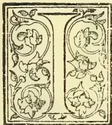

It is difficult to arrive at the exact date of the appearance of cacao canker in Ceylon: it had most probably been growing on cacao for a long period before it was noticed by planters. In 1896 it was generally noticed, and various theories put forward as to its nature, some favouring the view that it was caused by an insect, others that the methods of cultivation were at fault.

We may safely assume with our knowledge of the rate of growth of the organism causing the canker that it had been present in cacao trees at least five years previous to 1896, when in the public press and at planters' meetings the existence of the evil was recognized. The number of trees affected and the wide area over which the canker existed in 1898, when the investigation of its nature and life-history commenced, supports the presumption that cacao canker began in Ceylon not less than ten or twelve years ago. unhappily the disease was until 1898 only treated in various empiric ways, without definite knowledge of the nature of the evil. It was said to be a fungus attacking the root, to especially attack weak trees, and to be a consequence of the attacks of boring and other insects, and from these premises various suggestions for the prevention of further spread of the disease were formulated. This has been almost invariably up to the present time the history of diseases of cultivated plants, and the experience has been dearly bought that in plant life, as in human sanitation, sporadic diseases should be carefully investigated as soon as possible, and when their nature is discovered prompt measures taken to prevent them becoming epidemic.

In 1898 I began an investigation into the causes of the disease, spending a year in observing the life-history of the fungus causing the mischief, and also in visiting and examining more than forty cacao estates in different districts of the Island and at various elevations (from 100 to 4,000 ft.). The results of this investigation were published in three reports by the Ceylon Planters' Association, and an abbreviated account, with rules for dealing with the canker, was printed in Sinhalese and Tamil and circulated by the Government.

The amount of damage done before any steps were taken to combat the evil is hard to estimate, but a most serious loss in crop was caused by the canker and a still more serious loss of trees; some estates, for reasons which may perhaps be understood by the following account, were free, or almost so, from the disease, while others were entirely, or in great part, wiped out.

Had the organism causing the disease invaded the root—as it was erroneously supposed to do—as well as the stem of the cacao trees, the loss would have been more disastrous. When the stem was cut down suckers were produced from the stump and grew vigorously, without disease, producing fruit, in some cases when only a year old, in addition, new plants supplied grew healthily beside the stumps of the old cankered trees, and these circumstances retrieved a great deal of the loss on many estates.

On some estates the methods laid down for combating the spread of the disease have been most carefully carried out, on some others partial trials (which, as a rule, are a mere waste of money) have been made, but in a large number of cases, notably native holdings, no measures have been taken to decrease the ravages of the disease.

461------------------------------------------------

442THE TROPICAL AGRICULTURIST.[JAN. 1, 1902.

Since I have taken up my duties as Government Mycologist I have more than once had inquiries as to a "new disease" noticed, which on specimens being sent proved to be typical canker, and from its hold on the trees and the number attacked must have been present in the state for many months, probably even years.

That there are also many false impressions current as to the nature of this disease appears in letters of inquiries received as well as in the local newspapers, which show that some of the facts recorded in the reports issued by the Planters' Association have been misunderstood. The object of this Circular, therefore, is to recapitulate the knowledge gained by the investigation and to record observations and experiments carried on since the reports were published.

It is to be hoped that every cacao planter, especially those whose experience and observation has given them definite views on the question, will read and carefully consider the evidence and the facts deduced therefrom.

The methods employed in gaining these facts are described with a view to encouraging planters to gain for themselves knowledge, not by general observations recorded only in the memory, but by experiments and observations—simple perhaps in themselves, but conducted carefully and the results permanently noted.

It say here be stated that, for reasons which our readers will readily understand, the names of states where the various observations mentioned in this Circular were made are not given, yet these cases, like the inoculation and other experiments, are not mere general observations, but exact instances, of which the place and conditions were recorded at the time of observation.

#### EXTERNAL EFFECTS OF CANKER.

The first question in investigating any disease is—What is the nature of the departure from the normal health of the trees? Briefly, in the disease in question the external signs are a lack of vigour in producing fruit and leaf, similar in its appearances to the lack of vigour caused by long periods of drought or by severe mechanical injuries to stem or root. The period during which the tree continues to exist depends on the amount of disease on the tissues and the quantity of nutrition the roots can take up. The fact that trees of all varieties, at all ages above three or four years and in some cases less than that, in the best soils as well as on poor land, in various aspects and at different elevations, are attacked naturally leads to the supposition that this disease is not due to conditions under which the trees are growing, but to the effects of an extraneous parasitic organism.

No injuries caused by insect or other animal can be found exclusively on diseased trees, so that the disease cannot be due to the attacks of an animal. The next point is—What portion of the tree, if not the whole tree, is affected, and in what manner? The roots of badly diseased trees show no sign of injury, and when the tree is cut down near the ground healthy suckers are formed, which grow without any sign of disease. These, as well as many other facts which will appear in the course of the Circular, show that the root is not affected by the disease, and it is indeed a happy thing for the cacao planter to be assured on this point, as root diseases are much more difficult to battle with, and consequently much more to be feared.

The leaves of diseased trees, except in rare cases, are free from fungi, and present on microscopic examination all the features to be found in leaves dying from want of moisture, showing that there is no disease in the leaf, but that some malady in another part of the plant has cut off their supply of nutrition from the root.

The stem and branches must now be examined, and here it is not hard to find the cause of the disease. If we examine the external bark of the

stem and branches of diseased cacao trees, we shall notice darker patches, where in some cases (where there is an injury in the bark, and insect puncture, or an abrasion) claret coloured drops exude, and where they have run down and dried up a rusty coloured streak is seen. On scraping these darkened patches the bark is found to be discoloured, sometimes of a deep claret hue, but in earlier stages of a brownish or "neutral tint" colour, quite evident if these places be compared with the yellow or reddish yellow colour of healthy cacao bark. This discoloured bark is always very wet, and on being cut exudes copious moisture—the darker the colour the more the moisture—and feels soapy to the touch. If such a diseased patch be carefully shaved, its difference from the healthy bark surrounding it can be clearly seen, as it stands out as a bright claret coloured patch surrounded by the light yellow healthy tissue.

#### MICROSCOPIC CHARACTERS OF THE DISEASE.

A microscopic examination of the tissue in these discoloured parts shows a quantity of mycelium of a fungus permeating the tissue.

Mycelium is the vegetative portion of a fungus, that is to say, it is to a fungus what the root, stem, branches, and leaves are to a flowering plant. The quantity of mycelium is much greater in the darker coloured parts than in those of a neutral tint, and in cases where the discolouration is only just perceptible the mycelium is scanty.

The mycelium also penetrates into the wood of the stems and branches, running generally in a longitudinal direction. It can be observed when it is present in any quantity as a thin black strand as thick as a piece of cotton; this strand may crop out into the bark at another place higher up or lower down, and produce a fresh cankered spot on the bark. The time the fungus takes to kill a tree or part of a tree depends upon many conditions. It is possible for it to produce death in a few months: as a rule it takes two or three years. Death occurs when there is sufficient mycelium to prevent any sap being conveyed from the roots to the parts above.

To return to the external appearance of the cankered tree. If we observe a number of patches of disease we shall find on many of them whitish pustules on the surface of the bark, varying in size from that of a pin's head to a ten-cent piece white gray or pinkish gray in colour, and bursting through small ruptures in the bark. If these be examined microscopically they will be seen to consist of masses of oval-shaped bodies, and some larger bodies crescent-shaped and septate, *i.e.*, having a number of partitions, usually eight. They are the spores of the fungus, and a section cut through the centre of one of these masses into the discoloured bark will show that they are produced on the mycelium which permeates the tissues. Spores may for purposes of popular explanation be considered as the seeds of the fungus. These spores are excessively minute; some notion of their size may be gained by the rough calculation that about five million could be placed on a ten-cent piece only one layer thick; those which are crescent-shaped are larger, being about six times the size of the oval spores.

When these spores are sown in a suitable medium and kept moist (a form of microscopic gardening which must be always used in gaining a knowledge of these small organisms), in the course of twelve or fifteen hours they begin to grow, pushing out a tube, which, as it grows, branches, frequently coalescing with neighbouring branches, and in about fifty hours producing more spores similar to those from which it originated. This minute gardening is of great interest, but it is of less practical value than observing the processes of growth in the living cacao tissues (which is unfortunately impossible), because the nature of the "bed" in which the spores are growing affects the rapidity and character of

462------------------------------------------------

JAN. 1, 1902.]THE TROPICAL AGRICULTURIST.443

the mycelium, and in a good nutritive solution the conditions of resistance to growth and the amount of food available are much more favourable than in the bark tissues of cacao. On carefully searching diseased and dead cacao trees, and especially those which have been attacked for a long period, we shall find a third form of spore enclosed by a fruit wall, which is very characteristic in colour and size. These fruits are of a bright crimson colour, and occur in clusters about the size of a pin's head; if looked at with a lens, they will be seen to be in shape and colour like a strawberry, minute in size, about twelve or fifteen making a mass equal to a pin's head.

These are the fruits or perithecia of the canker fungus, the name of which, botanically, is *Nectria*, and they are hollow spheres containing a series of sacs or "asci," which in their turn contain each eight spores. They are to be found only on dead wood or dead patches of dying branches and stems.

The name "canker" is not strictly correct, though it may be used, as the other *Nectrias* parasitic on trees are "cankers." Properly a canker is a disease causing malformation of the tree at the point where the fungus is. In the case of the cacao *Nectria*, however, no such excrescence or other irregularity occurs, the contour of the stems of cankered trees being the same as those unaffected by disease.

This completes the life-story of the canker fungus: the small oval spore producing mycelium, which in its turn produces spores of three kinds: first the oval and crescent-shaped spores in whitish masses, and then the ascospores enclosed in crimson spherical fruits.

#### INOCULATION EXPERIMENTS.

We have a fungus which will account for the diseased condition of the cacao tree, but in order to prove absolutely that this organism is the chief and only cause of the canker, it was necessary to artificially produce the symptoms of the disease by inoculating a previously healthy tree.

The table on page 322 gives a record of thirty-two inoculations made on previously healthy trees in full vigour, showing the variety of the tree experimented on, the material used to infect it, and the time occupied before the characteristic symptoms of the disease were produced. As will be seen, twenty-five out of thirty, or more than 80 per cent., of the trees inoculated acquired the disease, the majority showing unmistakable symptoms after eight weeks.

As would be expected the inoculation of diseased tissue produces a cankered spot sooner than the sowing of spores in the bark, just as in the case of the production of new plants from cuttings instead of seeds.

The time taken to affect a certain area of the bark is very variable; in the case of quickest growth (No. 13) a space of nearly 10 inches long by  $4\frac{1}{2}$  inches wide was permeated and discoloured by the fungus in five weeks, while in the one of slowest growth a piece not larger than a rupee was diseased after ten weeks. The spread of the canker fungus in the bark depends upon the amount of sap in the tree at the time, and in a vigorous tree where the roots are taking up plenty of nutrition the diseased spots increase more rapidly, because the mycelium of the fungus obtains more food. From the table it will be seen that in the cases of inoculation of suckers only one out of three cases succeeded. This fact and observations as to the comparative rarity of canker on suckers led me to make further observations and experiments in this direction. I examined 200 suckers on 135 trees, most of which (113) had disease on stem and branches, and in only five cases were the suckers cankered. I also inoculated thirty suckers, and in only twelve (40 per cent.) was canker produced,

The smoothness of the outer bark on suckers and the fewness of wounds and abrasions give less chance for the lodgment and subsequent growth of the canker spores. This, together with the fact that even when it has a footing the spore does not invariably grow on them, make the "suckers" of more value than other branches. In cankered estates, therefore, whatever method has been previously practised, it will be well to spare the sucker. In the limits of the Circular, though it may be treated in a subsequent one, it is not possible to discuss the *pros* and *cons* of pruning for fruit in cacao. Dealing with the matter from the point of view of combating the canker, the use of the knife, or, still worse, the nipping or tearing off suckers, leaves a vulnerable spot for the cacao spores, and since the suckers are more protected from canker than other parts, it is well to allow the tree to produce these branches, which like the lateral branches, bear their fair proportion of fruit. We have seen that the roots and leaves of the cacao tree could in no case be found affected by the canker fungus, and in order to still further prove this point I made some inoculations of exposed roots and of underground roots; seventeen cases were inoculated, nine exposed roots and eight in which the earth was temporarily removed, but in none of them was any canker produced. I also attempted to get the spores of the fungus to grow on the leaves by sowing them on both the upper and under surfaces and by scraping the epidermis away and then introducing spores. Fifty of such experiments produced no growth of the canker, so that we may definitely state that the canker does not affect roots or leaves.

#### DISEASE OF THE PODS.

The fruit, which has so far not been mentioned, cannot however be so classed, for upon it the fungus grows vigorously. For many years the great loss of pods in various stages of maturity has been a serious question. To understand the pod disease it must be stated that there are a number of causes why large numbers of pods which are set do not reach maturity. There are in many trees hundreds of pods which blacken, dry, and shrivel up when they are from 2.5 inches long; in these there is no specific organism causing disease to be seen, and this is a physiological effect, it is an evil which I am continually observing and investigating, and all exact knowledge as to its nature is of importance, as leading us nearer to some way of preventing this immense loss of energy in the fruit-producing power of the cacao tree. The planter is satisfied, as a rule, with the comforting explanation that the tree has set more fruit than it can bear, and as he has frequently in his mind a dread of what is called "over-bearing," he is not much distressed at this waste. This Circular, however, treats of the canker, and further discussion of drying of young fruits must be deferred.

The attacks of insects and other animals cause the death of many pods. From the squirrel to the *Helopeltis* many animals feed on cacao pods or lay their eggs in them; but of these I have no authority to speak, they are dealt with by my colleague, the Government Entomologist.

The canker fungus is, however, responsible in many estates for a very large loss of crop. The disease can be readily recognized on the pod. A characteristic discolouration accompanied by an excess of moisture which gives a slimy feeling to the touch when cut, and as in the bark the colour is darkish brown, and a clear line can be drawn between the healthy and the diseased parts. The disease attacks the pod most frequently either at the point or at the stalk; this is due to the fact that a drop of moisture in which the spore can germinate often hangs on the point, and the cup formed round the stalk holds moisture which aids the growth of the spore at that end of the pod. The life-history of the canker fungus on the pod

463------------------------------------------------

444THE TROPICAL AGRICULTURIST.[JAN. 1, 1902.

is similar to its progress in the bark, except that it is much shorter. We have seen that under favourable conditions the time taken from the germination of the spore to the production of new spores in the bark is a question of some weeks and often months, but the whole of this is passed in the pods in a few days, and vast numbers of spores are produced in every pod that is allowed to hang on the tree for a week or more.

The diseased tissue of the pod if examined microscopically will be found to be permeated in the same way by the mycelium of the fungus, but this mycelium is of a more luxuriant character, because there is more moisture in the pod for it to grow on and less resistance to its growth.

If a planter wishes to observe for himself the life-history of the canker fungus, he can by placing a cankered pod under a glass and keeping it from drying up see the production of the two early forms of spore (gonidia), and later the red spherical bodies of perithecia containing the ascospores.

That the canker fungus grows on the pods has been proved by numerous observations, and in order to test by inoculation I experimented with twenty pods of fairly typical Red Cacao trees and twenty of *Forastero* trees. These I inoculated with both gonidia and ascospores, seventeen of each variety being painted with gonidia spores and three of each kind with ascospores. In the case of the Red Cacao all the seventeen grew at once, twelve in the first three days and the rest within eight days; in the *Forastero* twelve grow within nine days, the remaining five did not acquire the disease, the fact that the typical *Forastero* fruit has a thicker epidermis or outer skin no doubt gives it a greater power of resistance to the growing spore of the canker fungus.

On all these inoculated pods the spores—both gonidia and ascospores—of the fungus were produced in from four to nine days, and these spores were exactly similar in character to those on the bark.

#### RELATION BETWEEN POD AND STEM DISEASE.

In order to prove the relation between the canker on the bark and on the pods, and how far the one spreads to the other, the following experiments were made:—

(1) Small pieces of cankered bark were placed in selected healthy pods on sound trees. Five pods were so treated. In all cases the pods became diseased after eight days, and in less than fourteen days spores of the fungi were produced in abundance.

(2) Small pieces of diseased pods were placed in the bark of sound trees. Eight of these inoculations were made. In all cases canker was produced in the bark after ten days, and the spores of canker were found after eighteen days.

(3) Small pieces of cankered bark were placed in the bark of sound trees just above the stalks of healthy pods. Seven inoculations were made. In all cases the bark became diseased, and it spread to the pods, which were plainly diseased, in nine days, and spores produced both on the pods and on their stalks.

(4) Pieces of diseased pods were placed in healthy pods on sound trees. Six of these inoculations were made. All the pods became diseased, and in three cases the canker spread through the stalk to the adjoining bark; in the other three cases the stalks of the pods were cankered, but not the adjacent bark. In one case the mycelium of the canker went through in to the wood of the tree through the stalk without affecting the adjacent bark.

We learn from these experiments that the canker fungus can spread from the bark of stems or branches to the pods; that the fungus can spread from the pod to the bark of stem or branch.

Another matter of interest in connection with the disease on the pods is that they are invaded by another fungus *Phytophthora*, sp., one which is

common in many climates and grows on the soft tissues of numerous plants. On examination of some hundreds of diseased cacao pods I always found this fungus associated with the canker fungus. I was unable to get a pure culture of the spores of the second fungus, so that I could not observe the action of the *Phytophthora* alone on the pod. The canker fungus I have found by itself on the pod, but in the great majority of cases it is soon joined by the *Phytophthora*, and this latter I have never found by itself in the pods in nature.

A very large series of observations of the relation between the canker in the bark and on the pods shows that in a certain proportion of cases the canker originates in the bark from a cankered pod which has been left on the tree sufficiently long—three or four days—to enable the mycelium to penetrate through the stalk; also in a smaller proportion the canker in the pod has been caused by the mycelium growing from the bark through the stalk and infecting the pod.

To sum up the knowledge gained by this investigation of the cacao canker. The disease is due to a fungus (*Nectria*) growing in the bark "wood" and pods of the cacao tree. It spreads by means of an abundant production of spores of three kinds. It grows more rapidly on the pods than in the bark, and its rate of growth in both cases is regulated by the amount of sap in the tissues.—*Royal Botanic Gardens, Ceylon.*

(To be concluded.)

## SOME RECENT INVESTIGATIONS IN THE CHEMISTRY OF AGRICULTURE.

(Continued from page 381.)

### SOIL MOISTURE.

I must now refer, though with great brevity, to another department in the investigation of soils, namely, the *Moisture conditions*.

This subject has a particular interest in India where the rainfall is unequally distributed.

Some parts of America suffer likewise from an unequal distribution of rainfall, and Professor Whitney of the U.S. Department of Agriculture, has for some years devoted his time to an examination of the moisture conditions which obtain in soils. Although his work has already been productive of most valuable and interesting information, it is at present in its infancy, and it is impossible to say what this department of research may eventually tell us. But some of the information gleaned is of great interest.

In the first place, mechanical analyses of soils made by Whitney, Hilgard and others, have demonstrated that it consists largely of very minute particles, many of them measuring only a few micro-millimetres in diameter, some indeed being even smaller than this, or to put the statement popularly, they are little larger than bacteria. In loamy soils about one-half of the silicious matter consists of such material.

The result of this state of minute sub-division is that it offers a very large surface, not only to the plant, to whom it is important, but also to the water; Perhaps will appreciate this if I say that each cubic foot of soil offers a surface area amounting to many thousand square feet. One of the results of this is that water is held, long after rain has ceased to fall, in very thin films on the surfaces of these small particles, and does not at once evaporate into the air or run away as drainage water, as would be the case if the soil consisted of coarse pieces.

Turning from the soil for a moment, we may enquire how much water an ordinary crop will require during its growth. This is a much larger amount than one might suppose. The results of the most recent investigations go to show that the quantity varies from about 300 to 500 lb. of water per 1 lb. of dry crop. For example, an average good wheat crop

464------------------------------------------------

JAN. 1, 1902.]THE TROPICAL AGRICULTURIST.445

at Cawnpore will weigh (corn and straw) about 4,500 lb. per acre in the dry state, and such a crop will require something like 1,800,000 lb. or roughly 800 tons of water. Or again a cholum crop, including stems, leaves and grain, may weigh from 4,000 to 7,000 lb. in the dry state, and such crops will require 2,000,000 to 3,500,000 lb. of water, or say 1,000 to 1,500 tons.

These are of course very large amounts, but when we state them in terms of rainfall, they are not so very surprising. The former is equivalent to 9 inches and the latter to about 10 inches to 15 inches of rainfall. One would be inclined to ask why even more than this rainfall is necessary in order to grow heavy crops. If the rainfall were well distributed over the seasons, it would indeed go much further towards satisfying our Indian crops than it does, but unfortunately it is apt to fall in heavy showers, and a part runs off the land, whilst there is always some lost by drainage, the latter being indeed a necessary condition for all healthy soils. It follows however that, in order to grow heavy crops, even larger amounts of water are required than the few inches I have spoken of.

It is necessary therefore that the soil shall hold, for periods of weeks and months, very considerable quantities of water, and this it does in the manner I have indicated, namely, as a very thin film on the surface of the soil particles.

A further part of Whitney's work consists in the determination of that proportion of moisture, or to state it popularly, that degree of dampness of any soil, which is most suitable to the crops grown. I have already told you that these investigations are merely in their infancy, and I cannot do more at present than to say that there is every probability of reaping a rich harvest of information.

In some soils, crops will grow best with very much less water than in others. The following examples will better show the importance of the work.

One soil was found to be too wet with 10 per cent. of water to be too dry if the proportion fell below 5 per cent. and that the crop fared best with from 5 to 8 per cent. In another case, the soil was too wet if the moisture rose to 25, and it was too dry with 15 per cent.; in yet a third case 23 per cent. of water was too little.

What this line of research may ultimately indicate, it is of course impossible to say, but one thing seems probable, namely, that although we cannot alter the rainfall, it may tell us in what manner we should irrigate our land, so as to produce the best crop with the least waste of water, and without damage to the land.

#### SEWAGE.

The last subject which I shall refer to is the so-called biological treatment of sewage. It may appear at first sight that this matter belongs rather to the domain of the sanitary engineer than to the agricultural chemist. As a matter of fact, the disposal of sewage should engage the attention of both. To the one the question is—"How am I to get rid of this material at any price, and with the least possible amount of nuisance to the inhabitants?" Whilst to the other, the deposition of such matters in the soil, means an increased manure supply.

That the land is the proper destination for the town "night-soil" has been admitted by all who have had to answer the question, but when the practical details of the working arrangements were taken in hand, the difficulties proved great. In many parts of Europe, America, and in fact wherever the sanitation of towns has been seriously taken in hand, the excrementious matters have been conveyed down closed sewers by water and emptied, with, or without previously "purification," into the nearest river, and sanitary authorities have been very well satisfied if they could do this successfully.

The regular return to the land of those matters which had been withdrawn from it, although so desirable, has been considered as generally impracticable, and has had to be classed among the many

other interesting problems which remained unsolved.

To sanitarians and to agriculturists alike, therefore, the discovery of a means of disposing of sewage without causing any nuisance whatever, void of technical difficulties, with a minimum of cost, and including as an integral part of itself, an effluent which no one would object to put on their flower garden, much less on their fields, has come as a matter of unusual interest. It is now, of course, a very old story, that animal and vegetable refuse matters of all kinds disappeared when allowed to remain in either water or the soil, and that this resolution is effected by lowly organisms which are commonly spoken of as "microbes," better known to the scientific world as moulds, yeasts, fungi, and bacteria, organisms small of stature, but performing nevertheless an all-important work. For many years attempts were made to utilise this army (for the number of such organisms is very large), for the disposal of town refuse. It was argued that because these matters do disappear if left in either soil or water, then why not put them on the soil or into the river? And for a long time this procedure has been followed, but with the result, that in the majority of cases the river was rendered foul, or the land unapproachable. There was clearly something very wrong in our method of utilising the services of the wily microbe.

For the last 10 years, however, efforts have been concentrated by a number of investigators on the value of what is termed the "Biological Filter." The general meaning of the term "Filter" is a porous medium, through which a liquid will pass, but which will arrest solid matters, and prevent them flowing on with the liquid. Thus we use blotting paper in the chemical laboratory to separate our precipitates. Drinking water (with the idea that only solid substances did us harm) has been filtered through such things as sand or charcoal, or more recently by the aid of the Pasteur cylinder of finely porous earthware. The "biological" filter is, however, in reality very different, at least in principle. It consists, it is true, of such material as broken charcoal or stones, but there is no attempt to make it impervious to the passage of fine solid matter. It had indeed become recognised that at least one of the reasons why the soil of the sewage farm did not purify its daily allowance of sewage, was because it was too fine, and contained too small an allowance of atmospheric oxygen, resulting in harm to the army of microbes which it was hoped would consume the sewage. The idea of the biological filter was then to offer to the sewage as larger a surface as possible, with, at the same time, plenty of air. Liquid sewage run into such filters (which had been previously aerated) and allowed to remain in them for a few hours, was found to have lost one-half or more of its organic matter.

The Massachusetts Board of Health, in the U. S. A. and Mr. Dibdin, and Mr. Scott-Moncrief in England, must be named among those who carried out the first experiments in this direction. At first, only a comparatively weak sewage was run into the biological filter, but the process worked so exceedingly well, that very shortly these filters were supplied with the raw and unadulterated sewage, in the hope that this might be equally palatable and digestible to our friend the microbe. And indeed it was found to be so. The solids of the crude sewage disappeared, that is, they were dissolved and broken down, and this, as also the matter already dissolved in the sewage, actually disappeared to the extent of about 85 per cent. It thus became evident that the microbe could be persuaded to perform his duties most efficiently, if the sewage were only given to him in a proper manner.

Before telling you anything more about the form of the biological filter, or its analogue the Septic Tank, I must digress to say a word about microorganisms generally.

In the first place, as you know, they consist of

465------------------------------------------------

446THE TROPICAL AGRICULTURIST.[JAN. 1, 1902.

minute cells, having a very brief individual existence. They are divided into groups, such as moulds, algae, fungi, yeasts and bacteria, and it is principally those of the latter class with which we have to deal. An important point in the life history of Bacteria is that, whilst some of them thrive in the presence of a plentiful supply of atmospheric oxygen, others have a more healthy existence in its absence. The former are called aerobic bacteria, the latter anaerobic bacteria. Another point is that they all live on food of complex character. Whilst the higher plants feed on very simple foods, such as carbonic acid and nitrates, building up from these the complex compounds, carbohydrates, oils and albumens, these lowly organisms perform the reverse operation, and, feeding on complex material, break it down, with the production of simple substances, some of them proceeding so far as the production of carbonic acid and nitrates. Furthermore, whilst one organism will prefer the most complex material as food, producing therefrom simpler substances, others have a particular appetite for these simpler substances and reduce them to compounds of a still more simple constitution.

It is indeed, as has been mentioned in a former part of this lecture, owing to the existence of myriads of such organisms, that the vegetable and animal matter, which accidentally or by the agency of man are annually deposited in the surface soil of our fields, rapidly disappear and become changed into the simpler compounds on which the higher plants feed.

The action of these bacteria has very pertinately been likened to that of a child, who after assisting in building up a castle from a pack of cards, proceeds to take a card first from one part of the structure, then from another, with the result that the castle is rapidly converted into a heap of cards again.

Finally, I must refer to another characteristic of these organisms, and that is, they don't like their food to be too concentrated. If they have too much, they suffer in the same way, as a boy does who eats too many sweatmeats at once. They get ill and may die, if the excessive food supply is persisted in. This really explains why the sewage farm has been a nuisance instead of a blessing. Vast quantities of material have always been poured upon a small area, without any consideration for the health of our microscopical friends, and the result has been that they couldn't perform their duty satisfactorily, and the sewage farm proved a failure.

We may now return the biological treatment of sewage, with a clearer understanding of the conditions involved in its arrangement. For it to proceed satisfactorily, we must offer the material to these organisms in such a manner that each class may perform its appointed task—the anaerobic organism prefers to be without air, the aerobic microbe must have an abundance; the food must also be in a reasonably diluted state; and thirdly, we must not upset the home or colonies which these classes make for themselves, for they sort themselves out, and one class will inhabit one spot in the biological filter, another class another, and if we give crude sewage to the class which lives on the partly simplified material, the result will be destruction, not to the sewage but to the microbe.

Thus in the case of the filter which Dibdin, Scott-Moncrief, Garfield and others have used, the crude sewage passes first into one vessel, which Mr. Scott-Moncrief has called a "cultivation tank." This is simply a large tank filled with broken brick or some other coarse material. Here those organisms which prefer the more complex organic foods thrive particularly, dissolve it and reduce both this, as likewise the other soluble matters, to simpler substances. In this tank little or no air is admitted. The resulting effluent then passes to a series of so-called "filters," to which I will return presently.

I leave the "cultivation tank" to describe very

briefly what is called the "septic tank." The author of this is Mr. Cameron, the City Surveyor of Exeter, who also took up the biological treatment of sewage a few years ago. His experiments took a slightly different line. Whilst Dibdin and others passed the sewage into a tank filled with broken brick or coke, Cameron tried the effect of allowing the sewage to remain in a simple closed tank (containing no broken material) for some hours, and found as a result that the sewage was rapidly purified in a great measure. A tank was then erected of such dimensions, that the sewage of a portion of the town might constantly flow into it at one end and pass out at the other, the time occupied being about 24 hours. It was then found that in fact great changes took place in the sewage. By means of a "manhole" from which the interior of the tank could be observed, it was seen that the solid matter would first settle to the bottom, then rise with bubbles of gas to the surface, then fall again, and apparently this process goes on from one end of the tank to the other. A scum, consisting of organic matters, forms on the surface, which seems to be thicker in winter than in summer, but never requires removal, and an ash-like deposit collects very slowly on the bed of the tank, which consists largely of mineral matters. Gases are evolved in this tank consisting largely of methane, with some carbon dioxide, and this is utilised to illuminate the works at night. The effluent from this septic tank is free from smell and is clear. Like the effluent from Dibdin's bacteria tank, it then passes to the biological filters.

These consists of simple vessels filled with broken material, such as coke, and here the effluent is allowed to remain for several hours, after which it passes out, and the filter is left empty for purposes of aeration before being filled again.

By an ingenious device, due to Mr. Cameron, the flow of water from the septic tank, opens the tap of one, or closes that of another filter at the proper time, thus enabling the series to work automatically. The raw sewage runs directly into the septic tank continuously, and passes from it again similarly uninformed to the filters, which, as I have said, work automatically. The apparatus requires therefore a very small amount of supervision.

The effluent from the filters is not only free from odour, it is so pure that it remains perfectly clear and bright for any length of time in closed bottles, which is one of the severest tests of the purity of water, and it has been drunk by more than one person without any ill effects whatever. Thus putting the matter very briefly, one class of organisms inhabit the septic tank or "bacteria tank"; these thrive on complex organic food, and are largely anaerobic in character. Then, secondly, the biological filters are inhabited by another class of organism, which are aerobic and feed on the more or less simplified material, converting it into still simpler matters. The chemical changes may be very briefly described as follows: the carbohydrates are reduced to carbon dioxide and methane, the albuminoids and amides first to ammonia and then largely to nitric acid.

And now you will doubtlessly agree with me that the value of the biological treatment of sewage is just as important to agriculture as it is to the sanitary authorities. Especially is this so here in India. Not satisfied with converting the farm manure into fuel, the attempts to utilise the city manure have been generally of just as ruinous a description. A dry-earth system, which if it could be perfectly carried out, could not readily be improved upon, has been converted into a general nuisance; the whole of the manure has been placed in a few square yards of land, to the utter ruin of our friend the microbe. Suggestions that the manure should be given in smaller doses over a large area have been met by the rejoinder that such was impracticable. Now, likewise in the case

466------------------------------------------------

JAN. 1, 1902.]THE TROPICAL AGRICULTURIST.447

of the biological treatment of sewage, we have a means of converting our city manure supply, without any nuisance at all, into a most valuable liquid manure, which may be run on the fields all round the town, and thus a material increase of plant food will be recovered from the hopeless wreckage which at present prevails. But this result will not be attained if we are ungenerous to our microscopical friend. He requires to be treated well, to have his home *i.e.*, the particular part of the septic tank or filter which he has colonised, left undisturbed, and, above all, if we are stingy with the allowance of water, he will be unable to serve us well.—*Indian Forester*.

### THE CASSAVA-PLANT.

The Cassava is, *par excellence*, the nutritive plant of the African races and of the indigenous populations of the West Indian Islands, of Central America, and of equatorial South America. It will, therefore, be seen that it supports the life of a goodly part of the world's population. It is also very much made use of in Europe, and especially so in England, in the preparation of biscuits and of dietetic articles. Its principal product, *tapioca*, is known universally.

The prevailing opinion in France is that *tapioca* and, especially, the good quality of *tapioca*, is obtained only in Brazil. Now it is a fact that cassava is cultivated in all French colonies, and the making of *tapioca* is one of the rare manufacturing industries in the colonies, one of the most interesting of all colonial manufactures. *Tapioca* grown in the French colonies comes chiefly from the island of Réunion.

There is sold, besides, enormous quantities of *tapioca* into the preparation of which not an atom of cassava enters, but which consists simply of potato-starch. This is a falsification which the consumer may readily recognise. The grains of European *tapioca* are, in fact, more regularly rounded and whiter than those of genuine *tapioca*. Besides which, however well purified it may be, the spurious *tapioca* always keeps, more or less strongly, the characteristic odour of potato-starch.

The Cassava plant is a shrub with tuberous roots, which sensibly call to mind those of the dahlia. Two sorts are distinguished—sweet cassava and bitter cassava. The tubers of the latter—(*Manihot utilisima*)—the most useful, contain a poisonous principal (hydrocyanic acid) which makes their use dangerous in the raw state, but which in the preparation of starch is caused to disappear completely.

[Hydrocyanic acid being volatile, completely disappears on the application of heat, as in baking or boiling.]—*Translator*.

In preparing cassava the pulp of the tubers is rasped, and the material is soaked in water. The sediment which is formed at the bottom of the water, when collected and dried, is the cassava-starch of commerce. It is employed as a food-stuff, either as the *pulp* itself or as *starch*, properly so-called.

The grated pulp, washed and dried, is known under the name of cassava-flour or *farina* when it has been heated and pounded. Cassava-flour replaces bread in the food of the natives. In Guadeloupe, but more especially so in Brazil, it is seen every day, by habit, fancy or necessity, on the table alike of the poorest and of the richest of the inhabitants of the country.

When reduced into small lumps and only slightly heated, it is called *conaque*, a native term. When simply grated and dried at the fire in the form of a pikelet or muffin [the *torta* or *bunelo*, of Spanish America] *Tr.*—it is called *cassava*. It is generally consumed under this form in French Guiana.

The starch dried in the open air is known as *cispa* or *moussache*. From this sweetened cakes are made, and other very agreeable dishes and pastry. When slightly damp and grilled upon plates of copper at the temperature of boiling water (100deg. Centigrade) it constitutes *tapioca*. The dregs and residues from the operations of preparation are made use of in producing alcohol.

The cultivation of cassava should be encouraged in our [French] colonies, for its product are sure to find a sufficient market in France. Besides its uses as a food, which are very numerous in form, and which we shall have frequently the opportunity to point out, cassava-starch can be employed in many manufactures:—paper-making, soap-making, in the making of glucose, or starch-sugar, and in making size and adhesive paste.

Let us say, in concluding, that we shall be glad to see the employment of *tapioca* from Réunion, which yields nothing to any foreign *tapioca*, and also to see the use of cassava-flour more general amongst us, the reason why their use is not more common being entirely due to simple ignorance of the delicious pastry and the exquisite dishes which can be prepared from these two forms. We shall deal with this subject in future special articles.

Cassava-starch can be made use of in the preparation of all kinds of cakes, just as flour or the common starches. It gives them a particularly agreeable flavour, and greatly increases their hygienic and nutritive properties. One of the best preparations that has ever been made is wheat-cassava.

[Translated for the "Journal" from the French journal *Les Produits Coloniaux dans l'Alimentation*, March 31, 1901, by JAMES NEISH, M.D., Old Harbour.]

N.B.—The author of this interesting communication appears to be a little antiquated in the matter of botanical nomenclature. The name now universally applied by botanists is no longer *Manihot*, but *Manihot* *manihot*, and it applies equally to both varieties, the sweet sort and the bitter. The old name *utilisima*, applied to the bitter kind, was in respect of its greater yield, not greater usefulness.—J.N.

[The real Farine is not powdered. It is simply the grated pulp of Bitter Cassava, with the juice pressed out; the pulp being then spread on an iron pan, not hot enough to burn it and make it stick to the bottom of the pan, but with enough heat to dry it; and, as the mess is kept constantly stirred and turned over, it falls into various degrees of coarse and fine granules, like biscuits ground into a rough meal.]—ED.

CASSAVA.—Almost in every issue we endeavour to direct attention to Cassava and its preparations, more especially the dry meal we call here Farine. In the further article on "Cassava" published in this issue, translated from the French by Dr. Neish, it is shown that Cassava and its products are much used in French colonies not only in the West Indies, but also those in the Indian ocean. The Curator of the Botanical Station at Belize writes in the "Journal" for June, the Cassava is the chief food of the Carib Indians of British Honduras who are the hardest, healthiest and strongest lot of people in the country. The Indians of Colombia who perform tremendous journeys among the mountains carrying immense weights, subsist largely on Cassava or Yucca as it is there called; so do the Indians of Guiana; while the Mendioca and Farinha (Cassava and Farine) are the chief support of the labouring people along the river Amazon, whose strength and endurance, on scanty portions of farinha and fish, and nothing else save pacovas or plantains have been the marvel of travellers in these regions. Yet withal, Cassava and its preparations are much neglected as food in Jamaica. Notwithstanding the precarious state of poverty much of our population is in at present (and the people

467------------------------------------------------

448THE TROPICAL AGRICULTURIST.[JAN. 1, 1902.

from British Honduras down to Paraguay who live largely on Cassava are not more so) through loss of sale of exportable products for which there is either no demand or only very low prices offered, they go on ignoring to a large extent this product, which every good authority places as one of the most valuable edibles available in warm climates. It is superior to cornmeal for this climate as it is less heating in its effect on working people, and less irritating to the digestive organs of children, and it is more digestible than either Cornmeal or wheat-flour bread, as may be easily proved on trial. Cornmeal is an imported product, baker's bread is to all intents also an imported product, and even if this were actually cheaper than Cassava products, which they are not, would not be preferable to a home product; if we were receiving plenty of money readily from our exports and our buying power was good, by all means should we purchase freely what we could afford. Our buying power is very low yet the people accustomed in better time to purchasing imported articles of diet, never at any time necessities, but always in the nature of luxuries, go on spending their little monies on morsels of expensive imported articles, and ignoring to a large extent the production of their own fields, or what may be readily produced at their own door. Even the native yam when scarce and high priced, as it is at present, will be bought by the small piece at five times its nutritive value compared to Sweet Cassava, as if it was absolutely indispensable. If, however, Cassava, Sweet and Bitter, had been planted freely, as we have insisted on, (and it is so easy to grow,) the Sweet Cassava could now replace the yam temporarily, Farine which can be stored and kept in bulk for a year, if necessary, could replace the Bormmeal, Cassava Meal and "Bammy," or Cassava Cakes, the flour bread, and Tapioca, the rice to some extent, the saving to the individual and to the island might have been very appreciable, if this could have been done at the present time. We have not forgotten the Cassava starch, largely used,—but still many towns folk use imported Corn Starch admittedly inferior for laundry purposes. We ought even to export Cassava Starch and over and over we have put very fine stuff on the London and New York markets, but the market price is not enough to make its manufacture here by *hand labour*, a paying industry. If in Florida, where for several years past there have been starch manufactories working, using principally Cassava for making Starch can pay with but six months to grow the Cassava in and much cultivation and fertilizing required to make any crop yield well at all, then here where it grows all the year round, with typical soils for its production without much cultivation and fertilizing, if we had proper machinery, surely starch making would be profitable. We need some manufacturing concerns to employ labour, female labour especially.—*Journal of the Jamaica Agricultural Society*.

#### ADDITIONAL NOTES ON CARDAMOM-FRUIT.

By R. C. COWLEY and J. P. CATFORD.

In a paper read before the Liverpool Chemists' Association (*C. & D.*, lviii., 472) the authors pointed out that combustion in a platinum dish of cardamom-seeds leads to inaccurate results owing to reduction of the phosphorus compounds into phosphides and they suggested the use of ammonium nitrate as an oxidising agent to complete the oxidation. Further experiments on different samples, however, have shown that combustion in a clay pipe, also then suggested, produces results which closely correspond with those obtained with the use of the oxidiser. Neither method is, however, by any means perfect. They have since examined Malabar, Mysore,

and Mangalore cardamoms, which Messrs. Evans, Sons & Co. gave them, and some of the results are tabulated in the following:

<table border="1">
<thead>
<tr>
<th>Variety.</th>
<th>Malabar.</th>
<th>Mysore.</th>
<th>Mangalore.</th>
</tr>
</thead>
<tbody>
<tr>
<td>Number of fruits in 10 gms.</td>
<td>80</td>
<td>55</td>
<td>45</td>
</tr>
<tr>
<td>Percentage proportion of Pericarp. ... ..</td>
<td>30</td>
<td>25</td>
<td>20</td>
</tr>
<tr>
<td>Percentage proportion of seed. ... ..</td>
<td>70 { dark 57 } light 13</td>
<td>75</td>
<td>80</td>
</tr>
<tr>
<td>Percentage of ash from dark seed ... ..</td>
<td>5</td>
<td>3.3</td>
<td>2.9</td>
</tr>
<tr>
<td>Percentage of ash from light seed ... ..</td>
<td>8.5.9</td>
<td>4.5</td>
<td>—</td>
</tr>
<tr>
<td>Percentage of ash from pericarp. ... ..</td>
<td>13</td>
<td>7.1</td>
<td>7.6</td>
</tr>
</tbody>
</table>

Lime was found to predominate in pericarps of all varieties to such an extent than an admixture of 20 per cent. of pericarp with seed is readily distinguished by precipitating the lime as oxalate from the acetic-acid solution of the ash, two-thirds the ash of Malabar pericarps is soluble in acetic acid, but of the seed-ash less than one-half is soluble and this portion is mainly composed of potassium salts. Manganese and iron are present in all varieties of pericarp and seed; but in Mysore cardamoms only comparatively small traces are shown when small quantities are examined, such as would be used for pharmacopoeial testing. Cobalt was not found in any of the three varieties—a result which entirely differs from those obtained from previous experiments with the seeds. There was another point of difference—viz., that dark and light Malabar seed on fusion did not differ in yield of metallic oxides as was previously recorded.

The authors proceeded to say that a quantitative test for volatile oil would not be so complicated or tedious as many of the standardising processes commonly in use. Absolute accuracy is not essential—e.g., 10 grams. of seed might be required to yield 0.3 to 0.4 c.c. of volatile oil. They concluded with these observations.

An ash determination of cardamom-seed in itself is of questionable value as an index of quality.

The mineral constituents are not constant even in individual varieties.

The large proportion of lime in the pericarp is characteristic of all varieties.

The ash-percentage of light-coloured seed is always higher than that of the dark, because of the imperfect development of the organic matter.

The high proportion of mineral substances in Malabar cardamoms is not a matter to be ignored, for they think the medicinal action of the drug does not depend entirely on the volatile oil.—*Chemist and Druggist*.

ORANGES.—The *Fruitgrower* of London says that "Jamaica oranges continue to arrive and sell freely. These fruits have excellent flavour and fair colour. If only a little deeper colour could be given them they would be very fine market fruit. Most of the supplies available have been dearer at from 15s to 16s per case. That was the condition of things in October. Since then it is reported that the market for Jamaica oranges has "gone smash." The total receipt of oranges in Britain for the last week of October was three times more than the corresponding week of last year; 8,000 cwt came from Spain, 5,506 boxes from Jaffa, and from the Mediterranean generally large shipments arrived in Britain."—*Journal of the Jamaica Agricultural Society*.

468------------------------------------------------

JAN. 1, 1902.]THE TROPICAL AGRICULTURIST.449

APROPOS OF CASTILLOA TUNU  
HEMSL, AND OF OTHER NEW  
CASTILLOAS.

(Appeared in the "Journal d' Agriculture Topi-

cale" of 31st August 1901).

[EDITOR'S NOTE.—We draw the special attention of our readers to the letter from Mr. Eugene Poisson, printed below. Mr. Poisson has been good enough to respond to the appeal we made, in our July number, to his zeal in the cause of science; we are most grateful to him for it.

With regard to the facts Mr. Poisson gives on the origin of his specimens of *Castilloa Tunu* HEMSL., details are so absolutely precise that no doubt whatever remains as to the difference existing between the bad *Castilloa* of KOSCHNY, called *TUNU* by the inhabitants of the valley of San Carlos, and the *Castilloa Tunu* HEMSL. of the San Jose country and of British Honduras, sold by Mr. GODEFROY-LEBEUF.

To discover what exactly the *TUNU* of KOSCHNY is, we must have a little patience; the Berlin botanists will perhaps tell us shortly.

The letter of Mr E. Poisson contains two other hints of great practical value; the first is as to the varieties of the *Hevea brasiliensis*. On this head the observation of our correspondent, made at Para, has just found confirmation in an analogous remark made on the cultivated *Hevea* by Mr. Derry in the Malay Peninsula; we will again refer to it in our September issue of the *Journal d' Agriculture Tropicale*. The second observation in Mr. Poisson's letter refers to the remarks of his father and of Mr. Jules Guerin upon a *Castilloa* giving a fishy extract, which is met with in Guatemala. Planters will be indebted to Messrs Guerin and Poisson for letting them know of this "*LIGA*," for which the place in botany has yet to be determined, and they will know they have to beware of this *Castilloa*.

Unfortunately, to be able to avoid a species, one must know it well, but a precise and useful description of a plant can only be given when it has been duly classed in the botanical hierarchy; and that is what is now being done at the Museum of Natural History in the matter of the *LIGA*. (Signed J. Vilbouchevitch.)]

Paris, 12th August, 1901.

Dear Sir,—In reply to the article "*GOOD AND BAD CASTILLOA*" contained in No. 1 of the *Journal d' Agriculture Tropicale*, in which you are kind enough to mention, may I offer you the following reflections:—The botanic and economic study of the genus *Castilloa* is far from being exhausted. This is as much the case for this genus of Artocarpacææ as it is for the *Heveas*, of which the numerous species are not yet disentangled in any satisfactory manner, in spite of the ability and the ceaseless labours of Mr. BOTTING HEMSLY. This savant has set himself to elucidate the question of the *Heveas*, the *Castilloas*, and the *Sapiums*, the three principal American genera producing caoutchouc.

Many other sorts of plants are cited in the books as yielding a utilisable latex, but a great number have not been studied at close quarters; many calculations will be upset when well-conducted experiments have been made.

As to what bears upon the *Castilloa* of Costa Rica, which I know a little, I have not heard Mr. PITTIER DE FABREGA say that there are other species, and I myself have only seen one kind of tree, the *C. Tunu*. It is possible that elsewhere, on the Pacific slope for instance, there may be *Castilloa elastica* and perhaps other species besides, since Mr. HEMSLY has just published a new *Castilloa C. australis*, in *Hooker's Icon. Plantar* (February 1901) of the Peruvian region.

Of the *Tunu* I have brought back

1. (1) Branches bearing fruits taken by me from the trees themselves;
2. (2) Herbarium specimens, in Flower, given me by Mr. PITTIER. These materials have been sent to the Museum of Natural History.

At my request, some fruit-bearing receptacles have been sent to Mr. B. HEMSLY, the learned curator of the Kew Herbarium, who I knew wished to complete his description before the publication of this *Castilloa*, which until then had only been remarked in British Honduras. A little time afterwards, my father inserted a note in the *Bulletin du Museum* 1900, (p. 137) on this new plant, and shewed, at one of the monthly reunions held in that establishment, a fine specimen of the caoutchouc furnished by it. After a testing carried out by Mr. Lamy Torrilhon, this caoutchouc was valued as first quality. At the same time, my father soon regretted having misunderstood a page of the *BULLETIN OF MISCELLANEOUS INFORMATION*, of Kew (June 1899), which he would have cited, and in which Mr. Hemsley gave the history of the *C. Tunu* before his publication. Already Sir J. Hooker in (*Transac. Linn bot. ser.*, 2, II, p. 212) had spoken of this *Castilloa*, which to him appeared distinct from the *C. elastica*; Mr. ROWLAND CATER would have confirmed him in this idea, but there was a doubt on the point, and the uncertainty could not end until samples complete and in good condition could be had. Thus it has required long years for a full knowledge of this species. If I have dwelt on this point, it is in order to shew what perseverance is necessary to clear up questions of this kind; they are liable to remain indefinitely in obscurity without sustained efforts made. The geographical area of the *C. Tunu* is thus very extensive, relatively for it reaches from British Honduras to Costa-Rica; perhaps even going further yet to the south. We must not forget that in the identification of botanical species trouble often arises from the fact that popular names vary from one region to another; at times these local names are different in one and the same country. Thus, in Honduras, the *C. Tunu* has two or three distinct trivial names; in Costa Rica it is called ULE MACHADO in the district of San Jose, and perhaps something else on the western slope of that State.

As to what relates to the work of Mr. KOSCHNY, I think it ought to be taken into consideration, but without going further until the sorts, varieties or species of which he speaks are clearly distinguished botanically. It is besides quite possible that there may be a correlation between the abundance or the quality of the latex of these different *castilloas* and the appreciable organographic characters of each of them. This fact would accord with what I have seen in Amazonia in certain races of *Hevea*, mentioned in the Report I am preparing for the Minister of Public Instruction. Another interesting observation on the *Castilloa*, which I have from my father, Mr. Jules Poisson, is as follows:—MR. JULES GUERIN, commissary-general for Guatemala at the Universal Exhibition of 1900, had brought herbarium specimens of two *Castilloas*, with samples of latex. One of them, recognised as being the *C. elastica*, gives a latex coagulable as is customary in that species. The second, called *C. Liga*, produces a milk which will not coagulate or gives a useless material. Nevertheless, the herbarium specimens are hardly distinguishable by the most experienced observer. The *Liga* has the leaves a little less silky, the tints a little less clear, but are these characters constant? One can understand how, in practice, mistakes are easy, since the collectors mix without noticing the two latices, whence irreparable damage to the gathered material when the labourers come upon the bad kind of *Castilloa*. The herbarium samples are unfortunately unaccompanied by flowers and fruits, which perhaps would decide the question. We must only wait until Mr.

57

469------------------------------------------------

450THE TROPICAL AGRICULTURIST.[JAN. 1, 1902.]

J. Guerin, who directs the Central Chemical Laboratory at Guatemala, sends more complete materials so as to determine the point. It follows from these facts that it is prudent to maintain a reserve when treating of a subject such as the botanic determination of economic plants; otherwise one runs the risk of spreading errors and often even leading colonists into ruinous enterprises.

I am &c.

(Signed) EUG. POISSON.

### CASTILLOA TUNU HEMSL.; DOES IT CONTAIN CAOUTCHOUQ?

(Appeared in the "Journal d' Agriculture Tropicale" of 31st October, 1901.)

We have already given upon this question, in our July issue, a note entitled "Good and Bad Castilloa" extracted from a recent German monograph by Mr. Th. F. Koschny, also a reply by Mr. Godefroy Lebeuf; in our No. 2 (August), a Note by Mr. Eugene Poisson. Today we are in receipt, on the same subject, of an article by Mr. H. Pittier, and a letter from Mr. Th. F. Koschny which we will publish as soon as possible hereafter. We add to this an extract by Mr. Pearson, completing the indications of Mr. Koschny.

We are very fortunate to have elicited this series of communications.

It is impossible to draw any immediate conclusion from it, the contradiction of the two opinions being absolute, and one of the parties to the debate being absent; for Mr. Eugene Poisson has just resumed in Dahomey the sequel to his economic and agricultural exploration of last year, and from now to his return to Europe, we must not count upon him.

Be that as it may, it is already something to have fixed the point at issue; the "Journal d' Agriculture" can take this much credit to itself.

As for giving the final solution of the question set, that is not within our competence; it is not to be reached by any retrospective discussion; we must have new materials and fresh researches on the spot. For this reason we propose to close the discussion at this point, and not to go back again upon *Castilloa Tunu*; at least not until the botanists of the Botanic Garden at Berlin have pronounced upon the specimens of Mr. Koschny. As soon as their specific determination has been made, we shall hasten to let our readers know of it.

The best way to disentangle these vexed questions would be to send to America a professional botanist, whose mission would be to study on the living subject, in their several countries, the different species, forms and varieties of the genus *Castilloa*. He must have in view this sole object, and be in a position to devote a sufficiently long time to it.

If people were willing to assign to the botanical study of the *Castilloa* one-hundredth part of the money invested up to now, more or less blindly, in its culture, there would be the wherewithal to organise a very complete mission of research.

What we are asking to be done for the *Castilloa* is what the Germans are this moment doing for the *Hevea*; the initiative being due to Dr. K. Schumann, Conservator of the Botanic Museum at Berlin; the money having been furnished by Mr. Witt, a merchant at Manaus, and Dr. H. Traun, a manufacturer at Hamburg.

The botanist appointed in the first place by these gentlemen, Dr. Kuhl, having succumbed to yellow fever before he could enter upon his campaign, he was replaced by Dr. Ule, assistant-director of the Botanic Gardens of Rio de Janeiro. The *Notizblatt* of the Berlin Botanic Garden (issue for July) gives a first report from this savant; at the present moment it can be affirmed that the practical results, as regards the culture of the *Hevea*, will be most important,

The genus *Castilloa* deserves to be taken up a fresh on its own account in its own environment, both in the botanic and the economic sense; at the stage now reached, this work can only be carried out to advantage on the spot.

This is the only conclusion we would draw from the debate on the *Castilloa Tunu*.—THE EDITOR.

### THE CASTILLOAS OF COSTA RICA.

(By Mr. H. Pittier; Director of the Physico-Geographic Institute of San Jose de Costa Rica.)

Under the title "Good and Bad Castilloas" the first number of the "Journal d' Agriculture Tropicale," publishes a short article which, we regret to say, will hardly contribute to clear up a question in itself quite entangled enough.

*Castilloa plantations existing in Costa Rica.*—There is no plantation of *Castilloa* in Costa Rica over twenty hectares in extent or three years of age. The only old experiment, dating some fifteen years back, has been a regular failure as such. The plantation referred to is "*La Pepilla*," in the plains of Santa Clara, a plantation exploited by me in 1899 on behalf of the United Fruit Co.; in spite of its age, it has never produced more than the absurd quantity of eight grammes of dry caoutchouc (*burrucha*) per tree (average of 1,500 trees fit for tapping.) Our friend Mr. Eugene Poisson visited "*La Pepilla*" along with us, and can confirm what we say of it. Moreover, the example of "*La Pepilla*" is not conclusive; the land chosen (about 20 hectares) was detestable for the most part, marshy in some places and too clayey in others. After some years the plantation was invaded by a grass forming a carpet, a very bad thing for the *Castilloa*; then later on they turned cattle loose to pasture on it, a much worse thing, for the trampling of the soil is fatal to trees whose roots are so superficial. In spite of this by no means encouraging experiment, other enterprises have been inaugurated during these latter years, one at Las Lomas, in the valley of Reventazon, another near Jimenez in the plains of Santa Clara, a third near Las Canas, on the Pacific slope. There are perhaps some others, but all are certainly recent and the total of conclusive experiments they can bring towards the solution of the problem of *Castilloa* culture is consequently very low.

A thoroughly trustworthy person, a landowner at San Carlos and familiar with that region, assures me that he does not know of any plantation or *Hule*, old or new, except a few recent attempts the extent of which does not exceed half a hectare. By what has preceded this, I do not at all mean to dispute the very real advantages the valley of San Carlos possesses for the cultivation of *Castilloa*. On this point I am quite in accord with Mr. Koschny, and I believe that in no part of Central America can the cultivation be undertaken with better prospects of success. *Castilloa* abounds there in its natural state, and develops in a manner truly marvelous, but as to all that concerns its cultivation, past experience remains *nil* or next to it.

*The question of Species.*—Turning to the question of species of *Castilloa*, as far as I know, the four following have been described up to now:—  
(1) *Castilloa elastica*, Cerv.—Found throughout Central America. It is undoubtedly the predominant species in Chiapas, Soconusco and a part of Guatemala.  
(2) *Castilloa Costaricana*, Liebmann.—Gathered for the first time at Turrialba Costa Rica, by Oersted.  
(3) *Castilloa Markhamiana*, Markham.—The species of the isthmus of Panama, or Darien, and probably of the whole area of dispersion of the genus throughout South America. May it not have been to this species that the *C. australis* cited by Mr. Godefroy Lebeuf belongs? A species cited without name of the author (p. 20 of the 1st No. of the *Journal d' Agriculture Tropicale*.)  
(4) *Castilloa*

470------------------------------------------------

JAN. 1, 1902.]THE TROPICAL AGRICULTURIST.451

*Tunu* Hemsl.—The *hule macho* (not *Machado*, as Mr. Poisson writes it), or *hule colorado* of the Costaricans. *Macho* means male. *Tunu*, and in some cases *tanu*, is the Mosquito name of this species.

This is not the place to discuss the value of the three first species, which are distinguished one from another by characters drawn from the carps and other parts of the organs of fructification. We will say but one thing, and that is that all the specimens of *Hule gathered during the botanic explorations of the Physico-geographic Institute, directed by us in 1888, correspond with the description given by Liebmann of his Castilloa Costaricana*. This certainly does not exclude the presence in the country of the *Castilloa elastica*, Cerv, which besides cannot well differ specifically from the foregoing; if this last hypothesis is not confirmed, the presence in Costa Rica of the species of *Cervantes* remains yet to be proved. We will say the same of the *C. Markhamiana*, a species equally doubtful and to be studied anew.

*Castilloa Tunu, Hemsley*.—As for *Castilloa Tunu*, it is a species absolutely distinct from the foregoing, described recently by Mr. Hemsley, if we mistake not, from samples collected by us personally, in March 1898, in the valley of the Diquis, on the south-western slope of Costa Rica, and distributed by the Physico-geographic Institute under the No. 12,051. The original label, accompanying the examples from the National Herbarium of Costa Rica, says they come "from a tree abounding by groups in the region of Diquis, attaining a height of 8 to 12 metres, and distinct at first sight from other *Castilloas* by its coriaceous, glabrous, sharply entire leaves, and by its female receptacles being very small, and flanked by seeds of which the glabrous envelope shews from three to six sutures keeled." Among the specimens now before us, there is one bearing three cupules with seeds, answering to the description above, with a solitary male receptacle near the end of the branch; two other pieces of branch only present male flowers of which the receptacles seem mostly twin, as in the other species.

Lastly, we are in a position to state that Mr. EUGENE POISSON, to whom we have made a present of a part of the samples mentioned above, has taken away from here neither the milk nor the caoutchouc of the *Castilloa Tunu*. There has simply been a lamentable confusion of names and specimens. The milk carried away by Mr. EUGENE POISSON, drawn by us together, is that of the *HULE* proper (*C. Costaricana*), at "*LA PEPILLA*"; the specimen of gum of which Mr. Godefroy Lebeuf speaks, was extracted from our own gatherings, and from the same species in the plains of Santa Clara. Some botanical specimens, of which Mr. Poisson has taken away a portion while the rest figures in our herbarium and has been distributed under the number 13,429, were gathered at the same time and place as the milk, and can in no way be confounded with the *Castilloa Tunu*.

The latter, which has not been reported with certainty until now on the Atlantic side of Costa Rica, gives, it is true, an abundant milk, but the rubber drawn from it gets brittle and falls to powder in a very short time. In the New York market it is said to have been quoted, a few years ago, at from 12 to 14 cents, a price so unprofitable that the exploitation of this species has been completely abandoned.

*Opinion on the species noted by Mr. Koschny*.—As for the new species or varieties of Mr. Koschny, I cannot make up my mind to give them a botanic value; the distinction through the colour of the bark, by which he is guided, is insufficient.

I am convinced that we have here to deal with no more than individual differences, the result of immediate environment and changing with its conditions.

(Signed) H. PITTIER.

[Note by the Editor. We must bear in mind that Mr. Koschny has taken care to send herbarium specimens to Berlin; the only thing to be done is to await quietly the decision of the botanists charged with their examination.]

#### A PROPOS OF THE ARTICLE: "GOOD AND BAD CASTILLOA."

(A letter from Mr. Koschny.)

Mr. Koschny, who is one of the oldest colonists of San-Carlos in Costa-Rica, like all educated Germans, reads French, but is not well enough acquainted with it to write articles in that language; his letter is therefore written in German; we will summarise its contents.

USELESSNESS OF THE GUM OF THE TANU.—Mr. Koschny maintains that the latex of the *Tanu* only furnishes a hard gum, brittle and devoid of elasticity; he is pronounced, convinced that his *Tanu* is really the *Castilloa Tunu, HEMSLEY*. Let us leave the professional botanists to settle this point after comparison of the herbarium specimens.

The *Tanu*, Mr. Koschny writes to us, is abundantly represented on the Mosquito Coast, but it exists also on the Pacific. The name is reserved expressly for the trees of which the gum is brittle. The reputation of this gum is so atrocious that the merchants of New York refuse the "Sheet Rubber" of Nicaragua in spite of its cleanness and careful preparation; and this is simply from fear of coming upon goods falsified by the latex of the *Tanu*. Indeed the preparation of the sheets makes this falsification possible, while it cannot be effected in the case of "scrap" (*Castilloa caoutchouc* coagulated spontaneously on the trunk itself or at the foot of the tree.)

Everyone in this country, says Mr. Koschny, knows the evil repute of *Tanu* gum; the French Consuls at Panama and Bluefields can, if necessary, certify to the fact.

We sincerely thank Mr. Koschny for having given himself the trouble to pick out what appeared to him inexact in our article of July. We hope he will do so again whenever he meets with, in the *Journal d' Agriculture Tropicale*, any question falling within his competence. We have no preconceived opinions whatever, and far from evading discussion we invite it, so long as it keeps inside the field of fact.

#### INDUSTRIAL USES OF TUNU ACCORDING TO MR. PEARSON.

What Mr. Koschny says of the stuff known in commerce under the name of *Tunu*, is quite in accordance with the information to be read in the volume "Crude Rubber and Compounding ingredients" of Mr. Pearson, Editor of the *India Rubber World*, the great New York caoutchouc review; here is the text in question:—

"*Tuno*, *Toonu* or *Tunu*, is a name of uncertain origin, applied in commerce to designate a caoutchouc gathered chiefly in Nicaragua and Honduras. Its coagulation is effected by heat. The rubber obtained has but little elasticity; it becomes very fishy when heated; its selling price is low. It is used in the making of pencil erasers, and, mixed with balata, in the manufacture of driving belts.

"Sometimes this rubber is sold under the name of "*Seiba Gum*," after it has been made to lose its natural appearance by a laborious soaking under water. The true caoutchouc of Nicaragua is sometimes adulterated by the addition of *Tunu*, just at the moment of coagulation; this mixture makes the rubber lose in a short time its suppleness and its industrial qualities."

471------------------------------------------------

452THE TROPICAL AGRICULTURIST.[JAN. 1, 1902.

## THE FERMENT OF THE TEA LEAF, AND ITS RELATION TO QUALITY IN TEA.

BY HAROLD H. MANN, B. Sc.,

SCIENTIFIC OFFICER TO THE INDIAN TEA ASSOCIATION.

From the commencement of the manufacture of Black Tea in India the nature of the process of fermentation, which plays such an important and essential part in the manufacture of tea, has been a subject of controversy. In the years before 1880 for instance, a most energetic discussion took place.\* On the one hand it was contended, and with good show of reason, that the process was merely one of incipient putrefaction. On the other, with equal vigour and with equal reasonableness, that the result obtained was entirely independent of any tendency to rot and, though it might run parallel with it, was an entirely independent process. Inasmuch as all these views were based entirely on speculation, and were put forth without an attempt even at a microscopic examination of fermenting leaf, they naturally led to no better understanding of the question.

### MR. BAMBER'S EXPERIMENTS.

The investigations of Mr. Bamber were, in fact the first of any importance on the subject, and he has remained practically ever since the standard, if not the only, authority on the subject. His investigations, which it is well to recall, led him to make certain experiments, the following account of which I quote from his "Chemistry and Agriculture of Tea."†

"The following experiments were made in Assam to determine whether the changes, which take place during the process, were due to the presence of either an organised or soluble ferment or merely to oxidation:—

1st.—Freshly rolled leaf was placed under a receiver, and the air exhausted as completely as possible. Little or no change took place, and the leaf at the end of 24 hours was still a dull green colour, with a little brown colour on the stems. Admission of air or oxygen at this period had no effect on the colour, probably owing to the comparatively dry condition of the leaf.

2nd.—In this experiment the air was exhausted as before, and pure dry oxygen gas admitted; in half an hour the leaf had attained a bright coppery colour, and in two hours the whole of the leaf was a uniform dark red, and had gone beyond the stage required for ordinary manufacture. Duplicate experiments were made of the above with similar results, and in each case a sample of the same leaf was treated in the usual manner for comparison with the experimental leaf, the flavour of the teas treated with oxygen gas did not differ from the ordinary teas, but the infusion had a brighter appearance.

3rd.—The rolled leaf was treated in vacuo with pure carbonic acid, which is an inert gas, with the result that at the end of 5½ hours it was still a dirty green colour, while a sample treated in the usual manner attained the required colour and condition in 3 hours.

4th.—The leaf was exposed to a limited supply of air and even after 20 hours was still of a greenish colour, and the tea manufactured from it was very pungent, showing that little of the astringent properties had been destroyed.

5th.—The rolled leaf was treated with dry steam at a high temperature for a few minutes, and was then treated as usual, when it attained a good bright colour.

6th.—The rolled leaf was treated with air and oxygen gas, which gave a bright colour; the liquor was flavoury, but not very pungent, and infusion bright.

"All the above experiments tend to show that the change in the leaf in the so-called 'fermentation,' is due to oxidation. Microscopic examination has failed to show any organism; and the fact that the change will take place in an hour or less from the breaking of the cells is, I think, conclusive evidence that it cannot be due to the development of living organisms."

These experiments, thus reported, formed an enormous advance on the preceding condition of ignorance on the question. But yet on careful examination it will be seen that Mr. Bamber's conclusions were not quite justified by experiment\*. In one case he has since\* withdrawn from the position he then took up, and has himself announced the discovery of an oxidase or soluble ferment to which he now ascribes the changes occurring during fermentation. He announced this last discovery in the following words:—

"Quite recently I have succeeded after numerous attempts in isolating a minute proportion of a soluble oxidising ferment, somewhat similar to the oxidases recently discovered in several plants of different natural orders. The substance in question, which evidently has a considerable bearing on the oxidising properties of the tea, apparently does not exist in the active form in the fresh green leaf, but is changed either during the withering, if the leaf is bruised, or during the rolling processes when the various organic acids, etc., are liberated from the cells.

The discovery here made has been confirmed by one or two independent observers since the time.†

In another point Mr. Bamber was also in error in the views expressed in 1893. He states that he found no living bacteria or other organisms on the fermenting leaf, but I have never been able to find tea during this process on which a comparatively large number of organisms could not be found. Whether they have any part in the process is another question, but they are in evidence on every sample which I have examined.

### FERMENTATION AT A HIGH TEMPERATURE.

But assuming that the conclusions are in general correct, certain results would naturally follow. It would seem likely that a high temperature would be the best and quickest for fermentation, since oxygen is then most active and the action of stray microbes would be entirely eliminated above a temperature of 110° F. It therefore seemed advisable to try whether fermentation would proceed normally and correctly if the mass were raised above that temperature. Two samples of rolled tea leaf were therefore taken, one fermented at ordinary temperature (73°-74° F.), and the other, with due precautions that no drying of the leaf took place, at 120° F. As a matter of fact to all appearance, both coloured normally, that at the higher temperature a little more rapidly. When apparently ready both samples were fired in the same way, and the tea examined. In the result it was found that the hot fermentation gave a slightly lighter, but a little duller liquor. It had a tendency, though not a very marked one in the present case, to be soft to the taste.

So far, however, the result is in conformity with the idea that bacterial action could have nothing to do with the operation, seeing that no organisms could be active at the temperature employed, and yet a fermentation, not quite normal, certainly, but nearly so, could be carried out.

### OXIDATION BY CHEMICALS.

It might, however (still on the basis of the above assumption that oxidation by contact with oxygen gas is all that takes place), be possible to assist the action by some substance energetic in giving

\* See Tea Cyclopædia, p. 211.

† Calcutta 1893.

\* Report on Ceylon Tea Soils, Colombo, 1900.

† See Also Bull. Roy. Agricultural College, Tokio, 1901, &c.

472------------------------------------------------

JAN. 1, 1902.]THE TROPICAL AGRICULTURIST.453

oxygen to any body with which it was mixed. Two such substances, both of which could not damage the tea were therefore tried. These were Hydrogen Peroxide and Permanganate of Potash, either of which could be bought, were a demand to arise, at a comparatively cheap rate.

With Hydrogen Peroxide 4 oz. of a "one volume" solution was added to 2 lb. of leaf just from the roller, and fermentation allowed to proceed. After 45 minutes the lot of leaf treated was distinctly brighter in colour. The fermentation was considered complete in each case after 1½ hours, and both were dried in the same manner. I sent the teas to an expert taster who was good enough to make the following report:—"I give preference to 'B' (without Hydrogen Peroxide) samples which have much better appearance than 'A' (with Hydrogen Peroxide) and have more body. On the other hand 'A' samples have fine Darjeeling flavour, and almost perfect infusions. They only want a little more body in the cup, and less greyness in the dry leaf to make them very desirable teas." Eliminating all reference to the appearance of the dry leaf, it appears that the addition of an oxidising agent had little effect on the quality. A repetition of the experiment gave the same result."

In similar manner Permanganate of potash was added to another lot of rolled leaf (4 oz. of 1 per cent. solution to 3 lb. of leaf) and on drying after being fermented for the same time no difference could be detected in color of liquor, taste, or pungency.

The mere addition of Oxygen in an active form was therefore not capable of making the fermentation go either perceptibly more quickly, or more evenly. This would afford, were it needed, strong evidence against any theory of mere oxidation as explanatory of the changes which undoubtedly take place.

#### BACTERIA IN TEA FERMENTATION.

Though the first experiment above described appeared to have eliminated the possibility of bacteria being the cause of the changes, another effort was made to isolate such as were present, and likely to be of any importance, so that one might then ascertain whether they had any influence on the fermentation of rolled tea leaf. This was done by grinding up some fresh tea leaf to a pulp, then sterilising it by means of steam, and finally introducing into it a piece of fermenting tea leaf. After two days it was evident that growth of some organism was taking place, and on examination this was found to be a small rod-shaped microbe. I only succeeded in isolating this one type of organism from all the cultures that I made, but it was nevertheless invariably present. After a second culture in tea juice, freshly rolled tea was inoculated with this microbe, and allowed to ferment. After 1½ hours the tea was sour, while a check lot of rolled leaf to which nothing had been added was fermenting normally. This, I think, therefore, finally sets at rest the question as to whether actual living organisms play a part in the ordinary fermentation of tea. Though they are present always, they are present as impurities, and have nothing to do with the action which it is desired should go on, and they should be eliminated, so far as is possible, from the fermenting leaf, and the fermenting house.

#### FERMENT OF THE TEA LEAF.

But nevertheless there must be some active cause in the tea leaf which causes the production of the desired colour and flavour, especially as we have shown that oxygen alone is not capable of producing the effect. And this cause is the presence of a representative of a class of ferments—not actually living but always produced by living cells,—the discovery of which in tea was, for the first time, as stated above, made by Mr. Bamber in the early part of 1900. These "unorganised ferments" or "enzymes" as they are

termed have been discovered in recent years to play a most important part in many operations where their presence previously had been hardly suspected. Taking the "oxidases," for instance, the class of enzymes which is active in the case of tea, it has been shown that ferments of a similar type also take a principal part in the production of Japanese lacquer,\* and further, as has been still more recently discovered, in the curing and fermentation of tobacco.†

(To be concluded.)

## THE RUBBER PLANTING SITUATION IN MEXICO.

(To the Editor of the India Rubber World.)

Regarding rubber culture in the Soconusco district, state of Chiapas, Mexico, I desire to say in the first place, that on the low lands of said county, and down near the Pacific coast, the rubber tree grows wild in profusion and in many instances is found of enormous sizes. On the "San Carlos" tract, for example, belonging to Mr. Alejandro Cordova, of Tuxtla-Chico, Soconusco, there are rubber trees which cannot be less than fifty years old, having a diameter of seven feet, and the space shaded by the foliage a diameter of at least seventy to seventy-five feet. Similar trees can be seen at the "Jesus Maria" tract belonging to Mr. Richard Bado, of Tapachula; on the different properties of Mr. Porfirio Aparicio, Tuxtla-Chico, towards the Guatemala frontier; and on "Los Cerros" and "Santa Isabel" tracts belonging to the Escobar family, also of Tapachula.

Now, as to the cultivation of the rubber tree in the same district, enough has been written lately to demonstrate that its returns provide plenty of margin for contingencies. I hereby give you some data in reference to this industry, the truth of which can be also easily verified.

In 1871 Romolo Palacios planted over 100,000 rubber trees in connection with cacao on the tracts "San Antonio" and "Pumpapua" of his property, about five miles distant from Tapachula, and near the seaport of San Benito, in the district of Soconusco. These trees have been gradually reduced in number by reason of forest fires until probably only about 6000 remain. The owner of the property, dying about ten years ago, left it to his son Teofilo Palacios, who now manages the estate. The rubber trees are tapped every year, and some of the product has been shipped at various times to New York, to Marquardt & Co., and W. Loaiza & Co.,\* and to London. I have never seen the trees tapped, but from what I have seen in the district I should say that trees of the age mentioned should yield readily at a single tapping 10 pounds of milk, which will afford 4 pounds of dry rubber per tree.

In 1872 the late General Sebastian Escobar, a well-known agriculturist, thoroughly acquainted with the nature of the Soconusco lands, and enthusiastic in the matter of agricultural progress, planted over 1,000,000 rubber trees on his properties called "Los Cerros" and "Santa Isabel." These trees were also planted in connection with cocoa, at a time when the Mexican government was seeking to encourage

\* Bertrand, 1894 and 1895.

† Oscar Loew. Bulletins of the United States Department of Agriculture, 1899-1901.

\* It seems proper to state here that Messrs. Marquardt & Co. and also Messrs. Loaiza & Co. advise THE INDIA RUBBER WORLD that no rubber which they may have received from Mexico at any time has been described to them as being the product of planted trees.—THE EDITOR.

473------------------------------------------------

454THE TROPICAL AGRICULTURIST[JAN. 1, 1902.]

the planting of rubber by the payment of a premium or bonus. It was also at the time that an interest in rubber planting was being stimulated by Mr. Matias Romero. This plantation has also been frequently ravaged by fires, particularly such as result from the annual burning of the old grass to make the new growth more available for the cattle. Grazing, by the way, is the chief interest on this estate, and little attention really has been given to rubber. There are now perhaps 75,000 of the original trees standing, and from these more or less rubber is taken every year which reaches the agents of the Escobar estate. A greater amount, however, is probably stolen by neighbouring Indians. The rubber from this estate is sold in the Tapachula market, lots having been taken at different times by William Henkel & Co. for shipment to Hamburg, O. H. Harrison for London, and Louis Tomelen & Co. and others for Hamburg and New York. The "Santa Isabel" property is about 6½ miles from Tapachula, and the "Los Cerros" property thirty-six miles distant, near Guatemala.

In 1873 the late Mexican ambassador to the United States, Mr. Matias Romero, started, on the "Suchiate" tract of his property a plantation of over 100,000 rubber trees, and, as for political reasons he was compelled to abandon the property, when the trees planted grew large enough to yield rubber, they were tapped by the natives and nearly destroyed, but still there are many of them growing and yielding rubber to show what a cultivated tree will produce. This tract consists of 14,568 acres, about three miles from the port of Ocos beyond the Guatemalan border, and sixty miles from Tapachula. It is owned by the wife and sons of Mr. Romero, whose agent is Ricardo de M. Campos, collector of customs at Tapachula. Perhaps 2,000 or 3,000 pounds of rubber are sold each year through Henry Pincon, of Tapachula, who represents some English firm in handling the cedar wood which is the principal article of export from the estate.

In 1883, Mr. Rafael Ortega planted at "Los Cerritos" over 50,000 rubber trees which can be seen while going by the country from San Benito to Tapachula. This is a sugar cane estate, devoted to the making of rum for consumption within the country. The trees were planted in the open, bordering on both sides of the road, and probably 40,000 are still standing. Naturally all of the original planting would not survive, besides which some of the trees have been injured by the crowding of wagons when forced out of the regular roadbed by its bad condition in the muddy season. Mr. Ortega was a large coffee planter on another estate owned by him, and, getting into financial difficulties, was obliged to surrender all his properties, including that on which these rubber trees stand, to a German house, on account of advances made to him, and who are represented at Tapachula by the import and export firm of Louis Tomelen & Co. The rubber gathered from these trees is shipped to the various connections of the house of Tomelen.

In 1898, Mr. Ferdinand Nehlsen started in planting rubber trees on the "Ulapa" tract of his property, where there are many wild rubber trees. He has to-day over 1,000 plants handsomely growing. These trees were planted in the open in the grass lands, such as are maintained for grazing, which is the principal interest on this estate. The estate is near the Indian town of Excuintla, about 28 leagues from Tapachula.

In 1899, La Zacualpa Rubber Plantation Co. planted over 30,000 rubber trees, to duly appreciate the development of which they must be seen personally. This company is already tapping cultivated trees, which were planted by the former owner of said "Zacualpa" tract, to shade his cocoa plantation, some twelve years ago, and during the last year has planted over 500,000 young rubber trees.

The Soconusco Rubber Plantation Co., organized by me and incorporated under the laws of California, October 16, 1900, owns 17,356 acres, with over 5,000 wild rubber trees yielding gum, and intends to transplant from its nurseries this year as many young trees as possible to enhance its production.

What precedes is sufficient in my opinion to demonstrate incontestably the possibilities of rubber culture in the Soconusco district, and persons who are interested in this important source of wealth, if considering the matter seriously, will find out that the industry has long since passed the experimental stage in Soconusco, and today there are many companies and individuals gathering and shipping rubber from wild and cultivated trees, or selling it in the Tapachula market.

The time required to produce gum from the *Castilloa elastica* rubber tree depends upon the locality, rainfall, and methods used for its cultivation. My estimates of production and tapping age are based upon my personal experience and close observation, and not upon what others have written. The cultivated rubber tree blossoms after the sixth year, and cannot be tapped before this time without injury. The rainfall of the previous year generally determines the earliness of the season, the number of the blooms, the quality of the seeds, and the flow and quality of the milk itself.

The sap furnished by a seven year old rubber tree should yield a minimum of 1½ pounds of pure rubber, and as every tree increases its yield by no less than half a pound of gum annually until its twenty-fifth year of age, at least from 15 to 20 pounds of pure gum should be obtained yearly there after during the life of the tree. So an acre of land containing 220 rubber-trees planted 14 feet apart each way, will give at the end the sixth year—or to be more exact, in the first crop made during its seventh year of existence—330 pounds of pure rubber, which at the rate of 50 cents gold, would give a revenue of \$165. If this estimate of 1½ pounds per tree should not seem conservative enough, let it be one pound to the tree, and the return per acre will be \$110.

The hardness of the *Castilloa elastica* tree simplifies its culture very much, and as it possesses a vitality superior to that of the weeds or of any other kind of vegetation, it does not require heavy expenses for frequent weedings. If without any help from man such trees can grow for hundreds of years in wild woods full of vines, briars, and many other plants, under cultivation, they can certainly outlive the weeds.

I shall be very glad if the data contained in this letter contributes to its object, which is to increase among agriculturists and business men of enterprises the desire to plant on a large scale fields of rubber-trees in the localities suitable for that purpose.

CHAS. G. CANO, C. E.

New York, June 21, 1901.

[The writer of the above letter has spent nearly ten years in the district to which the letter relates. He went there first, at the request of President Diaz, to reform the customs service at Tapachula. He next became manager of the large coffee plantation "Guatima," of L. R. Brewer, in Soconusco. He was later employed as civil engineer on the line of the Occidental railroad, in Guatemala, after which he became engaged in the importation of Guatemalan coffee at San Francisco. He has thus had ample opportunity to study the resources of southern Mexico, and has taken special pains to become acquainted with the prospects for rubber cultivation.—THE EDITOR.]

#### PROGRESS IN NICARAGUA.

A letter from James S. Nodine, manager of the Manhattan Rubber Plantation, at Bluefields, to the *India Rubber World*, states that on the day of writing—June 21—he gathered seeds from cultivated

474------------------------------------------------

JAN. 1, 1902.]THE TROPICAL AGRICULTURIST.455

*Castilloa elastica* rubber plants two years old. The plantation, he reports, is showing the most satisfactory progress, leaving no room for doubt as to ultimate success. There are, altogether, about eighteen rubber plantations at Bluefields. Mr. Nodine writes that this year two of the planters in the district will tap their rubber for the first time. On the Manhattan plantation last year some Pará rubber seeds were planted, a large percentage of which germinated, and the plants are now growing well. Mr. Nodine has shipped rubber seed from wild trees this year to planters in Mexico.

#### RUBBER PLANTING IN THE MALAY STATES.

We think that this is a great rubber-growing country, and that if prices only hold there is a lot of money in it. Labor and suitable land are cheap and plentiful, and we have no fault to find with the yield either of *Hevea Brasiliensis* (Pará) or *Ficus elastica*, locally known as "Gutta rambong." A certain amount of *Castilloa elastica* has been introduced, but it does not promise well, though apparently yielding large quantities of Caoutchouc, because, having a pithy and very brittle trunk, it is peculiarly liable to the attacks of the worst of our termites (*Termes gestroi*)—a white ant—which thrives on such food, and, commencing from below the ground, eats up through the centre of the tree. Borers, too, attack and destroy the branches. *Kickxia Africana* has been introduced in small quantities, but it is impossible to predict the success or failure of this rubber, as our biggest trees are scarcely more than seedlings yet.

For Pará rubber and *Ficus elastica*, however, there seems to be a great future, and any of your friends who are interested in the subject, and who would like to see what we are doing, might do worse than try a run over, with a note from you. I would gladly show them round and put them in the way of seeing all we have to show, and possibly they might think this small corner of the earth, not so bad after all. Rich in minerals, gold, and tin, with a great agricultural future before it, the Malay peninsula will hold its own with many countries better known at present. All we want is money and confidence, and the country will boom like wildfire.

Coffee has gone down with such a rush that many of us have lost pretty well all we have put in it, but we calculate in another three years to be on our legs again with rubber, and fancy that the rise in the sterling value of the *milreis* will knock agriculture pretty hard in the Brazils, while our coinage practically follows bar silver values.—A PLANTER.  
*India Rubber World.*

#### RHODESIAN REPORTS.

We have received from the British South Africa Company, *Reports on the Administration of Rhodesia, 1898—1900*. It may well be imagined that the effects of the South American war have not yet been fully felt or realised in Rhodesia; still, it is pleasant to hear that, so far, "the principal result of the year which has seen so much disturbance and trouble in South Africa has been to confirm and strengthen the belief of the settlers, and also of the board of directors and the shareholders, in the reality of the resources of the country. . . . In agriculture cultivation is extending, and live-stock is increasing. . . . In Mashonaland many farms are being occupied and worked by Europeans. Locusts disappeared almost entirely in the season of 1898-99, and this happy result is, no doubt, largely attributable to the use of antitoxine. The contentment of the native mind is largely dependent on the excellence of the crops, and in this respect the season of 1900 has been a satisfactory one. From reports received, I [Sir A. Lawley] estimate that the native crops this year have been more abundant than in any year since the occupation of the country. As railway facilities increase for the conveyance of farm produce to the various markets, the development of the agricultural

industry in this country should be ever increasing. Both at Salisbury and Bulawayo most successful agricultural shows were held in May, and in point of quality and quantity the exhibits were remarkably good. Throughout Rhodesia fruit-trees have been imported in great numbers, and many thousands of various kinds have been planted. Perhaps the most interesting experiments that are now being made are in the growing of Coffee in Umfali, and of Rubber in the Melsetter districts. Coffee seeds were imported by the Government from Nyasa; they have germinated well, and the young trees are thriving. Mr. Renwick, of Melsetter, furnishes an interesting report on the possibility of developing a Rubber industry in that country. At present the prospect of successfully establishing such an industry is a matter for conjecture; but there is every reason to hope that Southern Melsetter, from the nature of its soil and its climatic conditions, is a country where this valuable industry may be introduced and conducted on a large scale with every prospect of success." The above sentences are mostly taken from the Report of the Administrator of Matabeleland, Captain the Hon. Sir Arthur Lawley, K.C.M.G. (resigned), and the sentiments expressed in them are borne out by the reports from North-eastern and from North-western Rhodesia, though over so large an area details naturally vary in the different districts. It should be mentioned that the British South Africa Company is now directly responsible for the administration of the following territories:—1, Southern Rhodesia, or the provinces of Mashonaland and Matabeleland; and, 2, Northern Rhodesia, or the whole of the British sphere lying between the portuguese Settlements, German East Africa, and the Congo Free State, with the exception of the strip of territory forming the British Central Africa Protectorate. It [Northern Rhodesia] is divided into two provinces—North-eastern Rhodesia, and North-western Rhodesia. The total population of Southern Rhodesia is estimated at 13,365 Europeans, and 449,901 natives. From the brief notes here extracted, some notion may be gathered of the importance of the book before us which deals with the state and prospects, political and industrial, of our African territories. The reporters seem, on the whole, sanguine that the country is one rich in resources, and with inhabitant, well qualified to appreciate and to develop them.—*Gardeners' Chronicle*, Oct. 5.

#### INSECT ATTACKS ON TERMINALIA CHEBULA.

The myrobalans of *Terminalia chebula*, commonly called *harra*, being one of the most important minor forest products of this Division, this tree received considerable attention; and the time of its flowering and fruiting and the development of its fruit are duly noted. Last season the *harra* crop was practically a total failure, and this was caused by (1) the depredations of a defoliating caterpillar and by (2) the attacks of a gall insect.

In July, 1900, *harra*, together with several other trees including teak, *Anoyeissus latifolia*, *Adina cordifolia* and *Stephagyne parvifolia*, were absolutely defoliated. I was unfortunately unable to leave headquarters at the time, and I did not succeed in getting specimens of the attacking larvae from the *harra* trees themselves. Simultaneously with this defoliation in the district, however, an equally severe attack was made on the various garden and avenue trees in Jubbulpore itself. Larvæ clustered on the trees in enormous numbers and teak, *Millingtonia hortensis* and *Albizia Lebeck* were, among others, completely defoliated. I collected several of these larvae and the moth which emerged from them proved to be *Hyblaea pueri*. At the same time as this occurred, the forests in the neighbouring district of Damoh were also attacked by a defoliating caterpillar, and specimens of the insect collected by the

475------------------------------------------------

456THE TROPICAL AGRICULTURIST.[JAN. 1, 1902.

Divisional Officer were subsequently also identified as *Hyblea puera*. I am therefore inclined to think that this insect is also the culprit in the case of the damage done to harra.

In consequence of this wholesale destruction of foliage, the teak and harra trees were practically devoid of flower and fruit, and the majority of the harra flower which was produced never developed on account of the attacks of a gall insect. In September, 1900, I noticed that the flowering spikes of many harra trees were covered with round bodies of a dark-red colour, bearing a superficial resemblance to the fruit of a species of small fig. It appears that the flowers instead of developing into the usual myrobalans had, owing to the attack of a cynipid insect, merely produced these small galls.

Specimens of the galls were sent by me to the Indian Museum for identification in October, 1900.

The insects which emerged from the galls were pronounced to be chalcids, and were forwarded by the Museum authorities to Mons. Andre, France, for identification. Mons. Andre, however, has been unable to do more than identify the insects as chalcids, and he surmises that they are parasitic on the cynipids which produce the galls. If this surmise is correct, and nothing but chalcids emerged from the considerable number of galls sent by me, it appears that the gall insect is subject to very widespread parasitic attacks in face of which it can scarcely develop to any extent or do any considerable damage. There appears, however, to be a possibility that the chalcids themselves are primarily responsible for the formation of the galls, and it is hoped that further observations and the collection of additional specimens will settle this point which is of considerable importance in harra-producing tracts.—*Indian Forester*

R. S. HOLE.

Divisional Forest Officer,

JUBBULPORE: 18th April, 1901.

## MINERALS IN KUMAON AND GARHWAL.

Many parts of the Himalayas are rich in minerals, but there is hardly a portion of the world which has been less prospected than these mountains. While such out of the way places as Ashantee, the interior of Central America, and even Borneo and Sumatra, have been well examined by prospectors and command lakhs of British capital, the fine range of the Himalayas, which has railways to its foot-hills at many points, has hardly been examined in the least by the Geological Survey of India, much less by professional mining engineers. It is astonishing that so little has been done. Here is an immense range of mountains stretching from Afghanistan and Kashmir through Nepal to Burma, the geological structure of portions of which is not even known. The mountains consist of a great central range of granites and gneisses and crystalline rocks, with nearly 50 miles of lower hills on either side stretching into India and Tibet. Most of this vast range of country consists of formations more or less favourable for minerals. It is about the finest scenery in the world and the climate is excellent, hot for a month of two in summer but always cool at nights and cold in winter. Food is cheap and abundant, and the labour is docile, easily trained and cheap. The writer, who has for eighteen months or more been engaged in mining and prospecting in various parts of Kumaon and Garhwal, has rarely seen a country in which the indications are more promising. As far as can be seen these two provinces are full of minerals. Gold exists in the sands of almost every river, washed down from the reefs in the higher and central ranges. There are alluvial flats in some of the valleys, consisting of sands and gravels, which readily show a good colour in the pan. Some of these gold-bearing rivers take their rise in mountains not more than three days' journey from the

plains. Quartz reefs occur in schistose rocks in many places, and some of these are known to be auriferous graphite of excellent quality, more easily mined than in Southern India, and asbestos, good in colour and long in fibre, is frequently found. Prophyrictic granite, associated with much school is found in parts of Eastern Kumaon, and here true lodes have been observed traversing both the granite and the adjacent clay-state, and containing traces of oxide of tin. Sapphires and other precious stones are sometimes brought down by the Bhotian traders, who frequently come through the passes, driving flocks of sheep laden with borax and salt. Copper and lead have been abundantly worked in the past, and copper-bearing rocks are found all over both Kumaon and Garhwal.

At half-a-dozen places there are most extensive old works covering many acres of hill-side, and there are also mountains which here and there are literally covered with ancient slags, which have been assayed and are sometimes found to contain as much as 2 per cent of copper.

The revenue derived as royalties from the copper ores was pretty considerable, even in the first half of the last century. There is every indication that the copper ores mined before the country was taken over by the British must have been enormous, judging from the extent of old mines. The copper ores occur mostly in limestone formations, often associated with talc slates and schists. Both irregular deposits and true lode formations are met with, some of the lodes being of great size. The ores mined long ago by the natives were mostly green and blue carbonates and the oxides of copper. Sulphides and sulphurets they usually put aside as being too refractory for their primitive methods of smelting, and beneath the deposits of carbonates which they worked out many extensive deposits of copper pyrites and grey copper are still left. In several cases known to the writer, lodes of copper and iron pyrites of considerable width crop out very close to the surface, which have been absolutely unroached by the natives. One feature is the number of gossan "backs" to be noticed in the copper districts. The natives have occasionally worked these, presumably for iron, to a little depth, but there can be little doubt that systematic exploration would reveal in depth great masses of copper pyrites. The hill copper was formerly noted for its purity, and even now the natives prefer to obtain their metal from Nepal, owing to its being so much softer and purer than that obtainable from Europe. Assays of copper and lead ores from Kumaon and Garhwal show the presence of a considerable amount of silver, and occasionally a gold value is obtained.

The climate of Kumaon and Garhwal is excellent. All the hills which range from 6,000 feet upwards are clothed with forests of good-sized pine oak, and rhododendron. There are deep valleys between, often only 1,500 feet above the sea-level, in which oranges, lemons, peaches, bananas and other fruit flourish exceedingly. The land is so fertile that two crops of corn are reaped every year. The great difficulty is transport, all loads being carried up into the hills by coolies. Good roads can easily be constructed up the main valleys, and ample water power and facilities for wire rope railways occur everywhere. It is a matter of surprise that this vast country, so fertile and teeming with mineral wealth, has remained so long unexploited. If only the attention of capitalists were called to the possibilities of the Himalayas it would undoubtedly be explored, and found to be as rich a mountain range as the Rocky Mountains or the Andes.

Nearly the whole of the southern portion of the Himalayas is British territory, and there should be few, if any, difficulties in the way of prospecting these magnificent heights. F.G.S., A.I.M.M.—*Pioneer*.

476------------------------------------------------

JAN. 1, 1902.]THE TROPICAL AGRICULTURIST.457UVA DISTRICT REVISITED.

AFTER AN INTERVAL OF TWENTY YEARS.

*(By an old Planting Correspondent.)*

There is a pleasant and a very unpleasant way of travelling through some of the tea districts of the Central Province, especially when twenty miles or more must be traversed on a dark night and there is no resthouse or shelter. Any "stranger" who wants to go to Nuwara Eliya *via* Gampola and Pussellawa should be armed with a letter of introduction or he will most certainly come to grief, there being now

NO RESTHOUSE IN PUSSELLAWA.

If we had known this and that, after travelling ten miles to Pussellawa, we should be obliged to push on another ten miles to Ramboda when very tired and hungry and the little bullocks of the hackery completely played out, we should most certainly have let Pussellawa slide and quietly stepped into the upcountry train at Gampola station for Nannoya, and so avoided making a miscalculation and spending a miserable night on the road and going to bed without any dinner. Under such circumstances it is not to be expected that a very cheerful account of

PUSSELLAWA DISTRICT

can be written. The Gampola resthouse (or rather hotel) appoo tried very hard to get two coolies to carry baggage and, after a long search round the town, brought two men who asked for *one rupee and fifty cents* each, very reasonable certainly, but they did not get it all the same. Then a hackery was sent for and the bullocks were a failure; we made very slow progress even where the road was easy. At the bridge toll the fat kine was exchanged for the lean kine and two miles an hour was about the rate of progress. However, we wanted to look at the tea on some of the estates including Orwell, Sanquhar and Sogamawattie. So far we felt "sogam" because we had daylight and it was the first fine day for a long time! The scene is changed since we knew Ryan, Innman and Mason on the three above estates. The places have grown out of knowledge, particularly the two latter estates with over one thousand acres of tea between them and large factories. The tea is not as good as may be seen in Assam and seems to require manure in an old district like Pussellawa.—Rothschild we could not see at 7 p.m. We caught a glimpse of some of the fields next morning,

"And distance lent enchantment to the view,  
And clothed the hills in all their verdant hue."

We should always associate Pussellawa with a big miscalculation we made of "*spending a happy day*" and going to bed without any dinner at 12-30 a.m.

We had also promised ourselves a great treat—to see the Ramboda Falls fall in their majestic glory; but the Fates denied even this

58

and we could only hear them thundering above and below as the miserable hackery wended its way in the dark over bridges and culverts. We should never have fetched Ramboda with the two Gampola bullocks. An old planter was good enough to lend us a white coast bull who had to pull the Gampola bullock as well as the hackery. We paid ten rupees for twenty miles, according to agreement to the hackery man in addition to paying for two tolls and other small charges including one rupee to the driver of the white bull (being night work.) We regret very much passing through a large district like Pussellawa containing as it does over twenty thousand acres of tea and seeing so little of it. It is a contrast to the good old days of coffee when we often spent Christmas week up there and saw all the estates and all the planters of the district and had a Government Resthouse to rest our weary bones if unfortunate enough to be benighted. Ramboda was the first halting place from Gampola and here we enjoyed the hospitality of the oldest planter in the district, Mr. de Lemos who is still strong and hearty and walked to the top of the Condegalla Pass with me by the short cuts. Ramboda, including Bluefields, Condegalla and Labookelle all look in good order with nearly two thousand acres of tea between them and large factories. Westward Ho is a series of tea fields near the cart-road to Nuwara Eliya, the property of Mr. G W White.

We much preferred the old forest shade of Nuwara Eliya to the present innovation of much over-produced tea; and as we entered the Town of Nuwara Eliya we thought the ridges—planted with tea—no improvement whatever, but on the contrary robbing the Sanatarium of its original picturesqueness and pleasant resorts for family pic-nics.

NUWARA ELIYA

is very greatly improved as regards new buildings and the business appearance of the town, but we did not feel happy until out of civilisation and on the borders of the Lake where we found shelter for the night through the kindness of the proprietor of one of the snug cottages situated to the left of the Lake. We started at daylight for Uva and called in at the Hakgalla Gardeus, but saw too little of them to make any comments, good, bad, or indifferent; we just went in at the grand entrance and out at another gate on to the Patana taking a short cut down to the cart-road from whence we came. Mr. Nock was engaged with a visitor and we much regret not seeing more of Hakgalla. There are many good vegetable market gardens between Nuwara Eliya and Wilson's Bungalow and great quantities of vegetables packed and labelled for Colombo. Cabbages, carrots, beet, onions and parsley seemed flourishing. We quite agree with your correspondent "Progress" that the Ceylon Government should construct a lake or large dam to hold the waters running to waste in one of the healthiest climates of the island. It would certainly attract settlers to that part of Uva between Nuwara Eliya and New Galway to Wilson's Bungalow and the desolate patanas would come under cultivation,

477------------------------------------------------

458THE TROPICAL AGRICULTURIST.[JAN. 1, 1902.

We were kindly received at Albion near Ambawela. The Railway Station is only five miles from the cart road. This must be a very great convenience to travellers and estate proprietors in the immediate neighbourhood.

Mr. A. J. Kellow has still some good coffee on his property and also some good tea with valuable orchard of English fruit trees. Mr. Kellow's coffee was very nice in the cup, and any of your readers wishing for *good coffee* would do well to try the Albion fragrant berry, the *old original Arabica*. Twenty-five acres still remain and seventy of tea. Beautiful English flowers do well here and are well cultivated. The climate of this part of Uva is delightful and the views of the mountain ranges surrounding are very grand indeed.

People who visit Nuwara Eliya should have a peep over the other side. Before dismissing Old King Coffee, we may mention that *the old king is by no means played out. He still lives.* We saw *good coffee* all the way from Gampola to Pussellawa almost free from disease. Our dear old friend H.V. was still there, but indulgent to coffee "within sound of the human voice." There is no doubt it likes to grow native fashion and cultivation and patent manures helped to kill it. We had a very long and hot journey from New Galway to Attampitiya, but were welcomed by our old friend Walter Stewart, one of the proprietors of the estate called Attampitiya. We were also glad to see another old planter, one of the pioneers of Haputale, Mr. MacPhail. The old Government rest-house has been purchased by the proprietors of Attampitiya and the new factory is some distance from the tea fields down on the cart road below the bridge. Attampitiya is nearly 400 acres of tea and is well roaded and drained. Over the gap there is a very good view of Narangalla and other Badulla estates.

The drive from Attampitiya was very enjoyable and we found old

#### BADULLA TOWN

very much improved with handsome buildings, shaded by beautiful trees including the Flaxboyant. The Government officers have planted a large number of shade trees along the cart roads and they are doing well.

Dr. Johnson very truly remarked "that Regions Mountainous and wild form a great portion of the earth's surface and that he who has not seen them has missed seeing much of the nature." So it is with the mountains of Uva, thousands of acres exist which have never been cultivated and are comparatively uninhabited; and yet the climate is delightful, what can be the drawback? Is it the wind during the monsoon or is in the want of water?

The Ceylon Government could store the water and make this beautiful country inhabitable in the same way they have restored old tanks in parts of Ceylon where the climate is not so bracing and where the scenery is not so grand and picturesque in parts of the lowcountry.

The tea estates are few and far between and we passed underneath one with its factory looking like a "mansion in the sky" somewhere in the neighbourhood of Dick-yella.

#### BADULLA TOWN,

with its new public buildings, pretty gardens and well kept lawns under grateful shades, looks better than ever and we enjoyed our breakfast at the resthouse after a pleasant drive from Attampitiya. Passing a very large factory near the town and over the bridge in the evening, we reached Telbedde the old property of George Wharton Brown, our little experimental garden adjoining we called Rorke's Drift in honour of Bromhead and Chard, is extended to sixty-four acres of tea and amalgamated with Telbedde. Another piece of land we cleared for tea in the seventies, called Carolina, has also been included and a large factory down in the hollow. Telbedde is over 450 acres of tea and the coffee all disappeared, some of the stumps still being used for firewood. Next morning we passed through Stisted estate, opened in the seventies by our friend L d'Espagnac, first in coffee, then in cinchona, then Liberian and other products, but now enlarged to a fine tea estate. Then we call at Mahapahagalla another old coffee property converted into a valuable tea estate of 250 acres. Stisted with 295 acres and Mahapahagalla with 252 acres under tea, make 547 acres of tea fields to travel through from Telbedde to Debedde Gap under the picturesque range of hills called "Yerli Mallie" or seven hills opened by good old Geordie Morrice and profusely planted with fruit trees which I fear have disappeared for timber and tea bushes. Ury is now all tea and there is a factory near the cart-road.

Another of my experimental gardens named Cyprus in honour of Lord Beaconsfield is located at the 8th-mile post to the left. We remember taking Geordie Morrice to see Cyprus and when he saw what a pretty place it was, he said "you are a baadly used man" and we returned to Ury and that was the last we saw of good old Geordie who spent over 30 years in Uva.

Mr Moorhouse, junr., of Mapahagalla walked as far as Ury with me and after rather a warm walk we pulled up at Passara. Mr. Stewart Taylor, now in charge, received me kindly and we had a talk over old times. There is a great change in this estate and very fine sheets of tea on the Gonakelle Group, 847 acres, with fine new factory fitted up with the best machinery, large withering house &c. In going for a walk round the lower tea fields we came to the boundary and saw another little garden called the Khyber Pass, a piece of land on the gap we bought at a Government sale; on looking for it, found a group of Afghans armed with sabres so we called it the Khyber Pass and planted it with cinchona succirubra. How many natives we have cured of fever with the crop it is difficult to estimate.

We had the pleasure of meeting Mr Mathew, the Assistant on Gonakelle (a son of the late Archdeacon Mathew who contracted a fever in the Northern Provinces and died very suddenly.) Mr. Mathew is very much like his father; we remember him very well in Colombo,

478------------------------------------------------

JAN. 1, 1902.]THE TROPICAL AGRICULTURIST.459PASSARA

has now developed into a very important district containing over 5,000 acres of tea. The new bungalow near the factory on the Gonakelle Group is very substantial and a pretty piece of lawn well kept, improves the frontage surrounded with dense shade trees.

The Lunugala and Badulla coach passes just underneath and blow their horns, announcing the arrival of the daily mail. "Things are looking up" as poor old Hebenton used often to remark in the old coffee days in Uva. After enjoying the kind hospitality of Mr. W. S. Taylor, we pass on to see some old friends, the Cottons, of Dammeria. This is another valuable property with great improvements made during the past twenty years—with 659 acres under cultivation, really a compact and pretty estate with tea looking very promising. A handsome new bungalow commands a comprehensive view of Peacock Rock or Monaragala. It appears that all the estates on this extraordinary formation are on the side facing Dammeria and the other side is sheer precipice. We met Mr. S. Sparkes at Gonakelle and he was good enough to invite the writer to see some of the estates on Monaragala, so we must make up our minds for another long and warm journey on returning to Passara. Mr. J. B. Cotton was kind enough to drive me part of the road to Lunugala, putting me down at Galboda, one of the properties incorporated in the Passara Group—including Galboda, Medumpitiya, Hanipha, and Polgahalande, comprising 500 acres of tea. Being alone on the Lunugala road I was unable to glean the amount of information regarding the new estates above and below the cart-road required to do justice to the great improvements made since I was last passing this way.

There are many pretty fields of tea and new bungalows and factories smoothing the monotony of this once rather tedious and steamy

JOURNEY BETWEEN BADULLA AND LUNUGALA. One feels more inclined to be poetical when comfortable and riding is better than walking in a five-rupee pair of ammunitions.

Ramasamy does not grumble and he, poor fellow, carries all the kit on his head bare-footed, so why should your correspondent complain of a few nails sticking up in his boots and a blister occasionally, how nice it is to have a bath and a change after a troublesome journey; yet after all said and done, there is no disputing the fact that riding is far and away better than walking especially in the tropics.

Well—"there is no rest for the wicked" and we go on like the Wandering Jew of E. S. (the name of the French Author is E. S.)

We pass through Hopton estate and between two small bungalows and sight old Clifton, the former some 400 acres of tea and Clifton, with Kehelwatte, about 310 acres. We remember John Darley on Clifton in the "seventies" and afterwards Carey. Coffee has given place to tea and is doing well.

When our old friend, G. H. Hall, opened Shawlands, he little thought it would some

day be converted into such a large tea estate, now nearly 500 acres, with new bungalow and factory—the tea coming right down from a respectable elevation to the cart road. Poor old Hall: he died in the Straits Settlements somewhere, I believe in Perak—another good planter gone.

G. H. Hall was a regular correspondent of the *Observer* and often wrote some very smart things. He was a well read man and very good company, and we passed many pleasant evenings at Shawlands.

We were very sorry on arrival at the Park to find our friend, Fred. Hall, away from home, especially as we had walked ten miles in a very hot sun and we felt very tired indeed. However, we rested our weary bones that night. Next morning at 6 o'clock we made the ascent to Madulsima.

The view of the lowcountry from Madulsima is very grand with occasional glimpses of the silvery sea and "Westminster Abbey" and "Friar's Hood," two well-known landmarks on navigators' charts of the Eastern Province of Ceylon. From Mr. G. B. Cotton's bungalow we could see distinctly the little Basses' light with its minute and fifteen-second flashes or rather two fifteen-second flashes at intervals of about one minute. We will bring this letter to a conclusion now that we have arrived at Verela Patna.

There are only two old planters we remember up in Madulsima. In about six years the district has completely changed and a new generation has sprung up who knows not Joseph. We can look down on the Logaloya Valley, where we put in six years in the "seventies" before going into Government service at Perak in the Malay States.

Poor old Garrioch, Donald Reid, Sandy Brown, Ned Linton, Isham, Karslake, Dolly Osborne, Beneson, Richard Maut, Dick Sterling, and many others have been gathered to their fathers. Still the old district is flourishing, and risen out of its own ashes.

The new bungalow at Verela Patna is nicely situated commanding a very extensive view of the surrounding estates, including the Gonakelle Group—Part of Ury and the new tea fields of Mr. J. Peris.

To the right, Sarnia and Dotlands, Ledgerwatte and Keena Kelle Group and Gampaha the back ground.

There will be many changes in and about Badulla within six months or so. Planters at home on leave will return to their charge and their Locum Tenens will have to find new billets. Ceylon seems very full of Superintendents and Assistants just now and re-auction of expenditure is the order of the day. South Africa after the War, may offer a new field for young men, and Canada can provide for those who can find a little capital. The Canadian Government give 160 acres of land in the Far West.

We regret to hear of Mr. Marshall's sudden death from lightning in Dolosbage.

The greatest improvements in the district of Madulsima is the substantial cart road with its new bridges and railed-in cuverts passing through all the best tea estates.

479------------------------------------------------

460THE TROPICAL AGRICULTURIST.[JAN 1, 1902.

Starting from Passara through over five hundred acres of tea on El Teb Group, and through over eight hundred acres of the Mahadova Group, including many well-known old coffee estates converted into tea plantations, entering the centre of Galloola and winding round Doomoo into Battawatte, forming a horse-shoe round the centre at Forest-Hill and descending through Wevebedde to Madulima and Cocagalla Group. The Madulima-Passara cart-road is eighteen miles in length and enables the visitor to the district to get a more comprehensive view of each estate without the fatigue of climbing up short cuts as in the old days of coffee planting.

We arrived in this district at a good time when the planters could meet and play at tennis on the Galloola Court, the annual holiday of Ramasami's

"TEEVALI,"

taking place on Sunday last and accordingly gave the planters a little time to themselves. Teevali festival, however, seemed to me rather a quieter one than those we knew in the days of coffee. Ramasami did not seem so cheerful as usual and we were able to sleep through the nights which we expected to be disturbed by the beating of tom-toms. We heard no singing and saw no dancing. The old stick-dance seems to have gone out of fashion. Ramasami seems somewhat depressed and no doubt indirectly feels the general depression caused by the low prices of tea during the past year or two. We can remember when our old friend from the Malabar Coast of India sang his cheerful song when pulping his master's coffee and a hundred bushels of good cherry coffee pulped into fifty bushels of No 1 Parchment coffee was worth as much as four thousand pounds of green tea leaf made into one thousand pounds of "made tea." The coffee planter could call his soul his own in

THOSE GOOD OLD DAYS OF COFFEE.

but now he trembles when looking over the price-lists and tea sales and is often disgusted to find that although he has been plucking fine and reduced his crop of leaf considerably, his prices are no higher and sometimes his tea fetches less per pound than his neighbour who has not taken the same precaution of plucking fine.

If he gets better prices, his crop will turn out short of the original estimate; so it is as broad as it is long, whereas in the palmy days of old king coffee, crops would sometimes be purchased at one pound sterling per bushel before the crop was harvested. With regard to general cultivation, estates in Ceylon seem to be comparatively clean; it is an exception to rule to find a weedy estate. Tea, undoubtedly, covers the ground better than coffee and the shade trees dropping their leaves, particularly the grevillea, keep the ground thatched and prevent weeds growing amongst the tea bushes.

Then, again, the estates are older and cannot grow the luxuriant weeds we had to hack down and bury and burn in the days of coffee. The old coffee planters made the roads and drains and put up the stores, bungalows, lines etc. Many old coffee stores have been converted into tea factories—in some cases into Crystal Palaces—light being a great factor in the manufacture of tea. The machinery for the tea factory is more costly than the coffee-curing machinery of old and many turbines are now used. There is a turbine at Galloola estate I saw working yesterday. Galloola looks better now under tea

than when I saw it last under coffee. It is now a valuable property, although I believe in 1869 the coffee leaf disease first made its appearance in a field just in front of the bungalow. I remember Marshall Ward, the Cryptogamist from Kew, coming to see

THE HOME OF HEMILEIA VASTATRIX and could suggest no remedy for combating the disease except burying the weeds and leaves of the coffee and keeping the ground swept clean of all prunings and rubbish. Both Galloola and Verelapatana are planted with high jat Assam Hybrid tea and both estates are very promising for both quantity and quality. Galloola estate has four hundred acres of good tea well shaded by grevilleas and other useful timber trees. Mr. Nuttall has returned to his charge and is a very popular man in the district, as also Mr. Mason of Verelapatana, who is living in a fine new bungalow commanding a grand view. The new V P bungalow, is above the old V P bungalow where the great Garioch once presided in Madulima.

Sir Hercules and Lady Robinson once paid him a visit at

UVAKELLIE

and planted two grevilleas in front of the bungalow. There was an odd plant sent to Verelapatana and it is now growing on the site of the old bungalow, more than three feet in circumference. The grevillea was then almost a new introduction from Australia and was naturally thought a great deal of in those days. Now you find the grevillea all over Ceylon, grown for fuel more than for its grateful shade and fat leaves manuring the grounds. I am a great believer in the grevillea and notice it does not prevent tea from growing underneath it as some trees do, for instance the Casuarina or She-Oak of Australia and Noka Noke of the South Sea Islands. The five hundred acres of Verelapatana are in fine order and there is a steam engine driving the best tea machinery. Patent fans are to be added immediately, to facilitate withering, the roofs being of ceiling-cloth.

A large withering-house has been erected above the factory and four thousand pounds of green leaf can be converted into one thousand pounds of "made tea" without overcrowding."

The moonsoon is now on and over two inches of rain per day have been registered on some days during November both on Verelapatana, Galloola and Battawatte estates, there is a good flush on the trees or tea bushes just now.

DOONHINDA

117 acres of tea, is included in the Doomoo Estates Company or worked with them by the same Superintendents. All the old coffee estates down in the Logaloya Valley, Guelten-gawa, Deyanawatte and Allagallawatte are out of cultivation, though the two latter named places have been purchased and may be brought under cultivation again some day. The land is suited for tea, though the climate is unhealthy for coolies. Battawatte and Forest Hill of the Estates Company of Uva, Ltd., 750 acres with 592 cultivated, of which 587 are under tea, with a new factory and withering house at the foot of the estate below the cart-road, are still flourishing under the supervision of Mr. A. V. Ryall. I accompanied that gentleman through Forest Hill this morning and saw the site of the old bungalow and the gap leading over to Uvakellie—another large Estate in the district

480------------------------------------------------

JAN. 1, 1902.]THE TROPICAL AGRICULTURIST.461

of Madulima and a place we knew well in the days of Daddy Hamilton, the then Superintendent. We well remember.

DADDY HAMILTON, the keen sportsman, keeping up with his dog round some of the steep parts of Forest Hill and on one occasion the writer got stuck on a slab-rock very slippery, unable to move up or down, and Hamilton came to the rescue just as it was getting dark, and we were glad to take his hand and be put on an old path. The last time we met was in Montserrat, on the Montserrat Lime Juice Company's estate, where Daddy was Manager and we went out to him to doctor the lime trees. Since then I believe Montserrat has been devastated by hurricanes. The inhabitants of Montserrat are Irish Niggers, they are very black, but talk with an Irish accent and rejoice in the names of Bourke, O'Bryan, O'Finnagin, Irish, &c. Some of them are well off, owning large sugar plantations. The Island is small, between St. Kitts Nevis (where Nelson married the widow) and Antigua, the seat of Government for the Leeward Islands. I went there in an open boat sailing past Guadeloupe, Martinique and Dominica from Trinidad. Perhaps Daddy Hamilton, once a great favourite in the district of Madulima, will return to Ceylon and cultivate tea instead of lime juice. He was one of the Superintendents of the late R. B. Downall, who liked him none the less for being a good sportsman. I must bring this letter to a close and visit Cocagalla, Roeberry and Uva, a description of which will be given in my next. It is rather a rough journey and the weather is bad after mid-day; it is raining hard now.

Leaving my hospitable host, Mr. Ryall of Battawatte, a little above his tea factory, thereby saving a tremendous long trudge round the cart road through Forest Hill and a long swoop in the direction of Wevebedde or Tavellumplussie, down to Dunedin, we simply joined the zig-zag approaching the factory from the bridle path. To our minds this seemed to be the ugliest piece of the Madulima cart-road, yet the object is obvious, being to pull up at the Cocagalla tea factory on the old and compact little estate known to coffee planting days as "Dunedin," now expunged from your Directory and amalgamated with the Cocagalla Group, formerly named the "Madulima Coffee and Cinchona Company, Ltd."

We have a faint recollection that Cocagalla once belonged to Lord Lawrence, the Viceroy of India, before the Company was formed. We remember George Osborne as Superintendent of Cocagalla twenty years ago and the pride he took in his crack cinchona fields. There are still signs of them remaining on steep slopes now out of cultivation, suckers of cinchona succirubra and hardy hybrids, growing from the twenty-year-old stumps amongst the mana-grass and chena growth above and below the roads.

Queen tea is now supreme and little Dunedin possesses a hundred acres of a very fine jât and very healthy in appearance, some leaves as large as a man's hand and of good colour as well as strongly embossed. It is a very stiff pull up from the Cocagalla Tea Factory at Dunedin to the Cocagalla bungalow. There are some Jacob's ladders in the form of stone steps, but we preferred the bridle-path though exposed to the heat of a very hot sun. Of course, the tea is well

shaded by grevilleas and other timber trees and is naturally more pleasant walking than the zig-zag paths on the exposed patana or mana-grass fields. As we neared the bungalow, there is another high class or good jât field of Assam-Hybrid tea looking remarkably healthy and promising good flushes since the North-East monsoon broke on the Uva ranges with thunderstorms and refreshing showers of rain generally falling in the afternoon and evening not much interfering with estate work. My old friend Mason gave me a letter of introduction (which I asked for) to Mr Williams; the letter to Mr John Williams introduced me to Mr Williams, jur., now on

#### COCAGALLA

and I was made very comfortable for the rest of the day. It is the same old bungalow, on an excellent site, commanding a grand view of the estates around and the bright green patanas. The green tea leaf is shot down to the Factory by wire-shoots five in number, branching off from different stations; the bulk of the leaf travels by two very long shoots with patent rollers. It is very interesting to watch the bags swinging through the air at the rate of a mile a minute and coming down with a bump into each station and finally into the grand depôt or factory, withering house, built for its daily reception, where it is immediately spread out thin on the tats, a pound of green-leaf covering about six square feet of jute-hessian.

I did not enter the factory in the absence of some one to take me round. The fact of the matter is tea factories are all very much alike and I don't see why I should give the manufacturers of rolling machines, siroccos, steam engines sifting machines, &c., &c., a free advertisement every time.

I well remember taking a lot of trouble to advertise the tea roller when first invented in 1876 in Assam and received some very fine photographs of a new roller from the inventor, in Assam (then on a visit). I went so far as to send them to the Secretary of the Planters' Association of Ceylon and they were duly acknowledged by a special vote of thanks to your correspondent on his return to Ceylon, but within a few weeks from this time the inventor turned up to make a tour round the tea districts and to book orders. I met him in a bungalow somewhere, I forget where, and claimed his acquaintance, but he pretended to forget me, saying "I only saw you for five minutes."

The energetic superintendents of Cocagalla Group are making plenty of tea. The acreage of Cocagalla is one thousand one hundred and four with over six hundred acres of tea in bearing: added to this is Hewa Eliya and Elemane with another four hundred acres of tea, making a large charge of one thousand acres of tea in cultivation. We spent a very pleasant evening with Mr W A Williams and discussed many subjects of mutual interest. Next morning we rose early and with our mountain staff climbed to the top of Cocagalla estate and passing over the gap descended into Hewa Eliya.

With the exception of Hewa Eliya and Elemane estates, now under tea cultivation, all the old coffee properties between Cocagalla and Roeberry are out of cultivation. We remember many of them including Mousa and Kosgahadova, Quedgeley, Rathkele, and others, including some

481------------------------------------------------

462THE TROPICAL AGRICULTURIST.[JAN. 1, 1902.]

two thousand acres of land under coffee and cinchona. Good old Roeberry has held its own through all these ups and downs of this far-off district known as Hewa Eliya. Roeberry estate, once the property of poor old Richard Mant, who toiled all his life in Ceylon and tried his best to make his fortune out of coffee and cinchona, sink in the attempt like hundreds more of good men and true. Had Mant lived and developed this estate into its present valuable condition as a tea property of six hundred and fifty acres, he would have been a rich man; but "Mant proposes and God disposes." It is a mystery how some men lead isolated lives and work so hard in tropical climates too, without winning the prize of independence in their old age. We all think we shall make our fortunes before we turn gray, but somehow some of us miss the mark. It is all very fine to say the "rolling stone gathers no moss;" but how often do we find the moss at a discount?

#### ROEBERRY ESTATE

is a beautiful place, shaped like a horse shoe, with lovely green patanas tapering down on both sides; and from the new bungalow, located on a lawn-like flat, there is a view of Namunukula range, Cocagalla, Doomoo, Galoola, Ury, Gonakelle, and other well-known Madulsima and Passara estates. Mr. John Williams is to be congratulated on his comfortable bungalow and its park-like surroundings, tennis court, kitchen garden, poultry house and stable, grazing ground for cattle, &c. A few Australian or English sheep with a few ponies would add to the homestead-appearance of this healthy corner of the Uva Province. Many of the Madulsima and Hewa Eliya bungalows, though occupied by bachelors, would do credit to married men, well-furnished drawing-rooms, dining-rooms and bath rooms close to the bedrooms. We are more civilised now on estates than in days gone by and, with the daily *Observer*, are kept well-posted up in the doings of the world. Mr Vaughan came over to Roeberry from Uva estate on the next range and we played tennis. Mr. Vaughan kindly invited me to visit him at Uva and we did so. Mr. John Williams accompanied me to the top of Roeberry, where Mr. Vaughan met us to point out one of the most beautiful views in Ceylon. The elevation was nearly 5,000 feet looking out on to the lowcountry Bintenne, the Rock of Bible, Moneragala, Westminster Abbey, Friar's Hood, Horaborawewa lake further eastward, with the Logaloya Valley below us and a grand view of Haputale, Maturata, Hewaheta, the Knuckles and the Mahaweliganga flowing past us in the distance absorbing the Logaloya and Badulla-oya and on through the lowcountry to Trincomalie where the river empties into the sea. The view yesterday was magnificent, and we were indebted to Mr Vaughan for the trouble he took in meeting us and pointing out the different places of interest in so large and comprehensive a view of mountains and plains. The tea factory for final packing and despatch is called Arawa at the foot of Uva estate. From Arawa Factory the old Badulla road passes Megahazalla village on to Taldena village, then on to Badulla town. This old Badulla road leads to Alutnuwara, to the east of Horaborawewa lake. There is a "Dagoba" there and many Sinhalese visit Alutnuwara by this road. Uva estate is divided into three sections and being very steep requires a strong young planter like Mr Vaughan to manage it. The leaf is shot down by wire shoots strongly shored up by heavy weights and made fast by concrete. Timber is

lowered from the top; the factory by the bungalow is built of stone and the tea despatched by wire shoot to Arawa Factory. There is an engine giving power enough for two rollers and other machinery. Everything is in apple-pie order and the tea of good sample in the cup, nice and creamy and golden colour—the best tea in the cup I tasted in the district. The jât is a good working Assam-Hybrid and the roads and drains are in good order throughout the estate. Kalugala is the chief point of the range. Out of 1,276 acres of land there are 471 acres of tea. There is a very large quantity of valuable timber grown on Uva and much cinchona scattered about in ravines and wind belts. We remember visiting Uva when John Stuart was in charge and James Reid (brother of the late Donald Reid of Galloola) was assistant on one of the divisions. The present Superintendent, Mr. Vaughan, is a C M I, and just about to attend drill at Nuwara Eliya. We spent a very pleasant evening together on Monday last, 18th November, returning *via* another route to Roeberry estate in rather heavy rain; on arrival at the bungalow a plunge bath prevented catching cold.

The leaf of Roeberry is shot down to the factory located between Lunugala and Bible, the two villages and the factory forming a triangle. Karaghawella is the name of the village, eight miles from Bible and Lunugala. The tea is then carted to Batticaloa and shipped to Colombo.

There are a few acres of cardamoms on Roeberry.

HENRY COTTAM.

(To be continued.)

#### INDIA RUBBER IN NATAL.

##### ITS CULTIVATION AND PRODUCTION.

[By Anthony Wilkinson in the Natal *Agricultural Journal*.]

Some years ago I tried an experiment of planting an acre of "Manihot Glaziovii," or the Ceara rubber tree of South America. Mr Medley Wood, curator of the Durban Botanic Gardens, was kind enough to furnish me with roots and cuttings of Ceara trees from trees he had growing in the Gardens, and wished me to try an experiment on a larger scale. I planted an acre of Manihot with coffee plants between. The rubber trees grew well and seeded abundantly, and at four years old, when the trees got a good size, four to five inches in diameter, on scoring the bark to extract the rubber, although the rubber was of good quality and very elastic, the collecting or getting it was slow and costly. Accordingly, I came to the conclusion that the experiment would not pay, unless the trees could be tapped, and the juice collected in quantity, as is done in South America, and further, that Natal was not sufficiently tropical to make a good flow of sap. Coming to those conclusions, I cut the trees down, but still the trees come up again from the seeds every year, and grow luxuriantly five or six feet high in the first year, showing the climate to be suitable to their growth. Among my coffee I have a self-sown Ceara only three years old, and over 20ft. high. The red sandy soil of the coast such as that of the Berea, Durban, would be the most suitable. The seeds left to nature do not come up for a year or two. By some, filing is recommended, but this is a tedious process; tapping them with a small hammer until they crack serves as well, and is much quicker. The plan adopted to collect the

482------------------------------------------------

JAN. 1, 1902.]THE TROPICAL AGRICULTURIST.463

rubber, with the Ceara rubber trees, is to strip off the thin outer bark, which is like brown paper, and expose the green bark. This inner bark is then scored across with a knife at an angle, and the milky juice or sap then exudes and dries on in an hour or two, and can be peeled off and wound up in balls, but the process is so slow with the coolie women employed at 61 a day, that I found it would cost about 5s per lb. for the labour of collecting, and the product would be worth only about 2s per lb. Now it strikes me very forcibly that if a cheaper way of extracting the rubber were adopted it would pay well. The rubber is there of good quality, but the question is how to get it out. My idea is this: To plant the trees in rows, 12 or more feet apart, like large hedges, and at two or three years old, when large enough, in the spring or early summer, when the sap was rising, to slash off the small branches and leaves, and crush them in a small steam sugar-mill, and let the juice run into a tank of water. The residue of branches and leaves would then be put into a hydraulic press, with steam outside, and pressed as long as the sap would flow. The rubber juice would coagulate in the water, and could be raked out and squeezed by hand into balls and dried. By this method the trees would be pollared and dwarfed, and could be trimmed and cut once or twice a year, as found advisable. It would be necessary to keep the land well ploughed and scarified between the rows, for all would depend on the cultivation received. The rows, if in hilly land, would require to be run on the level, so as to cultivate cheaply with horses or mules. There are several other plants which would give good rubber if treated in this manner and well cultivated. The Beamanatia, a white flowering creeper of the order "Apocynaceæ," the Borneo rubber creeper, grows well here in Natal, and I have no doubt many native plants would be found to produce good rubber. If this plan of extracting rubber from the plant were found to answer, it would revolutionise the rubber trade in a few years, and rubber could be grown to any extent, like sugar. Moreover the supply of rubber, owing to the destruction of the trees, is decreasing, whilst the demand for the article, which is now being applied to so many different purposes, is steadily increasing, and therefore there is no fear of the market being over-stocked. India rubber being so valuable an article, worth £200 to £300 a ton, there is a large margin for profit. For an energetic young man wanting something to do and to try a new industry, I would recommend it, but remember the old American sage's saying: "Be sure you are right; then go ahead." I feel pretty sure there is money in it.—*Natal Mercury*, Oct. 29

#### NATIVE NOTIONS ABOUT TEA AND COFFEE.

Tea planters in India, unless they can discover new markets for their produce, are in a parlous way. Now, if it were coffee, Indians would take to it—as they have largely taken to it wherever possible—like a duckling takes to water. Coffee is a seed and the poor cooly can understand it containing some nutriment. But tea—Bah! It is only a leaf, and the golden liquor obtained from it is neither sweet nor intoxicating. Probably the way the *dorasmar* drink it may make it good, but where is a poor cooly to get milk? And sugar? That is seen, and tasted, only during festivals and when it is offered to some great man as a peace offering. Then, it is so expensive! Tea may be bought for a few pies, or an anna, in the bazaar, it is true, but then it has no taste, no aroma, and one might

as well infuse blotting paper. The servants of large institutions and households gather up all the used tea leaves, dry them and then sell them to bazaar men, and with the proceeds buy coffee of some kind, which they can make drinkable at least. Tea is not in it. If tea is to be made popular it must be tolerably good, made up into small packets of an ounce or two, and sold cheap. Coffee is looked upon as a food by natives. A pound of coffee, at say six annas, with half a pound of coriander and half a pound of rice, all boiled, makes two pounds of powder, which will last a man, taking a drink twice a day, 15 to 20 days. A pound of bad tea can be got for six or eight annas, but it cannot be adulterated and is not half so tasty as coffee; and infinitely less nourishing. In Northern India coffee is not so easily obtained and tea is much more appreciated by the people, who are accustomed to drink hot drinks during intensely cold months. In regard to the tea habit, it may be interesting to speak of another community, the poorer members of which always drink coffee in preference to tea. I refer to the Eurasian and poor whites of this Presidency. Coffee is the staple drink, and is preferred—by the women and children at all events. The Colombo arrack which counts many victims in Madras is often given up for coffee. Coffee is a stimulant. Coffee is a drink on which one can stay. Some people make a compromise and use coffee in the mornings and tea in the afternoon. All this is to show that tea has much headway to make if it is to oust the favoured berry of Mocha, or to take the place of toddy or arrack.

It is my conviction that among the people of South India tea will never become a favourite beverage. My reasons for this are that, in the first place, the labouring classes in the Districts are too poor; in the next they are too conservative. There is one section of the South Indian population that may yield good results—the Mahomedans. The richer Mahomedans are all tea drinkers, and that being so, the poorer members may follow suit. But it is not good to despair. Very much depends on the way it is pushed. Coffee shops are common in towns, and if tea is sedulously advertised, who knows but that it will succeed?—*Madras Mail*, Nov. 18.

#### VANILLA CULTIVATION.

In our issue of the 9th May 1901, we published a special article regarding an experiment inaugurated this year in the gardens of the Agricultural Society of India, Calcutta, with a view to demonstrate the practicability of growing the *Vanilla planifolia* on a commercial basis in India. This week we paid a visit to the gardens, and were much pleased to note that the experiment has so far proved a complete success. The cuttings put down in April last have all struck, and the plants have climbed up the stakes, and have taken a firm hold of them. They have been trained along the horizontal stakes, and are looking healthy and vigorous. One plant has flowered. In March next most of the plants are expected to set flowers and fruits. We congratulate the Society on having established the fact that Vanilla cultivation can be carried on in India with profit if planted on the lines of this experiment. An acre put down with Vanilla would prove a valuable addition to any tea estate in Assam, Cachar, Sylhet or Dooms, provided the manager knew how to fertilise the flowers to enable them to set fruit. The process is a very simple one, and can be easily learnt in a few minutes. It should be remembered that the *Vanilla planifolia* loves shade and moisture. These two conditions are essential to successful cultivation. Both are always available on almost every tea estate in our north-east province.—*Indian Gardening and Planting*, Nov. 21.

483------------------------------------------------

464THE TROPICAL AGRICULTURIST.[JAN. 1, 1902.]TEA FERMENTS.

The hunt for the tea ferment seems to go on apace. Some three years ago the theory of tobacco gaining its flavour from the ferment caused by bacteria, was widely circulated, and the idea was entertained by some that it might be the same with tea. The American Government took up the subject and employed Mr. C. Loew, a botanical specialist, to conduct a series of investigations which he embodied in three Bulletins of the U.S. Department of Agriculture. He was unable to find any bacteria, and gave a long explanation as to why they could not be the cause, explaining how, under the conditions of manufacture, they were unlikely to live and multiply; but he isolated from the Tobacco leaf first an enzyme, then a perenzyme, and lastly a catalase, all belonging to the class of oxidising ferments. Soon after the publication of his first paper an enzyme, showing the same reactions as his, was demonstrated in the tea leaf. Now after the publication of his third Bulletin on Tobacco last year, he has left America and taken up a professorship at Tokyo, Japan, with the result that the Japs are likely to forestall us in the scientific manufacture of tea; as, in a Bulletin of the Agricultural College of Tokyo, recently published, Mr. Aso, evidently inspired by Mr. Loew, has been investigating the difference in colour between green and black tea, and finds that the finished black tea contains much less tannin than the green. He also shows that the original tea leaf contained an oxidizing enzyme that is destroyed by heating at about 77° C. Also that during the fermentation of the leaf in manufacture of black tea, the enzyme oxidises the tannin, giving rise to a brown product. This is going rather further than anything that has been previously published in India, but we are glad to know that our investigators are not far behind, if they are not actually to the front, for one of them professes to have discovered an enzyme extraneous to the tea plant, which, like that found in tea, has the power of rendering the tannins and other cell contents soluble, and can be used to increase the power of the original article. He is evidently pretty confident of the results, as he has taken out a patent to protect his discovery, as we announced in a recent article. —*Indian Gardening and Planting*, Nov. 21.

THE NEW DIRECTOR OF THE COLOMBO MUSEUM.

Dr. Arthur Willey, of Cambridge, has, I hear, been appointed Director of the Museum at Colombo, Ceylon, which will be vacant early in the spring of next year. The appointment is under the Colonial Office, and is considered one of the best posts of the kind in the service. Dr. Willey is an accomplished naturalist. Zoologists will readily recall the excellent scientific work he did during the Cambridge zoological expedition to the South Seas in the years 1894-7. The main object of his journey was the investigation of the life history of the pearly nutilus, and his researches added very considerably to our knowledge of that little known genus. Latterly Dr. Willey held an appointment as lecturer in biology at Guy's Hospital, which he resigned on being appointed to a post in British Guiana, and he was about to proceed to South America when he heard of his advancement to Ceylon. —Local "Times," for.

PLANTING NOTES.

A FIVE-POINTED TEA LEAF.—A remarkable tea leaf has been brought under our notice by the courtesy of a Colombo gentleman. The leaf, which was brought in in a basket of leaf in the Agras, is extraordinarily malformed and consists of five distinctly formed leaves all joined together on one stem. One wonders how such a freak occurred and one also wonders how it came to be in a basket of tea! Alas!—has some one returned to plucking?

GREEN TEA BULKING AT CALCUTTA.—The idea of a central green tea factory for Colombo was first advocated locally in a letter from America to a local firm which we published some months ago. *Indian Gardening and Planting* understands from the I.T.A. Committee minutes that there is on the *tapis* a project for establishing a sort of central Hong in Calcutta for equalising, sorting and bulking green teas from various sources and placing them on the American market on the Chinese and Japanese system. It would be of great advantage to establish such a central factory in Calcutta, where half cured teas could be worked up into finished homogeneous breaks. The teas in bulk here, says our contemporary, could, in the final stages, be turned out far better under the eye of a practised expert for whom we would not have far to seek, and the result would be more satisfactory than that produced by many different planters making small breaks in the districts. The proposal has everything to recommend it and it is hoped to see some enterprising syndicate take it up.

TEA COMPANIES.—We publish in our daily reports concerning three Ceylon Tea Companies. Mr. J. Holmes who presided at the sixth annual meeting of the Central Tea Co. explained the falling off in crop that there had been in comparison with the previous season in consequence of the unfavourable weather, and the lower average price obtained. Money has been very wisely expended we think, in making necessary alterations to factories and machinery and in providing improved, and, in the end, cheaper, means of transport on Kahagalla. The condition of the estates, we are glad to observe, is satisfactory, and there is a gratifying improvement in prices. A very hopeful account is given of cardamom cultivation. The question of over-production is dealt with in a practical manner, the practice of manufacturing quantity at the expense of quality being condemned. It is also pointed out how we are benefiting India in exchange, and how the extra duty affects the cost of production. The Caledonian and Hornsey estates have also suffered from over-production and low prices, but a hopeful view is taken of the prospects as will be seen from the directors' reports. The directors of both Companies have expressed the opinion that the outlook for Ceylon tea is more promising than it has been for some time past.

484------------------------------------------------

JAN. 1, 1902.]THE TROPICAL AGRICULTURIST.465

## THE INDIAN TEA ASSOCIATION AND GREEN TEA.

The Baraora Company are in possession of the latest appliances for producing teas of the true unfermented or Ceylon type having intended for the Deane and Rae Green Tea-making machine advertised in our columns, some time ago. "Facing" is an optional process, and we may trust the able managers of the Company not to adopt any course that will injure the teas produced. They are moreover in possession of Mr. Drummond Deane's system of glazing or glossing teas, which adds much to their appearance and which may very properly take the place of "facing," without the introduction of any of the foreign ingredients which have earned faced teas a bad name. It is possible of course that some of teas offered for inspection by the Company may be made on a different system, but from the fact of their possessing the steamer we infer that part at least will be of the successful steam-made unfermented Japanese type, and these are certain to pass muster. Since the acceptance of the offer by the Indian Tea Association is contingent on the teas being 'suitable' we may be equally certain that whichever type of tea is found most suitable will be selected for the bulk of the Company's production, and the object of the Committee will be achieved. If 'faced' teas of China type are taken and wanted let them be made by all means but we very much doubt whether they will pass muster with the American authorities. A sample of North-Western faced Indian tea, which we recently submitted to Messrs Moran and Co., was at once rejected with the verdict "would not be admitted into America."

This important offer from Sylhet will be followed with interest. The disappointment of the Committee that more offers than these three have not been made hardly seem to us to be warranted. The amount of tea for which the grant is made is not very large and the three tenderers, all of whom possess Deane and Rae steamers to our knowledge could very easily produce all that is required each recouping themselves tenfold out of the bonus for the purchase money of the machines. Even on this scale, though, there is room for more enterprise and we are aware of many centres where the manufacture of unfermented green teas are being taken up on a small scale with a view to ultimately installing machinery, if successful in experiments. Indeed we have ourselves furthered these attempts by bringing intending green tea makers into communication with the inventor of the process. We expect to see the movement grow.

Another point of interest in the matter of green tea is that the local I.T.A. Committee announce that they intend to approach one or two of the larger agency houses with a request that they should take up the question of manufacture and bulking. If this refers to a project for establishing a sort of central Hong in Calcutta for equalising, sorting and bulking green teas from various sources and placing them on the American market on the Chinese and Japanese system, we are of opinion that no better scheme could be formulated. Indeed it is possible with advantage to go even further. Green tea differs from black in that, the manufacture may be stopped half way and the half cured leaf transported without risk of spoiling to great distances to be finished off at a central factory. It would be of great advantage to establish such a central factory in Calcutta, where half cured teas could be worked up into finished homogeneous breaks. The teas in bulk here could, in the final stages be turned out far better under the eye of a practised expert for whom we would not have far to seek, and the result would be more satisfactory than that produced by many different planters making small breaks in the districts. It is not likely that many will take up the manufacture in any but a small way at present and to produce the best tea it is necessary that it should be handled in quantities and on system. To

steam and half fire is easy and could be carried out without trouble everywhere. The finishing processes could be better managed at a central factory which could be placed at any distance preferably at a centre such as Calcutta. The proposal has everything to recommend it and we trust to see some enterprising syndicate take it up.—*Indian Gardening and Planting*, Nov. 21.

---

## THE NEW TEA DISCOVERY: MR. C. R. NEWTON ON ITS SIGNIFICANCE.

We have pleasure in directing the special attention of the Ceylon planting community to the interesting letter Mr. Newton is good enough to send us on his discovery of a tea "enzyme" which is more or less essential to the process of fermenting tea. Mr. Bamber's opinion on the discovery, has created considerable interest throughout all planting circles in India; and Ceylon planters may rest assured that all the latest and most informing details, both in subject-matter and in criticism, will appear in this journal from time to time. Since we gave Mr. Bamber's views, nothing so much to the point has appeared in the local press as the letter to which we now turn our attention.

At the outset, we are glad to note that Mr. Newton entertains, as was only natural, the highest regard for Mr. Bamber's knowledge of and attainments, through original investigation, in the chemistry of tea manufactured. On the heels of this we are surprised to read that he has had "little experience with plant enzymes" or he "would not say they increase in quantity after plucking." Mr. Bamber's reputation is not likely to be shaken by such a statement, and we invite him to offer a reply on the subject; but meanwhile, referring to our article of the 13th ult., we cannot see that the matter clause, even, is at all well founded. What Mr. Bamber did say was that if the soluble ferment, the enzyme, in tea has any effect on the flavour at all, its *activity* was not apparent so much during growth as during the withering process. It was not a case of actual quantity of enzyme increased, but of a greater effect of the same quantity of enzyme in the tea leaf after plucking—when the withering stage was reached. Apart from this Mr. Newton brings out the full importance of the isolation of the enzyme in tea, if only this "soluble oxidising ferment" (as Mr. Bamber calls the substance he was able to separate from the tea leaf) can be produced apart from the tea leaf, and applied to it—to increase its flavour and develop its general excellence, aroma, and strength. Mr. Newton hopes that such a contingency will not come to pass because he fears a general leveling up of all kinds! But "much water will flow under the bridges" before that day arrives, or at least before the process of fermentation with external aid becomes sufficiently cheap to make the betterment of the tea involved decidedly profitable to the producer. Many will now look forward to the results of the experiments which continue uninterrupted

59

485------------------------------------------------

466THE TROPICAL AGRICULTURIST.[JAN. 1, 1902.

in Mr. Bamber's laboratory, with increased interest. Mr. Newton is unfortunately hampered from further progress in his researches, as far as manufacture is concerned, by the cessation of the Indian tea season; but we hope that those he will make in the laboratory may meet with success and further interesting results. Of these we shall be glad to learn from time to time, so as to keep the Ceylon planters constantly informed of the latest strides achieved by scientific work in the study of tea.

A GREEN TEA FACTORY FOR  
COLOMBO,  
THE FIRST OF ITS KIND NEARLY  
COMPLETED.  
BEING CONSTRUCTED BY MESSRS. FINLAY,  
MUIR AND CO.

Only a few months ago, as we had occasion to state this week, the idea of a central Green Tea Factory for Colombo was first mooted in these columns through an American letter. Definite particulars, however, of such a factory being started, have since been wanting and it was not known by whom the first enterprise of the kind would be promulgated, nor where the factory might be erected. Rumours had been abroad that one would shortly be commenced, but the task of tracing them had so far baffled us, until this morning a representative of the *Observer* was attracted by the red-brick columns and walls, and the massive iron beams, of a building in course of erection in the yard behind the stores of Messrs. Finlay, Muir & Co. in Vauxhall Street. Enquiry elicited from an intelligent workman, busy engaged on the structure, that the building was intended for a Factory for the manufacture of Green Tea; that in the course of a few weeks it was expected to be completed; and that on its completion the production of "greens" would be immediately commenced. The structure, the better part of which is now erected, is an extensive and commodious one. From end to end it measures 200 feet by 40 feet, while in addition along half the length of the building (100 feet) on the side facing the stores, a verandah 25 feet wide will be erected. The Factory is, we further understand, to be appointed with the most modern and approved machinery of British manufacture, some of which has already arrived and is lying by ready for erection. The building, it is expected, will be completed, and work commenced before the end of the present year. The system of manufacture will, we learn, be the same as that followed in Japan. The leaf will be partially treated on the upcountry estates of Messrs. Finlay, Muir and Company, to allow of its being conveyed by train to Colombo, and then finished in the Colombo Factory ready for despatch to the markets awaiting it.

AMERICAN SCIENTISTS IN SUMATRA.

Dr. H M Hiller and Mr. A C Harrison, the American scientists who have been exploring and investigating zoological and ethnological matters in Sumatra, returned to Singapore yesterday after a most successful stay of over three months in the Dutch possessions. They have brought back a large collection of valuable specimens which will mostly be presented to different scientific institutions in the United States. Dr. Hiller and Mr. Harrison leave for America via Japan by the German mail steamer "Koenig Albert" on Friday (22nd inst.)—*Straits Times*, Nov. 19.

RAILWAY CONSTRUCTION IN  
NYASSALAND: THE NEW LINE

A contract for the construction of a railway between Chiromo and Blantyre, with provisions for an extension to Lake Nyassa, has just been concluded between the Imperial Government and a company registered under the title of the Shire Highlands Railway Nyassaland (Limited). During the past five years proposals for such a line of railway have been repeatedly laid before the home Government. The carriage of goods through the Protectorate is, at present, conducted altogether by native porters—a slow, costly, and ineffective process. Under the agreement now entered into between the Imperial Government and the Shire Highlands Company, the railway is to be constructed on the 3ft 6in gauge with a single line and is to lie wholly within the Protectorate. This line of railway between Chiromo and Blantyre will connect the centres of the coffee industry with the sea by way of the Shire and Zambezi rivers and will otherwise benefit the chief industries of the country by releasing for labour in the plantations the natives who have hitherto been engaged in transport work; and when the Lake Nyassa extension is built a valuable trade route of some 1,200 miles in length will have been established through the heart of the lake country.—*Globe*, Nov. 8.

"COOPER, COOPER & CO."

Cooper, Cooper & Co. (1901), Ltd. (71,774).—Registered Nov. 2, with capital £70,000, in £1 shares (20,000 pref), to acquire the business referred to in agreements (1) with the Le Vallon Synd. Ltd. and (2) with J C Goode, and to carry on the business of merchants, traders and dealers in tea, coffee, cocoa and all kinds of produce, wholesale and retail grocers and provision merchants, restaurant keepers, refreshment contractors, licensed victualers and buyers and sellers of and dealers in merchandise, goods and property of any description. The subs. are:

<table border="0">
<thead>
<tr>
<th></th>
<th style="text-align: right;">Shares:</th>
<th style="text-align: right;">Pref Ord.</th>
</tr>
</thead>
<tbody>
<tr>
<td>F Kempson, Cow Lees, Springfield R1, Leics ..</td>
<td style="text-align: right;">1,000</td>
<td style="text-align: right;">250</td>
</tr>
<tr>
<td>J C Goode, 29, Mincing La, E. C., mcht..</td>
<td style="text-align: right;">5,000</td>
<td></td>
</tr>
<tr>
<td>N F Nalder, 94, St George's Sq, S. W., mcht ..</td>
<td style="text-align: right;">250</td>
<td></td>
</tr>
<tr>
<td>L E Thornton, 8 Montagu Sq, S. W., gent ..</td>
<td style="text-align: right;">250</td>
<td></td>
</tr>
<tr>
<td>J C Wells, "Tattershall," New Bannet, Herts, gent ..</td>
<td style="text-align: right;">250</td>
<td></td>
</tr>
<tr>
<td>E J Davis, Granville House, Granville Place, W., barrister ..</td>
<td style="text-align: right;">100</td>
<td></td>
</tr>
<tr>
<td>H G Hemmerde, 18, Cyril Misions, Batissea Pk, secy ..</td>
<td style="text-align: right;">10</td>
<td></td>
</tr>
</tbody>
</table>

486------------------------------------------------

JAN. 1, 1902.]THE TROPICAL AGRICULTURIST.467

Minimum cash subscription 200 shares. The no. of directors is not to be less than 3 nor more than 6; the first are J F Kempson, J C Goode and N F Nalder; qualification £250; remuneration £100 each per annum. Registered by Hollams, Sons, Coward and Hawksley, 30, Mining Lane, E. C.—*Investors' Guardian*, Nov. 9.

### THE NEW GREEN TEA FACTORY.

Since publishing our article announcing the erection of a green tea factory in Colombo, which by the way was by a couple of days the first public intimation made of this new and important departure, information has been supplied to us to the effect that the manufacture of tea in the new factory will be superintended by a Chinese expert who has had extensive experience in his own country and in Japan. This gentleman, who was in Colombo about nine months ago when the matter first began to be contemplated by Messrs. Finlay Muir & Company, giving his advice, is now daily expected to arrive and will personally superintend the arrangements and fitting up of the machinery. With the new factory in full working order, Canada and the States need have no fear that Ceylon greens will not be turned out in a manner suitable to the most fastidious taste, accustomed only to Far Eastern manufacture. They are convinced of this and once the local enterprise is proved successful we foresee prosperity for the Green Tea industry in our midst, and increased progress for blacks in the world's markets owing to the relief effected in the supplies.

### "THE TEA SOILS OF ASSAM."

We have to thank the Secretary of the Indian Tea Association for a copy of a pamphlet containing a most interesting paper on "The Tea Soils of Assam and Tea Manuring" by Mr. Harold H. Mann, B.Sc., Scientific Officer to the Association. The pamphlet is illustrated and from it we quote the following:—

#### SUMMARY.

Summarising therefore it may be said that—(1) The older parts of the Assam gardens are gradually deteriorating in yield and it may be also in quality. (2) It is unsound to try and make up for this loss in yield by putting out new clearances. (3) This deterioration can be largely stopped by the judicious use of manures, principally obtained locally. (4) No new clearances should be put out unless the old area is producing its maximum, or it is intended to abandon an area equivalent to the new clearance. (5) A system should be laid down for the future pruning and treatment of every plot on a garden, only to be departed from for very trenchant reasons.

### PRODUCE AND PLANTING.

The following remarks about packet tea and the Merchandise Marks Act appear in the annual report of Mr George F Allwood, inspector of weights and measures to the Wolverhampton Corporation: "Local conditions have operated this year to necessitate the institution of legal proceedings in regard to packages of tea sold and exposed for sale upon which the weight was marked. A common custom now in

vogue is for large firms of tea-dealers to import consignments of tea in bulk, and cause it to be wrapped in packages of various weights from 1 oz to 1 lb. These packages are then despatched for sale by the numerous small shopkeepers, who retail as received. Several quantities of these weight-marked packages have from time to time been tested in the shops, and the results go to show in some instances a large proportion of the packets were deficient in net weight. It is considered desirable, wherever blame appears attachable, to proceed against the wholesale dealer. Great difficulties, however, are found to operate against this being done with the prospect of a successful termination. Under this Act, if a defendant can prove to the satisfaction of the court that he has taken reasonable precautions to ensure full weight, he is exonerated from liability. The two cases dismissed were in this manner adjudicated upon, although the retail shopkeeper was shown to be in possession for sale (in one case) of no fewer than thirty-four packets short weight, out of a total of forty-two tested. The cases against the shopkeepers were then withdrawn, although it is only a fair requirement that these traders should take the precaution of ascertaining how far such weight-marked packages are safe for sale before offering them to the public. How important a matter the subject dealt with in the above paragraph is will be fully realised when I mention it was stated in evidence that one of the firms concerned disposed of no less than 20,000 marked packets per week—and this by no means a leading firm in the tea trade!"

Commenting on last week's tea market, the "Produce Markets Review" says:—"The market for Indian teas has been less active, and a considerable quantity of the larger supply was withdrawn from the public sales, as the prevailing fog made it difficult to value the teas. Prices for the common grades are easier, more tea being obtainable at 5½d and under. With a continuance of lower values the demand will probably materially increase, as several of the larger buyers of these descriptions hold only moderate stocks. The medium and finer qualities have shared in the decline which will probably prove, but temporary under more favourable conditions for dealing with the teas. The stock is about 8,000,000lb larger than last year, which is mainly accounted for by the quicker transit, several of the districts being able to forward their teas two or three weeks earlier than in former seasons. Although the market for Ceylon teas has been only poorly supplied, a flat tone was displayed at the sales on Tuesday, and a lower tendency generally was manifest. This was most apparent in whole leaf descriptions from about 7½d downwards, and these in some cases showed a fall of ¼d to ¾d per lb. There was, however, very little sold under 6d, this being practically the lowest quotation."—*H. and C. Mail*, Nov. 15.

### THE ACETYLENE LAMP TO KILL TEA BLIGHT.

#### MORE ABOUT THE APPARATUS, CONSTRUCTED FOR THE GOVERNMENT

##### ENTOMOLOGIST.

We had the pleasure recently of inspecting the simple apparatus which Mr. E. B. Creasy has constructed for Mr. E. E. Green, Government Entomologist, with a view to the destruction of tea blight and insect pests. To begin with the generating chamber itself: this, we saw, is a light tin vessel containing two chambers, in the inner one of which gas is generated through the contact of water with calcium carbide. The water remains in the outer chamber, but is so connected with the inner one—up which passes a series of spiral trays bearing

487------------------------------------------------

468THE TROPICAL AGRICULTURIST.[JAN. 1, 1902.

\*the chemical required—that the production of gas is continuously going on. A tube on one side connects with a safety valve through which the gas, if over-produced, is allowed to escape. The chamber containing the gas in the centre of the generator rises automatically with the gas produced. On the other side from the safety valve, is a tube connecting with the inner chamber, through which the gas is borne off for consumption.

The whole generator weighs a very few pounds and can be conveyed about the estate by any ordinary cooly. The destructive apparatus itself consists of a tin basin soldered on to the end of an alavanga, a burner passing up through the basin-centre, attached to the end of a tube—which for a few inches passes down along the alavanga and then connects with a rubber tube leading from the generator. The basin contains water and a little kerosine oil on the top. When the burner is lit, a flame of about 50-candle power is produced, and though we were not able to see the apparatus working last night, a wet evening having been threatened, we were told by Mr. Creasy that flies and insects of various sorts have already proved their affection for the powerful light emitted by the acetylene flame, and fallen in quantities into the kerosine oil in the basin round it. This successful result is most noticeable on the darkest nights. The apparatus is extremely simple and for planters who find their bungalows dull of an evening, few more interesting excursions could be made than with cooly, generator, basin, and acetylene flame—to collect and kill their vile enemies, tea blight and insect pests.

#### CEYLON TEA AT ODESSA.

Mr. Consul-General C. S. Smith, in his report, states that the tea trade during the past year was very bad in South Russia on account of the universal scarcity of money and the bad harvest. "Ceylon and Indian teas are far stronger than Chinese tea, so that if consumers took to their use only half the quantity would be required. Though the consumer may not be aware of it, Indian and Ceylon teas are already largely used for mixing with China teas. It is likely that Indian and Ceylon teas will gradually make their way in the Russian market, but at present, as they are only required for mixing, only particular kinds find a market. Planters who wish to send tea to Russia would do well to employ a regular exporting house for the purpose, and no doubt would recognise that uniformity of quality is much to be desired."—*L. & C. Express*, Nov. 15.

#### GAME PRESERVATION IN INDIA. PROPOSED LEGISLATION.

Calcutta, Dec. 4.—The Government of India has under consideration the question of taking steps to prevent the wanton destruction of game in India, and a Bill for their protection, on the lines enunciated by Sir Allan Arthur in his speech in the course of the Budget Debate last year

will, in all probability, be brought forward during the ensuing session of the Legislative Council in Calcutta.—*Madras Mail*.

#### MR. CHAMBERLAIN ON COOLIE LABOUR.

##### ADVICE TO WEST INDIAN PLANTERS.

The West India Committee has received the following letter from the Colonial Office:—

"I am directed by Mr. Secretary Chamberlain to acknowledge the receipt of your letter of the 28th ultimo, on the subject of the payment by the planters of Trinidad of such portion of the cost of the repatriation of coolies is not payable by the immigrants themselves. I am to point out that such payments from the planters will only be demanded in respect of coolies introduced in the season 1902-3 and following seasons, and not from 1898, as stated in your letter. With regard to your suggestion that the right of the coolie to an assisted return passage should lapse if not exercised within two years of the completion of his period of industrial residence. I am to observe that such a limitation of the immigrants' rights could not be introduced without the consent of the Indian Government. Mr. Chamberlain proposes shortly to approach the Indian Government on the subject in connection with a similar proposal emanating from the Government of Jamaica, but in the meantime he would be glad if the West India Committee would consider whether the effect of the change you propose might not be that nearly all the coolies would elect to return on the completion of ten years' residence, instead of as at present remaining, some for many years, and some for ever; so that the result would be to substitute for a prospective and contingent liability an immediate charge of almost equal amount.—I am, &c.,  
—*Daily Chronicle*, Nov. 12. "BERTRAM COX."

#### "THE TEA SOILS FOR ASSAM."

We have carefully perused the excellent little work on "The Tea Soils of Assam" by Mr. H. H. Mann, B.Sc., received lately from the Secretary, Indian Tea Association, but do not propose to enter into an extended review of it—a task which only an expert in the subject would be capable of usefully performing. Mr. Mann, in his introduction, wisely points out that though the essential importance of suitable soil for tea is pretty generally known, he has noticed (in Assam, in three years) numbers of pieces of tea put out without reference to the character of the subsoil, afterwards proved unsuitable. He is of opinion that Assam gardens do deteriorate, with age, and therefore require culture. He was surprised to note the carelessness with which cattle manure (available at 1,000 lb. per annum per head of stock) is preserved for use. Mr. Mann deprecates the Assam system of constant extensions and abandonments, and maintains that extensions are inexcusable unless the tea already in existence is producing its maximum of best quality tea. Mr. Mann's usefully summary regarding Assam we quoted when acknowledging his book; he points out the high importance of the independent results arrived at by Mr. Bamber, regarding tea soil and the relation of soil to quality, but regards them altogether as forming "a most inadequate commencement to the study of the most difficult parts of the tea culture." The first, third and fourth chap-

488------------------------------------------------

JAN. 1, 1902.][THE TROPICAL AGRICULTURIST.]469

ters of the work under notice deal with:—(1) Assam soils, (3) Manures available, (4) Notes on the tea soil of each Assam District. These are mainly special to the great Indian tea region. But the second, which takes up "Chemical Characteristics," contains much that is of universal interest. This we have carefully extracted and quote in our daily and T.A. The point, we notice, most emphasized is that it is not alone what chemicals a soil contains, but *how they occur* there, that determines their effect on and usefulness for tea; sandy soil contains chemicals in the free state, but in clay, combined, and therefore not so readily nourishing the tea bush. We commend the additions Mr. Mann has made to the study of tea soils to the attention of all interested.

### CHEMICAL COMPOSITION OF TEA SOILS.

(From "The Tea Soils of Assam" by Mr. H. H. Mann, B. Sc.)

Both Mr. Bamber's and my own results are however almost entirely derived from analysis of soils obtained from various tea gardens of Ceylon and Assam, and it remains to consider how far such analyses can be of value in the decision of such points as the suitability of land for planting, or the manuring requisite for such land. In considering Assam soils one is met at the outset by a difficulty, judged by all standards of English agriculture. Many of the best tea-soils, as shown by the percentage figures, seem much poorer than would be expected of virgin and good tea yielding land, and poorer even than other soil which is really much inferior for tea production. It would seem, at first sight, that analysis is of no value here, and that the poorer soils chemically are the better ones actually and agriculturally. But if these analyses be considered in another way the apparent contradiction disappears. There is in every soil a very large amount of sand which acts as a support to the plant, but in every other respect merely as a diluent of the valuable soil constituents. It would, therefore, seem that in order to ascertain the real actual richness of the soil for plant production, one's figures should be calculated not on the soil as a whole, but on that part which is not sand. What previously seemed to be the worst soil by far, now proves richer in every important ingredient (save the Potash). This is so universal in Assam soils, that one may lay down as a general rule that the power of land to produce luxuriant tea must in the future be determined not by the percentage of valuable matter in the soil as a whole, but rather in the soil less the sand, which latter acts in large measure as a diluent of the other materials. But in this argument we have lost sight of one important matter. While the amount expressed in percentages of the soil as a whole may not represent the power of giving luxuriance to the plants, it undoubtedly shows the extent of the soil resources, *i.e.*, the ultimate amount of plant food contained in the soil. Such a conclusion would be justified if the soils were of the same depth, and if the roots penetrated as easily in one as in the other. And in practice the conclusion is shown to be just by the rapid exhaustion of sands overlying clay, which at first give exceedingly luxuriant and fine tea, but which become exhausted more rapidly than any other type of land in Assam. Though, calculated in the non-sandy part of the soil, they were very rich to start with, yet the total amount of plant food was small, and was rapidly exhausted, while the roots were unable to seek fresh supplies further afield because of the underlying clay. In the example I have taken, however, it is otherwise. The soil No. 1 has at

least twenty feet depth of soil in which to range without meeting clay or water, and hence produces luxuriant tea at the beginning, and in addition lasts an almost indefinite time.

We have therefore to consider in a soil analysis:—1. The concentration of the soil constituents, *i.e.*, the amount of the valuable matters in the part of the soil other than sand. This determines the luxuriance of the plants and probably the value of the tea.

2. The absolute amount of the ingredients of value as represented by the percentages in the soil as a whole. This determines the permanence of the plant without manuring, but only if taken in conjunction with.

3. The available depth of the soil, which may counterbalance the apparent absolute poverty (No. 2) of the land if this depth is sufficiently great.

### METHODS OF TAKING SAMPLES OF SOIL FOR ANALYSIS.

In sending a soil for analysis, therefore, in order to satisfy consideration No. 3, the character of the subsoil should always be stated, and in addition the depth of the subsoil water, as these may have a paramount influence in determining the meaning of the analysis. The actual sample sent should always be taken in the following manner. Dig a hole in the plot of which an analysis is desired, fifteen inches deep, leaving a block in the centre of the hole 6 inches square. This block is therefore 6" by 6" by 15" in size. Have a box made of these inside measurements and invert it over the block of soil, and then remove the whole,—box, soil, and all,—by putting a spade underneath the block. Then fasten a cover on the box and send to the analyst, marking the end of the box which contains what was originally the surface soil. The analyst has thus a block showing the layers of soil as they occurred *in situ* down to 15 inches deep, and valuable results may often be drawn from mere observation of them, which would be entirely missed if merely a shovelful of soil down to the same depth were sent for examination.

### IMPORTANCE OF VARIOUS SOIL CONSTITUENTS.

Although the constituents always present in soil are many in number, yet those which have any interest from an agricultural point of view are comparatively few. Some seem to have no necessary functions in regard to plant life. Such are the silica, the alumina and the soda. Others are, one may say, always present in far greater amount than the plant requires. Such are the oxide of iron, the magnesia, and the Sulphuric acid, but with these constituents it may be that they have to be present in some particular form to be useful to the plant, and thus they may be an essential element in the fertility of a soil. And third there are those ingredients required by every plant, and upon whose absolute and relative quantity depends primarily the fertility of the land. Such are the organic matter, the lime, the phosphoric acid, the potash, and the nitrogen.

### ORGANIC MATTER AND NITROGEN.

These two constituents of the soil are intimately connected. In fact the total useful nitrogen in the soil is or has been contained in the organic matter. I say "has been" because at the time the tea plant utilises it, it usually has been converted into nitrates by the microbes of the soil. For many years it has been supposed that this conversion into nitrates always took place before absorption of nitrogen by the plant, and it is only recent investigations which seem to have shown that the nitrogen in the organic matter itself without previous change, may form the food of plants. The determination of the nitrates actually present in soil generally, however, gives little information as to the resources of the soil in food supply since the nitrogen in this form in so soluble a condition, that the first rain storm may wash the whole into the drains. The permanent supply of soil nitrogen is that contained in the "organic matter" or "humus," and

489------------------------------------------------

470THE TROPICAL AGRICULTURIST.[JAN. 1, 1902.

the amount of organic matter and the nitrogen form the first and most important measure of the fertility of a soil for tea, of the likelihood of its being of permanent value, and also of the probability of its giving high quality tea. Unluckily the amount of organic matter is one of the most difficult things to measure, and the figure in the analyses called by that name is only valuable when a similar class of soils are compared. These constituents are however so essential and important that, unless they are present in large enough quantity, the other ingredients of the soil are all but useless.

"LAW OF THE MINIMUM."

But organic matter and nitrogen are not the only constituents required in the soil for the production of healthy and luxuriant bushes and of high quality tea. For both these results they occupy essentially the most important position, but without other ingredients they would be utterly useless. There is a law in agriculture known as the 'law of the minimum,' which states that if the minimum required by a plant of any constituent be not obtainable, all others are there in vain and the plant cannot be grown. Inasmuch as the tea plant requires Phosphoric Acid, Potash, Oxide of Iron, and Lime at least, and probably Magnesia as well, it is absolutely necessary that these should be present in sufficient quantity and in a sufficiently available form for the plant to grow well. I say 'in a sufficiently available form' because they may and often are present, but in such a condition that the plant cannot use them. Thus, for instance, the quantity of potash in a clay soil is invariably several times greater than in sandy land, and yet the latter may be actually richer agriculturally in this constituent at any particular moment than the former, simply because in the former case it is so combined in the clay as to be in large measure useless for the plant: again, Phosphoric Acid is always less useful in the presence of large quantities of Oxide of Iron and Alumina than in their absence, &c.

RELATION OF PHOSPHORIC ACID TO QUALITY.

Why does Phosphoric Acid play such a preponderating part in the production of high quality teas? No albumens, no cells, and hence no tissue can be formed in its absence. Now as those parts of the plant used in tea manufacture are those in which the production of new cells is extremely vigorous and energetic, so is this constituent of more importance for the perfect production of the crop than with ordinary agricultural products. There is another reason also. It has recently been shown that the acidity of plant juices depends on the amount of Phosphoric Acid in the soil. Now the younger leaves and hence those which make the best tea are more acid than the older ones, and so one is, I think, entitled to assume that a certain proportion of acidity is necessary in the leaf for making the best tea, and this is rendered more certain by the presence of much Phosphoric Acid in the soil.

POTASH.

The constituent next of importance to the tea plant is without doubt the Potash. Its function in the plant is most important, and there is little doubt that it plays a fundamental part in the production of tannin (the essential element in the pungency of tea), as well as in the formation of albumens and the production of new cells and new growth.

BALANCE AMONG SOIL CONSTITUENTS.

Finally, what seems of greater importance for the luxuriant growth of high quality tea than the presence in large quantity of any particular constituent, is that the constituents of the soil should be well balanced—that is, that it should contain enough organic matter and nitrogen to satisfy the utmost needs of the plant (say not less than 0.8 per cent. of nitrogen calculated on the soil less the sand), and then a sufficient quantity of other constituents to prevent the plant having any trouble in obtaining them. If there is a large quantity of readily available

nitrogen—with the necessary organic matter—and not sufficient readily available Phosphoric Acid, etc., there will probably result a rank growth giving sappy wood, and leaf without the special qualities of high class tea. If, on the other hand, the nitrogen is too small in amount and the other constituents in excess, a high quality tea will be produced,—but only little of it. And further if both nitrogen and phosphoric acid are low, then neither luxuriance nor quality are obtained, and the garden is worn out—becomes the prey to blight after blight—fills with vacancies and probably ultimately disappears or is abandoned.

OUR BELGIAN SCIENTIFIC VISITOR.

M Lippens, our Belgian scientific visitor, is immensely charmed with his visit to Ceylon and looks forward to revisiting it at a later date. Meanwhile he proceeds to India and Burmah, studying tropical products as he goes, and afterwards to Java, Sumatra, &c. before returning to Belgium and thence to the Congo—to introduce new products. M Lippens, we may add, is correspondent to that famous continental paper which has made so many startling but often correct announcements during the war, *L'Indépendance Belge*, which, unlike the *Petit Bleu*—a purely popular paper—is the medium for communications from all classes of impartial and cosmopolitan critics of national and international events.

SIR HARRY JOHNSTON ON

"UGANDA."

BEFORE THE GEOGRAPHICAL SOCIETY.

The opening meeting of the new session of the Geographical Society was held last night in the theatre, Burlington-gardens. The president, Sir Clements Markham, was in the chair, and there was a very large audience.

Sir HARRY JOHNSTON delivered a lecture on "Uganda Protectorate, Ruwenzori, and the Semliki Forest." The lecturer took the Uganda Protectorate province by province, and gave original information about each province in turn.

THE PROVINCES

are six in number—Eastern, Rudolf, Central, Nile, Kingdom of Uganda, and Western. He said that the traveller from Mombasa, before reaching the frontier of Uganda, passed through the country of Kikuyu, which was well forested and thickly clothed with vegetation. As he descended into the Rift valley the Kikuyu vegetation decreased in luxuriance. In the vicinity of Lake Naivasha there was a short sweet grass, which was probably kept low by the browsing of innumerable antelopes and the herds of Masai cattle. The Masai of the Naivasha, district belonged to the essentially cattle-keeping sami-nomad division of that race. Quite recently, for political reasons, it had been thought advisable to make the Masai dwelling within the eastern province of the Uganda Protectorate independent of any political connexion with those of the adjoining East Africa Protectorate or of German East Africa. Unfortunately at the present moment the Masai race was on the road towards extinction, either by dying out or by fusion with other tribes. The last year or so, however, there had been a marked increase in prosperity among the Masai of Naivasha, and he was therefore in hopes

490------------------------------------------------

JAN. 1, 1902.]THE TROPICAL AGRICULTURIST.471

that in this region they might increase and multiply and preserve their purity of race. From the north-eastern buttresses of Mount Elgon, and the headwaters of the Weiwei river on the north, to the frontier of German East Africa on the south—a distance of about 240 miles—extended at altitude ranging between 5,000ft. and 10,000ft. one of the most beautiful and healthful districts to be found anywhere in the Dark Continent. This lofty region he would style the Nandi plateau, as it was mainly inhabited, so far as it had any human inhabitants at present races of the Nandi stock. The scenery on the Nandi plateau reminded the homesick official and traveller over and over again of England, of Wales, of Scotland. This beautiful land had not in it a single ugly or unfriendly spot, and as it was almost entirely without native inhabitants it seemed to be awaiting the advent of another race which should make it a wonderland of wealth and comfort, a little England, half a Scotland, or a large Wales lying exactly under the equator at an average altitude of 4,000ft. above the Victoria Nyanza, of whose silvery gulfs and ghostly mountain coastline strange glimpses at a distance of 90 miles might be caught occasionally from some breezy height or through the interstices of woods which themselves might be in Surrey. He travelled completely round Mount Elgon. On its southern as on its northern side the awful mountain cliffs which marked one of the lower terraces of this tremendous crater were honeycombed with deep recesses or caverns.

#### IN THE FOOTSTEPS OF JOSEPH THOMSON.

These were the well-known caves of Elgon, the caves which were first discovered by Joseph Thomson. He visited several caverns, but among others the one which was the first cave reached and discovered by Joseph Thomson, whose visit the natives still remembered vividly. This cave was marked by a splendid waterfall. It was the descent of the Sasuru river, and he would propose to name the waterfall the Thomson Falls. It was hardly necessary to add that Joseph Thomson left behind him there, as wherever else he passed in Central Africa, the most pleasing memories. Fate had ordained that he should often travel in Thomson's footsteps, and he had always noted that where Thomson had been the first white pioneer his admirable treatment of the natives had ensured a kindly welcome to those who followed. The native inhabitants of West Elgon were of the greatest interest. They were of rather a mixed stock, but all were of very low and ape-like appearance. The greatest interest they possessed lay in the fact that they spoke a Bantu language which, of all those discovered, possibly came nearest to the original form of the Bantu mother tongue.

#### THE FIVE-HORNED GIRAFFE.

From the Sabei country he was obliged to travel for 16 days to the ravine station without a road, simply guiding his caravan by the mapand eye. From the north-east of Elgon to within sight of the ravine station they passed through a land whose only human inhabitants were a few wandering and fugitive Andorobo—a land simply swarming with big game. They saw large herds of elephants first, then many rhinoceroses, then literally countless hartebeestes, water-buck, reed-buck, Cobus antelopes, bastard hartebeestes, and oribi. Herds of zebras would follow the caravan, snorting and kicking up their heels. There were lions

leopards, warthogs, jackals and many ostriches. Last of all, in the middle of the Gwas 'Ngishu plateau, where forests of acacia still lingered, they came upon giraffe, upon that five-horned giraffe which appeared to be a new species of that remarkable animal and apparently the common form of giraffe between Elgon on the west and Lake Baringo on the east. Seen from a distance, these giraffe appeared, when adult, to be black and white, black with white bellies and limbs. Here and there monsters stood on the tops of large anthills or small hillocks, sentries posted to warn the feeding herds of the approach of the giraffe's only enemies, man and the lion. Yet so little had man harassed these creatures during recent years, since the plateau was divested of its human inhabitants, the Gwas 'Ngishu Masia, by civil wars, that these sentinels seemed to have taken little or no notice of their caravan. With the aid of Mr Doggett, he secured four specimens—two males and two females—for the British Museum.

#### THE CONGO FOREST.

After describing Bvsoga, the Baganda people, and the southern part of Unyoro, the lecturer said that he crossed the Semliki River opposite Fort Mbeni and travelled for three days in the dense Congo forest. He could fully endorse all that Stanley had said about the awesome nature of those appalling woods. He could only say that the whole of his expedition, as well as himself, longed to be out of them, although they were in search of the now well-known Okapi, and of other wonders, some of which were found and some of which still remained undiscovered. He employed his time in this forest by visiting the Pygmies at home and seeing their little settlements of tiny huts constructed of withies and leaves. He also encountered there those strange prognathous ape-like people who seemed to be a race of pariahs dwelling on the fringe of other tribes. He also ascertained that the real gorilla comes pretty near to the Semliki in its distribution. He had reason to believe that other remarkable discoveries of hitherto unknown mammals would be made besides that of the Okapi. As it was, in that forest they obtained skins of several other beasts new to science. He was accorded the kindest hospitality by the Belgian officials, and given every possible facility for visiting that portion of the Congo Free State. He found the natives everywhere on friendly terms with the Belgian authorities, and the excellent roads and well-built stations, together with abundant supplies of the comforts and necessaries of existence from Antwerp merchants, introduced a strange element of civilization into those otherwise trackless wilds. Sir Henry Stanley would indeed be amazed at the change which had taken place in parts of the forest which some 12 years ago were to him and his expedition more remote from civilization than the North Pole.

#### THE DISTRICT OF ANKOLE.

The south-western part of the Uganda Protectorate consisted of the district of Ankole. A portion of that noble country rose to heights of 8,000ft. and 9,000ft., and here reappeared the alpine vegetation of Ruwenzori, Elgon, and the Nandi plateau. Among these mountains were scattered almost innumerable crater-lakes, which provided landscapes of exquisite beauty. They nearly all contained fish. The scenery round these crater-lakes was so extravagantly beautiful

491------------------------------------------------

472THE TROPICAL AGRICULTURIST.[JAN. 1, 1902.]

that he felt that, coupled with the fact that they were in a country possessing a very healthy climate and few inhabitants, they might some time become the seats of small European settlements. The northern part of Ankole was somewhat drier and less equatorial in climate. It had a more parched appearance, at any rate during the dry season, and it fell in altitude. Here and there was a certain amount of big game, including buffalo, rhinoceroses, and eland? The people of Ankole, as was well known, consisted of a race of sturdy negroes—the Ba iro—and an aristocracy of Ba-hima, who were, as Speke, their original discoverer, guessed at once, obviously descended from a Gala, Somali, or other Hamitic stock. As regarded features and complexion, one often saw men and women among the Ba-hima who were more like Egyptians than was the case with the Galas and the Somalis. But, strange to say, the hair of the head was much more woolly and negro-like than was the case with Galas and Somalis. He had seen some men and women so light in complexion that he actually thought they were some of Emin Pasha's refugee Egyptians, until it was proved to him that they had been born and bred in Ankole. These people, no doubt, were the origin of many of the legends of a white race dwelling in Equatorial Africa. Among other points they were remarkable for their domestic cattle, which had more or less straight backs, were of large size, and had enormous horns. On the whole, the breed agreed remarkably closely with the long-horned cattle depicted in the Egyptian frescoes, and he believed that this race was the stock from which the long-horned South African cattle were derived.

#### THE RUWENZORI MOUNTAINS.

The lecturer concluded with an account of his exploration of the Ruwenzori range of snow mountains. He said that Ruwenzori was still the most mysterious and least known mountain in Africa, and it was certainly, of all African mountains of his acquaintance, that which was the most constantly cloud-covered. He was personally convinced that the highest point of Ruwenzori was not under 20,000ft. in altitude, and that it would, therefore, be found to attain the greatest altitude on the continent of Africa. When, after the most arduous climb he had ever experienced, he reached his highest point on the flanks of the snow range—14,800ft.—the mountain above him seemed a thing he had only begun to climb, and towered, so far as he could estimate, another 6,000ft. into the dark blue heavens. Permanent snow, however, lay as low as 13,000ft. To effect a complete and successful ascent of the highest points of Ruwenzori required as elaborate a preparation as the exploration of the Andes or the Himalayas. An enormous deal remained to be done in the exploration of this, the most important range of Africa.

Sir Harry Johnston illustrated his lecture with a large number of beautiful lantern-slides made from photographs taken by himself, and created considerable amusement by reproducing by means of the phonograph specimens of native singing. At the conclusion of the lecture.

Sir H M Stanley, Mr J E S Moore and Dr. Bowdler Sharpe addressed the meeting, which was brought to a conclusion by a vote of thanks to Sir H Johnston, proposed by the President, and heartily carried.—*London Times*, Nov. 12.

### PRODUCE AND PLANTING.

"Mr William Mackenzie, Ceylon tea commissioners, was in Toronto a few days last week," says the *Canadian Grocer* of November 8. "After calling on the wholesale trade he was much impressed with the progress that was being made with Ceylon greens. He said they were making equally good progress in the United States."

In its comments on last week's tea sales, the *Produce Markets Review* says: "There is an improvement in the demand for Indian teas, and prices on the whole have shown a somewhat firmer tendency. A considerable quantity was again withdrawn from the public sales, as holders evidently were not disposed to accept the lower prices established last week. A large quantity of the withdrawals has, however, since been sold, and, in most cases, at an advance on the bids made at the auctions, the market closing with a stronger tendency. The lower qualities, although much dearer than in the early part of the year, are about equal in value to those of the past few seasons, and there appears to be every prospect that present prices will be well maintained. A shortage in the season's production is practically certain, the deficiency being generally placed at 10,000,000 lb. but as there was a large surplus stock on the arrival of the new crop, there is apparently no reason for any material rise in prices. The offerings of Ceylon teas have been somewhat heavier, but a better tone prevailed generally, and, with good competition, the fall of last week was fully recovered.—*H and C Mail*, Nov 22.

### "SO LONG" TO OOLONG!

Mr A R Robertson, writing in the first number of the "Tea and Coffee Journal," published in New York, describes the progress made since 1893 in the sale of Indian and Ceylon Tea in the United States.

"Formerly," he says, "it was exceptional to go into a grocery store and be able to buy this tea; now every store keeps it. The jobber until a year or two past was satisfied to carry a few chests for mixing, but now it is necessary for his business to have a fair selection of grades and quantities to supply demand; in conjunction with bulk teas, many wholesale grocers and jobbers have their own lead package tea in pounds and halves, which meet steadily with increasing sales. Why is all this? Because the teas have *virtues and values*. There is something satisfying in a well brewed cup of Ceylon tea and it is making tea drinkers, although only one half the quantity of leaves is required, in comparison with Oolong and other China teas. Thus it is cheaper to consumers, and although the total consumption of tea does not increase greatly estimating by number of pounds imported, it goes so much further that it demonstrates clearly that more tea is being consumed."—*Tea*.

### £5,000 REWARD.

FOR DESTROYING THE PRICKLY PEAR.

Brisbane, Nov 27.

The Government today decided to offer a reward of £5,000 for the discovery of a method of eradicating the prickly pear, subject to certain conditions, one of which is that the cost shall not exceed a fixed maximum sum per acre.—*Adelaide Observer*.

492------------------------------------------------

JAN. 1, 1902.]THE TROPICAL AGRICULTURIST.473

## ESSENTIAL OILS FROM CEYLON. IN THE GERMAN MARKET.

(From the Semi-Annual Report of Schimmel and Co., (Fritzsche Brothers,) Miltitz near Leipzig, October 1901.)

Since the publication of our last report, important changes in the economic condition of Germany have been developing, changes which are casting their shadows ahead, and are making their influence felt on the general state of affairs. In the front rank appear the new Customs Tariff and the Commercial Treaties with other countries. With regard to our own line, after exertions extending over several decades, the general desire to exempt the various seeds, such as anise, coriander, fennel and caraway, which are used in the manufacture, has at last been taken into consideration. It is proposed to admit these seeds in future free of duty for the distillation of essential oil, subject to an official permit and control. But in order to render this concession of real value to our industry, it is necessary that the residues of the distillation should be left to the manufacturer and not (as is the case with spices) that they should be required to be destroyed. These residues namely are dried, and form a valuable food for cattle. Successful competition with abroad is only possible if, in addition to the duty saved, these residues can be turned to account. On the other hand, it cannot be denied that the essential oil may only partly be abstracted from these seeds, and that the latter may be subsequently dried, with the view of using them dishonestly for mixing with normal qualities of seed.

For this reason it is necessary to grind or crush these seeds before the distillation; they should, moreover, be completely exhausted in the distillation process, so that it may be possible to exempt them from duty when worked up into food for cattle. We have no doubt that the proposals made by us, which meet both cases, will be accepted, and that this contentious point may thereby be settled once for all. But, as nothing has been inserted in the draft Tariff without a *quid pro quo*, the import duty on the seeds mentioned above—in so far as those seeds are not used for the preparation of essential oils—has been raised from 3 marks to 4 marks per 100 kilos, and that on essential oils from 20 marks to 30 marks per 100 kilos. The last-named increase is not only injurious to the German middleman, but has also the effect of raising the price of a large number of foreign essential oils which are indispensable for the home manufacture of perfumes and soaps.

**CAMPHOR OIL.**—An important change in this Japanese product is highly probable in the near future. The Japanese Government, encouraged by the results of the camphor monopoly, has given notice of its intention to stop the sale of camphor oil altogether, and to undertake itself the working up of the oil into its different constituents. It will soon be known whether the Japanese Government actually realizes the hoped-for profit, or whether it has not largely overestimated the consumption of safrol. In our opinion the working up of camphor oil, as an independent industry, can never be made to pay. In the two by-products "Desinsectol" and "Insectol" it may be possible to recognise two old friends, viz., light and heavy camphor oil. As, however, neither is soluble in water, the information given above as to the dilution of the former with water needs scarcely be taken seriously.

**CARDAMOM OIL.**—The Ceylon cardamom oil mentioned in our price-lists is no longer made by us from the fruits of *Elattaria Cardamomum* var.  $\beta$ , but is now distilled from the seeds of another species from which the pericarp has been removed. As the seed is shipped from Ceylon under the name of 'cardamom seeds,' the designation 'Ceylon cardamom oil' is quite justified for this oil. It differs, however, from the oil previously supplied by us according to various deter-

minations our present Ceylon cardamom oil has approximately the following constants: specific gravity at 15°, 0.9336; optical rotation +24° 15'; saponification number 109. The oil makes a clear solution with three parts by volume of 70 per cent alcohol.

**CINNAMON OIL, CEYLON.**—Since the date of our last report the price of fine cinnamon chips has undergone a further important reduction, and along with it also the quotation of the distillate, which we were the first to produce, now some 27 years ago. At that time the price of cinnamon chips was about 176 marks per 100 kilos; now it is about 55 marks; the imported oil cost then about 220 marks, whilst its present quotation is about 70 marks per kilo.

**CITRONELLA OIL.**—Contrary to all calculations the value of this leading article has gone back still further in the course of the last six months. It has now reached a level which would have been considered scarcely possible. This points to a considerable over-production of this oil also, an over-production which it is impossible to stem by ordinary means, and it will therefore be necessary to wait until this unhealthy state corrects itself. It will be remembered that already several years ago, when the price was 1/- per lb., the Ceylon papers described the distillation as wholly unremunerative, and shortly before the publication of our April report we were informed from Galle, that in many districts in Ceylon the citronella cultivation had been entirely given up. If, in spite of this, the prices have declined about 20 per cent, this fact throws a very peculiar light on those statements.

The shipments from Colombo and Galle were as follows:—

<table>
<thead>
<tr>
<th></th>
<th>lb.</th>
</tr>
</thead>
<tbody>
<tr>
<td>From 1st January to 1st July 1901 ...</td>
<td>634,608</td>
</tr>
<tr>
<td>do do 1900 ..</td>
<td>605,644</td>
</tr>
<tr>
<td>do do 1899 ..</td>
<td>657,080</td>
</tr>
<tr>
<td>do do 1898 ..</td>
<td>616,784</td>
</tr>
</tbody>
</table>

The first-named amount is made up as follows:—

<table>
<thead>
<tr>
<th></th>
<th>lb.</th>
</tr>
</thead>
<tbody>
<tr>
<td>United Kingdom ...</td>
<td>374,607</td>
</tr>
<tr>
<td>America ...</td>
<td>138,749</td>
</tr>
<tr>
<td>Australia ..</td>
<td>2,304</td>
</tr>
<tr>
<td>Germany ...</td>
<td>110,373</td>
</tr>
<tr>
<td>France ..</td>
<td>2,399</td>
</tr>
<tr>
<td>India ..</td>
<td>174</td>
</tr>
<tr>
<td>China and Singapore ..</td>
<td>1,582</td>
</tr>
<tr>
<td>Austria ...</td>
<td>4,420</td>
</tr>
</tbody>
</table>

Total .. 634,608 lb.

A considerable increase is shown in the sale of the fine Java citronella oil, the quality of which has so far remained the same, and which has a constantly increasing number of friends. Several large consumers who used to employ exclusively Ceylon oil, have gone over to the product from Java, and appear to find it worth while. For the better quality soaps only Java oil should be used, and the proportion be reduced by one half as compared with Ceylon oil.

**SANDALWOOD OIL (EAST INDIAN).**—The use of this oil, both in medicine and in perfumery, makes such rapid progress, that we found it necessary to make special arrangements in our new Works for the manufacture on a large scale, which arrangements have answered exceedingly well. The distillation process has not only been considerably shortened, but has also been so much improved from a technical point of view, that the product may now be said to have reached the highest pitch of perfection. The rumours about the monopoly, which were circulated in London early in the year and caused a great sensation, have not been confirmed, but, on the contrary, have been officially contradicted.

**GERANIOL FROM CITRONELLA OIL.**—(German Patent No. 76,435.) Since the completion of our new factories, the manufacture of this product has now entered upon another stage, and we hope in a short time to be at last able to keep it in stock. In view of the difficulties met with in the supply of palmarosa oil, geraniol will be called upon to play a more im-

60

493------------------------------------------------

474THE TROPICAL AGRICULTURIST.[JAN. 1, 1902.

portant part than hitherto, and we hope that the possibility of obtaining it now in sufficient quantities will stimulate new trials. Pure geraniol, such as supplied by us, is a magnificent body with an intense and pure rose odour.

**SAFROL.**—When reporting on camphor oil we already mentioned the changes which are imminent in the production of safrol. The Japanese Government is no longer willing to let us make the "large profits" which are said to have been made here, and it has erected at Kobe a safrol factory, which has been placed under the management of a Japanese chemist. Dr Shimoyama, who has made his studies in Germany. It is stated that in this factory in future the so-called brown camphor oil (in which we discovered safrol in 1885) will be worked up into safrol, and placed direct upon the market. This industry has already been carried on in Japan for several years by Americans, but does not seem to have prospered; as a matter of fact it has been limited to the production of an inferior product for the American market. The Japanese Government has now the intention of placing pure safrol on the market, and of monopolising the article. The future will show whether this project can be carried through.

**VANILLIN.**—Enormous competition has brought the price of this product to a level which nobody would have considered possible. For the price of one kilo of the finest vanilla, one can now obtain the same quantity of the 50 times stronger vanillin—a fact which calls for admiration. In this connection the question rises involuntarily, what the present value of vanilla would be without the competition of vanillin? Whether it is to the interest of the consumer to take the price as the only criterion, is a question which for this preparation we would decidedly answer in the negative, and we would point to the many possibilities of adulteration which have already made themselves felt in previous years. Benzoic acid and acetanilide have been special favourites for this purpose. (See our Reports of October 1894, p. 79 and October 1898, p. 64.)

### CANADIAN TEA TROUBLES.

The following appears in the "New York Tea, Coffee, and Sugar Journal," which quotes the "Montreal Herald" as its authority:

"It will cost more to satisfy Canada's thirst during the next twelve months than it did during the year just past. This increase in expenditure for beverages will not be due to the fact that more alcoholic stuff is to be consumed—some people say that is never done to the limit—but because the price of tea has advanced and is still going up. The tea men all say when asked as to the condition of the tea market, 'Prices are firm.' This means teas have advanced from a cent and a half to two and a half cents a pound. An increase this look like a very small affair, but most men would find it very embarrassing to settle the increase for the whole of Canada. Last year the Dominion brewed twenty million pounds of tea. There will be as much consumed this year. Now an increase of two cents a pound in the price amounts to four hundred thousand dollars on a year's supply. General shortage in tea crops of India, Ceylon, Japan, and reductions in the production in China are the causes of the scarcity of tea, which will be more severely felt in London than elsewhere, as London is the greatest of tea towns. Half the crop of the world finds its way into the capital of England in the course of the year, and from there is distributed all over the world. In Japan this year shortage of a million pounds in the crop is anticipated. Prices have already advanced there. India and Ceylon are suffering from over-production. The plantations of these two countries were extended so rapidly during the last few years that they produced more tea than the world wanted. With cheap labour and favourable climate and soil, the planters were able to put a fine

quality of green tea on the market so cheaply that China could not compete, and Chinese growers were driven from the market. This is shown by the export figures of Foo Chon, the port from which all the China greens come from. Last year 5,000,000 were sent from this port. So far this year, and the exporting season is almost over, 92,000 pounds only have been shipped. The Japanese teas are of higher quality, and were not affected to the same extent by the Indian and Ceylon invasion. The planters of these two countries, in spite of a splendid crop and the driving of China from the market, did not make money. So this year, before the planting period, they combined to curtail production. The area devoted to tea cultivation was materially reduced. Then the unexpected happened. This year's crop has been largely a failure. The reduced area given up to tea did not produce more than half a cup. Now the world's tea supply is away below what it should be. Montreal is the great tea town of Canada and conditions all over the country can be judged pretty well by those here. Last year tea was very cheap, and everyone loaded up at the beginning of the season with enough to last a year. This year, with prices up, the trade will probably buy in smaller quantities, and watch for a break in the market. The quality of tea sold is likely to be inferior. Canadians have fallen into the habit of buying teas at a special price. There are 25c teas, 30c, 40c and 50c, which are favourites with housekeepers, and they will not change their prices to accommodate any fluctuation in price in Japan. The wholesaler and the retailer are not going to sacrifice their profits, so a poorer quality of tea will be put up in the 25c, 30c, 40c and 50c packages this year. And everyone will be happy.—*H & C Mail*, Nov. 22.

### INDIAN TEA ASSOCIATION'S MEMORIAL AGAINST THE CEYLON DUTY.

(No. 1246.0.—From the Secretary, Indian Tea Association, to the Secretary to the Government of India, Finance and Commerce Department.)

Royal Exchange Building, Calcutta, 23rd Nov. 1901.

Sir,—I am directed by the General Committee of the Indian Tea Association to invite the attention of the Government of India to certain matters relating to the duty levied upon teas imported into the island of Ceylon.

2. In the first place I am to state the facts concerning the duty. The most important fact is that it is a protective duty; for it is levied at a rate of 4 as. per pound on all imported teas of whatever origin. The consumption of tea in Ceylon is said to be comparatively speaking insignificant. It is unlikely therefore that the duty was imposed for the purpose of conserving the local market for the Ceylon planter. But in Colombo the blending of teas for exportation, forms a considerable trade; and it was no doubt with the view of preventing the admixture of low grade China growths with the produce of the island that prohibitive taxation was determined upon. It is, the General Committee think, only natural and right that Ceylon should have taken stringent measures in order to preserve the good reputation of its teas. But the duty has also the effect of practically excluding from the Colombo market all Indian teas which might otherwise be sold at the public auctions there. This exclusion does not closely concern the industry in Northern India; but it is of very great consequence to those Gardens which are situated in the Madras Presidency. The cultivation and manufacture of tea in Travancore and the neighbouring districts are assuming large proportions. The extensions of the planted area during recent years have been considerable; and the annual production now amounts to about five and a half, or six millions of pounds. But the planters labour under one great disadvantage: they are at present without an accessible market for their teas. Calcutta is too remote, and neither Bom-

494------------------------------------------------

JAN. 1, 1902.]THE TROPICAL AGRICULTURIST.475

bay nor Madras, nor any of the smaller ports on the south coast are, or are likely to become, centres of the tea trade. The only market within easy reach of the grower in Southern India is Colombo; and that market he is practically debarred from using by reason of the protective duty.

The hardships which this barrier entails have been forcibly represented to the General Committee by the United Planters' Association, and the other kindred Associations, of Southern India. It has been pointed out in these representations that under existing conditions Indian teas cannot be sold in Colombo on an equality with Ceylon teas. The reason for this is that, being dutiable, they are stored in the Bonded Warehouse, from which they cannot be removed except on payment of the duty (which is equal to about 70 per cent of their average value) or on their being shipped. This precludes their being used by dealers for blending purposes, and consequently has a distinctly adverse influence upon prices. The Ceylon planters are—as has been already conceded—doubtless right in taxing foreign teas, because they object to their own being mixed with inferior growths. But this objection does not apply to teas produced in Southern India, because these are equal in quality to ordinary Ceylon teas. For the protection of the latter, therefore, it is not really necessary to tax the former; and the Southern Indian Associations are very strongly of opinion that their produce should be admitted free into Ceylon.

4. As has been already stated the duty does not to the same extent affect the Northern Indian industry, which this Association more especially represents. But in one respect it indirectly exercises a prejudicial influence upon the distribution of teas produced in the northern districts. This is particularly so in the case of teas destined for the Black Sea ports, where a great prospective market is believed to exist. There is no direct steamer service between Calcutta and Russian ports, and consequently transhipment at Colombo or elsewhere is unavoidable. Moreover the Russian Government gives certain advantages in inland transit to goods landed from the steamers of the Russian Volunteer Fleet trading between China and the Black Sea. And in order to put Indian tea on equal terms with that from China and Ceylon, it is therefore necessary that these steamers should be carriers. It is almost needless to say that Colombo in view of its geographical position in relation to Calcutta, is the natural point for transhipments. But the charges which are levied there are so heavy—because the tea has either to be stored in the Bonded Warehouse or to be cleared by payment of the duty—that it is less expensive to tranship at Singapore, notwithstanding the greater distance. If Colombo were a free port such a detour would be unnecessary and much valuable time would be saved. In this respect therefore the existence of the duty is a distinct disadvantage to teas shipped from Calcutta.

5. It is the opinion of the General Committee—after having given the whole question their most attentive consideration—that the facts disclosed in the preceding paragraphs justify an application being made to Ceylon for the abolition of the duty, so far as Indian teas are concerned. They have consequently instructed me to enquire if the Government of India would be disposed to assist the Indian industry by preferring such a request to the Ceylon Government, or if need be to the Secretary of State for the Colonies. In making this enquiry the Committee have not omitted to take into account the possibility that the Colonial authorities if they consent to admit Indian teas free, may be willing to do so only on the condition that the 5 per cent. duty now levied in India is likewise remitted in the case of Ceylon teas. So far as Indian growers are concerned the Committee are unacquainted with any reason why such a demand, if made, should not be complied with. And seeing that the revenue derived from this source cannot be large, they presume that the Government of

India would raise no serious objection; for any readjustment of taxation which might be required would apparently be trifling and easily arranged. The proposal which the Committee venture to advance is, therefore, of a two-fold nature. Firstly, that an attempt should be made to induce the Ceylon Government to exempt Indian tea from the payment of duty; and secondly that, if necessary, Ceylon tea should be likewise exempt from the payment of duty in India. In the case of non-British teas the Committee consider that the existing duties should be maintained.

6. It has been suggested that if the Ceylon Government definitely decline to make the concession asked for the Government of India should seriously consider the advisability of enhancing the Indian duty to a protective rate. That the present position as between India and Ceylon is unfair to the former is evident. For while Indian tea—as has been shown—is practically excluded from Colombo, Ceylon tea is being sent to India in increasing quantities. The rate of duty is so low as to present no real obstacle to its importation, either for consumption in India or for re-exportation to Central Asia. The Indian tea industry have determined, as you are doubtless aware, to make a strong effort to extend the consumption of Indian tea in both the markets indicated, especially that of India itself. And it does not seem fair that Ceylon should enjoy the benefit of developments effected at the cost of India, while itself retaining a practical embargo on Indian tea. Statements have also been made to the effect that the quality of a large portion of the tea now being imported from Ceylon is so inferior as to necessitate a protective rate of duty. Upon this point the Committee are at present unable to express an opinion; but they are distinctly opposed to the continuance of the inequality as between the two tariffs. The removal of this inequality would, they think, be best effected by abolishing both the duties in question. But if the Ceylon Government are not agreeable to this being done, then the enhancement of the Indian tax would appear to be the only alternative.

7. In conclusion the General Committee respectfully venture to ask that this letter may be submitted to His Excellency the Viceroy for such orders as His Excellency may see fit to pass.

I have the honour to be, Sir, Your most obedient Servant,  
W. PARSONS, Secretary.

## BRITISH NEW GUINEA UP-TO-DATE.

The report from British New Guinea for the year ended June 30th last shows that during the past ten years the revenue has more than quadrupled, while the expenditure has increased by about 50 per cent. In the last five years the trade has almost trebled. The rubber industry is at present languishing, probably because the accessible country near the coast is worked out. But there is an enormous area of good rubber country waiting to be worked in a scientific and rational way; "until and unless it is treated so, it had better be left alone, and it is infinitely preferable to see a diminished export than an apparently flourishing trade being carried on at the expense of its capital sources and ultimate ruin." The accounts of the visits of inspection to various parts

\* The imports for the past five years are stated by the Director-General of Statistics to have been as follows:—

<table>
<thead>
<tr>
<th></th>
<th>lb.</th>
<th></th>
<th>lb.</th>
</tr>
</thead>
<tbody>
<tr>
<td>1896-97</td>
<td>748,127</td>
<td>1899-1900</td>
<td>570,161</td>
</tr>
<tr>
<td>1897-98</td>
<td>1,059,716</td>
<td>1900-1901</td>
<td>1,496,709</td>
</tr>
<tr>
<td>1898-99</td>
<td>1,103,686</td>
<td></td>
<td></td>
</tr>
</tbody>
</table>

495------------------------------------------------

476THE TROPICAL AGRICULTURIST.[JAN. 1, 1902.]

of the colony are, as usual, very interesting. It is noted that considerable progress has been made in the spread of the authority of the Government everywhere. The year, however, has been unfortunate, as whooping-cough, which was introduced by two white children from Cooktown, has ravaged the country, with dire consequences to native life. The malady first spread rapidly along the coasts, and then into the interior. "But the mischief does not end there, for as each village is attacked, and as no death can, in the belief of the native, be the result of any natural cause, but must have been passed by some unknown enemy, who can only be discovered by witchcraft, the sorcerer is at once consulted, and some unfortunate villager of some other tribe is designated as culprit, and a midnight massacre of innocent people is the result." A curious circumstance which is noticed is that a wide gulf generally exists between prisoners and free men in the native mind. Free natives will not work or camp with prisoners. Yet no stigma rests on the prisoner who has served out his sentence and is released. He is regarded as having purged his offence against the law. In civilized societies the stigma always remains, and "this is the real difference between the degree of intensity in the punishment of civilized and uncivilized men."—*London Times*, Nov. 22.

#### THE ORIGIN AND DISTRIBUTION OF THE COCONUT PALM

forms the subject of an interesting paper by Mr. O F Cook in a recent issue of the *United States National Herbarium*. It is contended that this most useful tree must have originated on the Pacific Coast of South America and spread from thence to Polynesia and Asia. It is pointed out that all the other species of *cocos* are natives of South America. The coconut palm was found upon the Pacific coast by early Spanish explorers. Mr. Cook also claims an American origin for the banana and yam.—*Nature*, Nov. 28.

#### THE NEW TEA FERMENT.

(*Specially communicated.*)

The original discovery of the oxidising plant enzymes is principally centered round the investigations of G. Bertrand who investigated the peculiar properties of Japanese Laquer and proved that their hardening property was caused by the action of an oxydase which he named laccase acting on the peculiar juice, of the plant *Rhus vernicifera*. The juice which is of the consistency of thick pale cream, remains unchanged when stored in well stoppered bottles, but almost immediately commences to turn brown and harden when exposed to the air. Here was a clear case of oxidization and it was proved that the juice had not the power of hardening in the absence of its enzyme, only a resinous soluble grease being obtained under such circumstances.

The above discovery gave an impetus to the enquiry into many domestic problems, amongst others as to why an apple turns brown when the rind is cut or broken and it is exposed to the atmosphere. L. Lindet

in 1893 explained this discoloration as resulting from an enzyme to which was subsequently given the name of malase. The rapid discoloration of the cut slices of beet in the sugar works even when they had not been in contact with iron or steel was traced to an enzyme which was named tyrosinase. C. Loew in America, when investigating the cause of the flavouring of tobacco for the U.S. Government, after deciding that it was not caused by bacteria, described first an enzyme, then a per-enzyme, and lastly a catalase as present in the leaves, all of which had the power of oxidising some constituents of the leaf, and it was entirely to their action that he attributed the different flavours of the tobacco. One named olease is also present in the olive which is the principal agent of its decomposition before being put in the press, it also passes into the oil expressed at a temperature below 70°C. and continues to carry oxygen thereto forming oleic acid, acetic acid, sabacic acid, &c. Mustard oil, as such, is not present in the seed, but is a product of an enzyme myrosin acting on a glucoside sinigrin, or potassium myronate, which is also present in the seed. In the presence of water the myrosin decomposes the potassium hydrate, splitting it into potassium hydrogen sulphate, sugar and allylthiocarbined (mustard oil). Flax castor oil and many other plants contain in the seed an enzyme called lepose. Care must be taken in experimenting with these enzymes as they are not all harmless compounds. In the Rosaceae is found an enzyme, emulsion, often associated with a glucoside amygdalin, which it decomposes into benzaldehyde (oil of bitter almonds), sugar and the very poisonous prussic acid. The above are some of the well-known enzymes from the action of which, by analogy, we can to some extent trace that of the one found in tea. In almost all these cases oxygen is carried by the enzyme to the tannin and thus dark coloured oxy-compounds are produced which are precipitated in the cell walls as a fast permanent dye. While the cell remains intact the oxygen cannot obtain access to the enzyme or to the tannin, but as soon as the cell walls are ruptured oxygen gains access and the action commences at once.

A number of people have discovered different enzymes and have assigned to them different powers; but the broad fact remains that the majority of them have the power of oxidising lacoll, other palytomic phenols, as also their acid derivatives gallic-acid and tannin,—as well as the polyphenols contained in the group OH or NH2, either in the ortho or in the para position. The known enzymes all appear to belong to the proteid class of organic substances and a small quantity of each is enabled to transform a large bulk of the object on which it acts without increasing or very much diminishing in bulk. They are generally destroyed at a temperature of about 70°C., are very much more active in the dark, and are gradually destroyed by bright light. Now

TO TURN MORE DIRECTLY TO TEA, an enzyme is present in the leaf, also a per-enzyme and a catalase, the former of which we may not inaptly call

496------------------------------------------------

JAN. 1, 1902.]THE TROPICAL AGRICULTURIST.477

these. This enzyme, when isolated, has most if not all the above chemical reactions, beside probably a few others which up to the present time I have not fully investigated. Its function in the living plant is probably in conjunction with some plant acid to act on the tannin, which in this case is a glucoside, converting it into aldehydes and phenols which are absorbed in the nutriment of the plant. Isolated it converts tannic acid into glucose and during the fermentation or rather oxidation of the leaf it is the principal factor, as when extracted the leaf does not colour; its quantity seems to vary, the better the tea the more enzyme. The enzyme is probably in the sap of the tea plant and not in the cells in contact with the tannin, as, if small pieces of leaf and young stems be soaked for some days in an alcoholic solution of acetate of copper, then thin micrometer sections cut from them, after some of the copper is precipitated in the cells by the action of the tannin, and then the sections treated for one or two seconds with a weak solution of acetate of iron, and put under the microscope, it will be seen that almost every cell contains tannin; if now some Tinc. Guiac. and  $H_2O_2$  be gently run in under the cover glass, the outside cells first turn a brilliant blue, and small globules of blue also occur in other parts of the leaf, leading to the fibrovascular bundles. The latter part of the experiment is a very delicate one and the investigator must expect many failures, the whole section generally turning an intense blue obscuring every thing. If now we take sections of the root we have the enzyme in very much larger quantities than in the young shoots, and this is the first time that it has been noted in this position. It is also present in the seed, and seems to exert an oxidising influence on the tea oil when expressed cold, as under certain conditions I have detected a decided aroma, but up to the present I have not been able to spare sufficient time to investigate it. I have found that a large number of plants of the most diverse orders, in fact the majority that I have experimented with, contain in some one or other of their organs an enzyme. If it cannot be found elsewhere it is generally present in the roots, and it is from this source that I propose to procure suitable ones to aid and intensify the action of the enzyme already existing in the tea leaf, and for this I have applied for a patent in India and Ceylon. In some teas the enzyme is often deficient in quantity for the full oxidising effect to take place in the leaf; a proper enzyme added to the tea during the process of manufacture considerably improves the quality, and in all cases in which I have been able to try it there is an improvement in the tea.

This is, I believe, the first time that it has been proposed to make any practical use of an extracted enzyme, hence a considerable amount of experiment is required. The subject is a vast one if successful; it will have greater effect on the tobacco manufacture than on that of tea. In the tanning industry it shows how a large quantity of tannin can be lost through improper harvesting. Oak-bark, I have

found, contains a considerable quantity of enzyme, also canaigre and the other docks, which is capable of rapidly converting tannin into glucose; hence probably some of the failures to transport canaigre roots from India to Europe.

C. R. NEWTON, F.R.M.S.  
Kurseong, 24th Nov. 1901.

### TEA IN BRAZIL.

BUT NO LABOUR TO PRODUCE IT.

We learn that a tea plantation of considerable extension exists near Ouro Preto which might easily, it is claimed, produce 2,000 kilos of different qualities of tea if skilled labour could be obtained.—*Brazilian Review*, Oct. 29.

### TEA SPECIMENS WANTED AT BOURDEAUX.

AT A COLONIAL MUSEUM.

We are requested by our Paris correspondent to state to our readers that M. Pittard, "professeur adjoint à la Faculté des Sciences de Bourdeaux, at present in charge of the Museum of the useful vegetable products of the colonies, would be greatly obliged for specimens of shoots of the tea plant with leaves, twigs with and without seed and flowers complete, sent as botanical specimens "without value." We are sure that many planters will be glad to advance cause of science by complying with this request. The specimens should be simply pressed between sheets of blotting paper and packed between cardboard covers.—*Indian Gardening and Planting*, Dec. 5.

### CALCUTTA OPINION ON THE GREEN TEA FACTORY IN COLOMBO.

THE METHOD APPROVED.

The news of Messrs. Finlay, Muir and Co's Green Tea Factory in Colombo, as announced in the *Ceylon Observer*, found its way to Calcutta quickly enough by telegraph, and *Indian Gardening and Planting* (Dec. 5th) has the following reference to it:—

We note from a telegram to a daily contemporary that Messrs. Finlay Muir and Co., are constructing a Green Tea Factory at Colombo, adjoining the Stores, which is now rapidly approaching completion. The size is 200 feet by 40. The leaf partially treated upcountry will be finished off here. This is the scheme which we urged on the attention of Indian tea men in our leader of 21st November ultimo. If our green teas are to have a good chance in America this method of working including all that is best in the Japanese system is most desirable. There is absolutely no bar to it as the leaf after the first rough treatment will keep in prime condition for a long time, and if contributions from various gardens are finished off in bulk we shall be able to offer those large homogeneous breaks which American buyers prefer. Green manufacture on the factory would be so simplified by the scheme that any manager with proper appliances to hand could work off surplus leaf at a time when free flushing had glutted the factory and here the advantage of a reduced amount of leaf to go through the elaborate processes of black tea manufacture would in nine cases out of ten result in a better tea being turned out at an enhanced price, which, together with the revenue derived from the green, show an actual profit on the whole transaction. We have indeed in green tea manufacture a means of obviating the losses sustained in excessive quantities of black tea, and looked at from this point of

497------------------------------------------------

478THE TROPICAL AGRICULTURIST.[JAN. 1, 1902.

view the movement is most desirable. Those who look upon green tea manufacture entirely by itself and gauge its returns without reference to its reaction on black, miss the crucial argument in its favour. We are not in a position at present to promise large profits on green *per se*, but the profit exists when the effect of a withdrawal of leaf from black tea manufacture and the convenience of reducing large rushes of leaf is considered.

### PROGRESS IN UGANDA.

In October, 1900, and May of the present year (says the "Agricultural Journal") samples of India-rubber were obtained from the Maputa district of Zululand. The rubber was drawn from the Ibungu tree, a tree which grows all through the district. The samples were forwarded to the scientific and technical department of the Imperial Institute for analysis and report. Professor Wyndham R Dunstan, the director of the department, in the course of his reports, states that the samples were subjected to critical tests and are genuine rubber, but of varying quality. The samples were submitted to commercial experts in rubber for the purpose of determining their value. The best was valued at 3s. 2d. per lb., and the worst at 1s. 11d. Whilst freely giving testimony to the good quality of the rubber, the reports draw attention to the large quantity of extraneous matter in the samples—bits of woods, &c.—which necessarily affected the commercial value of the rubber.—*Natal Mercury*, Nov. 25.

According to a letter which has just reached London, the material progress which is being made in far-off Uganda is extremely rapid. The Protectorate is now included in the postal union, and cart roads are being constructed to the Nile at Ripon Falls, and also to Lake Albert. The latter will, it is understood, be replaced at no distant date by a light railway. Two steamers, very much larger than the William MacKinnon, are to be run on the Victoria Nyanza, and a smaller one is to be placed on Lake Albert. Brick buildings for native chiefs and British officials are everywhere springing into existence, new plants are being introduced, and the rubber industry is being carefully fostered.

#### TEA PROSPECTS BAD.

An expert has reported unfavorably upon the prospects of tea growing in the Protectorate, but coffee appears to be more promising. Experiments in the cultivation of cocoa, oranges, pineapples, and other fruits are being made. Changes in the habits and customs of the Baganda are also taking place as a result of their association with Europeans; many of them now sit at table, and even recognise the use of knives and forks, whilst one of the leading chiefs has gone to the unheard-of length of permitting his wife to eat at table with him and to walk arm-in-arm with him down the public streets.—*Morning Leader*, Nov. 22.

### MR. STANLEY GARDINER'S EXPEDITION TO THE MALDIVES. NARRATIVE AND ROUTE OF THE EXPEDITION.

[BY THE LEADER, MR GARDINER.]

At the end of March, 1899, I left England for Ceylon in the company of Mr L A Borradaile. On arrival at Colombo we found that the Board of Trade B. S. Ceylon had just left for Minikoi owing to a wreck

on that atoll. This necessitated a delay of seven weeks, before we could hope to sail thither, a detention further increased to eight weeks owing to stress of weather. Mr Borradaile accordingly proceeded to the Jaffna Peninsula, where he spent a month in familiarising himself with the life and conditions on coral reefs. In meantime prepared our stores, and made arrangements for the Maldive cruise, subsequently visiting the raised limestone hills and area of the north of Ceylon.\* After returning to Colombo I traversed the entire coast between Negombo and Dondara Head, a distance of about 120 miles. Mr Borradaile joined me, and then settled down for a fortnight at Weligama—the Beligam of Prof. Haeckel—where there is a deep bay with reefs of small size across its entrance. The rich variety of animal life on the reefs both here and off the Jaffna coast as compared to the reefs of the Maldives and Minikoi is a most noticeable feature.

After a tedious week's detention in Colombo, we finally left Ceylon for Minikoi on June 17th, experiencing a very heavy north-west gale the whole way; in spite of this the sea one night was white with phosphorescence, a very unusual phenomenon in these waters. We located ourselves, and built a bungalow at a distance of about one-third of a mile from the south-west end of Minikoi island, under the shadow of the lighthouse, the boat belonging to which was through the kindness of Capt Channer, R N, freely placed at our disposal. The island here is about 470 yards across between tide marks, and a broad ride has been cut, giving the only open space of any size in the island. The vegetation is extremely dense, and forms a low jungle of *Pandanus*, *Hippocampus*, *Hernandia*, *Ricinus*, coconut and other trees, with *Pemphis acidula*, *Seavola koenigii* and *Tournefortea argentea* on the shores. At the south-west end of the island is a shrine, the grave of a holy, Moslem sheik, connected by a good, shaded path with the village in the centre of the island. A small settlement formerly existed round the shrine, but it has long been abandoned, and the jungle near it is now far thicker and less trodden than elsewhere. The land has the same character up to the village, but further north it is much more open, and can indeed be traversed almost anywhere.† Our situation then was not unnaturally the best possible for the land fauna, on which the lighthouse lamp too had doubtless no inconsiderable influence. The open ride formed both by night and day our best collecting ground, sugaring never meeting with any measure of success elsewhere.

\* Vide *Report Brit. Ass.* pp. 460—2, 1900.

† Owing to an old arrangement the produce half the island is deemed to belong to the Bebe of Cannanore. An arbitrary line of division exists near the village with gates and guards, who rigorously exact three-fifths of the coconuts gathered south of the fence. In this portion no timber of large size or old growth exists, the whole surface at one time having been cleared and planned. Subsequently on the hold of the Bebe becoming weakened or relaxed, vegetation was allowed again to assume its sway, resulting in the present dense, jungly growth. On the management of the Bebe's dominions being undertaken by the British Government, the old line of division as found was retained permanently with much injustice to the inhabitants, as it had been formerly periodically open to revision. Since that time the north half of the island has been very rapidly washing away, while the south half has, if anything, been increasing somewhat in breadth. The north half cannot now annually support one-third of the present population, while the south has become a dense jungle, rapidly going to waste. It produces annually under the present system only a few hundred rupees' worth of coconuts, which the Government might well compute for a fixed annual charge.

498------------------------------------------------

JAN. 1, 1902.]THE TROPICAL AGRICULTURIST.479

For the marine observations and collecting, we had within a stone's throw of the house on the seaward face of the island a broad reed-flat, on which the sea continually breaks. Towards the north this gradually narrows, but westward broadens, and continues round the atoll. A broad boulder zone, which can be waded conveniently up to half-tide, extends the main (Minikoi) island inside the reef-flat to Wiringili and thence to Ragandi and round the atoll. These islets are merely rocky patches, the former with a few coconut trees, under the shade of which strangers are buried. Towards the lagoon there is a great sand-flat, exposed at spring tides from 100 to 200 yards from the beach. The situation was also chosen, as during the summer months the south-west monsoon blows, the effect of which I wish particularly to study. Unfortunately the monsoon of 1899 was very abnormal, the prevailing winds coming from west to west-north-west until the second week in August, when the proper monsoon commenced, bringing heavy rain in its train. The latter made work extremely difficult and unpleasant; the bottom could nowhere be seen on account of the surface disturbance; bottom living animals contracted, or retired into the sand or other shelters; the surface fauna sank to considerable depths.

The disadvantages of the position lay in the considerable distance of the house from the village and from the north passage into the lagoon, through which alone access to the open sea could be obtained in this monsoon. Natives had to be hired from the village for each several job, and it was too far for the children or fishermen to bring any strange animals they might find. The wind being dead in our teeth, and the numerous shoals making short tacks necessary, it was difficult to visit the northerly reefs of the atoll, and on no occasion was I enabled to approach them from seaward within about 200 yards.

During the month July and August a heavy easterly swell came up with large rollers, three times dying down and again regaining force. This swell was very abnormal at the time of year, and apparently was due to some cause completely outside the ordinary winds and currents. On enquiry I ascertained that it was also observed on the east coasts of Ceylon and India and on the large Ocean Liners proceeding from Ceylon to Albany. Subsequently I found that it had been felt throughout the whole of the Maldives; in Suvadiva and Addu it did considerable damage, sweeping over islets and land, which had never been affected before. The origin of the swell can only, I consider, have been due to submarine volcanic disturbances probably towards the East-Indian region.

During the first five weeks of our stay at Minikoi, while I was engaged in a survey of the land and shores, Mr Borradaile occupied himself mainly with a thorough study of the land Crustacea.† An incautious exposure of the reef, while collecting, then laid up with sunstroke, so that I had no option but to send him to Ceylon, whence he was ordered to return as soon as possible to England. For the remaining eight weeks I was absolutely alone, being deprived by illness even of my Singhalse servants.

I returned to Ceylon in the middle of September, Mr Forster Cooper shortly afterwards joining me from England. After some unavoidable delay we left Colombo on Oct. 18th for Male, the capital of the Maldives and residence of the Sultan. Owing to succession of accidents we did not arrive until Oct. 23rd, when we at once landed our stores, transferring sufficient for a three months' cruise to our schooner. The latter was lent to us by His Highness the Sultan; she was a vessel of about 16 tons, built in the island, of coconut wood, moderately seaworthy, but not laying within six points of the wind. The Sultan also appointed Hassan Divi Velanamanikofanu, his third vizier, to accompany us, and gave orders that every facility should be granted to us. After presenting our offerings to the Sultan

and his viziers, we sailed from Male for Goifurfehendū (Horsburgh) atoll.

We at once had a house built on Goidu island, from which as centre we visited all the other land of the atoll and the greater part of the reef. A stay of altogether eleven days was made, and everything was unpacked and properly stowed on the schooner; the dredges and instruments were overhauled, and indeed all preparations were completed for the work in Mahlos and other atolls. The reef-animals were collected and preserved, being sent by native boat to Male to await our arrival. On leaving Minikoi I brought with me two boys, whom I had taught to collect in that atoll; these I largely employed in Goidu and subsequently in other islands in collecting the land fauna and flora.

The remainder of October, 1899, was spent in S. Mahlos madula. This group of reefs really consists of three atolls, a small central one separated from larger on each side by narrow channels of over 100 fathoms in depth. The three lie on a shallow bank, which tapers to the north but has a broad base to the south-east. The plateau is studded all over with reefs, the outside ones forming a chain round the perimeters of the three parts. The reefs along the west side of the bank are for most part ring-shaped, small atolls (atollons or *faro*) with deeper water (the lagoon or *velu*) in the centre. On the east and south sides, however, are isolated islands with fringing reefs mostly from the boundaries. The general depth of the atolls is about 27 fathoms, most of the channels between the numerous encircling reefs having over 20 fathoms.

The weather during our stay in S. Mahlos was extremely calm, our vessel indeed being towed by boats from island to island. This was singularly unfortunate, as usually strong winds may be depended upon in November. We had hoped to systematically dredge a large number of the deep channels between the reefs, that edge the atoll. As their general depth is about 25 fathoms, this was found to be impracticable, rowing boats not having sufficient weight to carry even the smallest dredges along a rough bottom at this depth. Accordingly would be confined ourselves to a traverse of the whole south of the atoll. Our first anchorage was off Turadu, an island situated on the rim of a somewhat ill-defined *faro* at the south-west corner of the bank. We visited every part of its reef and collected a few animals. The lagoon (*velu*) of the *faro* was dredged, yielding *Asymmetron* and *Ptychodera* from 20 fathoms. The island itself proved most interesting. Its rocky barrier of beach-sandstone had in 1896 been overlapped by the waves of a cyclone. These attacked the sand behind, eating deeply into the island, with the result that the beach-rock has been left in lines many yards from the shore. The natives have now erected breakwaters round a great part of the island—and also a new mosque—but in spite of these no trace of it is likely to be left in 20 or 30 years' time, unless some considerable change in the currents or reefs alters its conditions.

From Turadu we visited all the reefs to Mabaru, the most easterly point of the whole group, anchoring at Hitadu, Heddufuri, Mahrus and Duravantu. At Cumfinadu we found some large rocks, standing up in the lagoon well inside the boulder zone; *Bonellia* was living on the reef-flat, and *Ptychodera* was the most abundant form of life on the shores of the island.

We finally left for N. Mahlos on Nov. 29th, but meeting with strong currents to the west-south-west, we only fetched Kuderah-Heelu in the central atoll that evening. However we reached Fainu in N. Mahlos on the following day, and remained there at anchor three days, which were devoted to dredging and an examination of the islands of Fainu, Kenurus and Ingurahdu, and Berriam-furi *faro*. We then separated from Mr. Forster Cooper dredging with the schooner along the east side, and examining its islands and reefs. I meantime embarked in a small open boat for the western side, where the lagoon of the atoll is filled up with a perfect maze of small reefs and shoals,

† Vide Mr Borradaile's account in the same part of this publication.

499------------------------------------------------

480THE TROPICAL AGRICULTURIST.[JAN. 1, 1902.]

I first visited five of the lagoon islands, and then, a strong north-east breeze setting in, worked up along the edge of the atoll, sailing from down to dusk, and anchoring at night to leeward of the nearest reef. I examined all the reefs and islands, and sounded the velu (lagoons) of all the faro (atollons) along the western rim, rejoicing the schooner on Dec. 11 at the north of the atoll. Unhappily a series of collections, made by myself and my boys, to illustrate the populating of sand-banks by both animals and plants, was ruined by my capsizing our fishing boat near Cuudeedu.

On Dec. 12th, after taking in wood and water, we sailed for Miladumadulu, a similar bank to Mchlosmadulu but with relatively far fewer reefs and a less determinate rim. We anchored the same night at Guthardu, and at daybreak made sail towards the east side of the atoll. Owing to a strong south-westerly set of the current we took two days in reaching Doredu in the middle of the bank, a distance of seven miles. This is the island of a round faro, one mile in diameter; its lagoon has 19 fathoms of water, a depth which makes the faro peculiar among all its fellows in the Maldives. We landed the same night for firewood and water, but, none of the latter being obtainable, were compelled to sail at dawn. A strong north-east gale coming out, we stood up at the atoll and watered at Rymaggu, anchoring that night at Furnardu, a large island on the east edge of the atoll. The islands of this rim of Miladumadulu tend to be closely fringed by the reef on all sides, and to have a *kuli* (shallow lake, French *barachois*) in the centre, surrounded by mangroves, through which the sea has in some found access. While Mr. Forster Cooper dredged with the schooner down to Kendikolu, I visited ten of these islands in a fishing boat; two were very small, three had definite *kuli* or else mangrove swamps (*Ekasdu*, a large lake swarming with a species of *Leander*), and four were crescentic in shape, their *kuli* now open to the sea. Kendikolu is one of the largest islands in the Maldives, being two-and-a-half miles long by two-thirds of a mile in breadth. There are four *kuli* down the centre surrounded by mangroves, which abound in rails; on their surfaces we saw a few duck, while their waters, which are quite fresh, four to five feet deep, teem with small fish. However, as Ramazan, the Mahommedan fast month, was approaching, we had to hurry on, and only stayed two nights. We accordingly, on December 19th, dredged down to Landu, obtaining a large variety of sponges and Polyzoa with a quantity of red *Polytrema* and some nullipores, in addition to corals, of which the black *Dendrophyllia ramea* was very abundant in 12 to 20 fathoms off the reefs. We visited and dredged Ma and Eddu faro with three to four fathoms of water in their velu, obtaining a few Cephalochorda, and examined some of the central islands of the atoll. At Manadu we caught a single specimen of *Typhlos*, which is evidently very rare in the archipelago, since it has no native name.

Fadiffolu atoll was reached on December 23rd; it differs from the preceding in being a true atoll, having a well-defined, encircling reef, especially to the east, and an open lagoon with but few shoals. We first moved down the east side examining the reefs but then dredged across to Innawari. The natives although not actively hostile, were very unfriendly, so that on Christmas morning we sailed down to Naifaro. The winter rains now commenced and continued intermittently with heavy squalls from the north-east for a month, making navigation among reefs difficult. The schooner too was decidedly unpleasant as the whole of our cabin accommodation had to be utilised for storing our books, instruments and various collections. We remained at Naifaro four days restoring and repairing our vessel, as she had been somewhat strained in the recent heavy weather. The time was occupied in a survey of the neighbouring islands and reefs, and in thoroughly dredging some of the passages into the atoll.

The shores of all the islands at the north end of Fadiffolu I found abundantly strewn with the shells

of *Spirula*. Enquiring of the natives as to its "fish," I was surprised to receive an accurate description of it. It appeared that the animals were extremely abundant in January of 1897 in the channel towards Miladumadulu. "They float on the surface, and may be picked up with the boat-bailer. They are never seen inside the atoll, but periodically occur in the north-east monsoon in the open sea. None were seen in 1898." I offered a reward of 50 rupees for the first specimen, but, although, eight or nine boats went out daily during my stay, I did not secure one. That the people of Naifaro and Innawari really know the animal is undoubted. Yet this is peculiar, to I did not find on close enquiry that it was known as the natives of any other part of the whole archipelago, though its shell occurs sparingly everywhere. The native name for the shell is *markana taluandani*, the heron's key.

Leaving Naifaro we again dredged across the atoll on a more southerly course, subsequently cruising along the eastern side, dredging and examining the islands and reefs. On Jan. 2nd, 1900, we set sail for Mile atoll, anchoring off Helengeli the same afternoon. This atoll is intermediate in its characters between Mahlos and Fadiffolu; except at the south end it has practically no islands in the lagoon. There are evidently great changes in its topography since the original survey, two islands of the eastern edge at least resting on their own reefs, having disappeared. There seemed to be still greater alterations in respect to the shoals in the lagoon, but in our somewhat dependent position any real survey was impossible owing to constant interference from Male. We, however, saw some of the western reefs on our way to Goifurfeheddu, and on our return journey to Male, which we reached on Jan. 5th, 1900, we dredged down as close as possible to the eastern reefs. Further Mr. Forster Cooper in the middle of February made a most successful dredging cruise of eight days in the atoll, taking 34 hauls, to ascertain the character of the bottom in every position, and I at the same time visited most of the islands and reefs within five miles of Male.

Ramazan had now commenced, and dependent as we were entirely on Mohammedan boys, it would have been useless to continue our cruise. Our vessel too was in want of a thorough overhaul, the rigging being very bad. After a couple of days in Male, we had house erected on Hulule, the island of a neighbouring faro, and at once transferred to it sufficient stores for a stay of four or five weeks' duration.

Hulule island is about  $1\frac{1}{2}$  miles long by 800 yards broad; it is about 2 miles distant from Male. The greater part of its surface is covered with coconut trees, but a large patch along the western side has been allowed to revert to jungle. The principal trees are the banyan, candle-nut and *Calophyllum*, the branches of which abound in frugivorous bats. On account of the island's proximity to Male, where all foreign vessels for the group have to enter, many plants have been introduced. For few of the fruits thrive, but half-a-dozen brilliant flowers relieve the everlasting green. Sweet-smelling plants, jessamine, frangspanni, roses and various herbs, make the proximity of the mosque and village pleasantly fragrant. The western shores are fringed with *Pemphis acidula*, the white, perfumed flowers of which prove a great attraction to insects. As some of our boys delighted in this work, the land fauna and flora was exhaustively collected. As compared with Minikoi, we found the insect and spider faunas to be decidedly poor except in butterflies, although it may be deemed to be thoroughly representative of any rich island in the centre of the Maldives. A certain number of insects must have been introduced with the plants, but the successful acclimatisation of any considerable number of the latter only dates back to the eruption of Krakatao in 1883. Before this time pumice (*feng-bo-ge*, the water-swimming stone) was not known in

500------------------------------------------------

JAN. 1, 1902.]THE TROPICAL AGRICULTURIST.481

the group. Its fertilising properties have now been discovered, and in many islands baskets of it are collected and strewn over the garden land. The capture of two specimens of snakes on pandanus trees at Hulule was of interest.

The whole faro is  $4\frac{1}{2}$  miles long by  $1\frac{1}{2}$  broad; its lagoonlet or velu, in the centre has a depth of 6 to 7 fathoms. The reef everywhere is awash at low tide, and, though differing greatly in its characters, quite well defined on the side towards the lagoon of the large atoll. Besides numerous rocks there are two islands respectively at the north and south ends, Farukolufuri and Hulule. During our stay every part of the faro was surveyed, and the fauna carefully collected for comparison with that of Minikoi atoll. *Asymmetron* was very abundant in certain places in and around the velu, and at least three species of Enteropneusts of two or three genera were found, each in its own characteristic environment. Two specimens of a remarkable *Thalassema*, 2 feet long when alive, were secured from the boulder zone, besides a number of specimens of similar species. The sand was remarkably rich in Actinians of any species, all of which withdrew into the shelter of the sand at every rain-squall. Mollusca were not numerous, but *Cryptoplox*, *Chiton*, and each of the three families of the Zygobranchiata were represented; autotomy of the foot seems to be a widespread phenomenon as several forms with the foot thus cut off were obtained.

We returned to Male in the middle of February. Mr. Forster Cooper at once sailed for his dredging cruise in the atoll, while I remained to carry on a series of observations on the currents in the channels on each side of the island. During my whole stay I dispensed medical aid freely to the people. At this time there was in one district of Male an epidemic of Malaria, with which I was naturally much brought into contact. Mr Forster Cooper returned to find that I had caught the infection. I saw, however, our collections to date properly packed for England, and the schooner victualled and equipped. As complications set in and I was getting worse instead of better, Mr Forster Cooper on February 28th took advantage of the chance visit of a British India Steamship Co.'s steamer to place me in charge of Capt. Pigott, R.N.R., for Colombo. He himself determined to carry out his part of the projected work, and sailed from Male on March 3rd for the southern atolls.

I cannot speak too highly of the pluck, determination and resource, shown by Mr Forster Cooper who had had no previous experience of the topics. He worked his native crew in a manner, which I have never seen excelled even in the Pacific, and took on less than 88 dredgings in five different atolls, where, I append Mr Forster Cooper's report, which may be allowed to speak for itself.

"On March 3rd, accompanied by Mahommed Didi as interpreter and representative of the Sultan, I crossed over to S. Male, in which three days were spent. Gurahdu island and reef were visited, but neither land nor reef in the atoll appeared to exhibit any novel features. The group consisting of a series of almost isolated reefs, I dredged principally in the outer passages and in the centre to ascertain the differences in the bottom-fauna. The hauls in the centre was very unproductive, but in the channels a large quantity of the same sessile forms, as in the northern atolls, was brought up. Just inside the northern passage a coral, *Goniopora stokesi*, was obtained; it forms round heads on thick stalks, covered by any epitheca, which is completely buried in the sand or mud.

"On March 6th we sailed on to Felidu atoll, where we visited Alimata and Tinadu islands alone, at night anchoring generally to the nearest reef. We

remained eight days, but only took 18 hauls of the dredges owing to head winds, strong current across the atoll and dead calms. Indeed throughout the whole cruise the unfavourable winds and the poor sailing qualities of the schooner prevented us from surveying as much of the atolls and from taking as many dredgings, as I would have liked. We attempted for three successive days to get up the almost completely enclosed eastern horn of the atoll, but were unable to tack up more than half-way. The lagoon in it is open with few reefs or shoals, and has a general depth of 40 fathoms; its bottom is hard, covered with sand, and absolutely unproductive to the dredge. In the rest of the atoll weed and broken shells were found towards the centre of the lagoon and rubble in the channels. *Diassus* is very common almost everywhere and its skeleton forms one of the chief constituents of the rubble.

"We fetched Mulaku atoll on March 14th, and remained six days, taking 17 dredgings. The atoll is remarkable for the broad, almost continuous reef; along its eastern side. There are a number of very narrow, shallow passages to the north, but from Maduveri to Curaille a distance of 30 miles, the reef is continuous safe for a single passage opposite Mulaku island. All the islands lie on the seaward side of this reef; extending down its centre is a series of long, linear velu (small lagoons), which off Raimandu is double, two series lying parallel to one another and the edges of the reef. In dredging I ran two lines across the lagoon and then moved down along the eastern side. Among other forms we collected a large number of soft-bodied echinoids, a few black crinoids and some holothurians, with which were associated a number of Polychaeta, crabs, caribs and molluscs. All were of the same ground shades as their various Echinodermata, whose colour was, as it were, photographed upon them.

"Kolumadulu atoll was entered on March 21st, but no work could be done from the schooner owing to the calm weather until the 26th inst. I meantime took the small boat out, and made various scattered dredgings in the north-east corner of the atoll with but indifferent success, while I sent the collecting boys to Kolufuri to obtain the land fauna and flora. I did not personally visit any of the islands in this atoll nor Haldumati, which we next dredged, as they all appeared to me to present the same features as in the northern groups. I was also anxious, as these two atolls are almost completely encircled by reefs, to ascertain precisely the characters of the bottom in every part. I sailed finally right across the centre of Kolumadulu lagoon, taking 16 dredgings down to 45 fathoms and incidentally running the vessel ashore on a small reef, off which we warped her without any great difficulty. The centre was found to be covered with fine mud, on which a few Crustacea, molluscs and flat-fish of small size alone appeared to exist. We obtained also a larval form of *Pterasfer* out of a holothurian from 25 fathoms.

"In Haddumati atoll I took 16 dredgings in the centre and eastern part of the lagoon, where the bottom was mostly covered with fine mud. They were very unproductive owing doubtless to the all but continuous reef of the eastern side. Relatively little work could be accomplished, as the schooner was in a horribly dirty state with bilge, etc.; she also had been somewhat strained on the reef, and her bottom was thickly covered with barnacles and weed.

"To summarise, the cruise yielded between March 3rd and April 8th 88 dredgings in every part of the lagoons of five different atolls. The hauls must have averaged at least one mile each, and hence 88 miles of the bottom was covered. The latter was found to be of an almost uniform dead-level between the reefs and shoals, which arising precipitously, uniformly reach to within a few feet of the surface. It was to most remarkable that we did not meet with a single

\* I cannot sufficiently express my indebtedness to this gentleman for all his kindness to me,

61

501------------------------------------------------

482THE TROPICAL AGRICULTURIST.[JAN. 1, 1902.

knoll of any sort jutting up to indeterminate depths.\*"

After paying a second visit to the Jaffna district, I returned to the Maldives, having secured Sheikh Jeevunjee Noorbhai's steamer *Heafae*, Capt. Molony, for a short cruise. I took on board at Male Mohamed Didi, Chief Vizier and uncle to the Sultan, Mafe-kilgefau, the religious head of the community, and Hassan Didi, third vizier, with their suites as well as a said, descendant of the Prophet, who had a family in Addu. After discharging some of our Male cargo we steamed south down the deep central basin of the group, coasting S. Male and Kolumadulu atolls. We steamed into Haddumati atoll on April 8th, and relieved Mr. Forster Cooper, who joined us. After transferring the collections, instruments and nets, we sent the schooner back under the native mate to Male, and at once sailed on to Suvadiva atoll, which we entered by the north-east passage on the morning of the 9th. This atoll lies between the equator and lat. 1°N.; it is separated from the central group by the "One and a half Degree Channel," 55 miles in breadth. It has a well-defined rim with passages at intervals, and is about 34 miles long by a little less in breadth; its lagoon has a maximum depth of 50 fathoms. As Addu atoll was to be our turning point, we now spent only two days in Suvadiva, dredging and sounding along the east side of the lagoon. We anchored with banked fires for two nights at Nilandu and Gaddu, and I further, leaving the dredging to my companion, visited Wiligili and Kondai.

Addu is a small atoll, 10 miles long by 6 broad, lying about lat. 0°40'S. Its reef is perfect except for two small passages to the north and two larger ones to the south. The lagoon has a maximum depth of 36 fathoms; it is fairly open in the centre, but against the encircling reefs has a perfect maze of coral heads, arising from 7 to 10 fathoms. It is noticeable that the greater part of the circumference of the atoll is surrounded by land. The "Equatorial Channel," 48 miles across, separates Addu and Suva-diva. In its centre is the island of Fua Mulaku, said to have a deep kuli (lake) in its midst; it is two miles long by one broad, and has a fringing reef only. On our passage to Addu, and subsequently on our return journey, we tried to visit it, but the heavy sea made both anchoring and landing quite impossible. We remained at Addu until April 15, examining the reefs and islands, in both of which there have been great changes since Moresby's survey. We also checked the soundings on the chart, and took 14 hauls of the dredge in the lagoon and on the outer slopes. In one of the latter from 40 fathoms we obtained a large quantity of *Helionora cærulea* with almost colourless corallum. The vegetation of the islands was far more luxuriant than any we saw in other parts of the Maldives, but the land fauna was very scanty as compared with Hulule. The animal life of the encircling reefs seemed to be both poorer and less varied than to the north; the growth of fixed forms of life in the lagoon was, however, decidedly lavish.

Revisiting Suvadiva on our return journey, we dredged and sounded within the lagoon along the south and west sides, anchoring for three nights at Gaddu, Nadalle and Havara-Tinadu, beyond which I did not land anywhere. On April 19th we entered Kolumadulu, having in the morning coasted along the east of Haddumati. We dredged the passage, as we entered and dropped anchor at Buruni, at once going on shore.

On April 20 we ran a line of sounding across to S. Nilandu, an atoll somewhat similar to Male. We twice traversed the lagoon, anchoring that night at Rimbudu. Six dredgings were taken in 19 to 35 fathoms; they proved to be in their result the richest series that were obtained in the whole archipelago,

\* It is scarcely necessary to point to the great importance of this fact, as bearing on the question of the formation of the atolls and reefs of the Maldives.

although I do not think we found any forms of which we had not previously preserved specimens.

On April 21 we sounded the channel across to N. Nilandu atoll, which we crossed. We then ran a line of soundings to Wattaru atoll across the central basin, which has very generally been supposed to owe its origin to the lagoon of a much larger atoll, now completely lost. We further sounded the channel between Mulaku and Wattaru atolls, anchoring for the night off Rakidu in Felidu atoll. On April 22nd we sounded the channel between Felidu and Wattaru atolls, and then ran a second line across to the western chain, about 15 miles north of the first. We sounded the channel between N. Nilandu and Ari atolls, continuing northwards sounding at intervals to Mahiajdu in the latter atoll, where we dropped anchor. On April 23rd we made a straight course for Male, putting down our third line of soundings across the central basin. We ran our line out along the channel between N. and S. Male atolls, obtaining finally a depth of 1005 fathoms, two miles S. W.  $\frac{1}{2}$  W. of the S. Point of the reef of Hulule faro. That night we anchored off Male and, after taking our collections on board, bade good-bye to the Maldives on April 25, 1900.

The collections may be allowed to speak for themselves in the subsequent parts of this publication. A word is necessary as to the dredgings, of which 273 were recorded in the Maldives. They were intended to ascertain the character of the bottom within the atolls as well as its fauna in every position, in which the physical conditions might vary. Naturally a considerable number were under these circumstances absolutely barren, but all served their purpose. Seven dredges were used, both rectangular and triangular, of Naples or Plymouth models, as well as an otter and three beam trawls of 3, 4½ and 6 feet. The latter were made to my own design, and adaptation of Prof. Agassiz' model; they were always thrown overboard, when we were at anchor, about one fathom of rope being allowed beyond the depth, if the bottom was fairly level. For sounding from the schooner and small boats, besides regular lead lines, we used loosely spun cod-fishing line, as recommended by Mr. J. Y. Buchanan. On the steamer we had an old Lucas deep-sea machine, which was lent us by the Admiralty, Mr. Lucas kindly providing about 3,000 fathoms of wire. Of leads we employed the Telegraphic Construction and Maintenance Company's snapper, and valved leads of the Admiralty pattern. Other apparatus and instruments will be referred to where necessary in the account of the work of the expedition. J. STANLEY GARDINER\*.

[Note. The collections of plants have been presented to the Royal Botanical Gardens, Peradeniya, Ceylon. A full report on them will be shortly published in the "Journal of the Gardens" by Mr. J. C. Willis, the Director.—J. S. G.]

## PEARLING IN TORRES STRAITS.

By R. F. T.

The average person in the Southern States seems to comprehend very little about that portion of the Commonwealth known as Thursday Island, and to know next to nothing about the industry which gives employment to fully 3,000 coloured men and 300 or so of whites who make their home there.

People in Sydney have asked me, "How many pearls does a diver bring up in a day?" They imagine that the bottom of the ocean is strewn with pearls, and are quite surprised when told that pearls are only "perks," and that the pearl-fisher is quite content to gather up his tons of shell and chance to luck to once in a while get a pearl.

\* This account has been checked by Mr. L. A. Borradale and Mr. Forster Cooper.

502------------------------------------------------

JAN. 1, 1902.]THE TROPICAL AGRICULTURIST.483

I was on Thursday Island last year (1900), and accepted the position of a clerk on one of the pearing schooners. I deemed it would be a splendid opportunity for studying the trade, and also would extend my knowledge of anthropology.

The fleet that I was to join was stationed about 50 miles out, and there happened to be a 15-ton lugger taking stores out to the schooner on which I was to work. I went on board, and in about two days' time we reached the schooner, and as soon as I set foot on board the captain said, "Pick up a knife, and my son will show you the way to open the shell to look for pearls." So I went and sat by a big heap of shell, and was soon busily engaged probing the knife in and looking under the shellfish for them.

There were coloured men all round me seated near little tubs, scrubbing the barnacles off the shell, and washing away any superfluous shellfish that adhered to the mother-o'-pearl.

The number of these tubs was about four or five, and seated round each one were four or five men scrubbing away and keeping their eyes on the skipper. Who was here, there, and everywhere, and growling all the time. He seemed to confer mostly with his bos'un, a big Arab, who stood about 6 feet 4 in. in his stockings, or more correctly, the bare soles of his feet.

We were then, three whitemen, amongst, perhaps, one of the most motley mixtures ever seen. There were Japanese, Javanese, Filipinos, Arabs, Cingalese, Southsea islanders, Murray islanders, boys from Rotumah and New Guinea. We even had two Esquimaux. They were a trifle out of their latitude, were they not?

The tower of Babel seemed to be in the course of construction by the multitudinous variety of tongues that were spoken.

It was just on 12 o'clock, and the cook put his head out of the galley, and sang out "Chow, chow," and the island boys, accompanied by all the rest, rushed towards a dish of steaming hot beef, and commenced to fill their plates up with beef and rice, and to dip their pints into a big bucket of the most horrible ration tea that one could imagine. This then seemed to be their bill of fare—salt horse, rice and tea. The knife was the only requisite to assist in the repast, for instead of using forks most of them shovelled the rice into their mouths with their hands. The top of the hatches served as a table.

Now some of these poor fellows could hardly eat the beef, as most of it was bad, and as there was nothing else on this sumptuous board they had to go to the ship's clerk (myself) and get tins of fish and jam, which were debited to their accounts at about twice the price that the same goods would have cost on Thursday Island. In fact, I have seen a sheep sold to one of these boys for £3, and a sucking-pig brought out about Christmas time was sold for two guineas. As most of the crew on these schooners get only 30s a month, and they are literally starved into slop-cheating about a shilling's worth of goods everyday, they very often leave when their time is up, say after two years of service, without any money to draw at all, and are very often in debt a pound or two to the master of the vessel.

In the afternoon the ship set sail, and the crew, including myself, left our shell clipping and cleaning and engaged ourselves in sailing her. The captain came out with his telescope, and looking all round the horizon at last spotted a lugger that had been absent for about a week, and wishing to collect her shell accordingly set sail after her. On the way towards this boat we must have passed about 20 or 30 other luggers, some of them belonging to our fleet, and others working on their own account. One of these boats, a lugger belonging to our fleet, hailed us, and we luffed up to see what she wanted. The diver on the lugger, a Jap, called out, "Me got sick man; you take him back along a schooner." Our captain replied, "You make the animal work; he's only shamming." The Jap retorted, "No fear, him been

sick two tree day." "All right, send him to the schooner." So the sick man, who was evidently suffering from a bad attack of sea sickness—he was vomiting terribly—was conveyed in the lugger's dingy to the schooner. When the dingy came alongside the captain caught him by the scruff of the neck and hauled him over the ship's side. He called out to the bos'un, "Come here, bos'un, and make this man well;" and the Arab commenced throwing a bucket over the drawing water, and whilst the captain held the poor shrieking wretch he poured bucket after bucket of water over him, and when he had drawn about 20 buckets the next part of the cure started, which consisted in kicking this Manila man round the deck three or four times, the captain swearing of the bos'un for not kicking him hard enough.

It was a pretty sight to see all the luggers at work. We passed hundreds of them, and divers were seen in all sorts of dress and undress. The divers work as scientifically as possible, and some of them handle boats with a command that is simply astonishing. The boats are placed bows to the wind, so that they will not drift too much; although, of course, the boat is continually drifting, and the diver walks many miles on the ocean floor in his search for shell. Probably, in very much worked ground, he may walk a mile without getting a single shell. A diver told me that in one part where he was working the muddy bottom below was just like a ploughed field, the boot-marks of previous shell-seekers giving it that appearance. The diver also walks against the tide, otherwise the mud stirred up would make it impossible for him to see shell. Perhaps he sees a school of whitefish. As these fish are the heralds of sharks, he gives the signal to be pulled up, or as he would probably tell you, 'I see shark, I fright, I give single to be pull up.' Now I have not, among all the coloured men I have met on Thursday Island, heard one who could pronounce the word signal properly—they say 'single' to a man.

One of the most amusing things to be seen down below, a diver will tell you, is the 'monkey fish.' These fish have enormous eyes, and in many respects resemble monkeys. They make hideous faces at the diver, and are very hard to catch, diving in among the weeds and mud when he tries to get hold of them.

Divers work on contract, getting from £15 to £25 per ton for their shell. It takes them, however, a long while now to get a ton, as the grounds are so constantly worked. There was a time when a diver need only work for a month or two and he would bring back to the island enough pearlshell to keep him in food and champagne for the rest of the year. Those were the days when whisky was not sold by the bottle, but if a man wanted any he would have to buy the case full. Now it is merely a miserable existence, and a man may perhaps clear one hundred pounds in the whole year, but then look at the wear and tear on his constitution to do so! He rises at 5 in the morning, has a hasty cup of coffee, puts on his diving dress, and takes his first plunge, remaining under the water until breakfast time; after breakfast he is down again, walking miles on the bottom of the ocean until mid-day; after about an hour's rest he is at it again, and works until as late as the light permits.

Fancy working 12 hours a day at such an unhealthy employment, and for the remuneration of about £2 a week and rations of the vilest kind! There is not a white diver now in all the fleets. They have cleared out long ago, as they were convinced there was not a living in it.

Of course in the deeper water, say, for instance 30 fathoms, a man cannot possibly stay under all day, the maximum time being about five minutes, as the pressure of the water is so great that he cannot remain under any longer. Some of the divers through greed often lose their lives. The tender—the man who looks after the life-line—sends down the signal that the five minutes is up, but perhaps the diver just at the moment he gets the signal to ascend espies a nice patch of shell and tries to get it into his bag.

503------------------------------------------------

484THE TROPICAL AGRICULTURIST.[JAN. 1, 1902.

One, two, three minutes pass, then he frantically pulls at the life-line as a signal to be drawn up; but too late! They pull him up, and what was but a few minutes before a healthy, living man is an inert paralysed mass. The Japanese seem to be the most reckless in this respect; probably it is on account of their greed and eagerness to make money quickly but more than likely it is because, being fatalists, they regard death as a mere nothing, and as soon as one man is brought up dead in the dress another is eager and willing to put it on, and take his chance as a diver. They tell you that 'There are plenty more Japanese in Japan,' and if one dies it does not matter so very much.

About a month after I had been on board, in which time I had acquired a fair knowledge of Malayo, and a smattering of Spanish—picked up from the Filipinos—and was well on the way to becoming a fair seaman, a lugger came out from Thursday Island with the captain's wife on board. She, I learned, often used to make these trips, spending sometimes three or four weeks on board, and could steer and give orders for the sailing of the vessel after the manner of the skipper himself; but one day her nautical knowledge received a great shock. It was beautifully calm, and she was whistling, as is the wont of sailors, for the wind to spring up. She was gazing over the starboard side, when suddenly she espied a great green turtle floating along asleep on top of the water.

'Oh, Captain,' she called out to her husband, who was in the cuddy, 'throw a tow-line over; there is such a big turtle out there.'

'Get some salt,' said the captain to a nigger who was standing by, 'and jump over and put some on that turtle's tails.'

Two of the coloured men jumped over and caught the turtle, but did not need any salt. The augh, however, was very much against the skipper's wife when in due course the yarn got round Thursday Island that she had tried to catch turtle with a hook; and so I have heard lately the mere mention of "turtle" one her enemy for life.

We used to fare pretty well out on the water owing principally to having a splendid cook. This man could make fine bread, beautifully light and well cooked. He made his own yeast out of rice and salt water. The "Bombay curry" that he served up was a savoury thing, and contained besides apples and coconuts about 20 different ingredients. Then there were "beche-de-mer" soup and all kinds of fish as our crew were always catching hundreds of them.

In those tropical waters aquatic snakes are very numerous. They are great flabby things mostly about 9ft or 10ft in length, and when they are captured and placed on the deck of a ship they wriggle about, but cannot move an inch ahead. They appear to be adapted for water for water only.

I had a slight attack of fever, which I must have contracted on one of the mangrove islands, at which we were in the habit of landing; and feeling life getting monotonous I resolved to return to my native State—New South Wales.

If the Alien Restriction Act does force the majority of the pearlers to relinquish their business, it will be a very good thing, as these beds are now nearly totally worked out, and cessation of work for at least five or six years is required. By this time the young shell will have grown a good size and there probably will be enough of it to induce while men to dive for shell once more.—*Sydney Mail*, Nov. 23.

#### NATAL RUBBER,

(To the Editor "*Natal Mercury*.")

SIR,—Respecting the paragraph from the *Agricultural Journal*, regarding Professor Dunstan

experiments with rubber grown in Zululand, I think the professor must be sadly mistaken regarding its value. At the present time Para rubber is selling at 4s and 4s 1d. per lb. It is a well known fact that Para rubber is worth twice as much per lb as any African rubber. In 1895 and 1896 I had Natal rubber offered me repeatedly at 1s 8d per lb, but I always thought it too dear at the price. I remember Para rubber going up to 4s 9d per lb just before the Baring Bank failure; and at that time there was some splendid Madagascar rubber on the market, for which they were asking 3s per lb, but it would not sell at the figure, although it is the cleanest and strongest rubber next to Para. I have bought flake rubber as low as 6d per lb. I do not know any African rubber which does not lose from 25 to 30 per cent in washing and masticating. I have known Mozambique rubber to lose 60 per cent in washing and masticating, and all African rubbers lose from 25 to 60 per cent. I was never asked above 2s per lb, either in London or Liverpool, for Congo Ball, and it is one of the cleanest and strongest African rubbers known. Let him (the Professor) send a sample to Moseley's, of Manchester, or Maclellan's, of Glasgow, or W Warner, Tottenham, and they will give its proper market value. Rubber-growing ought to pay in Natal, if kept clean, and not too much sand is put in.—I am, &c.,

JAMES GREGSON.

P.S.—I simply write so that people may not be disappointed if they invest their money in collecting rubber, and then get half the price they expected. African rubbers run from 1s to 2s per lb, both in London and Liverpool, according to quality.—*Natal Mercury*, Nov. 28.

#### PLANTING NOTES.

ASSAM TEA RETAILED IN CALCUTTA.—It is a healthy sign of the times to find energetic tea planters turning their attention to the retail sale of their product. The latest recruit in this line is Mr D H P Madden Manager of the Singlijan Tea Estate, Lahal, Assam, who has opened a depot at Calcutta for the retail sale of Assam tea.—*Indian Gardening and Planting*, Dec. 5.

ANTI-MOSQUITO WORK AND THE HEALTHINESS OF SIERRA LEONE.—The Governor of Sierra Leone Sir Charles King Harman has stated in a letter which he has written to Major Ross of the Liverpool School of Tropical Medicine that out of four hundred public servants, only three were on the sick list towards the end of October, and those were not suffering from malarial disease. The Nursing Home was empty. His Excellency added that he had inspected the work which was being done by the Liverpool expedition under Dr Taylor in draining and clearing up the town, and was surprised at the improvement Dr Taylor had effected. The population are much interested in this anti-mosquito work, and have the intelligence to understand the good that is being done for them by the united forces of the Liverpool School and of the Government of Sierra Leone. The figures quoted suggest that the sick rate in Sierra Leone has fallen below 1 per cent. This, if it last, will be phenomenal. Even in India the sick rate amongst European troops is about 10 per cent, and among native troops about 3 per cent.—*Reuter*, Nov 20.

504------------------------------------------------

JAN. 1, 1902.THE TROPICAL AGRICULTURIST.485Correspondence.To the Editor.AN "AD VALOREM" DUTY FOR TEA  
IN THE UNITED KINGDOM.

MR. C. SHAND'S VIEWS AND LETTER TO

SIR MICHAEL HICKS-BEACH.

Kensington, Nov. 15.

DEAR SIR,—I enclose copy of a letter I have written to the Chancellor of the Exchequer. It will not please high country planters. I have read the Ceylon Chamber of Commerce's correspondence on the subject of the Commonwealth's proposal to lay an *ad valorem* duty on tea. It has not induced me to change my opinions. I have always thought that what is sauce for the goose is sauce for the gander. If an *ad valorem* duty in Australia would be a premium or bounty on the importation of cheap China tea, would it not be the same on cheap Indian and Ceylon tea? The memory of the Chamber of Commerce appears to be very short! They seem to have forgotten the history of the Tea Trade during the past 10 or 15 years; they also ignore circumstances passing under their own noses. I have noticed that upwards of 300,000 pounds of Ceylon tea, have been shipped to Hankow, in the centre of the Chinese Empire! What that tea would cost by the time it arrived there, you probably can calculate. No doubt it was used to make Brick tea; but it appears that if China wanted cheap tea, she has to go to Ceylon for it. Does this show that there is in China large stocks of cheap tea to send to Australia? The incident appears to me to be a hobgoblin set up to frighten His Excellency the Governor into action in what does not concern him. There is no use in hiding any longer the fact that the interests of high and low country planters are not identical. The former, who are the minority, have ruled the roost too long. They only pay 25 per cent of the Cess, the lowcountry planters paying 75 per cent. No wonder they propose to double the Cess, to fritter it away, in unpracticable schemes. They will doubtless console themselves, when they read my letter, with the reflection, that the Chancellor of Exchequer is not likely to pay any attention, to the representation of a single private individual.—yours truly,

C. SHAND.

I see by today's newspapers that the Commonwealth has decided to impose a fixed duty of 3d per pound. I wonder if the Chamber of Commerce would have protested, if tea had been admitted free. Logically they should have done so—a high rateable duty is experienced of high priced tea. Thus

6d per pound is equal to 100 per cent on common tea selling on an average at 6d, whilst on 10-penny tea it is only about 60 per cent, thus the consumers of cheap tea are unfairly taxed.—C.S.

52, Longridge Road, November, 1901.

SIR,—As the period is approaching when the programme of the National Ways and Means will be under your consideration, I have again the honour of soliciting your attention to the question of the Import Duty on Tea, which falls so inequitably on the cheap descriptions, which are chiefly consumed by the bread-winning classes. In the event of the War in South Africa being prolonged, and the exigencies of the Public Service precluding the possibility of your reducing the Duty, however desirous you may be of doing so, I venture to suggest that the injustice of its incidence would be redressed by your substituting an equivalent *ad valorem* duty in the place of the present rateable one. As the principle of *ad valorem* duties is, as I think you will admit, the basis of all equitable taxation, whenever it can be applied, and is the one adopted in nearly every civilised country when it is desired to make those articles of imported and exported merchandise, which vary greatly in quality and value, contribute to Revenue. There is, I think, nothing unreasonable in my suggestion, especially as there would be neither difficulty nor trouble in assessing the value and levying the duty. You are aware that practically all the Tea imported into the United Kingdom is sold by the Importers (chiefly by auction in bond, and that the duty is paid by the buyers when they wish to take delivery of their purchases. In their entries at the the Custom House the buyers would assess the value at the prices they paid for the Tea, and calculate the duty to which it was liable. The Custom House clerks would check the valuation by simply inspecting the duty-payers' "bought-notes" or contracts. Thus little more trouble is involved in levying an *ad valorem* duty than in collecting the rateable one. I invite you kindly to compare the facility and simplicity of this method with the trouble entailed in levying the duty on Sugar, Tobacco, Spirits, and other dutiable goods. The adoption of the suggestion will be doubtlessly opposed by all those who believe that expediency and not justice is the predominant principle that directs your actions.—I have the honour to be, sir, your obedient servant,

C. SHAND.

The Right Hon. the Chancellor of the Exchequer.

COCONUT PALM WITH 27 BRANCHES.

Hanwella, 15th Nov.

Dear Sir,—With reference to your para *re* "coconut trees with branches" in your paper of the 8th instant, I have much pleasure to inform you that I have seen a palm with several branches on it. I counted up twenty-seven branches but there were some more—some of them had nuts, like the parent palm, which looked very vigorous and sound, having a nursery of palms on its crown as it were. The branches were flimsy and a great many had withered away. The palm I am alluding to was at Negombo, in a garden near the lake. I happened to pass by it in 1870, in a boat, when my attention was drawn to it by the boatmen. I am not aware whether the palm is still alive or not.—I am, yours faithfully,

AN EYE WITNESS.

505------------------------------------------------

486THE TROPICAL AGRICULTURIST.[JAN. 1, 1902.JAPAN TEA: RECORD LOW EXPORT.

Kandy, Nov. 27.

SIR,—I herein enclose extract from the New York *Journal of Commerce* for the information of those interested.—Yours, etc., A PHILIP,  
Secretary, Thirty Committee.

(Enclosure.)

Mail advices received from Smith, Baker & Co., dated Yokohama, October 3rd, say: Since about the middle of August the current prices of tea in Japan have been below the cost of production, and but little tea has been picked meantime. The available stock has dwindled to a small supply, and will soon be worth more for home consumption than for export. With this issue we are approaching the close of the buying season more near enough to predict with a fair measure of accuracy what the total export of Japan teas will be as compared with last year, and we believe the shortage will approximate one and three-fourths millions pounds, in other words, that the total export will not exceed thirty-six million pounds. So small an export has not been recorded in fifteen years. The reason of this is becoming more apparent and clear with each season's declining export. The cost of production in Japan has steadily increased from year to year for the last decade, and the value of tea in America and Canada at points of distribution has not advanced in like ratio. Consequently the tea industry in Japan does not pay as well as in former years, nor as well as other industries to which labour and land in Japan can be applied. Yokohama—Arrivals, 190,634; settlements, 185,054; stock, 5,580. Hiogo—Arrivals, 90,823; settlements, 89,303; stock, 1,520. Arrivals at both ports, 281,457 piculs, against 298,312 do. same time last year, and 330,153 piculs in 1899. Settlements at both ports 274,357 piculs, against 294,507 do. same time last year and 321,716 do. in 1899.

ON THE USE OF ACETYLENE GAS LAMPS IN TRAPPING INSECT PESTS.

Peradeniya, Dec. 2.

DEAR SIR,—Some interesting experiments in trapping insects by means of Acetylene gas lamps have recently been conducted by Messrs. G. Gastine and V. Vermorel, in France. They have published the results of their work in a small pamphlet, of which the following is a resumé:—

For several years the vineyards in the Beaujolais have been infested by a destructive Pyralid moth. Many vine-growers had tried without success to check the pest. The authors of the paper attempted its destruction on the vineyard of Liergues, in July last, by means of illuminated traps. The lamps used were served with Acetylene Gas: the burner, with a naked flame, being fixed in the centre of a metal basin with a diameter of about 18 inches. This was partly filled with water covered with a film of petroleum: the burner projecting a few inches above the level of the water. The small generator was charged with 150 grammes (about  $4\frac{1}{2}$  oz.) of Calcium Carbide, which quantity kept the light in action for six or seven hours: the flame being of a little over one "carcel."\* The generator supported the basin and was fixed on a post at a convenient height. The lamps were lighted between 8-30 and 9 p.m., and burned till day break. During the dusk it was found that few moths were captured. The big catches commenced after dark, when clouds of the moths were fetcetadtra by the brilliant light. Some were singed by the flame itself, but the greater number preci-

pitated themselves directly into the basins. When the insects are very numerous, a greater proportion of oil should be used to ensure their capture. The trials commenced on the night of 13th—14th July, with two lamps. One basin was accidentally overturned: the other captured 4,650 of the moths, besides an assortment of other insects. On another night as many as twenty lamps were employed, a total of 64,000 moths being accounted for, giving an average of 3,200 for each lamp. The biggest catch in a single basin was 5,000. From the 13th to 31st July, 170,000 of the moths had been destroyed in this manner. The average proportion of the sexes was 42 per cent females and 58 per cent males."

It is evident that such wholesale destruction of the moths must have a marked effect in checking the pest. This method of catching noxious insects deserves a thorough trial in Ceylon. It would be particularly applicable in such cases as "Tortrix"1, "Nettle-Grubs"2, Red-slug"3, and other pests due to the caterpillars of moths. Whether it would be equally effective against helopeltis, "Shot-hole Borer," and other miscellaneous pests, can only be proved by separate experiment in each case. I have tried small oil lamps, with out result upon either helopeltis or shot hole borer. But insects that take no notice of a small light, may be readily attracted by a more powerful one. A special apparatus, with which I hope to conduct experiments against our various winged insect pests, is now being constructed for me.

E. ERNEST GREEN,  
GOVT. ENTOMOLOGIST.THE NEW PROCESS FOR FERMENTING TEA.FURTHER INFORMATION ON THE ISOLATED ENZYME,

FROM THE DISCOVERER, MR. NEWTON.

Kurseong, Nov. 22.

SIR,—It was with great pleasure that I read Mr. Bamber's criticism on my proposed new process of fermenting tea. I have always looked up to him as the greatest authority on the chemistry of tea manufacture, and his difficulty in finding and isolating the tea enzyme in Ceylon goes far to corroborate my contention, that the better the quality of the tea the more enzyme it contains, as in the best class Darjeeling teas it is easily demonstrable and there is no difficulty about isolating it.

Mr. Bamber has evidently had very little experience with plant enzymes or he would not say they increase in quantity after plucking, it being one of their peculiarities that they neither increase nor diminish in quantity, when separated from their original source, although they have the power of oxidising quantities of the product to which they are adapted.

In the Chemistry and Agriculture of Tea by Mr. Bamber, he says that the essential oil is considerably increased in quantity

\* "Carcel" is the French unit of artificial illumination, and is equal to the light emitted by a standard lamp with a flame 40 mm. high and burning 42 grammes of colza oil an hour.

1. *Capua coffearia*, Nietner.2. *Thosea cana*, Wlk.: *T. recta*, Hmpsn.: *Natada navaria* Moore, &c.3. *Heterusia cingala*, Moore.

506------------------------------------------------

JAN. 1, 1902.]THE TROPICAL AGRICULTURIST.487

during the process of manufacture. This hardly agrees with his present statement, but this is immaterial, my contention being that during the process of oxidation certain ethereal flavouring substances are formed which give flavour and aroma to the tea, and that by the addition of a proper enzyme more of the cell contents are rendered soluble, thereby increasing flavour and strength. Undoubtedly if a large excess of enzyme is added, or it is allowed to act for too long a time, there will be a loss of delicate flavour through the over-oxidation and rendering insoluble these delicate flavouring materials, the same as there would be by over-fermentation, but the one can be guarded against as easily as the other.

By the addition of the enzyme to most teas, the infusion is considerably improved in body and colour, by the larger quantity of the cell contents rendered soluble, and it remains to be seen whether with all teas an improvement in the flavour takes place, I sincerely hope that for the sake of the tea industry it does not, as that would mean a levelling-up of all qualities.

I have known of the oxidising enzyme in the tea for a considerable time, but have always hitherto thought it inadvisable to try to introduce chemistry into tea manufacture, in case we might reduce the industry to a level with that of Indigo. But now that the Japanese and the Ceylon and Indian Tea Planters' Associations have taken the matter up, it behoves all of us to do our best.

Unfortunately our tea season up here is over for this year, so I am precluded from continuing my experiments in manufacture and am reduced to those of the laboratory.

The enzyme can be demonstrated in the tea leaf by crushing a leaf, and then adding a few drops of tincture Guiac, when a blue colour will appear. It may be necessary in some cases to add a few drops of Peroxide of Hydrogen, to intensify the re-action or, in extreme cases, when there is deficiency of enzyme and an excess of tanning, to dissolve out some of the latter first with alcohol. If the chemically pure article is required it can be dissolved out of the tea with water, the tannin absorbed with gelatin, and the enzyme precipitated by adding five volumes of alcohol. -Yours faithfully,  
C. R. NEWTON.

### PLANTING NOTES.

**FIJI UP TO-DATE: USEFUL INFORMATION FOR PLANTERS.**—*Apropos* a correspondent's request for further information with regard to Fiji, we have pleasure in publishing a few para-graphs from "the Statesman's Year Book" for 1901, which may be of interest to him and other readers:—

For the purposes of native government the colony is divided into 17 provinces, in 11 of which a superior native chief exercises, under the title of Roko Tui of his province, a form of rule which recognises to a large degree the customs and the system of administration by which the people governed themselves prior to the establishment amongst them of a European form of government. In six of the provinces there are European officers

as commissioners. About 175 native chiefs of inferior degree are employed by the Crown in subordinate administrative capacities, and receive salaries from the Government. There are also 35 native stipendiary magistrates associated with 10 European magistrates in the administration of justice. A European commissioner resides in Rotumah.

With regard to religion we learn on the same authority, that the number of persons attending worship in the native churches of the Wesleyan Mission in 1899 was 94,032 and attending the churches of the Roman Catholic Mission, 9,195. Two public schools receive state aid to the extent of about £75 a year, one in Suva and one in Levuka. During 1899 the Wesleyan Mission had 1,499 schools with 26,464 scholars, while the Roman Catholic Mission had 146 schools with 1,832 scholars. The revenue and expenditure (exclusive of that on account of Polynesian and Indian immigration) for the four years providing to 1900 have been as follows:—

<table border="1">
<thead>
<tr>
<th>Year.</th>
<th>Revenue.</th>
<th>Expenditure.</th>
</tr>
</thead>
<tbody>
<tr>
<td>1896</td>
<td>.. £73,869</td>
<td>... £73,099</td>
</tr>
<tr>
<td>1897</td>
<td>.. 74,492</td>
<td>... 73,232</td>
</tr>
<tr>
<td>1898</td>
<td>... 94,165</td>
<td>... 87,594</td>
</tr>
<tr>
<td>1899</td>
<td>... 98,621</td>
<td>... 95,568</td>
</tr>
</tbody>
</table>

Production and industry are described as follows:—

There are five sugar mills in the Colony, with an aggregate nominal daily output of 204 tons of dried sugar, one tea factory, with an aggregate nominal daily output of 400 pounds of dried tea, 16 boat-building yards, two soap works, two saw mills. In 1899 there was under cultivation by European settlers:—Bananas, 2,228 acres; coconuts, 20,891 acres; maize, 518 acres; sugar-cane, 23,160 acres; yams, &c., 177 acres; tobacco, 34 acres; peanuts, 230 acres; tea, 210 acres; rice, 714 acres; pineapples, 157 acres. There were in the colony, at the end of 1899, 2,083 horses; 16,940 cattle; 995 sheep; and 9,146 Angora goats.

In 1899 the value of the total foreign trade for the year was £744,900, of which £263,044 was imports and £481,856 exports.

The principal exports in 1899 were—sugar, 28,403 tons, valued at 340,603*l.*; copra, 7,617 tons, valued at 77,330*l.*; green fruit (consisting chiefly of bananas), 30,607*l.*; Colonial distilled spirit, 132,440 gallons, valued at 16,343*l.*; pea-nuts, 220 tons, valued at 3,182*l.*; pearl-shells, 39 tons, valued at 3,092*l.*; bêche-de-mer, 37 tons, valued at 2,344*l.*; maize, 13,660 bushels, valued at 1,366*l.*; vanilla, 9 cwt., valued at 1050*l.*

During the year 1899 the total number of merchant vessels entered at the ports of entry as arriving in the colony was 96 steamers of 115,237 tons, and 34 sailing vessels of 13,462 tons. Of these vessels 115 were British, two American, eight Norwegian, two German, one Danish and two Tongan. Total tonnage entered and cleared in 1899, 235,447 tons.

In 1899 there passed through the post office in local correspondence 267,910 letters, 163,077 papers, and 30,570 book-packets; and in foreign correspondence 153,536 letters, 145,637 papers, 23,009 book-packets, and 1,278 parcels. A Money Order system has been established with the United Kingdom, Canada and the Australian Colonies. An overland telephone from Suva to Ba, 120 miles, has been constructed.

Moneys, weights, and measures are the same as in the United Kingdom.

507------------------------------------------------

488THE TROPICAL AGRICULTURIST.[JAN. 1, 1902]PRODUCE AND PLANTING.

Referring to Kenghung tea, the British Consul at Chiengmai, Siam, says:—"The import of this tea to Chiengmai and Moulmein is a novel one. The Yunnanese purchase the tea chiefly in circular bricks for convenience of pack transport in the town of Kenghung which is the centre of a large tea-growing district. This tea brought south is of an inferior kind, being the older shoots of the 'mieng,' or tea plant. It is steamed like rice in copper pots, with a cloth over the mouth of the pot and when sufficiently steamed is turned out and squeezed in the cloth till fairly dry, when it is ready for sale. The weight of one of these pudding-like bricks has been found to be 1 lb. 12 oz. The price in the Kenghung market is from 6d to 10d per choi (3 1-3 lb.); in Chiengmai, from 1½ rupees (1s 8d) to 1¼ rupees (2s); and in Moulmein, from 2 rupees (2s 8d) to three rupees (4s). The tea is rather strong to European palates, but is appreciated by Burmese and Shans, who steep it in water before using. The best class of Keuhung tea does not come south, but is transported in cubes to the Yangtze, where it finds a better market. The medium class is taken by Talifu muleteers to Mandalay for Burmese consumption. This same 'mieng' grows wild on all the hills south Chiengmai, and there is a large local consumption of the leaf, not as a beverage, but is a quid for chewing and eating."

The Mexicans grow coffee, but they do not drink much of it, and as for tea, the rural Mexican scarcely knows what it is. They have their own fermented drinks, and very deadly they are. There are three beverages which in Mexico supersede wine in the taste of the common people, and convert thousands of fine men and women into wrecks. These are pulque, mescal, and aguriente. Pulque is the favourite drink of the respectable class who are not satisfied with ordinary wine. It is regarded as an exquisite luxury. The Mexican writers generally glorify this concoction. It is peculiar to the country, being the product of a magnificent plant of the aloe tribe, the Agave Mexicana, which is amazing in its sugary richness. A far more deadly drink is the famous mescal, another fermented extract of the amaryllidæ or aloe tribe of plants. For the rural Mexican this mescal is the most precious of all potations. It is distilled from a very different species of the aloe—very different from the ordinary pulque-producing agave. The mescal plant is a kind of century flowering giant cactus; that is to say, it shoots out a magnificent spike of bloom only after an interval of many years.—*H & C Mail* Nov. 29.

TRINIDAD AND TOBAGO.

The report of the Colonial Secretary of Trinidad for last year shows considerable prosperity in the colony, in spite of the export of sugar being the smallest for 20 years past. The revenue was greater than in any of the previous five years, and was much in excess of the expenditure. The pub-

lic debt at the end of the year was £918,472, or less than 18 months' revenue, and more than three quarters of it represented directly remunerative public works, especially the railway. Large harbour improvements are in contemplation, and a complete system of roads, connecting the settled districts and opening new country, is about to be carried out. The margin of taxable capacity is large, for the taxation is light and is mostly indirect. The imports amounted to 2½ millions sterling, and the exports to a little more. Cocoa, sugar and asphalt are the staple exports. Of the countries sending imports Great Britain sent about a third last year, Venezuela and the United States about a fourth each. The transit trade, which forms about a quarter to the total trade of the colony is almost wholly with Venezuela. Even the heavy additional duty of 30 per cent on imports from Trinidad, imposed about ten years ago by Venezuela, has not killed this trade, thanks to the natural advantages of the position of Trinidad. The island, too, is favourably situated for commanding the trade of the rich Orinoco valley, which is now being in some measure developed from Trinidad. Cocoa is now the staple product of the colony; the area under its cultivation is nearly twice that under sugar, and is extending daily. Cocoa, however, is not, like sugar, a manufacture, and a given quantity of it represents far less expenditure on wages than is the case with sugar; but it maintains a large number of peasant proprietors. As to the sugar industry, the old system of a boiling house attached to each plantation has passed away; the planter is now primarily a manufacturer, and cane farmers have come into existence who do nothing but grow the cane and then sell it to the mills. The farmers are in many cases peasants with only a few acres cultivated by themselves and their families. The population is about 272,000, the East Indians numbering about 78,000. "Throughout the bulk of the population the proportion of African and European blood in each individual is unascertainable. The oldest Creole families of European extraction are of French or Spanish origin, and a Corsican element has contributed many Italian names. A French *patois* is the common language in the north of Trinidad, and in certain places Spanish is generally spoken. In Port-of-Spain there are always Venezuelan, Spaniards, and many Portuguese shopkeepers. In the country the shops are frequently kept by Chinese." The report states that life is easy in the colony, the demand for labour is in excess of the supply, and so wages are high; the Creole labourer values leisure above all things, and so East Indian labourers are imported. These almost invariably remain at the end of their term, and swell be ranks of free labourers and peasant proprietors, though they are entitled to be restored to their own country if they so desire. The Indians are always thrifty, and there is no intermarriage between them and the negroes.—*London Times*, Nov. 26.

508------------------------------------------------

JAN. 1, 1902.]THE TROPICAL AGRICULTURIST.489

NOTES FROM THE NORTH.  
HARVEST AND OLD COFFEE DAYS IN  
CEYLON.

TEA AND WEEDS VS. CLEAN TEA AND BLIGHT.

Aberdeenshire, Nov. 25.

I see you are off to the land of the wild Hindu, and am sure you'll enjoy it. I always think Hindustan and its people are so high caste compared with any other nation. There is some-thing swagger about those high caste Rajahs that we can't come up to in our sober Britain. I'll be looking forward to your notes on your travels. We have had a very good harvesting, although, of course, farmers are never pleased. I am, however, struggling along, glad to have good health, and always working beneath my estimates. That is the only plan to keep on the safe side. Grain is going up very much in price, which we rejoice in, but beef and mutton are drooping, the people are eating too much foreign stuff. Live stock killed at the port of landing must be poor eating, as they have been sea-sick and the meat soft. In an interesting article in the *Observer* under the heading of "Planting in Java," the writer deprecates an ultra-cleanliness from weeds as being conducive to an increase of diseases in tea, and that 'grey blight' first made its appearance, in Java, on an estate, kept extra clean by a Ceylon planter. I quite agree with him, and have always maintained that hand weeding was the worst thing that could be done, as it caked the surface, and kept the air from getting at the roots. Of course it is very pretty to see a clean estate, but one, not quite so clean, with the weeds dug in with forks, is much more profitable. I also observe that Mr Henry Cottam, in his "Uva Revisited," in reference to the coffee which he was still flourishing, says that it evidently likes to grow native fashion, and that cultivation and artificial manures helped to kill it. This is also quite true: the coffee estates which were most highly cultivated, and got the greatest quantity of artificial manures applied to them, are now the most dead of any in the Island,—Queen Anne is much more lively than they. This same penchant for artificials has ruined many a farmer in this country, beside leaving the farm, which he had on lease, as barren as the desert of Sahara.

In J L S.'s notes of his planting career, he refers to the Directory of 1864-65, and does so in a somewhat disparaging way, because it appeared without his name in it, although he had been several months in the Island. I also have the same complaint to find with the 1864-65 Vol. for I had been several months in K D & Co.'s, office in Kandy before it came out, and yet my name was conspicuous by its absence. I remember visiting Gona-Adika, when J L S and Spencer Shelley were *sina durais* to Greenwood, and we played cricket on the barbecue, with a gang of coolies to field for us; and, although that was 36 years ago, I have no doubt we three are still good for a game of cricket, if we had the leisure and the opportunity. I dare not write more of those old days, else I'll weary you; so with plenty salaams and best wishes for a Merry X'mas and a Happy New Year.

COSMOPOLITE.

THE LATE SIR GEORGE BANNER-  
MAN, BART.

(By one who knew him)

"Mr. Bannerman" had been settled in Canada for ten years when he took a run home to Aberdeen, where he was born and his family had been located from time immemorial down to modern times, and a city his uncle, Sir Alexander Bannerman, had represented in Parliament. In Aberdeen he met R B Tytler who told him that Ceylon was the place, and coffee the means, by which to acquire a fortune. The advice sounded good to the Canadian; so he determined to follow it, and clear out of Canada as soon as he could. He came out to the island, bringing many letters of introduction, including more than one to the great firm of that day as agents for coffee estates—Keir, Dundas & Co., Kandy—and sought a billet. None of the introductions provided a berth for him. John Gavin, the managing partner then of K D & Co., a rough diamond, brought out more of the roughness of his nature than the better side when the applicant for a berth sought him. But this better side was amply shown afterwards when Bannerman, ill with fever, lay almost friendless in Nuwara Eliya. Often in after years did he talk of the great kindness he there received from the Gavins. Often also did he 'yarn' about his experiences when after first landing at Galle he proceeded to Colombo; but any one of that date could probably very fairly fill up the details of that journey themselves.

"One of the first estates he stayed on was Charles Dixon's

MAHABEERIATENNE IN DUMBARA.

They had travelled by the same steamer. Here he made acquaintance with Ceylon parrots and pigeons, and afterwards used to declare they were not to be equalled in beauty elsewhere, any more than the road thither from Kandy was easily excelled in beauty. He was always a keen admirer of nature, and especially interested in birds, which he skinned skillfully and very readily for friends who formed collections. At Mahabeeria was a tall old Scotchman, named Bruce, of about 6 feet 6 or 7 in height, to whom he at once took. Bannerman was well above 6 feet and broad in proportion; but he felt small beside Bruce who came from some sugar estate in Jamaica, and used to tell of having yellow fever there and of his coffin being prepared by an enterprising carpenter, and not being required that time was kept by the tradesman standing in his shop on end like a great sentry-box. It was there when Bruce left the West for the East Indies! Bruce got on well with coolies though he could master no Tamil, and only addressed them in broadest Scotch. He was when first Bannerman saw him stoking an engine with ebony—no doubt small wood and worthless—but

62

509------------------------------------------------

490THE TROPICAL AGRICULTURIST.[JAN. 1, 1902.

one fresh from England was accustomed to regard all ebony with a certain amount of respect and the proceeding rather startled the newly arrived! He took Bannerman to neighbouring estates and introduced him to planting life. Amongst other places he took him to Rajawella (then lately recovered by the Lindsays and Aberdeen Haddens from the Oriental Bank, as the result of their great law-suit); and showed him the fine coffee trees planted by Colonel Lindsay between the road and the bungalow, then over seven or eight feet high, some nine feet apart, now represented only by stumps in the rooms of the Ceylon Association in London, taken home by the late Peter Moir. On Bannerman asking how the fruit was gathered, Bruce said they keep some 'climmen boys' (*anglicé* climbing boys) to pick it.

"The first berth was given to Bannerman by Dr. Kelson, to whom he was on a visit, and who had

#### A WATER-WHEEL

he wished put up. He asked his visitor if he could erect it, and received as answer 'Certainly.' Kelson asked if he had ever put one up, and was answered 'Never.' 'Then how do you know you can put it up?' The question seems almost ridiculous to the visitor who was ambidextrous and could do anything with either hand from fine fretwork to building a house or factory: and in rough building had had great experience in Canada. The answer on the other hand seemed mere self-confidence. At last Kelson offered a sum down to be paid when the water-wheel was satisfactorily in its place. On this Bannerman made 50 per cent, and never after that did he lack a berth. He was always fond of Kelson who gave him a start as planter. He afterwards was superintendent of one of the Haddens' estates under James F. Moir, and was the first with him when he was poisoned. There are still some alive who remember that tale.

"Bannerman left the island with Stewart and McIntyre for Cochin, where he suffered severely from fever and afterwards went to Goa, where he cleared land for coffee and where he suffered more severely still from fever. He finally left India in June, 1868, for England, and never afterwards quitted Britain's shores. He married in 1869 the eldest daughter of Mr. Richard Brooke, F.S.A., niece of Mr. Charles S. Hadden. He was also uncle to Mrs. John Anderson, of Gorthie, Dikoya, and stood as great uncle to her children, so he had many ties with Ceylon beside those of friendships.

"He used to be interested in 'the Ceylon Mounted Infantry,' for in Canada he had raised the St. Thomas Troop of Volunteer Cavalry when the Crimean War had denuded of regulars all those colonies and they found they had to provide their own forces. The Canadians were not slack in that respect than any more than now. Captain Bannerman retained the command of his troops until 1860 when he retired, retaining rank and right to wear the uniform.

"He succeeded to the baronetcy on the death in 1877 of his cousin Sir Alex. Bannerman of Crimonmogate, Aberdeenshire, the estate of

Crimonmogate falling to Sir Alexander's only child, Ethel Mary Elizabeth, now married to Lord Carnegie, son of the Earl of Southesk. The baronetcy was conferred by Charles II. upon Sir Alexander Bannerman for 'his constant loyalty during the rebellion and of the heavy calamities he had suffered on that account.' The history of the family is written in that of Aberdeen and lately Brown, the publisher there, has been printing a good deal about the later members, including that inveterate joker, the first M.P. for the town, Sir George and Lady Bannerman settled at East Hill, Brackley, Northamptonshire; and when Brackley received a new charter granting the place a Mayor and corporation Sir George was named in the charter as the first mayor.

Sir George was a good shot and fisherman, a fine man physically, a fond father, and true friend. He will be long missed. His successor as the eleventh baronet is his only son, now Sir Alexander Bannerman, Bart., in the Royal Engineers, who is serving in South Africa. He received his orders the day after war was declared, immediately embarked and has ever since been hard worked in almost every part of the field of operations. He was honourably mentioned by Lord Roberts.

#### TIGER MEASUREMENTS: MR DEANE'S RECORD BEAST.

(To the Editor, "Madras Mail.")

I had the pleasure of measuring a male tiger shot by Mr Deane on the 23rd ultimo, which taped 10 ft. 3½ in. measured from tip of nose to tip of tail, as he lay. Subsequently, on reading "Tiger Measurements" in the "Encyclopædia of Sport," I see that the record authenticated measurement is that of a tiger shot by the Maharajah of Cooch Behar, measuring 10 ft. 2½ in. It would be interesting to know whether the tiger shot by Mr Deane is a record one.

Peermoad, 15th Dec. D W ARTHUR.  
—*Madras Mail*, Dec. 18.

#### NEW RUBBER COMPANY.

Anglo-South American Rubber Synd, Ltd. (71,918).—Registered Nov. 20, with capital £1,000 in £1 shares, to acquire lands, plantations or estates in Bolivia, Peru, Brazil or elsewhere, and to carry on the business of India rubber, gum, coffee, tobacco and general planters and merchants, explorers, etc. No initial public issue. Registered without articles of association by T T Hull & Son, 22, Chancery Lane, W.C.—*Investors' Guardian*, Nov. 30.

#### HINTS FOR ORANGE GROWERS.

Treatment of the soil with gypsum, followed about ten days after by very weak solutions of iron sulphate, enables many possessors of orchards of Portugal oranges to retard the ripening of the fruit for some considerable time, at the same time these substances tend to fix the fruit on the tree. The blood orange, which can be successfully cultivated in so few countries, in Egypt improves in every genera-

510------------------------------------------------

JAN. 1, 1902.]THE TROPICAL AGRICULTURIST.491

tion upon its parent. It is grown from seed. Those whose crops do not come up to expectations, especially those who are experimenting with new varieties, should recollect that orange trees require plenty of soil, copious watering, accompanied by perfect drainage and plenty of manure. They can rest assured that the orange will most surely give a full return for all nutriment properly given to the soil. From an average of several analyses of orange trees the following percentages have been obtained:—Fresh fruit contains 0.38 nitrogen, 0.40 phosphoric acid, 0.38 potash; fresh leaves contain respectively 0.70, 0.10, and 0.38; while fresh wood contains 0.70, 0.50, and 0.73 of nitrogen, phosphoric acid and potash. In returning these substances to the soil it should be noted that the effect of nitrates is to produce excessive growth of wood, leaves and skin; phosphates promote quantity, but poorness in the fruit; potash dwarfs the size of the tree, but increases juiciness, sweetness and flavour in the fruit. Accordingly none are in themselves sufficient fertilisers but combined in proper proportions they complement each other, counteract each other's bad qualities and produce the desired results.—*Egyptian Gazette*, Dec. 2.

### THE DEVELOPMENT OF BRITISH GUIANA.

#### INDEPENDENT PLANTING EFFORTS VINDICATED.

With reference to a letter signed "Fair Play" and published in our issue of November 15th, dealing with the development of British Guiana, we have received letters in reply from Mr. J. E. Tinne and Mr. Allan Messer, from which we give the following extracts. Mr. Tinne writes:—"Dr. Morris spent ten days in British Guiana with the Royal West India Commission in 1897, and during that time he attended the inquiry and visited my own and other sugar estates, and delivered an address to the Royal Agricultural and Commercial Society upon the possible agricultural products of the colony other than sugar, and after the issue of the report of the Commissioners the retiring president of the society, Professor Harrison, subsequently replied as follows:—"Dr. Morris has alluded to the great fertility of the interior of this colony. I do not know on what grounds he based his supposition of this great fertility. I can find no grounds for believing that, in a country having the geological structure the interior of this has, great tracts of land of exceptional fertility will occur, although possibly tracts of limited area may occur in valley land and river bottoms or on the lines of dykes of certain classes of intrusive rocks. I may mention that as far as my analytical examinations of some hundreds of the soils of the interior and seaboard of this colony extend, no indication of exceptional fertility in soils other than those of our alluvial coastlands have been obtained. All point to the wisdom of our Dutch predecessors in ceasing their attempts to raise economic agricultural products on many of the soils of the interior." The proprietors of sugar estates do not deserve 'Fair Play's' sneer; they have never claimed to be held up as benefactors of the colony because they expended money liberally from private resources to keep their estates and labourers in existence. They did so for self-preservation for sugarcane is a continuous crop (unlike beet-root), and machinery unused even for a year in the tropics rapidly deteriorates. As regards their contribution to the general revenue, I would refer

him to the tax ordinances, which will give him the information he desires. I am totally unaware of Mr. Laing's reason for voting as he did; he certainly does not take his instructions from my firm, nor do we fetter his judgment in any way, and in the combined Court he represents Berbice, and not us." Mr. Messer writes:—"Sugar estates in British Guiana do pay a direct land tax, while in addition, as the revenue of the colonial Government is principally derived from Customs duties on imports to which the estate owners are large contributors, the colony would be bankrupt in a day without their assistance in this respect. It seems to be assumed that the planters are responsible for the failure to develop the resources which the interior of the colony undoubtedly contains. Nothing could be more unfair. The sugar estates are all on the coast line, and their owners, while the importation of beet sugar into the mother country continues to be assisted by foreign bounties, have all their work cut out to meet that competition without being saddled with a responsibility which does not really concern them."—*London Times*, Nov. 29.

### SNAKE HAD NO TOOTHBRUSH. CURIOUS STORY FROM DR. CALMETTE.

Paris, Sunday, Dec. 1.—Dr. Calmette, director of the Pasteur Institute at Lille, who was recently bitten by a most poisonous snake, tells the following story of the occurrence:—

"I was handling the snake, when one of his fangs touched the third finger of my right hand. I felt nothing at first, but presently found blood began to flow. It was easy to understand what had happened. I ran and placed my finger under a tap. Without delay one of my assistants inoculated me under the skin of the stomach with an injection of serum, and in less than five minutes the numbness and the pain had ceased."

A day or two later, finding that the wound did not heal, a surgical operation was performed. This had nothing to do with the snake venom, which had been completely eliminated from the wound. Necrosis had set in from infection of the open wound, and the doctor concluded with a laugh. "I suppose the reptile had forgotten to wash his mouth."—*Daily Express*.

### MR. HENRY BROWN'S PLANTING EXPERIMENTS IN B. C. A.

Many readers will remember the specimens of fibre, Gum Arabic, etc., which were exhibited at the last Agri-Horticultural Show by Mr. H. Brown, Mlanje. These were given by Mr. Brown to Mr. Cox, the President, and he sent them home to Messrs. H. J. Gardiner & Co., with a request that they would procure a report and valuation. Mr. Cox has now sent this report for publication, along with the specimens of the fibres which may be seen at this office. A sample of India rubber made from the Ceara tree and exhibited by the African Lakes Corporation, Limited, was also sent home at the same time and is included in Messrs. Lewis and Peat's report, which is dated June 1901, and is as follows:—

We have carefully examined the samples contained in the box *ex Illovo* and beg to report upon same as follows.

*Aloe*:—Good length and strength, rather brown—(should be got white if possible)—value about £25 to £27 per ton; perhaps more, readily saleable,

511------------------------------------------------

492THE TROPICAL AGRICULTURIST.[JAN. 1, 1902.

*Plantain* :—Fair length and strength, value about £20 per ton, readily saleable.

*Pine Apple* :—Nice length and strength. Saleable in small lots. Value £15 to £17 per ton, if whiter possibly £20 per ton.

*Sansevieria Cylindrica* :—Of good strength and fair length; rather poor colour, about £10 to £20 per ton.

*ansveiera Guincensis* :—Same character as above but not so good—value about £15 per ton.

*China Grass* :—Very poor quality and probably next to no value.

*Rope* :—Would not sell in this market.

*India Rubber* :—Fine neat clean ball, worth about 3s per lb and readily saleable.

*Gum Arabic* :—(labelled Animi) : Of no value and insoluble.

*Anatto Seeds* :—Of no commercial value being very dull in colour. If bright good colour 1½d to 2d per lb. might be obtained.

*Turmeric* :—Of no value in its present condition; it must be dried before shipment.

This report is distinctly encouraging, especially as regards the fibres. The Aloe, for example, grows well all over the Shire Highlands and if a machine exists for successfully treating it in large quantities it should pay at the prices mentioned in the report. It would require to be planted on a large scale however, treated by machinery, packed in a press and sent down river at a low freight in addition to a low freight from Chinde to London. £25 a ton is a little less than three pence per lb, so that it will be clearly seen that after the expenses of growing, preparing, and packing are calculated, the freight would have to be a very low one to allow of any profit at all. It is calculated that at present freight rates it takes about £12 per ton to sell a ton of coffee of which freights are roughly £7.10 and were the fibre to cost the same amount it means that only about fifty per cent of the value in London would be available to pay cultivation, manufacture, interest, etc., and profit. On the other hand were the freights reduced by 25 per cent perhaps that very 25 per cent reduction would be the profit and would therefore decide the question as to whether the industry could be taken up or not.

The only other item in the list which is of special interest is the Rubber specimen. We have, however, no information as to the age of the trees when tapped, the method of tapping, and the effect on the trees after being tapped, and most important of all the amount of rubber yielded per tree. If the A L C can furnish these particulars it might be possible to come to some definite judgment on the worth of the Ceara as a rubber yielding tree.—*Central African Times*, Nov. 2.

#### INTRODUCTION OF COCOA INTO BRITISH CENTRAL AFRICA.

In my circulars on this subject, it was stated that the importation of cocoa seed was likely to be unsuccessful, the supposition being based on previous importations having failed. Fortunately, however, through the kindness of Sir W. Thisilton-Dyer, Director of the Royal Gardens, Kew, I am now able to state that cocoa plants may be successfully transported from England to British Central Africa. A consignment of 210 plants in two Wardian cases were despatched from Kew on the 14th June and arrived at Zomba on the 4th September having thus been 82 days in the cases. Although on arrival th

lower leaves of the plants were withered and had fallen off, the plants looked in excellent condition, and just as if they had left the hothouse only a few days previously. Each plant was in its place and only three were dead. After the covers of the cases had been opened for several days to admit air, and allow syringing with water, the plants were taken out, and the roots of each were covered with sphagnum (moss) and securely tied—a few threads of any fibrous plant being sufficient—after which all were planted in a previously selected and prepared piece of ground. This was well dug and watered and was in a suitable state for their reception. It was considered advisable to top each plant so that strong plants with good roots will be ready to plant out at next rains. With frequent syringing and watering, the plants have now burst into foliage and promise well. To those who desire to import cocoa plants in quantity the following points should be observed. Seedlings should have matured a season's growth in three inch pots before they leave Europe, which should be at any time from June up to end of September, as there will be less danger of the plants suffering from frost at this period of the year before they reach the tropics. Plants leaving in June will allow of their reaching here in time to be treated in the nursery bed and become established before planting out in the succeeding rains. Nursery beds—which should not be in an exposed position—need not be shaded, as this would cause the plants to be weakly and “drawn.” Plants leaving Europe in June or July will most likely have completed their season's growth, and be in a condition to stand shifting out of the pots and packing in the cases, and travel without much fear of their breaking into active growth on the way. This is a most important point, and one to which much of the success of this last consignment from Kew is due, together with excellent packing. The bottom of the case should be covered with two inches of sphagnum, with just a little soil, leaf mould and sand preferably. On removal from the pots the plants may then be placed closely together, one ordinary case holding just over the hundred. A little soil should again be placed over the roots so as to leave no empty spaces, and over this, say an inch or two of sphagnum, while above this may be placed three or four straws between each row of plants. These will keep the sphagnum from getting loose, and thus retain sufficient moisture. To securely fix the plants in the cases for the journey, some stout pieces of wood an inch and a half thick should be placed between each row just over the sphagnum and securely held down by means of two other pieces nailed along the side.

I was lately favoured with a price list of plants of economic products from the Colonial Horticultural Society at Brussels, and amongst these I observe that Cocoa plants may be obtained from Brussels at £5. 10s per hundred plants, cases and packing included. This, altogether with freight, appears rather costly; but when it is remembered that the importation of seed is so unsuccessful, this figure may be considered a fair one.

It is proposed that 100 of the plants lately received be distributed—at a nominal sum each to cover freight—to planters in B C A who are willing to give them a fair trial.—J MCCLOUNIE,

Head of Scientific Department,  
—*B C A Gazette*, October 31.

512------------------------------------------------

JAN. 1, 1902.]THE TROPICAL AGRICULTURIST.493THE ACCIDENT TO DR. CALMETTE.SNAKE-POISON AND MALARIA.

Mr. J Claine, the French Consul in Rangoon, writes as follows to the *Rangoon Gazette* :—

MR. EDITOR,—I have the honour to forward here-with the translated copy of a letter just received from Dr. Calmette, Director of the Pasteur Institute at Lille (France), and inventor of the serum anti-venomous against the bite of snakes. Although this letter is private, the directions and advice therein contained having a general interest, I cannot resist to communicate it to you, sure that its publicity in your estimable newspaper, will prove an humanitarian boon.

The following is Dr. Calmette's letter :—

DEAR MR. CLAINÉ,—I wish to thank you immediately for the kind sympathy extended to me by your letter of the 28th October, with reference to the little accident of which I have been very nearly victim. I have had the bone-joint of the fourth finger traversed by the tooth of an enormous "Cothrop." Without the serum I certainly would have been in the other world. But the tooth of the animal being dirty caused a deep phlegmon of the one, and it was found necessary to take out a piece of it which was mortified. Now there is nothing the matter and I have resumed my work. I have just received from an English Doctor from Bombay a great quantity of dry venom of cobra. I am delighted! There are some good apostles—of whom you are one—who will very soon lessen the mortality by snake bites, for which the peoples of India shall bless us. I learn with regret that you have had to pay your tribute to malaria. Preserve yourself from mosquitoes which transmit it. Destroy their larvae in stagnant pools of water in your neighbourhood. It is very easy; pour some petroleum over these pools every eight days, and do not sleep without a mosquito net. If necessary place some nailed round a frame to the windows of all the rooms where you are at night between sunset and sunrise. The mosquitoes that transmit malaria (anopheles) do not sting during the day, but solely after sunset. This notion is for your benefit.—Believe me, etc.,

Lille, Nov. 9.

DR. CALMETTE.

—*M. Mail*, Dec. 24.

NEW RUBBER.

A new source of supply for rubber has been found out by M. Deiss, a French scientist at Saigon. The forests inland in that quarter abound with lianas—creeping and twining plants which grow to a large size. These lianas yield rubber out of the juice from cuttings in the bark (the usual mode of gathering) but not in paying quantities. The fact that the bark, apart from the juice, holds rubber, had long been known; but nothing had been done to turn this knowledge to profitable account. M. Deiss was struck by this, and sought for means to get at the stores of rubber in the bark. It is said that he has met with success. The bark is treated chemically, and undergoes sundry processes including treatment by currents of hot and cold water alternately. The result is said to be the extraction of rubber of the best quality, which soon thickens and hardens. It took repeated experiments to show the right way to go to work. The outcome is that a syndicate of capitalists in France has undertaken to start, in Cochin China and Tonquin, works for turning out rubber from bark, on the new system.—*Malay Mail*.

THE CALEDONIAN (CEYLON) TEA ESTATES, LIMITED.REPORT OF THE DIRECTORS

to be submitted at the Fourth Annual Ordinary general meeting of shareholders to be held at the offices of the Company, on Thursday, 28 November, 1901, at 12 o'clock noon :—

The Directors beg to submit the balance sheet and Profit and Loss Account for the year ended 30 June, 1901, duly audited.

The working account, after providing for London charges, shows a profit of £4,191 13s. 10d., and the Profit and Loss Account, including the balance brought forward from the previous year, and after payment of interest on Debentures, &c., leaves an available balance of £2,019, 11s. 6d.

From this sum the Directors now recommend the payment of a dividend of 6 per cent. on the preference shares for the year to 30 June last, amounting to £1,920; leaving to be carried forward to the next year the balance of £99 11s. 6d.—£2,019 11s. 6d.

The Directors regret that they are again unable to declare any dividend on the ordinary shares.

The yield of tea from the Company's estates for the past and two previous seasons was as follows :—

<table>
<thead>
<tr>
<th></th>
<th>1900-01.</th>
<th>1899-1900.</th>
<th>1898-99</th>
</tr>
<tr>
<th></th>
<th>lbs.</th>
<th>lbs.</th>
<th>lbs.</th>
</tr>
</thead>
<tbody>
<tr>
<td>Lawrence and Venture...</td>
<td>399,087</td>
<td>402,535</td>
<td>378,501</td>
</tr>
<tr>
<td>Selegama</td>
<td>167,378</td>
<td>111,415</td>
<td>94,278</td>
</tr>
<tr>
<td>Wavina</td>
<td>94,979</td>
<td>40,763</td>
<td>16,908</td>
</tr>
<tr>
<td></td>
<td>661,444</td>
<td>554,713</td>
<td>489,687</td>
</tr>
</tbody>
</table>

The gross average prices obtained in London were :—

<table>
<thead>
<tr>
<th></th>
<th>1900-01.</th>
<th>1899-1900.</th>
<th>1898-99.</th>
</tr>
</thead>
<tbody>
<tr>
<td>Lawrence ..</td>
<td>6 84d. ..</td>
<td>7 40d. ..</td>
<td>8 27d.</td>
</tr>
<tr>
<td>Venture ..</td>
<td>7 13 ,, ..</td>
<td>7 59 ,, ..</td>
<td>8 28</td>
</tr>
<tr>
<td>Selegama ..</td>
<td>5 79 ,, ..</td>
<td>6 52 ,, ..</td>
<td>7 03</td>
</tr>
<tr>
<td>Wavina ..</td>
<td>5 64 ,, ..</td>
<td>6 39 ,, ..</td>
<td>(Sold in Ceylon)</td>
</tr>
</tbody>
</table>

70 cwt. of cocoa were secured from the Kahawatte and Wavina estates, and sold in Ceylon.

The above figures show that the total quantity of tea produced was 106,731 lbs. more than the previous season's crop, and 41,444 lbs. over the estimates. Owing, however, to the low prices prevailing during the greater portion of the year, in consequence of the continued excessive supply, the profit shows but a small increase, although the cost of production was considerably reduced.

The statistical position of tea generally has lately much improved, and it is estimated that the supplies from all sources for the current season will be much below last year's yield. Prices have consequently shown a marked improvement during the last few weeks, and the outlook for Ceylon tea is at the present time more promising than it has been for some years past.

The estimates for the current season are given by the Manager in Ceylon as follows :—

<table>
<thead>
<tr>
<th>Lawrence and Venture</th>
<th>...</th>
<th>400,000 lbs.</th>
<th>Tea.</th>
</tr>
</thead>
<tbody>
<tr>
<td>Selegama</td>
<td>...</td>
<td>175,000</td>
<td>"</td>
</tr>
<tr>
<td>Wavina</td>
<td>...</td>
<td>100,000</td>
<td>"</td>
</tr>
<tr>
<td></td>
<td></td>
<td>675,000</td>
<td>"</td>
</tr>
</tbody>
</table>

and about 82 cwt. cocoa.

The Directors have to record with much regret the death, in March last, of Mr. Stanley Ross, who had acted as general Manager in Ceylon since the formation of the Company. They had in consequence to make other arrangements for the administration of the Company's business, which have so far proved quite satisfactory.

In accordance with the articles of Association, Mr. David William Rennie retires from the Board, and, being eligible, offers himself for re-election.

The Auditors, Messrs. Singleton, Fabin & Co., also offer themselves for re-election.

513------------------------------------------------

494THE TROPICAL AGRICULTURIST.[JAN. 1, 1902.THE WYNAAD TEA COMPANY.

The following is from the report of the directors to be presented at the seventh annual meeting of shareholders, to be held at No. 7, Mincing Lane, at the office of the company, on Monday next:—

The directors regret to have to report the loss of their esteemed colleague, Mr. Donald Andrew, who died in February, 1901. They thoroughly appreciated his valuable services during the short time he was in office. The vacancy created on the board by his death has not yet been filled. The past season has only partially fulfilled the expectations of a year ago. The crops have very nearly reached the earlier estimates of both tea and coffee, but prices have proved extremely disappointing, and account for a deficiency in the year's results of about £1,900. The coffee crop, estimated roughly at 40 tons, has yielded about 36 tons, which sold for only £40 per ton against an average of £70 per ton in the four previous seasons. The tea crop, estimated at about 150,000lb, has reached 146,750lb, and was sold for an average of 5½d per lb against 7½d per lb the year before. The pepper crop estimated at 18 tons, has actually turned out 20 tons, and has realised £187 over the estimate. The net proceeds of the three crops amount to £5,134 12s 5d, against and expenditure in India of £3,716 10s 2d. The directors have again transferred a large proportion of the revenue from tea to capital account, representing the 410 acres not yet in full bearing. The result is consequently a loss of £1,290 14s, carried to the debit of profit and loss, whilst £1,640 0s 9d have been debited to capital account. The tea and coffee trades have passed through a severe crisis during the past eighteen months, but both are now in a healthier condition, and are gradually returning to a more normal state. The over-supply of tea from Ceylon and Assam is finding fresh outlets, whilst crops are reported to be somewhat smaller, more attention is being paid to the production of a better article, and prices have recovered fully 1d per lb. from the recent lowest level. Prices of coffee have recovered considerably during the past three months and although the present Rio and Santos crops are the largest on record, the reports about the Brazil crops of 1902-1903 are extremely unfavourable, and point to a much higher level of prices for next year. The estimates for the current season are based upon a tea crop of 190,000lb, a coffee crop of 20 tons, and a pepper crop of 20 tons, and with the strictest economy in working the estates, without sacrificing efficient cultivation, the directors hope for better results. In making provision for the current year's up-keep, the directors have found it necessary to issue the balance of the debentures—viz., £2,000, and they have shown their confidence in the undertaking by subscribing for them in conjunction with Messrs. R and J Henderson.—*H. and C. Mail*, Nov. 29.

HORNSEY TEA ESTATES COMPANY, LIMITED.

The Directors beg to submit to the Shareholders the report and audited accounts for the year closing the 30th June last.

The crop of tea has weighed out 176,885 lb, against last year's crop of 191,844 lb, or a decrease of 14,959 lb. of made tea.

The period under review has been the most disastrous in the history of the tea trade. Largely

increased crops, both from India and Ceylon, brought prices down to a level never before known, and in the case of many gardens below the cost of production. Unfortunately, the Hornsey Estate has had to suffer with all estates in accepting lower prices for its produce; but owing to the excellent tea produced, the result is not so unfavourable as might have been expected.

Turning to the future, the directors are able to state that prospects are more hopeful; the severe lesson in over-production has had a marked effect in reducing crops, and prices are considerably higher since July last.

The cost of production with manufacture has been 30.84 cents, against last year 29.30 cents, or, in sterling, 5d per lb. Colombo against 4½d per lb.

The London sales have totalled 27,915 lb. of tea, selling at an average of 8½ per lb. gross, and the balance of the crop has been sold in Colombo, and realized an average 35.68 cents per lb. The average sale price for the whole crop has been equivalent to a London price of 7.47 per lb. gross against last year 7.94 per lb.

A factory has now been finished and fully equipped with the necessary machinery, and the Company since July has manufactured its own leaf. The first invoice made at the factory is advised as selling at an average of 49 cents.

Against the expenditure on the factory £2,000 in Preference Shares have been issued.

The audited accounts show that after paying all fixed charges and the Preference Dividend for the twelve months, there is a balance of £43 15s to carry to the debit of profit and loss account.

The Directors desire to express their thanks to Mr W S T Saunders and to Messrs. E Beuhm & Co, the Colombo agents, for the attention given to the Company's interest during the year.

In accordance with the Articles of Association Mr Charles A Reiss retires from the board, and, being eligible, offers himself for re-election.

The Auditors, Messrs. Singleton, Fabian & Co., also offer themselves for re-election.

CHARLES A. REISS and WALTER S. SICHEL, Directors.

ALBIN B. TOMKINS, Secretary.

51, Lime Street, E.C.  
London, 6th Nov., 1901.

THE CALEDONIAN (CEYLON) TEA ESTATES, LIMITED.

The following is from the report of the directors to be submitted at the fourth annual ordinary general meeting:—

The working account, after providing for London charges, shows a profit of £4,191 13s 10d, and the profit and loss account, including the balance brought forward from the previous year, and after payment of interest on debentures, &c., leaves an available balance of £2,019 11s 6d. From this sum the directors now recommend the payment of a dividend of 6 per cent on the preference shares for the year to June 30 last, amounting to £1,920; leaving to be carried forward to next year the balance of £99 11s 6d. The directors regret that they are again unable to declare any dividend on the ordinary shares. The total quantity of tea produced was 106,731 lb more than the previous season's crop, and 41,444 lb over the estimates. Owing, however, to the low prices prevailing during the greater portion of the year, in consequence of the continued excessive supply, the profit shows but a small increase, although the cost of production was considerably reduced. The statistical position of tea generally has lately much improved, and it is estimated that the supplies from all sources for the current season will be much below last year's yield. Prices have consequently shown a marked improvement during the last few weeks, and the outlook for Ceylon Tea is at the present time more promising than it has been for some years past. The

514------------------------------------------------

JAN. 1, 1902.]THE TROPICAL AGRICULTURIST.495

directors have to record with much regret the death, in March last, of Mr. Stanley Ross, who had acted as general manager in Ceylon since the formation of the company. They had in consequence to make other arrangements for the administration of the company's business, which have so far proved quite satisfactory.—*Home and Colonial Mail*, Nov. 22.

### NEW COMPANY: KALKUDAH COCONUT ESTATES, LTD.

This is the title of a new Company, the memorandum and articles of Association of which are given in the *Ceylon Government Gazette*. The principal object for which this Company has been formed is to purchase the Kalkudah coconut estate in the district of Batticaloa, containing 507 acres for R113,000 as from 1st October last. The signatories are A O Tranchell, Winifred Z Tranchell, Oliver Collett, E F Tranchell, F L Tranchell, F J de Saram and George de Saram who take one share each. The original capital of the Company in R250,000 divided into 2,500 shares of R100 each. The qualification of a director is the holder of shares or stock of the nominal amount of R500. The first directors of the Company are Messrs. E F Tranchell, A O Tranchell, and Oliver Collett.

### "TEA TRUST, LIMITED:—" A NEW COMPANY.

Registered on November 16, by Walker and Rowe, 8, Bucklersbury, EC, with a capital of £20,000 in £1 shares. Object to carry on the business of tea merchants, brokers, and planters, tea, coffee, and cocoa dealers, general grocers, wine and spirit merchants, manufacturing chemists, and dealers in chemicals and chemical products and appliances, &c. No initial public issue. The first directors (to number not less than three nor more than seven) are to be appointed by the subscribers. Remuneration as fixed by the company.—*Financial News*, Nov. 22.

### BRITISH CENTRAL AFRICA PLANTING NOTES.

Our hopes of good prospects for next year's Coffee output, which were raised considerably by the very fine blossom showers we had are diminishing in exact ratio to the time the rain holds off. It is certain that the blossom however well set cannot stand an indefinite prolongation of this strong November sun. This is exactly where the shade would come in. For a large part of the year shade is not required but at this critical time it is all important. Where the young berries in the open will be scorched those in the shade will be able to hold out until the rain comes and this is the great argument for shade in a country where the blossom showers and early rains are so uncertain. It is to be hoped however, that before many days are past more rain will fall and put the young crop beyond danger. It is certainly most discouraging that such splendid blossom showers should be followed by a spell of abnormally hot weather. It is apt to make some people despair of Coffee. To our mind it simply emphasises the need for shade and—irrigation perhaps.

We say "perhaps" because irrigation is not a panacea for all the ills under the sun. Like shade it may do harm or good. Some people have tried irrigation and have met with nothing but failure; others have been more successful. Irrigation requires almost expert skill in application or else it is

not only useless but worse than useless—harmful. With regard to Coffee, experience so far has resulted in a number of "Don't" maxims. Don't run on irrigation in the hot sun but only in the very early morning the evening or night. Don't flood your field or run it on wholesale. Don't try it on very steep land. The only successful method we know of is to run it slowly, very slowly in small quantities between the lines of coffee or into catch pits between every four trees and let it soak in. Never put it round the tree or directly to the roots. It must soak in gradually through the earth and in doing so it gets heated to the required temperature. The best plan is to catch pits filled by small rills and after allowing the water to soak in turning it off for a time. Probably it would only require to be done once, but that once might save a crop.

We have received from Mr. J. Dickie of Mr Sharrer's Mpenda Estate and leaf off the West African tree and on comparing it with the plates in the monograph on *Funtumia Elastica* it appears to be identical. It is satisfactory to know therefore that we have specimens of this tree growing in the country and in a few years' time there ought to be seed for distribution. Mr Sharrer certainly deserves credit for his persistent efforts to carry on the planting industry, and we hope that success will attend his efforts to introduce new plants. We hope also the Scientific Department will make further inquiries with reference to the possibility of getting seed of the *Funtumia Elastica* as it worth a considerable amount of trouble if only it can be established. Failing seed then a few more Wardian cases of Plants should be imported and the different plants set out in different districts as it is just possible that the trees already introduced might not come to seed through accident or otherwise. The conditions of such districts as Mlanje, Blantyre and Zomba vary so widely that it is well to test new products in each district. The rainfall of each district and the mean annual temperature vary considerably and a product might be a success in one and not in the other. These local variations are not sufficiently taken into account. For example tobacco grows well at Mlanje nearly all the year round. On the other hand in the Blantyre and Zomba districts tobacco will not grow well from May to October and should be planted always in the rains if heavy crops are wanted. Tobacco seed should be sown now and planted out in December, January and February or March if rains are favourable.—*Central African Times*, Nov 9.

### PLANTING NOTES.

PLANTING IN BRITISH CENTRAL AFRICA.—In this issue we give the latest planting information from British Central Africa which shows how the country is going ahead with new products. In the latter we are glad to note Mr. Henry Brown's success, with fibres especially; and cocoa, too, it will be seen, is making a good start. As into every other corner of the British Empire, the volunteering spirit has reached British Central Africa and a volunteer reserve had taken shape, before the King's first (regal) birthday, at Blantyre.

A LARGE MANGO.—During the present season I was favoured by Adam Smith, Esq., with a fruit from a mango tree purchased as a seedling from the Botanic Gardens. The fruit measures 7.5 inches in length, and 4.5 inches wide. Its weight was over 2 lb. The flavour was excellent and proved it to be from the 'Gordon' mango, a well-known type described in a former Bulletin.—*Trinidad Bulletin* for October.

515------------------------------------------------

496THE TROPICAL AGRICULTURIST.[JAN. 1, 1902.CINNAMON SALES IN LONDON.ADVANCE IN PRICES.

The particulars received of the Quarterly Sale of Cinnamon held in London at the end of November, and published by us elsewhere, confirm the tenor of the private telegraphic intelligence we published some weeks ago. The very small proportion of which the finer qualities of bark bore to the total offerings, explains the notable advance of 1*d.* to 2*d.* per lb. which the leading marks obtained. The 291 bales catalogued as "worked," represent the crops of the Kadirana Estates which have always secured top prices; and Golua Pokuna, as a matter of course, stands first in the list. It is something to make the mouth of the Tea Planter water, to read of Firsts fetching 1*s.* 8*d.* per lb., and Seconds and Thirds realising respectively 1*s.* 6*d.* and 1*s.* 5*d.* while Fourths (the 'souchong' of spice) command 10½*d.* But, then, there is no Mariawatte among Cinnamon Estates prospering on an outturn of 1,000 lb. a year? The average, happily, is only about one tenth of that formidable figure, while the cost of production and cultivation must, we fancy, average above one-fourth of the gross prices realised in London. Even so, there has been over-production, through the opening of new land, and the conversion of paddy-fields, through raised ridges into Cinnamon gardens, with the result that prices receded fully 50 per cent, and even as much as 66 for the coarser barks, during the 'seventies and 'eighties. It is only during the last decade that prices have reverted to something approaching those of thirty and forty years ago—to go no farther back to the time when cinnamon was a Government monopoly. The extent to which production has grown is evidenced by the fact that quilled bark is exported now to the extent of 2½ million lbs. and upwards, while chips which were formally treated as refuse, or were used only for the distillation of oil, have run up to nearly two million lbs. in recent years. When we say that, in the first years of British rule, the exports (on which the duty at one time reached 3*s.* a lb.) seldom approaches half-a-million lbs., and that as late as 1850, the total quantity exported was only 665,000 lbs. some conception may be formed of the wonderful development of the trade during the past half-century. Almost the sole uses to which the spice was put then, were connected with the culinary art and the preparation of incense for Roman Catholic worship in Europe. Since then it has been very widely used in confectionery—notably chocolate creams and lozenges and in puddings and custards—in specially prepared cattle food (like Mr. Thorley's), in the sick room as an antiseptic of recent discovery, though the natives from

time immemorial burnt it to keep off flies and dropped a piece into boiling milk to keep it sweet, and in far larger quantities than before, both medicinally and in public worship. With all that, the supply is even yet somewhat in excess of the demand; but, happily, there are two important factors which operate against a rush of over-production. Manuring coarsens the bark and renders it less valuable, so all the cultivation the bush gets is from the burial of the leaves and weeds; and, secondly, the manufacture of Cinnamon is a caste industry. The castes which consider themselves above the Chaliyas will not take part in the preparation, and thus the outturn is to a great extent limited by the available skilled labour which is now secured with difficulty under a demoralising system of advances with much resulting chicanery.

To return to the last Quarterly Auctions for the year, which are generally the heaviest, the quantity offered was more than double that brought to the hammer in August last, but almost the same as was offered at the corresponding sale in 1900. Of this large quantity, the whole of the "worked" spice was sold outright, realising an average advance of 1½*d.* a lb.; and of the 1,399 bales "unmarked"—i.e. not examined and repacked in London—1,212 bales found buyers at a decline of about ¾*d.*, which is a very moderate fall, considering the quantity cleared. The prices realised for the quillings and chips were also satisfactory; and a yet further pleasant feature was the neglect of the fraud known as "wild cinnamon" which, as often as not, means bark of jungle bark other than *Cinnamomum Zeylanicum*, but saturated in a decoction of cinnamon chips. The statistical position of quilled bark being good, present prices ought to be maintained at the February sales unless there is a rush of spice into the London Market within the next few weeks. The following is the Report on the sale of the well-known firm of Messrs. Forbes, Forbes & Co., Ltd.:—

London, E.C., 26th Nov. 1901.

CINNAMON.—The last auction for this year were held yesterday with an offering of 1,690 bales plantation quill, compared with 834 bales in August last and 1,687 August period last year.

The "unworked" spice comprised 1,399 bales and "worked" quill 291 bales.

With a good attendance of buyers there was improved competition, the 291 bales "worked" being sold, firsts, seconds and thirds of the finer grades at about 1½*d.* average per lb advance. Fourths and lower qualities being steady.

Of the "unworked" 1,212 bales sold, medium and common sorts at about ¾*d.* per lb average decline.

"Worked" firsts range from 11½*d.* to 1/8 per lb seconds 10½*d.* at 1/6, thirds 9½*d.* to 1/5 and fourths 8*d.* at 10½*d.* per lb.

"Unworked" firsts 8½*d.* at 11*d.*, seconds 8*d.* at 10½*d.*, thirds 7½*d.* at 9*d.* and fourths 7*d.* at 9*s.* per lb.

Of 762 packages quillings, &c., and chips about 200 were cleared the former at 7*d.* at 10*d.* and the latter at 3½*d.* at 3½*d.* per lb.

"WILD" Cinnamon, 207 bales and 56 bags were quite neglected.

<table border="0">
<tr>
<td>Stocks of Plantation</td>
<td>2,291 bales</td>
<td>against</td>
<td>3,032 bales</td>
</tr>
<tr>
<td>Do Chips</td>
<td>3,154 do</td>
<td></td>
<td>2,743 do</td>
</tr>
<tr>
<td>Do Wild</td>
<td>2,408 do</td>
<td></td>
<td>2,446 do</td>
</tr>
<tr>
<td>Do Bark &amp; Chips</td>
<td>7,891 do</td>
<td></td>
<td>7,460 do</td>
</tr>
</table>

The next sales will be held, 24th Feb. 1902.

516------------------------------------------------

JAN. 1, 1902.]THE TROPICAL AGRICULTURIST.497TO THE PLANTING WORLD.

# Seeds & Plants of Commercial Products.

**Hevea Brasiliensis.**—Orders being booked for the coming crop August-September delivery 1902, booking necessary before the end of April, quantities of 100,000 and over at special low rates. Plants available all the year round, 160,000 and over at special low rates. A leading Rubber planter in Sumatra, who purchased 50,000 seeds in 1899, and 100,000 in 1900, writes us, under date 15th November, 1900:—"I received your letter of 20th October, from which I learn that you added another case of 5,000 seeds to replace the loss, &c. I am satisfied hereby, and even after this adding I am satisfied by the whole delivery of this year." Special offer, post free on application.

**Castilloa Elastica.**—True superior variety cultivated in Mexico, seeds from specially reserved old untapped trees. Orders booked for August-September delivery 1902, immediate booking necessary; large quantities on special terms; Plants in Wardian cases.

A foreign firm of Planters writes under date 11th October, 1901:—"We beg to enquire whether you would procure us 100,000 Castilloa seeds, in which month we might expect them, and what would be the average price." Special offer, post free on application.

**Manihot Glaziovii.**—Seeds and Plants available all the year round, 100,000 and over at special low rates. A Mexican planter in sending an order for this seed wrote on the 22nd August, 1900:—"If they arrive fresh and germinate easily I may send you larger orders, as they are for high ground where the Castilloa does not thrive."

**Ficus Elastica.**—Seeds available in May-June; booking necessary before the end of March; also plants.

**Mimusops Globosa** (Balata) wood of the tree is much sought for buildings, fruits sweet like a plum and eaten, oil from seeds, said to yield as much as 45 lbs. of dry rubber per tree per annum, the milk is drunk and when diluted with water used as cow's milk, grow from sea-level up to 2,000 feet, orders being booked for seeds and plants, price on application.

**Cinnamomum Zeylanicum** (Cinnamon superior variety).—New crop of seed in April to June; booking necessary before the end of February; also plants.

**Coffee Arabica, Liberian Hybrid and Maragogopie Hybrid.**—New crop March-April; immediate booking necessary.

A foreign Agricultural Department writes dating 9th September, 1901:—"Please accept our order for 175 lbs. of Tea seed and for 2,000 Coffee beans. In regard to Coffee seed I would say that this will be the first importation made by this department, and we will leave the selection of the varieties to be sent to your judgment."

## OUR DESCRIPTIVE PRICE LISTS.

The following six Descriptive Price Lists are now being forwarded with Circulars and special offer, of Seeds and Plants of Rubber and other Economic Products:—

1. 1. Tropical Seeds and Plants of Commercial Products, enlarged edition for 1902.
2. 2. Seeds and Plants of Shade, Timber, Wind-Belts, Fuel, and Ornamental Trees, Trees for Roadsides, Parks, Open Spaces, Pasture Lands, Avenues, Hedges, and for planting among crops (Tea, Coffee Cacao, Cardamoms, &c.)
3. 3. Seeds and Plants of Tropical Fruit Trees including Mango grafts.
4. 4. Bulbs, Tubers and Yams.
5. 5. Orchids—Ceylon and Indian.
6. 6. Seeds and Plants of Palms, Calamus, Pandanus, Cycads, Tree and other Ferns, Crotons, Roses, Dracinas, Shrubs and Creepers.

**Special Arrangements** made with foreign Governments, Botanical and Agricultural Departments, Planters and others for supplying seeds and plants of Commercial Products in large quantities.

"SOUTH AFRICA."—The great authority on South African affairs of 25th March, 1899, says:—"An interesting Catalogue reaches us from the East. It is issued by WILLIAM BROTHERS, Tropical Seed Merchants of Henaratgoda, Ceylon, and schedules all the useful and beautiful plants which will thrive in tropical and semi-tropical regions. We fancy Messrs. Williams should do good business, for now that the great Powers have grabbed all the waste places of the earth, they must turn to and prove that they were worth the grabbing. We recommend the great Powers and Concessionaries under them to go to William Brothers."

*Agents in London*:—MESSRS. P. W. WOOLLEY & Co., 90, Lower Thames Street.

*Agent in Colombo, Ceylon*:—E. B. CREASY, Esq.

*Agent in British Central Africa*:—T. H. LLOYD, Esq., Blantyre.

*Telegraphic Address*:

WILLIAM, HENARATGODA, CEYLON.  
Lieber's, A.I. and A.B.C. Codes used.

J. P. WILLIAM & BROTHERS,  
Tropical Seed Merchants,  
HENARATGODA, CEYLON.

63

517------------------------------------------------

498THE TROPICAL AGRICULTURIST.[JAN. 1, 1902.]THE FOOD VALUE OF VEGETABLES.

Tomatoes rouse torpid liver and do the work, ordinarily of a doctor's prescription.

Lettuce has a soothing quieting effect upon the nerves, and is an insomnia remedy.

Celery is an acknowledged nerve tonic, and is more and more used in medicinal prescriptions.

Onions are also a tonic for the nerves, but people will be forever prejudiced because of their odour.

Potatoes should be eschewed by those who "have a horror of getting fat," as that is one penalty of eating them.

Parsnips, it is now contended by scientists, possess almost the same virtues that are claimed for sarsaparilla.

Beets are fattening, and even a moderately-learned man will understand that it is because of the sugar they contain.

Ordinary Lima beans, some one has said, are good to allay thirst, but the same can be said, with equal truth, of a pitcher of water.

Asparagus is efficacious in kidney ailments to an extent that it is not yet, perhaps, thoroughly appreciated.

Cucumbers, aside from sunbeam emitting properties known to readers of facetious paragraphs, contains an acid that is helpful in some cases of dyspepsia.

Parsley will assist good digestion, like cheese and nuts, but a quantity in excess of ordinary capacity has to be consumed. There in lies the joke.

Pumpkins are an ingredient in a patent medicine that is guaranteed to cure quite a variety of ailments flesh is heir to, but the world is increasing in inhabitants who do not believe all they hear. —E. N. NOYES, in "What to Eat," in the *Queensland Agricultural Journal* for November.

BANANA CULTIVATION IN ZANZIBAR.

The cost of planting will depend upon circumstances. This year 6,165 bananas have been planted at Dunga in a young clove plantation at a cost of R74-15-3 which is at the rate of about 17 annas per 100. Three gangs of prisoners were, for the most part, employed at this work: one gang of four digging up the suckers, another of four carrying them to their destinations, and a third gang of four digging the holes and planting. 367 men planted 6,165 bananas which is at the rate of 16-8 per man per day. Prison labour is of course cheaper than ordinary labour ever, when, as in this case, the wages of the police in charge are taken into account. Had ordinary labour been exclusively employed the cost would have amounted to within a fraction of one pice per plant, which is at the rate of 25 annas per 100. Thus the cost of prison labour compares in this instance with the cost of ordinary labour in the proportion of 2 to 3, assuming that a paid labourer would have done no more work in a day than a prisoner; not an altogether fair assumption.

The above calculation refers to planting in among young trees. Clearing and lining operations were dispensed with as these had already been performed for the young clove plants.

At Dunga suckers were obtained within half a mile of the spot. When plants have to be fetched from any great distance the cost of planting will be proportionally increased.

In two years time a clump of bananas will, if the suckers are not pruned away, present the appearance of a miniature forest, while the bunches of fruit will be light and of little value. At

most half a dozen stems should be permitted to grow in one clump, the rest stubbed out. From time to time the earth may be hilled up round the stems, to invigorate the growth, and the dead leaves and stems cleared away to admit of air.

*Returns.*—The same proportion is not maintained in the money value returned. A plantation of 1,600 trees (clumps) planted at Dunga in 1898 to shade cocoa and kola has yielded during the last 12 months about two annas per tree. At the rate of 193 plants per acre (15 by 15) this amounts to about R24 per acre. The cost of gathering the fruit and selling it in the local market may be set down at, approximately, R3 per acre; leaving a net return of R16 per acre. Coconuts return from R14 to R17 per acre. Both are subject to theft and in neither case has the cost of cultivation been taken into account. There is this difference, however, between the two products: coconut trees will get along without cultivation, bananas will not. The cost of cultivation in the case of the trees referred to above, would amount to not less than R12 per acre, which, if charged to the bananas, would leave a margin of profit too narrow to permit of their being cultivated. As however they have been grown especially to shade the experimental plots of cocoa and kola the proceeds of their produce may be counted as profit. Considerable loss takes place through theft and in order to reduce this loss as much as possible the fruit is often cut sooner than it otherwise would be. But when so cut the bunches command a lower price in the market than if they had been allowed to remain till they had matured. The bunches are cut green and buried in a hole in the earth which has been previously heated with fire. In four or five days they will be ripe and ready for eating. Or they may be hung up to ripen, in which case the process will occupy ten or twelve days. The trunk is always cut down when the fruit is cropped as it will not bear a second time.

Bananas bear in about 12 months from planting, a month or two less if the suckers were large when planted and the season favourable. They bear all the year round, that is to say there are always bunches coming in.—*Shamba*, Nov. 6.

INDIAN TEA TRADE.

The following letter from Mr George Seton, of 120, Bishopsgate Street, E.C., appears in today's *Standard* in reply to a long and rather belated article:—

"My attention has been called to an article in the *Standard* on Monday last, headed 'The Indian Tea Trade: A Gloomy Outlook,' which article (and more particularly its heading) seems likely to cause some misapprehension—hardly justifiable from the facts of the case. As indicated in the report on the tea trade of India, which you quote, the Indian tea planting industry has lately passed through something in the nature of a crisis. Owing to the great stimulus given to tea-planting by the fall in the value of the rupee and other causes, very large extensions of cultivation were made, not only prior to but even after the closing of the Indian Mints to the free coinage of silver, with the result—as shown by you—that a very great fall took place in the price of all teas. The decline reached a climax in 1900, and in the earlier part of the present year, when the full stream of overproduction, both from India and Ceylon, surged upon a surfeited market. Since then, however—thank

518------------------------------------------------

JAN. 1, 1902.]THE TROPICAL AGRICULTURIST.499

partly to the self-restraint of planters, who curtailed production by a finer system of plucking, and partly to the hand of Nature (which, after two successive years of abnormal fertility, stayed production in a great measure)—a complete change has supervened, and supplies for the present season seem unlikely to do more than barely meet the consumption. So far only the prices of the lower grades of tea have responded materially to the improved conditions, but now that the shortage of supply—especially from the Indian plantations—is becoming an accomplished fact, it is fully expected that a higher range of prices will prevail. I do not wish to assert that we are yet altogether 'out of the wood'; indeed, I believe that planters may, for some time yet, have to strain every nerve to reduce cost of production, and utilise every device for attaining greater efficiency in the management of their plantations. But the outlook cannot exactly be said to be as gloomy, as it has been during the last three years. On the contrary, I believe we are just beginning to see a little daylight ahead, and that your correspondent's article ought rather to have borne the device 'a gloomy past.' Considerable efforts are now being made to foster and extend new markets—as is, indeed, pointed out by your correspondent—and this with a fair measure of success; but I admit still greater efforts are yet wanted in this direction. One point further only will I refer to, which is the allegation that planters in 1900 'pickel the tea more closely, and so increased the output—thus intensifying the evil.' They were only prompted to do so (unwisely, I admit) owing to the extraordinary and unexpected rise which took place during 1899, when, owing to the peculiar position of the market, the veriest rubbish of tea (*i.e.*, the coarsest grades) commanded as good a price as those of a much higher standard, which state of affairs continued up to well on in the Spring of 1900."—*H & C Mail*, Dec. 13.

### MICA.

A meeting of the Optical Society was held on November 28th at the Technical Institute, Leonard Street E.C. The President (Mr Dixey) was in the chair, and after the routine business has been disposed of he called on Professor Silvanus P Thompson to give a lecture on

### MICA.

The resources of the Institute enabled the lecture to be experimentally illustrated, and it was further made attractive by a collection of the various kinds of mica lent for the occasion by Messrs. Wiggins. Professor Thompson began by describing the uses of mica, it being used most extensively for lamp-chimneys and oven-windows, and for insulating purposes. Mica is often miscalled talc, which is a substance possessing very different properties. The following table shows the chief varieties of mica, and the differences in optical properties:—

<table border="1">
<thead>
<tr>
<th></th>
<th>Sp. Gr.</th>
<th></th>
<th>Angle</th>
<th>Index of Refraction</th>
</tr>
</thead>
<tbody>
<tr>
<td>Muscovite</td>
<td>2.7-2.9</td>
<td>Biaxial</td>
<td>55°-75°</td>
<td>1.56-1.67</td>
</tr>
<tr>
<td>Phlogopite</td>
<td>2.72</td>
<td>Biaxial</td>
<td>70-180</td>
<td>1.75-1.73</td>
</tr>
<tr>
<td>Biotite</td>
<td>2.7-3.1</td>
<td>Uniaxial</td>
<td>{ 0° cr (nearly)</td>
<td></td>
</tr>
<tr>
<td>Lepidomelane</td>
<td>2.9-3.1</td>
<td>{ Uniaxial &amp; Biaxial }</td>
<td></td>
<td></td>
</tr>
<tr>
<td>Zinnwaldite</td>
<td>2.9</td>
<td>Biaxial</td>
<td>50°-67°</td>
<td></td>
</tr>
<tr>
<td>Lepidolite</td>
<td>2.8</td>
<td>{ Biaxial &amp; Uniaxial }</td>
<td>76°-86° 0°</td>
<td></td>
</tr>
</tbody>
</table>

Mica is a complex silicate commonly containing aluminium, sodium, potash, and magnesium. Lepidolite contains a good deal of lithium, easily demonstrated by holding a piece in the flame, whilst lepidomelane, a black mica, contains much iron. Muscovite, the commonest kind, known in the middle ages as "muscovy glass," is found in Russia; the other kinds coming from the United States, India, and Australia. The colour of mica varies according to its composition, and is also altered by "inclusions" some specimens shown being coloured by inclusions of thin plates of garnet and tourmaline. Crystals of mica belong to the monoclinic system, although they appear to be hexagonal. The characteristic of mica is its cleavage into flexible layers. Large blocks of mica are opaque, but, curiously enough, are quite transparent in the edge direction. Among the properties of mica are to be noted asterism, or the star-shaped figures which show on viewing some kinds of mica by transmitted light. A phenomenon of star-shaped figures (*schlagiqui*) is also produced on striking a plate of mica, the figure resulting varying with the kind of mica. On splitting and bending some kinds of mica flashes of light are seen, due to electrical disturbances. The optical properties of mica were shown in the tourmaline forceps, and by means of a polarising microscope adapted to the optical lantern. The optic axes were by this contrivance shown to vary, those in which the angle between the axes is very small being called uniaxial. The axes, as seen in the polariser, have the appearance of an eye, and are called "houppes." Professor Thompson pointed out that even when plates of mica are revolved before a strong light "houppes" are seen, this being a phenomenon that has not been previously pointed out. An artificial mica much used for insulating purposes is made from waste pieces of mica by mixing with shellac and baking the plates under pressure.

Votes of thanks concluded the meeting.—*Chemist and Druggist*, Dec. 7.

### PRODUCE AND PLANTING.

#### THE DELINQUENCIES OF THE TEA GROWER

seem to supply inexhaustible material for criticism. Between those good-natured friends who have theories upon the subject of tea planting, tea making, the labour question, and all kindred matters connected with tea garden life and work, and others who are always ready to come down heavily upon those who cannot command success all the year round, the tea industry in its adversity has suffered much of late. We print in another column a communication on the Indian tea trade which appeared in the *Financial Times* on Friday last from a Calcutta correspondent of that Journal. It is not pleasant communication, and the shareholders in tea companies, for whom we imagine it was primarily intended, might reasonably think that not only had the Indian tea industry gone, to use the language of Mr Mantalini, to the "denunciation bow-vows," but that the majority of tea growers, directors, and managing agents of tea property, together with the Tea Associations, were grossly incapable people, deaf to the good advice showered on them from all sides, and deserving of punishment which should include "something lingering, with boiling oil in it." Only two people come out of the business triumphant, and conscious that they have done their duty. These are the far-seeing writer in the financial paper, to whom reference is made, and the correspondent himself. One, or perhaps both of them, scenting destruction coming full speed ahead upon the tea industry five years ago, and divining that unless new markets, &c., were found at once, the position would go from bad to worse, are now in the Olympian position of being able to say, "I told you so,"

519------------------------------------------------

500THE TROPICAL AGRICULTURIST.[JAN. 1, 1902.

Planters ignored advice and rejected prophecy. Now, therefore, every self-respecting seer washes his hands on the tea industry, and says, "It serves you right." This is perhaps a free translation of the Calcutta communication to the *Financial Times*, but it is the inference to be drawn from it. Effusions of this kind are wearisome. Criticism directed against the policy of companies whose directors may have laid themselves open to it is understandable, but a sweeping condemnation of growers, tea agency firms, and everyone connected with tea, because profits have fallen away, is puerile. Mistakes have been made in the tea industry, and planters are quite aware of the fact. The sum of the tea growers' offence (brought to his notice pretty often of late, and the blame is distributed evenly between India and Ceylon) includes in its main items reckless extension of cultivation, an unwise glutting of the market with tea, and the pursuance of a policy known as that of "the devil take the hindmost," as evidenced in the days of their prosperity by neglect of wider outlets for the ever-increasing supply of tea. And then worst of all, some of them yielding to the wiles of the company-promoting fraternity, were tempted into the paths which lead to over-capitalisation, to the detriment of the entire tea industry and the eclipse of its good name with the investing public. And in addition, the Fates have been unkind, and the Chancellor of the Exchequer has been very inconsiderate.

No sooner, therefore, did dividends diminish than the storm of criticism broke. The tea grower, who in prosperous times had been regarded as the pink of commercial enterprise and the acme of astuteness in the management of his own affairs, was snuffed at in all directions. His enormities were catalogued, and the past, present, and future of the tea industry were the subject of bitter comment in the Press. Having received this baptism of fire, the planter, anxious to right himself and smaring under the injustice of many of these tirades, begins to feel that not only is the critical process everdone, but in the interest of the industry itself it is time there was a lull. He has had enough both of criticism and good advice and has no further use for either at present, while a rehash of the old indictment, with the suggestion that he goes on planting tea and committing other offences out of "pure cussedness," is irritating. But to reproach garden proprietors with indifference to new outlets for their produce is the last straw. If there be one subject which the planter has learned to accept as the fixed rule of his life for years past, it is that he must at all costs find new markets for his tea. This doctrine has been preached to him in blue books, shouted into his ear in public and in private, wired to him, written to him, and in his festive moments it has disturbed his peace of mind, and almost forced him to use strong language. As a consequence, he may be said to have gone "baldheaded" for new markets, and that indifference about the matter should now be urged against him is too much. As to the question why he has not cultivated other products, he probably has an effective reply, although his critics endeavour to maintain that in this respect he has not lived up to his chances. These same critics think he might have grown sugar or fibre products, and a dozen other things, or searched for gold, and in fact, readily played the part of Jack of all trades, in addition to growing tea and studying how to do this well. The modern tea planter should, in their opinion, be a kind of Admirable Crichton with commercial instincts and a dash of the J Pierpont Morgan about him. No doubt a great deal of the criticism of the tea producer is meant mainly for the eye of the shareholder. But it may be doubted if shareholders in Tea Companies desire to hear the story of the past dished up again and again. Like the growers, they are waiting and hoping for better times, and it does not inspire confidence in the future to be wrong ly

told that the majority of the men who control their interests lack "common business capacity," and that the Tea Associations are no wiser. Whether good times come or not, all connected with the tea industry have had an ample opportunity of testing the uses of adversity, and it is not a fascinating method of pointing a moral to recall warnings issued five years ago either at first or second-hand. The planter will, we trust, be able to work out his own commercial salvation, and whether he succeeds or fails, neither he nor anyone else connected with him will profit anything by frequent croaking that "all is lost."

Referring to

#### TEA GROWING

in the United States, "Tea, Coffee and Sugar," of New York, says: "It having been shown that tea can be grown in South Carolina, it follows that with the same attention it may be produced over a wide area of the United States. Already the experimenters, as is usual in the importation of new industries or processes into the United States, have adopted a number of improvements over the Old World methods in the growing and handling of the plant and its product, and it may not be impossible that in the future we may find ourselves selling tea in China. But, however this may be, tea-growing gives every promise of becoming an important industry, and its introduction is one of the many evidences of the value to the country of an intelligent and energetic administration of the Department of Agriculture." It would be interesting to learn something about the new methods here referred to. If the experimental growers of tea have improved upon Indian and Ceylon methods we shall be surprised.

In Hayti the

#### COFFEE GROWER

is not a free agent in the disposal of his produce. According to a Consular report, a planter is prohibited by law from dealing direct with the exporters, and must, therefore, have recourse to the "Haytian speculator," whose charges are very high. In Hayti there is an export duty on coffee of 3 86 2-3dols, per 100 lb. (18s per cwt.) It is not surprising, then, concludes the Consul, that the cultivation of cacao tends to be substituted for that of coffee, although the coffee plantations cover an area of 50,000 hectares (123,500 acres).

In her interesting book entitled "Mexico as I saw it," recently published, Mrs Alec Tweedie mentions that during a fatiguing journey in Mexico she was served, after a meal, with

#### ORANGE TEA

(Hojas de Narango), made from the fresh young leaves of the orange tree, infused in the same way as ordinary tea. She refers to its invigorating and refreshing qualities.—*H. and C. Mail*, Dec. 13.

### THE EAST INDIA AND CEYLON TEA CO., LIMITED

#### SHAREHOLDERS' COMMITTEE WORK REVIEWED.

At last has the worm turned? Is the redoubtable, pious, artful, and wealthy Sir John Muir really to be called to account? We almost begin to hope, for here is a report by a committee of shareholders in a "Finlay-Muir Company," endowed with all the usual characteristics and barnacles, actually

#### PROPOSING THAT SHAREHOLDERS SHOULD MAKE THE MANAGEMENT

into their own hands. They have excellent grounds for this proposal in the facts that they succeeded in unearthing, although the overbearing or overshadowing Glasgow house

520------------------------------------------------

JAN 1, 1902.]THE TROPICAL AGRICULTURIST.501

effectually barred the way to information about the Hopewell Tea Company, through the promotion of which this India and Ceylon Company has been nearly ruined. Its own history is bad enough. Beginning in 1896 with a profit of £12,657 it ended in November, 1900, with a loss of £2,911, and between these dates profits bobbed up and down like corks in a toy fountain. Prices for tea and rupees had something to do with the decline in profits, but agency and working charges more, and, in fact, these charges have had a good deal to do with the determination of some independent shareholders to get at the bottom of things. They do not seem to relish the idea of existing merely for the glory and gains of Sir John Muir and his doughty retainers.

This committee has found that during the existence of the company the amount paid in commission alone to Messrs P R Buchanan & Co., the agents in London, and Messrs Finlay, Muir & Co., the agent in Calcutta and Colombo, amounted to £11,141 or over 4 $\frac{1}{2}$  per cent on the gross proceeds of all the tea sold. It rightly says that this percentage is excessive and out of all proportion to the results attained. But has it really got to the bottom of these charges with this statement? We note, for instance, that "a new tea house" was to be erected on the Mookham Estate, and that a variety of materials was forwarded for this purpose, although it was not carried out. Some of the articles were disposed of at cost, but "the girders and pillars still remain unused on the ground." What we should like to ask is, Was no commission received by the agents upon these purchases, apart from that paid by the tea company? No insinuation is made; we only ask the question because of facts that have come to our knowledge in other directions. Why was the tea house ordered? The Calcutta and Colombo charges are very heavy, says the committee, and apparently the company's agents have recognised this by handing back a trifle of money, just to prevent friction, we suppose. In illustration we are told that the customary and

#### PROPER CHARGES FOR SHIPPING TEA IN

##### COLOMBO,

including harbour dues, is "one-half rupee cent" per lb (does this mean per cent?), whereas Messrs. Finlay, Muir & Co. are in the habit of charging "three-quarters rupee cent" per lb exclusive of harbour dues. When this was brought to the notice of the great house it refunded £165 3s 4d for 1900, being the amount of the harbour dues, but on condition that the company paid the visiting agents' fees for inspecting the estates. This is thoroughly "Muirish," and exquisite in its way. But the accounts for the year 1898 and 1899 showed harbour dues and cartage amounting respectively to £315 and £347, and these sums do not seem to have been handed back, while the accounts for the preceding two years "cannot be found" at all any more. The committee thinks that Messrs. Finlay, Muir & Co., should be "approached" by the directors, that is to say by the nominees of the said Finlay, Muir & Co. to see whether these moneys could not also be handed back. It is very meek of it, in its place we should be inclined to try the Court of Session.

One of the most curious revelations in this fascinating report is the story of what the Scotch would call the

#### "INTROMISSIONS" OF THE ANGLO-AMERICAN

##### DIRECT TEA TRADING CO., LIMITED,

another of the Finlay-Muir corporations, as a

handy agent in the commission-earning line. It seems that the Anglo-American Company is one of the East India and Ceylon Company's best customers, and that the tea it buys is shipped direct to the United States *via* Hong Kong. It consequently never comes to London at all, and is in no way subject to London charges; nevertheless, the London agents take the commission on the sales, and have done very handsomely by the business. This portion of the report had, we think, best be given in the investigating committee's own words, together with the results. It is a most interesting and curious revelation.

The prices for the tea so sent are fixed by the London agents' tea-man with the assistance of an independent broker after valuing samples sent to London. A calculation seems to have been made on each consignment of the amount of freight, insurance, warehouses charges and sale expenses which would have been incurred if the tea had been sent to London, and the amount so ascertained has from time to time been allowed to the Anglo-American Direct Tea Trading Company; but Messrs. P R Buchanan & Co., the London agents, have charged in their accounts against the company full commission on the gross amount of the tea sold before making any such allowances, as if such tea had actually passed through their hands and been sold in London.

<table border="1">
<thead>
<tr>
<th></th>
<th>£</th>
<th>s.</th>
<th>d.</th>
<th></th>
<th>£</th>
<th>s.</th>
<th>d.</th>
</tr>
</thead>
<tbody>
<tr>
<td>In 1896</td>
<td>769</td>
<td>16</td>
<td>3</td>
<td>was allowed on</td>
<td>11,559</td>
<td>5</td>
<td>9</td>
</tr>
<tr>
<td>1897</td>
<td>986</td>
<td>16</td>
<td>10</td>
<td>sales amounting to</td>
<td>12,278</td>
<td>11</td>
<td>4</td>
</tr>
<tr>
<td>1898</td>
<td>1,092</td>
<td>18</td>
<td>9</td>
<td>" " "</td>
<td>12,334</td>
<td>19</td>
<td>0</td>
</tr>
<tr>
<td>1899</td>
<td>1,085</td>
<td>4</td>
<td>6</td>
<td>" " "</td>
<td>15,910</td>
<td>17</td>
<td>3</td>
</tr>
<tr>
<td>1900</td>
<td>1,056</td>
<td>6</td>
<td>1</td>
<td>" " "</td>
<td>12,743</td>
<td>17</td>
<td>9</td>
</tr>
<tr>
<td></td>
<td>£4,991</td>
<td>2</td>
<td>5</td>
<td></td>
<td>£64,827</td>
<td>11</td>
<td>1</td>
</tr>
</tbody>
</table>

Then the

#### HOPEWELL TEA COMPANY COMES UNDER REVIEW.

It also is a product of the fertile commission-distilling energy of Sir John Muir and his associates. This company bought some of the East India and Ceylon Company's land, but did not pay for it in cash. On the contrary, the East India and Ceylon Company had to take payment in shares, and to subscribe also for further shares, and part of these shares carried a liability of £67,000, of which £63,300 has been called up, thus stripping the vendor company of money instead of strengthening its resources. And the Hopewell Company seems to be so completely in the hands of Finlay Muir & Co., that no accounts at all are issued, nor have any shares been allowed to get into independent hands, so that the all-sucking Glasgow firm just piously smiles at those who want to know things. All insight into the accounts has been refused to this committee, which declares that its report has been "greatly delayed" by the difficulty in obtaining information. It has, however, found out that a loss of nearly £22,000 has been incurred by the Hopewell enterprise, although how is not revealed, and it also seems to have unearthed the fact that a circular letter issued by Messrs. P R Buchanan & Co., London agents, to the shareholders of the East India and Ceylon Company, accompany a prospectus soliciting subscriptions for Hopewell shares, made a statement not at the time true. The statement was to the effect that the directors had at that date entered into an agreement to form to Hopewell Tea Company, a copy of which agreement, the circular stated, could be seen at the office of the East India and Ceylon Company, and the terms of which agreement it went on to recite. There wa

521------------------------------------------------

502THE TROPICAL AGRICULTURIST.[JAN. 1, 1902.

no signed agreement in existence at that date, the committee declares, the said date being July 23rd, 1897. On August 6th and 17th in the same year, after the shares had been allotted in the manner set forth in the circular, an agreement was executed but apparently not considered sufficient, for on December 14th and 15th following another agreement was entered into which introduced modifications upon the previous one and imposed new terms and conditions. In this latter document Messrs Finlay, Muir, and Co. were appointed expressly, and without any reservation, managing agents of the Hopewell Company and Messrs P R Buchanan and Co., the London agents, while Messrs J Finlay and Co., of Glasgow, were made secretaries. No shareholders' meeting was called to sanction any of these agreements. To all appearance there

NEVER HAS BEEN A REAL SHAREHOLDERS' MEETING

of the Hopewell Tea Company. It does not seem necessary to call one. Messrs Finlay, Muir, and Co. merely use the name in their commission business, and the shareholders in the victimised companies find the losses, a most excellent arrangement for sweet Sir John while it lasts. We have read this report with great interest, and trust it is the beginning of many things not least of reforms in the method of handling the affairs of the Finlay-Muir group of companies, a method that we have again and again done our best to present in its true light as a scandal and a disgrace to the business community. The morality of Scotch merchants and bankers must have fallen very low indeed if this sort of thing is to continue to be looked upon with indulgent benevolence, and "prayerfully" tolerated.—A notice has been issued by the board of the East India and Ceylon Tea Company, calling

"AN EXTRAORDINARY GENERAL MEETING."

at the close of the adjourned general meeting, to be held on the 17th instant, at 12 noon, in River Plate House, Finsbury-circus. Accompanying the notice is a circular drawn up in rebuttal of the committee's charges, and a very lame performance it proves to be. The gravest allegations of all those relating to the formation of the Hopewell Company are ignored, as also the story of the Anglo-American Direct Tea commissions. In a word, the circular seems to us little better than derisory, and if there are any public-spirited men among the shareholders they ought to do their utmost to change the entire management, board and all. Unfortunately, the date of the meeting leaves them little time, and they may count upon obstruction of the cunningest sort when it is held. But for all that they should be up and doing.—*Investor's Review*, Dec. 14.

TROUT AT THE DARGLE, NATAL.—Mr C W Methven's total bag for four days' fishing was 41 trout, the average weight being 1lb. 3 oz each. In addition to this large catch, there have been many baskets of 20 and 30 made since the opening of the season—amply justifying the belief that a big future is in store for the Natal trout-fishing grounds.—*Natal Mercury*, Dec. 9.

THE DEAF HEAR.—No. 479 of the *Illustrated World* of 626, Chiswick High Road, London, W., England contains a description of a remarkable Cure for Deafness and Head Noises which may be carried out at the patient's home, and which is said to be a certain cure. This number will be sent free to any deaf persons sending their address to the Editor.

COLOMBO PRICE CURRENT.

(Furnished by the Chamber of Commerce.)  
EXPORTS

Colombo, Dec 31st, 1901.

CARDAMOMS:—

<table>
<tr>
<td>All round parcel, well bleached per lb.</td>
<td>R1.55</td>
</tr>
<tr>
<td>Do. dull medium do.</td>
<td>R1.40</td>
</tr>
<tr>
<td>Special assortment, 0 and 1 only do.</td>
<td>R1.90</td>
</tr>
<tr>
<td>Seeds do.</td>
<td>R1.40</td>
</tr>
</table>

CINCHONA BARK:—

Per unit of Sulphate of Quinine 80—1½ to 3 o/o

CINNAMON:—

<table>
<tr>
<td>Ordinary assortment per lb.</td>
<td>53c.</td>
</tr>
<tr>
<td>Nos. 1 and 2 only per lb.</td>
<td>59c.</td>
</tr>
<tr>
<td>Nos. 3 and 4 only per lb.</td>
<td>48c.</td>
</tr>
</table>

CINNAMON CHIPS:—

Per candy of 560 lb R75.00

COCOA:—

<table>
<tr>
<td>Finest estate red; unpicked per cwt</td>
<td>R48.00</td>
</tr>
<tr>
<td>Medium do do</td>
<td>R43.00</td>
</tr>
<tr>
<td>Bright native unpicked and undried R40.00</td>
<td></td>
</tr>
<tr>
<td>Ordinary do do do</td>
<td>R36.00</td>
</tr>
</table>

COCONUTS—(husked).

<table>
<tr>
<td>Selected per thousand</td>
<td>R58.00</td>
</tr>
<tr>
<td>Ordinary "</td>
<td>R48.00</td>
</tr>
<tr>
<td>Smalls "</td>
<td>R39.00</td>
</tr>
</table>

COCONUT CAKE—

<table>
<tr>
<td>Poonac in robins f. o. b. per ton</td>
<td>R75.00</td>
</tr>
<tr>
<td>Do in bags</td>
<td>None</td>
</tr>
</table>

COCONUT (Desiccated).

Assorted all grades per lb 20c

COCONUT OIL—

Dealers' Oil per cwt R20.00.—Nominal.  
Coconut Oil in ordinary packages f. o. b. per ton R437.50.—Business done February, March and April R425 Nominal.

COFFEE.—

Plantation Estate Parchment on the spot per bus. None.  
Plantation Estate Coffee f.o.b. (ready) per cwt—None.  
Native Coffee, f.o.b per cwt.—None.

CITRONELLA OIL—

Ready do per lb.—46c

COPRA—

<table>
<tr>
<td>Boat Copra per candy of 560 lb.</td>
<td>R62.50</td>
</tr>
<tr>
<td>Calpentya Copra do do</td>
<td>R62.50</td>
</tr>
<tr>
<td>Cart do do do</td>
<td>R59.00</td>
</tr>
<tr>
<td>Estate do do do</td>
<td>R62.50</td>
</tr>
</table>

CROTON SEED per cwt—R15.00

EBONY—

Sound per ton at Govt. depot—R190.00 Sale of the 2nd instant.  
Inferior R125.00 Sale of the 2nd instant.

FIBRES—

<table>
<tr>
<td>Coconut Bristle No. 1 per cwt</td>
<td>R11.50</td>
</tr>
<tr>
<td>Do " 2 "</td>
<td>None</td>
</tr>
<tr>
<td>Do mattress " 1 "</td>
<td>3.50</td>
</tr>
<tr>
<td>Do " 2 "</td>
<td>2.00</td>
</tr>
<tr>
<td>Coir Yarn, Kogalla, " 1 to 8</td>
<td>14.75</td>
</tr>
<tr>
<td>Do Colombo " 1 to 8</td>
<td>11.25</td>
</tr>
<tr>
<td>Kitool all sizes "</td>
<td>None</td>
</tr>
<tr>
<td>Palmyrah "</td>
<td>None</td>
</tr>
<tr>
<td>PEPPER—Black per lb</td>
<td>None</td>
</tr>
</table>

PLUMBAGO—

<table>
<tr>
<td>Large lumps per ton</td>
<td>R500</td>
</tr>
<tr>
<td>Ordinary lumps do</td>
<td>R50.0</td>
</tr>
<tr>
<td>Chips do</td>
<td>R350 Fine quali-</td>
</tr>
</table>

ties scarce.

<table>
<tr>
<td>Dust do</td>
<td>R180</td>
</tr>
<tr>
<td>Do (Flying) do</td>
<td>R100</td>
</tr>
</table>

SAPANWOOD—

<table>
<tr>
<td>per ton</td>
<td>None.</td>
</tr>
<tr>
<td>SATINWOOD (ordinary) per cub'c ft.</td>
<td>R2.75 Sale of the 5th instant.</td>
</tr>
<tr>
<td>Do do per cubic ft.</td>
<td>None.</td>
</tr>
</table>

High Grown Medium Low Grown  
Average. Average. Average.

<table>
<tr>
<td>TEA—</td>
<td></td>
<td></td>
<td></td>
<td></td>
</tr>
<tr>
<td>Broken Pekoe and Broken cts</td>
<td>cts</td>
<td>cts</td>
<td>cts</td>
<td></td>
</tr>
<tr>
<td>Orange Pekoe per lb</td>
<td>..</td>
<td>..</td>
<td>..</td>
<td></td>
</tr>
<tr>
<td>Orange Pekoe do</td>
<td>..</td>
<td>..</td>
<td>..</td>
<td></td>
</tr>
<tr>
<td>Pekoe do</td>
<td>..</td>
<td>..</td>
<td>..</td>
<td></td>
</tr>
<tr>
<td>Pekoe Souchong do</td>
<td>..</td>
<td>..</td>
<td>..</td>
<td></td>
</tr>
<tr>
<td>Pekoe Fannings do</td>
<td>..</td>
<td>..</td>
<td>..</td>
<td></td>
</tr>
<tr>
<td>Broken mixed—dust, &amp;c</td>
<td>..</td>
<td>..</td>
<td>..</td>
<td>No sale</td>
</tr>
</table>

522------------------------------------------------

JAN. 1, 1902.]THE TROPICAL AGRICULTURIST.503SHARE LIST.

ISSUED BY THE

COLOMBO SHARE BROKERS'

ASSOCIATION.

CEYLON PRODUCE COMPANIES.

<table border="1">
<thead>
<tr>
<th>Company</th>
<th>paid p. sh.</th>
<th>Buy- ers.</th>
<th>Sell- ers.</th>
<th>Trans- action.</th>
</tr>
</thead>
<tbody>
<tr>
<td>Agra Ouvah Estates Co., Ltd.</td>
<td>500</td>
<td>875</td>
<td>900</td>
<td>890</td>
</tr>
<tr>
<td>Ceylon Tea and Coconut Estates</td>
<td>500</td>
<td>—</td>
<td>—</td>
<td>—</td>
</tr>
<tr>
<td>Castlereagh Tea Co., Ltd.</td>
<td>100</td>
<td>—</td>
<td>—</td>
<td>75</td>
</tr>
<tr>
<td>Ceylon Provincial Estates Co. Ltd.</td>
<td>500</td>
<td>510</td>
<td>—</td>
<td>500 XD</td>
</tr>
<tr>
<td>Claremont Estates Co., Ltd.</td>
<td>100</td>
<td>—</td>
<td>—</td>
<td>—</td>
</tr>
<tr>
<td>Clunes Tea Co., Ltd.</td>
<td>100</td>
<td>—</td>
<td>50</td>
<td>—</td>
</tr>
<tr>
<td>Clyne Estates Co., Ltd.</td>
<td>100</td>
<td>—</td>
<td>—</td>
<td>—</td>
</tr>
<tr>
<td>Doomoo Tea Co., of Ceylon Ltd.</td>
<td>100</td>
<td>65</td>
<td>—</td>
<td>—</td>
</tr>
<tr>
<td>Draycon Estate Co., Ltd.</td>
<td>100</td>
<td>—</td>
<td>—</td>
<td>—</td>
</tr>
<tr>
<td>Ella Tea Co., of Ceylon, Ltd.</td>
<td>100</td>
<td>—</td>
<td>30</td>
<td>—</td>
</tr>
<tr>
<td>Estates Co of Uva, Ltd.</td>
<td>500</td>
<td>200</td>
<td>210</td>
<td>—</td>
</tr>
<tr>
<td>Gangawa</td>
<td>100</td>
<td>—</td>
<td>—</td>
<td>—</td>
</tr>
<tr>
<td>Glasgow Estate Co., Ltd.</td>
<td>500</td>
<td>—</td>
<td>950</td>
<td>950</td>
</tr>
<tr>
<td>Great Western Tea Co., Ltd.</td>
<td>500</td>
<td>610</td>
<td>—</td>
<td>—</td>
</tr>
<tr>
<td>Hapugahalande Tea Estate Co.</td>
<td>200</td>
<td>—</td>
<td>—</td>
<td>—</td>
</tr>
<tr>
<td>High Forests Estates Co., Ltd</td>
<td>500</td>
<td>—</td>
<td>550</td>
<td>—</td>
</tr>
<tr>
<td>Do part paid</td>
<td>400</td>
<td>—</td>
<td>450</td>
<td>—</td>
</tr>
<tr>
<td>Horekelly Estates Co Ltd</td>
<td>100</td>
<td>—</td>
<td>85</td>
<td>—</td>
</tr>
<tr>
<td>Kalutara Co., Ltd.,</td>
<td>500</td>
<td>—</td>
<td>250</td>
<td>—</td>
</tr>
<tr>
<td>Kandyan Hills Co., Ltd.</td>
<td>100</td>
<td>—</td>
<td>40</td>
<td>—</td>
</tr>
<tr>
<td>Kanapeliwatte Ltd.</td>
<td>100</td>
<td>—</td>
<td>85</td>
<td>—</td>
</tr>
<tr>
<td>Kelani Tea Garden Co., Ltd.</td>
<td>100</td>
<td>—</td>
<td>—</td>
<td>—</td>
</tr>
<tr>
<td>Kurichies Estate Co., Ltd.</td>
<td>100</td>
<td>—</td>
<td>120</td>
<td>—</td>
</tr>
<tr>
<td>Kneswimire Estates Co., Ltd.</td>
<td>100</td>
<td>—</td>
<td>55</td>
<td>—</td>
</tr>
<tr>
<td>Maha Uva Estates Co., Ltd.</td>
<td>500</td>
<td>—</td>
<td>350</td>
<td>—</td>
</tr>
<tr>
<td>Moche Tea Co., of Ceylon, Ltd.</td>
<td>500</td>
<td>—</td>
<td>700</td>
<td>—</td>
</tr>
<tr>
<td>Nahavilla Estate Co., Ltd.</td>
<td>500</td>
<td>—</td>
<td>300</td>
<td>—</td>
</tr>
<tr>
<td>Nebda Tea Co., Ltd.</td>
<td>500</td>
<td>—</td>
<td>500</td>
<td>—</td>
</tr>
<tr>
<td>Palmersn Tea Co., Ltd.</td>
<td>500</td>
<td>—</td>
<td>400</td>
<td>—</td>
</tr>
<tr>
<td>Penriss Estates Co., Ltd.</td>
<td>100</td>
<td>—</td>
<td>90</td>
<td>—</td>
</tr>
<tr>
<td>Pitakanda Tea Company</td>
<td>500</td>
<td>—</td>
<td>—</td>
<td>—</td>
</tr>
<tr>
<td>Pine Hill Estate Co., Ltd.</td>
<td>60</td>
<td>35</td>
<td>40</td>
<td>—</td>
</tr>
<tr>
<td>Puttupauli Tea Co., Ltd.</td>
<td>100</td>
<td>—</td>
<td>—</td>
<td>—</td>
</tr>
<tr>
<td>Ratwatte Cocoa Co., Ltd</td>
<td>500</td>
<td>—</td>
<td>250</td>
<td>—</td>
</tr>
<tr>
<td>Rayigam Tea Co., Ltd.</td>
<td>100</td>
<td>—</td>
<td>—</td>
<td>—</td>
</tr>
<tr>
<td>Roeberry Tea Co., Ltd.</td>
<td>100</td>
<td>70</td>
<td>—</td>
<td>—</td>
</tr>
<tr>
<td>Ruanwala Tea Co., Ltd.</td>
<td>100</td>
<td>—</td>
<td>35</td>
<td>—</td>
</tr>
<tr>
<td>St. Helier's Tea Co., Ltd.</td>
<td>500</td>
<td>—</td>
<td>500</td>
<td>—</td>
</tr>
<tr>
<td>Telgaswela Tea Co., Ltd.</td>
<td>100</td>
<td>—</td>
<td>2750</td>
<td>—</td>
</tr>
<tr>
<td>Do percent Prefs.</td>
<td>100</td>
<td>—</td>
<td>70</td>
<td>—</td>
</tr>
<tr>
<td>Tonacmbe Estate Co., Ltd.</td>
<td>500</td>
<td>—</td>
<td>—</td>
<td>—</td>
</tr>
<tr>
<td>Udugama Tea &amp; Timber Co., Ltd.</td>
<td>50</td>
<td>—</td>
<td>—</td>
<td>—</td>
</tr>
<tr>
<td>Union Estate Co., Ltd.</td>
<td>500</td>
<td>—</td>
<td>125</td>
<td>—</td>
</tr>
<tr>
<td>Up er Maskeliya Estates Co. Ltd</td>
<td>500</td>
<td>—</td>
<td>425</td>
<td>—</td>
</tr>
<tr>
<td>Uvakellie Tea Co., of Ceylon, Ltd.</td>
<td>100</td>
<td>65</td>
<td>—</td>
<td>—</td>
</tr>
<tr>
<td>Vogan Tea Co., Ltd.,</td>
<td>100</td>
<td>—</td>
<td>5250</td>
<td>—</td>
</tr>
<tr>
<td>Wanarajah Tea Co., Ltd.</td>
<td>500</td>
<td>—</td>
<td>1000</td>
<td>—</td>
</tr>
<tr>
<td>Yataderiya Tea Co., Ltd.</td>
<td>100</td>
<td>—</td>
<td>275</td>
<td>—</td>
</tr>
</tbody>
</table>

CEYLON COMMERCIAL COMPANIES.

<table border="1">
<tbody>
<tr>
<td>Adam's Peak Hotel Co., Ltd.</td>
<td>100</td>
<td>—</td>
<td>30</td>
<td>—</td>
</tr>
<tr>
<td>Bristol Hotel Co., Ltd.</td>
<td>100</td>
<td>—</td>
<td>110</td>
<td>—</td>
</tr>
<tr>
<td>Do 7 per cent Debts</td>
<td>100</td>
<td>107</td>
<td>—</td>
<td>—</td>
</tr>
<tr>
<td>Ceylon Gen. Steam Navgtn. Co., Ltd</td>
<td>100</td>
<td>—</td>
<td>—</td>
<td>—</td>
</tr>
<tr>
<td>Ceylon Superaeration Ltd.</td>
<td>100</td>
<td>—</td>
<td>50</td>
<td>—</td>
</tr>
<tr>
<td>Colombo Apothecaries Co. Ltd.</td>
<td>100</td>
<td>—</td>
<td>13750</td>
<td>—</td>
</tr>
<tr>
<td>Colombo Assembly Rooms Co., Ltd.</td>
<td>20</td>
<td>15</td>
<td>—</td>
<td>—</td>
</tr>
<tr>
<td>Do</td>
<td>20</td>
<td>—</td>
<td>—</td>
<td>—</td>
</tr>
<tr>
<td>Do prefs.</td>
<td>20</td>
<td>—</td>
<td>—</td>
<td>—</td>
</tr>
<tr>
<td>Colombo Fort Land and Building Co., Ltd.</td>
<td>100</td>
<td>—</td>
<td>85</td>
<td>—</td>
</tr>
<tr>
<td>Colombo Hotels Company</td>
<td>100</td>
<td>—</td>
<td>297½</td>
<td>—</td>
</tr>
<tr>
<td>Galle Race Hotel Co., Ltd.</td>
<td>100</td>
<td>—</td>
<td>—</td>
<td>180</td>
</tr>
<tr>
<td>Kandy Hotels Co., Ltd.</td>
<td>100</td>
<td>112½</td>
<td>—</td>
<td>—</td>
</tr>
<tr>
<td>Mount Lavinia Hotel Co., Ltd.</td>
<td>500</td>
<td>275</td>
<td>350</td>
<td>—</td>
</tr>
<tr>
<td>New Colombo Ice Co., Ltd.</td>
<td>100</td>
<td>—</td>
<td>175</td>
<td>17250</td>
</tr>
<tr>
<td>Nuwara Eliya Hotels Co., Ltd.</td>
<td>30</td>
<td>2750</td>
<td>—</td>
<td>—</td>
</tr>
<tr>
<td>Do 7 per cent prefs.</td>
<td>100</td>
<td>—</td>
<td>—</td>
<td>107</td>
</tr>
<tr>
<td>Public Hall Co., Ltd.</td>
<td>20</td>
<td>12½</td>
<td>14</td>
<td>—</td>
</tr>
</tbody>
</table>

LONDON COMPANIES.

<table border="1">
<thead>
<tr>
<th>Company</th>
<th>paid p. sh.</th>
<th>Buy- ers.</th>
<th>Sell- ers.</th>
<th>Trans- action</th>
</tr>
</thead>
<tbody>
<tr>
<td>Alliance Tea Co., of Ceylon, Ltd.</td>
<td>10</td>
<td>—</td>
<td>8-9</td>
<td>—</td>
</tr>
<tr>
<td>Anglo-Ceylon General Estates Co</td>
<td>100</td>
<td>—</td>
<td>55-60</td>
<td>—</td>
</tr>
<tr>
<td>Associated Estates Co., of Ceylon</td>
<td>10</td>
<td>—</td>
<td>1½-2½</td>
<td>—</td>
</tr>
<tr>
<td>Do. 6 per cent prefs.</td>
<td>10</td>
<td>—</td>
<td>3-5</td>
<td>—</td>
</tr>
<tr>
<td>Ceylon Proprietary Co.</td>
<td>1</td>
<td>—</td>
<td>½-½</td>
<td>—</td>
</tr>
<tr>
<td>C-ylon Tea Plantation Co., Ltd.</td>
<td>1</td>
<td>—</td>
<td>23½-24</td>
<td>—</td>
</tr>
<tr>
<td>Dimbula Valley Co., Ltd.</td>
<td>5</td>
<td>—</td>
<td>5-5½</td>
<td>—</td>
</tr>
<tr>
<td>Do prefs</td>
<td>5</td>
<td>—</td>
<td>5-6</td>
<td>—</td>
</tr>
<tr>
<td>Eastern Produce &amp; Estates Co. Ltd.</td>
<td>5</td>
<td>2½</td>
<td>3½-3¾</td>
<td>—</td>
</tr>
<tr>
<td>Edeaplla Tea Co., Ltd.</td>
<td>10</td>
<td>—</td>
<td>6-8</td>
<td>—</td>
</tr>
<tr>
<td>Imp rial Tea Estates Co., Ltd.</td>
<td>10</td>
<td>4</td>
<td>4-4½</td>
<td>—</td>
</tr>
<tr>
<td>Kelani Valley Tea As-en., Ltd.</td>
<td>5</td>
<td>—</td>
<td>3-5</td>
<td>—</td>
</tr>
<tr>
<td>Kintyre Estates Co., Ltd.</td>
<td>10</td>
<td>—</td>
<td>6-8</td>
<td>—</td>
</tr>
<tr>
<td>Lanka Plantation Co., Ltd.</td>
<td>10</td>
<td>—</td>
<td>4</td>
<td>3</td>
</tr>
<tr>
<td>Nahalma Estates Co., Ltd.</td>
<td>1</td>
<td>—</td>
<td>nom</td>
<td>—</td>
</tr>
<tr>
<td>New Dimbula Co., Ltd.</td>
<td>1</td>
<td>—</td>
<td>2½-3</td>
<td>—</td>
</tr>
<tr>
<td>Nuwara Eliya Tea Estate Co., Ltd.</td>
<td>10</td>
<td>—</td>
<td>10</td>
<td>9½</td>
</tr>
<tr>
<td>Ouvah Coffee Co., Ltd.</td>
<td>10</td>
<td>—</td>
<td>6-7</td>
<td>—</td>
</tr>
<tr>
<td>Ragalla Tea Estates Co., Ltd.</td>
<td>10</td>
<td>—</td>
<td>11-13</td>
<td>—</td>
</tr>
<tr>
<td>Scottish Ceylon Tea Co., Ltd.</td>
<td>10</td>
<td>—</td>
<td>10-15</td>
<td>—</td>
</tr>
<tr>
<td>Spring Valley Tea Co., Ltd.</td>
<td>10</td>
<td>—</td>
<td>2-5</td>
<td>—</td>
</tr>
<tr>
<td>Standard Tea Co., Ltd.</td>
<td>6</td>
<td>—</td>
<td>10-12</td>
<td>—</td>
</tr>
<tr>
<td>The Shell Transport and Trading Company, Ltd.</td>
<td>1</td>
<td>—</td>
<td>2½-3½</td>
<td>—</td>
</tr>
<tr>
<td>Ukuwella Estates Co., Ltd.</td>
<td>25</td>
<td>—</td>
<td>par</td>
<td>—</td>
</tr>
<tr>
<td>Yatiyanota Ceylon Tea Co., Ltd.</td>
<td>10</td>
<td>—</td>
<td>5½</td>
<td>—</td>
</tr>
<tr>
<td>Do. pref. 6 o/o</td>
<td>10</td>
<td>—</td>
<td>9-10</td>
<td>—</td>
</tr>
</tbody>
</table>

BY ORDER OF THE COMMITTEE

Colombo, Jan. 10th, 1902.

\* Latest London Prices.

RAINFALL RETURN FOR COLOMBO.

(Supplied by the Surveyor-General.)

<table border="1">
<thead>
<tr>
<th></th>
<th>1897.</th>
<th>1898.</th>
<th>1899.</th>
<th>1900.</th>
<th>Av of 31yrs.</th>
<th>1901.</th>
<th>1902.</th>
</tr>
<tr>
<th></th>
<th>Inch.</th>
<th>Inch.</th>
<th>Inch.</th>
<th>Inch.</th>
<th>Inch.</th>
<th>Inch.</th>
<th>Inch.</th>
</tr>
</thead>
<tbody>
<tr>
<td>January ..</td>
<td>3.81</td>
<td>2.32</td>
<td>6.98</td>
<td>3.72</td>
<td>3.24</td>
<td>11.91</td>
<td>1.54*</td>
</tr>
<tr>
<td>February ..</td>
<td>1.68</td>
<td>1.93</td>
<td>2.78</td>
<td>0.63</td>
<td>1.89</td>
<td>3.55</td>
<td>—</td>
</tr>
<tr>
<td>March ..</td>
<td>3.66</td>
<td>4.21</td>
<td>0.88</td>
<td>3.71</td>
<td>4.75</td>
<td>5.12</td>
<td>—</td>
</tr>
<tr>
<td>April ..</td>
<td>10.97</td>
<td>22.81</td>
<td>6.66</td>
<td>15.12</td>
<td>11.43</td>
<td>8.71</td>
<td>—</td>
</tr>
<tr>
<td>May ..</td>
<td>8.30</td>
<td>5.80</td>
<td>17.73</td>
<td>10.63</td>
<td>12.04</td>
<td>6.28</td>
<td>—</td>
</tr>
<tr>
<td>June ..</td>
<td>10.14</td>
<td>10.94</td>
<td>9.23</td>
<td>7.83</td>
<td>8.35</td>
<td>5.93</td>
<td>—</td>
</tr>
<tr>
<td>July ..</td>
<td>5.24</td>
<td>6.15</td>
<td>1.11</td>
<td>6.77</td>
<td>4.30</td>
<td>4.52</td>
<td>—</td>
</tr>
<tr>
<td>August ..</td>
<td>9.09</td>
<td>0.97</td>
<td>0.62</td>
<td>7.35</td>
<td>3.79</td>
<td>0.46</td>
<td>—</td>
</tr>
<tr>
<td>September ..</td>
<td>4.58</td>
<td>6.90</td>
<td>1.43</td>
<td>4.00</td>
<td>4.98</td>
<td>3.93</td>
<td>—</td>
</tr>
<tr>
<td>October ..</td>
<td>4.71</td>
<td>20.60</td>
<td>12.99</td>
<td>9.47</td>
<td>14.36</td>
<td>3.91</td>
<td>—</td>
</tr>
<tr>
<td>November..</td>
<td>11.66</td>
<td>17.38</td>
<td>8.58</td>
<td>9.25</td>
<td>12.55</td>
<td>19.84</td>
<td>—</td>
</tr>
<tr>
<td>December..</td>
<td>8.89</td>
<td>3.65</td>
<td>4.44</td>
<td>5.2</td>
<td>6.35</td>
<td>1.70*</td>
<td>—</td>
</tr>
<tr>
<td>Total..</td>
<td>82.73</td>
<td>103.11</td>
<td>73.48</td>
<td>83.68</td>
<td>88.03</td>
<td>75.86</td>
<td>1.54</td>
</tr>
</tbody>
</table>

\* From 1st to 8th Jan. 1.54 inch, that is up to 9.30 a.m. on the 9th Jan.—ED C.O.

COPRA IN FIJI.—Our Fiji correspondent states that tenders for the Government copra contract were opened on the 30th ultimo. Lever Brothers, Limited, Sydney, were the successful tenderers at £10 13s 5d per ton, which is considered a very satisfactory price.—*Sydney Mail*, Dec. 21.

RICE IN AUSTRALIA.—Rice grows to every degree of perfection in the Port Douglas district and we ("Gazette") allude to the desirability of farmers including it among their products, and as instancing the possibilities here with that crop, we are enabled to inform our readers that one experimenter in Mackay this season realised over 10 tons of paddy from 10 acres of land selling the lot at £7 per ton on the wharf. The crop was harvested with the sickle, and doubtless a large quantity of the grain was lost, as rice sheds very freely. With up-to-date machinery in our favour, there is a lot in rice and it should be grown more abundantly in this district, which is equally adapted for it as Mackay.—*Sydney Mail*, Nov 30.

523------------------------------------------------

<!-- stage4: ACCEPT_TABLE vsplitV/V_005:29+30+31+32+33 -->

504THE TROPICAL AGRICULTURIST.[JAN. 1, 1902.]**MARKET RATES FOR OLD AND NEW PRODUCTS.***(From Lewis & Peat's Fortnightly Price Current, London, November 27th, 1901.)*

---

<table><thead><tr><th>QUALITY.</th><th>QUOTATIONS</th><th>QUALITY.</th><th>QUOTATIONS</th></tr></thead></table>

**ALOES, Socotrine** cwt.  
**Zanzibar & Hepatic** "  
**ARROWROOT (Natal)** lb.  
**BEE'S WAX,** cwt.  
     Zanzibar & { White "  
     Bombay { Yellow,"  
     Madagascar "  
**CAMPHOR, Formosa** "  
     Japan "  
**CARDAMOMS, Malabar** lb.  
     Ceylon. - Mysore "  
     " Tellicherry "  
     " Long "  
     " Mangalore "  
**CASTOR OIL, Calcutta,**  
**CHILLIES, Zanzibar** cwt.  
**CINCHONA BARK. - lb.**  
     Ceylon  
  
**CINNAMON, Ceylon** 1sts  
     per lb. 2nds  
     3rds  
     4ths  
     Chips lb.  
**CLOVES, Penang**  
     Amboyna ..  
     Zanzibar {  
     and Pemba {  
     Stems ..

Fair to fine dry .. 44s a 80s  
 Common to good .. 20s a 60s  
 Fair to fine .. 5½d a 6¼d  
  
 Good to fine .. £6 a £7 10s  
 Fair .. £6 a £6 1 2 s  
 Dark to good palish .. £6 2s 6d a £6 3s  
 Crude and semi refined 165s a 185s  
 Fair average quality 175s a 18s  
 Clipped, bold, bright, fine 2s 3d a 2s 4d  
 Middling, stalky & lean 1s 5d a 1s 7d  
 Fair to fine plump .. 1s 4d a 4s  
 Seeds .. 2s 2d a 2s 4d  
 Good to fine .. 2s 6d a 3s  
 Brownish .. 1s 6d a 2s  
 Shelly to good .. 6d a 2s 6d  
 Med brown to good bold 2s 3d a 3s 3d  
 1sts and 2nds .. 3½d a 3½d  
 Dull to fine bright ... 35s a 45s  
 Ledgeriana Orig. Stem 3d a 5½d  
 Crown, Renewed 5d a 7d  
     Org. Stem 3¾d a 5½d  
 Red Org. Stem 3¾d a 4½d  
     Renewed 3d a 5¾d  
     Root 3¾d a 4d  
 Ordinary to fine quill 9½d a 1s 6d  
     " " 8½d a 1s 5d  
     " " 8½d a 1s 4d  
     " " 8d a 11d  
     " " 2½d a 10d  
 Dull to fine bright bold 4½d a 9½d  
 Dull to fine 5d a 6d  
 Good and fine bright 4½d a 4¾d  
 Common dull to fair 4d a 4¾d  
 Fair 1¾d

**COFFEE**  
Ceylon Plantation ,,

Native  
Liberian ,,

**COCOA**, Ceylon ,,

**COLOMBO ROOT** ,,  
**COIR ROPE**, Ceylon ton  
Cochin ,,

**FIBRE**, Brush ,,  
Cochin ,,  
Stuffing ,,

**COIR YARN**, Ceylon ,,  
Cochin ,,  
do. ,,

**CROTON SEEDS**, sift. cwt.  
**CUTCH** ,, ,,  
**GINGER**, Bengal, rough ,,  
Calicut, Cut A ,,  
B & C ,,  
Cochin Rough ,,

Japan ,,

**GUM AMMONIACUM** ,,  
**ANIMI**, Zanzibar ,,

Madagascar ,,

**ARABIC E. I. & Aden** ,,  
Turkey sorts ,,  
Ghatti ,,  
Kurrachee ,,

Madras ,,

**ASSAFETIDA** ,,

**KINO** ,,  
**MYRRH**, picked ,,  
Aden sorts ,,

**OLIBANUM**, drop ,,

pickings ,,  
siftings ,,

**INDIARUBBER**, Assam lb

Rangoon  
Borneo

Bold to fine bold colory  
Middling to fine mid  
Low mid. and low grown  
Smalls  
Good ordinary  
Small to bold  
Bold to fine bold  
Medium and fair  
Native  
Middling to good

Ordinary to fair ..  
Ord. to fine long straight  
Ordinary to good clean  
Common to fine  
Common to superior  
" " very fine  
Roping, fair to good  
Dull to fair  
Fair to fine dry  
Fair  
Good to fine bold  
Small and medium  
Common to fine bold  
Small and D's  
Unsplit  
Sm. blocky to fine clean  
Picked fine pale in sorts  
Part yellow and mixed  
Bean and Pea size ditto  
Amber and dk. red bold  
Med. & bold glassy sorts  
Fair to good palish ...  
" " red ...  
" " to good pale  
Pickings to fine pale ...  
Good and fine pale ...  
Reddish to pale selected  
Dark to fine pale ...  
Clean fr to gd. almonds  
Ord. stony and blocky  
Fine bright  
Fair to fine pale  
Middling to good  
Good to fine white  
Middling to fair  
Low to good pale  
Slightly foul to fine  
Good to fine  
Common to foul & mxd.  
Fair to good clean ...  
Common to fine

92s 6d a 120s  
80s a 100s  
40s a 60s  
40s a 55s  
30s a 40s  
67s 6d a 90s  
60s a 60s  
52s 6d a 62s  
7s a 15s  
nominal  
£13 10s a £1  
£16 a £19  
£20 a £24  
£7 a £9  
£15 a £30  
£12 a £32  
£10 a £14 10s  
15s a 20s  
23s a 35s  
40s  
90s a 100d  
5s a 80s  
45s a 52s  
42s 6d a 45s  
44s  
15s a 45s  
£10 7s 6d a  
£7 a £8  
70s a £9 2s 6d  
£5 10s a £6 7s  
80s a 100s  
£4 a £8  
£4 5s a £9  
35s a 58s  
40s a 45s  
12s 6d a 35s  
52s 6d a 55s  
30s a 40s  
20s a 35s  
60s a 137s 6d  
6s a 25s  
1s 3d a 1s 6d  
90s a 115s  
50s a 80s  
35s a 55s  
25s a 35s  
18s a 23s  
18s a 22s  
2s a 2s 3d  
7d a 1s 6d  
2s a 2s 4d  
1s a 2s 3d

6d  
12s 6

**INDIARUBBER (contd.)**

Java, Sing. & Penang lb.

Mozambique

Nyassaland

Madagascar

**INDIGO, E.I.**

MACE, Bombay & Penang  
per lb.

MYRABOLANS, } cwt  
Madras }  
Bombay , ,

Bengal , ,

NUTMEGS— lb.  
Bombay & Penang , ,

NUTS, ARECA cwt.

NUX VOMICA, Bombay  
per cwt. Madras

OIL OF ANISEED , ,

CASSIA , ,

LEMONGRASS , ,

NUTMEG , ,

CINNAMON , ,

CITRONELLE , ,

ORCHELLA WEED—cwt

Ceylon , ,

Zanzibar. , ,

Foul to good clean ... 8d a 2s 3d  
Good to fine Ball ... 2s 6d a 3s 1½d  
Ordinary to fair Ball ... 1s 10d a 2s 6d  
Low sandy Ball ... 1s 3d a 1s 7d  
Sausage, fair to good .. 2s 6d a 2s 11d  
Liver and Livery Ball .. 2s a 2s  
Fair to fine ball .. 2s 2d a 2s 9½d  
Fr to fine pinky & white .. 2s 3d a 2s 6d  
Fair to good black .. 2s a 2s 6½d  
Niggers, low to fine .. 7d a 1s 9d  
Bengal--

Shipping mid to gd violet 3s 8d a 4s 6d  
Consuming mid. to gd. 3s 2d a 3s 6d  
Ordinary to mid. 2s 10d a 3s 1d  
Mid. to good Kurpah 2s a 2s 6d  
Low to ordinary 1s 6d a 1s 10d  
Mid. to good Madra 2s a 2s 10d  
Pale reddish to fine 2s a 3s  
Ordinary to fair 1s 4d a 1s 11d  
Pickings 1s 3d a 1s 4d  
Dark to fine pale UG 5s a 6s  
Fair Coast 4s 6d a 4s 9d  
Jubblepore 5s a 6s  
Bhimlies 4s 3d a 7s  
Rhajpore, &c. 4s a 5s 9d  
Calcutta 3s 6d a 5s

64's to 57's 2s 4d a 2s 6d  
110's to 65's 1s a 2s 3½d  
160's to 130's 6d a 1s  
Ordinary to fair fresh 4s a 50s  
Ordinary to middling 4s a 5s 6d  
Fair to good bold fresh 7s a 10s 6d  
Small ordinary and fair 5s a 6s 9d  
Fair merchantable 5s  
According to analysis 2s 9d a 3s  
Good flavour & colour 5d a 5½d  
Dingy to white 1½d a 3d  
Ordinary to fair sweet 3½d a 1s 6d  
Bright & good flavour 9½d a 10d

Mid. to fine not woody.. 10s a 12s 6d  
Picked clean flat leaf .. 10s a 14s

<table border="1">
<tbody>
<tr>
<td>6d</td>
<td>PEPPER - (Black) lb.</td>
<td>„ wiry Mozambique</td>
<td>10s a 11s</td>
</tr>
<tr>
<td></td>
<td>Allepee &amp; Tellicherry</td>
<td>Fair to bold heavy ..</td>
<td>5<math>\frac{1}{2}</math>d a 6<math>\frac{1}{2}</math>d</td>
</tr>
<tr>
<td></td>
<td>Singapore</td>
<td>Fair ... ..</td>
<td>6d</td>
</tr>
<tr>
<td>8</td>
<td>Acheen &amp; W. C. Penang</td>
<td>Dull to fine ... ..</td>
<td>5<math>\frac{1}{2}</math>d a 6<math>\frac{1}{2}</math>d</td>
</tr>
<tr>
<td></td>
<td>PLUMBAGO, lump cwt.</td>
<td>Fair to fine bright bold</td>
<td>30s a 35s</td>
</tr>
<tr>
<td></td>
<td>chips</td>
<td>Middling to good small</td>
<td>2 s a 32s</td>
</tr>
<tr>
<td></td>
<td>dust</td>
<td>Dull to fine bright ..</td>
<td>9s a 15s</td>
</tr>
<tr>
<td></td>
<td>SAFFLOWER</td>
<td>Ordinary to fine bright</td>
<td>3s 6d a 8s</td>
</tr>
<tr>
<td></td>
<td></td>
<td>Good to fine pinky ..</td>
<td>6s a 7s</td>
</tr>
<tr>
<td></td>
<td></td>
<td>Inferior to fair ..</td>
<td>40s a 60s</td>
</tr>
<tr>
<td></td>
<td>SANDAL WOOD—</td>
<td></td>
<td></td>
</tr>
<tr>
<td></td>
<td>Bombay, Logs ton.</td>
<td>Fair to fine flavour ..</td>
<td>£20 a £50</td>
</tr>
<tr>
<td></td>
<td>Chips „</td>
<td>... ..</td>
<td>5s a £8</td>
</tr>
<tr>
<td></td>
<td>Madras, Logs „</td>
<td>Fair to good flavour ..</td>
<td>£20 a £50</td>
</tr>
<tr>
<td></td>
<td>Chips „</td>
<td>Inferior to fine ...</td>
<td>£4 a £8</td>
</tr>
<tr>
<td></td>
<td>SAPANWOOD Ceylon „</td>
<td>Fair to good ..</td>
<td>£5 a £5 10s</td>
</tr>
<tr>
<td></td>
<td>Manila „</td>
<td>{ Rough &amp; rooty to good</td>
<td>£4 10s a £5 15s</td>
</tr>
<tr>
<td></td>
<td>Siam „</td>
<td>{ bold smooth</td>
<td>£7</td>
</tr>
<tr>
<td></td>
<td>SEEDLAC cwt.</td>
<td>Ord. dusty to gd. soluble</td>
<td>100s a 100s</td>
</tr>
<tr>
<td>£18</td>
<td>SENNA, Tinnevelly lb</td>
<td>Good to fine bold green</td>
<td>5d a 1s 0<math>\frac{1}{2}</math>d</td>
</tr>
<tr>
<td></td>
<td></td>
<td>Fair greenish</td>
<td>3<math>\frac{1}{2}</math>d a 4<math>\frac{3}{4}</math>d</td>
</tr>
<tr>
<td></td>
<td></td>
<td>Common dark and small</td>
<td>1d a 3d</td>
</tr>
<tr>
<td>d</td>
<td>SHELLS, M. o'PEARL</td>
<td></td>
<td></td>
</tr>
<tr>
<td>sed</td>
<td>Bombay cwt.</td>
<td>Bold and A's</td>
<td rowspan="2">{</td>
</tr>
<tr>
<td></td>
<td></td>
<td>D's and B's</td>
<td rowspan="2">{ £2 10s a £3 7s 6d</td>
</tr>
<tr>
<td></td>
<td></td>
<td>Small ...</td>
<td></td>
</tr>
<tr>
<td></td>
<td>Mergui „</td>
<td>Small o bold ..</td>
<td>£6 7s 6d a £6 15s</td>
</tr>
<tr>
<td></td>
<td>Mussel „</td>
<td>Small to bold ..</td>
<td>22s a 55s</td>
</tr>
<tr>
<td></td>
<td>TAMARINDS, Calcutta...</td>
<td>Mid. to fine bl'k not stony</td>
<td>8s a 10s</td>
</tr>
<tr>
<td></td>
<td>per cwt. Madras</td>
<td>Stony and inferior ..</td>
<td>5s a 7s</td>
</tr>
<tr>
<td></td>
<td>TORTOISESHELL—</td>
<td></td>
<td></td>
</tr>
<tr>
<td></td>
<td>Zanzibar &amp; Bombay lb.</td>
<td>Small to bold dark</td>
<td rowspan="2">{</td>
</tr>
<tr>
<td></td>
<td></td>
<td>mottle part heavy</td>
<td rowspan="2">{ 16s a 28s</td>
</tr>
<tr>
<td></td>
<td>TURMERIC, Bengal cwt.</td>
<td>Fair</td>
<td>18s</td>
</tr>
<tr>
<td></td>
<td>Madras „</td>
<td>Finger fair to fine bold</td>
<td></td>
</tr>
<tr>
<td></td>
<td></td>
<td>bright</td>
<td>16s a 25s</td>
</tr>
<tr>
<td></td>
<td>Do. „</td>
<td>Bulbs ..</td>
<td>14s a 18s</td>
</tr>
<tr>
<td></td>
<td>Cochin „</td>
<td>Finger ..</td>
<td>17s 6d a 18s</td>
</tr>
<tr>
<td></td>
<td></td>
<td>Bulbs ..</td>
<td>12s 6d</td>
</tr>
<tr>
<td></td>
<td>VANILLOES— lb.</td>
<td></td>
<td></td>
</tr>
<tr>
<td></td>
<td>Mauritius ..</td>
<td>1sts Gd. crsallized 3<math>\frac{1}{2}</math> a 9 in</td>
<td>9s a 22s</td>
</tr>
<tr>
<td></td>
<td>Bourbon ...</td>
<td>2nds Foxy &amp; reddish <math>\frac{1}{2}</math> a 8 „</td>
<td>s a 15s</td>
</tr>
<tr>
<td></td>
<td>Seychelles</td>
<td>3rds Lean and inferior ...</td>
<td>5s a 9s</td>
</tr>
<tr>
<td></td>
<td>VERMILION lb.</td>
<td>Fine, pure, bright ..</td>
<td>3s 2d a 3s 8d</td>
</tr>
<tr>
<td></td>
<td>WAX, Japan, squares cwt</td>
<td>Good white hard ..</td>
<td>33s</td>
</tr>
</tbody>
</table>

524------------------------------------------------

# \* The TROPICAL AGRICULTURIST \*

∞ MONTHLY. ∞

XXI

COLOMBO, FEBRUARY 1ST, 1902.

No 8.

## PLANTING IN JAVA: SUPPLEMENTARY CULTURES IN BY-PRODUCTS.

(Translated for the "Tropical Agriculturist.")\*

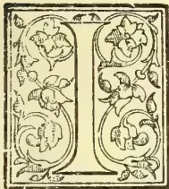

T is a pleasure to me to follow the honouring invitation of the Sub-Committee of the "Allganeer Syndicaat voor Koffiecultuur en andereberg cultures in Nederlandsch Indie" dated 12th June a.c. in giving a lecture on Supplementary Cultures.

The cultivation of *Cacao* which in the Eastern Provinces of Java may still be considered a supplementary culture is with me and other planters in Central Java a principal culture; I shall, therefore, begin with cacao; if I should have the occasion later on I shall treat successively of Liberian Coffee, nutmeg, randoe ( ? ) with pepper, and the different kinds of caoutchouc, which I know. In 1878 I became administrator of the factory at Djati Roenggo, and had for Superintendent Mr. N. de Vicq de Cumptich. Then already he recommended to the factory not to stop at one cultivation, but to grow also on their lands Liberian coffee, nutmeg, cacao, pepper and karet (?) trees. The factory did not follow his advice; they only ordered 5,000 nutmegs from Banda for Djati Roenggo, which I planted in 1879: I shall return to them later on. Djati Roenggo, he said, with its 1,500 acres can easily bear different cultivations, and he was right; what he would have started nearly a quarter of a century ago, is now done not only in Central Java but also in the Eastern Provinces. I thought this introduction necessary, as

I wanted to give the honour to my former chief, who again, about 1886, ordered a new kind of cacao, not being content to stick always to the same red Java cacao, which was cultivated here and there; whether he discovered then already the diseases in cacao tree and pods I do not know, for I did not see him again since 1885. Mr. Van Gogh, who was with me in 1898, had likewise small confidence in red Java cacao; he spoke from experience of cacao estates in Java and the rest of Nedeel, East India, which he had visited, and where the trees were suffering from the *Helopeltis* pest and the pods from a boring beetle, called *Adela*, I think. In 1884 I planted 12,000 cacao trees, which remained good till 1895, and since 1888, when I became owner of Djati Roenggo, this estate was successively planted with red Java-cacao. From 1895 until today the two diseases mentioned above kept on spreading.

In 1888 my brother brought me two little cacao plants which Mr. de Vicq ordered from Caracas, under the name of Caracas cacao. In "der Tropenplanzer," No. 7, year V, you, will find mentioned a kind of cacao growing on the western shore of Venezuela and called Caracas with splendid feeding properties and very rich in fat; further, cacaos from Guayaquil, Bahia, St. Domingo, Trinidad, Granada and Surinam with the same proportion of Theobromine. One of those little Caracas cacao plants died from rajap (?), the other grew luxuriantly and gave beautiful healthy pods, about the size of those from red Java cacao; but the young pods were white and the ripe ones orange.

In 1892 I made nurseries from the seeds and kept this on till 1896. Then the mother tree died, but two Gjangkokans (?) remained, which were sent at my request through the Colonial Bank, one to Ngrangkah and another to one of the Kawi enterprises; both trees are still alive,

\* From the "Nieuwe Gids" of 15th October, 1901.

525------------------------------------------------

506THE TROPICAL AGRICULTURIST.[FEB. 1, 1902.

What the mother-tree's name is I cannot say with certainty; according to Jumelle it should be a kind of Forestero by the pinkish break of the beans and the more flat form thereof; but, after all, the name does not matter much; only so much I know that by natural crossing of this new kind with red Java cacao a hybrid has developed. This variety grows rapidly and gives an abundance of big fruit. From the 6 to 7 year old trees I get on an average fully 5 catties (=about 7 lbs.) of marketable cacao, a (production) crop which I could not get from Java cacao. Yet, in Silowok Sarvangan, there are, as the owner, Mr. Ebeling informs me, red cacao trees from 7 to 8 years old which produce up to 6 catties (=5 lbs.) marketable cacao. At Ngoepit, I am told, in a good year, an average of 10 catties (=13½ lbs.) of marketable cacao per tree was got from red Java cacao. The seed for my own use and that of other planters whom I supply I take from my plantation of trees of first generation.

Prices of first-class cacao of this kind prepared at Samarang are more than satisfactory; although the nicest and biggest pods were sold for planting; one lot brought fl. 3.50 per picol, (1 picol about =136 lbs.) and another lot fl. 8 per picol more than first-class red cacao. A big sample of this cacao was taxed in Holland, a few years ago, at 2½ cents p. ½ kilogr. (or about Rs. 0.03 per lb.) higher than red cacao.

When I noticed that this variety resisted better the prevailing disease, I stopped planting red cacao since 1895. Yet, if you plant the Djati Roenggo variety among red Java cacao trees which were suffering from both diseases, then they were also attacked by the paloges (?); but, owing to their more robust growth these trees recover sooner and therefore resist the diseases better than red Java cacao.

In Jumelle's "Le Cacaoier" is stated that in all cacao-producing countries the "Criollo," to which class, according to this writer, also the red Java cacao has to be reckoned, is abandoned and replaced by other kinds of stronger growth. All red Java cacao trees which are poorly and much attacked by Helopeltis, are now taken out and replaced by the Djati Roenggo variety. This variety grows at Djati Roenggo ± 1,000 ft. above sea just as well as at Terwidi ± 1,500 ft., at Assinan and Tlog. ± 1,700 ft., and at Lerep about 1,800 ft. high; likewise it answers very well at Silowok Swangan, ± 75 ft. high. To my idea all kinds of soil, if not too bad, will grow cacao; at Djati Roenggo on a substrate of heavy clay and "padas," at Terwidi and Tlogo on light clay and even sand, red Java and the Djati Roenggo variety answer very well.

Cacao withstands drought well; with an East monsoon of six months' drought, nutmeg and Liberia coffee trees were already fading, while cacao, the red as well as the Djati Roenggo variety were still fresh, and even put on flush; nor did a wet East monsoon damage it at all. On poor and old soil, such as at Djati Roenggo, fully 60 years old, they grow well, of course with liberal manuring. On lands of the Eastern Provinces already ten to twenty years under coffee, Djati Roenggo will still grow beautifully; but after some time you will have to start manuring. If there is no manure to be had in the neighbourhood, one has to keep some cattle. In place of big cattle runs small grazing lands on different spots should be recommended, so as to (simplify) shorten the transport of the manure to the trees. Grass fields should be supplied; kolondjono-grass, a fine fodder, grows rapidly. The cattle should not graze later than 8 or 9 o'clock; afterwards they should be kept in the stable, so as to obtain more manure. The manure of a herd of cattle kept in this way comes to about 10 to 12½ cts. p. cubic ft., and it is good manure. The grazing fields must be fenced in with barbed wire on "randoe" trees which must be high enough to prevent the cattle from eating the highest shoots. In the beginning cacao requires good shading; it

grows very well between coffee trees, and within four years supplants both Java and Liberia coffee. While 2-year old plants of red Java cacao have an average height of 4 ft., the Djati Roenggo variety reaches fully 6 ft., and trees of 6 to 7 years old are about 20 ft. high with branches of about 9 ft.; Java cacao of the same age is about 15 ft. high with branches of 7 ft. If you do not plant the cacao in abandoned coffee plantations you may surround it with three or four shoots of dadap or "ketella pohoong" as temporary shading.

The cacao tree reaches an age of 40 to 50 years; there are here still some specimens of red cacao trees fully 50 years old; it is from these trees that the seeds were obtained for the Djati Roenggo plantations. As no dadap can live so long, at least not here, I planted Castilloa trees in between squares of 36 ft. In one plantation of Castilloa of ten years with seven-year old trees of the Djati Roenggo variety in between, both are in good condition. On estates which are not exposed to long drought, the cacao, after having once closed, does not want shading any more, but protection from wind should be provided; cacao is easier injured by wind than by sun. *Caesalpinia dagyrhachis* is also a good shade tree, which does not drop its leaves in the East monsoon.

Nurseries are made as for coffee, but I plant the seeds directly one foot from one another. The seeds are put only so deep in the ground, that one-half remains above ground, with that end where they were attached in the pod downwards. You may also put them flat on the ground, again to the middle in the ground, but there is this disadvantage, that on heavy clay and with heavy rains the seeds may be covered with a crust of clay which will hinder the upright growth in budding. I begin to lay out pits in April and May, and not later, as I want big plants; the soil here is easy to loosen ("pooteren.") If the soil cannot easily be loosened, one has to resort to baskets or pots of manure, in which you may put the pits in July or August, as I was told by planters who had no fit soil. Other planters start later towards the West monsoon; they put out the plants in nurseries and transplant them into the lands as soon as they have budded. Others again plant directly two or three pits out into the gardens; the different proves which I have taken of this way of planting have given very poor results.

In planting cacao in "pooterans" or baskets the protruding taproot may safely be cut off with a sharp knife. From my own experience I strongly object to planting "Tjaboetans," since a drought of one or two days after putting them out will surely kill the young plants. About pruning of cacao there is no agreement of opinion as yet; I am opposed to pruning; I allow free growth. After the second year shoots come out at the top, at least one; this I keep, as it makes afterwards the continuation of the stem; after a year or so the tree gives another shoot at the top which becomes stem in its turn, so I have trees already three or four stories high.

Other plants again form low on the stem two or three strong shoots, which I keep all; for their formation is, to my idea, a consequence of sickliness in the mother tree; these shoots grow rapidly and the mother tree is cut down.

Only three branches are pruned down after the first or second picking. Other planters allow no shoots, but keep the first three or four top branches, which afterwards spread as with topped trees. I have here a few specimens which accidentally grow like that, but the three or four top branches give too many secondary and tertiary branches, so that their pruning becomes a serious matter; and these branches, must be pruned to render the picking easier.

Picking gives here no trouble; the picking gang, provided with small knives on bamboo sticks, cut the ripe pods easily off, and it happens but rarely that

526------------------------------------------------

FEB 1, 1902.]THE TROPICAL AGRICULTURIST.507

they pick unripe fruit. It must not be forgotten that cacao is a stem-flowering tree, although the branches bear also a good deal of fruit. Red cacao trees bear for the first time when 3 or 4 years old; the Djati Roenggo variety already with 2 to 3 years; some trees of this age bear already up to 80 pods. The time of development of cacao from flower to ripe fruit is from 6 to 7 months.

The planting distance is here 12 feet, for bed cacao as well as for the Djati Roenggo variety; if the trees should begin to hinder one another, then one tree in the cross is pruned down to that extent that only the crown remains; the amount of stem-fruit on trees thus pruned is amazing. This practice is successfully carried out at Flogo, the only place which I know, where red cacao grows splendidly with but little damage through helopeltis; the trees stand there, as a rule 12 by 12 feet. This pruning should be done with the bursting of the West monsoon.

The cultivation of the soil is the same as with coffee; round the trees must be hacked (gepatjoold), and besides "gebabat" owing to the considerable distance of the plants. (After the trees have once closed, they will themselves kill all weeds, and only manuring is wanted.)

In selecting seed-pods I prefer pods with thin shells and many large pits. Many big pods have thick shells and few but large pits; these I rather reject. (Teysmannia, No. 4 and 5, year 12, page 216.)

#### SELECTION OF SEED FOR CACAO.

Mr. J. B. Carrutiers, who since some years is busy with investigations in cacao cultivation in Ceylon (there were formerly already some reports about this in Teysmannia) has made some important experiments about the selection of cacao seed.

He examined fully 300 pods of different sizes, and came to the result that selecting the largest and nicest pods for seed is altogether useless, as the good size of pods is very often due to heavy and thick shells, and that their size is not at all proportionate to the size, number and weight of the seeds on which all depends. A better method to improve the species is to select the trees of which you wish to propagate the seed. Trees which bear abundantly, whose pods contain many and heavy seeds and not much subjected to disease are of course preferable.—*The Tropical Agriculturist*, No. 10, 1901.

The curing is done this way: The shells are taken off in the garden, and the seeds after being "takkered" are fermented in troughs. My fermenting troughs are made of wood and placed in stories one above the other. The fresh seed goes to the first trough and remains there, covered with sacks, to the next morning, when the whole contents are emptied into the second trough twenty-four hours later this trough is emptied in the third and after another twenty-four hours the cacao is washed and left for twenty-four hours under water; after another washing the cacao is dried as quickly as possible. If the cacao should not become perfectly dry in open air (which makes a drying shed indispensable for large production), it becomes mildewy and loses considerably in value. When drying in sheds one has to take care lest the cacao which is of a nice light brown colour, should be spread directly on galvanized iron sheets, as its sour juice in contact with the fluke, causes brown spots on the pits which is the more to be feared with the light brown Djati Roenggo than with red Java cacao. To prevent this trouble I have the drying floor covered with coccematting.

About the diseases of cacao I have already spoken in the beginning. The best ways of treatment are now thoroughly investigated in by Dr. Zehntner. In order to learn the results of his investigations planters ought surely become members of the trial station at Salatiga.

Every cacao planter ought, to my idea, become a member; this would reduce to a minimum the cost per acre.

It was in order to avoid all kind of reclaim that I did not recommend the Djati Roenggo variety earlier. But as I had been requested to say something on supplementary cultures, I thought it of general interest, to make known the little I know about it.

Mr. du Bois, jr, wishes to draw attention with a few words to the conflicting advices given by different writers concerning the amount of shade which cacao needs. Mr. MacGillawry, he says, would give as little shade as possible. I should not recommend to follow Mr. Mac Gillawry too closely in the Eastern Provinces. In the literature you find, that shade, as a rule, is highly recommended, so that we, at least, are bound to give it our full attention.

The Chairman remarks that his experience coincides with Mr. du Bois. It was always in well-shaded gardens that he found the freshest trees with the healthiest fruit. But, perhaps, the climatological conditions of Djati Roenggo are different.

Mr. MacGillawry mentions the estates of Ngobo, Ngoepit and Groot Getas as instances where a good produce of cacao is obtained with little shade. He has observed that heavy shade decreases the amount of dew; he had even to thin out shade trees here and there. But before all wind-protection must be provided. Referent mentions besides that, if he had to choose between different shade trees, he would give preference to castilloa before cisselina, as the former gives some little profits.

The Chairman remarks that in the Eastern Provinces cacao seems to be more sensible for drought than in Central Java. Mr. MacGillawry relates, that with him young trees even after two months' drought are still full of leaves. But then he spends fl 16,000 (—Rps 19,200) per year on manure, and manuring begins with the planting. He uses almost exclusively buffalo and cattle manure. His lands are already for 60 years under cultivation, and, at first sight, valueless. The Chairman remarks on the probability that the trees acquire through this a greater power of resistance.

## CINCHONA ON THE NILGIRIS.

(EXTRACTS FROM ANNUAL ADMINISTRATION REPORT ON THE GOVERNMENT CINCHONA DEPARTMENT, NILGIRIS, FOR THE YEAR 1900-1901.)

The area under cultivation on the old estates is 831.46 acres and the area of the first two extensions at Hooker is 160 acres. The total expenditure on the upkeep of these 991.46 acres including the charges for head office was Rs. 50,547-7-3 or Rs. 50-15-8 per acre.

The total expenditure on factory account is detailed as follows:—

<table border="1">
<thead>
<tr>
<th></th>
<th>RS.</th>
<th>A.</th>
<th>P.</th>
</tr>
</thead>
<tbody>
<tr>
<td>Purchase of 167,200 lb. of bark ...</td>
<td>53,863</td>
<td>12</td>
<td>2</td>
</tr>
<tr>
<td>Machinery and plant ... ..</td>
<td>29,985</td>
<td>2</td>
<td>2</td>
</tr>
<tr>
<td>Manufacturing and distributing charges ... ..</td>
<td>22,785</td>
<td>1</td>
<td>2</td>
</tr>
<tr>
<td>Total.</td>
<td>1,06,633</td>
<td>15</td>
<td>6</td>
</tr>
</tbody>
</table>

The balance sheet (statement 15) shows a profit balance of Rs. 41,315-13-7 and statement 13 shows an excess of revenue over expenditure from the commencement of the plantations to date of Rs. 47,861, and, after allowing interest on receipts as well as on charges, the net surplus to date is Rs. 14,43,886.

*Dodabetta.*—The pruning that was done in 1899-1900 proved very beneficial to the trees by admitting more light and air, and during the past year the area pruned was 32.90 acres. This pruning was confined to the removal of the larger branches and extra stems in places where the trees were crowded, and in carrying out this work the importance of maintaining a good crown to each tree was kept in view. It has long been supposed that the leaves of the

527------------------------------------------------

508THE TROPICAL AGRICULTURIST.[FEB. 1, 1902.

cinchona tree constituted the laboratory in which the alkaloids are formed and this conjecture has now been proved to be corrected by Dr. Lotsy of Buitenzorg, Java. Pruning should therefore be a work carried out with caution and discrimination. In dense plantations the removal of some of the lower branches and extra stems is decidedly beneficial as it tends to the more vigorous growth of the crowns of the trees and admits more light and air to the soil, but where the trees have ample space in which to develop naturally it may be said that pruning should be left as much as possible to nature. The difficulty experienced in recent years in filling up gaps in the plantation with seedling plants, or rather the difficulty in establishing these supplies, has been so great that it was decided to make a trial with stumps of well matured plants. 36,407 of these stumps were put out in different parts of the estate in the gaps formed by the removal of old trees, and it is hoped that on account of their more vigorous root system the stumps will succeed where seedlings failed. Allusion was made in the last report to an experiment that had been made with the object of ascertaining if the protection of the stems of old trees by means of a covering of grass increased the alkaloidal value of the bark. Bark from a number of the covered stems and from a similar number of trees on the same plot, which had not been grassed, was analysed with the result that the former yielded 6.36 per cent. sulphate of quinine, while the latter gave 5.58 per cent. The increased yield of sulphate of quinine was thus 78 per cent. Taking the yield of dry bark at 4,000 lb. per acre which is low estimate, the increased number of units obtained was 3,120. The present value of the unit is  $\frac{1}{2}$ d. so that the gross increase in the value of the bark which had been covered was Rs. 341-4 0. The cost of the grassing per acre Rs. 58-2-10 so that the net increase in value amount to Rs. 283-1-2.

The total expenditure on the estate was Rs. 13,806-2-3 or Rs. 42-12-0 per acre. The crop obtained was 68,411 lbs. and the cost of the bark was therefore 3 annas 2-74 pies per pound.

A peculiar condition of the roots of some of the old trees on the estate was observed during the year. The roots were found to be covered with nodules or galls. Specimens of the affected roots were submitted to Mr. O. A. Barber, the Government Botanist, who reported that they were attacked by the root gall nematode *Heterodera Radicicola*. This nematode attacks tea and coffee and a large number of wild and cultivated plants, but its presence in the roots of the cinchona tree has not, it is believed been noticed before. The affected trees at Dodabetta do not show any traces of impaired vitality, although it is evident from the condition of the roots that the disease is not of recent date. Pot experiments are being made in order that the effect of the nematode on the cinchona plant may be better observed. Several cinchona stumps on whose roots the galls formed by the nematode were numerous were put into pots and in the same pots healthy cinchona and tea seedlings were planted. At the time of writing the stumps have thrown up healthy shoots and are growing freely and the cinchona and tea seedlings are doing well. The roots of these seedlings will be examined from time to time to ascertain if they have been attacked by the nematodes from the cinchona stumps. The disease has not been noticed among the old trees at Nedivattam, but the nematodes have been found on that estate in the roots of young plants on old land. The young plants thus affected were stunted in growth and unhealthy in appearance, a condition which was attributed to exhaustion of soil. It has yet to be proved whether the unhealthy condition of these plants was due to the attack of the *Heterodera Radicicola* or to the exhaustion of the soil by previous crops of cinchona.

(b) *Nedivattam*.—There has been a great improvement in the appearance of the trees on this estate during the year, the result of the more liberal system of cultivation that has been followed in recent years. The good effect of deep digging and the burying of weeds on 129.61 acres was well marked and the pruning of plots 21 and 23, as well as the removal of dead branches and twigs from the older trees improved the appearance of the estate. At the commencement of the year the remaining *sucrubra* on plot 2 were coppiced. These trees were the oldest of any on the Government estates, having been planted in 1862, and it is satisfactory to note that at the end of the year the young growth from the stools was healthy and vigorous. The condition of the trees on plot VII which were copied in 1879 is very satisfactory, and other copied plots on the estate show very good growth. On the Nilgiris, where the successful replanting of old land is a matter of considerable difficulty, there can be little doubt that the most profitable method of working a cinchona plantation, in order to obtain a sustained yield, is to combine the system followed in Java with that of the copice system. Close planting and gradual thinning out followed by coppicing offers a better chance of success than thinning out followed by uprooting of the trees, and a replanting of the ground which is the course adopted in Java. The systems of shaving and stripping seriously affect the growth and vigour of the trees, and although renewed bark is generally richer in quinine than natural bark the yield of quinine per acre over a series of years is greater in the case of thinning and coppicing than by either the shaving or stripping system.

During the south-east monsoon 46,400 eucalyptus plants were put out on plot XI as an addition to the fuel reserve, but the excessive rain during June, July and August caused a number of the plants to damp off and the planting was not a success. The vacancies will be filled during the coming monsoon with well-grown plants of which a considerable stock is in the nurseries.

The expenditure during the year was Rs. 15,279-0-3 or Rs. 48-8-1 per acre. The crop obtained was 64,317 lbs. at cost of 3 annas 9-61 pies per pound.

(c) *Hooker*.—The old estate has improved in appearance during the year. All sickly and dying trees were coppiced, dead branches and twigs were removed and pruning was done where it was required. The estate was sickle weeded during the monsoon and dug over before the dry weather set in. The new extensions now consist of 240 acres, of which No. 1 was planted in 1898-93, No. 2 in 1899-1900 and No. 3 during the past year. The growth of the plants on No. 1 has been rather uneven. Some portions of the 80 acres have come on very well, but the excess of moisture during June, July and August proved fatal to a certain number of plants. These vacancies will be filled in during the coming monsoon with well-grown plants raised from seed received from Java. Out of the 50 plants on this plot whose height measurements are taken quarterly, three died during the year. The average height of the 47 survivors was 7 feet 3 inches. The tallest of these plants was 10 feet 10 inches. These plants were from 3 to 4 inches high when put out in 1898 and the growth they have made in a little over  $2\frac{1}{2}$  years is very satisfactory. The No. 2 extension is more even than No. 1 and promises to do very well. The plants have made good growth and look strong and healthy. No. 3 which was opened during the year promises well. The plants were small when they were put out, but owing to favourable weather in the dry season they have already made good growth. The fourth extension of 80 acres will be planted in 1901-1902.

The total expenditure on the old estate was Rs. 5,261-3-9 or Rs. 27-2-10 per acre and the crop ob-

528------------------------------------------------

FEB. 1, 1902.]THE TROPICAL AGRICULTURIST.509

tained was 61,686 lbs., the cost of which was 1 anna 4/37 pies per pound. The low expenditure on the Hooker estate is due to the fact that it is managed by an overseer under the orders of the Superintendent of the Nedivattam estate. Taking the two estates together the expenditure amounted to Rs. 40-6-3 per acre and the cost of the bark from both estates was 2 annas 7/29 pies per pound.

**IV. MANURE.**—On the Dodabetta estate 1,875 cartloads of cattle and stable manure were put out on different plots, at Nedivattam plots 9, 14 and 28 were manured with cattle manure and at Hooker plot No. 1 was thus treated. In the last administration report mention was made of an experiment with a mixture of fish and chemical manures. The mixture consisted of 1 ton fish, 2 cwt. superphosphate, 4 cwt. of basic slag, 4 cwt. of potash and 1 cwt. of sulphate of iron. This quantity was evenly distributed over one acre and lightly forked in. The cost of the manure including the cost of application was Rs. 165-6-4. The stems of the trees were covered with grass at a cost of Rs. 58-2-10, so that the total cost of the experiment was Rs. 243-9-2. The bark of the trees thus treated yielded 6-91 per cent. sulphate of quinine, while the bark from unmanured and ungrassed trees on the same plot gave 5-11 per cent. There was thus an increase of 1-80 per cent. Sulphate of quinine. Of this increase .78 per cent. may be attributed to the covering with grass, so that the net gain from the manuring was 1-02 per cent. Taking the yield of the acre at 4,000 lbs. there was an increased yield of 4,680 units due to the manure which at the present rate of the unit (1 3/4 d.) represents Rs. 446-4 0. The cost of the manuring was Rs. 185-6-4 and the net gain was consequently Rs. 260-13-8. It was shown in paragraph 3 that the net increase in value of bark from covering the stems with grass amounted to Rs. 283-1-2 per acre, so that the total gain per acre by the combination of manuring and grassing was Rs. 543-14-10 per acre. With a unit of 3/4 d. the experiment would have shown a slight loss, but with a unit of 3/8 d. the net gain would be Rs. 93-14-10.

**V. NURSERIES.**—At Dodabetta the nurseries did well. There has been no mortality among the seedlings, the seed germinated freely and the young plants are thriving well. At Nedivattam and Hooker the nurseries are well stocked with healthy seedlings. Ten lb. of eucalyptus seed and 1 lb. of grevillea seed were put down in the nurseries in order that there may be an ample supply of plants for the fuel reserves. The Java Ledger grafts referred to in last year's report are doing well in a sheltered position on No. 2 extension at Hooker. No attempts at grafting were made during the year and it is doubtful if the succirubra seedlings will be large enough to graft upon in 1901-1902. There is a good stock of these seedlings in the Nedivattam nurseries and as soon as they are sufficiently well grown experiments in grafting will be made. 48 1/2 lbs. of seed were sold during the year at the rate of Rs. 4 per pound. The amount of officinalis seed sold was only 8 1/2 lbs.; the largest demand was for hybrid seed of which 22 1/2 lbs. were sold and the remaining 17 1/2 lbs. was succirubra seed.

**VI. CROP.**—The total quantity of bark harvested during the year was 194,414 lbs. or 54,135 lbs. in excess of the previous year's crop. The actual cost of harvesting and drying this crop was Rs. 2,678-1-0 as shown in statement 3 or 2 64 pies per pound. The crop included a large quantity of bark from prunings. On Dodabetta the result of pruning 32.90 acres was a yield of 36,933 lbs. of bark or 1,122 lbs. per acre. The bark from branches of officinalis trees does not contain more than about 2 per cent. of sulphate of quinine; but although this is a very small yield it can easily be shown that in the Government estates with a quinine factory at hand it is profitable to harvest such bark when the market value of the unit is high. With branch or other bark costing only 2 64 pies per lb.

to harvest and analysing 2 per cent of sulphate of quinine the cost of each unit is 1 32 pies. Bark analysing 1 per cent. would cost 2 64 pies per unit. The present price of the unit in the London market is 1 3/4 d or 21 pies. When pruning is being done the question arises whether or not to harvest the branch bark, and in this connection it has to be borne in mind that although the cost of the unit of quinine in such bark may be very low the cost of manufacture per unit or per lb. of quinine is, roughly speaking, four times as high in the case of 1 per cent. bark as in the treatment of 4 per cent. bark. The following statement shows that when the price of the unit in the London market is 1 3/4 d or higher it is profitable to harvest even 1 per cent. bark when it can be delivered at the factory at the low rate of 2 64 pies per unit:—

<table border="1">
<thead>
<tr>
<th></th>
<th>One per cent. bark at 2 64 pies per unit.</th>
<th>Four per cent. bark at 1 3/4 per unit.</th>
<th>Four per cent. bark at 1 3/4 per unit.</th>
</tr>
<tr>
<th></th>
<th>Rs. A. P.</th>
<th>Rs. A. P.</th>
<th>Rs. A. P.</th>
</tr>
</thead>
<tbody>
<tr>
<td>100 lbs. bark cost .. ..</td>
<td>1 6 0</td>
<td>43 12 0</td>
<td>37 8 0</td>
</tr>
<tr>
<td>Manufacture of 100 lbs. bark costs ... ..</td>
<td>10 0 0</td>
<td>10 0 0</td>
<td>10 0 0</td>
</tr>
<tr>
<td>Total cost ... ..</td>
<td>11 6 0</td>
<td>53 12 0</td>
<td>47 8 0</td>
</tr>
<tr>
<td>Cost of 1 lb. sulphate of quinine ... ..</td>
<td>11 6 0</td>
<td>13 7 0</td>
<td>11 14 0</td>
</tr>
</tbody>
</table>

The year's crop of 194,414 lbs. consisted of 144,106 lbs. crown and hybrid barks and 50,308 lbs. red bark. The total cost of the crop was Rs. 48,147 which was the whole expenditure on oil plantations and head office and the cost of each pound of bark was therefore 3 annas 11-54 pies. The amount of bark purchased during the year was one 167,200 lbs. which cost Rs. 53,863-12-2 or 5 annas 1-85 pies per pound. Statement 7 shows that at the commencement of the year the stock of bark was 305,822 lbs., while at the end of the year the stock was 350,404 lbs.

**VIII. FACTORY.**—The total quantity of bark worked up in the factory during the year was 316,469 lbs. consisting of 292,069 lbs. crown and hybrid barks and 24,400 lbs red barks. The alkaloids extracted from these barks were 7,648 1/2 lbs of sulphate of quinine and 2,972 lbs. of febrifuge or a total of 10 620 1/2 lbs. The output was 4 182 1/2 lbs. less than in the previous year, the reduction in the quinine output being 2,539 1/2 lbs. and that of febrifuge 1,643 lbs. The consequence of this reduced output has been an increase in the cost of the products obtained during the year.

At the close of the year 1899-1900 there remained a balance of 14,400 1/2 lbs. of quinine and 13,213 lbs. of febrifuge in store. The issue of quinine and febrifuge during 1899-1900 were 7,378 1/2 lbs. and 2,676 1/2 lbs. respectively, so that with a normal demand there was in store about two years' supply of quinine and five years' supply of febrifuge. In these circumstances the opportunity was considered favourable for taking the preliminary steps towards a radical change in the working in the factory. No fusel oil was purchased during the year, and the sum provided for its purchase was utilised in procuring an entirely new and up-to-date quinine manufacturing plant. The reserved stock of fusel oil was used for manufacture and although it was found that there was not a sufficient stock of this oil to manufacture 10,000 lb. of quinine, it was considered better that the large stock of quining should be drawn upon than that an extra supply of oil should be procured. The oil to be used in the new factory is shale which

529------------------------------------------------

510THE TROPICAL AGRICULTURIST.[FEB. 1, 1902.

is very much cheaper than fuel oil, but the machinery in the old factory is not adapted for shale so that when the stock of fuel oil ran out the manufacture of quinine had to be suspended. The introduction of the new machinery, which is now in course of erection, was not practicable without some interference with the work in the old factory but it is confidently expected that the saving effected by the introduction of new and improved machinery will amply compensate for the extra cost of the quinine and febrifuge made during the past year. The quantity of bark purchased during the year from private growers was 167,200 lb. and the price paid was Rs. 53,863-12-2 or As. 5-1-8½ per lb. The outturn of sulphate of quinine from this bark which was of poorer quality than that purchased in 1899-1900 was 278 per cent. so that the price paid for each unit was As. 1-10-24. The average price of the unit in the London market during the year was 2d. In 1899-1900 the average cost of each pound of bark purchased was As. 5-2-13 and the cost per unit of sulphate of quinine was As. 1-6-16. The estate crown and hybrid barks (including the bark from Bikkatti) which were worked up amounted to 124,869 lb. These barks yielded 2-39 per cent sulphate of quinine, the average cost of the bark was As. 5-4-57 per lb. and the cost of each unit of sulphate of quinine was As. 2-3. The poor quality of the bark is explained by the fact that the greater portion it was from sickly and dying hybrid trees copied at Hooker and Nedivattam prior to 1899-1900. The high cost per pound of bark is owing to the small crops taken in 1897-98 and 1898-99 and this high price taken together with a low quinine yield raised the cost of the unit per pound of bark and the cost of the quinine. At the time when bark was to be purchased at ¾d. per unit it was considered advisable to husband the resources of the estates by taking small crops. The consequence was naturally a high price per pound for the bark harvested in those years. If this high priced bark had been worked up at the time when cheap bark was being purchased the average cost per pound and per unit of all bark worked up would have been low, but as it has been manufactured when bark was purchased at a comparatively high figure, the result is an increased cost per pound of quinine. It is proposed to so regulate the cost of the estate crops in future with reference to the price paid for purchased bark that there may be no great fluctuations in the cost price of the quinine from year to year. When the market price of bark is high the plantations should be made to yield a large crop a low cost and this low-price bark should be worked up with the higher priced purchased bark. When bark can be bought cheaply, a smaller crop of more expensive bark can be taken from the plantations and worked up with the cheaper purchased bark. During the past year the cost of the quinine in the crown and hybrid barks used in the factory was Re. 12-8-6 per pound before manufacture.

### BANANAS UNDER IRRIGATION.

**STRUCTURE**—The banana is a herbaceous plant, that is, the stem is composed of green, fleshy matter, as opposed to the woody substance of a tree. The true stem is underground, as in the great family of lilies, to which the banana is closely allied. What we call for convenience sake the stem is composed of the bases of the leaf stalks.

**THE TREE CUT OVER**—When a banana tree is cut over, we can clearly see the method of its formation. Taking from the centre and working out, we find leaves tightly rolled up, or in the case of more mature trees the continuation of the flower stalk; then what appear to be cells, but are really intercellular spaces, enclosed by walls made up of cells proper. These spaces increases in size as we approach the outer part of the tree.

**LEAVES**—The leaves are long sometimes as long as fifteen feet, with a distinct channel down the middle. They come out of the stem rolled up as we have seen, unfold, and in the case of the earlier leaves, finally break down and dry up; their bases going to make up the stems. In the earlier stages of its growth, the tree sheds off the outer coverings formed by the bases of its earlier leaves, as it increases in girth.

**THE FLOWER**—The flower comes out from the stem, from what is generally called the heart, in appearance just like a cob of corn. It is enclosed in an envelope or spathe, which envelopes the whole bloom. Immediately prior to the appearance of the flower, indeed almost immediately simultaneously with it, we see a short leaf, from one to four feet long, which seems designed to hang over the bunch and protect it from the direct rays of the sun.

**THE HANDS**—The first spathe fallen, we see a bract concealing at its base the object of most interest to the planter, the first hand. This consists of the female flowers, as do its successors in varying numbers according to the size of the bunch to be, Bract after bract drops off disclosing hand after hand, this process continuing till the bunch is ripe. Taking a nine-hand bunch as an example we find, the first nine-hands composed as has been stated, then two or three hands of hermaphrodite flowers; and then a succession of pollen-bearing flowers. These may easily be recognised by noting the difference in length between the ovaries, or apparently solid green parts at the base of the flowers.

**FERTILIZATION**—This arrangement of the flower seems to make cross fertilization certain; as, when the pollen-bearing flowers are exposed nearly all the upper flowers are past the stage when they can be fertilized.

**FRUIT**—Any description of the fruit would be unnecessary, except to state that many fingers contain undeveloped seeds. In some cases, these seeds are no doubt fully developed, and experiments are being made as to the possibility of raising different varieties from seed, with a view to improving the productiveness and general utility of the banana. One point of interest in connection with the fruit is that at first they stand out at right angles to the stem and afterwards turn up.

**ROOTS**—The root is fleshy, containing little fibre. Hence we see the importance of a free open soil. It branches little. The branches are covered with fine, hair-like rootlets, which are the feeders. Cutting the ends of the roots tends to increase branching, and to increase the number of hair-like roots, and therefore the feeding powers of the root system. The underground stem or bulb is a white mass, composed of fibre. From this are given off the suckers by which the plant is propagated. In their earlier stage, these suckers feed on the parent, at the same time putting out roots for themselves; and when the parent is cut down feed on the reserve laid up for them in the bulb. Such then is a general description of the plant. The Botanical Department have 21 varieties of the banana growing at Hope Gardens, That cultivated in Jamaica is the Martingue variety.

**SOIL**—In his "Text Book of Tropical Agriculture," Dr. Nicholls gives the composition of the best soil for bananas as follows:—

<table>
<tbody>
<tr>
<td>Clay</td>
<td>..</td>
<td>..</td>
<td>40</td>
<td>Per Cent.</td>
</tr>
<tr>
<td>Lime</td>
<td>..</td>
<td>..</td>
<td>3</td>
<td>"</td>
</tr>
<tr>
<td>Humus</td>
<td>..</td>
<td>..</td>
<td>5</td>
<td>"</td>
</tr>
<tr>
<td>Sand</td>
<td>..</td>
<td>..</td>
<td>52</td>
<td>"</td>
</tr>
</tbody>
</table>

100

This he classifies as a rich loam with lime. The banana will, however, grow on very poor soils, producing inferior bunches; some containing only three fingers. The soil described above would be free and warm, two qualities indispensable for the

530------------------------------------------------

FEB. 1, 1902.]THE TROPICAL AGRICULTURIST.511

best growth of the plant. Good drainage is a necessity. Wherever stagnant water is present, the leaves take on a reddish-yellow appearance the bunches are inferior, ripening before they fill out properly; and the whole structure of the plant is weakened.

**CLIMATE.**—The banana requires a good supply of moisture and a good deal of heat for its proper growth. Well sheltered valleys are very suitable. While it thrives best under such conditions, it will also grow at a considerable height above the sea, though in such cases taking longer to bear.

**SANTA MARTHA.**—I had an opportunity some three years ago of seeing what may be called a banana planter's Paradise. This was at Santa Martha, Republic of Columbia. Imagine a stretch of level land, a free soil, rich in vegetable matter accumulated through centuries of luxuriant growth, an intense heat, frequent showers of rain, and a wind-break in the shape of a mountain range running up to a snow-capped peak 17,000 odd feet high—this is a place not to grow bananas, but for bananas to grow themselves! Acres upon acres with not a broken leaf what a contrast to this wind-swept irrigation district of St. Catherine? Immense trees with huge bunches met the eye on every side. One part in particular struck me very much. For about three months in the year, irrigation is sometimes needed. This is necessary to be kept in mind in order to understand what follows. The main plantations are situated at Rio Frio, where at the time of my visit about 800 acres were in cultivation.

A few miles further inland, a piece of land was thought suitable for cultivation without irrigation; and about 250 acres were planted out. I saw some mahogany logs taken from this land. They averaged four feet in diameter, by about 16 feet long. One crop was taken off, and then a long spell of dry weather set in, with the result that the cultivation went to pieces and was abandoned. Some two years after, seasonable rains having fallen in the meantime, the land was inspected. When I visited the place, a gang of labourers were busy bushing out the tangle of weeds that had sprung up, and thinning out the tremendous growth of banana suckers. Huge bushes hung all around, and everything promised for as heavy a spring crop as one could desire—and this without care of any kind. A planter there told me that two-thirds of the bunches were cut in the spring months, as a result of the natural growth of the bananas. I should think it possible to bring in 90 per cent. of the crop in these months. Least anyone should feel inclined to pack off bag and baggage to Colombia. I might mention that on the other side of this very bright picture there is the spectre of revolution, with its consequent stoppage of trade. Thank goodness we have peace and quietness here, if we have not such rich land.

**CLEARING LAND.**—On the system of cultivation to be followed depends the method of clearing the land. Everything is cut down, as shade is detrimental to the banana, causing an undue growth of stem and leaves and a poor bunch. The wood and brushwood are burned or carried off. This leaves the stumps, which will hinder the use of the plough and cultivator; but where hand cultivation is to be followed, the stumps are rather an advantage as their gradual decay keeps up the supply of humus in the soil, and assists drainage.

**STUMPING.**—Where the plough and cultivator are to be used, it is really better and cheaper to stump the land from the commencement. This sounds rather formidable, but it is after all easier than digging the stumps after the lapse of a few years, the weight of the tree helping to uproot itself. A relative of mine who settled some fifty years ago in New Zealand described to me how he uprooted a large tree to make room in his garden. Choosing the side of the tree which appeared to be the heaviest, he cut off the larger roots on that side, thus removing the support. Tracking out the larger roots on the other side, which now had the strain on them, he began cutting through them. Very

soon the strain proved too much; there was a rending of roots, a tremendous crash, and there lay the tree with its roots in air, leaving behind it a hole large enough to contain a cart and horse, at a small expenditure of time and labour, considering the size of the tree.

**COSTA RICA.**—A Costa Rican planter told me that he merely cut down the forest and burned off the lighter wood, leaving the rest to rot. This plan, however, could only be followed where the natural conditions favour the quick rotting of the wood. It is to be preferred where practicable, as it adds a very large amount of humus to the soil, which would be lost where burning is resorted to.

**PLANTING.**—Cleaning up being finished, the land is fitted for planting. Where irrigation is used, it is usual to follow the lay of the land for convenience in irrigating. Various distances apart are used, 7-6 x 7-6, 8 x 8, 6 x 10, 7-6 x 15, 12 x 12, 14 x 14, 15 x 15, 16 x 16, 24 x 12 being the favourites. Various opinions are held as to the most economical distance at which bananas should be planted. I think the planter should be guided by circumstances. Where a method such as 7-6 x 15 is adopted, I would recommend that the wider distance should run north and south, so as to admit the sun. My own experience shows that in establishing bananas in hot land, close planting is the best method, say 8 x 8. Once the bananas are established, every other row can be taken out leaving them 8 x 16.

**HOLLS.**—I have found it advisable, when the land has not been ploughed, to dig fairly large holes, say 18" x 18" x 12", so as to give the suckers a good start.

**SELECTION OF SUCKERS.**—The selection of suckers is a most important point, and one which will repay closer investigation than it has hitherto received, as on this depends the vigour of the young suckers and in a measure the strength of the stool or root. Selection of seed, cutting, stock, and bud will always repay the careful cultivator. Small bulbs contain little nourishment for the growth of the young suckers; very large bulbs throw up too many young suckers; which are apt to be weak. I have found true eye suckers from six to eight months old to give the best results, as they generally possess very vigorous eyes and contain a large amount of nourishment, possibly that which would go to make the final bulk of the tree, and part of the material from which the bunch is formed. Where the centre sucker is allowed to grow, fair bunches may be looked for, which is not the case where indifferent suckers are planted. Then again, a quicker return will be got, entailing a lessened cost of upkeep in cultivating, weeding and watering.

**SPLIT SUCKERS.**—Personally, I have never tried planting split suckers, but do not consider this a good method. I have seen half an acre planted this way, the results not being satisfactory.

**POSITION OF SUCKERS.**—The suckers are generally placed upright in the hole. Some lay them in slanting, even right on the side. This, too is a method hardly to be recommended as the natural growth of a sucker is to turn up, and not to grow straight up from the eye. Then when the eye sucker has exhausted the nourishment in the bulb, the latter, or the greater part of it, rots off, leaving a hole. This makes the stool liable to damage from wind, as it weakens the hold on the ground. The earth is raked into the hole, and preferably over the sucker, so as to protect it from the drying influence of the sun, and consequent loss of moisture. The soil should be moist when planting is being done. If, however, dry weather prevails, and the suckers are found to be slow in making their appearance, irrigation may be started, care being taken not to put on too much water, which is apt to rot the bulbs.

**TRENCHING.**—Trenching should immediately follow, or even precede planting, so that the young suckers may not suffer any check to their growth from want of water. The method of laying out a field for irrigation is very simple. A main trench is dug from the point of intake, and led along the highest

531------------------------------------------------

512THE TROPICAL AGRICULTURIST.[FEB. 1, 1902.]

part of the land; sub-mains branch along the minor ridges, giving off smaller mains and twigs where necessary. Care should be taken to run the twigs, so that the water may thoroughly wet the soil without saturating it unduly; and also that the water should not run so quickly as to scour the land. Forcing the water along the twigs should be avoided, as it leads to ponding, which is detrimental to the plants and a waste of water; besides settling the soil and making erosion faulty. Various methods of overcoming minor difficulties will suggest themselves by practice.

SANTA MARTHA.—In Santa Martha a different plan is adopted. The land is divided into squares by means of banks, the squares being larger or smaller as the land is flat or slopes sharply. The upper squares are filled with water, which is then allowed to run into the next set, and so on to the lower part of the field. This is really flooding the land, and is apt to cause water-logging. This system is called "catch-work" irrigation. The object of irrigating is to put sufficient water on to the land to supply the plant with water and to render the plant food in the soil soluble and so available to the plants. Any water put on in excess of the necessary quantity is, I take it, wasted, is apt to wash out, through drainage, part of the plant food from the soil, and to deteriorate the carrying qualities of the fruit. It is therefore important that a method should be followed which will enable the planter to wet the land without bringing it to the saturation point, and to ensure that, the water being put on, it is not evaporated too quickly by the action of the sun and wind. This brings us to the important question of cultivation.

ACCUMULATION OF ALKALIES.—Before dealing with this, it may be well to point out that with intensive cultivation there is some danger of the rising water in the soil leaving behind it on the surface an excess of salts which will prove injurious to vegetation. In the more extreme cases, such lands are known as "alkali lands." For full information on the subject, I would refer you to the "Bulletin" for March 1901. The remedy for such a condition is good drainage, and an occasional excess of moisture, such as we get during the May and October seasons. Danger from this source is hardly to be apprehended in this district, however, though in one case it actually occurred to my knowledge. This was on a piece of land recently taken up, which from its location was naturally adapted to the accumulation of alkalies. A cure was effected by digging a deep drain at the lower end of the field, thorough ploughing, and a free use of irrigation water. The water in the drain ran brackish for a time. In such a case it is of course highly necessary to stop the application of excess water as soon as the accumulated salts have been washed away. Continuation of the process beyond this point would result in washing away much valuable plant food.

CULTIVATION.—The object of cultivating the soil are to destroy weeds, to loosen the soil to admit air and moisture, to keep the soil at a fairly even temperature, to admit the free passage of roots, to assist drainage and the escape of surplus water, and to assist the retention of moisture in dry situations.

WEEDING.—The prevention of the growth of weeds is an important point, as every weed, however small, is busily engaged in pumping up water from the soil, and robbing the cultivated plants of the moisture and mineral substances which are absolutely necessary for their growth. Where cultivators are not in use, the hoe is the most useful implement for the purpose; but the use of cultivators will be found cheaper and better, besides giving better results as regards yield and quality of fruit.—*The Journal of the Jamaica Agricultural Society.*

(To be concluded.)

## IMPORTATION OF INDIAN ORANGES.

The late Minister for Agriculture, Mr. C. Sommers, having submitted to the Department of Agriculture

the following paragraph relating to the famous Sylhet orange of India, the matter was referred to Mr. Despeissis, the viticultural and horticultural expert of the department, whose report also follows:—

Our orange-growers should endeavour to obtain seeds of the famed Sylhet orange. Dr. Bonavia, in the *Gardeners' Chronicle*, says that this fine variety is grown solely from seed in Eastern Bengal, and is sent in large numbers to Calcutta. The tree is an upright grower, the fruit is of the loose-skinned kind and of fine quality. At Shalla, amongst the hills, there was an orange-garden of about 1,000 acres, and one might walk for a good hour or two, always under the shade of orange trees, without reaching the limits of cultivation. Ripe oranges of this variety were sent from Lucknow to England, and although the fruits decayed on the way, the seeds remained fresh; they were sown, and a number of plants were the result. The seedlings fruit in five or six years. As the Sylhet orange is to be had in many parts of India, there should be no difficulty in obtaining seeds, and there seems no reason why this variety should not do well in Australia.

Oranges grown from seeds, seldom reproduce without altering the characteristics of the parent plant, the flowers being often cross-fertilised by bees and other insects. The "Sylhet" of Calcutta is, however, one of the varieties which show fairly constant results when raised from seeds. The Director of the Botanical Garden at Calcutta, would, I dare say, undertake to forward to this Department a few cases of Indian oranges, and also a Wardian case with plants raised from layers from trees noted for the excellence of their fruit, or raised by budding on seedling trees. There are several varieties of Indian oranges I would like to see introduced, and a case each of the following varieties could be shipped to Western Australia. The fruit should be carefully picked and clipped at the stalk and not pulled; it should be well cured, but not fully ripe, and should be free from punctures caused by thorns or, by scale insects. The cases should be firmly packed and each fruit wrapped up in tissue paper three or four days after picking, so as to rid the rind of any surplus moisture, and thus minimise the chances of bruising. These oranges would be about 18 days in transit, and should land in good order at Fremantle.

(1.) The "Sylhet" of Calcutta, derives its name from the station of that name in the Khosia Hills of Eastern Bengal, where it is said to be generally propagated from seeds. The "Sylhet" is a tall upright tree and belongs to the "Suntolah" group of loose-skinned oranges; as does also,

(2.) The "Nagpore" of Bombay, which is much like the "Sylhet;" the tree of this variety however, is of a spreading habit. Both are excellent varieties for exportation.

(3.) The "Suntolah," a very small but extremely sweet orange, which grows wild in the hot, humid part of India, between the Himalayas and the Ganges. Naturally, it requires very little attention. It is sweet almost before it is quite yellow.

(4.) The "Keonla" greatly recommended on account of its lateness. Long after the oranges have been gathered the "Keonla" hangs on the tree, when it turns a beautiful dark red colour and only then becomes sweet.

(5.) The "Mussembi" brought from Poona and sold in Bombay. It is said it can be left to hang on the tree for a whole year without hardly deteriorating. The fruit is orange yellow, and shows longitudinal furrows from stalk to eye.

The Minister having approved of the expert's recommendation, the Secretary of the Department of Agriculture has communicated with the Director of the Botanical Garden, Calcutta, to procure both fruit and plants of the varieties enumerated in the above report, and ship them to Perth.

On arrival of the fruit they will be submitted to leading growers and dealers, and thus an opportunity will be afforded of comparing some of the most famous oranges from oriental stock with the varieties from Portuguese origin mostly cultivated in Australia.—*Journal of the Department of Agriculture of Western Australia.*

532------------------------------------------------

FEB. 1, 1902.]THE TROPICAL AGRICULTURIST.513

## THE EFFECT OF FORESTS ON THE CIRCULATION OF WATER AT THE SURFACE OF CONTINENTS.\*

The whole of this subject is exceedingly complicated, because it depends largely on a number of elements liable to vary widely within narrow limits of time and place. It is thus difficult to frame any rule of general application, and for the present the enquiry must be limited to defined localities in the hope that a large number of observations continued for a long series of years, and the progressive improvement of scientific methods, may eventually permit of their being combined into one harmonious whole.

The subject, "circulation of water at the surface of the soil," must be understood to include movements in the atmosphere, as well as in the soil and on its surface. The water in the soil may be more or less stagnant if the subsoil strata are level and impermeable.

It may now be considered a fact that large forests in the plains do indeed act like hill ranges as regards the precipitation of moisture.

Numerous experiments carried out by the Ecole Forestiere of Nancy in the Foret de Haye, by M. Fautrat in the forest of Halatte, by M. de Pous in the forest of Troucais, also in Germany, Austria, Russia, and even in India, show clearly that more water falls on forests than on the open lands adjoining. The difference is not very great, but may be 12 to 20 per cent.

The additional height due to the trees seldom exceeds 130 feet, and is often only half as much. The effect is nevertheless noticeable. Throughout the year, but especially during the moisture seasons, the forests evolve a considerable amount of humidity into the atmosphere, and so render valuable assistance to the surrounding crops. If this were visible as fog, it would be seen that apart from wind, each forest gives rise to a moist and cool layer extending, as shown by ballooning experience as high as 4,500 feet. Resinous species liberate more water than broad-leaved ones. The tree crowns prevent a portion of the rain from reaching the ground at all. This quantity instead of being carried away by the streams, is re-evaporated and passed on further in the atmosphere, and so does double duty. Sooner or later this mass of moist air meets a current at a different temperature, and the result may be that the same water falls a second time as rain in a different place. Hence a country possessing a fair share of forests can pursue agriculture under much more favourable conditions, and a country without forests, like the Deccan, Central Asia, and parts of America, is in a fair way to become a desert. Consequently the creation of forests in the plains is hardly less a measure of expediency than in the mountains, and the expediency is greater when the plains have naturally a light rainfall. Engineers, even of eminence, especially if interested in irrigation, will dispute this, but they do not know everything any more than foresters do, and the foresters' side is the side of safety. The question divides itself into two parts, plains forests and hill forests. In the former the benefits desired are largely atmospheric, in the latter they are rather in the direction of protecting the soil itself and of regulating the flow.

### I.—PLAINS FORESTS.

What becomes of the atmospheric precipitations ?—

- (a) part is retained and evaporated from the trees, &c.,
- (b) part is evaporated on or in the soil,
- (c) part flows away along the surface and streams.

- (d) part soaks into the soil up to saturation point,
- (e) part is absorbed by plants for their growth and transpiration,
- (f) the remainder sinks to lower levels, where it either forms subterranean reservoirs or percolates till it again comes to the surface as springs.

Calling R the total rainfall—

$$R = a + b + c + d + e + f.$$

On a level plain there is no surface flow, and the equation becomes—

$$f = R - (a + b + d + e.)$$

In the simplest case, that of a perfectly bare plain, *a, c, e* becomes zero, and the equation is

$$f = R - (b + d.)$$

Of all these factors the only one that can be measured with any-thing like accuracy, is the portion *a* evaporated off the trees. Even this factor, according to the Mariabrunn observations, is liable to very considerable errors of determination, since no two rain-gauges will give the same readings even under the same tree. It is necessary to employ a large number of rain-gauges, including some embracing the trunks of the trees. Even employing 20 rain-gauges, totalling 10 square feet of opening, the probable error is at least 1 per cent. of the fall. The measurements should be made either (1) for each individual shower, (2) for a long series; (3) by grouping the showers according to their intensities.

It has been found in Europe that a broad-leaved forest prevents 1 to 3 tenths, and a conifer forest as much as 5-tenths, of the total precipitation from reaching the ground at all. But these figures hold good only for those localities where they were obtained. In countries where the rainfall is heavy and continuous, the forest soil in any case will be about as thoroughly watered as a bare soil.

All the other fractions, *b, c, d, e, f*, composing the total fall, are still very undetermined in forests and other lands alike, and they vary so much with every possible local difference that they are hardly likely ever to be capable of satisfactory measurement.

Reasoning from the known facts that, in spite of obstruction by the crowns, the forest soil is as well watered as the soil outside, and that the evaporation in a forest is much less as proved by the greater moisture of the surface soil; it was supposed that forests contributed more than anything else to the maintenance of subterranean supplies (level plains are still referred to). The results obtained in Russia, therefore, came as a great surprise. Soundings taken during the growing season (1st June to 1st September) inside and outside the forest of Chipoff (Government of Woronej) showed that the water level below the forest was some 32 feet lower than outside. In the Black forest (Government of Kherson) the level was some 12 to 16 feet lower. Presumably these figures are extremes for the following reasons—(1) the measurements were taken at the season when transpiration is greatest, (2) they were made in localities where the rainfall was only 12 inches in the year, where there was as a probable natural consequence of the dryness an almost complete lack of natural forest, and where consequently the forest would have to pump all it could in order to maintain itself. An increase of forest area would probably reduce the necessity for so much pumping by the roots. The experiment was repeated by M. Ototzky much farther north, under the 59th degree of latitude, in the Government of St. Petersburg, where the climate is cooler and moisture and the rainfall averages 20 to 30 inches. The subterranean water is plentiful, yet again, the forest lowered the level, but this time only by 20 to 46 inches. In order to check the Russian results, an experiment has been started by

\* Derived principally from an article by M. E. Henry in the *Revue des Eaux et Forêts*.

65

533------------------------------------------------

514THE TROPICAL AGRICULTURIST.[FEB. 1, 1902.]

the French forest officers in the forest of Mondon, near Luneville. It is a level forest of about 5,000 acres situate on a low plateau formed of alluvial sand gravel and pebbles. Eleven sound-holes were bored, in 1899, six in the forest and five outside. The water level was found to be lower in the forest by 6 to 64 inches during the season of active growth. This result confirms the Russian observations and accords with the known facts concerning the action of forests in drying up swamps and stagnant subsoil waters.

Nevertheless it would be a great error to jump to the conclusion that plains forests always and in all countries lower the level of subsoil waters. It has in fact been shown by Mr. Ribbentrop that near Trichinopoly wells, 6 to 10 feet deep inside the forest, held water throughout the dry season, whilst the river beds and wells, 15 feet deep outside, were dried up. Each locality must be studied under its own conditions. In a general way it may be said that plains forests render service of various kinds:—

(1) They dry up swamps and malarious places, as, for instance, the Landes, the Sologne, the Pontine marshes, and many others.

(2) They suck up from great depths water which is otherwise not utilisable, and cause it to again circulate in the atmosphere where it forms fresh rain.

(3) They do not injure the springs, since there are none in level plains where man is obliged to have recourse to irrigation. They may lower the subsoil water level to a degree which is seldom serious if the rainfall is enough to be of any practical use to the crops.

(4) They cool and moisten the air and render showers more frequent during the growing season.

#### MOUNTAIN FORESTS.

A rainfall chart bears a great general resemblance to a contour or relief map, the more the hills, the more the rain. In reality the rainfall is more complicated. All mountain chains show rain maxima, and these maxima are very generally proportionate to the elevation. There is more rain at 6,000 feet than at 4,000, more at 4,000 than at 2,000, and so on. Even small elevations suffice to attract an appreciable maximum. Wooded mountains are still more effective, especially in the summer months. Mountain forests are mostly coniferous, and conifers exercise an influence even more powerful than that of broad-leaved forests. A forest is always covered by a great layer of moisture which is there none the less, though it is not visible as mist. Whence comes all this vapour? Is it due to evaporation from the leaves, or is it produced by some action of the millions of points of the pine needles? Science cannot tell, but the effect is certainly not due to transpiration alone. Transpiration is indeed less active in conifers than in broad-leaved species, and it would consequently be expected that the former would give rise to a smaller layer of invisible mist than the latter, but the contrary is the case. The cause must therefore be sought in the soil or in some other unknown factor. One cause may be the soil, but another is surely to be found in the greater portion of the rainfall that is intercepted by conifer crowns. It was shown in France that in 1876 the conifer forests intercepted and restored to the atmosphere over 100,000 cubic feet more water per acre than the broad-leaved forests. Other years have given even greater differences, and there are no means of making exact measurements, but there is no doubt that wooded mountains attract more rain than bare ones.

In all Europe, Spain is the country that gets least rain. Notwithstanding the great mountain chains running up to 10,500 feet in Grenada, Murcia, &c., the rainfall of July and August is not half an inch. If these mountains were wooded instead of being absolutely bare, the South-east of Spain would not suffer so much from drought, and

the country would not have had to deplore the disastrous floods produced in Murcia by the Segura. Spain is at last awake to the fact, and has undertaken a series of reboisement works, an account of which was read at the international Congress of Silviculture of 1900 in Paris by M. Ricardo Codorniz, Chief Engineer thereof. There is plenty of moisture in the sea breezes, but nothing to condense it on to the hot mountains. In the mountains the rainfall is divisible into the same kinds of fractions as in the plains, with this difference, that the proportion of surface flow, being zero in the plain, becomes considerable on the mountain. The quantities  $a$ ,  $b$ ,  $d$ ,  $e$ , may first be examined. The quantity  $a$  has not been directly determined, and the plains results cannot be quite applicable on account of the preponderance of snow, and the great differences of intensity and distribution. The evaporation from the soil surface  $b$  must be less than in the plains, because the temperature becomes lower as the altitude increases. For the same reason the water fixed in or evaporated by the plants,  $e$ , is also less, as may be verified by the proportion of ashes. The growing season is shorter and heat less great. Consequently the transpiration is less and the quantity of organic matter formed annually per acre is smaller. At Aschaffenburg (400 feet) a thousand beech leaves will cover about 35 square feet, while at 4,000 ft., near the upper limit of the species, the same number of leaves will only cover about 9 square feet. The percentage of ashes and the total weight are also less, being 4.03 per cent. for beech and 3.53 per cent. for spruce, against 9.91 and 10.19 respectively. Even the grass at high levels contains one-half less ash than in the valleys.—*Indian Forester*.

(To be concluded.)

## THE FERMENT OF THE TEA LEAF, AND ITS RELATION TO QUALITY IN TEA.

(Continued from page 452)

#### EXTRACTION OF THE FERMENT.

Their discovery in the present instance was doubtless much delayed by the presence of the large amount of tannin in the tea leaf, which makes it difficult, if not impossible, to extract the ferment unless special means are used to previously remove this tannin. My final method was as follows:—A known quantity of leaf (10 grams of fresh or 6.6 grams of withered) was ground up to a pulp, and then hide powder (5 grams) was added and the mixture thoroughly ground together. This hide powder has the faculty of removing the tannin from the liquid in which it is present. When a known quantity of water was added, therefore, the tannin having been removed from solution by the hide powder, the enzyme was allowed to exude into the liquid. After standing for two hours the whole mass was pressed through cloth, and all the extractable part, at any rate, of the ferment was obtained in the liquid thus squeezed out. On the addition of alcohol the enzyme was deposited as a slimy mass, which on being again dissolved in water and filtered, gave a clear liquid containing the ferment required. If it was wished to determine its quantity use was made of the fact that on addition of "guaiacum resin tincture" a blue colour was produced, and by measuring the intensity of this blue colour the relative quantity in two similarly prepared solutions could be ascertained. Further it was found that all the enzyme thus extracted was by no means equally active, and that it could be divided into two parts one of which gave the blue oxidation product with "guaiacum resin" alone, and the other only in presence of a small amount of hydrogen peroxide. In this report I have called the former of these "active enzyme," and the whole present, includ-

534------------------------------------------------

FEB 1, 1902.]THE TROPICAL AGRICULTURIST.515

the latter, "total enzyme," though probably a part of this does not exist ready formed in the leaf, and may hence be known as "zymogen" or "pro-enzyme."

#### OXIDISING ACTION OF THE FERMENT.

After isolating these substances the first question would naturally be as to what effect they have when added to fermenting tea leaf. The experiment was therefore made, and it was found that the leaf coloured more quickly in their presence and at the same time the colouring proceeded normally. The same happened if tea juice instead of tea leaf was taken. It may therefore be taken that the ferment which I have isolated does play a part in the fermentation of the tea. This was confirmed by its action on several other easily oxidisable substances. Pyrogallic Acid, for instance, coloured (*i. e.*, oxidised) with great rapidity in its presence. Hydroquinone did the same. So that we have here an oxidising enzyme or oxidase, present in the tea leaf, capable of causing increased rapidity of fermentation in the tea, and capable of oxidising various easily oxidisable substances like Pyrogallic Acid and Hydroquinone.

#### EFFECT OF HEAT, &c., ON THE FERMENT.

The next point appeared to be to ascertain the effect of heat upon this oxidase, especially as this has an important bearing on the temperature necessary to stop the fermentation at the commencement of firing. It was found that a temperature of 160-165°F. had no appreciable effect in three minutes, that at 176°F. the oxidase was partly destroyed on the same time, but it was not till over 180°F. was reached that the ferment was completely destroyed in this period. On the other hand its activity is considerably modified at a much lower temperature. I could not ascertain the precise point at which it ceased to be effective, but while very active at 130°F., it was much more feeble at 143°F., and doubtless at a very short distance above this it ceased altogether to exercise its functions. It is therefore absolutely necessary that the whole of the tea in the drying machine (and not merely the machine, thermometer, which is a very different thing be raised considerably above 150°F. immediately on putting in the firing machine, and to ensure the destruction of the ferment at least 180°F. should be reached. This is of course what is attained in the best practice, but the reason and necessary for it become obvious when considered in the light of the above observations.

The effect of various chemicals on the oxidase was next considered. It acts best in slightly acid solution, but if this acidity be increased especially with mineral acids, beyond a small amount, all action ceases and the enzyme may be destroyed. 4 per cent. of Sulphuric Acid in a liquid was sufficient to absolutely destroy the ferment at once. 04 per cent apparently hindered all oxidising action. To organic acids such as those which occur in tea juice it was much less sensitive, and 3 per cent. of Acetic Acid were required to destroy it in 2 hours. Alkalies were less effective, but here 3 per cent. of Ammonia or Caustic Potash were sufficient to practically destroy the active part of the enzyme after four and a half hours. The result in manufacture of these observations I have not as yet been able to ascertain. Whether it may be wise or practicable to make up the leaf to a certain definite acidity, being the point at which the ferment was most active, before fermentation, one cannot at present say. It is well known that Hydrochloric Acid added to the roll softens and weakens the liquor,\* but in this case the acid itself is objectionable, and we have no record of the amount added. This is a matter for experiment.

#### DISTRIBUTION OF FERMENT IN THE FLUSHING SHOOT.

If the various leaves on a flushing shoot be taken, the amount of enzyme is by no means the same in every part. The fresh leaf, for instance, contains about an equal amount in the unopened tip leaf and in the stalk, but below the tip the percentage decreases in every leaf. Taking the leaf as plucked, for instance, on a China-hybrid bush in September, the following table gives the relative amount present in each leaf separately, calculated both on the fresh leaf and on the dry matter in the leaves (taking that in the tip leaf as unity):—

<table border="1">
<thead>
<tr>
<th rowspan="2"></th>
<th colspan="2">Active Enzyme.</th>
<th colspan="2">Total Enzyme.</th>
</tr>
<tr>
<th>On fresh leaf.</th>
<th>On dry leaf.</th>
<th>On fresh leaf.</th>
<th>On dry leaf.</th>
</tr>
</thead>
<tbody>
<tr>
<td>Unopened tip leaf ..</td>
<td>1.00</td>
<td>1.00</td>
<td>1.00</td>
<td>1.00</td>
</tr>
<tr>
<td>First open leaf ..</td>
<td>.64</td>
<td>.65</td>
<td>.64</td>
<td>.61</td>
</tr>
<tr>
<td>Second open leaf ..</td>
<td>.48</td>
<td>.48</td>
<td>(.80?)</td>
<td>(.80?)</td>
</tr>
<tr>
<td>Stalk ... ..</td>
<td>1.13</td>
<td>1.64</td>
<td>.95</td>
<td>1.39</td>
</tr>
</tbody>
</table>

These figures apparently seem to indicate that where the largest quantity of enzyme is present; the best tea is made, and yet not wholly so, because the stalk, which is objectionable in the tea, contains as much as any part. The reason of this is seen however if the relative amount of acidity, of tannin, and of phosphoric acids in the same samples of these leaves are taken. These give the following figures:—

<table border="1">
<thead>
<tr>
<th rowspan="2"></th>
<th colspan="2">Acidity.</th>
<th colspan="2">Tannin.</th>
<th colspan="2">Phosphor Acid.</th>
</tr>
<tr>
<th>In fresh leaf.</th>
<th>In dry leaf.</th>
<th>In fresh leaf.</th>
<th>In dry leaf.</th>
<th>In fresh leaf.</th>
<th>In dry leaf.</th>
</tr>
</thead>
<tbody>
<tr>
<td>Tip unopened leaf ..</td>
<td>1.00</td>
<td>1.00</td>
<td>1.00</td>
<td>1.00</td>
<td>1.00</td>
<td>1.00</td>
</tr>
<tr>
<td>First open leaf ..</td>
<td>.94</td>
<td>.94</td>
<td>1.03</td>
<td>1.03</td>
<td>.88</td>
<td>.88</td>
</tr>
<tr>
<td>Second open leaf ..</td>
<td>.94</td>
<td>.94</td>
<td>.91</td>
<td>.91</td>
<td>.75</td>
<td>.75</td>
</tr>
<tr>
<td>Stalk ... ..</td>
<td>.47</td>
<td>.70</td>
<td>.59</td>
<td>.86</td>
<td>.55</td>
<td>.79</td>
</tr>
</tbody>
</table>

It therefore appears that, where a large amount of enzyme is combined with the greatest acidity, and with the greatest amount of tannin, there the tea produced is the best. Such is only a preliminary conclusion, and it must strictly be considered applicable to similar conditions. It is, however, one to which the next set of experiments gives support.

#### RELATION OF FERMENT TO QUALITY.

Several gardens were taken in the Darjeeling District. A produces average or rather better than average Darjeeling tea; B has for many years produced absolutely the best tea in India; C is during the present season giving the highest priced product in the district. Conditions being therefore as near as possible equal, the quality, if the above condition be true, should vary according to the amount of enzyme present, provided the same amount of stalk, or approximately so, be present in the samples. Comparing, first, garden B with garden A. B No. 2 is from a young Assam or high hybrid extension giving very fine tea; B No. 2 is from a low level Assam extension giving the worst tea on the garden, but yet an above-average quality; B No. 3 is from China tea giving an excellently flavoured product. Determining the enzyme present in each of these samples in September 1900, and comparing the amount with that in A (China hybrid plant), we have, taking A as unity.

\* See Tea Notes. A. F. Dowling, 1885.

535------------------------------------------------

516THE TROPICAL AGRICULTURIST.[FEB. 1, 1902.

<table border="1">
<thead>
<tr>
<th></th>
<th>Active Enzyme.</th>
<th>Total Enzyme.</th>
</tr>
</thead>
<tbody>
<tr>
<td>A ..</td>
<td>1.00</td>
<td>1.00</td>
</tr>
<tr>
<td>B No. 1 ..</td>
<td>1.88</td>
<td>1.30</td>
</tr>
<tr>
<td>B No. 2 ..</td>
<td>1.17</td>
<td>1.32</td>
</tr>
<tr>
<td>B No. 3 ..</td>
<td>1.83</td>
<td>1.32</td>
</tr>
</tbody>
</table>

In this case the active enzyme seems therefore to be a fair measure of the quality-producing character of the leaf. The same result is shown on garden C, as follows:—

<table border="1">
<thead>
<tr>
<th></th>
<th>Active Enzyme.</th>
<th>Total Enzyme.</th>
</tr>
</thead>
<tbody>
<tr>
<td>A ..</td>
<td>1.00</td>
<td>1.00</td>
</tr>
<tr>
<td>C No. 1 ..</td>
<td>2.17</td>
<td>2.18</td>
</tr>
<tr>
<td>C No. 2 ..</td>
<td>1.44</td>
<td>1.68</td>
</tr>
</tbody>
</table>

Here C No. 1 represents the very highest quality Assam bushes, and C No. 2, similarly, the best China plants in the garden. In C No. 1, probably a little larger amount of stalk occurred, but A and C No. 2 are absolutely comparable, and here it will again be seen that flavour in the tea follows the enzyme in the leaf. Hence one may, I think, conclude that, other things being equal, the flavour in the product is materially connected with the quantity of oxidase in the leaf from which is made. This conclusion, as stated above, will have to be supported by many more experiments before one can consider it satisfactorily established, but in the meantime there is strong and consistent evidence of its substantial accuracy.

How then can this oxidase be increased in the leaf? In a table on page 8, it was shown that, taking the various leaves on the same stalk, the amount of phosphoric acid varied very closely with the amount of oxidase. In addition to this I have, in a previous report,\* brought forward very strong evidence that the "quality" of tea is materially influenced, at any rate in Assam, by the amount of phosphoric acid, and especially of available phosphoric acid, in the soil. Now not only is phosphoric acid present in greater quantity in the leaves on the same stalk which give the most enzyme and produce the best tea, but also there appears to be most of this constituent in the soil of those gardens giving leaf containing the most oxidase, and making the best tea. The following figures for the soil of the gardens A and C, where the leaf mentioned above was obtained, show this very clearly.

<table border="1">
<thead>
<tr>
<th></th>
<th>A</th>
<th>C</th>
</tr>
</thead>
<tbody>
<tr>
<td>Percentage of Phosphoric Acid in Soil</td>
<td>.061</td>
<td>.124</td>
</tr>
</tbody>
</table>

The conclusion drawn in my previous report above mentioned, that in order to obtain high quality tea, there must in any case be a large quantity of phosphoric acid present in the soil, is here confirmed, and this phosphoric acid becomes, in addition, apparently connected with the quantity of enzyme in the tea leaf.

#### INCREASE OF FERMENT DURING WITHERING.

One method by which the amount of oxidase present in the leaf may be, and is normally, increased, must not go by unnoticed. Withering has usually been considered to mean partial drying of the leaf at a low temperature so as to make it fit for rolling—and no more. My experiments show, however, that it has a fair more important function, which may explain to a certain extent the failure of artificial methods by artificial heat to give a wither of the best kind. During this process, in fact, the amount of active ferment materially increases, in some cases by as much as 80 per cent. of its original amount. Taking the leaf from gardens A and B above, the following increase took place during withering, due allowance having been made for the loss in water during the process, and taking the amount in the fresh leaf from Garden A as unity.

<table border="1">
<thead>
<tr>
<th rowspan="2"></th>
<th colspan="2">ACTIVE ENZYME.</th>
<th colspan="2">TOTAL ENZYME.</th>
</tr>
<tr>
<th>In fresh leaf.</th>
<th>In withered leaf.</th>
<th>In fresh leaf.</th>
<th>In withered leaf.</th>
</tr>
</thead>
<tbody>
<tr>
<td>A ..</td>
<td>1.00</td>
<td>1.81</td>
<td>1.00</td>
<td>1.69</td>
</tr>
<tr>
<td>B No. 1</td>
<td>1.88</td>
<td>2.48</td>
<td>1.30</td>
<td>1.87</td>
</tr>
<tr>
<td>B No. 2</td>
<td>1.17</td>
<td>1.88</td>
<td>1.32</td>
<td>1.87</td>
</tr>
<tr>
<td>B No. 3</td>
<td>1.83</td>
<td>2.19</td>
<td>1.32</td>
<td>2.19</td>
</tr>
</tbody>
</table>

The increase in active ferment hence varies from 20 per cent. to 80 per cent. of the amount originally present, and this accounts very well for the fact that leaf rolled fresh without withering will never colour like properly withered leaf.

#### CONCLUSIONS.

What practical conclusions can therefore be drawn from the investigations which have just been described? Will it be possible to prepare this enzyme, and at a time when the quality of the tea is inevitably low to add it to the fermenting leaf in order to improve the flavour? This may be so, but is, to say the least of it, very doubtful. It must always be remembered in discussing the value of the presence of any ferment whatever, that it is not only the ferment which is of importance, but also the substances to be fermented. And in all vegetable products the growth of the material to be changed is coincident with that of the enzyme which is to change it. This is, for instance, the case in leaves or in seeds containing starch. So soon as starch appears, there also appears the diastase which is to transform it into sugar. This is the same with other ferments and fermentable substances. It would therefore not seem likely at first sight that by merely adding the ferment alone from outside any great improvement would be effected. But, so far, we are in ignorance what the substance is by which flavour is produced. The property may reside in the tannic acid, but this there is every reason to doubt, though of course to that constituent we do owe undoubtedly the purgency of the tea. It may be due to some changes in the resins, in the pectins, or in other products of the leaf of more or less obscure character. What these are and how they are changed will form the next step in this investigation.

For the present it has been established—

(1). That the fermentation of tea is independent of living organisms, and is caused by an unorganised ferment or oxidase which can be extracted from fresh or withered leaf.

(2). That the quantity of this oxidase is greatest in the tip leaf of the shoot, and becomes less and less in the leaves as one descends from the growing point. It occurs in two forms, one more active than the other.

(3). That the oxidase acts best in a slightly acid juice, but excess of acid destroys its power, as well as any free alkali in the liquid in which it works.

(4). That it is materially increased during withering, and hence this process has a very important function in tea manufacture, independent of its necessity in making the leaf fit to roll.

(5). That, given leaf of the same character, the quality of the tea produced varies with the amount of oxidase, the larger the amount of oxiae the better being usually the quality of the tea

(6). That the amount of oxidase in the leaf is, in some way not yet known, dependent on the amount of phosphoric acid in the soil.

The work here detailed was done principally on the Moondakotee Tea Estate, Darjeeling, and to the manager, the agents, and the owners of that garden, I must here tender my heartiest thanks for help in every direction. To the Reporter on Economic Products to the Government of India, my thanks are also due for the use of his Calcutta laboratory in connection with this work.

\* Tea Soils of Assam and Tea Manuring—November 1901.

536------------------------------------------------

FEB. 1, 1902.]THE TROPICAL AGRICULTURIST.517CACAO CANKER IN CEYLON.

(Continued from page 444.)

SPORE DISTRIBUTION.

The spreading of the spores over an estate is a most interesting, and the most important, question in relation to the canker, and has received a great deal of thought and attention from me, as it is by means of the spores that all the increase of the disease comes about. Though I have seen cases of infection from pod to stem and *vice versa* by actual contact, these cases are so rare that we can neglect them and consider that the spores are responsible for all the extension of the disease.

The methods of infection of different trees are very various, but we can distinctly point to three or four chief means of attack which have been constantly observed. In the first place, the wind has no doubt the largest share in spreading the spores, especially over large distances, and it is the wind which enables the disease to spread from estate to estate. Instances of this may be mentioned. In one case an estate was chiefly and first attacked at the point nearest to a native garden which had been entirely killed out by canker, and the trees allowed to remain after they were dead, a prevalent wind blowing from this direction. Cases similar to this are numerous. On the other hand, the disease is often absent from sheltered hollows, even though there were present all the conditions which favour it, because the wind passed right over and not through the cacao.

The next and nearly as important an agent is water—both rain and river. Rain washing down the trees and dripping off the pods on to other pods or parts of branches and stems carries with it the spores from infected places, and leaving them causes fresh spots. I have seen a tree covered with a mass of small fresh diseased places, all independent of each other, below an old patch of canker which was covered with spores. There have been many and clear proofs of rivers spreading the disease. In some cases, I fear, by the dead timber being thrown into the stream and conveying its deadly cargo to other places lower down; and also a number of instances of cases of flood washing the spores over a flat area of cacao and infecting the trees. A very clear case of this was found in one young clearing, where practically every tree was cankered just above the surface of the ground, where a few inches of water had stood for a short time during a flood.

But, in addition to both wind and water, ants and other small animals are the means of spreading the disease to an extent that I think is hardly recognized. Any one who has watched the ceaseless activity of ants in running over stem, branch, and pods of cacao tree cannot fail to see how they must be the means of carrying from one place to another the spores when they pass over them. I have examined the legs and bodies of some ants which had been travelling over a tree having spores on its bark, but without discovering these spores on them. But, considering the extremely small size of the spores, this does not materially weaken the contention, and, indeed, I should have been surprised if in any of the few cases I examined I had discovered any spores. The fact that the ants frequent the pods, where they feed on the secretion from the backs of the white *Coccidae* that live on the juices of the pod, alone makes it probable that in the case of the pods the ants are responsible for a good deal of damage in carrying infection.

How much part the pods take in spreading the canker in comparison to the stem and branches it is very hard to determine, but the rapidity with which the fungus grows in the pods, produces its spores, and spreads to other pods and to the bark leads to the supposition that in many cases the majority of the damage is due to the disease in

the pods. It is unfortunate that in most estates the time when the largest number of pods are on the trees is the wet season, which is most favourable to the fungus, and a suggestion may be offered in this connection. It is well known to cacao planters that the amount of fruit produced by each tree at the different crop times varies, that one tree produces a bigger spring crop and not so big an autumn one as another; this is an individual characteristic, which is in many cases quite pronounced. If such characteristics are carefully selected in propagating (as has been done to produce the early and late varieties of cereals and many other cultivated plants), a plantation may be formed which will, in normal seasons, habitually produce its largest yield of fruit in the spring, when the dangers of attacks of fungi are much less, and when the planter has the advantages of sun in ripening his pods and curing his seeds. By continually using seed which has been produced in the spring, no doubt this would be gradually done; but it would be more effectually and quickly brought about if the planter would observe for a year or two those individual trees which bear their fruit more in the spring, and by using the seed from them get in time a spring crop variety. The attention of planters might also with reason be drawn to the practice of grafting, which Mr. Hart of Trinidad has shown to be practicable in cacao, and which would, without doubt, lead to most interesting results.

TREATMENT OF CANKERED TREES; CUTTING OUT CANKER.

Before proceeding to discuss methods of prevention and cure—which are in this paper the most important matters to be dealt with and laid down—it is necessary to understand under what conditions fungi of the nature of this canker fungus grow and spread.

The fungus grows in the stem, branches, and fruit of living cacao trees, and cannot grow for any length of time on dead portions or on the leaves or roots of the tree.

For the growth of a spore of a fungus certain conditions are necessary: heat, moisture, and air. In Ceylon there is always enough heat, at any rate in the cacao-growing areas: air is present, but moisture enough is not always found. In dry weather there is not enough moisture, unless under a heavy shade, for spores to grow, consequently they dry up and in a majority of cases perish. In wet weather and under heavy shade spores alighting on cacao stem, branch, or pod will grow and produce an infected patch. The fungus growing in the bark takes some months before it produces its spores and can affect other trees on the pods; these are formed in two or three days. We therefore have to direct our efforts for prevention and cure to removing diseased tissue before the spores are produced on it, and to reducing as far as possible the conditions under which the spores of fungi can germinate on the surface of the bark.

In my last report published in the end of 1898, nearly three years ago, certain rules were laid down for prevention and cure. These have been carefully and continuously carried out on one or two estates, partially on a good many others, very spasmodically and half-heartedly on others, and in a large number—in unfortunately the largest number—of cases, especially those estates in native hands, no means whatever have been adopted to stop the canker or prevent it producing spores to the danger of all other cacao.

If this Circular has no other effect than to induce cacao growers, as a whole, to take concerted measures against the spread of the disease, it will have fulfilled a useful purpose. Some three years have therefore passed—a sufficient time to judge of the benefit of the measures adopted.

The first rule laid down for treatment of the canker in stem and branch was "the whole of the

537------------------------------------------------

518THE TROPICAL AGRICULTURIST.[FEB. 1, 1902.

diseased tissue and a wide margin should be entirely excised." This has been carried out on many thousands of trees. I have personally visited more than forty estates where disease is prevalent, and on many of which trees have been so treated, and from observations jotted down in my field note-books I estimate that in practically all cases where it was carried out carefully the disease has been entirely eradicated at that spot. In a proportion of the cases the treatment led to the death of the tree, as the canker had grown for so long in the bark and permeated so large an area that cutting it out left no connection at all between the roots and the leaves of the tree, which is essential to life.

The cost of this treatment has naturally varied on different estates according to the amount of the work and the skill with which it has been done by the coolies, also naturally according to the amount of canker existing in each estate treated. The maximum amount spent in this work on a previously badly cankered estate has been less than Rs. 15 per acre in a year, and in the majority of cases a much smaller sum than that. Such work, the only insurance possible against damage in an estate at present free from canker, should cost under Rs. 3 per acre in the year.

In considering this matter of curative means two things must be remembered: First, that the presence of mycelium does not always show itself by a discoloration. The brownish and claret colours are only produced when there is an immense amount of the mycelium of the fungus in the tissue. In the early stages of a diseased patch the chance in colour of the tissue is almost imperceptible, and the absence of discoloration must not be taken as meaning absence of the fungus mycelium. Second, the mycelium may be present in such quantity as to cause a patch of distinct discoloration, but the tissue surrounding this patch also contains mycelium, though in less quantity. If, however, this is left behind, the patch will spread again. It is thus essential to cut a wide margin round the discoloured spot of at least 2 inches. I have observed many patches cut out partially, i.e., all the claret colour taken away, which a few weeks later showed signs of living and spreading mycelium at the sides. Even when the patch has been vigorously and carefully treated the tree should be some weeks later again examined to see that the fungus has been entirely removed.

A second element of danger which requires care is the habit of the fungus—previously mentioned—of penetrating to the old wood of the tree growing up behind the bark, running longitudinally along the tree, and cropping out at another place above or below the initial patch. This has been on one estate most carefully searched for and eradicated in a way that reflects great credit on the aptness of the coolie to carry out skilled work when taught well how to do it. The mycelium can be detected in the wood behind a patch of canker as a black line about the thickness of a piece of thread, which runs sometimes for more than a foot up or down the stem.

Three years' trial of cutting out cankered patches in cacao trees in Ceylon has, I think, proved to all observers that this method of dealing with the disease is at once practicable and efficient. When one comes to examine carefully cases of cankered patches said to be cut out and still spreading, the explanation, as a rule, is that the fungus mycelium was not entirely removed, or that a fresh inoculation by a new spore has begun the canker at the same place or near it.

#### TREATMENT OF CANKERED TREES: SHAVING.

The cutting out the cankered tissue entirely was, however, too drastic and too expensive a cure for some planters, as in some badly diseased estates it would have killed a large proportion of trees, and in my reports of 1898 I recommended as an alternative method, though not promising such good

results, the shaving of the affected parts and allowing the shade to be light enough for the sun to dry up these shaved parts. This has proved successful, but as was expected not so entirely successful as the more thorough cutting out. In cases of estates where shade was light and the sun got free access this light shaving has freed the trees from disease in more than 50 per cent. of the cases treated.

The explanation of the success of this method of shaving in eradicating canker is that the mycelium of the fungus is cut, broken, or bruised at countless places by the shaving knife (or what is still better for quickness and clean work, the spoke-shave), and with the drying effect of the sun on the tissues it cannot recover itself, and dies. Though many of the cells of the bark are killed, a portion of them are active below the surface, and the tree does not suffer very seriously from the operation.

If this treatment is carried out under dense shade or in damp weather, the effects are seldom good, and in the majority of cases the fungus is not eradicated. Some interesting experiments have been brought to my notice of an artificial heat being applied to the shaved surfaces, charcoal braziers being held within a few inches of the newly-shaved surface, and the results of this were almost as marked as direct sun light.

I tried this process on a small scale on four trees, and in the parts shaved and scorched (one of which was 13 inches by 10 and nearly encircling the tree) the mycelium was killed, and the bark tissues were not entirely killed, so that in a short time the trees recovered entirely from the disease.

Though this "hot potting" is almost equal in its results to the effect of the sun, it is not so good, because it is too local; and unless very carefully carried out there is too much scorching, and the tissues are damaged to a great extent. The experiment is, however, interesting, as showing the *modus operandi* of the cure after shaving. The moisture is dried up, and the mycelium of the fungus cannot get sufficient supplies of nourishment to counteract the great damage done, while the plant tissues below, which are unhurt, drawing their supplies eventually from the root, gradually recover.

#### TREATMENT FOR POD DISEASE.

The eradication of the canker in the bark is of vital importance, but of no less importance is the removal of diseased pods. As was stated previously the fungus spreads and produces its spores ten times more rapidly in the soft tissue of the pod than in the bark, so that prompt measures must be taken if the spreading of the canker fungus by means of the pods is to be prevented. All diseased pods, however slightly affected, should be at once removed and the husks burnt, or if that is impossible during wet weather, buried with lime. By this means a very great, if not the greatest, source of infection is destroyed, and no loss accrues to the estate, as the value of the pods (even though unripe) with a small patch of disease is greater than a few days later, when they are entirely diseased and the seeds also blackened. The unripe and partially diseased seeds produce "black cacao" but the pods which are left till the disease has spread entirely over them are often unfit even for "black cacao."

The simplest method of carrying out this important work is to have all diseased pods, however little affected, collected when the ripe pods are being plucked, and to send round at periods between the plucking times, and have any which have since acquired the disease taken away. In this way no pod could remain on the tree diseased for more than four or five days. This could be done at a very little cost.

All these preventive and curative means, cutting out, shaving, and destroying diseased pods, should be done during the dry weather as far as possible,

538------------------------------------------------

FEB. 1, 1902.]THE TROPICAL AGRICULTURIST.519

though they should not be entirely stopped when the rainy seasons are on. In dry weather the disease on the bark is comparatively easy to detect, while when the stems and branches are wet the slightly darker appearance on the outside of the bark is masked; and further, the sun and dry air being most important agents in the destruction of the fungus, any work done while the air is highly charged with moisture is less likely to be effective.

#### OTHER REMEDIES.

Various other remedial and preventive means have been tried by myself and others, which should be mentioned here. The desire of the planter is generally for an application either to the tree or to the soil which shall cure or drive away the evil he fears. This is natural, and the wish is shared by cultivators in all parts of the world. The object of cure however is, in the first place, to be as far as possible absolutely effective; and in the second place, practicable in regard to its cost and probability of carrying it out faithfully. In dealing with cures and preventions in Ceylon for cacao canker we must attempt to get some method which, while effective, is simple, and requires a minimum of skill and apparatus.

The vaule of Copper Sulphate either by itself or mixed with lime as in the Bordeaux mixture has long been recognized by all who are interested in sanitary work for plants. This substance is the best deterrent of the growth of spores, and if a covering could be continuously kept on the surface of stems, branches, and pods, no new patches would occur. But in the dry weather (when the blue stone if applied will stay on) is a time when spores can seldom germinate, as there is little or no moisture which is necessary for them. If the application is made in rainy weather it is washed off by the next shower, and it would be impossible to keep the tree covered with it. For these reasons, while blue stone is an excellent preventative, the benefits gained in the case of cacao canker would not be commensurate with the cost of application.

Another favourite remedy is the application of tar, either to the outside of the tree before cutting and shaving or to the cut surfaces. This is a most treacherous method, as it deludes the planter into a false security. The fungus not being entirely removed, the mycelium grows vigorously underneath (in some cases I have seen spores produced and breaking through the tar), so that it prevents second examination to see if the fungus has been exterminated. It is often therefore a coverer of bad work. In some cases cow dung has been applied to the cut surfaces. This also is harmful, as it keeps the part damp, harbours spores, and conceals the place, when it should be again examined.

Many cultivators favour the application of lime—thrown on dry—to the trees and on the ground beneath them. The drawbacks to the application of blue stone apply also to lime as regards the part of the plant above ground. In regard to its effects on the soil, while in some land it has beneficial manurial qualities, its effect as a fungicide is limited. Spores do not grow on dead leaves or on the ground. I have tried to cultivate them on both, but though I kept moist they germinated, they did not persist. It is therefore almost superfluous to take any measures against spores lodged on the ground or on dead leaves and other débris. We have seen that the fungus does not affect the roots, and the effect of lime in the soil does not help the tree in its battle with the canker fungus or make it any less liable to attack.

#### PREDISPOSITION OF TREES TO DISEASE.

The question of liability of cacao trees to infection by the canker fungus has caused a good deal of misunderstanding with regard to the question of the disease.

In the case of the cacao canker, I stated in my second report of 1898, and it seems well to repeat it, that "No special predisposition of the tree is

necessary for the attack of the fungus." There is a belief, which is very general both in Ceylon and other lands, that all diseases of plants can be prevented by keeping the plants in a high state of health and vigour. This is true of many diseases, and the opposite is also true in some cases that excessive quantities of nutrition taken up by the root predisposes to certain diseases. Every specific disease, *i.e.*, disease in which an animal, fungus, or bacterium is the prime factor, must be considered by itself, and no general law as to lack of health predisposing to disease is accepted by plant pathologists.

In the case of cacao canker, my observations over thousands of acres of cacao in all parts of Ceylon, from Rambukkana to Moneragalla, at all elevations and aspects and on all soils, show that cacao in all conditions of vigour contracts the canker, provided the spores are there and conditions present to allow them to germinate. There are many instances of "shuck" cacao adjacent to more vigorous trees with the disease equally prevalent on both, and there are cases of the best cacao suffering while some adjacent poorer trees for some reason have escaped.

Mr. Marshall Ward, now Professor of Botany at Cambridge, found this equal liability to be the case in the coffee leaf disease, and it has probably since come under the observation of many readers of this Circular that this leaf fungus attacks equally both healthy and "shuck" coffee. In his report on the leaf disease (1882,) Professor Ward says: "No special predisposition on the part of the coffee is required for its infection, and no other conditions are necessary to the spore than moisture and the presence of air, &c., as with any germinating seed."

In order to further test the truth of my observations in regard to this question of predisposition, I sprayed four trees of old red cacao which were showing all signs of abundant health, and four others shuck and ragged. Only seven out of the eight acquired the disease, and one of the healthy ones was not affected, for the reason, I believe, that it was more exposed to air and sunshine and the spores were dried up.

It is important to grasp this fact of the vigour of the cacao tree being no safeguard against the canker, as, if the planter does not realize it, he may be neglecting to take any precautions or keep any look out for the enemy which does not spare the best trees.

The question of predisposition of unhealthy trees leads us to the consideration of the possibility of obtaining a variety of cacao which would be immune or less liable to canker than those now grown. When canker first appeared it was held by some that the *Forastero* variety was to a great extent immune. It is a harder breed than the old red, and stands wind, drought, and all other inimical conditions better than the red variety, but it has not been attacked markedly less than the red by the canker, and experiments of inoculation show that it is equally liable.

Whether a variety will be found that will be "disease resisting" or not cannot be said, but it is a search well worth the while of the cacao planter, and in prosecuting it some facts should be remembered. The pod disease is a most important factor in the spread of canker, and when pods are produced in the rainy season, they are more liable to acquire canker. A variety, therefore, which produces and ripens its fruit during the dry months will have a certain protection from disease owing to its time for bearing fruit "dodging" the dangerous season. The typical *Forastero* green pods have a thicker epidermis, and this gives a partial protection against canker spores.

In selecting seed for breeding a variety of cacao which will be "disease resisting," the characters to use are thick skinned pod, smooth surface of periderm, *i.e.*, outside of bark, production of fruit at dry seasons,

539------------------------------------------------

520THE TROPICAL AGRICULTURIST.[FEB. 1, 1902.

hardiness to live in the open exposed to sun and dry air, where the fungus gets less chance of germinating. The whole question of selection in cacao growing is one of great interest and promise, nothing having been done seriously to breed improved forms, and it is probable that our cacao tree is little, if any, improvement on the native cacao of the Amazon Valley. I purpose to discuss this question, when some experiments I am making have progressed a little further, in a future Circular.

#### SUMMARY.

The position of cacao in Ceylon to-day is hopeful, and yet not without cause for some anxiety. The canker is much decreased in quantity since 1898, owing to means having been taken meanwhile to combat it, and the fact that no season specially favourable to the fungus has occurred. But it has been growing in many places, chiefly native holdings, and these diseased places are a menace to the rest of the cacao in the Island. It behoves all owners or managers of cacao property to satisfy themselves, as practical men, by reading this Circular, by personal observations of estates where any treatment has been carried out, and by information from all whose experience and knowledge entitles them to be heard, whether this disease can be lessened by any practicable methods. If they are satisfied as to this point, it is their duty to see that the cacao places which they control shall be treated, and that pressure is brought to bear on all cacao growers to take similar steps.

If a general crusade were carried out in every cacao district in Ceylon for a few years, the canker would be reduced to a minimum, and the cost of guarding against and removing it would in turn be decreased.

I have not been able to get a pronouncement by cacao growers as to their views on the effect of the curative and preventive means used, though some questions bearing on the subject have been sent out by the Cacao Sub-Committee of the Planters Association, and the answers given will no doubt show the opinions of practical men. The following are the rules for treatment of cacao in relation to canker which were previously published in my reports, and having seen them carried out with a large measure of success, it is well to again lay them down:—

*Prevention.*—Regulate the shade so that the sun and air can reach all parts of the cacao trees, and keep the cacao from being so close as by its own leaves to densely shade the ground.

Prevent dampness by surface draining, especially in low hollows.

Allow suckers to grow on all trees that show any sign of disease.

Burn all dead cacao trees and branches.

Burn all discoloured pod husks from whatever cause they are discoloured. (If this is not possible bury with lime.)

Bury all pods under at least two inches of soil with a sprinkling of lime.

*Cure.*—Cut out all diseased patches on bark or branches, removing also a wide margin—not less than two inches—of apparently healthy bark, and burn all the pieces removed.

If this method is too expensive or too drastic, shave lightly over the diseased areas and around them, and burn the shavings. This latter treatment is not so effective as cutting out. Such work should be done vigorously in the dry weather, when the results are vastly better.

Keep a gaug of expert coolies continually on the look out for new canker patches, and have these parts removed before they spread far or produce their spores.

Notice any dead cacao trees or branches on neighbouring small holdings, and endeavour to get these moved and burnt.

These sanitary measures should be carried out on all estates, even where the canker is very rare, and the personal over-sight of the superintendent seems to be the only way to prevent small patches of disease being missed in going round. It is much better to take a longer time in going round the estate and have the work thoroughly done than to cover large areas and overlook some canker.

The number of trees a coolie can examine and cut in a day depends, of course, on the amount of disease, but it is preferable to spend a day in finishing fifty trees than to run over an acre, and on the next round it will be found that much less work has to be done. On several estates, where the gang consisted of from fifty to a hundred coolies, the number is now reduced to ten to twenty. It must be remembered that the time when the spores grow is during wet weather, and not until some weeks later can the place be detected and cut out. The mistake is common of talking of an "outbreak" of disease, when the evil has arisen, i.e., the spores grown, some time before. The smallness of the acreage of cacao in Ceylon, the chances of success owing to the nature of the disease, and the amount of the profit on healthy cacao in good bearing, make this disease one which should be reduced or even expelled with exceptional ease. Half measures, and these adopted only on a portion of estates, are sure to be disappointing.

Perhaps I may hope that this Circular will induce many, if not all, to take their part in the crusade against the cacao canker.

J. B. CARRUTHERS,

Government Mycologist and

Assistant Director, Royal Botanic Gardens.

Peradeniya, September 19, 1901.

#### CURIOUS BEHAVIOUR OF A FLIGHT OF WAGTAILS.

I send you an extract from a letter received by me the other day from a planter friend at Balur, Mysore, which I think will be of interest to some of your readers.

The wagtails, which is a migratory bird, as every body knows, comes down south with, or just before, snipe, and a flight of them must have been passing over Balur when the rain stopped them,

"A very funny thing occurred here the other night. I was reading in the sitting-room at about 9 p.m., and it was raining heavily outside, when a water wagtail flew into the room, and after a little while I found there were four of them. I did not take much notice of them until one flew on to the lamp and put it out, and then I thought it was high time to go to bed. So I went into my bed-room, and to my surprise found it was full of these birds. They had come in evidently to take shelter from the rain. They seemed quite tame, and several of them sat on my shoulder and on my hands. However, I did not want them flying about my room all night, so I caught them one by one and set them free in the drawing-room. In the morning two were found dead, evidently killed by the dogs, but the rest had all gone!"

C. V. RYAN.

Ootacamund, 12th October, 1901.

—Indian Forester.

"LOBELIAS"—are common enough in and around Nuwara Eliya: can anything be done to utilise them in view of this report in *Chemist and Druggist* of Jan. 4th:—

LOBELIA.—Herb is very scarce in New York, 5d per lb, c.i.f., being quoted.

540------------------------------------------------

FEB. 1, 1902.]THE TROPICAL AGRICULTURIST.521THE TEA ESTATE WITH THE  
PREMIER YIELD.MARIAWATTE'S CROP FOR 1901.

We are obliged to the Superintendent, Mr. D. M. Salmond, for the figures showing the yield of Mariawatte, the premier-yielding tea estate of the island. In the van of all output-restricting properties, —largely perhaps from necessity, as well as to some extent from set purpose—Mariawatte shows a decrease of 265 lb. per acre for 1901 on 1900, and of 16 lb. on 1899, though 1,092 lb. average is above those of 1899 and 1898:—

MARIAWATTE ESTATE.

<table border="1">
<thead>
<tr>
<th colspan="2">YIELD OF OLD TEA</th>
<th>101A. 1R. 0P.</th>
</tr>
<tr>
<th>Year.</th>
<th>Made Tea lb.</th>
<th>Yield per acre lb.</th>
</tr>
</thead>
<tbody>
<tr><td>1884</td><td>109,230</td><td>1,078</td></tr>
<tr><td>1885</td><td>117,842</td><td>1,163</td></tr>
<tr><td>1886</td><td>105,925</td><td>1,046</td></tr>
<tr><td>1887</td><td>115,996</td><td>1,145</td></tr>
<tr><td>1888</td><td>105,410</td><td>1,050</td></tr>
<tr><td>1889</td><td>113,834</td><td>1,124</td></tr>
<tr><td>1890</td><td>140,144</td><td>1,384</td></tr>
<tr><td>1891</td><td>120,366</td><td>1,188</td></tr>
<tr><td>1892</td><td>119,909</td><td>1,184</td></tr>
<tr><td>1893</td><td>115,440</td><td>1,140</td></tr>
<tr><td>1894</td><td>110,448</td><td>1,090</td></tr>
<tr><td>1895</td><td>118,560</td><td>1,170</td></tr>
<tr><td>1896</td><td>113,360</td><td>1,119</td></tr>
<tr><td>1897</td><td>105,729</td><td>1,044</td></tr>
<tr><td>1898</td><td>108,423</td><td>1,073</td></tr>
<tr><td>1899</td><td>111,987</td><td>1,108</td></tr>
<tr><td>1900</td><td>137,066</td><td>1,357</td></tr>
<tr><td>1901</td><td>110,302</td><td>1,092</td></tr>
</tbody>
</table>

<table border="1">
<thead>
<tr>
<th>YIELD FOR THE WHOLE ESTATE.</th>
<th>458A. 1R. 17P.</th>
<th>RAINFALL.</th>
</tr>
<tr>
<th></th>
<th>lb.</th>
<th></th>
</tr>
</thead>
<tbody>
<tr><td>1892</td><td>643</td><td>95.74</td></tr>
<tr><td>1893</td><td>817</td><td>86.22</td></tr>
<tr><td>1894</td><td>750</td><td>72.00</td></tr>
<tr><td>1895</td><td>886</td><td>100.28</td></tr>
<tr><td>1896</td><td>896</td><td>115.41</td></tr>
<tr><td>1897</td><td>926</td><td>111.25</td></tr>
<tr><td>1898</td><td>738</td><td>79.90</td></tr>
<tr><td>1899</td><td>749</td><td>106.81</td></tr>
<tr><td>1900</td><td>996</td><td>114.63</td></tr>
<tr><td>1901</td><td>792</td><td>84.38</td></tr>
</tbody>
</table>

We congratulate the management on the result achieved, satisfactory from the general point of view of tea production everywhere, and also from the particular standpoint of the estate, where a shortage of rainfall of over 20 inches (17 per cent) has been experienced during the past year.

TEA IN TASMANIA.

The growing of tea for home consumption is, we learn from a Launceston paper, attracting attention in Tasmania. The writer on the subject while fully admitting the hopelessness of producing tea in quantities for competition with China, Japan, India or other places where there is a superabundance of cheap labour, suggests that the plant should be put down as hedges, the clipping of which in the spring, about August and September, would furnish leaf enough to meet household requirements, and perhaps also the wants of the non-agricultural population of the smaller townships.—*Madras Mail*, Jan. 1.

66UP-TO-DATE NOTES FROM SUMATRA.

TYPICAL OF SUMATRA'S EAST COAST.

Dec. 10, 1901.

**RACIAL.**—The cosmopolitan nature of the population has often been pointed out. Within a two-mile radius of where I am writing are representatives of the following *European nations*:—British, Swiss, Danish, French, Dutch and German; *Asiatics*:—Malay, Javanese, Battak, Chinese, Tamil, Bengalee, Sikh; and sub-divisions of Javanese race, each having a different language, Sundanese, Baranese, Madurese.

There is a story of a mixed gathering of Europeans, where the Tower of Babel was so nearly approached, that recourse was had to Malay as a *lingua Franca*. Of course, all were united on one point, and that was abuse of England. One, more travelled than the rest, was describing a visit he had paid to what he called 'Kampong London.' Kampong is the Malay word for village! There is one eminent personage that foreigners are never tired of discussing, especially delighting to picture him in an everlasting maelstrom of financial worries. After a very free criticism, so the story goes, one gentleman of liberal tendencies closed the discussion with 'Ya! itu P— of W— tidak dapat chukup blandja!' 'Yes: that P— of W— does not get enough allowance!'

**POST OFFICE.**—An Englishman, stamping his letters at the P O window with stamps he had just bought, muttered to himself: 'These d—d stumps won't stick.' The clerk, a Dutchman of course, at once politely replied: 'We have a gum-bottle here, Sir!'

**RAILWAYS.**—There is a narrow-gauge railway connecting Lower Langket with the Deli Spoor-eneg Moratschappij which serves the more central part of Deli. Two friends of mine recently missed the 'Sural-spoor' (narrow-gauge) at the terminus. So, bag in hand, they started to run after it, and caught it up at the next station! I wonder if a Bank Manager and a well-known planter will ever emulate this feat on the Kelani Valley line? The following is a good story of the 'Deli Spoor' broad-gauge. The Stationmaster, as usual, saw the train off the platform as it went out. At the next station the passengers were astonished to see the same official on the platform as the train glided in. 'Hallo! what are you doing here?' 'I am in temporary charge here.' 'But we left you behind at the last station! How on earth did you get here?' 'Oh! after you left, I went to the buffet, took a whisky and soda, and came along on my bicycle.'

**POVERTY AMONG TOBACCO-PLANTERS!**—Some time ago I sent you an account of a stupendous commission said to have been earned by a Head Manager. But there is another side. A most heart-rending story was told me the other day about a Head Manager of an apparently successful Tobacco Company who could not afford to buy a new hat. The reason why? His commission this year is only 30,000 guilders. Can't you feel pity for a man reduced to such extremities? He cannot afford himself a new hat because his commission is only £2,500! Poor miserable devil! This sort of thing draws a tear of compassion from his neighbour, the coffee-planter, whose very vitals are being eaten out by caterpillars.

W. T. M'K.

541------------------------------------------------

522THE TROPICAL AGRICULTURIST.[FEB. 1, 1902.]TEA IN THE CAUCASUS.

Our Consul at Batoum, Mr. Stevens, in his last report, has something to say about tea cultivation in the Caucasus, which bears out the views formed by practical people of this budding industry, about which there has been so much optimistic talk. He points out that possibly the climate of Batoum and its environs is all that can be desired for the growth of tea, but there are other local conditions which stand in the way, and accordingly the area under the plant is not increasing as might be anticipated in the case of a promising industry. The two chief tea-growers are the Imperial Domains and Messrs Popoff, and both have added to the area of their gardens, but hardly any other growers of importance exist in the neighbourhood of Batoum. The landholders are reluctant to put their land under tea because the results hitherto obtained are so uncertain that they prefer to await further experience. Thus, during the present year, the total crop, which was the largest ever obtained in the Caucasus, was only 13½ tons, although ten years have elapsed since the first experiments were made, and neither money nor pains have been spared by the two pioneer growers to produce tea that will be commercially successful. In the estates of the Imperial Domains the crop was gathered this year from 102 acres, the quality being chiefly that of the Kangra Valley and the system of harvesting being that prevailing in Ceylon. Messrs. Popoff's gardens extend to 312 acres, and the leaf produced is stronger than Chinese, and is gathered on the Chinese system. But, as has been said, the whole industry has not yet emerged from the experimental stage. Last season 117,000 lb. of silkworm eggs were imported from the Caucasus through Batoum, about a sixth of which went to Persia and Central Asia; but the Russian papers are clamouring against this trade on the ground that it injures the silkworm rearers of the Caucasus, and makes the industry dependent on foreigners. The silk, except what is used locally, goes for the most part to France. But the industry is not of great commercial importance, nor is cattle-rearing, which is carried on mostly to supply local needs.—*H. and C. Mail*, Dec. 20.

A LONDON OPINION ON THE  
INCREASED TEA CESS.  
THE CHANGE NOT APPROVED.

We learn that the following reply has been forwarded to the Secretary of the Ceylon Association in London in answer to his letter sent with that of Mr. Rosling's asking for votes relative to the increase of the Tea Cess:—

17th Dec., 1901.

The Secretary, Ceylon Association in London, 62, Gracechurch Street, E.C.

DEAR SIR,—We are in receipt of your circular of 13th inst., relative to the Ceylon Tea Cess, and we have to say in reply that we are not prepared to agree to the proposed increase, but on the other hand, are willing to join in any movement to abolish the existing Cess.

We consider that no adequate result has, from the beginning, come from the work and expenditure of the Commissioners in America and in Europe, and that the existing channels of distribution in the tea trade are amply sufficient to dispose of all the production. The appointment of Commissioners who are inexperienced in the regular business of tea distribution, merely gives offence to regular traders, and the unfairness with which grants are made tends to retard, rather than to advance, the efforts to extend the use of Ceylon tea.

We think that, in all probability, the consumption of black teas of Ceylon production would have been as large in the United States and Canada today, had your Commissioner never been sent there. In any case, we do not attribute to his efforts the development in demand. The constant lowering in prices of Ceylon tea has displaced China tea in most of the markets of the world, until there is comparatively little trade left in black China teas to be displaced.

We point out to you, as significant proof of our argument that Special Commissioners do little good, the fact, that for very many years no special efforts have been made by Ceylon producers in Australia, and none at all, until recently, in Russia, and yet those two countries show very large increases in the volume of consumption, the reason being that the extreme lowness of price for Ceylon tea has rendered it impossible that China tea could be shipped in competition. Progress of the same character has been observable in Great Britain. The place where the greatest effort has been made, has shown the least return, viz: the American Continent, the reason being that there was a comparatively limited black tea market to be changed from China to Indian or Ceylon teas.

The business of tea distribution throughout the world is one that is carried on under very keen competition, and tea merchants are so thoroughly alive to their own interests that they have been most willing, wherever possible, to substitute a better for an inferior tea, and consequently black China tea has given way before Indian and Ceylon, the process of substitution having been greatly accelerated of recent years by the fall in the value of the latter.

Some credit is due to your American Commissioner for the suggestion that part of the Ceylon growth should be made into green tea, and if your Association were to direct their efforts to the production of green teas of such a character and at such prices that they would compete with Japan green tea, some good might result.

We have just had furnished to us, through a private channel, the official figures of the Canadian Government for the last completed trade year of tea importation, which go to bear out the opinions we have expressed. They are as follows:—

<table>
<thead>
<tr>
<th></th>
<th>Black Teas,</th>
<th>Green Teas</th>
</tr>
</thead>
<tbody>
<tr>
<td>China</td>
<td>3,629,286 lbs.</td>
<td>862,379 lbs.</td>
</tr>
<tr>
<td>Japan</td>
<td>831,307 "</td>
<td>6,619,296 "</td>
</tr>
<tr>
<td>Ceylon</td>
<td>6,250,963 "</td>
<td>335,815 "</td>
</tr>
<tr>
<td>Indian</td>
<td>3,996,544 "</td>
<td>81,578 "</td>
</tr>
</tbody>
</table>

542------------------------------------------------

FEB 1, 1902.]THE TROPICAL AGRICULTURIST.523

It will be shown that there is ample room for displacement of green tea in consumption.

It would lessen the objections to the Cess, were all distributions from it made to the producers or shippers in Ceylon on a publicly announced basis, and not to the ultimate distributors in secrecy, at the discretion of one individual.—We are, dear sir, yours faithfully,

MCMEEKIN & CO.

### CEYLON TEA ON THE EUROPEAN CONTINENT.

On the rule of *audi alteram partem* it is well to see what a gentleman of Mr. Marcel's continental experience and interest in Ceylon has to say on Mr. Renton's work in trying to extend the demand for our tea. And in the letter which we print elsewhere today, Mr. Marcel makes not a few observations which are both pointed and pungent, and which may be useful in reference to the future guidance and action of the "Ceylon Tea Commissioner." But we are certainly not prepared to go with our correspondent in his general condemnation of the Continental Tea Campaign. No doubt France is one of the most difficult of European countries in which to gain much support for our tea; but there should be far less difficulty in Germany and still less in Russia, where tea is already so well-known and popular. By-the-way, cannot Mr. Marcel show us how the fact that Russia—the special ally of France—is a great consumer of tea, could be utilised to win over the French people to this average. If he would do so, Ceylon planters would, indeed, reckon our correspondent among their benefactors. But in the letter before us, there is too much of criticism and censure, and too little of alternative suggestion. If Mr. Renton is going the wrong way to work, in his "degustation" system, what would our correspondent propose as a substitute? No doubt, if the notables—and especially the ladies—in each town could be gathered together to a "five-o'clock tea," and a suitable discourse on the virtues of Ceylon tea, the immediate result should be more satisfactory. But we must not despise the masses—the *hoi polloi*—nor the benefit of inculcating a taste for Ceylon tea by a free distribution in the cup; for in our experience from successive visits to Vichy and other parts of France, "tea" was regarded as a medicine and until within a few years back we were generally referred to the pharmacist when we wanted to purchase any of the fragrant leaf. That being the case, if Mr. Renton can only help to get the French people, even of the lower classes, to see from their own experience, that Ceylon tea is really a pleasant and refreshing beverage, the money voted should be well spent. But if Mr. Marcel will only suggest a more excellent way of going to work, we can promise the fullest consideration. As to the Continental Campaign generally, there ought certainly to be no slackening in the support of Mr. Renton, so long as his engagement lasts. When that comes to an end, it may be necessary to reconsider the whole posi-

tion of the necessity for a Cess and its expenditure in the light of what mercantile firms in the tea trade, experts with Continental and American experience, have to tell us, and we certainly count Mr. Marcel among the number. For ourselves, we should be inclined to close the American campaign—it has lasted a good many years—save, so far, as the payment of a bonus on "green teas" at this end is concerned, and to continue the Continental Campaign for some years longer, with such modifications in the working as experts may recommend.

### INDIAN TEA AND OTHER TRADE WITH KASHGAR.

Mr. George Macartney, Special Assistant for Chinese Affairs at Kashgar, gives a rather gloomy account of the trade between India and Chinese Turkestan. One of the causes of the depression is an enhanced duty on charas, and some difficulty is caused by the exchange question in converting tengas into rupees and *vice versa*. With a view to improving the trade Mr. Macartney suggests a system of bounties on Indian exports, the development of the tea trade and the mule traffic and the importation of Kashmir opium. With regard to the tea trade no care is shown by the British traders in considering the requirements of the market, for which Kangra Valley tea in its present form is unsuited. A tea similar in taste and shape to the brick tea from China is required, but care will have to be shown in avoiding collision with the Chinese traders from Hunan. The mule traffic from Turkestan to India is also of special importance as the Commissariat and Ordnance Departments have great need of a regular supply of these animals. Mr. Macartney says that a fair number could be obtained annually at Yarkand if it became known in the outlying districts that we would purchase them.—*London Times*, Dec. 18.

### MANGABA: OR MANGABEIRA RUBBER.

On the Pará side of the Tocantins and Araguaia rivers, between the Itacayuna and the Tapirepe, there is in the *campos* (land covered with lower vegetation) a shrub, the "magabeira," which gives a milk more or less similar to that of the Pararubber tree, but which does not coagulate so easily and not at all through the smoking process. The mangabeira is never to be found in the forest; it is only in the *campos*, where the vegetation is not high. It is about 7 or 8 inches in diameter; the average height is 16 feet; it is not very resistant and perishes quickly when overworked. It gives quite enough milk, yet as the stuff has at present no great commercial value, this advantage disappears. Among the Rio do Somno, which is one of the places of production, 33 pounds are sold at less than 20 milreis [=equal \$4.40, gold, with exchange at 11*d.* per milreis] and in the town of Para itself the value is seldom double. As the milk is abundant, the production is equally so. A man gets easily 11 pounds per day, but as the price is low, this industry is not so advantageous for the working man. Something like 5 milreis per day is not very much in such a place where a man has to

543------------------------------------------------

524THE TROPICAL AGRICULTURIST.[FEB. 1, 1902.]

provide his own food. Yet in spite of that, in spite of the great distance to the nearest market towns, and in spite of the uncertainty of the sale, there are already some working people coming from the state of Maranhao and from Bahia. The total production is less than 22,000 pounds (in weight). EUGENE ACKERMANN, Engineer.

Para Brazil, Oct. 23, 1901.

—*India Rubber World*, Dec. 1st.

#### ZULULAND MICA: COMPANY FORMED.

A company has been formed in Durban with a capital of £10,000, for the purpose of purchasing and working mica mines in Zululand. Samples of the mica have been sent to England, and replies have been received that the sample is worth £569 per ton. The whole of the capital has been subscribed locally. The directors proceed to Zululand this week to inspect the property.—*Natal Mercury*, Dec. 10.

#### THE PRODUCTS OF STRAITS SETTLEMENT AND MALAY PENINSULA.

Mr. H. N. Ridley, Director of the Botanic Gardens, Singapore, delivered a lecture at the Imperial Institute on Monday entitled "The Economic Resources of the Straits Settlements and the Malay Peninsula." He remarked that the forests, which originally covered the whole peninsula, contain many valuable products, such as timbers, wood-oil, benzoin, gutta-percha and rattans. Owing to the felling of trees by the Malays, gutta-percha, so indispensable for electric work, has been nearly exterminated. Fortunately, however, the product can now be extracted from the leaves and twigs without injury to the trees, which are being planted by the Government. A very large area of the Federated States is under coffee, but on account of the present glut of the market and the consequent low prices, most of the planters are adding Para-rubber to their estates—a tree which thrives marvellously well and produces a very satisfactory amount of rubber of the first quality. India-rubber from the *Ficus elastica* also promises well, but although it is being planted, its product is less highly valued. Accounts were given of the cultivation and preparation of sago—one acre of the sago palm gives as much nourishment as 163 acres of wheat—tapioca, gambir, mangrove-cutch, pepper, nutmegs, cloves, indigo and pineapples. The greater part of the preserved pines of commerce come from Singapore, where the price of the fruit varies from a farthing to a penny each, and the lecturer remembered a time when they had been as cheap as sixteen a penny. The mineral resources of the colony include gold and tin, the latter being found in great abundance.—*Nature*, Dec. 19.

#### “PARA RUBBER” IN THE STRAITS SETTLEMENT.

[To the Editor of the *India Rubber World*.]

A few weeks ago I posted you a copy of the annual report of the botanic gardens in this colony, containing, among other rubber notes, the result obtained by tapping a single Para rubber tree (*Hevea Brasiliensis*) growing in the Waterfall botanic garden, Penang. The result of four tappings within two years, as shown in that report, is 12½ pounds of dry, marketable rubber. Within the past month the same tree has been again tapped, and yielded over 2 pounds more, so that this

one tree has given 14½ pounds, without being excessively tapped. How long it will continue to yield at this rate is a matter of conjecture, but so far as can at present be seen there has been no apparent injury to the tree. I am sending you by post a sample of the rubber and shall esteem it a favor if you will kindly submit it to some expert engaged in the manufacture of rubber goods for an opinion as to its quality and value.

In a few years' time this will be a large article of export from this region, and also what is known here as "gutta rambong" (*Ficus elastica*). Many large plantations here and in the adjoining Federated Malay States were commenced about four years ago and tapping on a large scale is anticipated by the time the trees are eight years old. New plantations are being formed as fast as seeds are obtainable, but the supply is not equal to the demand. The tree from which the rubber I am sending you was taken is sixteen years old but in good soil such as most of the planters are using the trees will be quite as large in eight or ten years. Ours is growing on a dry gravelly bank conditions quite the opposite or those under which it naturally grows so far as one can judge from the reports of those who have seen it growing in Brazil. Here it will grow anywhere, though of course not equally well in all places and there is no doubt that in the future this country will have to be reckoned with as regards rubber. As a field for investment in this particular cultivation it would be hard to beat. Land is abundant and cheap and roads, railways and rivers afford easy access to all parts of the Malay peninsula. C. CURTIS, F.R.S.

Superintendent of Forests Section Botanic Gardens. Penang Straits Settlements, September 24, 1901.

COMMENT BY THE EDITOR.—The tree from which was obtained the sample of rubber referred to above was stated in the annual report of the botanic gardens for 1900 to be 55 feet high, with a circumference at 3 feet from the ground of 66 inches. The record of yield of this tree as stated in the annual reports is as follows, the tree having been tapped for 14 alternate days in each of the seasons mentioned:

<table>
<thead>
<tr>
<th></th>
<th>Lbs.</th>
<th>Oz</th>
</tr>
</thead>
<tbody>
<tr>
<td>November-December, 1898</td>
<td>3</td>
<td>0</td>
</tr>
<tr>
<td>April-May, 1899</td>
<td>2</td>
<td>8</td>
</tr>
<tr>
<td>November-December, 1899</td>
<td>3</td>
<td>4</td>
</tr>
<tr>
<td>October-November 1900</td>
<td>3</td>
<td>12</td>
</tr>
<tr>
<td>August-September 1901</td>
<td>2</td>
<td>0</td>
</tr>
<tr>
<td>Total</td>
<td>14</td>
<td>8</td>
</tr>
</tbody>
</table>

From the same reports it is to be inferred that the rubber produced has been smoked with coconut husk after first having been allowed to coagulate and then rolled into thin sheets. Where the rubber milk has happened to contain rain water, alum or spirits of wine has been used to hasten coagulation. The method of coagulating rubber on the Amazon is by submitting the fresh latex to the hot smoke of palm nuts quite a different method from that employed by our Penang correspondent. The Penang rubber has been examined quite carefully, and is worth about 60 cents a pound, with fine Para at 80 cents a pound. In fact it does not resemble fine Para very strongly, but is much more like Pernambuco. The rubber is much softer than fine Para, or even than coarse Para, and has nowhere near as strong fibre. In fact, it is quite short. It could not be used, for example, in thread, elastic bands, or any fine pure gum goods. In solution it loses its tenacity very quickly, so that it would not do for high grade cements. Another thing about it is that it softens with age, whereas the Para rubbers grow hard and oxidize. We think the reasons for these differences are two: one being found in the manner of coagulation, which does not seem equal to the smoking process; and the other being due to the undoubted change wrought upon the tree by a different climate from that in which the tree naturally flourishes. It is to be understood, of course, that the rubber is valuable, and

544------------------------------------------------

FEB. 1, 1902.]THE TROPICAL AGRICULTURIST.525

will find a ready market at a good price, but it is not the equal, of either fine or coarse Para. We think this is another proof that rubber will be cultivated most successfully in the regions where it grows wild.

KAMERUN (GERMAN WEST AFRICA).

The Moliwe Pflanzungs Gesellschaft, of Hamburg, (Germany, at the end of their second business year, of July 1st 1900—June 30, 1901), reported that 42 acres of their estate at Moliwe in this colony had been planted in rubber, 32½ acres being devoted to *Kickxia elastica*, the tree which yields the Lagos rubber. The number of trees was 3,960 which gave 300 to the hectare, or 121 to the acre. Dr. Paul Preuss, director of the botanical gardens at Victoria (Kamerun), writing to the editor of *Der Tropenpflanzer*, makes an unfavorable report on the growth of these plants, while the *Castilloa elastica* has done well. The late Herr Stammler, head planter of the Moliwe company, reported favorably on the *Castilloa elastica*, and the company, on the advice of Dr. Otto Warburg, of Berlin, and with the aid of Herr Th. F. Koschny, of San Carlos Costa Rica, obtained from the latter country this year 400,000 seeds of the *Castilloa*. Although the larger part of these seeds, by reason of the long voyage, were found to be spoiled on reaching Hamburg, it was hoped that at least 100,000 *Castilloa* plants could be grown for Kamerun from the lot. The Moliwe company are experimenting with various other rubber species.—Of the rubber under cultivation in the gardens at Victoria, Director Preuss reports that the seedlings of *Kickxia elastica*, from seeds planted in November, 1898, had, in two years and a half, reached a height of 3 meters, and were flowering. Besides, the bark was found to contain *latex*. The *Ficus Vogelii*, another African tree under cultivation, yields rubber liberally and of good quality. *Sapium utile* and *Hevea Brasiliensis* (Para rubber) are each represented in the gardens by a few good specimens, the young trees of the latter species having begun to bear seeds. —*India Rubber World*, Dec. 1.

PLANTING.

ILLUSTRATED LECTURES AT THE  
IMPERIAL INSTITUTE.  
(From a correspondent.)

In case you have not received particulars of the last two lectures at the Imperial Institute, I am sending you a few notes herewith:—

On December 2nd a lecture entitled  
PLANTERS AND PLANTING IN TROPICAL  
GREATER BRITAIN

was given by Mr R. Hedger Wallace, Sir Edward Noel Walker being in the chair. The gist of the lecture, which could not be said to have done justice to the subject, was (1) the definition of a Planter, and (2) the necessary qualifications of a Planter. The duties of a planter, said the lecturer, vary in different colonies, as, for example, in Tropical Africa he has to teach the natives how to work, whilst in India he has only to see that the work is done by them in accordance with certain methods. The best planters were obtained from the middle classes, and men who have not had a sound education were generally failures as planters. Young men intending to try planting, in India especially, should have a good training in agriculture and book-keeping, and also have a knowledge of engineering and domestic medicines. He should also be naturally of a sociable character in order to meet certain

social demands on his time. The first (and best) of the lantern slides shown was a group of coconut palms on the sea-coast in Ceylon, yet Ceylon was not referred to in the lecture; but, perhaps, India was meant to include the little island.

Last Monday evening, the 16th instant, Mr. Ridley, Director of Botanic Gardens, Singapore, gave an interesting lecture on

"THE ECONOMIC RESOURCES OF THE STRAITS  
SETTLEMENTS AND MALAY PENINSULA,"

the chair being taken by Sir Cecil Clementi Smith, formerly Governor of the Straits Settlements.

Being favoured with a precis of the lecture I send it to you, adding slightly to it:

Probably, said Mr. Ridley, no portion of the Empire was so little known to the English public as that of the Straits Settlements and the attached Federated States. It was, however, one of the most thriving of the smaller colonies, and possessed, in Singapore, the most important port in Eastern Asia. Its heavy rainfall, of over 100 inches annually, was evenly distributed throughout the year; so, unlike other tropical regions, there were no seasons. The trees, which were evergreen and for the most part bore flowers and fruits irregularly all the year round, grew with great rapidity; consequently it had been found more suitable to cultivate plants whose produce was derived from the vegetative portion rather than from the fructificative. The climate though hot was neither unpleasant nor unhealthy, and cases of sun-stroke were almost unknown, coolie labour on the estates was supplied by Javanese and Tamils; the Chinese, though very industrious and invaluable when working for themselves in agriculture, commerce, or mining, had not been found amenable to European methods and discipline. The forests, which originally covered the whole peninsula, contained many valuable products, such as timbers, wood-oil, benzoin, guttapercha, and rattans. Owing to the felling of the trees by the Malays, in order to extract it, guttapercha, so indispensable for electric work, had been nearly exterminated. Fortunately, however, the product could now be extracted from the leaves and twigs without injury to the trees, which were now being planted by the Government. A very large area of the Federated States was under coffee, but on account of the present glut of the market and the consequent low prices, most of the planters were adding para-rubber to their estates—a tree which thrived marvellously well and produced a very satisfactory amount of rubber of the first quality. In the Straits this tree grows to a height of 30 feet in five years, giving a yield of rubber at this age; even a tree three years old has given a yield of 3 lb. of marketable rubber. This I am afraid puts Ceylon entirely in the shade, unless new data are forthcoming. India-rubber from the *ficus elastica* also promised well, but, although it was being planted, its product was less highly valued. The coconuts grown in the colony were in large demand, both for copra and as food. The adage that the

545------------------------------------------------

526THE TROPICAL AGRICULTURIST.[FEB. 1, 1902.]

coconut palm would only grow within sight of the sea was more or less true, as the palm would only grow for about 20 miles inland in the Straits. This is, however, quite disproved in Ceylon. Accounts were given of the cultivation and preparation of sago—one acre of the sago palm gave as much nourishment as 163 acres of wheat, (one palm stem giving 600 to 700 lb. of sago) tapioca, gambir, mangrove-cutch, pepper, nutmegs, cloves, indigo and pineapples. The greater part of the preserved pines of commerce came from Singapore where the price of the fruit was said to vary from a farthing to a penny each, and the lecturer remembered, a time when they had been as cheap as sixteen a penny. The mineral resources of the colony included gold and tin, the latter being found in great abundance. It was chiefly alluvial, and the mines, which were shallow, were worked by the Chinese who employed very simple appliances. The country was as yet hardly properly explored, and Mr. Ridley was of opinion that immense fields for development yet remained open; that both agriculture and mining were still in their infancy; and that thriving as the colony now was, it had before it a future of greater and long continued prosperity.

#### PROPOSED PURCHASE OF TEA ESTATES.

BY THE WHOLESALE CO-OPERATIVE SOCIETY.

Tea garden proprietors may be interested to learn that at the quarterly meeting of the Co-operative Wholesale Society, held in Manchester on Saturday afternoon, representing 300 shareholding societies, an agenda to the report included a request from the committee for authority to purchase tea estates when a suitable opportunity occurs. For some time past this question has been under consideration and a few years ago a deputation was sent out to make full inquiries into the feasibility of the society working such estates. Since then there has been a continual expansion in the tea trade of the society, and the committee are of opinion that the time is now ripe to make an initial move in the direction of co-operators becoming their own tea growers. After some discussion, the request was unanimously acceded to. So that "when a suitable opportunity occurs" the society will possess its own tea gardens.—*H. and C. Mail*, Dec. 27.

#### TROUT AT OOTACAMUND.

Major Bagnall concludes his last Report on trout thus:—

"I have fished, I think everywhere where a trout would lie but have nothing to report. All this evidence goes to prove that trout have not bred on these hills." Yet an experienced angler tells me that he has more than once seen trout rise in the "St. Lawrence" lake, and on one occasion, not long ago, found one dead on the banks of the lake which scaled between 5 and 6 pounds. The attempt made by the District Forest Officer to drag the lake, in the opinion of this sportsman, proved a failure for the reason that this officer used a net quite unsuited for a water of the depth of the St. Lawrence Lake, and suggests the using

of a net 100 feet by 30 feet, which he thinks, can be easily made up of discarded tennis nets. Carp and tench are affording really grand sport, especially the former at Sandy Dulla, where the golden fish of quite the size of the Madras pomfret can be plentifully had. These fish must have escaped from the Ootacamund lake when that body of water was lowered, and in fact almost drained, while the reclamation of the upper lake was in course of progress, and appear to have become very plentiful within the last two years.—*Asian* (Ootacamund Cor.)

#### COCONUT PLANTING NOTES, N.-W. PROVINCE.

THE WEATHER.

Marawila, Jan. 8th.

The New Year dawned auspiciously for us with seasonable, *i.e.* wet weather. We have not had much rain so far, only slow, persistent drizzles, but the indications of rain and the non disappearance of the rains of the N.-E. monsoon, are much to be thankful for. Most of the rain that fell during the last three months was from the S.-W. It was only in December that we had a little rain from the N.-E.

COCONUT PLANTING.

The last crop of the year has been a bit better than the previous one, but this has not been of much help to the desiccating mills in this district for it pays sellers better, it seems, to convert nuts into copra, than to sell to the mills. This is the first time, I believe, in the history of the mills in this district, that they had not sufficient nuts to keep them constantly going. A record price for coconuts in the heap—R50 12 per 1,000—was lately announced from the Negombo district. With what truth I cannot say, but it was stated that the rice paid was due to rivalry between bidders. In this district the nuts of an estate were put up to auction and fetched R50 50 per thousand for making copra. Considering that the cost of transport of nuts is R2 per thousand more from this district than from Negombo, the price realised must be considered eminently satisfactory by the lucky, youthful proprietors.

#### PLANTING NOTES.

POISONS IN INDIA AND CEYLON.—In the course of an exhaustive review of the Pharmacy and the Drug-trade in 1901 the *Chemist and Druggist* says:—"India and Ceylon are practically without pharmaceutical organisation, although their trade interests, so far as medicine purchasing power is concerned, are great. The sale of poisons has been centralised in Ceylon during the year by a new Ordinance, which, however, does not call for special fitness in the sellers. Several suggestions have been made for better controlling the sale of poisons in India. The subject deserves the serious attention of the Governments, but is attended with greater difficulties than can be imagined by people at home."

546------------------------------------------------

FEB. 1, 1902.]

THE TROPICAL AGRICULTURIST.

527

TEA SALES.

PUBLIC SALES OF TEA IN COLOMBO.  
DURING THE YEAR 1901.

<table border="1">
<thead>
<tr>
<th rowspan="3"></th>
<th rowspan="3">Offered</th>
<th rowspan="3">Sold</th>
<th rowspan="3">Avg. 1901.</th>
<th rowspan="3">Avg. 1900.</th>
<th colspan="2">Exchange.</th>
<th rowspan="3"></th>
</tr>
<tr>
<th colspan="2">Demand</th>
</tr>
<tr>
<th>Drafts.</th>
<th></th>
</tr>
<tr>
<th></th>
<th>lb.</th>
<th>lb.</th>
<th>c.</th>
<th>c.</th>
<th>s.</th>
<th>d.</th>
<th></th>
</tr>
</thead>
<tbody>
<tr>
<td>Jan.</td>
<td>4 1,391,965</td>
<td>1,153,303</td>
<td>27</td>
<td>—</td>
<td>14</td>
<td>3-32</td>
<td>Jan.</td>
</tr>
<tr>
<td>"</td>
<td>9 553,904</td>
<td>431,976</td>
<td>31</td>
<td>35</td>
<td>14</td>
<td>1-16</td>
<td>"</td>
</tr>
<tr>
<td>"</td>
<td>16 1,273,906</td>
<td>940,636</td>
<td>29</td>
<td>36</td>
<td>14</td>
<td>3-32</td>
<td>"</td>
</tr>
<tr>
<td>"</td>
<td>23 1,118,132</td>
<td>802,961</td>
<td>27</td>
<td>34</td>
<td>14</td>
<td>1-32</td>
<td>Feb.</td>
</tr>
<tr>
<td>"</td>
<td>30 54,344</td>
<td>674,852</td>
<td>27</td>
<td>34</td>
<td>14</td>
<td>—</td>
<td>"</td>
</tr>
<tr>
<td>Feb.</td>
<td>6 742,780</td>
<td>420,277</td>
<td>30</td>
<td>35</td>
<td>14</td>
<td>—</td>
<td>"</td>
</tr>
<tr>
<td>"</td>
<td>13 829,688</td>
<td>687,341</td>
<td>29</td>
<td>34</td>
<td>14</td>
<td>—</td>
<td>Mar.</td>
</tr>
<tr>
<td>"</td>
<td>20 994,218</td>
<td>754,870</td>
<td>29</td>
<td>35</td>
<td>14</td>
<td>—</td>
<td>"</td>
</tr>
<tr>
<td>"</td>
<td>27 764,678</td>
<td>631,670</td>
<td>30</td>
<td>34</td>
<td>13</td>
<td>15-16</td>
<td>"</td>
</tr>
<tr>
<td>Mar.</td>
<td>6 809,695</td>
<td>702,382</td>
<td>34</td>
<td>32</td>
<td>13</td>
<td>15-16</td>
<td>"</td>
</tr>
<tr>
<td>"</td>
<td>13 875,618</td>
<td>695,405</td>
<td>35</td>
<td>34</td>
<td>13</td>
<td>15-16</td>
<td>Apr.</td>
</tr>
<tr>
<td>"</td>
<td>20 1,174,658</td>
<td>951,106</td>
<td>36</td>
<td>35</td>
<td>13</td>
<td>15-16</td>
<td>"</td>
</tr>
<tr>
<td>"</td>
<td>27 1,048,156</td>
<td>797,593</td>
<td>37</td>
<td>35</td>
<td>13</td>
<td>15-16</td>
<td>"</td>
</tr>
<tr>
<td>April.</td>
<td>2 1,252,155</td>
<td>850,467</td>
<td>39</td>
<td>36</td>
<td>13</td>
<td>15-16</td>
<td>"</td>
</tr>
<tr>
<td>"</td>
<td>9</td>
<td>—</td>
<td>—</td>
<td>—</td>
<td>—</td>
<td>—</td>
<td>May</td>
</tr>
<tr>
<td>"</td>
<td>17 1,497,279</td>
<td>1,057,595</td>
<td>35</td>
<td>—</td>
<td>13</td>
<td>15-16</td>
<td>"</td>
</tr>
<tr>
<td>"</td>
<td>24 1,241,071</td>
<td>815,052</td>
<td>33</td>
<td>35</td>
<td>13</td>
<td>15-16</td>
<td>"</td>
</tr>
<tr>
<td>May</td>
<td>1 1,112,955</td>
<td>727,960</td>
<td>31</td>
<td>36</td>
<td>14</td>
<td>—</td>
<td>"</td>
</tr>
<tr>
<td>"</td>
<td>8 960,695</td>
<td>642,959</td>
<td>32</td>
<td>35</td>
<td>13</td>
<td>15-32</td>
<td>"</td>
</tr>
<tr>
<td>"</td>
<td>15 1,143,261</td>
<td>679,827</td>
<td>30</td>
<td>35</td>
<td>13</td>
<td>15-32</td>
<td>June.</td>
</tr>
<tr>
<td>"</td>
<td>22 1,143,672</td>
<td>781,925</td>
<td>29</td>
<td>31</td>
<td>13</td>
<td>15-16</td>
<td>"</td>
</tr>
<tr>
<td>"</td>
<td>29 1,117,318</td>
<td>840,768</td>
<td>27</td>
<td>31</td>
<td>13</td>
<td>15-16</td>
<td>"</td>
</tr>
<tr>
<td>June</td>
<td>5 1,102,082</td>
<td>965,105</td>
<td>31</td>
<td>30</td>
<td>13</td>
<td>15-16</td>
<td>"</td>
</tr>
<tr>
<td>"</td>
<td>12 1,121,802</td>
<td>995,806</td>
<td>32</td>
<td>32</td>
<td>13</td>
<td>15-16</td>
<td>July.</td>
</tr>
<tr>
<td>"</td>
<td>19 1,225,228</td>
<td>976,359</td>
<td>32</td>
<td>32</td>
<td>13</td>
<td>15-16</td>
<td>"</td>
</tr>
<tr>
<td>"</td>
<td>26 1,182,510</td>
<td>934,671</td>
<td>31</td>
<td>30</td>
<td>13</td>
<td>15-16</td>
<td>"</td>
</tr>
<tr>
<td>July.</td>
<td>3 1,178,429</td>
<td>918,636</td>
<td>29</td>
<td>31</td>
<td>13</td>
<td>15-16</td>
<td>"</td>
</tr>
<tr>
<td>"</td>
<td>10 1,837,284</td>
<td>703,892</td>
<td>32</td>
<td>34</td>
<td>13</td>
<td>15-16</td>
<td>Aug.</td>
</tr>
<tr>
<td>"</td>
<td>17 231,803</td>
<td>1,054,552</td>
<td>30</td>
<td>33</td>
<td>13</td>
<td>15-16</td>
<td>"</td>
</tr>
<tr>
<td>"</td>
<td>24 1,040,760</td>
<td>945,463</td>
<td>32</td>
<td>36</td>
<td>13</td>
<td>15-16</td>
<td>"</td>
</tr>
<tr>
<td>"</td>
<td>31 1,901,932</td>
<td>685,264</td>
<td>32</td>
<td>37</td>
<td>13</td>
<td>15-16</td>
<td>"</td>
</tr>
<tr>
<td>Aug.</td>
<td>7 907,145</td>
<td>763,015</td>
<td>33</td>
<td>35</td>
<td>13</td>
<td>15-16</td>
<td>"</td>
</tr>
<tr>
<td>"</td>
<td>15</td>
<td>—</td>
<td>—</td>
<td>—</td>
<td>—</td>
<td>—</td>
<td>Sept.</td>
</tr>
<tr>
<td>"</td>
<td>21</td>
<td>1,376,780</td>
<td>35</td>
<td>35</td>
<td>14</td>
<td>—</td>
<td>"</td>
</tr>
<tr>
<td>"</td>
<td>28</td>
<td>1,549,177</td>
<td>35</td>
<td>37</td>
<td>14</td>
<td>—</td>
<td>"</td>
</tr>
<tr>
<td>Sept.</td>
<td>4 897,728</td>
<td>745,250</td>
<td>37</td>
<td>36</td>
<td>14</td>
<td>—</td>
<td>"</td>
</tr>
<tr>
<td>"</td>
<td>11 849,417</td>
<td>667,251</td>
<td>37</td>
<td>36</td>
<td>14</td>
<td>—</td>
<td>Oct.</td>
</tr>
<tr>
<td>"</td>
<td>18 760,181</td>
<td>609,829</td>
<td>35</td>
<td>37</td>
<td>14</td>
<td>—</td>
<td>"</td>
</tr>
<tr>
<td>"</td>
<td>25 1,089,937</td>
<td>788,485</td>
<td>36</td>
<td>40</td>
<td>14</td>
<td>—</td>
<td>"</td>
</tr>
<tr>
<td>Oct.</td>
<td>2 1,097,090</td>
<td>843,266</td>
<td>38</td>
<td>40</td>
<td>14</td>
<td>—</td>
<td>"</td>
</tr>
<tr>
<td>"</td>
<td>9 959,213</td>
<td>698,685</td>
<td>37</td>
<td>36</td>
<td>14</td>
<td>—</td>
<td>"</td>
</tr>
<tr>
<td>"</td>
<td>16 888,722</td>
<td>640,449</td>
<td>38</td>
<td>37</td>
<td>14</td>
<td>—</td>
<td>Nov.</td>
</tr>
<tr>
<td>"</td>
<td>23 1,023,926</td>
<td>778,145</td>
<td>36</td>
<td>37</td>
<td>14</td>
<td>—</td>
<td>"</td>
</tr>
<tr>
<td>"</td>
<td>30 1,113,115</td>
<td>923,050</td>
<td>37</td>
<td>35</td>
<td>14</td>
<td>—</td>
<td>"</td>
</tr>
<tr>
<td>Nov.</td>
<td>6 996,820</td>
<td>814,762</td>
<td>37</td>
<td>33</td>
<td>14</td>
<td>1-32</td>
<td>"</td>
</tr>
<tr>
<td>"</td>
<td>13 906,430</td>
<td>732,314</td>
<td>38</td>
<td>33</td>
<td>14</td>
<td>1-32</td>
<td>Dec.</td>
</tr>
<tr>
<td>"</td>
<td>20 771,709</td>
<td>600,396</td>
<td>37</td>
<td>34</td>
<td>14</td>
<td>—</td>
<td>"</td>
</tr>
<tr>
<td>"</td>
<td>27 1,017,906</td>
<td>815,049</td>
<td>37</td>
<td>31</td>
<td>14</td>
<td>—</td>
<td>"</td>
</tr>
<tr>
<td>Dec.</td>
<td>4 892,626</td>
<td>643,350</td>
<td>36</td>
<td>29</td>
<td>14</td>
<td>—</td>
<td>"</td>
</tr>
<tr>
<td>"</td>
<td>11 974,680</td>
<td>705,333</td>
<td>36</td>
<td>29</td>
<td>13</td>
<td>31-32</td>
<td>Total</td>
</tr>
<tr>
<td>"</td>
<td>18 920,371</td>
<td>552,075</td>
<td>34</td>
<td>28</td>
<td>13</td>
<td>31-32</td>
<td>for=1901</td>
</tr>
<tr>
<td>"</td>
<td>1,617,326</td>
<td>1,282,761</td>
<td>33</td>
<td>28</td>
<td>13</td>
<td>31-32</td>
<td>Do. 1900</td>
</tr>
<tr>
<td>Total for=1901</td>
<td>51,044,000</td>
<td>39,154,923</td>
<td>33½</td>
<td>34½</td>
<td>1/4</td>
<td>—</td>
<td>1,197,000</td>
</tr>
<tr>
<td>Do. 1900</td>
<td>47,681,826</td>
<td>38,442,926</td>
<td>—</td>
<td>—</td>
<td>1/4</td>
<td>1-16</td>
<td>1,295,000</td>
</tr>
</tbody>
</table>

PUBLIC SALES OF TEA IN LONDON.

DURING THE YEAR 1901.

<table border="1">
<thead>
<tr>
<th rowspan="2"></th>
<th rowspan="2">Packages Offered.</th>
<th rowspan="2">Packages Sold.</th>
<th rowspan="2">Reuter's Average.</th>
<th colspan="2">Gew. and Stanton'n Average.</th>
</tr>
<tr>
<th>1901</th>
<th>1900</th>
</tr>
</thead>
<tbody>
<tr>
<td>Jan.</td>
<td>3 22,000</td>
<td>20,000</td>
<td>7</td>
<td>7½</td>
<td>7½</td>
</tr>
<tr>
<td>"</td>
<td>10 29,000</td>
<td>27,000</td>
<td>6½</td>
<td>6½</td>
<td>8</td>
</tr>
<tr>
<td>"</td>
<td>17 30,000</td>
<td>28,000</td>
<td>6½</td>
<td>6½</td>
<td>7½</td>
</tr>
<tr>
<td>"</td>
<td>24 28,000</td>
<td>26,000</td>
<td>7½</td>
<td>7</td>
<td>7½</td>
</tr>
<tr>
<td>"</td>
<td>31 40,000</td>
<td>37,000</td>
<td>6½</td>
<td>6½</td>
<td>7½</td>
</tr>
<tr>
<td>Feb.</td>
<td>7 28,000</td>
<td>23,000</td>
<td>6</td>
<td>6½</td>
<td>7½</td>
</tr>
<tr>
<td>"</td>
<td>14 32,000</td>
<td>21,000</td>
<td>6</td>
<td>6</td>
<td>7½</td>
</tr>
<tr>
<td>"</td>
<td>21 21,000</td>
<td>20,000</td>
<td>6½</td>
<td>6½</td>
<td>7½</td>
</tr>
<tr>
<td>"</td>
<td>28 30,000</td>
<td>28,000</td>
<td>6½</td>
<td>6½</td>
<td>7½</td>
</tr>
<tr>
<td>Mar.</td>
<td>7 35,000</td>
<td>33,000</td>
<td>6½</td>
<td>6½</td>
<td>7½</td>
</tr>
<tr>
<td>"</td>
<td>14 29,000</td>
<td>27,000</td>
<td>6½</td>
<td>6½</td>
<td>7½</td>
</tr>
<tr>
<td>"</td>
<td>21 26,000</td>
<td>24,000</td>
<td>6½</td>
<td>6½</td>
<td>7½</td>
</tr>
<tr>
<td>"</td>
<td>28 25,000</td>
<td>24,000</td>
<td>7</td>
<td>7</td>
<td>7</td>
</tr>
<tr>
<td>Apr.</td>
<td>4</td>
<td>—</td>
<td>—</td>
<td>—</td>
<td>—</td>
</tr>
<tr>
<td>"</td>
<td>11</td>
<td>—</td>
<td>—</td>
<td>—</td>
<td>—</td>
</tr>
<tr>
<td>"</td>
<td>18 32,000</td>
<td>30,000</td>
<td>7½</td>
<td>7½</td>
<td>7½</td>
</tr>
<tr>
<td>"</td>
<td>25 33,000</td>
<td>28,000</td>
<td>7</td>
<td>6½</td>
<td>7½</td>
</tr>
<tr>
<td>May</td>
<td>2 26,000</td>
<td>20,000</td>
<td>6½</td>
<td>6½</td>
<td>7½</td>
</tr>
<tr>
<td>"</td>
<td>9 20,000</td>
<td>17,000</td>
<td>6½</td>
<td>6½</td>
<td>8</td>
</tr>
<tr>
<td>"</td>
<td>16 20,000</td>
<td>18,000</td>
<td>6½</td>
<td>6½</td>
<td>7½</td>
</tr>
<tr>
<td>"</td>
<td>23 25,000</td>
<td>22,000</td>
<td>6½</td>
<td>6½</td>
<td>7</td>
</tr>
<tr>
<td>"</td>
<td>30</td>
<td>—</td>
<td>—</td>
<td>—</td>
<td>—</td>
</tr>
<tr>
<td>June.</td>
<td>6 28,000</td>
<td>26,000</td>
<td>6½</td>
<td>6½</td>
<td>6½</td>
</tr>
<tr>
<td>"</td>
<td>13 32,000</td>
<td>32,000</td>
<td>6½</td>
<td>6½</td>
<td>6½</td>
</tr>
<tr>
<td>"</td>
<td>20 30,000</td>
<td>28,000</td>
<td>6½</td>
<td>6½</td>
<td>6½</td>
</tr>
<tr>
<td>"</td>
<td>27 25,000</td>
<td>24,000</td>
<td>6½</td>
<td>6½</td>
<td>6½</td>
</tr>
<tr>
<td>July.</td>
<td>4 33,000</td>
<td>19,000</td>
<td>—</td>
<td>—</td>
<td>—</td>
</tr>
<tr>
<td>"</td>
<td>11 16,000</td>
<td>15,000</td>
<td>6½</td>
<td>6½</td>
<td>6½</td>
</tr>
<tr>
<td>"</td>
<td>18 32,000</td>
<td>23,000</td>
<td>6½</td>
<td>6½</td>
<td>7½</td>
</tr>
<tr>
<td>"</td>
<td>25 32,000</td>
<td>24,000</td>
<td>6½</td>
<td>6½</td>
<td>7½</td>
</tr>
<tr>
<td>Aug.</td>
<td>1 30,000</td>
<td>22,000</td>
<td>6½</td>
<td>6½</td>
<td>7½</td>
</tr>
<tr>
<td>"</td>
<td>8</td>
<td>—</td>
<td>—</td>
<td>—</td>
<td>—</td>
</tr>
<tr>
<td>"</td>
<td>15 31,000</td>
<td>28,000</td>
<td>6½</td>
<td>6½</td>
<td>7</td>
</tr>
<tr>
<td>"</td>
<td>22 28,000</td>
<td>26,000</td>
<td>6½</td>
<td>6½</td>
<td>6½</td>
</tr>
<tr>
<td>"</td>
<td>29 26,000</td>
<td>25,000</td>
<td>6½</td>
<td>6½</td>
<td>6½</td>
</tr>
<tr>
<td>Sept.</td>
<td>5 25,000</td>
<td>23,000</td>
<td>7</td>
<td>6½</td>
<td>6½</td>
</tr>
<tr>
<td>"</td>
<td>12 23,000</td>
<td>22,000</td>
<td>7½</td>
<td>7½</td>
<td>6½</td>
</tr>
<tr>
<td>"</td>
<td>19 21,000</td>
<td>20,000</td>
<td>7½</td>
<td>7½</td>
<td>6½</td>
</tr>
<tr>
<td>"</td>
<td>26 20,000</td>
<td>19,000</td>
<td>7½</td>
<td>7½</td>
<td>7</td>
</tr>
<tr>
<td>Oct.</td>
<td>3 19,000</td>
<td>18,000</td>
<td>8</td>
<td>8</td>
<td>8½</td>
</tr>
<tr>
<td>"</td>
<td>10 21,000</td>
<td>19,000</td>
<td>7½</td>
<td>7½</td>
<td>8</td>
</tr>
<tr>
<td>"</td>
<td>17 16,000</td>
<td>14,000</td>
<td>7½</td>
<td>7½</td>
<td>7½</td>
</tr>
<tr>
<td>"</td>
<td>25 20,000</td>
<td>18,000</td>
<td>8</td>
<td>8</td>
<td>8</td>
</tr>
<tr>
<td>"</td>
<td>31 17,000</td>
<td>15,000</td>
<td>8½</td>
<td>8½</td>
<td>8½</td>
</tr>
<tr>
<td>Nov.</td>
<td>7 13,000</td>
<td>10,000</td>
<td>7½</td>
<td>7½</td>
<td>8½</td>
</tr>
<tr>
<td>"</td>
<td>14 19,000</td>
<td>18,000</td>
<td>7½</td>
<td>7½</td>
<td>7½</td>
</tr>
<tr>
<td>"</td>
<td>21 20,000</td>
<td>17,000</td>
<td>7½</td>
<td>7½</td>
<td>7½</td>
</tr>
<tr>
<td>"</td>
<td>28 17,000</td>
<td>15,000</td>
<td>7½</td>
<td>7½</td>
<td>7½</td>
</tr>
<tr>
<td>Dec.</td>
<td>6 30,000</td>
<td>26,000</td>
<td>7½</td>
<td>7½</td>
<td>7½</td>
</tr>
<tr>
<td>"</td>
<td>13 22,000</td>
<td>19,000</td>
<td>7½</td>
<td>7½</td>
<td>7½</td>
</tr>
<tr>
<td>"</td>
<td>19 20,000</td>
<td>19,000</td>
<td>7½</td>
<td>7½</td>
<td>7½</td>
</tr>
<tr>
<td>Total</td>
<td>—</td>
<td>—</td>
<td>—</td>
<td>—</td>
<td>—</td>
</tr>
<tr>
<td>for=1901</td>
<td>1,197,000</td>
<td>1,057,000</td>
<td>7</td>
<td>7</td>
<td>7½</td>
</tr>
<tr>
<td>Do. 1900</td>
<td>1,295,000</td>
<td>1,179,000</td>
<td>7½</td>
<td>—</td>
<td>—</td>
</tr>
</tbody>
</table>

[The figures for local sales are compiled from the weekly circular of Messrs. Forbes & Walker, while those for London sales are from telegrams received weekly.]

**SWEET SMELLING PLANTS.**—such as woodruffe—were recommended for medical purposes by Linæus, in his *Philosophia Botanica*, where it is stated that such plants not only drive away moths and other destructive vermin, but also, "when chewed, preserve people from infectious disorders." In recent years Dr. Klein, the well-known bacteriologist, has pointed out that some plants, owing to their strong odours, have a certain amount of antiseptic power. The experiments of Omeltschenko have confirmed the view that the vapours of essential oils exercise a bactericidal action. The bacillus of typhus has been killed in forty-five minutes by air containing the vapour from "oil of cinnamon or oil

of valerian. Similarly, the bacillus of tuberculosis was destroyed in twenty-three hours by oil of cinnamon, and in twelve hours by oil of lavender or oil of eucalyptus. Essential oils have been classified by Omeltschenko, according to their bactericidal power, as follows:—Cinnamon, fennel, lavender, cloves, thyme, mint, anise, eucalyptus, turpentine, lemon, and rose, the last two being very weak, as compared with the others. The work done in this direction requires confirmation, but the results so far obtained go far to prove that there was something in the notions which prevailed long ago with regard to the preventive and remedial powers of odorous plants and their products.—*Journal of the Jamaica Agricultural Society*.

547------------------------------------------------

528THE TROPICAL AGRICULTURIST.[FEB. 1, 1902.PLANTING NOTES.

**RUBBER PRODUCTION OF THE CONGO RIVER COUNTRY.**—The output of India-rubber this year from the Congo Free State alone (says the *India Rubber World*) can hardly fail to reach 12,000,000 pounds, besides which portions of French Congo and other regions adjacent to the Congo river help to swell the rubber shipments by that great water-way. It is one of the wonders of the crude rubber trade, how rapidly it has been developed in this particular state, and how well the production has been maintained. The explorer Stanley proved to be right when eleven years ago, on emerging from a journey across central Africa, he described the Congo forests as a "reservoir of rubber." Already some rubber had been marketed from the Congo Free State; some of it, indeed, had appeared the year before—in 1889—at Antwerp, thus affording a beginning to what has become one of the world's great rubber markets. But the world had yet to learn how vast were the rubber resources of "the dark continent." While other sources of African rubber supplies—as Sierra Leone, Gold Coast Colony, Lagos, Angola, Mozambique, and Madagascar—have had their "boom" followed by a decline in production, rubber from the Congo continues to come, in an ever-swelling volume. The following table denotes the total quantity of the rubber arrivals at Antwerp, in each year, and also (in parenthesis) the amount of rubber other than Congo sorts during the past six years:—

<table border="1">
<thead>
<tr>
<th>Years.</th>
<th>Pounds.</th>
<th>Years.</th>
<th>Pounds.</th>
</tr>
</thead>
<tbody>
<tr>
<td>1889 ...</td>
<td>10,340</td>
<td>1896 ...</td>
<td>(20,900) 2,454,925</td>
</tr>
<tr>
<td>1890 ...</td>
<td>66,000</td>
<td>1897 ...</td>
<td>(266,844) 3,694,139</td>
</tr>
<tr>
<td>1891 ...</td>
<td>46,200</td>
<td>1898 ...</td>
<td>(616,629) 4,432,100</td>
</tr>
<tr>
<td>1892 ...</td>
<td>138,523</td>
<td>1899 ...</td>
<td>(903,025) 7,486,336</td>
</tr>
<tr>
<td>1893 ...</td>
<td>367,831</td>
<td>1900 ...</td>
<td>(1,751,370) 12,535,677</td>
</tr>
<tr>
<td>1894 ...</td>
<td>609,076</td>
<td>1901 ...</td>
<td>(Partly estimated)</td>
</tr>
<tr>
<td>1895 ...</td>
<td>1,168,363</td>
<td></td>
<td>(1,020,956) 13,096,409</td>
</tr>
</tbody>
</table>

[Arrivals for 1901 reported only to October 31.]

**WASTE PRODUCTS.**—Perhaps among the most remarkable discoveries of the past half-century, has been the utilisation of substances which had been thrown away as useless in times past. The uses of saw dust and waste wood have been wonderful. Here is something worth noting:—

"The Swedish journal 'Jernkorst' describes a process for converting waste wood at saw mills into dry saw-dust, which is carbonised, the liquid by-product distilled, and the charcoal made into briquettes. It is profitable, 9,000 tons of waste wood yielding 6,000 tons of briquettes at £3 6s a ton, beside fuel to drive the plant, acetate of lime, methyl spirit, and acetone."

**PLANTING IN SUMATRA.**—We commend the "Planting Notes from Sumatra" appearing in another column to the perusal of our readers. Coming from the pen of an old Ceylon Planter, and a true Highlander endowed with all the broad humour characteristic of his race the article makes diverting and lightsome reading. It is indeed cheering to see our old friend writing in such a buoyant spirit notwithstanding the inconveniences and discomforts of their railway system, &c. in Sumatra. Although we in Ceylon are ahead of them in so far that we are unable to outstrip the Government

trains on bicycle and are independent of the gum bottle at the P.O., yet in the quality of their head gear they seem to be far in front of us. When "W.T.M.K." tells us of a tobacco planter indulging in that operation which has rendered the name of Oliver Twist immortal, "hollering for more," owing to his inability to afford a new hat as his commission for the year has fallen so low as £2,500, one wonders what kind of hats they wear in that country—probably gold frames, studded with jewels. If perchance any billeted Ceylon P.D. should wander towards this Eldorado it might interest our readers were he to let them know this through our columns.

"ON SOME NEW SPECIES OF EUCALYPTUS," by R. T. Baker, F.L.S., Curator, Technological Museum, Sydney.—There seems no end to the species of Eucalyptus. Mr. Baker describes some ten new species and gives a number of plates. Perhaps the most useful is:—

*Eucalyptus Woollsiana*, sp. nov., "Mallee Box."—A large tree up to 80 feet high, and more than 3 in diameter. Bark persistent half-way or more than half-way up the trunk; smooth, chiefly of a rich brown colour. Timber.—Hard, close-grained, interlocked, heavy, durable timber, of a brownish colour. Useful for bridge-decking, posts, railway sleepers, and general building purposes. It is in great request at the Cobar mines for shoring the roofs.

"ANNALS OF THE ROYAL BOTANIC GARDENS PERADENIYA."—We have to acknowledge receipt of No. 2 of this publication, edited by, Mr. J C Willis, M.A., F.L.S., containing *inter alia* papers on "Fungus Cultures in the Tropics" by Mr. C Holtermann; "Flora of Minikoi" by Mr. J C Willis; "The Botany of the Maldive Islands" by Messrs. J C Willis and J G Gardiner; "Observations on *Dracena reflexa*" by Mr. Herbert Wright; reviews, notes and supplement. In Carl Holtermann's paper on fungus cultures it is pointed out how it is possible with two solutions to undertake in the tropics many interesting developmental investigations; and Mr. Willis in his note on the "Flora of Minikoi" referring to Dr. Prain's statement that the plants hitherto known to grow wild or to be cultivated on the island number 113, says:—"During the south west monsoon of 1899 the island was visited by J Stanley Gardiner, in the course of his work on coral islands. A collection of fifty-three plants was made by him, and has since been worked out in the herbarium at Peradeniya by Mr. W de Alwis and myself; for determination of two or three doubtful specimens I am indebted to Dr. Prain. Sixteen new plants are thus added to the list, raising the total to 129 and there are also five others with doubtful names, but certainly other species. The total is therefore 134." Mention is also made of the visit to Male in October 1901 of Mr. F Lewis of the Forest Department who "made a large collection there and on two neighbouring islands, for which five further species, including the *Baccharis*, have been added to the list. It is improbable that further survey of the islands would add many more species." The volume altogether is a most interesting one.

548------------------------------------------------

FEB. 1, 1902.]THE TROPICAL AGRICULTURIST.529

## OUR EXPORT, IMPORT AND SHIPPING TRADE FOR 1901.

### I.—EXPORTS.

In our review of the Export Trade of Ceylon for the year 1900, comparison with the preceding year was found unfavourable; but exports for 1901 compare favourably with previous years, so far at least as volume is concerned. Excepting coffee and cinnamon chips all our more important products show an increased export. For some exports prices ruled high, especially the products of the coconut palm, which as the year closed, advanced in value above all former records. Overtrading in one or two articles, which was a feature of 1900 and the earlier part of 1901, has practically ceased, and it is anticipated that business in the current year will be generally of a stable nature.

Exchange fluctuated somewhat during the year as the following rates prove:—

<table>
<tr>
<td>6 months credits, highest</td>
<td>1/4 9/16</td>
<td>lowest</td>
<td>1/4 1/4</td>
</tr>
<tr>
<td>3 do do</td>
<td>1/4 3/8</td>
<td>do</td>
<td>1/4 7/32</td>
</tr>
</table>

Again between credits and documents on payment bills the margin fluctuated only from 1/32 to 1/16. Money was not dear during the year and became very cheap towards the close.

Last year will be memorable for the passing of an ordinance making sovereigns legal tender for R15. Already a quantity of gold has been imported from Australia and deposited in the Treasury, releasing silver for local circulation.

CARDAMOMS.—More land came into bearing during the year, and the crop exported is ahead of 1900 by 22,249 lb. The Indian demand was good, showing an increase of 26,407 lb. The better parcels went to London where the market has been a fairly good one for well-known marks. Exports aggregated:—

<table>
<tr>
<td>1899</td>
<td>..</td>
<td>..</td>
<td>499,959</td>
<td>lb.</td>
</tr>
<tr>
<td>1900</td>
<td>..</td>
<td>..</td>
<td>537,455</td>
<td>lb.</td>
</tr>
<tr>
<td>1901</td>
<td>..</td>
<td>..</td>
<td>559,704</td>
<td>lb.</td>
</tr>
</table>

Over one-fifth of the entire crop appear to have been shipped in December, owners would appear to have been holding for better rates.

CINNAMON.—Returns show the largest export of Quills yet recorded, notwithstanding which prices fluctuated very little, and remain at a high average. 54 cts. per lb. would appear to be the average price realised for usual assortment quills in Colombo, which must mean a good return to the grower.

Germany is now the chief buyer both of Quills and Chips, the United Kingdom only taking second place, while Spain and America took large supplies compared with previous years. The continued increase in direct business with foreign countries is a marked favourable feature in connection with cinnamon, and planters may reasonably look for present values being maintained. The exports of chips was smaller, but prices were good, averaging from R70 to R72.50 per candy.

Most of the cinnamon shown as exported to America goes eastward to San Francisco, which is now becoming the port of distri-

bution for Mexico and other countries of Central America, and the west coast of South America. Exports to America were:—

<table>
<tr>
<td></td>
<td></td>
<td>bales.</td>
<td></td>
</tr>
<tr>
<td>Exports</td>
<td>1900</td>
<td>259,425</td>
<td>Quills.</td>
</tr>
<tr>
<td>do</td>
<td>1901</td>
<td>358,300</td>
<td>do</td>
</tr>
</table>

Total exports were:—

<table>
<tr>
<td></td>
<td></td>
<td>lb.</td>
<td></td>
<td>lb.</td>
</tr>
<tr>
<td>1899</td>
<td>Quills</td>
<td>2,515,031</td>
<td>Chips</td>
<td>1,829,127</td>
</tr>
<tr>
<td>1900</td>
<td>..</td>
<td>2,678,111</td>
<td>..</td>
<td>1,863,406</td>
</tr>
<tr>
<td>1901</td>
<td>..</td>
<td>2756,270</td>
<td>..</td>
<td>1,516,083</td>
</tr>
</table>

Exports of wild cinnamon have practically ceased. Some old stock in London was reported as sold at 1/3d per lb. during the past year.

CINCHONA.—Market has been better of late, and returns show a small increase in shipments.

COCOA.—Crops gathered during the year were large—the largest on record—and there were shipped 49,459 cwt. against 33,476 cwt. in 1900. Quality on the average has not been good, and prices ruled low both locally and in London. Well-known marks, which as the year opened were selling at R55 to R57.50 per cwt., were at the close to be got for R45 to R47.50 per cwt. Out of the total export of 49,459 cwt. there were shipped to the United Kingdom, mostly for spot sale 42,344 cwt. More direct business with foreign countries is very necessary, and our American and Continental Commissioners ought to be addressed on the point by the Planters' Association. Total exports were:—

<table>
<tr>
<td>1899</td>
<td>..</td>
<td>..</td>
<td>42,745</td>
<td>cwt.</td>
</tr>
<tr>
<td>1900</td>
<td>..</td>
<td>..</td>
<td>33,476</td>
<td>..</td>
</tr>
<tr>
<td>1901</td>
<td>..</td>
<td>..</td>
<td>49,459</td>
<td>..</td>
</tr>
</table>

COCONUT PALM PRODUCTS show a large increase in shipments compared with 1900. Crops were generally reported as small, owing to unfavorable weather during the preceding 12 months, which if generally correct, would, in view of the exports detailed later on, go to prove that a considerable acreage must have come into bearing during the year. Short supplies of copra from the Philippines, the Straits and other main sources of supply for the copra oil mills of the Continent, brought about a rapid advance in Europe for copra and oil, as the year closed, which was followed here by a rise in value above any previous records. In reviewing trade for 1900 we predicted a continued good demand for these products, and although present extreme prices cannot be expected to last very long, everything points to a steady demand at high rates during the year just entered upon.

A., COCONUT OIL fluctuated in price during the first half of the year, and then advanced rapidly, more especially as the year closed. The following prices ruling during the year are of interest:—

<table>
<tr>
<td></td>
<td>1901.</td>
<td>per ton.</td>
</tr>
<tr>
<td>On 1st Jan.</td>
<td>Coconut oil was worth R325</td>
<td></td>
</tr>
<tr>
<td>1st April</td>
<td>do</td>
<td>335</td>
</tr>
<tr>
<td>1st June</td>
<td>do</td>
<td>392.50</td>
</tr>
<tr>
<td>1st October</td>
<td>do</td>
<td>375</td>
</tr>
<tr>
<td>31st December</td>
<td>do</td>
<td>445 to R437.50</td>
</tr>
</table>

The latter transactions marking the record prices paid in Colombo. The danger of a continuance of present values for any time,

67

549------------------------------------------------

530

THE TROPICAL AGRICULTURIST.

[FEB. 1, 1902.

would be the natural tendency for consumers to adopt other greases as substitutes.

<table border="0">
<tr>
<td>Exported in 1899</td>
<td>..</td>
<td>400,979 cwts.</td>
</tr>
<tr>
<td>do 1900</td>
<td>..</td>
<td>443,959 do</td>
</tr>
<tr>
<td>do 1901</td>
<td>..</td>
<td>453,531 do</td>
</tr>
</table>

The United Kingdom took over 50 per cent of exports, India coming second, whilst the America offtake shrunk to 1,360 tons. The year 1892 still remains the record year for quantity exported, viz. :-550,977 cwts.

**B. COPRA.**—The rise in value during the year was remarkable :-

<table border="0">
<tr>
<td>On 1st Jan. Calpenty</td>
<td>was worth</td>
<td>R45.50 to R46</td>
</tr>
<tr>
<td>1st April</td>
<td>do</td>
<td>48 to 48.50</td>
</tr>
<tr>
<td>1st June</td>
<td>do</td>
<td>49 to 50</td>
</tr>
<tr>
<td>1st October</td>
<td>do</td>
<td>55.50 to 56</td>
</tr>
<tr>
<td>31st December</td>
<td>do</td>
<td>62 to 62.75</td>
</tr>
</table>

with every prospect of high rates being paid for a few months of this year. The cause of the advance has already been explained under the general heading of coconut palm products. Germany was by far the largest buyer, France, Belgium and Russia following; India took only 1,487 cwts. Owners of coconut property have every reason to be satisfied with the year's working, in view of the increase in acreage which came into bearing.

**C., POONAC.**—A rise in export of poonac naturally follows an increased export of coconut oil, 10,218 tons being shipped last year, compared with 9,299 tons in 1900. Prices ranged from R70 to R80 per ton in robbins. Offtake is practically confined to Belgium and Germany.

**D. DESICCATED COCONUT** show an increased export last year.

**E. COCONUTS** show a trifling decrease compared with 1900.

**F. COIR ROPE, YARN AND FIBRE.**—Rope and fibre show an increase, but yarn shows a slight decline.

**COFFEE.**—This continues to shrink in volume. Ceylon's small export still commands fair prices, when the enormous stocks from other countries (especially Brazil), and the low prices they command, are taken into consideration.

**ESSENTIAL OILS.**—Both citronella and cinnamon oil show an increased export over the preceding year.

**PLUMBAGO.**—The decline in values which was a feature of 1900 continued during the past year, but towards the close there was, if anything, a steadier feeling. It is understood that most of the dearly bought stocks have now been liquidated, and that the shipping of unsold lots for spot sale has been much curtailed. Nothing forms a stronger lever in reducing values than the shipping of plumbago for spot sale either in London, New York or the Continent. London was the largest buyer, New York, Hamburg and Antwerp following. Shipments were—

<table border="0">
<tr>
<td>In 1898</td>
<td>..</td>
<td>473,075 cwts.</td>
<td>In 1900</td>
<td>..</td>
<td>383,350 cwts.</td>
</tr>
<tr>
<td>In 1899</td>
<td>..</td>
<td>616,385 do</td>
<td>In 1901</td>
<td>..</td>
<td>453,267 do</td>
</tr>
</table>

Prices obtained for most qualities must still show a good return to pit owners, as the

following comparative figures for one recognised standard of lump will show.

<table border="0">
<tr>
<td>In 1895</td>
<td>..</td>
<td>value R300</td>
</tr>
<tr>
<td>1896</td>
<td>..</td>
<td>do R325</td>
</tr>
<tr>
<td>1897</td>
<td>..</td>
<td>do R400</td>
</tr>
<tr>
<td>1898</td>
<td>..</td>
<td>do R600</td>
</tr>
<tr>
<td>1899</td>
<td>..</td>
<td>do R750</td>
</tr>
<tr>
<td>1900</td>
<td>..</td>
<td>do R900</td>
</tr>
<tr>
<td>1901</td>
<td>..</td>
<td>do R375</td>
</tr>
</table>

Up to 30th November last deliveries in London (largest buyer) exceeded imports, and when we remember that prior to 1895 fine, bright lump was considered dear at anything over R275, surely the position of this industry would still appear to be a good one. A careful study of prices and shipments for the past 10 or 15 years, should convince most readers that those who talk of present prices not paying miners, and of the great depression in the industry, cannot surely lay claim to an old acquaintance with the mineral either as miners or as dealers.

**TEA.**—This staple is so constantly before our readers by correspondence, by Association meeting minutes, by leaders, &c., that most are no doubt "fed up" with it. All we will, therefore, say here is that if planters do not go back to coarse plucking and give "real supervision" over the factory, there is hope for the future.

The following Chamber of Commerce returns are interesting :-

MONTHLY SHIPMENTS OF BLACK TEA FOR 1901, 1900 AND 1899.

<table border="0">
<tr>
<td></td>
<td></td>
<td>U. K.</td>
<td>Russia.</td>
<td>Continent.</td>
</tr>
<tr>
<td>From Jan. to Nov.</td>
<td>1901</td>
<td>93,261,472</td>
<td>8,779,508</td>
<td>1,350,467</td>
</tr>
<tr>
<td>Do</td>
<td>1900</td>
<td>102,518,275</td>
<td>8,238,290</td>
<td>1,283,810</td>
</tr>
<tr>
<td>Do</td>
<td>1899</td>
<td>92,871,282</td>
<td>3,395,260</td>
<td>805,809</td>
</tr>
<tr>
<td></td>
<td></td>
<td>Aus-tralia.</td>
<td>America.</td>
<td>All other ports.</td>
</tr>
<tr>
<td>From Jan. to Nov.</td>
<td>1901</td>
<td>19,647,645</td>
<td>3,390,801</td>
<td>3,882,397</td>
</tr>
<tr>
<td>Do</td>
<td>1900</td>
<td>16,611,204</td>
<td>3,707,474</td>
<td>2,416,800</td>
</tr>
<tr>
<td>Do</td>
<td>1899</td>
<td>14,560,468</td>
<td>3,021,312</td>
<td>2,276,105</td>
</tr>
<tr>
<td></td>
<td></td>
<td>Totals.</td>
<td></td>
<td></td>
</tr>
<tr>
<td></td>
<td>1901</td>
<td>..</td>
<td>130,312,290</td>
<td></td>
</tr>
<tr>
<td></td>
<td>1900</td>
<td>..</td>
<td>134,775,853</td>
<td></td>
</tr>
<tr>
<td></td>
<td>1899</td>
<td>..</td>
<td>116,930,236</td>
<td></td>
</tr>
<tr>
<td></td>
<td></td>
<td>U. K.</td>
<td>Russia.</td>
<td>Continent.</td>
</tr>
<tr>
<td>Dec.</td>
<td>1901</td>
<td>..</td>
<td>12,235,867</td>
<td>830,226</td>
<td>139,520</td>
</tr>
<tr>
<td>Do</td>
<td>1900</td>
<td>..</td>
<td>11,241,918</td>
<td>617,702</td>
<td>73,867</td>
</tr>
<tr>
<td>Do</td>
<td>1899</td>
<td>..</td>
<td>11,076,842</td>
<td>554,478</td>
<td>80,391</td>
</tr>
<tr>
<td></td>
<td></td>
<td>Australia.</td>
<td>America.</td>
<td>All other ports.</td>
</tr>
<tr>
<td>Dec.</td>
<td>1901</td>
<td>..</td>
<td>990,563</td>
<td>313,534</td>
<td>366,244</td>
</tr>
<tr>
<td>Do</td>
<td>1900</td>
<td>..</td>
<td>995,708</td>
<td>273,206</td>
<td>453,885</td>
</tr>
<tr>
<td>Do</td>
<td>1899</td>
<td>..</td>
<td>1,046,365</td>
<td>58,690</td>
<td>147,154</td>
</tr>
<tr>
<td></td>
<td></td>
<td>Totals.</td>
<td></td>
<td></td>
<td></td>
</tr>
<tr>
<td></td>
<td>1901</td>
<td>..</td>
<td>14,875,954</td>
<td></td>
<td></td>
</tr>
<tr>
<td></td>
<td>1900</td>
<td>..</td>
<td>13,655,786</td>
<td></td>
<td></td>
</tr>
<tr>
<td></td>
<td>1899</td>
<td>..</td>
<td>12,963,920</td>
<td></td>
<td></td>
</tr>
</table>

MONTHLY SHIPMENTS OF GREEN TEA FOR 1901.

<table border="0">
<tr>
<td></td>
<td></td>
<td>U. K.</td>
<td>Russia.</td>
<td>Continent.</td>
</tr>
<tr>
<td>From Jan. to Nov.</td>
<td>1901</td>
<td>..</td>
<td>222,006</td>
<td>37,337</td>
<td>6,825</td>
</tr>
<tr>
<td></td>
<td></td>
<td>Australia.</td>
<td>America.</td>
<td>All other ports.</td>
</tr>
<tr>
<td>From Jan to Nov.</td>
<td>1901</td>
<td>..</td>
<td>2,976</td>
<td>766,010</td>
<td>28,609</td>
</tr>
<tr>
<td></td>
<td></td>
<td>Total.</td>
<td></td>
<td></td>
<td></td>
</tr>
<tr>
<td></td>
<td></td>
<td>1,083,763</td>
<td></td>
<td></td>
<td></td>
</tr>
<tr>
<td></td>
<td></td>
<td>U. K.</td>
<td>Russia.</td>
<td>Continent.</td>
</tr>
<tr>
<td>Dec.</td>
<td>1901</td>
<td>..</td>
<td>15,225</td>
<td>—</td>
<td>—</td>
</tr>
<tr>
<td></td>
<td></td>
<td>Australia.</td>
<td>America.</td>
<td>All other ports.</td>
</tr>
<tr>
<td>Dec.</td>
<td>1901</td>
<td>..</td>
<td>—</td>
<td>11,786</td>
<td>—</td>
</tr>
<tr>
<td></td>
<td></td>
<td>Total.</td>
<td></td>
<td></td>
<td></td>
</tr>
<tr>
<td></td>
<td></td>
<td>27,014</td>
<td></td>
<td></td>
<td></td>
</tr>
</table>

550------------------------------------------------

FEB 1, 1902.]THE TROPICAL AGRICULTURIST.531II.—IMPORTS.

EXCHANGE fluctuations during the year show demand remittance ranging from  $1/4 \frac{1}{2}$  down to  $1/3 \frac{29}{32}$ . 30 d/s paper London on Colombo on the other hand was steady, highest rate being  $1/3 \frac{13}{16}$  and lowest  $1/3 \frac{3}{4}$ . Money was easy, compared with preceding years, and more especially so for the last six months. Money at short call would only command 3 per cent. as the year closed.

The past year was one of concern to importers, more especially from April to September when the suspension of a number of traders in the Pettah gave cause for some alarm. Overtrading on the part of many dealers in 1900 was the cause of the deadlock; but most of the stocks held against dishonored bills are understood to be liquidated by now, and it is hoped business during the current year will be better. It is thought that the experience of the past year of several exporters and Commission Agents in Europe trading direct with the Pettah will curtail business of this kind in future. During the past year the Chetties owing to some dispute with the brokers of importing houses, refused to buy goods unless sellers accepted demand notes in payment of goods, in place of in notes at a fixed usance as had formerly been the custom of the trade. A compromise was arrived at, and those firms which prefer notes at a fixed usance obtain them readily enough from the Chetties. An Importers' Association was formed during the year with the object of furthering their interests. Some appear to be of opinion that a special Sub-Committee of the Chamber of Commerce on Imports would be sufficient to protect their interests. The greater the number of Associations or bodies the mercantile community is divided into, the less influence each can bring to bear on mercantile affairs.

COTTON GOODS.—From the Customs Returns—which are now issued monthly to subscribers—we find that for the 11 months ending 30th November last, only 11,961 packages of cotton goods were imported against 19,542 during the corresponding period of the preceding year, or a shrinkage of 38 per cent.

Locally the offtake has been comparatively small. The following are details of importations of cotton goods for the past 11 months of the last 3 years:—

<table>
<thead>
<tr>
<th></th>
<th>1899.</th>
<th>1900.</th>
<th>1901.</th>
</tr>
</thead>
<tbody>
<tr>
<td>Grey Cottons</td>
<td>2,628</td>
<td>5,198</td>
<td>3,956</td>
</tr>
<tr>
<td>White do</td>
<td>2,259</td>
<td>4,135</td>
<td>2,304</td>
</tr>
<tr>
<td>Printed do</td>
<td>1,142</td>
<td>835</td>
<td>1,344</td>
</tr>
<tr>
<td>Dyed do</td>
<td>91</td>
<td>1,720</td>
<td>2,418</td>
</tr>
<tr>
<td>Colored Woven do</td>
<td>572</td>
<td>7,441</td>
<td>1,661</td>
</tr>
<tr>
<td>Sandry Cottons</td>
<td>112</td>
<td>81</td>
<td>82</td>
</tr>
<tr>
<td>Yarn Plain</td>
<td>1</td>
<td>30</td>
<td>48</td>
</tr>
<tr>
<td>Do Dyed</td>
<td>171</td>
<td>102</td>
<td>148</td>
</tr>
<tr>
<td></td>
<td>15,976</td>
<td>19,542</td>
<td>11,961</td>
</tr>
</tbody>
</table>

Cotton as the year opened was worth 5 12/32 (Mid Uplands) and fell during the year to 4  $\frac{1}{4}$ , but rose again to 4 9/16 before the year closed.

PRINTS.—A considerable clearance of prints at reduced rates was reported at the close of the year.

WOOLEN GOODS.—The importation of woolen goods was overdone during the latter

part of 1900 and early last year, but the consumption of flannel and cloth of woolen and cotton mixture is increasing among Burghers and Natives, and if future importations are kept moderate, present stocks should be realised readily, although prices shewed an easier tendency during the latter half of the year. Importations for 1901 show a considerable increase over 1900.

TOBACCO.—The consumption of tobacco has been heavy. For eleven months last year 11,124 lb. were entered for home consumption against 6,519 lb. during the corresponding period of the previous year. The large force of troops and prisoners in Ceylon is no doubt responsible for the increase. The consumption of cigars also shows an increase.

MALT LIQUOR AND SPIRITS.—Here we have a large increase in quantities bonded and entered for home consumption. The figures from 1st January to 30th November are:—

<table>
<thead>
<tr>
<th></th>
<th>Bonded.</th>
<th>Entered for Home consumption.</th>
</tr>
</thead>
<tbody>
<tr>
<td>1900</td>
<td>14,637 pkgs.</td>
<td>12,978 pkg.</td>
</tr>
<tr>
<td>1901</td>
<td>18,176 ,,</td>
<td>15,253 ,,</td>
</tr>
<tr>
<td></td>
<td>Increase 3,539 ,,</td>
<td>Increase 2,275 ,,</td>
</tr>
</tbody>
</table>

The increase is chiefly on malt liquor in bulk for the use of European troops, and in cased gin and whisky.

WINES.—Especially French wines in cases show a considerable increase.

MATCHES.—The prices of these remained fairly steady all the year, but for a short period they could be purchased for considerably under the laid down cost. According to the Customs returns the importations show a large falling-off compared with 1900. In the 12 months of 1900, 287,484 gross were imported, of which 287,434 were entered for home consumption, whilst the first 11 months of 1901 show importations amounting to 72,983 gross only, of which 72,833 were entered for home consumption. The falling-off in importations may be attributed to large stocks having been carried over from 1900.

CEMENT.—Here again the quantity imported in 1900 greatly exceeded that of 1901. In the 12 months of 1900, 114,820 cwt were imported against 82,882 cwt for the first 11 months of 1901. Prices were very firm, the greater part of the year, but towards the close they were from 7 to 10 per cent easier.

METALS: TEA LEAD.—Importers of this possibly suffered some loss during the year, owing to the great drop which occurred in values. Locally at the beginning of the year 4-oz. lead fetched R390 per ton, while at the close of the year it could be purchased for R290 per ton.

BAR IRON.—Prices here were lower at the close of the year than they were at the beginning by some 15 per cent, whilst the reduction in price which has taken place since January 1901 is about 50 per cent. Although values are so much lower, the quantity imported in 1901 is not half that of 1900. In 1900 no less than 2,806 tons were imported, against 863 tons for the first 11 months of 1901. The reduction in price is more marked in Belgium than in Scotch or English brands.

ANGLE AND SWEDISH IRON.—Swedish iron dropped some 22 per cent in value during

551------------------------------------------------

532THE TROPICAL AGRICULTURIST.[FEB. 1, 1902.

the year. Against 1,007 tons imported in 1900, 270 tons only were imported in the 11 months ending 30th November, 1901.

**HARDWARE.**—Under this heading the Customs returns give the value of imports in 1900 as R1,727,225, whilst the value for 11 months of 1901 is R888,920. This falling-off is no doubt due to over-trading in 1900.

**RICE.**—The quantity imported during the year is somewhat under figures for 1900, but the shrinkage is trifling. Prices fluctuated very little during the year.

**COALS.**—Imports of coal up to 30th November of last year aggregate 598,721 tons against 590,099 tons for the whole of the preceding year, showing an increase of 8,622 tons for 11 months of last year over the whole import of 1900. Indian coal did not make such a great stride last year compared with 1900 as the latter year did compared with preceding years; still the import of Indian coal keeps increasing in volume.

Prices were comparatively cheap, and during the year just entered upon, steamship owners are reckoning on a "small coal bill."

### SHIPPING.

#### CEYLON EXPORTS IN RELATION TO FREIGHT AND TONNAGE 1888-1901.

The following figures—compiled from the Ceylon Chamber of Commerce annual returns of exports and shipping—give the quantities of cargo exported from Ceylon, and the number of vessels by which this cargo was taken. In this instance the Chamber's figures are reduced to "Shipping Tons" according to the Ceylon tonnage scale.

Readers must bear in mind that cargo brought for transhipment in bond at Ceylon ports is not included in our returns:—

<table border="1">
<thead>
<tr>
<th>In Year.</th>
<th>No. Vessels cleared with cargo.</th>
<th>Cargo taken in Shipping tons.</th>
<th>Average taken per vessel.</th>
</tr>
</thead>
<tbody>
<tr><td>1888</td><td>573</td><td>120,431</td><td>210</td></tr>
<tr><td>1890</td><td>698</td><td>156,159</td><td>223</td></tr>
<tr><td>1891</td><td>872</td><td>174,316</td><td>200</td></tr>
<tr><td>1892</td><td>871</td><td>200,986</td><td>230</td></tr>
<tr><td>1893</td><td>848</td><td>197,523</td><td>233</td></tr>
<tr><td>1894</td><td>808</td><td>200,489</td><td>248</td></tr>
<tr><td>1895</td><td>784</td><td>213,843</td><td>272</td></tr>
<tr><td>1896</td><td>830</td><td>216,844</td><td>261</td></tr>
<tr><td>1897</td><td>756</td><td>245,830</td><td>325</td></tr>
<tr><td>1898</td><td>773</td><td>297,211</td><td>384</td></tr>
<tr><td>1899</td><td>856</td><td>293,507</td><td>343</td></tr>
<tr><td>1900</td><td>826</td><td>316,004</td><td>382</td></tr>
<tr><td>1901</td><td>984</td><td>309,716</td><td>314</td></tr>
</tbody>
</table>

These figures show a nett decrease last year of 6,288 shipping tons, compared with the year immediately preceding, but they are well ahead of all other former years. The following are the more noticeable fluctuations last year compared with 1900:—

<table border="1">
<thead>
<tr>
<th></th>
<th>Shipping tons.</th>
</tr>
</thead>
<tbody>
<tr><td>Tea</td><td>shows a decrease of 2,133</td></tr>
<tr><td>Cinnamon Chips</td><td>do do 560</td></tr>
<tr><td>Coir Yarn</td><td>do do 1,935</td></tr>
<tr><td>Palmyra Fibre</td><td>do do 923</td></tr>
<tr><td>Copra</td><td>do an increase of 3,870</td></tr>
<tr><td>Desiccated Coconuts</td><td>do an increase of 450</td></tr>
<tr><td>Plumbago</td><td>do an increase of 3,495</td></tr>
</tbody>
</table>

As coir yarn when in ballots only pays half freight, the falling-off in this is not of so much importance to shipping.

Grouping together the products of the coconut palm—coconut oil, copra, poonac, coconuts, desiccated coconut, coir rope, yarn and fibre—we find last year shows 128,243 shipping tons, and the following figures for previous years in connection may interest readers:—

#### COCONUT PALM PRODUCTS EXPORTED.

<table border="1">
<thead>
<tr>
<th></th>
<th>Shipping tons.</th>
<th></th>
<th>Shipping tons.</th>
</tr>
</thead>
<tbody>
<tr><td>1888</td><td>61,375</td><td>1896</td><td>80,570</td></tr>
<tr><td>1891</td><td>69,879</td><td>1897</td><td>100,614</td></tr>
<tr><td>1892</td><td>94,550</td><td>1898</td><td>139,334</td></tr>
<tr><td>1893</td><td>79,935</td><td>1899</td><td>119,154</td></tr>
<tr><td>1894</td><td>85,711</td><td>1900</td><td>135,137</td></tr>
<tr><td>1895</td><td>84,567</td><td>1901</td><td>128,243</td></tr>
</tbody>
</table>

Of the total exports last year,

Tea gives 47½ per cent of shipping tons;

Products of the coconut palm 41½ per cent shipping tons;

Plumbago 7 per cent of shipping tons;

Other products 4 per cent of shipping tons.

These figures show how dependent is tonnage calling at Ceylon on the tea and coconut industries.

The number of vessels which cleared with cargo last year was 984 compared with 826 in the preceding year. Tonnage was in ample supply all the year round with the exception of an occasional tightness for Australian ports. As the carrying capacity of most steamers calling—especially those of the regular lines—is yearly increasing, exporters have good grounds for relying on ample tonnage being in supply during the current year.

Freights ruled on the average low all the year round, if we except those to Australian ports—as the following table will show:—

<table border="1">
<thead>
<tr>
<th></th>
<th colspan="2">Rough Cargo.</th>
<th colspan="2">Tea.</th>
</tr>
<tr>
<th></th>
<th>Max. rate.</th>
<th>Min. rate.</th>
<th>Max. rate.</th>
<th>Min. rate.</th>
</tr>
</thead>
<tbody>
<tr><td>London</td><td>20s.</td><td>10s.</td><td>25s.</td><td>20s.</td></tr>
<tr><td>Antwerp</td><td>20</td><td>10</td><td>25</td><td>20</td></tr>
<tr><td>Hamburg</td><td>20</td><td>10</td><td>25</td><td>20</td></tr>
<tr><td>Marseilles</td><td>20</td><td>10</td><td>25</td><td>20</td></tr>
<tr><td>Genoa</td><td>20</td><td>12/6</td><td>25</td><td>20</td></tr>
<tr><td>Trieste</td><td>25</td><td>20</td><td>25</td><td>20</td></tr>
<tr><td>New York</td><td>32/6</td><td>27/6</td><td>35</td><td>32/6</td></tr>
</tbody>
</table>

The exorbitant rates of freight ruling last year from Colombo to Australasia are still in force, notwithstanding the frequency with which these are commented upon in the press. How to get a reduction, to put the Ceylon tea exporter on a level with the exporter of China tea to Australasia, is a question which should receive the early and earnest consideration of the Planters' Association and the Chamber of Commerce. The following are fluctuations in rate of freight on tea to London during the last decade:—

<table border="1">
<thead>
<tr>
<th></th>
<th>Max.</th>
<th>Min.</th>
<th></th>
<th>Max.</th>
<th>Min.</th>
</tr>
</thead>
<tbody>
<tr><td>1892</td><td>35</td><td>15</td><td>1897</td><td>35</td><td>10</td></tr>
<tr><td>1893</td><td>30</td><td>12/6</td><td>1898</td><td>40</td><td>20</td></tr>
<tr><td>1894</td><td>35</td><td>20</td><td>1899</td><td>30</td><td>25</td></tr>
<tr><td>1895</td><td>30</td><td>17/6</td><td>1900</td><td>30</td><td>25</td></tr>
<tr><td>1896</td><td>25</td><td>7/6</td><td>1901</td><td>25</td><td>20</td></tr>
</tbody>
</table>

Among the more important articles (products and manufactures of the island) not so far enumerated in the Chamber of Commerce returns of exports, we notice:—

Unmanufactured tobacco, 2,785,164 lbs, for eleven months of 1901,

552------------------------------------------------

FEB. 1, 1902.]THE TROPICAL AGRICULTURIST.533

Arcanuts, 92,538 cwts. for eleven months of 1901. These two important exports are chiefly shipped to Southern India, and provide tonnage for native craft.

Exports by native craft are not included in these returns.

### THE COCONUT PALM INDUSTRY IN CEYLON :

#### DISTRIBUTION OF OUR COCONUT PRODUCTS.

Our annual review of the distribution of the various products of the coconut palm, as shown in our Export Tables, should be of increasing interest, as the Coconut industry advances. So far, its progressive development has been nearly continuous, and has received no check, such as has been experienced in connection with most of our exports—such as coffee, tea, cinnamon, and even with so useful a mineral as plumbago, of which Ceylon holds practically the monopoly. Not that Coconut proprietors have always escaped hard times, or that they have been exempt from the incidents which attach to fluctuations in the market for Oil and other manufactures from the nut. The history of some, or perhaps most, of the plantations in the North and East of the Island tells a different tale; but notwithstanding these occasional set-backs, the extension of cultivation has steadily advanced—has, so far as we can ascertain, never been arrested even for a year,—and has made notable progress during the Administration of Sir West Riddgeway, especially in the new Southern Batticaloa district and in Chilaw and Puttalam divisions. Apart from European enterprise, a great reason for steady, continuous progress is that the industry is so largely in the hands of natives, that the palm is both food and shelter to them, and that, even if the European investor should be dissatisfied with the results—and many plantations in the Jaffna and eastern districts were planted but afterwards sold by Europeans—the native is content to go on planting and extending heedless of the time he has to wait for returns (in some districts as much as twenty years!), and of the smallness of those returns as viewed from the European standpoint. Time is of no consideration to him; to luxuries he is indifferent; his wants are small; and the habits of the tree correspond with his own characteristics. It needs little attention and less cultivation,—though responding handsomely to both,—and if he fail to pluck the fruits off it, his children will do so, and to them it will be a source of sustenance, if not of income, for scores of years; and that is all he cares for. It is this characteristic of the coconut industry—that it is an investment and not a speculation—which has ensured its steady growth; and though the growth and development of trade and commerce has once more brought the European capitalist into close relations with the industry—apart from the milling section of it, in which he has always held the lead—to the native the extension of Coconut

planting remains what it always was, a safe investment of capital yielding perennial, even if slow and scanty, returns. During last year, however, the returns were far from meagre, chiefly owing to the brisk demand for Copra; and that is one of the reasons why special interest attaches to the figures we are now reviewing in pursuance of our annual programme.

The exports of Oil last year were about 10,000 cwts. in excess of those for 1900 when we sent away 443,959 cwts. and were the largest on record, if we except 1892 when the quantity ran up to 550,797 cwt. We are unable to say off-hand what the circumstances were which led to an out-turn of Oil ten years ago which has seldom been since approached within 100,000 cwt.; but it is of importance to remember that the exportation of Copra at that time was only about one-third of the figures reached during the last four years, and that the trade in Desiccated nut was then in its infancy. The mother country continues to be our largest customer for Oil, having taken 236,514 cwt. or somewhat more than a half of our total exports; but the proportion shipped to the United Kingdom was larger in 1900, notwithstanding a smaller local out-turn. It is satisfactory to find that the falling off in the exports to the mother-country though it is neither very heavy nor indicative of a shifting of the trade into other channels, was more than covered by the increase in the quantity of Oil which her great Indian Possessions took over no less than 141,139 cwt.—quite a record quantity—found its way to our big neighbour; and it is undoubtedly matter for congratulation that we have a customer close at hand to take over one of our chief products at the exceptionally high prices which ruled last year. Thus, considerably more than three-fourths of our total out-turn of Oil was taken by the United Kingdom and India! The former, no doubt, took it chiefly for distribution; but were India's requirements only or mainly, for local consumption? Some curiosity on this point might well be felt when we see that America has had only 27,205 cwt. direct from here, while on one occasion at least she had nearly four times that quantity! The suspicion that part at least of our shipments to India found its way to other countries, as Cochin Oil which, somehow, commands higher prices than Ceylon Oil, is not unreasonable. Our other big customers for 10,000 cwt. and upwards, were Germany, Italy and Austria.

As with Oil, so with Copra, the figures for 1901 were the largest on record, save for one year; and the year of largest exports in regard to Copra was 1898, when the phenomenal quantity of 506,277 cwt., or 60,000 cwt. more than for the previous seven years combined, was sent away. Germany was our largest customer for Copra last year, having taken 153,335 cwt. out of 439,865—or considerably more than one-third the total exports—and has thus displaced Russia which had hitherto held the lead; but probably the Copra finds its way yet to Russia from German ports. Both France and Belgium, with

553------------------------------------------------

534THE TROPICAL AGRICULTURIST.[FEB. 1, 1902.

98,944 and 68,859 cwt. respectively, stand ahead last year of Russia which has 66,246 to its credit. The United Kingdom comes sixth on the list, with only 19,816 cwt.—evidence, we fancy, that the local Copra trade is passing out of British into Continental hands. In Desiccated Coconut the mother-country easily leads the way with over ten million lb. to her credit out of fourteen millions exported; and she is followed by Germany with  $1\frac{1}{2}$  million, America and Australia coming next with nearly a million, and three-quarter million lb. respectively. Belgium took one-half of the 204,256 cwt. of Poonac we exported, and Germany 93,577 cwt. leaving only 8,462 cwt. for the rest of the world, of which the United Kingdom had 7,960. In Coconuts again the mother-country led, having absorbed  $11\frac{1}{2}$  millions out of less than 15 millions sent away, followed by Africa with over  $1\frac{1}{2}$  million. Germany was bad a third with 845,000, followed by India with 741,000 nuts. The distribution of our Coir exports calls for no special comment; but we must express satisfaction at the growth of the Fibre industry—the quantity sent away last year being 122,826 cwt. the largest on record, or 7,800 cwt. in excess of the exceptionally heavy shipments of 1900.

#### AN INTERESTING REPORT BY PROFESSOR HERDMAN.

We have to acknowledge, with thanks, a copy of the fifteenth annual Report of the Liverpool Marine Biology Committee and their Biological station at Port Erin, Isle of Man. The report is prepared by Mr. W. A. Herdman, D.Sc., F.R.S., F.L.C., F.R.S.E., who will shortly be in Ceylon to report on our oyster beds. Profusely illustrated it deals with a variety of subjects and is in many respects fascinatingly interesting. At the outset the writer says:—

The most important event that falls to be recorded this year is the arrangement concluded with the Government of the Isle of Man, as a result of which we shall in future occupy increased Laboratory accommodation and be responsible conjointly with a committee of the Tynwald Court for the conduct of a large Aquarium and Fish Hatchery.

Proceeding he says that:

During the past year the usual work, both educational and in research, has been carried on steadily. A party of students and investigators occupied the Laboratory in the Easter vacation, and several collecting excursions were arranged for their benefit.

Dealing with Fishery work the report states that:

Although a certain amount of work, both directly and indirectly bearing upon local fisheries, has gone on in the past at Port Erin, it is evident that much more will have to be done in the future. In the past we have had, for example, the experimental hatching of various flat fish and Gurnards and the experimental and observational work on Oysters and disease, but in future fish hatching and lobster rearing will be undertaken on a large scale in the new hatchery, and various fisheries problems will be investigated in the adjoining Aquarium and Laboratory.

The report, as we have indicated, is interesting and the "wonders of the deep" unfolded even in the illustrations are very marvellous. We feel sure from the evidences betrayed in this report that if anything can be done to revive our dor-

mant pearl industry Professor Herdman is the man most likely to devise the means whereby that end can be attained.

#### THE INTRODUCTION OF STEAM MOTOR "LORRIES"

##### A LONG- FELT WANT IN CEYLON TO BE SUPPLIED.

An undoubted drawback in many parts of our island has been the want of proper passenger and transport facilities. Some districts, it is true, have had fairly good coach services established; other districts are very inadequately and irregularly supplied by the primitive as well as slow process of bullock carts, while other districts leave each individual to provide his own means of transport. The want has latterly become more acutely felt, and all who have the interest of progress at heart will, we feel sure, hail with pleasure the announcement that steps are being taken and that ere many days have passed the public will be invited to take shares in a Company to be known as "The Ceylon Rapid Transit Company Limited," and the object of which will be to import into Ceylon Steam "Motor Lorries" and to institute services of such between certain specified districts. Messrs Boustead Bros are interesting themselves in the venture, and in conversation with Mr Money of that firm, a representative of the *Observer* learned the following particulars:—During the last four or five years, said Mr Money, the question of mechanical transport on roads both for passengers and goods has been making tremendous strides all over the world and of course

##### MOTOR CARS

have been introduced and come into general use. The attention of manufacturers and others has been turned to the transport by waggons and carts, and as far as efficiency and promptitude are concerned they seem to be agreed that it is not equal to what is possible by mechanical means. The type of vehicle which has been found most successful for heavy transport is a vehicle propelled by means of steam and practically all the makers of these lorries for heavy transport have adopted steam as the most suitable means of propulsion. We know more of steam machinery than we do of the newer types of engines such as explosive engines, for instance. In Lancashire and in the North of England generally these lorries have been in constant use for the last four years and they have proved a very great boon on account of their large carrying capacity and the much higher rate of speed they are capable of compared with the ordinary lorry. There are in Ceylon a good many places where obviously it would be a very great advantage if one could effect transport more expeditiously than is done at present. There are districts where transports are carried on with very great difficulty by means of carts and it occurred to Mr Beamish, Engineer-Planter, in the Pussellawa district, who is the gentleman with whom the idea originated, to form this Transit-Company. Mr Beamish, who has taken an interest in the subject of road conveyance of this kind, was much interested in England in these lorries and it occurred to him that the time was ripe for introducing some such thing into Ceylon; Accordingly he ordered six lorries

554------------------------------------------------

FEB. 1, 1902.]THE TROPICAL AGRICULTURIST535

when in England with a view to starting this Rapid Transit Company in which he himself is to take a large interest financially. It is proposed to commence operations on the

GALLE-MORAWAKKORALE

road. This road has been chosen to start with because, for one reason, it is a road on which there is a large amount of estate business which is directly available and has already been promised at certain definite ascertained rates. Again the conditions for working there appear to be favourable because there is no other means of transport except by carts which is most unsatisfactory and very, very slow when going the long distance of 53 miles. It has, therefore, been considered a good road to work as a commencement. The aim of the Company is by no means to confine itself to six lorries or to any one particular road or district. Having once made a start it is proposed gradually to extend our field of operations; to import more lorries and put them to work in every district wherever favourable opportunities are offered or seen to exist. Of course they will serve a useful purpose in many ways; for instance they will obviously serve as feeders to Railways and be of great importance in that way.

The prospectus of the new Company will be issued early next week and we hope that the capital will be wholly and rapidly subscribed. We congratulate all concerned on their enterprise, and, wishing them all success, hope that what proves a benefit to the districts in which the service will be instituted, may also prove of benefit to the energetic promoters.

RECORD PRICES FOR COCONUTS.

From a well-known coconut planter, we have received the following interesting information:—

“Referring to the *Observer* of the 14th inst., the coconut crop gathered on this estate during November-December last was sold, on the 6th instant, for R52.62½ per mille, the September-October gathering having realised R50.12½ just two months before. On both occasions the buyers were Desiccators. Such prices, or anything approaching them, cannot be found in the records of the estate during the past 45 years; hence they were spoken of as ‘record’ prices. The next highest record was R47.87½ in March 1896.

“The prices got for last year’s crops (there has not been a better year in this respect) ranged from R40 to R52.62½, an average for the six pickings being R44.35 and I doubt whether any other estate in the Negombo or Chilaw districts has beaten, or even equalled, this.

“Nuts of an estate in the Chilaw district, located close to Messrs. Vavasseur & Co.’s Desiccating Mills, are said to have fetched R53 early in January and a small parcel—probably not more than 30,000 to 40,000 nuts—of a Negombo estate, R54. It would be interesting to know the average prices on these places for the year. The demand for nuts has been great during the whole of the past 12 months and the supply has not been equal to it. The greatly-increased demand abroad for copra and poonac (the latter is now selling at R120 to R125 per ton) and the expansion of the trade in

desiccated nuts are, I believe, the chief factors in the present high price of coconuts. The failure of last year’s crop in Singapore is said also to have influenced the market.

“In September 1894 I sent, in response to your request, a table of the ‘Value of Coconuts’ from the year 1865 up to that date (published in the *Observer* and reproduced in *Tropical Agriculturist* for October 1894), and I now enclose figures from 1894 to 1901”:

VALUE OF COCONUTS IN NEGOMBO DISTRICT.

<table border="1">
<thead>
<tr>
<th>Years.</th>
<th>Range of prices, per thousand per 12 months.</th>
<th>Average value per thousand for 12 months.</th>
</tr>
</thead>
<tbody>
<tr>
<td>1894</td>
<td>R37.25 to R41.75</td>
<td>R39.25</td>
</tr>
<tr>
<td>1895</td>
<td>R36.25 to R46.25</td>
<td>R39.88</td>
</tr>
<tr>
<td>1896</td>
<td>R36.50 to R47.87½</td>
<td>R39.44</td>
</tr>
<tr>
<td>1897</td>
<td>R30.12½ to R33.62½</td>
<td>R32.35</td>
</tr>
<tr>
<td>1898</td>
<td>R31.00 to R36.00</td>
<td>R33.92</td>
</tr>
<tr>
<td>1899</td>
<td>R33.25 to R37.25</td>
<td>R35.00</td>
</tr>
<tr>
<td>1900</td>
<td>R32.50 to R39.12</td>
<td>R34.96</td>
</tr>
<tr>
<td>1901</td>
<td>R40.00 to R52.62½</td>
<td>R44.35</td>
</tr>
</tbody>
</table>

BORNEO PLANTING PROGRESS.

In North Borneo it is satisfactory to report progress and to tell of an increase in the Chinese population—a fact that in those latitudes makes for headway in the opening up of a country. The railway from Jesselton and Beaufort is within measurable distance of completion, and some progress made with the Beaufort-Tenom section, the opening of which, it is hoped, will lead to tobacco estates being started in that district. Tobacco still remains the leading staple. Rubber and gambier are receiving much attention, while excellent lighting oil has been struck at great depths. The labour problem has been helped by the arrival of Chinese coolies from Foochow, and of Hakkas from Hong Kong, and it is satisfactory to think that there is one part of the world that will not “be ruined by Chinese cheap labour.” Indeed, that is its most urgent requirement.

In Sarawak there has been a great increase in commercial prosperity. The pepper crop, which is now finished, shows a large increase, and prices having been good, the planters have made money; and again a considerable number of new gardens have been opened. There has been some extension of gambier planting, but it is doubtful whether this is profitable on such prices as ruled during the first nine months of the year. We do not think the sago industry has been so profitable as before. There has been an increased business in timber for China, and a fair increase in the output of gold, to extract which further works are in prospect.—*L. and G. Express*; Jan. 3.

GERMAN COLONIAL ENTERPRISE.

Amongst the first fruits of the German Empire was the scheme of colonisation which the late Prince Bismarck founded, and which Kaiser Wilhelm has assiduously nourished. Up to the present it has been a costly business to the German people, like everything else at the beginning, but he would be a bold man who would say that the policy is not good business. Germans are as fond of emigrating as anybody; why should they not have colonies of their own to live in? They are a pushing people in the way of business, and emulate the Britisher in regard to foreign trade, but have the advantage of starting where we leave off. In the matter of colonisation it may be possible to get a point from the working of their Colonial Department, espe-

555------------------------------------------------

536THE TROPICAL AGRICULTURIST.[FEB. 1, 1902.]

cially that which is called *Kolonial-Wirtschaftliches Komitee*—that is, the commercial and scientific bureau which was founded in 1896. From the last report of this bureau for 1900-1901, we gather the following scientific particulars to show what the colonies are:—

GERMAN EAST AFRICA, with 6,000,000 inhabitants, exported 3,900,000m. worth of goods in 1899, and imported to the value of 10,800,000m, being a decrease in exports of 400,000m, and in imports of 1,000,000m.

THE CAMAROONS, population 3,500,000, exported in 1898, 4,600,000m. worth of commodities, and imported 9,300,000m worth. The figures for 1899 are not yet available.

Tooo, population 2,500,000, in 1899 had imports valued at 2,600,000m, and the exports were 3,300,000. In this, as in the case of the Camaroons, there was an increase over the preceding year.

GERMAN SOUTH-WEST AFRICA, 250,000 inhabitants, imported in 1899 to the value of 9,000,000m, an increase of thirty per cent over the preceding year and the exports were valued at 1,250,000m.

THE SOUTH SEA COLONIES, (Samoa, &c.) 500,000 inhabitants, and the exports and imports were about equal—namely, 2,700,000m of exports, and 2,800,000m of imports.

KIAW CHOU (China) has a population of 48,000, and for its size is the best possession, as the exports were valued at 4,000,000m, and the imports at 6,500,000m.

Thus the total population of the colonies 12,000,000 and the entire trade for the last year amounted to 60,000,000m. (£3,00,000).—*Chemist and Druggist*, Dec. 27.

#### DRUG TRADE REPORT.

LONDON, Jan. 2.

CINCHONA.—The shipments from Java during December amounted to 1,278,000 Amst. lb, against 1,091,000 Amst. lb. last year, 626,000 Amst. lb. in 1899. The total for the twelve months is 12,606,000 Amst. lb, against 10,741,000 in 1900, and 11,399,000 in 1899. The exports from Antofagasta (Chili) during 1900, amounted to 1,240 cwt.

KOLA.—The following figures relate to the shipments from the Gold Coast:—

<table>
<thead>
<tr>
<th></th>
<th>1900.</th>
<th>1899.</th>
<th>1898.</th>
<th>1897.</th>
<th>1896.</th>
</tr>
</thead>
<tbody>
<tr>
<td>Packages..</td>
<td>1,907</td>
<td>2,671</td>
<td>3,092</td>
<td>4,278</td>
<td>4,156</td>
</tr>
<tr>
<td>Value £..</td>
<td>43,132</td>
<td>57,020</td>
<td>35,789</td>
<td>37,869</td>
<td>33,278</td>
</tr>
</tbody>
</table>

LEMONGRASS OIL.—The lowest spot price is 7½d for ordinary Cochín, and 6d to 6¾d, c. i. f. nominally, For Java oil 8½d is asked on the spot.

QUININE.—There has been no business of importance this week, but the market has remained firm with small sales on the spot at 1s 1½d per oz. March delivery is quoted 1s 1½d.—*Chemist and Druggist*, Jan. 4.

#### PROF. W. A. HERDMAN, F. R. S.

Says *Nature*:—Sailed for Ceylon on Dec. 26th, 1901, to undertake for the Government an investigation of the pearl oyster fisheries of the Gulf of Mannar. He is accompanied by a first rate assistant, and in Ceylon the Inspector of the fisheries and his staff will co-operate and provide boats and divers. A suitable steamer for dredging and trawling will be placed at Prof. Herdman's disposal by the Government of Ceylon and the necessary gear and apparatus for collecting and observational work, and for biological experiments have been sent out

in advance. We understand that Prof. Herdman has arranged to take samples of the plankton throughout the voyage to Ceylon, and to launch current-floats at particular parts of the course.

#### PLANTING NOTES.

RICE CULTURE—is regarded as no longer an experiment in Southwest Louisiana and South-east Texas. Although all records for drought and heat in those sections have been broken this season, more than an average crop of rice has been saved by the irrigation systems. The average yield an acre has been increased, the average quality has been greatly improved, and new varieties have been developed.—*American Grocer*.

RICE IN BURMA.—Though we do not obtain our rice mainly, or even regularly, from Burma, occasional attempts, more or less successful, have been made to lessen our dependence on India, and on the Chetties who practically monopolise the trade there. It is of interest, therefore, to see what an immense, and yet increasing, area is under rice cultivation in Burma. An Indian contemporary writes:—

The area reported to be under rice cultivation in the fourteen principal rice-growing districts of Burma is 6,461,649 acres, an increase of 152,616 acres, or 2.42 per cent over the area actually cultivated last year. The crop is reported to be in good condition in all districts. Heavy rain in the Araken division caused only slight damage. The outturn is expected to be slightly above normal, and the surplus available for export is estimated to be 2,200,000 tons of cargo rice equivalent to 37,288,135 cwt. of cleaned rice. A small part of this surplus will probably be used in Upper Burma.

CATTLE DISEASE IN INDIA.—We cannot be too strict in our precautions against the introduction of disease from India. When vigilance has been relaxed, we have had outbreaks of small-pox and cholera in our midst—as is the case now in Jaffna; to which Dr. Rockwood has wisely drawn attention; but it is only very recently that steps have been taken locally to guard against the introduction of cattle disease from India. The following shows considerable divergence of opinion between authorities across the water, but it is well to on the side of caution in such matters:—

From Veterinary Lieut.-Holmes's Report will be noticed that cattle disease prevails in nearly every district of the Madras Presidency in a virulent form. Rinderpest in Ganjan and anthrax in Godaveri are perennial, and carry off thousands of beasts every year. The Madras Board of Revenue, in a resolution upon Mr. Holmes's figures, says: "Whilst admitting that the cattle mortality statistics show that most lamented losses occur from disease in this Presidency, the Board does not consider that it has been demonstrated that these losses are preventible by any method at present practicable, nor do the figures lend any countenance to the view that cattle disease was virulent during the period under notice."

556------------------------------------------------

FEB. 1, 1902.]THE TROPICAL AGRICULTURIST.537.TO THE PLANTING WORLD.

# Seeds & Plants of Commercial Products.

**Hevea Brasiliensis.**—Orders being booked for the coming crop August-September delivery 1902, booking necessary before the end of April, quantities of 100,000 and over at special low rates. Plants available all the year round, 100,000 and over at special low rates. A leading Rubber planter in Sumatra, who purchased 50,000 seeds in 1899, and 100,000 in 1900, writes us, under date 15th November, 1900:—"I received your letter of 20th October, from which I learn that you added another case of 5,000 seeds to replace the loss, &c. I am satisfied hereby, and even after this adding I am satisfied by the whole delivery of this year." Special offer, post free on application.

**Castilloa Elastica.**—True superior variety cultivated in Mexico, seeds from specially reserved old untapped trees. Orders booked for August-September delivery 1902, immediate booking necessary; large quantities on special terms; Plants in Wardian cases.

A foreign firm of Planters writes under date 11th October, 1901:—"We beg to enquire whether you would procure us 100,000 Castilloa seeds, in which month we might expect them, and what would be the average price." Special offer, post free on application.

**Manihot Glaziovii.**—Seeds and Plants available all the year round, 100,000 and over at special low rates. A Mexican planter in sending an order for this seed wrote on the 22nd August, 1900:—"If they arrive fresh and germinate easily I may send you larger orders, as they are for high ground where the Castilloa does not thrive."

**Ficus Elastica.**—Seeds available in May-June; booking necessary before the end of March; also plants.

**Mimusops Globosa** (Balata) wood of the tree is much sought for buildings, fruits sweet like a plum and eaten, oil from seeds, said to yield as much as 45 lbs. of dry rubber per tree per annum, the milk is drunk and when diluted with water used as cow's milk, grow from sea-level up to 2,000 feet, orders being booked for seeds and plants, price on application.

**Cinnamomum Zeylanicum** (Cinnamon superior variety).—New crop of seed in April to June; booking necessary before the end of February; also plants.

**Coffee Arabica, Liberian Hybrid and Maragogopie Hybrid.**—New crop March-April; immediate booking necessary.

A foreign Agricultural Department writes dating 9th September, 1901:—"Please accept our order for 175 lbs. of Tea seed and for 2,000 Coffee beans. In regard to Coffee seed I would say that this will be the first importation made by this department, and we will leave the selection of the varieties to be sent to your judgment."

## OUR DESCRIPTIVE PRICE LISTS.

The following six Descriptive Price Lists are now being forwarded with Circulars and special offer of Seeds and Plants of Rubber and other Economic Products:—

1. 1. Tropical Seeds and Plants of Commercial Products, enlarged edition for 1902.
2. 2. Seeds and Plants of Shade, Timber, Wind-Belts, Fuel, and Ornamental Trees, Trees for Roadsides, Parks, Open Spaces, Pasture Lands, Avenues, Hedges, and for planting among crops (Tea, Coffee Cacao, Cardamoms, &c.)
3. 3. Seeds and Plants of Tropical Fruit Trees including Mango grafts.
4. 4. Bulbs, Tubers and Yams.
5. 5. Orchids—Ceylon and Indian.
6. 6. Seeds and Plants of Palms, Calamus, Pandanus, Cycads, Tree and other Ferns, Crotons, Roses, Dracinas, Shrubs and Creepers.

**Special Arrangements** made with foreign Governments, Botanical and Agricultural Departments, Planters and others for supplying seeds and plants of Commercial Products in large quantities.

"SOUTH AFRICA."—The great authority on South African affairs of 25th March, 1899, says:—"An interesting Catalogue reaches us from the East. It is issued by WILLIAM BROTHERS, Tropical Seed Merchants of Henaratgoda, Ceylon, and schedules all the useful and beautiful plants which will thrive in tropical and semi-tropical regions. We fancy Messrs. Williams should do good business, for now that the great Powers have grabbed all the waste places of the earth, they must turn to and prove that they were worth the grabbing. We recommend the great Powers and Concessionaries under them to go to William Brothers."

*Agents in London*:—MESSRS. P. W. WOOLLEY & Co., 90, Lower Thames Street.

*Agent in Colombo, Ceylon*:—E. B. CREASY, Esq.

*Agent in British Central Africa*:—T. H. LLOYD, Esq., Blantyre.

*Telegraphic Address*:

WILLIAM, HENARATGODA, CEYLON.  
Liber, S, A.I. and A.B.C. Codes used,

J. P. WILLIAM & BROTHERS,  
Tropical Seed Merchants,  
HENARATGODA, CEYLON.

68

557------------------------------------------------

538THE TROPICAL AGRICULTURIST.[FEB. 1, 1902.PROFESSOR HERDMAN, F.R.S.

We give a hearty welcome to Ceylon to this distinguished scientist and his Assistant, Mr. James Hornell, and express the hope that their connection with the island may prove a pleasant, satisfactory and, indeed, eminently successful one. At the same time we most fully recognise the great difficulties and uncertainty which must attend the very important investigation and "culture" experiments entrusted to Professor Herdman in connection with our Pearl Oyster Fishery. All that science and experience can do, will, we may be sure, be done under his direction, and then as to results we must all hope for the best; while Mr. Herdman and his Assistant may tell us:—

"Tis not in mortals to command success;  
But we'll do more, Sempronius, we'll deserve it.

W. D. CAROLIS' GREAT CEYLON LEATHER TRADE.AN ENTERPRISING AND SUCCESSFUL BUSINESS.

Slowly, but undoubtedly and surely, do the native capitalists of Ceylon seem to be acquiring the taste for commercial enterprise and that their efforts do not run in one groove is well-known; but many perhaps are not aware that Ceylon amongst its various enterprises, carries on a comparatively large trade in hides and leather with other countries—a trade which has been almost entirely developed and maintained by one firm of Sinhalese merchants, the well-known W. D. Carolis. Hearing that after the recent Paris Exposition, trade between Ceylon and other countries had increased in various articles, not to mention tea, a representative of this journal called at the leading "leather" house in Ceylon on Friday and was shown round the premises. To begin with, it should be mentioned that the firm of W. D. Carolis, has, by reason of its very extensive business, been carrying on trade in Kandy and Galle with head offices at No 18, Kayman's Gate, Pettah.

A FULLY STOCKED WAREHOUSE.

At the Kayman's Gate warehouse one was surprised to see the amount and variety of leather and other articles stocked for sale and export purposes. Here was to be found the well-known, but expensive "Russian calf" exported together with high quality leathers from England and Austria in order to supply the varied demands of its customers. A large amount of English black kid leather was carefully stocked in cases together with fine-coloured leather called skivers for book-binding purposes. Fine Russian leathers with black and white English kid for boots and shoes hardly surpassed the excellent show made by the country manufacture of these leathers in Mr Carolis' own tannery. The black and brown country-calf seemed of excellent quality and in great demand locally as well as abroad. Special mention should, however, be made of the variety of fancy leathers procurable here. For instance, our representative was shown a crocodile skin cured and tanned in the firm's own tannery. It presented quite leathery properties, all the scales being softened so as to make the skin very pliable. These skins are said to be used for hand-bags, belts and even

boots and shoes. Then there were cheetah skins and goat hides with bristles cured to a nicety and adapted for rugs and door mats. English buck-skin is exceedingly well imitated in a clever preparation of country elk hide cured and refined to such an extent that, to the uninitiated, it would appear to be the same as the imported article. This elk-hide is to be got in light brown and white colours and is largely used for boots and shoes. The skin of a large scaly field lizard of Ceylon shown here is said to have taken over a couple of months in the tanning. Then there was a stock of stout hides for machine belting, harness and such purposes. In order to make the establishment complete there was also a large stock of shoemakers' tools of various kinds and qualities, boot trees of all sizes and English make, and boot dressing. The varied nature of the orders received made it necessary long ago to establish

A HARDWARE DEPÔT.

in No. 16, Sea Street where a large amount of carriage building requisites are available as well as other building articles. A special feature of this depôt is the large and varied stock of paints available. Enamel paints and the dry article are imported regularly from England direct from the great works of Aspinall's and other houses, some of the paints being consigned solely to Mr W. D. Carolis. Amongst the articles sold here is also a large stock of estate tools and hardware such as enamelled household vessels, and here are also carriage varnishes of different qualities, brass cabinet furniture in a large variety, different cloths for upholstering purposes, oil cloths, brushes, mixed paints and even carriage shafts, not to speak of the many housebuilding requisites such as nails and screws, locks, window glasses, &c.

A BOOT EMPORIUM.

If the large shoe depôt at No. 110, Main Street, Pettah, known as the Oriental Boot Emporium and belonging to Mr. W. D. Carolis, were established for the sole purpose of advertising its leathers by manufacture, then its purpose happens to have been easily gained for not only does the clever staff of Indian workmen here turn out some excellently made "feet clothing" for exhibition, but a brisk and profitable business is also done by them.

THE LEATHER MANUFACTORIES.

The increasing demands of the trade only recently made it necessary for the firm to purchase a second tannery in order to retain its customers and over R20,000 is said to have been spent in purchasing a large tannery in Kandy, a place not unknown to leather merchants. But by far the most important portion of the business of this enterprising firm is carried on at Bambalabitiya where is

THE LARGEST LEATHER MANUFACTORY INTHE ISLAND

This establishment is situated in fifteen acres of ground and the numerous buildings and pits where the important process of tanning is carried on cover over seven acres. There are about four large buildings in which are numerous cemented pits where the raw hide are put together with what is known as rewa-bark or *cassia auriculata* for the purpose of colouring and softening. About 100 hides are tanned in each pit, the process lasting from three weeks to two months. It was ascertained that

558------------------------------------------------

FEB. 1, 1902.]THE TROPICAL AGRICULTURIST.539

monthly about 30,000 cow hides, 10,000 buffalo hides and 2,000 sheep skins were tanned here. The large outside demands soon clear the warehouses. For instance, this morning our representative observed over 500 buffalo skins fully tanned and prepared being despatched to Messrs Clark Young & Co., for export. There was also observed in process of tanning the skin of a large boa-constrictor or rather python, certainly measuring over 12 feet. Also there were about 30 cheetah skins excellently cured and well adapted for rugs. Altogether W D Carolis' business established in 1879 and which has obtained seven Ceylon medals for its manufactures, not to mention a silver medal and bronze medal at the recent Paris Exhibition, is one of the most important houses, of the leather trade in the East.

### ABOUT JAVA COFFEE.

Mr. B F Sherburne writing in a recent issue of the *Eureka Standard* says:—

The first cargo of Java coffee has yet to be brought to the United States, but every grocery store in the country is selling what they believe to be the real article, sometimes mixed with imaginary Mocha. I was in the East India trade six years, sailing from Boston with a miscellaneous cargo to Batavia, Singapore and Penang. Part of the cargo I sold in Batavia, such as was in demand there, buying such produce as was required by our home market, going thence to Singapore and Penang for the same purpose, finishing our home cargo at the last-named port. While in Batavia I purchased, among other things, a few thousand Java bags, or pockets, that would contain half a picul (about sixty-six pounds) of coffee; when in Singapore I would purchase a hundred tons or so of coffee, raised in Macassar, Rhio, and other islands (very good coffee too), employ coolies to pick it over, discarding all dirt and imperfect berries, I would then fill the Java bags and take it to Boston, where it was sold as "Java" coffee, and no one could tell the difference as there was no Java coffee to compare it with. The coffee raised in Sumatra is probably as good as that raised in Java, which is all shipped to Europe. But the Sumatra coffee is shipped to all countries, being bought at auction from the Dutch Government at their annual sales. The Dutch rule their subjects with an iron hand in India. In Sumatra, where the bulk of their coffee is raised for foreign shipment, the plantations are leased to the natives and an inspector visits them all and compels them to raise a certain amount of coffee on pain of having their plantations taken away from them. This crop the government agrees to pay a certain price for, to be delivered at the port of Padang, where agents of purchasers assemble to buy from the government at auction, and the difference between the price, or what it is sold for, and what the government gives the natives, is their profit. No purchaser can buy more than a certain amount at that time, all being served alike. From Padang the coffee is shipped to this country and Europe. It is nearly as good coffee as that grown in Java, and is sold as such in the United States.

### JAVA CINCHONA.

From the report for 1900 on the Government cinchona plantations at Java to hand, we learn that at the end of the year the number of plants standing in the ground was 2,930,000, compared with 2,567,000 at the termination of 1899. The increase was not attributable to the area under cultivation being extended, but to the filling up of the spaces in the existing plantations, and, but for the unfavourable

weather prevailing throughout the 12 months, it would have been greater. In the nurseries the plants totalled 1,731,000 or 24,000 more than at the end of the previous year. The total area cultivated by the Government was 1,179 hectares (hectare=2.47 acres), consisting of: *Cinchona ledgeriana*, 744 hectares; hybrid species, 155 hectares; and *cinchona succirubra*, 280 hectares. The total crop for the year was 1,123,530 half kilos of bark, of which 756,907 half-kilos were shipped to Holland, 2,404 half-kilos were taken by the medical profession, and 364,219 half-kilos were handed to the Bandung Quinine Factory. With the exception of 2,336 kilos, of sulphate quinine delivered to the Government Army Medical Stores at Batavia, the production of the factory will be sold by auction during the current year at the latter city. The crop the previous year amounted to 798,991 lb., so that the increase was 324,539 lb. for 1900. The total expenditure for the whole year was 123,826 florins (florin=1s 8d). The net profit on the sales of the produce of 1899 at the different auctions in Amsterdam in 1900 was 305,568 florins. During the year experiments were made with so-called "boengkil," the residue obtained in making oil from the *Ricinus spectabilis*; the beneficial influence upon the verdure and growth of the plants was very marked, and to a less degree upon the quantity of the alkaloid, in which a slight increase is noticed after the first year. In consequence of the greatly enhanced demand for this manure, its price has gone up 300 per cent, so that the directors of the Government cinchona plantations are planting the *Ricinus spectabilis* on considerable tracts of land, so as to be able to themselves prepare the "boengkil." The oil they will obtain can be utilised by the State railways. Other experiments were also made with chemical manures manufactured at Rotterdam.

It will be remembered the first quinine factory in Java was established in the year 1899. The first of the public auctions took place on February 28th, when the average price realised was 23.24 florins per kilo—the price in London is given in the report as 1s 4d per oz. or 28.22 florins per kilo. In the subsequent monthly sales the price fluctuated somewhat, but in December it sunk to 19.07fl., when the London price was 1s 1½d per oz. or 24.25fl. per kilo. The total amount of quinine that changed hands was 29,506 kilos., and the average price realised for the whole year was 22.50f. per kilo. At first, as might be expected, the quantities obtained and the colour of the alkaloid were not all that could be desired, but, thanks to the zeal of the manager, Dr. Van Linge, the establishment is now not only obtaining an excellent yield, but is manufacturing a product that is able, says the report, to compete with the old marks. The report states that if the planters content themselves with a moderate crop, and limit the shipments to Europe, the produce of Java, which contains the highest percentage of quinine, will improve in price. At the various sales during the year the total amount of sulphate of quinine sold at Batavia was 29,505.80 kilos. The total shipments of bark from the whole of Java in 1900 were about 600,000 lbs less than in 1899, and the average percentage of alkaloid was also slightly lower, being 5.26 per cent., compared with 5.38 per cent. At the 10 public auctions in Amsterdam last year, 5,262,142 kilos. of bark equal to 298,140 kilos. of quinine were offered; for the preceding year the figures are 5,583,393 kilos of bark equal to 271,259 kilos of alkaloid. The production of the whole world is stated to have been, in 1900, 8,367 metric tons, compared with 8,218 tons in 1899. The consumption of quinine for the whole world is estimated at 390 metric tons.

We ascertain from the report that the Government of British India has made arrangements for selling small packets of quinine—25 centigrams in weight—at the various post offices throughout the country, with the view of counteracting the ravages of fevers amongst the native population. This is an example

559------------------------------------------------

540THE TROPICAL AGRICULTURIST.[FEB. 1, 1902.

which the report hopes the authorities in the Dutch East Indies will follow, and it will probably lead to a further increase in the total consumption.—*British and Colonial Druggist*, Jan. 3.

—obvious of the advertising advantages of using his own name and address—writes to the paper referred to that 'I can say the extent of drug-taking today is simply appalling.'—*British and Colonial Druggist*, Jan. 3.

### PROMICUOUS PICK-ME-UPING.

Why a newspaper which is supposed to treat everything on *multum in parvo* principles should, within a few weeks, devote three columns of space to matters pharmaceutical is difficult to say. First of all the public were 'Daily Mailed' with nearly two feet length of printers' ink anent the Privy Council and the sale of poisons. Then someone signing himself Chas T King followed with a long account relating to the modern herbalist, and now a Mr Sidney Thompson contributes a column under the attractive heading of 'Pick-Me-Ups.' 'If,' he says, 'the ranks of our English novelists and playwrights contained a single realist of close observation and genuine strength, he would do his country a great service by showing in play or novel, how English men and women are ruining their health and discounting that of the generations to come by their reckless persistence with which they indulge in all sorts of promiscuous drugs and pick-me-ups.' He goes on to relate a conversation he had with an anonymous friend whose habit was to go to 'his chemist' every morning for his pick-me-up because 'one feels beastly limp you know and this chap understands my constitution so well.' Further enquiry from other friends, supplemented by information from a doctor or two, confirmed the writer in the belief that there was a growth in the alarming habit of self-drugging. One chemist professed to be able to 'tell you tales that would make your hair stand on end,' and goes on to say that 'A man was in here an hour ago, whose name you know who comes in every fortnight or so and buys a bottle of cocaine solution as big as this'—he touched a huge cut-glass decanter of perfume. He has his doctor's prescription all right, so we can do nothing. Another comes in at all sorts of times, and asks leave to come behind the counter for a moment to inject cocaine into his leg.' People, the chemist is alleged to have said, 'does themselves according to one or two obvious symptoms, and off they rush for a bottle of tabloids.' (What chemist would use the word 'tabloid' in this general manner?) 'Some of the tabloids are really dangerous when taken indiscriminately. These things, for instance, that contain strychnine and iron and quinine—I always make purchasers sign the poison book for them, but plenty of chemists are not so scrupulous. People buy and take them by the dozen, with the result that their systems get full of strychnine, the arterial pressure is increased, with a probable resultant danger of aneurism, and they keep themselves in a constant state of mental excitement and irritation.'

Again we have a reference to tabloids later on in connection with an interview (also anonymous) with a doctor. The same doctor spoke bitterly of the evils of the tabloid drugs. 'A bad business for the doctors,' he said, frankly; 'but it's a thousand times worse for the public.' Asked how it was that people can procure poisonous drugs as alleged so easily he mentioned as a possible explanation, that it was once suggested by an ex-President of the Pharmaceutical Society, that if a customer wrote down what he wanted on a piece of paper and appended cryptic initials, a chemist would be justified in regarding the document as a prescription. The writer proceeds to speak of the use of opium, methylated spirit, Indian hemp, quinine, bromides, and winds up by asserting that we are fast developing into a nation of drug-takers.

And the public swallow this spicy conglomeration of anonymous conversations! Aye, the more readily, and someone professing to be a chemist

### THE SCIENTIFIC EXPEDITION TO THE MALDIVES.

PROFESSOR DR. AGASSIZ RELATES SOME OF THE RESULTS.

Professor Dr. Agassiz and party, who in December last left Colombo by the B I ss. "Amra," for the purpose of exploring the Maldives, which formed the only group of Atolls, which this distinguished scientist had not hitherto seen, returned to Colombo late on 22nd January. It will be remembered that when Professor Agassiz arrived in Colombo, we were able through his courtesy, to give an account of his intentions in going to the Maldives. We have now pleasure in recording the work accomplished by the learned Professor as told by him to our representative:—'We were gone for little over a month,' said the Professor, 'and during that time my son and Mr. Woodworth took about 300 photographs, principally of coral reef subjects. Favoured with excellent weather—being only one day prevented from proceeding with our explorations—we were able to return to Colombo sooner than we expected. The principal thing we did was to

#### SOUND THE CHANNELS

between the lagoons and to develop the plateau on which the Atolls of the Maldives have been formed. We found as the usual thing that the principal atolls were separated by comparatively shallow water in the central part of the group, while towards the south, between Hadumati and Suvadiva and Addu, the depths were very much greater—nearer a thousand fathoms. We also ran a line to the Westward of Ari Atoll into fifteen hundred fathoms and one to the Southward of South Male into twelve hundred fathoms, showing that the

PLATEAU OF THE MALDIVES IS MUCH STEEPER on the West than on the East face. And again we also ran soundings between the Northern Maldives and Colombo and developed the fact that the Maldives are separated from the Indian continental slope by a deep bank of the ocean of more than fifteen hundred fathoms in depth. The aggregations of islands which had been called atolls or the Maldives are not atolls as such, with the exception of the Southern islands like Suvadiva, Addu, and Hadumati and some of the isolated islands like Goidu and Kardiya, as well as the Southernmost atolls of the Maldives. These are

#### ATOLLS IN THE STRICT SENSE OF THE WORD

and what has been called Ari Atoll, North Male and other Atolls of the Central part of the Maldives are only apparently Atolls as the land which binds them consists of a series of small Atolls which are just as much Atolls as the larger ones mentioned above. This is specially well developed in the northernmost parts, that is Miladumadu and Tiladumati, which, in fact, are nothing but a great plateau without definite outlines, on which Atolls exist, separated by spaces of 10 to 15 miles, just as they would be on any other plateau, while on the contrary, on the central part of the Maldives they are often

560------------------------------------------------

FEB. 1, 1902.]THE TROPICAL AGRICULTURIST.541

close together and separated by gaps of not more than three-quarters of a mile to a mile. This makes the

#### TOLLS OF THE MALDIVES SUCH AN INTERESTING SUBJECT

for those interested in coral reefs, for we found there the most simple and primitive conditions for the formation of Atolls which are found anywhere except in some parts of the Yucatan plateau in the West Indies. There are two or three small Atolls similar to those of the Maldives but no where do we find such an immense number of diminutive Atolls in all stages of growth, from a mere bank rising to a few feet above the plateau, to banks within five or six fathoms from the surface, or to banks which have just reached the surface and on which sandbanks or islets are beginning to form, so that it is comparatively simple to trace the whole development of these Atolls from the time they are bank until they form the Atoll as we understand it. One of th

#### GREAT REASONS OF OUR SUCCESS

in examining the Maldives has been that the Charts published more than 70 years ago are as accurate to day as they were then, and we were able to navigate through the intricacies of all the islands with the greatest confidence. The only changes we noticed were changes such as the washing away of banks or the formation of banks since the charts were published; but these are changes without any special importance and it is

#### CERTAINLY ONE OF THE MOST CREDITABLE PIECES OF SURVEY

with which I am acquainted, as the survey must have been carried out under more difficult conditions than those under which a similar survey would be made at the present day. The conditions which exist to modify the atolls are very slight. The North East and South-West monsoons do not blow with anything like the violence with which the "trades" blow in the Pacific where we found on the banks of the atolls an enormous swell, pounding everything to pieces and throwing up large blocks of Coral on the reef plateaux. In the Maldives the sea which is the result of the monsoons is comparatively of little strength compared to that of the Pacific swell. The

#### MALDIVES ARE BY FAR THE MOST INTERESTING GROUP OF CORAL REEFS

which I have visited as in less than fifty miles of any part of the Maldives one can see more atolls than there are in the rest of the world."

Professor Dr. Agassiz, who was accompanied by his son, Dr. Woodworth and Mr. Biglow, as assistants, received the greatest courtesy and kindness at the hands of the Sultan who provided him with a circular letter to the Chiefs requesting that they should give all assistance possible to the party. His Majesty also presented the Professor with an interesting collection of Maldivian curios before they left Male. Of Captain Pigott, who commanded the "Amra," Professor Dr. Agassiz speaks in the highest terms for the valuable assistance rendered by him.

The party, after a week's rest in Colombo, returned to America.

#### SHIKAR AND TRAVEL. "A NIGHT'S WATCH."

I could not persuade the Pakrind tiger to kill any of my "ties up," though six appetizing baits had been for some days fastened in the most likely places it might be expected to pass by. But its beat was a large one, which contained much undisturbed jungle, where apparently as it had not killed village cattle for some weeks, it was able to obtain as much food as it needed. There was no water inside the jungle, but roughly speaking, at the four corners of the area which was 14 miles long by 10 miles wide, water was to be found. At three of the corners there were small nearly dried-up village tanks, and at the fourth which was in the hills was a water-hole fed by a small spring (one of those over which a native *shikari* loves to sit and shoot unsuspecting does and fawns as they come to drink on a moonlight night). My only chance of a shot at the tiger seemed to be to sit over this hole; it was a very remote chance certainly, but there were signs that the tiger had been in the neighbourhood some days before, and as I had to leave on the following day, I felt that I could not go away without having tried every means to bring it to bag. In the previous year I had tried for it, but had not been able to obtain a shot, though it had deigned to kill one of my baits. A month or two before I tried, it had been fired at, and I think slightly wounded by an officer of a native regiment who had left the wing he was accompanying on their march en relief along the trunk road some 10 miles away to try for the Pakrind tiger. Baits, beasts and bullets were therefore not new things to it when I arrived upon the scene, and it was clever enough to steer clear of all three.

The water-hole was, as I have said, in the hills. All around the jungle had been burnt and there was little covert between it and the thick grass and tree jungle in which the tiger usually lived, but it was approached by numerous gorges and ravines and was just the place to which game might be expected to come at night.

About 3 o'clock I left my camp having sent men on before me with a native *charpoy* which they were to fasten up over the water in the most convenient tree, and about 6 o'clock I reached the place. The water was not very abundant, and what there was, was very black and muddy, and looked most uninviting; but I suppose it contained some saline properties which are always such an attraction to game. Some twenty yards away from the main water-hole there was a little in a hole in the bed of a ravine; this was much cleaner-looking, but it did not seem to be resorted to by game so much as the mudhole around which were innumerable tracks varying in size from those of the little four-horned antelope to the large but old imprint of a big bull-buffalo, and some rather more recent marks of bison. There were no quite recent tiger tracks, but bear and leopard had visited the water on the previous night, and I hoped that even if the tiger disappointed me I might get a shot at one of the two latter animals. My *machan*, which was placed on a tree between the two water-holes, needed some additional screening before I considered it quite hidden, and it was nearly dark before I was settled in it. The moon which did not top the hills behind me until between 8 and 9 o'clock, was just past the full, but though the afternoon and evening had been cloudless, the night was not to be so. It might certainly have been a much darker night than it was, but every now and then a thick black cloud obscured the moon, and the water fifteen yards away, was not visible. I do not know who my first visitors were. About half an hour before the moon rose I heard some animals at the water lapping. They seemed smallish and may have been wild dogs, but they made no sounds save the lap-

561------------------------------------------------

542THE TROPICAL AGRICULTURIST.[FEB. 1, 1902.]

ping, and next morning I could find no tracks to help me to identify them. As soon as the moon rose, and I could see a little, I had dinner, and as I finished I heard the sounds of a leopard about half a mile off in the valley below. A four-horned antelope that had been for some time near the water, but apparently rather nervous about drinking at last plucked up courage and waded through the mud to drink, and when the sounds of the leopard were repeated nearer and nearer, it gave its little barking call and scampered off. The leopard evidently did not want to drink, for though I heard it for nearly an hour, now a little nearer, and again a little further off, it never came within a quarter of a mile of me. The next sounds I heard were most weird. An appalling din arose about fifty yards behind me, as if a number of wild cats were fighting, but they never approached the water; at least I never saw them do so, and their identity remains a mystery. I must have dosed off for a few minutes for I suddenly became aware that there were some big animals walking about nearly underneath me, and cracking the dead burnt branches as they moved. They were evidently buffalo or bison, but which, I could not determine at first; however, the moon for a minute showed out clearly, and I saw that one drinking at the water was a bison. There were six of them, and they must have stayed at least twenty minutes within thirty yards of me; but it was not light enough for me to make out if there was a really good head among them, but they all looked enormous in the dim light, and it was a strange sensation to be so near to a herd of bison for so long a time without their being aware of my presence; had it been lighter, all their movements would have been visible, and the sight would have been still more enjoyable. Before the sound of the bisons' tread had died away, as they went down the valley, two bears came down from the hill behind me to the water. Of course they squabbled before they reached the water, and it was the sound of their quarrel that put me on the *qui vive*.

Apparently one of the pair had been worsted, for only one came to the water in the ravine to my left. I could easily make out a large black mass as the bear walked down the ravine side, and aiming at the front part of it I fired, my bullet fortunately penetrated the lungs and broke up these. To make certain I fired a second shot which broke the spine, and the poor bear's sobs ceased. Perhaps I ought not to have fired at the bear, but two-thirds of the night had passed and no tiger had appeared, so I took what the gods sent me. There was one more visitor to the water before the night was over and this was a sambhur stag. I could hear its antlers strike against the low branches of the trees as it came up and could just see its antlers as it drank, but the moon was much obscured, and I but hazily saw what with better luck would have been a magnificent sight. Then the east began to light up as the sun rose behind the hills, and I climbed down from my *machan* and inspected the bear, which proved to be a young male nearly 5 feet long.

And so the Pakrind tiger still remains to be shot.

—Indian Forester.

LONG TOM.

#### DISTILLATION OF RUHSA GRASS OIL, CENTRAL PROVINCES.

The grass, *Andropogon schænanthus*, or Rusha grass, commonly known as "Tikhari," is a native of Central Provinces. It grows wild in swamps with erect culms, and attains a height of three to six feet. The leaves are long, smooth and tapering, and have a strong aromatic smell

and pungent taste. The root, locally known as "Mirchia Gant," is perennial, with long wiry fibres.

The oil obtained from this plant has become an important article of commerce. It is now chiefly distilled in many parts of Central Provinces, especially in Betul, Nimar and Hogganbad districts, by private persons, and taken to Ellichpur town, which is the chief market of export. Its current price is from R2 to R4 a pound according to its purity. The grass is very abundant, and the distilling of the oil requires only a moderate skill and very small initial capital. About 50,000 (fifty thousand) pounds are exported annually from Bombay to Arabia, and European Turkey, Jedda and ports along the Red Sea. Its European name is Palma Rosa oil or Geranium oil.

The oil is chiefly used as an adulterant for *attar* of roses. In some places the roses are sprinkled with it and the *attar* is distilled. It is a proved fact, that "Rusha" grass oil does not solidify by cold, and this is the chief adulterant which stops the crystallizing habit of rose oil when exposed to low temperature and prevents its congealing.

Rusha grass oil should be first refined before it is ready for admixture with *attar* of roses. It is also necessary that it should lose its penetrating aromatic smell and acquire the colour of the *attar* of roses. In order to effect this change it is shaken with water, then acidulated with the juice of lemon, and finally exposed to the sun and air. The oil thus refined has a very slight difference from *attar* of roses, and can serve as an admixture which is very difficult to detect. It is very difficult in these days to procure pure Rusha grass oil, as the oil of commerce is more or less adulterated by the local distillers themselves. The chief substances to adulterate this are turpentine and the oils of ground nut, linseed-rape, &c., &c. By such adulteration the oil temporarily become turbid, but after a time it settles again and becomes clear. Pure oil should be of a pale sherry colour.

The oil, which is considered to be cooling and astringent, is used as a liniment in rheumatism, headache and skin diseases and has the property of curing baldness. It is a powerful stimulant when applied externally, but it is never taken internally, except in very minute doses for bilious affections. The grass, as far as I know, is not used as a fodder for cattle.

The grass generally flowers in October and November, and is then fit for cutting. It is tied into small bundles not exceeding twelve inches in circumference, and packed tight, horizontally, in a large metal cauldron, which is fitted on a rough masonry furnace, and then a small quantity of water is added. When full a roughly scooped-out wooded lid is put and sealed with a plaster of ground pulse, or the lid is more firmly fixed by means of metal clamps. Through a hole in the lid one end of a hollow bamboo is inserted and the other end passed into a small metal vessel, which is securely fixed under water in the bed of the river. This smaller vessel serves as a condenser, and the bamboo tube in it is kept in position by pieces of cotton cloth well wrapped round the tube and serving as a stopper for the condenser. The furnace is then heated and the vapour passing through the hollow bamboo tube is deposited as oil in the condenser. The oil thus

562------------------------------------------------

FEB. 1, 1902.]THE TROPICAL AGRICULTURIST.543

obtained contains a large proportion of water; five hundred pounds of grass yields two pounds of pure oil when the still is carefully worked, but if the grass in the cauldron is allowed to burn, it communicates a dark colour to the oil.

With better apparatus, and a more scientific method of distilling, there is much room for improvement and every possibility of success. It might be worth while, for experiment, to reserve for departmental working a certain area and to carefully supervise the results.

A. D. BHOET, Forest Ranger.

Hoshangabad, Sept. 13, 1901.

—*Indian Forester*.

### ANDAMANS,

The work of the Forest Department in the Andamans is shortly described in the following extract from the Government of India Resolution:—

“Forest operations in the Andaman Islands are mainly confined to the extraction of produce, and are limited in extent by the amount of convict labour that can be placed at the disposal of the Department. A large proportion of the available labour is employed in meeting the requirements of the settlement in timber, fuel and gurnjan oil, which are considerable, so that only a comparatively small quantity of timber can be extracted for export. A trade has been established in London for Andaman padauk, but the demand is greater than the present supply, and it is believed that koko (*Albizia Lebbek*) and other Andaman timbers would find a ready sale if they could be placed on the market in sufficient quantities. It is therefore important that advantage should be taken of labour-saving appliances whenever practicable, and experiments in this direction should be persevered with.”

The labour-saving appliances alluded to are a tram line which was extended 150 yards during the year, a timber sledge road, the outlay on which is said to have been out of all proportion to its usefulness, and a wire ropeway which was not a success. Nevertheless the experience gained will prove useful, and as the steep hillsides of the Andaman valleys are said to be well adapted to a system of wire ropeways, this form of extraction is to be persevered in. There were no breaches of Forest Rules, and fire protection measures are unnecessary owing to the heavy rainfall and absence of herbaceous growth. Natural reproduction was unfavourable owing to short rainfall; and an area of 5 acres, which was sown with padauk and ironwood, was for the most part practically a failure; on the other hand, twenty-nine acres of maritime swamp were successfully re-stocked with mangrove seedlings. The Department supplied the Settlement with 25,484 tons of firewood and 5,773 lb of gurnjan (*Dipterocarpus*) oil, the latter presumably for lighting. In Burma its use for this purpose almost entirely ceased many years ago owing to the cheapness of kerosine oil. The quantity of timber extracted was 5,808 tons, of which 2,446 tons were padauk. The average rate per ton realised for padauk squares in Calcutta was R195 or nearly double the price obtained in the previous year. In the London market this timber realised 6s 6d a cubic foot, koko (*Albizia Lebbek*) and black chuglam (*Terminalia bratalata*), 4s 6d each, and taungpeingye (*Artocarpus chaplasha*?)

4s. There appears to be a demand for all these species, which the Department is not at present prepared to meet owing to the labour difficulty. “Specimens of choice padauk taken from the junction of bole and main branch and from stumps, including crown of root, were sent to the Paris Exhibition. The branch and root pieces were cut into veneer on arrival at destination, and the latter were much admired, being valued at 9d to 2s per square foot, 1-16th of an inch thick.” Probably many other Indian species could be profitably disposed of if worked up in this way. The revenue for the year was R2,91,115 and the surplus R1,49,309,—the highest but one on record.—*Indian Forester*.

### GERMAN SUGAR INDUSTRY.

Evidence continues to be forthcoming that the German sugar industry is confronted by a serious crisis, America has for the moment disappeared from the market as a buyer, and this has broken prices again. It seems evident, too, that the year's production on the Continent will be considerably greater than the estimate. Market experts calculate that there will be a surplus stock at the end of the sugar year amounting to 2,665,000 tons against 975,000 tons for the last season. Under the circumstances, it is already claimed that the reduction of 10 per cent in the acreage next year, as proposed by German producers, will prove inadequate; and that a 20 per cent reduction will be necessary. The German Sugar Syndicate is taking steps to promote consumption. At a meeting of the Syndicate the other day it was decided to give premiums to dealers showing the largest sales; and it was also voted to make special prices to chocolate manufacturers who would bind themselves to use only syndicate sugar.—*Madras Mail*, Jan. 22.

### BAD ADVICE TO THE CHANCELLOR OF THE EXCHEQUER.

WHY SHOULD TEA AND SUGAR BE TAXED.

(From the *Speaker*, Jan. 4th.)

When “R G” comes to advise the Chancellor of the Exchequer as to what should be the new taxes, he flounders, as he did last year, into the marsh of protection. The military occupation of South Africa is undoubtedly, he says, a new burden, and the whole army must therefore be increased in number and efficiency. Consequently “expenditure must be permanently increased,” and “no reduction of the so-called war taxation is to be contemplated.” “R G” next proceeds to declare, without adducing any proof, that “an increase of direct taxes is out of the question, because direct taxes are necessary as a reserve for emergencies, unless the rate is very low.” This is great nonsense, considering that the income-tax is not yet as high as in 1856, when the war expenditure, and therefore the emergency, was only about one-third what it now is, and “R G” makes absurdity doubly absurd when he tells us that “the knotty question will perhaps be whether some new taxes of this kind (*i.e.*, taxes on food) should not be imposed in order to diminish the excessive

563------------------------------------------------

544THE TROPICAL AGRICULTURIST.[FEB. 1, 1902.]

weight of the income-tax." We wonder if it has ever occurred to "R. G." to look into the scale of the license duties or to examine proposals for the taxation of ground values? If his outlook were not so restricted, and if his mind were not possessed by a desire to raise artificially the price of the necessities of life, he would hardly have committed himself to the statement that "obviously to bring in money the Chancellor of the Exchequer is limited to taxes of the nature of the sugar duty, which he imposed last year." "R. G." obviously thinks that women and children should pay for war; it is a chivalrous doctrine, worthy of the City and of Printing House-square. We cannot for the life of us imagine why tea should be taxed up to double its natural market price when the State, through its magistrates, is giving away valuable monopolies in the shape of licences every year to the tune of many millions of money; but "it is safer," writes our City Pundit, "to trust to such things as tea and sugar or a moderate corn duty, such as we retained in our finance-down to 1870. There is ample room in this direction for duties that will bring in many millions and leave the country no more burdened than it was thirty years ago, when the taxes were nevertheless light." If the Chancellor of the Exchequer should attempt such a policy as this, we may look forward to a period of profound industrial and political discontent. When the depression comes (and "R. G." expects it "during the next few months") the crisis of the unemployed will be loud enough and the position of employers will be painful enough; but if the situation is aggravated by the substitution of dear bread for cheap bread, with dearer tea, dearer sugar, and dearer meat, then the Government, which entered with so light a heart upon such a war, will find that it has brought the country to the verge of a revolution. The towns of England and Scotland are just beginning to awake from a hideous dream. Their poor went mad and drunk with their rich in 1899 and 1900. But in every class in every town there was a handful of men who kept their heads, who foresaw the misery which the war must bring, not only to South Africa, but to our own doors. These handfuls have been growing into multitudes, and they will become irresistible when once it is made clear by events that the British poor are to be pinched and starved in order that Park-lane may reduce wages in Johannesburg.

### THE LARGEST SUGAR PLANT IN THE WORLD.

Mr. R. B. Hawley of Louisiana, an ex-Congressman, and sugar planter in the Southern States, has become interested in a large enterprise in Cuba. A private syndicate of which he is the head has secured 64,000 acres of the finest land in Cuba which they intend to plant in sugar canes for export to the States. This has caused something of a sensation in planting circles, and the opinion has been expressed that the competition which will result will seriously affect the Louisiana sugar industry. According to the "Picayune" Mr. Hawley has shipped to Cuba the largest sugar manufacturing plant that has been made in America, or, for that part, in the world. The name of the company is the Chapparrar Sugar Company, its domicile New York, and the plantation is situated at Puerto Padre, Cuba, extending over many miles of territory and embracing 100 square miles of the finest sugar lands on the island.

The crushing plant was built by the Whitney Iron Works, New Orleans, and consists of six Corliss engines, of 150, 250 and 30 horse power, two of each size. Two sets of nine-roller mills, with Marshall crushers in each, the rollers seven feet by thirty-four inches, fitted with hollow steel shafts, built at Bethlehem, Pa. This is only the crushing plant, and that alone was built here at a cost of something more than \$150,000. The boilers were produced in New York. They are of 6,000 horse power, of the Babcock & Wilcox type, 40-tube boilers. The refinery plant was bought in Philadelphia, with the exception of one machine, which was proprietary, and had to be produced in Europe. The refinery plant consists of three 13-foot vacuum pans, two sets of triple effects, of the Lilly type, twenty-four crystallizers in motion, and twenty-four water-driven centrifugals. The capacity of the mills and refinery is 3,000 tons per day, and it is proposed to increase the plant at the earliest moment, as it will not be sufficient for the needs of the company another year. The Company has several locomotives, and a complete transportation plant on the island already, which will be extended as the land is gradually brought into cultivation. The Deming system of clarification is to be used in the refinery, and the inventor of the system is now building the plant for the Company at the Payne-Joubert works in New Orleans. This is the largest single consignment of machinery that has ever gone out of the city, and it is to be followed by more from the same source for the same Company. Altogether it will constitute the largest sugar cane crushing plant on a single plantation in the world.—*New Orleans Picayune*.

### PLANTING NOTES.

TEA.—With regard to tea-growing in the United States, the *Glasgow Herald* says:—"It will be interesting to see the practical result of the successful experiments reported in the official statement from Washington. It is, of course, likely enough that, in the vast variety of its soil and climate, the United States has good opportunities for the culture of the tea plant; but soil and climate are not the only important factors in the case. One most vital consideration is the cost of labour, and in regard to this, it is hard to see how America can compare with China, India Ceylon, or even Natal.—*Indian Witness*, Jan. 16

COFFEE.—One-half the world's production of coffee berries is brought to the United States. Americans are the greatest coffee drinkers on the face of the globe now, and every year the consumption of coffee is increasing here. Last year it was more than 80,000,000 pounds for the whole country or more than ten and a half pounds a head of the population. Germany and France together only consume half as much coffee. Germany, less than six and a quarter pounds per head, and France only four and a half pounds per capita. The United Kingdom used little more than half a pound of the berries per head of the population, but over there they made up for it by drinking more tea than any other nation. More than a million dollars is sent out of the United States every week in payment for coffee. South and Central American countries, which supply us with more than 6,000,000 pounds of coffee a year, get most of the money. Porto Rico, Java and the Philippines get almost all the Rest, but a little goes to Hawaii. Last year the total value of the coffee imported into the United States was about \$60,000,000, and that was less than for several years, because the import price of coffee has fallen about one-half.—*Bradstreet's*.

564------------------------------------------------

FEB. 1, 1902.]THE TROPICAL AGRICULTURIST545.SIR HENRY GILBERT,

In our last issue we briefly announced the death of Sir Joseph Henry Gilbert, the able and devoted coadjutor of the late Sir J B Lawes, Bart., the eminent authority on scientific agriculture and chemistry. Sir Henry passed away at his residence at Hardpenden, at ten minutes past twelve o'clock on Monday morning, the 23rd inst., in the presence of his family.

Sir Henry, who had long been ailing, was first taken seriously ill in August last at Strathpeffer, Scotland where he had gone for his summer's holiday, being attacked by acute hæmorrhage, followed by nervous exhaustion and neuralgia of the stomach.

Sir Joseph Henry Gilbert was born at Hull, August 1, 1817, and was therefore in his eighty-fifth year, being three years the junior of Sir John Lawes. His father was the Rev. Joseph Gilbert, the author of several theological works. His mother Ann Taylor, of Ongar, who survived until 1866, was well known as an authoress of poems, writing originally with her sister under the names of Ann and Jane Taylor.

After his school education, and the loss of several years by a gun-shot accident, which much impaired his health and deprived him of the sight of one eye, Dr. Gilbert commenced his college courses at the University of Glasgow, where he had as contemporaries Sir Joseph Hooker and Dr. T. Thomson the Indian botanist. Here, as elsewhere, he paid special attention to chemistry, devoting some time to analytical chemistry in the laboratory of the late Professor T. Thomson. He next studied at University College, London, attending the classes of Professor Graham and others, and working in the laboratory of the late Dr. Anthony Todd Thomson. A short time was afterwards spent in the laboratory of Professor von Liebig at Giessen, where he took the degree of Doctor of Philosophy. Returning to University College, London, Dr. Gilbert was class and laboratory assistant to Professor A. T. Thomson in the winter and summer sessions of 1840-41, and attended other courses at the College at the same time. On leaving college, he devoted himself for a time to the chemistry of calico-printing, dyeing, &c., in the neighbourhood of Manchester.

In June, 1843, Dr. Gilbert became associated with Mr. (afterwards Sir John) Lawes in the Rothamsted investigations, and from that time until his death has been engaged as director of the Rothamsted field and laboratory experiments, which consisted of a systematic series of researches in agricultural chemistry and physiology of animals and plants. In the early part of his career at Rothamsted he was engaged in the manufacture of calomel in an old barn which served as a laboratory. At that time Mr. Lawes sought his services as chemist in some commercial undertakings, but Dr. Gilbert preferred to remain at Rothamsted, and commenced that brilliant series of researches which conferred so much honour on the two investigators. These researches began as "flower-pot experiments," but were gradually extended till they became field experiments on a scale hitherto unattempted.

The Rothamsted experiments may, indeed, be pronounced unique, and are certainly without parallel, either as to extent, character, or scientific and practical usefulness. It is not asserting too much to say that these researches have done more to advance agricultural and horticultural science, and have been and will be of greater service to agriculture than can ever be fully realised. Other countries can boast of very numerous agricultural stations supported by Government, whilst we have very few; but the Rothamsted experiments carried out by private individuals surpass all that has been done in any other country with or without Government aid.

Sir Henry was elected a member of the Chemical Society in 1841, the year of its formation, and was President of the Society in 1882-83. He was elected a Fellow of the Royal Society in 1866, and in 1867 the Council of the Society awarded to him, in conjunction with Sir John B. Lawes, one of the Royal medals. He received the honorary degree of M.A. at Oxford in 1844, that of LL.D. at Glasgow in 1883, and at Edinburgh in 1890, as also that of Sc.D. at Cambridge in 1894. He was Sibthorpioan Professor of Rural Economy in the University of Oxford for six years, from 1884 to 1890.

In May, 1893, the President and Council of the Society of Arts awarded the Albert Gold Medal to Sir John Lawes and to Sir Henry Gilbert for their joint services to scientific agriculture, and notably for the researches which, throughout a period of fifty years, had been carried on by them at the experimental farm at Rothamsted; and the medals were presented to them at Marlborough House by H.R.H. the Prince of Wales (now King Edward VII.), President of the Society, in the presence of many members of the Council. Like his collaborator, Sir John Lawes, he was an honorary or corresponding member of numerous home and foreign agricultural and scientific societies. On August 11th, 1893, that is, about a fortnight after the jubilee celebration at Rothamsted, Dr. Gilbert received the honour of knighthood.

The Jubilee of the Rothamsted Experimental Station in 1893 was made the occasion of a ceremonial which was of an unique and interesting character. At a meeting of the Royal Agricultural Society of England, presided over by H.R.H. the Prince of Wales, it was resolved that, to mark the completion of half a century of continuous research in the Rothamsted station, some public recognition should be made of the invaluable services rendered to agriculture by Sir John Lawes and Dr. Gilbert. It was decided that the testimonial should take the form of (1) a granite memorial with a suitable inscription to be erected in the front of the laboratory at Harpenden; (2) illuminated addresses of congratulation; (3) a portrait of Sir John Lawes painted by Mr. Hubert Herkomer, R.A., and a massive silver salver to Dr. Gilbert, bearing the following inscription: "Presented by the subscribers to the Rothamsted Jubilee Fund to Dr. Joseph Henry Gilbert, F.R.S., in commemoration of the completion of fifty years of unremitting labour in the cause of Agricultural Science, July 29, 1893." The various presentations were made, and the commemorative granite boulder was formally dedicated at a meeting of the subscribers held at Harpenden on Saturday, July 29, 1893. The Right Hon. Herbert Gardner, M.P., President of the Board of Agriculture, presided, and there was a large attendance of leading agriculturists, scientists, and others.

The Lawes Agricultural Trust, established by the munificence of Sir John Lawes, provides that someone shall periodically visit the United States of America and give a series of lectures upon the results of the Rothamsted investigations. At the request of the committee of management, Sir J. Henry Gilbert undertook this duty in 1893, and thus for the third time he visited the world beyond the Atlantic, his former visits having taken place in 1882 and 1884.

The results of the Rothamsted researches are embodied in print in many forms in the records of the Royal Agricultural Society, the British Association, the Chemical Society, the Royal Society, the Horticultural Society, the *Society of Arts Journal*, and the Dublin Royal Society. In articles in technical newspapers, and in numerous reports, pamphlets, and letters to the general press, too long for enumeration here, which, as regards the agricultural history, progress, and literature of the past sixty years are, we may confidently say, to be reckoned among the most remarkable achievements of the century.

He was twice married, first in 1850 to Miss Laurie, daughter of Dr. Laurie, who died in 1853; and afterwards in 1855, to Miss Smith, the present Lady Gilbert; he leaves no issue.

89

565------------------------------------------------

546THE TROPICAL AGRICULTURIST.[FEB. 1, 1902.]

It is satisfactory to know that the researches at Rothamsted will be carried on in the future under the direction of the Lawes Trustees.

The funeral of the late Sir Henry Gilbert took place at Harpenden on Friday, December 27th, and was attended by the members of the Lawes Agricultural Trust Committee, and representatives of many of the scientific societies of the country.  
—*Gardeners' Chronicle*.

## COCONUT PLANTING IN THE NORTH-WESTERN PROVINCE.

### NEWS NOTES.

A Marawila correspondent writes:—The weather seems to have set fair. Save for a drizzly day on the 18th, we have had no rain since the 7th Jan. The mornings are very dewy and cold, with the temperature down to 74 deg. The afternoons are very hot with the temperature at 88 deg. The variation is not violent, yet fever, coughs and colds and dysentery are prevalent.

A little heat seems to have been evolved from the chronicling of record prices for nuts. By the time my communication appeared, the price I recorded had already been topped in several places. For the present, Kimbulapitiya heads the list. Since I took to planting in the low-country, I had always heard dealers describe those as the best nuts in the Negombo district. Since then, systematic cultivation may have raised the quality of the nuts of other estates up to that standard, or even beyond it.

The present crops are better than the last crops of the last year, but they will not be available for some little time longer. Prices of nuts and copra are keeping up. The mills have been compelled to raise their prices gradually in order to attract grist to them.

There has been no confirmation to the rumour set afloat by a contemporary of yours, as to an early commencement being made with the Colombo-Puttalam railway. You must agitate for it, Sir, in and out of season. It is a crying want, with the advancement of the districts through which it will have to pass. It is a railway that will have to be opened in sections, and will pay from the start. As far as Chilaw, the route is thickly populated, and an over-flowing passenger traffic is assured. It is an ideal route for motor cars, and one would have thought it would have been the first to have been occupied by the Rapid Transit Company, as a precursor to the Railway. If the Government offer this Company liberal terms to occupy this route, valuable and reliable statistics will be available from its annual report of the passenger traffic a railway will attract at the start. At the start only—for passenger, like other traffic develops with the passage of time.

### FRUIT-GROWING IN CEYLON :

#### MR. JOHN COTTON'S ORCHARD AT NUWARA ELIYA.

Visitors to Nuwara Eliya can do no better than spend idle moments by visiting the Orchard at Lake View where Mr Cotton with genial courtesy is only too pleased to show anybody round

the sphere of his labors, where with much pride he now directs attention to an eating pear (Lecount) which after seven years' coaxing has just now one single fruit of a fairly decent size or one of its branches. With a recent importation of cherry plants from Australia, Mr Cotton has been very successful. One of the plants had been barely down six months when it flowered and came to fruit in splendid health. Mr Cotton watched its growth very attentively and was in hopes of picking a ripe cherry for the first time out in Ceylon, when some ruthless hand plucked the first before it had even a chance of getting thoroughly matured. Several apple trees which have been experimented on, and transplanted about the orchard in different soil and shade, have now got planted out to all appearances in their right places and are flushing beautifully and should get to fruit soon (as the plants are very much healthier than the plant so much fussed about at Fredericks Ruhe here and expected to bear this year). The Red-heart Plum crop this year has not come on so well as it did last year when every tree in the orchard was laden with the fruit. But this deficit by way of income will be put on a par by the exceptionally large crop of the cooking pears on all the trees in the orchard.

A NEW METHOD OF PRUNING has evidently been tried by Mr. Cotton. The writer's attention was drawn to one particular tree which has several hundred fruits on it. The tree itself, Mr. Cotton is of opinion, is at least twenty-five years old and is really worth a peep at, just now. In a shady corner of the orchard, Mr. Cotton has an artificial dam where a constant water supply is let in and out of it. Here some trout are being very carefully matured with a view of getting the trout to spawn. Should the effort succeed Mr. Cotton will commence operation on a larger scale, and who knows that it will not in this direction, too, develop so, as to induce the Fishing Club to seriously make a similar attempt.

CLUB ROOT.—The cabbage disease is being fought against by Mr. Cotton with every possible experiment. Small success has crowned much untold labour. But the demon disease has not yet been laid low. That great success attend the new effort Mr. Cotton is about to make in this connection is the hearty wish of all vegetable growers in Nuwara Eliya.—*Cor.*

#### DR. PATRICK MANSON ON MOSQUITOES AND MALARIA.

Dr Patrick Manson's lecture at the London Institution last night on the "Conveyance of Malaria by Mosquitoes" contained some interesting points and suggestions. It was now definitely known he said that malaria was none other than a parasite which lived in the red blood corpuscles of the human body and was carried about from victim to victim by mosquitoes. The success of the campaign against the evil would depend upon the intelligent co-operation of those whom it was intended to benefit. The necessities of the mosquitoes constituted the sanitarian's opportunities. Mosquitoes must lay their eggs in water, and in that element the larvae could alone exist. The obvious course therefore was to render the water unsuitable which would be the radical method

566------------------------------------------------

FEB. 1, 1902.]THE TROPICAL AGRICULTURIST.547

of exterminating mosquitoes and consequently the diseases they carry. Already Dr Manson continued the practical application of such measures had borne good fruit. Since the English occupied Havana in 1762 that city had never been free in October from yellow fever and malaria. In October 1900 there were twenty-five deaths from malaria and seventy-four from yellow fever, but in October of this year thanks to protective measures, there were only nineteen deaths from malaria and none from yellow fever.—*Daily Chronicle*, Dec. 13.

## PRODUCE AND PLANTING.

Sir Robert Giffen is an able man and a clever manipulator of figures. In some letters just contributed to the *Times* on the financial outlook he makes some suggestions, one of which will certainly not delight tea planters. He begins by telling us that we should complacently make up our minds that the national expenditure must in future always amount to £160,000,000. But Sir Robert sees that this extravagance would not be tolerated if it were borne by direct imposts, so he urges the Chancellor of the Exchequer to ease direct and increase indirect taxation in a way suggestive of the devil take the hindmost. He would reduce the income-tax to 10d, and later on to 6d, and would make up the £20,000,000 lost to the Exchequer on account of this remission by imposing a tax of one shilling on the quarter of grain, threepence additional on the pound of tea, a halfpenny additional on sugar, one shilling per load of timber, one penny per gallon of petroleum, and an extra three shillings per barrel of beer. In this way the Chancellors of the future could revel in expense, inter alia, of the British-grown tea industry.

The *Times* commenting on Sir Robert Giffen's suggestions seems to approve them, for it says "There can be little doubt that the tea would bear a charge of 2d or 3d per lb more, and sugar an extra half penny per lb." This looks anything but cheerful for the prospect of any reduction of the duty on tea. The *Daily Telegraph*, on the other hand, says: "Two years ago, it may be in recollection, the duty on this product was raised from 4d to 6d per lb, and the result, put briefly, has been to cast the main burden of the increase upon the shoulders of the growers, whilst the public, for their part, have been paying for an inferior quality the price formerly asked for a better class of tea. On this subject the views of a prominent teabroker may be quoted. 'It has been found,' he stated, 'that the producer has paid the bulk of the additional duty—in fact, from 60 to 75 per cent in all. The public has shown itself averse to paying more for its tea than it did formerly, with the consequence that consumers have been content, for the most part, with an inferior variety, which brought about the inevitable result that smaller crops of the finer qualities have been grown. In short, people now drink tea at 1s 6d the lb. that formerly cost not more than 1s 4d.' The average price (wholesale), this authority added, is 7½d to 8d per lb., which means that if the additional duty of 3d were imposed, tea, which is at present taxed to the extent of 80 per cent of its value, would be mulcted to the amount of 100 per cent over and above its market price."

A return ordered to be prepared last autumn by the House of Commons of the various duties levied upon imports by the colonies and other possessions of the United Kingdom has just been issued by the Statistical Department of the Board of Trade. This return presents a remarkably diversified tariff such as is calculated to drive a customs reformer wild. The publication of the volume was not delayed long enough to permit of the inclusion of the new Australian Federal tariff. In the case of

### TEA

the import duties are sufficiently perplexing in their variety. Thus in Canada tea is admitted free. In India there is a five per cent ad val duty; in Ceylon twenty-five cents per pound is charged; in New Zealand two-pence per pound; in South Africa six pence; while in the West Indies the duty ranges from eight pence to one shilling, or five per cent ad val. In British Guiana it is three pence per pound; in Mauritius it is eighteen cents; in Fiji six pence; in New Guinea 2d per lb; while it is free in Hongkong, the Straits Settlement, and Malta. Under the new Commonwealth Tariff, not included in the return, the import duty on tea is 2d or 3d per lb and 20 per cent ad val.

The Americans are proud of their

### HOME-GROWN TEA,

and we have referred to the subject of their aspirations with regard to it frequently of late, because some rather wild rumours on the subject of its importance have been current. Dr. Charles U Shepard, one of the pioneers of the enterprise, is rightly accorded due praise for the part he has played during the last ten years in carrying on tea planting operations under difficulties. That there are unusual difficulties may be gathered from some particulars given in a recent number of the New York journal, *Tea, Coffee, and Sugar*, which says, referring to the gardens which Dr. Shepard controls:—"These tea gardens in February 1899, endured conditions seldom experienced in the South, when the mercury fell to two degrees below zero. The gardens had no protection from the weather, and it was feared they were ruined, but they have now entirely recovered. After the freeze the bushes were pruned liberally. Of course, this temporarily affected their productiveness." But the main point of interest to Indian and Ceylon growers is the prospect offered of tea growing becoming, in the United States, an important industry. On this point our New York contemporary is interesting, but not alarming. We do not think Indian and Ceylon tea planters need feel any anxiety at present on the score that this American home-grown tea will interfere with the development of trade in British-grown teas in the United States.

A writer in the "Grocers' Review" says, in commenting on the

### TEA TRADE:

"There is one point in which the trade seems to be undergoing a change, and in my opinion a change for the better. The grocer is willing to sell tea much smaller in leaf than formerly. As long as it is not 'dirty,' that is, laden with powdery dust, he seldom complains, however small in reason it is made. This is all to his advantage, as it enables the blender to use tea which would not otherwise assimilate in leaf, and allows a good proportion of thick, rich, broken tea, and manipulation by machinery leaves all the blend a uniform size. It is to be hoped that the day is not far distant when 'tip' and 'style' may be less valued by the average grocer than at present, as there is not one householder in a thousand who regards these properties, if only the tea in the cup is pleasing to the palate. In maintaining the trade in a healthy condition it is the cup that will tell."

In their monthly tea market report, just issued, Messrs. Harrison and Crosfield, of London, review the course of the

### TEA TRADE

during the past year. The most noticeable feature, they say, is the restored feeling of hopefulness consequent on the re-adjustment of the balance between demand and supply. In 1900 there was a surplus of 10½ million pounds, which, coming on the top of 3½ millions surplus in 1899, depressed the market and caused the tea-producing industry to become unprofitable. Prices fell to an abnormally low point until March last, when it became known that some restriction

567------------------------------------------------

548THE TROPICAL AGRICULTURIST.[FEB. 1, 1902.]

of production was in contemplation by the planters, coupled with a general endeavour to effect improvement in the quality. A more confident feeling then showed itself in the market, which has since steadily strengthened, the most marked rise being in the quotation for low-grade teas, which are now 1½d per pound higher than they were a year ago. The reduction in the quantities produced this season both in India and Ceylon has been almost entirely in the lower grades of tea, whilst the supply of medium grades in all growths has been very abundant, so that while there has been an important advance throughout the year in common kinds, medium descriptions have been in large supply, and consequently have sold at rates showing an excellent value to buyers.

Of the Toronto

#### TEA MARKET

the "Canadian Grocer" says: "The Indian tea season is over, and the shortage is confirmed at a high point. The situation locally continues to improve. As far as we can learn, there is nothing in Indian and Ceylon low grade teas under 12c. that can be considered merchantable. The local market is still below the parity of the London market. It is said the teas arriving are not costing less than about 13½c to 14c." —*H. & C Mail*, Jan. 16.

In the last British Consular Report on the trade of Trans-Caucasus, the following occurs:—

The two principal growers of tea in the Trans-Caucasus—namely, the Imperial Domains and Messrs. Popoff, have, I am informed, added to the area under tea within the limits of their estates, but besides these two plantations hardly any other tea gardens of importance exist in the neighbourhood of Batoum, and, in my opinion, the reluctance with which holders of land have recourse to tea-growing, clearly demonstrates that the tea produced in this district is either not of the quality required to create a demand in the Russian market, or that the industry is still only in the experimental stage and the results hitherto obtained so uncertain that owners of small estates and the peasant classes prefer to wait and learn by the experience of others before embarking with any of their spare cash, in an undertaking remunerative qualities of which have not yet made themselves apparent.

The tea crop of the year 1901, although the largest ever obtained in the Caucasus, only amounted to 13½ tons, obtained after a period of over 10 years has elapsed since the first experiments in tea-growing were made in the district. It is clear that tea-planting in the Caucasus may at some remote period become sufficiently advantageous to warrant its being generally adopted.

Messrs. Popoff's estates are situated at three different points near Batoum—namely one at Chackva, the second at Salibauri and the third at Kaprshun. The area under cultivation on these estates is 312½ acres, of which 81 acres have been under tea for a period of over three years. The yield in 1900 was, I believe, nil, and in 1901, as far as I can ascertain, under 9,000 English lb. The crops on these estates, I am informed, are gathered on the Chinese system. The tea produced is stronger than the Chinese tea, none of it wasted.

#### RAMIE.

A most important branch of agriculture for the Trans-Caucasus would be the cultivation of the ramie plant which according to experiments made by the Imperial Domains authorities on their lands at Chackva, grows very successful on plots carefully selected for the purpose in view of the fact that the soil should not be of a marshy character and that it should be nourishing and porous. Besides the Imperial Domains several individuals have also started the cultivation of the 'Chinese nettle,' and have invariably obtained good results. Unfortunately manual labour is very expensive in this country, and this being the case it is quite out of the question to have re-

course to stripping the fibre off the stalk by hand as is done in China, where labour is excessively cheap.—*London and China Express*, Jan. 10.

#### PROFESSOR HERDMAN.

HIS INTERESTING WORK ON THE WAY OUT.

Professor Herdman, the distinguished Liverpool naturalist who came out to Ceylon to undertake for the Government an investigation of the pearl oyster fisheries, writes to a friend who has sent the letter to the *Liverpool Daily Post*:—

SS. "Derbyshire," Gulf of Lyons, Jan. 1, 1902.

My dear Thompson,—I think I promised to send you an occasional note in case you and others of our Liverpool naturalists are interested to know how the scientific work goes on. There is little to tell as yet, but Mr Hornell and I have sent out 200 numbered drift bottles containing postcards, and we have taken daily gatherings of plankton from the sea.

You remember that one of our fishery questions is whether the young fishes of the Lancashire coast come from spawn produced north of Holyhead, between Anglesey and the Isle of Man, or south of that in Cardigan Bay—in other words, can floating fish spawn get round Holyhead into our district? We left the Mersey about midnight on Thursday, 26th, and at 1.30 a.m., when we were clear of the banks, I started throwing over the "drifters" in batches of ten every half-hour till we got to the middle of Cardigan Bay next forenoon. About 100 went over between the North-West Lightship and the South Stack, and another 100 south of Anglesey. The captain gave me the positions on the chart and I have sent the lists back to Mr Johnstone, so he will be able to make out the drift journeys when the postcards from the bottles are found, filled in, and returned to college.

They have kindly handed a bathroom completely over to me for the plankton work. I keep the key, and the sea-water tap runs night and day through my silk nets. The amount of plankton daily has been small as yet, but it is winter, and we had a gale in the Bay of Biscay, and the weather has been continuously chilly; so perhaps we have got as much as was to be expected. As soon as we got clear of the English Channel a few Atlantic organisms made their appearance, such as diphyes, pteropod shells, acanthometra, and other radiolaria. These continued down the coast of Portugal. When we got through the Straits of Gibraltar there was a complete change. All the larger animals disappeared, and their place was taken by minute diatoms (biddulphia and others) in such profusion as to block up the meshes of the fine silk. That continued for twenty-four hours, but we now seem to be getting through that area into, I hope, a more varied fauna. As you know, when the diatoms are abundant we generally catch very little else. I get the microscope out every morning after breakfast in the smoke-room, where there is very good light, and examine the night's catch. It is most interesting—quite apart from any use we make of them afterwards—to have these samples of the living organisms to examine every day from the seas through which we are passing.—Yours very truly, W. A. HERDMAN.

#### PROFESSOR HERDMAN'S VOYAGE OUT.

Professor Herdman says that during the voyage out to Ceylon much valuable scientific work was accomplished on board, and both he and his assistant had their hands full all the way from Liverpool. In the Irish Sea experiments were made with the object of determining currents which carry the eggs of spawn. This was in connection with home fisheries, and altogether about 200 floating bottles were thrown overboard with instructions for their return to Professor Herdman by whoever should pick them up. All the way

568------------------------------------------------

FEB. 1, 1902.]THE TROPICAL AGRICULTURIST.549

out interesting tests were made with plankton, this being the scientific name for the myriads of microscopic floating life on the sea. This word is one which we owe to German analysis. By means of exceedingly fine silk nets—nets finer than those used by millers for precipitating the finest flour—the samples of sea water drawn each morning were made to give up their stock of floating life, and this was submitted to the closest scrutiny under the microscope. The Professor said that to the scientific mind the changes in the insect life as different seas were passed was remarkable, and from the scientific point of view the results of the experiments in the Red Sea eclipsed in interest the plankton elsewhere, according to our contemporary.

Dr Lyster Jamieson, M D, B Sc, London, whom Professor Herdman first expected to bring out as his assistant, was in Ceylon before and wrote a paper on Pearl Oysters.

#### TEA IN PERSIA.

In commenting on Mr. Foley's report on the prospects of Indo-Persian trade via Nushki and Seistan, the *Pioneer* said a short time ago that the only question seemed to be as to whether the opportunity for exploiting a new market was likely to be seized. A correspondent now writes to that paper and says that the actual state of the tea demand in Eastern Persia was overestimated by Mr. Foley in his earlier letters that this has now been proved beyond a doubt, and that those who followed the advice of the advocates of sending caravans of tea to the Persians in preference to inducing the Persians to come to Quetta are likely to pay dearly for their venture. The writer then explains that the first large caravan sent from India was one consisting of 60,000 lb of Dehra Dun tea in charge of Mr. Ouseley, who reached Meshed some time ago. Messrs. Clementson and Marsh took charge of the next caravan, said to contain 40,000 lb of tea mostly from Southern India. This was followed by one from the Kangra Valley planters consisting of 30,000 lb under Mr. Greensill; and lastly another from Dehra Dun left Quetta in charge of Mr. Palmer at the beginning of November. It is probable that by means of camel caravans 200,000 lb of tea have recently been sent to Persia by the new route on the strength of Mr. Foley's early reports. The writer of the above letter continues that on his return from Persia, Mr. Foley, in an interview with an agent in charge of one of the above caravans, said he held out no hope of selling any tea at all between Quetta and Meshed, that probably at the latter place the market would be found to be overstocked, and that it was unlikely that remunerative prices would be obtainable there. He went so far as to recommend the agent to send his caravan on to Moscow. This certainly shows things in a different light, and nullifies the comment of our contemporary, that owing to lack of energy on the part of the Indian Tea Association it was only too probable that the existing trade in a favourite tea from Java, which finds its way to Meshed by caravan from Bundar Abbas will continue to expand.—*M. Mail.*

#### COLOMBO AND TEA.

In his speech to the Central Travancore Planters' Association, the Hon'ble Mr. G L Acworth lays great stress on the Calcutta market

as a source of relief in these congested times. He sincerely trusts that Calcutta will not starve their local market, and is confident that a good deal may be done in opening foreign markets by judiciously feeding that of Calcutta, and he considered that even more progress abroad might have been made had agents in the North fed their market more liberally. The Colombo market he regretted was still practically closed to Indian Planters, and he hoped that the time was not far distant, when "we and Ceylon shall interchange our products freely."—*M. Mail.*

#### THE GREY PARTRIDGE OF CEYLON AND INDIA FOR NEW ZEALAND.

We had a visitor in Ceylon from New Zealand last month—Mr. Maddox of Wellington—who is interested in Acclimatisation and is anxious to see the grey partridge of Ceylon and India tried in his adopted land. The chief reason is that the English partridge, which has been introduced, gets killed out by hawks and that it is thought the grey partridges like the Francolins, would be better able to protect themselves. From the "Manual of the Game Birds of India" we quote as follows:—

##### THE GREY PARTRIDGES.

The Grey Partridges are probably very closely allied to the Francolins, and as previously remarked Mr. Ogilvie Grant places them all in one genus. It seems to me, however, that the Indian Grey Partridges possess certain characteristics of coloration which render it desirable that they should be kept separate from the Francolins.

In the Grey Partridges the sexes are alike in coloration, but the males are much larger than the females. The tail is short and rounded and composed of fourteen feathers. The male has one or sometimes two spurs on each leg; the female rarely one.

These Partridges may be recognised by the first ten quills of the wing being plain or unmarked, except that in one species the outer web of some of the inner quills, say the seventh to the tenth, has some small and insignificant mottlings at the base; by the tail being more or less rufous or chestnut; and by the upper plumage being cross-barred.

##### THE GREY PARTRIDGE.

*Ortygornis pondicerianus*, (GMELIN).

Lower plumage cross-barred.

Sexes alike.

Vernacular Names:—*Titur*, *Ramtitur*, *Gorattitur*, *Safed-titur*, Hind., general; *Khyr*, Bengali; *Gowjul-kuki*, Canarese; *Kondari*, Tamil; *Kuvunzu*, Telugu.

The range of the Grey Partridge extends over the whole of India as far east as the longitude of Calcutta; and it is also found in Ceylon. It does not, however, appear to be common north of the Ganges and Gogia rivers. This Partridge does not ascend the Himalayas to above a level of 1,500 feet, but occurs sparingly in the Nilgiris up to an altitude of 5,000 feet.

According to Messrs. Hume and Marshall, the Grey Partridge does not occur in the South Konkan nor on the Malabar Coast, and it is absent from the forest regions of the Central Provinces and their Feudatory States, and of the Tributary Mahals.

569------------------------------------------------

550THE TROPICAL AGRICULTURIST.[FEB. 1, 1902.

Westwards of India, this bird extends as far as Persia.

Dr. Jerdon has the following note on the habits of the Grey Partridge :—

“It frequents alike bush-jungle and cultivated lands, being often found in gardens and compounds, and very generally near villages, concealing itself in hedgerows and thickets. It associates in coveys of varied numbers, from five to fifteen, is often very difficult to flush, running for a great distance and with amazing speed, and taking refuge in thick bushes and hedges, whence it is driven with difficulty. When flushed it rises with a loud whirr, flies very strongly, but does not take long flights. It frequently perches on low trees and shrubs and on the branches of thick *Euphorbia* hedges. Its call is a peculiar loud shrill cry, and has, not inaptly, been compared to the word *Pateelapateela-pateela* quickly repeated, but preceded by a single note uttered two or three times, each time with a higher intonation, till it gets, as it were, the keynote of its call.”

The Grey Partridge appears to nest twice in the year, once from February to June, and again from September to November. The eggs are usually laid in a shallow depression, well concealed under a bush, or in a large tuft of high grass, and more or less neatly and thickly lined with grass. The eggs vary in number from six to nine, and are spotless, pale buff. They are oval, a good deal pointed towards one end, and glossy. They vary in length from 1.2 to 1.42 in length and from .95 to 1.12 in breadth.

In this bird the forehead is chestnut and the crown umber-brown with darker shaft-streaks. A band over the eye and the cheeks is pale rufous. The chin and throat are buff surrounded by an interrupted black band or series of spots. The sides of the neck are delicately barred with black and white. The whole upper plumage, the visible parts of the closed wings, the tail-coverts and the middle tail-feathers are umber-brown, dashed with chestnut, especially on the back and wings, and everywhere barred with pale buff. The first ten quills of the wing are brown with a little grey mottling towards the base of the outer webs. The tail-feathers, except the middle pair are chestnut becoming black towards the extremity and tipped with buff. The whole lower plumage from the throat downwards is pale buff shaded with rufous closely and delicately but irregularly barred with black.

The male is larger than the female. Length of the former about 13; wing nearly 6; tail about 3½; length of the latter nearly 12; wing about 5½; tail about 3½; legs bright red; irides dark brown; bill blackish. Weight up to 12 oz.

Mr. Maddox was on his way to Europe; and left on the 31st January by the P & O ss. “Rome,” so that he had time to make enquiries as to the best mode of procuring and forwarding to New Zealand, some pairs of our grey partridge, as an experiment. We should be glad to hear from any one able to aid in this interesting attempt at acclimatising.

#### SIR ANDREW CLARKE ON TRINCOMALEE AND COALING PORTS.

I may introduce here what I wrote in 1883 about providing adequate defence for Trincomalee. “Having already stated the extreme importance that I attach to the retention of Trincomalee as a

station for refitting and coaling H.M.’s ships, and as a base and rendezvous for our fleet, it appears desirable that I should very briefly indicate the nature of the defences which in my opinion are necessary to deny the harbour to an enemy’s warships and to secure the naval establishment and anchorage from anything but distant bombardment. The entrance to this magnificent harbour is so narrow, the naval establishment so well protected by the natural features of the country, and so useful a nucleus of works of defence is already provided, that, fortunately, a comparatively small expenditure only is requisite to attain the above-mentioned objects. . . . Under all the circumstances of the case it would, I think, be a sufficient measure of defence if the emplacements which were hastily and temporarily constructed in 1878-9 were carefully revised and adapted for the reception of 9-inch or 10 inch M.L. guns. The cost of these measures would be about £25,000, for the works and £20,000 for the armament.”

Naval authorities had not then grasped the importance of coaling stations. On their safety the power of the Navy depends, and to protect them is a cheap mode of adding to the naval strength of the Empire. Their provision in sufficient numbers and at well-chosen spots on the great ocean routes to India, Australia, and China is the first essential need for the maintenance of our naval position in the East. There is no necessity to establish too many coaling stations; indeed to do so would be to introduce an element of weakness into our position by offering the enemy more objective points of attack than it would suit our arrangements to adequately defend. I would specify the following as meeting all possible requirements of the present and the immediate future :—Aden, Bombay, Trincomalee, False Point, Port Blair, Singapore, Thursday Island, Hong-Kong, and Port Hamilton.

A second line of coaling stations between the Cape and India on the one side and Australia on the other will ultimately become necessary, but probably the Seychelles in one direction and the Cocos in the other will suffice for all our requirements, especially after South Africa has been provided with several harbours of refuge.

Of these, Aden, Bombay, Trincomalee, Singapore, and Hong Kong are either completely or nearly equipped to meet all requirements as coaling stations and naval harbours. False Point for the Hooghli could easily be converted into a harbour of refuge by clearing out the river mud from the Mahanadi. A coal depot at Port Blair in the Andamans would be very useful, as supplementing Trincomalee, and as providing a set-off against any possible Dutch-German development in Achin. Thursday Island in Torres Straits has been looked after by Australia, and will become more and more the first care of her naval directors. Port Hamilton, once ours, and which gave England practically the command of the seas of China and Japan, has now unfortunately been lost to us. [But should be occupied immediately Russia takes any portion of Corea.]

Where the coaling station is used exclusively for providing coal and supplies to our ships, there the charge and responsibility should be entirely Imperial. But when the coaling station is attached to a colony that would itself be the immediate object and reward for temporary, if not permanent, occupation by an enemy, there the charge and responsibility should largely, if not wholly, devolve on the colony itself. The case of Trincomalee

570------------------------------------------------

FEB. 1, 1902.]THE TROPICAL AGRICULTURIST.551

comes under the former category, that of Thursday Island under the latter, while Singapore may be cited as an instance where the Imperial and colonial interests are about equal. However these stations may be protected, and from whatever source, Imperial or colonial or joint, the necessary funds may come, we have to recollect before everything that coal—ubiquitous coal—is as the breath of life to our naval power and activity.

### MALARIAL INSECT TRACKED.

#### A DISCOVERY OF VAST IMPORTANCE TO COLONISATION.

It is now stated, on the authority of Sir Alfred Jones, who is so well known for other public services that many people may forget that he is chairman of the Liverpool School of Tropical Medicine, that a new cause of malarial fever has been discovered. It is well known that Major Ronald Ross has attributed a good deal of the malaria which is the curse of the West Coast of Africa—and many other coasts—to the bite of malarial mosquitoes. And now Major Ross is able to announce that Dr. Dutton, who is one of his assistants, has made the important discovery that there is yet another parasite which brings fever to the unhappy white man on the West Coast. It is said to be like the insect which causes “fly disease” among horses in South Africa, and, if so, the discovery will be of twofold importance. On the news being submitted to a medical expert on tropical disease, a somewhat chilling reception was given to it. This gentleman said that it might be true, but that he preferred to wait before expressing an opinion. But of one thing he was quite certain—if the cause of malarial fever in man or of fly disease in cattle had been found, then it was one of the most beneficent of the discoveries of the age. The reason why the discovery would be of such importance is that it would make possible the colonisation of vast regions of the British Empire which are now the white man's grave—*Daily Mail*, Jan. 10.

### RUBBER SUPPLIES IN 1901.

(Messrs. Figgis & Co.'s Annual Review.—)

London, January 3rd, 1902.

We have to report fewer fluctuations in prices during 1901 than previous years, but at the close all rubber is cheaper than a year ago. Fine Para 3d., negrohead barely 4d, but Cametas 2d. Peruvian ball and slab about 1d per lb.

The supply of all medium rubber has fallen off considerably and nearly the whole of the old stock has been disposed of at very low prices; resulting in great losses to holders as has been the case with many fresh imports. Our stocks of these kinds are now greatly reduced and we look for an improvement in values shortly and should encourage imports.

The year has shown a continued increase of demand for the finer rubbers at relatively high prices, and the European consumption of fine Para considerably exceeds any previous year. English manufacturers have been very busy. Continental fairly so. American were less occupied till the last three months. On the whole the year has been a very active one.

The Continental stocks are very much reduced, but America holds fair stocks of Para:—

Visible supply now of Para and Peruvian 4,618 tons against 4,100 tons last year (including America 2,005 tons against 1,200 tons).

There is a further increase from Brazil—about 3,200 tons from the Amazons (including Peruvian *via* Iquitos and Manaus, 4,000 tons against 3,100 tons). The Peruvian fine has been better as a whole, but should be cut and selected before shipment. The ball has been fair and some nice hard clean brown lots realised very high prices; weak labby and dirty sells cheaply. The slab was good. Of Bolivian we received less, but probably as much was produced and quality was satisfactory. Of Molendo increased supplies during the latter months of the year; quality good. From Venezuela *via* Orinoco the supply was less and rather poor quality. Ceara more but only good clean wanted. Manicoba—Fair supply of improved quality. Pernambuco and Assare was in fair supply and realised much lower prices. The Mangabeira supply declined enormously; very good clean sold well, common at a great decline. Mattogrosso has rather increased; some parcels were rather dirty and badly prepared.

From Central America the supply has been considerably declined, and again owing to war only small lots from Colombia; these Ecuador, Tumaco, Guayaquill sell readily and scrap only 1d lower than a year ago; inferior and mixed much cheaper. Some from the Cauca, Magdalena sold fairly, also Nicaragua and Guatemala.

Of Honduras Mexico and Panama very small lots. African shows a serious falling off probably 1,500 tons—Angola 250 less; say Benguela 1,250 tons against 1,550 tons in 1900. Loanda 730 tons against 678 tons (besides 200 tons Thimbles). Quality has been hardly so good. The Congo has slightly increased but the quality has seriously declined; about 5,300 tons against 5,000 tons in 1900. The average price shows a very considerable decline because so much was poor quality. Quite an extraordinary decline in supply of Gold Coast, Accra, Lagos, etc., and only moderate from Cameroons, Sierra Leone, Gboon, etc., and small of Senegal. Prices of nice hard only about 2d lower, but soft common and Lagos fully 4d decline for the year.—*India Rubber Trades' Journal*.

### CEYLON RUBBER.

Messrs. S. Figgis & Co. have the following in their latest Report:—“Of Ceylon small lots sold at high prices. We again urge planters to give attention to this valuable product. Ceylon is much liked and sells readily. We obtained 3s 9½d recently for fine and 2s 4½d for negrohead grown from Para seed.”

THE SUGAR CROP OF HAWAII FOR 1901—has exceeded the most liberal estimates, having been 360,000 tons. Fine harvesting weather and an increased supply of water for irrigation from artesian sources, have been the chief factors in producing this result. Under like conditions, the next crop will be fully as large. The largest production of refined sugar in the United States for any single year was that of 1899, which was 1,773,870 tons. The production of 1900 was 1,566,038 tons. It is estimated by those in the trade best qualified to judge that the American Sugar Refining Company produced about eighty per cent of the output in each of those years.—*Hawaiian Planters' Monthly*, Dec. 15.

571------------------------------------------------

552THE TROPICAL AGRICULTURIST.[FEB. 1, 1902,PLANTING IN KALUTARA DISTRICT.

(From the Annual Report of the Kalutara P.A.)

CROP ESTIMATE.

<table border="1">
<thead>
<tr>
<th></th>
<th>Total acreage.</th>
<th>Acreage in bearing.</th>
<th>Black tea lb.</th>
<th>Green tea lb.</th>
<th>Total lb.</th>
</tr>
</thead>
<tbody>
<tr>
<td>1902</td>
<td>16,843</td>
<td>15,541</td>
<td>6,970,763</td>
<td>546,000</td>
<td>7,516,763</td>
</tr>
<tr>
<td>1901</td>
<td>16,711</td>
<td>15,501</td>
<td>6,775,000</td>
<td>225,000</td>
<td>7,000,000</td>
</tr>
<tr>
<td>Increase</td>
<td>132</td>
<td>40</td>
<td>195,763</td>
<td>321,000</td>
<td>516,725</td>
</tr>
<tr>
<td>The actual crop for 1900</td>
<td colspan="5">was 7,088,610; for 1901 6,655,025</td>
</tr>
<tr>
<td>The estimated crop for 1900</td>
<td colspan="5">was 7,037,700; for 1901 7,000,000</td>
</tr>
<tr>
<td>Increase</td>
<td colspan="5">50,910 decrease 344,975</td>
</tr>
</tbody>
</table>

The total crop for 1901 was less than that for 1900 by 433,585 lb. This district, like all other tea districts, has been seriously affected by the low prices its teas were fetching during the greater part of the year. By finer plucking, however, and making a better class of tea, the prices have raised, though the amount of tea made is considerably reduced, and now the teas from many estates in the district command as good prices as those from some up-country estates. It is hoped that Planters will not be tempted by the higher prices paid for low-grade teas to go in again for coarse plucking, a proceeding which must result in bringing about a similar depression in tea interests to that which ruled a few months ago, with probably more serious consequences.

PARA RUBBER.

In this, the parent district in the Island, as far as this species of the rubber-producing tree is concerned, considerable attention has been bestowed on its cultivation during the last few years. Though there is no large acreage, probably not more than 150 acres in the whole District, planted with rubber only, on most estates more or less has been planted along the ravines and other suitable places through the tea, and there are now many thousands of trees of various ages, amounting in the aggregate to a very considerable acreage.

TAPPING.—Previous to last year tapping was practically in the experimental stage, but in 1901 quite an appreciable quantity, close on 3½ tons, of rubber has been shipped to London and found a ready market at from 3d—5d per lb. more than any other rubber on the market at the same time. One lot of half a ton, which was sold early in the year, realized 4s 1½d per lb. and the buyer expressed his readiness to take 20 tons at the same price.

SEED.—The foreign demand for seed, which was very considerable not very long ago, is practically over, but a very brisk demand has sprung up quite recently in the Island, and most of the estates which supply seed have their visible supply of both seed and plants fully booked already for the coming season.

EXPORT.—The increase in production for the next few years will be slow, as but few estates had much rubber planted prior to 1897. In 1906 the output of the district should be at least 50 tons, worth over £15,000. A very appreciable addition to the revenue of the district.

PLANTING IN RANGALA DISTRICT.

TEA.—The tea industry has passed through the most trying period in the whole history of this product, and with the closing months of the year prospects have brightened considerably. The unfavourable weather for growth and the producers' endeavours to curtail production by a system of finer plucking have had the desired effect of reducing the output from both India and Ceylon and as the world's consumption continues to expand the position may be considered stronger than at the commencement of the past year. It is to be hoped that the producer may not be tempted by a temporary enhancement of price to flood the markets with inferior teas. Your Committee are pleased to observe no indication of such a course in this district, the official estimate of crops for 1902 being slightly lower than the revised estimate of 1901.

CARDAMOMS.—The area in cultivation has not been extended to any extent, and crop was on the whole about the same as for the previous year.

TELEGRAPH.—It is with pleasure we can record the construction of the Telegraph to Teldeniya, which will be at the service of the public in January.—*Rangala P.A. Report.*

PLANTING NOTES.

TEA grows wild on all the hills round Chiengmai' and there is a large local consumption of the leaf not as a beverage but as a quid for chewing and eating. The leaf is picked in April, August, and November. After being picked it is at once steamed, and if it is to be kept for any length of time, either packed in bamboos or wrapped in a special kind of leaf and buried to exclude the air. Before using, a few grains of salt are wrapped inside the leaf, and the quid is complete.—*Indian Planter's Gazette.*

ACCLIMATISATION IN NEW ZEALAND.—Mr. Maddox, who left for England by the P.&O. ss. "Rome" on the 31st ult. and returns to Wellington via America, has not been successful while here in seeing one of our grey partridges save in the Museum. He is afraid now, from what he hears of its running rather than flushing propensity, that it will not suit for the sportsmen of New Zealand. The two great successes so far have been in the introduction of red deer and of trout. New Zealand is going to draw anglers from all parts of the world to its trout fishing. Ordinary trout up to 27 lb. and "rainbow trout"—the best in the world for fly-fishing—of 7 lb. are available in streams and lakes amidst some of the finest scenery in the world.

LAST YEAR'S PATENTS.—The number of patents applied for in this country during 1901 was 26,766, including applications from abroad. This number compares as follows with previous years:—

<table border="1">
<tbody>
<tr>
<td>1891</td>
<td>22,878</td>
<td>1896</td>
<td>30,193</td>
</tr>
<tr>
<td>1892</td>
<td>24,179</td>
<td>1897</td>
<td>30,952</td>
</tr>
<tr>
<td>1893</td>
<td>25,107</td>
<td>1898</td>
<td>27,650</td>
</tr>
<tr>
<td>1894</td>
<td>25,386</td>
<td>1899</td>
<td>25,800</td>
</tr>
<tr>
<td>1895</td>
<td>25,062</td>
<td>1900</td>
<td>23,922</td>
</tr>
</tbody>
</table>

The actual patents granted are usually about half the number applied for, owing to applicants abandoning their applications at the end of the term of provisional protection. An increase in the patents connected with improvements in electric traction is beginning to be noticeable, and this undoubtedly is the most interesting feature of the applications made last year.—*B. & C. Druggist*, Jan. 10.

572------------------------------------------------

FEB. 1, 1902.]THE TROPICAL AGRICULTURIST.553Correspondence.*To the Editor.*CEYLON TEA ON THE CONTINENT  
AND MR. RENTON'S VOTE FOR 1902.FRENCH CUSTOMS DUTIES ON TEA.

Havre, Dec. 20th, 1901.

DEAR SIR,—I hope there is yet time to protest against any increase in the vote to Mr Renton for 1902. He tells us that his expenditure for 1901 will be £6,500. If you deduct from that his salary, £1,000, and another £500 for the bonus on importations of tea into France, there still remains the important sum of £5,000 to be accounted for. Is nobody going to ask how this money has been spent? The great feature of his campaign this year, I speak, of course, of France alone, has been the travelling show through the towns of Northern France for the purpose of distributing tea in the cup, gratis, "degustation"—as it is called. I know he has spoken of other projects; he has told us of tea being now sold in the absinthe bars of Paris. I don't know what he means by "Absinthe Bars." I have lived a good many years in France and never heard of such places. Anyhow I hope he has not devoted any large portion of the £5,000 to subsidising such establishments, if they do exist, for it would be a great waste of money. It may be, from a humanitarian point of view, a very laudable thing to try and convert the drinkers of this murderous and deleterious decoction to the use of tea as a substitute, but it is not business, and you will never found the prosperity of your tea trade in France upon such a basis. No, the great triumph of Mr Renton in France this year has been the "degustation" show. It is the feather in his cap—the great hit of the season. He dwells complacently on the immense success that has attended it everywhere. The populations flock to it in crowds and it is evident he intends, in process of time, if he only gets money enough, to make tea drinkers of them all. I hope, therefore, your readers will bear with me for a few moments while I discuss this degustation business. The show is really only one man going about from town to town and making arrangements with a grocer or two in each place to allow the demonstration and distribution of tea in his shop. I have seen something of it as it passed through Havre. A rough crowd gathered in front of the shop where the degustation took place, interrupting the traffic on the footpath. The crowd was what you might suppose, a crowd of riff-raff, mostly of odiferous and veiminiferous riff-raff. Here is Mr Renton's own description of such a gathering: "In one place the people collected in a perfect throng, each bringing some sort of household vessel, from a bed-room ewer down to an empty case, in which to carry away the tea they expected to be presented with." Does Mr Renton really suppose that because these people have got a cup of tea for nothing they are going to become regular consumers of Ceylon tea? You might as well think that they would in future drink nothing but Château Lafitte because some silly wine merchant gave them a glass of that exquisite vintage.

70

The *clientèle* that you have to get at are the people who go in for five o'clock tea, the ladies of the upper classes. Now I ask any reasonable man, are ladies likely to be attracted by a squalid exhibition of this kind? Does Mr. Renton want us to believe that a lady could be induced to join in this mob of rag-tag-and-bobtail and drink from a half rinsed cup that had previously been in the hands, and approached the lips, of a dozen of the great unwashed? Psha! The whole grotesque masquerade is absurd and the money expended upon it, is money thrown away. Mr. Renton himself admits that the depots where these degustations have taken place do not sell much tea, "may not sell" is his way of putting it, but that apparently is only a secondary consideration for him. So long as "the demonstration goes on right merrily" he is perfectly satisfied and he is cocksure of knocking China tea out of France. We shall see. I observe that the gentleman who organised this show for Mr Renton has written to protest against the reduction of the grant and to say that he expects to receive another £500 or £600 for next year. It is a good thing to be in the graces of the Commissioner. How long is this to continue? Mr Renton seems to plead for five years. I hope you will bring your powerful influence to bear to put a stop to such reckless extravagance.

On the question of the future customs duties on tea in France, Mr Renton appears to be very much at sea. In his letter of 23rd October to Mr Rosling, he says:—

"I much regret that there seems every possibility of the law which comes into force on the 24th February doubling the duty of tea being allowed to take effect; if it does, the result will be a disastrous blow to our campaign in France. The Central American States have been able to arrange treaties by which their products will have the benefit of the most favoured nation clause, and, therefore, a large quantity of coffee will continue to come in at the minimum tariff. I cannot understand why the benefits of the most favoured nation clause which England possesses should not be extended to the English Colonies, but our Ambassador here says he can offer the French authorities no *quid pro quo* to induce them to extend the benefits of the clause to the British Colonies. Last year he pooh-poohed the idea of a new law coming into force, this year he rubs his hands and says he can do nothing. I shall make a final desperate appeal, through the Colonial Office, when I go to London, but the outlook is distinctly bad."

That is to say that he gives up Sir Edmund Monson as hopeless and that he is going to stir them up at the Colonial Office in the hope, I suppose, that Mr Chamberlain, with the tact and amenity which characterise his references to foreign nations, will find therein an opportunity of telling the French to mend their manners, or rather—on this occasion—to mend their customs. I may here remark, parenthetically, that Mr Renton never saw the Ambassador, so that when he tells us of what His Excellency said and of what he did in the way of pooh-poohing and rubbing his hands, he is only drawing upon his imagination.

In another letter, dated Calais, 27th October, which appeared in the *Observer*, Mr Renton recommends Ceylon people to threaten to put a pro-

573------------------------------------------------

554THE TROPICAL AGRICULTURIST.[FEB. 1, 1902.]

hibitive duty on French champagne. I say nothing of the total absence of discretion and good taste in speaking in such terms of our respected Ambassador, nor of threatening reprisals to a friendly nation. This is all part and parcel of the new diplomacy. I will only remark that a few days after these pessimistic views were expressed I was able to inform you, upon the best authority, that the French Government were about to give us entire satisfaction and that a bill was in preparation for continuing the duty as at present existing.

I wonder if the incongruity of the situation ever strikes the Ceylon Public. Here we have a gentleman drawing a large salary, accredited to all the important British Embassies abroad, who calls himself the Ceylon Commissioner in Europe, a title to which he has no right whatever, who ought to know everything and who knows nothing; who tells us it is as good as settled that the tea duty is going to be doubled in France on 24th February next, and that it is all up with our trade, and it is left to me, a private individual who does not even enjoy the barren satisfaction of receiving a courteous acknowledgment from the "Thirty Committee" or anybody else, for the service he rendered in exposing the favouritism and extravagance of the management in Paris last year, it is left to me, I say, to inform the public that these doleful forebodings are groundless, and that no alteration is going to be made in the duty on Tea in France next year.—Yours faithfully,  
J. J. MARCEL.

#### CEYLON GREEN TEAS IN CANADA.

Toronto, Dec. 28.

DEAR SIRS.—We read Mr. Rosling's letter to the Ceylon Association in London with very much interest, especially the figures showing the rapid increase in the production of Ceylon green tea. We, the "Salada" Tea Co., have been enthusiastic about these teas. They were first introduced to our notice by Mr. Mackenzie in 1898, in which year, we notice by Mr. Rosling's figures that there were 13,302 lb. shipped, all of which came to ourselves. In 1899, 86,327 lb. were shipped, practically all of this, over eighty thousand pounds came, also to us. Unfortunately our sales are not keeping up in proportion to the output of green tea, but they are enormously increasing and we are as enthusiastic today about these teas as we were some years ago, and we will always look with pride to the fact that we were the first to recognise their merits and to put them before the public.

Wishing you the compliments of the season, —we are, yours truly,

P. C. LARKIN & CO.

#### SALT IN AGRICULTURE.

DEAR SIR,—I remember reading in the *Observer*, and afterwards in that invaluable compilation the *Tropical Agriculturist*, which I have been filing from No. I, that the husk of the Coconut is rich in Salt and Potash. It was, of course, after burning the husk that the constituents were registered by Mr. Cochran. Can you or any of our

great Manure Merchants or their Analysts5 tell me, whether the Salt and Potash are latent in the husk and so may be evolved by decay, or whether the agency of fire is necessary to secure these important soil constituents? I have seen great heaps of coir dust, obtained from the husk, lying idle, and have been told they have no manurial value. If mere burial of the coir dust will not secure salt and potash from it, why is it not burnt, if the ashes have a high manurial value?—Yours truly,

IGNORAMUS.

[We shall deal with this subject later on.—ED. T. A.]

#### RUBBER IN SABARAGAMUWA.

SIR,—With reference to this Government advertisement, it would be interesting to ascertain who the lessee is and what he paid, it being a public property?

MERCHANT.

Tenders will be received up to noon of December 31, 1901, by the Government Agent, Province of Sabaragamuwa, at his office at Ratnapura, for the right to lease for the period of twelve months, renewable at the end of each year for a further period of twelve months, if conditions stated below are observed, of the Government rubber plantation, situated at Edangoda, near the 12th milepost on the cart road from Ratnapura to Nambapana, in the valley of the Kalu-ganga. The plantation is 27 acres in extent planted with Havea rubber, aged from 9 to 11 years, and containing 2,800 trees. The lessee will be bound to keep the said plantation free from jungle growth or encroachment. The lessee will be entitled to collect latex or seed, but in doing so should any rubber tree be killed, he will be liable to a fine of R10 for each rubber tree so killed or damaged beyond recovery. That no rubber tree shall be felled or uprooted without the special consent of the Assistant Conservator of Forests, who shall at all times be at liberty to inspect the said plantation.

[A question should be put in the Legislative Council.—ED. T. A.]

#### PLANTING IN ZANZIBAR.

Friends' Industrial Mission, Pemba, Zanzibar,  
1st January, 1902.

DEAR SIRS,—I am greatly interested in *The Tropical Agriculturist*, and find it very useful. But the seasons in Ceylon are evidently quite different from here in the Southern hemisphere. Ginger and other things are, in "All about spices" and other papers, recommended to be planted in March and April. I have tried it and it does not do at all. I have now planted Ginger, Arrowroot, &c., in October and November, and find that a much better time.

I am sending you some Meteorological Observations which I have taken here, thinking they may be of interest, as no one else has taken a continuous record in this island.

The clove crop both in Zanzibar and Pemba has been small this year, but I am glad to say that on this plantation we have had the best crop on record as far as I am able to discover. After about five years' experience I can say that *free paid labour*

574------------------------------------------------

FEB. 1, 1902.]THE TROPICAL AGRICULTURIST.555

answers infinitely better than slave labour or any kind of forced or contract labour. We have now about 200 free labourers on the plantation. Since obtaining their freedom they have greatly increased both in bodily and mental power. They have not become idle, insolent or thievish since becoming free as was so confidently predicted.

As far as I can see, the system of contracting with freed slaves to work three days per week for the Arab or other planter in lieu of rent of such land as he likes to cultivate on the other four days is a failure.

We have recently planted out 300 rubber trees (*Hevea brasiliensis*) which are doing remarkably well. Over 1,000 young coconut palms have been planted out, but the white-ants destroyed large numbers of them. Can you recommend any thing to prevent the ravages of this pest?—Yours faithfully,  
THEODORE BURTT\*.

Just as I finished writing, a neighbouring missionary planter called; he tells me he recently planted over 50 coconut palms and the white-ants have destroyed 40 of them already. T. B.

\* PLANTING IN ZANZIBAR.—The letter of Mr. Theodore Burtt is full of charm to all interested in Industrial Missions and who desire to know how their neighbours in other lands are progressing. The labour question is present in Zanzibar, but appears to have been successfully solved by Mr. Burtt who advocates "free paid" labour. Special interest will be attached to this efforts (albeit on a small scale) in this quarter to cultivate rubber trees and coconut palms. The former appears to do well, but the latter have succumbed to the destructive incursions of white ants. Mr. Burtt wants a preventative against these ravages: has he referred to our "Coconut Planters' Manual" where several remedies or rather preventatives are given: here is one of the simplest:—

Forest or old chenas are not generally infested with white ants, but land that has been for any considerable time either completely or partially open is full of them; they are not partial to dry coconut husks, but they attack with great avidity such as are attached to young plants, and have been buried from six to nine months in the soil. When a young plant is transplanted, it requires a greater or less time, according to the weather, to throw out fresh roots into the surrounding soil, and is in the meantime supported and nourished by the husk. If, however, those insects take a fancy to it, they devour the husk in a few hours, and the plant inevitably perishes. The best way to deal with such land is to put down plants already two or three years old, but if it be necessary to plant seedlings, to dissolve eight quarts of salt in a tub of water, thicken with fresh cow-dung, cover the husks with a coating of the mixture and let it dry before planting.

A perusal of the meteorological observations shews an ample and fairly well distributed rainfall. We are gratified at Mr. Burtt's appreciation of our *Tropical Agriculturist* and glad to know he finds it useful.

METEOROLOGICAL OBSERVATIONS TAKEN AT  
BANANI, ISLAND OF PEMBA, EAST AFRICA.

<table border="1">
<thead>
<tr>
<th>1901.</th>
<th>Mean Max.</th>
<th>Mean Min.</th>
<th>Absolute Max.</th>
<th>Absolute Min.</th>
<th>Rainy Days.</th>
<th>Rainfall.</th>
</tr>
</thead>
<tbody>
<tr>
<td>January ..</td>
<td>84.56</td>
<td>73.80</td>
<td>90.0</td>
<td>70.0</td>
<td>13</td>
<td>4.00</td>
</tr>
<tr>
<td>February ..</td>
<td>82.50</td>
<td>71.90</td>
<td>85.0</td>
<td>68.0</td>
<td>13</td>
<td>12.09</td>
</tr>
<tr>
<td>March ..</td>
<td>85.80</td>
<td>74.23</td>
<td>90.5</td>
<td>72.5</td>
<td>12</td>
<td>6.54</td>
</tr>
<tr>
<td>April ..</td>
<td>81.90</td>
<td>70.62</td>
<td>87.0</td>
<td>70.0</td>
<td>23</td>
<td>29.79</td>
</tr>
<tr>
<td>May ..</td>
<td>80.22</td>
<td>70.05</td>
<td>84.0</td>
<td>68.0</td>
<td>25</td>
<td>27.40</td>
</tr>
<tr>
<td>June ..</td>
<td>78.90</td>
<td>58.10</td>
<td>83.0</td>
<td>66.0</td>
<td>16</td>
<td>3.23</td>
</tr>
<tr>
<td>July ..</td>
<td>78.46</td>
<td>67.10</td>
<td>80.0</td>
<td>66.0</td>
<td>14</td>
<td>3.06</td>
</tr>
<tr>
<td>August ..</td>
<td>79.16</td>
<td>67.26</td>
<td>82.0</td>
<td>66.0</td>
<td>11</td>
<td>.93</td>
</tr>
<tr>
<td>Sept. ..</td>
<td>80.53</td>
<td>67.38</td>
<td>83.0</td>
<td>65.0</td>
<td>5</td>
<td>.90</td>
</tr>
<tr>
<td>October ..</td>
<td>83.18</td>
<td>69.50</td>
<td>86.0</td>
<td>67.0</td>
<td>8</td>
<td>2.73</td>
</tr>
<tr>
<td>Nov. ..</td>
<td>82.93</td>
<td>71.48</td>
<td>87.0</td>
<td>70.0</td>
<td>13</td>
<td>7.50</td>
</tr>
<tr>
<td>Dec. ..</td>
<td>83.50</td>
<td>73.00</td>
<td>87.0</td>
<td>71.0</td>
<td>13</td>
<td>3.61</td>
</tr>
<tr>
<td>Year ..</td>
<td>81.80</td>
<td>70.37</td>
<td>90.5</td>
<td>65.0</td>
<td>166</td>
<td>92.78</td>
</tr>
</tbody>
</table>

Highest temperature in the sun 172°.

<table border="1">
<thead>
<tr>
<th>Years.</th>
<th></th>
<th></th>
<th></th>
<th></th>
<th></th>
<th>Inches</th>
</tr>
</thead>
<tbody>
<tr>
<td>1899 ..</td>
<td>83.03</td>
<td>70.02</td>
<td>92.0</td>
<td>65.0</td>
<td>149</td>
<td>105.24</td>
</tr>
<tr>
<td>1900 ..</td>
<td>83.05</td>
<td>71.03</td>
<td>95.0</td>
<td>66.0</td>
<td>160</td>
<td>90.35</td>
</tr>
<tr>
<td>1901 ..</td>
<td>81.03</td>
<td>70.37</td>
<td>90.5</td>
<td>65.0</td>
<td>166</td>
<td>92.78</td>
</tr>
</tbody>
</table>

THEODORE BURTT.

TEA PLANTERS BEWARE!  
A LESSON FROM WINEGROWERS.

London, Jan. 5.

DEAR SIR,—The present position of "Tea" is not very dissimilar to that which obtained in the early months of 1899 and which tempted so many estates to go in for "quantity." It is sincerely to be hoped that the mistakes of the past three years will not be repeated. To judge by enclosed cutting from last night's *Globe*, tea growers have not been the only ones to fall into the fatal error of thinking that the market for common stuff cannot be over-loaded.—Yours truly,  
TEA MERCHANT.

The extract is as follows:—

THE FRENCH WINE CRISIS.

The crisis in the French vineyards of the south is acknowledged to be really serious, and the cause of it is generally considered to be over-production. But there is another thing to be taken into account, and that is the abandonment of other crops for wine growing. Of late years immense energy has been shown among the wine growers of Southern France, and new and improved methods of culture have been introduced. But not content with forcing the products of their vineyards, the proprietors have, in too many instances, taken land which was formerly used for cereals or pasture and have turned it into vineyards. Old fashioned growers warned the innovators that they were going too fast, and that more than sufficient wine would be produced without planting any more vineyards, but their protests were not listened to. The result has been an enormous production of inferior wine, many of the brands having nothing wine-like about them except their colour. At first the wholesale wine merchants bought largely, but as soon as they found that they were buying stuff which would become undrinkable when the hot weather began, they only offered absurdly low prices, and merely bought enough to fill their orders. To compensate for the poor prices the wine growers produced still more wine, and so the vicious circle

575------------------------------------------------

556THE TROPICAL AGRICULTURIST.[FEB. 1, 1902.

continues. Only those who were satisfied with producing a small quantity of good quality have kept up their prices.

### IMPORTANT FIGURES IN TEA.

London, 10th Jan., 1902.

DEAR SIR,—The Board of Trade Returns for the United Kingdom during 1901, are commented on in most of the brokers' circulars which will reach you by this London mail of 10th January :—

<table border="0">
<tbody>
<tr>
<td>Tea imports</td>
<td>1899</td>
<td>289</td>
<td>millions.</td>
</tr>
<tr>
<td></td>
<td>1900</td>
<td>300</td>
<td>do increase 11 mill.</td>
</tr>
<tr>
<td></td>
<td>1901</td>
<td>297</td>
<td>do decrease 3 do</td>
</tr>
<tr>
<td>on 1900 nett and increase 8 millions in 2 years.</td>
<td></td>
<td></td>
<td></td>
</tr>
<tr>
<td>Home Consumption</td>
<td>1899</td>
<td>242½</td>
<td>millions.</td>
</tr>
<tr>
<td></td>
<td>1900</td>
<td>249½</td>
<td>do increase 7 mill.</td>
</tr>
<tr>
<td></td>
<td>1901</td>
<td>255½</td>
<td>do do 6 do or 13 mill. in 2 years.</td>
</tr>
<tr>
<td>Exports</td>
<td>1899</td>
<td>32</td>
<td>millions.</td>
</tr>
<tr>
<td></td>
<td>1900</td>
<td>43</td>
<td>do</td>
</tr>
<tr>
<td></td>
<td>1901</td>
<td>43½</td>
<td>do</td>
</tr>
<tr>
<td>Stocks in bonded Warehouses</td>
<td>1899</td>
<td>113</td>
<td>millions.</td>
</tr>
<tr>
<td></td>
<td>1900</td>
<td>119</td>
<td>do</td>
</tr>
<tr>
<td></td>
<td>1901</td>
<td>116</td>
<td>do</td>
</tr>
<tr>
<td>Imports : China</td>
<td>1899</td>
<td>35</td>
<td>millions.</td>
</tr>
<tr>
<td></td>
<td>1900</td>
<td>21</td>
<td>do decrease 14 mill.</td>
</tr>
<tr>
<td></td>
<td>1901</td>
<td>20</td>
<td>do do 15 do in 2 years.</td>
</tr>
<tr>
<td>Imports : Indian</td>
<td>1899</td>
<td>143</td>
<td>millions.</td>
</tr>
<tr>
<td></td>
<td>1900</td>
<td>155</td>
<td>do increase 12 mill.</td>
</tr>
<tr>
<td></td>
<td>1901</td>
<td>161</td>
<td>do do 6 do or 18 mill. in 2 years.</td>
</tr>
<tr>
<td>Imports : Ceylon</td>
<td>1899</td>
<td>101</td>
<td>millions.</td>
</tr>
<tr>
<td></td>
<td>1900</td>
<td>114</td>
<td>do increase 13 mill.</td>
</tr>
<tr>
<td></td>
<td>1901</td>
<td>105</td>
<td>do decrease 9 do nett increase 4 mill. in 2 years.</td>
</tr>
<tr>
<td>Home Consumption of China</td>
<td>1899</td>
<td>16</td>
<td>millions.</td>
</tr>
<tr>
<td></td>
<td>1900</td>
<td>13</td>
<td>do decrease 3 mill.</td>
</tr>
<tr>
<td></td>
<td>1901</td>
<td>10</td>
<td>do do 3 do or 6 mill. in 2 years.</td>
</tr>
<tr>
<td>Home Consumption of India</td>
<td>1899</td>
<td>134</td>
<td>millions.</td>
</tr>
<tr>
<td></td>
<td>1900</td>
<td>138</td>
<td>do increase 4 mill.</td>
</tr>
<tr>
<td></td>
<td>1901</td>
<td>148</td>
<td>do do 10 do or 14 mill. in 2 years.</td>
</tr>
<tr>
<td>Home Consumption of Ceylon</td>
<td>1899</td>
<td>35</td>
<td>millions.</td>
</tr>
<tr>
<td></td>
<td>1900</td>
<td>92</td>
<td>do increase 7 mill.</td>
</tr>
<tr>
<td></td>
<td>1901</td>
<td>91</td>
<td>do decrease 1 do nett increase 6 mill. in 2 years.</td>
</tr>
<tr>
<td>Re-exports : China</td>
<td>1899</td>
<td>11</td>
<td>millions.</td>
</tr>
<tr>
<td></td>
<td>1900</td>
<td>18</td>
<td>do increase 7 mill.</td>
</tr>
<tr>
<td></td>
<td>1901</td>
<td>11</td>
<td>do decrease 7 do or nett nothing.</td>
</tr>
<tr>
<td>Re-exports : Indian</td>
<td>1899</td>
<td>8</td>
<td>millions.</td>
</tr>
<tr>
<td></td>
<td>1900</td>
<td>10</td>
<td>do increase 2 mill.</td>
</tr>
<tr>
<td></td>
<td>1901</td>
<td>13</td>
<td>do do 3 do or 5 mill. in 2 years.</td>
</tr>
<tr>
<td>Re-exports : Ceylon</td>
<td>1899</td>
<td>12</td>
<td>millions.</td>
</tr>
<tr>
<td></td>
<td>1900</td>
<td>14</td>
<td>do increase 2 mill.</td>
</tr>
<tr>
<td></td>
<td>1901</td>
<td>18</td>
<td>do do 4 do or 6 in 2 years.</td>
</tr>
</tbody>
</table>

The Customs Duties yielded to the Chancellor of the Exchequer :—

<table border="0">
<tbody>
<tr>
<td>1899</td>
<td>..</td>
<td>Sterling £4</td>
<td>millions.</td>
</tr>
<tr>
<td>1900</td>
<td>..</td>
<td>do £5½</td>
<td>do.</td>
</tr>
<tr>
<td>1901</td>
<td>..</td>
<td>do £6½</td>
<td>do.</td>
</tr>
</tbody>
</table>

There is much that might be remarked on the above figures. The increase of India's tea from 143 millions to 161 millions in two years might be commented on in a cynical spirit in connection with their proposed restriction of output.—Yours truly,

MERCHANT.

### CEYLON TEA SALES IN LONDON.

13 Rood Lane, London, E.C., Jan. 10.

DEAR SIR,—Regarding the cutting which you enclose from one of your contemporaries, we think the correspondent "Puzzled" would perhaps have shown more courtesy if he had written direct to us instead of writing to one of the newspapers. However, we cannot, of course, control the actions of your contemporaries' correspondents.

The headings given to the grades of tea he mentioned, viz:—"Pekoe Souchong—rather bold leaf, indifferent liquor. Pekoe—somewhat bold leaf, indifferent liquor" are meant to imply that they are the lowest classes of the respective grades which Ceylon is in the habit of sending, and it does not always happen that these are represented in each week's sale, and indeed, prices of such teas would not be published in our circular unless they were sold on garden account, as in that circular we do not give the prices of Colombo bought teas. As a matter of fact, the week after the one in which your correspondent writes, there were several parcels of Pekoe Souchong sold at and under the price we quoted, and had they happened to have been catalogued in the week in question we have no doubt that the price would have been correspondingly low, and had there also been pekoes of a similar character, these would also doubtless have sold under our quotation; had we then given the quotation as anything higher, any one wishing to criticise, without going fully into the case, might have written that our quotations were too high instead of too low. You will thus see the difficulty of pleasing everybody in these matters, and we can only do our best to hit the happy medium which is certainly not always an easy thing to do.—We are, dear sir, yours faithfully.

GOW, WILSON AND STANTON.

### OFFICIAL RUBBER-PLANTING IN BURMA: ANOTHER PROTEST.

Selangor, Federated Malay States, Jan. 13.

DEAR SIR,—I send you herewith a printed copy of a Memorial which the United Planters' Association of the F. M. States have sent to the Right Hon. Joseph Chamberlain in support of a Memorial which has already been sent to him by the Ceylon Planters' Association, and trust that it will be of interest to you.—I am, dear sir, yours faithfully,

E. B. SKINNER.

Hon. Sec., U P A, F M S.

[We quote from the Memorial as follows :— That your Memorialists desire to bring under your consideration the intention of the Government of India to plant up 10,000 acres in the Mergui Division of Burmah with the Para Rubber tree (*Hevea Braziliensis*). That, whilst it is stated by the Revenue Secretary to the Government of Burmah that this proposed scheme on the part of the Government of India is in the nature of an "experimental measure," your Memorialists desire to point out that the acreage referred to is at least equal to, if not in excess of, the whole area planted by private enterprise in the Federated Malay States, and the Straits Settlements.

That for the last five years the cultivation of Para Rubber has been progressing steadily in this country, and promises in the near future to be the

576------------------------------------------------

FEB. 1, 1902.]THE TROPICAL AGRICULTURIST.557

main agricultural staple. Owing to the continued depression of the coffee market, the Liberian Coffee Estates of this Peninsula have been almost without exception planted up with Para Rubber, in the same way that Cinchona and Tea were planted, with such successful results to that Colony, on the Coffee Estates in Ceylon; at the same time, a considerable area of virgin forest has also been brought under cultivation with this product in the Federated Malay States.

That in the Botanical Gardens of Ceylon and the Malay Peninsula, Para Rubber trees, of a sufficiently mature age, exist in sufficient numbers to render it apparently unnecessary for the institution of an experimental garden of anything like the dimensions as that which forms the subject of this memorial. That your Memorialists directly contribute to the revenue of the Federated Malay States, by paying an *ad valorem* export duty of 2½ per cent, on all agricultural products, in addition to payment of rents and premiums for land; that further, in certain cases, special arrangements have been made with the Government whereby it is incumbent upon land owners to plant up the whole of their concessions with rubber within a period of ten years. That your Memorialists submit that the production of so large an amount of Para Rubber by the Government of India must result in serious competition with private growers, who have, under already existing circumstances, to contend against an enormous supply from the indigenous rubbers of other countries.  
—ED. T.A.]

#### TEA MACHINERY PATENTS: "WANTED TO KNOW."

SIR,—How long have Mr. Jackson's patents yet to run? Is not the time limit 14 years unless it be proved that the patentee has not received adequate remuneration, which could hardly be said in the case of Mr. Jackson's Rollers? For instance, at present a Rapid Roller cost £160 f.o.b. Contrast the metal and work in a roller with an elaborate machine such as an oil engine of, say, 10 horse-power, at about the same price. Surely, the time limit must be near at hand, for Down draft Siroccos, Rapid Rollers, Venetian and Britannia dryers? If memory serves me right, I possessed a Down-draft Sirocco in 1888 and also a Rapid Roller!

PRO BONO PUBLICO.

[We met a gentleman the other day who said he put in Abbotsford (old) Factory, the first of Jackson's Dryers introduced into Ceylon?—What strikes us about our correspondent's query is that Jackson's is not the only Tea Roller; are any others much cheaper?—ED. T.A.]

#### "THE INDIAN AND EASTERN ENGINEER."

Calcutta, Jan. 16.

DEAR SIR,—We are sending you herewith a copy of our January special issue which deals particularly with the Jamalpur Locomotive works of the East Indian Railway.—Yours truly,

THE EDITOR.

[We have received the periodical referred to above and have been particularly struck with the enterprise displayed by the publishers in the production of the magazine. Printed on fine art paper, it is profusely illustrated, many of the pictures being full-

page engravings excellently brought out. The special contribution of the month's issue deals with the Jamalpur Locomotive works of the East Indian Railway. The article is well written, and the many illustrations give one an ample idea of the magnitude of the workshops of this Eastern Railway. Of very special interest is a half-page illustration showing a substantial number of men—"Jamalpur's Representatives in South Africa"—who formed a maxim gun detachment with "Lumsden's Horse" in the earlier stages of the Transvaal war. The advertisements, too, we notice, are displayed in a perfectly artistic and up-to-date manner. We congratulate the publishers on thus keeping abreast of the times.—ED. T.A.]

#### TEA MACHINERY AND PATENTS.

Jan. 22.

DEAR SIR—I see by your foot note to my letter published in your issue of 16th January that you think that I am invidious in singling out Mr. Jackson and Messrs. Davidson's patents. This is not so; all I wish to do is to ascertain if these or other tea machinery patents have lapsed. If so, the same machine could be turned out by local firms at probably a saving of nearly 50 per cent and yet give a handsome profit to the manufacturer and place the machines within the means of many a planter who, like myself, is sore-pressed for capital and the necessary machinery to cope with increased crops but starvation prices. It is commonly reported that Mr. Jackson's royalty is nearer £100 than £50 on each full-sized Rapid Roller.—Yours faithfully, dear sir,

PRO BONO PUBLICO.

[We have heard a rumour that both Messrs. Jackson and Brown's patents have had a period added to them, to make up for the time spent in litigation.—ED. T.A.]

#### PEARL OYSTERS OFF CROW ISLAND. TRINCOMALEE.

Harbour Road, Trincomalee, Jan 26th.

DEAR SIR,—I send you part of an oyster, and the smallest pearl, out of two, found in one of them. These oysters, of various sizes, have lately drifted in abundance on the shores of "Crow Island" opposite the late "Crawford Cutch Company Mills." I believe them to be from some disturbed beds driven by the tide during the recent heavy rains and the overflowing of the Mahaweliganga, or from some of the numerous bays outside and within the harbour. The pearl oysters at Kinniyai Bay are large oval ones, and glossy throughout the outside when polished, like the internal layers, but these are quite unlike them. Professor Herdman might do well to experiment on our coast.—Yours faithfully,  
J. B. COLOMB.

[It is certainly Professor Herdman's intention to visit Trincomalee and that very soon too. We shall have pleasure in sending him the shell forwarded by our correspondent—a small thin one—doubtless of *Placoma placenta*?—and the pearl, a little beauty.—ED. T.A.]

577------------------------------------------------

558THE TROPICAL AGRICULTURIST.[FEB. 1, 1902.]

STENNING, INSKIP & CO'S INDIAN &  
CEYLON TEA MARKET REVIEW  
FOR 1901,  
CEYLON.

The market opened with a stock of nearly 7,000,000 lb. in excess of the previous year and prices consequently ruled low; Pekoe Souchongs were in full supply at 3½d per lb, compared with 6½d per lb. in January, 1900, and by the middle of February had further declined, sales being made at 3d per lb—the lowest price on record. By June, common grades began to advance, Pekoe Souchongs making 3½d to 4d per lb. During August and Sept. seven sales were held by private auction, containing 24,743 packages; after this they were discontinued. All good liquoring teas were in demand throughout the year, and the market closed with a firm tone, fair Pekoe Souchongs selling at 5½d to 6d per lb. Taking it all round, quality showed improvement and the absence of coarse tea was noticeable. Some of the gardens in the higher districts sent invoices with good flavour, and these were well competed for both by home buyers and exporters.

FOREIGN TRADE.—It is satisfactory to note that the export from this country to the Continent is steadily increasing, notwithstanding the larger direct shipments from Colombo.

INDIAN.

Lane, Jan. 1902.

THE MARKET opened in January with nearly 70,000,000 lbs. stock, a large proportion of which was common and undesirable. Pekoe Souchongs sold down to 3½d per lb., or about on a level with the closing prices of 1900. Fine and finest were in small supply and were readily taken at fair prices. During the early part of February common grades still further gave way, while all good teas were sought after at full value. The heavy duty payments made about this time much occupied buyers and withdrawals from sales were numerous. As the month advanced, the market steadied and all good liquoring teas were in demand at improved quotations. A few fine Darjeelings sold well; on the other hand, very low averages were made for poor quality Sylhets, Cachars and Dooars. During March and April all good liquoring teas met a quick demand at satisfactory rates, but a large proportion of the offerings was of extremely poor quality, and prices fell to the lowest on record. When it became known on the 18th April that no alteration would be made in the Duty, the market became quiet and remained so till the season closed. The new season began on the 1st June with an excess stock of 12,680,000 lb., the figures being 38,890,000 lb., compared with 26,210,000 lb., in 1900. This heavy supply, coupled with the fact that a very large amount of tea cleared in anticipation of the Budget had not passed into consumption, told against the early arrivals of the new crop, the opening prices for which were very moderate. By July all good liquoring teas met a ready sale, especially Assams, and some satisfactory averages were made; old season's common grades also slightly improved in value. During September a trial was made of

selling by private auction, but after six sales had been held, at which 41,812 packages were offered, the experiment was discontinued. Common grades began to harden, while on the other hand, all good medium tea declined, the quantity of such being rather in excess of the demand. In October buying became more general and some slight improvement in value was noticeable for medium grades about 6½d to 7d. In November it was decided to regulate the weekly supply at auction; during this month and December quotations remained steady, the large falling-off in the exports from India and the consequent reduction in stock having brought about a firmer tendency on the part of Importers. The year closed with a better tone for all grades, ordinary Pekoe Souchong being worth 5½d per lb, against 3½d at the opening sales of 1901, about ¼d per lb of this difference being attributable to improvement in quality.

With a few exceptions it is to be feared that at the best only moderate dividends can be looked for as the result of the season's working, the general average price being not much in advance of that of the previous year; while owing to climatic conditions and greater care in the plucking, the yield of leaf has fallen decidedly short. Looking to the future it is to be hoped there will be no reverting to coarse plucking consequent on the improved prices compared with last year, now ruling for the lower classes. It must be borne in mind that the increase from the additional area which will be coming into bearing will undoubtedly again lead to overstocked markets and unremunerative prices if this policy be resorted to. Growers both in India and Ceylon, now that they have secured so much of the world's demand, should use every endeavour to retain their customers by maintaining a satisfactory standard of quality for their produce. The stock at the close of the year was rather in excess of that in 1900, but this is accounted for by the increased facilities for despatch from some of the districts. A very encouraging feature is the expansion in the deliveries which during the twelve months amounted to almost 13,000,000 lbs., of which home consumption accounts for 10,000,000 lbs and this in spite of the increase in duty.

THE NEW REGULATIONS regarding the weighing of tea are now in force, viz. :—

1. 1. If the package weighs the even pound, it is to be entered as such.
2. 2. If it weighs the even half pound or over, it is to be entered as the next pound above.
3. 3. If it weighs below the half pound, it is to be entered as the pound below.

LOSS IN WEIGHT.—As this occasionally gives rise to much dissatisfaction we offer the following suggestions: that the gross weight of the package should be a few ounces, say four or five, *above* an even number of pounds, and that the empty package, complete with leaf, nails, bands, &c., be to a like extent *below* an even number of pounds. In weighing here the gross weight is *reduced* to the even number of pounds, whilst the tare is *increased* to an even number of pounds.

With regard to Garden Bulked Teas, it is imperatively necessary to put an equal quantity into each package of the break, and this quan-

578------------------------------------------------

FEB. 1, 1902.]THE TROPICAL AGRICULTURIST.559

tity should be four or five ounces over the desired weight of contents, viz., if the packages are invoiced to contain 100 lb. tea each, not less than 100 lb. 4 oz. should be weighed in; test packages, weighing here a fraction under 100 lb., are reckoned as 99 lb only, or a loss of 1 lb on each chest of the break.

Careful observance of the foregoing precautions will prevent loss and disappointment.

DRAFT of 1 lb. per package on all packages grossing 29 lb. and upwards is allowed to the buyer.

WEIGHT OF PACKAGES.—When a gross weight of 129 lb is exceeded, there is an additional charge of 4d per package up to 159 lb. The following sale of charges fully explains this and deserves attention:—

Dock and Warehouse management rates, on packages of which the average gross of each break is as under, are:—

<table>
<thead>
<tr>
<th>lb.</th>
<th>lb.</th>
<th>lb.</th>
<th>lb.</th>
</tr>
</thead>
<tbody>
<tr>
<td>160 to 199</td>
<td>130 to 159</td>
<td>90 to 129</td>
<td>80 to 89</td>
</tr>
<tr>
<td>2s 2d</td>
<td>1s 10d</td>
<td>1s 6d</td>
<td>1s 4d</td>
</tr>
<tr>
<th>lb.</th>
<th>lb.</th>
<th>lb.</th>
<th>lb.</th>
</tr>
<tr>
<td>60 to 79</td>
<td>45 to 59</td>
<td>35 to 44</td>
<td>17 to 34</td>
</tr>
<tr>
<td>1s 2d</td>
<td>11d</td>
<td>10d</td>
<td>6d</td>
</tr>
</tbody>
</table>

The above charges do not include Rent or

Bulking (where necessary).

MARKS ON CHEST.—Nothing is wanted or is of any service here beyond (1st.), Garden Mark; (2nd.), Description of Tea; (3rd.), Garden Numbers. Gross, tare and net, are not of the least use, and should be discontinued.

## MATALE PLANTERS' ASSOCIATION.

TEA.—Referring to the figures collected at the beginning of last year we have the following totals:—  
Acreage in tea 20,313 acres; acreage in bearing 18,152 acres; estimated crop, 7,882,000 lb., In collecting figures for 1902, the Honorary Secretary got out a new form, collecting details of the three principal products of the district, and these were very well responded to, both by members of the Association and non-members, to whom thanks are due. The writer had to estimate crops, and returns, for only about five estates out of about eighty odd to which circulars were sent. The difference in acreage and estimates for 1901 between the figures now compiled and those of the beginning of the year is due to the fact that a few estates have since been excluded as not actually within the district. We now have:—Total acreage in Tea 19,566 acres; Total acreage in bearing 17,345 acres; Reported abandoned, 1901, 407 acres; Opened in 1901, 71 acres; Original estimate 1901 7,561,500 lb. Tea; Crop secured 7,252,140 lb. Tea; Estimates for 1902, 7,613,215 lb. tea. Above figures were collected from 79 estates. The crop secured in 1901 works out at 418 lb. made tea per acre, and it must be admitted that the crop realised comes exceedingly near the amount estimated, which would seem to show that there was not much alteration in the plucking throughout the district as a whole, though the Elkaduwa district estates are reported to have gone in for somewhat finer plucking during the year. The estimated yield for 1902 shows an increase, but this may easily be due to an increase in the bearing acreage, as the figures show about 2,000 acres, roughly still to come into bearing. A fair amount of manuring seems to be going on throughout the district, but probably more with a view to keep up

yield rather than increase it. This particularly applies to estates in the bottom of the valley opened in chena land. On the whole the district is holding its own in yield, whilst during the last six months very fair prices have been realised, and the outlook for 1902 is fairly good. Still we must not forget that we have gone through a severe crisis, and there may yet be another and a worse one in store for which it behoves us to be prepared.

CACAO.—The exports during the past year have been the largest on record, an increase to which this district has contributed its portion. As little new land is coming into bearing it may be assumed that this means an improvement in the agricultural position of the product, and that Canker and other pests are being successfully combatted. Speaking generally, the cacao estates in this district are in a flourishing condition, and there is every prospect of a continuance of good crops. Spraying of the pods and trees has been carried out on a few estates with beneficial results. The statistical position of cacao generally is sound, consumption is increasing, and the stocks are lower than they have been for some years, but the market for Ceylon has been disorganised, and cacao is hard of sale. This is probably to be accounted for by the mixed character of the cacao now exported. Lots of pure red cacao without a mixture of dark beans are now very rare, and will become rarer still as Forestero takes the place of the red. Lots of unmixed red cacao will always command exceptional prices, but the future of the enterprise depends on Forestero, and planters must in future be content with such prices as good. West Indian commands, with which growth Ceylon will probably in future sell, Theft of cacao has occupied much attention during the last year, and the Association has succeeded in establishing the fact that as regards this evil the district is in an exceptionally bad condition. Acting on our advice the Government Agent and his Assistant have lately interested themselves in the suppression of this crime through the village headmen and police. The result has been fairly satisfactory, and theft has decreased, owing partly no doubt, to the improved supervision of the headmen, and their being compelled to interest themselves in the suppression of theft in their districts. The year, however, has been an unfavourable one for judging of the effect of the efforts of the officials mentioned, as cacao has been hard of sale, and the thieving industry has therefore naturally languished. We, however, give every credit that may be claimed for the improved state of things. We presume the Government Agent and his Assistant have done their best, and we are therefore now in a position to point out where the law fails. As it stands at present, to secure a conviction, eye-witnesses of the actual theft are necessary. This means that a man may be seen leaving an estate with a bag of stolen cacao in his possession, but unless he has been seen actually picking the pods he goes free. A store may be broken into and the cacao stolen may be found in a receiver's boutique a quarter-of-a-mile off an hour afterwards, but unless an eye-witness can be produced to the theft, and to the delivery of the cacao to the receiver, no prosecution can be carried out with a hope of success; the cacao is lost to its local owner, and the receiver can sell it openly. Under such circumstances the wonder is not so much that theft exists, as that we succeed in keeping it at all in hand. Special outbreaks of crime are met by special legislation all the world over, and in the coffee days in Ceylon, Government did not shrink from such a course. The position of things now as regards cacao is very similar, and in our opinion special legislation is urgently required.

RURAL POLICE were condemned as useless by this Association last year. This year another trial has been given to them close to the town of Matale where they receive very close personal supervision from the Assistant Government Agent and the headmen are compelled to work with them. Under these circumstances the police are a success; but this fact in no way affects the utility of such a force in outlying parts of the district.

579------------------------------------------------

560THE TROPICAL AGRICULTURIST.[FEB. 1, 1902.]

where such provision is an impossibility. We further wish to point out that rural police are an expense to Government and to the planters, and that we believe that by special legislation crime could be suppressed without any expense to either. Per figures collected—Acreage under cacao in Matala districts 9,627 acres; acreage in bearing, 7,922 acres; crop secured in 1901, 14,026 cwt; crop estimated for 1902, 15,506 cwt.; acreage opened in 1901, 194 acres. Above figures include 400 acres estimated native gardens. Yield per acre 1½ cwt. Figures collected from 52 estates.

**CARDAMOMS.**—The total area in Ceylon under this product cannot be under 7,000 acres of which fully one-sixth is in the Matala district. During the early part of the year crops are so very short that it was generally supposed the total export would be under that of last year, but the shipments in December, about 120,000 lb. being far in excess of any previous months' shipment, ran up the figures to 559,704 lb. or 32,249 lb. in excess of the previous year. With favourable weather during the present year the crop will in all probability be close on 600,000 lb. As this spice is but little known in the continental and European markets, every opportunity should be seized by growers for sending samples to exhibitions of Colonial products. Per figures collected:—Acreage under cardamoms, Matala district, 1,515 acres, acreage in bearing, 1,013 acres; crop in 1901, 77,408 lb.; estimated crop in 1902, 96,100 lb.; acreage opened in 1901, 141 acres. Yield per acre 76 lb. Figures collected from 23 estates.

**RUBBER.**—In writing of rubber in Ceylon we include the three varieties, Ceara, Para, and Castilloa. As regards the first, "the old Ceara" as it is generally called, there is little to be said. Ceara rubber grows like a weed almost anywhere in Matala and seems to thrive where little else can get enough out of the soil to even exist. Unfortunately the market value of the rubber collected from this tree is so low that it is scarcely worth tapping. From the small amount of tapping which has been done it is very evident that a tree growing on the banks of a river gives Rubber in much larger quantities and much more freely than another tree of the same age and size planted back from the river banks.

**CASTILLOA RUBBER.**—This tree appears to grow well here in fairly good soil and does not seem to depend so much on the rainfall as the Para tree. We have trees on this estate said to be about 12 years old and these were tapped by Mr. Gordon Reeves about two years ago and he has supplied the following figures:—Tapping for 6 months, from October to March inclusive, 6 trees gave 11 lb. to 12 lb. of Rubber, nearly 2 lb. per tree. Mr. Reeves thinks that with more careful tapping and curing the yield might be brought up to nearly 2½ lb. per tree, though he doubts if the trees would give more than that amount if tapped twice during the year. The latex from these trees runs much more freely than that of the Para trees, hence the cost of production should be much less. The trees here began to bear seed at 8 to 9 years old, but seed has been picked from a tree only about 9 ft. high and not more than 4 years old; there were only about 4 cones containing 8 or 9 seed each, but this does not make the fact of so young a tree bearing seed at all, any the less remarkable. Mr Willis of Peradeniya states that Castilloa trees do not bear seed in any quantity unless planted in a grove of eight or ten trees together and my own experiences bears this out. This seemed to point to the trees being male and female, but on writing Mr Willis, he says that male and female flowers both grow on the same tree and must be pollinated. This is now done by insects and a large percentage of the flowers always fall off. Enquiries are to be made as to whether it cannot be done by hand, and if this is possible a very large crop of seed could be obtained. There is a clearing of 42 acres of Castilloa Rubber planted 15 by 15 ft. between cacao lines on Ambanganga estate in Matala North where

both rubber and cacao are doing exceedingly well; the soil is good though inclined to be "irony," but the rainfall is very low. In planting Castilloa, basket plants should be used and the basket put low in the hole, so that the earth level may come 2 or even 2½ inches up the stem of the plant. The reason for this is that though the plant is an exceptionally hardy one, if one gets dry weather after planting, it is apt to die down to the earth level, and then if planted as I suggest the stem below the earth level will send up new shoots.

Castilloa is probably the Rubber for Matala District.

(Signed) H STOEY,  
Hon Secretary.

The report was adopted.

## PLANTING NOTES.

THE BANANA seem much to the front at the present day, and comes in for a good deal of laudation; the banana plant, says M de Lovedo in El de Progreso Mexico, will feed 150 men from the product of one hectare of land so planted, while the same area in wheat would only supply food for six individuals, for the same space and under similar conditions of cultivation, its produce is 40 times that of potatoes and 100 times that of wheat. The fruit of the banana contains 72 per cent of water, 2.14 per cent of nitrogenous matter, and 22 per cent of saccharine substances, the latter giving it its great nutritive quality.—*Hawaiian Planters' Monthly*.

THE PROTEST against the increased Tea Duty from the Secretaries of the India and Ceylon Tea Associations appears in the London Times of January 11th, received by the French mail, and is as follows:—

### THE TAX ON TEA.

#### TO THE EDITOR OF THE "TIMES."

Sir,—In your leading article of this morning on Sir Robert Giffen's financial programme you say that "there can be little doubt that tea would bear a charge of 2d or 3d per pound more."

We wish to state that the whole subject of the tea duty and its incidence was fully dealt with last year in a memorial from our association to the chancellor of the Exchequer.

The Chancellor, in his Budget speech on April 15 last, said:—

"I turn to tea. Tea has already been taxed up to 75 per cent of its value. It is produced mainly in India and Ceylon, and it is a product in which our fellow-subjects at home and abroad are deeply interested, and the trade in which, I think, largely owing to over-production, is not in a very satisfactory condition. I do not think we ought to increase the duty on tea."

Again, on June 18, in a speech on the Finance Bill, he said:—

"If it should ever be his happy lot to be able to reduce taxation, he should be disposed to reduce the duty on tea rather than on beer or spirits."

Your present proposal to increase the duty by 25 to 40 per cent on the value has hardly, we think, received due consideration.

We are, Sir, your obedient servants,

ERNEST TYE, Secretary, Indian Tea Association.

WM. MARTIN LEAKE, Secretary, Ceylon

Association in London.

14, St Mary Axe, E.C., Jan. 10.

580------------------------------------------------

FEB. 1, 1902]THE TROPICAL AGRICULTURIST.561

## IMPERIAL DEPARTMENT OF AGRICULTURE FOR THE WEST INDIES :

### HINTS FOR SCHOOL GARDENS.

This is the second Primer issued by the Government Department; the first was drawn up by Mr Watts and called "NatureTeaching."

The present pamphlet is intended for the use of the Village School Teacher, and from it he can set his pupils to work in the garden allotted to the school, or if space is too limited, he is to start the children, using flower-pots and old packing cases or portions of kerosine tins, for "box and pot cultivation." Full directions follow as to preparation of soil, the sowing of seed, and care of seedlings. The next chapter is on the garden—the laying out, preparation of the soil, seed-beds, raising seedlings, thinning and transplanting, care of plants and propagation by layering. Chapter III. is devoted to the subject of manuring—compost heaps and manuring experiments, but in no case to theories. It is all for the practical work of a garden and any school teacher with this guide in hand could give a valuable series of lessons to school children in their allotted gardening hours, thus implanting a taste for making vegetable or fruit gardens around their own homes. Every direction is delightfully clear and complete. Mr. W. G. Freeman, Mr Morris's Technical Assistant, is the writer of the pamphlet.

## INDIAN TEA CROP :—1902, THE NEED OF CAREFUL "PLUCKING." (Circular.)

To all Members of the Association.

DEAR SIRS,—I am directed by my Committee to send you a copy of the following resolution which was passed unanimously at a meeting held this day :—

"That this Committee, viewing with grave concern the disastrous results that would follow a large crop of tea in 1902, would strongly urge upon producers the necessity of restricting output as much as possible by a system of more careful plucking or otherwise, and to avoid more especially the production of coarse tea which did so much harm to the industry in season 1900."

The above resolution having been unanimously accepted by my Committee, I am desired to give you their reasons for the conclusions arrived at, which are shortly as follows :—

In their opinion the experience of the past two seasons has conclusively proved—

(a) That the coarse plucking resorted to in 1901 resulting in a plethora of common undesirable tea being forced on an already over-supplied market, led to a lower level of prices than has hitherto been known. Pekoe souchongs were sold as low as 3½d, a price which must have been well under the cost of production.

(b) That, per contra, the more careful plucking resorted to in 1901, combined with climatic influences, restricted the output to such moderate limits that the market immediately responded, thus showing that the price of tea is controlled by supply, which control is entirely in the hands of the growers themselves.

Messrs. Thomas Cumberlege & Moss, in their Circular of the 3rd inst., make the following statement :—

"Of the 187,000,000lb. and 145,000,000lb. respectively produced in India and Ceylon during season 1900-1901, the last 12,000,000 lb. from the former country and the last 8,000,000 lb. from the latter were at a moderate estimate the actual cause of an aggregate loss to Importers of over £1,000,000 sterling; this, on the

face of it, is an absurd situation, and it is not to be doubted that by individual or collective action some means will be found to prevent its recurrence."

It is, therefore, abundantly clear that it would be a disastrous policy to revert to the system of coarse plucking resorted to in 1900. It would mean that the end of 1902 would see the industry again in a position of great depression equal to, or worse than that at the end of 1900.

The position of Indian tea has not, for some years, been as strong as it is now, and this is owing to the certainty of a shortage as compared with the 1900 crop of from 10 to 12 million pounds. The shortages from Ceylon, China and Japan, also of considerable extent, further tend to strengthen the Indian position, and it is with the object of warning those who are directly connected with the industry that my Committee think it desirable that every member should carefully consider the position in framing his estimates for the coming season. One Indian Company whose estimates for the coming season were placed at 5,000,000 lbs has cut them down to 4,400,000 lb. and if this policy is adopted by all producers the result will be a far-reaching benefit to all concerned.

With a falling-off of at least 10 million lb in supplies of Indian tea during the coming season, with home deliveries here increasing in the same proportion as they have done during the past twelve months, and with the natural increase of demand from abroad, it is obvious that Importers have now an opportunity such as they may not have again for years of putting the industry once more on a sound and profitable basis.

An appeal to the same effect as the above is being issued by the Committee of the Ceylon Association to all Ceylon tea growers. Seeing how loyally these responded to a similar appeal in the past season, and seeing the direct and tangible benefit that both Ceylon and India derived therefrom it is confidently anticipated that the Growers in both countries will again loyally respond and so remove the reproach that tea planters are incapable of concerted action for the common weal.—Yours faithfully, ERNEST TYE, Secretary.

14, St. Mary Axe, E.C., 7th January, 1902.

## WHEN COFFEE IS GOOD.

There are various ways of making coffee, and many places for the consumption of it. Few, it will be admitted can really make good coffee, but very often coffee but indifferently made may taste like nectar. Take for example the time when one is almost completely overcome with thirst, or when one is particularly hungry. Then coffee is at its best. The following "poem" is from *Planting Opinion* :—

The man wot keeps a early coffee-stall  
And sells good stuff, and always is perlite.  
Is wot I call the neighbour of us all,  
And well I know the truth of wot I write.  
You 'aven't got no baccy, and the dawn,  
Though late is 'ardly showing up at all.  
W'y all your bloomin' pleasures would be gawn  
If 'twasn't for the early coffee stall.  
And 'im wot keeps it—wot a lot 'eknows  
From them as do not get it second 'and!  
Wot nice illumination, 'ints 'e throws  
On little things you could not understand !  
A egg, a cup of coffee, and a slice,  
A chat which i'm w'en things is goin' slow ;  
My brother, take and 'ark to my advice—  
These are as good as aught that you may know.  
I talk impartial, as a family man,  
That do not walk nocturnal now at all ;  
Find me a chap more useful if you can  
Than 'im as keeps a early coffee-stall.

71

581------------------------------------------------

562THE TROPICAL AGRICULTURIST.[FEB. 1, 1902.]

## THE FUTURE OF THE PLANTING INDUSTRY IN INDIA : POSSIBILITIES OF SUGAR.

SPEECH BY MR. COX.

A dinner was given lately at the Station Club, Muzaffarpur, by the Planters' Association. Over sixty were present. Sir William Hudson proposed the toast of the King. Mr Macnaghten gave that of Sir John Woodburn, who, he said, as Lieut.-Governor had shown an active interest and a keen insight into the requirements of the Planters excelled by none of his predecessors. His Honour, in replying, referred to the support always given to Government by the Planters which was not forgotten now that an opportunity offered for reciprocating their past services. Their position was serious. It was essential to relax no effort to place the industry in a sounder position. He appealed to the young men especially to take a keener interest in experimental work. While he was pleased to note the gallantry and buoyancy they displayed, joined with a spirit of indomitable courage, it was necessary to exercise prudence and circumspection if success were to be achieved.

Sir William Hudson proposed the health of the guests coupling with the toast the name of Mr C S Cox, who responded as follows:—

Your Honour, Mr. Chairman and Gentlemen,—While there are several present here who probably could more fitly be put in a position in which I find myself, I am not sorry to have the opportunity, which is being given me, to refer to a matter about which something has already been said tonight.

### THE ATTRACTION OF CAPITAL.

This question of the sugar industry in Behar was first brought to our notice by Sir William Hudson and his brother, mainly no doubt because it was known that we had for sometime previously been interesting ourselves in the matter of the Currency Policy of the Government of India, and on that account might reasonably be expected to be prepared to enquire into any promising industrial development. It was thought by many that when India went on a gold basis, that fact in itself would be sufficient to attract capital to the country, but we found in practice that while stability of exchange is essential on many grounds, that alone is not sufficient to attract capital for investment here. I may remind you of the cases, for instance, of the Argentine and the Brazils, which continue to attract capital in spite of a fluctuating exchange. The real reason for this is that big profits have been made in the London market in connection with these countries, while no one of this generation has made profit in the London market over India. The great enterprises in India, railway, &c., have been controlled by Government, which does not allow large profits. Possibly money has been made locally in the manufacture of tea and jute, but these have had no effect on, nor have they tempted London. This is shown by the fact that there is no Indian market on the Stock Exchange in London as anyone may at once discover who has a suggestion about India business to make to a London stock-broking firm, and we had realised, before I met Sir William Hudson, that it was absolutely essential that something should be found and actively followed up, which appeared to afford a reasonable chance of making a practical demon-

stration to English financial circles of the opportunity vouched for by the Currency Committee in July, 1899, before India had any chance of attracting English capital.

The Committee reported among other things that "the natural resources of India are beyond question, as also is the need for their development. In order to develop and reap the benefit of her resources, India requires, and must long continue to require, foreign capital. We desire to record our opinion that the effective establishment of a gold standard is of paramount importance to the material interest of India. Not only will stability of exchange with the great commercial countries of the world tend to promote her existing trade, but also there is every reason to anticipate that with the growth of confidence in a stable exchange, capital will be encouraged to flow freely into India for the further development of her great internal resources."

In another clause speaking in January, 1899, Lord Elgin said:—"India has most of the advantages which are calculated to inspire the capitalist with confidence." But these mere expressions of opinion, however influential, don't attract capital.

### THE INTERESTS OF THE PLANTER.

Without knowing anything practically about sugar, I at once grasped the possibility of such an industry in India, if the figures and facts supplied to me, on investigation, proved to be reasonably correct. I was favourably placed for checking the figures given me about Queensland and other countries—I came to the conclusion that there was a reasonable probability that Sir William Hudson had not over-stated his case, and we sent out an expert to report on the correctness of the local conditions, as they had been represented.

At this stage in our progress we were not a little encouraged by His Honour's Government appointing a Commission to investigate the whole subject, in the interests of the Behar planting community. While we had made considerable progress previous to this announcement, the form in which the instructions to the Commission were given by the Bengal Government, emphasised the interests of the planters in the matter, and having a predisposition, in regard to our whole scheme for the promotion of the industrial development of India, to act on the line of the least resistance with the said Government, and the Government of India we, from the start had it very much in our minds, that the interests of planters in the matter should receive every consideration. The more I have looked into it and become acquainted with the local conditions, the more I have been convinced that everything in the direction of promoting that planters' interests has been equally the promotion of our own.

Sir William Hudson at an early stage of our intercourse made this point strongly to me, and it is due to this gentleman and to his brother that, I should state, not only in regard to this point but of all other facts and figures put before me, over two years ago, that they have been borne out by our recent experience and experiments. I have myself felt the greatest interest in this aspect of the case, for as a planter in Ceylon I had experience of the coffee crisis in 1880-82, a crisis in many respects very similar to that now being experienced here, and I trust that planters will benefit from that experience.

582------------------------------------------------

FEB. 1, 1902.]THE TROPICAL AGRICULTURIST.563SUGAR AND INDIGO.

The coffee planter of 1880 was proud of his coffee and looked down upon tea. The indigo planter of today is in an equally natural manner attached to his old love, and prefers that it should not be displaced even to his own profit and it is possible even, like the Ceylon planter, he goes the length of looking down upon sugar. My impression is that the most effective way to fight the indigo battle to the issue is for the indigo planter to find something, such as I hope this sugar will prove, which will relieve any anxiety he may feel, and which at the same time will enable him to look upon his indigo cultivation as to some extent a by-product. You will then very soon find out how long the Badische Company can fight on those terms, and if he can "see" you, you will use the least expensive manure for sugar and thank heaven that he did not only see you, but break you before you could afford to let him.

We have gone into this business on a somewhat extensive scale for an experiment, in fact, what we have done already can only be regarded as the very strongest expression of our own confidence in the scheme. While the extent of the experiment has actually caused us no inconsiderable amount of anxiety, I consider we are repaid by the knowledge of the fact that there would have been serious danger, had it been on any smaller scale of its not meeting the requirement of the case. I have spoken of an experiment in sugar—I should rather have spoken of experiments, for we are growing and manufacturing sugar at five different places, and there has been at more than one of these places almost enough to have given a serious set back to the whole idea, had any individual case stood by itself for the whole experiment.

SATISFACTORY EXPERIMENTS.

At one place we have demonstrated to the planter that machinery cannot be run with an insufficient head of steam. At another, that cane planted in the native fashion, and by a mere scratching of the ground, and not afterwards properly cultivated, will entirely fail to stand such a season as the one which we are now experiencing. At another, we have demonstrated that only the best varieties of cane, even with cultivation of an approved character, will carry the plant through abnormal weather conditions, as at present obtaining. But at still another place, we have shown that where seed of native thin cane has been carefully selected, and where cultivation has been carried on in the modern way, in spite of abnormal weather conditions, we have got a result, I think, which would not be considered unsatisfactory in most countries in the world—for a start. I say for a start, because years of the highest expert attention have been devoted to the scientific cultivation of cane, to attain the highest possible of today.

But there is yet another and highly important point which we have made good. Whereas we have shown that, given fairly selected seed and proper cultivation, in an abnormal season, not unsatisfactory results can be got, we have shown at two distinct centres that seed of improved varieties, imported into the district, gives results of which any sugar-growing country in the world would be proud, and this in the face of the most unsatisfactory weather conditions for sugar tha

have been experienced in this province of Behar for the last 25 years. I cannot but feel a certain satisfaction that we should have got so far as this within less than a year of the issuing of the Government report, which report confirmed in almost every particular the report of our own expert,

I had almost omitted to remark upon the engineering difficulties which have been overcome. I believe that no 2,000 tons of machinery have been ordered, transferred many thousand miles by sea, and come so far by rail, and been erected in anything like the time, and the engineers who pioneered this business are deserving of all praise, as anyone will no doubt agree who sees the progress of our principal works at Ottur. We have had many critics who have said that sugar was tried before. Mr O'Conor's very able report entirely answers this objection in the most conclusive manner.

A WORD OF CAUTION.

With my experience of today, I can find half a dozen other reasons why sugar failed before. Just one word of caution, and take it from me that sugar manufacturing is a chemical science. Reports have been current that our machinery is not producing a hard solid sugar as made by the native manufacturers. This solid, so-called, sugar, contains all the extraneous matter and dirt originally in the juice, and this coagulating hurries the solidification. We take all this dirt out before boiling—we can give a solid result thereafter, if we wished to—but the result is to caramelise or turn a large quantity of the cane sugar, and this is absolutely lost. I can only trust that what I have said justifies the claim which I have made upon your attention, and for the very hearty way in which the toast of your guests was responded to; it only remains to me to thank you on their behalf.—*Pioneer*, Jan. 25.

CENTRAL TRAVANCORE PLANTERS' ASSOCIATION.THE TEA DUTY PROTEST.

An extraordinary General Meeting of this Association was held at the Glenmary Bungalow on Saturday to protest against the suggestion of increasing the tea duty:—

*Present*.—Messrs F M Parker (Chairman), Hon'ble Mr G L Acworth (by proxy), Messrs H M Knight, F Bisset, Buxton Laurie, G A Rutter, E Latter (by proxy), Mrs Munro (by proxy), Messrs H G Blandford (by proxy), R S Imray (by proxy) and D McArthur (Honorary Secretary).

The Chairman in opening the meeting read a telegram from the Hon'ble Mr G L Acworth regretting his absence and then addressed the meeting as follows:—"Gentlemen, I have called this General Meeting of our Association for the purpose of asking you to protest against the suggestion of Sir Robert Giffen embodied in a letter to the *Times* and which, according to the telegrams, has been endorsed by that Journal, to increase the duty on tea by another two pence or three pence per lb. I can hardly take this suggestion seriously or think that it will have any chance of being accepted by Government. It is fully aware of the depressed condition of the industry and it knows that we are already saddled with a very heavy duty, out of all proportion to the value of the article on which it is levied. We cannot forget the Chancellor of the Exchequer's last Budget speech so full of sympathy, almost of hope that this year he would propose a reduction and not an increase of duty. It is only natural that prior to the Budget all sorts of

583------------------------------------------------

564THE TROPICAL AGRICULTURIST.[FEB. 1, 1902.

schemes should be suggested to suit diverse interests but as this one hits us very hard I ask you to protest against its adoption to the utmost of your ability. Gentlemen, we are all loyal sons of the Empire, we are all ready to pay our share of the expenses of the war, but I ask you, are we not already doing so almost to breaking point? An increase of duty, and the subsequent check to production, would, be a burden too grievous to be borne, and our industry would be crippled to the point of extinction. In these days of Imperial Federation it is surprising, that British tea grown in British possessions with British capital by patriotic Britons, should be swooped down upon to provide an increased Revenue when almost every article of foreign production is admitted duty free. This may be sound political economy in theory, but in practice I would like to see free trade in British produce throughout the British Empire and a duty imposed on all foreign articles and on every letter of the words "Made in Germany." Gentlemen, I beg to move the following Resolution:—  
 "That this Association emphatically protest as a matter of vital interest against the suggestion to increase the British import duty on tea."

Mr H M Knight, in seconding the resolution, pointed out that the present duty of 6d per lb. was equivalent to 100 per cent on the value of Indian teas sold in 1900-01 and that the industry cannot bear any increased burden. Many gardens did not sell their teas in these two years at a price that recouped them from the cost of production, in fact made a considerable loss, and in consequence some concerns had closed their doors, and if the proposed tax is adopted many more must follow their example in S. India. Carried *en con.*

The Meeting then ended.—*Madras Mail*, Jan. 31.

## THE ROSE FOR MERRY ENGLAND.

Our American cousins are now much exercised in their minds as to what flower they shall adopt as a national badge. The discussions have been long and varied. Even now, no conclusion has been definitely arrived at. The same question has turned up here in connection with the Coronation ceremonial next June. We should not have thought that there was room for any dispute on the subject. The rose has been for centuries so entwined with our history that we should have supposed no other flower could have been budded on a British stock. The rose is said to have been the badge of Edward I. in the thirteenth century; in 1397 John of Gaunt bequeathed to the altar in St Paul's his coverlet of cloth of gold sprinkled with golden Roses. We had thought it possible that on one or more of the numerous shields on the tombs of the Black Prince and of Henry IV. in the Cathedral at Canterbury, a conventional representation of the Rose might have been found. Through the courtesy of the Dean, we are enabled to say that this conjecture is erroneous, and that neither on the tomb of the Black Prince, nor on his hauberk still preserved in the Cathedral, is there any representation of a Rose. Its connection with the houses of Lancaster and of York is, of course, known to all of us, and was forcibly recalled to mind last summer when a Rose show was held in the historic Temple Gardens. In Tudor times the Rose was constantly used as an architectural adornment, and may still be seen at Westminster, and many a similar fane.

From this point of view it is interesting to quote what Evelyn, writing in 1679, says: "For even the very Damask Rose itself, as my Lord Bacon tells us, Cent. 2, Exp. 659, is little more than an hundred years old in England." Compare this with what is said by Parkinson, writing in 1629. Parkinson mentions thirty sorts in his garden, everyone notably differing from the other.

But when the Rose was adopted as a national emblem, Canada, Australia, Tasmania, and New Zealand had not been discovered; and—except in Canada—there is not a native Rose in either colony; nor is there any part of South Africa, the West Indies, Mauritius, or Ceylon. Half the British Empire then has no Rose unless by introduction.

When we get a federated Greater Britain, it is clear we shall have some difficulty in fixing upon a flower that is common to all the component elements. This being the case, it will be best to disregard points of geographical distribution as pedantic in the circumstances, and to fall back on the old heraldic, conventional Rose as the floral badge for the whole empire.

The Hon. Mrs. Boyle, in her charming *Ros Rosarum*—*Dew of the Ever-living Rose*, cites from an old ballad some lines, which are so appropriate to the occasion, that no apology need be offered for quoting them. Alluding to the White Rose of York and the Red Rose of Lancaster, the ballad proceeds:—

"These roses sprang and budded fair,  
 And carried such a grace,  
 That Kings of England in their arms  
 Afford them worthy place.  
 And flourish may these Roses long,  
 That all the world may tell  
 How owners of these princely flow'rs  
 In virtues did excel.  
 To glorify these roses more,  
 King Henry and his Queen  
 First placed their pictures in wrought gold  
 Most gorgeous to be seen.  
 The King's own guard now wear the same  
 Upon their back and breast,  
 Where love and loyalty remain,  
 And evermore shall rest.  
 The red rose on the back is plac'd  
 Thereon a crown of gold;  
 The White Rose on the breast is brave  
 And costly to behold;  
 Bedeck'd most rich with silver studs  
 On coat of scarlet red;  
 A blushing hue which England's fame  
 Now many a year hath bred."

The warders of the Tower still wear tunics embroidered in the manner here described.

But in spite of the claims of long descent on the part of the Rose, a claim is set up in some quarters for the Iris, which some say is the Fleur-de-Lys. Unfortunately for this contention, it is not yet settled whether the device is really intended to represent an Iris, a Lily, or a spear-head!

Again, Fleur de Louis is considered to have been the original name, and this has been converted into Fleur de Luce, Fleur de Lys, and Fleur de Lis. Prior, in his *Popular Names of British Plants*, mentions the legend that a shield charged with these flowers was brought to Clovis from heaven while engaged in battle against the Saracens. They were assumed by Louis VII. in 1137 as his device, and later on they were bestowed on Joan of Arc.

No doubt several of our monarchs did quarter of the Fleur-de-Lys on their coats of arms as a testimony of their rights in France, rights now happily long become obsolete, and consequently also the claim to quarter the Fleur-de-Lys.

Another claimant put forward for heraldic recognition is the Lily-of-the-Valley, a native plant of unsurpassed elegance and delicious fragrance, but having no claim whatever to be accepted as a national emblem. Much historical interest attaches to the rose and to the Fleur-de-Lys, but the Lily-of-the-Valley is totally devoid of any such relation. What the "Lily-of-the-Valleys" of the Canticles may have been we do not know, but we may be pretty sure it was not what we call the Lily-of-the-Valley, which is not a native of Palestine.

584------------------------------------------------

FEB. 1, 1902.]THE TROPICAL AGRICULTURIST.565

The Christmas Rose puts forth no claim to historical significance, but its lovely flowers, expanding at this season, are so beautiful, that they confer a right to the popular name Rose, although botanically they have nothing to do with the genuine rose.

Whatever flowers be adopted for merely decorative purposes at the Coronation, we plead that as a matter of ceremonial usage, no other than the Rose of England be adopted.—*Gardeners' Chronicle*, Jan. 4.

### THE HUMUS OF SOILS.

A garden soil must contain in addition to the necessary mineral constituents of plants a suitable supply of available nitrogen or the plants cannot make the necessary growth requisite for full development of flowers and fruit. It has been found by analysis that one part of nitrogen in a soil will correspond to about 10 or 12 parts of humus. Any increase or decrease of the nitrogen in soils is followed by a corresponding increase or decrease of humus. The loss of humus and organic matter from a soil not only reduces the stock of nitrogen but also reduces the amount of available mineral-food as well. The decaying animal and vegetable matters present in all good soils produce acids which act upon the inert and inactive plant-food elements and render them available. The humates or organic products which are formed by the union of the organic acid products derived from the decay of the humus combined with the mineral matter of a soil form valuable plant food.

Experiments have shown that humate of lime is capable of being assimilated and utilised by plants. Potash, phosphoric acid and all of the mineral elements of plant-food when combined with humus and nitrogen constitute valuable forms of food for all kinds of garden crops.

The high fertility of old kitchen garden soils is due to the large store of humus. The loss of humus changes the physical properties of a soil, both as to colour, weight per cubic foot, and retention of soil-water. A loss of humus and vegetable-matter causes a lightness in soil-colour, an increase in density and compactness with a less capability to retain moisture. A dark-coloured soil becomes hotter in the sun's rays than a light coloured one; but at night all soils will cool to the same point.

Humus conserves the moisture of a soil, while a rotation of crops, the use of stable manure and the digging in of vegetable refuse conserves the humus. If the soil contains too much humus the vegetative system of plants becomes overfed by an excessive quantity of nitrogen. Luxuriance of foliage and stem-growth is encouraged, while flowers and fruit development are retarded. In general it may be said that an abundant supply of potash and phosphoric acid, especially the latter tends to increase fruitfulness, hardness and firmness of leaves and stems; while an abundance of nitrogen and humus has a tendency to produce just the reverse conditions. While the plant cannot be at its best without a suitable supply of nitrogen and humus, plants which are grown chiefly for their fruits may easily be injured by an amount only slightly exceeding a sufficiency.

It has been found that the store of plant-food in a soil is of little value unless the physical conditions and the available moisture which it contains are also considered. This brings into prominence the question of proper tillage. No matter how fully the soil may be supplied with plant food if it does not furnish a comfortable home for the plant or if for considerable periods there is not enough moisture present to convey the plant-food to the roots, little benefit may be expected from the real or potential nourishment existing in the ground. Plants growing in a garden suffer oftener from a lack of moisture than they do from lack of soluble food. J. J. WILKIN, Harpenden, in *Gardeners' Chronicle*, Jan. 11.

### CINCHONA PLANTING IN BENGAL.

The Government made a profit of nearly £10,000 from its cinchona plantations in Bengal last year, a fact which reflects the greatest credit on those concerned with the working of the plantations. There was a very considerable increase in the demand for quinine at the Post offices.—*Madras Mail*, Feb. 3.

### INDIAN PATENTS.

Applications in respect of the undermentioned inventions have been filed, under the provisions of the Inventions and Designs Act of 1888, in the office of the Secretary appointed under that Act:—

John Gilruth Gilruth, Engineer, Chetla, Alipore. A continuous action paddy (or other grain) combined boiler and dryer (or "conditioner.")

Henry Johnston, Engineer and Shipwright Surveyor, of the Port Office, Rangoon, Burma. A combined windlass and steering gear.

### PLANTING NOTES.

A "SIGHT FOR SAIR E'EN" has been provided for passers-by in the dreary month of January by the wall of a house close to the gates of Gunningbury Park. This is entirely covered with *Crataegus pyracantha*, upon which is still left an ample crop of scarlet berries. Among the comparatively compact branches of this creeper *Jasminum nudiflorum* is running rampant, and the clear yellow of its fully-expanded flowers forms a charming contrast to the bright berries and green leaves of the *Crataegus*. It was not our fortune to see this beautiful sight on a fine day, but when the sun is shining the effect must be truly gorgeous.—*Gardeners' Chronicle*, Jan. 18.

RUBBER IN WEST INDIES.—Mr. James Pinnock, the well-known African merchant and traveller, of Liverpool, who is at present making a journey round the world, writes to a friend from Port of Spain, Trinidad. Of the rubber industry on the West Coast of Africa. Mr. Pinnock has had great experience, and he thinks that the cultivation in Dominica of this article is, or should be, one of the most important items in the future prosperity of the island. He mentions that he during the time he carried on business, imported large quantities of rubber from the most primeval forests in West Africa, produced and treated by entirely unsophisticated natives in the great African forests. The soil of a very large portion of this most fertile country, Mr. Pinnock says, together with its tropical climate and surroundings of water, appears to be most admirably adapted for the cultivation of the rubber. In his remarks on this subject, Mr. Pinnock asks:—"If the untrained and uncivilised natives (of what, until lately, has been known as 'Savage Africa') can produce rubber in such huge quantities, why not their more advanced brethren in the West Indies do the same?" In Liverpool, says a daily contemporary, Mr. Pinnock's suggestion with regard to the growing and cultivation of rubber in the West Indies is regarded as a very valuable one. One well-known gentleman, who thoroughly understands the importance of the matter, expressed the opinion that if rubber can be produced in the West Indies, it will bring back the islands to their former prosperous condition. Mr. Pinnock was a good authority on such a question, and had great practical experience in West Africa, where he resided for many years.—*India-rubber and Gutta-percha Trades' Journal*, Jan. 6.

585------------------------------------------------

566

THE TROPICAL AGRICULTURIST.

[FEB. 1, 1902.

**SHARE LIST.**

ISSUED BY THE

**COLOMBO SHARE BROKERS'**

**ASSOCIATION.**

**CEYLON PRODUCE COMPANIES.**

<table border="1">
<thead>
<tr>
<th rowspan="2">Company</th>
<th colspan="2">paid</th>
<th rowspan="2">Buy-ers.</th>
<th rowspan="2">Sell-ers.</th>
<th rowspan="2">Trans-action</th>
</tr>
<tr>
<th>p. sh.</th>
<th>ers.</th>
</tr>
</thead>
<tbody>
<tr><td>Agra Ouvah Estates Co., Ltd.</td><td>500</td><td>—</td><td>—</td><td>900</td><td>—</td></tr>
<tr><td>Ceylon Tea and Coconut Estates</td><td>500</td><td>—</td><td>—</td><td>—</td><td>—</td></tr>
<tr><td>Castlereagh Tea Co., Ltd.</td><td>100</td><td>—</td><td>—</td><td>—</td><td>—</td></tr>
<tr><td>Ceylon Provincial Estates Co. Ltd.</td><td>500</td><td>—</td><td>—</td><td>—</td><td>—</td></tr>
<tr><td>Claremont Estates Co., Ltd.</td><td>100</td><td>—</td><td>—</td><td>50</td><td>—</td></tr>
<tr><td>Clunes Tea Co., Ltd.</td><td>100</td><td>—</td><td>—</td><td>—</td><td>—</td></tr>
<tr><td>Clyde Estates Co., Ltd.</td><td>100</td><td>—</td><td>—</td><td>—</td><td>—</td></tr>
<tr><td>Doomoo Tea Co., of Ceylon Ltd.</td><td>100</td><td>65</td><td>—</td><td>—</td><td>—</td></tr>
<tr><td>Drayton Estate Co., Ltd.</td><td>100</td><td>—</td><td>—</td><td>30</td><td>—</td></tr>
<tr><td>Eila Tea Co., of Ceylon, Ltd</td><td>100</td><td>—</td><td>210</td><td>—</td><td>—</td></tr>
<tr><td>Estates Co of Uva, Ltd.</td><td>500</td><td>—</td><td>—</td><td>—</td><td>—</td></tr>
<tr><td>Gangawatte Tea Co., Ltd.</td><td>100</td><td>—</td><td>—</td><td>1000</td><td>—</td></tr>
<tr><td>Glasgow Estate Co., Ltd.</td><td>500</td><td>—</td><td>—</td><td>—</td><td>—</td></tr>
<tr><td>Great Western Tea Co., Ltd.</td><td>500</td><td>610</td><td>—</td><td>—</td><td>—</td></tr>
<tr><td>Hapugahalande Tea Estate Co.</td><td>200</td><td>—</td><td>—</td><td>—</td><td>—</td></tr>
<tr><td>High Forests Estates Co., Ltd</td><td>500</td><td>—</td><td>550</td><td>—</td><td>—</td></tr>
<tr><td>Do part paid</td><td>400</td><td>—</td><td>450</td><td>—</td><td>—</td></tr>
<tr><td>Horrekelly Estates Co Ltd</td><td>100</td><td>85</td><td>—</td><td>—</td><td>—</td></tr>
<tr><td>Kalutara Co., Ltd.,</td><td>500</td><td>—</td><td>250</td><td>—</td><td>—</td></tr>
<tr><td>Kandyan Hills Co., Ltd.</td><td>100</td><td>—</td><td>45</td><td>45</td><td>—</td></tr>
<tr><td>Kanapeiffwatte Ltd.</td><td>100</td><td>—</td><td>85</td><td>—</td><td>—</td></tr>
<tr><td>Kelani Tea Garden Co., Ltd.</td><td>100</td><td>—</td><td>—</td><td>—</td><td>—</td></tr>
<tr><td>Kirklees Estate Co., Ltd.</td><td>100</td><td>—</td><td>120</td><td>—</td><td>—</td></tr>
<tr><td>Knavesmire Estates Co., Ltd.</td><td>100</td><td>50</td><td>55</td><td>—</td><td>—</td></tr>
<tr><td>Maha Uva Estates Co., Ltd.</td><td>500</td><td>—</td><td>350</td><td>—</td><td>—</td></tr>
<tr><td>Mocha Tea Co., of Ceylon, Ltd.</td><td>500</td><td>—</td><td>700</td><td>—</td><td>—</td></tr>
<tr><td>Nahavilla Estate Co., Ltd.</td><td>500</td><td>250</td><td>300</td><td>—</td><td>—</td></tr>
<tr><td>Neboda Tea Co., Ltd.</td><td>500</td><td>—</td><td>500</td><td>—</td><td>—</td></tr>
<tr><td>Palmerton Tea Co., Ltd.</td><td>500</td><td>—</td><td>400</td><td>—</td><td>—</td></tr>
<tr><td>Penrhos Estates Co., Ltd.</td><td>100</td><td>—</td><td>90</td><td>—</td><td>—</td></tr>
<tr><td>Pitakanda Tea Company</td><td>500</td><td>—</td><td>—</td><td>—</td><td>—</td></tr>
<tr><td>Pine Hill Estate Co., Ltd.</td><td>60</td><td>35</td><td>40</td><td>—</td><td>—</td></tr>
<tr><td>Putupaula Tea Co., Ltd.</td><td>100</td><td>—</td><td>—</td><td>—</td><td>—</td></tr>
<tr><td>Ratwatte Cocoa Co., Ltd</td><td>500</td><td>—</td><td>—</td><td>120</td><td>—</td></tr>
<tr><td>Rayigam Tea Co., Ltd.</td><td>100</td><td>—</td><td>—</td><td>—</td><td>—</td></tr>
<tr><td>Roeberry Tea Co., Ltd.</td><td>100</td><td>70</td><td>—</td><td>—</td><td>—</td></tr>
<tr><td>Ruanwella Tea Co., Ltd.</td><td>100</td><td>—</td><td>40</td><td>40</td><td>—</td></tr>
<tr><td>St. Hellier's Tea Co., Ltd.</td><td>500</td><td>—</td><td>500</td><td>—</td><td>—</td></tr>
<tr><td>Talgaswela Tea Co., Ltd.</td><td>100</td><td>—</td><td>2750</td><td>—</td><td>—</td></tr>
<tr><td>Do 7 per cent Prefs.</td><td>100</td><td>—</td><td>70</td><td>—</td><td>—</td></tr>
<tr><td>Tonacombe Estate Co., Ltd.</td><td>500</td><td>—</td><td>—</td><td>—</td><td>—</td></tr>
<tr><td>Udaguma Tea &amp; Timber Co., Ltd.</td><td>50</td><td>—</td><td>—</td><td>—</td><td>—</td></tr>
<tr><td>Union Estate Co., Ltd.</td><td>500</td><td>—</td><td>110</td><td>—</td><td>—</td></tr>
<tr><td>Upper Maskeliya Estates Co., Ltd.</td><td>500</td><td>425 X DIV.</td><td>425 X DIV.</td><td>—</td><td>—</td></tr>
<tr><td>Uyakellis Tea Co., of Ceylon, Ltd.</td><td>100</td><td>—</td><td>67½</td><td>67½</td><td>—</td></tr>
<tr><td>Vogan Tea Co., Ltd.,</td><td>100</td><td>—</td><td>50</td><td>—</td><td>—</td></tr>
<tr><td>Wanarajah Tea Co., Ltd.</td><td>500</td><td>900</td><td>1000</td><td>—</td><td>—</td></tr>
<tr><td>Yataderiya Tea Co., Ltd.</td><td>100</td><td>—</td><td>285</td><td>—</td><td>—</td></tr>
</tbody>
</table>

**CEYLON COMMERCIAL COMPANIES.**

<table border="1">
<tbody>
<tr><td>Adam's Peak Hotel Co., Ltd.</td><td>100</td><td>—</td><td>30</td><td>—</td></tr>
<tr><td>Bristol Hotel Co., Ltd.</td><td>100</td><td>—</td><td>105</td><td>—</td></tr>
<tr><td>Do 7 per cent Debts</td><td>100</td><td>107</td><td>—</td><td>—</td></tr>
<tr><td>Ceylon Gen. Steam Navgn Co., Ltd</td><td>100</td><td>—</td><td>225</td><td>—</td></tr>
<tr><td>Ceylon Superaeration Ltd.</td><td>100</td><td>—</td><td>50</td><td>—</td></tr>
<tr><td>Colombo Apothecaries' Co. Ltd.</td><td>100</td><td>137½</td><td>—</td><td>137½</td></tr>
<tr><td>Colombo Assembly Rooms Co., Ltd.</td><td>20</td><td>15</td><td>—</td><td>—</td></tr>
<tr><td>Do prefs.</td><td>20</td><td>—</td><td>—</td><td>—</td></tr>
<tr><td>Colombo Fort Land and Building Co., Ltd.</td><td>100</td><td>—</td><td>85</td><td>—</td></tr>
<tr><td>Colombo Hotels Company</td><td>100</td><td>—</td><td>295</td><td>295</td></tr>
<tr><td>Galle Pace Hotel Co., Ltd.</td><td>100</td><td>130</td><td>—</td><td>130</td></tr>
<tr><td>Kandy Hotels Co., Ltd.</td><td>100</td><td>—</td><td>117½</td><td>—</td></tr>
<tr><td>Mount Lavinia Hotel Co., Ltd.</td><td>500</td><td>—</td><td>300</td><td>300</td></tr>
<tr><td>New Colombo Ice Co., Ltd.</td><td>100</td><td>—</td><td>165</td><td>160</td></tr>
<tr><td>Nuwara Eliya Hotels Co., Ltd.</td><td>30</td><td>30</td><td>—</td><td>—</td></tr>
<tr><td>Do 7 per cent prefs.</td><td>100</td><td>107</td><td>—</td><td>17</td></tr>
<tr><td>Public Hall Co., Ltd.</td><td>20</td><td>12½</td><td>14</td><td>—</td></tr>
</tbody>
</table>

**LONDON COMPANIES.**

<table border="1">
<thead>
<tr>
<th>Company</th>
<th>p. sh.</th>
<th>Buy-ers.</th>
<th>Sell-ers.</th>
<th>Trans-action.</th>
</tr>
</thead>
<tbody>
<tr><td>Alliance Tea Co., of Ceylon, Ltd.</td><td>10</td><td>—</td><td>—</td><td>8-9</td></tr>
<tr><td>Anglo-Ceylon General Estates Co</td><td>100</td><td>—</td><td>55-60</td><td>—</td></tr>
<tr><td>Associated Estates Co., of Ceylon</td><td>10</td><td>—</td><td>1½-2½</td><td>—</td></tr>
<tr><td>Do. 6 per cent prefs.</td><td>10</td><td>—</td><td>3-5</td><td>—</td></tr>
<tr><td>Ceylon Proprietary Co.</td><td>1</td><td>—</td><td>½-¾</td><td>—</td></tr>
<tr><td>Ceylon Tea Plantation Co., Ltd.</td><td>10</td><td>—</td><td>23½-24</td><td>—</td></tr>
<tr><td>Dimbula Valley Co., Ltd.</td><td>5</td><td>—</td><td>5-5½</td><td>—</td></tr>
<tr><td>Do prefs</td><td>5</td><td>—</td><td>5-6</td><td>—</td></tr>
<tr><td>Eastern Produce &amp; Estates Co. Ltd.</td><td>5</td><td>2½</td><td>3½-3¾</td><td>—</td></tr>
<tr><td>Ederapella Tea Co., Ltd.</td><td>10</td><td>—</td><td>6-8</td><td>—</td></tr>
<tr><td>Imperial Tea Estates Co., Ltd.</td><td>10</td><td>4</td><td>4 ¼</td><td>—</td></tr>
<tr><td>Kelani Valley Tea Asscn., Ltd.</td><td>5</td><td>—</td><td>3-5</td><td>—</td></tr>
<tr><td>Kintyre Estates Co., Ltd.</td><td>10</td><td>—</td><td>6 8</td><td>—</td></tr>
<tr><td>Lanka Plantations Co., Ltd</td><td>10</td><td>—</td><td>4</td><td>—</td></tr>
<tr><td>Nahalma Estates Co., Ltd.</td><td>1</td><td>—</td><td>nom</td><td>—</td></tr>
<tr><td>New Dimbula Co., Ltd.</td><td>1</td><td>—</td><td>2½-3</td><td>—</td></tr>
<tr><td>Nuwara Eliya Tea Estate Co., Ltd.</td><td>10</td><td>—</td><td>10</td><td>—</td></tr>
<tr><td>Ouvah Coffee Co., Ltd.</td><td>10</td><td>—</td><td>6-7</td><td>—</td></tr>
<tr><td>Ragalla Tea Estates Co., Ltd.</td><td>10</td><td>—</td><td>11-13</td><td>—</td></tr>
<tr><td>Scottish Ceylon Tea Co., Ltd.</td><td>10</td><td>—</td><td>10-15</td><td>—</td></tr>
<tr><td>Spring Valley Tea Co., Ltd.</td><td>10</td><td>—</td><td>2-5</td><td>—</td></tr>
<tr><td>Standard Tea Co., Ltd.</td><td>6</td><td>—</td><td>10-12</td><td>—</td></tr>
<tr><td>The Shell Transport and Trading Company, Ltd.</td><td>1</td><td>—</td><td>2½-3½</td><td>—</td></tr>
<tr><td>Ukuwella Estates Co., Ltd.</td><td>2f</td><td>—</td><td>par</td><td>—</td></tr>
<tr><td>Yattyantota Ceylon Tea Co., Ltd.</td><td>10</td><td>—</td><td>5½</td><td>—</td></tr>
<tr><td>Do. pref. 6 o/o</td><td>10</td><td>—</td><td>9 10</td><td>—</td></tr>
</tbody>
</table>

BY ORDER OF THE COMMITTEE

Colombo, Feb. 7th, 1902.

\* Latest London Prices.

**RAINFALL RETURN FOR COLOMBO.**

(Supplied by the Surveyor-General.)

<table border="1">
<thead>
<tr>
<th></th>
<th>1897.</th>
<th>1898.</th>
<th>1899.</th>
<th>1900.</th>
<th>Av of 31yrs.</th>
<th>1901</th>
<th>1902</th>
</tr>
<tr>
<th></th>
<th>Inch</th>
<th>Inch</th>
<th>Inch.</th>
<th>Inch.</th>
<th>Inch.</th>
<th>Inch</th>
<th>Inch</th>
</tr>
</thead>
<tbody>
<tr><td>January</td><td>3.81</td><td>2.32</td><td>6.98</td><td>3.72</td><td>3.24</td><td>11.91</td><td>1.95</td></tr>
<tr><td>February</td><td>1.68</td><td>1.98</td><td>2.78</td><td>0.63</td><td>1.89</td><td>3.55</td><td>0*</td></tr>
<tr><td>March</td><td>3.66</td><td>4.21</td><td>0.88</td><td>3.71</td><td>4.75</td><td>5.12</td><td></td></tr>
<tr><td>April</td><td>10.97</td><td>22.81</td><td>6.66</td><td>15.12</td><td>11.43</td><td>8.71</td><td></td></tr>
<tr><td>May</td><td>8.30</td><td>5.80</td><td>17.73</td><td>10.63</td><td>12.04</td><td>6.28</td><td></td></tr>
<tr><td>June</td><td>10.14</td><td>10.94</td><td>9.23</td><td>7.83</td><td>8.35</td><td>5.93</td><td></td></tr>
<tr><td>July</td><td>5.24</td><td>6.15</td><td>1.11</td><td>6.77</td><td>4.30</td><td>4.52</td><td></td></tr>
<tr><td>August</td><td>9.09</td><td>0.97</td><td>0.62</td><td>7.35</td><td>3.79</td><td>0.46</td><td></td></tr>
<tr><td>September</td><td>4.58</td><td>6.90</td><td>1.48</td><td>4.00</td><td>4.93</td><td>3.93</td><td></td></tr>
<tr><td>October</td><td>4.71</td><td>20.60</td><td>12.99</td><td>9.47</td><td>14.36</td><td>3.91</td><td></td></tr>
<tr><td>Novemberr..</td><td>11.66</td><td>17.38</td><td>8.58</td><td>9.25</td><td>12.55</td><td>19.84</td><td></td></tr>
<tr><td>December</td><td>8.89</td><td>3.05</td><td>4.44</td><td>5.2</td><td>6.35</td><td>1.70*</td><td></td></tr>
<tr><td>Total..</td><td>82.73</td><td>103.11</td><td>73.48</td><td>83.68</td><td>88.03</td><td>75.86</td><td>1.95</td></tr>
</tbody>
</table>

\* From 1st to 4th Feb. 0 inch, that is up to 9.30 a.m. on the 5th Feb.—ED. C.O.

**CEYLON TEA: MONTHLY SHIPMENTS TO UNITED KINGDOM AND ESTIMATE.**

<table border="1">
<tbody>
<tr><td>Estimate for</td><td>Dec.</td><td>1901</td><td>10,000,000 lb.</td></tr>
<tr><td>Total Shipments</td><td>Do</td><td>1901</td><td>12,000,000 lb.</td></tr>
<tr><td>Do</td><td>Do</td><td>1900</td><td>11,241,918 lb.</td></tr>
<tr><td>Do</td><td>Do</td><td>1899</td><td>11,076,842 lb.</td></tr>
<tr><td colspan="4">[ESTIMATE for Jan. 1902—9½ to 10 million lb.]</td></tr>
</tbody>
</table>

<table border="1">
<tbody>
<tr><td>Estimate for</td><td>Jan.</td><td>1902</td><td>9½ to 10 mill. lb.</td></tr>
<tr><td>Total Shipments</td><td>Do</td><td>1902</td><td>9,250,000 lb.</td></tr>
<tr><td>Do</td><td>Do</td><td>1901</td><td>12,617,540 lb.</td></tr>
<tr><td>Do</td><td>Do</td><td>1900</td><td>10,477,132 lb.</td></tr>
<tr><td colspan="4">[ESTIMATE for Feb. 1902—8 to 8½ million lb.]</td></tr>
</tbody>
</table>

**THE DEAF HEAR.**—No. 479 of the *Illustrated World* of 626, Chiswick High Road, London, W., England contains a description of a remarkable Cure for Deafness and Head Noises which may be carried out at the patient's home, and which is said to be a certain cure. This number will be sent free to any deaf persons sending their address to the Editor,

586------------------------------------------------

FEB. 1, 1902.]

THE TROPICAL AGRICULTURIST.

COLOMBO PRICE CURRENT.

(Furnished by the Chamber of Commerce.)

EXPORTS

Colombo, Feb 3rd, 1902.

<table border="0">
<tr>
<td colspan="4"><b>CARDAMOMS :—</b></td>
</tr>
<tr>
<td>All round parcel, well bleached per lb</td>
<td>R1.50</td>
<td></td>
<td></td>
</tr>
<tr>
<td>Do. dull medium do.</td>
<td>R1.30</td>
<td></td>
<td></td>
</tr>
<tr>
<td>Special assortment, 0 and 1 only do.</td>
<td>R1.80</td>
<td></td>
<td></td>
</tr>
<tr>
<td>Seeds do.</td>
<td>R1.35</td>
<td></td>
<td></td>
</tr>
<tr>
<td colspan="4"><b>CINCHONA BARK :—</b></td>
</tr>
<tr>
<td>Per unit of Sulphate of Quinine 8c—1½ to 3 o/o</td>
<td></td>
<td></td>
<td></td>
</tr>
<tr>
<td colspan="4"><b>CINNAMON :—</b></td>
</tr>
<tr>
<td>Ordinary assortment per lb.</td>
<td>53c.</td>
<td></td>
<td></td>
</tr>
<tr>
<td>Nos. 1 and 2 only per lb.</td>
<td>58c.</td>
<td></td>
<td></td>
</tr>
<tr>
<td>Nos. 3 and 4 only per lb.</td>
<td>47c.</td>
<td></td>
<td></td>
</tr>
<tr>
<td colspan="4"><b>CINNAMON CHIPS :—</b></td>
</tr>
<tr>
<td>Per candy of 560 lb R75.00</td>
<td></td>
<td></td>
<td></td>
</tr>
<tr>
<td colspan="4"><b>COCOA :—</b></td>
</tr>
<tr>
<td>Finest estate red ; unpicked per cwt</td>
<td>R40.00</td>
<td></td>
<td></td>
</tr>
<tr>
<td>Medium do do do</td>
<td>R35.00</td>
<td></td>
<td></td>
</tr>
<tr>
<td>Bright native unpicked and undried</td>
<td>R32.50</td>
<td></td>
<td></td>
</tr>
<tr>
<td>Ordinary do do do</td>
<td>R30.00</td>
<td></td>
<td></td>
</tr>
<tr>
<td colspan="4"><b>COCONUTS—(husked).</b></td>
</tr>
<tr>
<td>Selected per thousand</td>
<td>R59.00</td>
<td></td>
<td></td>
</tr>
<tr>
<td>Ordinary "</td>
<td>R50.00</td>
<td></td>
<td></td>
</tr>
<tr>
<td>Smalls "</td>
<td>R41.50</td>
<td></td>
<td></td>
</tr>
<tr>
<td colspan="4"><b>COCONUT CAKE—</b></td>
</tr>
<tr>
<td>Poonac in robins f. o. b. per ton</td>
<td>R75.00</td>
<td></td>
<td></td>
</tr>
<tr>
<td>Do in bags</td>
<td>None</td>
<td></td>
<td></td>
</tr>
<tr>
<td colspan="4"><b>COCONUT (Desiccated).</b></td>
</tr>
<tr>
<td>Assorted all grades per lb</td>
<td>22c</td>
<td></td>
<td></td>
</tr>
<tr>
<td colspan="4"><b>COCONUT OIL—</b></td>
</tr>
<tr>
<td>Dealers' Oil per cwt</td>
<td>R20.00.</td>
<td>Business May delivery.</td>
<td></td>
</tr>
<tr>
<td>Coconut Oil in ordinary packages f. c. b. per ton</td>
<td>R435.00.</td>
<td>Business May delivery.</td>
<td></td>
</tr>
<tr>
<td colspan="4"><b>COFFEE.—</b></td>
</tr>
<tr>
<td>Plantation Estate Parchment on the spot per bus.</td>
<td></td>
<td></td>
<td></td>
</tr>
<tr>
<td>None.</td>
<td></td>
<td></td>
<td></td>
</tr>
<tr>
<td>Plantation Estate Coffee f.o.b. (ready) per cwt</td>
<td>—</td>
<td></td>
<td></td>
</tr>
<tr>
<td>None.</td>
<td></td>
<td></td>
<td></td>
</tr>
<tr>
<td>Native Coffee, f.o.b per cwt.</td>
<td>—None.</td>
<td></td>
<td></td>
</tr>
<tr>
<td colspan="4"><b>CITRONELLA OIL—</b></td>
</tr>
<tr>
<td>Ready do per lb.</td>
<td>48c</td>
<td></td>
<td></td>
</tr>
<tr>
<td colspan="4"><b>COPRA—</b></td>
</tr>
<tr>
<td>Boat Copra per candy of 560 lb.</td>
<td>R64.75</td>
<td></td>
<td></td>
</tr>
<tr>
<td>Calpentyn Copra do do</td>
<td>R64.75</td>
<td></td>
<td></td>
</tr>
<tr>
<td>Cart do do do</td>
<td>R63.00</td>
<td></td>
<td></td>
</tr>
<tr>
<td>Estate do do do</td>
<td>R64.75</td>
<td></td>
<td></td>
</tr>
<tr>
<td colspan="4"><b>CROTON SEED per cwt—R15.00</b></td>
</tr>
<tr>
<td colspan="4"><b>EBONY—</b></td>
</tr>
<tr>
<td>Sound per ton at Govt. depot—R190.00.</td>
<td>Sale of the 2nd ultimo.</td>
<td></td>
<td></td>
</tr>
<tr>
<td>Inferior R125.00</td>
<td>Sale of the 2nd ultimo.</td>
<td></td>
<td></td>
</tr>
<tr>
<td colspan="4"><b>FIBRES—</b></td>
</tr>
<tr>
<td>Coconut Bristle No 1 per cwt</td>
<td>R11.50</td>
<td></td>
<td></td>
</tr>
<tr>
<td>Do do 2</td>
<td>None</td>
<td></td>
<td></td>
</tr>
<tr>
<td>Do mattress ,, 1</td>
<td>3.50</td>
<td></td>
<td></td>
</tr>
<tr>
<td>Do ,, 2</td>
<td>2.00</td>
<td></td>
<td></td>
</tr>
<tr>
<td>Coir Yarn, Kogalla ,, 1 to</td>
<td>14.75</td>
<td></td>
<td></td>
</tr>
<tr>
<td>Do Colombo ,, 1 to</td>
<td>11.25</td>
<td></td>
<td></td>
</tr>
<tr>
<td>Kitool all sizes</td>
<td>None</td>
<td></td>
<td></td>
</tr>
<tr>
<td>Palmyrah</td>
<td>None</td>
<td></td>
<td></td>
</tr>
<tr>
<td colspan="4"><b>PEPPER—Black</b></td>
</tr>
<tr>
<td>per lb</td>
<td>None</td>
<td></td>
<td></td>
</tr>
<tr>
<td colspan="4"><b>PLUMBAGO—</b></td>
</tr>
<tr>
<td>Large lumps per ton</td>
<td>R550</td>
<td></td>
<td></td>
</tr>
<tr>
<td>Ordinary lumps do</td>
<td>R550</td>
<td></td>
<td></td>
</tr>
<tr>
<td>Chips do</td>
<td>R350</td>
<td rowspan="3">Fine qualities scarce.</td>
<td></td>
</tr>
<tr>
<td>Dust do</td>
<td>R210</td>
<td></td>
</tr>
<tr>
<td>Do (Flying) do</td>
<td>R120</td>
<td>More enquiry.</td>
</tr>
<tr>
<td colspan="4"><b>SAPANWOOD—</b></td>
</tr>
<tr>
<td>per ton</td>
<td>None.</td>
<td></td>
<td></td>
</tr>
<tr>
<td colspan="4"><b>SATINWOOD (ordinary)</b></td>
</tr>
<tr>
<td>per cubic ft.</td>
<td>None.</td>
<td></td>
<td></td>
</tr>
<tr>
<td>Do do per cubic ft.</td>
<td>None.</td>
<td></td>
<td></td>
</tr>
<tr>
<td colspan="4"><b>TEA—</b></td>
</tr>
<tr>
<td>Average. Average. Average.</td>
<td></td>
<td></td>
<td></td>
</tr>
<tr>
<td colspan="4"><b>BROKEN PEKOE AND BROKEN cts</b></td>
</tr>
<tr>
<td>Orange Pekoe per lb</td>
<td>52</td>
<td>40</td>
<td>35</td>
</tr>
<tr>
<td>Orange Pekoe do</td>
<td>41</td>
<td>38</td>
<td>34</td>
</tr>
<tr>
<td>Pekoe do</td>
<td>37</td>
<td>35</td>
<td>30</td>
</tr>
<tr>
<td>Pekoe Sonchong do</td>
<td>34</td>
<td>30</td>
<td>28</td>
</tr>
<tr>
<td>Pekoe Fannings do</td>
<td>31</td>
<td>28</td>
<td>23</td>
</tr>
<tr>
<td>Broken mixed—dust, &amp;c</td>
<td>24</td>
<td>23</td>
<td>22</td>
</tr>
</table>

CEYLON EXPORT AND FOR SEASONS 1901 AND 1902.

<table border="1">
<thead>
<tr>
<th rowspan="2">COUNTRIES</th>
<th colspan="2">Black Tea.</th>
<th colspan="2">Coffee—cwt.</th>
<th colspan="2">Cocoa C'moms</th>
<th colspan="2">Cinnamon</th>
<th colspan="2">Coconut Oil.</th>
<th colspan="2">Poonac.</th>
<th colspan="2">Plumbago.</th>
<th rowspan="2">Fibre cwt.</th>
</tr>
<tr>
<th>1901 lbs.</th>
<th>1902 lbs.</th>
<th>Green Tea lbs.</th>
<th>Plan. N'tive Total.</th>
<th>Cwts.</th>
<th>Lbs.</th>
<th>Chips. lbs.</th>
<th>Bales. lbs.</th>
<th>1901 cwt.</th>
<th>1902 cwt.</th>
<th>Cwts.</th>
<th>No.</th>
<th>1901 cwt.</th>
<th>1902 cwt.</th>
</tr>
</thead>
<tbody>
<tr>
<td>U. K.</td>
<td>10883137</td>
<td>6351329</td>
<td>2405</td>
<td>234</td>
<td>3437</td>
<td>21017</td>
<td>1336</td>
<td>32552</td>
<td>18056</td>
<td>8572</td>
<td>32588</td>
<td>293100</td>
<td>11019</td>
<td>8309</td>
<td>3579</td>
</tr>
<tr>
<td>Austria</td>
<td>336</td>
<td>65</td>
<td>1</td>
<td>1</td>
<td>125</td>
<td>125</td>
<td>11200</td>
<td>16660</td>
<td>772</td>
<td>1209</td>
<td>7650</td>
<td>6000</td>
<td>872</td>
<td>927</td>
<td>1516</td>
</tr>
<tr>
<td>Belgium</td>
<td>20994</td>
<td>7119</td>
<td>...</td>
<td>...</td>
<td>...</td>
<td>...</td>
<td>39500</td>
<td>...</td>
<td>500</td>
<td>...</td>
<td>...</td>
<td>1010</td>
<td>...</td>
<td>...</td>
<td>101</td>
</tr>
<tr>
<td>France</td>
<td>16589</td>
<td>16589</td>
<td>...</td>
<td>...</td>
<td>374</td>
<td>374</td>
<td>7914</td>
<td>27500</td>
<td>...</td>
<td>...</td>
<td>9984</td>
<td>10010</td>
<td>2144</td>
<td>3455</td>
<td>433</td>
</tr>
<tr>
<td>Germany</td>
<td>33045</td>
<td>49556</td>
<td>...</td>
<td>...</td>
<td>1</td>
<td>1</td>
<td>16800</td>
<td>1200</td>
<td>...</td>
<td>...</td>
<td>...</td>
<td>...</td>
<td>...</td>
<td>...</td>
<td>101</td>
</tr>
<tr>
<td>Holland</td>
<td>11074</td>
<td>...</td>
<td>...</td>
<td>...</td>
<td>...</td>
<td>...</td>
<td>11200</td>
<td>15000</td>
<td>...</td>
<td>...</td>
<td>...</td>
<td>...</td>
<td>...</td>
<td>...</td>
<td>...</td>
</tr>
<tr>
<td>Italy</td>
<td>669</td>
<td>530</td>
<td>...</td>
<td>...</td>
<td>...</td>
<td>...</td>
<td>...</td>
<td>...</td>
<td>...</td>
<td>...</td>
<td>...</td>
<td>...</td>
<td>...</td>
<td>...</td>
<td>...</td>
</tr>
<tr>
<td>Russia</td>
<td>72793</td>
<td>612958</td>
<td>...</td>
<td>...</td>
<td>...</td>
<td>...</td>
<td>...</td>
<td>...</td>
<td>...</td>
<td>...</td>
<td>...</td>
<td>...</td>
<td>...</td>
<td>...</td>
<td>...</td>
</tr>
<tr>
<td>Spain</td>
<td>509</td>
<td>509</td>
<td>...</td>
<td>...</td>
<td>100</td>
<td>100</td>
<td>...</td>
<td>...</td>
<td>...</td>
<td>...</td>
<td>...</td>
<td>...</td>
<td>...</td>
<td>...</td>
<td>...</td>
</tr>
<tr>
<td>Sweden</td>
<td>11315</td>
<td>10655</td>
<td>...</td>
<td>...</td>
<td>...</td>
<td>...</td>
<td>...</td>
<td>...</td>
<td>...</td>
<td>...</td>
<td>...</td>
<td>...</td>
<td>...</td>
<td>...</td>
<td>...</td>
</tr>
<tr>
<td>Turkey</td>
<td>981</td>
<td>4018</td>
<td>...</td>
<td>...</td>
<td>...</td>
<td>...</td>
<td>...</td>
<td>...</td>
<td>...</td>
<td>...</td>
<td>...</td>
<td>...</td>
<td>...</td>
<td>...</td>
<td>...</td>
</tr>
<tr>
<td>India</td>
<td>111995</td>
<td>43182</td>
<td>...</td>
<td>...</td>
<td>...</td>
<td>...</td>
<td>...</td>
<td>...</td>
<td>...</td>
<td>...</td>
<td>...</td>
<td>...</td>
<td>...</td>
<td>...</td>
<td>...</td>
</tr>
<tr>
<td>Australia</td>
<td>409253</td>
<td>520824</td>
<td>15</td>
<td>15</td>
<td>39</td>
<td>8336</td>
<td>3920</td>
<td>1800</td>
<td>29.9</td>
<td>293</td>
<td>33507</td>
<td>14000</td>
<td>114</td>
<td>...</td>
<td>40</td>
</tr>
<tr>
<td>America</td>
<td>138235</td>
<td>96841</td>
<td>...</td>
<td>...</td>
<td>...</td>
<td>...</td>
<td>...</td>
<td>...</td>
<td>6004</td>
<td>490</td>
<td>8190</td>
<td>70100</td>
<td>304</td>
<td>17410</td>
<td>159</td>
</tr>
<tr>
<td>Africa</td>
<td>9713</td>
<td>25714</td>
<td>...</td>
<td>...</td>
<td>...</td>
<td>...</td>
<td>...</td>
<td>...</td>
<td>...</td>
<td>...</td>
<td>...</td>
<td>...</td>
<td>...</td>
<td>...</td>
<td>87</td>
</tr>
<tr>
<td>China</td>
<td>4625</td>
<td>140222</td>
<td>6</td>
<td>6</td>
<td>1125</td>
<td>1508</td>
<td>112</td>
<td>200</td>
<td>...</td>
<td>...</td>
<td>...</td>
<td>...</td>
<td>...</td>
<td>...</td>
<td>...</td>
</tr>
<tr>
<td>Singapore</td>
<td>5410</td>
<td>7337</td>
<td>...</td>
<td>...</td>
<td>...</td>
<td>...</td>
<td>...</td>
<td>...</td>
<td>...</td>
<td>...</td>
<td>...</td>
<td>...</td>
<td>...</td>
<td>...</td>
<td>...</td>
</tr>
<tr>
<td>Mauritius</td>
<td>3 (4)</td>
<td>900</td>
<td>...</td>
<td>...</td>
<td>...</td>
<td>...</td>
<td>...</td>
<td>...</td>
<td>...</td>
<td>...</td>
<td>...</td>
<td>...</td>
<td>...</td>
<td>...</td>
<td>...</td>
</tr>
<tr>
<td>Malta</td>
<td>2490</td>
<td>7000</td>
<td>...</td>
<td>...</td>
<td>...</td>
<td>...</td>
<td>...</td>
<td>...</td>
<td>...</td>
<td>...</td>
<td>...</td>
<td>...</td>
<td>...</td>
<td>...</td>
<td>...</td>
</tr>
<tr>
<td><b>Total export from 1st Jan. to 27th Jan 1902</b></td>
<td><b>12456415</b></td>
<td><b>8494635</b></td>
<td><b>2405</b></td>
<td><b>256</b></td>
<td><b>5244</b></td>
<td><b>38505</b></td>
<td><b>94482</b></td>
<td><b>88362</b></td>
<td><b>28381</b></td>
<td><b>11205</b></td>
<td><b>472.31</b></td>
<td><b>404220</b></td>
<td><b>14453</b></td>
<td><b>30101</b></td>
<td><b>6036</b></td>
</tr>
</tbody>
</table>

587------------------------------------------------

563

THE TROPICAL AGRICULTURIST.

[FEB. 1, 1902.]

MARKET RATES FOR OLD AND NEW PRODUCTS.

(From Lewis & Peat's Fortnightly Price Current, London, December 23rd, 1901.)

<table border="1">
<thead>
<tr>
<th colspan="2">QUALITY.</th>
<th>QUOTATIONS</th>
<th colspan="2">QUALITY.</th>
<th>QUOTATION.</th>
</tr>
</thead>
<tbody>
<tr>
<td colspan="2">ALOES, Socotrine cwt.</td>
<td>Fair to fine dry</td>
<td colspan="2">INDIARUBBER (contd.)</td>
<td></td>
</tr>
<tr>
<td colspan="2">Zanzibar &amp; Hepatic "</td>
<td>Common to good</td>
<td colspan="2">Java, Si g. &amp; Penang lb.</td>
<td>Foul to good clean</td>
</tr>
<tr>
<td colspan="2">ARROWGOT (Natal) lb.</td>
<td>Fair to fine</td>
<td></td>
<td></td>
<td>Good to fine Ball</td>
</tr>
<tr>
<td colspan="2">EES' WAX, cwt.</td>
<td></td>
<td></td>
<td></td>
<td>Ordinary to fair fall</td>
</tr>
<tr>
<td colspan="2">Zanzibar &amp; White "</td>
<td>Go d t fine</td>
<td></td>
<td></td>
<td>Low sandy B-ll</td>
</tr>
<tr>
<td colspan="2">Bombay &amp; Yellow "</td>
<td>Fair</td>
<td></td>
<td></td>
<td>Sausage, fair to good</td>
</tr>
<tr>
<td colspan="2">Madagascar "</td>
<td>Park to good palish</td>
<td></td>
<td></td>
<td>Liver and Lively fall</td>
</tr>
<tr>
<td colspan="2">CAMPHOR, Formosa "</td>
<td>Crude and semi refined</td>
<td></td>
<td></td>
<td>Fair to fine ball</td>
</tr>
<tr>
<td colspan="2">Japan "</td>
<td>Fair average quality</td>
<td></td>
<td></td>
<td>Ft to fine pinky &amp; white</td>
</tr>
<tr>
<td colspan="2">CARDAMOMS, Malabari "</td>
<td>Clipped, bold, brght, fine</td>
<td></td>
<td></td>
<td>Fair to g od black</td>
</tr>
<tr>
<td colspan="2">Ceylon, Mysore "</td>
<td>Middling, stalky &amp; lea-</td>
<td></td>
<td></td>
<td>Niggers, low to fine</td>
</tr>
<tr>
<td colspan="2">Tellicherry "</td>
<td>Fair to fine plump</td>
<td></td>
<td></td>
<td>Bengal--</td>
</tr>
<tr>
<td colspan="2">Long "</td>
<td>Seeds</td>
<td></td>
<td></td>
<td>Shipping mid to gd violet</td>
</tr>
<tr>
<td colspan="2">Mangalore "</td>
<td>Good to fine</td>
<td></td>
<td></td>
<td>Consuming mid, to gd.</td>
</tr>
<tr>
<td colspan="2">CASTOR OIL, Calcutta "</td>
<td>Brownish</td>
<td></td>
<td></td>
<td>Ordinary to mid.</td>
</tr>
<tr>
<td colspan="2">CHILIES, Zanzibar cwt.</td>
<td>Shelly to good</td>
<td></td>
<td></td>
<td>Mid. to good Kurpah</td>
</tr>
<tr>
<td colspan="2">CINCHONA BARK.- lb.</td>
<td>Med brown to good bold</td>
<td></td>
<td></td>
<td>Low to ordinary</td>
</tr>
<tr>
<td colspan="2">Ceylon</td>
<td>1sts and 2nds</td>
<td></td>
<td></td>
<td>Mid. to good Madra</td>
</tr>
<tr>
<td colspan="2">CINNAMON, Ceylon 1sts</td>
<td>Dull to fine bright</td>
<td></td>
<td></td>
<td>Pale reddish to fine</td>
</tr>
<tr>
<td colspan="2">per lb</td>
<td>Ledgeriana Orig. Stem</td>
<td></td>
<td></td>
<td>Ordinary to fair</td>
</tr>
<tr>
<td colspan="2">2nds</td>
<td>Crown, Renewed</td>
<td></td>
<td></td>
<td>Pickings</td>
</tr>
<tr>
<td colspan="2">3rds</td>
<td>Org. Stem</td>
<td></td>
<td></td>
<td>Dark to fine pale UG</td>
</tr>
<tr>
<td colspan="2">4ths</td>
<td>Org. Stem</td>
<td></td>
<td></td>
<td>Fair Coast</td>
</tr>
<tr>
<td colspan="2">Chips</td>
<td>Renewed</td>
<td></td>
<td></td>
<td>Jubbepore</td>
</tr>
<tr>
<td colspan="2">lb.</td>
<td>Root</td>
<td></td>
<td></td>
<td>Bhimies</td>
</tr>
<tr>
<td colspan="2">CLOVES, Penang 1st</td>
<td>Ordinary to fine quill</td>
<td></td>
<td></td>
<td>Rhajepore, &amp;c.</td>
</tr>
<tr>
<td colspan="2">per lb</td>
<td></td>
<td></td>
<td></td>
<td>Calcutta</td>
</tr>
<tr>
<td colspan="2">Zanzibar 2nd</td>
<td></td>
<td></td>
<td></td>
<td>Bengal--</td>
</tr>
<tr>
<td colspan="2">and Pemba 3rd</td>
<td></td>
<td></td>
<td></td>
<td>64's to 57's</td>
</tr>
<tr>
<td colspan="2">Stems 4th</td>
<td></td>
<td></td>
<td></td>
<td>110's to 65's</td>
</tr>
<tr>
<td colspan="2">Dull to fine bright bold</td>
<td></td>
<td></td>
<td></td>
<td>160's to 130's</td>
</tr>
<tr>
<td colspan="2">Dull to fine</td>
<td></td>
<td></td>
<td></td>
<td>Ordinary to fair fresh</td>
</tr>
<tr>
<td colspan="2">Good and fine bright</td>
<td></td>
<td></td>
<td></td>
<td>Ordinary to middling</td>
</tr>
<tr>
<td colspan="2">Common dull to fair</td>
<td></td>
<td></td>
<td></td>
<td>Fair to good bold fresh</td>
</tr>
<tr>
<td colspan="2">Fair</td>
<td></td>
<td></td>
<td></td>
<td>Small ordinary and fair</td>
</tr>
<tr>
<td colspan="2">COFFEE</td>
<td></td>
<td></td>
<td></td>
<td>Fair merchantable</td>
</tr>
<tr>
<td colspan="2">Ceylon Plantation "</td>
<td>Bold to fine bold colory</td>
<td></td>
<td></td>
<td>According to analysis</td>
</tr>
<tr>
<td colspan="2">Middling to fine mid</td>
<td></td>
<td></td>
<td></td>
<td>Good flavour &amp; colour</td>
</tr>
<tr>
<td colspan="2">Low mid. and low grown</td>
<td></td>
<td></td>
<td></td>
<td>Dingy to white</td>
</tr>
<tr>
<td colspan="2">Smalls</td>
<td></td>
<td></td>
<td></td>
<td>Ordinary to fair sweet</td>
</tr>
<tr>
<td colspan="2">Good ordinary</td>
<td></td>
<td></td>
<td></td>
<td>Bright &amp; good flavour</td>
</tr>
<tr>
<td colspan="2">Small to bold</td>
<td></td>
<td></td>
<td></td>
<td></td>
</tr>
<tr>
<td colspan="2">Bold to fine bold</td>
<td></td>
<td></td>
<td></td>
<td>Mid. to fine not woody..</td>
</tr>
<tr>
<td colspan="2">Medium and fair</td>
<td></td>
<td></td>
<td></td>
<td>Picked clean flat leaf ..</td>
</tr>
<tr>
<td colspan="2">Native</td>
<td></td>
<td></td>
<td></td>
<td>.. wiry Mozambique</td>
</tr>
<tr>
<td colspan="2">Liberian "</td>
<td></td>
<td></td>
<td></td>
<td></td>
</tr>
<tr>
<td colspan="2">COCOA, Ceylon "</td>
<td></td>
<td></td>
<td></td>
<td></td>
</tr>
<tr>
<td colspan="2">COLOMBO ROOT</td>
<td></td>
<td></td>
<td></td>
<td></td>
</tr>
<tr>
<td colspan="2">COIR ROPE, Ceylon ton</td>
<td></td>
<td></td>
<td></td>
<td></td>
</tr>
<tr>
<td colspan="2">Cochin "</td>
<td></td>
<td></td>
<td></td>
<td></td>
</tr>
<tr>
<td colspan="2">FIBRE, Brush "</td>
<td></td>
<td></td>
<td></td>
<td></td>
</tr>
<tr>
<td colspan="2">Cochin "</td>
<td></td>
<td></td>
<td></td>
<td></td>
</tr>
<tr>
<td colspan="2">Stuffing "</td>
<td></td>
<td></td>
<td></td>
<td></td>
</tr>
<tr>
<td colspan="2">COIR YARN, Ceylon "</td>
<td></td>
<td></td>
<td></td>
<td></td>
</tr>
<tr>
<td colspan="2">Cochin "</td>
<td></td>
<td></td>
<td></td>
<td></td>
</tr>
<tr>
<td colspan="2">do. "</td>
<td></td>
<td></td>
<td></td>
<td></td>
</tr>
<tr>
<td colspan="2">CROTON SEEDS, sift. cwt.</td>
<td></td>
<td></td>
<td></td>
<td></td>
</tr>
<tr>
<td colspan="2">CUTCH "</td>
<td></td>
<td></td>
<td></td>
<td></td>
</tr>
<tr>
<td colspan="2">GINGER, Bengal, rough "</td>
<td></td>
<td></td>
<td></td>
<td></td>
</tr>
<tr>
<td colspan="2">Calicut, Cut A "</td>
<td></td>
<td></td>
<td></td>
<td></td>
</tr>
<tr>
<td colspan="2">B &amp; C "</td>
<td></td>
<td></td>
<td></td>
<td></td>
</tr>
<tr>
<td colspan="2">Cochin Rough "</td>
<td></td>
<td></td>
<td></td>
<td></td>
</tr>
<tr>
<td colspan="2">Japan "</td>
<td></td>
<td></td>
<td></td>
<td></td>
</tr>
<tr>
<td colspan="2">GUM AMMONIACUM "</td>
<td></td>
<td></td>
<td></td>
<td></td>
</tr>
<tr>
<td colspan="2">ANIMI, Zanzibar "</td>
<td></td>
<td></td>
<td></td>
<td></td>
</tr>
<tr>
<td colspan="2">Madagascar "</td>
<td></td>
<td></td>
<td></td>
<td></td>
</tr>
<tr>
<td colspan="2">ARABIC F. I. &amp; Aden "</td>
<td></td>
<td></td>
<td></td>
<td></td>
</tr>
<tr>
<td colspan="2">Turkey sorts "</td>
<td></td>
<td></td>
<td></td>
<td></td>
</tr>
<tr>
<td colspan="2">Ghatti "</td>
<td></td>
<td></td>
<td></td>
<td></td>
</tr>
<tr>
<td colspan="2">Kurrachiee "</td>
<td></td>
<td></td>
<td></td>
<td></td>
</tr>
<tr>
<td colspan="2">Madras "</td>
<td></td>
<td></td>
<td></td>
<td></td>
</tr>
<tr>
<td colspan="2">ASSAFGETIDA "</td>
<td></td>
<td></td>
<td></td>
<td></td>
</tr>
<tr>
<td colspan="2">KINO "</td>
<td></td>
<td></td>
<td></td>
<td></td>
</tr>
<tr>
<td colspan="2">MYRRH, picked "</td>
<td></td>
<td></td>
<td></td>
<td></td>
</tr>
<tr>
<td colspan="2">Aden sorts "</td>
<td></td>
<td></td>
<td></td>
<td></td>
</tr>
<tr>
<td colspan="2">OLIBANUM, drop "</td>
<td></td>
<td></td>
<td></td>
<td></td>
</tr>
<tr>
<td colspan="2">pickings "</td>
<td></td>
<td></td>
<td></td>
<td></td>
</tr>
<tr>
<td colspan="2">siftings "</td>
<td></td>
<td></td>
<td></td>
<td></td>
</tr>
<tr>
<td colspan="2">INDIAR RUBBER, Assam lb.</td>
<td></td>
<td></td>
<td></td>
<td></td>
</tr>
<tr>
<td colspan="2">Bangoon "</td>
<td></td>
<td></td>
<td></td>
<td></td>
</tr>
<tr>
<td colspan="2">Borneo "</td>
<td></td>
<td></td>
<td></td>
<td></td>
</tr>
</tbody>
</table>

588------------------------------------------------

# THE AGRICULTURAL MAGAZINE, COLOMBO.

*Added as a Supplement Monthly to the "TROPICAL AGRICULTURIST."*

The following pages include the Contents of the *Agricultural Magazine* for February:—

Vol. XIII.]

FEBRUARY, 1902.

[No. 8.]

## A VISIT FROM AN AMERICAN AGRICULTURIST.

**M**R. David G. Fairchild, Agricultural Explorer Department of Agriculture, United States of America, left Ceylon on the 16th January after spending some time in the island. Mr. Fairchild has previously visited Ceylon no less than three times. The object of his present visit is to enquire into the cultivation of the Mangosteen with a view to introducing this much esteemed fruit into Porto Rico, where local conditions are considered favourable to its growth, so as to ultimately supply the American markets with the produce. Our late visitor thinks the possibilities of the mangosteen, as a table fruit in the West practically unlimited, and believes that fabulous prices will be paid by the moneyed men of the West for fine specimens of fruit sold in baskets of half-a-dozen or so. Mr. Fairchild paid visits to the plantations of the late Sir Henry Dias at Haluloya and Mr. H. W. Wright at Mirigama, to see the exact environments of the trees, and held conferences with the latter gentleman and Mr. H. L. Daniel of Lenawatte estate, Padukke, (who are credited with knowing more about mangosteen cultivation than any one else in the island). Regarding the habits of the tree, the method of propagating it, and all details connected with its cultivation, a good deal of valuable information was gleaned from these two sources; and a number of photographs taken on Mr. Wright's estate and coloured drawings of the fruit by a local artist will be

reproduced in illustrating the *brochure* which Mr. Fairchild intends to publish when he has completed his investigations.

Though chiefly concerned with the Mangosteen, our visitor was nevertheless interested in some of the other products of cultivation in the island. Among these the mango received his close attention, and from the grounds of the School of Agriculture, Colombo, where the various species of mango are well represented, Mr. Fairchild took ten cuttings each of the "Rupee," "Jaffna" and what was given the distinguishing name of the "Thurston" mango—a variety which is not known to be found growing elsewhere, and was planted in the grounds some 30 or 40 years ago by a Mr. Thurston who presided over the institution then known as the Industrial School. From the buds found on these cuttings Mr. Fairchild expects to be able to reproduce the abovementioned varieties of the mango on American stocks. For those who may desire to preserve cuttings for budding purposes, Mr. Fairchild has kindly drawn up the following directions:—Have made a cylindrical tin case, 10 in. long, 2 in. in diameter, with a well-fitting cap 2 in. long, in which to send the cuttings through the post. This case should be fitted in a cloth sack before despatching. Cut scions about 10 in. long, making sure they have good buds on them. Dip the cut ends in collodion or melted bees' wax, wrap each scion in a strip of light tin foil, and wrap these again in oiled paper. Do not pack more than four or five in each case with slightly moistened saw dust. Be careful to put the address on a tag.

589------------------------------------------------

570Supplement to the "Tropical Agriculturist."[FEB. 1, 1902.

Mr. Fairchild is also interested in finding drought-resisting wheat and other plants, with which object he is visiting the arid region around the Persian Gulf where such wheat is reported to be growing. In Ceylon what took his fancy in this connection was *Eleusine coracana*, ordinarily known as kurakkan, the common millet of the "dry or chena cultivation" of the island. Unfortunately the search for kurakkan fields and seeds was thought of after our visitor had returned to Colombo, a day or two before his departure, but we were able to discover a low-country chena for Mr. Fairchild through the help of Mr. H. D. Lewis, Sub-Inspector of Schools, who succeeded in procuring a quantity of seed for transmission to America.

Mr. Fairchild was struck with the absence of any attempt on the part of the Government or of organised agricultural bodies, to facilitate the propagation of cultivated crops, whereby only the best varieties could be selected for growing. In the case of dicotyledonous plants the perpetuation of the best varieties, when discovered, was ensured by the practice of budding and grafting, which are considered the only reliable means of making plants "breed true," and must not be neglected if the best results in produce are to be secured. He instanced in proof of the value of the methods of propagation the dissemination of the seedless variety of orange known as the Washington Navel. The advantage of budding and grafting, as regards early maturity is well-known, but it was further pointed out that by these methods it was possible to ensure that the produce of the several trees in a plantation should be practically the same in quantity and quality, and, in the case of season crops, that such produce should be borne all at the same time so as to be handled and marketed at once, as has been done in almond cultivation in America. In this connection Mr. Fairchild was surprised to observe how many kinds of coconuts were found growing side by side in one plantation, and he counted no less than fourteen different varieties on a single estate. The only way to secure one perfect type of nut, as regards size, shape, weight, development of kernel, &c, is by selection of seed. As in the case of the pedigree wheat, selection of seed in the monocotyledon does what budding or grafting does for the dicotyledon. Mere selection of seed from a tree bearing good fruit crops does not suffice, for the simple reason that the fertilization of the flowers are not under control. A good tree, therefore, while it may produce good fruit need not necessarily reproduce

a good tree through its fruit. There is thus no alternative but to control fertilization if the fruit of a tree is required to "breed true." Without doing so the orange from a good tree may quite possibly reproduce a sour orange tree or even a variety of lemon, lime or pumelo, while under the same circumstances a coconut from a selected tree may reproduce a variety different from itself. This remark is of course not intended to discredit selection of fruit without control of pollination. Such selection undoubtedly helps to secure a uniformity of good varieties in a plantation, but only partially so. What then is to be done to complete the means for the end in view? Only this, that the inflorescence of the coconut palm should be protected before it is, so to speak, ripe for fertilization, by gauze veiling or other means which will prevent cross fertilization taking place. Here we come upon the principle which underlies the practice of breeding among animals, and the principle stands in the case of vegetable reproduction as well. Who among our planters of the present day will be prepared to practice this complete means of selection, even with the tempting prospect of having all his trees uniform in development and productiveness, and the nuts of standard size, shape and quality? "The thing," says Mr. Fairchild "has been done over and over again in the West, and will come to be done in Ceylon as regards coconuts before many years are past." We can only say that we hope so.

Some of our readers will now guess what Mr. Fairchild's explanation is regarding the difference in the development and productiveness of trees often growing side by side on the same land and even raised from the same *lot* of seed nuts. Making all allowance for differences in environment and treatment, it lies he says in the one word *heredity*. The moral therefore obviously is, practice selection by controlling fertilization if you would have uniform excellence.

With the School Gardens scheme Mr. Fairchild was in the greatest sympathy, and it was only want of time that prevented him paying a visit to one of these gardens which he was very anxious to see. He thought there was much to be done by introducing budding and grafting among the people through the agency of village schools, and was kind enough to give us a note of introduction to Mr. L. H. Bailey, Professor of Horticulture in the Agricultural Department of the United States, through whose help we hope to be supplied with all requirements for carrying on and teaching these methods of propagation, of which Mr. Fairchild gave practical demonstrations at the School of Agriculture.

On his recommendation we are endeavouring to procure buds of what he considers the best varieties of plantain, viz., "Pisung Radja," "Pisung Radja Sere" and "Pisung Mas" from Java, as well as sets of the following yams from Jamaica: "Horu," "Chinese" and "Yampie," the last of which he speaks of as the "best in the world."

Altogether the visit of Mr. Fairchild was as full of interest to us as it was to him, and we shall look forward with pleasure to his next visit which will not unlikely be about the middle of the year.

590------------------------------------------------

FEB. 1, 1902.]Supplement to the "Tropical Agriculturist."571

RAINFALL TAKEN AT THE SCHOOL OF AGRICULTURE DURING THE MONTH OF DECEMBER, 1901.

<table border="1">
<tbody>
<tr><td>1</td><td>Sunday</td><td>..</td><td>Nil</td><td>17</td><td>Tuesday</td><td>...</td><td>05</td></tr>
<tr><td>2</td><td>Monday</td><td>...</td><td>Nil</td><td>18</td><td>Wednesday</td><td>...</td><td>90</td></tr>
<tr><td>3</td><td>Tuesday</td><td>...</td><td>Nil</td><td>19</td><td>Thursday</td><td>...</td><td>08</td></tr>
<tr><td>4</td><td>Wednesday</td><td>...</td><td>16</td><td>20</td><td>Friday</td><td>...</td><td>Nil</td></tr>
<tr><td>5</td><td>Thursday</td><td>...</td><td>Nil</td><td>21</td><td>Saturday</td><td>..</td><td>Nil</td></tr>
<tr><td>6</td><td>Friday</td><td>...</td><td>Nil</td><td>22</td><td>Sunday</td><td>...</td><td>62</td></tr>
<tr><td>7</td><td>Saturday</td><td>...</td><td>Nil</td><td>23</td><td>Monday</td><td>...</td><td>Nil</td></tr>
<tr><td>8</td><td>Sunday</td><td>...</td><td>Nil</td><td>24</td><td>Tuesday</td><td>...</td><td>Nil</td></tr>
<tr><td>9</td><td>Monday</td><td>...</td><td>Nil</td><td>25</td><td>Wednesday</td><td>...</td><td>Nil</td></tr>
<tr><td>10</td><td>Tuesday</td><td>...</td><td>Nil</td><td>26</td><td>Thursday</td><td>...</td><td>Nil</td></tr>
<tr><td>11</td><td>Wednesday</td><td>...</td><td>Nil</td><td>27</td><td>Friday</td><td>...</td><td>Nil</td></tr>
<tr><td>12</td><td>Thursday</td><td>...</td><td>07</td><td>28</td><td>Saturday</td><td>...</td><td>Nil</td></tr>
<tr><td>13</td><td>Friday</td><td>...</td><td>Nil</td><td>29</td><td>Sunday</td><td>...</td><td>Nil</td></tr>
<tr><td>14</td><td>Saturday</td><td>...</td><td>Nil</td><td>30</td><td>Monday</td><td>...</td><td>03</td></tr>
<tr><td>15</td><td>Sunday</td><td>...</td><td>Nil</td><td>31</td><td>Tuesday</td><td>...</td><td>Nil</td></tr>
<tr><td>16</td><td>Monday</td><td>...</td><td>Nil</td><td>1</td><td>Wednesday</td><td>...</td><td>Nil</td></tr>
<tr><td colspan="8" style="text-align: right;">Total... 1.91</td></tr>
<tr><td colspan="8" style="text-align: right;">Mean... 06</td></tr>
</tbody>
</table>

Greatest amount of rainfall registered in 24 hours on the 18th Dec., 1901, 90 inches.

Recorded by C. DRIEBERG.

RAINFALL TAKEN AT THE SCHOOL OF AGRICULTURE DURING THE MONTH OF JANUARY, 1902

<table border="1">
<tbody>
<tr><td>1</td><td>Wednesday</td><td>..</td><td>Nil</td><td>17</td><td>Friday</td><td>...</td><td>Nil</td></tr>
<tr><td>2</td><td>Thursday</td><td>...</td><td>Nil</td><td>18</td><td>Saturday</td><td>...</td><td>Nil</td></tr>
<tr><td>3</td><td>Friday</td><td>...</td><td>1.02</td><td>19</td><td>Sunday</td><td>...</td><td>0.43</td></tr>
<tr><td>4</td><td>Saturday</td><td>...</td><td>03</td><td>20</td><td>Monday</td><td>...</td><td>Nil</td></tr>
<tr><td>5</td><td>Sunday</td><td>...</td><td>Nil</td><td>21</td><td>Tuesday</td><td>...</td><td>Nil</td></tr>
<tr><td>6</td><td>Monday</td><td>...</td><td>Nil</td><td>22</td><td>Wednesday</td><td>...</td><td>Nil</td></tr>
<tr><td>7</td><td>Tuesday</td><td>...</td><td>07</td><td>23</td><td>Thursday</td><td>...</td><td>Nil</td></tr>
<tr><td>8</td><td>Wednesday</td><td>...</td><td>Nil</td><td>24</td><td>Friday</td><td>...</td><td>Nil</td></tr>
<tr><td>9</td><td>Thursday</td><td>...</td><td>Nil</td><td>25</td><td>Saturday</td><td>...</td><td>Nil</td></tr>
<tr><td>10</td><td>Friday</td><td>...</td><td>Nil</td><td>26</td><td>Sunday</td><td>...</td><td>Nil</td></tr>
<tr><td>11</td><td>Saturday</td><td>...</td><td>Nil</td><td>27</td><td>Monday</td><td>...</td><td>Nil</td></tr>
<tr><td>12</td><td>Sunday</td><td>...</td><td>Nil</td><td>28</td><td>Tuesday</td><td>...</td><td>Nil</td></tr>
<tr><td>13</td><td>Monday</td><td>...</td><td>Nil</td><td>29</td><td>Wednesday</td><td>...</td><td>Nil</td></tr>
<tr><td>14</td><td>Tuesday</td><td>...</td><td>Nil</td><td>30</td><td>Thursday</td><td>...</td><td>Nil</td></tr>
<tr><td>15</td><td>Wednesday</td><td>...</td><td>Nil</td><td>31</td><td>Friday</td><td>...</td><td>Nil</td></tr>
<tr><td>16</td><td>Thursday</td><td>...</td><td>Nil</td><td></td><td></td><td></td><td></td></tr>
<tr><td colspan="8" style="text-align: right;">Total... 1.55</td></tr>
<tr><td colspan="8" style="text-align: right;">Mean... 05</td></tr>
</tbody>
</table>

Greatest amount of rainfall registered in 24 hours of the 3rd Jan., 1902, 1.02 inches.

Recorded by C. DRIEBERG.

OCCASIONAL NOTES.

*Erratum.*—In our December issue, page 55, line 1st, column line 19, from the bottom for "part" read "per cent."

Mr. George Weerakoon, Mudaliyar of Wela-boda Pattu, Matara, contributes the following interesting note on the subject of Kiül Lands which was the subject of an article by Mr. Frank Modder, of Kurunegala, in the *Agricultural Magazine*, Vol. XI., No. 12:—

Mr. Modder's letter *re* Kiül is interesting, see p. 103 of your journal for June, 1900.

*Vapid*—that is having the strength or essence evaporated—would be the meaning of the word. Kiül land is to be found nearly in every tract of paddy-fields, but not in extensive plots. Every goiya knows what it is. The soil may be well tilled and even manured, but the water left stagnant any length of time assumes a vermillion hue, and any stray seed germinating becomes a stunted plant and gives no yield. An absence of salt is one of the causes attributed. It is within my observation that a small paddy-field at Dandeniya was proverbially barren and was hardly cultivated in a decade. Four years back a citronella still was opened in proximity to this field. Of course the refuse, and chiefly the ash, found its way to the field. Kiül has completely gone, and this field is now regularly cultivated returning 10-fold, which is equal to any fertile field here. Another paddy land at Kekanadure-turned fertile by the same agency—is in the mouth of every body in the village. You will wonder how the ash of an arrack distillery differs from that of a citronella distillery? Well, in the latter the used-up grass is dried and used again for fuel. It is largely employed in manuring paddy-fields and sells 25 cts. a cart load.

The following table shows the record of the Rainfall taken at the School of Agriculture during the past year:—

<table border="1">
<thead>
<tr>
<th></th>
<th>Total.</th>
<th>Mean.</th>
</tr>
</thead>
<tbody>
<tr><td>January</td><td>7.48</td><td>.24</td></tr>
<tr><td>February</td><td>2.64</td><td>.94</td></tr>
<tr><td>March</td><td>8.94</td><td>.28</td></tr>
<tr><td>April</td><td>8.91</td><td>.29</td></tr>
<tr><td>May</td><td>7.34</td><td>.23</td></tr>
<tr><td>June</td><td>6.79</td><td>.21</td></tr>
<tr><td>July</td><td>6.45</td><td>.20</td></tr>
<tr><td>August</td><td>1.27</td><td>.04</td></tr>
<tr><td>September</td><td>3.61</td><td>.10</td></tr>
<tr><td>October</td><td>6.29</td><td>.20</td></tr>
<tr><td>November</td><td>21.26</td><td>.70</td></tr>
<tr><td>December</td><td>1.91</td><td>.03</td></tr>
<tr><td>Total</td><td>82.89</td><td>.28</td></tr>
</tbody>
</table>

A gentleman from Ceylon who is making a tour of the Australian Colonies, sends us the following chatty account of his impressions:—During the last fortnight I have had some experiences of real bush life. I left Sydney on the Saturday before Christmas, and by a coasting steamer I reached Melbourne on the following Monday night; then after 175 miles of a train journey I arrived at my destination on Christmas Eve. After duly celebrating the great day with friends whom I had come to know, I began a round of visits to what are called "Station Farms." One holding I visited was 20,000 acres in extent, only 100 acres of which are put under wheat per annum, the balance being left for sheep and a few horses. The large acreage is not surprising, considering that every head of sheep needs an acre and a half in this part of the country—often more. The scarcity of the water and the bush fires which take place

591------------------------------------------------

572Supplement to the "Tropical Agriculturist."[FEB. 1, 1902.]

occasionally render farming a precarious industry at the best. As for the climate, it is like Colombo without the humidity. The Mercury stood at 95° at 9 o'clock in the morning, and it was just nice and pleasant; at 1 p.m. it rose to 107°. The orchard where I was visiting was laden with fruit; and the verandah of the house covered up to the eaves with grape vines, and there were thousands of clusters of huge bunches on them. I have been driving in a "sulkey" to see sheep stations at the rate of 12 miles an hour. It is pretty hot outside, the thermometer in the sun registering 125°. Driving some 15 miles out and back again I did not meet a single passenger on the road nor even a house by the roadside. The ground being all open country, one could see round for miles and miles. The Galle Face on a pretty large scale with a gum tree here and there at the rate of say 5 trees to the acre will give you some idea of the country through which I drove. The green was all parched up and the wheat fields after the harvest had a stubble as dry as the grass. Such is Australia in the North at this time of the year. The yield of wheat is 4 or 5 bags to the acre, and a bag is 4 bushels which, selling at 2/6 to 3/- makes the return about 30/- per acre for all the trouble and anxiety incidental to wheat cultivation. After my visit to North Victoria I went on to Gippsland in the South, travelling first by rail and then by boat along the river. In the wider parts of the water the banks are beautifully wooded on both sides, diversified by fen and moor. Flights of ducks and teal disturbed in their haunts among the rushes gave evidence of the country being a paradise for the sportsman. But this was nothing to the surprise I had later on. As we entered a lagoon I noticed half-a-dozen large-sized birds paddling away to avoid our boat. These turned out to be cygnets, and you might have killed a couple with a large pole. They are not protected by law and may be shot here, but ducks are better eating. Further on the water was dotted over with black swans in such numbers that when they flew they reminded me of the flying foxes swarming in the Peradeniya Gardens. They remain unmolested here. At one of the halting stations a sportsman joined us with a bag of blue-winged duck that was astonishing; the slaughter must have been wholesale like that in an English or Scotch preserve. On my arrival at Cunningham I went out to sea with the fishers, who getting into a lagoon drag their nets in the early morning. In a couple of hours they had fish enough to fill 20 boxes or more. They are put in ice and sent on to Melbourne. When too plentiful they are carefully transferred to large net bags all the while kept under water, and brought into kraals, which are called "paddocks" at Cunningham, and set free. There they are put by for stormy days, for when the fishermen cannot put out to sea, they net their homebred stock for the market. There is much to be done in this business by a man who could invest in a fishing smack with an engine so as to be independent of the winds.

The forests about here are not unlike Ceylon forests, but to clear with white labour would cost £20 an acre. Land is locked up here, but a man who can get together a selection of 1,000 acres at a penny per acre per annum, to be paid for in 20 years, could leave a fortune for posterity, though he could only eke out a living for himself and family while he lived.

A correspondent of the *Indian Agriculturist*, writing about the wood of *Anthocephalus Cadamba*, says:—"It is sold in Calcutta in pieces, 6 ft. long, 9 in. broad, and one inch thick at the rate of Rs. 8 or 10 per hundred, mango wood of the same dimensions selling for Rs. 30 per hundred. As it is cheaper than mango wood it may be of great economic value as a material for packing." He speaks of it as a wood which grows rapidly with little care and exertion, which can be planted on roadsides &c. for shade, and utilized for packing purposes without resorting to the destruction of fruit-yielding trees such as the mango. The Sinhalese name of this tree is Embul-bakmi (Tamil, Vellaidampa,) and it is found growing in the low-country up to an elevation of 2,000 feet, occurring in Karunegala, Pussellawa, and Alagalla, and other places. Dr. Watt refers to its fast growth, mentioning that during the first two or three years the rate is about 10 feet per year, the girth increasing at the rate of one inch in a month. After 10 or 12 years, however, the growth becomes very slow. The wood is described as white with a yellowish tinge, soft and even-grained; weight about 40 lbs. per cubic foot. It is used in India for building, and in Assam and Cachar for tea boxes. Cunningham mentions that it is employed for beams and rafters on account of its cheapness and lightness, and that it is suitable for joiner's work, though rather brittle. If less heavy he thinks it would be much valued, for gun-stocks.

Among the economic plants being grown in the Colombo Stock Garden are the following introduced from India:—*Trigonella corniculata*, a variety of Fenugreek, the seeds of which are used as a condiment and also medicinally; *Rumex vesicarius*, sorrel or bladderdock, used as a vegetable both raw and cooked; *Pecedanium graveolens* (*Anethum sowa*) or dill, of which the fruit and leaves are used as a flavouring agent in cookery and the seeds considered of considerable medicinal value; *Chenopodium album* or white goosefoot, eaten as a pot-herb and green vegetable. Of the last Prof. Church says: "The leaves are rich in mineral matters, particularly potash salts; they likewise contain a considerable amount of albuminoids and of other compounds of nitrogen." The seeds are said to be superior to buckwheat.

#### SUCCESSFUL USE OF TOWN DRAINING AS MANURE.

The satisfactory disposal of town drainage is always a vexed question, and any information on this subject is to be welcomed. Mr. W. H. Moreland, C.S., Director of the Department of Land

592------------------------------------------------

FEB. 1, 1902.]Supplement to the "Tropical Agriculturist."573

Records, and Agriculture, North-Western Province and Oudh contributes a most valuable note on the possibility of utilising what is always an objectionable byproduct, and shows how it can be made to take the place of expensive fertilising agents in the raising of successive crops of useful produce. The experiment with town drainage as a manure was undertaken at Meerut, where there appear to have been special facilities for the successful carrying out of the trial. Given the same facilities elsewhere, there is no reason why other Municipal bodies should not suit all prejudice against the use of town sewage for agricultural purposes, and follow the example of Meerut. We now give the text of Mr. Moreland's note on the subject:—

The following particulars regarding the utilization for agricultural purposes of the town drainage of the Meerut Municipality are published in the hope that they may be of interest to the members of other Municipalities, and also to landowners who own towns or bazaars provided with a system of street drainage.

In Meerut the street drains discharge into open main drains which flow for some distance through agricultural land on their way to the water-courses which ultimately receive the drainage. The contents of these drains consist mainly of street-rubbish, sullage-water and the like, diluted by the water with which the drains are flushed. Night-soil is carted away and trenched, but much urine also finds its way into the drains. The drainage is a thick sluggish liquid, of a dark colour and offensive smell, and containing large quantities of impurities both suspended and dissolved.

Until about 1895 no use was made of this drainage as there appears to have been an impression that it was unsuitable for application to land. In that year the Collector, acting on the advice of the Agricultural Chemist to the Government of India, started some experiments at the Demonstration Farm to test the value of the drainage when applied in the liquid form to various common crops. The results were startlingly successful, and the cultivators in the neighbourhood of the Farm were quick to see the advantages of this new method of manuring. Within two years of the beginning of the experiments, cultivators were found willing to pay a fee of two rupees for each lift set up to raise the drainage from the channels to their fields; the number of lifts in use has latterly been about 45, bringing into the Municipality about 2,701 per annum, the whole of which is clear profit; and the annual charge per lift has recently been raised from Rs. 6 to Rs. 12 without, it is understood, restricting the application of the drainage. Of course it would be preferable to charge according to the area irrigated, and in Meerut most of the advantages derived from the drainage have been intercepted by the landowners.

The water is raised from the drains by lifts of the type ordinarily used with wells, and is applied to the land exactly like irrigation-water. The ordinary method of cropping land treated with this drainage water is to take three crops in the year, maize, potatoes and tobacco being grown

successively without any manure other than that supplied by the drainage, which serves also for irrigation. It would scarcely be possible to devise a more exhausting rotation, but the manurial constituents of the drainage enable it to be maintained without loss of fertility. The Superintendent of the Cawnpore Farm, who has close practical knowledge of high farming, writes: "The condition of the potato and tobacco crops which I saw on good many fields was all that could be desired, and was simply excellent; no potato crop was seen which could have been put at less than seven or eight tons of tubers per acre. The oral reports of the cultivators about the maize were equally favourable. The gross money value of the three crops taken together may be put at not less than Rs. 400 and as much as Rs. 500 or even more, per acre per annum."

Enquiries show that formerly this land received heavy dressings of poudrette, costing about Rs. 50 to Rs. 100 a year; the replacement of this manure by drainage water, costing twelve rupees for as many acres as can be watered by one lift is an obvious saving to the cultivator, and the landowner has not been slow in claiming a share of the advantage. The rents of the land treated in this way have risen all round and in some cases have doubled; they now range from Rs. 50 to Rs. 100 per acre.

The facts enumerated above show better than any results of analysis or artificial experiment the value as manure of this material which previously ran to waste; on sanitary grounds, too, it seems preferable that the drainage water should be run on to a large area of absorbent land, rather than that it should stagnate in the drains. From this point of view the best results will be obtained if the land to be irrigated is a light, rather sandy loam, and this is just the sort of a land where such an application should be most profitable to the agriculturists.

The following hints may be of service where it is desired to imitate the success attained in Meerut.—

The first step should usually be to take a small area of land near the drains and raise fodder crops on it: these are remarkably successful in Meerut, and the produce can generally be fed to the conservancy cattle. When cultivators see the crops so raised they will probably want to try the drainage, and it will be wise to let them have the use of it free of charge for at any rate one season. When they have become accustomed to it a charge can be introduced. The exact nature of the charge must depend on the arrangements which can be made by the Municipality. The system in Meerut is particularly simple, but as has been shown most of the benefit goes to the landowner: an acreage rate is fairer to all parties if the area irrigated can be easily ascertained: while the most profitable system of all would be to hold the irrigable land directly and let it out by auction to cultivators.

In conclusion it may be noted that in some cases it is possible the use of drainage water may lead to a slight decrease in the demand for poudrette: but the manure supply is nowhere excessive, and

593------------------------------------------------

574Supplement to the "Tropical Agriculturist."FEB. 1, 1902.

there will usually be ample scope for using all the available poudrette on land which lies out of reach of the drains.

#### MEMS ABOUT MILK.

There is probably no substance of which so many analyses have been made as milk, and consequently its composition and variations of composition are pretty well known.

The following table, based on the authority of Keith and Richmond, gives the average composition of pure new milk: Fat 4.0, proteids 3.6, sugar 4.5, ash 0.7, total non-fatty solids 8.8, water 87.2.

The fat in milk is of course what confers on it its riches. The sugar is a special variety to which the name of lactose has been given. It differs from cane sugar in that it is far less sweet, and hence it is not so powerful a flavouring agent as the latter. The proteid matter, like the white of egg, has no very pronounced taste, but yet it confers on milk a fullness and roundness of flavour, which a simple solution of lactose in water would not possess. New milk thus gives richness through its fat, sweetness through its sugar, and what may be called mellowness through its proteids. Separated milk is practically new milk less its fat.

The composition of new milk has been indicated in the analysis already quoted, but these figures must not be received as by any means the lowest obtainable from undoubtedly pure samples. For the purposes of the Food and Drugs Adulteration Act, the limits in England have recently been adopted of 3 per cent fat and 8.5 per cent solids not fat; in the case of a milk falling below these limits, the onus of proof of its purity lies with the vendor. But a direct estimate of value is of more importance than knowing whether or not a particular sample of milk passes the limits of the public analyst. Thus milks containing respectively 3 and 4 per cent of fat, would so far as the fat is concerned, be passed as free from adulteration; but it is obvious that the former sample has three-fourths the value of the latter. For some years this subject of the valuation of milk has engaged the attention of Mr. William Jago F.C.S., F.I.C., who suggests, and has for some considerable time employed, a standard of valuation worked out on the following lines:—From an examination of a considerable number of commercial milks an average conventional standard of quality was first determined, the aim being not to go so low as the Government limit for adulteration, but to take figures which a buyer might reasonably demand to be reached in milks supplied to him. These were ultimately taken as being for new milk. Total solids 12.5, fat 3.5, non-fatty solids 9.0.

Where both new and separated milk are marketable products it would be possible to value the constituents, thus: Taking the market value of new milk at 10*d.* per gallon, and separated milk at 2½*d.* per gallon, and the difference between the quality of the two as being an excess of 3.2 per cent fat in new milk, then the excess of

fat must be given a value of 7½*d.*, and in the same proportion 3.5 per cent fat would be worth 8.2*d.* From this the value of the conventional standard samples can be expressed in terms of their constituents, this is, in new milk 3.5 per cent fat=8.2*d.*, 9 per cent non-fats=1.8*d.* or 10*d.* the gallon.

If the value of the standard be called 100, then the value of any sample can from the analysis be expressed in terms of percentages of the standard. For instance, the 3.5 of fat would be represented by the standard percentage 82 (*i.e.*, of the total of valuable constituents) and 9.0 non-fatty solids by the standard percentage 18. This will enable two tables to be drawn up for comparative valuation of fat and non-fatty solids in terms of the standards.

We give below the standard figures and those in three other cases for the purposes of comparison:—

<table border="1">
<thead>
<tr>
<th>Description.</th>
<th>Com-position.</th>
<th>Value in terms of stand.</th>
<th>Relative value per gallon.</th>
</tr>
</thead>
<tbody>
<tr>
<td colspan="4">1. Mr. Jago's conventional standard:</td>
</tr>
<tr>
<td>Fat ...</td>
<td>3.5</td>
<td>82.00</td>
<td></td>
</tr>
<tr>
<td>Solids not fat</td>
<td>9.0</td>
<td>18.00</td>
<td></td>
</tr>
<tr>
<td></td>
<td>12.5</td>
<td>10.000</td>
<td>10.0<i>d</i></td>
</tr>
<tr>
<td colspan="4">2. Present Government limit:</td>
</tr>
<tr>
<td>Fat ...</td>
<td>3.0</td>
<td>70.29</td>
<td></td>
</tr>
<tr>
<td>Solids not fat</td>
<td>8.5</td>
<td>17.00</td>
<td></td>
</tr>
<tr>
<td></td>
<td>11.5</td>
<td>87.29</td>
<td>8.7<i>d</i></td>
</tr>
<tr>
<td colspan="4">3. Very rich milk watered:</td>
</tr>
<tr>
<td>Fat ...</td>
<td>4.3</td>
<td>100.72</td>
<td></td>
</tr>
<tr>
<td>Solids not fat</td>
<td>8.1</td>
<td>16.20</td>
<td></td>
</tr>
<tr>
<td></td>
<td>12.4</td>
<td>116.92</td>
<td>11.7<i>d</i></td>
</tr>
<tr>
<td colspan="4">4. Unsweetened milk diluted to three times its volume:</td>
</tr>
<tr>
<td>Fat ...</td>
<td>3.5</td>
<td>82.00</td>
<td></td>
</tr>
<tr>
<td>Solids not fat</td>
<td>8.2</td>
<td>16.40</td>
<td></td>
</tr>
<tr>
<td></td>
<td>11.7</td>
<td>98.40</td>
<td>9.8<i>d</i></td>
</tr>
</tbody>
</table>

Looking at No. 3, it will be seen that the milk though of the highest value in terms of the standard, shows nevertheless evidence of having been watered, and would probably be made the subject of a prosecution if analysed for the purpose of the Food and Drugs Act. The public analyst being concerned simply with adulteration, while the commercial user is more vitally interested in the question of actual value.

In ascertaining the value of condensed milks it is usual to dilute them to three times their original volume. Then such a milk as No. 4 is, as nearly as possible, of the same degree of concentration as the standard milk.

[We are indebted for the information in the above to Mr. William Jago's lectures on the Chemistry of Confectioner's Materials and Processes, delivered before the Society of Arts last November.—Ed. A.M.]

594------------------------------------------------

FEB. 1, 1902.]Supplement to the "Tropical Agriculturist."575DISTOMATOSIS.

Veterinary Capt. H. Pease, Principal of the Veterinary College, Lahore, draws attention to the occurrence of this disease among cattle and buffaloes in India, in a note contributed to *The Agricultural Ledger*. The writer's investigations into the disease were undertaken as the result of serious mortality occurring in the vicinity of the Collair lake in the Madras Presidency. Since that outbreak the disease was observed to be more or less prevalent wherever lowlying swamps were found to occur, particularly in such country as is subject to periodic inundations.

Some years ago the dry cattle and growing animals belonging to the Government Dairy herd were removed to the premises known (by name only) as the Model Farm at Kanatte, with the result that many of the stock were attacked by and succumbed to an affection which there seems to be little doubt, from the description of the disease given in Capt. Pease's note, was Distomatosis. As a result the use of the premises referred to as pasture land for the Government Dairy herd had to be abandoned. The Model Farm is just such an area as is described above, where *Distoma* would find a congenial habitat.

We give below the more useful portion of Dr Pease's note for the benefit of our readers:—

*Most marked Symptoms.*—The most marked symptoms of this disease are gradual emaciation, unhealthy appearance of the skin, watery condition of the mucous membranes, and what is more especially noticed by the people, the appearance of œdemata on the dewlap, and sometimes also in the sub-maxillary space and under the abdomen. The skin becomes dry and the animal hidebound. Digestion is deranged, rumination and the action of the bowels irregular, the animal sometimes being constipated and at others suffering from diarrhoea. These symptoms gradually increase in intensity, and diarrhoea becoming marked death supervenes from exhaustion at between two and four months after the first symptoms have been noticed.

*Post-mortem appearances.*—The following post-mortem appearances may be observed in the buffalo and ox. Body extremely emaciated, the skin hidebound and dry; dropsical effusions into the subcutaneous tissues, the fat replaced by a gelatinous-looking material. All the tissues are pale and flabby. Liver greatly enlarged, all ducts and gall bladder filled with large flukes. Over 100 have been removed from the gall bladder. The bile black in colour, duct dilated.

*The Parasite.*—The parasite causing the disease is *Fasciola hepatica angusta*. Considerable interest attaches to the parasite which causes this disease. Its occurrence has not previously been recorded in this country. It has, however, been described by Raillet in 1895 from specimens taken from Cattle slaughtered at St. Louis, Senegal. Blanchard thinks it identical with *Fasciola gigantea* of the giraffe. Laoss has described under the name of *Fasciola Egyptiaca*, a parasite occurring in *Bos taurus* and *Bos bubalus* in Egypt which Blanchard considers identical with the fluke we are at present dealing with. The pecu-

liar features of this fluke are its great length as compared with its breadth: it is a long and narrow and flat fluke. Raillet's specimens measured from 26 to 38 millimetres in length and were from 6 to 8 millimetres broad, or roughly from one to one and a half inches long and a quarter of an inch broad. All the specimens I have are well over an inch long and  $\frac{1}{10}$ th broad. The parasites when freshly taken are of a flesh colour and semi-transparent. They present all the characters of *Fasciola*. The intestines are branched and ramified. The body tapers in front so as to form a cephalic prolongation at the end of which the mouth is situated. The acetabulum opens very close to this on the ventral surface; it is of fair size and salient, with a triangular orifice the base anterior: the body then rapidly gains its greatest breadth which gradually tapers towards the tail narrowing the inferior extremity being rounded. The integument is covered with small spines, especially on the ventral surface and in front. The genital pore is situated a little in front of the acetabulum, it often shows the ejaculatory canal evaginated in the form of a penis. The eggs which may easily be obtained by opening the uterus in front of the ventral opening are ovoid and relatively long. The shell is very thin, and one may often observe a small opercule, and at the other a slight, more or less irregular elevation. The size of the eggs seems to vary from 143 to 150  $\mu$ . in length and 82 to 87  $\mu$ . in breadth. Altogether there is not much difficulty in distinguishing this worm owing to its great length and narrow breadth.

HOW TO PREPARE SEED BEDS.

I wish to say in the beginning that improved methods do not imply more labour, but they do imply more painstaking. It means the taking advantage of favourable conditions and creating conditions that are needed, and more than that, it means the getting of exact results, leaving nothing to chance. It is not necessary to give the many reasons suggested to show that plant beds well burned give the best results, except to say that it destroys the vegetable and insect life, and permits the plant to occupy the entire soil undisturbed. Select for your seed bed fresh land if possible on a hill slope where it will not be shaded, and near water not subject to overflow, as the land will be moist and need no watering. Black soil is to be preferred as it absorbs a greater degree of heat. Clear the ground of undergrowth and stone, and then put on a layer of brush and leaves to the thickness of 2 or 3 feet, and then on the top put wood and logs, covering it well over, so that when it is burned it will leave a heavy bed of coals.

The ground should be burned until it is a red or brick dust colour, in order to destroy all seeds and insect life, and so as to completely pulverize the soil. Do not burn when the ground is wet. When it is cool rake off all unburned wood but allow the ashes to remain on the bed, and then spade it up to the depth of 6 inches, being careful to reverse the soil. It should be then well

595------------------------------------------------

576Supplement to the "Tropical Agriculturist."[FEB. 1, 1902]

chopped with a hoe (or mammoty) and raked until the ground is thoroughly pulverized and the ashes well mixed with the soil, all sticks, roots and stones being removed.

Do not make the beds too narrow or they will get too dry; 6 feet is a very good width, but they may be as long as desired. It is better to have the plants too thin than too thick, as crowded plants grow weak and spindly, having no strength to overcome changed conditions, and when transplanted many of them die. They do not start to grow readily and are more subject to the ravages of cut-worms and other pests, causing many missing plants, making your garden very irregular in growth, and entailing much extra work in the end. But if your seeds are thinly sown the plants grow stocky, with good roots, and are strong and healthy growers, requiring less moisture when transplanted. They grow up readily, soon getting out of the way of pests, and you have a more uniform field.

If you desire to test the vitality of your seed before sowing, take a few in your fingers and sprinkle them on a hot stove; if they are good they will pop and crackle, but if not they will burn and crumble away. When sowing small seeds, mix them with cornmeal or slacked lime, as this will show on the bed, and you can see what you are doing. Lime is preferred, as it is a good fertiliser. After sowing do not rake, but tramp or pat in the seed with the back of a spade.

Do not sow all your seed at once, but at intervals of two weeks, that you may have plants of the proper size for transplanting when wanted; sow more than you are likely to need, that you may be able to select the strongest and best plants. In order to keep your plants free from disease and insects, and to get the very best results, it is necessary to canvas your beds. Take boards and set them on edge all around the bed, driving stakes on either side to keep them in place, and thus form a box around it, closing the joints with earth so as to make them insect-proof. The boards should come 5 or 6 inches above the top of the bed. Drive a row of nails on the outside of the box, 10 or 12 inches apart, all around, leaving 1 inch projecting; have a sheet made of the thinnest cheese cloth, the size of the bed, with holes around the edges to correspond with the nails driven into the box; stretch this sheet over the bed, slipping the holes in the edges over the nails. If the bed is large, lay small poles across the box frame at short distances, to keep the covering from sagging. Be sure to get the very thinnest cloth, that light and air may penetrate.

This covering usually stays on all the time until the bed is abandoned; but watch your plants, and, if they do not appear strong and healthy, you can remove the covering for a time. Make a ditch around the bed to carry off the water during rainy weather. If it is necessary at any time to water the plants, it should be done about sundown, the covering laid off, and, as soon as the watering is finished, replaced.

It is best to draw the water for this purpose in the forenoon, and let it stand in the sun and get warm, as cold water chills both the plants and

the soil. It will be found that a canvas-covered bed retains the moisture better than any other, and also induces a more uniform temperature.

[The above directions are by Mr. R. S. Nevill from the *Queensland Agricultural Journal* of March, 1898, referred to in our issue for December last.—ED. A. M.]

## PLANT LIFE.

[A SERIES OF SIMPLE LECTURES INTENDED FOR A CLASS OF JUNIOR STUDENTS.]

### LECTURE IV.

As I have already said it is with the soil that we generally connect plants, and indeed it is from the soil that the important part of the food of plants is drawn. This is done through the roots. I must here impress upon you an important fact, namely, that the food of plants which is drawn from the soil is taken up only in a liquid form. Now it is not to be supposed that all the necessary food is already in that form; some of it may be and some not. As you may be aware some substances are soluble in water, but some require the aid of other substances called solvents to dissolve them. Now the water in the soil invariably contains carbonic acid gas dissolved in it, the gas being produced by the decomposition of organic matter in the soil and brought into it in other ways. But the important point for you to remember is that water containing carbonic acid has a greater dissolving power than pure water. We may therefore expect to find a certain proportion of plant food already in a state of solution in the water in the soil and ready to be taken up by the roots. But there is also a good deal of the food of plants that requires to be dissolved out of the solid particles which compose soil, and this dissolving action is carried on by what is known as the acid sap present in the roots. By the aid of this acid sap which contains more powerful solvents than carbonic acid, plants are able to attack and dissolve the solid food particles present in the soil and utilize them for their nutrition. The process by which these liquids enter the roots of plants may be spoken of as absorption.

You must not suppose that everything in the soil is plant food, no more than every form of vegetation is food for animals. The necessary elements of plant food are distributed throughout the bulk of the soil and form by no means a large proportion of it. We speak of soils being fertile or unfertile according to the proportion of these necessary ingredients of plant food present in the soil. The soil we may look upon as the "element" in which the plant exists and flourishes, the greater bulk of it being required for fixing the plant in position so that its roots may travel through it in search of those ingredients which constitute the food of the plant. In addition to the solid matter of the soil, moisture or water must be present so that these necessary food ingredients may be dissolved in it and be absorbed into the plant in the form of solutions. These solutions are weak, that is to say there is comparatively a small quantity of food taken up

596------------------------------------------------

FEB. 1, 1902.]Supplement to the "Tropical Agriculturist."577

with a large proportion of water. It will therefore strike you that there would be an excess of water taken into the plant which will have to be drained off, or removed, after it has performed the function of conveying food from the soil into the plant. And this is so, for the excess of water over and above what is required by the plant passes out of the plant through the stomata as water vapour. This process is called transpiration.

A plant in a healthy state has its cells full of moisture, this condition keeping the plant "turgid," while a plant which lacks moisture, owing to transpiration going on more rapidly than absorption (as is the case in very dry hot weather) is said to become "flaccid." Hence it is that we see the foliage of plants and trees drooping and having a withered appearance during dry seasons but freshening up again after a fall of rain. For the same reason herbaceous garden plants which are shallow rooted and cannot secure the necessary supply of water from the soil require to be watered in dry weather, to prevent them withering off.

---

#### OBITUARY.

---

**SIR HENRY GILBERT, F.R.S.**—Sir H. Gilbert, the distinguished agricultural chemist and lifelong colleague of the late Sir John Bennet Lawes in the Rothamsted agricultural experiments, died on Monday, December 23rd, at his residence at Harpenden, St. Albans. Joseph Henry Gilbert, son of the Rev. Joseph Gilbert, and his wife Ann Taylor, of Ongar, was born at Hull in 1817. He studied in the laboratory of Professor Thomas Thomson at Glasgow University, and then proceeded to University College, London, where he attended the lectures of Professor Thomas Graham, and worked in the laboratory of Dr. Antony Todd Thomson, where J. B. Lawes, three years' Gilbert's senior, was also a pupil. He next went to the University of Giessen to study chemistry under Liebig, and there he took the degree of Ph. D. In 1843, Gilbert, at the age of twenty-six, became associated with Lawes, and assumed control of the chemical laboratory at the Rothamsted experimental station, Harpenden. The collaboration of these two pioneers in the field of scientific agricultural research lasted for fifty-seven years, and was only terminated by the death of Sir John Lawes on August 31st, 1900.

Sir Henry Gilbert was elected a member of the Society of Arts in 1855; and in 1893 the Albert gold medal was awarded to Sir John Lawes, and a like medal to Dr. Gilbert, "for their joint services to scientific agriculture, and notably for the researches which, throughout a period of fifty years, have been carried on by them at the Experimental Farm, Rothamsted." These medals were presented to the two recipients on February 23rd, 1894, by H.R.H. the Prince of Wales (President of the Society) at Marlborough House. In 1893 Dr. Gilbert received the honour of knighthood.

---

#### FOOD GRAINS AND FODDERS.

---

*The Agricultural Ledger*, No. 10 of 1901 consists of a report by Dr. Leather, Assistant Agricultural

Chemist to the Government of India on the chemical composition of Indian Food Grains and Fodders. Among the food grains treated of are some of those cultivated in this Island, and it will therefore be of interest to our readers to know something about the chemical composition and food value of these products. We are a little disappointed to find that though wheat and barley are included in the report, paddy or rice are omitted. We have little doubt, however, that the missing crop will find a place in the second edition which it is intended to publish shortly.

The following introductory remarks by Dr. Leather are important to a correct understanding of the results of analyses that follow:—

An accurate knowledge of the chemical composition of the Food crops of any country is of importance. In the case of India, the information of this nature, which has been available in the past, is very limited. On the other hand the number of crops of different natural orders is larger than in most countries, and that of varieties of the same crop is correspondingly greater. Consequently, the chemical analysis of only a few specimens of each of these varieties would entail a work of very considerable magnitude. Such, for the present, is not being attempted. If, however, the chief characteristics of the composition of the principal crops is determined, a want which is experienced by those who are studying Indian agriculture will be in part supplied.

Regarding the methods of analysis a few words may be usefully added. These are not quite uniformly the same in all countries, and consequently the published analyses of food stuffs are not always comparable in details. The following notes are therefore made.

*Moisture.*—This has been determined in all cases by drying in an air-oven at about 100° C.

The *oil* has been extracted from the *air-dry* sample with rectified, but not desiccated, ether.

The ether extract has usually only been determined in the grain, in which case it may be assumed to be almost entirely oil.

In the green fodders and straw or *bhusa* of crops, the matter soluble in ether includes largely other substances than oil, such as wax, chlorophyll or even alkaloids in some cases. It has, therefore, been generally omitted from the analysis of these materials.

*Albuminoids.*—In some of the older samples, the proportion of albuminoid nitrogen was not separately determined, and for these the amount of total nitrogen has been multiplied by the usual factor 6.25 and the product entered as Albuminoids. All such have been marked with an \*. In most of the samples the albuminoid nitrogen was separated by Retthousen's method (precipitation with Capric hydrate). In a few other cases Church's method was employed. As will be seen, nearly the whole of the nitrogen in grain exists as albuminoids; it is only in fodders that any very marked divergence exists between the amount of total and albuminoid nitrogen.

*Soluble Carbohydrates.*—This term is applied in England to those component parts of food stuffs which are not separately determined.

597------------------------------------------------

578Supplement to the "Tropical Agriculturist."[FEB. 1, 1902.

In cereals and pulses it includes principally starch, but in other cases, such as some of the oil seeds, there is but little starch; its place being taken by such substances as pectin or mucilage.

**Woody Fibre.**—This includes principally cellulose, but any lignin which is present in the grain or fodder is included.

**Soluble Mineral Matter.**—Most of the samples were very clean and free from earthy admixture. But since some extraneous earth was usually present and difficult to remove thoroughly, the

soluble part of the "ash" or mineral matter has been stated separately, and the other insoluble portion, which consists principally of the silica natural to the grain or fodder has been entered in the next column. Usually grain contains very little silica, and if any earthy matter was adhering to the sample, its presence is at once indicated. But the straws and grasses contain high proportions of silica as an integral part of their normal composition. Earth or dust also usually adheres to these fodders, which is only partially removed on the threshing floor. Information regarding the composition of the ash will be supplied later.

<table border="1">
<thead>
<tr>
<th>PRODUCT.</th>
<th>Source.</th>
<th>Moisture.</th>
<th>Oil.</th>
<th>Albuminoids.</th>
<th>Soluble Carbo-hydrates.</th>
<th>Woody Fibre.</th>
<th>Soluble Miner-al Matter.</th>
<th>Sand and Silica.</th>
<th>Total Nitrogen.</th>
<th>Albuminoid Nitrogen.</th>
</tr>
</thead>
<tbody>
<tr>
<td>Arachis hypogaea—ground nut</td>
<td>—</td>
<td>4.70</td>
<td>49.25</td>
<td>29.09*</td>
<td>13.21</td>
<td>1.65</td>
<td>2.15</td>
<td>.05</td>
<td>4.65</td>
<td>—</td>
</tr>
<tr>
<td>Cocos nucifera—Coconut cake or poonac ...</td>
<td>Poona</td>
<td>7.72</td>
<td>16.53</td>
<td>13.62</td>
<td>44.57</td>
<td>12.45</td>
<td>4.65</td>
<td>.46</td>
<td>3.31</td>
<td>2.17</td>
</tr>
<tr>
<td>Eleusine coracana—Kurakkan grains ...</td>
<td>Do</td>
<td>9.38</td>
<td>1.38</td>
<td>5.37</td>
<td>78.46</td>
<td>2.47</td>
<td>2.47</td>
<td>.47</td>
<td>.95</td>
<td>.86</td>
</tr>
<tr>
<td>Panicum miliare—Menéri grain ...</td>
<td>Do</td>
<td>7.95</td>
<td>4.11</td>
<td>6.81</td>
<td>67.26</td>
<td>7.63</td>
<td>2.16</td>
<td>4.08</td>
<td>1.18</td>
<td>1.09</td>
</tr>
<tr>
<td>Panicum miliaceum—Varagu grain ...</td>
<td>Do</td>
<td>8.57</td>
<td>.09</td>
<td>9.38</td>
<td>64.21</td>
<td>6.30</td>
<td>2.50</td>
<td>3.95</td>
<td>1.52</td>
<td>1.50</td>
</tr>
<tr>
<td>Paspalum scrobiculatum—Amu grain ...</td>
<td>Do</td>
<td>8.01</td>
<td>3.36</td>
<td>5.81</td>
<td>70.06</td>
<td>8.47</td>
<td>1.34</td>
<td>2.95</td>
<td>1.00</td>
<td>.93</td>
</tr>
<tr>
<td>Pennisetum typhordeum—Kumbu grain (average of 5 analyses) ...</td>
<td>Do</td>
<td>8.51</td>
<td>5.41</td>
<td>9.19</td>
<td>74.01</td>
<td>.77</td>
<td>1.74</td>
<td>.33</td>
<td>1.56</td>
<td>1.45</td>
</tr>
<tr>
<td>Phaseolus mungo—Mun seeds</td>
<td>Do</td>
<td>9.48</td>
<td>1.83</td>
<td>23.56</td>
<td>56.39</td>
<td>4.42</td>
<td>4.02</td>
<td>.30</td>
<td>4.03</td>
<td>3.77</td>
</tr>
<tr>
<td>Phaseolus radiatus—Ulundu seeds</td>
<td>Do†</td>
<td>11.87</td>
<td>.70</td>
<td>16.08</td>
<td>54.35</td>
<td>3.39</td>
<td>2.45</td>
<td>1.16</td>
<td>2.90</td>
<td>2.57</td>
</tr>
<tr>
<td>Setaria italica—Tanahal seeds</td>
<td>Do</td>
<td>8.14</td>
<td>.99</td>
<td>18.50</td>
<td>59.11</td>
<td>4.33</td>
<td>4.51</td>
<td>4.42</td>
<td>3.24</td>
<td>2.96</td>
</tr>
<tr>
<td>Arachis hypogaea—Ground-nut kernels ...</td>
<td>—</td>
<td>4.70</td>
<td>49.25</td>
<td>29.09*</td>
<td>13.21</td>
<td>1.65</td>
<td>2.15</td>
<td>.05</td>
<td>4.65</td>
<td>—</td>
</tr>
<tr>
<td>Cajanus indicus—Dhall seeds (average of 2 analysis) ...</td>
<td>Poona</td>
<td>8.21</td>
<td>1.48</td>
<td>19.03</td>
<td>61.53</td>
<td>5.72</td>
<td>3.70</td>
<td>.25</td>
<td>3.40</td>
<td>3.05</td>
</tr>
<tr>
<td>Cicerarietinum—Kadala seeds (average of 4 analysis) ...</td>
<td>Do</td>
<td>9.45</td>
<td>4.49</td>
<td>18.12</td>
<td>57.86</td>
<td>7.05</td>
<td>2.84</td>
<td>7.17</td>
<td>3.03</td>
<td>2.96</td>
</tr>
<tr>
<td>Sorghum vulgare—Karl iringu seeds (aver. of 9 analysis)</td>
<td>Various Source</td>
<td>10.76</td>
<td>4.18</td>
<td>9.55</td>
<td>72.27</td>
<td>1.31</td>
<td>1.76</td>
<td>.26</td>
<td>1.61</td>
<td>1.51</td>
</tr>
<tr>
<td>Panicum maximum—Guinea grass (average of 2 analysis of green fodder) ...</td>
<td>Poona</td>
<td>67.47</td>
<td>.94</td>
<td>2.25</td>
<td>16.53</td>
<td>7.26</td>
<td>2.23</td>
<td>3.31</td>
<td>.47</td>
<td>.36</td>
</tr>
<tr>
<td>Sesamum indicum—Gingelly seed (average of 6 analysis)...</td>
<td>Various Source</td>
<td>4.69</td>
<td>48.25</td>
<td>20.98</td>
<td>14.38</td>
<td>4.45</td>
<td>5.56</td>
<td>.99</td>
<td>3.42</td>
<td>3.01</td>
</tr>
<tr>
<td>Dolichos biflorus—Kollu seeds</td>
<td>Poona</td>
<td>7.45</td>
<td>.89</td>
<td>20.06</td>
<td>60.62</td>
<td>4.57</td>
<td>4.34</td>
<td>2.07</td>
<td>3.74</td>
<td>3.21</td>
</tr>
</tbody>
</table>

† Mr. S. H. Collin's Analysis.

598------------------------------------------------

# \* The TROPICAL AGRICULTURIST \*

## ◇ MONTHLY. ◇

XXI.

COLOMBO, MARCH 1ST, 1902.

No 9.

### LECTURE UPON CEYLON TEA.

"FROM THE TEA SEED TO THE TEA CUP."

BY ALFRED AMES, LATE PLANTER OF CEYLON.

*Written for Switzerland.*

*Illustrated by Lantern Views.*

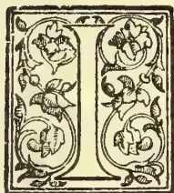

IN the year 1800 the United Kingdom consumed  $1\frac{1}{2}$  lb. of tea per head of population. In 1900  $5\frac{1}{2}$  lb. of tea per head of population was consumed.

<table style="margin-left: auto; margin-right: auto;">
<tr>
<td>In 1800 the consumption was</td>
<td>.....20,358,827 lb,</td>
</tr>
<tr>
<td>„ 1850.....</td>
<td>51,000,000 lb</td>
</tr>
<tr>
<td>„ 1900.....</td>
<td>303,867,149 lb.</td>
</tr>
</table>

Up to the year 1862 nearly all the tea consumed came from China. The year 1879 registered the high-water mark of China teas, since which time the importation has gradually decreased, the teas from India and Ceylon having almost entirely overthrown the monopoly of that country.

Every day the two islands consume 600,000 lb. of tea which approximately represents 4,000,000 gallons or 120,000,000 cups of tea, or about 3 cups to each person. Indeed the United Kingdom consumes nearly as much tea annually as the whole Continent of Europe, North and South America, Africa and Australia. The British ration has every right, I think you will admit, to consider itself a connoisseur upon the subject of tea. It not only grows the best tea, but drinks the greatest quantity of it. No better guarantee of quality could be given by any manufacturer than the fact that he is the best customer for his own goods.

To commence from the beginning, from the tea seed, arriving eventually at the tea-cup, will necessitate a description of the various processes employed

to produce good tea to drink, and also gives one an opportunity to describe the country in which the best tea is made. I daresay you have all heard how tea became to be the chief product of the sweet-scented Island of Ceylon. Coffee had for many years been the principal export, the others being cinnamon and other spices, coconut oil, etc, the minerals being represented by precious stones such as sapphires, cat's-eyes, moonstones, and last but not least the very useful and humble plumbago of which there are many mines in many parts of the country. In the middle of the seventies a disease was discovered upon the coffee tree of a most virulent description, which gradually attained such ascendancy, as in a few years to completely change the whole aspect of the coffee districts.

Where fields had yielded 10 or even 15 cwt an acre, only a few dried sticks were left to mark the place of former prosperity. This disease was called "Hemeleia vastatrix," and was really a consumption of the lungs of the leaves which after being attacked fell to the ground in decayed heaps, and the fruit without nourishment from the atmosphere failed to mature and ripen. Although as I say the process was gradual, the result to proprietors of Estates was appalling and sudden. It behoved all Ceylon planters and those interested to use their best endeavours to find a substitute that would enable them to maintain the prestige of the island. For this purpose everything was done that human ingenuity could devise. Tropical Agriculturist books were earnestly investigated. Kew Garden's experts were appealed to, and every conceivable plant likely to produce a paying crop was experimented with; but as a satisfactory substitute for coffee, they all more or less failed; representing a good illustration of the well-known fable of the fox who beasted of his nine tricks, whilst the success of the tea industry might be compared with the one trick possessed by the historical cat; the sequel proving that the latter was worth all the other nine put together.

Liberian coffee, cocoa, cinchona, cardamoms, pepper, vanilla, cinnamon, coconut, etc., have by careful cultivation given a good profit to proprietors, although

599------------------------------------------------

580THE TROPICAL AGRICULTURIST.[MARCH 1, 1902.

some of these labor under the disadvantage of supply exceeding demand, the market becoming easily overstocked.

Cocoa, Liberian coffee, and cinchona will only pay to grow under certain conditions of climate and soil, and therefore could not be considered a satisfactory substitute for the defunct coffee tree. The great substitute however was discovered. Difficulties were overcome, dead coffee trees were sawn down or the roots grubbed up to make room for the new seedlings.

Thousands of acres of jungle useless for growing the old product were promptly felled and planted up with the new. No land seemed to be too high or too low to accommodate the tea plant, no soil too rich or too poor to produce a luxuriant crop of tea. From the year 1882 the whole aspect of the island was changed. Huge tracts of land were opened up and factories built.

In the early days of tea planting the manufacture was entirely carried out by hand. In course of time however this was discovered to be inadequate, and machinery of all sorts and sizes was resorted to. The nett result has been that Ceylon hand in hand with India has practically rushed China tea out of British consumption.

The three great growing centres of tea are China, India and Ceylon. British subjects should without doubt deal in preference with the two latter rather than with the former, if alone on patriotic grounds; and they have loyally done so, but the principal cause of China's defeat upon British territory has resulted from an economical motive. It was discovered that the British-grown teas go very much further than China. That is to say, two spoonfuls of India or Ceylon tea provide as many cups of teas as three spoonfuls of China.

The London Custom Report says:—

"From the information which has been afforded us on the subject, we believe that we make a moderate estimate in assuming that Indian tea goes half as far again as China tea, so far as depth of colour and fullness (not delicacy of flavour) are concerned. Thus 1 lb. of Chinese tea produces 5 gallons of tea of a certain depth of colour and fullness of flavour. 1 lb. of Indian tea will produce  $7\frac{1}{2}$  gallons of a similar beverage."

This report clearly proves that there is a direct saving in the use of British-grown teas. Surely a saving of  $\frac{1}{2}$  or 33% should appeal to the economical Swiss housewife.

"Demand controls supply, and it will only be when the small purveyor finds that his customers will no longer drink the China rubbish they have hitherto tolerated, that the great change will take place, exactly in the same way as it did many years ago in England.

In point of fact the reform will take place when the Swiss tea dealer comes to have more faith in English houses than he has in those belonging to Hamburg Jews.

Another great argument in favour of British-grown teas is the extreme cleanliness observed in their manufacture. Any stranger may see the whole process from the beginning to the end, the plucking of the leaf, the weighing of the same at the store, the withering at the factory, the rolling, the fermentation, the roasting and sifting of the manufactured leaf, the packing in lead lined cases, and if he so chooses he can see the cases placed in the bullock carts and despatched, marked and hoopironed, to the nearest railway station. A visit to a tea factory unmistakably proves that every process through which the tea passes is a *cleanly* one. It is not too much to say that after the green leaf has been once plucked by the coolies *the tea is never allowed to be handled*. Here is a quotation from Mr. Cave's book on Ceylon: "Everything it will be observed is done to avoid handling the tea indeed from the bush to the tea table, such methods of pure clean-

liness are observed as scarcely any other food manufacture can claim, and especially do these methods of Ceylon tea manufactures stand in contrast to those of China, where the primitive operations employed are such that the stomach would rebel against a detailed description. I am convinced that if the public generally did but realize this difference between Ceylon tea and that of some other countries the demand for the Ceylon article would increase quite beyond the capacity of the country to produce it." What Mr. Cave says is quite true. The most perfectly clean machinery and storage of all descriptions is employed, and it is quite a pleasure and one not easily forgotten to see the whole process in operation. The Chinese on the other hand are very jealous of strangers visiting their gardens. They do not employ machinery but use only their hands and feet for the manufacture of tea. "Ah Sin" has no occasion to pay labour to assist him, his wife and olive branches being sufficient for the very small acreage for which he is responsible. After his tea has passed through an exceedingly unpleasant process, which consists of rolling, breaking, and squeezing the leaves until the juice exudes through the fingers, perhaps not overclean when he commences, but perfectly so by the time he has finished; it is then fermented and we hear is put into a copper pan and afterwards rested upon primitive trays over a slow charcoal fire. When the process is in all its branches—we do not know or want to know—only a suggestion occurs to one that the *earthy* flavour so very apparent in China teas, is not alone attributable to the constituents of the leaf. The middleman in the tea growing centres of China is a very important person, he buys the leaf manufactured from the peasant grower, and after sorting and sifting it in to large breaks, packs it into the cabalistic cases so familiar to everybody. The tea is then carted to the great centres where it is bought for English or Russian houses and shipped to over-sea ports or despatched by caravan routes to Russia.

In looking at the tea growing centre of Ceylon upon the map, and considering the magnitude of the industry, we are surprised to see what a small area it occupies in relation to the rest of the island, which is about the size of Ireland. Ceylon from both in historical and agricultural point of view is one of the most interesting spots upon the face of the globe. The population is composed of Europeans, Sinhalese, Jaffna Tamils, Moors, Parsees, Portuguese, Afghan and Malays with a sprinkling of people from many other countries. The Sinhalese and Jaffna Tamils are the natives proper of the country. The latter occupy the extreme north of the island where they were driven by the victorious Sinhalese after one of the many dynastic wars between the two races.

The Sinhalese peasants object to work as a coolie, being perfectly able to support himself and family upon his patch of rice and garden, to watch him ploughing in with his two buffaloes, who drag a sharp stake through the mud of the paddy-fields; forces the mind back a couple of thousand years, there is little doubt the passage of time has suggested no improvements in field culture to this veritable child of Nature. Lately the wealthy Sinhalese have taken up tea cultivation with the result that the labor class is gradually taking to the work and it is calculated represents about 7% of the wage-earning population. The scenery of the island is magnificent and reminds one very much of Switzerland; there are several mountains, but not nearly of the same altitude as the high ones of this country. "Pidarrutalagalla" is a little over 8,000 ft. whilst the celebrated "Adam's Peak" is only about 7,000 feet. This mountain is by 800,000,000 of people considered one of the most sacred spots in the World, it is to the Buddhist what Mecca is to the Mahomedan, and thousands of the faithful annually visit it on

600------------------------------------------------

MARCH 1, 1902.]THE TROPICAL AGRICULTURIST581

pilgrimage. Curiously enough the Mahomedans and Hindus equally hold the mountain in veneration; the former think the well known foot-print upon the summit is that of our common parent from which superstition the Peak derives its name. The Hindus credit their god Siva with the impress, whilst the Buddhists, of course, reverence the foot-print as that of their holy Gautama.

The great working or cooly race is that of the Tamil, from the coast of Malabar; their lot in their own country in the time of famine is so hard that they are glad to emigrate anywhere far a certainty of shelter, a plentitude of rice with regular paid wages.

The constantly recurring loss of the rice crops, due to the paucity of rain, has caused much distress and loss of life through starvation. By giving regular work and wages, our tea gardens have saved the lives of thousands of our fellow-creatures, surely an additional reason to look kindly upon an industry which has prevented so much suffering. The Tamil cooly is a patient, hard-working representative of humanity, he will work under a tropical sun for 10 hours at a stretch for 5½d. his wife for doing the same being quite content with the equivalent of 4d. in English money, his children find employment as pickers. Although of course he cannot make any considerable amount of savings he will sometimes return to his coast and buy a cow which to him spells affluence, or he will start himself as kangani or small headman, by degrees collecting a labor force to manage which insures him a competency, and what is still more to be desired enables him to superintend the work without working himself, which consists in standing upon a rock and dividing his time between chewing "betel" and shouting at the coolies. Kangani who are not paid wages are paid each day so much for each cooly in their gang who comes to work. The system adopted by recruiting labor is called "Coast Advances." A sum of money is advanced by the Superintendent to his kangani who straightway returns to his village on the coast of India, and there in his turn advances so much to each cooly who is willing to return with him to the estate and work in his gang, thus a cheap labor force is constantly replenished, and it is no doubt greatly owing to this fact that the success of the tea industry is due. Cheap labor and cheap transport are both obtainable in Ceylon, without which, however suitable climate, rainfall or soil, no tea garden could be any possibility be made to pay, either in Ceylon, India or elsewhere.

It is generally supposed that Ceylon with its wonderful soil and climate produces a golden harvest of all kinds of fruit without the necessity of cultivation. This is not so. Only a few fruits even when cultivated are fit for European digestion: there are of course the well known Mango, Plantain, Pineapple, Pomegranate, Mangosteen and Orange, and that is really about all. The pineapple indeed is sometimes grown to an enormous size, weighing as much as 32 lb. and as delicious in flavour as abnormal in size. The best fruits are carefully cultivated and it is quite a mistake to suppose that they grow wild in the jungles. I mention this fact relative to Ceylon fruits as partly accounting for the downfall of King Coffee.

Coffee being a fruit crop was only kept going by high cultivation, the ground was manured heavily year after year, until the fruit-bearing power reached its climax, and the over-taxed trees became an easy prey to the fell disease which eventually caused their destruction. The grape vine suffers from a very kindred disease to the "Hemileia" of the Coffee, in fact it appears to be an impossibility to force a heavy fruit crop year after year from the same trees, without compelling their destruction, in plain language we take more nourishment from Mother Earth than any system of manuring will enable us to replace.

Tea is not a fruit crop but leaf crop, the natural tendency of all vegetable life in the forcing climate of Ceylon is to run to leaf. Therefore tea is

a natural crop. We only ask from the tea tree what it can well afford to part with. The tea tree, it is true, throws out a beautiful blossom like a small single Camelia, to which family it belongs, but should there be too much seed upon the trees it is a sign that the "Jat" or quality of the tea is not good. The best tea throws out the least seed.

The difference between the two crops coffee and tea, being understood, it is not difficult to understand why planters have been so successful with the latter. The former exhausted the soil, the cultivation of the tea crop does not do so, it represents a bill of exchange upon the soil, which is always paid when due and without difficulty. The tea tree only requires careful pruning and management to bring its leaf crop to perfection. So rapid is the growth of the tea flush that on a properly managed garden the pickers have only time to finish the last field when the first will be ready to recommence upon, the flush takes about 8 or 10 days to grow. The tea planter has little reason to fear the ravages of the numerous pests which have helped to rob the Island of its magnificent coffee crops. No disease has yet appeared to interfere with the ever-growing export of tea from the port of Colombo, there is no apprehension as to that. The real problem to solve is what is to be done with the surplus of tea which cannot find an outlet in Mincing Lane? This important question has brought me before you to-day and will be discussed later on. It is one that must sooner or later affect consumer as well as producer. British-grown teas have still to replace those of China on the Continent of Europe and America; this is the special mission of the House I represent, Messrs James Finlay & Co. of Glasgow, with whom are incorporated Finlay, Muir & Co. in the East and Rogivue & Co. Ltd. on the Continent of Europe. This great firm has houses in all parts of the world—Glasgow, London, Calcutta, Colombo, Bombay, New York, Chicago, Toronto, Moscow, Constantinople, Magdeburgh, Lausanne, etc. and has altogether seventy thousand (70,000) acres under tea in Assam, Sylhet, Cachar, Darjeeling, Travancore and Ceylon, besides a considerable area under coffee, cocoa, cinchona, cardamoms, etc. The produce from their tea gardens last year amounted to 22,000,000 lb. of manufactured tea, this converted into cups of tea at the rate of 200 for each pound of tea would make four thousand four hundred million (4,400,000,000). Before describing the processes of tea cultivation it would be as well perhaps to study the chemists' analysis of the tea leaf. We have all noticed that there are times when nothing refreshes us so much as a cup of tea. No other beverage possesses this wonderful quality. Nothing in this world can ever replace the afternoon cup of tea, it is the only stimulant which cheers without exacting reaction. To what special property in the leaf is this due?

The constituents of the tea leaf are fifteen in number, but all with the exception of three are of small importance, these three are:

The Essential Oil,  
Theine or Caffeine, and  
Tannin.

The Essential Oil gives to the tea its flavour and aroma. As regards Theine in India or Ceylon teas there is sometimes as much as 6 per cent whilst in China tea only about 1 per cent is found. The higher the percentage of Theine or Caffeine the greater is the beneficial effect on the human system; this is evidently the invigorating agent. The Tannin in tea is the chief cause of its strength and pungency; it is however probable that the fulness of the tea apart from the pungency is due to the mucilaginous constituents dissolved by the boiling water. With regard to the great Tannin question it is a subject which has been much discussed but little understood. Indian and Ceylon teas are stronger in liquor than China teas, this although distinctly in favour of the former

601------------------------------------------------

582THE TROPICAL AGRICULTURIST.[MARCH 1, 1902.

has been used as an argument for their disparagement, it is simply a case of dealing with the teas according to their strength.

Ceylon teas should only be infused for five or six minutes after which time the made tea should be poured off into another tea-pot heated for its reception. If this were always done we should hear no more about Tannin which in properly made tea only adds as the analyst remarks strength and pungency to the liquor; fresh spring water should be employed, and water that has once been boiled should not be reboiled for tea making. Of course, it is necessary to procure a good sound tea, and for this purpose you have only to apply to any of the numerous agents of Rogivue & Co. Ltd., to obtain what you require.

The most delicate tea is grown at high altitudes whilst magnificent crops are produced from the low country gardens. The curious characteristic of Ceylon tea is that at whatever the altitude it is grown it can always be drunk *unblended*, it is a *self-drinking tea*, and does not require the agency of any other tea to make it enjoyable or drinkable. It is however about time to think of the tea seed if we are ever going to arrive at the tea-cup.

After a block of jungle is *bought, felled and burnt* it must be first well roaded and afterwards holed for the reception of the young tea plants, which are planted from three to four feet apart according to the altitude of the estate. A Nursery must first be prepared for the reception of the tea seed, well screened from the sun by Palm leaves or dried manna grass. This nursery it is needless to say is a most important part of the undertaking. On a large nursery it is quite one man's work to watch and water the seedlings and keep the ground clear of insects, pests, weeds, etc. The tea plant when about nine inches high only requires the rains to commence for planting out. The young plant is then gently extracted from the soft earth of the nursery, tied up into bundles and served out to the most experienced coolies to plant in the holes prepared for their reception. These holes are dug to the depth of about 12 inches and should be filled in with surface soil carefully freed from stones or rough subsoil. Planting is a most important operation and requires great care; should the long tap root get bent the future prospects of the tree will be greatly affected. The rainfall in the low country is about 180 inches per annum, about 6 or 7 times as much as London registers, as much as 6 inches of rain will sometimes fall in a few hours, this humid atmosphere coupled with the forcing properties of a tropical sun produces a wonderful growth in the tea fields, the first picking of the leaf often taking place within two years of planting. In the higher altitudes the rainfall is less and the growth not nearly so rapid, three to four years is generally allowed to elapse before the first crop is plucked. The general management of the tree will much depend upon altitude and climatic differences. The rougher teas from Assam or the Kelani Valley naturally require different treatment to the high-grown and more delicate sorts, it is not altogether unlike the high and low born of the human race, both are necessary but require separate modes of treatment to procure the best results. This is supposed to be a popular lecture on CEYLON TEA so that I shall not weary you with statistics. After I have finished my remarks upon tea cultivation and discussed with you other important points, there will be thrown upon the sheet a number of beautiful photographs taken by Mr. H. W. Cave of Ceylon. If the lecture should have proved a little dry I sincerely trust these pictures will dissipate any weariness acquired during the relation of details a little monotonous perhaps but necessitated by the subject.

The coolie women and children become very expert in plucking the leaf, it is marvellous to watch their

dexterity, it seems to be an instinct with them to know what part of the flush should be taken and what felt for future use. The eye in the axil of the leaf must not be injured as that represents the future flush. The top leaf or bud of the shoot is known in the trade as "tippy" tea, this is a small orange-coloured leaf found in high class teas, easily distinguished amongst the black leaves by its golden appearance, this leaf makes the best tea and would be too strong in liquor to drink by itself unless used sparingly, a single pound specially picked has fetched in Mincing Lane as much as £35 stig. These fine leaves are collected by throwing the tea against a special matting made of jute, the extremely small tips stick to it whilst the heavier leaves fall to the ground. The *Orange Pekoe*, the *Pekoe* and *Pekoe Souchong* are the next in sequence down the stem of the flush. There are two kinds of plucking; fine and coarse, the former turns out teas as follows:—

<table border="1">
<thead>
<tr>
<th></th>
<th>Broken</th>
<th>Orange</th>
<th>Pekoe</th>
<th>...</th>
<th>Equal</th>
<th>30 per cent</th>
</tr>
</thead>
<tbody>
<tr>
<td>Orange</td>
<td>Pekoe</td>
<td>...</td>
<td>...</td>
<td>do</td>
<td>40</td>
<td>do</td>
</tr>
<tr>
<td>Pekoe</td>
<td>..</td>
<td>..</td>
<td>..</td>
<td>do</td>
<td>19</td>
<td>do</td>
</tr>
<tr>
<td>Pekoe Souchong</td>
<td>..</td>
<td>..</td>
<td>..</td>
<td>do</td>
<td>7</td>
<td>do</td>
</tr>
<tr>
<td>Dust</td>
<td>..</td>
<td>..</td>
<td>..</td>
<td>do</td>
<td>3</td>
<td>do</td>
</tr>
<tr>
<td>Wastage</td>
<td>..</td>
<td>..</td>
<td>..</td>
<td>do</td>
<td>1</td>
<td>do</td>
</tr>
</tbody>
</table>

the coarser picking would include a higher percentage of the *Pekoe Souchong* leaf. After plucking the leaf the coolie carries his or her basket to the central store where it is carefully weighed and placed in the withering rooms. The withering process is very simple, the leaves are spread out thinly upon "Tattu" or shallow trays, and left until they become properly withered, sometimes hot air is passed through the shed, but this is mostly resorted to when the weather is wet and the leaves in consequence refuse to dry, the leaf when ready for rolling should feel to the touch like a dry rag. This is a very important part of tea manufacture, as unless the leaf is properly withered it is quite impossible to roll it. After the withering the leaf is taken by trained coolies to the rolling machine, a marvellous instrument which roll and crushes the withered leaf into the fine spiral form so well known. After rolling comes *Fermentation*, the crushed leaf is placed in flatish heaps and covered with wet cloths until it becomes a *bright coppery colour*. Machinery having done its duty up to this stage, human intelligence must for a short time take its place. It is the *fermentation* of the leaf which is the *most important part of the tea manufacture*. During this process the *chemical properties of the leaf are changed*, the point is to know exactly when this change has taken place, and consequently the right moment to break up the fermentation, and consign the tea to the *Dessicator* or roasting machine. To gain this experience a long course of close application to the subject is necessary, however careful one may have been in the other parts of the manufacture, carelessness with the fermentation will spoil the whole day's work and not only lose a valuable lot of tea, but should the tea, so spoiled be shipped to London and receive an adverse criticism from the trade, the estate in question may get a bad name which would effect its sales of tea for a considerable time perhaps. In the very early days the proprietors of one garden nearly killed the prospects of Ceylon tea by sending to Mincing Lane samples which were discovered to be quite unfit to drink. There was a good deal of joking about this at the time but fortunately no real harm resulted. In these early days tea was made entirely by hand. Although a tea roaster was invented by a near relation of mine, which if it had been preserved might now have proved of considerable value to a museum set apart for showing the early efforts of the pioneers, who without guidance resorted to their inborn ingenuity and pluck for devising means for tea manufacture all honour to them say I, and I feel sure that you will agree to the sentiment. After the leaf is roasted, it is sifted into the different qualities required and packed into chests, half chests or boxes for the London Market.

602------------------------------------------------

MARCH 1, 1902.]THE TROPICAL AGRICULTURIST.583

A chest contains from 80 to 100 lb. of tea.

A half chest ... ..about 50 lb, and

A box .. .. 20 lb.

We have had up till now I hope a pleasant canter across the green sward of the subject of my lecture. We will now with your kind permission turn to the question raised a few pages back on the struggle for the mastery between British-grown and China teas, viz., which of them will finally obtain the *tea supply of the world*, is it to be India and Ceylon on the one hand or China on the other?

Last year's Imports into the United Kingdom were as follows:

<table>
<tbody>
<tr>
<td>India .. .. .</td>
<td>156,968,149.</td>
</tr>
<tr>
<td>Ceylon .. .. .</td>
<td>115,322,673.</td>
</tr>
<tr>
<td>China, etc .. .. .</td>
<td>31,576,327.</td>
</tr>
<tr>
<td></td>
<td>149.</td>
</tr>
<tr>
<td></td>
<td>303,867,</td>
</tr>
</tbody>
</table>

One of the most striking episodes in the annals of modern commerce is the struggle between these countries for the tea supply of the world. As regards the consumption in Great Britain the result of that struggle is no longer doubtful. The Indian and Ceylon tea grower has won the battle. During the past twenty years he has displaced China teas in the British Market to the extent of 83,000,000 lb. In 1880 Great Britain consumed nearly 115,000,000 lb. of China teas, last year she consumed only 31,000,000. In 1880 Great Britain consumed only about 44,000,000 lb of Indian and Ceylon teas, last year she consumed 272,000,000 lb. While therefore the total British consumption of tea has increased by nearly 145,000,000, during the past 20 years, her purchases of tea from India and Ceylon have increased by 228,000,000 and her purchases from China have decreased by nearly 83,000,000. *The Times* in a leading article upon the subject says:—"This great Industrial revolution has been accomplished by an international rivalry almost without parallel in the history of the world. British enterprise has been coggedly met by Chinese persistence. British energy and dash against the inertia with which the Celestial clings to an established livelihood, however slender the subsistence which it yields. But Ceylon has taken a rapidly increasing share of the battle till it has now become a struggle between British enterprise in Asia and the Chinese power of endurance. It now stands revealed as a gigantic struggle between the *East and West*, and between the *ancient and modern* organisation of industrial life. Like all such struggles it ultimately resolves itself into a question of quality and price. It only takes a nation about ten years to get rid of its taste for bad teas, and to acquire a preference for good ones. As regards quality China has not a chance against India and Ceylon. Her rule-of-thumb methods produce an article inferior in flavour and in high class strength to that which the scientific appliances, the costly machinery, and the chemistry of arrested fermentation enable the British tea planter to send to the market. It is therefore no longer in the *British Market* but in the *market of the world*, that the struggle must be fought out. The British Planters whether consciously or unconsciously have practically acted on the principle that they had to pretty nearly kill the China tea trade in Great Britain, if they were to secure an adequate expansion for their own industry. They have as shown by the returns already cited *pretty nearly killed it*; and they are doubtless determined to go on with the struggle to the end. It is as we already said ultimately a question of *quality and price* and although the British planter has come off victorious, figures show the loss in price which the struggle has cost him. It is clear that the further displacement of China tea in Great Britain alone will not offer an adequate outlet for the rapidly increasing production of Indian and Ceylon Teas. But even if the British planter succeeded in displacing that quantity of China tea in the British Market he would still require to find new outlets for the

additions which are being yearly made to the tea exports from India and Ceylon. To find these new markets outside the United Kingdom I repeat is the special mission Messrs. James Finlay & Co. have undertaken to pursue and to devote their great influence and large capital to this end. It is for this purpose that Mr. Maurice Rogivne, Director-general of Rogivne & Co., Ltd., was chosen by the Planters' Association of Ceylon to represent the Ceylon Tea Industry in Russia. It is now many years since this redoubtable champion of Ceylon tea was honored by this confidence. He went to Moscow and there started a great number of depots and year by year has enormously increased the sale of Ceylon tea, displacing China Teas to the extent of 17 millions of pounds in 10 years and gradually forcing a path through the strong prejudices of the conservative Russian Tea drinker in favour of British grown teas. The land of the Turk has not been forgotten and a very large trade is being strongly pushed by Mr. Rogivne in Constantinople. It is now many years since I arrived in Switzerland also for the express purpose of introducing the teas grown in British Territory. Twelve years ago in Montreux it was almost impossible to procure Ceylon tea, and I believe the local Banker was almost the only medium for the supply of Indian tea in small packets. We have now about a dozen agents in Montreux who sell our Ceylon teas. Your humble servant was also one of the first Kelani Valley Planters and was also one of the first few to start the sale of tea in England. Myself and Partner represented Ceylon tea at the Heatheries Exhibition in 1884. I daresay some of you will remember our Sinhalese Bungalow in the gardens. We served out to the British Public very often as much as 2,000 cups in one day of the until then unheard of Ceylon Tea. It is needless to say this Bungalow acted as a splendid advertisement. The following year 1885 we shipped it over to the Antwerp Exhibition for the purpose of introducing Ceylon Teas into Belgium. At the Chicago Exhibition the Ceylon Planters provided a fund of £21,000 stg. to push their teas in the United States, the Indian Planters expended £7,000 stg. on the same purpose. The results were most satisfactory. British grown teas for the first time were brought within the knowledge of the American consumer. Next to Great Britain the United States is the largest tea purchaser in the world, but unfortunately the 100,000,000 pounds which they take are almost entirely obtained from China and Japan. Indeed the American taste for tea has been formed upon the coarse leaf of these countries and the fine flavoured Indian and Ceylon teas were a new revelation to most of the visitors at Chicago, 1,500 of the largest American tea firms immediately sent orders for British grown tea and the Ceylon Planters opened a central permanent depot for their teas in Chicago itself.

The amount of British Capital invested in tea gardens is about £30,000,000 stg. It is not to be wondered at that the proprietors of this huge undertaking are anxiously looking about for new customers for their ever increasing yield. In the year 1883 Ceylon bashfully sent to Mincing Lane 1,000,000 pounds of its new tea, in 1900 it plumped down over 115,000,000 at the door of the London Custom House. Such astounding assurance has met with its proper reward, for instead of the goods being returned with thanks as no doubt the aforesaid "Ah Sin" thinks would have been the proper course to pursue, the teas were actively competed for and found a ready market. From the days of its Cadetship Ceylon has grown into a fully equipped fighting soldier who in conjunction with India having fought "a la mort" for the possession of the London market with China, has had many a friendly round with its Indian neighbour, but the contest has always been fought with "gloves," and there is every reason to believe that in future only a friendly alliance supported by identical interests will exist between the two great British tea producing countries. This alliance will

603------------------------------------------------

584THE TROPICAL AGRICULTURIST.[MARCH 1, 1902.

no doubt have for its object the regulation of quality and consequently to a great extent of prices on the London Market by carefully restricting supplies and shipping only a class of tea calculated to increase the demand. It would prove a great misfortune if competition for cheap teas from British gardens, the quality as it has done with cheap China teas, some of which are not fit for human consumption. There is little doubt that magnificent China teas were sold to the general public half a century back, but then the price paid was enormous and the profit on the sale equally so. Now English people have been taught to believe that the best tea the world grows is not worth more than 1s. 7d. per pound at their grocers. This is not true, it is also most unfair on the producer who finds more and more difficulty in getting rid of his really fine Orange Pekoes at a fair price, the public taste for tea is not what it was a generation back, the evil has however to a certain extent cut both ways and it is quite true that one can now a days buy a sound drinkable tea at a much lower price than the last generation would have thought possible.

Before concluding I should like to make a few remarks upon the different names given to tea. In the days when China was the only country that grew tea it was known by such names as Pekoes, Souchongs, Congons and many others which have now almost lost their meaning to the general public such as: Gunpowder, Bohea, Hyson and Twankay, even the more modern names of Kaisow, Lupsang and Moring are far less common than they were ten years ago. The pioneer planter in India thought it would be more convenient to continue using the names most familiar to the public and to carry out this idea he divided the flush or green shoot into different sections, each section was supposed to resemble one of the well-known China sorts. The China tea plant was discovered 5,000 years ago, it is known to have been used as tea 12 centuries back.

Manufactured tea was introduced into England during the reign of the merry Monarch. China seed was used largely when the first gardens were planted up in India and was employed in Ceylon as far back as the year 1842. The great discovery of the indigenous plant growing wild in the jungles of Assam completely changed the order of things. Some people contend that it was a botanist who first discovered this plant, whilst others say it was a common garden coolie. However that may be the two varieties hybridized very quickly and produced a useful flush-giving tree which was called "Assam Hybrid" and which has for a number of years been the chief tea of commerce. In some altitudes the indigenous yields much better in its natural condition and it now appears to be a serious question amongst planters whether it was not a mistake in the first instance to blend it with the Chinese variety.

I have now finished my remarks upon tea planting and Ceylon generally. It is a marvellous country with a marvellous history. In the early days of British rule the annual imports amounted to about £250,000, stg. they are now about £5,000,000 stg. In the early days there were no Banks no good roads or bridges. Very few schools, no hospitals, only four post offices and no newspapers. There are now 14 important exchange and deposit Banks, and Banking Agencies doing an annual sum of business amounting to about R68,000,000. 1,500 miles of splendid metalled roads, countless good bridges, more than 2,000 schools. Upwards of 100 hospitals and dispensaries, 250 Post Offices, 36 Newspapers and Periodicals, and nearly 5,000,000 acres of land under cultivation. The shipping entered and cleared in the course of the year amounts to nearly 6,000,000 of tons as against 75,000, in the early part of the century.

The Island is also becoming a net-work of mountain and seaside railways and both commercially and socially was never better off than it is at the present moment.

ALFRED AMES.

Lausanne, August 1901.

## A PRELIMINARY NOTE ON THE ENZYME IN TEA.

During the past few months we have heard a great deal as to the occurrence and practical value of the enzyme in Tea. In view of the work which is now being done on this subject in India, Japan and Ceylon, it was thought advisable to lay before the planting community a brief statement as to the nature of the enzyme and the methods of manufacture, which may be suggested in order to allow full activity of the enzyme, if this be desired.

In India, Mr. Mann and Mr. Newton have contributed much to our present knowledge of the subject. Mr. Newton has suggested the application of an external enzyme to improve the flavour of tea, but in the absence of definite knowledge as to the relations between enzyme and flavour, his suggestion may perhaps be regarded as a little premature.

Mr. Mann has made many useful experiments on the substance in question, and bases his deductions entirely on the varying intensities of blue obtained with gum guaiacum on a watery extract of the enzyme. He concludes, that it is doubtful whether it would be possible to add enzyme to leaf of low quality in order to improve the quality, and draws attention to the recognised fact that the enzyme would be no good if the substances on which it had to act were not present. There are, however, several general statements to which we shall take exception, particularly those referring to the distribution of the enzyme, the absence of any knowledge as to what flavour is due to, and the statement that the maximum quality is to be correlated with the maximum amount of oxidase. These will be dealt with at length in a paper to be published later.

Azo of Japan has also noticed the presence of the enzyme in tea, and explains the oxidation and colouring of black tea as a consequence of the oxidising action of the enzyme. This has long been held to be the case in Ceylon and everywhere. In our preliminary note it will be as well to explain what is really understood by the word "enzyme." For our purpose, we may describe a plant enzyme as a substance existing in the sap, and which is capable of inducing chemical changes necessary for the life of the plant. As an instance we may quote the commonest of plant enzymes, known as diastase, which has the power to convert the reserve starch into a soluble sugar, which can be conveyed to the growing parts of the plant. In the leaves of tea, up to the present no starch has been found, so that the action of the tea enzyme in the leaf is of a nature different from the above. Nevertheless, its function, that of rendering insoluble bodies into a soluble form, is probably similar to other enzymes.

The presence of an oxidase is usually determined by the reagent known as gum guaiacum. This is a resin, soluble in alcohol, and capable when in contact with certain oxidising and other reagents, of acquiring a brilliant blue colour. It has been used for many years as a test for enzymes and other oxidising bodies, but it does not afford conclusive evidence as to the presence of an enzyme. There are very many other bodies which give the blue reaction with gum guaiacum alone, the most notable being the oxidising reagents:—potassium permanganate, nitric acid, potassium nitrate, potassium chromate, hydrogen peroxide, ozone, iodine and chlorine. What is most surprising, however, is the fact that the blue colouration may be obtained by means of an aqueous solution of old ferrous sulphate. Further, Reynolds Green *page 337*, states that even albumen, peptone and other native proteids as well as gelatine, give the same blue reaction.

It is therefore obvious, that before one can use the test as a means of detecting an enzyme much work must be done. In the first place, all the oxidising substances mentioned above can be neglected, since they do not occur in a free state in the

604------------------------------------------------

MARCH 1, 1902.]THE TROPICAL AGRICULTURIST.585

plant. It was necessary, however, to isolate the enzyme from the tea leaf, and to obtain it free from impurities, or substances with which gum guaiacum gives the blue reaction. This has been done, and the blue colouration obtained when gum guaiacum and the practically pure enzyme are brought into contact. We therefore believe that for our purposes the test can be used for the detection of the enzyme in tea leaf, and all our statements are based on observations of reaction, with this reagent.

#### OCCURRENCE OF ENZYME IN THE TEA PLANT.

All our experiments show that the enzyme occurs most abundantly in the young leaf, but is also present in old leaves and most other parts of the plant. It does not occur in definite decreasing proportions as one passes from the youngest to the oldest leaf, it being often more abundant in the second than the first leaf, and occasionally exhibiting a very erratic distribution in the active form. In the stem and root of the tea plant, the function of the enzyme is probably different from that in the leaf; or it may be that more than one enzyme exists in the different parts of the plant. Certain it is that the reserve bodies in the different parts are quite unlike one another, and would require different classes of enzymes to render them soluble.

We have determined the general occurrence of the enzyme in teas of all classes from all elevations, and it is important to realise that it is apparently as abundant in low-country teas possessing more flavour as in the highest grown teas in Ceylon. It can also be stated that there is very little difference in the amount present in leaf a few weeks from pruning, and in leaf two or more years from pruning.

It occurs also in the leaf at all times of the day and night, and no great quantitative differences were noticed in leaves plucked at 6 a.m. and 10 p.m. Leaves plucked under conditions varying from severe drought to heavy rains showed abundance of the enzyme at all times.

#### STRUCTURE OF A LEAF.

Since in the manufacture of tea we are concerned almost totally with the parts of the leaf, a brief description of them will be here convenient. An ordinary flat tea leaf is in reality composed of an accumulation of microscopic pellets, of a substance called protoplasm. Each of these pellets, or cells, has some duties to perform in the life of the plant, and here and there a definite grouping of cells of a particular shape and size is seen. The layer of relatively small cells which forms an entire covering to the leaf is termed the *epidermis*; the layer of long brick-shaped cells disposed in rows only along the upper surface of the leaf constitutes what is known as the *palisade* tissue, whilst the more or less spherical cells composing the lower and middle part of the leaf is known as the *mesophyll*. In the mesophyll are several small bands of conducting cells known as the *vascular bundles* or *nerves*.

#### THE GUM GUIACUM REACTION.

When a section of a fresh tea leaf is treated with gum guaiacum a blue colour appears mainly in the cells of the epidermis and mesophyll. In many cases the epidermis stains before any of the other parts, and finally assumes the deepest tint. Sometimes the parts around the small vascular bundles in the mesophyll take a deep stain. In every case, yet examined, the contents of the palisade cells have refused to take the blue reaction. This is a very important point to notice, as it would appear that this portion of the leaf, which is known to play the principal part in the manufacture of food materials, is characterised with a minimum quantity, if any of the active enzyme.

There seems some hope of yet being able to associate the maximum occurrence of the active enzyme with

a definite granular texture of the contents of the cells, but the significance of this will be discussed at length in a later paper.

It is worth noting that many of the sections do not give the blue reaction until repeated treatment with gum guaiacum and exposure to air, or only after adding another oxidising reagent. This is probably due to the enzyme existing in the zymogen or inactive state.

The gum guaiacum must thoroughly mix with the cell contents before the blue reaction occurs, and only very thin sections will to a certainty give successful results. When very thin sections are used, the blue compound is seen to pass away from the section, and in consequence of the transient nature of the reaction, is likely to be overlooked.

We have now seen that an enzyme can be generally demonstrated in all tea leaves, and have briefly indicated the manipulation necessary. It will now be convenient to discuss the relation between

#### ENZYMES AND FLAVOUR.

In one or two instances the action of an enzyme has been utilised commercially to induce chemical changes, which result in the production of a more or less distinctive flavour. As an instance we may take yeast, a common plant, from which no less than five enzymes have been extracted. It has been found that different yeast cells impart to a fluid a different colour and flavour, and this has been used on the continent in the improvement of certain wines. It was shown, that if different portions of the same grape juice were fermented with different species of yeast, wines were obtained which differed much in flavour, because each species of yeast has the power of producing, during fermentation, certain characteristic flavouring bodies. As has been previously pointed out, however, we must remember that all such fermentations require a great deal of time for completion and they are therefore not strictly comparable with the changes occurring in the manufacture of tea. It would be unwise to jump to the conclusion that the enzyme in tea is responsible for what we at the present time know as flavour, although it is possible, that under certain conditions the enzyme will be found to materially affect the quality, and perhaps to some extent the flavour.

It is as well to realise that enzymes of some class or other probably exist in every plant, and their presence is often in no relation to the production of flavouring substances. Even if a flavouring substance is produced by the action of an enzyme on some store material, it is often a question as to whether the change is desirable. These remarks are made on account of the fact that many planters seem to believe, that if an enzyme is found it is always an advantage, and the products of its activity can be utilised in manufacture.

Our experience would point to the conclusion that maturity of the leaf, utilised in manufacture, was an essential factor for the production of a flavoury tea. Every planter knows, that as soon as the absolute rate of growth is diminished an improvement in quality results, even in the low country. This is also borne out in a general sense in the marked differences in the quality and flavour of the tea grown at high and low elevations, the colder climate of the former determining a slower and more stable growth. In India we have also the finest flavoured teas growing at high elevations, where the climate is cold and vegetation grows comparatively slowly. Again, we might note that what is known as an autumn flavour is produced in Assam teas as soon as the weather gets cold and the bushes more mature from pruning. In comparing young leaves from a bush four weeks from pruning with young leaves from a bush two years, three months after pruning, many differences of structure are to be noticed. In the leaves from the latter, the walls of the cells are thicker, they possess a more definite outline, and the chlorophyll is more definitely granular. Everything

\*The soluble ferments and fermentation by J. Reynolds Green.

605------------------------------------------------

586THE TROPICAL AGRICULTURIST.[MARCH 1, 1902.

points to a better organization in the more slowly grown leaf, and it seems probable that this will explain the improved flavour of such leaf.

(To be concluded.)

## COFFEE AND THE WORLD'S PRODUCTION.

In the latest Consular Report on Rio de Janeiro, it is stated that the calamitous condition into which the coffee industry has drifted is clearly attributable to the unnecessarily large production, a sequel of the very expensive planting which took place six years ago, when prices were high and credits for enterprise of all kinds extremely facile. The world's consumption is now calculated at 14,500,000 bags per annum, and it was the custom to say that, to make up this quantity, 10,000,000 bags were required from Brazil. More recent calculations, however, favour the idea that no more than 8,500,000 to 9,000,000 bags are wanted from that country. But, however that may be, seeing that the world's production is 16,500,000 bags annually, and that the aggregate production of other countries has not expanded during the last 26 years, the excess in production in relation to consumption of 2,000,000 bags annually is attributed entirely to Brazil.

The realisation of this fact led to a project, strongly advocated at first in many quarters, aiming at the compulsory destruction of 20 per cent of the early crops. Fortunately, this anti-economic idea has now been generally condemned and more salutary methods of improving the situation are being earnestly ventilated. The cost of production, of course, varies according to the circumstances of each plantation, its situation, nature of soil, extension, yield per tree, etc. Working expenses in São Paulo, for example, are considered to be, as a rule, 15 per cent. less than in Rio de Janeiro and Minas Geraes. Perhaps the average figure, including sacking and transit to shipping port, would be about 7 milreis per 32 lb. As the export value for the standard grade 7 is no more than this, and as the planter has still to pay the export duty of 9 to 11 per cent. *ad valorem*, it is evident that a considerable reduction in cost of production must be brought about if coffee cultivation is to continue as a paying industry. To this end incessant claims have been made for reduction of export dues and transport tariffs, and they have not been left entirely unattended to.

The State of Minas Geraes, for example, has reduced its export tax from 11 to 9 per cent. *ad valorem*, and the freight tariffs on the Central, Leopoldina, and other railways have been reduced 25 per cent. for hulled, and 30 per cent. for unhulled coffee, while a maximum rate of 100 milreis per ton is to be charged irrespective of distance. Field machinery and implements and all agricultural accessories also are now exempted from import duties, while favours have been extended to mortgagees to free them from foreclosure during the continuance of the crisis. Moreover, a more encouraging field for consumption in France has been opened by the reduction of the import duties into that country from 156 to 136 fr. per 100 kilos. All these measures will, however, be ineffectual in warding off collapse in many cases, for the simple reason that many of the new estates have been acquired and developed by means of mortgage loans by persons who have not even the floating capital necessary for current working expenses and who, during this period of restricted credit, will be quite unable to obtain the assistance necessary for this branch of expenditure.—*Home paper*

## CULTIVATION OF ORANGES.

By F. E. H. W. KRICHAUFF, Chairman Central Agricultural Bureau, S.A.

Although the whole of the citrus tribe prefer a sweet friable soil of good depth and moisture, without being too wet, or planted in holes that prove to be stagnant

puddles unable to drain themselves, the soil is of less importance than irrigation or manuring; only an excess of moisture causes too often disease of the roots; but moderate irrigation, and manuring liberally and regularly, will induce orange trees to become profitable.

Senor Alino, F.R.H.S., of Valencia, Spain, says an acre planted with orange trees may produce 26,500 lb. of fruit, and such a crop probably contains 100 lb. of nitrogen, the same of potash, 105 lb. of phosphoric acid, and 220 lb. of lime, not counting wood and leaves. It is therefore absolutely necessary to give compensatory fertilisers, although somewhat modified in accordance with the soil and its constituents. A clay soil, although poor in phosphoric acid, most likely does not require the whole of the potash returned for some years, as might be necessary for a soil rich in lime and phosphoric acid. Gypsum reduces a soil rich in potash to a fit state for its absorption, and a smaller quantity of this fertiliser may therefore become necessary. Sandy soils are generally poor in plant food, and require all of them—after such a crop, at all events. Senor Alino, however, says that an excess of phosphoric acid results in many but small fruits, well flavoured, with a thin skin; and trees that are shy bearers may therefore require more of a phosphatic manure. Potash makes the fruit even more sweet and juicy, while too much nitrogen produces much wood and foliage, but coarse, thick-skinned, late ripening fruits, containing little sugar or aroma, and they do not keep well.

It is admitted that dung and other organic manures are useful as an aid to commercial fertilisers, which, however, are so much quicker consumed, but it is not advisable to give horse-dung more frequently than once in three years. Orange trees are never quite without a movement of sap at any time of the year, and apparently require plant food to be given more than once a year, especially nitrogen, although once is sufficient for most other fruit trees.

Senor Alino wants a deep annual ploughing, which it seems to me must injure the large number of fibrous roots which, here at least, are generally found to be near the surface. When manuring, a slight stirring of the surface by a four-pronged fork seems to me far better, and does not necessitate trimmed up trees to enable ploughs to run near the stems. Low branches are good protection of the trunk against our frequently too powerful sun. He forms round holes around his trees, and says that neither water nor manure should be allowed to enter. This certainly is a statement which has surprised me and probably most of our orange growers, as our circle formed around a tree was expressly made to water it better. He warns orchardists also to spread fertilisers not within a hand-breadth around the trunks.

Young trees require per acre 325 lb. of nitrate of soda (or an equivalent of 230 lb. of sulphate of ammonia), 264 lb. of a phosphatic manure and 60 lb. of sulphate of potash in preference to muriate of potash. For old trees in full bearing, 350 lb. of sulphate of ammonia, or 440 lb. of nitrate of soda, 600 lb. of superphosphate of lime and 80 lb. of sulphate of potash may be required. If nitrate of soda is to be used, Thomas phosphate should be applied as phosphatic fertiliser. Lime, although it may be required, should not be given with the above fertiliser; either some time before or later. It is, however, well to apply perhaps both forms of nitrogen—namely, one-half of the doses of sulphate of ammonia in our winter, and one-half of the nitrate of soda three months later, when such division of the nitrogen may prevent the dropping of the young fruit. If the trees are not vigorous give but little potash; if too luxuriant, with few fruits, omit the nitrogen and give more superphosphate. In the United States a fertiliser is used consisting of four cent. ammonia, five to six per cent. phosphoric acid, and thirteen per cent. potash, spread and broadcast twice a year, with great results. *Journal of the Department of Agriculture, Western Australia.*

606------------------------------------------------

MARCH 1, 1902.]THE TROPICAL AGRICULTURIST.587CAMPHOR.

The recent establishment by the Government of Japan of a monopoly of the production and sale of camphor in Formosa has attracted much attention to this product, and at the same time, by raising the market price, has rendered it by no means unlikely that this may prove to be a profitable cultivation in Ceylon. The present Circular is issued to lay before the planting public, the chief facts connected with this industry, and to describe the methods of cultivation and preparation which have been found best suited to Ceylon in the experiments so far tried with this tree.

The total export of camphor to Europe and America is perhaps about 60,000 piculs annually, or 8,000,000 lb. The market value of crude camphor in Europe is at present about 155 shillings per cwt., or about 1s. 4½d. per lb. Camphor was formerly used chiefly as a drug and for the prevention of insect ravages in clothing, &c., but of late years, in addition to these uses, it has been largely employed in the manufacture of smokeless powders and of celluloid. The tree also produces an oil,—camphor oil,—obtained with the camphor in the preparation of the latter, and which is used in the manufacture of soaps and for other purposes.

BOTANY.

Common, Formosa, Chinese, or Japanese camphor is the product of *Cinnamomum Camphora*, Nees, a tree occurring native along the eastern side of Asia from Cochin-China to Shanghai, and in the islands from Hainan to South Japan; its limits of latitudinal range are from 10° to 34° N., but it is cultivated in Japan to 36° N. In the southern parts of its range it occurs chiefly in the hills.

Two other forms of camphor are frequently met with, though rarely exported to Europe. Barus, Bhimsaini, Borneo, or Malay camphor is the product of *Dryobalanops Camphora*, Colebr., a large tree of the family Dipterocarpaceæ, occurring in the islands of Sumatra, Borneo, &c. This camphor is slightly heavier than common camphor, and is highly prized by the natives of India and China, who purchase the entire very small produce at fancy prices, from 100 to 200 shillings per pound. A third form, Ngai, or Blumea camphor, is prepared in S.E. China from *Blumea balsamifera*, one of the family Compositæ. In Ceylon the natives prepare a small quantity of camphor from the roots of cinnamon, *Cinnamomum seylanicum*, a plant nearly related to the true camphor. In the remainder of this paper only the common camphor, *Cinnamomum Camphora*, will be dealt with.

In its native country the plant grows into a tree about 100 feet high with a trunk 2 to 3 feet in diameter. It is evergreen, with moderate sized laurel-like leaves, which when crushed smell strongly of camphor. It may be well to mention in this connection that the tree is very handsome when young and forms one of the best ornamental trees for roadsides, parks, compounds, &c., in Ceylon.

The native habitat of the species is not widely extended, but it has been successfully cultivated in Ceylon, India, Australia, Florida, California, and elsewhere. It was introduced into Ceylon by the Royal Botanic Gardens in 1852. In 1895 plants were largely distributed from Hakgala to many planters and others. These were the result of seeds obtained in the autumn of 1893 from Japan. Mr. Nock, Superintendent of Hakgala, has collected information about these trees; some 950 in all, and reports as follows:—

"During 1895 plants of camphor were distributed from Hakgala to planters in various parts of the Island at elevations ranging from 250 to 6,450 feet, with annual rainfalls varying from 54 inches on 104 days to 217 inches on 212 days. Replies as to the growth of the plants have been received from thirty localities, and I think it is pretty well proved that

under certain conditions of soil and climate camphor will thrive at all elevations in Ceylon from about sea level to the highest mountains.

"It appears to thrive best in a well-drained deep sandy loam in sheltered situations with a rainfall of 90 inches and over, and dislikes poor or close, stiff, undrained soil. The growth is slow in sterile soil, but, under favourable conditions, in good soil is very rapid, the tree reaching a height of 18 to 20 feet in five years, with a spread of branches of 8 to 12 feet and a stem of 6 to 7 inches in diameter. This compares very favourably with the growth of the trees in their native habitat, where a tree 20 feet high and 6 inches in diameter, a ten years old is considered good. The best five-year old tree (from planting) in Ceylon is at Veyangoda, at an elevation of about 100 feet with a rainfall of about 100 inches on 180 days. It is 25 feet high and growing luxuriantly. The next best are at Hakgala, where the largest is 20 feet high, with a spread of 13 feet, and a stem diameter of 7½ inches at the ground.

"The habit of the trees in Ceylon in good soil is bushy, with a tendency to throw up many stems. This is a point of importance, as it shows that the tree will coppice well and stand frequent cuttings or prunings, and possibly even plucking of the flush as with tea. In close, hard, undrained or stiff clayey soil the growth is poor, and the habit stunted or dwarfed, and this is also the case in exposed wind-blown situations.

"Of course it is only in the experimental stage here yet, but judging from my experience of it for some years, it is my opinion that as a minor product it should be grown in the form of hedges, planted at distances of 6 to 9 feet apart and 2 to 3 feet apart in the row. The rows should run N.W. and S.E., or across the directions of the prevailing winds, and the plants be allowed to grow 6 to 9 feet high. Planted in this way there would be ample room for cultivation, and each row would shelter the other from the N.E. and S.W. winds, besides forming a large surface for clipping. As the young shoots appear to yield the most camphor, the crop could be obtained by clipping the hedge with a pair of light shears, and the expense would be very slight. The trees might also be planted at 6 feet apart, and treated in the same way as tea bushes, or they might be planted 12 feet apart, and trained as pyramids, or again planted 4 feet apart and alternate plants coppiced in alternate years.")

PROPAGATION, CULTIVATION, &c.

Mr. Nock states:—

"Camphor plants are best and easily propagated from seeds. The seeds do not keep well, and should be sown as soon as possible after ripening. They ripen in Japan, which at present is the only important source of seed, in October and November, and should be ordered some time in advance, so as to obtain them as soon as they are ripe. I find it a good plan to soak the seed in water for twenty-four to forty-eight hours before sowing, agitating the water occasionally. The best seeds, being heavier, will sink to the bottom, and these should be sown thinly by themselves; the lighter ones should be sown thickly, as only a small percentage will germinate.

"The seeds should be sown in well-prepared beds of sandy loam and leaf mould; they should be sown from  $\frac{1}{2}$  to  $\frac{3}{4}$  inch deep, making the bed firm, but not tight. The beds should be kept shaded and just moist. Too much wet will cause the young seedlings to damp off, and if allowed to get too dry the germs will quickly dry up and die.

"We have been most successful when the seed has been sown in boxes (made of  $\frac{1}{2}$  inch wood) 18 by 13 by 3½ inches, filled with the kind of soil described above. The boxes are handy to lift about, and can be easily protected from heavy rain and strong sun. Sheds

74

607------------------------------------------------

588THE TROPICAL AGRICULTURIST.[MARCH 1, 1902.

made after the style of the old cinchona seed sheds answer well for standing the boxes in, and if made light and airy would do well to sow the seeds in direct, but care should be taken not to allow the young plants to be 'drawn.'

"We find it a good plan to prick out the seedling into supply baskets as soon as they are large enough to handle comfortably, or transplant them into beds, placing the plants 6 inches apart every way, and keeping them shaded and watered until they begin to grow, when they will bear the full light of the sun, but will require to be freely watered in dry weather.

"When the plants are from 9 to 15 inches high they are at their best for final planting, but if the weather is unsuitable they may be kept in the nursery till they are 2 feet high, or until good planting weather occurs, viz., dull showery weather. In such weather they require very little shading, and soon take hold of the soil.

"Cuttings do not strike root readily, and only under certain conditions will they be successful. If the prevailing weather should be too dry they soon go off, and if too wet and cold they decay before roots are formed. We have had batches of cuttings with 70 per cent. beginning to call us over, and young shoots forming, that have gone off after three or four days of rough weather—cold high winds and heavy rains—and others that have gone the same way after a week of dry sunny weather. The favourable conditions are equable heat, light, and moisture; with these, and wood for cuttings in a proper state, a large percentage will strike root and make good plants.

"The nursery beds for seeds as well as cuttings should be made in a well-drained situation, and as near water as possible. The beds may be any length, and from 3 to 4 feet wide. The soil for cuttings should be composed as follows: one part good sandy loam, one part leaf mould, and one part clean sharp sand (to this it would be beneficial to add a good sprinkling of powdered charcoal), all thoroughly mixed. The soil should be 6 to 9 inches deep. A layer of good sharp sand one inch thick should be laid on the surface. As a protection against hot sun and heavy rains it would be well to put a roof of thatch over the beds in the form of a shed, but it should be constructed with open sides to allow plenty of light and air. A shed 4 feet wide, with a lean-to roof on stout posts, open at the back and front, will be found a useful size. The posts should be 6 feet high in front and 3 ft. 6 in. at the back. The roof may be thatch, shingles, or other light material. If more than one is required, a space 4 feet wide should be left between the sheds to give room for watering, weeding, and general attention.

"The best material for cuttings is that from straight, healthy, and well-matured shoots of the current year's growth, not too soft or too hard. If too hard they will not root readily, and if too soft they will be liable to damp off. The cuttings may be of any size from the thickness of a lead pencil to  $\frac{1}{2}$  inch in diameter. They should be cut into lengths of from 6 to 9 inches. A clean cut with a very sharp knife immediately below a joint to form the base of the cutting is of the greatest importance. If the cut portion is torn or jagged, or too far away from the joint, it is almost certain to decay, though it may remain green for a long time.

"The operation for inserting the cuttings is best done by opening a trench with a sharp spade so as to form a straight edge. The prepared cuttings should be laid against this and the soil pressed firmly round them. They should be placed in rows 9 to 12 inches apart, and 3 inches apart in the rows, and at a sufficient depth to leave only two or three buds above the surface.

"The sooner the cuttings are made and put in after being taken from the trees the better. After the cuttings are put in the beds should be watered to settle the soil, and if in the open they must be carefully shaded and sunlight must be only gradually let

in as they become rooted and can bear it. If all goes well they should be rooted in 2 to 3 months, but they will not be ready for planting out for three or four months.

"Camphor may also be propagated by layers. The operation of layering is very simple. The shoots should be sent down to the soil. The branch at the bend should be cut halfway through, then cutting upwards for about  $\frac{1}{2}$  to 2 inches, so as to form a tongue. The cut portion must be kept apart by a slight twist, or by placing a piece of brick or a small stone in the cleft. The shoot should then be pegged down firmly into a groove made in the soil for its reception and covered with soil. The end of the shoot must be kept upright by tying it to a stick.

"Another simple way is to split the branch at the bend where it is to be laid in the ground, making the split about 2 inches long, and keeping the cut parts open by inserting a piece of wood or stone. Peg down well into the soil and stake. The ends of the shoots should be cut back a few inches with a sharp knife."

It is thus evident that the plant will thrive almost anywhere in the Island if the water supply be sufficient and the soil well drained. The best method of treatment is probably to grow it as hedges, which are easily managed and clipped. It may also be planted along roads, jungle edges, &c., but should never be mixed with the tea, as the young leaves are very like those of tea, and a twig or two of camphor will spoil a whole break of tea.

The following analyses of two soils at Hakgala—on one of which (A) camphor does very well, on the other (B) only moderately—will help to guide to the selection of suitable spots:—

#### CAMPHOR SOILS.

"Six samples of soil were received from Mr. Nock at Hakgala, which represented the character of the soil and sub-soil, where camphor trees grew well and only fairly well.

"No. 1 A represents a section 15 inches deep between trees showing the best growth, viz., 20 to 25 feet high and 12 to 15 feet in diameter at five years and nine months from the time of planting. The surface soil here is about 1 foot deep. It is composed of agglomerated particles of dark brown colour and yellow fragments of decomposing gneiss. It is very rich in nitrogen and the lower oxide of iron, has a fair amount of lime, but is deficient in potash and phosphoric acid.

"No. 2 A, representing the upper 6 inches, is of a dark brownish colour when dry, and is almost entirely composed of the agglomerated particles mentioned in No. 1 A and rootlets, &c. The analysis shows it to contain the bulk of the nitrogen, and an excess of the lower oxide of iron, but it is deficient in potash and phosphoric acid.

"No. 3 A represents the sub-soil at 15 inches deep or 3 inches below the actual surface soil. It is composed of yellow pieces of decomposing light-coloured gneiss, more or less bound together with a clayey matrix. It also contains a fair amount of nitrogen and rather more phosphoric acid and potash than the surface soil, and would be fairly easily penetrated by roots.

"No. 1 B.—This is taken from a section 15 inches deep, where the camphor is only doing fairly well. The plants five years and nine months old are from 9 to 10 ft. high and 6 to 8 ft. in diameter. It is more finely divided than No. 1 A, and is of a lighter-brown colour. Chemically, it is also somewhat poorer, though containing a good amount of nitrogen. Lime and mineral plant food generally may be considered deficient, especially potash, and this no doubt accounts for the poorer growth of the camphor trees in this part.

"No. 2 B, representing the top 6 inches, is a dark coloured loam, somewhat richer in nitrogen and phosphoric acid than No. 1 B, but is very poor in lime, magnesia, and potash.

608------------------------------------------------

MARCH 1, 1902.]THE TROPICAL AGRICULTURIST.589

"No. 3 B, representing the sub oil 15 inches from the surface, is a yellow loam much more finely divided than No. 3 A, but otherwise of somewhat similar composition. When wet it is of a retentive clayey nature requiring drainage.

HAKGALA, NUWARA ELIYA.ANALYSIS OF SOIL (CAMPHOR).*Mechanical Composition.*

<table border="1">
<thead>
<tr>
<th></th>
<th>No. 1 A.</th>
<th>No. 2 A.</th>
<th>No. 3 A.</th>
</tr>
<tr>
<th></th>
<th>Per cent.</th>
<th>Per cent.</th>
<th>Per cent.</th>
</tr>
</thead>
<tbody>
<tr>
<td>Fine soil passing 90 mesh</td>
<td>20.00 ..</td>
<td>26.00 ..</td>
<td>34.00</td>
</tr>
<tr>
<td>Fine soil passing 60 mesh</td>
<td>15.00 ..</td>
<td>24.00 ..</td>
<td>18.50</td>
</tr>
<tr>
<td>Medium passing 30 mesh</td>
<td>7.00 ..</td>
<td>5.00 ..</td>
<td>7.50</td>
</tr>
<tr>
<td>Coarse sand and small stones ..</td>
<td>58.00 ..</td>
<td>45.00 ..</td>
<td>40.00</td>
</tr>
<tr>
<td></td>
<td>100.00</td>
<td>100.00</td>
<td>100.00</td>
</tr>
</tbody>
</table>

*Chemical Composition.*

<table border="1">
<thead>
<tr>
<th></th>
<th>No. 1 A.</th>
<th>No. 2 A.</th>
<th>No. 3 A.</th>
</tr>
<tr>
<th></th>
<th>Per cent.</th>
<th>Per cent.</th>
<th>Per cent.</th>
</tr>
</thead>
<tbody>
<tr>
<td>Moisture ..</td>
<td>5.100 ..</td>
<td>5.000 ..</td>
<td>5.900</td>
</tr>
<tr>
<td>Organic matter and combined water ..</td>
<td>14.500 ..</td>
<td>17.700 ..</td>
<td>11.500</td>
</tr>
<tr>
<td>Oxide of iron and manganese ..</td>
<td>8.200 ..</td>
<td>7.080 ..</td>
<td>9.300</td>
</tr>
<tr>
<td>Oxide of iron and aluminium ..</td>
<td>11.346 ..</td>
<td>7.575 ..</td>
<td>10.000</td>
</tr>
<tr>
<td>Lime ..</td>
<td>.140 ..</td>
<td>.124 ..</td>
<td>.050</td>
</tr>
<tr>
<td>Magnesia ..</td>
<td>.072 ..</td>
<td>.075 ..</td>
<td>.020</td>
</tr>
<tr>
<td>Potash ..</td>
<td>.030 ..</td>
<td>.011 ..</td>
<td>.051</td>
</tr>
<tr>
<td>Phosphoric acid ..</td>
<td>.012 ..</td>
<td>.035 ..</td>
<td>.069</td>
</tr>
<tr>
<td>Sand and silicates ..</td>
<td>60.600 ..</td>
<td>62.400 ..</td>
<td>63.000</td>
</tr>
<tr>
<td></td>
<td>100.000</td>
<td>100.000</td>
<td>100.000</td>
</tr>
<tr>
<td>Containing nitrogen ..</td>
<td>.308 ..</td>
<td>.490 ..</td>
<td>.182</td>
</tr>
<tr>
<td>Equal to ammonia ..</td>
<td>.374 ..</td>
<td>.595 ..</td>
<td>.221</td>
</tr>
<tr>
<td>Lower oxide of iron ..</td>
<td>Good ..</td>
<td>Much ..</td>
<td>Fair</td>
</tr>
</tbody>
</table>

*Mechanical Composition.*

<table border="1">
<thead>
<tr>
<th></th>
<th>No. 1 B.</th>
<th>No. 2 B.</th>
<th>No. 3 B.</th>
</tr>
<tr>
<th></th>
<th>Per cent.</th>
<th>Per cent.</th>
<th>Per cent.</th>
</tr>
</thead>
<tbody>
<tr>
<td>Fine soil passing 90 mesh</td>
<td>25.00 ..</td>
<td>17.50 ..</td>
<td>47.50</td>
</tr>
<tr>
<td>Fine soil passing 60 mesh</td>
<td>23.00 ..</td>
<td>16.50 ..</td>
<td>26.50</td>
</tr>
<tr>
<td>Medium soil passing 30 mesh ..</td>
<td>8.50 ..</td>
<td>6.50 ..</td>
<td>6.00</td>
</tr>
<tr>
<td>Coarse sand and small stones ..</td>
<td>43.50 ..</td>
<td>59.50 ..</td>
<td>21.50</td>
</tr>
<tr>
<td></td>
<td>100.00</td>
<td>100.00</td>
<td>100.00</td>
</tr>
</tbody>
</table>

*Chemical Composition.*

<table border="1">
<tbody>
<tr>
<td>Moisture ..</td>
<td>5.100 ..</td>
<td>5.100 ..</td>
<td>5.800</td>
</tr>
<tr>
<td>Organic matter and combined water ..</td>
<td>11.900 ..</td>
<td>15.500 ..</td>
<td>11.400</td>
</tr>
<tr>
<td>Oxide of iron and manganese ..</td>
<td>8.000 ..</td>
<td>8.200 ..</td>
<td>8.520</td>
</tr>
<tr>
<td>Oxide of iron and aluminium ..</td>
<td>9.210 ..</td>
<td>8.950 ..</td>
<td>12.502</td>
</tr>
<tr>
<td>Lime ..</td>
<td>.080 ..</td>
<td>.060 ..</td>
<td>.040</td>
</tr>
<tr>
<td>Magnesia ..</td>
<td>.070 ..</td>
<td>.014 ..</td>
<td>.046</td>
</tr>
<tr>
<td>Potash ..</td>
<td>.015 ..</td>
<td>.007 ..</td>
<td>.054</td>
</tr>
<tr>
<td>Phosphoric acid ..</td>
<td>.025 ..</td>
<td>.069 ..</td>
<td>.038</td>
</tr>
<tr>
<td>Sand and silicates ..</td>
<td>65.600 ..</td>
<td>63.000 ..</td>
<td>61.600</td>
</tr>
<tr>
<td></td>
<td>100.000</td>
<td>100.000</td>
<td>100.000</td>
</tr>
<tr>
<td>Containing nitrogen ..</td>
<td>.259 ..</td>
<td>.371 ..</td>
<td>.128</td>
</tr>
<tr>
<td>Equal to ammonia ..</td>
<td>.314 ..</td>
<td>.450 ..</td>
<td>.156</td>
</tr>
<tr>
<td>Lower oxide of iron ..</td>
<td>Fair ..</td>
<td>Much ..</td>
<td>Trace</td>
</tr>
</tbody>
</table>

"The ash of the camphor leaves was analyzed to determine the constituents most required by their growth. The leaves contained—

<table border="1">
<thead>
<tr>
<th></th>
<th>Per cent.</th>
</tr>
</thead>
<tbody>
<tr>
<td>Water ..</td>
<td>74.82</td>
</tr>
<tr>
<td>Organic matter* ..</td>
<td>19.58</td>
</tr>
<tr>
<td>Ash ..</td>
<td>6.10</td>
</tr>
<tr>
<td></td>
<td>100.00</td>
</tr>
</tbody>
</table>

*Composition of Ash*

<table border="1">
<thead>
<tr>
<th></th>
<th>Per cent.</th>
</tr>
</thead>
<tbody>
<tr>
<td>Lime ..</td>
<td>32.90</td>
</tr>
<tr>
<td>Magnesia ..</td>
<td>6.48</td>
</tr>
<tr>
<td>Oxide of iron ..</td>
<td>2.00</td>
</tr>
<tr>
<td>Alumina ..</td>
<td>3.11</td>
</tr>
<tr>
<td>Potash ..</td>
<td>14.86</td>
</tr>
<tr>
<td>Soda ..</td>
<td>4.21</td>
</tr>
<tr>
<td>Phosphoric acid ..</td>
<td>2.16</td>
</tr>
<tr>
<td>Sulphuric acid ..</td>
<td>2.00</td>
</tr>
<tr>
<td>Sand and silica ..</td>
<td>1.20</td>
</tr>
<tr>
<td>Carbonic acid ..</td>
<td>26.10</td>
</tr>
<tr>
<td>Carbon and undetermined ..</td>
<td>4.98</td>
</tr>
<tr>
<td></td>
<td>100.00</td>
</tr>
</tbody>
</table>

"The chief mineral ingredients required by the camphor plant for the growth of leaves are lime and potash, an average yield of prunings removing 196 lb. of lime and 87 lb. of potash, which could be returned to the soil after the distilled wood had been burned for fuel purposes.

"M. KELWAY BAMBER, F.C.S., &c.,

BANANAS UNDER IRRIGATION.

(Continued from page 510.)

VIRGIN LAND.—In virgin land, cultivation is hardly necessary. The great quantity of humus in the soil furnishes a readily available source of plant food, and, with the stumps rotting in the ground, assists drainage and aeration by keeping the soil free and open. It is when the supply of humus is becoming exhausted that the necessity for cultivation arises. The decay of the roots of the weeds cut down by the hoe also assists in keeping the soil in good condition. I am afraid too much is left to nature in this respect. Natural conditions in the tropics are so favourable to agriculture that at times the soil produces good crops in spite of what is done to it.

USE OF CULTIVATORS.—We have seen that the roots of the bananas are fleshy, and that they require a free soil for their proper development. Then, as the soil is exhausted more and more, to absorb the same amount of nourishment the root system has to become more extended. Hence let us consider how the soil and roots should be treated.

PLOUGHING.—My experience has led me to the conclusion that in soil varying from light sandy loam to heavy loam, one thorough ploughing and cross-ploughing per year is sufficient. Just how deep the plough should go depends on the condition of the soil. From four to eight inches should be sufficient. This will cut the root and induce branching from the cut ends, set free a supply of food for the use of the plants, and put the soil in a proper condition for the use of the cultivator. The more thoroughly the soil is broken the more will the elements act on it. Large clods are unfit for plant life; and when the surface is left in this condition soft roots are very liable to dry up. Hence the plough should be followed by the harrow before the lumps of earth bake.

SUBSOIL PLOUGH.—In addition to the yearly ploughing, it will often be found advisable to use a subsoil plough. From the pressing down of the lower stratum of the soil by the turning plough, the passage of air into it is more or less stopped, and water is apt to stagnate. While it may allow of the passage of

\*Containing nitrogen 1.47 per cent.

Equal to ammonia 1.78 ..

609------------------------------------------------

590THE TROPICAL AGRICULTURIST.[MARCH 1, 1902.

roots, it may still be too compact for their proper growth, and for the admission of air, and the roots will remain near the surface, an easy prey to dry weather. Every three or four years should be often enough for the use of the sub-soil plough, except in spots where water settles frequently. The time at which bananas are ploughed is a very important point. I have found it a very good plan to fork young bananas when about two months old, so as to break the hard earth immediately outside the hole; which could hardly be done thoroughly with the plough. Of course, it is better to thoroughly prepare the land with the plough before planting; but where this cannot be done, forking the plants at this stage will be found to give them a good start. This also helps to economise water.

**FRUITING OF PLANTS.**—The object of every plant is to produce fruit and seed, and so perpetuate itself; and any disturbance of its growth while preparing for this, the object of its life, will seriously impair its condition, and reduce the quality, and quantity or size of its fruit. It is therefore highly necessary that the root system should suffer no shock; but should be so treated as to be strengthened. No plant can successfully make both roots and fruit, nor can it produce good fruit without sufficient roots. Hence we see the importance of ploughing bananas before they begin to make the bunches. Just how late we can do this is hard to say, as there is little precise information to go on the subject. Under present conditions, where the bulk of the fruit is wanted from March to June, I would not consider it desirable to plough bananas after November at latest. As soon as the bulk of the crop is cut, the plough should be started, and all ploughing should be finished before December.

**CULTIVATORS.**—It is a good plan when ploughing to throw the soil into the centre of the rows, and so produce a convex surface. When the soil is thrown towards the plants, and the rows become hollowed, it is very hard to irrigate thoroughly. If the trench is put at the side of the row, the water is very apt to break away and cause ponding; or if in the middle, the water will wet only a small portion of the land. When the row is "round-ridged," so to speak, and the trench cut in the centre, the water is easy to control, and more thorough work can be done. It also induces the roots to travel towards the water, so increasing the feeding area,—a most important point in dealing with land which has been in cultivation for some time. Ploughing finished and the harrow having been freely used, the planter has then to devote his attention to a most important point, namely, how to make the most of his water supply. Constant surface cultivation is perhaps the best remedy for drought we have. It gives a mulch which does not require to be drawn off and on, drives the feeders down out of the wilting influence of wind and sun, prevents loss of moisture by evaporation—in short it keeps the plants growing. Should heavy rains fall, beating the surface down, causing it to bake into a crust, it will be found quite safe to plough lightly if surface cultivation has been diligently employed. The surface should never be allowed to bake. Various implements are in use for stirring the surface, from the scuffle hoe, worked by hand, to the riding cultivator drawn by a pair of big mules. In practice, I have found the disc harrow the most useful implement, it giving a mulch of thoroughly pulverized soil about four inches deep. The spading harrow will even break up a crust perfectly impervious to any toothed implement—thus obviating the necessity for using the plough. It also chops up weeds, covering them lightly. The best time to use the disc harrow is *always* when the soil is not too wet.

**PRUNING.**—This is a question on which opinion is very much divided. The term "pruning" as applied to bananas is sometimes taken exception to, for which reason it is hard to say. Pruning is a removal of useless and dead growth, to throw all the strength into

the reproductive part of the plant; and this is precisely what is done with the banana.

**TIME OF PRUNING.**—The time of pruning should be regulated by the need of it. Slow growing plants require pruning as a rule once a year, and that at a well defined time—usually when the tree is at rest. It may be taken as an axiom that the quicker the growth of a plant, the more constant care it requires; as any influence for good or evil will be felt quickly—this applying to all the operations of the farmer. Hence it would follow that pruning bananas should be done whenever necessary, at any time of the year.

**OBJECTIONS.**—It is sometimes urged that pruning at any other time than in the winter months is highly injurious to bananas, owing to the excessive bleeding of the trees. This is true to a certain extent, as all vegetation naturally has a most vigorous growth in the spring. But is this bleeding out of proportion to the amount of sap in the tree; and is it more injurious than the demands of a crowd of suckers on the available plant food? When it is remembered that every young sucker occupies a certain space on the bulb that might otherwise be occupied by the roots of the parent tree; and that every young sucker, be it only an inch above ground, has roots of its own, it will be seen that every sucker other than those intended to bear fruit is a distinct check to the growth of the parent tree and its destined successor. It is hardly necessary to define the condition of a field when pruning should be done. It will be of more service to examine the effects of want of pruning. Cutting off the trash and leaves hanging down is the first operation. The trash seems designed to protect the tree from the direst rays of the sun; but in a plantation, where a great deal of light is filtered through the tops of the trees, it is not often required for this purpose—except in the outside rows, and where, from wind or other cause, the sun can enter too freely. Too much sun causes the outer sheath of the tree to dry up. Too much trash hinders the circulation of air, causes the young suckers to run up into spindly whips, and contributes to a weakness of the stems of the trees which is only too apparent in a heavy wind. This latter point will be referred to again.

**CUTTING TRASH.**—Another point in connection with the trash is that in plant bananas it often rests on the ground at the base of the tree, causing the roots to come to the surface. This is, of course, to be avoided.

**SELECTION OF SUCKERS.**—It is important that the best suckers only be left. Those which are deep rooted are the best, as they have a better grip of the ground and are less liable to blow down when well grown. Due regard to position must also be had, one sucker to each tree, so as to have as much space as possible between them.

**CUT SUCKERS.**—Objection is sometimes taken to cut suckers being left—that is, suckers which have been cut while the previous pruning was being done; on the ground that the bunches from these suckers will be inferior. My experience has not shewn this to be a fact, unless the sucker was cut when well developed. I measured a cut sucker, and found it was 22 inches high, and eight inches across at the level. This would seem to indicate that cutting a sucker while young tends to increase the size of the bulk.

**METHODS OF CUTTING OUT SUCKERS.**—The cutlass should not be pointed towards the tree, but sideways so as not to stab the parent tree. The sucker should be cut down to the hard, white part; as if imperfectly cut, it will spring up again very quickly.

**GREEN LEAVES.**—Green leaves should not be cut off to allow the tree to withdraw the sap from them.

**OLD STUMPS.**—The tree is usually cut over about six feet from the ground, the bunch cut off, and the upper part of the tree severed completely, leaving an "arm." I am of the opinion that the whole of this should be left until it can be pulled away from the bulk; as observation has shewn that the following sucker thrives better.

610------------------------------------------------

MARCH 1, 1902.]THE TROPICAL AGRICULTURIST.591

**NUMBER OF SUCKERS.**—The question of how many trees we can allow to the root depends in the first place on the distance apart at which the field was planted. I have seen the following distances tried; 15 x 15, 14 x 14, 12 x 12, 8 x 8, 7' 6" x 7' 6", 15 x 7' 6", 10 x 6, and 12 x 8.

**CLOSE PLANTING.**—“Close Planting” (8 x 8 and 7' 6") was the result of the demand for fruit being confined to five months in the spring. This method has given good results under proper management. Pruning should be strictly carried out. Attempts have been made, where the crop was coming in too soon, to retard it by leaving young suckers round the single trees. This can only result in stunting of the bunches. In good land, the best plan for ratooning is to take out every row, leaving the field 16 x 8; permitting two or three suckers to grow in each root. It may be necessary for the third ratoons to bring the field to 16 x 16. Ratooning 8 x 8 in rich land can hardly be recommended. In hot land, 8 x 8 gives very good results, covering the ground quickly; and can be ratooned with success. 7" -6" x 7" -6" I consider too close.

**CLOSE BY WIDE.**—This method, (e. g. 15 x 7' -6") brings in the crop very evenly, but can hardly be recommended for ratooning. Plants may have two suckers in each root; but the ratoons are apt to be crowded. In planting close by wide, it is a good plan to plant the wide rows north and south, so as to allow as much sun as possible to penetrate.

**WIDE PLANTING.**—This is the old method, and one that has proved successful. It is not possible to regulate the crop so well; but where fruit can be sold all the year round this is hardly a disadvantage. Cultivation with implements can be better carried on, 15 x 15 is the usual distance. Three or four suckers to each root may be left, according to the richness of the soil. The advantages and disadvantages of the different methods of planting may be summarised as follows:

<table border="0">
<tr>
<td>CLOSE PLANTING.</td>
<td>Less weeding.</td>
<td>Less water.</td>
<td>Quick returns.</td>
<td>Extra cost of planting.</td>
<td>Extra pruning. Trouble in reducing to wide or close by wide.</td>
</tr>
</table>

<table border="0">
<tr>
<td>CLOSE BY WIDE.</td>
<td>Evenness of crop.</td>
<td>Quicker growth.</td>
<td>Economy of water.</td>
<td>Less weeding.</td>
<td>Can only be cultivated one way. Extra pruning. Crowding of ratoons. Trouble of reducing to wide. Extra cost of planting.</td>
</tr>
</table>

<table border="0">
<tr>
<td>WIDE PLANTING.</td>
<td>Can be cultivated both ways.</td>
<td>Less pruning.</td>
<td>No trouble in reducing.</td>
<td>Crop more spread.</td>
<td>Slower returns. Extra weeding.</td>
</tr>
</table>

**GENERAL.**—The time in which suckers fruit varies considerably. Plants take from 10 to 16 months, (the latter being the second suckers.) Ratoons take from 14 to 18 months. The causes governing these are the nature of the soils, weather conditions, distance of planting, mode of cultivation. It is impossible to lay down any hard and fast rule on the subject. The penalties for leaving too many suckers are two—small bunches, and blow downs. In one piece of bananas which had in my opinion too many suckers and too much trash, a heavy wind played havoc. It was very noticeable that three out of four suckers were broken over, not uprooted. The land was rich; and the suckers would in the circumstances throw out many roots. They were, too, first ratoons, which are usually strong rooted. In adjacent fields, properly pruned, the loss was comparatively trifling; and, most of the trees were uprooted. It is advisable when pruning to clean the root out thoroughly removing all trash, etc.

“H. J. CHARLES.”

*Journal of the Jamaica Agricultural Society.*

## THE IDENTIFICATION OF WOOD.

I have read with much interest Mr. Herbert Stone's paper on the above subject, and would like to be permitted to make a few remarks as an addition to a discussion at which I was unable to be present.

First of all, a small personal matter. My “Manual of Indian Timbers” was several times referred to in very kind language, but both in Mr. Stone's paper, and in the remarks upon it by Dr. Schlich, there is some misapprehension regarding the responsibility of the descriptions of woods given in it. I feel sure that Dr. Schlich was not properly reported, and as, possibly, Mr. Stone had not read my introduction, I propose to give the full extract from page ix., written in November, 1881. The “writer” was, of course, myself.

“It is now necessary to explain how the descriptions of the woods were made. During the progress of the work of preparation of specimens in Calcutta, and afterwards at more leisure in Simla, the examination of the different woods and their description was made by a committee which consisted of—

- “1. Dr. D. Brandis, F.R.S., C.I.E., Inspector-General of Forests.
- “2. Mr. J. S. Gamble, M.A., Assistant to the Inspector-General of Forests.
- “3. Mr. A. Smythies, B.A., Assistant Conservator of Forests, Central Provinces.

“The descriptions were usually dictated by Dr. Brandis, and written down by one of the others, generally Mr. Smythies, but the wood structure was examined by all three officers, and discussed before the description was finally passed. The whole was gone over three or four times, and in the later examinations, when the Committee was more accustomed to the differences of structure, the generic and family characters were discussed and drawn up. Some of the later received specimens, as well as those given in Addenda,' were described by the writer, but on the same plan and principal as was originally adopted by the Committee.”

In referring to the chief works on the subject of the description of wood, and giving keys to enable them to be identified by their more easily-seen characters, Mr. Stone omitted to mention what is, in all probability, the most important, if not the earliest, book on the subject relating to European woods—the “Flore Forestiere” of Mons. A. Mathieu, late Professor of Forestry at the Forest School at Nancy, France. The first edition of Professor Mathieu's work was published in 1858; it was followed by a second and third, the latter in 1877; the fourth edition, issued since Professor Mathieu's death, with complete revision, by his successor, Professor Fliche, appeared in 1897. In the “Flore Forestiere” the wood descriptions are given with the genera, supplemented, where necessary, for the species; and at the end of the book is a detailed analytical key, which in my opinion, is much better than the keys given by Professor Nordlinger and Professor Hartig. I can also recommend to Mr. Stone the excellent key to English (and some Indian) woods given in “Timber, and some of its Diseases,” the very useful little work by Professor Marshall Ward, F.R.S., of Cambridge, published in the “Nature Series.”

I cannot agree, and I do not think that Indian botanists of any branch will agree, with Mr. Stone's complaint that “botanical explorers” omit from their descriptions, the useful products of the plants. Of course, in large general floras like the “Flora of British India,” it would be impossible to insert such things, but, with such exceptions, nearly every Indian botanist has given, perforce briefly, economic information. Roxburgh's “Flora Indica” is an excellent case in point. If Mr. Stone will study the “Dictionary of the Economic Products of India,” by Dr. G. Watts, C.I.E., probably the most complete work of the kind prepared in any country in the world, he will see what Indian botanical explorers have done for the economic products of the country. In the

611------------------------------------------------

592THE TROPICAL AGRICULTURIST.[MARCH 1, 1902.]

"Manual of Indian Timbers," the wood specimens collected by Dr. Wallich were all examined and mentioned, as were the more recent collections of Sir D. Brandis, Mr. S. Kurz, Col. Ford, and others. In my new edition about to be issued I have included also the collections of Sir J. D. Hooker, Mr. H. N. Ridley (Malay) and others, deposited at Kew; and one of my chief regrets is that the collection of the Brothers Schlagintweit could not also be included, because the names have been lost. What has been done in India, of course, I know more intimately, but I also know that Colonial British explorers have not deserved to be accused of neglect, and that the work done by the French and the Dutch has been as good as, indeed if anything, better than our own.

I think that in his remarks about Kew Dr. A. Henry was not quite just. I have been recently working in the Kew Museum and have been struck with the care taken to incorporate in it the woods sent by various correspondents. As I was not specially interested in Chinese woods, I can say nothing about Dr. Henry's collections, but they are doubtless there, ready for him or another to work up. The authorities at Kew were most kind in their help to me and were delighted that I should work in the museum; but it is abundantly clear to anybody who inquires into the matter that the present miserably inadequate and ill-paid Kew staff could not be expected to do wood-descriptions for explorers in addition to their own work. The Kew collections are national, and the herbarium and museum are maintained by the State, not only for study by the staff of the establishment, but to be conveniently at the disposal of workers in general. There are, unfortunately, not many specialists in the study of woods, and it is very good news to those interested in the subject that Mr. Stone is going to devote his scientific life to it. His paper was very interesting, and I, for one, shall eagerly look forward to the results of his further work.

December 9th, 1901.

J. S. GAMBLE.

—*Journal of the Society of Arts.*

## THE EFFECT OF FORESTS ON THE CIRCULATION OF WATER AT THE SURFACE OF CONTINENT.

(Continued from page 513.)

On level spots in the mountains, whether forest' grass or bare, there is a decidedly greater amount of moisture in the soil than in the plains under similar circumstances. There is more rainfall and the snow lies longer. The amounts evaporated directly, or utilised by plants, are also less. It is well-known that high plateaux, &c., are often swampy or peaty. But level spots are the exception, mountains consisting principally of more or less steep slopes where surface flow is an important factor. In fact, the surface flow is the great characteristic of unlevel countries and constitutes the great difference between these and the plains. There are numerous examples continually coming to light, showing the excellent effect produced by forests on the volume, the regularity, and the maintenance of springs. This is perhaps the place to mention a certain nala in Lachiwala forest, coming down from Nagsidh hill. Up to 1896 this nala carried running water in November-December. In later years it has always been dry by the end of October. The dryness is perhaps not premanent for the future, but it may be due to fellings that have been made on the slopes of Nagsidh. Nobody now denies the beneficial action of forests from a quadruple point of view, viz., the increase of rainfall, the protection of the soil from erosion, the more regular flow and diminution of floods, and the maintenance and steady flow of springs.

It is possible to explain the apparent contradiction between this last point and the result of the previously mentioned experiments in plains forests, where it was shown that the level of subsoil waters was somewhat lowered? Is it possible that the forest acts in opposite ways in different localities? Before answering this question certain well-known facts may be considered. Suppose a slope at 45° wooded on its left half and bare or grassy on the right half. In winter both halves are covered with snow, more thickly and evenly so in the forests since there are no avalanches and the wind cannot sweep up or evaporate so much. The springs bring a rapid thaw. On the bare slope where nothing hinders the access of warm air the melting will proceed quickly and the greater part of the resulting water will disappear at once by the streams. It is well-known that in bare or grassy mountains the melting of the winter snows causes great and sudden floods like the disasters of 1856. The quantity of water soaking into the soil depends, among other things, on the length of time during which the water remains in contact with the soil. This time itself depends partly on the steepness of the slope. A very steep slope removes the water quickly, so that there is little time left for absorption. Hence steep slopes dry up very quickly after rain, more especially if they are not wooded. On the wooded half of the above supposed slope, the melting will be quite slow, taking a fortnight or a month longer. Thus, even without any low vegetation, the surface flow will be much slower and more prolonged, with a corresponding decrease in flooded streams. But the forest soil always possesses a covering of dead leaves and humus acting like a sponge, able to absorb and hold as much as two or three times its own weight of water which it only parts with drop by drop. The soil below is protected from evaporation and sucks it all into the great benefit of subsoil supplies. The effect is still further increased by the then dormant condition of vegetation, which has no need to absorb any water at that time. The same thing happens during the heavy summer rains, except that the trees this time appropriate a certain share for their own use. If there is actually any water flowing along the surface it is much impeded by the network of roots, stalks, and obstacles of all kinds, so that a given flowing drop has every chance of finding a spot able to absorb it, or a small crevice by which it may get underground. The final result is a great diminution or complete stoppage of surface flow. It is true that during excessive rains or melting of snows, the forests cannot always prevent floods, but in such cases the rise is much less sudden and severe than it might have been, and is due more to enlarged springs and less to erosive surface action.

According to M. Imbeaux, State Engineer to the important Municipality of Nancy, the fraction representing the surface flow due to very heavy rains may be calculated from the rise in the streams effected. He found that in the exceptional floods of the durance on the 27th and 28th October, 1882, the 26th, 27th October 1886, and the 8th, 11th November 1886, the fraction at Mirabeau was .33, .39 and .42, or over a third of the total fall. For less violent rains the fraction were .27, .22 and .18, in accordance with the general law according to which the surface flow follows the intensity of the rain. At the Junction with the Rhone, the figures were very similar but smaller. For the Danube at Vienna, M. Lauda found 42.1 per cent, from 28th July to 14th August 1897. It is clear that for a given rainfall the surface flow will be greater as the soil itself becomes steeper and more impermeable or rocky, but the covering of the soil has a powerful influence in all cases.

On this point M. Imbeaux says:—"The re-foresting and returfing of bare mountains at high altitudes are, and have in France been long known to be among the most effectual methods possible for checking excessive surface flow and its consequent

612------------------------------------------------

MARCH 1, 1902.]THE TROPICAL AGRICULTURIST.593

disasters. During the first half of the century the United State of America forgot or disregarded all this, and destroyed their primeval forests at a wholesale rate. They have now seen with their own eyes how their former steady (and regular streams have become transformed into torrents, raging down so long as it rains, and dry for the rest of the year. The matter is proved beyond dispute." Thus wherever man has to fear floods, he should plant forests as his best of all protections. They will give him important other advantages into the bargain as already shown.

The figures given above refer to large basins where the slopes are partly bare, partly cultivated, and partly forests or grass. Figures relating to basins of one kind exclusively would be of value. Since 1860, M.M. Jeandel, Cantegril, and Bellaud have been making comparisons between neighbouring basins, and they find the tendency to floods to be diminished by one-half in the wooded basins. Their work is not perfect, but it is the best available, the researches of M. Belgrand being worthless on account of defective conditions. The Swiss Forest Research Station is now beginning experiments in this direction in two adjoining basins, one wooded, the other almost without wood. Many rain-gauges will give the true rainfall, and the outflow will be measured in the streams with precision by means of weirs.

The quantity saved from flowing away on the surface can be estimated from the springs, but only approximately. There are many instances of springs drying up or decreasing in quantity and regularity through the clearing of their basins, as also of springs being brought to life again by the growth of forests. There are lists of these in specialist publications, but a few more may here be cited, because they are recent, perhaps little known, and warranted by competent observers. M. Crahay, Inspector of Forests at Brussels, in 1898, quoted instances of the sources of the Sare at Planchimont, &c.:-

"Since the spruce plantation of 35 years back, the flow has become more regular. One which used to be dry all the summer is now never dry, and is now about 220 feet higher up than it used to be. At Bois le Français, in the commune of Villersdevant-Orval, after the clearance of an old copse with standards, two springs dried up. The place where the water came out, and the little bed it ran in, are still to be seen."

At the international Congress of Sylviculture, held at Paris in 1900, M. Servier, a landowner at Lamure sur Azergues (Rhone), made an interesting communication "On the hydrostatic phenomena following the planting of conifers." The soil is sandy. It was, till recently, almost devoid of wood, a fact tending towards floods and torrents. Wherever a small clump of wood remained, the spot was generally marked by a spring. There is a spring on the western edge of one of these clumps. Every time the coppice is felled the spring diminishes, and as the coppice grows, the spring recovers its volume. M. Bargmann quotes two springs in the communal forest of Storkensohn (valley of Saint Amarin, near Urbes) which dried up when the forest above it was felled, but a new spring appeared about 500 feet lower altitude where no felling had been made. "It is easy to see that the disappearance of forest completely changes the conditions of evaporation and surface flow. Both are increased by disforestation." The only conclusion possible is, that the moisture lost by increased evaporation and quicker surface flow is much greater than the gain by cessation of root-suction.

It was mentioned just now that the portion saved from surface flow could only be roughly estimated from the springs. This is because all the water saved does not reappear in springs. Some of it goes as deep as 1,500 to 3,000 feet to form subterranean reservoirs which are available for artesian wells; for instance, the artesian wells of Paris, the supply for which sinks in along the outcrop of the greensand

in the basin of the Meuse. Elsewhere the water may sink in till it finds an outlet into some ocean. In some cases, the subterranean water losing its outlet in one basin may work across to another valley altogether, and increase the springs there. Finally, and most important, the soil itself must be considered as a great sponge, the degree of saturation of which varies irregularly according to the abundance and persistence of the rains. If a year begins with a low level of saturation and subterranean waters, and ends with a higher level or degree of saturation, it is evident that the surface flow of that year must have been less than normal, much of the normal surface flow having been absorbed to the benefit of the subterranean supply. Hence, the relation between the actual rainfall and the surface flow in that year will be disturbed, being less than would have been the case if the year had begun with full resources. In the one case the relation will be less than the average, in the other case more. In the one case the budget begins with an overdraft which has to be met, in the other there has been something "brought over."

As the subterranean waters are beyond the reach of all measurement, it can only be judged that when the springs run full, the soil is full, and when the springs diminish, the subterranean reserves are low. So long as the springs remain normal, there is equilibrium. The time elapsing between the disappearance of the water underground and its re-appearance in the springs is very variable. In coarse or fissured soils the springs begin visibly to increase almost as soon as the rain begins. In very compact soils, and when the distance of infiltration is long, the process lasts for years. In the first class of cases just mentioned there may be damage. On steep slopes and in soft loose soils the streams dig deep beds and cut away banks whose removal causes landslips. Good earth is continually being carried away and raw mineral soil exposed. Needless to dilate further on this point. Here, again, the forest is the natural remedy. Across all these little streams living weirs are constructed. These are formed of willow cuttings which soon strike root and produce vigorous shoots. A stout fence is thus produced which rises as the river bed itself rises, forming a filter through which all the water indeed passes, but its evil impetuosity is ended. In torrent beds of great width trees are planted, such is the alder forest which is so jealously maintained in the bed of the Veneon, where it joins the Romanche. The forest checks the violence of the flow, and compels the deposit of sediment which would otherwise go further down and raise still more the already too elevated bed of the Romanche; these are the best kinds of dams, they cost little to construct and nothing for maintenance. The method is not always available. But it is not adopted nearly so often as it might be. It is only through the action of forests that the rivers arrive at the sea in a steady and respectable manner, having throughout their courses rendered the highest possible services to man, to animals and to plants, by springs, by percolation, by irrigation, by furnishing power, by providing the means of transport, &c.—*Indian Forester*.

F. GLEADOW.

## SISAL HEMP AGAIN.

It is as yet too soon to obtain a report of results from the Sisal hemp-growers who last year obtained parcels of plants from the Department of Agriculture, as it takes at least three years before the plants are old enough to yield the first crop of leaves. We have advocated the growing of this valuable fibre, for the reason that poor land not adapted for cereal or root crops can be utilised profitably at very small expense. Some have hesitated to plant, owing to the fear that expensive machinery would be needed

613------------------------------------------------

594THE TROPICAL AGRICULTURIST.[MARCH 1, 1902.]

for preparing the fibre; others because such a large water supply is needed. In view of these objections, we place before our readers the statements of Mr. Qnenuel, in the *Journal of the Jamaica Agricultural Society*. That gentleman says:—

I have seen, with a deep regret, some persons rejecting at first the idea of cultivating fibre plants in Trinidad as requiring too much capital and too costly machinery.

This is a great mistake. Yukatan is there as a proof of it, because the Indians of that country export now more than 100,000 tons, prepared with a very rough machine called "raspador," a wheel of 4 feet diameter, working at 160 revolutions a minute. The cost of it cannot be, with horse gear, above 150 dollars. That machine is easy to move from one place to another. It wastes a certain amount of material, and is slow at work; but it is not the first time that the primitive appliance of the peasantry has succeeded better than costly machines and big capital, with their heavy interests and annuities. The raspador gives net 335 lb. in ten hours. A machine for working three-quarters of a ton would cost, with steam-engine and the buildings to correspond, £1,200 at least, when five raspadores would not cost more than £150.

A steam-engine would not be moveable and could not be economically established where the area under cultivation would be less than 1,600 acres.

I take my data from various reports from Dr. Morris, Imperial Commissioner of Agriculture, Barbados, and from Mr. Richard Dodge, of the Washington Fibre Investigation Committee on account of the Government of the United States.

From them I come to the conclusion that the fibre plant gives a hemp of a value of £30 a ton in London which I reduce to £14 a ton after allowing for discount, commission, and freight, and also for cultivation and packing. This is less than the amount given in the reports referred to.

I take for planting five rows in 36 feet—that is to say, four at 6 feet distance and the fifth at 12. I put the plant 6 feet apart in the rows. This gives me more than 1,600 plants to an acre. Each plant at four years gives forty leaves a year of a weight of 50 lb., of which 4 per cent. turns into fibre, dried and white, or 2 lb. of fibre to a plant, or 2,000 lb. an acre. £14 a ton is more than 3 cents a lb. I allow only 2½ cents a lb. to make 50 dollars an acre. Thus an acre producing net 50 dollars yields double the results of 200 cacao trees on an acre, at 10 bags per 1,000 trees at 12 dollars net (when 65s. the London market quotation) or 2 bags, 12 dollars—24 dollars. It is a great deal more than 20 tons of sugar-canes to an acre at 9s. a ton, leaving probably not more than 1s. a ton to the cane farmer, or £1 an acre.

If the acre gives 2,000 lb. a year, and a raspador prepares some 330 lb. a day—109,000 lb. a year of 300 days—it will require 50 acres to produce sufficient fibre for one raspador's work in one year; 5 raspadores for 250 acres; 20 for 1,000 acres.

But what strikes me more is that I noticed that on all the sugar plantations, all the cacao estates, everywhere on Crown lands, there is a large extent of useless land, when not first-class. Well, the fibre plants grow nearly everywhere except on absolutely barren lands; and immediately everyone can foresee what is the future of Trinidad when all lands, unless barren, will be cultivated with plants yielding double what cacao gives. One thousand acres of land for sugar-canes, giving 1,500 tons of sugar, will require (if I do not make a mistake) £37,000 worth of machinery, at least; and 1,000 acres of land for fibre plants will require only twenty raspadores costing £600, and will give yearly at 50 dollars, or £10 per acre, £10,000 sterling to repay cost of land and of patents.

But no industry can be established with safety with it is not started with economy and perseverance, or if anyone is discouraged because purchasers do not come from abroad to buy the first lb. before it is ready. I believe that this, and five or six years' gambling in the London Exchange, have stopped the first attempt made in Tobago and in Bahamas some ten years ago. But the machines have been greatly improved during the last four years; the prices, after fluctuating during the time of speculation between £13 and £75, have become steady at £30, and the plants, ten years old now, are everywhere giving sprouts from their roots and seeds from their poles.

The Agricultural Society is being called upon to decide regarding the introduction of hard-working immigrants from Teneriffe. Can we find a better basis for settlement by free companies of these free people, in a free country? Profitable contracts could be offered to them on landing at the Quay, at a rate of 25 dollars an acre—5 dollars after brushing, 5 dollars after planting, and 15 dollars on delivery on forth year. Each contractor would not receive more than 12 acres to be planted in three years—4 acres a year. As there is very little trouble in cultivating the fibre plant when it is a year and a half old, every year each contractor could receive some 4 acres more. In five years he would have planted 20 acres, and from the fourth to the ninth year he would receive 500 dollars, whereas 12 acres in cacao, or 2,400 trees, would give him only 480 dollars in the same time [1 dollar = 4s. 2d. 2 cents = 1d.].—*Queensland Agricultural Journal*.

## THE RAISIN INDUSTRY OF CALIFORNIA.

The average annual consumption of raisins in the United States for the past five years, has been about 60,000,000 pounds, or not far from one pound per head of population. Practically the total supply was produced in the United States, a supply which only a short time ago was met wholly by importation. No variety of native American grape has yet been developed suitable for the preparation of raisins. Over twenty-five years ago, choice varieties or vines of the raisin grape were introduced into California from Spain, the country from which almost the entire imports of raisins were derived. The industry did not at once assume commercial proportions, but it is notable that so early as 1885, the effects of increased production in California, began to be shown in a decrease of imports. In the fiscal year 1885-86, imports declined to 40,000,000 pounds from 54,000,000 only two years before. Production in California, on the other hand, began in that year to assume commercial proportions for the first time, and amounted to 9,000,000 pounds, against 2,000,000 in the previous year. The impetus given to the industry at this time was never relaxed; production increased by leaps and bounds until in 1895 the high record mark of 103,000,000 pounds was reached. Since 1895, the raisin production of California has declined, but this it is claimed has been due to adverse climatic conditions, and not to any decrease of interest in the industry. Exports of California raisins first became of sufficient importance to be separately stated in the official reports of United States Treasury Department in the fiscal year ended June 30, 1898. It is estimated by some authorities, that as many as 64,000 acres are devoted to the cultivation of the raisin grape, in the raisin-producing district of California. The city of Fresno, which is known throughout California as the "Raisin City," is a centre of a district which produces about two-thirds of the entire output of the State. Eight months of sunshine and an abundance of water for irrigation make this one of the ideal grape-producing districts of the world.—*Journal of the Society of Arts*.

614------------------------------------------------

MARCH 1, 1902.]THE TROPICAL AGRICULTURIST.595

## TOBACCO-GROWING IN CEYLON AND ITS CONDITIONS OF SUCCESS.

We are interested to learn of the visit to Ceylon of a tobacco-curing expert from Borneo and the neighbouring tobacco countries, in the person of Mr. A. Macdonald Gibson who has been spending three months in Jaffna town and district, investigating the industry and samples of the different tobaccos grown on the Peninsula, the Wanni, Trincomalee, Batticaloa and Kandy Districts and testing the "burn," "taste" and "aroma" of each kind. Mr. Gibson was invited to come from Borneo to Ceylon in 1887 to manage a Company then formed to grow tobacco in Ceylon. This Company failed, probably because the Europeans attempted to grow a tobacco to compete with that of Sumatra and Borneo as a cover leaf. Mr. Gibson is of opinion that the aim here should be to improve the tobacco which already grows on the island, and make it into a valuable leaf suitable for European markets, by proper treatment after the tobacco is gathered from the field. This treatment comprises a proper system of "drying" and "curing" of the tobacco, which should be cut only when quite ripe and not—as the native does now—while it is green, so that he may be saved further trouble and expense of watering and other attention to it in the field. The full natural flavour of the Ceylon tobacco ought to be retained, the colour of the leaf improved and the tobacco generally cured so that it will keep for any length of time. The native system tends rather to destroy the leaf, while it renders it as black as possible and liable to rot; hence the anxiety of cigar-makers to sell their cigars as soon as possible. At present native dealers and planters are very loath to take up improved methods of curing their crop, possibly not wishing to incur the initial expense that such improvement would involve; and they would, no doubt, prefer that Government, or some large capitalist, or a Company, should show them the way. In the present semi-primitive practices of dealing with the crop, it appears to be almost overlooked that, in one crop even, there are many different kinds of leaf—requiring different treatment—and it is obvious that to get the full market value of the growth, some changes in working are required. There can be little doubt that cultivated tobacco land will largely increase when the Railway runs through the Wanni, and the limited market for local tobacco, as it is at present produced in Ceylon, will be flooded. Prices will drop till the industry will become unprofitable, unless the Ceylon tobacco is rendered acceptable to other markets than would at present receive it.

We trust that this important fact will be carefully noted in anticipation and, whatever the result of the present visit of Mr. Gibson, that at least local producers will look to their methods of treatment and not let the trade in Ceylon-grown-tobacco run the risk of going

75

to the wall. This is a fate that is by no means uncertain, if the industry is not handled in a fashion more suited to modern requirements and the rapidly changing conditions of the country in which it is now turned out. In conclusion we may mention that Mr. Gibson has had over twenty years' experience of the tobacco industry in Sumatra, North Borneo and Sarawak, and that he was working a three years' experiment for the Rajah of Sarawak when he visited Ceylon in 1887—so that a better or more experienced adviser could scarcely be found in regard to one of the few important existing industries of the North of the island.

## MOSQUITOES AND MALARIA.\*

On this subject an important and interesting circular was issued last month from the Royal Botanic Gardens, compiled by Mr. E. Ernest Green, our Government Entomologist. Mr. Green tells us that a careful study of recent investigations on the mosquito-malaria theory affords convincing evidence of a real connection between mosquitoes and malarial fever. The only point in dispute now is: are mosquitoes the sole medium of infection?

Our local medical reports do not specify the number of deaths actually due to malarial fever. Specific, febrile, and xymotic diseases are quoted under one heading. Over 50,000 deaths from these diseases were registered in 1899. It is probable that more than half that number was the result of malarial fever, and a still greater number of persons suffering from this form of fever must have been treated in the Government hospitals of the Island at an immense cost to the country. Besides the actual cost of treatment, there must be reckoned the loss to the Colony of a vast amount of labour, which may seriously delay the progress of important works, such as railway construction, irrigation, &c. In support of this statement, I have been permitted to mention the following facts. At the beginning of December last there were working on the second section of the Northern Railway, some 15 miles from Kurunegala, nearly 600 coolies. Before the end of that same month more than half of them had contracted malarial fever and given up work.

Nor is malarial fever the only disease traceable to the action of mosquitoes. Filariasis, in its various forms, is known to be transmitted through their bites; and in this case both *Anopheles* and *Culex* have been proved to be possible agents. Elephantiasis is one of the forms assumed by filariasis. Excessive anaemia is another. Dr. Manson, in his work on "Tropical Diseases," remarks that "the subjects of filariasis should be regarded as dangers to themselves and to the community, and should be compelled to sleep under mosquito nets." The same remarks apply, with equal force, to subjects of malaria.

In treating of the Life History of the Parasite, Mr. Green gives the main facts as follows:—

When a patient is suffering from malarial fever, his blood is found to contain numerous examples

\* Circular.—Royal Botanic Gardens, Ceylon. Series I.—No. 25, December, 1901. Mosquitoes and Malaria.

615------------------------------------------------

596THE TROPICAL AGRICULTURIST.[MARCH 1, 1902.

of the *Haemameba* parasite. If left in undisturbed possession, they will pass through a sexual cycle in the blood of the man, reproducing themselves by fission, *i. e.*, by the breaking up of the mature parasite into a number of spore-like bodies, which will themselves grow to their full size and break up in like manner. Without further interference the disease will be confined to that one person. But if a certain kind of mosquito (of the genus *Anopheles*) bites the patient and imbibes his infected blood, the contained parasites undergo a new development in the body of the insect,—a true sexual cycle,—the parasites becoming differentiated into male and female organisms reproducing young ones in a normal sexual manner. These young parasites find their way through the tissues of the body of the mosquito and congregate in enormous numbers in the glands at the base of its proboscis. Then, should that mosquito bite another person, the parasites are injected into his blood, and once more go through their sexual cycle, the periods of their maturity and reproduction corresponding with the periods of the induced fever. We thus see that the mosquito acts as an alternate host for the parasite. And so the round continues—man—mosquito—man—mosquito—man, in a continuous series.

The "Structure and Habits of Mosquitoes" are next described. About ten genera of the family culicidae are known in Ceylon, *Culex* and *Anopheles* are fully described and distinguished and their habits and haunts make a most interesting study. Then comes the question "How to avoid and get rid of mosquitoes." Preventive Measures, he divides into three sections:—

Firstly.—Those aimed at the extermination of the mosquito.

Secondly.—Those designed for the elimination of the malarial element.

Thirdly.—Protection from the bites of the mosquitoes.

Live or sleep under mosquito curtains where feasible. Allow no standing water anywhere, and on water butts or tanks, a thin film of kerosine is very destructive to the larvae. These are the broad directions, but Mr. Green gives many hints and explanations upon the value of familiar remedies such as the free use of casuar oil leaves and sundry essential oils; fumigation with sulphur, the use of white stockings and coverings. Thus, small doses of sulphur, taken internally render one unpalatable to the mosquito. And as to cures for the irritation of the bite it is suggested to moisten and rub soap on the spot. For the treatment of malarial fever when a doctor is not available, Mr. Green quotes Dr. Patrick Manson's advice, and with this we close:—

"During a paroxysm of ordinary intermittent fever it is better, before giving quinine, to wait until the rigor and hot stages are over and the patient is beginning to perspire. A fever fit once begun, cannot be cut short by quinine, and to give quinine during the early stages aggravates the headache and general distress; but so soon as the skin is moist and the temperature begins to fall, the sooner the drug is commenced the better. Ten grains, preferably in solution, should be administered at the commencement of sweating, and thereafter five grains every six or eight hours for the next two or three days. This is almost a certain cure."

The great value of this brief compact circular can only be understood after a careful perusal. Already it is widely appreciated throughout the Northern Province; a recent traveller down the road heard it referred to at several stations in terms of high praise both for its practical usefulness and for the popular treatment of the subject.

### TRINIDAD PRODUCTS.

Governor Sir A. Moloney's annual report on Trinidad and Tobago gives some interesting details as to the chief products of that Colony—cacao, sugar and asphalt.

CACAO.—The area under cacao is nearly twice that under sugar, and is extending daily. The crop of 1900 exceeded that of the previous year by 1,100,000 pounds, partly due to extended cultivation and partly to a favourable season, but the average prices obtained were about 5s per cwt lower, viz., 68s to 75s. It paid to ship cacao when, in 1896, the prices had fallen to 45s, and the cost of production, apart from rent and interest on capital, is generally estimated at not more than 27s a cwt. Though the world's production of cocoa is being greatly extended, its consumption is increasing rapidly.

SUGAR.—Owing to dry weather the sugar crop of 1900 was a very bad one, and had a shortage of twelve thousand tons. Leaving out of account capital and depreciation charges, it is possible that £1 a ton profit was made on the sale of yellow sugars in the London market. On the other hand, the grey sugars shipped to America were probably sold at an average loss of two shillings a ton on the cost of production. Last year's crop (1901) was above the average, and although the cost of production was reduced considerably below that of the previous year, low prices and heavy imports into the United Kingdom of Continental sugar in anticipation of the new import duty more than neutralized the advantage.

RUBBER.—Rubber is the only new cultivation likely to provide a staple export in the future. It is as yet, however, in an experimental stage. There are some eight plantations in Trinidad and two in Tobago. Several large sales of Crown Land in Trinidad have recently been made on the understanding that they are to be devoted to this cultivation. It is also extending yearly in Tobago, chiefly in combination with cacao. The rubber chiefly planted is the Central American *Castilloa Elastica*, of which there are 100,000 trees planted in Tobago, as well as some thousands of the Brazilian "Mouchet." The former promises to be the most profitable. The West African silk rubber has also been recently introduced, and its importers are hopeful of its success. The greater part of the plantations are still quite young—from one to four years old—and no large return can be anticipated until they have been seven or eight years in existence. The quality appears to be good. A sample of *Castilloa* grown and prepared on this Richmond estate was valued in England by experts at 3s 6d per lb.—*Chamber of Commerce Journal* for January.

### PEARL SHELLING IN QUEENSLAND.

There can be little doubt according to the annual report of the British Marine Department, that the pearl shelling industry of Torres Straits has reached a critical stage, and unless some precautions are taken, all the shelling grounds within a distance to be reached from Thursday Island will have been worked down to a payable limit, and the fishery will be practically closed down. Shelling has been carried on in Torres Straits for 31 years,

616------------------------------------------------

MARCH 1, 1902.]THE TROPICAL AGRICULTURIST.597

Apropos of pearls it is to be noted that M. Raphael Dubois, a French naturalist, asserts that all large pearls are nothing but sarcophagi, in the centre of which rest the dead bodies of small marine worms. "If we examine in the month of August molluscs that at certain points along the coast are always full of pearls, we shall be surprised not to find any, or very rare specimens. But if we find no pearls, we discover, on the other hand, if we observe the mollusc attentively, numerous small reddish yellow points in the precise spot where pearls usually form. They are produced by tiny young distomes about one-half millimetre [one-fiftieth of an inch] in diameter, just about to become encysted. Their encystment takes place in an extremely curious manner. In the beginning we see the surface of the distome sprinkled with tiny grains of carbonate of lime; these granulations grow and take the form of crystals, which group and interlace in different patterns, ending by forming a continuous calcareous envelope around the creature's body, which can still be distinguished by its yellow tint. The calcareous shell takes on polish and lustre, and at this moment the nucleus of the young pearl is seen only as a little black point, which soon disappears. The pearl now has a beautiful lustre, and it continues to grow in contact with the membranous pouche that surrounds the calcareous cyst. We may cause the parasite to reappear by decalcifying the young pearls with hydrochloric acid; we shall then see that there is no doubt at all regarding the nature of the nucleus. It appears from our observation that the *Distomum margaritarum* becomes encysted in the *Mytilus edulis* toward the month of August, and that it so remains until the following summer. At the beginning of this season the pearl loses its polish, decays, and falls to pieces. There may remain only a gelatinous mass, corresponding no doubt to the gelatinous pearls noticed by M. Diguet in the *Meleagrina margaritifera*. The parasite then resumes its active life, reproduces its kind, and the young distomes become in their turn encysted, forming new pearls. There are pearls that escape their physiological fate, and may grow to larger size because their distomes are dead, killed by another parasite, or because they are sterile. The most beautiful pearl is nothing but the brilliant sarcophagus of a worm."—*Straits Times*, Jan. 24.

## THE TEA TRADE AND INDUSTRY.

Mr Joseph Walker, a well-known authority, writes as follows in the *Grocers' Review* :—

In consequence of the South African War, and the greatly increased normal expenditure of the country, the declaration of the Budget has come to have an interest previously unknown to dealers in tea of the present generation. The unsettlement caused by the dislocation of the finances of the country may be a feature in the trade for some years. It may, therefore, not be out of place to refer to the undesirability, even from a commercial standpoint, of buying too far ahead. It is not sufficiently well known that Indian and Ceylon teas, especially of the cheaper and medium classes have not the same keeping properties as the tea that our fathers used. Ceylon tea still remains good twelve months after arrival, but most Indian and Ceylon teas are flat long before that period is reached, and lack the piquancy so much enjoyed by tea drinkers. No intelligent tea house would run the risk of ruining a trade by sending out a well-known brand which was depreciated by age, and it behoves the grocer to be aware, in these days of Budget speculation, that he does not

go too far, and lose by one policy any advantage he may have gained by another stroke in his business affairs.

The year immediately under review has been noticeable for the variation which has taken place in the price of common tea. The low prices of the spring were brought about by several causes. They were partly the result of the very high prices which the lowest grades reached in 1899, which induced the planters to send over a superabundance of common tea. A great weight of this class of tea was placed upon the market at a time when the finances of the whole trade were stretched to their utmost limits with operations in view of the approaching Budget, and the price fell to a lower point than it had ever reached before. The result of these low prices was the re-introduction in some quarters of a shilling canister, which had been abolished at the time of the increased duty of 1900. This must be regarded as a mistaken policy as the combining circumstances which produced the low prices were exceptional, resulted in heavy losses to the growers and had no solid foundation in the world of commerce. The present season has seen a great change in this respect. Common tea is comparatively scarce, and the prices are much above those ruling in the spring.

The total import this year is estimated at several million pounds under the consumption, and we may, therefore, conclude that the basis of value which has been established will be maintained for the present, if, indeed a further rise does not take place after the holidays. While "tea for price" has advanced, the medium and better grades are cheap and the quality good. Teas with body and richness have been obtainable at moderate prices and there has been a good selection of heavy liquoring broken teas. Darjeelings still maintain their high prices, the scientific blender finding nothing that will exactly take their place. Viewed as a whole, the crop this year may be said to be of a satisfactory character. There is one point in which the trade seems to be undergoing a change, and in my opinion a change for the better. The grocer is willing to sell tea much smaller in leaf than formerly. As long as it is not "dirty," that is, laden with powdery dust, he seldom complains, however small in reason it is made. This is all to his advantage as it enables the blender to use tea which would not otherwise assimilate in leaf, and allows a good proportion of thick, rich broken tea, and manipulation by machinery leaves all the blend a uniform size. It is to be hoped that the day is not far distant when "tip" and "style" may be less valued by the average grocer than at present, as there is not one householder in a thousand who regard these properties if only the tea in the tea cup is pleasing to the palate. In maintaining the trade in a healthy condition it is the cup that will tell.

## PLANTING PROGRESS IN PENANG.

Paddy harvest is in full swing in the Province, and the crop as a rule an exceptionally good one. Coconuts are short, but the high price in some measure compensates for that. The Para rubber on Bertam Estate, the planting of which was commenced four years ago, look sturdy, and the first field, planted twelve apart, now cover the ground and require little or no further expense before they come into bearing. Bagan Tuan Kechil is being rapidly transformed into a village of bricks and mortar, which shows that a big fire is not an unmixed evil.—*Penang Gazette*, Jan. 24.

## TEA IN AMERICA.

New York, Jan. 8.

Invoice trading light; jobbing demand slow. Prices are well sustained, especially for greens.

617------------------------------------------------

598THE TROPICAL AGRICULTURIST.[MARCH 1, 1902.]REVIEW FOR 1901.

The year 1901 opened with 54,881,219 pounds of tea in warehouse, which quantity steadily declined to 39,521,551 pounds on November 30, 1901.

The following table shows the quantity of tea entered for consumption in the United States including both entries for immediate consumption and withdrawals from warehouse for consumption, value and amount of duties, for the twelve months ending June 30, 1901 and 1900 :

<table border="1">
<thead>
<tr>
<th></th>
<th>Quantity.</th>
<th>Value.</th>
<th>Duties</th>
</tr>
<tr>
<th></th>
<th>Pounds.</th>
<th>Dollars.</th>
<th>Dollars.</th>
</tr>
</thead>
<tbody>
<tr>
<td>1900</td>
<td>80,066,369</td>
<td>10,835,048</td>
<td>8,003,637</td>
</tr>
<tr>
<td>1901</td>
<td>82,593,537</td>
<td>10,005,430</td>
<td>8,259,354</td>
</tr>
</tbody>
</table>

The imports for eleven months of 1901, ending November 30, were as follows :—

<table border="1">
<thead>
<tr>
<th></th>
<th></th>
<th>Pounds.</th>
</tr>
</thead>
<tbody>
<tr>
<td>Chinese Empire</td>
<td>...</td>
<td>25,692,503</td>
</tr>
<tr>
<td>Japan</td>
<td>...</td>
<td>28,159,849</td>
</tr>
<tr>
<td>All other countries.</td>
<td>...</td>
<td>6,793,104</td>
</tr>
<tr>
<td></td>
<td>Total</td>
<td>60,650,456</td>
</tr>
<tr>
<td>Same time in 1900</td>
<td>...</td>
<td>89,456,696</td>
</tr>
<tr>
<td>Same time in 1899</td>
<td>...</td>
<td>77,517,386</td>
</tr>
</tbody>
</table>

The above shows that Japan supplied 46 per cent. and China 42.6 per cent. of the total imports.

The light receipts and a slight increase (3 per cent. plus) in consumption accounts for a steadily improving market during the year. The close was firm at the best figures.—*American Grocer*.

A RAILWAY TO NYASSALAND.

After some years of effort, our Nyasaland Protectorate is to have a much-needed railway. Surveys were made more than four years ago with a view to the construction of a narrow-gauge line. The foreign Office however, insisted that a special survey of its own should be made, and for that purpose sent out Sir Charles Metcalfe, who spent a year in the Protectorate making a Government survey for a line of 3 feet 6 inches gauge; and that survey has formed the basis for the concession now granted to the Shire Highlands Railway Company. This result was not achieved without some opposition on the part of the Crown agents, who naturally wished to carry out the undertaking themselves. Their experiences with the Uganda line, and their railway work on the West Coast of Africa seem, however, to have induced them to hand over the Nyasaland enterprise to the Shire Railway Company which will employ its own engineers and provide its own material.

One of the directors of the Shire Highlands Railway Company is Mr. Sharrer, who has taken a leading part in the negotiations which have led to the present concession, and when a representative of the BRITISH TRADE JOURNAL called upon him recently, he courteously furnished us with some particulars of the railway project and with a map, showing the route the line is to take. Its total length will be a little more than 200 miles, and it is to have a 60 lb. rail. The southern terminus will be at Chiromo, whence the line will run in a northerly direction to Blantyre, a distance of about eighty-five miles. From Blantyre it will run to Zomba, the Residency, and thence almost due north to Fort Johnston to connect with the steam-boat traffic on Lake Nyasa.

The primary object of the railway is to do away with the land portage now necessary to carry the coffee and other produce of the Shire Highlands to Chiromo, whence it is conveyed in the river boats of Sharrer's Zambesi Traffic Company down to Chinde, on the East Coast of Africa. This system of land portage is slow, tedious and costly. It has had to be resorted to as the only means of transport, the rapids and falls on the Shire River between Chiromo and McPimbe rendering that section of the river impassable for steam boats. The new railway will therefore be the indispensable connecting link in a line of communication for goods and passenger traffic, which will reach a distance of 900 miles from Chinde into the heart of Africa. As three-fourths of this route will be by steam-boat on the Zambesi, the Shire River, and Lake Nyasa, it follows that the least costly system for the conveyance of goods will be at the service of planters of this part of Central Africa. The line may eventually develop the African Lake districts with their abundant native population, which will then be easily brought down to work on the plantations of Nyasaland. Hence Mr. Sharrer anticipates a great development in those districts, especially in the cultivation of coffee and cotton, tobacco and sugar, and other products, whose cost has been increased by the method of transport hitherto available. For cotton, indeed, he anticipates a very important development. Hitherto its cultivation has been almost entirely given up owing to the cost of putting it down at a cheap rate in Europe, yet experiments so far made in cotton cultivation have been highly successful, the quality being equal to that of the Egyptian variety.

In a recent report to the Oldham Chamber of Commerce entitled, "Cotton Growing within the Empire," it is stated by the Secretary to the British Central African Chamber of Agriculture and Commerce, that nearly all the conditions favourable to the growing of cotton on a large scale exist in Central Africa. The plains on the Zambesi and Shire rivers are admirably adapted for the cultivation of the cotton plant, and in the Shire Highlands there are numerous valleys which contain the rich black "cotton" soil so much sought after in India. Every thing is in favour of the growing of cotton as regards land and labour, and the only question would seem to be the one of freight.

So far the main product of the Protectorate has been coffee, though a considerable area is under tobacco and chillies. The future of the Protectorate will be largely due to its rich virgin soil, so well adapted for cotton cultivation, and in which the Protectorate abounds. The new line, it should be pointed out, will affect the economic development not only of the Shire Highlands, but of the vast plains which border the West Coast of Lake Nyasa, and whose produce will soon have the means of being conveyed cheaply from Kambove, Bandawe, Kotakota, Livingstone, and other places on its shores to Chinde, for shipment to Europe. Eventually, doubtless, a connection will be made from the north-westward to the great trunk line from the Cape to Cairo,

618------------------------------------------------

MARCH 1, 1902.]THE TROPICAL AGRICULTURIST.599

The probability of larger quantities of produce arriving at Chinde brought up the question of a direct line of steamships between this country and the East Coast of Africa. Mr. Sharrer states that it is the intention of the Shiré Highlands Railway Co. to charter steamers in this country which will run direct to Chinde to convey rails and other materials for railway construction, and he thinks that this traffic may prove to be the nucleus of a direct line running between that coast and London or Liverpool. In any case, the presence on that part of the coast of large quantities of produce brought down by the aid of the new line should be of assistance in furthering the establishment of a line of direct steamers between this country and East Africa as much of the produce would be shipped for the English market.

The construction of the line is to begin, we understand, early in the present year, and it is hoped that its 202 miles of length will be completed in about two years. The company have the concession for twenty-five years, and also the right to construct any branches of the line which may be necessary with a view to opening up adjoining districts, and especially to connect with the Portuguese railway which is projected to run from Quilimane.

With this enterprise another important step will be taken for the development of East and Central Africa. It can hardly fail to exercise a beneficial influence on our general trade with that district, inasmuch as it will open up one of the richest portions of the Continent, which by the development of its natural resources will be placed in the possession of means of purchasing the numerous classes of manufactured goods produced in England, especially many classes of agricultural implements and tools, machinery, engines, cotton manufactures, and hardware. Ultimately there will be a living artery of commerce from the Nile to the Shiré River district, which, according to the reports of travellers, is rich in coal and alluvial gold. It is reported that in the Mariambe and Central Angoniland districts, in the West Nyasa coast region, and in parts of the Shiré Highlands, a gold-bearing quartz exists, and alluvial gold is reported on the Northern Angoni plateau in the West Nyasa district, and at the head waters of the river Bua, just within the Protectorate. With such resources as these, and with a railway to render the whole accessible, the outlook in Nyasaland, which has been well described as an "enterprising, steady-going little Colony," is extremely bright, and indicates a region to which our manufacturers and planters may look for flourishing business.—*British Trade Journal*, Jan. 1.

#### BRITISH TRADE IN 1901.

The trade of the United Kingdom last year reached the grand total value of 870 millions sterling. Of this amount 522 millions were imports, 280 millions were exports, and 68 millions re-exports. Taking the figures collectively they show a decrease of 11 millions compared with 1900. That year, however, was an exceedingly prosperous one throughout Europe, and a period of abnormally high prices. The year's imports were slightly below those of 1900—522,238,986*l.*, against 523,075,163*l.*—Our imports of

spices declined by 267,527*l.*, due to lessened receipts of ginger, pepper, and unenumerated spices. In raw cocoa there was a decrease of 107,000*l.*, and in the prepared article an increase of 136,000*l.* The coffee import is at the same time higher by just half a million. The exports for the year show a total reduction of 10,693,000*l.*, and it may at once be stated that 8,501,000*l.* of this was due to a falling-off in raw materials, which, in turn, is due to the reduced price of coal. The next largest decrease is that of nearly six millions in metals and metal manufactures. At all times the December report is one of the most interesting documents to the observant and studious Briton—if we may use a word which we find in Mr J Arthur Gibson's book on Consumption to designate the English, Scotch, or Irish man. Take, for example, the cotton account. In round figures we imported 42 million pounds' worth of raw cotton last year, and 4½ of cotton manufactures, and sent out of the country cotton piece-goods valued at 66 million pounds, besides 10 millions of other cotton manufactures and 5 millions of the raw stuff; in other words, we supplied our own needs in cotton and returned to the world the original value and as much again, that being payment for the skill and labour put into it. A similar tale might be told about wood; but we seem to use up all the raw jute we get for ourselves, as our exports of manufactured jute goods are just about equal to our imports of the same, while raw jute amounts to over four million pounds' worth. The linen trade is better, for while the imports of flax were valued at 2,606,565*l.*, the exports of linen yarns, piece-goods, threads, &c., were valued at over five millions. The country rarely gets credit for its business in manufactured articles. Yet three-fourths of the exports (or 230,000,000*l.*) are manufactured articles, and between a fourth and a fifth (118,000,000*l.*) only of the imports are manufactures, the rest (404,000,000*l.*) being food, drinks, raw materials, and other natural produce. In short, every man, woman, and child in the United Kingdom spends 5*s* a week on imported produce, but only 1*s* of that is on manufactured goods. The bullion and specie account is the smallest for many years. Our imports in 1901 were 32 millions, against 45 millions in 1899, and the exports for the same years 26 and 35 millions. We have to thank the Boer war for this, as in 1899 British South Africa sent us 15 millions' worth of gold, but the value dwindled to 378,626*l.* in 1901, and increased to 1,962,283*l.* last year. It is a pity the Board of Trade does not work out the value of diamonds as well.—*Chemist and Druggist*, Jan. 18.

#### POISONOUS ENGLISH PLANTS.

In the Year-Book published by that very, practical paper, *Farm and Home*, there is, among a mass of useful information, a chapter on the poisonous plants of this country. Some thirty names, among them those of whole families which are more or less noxious, appear in this list, besides the fungi which are known to have toxic properties in a high degree. Has the reader ever felt the physical and mental sensation of plant poisoning? *Experio crede*. It is most unpleasant and disconcerting to the last degree, even though the dose be not severe. The violent, rapid and automatic efforts of the swallowing or receptive parts of the body to get rid of the stuff, the doubt whether this will be accomplished, the utter hopelessness of ordinary countervailing remedies, the feeling of nausea and exhaustion and the mental conviction of stupidity which must accompany accidents of this kind are not to be forgotten.

619------------------------------------------------

600THE TROPICAL AGRICULTURIST.[MARCH 1, 1902.

Fortunately, many poisonous plants have an evil taste or smell; but this is not always the case. Children will eat the seeds of laburnum, for instance, as if they were green peas until the poison begins to take effect; and yew, whether eaten by cattle or in the form of the seeds by human beings appears to be pleasant to the respective tastes of one and the other, though the poison sometimes acts so quickly that horses drop down dead before the stuff is even partly digested. The only cases of plant poisoning now common among grown-up people are those caused by mistaking fungi for mushrooms, or by making rash experiments in cooking the former, of which Gerard quaintly says: 'Beware of licking honey among the thorns, lest the sweetness of the one do not countervail the sharpness and pricking of the other.' But with such a list of toxic plants as our flora can show there is always danger from certain species whose properties are quite unknown to ordinary mortals. Are they equally unknown to the herbalists and that mysterious trade-union of countrywomen and collectors of herbs by the roadside, who deal with them? Probably the trade in poisons not used for serious purposes, but for what used in some parts of England to be called 'giving a dose,' a punishment for unfaithful, unkind or drunken husbands, still exists as it did some forty years ago. The collectors of medicinal plants cut from the roadside and rubbish heaps, plants whose 'operations' for good are quite well known and have been handed down by tradition for centuries, cannot be absolutely ignorant of the other side of the picture, the toxic properties which other plants or sometimes even the same plants contain. Foxglove, for instance from which *digitalis* used as a medicine is extracted, is a good example of those kill-or-cure plants. Every portion of the plant is poisonous, leaves, flowers, stalks and berries. It affects the hearts and though useful in cases in which the pulsations are abnormal, its symptoms when taken by persons in ordinary health are those of heart-failure. Thus foxglove is not only a dangerous but a 'subtle' poison.

Among other plants which may cause serious mischief, but are seldom suspected, are such harmless-looking flowers as the meadowsweet, herb-paris, the common fool's-parsley, found growing in quantities in the gardens of unlet houses and neglected ground which has been in cultivation, mezereon, columbine and laburnum. Meadowsweet which is here indicted for the first time so far as the writer knows, among poisonous flowers has the following set against its name:—'A few years since two young men went from London to one of the Southern counties on a holiday excursion, on the last of which they gathered two very large sheaves of meadowsweet to bring home with them. These they placed in their bedroom in the village inn where they had to put up. In the course of the night they were taken violently ill, and the doctor who was called in stated that they were suffering from the poisonous prussic acid fumes of the meadowsweet flowers which he said almost overpowered him when he came into the room. The flowers were at once removed, and the young men, treated with suitable restoratives were by next morning sufficiently recovered to undertake the journey home.' Without knowing what the young men had had for supper, it seems perhaps rather hasty to blame the meadowsweet. But the other flowers

mentioned above have a bad record. To take them in order. Herb-paris which grows in woods and shady places, with four even-sized leaves in a star at the top of the stem, all growing out opposite each other, bears a large green solitary flower and a bluish-black berry later. All parts of the plant are poisonous, the berries especially. Fool's-parsley is an unpleasantly smelling, very common plant which leaves its odour on the hand if the seeds are squeezed or drawn through it, is said to cause numbers of deaths by being mistaken for parsley and cooked. In the case of poisoning by this plant it is recommended that milk should be given, the body sponged with vinegar and mustard poultices put on the sufferer's legs. It is reckoned that one plant produced six thousand and eighty seeds, an unpleasant degree of fecundity for a poisonous weed. Columbine which is a wild plant with blue or white flowers as well as a domesticated one, has a toxic principle like that of the monkshood more especially in the seeds, and the pretty red berries of the mezereon are responsible for the death or illness of children nearly every autumn. They are like cherries and easily picked from the low bushes on which they grow. A dozen are said to be enough to cause death though this must probably depend on the state of the eater's health. The laburnum with its golden rain, is potentially a kind of upas tree. The writer has only known of two deaths of children caused by eating the beans in the green pods, but it is said to be a frequent cause of death every year on the Continent, where possibly children are less naturally careful about poisonous plants than those in England to whom risks of this kind are usually and properly made part of the 'black list' of the nursery-book of 'Don'ts.' The seeds will even poison poultry if they pick them up after they have dropped from the pod. Laburnum is of comparatively recent introduction into Britain or it would probably earlier have been accorded a place among the severely poisonous plants dreaded by all.

Of these the deadly nightshade and hemlock are the best known in story, while the yew is most dangerous because far more common. Green hellebore and monkshood are also classed in the list of the ranker poisons. Deadly nightshade is rather a rare plant, yet it may be seen often enough on the sides of woods where there are old walls. Several plants were recently recognised growing on a wall by the roadside between Reading and Pangbourne. It is poisonous throughout. The flowers are large single purple bells and the berries black and shiny like a black cherry. The author of the chapter referred to at the beginning of this article says of this dangerous plant that the roots are computed to be five times more poisonous than the berries, that human beings have been found more susceptible to it than animals, and carnivorous animals more so than others. Children suffer more in proportion to the quantity of poison taken than do adults. But cases of nightshade poisoning are very rare though two were reported some three years ago. Possibly the berries often fail to ripen, and so are less attractive in appearance. The poisonous hemlocks are two, one of which (the common hemlock) is said to have been the plant from which the Athenians prepared their poison for executing citizens condemned to death and the other, the water-hemlock or cowbane, is

620------------------------------------------------

MARCH 1, 1902.]THE TROPICAL AGRICULTURIST.601

particularly deadly when eaten by cattle, to which it is fatal in a very few hours. Another plant used for preparing poison in India, which produces a drug used by some tribes of Thugs for procuring the death of their victims, datura or stramonium, has now found a place amongst our wild flowers. It has an English name, thorn-apple, and is said to have been naturalised by the gipsies who used the seeds as a medicine and narcotic and carried them about with them in their wanderings. Like henbane it is often seen on rubbish-heaps and in old brickfields. The leaf is very handsome and the flower white and trumpet-shaped. Both this plant and the henbane retain their poisonous properties even when dried in hay, and stalled cows have been known to be poisoned by fodder containing mixture of the latter plant.

Cattle have a delicate sense of smell which warns them of the danger of most poisonous English herbs, though apparently this warning odour is absent from the plants which kill so many horses when the grass grows on the South African veld, and also from our English yew. Yew was anciently employed as a poison in Europe, much as is the curari today in Central America. Dr. W. T. Fernie, the author of 'Herbal Simples Approved for Modern Use,' says that its juice is a rapidly fatal poison, that it was used for poisoning arrows, and that the symptoms correspond in a very remarkable way with those which follow the bites of venomous snakes. It is believed that in India there is a poison which produces the same effect. An Indian Rajah once desired that a notice should be put in a well-known paper that he did not intend to raise his rents on his accession to the estates. The proprietor of the paper asked him his reasons for wishing for such an advertisement. The Rajah said that his grandfather had raised the rents, and had died of snake; that his father had done the same, and had also died of snake-bite, and that he concluded that there was some connection of cause and effect. The notice was inserted, and this Rajah did not die of snake-bite, or rather of the poison which simulates it.—*Spectator*, Jan. 11.

### THE THREATENED INCREASE IN THE TEA DUTY.

The sensitive state of commercial feeling with regard to the intentions of the Chancellor of the Exchequer may find no settled relief until the budget proposals are announced, but we are glad to see that a deputation from the tea industry will wait upon the Chancellor next week. The mystery surrounding everything connected with future taxation is supposed to be profound, but occasionally the Chancellor of the Exchequer unbends and throws a crumb of comfort to those who clamour for it. We trust he may do so in the case of the tea industry. Since the letter of Sir Robert Giffen to the *Times*, and the comments it called forth, there have been no further startling theories put forward on the subject of taxation. One home journal, by the way, has taken exception to the comments cabled here of a Calcutta contemporary which, if its remarks were correctly reproduced, suggested that the Chancellor of the Exchequer, instead of imposing an additional burden on tea, should rather tax cocoa and other produce. These remarks were resented by the home journal, the inference being that it is not the province of an Indian paper to make suggestions affecting British taxpayers, an idea which, if put into practice, would knock the Imperialistic doctrine into a cocked hat.

We do not imagine the Chancellor of the Exchequer needs very many hints even from economists like Sir Robert Giffen. While glad, no doubt, of the opinion of some well-known authority within the charmed circle of officialism, Sir Michael Hicks-Beach is an old Parliamentary hand, and he knows the taxable capacity of most men and things. He may not just now be very particular as to his victims, but he will show a remarkable disregard of circumstances should he, in the face of the representations made to him, burden the tea industry with any further duty. Even a Chancellor of the Exchequer must have some sense of the eternal fitness of things, and to pile up the load on the shoulders of people already tottering under a heavy weight should be repulsive to his notion of justice and true political economy.

Apropos the brilliant suggestions made by Sir Robert Giffen about taxation, the "Speaker" cites the following passage in one of Sir Robert Giffen's "Essays in Finance." The essay in question is a generous appreciation of Mr Gladstone's work in finance and was composed in 1868, the first year of Mr Gladstone's first Ministry. Mr Giffen, as he then was, thought that there was much still to be accomplished for he wrote: "The duty on corn, the taxes on locomotion, not a few of the stamp duties the fire insurance tax, the tea and sugar duties are all burdens whose abolition would benefit the country and for the most part put money directly into the pockets of the poor." And a complacent footnote is added to the edition of 1880: "The taxes here referred to have almost all been abolished since 1869." Since 1880 many things have happened and amongst them it is noticeable that Sir Robert Giffen does not think as did Mr Giffen about the tax on tea, for he now suggests that instead of abolishing the tax altogether it should be largely increased.

The meetings held in India and Ceylon show that tea planters have lost no time in protesting against the danger of the situation. If once the deed be done protestation will be unavailing. The Chancellor of the Exchequer it is argued is not a sentimentalist and he must have money and plenty of it and therefore in case he should take Sir Robert Giffen's hint, it is well to know that the tea planters of India and Ceylon have protested vigorously. It is a remarkable thing that while the British Government is professing the deepest anxiety for the West Indies and sugar producers there and laudable efforts are being made with a view to the relief of the depressed sugar industry, some of our political economists just to show the irony of things seem anxious to bring about disaster to the tea industry of India and Ceylon.—*H. C. Mail*, Jan. 24.

### CARDAMOMS IN FRENCH INDIO-CHINA.

The *Revue des Cultures Coloniales* of November 5th, in the course of a long article on the cardamoms of French Indo-China, states that the exports to Singapore and Hongkong may be considered as representing the total production of the country, the quantity consumed locally being insignificant. Nearly the whole of the crop is sent to China via Hongkong. It is the Chinese, moreover, in Cambodia, Laos, Annam and Tonkin who buy or exchange the cardamoms with the producers, and then send them to the different ports whence they are exported. This trade is said to be entirely in their hands. The port of shipment for Cambodia and a part of Laos is Saigon, with Cholonas *entrepot* and market. The exports from Annam and the region round Laos go via Vinh, and Tonkin via Haipong. This later port also receives many cardamoms from Annam. The following table

621------------------------------------------------

602THE TROPICAL AGRICULTURIST.[MARCH 1, 1902.

shows the quantity and value of the exports of cardamoms from French Indo-China during the last two years:—

<table border="1">
<thead>
<tr>
<th rowspan="2"></th>
<th colspan="2">1899.</th>
<th colspan="2">1900.</th>
</tr>
<tr>
<th>Quantity. Kilos. 14,503</th>
<th>Value. Francs. 67,968</th>
<th>Quantity. Kilos. 9,857</th>
<th>Value. Francs. 74,913</th>
</tr>
</thead>
<tbody>
<tr>
<td>Annam</td>
<td></td>
<td></td>
<td></td>
<td></td>
</tr>
<tr>
<td>Cochin China</td>
<td></td>
<td></td>
<td></td>
<td></td>
</tr>
<tr>
<td>and Cambo- dia</td>
<td>283,074</td>
<td>1,195,002</td>
<td>196,908</td>
<td>632,679</td>
</tr>
<tr>
<td>Tonkin</td>
<td>43,127</td>
<td>97,026</td>
<td>54,019</td>
<td>405,142</td>
</tr>
<tr>
<td>Total</td>
<td>346,704</td>
<td>1,360,006</td>
<td>260,784</td>
<td>1,12,734</td>
</tr>
<tr>
<td></td>
<td>763,000</td>
<td>54,000<i>L.</i></td>
<td>574,000</td>
<td>45,000<i>L.</i></td>
</tr>
<tr>
<td></td>
<td>(lb.)</td>
<td></td>
<td>(lb.)</td>
<td></td>
</tr>
</tbody>
</table>

—*Chemist and Druggist*, Jan. 18.

### PRODUCE AND PLANTING.

The enterprise and energy of the Consuls of the United States have played an important part in the development of the trade of America. Doubtless British Consuls are just as energetic but there is something lacking in our system. In 1880 the "Commercial Relations," or Consular Reports, were first issued by the United States Bureau of Statistics, which in 1898 was superseded by the Bureau of Foreign Commerce. For the last three years a daily bulletin has been issued of the more important and valuable dispatches treating extensively of trade conditions. These advance sheets tell of the enterprises and plans of foreign manufacturers and of the changes in tariff regulations and are eagerly read. They call attention to the tastes, habits and prejudices of the peoples who may become customers. They suggest necessary changes of style or in methods of packing to make American merchandise more saleable, and give much other advice. Contrast this with our own Foreign Office methods, or some of them, or rather note the period covered by some of the Consular Reports issued from the Foreign Office. For instance, a report received on December 23, 1901, from the British Consul at Foochow reviews the trade of that port for 1900, and although doubtless admirable in its way, and compiled with great care, is rather too belated to serve any practical purpose. Referring to tea, the report says: "There seems to have been no change in the general quality of the teas proposed in 1900; the quantity brought to Foochow for sale was somewhat in excess of arrivals in 1899, but much remained unsold whereas all the tea brought here the year before found a market. The sales in London resulted in heavy losses, India and Ceylon having overstocked the market, and the prices obtained were the lowest on record. Some business was done in London in Souchougs and Seumoo Congous, but on the whole Foochow teas fared very badly. In America dealers thought that the Boxer troubles would affect the tea production and so bought heavily, the result being the overstocking of the market and sales at a ruinous loss. In short, while about the same quantity of tea arrived in Foochow as in 1899, less was sent abroad and a large amount remained here unsold, while of that which was exported only a very small percentage sold for remunerative prices." The condition of the tea market might have varied a hundred times since the date written about, and all kinds of things have happened, and been forgotten. Of course the Consul has done his duty in the matter, and the fault of the delay is not his in any way, but surely it is possible to gather official information about the Foochow tea market up to a more recent date than 1900 without causing trouble from overwork.

In its comments on last week's tea sales the "Produce Markets Review" says: "At the public sales on Monday of Indian tea the market was irregular and an easier tendency ruled, particularly for the lower descriptions. Later on the demand was more active and the market closed with a fairly strong tone. Th

quantity catalogued for next week is about equal to that of the present week, and with the improving demand and increasing deliveries, which are 3,750,000 lb. larger since the first of the month compared with the same period last year, there is every indication of steady to firm prices. The exports from Calcutta for the past year amounted to 152,810,000 lb. against 159,390,000 lb. in 1900, while from May 1st, which was the beginning of the season, to the end of December the shipments were smaller. The home consumption for the same periods reached 144,389,000 lb. and 134,933,000 lb. respectively, showing an increase of 9,000,000 lb. The market for Ceylon teas has been severely tested this week, as the sales, following on very large Indian auctions, have shown a considerable increase in quantity. No signs of weakness were apparent, however, the demand being fully equal to the supply, and all kinds were well taken at firm rates, while the lowest grades of whole leaf occasionally sold at  $\frac{1}{4}$ d more money. The offerings contained a larger proportion of Colombo-bought teas, which consisted principally of leafy broken Pekoes, and, as the quality was very ordinary, many were withdrawn for higher bids."

The latest fad in Paris is the smoking of coffee cigarettes, chiefly by women. The new cigarettes do not contain a compound made of the ground bean, but the leaf of the tree, fine, coarse, or navy cut, or manipulated after the bird's eye method, according to taste. Coffee-leaf smoking is said to be not only perfectly harmless, even if indulged in to the wildest excess, but to possess the property, deemed by the inventors an unquestionable advantage, of imparting to those who practise it an intense and lasting dislike for the flavour of tobacco.

Cocoa and nutmegs continue to maintain the colony of Grenada in easy circumstances, if not in opulence. The annual report for 1900, which has just been issued from the Colonial Office, describes the year as one of much prosperity—a prosperity, happily, that is likely to continue. The cocoa crop was good and the prices in the London market were high throughout the year, whilst the yield of spices was larger than ever before—between two and three times as large as the average annual output for the five years ending with 1897. In 1900 the total value of the colony's exports was £311,000, of which cocoa accounted for £270,000 and spices for £30,000, leaving only £11,000 for cotton, live stock, and everything else. The spice culture is mainly in the hands of large proprietors, who bestow much care and attention upon it and have evidently profited well by the establishment of the botanic station three years ago. Cocoa, on the other hand, is chiefly grown by the peasants on their own small holdings, and they are less respective of new ideas.—*H. and C. Mail*, Jan. 24.

"CEYLON MEN" WANTED FOR NATAL.—At a meeting of the Royal Colonial Institute, held on January 14th, Tuesday night, at the Whitehall rooms, Mr Emile McMaster read a paper on "The High Plateaus of Natal; their Climate and Resources" and the report in the London Times winds up as follows:—

He thought there were more small and moderate fortunes to be made in Natal than anywhere he knew of, but no large fortunes, except in coal and iron. He felt well convinced that there were fewer blanks in the lottery of success, and of health and happiness, in high Natal than elsewhere in South Africa; and especially was this the case for those of our race who meant to settle, live, and die, and leave descendants there. The things most lucrative however, called for a few years wait and nursing up; and he thought the class most called for now by the front plateaus was such as had gone planting to Ceylon, young men purposeful and with some capital to bury for a few years.

622------------------------------------------------

MARCH 1, 1902.]THE TROPICAL AGRICULTURIST.603NEW FIBRE COMPANY.

COFFEE, TEA, OIL SEEDS AND HEMP.

(Registered in Scotland.)

DAURACHERRA FIBRE Co., LTD., (4,997).—Registered at Edinburgh January 8th, with capital £25,000 in £10 shares, to acquire the business carried on as "The Dauracherra Fibre Company," in the Manly District of Sylhet, Assam, India, and to carry on the business of growing, manufacturing and selling coffee, tea, oil seeds, sisal, Mauritius and other hemp, seeds and suckers, etc. The subscribers are:—

Shares.

<table>
<tbody>
<tr>
<td>J Hunter, Sarona Valley Sawmills, Sylhet, Assam, India, timber merchant</td>
<td>1</td>
</tr>
<tr>
<td>R Thomson, Dondonald Road, Kilmarnock, engineer</td>
<td>1</td>
</tr>
<tr>
<td>J D Mackintosh, Bank Place, Kilmarnock, solicitor</td>
<td>1</td>
</tr>
<tr>
<td>J Barr, 39, Dundonald Road, Kilmarnock, engineer</td>
<td>1</td>
</tr>
<tr>
<td>J Boyle, 87, Dundonald Road, Kilmarnock, drysalter</td>
<td>1</td>
</tr>
<tr>
<td>R Gemmill, 6, Portland Road, Kilmarnock, manufacturer</td>
<td>1</td>
</tr>
<tr>
<td>G Morrison, Spotland Lodge, Kilmarnock, confectioner</td>
<td>1</td>
</tr>
</tbody>
</table>

The number of directors is not to be less than 3 nor more than 7.—*Investors' Guardian*, Jan. 18.

TO ALL CEYLON TEA GROWERS,

CROP OF 1902.

The following circular has lately been issued by the Ceylon Association in London:—

Dear Sirs,—I am directed by the Tea and Produce Committee to send you a copy of the following Resolution which was passed unanimously at a meeting held this day:—

RESOLUTION.

"That this Committee, viewing with grave concern the disastrous results that would follow an excessive crop of tea in 1902, strongly urge upon producers the necessity of restricting outturn as much as possible by a system of more careful plucking or otherwise and to avoid more especially the production of coarse tea, which did so much harm to the industry in season 1900."

The above resolution having been unanimously accepted by my Committee, I am desired to give you their reasons for the conclusions arrived at, which are shortly as follows:—

In their opinion the experience of the past two seasons has conclusively proved—

1. That the coarse plucking resorted to in 1900, resulting in a plethora of common undesirable Tea being forced on an already over-supplied market led to a lower level of prices than has hitherto been known. Pekoe souchongs were sold as low as 3½d, a price which must have been well under the cost of production.
2. That on the other hand, the more careful plucking resorted to in 1901, combined with climatic influences, restricted the output to such moderate limits that the market immediately responded.

Messrs. Thomas Cumberlege and Moss, in their circular of the 3rd inst., make the following statement:—

"Of the 187,000,000 lb and 145,000,000 lb respectively produced in India and Ceylon during season 1900-1901, the last 12,000,000 lb from the former country and the last 8,000,000 lb from the latter were at a moderate estimate the actual cause of an aggregate nett loss to producers of over £1,000,000 sterling; this, on the face of it, is an absurd situation, and it is not to be doubted that by individual or collective action some means will be found to prevent its recurrence."

It is, therefore, abundantly clear that it would be a disastrous policy to revert to the system of coarse plucking resorted to in 1900. It would mean that the end of 1902 would see the industry again in a position of great depression equal to or worse than that at the end of 1900.

The position of British grown tea has not, for some years, been so strong as it is now, and this is owing to the certainty of a considerable shortage as compared with the crop of 1900.

Assuming that the home deliveries increase in the same proportion as they have done during the past twelve months, and with the natural increase in demand from abroad, it is obvious that the tea growers have now an opportunity such as they may not have again for years of putting the industry once more on a sound and profitable basis.

An appeal to the same effect as the above is being issued by the Committee of the Indian Tea Association to all Indian Tea Growers.—Yours faithfully, WM. MARTIN LEAKE, Secretary.

BALATA FROM THE LEAVES.

As it is possible to obtain gutta percha from the leaves it was of interest to try also to obtain balata in a similar way. A sample of the leaves was obtained from Venezuela through Mr Englehardt, of Ciudad, Bolivar, on the Orinoco, and on this sample the Colonial Committee, at Berlin, experimented. The results of the tests were, however, disappointing, as the product gained was of no practical use. The leaves were cut into small pieces and macerated in chloroform, which gave an extract containing 10·7 per cent. of the total weight of the leaves when the chlorophyll and the valueless resins were removed by alcohol. The insoluble matter represented 5·1 per cent. of the leaves, and was a substance only slightly elastic, light in colour, brittle, and not at all tough. If this substance represented balata it was apparent that the process had destroyed its most valuable qualities.—*India-Rubber Trades' Journal*, January 29.

DISCOVERY OF A NEW TEXTILE FIBRE.

According to the *Bulletin* of the *Bureau of American Republics*, a new fibre known as *aramina*, has recently been discovered by Dr Silva Telles of the Polytechnic School of Sao Paulo. This fibre is obtained from a variety of plants commonly known in Brazil as *carrapichos*. It is almost white in colour, very fine and flexible, and is from two to three yards in length. It has been called *aramina* owing to its almost metallic lustre and wonderful flexibility. The plant from which the fibre is derived is strong and vigorous, and no special care is required in its cultivation, being perfectly adapted to uncultivated lands. It grows wild throughout the entire western part of the State of Sao Paulo and is being cultivated on a large scale on the plantations in the vicinity of Campinas.

Articles made of this fibre were recently exhibited by Dr Telles at the Polytechnic School, Sao Paulo. These included cords, twines, ropes, and canvas suitable for coffee bags.

It is predicted that this discovery will revolutionize the textile industry.

76

623------------------------------------------------

604THE TROPICAL AGRICULTURIST.[MARCH 1, 1902.CULTIVATION OF RUBBER.

The following rather racy account of the difficulties lying in wait for the cultivators of rubber trees, is extracted from the pages of the American "Agricultural Gazette." After speaking of the relatively small proportion of people engaged in this direction, the writer goes on to say:—

The difficulties which confront this handful of farmers are peculiar. In the first place, no one ever tried before to make rubber grow as a crop for the market. There are no data, no facts of even the simplest kind to tell these men whether their ideas are the right ones. The natives of the country take no interest in this outside their own particular business, and a man about to establish a plantation has had to start fresh, with his own ideas to guide him; and these latter cannot be said as yet to have become authoritative, for none of the farms are more than six years old, and the trees must be up that time before the question of growing them can be settled. Rubber planting, then, is not only an absolutely untried undertaking, but there has been nothing of tradition or general knowledge of the subject with which to make a start. If rubber were a delicate tree, or difficult to cultivate, the outlook would be disheartening indeed.

Second, the general conditions are against the planter. The nature of the country throws him entirely upon his own resources, and the climate is apt to be enervating, to say the least. Transportation is a great problem. Labour is scarce and not easy to handle, the native peon of Central America being a mixture of childishness and independence, and a hard drinker to boot. Although strong and active as young men, excellent axemen and better with a spade than any other labourers in the world, they become debilitated very early in life. They have no constitution and must be cared for like children. Furthermore, they look to the patron, or owner, for the settlement of every ill spiritual or temporal. You must keep them sober, get them out of debt, make peace between them and their wives, arrange any infelicities that may occur between them and their neighbours' wives, doctor the whole family and educate the children, if you have time. For the peon is essentially a creature formed for the patriarchal system. With a chief or employer whom they know or respect, the better class of peons become in many essentials ideal labourers—steady, careful, hard-working, quick to catch an idea, faithful to follow it out, entirely honest; their employer's interests become their own. But in order to obtain this desirable state of things a farmer should be a first-rate judge of capacity and character, a fair lawyer, physician and man of business.

A third problem before the farmer of rubber is where to plant. *Castilloa elastica*, for practical purposes the only rubber in Central America has an extremely varied habitat. It is found at all elevations up to 2,000 feet and in a great variety of soils and locations, with a consequent variation of rainfall. So here, again, the farmer must make a choice, and one upon which his success will probably depend, with nothing to guide him in the making. As regards location, it is conceded that *Castilloa* needs a tropical climate, a rainfall that can be depended upon, a good drainage, and an elevation of less than 1,500 feet, but these conditions have great latitude of choice.

The most important of the questions relative to the method of planting rubber is the one about which the farmers are most divided, and is probably the most vital connected with its cultivation. It is the question whether to plant in groves in the open or under forest shade. The advocate of the farmer system says that in any other part of the world, if one wants to get a particular crop, it is customary to give the tree or plant all the chance possible. One clears the ground, turns it up, and after the tree is planted keeps all weeds from encroaching upon its light and food space. Why not apply these elementary principles to rubber and plant in ploughed and open land, in groves, or an apple orchard?

The advocate of the forestry system points, however, to the manner in which the tree grows naturally, and says that rubber is found thriving best under shade, in a cool, wet spot, and by "thriving" he says, he means gives the most rubber. The tree will grow, it is quite true, faster in the open than in the forest and you will get your groves of rubber trees more quickly, but the question is, will you get the milk from them? For it does seem to be a fact that rubber found in open pastures will not yield so much milk as those trees growing in the forest where it is cooler and moister. If it could be ascertained exactly what function the milk of the tree performed, one would probably be able to tell how much rain would produce the tree with the largest quantity of rubber. The milk is not a sap, but a latex, which is carried just under the outer bark, and the slightest nick from a pen-knife will be followed by a thick liquid, which if caught on the finger dries at once, leaving a shred or two of pure rubber, like small elastic bands.

There are farms established by exponents of each theory. One can see in Mexico rows of young trees in open cleared land, in every respect like a coffee or orange plantation; and again in Costa Rica the farm consists of rubber trees planted in among the forest trees, only cleared where the growth is very thick, though, of course, the lush is kept down by cutting twice a year. Those who are following these two theories will be relieved when they get their first crop. But at present they are having rather an anxious time of it, for on the one hand it will be expensive business, not to say impossible, to plant shade among those trees in the open, and the rubber may be ruined before the shade comes up; but this course would be imperative should the advocates of the orchard theory find themselves in the wrong. On the other hand, should the forestry people be at fault, it will require considerable skill for the owner of the rubber growing in the forest to cut out the trees and let in the sun without injuring the rubber. Ringing trees at the right phases of the moon, some eminent scientists to the contrary notwithstanding, will go far toward solving the problem for the grower of rubber in the forest and make his position the stronger of the two on the whole, in that he runs the lesser risk, as it is easier to cut out the shade than to put it back.—*The India Rubber and Gutta-Percha Trades' Journal*, Jan. 6.

RUBBER AND COFFEE PLANTING IN COSTA RICA.

We have a letter from Mr. Edwin A. Coles, son of the late Rev. S. Coles, who is a planter in Costa Rica, referring to the death of his lamented father, and his desire to aid the Sinhalese children who wish to place a memorial stone over the grave of their deceased friend. Mr. Coles makes the following reference to planting:—

"I hope shortly to write you an article on the question of Rubber Planting in Costa Rica. It is as is stated in the *T. A.*, in its infancy everywhere, and experience is lacking. I have now been taking stock of other people's experiences and am beginning to form an idea. There is no mistake that Costa Rica is a splendid field for the industry, which though requiring very small capital to begin with, needs, nevertheless, nothing less than personal attention. I have just received from Messrs. Brown & Co. five packages of the "White Ant Compound" delayed somewhere in transmission. To state briefly we are now having terrible hard times in this our 'coffee' country, more especially among the buyers. Competition ran high last season and to make things worse, coffee dropped in the market, resulting in the bankruptcy of about one-

624------------------------------------------------

MARCH 1, 1902.]THE TROPICAL AGRICULTURIST.605

half of the buyers. Apart from this I have pleasure in seeing excellent results from the artificial manuring done last year which has been rather slow in showing itself, but that is the way coffee grows slow and sure."

#### 250 ACRES OF TEA FOR R5,000.

THE SAPAKATI TEA Co., Ltd., was put up for public auction on the first instant by Messrs Mackenzie, Lyall and Co., in the Exchange Commercial salerooms. The estate, which is situated at Sibagar in Assam, consists of three blocks of land comprising 578 12/100 acres, 438 39/100 acres and 50 acres, respectively, the first two blocks being held under two freehold grants from Government and the last mentioned block being held under a potta from Government. Out of the above area 250 acres are planted with tea which is in full bearing, and there are the usual buildings and machinery customary for the working of a tea estate. The attendance at the sale was by no means large, and the bidding was anything but brisk. Babu Hurish Chandra Baghi started with a bid for R1,600, which rose very slowly to R5,500, for which price the estate was knocked down to Mr W C Aldam, of Messrs Cresswell and Co., tea brokers.—*Indian Planters' Gazette*, Feb. 8.

#### MAJOR WYLLIE AND THE BURMA RUBBER PLANTATION.

##### PROPERTY TO BE WORTH £7,000 A YEAR.

Major Wyllie, Cantonment Magistrate, Rangoon, whose services have been placed at the disposal of the Punjab Government, leaves by the Calcutta mail steamer on Monday for Mianmir. Last year on the occasion of the Durbar held by the Lieut.-Governor, Major Wyllie's valuable services in connection with the rubber plantation were referred to by Sir Frederic Fryer. In this connection it may be of interest to know that no less than 14,000 rubber trees have been planted at Cambay of which about 7,000 have already been planted out, the remainder being kept in the nursery. In the ordinary course these trees would also have been planted out, but Government propose to extend the plantation so as to take the whole of the land occupied by the Rifle Range at Kokine and the land behind it known as the "Danger zone." The trees can be planted at about 435 to the acre, and if the value ten years hence of 32 acres of land with the trees thereon were to be calculated it would amount to something like seven thousand pounds per annum. The para rubber trees are said to yield approximately ten shillings' worth of rubber each tree per annum for probably 3) or 4) years after their tenth year of growth. The figures, if correct, no doubt represent a very substantial yearly revenue to Government in the future.—*Rangoon Gazette*, Feb. 8.

BASIC SUPERPHOSPHATE (writes Mr. John Hughes under date, 31st January) is turning out a great success. Notices of it have appeared in numerous papers giving satisfactory accounts of its results as well as its good composition.

#### PLANTING NOTES.

VALUE OF LIME ON LAND.—H A P, Pennsylvania, writes to the *American Agriculturist* :—The value of lime consists in changing the chemical and physical character of the soil. By so doing it stimulates the development of the latent mineral plant food, promotes decomposition and renders available organic matter, forming compounds which attract ammonia from the atmosphere. Whether it will pay to lime or not depends largely on the nature and composition of the soil. This should be worked out by the individual after consulting the officers of the state experiment station.—*Planting Opinion*, January 25.

CINCHONA BARK SHIPMENTS FROM JAVA.—The New York *Drug Reporter* this month gives the shipments of cinchona bark from Java to Europe during the last three years as follows :—1899, 5,905,150 kilos; 1900, 5,451,500 kilos, and 1901, 6,399,700, kilos. Commenting on these figures the same journal says :—

It will be seen by the above figures that the shipments from Java during 1901 were much heavier than those during either of the other years mentioned, but notwithstanding this large increase, practically all of the bark that has come forward has been taken by makers of quinine, and most of the manufactured article is said to have gone into consumption.

From the *Chemist and Druggist* we learn that Messrs. C F Boehringer and Sohne, of Waldhof, have issued a leaflet of interesting statistics regarding quinine and cinchona. It gives the imports of cinchona into the U.K. for the past four years, exports from Java, stocks of bark at London and Amsterdam, range of unit and average percentage of quinine in manufacturers' bark offered at Amsterdam. Fluctuations in "official" quinine in 1901 are shown, also the estimated contents of quinine in the bark sold at London and Amsterdam, and stocks of quinine in London.

BRITISH GUIANA AND SUGAR BOUNTIES.—The Demerara *Argosy* is very outspoken on this subject :—

If at the next conference Britain makes it clearly understood that she is prepared to enforce her views on the injustice of continental bounties to the extent of adopting duties to counteract their effect, in the same way as the United States and India have done, there will be some chance of the representatives of the Powers coming to an amicable and satisfactory arrangement—but we fear not otherwise. This is a matter that affects not merely the West Indies; it is one of vital importance to the United Kingdom and to the Empire as a whole. "Trade follows the flag," we are told by politicians at home, but this is only true to a certain extent. If the "flag" encourages the trade of the country on which it is placed, reciprocity is the natural result; but our experience in this respect has been that the Home Government's policy of laissez faire has been to encourage trade between the United States and this colony at the expense of our commercial relations with the mother country. In this connection it is interesting to note that ten years ago our imports from the United Kingdom amounted to £927,397, while last year they had dwindled to £762,187. On the other hand, the imports from the United States in 1891 amounted to £374,935, and last year they showed an increase to £381,356. These figures are significant enough, and it is but natural that the inhabitants of one country should encourage trade with the country that provides it with a market for its products.

625------------------------------------------------

506THE TROPICAL AGRICULTURIST.[MARCH 1, 1902.HAPUTALE PLANTERS' ASSOCIATION.ANNUAL REPORT.

The twenty-sixth annual report was presented as follows:—

At the close of another year your Committee submits the 26th annual report of the Association, of work undertaken in the furtherance of planting interests generally and matters appertaining to this district especially.

**MEETINGS.**—Two general and Two Committee meetings have been held, the attendance at which was satisfactory.

**TEA.**—The past season was an abnormally dry one, and this in addition to the fact that finer plucking has been more general throughout the Island, has resulted in a shortness of crop and a consequent rise in the average price of tea.

Your Committee cannot lay too much stress upon the further adhesion to that latter method of shortening output, and are sure that this policy combined with the more thorough exploiting of foreign markets, are the only real remedies for over-production.

**OFFICIAL ESTIMATES FOR 1902.**—There are 18,608½ acres of tea in Haputale, 14,806 of which are in bearing, yielding an estimated crop of 5,928,565 lb of tea (black tea 5,783,565, green 145,000) or 400 lb per acre. The estimate for native leaf is 487,000 lb; this is not included in the above estimate.

**COFFEE.**—Good crops have been harvested on the few estates where this product is still under cultivation; a good blossom, too, has been reported and unless a bad attack of disease is imminent a heavy spring crop should be secured.

THE NEBODA TEA COMPANY OF CEYLON, LIMITED.REPORT.

**DIRECTORS:**—Messrs. Joseph Fraser, Robert Morison, J G Napier. Solicitors to the Company: Messrs. F J & G De Saram. Agents and Secretaries: Messrs. Somerville & Co.

ACREAGE:

<table>
<tr>
<td>Tea in full bearing ..</td>
<td>383 acres.</td>
</tr>
<tr>
<td>„ in partial bearing ..</td>
<td>112 „</td>
</tr>
<tr>
<td><b>Total Tea ..</b></td>
<td><b>495 acres.</b></td>
</tr>
<tr>
<td>Forest Land, &amp;c. ..</td>
<td>171 „</td>
</tr>
<tr>
<td><b>Total ..</b></td>
<td><b>666 acres</b></td>
</tr>
</table>

The Directors submit their Report and Accounts for the year ending 31st December, 1901.

The Crop secured for the year was 209,047 lb., 9,047 lb. in excess of the estimate, or an increase of 14,447 lb., over 1900, and was sold in Colombo at an average rate of cts. 30/341 per lb., as against cts. 28/82 for 1900. The cost of production, including manuring, was cts. 25/673, or exclusive of this item cts. 22/148.

The 247 acres of Tea in full bearing gave an average yield of 587 lb., and the 248 acres of Tea in partial bearing an average of 258 lb. per acre, the youngest Tea 112 acres gave 230 lb. per acre, and 136 acres 280 lb. The average for the whole estate was 422 lb. per acre.

The estimate for 1902 is 230,000 lb., and is based upon medium fine plucking being adhered to. After writing off R1,801/13 for irrecoverable Coast Advances, the balance at credit of Profit and Loss was R9,030/35 which sum the Directors recommend should be disposed of in payment of a dividend of 3 per cent, and that the balance be carried forward to next year's accounts.

In terms of the Articles of Association Mr. Robt. Morison retires from the Board, but is eligible for re-election.

The Meeting will appoint an Auditor for the current year.

By order of the Directors.

Colombo Jan. 25th, 1902. SOMEVILLE & Co.  
Agents and Secretaries.

PITAKANDE TEA COMPANY OF CEYLON, LIMITED.ACREAGE.

<table>
<tr>
<td>Tea in full bearing ..</td>
<td>760 acres</td>
</tr>
<tr>
<td>„ in partial bearing ...</td>
<td>50 do</td>
</tr>
<tr>
<td>„ not in do ..</td>
<td>220 do</td>
</tr>
<tr>
<td></td>
<td>1,030 cres</td>
</tr>
<tr>
<td>Cardamoms in bearing ..</td>
<td>44 do</td>
</tr>
<tr>
<td>Cocoa in bearing ..</td>
<td>84 do</td>
</tr>
<tr>
<td>Fuel Trees ..</td>
<td>26 do</td>
</tr>
<tr>
<td><b>Total cultivated area</b></td>
<td><b>1,184 acres</b></td>
</tr>
<tr>
<td>Forest and Grass Land...</td>
<td>227 do</td>
</tr>
<tr>
<td>Waste Land and Buildings</td>
<td>30 do</td>
</tr>
</table>

**Total area of Estate 1,441 acres**

The Directors submit their Report and Accounts for 1901.

The tea crop secured amounted to 387,470 lb, being 182,769 lb. less than last year. The net average price realized was 38/40 cents, whilst the cost f.o.b. was 30/391 cents, including manuring and burying prunings, or 23/942 cents exclusive of these items.

The sum of R2,500 received as Premium on 10 new shares issued has been placed to credit of the Reserve Account.

The net profit for the year, including a balance of R3,792/24 from 1900, amounted to R31,932/22. An interim dividend of 4 per cent has been paid, and the Directors recommend a final dividend of 4 per cent making a total of 8 per cent for the year, and that, after transferring R5,000/00 to the Reserve for Extensions, the balance of R2,132/22 be carried forward to next year.

In terms of the Articles of Association Mr Robert Morison retires from the Board of Directors, but, being eligible, offers himself for re-election.

The appointment of an Auditor for the current year rests with the meeting.

AGRA OUVAH ESTATES COMPANY, LIMITED.ACREAGE.

DECEMBER 31st, 1901.

<table>
<tr>
<td><b>Agra Ouvah.</b></td>
<td></td>
</tr>
<tr>
<td>Tea in full bearing ..</td>
<td>302 acres.</td>
</tr>
<tr>
<td>Tea not in bearing ..</td>
<td>20 „</td>
</tr>
<tr>
<td>Grass and jungle ..</td>
<td>9 „</td>
</tr>
</table>

**Total Estate 331 acres.**

<table>
<tr>
<td><b>Fankerton.</b></td>
<td></td>
</tr>
<tr>
<td>Tea in full bearing ..</td>
<td>165 „</td>
</tr>
<tr>
<td>Timber clearing ..</td>
<td>10 „</td>
</tr>
<tr>
<td>Grass, Patana and Scrub ..</td>
<td>18 „</td>
</tr>
</table>

**Total Estate 193 acres.**

**Grand Total 524 acres.**

The Directors have now to submit to the Shareholders the accounts for the past year.

The crop secured amounted to 326,420 lb., being 17,330 lb. short of the estimate, which is attributable to an unfavourable season for the flushing.

The average nett price obtained for tea was 45/65 cents per lb., against 45/02 cents per lb. in 1900. After deducting the cost of manufacturing outside leaf, the cost of laying down the Company's tea in Colombo was 24/80 cents per lb. The Directors, considering that the interests of the Company would be best served by confining their attention to manufacture of the Company's leaf only, discontinued the

626------------------------------------------------

MARCH 1, 1902.]THE TROPICAL AGRICULTURIST.607

manufacture of outside leaf from the end of July last, up to which date a sum of R6,223.69 was obtained for this work.

In view of the fact that depreciation has been written off so that Machinery and Buildings now stand in the books of the Company at a sum of R26,058.70, the original cost being R90,846.87, and that all repairs and alterations are now charged to Working Account, the Directors consider that it is unnecessary and inadvisable to write off anything further to Depreciation Account.

The amount at credit of Profit and Loss Account for the year's working is R66,785.24, equal to 17.80 per cent on the paid up Capital of the Company, to which must be added a sum of R2,783.92 brought forward from 1900, making the total profit available for distribution R69,569.16. An interim dividend of 7 per cent was paid on 2nd August last, absorbing R26,250, and the Directors now recommend the payment of a final dividend of 11 per cent, making 18 per cent for the year, and that the balance of R2,069.16 be carried forward to the current seasons' working.

During 1901 a bungalow was erected at a cost of R2,451.27, which has been debited to Capital Account; this building has been leased to Government for a Post Office, for a period of 5 years on a monthly rental of R35.

The estimate for this year is 343,750 lb. Tea on an expenditure of R84,852.97, including a sum of R6,889 for manuring.

During the past year Mr Jas. Forbes resigned his seat on the Board, and Mr Jas. Polson was appointed to fill the vacancy. In terms of the Articles of Association Mr Polson retires by rotation from the Office of Director, but is eligible for re-election.

The appointment of an Auditor for the current year rests with the Meeting.—By order of the Directors,

WHITTALL & Co.,  
Agents & Secretaries.

Colombo, Jan. 24, 1902.

## THE GLASGOW ESTATE COMPANY, LIMITED.

### REPORT OF THE DIRECTORS.

#### ACREAGE.

<table>
<tr>
<td>Tea in full bearing</td>
<td>..</td>
<td>570</td>
<td>acres.</td>
</tr>
<tr>
<td>Do partial bearing</td>
<td>..</td>
<td>68</td>
<td>..</td>
</tr>
<tr>
<td>Do not in bearing</td>
<td>..</td>
<td>12</td>
<td>..</td>
</tr>
<tr>
<td>Grass</td>
<td>..</td>
<td>2</td>
<td>..</td>
</tr>
<tr>
<td>Jungle, &amp;c.</td>
<td>..</td>
<td>62</td>
<td>..</td>
</tr>
</table>

Total Estates .... 714 acres.

The Directors have now to present to the Shareholders their annual report and the accounts of the Company for the past year.

The Tea Crop, which was slightly under the estimate, amounted to 361,189 lb, and realized a nett average price of 43.66 cents per lb, as against 44.63 cents per lb, last year.

As buildings and machinery now stand in the Company's books, after deducting the sum standing to the credit of depreciation account, at only R22,730.77, a sum far below their actual value, the Directors consider it unnecessary to write off any depreciation this year.

The amount at credit of Profit and Loss account for the year's working was R65,548.56, equal to 20.17 per cent on the paid-up Capital of the Company. The sum of R502.53 was brought forward from 1900 account from which falls to be deducted R300, being extra fees to the Directors for 1900 working, in terms of the resolution passed on 18th February, 1893. There is thus an aggregate of R65,751.09 available for distribution, and the Directors now recommend that R5,000 be transferred to Reserve Fund for Equalization of dividends, that a final dividend of 11 per cent be paid for 1901, making with the interim dividend of 7 per cent paid on 2nd August last a

total of 18 per cent for the year, and that the balance of R2,251.09 be carried forward to the current year's account.

To deal with manufacture of the increasing crops from the young Tea, an extension to the factory and machinery was necessary, and this work was completed during the year and charged to Capital account.

The estimate for the current season is 400,000 lb. Tea against a total expenditure of R96,542.50.

During the year the Mr Jas. Forbes resigned his seat on the Board and Mr G C Walker was appointed to the vacancy. In terms of the articles of Association, Mr Walker retire from the office of Director, but is eligible for re-election.

The appointment of an Auditor for the current year will rest with the meeting.

By order of the Directors,  
WHITTALL & Co.,  
Colombo, Jan. 27th, 1902. Agents & Secretaries.

## MAHA UVA ESTATE COMPANY.

### THE DIRECTORS' REPORT

as follows was submitted:—

DIRECTORS.—Messrs. G H Alston, S. Bois, Jas. Polson.

Estate Inspector.—Mr. Jas. Polson, Estate Superintendent.—Mr. C W Maclean.

#### ACREAGE.

<table>
<tr>
<td>Tea in full bearing</td>
<td>..</td>
<td>592</td>
<td>acres.</td>
</tr>
<tr>
<td>Do. partial bearing</td>
<td>..</td>
<td>26</td>
<td>do.</td>
</tr>
<tr>
<td>Cardamoms</td>
<td>..</td>
<td>89</td>
<td>do.</td>
</tr>
<tr>
<td>Fuel</td>
<td>..</td>
<td>20</td>
<td>do.</td>
</tr>
<tr>
<td>Total Cultivated</td>
<td>..</td>
<td>727</td>
<td>do.</td>
</tr>
<tr>
<td>Jungle and Waste land, &amp;c.</td>
<td>..</td>
<td>231</td>
<td>do.</td>
</tr>
<tr>
<td>Total of Estate</td>
<td>..</td>
<td>958</td>
<td>acres.</td>
</tr>
</table>

The Directors have now the pleasure to place before, the Shareholders accounts for the past year.

The Tea crop secured, including Tea made from 31,316 lb purchased leaf, amounted to 237,583 lb as against an estimate of 262,000 lb of Tea. Following an abnormally favourable seasons of flush during 1900 it was not to be expected that yield in 1901 would be as large, but the estimate would probably have been secured had it not been for the very unfavourable weather experienced during the last three months of the year. The season being favourable for this product, the Cardamom crop amounted to 7,922 lb as against an estimate of 6,000 lb. The average net price realised for the tea was 34.78 cents per lb and for the Cardamoms sold to date R. 1.25 per lb as against 36.04 cents and Re. 1.42 respectively for the 1900 crops.

A sum of R5,030.50 was spent on capital account in building new Lines, the purchase of a new Roll Breaker and in fitting the Factory with Sirocco Fans, the results of their working having proved very satisfactory.

After allowing for depreciation on Machinery and Building the amount at credit for the year's working is R18,348.21, equal to 6.11 per cent on the paid up capital of the Company. The balance brought forward from 1900 amounted to R10,663.95, thus making a total of R29,012.17 available for distribution. An interim dividend of three per cent was paid on 8th August last absorbing R9,000 and the Directors recommend the payment of a final dividend of 4 per cent, making 7 per cent for the year that the sum of R5,000 be transferred to a Reserve Fund for the equalization of dividends, and that the balance of R3,012.17 be carried forward to the current year's account.

The estimates for this year are 262,000 lb. Tea and 9,000 lb. Cardamoms on an expenditure of R71,609.

During the year the Hon Mr W H Figg resigned his seat on the Board and Mr G H Alston was appointed to fill the vacancy. In accordance with the Articles of Association Mr Alston now retires, but is eligible for re-election.

627------------------------------------------------

608THE TROPICAL AGRICULTURIST.[MARCH 1, 1902.

The appointment of an Auditor for the current year rests with the Meeting.

### THE UPPER MASKELIYA ESTATES COMPANY.

Messrs. G H Alston, Jas. Polson and W D Gibbon.—  
Directors.

Estate Superintendent.—Mr L A Wright.

#### ACREAGE.

December 31st 1901.

<table border="1">
<thead>
<tr>
<th></th>
<th>Bloomfield.</th>
<th>Caskieben.</th>
<th>Total.</th>
</tr>
</thead>
<tbody>
<tr>
<td>Tea in full bearing..</td>
<td>446</td>
<td>207</td>
<td>653</td>
</tr>
<tr>
<td>Tea not in bearing..</td>
<td>10</td>
<td>—</td>
<td>10</td>
</tr>
<tr>
<td>Grass, Timber Trees, &amp;c</td>
<td>62</td>
<td>—</td>
<td>62</td>
</tr>
<tr>
<td></td>
<td>518</td>
<td>207</td>
<td>725</td>
</tr>
</tbody>
</table>

The Directors have now the pleasure of laying before the Shareholders the accounts of the Company for the past year.

The crop amounted to 338,466 lb. Tea, being 18,467 lb. in excess of the estimate, and sold at an average net price of 44.61 cents per lb as compared with 42.57 cents per lb in 1900; this price included the grant for green teas, for the manufacture of which a contract at very favourable rates was made.

As Buildings Machinery now stand in the company's books at only Rs 3,796.83 an amount far below their real value, the Directors do not consider it necessary or advisable to write off any more for Depreciation.

The amount at credit of the year's working is Rs 56,520.70, equal to 16.14 per cent on the paid up Capital of the Company, to which had to be added Rs 2,441.16 brought forward from 1900, making a total, available for distribution, of Rs 59,064.86. The Directors now recommend that a sum of Rs 5,000 be transferred to the Reserve Fund for the equalization of Dividends, that a final dividend of 60 per cent be paid, making with the interim Dividend of five per cent on 31st July last a total of 15 per cent for the year, and that the balance of Rs 1,564.88 be carried forward to the current year's working.

The Estimate for the present season is 340,000 lb. tea on an expenditure of Rs 5,854.50, which includes a sum of Rs 12,262 to be spent on manuring.

During the past year the Hon Mr W H Figg resigned his seat on the board, and Mr G H Alston was appointed to the vacancy. In accordance with the articles of Association, Mr G H Alston now retires from the Board, but is eligible for re-election.

The appointment of an Auditor for the present year will rest with the meeting.—By order of the Directors,

WHITTALL & Co.,  
Agents and Secretaries.

Colombo, Jan. 27, 1902.

### BATTICALOA PLANTERS' ASSOCIATION.

#### THE ANNUAL REPORT.

In submitting the Second Annual Report of the Batticaloa Planters' Association, your Committee is able to congratulate you on the satisfactory position of the Association. The roll of subscribers is a satisfactory one. This Association represents considerably over 14,000 acres and a capital of not less than Rs 4,250,000. The attendance of the members at our meetings has been good, and our proceedings have been followed with keen interest. It is clear that an Association was urgently needed in this district as previously there was no public body who would undertake the thankless task of airing public grievances and support the planting industry of Europeans and natives alike.

**DUTCH CANAL.**—This Association has addressed Government on the matter time after time. As the Dutch Bar Scheme has been rightly abandoned there is every chance of having the matter settled definitely, as Government has appointed a Commission to enquire into the matter. The re-opening of the

Dutch Canal has been approved of by almost every Governor and by the residents in the district. It is a matter of regret that some Government officials put obstacles in the way of a scheme which will benefit the district to an extent which will amply justify the construction of the Canal. Our best thanks are due to the Press, and particularly so to the Editors of the *Ceylon Observer* and the "Times of Ceylon," for the way in which they have supported this Association in this matter.

**HOSPITAL WARDS FOR PAYING PATIENTS.**—Our thanks are due to the Government, who have granted the construction of two Wards. It is to be hoped that the building operations will be started without delay.

**WATER SUPPLY FOR THE TOWN.**—Your Committee regrets to state that nothing has been heard of this matter since H.E. the Governor was last at Batticaloa. Government should be urged to devise a wholesome water supply for the town.

**SANITATION OF THE TOWN.**—Very little attention seems to have been paid by the Local Board authorities to this important matter. But the thanks of the Public are due to the efforts of the medical officers to bring about a better state of affairs.

**DRY DOCK.**—It is satisfactory to report that H.E. the Governor has very kindly promised the Batticaloa Steamboat Syndicate every help and assistance. The dock appears to have been finished, and it is likely that the steamers will soon be able to resume their regular service to Kalmunai.

**MOTOR CARS.**—The arrival of Motor Cars conveying the mails and passengers to and from Lunugalla will add considerably to the advancement of this Province. The regular service will be commenced on the 1st of May.

**ROADS.**—Complaints about the state of Roads, Bridges and Causeways have been frequent and continual.

**SURVEY DEPARTMENT.**—This Province, one of the largest in the Island, has not the privilege of a Superintendent of Surveys. Consequently Government surveys have to be done by private surveyors. Your Committee begs to advise that this Association take immediate steps to get a resident Superintendent of Surveys appointed as heretofore.

**COCONUTS.**—The crops at the beginning of the year have been considerably affected by the drought of the preceding year. However, during the last 6 months considerable improvement has taken place, and copra has risen greatly in price. A large acreage has been brought under cultivation and is sure to attract European capital to this Province.

**PADDY.**—An average crop has been reaped during the year. A similar crop is expected for 1902. The large irrigation schemes North and South of Batticaloa will add considerably to the acreage already under cultivation.

**CHANGES IN THE CIVIL SERVICE.**—Your Committee begs to congratulate the Hon. C A Murray, the former Government Agent, on his promotion in the service, and our thanks are due to him for the courtesy, great help and encouragement he has always given to our Association. We are glad to see that his successor, Mr. S Haughton, is likewise giving this Association every help and assistance, for which we are much indebted.

**OBITUARY.**—Your Committee begs to record with great regret the demise of Mr. W T Wambeek, a valued member of this Association and much respected in the district.

### HEWAHETA PLANTERS' ASSOCIATION.

#### ANNUAL REPORT

There were three Committee meetings and three General meetings held during the year.

**FINANCES.**—The balance to credit of the Association is Rs 263.33, as compared with Rs 135.87 at end of last year.

**MEMBERSHIP.**—Includes nine estates in Upper, and eight estates in Lower Hewaheta. Your Committee

628------------------------------------------------

MARCH 1, 1902.]THE TROPICAL AGRICULTURIST.609

regret that there are still a few estates that have not joined. The Galaha Group of estates (5) has seceded from the Association to the Kandy Districts Association.

CROP ESTIMATE—for 1902 is 3,132,000 lb from 7,231 acres, without including 511,000 lb green leaf from native gardens.

SEASON.—This has been an unfavourable one owing to the abnormal duration of the S W Monsoon which checked flush.

MAIN ROADS.—These are in fair order. Your Committee wish to thank Government for carrying out their suggestion of improving and widening the zigzags on the Hanguranketia Road, and would again urge upon Government the desirability of connecting the Upper and Lower Hewaheta district, by joining the two cart-roads now ending on Loocondera and Rahatungoda, respectively—a distance of some 5 miles.

MINOR ROADS.—The bridle path from Upper Hewaheta, *via* Rookwood, to Nuwara Eliya, and the connecting branch from Lower Hewaheta; through Loocondera, *via* Camnethan, is proving itself a most useful outlet.

RIFLE CORPS.—A section has been formed, and there are now some 24 members on the roll, and it is hoped that more will join.

TELEGRAPH OFFICE (Deltota).—Your Committee desire to thank the P M G for the speedy construction of the line, which is now completed. We trust, when this office is opened Government will see the utility of connecting the Deltota and Maturata offices affording an office at Hewaheta, and an alternative route from Nuwara Eliya to Kandy. We regret that building difficulties have delayed the opening of this office.

DELTOTA HOSPITAL.—We regret that the P. C. M. O. has not seen his way to carry out the improvements recommended by our Hospital Visitor.

LABOUR.—Labour is on the whole fairly satisfactory, but the evil of bolting coolies is on the increase, and your Committee is glad to note that the Parent Association is moving in the matter.

TATAPARAI TICKET SCHEME.—Your Committee recognise the usefulness of the scheme, and advise members to give it a full trial.

BENEVOLENT FUND AND HATTON NURSING ASSOCIATION.—Your Committee would be glad to see these meetings with more general support.

P A CHAIRMANSHIP.—Your Committee trust that all members of its Association will vote for Mr. A C Kingsford.

OBITUARY.—It is with deep regret we have to record the death of Mr. T N. Orchard, an old and respected resident who was a member of this Association from its inception.

The report was adopted.

## THE HIGH FORESTS ESTATES COMPANY, LIMITED.

### REPORT OF THE DIRECTORS.

DIRECTORS:—Messrs. J G Wardrop, G B Leechman, G H Alston. Estate Inspector—Jno. Gordon, Estate Superintendent—D Lyall.

#### ACREAGE.

<table>
<tbody>
<tr>
<td>Tea in bearing</td>
<td>683 acres.</td>
</tr>
<tr>
<td>Tea in partial bearing</td>
<td>407 "</td>
</tr>
<tr>
<td></td>
<td>1,180 "</td>
</tr>
<tr>
<td>Forest and Patana</td>
<td>452 "</td>
</tr>
<tr>
<td>Total</td>
<td>1,632 "</td>
</tr>
</tbody>
</table>

The Directors have now to submit to the Shareholders the accounts of the Company for the past year.

Owing to the very unfavourable weather during the months of November and December the yield has not realized expectations: the crop secured being 366,418 lb. Tea, as against an estimate of 402,000 lb. the quantity of Tea made in November and December being practically the same as that made in 1900, though the acreage being plucked was considerably larger.

The nett price realised shows a regrettable decline from that in 1900, being 46.30 cents per lb. against 57.65

cents per lb. It should however be pointed out that the increase in crop is derived solely from the young fields coming into bearing and, as is well known, teas from such leaf, until the bushes have matured, are always thin and lacking in point, while, as is usual when common teas are in demand and fetch comparatively high prices, better classes of tea suffer.

The Directors regret to report, that, since the beginning of this year, one gang of coolies has left the estate owing a sum of R2,161.44, and there is another gang R1,547.74, the recovery of which is considered doubtful; they think it advisable, owing to the legal and other difficulties in recovering such debts, to set aside the sum of R3,750 to provide for the possibility of the advances being lost, and have therefore transferred the amount to the credit of a Coast Advance Reserve Account.

After making this provision and writing off a sum of R12,605.25 for Depreciation of Buildings and Machinery, the amount at credit of Profit and Loss Account for the year's working is R51,439.97, equal to 5.41 per cent on the paid up Capital of the Company, to which has to be added the balance of R17,009.24 brought forward from 1900. The Directors now recommend the payment of a final dividend of 2½ per cent, making with the interim dividend of 2½ per cent paid on 16th August last, a dividend for the year of 5 per cent, and that the balance of R20,949.21 be carried forward to the current year's accounts.

Negotiations are still proceeding as regards an outlet road to join the Uda-Pussellawa Railway, and the provisions of the Ordinance now before the Legislative Council, in connection with estate roads, should considerably facilitate matters. The Directors are at present reserving the Capital uncalled on the part-paid shares for the purpose of paying for such road.

During the past year the total expenditure on Capital Account amounted to R21,589.86, for the upkeep of young tea not yet in bearing and for additions to machinery necessitated by the increase in crop.

The estimate for the current year is 429,000 lb. Tea, an estimate of R115,799.33, and on Capital Account R12,246, for the erection of new permanent lines, upkeep of young tea and alteration of water-course to provide increased power.

During the year the Hon. Mr. W H Figg and Mr. F W Bois resigned their seats on the Board, and Messrs. G H Alston and G B Leechman were appointed to fill the vacancies.

In terms of the Articles of Association Mr. J G Wardrop now retires from the Directorate, but is eligible for re-election.

The appointment of an Auditor for the current year rests with the Meeting.

## THE KALUTARA COMPANY, LIMITED.

### THE DIRECTORS' REPORT

was submitted as follows:—

DIRECTORS.—J G Wardrop, Esq., Hon. Mr W H Figg, R S Templer, Esq. Estate Inspector—E D Harrison, Esq. Estate Superintendent—W A Lyford Esq.

#### ACREAGE.

<table>
<thead>
<tr>
<th colspan="2">31st December, 1901,</th>
</tr>
</thead>
<tbody>
<tr>
<td>Tea in bearing</td>
<td>658</td>
</tr>
<tr>
<td>New Clearings</td>
<td>24</td>
</tr>
<tr>
<td>Areacannuts, Grass, Ravines, &amp;c.</td>
<td>10</td>
</tr>
<tr>
<td>Forest</td>
<td>692</td>
</tr>
<tr>
<td></td>
<td>392</td>
</tr>
<tr>
<td>Total</td>
<td>1,084</td>
</tr>
</tbody>
</table>

The Directors herewith present their Report and the Accounts for the year ending 31st December, 1901.

The Crop (including 4,638 lb manufactured from purchased leaf) was 320,569 lb against an Estimate of 324,715 lb which in view of the generally unfavourable season for flushing may be considered satisfactory.

629------------------------------------------------

610THE TROPICAL AGRICULTURIST,[MARCH 1, 1902.

The average net price realized was 30.62 cents per lb against 31.32 cents last year.

The cost of the Tea laid down in Colombo was 23.48 cents per lb of which R8,017.84 was spent on manuring.

On Capital account a sum of R3,143.58 was spent on extending Rubber cultivation, building permanent lines and the upkeep of small acreage of young tea not yet in bearing.

A Census of the Rubber trees on the Company's properties has been taken, and exclusive of last year's plants, the total is 11,883. During the current year provision has been made in the Estimates for planting 30 acres of this product.

After making ample provision for Depreciation of Buildings and Machinery, and paying the 7 per cent dividend on the Preference Shares, the balance at credit of Profit and Loss Account for the year's working amounts to R7,924.62. The sum available for distribution is R14,885.38, out of which the Directors recommend the payment of a dividend for the year of 2½ per cent on the ordinary shares, leaving R4,885.38 to be carried forward to the current season's working.

For 1902 the tea crop is estimated at 315,862 lb. on an expenditure of R75,942.34, which includes an amount of R8,605.20 to be spent on manuring.

On Capital Account an expenditure of R4,733.56 is estimated, principally for opening the Rubber clearing referred to above and the erection of new permanent lines.

Mr. H Cumberbatch on leaving the Island resigned his seat on the Board and Mr. R S Templer was appointed to the vacancy.

In terms of the Articles of Association, Mr. J G Wardrop now retires from the office of Director, but is eligible for re-election.

The appointment of an Auditor for the current year will rest with the meeting.

## GANGAWATTA ESTATES COMPANY OF CEYLON, LIMITED.

### REPORT OF THE DIRECTORS.

Messrs. T G Hayes, S H Hayes, W Anderson J Shelton Agar and T S Grigson—Directors.

#### ACREAGE :

<table>
<tr>
<td>Tea in full bearing</td>
<td>.. 335 acres</td>
</tr>
<tr>
<td>" partial bearing</td>
<td>.. 2 "</td>
</tr>
<tr>
<td>" not in bearing</td>
<td>.. 8 "</td>
</tr>
<tr>
<td>Grass and Ravines</td>
<td>.. 10 "</td>
</tr>
<tr>
<td>Total</td>
<td>.. 355 acres</td>
</tr>
</table>

The Directors beg to submit their Fifth Annual Report and Statement of Accounts for the year ended 31st December, 1901.

The total crop of tea secured for the year amounted to 166,182 lb. against an estimate of 170,000 lb. The short fall may largely be attributed to the unfavourable weather which prevailed during the latter months of the season, but a part of the shrinkage may also be put down as the result of the finer system of plucking that has been adhered to throughout the year.

The whole of the crop, with the exception of 12 lb. carried forward to next season, was sold in Colombo, and realised R64,183.19, or an average of 38.62 cents per lb. as compared with 36.07 cents the previous year, while the cost of production, including 1.77 spent on manure, works out at 26.60 cents per lb.

Sixty-four acres, chiefly on the Bitterne division, were manured during the year with good effect on the bushes, and the estates are reported to be looking well.

The working account shows a net revenue of R20,245.54, to which has to be added R1,140.06 brought forward from last season. An interim dividend of 3 per cent has already been paid, and after allowing for interest on Mortgage, Superintendent's commission, Secretariat and other items, there is an available

surplus of R11,848.00, which the Directors propose should be dealt with as follows:—

<table>
<tr>
<td>In payment of a Final dividend of 4 per cent</td>
<td>R7,140 00</td>
</tr>
<tr>
<td>To credit of a Reserve Account</td>
<td>2,500 00</td>
</tr>
<tr>
<td>Balance to be carried forward to next year, subject to Directors' Fees, and provision for depreciation of Machinery</td>
<td>2,208 00</td>
</tr>
<tr>
<td></td>
<td>R11,848 00</td>
</tr>
</table>

The estimate for the current season points to a crop of 170,000 lb. expected to cost R45,224.75, including R4,040.00 for manure.

The accounts have been charged with the balance cost of reconstructing the wire bridge destroyed last season.

In terms of the Articles of Association Mr T G Hayes retires by rotation from the Board of Directors and is eligible for re-election.

The appointment of an Auditor for the current year rests with the meeting.

## RUANWELLA TEA COMPANY.

### ANNUAL REPORT.

After the usual preliminaries, the annual report was submitted as follows:—

Directors:—Mr H J Scott, Hon Mr W H Figg, Mr J P Anderson; Estate Inspector.—Mr J P Anderson, Estate Superintendent.—Mr D I Mackenzie.

#### ACREAGE.

<table>
<tr>
<td>Tea in full bearing</td>
<td>374 acres.</td>
</tr>
<tr>
<td>Jungle and Wasteland</td>
<td>199 "</td>
</tr>
<tr>
<td>Total</td>
<td>573 "</td>
</tr>
</table>

The Directors have now to submit to the shareholders the report and accounts of the Company for the past year.

Most estates in the Kelani Valley are short of their estimates for last year, and the Company's property is no exception to the rule, the crop secured amounting to only 166,300 lb of 33,700 lb short of the estimate. The Directors feel convinced that this unsatisfactory result is attributable primarily to an unfavourable flushing season, and, to a smaller extent, more careful plucking.

The average nett price realized was 27.83 cents per lb., whilst the cost of production was 23.89 cents per lb., of which R3,466.05 was spent on manure, and a sum of R1,055 on purchasing a wire shoot and a new tea sifter.

As Buildings and Machinery only stand in the Company's books at R25,851.57, a sum far below their actual value, the Directors do not consider it necessary to write off any depreciation this year.

After writing off R725.58 for bad coast advances, the sum at credit of Profit and Loss account is R3,573.68, to which falls to be added R6,783.02 brought forward from last year, and R196.81, being under-estimated value of Tea appearing as unsold in last year's account. The amount available for distribution is therefore R10,553.51, and the Directors recommend the payment of a dividend for the year of 3 per cent, and that the balance R2,603.51 be carried to the current season's account.

The crop estimated for this year is 200,000 lb. Tea on an expenditure of R46,232.66, which also provides for the planting up of Para Rubber on certain portions of the estate where it is considered that the cultivation of this product is likely to be profitable. The building of a permanent set of lines is also provided for.

In accordance with the Articles of Association, Mr Hercules J Scott now retires from the Board, but is eligible for re-election.

The appointment of an Auditor for the current year rests with the meeting.

630------------------------------------------------

MARCH 1, 1902.]THE TROPICAL AGRICULTURIST.611INDIA-RUBBER AND GUTTA-PERCHA AND ELECTRICAL TRADES' JOURNAL.

**RUBBER PLANT.**—A good few people just now are troubling their heads about the plant. We do not refer to that which has leaves and makes a nice ornament, but to the mass of wood and iron, in all sorts of shapes and sizes, that constitutes a rubber factory. Some of it is fixed and immovable, except in the way for which it was made; some of it, and a much larger portion than outsiders would dream of, is loose, and changes its location frequently. It is clear that the latter runs more risk of getting injured or lost than the former; but, on the other hand, breakages in the fixed plant are usually of much greater importance when they do occur. Now that stock-taking is at hand with most concerns, the question crops up: How shall we deal with the plant this year; shall we allow anything for depreciation—and, if so, how much, and what variation shall we make in the different items?

We have laid down here two broad divisions which it is well, we think, always to keep clear of each other—fixed plant and loose plant. Some places do not make the distinction. Suppose it is their hose plant that is in question. They have, say, a hose machine and a hose pan and carriage, but these are no use without mandrills, so they argue that the mandrills should go with the other two, and all be considered as hose plant. The effect is, however, that two things get mixed up that should not be—the loose articles which deteriorate quickly, and the fixed machines which lose their value very slowly.

So far, the rubber industry has been rather favoured with regard to depreciation in fixed machinery. In some trades, notably the cotton trade, so great have been the improvements in machinery that places that have only seen ten or fifteen years have had to be all cleared out—the plant could not be run at a profit. The change has been complete; the new is not simply the new but, in its way, it is the original, the first of its kind. The rubber trade has varied little. A practical man could walk through some rubber works that have been going without a stop for forty years or so and, if he was not told, he might take it for one started only a year or so ago. There have been some improvements, but they have been slight and, indeed, many of them were classed as "fads," with great truth, by a recent writer in this paper. What may be in store for us we know not. In regard to one important branch, the manufacture of rubber shoes, we are promised by the American *India Rubber World* a complete revolution in a very few years. The present method is to be entirely swept away. The statement is backed by the Editor of that paper, a usually clear-headed and well-informed man, but we are still sceptical about it. We do not propose to alter our line in consequence; and that is, that as regards fixed rubber machinery, a heavy depreciation is not called for. The value goes down only slowly and little. There has been a fair quantity of second-hand machinery sold during this year and some of it had worked a long time, yet we doubt if the bulk did not realise two-thirds of its first cost.

One item that is rather outside proper rubber machinery wants looking at carefully, however, and that is the engines and boilers. If these stand in the books at anything near their first cost they are overvalued. From what we have seen ourselves, good articles of these kinds can now be got much below what they were worth three or four years ago.

There remains the very considerable portion that is known as loose plant to deal with, but our space is exhausted. We can only say that this should be treated very liberally for depreciation if the proprietor desires to feel sure that his balance-sheet is on a sound basis.

**RECOVERED RUBBERS.**—The science of recovered rubber does not simply end when it has been freed from sulphur and extraneous matter. The purest recovered rubber may often be the worst from the manufacturing point of view, owing to the treatment

which it has received in order to bring it to its high state of purity. In these days of competition there is everything to be said for the use of recovered rubber in the manufacture of a large percentage of the principal articles made. There are several conditions, however, which it is essential should be observed in the recovering of rubbers, and these, while not difficult to define, are very difficult to execute in practice.

First, it is essential that the recovered rubbers should not be adulterated, or loaded in any way, for the manufacturer may be using other fillings incompatible with those in the recovered rubber. He should at least be confident that in using recovered rubber, he is making use of a material which will not interfere in any way with the other ingredients of his mixing.

Secondly, the manufacturer should be acquainted with the percentage of mineral matter present in the recovered rubber which he is using, and, through having information of its specific gravity, should be able to work out beforehand the density of the goods which he wishes to produce.

The Rubber Chemical Co., of Mitcham, Surrey, are of our mind in this matter, and they believe that in working on these lines, they can look with every confidence to satisfactory increase of trade with their customers.

As the real test of a recovered rubber is after all, its satisfactory vulcanisation, they are prepared to supply samples (vulcanised) of their recovered rubbers, and, further to guarantee a uniform quality and a uniform percentage of mineral matter and specific gravity on all orders. This can only be accomplished by carefully handling and grading of all the various rubbers received, and certainly no manufacture can show greater confidence in his efforts in this direction than to guarantee uniformity in every respect. We cordially draw attention to these facts here, because in guaranteeing uniformity in recovered rubber a step is taken in the right direction of utilising a material in the rubber manufacture whose only fault is a very slight tendency to deteriorate quicker than Para. In any case, such a guarantee of uniformity is sufficient inducement for manufacturers to write for circulars, price lists, and samples to the Rubber Chemical Co., Ltd., Mitcham, Surrey. —*India Rubber and Gutta-Percha Trades' Journal*, Jan. 6.

MALARIAL FEVER AND THE MOSQUITO.

(To the Editor of the *Pioneer*.)

SIR,—The theory that that exasperating insect the mosquito is responsible for the propagation—if not the generation—of malarial fever, is gaining ground so rapidly and widely that one feels backward to impugn it, and still, reading the following unequivocal passage in that delightful book of Du Chaillou's, *The Land of the Long Night*, one cannot help feeling sceptical. He says at page 81: 'Give me the plateaus of the Arctic regions for health. There are plenty of mosquitoes in summer, but no malaria at any time.' So far as I remember, the fundamental experiment upon which the supporters of the mosquito theory base their belief is that of the two gentlemen who lived under a net in a notoriously malarious district in Italy during the worst time of the year for malaria and escaped being attacked. It is argued the mosquitoes did not get at the experimenters, and they did not suffer from the malaria; *ergo*, the mosquito bite is responsible for the fever. This reasoning is plausible but certainly not conclusive for may not the netting, besides keeping out the mosquitoes have also arrested the germ or atom of malaria from passing through to a degree dependent upon the hygrometric or some other physical condition of the atmosphere? In support of this view, I would quote the following passage from Dr. Moore's *Family Medicine for India* page 628: 'Sir Emerson Tenent writing of the fever district of Ceylon states that curtains round the bed act as preservatives from disease.' Mr. Du Chaillou's observation quoted above is important, coming as it does from one who has

77

631------------------------------------------------

612THE TROPICAL AGRICULTURIST.[MARCH 1, 1902.

travelled intelligently in remote and unhealthy regions. I may say that my own experience gained from several years spent in Sindh and Burma, two provinces notorious for malarial fever, does not accord with the mosquito theory—for instance, in the Southern Shan hills between Hlandet and the plateau of Phenlah more especially in the neighbourhood of Singu, the country is deadly during the rains from malarial fever, and yet, during this time it is cool enough to keep ones self covered, and so ward off the attacks of mosquitoes, and I found the mosquitoes more numerous in these parts before the rains than during the rains the fever season. Again in Sindh the fever season is coincident with the falling of the river, roughly 15th September, and continues to the middle of December, the weather during this time is cold, and people of course keep themselves covered at night so here the mosquito is not in it. Lastly, Major Waddell, Indian Medical Service, in his excellent work, *In the Himalayas*, makes frequent mention of the deadliness of the valleys in Sindh from malarial fever, but nowhere is any allusion made to the mosquito in this connection, indeed, it would appear that the doctor did not come across mosquitoes at all!

—*Pioneer*, February 6. T. D. M.

### INDIAN TEA MARKETS EXPANSION.

We take the following extracts from the Report of Messrs Andrew Yule and Co., the Commissioners of the Indian Tea Markets Expansion Commission, for the period ending the 31st December, 1901:—

The offer of Messrs. Andrew Yule and Co., to manage the operations of the Commission, was accepted by the Indian Tea Association at a meeting held on the 16th July, 1901. This report, therefore, deals with the work of the Commission for the first five months of its existence.

**GRANT-IN-AID.**—Grant-in-aid of R40,000 was received from the Indian Tea Association, on the 26th July, 1901, and deposited with the Bank of Calcutta, Ltd. Tea contributions promised to 31st December, 1901, amount to 680,744 lb. Of this quantity 269,395 lb. or about 39 per cent, has been received up to the 31st December, 1901.

**PURCHASE OF TEA.**—To meet the demand for classes of tea, other than those contributed to the 31st December, 1901, 9,615 lb of tea were purchased at a cost of R4,102-14-2.

**TEA IN HYDERABAD.**—The Hon'ble Lieutenant-Colonel D W K Barr, c s i, resident at Hyderabad, forwarded the Commissioners' copy of a letter which conveyed the consent of His Highness to the announcement of the Nizam's approval of the scheme for developing the consumption of tea in India, and promising the support and countenance of His Highness to the effort of the Commission to increase the use of tea within the Hyderabad Dominions.

**THE POST OFFICE.**—The Director-General of Post Offices of India, Mr A V Fanshawe, c s i, sanctioned the Commissioners approaching the extra departmental agents of the Post Office, not being regular servants of Government either as Postmasters or Schoolmasters. A start has been made, and pice packets are now to be procured at 46 extra departmental Post Offices.

**THE RAILWAYS.**—The Sub-Committee of the Indian Tea Association attached the greatest importance to the supplying of tea to native passengers on the various Railways. It was estimated that there are something like 160 million passengers annually, and an average consumption of only 1 oz of tea per head per annum would absorb 10 million pounds. The Commissioners have approached the principal Railway Companies in India for permission to sell tea at such stations as they might deem most suitable.

**PRIZE ESSAY COMPETITION.**—With a view to elicit the opinion of the native community the Commissioners offered a prize of R100 for the best essay on "How to bring Indian tea to Indian homes." Seventy-three essays were submitted, of which ten arrived too late,

and 20 were disqualified for various reasons. The prize was awarded to Babu Sures Chundra Dutt of Sikarpur Post Office, Nadia, Bengal, who has since been taken on the staff of the Commission.

**ONE PICE PRIZE PACKETS.**—In order to encourage tea drinking it was arranged to issue from the Head Retail Depot of the Commission in Calcutta, as from the 2nd September, 1901, one pice packets containing about three-quarters of an ounce of good tea. Each of these packets bears a separate number, and R100 is offered monthly in prizes, viz., one prize of R50, five prizes of R5 and 25 of R1 each, the winning numbers being declared on the 1st of each month. At first the issue was confined to Calcutta, but as the idea caught on, was extended to other places, and daily applications for agencies are now being received from all parts of India.

**BREWED TEA IN CALCUTTA.**—The supplying of brewed tea entails a small loss to the Commission, but it is a valuable means of introducing the custom of tea drinking among the people, and also of removing the erroneous ideas now largely held by the Hindus as regards the effect of tea on the constitution. The tea is prepared by high caste Brahmins, who have been carefully trained to the work, and the orthodox Hindu can, therefore, drink it with safety. Most of the larger Government and Mercantile offices in Calcutta are now regularly supplied with this tea.

**FASHIONABLE NATIVE GATHERINGS.**—There are evident signs that tea is being regarded with greater favour by high class Native society in Calcutta. In September last, at a meeting of the leading medical men of this city, brewed tea was, by special request, supplied by the Commissioners, and over 100 cups were taken. Tea has been also supplied to several Indian wedding and social parties.

**INDIAN INDUSTRIAL EXHIBITION.**—In December last tea was supplied to the Indian National Congress and the Indian Industrial Exhibition, and was much appreciated.

**THE STAR THEATRE, CALCUTTA.**—Tea is served to the public attending this place of amusement, and a play which is now running there has a tea drinking scene called "The Morning Tea," with verses in praise of tea, which are well received by the audience.

**OTHER PLACES OF AMUSEMENT IN CALCUTTA.**—Tea was supplied nightly at the Circus tents with satisfactory results, the native patrons of these performances expressing appreciation of this effort to provide for their comfort at a cost within their means. Tea has also been available to the sycs and coachmen waiting for their employers at European theatres in town. All round the tea supplied by the Commissioners has been regarded as a boon and a great improvement on that obtainable from the Mahomedan hawkers.

**CALCUTTA PORT COMMISSIONERS.**—Mr Dumayne, the Vice-Chairman, has kindly issued instructions to officers in charge of the Docks, Jetties and Wharves to afford every facility to the employees of the Commission in the sale of tea to coolies and others frequenting these places.

**CALCUTTA STUDENTS.**—The Commissioners obtained the sanction of the Principals of the Presidency College and the General Assembly's Institution, Calcutta, to supply tea within the compounds of these institutions, and made a start, the result of which, however, did not come up to expectations.

**CALCUTTA MILL HANDS.**—To place pure tea at a cheap rate within reach of Mill workers, pice packets are now sold at many of the Jute Mills and other centres of labour.

**COLLIERIES.**—The pice packets of tea are now being sold in the bazaars of many of the Coal Concerns in Raneegunge and Jherriah Districts, and the quantity taken is encouraging.

**MICA WORKERS.**—The Commissioners record their thanks to Mr. W D Clyburn, of Bhaghitand Koderma, *via* Giridih, through whose kind assistance they have been able to place the pice packets within reach of the mica workers of his District

22

632------------------------------------------------

MARCH 1, 1902.]THE TROPICAL AGRICULTURIST.613

**FAIRS AND MELAS.**—A start has been made at tea demonstrations at Fairs and Melás, and Mr. Radhanath Dey, late Agent for General Pudma Jung of Nepal and who had travelled extensively in different parts of India, has been engaged for this special work. He attended the Sonepore fair and is now at the Khagra Melá at Kissungunge. Mr. Dey is thoroughly conversant with tea, on which he has written a pamphlet and was awarded a certificate of Honourable Mention for an exhibit of tea in the late Paris Exhibition.

**LABOUR DISTRICTS.**—Through the courtesy of Mr. Hugh Gordon, the travelling Superintendent of the Tea Districts Labour Supply Association and of Messrs. Begg, Dunlop and Co., the Secretaries, the Commissioners have been allowed to avail of the services of all Agents of the Association, who may care to undertake the sale of tea. A number of these Agents have consented to assist the Commission in this way.

**JUTE DISTRICTS.**—Messrs. Sinclair, Murray and Co. of Calcutta, have kindly placed their Agencies at the disposal of the Commission, and their Agents are now being communicated with.

**AGENCIES.**—The teas of the Commission, either in pice packets or other forms, are now available in 78 towns and villages of India, and fresh agencies are in course of arrangement. At Dacca, the Agent reports doing good work, by means of advertisements, handbills, house-visiting, lectures and distribution of tea. The following is taken from his Reports:—"A smart Dacca born Indian assistant, well acquainted with the town, formally visits house by house, distributes samples on his first call, and books orders on his renewed visits. The same assistant holds lectures in popular parts of the town, the chauh or market square being the chief one, on the benefits of tea drinking. He emphasises to Hindus that tea is a vegetarian's drink and to Indians in general, and that it is a produce of their mother country. Once weekly the poor assemble, and under circumstances pleasing to themselves, receive brewed tea free. With the beggars come many of the poor but better class, who also receive a cup each free."

**SUPPORT.**—During the past five months there has been roughly an expenditure of R10,000, and there is a substantial balance in hand. Good work has been put in for the outlay incurred, but the Commission has as yet only touched the fringe of the garment, and as the area of operations extends, the expenditure must be proportionately increased. The Commissioners feel that it would be a very great pity if the extension of such operations be retarded by lack of support, and for this reason they hope that the undertaking will receive greater support from the Tea Industry generally than has so far been accorded it.—*Madras Mail*, Dec. 12.

## PLANTING AND PRODUCE.

The tea trade, while doubting that the Chancellor of the Exchequer will increase the tea duty, seem to think that they must be prepared for eventualities. Considerable quantities have lately been clearing from the bonded warehouses. This movement has been going on since the earlier part of December, and its dimensions have been steadily increasing.

It is consoling to find that one of the largest holders of shares in tea-growing companies, and one of the most energetic and enterprising members of the tea distributing trade, not only has faith in the future of British-grown tea companies, where judiciously managed, but is also of opinion that there will be no increase of duty. Mr J Lane Densham, of the Mazawatte, Tea Company, has wisely issued a circular cautioning grocers against any attempts made to scare buyers into a panic about an increase of duty. Mr Densham of course, has been active in furthering the

movement for placing all the facts about the tea duty before the Chancellor of the Exchequer, and as the managing-director of one of the largest tea distributing firms, as well as a shareholder in about thirty tea-growing companies, has, we believe, been in correspondence with Sir Michael Hicks-Beach with reference to the position of the industry. Mr Densham recognises fully the blow the industry would receive were the duty increased, but he, like other leading men in the tea trade, cannot believe that the Chancellor of the Exchequer will, in the face of the representations of the tea planting communities of India and Ceylon, take any steps calculated to bring ruin upon producers. This opinion is shared, as we have stated, by other influential men connected with the tea enterprise, but, all the same, every effort will be made to make it clear to the Chancellor of the Exchequer that the matter is one of life or death to the industry.

A correspondent of the "Grocer" contributes his mite towards the solution of the duty question, by giving the Chancellor of the Exchequer a hint to issue licenses to sell tea. These, he thinks, should be charged at the rate of two guineas a year. The idea, as stated by the correspondent, is that "The tea trade then would go into its proper channels and the extra trade we should do would pay the license. As it is now, anyone and everyone is selling tea. Fruiters, dairymen, drapers, publicans, &c., are all selling tea, and they would be only too glad to drop it rather than pay a license. It would also stop men hawking from door to door—some of them supposed to represent a London house, but who buy tea done up in quarter-pound plain papers from the first grocer they come to at 1s 2d per lb, and sell it for 2s. These men do the trade a lot of harm." We suppose it is but natural that the grocer should regard the sale of tea as coming within his sole right, and that he should think those who sell it and are not grocers are merely interlopers. But it must be a poor business to the fruiters, drapers, and the rest engaged in selling tea if a two-guinea license would settle their business.

If the information received from Cape Town be correct, Indian and Ceylon tea growers will have a good opportunity of pushing their tea in South Africa. The Press Association says:—"Information has just come to hand from Cape Town that next year will see a British and Colonial exhibition there on a very large scale. It is felt that this would offer a special opportunity for firms in this country and in our colonies to meet in a measure the tremendous competition which must result from the great efforts which the Germans and Americans are already making in anticipation of the large volumes of trade which may be expected as soon as the war is over. The exhibition will, of course, be confined to British and colonial traders. The movement has the strong sympathy of very high officials in London and prominent commercial men in different parts of the Empire, and at the right time an effort will be made to secure the support of the Colonial Office."—*H and C Mail*, Jan 31.

## THE INDIAN CRYPTOGRAMIC BOTANIST.

Dr. Butler, cryptogamic botanist, who came out from home last October, is about to be transferred from the control of the Botanical Department, for work under Mr. Mollison, Director General of Agriculture. This step may be taken as an indication of the desire on the part of the Government that Dr. Butler's services shall be utilised exclusively on economic questions.—*Times of India*, Feb. 10.

633------------------------------------------------

614THE TROPICAL AGRICULTURIST.[MARCH 1, 1902.

“THE PEARL OYSTER, NACRE AND PEARLS.”

A FRENCH WORK.

*L'Huître Perlière, Nacre et Perles.* Par L. G. Seurat. (“Encyclop. Scient. des Aide-Memoire”). Pp. 194. (Paris : Masson et Cie.) Price 2 fr. 50 c.

This is a useful little book of close on 200 pages and a few illustrations in which the author—whose name was already known in connection with pearl oysters—has brought together the leading facts in regard to the molluscs, of both sea and fresh waters producing pearl and mother-of-pearl. The introduction shows that the book has been written mainly in the interest of the French nacre industries, which the author regards as of great national importance. Although London is at present the great market for pearl shell, we are told that “La France possède, en effet, les plus vastes bancs d’huîtres perlifères et nacrifères qui soient au Monde, dans ses colonies d’Océanie,” and the author evidently desires to stimulate the exploitation and cultivation of the French pearl industries at Tahiti and other Pacific stations. But still, the descriptions of animals and fisheries have been drawn from all parts of the world, and in fact most attention is given to the oyster (*Meleagrina fucata*) of Ceylon and British India on the well-known banks of the Gulf of Manuar.

M. Seurat points out on more than one page the gaps in our knowledge of the nacre-forming molluscs, and wisely insists upon the necessity of a thorough examination of the structure, life-history and habits of the *Meleagrinas* before it is possible to establish a rational regulation of the fisheries. The scope of the work may be gauged by the following summary of the contents of the chapters : Anatomy and biology of the pearl oyster and of other molluscs that produce pearls or nacre ; the pearls, their position, structure, chemical composition and experiments as to their production artificially ; the fisheries both in the sea and also in the rivers of Europe and America ; commerce and industries ; and finally, pearl-oyster cultivation. In his conclusion our author sums up that “l’ostréiculture perlifère est une chose possible, qui est susceptible de donner des résultats partiques,” and draws a rosy picture of the prosperity that would attend the lagoons of Tahiti under a rational exploitation of this new industry. So may it be.—*Nature*, Jan. 23.

THE RUBBER MARKET AND PROSPECTS.

(*Krarich's Annual Review for 1901.*)

During 1901 the rubber market has not been characterised by heavy or exceptional fluctuations ; it was again not a particularly satisfactory one for holders and importers of the leading grades, and although trade remained exceedingly active throughout the year, the values of all grades of rubber at the close are less than a year ago, and fine para shows a further recession of 3d per lb, and other grades in proportion. The bulk of the stocks of Mediums have gradually been exhausted, although it must be admitted that the prices realised were exceptionally low, and showed an enormous loss to the importers or holders, and even the more recent imports were disposed of at prices realised show a considerable loss. The imports of important Medium grades have fallen off considerably,

and as the enquiry has increased for same, we do not anticipate a further appreciable decline in values, and one ought certainly to advocate the encouragement of a substantial increase in the imports.

As regards the quality of Para rubber, considerable grievance was again caused by the want of care in the proper selection of these grades, especially from the Island districts, and this has led to numerous disputes amongst contracting parties. Trade in Great Britain and with leading Continental rubber works was fairly good and the stocks of raw material at the factories is not large, and in spite of the fact that deliveries have been exceptionally heavy, the reported consumption of fine Para exceeds that of previous years. The American market showed the position there not to be so strong except for the first few months, but, generally speaking, the rubber trade has been busy, and the only important speculative stocks are held by one leading American house, whose position at the close of the year was considered very precarious. Visible supply now of Para and Peruvian is 4,618 tons, against 4,100 tons last year. This includes America, with a stock of 2,005 tons, against 1,200 tons last year.

Should the demand for Para rubber continue good, the statistical position at the end of 1901 is certainly a very healthy one. The total for the year's crop (from July 1st to December 31st) amounts to 13,680 tons ; this means an increase of 2,400 tons, while against this total increase of the visible supply gives us only about 480 tons. Thus about 1,920 more tons have gone into consumption ; this despite the fact that it is well known that the “invisible” supply is exceptionally small. Although grave financial difficulties were experienced by many holders of rubber, the position of the rubber market is fairly sound, and with constantly increasing consumption, rubber must be considered very reasonable at present quotations.

PARA KINDS.—At the beginning of the year we had to record a brisk enquiry for para grades, and business on a large scale resulted, but, owing to continued “bear” operations, prices quickly exhibited an important recession, and while hard fine Para was quoted at the beginning of January at 3s 10½d, soft at 3s 9d, negroheads, scrappy, at 2s 9½d, Island at 2s 1½d, Cametas at 2s 4d, Peruvian ball at 2s 7½d, and slab at 2s 2d, prices declined rapidly during the latter portion of the first month, and sales for forward delivery at a marked decline were done on a large scale, with the result that prices for Para grades receded about 3d per lb by the end of the first three months. In America fine Para was then sold as low as 3s 6d, scrappies 2s 6½d, Island 1s 11d, ball 2s 4d, and slab 1s 11d per lb. We then began to receive the first advices from Para of probable short receipts, and some important buyers, partly relying upon these reports, bought large quantities, thereby causing considerable briskness ; this improvement was actively maintained for a few weeks, and as high as 3s 10d to 3s 11d was paid for fine during the middle of April. Other sorts were 2d to 3d per lb dearer. Soon afterwards, however, the market again showed signs of weakness, the demand being somewhat dragging, and in July hard fine was quoted at 3s 8d, soft 3s 6d, but a temporary reaction in August resulted in quotations again reaching 3s 10d to 3s 9d. We have then had irregular declines of 2d per lb, and in November hard fine was as low as 3s 5½d, 3s 3½d the lowest of the year. Additional cable advices

634------------------------------------------------

MARCH 1, 1902.]THE TROPICAL AGRICULTURIST.615

from Para of probable short receipts during the end of the year and the early months of 1902 brought about some recovery on less pressure to sell, and with very large deliveries and moderate receipts, we close the year firmly with quotations of hard fine at 3s 6½d, and soft at 3s 5½d. Negroheads continue to remain very scarce, scrappy being quoted at 2s 9d, Island (of which the greater portion is being shipped to America) 2s 1½d, Cametas 2s 2d, ball 2s 6d, and slab 2s 0½d. The total amount of rubber imported from Brazil shows a further increase of 3,200 tons, and the total quantity exported from the State of Amazonas, including Peruvian, *via* Iquitos and Manaus, is 4,000 tons, against 3,100 tons. The Peruvian fine imported has, we think, been better as a whole; but, owing to the rubber having arrived in most cases uncut and unselected before shipment, new rules had to be adopted in order to provide for this altered mode of shipping this rubber. The Peruvian ball imported has not been up to the expected quality, and at the end of the year the standard of fair average quality was considered lower, although some nice clean hard balls when received did realise fairly good, and, in some cases, exceptional prices. The slab continues to be of good serviceable quality, and the consumption of it is certainly spreading. Bolivian kinds have been very fair, but the imports were not as large as last year. Mollendo again showed a marked improvement in quality, and consequently sold exceedingly well. From Venezuela, *via* Orinoco, the supply was less than last year, and the quality not very attractive.

Imports of Ceara scrap are smaller, but of these grades only the best qualities could be sold easily; others are dragging. Of Menicoba kinds we received less, but quality was good, and prices realised were satisfactory. Pernambuco and Assaree qualities have somewhat improved, but, owing to the general decline of the rubber market, the values of these classes receded considerably. There were not very important arrivals of good Mangabeira, and although the stocks are considerably going down and available supplies very small, the prices realised for ordinary quality show an enormous falling off in price. The imports of Mattogrosso, in sympathy with Para, showed similar fluctuations, although transactions were only spasmodic. Central America has again been conspicuous by a further considerable decline in its export of rubber, probably owing to the continued political unrest existing in those parts, and the only rubber reaching us comes from the Columbia districts, but the quantities were very insignificant. The Equator and Guayaquil kinds sold readily, and the prices at the end of the year are only 1d lower than they were a year ago. Of course, this refers to good qualities only. Inferiors and mixed kinds are much cheaper. The imports from Honduras, Mexico, and Panama were likewise very small.

**AFRICANS.**—As expected at the close of the previous year, the increase in imports of these descriptions was not only not maintained, but showed a considerable and serious falling off, and we estimate the difference of imports from Africa to be about 2,000 tons below that of last year.

With the exception of slight spurts in April, and again in August (in sympathy with fine Para) the year 1901 has been characterised by an uninterrupted decline in African rubber, the only exception being first Sierra Leone Niggers, which are actually rather

dearer than a year ago, while all other descriptions show a decline varying from 1d to as much as 6d per lb.

From Angola received 250 tons less, made up in shipments from Benguela of 1,250 tons, as against 1,500 tons in 1900. Loanda 730 tons, against 678 tons (beside 200 thimbles). Quality has been hardly so good. The Congo has slightly increased, but the quality has seriously declined: about 5,300 tons, against 5,000 tons in 1900. The average price shows a very considerable fall, because so much was of poor quality. The supply from Sierra Leone and French Guinea has again fallen off, partly owing to the prohibition by the French authority of the exportation of the dirty wet and inferior rubber from Conakry. The quality being thus reliable, has caused consumers to look on this kind with favour, and their appreciation is reflected in the price, which is unusually high compared with rubbers, both African and Brazilian.

Quite an extraordinary decline in supply of Gold Coast, Accra, Lagos, etc., and only moderate from Cameroons, Sierra Leone, Gaboon, etc., and small of Senegal. Prices of nice hard only about 2d lower, but soft common and Lagos fully 4d decline for the year. We no longer quote strips and biscuits, the pressing of lump rubbers being practically abandoned. Liverpool imports of West African 4,200 tons, against 5,140 tons in 1900, and 5,600 tons in 1899.

The Congo Free State has again increased its exports to Antwerp, but other kinds of African have gone there in reduced quantities, so that the total Antwerp imports show little change.

During January African rubber met with a disappointing demand at rather easier prices. February and March were very dull, and prices declined for most sorts, closing with lower values all round. In April fairly good trade was done at rather better prices, closing, however, somewhat quieter. A moderately large business was done in May at irregular prices. Good Sierra Leone sorts were then well in demand, showing, however, little, if any, change in price; whilst lump descriptions were ½d to 1d per lb. lower. During June and July African rubbers met with a moderate to poor demand at generally lower rates, and only a comparatively small trade was done at barely steady prices. The demand was better in August, especially for parcels of good quality which arrived from Sierra Leone. This position of the market was not maintained, and we see a constant falling off in the demand, which remained disappointing, with only small business passing at generally lower rates, until the end of November, when quite a steady trade was done at generally unaltered and, in some instances, slightly increased prices. The demand continued to improve during December for all the better grades and rather higher rates were paid all round.

**EAST COAST OF AFRICA (ZANZIBAR, ETC.).**—The supplies of these descriptions have continued to gradually fall off, and to this must be ascribed the fact that at the close red hard rubber is only 1d per lb. lower, but white and common ball rubber declined about 4d per lb. LAMU BALL (MOMBASSA).—The arrivals were not important, although the quantity was fair, and good clean rubber sold fairly well, prices, however, showing a decline of 2d for the year. Nyssaland sent us some very good rubber, but the consignments were small, and when they reached the market, were brought up readily at fair to full prices. Madagascar supplies

635------------------------------------------------

616THE TROPICAL AGRICULTURIST.[MARCH 1, 1902.

were again on the decrease, and have only been about half of what they were last year, and values were consequently well maintained.

Imports from Ceylon were again insignificant; but, whatever small quantity reached this market, it proved very attractive, as the quality and condition continued to be excellent, and many buyers were anxious to secure even the small arrivals owing to the specially clean condition of this rubber. We confidently expect that if larger imports could be arranged a great circle of consumers would come in and pay full prices for these grades, especially if the quality be kept up. It would be advisable to encourage the planters and others interested in this product in giving particular attention to this most valuable rubber. High prices were realised, and 3s 9½d was recently paid for fine, and 2s 4d for the Negroheads. It is, of course, known that this rubber should practically be of the same kind as the one coming from the State of Amazonas, being grown from Para seed.

RANGOON AND PENANG has also been in much reduced supply. Of the latter description we practically received no further shipments this year; but, in spite of this, all the old stocks held were most difficult of sale, and what was disposed of showed an enormous decline, and thus rubber that was quoted at 3s 2d a little more than a year ago sold at about 2s 2d to 2s 5d per lb according to quality. If good quality of those descriptions could be imported to sell at present rates, it is certainly worth encouraging, as with scarceness of good red Mozambique Ball, the demand for these red Penang kinds would again grow gradually.

Small quantities of Assam were shipped, but the quality was very poor and sandy, and consequently did not meet with any requirement or interest.

BORNEO.—Of this rubber the supplies have not been excessive, but in sympathy with the general tendency of the market prices declined. These grades are still held for higher prices, and with a continuance of the lower quotations all round we must also look for much reduced values in these grades before one will be able to effect larger sales.

PONTIANAK.—Supplies were about the same as those of last year and sold readily, prices showing very little change at the close of the year.

Rubber from the French Cochinchina and from Lower China have continued to sell well, the quality and the condition of nearly all arrivals were satisfactory, and the small trade done must have been profitable for the importers.

JAVA rubber and New Guinea have been very scarce but generally speaking these qualities were not in great demand, and quotations were only nominal.—*India Rubber Trades' Journal*, Jan 20.

RUBBER CULTURE IN CEYLON—is spreading steadily. In the Kalutara district the Para plant is nearly universal as a by-product to tea, and now the same is fast becoming true of the Kelani Valley; while a good deal has been done in other districts. This being so, we make no excuse for giving in our daily issue as well as *T. A.* a valuable Annual Review on the Rubber Trade for 1901, from which rubber planters ought to learn a good deal. Ceylon rubber has a full paragraph: "its product being excellent in quality and condition."

## REPORT OF THE PLANTERS' ASSOCIATION "AND THIRTY COMMITTEE."

### PLANTED AREA AND TEA CROPS.

We give as usual the main portions of these Reports in a Special Supplement; but in the meantime, we may draw attention to certain salient features in both Reports as they reach our hands today. From the former which is for the year ending 17th February, 1902, we learn that the shortage of crop last year—due partly to finer plucking, but chiefly to unfavourable climatic conditions,—would have been much greater were it not for a large amount of young tea that must have come into bearing during the year. The Committee might have verified this belief, as well as the probable maximum, by reference to the "Handbook and Directory" where the approximate area planted each year is given. For instance here are the figures for area planted for 1896 and onwards:—

*Year. Total under tea. Year. Total under tea.*

<table border="1">
<thead>
<tr>
<th colspan="2">Acres.</th>
</tr>
</thead>
<tbody>
<tr>
<td>1896 ...</td>
<td>330,000</td>
<td>1899 ...</td>
<td>378,000</td>
</tr>
<tr>
<td>1897 ...</td>
<td>350,000</td>
<td>1900 ...</td>
<td>384,000</td>
</tr>
<tr>
<td>1898 ...</td>
<td>364,000</td>
<td>1901 ...</td>
<td>387,000</td>
</tr>
</tbody>
</table>

The 34,000 acres planted between 1896 and 1898 must have told to some extent on the crop of 1901, just as the 14,000 acres additional put in during 1899, should affect the current year's crop; but after that, the additions are insignificant. We are therefore, in Ceylon, very much in the same position as India, where there has been little or no extension of tea since 1898. Only therefore let this present year be "weathered" and the prospect for tea planters should be a good one. Very important, however, is the advice given in the Report, before us for attention to "careful medium to fine plucking rather than the manufacture of large quantities of common quality teas," during the present season. The comparative freedom of tea from blight during 1901 and at present is noted. Cacao holds a strong position with low stocks and increasing consumption; but the need of a "cacao-stealing ordinance" is emphasized. A warning note is struck with reference to "cardamoms," the extended planting of which threatens overproduction and unremunerative prices. The unprecedented prices ruling for the products of the coconut palm justify the statement that "the industry is on a very firm footing"—a fact which will no doubt lead to an extension of planting wherever suitable land is available in the Batticaloa and Puttalam districts for instance? There is not much else in the P.A. Report calling for notice; but we are glad to see the reference to the Ceylon Contingent which went to South Africa and that a permanent memorial is to be erected in the Victoria Garden, Kandy.

Turning to the Report of the "Thirty Committee," we find some figures that must be of special interest at this time. The total amount raised by the Tea Cess (Jan. 1895 to 31st Dec. 1901) is R1,768,042; and

636------------------------------------------------

MARCH 1, 1902.]THE TROPICAL AGRICULTURIST.617

of this amount, no less than R1,081,862 has gone to the representative to push Ceylon tea in North America. It may be a question whether all this came from the Cess, as the Report speaks of the expenditure from "1894" onwards. The difference, if any, must be very slight. In 1900 and 1901, Mr. Wm. Mackenzie received R262,561 and up to 31st Dec., 1899, as much as R811,862. Verily, America has had its lion's share and after seven years of expenditure, there is some reason for calling "halt" and giving the Continent of Europe, a full measure of attention.

#### REPORT FOR 1901 OF THE INDIAN TEA ASSOCIATION.

It is a coincidence that the Report of the General Committee of the above body should come to hand the same day as the local Reports from Kandy. The Indian Report is up to the end of last year. Nothing decisive is mentioned about the Cess Memorial—indeed up to date, we suppose it has not yet gone in to the Viceroy. [Our special message, shows that it is to be presented a week hence. Only one Company so far seems to be going in heartily for making green teas in India—the bonus being fixed at  $1\frac{1}{2}$  annas per lb., but the total quantity for the present limited to 200,000 lb. as an experiment. The several schemes for promoting local consumption of tea in India are favourably referred to; and so is Mr. Foley's Mission, the Committee meantime carefully studying the questions raised by it. Indian tea prospects in Central Asia, Russia, etc. are fully considered; and once again it is emphasized that the only alternative to the abolition of import duties on tea in Ceylon and India, will be to equalize them. "the question is still engaging the attention of Government." The Labour Question in many aspects, receives a good deal of attention in the Report.

#### THE PLANTERS' ASSOCIATION AND "THIRTY COMMITTEE."

One of the most important results arrived at by the Committee yesterday morning was the **ESTIMATE OF THE CEYLON TEA EXPORTS** for the current year, the total being given at 154,000,000 lb. (green tea of course included) against a total of actual shipments of black and green in 1901 of 146,299,018 lb. The distribution compares as follows:—

<table border="1">
<thead>
<tr>
<th></th>
<th>Estimated Export for 1902, lb.</th>
<th>Actual Export for 1901, lb.</th>
<th>Increase, lb.</th>
</tr>
</thead>
<tbody>
<tr>
<td>U. K.</td>
<td>108,000,000</td>
<td>105,734,570</td>
<td>2,265,430</td>
</tr>
<tr>
<td>Australia</td>
<td>21,500,000</td>
<td>20,641,184</td>
<td>858,816</td>
</tr>
<tr>
<td>Russia</td>
<td>11,000,000</td>
<td>9,653,896</td>
<td>1,346,104</td>
</tr>
<tr>
<td>America</td>
<td>6,500,000</td>
<td>4,502,131</td>
<td>1,997,869</td>
</tr>
<tr>
<td>China</td>
<td>3,500,000</td>
<td>2,694,819</td>
<td>805,181</td>
</tr>
<tr>
<td>India</td>
<td>2,000,000</td>
<td>1,139,113</td>
<td>860,887</td>
</tr>
<tr>
<td>Other Countries..</td>
<td>1,500,000</td>
<td>1,933,305</td>
<td>dec. 433,305</td>
</tr>
<tr>
<td><b>Total</b></td>
<td><b>154,000,000</b></td>
<td><b>146,299,018</b></td>
<td><b>inc. 7,700,982</b></td>
</tr>
</tbody>
</table>

This table enables the reader at a glance to see the out-turn for last year as contrasted with the Committee's anticipations for 1902. Of course "China" is a misnomer,—the teas sent thither (with an insignificant exception) being either intended to be worked up into brick tea for Russia, or for transhipment to the Pacific Coast of America. So again with "India" much of the tea sent through Bombay being intended for the Persian Gulf and other parts outside India proper. The fact that "India" is credited for the present year with so considerable an increase will be certain to attract the attention of planters over the way who complain (and most justifiably) of the Ceylon import duty on tea.

#### THE INDIAN TEA CROP. DECREASE IN 1901-2: OVER 12 MILLIONS.

CALCUTTA, Feb. 19, 8-45 a.m.

The Indian Tea Association has issued the following comparative statement of outturn of crop so far as the returns received for the two seasons 1900 and 1901 respectively:—

<table border="1">
<thead>
<tr>
<th></th>
<th>1900-1.</th>
<th>1901-2.</th>
</tr>
</thead>
<tbody>
<tr>
<td>Assam</td>
<td>68,708,916</td>
<td>65,203,402 lb.</td>
</tr>
<tr>
<td>Cachar</td>
<td>27,299,230</td>
<td>23,806,587 lb.</td>
</tr>
<tr>
<td>Sylhet</td>
<td>34,038,023</td>
<td>29,699,728 lb.</td>
</tr>
<tr>
<td>Darjeeling</td>
<td>7,738,018</td>
<td>7,323,542 lb.</td>
</tr>
<tr>
<td>Terai</td>
<td>3,637,688</td>
<td>3,374,985 lb.</td>
</tr>
<tr>
<td>Duars</td>
<td>30,220,001</td>
<td>30,542,037 lb.</td>
</tr>
<tr>
<td>Chittagong</td>
<td>1,065,300</td>
<td>831,920 lb.</td>
</tr>
<tr>
<td>Chota Nagpur</td>
<td>185,089</td>
<td>248,187 lb.</td>
</tr>
<tr>
<td>Kangra Valley</td>
<td>3,000,000</td>
<td>2,435,405 lb.</td>
</tr>
<tr>
<td>Dehra Dun</td>
<td>1,785,000</td>
<td>1,798,560 lb.</td>
</tr>
<tr>
<td><b>Total</b></td>
<td><b>177,677,257</b></td>
<td><b>165,263,453 lb.</b></td>
</tr>
</tbody>
</table>

The particulars given above are derived from identical sources so far as Assam, Sylhet, Darjeeling, Terai, Duar, Chittagong and Chota Nagpur are concerned, being returns submitted by 28 agency houses, while Kangra Valley and Dehra Dun are furnished by a local Planters' Association.

#### PLANTING NOTES.

**VANILLA FROM THE COLONIES.**—A decree has been issued fixing at ten thousand kilos the quantity of vanilla produced in French establishments in Oceania (Tahiti and its dependencies), which, from July 1st 1901, to June 30th, 1902, is to be allowed a deduction of fifty per cent of the ordinary import duty on importation into France.—*Chemist and Druggist*, Feb. 1.

**TEN ELEPHANTS** were brought for the Forest Department in ss. "Palamcotta," and were landed at Brooking Street wharf on Wednesday, says the *Rangoon Gazette*, of 7th February. Probably a larger crowd would have attended the disembarkation had it not been for the counter-attraction of the embarkation of troops for South Africa going on at the same time. Many of the animals who seem no worse for their sea voyage walking ashore, but some who were inclined to be unruly were slung and soon realised their absolutely helpless position when in the air. The cost to the Department of these ten animals landed in Rangoon is close on half a lakh of rupees.

637------------------------------------------------

618THE TROPICAL AGRICULTURIST.[MARCH 1, 1902.

**OUR PEARL FISHERIES.**—We read in an Indian paper that the Government of India finds that it cannot spare the R.I.M.S. "Investigator," for the use of which the Ceylon Government had applied "to examine the pearl fisheries" here—or banks, rather—till the end of May next.

**TEA FOR BOSTON :: WAKENING UP.**—A Boston correspondent writes on the 15th Jan.:—"In today's *Herald* I saw an advertisement for a *good man* to demonstrate Ceylon Tea." Benighted Boston is evidently going to be enlightened, though it does seem queer, that so late in the day "the hub of the universe" requires the elementary and "first aid demonstration." It should have been past that long ago.

**TEA COMPANY MEETINGS.**—Four Tea Company meetings were held in Colombo last month. High Forests declared a final dividend of 2½ per cent making 5 per cent for the year, and the Chairman (Mr. J. G. Wardrop) in submitting the report dealt with the various points in it showing *inter alia* how the crop had exceeded that of the previous year by 80,000 lb. but that the prices realised were disappointing. It is gratifying to know that satisfactory progress has been made in the matter of securing an outlet road from the estate to the railway. The dividend declared by the Kalutara Company for the year is 2½ per cent and after writing off a large amount for depreciation, a substantial sum is carried forward to the current season's working. Increasing attention is being paid to the cultivation of rubber. The directors of Ruanwella Company have also seriously taken up the question of rubber planting and we trust their experiment will be attended with complete success. The dividend declared today was 3 per cent for the year. Gangawatte Estates Company declared a final dividend of 4 per cent making 7 per cent for the year.

**MILK, COFFEE, AND COCOA PREPARATIONS.**—"Zoeco" will soon, we calculate, be permanently engraved on the tablets of the public memory, not only because it is a name which "sticks," but because it is associated with three first-class preparations, viz., "Zoeco" coffee and milk, "Zoeco" chocolate and milk, and "Zoeco" milk proteins with cocoa. We do not name these in this order for any particular reason, as the three constitute a trinity of merit, but speaking of the first, we find it is a preparation, two tea-spoons of which yield with hardly any trouble a fine cup of coffee-cum-milk possessing the true flavour of the former. The chocolate and milk combination exhibits nourishing and stimulating materials in a readily assimilable form, and with it, by simple dilution, a refreshing beverage is made. In the milk proteins with cocoa we have the albuminoids of milk declared by scientists to be as nourishing as those of meat, concentrated in natural solution and in a form that affords a quick and nutritive meal. We recognise in the "Zoeco" preparations a superiority in appearance and flavour; we are assured they have a high standard of nutritive value, and that they are permanent even in the hottest climate, and they are put up in neat round tins.—*B. and C. Druggist*, Jan. 24.

**COCONUT PRICES.**—Our Veyangoda correspondent writes:—"The coconuts of Dr. William Dias' Yakkale estate in Henaratgoda, are reported to have been sold at R56-25 per 1000. Dr. Dias is the retired Colonial Surgeon of the Southern Province who, since his retirement, has been devoting himself zealously to the improvement of his estates with most gratifying results which have astonished his neighbours." Has the price we have named been beaten this season? Or ever?

**THE OVER-PRODUCTION OF SUGAR.**—It is not tea alone that is suffering from over-production. Another necessary article of diet, sugar, which has been artificially fostered in some quarters by bounties, is feeling the pressure of an inadequate demand. We read that the German Sugar Industry is confronted by a serious crisis, the gravity of which is becoming more and more apparent. According to market experts, the surplus at the end of the sugar year, will be about 2,665,000 tons, against 975,000 tons last year. The same suggestion as was made in regard to tea—the reduction of the acreage by 10 per cent—has been under the consideration of German sugar producers; but it is now felt that the reduction must be by 20 per cent! Meanwhile, as in the case of tea, steps are being taken by the German Sugar Syndicate, to promote consumption, by offering premiums to dealers showing the largest sales, and by allowing special prices to chocolate manufacturers who would bind themselves to use only Syndicate sugar. The similarity in the troubles which tea and sugar have to face, is further disclosed in the enhanced Duty of which both are apprehensive!

**PLANTING IN CEYLON.**—Mr. C. E. Emerson writes from Deanstone, Rangala, Ceylon, November 11th, 1901 to his old College periodical *Colonia* as follows:—

"Many thanks for the *Colonia*, which I read with great interest, especially the letters from Way, Cartwright and Cettier, and blushed to find that an entire page had been given to my first impressions of Ceylon. No doubt Fairlie has told you that I have secured a billet here in Medemahanewara, rather a lonely district, but a healthy climate and a superb view across the low country to Batticaloa, some 60 miles distant on the east coast. The estate is in tea and cardamoms, 278 acres of the former and about 200 of the latter. Cardamoms, unlike tea, will only grow in certain parts of the island, and in this small valley the majority of the whole crop of the island is cured and bleached. My brother, at the volunteer camp at Urgasmanhandiya, met Thorne, who had just returned from his stay at the College; through him I heard of the death of the Director. I must offer you my sincerest condolences on the loss of one whose memory will always remain in the minds of old *Colonials* as a wise, counselling and sympathetic father of the College. The description in *Colonia* of the river Ore brings back vivid memories of sailing and boating days, of Oxford and Butley creek. I shall always retain a keen interest in the College. *Florat Colonia*."

638------------------------------------------------

MARCH 1, 1902.]THE TROPICAL AGRICULTURIST619TO THE PLANTING WORLD.

# Seeds & Plants of Commercial Products.

**Hevea Brasiliensis.**—Orders being booked for the coming crop August-September delivery 1902, booking necessary before the end of April, quantities of 100,000 and over at special low rates. Plants available all the year round, 100,000 and over at special low rates. A leading Rubber planter in Sumatra, who purchased 60,000 seeds in 1899, and 100,000 in 1900, writes us, under date 15th November, 1900:—"I received your letter of 20th October, from which I learn that you added another case of 5,000 seeds to replace the loss, &c. I am satisfied hereby, and even after this adding I am satisfied by the whole delivery of this year." Special offer, post free on application.

**Castilloa Elastica.**—True superior variety cultivated in Mexico, seeds from specially reserved old untapped trees. Orders booked for August-September delivery 1902, immediate booking necessary; large quantities on special terms; Plants in Wardian cases.

A foreign firm of Planters writes under date 11th October, 1901:—"We beg to enquire whether you would procure us 100,000 Castilloa seeds, in which month we might expect them, and what would be the average price." Special offer, post free on application.

**Manihot Glaziovii.**—Seeds and Plants available all the year round, 100,000 and over at special low rates. A Mexican planter in sending an order for this seed wrote on the 22nd August, 1900:—"If they arrive fresh and germinate easily I may send you larger orders, as they are for high ground where the Castilloa does not thrive."

**Ficus Elastica.**—Seeds available in May-June; booking necessary before the end of March; also plants.

**Mimusops Globosa** (Balata) wood of the tree is much sought for buildings, fruits sweet like a plum and eaten, oil from seeds, said to yield as much as 45 lbs. of dry rubber per tree per annum, the milk is drunk and when diluted with water used as cow's milk, grow from sea-level up to 2,000 feet, orders being booked for seeds and plants, price on application.

**Cinnamomum Zeylanicum** (Cinnamon superior variety).—New crop of seed in April to June; booking necessary before the end of February; also plants.

**Coffee Arabica, Liberian Hybrid and Maragogopic Hybrid.**—New crop March-April; immediate booking necessary.

A foreign Agricultural Department writes dating 9th September, 1901:—"Please accept our order for 175 lbs. of Tea seed and for 2,000 Coffee beans. In regard to Coffee seed I would say that this will be the first importation made by this department, and we will leave the selection of the varieties to be sent to your judgment."

## OUR DESCRIPTIVE PRICE LISTS.

The following six Descriptive Price Lists are now being forwarded with Circulars and special offer of Seeds and Plants of Rubber and other Economic Products:—

1. 1. Tropical Seeds and Plants of Commercial Products, enlarged edition for 1902.
2. 2. Seeds and Plants of Shade, Timber, Wind-Belts, Fuel, and Ornamental Trees, Trees for Roadsides, Parks, Open Spaces, Pasture Lands, Avenues, Hedges, and for planting among crops (Tea, Coffee Cacao, Cardamoms, &c.)
3. 3. Seeds and Plants of Tropical Fruit Trees including Mango grafts.
4. 4. Bulbs, Tubers and Yams.
5. 5. Orchids—Ceylon and Indian.
6. 6. Seeds and Plants of Palms, Calamus, Pandanus, Cycads, Tree and other Ferns, Crotons, Roses, Dracinas, Shrubs and Creepers.

Special Arrangements made with foreign Governments, Botanical and Agricultural Departments, Planters and others for supplying seeds and plants of Commercial Products in large quantities.

"SOUTH AFRICA."—The great authority on South African affairs of 25th March, 1899, says:—"An interesting Catalogue reaches us from the East. It is issued by WILLIAM BROTHERS, Tropical Seed Merchants of Henaratgoda, Ceylon, and schedules all the useful and beautiful plants which will thrive in tropical and semi-tropical regions. We fancy Messrs. Williams should do good business, for now that the great Powers have grabbed all the waste places of the earth, they must turn to and prove that they were worth the grabbing. We recommend the great Powers and Concessionaries under them to go to William Brothers."

*Agents in London:*—MESSRS. P. W. WOOLLEY & Co., 90, Lower Thames Street.

*Agent in Colombo, Ceylon:*—E. B. CREASY, Esq.

*Agent in British Central Africa:*—T. H. LLOYD, Esq., Blantyre.

*Telegraphic Address:*

WILLIAM, HENARATGODA, CEYLON.  
Liber's, A.I. and A.B.C. Codes used.

J. P WILLIAM & BROTHERS,  
Tropical Seed Merchants,  
HENARATGODA, CEYLON.

639------------------------------------------------

620THE TROPICAL AGRICULTURIST.[MARCH 1, 1902.Correspondence.

No. II.

Feb. 8th.

To the Editor.THE CULTIVATION AND MANURING OF COCONUTS.

Feb. 11th.

DEAR SIR,—In your issue of the 7th instant your Veyangoda correspondent gives the price of coconuts realised at Yakkala estate, Henaratgoda, the property of Dr. Dias, the retired Colonial Surgeon. Further information regarding this estate will, I think, surprise all interested in coconuts and show to what extent the intelligent cultivation of this palm can increase its yield. The situation of Yakkala estate, I need not say, is by no means the best district for coconuts, and yet its present yield compares most favourably with the best in the land. In 1896 the Doctor took up his residence on the estate and for the first twelve months picked less than 70,000 nuts; previous to this the property was on lease to natives, and within five years he has increased the yield to nigh 300,000 nuts, picked from it in 1901, and this from only four to five thousand trees in bearing or over 60 to 70 nuts per tree. Mr. W B Lamont (who is I am glad to think still amongst us) will, no doubt, be pleased to hear that his words uttered over 30 years ago has been proven, that "no product in Ceylon responds to, or repays so well for manuring as the coconut palm." With this I send you a stalk I took off a coconut tree from this estate, of which the spathe had opened and flowers on the stalks set. You will note the thickness of this stalk and the 11 young nuts on it. This bunch had 36 stalks with two to 11 nuts on each, and there are several such on the tree with nuts similar to this, and I was informed that over 50 trees on the estate are for the first time showing bunches like this, thus promising enormous increase of yield to be gathered during the current year, which the proprietor estimates from four to five hundred thousand. Here then is a nice little sum to work out. What will a 100 acres of coconuts, say with 70 trees to the acre and only 12 spathes per tree per annum (some give sixteen) opening out with 36 stalks and two to 11 nuts on each stalk, of which say only four nuts arrive at maturity (and there are already trees with that number of matured nuts) give per acre? I don't wish to put down the answer on paper for fear the results of its publication may start some blight on the coconut palm. I send you, for the purpose of being better able to follow what I have said, a bunch taken from a native garden on which you will see there are 41 stalks and only 18 of these with one nut on each as you find on ordinary trees. Compare the size of the stalks on this with that on which there are 11 nuts. The proprietor is of opinion that salt especially, mixed with other fertilisers, is the great desideratum and he uses the ordinary culinary salt to the extent of 2 lb. to each tree in spite of its cost, and he is very worth with the Government for not making it more readily available for purposes of agriculture and cultivation of coconuts in particular. The proprietor says that he is not yet in a position to speak with certainty as to what is the best fertilising mixture for coconuts, but hopes to be able to do so two years hence.—Yours faithfully,

COCONUT PLANTER.

SIR,—In the history of the coconut industry have the prices ever reached those ruling at the present time? What is the reason for the present prices? Is it that the demand, by leaps and bounds, outstripped the supply, in spite of the large areas annually coming into bearing in Ceylon and in the Straits, and I suppose in other coconut-producing countries as well? These are a few questions that arise in the minds of coconut planters, and I suppose in the minds of others as well. I have heard it suggested that the war in the Philippines is the chief cause of the rise in the coconut market. I shall feel obliged by your publishing a table showing the areas under coconut cultivation in different parts of the world, with the produce of the trees and the value of the exports. This seems to be a tall order, but for one with an encyclopaedic knowledge such as you possess, it will not be so.

Whatever the cause, the fact remains that prices are in the ascendant, much to the benefit of those interested in coconut cultivation. The ruling price of copra at this time last year was R47. I see it announced in the papers that a parcel of copra fetched R66. That means R19 above the market price at this time last year. Of course there is a corresponding rise in the price of nuts.

With the price now ruling for coconuts, coconut estates in the market ought to command encouraging prices. I see a little correspondence in the papers about the price the well-known Kirimetiana estate ought to fetch. As a rule, those wishing to buy a property at an auction sale do not publish to the world the price they are prepared to pay for it.

With regard to your footnote to the first letter of "H. L. D.", R900 per acre is no record price for coconut land in full bearing, which has been confounded with "planted land," the words you used. The average price for good land, in full bearing in this District, is R1,000. I have known of land in this neighbourhood selling at R1,250 an acre. For the purposes of a loan, full-bearing coconuts were once valued at the moderate figure of R750 the acre. A European broker in Colombo, who was to make the loan, was dissatisfied with this, and thought it an inflationist valuation, and sent a well-known Colombo V. A., to value the property. He valued it at a higher figure than the local man!

Ten years' purchase for good, bearing land is a safe average valuation. Exceptionally good land might be valued at 12 to 15 years' purchase. But 30 years' purchase is an unheard of valuation, with the published figures, it is utterly impossible to fairly value Kirimetiana. Much more light is wanted.

The price of lands in this District is a splendid advertisement for a Railway. As can be readily understood, with trees bearing so well, and lands yielding such splendid results, affluence is the rule, want and poverty the exception. Money is available for travelling. The more easy and comfortable travelling is made, the more will the people travel. Those not blessed with much property, have remunerative employment afforded them at the two Desiccating Mills. So I see, money is abundant with all classes here. Nobody need want.

MARAWILA.

640------------------------------------------------

MARCH 1, 1902.]THE TROPICAL AGRICULTURIST.621

## CHEAP INDIAN ESTATES AND HOW THE PRICE IS EXPLAINED.

Ambegamuwa, Feb. 15.

DEAR SIR,—I see another Indian estate sold for R5,000. We were treated to the same story not long ago, but it transpired afterwards that the same estate had a mortgage behind it close on R200 per acre. Oh! our solvent Indian brothers, is it not time you bucked up and had a Cess at your end and thus relieved us hampered ones from bearing the burden of giving you a fillip, free, *gratis*?—Yours faithfully,

GO SHARES.

## TOBACCO GROWING AT JAFFNA.

Colombo, Feb. 15.

DEAR SIR—I have only today seen the *Ceylon Observer* of 8th inst., and therein your article headed “Tobacco-growing in Ceylon and its conditions of success.” In it you make out that *I came here* in 1887, whereas I never visited Ceylon till last year. I was asked to come to Ceylon at the time you mention, but could not do so as I was engaged in making experiments in tobacco-growing for H.H. the Rajah of Sarawak. Otherwise, the information given is correct.—I am, dear sir, yours faithfully,

A MACDOUGALL GIBSON.

[We are glad to find that Mr. MacDougall Gibson takes a favourable view of the native-grown tobacco leaf at Jaffna and feels sure it can be so manufactured under European auspices as to secure a good price in home markets.—ED. T.A.]

## COCONUT CULTIVATION AND STATISTICS.

Hanwella, Feb. 18.

DEAR SIR,—With reference to your editorial *re* coconut export of 1901, in your issue of the 12th instant, I humbly think your calculation of 500 nuts to a cwt. of oil is too liberal. For I know by experience, that  $1\frac{1}{2}$  lb. of good copra produce 1 lb. of oil and  $\frac{1}{2}$  lb. of poonae, and an average of  $3\frac{1}{2}$  nuts go to  $1\frac{1}{2}$  lb. of copra. Therefore 364 nuts are equal to a cwt. of oil, or say 375 nuts the most.

It has also been found that the average nuts to a cwt. of copra on my estate, for the last three years, to be 235, but we may allow 250 nuts the most; surely 550 are too high or I should say absurd. [550 was a misprint for 250 and was corrected at once for our weekly issue.—ED. T.A.]

I have no knowledge as to the desiccated kernel, but I can say on authority, that the kernel of  $2\frac{1}{2}$  nuts on an average are equal to 1 lb. of dried scrapings used in hand chekkus.

Thus you will see you have been making a very liberal calculation of the out-put of our palm produce.

My calculations, though based on actual facts, may not be quite accurate, but may be acceptable as closer to the mark.—I am, yours faithfully,

CULTIVATOR.

## THE COCONUT PUZZLE: LARGE INCREASED LOCAL CONSUMPTION.

Galle, Feb. 20.

DEAR SIR,—With reference to your leader on the “Coconut Puzzle,” the slow development of exports is no doubt due to the large

local consumption. There is also an increasing demand for *kurumbas* or tender nuts for the sake of the refreshing water, and it is quite apparent that the plucking of a large per centage of these tend to keep down production for export purposes.—Yours truly, A.

P.S.—Some households take six tender nuts per day.

## A RECIPE FOR ROSELLE JELLY.

Ythanside, Kotagala, 19th Feb.

SIR,—Having read in today's paper that “Housekeeper” wishes a recipe for “Roselle Jelly,” I send my own which I have found very successful.—I am, sir, yours truly,

J. T. S. CAMERON.

“ROSELLE JELLY.”

After gathering the fruit wash them and pluck off only the fleshy red petals.

Put these in a vessel and just cover with water. Soak for a night and next morning boil till reduced to pulp. Strain in a flannel bag. When all the liquid has run through squeeze the pulp in the bag into another dish and strain again to clarify the squeezed-out juice. Allow 1 lb. sugar to 1 pint juice, put in a copper or enamelled pan, bring to the boil and boil rapidly for five minutes. A soup plateful of fruit and water when boiled turns out fully  $\frac{1}{2}$  pint juice.—C.

FARMS IN SOUTH AFRICA.—We have mentioned the settlement on farms first because it is on the agricultural land that the balance in South Africa needs specially to be adjusted, says the *Spectator*. As it was before the war, Englishmen were, roughly, crowded in the towns and their neighbourhood, and the outlying districts were entirely populated by the Dutch. But, of course, there would be among the British settlers not only the men who wanted to become farmers; there would be the representatives of every conceivable trade and calling. And really one does not know of any accomplishment that will come amiss in the settlement of a great country like South Africa. There will be room for tinkers and tailors and candlestick-makers. As for the settlers on the farms, they must not run away with the idea that South Africa is a rich agricultural country. In a general way it is not. A man must not think he can be “a gentleman-farmer,” and yet make a good living. He must work himself, and work reasonably hard. But he will have the advantage of being “boss.” This may be an advantage in most cases only of form and sentiment, and will mean that the white man is not in competition with the black. This sentiment goes very deep, and cannot be laughed aside. But there is no reason why the white man, so long as his distinction of caste is observed to his own satisfaction, should not wear his pride as easily as the platelayer in India does, who works with, yet controls, his native labourers. There are arbitrary fashions in these matters certainly, but they need not dominate their inventors. An American servant will not black shoes, but he will cheerfully perform the equivalents of shoe-blackening. As for an English ploughman, he would probably rather plough than not. A great deal depends upon the important questions whether or not ploughing is bad form. With common-sense there is no reason why our settlers should not become as thrifty, and yet as contented, as the small holders in the Eastern States of America, who have deliberately taught themselves to imitate the careful peasants of France and Italy.

641------------------------------------------------

622THE TROPICAL AGRICULTURIST.[MARCH 1, 1902.

### THE TEA STANDARD : TRADE MEETING IN MELBOURNE.

A large and representative meeting of the tea trade was held this afternoon, at Messrs. Fraser & Co.'s auction-room, to consider the new standard of tea under the Customs regulations. Mr Charles King, who presided, explained the position under the new regulations, which required not less than 30 per cent. of tea extract, not more than 3 per cent. of ash, and not less than 3 per cent. of soluble ash, as contrasted with the old Victorian Act, under which the decision was left first of all to the expert, who passed the tea on to the analyst. He pointed out that the importers had been taken by surprise in finding teas rejected under regulations in the framing of which they had not been consulted, and while they were at one with the Government and the public in the endeavour to raise the standard, they desired the standard to be a practical and a workable one, that would not cause injustice to any individual. Mr R Ramsay (of Foochow) described to the meeting the method adopted by the United States Government, which annually bought in the market a quantity of tea to serve as a standard, and sold samples to any applicant, in order that buyers might use them as a guide, while in case of rejection three merchants of standing were appointed to give a final decision—a plan that had found to work well. The subject was discussed at length by the meeting, and eleven samples of rejected teas from India, Ceylon, and China, together with the United States standard, were inspected. It was unanimously resolved, on the motion of Mr F G Drake, seconded by Mr E Shelley, "That Messrs. R Ramsay (Fraser, Ramsay, and Company), William Harper (Robert Harper and Company), and Charles King (James Henly and Co.), be appointed a Sub-Committee to consult the tea trade of the Commonwealth, with a view to drawing up a memorial to the Minister of Customs, asking him to alter the regulations under which teas are declared prohibited imports, and also to draw up a joint letter showing the injustice of the present act, as proved by the samples on the table condemned under those regulations, and which, in the opinion of the meeting, representing the tea trade of Melbourne, are sound, merchantable teas, that are fit for consumption, and should be admitted." The Sub-Committee have since drawn up the following letter to the Minister :—

"Melbourne, 25th January, 1902.

"The Commissioner of Customs, Melbourne.

"Sir,—We, the undersigned Committee, appointed at a representative meeting of the tea trade of Melbourne, by whose agency the bulk of the tea brought into Australia is imported, beg respectfully to draw your attention to the disability under which we labour through the new Customs regulations having apparently altered (without due notice being given) the standard under which teas are admitted into the Commonwealth. We most respectfully urge that the importers should have been consulted, and that any change decided upon should have been notified them before such regulations were enforced, seeing that, to the ordinary commercial mind, the description of the standard is meaningless, and that the

regulation is one impossible to be understood by merchants at ports of shipment; so that needless and unavoidable loss is thrown upon the merchants here, who are quite innocent and helpless in the matter. Various teas, which the analyst has condemned as unfit for human consumption, have been submitted to our inspection as experts, and, speaking with intimate knowledge of the article, and with an honest desire to prevent teas injurious to public health being imported, we unhesitatingly assert that the said teas cannot reasonably be deemed unfit for human consumption. If such teas can be condemned under the present regulations we asked most earnestly that these regulations be altered in such a manner that commercial men, both here and at the various tea ports may understand exactly what is the standard, below which no teas are to be admitted. It is well known that the English and American systems work with perfect satisfaction, and we would be glad if a similar system could be adopted in the Commonwealth. The American system consists of a commercial standard, samples from each producing country being purchased season by season, by the Government, from whom commercial men can buy samples of same, and an Australian standard on similar lines would entirely meet the views of the trade. We believe any three independent tea men that you may choose in any of the states could safely be associated with your present expert to draw up a reasonable and fair standard recognisable throughout the world.

"We also urge that permission to reship to the original port of shipment all teas refused importation under the present standard be given without delay, so that the loss may be minimised to the importers, who have no possible means of control over the importation, and who are most desirous of complying with the wishes of Parliament, but under the present system are helpless and unable, from causes beyond their control, to arrive at any knowledge of what the standard really is."

Three points are at issue between the tea importers and the Customs department, one as to the particular teas which have just been condemned, another as to the right or otherwise to confiscate or destroy, and the third as to what standard should be adopted for Australia. The grounds on which the teas have been condemned are simply based on the results of a chemical analysis, which is not one universally adopted. The teas themselves are perfectly good, and, indeed, superior to many low-class descriptions that can easily pass the standard. But if they are not to be admitted, then the only course that can be fairly adopted by the department is to allow the importers, if they so desire, to reship the goods. They have been innocently sent and innocently received, and to wantonly confiscate them would be an act of dishonesty.

As regards the general question of the standard to be employed, it is difficult to see how that set forth in the official regulations is to be made workable. The test afforded by the usual process of liquoring and tasting should not be ignored, but doubts have been expressed whether the official test would permit the importation of any China tea—an absurd result, especially as China tea is often held to be the best suited for Australian consumption.—*Melbourne Age*, Jan. 31.

642------------------------------------------------

MARCH 1, 1902.]THE TROPICAL AGRICULTURIST.623

## PLANTING AND SOCIAL NOTES FROM MARAWILA.

We have had very welcome rain last week on six days, or rather evenings, which aggregated very nearly two inches. This has been of immense benefit to vegetation, following as it did a drought of nearly a month's duration. Occurring in mid-drought, it has helped to "break the back" of the season of drought, so trying a period to man, animals and vegetation. The face of the country has been rapidly changed from brown to a bright green.

Coconuts are still scarce for desiccating, and the price is in sympathy with that for Copra. It was announced in the papers that the copra of Horekelle estate was sold for the whole year at R60 the candy—a record price. A correspondent of a contemporary of yours announced that merchants were willing and anxious to enter into forward contracts for R64.65 the candy. This was promptly contradicted, and your contemporary called upon his correspondent to name the firms who were so anxious to enter into these contracts. He has observed a very discreet silence, and people form their own opinion for the reason for this gratuitous announcement. I am in a position to state authoritatively however, that a gentleman in this district was asked to enter into a contract for R62 the candy. "Once bitten twice shy," he declined. He hopefully looks forward to copra reaching R100 the candy!

For a decent Circus to visit a wayside village, is an unheard of experience. Duval's Circus was brought to Marawila, by a trio of enterprising Sinhalese, paying the proprietor R1,000 a night, for three nights. The result exceeded expectations. On the last night there was a crowd that could not be accommodated, and those outside became riotous and attempted to rush the tent. The chief headmen being present, the crowd was restrained, with much difficulty and with a promise of another performance. A local syndicate promptly engaged the troupe for another three nights on the same terms. The tent had to be enlarged and was filled on these three nights too, people coming from distances of 12 and 15 miles. Doesn't the expenditure of about R10,000 or more, to witness a Circus, bear eloquent testimony to the general wealth of the district as a whole? Isn't this an additional argument for a Railway?

There is a great bustle in Chilaw owing to the approaching visit of the Governor and suite from the Kraal. Preparations are being made for arches, but as the visit is to be on a Sunday, His Excellency may be saved the ordeal of receiving addresses.

The offending lamp-post has been removed, and the fate that Chamberlain was threatened with—being hanged on one—has been averted. Possibly no one will be broken on the wheels of tramway too, as the road to the Resthouse will have to be opened for the Governor.

## MINOR PRODUCTS REPORT.

LONDON, Feb. 1.

**SPICES.**—Cinnamon chips sold at 2½d to 2¾d per lb for common quality. Black Pepper was bought in at 5¾d per lb for light Sarawak, and at the same price for Penang. There has been a large business done in Singapore to arrive down to 6d per lb, but the market has since been firmer with buyers at 6.1-16thd Singapore white was bought in at 10d per lb for dull ordinary, and at 11 to 11¾d per lb for good coriander kind. For arrival fair Singapore is quoted 10¾d to 10.3-16thd per lb. Penang is unchanged at 9.11-16thd on the spot, and 10d to arrive.

**VANILLA.**—The supply brought forward on Wednesday was the heaviest on record, and attracted a much larger attendance of buyers than usual. There was

a good demand, however, and practically the whole quantity offered, about 2,800 tins, was sold. Long lengths being scarce brought rather dearer prices; medium sold well at late rates, but the lower grades were easier. The auction was adjourned on Wednesday at 5 p.m., and was concluded today. The following were some of the prices paid:—Fair to good chocolate, 8 to 8½ inches, 22s 6d; 7½ to 8 inches, 19s 6d to 21s 6d; 7 to 7½d inches, 14s 6d to 16s 6d; 6½ to 7 inches 10s 6d to 14s 6d; common dry brown 4s to 11s 6d; ordinary foxy to fair short, 5s 6d to 6s 6d; medium, 6s 9d to 7s 6d, and long 7s 6d to 10s 6d per lb.

Messrs. Brookes & Green have issued a report on vanilla, in the course of which they state that the Seychelles crop for 1901, shipped from August to December, totalled "fully double" the heaviest quantity exported from the island in any previous season, it being estimated at about eighty tons. The feature of this season's supply of vanilla from Seychelles is the unprecedented large proportion of "short" beans, medium to good size quality measure from 6 inches to 8 inches, but the consignments landed in London during the past three months have contained about 75 per cent of very short beans ranging from three inches to five inches. The result has been that, whilst long-lengths quality has fairly maintained previous values, the short measurements show a reduction of about fifty per cent. To obtain good plump pods, it is incumbent for planters to see that early in the season the young shoots are thinned by pricking out a quantity of surplus sprouts. In the present case it would seem as though nearly all had been allowed to germinate. This view is somewhat confirmed by recent reports from Seychelles, which advise that the flowering for the next crop is small, possibly due to the weakening of the vines last year—indeed, some of the older plants are reported as seriously exhausted, a very natural result if the above surmise is true. During the past year or two there has been an increasing "doubtful trade" carried on by crystallising Tahiti vanilla, and making it in bundles to represent Bourbon and other better-class qualities, buyers paying twice as much as their actual value, or even more.—*Chemist and Druggist*.

## JAFFNA AGRICULTURAL OPERATIONS.

The reaping of paddy crops has been commenced throughout the District. In a few villages the crops are scanty, but on the whole the yield of paddy crops is not much below the average. The planting of tobacco is over, though the cultivators met with some difficulty in procuring plants, the nurseries having been washed away by the heavy rains of December and January.—*Hindu Organ*, Feb. 12.

## INDIAN GOVERNMENT CINCHON AND QUININE.

—The Budget estimates of the Madras Cinchona department for 1902-1903 anticipate a further increase in the demand for quinine, and the estimate of receipts has accordingly been raised to 210,000r, or 19,600r more than the estimate of expenditure for the year. In accordance with a Government order passed on March 10th, 1898, the Government, instead of extending its own plantations and competing with private industry, purchases the surplus bark it requires from cinchona planters at a price per unit which is annually fixed. Provision has been made in the Budget for working up 474,000 pounds of bark during the coming year to meet the increased demand, and for the purchase of two hundred thousand pounds of three and half per cent of bark at 2d per unit.—*Chemist and Druggist*, Jan. 11.

643------------------------------------------------

624THE TROPICAL AGRICULTURIST.[MARCH 1, 1902.

## THE ORANGE RIVER COLONY AND LAND SETTLEMENT.

We direct attention to a very interesting communication which we may say, comes to us from an ex-Ceylon planter, and is produced below. As an official in the new Lands Department, our correspondent writes of that with which he is intimately acquainted, and his information ought to be of very great value to any intending settlers in the Orange River division in South Africa. We shall be specially interested from time to time, in learning from the same quarter, how the work of settlement progresses, and of the experience of the pioneers among the farmers. Any one interested can see the copy of the *Bloemfontein Post* with the details of the Land Settlement scheme, at our office.

### LAND SETTLEMENT IN ORANGE COLONY.

(From a Correspondent at the front.)

Bloemfontein, Orange River Colony, 5th January, 1902.

Since I last wrote you many changes have taken place. After a continuous spell of nine months on the trek, first with one column and then with another, I was selected for temporary employment under the Civil Administration as Assistant Secretary to the new Department of "Land Settlement, Orange River Colony." I, therefore, came in from the Jacobsdal, Petersburg District, on 10th October last, and have since been hard at work arranging details and getting the offices started.

THE "LAND SETTLEMENT" DEPARTMENT is a new one, and their object is to arrange all matters in connection with settling as many men of British descent in South Africa as possible. Lord Milner is very keen on the subject, and so is the Deputy Administrator. As you can imagine the work is of exceptional interest to me. The Secretary is Major K. P. Apthorp, Royal Irish Regiment and at present of the South Africa Constabulary.

His services have been lent the Civil Government by the Constabulary like myself. He is a man of big experience and energy and has thrown himself heartily into the scheme. He is assisted in his work and decisions by a board of advisers chosen from civilians. The work of the Department is increasing rapidly. With the close of the war, however, and the disbandment of the Colonial Irregular forces,

THE WORK WILL SUDDENLY EXPAND TO VERY LARGE PROPORTIONS,

for hundreds of time-expired and discharged men will at once want to start farming and will turn to us for help or advice. We are getting ready for them. All those who desire to remain in the Colony and take up farming are invited to register their names in our books, and to answer a few simple

questions. I enclose copy of same which may interest you:—

Questions to be answered by applicants for Grants of Land in the Orange River Colony:—  
(1) Surname; (2) Christian Name; (3) Nationality; (4) Permanent Address; (5) Trade or Calling; (6) Experience as a Farmer; (7) Available Capital; (8) Farm or Locality Desired; (9) Married or Single; (10) Number of Children (if any); (11) Names of two References.

Government who have ample funds at their disposal are

### QUIETLY PURCHASING AS MANY GOOD FARMS AS COME INTO THE MARKET,

and the larger ones will presently be subdivided by Government Surveyors to enable each settler to have a supply of water and a sufficiency of land to make a comfortable living for himself and family. Only the best land in good districts is being purchased, so that settlers will have every advantage to start with. Besides these new purchases the Administration will fall heir to over 350,000 acres owned by the old O. V. S. Government. Though nearly all this large area is on lease to Dutchmen, much of it will eventually fall into the hands of this department and be available for settling loyalists upon. The Colony at present is, of course, in much too unsettled a state to allow of any such settlement; but on the other hand there are thousands of acres of good land, within the protected area, which could be utilised at once for the season's crop. The Land Settlement Department has, therefore, received

### PERMISSION TO PLACE A CERTAIN NUMBER OF GOOD MEN

on such places, irrespective of ownership, and let them have the land rent free for one crop. Many time-expired yeomen and others have eagerly availed themselves of this opportunity and in the course of a few weeks we have put out nearly seventy men in small parties who will live and work together and mutually assist in case of an attack.

Government has lent them ploughs and the plough horses; seed and rations are also given them to be paid for when their crops come in. This, of course, is only a temporary arrangement and is of little interest to the public. The conditions of the Permanent Land Settlement are what the people are waiting to find out, viz: on what terms will Government grant them land. These terms have been carefully thought out and will soon be ready for publication. They are, I think, most favourable. The settler gets his

### BLOCK OF LAND RENT FREE FOR THE

#### FIRST YEAR,

after that he gets 25 years to pay up value of his land. The value is fixed on the day he enters into possession, and is unalterable. All improvements are, therefore, his own. Besides paying a 25th part of the price of his farm every year, the settler will also have to pay Government 4 per cent, and if he has insufficient capital to start his farm Government will advance him up to 50 per cent of the value of his holding at 5 per cent. The Government are disinclined to

644------------------------------------------------

MARCH 1, 1902.]THE TROPICAL AGRICULTURIST.625

assist the absolutely penniless man; neither do they want the Capitalist or Land Jobber who can go to the open market and buy what they want. In return for occupying land under this arrangement, the settler will have to hold himself in readiness for service when called upon in defence of his country, and one week per annum must be devoted to training. Government provides a horse, rifle and ammunition.

#### THE LAND IS INALIENABLE

except with Government consent as long as any indebtedness remains thereon. The settler can, however, pay off all outstandings after three years and become a free man. Such, roughly, are the conditions and to anyone who likes the free open life of the veldt, a home and a competency, I can recommend the scheme as sound. I am sending you a copy of the "Bloemfontein Post" of 31st ultimo which contains as much information about "Land Settlement" as the Administrator cares to make public at present.

#### PRODUCTS AND MISSIONS IN NEW GUINEA.

During the interview with Bishop Stone Wigg, who was in Colombo this week, and who gave a description of the work,—the work of the Mission stations there, how cannibalism was rampant, the Missionaries' objective, pupil teachers and evangelists, the work and its future, and of New Guinea as a land of plenty—he added:—"The land up in the river districts is rich passing description. There are enormous tracts of country there which will grow anything—sugar, rice, rubber, sago, and, indeed, I don't know what. I have been told that some of the native sugarcane was brought to Queensland some time ago, and proved to be one of the best stocks used on the plantation, but I have not been able to verify that statement. I don't think any sago has, but a great deal of it is made and used by the natives. In fact, there are really no exports at all; and I think this is largely due to the fact that the Australian colonies who had the control of British New Guinea (I mean before the Commonwealth), although willing to pay some £20,000 per annum, did not care to see large tracts of country in New Guinea taken up. I think it was a great mistake to be so afraid that someone would 'make a good thing' out of the country, for there is land enough and to spare. Small blocks for growing rubber or coconut trees would be useless, for the trees do not mature for some four or five years. The export of rubber, if you can dignify it by the title of 'export,' is smaller now than it was four or five years ago, and it is just the same with the beche-de-mer and the pearl fishing."—*Capricornian*, Jan 25.

**COCONUT PRICES.**—With reference to a recent maximum quotation for nuts which has been the subject of criticism in view of the fact that the Desiccating Mills in the same district were not paying so much, a critic now gives the explanation that evidently "copra driers" can afford to pay higher prices than the "Desiccating Mills;"—that is, probably, for nuts that are specially suited to their particular purpose.

#### THE CEYLON PROVINCIAL ESTATES COMPANY, LIMITED.

##### REPORT OF THE DIRECTORS.

The Directors beg to submit their report for the year ended 31st December, 1901, together with a statement of accounts for the same period.

The Tea Crop amounted to 485,954 lb, against an estimate of 500,000 lb for the year, and is equal to an average yield of 498 lb per acre from the area in full and partial bearing. In the case of Glassaugh the estimated crop was exceeded by some 1,600 lb, and shortage in the estimate of Brownlow (a matter of between 15,000 and 16,000 lb) is attributable partly to finer plucking, but mainly to unfavourable weather during the last quarter of the year.

The Revenue and Expenditure account shews the year's profit to have been R93,453.67.

The cost of production in 1901 has been 25.02 c. per lb, which includes 1.69 c. spent on manuring, as compared with 24.42 c. and 1.97 c. respectively for Season 1900.

The Crop has sold at an average net price of 44.10 c. per lb, as against 42.56 c. in 1900 and 44.62 c. in 1899.

During the past year the Company's liabilities have been decreased by the payment of a loan of R15,000,000, thus reducing the "Loans on Mortgages" item in the Balance Sheet from R142,473.57 to R127,473.57. R10,000 of this was set aside from the 1900 profits, and the balance of R5,000 was met out of this season's surplus as shewn in the Profit and Loss account.

Including a sum of R7,230.44 carried forward from season 1900, the Profit and Loss Account shews a balance at credit of R54,201.26 after payment of an interim dividend of 3 per cent, interest on Mortgages, Bonuses to Superintendents, and making provision to the extent of R7,500 for depreciations of Buildings and Machinery.

The Directors now recommend the payment of a final dividend of 6 per cent which will absorb R39,960 and make 9 per cent for the twelve months, and that R10,000 be reserved for the purpose of further Mortgage redemptions, the balance remaining after payment of Directors' fees being carried forward to season 1902.

It was considered desirable to add to the rolling and drying plant in the Brownlow Factory, and the outlay in that connection, and on improving the withering arrangements has been added to the Capital cost of Buildings and Machinery. It is not expected that there will be any capital expenditure during season 1902.

The Estimates for the new season point to a yield of 510,000 lb of Tea, costing 24.73 c. per lb, inclusive of an allowance at the rate of 1.90 c. per lb for manure.

The following is a definition of the Company's properties as at the 31st December last.

<table border="1">
<thead>
<tr>
<th></th>
<th>GLASSAUGH.</th>
<th>BROWNLOW.</th>
</tr>
<tr>
<th></th>
<th>Acres.</th>
<th>Acres.</th>
</tr>
</thead>
<tbody>
<tr>
<td>Tea in full bearing ..</td>
<td>452</td>
<td>508</td>
</tr>
<tr>
<td>" partial bearing ..</td>
<td>20</td>
<td>—</td>
</tr>
<tr>
<td>" not in bearing ..</td>
<td>20</td>
<td>—</td>
</tr>
<tr>
<td>Total in Tea ..</td>
<td>492</td>
<td>508</td>
</tr>
<tr>
<td>Fuel trees ..</td>
<td>9</td>
<td>2</td>
</tr>
<tr>
<td>Forest ..</td>
<td>..</td>
<td>33</td>
</tr>
<tr>
<td>Grass ..</td>
<td>..</td>
<td>27</td>
</tr>
<tr>
<td>Scrub and Waste ..</td>
<td>18</td>
<td>20</td>
</tr>
<tr>
<td>Total..</td>
<td>519</td>
<td>586</td>
</tr>
</tbody>
</table>

Mr F L Clements retires from the Board in terms of the Articles of Association, and is eligible for re-election.

The appointment of an Auditor for 1902 rests with the Meeting.

By order of the Directors.

GEORGE STEUART & Co.,  
Colombo, 15th Feb., 1902.  
Agents and Secretaries.

645------------------------------------------------

626THE TROPICAL AGRICULTURIST.[MARCH 1, 1902.THE KNAVESMIRE ESTATES CO., LTD.

The surplus on Revenue and Expenditure account is R27,567.67 to which has to be added the balance (R6508.63) carried forward from season 1900.

The Profit and Loss Account after Providing for Depreciation, Superintendent's Commission, irrecoverable Cost Advances and other outgoings shows a balance of R24,863.66, out of which the Directors propose to pay a dividend of 4 per cent. That will absorb R16,600, and leave, subject to the payment of Directors' fees, a sum of R8,263.66, of which they propose to place R4,614.46 to the Extension account and to carry forward the balance to season 1902.

The Extension account when increased as above will stand at R22,121.18c, which is the difference between the capital of the Company (R415,000) and the amount invested in Landed Property, Buildings and Machinery (R437,121.18c.)

The profit earned represents a return of 6.64 per cent on the capital of the Company, and is equal to R56.72c per acre on the area in bearing, as against 5.90 per cent and R50.40 per acre respectively in 1900.

The total crop secured was 285,953 lb or 14,047 lb below the estimate. The plucking area was 486 acres and the yield per acre 588 lb of made Tea. The total amount of Tea dealt with was 314,401 lb which included 28,448 lb made from bought leaf.

The difference between the 1900 and 1901 crops may be accounted for partly by finer plucking and partly by a bad flushing year as against an exceptionally good one in 1900.

The Tea sold to end of December was 268,653 lb, the nett proceeds of which equalled 29.24c per lb leaving unsold 45,748 lb which has been estimated to 30c per lb.

Including the cost of Tea made from bought leaf, the twelve months' crop was put on the market for 20.68c per lb.

The Company's property on 31st December 1901 consisted of:—

<table>
<tr>
<td>Tea in bearing</td>
<td>486 acres</td>
</tr>
<tr>
<td>Tea not bearing</td>
<td>30 do</td>
</tr>
<tr>
<td>Jungle</td>
<td>73 do</td>
</tr>
<tr>
<td>Building and waste land</td>
<td>5 do</td>
</tr>
</table>

Total 594 acres

The crop expected in 1902 is 300,000 lb. and the estimated cost is 20.60 cents inclusive of capital outlay.

Plumbago mining was stopped on 24th May last, the Syndicate which leased the mining rights having decided to give the work up, and no one has since come forward to carry it on. Gwt 440 were shipped to London by the Syndicate, but the consignments have not yet been realized, and the company has not received its share of the proceeds.

In terms of the Articles of Association Mr Dupuis retires from the office of Director, and is eligible for re-election.

The appointment of an Auditor for 1902 rests with the Meeting.

THE TONACOMBE ESTATES COMPANY OF CEYLON, (LTD.)THE REPORT.ACREAGE

The acreage of the Company's Estates is as follows:—

<table>
<tr>
<td>Tea in bearing</td>
<td>582 acres</td>
</tr>
<tr>
<td>Tea not in bearing</td>
<td>8 "</td>
</tr>
<tr>
<td>Tea seed bearers</td>
<td>3 "</td>
</tr>
<tr>
<td></td>
<td>593 acres</td>
</tr>
<tr>
<td>Cardamoms in bearing</td>
<td>98 "</td>
</tr>
<tr>
<td>Reserve Forest</td>
<td>24 "</td>
</tr>
<tr>
<td>Fuel trees</td>
<td>20 "</td>
</tr>
<tr>
<td>Chena and Patana</td>
<td>1,142 "</td>
</tr>
<tr>
<td>Total</td>
<td>1,877 acres</td>
</tr>
</table>

The total quantity of tea secured during the season was 224,133 lb. being 5,867 lb. short of the Estimate. This is mainly due to finer plucking and in its turn accounts for the somewhat increased cost of production i.e., 26.50 cents per lb. as compared with 24.98 cents per lb. last season. The price realised was 37.84 cents per lb. net as against 38.01 cents per lb. last year.

The total Cardamom crop was 9,587 lb. which realised R1.48 per lb. net as against R1.70 per lb. last year.

The total expenditure amounted to R68,577.01. No outlay whatever was incurred on Capital Account.

The Balance available, after providing for depreciation, including R7,555.37 brought forward from last Season's Account, amounts to R29,309.74, and the Directors propose to pay a dividend for the year at the rate of 5 per cent on the paid up Capital of the Company absorbing R14,000, to write off the balance standing to the debit of Machinery Account R2,353.36, to place R8,000 to credit of Buildings Account and to carry forward R5,004.38.

The Directors have pleasure in stating that the Debenture Debt has been further reduced by £1,500 during the year, leaving the amount now outstanding under this head at £3,500.

The Coast Advances have been slightly increased during the year under review, from Rs 2,955.16 on 31st December, 1900, to Rs 3,319.78 on 31st December, 1901.

The Crops for 1902 are estimated at 230,000 lbs Tea, 8,000 lbs Cardamoms against an expenditure of Rs 68,799.20.

Mr H Cumberbatch resigned his seat on the Board on leaving the Island, and Mr R S Templer was appointed to fill the vacancy.

Of the Directors the Hon Mr W H Figg retires by rotation but is eligible for re-election.

The appointment of an Auditor for the current year will rest with the Meeting.

THE TRAVANCORE CARDAMOMS ESTATES COMPANY (LIMITED.)

A trading corporation under the above name has been formed, with Mr S Iyer, ex-Dewan, as President, Mr E R Iyer as Vice-President, Mr A V Iyer as Secretary. The capital at present is 22,000 Rs., consisting of 200 shares, and the area taken up for cultivation is 290 acres.—*Chemist and Druggist*, Feb. 1.

INDIAN PATENTS.—No. 493.—Horace Drummond Deane, tea planter, of Stagbrook tea estate, Peermaad, Travancore, and Charles George Landseer Judge, journalist, of 47, Free School street, and No. 5-1, Council House street, in the town of Calcutta, both in British India. A centrifugal drier for steamed tea leaf.—*Indian and Eastern Engineer*, Feb.

RUBBER PLANTING.—Ceylon Planters, in the few suitable districts, are awakening more and more to the fact that by the adoption of rubber-planting they can considerably augment the value of products of their estates. The Knavesmire Company at its annual meeting today, on the motion of Mr Denison, gave a mandate to its Directorate to proceed with the planting of rubber at their own discretion. Already some three or four thousand plants are flourishing on the estates of the Company, and we trust that ere long many of our planters may find in this new venture a valuable and remunerative product.

646------------------------------------------------

MARCH 1, 1902.]THE TROPICAL AGRICULTURIST.627

UVA DISTRICT REVISITED.  
AFTER AN INTERVAL OF TWENTY YEARS.

(By an old Planting Correspondent.)  
(Concluded from page 462.)

The Park Group including Melrose and Parsloes is scattered over one thousand and twenty acres of land under the management of Mr. Fred. Hall for Messrs. B. Fanshawe and J. C. Lawrie. The fields of tea look well and give a good yield per acre and the transport of tea is easy from the factory located by the cart road to Batticaloa. There are two hundred and sixty-nine acres of tea in bearing on The Park and a good show of timber trees—especially around the bungalow where nearly every Ceylon fruit tree is thriving, including fine mangoes and Australian guavas. Kew pines are doing well in large numbers, and hedges of Madras thorn extend to the cart road. There is a great number of rubber trees in various stages of growth and some fine old jak or *artocarpus integrifolia* and breadfruit. The fields on the Park are in places rather hilly and not exactly park-like though surrounded by extensive grazing grounds or patanas, and it is very difficult to keep stray cattle and buffaloes out of the tea fields. Cattle and goats from the cart road are a great nuisance on this estate as the Superintendent, Mr. Fred. Hall, well knows. Leaving The Park early one fine morning and walking to the top of the hill, we descended into quite a new region or into a deep valley between Lunugala and Bibile with the hill of Monaragala on the right. This is a place few Ceylon planters have seen, and is called

COCOAWATTE

opened up by Mr. Philby some years ago in cacao, rubber and tea. There are no less than 45 zigzags from the ridge to the factory, the bungalow being at about the 42nd zigzag. We were agreeably surprised to see a very fine field of about 100 acres of tea, much better than we expected to see in this hot valley. Mr. Worth was good enough to show me round the Southern end fields of Cocoawatte. Birkin and Pallikerew comprise 662 acres, of which 250 are under tea with a large area of rubber trees growing very well and seeding freely. If transport was not so difficult, this estate called Cocoawatte might become a very valuable property; as it is, improvements in cultivation and some new machinery in the factory will, no doubt, be money well spent by the present proprietors. The scenery around is wild and picturesque. Returning the same way by the cork-screw paths to the ridge, and after a pleasant walk in the early morning along the lower ridge of a patana, we entered a very fine tea property called Deybrook of 250 acres of tea, worked with Kehlwatte (Clifton) of 342 acres. Some of the tea fields here give a good yield of tea; for instance, the bungalow field, 30 acres, gives 800 lb. of made tea to the acre and the top field 700 lb. The large river is now spanned by a very fine substantial covered bridge, and the factory is an imposing building, with machi-

nery, the best and latest improved, worked by a turbine. Patent fans to hasten the withering of the green leaf were working. Mr. John Darley would be very much surprised if he saw his old place transformed into so fine a property. We believe J. D.\* with his brother-in-law, Mr. Duncan, are doing well in New Zealand. Hopton including Bolla-galla or Letchinee Totum is a fine estate with beautiful shade trees along the cart road and scattered over the tea fields; we did not call at the two bungalows or at the fine large factory below the cart road (four stories high). We also passed old Yapame, 460 acres in extent with 211 acres under tea, the property of Mrs. Isham, Hopton continues its tea fields below the Lunugala cart road. The extent of Hopton is some 776 acres with about 400 under tea. The next group is the property of Messrs. W. Stewart Taylor, G. W. Suhren and M. Bremer—total acreage 1,793 with 506 cultivated and 500 under tea.

Mr. W. S. Taylor is managing

GONAKELLE GROUP

including Passara estate and Mortlake: total 1,752 acres—1,036 cultivated with 847 acres of tea, 31 coffee and 158 timber and grass. The Gonakelle bungalow is a perfect museum of hunting trophies—elephants' heads, feet, trunk, tusks, &c., and elk horns—mostly the trophies of Mr. J. J. Robinson now on leave and expected back to Ceylon in June or July next. The beautifully kept lawn, with a piece of ornamental water surrounded by ferns with a small fountain in the centre rockery, is very pretty and two whistling teal swim round and shelter themselves under the foliage planted round the banks. There is a dense shade of *albizia moluccana* round the lawn and below the bungalow and a flag-staff.

We omitted to mention from Madulshima and Hewa Eliya (or Badulla North) "Swinton" with 220 total acres (tea 163) the property of Mrs. Shephard and Mr. L. B. Moss; the El Teb Group of 1,724 acres, 600 cultivated including 537 under tea, 63 timber and grass, the property of Captain E. H. H. Gordon—my old place, Deyanawatte, of 167 acres included.

We returned to

DAMMERIA GROUP

including Mahattenne, Vellongalla and Tillycairn, 1,190 total: 659 acres cultivated, with 604 acres of tea, 30 acres cacao and 25 acres of timber. Mr. J. B. Cotton has managed these places for a quarter of a century; he is still strong and active and we hope good for another long spell of hard work. The bungalow is large, and well-situated, commanding a fine view of the low-country and there is a croquet ground and tennis court—every comfort, but rather warm.

Our mind was made up to pay a visit to Monaragala or Peacock-Rock, and we have done it, and walked fifty miles there and back exclusive of rambles on the hill when

\* Is this not the Mr. Darley, who is in Mexico and sends us occasional reports on cacao and rubber? —Ed. T.A.

647------------------------------------------------

628THE TROPICAL AGRICULTURIST.[MARCH 1, 1902.

there. It was 25 miles by the mile-posts including one mile through Passara and  $2\frac{1}{2}$  miles to Dammeria on our return. The conclusion will be on Monaragala and its many unbridged rivers between Passara and the "Peacock Rock"—or the hill so little known by even old planters, situated on the outskirts of the Uva Province and only a day's journey across country to Hambantota, called Monaragala.

### MONARAGALA.

Let us review

#### THE JOURNEY

to this outlandish planting "district." We start from Dammeria estate and walk to the old military station called Aliput, from thence to Budugama and pull up at a resthouse at Nakali. Here we change our wet clothes and refresh the inner man, and rest our weary bones. But what rivers to cross, up to the waist—the Nakali River in particular! The rains had commenced and the rivers were only just fordable. Arriving at Mupane bazaar we discharged the Sinhalese man engaged at Nakali resthouse and obtained a cooly to carry box and guide to Normandy estate. Of course, he took the wrong road, giving a walk of three miles extra, because we were very tired and anxious to get on dry clothing. We therefore, ascended Monarakele estate, 447 acres with 247 acres under cacao, managed by Mr. Stephen Sparkes. A long pull and a strong pull brought us to the ridge, and we were glad to enter Normandy estate, 231 acres in extent with 120 acres of cacao, also under the management of Mr. Stephen Sparkes. A change of clothing and a hot cup of tea soon made us forget all the troubles of the day, and, save that a very cold North-East wind was blowing we felt comparatively comfortable, located in a basin on one of the ranges surrounded by great big boulders—enough of them to build another break water. We had often been informed there were a few small pebbles to be found at Monaragala. Christmas came and went and with Mr. L. who was invited over by my hospitable host, we passed a pleasant time and visited Sirigalla next day. This estate, the property of Mr. H. Atkinson, possesses 181 acres of cacao, and there is another place just by, called Tring of 151 acres out of cultivation. There is some very fine

#### CACAO

to be seen both on Normandy and Sirigalla estates—in fact the largest trees I have ever seen whether in Ceylon or in Trinidad or Grenada in the West Indies. One large tree had over fifty pods on one branch and it is common at Monaragala—that is on Normandy and Sirigalla—to count 150 on one tree. Caracas is the name given to the red pod trees which I thought we called Trinidad, and Forastero (hybrid mixed) is the name given to what I thought was Caracas: both kinds bear heavily and very fine large pods. The cacao is shaded by rubber trees, dadap, kola-nut, nutmegs, annato jak and albizzia moluccana which by-the-bye grows at Monaragala to an enormous size—even to sixteen feet in circumference. The dadap had been bark-ringed in some places and came down smash with very little notice in one instance. A tremendous big one measured its length on the ground parallel with us as we walked along the path at Sirigalla and made us jump with th

sudden shock. The strong N.-E. monsoon blowing laid low many trees; in fact, it was quite dangerous to walk underneath them.

We could see a "dagoba," on the rock to the left of Sirigalla and steps cut in the rock leading up to the "dagoba." We are informed that there is a Buddhist college and a temple where the priest keeps school, but there are not many students.

Monaragala possesses some ten properties comprising about 2,103 acres distributed as follows:—

<table>
<tbody>
<tr>
<td>1,527 acres under Cacao.</td>
<td></td>
</tr>
<tr>
<td>297 do do Tea.</td>
<td></td>
</tr>
<tr>
<td>99 do do Coffee.</td>
<td></td>
</tr>
<tr>
<td>20 do do Cardamoms.</td>
<td></td>
</tr>
<tr>
<td>
</td>
<td></td>
</tr>
<tr>
<td>1,943</td>
<td></td>
</tr>
<tr>
<td>57 Nutmegs, Kola-nut and Annatto,</td>
<td></td>
</tr>
<tr>
<td>
</td>
<td></td>
</tr>
<tr>
<td>2,000</td>
<td></td>
</tr>
<tr>
<td>103 Para and Ceara Rubber, &amp;c.</td>
<td></td>
</tr>
<tr>
<td>
</td>
<td></td>
</tr>
<tr>
<td>2,103 With shade trees of all kinds.</td>
<td></td>
</tr>
</tbody>
</table>

<table>
<tbody>
<tr>
<td>Alliawatte with 230 acres of Cacao</td>
<td></td>
</tr>
<tr>
<td>Moonerakelle do 247 do do.</td>
<td></td>
</tr>
<tr>
<td>Normandy do 120 do do.</td>
<td></td>
</tr>
</tbody>
</table>

<table>
<tbody>
<tr>
<td>
</td>
<td></td>
<td></td>
</tr>
<tr>
<td>597</td>
<td></td>
<td></td>
</tr>
<tr>
<td>(Managed by Stephen-Sparkes.)</td>
<td></td>
<td>acres.</td>
</tr>
<tr>
<td>Then come Kumbukkan</td>
<td>...</td>
<td>125</td>
</tr>
<tr>
<td>Kumaradola Cacao</td>
<td>...</td>
<td>258</td>
</tr>
<tr>
<td>Moragalla do</td>
<td>..</td>
<td>181</td>
</tr>
<tr>
<td>
</td>
<td></td>
<td></td>
</tr>
<tr>
<td>565</td>
<td></td>
<td></td>
</tr>
<tr>
<td>(Managed by Mr. Betts)</td>
<td></td>
<td></td>
</tr>
<tr>
<td>Raxawa also managed by Mr. Betts</td>
<td></td>
<td>80</td>
</tr>
<tr>
<td>
</td>
<td></td>
<td></td>
</tr>
<tr>
<td>645</td>
<td></td>
<td></td>
</tr>
</tbody>
</table>

Some alterations have been made since I visited Monaragala—particulars of which perhaps have been sent to you. Sirigalla is in charge of Mr. Liesching. Walton is managed by Mr. Austin who looks after the factory at Mupane. Before leaving Monaragalla we must pay tribute to the memory of Eastwood and John Reid who were numbered amongst the pioneers. Leaving Monaragala and Passara *via* Khyber Pass—Gourakelle—back of Namunukula *via* Ravenswood, Newburgh, Ella to Bandarawela Hotel for a rest and evening train to Nannuoya where we spent the night. New Year's Day was agreeably spent in the company of Messrs. George Thomson, Vicarezzo and Bisset. We wish all prosperity to our friends in the Province of Uva and thank them again for their hospitality.

H. COTTAM.

OVER-PRODUCTION AND CARDAMOM CULTIVATION.—We are asked in a letter from a Northern planting district to put in a strong word of warning about the danger of over-production of cardamoms from the too rapid extension of clearings of this spice. —"Wherever you turn, new clearings are seen to be in progress—not in one district; but wherever there are trees to fell." We sincerely trust that planters will be taught caution by past experience in cinnamon and now in tea.

648------------------------------------------------

MARCH 1, 1902.]THE TROPICAL AGRICULTURIST.629

## NUWARA ELIYA DISTRICT PLANTERS' ASSOCIATION.

### ANNUAL REPORT.

THE PAST YEAR has not been an eventful one as far as this Association is concerned, and consequently it has not been necessary to call many meetings.

THE NUMBER OF MEMBERS who have paid subscriptions individually or on account of estates is 18. It is to be regreted that one estate has withdrawn its support, but another has joined which leaves the numbers the same as last year.

THE ANNUAL OFFICIAL ESTIMATED TEA CROP for 1902 is as follows:—

<table border="1">
<thead>
<tr>
<th></th>
<th>Total Estates.</th>
<th>Bearing Acreage.</th>
<th>Crop.</th>
</tr>
</thead>
<tbody>
<tr>
<td>Nuwara Eliya</td>
<td></td>
<td></td>
<td></td>
</tr>
<tr>
<td>Ramboda ...</td>
<td>26</td>
<td>6,696</td>
<td>6,569 3,065,000</td>
</tr>
<tr>
<td>New Galway</td>
<td></td>
<td></td>
<td></td>
</tr>
<tr>
<td>Kandapola ...</td>
<td></td>
<td></td>
<td>the yield being at the rate of 466 lb. per acre.</td>
</tr>
</tbody>
</table>

THE SEASON for the district generally has been a bad one both as regards crop and prices. A good many estates were short of their estimates for the year, due no doubt partly to finer plucking, but mainly to the less favourable weather which prevailed throughout the year. Prices for high-grown teas have suffered a set back, and have not participated in the market average of the past 6 months.

TATAPARAI COOLY DEPOT AND REGISTRATION SCHEME which was inaugurated by Government is now complete, and your Committee trusts that Superintendents will give it a fair trial, as it promises to be of great service both to the coolies and the planting community. The hearty thanks of the latter are due to the Hon. Mr. Ellis for the trouble he had taken in the matter.

COOLIES have been sufficient for requirements and their health has been satisfactory. This district does not seem to have suffered to any great extent from bolting coolies, but it is considered desirable that steps should be taken to prevent the evil which certainly does exist, and this Association awaits with interest the recommendation of the sub-Committee appointed by the Parent Association. Advances stand at about the same figure as last year. The price of rice continues rather high.

The construction of the Nannoya-Udapussellawa Light Railway is progressing on the Nannoya-Nuwara Eliya section, and in parts the sleepers and rails have been laid. A certain amount of masonry and earth cutting has been done along the Kandapola plains. As the railway runs parallel to and crosses the road many times, it is hoped that adequate protection to prevent accidents will be afforded to those who have to use the road for riding and driving.

PLANTERS' BENEVOLENT FUND.—Your Committee would draw your attention to the useful work done by this fund and urge all members of this Association who are not already subscribers to become so.

OBITUARY.—Your Committee with regret have to record the death of Mr J B S D'Aguilar, a member of this Association.

The Finances are satisfactory and show a credit balance of Rs576 against a balance last year of Rs6801.

## COLOMBO TEA TRADERS' ASSOCIATION.

### ANNUAL REPORT.

The following is the annual report of this Association:—

Your Committee have now the pleasure to present their Report for the year ended December 31st, 1901.

TEA SALES.—Owing to the growth of Catalogues, it was resolved at the last General Meeting that Auctions should commence at 11 a.m. instead of 11.30, as in the past. This rule has since been adhered to.

CONDITIONS OF SALE.—For the same reason, viz., the increasing number of lots offered for local sale, a new Rule was adopted, whereby the limit for "Large Breaks" was fixed at 1,600 lb instead of the 700 lb formerly recognised as constituting a "large" break. This arrangement, though at first criticized, has greatly facilitated the work of the Selling Broker, and sales usually finish in reasonable time.

(2.) An alteration was made in Rule 1, which now reads—"The highest bidder to be the purchaser, and any dispute that may arise to be settled by the Selling Broker who is not to declare the name of the buyer until after the lot is knocked down, unless in his opinion there may be any uncertainty as to the bidder."

(3.) Rule 7 also was altered to read as follows:—"No teas shall be catalogued until they have arrived, and all catalogues shall be closed by 4 p.m. on Friday. Samples and Catalogues to be delivered by 10 a.m. on Monday for the following Wednesday's sale."

TEA PACKAGES.—The recommendation of the Special Sub-Committee appointed to report on this subject was adopted at an Extraordinary General Meeting, and it is now a Rule that all teas offered for local sale, packed in "patent" or "metal" packages, i.e., packages other than ordinary wooden packages with 4 oz lead lining—must be so declared by the Selling Broker in his Catalogue or previously to his putting the lot up for sale. It was thought inadvisable to attempt to discriminate further between the various descriptions of packages offered.

AUSTRALIAN IMPORT DUTY ON TEA.—In October last, the Tea Trade experienced considerable alarm owing to the reported intention of the New Federal Government of Australia to impose a uniform tax upon Teas, whether Ceylon, Indian, Japan or China, of 2d per lb plus 20 per cent *ad valorem*. The prospective damage to all British-grown teas and the corresponding advantage to Chinas and Japans were immediately recognised, and the Chamber of Commerce took vigorous measures, both by communicating with the Indian Tea Association and making urgent representations to the Ceylon Government, to obtain a reconsideration of the matter from the Australian Government. Thanks to the energy of all concerned, and especially to the prompt action of His Excellency the Governor (to whom this Association hereby acknowledges its indebtedness), in cabling to Lord Hopetoun, the Federal Government have amended their tariff to a uniform duty of 3d per lb on all imported teas. The further tax of 1d per lb upon teas packeted out of Australia remains a fact, and it was considered inadvisable to call in question the imposition of this protective measure.

GREEN TEAS.—During the year prospects from America and Canada have been more encouraging to growers, and with experience in manufacture coupled with more knowledge of the most saleable article, this new branch of the tea industry may become an important factor in Ceylon's exports. There is no doubt that Ceylons are gradually gaining favour in green-tea-drinking countries, which fact it is hoped may later on help to decrease excessive exports of black teas and thus help to relieve our regular markets of over-supply.

The total exports for the year were, as per Chamber of Commerce returns:—

<table border="1">
<thead>
<tr>
<th></th>
<th>1901.</th>
<th>1900.</th>
</tr>
</thead>
<tbody>
<tr>
<td>United Kingdom ..</td>
<td>105,734,570 ..</td>
<td>113,760,193 ..</td>
</tr>
<tr>
<td>Australia ..</td>
<td>20,641,184 ..</td>
<td>17,606,912 ..</td>
</tr>
<tr>
<td>Russia ..</td>
<td>9,653,896 ..</td>
<td>8,917,185 ..</td>
</tr>
<tr>
<td>America ..</td>
<td>4,502,331 ..</td>
<td>3,980,680 ..</td>
</tr>
<tr>
<td>Other Countries ..</td>
<td>5,767,237 ..</td>
<td>4,166,669 ..</td>
</tr>
</tbody>
</table>

Totals...146,299,018 148,431,639

Totals for 1899 and 1898:—1899—129,894,156 and 1898—119,769,071.

649------------------------------------------------

650THE TROPICAL AGRICULTURIST.[MARCH 1, 1902.

The following figures show the quantity offered locally in public sale for the last four years, with the average prices obtained for complete invoices sold:—

<table>
<tr>
<td>1898 ..</td>
<td>35,958,819 lb ..</td>
<td>Average 35 cents.</td>
</tr>
<tr>
<td>1899 ..</td>
<td>38,377,318 ,, ..</td>
<td>38 ,,</td>
</tr>
<tr>
<td>1900 ..</td>
<td>47,681,826 ,, ..</td>
<td>34 ,,</td>
</tr>
<tr>
<td>1901 ..</td>
<td>51,044,000 ,, ..</td>
<td>33 ,,</td>
</tr>
</table>

The following formed the Committee for 1901:—

THE CHAIRMAN OF THE CHAMBER OF  
COMMERCE (*ex officio*).

BUYERS:—Messrs Crosfield, Lampard & Co, Tarrant, Henderson & Co, Finlay, Muir & Co and F F Street Esq.

SELLERS:—Messrs Whittall & Co, J M Robertson & Co, Geo. Stewart & Co., and Bosanquet & Co.

The number of members belonging to the Association is 45, against 42 in the previous year.

The accounts for the past year made up to 31st December, 1901, and submitted to you duly audited, show a credit balance of R1,396.34.

LIST OF MEMBERS.

Messrs Aitken, Spence & Co, Baker & Hall, Bathgate, Pim & Co, E Benham and Co, Bois Bros. & Co, Bosanquet & Co, Carson & Co, Crossfield, Lampard & Co, Colombo Commercial Co, Ltd, Hon J N Campbell, Darley, Butler & Co, Delmege Forsyth & Co, Delmege, Reid & Co, C H De Soysa Esq, Dodwell & Co, Finlay, Muir & Co, Forbes & Walker, Framjee Bhikajee & Co, Galaha Ceylon Tea Estates & Agency Company, Ltd, Gordon, Frazer & Co, E John & Co, Leechman & Co, Lee Hedges & Co, Lipton Ltd, Lewis Brown & Co, Mackwood & Co, McIntyre Bros, Murdoch & Branwell, Odell & Co, J M Robertson & Co, Rodewald & Heath, Rowley & Davies, Geo. Stewart & Co, Schulze Bros. & Co., Somerville & Co., Skrine & Co, Stcherbatchoff Tchhoff & Co, F F Street Esq and Tarrant, Henderson & Co.

The Trading Co, (successor to "AG A Koosnetzoff & Co") Messrs Tokmakoff, Molotkoff & Co, Turner, Edgar, Esq, J H Vavasseur & Co, E & H A Webb and Whittall & Co.

ACCOUNTS.

Dec. 31, 1901.—To Advertising R392.86, Printing 34.75, Clerk's Bonus R50, Sundries R3.96, Balance carried down with Bank of Madras R1,396.34.—R1,877.61.

Jan. 1, 1901.—By Balance R1,387.61; Dec. 31 Members' Subscriptions R450, Entrance Fees for Membership R40, R490;—R1,877.61. By Balance brought down R1,396.34.

Colombo, 12th February, 1902.

TEA IN AUSTRALIA.

Everyone drinks tea. Indeed the tea-drinking capacity of Australians has almost passed into a proverb. It becomes therefore a matter of very wide-reaching importance in a community so constant in appreciation of "the cup that cheers and not inebriates" that adequate precaution should be taken to protect us from the danger of inferior brews. There is reason to believe that for some years the quality of our tea imports has been declining. In the desire to meet the demand for cheapness importers have been sacrificing quality to price, and among recent shipments there have been some which have been declared "unfit for human consumption." China and India have been sending us their trash, and it is high time that a stringent check should be imposed upon this method of slow poisoning. Public opinion will support the Custom House officials in their endeavour to raise the standard of teas imported into the Commonwealth. Importers, however, are dissatisfied with the process of judgment. A chemical standard has now been adopted and tea which fails to come up to the mark is liable to be destroyed. Firms in the trade complain that the

analytical test is not in accordance with expert conclusions and that the teas have been condemned which cannot reasonably be deemed unfit for human consumption. They think it still harder that no opportunity should have been given to communicate with the shippers, and that they should not be allowed to re-ship the teas and try the chances of other countries where the standard of purity is less severe. There is a variance of standard, for in England teas have been accepted which have been condemned in the United States. It has also happened that a big line of tea rejected by the Melbourne authorities as unfit for consumption has been sold in London, and declared by customs officials there to be perfectly wholesome. There is no reason why equitable consideration should not be given to these representations. As long as the community is protected from bad tea mercantile requirements ought to be studied. Another matter to which some attention might be given is the manner in which consumers are cheated by tricks of the trade. Teas are being sold in fancy wrappers at short weight, and sellers are not always superior to the meanness of weighing in the paper when they sell over the counter. A person who buys a pound of tea is entitled to get a pound of tea, and those who by devious methods rob him of an ounce or so in the pound are practically guilty of fraud.—*Australian Paper*.

THE NILGIRI GAME ASSOCIATION.

OOTACAMUND, Feb. 23.—On Thursday, the annual general meeting of the Nilgiri Game and Fish Preservation Association took place at "Primrose House." Besides the President (Collector) and Hon. Secretary (the District Forest Officer), only seven members were present.

The Association considers that game on the Nilgiris has increased owing to measures adopted to protect it; (1) by the grant of discretionary power to the Collector to refuse licenses to notorious nest-destroyers of game, who hitherto obtained licenses freely. These men, it is thought, will in future be brought more under control by this means. (2) By Badagas and Kurumbars having been frequently and successfully prosecuted for slaughtering game. Their propensity to do so for fresh meat is believed to be almost incurable, and to be kept under only by constant watchfulness, and even then the evil will, it is thought, only be mitigated, not eradicated. (3) By asking Managers of estates to prevent their coolies poaching, which otherwise is extremely difficult to detect. (4) By dealing with shikaris, who are known to egg on young and excitable sportsmen to shoot miniature and undersized stags, whereby undesirable trophies are the only thing procurable.

Of imported game birds—the Association has obtained jungle and pea fowl,—the red variety of the former from Ganjam and the latter from the Godavery. The latter have been liberated at Ithalar, in the neighbourhood of which they formerly used to thrive. The red jungle fowl are with Sir Frederick Price who has undertaken their domestication. The pea fowl are to be protected by the reservation of the tract in which they have been set free, but this alone, it is believed, will not save them from the depredations of vermin, since already the feathers of some of the young birds have been found strewn about the localities indicated.

As a further concession to the members of the Ootacamund Hunt, permission to shoot jungle sheep with shot is to be continued. During the past season 14 of this game were destroyed in this manner, and the Hunt did not complain of the bounds being diverted from their legitimate quarry. The disturbance and destruction of sambur, contended for by the Hon'ble Mr Stokes, will be continued in the future on the same lines as in the past, namely, to

650------------------------------------------------

MARCH 1, 1902.]THE TROPICAL AGRICULTURIST.631

limit the destruction to the Master, and the disturbance to the District Forest Officer.

By limiting the shooting of ibex to one saddle-back, a measure of protection seems to have been afforded these shy creatures, rapidly diminishing in numbers, since, during, the 12 months ending with June last, only three ibex were shot, and one of these turned out to be a brown buck. In this connection, the Honorary Secretary complains that sportsmen, who were asked to send in the heads and skins of ibex killed have failed to comply with the request, and that, for this reason, it will have to be made compulsory in future.

Major Bagnall is aware only of one large trout captured last year, and that was a female, weighing  $5\frac{1}{2}$  lb., full of spawn, which was discovered too late to restore it to the water. He fears that any trout in Burnfoot Lake, that is fouled by the work going on in the construction of the Tiger Hill Reservoir, have perished, as some dead fish were seen floating on the surface of the water. He suggests that when the fouling is over, as it will be when the dam is completed at the Reservoir site, arrangements with the proprietor should be made to re-stock it. The carp of Pykara River were netted and placed in other streams that will suit them, and in the Ootacamund Lake.

The Game Association maintains a record of game shot each year, but this is necessarily incomplete, since sportsmen will not communicate their successes in the field; but from what has been reported it is noted that 14 heads of sambur, measuring over 30 ins., were secured in the 12 months. One head shot at Kotagiri had horns that measured  $33\frac{1}{2}$  ins.; it was remarkably symmetrical, although 2 ins. short of the record, and the brow antlers were  $17\frac{3}{4}$  ins. Another good head was secured on the Succio Estate. It was the best of the season, but in massiveness a head from Kotagiri beat it. The left brow antler in this latter case was  $16\frac{1}{4}$  ins. and the right  $17\frac{3}{4}$  ins.

A black panther was shot on the Koondahs, last season 6 ft. 7 ins. in length. It was the largest black panther ever seen on the Nilgiris. Of bears, two, 6 ft. in length were shot, one at Kolakumbay and one at Kodanad. A tiger was killed on the Koondahs, which, judging by the size of head and skin, must have taped 9 ft. 8 ins.

A consignment of 20,000 trout ova is expected to arrive in Bombay on the 6th proximo. Mr. Van Ingen, the Taxidermist, who has had some experience in the matter goes to Bombay to receive the ova, and arrange for their safe conveyance to Ootacamund.—*Madras Mail*, Feb. 24.

## SUNFLOWER AS AN INDUSTRY.

(From a Madras Correspondent.)

The sale on the Baltic of 300 tons of sun-flower seeds at £11 5s. per ton serves as another reminder to people, that the *Helianthus* or sunflower is one of those crops in which there is money. A small trade has been done in the seeds for close on two centuries in Russia, France, Germany and Italy, but in England the cultivation has been exclusively for ornamental purposes. In America it has recently formed the subject of a special report to the United States' Department of Agriculture. This report shows that the plant can be grown successfully but that it is a crop which makes a considerable drain on fertilisers. The report also shows that the cultivation of the flower would prove commercially advantageous, and that the methods pursued for growing Indian corn should be followed. It is largely cultivated in China and Tartary; it spreads with comparative rapidity; and, in Simla and other hill stations, where it was introduced into gardens, it may now be found growing wild. The Jerusalem Artichoke or *Helianthus Tuberosus* is believed to be a native of North America. It was introduced into Europe about three centuries ago, from there into India, and soon became an article of diet, the people of Kathiwar reckoning it a very nutritious vegetable and

most palatable when boiled in milk. The seeds are sold in Russia and eaten as nuts, and when torrefied in the same manner as coffee, may be used as a substitute for it. They are also considered beneficial to poultry and to birds generally, and possess, moreover, medicinal value in the treatment of farm animals. Cows and oxen, horses, sheep, pigs, rabbits and poultry are all fond of them, and they are considered superior to linseed for cattle, which are also fed on the oilcake. It is however, on account of the oil that the plant has now assumed such commercial importance. In its pure state this oil is said to be excellent for the table, and in Russia it is already in use as an adulterant of almond and olive oils. It may be advantageously utilised for woolen dressing, lighting, and candle and soap making. Somehow, the oil expressed many years ago from seeds of pauts experimentally cultivated in Bangalore was a disappointment commercially, for it was inferior as a table oil, its thinness made it useless for railway trains, it dried too slowly for paint, and, though in the Ordnance Department it was found to serve all the requirements of the Arsenal, the price was prohibitive. Some species of the sunflower, such as *H. thurifer*, secrete a resinous juice, which some day may be utilised. The blossoms furnish a bright and lasting dye and the stalks of the plant yield a useful textile fibre, while bees are largely attracted to the flowers.

It was at one time believed that the sunflower possessed great value in the reclamation of marshy tracts of land besides the property or removing malaria from swampy areas. To test this theory, cultivation was undertaken in Bangalore about 30 years ago but the virtues of the plant proved to be imaginary.

In Russia where the cultivation for oil is on a large scale, the *grandiflora* is the variety grown. The species which the natives of India have for a long time cultivated is the *H. Annus* of modern botanists and the *H. Indicus* of Linnæus. This was at one time believed to be a native of India, and it is probably to this genus that reference is made in the history of the reign of Akbar.—*Capital*, Feb. 20.

TOBACCO-GROWING IN TRINCOMALEE.—“J. B. C.”’s seasonable letter elsewhere should excite interest in the peninsula as well as at Trincomalee. We shall welcome up-to-date replies to the request for Jaffna information on the topic.

CACAO STEALING.—It is almost incredible that the Cacao Planters of Ceylon should, directly and indirectly, owing to the depredations of cacac thieves, be submitted to bear a loss of 25 per cent annually on their crop. Such is the case, however, and the Cacao Committee of the Matale and Kandy Association which met on the 17th inst., give good ground for the motions they passed praying the Parent Association to approach Government on the subject. Under existing legislation it has been found impossible to suppress the evil, and in many cases although planters were morally certain of the thieves they could not prosecute with any prospect of success. Rural Police have, after a fair trial, proved a failure and indeed the only preventative at present is “small shot and fire low.” Cacao planters are a law abiding people, however, and do not wish to take the law into their own hands and have so far refrained from this effective cure. Government cannot we think, if the matter is properly represented to them, abstain from devising some special method of preventing this wholesale robbery, a measure like the coffee stealing law is wanted.

651------------------------------------------------

632THE TROPICAL AGRICULTURIST.[MARCH 1, 1902.INDIAN AND CEYLON GREEN TEA.

HOW TO ADAPT IT FOR THE AMERICAN MARKET.

—'GLAZING' WITHOUT ADULTERATION.—

THE CHINESE FACING 'FAKE' EXPOSED.

By H Drummond Deane (specially contributed to "TEA.")

In dealing with the subject of green tea and its manufacture and suitability for the American and Canadian markets, I must premise that, beyond a small experimental invoice from this estate, I have so far been unable, partly from want of a steam boiler and partly through being more or less in the hands of London Agents, to go in for these teas on a large commercial scale. Still almost every pound (if not quite every pound) of green tea that has been shipped in the last two years to America or Canada from Ceylon and most, if not all, of the Indian green tea now finding favour in those countries, has been made on my system and with a machine of my invention for the steaming process.

My first attempts in this direction were made in 1887 when I returned from visiting China and Japan and making a special study of the Japanese manufacture. I came to the conclusion that what was suitable for the small holdings of Japan would be too costly a process on account of the hand labour involved either in Ceylon or in India, and further modification in manipulation must be made to deal with the fine large-leaved varieties of the Indian indigenous tea plant.

In 1889 or 1890 I made and sent to London my first complete invoice of 'Ceylon Green Tea.' The prices were most satisfactory, averaging all round, as far as I remember, about 1s 2d per pound. The teas were sold as 'Kintyre' Estate Green Teas by Messrs. Wilson and Smithett. I continued to ship Green Teas for some time afterwards to a firm called, I think, Messrs Chas. Lamb & Co. of Philadelphia. Finally I took a first award for Green Teas at the Chicago Exhibition.

There is abundant evidence at present that Ceylon and India can and do produce a first-class article in Green tea of 'Moyune' type, as regards liquor, and with perseverance a large business will in the end be built up.

THE PLANTER'S DIFFICULTIES.

The difficulties to be overcome are three in number. First of all, there are the vested interests of the American merchant in the China and Japan trade. Secondly, we have to contend with the ignorance of the public in general as to what the true appearance of a Green Tea should be. They have been so long accustomed to the 'faced' teas of China and Japan and the small leaf from the dwarf variety of plant common to those countries, that it must take time for our plain looking but far more economical and purer teas to get the attention they deserve. In the third place there is the difficulty from a Planter's point of view of getting rid of fannings and small broken teas, which, as with Pekoe fannings and broken orange Pekoes in black teas, are almost the finest liquoring and most economical teas made, were it so understood by the American and Canadian housekeeper. But in China and Japan these grades of tea are consumed in the country itself and not shipped as they do not lend themselves to the 'faking' process known as 'facing,' so it is an unwritten law in America and Canada that broken teas must be avoided, and the problem at present is what to do with them, as we have no Green Tea drinkers on this side.

I am of opinion that our able Commissioner should do his best to introduce these teas to Americans, proving by the test of the teapot what fine flavoured economical teas they really are—in nearly every case better than whole leaf 'Imperials' or grades answering to Pekoe and Pekoe Souchongs of black teas.

COMPRESSED TEAS.

In order to encourage the production of Green Teas by Indian and Ceylon Planters, arrangements should be made to send out to Calcutta and to Colombo the most modern Hydraulic Presses for pressing these teas into 'Compressed Cakes,' like cakes of chocolate, the cakes to be stamped by the Indian and Ceylon Tea Associations. Until such time as the prejudice against this grade of tea is lived down, either the bonus should be paid to producers on their grades, up to, say 10 per cent of an invoice or the teas should be bought by the Association at least at the average cost price of manufacture, and made into compressed tea, any profit over and above, say 10 per cent being divided among the producers as a bonus after sale and realisation.

HOW CHINESE GREENS ARE PRODUCED.

'Facing' teas as is done with over two-thirds of the China and Japan teas is done in the following way. The tea is bought from door to door, village to village by travelling buyers. It is about three-quarters fired at time of purchase. It then finds its way down to the treaty ports, where it undergoes sorting and bulking. The bulked teas are taken to the 'Hong' or firing house which as a rule contains from 100 to 600 iron pans heated by charcoal fires. About a pound or two of tea is poured into each pan which is warmed, but not hot at that step. The warmth for the moment renders the three-quarters fired tea slightly flaccid. A spoonful of a mixture of soapstone, gypsum and indigo or Prussian blue is quickly put into each pan, and a coolly in charge of each commences rolling the tea in the pan, the fires being banked up, and the heat increased until the tea is finally fired. Meanwhile the glaze or facing has been thoroughly rubbed into the tea, giving it that shiny peculiar colour always apparent in Chinese and Japan Green Teas. The mixture is apparently harmless, but there is no use for it, except to keep up the tradition that 'Green Tea' should have this peculiarly coloured, plumbage-like appearance. Now Indian and Ceylon Greens can, if wished, be given a glazed appearance without any adulteration simply by the use of the juice of the Tea Plant. To illustrate my meaning, I am posting you under separate cover, three samples of Green Tea, identically the same tea—Plain, Glossed and Glazed. Perhaps the glazing is a little overdone, but the amount can be regulated. I do not consider the liquors of these particular samples quite Ar, as they are purposely made off a Hybrid Tea grown on poor soil; but I feel certain the expert you show them to will say the teas are pure and good teas, and quite able to hold their own for quality with an average good Japan tea at least so I am advised by Calcutta and Colombo experts.

THE COST OF PRODUCTION.

Anyone working on my lines can, without any extra expense beyond ordinary rolling and drying machinery and a steam boiler, turn out a similar class of tea (the quality depending, of course, on jai elevation and soil,) with no extra expense beyond the £40 charged for my Patented Steam Apparatus. As the best Green Teas are made in the rainy season, factories that can't manage to wither black teas on account of insufficient space in wet weather, when leaf often takes two to four days to wither, can avoid all increase in capital expenditure in the shape of withering accommodation by making 'Green Teas' during the wet months.

One word more. Green Teas must be divided into two classes, viz. True Greens which are entirely unfermented, and Green Teas that are in part fermented, commonly known as 'oolongs.' These latter are represented in India by so-called 'Kangra' Green Teas, good teas of this class, but by no means up to the Greens of 'Moyune' type. There is no reason why Kangra, Oachar and Sylhet should not each produce magnificent Green Teas, when working on the system I advocate and I am glad

652------------------------------------------------

MARCH 1, 1902.]THE TROPICAL AGRICULTURIST.633

to say that the few gardens now experimenting are getting most satisfactory reports on the results. I am strongly in favour of bulking and re-firing at the shipping port, as, until this is done, it will be impossible to send continuous matched breaks of tea. In Southern India in spite of the wretched prices—many estates are getting, in many cases less than 5d average—no one has so far attempted Green Tea manufacture but myself. The reasons for this are two-fold—first, the reluctance of London agents to lose the sale of the teas, and the want of American firms willing to finance estates, i.e. issue credits against crops to Producers; and secondly, the question as to how to dispose of fannings, or say 10 per cent of the crop.

FAVOURABLE REPORT BY EXPERTS.

The Committee of the Indian Tea Association in Calcutta have had under consideration a report by their experts upon certain samples of green tea which had been submitted by Mr. Drummond Deane. The report was to the effect that the samples were good types of green teas which would be useful to show to managers who required standards. They are however, decidedly superior to most of the teas which had been previously examined and were probably too good to fix as standard for a blend. If such teas could be easily made, the success of the industry was certain. This report was noted by the Committee with much satisfaction; and they decided to forward copies of it to Mr. Deane for information. A circular was also to be addressed to the members of the Association, giving the views of the experts upon the samples, and stating that the latter were available for the guidance of managers.

In writing to the London Committee the foregoing facts were to be stated, and the question of blending green teas in Calcutta—which was raised in the Circular No. 61 of September 9—was to be dealt with. The difficulty of carrying through any definite scheme of this description was the uncertainty in regard to funds. And the London Committee were to be asked if they had any proposals to advance which might be calculated to surmount this difficulty. Looking to the fact that special machinery was required for the manufacture of green tea, it was, the Committee thought, unlikely that proprietors would care to engage in it unless the bounty could be definitely promised to them during the interval which necessarily elapse before a good demand at remunerative prices could be created.

**NILGIRI GAME ASSOCIATION.**—As will be seen from the report which we give on page 630, this Association has done very useful work during the past year and the result of the protective measures adopted is that there has been an increase of game. Interesting details are given as to what has been done in connection with the importation of game birds and the shooting of jungle sheep, sambur and ibex. Trout culture has also received attention.

**PALLEGAMA GRANT ASSOCIATION.**—We regret extremely to read in the report, which we give in the next column, that there is no alternative left but to wind up this Association, the directors finding it impossible to maintain the 500 acres in cultivation as stipulated in the Government lease, owing to the animal pests that affected coconuts and the unprofitableness of coffee and cocoa. The termination of the enterprise is much to be regretted, but it is some consolation to know that the timber belonging to the estate is considered sufficient to pay the outstanding liabilities and the expenses of winding up.

THE KANAPEDIWATTIE TEA COMPANY, LIMITED.REPORT OF THE DIRECTORS.

The Directors beg to lay before the Shareholders their Reports and Accounts of the working for the year ended 31st December, 1901.

The crop secured from estate leaf amounted to 169,614 lb, on an increase over last year of 18,493 lb. and of 9,614 lb. as compared with the original estimate of 160,000 lb. From bought leaf 22,355 lb. Tea was also secured, making the total crop 191,969 lb, which (after deduction of amounts received for manufacture of outside Tea) cost to lay down in Colombo 22.18 cents, and obtained a net average price of 29.17 cents. The usual table showing the crop, cost and average of the tea is appended for purposes of comparison:—

<table border="1">
<thead>
<tr>
<th></th>
<th>1898</th>
<th></th>
<th>1899</th>
<th></th>
</tr>
<tr>
<th></th>
<th>Crop</th>
<th></th>
<th>Crop</th>
<th></th>
</tr>
</thead>
<tbody>
<tr>
<td>From Estate Leaf</td>
<td>142,267 cost</td>
<td>23.11</td>
<td>151,030 cost</td>
<td>21.92</td>
</tr>
<tr>
<td>From Bought Leaf</td>
<td>30,330 av'age</td>
<td>32.71</td>
<td>38,565 av'age</td>
<td>36.16</td>
</tr>
<tr>
<td>Total lb.</td>
<td>172,597</td>
<td></td>
<td>189,595</td>
<td></td>
</tr>
<tr>
<td></td>
<td>1900</td>
<td></td>
<td>1901</td>
<td></td>
</tr>
<tr>
<td></td>
<td>Crop</td>
<td></td>
<td>Crop</td>
<td></td>
</tr>
<tr>
<td>From Estate Leaf</td>
<td>151,121 cost</td>
<td>24.07</td>
<td>169,614 cost</td>
<td>22.18</td>
</tr>
<tr>
<td>From Bought Leaf</td>
<td>52,195 av'age</td>
<td>27.72</td>
<td>22,355 av'age</td>
<td>29.17</td>
</tr>
<tr>
<td>Total lb.</td>
<td>203,316</td>
<td></td>
<td>191,969</td>
<td></td>
</tr>
</tbody>
</table>

The net profits for the year amount to R18,104.26 and, after adding the balance brought forward from last year, namely R95.68 a sum of R18,199.94 becomes available for distribution. Of this amount, R6,680 was absorbed by the payment of an interim dividend to the 30th of June last of 2 per cent, and the Directors leave it to the meeting to decide what dividend shall be declared out of the available balance R11,519.94.

Mr. W. P. Metcalfe resigns his seat on the Board owing to his departure for England, and it will be necessary to elect a Director in his place.

An Auditor will also have to be elected for 1902.

PALLEGAMA GRANT ASSOCIATION OF CEYLON, LIMITED.

In submitting the balance sheet and profit and loss account to the 31st December, 1901, the Directors regret to have to inform the Shareholders that His Excellency the Governor, on behalf of His Majesty the King, the Lessor of the Grant, has refused to renew the Lease, which has therefore terminated. Under these circumstances the Directors have no alternative but to recommend that the Association be wound up voluntarily.

The timber now lying in the Central Timber Depot, consisting of 180 tons 13 cwts. 2 qrs. 14 lb. Ebony and two logs Satinwood, will, it is expected, be sufficient to clear all outstanding liabilities and pay the expenses of winding up.

The Directors can only express their regret at the unfortunate termination of this enterprise, upon which they have bestowed every possible care and attention. The unfortunate failure of cocoa and coffee and the difficulties arising from animal pests which attended coconut cultivation rendered it impossible, with the capital at their disposal, to maintain the 500 acres in cultivation, as stipulated in the Lease, and in consequence of this the Lessor has refused to grant a renewal.

**BALANCE SHEET MADE UP TO DEC. 31ST, 1901.**

**LIABILITIES.**—To Capital:—2,000 shares fully paid R200,000; Debts due by the Company:—Loan Account R1,352; Agents and Secretaries R3,004.99; National Bank of India R7,094.64;—Total R211,451.63

653------------------------------------------------

634THE TROPICAL AGRICULTURIST.[MARCH 1, 1902.

ASSETS:—By Property (Immovable) R201,883.84; by balance of profit and loss R9,567.79.—Total R211,451.63.

PROFIT AND LOSS STATEMENT made up to 31st December, 1901.—To interest R350.65; to Timber account R9,217.14.—Total R9,567.79. By balance at debit carried to balance sheet R9,567.79.—Total R9,567.79.

## THE RAYIGAM COMPANY, LTD.

### REPORT OF THE DIRECTORS.

Directors:—Messrs Edward Rosling, Albert Rosling, Gordon Fraser, and F M Mackwood.

<table border="1">
<thead>
<tr>
<th colspan="2">RAYIGAM.</th>
<th colspan="2">ACREAGE :</th>
<th colspan="2">ANNANDALE.</th>
<th colspan="2">ACRES.</th>
</tr>
</thead>
<tbody>
<tr>
<td>Tea in bearing</td>
<td>... 551½</td>
<td>Tea in bearing</td>
<td>... 250</td>
<td></td>
<td></td>
<td></td>
<td></td>
</tr>
<tr>
<td>„ partial bearing</td>
<td>... 126</td>
<td>Forest</td>
<td>... 8</td>
<td></td>
<td></td>
<td></td>
<td></td>
</tr>
<tr>
<td>„ not in „</td>
<td>... 18</td>
<td>Grass</td>
<td>... 38</td>
<td></td>
<td></td>
<td></td>
<td></td>
</tr>
<tr>
<td>Forest</td>
<td>... 504½</td>
<td></td>
<td></td>
<td></td>
<td></td>
<td></td>
<td></td>
</tr>
<tr>
<td>Total</td>
<td>... 1,200</td>
<td>Total</td>
<td>... 296</td>
<td></td>
<td></td>
<td></td>
<td></td>
</tr>
</tbody>
</table>

The Directors herewith submit their Report and Balance Sheet for 1901.

After writing off R1,506 for depreciation on Building and Machinery, there remains at credit of Profit and Loss Account R12,025.39. Out of this the Directors propose to pay a dividend of two per cent absorbing R1,000, carrying forward a balance of R25.39.

The crop of tea from Rayigam was 294,110 lb as against 305,974 lb in the previous year, and from Annandale 85,923 lb against 103,988 lb.

The shortness in crop on both estates is partly due to finer plucking and partly to unfavourable climatic conditions.

The nett prices realized by Annandale and Rayigam Estates respectively were 44.11 cents and 28.03 cents per pound.

The Estimate of crop for the current year for Rayigam is 300,000 lb, and for Annandale 100,000.

Mr Gordon Fraser retires from the Board of Directors by rotation, but being eligible offers himself for re-election.

The election of an Auditor for 1900 rests with the Meeting.

## NEW PLANTING COMPANY.

HENRY ROLL & Co. (72,579).—Registered January 25th, with capital £5,000, in £1 shares, to acquire the business carried on at 66, Storks Road, Bermondsey, as Henry Roll & Company, to adopt an agreement with H. Roll, and to carry on the business of tea, coffee, cocoa and other Eastern and Colonial products, planters, growers, importers, blenders and merchants, lead rollers, printers, produce brokers, tobacconists, warehousemen, wharfingers, etc. No initial public issue. The number of directors is not to be more than 4. H. Ross is the first; qualification £1,000; remuneration is fixed by the Company. Registered office, 66, Storks Road, Bermondsey, S.E.—*Investors' Guardian*, Feb. 8.

## THE DUTY ON TEA.

We are glad to see a writer signing himself “Fairplay” refutes some of the rather wild statements made on the occasion of the deputation to the Chancellor of the Exchequer. He states:—

Whilst sympathising with those suffering from the depression in the Indian and Ceylon tea industry, I regret to notice a want of fairness displayed in the unkind and unwarranted re-

ference to China tea as “a cheaper but inferior article.” It must be well-known to the deputation, although possibly not to the general public, that China tea is not a cheaper article, in any sense of the word, than either Indian or Ceylon. In truth, Indian and Ceylon tea is really the cheaper, inasmuch as it goes further, owing to the way it is mostly prepared, and also to the public taste being for a thick and strong tea, to which large quantities of milk and sugar are added: in fact, in the majority of cases, it is most essential that they should be added to make the tea at all palatable. China tea on the other hand is more delicately flavoured, and does not naturally draw a thick, dark infusion; hence it does not appear to go as far in household economy as Indian or Ceylon tea. It is not a cheaper article in this sense, nor is it a less costly one to bring to this market. There is an export duty on China tea of about 3d per lb., and inland taxes varying from 1d to 3d per lb.; it also bears an additional freight of about 3d to 1/2d per lb., thanks to a Steamer Conference which maintains rates at 45s per ton, whilst Ceylon rates are about 20s. The average price obtained for the tea crop in the China market is certainly just as high as, if not higher than, the Indian and Ceylon crops have averaged during the past two or three years. So much for the danger of China as a competitor for cheapness.

As regards quality, I venture the opinion that China tea is fully equal to that of British-grown teas, but the taste of the large majority of tea-drinkers in Great Britain favours the latter. This, however, does not say that the quality of the British-grown article is better, but that the character is preferred by most people in this country, although it is a fact that several leading physicians recommend the China growth, and that many experts in the Indian and Ceylon trades prefer China tea for their own use. The Chancellor of the Exchequer, I think, struck the true cause of the depression in the tea trade—namely, over-supply. In their anxiety to compass China's tea trade, the Indian and Ceylon growers have brought on their own disasters, for China consumes itself some three-quarters of her total production of tea, and endeavours only to prepare as much for export as it can find a profitable market for. During the present season the export to all parts of the world, from China, is about 140,000,000 lb. (British-grown tea, for the same period, being about 300,000,000 lb.), against 170,000,000 lb. last season, the reason of the deficiency being that, owing to the low prices ruling in foreign markets, it paid the Chinese better not to prepare about 30,000,000 lb. of their later crops for foreign use, finding a better market for it in home consumption. If India and Ceylon would take a lesson from China, and study supply and demand a little more, I venture to say that there would soon be no laments as to the unsatisfactory state of the trade. China has always been an honourable rival of India and Ceylon, and I think the remarks referred to, tending to depreciate its produce, are as unfair as they are incorrect.—*L. & C. Express*, Feb. 14.

“PEARLS AND PEARL FISHERIES.”—We notice that a lecture on this subject was given by Dr H Lyster Jameson at the Derby Lecture Institute on Feb. 14th.

654------------------------------------------------

MARCH 1, 1902.]THE TROPICAL AGRICULTURIST.635THE TEA DUTY.INFLUENTIAL DEPUTATION TO THE CHANCELLOR OF THE EXCHEQUER.

PRODUCERS, BROKERS AND BUYERS PROTEST AGAINST AN INCREASE OF THE DUTY,

A SYMPATHETIC REPLY.

The suggestion that the duty on tea should be again increased was received with surprise and consternation in London as well as in India and Ceylon, and the views of producers of British-grown tea, and of the brokers and buyers who handle it at home, were laid before the Chancellor of the Exchequer by a joint deputation which waited upon him on Tuesday, February 4, at the Treasury, Whitehall. To avoid the inconvenience that has been caused on former occasions, Sir Michael Hicks-Beach decided to limit the number of Pressmen at the interview to three, one of whom has reported the proceedings for the *Ceylon Observer*.

The deputation was introduced by Sir H Seymour King, M. P., and it consisted of the following gentlemen:—

INDIAN TEA ASSOCIATION (London): Messrs. Arthur Bryans (Chairman), J N Stuart, G Henderson, C C McLeod, and Ernest Tye (Secretary.) CEYLON ASSOCIATION IN LONDON: Messrs. H Bois (Chairman), R A Bosanquet, Brown, A Thomson, and W Martin Leake (Secretary.) TEA BROKERS' ASSOCIATION: Messrs. Arthur Thompson, F S Long, S H Cheshire (Chairman) and A G Stanton. TEA BUYERS' ASSOCIATION: Messrs. J Innes Rogers, (London Chamber of Commerce), Lecky and Appleton.

Sir Michael Hicks-Beach was accompanied by his private Secretary, Mr Hicks-Beach, and his official private Secretary, Mr Lawrence Guillebard.

Sir H. SEYMOUR KING, M.P., said:—I have been requested as president of the Indian Tea Association, London, to introduce to you a deputation representative in the very highest degree of the tea-planting industry in India and Ceylon. In the first place I should like to express their acknowledgments to you, Sir Michael Hicks-Beach, for your courtesy in giving us a portion of your very valuable time to hear first-hand what they have to say for themselves in depreciation of any further advance in the duty on tea, and also in pointing out to you how hard is the pressure on the industry of the duty as it at present exists. That the industry is an important one you will readily agree when I tell you that in India there are 520,000 acres of land planted in tea, with an invested capital of £20,000,000 and an output of 180,000,000lb. of tea per annum. More than one-quarter of that total is represented by the gentlemen now in this room. In Ceylon there are 387,000 acres in cultivation, with £15,000,000 invested, and an output of 145,000,000lb. The other gentlemen who are present are representatives of the Tea Brokers' Association and the Tea Buyers' Association, so that all the interests concerned in this article are represented here today.

MR. BRYANS FOR THE INDIAN PRODUCERS.

Mr ARTHUR BRYANS said he appeared on behalf of the Indian Tea Association, and in the first place he wished to thank Sir Michael Hicks-Beach for receiving them, and giving them an opportunity of addressing him on a subject which was

of almost vital interest to them. The Indian Tea Association, with its Calcutta branch, might be taken to represent the whole of the tea industry in India; as Sir H. Seymour King had said, it represented an area of some 520,000 acres of tea, which yielded last year a crop of 187,500,000 lb. of the sterling value of £5,664,000. The Chancellor of the Exchequer would doubtless remember that in 1900 they addressed a memorial to him on the subject of the duty, and the arguments they had used then certainly applied with equal force now. To put it briefly, their industry was in a bad way. It was one with which he had been connected since 1869, and though during those 33 years they had seen their ups and downs they had never passed through such a prolonged period of depression as they had been suffering from since about the middle of 1900. This depression was still with them; indeed, he regarded the year 1902 as likely to be the most crucial of any that they had passed through. For these bad times over-production, as the Chancellor of the Exchequer was doubtless aware, was partly responsible, but this did not make the bad times any the less onerous to them. With regard to this question of over-production he would like to draw the Chancellor's attention to the fact that from the time the tea bushes were planted some 3 or 4 years had to elapse before they came into bearing, and therefore the planting which had recently given them the over-production from which they were to some extent suffering had all been done prior to the extra duty being put on in March, 1900. And when this planting was done they had no reason to anticipate that their industry would be subjected to an increase of taxation—indeed, a lower duty on such articles as tea seemed to be the more likely policy. It was particularly unfortunate that just at this period it was deemed advisable to make an addition of 50 per cent to the then existing duty. It was hoped that this addition would be of temporary operation, and they had recognised the necessity and uttered no complaint. But when they saw that the increase was to be more lasting than they, or Sir Michael Hicks-Beach, had thought when it was imposed they had approached him and asked him for relief. He (the Chancellor) did not see his way to grant them what they wished, but he held out some hope in his Budget speech and again when speaking on the Finance Bill. He (the speaker) trusted that Sir Michael would pardon him for reminding him of what he had said. In the Budget speech on April 15, he said: "I turn to tea. Tea has already been taxed up to 75 per cent of its value. It is produced mainly in India and Ceylon, and it is a product in which our fellow-subjects at home and abroad are deeply interested, and the trade—largely, I think, owing to over-production—is not in a very satisfactory condition. I do not think we ought to increase the duty on tea." And in his speech on the Finance Bill the Chancellor of the Exchequer said: "If it should ever be my happy lot to be able to reduce taxation, I should be disposed to reduce the duty on tea rather than on beer and spirits." If the Chancellor's "happy lot" had not arrived yet, they certainly hoped it would soon come, and that on the present occasion he could at least hold out some hopes to them. At present tea was taxed up to 75 per cent of its value. Although there had been a rise in value of the lower grades, the medium grades showed little

79

655------------------------------------------------

636THE TROPICAL AGRICULTURIST.[MARCH 1, 1902.

improvement and the higher grades none at all. That this taxation did affect producers was easily proved. In 1890 the duty was reduced from 6d. to 4d. per lb. and the result was two-fold. There was an immediate increase in consumption, which rose from 189,500,000 lb. in 1889 to 194,000,000 lb. in 1890, although the remission of duty was felt during only eight months of that year. But consumption rose to 202,500,000 lb. in 1891, showing quite an abnormal increase of 8,500,000 lb. in that year. The other effect was an increased demand for lower grades, which formed the bulk of the consumption. To such an extent did this go that they increased in value almost as much in amount as the amount of the duty remitted. When, however, the Chancellor reimposed the duty in March, 1900, the reverse happened, and the price of lower-grade teas fell fully 2½d per lb., and the average price of all Indian tea was reduced from 8¾d. the price in 1889, to 7¾d. in 1900, and to 7½d in 1901—proving, as they thought, that to a great extent that tax fell upon the producers.

THE CHANCELLOR OF THE EXCHEQUER: You have given over-production as the cause.

Mr. BRYANS replied that that was partly responsible, but the fall would not have been nearly so much as it was but for the extra duty. The later rise in price had been obtained by a great decrease in the yield per acre. The season had been a bad one for crops, and the small increase in price was by no means a gain to them, for a small crop cost more per lb to produce than a large one. Indeed, the industry as a whole was most unsatisfactory, as was evidenced by the marked decline in all the Companies' shares. The market value of 45 Companies' shares in July 1897 was £11,000,000, in January 1900 it was £9 600,000, in January 1901 £8,550,000; and at present it was at some figure below £7,000,000. There were many millions sterling hardly earning any dividend—and it was at this moment that a great newspaper and a great statistician advocated a great increase of duty! What the Chancellor of the Exchequer said last year showed that he appreciated that the industry was passing through a severe crisis in its history, and that this crisis would continue there could be no doubt. Every possible assistance by way of duty was absolutely necessary if they were to survive. The rival beverages paid no extra duty and tea from China was practically bounty-fed. He hoped Sir Michael Hicks-Beach would not think they had stated their case too strongly, and that he would be able to send them away with some crumb of comfort after he had heard them.

MR. H. BOIS FOR THE CEYLON ASSOCIATION.

Mr HENRY BOIS said that as the president of the Ceylon Association in London he had to speak on behalf of the tea producers of Ceylon, who were to a great extent represented by the Association. There were 387,000 acres of land under tea cultivation in Ceylon, producing 145,000,000 lb of tea, and representing an invested capital of £15,000,000. When the extra duty of 2d in the £ was imposed on tea in 1900, the tea producers of Ceylon did not make any representations to Government as to the effect the tea duty would have on the industry, and perhaps their inaction on that occasion had been somewhat misunderstood. It had been perhaps assumed that they made no protest because they thought that the extra duty would to a great extent fall upon the

consumer and that their interests as producers would not be affected by it. That was not the case. There was a general apprehension that it would fall largely upon the producer. They had been animated by other motives. The tea producers in Ceylon and India were not less patriotic than British subjects in other countries; they recognised that the Empire had been forced into a very costly war, and they did not wish to appear unwilling to bear their share of the burdens. But later they had seen that the extra duty had fallen almost entirely upon the producer, and they addressed to the Chancellor of the Exchequer a memorial pointing out the depressed state of the tea industry and asking that the duty should be reduced. He did not think they had any sanguine expectations that it would be reduced, but they desired to put the case before the Chancellor in order to show how adversely any further duty would bear upon them. He (the speaker) thought that no formal answer was received to that memorial, but in Sir Michael Hicks-Beach's Budget speech some time afterwards he referred in sympathetic terms to the statement they had put before him, and although he laid stress—and, he (the speaker) thought, justly—upon the fact that the pressure had been caused by over-production, he stated that the tea industry was a British industry which was already taxed to about 80 per cent of its value, and that when the time came for reduced taxation tea would be the first to receive consideration.

CHANCELLER OF THE EXCHEQUER: Before two other articles, I said.

Mr BOIS, proceeding, said that with that statement by the Chancellor of the Exchequer the tea producers had remained satisfied, and they would be satisfied still but for the fact that proposals had been put forward to still further add considerably to the tea duty. They were quite aware that suggestions from unofficial sources, however distinguished the individuals might be, must not be taken as representing the views of His Majesty's Government; but it was a fact that the proposed increase in the duty had caused wide-spread consternation in Ceylon and India. He had received a letter from the Chairman of the Ceylon Chamber of Commerce on the preceding day, saying that if the Chancellor of the Exchequer listened to these suggestions it would just about finish us." The position of the tea industry at the present moment was one of very great financial depression. In 1900 the price of Ceylon tea fell ¾d per lb, and in the following year it fell ¾d per lb—and in this second year the actual fall in price was not the full measure of the difference in price between that and the preceding year, because owing to finer plucking which had been resorted to with a view to reducing output, the quality of the tea was much better in 1901 than in 1900, and consumers paid ¾d per lb less for tea which was from ¾d to 1d per lb better in quality. There had also been a slight increase in the cost of production. There was a certain fixed amount of expenditure on the estates, and if the quantity of tea produced was reduced, it followed that the cost per lb. was increased. As regarded 1900, he was not prepared to lay any great stress on the reduction in price in that year, because there was justice in the Chancellor of the Exchequer's remark that it was largely due to over-production. But 1901 was not a year of over-production, and it was fair to assume that

656------------------------------------------------

MARCH 1, 1902.]THE TROPICAL AGRICULTURIST657

to a very large extent, if not altogether, the difference in value is due to the additional duty. The producers' position was that they were only getting their tea into consumption at a reduced price. He thought it was a fact that the consumer was paying very little more for his tea on account of the increased duty; at a fair estimate the producer was paying from 1½d to 1¾d per lb, on account of the increase, the consumer paying the balance, not perhaps so much in price as in quality, he having received tea of slightly inferior quality in some instances for the same money that he had paid before. It was impossible to precisely indicate the cause of the fall in prices, but there could be no doubt whatever that the tea industry in Ceylon was in a very depressed state, and no fairer index of the condition of things could be had than the marked value of the companies' shares. Almost without exception the Ceylon tea companies were capitalised on the fair basis of 10 to 12 years' purchase. They were agricultural Companies, no element of speculation entering into their operations, and dividends had been declared upon the earnings of each year; and the dividends had regulated the market value of the shares. He held in his hand a statement showing the market value of the shares in 60 Ceylon Companies' at various periods, and he found that in 1896 the aggregate market value of the shares was R23,000,000; in 1897, R17,000,000; in 1898-9, R16,000,000; in 1900, R15,000,000; and in 1901 below R14,000,000. That was the position at present, and he was afraid there was no prospect of any immediate improvement; in fact, apprehensions were general that 1902 would be financially one of the worst years the tea industry had seen. Last year a great many of the estates had paid no dividends, some had paid lower dividends, others had produced tea at higher prices than they had sold it for, and results in the coming year would probably be still worse. However, this was not the position as regarded the more distant future, for which the prospects were statistically more hopeful. At the end of 1899 the over-production was 14,000,000 lb.; in 1900 the production of Ceylon and India together was 334,000,000 lb., and the consumption 314,000,000, an over-production of 20,000,000 lb., raising the surplus at the end of 1900 to 34,000,000 lb. In the following year consumption overtook production. The total production of India and Ceylon in 1901 was 328,000,000 lb. against a consumption of 337,000,000 lb. In the case of Ceylon the improvement in this respect was perhaps even more marked. In 1900, against a production of 148,000,000 lb there was a consumption of 142,000,000 lb, but in 1901 the production was 145,000,000 lb and the consumption 152,000,000.

THE CHANCELLOR OF THE EXCHEQUER: Finding its natural remedy.

Mr BOIS: We hope so, sir. I think that in future the evil will be remedied providing nothing is done to reduce consumption. This is a reason why nothing should be done that would check the industry. Continuing, the speaker said he thought that in the coming year tea Companies would have a very hard struggle, and he hoped they would manage to weather the storm; but looking a year or eighteen months ahead, if nothing were done in the meantime to further depress the

industry he thought it would be found to be on a firmer basis. The two points they had guard against were over-production and checks to consumption. Planters themselves were taking measures to restrict the output, and as regarded consumption he thought that if no extra duty was imposed consumption would probably increase in a normal manner, and that at the end of eighteen months they might find the industry in a better position.

THE CHANCELLOR OF THE EXCHEQUER:—There is one point which no speaker has touched upon. If you can show that the increase of duty has checked consumption you would show there was something important in it.

Mr BOIS:—It has not checked consumption, but our tea has gone into consumption because we have paid the duty. The consumer has got it at practically the same price as before.

THE CHANCELLOR OF THE EXCHEQUER:—In other words, your over-production enormously lowered the price of tea in this country, and if no extra duty was imposed tea would have been very much cheaper. I don't think you can prove that the extra duty imposed two years ago has injured it.

Mr BOIS:—It has injured us to this extent, that consumption would undoubtedly have been checked had we not accepted a lower price for our tea.

THE CHANCELLOR OF THE EXCHEQUER:—So far from consumption decreasing I think your figures show an increase.

Mr BOIS:—It has been increasing year by year, and it has followed the normal course. We say it would have been decreased had we not accepted a lower price.

THE CHANCELLOR OF THE EXCHEQUER:—I have understood that through bad plucking some tea was practically valueless.

Mr BOIS said he must explain that climatic conditions were largely responsible for this. He (the speaker) would not say that producers were blameless, but as far as possible they had now applied the remedy. In conclusion, he thanked the Chancellor of the Exchequer on behalf of himself and his colleagues, and tea producers generally in Ceylon, for his courtesy in receiving the deputation and in listening to what they had addressed to him.

MR. A. THOMPSON FOR THE BROKERS.

Mr. ARTHUR THOMPSON said he spoke as a representative of the Tea Brokers' Association, and he was therefore one who should be fairly cognisant of the working of the trade in its various branches. He deprecated raising the duty, first on account of the disturbance it would cause to the home trade, both wholesale and retail, whose business was already seriously interrupted by the present duty. This must be the case with all dutiable goods, but the tea trade had been so upset by the late addition of 2d. per lb. that any further addition would prove disastrous, and this would be accentuated. In the second place, tea was no longer a luxury but a necessity of life, especially among the working class. The present tax amounted to about 80 per cent of the average value of the tea, and any increase in the duty would weigh most hardly on the poorer citizens and would check the expansion of, if not bring about a decrease in, consumption. It was true that the late increase in duty had not

657------------------------------------------------

638THE TROPICAL AGRICULTURIST.[MARCH 1, 1902.

apparently had this effect; since the duty was raised the consumption of tea had increased about 13,000,000 lb (equal to about 5½ per cent), 5 of which might fairly be put down to the natural growth of population, and a considerable quantity also to the abnormally low prices that had ruled almost all through the season. Meanwhile cocoa had increased 25 per cent., and coffee 23 per cent., and comparing these articles with tea be found that while the market values was practically the same—say 7½l per lb.—the duty on tea was 6d, or 80 per cent, that on cocoa 15-8d, or 15 per cent, and that on coffee 13 3d, or 20 per cent. So that it would be seen that tea, which was practically a necessary of life, was even now bearing more than its fair share of taxation.

THE CHANCELLOR OF THE EXCHEQUER:—Of course, you know that Mr Goschen reduced the duty on tea to 4d, but did not reduce that on cocoa and coffee. Practically the relation is the same as when the duty was 6d formerly.

Mr THOMPSON:—Yes, but it seems to me that tea as a necessity of life is bearing more than its fair share, in spite of the fact that of late cocoa is markedly increasing in use. Continuing, Mr Thompson said that any increase in the duty would be against the well-being of what was a purely British growth. Only 7 per cent. of tea consumed at home last year was of foreign growth. At least half of the extra duty imposed in 1900 was being borne by the producers. They had a capital out-lay of £40 per acre, with an average yield of about 485 lb., so that the profit per acre worked out at about £2 per acre, or only about 5 per cent on capital. So any further burden must seriously interfere with a most important trade of the Indian Empire and also of the island of Ceylon.

MR. J. I. ROGERS FOR THE WHOLESALE BUYERS.

Mr. J. INNES ROGERS said, he represented the tea buyers of London, whose Association represented three-fourths of the buying power in the market. They were there that day for two reasons; first, to express their very great sympathy with the producers in the sufferings which had been entailed upon them by the late increase in the duty of 2d.—[Sir Michael Hicks-Beach; you have not proved that, I think]—and second, to point out the interest of the wholesale and retail trade of the country in the question. He believed the producers had stated their case very moderately and in a convincing way. No doubt the main cause of their sufferings had been that production had greatly exceeded consumption, and whether the extra duty had been put on or not there would have been a considerable fall in the value of tea. But in his belief, and in the belief of his colleagues, the putting on of the extra 2d in duty had largely aggravated the trouble and accelerated the falling in prices. The public were used to a certain scale of retail prices for tea. That scale had not been appreciably raised, and, as to the actual price charged to consumers, they (the consumers) had not felt the 2d increase in duty. It was quite true that the consumer had had a lower class of tea supplied to him, and he had been satisfied with it; he had not paid materially more, but the loss had been on the producers and to a less degree on the retail distributors. Retail grocers had had to cut and contrive not

to alter shop prices, but to keep up their standard grades, by altering quality, and so on, and they had succeeded in doing so. But this led to great stagnation in the market when enormous supplies were coming in, and the constant struggle on the grocers' part to buy cheaper and cheaper teas, and the consequent depression in value, were largely due to the 2d extra duty. But this state of things could not be repeated if a further increase in duty took place. It had been said, "You can't take the breeks off a Highlander," and if the duty were again increased the policy of the grocers must be altered. The scale of prices perforce could not remain unaltered, but would have to be raised if another increase in duty were decided upon, and the effect of this would be to decrease consumption. That, he thought, would be a very disastrous thing both for producers and distributors. The position of the grocery trade was a very peculiar one, and he thought it was worthy of more sympathy than the Chancellor of the Exchequer had sometimes been inclined to give it; because, excepting the publicans, grocers were the chief people to pay duties. An extra 2d in duty meant £200,000 extra capital looked up for his wholesale colleagues and himself. They could not go on in that way, for another 2d would mean another £200,000.

THE CHANCELLOR OF THE EXCHEQUER: But you take interest on your capital?

Mr. INNES ROGERS:—We try to, Sir.

Mr. LECKY:—It's impossible to get interest on this capital.

Mr. INNES ROGERS, proceeding said, he had made a careful estimate of their trade and had come to the conclusion that in the grocery trade the capital looked up in Customs and Excise duties was £3,000,000. He appealed to the Chancellor of the Exchequer not to add to that burden. Tea was an article that appealed to and was approved by everybody. The effect of an increased duty would be to drive people to drink common tea, and it would be very injurious to Indian and Ceylon producers. One point that nobody had yet touched upon was that the effect of an increased demand for common tea would be to add to the imports of tea from China. The China trade would force ahead at the cost of India and Ceylon. They appealed to the Chancellor of the Exchequer for consideration; he had given the Coal people some comfort, and they hoped he would do the same now, and send them cheerfully away.

THE CHANCELLOR'S REPLY.

SIR MICHAEL HICKS BEACH, in reply, said: I have listened very carefully to all that the deputation have said to me. I recognise the importance of the great industry which you represent both to India and Ceylon, and to many persons in this country, and I can assure you that I have listened to you all the more carefully because I feel that it is not a question of taxing an article which comes from foreign countries, but one which comes to us from our own colonies and possessions, and in the production of which we are ourselves deeply interested. I do not suppose that you anticipated that I should be able to tell you anything in regard to a reduction in the duty on tea. I do not imagine that anybody anticipates any reduction of existing taxation in the year which is before us, and I think the object of your deputation today is

658------------------------------------------------

MARCH 1, 1902.]THE TROPICAL AGRICULTURIST.639

rather to impress me with the present condition of your industry and to put forward such arguments as you have put forward against any increase of the taxation in the coming year. For reasons which everybody who understands the export trade in coal is acquainted with I felt it possible to depart from the unvarying rule of Chancellors of the Exchequer, and gave to those who are interested in that trade a precise statement in regard to it. I cannot do so, and I think you will see it would be impossible for me to do so, with regard to any other forms of taxation. That must wait until the introduction of the Budget. I do not think you have shown that the increase of the tax two years ago did you any real harm. It no doubt was partly paid by the producing industry rather than by the consumers, from the extraordinary amount of over-production which in the same way, I think, has lessened the burden of the sugar duty on the consumers of sugar. But you have certainly put before me today some reasons which are important reasons against any further increase in the duty on tea. You, I think, anticipate that the over-production which naturally cheapened it—so that practically the tax had no effect whatever in decreasing consumption—may have ceased; that, in fact, those whom you represent have learned their own interests a little better than they had known them before, and that they will take care to send us in future rather a better article than was sent in 1900 or 1901. It is obvious, I think, that if these anticipations are realised a further increase in the duty on tea would have an effect in checking consumption which certainly we have not seen in regard to the last increase, and that would mean undoubtedly a burden upon great masses of our population and an increased cost on an article which, as you have pointed out, is already very highly taxed in proportion to its value—a point which any Chancellor of the Exchequer would be bound to consider. You have reminded me of what I said last year on this subject. I think I showed that I appreciated your difficulties, as well as the fact of the high existing duty on tea. I can only say today that I shall be glad to consider all you have put before me, with a full appreciation of the great interests that you represent.

Sir H Seymour King having thanked Sir Michael Hicks-Beach, the deputation withdrew.

### THE PRODUCTION OF COCOA IN AFRICA.

A West Indian merchant writes to say that in a few years' time Africa seems likely to prove a formidable rival to South America and the West Indies as a producer and exporter of cocoa, and those interested in the West Indian possessions of the United Kingdom and anxious to see the islands more prosperous, will do well to watch how the cultivation of cocoa is being pushed on with satisfactory results throughout the continent of Africa. This year the German colony of the Cameroons hopes to ship 3,000 bags of cocoa, to be increased, it is estimated, to 10,000 bags in 1906. Our correspondent adds:—"Mr McClounie, head of the scientific depart-

ment of British Central Africa, reports the successful shipments from Kew and receipt at Lomba of 210 plants, which had been planted out and were doing well. Lagos is also going in for cocoa, and one of her planters is now travelling in the West Indies to see how the estates are managed in Trinidad and Grenada." He also says that the little Portuguese island of St. Thomé has greatly increased its exports of cocoa in ten years, the shipments in 1891 being under 4,000 tons, whilst last year very nearly 16,000 tons of cocoa were exported.—*London Times*, Feb. 11.

### PLANTING NOTES.

A SOIL MAP.—The United States Department of Agriculture is making a "soil map." The map is to cover the whole of the United States, and the scale (10 acres) to be represented by one-eighth of an inch square. Each farmer, however, will be able to procure a chart of his own neighbourhood on a larger scale, so that he can arrange his planting in accordance with the suggestions which it conveys. In the first place, the soil map will show what kind of agricultural industry any given locality is best adapted for. It will make clear to the farmer in one locality, for instance, that he has the same soil that is used advantageously for certain purposes in other localities, assuming similar climatic conditions. The map will call attention to certain troubles of soils which have been investigated through chemical analysis.—*Pastoralists' Review*.

RESOURCES OF THE STRAITS SETTLEMENTS.—According to a recent number of *Nature*, Mr H N Ridley, Director of the Botanic Gardens, Singapore, delivered a lecture at the Imperial Institute recently, entitled "The Economic Resources of the Straits Settlements and the Malay Peninsula." He remarked that the forests, which originally covered the whole peninsula, contain many valuable products, such as timbers, wood-oil, benzoin, gutta-percha, and rattans. Owing to the felling of trees by the Malays, gutta-percha, so indispensable for electric work, has been nearly exterminated. Fortunately, however, the product can now be extracted from the leaves and the twigs without injury to the trees, which are being planted by the Government. A very large area of the Federated States is under Coffee, but on account of the present glut of the market, and the consequent low prices, most of the planters are adding Para-rubber to their estates—a tree which thrives marvellously well, and produces a very satisfactory amount of rubber of the first quality. India-rubber from the "Ficus elastica" also promises well; but although it is being planted, its product is less highly valued. Accounts were given of the cultivation and preparation of Sago (one of the Sago-Palm gives as much nourishment as 163 acres of Wheat), Tapioca, Gambia, Mangrove-Cutch, Pepper, Nutmegs, Cloves, Indigo, and Pineapples. The greater part of the preserved Pines of commerce come from Singapore where the price of the fruit varies from a farthing to a penny each; and the lecturer remembered a time when they had been as cheap as sixteen a penny! The mineral resources of the colony include gold and tin, the latter being found in great abundance.—*Gardeners' Chronicle*, Feb. 1.

659------------------------------------------------

640

THE TROPICAL AGRICULTURIST.

[MARCH 1, 1902.

**SHARE LIST.**

ISSUED BY THE  
**COLOMBO SHARE BROKERS'**  
ASSOCIATION.

**CEYLON PRODUCE COMPANIES.**

<table border="1">
<thead>
<tr>
<th rowspan="2">Company</th>
<th colspan="4">paid Buy- Sell- Tran-</th>
</tr>
<tr>
<th>p. sh.</th>
<th>ers.</th>
<th>ers.</th>
<th>saction.</th>
</tr>
</thead>
<tbody>
<tr><td>Agra Ouyah Estates Co., Ltd.</td><td>500</td><td>—</td><td>850</td><td>—</td></tr>
<tr><td>Ceylon Tea and Coconut Estates</td><td>500</td><td>..</td><td>—</td><td>—</td></tr>
<tr><td>Castlereagh Tea Co., Ltd.</td><td>100</td><td>—</td><td>95</td><td>—</td></tr>
<tr><td>Ceylon Provincial Estates Co. Ltd.</td><td>500</td><td>—</td><td>500</td><td>500</td></tr>
<tr><td>Claremont Estates Co., Ltd.</td><td>100</td><td>—</td><td>—</td><td>—</td></tr>
<tr><td>Clunes Tea Co., Ltd.</td><td>100</td><td>—</td><td>50</td><td>—</td></tr>
<tr><td>Clyde Estates Co., Ltd.</td><td>100</td><td>—</td><td>—</td><td>—</td></tr>
<tr><td>Doomoo Tea Co., of Ceylon Ltd.</td><td>100</td><td>—</td><td>67½</td><td>65</td></tr>
<tr><td>Drayson Estate Co., Ltd.</td><td>100</td><td>—</td><td>—</td><td>—</td></tr>
<tr><td>Ella Tea Co., of Ceylon, Ltd.</td><td>100</td><td>20</td><td>30</td><td>—</td></tr>
<tr><td>Estates Co. of Uva, Ltd.</td><td>500</td><td>—</td><td>205XDIV</td><td>205XDIV</td></tr>
<tr><td>Gangawuttee Tea Co., Ltd.</td><td>100</td><td>—</td><td>—</td><td>—</td></tr>
<tr><td>Glasgow Estate Co., Ltd.</td><td>500</td><td>—</td><td>945</td><td>—</td></tr>
<tr><td>Great Western Tea Co., Ltd.</td><td>500</td><td>610</td><td>—</td><td>—</td></tr>
<tr><td>Hapugahalande Tea Estate Co.</td><td>200</td><td>—</td><td>—</td><td>—</td></tr>
<tr><td>High Forests Estates Co., Ltd</td><td>500</td><td>450</td><td>500</td><td>450</td></tr>
<tr><td>Do part paid</td><td>400</td><td>—</td><td>—</td><td>—</td></tr>
<tr><td>Horrekelly Estates Co Ltd</td><td>100</td><td>—</td><td>80</td><td>—</td></tr>
<tr><td>Kalutara Co., Ltd.,</td><td>500</td><td>—</td><td>250</td><td>—</td></tr>
<tr><td>Kandyan Hills Co., Ltd.</td><td>100</td><td>—</td><td>45</td><td>—</td></tr>
<tr><td>Kanapediwatte Ltd.</td><td>100</td><td>—</td><td>85</td><td>—</td></tr>
<tr><td>Kelani Tea Garden Co., Ltd.</td><td>100</td><td>..</td><td>35</td><td>—</td></tr>
<tr><td>Kirklees Estate Co., Ltd.</td><td>100</td><td>..</td><td>50</td><td>—</td></tr>
<tr><td>Knavesmire Estates Co., Ltd.</td><td>100</td><td>—</td><td>50</td><td>..</td></tr>
<tr><td>Maha Uva Estates Co., Ltd.</td><td>500</td><td>—</td><td>350</td><td>—</td></tr>
<tr><td>Mocha Tea Co., of Ceylon, Ltd.</td><td>500</td><td>—</td><td>700</td><td>—</td></tr>
<tr><td>Nahavilla Estate Co., Ltd.</td><td>500</td><td>..</td><td>300</td><td>—</td></tr>
<tr><td>Nebda Tea Co., Ltd.</td><td>500</td><td>—</td><td>500</td><td>—</td></tr>
<tr><td>Palmerston Tea Co., Ltd.</td><td>500</td><td>—</td><td>400</td><td>—</td></tr>
<tr><td>Penrhos Estates Co., Ltd.</td><td>100</td><td>..</td><td>90</td><td>—</td></tr>
<tr><td>Pitakanda Tea Company</td><td>500</td><td>—</td><td>—</td><td>—</td></tr>
<tr><td>Pine Hill Estate Co., Ltd.</td><td>60</td><td>..</td><td>40</td><td>—</td></tr>
<tr><td>Putupaula Tea Co., Ltd.</td><td>100</td><td>..</td><td>—</td><td>—</td></tr>
<tr><td>Rawwatte Cocoa Co., Ltd.</td><td>500</td><td>—</td><td>—</td><td>—</td></tr>
<tr><td>Rayigam Tea Co., Ltd.</td><td>100</td><td>..</td><td>—</td><td>—</td></tr>
<tr><td>Roeberry Tea Co., Ltd.</td><td>100</td><td>70</td><td>—</td><td>—</td></tr>
<tr><td>Ruanwella Tea Co., Ltd.</td><td>100</td><td>..</td><td>40</td><td>—</td></tr>
<tr><td>St. Hellier's Tea Co., Ltd.</td><td>500</td><td>..</td><td>—</td><td>—</td></tr>
<tr><td>Talgaswela Tea Co., Ltd.</td><td>100</td><td>..</td><td>20</td><td>—</td></tr>
<tr><td>Do 7 per cent Prefs.</td><td>100</td><td>..</td><td>—</td><td>—</td></tr>
<tr><td>Tonacombe Estate Co., Ltd.</td><td>500</td><td>..</td><td>—</td><td>—</td></tr>
<tr><td>Udugama Tea &amp; Timber Co., Ltd.</td><td>50</td><td>..</td><td>—</td><td>—</td></tr>
<tr><td>Union Estate Co., Ltd.</td><td>100</td><td>..</td><td>110</td><td>—</td></tr>
<tr><td>Upper Maskeliya Estates Co., Ltd.</td><td>500</td><td>..</td><td>—</td><td>500</td></tr>
<tr><td>Uvakellie Tea Co., of Ceylon, Ltd.</td><td>100</td><td>67½</td><td>—</td><td>67½</td></tr>
<tr><td>Vogan Tea Co., Ltd.,</td><td>100</td><td>..</td><td>47½</td><td>..</td></tr>
<tr><td>Wanarajah Tea Co., Ltd.</td><td>500</td><td>..</td><td>—</td><td>—</td></tr>
<tr><td>Yataderiya Tea Co., Ltd.</td><td>100</td><td>..</td><td>300</td><td>250</td></tr>
</tbody>
</table>

**CEYLON COMMERCIAL COMPANIES.**

<table border="1">
<tbody>
<tr><td>Adam's Peak Hotel Co., Ltd.</td><td>100</td><td>..</td><td>30</td><td>—</td></tr>
<tr><td>Bristol Hotel Co., Ltd.</td><td>100</td><td>—</td><td>110</td><td>—</td></tr>
<tr><td>Do 7 per cent Debts</td><td>100</td><td>107</td><td>—</td><td>—</td></tr>
<tr><td>Ceylon Gen. Steam Navgtg. Co., Ltd</td><td>100</td><td>—</td><td>225</td><td>—</td></tr>
<tr><td>Ceylon Supererating Ltd.</td><td>100</td><td>—</td><td>45</td><td>—</td></tr>
<tr><td>Colombo Apothecaries' Co. Ltd.</td><td>100</td><td>142½</td><td>—</td><td>145</td></tr>
<tr><td>Colombo Assembly Rooms Co., Ltd.</td><td>29</td><td>15</td><td>..</td><td>—</td></tr>
<tr><td>Do pref.</td><td>20</td><td>..</td><td>..</td><td>—</td></tr>
<tr><td>Colombo Fort Land and Building Co., Ltd.</td><td>100</td><td>—</td><td>85</td><td>—</td></tr>
<tr><td>Colombo Hotels Company</td><td>100</td><td>—</td><td>280</td><td>—</td></tr>
<tr><td>Galle Face Hotel Co., Ltd.</td><td>100</td><td>20</td><td>—</td><td>200XDIV</td></tr>
<tr><td>Kandy Hotels Co., Ltd.</td><td>100</td><td>..</td><td>117½</td><td>—</td></tr>
<tr><td>Mount Lavinia Hotel Co., Ltd.</td><td>500</td><td>—</td><td>300</td><td>—</td></tr>
<tr><td>New Colombo Ice Co., Ltd.</td><td>100</td><td>..</td><td>157½</td><td>—</td></tr>
<tr><td>Nuwara Eliya Hotels Co., Ltd.</td><td>80</td><td>..</td><td>30</td><td>—</td></tr>
<tr><td>Do 7 per cent prefs.</td><td>100</td><td>107</td><td>..</td><td>—</td></tr>
<tr><td>Public Hall Co., Ltd</td><td>20</td><td>12½</td><td>14</td><td>—</td></tr>
</tbody>
</table>

**LONDON COMPANIES**

<table border="1">
<thead>
<tr>
<th rowspan="2">Company</th>
<th colspan="4">paid. Buy- Sell- Tran-</th>
</tr>
<tr>
<th>p. sh.</th>
<th>ers.</th>
<th>ers.</th>
<th>saction.</th>
</tr>
</thead>
<tbody>
<tr><td>Alliance Tea Co., of Ceylon, Ltd.</td><td>10</td><td>..</td><td>8-9</td><td>—</td></tr>
<tr><td>Anglo-Ceylon General Estates Co</td><td>100</td><td>..</td><td>55-60</td><td>—</td></tr>
<tr><td>Associated Estates Co., of Ceylon</td><td>10</td><td>..</td><td>1½-2½</td><td>—</td></tr>
<tr><td>Do. 6 per cent prefs.</td><td>10</td><td>..</td><td>3-5</td><td>—</td></tr>
<tr><td>Ceylon Proprietary Co.</td><td>1</td><td>..</td><td>½-¾</td><td>—</td></tr>
<tr><td>Ceylon Tea Plantation Co., Ltd.</td><td>10</td><td>..</td><td>23½-24</td><td>—</td></tr>
<tr><td>Dimbula Valley Co., Ltd.</td><td>5</td><td>..</td><td>5-5½</td><td>—</td></tr>
<tr><td>Do pref</td><td>5</td><td>..</td><td>5-6</td><td>—</td></tr>
<tr><td>Eastern Produce &amp; Estates Co. Ltd.</td><td>5</td><td>3½</td><td>3½-3¾</td><td>—</td></tr>
<tr><td>Ederapella Tea Co., Ltd</td><td>10</td><td>..</td><td>6-8</td><td>—</td></tr>
<tr><td>Imperial Tea Estates Co., Ltd.</td><td>10</td><td>4</td><td>4-4½</td><td>—</td></tr>
<tr><td>Kelani Valley Tea Assen., Ltd.</td><td>5</td><td>..</td><td>3-5</td><td>—</td></tr>
<tr><td>Kintyre Estates Co., Ltd.</td><td>10</td><td>..</td><td>6 8</td><td>—</td></tr>
<tr><td>Lanka Plantations Co., Ltd</td><td>10</td><td>..</td><td>4</td><td>—</td></tr>
<tr><td>Nahalma Estates Co. Ltd.</td><td>1</td><td>..</td><td>nom</td><td>..</td></tr>
<tr><td>New Dimbula Co., Ltd.</td><td>1</td><td>..</td><td>2½-3</td><td>..</td></tr>
<tr><td>Nuwara Eliya Tea Estate Co., Ltd.</td><td>10</td><td>..</td><td>9½</td><td>..</td></tr>
<tr><td>Ouyah Coffee Co., Ltd.</td><td>10</td><td>..</td><td>7</td><td>—</td></tr>
<tr><td>Bagalla Tea Estates Co., Ltd.</td><td>10</td><td>..</td><td>11-13</td><td>—</td></tr>
<tr><td>Scottish Ceylon Tea Co., Ltd.</td><td>10</td><td>..</td><td>10-15</td><td>—</td></tr>
<tr><td>Spring Valley Tea Co., Ltd.</td><td>10</td><td>..</td><td>2-5</td><td>—</td></tr>
<tr><td>Standard Tea Co., Ltd.</td><td>6</td><td>..</td><td>10-12</td><td>..</td></tr>
<tr><td>The Shell Transport and Trading Company, Ltd.</td><td>1</td><td>..</td><td>2½-3½</td><td>..</td></tr>
<tr><td>Ukuwella Estates Co., Ltd.</td><td>2F</td><td>..</td><td>par</td><td>..</td></tr>
<tr><td>Yatiyantota Ceylon Tea Co., Ltd.</td><td>10</td><td>..</td><td>5½</td><td>..</td></tr>
<tr><td>Do. pref. 6 o/o</td><td>10</td><td>..</td><td>9-10</td><td>..</td></tr>
</tbody>
</table>

BY ORDER OF THE COMMITTEE.  
Colombo, March 7th, 1902  
\* Latest London Prices.

**RAINFALL RETURN FOR COLOMBO.**

(Supplied by the Surveyor-General.)

<table border="1">
<thead>
<tr>
<th rowspan="2"></th>
<th>1897.</th>
<th>1898.</th>
<th>1899.</th>
<th>1900</th>
<th>Av of 32yrs.</th>
<th>1901</th>
<th>1902</th>
</tr>
<tr>
<th>Inch</th>
<th>Inch</th>
<th>Inch.</th>
<th>Inch.</th>
<th>Inch.</th>
<th>Inch</th>
<th>Inch</th>
</tr>
</thead>
<tbody>
<tr><td>January ..</td><td>3.81</td><td>2.32</td><td>6.98</td><td>3.72</td><td>3.24</td><td>11.91</td><td>1.95</td></tr>
<tr><td>February ..</td><td>1.68</td><td>1.98</td><td>2.78</td><td>0.63</td><td>1.89</td><td>3.55</td><td>4.57</td></tr>
<tr><td>March ..</td><td>3.66</td><td>4.21</td><td>0.88</td><td>3.71</td><td>4.75</td><td>5.12</td><td>0.37*</td></tr>
<tr><td>April ..</td><td>10.97</td><td>22.81</td><td>6.66</td><td>15.12</td><td>11.43</td><td>8.71</td><td>—</td></tr>
<tr><td>May ..</td><td>8.30</td><td>5.50</td><td>17.73</td><td>10.63</td><td>12.04</td><td>6.23</td><td>—</td></tr>
<tr><td>June ..</td><td>10.14</td><td>10.94</td><td>9.23</td><td>7.83</td><td>8.35</td><td>5.93</td><td>—</td></tr>
<tr><td>July ..</td><td>5.24</td><td>6.15</td><td>1.11</td><td>6.77</td><td>4.30</td><td>4.52</td><td>—</td></tr>
<tr><td>August ..</td><td>9.09</td><td>0.97</td><td>0.62</td><td>7.35</td><td>3.79</td><td>0.46</td><td>—</td></tr>
<tr><td>September ..</td><td>4.58</td><td>6.90</td><td>1.48</td><td>4.00</td><td>4.93</td><td>3.93</td><td>—</td></tr>
<tr><td>October ..</td><td>4.71</td><td>20.60</td><td>12.99</td><td>9.47</td><td>14.36</td><td>3.91</td><td>—</td></tr>
<tr><td>November ..</td><td>11.68</td><td>17.38</td><td>8.58</td><td>9.25</td><td>12.55</td><td>19.84</td><td>—</td></tr>
<tr><td>December ..</td><td>8.89</td><td>3.05</td><td>4.44</td><td>5.20</td><td>6.35</td><td>1.70*</td><td>—</td></tr>
<tr><td>Total..</td><td>82.73</td><td>103.11</td><td>73.48</td><td>83.68</td><td>88.03</td><td>75.86</td><td>6.89</td></tr>
</tbody>
</table>

\* From 1st to 5th March. 0.37 inch, that is up to 9.30 a.m on the 6th March—Ed. C.O.

**CEYLON TEA: MONTHLY SHIPMENTS TO UNITED KINGDOM AND ESTIMATE.**

<table border="1">
<tbody>
<tr><td>Estimate for</td><td>Feb. 1902—8 to 8½ mill. lb.</td></tr>
<tr><td>Total Shipments</td><td>Do 1902—8,000,000 lb.</td></tr>
<tr><td>Do</td><td>Do Do 1901—8,323,266 lb.</td></tr>
<tr><td>Do</td><td>Do Do 1900—8,419,967 lb.</td></tr>
<tr><td colspan="2">[ESTIMATE for Mar., 1902—8½ to 9 million lb.]</td></tr>
</tbody>
</table>

THE DEAF HEAR.—No. 479 of the *Illustrated World* of 626, Chiswick High Road, London, W., England contains a description of a remarkable Cure for Deafness and Head Noises which may be carried out at the patient's home, and which is said to be a certain cure. This number will be sent free to any deaf persons sending their address to the Editor,

660------------------------------------------------

MARCH 1, 1902.]

THE TROPICAL AGRICULTURIST.

641

COLOMBO PRICE CURRENT.

(Furnished by the Chamber of Commerce)

EXPORTS

Colombo, March 3rd, 1902.

CARDAMOMS:—

All round parcel, well bleached per lb. R1.40  
 Do. dull medium do. R1.20  
 Special assortment, 0 and 1 only do. R1.60  
 Seeds do. R1.20

CINCHONA BARK:—

Per unit of Sulphate of Quinine 12c—1½ at 3 o/o

CINNAMON:—

Ordinary assortment per lb. 54c.  
 Nos. 1 and 2 only per lb. 60c.  
 Nos. 3 and 4 only per lb. 49c.

CINNAMON CHIPS:—

Per candy of 560 lb R72.50

COCOA:—

Finest estate red; unpicked per cwt R40.00  
 Medium do do R35.00 } No enquiry  
 Bright native unpicked and undried R32.50  
 Ordinary do do R25.00 }

COCONUTS—(husked).

Selected per thousand R62.00  
 Ordinary ,, R54.00  
 Smalls ,, R45.00

COCONUT CAKE—

Poonac in robins f. o. b. per ton R77.50  
 Do in bags None

COCONUT (Desiccated).

Assorted all grades per lb 23c

COCONUT OIL—

Dealers' Oil per cwt R19.00  
 Coconut Oil in ordinary packages f. o. b. per ton R425.00. Nominal

COFFEE.—

Plantation Estate Parchment on th spot per bus. R11.50  
 Plantation Estate Coffee f. o. b. (ready) per cwt.—None. No quotations  
 Native Coffee, f.o.b per cwt.—None. No quotations.

CITRONELLA OIL—

Ready do per lb.—48c

COPRA—

Boat Copra per candy of 560 lb. R62.50  
 Calpentyn Copra do do R63.00  
 Cart do do do R61.00  
 Estate do do do R62.50

CROTON SEED per cwt—R10.00

EBONY—

Sound per ton at Govt. depot—R190.00.  
 Inferior R125.00.—Next Sales 7th April.

FIBRES—

Coconut Bristle No 1 per cwt None  
 Do ,, 2 None  
 Do mattress ,, 1 None  
 Do ,, 2 None

Coir Yarn, Kogalla ,, 1 to 8 15.00 } a little  
 Do Colombo ,, 1 to 8 11.50 } firmer tone

Kitool all sizes None  
 Palmyrah None

PEPPER—Black per lb None

PLUMBAGO—

Large lumps per ton R600  
 Ordinary lumps do R550  
 Chips do R375 } Nominal, no sellers.  
 Dust do R225  
 Do (Flying) do R140

SAPANWOOD— per ton R40.00

SATINWOOD (ordinary) per cubic ft. R4.00

Do (Flowered) per cubic ft. R17.00  
 High Grown Medium Low Grown  
 Average. Average. Average.

TEA—

<table border="1">
<thead>
<tr>
<th>Broken Pekoe and Broken</th>
<th>cts</th>
<th>cts</th>
<th>cts</th>
</tr>
</thead>
<tbody>
<tr>
<td>Orange Pekoe per lb</td>
<td>54</td>
<td>47</td>
<td>37</td>
</tr>
<tr>
<td>Orange Pekoe do</td>
<td>56</td>
<td>43</td>
<td>35</td>
</tr>
<tr>
<td>Pekoe do</td>
<td>49</td>
<td>38</td>
<td>32</td>
</tr>
<tr>
<td>Pekoe Souchong do</td>
<td>36</td>
<td>33</td>
<td>29</td>
</tr>
<tr>
<td>Pekoe Fannings do</td>
<td>28</td>
<td>27</td>
<td>26</td>
</tr>
<tr>
<td>Broken mixed—dust, &amp;c</td>
<td>22</td>
<td>21</td>
<td>21</td>
</tr>
</tbody>
</table>

CEYLON EXPORTS AND DISTRIBUTION FOR SEASONS 1901 AND 1902.

<table border="1">
<thead>
<tr>
<th rowspan="2">COUNTRIES</th>
<th colspan="2">1902</th>
<th colspan="2">1901</th>
<th rowspan="2">Green Tea lbs.</th>
<th rowspan="2">Coffee-cwts.</th>
<th rowspan="2">Cocoa-cwts.</th>
<th rowspan="2">Cinnamon Chips lbs.</th>
<th rowspan="2">Coconut Oil 1902 cwt</th>
<th rowspan="2">Coconut Oil 1901 cwt</th>
<th rowspan="2">Cobra cwt.</th>
<th rowspan="2">Desiccated Coconut lb.</th>
<th rowspan="2">Poonac cwt.</th>
<th rowspan="2">Coconuts No.</th>
<th rowspan="2">Plumbago 1902 cwt.</th>
<th rowspan="2">Plumbago 1911 cwt.</th>
<th rowspan="2">Fibre cwt.</th>
</tr>
<tr>
<th>lbs.</th>
<th>lbs.</th>
<th>lbs.</th>
<th>lbs.</th>
</tr>
</thead>
<tbody>
<tr>
<td>U K</td>
<td>1466624</td>
<td>1934551</td>
<td>88860</td>
<td>747</td>
<td>747</td>
<td>747</td>
<td>8003</td>
<td>73423</td>
<td>56154</td>
<td>34359</td>
<td>16886</td>
<td>22911</td>
<td>1500</td>
<td>8.8546</td>
<td>1194890</td>
<td>30709</td>
<td>12551</td>
<td>63.0</td>
</tr>
<tr>
<td>Austria</td>
<td>175</td>
<td>16365</td>
<td>..</td>
<td>..</td>
<td>..</td>
<td>..</td>
<td>..</td>
<td>..</td>
<td>..</td>
<td>11200</td>
<td>1701</td>
<td>772</td>
<td>..</td>
<td>..</td>
<td>5000</td>
<td>256</td>
<td>218</td>
<td>2521</td>
</tr>
<tr>
<td>Belgium</td>
<td>8137</td>
<td>750</td>
<td>..</td>
<td>..</td>
<td>..</td>
<td>..</td>
<td>250</td>
<td>..</td>
<td>15600</td>
<td>30600</td>
<td>..</td>
<td>998</td>
<td>1970</td>
<td>..</td>
<td>49780</td>
<td>..</td>
<td>..</td>
<td>101</td>
</tr>
<tr>
<td>France</td>
<td>56418</td>
<td>49697</td>
<td>..</td>
<td>..</td>
<td>..</td>
<td>..</td>
<td>747</td>
<td>21789</td>
<td>88300</td>
<td>55914</td>
<td>..</td>
<td>..</td>
<td>4389</td>
<td>..</td>
<td>34020</td>
<td>..</td>
<td>..</td>
<td>818</td>
</tr>
<tr>
<td>Germany</td>
<td>94674</td>
<td>44067</td>
<td>..</td>
<td>..</td>
<td>..</td>
<td>..</td>
<td>..</td>
<td>..</td>
<td>2500</td>
<td>39200</td>
<td>..</td>
<td>..</td>
<td>8777</td>
<td>..</td>
<td>125850</td>
<td>6368</td>
<td>7634</td>
<td>279</td>
</tr>
<tr>
<td>Holland</td>
<td>750</td>
<td>1102</td>
<td>..</td>
<td>..</td>
<td>..</td>
<td>..</td>
<td>1</td>
<td>..</td>
<td>13600</td>
<td>47514</td>
<td>..</td>
<td>..</td>
<td>..</td>
<td>..</td>
<td>..</td>
<td>..</td>
<td>..</td>
<td>..</td>
</tr>
<tr>
<td>Italy</td>
<td>1109219</td>
<td>72798</td>
<td>..</td>
<td>2</td>
<td>..</td>
<td>..</td>
<td>..</td>
<td>..</td>
<td>21900</td>
<td>11200</td>
<td>..</td>
<td>..</td>
<td>2000</td>
<td>..</td>
<td>..</td>
<td>..</td>
<td>..</td>
<td>..</td>
</tr>
<tr>
<td>Russia</td>
<td>..</td>
<td>..</td>
<td>..</td>
<td>..</td>
<td>..</td>
<td>..</td>
<td>..</td>
<td>..</td>
<td>..</td>
<td>..</td>
<td>..</td>
<td>..</td>
<td>..</td>
<td>..</td>
<td>..</td>
<td>..</td>
<td>..</td>
<td>..</td>
</tr>
<tr>
<td>Spain</td>
<td>600</td>
<td>12815</td>
<td>..</td>
<td>..</td>
<td>..</td>
<td>..</td>
<td>..</td>
<td>..</td>
<td>..</td>
<td>..</td>
<td>..</td>
<td>..</td>
<td>..</td>
<td>..</td>
<td>..</td>
<td>..</td>
<td>..</td>
<td>..</td>
</tr>
<tr>
<td>Sweden</td>
<td>10765</td>
<td>8866</td>
<td>..</td>
<td>..</td>
<td>..</td>
<td>..</td>
<td>100</td>
<td>..</td>
<td>..</td>
<td>..</td>
<td>..</td>
<td>..</td>
<td>..</td>
<td>..</td>
<td>..</td>
<td>..</td>
<td>..</td>
<td>..</td>
</tr>
<tr>
<td>Turkey</td>
<td>117050</td>
<td>839771</td>
<td>..</td>
<td>..</td>
<td>..</td>
<td>..</td>
<td>..</td>
<td>..</td>
<td>..</td>
<td>..</td>
<td>..</td>
<td>..</td>
<td>..</td>
<td>..</td>
<td>..</td>
<td>..</td>
<td>..</td>
<td>..</td>
</tr>
<tr>
<td>India</td>
<td>221857</td>
<td>211059</td>
<td>..</td>
<td>..</td>
<td>..</td>
<td>..</td>
<td>..</td>
<td>..</td>
<td>..</td>
<td>..</td>
<td>..</td>
<td>..</td>
<td>..</td>
<td>..</td>
<td>..</td>
<td>..</td>
<td>..</td>
<td>..</td>
</tr>
<tr>
<td>Australia</td>
<td>..</td>
<td>..</td>
<td>..</td>
<td>..</td>
<td>..</td>
<td>..</td>
<td>..</td>
<td>..</td>
<td>..</td>
<td>..</td>
<td>..</td>
<td>..</td>
<td>..</td>
<td>..</td>
<td>..</td>
<td>..</td>
<td>..</td>
<td>..</td>
</tr>
<tr>
<td>Africa</td>
<td>..</td>
<td>..</td>
<td>..</td>
<td>..</td>
<td>..</td>
<td>..</td>
<td>..</td>
<td>..</td>
<td>..</td>
<td>..</td>
<td>..</td>
<td>..</td>
<td>..</td>
<td>..</td>
<td>..</td>
<td>..</td>
<td>..</td>
<td>..</td>
</tr>
<tr>
<td>China</td>
<td>..</td>
<td>..</td>
<td>..</td>
<td>..</td>
<td>..</td>
<td>..</td>
<td>..</td>
<td>..</td>
<td>..</td>
<td>..</td>
<td>..</td>
<td>..</td>
<td>..</td>
<td>..</td>
<td>..</td>
<td>..</td>
<td>..</td>
<td>..</td>
</tr>
<tr>
<td>Singapore</td>
<td>..</td>
<td>..</td>
<td>..</td>
<td>..</td>
<td>..</td>
<td>..</td>
<td>..</td>
<td>..</td>
<td>..</td>
<td>..</td>
<td>..</td>
<td>..</td>
<td>..</td>
<td>..</td>
<td>..</td>
<td>..</td>
<td>..</td>
<td>..</td>
</tr>
<tr>
<td>Malta</td>
<td>..</td>
<td>..</td>
<td>..</td>
<td>..</td>
<td>..</td>
<td>..</td>
<td>..</td>
<td>..</td>
<td>..</td>
<td>..</td>
<td>..</td>
<td>..</td>
<td>..</td>
<td>..</td>
<td>..</td>
<td>..</td>
<td>..</td>
<td>..</td>
</tr>
<tr>
<td>Total export from 1st Jan. to 3rd Mar. 1902</td>
<td>19052241</td>
<td>23445981</td>
<td>228672</td>
<td>1326</td>
<td>1329</td>
<td>..</td>
<td>11334</td>
<td>171458</td>
<td>293354</td>
<td>246404</td>
<td>37591</td>
<td>37530</td>
<td>18836</td>
<td>15297</td>
<td>1576125</td>
<td>59437</td>
<td>54795</td>
<td>11611</td>
</tr>
</tbody>
</table>

661------------------------------------------------

642

THE TROPICAL AGRICULTURIST.

[MARCH 1, 1902.]

MARKET RATES FOR OLD AND NEW PRODUCTS.

(From Lewis & Peat's Fortnightly Price Current, London, January 29th, 1902.)

<table border="1">
<thead>
<tr>
<th colspan="2"></th>
<th>QUALITY.</th>
<th>QUOTATION S</th>
<th colspan="2"></th>
<th>QUALITY.</th>
<th>QUOTATION.</th>
</tr>
</thead>
<tbody>
<tr>
<td colspan="2"><b>ALCOES, Socotrine cwt.</b></td>
<td>Fair to fine dry ..</td>
<td>70s a 80s</td>
<td colspan="2"><b>INDIARUBBER (contd.)</b></td>
<td>Foul to good clean ..</td>
<td>8d a 2s 3d</td>
</tr>
<tr>
<td colspan="2">Zanzibar &amp; Hepatic ..</td>
<td>Common to good ..</td>
<td>20s a 60s</td>
<td colspan="2">Java, Sing. &amp; Penang lb.</td>
<td>Good to fine Ball ..</td>
<td>2s 6d a 3s</td>
</tr>
<tr>
<td colspan="2"><b>ARROWROOT (Natal) lb.</b></td>
<td>Fair to fine ..</td>
<td>5½d a 6½d</td>
<td colspan="2">Mozambique ..</td>
<td>Ordinary to fair Ball ..</td>
<td>1s 10d a 2s 4d</td>
</tr>
<tr>
<td colspan="2"><b>BEES' WAX, cwt.</b></td>
<td></td>
<td></td>
<td colspan="2">Nyassaland ..</td>
<td>Low sandy Ball ..</td>
<td>1s 3d a 1s 6d</td>
</tr>
<tr>
<td colspan="2">Zanzibar &amp; White ..</td>
<td>Good to fine ..</td>
<td>£6 a £7 10s</td>
<td colspan="2">Madagascar ..</td>
<td>Sausage, fair to good ..</td>
<td>2s a 2s 9d</td>
</tr>
<tr>
<td colspan="2">Bombay Yellow ..</td>
<td>Fair ..</td>
<td>£6 a £6 12s 6d</td>
<td colspan="2">Bengal--</td>
<td>Liver and Livery Ball ..</td>
<td>1s 9d a 2s 6d</td>
</tr>
<tr>
<td colspan="2">Madagascar ..</td>
<td>Dark to good palish ..</td>
<td>£6 a £3 1s</td>
<td colspan="2">Shipping mid to gd violet ..</td>
<td>Fair to fine pinky &amp; white ..</td>
<td>2s a 2s 5½d</td>
</tr>
<tr>
<td colspan="2"><b>CAMPHOR, Formosa ..</b></td>
<td>Crude and semi-refined ..</td>
<td>165s a 185s</td>
<td colspan="2">Consuming mid. to gd. ..</td>
<td>Fair to good black ..</td>
<td>1s 3d a 1s 9d</td>
</tr>
<tr>
<td colspan="2">Japan ..</td>
<td>Fair average quality ..</td>
<td>175s a 180s</td>
<td colspan="2">Ordinary to mid. ..</td>
<td>Fr to fine pinky &amp; white ..</td>
<td>2s a 2s 5½d</td>
</tr>
<tr>
<td colspan="2"><b>CARDAMOMS, Malabar lb.</b></td>
<td>Clipped, bold, bright, fine ..</td>
<td>1s 9d a 2s 2d</td>
<td colspan="2">Mid. to good Kurpah ..</td>
<td>Fair to good black ..</td>
<td>1s 3d a 1s 9d</td>
</tr>
<tr>
<td colspan="2">Ceylon. Mysore ..</td>
<td>Middling, stalky &amp; lean ..</td>
<td>1s 3d a 1s 7d</td>
<td colspan="2">Low to ordinary ..</td>
<td>Niggers, low to fine ..</td>
<td>7d a 2s</td>
</tr>
<tr>
<td colspan="2">Tellicherry ..</td>
<td>Fair to fine plump ..</td>
<td>1s 4d a 3s 8d</td>
<td colspan="2">Mid. to good Madra ..</td>
<td>Bengal--</td>
<td></td>
</tr>
<tr>
<td colspan="2">Long ..</td>
<td>Seeds ..</td>
<td>1s 1½d a 2s 3d</td>
<td colspan="2">Ordinary to fair ..</td>
<td>Shipping mid to gd violet ..</td>
<td>3s 4d a 4s</td>
</tr>
<tr>
<td colspan="2">Mangalore ..</td>
<td>Good to fine ..</td>
<td>2s 6d a 3s</td>
<td colspan="2">Pickings ..</td>
<td>Consuming mid. to gd. ..</td>
<td>3s a 3s 3d</td>
</tr>
<tr>
<td colspan="2">Calcutta ..</td>
<td>Brownish ..</td>
<td>1s 6d a 2s</td>
<td colspan="2">Dark to fine pale UG ..</td>
<td>Ordinary to mid. ..</td>
<td>2s 10d a 3s</td>
</tr>
<tr>
<td colspan="2">Castor Oil, Calcutta ..</td>
<td>Shelly to good ..</td>
<td>1s 6d a 3s</td>
<td colspan="2">Fair to good pale UG ..</td>
<td>Mid. to good Kurpah ..</td>
<td>1s 6d a 2s 1d</td>
</tr>
<tr>
<td colspan="2">Chillies, Zanzibar cwt.</td>
<td>Med brown to good bold ..</td>
<td>2s 3d a 3s 3d</td>
<td colspan="2">Jubbepole ..</td>
<td>Low to ordinary ..</td>
<td>1s a 1s 5d</td>
</tr>
<tr>
<td colspan="2"><b>CINCHONA BARK.- lb.</b></td>
<td>1sts and 2nds ..</td>
<td>3½d a 3½d</td>
<td colspan="2">Bhimies ..</td>
<td>Mid. to good Madra ..</td>
<td>1s 10d a 2s 3d</td>
</tr>
<tr>
<td colspan="2">Ceylon ..</td>
<td>Dull to fine bright ..</td>
<td>3s 6d a 40s</td>
<td colspan="2">Rhajapore, &amp;c. ..</td>
<td>Pale reddish to fine ..</td>
<td>2s a 3s</td>
</tr>
<tr>
<td colspan="2">Crown, Renewed ..</td>
<td>Ledgeriana Orig. Stem ..</td>
<td>3d a 5½d</td>
<td colspan="2">Calcutta ..</td>
<td>Ordinary to fair ..</td>
<td>1s 4d a 1s 1½d</td>
</tr>
<tr>
<td colspan="2">Red, Org. Stem ..</td>
<td>Crown, Renewed ..</td>
<td>5d a 7d</td>
<td colspan="2">64's to 57's ..</td>
<td>Pickings ..</td>
<td>1s 3d a 1s 4½</td>
</tr>
<tr>
<td colspan="2">Red, Org. Stem ..</td>
<td>Red, Org. Stem ..</td>
<td>3½d a 4½d</td>
<td colspan="2">110's to 65's ..</td>
<td>Dark to fine pale UG ..</td>
<td>5s a 6s</td>
</tr>
<tr>
<td colspan="2">Red, Renewed ..</td>
<td>Red, Renewed ..</td>
<td>3d a 5½d</td>
<td colspan="2">160's to 130's ..</td>
<td>Fair Coast ..</td>
<td>4s 6d a 4s 9d</td>
</tr>
<tr>
<td colspan="2">Red, Root ..</td>
<td>Red, Root ..</td>
<td>3½d a 4d</td>
<td colspan="2">NUTMEGS-- Bengal lb.</td>
<td>Jubbepole ..</td>
<td>5s a 6s</td>
</tr>
<tr>
<td colspan="2">CINNAMON, Ceylon 1sts per lb.</td>
<td>Ordinary to fine quill ..</td>
<td>9½d a 1s 6d</td>
<td colspan="2">Bombay &amp; Penang ..</td>
<td>Bhimies ..</td>
<td>4s 3d a 7s</td>
</tr>
<tr>
<td colspan="2">2nds ..</td>
<td>" ..</td>
<td>8½d a 1s 5d</td>
<td colspan="2">MACE, Bombay &amp; Penang per lb.</td>
<td>Calcutta ..</td>
<td>4s a 5s 9d</td>
</tr>
<tr>
<td colspan="2">3rds ..</td>
<td>" ..</td>
<td>8½d a 1s 4d</td>
<td colspan="2">MYRABOLANS, Madras cwt.</td>
<td>64's to 57's ..</td>
<td>2s 4d a 2s 6d</td>
</tr>
<tr>
<td colspan="2">4ths ..</td>
<td>" ..</td>
<td>8d a 1½d</td>
<td colspan="2">Bombay ..</td>
<td>110's to 65's ..</td>
<td>1s 1d a 2s 4d</td>
</tr>
<tr>
<td colspan="2">Chips ..</td>
<td>" ..</td>
<td>2½d a 10d</td>
<td colspan="2">NUTS, ARECA cwt.</td>
<td>160's to 130's ..</td>
<td>6d a 1s</td>
</tr>
<tr>
<td colspan="2">CLOVES, Penang lb.</td>
<td>Dull to fine bright bold ..</td>
<td>4½d a 9½d</td>
<td colspan="2">NUX VOMICA, Bombay per cwt. Madras ..</td>
<td>Ordinary to fair fresh ..</td>
<td>4s a 50s</td>
</tr>
<tr>
<td colspan="2">Amboyna ..</td>
<td>Dull to fine ..</td>
<td>5d a 6d</td>
<td colspan="2">OIL OF ANISEED ..</td>
<td>Ordinary to middling ..</td>
<td>4s a 5s 6d</td>
</tr>
<tr>
<td colspan="2">Zanzibar ..</td>
<td>Good and fine bright ..</td>
<td>4½d a 4½d</td>
<td colspan="2">CASSIA ..</td>
<td>Fair to good bold fresh ..</td>
<td>7s a 1s 6d</td>
</tr>
<tr>
<td colspan="2">and Pemba ..</td>
<td>Common dull to fair ..</td>
<td>3½d a 4 1-16d</td>
<td colspan="2">LEMONGRASS ..</td>
<td>Small ordinary and fair ..</td>
<td>5s a 6s 9d</td>
</tr>
<tr>
<td colspan="2">Stems ..</td>
<td>Fair ..</td>
<td>1½d</td>
<td colspan="2">NUTMEG ..</td>
<td>Fair merchantable ..</td>
<td>5s</td>
</tr>
<tr>
<td colspan="2"><b>COFFEE</b></td>
<td></td>
<td></td>
<td colspan="2">CINNAMON ..</td>
<td>According to analysis ..</td>
<td>2s 7d a 2s 9d</td>
</tr>
<tr>
<td colspan="2">Ceylon Plantation ..</td>
<td>Bold to fine bold colory ..</td>
<td>92s 6d a 120s</td>
<td colspan="2">CITRONELLE ..</td>
<td>Good flavour &amp; colour ..</td>
<td>6d a 6½d</td>
</tr>
<tr>
<td colspan="2">Native ..</td>
<td>Middling to fine mid ..</td>
<td>80s a 102s</td>
<td colspan="2">ORCHELLA WEED--cwt</td>
<td>Dingy to white ..</td>
<td>1½d a 3d</td>
</tr>
<tr>
<td colspan="2">Liberian ..</td>
<td>Low mid. and low grown ..</td>
<td></td>
<td colspan="2">Ceylon ..</td>
<td>Ordinary to fair sweet ..</td>
<td>3½d a 1s 6d</td>
</tr>
<tr>
<td colspan="2">COCO, Ceylon ..</td>
<td>Smalls ..</td>
<td>40s a 60s</td>
<td colspan="2">Zanzibar ..</td>
<td>Bright &amp; good flavour ..</td>
<td>9½d a 10d</td>
</tr>
<tr>
<td colspan="2">Native ..</td>
<td>Good ordinary ..</td>
<td>40s a 55s</td>
<td colspan="2">PEPPER - (Black) lb.</td>
<td>Mid. to fine not woody ..</td>
<td>10s a 12s 6d</td>
</tr>
<tr>
<td colspan="2">Cochin ..</td>
<td>Small to bold ..</td>
<td>3 s a 40s</td>
<td colspan="2">Alleppe &amp; Tellicherry ..</td>
<td>Picked clean flat leaf ..</td>
<td>10s a 14s</td>
</tr>
<tr>
<td colspan="2">FIBRE, Brush ..</td>
<td>Bold to fine bold ..</td>
<td>67s 6d a 90s</td>
<td colspan="2">Singapore ..</td>
<td>.. wiry Mozambique ..</td>
<td>10s a 11s</td>
</tr>
<tr>
<td colspan="2">Cochin ..</td>
<td>Medium and fair ..</td>
<td>60s a 66s</td>
<td colspan="2">Acheen &amp; W. C. Penang ..</td>
<td></td>
<td></td>
</tr>
<tr>
<td colspan="2">Stuffing ..</td>
<td>Native ..</td>
<td>52s 6d a 62s 6d</td>
<td colspan="2">PLUMBAGO, lump cwt.</td>
<td></td>
<td></td>
</tr>
<tr>
<td colspan="2">Cochin ..</td>
<td>Middling to good ..</td>
<td>7s a 14s</td>
<td colspan="2">Chips ..</td>
<td></td>
<td></td>
</tr>
<tr>
<td colspan="2">Cochin ..</td>
<td>Ordinary to fair ..</td>
<td>£13 10s a £13</td>
<td colspan="2">Dust ..</td>
<td></td>
<td></td>
</tr>
<tr>
<td colspan="2">Cochin ..</td>
<td>Ord. to fine long straight ..</td>
<td>£16 a £19</td>
<td colspan="2">SANDAL WOOD--</td>
<td></td>
<td></td>
</tr>
<tr>
<td colspan="2">Cochin ..</td>
<td>Ordinary to good clean ..</td>
<td>£20 a £21</td>
<td colspan="2">Bombay, Logs ton.</td>
<td></td>
<td></td>
</tr>
<tr>
<td colspan="2">Cochin ..</td>
<td>Common to fine ..</td>
<td>£7 a £9</td>
<td colspan="2">Chips ..</td>
<td></td>
<td></td>
</tr>
<tr>
<td colspan="2">Cochin ..</td>
<td>Common to superior ..</td>
<td>£15 a £30</td>
<td colspan="2">Madras, Logs ..</td>
<td></td>
<td></td>
</tr>
<tr>
<td colspan="2">Cochin ..</td>
<td>" .. very fine ..</td>
<td>£12 a £32</td>
<td colspan="2">Chips ..</td>
<td></td>
<td></td>
</tr>
<tr>
<td colspan="2">Cochin ..</td>
<td>Roping, fair to good ..</td>
<td>£10 a £14 10s</td>
<td colspan="2">Ceylon ..</td>
<td></td>
<td></td>
</tr>
<tr>
<td colspan="2">CROTON SEEDS, sift. cwt.</td>
<td>Dull to fair ..</td>
<td>15s a 20s</td>
<td colspan="2">Manila ..</td>
<td></td>
<td></td>
</tr>
<tr>
<td colspan="2">CUTCH ..</td>
<td>Fair to fine dry ..</td>
<td>23s a 35s</td>
<td colspan="2">Siam ..</td>
<td></td>
<td></td>
</tr>
<tr>
<td colspan="2">GINGER, Bengal, rough, ..</td>
<td>Fair ..</td>
<td>40s</td>
<td colspan="2">SEEDLAC ..</td>
<td></td>
<td></td>
</tr>
<tr>
<td colspan="2">Calicut, Cut A ..</td>
<td>Good to fine bold ..</td>
<td>9s a 100s</td>
<td colspan="2">Senna, Tinnevelly lb.</td>
<td></td>
<td></td>
</tr>
<tr>
<td colspan="2">B &amp; C ..</td>
<td>Small and medium ..</td>
<td>55s a 80s</td>
<td colspan="2">SHELLS, M. o'PEARL--</td>
<td></td>
<td></td>
</tr>
<tr>
<td colspan="2">Cochin Rough ..</td>
<td>Common to fine bold ..</td>
<td>45s a 52s</td>
<td colspan="2">Bombay cwt.</td>
<td></td>
<td></td>
</tr>
<tr>
<td colspan="2">Japan ..</td>
<td>Small and D's ..</td>
<td>1s a 44s</td>
<td colspan="2">Mergui ..</td>
<td></td>
<td></td>
</tr>
<tr>
<td colspan="2">GUM AMMONIACUM ..</td>
<td>Unsplit ..</td>
<td>40s a 42s</td>
<td colspan="2">Mussel ..</td>
<td></td>
<td></td>
</tr>
<tr>
<td colspan="2">ANIMI, Zanzibar ..</td>
<td>Sm. blocky to fine clean ..</td>
<td>15s a 45s</td>
<td colspan="2">TAMARINDS, Calcutta..</td>
<td></td>
<td></td>
</tr>
<tr>
<td colspan="2">Madagascar ..</td>
<td>Picked fine pale in sorts ..</td>
<td>£10 7s 6d a £18</td>
<td colspan="2">per cwt. Madras ..</td>
<td></td>
<td></td>
</tr>
<tr>
<td colspan="2">Turkey sorts ..</td>
<td>Part yellow and mixed ..</td>
<td>£7 a £9</td>
<td colspan="2">TORTOISE SHELL--</td>
<td></td>
<td></td>
</tr>
<tr>
<td colspan="2">Ghatti ..</td>
<td>Bean and Pea size ditto ..</td>
<td>70s a £9 2s 6d</td>
<td colspan="2">Zanzibar &amp; Bombay lb.</td>
<td></td>
<td></td>
</tr>
<tr>
<td colspan="2">Kurrachee ..</td>
<td>Amber and dk. red bold ..</td>
<td>£5 10s a £6 7s 6d</td>
<td colspan="2">TURMERIC, Bengal cwt.</td>
<td></td>
<td></td>
</tr>
<tr>
<td colspan="2">Madras ..</td>
<td>Med. &amp; bold glassy sorts ..</td>
<td>80s a 120s</td>
<td colspan="2">Madras ..</td>
<td></td>
<td></td>
</tr>
<tr>
<td colspan="2">ASSAFOETIDA ..</td>
<td>Fair to good palish ..</td>
<td>£4 a £8</td>
<td colspan="2">Do. ..</td>
<td></td>
<td></td>
</tr>
<tr>
<td colspan="2">KINO ..</td>
<td>Red ..</td>
<td>£4 5s a £7 10s</td>
<td colspan="2">Cochin ..</td>
<td></td>
<td></td>
</tr>
<tr>
<td colspan="2">MYRRH, picked ..</td>
<td>Ordinary to good pale ..</td>
<td>35s a 52s</td>
<td colspan="2">VANILLOES-- lb.</td>
<td></td>
<td></td>
</tr>
<tr>
<td colspan="2">Aden sorts ..</td>
<td>Pickings to fine pale ..</td>
<td>12s 6d a 35s</td>
<td colspan="2">Mauritius ..</td>
<td></td>
<td></td>
</tr>
<tr>
<td colspan="2">OLIBANUM, drop ..</td>
<td>Good and fine pale ..</td>
<td>40s a 45s</td>
<td colspan="2">Bourbon ..</td>
<td></td>
<td></td>
</tr>
<tr>
<td colspan="2">pickings ..</td>
<td>Reddish to pale selected ..</td>
<td>30s a 35s</td>
<td colspan="2">Seychelles ..</td>
<td></td>
<td></td>
</tr>
<tr>
<td colspan="2">siftings ..</td>
<td>Dark to fine pale ..</td>
<td>20s a 35s</td>
<td colspan="2">VERMILION ..</td>
<td></td>
<td></td>
</tr>
<tr>
<td colspan="2">INDIARUBBER, Assam lb.</td>
<td>Clean fr. to gd. almonds ..</td>
<td>60s a 137s 6d</td>
<td colspan="2">WAX, Japan, squares cwt.</td>
<td></td>
<td></td>
</tr>
<tr>
<td colspan="2">Rangoon ..</td>
<td>Ord. stony and blocky ..</td>
<td>6s a 25s</td>
<td colspan="2">Good white hard ..</td>
<td></td>
<td></td>
</tr>
<tr>
<td colspan="2">Borneo ..</td>
<td>Fine bright ..</td>
<td>1s 3d</td>
<td colspan="2">Gd. crystallized 3½ a 9 in ..</td>
<td></td>
<td></td>
</tr>
<tr>
<td colspan="2"></td>
<td>Fair to fine pale ..</td>
<td>80s a 115s</td>
<td colspan="2">Foxy &amp; reddish 3½ a 8 ..</td>
<td></td>
<td></td>
</tr>
<tr>
<td colspan="2"></td>
<td>Middling to good ..</td>
<td>50s a 70s</td>
<td colspan="2">Lean and inferior ..</td>
<td></td>
<td></td>
</tr>
<tr>
<td colspan="2"></td>
<td>Good to fine white ..</td>
<td>35s a 55s</td>
<td colspan="2">Fine, pure, bright ..</td>
<td></td>
<td></td>
</tr>
<tr>
<td colspan="2"></td>
<td>Middling to fair ..</td>
<td>25s a 35s</td>
<td colspan="2">2s a 2s 3s 3d ..</td>
<td></td>
<td></td>
</tr>
<tr>
<td colspan="2"></td>
<td>Low to good pale ..</td>
<td>18s a 23s</td>
<td colspan="2">35s a 36s ..</td>
<td></td>
<td></td>
</tr>
<tr>
<td colspan="2"></td>
<td>Slightly foul to fine ..</td>
<td>18s a 22s</td>
<td colspan="2"></td>
<td></td>
<td></td>
</tr>
<tr>
<td colspan="2"></td>
<td>Good to fine ..</td>
<td>2s a 2s 3d</td>
<td colspan="2"></td>
<td></td>
<td></td>
</tr>
<tr>
<td colspan="2"></td>
<td>Common to foul &amp; mxd. ..</td>
<td>7d a 1s 6d</td>
<td colspan="2"></td>
<td></td>
<td></td>
</tr>
<tr>
<td colspan="2"></td>
<td>Fair to good clean ..</td>
<td>2s a 2s 4d</td>
<td colspan="2"></td>
<td></td>
<td></td>
</tr>
<tr>
<td colspan="2"></td>
<td>Common to fine ..</td>
<td>1s a 2s</td>
<td colspan="2"></td>
<td></td>
<td></td>
</tr>
</tbody>
</table>

662------------------------------------------------

# THE AGRICULTURAL MAGAZINE, COLOMBO.

*Added as a Supplement Monthly to the "TROPICAL AGRICULTURIST."*

The following pages include the Contents of the *Agricultural Magazine* for March:—

Vol. XIII.]

MARCH, 1902.

[No. 9.

## VALUE OF SOIL ANALYSIS.

**W**E have been much struck by the blind faith which people place in soil analysis, relying upon it as a mysterious "open sesame" to the secrets of Nature as she works

through plant and soil. The fact is that the old method of soil analysis as it is ordinarily understood by laymen has come to be discredited long ago since.

If we consider for a moment what a soil analysis is generally expected to tell us, we shall see how presumptive are the claims of the chemist who takes credit for being able to give us this information by his manipulations in the laboratory.

How is it supposed that the chemist can recognise the subtle relation between the vital forces in the plant and the soil in carrying out his analyses, with a view to telling you what has to be added to the soil to meet the requirements of the plant? Does he make allowance for the capacity in plants to attack and appropriate the ingredients of plant food in the different forms in which they occur in the soil, and for the differences in his capacity in different plants? The solvent medium adopted in reckoning the proportion of "available" plant food in the soil has always been an uncertain factor in soil analysis, which has shifted its ground more than once with a view to reaching more accurate results.

The recognised action and interference of soil bacteria in the preparation of plant food has only helped to further complicate the difficulties of the

agricultural chemist and the uncertainty of chemical analysis as a gauge of the fertility of soils. The "outside influences" in the preparation and appropriation of plant food in the soil are so important that the mere treatment of soil by purely chemical methods gives very imperfect and unreliable results. Indeed the biological action that takes place in the soil has come to be admitted to be as important, if not more important, than the chemical. So that the analytical chemist, if he is to give us accurate information as regards the fertility of our soils and the requirements of plants growing in them, must widen his scope of operations to a considerable extent, and to the best of his ability, take cognisance of the vital action exercised by the plant and the bacterial activity within the soil—forces, it must be admitted, that can hardly be estimated at their full value in the laboratory. It would seem therefore, that apart from his purely technical qualifications in science as a chemist would need to have a considerable practical experience of soils and manures, and a large endowment of common sense—on which indeed he has to rely to a great extent in drawing his conclusions as to the properties and requirements of particular soils.

We were only last week discussing this subject with an eminent agricultural authority who passed through the Island on his way to take up an important appointment in the Antipodes, and were much impressed with his strong condemnation of the reliance placed by some on the results of chemical analyses. Such people think it is enough for them to send a sample of soil to a chemist with a note saying, "Please analyse the accompanying sample and let me know what

663------------------------------------------------

644Supplement to the "Tropical Agriculturist."[MARCH 1, 1902.

manure I should supply." The ignorance displayed by such a bare request is only surpassed by the audacity of the reply prescribing the kind of manure to be used.

And even when all things are considered: the past history and present circumstances of soil and plant, mechanical properties, the question of rainfall, drainage, etc., etc., we still cannot with anything like exactitude calculate upon certain treatment producing certain results, unless our recommendations are based upon the outcome of actual experiment and personal experience—our best guides. A contemporary well sums up the situation we are discussing as follows:—

Many farmers hold erroneous ideas as to the value of soil analyses. We hear farmers speaking as though they only required to have the soil analysed to know what manures to apply to certain crops to obtain the best returns. This, however, is far from being so. In the first case, as every farmer knows, it would be nearly impossible to obtain a sample that would fairly represent even a ten-acre field. Besides this, an analysis will only show what the soil contains; it will not tell the farmer whether the plant food is in such a condition that the plants can make use of it, neither will it tell him what treatment the soil requires to make that plant food available. So many other things, such as the physical condition of the soil and subsoil, its ability to retain moisture or perhaps the reverse, have to be taken into consideration that (except to the scientist) a soil analysis is just as likely as not to prove misleading in dealing with the manures such a soil requires. The only guide to the farmer is experience. Find out what others have done under similar conditions, and prove by experiment whether the treatment beneficial in their case is equally so in yours.

#### RAINFALL TAKEN AT THE SCHOOL OF AGRICULTURE DURING THE MONTH OF FEBRUARY, 1902.

<table border="0">
<tbody>
<tr>
<td>1</td><td>Saturday</td><td>..</td><td>Nil</td><td>15</td><td>Saturday</td><td>..</td><td>.50</td>
</tr>
<tr>
<td>2</td><td>Sunday</td><td>..</td><td>Nil</td><td>16</td><td>Sunday</td><td>..</td><td>Nil</td>
</tr>
<tr>
<td>3</td><td>Monday</td><td>..</td><td>Nil</td><td>17</td><td>Monday</td><td>..</td><td>Nil</td>
</tr>
<tr>
<td>4</td><td>Tuesday</td><td>..</td><td>.02</td><td>18</td><td>Tuesday</td><td>..</td><td>Nil</td>
</tr>
<tr>
<td>5</td><td>Wednesday</td><td>..</td><td>Nil</td><td>19</td><td>Wednesday</td><td>..</td><td>2.54</td>
</tr>
<tr>
<td>6</td><td>Thursday</td><td>..</td><td>Nil</td><td>20</td><td>Thursday</td><td>..</td><td>Nil</td>
</tr>
<tr>
<td>7</td><td>Friday</td><td>..</td><td>Nil</td><td>21</td><td>Friday</td><td>..</td><td>Nil</td>
</tr>
<tr>
<td>8</td><td>Saturday</td><td>..</td><td>Nil</td><td>22</td><td>Saturday</td><td>..</td><td>Nil</td>
</tr>
<tr>
<td>9</td><td>Sunday</td><td>..</td><td>Nil</td><td>23</td><td>Sunday</td><td>..</td><td>Nil</td>
</tr>
<tr>
<td>10</td><td>Monday</td><td>..</td><td>.12</td><td>24</td><td>Monday</td><td>..</td><td>Nil</td>
</tr>
<tr>
<td>11</td><td>Tuesday</td><td>..</td><td>.04</td><td>25</td><td>Tuesday</td><td>..</td><td>Nil</td>
</tr>
<tr>
<td>12</td><td>Wednesday</td><td>..</td><td>1.88</td><td>26</td><td>Wednesday</td><td>..</td><td>Nil</td>
</tr>
<tr>
<td>13</td><td>Thursday</td><td>..</td><td>Nil</td><td>27</td><td>Thursday</td><td>..</td><td>Nil</td>
</tr>
<tr>
<td>14</td><td>Friday</td><td>..</td><td>.20</td><td>28</td><td>Friday</td><td>..</td><td>Nil</td>
</tr>
</tbody>
</table>

Total... 5.30

Mean... .19

Greatest amount of rainfall registered in any 24 hours on the 19th inst., 1901, 2.54 inches.

Recorded by ALEX. PERERA.

#### OCCASIONAL NOTES.

Mr. Williamson Wallace, the late Lecturer on Agriculture at the Heriot-Watt Technical College, Edinburgh, and subsequently Director of Agriculture, Cairo, was a visitor at the School of Agriculture, Colombo, last week. Mr. Wallace was on his way to Melbourne to assume the duties of the new Director of Agriculture for Victoria—an appointment about which so much has been heard of late through the press. Our personal acquaintance with Mr. Wallace commenced in 1886, when we placed ourselves under his tutorship for a practical knowledge of Agriculture on his 2,000-acre farm "Twiglees" near Locherbie in Dumfries-shire. Mr. Wallace, we were glad to find, is in excellent health and full of enthusiasm over the prospect of his new duties which will offer a wide scope for his scientific and practical attainments.

The specific gravity of coconut oil is, at 99° C, 873.6, its solidifying point varies from 68° to 82° F., icidine value 8.7, Reichert-Meissl value 7.5, and Butyro-refractometer value 35.5 at 40° C. In its natural state coconut oil readily becomes rancid, though the thoroughly purified forms are free from this defect. Messrs. Loders and Nucoline, Limited, adopt the following process in purifying the crude coconut oil. After heating to a vacuum, a current of low pressure steam is forced through, which carries off the volatile substances of objectionable or pronounced odour or flavour, and leaves behind a pure and comparatively neutral fat. Like lards these preparations are pure fats and contain no foreign matter. They are distinguished from other fats, both vegetable and animal, by possessing a rather high Reichert-Meissl value. We understand that the latest development in the preparation of pure vegetable fat from the coconut is a process by which the fat is mechanically liberated from the fresh nut without any previous dessication. The samples produced by this process are unequalled in purity and freshness, and lead one to expect that the product will meet with ready demand from confectioners.

A Planter, who has given much attention to the subject of manuring the coconut, affirms that the results of fertilising the palm show themselves not only in increased vigour in the tree and larger crops, but also in greater development of the kernel. He believes that by manuring the number of nuts required for a candy (650 lbs) of Copra can be reduced from, say, 1,100 in the case of good nuts to 1,000 or even 950.

#### NATURE TEACHING IN SCHOOLS.

In a report on "Popular Education for the Farmer" by Dr. True, Director of Experimental Stations, U.S., the following reference to the above subject occurs:—

"There is every reason to believe that the plan of 'nature teaching,' as proposed by Cornell

664------------------------------------------------

MARCH 1, 1902 |Supplement to the "Tropical Agriculturist."645

University, may prove a grand success and be of very great benefit to farmers' children. The element of education which is at present most lacking in our common schools is the training of the powers of observation. The children need above all things else to be taught to observe carefully and correctly, and to state their observations in clear and terse language. The ordinary child, whether on the farm or in the town, actually sees comparatively little in the world about him. The wonders of the trees and plants in park or meadow, of birds and insects flying about the house, float like shadowy visions before his eyes. 'Seeing, he sees not.' He needs a teacher who can open his eyes and fix his mind on the realities among which his daily life is passed. This accurate observation of natural objects and facts is the only foundation on which scientific attainments can rest. The scientist is chiefly a man who sees better than his fellow men. But it is also a great help in practical life. Many farmers acquire much of this power by their own unaided efforts. And these are the very men who most regret that they did not have in early life the help of a trained teacher. The farmer's child lives where he has the best opportunity for such training. It would benefit him in the practice of his art, and it would add an interest to his life which would do much to wean him from a desire to leave the farm for the turmoil and uncertain struggles of the town. With proper provision for the training of teachers in normal and other schools, it would be entirely feasible to have this nature teaching in all our common schools within a few years. It is such teaching that the child-mind craves. With it the school becomes a delightful place and the teacher an angel of light. The leaflets which the College of Agriculture of Cornell University is issuing show how vitally this nature teaching may be made to affect agriculture, though it is not in itself the teaching of agriculture. In one leaflet the teacher is instructed to have the children plant squash seeds, dig some of them up at intervals to learn how the seeds germinate, and watch what happens to the little plants as they push their way up through the soil and unfold their stems and leaves in the air. Four apple twigs form the subject of some other lessons, and it is wonderful how much a child can learn about the way trees go from such simple materials. At another time the children are encouraged to plant little gardens and carefully watch some of the things which grow in them. Or they study some insect which preys upon fruit or make collections of the insects about their homes, or watch them to see whether they are doing things good or bad for the farmer.

"Is it not likely that a child who is thus taught will soon begin to see a new value and dignity in farm life, and to be less envious of the boy or girl who is shut up within the narrow confines of city streets most of the year? And if the farmer's boy learns how to accurately observe the processes of nature with which farm practice deals and the foes with which agricul-

ture has to contend, are not the chances vastly increased that he will be successful in managing nature so as to get the greatest favours from this coy mistress of his life and fortune?"

Commenting on the above the *Agricultural Gazette* of New South Wales says:—

In Canada the question has excited the liveliest interest among the Farmers' Institute and Departmental authorities. In expressing his opinion of the idea of nature teaching, the Director of Teachers' Institutes (Mr. W. Houston, M.A.) says that very little consideration is necessary to show that of all forms of "nature study" agriculture is the best for stimulating a spirit of intelligent inquiry in the minds of children. The pupil cannot be made "learned" in the scientific sense, but he can secure a wide and useful acquaintance with the theory of agriculture, if his teachers know how to put him in possession of it. Mr. Houston inclines to the opinion that so far as imparting elementary instruction is concerned, the lack of systematic training in agricultural subjects is not likely to prove a very formidable obstacle in the way of teachers.

Indeed, on every side there is evidence of a desire on the part of school-teachers to encourage the children in the study of agricultural matters, and despite the difficulties that seems to be in the way of anything like a definite and comprehensive scheme of elementary agricultural instruction in the State schools (such, for instance, as that of France, where instruction in agriculture is compulsory at every primary school), there is every prospect of good work in this direction being effected. The field of agriculture is so wide that both teacher and pupil may find relief in the diversity of subjects, and, as Mr. Guthrie pointed out when writing on this subject some time ago, it is in "training in scientific method, in habits of exact observation and careful reasoning, rather than the amassing of facts and theories that best results can be attained."

#### THE CHOCHO [SECHIUM EDULE].

The Government Botanist at the Cape contributes an interesting account of the Christophine or Chayote, a vegetable familiar enough in Ceylon, more especially the Central Province, under the name of "Chocho." According to a reliable authority the last name is the correct one, and "Chayote" is only a nigger conception of it. Chocho, described as "a squash which is not exactly a squash but something far better," has apparently established itself as a standard vegetable in America and even in Europe, for we read of Algeria already forwarding hundreds of tons of the fruits to Paris and London as a special winter vegetable; while it has begun to become popular in the Southern Colonies. Referring to the shyness among people to accept a new vegetable, Mr. MacOwan quaintly explains the condition of mind thus: I dare say if we had on record the primordial history of the Cabbage or of the Turnip we should find that the man who first grew and ate these

665------------------------------------------------

646Supplement to the "Tropical Agriculturist."[MARCH 1, 1902.

esulent novelties was similarly disappointed when he pressed them upon the attention of his prehistoric neighbours. They no doubt asked why they should venture to eat such new-fangled stuff when there was such an abundance of acorns to be had—a food which had stood the test of centuries and had been eaten by their forefathers from time immemorial! It would not be necessary to reproduce the description of the plant and the method of cultivating it, but we would like to impress upon our readers the value of the Chocho as a vegetable, and the advantages of cultivating it regularly in our gardens. Single vines will produce as much as 300 fruits, of an average weight of 8 ounces each, but the ordinary yield when grown on a large scale as in Algeria may be put down at 25 to 100 fruits per plant. The tuber ("as large as a man's head") formed after the first season is edible and somewhat resembles a yam in character, twenty per cent of its bulk consisting of small-grained starch like that of wheat. These roots which in appearance are like the larger sorts of Cassava are commonly sold together with the fruits in Mexico.

We quote as follows regarding the edible properties of the Chocho:—"Very different opinions as to the value of the chayote for food have been expressed, some writers reporting it to be insipid, while others have compared it to the vegetable marrow and have pronounced it superior thereto. The whole controversy is a question of cuisine, or one may say, of the sauce in which the vegetable is presented. Eggs without salt, beef without mustard, and salad without vinegar might just as rightfully be condemned on the ground of insipidity. Of course the fruit must be taken for the table when young; the old fully grown ones, like all similar vegetables, are more or less stringy and tough. Whatever can be done with the best summer squashes may be done to better account with the chayote. In Jamaica it is often treated as a fruit rather than a vegetable accompaniment to roast or boiled meat, and is converted into puddings or tarts with sugar and lime-juice even as apples are used. Since there is a greater variety of fruits than there is of vegetables, this custom seems to be a mistake. Dr. Trabut believes that as soon as its table merits are known it will become a general favourite and appear to much the same good purpose as sea-kale, asparagus, artichoke and the like. He says that before any special preparation it should be kept in boiling water for about an hour. [Young fruits are sufficiently boiled in about 40 minutes.] The leathery skin can be detached easily and the vegetable shows a white flesh like that of a boiled turnip or knol-kohl. It may then be cut in slices and sent up with any suitable kinds of sauces just as is done with the small squash."

Some time ago it was supposed that the Chocho possessed noxious properties, and that people partaking of it as a regular diet were afflicted with a disorder resembling rheumatism. Mr. Nock, Superintendent of the Hakgala Gardens, (who we believe introduced the fruit to Ceylon) contradicted

so absurd a notion in a report at present we have no access to. It is sufficient guarantee, we presume, of the wholesome character of the Chocho that it has been so largely and so long consumed in the West Indies and Mexico, and is now finding acceptance in Europe; but, as Mr. Mac Owan puts it, "Seeing that reiteration is accepted as a sort of argument, and that if you mean to push your produce you must keep on bawling out its virtues till the public catches on and listens." We reproduce the above notes in the hope that our readers may begin to see the value of the vegetable variously known as Christophine, Chayote, Chocho, Tazoti and Mirliton in different parts of the world.

#### POULTRY CLIPPINGS. (FROM VARIOUS SOURCES.)

One of the best materials that a poultryman can use for supplying the requisite lime is oyster shell, or any other variety of shells. An experiment in this direction was made at the New York experiment station, and the result was such that the use of oyster shells during the laying season, where they can be cheaply obtained, was strongly recommended. It was found there that one pound of oyster shells contained sufficient lime for the shells of about seven dozen eggs. Shells are not the only source for the lime necessary for egg shells. Bones also contain a large percentage of lime, as is seen from the following analysis of clean dry bones of oxen and sheep:—Carbonate of lime, six to seven per cent; phosphate of lime, fifty-eight to sixty-three per cent; phosphate of magnesia, one to two per cent; fluoride of calcium, two per cent; organic matter, twenty-five to thirty per cent. Fresh green bones also contain, besides the lime compounds, some protein or flesh formers, which add to its value as a poultry food. The best way to render the bones available is to have them broken by means of the bone-cutter.

A correspondent in "Farm Poultry" gives an ingenious device for freeing laying hens of lice, after having used many other methods and failed. His plan was:—Take an ordinary common-sized cotton clothes line; unraid it so that it will make one-third or half when flattened out; cut in pieces about 12 in. long, and wind each once around the roost, letting the two ends pass down into the neck of a bottle about two-thirds full of kerosene, the bottle being suspended from the roof by a string fastened around the neck. The clothes line acts like a wick, drawing the oil up out of the bottle, and it being saturated with the oil, no louse can help coming in contact with it when he attempts to go to the hen at night, or when he leaves her in the morning. Hens with scaly feet and legs are also soon cured of their trouble when this method is used. Bottles can be suspended three or four feet apart on the roosts,

666------------------------------------------------

MARCH 1, 1902.]Supplement to the "Tropical Agriculturist."647

Chickens should be fed every couple of hours for the first week, four to five times the second and third weeks, *gradually* reducing the number of meals till you get them down to the old bird's meal times—twice a day. To be successful with young chickens, they should be fed often, and a little at a time; it is bad management, and waste of food if more is given than they eat up clean.

You could keep 250 to 300 hens to the acre if you divided the acre and penned them properly. It is not good management to run more than 25 to 30 hens together, and then the room given should be large enough for that number. Much depends on the breed which you intend to keep; if of the Leghorn class one rooster to ten or twelve hens would be about correct, if of the heavier breeds such as Brahmans, one rooster to six or eight hens. If you intend to produce eggs only, you do not require any roosters with the hens. On the other hand, if you wish to rear chickens, you should use good healthy roosters.

Try to keep the temperature of an incubator as near 103° as possible—of course, the last few days of the hatch, I don't mind it going up to 105°. A Foster Mother or Brooder should be heated to a temperature of 90° or 95° *when the chickens are in it*—not 90° and then run the chickens in to the Brooder. You must remember that the body heat of 60 or 70 chicks means a few degrees when they are shut up.

Never feed whole grain in a trough or feed-box. When so fed, there will be domineering hens which will get more than their share, but when the grain is scattered each hen must seek her portion and all have an equal chance. You need not fear to scatter it over every square yard of ground, for not a grain will be wasted, and it compels the hens to work. All penned fowls should have their grain food placed under straw, or some kind of a litter, so that they will exercise themselves in scratching for the grain.

Poultry can be bred for high records of eggs, just as dairy cows are bred for high butter records. We have many good layers, and some in these breeds are better than others. If we select high record hens that are good all-the-year-round layers, and breed along that line, we can add an extra dozen eggs to each hen for the year, then that will be profit. By carefully selecting the pullets for layers from the best laying hens, our egg-gathering is increased each year, which also means a larger profit each year. The cockerels used for breeding purposes should be selected from good laying hens as well as the pullets. For, it would be bad management to select the female line only, we must have the male line as carefully attended to if we wish to be successful in building up a record egg-producing breed.

The best breed is the one you have tested and tried as the one best adapted to your district and your purpose. There is no *best breed* that is best for all purposes, and for all climates; remember, that a breed has only one dominant talent and seldom excels more than one single characteristic. To a very large extent each poultry farmer must determine for himself which is the best breed—well—the best breed for his purpose, and the one most profitable to keep in his district. A breed may approach perfection in some districts, and give very little profit when kept in other localities. The influence of the climate often has much to do with the selection of the breed. With all the advantages in favour of a breed for prolificacy, hardiness is always essential to success, otherwise, loss and disease may more than balance the gain in other essentials.

## VEGETABLES:

### HOW TO COOK AND SERVE THEM.

Vegetables may be plainly boiled, or cooked and served up in some fancy way. In the former, just as much as in the latter case, they require careful attention; it is a common but very serious mistake to suppose they can be left to themselves, or to the tender mercies of chance. The average servant and—dare I say it? also the average mistress as well, puts down her vegetables to cook when she thinks of it, and they are either very much over-down when the time comes for serving or as hard as stones.

Now, of course, I know if the dinner hour is not punctual the cook cannot be expected to have her vegetables, or, indeed, any part of her dinner, very nice. But where there is a fixed time for dining, and the members of the family keep strictly to it, there is no excuse whatever.

The time required for cooking each vegetable should be carefully calculated, also the time for cleansing and preparing it; this latter, however, may be done with advantage some time, even hours, beforehand, and the vegetable be either set over or left in cold water, according to its nature.

In cases where it is really quite impossible for punctuality to be observed at meals—and I am quite willing to allow there are such, as in the case of a doctor, for instance—I would recommend the adoption of the following plan. In large high-class households, as most of us are aware, there is an utensil called a bain-marie, which is used for the purpose of keeping hot sauces, gravies, or any dish which the cook has been obliged to complete before it is required. What is this bain-marie? A large, shallow, open saucepan or kettle of nearly boiling water, into which the smaller vessels can be placed, thereby keeping them hot without altering their quality or quantity. Doubtless this bain-marie is expensive to buy, but what I am about to suggest is a substitute in the shape of a deep dripping pan, which can be set on side of kitchen or gas stove, and partly filled with nearly boiling water.

The potato, of course, is our principal vegetable, and if one can cook it well it is a good test of

667------------------------------------------------

648Supplement to the "Tropical Agriculturist."[MARCH 1, 1902.

talent in cooking. Not that it is so very difficult; it just requires a little care, that is all, and the remembrance of just a few simple rules. Old potatoes are placed in *cold* water, *new* ones in boiling water; some old potatoes are best steamed, some best boiled. If boiled in their jackets, as some prefer, they will not be so good a colour as if peeled first. To boil old potatoes, first scrub them clean in lukewarm water; they must be quite free from dirt before you begin to peel them, or they will stain. Peel them very thinly, as the most nourishing part lies next the skin, and it is a sin to waste it. As they are peeled throw them into a basin of clean cold water, where they may stay until wanted for boiling—an hour or longer will not matter. Place them in the saucepan with only sufficient water to cover them, and a good table-spoonful of salt to each two quarts of water. Bring them to the boil and boil gently, so that they may not break, for half hour strain off the water, and let them stand by fire or in a warm place, with the lid of the saucepan half off, for 5 minutes, when they should be perfectly dry and like balls of flour. Some kinds are better if drained from the water after 20 minutes cooking and allowed to finish in their own steam with the lid of saucepan on; then, when quite soft, partly remove the lid and let them dry as before. Now, if required to be kept hot any length of time, they can be placed in the hot water bath; but here is a wrinkle which everybody should take—if they have been boiled in an iron saucepan they must be removed into another vessel, or they will be almost sure to turn black. It is, perhaps, a safer plan to boil potatoes in an enamelled saucepan; then there will be no difficulty in keeping them a good colour, and this saucepan can be placed in the hot water bath with the lid partly off, until the potatoes are required for serving. It is obvious that only potatoes of equal sizes should be boiled together, as small ones would be tender while large ones were still hard. To steam tomatoes, simply place them in the steamer, sprinkle a little salt over them, and keep the water boiling in the saucepan beneath. Rather more than half an hour may be allowed, and they will not be so likely to spoil if cooked over time by this method of cooking. New potatoes are well washed and scraped, placed in cold water for a short time to preserve their colour, then into fast-boiling water salted in proportion, and with a sprig of mint to give them an agreeable flavour. They will probably be tender in 20 minutes, which may be ascertained by trying them with a skewer. When nearly so, strain off the water, let them finish cooking in their own steam, and dry them like old ones. Baked potatoes must be well scrubbed, and placed in a moderate oven; large ones should be chosen, and they will take from  $\frac{3}{4}$  to 1 hour to become soft. It is easy to tell when they are done, by taking them in a cloth and squeezing them with the hands. All kinds of cooked potatoes are best taken to table uncovered; if necessary to keep the heat in, use a folded cloth in preference to the vegetable cover, as it will absorb the steam, and the potatoes will be less likely to be heavy. Some people have a great partiality for mashed potatoes, and there is a little instrument, called a potato

masher, which does the work very nicely, making the flakes of potato fall lightly, and effectually removing all lumps. Care must be taken, however, to make it very hot before using and to mash the potatoes in a warm place, or they will be hopelessly cold and heavy. Perhaps the better plan is to turn them to the saucepan after mashing, and to stir them lightly over the fire, with a bit of butter or a little milk, until they are smoking hot again.

Greens, quite contrary to potatoes, require very fast boiling in an uncovered saucepan. By greens, I include all green vegetables, from cabbages to turnip-tops. They require very careful washing, both to remove the grittiness which some of them acquire and the insects which may cling to them in some of their crevices. To remove the latter, a good plan is to lay the vegetables in strong salt and water for 10 minutes or longer; the insects, if any, will then generally crawl out of their own accord, not liking a salt-water bath.

To boil a fresh young summer cabbage: Cut off the outside leaves and part of the stalk, and, if a large one, cut in quarters; if small, merely slit the stalk down a couple of inches in two places. Wash well in fresh water, then leave it in the salt water as recommended. Have ready a large saucepan with plenty of fast-boiling water, well salted in the proportion of a heaped table-spoonful of salt to every half-gallon of water, and, unless the cabbage is very young and freshly gathered, a bit of soda about the size of half a bean. After the water boils again upon the insertion of the cabbage, allow  $\frac{1}{4}$  hour; then try it with a skewer; if not quite tender at the stalk, it will most likely require another 5 minutes; but as soon as ever it is done, take it up, place in a colander, and thoroughly drain from the water, for nothing is more objectionable than wet cabbage. Serve in a very hot vegetable dish, and, for the convenience of helping, cut it across once or twice. There should always be a drainer at the bottom of vegetable dish, for this and all green vegetables, as very possibly after the most careful straining there will still be a little moisture left.

To boil cauliflowers requires a little more care in order not to break the flower, and yet to have them quite tender. Wash and prepare them like cabbage, but they should never be cut up, unless, indeed, they are so close that they cannot be cleansed properly in any other way. Leave them in salted water for a time before cooking, place them in boiling water, with the head *downwards* in the saucepan—the reason for this is that should any scum rise on the water it will not discolour the flower if turned this way. Boil from 20 minutes to  $\frac{1}{2}$  hour, according to size; when the stalk feels tender upon the insertion of a skewer, the rest is sure to be done, as this is the hardest part, and takes longest to cook.

Cut greens of any kind are cooked in the same way, a tiny piece of soda in the water helps to keep their colour and to make them boil tender; but too much of this is very objectionable, as it makes the vegetables boil to a mash, and renders them unwholesome. Greens should be well drained from the water, and afterwards may be placed with advantage between two plates and well

668------------------------------------------------

MARCH 1, 1902.]

Supplement to the "Tropical Agriculturist."

649

squeezed from any remaining moisture. Or a plate (hot, of course) may be laid upon them on the top of the colander, and pushed down, when the water, if any, will run out.

French and Kidney beans come in when peas go out, and are a nice change to eat with any kind of hot meat. They are prepared by cutting off the heads and tails, and the thin string at the sides, and then by cutting into thin strips. As these are done they should be dropped into cold water, slightly salted. Place in boiling water, salted as for other vegetables, with a tiny piece of soda to keep them green, and boil 20 minutes. When tender they will sink to bottom of saucepan. Take them up, drain in a colander, and serve piled high in a dish, covered melted butter.

(To be concluded.)

NEW CURE FOR FOOT AND MOUTH DISEASE.

The correspondent at Rome of the London Times, writing to that paper on the 12th of November, said:—"The Italian War office is stated to have addressed a circular to the veterinary officers of the Italian Army recommending to their attention the new treatment of foot and mouth disease (by injections of a solution of corrosive sublimate) recently announced by Professor Guido, Baccelli, Minister for Agriculture and Commerce. The circular is understood to give directions for the preparation and use of the solution, and to recommend the greatest care in observing the effects of the new remedy. Pending the publication of this circular, which may be regarded as an official recognition of the efficacy of the corrosive sublimate treatment for foot and mouth disease, the following data may be of interest. They are furnished by Dr. Remo Guzzi, a young Lombard physician, who appears to have been the initiator of the remedy, first brought by him to the notice of the Pavia Medical Faculty in a special thesis last July after the completion of satisfactory experiments upon his own cattle. The solution used by him was composed of one gramme of corrosive sublimate and seventy-five grammes of common salt in a kilogramme of distilled water. The cattle treated had developed the disease between forty-eight and twenty-four hours previously, and their temperatures varied from 106.7 to 104.9 Fahrenheit. With the solution five injections were made into the big vein on the right side of the animal's neck, the first consisting of thirty cubic centimetres of solution, the second of fifty, the third of seventy, and the fourth and fifth of 100 cubic centimetres each. Within a maximum period of ten hours, the temperatures of the animals thus treated fell suddenly four or five degrees Fahr., but afterwards began again to rise. A second injection, however, sufficed to conquer the fever, and to maintain a normal temperature. It is noteworthy, too, that none of the cattle thus treated have suffered from those after-effects of the disease usually noticeable four or five months after an ordinary cure. As far as can be at present ascertained, the corrosive sublimate treatment is free from drawbacks of any sort, while, on the other hand, it has regularly given

100 per cent of cures. Dr. Guzzi does not, however, dispense with other medicaments in treating the local manifestations of the disease, but recommends that during and for some days after the cure external sores be washed and the feet bandaged with cloths soaked in naphthaline.

GENERAL ITEMS.

In his recent report on the grants for Agricultural Education and Research, Major Crenjé estimates that the sum devoted to the County Councils in England and Wales for the year 1899-1900 was roughly something like £ 77,000, and that including the grants distributed by the Board of Agriculture and the payments made by the Board of Education for instruction in the principles of Agriculture under the scheme of the Science and Art Directory, the total amount of public money in England and Wales applied annually for the purposes of agricultural education is between £85,000 and £90,000.

The following analyses of genuine rice meal and rice husks made by Dr. Augustus Voelcker are interesting:—

<table border="1">
<thead>
<tr>
<th></th>
<th>Genuine rice meal.</th>
<th>Rice husks.</th>
</tr>
</thead>
<tbody>
<tr>
<td>Mixture</td>
<td>10.30</td>
<td>12.53</td>
</tr>
<tr>
<td>Oil</td>
<td>8.52</td>
<td>1.40</td>
</tr>
<tr>
<td>1 Albuminous compounds</td>
<td>12.93</td>
<td>4.94</td>
</tr>
<tr>
<td>Starch, digestible fibre, &amp;c.</td>
<td>54.39</td>
<td>28.95</td>
</tr>
<tr>
<td>Woody fibre</td>
<td>4.76</td>
<td>33.52</td>
</tr>
<tr>
<td>2 Mineral matter (ash)</td>
<td>9.10</td>
<td>18.66</td>
</tr>
<tr>
<td></td>
<td>100.00</td>
<td>100.00</td>
</tr>
<tr>
<td>1 Containing nitrogen</td>
<td>2.07</td>
<td>0.79</td>
</tr>
<tr>
<td>2 Including silica</td>
<td>2.90</td>
<td>14.67</td>
</tr>
</tbody>
</table>

A correspondent writing to the *N.S. W Gazette* says:—Shows as now held have a tendency to momentary interest and are not the educational factors they should be. These Shows should be looked upon as schools for the dissemination of education. The comparison of notes and ideas cannot but have an effect advantageous and beneficial to all concerned. The success of a Show depends principally on having a good display of exhibits and good judging. I have always advocated the single judge system, and still hold that opinion; in fact, when asked to judge at Agricultural Shows, I object to take office unless the appointment be as a single judge. As to the question, should judges give reasons for their decision, the answer is, yes. The good judgment of the Committee should direct them either to affix a card or make the remarks known through the press. Undoubtedly the judges' work should be made public. I have known both these methods followed and with good results. Until something of this kind is done Agricultural Shows will not be the educators they are intended to be. If the judges are well paid (and they ought to be) they should have a perfect knowledge of their work and do it thoroughly.

Vinegar is the produce of oxidation of alcohol.

669------------------------------------------------

650Supplement to the "Tropical Agriculturist."[MARCH 1, 1902.

Alcohol is made from sugar, and sugar from starch; hence any fruit, vegetable, or grain containing starch (and they all do contain one or both of these) can be used for the manufacture of vinegar. The acid property of vinegar is acetic acid, diluted with four or five times its bulk of water. Acetic acid is not found in Nature, but is the result of several processes called fermentation. For instance, take corn meal, mix with several times its bulk of water, boil for a short time, pour into an open vessel and set it in a warm place and fermentation at once begins. The starch is converted into sugar and the product may be distilled or decanted off and will be what is known as sweet beer. This first fermentation is called the "saccharine fermentation," by which the starch is converted into sugar: the gluten in the grain acts as a ferment (*i.e.*, a yeast). Now, if this solution be undisturbed it will take on a second fermentation, called the "vinous (alcoholic) fermentation," whereby the sugar is converted into alcohol. If this compound be again let alone it will undergo a third fermentation, called the "acetous fermentation," whereby the alcohol is converted into acetic acid, which, as already said, is the acid property of vinegar. If this in turn be let alone it will undergo a fourth fermentation, which is called the "putrefactive fermentation," and is destructive. When the compound has reached the vinegar stage it must be decanted or strained off into a clean vessel and kept from contact with the air to prevent the putrefactive fermentation setting in.—*N.S.W. Agricultural Gazette*.

The system of exposing to the air wine which it is intended to convert into vinegar is all right until the vinegar is obtained; but after this it is a mistake to still leave the bung of the cask open and to still keep the vessel in a warm place. The *Mycoderma aceti* is the bacterium responsible for the transformation of alcohol into acetic acid, and by a process of oxidation of the former, for which air and a certain degree of heat are required, viz., from 86° to 90° Fahr. When the vinegar is strong enough, if the said conditions of exposure to air and heat continued to prevail, the bacteria referred to will decompose the acetic acid into

water and carbonic acid, which is a further process of oxidation. That is why the correspondent's vinegar, good at first, is now a flat and nondescript liquid, which will very soon putrefy. Once the vinegar is made it should be racked and filtered or clarified; then the bung should be hermetically closed and the vessel stored in a cool place. Filling up with wine should not be omitted. This is done with the view of preventing any access of air, which at this stage is no longer required and is even detrimental. For fixing, either kaolin or Spanish clay should be used, never any isinglass, white of egg, or gelatine, which would make the vinegar more turbid. Four ounces of kaolin or Spanish clay are enough for one fixing of a quantity of 20 gallons.—*Ibid*.

D. E. Hutchins writing to the *Cape Agricultural Gazette* says:—In the Algerian *Bulletin Agricole* of the 15th May, 1891, is described a sun motor which is in successful use at Los Angeles in California. It is the result of a series of costly experiments which have been in hand for some years past under some Boston capitalists. This machine develops a ten horse power. It is hoped that certain improvements will bring it up to 15 horse power. It works a pump which yields 62.20 hectolitres of water per minute. The heating power of the reflectors is shown by the fact that copper placed in the focus of the apparatus melts in a few seconds, and a bit of hard wood lights like a match. The great reflector has a diameter of 10.55 metres, the whole surface being covered with 1,800 glass discs. The apparatus is automatic, and follows the movements of the sun when once started. It is hoped to utilise this machine in pumping water for the American railways in the deserts where fuel is as scarce as water. In 1889 I saw a similar machine at work at the Paris Exhibition.

The abandonment of blinker on horses is being advocated through the London press. Already their use has been discontinued to a great extent by Railway and Tramway Companies and by carriers.

670------------------------------------------------

# \* The TROPICAL AGRICULTURIST \*

## ◇ MONTHLY. ◇

XXI.

COLOMBO, APRIL 1ST, 1902.

No 10.

### COFFEES AND RUBBERS, OIL-PALMS, GROUND-NUTS, &c., IN EASTERN AND CENTRAL AFRICA.

(Extracts from the work of a recent Traveller.)

CONGO :—THE CATARACTS DISTRICT.

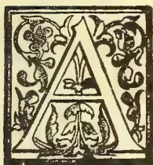

ALMOST everywhere in the districts of the Cataracts there are hills of some hundreds of yards of elevation, the soil of which is argillaceous and the vegetation such as I have just described. The rivers wind through narrow valleys, the alluvial soil of which is

remarkably fertile. And here it is that the natives often establish their villages, and plant their oil-palms and the "safo" (*Sachylobus edulis*, now called *Canarium edula*,) which develop vigorously. In the neighbourhood, that is on the lower slopes of the hills, or in the valleys, they cultivate the manioc, the sweet-potato, and the earth-nut. There are also some villages in the Savannahs, even on the hill tops or on plateaux; one discovers them from a distance by their clusters of oil-palm and safo planted long ago by the side of dwellings.

There are also sandy districts, and they form extensive plains and are planted by the natives with ground-nuts. This plant gives abundant harvests, principally in the region of North Manyanga, of Banza Kasi and Banza Makuta. Formerly the natives of these regions used to bring their ground-nuts to Matadi, to the Dutch factory, to exchange for salt, which they sold in the interior.

In the wooded ravines other useful plants may be the objects of commercial transactions, such as the oil-palm for its oil and its seeds; the *Landolphia*, one kind of which, at least, gives a good India-rubber

the "panza" or *Ponteclethra*, that fine tree with large pods, containing large oily seeds. If these natural products are scarcely, if at all, objects of trade, we must attribute it to the sparseness of the population and the profits to be reaped from portering. One must also remember the comparatively limited extent of the wooded areas. We are not in the primeval forest where trees and useful lianas abound.

When the railway will have put a stop to the portering between Matadi and Leopoldville, the population will resume its ancient occupations. The ground-nut will again be more largely cultivated and the natural products of the country will be better utilized. Thanks to favourable tariffs, the railway will facilitate the export. I cannot say at all what will be the product of the future for this region.

There is still one cultivation which may acquire a certain importance in the districts of the Cataracts; it is that of the Coffee tree (of Liberia). Near Luvi-tuku station, I saw a plantation consisting of about 500 plants 2 years old and 1,500 recently planted. They are shaded by oil-palms and panza and are coming on very well. One may therefore say that the same kind planted in the wooded valleys near the streams will give good results, in spite of the long dry season. I do not think that very large plantations would be possible; therefore the State will be wise not to undertake them. It would be better to induce the natives to cultivate small plots around their own villages, and to give them seed and even young plants. I consider it would be useless to try to cultivate coffee on the forestless hills, nor would I recommend it on the plateaux unless they attain an altitude of at least 2,000 to 2,500 ft. It is too dry during a great part of the year.

DISTRICT OF STANLEY POOL AND OF THE EASTERN KWANGO.

In these sandy regions, in open savannah, some interesting varieties of plants grow in abundance. They belong to the *Landolphia* group, India-rubber creepers

671------------------------------------------------

652THE TROPICAL AGRICULTURIST.[APRIL 1, 1902.

(lianas) have also some latex (lac), but instead of climbing, they run along underground, like long stems, and throw up aerial branches 20 to 60 centimetres high. I have distinguished five or six different varieties of this curious kind of *Landolphia*—true subterranean creepers—but only one of them has a great economic importance. The natives easily distinguish it from the others, although they are very much alike, and extract from it an India-rubber of pretty good quality, but capable of improvement by the elimination of the woody residue.

This India-rubber is actually produced in a part of the Stanley Pool district, and is seen in quantity in the markets. Last year the natives brought about 30 tons to Lukunga. But the greatest quantity of it undoubtedly comes from a district I have not visited eastern Kwango. According to what I am told by two functionaries, Messrs. Costermans and Deghilage, the India-rubber weed there covers vast sandy territories, and the natives work it on a large scale. Not long ago the rubber from this region was exported to the Portuguese possessions of Angola, and was there the object of a considerable traffic.

Here are some figures that I owe to M. Deghilage, who has for a long time traversed the Western Kwango region:—"I have seen in the market of Kenghe Diadia 30 tons of rubber exposed for sale. This product can be bought at 80 centimes the kilogramme, and it is sold in Europe at 4 fr. or R4.50. Transport by caravans to Matadi costs 8 francs for 35 kilogrammes (78½ lb.) The same agent values the actual production of rubber of the Kwango district, at 500 tons a year, a quantity which might easily be doubled. Such a production in a generally poor, sandy soil is worthy of note, and warns us to beware of condemning any region from a superficial examination of its soil and vegetation.

What I have said of the production of palm oil, of ronza seed and of rubber may be applied to the neighbouring district. I hope even more from the extension of the cultivation of the ground nut in the sandy plains of the Stanley Pool and the Kwango districts. It is already much cultivated and might be much more so.

As for the cultivation of Coffee, I should be much less affirmative. I do not doubt that one might also cultivate it in the wooded fertile valleys, but I think it is an error to wish to make large plantations as they tried to do near the pool, at Kinchassa and especially at Gaiema. In these two localities, 4 or 5 years ago, many coffee trees were planted in a soil essentially sandy, with soil to a depth of 40 or 50 centimetres (18 or 20 inches) rarely more. I will give you word for word what I noted on the spot on the 10th of last March:—"Beside the 350 coffee trees 4 to 10 years of age and the two Cacao trees 6 or 7 years old at Leopoldville, they planted two years ago at Gaiema nearly 10,000 coffee and 1,600 cacao trees. Let us look at the Cacao. A first plantation almost equally as important has failed, a victim to the insects that devour the cacao leaves touched by the drought. What will become of their successors. They have had to be protected by thick shade and nevertheless many of them have perished. In fact, Cacao must not be thought of for large plantations in the district.

Liberian coffee suits better, but we must not found large hopes even on this. Not only that neither soil nor climate is of the best, but also that labour is very short near the pool. In fact, it is very difficult to provide the labourers now with sufficient food, for want of native cultivation in the surrounding regions. And any fresh extension in coffee cultivation would render the victualling of the blacks still more precarious.

In short, under these conditions, one cannot believe that the opening of large plantations would be profitable. Rather should one abandon these efforts in order to concentrate every effort on the equatorial zone.

#### DISTRICT OF THE LAKE LEOPOLD II.

At the village of Quebo plantains are cultivated by the natives and papaw trees are fertile and vigorous; giant grasses abound where the soil is turned up; the forest is nowhere more brilliant than in the neighbourhood of Malepie. I have there seen a stem of India-rubber creeper 10 centimetres in diameter, bearing several transverse incisions, a proof that the natives know and practise the good way of extracting the rubber.

Certainly neither the soil of Malepie nor that of Quebo can be considered as very favourable for the cultivation of coffee. It is too sandy, and the six months of drought would make the process of watering too difficult. But tobacco seems to offer a more hopeful cultivation, especially if the analysis of the soil shows a sufficiency of potash. It is the same with the earth-nut, the cultivation of which should be left entirely to the natives. The oil-palm is not very abundant. On the other hand there are many rubber creepers in the forest and along the banks. Rubber constitutes the most important product of this district, and will for a long time remain so, especially if, as Messrs. Jacques, Delcommune and Gillain affirm, the eastern region is entirely covered with forests. According to information I have received, the region ought to give 300 to 400 tons of rubber for annum. The specimens I have seen were of very good quality and are worth 6 to 7 francs in Europe per kilogramme; they had been bought at about 20 centimes (2d.)

I would also note the large quantity of copal that exists in the Lake region, and which the natives collect at the foot of the trees along the banks. The value of gum copal is variable, and I have not yet had my specimens examined. But, when the railway is finished, it will be possible to export this to Europe in large quantities. I cannot give the cost of handling or collecting it, as that was only attempted two days before I left.

#### DISTRICTS OF THE KASSAI AND THE LUALABA.

Further on rise little hillocks well wooded in which oil-palms and *Lantodhria* abound. Here begins the variety of rubber known as Kassai which is so much sought after in Europe on account of its purity and excellence. The forest here also extends towards the south to the Djuma or Kulu which traverses a forest said to contain much rubber. Further on the country resumes the appearance of the caravan route, but the elevations are all covered with forests. You find there all the types of equatorial vegetation, including oil-palms, rubber creepers, rattans, some *Raphia*, trees of coloured wood in great variety. The soil is no longer clayey, but purely sandy and brown from the earth which is more than three feet deep. There are many sites there on the hilly parts suited for agricultural undertakings. Several factories (agencies) exist in these latitudes. Their principal resource is India-rubber, which they buy at 35 to 40 centimes the kilogramme\*; labourers can be produced for 10 centimes a day. Up to Luebo, on the Lulua, the aspect is the same and the panorama is marvellous, so various is the vegetation.

Luebo is surrounded by fine forests and is an important market for the red rubber of Kassai (worth 7 to 7½ fr. the kilo.) The natives harvest it by incision and prepare balls strung together in chaplets; or else the latex is warmed and made into bricks 20 centimetres long and 4 to 6 broad, and of a dark colour. The rubber is bought at 35 to 37 centimes the kilogramme in exchange for cloth and sometimes for cowries; allowing for the cost of transport (60 to 1000/0) the kilog. costs at most 75 centimes (7½). Rubber exists in abundance in the forests and seems to be methodically harvested by incision. From information furnished to me, I conclude that from 500 to 700 tons a year of the best quality could easily be harvested, provided goods in exchange were always forthcoming, and this only after the railway is finished.

\*kilogramme=2 1.5 lbs.

672------------------------------------------------

APRIL 1 1902]THE TROPICAL AGRICULTURIST.653

The population is relatively large and is distinguished by remarkable aptitude for work and for trade.

In the forests oil palms and panza are abundant. There is also a kind of palm, the *Raphia*, very wide spread in the basin of the Congo, and which will be dealt with advantageously when the railway is made. Its leaves furnish fibrous thongs, used there in weaving little mats (*mandiba*), and they are used by horticulturists in Europe for ligatures. At present Madagascar furnishes the fibres known as *Raphia*, and it is brought to the French ports; the price of it varies from frs. 1.50 to 2 fr. the kilog. On the Congo one could buy them anywhere for a few centimes.

Beyond the Lusambo, on the shores of the Sankurn grows wild a very interesting kind of *Coffee-tree*, which seem to me new. It exists also, I am told, in abundance on the left bank of the Lomani, west of the Gandu. It is a small tree 3 to 5 yards high with branches spreading out often over the streams, with fine leaves larger than those of the Liberian coffee, and small flowers, smaller than those of the Arabian variety. The berries are of medium size, the seeds rather small and regular and have a very delicate aroma. For several days I drank coffee of this kind that had been gathered towards Gandu and it was excellent.

M. Middegh assures me that this coffee abounds in the woods on the left bank of the Lomani, and is even cultivated in certain villages. This variety has been cultivated, first by the Arabs, and then by M. Gillain at Lusambo station, where there were about 500 trees at the time of my visit. In the same plantation there were some Liberian coffee trees planted at the same time, but which had not developed so well as this wild kind. I attribute this to the nature of the soil of Lusambo: a siliceous earth, rich in vegetable soil for 20 or 30 centimetres, down. In such land one must give up Liberian in favour of the new kind, accustomed to grow on the sandy soils so common in the basins of the upper Kassai, the Sankuru and the Lomani. This coffee seems to me to have a great future before it, especially after the southern portion of the great forests is opened up to cultivation.

We are already acquainted with several of the useful plants of the great African forests. First comes the *Landolphia*, or india-rubber creeper; there are certainly several varieties, the one that seems to me to predominate has stalks that attain perhaps to a diameter of 20 centimetres, large leaves and medium-sized fruit. The latex gives about half its volume of rubber. It is this extraordinary richness which has enabled M. Rue, a State functionary, to succeed in a preparation of rubber which had been vainly attempted in the Congo. A company had been trying to prepare large lumps or masses, but without success, until then. M. Rue's method is as follows:—The rubber gathered from the stems is brought to a place in the forest where it is poured into wooden or zinc receptacles. Boxes that had been used in packing up cartridges have been used; they are 50 to 70 centimetres long, 25 wide and 7 to 10 centimetres deep. Left for some hours, at night, the latex coagulates; it does so more rapidly and regularly if it is slightly warmed. It is necessary to knead the coagulated latex to draw out the water or otherwise make cavities in the mass. That is the worst defect in the rubber thus prepared. It would be better not to make such large cakes, and to have them only 8 to 10 centimetres thick. For it is indispensable to dispel most of the imbibed water by exposing the blocks for some months in airy sheds. The proximity of river banks, especially if they are subject to frequent fogs, is bad. Mr. Rue's method could not be adopted with latex poor in rubber, such as is collected by the lake Leopold, and especially in the districts of the equator. In 1895 the Arab zone produced nearly 300 tons of rubber. The production could easily have risen to 1,000 tons, if the Europeans had had goods in sufficient quantity in exchange.

In an island of the Lualaba, above Wabundu, grows, in a wild state, a kind of Coffee much like the Arabian. It is also found opposite Coquilhatville and on the banks of the Uelle and the Ubangi. It forms a shrub 6 to 18 feet high, with narrow leaves, small elongated beans, rather small berries of rather irregular shape owing to there being often three berries in a bean. The colour of the berry is grey, and there is so little aroma that many berries are required to produce a fair cup of coffee.

At Wanie Kukula, I saw in the forests another kind of wild Coffee whose reputation has no longer to be made: Liberian Coffee living in the forest under the shade of great trees. There are trees in flower 30 to 40 feet high, the trunks of which measured 15 to 25 centimetres in diameter 3 feet from the ground. They bore branches only at the summit of the stems, which is explained by the struggle for light of the denizens of the forest. The seeds are a little smaller than those of the cultivated Liberian trees. In every point the wild and the cultivated Liberian resemble one another, and in a plantation of 5 to 6 hundred trees near by, it was not possible to distinguish them. The trees belonged to some Arab chiefs to whom the Commandant Lothaire had advised the cultivation of wild coffee and had given seeds of the cultivated variety.

We must note then the existence, in their wild state, of three different kinds of coffee in the Congo State, and two of these have a great economic importance. For if equatorial Africa is the home of these precious plants, there is no doubt that they may be cultivated there with success. To satisfy oneself, it is sufficient to visit the plantations of Wabundu, and especially those of Stanley Falls. At the latter station, 400 trees were planted in 1890 on the recent deposits of the left bank of the river. They are very fine and were covered with berries when I passed; one of these trees was photographed after it had been stripped. The fruits weighed 21 kilog. (47 lbs.) which corresponds to about 3 kilo. of coffee (7 lb.). After the Arab campaign, coffee planting was resumed vigorously under the direction of M. Rom. Last year there were more than 5,500 plants over a year old and  $\frac{3}{4}$  yds. high and growing vigorously.

From observations made at the station since 1893, it is found that it rains all the year, and that there are only 2 months (February and July, and sometimes also January) in which rain is less abundant, but there is never more than an interval of 10 or 12 days. At Romee, great fertility was attributed to some sandy land formerly cultivated by the Arabs. It was really owing to the burning of forest vegetation there; in a year's time some hundreds of coffee bushes expressed this fact most evidently, and they were removed to the opposite or right bank of the river, formed of alluvium and clay, where they flourish.

The Forest Region of the Arab zone is certainly the richest region of the Independent State for its forests, its rubber, its suitability for coffee, and above all for the cheapness of labour. The wages are from 1d. to 2d. per day, and the Arab rule has taught the people to work.

## A PRELIMINARY NOTE ON THE ENZYME IN TEA.

(Continued from page 584.)

### ENZYME AND LIGHT,

According to Reynolds Green there is some relation between the quantity of enzyme in growing leaves and light. He states (page 404) that bright sunlight was found to have a powerfully destructive influence on the enzyme, and that other observers had noticed that there was more enzyme in leaves gathered early in the morning than late in the evening. Presuming the enzyme in tea has some effect on quality or flavour, it would, according to the above observations,

673------------------------------------------------

654THE TROPICAL AGRICULTURIST.[APRIL 1, 1902.

be advisable to pluck as early as possible in the day, and some planters have stated that teas made from leaves plucked early in the morning are better than others. This would also have a considerable bearing on the beneficial effect or otherwise, of shade on the quality of tea grown beneath it. To investigate this question, we examined leaf plucked at 6 a. m., 2 p. m. and 6 p. m., (and occasionally at 10 p. m.) for several days under conditions of severe drought and excessive moisture.

The result of these microscopical investigations show that the enzyme (or its zymogen) is present in abundance at all hours and under all conditions, so that it would be difficult to ascribe improved quality, if any, in early plucked leaf to a particular abundance of enzyme.

Since an enzyme is present in all tea leaf under all conditions, the next point to determine is its function in the plant, and its action during the manufacture of tea.

As regards the function of the enzyme in the living tea plant, it is difficult to make any definite statements at present since there are so few optically visible store-products in the leaf requiring its action to render them soluble. This point is further investigated, and we can only state that the activity of the enzyme is apparently connected with the glucosidal products in the leaf and possibly with the proteids.

The enzyme has been isolated, by one of us, and its action determined on a solution of tannin, prepared from tea, with the result of a browning of the liquid and the formation of a small proportion of sugar. We would not, however, place too much reliance on this reaction until confirmed by further tests, as the tannin of tea is so prone to undergo change, that the chemical processes necessary for its isolation might induce a somewhat similar change. The best practical method of proving the effect of the enzyme would be to isolate a large quantity of it from a highly flavoured tea, and to add this to a low country tea during manufacture and so determine any enhancement of flavour.

#### METHOD OF EXTRACTION.

The simplest method is to bruise the withered leaf in contact with hide powder or sheet gelatine for some hours, then to remove the gelatine, which has now become very tough and leathery, and to again bruise the leaf with a small quantity of water at about 80° F. The damp mass is then subjected to high pressure to express all the juices, which are then filtered as rapidly as possible, and precipitated with several volumes of alcohol. After some hours the bulk of the solution is poured off from the flocculent precipitate which has subsided, and this is again treated with water to dissolve the enzyme, the solution filtered and again precipitated with several volumes of strong alcohol. The precipitated enzyme can be re-subjected to this treatment to further purify it, and finally collected and dried at the ordinary temperature to a whitish powder, or it can be collected and dissolve in water to a nearly colourless solution.

Both the powder and solution prepared in this manner give a deep blue reaction with gum guaiacum, and as other products which are known to also give a blue reaction with this test have been removed by the method of preparation, except perhaps traces of proteid, we may conclude that the reaction in the original leaf is almost certainly due to the presence of the enzyme.

Tannin, gallic acid, caffeine and other products in tea have been tested separately, and found not to have any reaction with the resin.

If the enzyme has anything to do with *flavour* in tea, the questions to be solved are:—

1st. Is it acting during the growth of the leaf?

2nd. Does it only act after development from an inert form (zymogen) during the withering process,

3rd. Does it act during or after rolling, since then the contents of the cells are more or less expressed and mixed with one another.

1st. The enzyme is no doubt active in the leaf during the life of the plant at all elevations, and the fact that the flavour of tea does not appear until we get into higher elevations would tend to show that its activity had little, if anything, to do with the flavour.

The maximum activity of other enzymes is associated with a definite range of temperature frequently above that prevailing even in the low country of Ceylon; hence we might infer that the activity of the enzyme in tea would be greatest in the hot low country, and yet we know that these teas have much less flavour than those grown in the high country.

2nd. The presence of a zymogen or mother enzyme was indicated in many of our experiments. Freshly cut sections of leaf frequently gave no reaction with the gum guaiacum test, until after frequent moistenings and exposure to air. This could only be due to the zymogen being rapidly converted by oxidation into the active enzyme. Again withered leaf invariably gave a quicker and more intense reaction than the fresh leaf, which would also indicate a similar change. Again sections frequently give a more intense blue reaction after treatment with hydrogen peroxide, which may also be due to the rapid oxidation of the zymogen into the active enzyme, or possibly to a direct action between the two reagents themselves.

The Chinese method of withering tea leaf may also be dependent for its success partly on the fact that the frequent throwing in the air and gentle patting with the hands allows an oxidation of the zymogen into the enzyme.

Assuming that the abundance of enzyme is desirable, it would seem worth our while to employ a system of withering which would permit of a degree of oxidation sufficient to convert the whole of the zymogen into the active form.

Experiments in this direction, and also on the effect of light in the development of the active enzyme in the leaf are now being made.

3rd. In the rolling process one might expect that very large percentage of the cells would be ruptured, and their contents mixed with one another and exposed to the air. It is, however, surprising that only a very small percentage of cells are really broken, and the material which is expressed has mainly been driven through the cell walls.

Examination of rolled leaf revealed about the same amount of enzyme as in the withered leaf, and only differed from it in being more diffuse. In order to get the zymogen or enzyme more exposed to the air, high pressure during rolling would be suggested, as this would no doubt insure the rupturing of more cells, and the more intimate mixing of cell contents. In practice, however, it has been frequently found that white great pressure increases the strength of the tea, the flavour becomes more or less masked or diminished.

Several tests have proved that the enzyme is entirely destroyed by sufficient heat in the ordinary process of drying but its action is probably increased to a marked extent for the first few minutes in the drying machine, as it has often been demonstrated, that the actual temperature of the leaf while wet is usually 80° to 100° F. below the temperature of the air in the machine, which would represent a temperature in which the majority of enzymes are most active.

The enzyme or its action is also entirely destroyed by steam, as is shown in the manufacture of green tea, and there are one or two points in this connection which probably indicate the true action of the enzyme in the manufacture of black tea.

The first of these is the fact that tea leaf thoroughly wilted by steam will not acquire the brown coppery

674------------------------------------------------

APRIL 1, 1902.]THE TROPICAL AGRICULTURIST.655

colour of the infused leaf of black tea, although treated in exactly the same manner, with the exception of the preliminary heating to a temperature of boiling water.

This would indicate that the presence of the active enzyme was necessary for the proper oxidation of the constituents of the sap or leaf to produce the colour of black tea.

From the higher percentage of unchanged tannin in green tea it would appear that the enzyme has a considerable influence on this product.

Another point is in connection with the *flavour*. If there is any flavour in green tea it cannot be due to the action of the enzyme during manufacture, as this is completely destroyed in the preliminary process of steaming. Some planters state that the up-country green teas have no more flavour than the low-country teas of the same class, and if this is correct, it would appear that the enzyme has some effect in producing flavour, as its destruction has apparently prevented the development of the flavour that we know is characteristic of the black teas from up-country leaf. If it is a fact that leaf from an up-country estate has less flavour when manufactured into green instead of black tea, the diminution of flavour might be due to the destruction of the enzyme, or, as is more likely, to the loss of essential oil during the steaming process.

In the investigation which we are continuing, there are several points of interest which may be mentioned here. The most important is that of determining the nature of the reactions and the products, when the several constituents of the leaf are brought into contact with the pure enzyme at different temperatures. This is, of course, first being carried out in the laboratory, and if possible and deemed advantageous, will be applied in the factory.

The reaction between the enzyme and the tannin, essential oil, cellulose and protid, is being determined separately for each of these bodies, together with that between the enzyme and tea leaf *en masse*. It is obvious that the products of these reactions are many and not always easy to recognize, but if we can prove that any of them will impart a desirable flavour to tea, a great point will have been gained, though it will remain to be seen whether it can be used commercially.

The work must be continued in the factory at low and high elevations, and this we are prepared to do at the earliest opportunity.

## WOODINESS OF THE PASSION FRUIT.

A. DESPEISSIS.

A disease hitherto unknown in Western Australia was, last season, first observed on some locally grown passion vines. That disease has of late years played havoc with the passion fruit plantations around Sydney, and our ports have this season been made the dumping ground of several important consignments of diseased passion.

The figures illustrating this "woodiness" show the disease in a mild form.

They are taken from a Paper on the subject, prepared by Dr. N. A. Cobb, Government Vegetable Pathologist of New South Wales.

The disease is still an obscure one. First observed around Parramatta some seven or eight years ago, it has since spread to the whole surrounding County of Cumberland, where its progress is more or less erratic.

It affects most vineyards in the locality named, and at the same time spares a few in the centre of infection.

Even in a diseased vineyard some plants escape; the disease is less common on moist, free soil, suited to passion fruit, than elsewhere.

### SYMPTOMS.

A "woody" passion vine is stunted in growth, with short distorted canes, of pale-yellowish leaves

instead of a dark-green colour. The stocks are sometimes enlarged and knobby; much of the fruit drops early the rest hang on, become distorted, crack on the surface, and when cut open are either empty and show a considerable thickness of the rind, or what there is of the edible pulp is thin, has a "flat" taste, with a colour different from that found in healthy fruit. The seeds do not ripen properly, and remain light and sometimes glassy instead of turning black.

### CAUSES OF THE DISEASE.

A disease passion vine often shows amongst woody fruits, some which have every appearance of soundness, and yet seeds from these apparently sound fruit contain in them germs of the disease which, when shown, they transmit to the resulting plant.

Exposed situations and frosts are also known to have a prejudicial influence on passion vines showing a tendency to woodiness, but, above all, exhaustion of the soil seems to accompany in most cases the woody disease.

The passion fruit plant is most exacting on the store of plant food in the ground. By reason of its rank growth and its prodigious bearing capacity (it bears two to three crops of fruit each year) it soon exhausts the soil of nourishment as well as of moisture. It has been noticed that, where manured, the vines are less affected by the disease than are vines growing alongside which have been stunted of fertilisers.

Dr. Cobb has observed on the yellow spotted leaves of diseased plants, as well as on the spotted bark of dead branches, a specific fungus which he believes to be associated with woodiness of the passion fruit.

### REMEDIES.

The passion vine is a gross feeder. According to Mr. F. B. Guthrie's computation, each passion vine with fruit removes on an average annually from the soils 63oz. nitrogen, 13oz. phosphoric acid, and 23 oz. potash, so that a vineyard planted with 300 (12ft. x 12ft.) passion vines to the acre would remove: nitrogen, 117 lbs.; phosphoric acid, 28 lbs.; potash, 52 lbs.

Knowing that sulphate of ammonia of commerce contains about 20 per cent. of nitrogen, superphosphate about 14 per cent. phosphoric acid, and sulphate of potash of commerce 50 per cent. of potash, we arrive at the following mixture, in order to restore to the land all the elements of plant food extracted by passion vines, and by a crop of passion fruit, viz.:-

<table>
<tr>
<td>Sulphate of Ammonia</td>
<td>...</td>
<td>..</td>
<td>600 lb.</td>
</tr>
<tr>
<td>Superphosphate of Lime</td>
<td>..</td>
<td>..</td>
<td>200 "</td>
</tr>
<tr>
<td>Sulphate of Potash,</td>
<td>..</td>
<td>..</td>
<td>100 "</td>
</tr>
</table>

Such a mixture, applied at the rate of 3 lb., per vine, would cost 4d. per vine or a little over. It should be applied a year or so after the vines are planted.

Besides a liberal application of chemical fertilisers, it has been suggested that, considering that the woody disease is propagated by means of diseased seeds, and, moreover, that in all attacked vineyards there are some vines which always look healthy and appear to be proof against the blight, cuttings be taken from such vines and planted with a view to obtaining passion vines endowed with the immunity of the parent.—*Journal of the Department of Agriculture of Western Australia.*

## ALEXANDRIA BANANA DISEASE.

PRELIMINARY REPORT BY DR. LOOS AND  
G. P. FOADEN.

A few days ago we stated that the report of Dr. Loos and Mr. Foaden on the disease, which has caused such widespread destruction among the Alexandria bananas, had appeared and been issued by the Municipality. The disease, according to the report, is caused by a worm of the same species as that which caused great

675------------------------------------------------

656THE TROPICAL AGRICULTURIST.[APRIL 1, 1902.

havo from 1885 to 1888 in Brazil completely destroying the plantations in large districts in that country. The report draws the following analogy between this disease and the present out-break at Alexandria:—

“The history of the former disease is very interesting and instructive inasmuch as the disease could be traced back to 1869, that is to say to years before the out-break became really serious. Nothing was known of the pest nor were any attempts made to cope with it until the year 1887, when a surface of about 715,000 feddans was infected and the cultivation of coffee rendered impossible. The similarity to the present case is striking. It has been known for some 3 or 4 years that a banana disease existed in the district around Alexandria. The disease was first located in a small area, then at some little distance from the first observed area, and finally is now spread in the whole neighbourhood, it not only infecting plantations but has found its way into private gardens.”

We need not reproduce the first part of the report, which is purely technical, but the conclusion, dealing with the methods of stamping out the disease, deserves to be reproduced in full:—

“The most important question to be considered, is how to cope with the disease, in other words, how to prevent the propagation of the worms. This can only be arrived at through an exact knowledge of the life histories of the pests. In order to arrive at this, an examination at one season of the year will not suffice, and with the advent of warmer weather further observations may be made. It has been seen that all the different species pass a certain period of their life history outside the plants themselves, that is to say, in the soil, this being a common feature in the history of all parasitic animals since it is the only means by which they can spread. The time, therefore, in which to institute an attack is when the majority are found in the soil, for any attempt to reach the pest when within the plant must be doomed to failure, as it is then in perfect security. In countries where there are well-defined seasons with great difference between them it is more easy to ascertain exactly the different stages than is the case with such a climate as that at Alexandria where probably development goes on steadily, that is to say, the few worms are always present in the soil. It is, on the other hand, also very likely that their numbers become considerably increased at certain periods in connection with the subsequent generations. Any remedy to be applied would therefore have its maximum effect only if applied during those periods. This matter can, however, only be definitely decided when the life histories of the species have been followed throughout. Experiments could then be conducted as to the most suitable means to employ. In coping with nematodes attacking the beet crop in Germany a method was successfully adopted which may be mentioned here. Nematodes are found in, one might say, almost every plant in small numbers. Practically all nematodes living as parasites on plants are not exclusively parasitic on one individual species, for if they find the necessary favourable conditions for existence they will attack another host, just as a human being or an animal can carry injury to health, and only show signs of suffering when the number increases, so within certain limits can plants withstand nematodes, and only show signs of disease when their numbers become excessive. To combat the pest in the sugar beet plantations, other plants which were suitable as hosts were used to attract the pest. The seed was sown early in spring, some weeks before the beet were planted.

“The larvae of the nematode hibernate freely in the soil and attacked the newly-sown plants which were subsequently removed and destroyed. There were thus removed from the soil vast numbers of the pest which would otherwise have attacked the beet. This did not result naturally in a complete clearance of the beet but the numbers remaining,

the beet were enable to resist. The adoption of this method in the case of bananas would present certain modifications but some thing might be done in this direction and then by providing the plant with suitable conditions for recovery such as good cultivation and an application of suitable manure they may recover.

“The idea has been expressed that the disease is one of recent introduction, but this does not seem probable. Species of the genus *heterodera* were found by Dr. Loos in a garden at Alexandria some years since, and these were similar to the *heterodera* of the bananas. It is probable that they have now found a most suitable host in bananas and have consequently rapidly increased in numbers. They have probably been living in banana plantations for some considerable time and the result of years of increase is now very apparent.

“Experiments in the direction indicated should be attempted; first to ascertain plants most suitable, the times at which they should be shown, and the time at which they should be removed. The latter information could of course be derived by a study of the complete life history of the pests.

“Various remedies have been suggested in the direction of applying to the soil some substance which would prove harmful to the pests. We think the most suitable substance to try at first is ordinary lime. This substance is most commonly applied as a remedy for insect pests either alone or mixed with common soot. Lime from gas works might also be employed. A certain quantity well incorporated with the soil around the plants might have a most beneficial effect, and would probably benefit the crop at the same time. It is at any rate a practical and inexpensive method. Much has also been said concerning an application of nitrates and many misleading and inaccurate figures published regarding the percentage of nitrates present in the soil. We do not deny that an application of nitrogenous manure may have beneficial effects, not as a direct remedy against the pests but merely as encouraging and stimulating the plant and helping it, provided the numbers of nematodes are not too excessive to outgrow and overcome attack.

“Experiments might also show if the worms in question or similar ones are capable of attacking other and more important crops in the country. Wheat and onions are known to suffer occasionally by the attacks of nematode worms belonging to the genus *Zylenchus*. The *Zylenchus* of the onions causes great damage in Europe and is found occasionally in the crop of Upper Egypt.”—*Egyptian Gazette*.

## CAMPHOR.

(Continued from page, 587.)

### PREPARATION OF THE CAMPHOR.

As soon as the plants have reached a fair size and formed stout woody stems below—say in three years or less in very good situations—they may be clipped. The simplest method will perhaps be to use hedge shears, placing a long basket below the hedge to catch the clippings. Only the leaves and young twigs are required; woody twigs yield little or no camphor.

In Japan, where, however, they only use the woods of full-grown trees as a source of camphor, the chip of wood are distilled in a primitive-looking but effective still, with bamboo tubes (these have the advantage that they can afterwards be split to remove any camphor from them) and a wooden condenser with water running over its lid. In Ceylon probably the best method will be to fix up a small still of any good pattern with a glass condenser and plentiful water supply, working it by means of steam from the factory boiler. As the distillation is a somewhat uncertain operation, especially to the beginner, and as it is probable that more efficient methods will be discovered, the details of the principal experiments tried, are given below. Material for these experi-

676------------------------------------------------

APRIL 1, 1902.]THE TROPICAL AGRICULTURIST.657

ments was obtained from the gardens at Peradeniya (1,600 feet), Hakgala (5,600 feet), and Anuradhapura, (300 feet).

#### CAMPHOR DISTILLATION.

The first distillations were from 112 lb. of prunings received from Hakgala on the 28th June, 1900. These were conducted in a large cask fitted with a metal cover leading to a metal condenser, which was cooled by a constant flow of water. Distillation was effected by means of steam from a boiler passing into the lower part of the cask below a perforated iron plate. The prunings were chopped up into fragments about 1 inch long, covered with water, the top, connected with the condenser, luted on, and steam turned on to gradually bring the water to the boil.

A strong pungent smell of camphor and eucalyptus came off as soon as distillation commenced, which persisted for some time even when the distillate was cooled to 50° F., a temperature below that which could be obtained practically. The loss was minimized by bringing the water to the boil very slowly, and only admitting just sufficient steam to keep it at the boiling temperature. It was found that the metal cover to the cask retained a good proportion of the camphor, but it was not so pure as when condensed in a wooden box similar to that in use in China and Japan. The purest camphor was obtained when the distillate was made to pass through a long glass tube surrounded with a jacket of cold (running) water, the crystals being deposited when the temperature of the glass did not exceed 50° C. or 122° F., a temperature that could easily be maintained in a condensing apparatus up-country at all times of the year. In the low-country a more rapid flow of condensing water and a proportionately longer condensing apparatus would be required to obtain the same results, as the water is much warmer and the steam also is at a higher temperature.

In all the experiments the camphor had almost entirely distilled over during the first three hours, as several distillations conducted for twelve hours and longer resulted in no better yield, and the smell of the camphor under these circumstances was contaminated with that of decomposition products from the nitrogenous matter, &c., in the leaves and twigs. Three distillations could be made in the same apparatus during the day.

The amount of steam required for the distillation even of large quantities would be nominal, and would hardly be felt in an ordinary boiler working in a tea factory.

#### YIELD OF CAMPHOR.

The first distillation from part of the prunings obtained from Hakgala in June, 1900, only yielded '35 per cent., but this was increased to '62 per cent. by better regulation of the steam pressure and the condensing water. The camphor had a slight smell of eucalyptus, and was not so strong as ordinary camphor. The leaves were quite fresh when distilled.

Separate distillations were again made in August with fresh leaves and twigs, and the green branches of about half inch to 1 inch thick, the former yielded '85 per cent. camphor, but the latter a mere trace, both of camphor and oil.

*7th September, 1900.*—Three distillations of camphor leaves from Peradeniya were made in the usual manner the yield from the first being 1.10 per cent. of camphor and camphor oil. In the second distillation, when the leaves had partly dried, 1.06 per cent. of camphor and oil was obtained, calculated on the fresh leaves. In the third distillation the leaves had undergone partial decomposition, the result of becoming heated to a temperature of 106° F. The yield in this case was '68 per cent. camphor and '38 per cent. of oil, so that it would appear advisable to distil the leaves as fresh as possible, as the oil is less valuable than the camphor.

*9th October 1900.*—A sample of young camphor flush weighing 11½ lb, plucked from two trees in Hakgala,

one 8 feet in diameter and 12 feet high, yielding 8 lb. and the other 5 feet in diameter and 7 feet high, yielding 3½ lb. This was carefully distilled in a copper retort over a lamp, and the vapour condensed in a glass vessel. In the first four hours '63 per cent of pure camphor was obtained, which smelled only of pure camphor; on further distillation '08 per cent. more camphor was obtained, which did not smell quite so pure. Heating by the direct flame beneath the vessel appears to take longer in removing all the camphor than driving it over with steam under slight pressure.

*24th October, 1900.*—A distillation of camphor clippings from Hakgala yielded '77 per cent. camphor and '27 per cent. oil.

*30th October 1900.*—A distillation of 12 lb. of camphor flush was made in a copper vessel with a glass condenser, yielded '69 per cent. camphor and '34 per cent. camphor oil. The trees were in active growth when this flush was plucked.

*9th January, 1901.*—A camphor tree that had become slightly cankered was received from Hakgala in separate parcels of leaves, branches, stem, and roots. Several distillations of the leaves and twigs were made, both in the fresh state and when air-dried, some of them being continued for twelve hours. The yield of camphor and oil varied somewhat, but appeared to depend on the proportion of leaves to twigs, the latter containing much less than the former. A glass condenser was employed for all these distillations, the camphor and oil being obtained quite pure.

The first experiment yielded '875 per cent. camphor and '986 per cent. oil, a far larger proportion of oil than in any previous distillation of similar leaf.

A second distillation, which was continued at a low temperature for eleven hours, yielded 1.08 per cent. pure camphor and 0.32 per cent. oil.

Five other distillations at intervals of some days with the air-dried leaves gave the following yields:—

No. 1.—2.310 per cent. camphor and 1.14 per cent. oil equal to 1.02 per cent. on fresh leaf.

No. 2.—2.149 per cent. camphor and oil, equal to '98 per cent. on fresh leaf.

No. 3.—2.425 per cent. camphor and traces of oil equal to 1.05 per cent. on fresh leaf.

No. 4.—2.380 per cent. camphor and traces of oil equal to 1.01 per cent. on fresh leaf.

No. 5.—2.080 per cent. camphor and traces of oil equal to '96 per cent. on fresh leaf.

From these figures it will be seen that air-drying the leaf before distillation does not cause any appreciable loss of camphor, though a certain amount of oil disappears, either by volatilization or oxidation. The camphor obtained from the air-dried leaf also had a somewhat purer smell than that from the fresh leaf though this latter was easily rendered pure by redistillation with steam.

Three distillations were made of the branches and stem of the camphor tree, but no appreciable quantity of camphor was obtained from either, nor did the bark of the stem appear to contain more than traces. The roots, however, contained an oil, 5 lb. of roots yielding 1.22 per cent. This oil was located mainly in the bark and in a thin layer of wood beneath it. It had only a slight smell of camphor, and more resembled a mixture of aniseed and peppermint.

On the 7th August, 1901, 5 lb. of young flush was received from Hakgala in a slightly heated condition. It was at once put into a copper vessel with fifteen pints of water, and a glass dome luted on, which was connected with a glass condenser. The water was heated slowly from below, and a thermometer placed so as to register the temperature of the Vapour 2 inches above the water and camphor leaves.

At 50° C. (122° F.) crystal of camphor condensed on the glass dome, which at 90° C. 194° F. were carried back into the water by the condensed steam. At 100° C. the steam and camphor vapour was passing rapidly into the glass condenser, while the leaves were covered with oily drops of camphor and oil,

677------------------------------------------------

658THE TROPICAL AGRICULTURIST[APRIL 1, 1902.

Distillation at 100° C. was continued for two hours, when 4½ litres (7.93 pints) of water containing camphor and oil had collected in the condenser. This was then passed through a wet paper filter to separate the camphor and oil from the water, 24.53 grams of the mixture being obtained, equal to 1.10 per cent. The oil was separated from the camphor as much as possible, the yield of each on the original flush being 765 per cent. pure camphor and 345 per cent. camphor oil. Another distillation was made in the same way of 10 lb. of coppice shoots one year old from a tree that had been cut down. The yield of camphor from this was very small, only 192 per cent. and shows that the first year's growth from a tree cut down to the ground is practically valueless, but it is probable that young flush from such coppiced trees would increase in the camphor contents during the next and succeeding years.

Further distillations were also made of the entire prunings weighing 60 lb. of a five year and nine months old tree of average growth, the leaves 27 lb. and branches 23 lb. being distilled separately, the former yielding 767 per cent. of pure camphor and some oil, the latter only traces of oil, showing that the whole of the camphor is practically in the leaves and not in the young wood. The reason of this should be investigated, as it is from old wood that the bulk of the camphor of commerce is obtained.

#### CHARACTERS.

The camphor obtained from all the above experiments has the usual crystalline form, and is perfectly colourless unless condensed in an iron vessel, when it is tinged with red from the oxidized iron. It floats on water, in which it is almost insoluble, and small fragments rotate rapidly when floated on this liquid. It burns with a yellow smoky flame, leaving no residue, and volatilizes readily at the ordinary temperature. It is easily soluble in alcohol, ether, and chloroform, and is precipitated from the former, in white flocculent masses, when the solution is poured into water. It sublimes readily, and has an odour of camphor, but not so powerful as ordinary camphor from old wood. Its specific gravity is .987; it melts at 175° C., 347° F.; and boils at 205° C. 400° F. It dissolves readily in nitric acid, with some development of heat, and immediate separation of the solution into two layers, the upper of a red colour and the lower pale yellow or colourless. The addition of water precipitates the camphor as a white mass from the upper layer of the solution apparently unchanged.

#### SUBLIMATION EXPERIMENTS.

These were conducted at varying temperatures and under different conditions in order to try and obtain the translucent state common to commercial camphor. The most successful method was by mixing the crude camphor with slaked lime in the proportion of 40 to 1, and subjecting this in a closed vessel to a low heat for twelve hours, the heat being gradually increased up the sides of the vessel in order to drive all the camphor into the upper portion. Copper vessels are the best for the purpose, as glass is liable to fracture from condensed moisture running down to the heated sides.

Before sublimation can be effected it is essential that all the camphor oil should be expressed from the camphor. The camphor when first distilled appears to be practically free from oil, but after standing some days oil gradually separates and sinks to the bottom of the mass of crystals, and this appears to continue for months. Filtration with the aid of a vacuum effects a partial separation but in practice on a large scale it would be best effected by means of a centrifugal machine similar to that employed for the separation of crystalline sugar from molasses.

#### OIL

The oil obtained with the camphor from the leaves is of a clear yellow colour, having a specific gravity at 60° F. of .9662. It contains a certain amount of

camphor in solution, which can be separated to some extent by cooling to 10° C. It would therefore be advisable to cool the mixture of camphor and oil, as much as possible, before submitting it to centrifugal expression.

The root oil, of which 1.22 per cent. was obtained from the air-dried roots was almost colourless and had no smell of camphor. It consisted of a mixture of two oils, one lighter and one heavier than water, the specific gravity of the mixed oils being 1.058 at 80° F.

#### YIELD AND PROSPECTS.

The figures about given show that the yield varies a good deal, but that on the average about .75 to 1 per cent. of camphor may be expected from the young leaves and twigs, as well as a small quantity of camphor oil, which also has a market value. Samples of camphor mixed with the oil were valued lately at Rs 26 per cwt. If we assume that clippings will yield about 1 per cent. of camphor and oil worth Rs 1 per lb. we should be well within the mark. The cost of obtaining this should be about Rs 3 per acre made up as follows:—

<table border="1">
<thead>
<tr>
<th></th>
<th>Rs.</th>
<th>c.</th>
</tr>
</thead>
<tbody>
<tr>
<td>Pruning 1,210 trees and carrying to factory</td>
<td>37</td>
<td>0</td>
</tr>
<tr>
<td>Distilling, fuel, packing &amp;c. ..</td>
<td>16</td>
<td>0</td>
</tr>
<tr>
<td></td>
<td>53</td>
<td>0</td>
</tr>
</tbody>
</table>

I.e., camphor can be put on the market as cheaply as tea per pound if the yield be at the rate of 177 lb. per acre (cost of tea being estimated at 30 cents). Now 177 lb. will be yielded by 17,700 lb. of clippings. In the case of bushes 6 feet apart this means 141 lb. per bush per annum, or about seven times the weight of flush obtained from a prosperous tea bush. On the other hand, the bushes are only half as many to the acre, and the plucking is much closer, so that this estimate is not unreasonable, and the product is more valuable than tea. It seems not unreasonable to expect that where a bush, with 36 square feet of space to grow in, yields 12 to 15 lb. of clippings a year, the cultivation will prove remunerative—not abunanza, but yielding a fair profit. In the Hakgala Gardens this yield is exceeded, so far as rough experiments show.

M. KELWAY BAMBER,

Government Chemist.

J. O. WILLIS,

Director, Royal Botanic Gardens

#### PLANTING NOTES.

RHEA FIBRE.—Mr. Jefferies, of the Nurseries, Oxford, sends us illustrations of the growing plant and of the fibre it produces. The value of the fibre of the *Bombax nivea* has long been appreciated, but some difficulties still exist in the cleaning the fibre and divesting it of resin.—*Gardeners' Chronicle*.

SYDNEY BOTANIC GARDENS.—During the month of March the garden was visited by immense numbers of flying-foxes. There must have been many thousands of them, and some of the large trees were quite black with them. Several local sportsmen shot large numbers, and the destructive animals were all killed or flew away in about a week from the first appearance of the swarm. It is many years since the gardens were visited by a plague of these animals.—*Ibid*.

THE AGE OF TREES.—The estimation of the age of trees by means of the number of rings visible in the wood is well known to be subject to many exceptions. In a recent number of the *Revue Horticole* it is pointed out that by pinching, or pruning or grafting, a second layer of wood may be formed in one year in a shoot. The explanation given by M. GUIGUARD is that the pinching or other operation brings about a state of rest, less sap is directed to the wound. But when the adjacent buds begin to grow, the afflux of sap is increased, and a fresh zone of wood is the result.—*Ibid*.

678------------------------------------------------

APRIL 1, 1902.]THE TROPICAL AGRICULTURIST.659

## ORANGE CULTURE, PICKING AND PACKING IN JAMAICA.

*Being Paper read by Hon. Dr. Johnston, at the First Orange Conference held under the auspices of the Board of Agriculture at the Collegiate Hall, Kingston, on Wednesday, 30th October, 1901.*

In approaching the subject of orange culture, picking and packing for shipment, it is with no desire on my part to pose as an authority on the question, or to pit my opinion against those of the experienced planter to whom a knowledge of fruit growing and handling rightly belongs, but, having lived for many years in one of the finest fruit-producing parishes in the Island, and being impressed with the importance of the industry, and the necessity for its development being placed on a sound and permanent basis, I have been led for some time past to take a personal interest in the matter, and to do what little I can to secure this much-to-be-desired end. For while we may all be agreed that sugar must ever remain the staple product of the colony, (hear, hear,) and that in its revival, by means of reasonable preferential concessions on the part of the Imperial Government, and the establishment of Central Factories, lies the only hope for Jamaica's future prosperity, we must not lose sight of the fact that hundreds of our people depend on the frequent visits of the fruit steamers to our shores, whereby to realise a little ready money to meet their most pressing needs and the call of the tax-collector.

Hitherto, our fruit shipping experiences have been confined chiefly to the comparatively near markets of the United States and Canada. The short sea voyage and the expeditious transit of our oranges to these countries have in some measure obviated the necessity for very special care in handling and packing, although we have seen, more than once, hundreds of barrels of Jamaica oranges in an unsaleable condition on the wharves of New York through careless packing, while everywhere we heard grocers complaining that, even if our fruit arrived sound, the unattractive appearance of our packages and the slovenly method of putting up the fruit, adopted by us, precluded the possibility of our oranges ever taking rank with the Florida and Californian products until we were persuaded to bestow more time and care in preparing them for the market.

THE PROBLEM.—But now, gentlemen, we are face to face with the problem of how to pick and pack our oranges so as to carry successfully more than three times the distance to the States and a voyage of twelve to fourteen days instead of four or five; for the markets of the Mother Country are now open to us by the inauguration of the Direct Line of specially fitted steamers, affording facilities for shipping fruit to England never offered to us before, while we have practically the field to ourselves until much later. Could we but place our fruit in good condition at Covent Garden now, high prices could be assured, for our Jamaica oranges for quality have no peer, and the fault is our own that their reputation in England is not better than it is. In confirmation of this statement, permit me to quote from a letter received by last mail from a large fruit-dealer in Liverpool. He writes:—"We have been badly in need of oranges for the last three months, and will be for some time to come. Barrels from Jamaica turn out

very wasty, but we may hope for better packages in future. With you, I sincerely trust, the prosperity of Jamaica will, in near future, greatly improve, but I also know this improvement can only be accomplished by diligent and persevering energy on both sides of the Atlantic." The difficulties are many, but they are not insurmountable, and as the Italian, Sicilian and Spanish orange packers contend successfully with a long sea voyage and extremes of temperature, so can we; and it might be well for us to review briefly the methods, adopted by them, which have resulted in bringing vast wealth to Messina and Palermo, while whole cities have sprung up on the East coast of Spain during the past thirty or forty years, as the result of an orange industry conducted on business principles. Under order from Mr. A. L. Jones, it was my privilege to spend some three weeks in Spain, my instructions being to visit Italy, Sicily, Algiers or wherever else I would be likely to gain information that might be of value to the orange shippers of Jamaica. On reaching Valencia, I learned that the season had practically closed further East, so determined to confine my investigations to the region within a couple of hundred miles of Valencia, where three or four weeks still remained before the crop would be finished. My first visit was to the orange groves, or orchards, of Burianña, accompanied by an interpreter and guide provided by Messrs. Reis Bros., a firm of high standing and doing a larger business, probably, in oranges than any other house in Spain, and were therefore in a position to afford me special facilities in my hunt for knowledge.

IN THE FIELD.—On entering the orange field, I was struck by the amount of labour put into the land; every inch is ploughed by a crude, primitive and ancient-looking wooden implement, the share alone being tipped with iron which turns up a very shallow furrow effectively, however, stirring up the soil and keeping down the weeds, although the work could be much more speedily and effectively accomplished by one of our modern American cultivators. Not in every plantation in Jamaica can this suggestion be adopted, as much of our oranges grow in the pimento walks, and pasture lands, and the idea, therefore, would apply to only such fields as are entirely given over to orange culture. One thing, however, applies to orange-growing any and everywhere,—if the planter would improve the character and condition of his trees, and the quality of his fruit—he must at least fork up the soil within a radius of six feet round each tree; a trench 12 inches wide, six inches deep, at a distance varying according to the size of the tree and the reach of the limbs, filled with manure, is a very good half-way measure. I also observed that a circular hole is dug round the roots of each tree, the earth being drawn back some two feet, forming a basin-shaped hollow, exposing the roots some 18 or 20 inches from the trunk. The reason given for this is, first, that insect borers, etc., are more liable to attack the roots near the trunk of the tree, and the exposure of at this point leaves them no shelter, and their operations are more rapidly detected; secondly, it was found in the early experience of Spanish orange growers that a gum disease, in the form of a gummy or resinous deposit, accumulated and formed between the earth and the air on the tree which ultimately caused the bark to rot, with the result that 60 per cent. of the trees died in the 4th and 5th year of their growth, while in other cases portions of the trees would wither away. Now,

83

679------------------------------------------------

660THE TROPICAL AGRICULTURIST.[APRIL 1, 1902.

the gum drops down and disappears in the soil, while the farmer can very readily observe any evidence of decay in the roots, so as to remove the affected parts. This clearing of the roots has effectively remedied the evil, and the exposed roots rapidly accommodate themselves to the atmosphere, while the improvement in the health of the trees has been most apparent. Within the last few years it has been found necessary to apply to the roots of every thirty trees some 70 kilos, or about 100 lbs. of artificial manure annually, mostly superphosphates, but very little natural manure being available. This, unfortunately, has been found to cause a deterioration in the flavour of the fruit, an evil that must increase as the time goes on, for another decade at least. The species of trees found there are by no means as large as those of Jamaica, but this may be accounted for, in some measure, by the vigilant pruning and the removal of both tops and branches which are likely to interfere with the development of the fruit.

**PLUCKING.**—As to the method of picking the oranges. In no instance are they plucked, but with a short pair of clippers, resembling wire-cutting pliers, they are snipped from the stem, three or four oranges being received by the left hand at a time. Before placing the oranges in the basket the portion of stem remaining on the fruit is cut close; boys with baskets slung from their shoulders being employed to climb for the fruit beyond the reach of the men. The fruit is in no case thrown into heaps as with us, but when twenty or thirty baskets are filled the cart comes along and carries them off to the packing houses; the first layer of baskets being placed in a swinging shelf underneath the cart, the second on the bottom, and the third on a layer of boards forming an upper tier, so that there is little or no pressure put on the oranges up to this stage of handling. I would remark that mules and horses are utilised for reaching portions of the orchard inaccessible to carts. They carry about six or eight baskets on wooden crates slung across the backs of the animals, and on arrival at the packing house the fruit is emptied on the floor to the depth of not more than twelve to eighteen inches; sand and straw being freely distributed to receive them. A typical packing house has a floor space of about 70 ft. by 120 ft., evade the necessity for shelves in laying out the fruit, the shelf system being deprecated by the packers as causing unnecessary handling of the fruit, and being more inaccessible to the sorter. There are no sizing machines in use, as they save nothing in time and labour, each orange requiring to be individually culled with or without them; but then the Spanish women are experts at this business. The buildings are divided into four distinct departments, viz:—sorting, wrapping, box-making, and packing. The sorting is the most important portion of the work and is generally accomplished by elderly women of long experience. The oranges are sorted, first, that damaged or imperfect fruit, or fruit with a blemish, such as a worm hole, a depression from contact with a branch while growing, or for any other reason that the sorters may consider them as unfit for shipment, may be laid aside. Under this head 20 per cent. of the harvest is rejected and finds its way to local markets.

**CLASSIFICATION.**—Much care and study has been bestowed upon the classification of the oranges; for we find that they are packed into boxes, of some seven different sizes. Blood oranges, for example,

are packed into cases of 200 each. Then under the heading of "410," which are the largest oranges, we have four sizes: "Ordinary," "Large," "Extra Large," and "Extra, Extra Large"; these names being printed upon the respective boxes, and indicate a variation of three or four inches in the size of the box. Cases containing 714 are usually of one size only, as also are boxes of 1064, which contain the smallest oranges of the crop. Each box is divided into three compartments by two partitions, the centre space being sorter than the outer two. It is thought that these boxes would be much too large for our fruit. This may be so, although the reasons given are not very convincing so far. There is a possibility of going too far in the opposite direction, and certainly the boxes that prevail here at present do not permit of as ready success of air through the fruit, seeing that the openings are only at the corners, the sides, top and bottom generally being each of one piece, while the Spanish box is made up of narrow laths forming practically a crate, but experience will shortly demonstrate to us whether ours or the Spanish box will best serve the purpose. In any case the barrel must go. The variety of classes accounts for the large number of baskets required in a well-equipped packing house, as separate baskets are required to receive from the hands of the sorter the particular size of fruit intended for the above grades. It will thus be seen that the basket plays an important part in the orange business, and facilitates the handling of the fruit to such an extent that I cannot understand why it has never been adopted in Jamaica. They are of two sorts—shallow and wide, so that the orange may not have too far to drop during the operations of sorting and wrapping, and deep and narrow, so that they can be easily carried upon the shoulders. I shipped a sample order of 200 in the hope that our planters might see the wisdom of adopting them. They are woven from Esparto grass and with ordinary use will last many seasons. To minimise still further the possibility of the fruit being bruised or injured the packers of Valencia line them throughout with sacking.

**WRAPPING.**—Between the sorters and the packers are the wrappers sitting in groups around heaps of the fruit, each heap of a certain class, and being supplied by the men who take them from the sorters, here again they are subject to further inspection, and blemished fruit which may have escaped the scrutiny of the sorters is thrown aside. I have here some samples of the paper used for wrapping, please observe that each bear the stamp or trade-mark of the packer, a guarantee of the quality of his fruit, and he is proud enough of his brand to stand by the consequence attached to carelessness on the part of his employees. No oranges are shipped from Spain which do not bear on each end of the case a stencilled trade-mark or brand of the packer, also number of oranges contained in the box. The brand also indicates whether the fruit is of good quality, or finest or superior quality. The wrapper has a pile of cut papers in her lap, and dexterously placing an orange at one end rolls it from her, gathering the ends in a tight twist at each side, which holds the paper in place prettily and perfectly. An ordinary hand can do 20 to 25 per minute. The wrapping paper is of a very fine, soft, silky quality, made in Spain. The cost there for enough to wrap an average of 240 boxes is 80 pesetas, or about £2 7s 6d according to rate of exchange; stamping, 20 pesetas or 11s. 7d. The wrapped fruit is then carried to that portion of the house where they are packed in their respective boxes according to size and class.

680------------------------------------------------

APRIL 1, 1902.]THE TROPICAL AGRICULTURIST.661

**PACKING.**—And now as to packing. This is done by girls, two of them putting up a box of 714 in 15 minutes and a box of 420 in 10 minutes. I must confess to being somewhat surprised when the carpenter came along to put on the lids; he first tacked the three laths at one end, then, putting his knee on each lath in turn applied his whole weight so as to press the oranges firmly into the box. When the box of oranges is packed ready for the lid it appears to be much too full, the top layer being nearly half their thickness above the level of the box-edge. I questioned the propriety of applying so much force to bring them down. The explanation given that it did no damage, as it was absolutely necessary that allowance be made for shrinkage, that the fruit received equal pressure all through the box, and that while a bounce to an orange would injure it, no harm came by even, steady pressure, which had the result of simply flattening four surfaces, but was not sufficient to cause confusion of the internal portion of the orange; unless by accident or careless packing one or two should be caught between the lid and the edge of the box. When the carpenter has finished nailing on the cover small boys come along with strips of raw hide and nail them around each end in place of hoops; finally the box is handed over to men who dexterously and firmly bind each round and round with some ten or twelve yards of cord plaited from Esparto grass. The boxes are then carried to the Grao or beach where they are loaded on to surf boats and conveyed to the steamers lying at anchor in the roads some half a mile away. I am in possession of every detail regarding cost of materials, also length and breadth of the various boxes, time required for their construction, etc., which will be supplied on application.

**FOR JAMAICA.**—The foregoing is a brief synopsis of the methods adopted by packers in the plains of Castellon; but there are other points in connection with the handling of fruit in Spain that must not be lost sight of, and I fear that unless we in Jamaica are prepared to follow in some measure these or similar methods in handling our fruit, we can never hope to make satisfactory shipments of oranges to England. For instance, when the season begins with us, we find scores of irresponsible people—in the country parts, at least—renting sheds and vacant houses, at the same time intimating their intentions of buying oranges from the surrounding districts; the people commence to collect fruit, plucking it roughly from the trees, throwing it into heaps some three or four feet high, until a cart comes along, the sides have been raised by the addition of rough sticks tied together at the corners; into this the oranges are thrown several feet deep and carted to the aforesaid packing sheds, where inexperienced women are employed wrapping in rough straw paper, and packing the oranges unsorted into barrels or boxes, rejecting only such fruit as gives unmistakable evidence of being hopelessly damaged; but such packers have no means of learning what treatment the fruit has received, not only in the fields and carts, but by the numerous small settlers who bring in their quota in rough hampers on mule or donkey backs for sale. When they arrive at the wharf the barrels are generally emptied in the shipper's shed and again packed, but very much after the same unsystematic method. This would never be tolerated in such places as Burrianna, for in no instance will the packers accept or purchase fruit which has not been picked by their employees. In the foregoing description I refer chiefly to what I have seen personally on the Northside of the Island. I acknowledge that in the

neighbourhood of Kingston and Port Antonio, planters may have within the last year or two adopted much more improved methods of putting up their fruit; but even they, I feel sure, will be glad to take advantage of the suggestions of the Spanish packer, from knowledge acquired after many years in the trade. In every instance the farmer sells his crop on the tree, either by weight or by sight,—if by sight, all that may be blown down subsequently is included in the contract; if by weight, only fruit picked direct from the tree is counted. In the former case the price paid is less, but the risk of loss lies with the packer, and *vice versa*. The cost of the fruit in May was from \$5 to \$7 per thousand, but earlier in the season they could be purchased for \$2.50 to \$3, an orange is an orange in Spain, and every one counts, not three for one as with us. I consider the fruit grown in the regions round Valencia to be very much inferior in every respect to the Jamaica product. It has a very thick rind, although it is said that this applies only to those of the so-called second flowering. Be this as it may, most of those that I saw were coarse in appearance, the surface being rougher than even our Seville orange, while the sweetness and juiciness can in no way compare, the seeds larger, much more core, and that very fibrous. The plains of Castellon have a perfect network of canals, a legacy of the magnificent engineering of the Moors. Connected with every 10 or 20 acres is an ancient water-wheel some 10 to 12 feet in diameter, for raising the water to the level of the land for the purpose of irrigation. The horses or mules that turn the wheel are blind-folded so that they may be kept in ignorance of the whereabouts of the driver boy, and so that he dare not stop in his monotonous round until the work is done for fear of the whip, which may be a mile away.

**IRRIGATION.**—In discussing with packers the merits of the fruit of the various districts as to their carrying and keeping qualities, I was informed that excessive irrigation ruined the carrying qualities of the fruit; that while a limited amount of water increased the rind so making the oranges somewhat together and less likely to be bruised in packing, we find that in the Bibara the best examples of the effect of water on the orange; there are two classes of orchard there, one, the "huerto" or gardens, mostly made up land in terraces, where the water let on moistens the soil, but does not remain pools for any length of time, quickly disappearing through the very porous condition of the land. The oranges produced thus are of a superior quality, and although the trees are planted some 20 feet apart, they yield a larger crop to the acre than those of the Plana, which are planted a little more than half that distance from each other. These oranges keep and carry well, while in the plains of the same district the "huertas" or fields are of a stiffer soil, the water lies longer and disappears slowly, producing a coarse orange which carries badly. Again, the increasing use of artificial manure is an important factor in the deterioration of the fruit in this direction as well as affecting the flavour, natural fertilizer being very much less so, but for reasons which the foregoing but partially explains, oranges from the high elevation keeps much better than those from the plains. Within the last few years a number of bitter orange trees have been introduced from Seville, as experience has proven that sweet oranges budded on to these possess excellent keeping qualities. This fact

681------------------------------------------------

662THE TROPICAL AGRICULTURIST.[APRIL 1, 1902.

argues well for the system now so much in vogue in Jamaica of budding sweet oranges on the shoots of Seville orange stumps or on young Seville seedlings. Oranges grown in districts subject to frequent fogs or mist carry worst of all; and in any case should on no account be picked while wet. In the early part of the season it is recommended that the fruit lie for several days in the shed before wrapping so as to permit of its being somewhat softened, the better to adapt itself to the packing process. As the season advances however, this is unnecessary, and the fruit should be put up within, at most, three days of housing.

But I am convinced, from all I have seen and learned of the fruit trade here, that with a few modifications and adaptations to local conditions, Spanish methods may with equal success be adopted in Jamaica. It may be objected that we have a much more difficult problem to solve than the Valencians, as the latter have but to provide for a seven or eight days' voyage, as against twelve from Jamaica. This argument, however, is ill-founded, as many of the packers employed in Palermo, Messina, and other parts of Sicily and Southern Italy, hail from Burrianna, where they employ exactly the same methods they have been accustomed to in Spain, with the one exception that the boxes are somewhat smaller, and they have to provide for a voyage of from fourteen to sixteen days in a temperature very often in excess of anything we have to contend with in the West Indies. Such facts should be most encouraging to us in our prospective orange business with England; and while in the streets of London I observed in several fruiterers' windows, Valencian and Sicilian oranges marked 2s. 6d. per dozen, alongside of which were Jamaicans at 1s. With improved handling, sorting and packing, I am sanguine enough to expect to see the tables turned within a couple of years, and the Jamaican oranges taking first rank amongst citrus fruits, entirely upon its own merits in the English market.

Before I close, permit me to suggest that a committee be appointed at once for the drafting of a bill, to be introduced at the next sitting of the Legislative Council, dealing with the question of packers' license (hear, hear) and the inauguration of a system of registered trade marks or brands (applause) that shall not only make it possible to lay the responsibility of badly-handled fruit on the proper shoulders, but will be the means of protecting the packer, who is ambitious enough to aim that his particular trade mark should represent a quality of orange second to none in the markets of Great Britain.—*Journal of the Jamaica Agricultural Society.*

### USE OF THE ELECTRIC LIGHT AND OF ETHER IN FORCING PLANTS.

Practical gardeners have rarely the opportunity of making scientific experiments, and commercial men, in spite of the all-importance of the subject to them, are even less inclined to step beyond the path marked out by routine, unless some immediate benefit is likely to be forthcoming. Experiment stations, then, become more and more necessary, and they should be supported by those who will ultimately benefit from them. Such a one we might have at Chiswick. We do not think there would be any insurmountable difficulty as to funds, or as to a scientific director competent to devise, carry out, and publish the results of experiments likely to benefit practical horticulture. How is it, for instance, that no one

in this country has taken up the question of the use of the electric light, or for the matter of that, of artificial light of any kind, for forcing purposes in our dull winters? The evidence obtained some twenty years ago by the late Sir William Siemens was simply astounding (see *Gard. Chron.*, 1880, April 3, p. 432). Mr. Buchanan, the gardener, now in Queensland, was allowed a free hand, and the results in the case of forced strawberries, Wheat, and other crops were almost beyond belief, more especially as regards the hastening of the ripening process.

Of course this was an experiment on a limited scale, and the question of expense did not enter into consideration. The houses were there, the apparatus was installed, the extra cost of utilising the light was not material. The results were, however, so extraordinary, that it is a matter for astonishment that no one in this country has continued the experiments, and shown what modifications are necessary to make the use of the electric light, or the incandescent gas light, in forcing a commercial success. The subject is not even mentioned in the recently published gardening manuals to which we have referred. In France more has been done, and still more in America, where the use of the electric light has been proved under certain circumstances commercially advantageous in the case of Lettuce-growing. Prof. Bailey, in the *Cyclopaedia of American Horticulture*, sums up the results that have been obtained in the United States by saying that "the application of the electric light to the growing of plants is a special matter to be used when the climate is abnormally cloudy, or when it is desired to hasten the maturity of crops for a particular date." Now these are just the very conditions which obtain in an ordinary British winter. Prof. Bailey goes on to say that, "Only in the case of Lettuce has it been proved to be of general commercial importance, and even with Lettuce it is doubtful if it will pay for its cost in climates which are abundantly sunny."

Professor Bailey writes, under the sunny skies of the States, of the electric light only, and from a commercial standpoint alone. The conditions of British horticulture differ widely, and in many places gas would be cheaper and more efficient than the electric light.

Another means of facilitating forcing operations has lately been made known by one of the professors at a Danish Agricultural School, and which consists in subjecting the plants to the fumes of ether. The plants so exposed shed their leaves, as though they had been subjected to frost. The best results with Lilacs are obtained in late summer. The ether then stops vegetative growth, and a moderate temperature being supplied, the flower-buds quickly expand, so that Lilacs may be had in bloom in the first half of September. M. Frans Ledien, of the Dresden Botanic Garden, has been experimenting in the same direction, and the results he has obtained are summarised in recent numbers of *Le Jardin*, from which we glean the following particulars:—

For early forcing, says Herr LEDIEN, the action of ether is so important that none who practice forcing on a large scale can afford to dispense with it. Flowers obtained by early forcing naturally command a high price. It should further be considered that fuel is saved by this method (whether the forcing be at a high or a low temperature,) and that this economy more than balances the cost of etherisation. The cost per plant works out at rather more than one penny (12 cents).

1. The varieties of Lilac usually forced in Germany: Marie Legraye, Charles X., and Léon Simon, were in full bloom twenty eight days after having been brought into the house; Marie Legraye was even earlier in flowering.

682------------------------------------------------

APRIL 1, 1902.]THE TROPICAL AGRICULTURIST.663

2. Various flowering shrubs may be bloomed in much less time than by the usual process. Plants of the same variety not etherised have not bloomed, or have bloomed badly, in the comparative trials, or perhaps some opened their flowers in eight or ten days (according to the variety) after those that were treated with the ether.

3. Etherised plants can be forced at a lower temperature than that which is essential for the blooming of those not etherised.

Besides Lilacs, Herr Ledien also made experiments with *Viburnum tomentosum* *syn.* *plicatum*, *Azalea mollis*, *Prunus triloba*, *Deutzia gracilis*, Lily of the Valley, *Hyacinth*, Rose, and cut branches of ornamental spring-flowering shrubs. *Azalea mollis* and *Viburnum* did well; *Prunus triloba* was less amenable to the action of the ether; *Deutzia gracilis* failed altogether. Lilies of the Valley etherised and placed in heat on November 21 flowered in the proportion of 40 per cent. on the twenty-first day, while of those not etherised only 2 per cent. flowered, and these in a temperature of 23° C. For late forcing of Lily of the Valley the ether had but little effect, so that it seemed better in that case to keep the plants in the refrigerating apparatus or in cool chambers. For Roses the results were not altogether decisive, although a very marked advance was reported.

Branches of *Azalea mollis* cut and etherised expanded their flowers in twenty-three days, while the buds on branches not treated did not open until twelve days after. The greatest success was with Lilacs, *Viburnum*, and *Azaleas*. *Viburnum plicatum*, though slow to bloom, placed in heat on December 2, was in full bloom about December 14; while those plants not etherised yielded only poor flowers at a much latter date.

*Azalea mollis* submitted to ether on Nov. 26, and brought indoors on the 28th, was covered with flowers on December 20, although the check plants only bloomed partially in the beginning of January. The more nearly the normal season of the flowering of the shrubs is approached, the less vigorous is the effect of the ether. The value of etherisation, then, is for early forcing in November and December, when the flowering can be hastened by some two or three weeks.

Plants lifted from the borders without preliminary attention during the summer, flower as normally as if forced in January or February. This, it must be confessed, is an immense advance in the forcing industry.

The application of the treatment is not without certain inconveniences and difficulties at the commencement. The vapour of the ether is inflammable, so that no light must be brought into places where plants are etherised until the vapour has been thoroughly dispersed by ventilation; no fire or light must be allowed anywhere in the neighbourhood of the ether.

There is still some difficulty in administering the ether to ensure perfect volatilisation. The plants should remain plunged in the vapour for a certain time, about forty-eight hours, and this must be in an absolutely air-tight place, to prevent the escape of the vapour. The larger the area, the more precautions should be taken both to concentrate the vapour during the period of etherisation, and to ensure its rapid dispersal after the operation.

For forcing on a large scale, cemented buildings with a door and several ventilators, the interstices of which are hermetically sealed so as to prevent the escape of any ether, are most convenient. The interior arrangement should be such that every corner can be filled with plants, so as not to waste the ether unnecessarily.—*Gardeners' Chronicle*.

## COFFEE CULTIVATION IN BRAZIL.

Brazil is pre-eminently a coffee-producing country, the tree being introduced into Para, from Cayenne, in 1727. While coffee can be grown in nearly all parts of the country, its cultivation in the present century has been limited to a comparatively small zone, comprising the four States of Espírito Santo, Minas Geraes, Rio de Janeiro, and Sac Paulo. It is produced in other States, but in small quantities. The soil of Rio de Janeiro being already somewhat exhausted, Sac Paulo is in reality the great centre of production of the plant. Brazil furnishes more than 60 per cent. of the world's consumption of coffee, and it is claimed by some that the percentage is as high as 70 per cent. In 1890, Brazil produced 490,000 tons; Central America and Mexico, 80,000; Java and Sumatra, 60,000; Haiti and Santo Domingo, 43,000; Cuba and Porto Rico, 35,000; India, 30,000; Africa, 20,000; and other places, 100,000 tons. In 1898, the production of Brazil was estimated at 1,533,840,000 pounds, or 11,620,000 bags out of a total production of 1,960,619,288 pounds for all America, while Asia and Africa produced only 145,464,000 pounds or 1,102,000 bags. According to a recent report of the Bureau of the American Republics, coffee trees prefer wild, uncultivated lands, hill sides, or elevated lands. These are cleared of their trees and brushwood, and plants one year old are planted, averaging 400 to the acre. The plant does not begin to produce until it is 4 years old, its maximum production being reached between the ages of 6 and 20 years, after which it diminishes in productiveness. When the trees reach the age of 35 or 40 years it is generally necessary to renew the plantation. The coffee tree attains an average height of 10 feet, and its head a diameter of 5 feet. It blooms and yields a crop twice a year, but the most important is that beginning in April or May, and continuing to November. The only fertilisers used are the leaves of the coffee tree, the shells of the berry, and weeds, as it is necessary to keep the plantation free from all extraneous matter. The tree should be protected from cold winds. Its worst enemy is frost, which sometimes causes the tree to cease producing for a number of years, occasioning greater loss than the parasitical diseases with which it is afflicted. The berry resembles very closely the cranberry, and contains two grains, with their flattened sides towards each other. Each of the two is covered with a closely adhering membrane, called *pergamino*, and outside of this is a thicker and more loosely fitting coat called *casquinha*. The two grains, with their coverings, are contained in a tough shell, called *casca*, and this is surrounded by a white pulp and outer red skin, thus forming the berry. To prepare the coffee for market, all these coverings are removed. The outer pulp is removed, after maceration in water, by a machine called *despolpador*. A trough, lined with cement, is placed on a hill-side above the mill, and through it a stream of water is kept running. Into this the coffee berries are thrown, and are carried down the stream into a large vat. In this vat the heavier berries sink to the bottom, whence they are drawn off through a pipe to the *despolpador*. This machine removes the pulp, the berries passing with the water to another vat beyond, where the pulp is thoroughly washed off and carried away with the water, while the coffee grains sink to the bottom, and thence, passing to a strainer, the water is all drained off, leaving them ready for the process of drying. Two methods of drying are in use in Brazil; the old process, which consists in spreading the grains on a cement covered pavement, called *terreiro*, where they are allowed to dry in the sun. For this about two mouths are necessary, and the grains have to be raked over and turned during the day, and gathered into piles, and covered at night, or whenever a shower comes. The more modern and satisfactory process of drying by steam is employed on many of the larger plantations. By this process,

683------------------------------------------------

664THE TROPICAL AGRICULTURIST.[APRIL 1, 1902.

the drying, which by the old method requires about sixty days, is accomplished in a few hours, with a vast economy of labour. Under this system, drying is done in large shallow pans of zinc, heated by steam coils beneath, more uniformly, and with no danger of injury from sudden rain. The coffee, after drying, is still enclosed in the inner and outer skins, which have been rendered more brittle by the drying. The machinery necessary for the removal of this is somewhat complicated and expensive. The coffee is brought from the drying house, and placed in bins, whence it is carried to a ventilator, where it is cleared of rubbish and dirt by sifting and fanning. From the ventilator, the coffee is carried to the sheller (*descascarador*). The grains and broken husks are carried by a pipe to a second ventilator, where the latter are sifted out, and fanned away, and the former are carried by an elevator to the separator. This is composed of hollow copper cylinders, pierced with holes of different shapes and sizes. These cylinders are kept constantly revolving, and the coffee grains passing through the holes, fall into separate bins, being thus assorted according to their size and shape. The coffee thus mechanically classified goes into the markets of the world, where it is sold, the small, round grains as "Mocha," the large, flat grains as "Java." A small portion of the *pergaminho* which still remains, is removed by the *brunidor* (polisher) by trituration and fanning. Finally, after passing through all this series of machines, the coffee is carefully picked over by hand, and is ready to be put into bags. As an indication of the extent to which coffee cultivation is pursued in Brazil, the Secretary of Agriculture of the Sao Paulo Government may be quoted as follows:—"There are in Sao Paulo 15,075 plantations, of which 11,234 have upwards of 50,000 trees; 1,844 possess from 50,000 to 100,000; 999 between 100,000 and 200,000; 597 from 200,000 to 500,000 trees. On these plantations, 1,703 machines are to be found for cleaning coffee, 1,243 of which are worked by steam, and 460 by water. In Minas Geraes it is said that there are 2,739 coffee plantations, 1,234 with less than 50,000 coffee trees each, 814 with over 100,000 trees each, and 64 with over 500,000 trees each. Of these plantations 500 use water power and 1,243 steam." Brazilian planters complain that only their inferior grades of coffee are known abroad in their true character, their better qualities being sold under the disguise of such titles as "Mocha," "Java," "Martinique," &c. It is said, even, that this spurious trade is strengthened by the shipments of Brazilian coffee from various parts of Europe to Egypt, and thence to Arabia, *via* Aden and Jeddah, &c., so that it may there be packed in Mocha fashion, after which it is shipped to Syria or other places, or returned to Egypt as genuine Mocha. The total production of coffee in Brazil, which amounted to 4,622,000 bags in 1899-90, rose in 1894-95 to 6,977,000 bags, and in 1899-1900 to 11,000,000 bags, the bag containing about 132 lbs.—*Journal of the Society of Arts*.

### COCONUTS IN SOUTH AMERICA.

An interesting report regarding the production of coconuts in South America was recently issued by the Consular Department at the city of Washington, U.S.A. The countries dealt with were Brazil, Colombia, Ecuador, The Guianas, Peru, and Venezuela. And the report was based on information received through the consuls at the places mentioned.

#### COCONUTS IN BRAZIL.

Although a great many coconuts are raised in the Bahia consular district of Brazil, it does not produce one-third as many as the Pernambuco district, which is particularly rich in coconut palms, on account of its peculiar coast formation.

In the Bahia district, the trees are found wherever there is a settlement, but grow chiefly on the strip of low-lying sandy land along the coast. This land is the most desirable for coconut plantations, as

the proximity of the salt water makes the trees more productive and the fruit a better quality. Occasionally a piece of land is found at a considerable distance from the coast upon which the palms will flourish, but this is unusual. Single trees are scattered here and there inland; but these are raised with considerable difficulty, produce only an indifferent fruit, and die at an early age.

The number of trees and their productiveness increases as the Pernambuco district is neared and decreases in the same ratio southward. The largest plantations are a short distance north of Bahia City, where there is one that has more than 7,000 and several which have as many as 5,000 trees each; but no particular efforts at cultivation are made. The coconuts have simply been planted and allowed to come up and produce what they will, the fruit being gathered from time to time. The owners are usually engaged in other businesses; the proprietor of the large plantation above mentioned, for instance, is a local merchant.

It is impossible to get any information as to the extent of the coconut crop. The nuts are gathered in all seasons and are used both in the green or soft and in the ripe or hard state by all classes. The yield, however, must be enormous, as there are few households that do not use the nuts in some form or other, and in spite of the vast number of trees, the supply does not seem to equal the demand.

Before the shell of the nut becomes thick and hard, and while the meat is soft and about the consistency of clabber, many of the nuts are gathered and sold upon the street corners and in the drink shops. The nuts are cut open with a machete. The milk proves a most refreshing drink, while the meat is eaten with a spoon or, more often, with a silver cut from the shell. No attempt is made to husk the nuts so used, though frequently a portion of the husk is trimmed off to lessen weight for transportation.

The hard-shelled or ripe nuts have various uses. When of good quality, they are sold at retail. Many kinds of sweet-meats are also made from them, while the milk and the meat, variously prepared, are constituent parts of many articles of daily diet, such as fish stews, beans, rice, corn, etc. The ripe nuts are always sent to market husked. They are brought to Bahia by small sailboats, which ply up and down the coast, and on account of the demand are sold at comparatively high prices. The price paid for them at the plantations ranges from 9 to 14 milreis (\$2.18 to \$3.36) per hundred (without respect to size), according to season, the wholesale price in Bahia City being a couple of milreis higher per hundred. The retail price is from 120 to 320 reis (2.88 to 7.61 cents) per nut, according to size and season.

There is such a demand for good nuts at Rio de Janeiro and other points south that it is far more profitable to ship the nuts there than to utilize them in the manufacture of copra; and even if the prices at local markets were not so good, there would, nevertheless, be no nuts for foreign export.

It is only the nuts that have been left too long on the trees that are utilized in the manufacture of by-products. From these nuts the oil is crudely extracted by grinding the meat submitting it to pressure and purifying the resulting liquid, or by grinding and boiling the meat, and skimming the oil. This oil is used for machinery, lamps, cooking, soap-making, etc. It is also used by the resident Africans for hair oil and for anointing the body. It sells at wholesale at the place of manufacture at from 800 to 1,200 reis (19.2 to 28.8 dollar cents), per litre.

There is still a great amount of uncultivated land well suited for coconut plantations. Few trees are being planted, yet it requires no labour other than that of putting a mature nut into the ground prior to the rainy season, and that after five or six years the trees will bear almost indefinitely.

#### COCONUTS IN COLOMBIA.

The consul at Cartagena, Colombia, was placed at a disadvantage in gathering data for his report on

684------------------------------------------------

APRIL 1, 1902.]THE TROPICAL AGRICULTURIST.665

account of the revolution in that country. "Under ordinary conditions," writes the consul, "the raising of coconuts is an interest of considerable magnitude, and a fair amount of attention is bestowed upon the groves and the collection, husking, sorting, and packing of the nuts. It may be said that, with rice, the coconut is the main source of food supply of the natives of the coast.

"Owing to the above-mentioned conditions, the extent of the coconut crop of this district is unknown. Coconuts are grown both for home consumption and export. They are not shipped in the husk. The price at the present time is from \$12 to \$14 gold per thousand.

"Coconut plantations in the Colon district of Colombia are confined to a strip of land contiguous to the Atlantic Coast, and to the Island of San Andres, belonging to Colombia, lying about 275 miles from Colon in a north-westerly direction. There are no plantations in the interior. On the coast, by far the greater proportion of coconuts is raised by the San Blas Indians, on a strip of country about 125 miles long extending from Point San Blas to Point Tiburon. Besides the plantations owned by these Indians, there is only one other on the coast—the Caribbean Coconut Plantation, at Point Toro, across the bay from Colon. This plantation consists of about 20,000 trees.

"The entire coconut crop of the coast amounts to about 4,000,000 nuts a year; that of the Island of San Andres to about 2,500,000.

"Coconut trees are raised by first putting the dry nut on the ground and allowing it to sprout until it attains a height of about two feet. The nut is then put in a hole just deep enough to receive it, the sprout remaining above ground. The only attention the palm requires is to keep it free from weeds and other plants until it is five or six years old. After this age it is able to protect itself, and the ground requires very little clearing. Trees properly attended to will bear in from five to six years.

"All nuts raised in this district are sent to the United States. They are never shipped in husk. The market price fluctuates between \$21 and \$40 per thousand. From March to September, it rarely reaches more than \$25; from September to March, \$25 to \$40.

#### COCONUTS IN ECUADOR.

"The cultivation of coconuts receives very little attention in Ecuador, most of the palms being grown as side issues upon the various estates. The few raised are for local consumption only: none are shipped. The price is 10 cents silver (4½ cents, in United States currency) per nut, retail.

#### COCONUTS IN THE GUIANAS.

"The coconut crop of British Guiana amounts to about 5,000,000 nuts annually. The cultivation of coconuts receives considerable attention in the district of Mahaicony, about 30 miles up the east coast from Georgetown, in the vicinity of the Decerara and Berbice Railway. The nuts are mostly made into oil at the oil and fibre mills at Mahaicony, and the product is sold and consumed in the colony. Less than 2,000 husked nuts were exported last year. These were shipped to the British West India Islands.

"The prevailing price in the local market is from \$8 to \$10 per thousand.

"Only about 50,000 nuts per annum are produced in Dutch Guiana, and an insignificant number in French Guiana. These are consumed locally.

#### COCONUT IN VENEZUELA.

"At La Guayra, the annual crop of coconuts amounts to about 1,000,000. At Barcelona and Comana, however, it is much larger; the latter could easily furnish 5,000,000 nuts a year. The cultivation of coconuts receives very little attention in La Guayra, and practically no efforts are made to extend their growth. There is no reason, however, why the present area should not be increased, as the palm thrives wonderfully along the coast, and nearly all of the land within half a mile or a mile of the sea could be utilised.

The nuts grown in the La Guayra district are mostly absorbed by the local retail trade of the cities of La

Guayra and Caracas, a great many being sold to the natives who drink the milk. The nut is also used for cooking, confectionery, etc. In Cumana, most of the crop is manufactured into oil. This oil is said to be of an excellent quality. A few nuts are occasionally shipped from La Guayra to the United States, but the trade is not profitable. The harbour dues on all kinds of freight is \$4 a ton, and planters find that it pays them better to hold the nuts for local consumption. Coconuts are never shipped in the husk.

"In La Guayra the price of coconuts is from \$2.50 to \$5 gold per hundred: in Cumana, from \$2 to \$3.

"The production of coconuts in the Puerto Cabello district of Venezuela is limited, as there are but few trees. Very little attention is paid to their cultivation and the supply is decreasing. The soil, however, is excellent for the growth of this palm.

"The nuts are marketed here green for the coconut water they contain; ripe, for the meat, from which oil for soap-making and other purposes is extracted, and as copra, for foreign shipment. The green coconuts are sold for 1 cent each, ripe ones at about the same price, and copra for about 2½ cents per pound.—*Indian Gardening and Planting*.

## TROPICAL TIMBERS AND THEIR RINGS OF GROWTH.

With reference to Mr. Herbert Wright's paper in the *Tropical Agriculturist* of last October, we reproduce the following article on "The Rings of Trees," reprinted from *American Gardening*:-

#### THE RINGS OF TREES.

The following interesting article by Mr. H. H. Chapman, of Grand Rapids, Minnesota, in *American Gardening*, should be read in conjunction with Mr. Herbert Wright's valuable contribution, "Tropical Timbers and their Rings of Growth," which appeared in our issue of 22nd August 1901.

Every tree has its life-history securely locked up in its heart. Each year of its growth a thin ring of wood is formed next to the bark and a corresponding layer of bark adjoining it. As the tree swells and swells, the bark is forced outward and splits into wide fissures. Much of it falls off altogether, but each ring of wood remains a faithful record of the year in which it was formed. When the axe or saw of the woodman ends the life of the tree and brings its body crashing to the earth, this record is unrolled before us, and by it we can determine almost every incident in the life and growth of the tree.

Trees as well as human beings have their period of struggle and hardship, their prosperous times, their terrible misfortunes and hairbreadth escapes, their injuries, and recoveries; their complete submergence in a struggle in which the odds were too great for their feeble strength to cope with.

Here is a sturdy oak, whose tale revealed is that of steady perseverance in the face of difficulties—a slow gradual growth, never checked, never daunted, till the final goal is reached and it stands supreme, literally monarch of all it surveys.

Here is a mighty spruce which has a tale of perseverance, but of a different sort. The oak conquers by force of character by its fighting, qualities. The spruce succeeds by its ability to endure. It is like the patient Jew, frugal living on what would be starvation to others, till when their day of strength is past, and sudden disaster overtakes them, he enters into his inheritance and prospers amazingly.

See the record of this spruce—fifty, sixty, seventy years, each represented by a ring so small that it takes great care to distinguish them at all, and the whole seventy do not occupy the space of three inches at the heart of the tree. What a tale of hardship this sets forth. Other trees have pre-empted the light in which the existence of a tree depends. The poor spruce must be content with the twilight that filters through the branches of its enemies, the popular, birch and pine. But it is content. It knows that the young

685------------------------------------------------

666THE TROPICAL AGRICULTURIST.[APRIL 1, 1902.

poplars or pine spring up beside it in the shade they could not endure, but would quickly die. It knows that the time will come when old age or disease will weaken the poplars, or perhaps a heavy wind will lay them low, and the spruce, old in years, but insignificant in stature, will escape injury, and still young in vitality, will soon spring ahead in the race.

Now see its rings—it has made as much growth in ten years as in the preceding seventy, and soon becomes a large tree.

What does the stump of this old white pine teach us? Evidently something extraordinary has happened to it, for way in near the heart a black scar runs around the edge of one of the annual rings for nearly one-fourth of its circumference, and outside of this the rings are no longer complete, but have their edges turned in against the face of this scar. Each subsequent ring reaches further across it. By the time they have met in the centre many years have elapsed, and there is a deep fissure where the scar once existed. But the later rings have bridged the gap and, growing thicker in the depression, soon fill up the circumference of the tree to its natural roundness, leaving no sign of the old wood. What happened to the tree? While it was still young its mortal enemy, the forest fire, swept through the woods, destroying most of its companions and burning a large strip of the tender bark on its exposed side so that the bark died and fell off. But being better protected than the other and having still three-fourths of its bark left uninjured, it soon recovered and its stump reveals how successfully it strove to heal the wood and grow to maturity to perpetuate its species.

But as it takes many swallows to make the summer, so it takes many trees to make a forest, and the forest has almost as much individuality as the tree itself. Though each tree and each species struggle with each other for life and supremacy, yet in a sense they are helpful to each other, and protect each other from their common enemies.

The enemies of the forest are the wind and the fire. Other enemies there are, such as insects and disease, and sometimes the forest suffers so severely that its whole aspect is changed and new species come in and replace the old. Much of this history the rings will reveal to us, as is the case in some of the following actual examples from studies recently made in the pine forests of Northern Minnesota.

In one locality where rather small Norway pine stood very close together, making a thick stand, it was found that almost without exception the trees were of the same age—138 years. No matter how large or how tender the tree, it was just as old as its neighbour.

The rings on all these trees were very large at the heart, but as fifty or sixty years went by, they got narrower and narrower, until some of the smaller trees seemed hardly to grow at all. The reason was plain; there were too many trees—and as none would give up the struggle, all suffered alike.

But they were not the only sufferers. Here and there we see a slender, struggling white pine making a vain attempt to capture its share of sun and rain. Count reveals that these white pines are also all of the same age, but unfortunately only 126 years old. The Norways had twelve years the start of them and the delay was fatal.

How did it happen that these trees came in so thickly and all the same year? Perhaps further study will help us to find out. So we go to another cutting over a mile from first. Here we find many trees about the size of those we have left, and counting the rings we find them to be of the same age—138 years. But here there is something more. In a secluded nook stands a group of immense white and Norway pine trees—perhaps a dozen. These prove to be very old, but, remarkably enough, also of even age—each stump showing 315 rings. Where is the rest of this patriarchal forest? Close about the few remaining may be seen the forms of many more stretched upon the ground and slowly decaying. These have evidently been blown down, possibly after

being killed by fire. Their fate gives up the clue to the disappearance of the others. It is plain that some time before 1763 a great disaster overtook the pine forest in this place. Most of it was wiped out of existence, either by fire or wind. But here and there a clump remains, and from them in a favourable seed year came the seed which started the new and thriving crop of Norway pine.

To find out if possible whether this conflagration or blow-down was more than local we go to a cutting some ten miles from our first, and here again the oldest and largest of the stand, which is all rather small, prove to be 138 years old. Whatever the cause then, it must have operated over a large area, but this is not a thick stand; in fact, there are many gaps, and much of the timber is limby and knotty, a sure sign that it has not been grown very close together, and soon we find that many—in fact most of trees—are but 101 years old, there being two distinct age classes.

How did this come about? Let us look at the older trees. Here upon one of them is a fire scar made when the tree was eighteen years of age. Upon another we find a similar scar, made in the same year, and on close examination we can hardly find one of the older trees free from the marks of this fire. How plain it is that this fire occurring just 120 years ago, or in the year 1781, when the young forest was eighteen years of age, killed nearly all the young pine and gave the forest a blow from which, in this place at least, it never fully recovered. But it did the best it could, for the age of the second class of trees—101 years—shows that the young survivors of the fire grew rapidly, until at the age of 38 years they were enabled to produce a crop of seeds, or possibly the old trees from which the first ones came were still living and seeds down the ground a second time, so that a fairly good stand of trees was finally produced.

These studies lead us to infer that pines reproduce themselves as forests generally under exceptional or unusual circumstances, and that that is their natural way of maintaining themselves as species. The young white and Norway pine, especially the latter, cannot endure much shade when small, and could not possibly grow up as a thick forest under their own shade or the shade of other trees, yet we nearly always find them in dense groves. The rings tell us the secret. In the long period of 200 to 300 years during which the pines live, the "accident" of fire or wind becomes a certainty, and when a strip of forest is laid low or burned up, the neighbouring trees stand ready to scatter the seed far and wide in the wind and the new growth springs up and flourishes.

This is nature's method. But nature's methods are so perfectly harmonized that but little is needed to throw them out of balance.

Nature clears in strips and caches seed there, and fires are rare and far apart. Man clears over wide areas and fires of his origin sweep repeatedly over his slashings. The young pines spring up even after the second and third fires, but by perseverance the fires finally destroy them all, and what nature intended to be the young pine forest becomes a barren wilderness.

SIMPLE CURE FOR GAPES IN CHICKENS.—Punch some holes in the bottom of an old tin bucket. Get a piece of glass large enough to cover the top. Put a hot coal in a saucer, and pour a drop or two of carbolic acid on it. Place the chickens in the bucket, and set the latter over the saucer. The fumes of the acid will rise through the holes. Do not put the bucket on till the first fumes have passed away. Watch the chickens through the glass so that you may not smother them. If they seem overcome take the bucket off the saucer and remove the glass. One operation is usually sufficient. By doing this, you will lose no chickens from gapes.—*Queensland Agricultural Journal*, Feb. 1.

686------------------------------------------------

APRIL 1, 1902.]THE TROPICAL AGRICULTURIST.667THE GAME FOWL SHOW.

(By a Specialist.)

The Game Fowl Show at Temple Trees was a pleasant gathering and was a distinct success. The afternoon was fine and the arrangements were very simple but complete. There was no great crowd or crush and the birds could be seen in comfort.

The men were strongly in evidence, while the fair sex with a few exceptions were conspicuous by their absence. This perhaps was only to be expected for the Game Fowl is essentially a man's bird, and is scarcely likely to be regarded by the fair sex as anything but an ugly and cruel-looking creature. These birds are born fighters, even the hens are very pugnacious. As it was two of the hens were going it hammer and tongs by getting their heads out through the wire netting and a special board erection had to be put up to keep their heads apart. The cocks were unable to indulge in a 'mill' as their wire netting was of smaller mesh and prevented their getting at one another. The number of the birds was about 60; of these there were twice as many cocks as hens. The points about the birds that strike the ordinary poultry keeper most were the size of the cocks, some were monsters—the heads are unlike those of ordinary poultry in being very broad surmounted by a peculiar-shaped comb and with a beak very powerful and curved which, with the overhanging eye-brow, gives this bird a vulture-like appearance betokening savage cruelty.

The feathering too is peculiar to this breed, there is no surplus of feather, no fluffy birds are seen; the feathers on the contrary being scanty and hard and held very close to the body. The legs also attract attention, being very thick and powerful and armed with huge spurs. The tameness of the birds was very remarkable especially of the cocks. They had not the least objection to being handled or touched; this is the rule with fighting cocks; many of them must have been great pets with their owners. The exhibition of ferocity is only reserved for their own species. It was remarked as a curious point that several of the hens had one long spur which would have graced the leg of a full grown pugilist; but in no case had any of them these long spurs on both legs. The condition of the birds as a whole was good, though several were a little out of condition and one or two had diseased combs.

It was originally intended to classify the birds under three classes; for the three breeds that were likely to be met with in Ceylon viz; the pure-bred Malay; the pure Indian Game (or Azeel); and a class for the Local game fowl of no special type. It was found however exceedingly difficult to define many of the birds. The preponderance was largely Malays and nearly all the others save one had a strong dash of the Malay about them. There seemed to be only one real Indian game cock in the show. And it was wisely decided to put all into one common class.

As to the colouring, the majority of the cocks were "Black Breasted Reds." And there were several in which the colouring was very good, but in the majority there were a good many white feathers, which, though doubtless never shown in battle, greatly marred their beauty on the exhibition stand. In fact many of the finest of the cocks were thus mismarked. There is no doubt

that here in Colombo, if not in Ceylon at large, the colour to breed is the Black Breasted Red. Curiously there were no black cocks nor any buff ones and there was only one pure white. Amongst the hens there were seven blacks, but only one white, while there were several buffs and browns of various shades. There were two very good smoke-coloured hens, and also a similar cock which did not however come up to the hens.

A little care in breeding the Black Breasted Reds should in time breed out the stray white feathers and make the bird true to colour.

As to *Type* the large majority of the cocks were nearer the Malay type than the Azeel. It is far easier to secure a good Malay than a good Azeel. The latter is a costly bird and is bred chiefly in Hyderabad and Deccan. They are bred by the Pakeer Poultry Farm (E.I. Ry) and are sold accordingly to quality at R20 to R100 per bird!

There were over 20 hens exhibited. The first seven were blacks. No. 2 would probably have attracted more attention, had she not been inclined to be broody. No. 3 came in for a good deal of attention, she had a fine head and neck and the feathering was close; had she been a larger bird she would probably have come out higher; being rather undersized, she came out third and won the third prize. No. 7 attracted many admirers; no other hen stood so well. It had the type of a true Indian game. The head was good, the neck long and the feathering very close and tight, carried her tail well and had fine strong legs. The 2nd prize was carried off by this bird. After the blacks came the light drabs, buffs and browns.

No. 9 was a very taking bird and was greatly fancied, almost every body that voted gave this bird a vote, the majority considering this the best hen. It easily won the first prize. It was a heavier bird than No. 7 and was of a light reddish drab colour, doubtless a Malay hen. The head was powerful, the shoulders broad, a good-shaped body and tail carried well. The marking was even and the feathering close. No. 13 was one that was fancied by many, a dark drab big bird, with a fine head but not in the best of condition. No. 15 had a strong backing, the head was excellent. This was one of the hens with a single huge spur. The remainder attracted little notice except No. 23, a pure white hen with many good points, but with the blemish of whiskers. This hen stood fourth on the list of competitors.

It was a noticeable fact that many of the hens had whiskers and bibs and far too much hackle feathering, all of which are serious blemishes in a game hen. The judging of the hens seemed to be a very simple matter and the unanimity of awards was very striking. The cocks seemed to perplex the Judges very much. It was easy enough to enumerate a large number as not in the running. It was in fact strange how one or two came in as game fowl at all, they possibly qualified as being very game in fight.

The favourites among the cocks were No. 2, 11, 13, 15, 17, 18. Mr Livera won the first prize with No. 2 which was a fine young Malay cockerel which looked as if it would grow and fill out still more. It was a black-breasted red, the colouring being very handsome. It had the typical head with long close feathered neck, splendid shoulders held well out, strong thighs and legs, but it was by no means the biggest of the cocks. The silver cup presented by Mr A

84

687------------------------------------------------

668THE TROPICAL AGRICULTURIST.[APRIL 1, 1902.

Y Daniel was won by this bird. Mr S Sarasingshe's No 15 took the 2nd prize, while the third fell to Mr C E Siebel's No 13. These three Malay cocks were very close together in the voting and it is hoped that they will meet again at the big Poultry Show in August. It may be interesting to know there were at least ten cocks that did not secure a single vote (where were their owners?) while there were seven that only received one vote. The judging was certainly a novelty, it gave great zest to the Show and increased the interest of all in the proceedings, and further it gave satisfaction to all. While heartily approving of the method in the small Shows of a single breed, it would of course be unworkable in a large mixed Show.

#### MOSQUITOES AND COLOUR.

Mr. Herbert L. Thowless writes from Newark, New Jersey, U.S.A., under date January 29 :— "In a recent number of *The Times* appeared an article entitled 'Mosquitoes and Colour.' This article interested me because this State suffers from this pest. I clipped the article and sent it to Professor John B Smith, State Entomologist, Rutgers College, New Brunswick, N.J. Professor Smith writes me that he knows the facts as stated in the article, relative to colour affecting mosquitoes, to be true. It is a common observation along the seashore that the person wearing a black coat is more pestered than those in grey or yellow. The Legislature of the State of New Jersey is to be asked for a special appropriation of \$10,000 (£2,000) to be used to investigate the mosquito problem. In the vicinity of New Jersey, at the town of South Orange and at other places, ponds and stagnant water were coated with crude kerosine oil during the summer of 1901, and there was noted a marked decrease in the pest. This section has the misfortune to possess many thousands of acres of tide-marshes, and these marshes are fertile breeding places for mosquitoes. There does not appear to be much literature on the subject of mosquitoes, but the United States Agricultural Department prepared and distributed a monograph on mosquitoes and scattered it throughout the land. Copies can be had on application to the Secretary of Agriculture, Washington, D.C., U.S.A."—*London Times*, Feb. 12.

#### CEARA RUBBER IN WEST AFRICA.

A letter from Lagos, dated 6th January, contains the following :—

"Can you please give me the latest result and all information about the cultivation of all kinds of rubber, and especially about the experiment of extracting rubber from yearling rubber trees? The last information to hand about this experiment (*Tropical Agriculturist*, Aug. 1899) was that it was being tried with yearlings of castilloa elastica, the Mexican rubber tree. With what result and whether it has been tried with yearlings of other kinds of rubber tree, as you proposed, I have not been able to know. (We recommend our "Rubber Manual" to the attention of our correspondent.) Our planters here have thousands of ceara trees on their lands; but the latest and best result obtained so far is only ( $\frac{1}{2}$ ) half an ounce of fine

elastic rubber per tree, which I obtained some time last month from the tapping of some isolated trees at Abeokuta—a town upcountry four hours distant by rail from Lagos. The people are naturally disappointed and contemplate cutting down their ceara trees. But I advised patience and raised their hope by promising to write to you for the latest information on the subject, especially about the experiment of extracting caoutchouc from yearlings. I hope you will be kind enough to favour us with some interesting and hope-raising information on the subject."

#### TROPICAL MALADIES.

INTERESTING LECTURE BY DR. JOHN ANDERSON.

In a paper read before the Medical Society of London, Dr. John Anderson deals with the remote effects of tropical life on Europeans. Dr. Anderson is lecturer on tropical medicine at St. Mary's Hospital Medical School, and points out that in hot countries, for example India, the temperature of the body is higher, the respiration slower, the capacity of the chest for air is higher, so that the relative proportion of blood and air in the lungs is altered. The tone of the nervous system is also depressed. When a man, after long residence in India, returns to Europe, he is less adaptable to the second change of climate.

Malaria and its consequences are very detrimental to the health of Europeans in hot countries. Among the consequences are albumenuria and neuralgia. Serious conditions of the nervous system also result from sun or heat strokes, for example, epilepsy, blindness, deafness, and even dementia. In milder cases the patient cannot bear prolonged mental effort, and heated, stuffy rooms cause headache, insomnia, irregularity of the heart's action, depression or irritability of temper. Such symptoms often disappear with cool temperature, avoidance of exposure to the sun, or of alcohol and excitement. Anæmia with enlargement of spleen is another consequence of residence in the tropics. Chronic hypertrophy of the spleen is an effect of malaria. Many diseases, for example typhoid, are complicated by malaria. Abscess of the liver is also a remote effect of Indian life, not easy to diagnose or discover. Chronic dysentery is another after-effect of long tropical residence. Mediterranean fever, ascribed to a microbe (the micrococcus melitensis), is not deadly, or associated with malaria or typhoid, though in its earlier stages it may be mistaken for these. Dr. Anderson's lecture, while suggestive, shows how much medical men have yet to learn with regard to tropical maladies.—*Globe*, Feb. 14.

GROWING TOBACCO UNDER SHADE.—An enthusiast on the subject of growing tobacco under shade estimates that within the next five years there will be no less than 6,000 acres producing wrappers under cheese-cloth in this country. At, say, 1,500 lb. to the acre, the yield would be 9,000,000 lb.—enough to wrap the cigar product of the country, and something left for export. The samples of the tobacco grown under shade in Connecticut which have been shown in the market are absolutely without a defect.—*Queensland Agricultural Journal*, Feb. 1.

688------------------------------------------------

APRIL 1, 1902.]THE TROPICAL AGRICULTURIST.669THE U. S. A. GOVERNMENT AND RUBBER.

The present attitude of the department of agriculture at Washington towards the investigation of rubber resources and production merits the approval and support of every branch of the rubber trade. There is no longer any reason why rubber—any more than wheat, or tea, or hemp—should remain a forest product, to be gained by unsystematized and uneconomical methods. Much has been done by individual private enterprise in the direction of bringing the production of rubber under more intelligent supervision, but vastly more remains to be done. The rubber belt is so wide and the conditions so varied involving, among other things, so many rubber species, and the whole production is so remote from the centres of consumption, that any changes based upon unconnected individual enterprises must be slow.

While the gathering and marketing of rubber—and its planting, for that matter—must always be under private control, and based upon private capital, governments can render great help to the interest, particularly in the way of collecting and disseminating correct information. Reports by trained scientific observers, intent upon discovering facts rather than making profits, when published officially, gain a wider circulation and are accepted as more trustworthy than even similar reports from any private source. Of the mass of printed matter in *The India Rubber World's* library regarding the sources and conditions of natural rubber supplies, by far the greater part is the result of official or semi-official investigations. There is not one book in the lot written by a private individual who has travelled in and studied any rubber country on his own account.

The United States government in the past has given little attention to the subject of rubber, considering that more than half the world's production is consumed in this country. But now that we have extensive tropical possessions, the same reason exists for studying the development of a rubber interest in them that has appealed to every colonising power in Europe. The present disposition at Washington is to discover, not only what plants of economic value exist in our tropical territory, but what plants in other countries of corresponding latitudes may be introduced profitably therein. The department of agriculture, in making the estimates of money needed for the coming fiscal year, has included the following clause, which, it is understood, refers in an important degree to rubber:

BOTANICAL INVESTIGATIONS AND EXPERIMENTS, — ....., to investigate and publish reports upon the useful plants and plant cultures of the tropical territory of the United States, and to investigate and report upon them, and introduce other plants promising to be valuable for the tropical territory of the United States, such plants and botanical and agricultural information when secured to be made available for the work of agricultural experiment stations and schools .... \$65,000.

It might tend to influence Congress favorably in respect to voting the appropriation if citizens engaged in the rubber trade would write, approving the measure, to senators and representatives from their States, or whom they know personally; or letters might be directed to the chairmen of the committees on agriculture, of the Senate and House of Representatives, respectively.—*India Rubber World*, Feb. 1,

RUBBER IN ASSAM, 1901-02.

The quantity of rubber collected and sold by direct Government agency in the Kamrup and Darrang districts was as follows:—

<table>
<thead>
<tr>
<th></th>
<th>Mds.</th>
<th>R.</th>
</tr>
</thead>
<tbody>
<tr>
<td>Kamrup ..</td>
<td>39</td>
<td>6,987</td>
</tr>
<tr>
<td>Darrang ..</td>
<td>28</td>
<td>5,040</td>
</tr>
<tr>
<td>Total ...</td>
<td>67</td>
<td>12,027</td>
</tr>
</tbody>
</table>

During the year, the exclusive right of collecting and removing rubber on payment of duty from outside the Government plantations in the Darrang district was sold for Rs22,100 against Rs16,900 in 1899-1900.

The total outturn of rubber for the year was 3,592 maunds, against 5,558 maunds in the previous year. This large decrease was entirely due to the small quantity of foreign rubber imported into the province as may be seen from the figures given below:—

<table>
<thead>
<tr>
<th></th>
<th>1899-1900. Mds.</th>
<th>1900-1901. Mds.</th>
</tr>
</thead>
<tbody>
<tr>
<td>Manipur ..</td>
<td>409</td>
<td>392</td>
</tr>
<tr>
<td>Bhutan ..</td>
<td>406</td>
<td>42</td>
</tr>
<tr>
<td>Dufla and Aka Hills Naga, Mishmi, and other neighbouring hills ..</td>
<td>1,148</td>
<td>583</td>
</tr>
<tr>
<td>Total ..</td>
<td>2,853</td>
<td>1,786</td>
</tr>
<tr>
<td></td>
<td>4,816</td>
<td>2,803</td>
</tr>
</tbody>
</table>

—*Planting Opinion*, March 1.

PASSION FRUIT.

*Question*.—What is the best method of collecting and preserving passion-fruit seeds? when is the best time for planting them?

*Answer*.—In Southern Queensland, on the coast, plant in September; in North Queensland in March. To save the seed, take out the pulp of several fruits, press it lightly so as not to injure the seed. This will remove a large amount of the moisture. Put the pressed pulp and seeds into a tin and let it dry. It will keep for a very long time. When you intend to sow the seeds, soak the cake for a time in water.—*Agricultural Journal*, Feb. 1.

GUTTA-PERCHA NOTES.

Dr. Treub, the director of the Botanic Garden in Buitenzorg, is in negotiation with his Government to establish with Government aid a Palauquin Gutta plantation on a space of about five thousand acres in the Plabocan district, in the province of Saekaboemi and near the plantation of Tjipetir; the splendid results of the Tjipetir plantation have already been stated in previous numbers of this journal.—*La Gazette Coloniale*.

In their annual report Messrs Kramrisch & Company write as follows:—Gutta-Percha: The year opened with a very poor demand, and the market continued weak throughout almost the whole of the year. It was only during November that, owing to larger contracts for cables being placed, extensive buying orders appeared on the market, thus increasing values of Gutta-percha, and since then a fairly large business has been done. There seems to be every prospect of a continued good market, with fair prices being paid for good and desirable qualities of gutta-percha.—*India-Rubber Trades' Journal*, Jan. 20,

689------------------------------------------------

670THE TROPICAL AGRICULTURIST.[APRIL 1, 1902.

## A NEW PROCESS FOR THE RECOVERY OF INDIA-RUBBER.

Our esteemed contemporary, the *Gummi Zeitung*, in its last issue contains a rather enthusiastic article on a new process for the recovery of india-rubber, the invention of Mr Albert Theilgaard, of Copenhagen.

Any new process of this description is worth careful attention, but evidence so far submitted in proof of what this process actually accomplishes is hardly sufficient for us to share the sanguine expectations of our contemporary. Great stress is laid, in two expert opinions accompanying the article, upon the fact that this new recovered rubber may be re-vulcanised, and that it contains a very small proportion only of combined sulphur. All this may be true, but Messrs Somerville, of Liverpool, have for years been selling a re-covered rubber of this description, and Messrs Rowley, Manchester, and the Rubber Chemical Company, of Mitcham, for some considerable time have been manufacturing an excellent product of this sort. Nor is there much to be said about the low percentage of combined sulphur in the new product, as long as no reliable information is to hand respecting the percentage of combined sulphur in the stock before recovery. The new process appears to consist in a treatment of the waste with alkaline sulphites and appears to rely upon their well-recognised property to dissolve sulphur (free), as also upon its reducing (oxygen absorbing) powers. But as to the first of these properties, this could only allow of the removal of the free sulphur, but not of the combined sulphur, and the reducing properties of alkaline sulphites are well recognised to be of a very low order only, so that the reduction of rubber, deteriorated by oxidation, to oxygen-free rubber by this means is a statement calculated to make us rather sceptical. If true, it would involve, as a matter of fact, the discovery of, so far, totally unexpected properties in a particularly well-known and much-used chemical substance. There is, of course, nothing impossible in this, but merely ground for reservation of judgment. India-rubber has been in the past, and will be for some time to come, the subject of startling announcements. We hope to revert to this subject, as to the matter of re-covered rubber in general, in the rear future.—*India-Rubber Trades' Journal*, Feb. 3.

## DOES SUGAR-CANE EXHAUST THE SOIL?

*Question.*—For some years my land (scrub) has produced good crops of cane, but of late the crops have been almost too light to pay for cutting and loading. Yet I can get very good crops of corn or potatoes off the same land. Has the cane exhausted the soil?

*Answer.*—There is practically no such thing as an exhausted soil, but the available plant food near the surface may have been exhausted. In your scrub soil there is plenty more of the plant food which sugar-cane requires, but it is out of reach of the roots, and requires to be brought up either by subsoiling or by growing nitrogen-producing plants. Again, the soil cannot be exhausted, as you say you can get good crops of corn and potatoes from the land, it is the plant food needful for cane which has been carried off year by year till little is left. A glance at the following table will at once show you the reason for the failure of cane-crops.

Crops remove from the soil plant food in the following proportion:—

<table border="1">
<thead>
<tr>
<th rowspan="2"></th>
<th rowspan="2"></th>
<th colspan="4">Nitrogen. Phosphoric Potash. Lime.</th>
</tr>
<tr>
<th></th>
<th>Acid.</th>
<th></th>
<th></th>
</tr>
</thead>
<tbody>
<tr>
<td>Sugar-cane</td>
<td>...</td>
<td>127</td>
<td>44</td>
<td>298</td>
<td>71</td>
</tr>
<tr>
<td>Wheat</td>
<td>..</td>
<td>43</td>
<td>23</td>
<td>36</td>
<td>16</td>
</tr>
<tr>
<td>Barley</td>
<td>...</td>
<td>47</td>
<td>23</td>
<td>54</td>
<td>11</td>
</tr>
<tr>
<td>Maize</td>
<td>...</td>
<td>61</td>
<td>31</td>
<td>66</td>
<td>14</td>
</tr>
<tr>
<td>Rice</td>
<td>...</td>
<td>41</td>
<td>26</td>
<td>68</td>
<td>10</td>
</tr>
<tr>
<td>Potatoes</td>
<td>...</td>
<td>26</td>
<td>13</td>
<td>48</td>
<td>2</td>
</tr>
<tr>
<td>Cotton</td>
<td>..</td>
<td>54</td>
<td>19</td>
<td>40</td>
<td>25</td>
</tr>
</tbody>
</table>

From this, you can at once see that sugar-cane extracts from the soil about five times as much nitrogen, three times as much phosphoric acid, and six times as much potash as do potatoes.—*Queensland Agricultural Journal*, Feb. 1.

## TEA IN AMERICA.

A well-known Dundee gentleman who has just returned from a tour in the States, writes as follows:—"Throughout the whole 4,000 miles I travelled the tea was much finer in quality and flavor than on my former visit. Of course, green teas were largely in evidence but even away down south in Texas they had splendid black tea which they described on their bills of fare as 'English Breakfast Tea' and the same on the Pullman cars. I could not find out if these teas were from Ceylon."

## UGANDA AND THE UGANDA RAILWAY: 500 MILES OF COUNTRY OPENED UP TO THE GREAT LAKE; RUBBER, COFFEE, TOBACCO AVAIL-ABLE.

Commander Whitehouse, R.N., brother of the Chief Engineer of the Victoria Nyanza Railway, and who himself has done splendid work in surveying the great lake, has been lecturing on the above subject—reference to which is made in our telegraphic columns this evening—before the Colonial Section of the Society of Arts with Sir Henry M. Stanley, G.C.B., in the Chair. The railway from Mombasa (sea level) to Port Florence (3,726 feet above the sea) on the Victoria Nyanza is 582 miles in length with some 30 intermediate stations. It rises to 7,900 feet at the 355th mile; descends to 6,000 feet, mile 430, at Lake Elmenteita; rises to 8,320 feet (higher than Pidurutalagala) at mile 490 on the Mare ranges; and then runs down 4,600 feet in the last 100 miles through country no European had ever penetrated previous to September 1898. The journey from Mombasa to Port Florence will take 2½ days with 1 day more for a steamer journey to Mengo, the capital of Uganda, against 70 days at the least by the old caravan route from the coast to the capital. The Chief Engineer and his staff arrived at Mombasa on 11th December 1895 and the first locomotive reached the great Lake shore on 19th December 1901. No wonder, though, Sir Guilford Molesworth K.C.I.E., in the after discussion, spoke of the great work done in the face of unique difficulties:—unknown country, newness of

690------------------------------------------------

APRIL 1, 1902.]THE TROPICAL AGRICULTURIST.671

staff, two languages to learn, want of water, absence of animal transport owing to tsetse fly, difficulty with lions (28 coolies carried off by 2 lions in one night, and Mr. Ryalls torn from a carriage on the line by a man-eater who carried him off through the window, while two companions in the carriage were left untouched, but helpless to interfere)—difficulty with “jiggers” which often caused men to lose their toes; 15,000 workmen to be organised; difficulties with fever in parts, and wild beasts everywhere (during Sir Guilford’s visit 280 out of one gang of 320 men were down with fever and 7 out of 8 engine-drivers!) The successful completion, in spite of all this, reflected the greatest credit on Mr. George Whitehouse and his staff. The warlike tribes *en route* are already quieting down; and the slave caravans and trade have for ever ceased. Stanley’s memorable journey to the lake was in 1875 and now he sees his most sanguine anticipations already anticipated: 90,000 Christian people in Uganda with 320 Churches, and many thousands of children in school, and this great railway and a first steamer (the “Wm. Mackinnon”) on the Lake, where within 10 years there would be 50. The survey of the lake coast line, 2,200 miles in 13 months, was also a great work, and they had also the telegraph wire with daily news to the very centre of Africa. Game is still very plentiful in great varieties close to the line at certain points: gazelle, harte-beeste, ostriches, bustard, wildebeeste, zebra, grouse, spur-fowl, hyenas, etc. Lions often cross the railway: five or six at a time; or a lioness and cubs. The game laws are now strict: visitors pay £50 to shoot a limited number of beasts; but a reward is paid for every lion shot between certain stations. “Plenty of fish” in some of the rivers, very like mahseer, which give good sport with light tackle and a gold and silver spoon. The climate for 300 miles—between 238 and 550 miles—is very pleasant. The Swahilis (the Seede boys of steamers) are the most useful of the natives and their language is becoming universal. Sir Harry Johnston, G.C.B., spoke to the kind treatment of the natives by the surveyors and engineers and Sir T. Fowell-Buxton, Bart, G.C.M.G., spoke to the wonderful fulfilment of many of Stanley’s prophecies of only 27 years ago; and alluded to Bishop Tucker’s new Cathedral now in course of construction in Uganda. Finally as to products:—Coffee grows well in Sesse and Uganda and Rubber everywhere: Landolphia rubber vines are on all the islands in the Lake. Castor oil plant grows everywhere. Tobacco grows well and is much used by the people. Good crops of potatoes and other vegetables have been raised. Extensive and good hill forests are ready for planters. Cheap labour for settlers in Uganda is freely available. The Lake coast region is very healthy and great fisheries may eventually be developed here; but this region is subject to frequent storms, scarcely a day without thunder and in the first survey during 1898, there were 17 violent

storms during 21 days! But on the hills at Nairobi, for instance, the climate is delightful, European children prospering there. Undoubtedly here is a great region ready for pioneering, and probably the collection and transport of “rubber” to the coast will be one of the first industries started.

#### CEYLON GREENS PRAISED IN CANADA.

Says the *Canadian Grocer*:—“The first samples of Oolong produced in Ceylon were before The ‘Salada’ Tea Company one day last week. They somewhat resemble the finest Formosas. If these teas can be produced in Ceylon there is a great trade for them in the United States. Mr Larkin says that, while they are slightly different from Formosa, they are the finest teas of the kind he has ever tasted.”

#### PRODUCE AND PLANTING.

##### TEA IMPORTERS AND WHOLESALE DEALERS OF NEW YORK

are much incensed over the action of the House Committee on Ways and Means in reporting a Bill for the repeal of Spanish war taxes on nearly everything, except on teas, on which the duty is to remain in force until January 1, 1903. It is proposed by the tea merchants to make a protest to Congress, as, they say, there is no reason whatever why discrimination should be made against tea. Mr. G. T. Matthews, head of one of the large wholesale tea Companies, when interviewed on the subject, said: “This action of the Ways and Means Committee is an outrage. It is made on the plea that the country is so well stocked with tea that it will take at least a year to work it all off upon the market. Everyone who knows anything about the business is aware that there has not in many years been such a small stock of teas on hand in the country as now, for the reason that the importers have for several months been expecting that Congress would remove the duty. I venture to say that all the tea on hand in the United States to-day can and will be consumed by the public in less than two months and the tea trade in general will have to stock up again at war tariff rates.”

##### THE DIRECTORS OF THE AGRA-ELBEDDE (CEYLON) TEA ESTATES, LTD.

are not only courageous, but they exhibit their faith in the present and future productiveness of their property. At a time when tea prospects are not considered by the investing public as altogether rosy, and in view of the fact that investors are critical and fairly well able to judge for themselves the issue of this prospectus proves the directors’ claim well-founded. In the interests of the British-grown tea industry we hope that the anticipation held out will be justified by results, and that another steady dividend-paying concern will be added to the list of Ceylon tea companies.

CALIFORNIAN OLIVE OIL.—The season just ended has been most satisfactory to olive growers. The Los Angeles Olive Growers’ Association expects a yield of between fifty thousand and sixty thousand gallons of oil, worth \$2.50 per gallon. The Association has 1,100 acres in the San Fernando valley. The yield at Andrew McNally’s ranch near Pasadena is estimated at about ten thousand gallons of oil. The value of the crop of picked olives in Southern California is estimated at about \$75,000, and the value of the oil when marketed will approximate \$500,000.—*Chemist and Druggist*, Feb. 8.

691------------------------------------------------

672THE TROPICAL AGRICULTURIST.[APRIL 1, 1902.CEYLON TEA IN NEW ZEALAND.FRESH DEVELOPMENTS.

After several months' touring not only in Ceylon but in India—Delhi and the North generally, as well as in Assam—Mr. M. S. Ridley, of Messrs. Ridley and Sons, Christchurch, went back to New Zealand by the Orient Pacific steamer "Orizaba," which sailed on 10th March. Mr. Ridley came to spy out the land, as it were,—largely in reference to Ceylon tea the future of which in New Zealand, as in Australia, he regards as holding a bright prospect. Our visitor, planters will be interested to learn, went back—one of the first to establish direct business, most tea for New Zealand being bought in the Australian market—having established a business connection with Colombo where his teas will be purchased and sent out to his firm in New Zealand. We have further the satisfaction of stating that Mr. Ridley intends to start a thoroughly Oriental Tea Kiosk at Sumner—seven miles from Christchurch, and the fashionable watering-place of the neighbourhood—where New Zealanders will doubtless be more largely attracted to the article than hitherto. Mr. Ridley has already occupied part of the site and operations will be begun on his return. Later on, when our visitor returns to Ceylon after or before his approaching trip to Japan and the United States, it is probable that two (or more?) native girls will be secured to be employed at the tea kiosk—to add the finish of it. Mr. Ridley has been most charmed with our Sanatarium, so much so that the coming addition to the attraction of Sumner, N.Z., is to be named, appropriately, the "Nuwara Eliya Ceylon Tea Kiosk"!

PEARLS AND PEARL FISHERIES.DR. LYSTER JAMESON'S LECTURE.

The third of the series of lectures arranged by the Derby Technical College Committee was held in the Lecture Theatre on Friday evening. There was again a large attendance and the patronage given to the lectures by the local public must be a source of much satisfaction to the management committee. Indeed, there is every reason to believe that the recent prediction of Councillor J. E. Russell as to the success and popularity of the present series of lectures will be more than fulfilled. The subject selected on Friday night was "Pearls and Pearl Fishing," the lecture being delivered by Dr. H. L. Jameson, M.A., a member of the College staff, who is recognised as a great authority on the subject. Colonel A. Buchanan, J.P., presided, and he remarked that his duty of introducing to the audience Dr. Jameson was a very pleasant one. The lecturer, having spent a considerable time in the Australian Pearl fisheries, was in a position to speak from a practical acquaintance with the subject. The chairman was glad to see so many ladies present, who, naturally enough, were very much interested in pearls and he hoped they, as well as the gentlemen present, would spend an interesting and pleasant evening. Dr. H. L. Jameson, who had a very cordial reception,

began by giving a brief survey of the pearls, in which he showed that they were highly prized, in the remotest days of which we have any written record, among the ancient people of India, China, Palestine and Egypt. He mentioned the extravagant passion for pearls which existed during the later epochs of the Roman Empire, and quoted instances of the wearing of pearls by primitive and barbarous natives in Polynesia and Papua, and by the Indians discovered by Columbus in Central America. Mother-of-pearl, which is the shell of the larger species of pearl oyster, is an important object of commerce, thousands of tons, ranging in value from £3 to £200 per ton being imported into England annually. Indeed, in some localities pearls are quite a by-product, the mother-of-pearl being the main object of the fishery. After an account of the internal economy of the pearl oysters, the lecturer dealt with their habits and mode of reproduction, referred to the possibilities of British river pearl fisheries if intelligently developed, and drew attention to the fact that the pearl oyster is computed to produce about twelve million eggs annually. Lantern slides, exhibiting pearls of various sizes and values, were next shown, together with microphotographs of their structure, while some of the most valuable pearls on record were mentioned, among them one purchased by the then living Shah of Persia from the traveller Tavemior, supposed to be worth £60,000. Dr. Jameson then exhibited lantern slides and specimens illustrating the most important species of pearl oysters; and went on to describe the methods of fishing adopted for the several kinds of shell in different parts of the world, dealing especially with the Australian and New Guinea fisheries, of which he has considerable experience. The last part of the lecture dealt with the future of the pearl and mother-of-pearl fisheries. Dr. Jameson explained that most of the pearl beds are in a sadly depleted condition, and that there is considerable danger of a decrease in the supply and increase in the cost of mother-of-pearl. He referred to the probable effect of the exclusion of alien labour from the Australian fisheries, and said that we might expect a serious falling-off in the supply of the most useful kinds of shell as the result. The only escape from the difficulty would be the application of intelligence and scientific skill, and the artificial cultivation of the pearl and mother-of-pearl oysters on lines somewhat similar to those adopted for the edible oyster in Europe. He described the various experiments that had been made in this direction from time to time, and referred to the researches of Professor Comba, in Italy, both in pearl shell cultivation and in artificial pearl production. The lecturer believes that both the cultivation of the oysters and the artificial production of pearls are among the commercial developments of the near future, and that they will revolutionise the trade in these commodities and mean colossal fortunes to the lucky individuals who are first in the field.—*Derby Express*, Feb. 15.

UVAKELLIE TEA COMPANY.—A dividend of 7 per cent is in these times to be counted a very good result indeed. A substantial amount has also been carried forward to the reserve account.

692------------------------------------------------

APRIL 1, 1902.]THE TROPICAL AGRICULTURIST.673

### THE "TEA CESS" AND HOW TO WORK IT.

A Manager, who was at one time for "doubling the Cess," writes on the 6th March:—"You have put the Cess matter plainly and fairly in your leader of the 4th and, barring your insistence that we should do nothing if India doesn't create a Cess, I am quite at one with you. We cannot in any way compel India to tax herself though she looks like doing it of her own free will at present; but if her scheme should fall through as per usual, are we to cease our efforts here? I maintain we must push our own teas for all we are worth with or without the co-operation of India and that our funds should be mainly used in subsidising 'green teas' as suggested in my first letter which, if I remember rightly, originated all this row."

Paris, Feb. 11.—For those who dread the dentist's chair, even under the protection of laughing gas, a description is given by Dr d'Arsonval, of the Academy of Sciences, of a new use for electricity as an anaesthetic. The tooth must first be covered with a plastic substance, which the dentists use for taking moulds of the teeth. Then comes a layer of plumbago, and the whole is coated with a paste made with salt water. One electric pole is then attached to the tooth, and the other is held in the hand by the patient. The current is turned on, and produces the most complete local anaesthesia, lasting ten minutes. An interesting account was also read of Gautier's experiments at the Constantine Hospital with the subcutaneous injection of methylarsenate of soda for malaria. A few centigrammes, injected daily, entirely checked the disease in several cases where strong doses of quinine had proved powerless after as much as two months' treatment.—*Morning Leader*.

### A NEW CINCHONA DIRECTOR AT OOTY.

Mr. George Romilly, the well-known planter of Meppadi, Wynaad, has been appointed officiating Director of Government Cinchona Plantations, Ootacamund, *vice* Mr. W M Standen who has proceeded on leave.—*M. Mail*, March 12.

### TOBACCO CULTIVATION.

We know that many of our readers have been much interested in the information we were the first to publish, touching the opinion of a tobacco expert on the sufficiency of the leaf grown in the island, if only it can be properly cured. Mr. A Macdougall Gibson's opinion has come as a surprise to those who have long been taught to believe in the radical inferiority of Jaffna tobacco; and if his view, supported by experience extending over a score of years with tobacco in the East, stands the test of a searching experiment, there must follow a perfect revolution in the tobacco trade of the island. As we have noted before, Mr. Gibson holds that it is the curing, and not the leaf, that is at fault; and if his method should produce a leaf smokable by those used to Indian, Cuban and other acceptable brands, a great fillip will be given to the cultivation of tobacco by classes other than the

Japanese. As evidence that there is money in the weed, we quote as follows:—

On the subject of Tobacco-growing in Burmah, from the report of the Department of Agriculture, just issued:—"The most successful result was obtained in Yandoon, Thongwa district. One pound of seed on the bank of the Irrawaddy produced 3,650 lb. of tobacco on 3.15 acres. In this subdivision the cultivation of tobacco is assuming important dimensions and efforts are being made to cure the tobacco. The Havana leaf is apparently not so appreciated as the Virginia. The price, however, obtained was higher than that for tobacco grown from local seed. In Bilin, Thanton district, half a pound of seed gave 125 viss, valued at R1 per viss. A small success was obtained in Monanauk Paingkyon. In Myitkyina 1,060 lb. of tobacco were obtained from about 1 lb. of seed and valued at R167. In other districts the experiments were generally a failure. Taze township seems suitable for its cultivation, and in Shwebo and in Ramree township, Kyankpyu and Rathedaung township, Akyab, some degree of success was attained. Generally, the experiments have failed from a bad selection of soil, or carelessness at the time of sowing and planting. The experiments were as a rule conducted on alluvial soil and there seems no doubt that the Havana or Virginia tobacco will grow as well as the local variety if it is properly cared for. Where it has been extensively successful the leaf is considered of better favour and texture than the local variety, and fetches a higher price."

### THE CEYLON PLUMBAGO EXPORTERS, "COMBINE."

#### 'GROUSING' IN THE LONDON MARKET.

From our earliest days we have come to look upon Ceylon as one of the most beautiful and magnificent places under the sun. Not only in school but also in church its praises have been sung, for who of us does not know that charming hymn—

"What though the spicy breezes,  
Blow soft on Ceylon's Isle,  
Though every prospect pleases,  
And only mau is vile."

In ancient times and at the present moment the "spice isle" has been regarded as a coveted spot, and writers of genius have been wont to identify it as the "Paradise Lost," full of beauty and untold wealth. No wonder, therefore, that many people have become accustomed to regard it as an ideal place in which even the "vile man" is a negligible quantity. But those few among us who have had to do with the less poetical side of the beautiful island, who have had dealings in its produce, spicy and otherwise, and who have become acquainted with its Native commercial community, have lost a great deal of the original admiration and enthusiasm for that wonderful isle. In fact there are many, we are inclined to believe, who wish they had never heard the name, for although lovely, picturesque and fertile, it is also a land of great surprises. Its population, mixed as it is, is more shrewd and more cunning than any other dark race or tribe in India. They have long recognized that unity is strength and have frequently sprung upon us more

693------------------------------------------------

674THE TROPICAL AGRICULTURIST.[APRIL 1, 1902.

startling combinations, pools and cliques which have entirely upset the most careful calculations of the white commercial community in the East as well as in Europe. These combinations have comprised Spices, Drugs, and Oils, and all have in their turn cost us dear. Now, the latest attempt at screwing the European consumer is a combination of dealers and pit owners of Plumbago, which for its purpose has no other end than to arrest the steady decline of prices by refusing to sell their holdings below a certain level, the height of which has been agreed upon and to which all members of the clique have faithfully promised to adhere. As a result prices have advanced at a great rate and stand now several shillings above the range ruling just previously to the creation of the combination. To the satisfaction of all concerned, America and Europe have paid the prices demanded, a fact which only seems to make the members more pretentious, but they evidently overlook that even among consumers of Plumbago there are some nervous individuals and that so little important an article as Plumbago is not without its bear speculators, all of whom have still a vivid recollection of the extraordinary boom in 1900 and are therefore anxious to procure supplies and to cover at the least signal of danger. But to believe that these few buyers represent the Plumbago trade, or only a fair proportion of it, is a fatal error, which will be brought home to the combination shortly in a forcible manner. The Iron industry is bad everywhere, but particularly so in Germany, a large consumer of Plumbago, and there is still plenty left of the 24,000 tons exported to Europe and America last year to exclude famine prices. It would appear to us, therefore, that the natives have chosen a particularly inopportune moment for their move, and it is difficult to fathom the motive which prompted them to act, unless indeed it is the feeling that prices have been allowed to drop too low, and that something desperate had to be done to arrest them. Since 1895 values have not reached so low a level as this year, for the price of OIL was then £300, as against—

<table>
<tbody>
<tr>
<td>R.</td>
<td>325</td>
<td>in 1896</td>
</tr>
<tr>
<td>"</td>
<td>400</td>
<td>" 1897</td>
</tr>
<tr>
<td>"</td>
<td>600</td>
<td>" 1898</td>
</tr>
<tr>
<td>"</td>
<td>750</td>
<td>" 1899</td>
</tr>
<tr>
<td>"</td>
<td>900</td>
<td>" 1900</td>
</tr>
<tr>
<td>"</td>
<td>375</td>
<td>" 1901</td>
</tr>
<tr>
<td>"</td>
<td>300</td>
<td>" 1902</td>
</tr>
</tbody>
</table>

Although on that argument the attempt is not altogether without justification, yet its instigators should not have lost sight of the all important factor—"no demand owing to bad trade." When business is brisk a combination has a fair prospect of success, but never in bad times.—*London Commercial Record*, Feb. 14.

RUBBER GROWING is receiving the careful attention of the Senegal Government. Many plantations have been laid out at Casamance, and in the region of Mayes near the coast between Dakar and St Louis, where the soil is more favourable. Producers also are encouraged to prepare only the best qualities for the market.—*Rubber Journal*.

## PLANTING NOTES.

RUBBER PLANTING IN MEXICO.—A useful letter on this topic appears elsewhere, which deserves the attention of rubber-planters—now an increasing number—in Ceylon.

ESSENTIAL OILS OF LEMON AND ORANGE.—Mr E J Sheehan, of Utica, N. Y., is the inventor of machinery that is stated to furnish a better means of extracting oil from orange and lemon than any hitherto used. Mr Sheehan is thinking of starting at Riverside, Cal., where he can find a plentiful supply of water power, convenient shipping facilities and plenty of fruit. *Chemist and Druggist*, Feb. 8.

TIMBER TREES OF CEYLON.—Mr. F. Lewis related many facts at the last meeting of the Royal Asiatic Society (Ceylon Branch)—some of which are reported elsewhere—of very great interest to the trading and planting community. He has brought to our office today four specimens of woods usually deemed quite common (keena, mee, cassiafistula, etc.), but so sawn as to take a French polish which turns them into very handsome cabinet woods. We trust Mr. Lewis will deal with this matter in a short separate paper, at a future meeting.

THE NEED OF TEA INSPECTION.—A planting correspondent says:—"What is done with caffeine? The firms in Colombo that buy red leaf and sweepings say they make caffeine of it. What is done with it after it is manufactured? Some Australians told us they bought tea in the Harbour which was labelled Pure Ceylon Tea and was utter rubbish. It would be interesting to know where this tea came from."—Nothing but inspection of all tea without responsible ("Directory") marks at the Colombo Customs will, so far as we can judge, meet the requirements of the case.

A NEW CURE FOR DYSENTERY.—Numerous applications from various parts of the world have been received by Mr H N Ridley, Director of the Botanical Gardens of the Straits Settlements, for seeds of a plant known as *Bracca sumatrana*, the seeds of which are said to be a specific for the cure of dysentery. It is a shrub with large leaves, with numerous leaflets, and is distributed over Borneo, Sumatra, Java, Philippines, South China and Australia. Specimens have been recorded from Perak and Pahang only. The plant is being propagated from seeds and it is hoped that in a few months seedlings will be ready for distribution.—*Chemist and Druggist*, Feb. 8.

EXPERIENCE THE ONLY SAFE TEST OF CLIMATE FOR TOBACCO.—Mr R S Nevill, Tobacco Expert of Queensland, says:—"One must still judge, so far as the climate is concerned, mainly from the experience of others as to the class of tobacco to be raised, as the ordinary meteorological record will be of very little value in determining this point. The plant is far more sensitive to these meteorological conditions than are our instruments. Even in such a famous tobacco region as Cuba, tobacco of good quality cannot be grown in the immediate vicinity of the ocean or in certain parts of the island, even on what would otherwise be considered good tobacco lands. This has been the experience also in Sumatra and in our own country, but the influences are too subtle to be detected by our meteorological instruments.

694------------------------------------------------

APRIL 1, 1902.]THE TROPICAL AGRICULTURIST.675ALOE FIBRE.

In November last there appeared in this journal a short article on the aloe fibre industry started by Mr. Tytler in the Madras Presidency, recommending him to increase his capital and bringing the business out as a company, and thereby give the public a chance of investing in a sound and profitable concern. We see by an article in the *Madras Mail* of the 16th December last that a company is being formed with this object by Mr. Tytler, he having evidently taken our suggestion to heart. Mr. Tytler will be remembered by many of our readers as the owner and rider of many good ponies in the days gone by, perhaps his best being the once famous Chorister. This new planting industry promises to be a god-send to indigo and other planters, and it therefore comes at an opportune moment, when planters generally are thinking of something in their own line as an auxiliary of the now much-depressed tea, coffee and indigo industries. It therefore behoves all planters in general to support Mr. Tytler in his new undertaking, in their own interests and self-defence; for the success of the undertaking means that a new planting industry will be put before them, and that each and all will be able to learn the ins and outs of the business with its capacities, and form a basis to go upon for those who wish to follow his example. None need fear that bug-bear of all planters—over-production—for it will be a long time before India will be able to make any appreciable impression on the market, seeing that the present output from various countries is between £300,000 and £400,000 annually, and the demand seems to keep well ahead of the supply. So much is this the case that prices instead of showing a downward tendency have been steadily rising. There seems to be no doubt that both the Bahamas and Mexico have reached their maximum production. In these places it is not a question of land, though that is not over-cheap or in excess of the demand, but one of labour which is not only scarce and difficult to get, but exorbitantly high. Then, again, there is German East Africa to count with, which country is beginning planting; here land is certainly plentiful enough, but the quantity and cost of labour, as well as transport, is such that any appreciable fall in price will bring ruin to most planters; and further, they have to learn their business. The country that has cheap land and labour, and transport, both land and over the sea, so as to be able to produce fibre in the market at a minimum of cost, will eventually be able to outlive and oust other countries in this industry. India has nothing to fear in these respects, seeing that she fulfils the above conditions as regards land, labour and transport. She has, moreover, further advantages inasmuch as the plant grows to perfection in most parts of the country, and the results are in no way affected by good or bad seasons whilst the fibre produced by the plants has been pronounced to be superior to anything that has come from Mexico and the Bahamas. Taking all these facts into consideration, India will be the last to feel the results of over-production, should that stage ever be reached, which is very unlikely. The countries producing the worst fibre, and that at the highest cost, will be the ones to feel the pinch of bad times and will, most assuredly, go to the wall first. Whilst the results in tea, coffee and indigo are seriously affected by the seasons, a good or bad one making all the difference as to whether the result will

show a profit or loss, the aloe plant laughs at a prolonged drought or bad seasons, so that the annual return can be calculated with almost mathematical precision. Quantity of fibre is everything and quality means strength, color, softness and length. The fibre prepared by Mr. Tytler has been pronounced to be superior to either Mexico or Bahamas fibre in general preparation and all the above-mentioned points; in fact, of such quality is this fibre that Messrs. Ide and Christie, the foremost London fibre brokers, state that it shows perfect preparation and could not be better, and that Mr. Tytler deserves great credit for his system. These are most important facts. Mr. Tytler, having thus successfully mastered the practical details of the business, deserves well of both the Indian Government and the investing public, as having successfully introduced a new planting industry to this country. An expert on aloe fibre, in the *Madras Mail* of the 30th August last, gives Mr. Tytler high praise both for his knowledge of the business and the quality of the fibre he has been producing. The company is to be congratulated in having secured the services of Mr. Tytler as it ensures the successful working and carrying on of the company's business. An article on the subject, which appeared in the *Pioneer* of 26th October last, is also worth reading. The company proposes bringing out its prospectus early in the year; this prospectus is highly spoken of by those who have seen it in draft form, both for its arrangement and fulness of detail. The capital will be R400,000, ensuring sufficient funds for carrying on the business properly, which is an important point. The prospectus shows that a profit of about 40 per cent will be made annually on its called-up capital during the first few years of its existence, until such time as the plantations it proposes planting out come into bearing, when the profits will be considerably increased and will go on increasing as the increased extent of the area planted comes into bearing. The company has secured on lease over 300 miles of aloe hedging; this is most important, as though only a stop-gap, it enables the company to work at a profit from its commencement instead of having to wait until its plantations should come into bearing: the leases secured are sufficiently long to more than cover the period that must elapse before its plantations come into bearing. Though, of course, the regularly planted plantations will be the mainstay of the company, yet the importance of having secured these valuable leases cannot be over-estimated. The present cost of production of the fibre landed in London will, according to the prospectus, be about R200 per ton which cost will be much reduced when the plantations come into bearing, so the delay in cost of moving from place to place, which is considerable when working along long lengths of hedging, will be saved. Even taking the above price, and allowing that the price of fibre does not fall below £28 per ton, which is the lowest price that it has reached during the past eighteen months, and that only twice, the profits over cost of production would show over R200 per ton, and more as prices go up. The average price during the above period was somewhere about £35 per ton, and Mr. Tytler's fibre fetched £32 10s per ton when other fibres were selling at a little over £28 per ton. The profits may, therefore, reasonably be expected to be greater, and as the company's hedging is capable of producing annually somewhere about 800 to 900 tons of fibre, the above figures show

85

695------------------------------------------------

676THE TROPICAL AGRICULTURIST.[APRIL 1, 1902.

clearly that the company is well within the mark with its figures as to the profits that may be expected. The company is probably one of the most promising and substantial undertakings that has been put before the Indian public, and is well worthy of the attention of investors. We do not anticipate that the share list will be long in filling up.—*Indian Planters' Gazette*.

[Experiments made in Ceylon by practical men, over which a good deal of money has been spent, do not make us so sanguine of success as our Indian contemporaries.—ED. T.A.]

## THE WORLD'S PRODUCTION OF RUBBER.

### AND THE FUTURE OF AMAZONAS.

The territory in the Amazon Valley from whence the largest portion of the world's rubber supply has, as yet, been obtained, is according to most reliable reports constantly decreasing in area. It is an undeniable fact that, owing to the extravagant method employed by the natives in gathering crude rubber, the natural source of supply has been, to a considerable extent, depleted, with the usual results attending. The risks, besides this, attending the gathering of the crop, especially in the Amazon Valley, are considerable. Heavy advances must be made to the improvident natives who depart into the limitless forests to remain for months with a chance, perhaps, never to return. The trees cannot survive the murderous butcheries of the native gatherers, whose sole aim consists in extracting the gum which is to pay the advances they received as quickly as possible, even if the death of the trees is involved. In order to reach the yet living and untouched trees, the native is compelled to travel deeper into the forests every year and the supply is maintained with increased difficulty with each successive season. These are facts, which sooner or later must become of the most serious consequences, respecting the economical conditions of the State of Amazonas, inasmuch as the production and exportation of rubber constitutes the almost exclusive source of revenue of that State. These circumstances and the fact, that there is scarcely a plant of equal value that responds so quickly to careful cultivation as the rubber tree, greatly stimulated other countries to develop this culture on a large scale, and it is from this quarter that Amazonas will experience the most dangerous blow to its heretofore commanding position as the world's supplies of rubber. Thus we learn from reliable sources that already in the year 1898 the value of exports of rubber from Africa alone amounted to 98 million francs. Angola, which contributed at that time to the amount of 28 million francs, is said to export now nearly twice this amount. The Congo State exported 16.8 millions; Gold Coast 13.7 millions; Lagos 7 millions and French Guiana 6 millions. The steady increasing production of the French Congo States and of Cameroon, as well as the Dutch possessions in India not counted!

THE TOTAL AREA UNDER RUBBER CULTIVATION in Africa is estimated to be 4,000 square miles with a population much denser than in the Amazonas, no difficulty being therefore experienced to obtain a regular and efficient supply of labour. A considerable increase in the production of rubber is therefore to be expected without any doubt in the near future.

A very large amount of capital has within the last few years been invested in the rubber plantations of the Southern Mexican States. In years gone by the rubber industry of Mexico was already of considerable importance, but also in that country the improvident native method of gathering was fatal to the industry and the large returns dwindled as the number of trees decreased, until the export of native rubber ceased to be of much account—a warning example to Amazonas and to other countries where such abusive methods of gathering are practised! The states of Tabasco and Chiapas, adjoining the isthmian region of Tehuantepec, have been the former sources of rubber supply in the Southern Mexican States. In soil, temperature, rainfall and other general conditions, these States possessed ideal qualifications for the cultivation of the rubber tree. The soil is the accumulation of long centuries of tropical decay, while the annual rainfall ranges from 150 inches and upward. The temperature required, hot and moist, is here found, while the dense shade which the rubber tree is said to need is afforded by the forests which abound in the extended valleys of the watercourses of navigable streams emptying into the Gulf of Mexico.

The fitness of these lands for the cultivation of the rubber tree has been remarked for many years, but the project seemed not to attract capital. The increasing scarcity of supplies together with an enormous development of demand, however, stimulated capital to invest, so that at present not less than 200,000 acres in the Tehuantepec provinces have been acquired, principally by Americans, who have invested 5,000,000 dollars in planting and development! Reports from plantations in those provinces state that trees, five years old, had attained a diameter of from 8 to 10 inches, and yielded from 3½ to 4½ pounds of pure rubber each. Trees 6 years old were 10 to 11 inches and yield 4 to 5 lb, and 7 years 14 to 16 inches with a yield of 6½ to 8½ lb.

It will be seen by this rapid exposition that the production of rubber has for some time past been the object of no small efforts by all countries with possessions in tropical regions and as those efforts are supported by plenty of capital, and directed with method, enterprise and energy, the result cannot be doubtful:—a foreign production that will render the consuming markets, if not entirely independent of Brazilian production, at least reduce it to an almost negligible quantity.

Tropical agriculture ceased to be exclusively limited to South America from the time that nearly every one of the European countries secured extensive possessions in the southern hemisphere. In proportion as the development of the colonial possessions of these countries advances, interchanges between these and the mother country will necessarily become more numerous, and as the product of these colonies is nearly similar to that of South America, a competition can be foreseen that cannot fail to seriously menace the future exporting trade of the latter, at least in similar products. This should be borne in mind by Brazilian agriculturists, who should direct their efforts to multiculture, instead of confining themselves to one product only, especially when that product is seriously menaced by a not distant competition.

We can therefore but agree with the timely warning raised by the *Provincia do Pará* against

696------------------------------------------------

APRIL 1, 1902.]THE TROPICAL AGRICULTURIST.677

the short-sighted system of mono-culture followed in the Amazonas, a warning which in our opinion applies not only to this, but to almost every, State of the Union.—*The Brazilian Review*, Jan. 21.

#### CRUDE RUBBER IN THE WEST INDIES.

According to the report of the Governor in Trinidad and Tobago rubber is the only new cultivation, which, as far as present indications go, is likely to prove a staple export in the future. It is, as yet, however, in an experimental stage. There are some eight plantations in Trinidad and two in Tobago. Several large sales of Crown land in Trinidad have been recently made on the understanding that they are to be devoted to this cultivation. It is also extending yearly in Tobago, chiefly in combination with cocoa. The rubber is chiefly planted is the Central American tree *Castilloa Elastica*. Of this sort there are 100,000 trees planted in Tobago, as well as some thousands of the Brazilian "Mouchet." The former promises to be the more profitable. The West African silk has also been recently introduced, and its importers are hopeful of its success. The greater part of the plantations are still quite young—from one to four years old—and no large return can be anticipated until they have been seven or eight years in existence. The quality seems to be good. A sample of *Castilloa* grown and prepared on Richmond estate was sent to England last year, and was valued by experts at 3s 6d per lb.—*India Rubber Trades' Journal*, Feb 13.

#### PLANTING NOTES.

THE UPRIVER RUBBER COUNTRY—of the Amazon—may be in the backwoods, but it is the scene, nevertheless, of many phases of business enterprise. For example, the police of Manaus arrested recently two men who had in their possession 192,000 milreis in counterfeit money, with which they were proceeding to the river Purus to buy rubber.—*India Rubber World*, Feb. 1.

GUTTA PERCHA.—Monsieur de Jouffroy d'Abans, French Consul at Singapore, who is very much interested in agricultural questions, writes that the extraction of gutta percha out of the leaves is not seriously enough taken into consideration. Everywhere in the Malay Archipelago and in Dutch India Government and private plantations of gutta percha trees have been established, and will be able in about four or five years to furnish all factories with leaves. The European factories, which treat the leaves in a chemical way, have at present still much to cope with the scanty supply of leaves. They will have to close their factories or start plantations themselves. Dr. Ledebœr's factory in Holland is, in spite of the big capital of this company, often short of leaves. Another factory exists near Singapore, but it has met with no success, for the expenses are too high, the factory being too far from the plantations. A small factory is in Pontianak and another in Sarawak, in Dutch Borneo, but both have the same difficulty in getting leaves. In short the future of this very important industry of extracting gutta percha from the leaves depends on the planting of sufficient trees.—*Journal d'Agriculture Tropicale*.

COMPANY MEETINGS.—The Horrekelly Estate Company has declared a dividend of 6 per cent for the past year, which we think very satisfactory on the whole. An interesting tabular statement is given of the working of the concern during 1899, 1900 and 1901. In the report of the Clyde Tea Estates Company testimony is borne to the favourable results of fine plucking. It has only been considered necessary to write off a nominal sum for depreciation and the customary provision has been made for deterioration in value of building. A dividend at the rate of 2½ per cent has been declared. The directors of the Agra Tea Company have not felt themselves justified in recommending a dividend in view of the greater portion of the profits having been spent upon a new extension to the factory and on new clearings, but a substantial addition has been made to the reserve fund.

TWO OR THREE YOUNG PLANTERS wanted for Blantyre, Nyassaland, forms the burden of a *bona fide* advertisement from the Company which appears in the *Ceylon Observer*, and the salary to begin with seems a fairly good one, seeing that the cost of living on the Company's estates, we are told, is not likely to exceed £50 a year, to a careful man. Some parts of Nyassaland have got an indifferent reputation for fever; but this Company's places are said to be healthy, and Mr.

S. Hynde, the Chief Manager, is an experienced resident. A drawback to young planters offering from Ceylon is that they are expected to pay their own passages from Colombo to Blantyre (just, we are told, as "creepers" and others pay their passage out to Ceylon), the salary of the men selected and who agree to go, beginning from the day they report themselves at Blantyre. The passage from Colombo to Chinde, the nearest port to Blantyre, we fear, could not be got far less than £35 (R525) second class or (£48 10s R727 50) first.

THE CEYLON PLUMBAGO MARKET—is the subject of a moderately amusing grumble on the part of London buyers, through the latest *Commercial Record*—which we quote on page 673. They complain of a combine amongst Ceylon native mine owners and exporters, not to sell plumbago below a certain price, and warn them that it is a most inopportune time for the move. The amusement comes in where the "screwing down of the consumer" becomes the subject of the writer's grousing. He appears completely to ignore the London attempts to screw down the producer—poor producer, we had almost said, but we have not noticed many bankruptcies among plumbago merchants yet!—by combinations in the Lane. The latter preceded the Ceylon move; and as to foreign buyers having met their requirements for some time to come—the signs do not all point that way. We have only just had an agent of a Pittsburg firm, which is said to buy something over 10 per cent of the Ceylon output, sounding the local resources, in view—we understand—of the evident profits being made by the trade in New York who are shipping from here direct. The demand is not so dead,

697------------------------------------------------

678THE TROPICAL AGRICULTURIST.[APRIL 1, 1902.

## THE PALMERSTON TEA COMPANY OF CEYLON, LIMITED.

### REPORT OF THE DIRECTORS.

#### ACREAGE OF THE ESTATE.

<table border="1">
<thead>
<tr>
<th></th>
<th>Queensland. acres.</th>
<th>Palmerston. acres.</th>
<th>Total. acres.</th>
</tr>
</thead>
<tbody>
<tr>
<td>Tea in Bearing ..</td>
<td>254</td>
<td>205</td>
<td>459</td>
</tr>
<tr>
<td>Young Tea ..</td>
<td>4</td>
<td>0</td>
<td>4</td>
</tr>
<tr>
<td>Total Tea ..</td>
<td>258</td>
<td>205</td>
<td>463</td>
</tr>
<tr>
<td>Jungle ..</td>
<td>19</td>
<td>0</td>
<td>19</td>
</tr>
<tr>
<td>Timber ..</td>
<td>0</td>
<td>7</td>
<td>7</td>
</tr>
<tr>
<td>Grass, &amp;c. ..</td>
<td>4</td>
<td>0</td>
<td>4</td>
</tr>
<tr>
<td>Total Acreage ..</td>
<td>281</td>
<td>212</td>
<td>493</td>
</tr>
</tbody>
</table>

The Directors have now to submit their Sixth Annual Report and Accounts, being those for the year ending 31st December last. The yield of tea during the period has been 206,189 lb., costing cts. 28.88 as against cts. 26.74 last year, and realising cts. 44.20 as against cts. 44.17.

As will be seen from the accounts, the profits for the year, including the sum of R1,627.21 brought forward from last account, amount to R21,901.72 after writing off the sum of R2,470.09 for depreciation on Factory and Machinery. An interim dividend of 2½ per cent. was paid on 12th August, absorbing R10,250; and the Directors recommend that a final dividend of 2½ per cent be declared, making a total of 5 per cent for the year, and leaving a sum of R1,401.72 to be carried forward.

In terms of the Articles of Association, Mr. G C Alston now retires from the Board, but is eligible for re-election.

The appointment of an Auditor for the current year rests with the Meeting.

## THE UVAKELLIE TEA COMPANY OF CEYLON, LIMITED.

### REPORT OF THE DIRECTORS.

The Directors have now to submit their Report and Accounts for the year ending 31st December, 1901.

The crop amounted to 166,319 lb. Tea costing 26.29 cents per lb., against 162.110 lb. costing 26.95 cents in 1900.

The amount of profit earned is R20,744.93, which is equal to fully 8½ per cent on the Capital of the Company.

After estimating the unsold Tea at a safe figure, the crop has realized 39.99 cents per lb., against 43.39 cents in 1900, and 41.67 cents in 1899, the lower price being due to the fall in the market.

After adding R719.26 surplus proceeds of Tea estimated last year and R597.15 balance brought forward, the profit amounts to R22,061.34 and after writing off 7½ per cent for Depreciation on Buildings and Machinery the amount available for distribution is R20,023.46, which the Directors recommend should be disposed of as follows:—

<table border="1">
<tbody>
<tr>
<td>By the payment of a Dividend of 7 per cent absorbing ..</td>
<td>R16,800.00</td>
</tr>
<tr>
<td>By carrying to Reserve a sum of ..</td>
<td>2,000.00</td>
</tr>
<tr>
<td>By payment of a Bonus to Superintendent of ..</td>
<td>500.00</td>
</tr>
<tr>
<td>And carrying forward the Balance of ..</td>
<td>723.46</td>
</tr>
<tr>
<td></td>
<td>R20,023.46</td>
</tr>
</tbody>
</table>

The estimate for the current year is 165,000 lb. Tea to cost R48,588.50.

During the year Mr F W Bois resigned his seat upon the Board, on leaving for home, and Mr H G Bois was elected to fill the vacancy.

In terms of the Articles of Association Mr Bois now retires from the Board, but being eligible offers himself for re-election.

It will be necessary to appoint an Auditor for 1902.

## CEYLON PLANTERS' RUBBER SYNDICATE LIMITED.

### REPORT OF THE DIRECTORS.

#### Acreage:

The Acreage of the Syndicate's property is as follows:—

<table border="1">
<tbody>
<tr>
<td>Opened Land ..</td>
<td>615</td>
<td>Acres</td>
</tr>
<tr>
<td>Reserve ..</td>
<td>269</td>
<td>„</td>
</tr>
<tr>
<td>Total ..</td>
<td>884</td>
<td></td>
</tr>
</tbody>
</table>

At the 31st of December, 1901, 615 Acres had been felled of which:—

<table border="1">
<tbody>
<tr>
<td>544 Acres were Lined</td>
<td>253</td>
<td>Acres were Supplied</td>
</tr>
<tr>
<td>550 „ „ Holed</td>
<td>414</td>
<td>„ „ Filled in</td>
</tr>
<tr>
<td>350 „ „ Planted</td>
<td>585</td>
<td>„ „ Cleared up</td>
</tr>
</tbody>
</table>

Only 350 acres have been planted owing to the plants being too small to put out. Had the seed purchased from Culloden Estate turned out well, the whole area might now have been planted up. One block of 45 Acres accidentally caught fire, before it was ready to burn off. As the clearing up would have been costly, and there were no plants available for putting out, our Manager considered it best to allow the undergrowth to grow up and clear and burn again in March or April.

Catch Crops have not proved a success, though the pumpkins seem to have grown well enough. The price obtainable was so low that it did not pay to pick them and the Chinese cultivators went off without clearing the land. Your Directors think that none of the usual catch-crops should be planted, with the exception of Liberian Coffee, which our Manager considers will pay a good return without injuring the Rubber. Whether this be planted or not rests with the Meeting. Mr Darby estimates that 200 Acres can be planted with Liberian Coffee, 7½ by 7½, and brought into bearing by 1905, for \$900,000 or R13,500./- giving at the end of that year a gross return of the value of R20,000/, the Rubber in this 200 Acres to be planted 15 feet by 30 feet.

Copies of Mr Carey's Report have been sent round to all the Members of the Syndicate, also of Mr Kelway Bamber's Report on the Pendamaren soils, which was most satisfactory.

A new Director and Secretary will have to be appointed in the place of Mr H C Harrison who is leaving the Island.

As Funds are insufficient to carry on the work of the Estate, until the Rubber trees begin to bear, it is proposed to raise the nominal Capital to R250,000/- and during the Autumn to raise 80 new shares at par to existing Shareholders in proportion to their holdings.

<table border="1">
<thead>
<tr>
<th></th>
<th>R.</th>
<th>c.</th>
</tr>
</thead>
<tbody>
<tr>
<td>Expenditure to date is ..</td>
<td>97,881</td>
<td>11</td>
</tr>
<tr>
<td>Estimated Expenditure for 1902, Rubber alone ..</td>
<td>22,667</td>
<td>00</td>
</tr>
<tr>
<td>Estimated Expenditure for 1902, Provision for Coffee ..</td>
<td>7,725</td>
<td>00</td>
</tr>
<tr>
<td>Estimated Expenditure for 1903, Rubber ..</td>
<td>18,289</td>
<td>00</td>
</tr>
<tr>
<td>„ „ „ Coffee ..</td>
<td>600</td>
<td>00</td>
</tr>
<tr>
<td>„ „ „ 1904, Rubber ..</td>
<td>19,826</td>
<td>00</td>
</tr>
<tr>
<td>„ „ „ Coffee ..</td>
<td>450</td>
<td>00</td>
</tr>
<tr>
<td>„ „ „ 1905, Rubber ..</td>
<td>16,729</td>
<td>00</td>
</tr>
<tr>
<td>„ „ „ Coffee ..</td>
<td>4,500</td>
<td>00</td>
</tr>
</tbody>
</table>

R188,667 11

From the beginning of 1906 the Estate should be self-supporting. The estimated profits on Coffee being sufficient to carry on, from that date, until the Rubber trees give their first yield,

February 20th, 1902.

698------------------------------------------------

APRIL 1, 1902.]THE TROPICAL AGRICULTURIST.679

### THE CASTLEREAGH TEA COMPANY, OF CEYLON.

#### THE REPORT OF THE DIRECTORS.

The directors submit herewith the balance sheet and profit and loss account for the year ending 31st December 1901, duly audited.

The balance of profit (including a debit balance of R54.65 brought forward providing for depreciation of buildings and machinery as shewn in the accounts) is R22,012.54. Of this sum R7,200, has been absorbed in paying an interim Dividend at the rate of 3 per cent. The Directors propose, after placing R551.67 to Reserve Fund, being  $2\frac{1}{2}$  per cent, on the Profits, as resolved on in General Meeting, to declare a further Dividend at the rate of 5 per cent payable on the 11th March, absorbing R12,000 and after paying a bonus of 5 per cent on the profits divided including Reserve Fund, for the year to the Superintendent, in terms of a promise made to him, absorbing R987.58 to carry forward to 1902 account R1,273.29.

The total tea crop was 182,272 lb. against the estimate of 200,000 lb. The cost of the tea delivered to buyers was 25.03 cents per lb. or 23.67 cents exclusive of provision for depreciation of buildings and machinery or 21.95 cents exclusive of both depreciation and manuring. The tea was sold locally realising 38.62 cents per lb. leaving balance of gain 14.95 cents. Cost in 1900 was 23.43 cents and value 37.02 cents per lb.

The Company's property consists of:—

<table>
<tr>
<td>430</td>
<td>acres tea under leaf.</td>
<td>Yield in 1901, 424 lb. per acre.</td>
</tr>
<tr>
<td>7</td>
<td>"</td>
<td>planted in 1897 and 1898.</td>
</tr>
<tr>
<td>24</td>
<td>"</td>
<td>ravines, scrub roads, etc., in the eight tea fields of the estate.</td>
</tr>
<tr>
<td>57</td>
<td>"</td>
<td>jungle, jungle belts and swamp.</td>
</tr>
<tr>
<td>518</td>
<td></td>
<td></td>
</tr>
</table>

The estimated crop for 1902 is 200,000 lb. tea or 458 lb. per acre from 437 acres.

It will be seen that the property representing capital now stands in the balance sheet at approximately R547.00 per acre cultivated and that the profit per acre is R50.00 as compared with R48.00 in 1900 and R60.00 in 1899, the profit upon capital being 9.19 per cent or including the sum reserved against depreciation 10.21 per cent.

Mr R Huyshe Eliot retires from the Board by rotation and eligible for re-election.

The Shareholders will be requested to elect a Director and also an Auditor for the current year.

### THE HORREKELLY ESTATE COMPANY, LIMITED.

#### REPORT OF THE DIRECTORS.

Managing Director.—Mr. C E H Symons. Directors:—Messrs. F J De Saram, Stanley Bois, F W Bois and Hon. F C Loos. Secretaries:—Messrs Lewis Brown & Co.

The Directors have pleasure in submitting the accounts of the Company for the year ending 31st December, 1901, shewing, after writing off R6,011.43 for depreciation on Buildings, Plant and Machinery, a profit of R23,231.71, which, with the balance of R1,667.80 brought forward from 1900, gives a total of 24,899.51 available for distribution.

The Directors recommend that a dividend at the rate of six per cent on the Capital of the Company be declared. This will absorb R24,000,—and leave a balance of R899.51 to be carried forward to 1902.

The working of the estate for the years 1899, 1900 and 1901 compares as follows:—

<table>
<thead>
<tr>
<th></th>
<th>1899.</th>
<th>1900.</th>
<th>1901.</th>
</tr>
<tr>
<th></th>
<th>R. c.</th>
<th>R. c.</th>
<th>R. c.</th>
</tr>
</thead>
</table>

<table>
<tr>
<td>Expenditure on Estate and in Colombo office ...</td>
<td>36,754 67</td>
<td>35,761 59</td>
<td>39,756 93</td>
</tr>
<tr>
<td>Number of Coconuts produced</td>
<td>1,305,429</td>
<td>1,502,298</td>
<td>1,439,218</td>
</tr>
</table>

<table>
<tr>
<td>Quantity of Coir Fibre made Ballots</td>
<td>28,324</td>
<td>22,592</td>
<td>24,876</td>
</tr>
</table>

Two Directors—Messrs. F C Loos and F J De Saram, retire by rotation, and are eligible for re-election.

The Shareholders have to appoint an Auditor for 1902.

The current year's prospects are favourable.

### THE CLYDE TEA ESTATES CO., LTD.

#### THE REPORT.

Directors:—Mr F M Laurie, Mr E D Harrison, Mr Robt. Davidson; Agents and Secretaries: Messrs Lewis Brown and Co.

<table>
<thead>
<tr>
<th></th>
<th>ACREAGE:</th>
<th></th>
</tr>
</thead>
<tbody>
<tr>
<td>Tea above four years old</td>
<td>546 acres.</td>
<td></td>
</tr>
<tr>
<td>Jungle, &amp;c.,</td>
<td>169 "</td>
<td></td>
</tr>
<tr>
<td>Total</td>
<td>715 acres.</td>
<td></td>
</tr>
</tbody>
</table>

Your Directors beg to submit their report and the accounts for the year 1901.

The quantity of tea made was.—From estate leaf 162,423 lb and from bought leaf 8,196 lb against original estimates of 190,000 lb and 10,000 lb respectively. The shortage on estate estimate is due to the unfavourable season experienced, and to the careful system of plucking in force from early in the year.

The expenditure on manuring during the year (R1,997.92) has been charged against revenue as have also sundry items on extensions, &c. amounting to R560.24. The cost of estate tea exclusive of these, but including transport to Colombo, and selling charges was R40,930.07, or say 25.20 cents per lb. The average price realised for the whole crop was 31.32 cents per lb.

The amount at debit of machinery is R21,614.73, against which sums aggregating R9,643.67 have already been provided for depreciation. In view thereof the Directors do not consider it desirable to meantime continue writing off depreciation on the usual basis, and have set aside only a nominal sum of R540.37. The customary provision has been made for deterioration in value of buildings.

Including the balance of R2,543.13 brought forward from last year, the sum now available for distribution is R7,249.89, from which the Directors recommend payment of a dividend at the rate of  $2\frac{1}{2}$  per cent. This will absorb R6,750.—and leave R499.89 to be carried forward.

In terms of the articles of Association Mr R Davidson retires from the Board, but is eligible for re-election. The shareholders have to appoint an Auditor for 1902.

### THE KIRKLEES ESTATE COMPANY, LIMITED.

DIRECTORS.—Hon. Mr W H Figg, Messrs. G H Alston and John Gordon. Estate Superintendent,—Mr J Armitage Ogden.

<table>
<tr>
<td>Acreage:</td>
<td>31st December, 1901.</td>
</tr>
<tr>
<td>Tea in bearing</td>
<td>380 acres</td>
</tr>
<tr>
<td>Do partial bearing</td>
<td>35 do</td>
</tr>
<tr>
<td>Tea not in bearing</td>
<td>33 do</td>
</tr>
<tr>
<td>Timber &amp; Cardamoms</td>
<td>about 122 do</td>
</tr>
<tr>
<td>Grass &amp; uncultivated land</td>
<td>147 do</td>
</tr>
</table>

Total .. 717 acres

The Directors have now to submit to the Shareholders the accounts of the Company for the past year.

699------------------------------------------------

680THE TROPICAL AGRICULTURIST.[APRIL 1, 1902.

The crops secured amounted to 125,525 lb. Tea, in addition to 8,386 lb. manufactured from purchased leaf, 12½ bushels of Coffee and 2,523 lb. Cardamoms. The nett price realised for the Tea was 34.18 cents per lb., as against 33.49 cents in 1900, while the Cardamoms already sold have realised R1.10 per lb. nett. The shortfall in quantity of Tea crop secured is due to finer plucking, rather too lenient treatment of the bushes, and insufficient rain during the months of October, November and December.

After making due provision for depreciation of Buildings and Machinery and paying the 7 per cent. dividend on the Preference Shares, the profit for the past year amounted to R1,248.39 to which has to be added the balance of R3,625.45 brought forward from 1900. From this total of R4,873.84 a sum of R173.57 has to be written off for amount short realized for sale of produce estimated for 1900, and the Directors have decided to set aside a sum of R500 to a Coast Advance Reserve Account, and to write off the sum off R1,223.80 expended on Capital Account in 1897 on a trace for a new road, as there seems no prospect of the road being constructed. The Directors now recommend that out of the available balance of R2,976.47, a dividend of 2 per cent. be declared and that the balance of R976.47 be carried forward to the current season's account.

The estimated crops for this year are 160,000 lb. Tea and 3,000 lb. Cardamoms, on an expenditure of R44,215.

In terms of the Articles of Association, the Hon. Mr W H Figg now retires from the Board, but is eligible for re-election.

The appointment of an Auditor for the current year rests with the meeting.

By order of the Directors,

WHITTALL & Co.

Agents & Secretaries

Colombo, 12th Feb., 1902.

## AGRA TEA TEA COMPANY OF CEYLON.

### ANNUAL REPORT.

Directors:—Major E F Tranchell; Joseph Fraser, Esq.; John K Symonds, Esq.

The Directors have the pleasure of submitting their Report for the year ending 31st Dec. 1901.

The acreage of the Company's property is as under:—

<table>
<tr>
<td>Tea in full bearing</td>
<td>...</td>
<td>313</td>
<td>acres</td>
</tr>
<tr>
<td>Tea in partial bearing</td>
<td>...</td>
<td>8</td>
<td>do</td>
</tr>
<tr>
<td>Tea not in bearing</td>
<td>...</td>
<td>15</td>
<td>do</td>
</tr>
<tr>
<td></td>
<td></td>
<td>336</td>
<td>do</td>
</tr>
<tr>
<td>Forest</td>
<td>...</td>
<td>21</td>
<td>do</td>
</tr>
<tr>
<td>Grass, waste land, &amp;c.</td>
<td>...</td>
<td>10</td>
<td>do</td>
</tr>
</table>

Total area ... 367 acres

The estimated Crop for 1901 was 200,000 lb, and the actual quantity realised was 197,823 lb, or a deficiency of 2,177 lb. This crop realised R78,426.19, equivalent to 39.64 cents per lb, as against 39.33 cents in 1900. The expenditure, as shown in the accompanying accounts, was R57,181.72, or nearly 29 cents per lb against 28 cents in 1900.

After deduction of R4,000 for Depreciation on Buildings and Machinery, the profit on working account for the year amounts to R16,713.36, representing about 4 per cent on the value of the property as shown in the Balance Sheet.

After payment of Interest on Loans, viz., R5,993.99, the net Profit for the year amounts to R9,156.97, to which has to be added the sum of R495.91 brought forward from 1900, bringing the balance at credit of Profit and Loss account up to R9,652.88.

During the past year the sum of £1,000 has been paid to the Standard Life Assurance Co., in reduction of the mortgage, which now stands at £6,000.

The Directors do not feel justified in recommending a Dividend at the present time, for the greater part of profits earned has been spent upon a new

extension to the Factory, and on New Clearings. Moreover, it was necessary to obtain a temporary loan of R3,500 at the time that the instalment was paid on account of the mortgage. They therefore propose to transfer R6,000 to the credit of the Reserve for Extensions, thus bringing total of that Reserve up to R30,000, and leaving R3,652.88 to be carried forward to next year's accounts.

The estimated crop for 1902 is 200,000 lb of tea to be produced at 28 cents per lb, which includes a fair allowance for manuring.

In terms of the Articles of Association Mr John K Symonds retires from the Board of Directors, but is eligible for re-election.

The appointment of an Auditor will rest with the meeting.

## THE ESTATES COMPANY OF UVA, LTD.

### THE REPORT,

DIRECTORS.—Messrs W D Gibbon, G H Alston and R S Templer. Estate Inspector:—W D Gibbon. Estate Superintendent:—Dammeria: J B Cotton. Battawatte: A V Ryall. Gampaha: F J Whittall.

Acreage: 31st December, 1901.

<table>
<thead>
<tr>
<th></th>
<th>Tea in full bearing.</th>
<th>Tea in partial bearing.</th>
<th>Tea not in bearing.</th>
<th>Total Tea.</th>
</tr>
</thead>
<tbody>
<tr>
<td>Dammeria Group ..</td>
<td>575</td>
<td>—</td>
<td>29</td>
<td>604</td>
</tr>
<tr>
<td>Battawatte and Forest</td>
<td>...</td>
<td>...</td>
<td>...</td>
<td>...</td>
</tr>
<tr>
<td>Hill</td>
<td>... 413</td>
<td>178</td>
<td>—</td>
<td>591</td>
</tr>
<tr>
<td>Gampaha</td>
<td>... 454</td>
<td>120</td>
<td>33</td>
<td>612</td>
</tr>
<tr>
<td>Total ..</td>
<td>1,442</td>
<td>298</td>
<td>67</td>
<td>1,807</td>
</tr>
</tbody>
</table>

<table>
<thead>
<tr>
<th></th>
<th>Other Products.</th>
<th>Timber, Grass, Forest and Waste Land.</th>
<th>Total.</th>
</tr>
</thead>
<tbody>
<tr>
<td>Dammeria Group ..</td>
<td>30</td>
<td>556</td>
<td>1,190</td>
</tr>
<tr>
<td>Battawatte and Forest</td>
<td>...</td>
<td>...</td>
<td>...</td>
</tr>
<tr>
<td>Hill</td>
<td>... 45</td>
<td>164</td>
<td>755</td>
</tr>
<tr>
<td>Gampaha</td>
<td>... 45</td>
<td>209</td>
<td>866</td>
</tr>
<tr>
<td>Total ..</td>
<td>75</td>
<td>929</td>
<td>2,511</td>
</tr>
</tbody>
</table>

The Directors now submit to the Shareholders the accounts of the Company for the past year.

The following were the crops secured: 627,094 lb. Tea; 54 cwt. Cocoa, 25 bushels Coffee and about 240 lb. Cardamoms, while 92,746 lb. Tea were manufactured for other Estates. The average nett price realized for the Tea was 36.62 cents per lb., against 34.60 in 1900.

After providing for depreciation of Buildings and Machinery, the nett profit for the year amounted to R33,470.51, equal to 4.71 per cent on the Capital of the Company, to which falls to be added R8,968.13, being the balance brought forward from 1900 less a sum of R13 over-estimated for Tea unsold at the end of that year. The Directors have decided to write off R1,298.70 the cost of a survey made in 1897 for a proposed road, as there seems little prospect of its construction being carried out, and to add to the Extension Fund the sum of R10,000, which will form a nucleus of a fund for redemption of the mortgage. There is then available for distribution a sum of R31,139.94, and the Directors now recommend the payment of a dividend of four per cent for the year, and that the balance of R2,719.94 be carried forward to the current season's account.

Expenditure on Capital account during the past year amounted to R9,787.25, which was spent on the erection of an assistant's bungalow and the addition of withering fans on Dammeria, the upkeep of tea not in bearing, and in the instalment due on the construction of the Battawatte Road, on which there is now only one more instalment of R2,540.52 to be paid in July this year.

The estimates for the current year provide for an expenditure on working account of R193,080.18 on crops of 690,000 lb. tea 60 cwt. cocoa and 500 lb. cardamoms, while, besides the instalment due for

700------------------------------------------------

APRIL 1, 1902.]THE TROPICAL AGRICULTURIST.681

the Battawatte Road, it is anticipated that an expenditure on capital account of Rs.981 will be required for additions to machinery and upkeep of a small acreage of tea on Gampaha not yet in bearing.

Messrs. H Cumberbatch and W H Figg having resigned their seats on the Board, the vacancies were filled by the appointment of Messrs. R S Templer and G H Alston. In terms of the Articles of Association Mr W D Gibbon now retires, but is eligible for re-election.

The appointment of an Auditor will rest with the meeting.—By order of the Directors, WHITTALL & Co., Colombo, February 19th, 1902. Agents and Secretaries.

### THE DRAYTON (CEYLON) ESTATES COMPANY, LIMITED.

#### REPORT OF DIRECTORS.

The Directors beg to submit a duly audited statement of the Company's accounts for the year ending 31st December, 1901.

After making provision for Depreciation of buildings and machinery, and setting aside Rs.2,000 as a reserve against bad debts, the profit earned for the year amounts to Rs.69,964.57, equal to rather over 9½ per cent on the paid up capital of the Company. An interim dividend at the rate of 3 per cent was paid in October last, absorbing Rs.21,450.00, thus leaving a balance of Rs.48,514.57 more to be dealt with, to which must be added the sum of Rs.3,055.85 brought forward from 1900. The Directors propose the payment of a final dividend of five per cent, making 8 per cent for the year, and that the balance Rs.15,320.42 be carried forward to the current year's account.

The crop secured from the Company's Estates amounted to 567,863 lb., being 11,017 lb. more than the crop of 1900, which is equivalent to a yield of 422 lb., per acre, and is a satisfactory increase, considering the season.

The cost of production of the 567,863 lb. of Tea delivered in Colombo was Rs.27.60 cts. per lb.

The nett price realised was 40.74 cts. per lb.

Upwards of Rs.1,360.47 was spent on new Pine Boarding Tots, Tea Bins, and the erection of new lines all of which expenditure has been charged to working account.

The Buildings on the Company's Estates are now all in good order, and should require very little expenditure on upkeep for some time to come.

In view of the probable sale of Yuillefield, the Company are acquiring the necessary powers to enable the sale to be completed and are also applying to the Court for leave to reduce the Capital of the Company.

The lease of Cwm Estate has expired, and, the Directors do not propose renewing it.

Since the last general meeting Mr V A Julius has been elected director in the place of Mr F Lieisching. In terms of the Articles of Association Mr Figg retires from the Board by rotation.

The appointment of an auditor for the current year rests with the meeting.

### VOGAN TEA COMPANY OF CEYLON.

DIRECTORS.—Messrs. R W Harrison, V A Julius, E M Shattock.

The Directors now beg to submit to the shareholders their report and accounts for the year ended December 31st, 1901.

The total crops secured for the year have been as follows:—

<table>
<tbody>
<tr>
<td>Vogan</td>
<td>223,667 lb</td>
<td>as against</td>
<td>819,477 lb</td>
<td>in 1900.</td>
</tr>
<tr>
<td>Iddagodde</td>
<td>110,781</td>
<td>"</td>
<td>142,922</td>
<td>"</td>
</tr>
<tr>
<td>Bought leaf</td>
<td>15,383</td>
<td>"</td>
<td>20,268</td>
<td>"</td>
</tr>
<tr>
<td>Stamford Hill &amp; Barkindale</td>
<td>82,640</td>
<td>"</td>
<td>107,474</td>
<td>"</td>
</tr>
<tr>
<td></td>
<td>432,471</td>
<td></td>
<td>590,141</td>
<td></td>
</tr>
</tbody>
</table>

Estimate of crop on Vogan and Iddagodde was 410,000 lb based on a finer system of plucking than was in vogue during 1900. The crop secured, was, as will

be seen above 75,552 lb short of the estimate, this being due to the extremely unfavourable weather for flushing which prevailed during the greater part of the year, more especially during November and December, in which months only 46,959 lb of Tea were secured as against 97,035 lb during the same two months of 1900. This large shortage of crop has brought up the cost of the Tea to 26.62 cents per lb. while the net average price realised has been 32.23 cts.

On Stamford Hill and Barkindale the crop has also fallen short of the estimate to the extent of 17,360 lb., the total amount secured being 82,640 lb which has cost, after the deduction of the profit on manufacture of outside leaf, 29.90 cents per lb to lay down in Colombo, and has realised a net average price of 42.20 cents per lb.

After payment of the interest on Debentures, viz: Rs.5,565, the amount of profit earned is Rs.19,783.17, to which must be added the balance of Rs.336.93 brought forward from the previous year, making a total of Rs.20,120.10 available for distribution. Of this amount, the Directors recommended that the sum of Rs.2,000 be put to Depreciation Account, and, that a dividend of 2½ per cent absorbing Rs.18,000 be paid leaving a balance of Rs.120.10 to be carried to next account. In view of the fact that the Factories on Vogan and Stamford Hill are built of brick and iron respectively and that all repairs and renewals are charged to working account, it is not considered necessary to put a larger sum aside for depreciation.

Considerable attention is being paid to the cultivation of Rubber on Vogan and Iddagodde, and during the year some 5,000 stumps will be put out on suitable land. It is hoped that, in time, this together with what has been planted in previous years will form a most valuable reserve for the Company, and every effort will be made in this direction.

The acreage of the Company's properties is as follows:—

<table>
<thead>
<tr>
<th>VOGAN AND IDDAGODDE.</th>
<th>A.</th>
<th>R.</th>
<th>P.</th>
</tr>
</thead>
<tbody>
<tr>
<td>Tea in full bearing</td>
<td>...</td>
<td>666</td>
<td>3 33</td>
</tr>
<tr>
<td>Tea in partial bearing</td>
<td>...</td>
<td>119</td>
<td>0 10</td>
</tr>
<tr>
<td>do under two years</td>
<td>...</td>
<td>25</td>
<td>0 0</td>
</tr>
<tr>
<td>Jungle do</td>
<td>...</td>
<td>515</td>
<td>1 38</td>
</tr>
<tr>
<th>STAMFORD HILL AND BARKINDALE</th>
<td></td>
<td></td>
<td></td>
</tr>
<tr>
<td>Tea in full bearing</td>
<td>..</td>
<td>220</td>
<td>0 0</td>
</tr>
<tr>
<td>Total Acreage</td>
<td>...</td>
<td>1,548</td>
<td>2 1</td>
</tr>
</tbody>
</table>

In terms of the Articles of Association Mr V A Julius retires from the Board of Directors, but being eligible offers himself for re-election.

It will also be necessary to appoint an Auditor for 1902.—By order of the Directors,

LEE HEDGES & Co., Agents and Secretaries.  
Colombo, March 2nd, 1902.

### THE INDIAN FIBRE CO.

The prospectus of this Company has now been issued. The capital of the Company is Rs.4 lakhs, in 4,000 shares of Rs.100 each, of which the vending Syndicate receives half in fully paid up shares, so confident is it of the soundness of the concern and of the prosperous future before it. Mr. F W Tytler is the head of the Syndicate, and the Company is to have the benefit of his services, so that, as the prospectus states, it "would thus start work with assured supplies of raw material, the most approved machinery, cheap labour, and experienced management, and can confidently rely upon a constant demand for its produce at prices which must under ordinary circumstances leave a handsome profit."

There is one fact which will strongly appeal to prospective shareholders, and that is that the Company will be in the fortunate position of being able to declare a dividend in the first year, and one which may range from 30 to 46 per cent. on a called-up

701------------------------------------------------

682THE TROPICAL AGRICULTURIST.[APRIL 1, 1902.

capital of R320,000. The proof of this excellent pudding will be found in the prospectus, in which it is set forth that, taking the selling price of the fibre at only £30 a ton—and it has been as high as £41—and a production of only 720 tons a year—whereas 900 tons, it is estimated, might be made from the hedging only—the net profit on the year's working will be R1,47,600. The fibre is certainly excellent, it has been very highly spoken of by experts in London, where it has realised the top market price, and at the recent Agri-Horticultural Show in Madras it was awarded the Bronze Medal (the highest award for fibres) the Judges regarding the exhibit as "a very beautiful sample." Thus, everything combines to render the issue of the prospectus an assured success.—*Madras Mail*, March 8.

---

#### A NEW TEA COMPANY.

THE AGRA ELBEDDE (CEYLON TEA) ESTATES, LIMITED.

Subscription lists were to open in London on February 17th and close on or before Wednesday, February 19th, at 4 p.m., for the above Company to be formed with capital of £15,000; 15,000 being £6 per cent. Cumulative Preference Shares of £1 each and 15,000 each of "A" and "B" shares of £1 each, "B" shares getting a dividend up to 6 per cent. after providing the dividend on "A." The Directors are Messrs. S Patterson, J. P., Chairman, J W Hargreaves, J Puttfarcken, J D Hand, and R S Pieris, Managing Director. The Company has been formed to take over as a going concern from January 1st 1902 the Agra El bedde and Agra Tenne Estates in Ceylon in Agras and Badulla districts respectively. The total area under cultivation is 426 acres and there are "650 acres available for extensions." The present output is 100,000 lb per annum. Mr. Edmund Scott, who has reported on both estates, estimates 144,000 lb. for Agra Elbedde alone, in 1905.

The Secretary of the Company is Mr. E H Walker, and offices (*protem.*) 25, Abchurch Lane, London, E. C.

---

#### PLANTING IN THE ANAMALAI.

Mr. E J Martin, formerly on Farnham, Kelani Valley, whom we welcome back on his return to the colony (by the "Konigin Luise") after 16 months' absence, proceeds to take partial charge of Elkaduwa, Wattegama, pending the development of his own property, Monica, in the Anamalai Hills. On Monica Mr. Martin has 250 acres of tea, a large quantity of cardamoms and experimental plantations of rubber, cinchoua, &c; some of the tea comes into bearing next year. The Anamalai Hills is shortly to be served by a light railway from Coimbatore to the foot of the Ghauts and even now has a cart road right though the district, though it is but 3 years since the first clearing in it was made.

---

**SNAKE FOSSIL FINDS.**—The Geological Survey of Cape Colony has found fossils in the cretaceous beds of the coast near Natal. One is the lower jaw of a large reptile or snake allied to the mosasaurs, and another part of the carapace of a turtle such as the protosphargis.—*Natal Mercury*, Feb. 21.

---

#### "THE CEYLON TEA KIOSK."

#### AN IMPORTANT DEPARTURE IN THE INTEREST OF CEYLON TEA.

We make an announcement elsewhere which should interest planters everywhere throughout the island as likely to prove of the utmost benefit to the staple industry of the country, from the prominent notice which it is bound to bring to our tea among the higher classes in England, and (indirectly) in the Continent and America. The "Ceylon Tea Kiosk" of Grafton Street, fully described in this issue, should attract considerable attention in London from its commencement in this the Coronation year, and we understand that—if successful, and we have little doubt that it will be, in contrast with many of its butterfly sisters which have faded away in the same West-end—a similar room will be opened at Paris before long, and after that, perhaps within the next two years, other Ceylon "Kiosks" will be started in the leading provincial towns in England. A good start is a great matter in opening such an institution as that which is to find its home in Grafton Street, and we have no doubt that the enterprising Syndicate, on whose behalf Mr. Saunders will be working when he goes home on April 7th, will be satisfied with patronage little short of anything but the very best. Of course H. E. Sir West Ridgeway will be at home and in London, in time for and at the time of the opening and we hope may be present. We wonder if it would not be possible, indeed, to secure the good offices of a lady of royal birth for the performance of the opening ceremony. Such an one has only recently visited our shores, with her spouse, and for their household while in our midst it will not be forgotten that Mr. Wm. Saunders was the much appreciated Comptroller-General. If the "Ceylon Tea Kiosk" were to be opened by the future Queen of England, not only would its success be further assured, but—a matter of greater import to Ceylon tea generally—attention to the tea exported from the first of Crown Colonies would be widely and speedily drawn, with increased intensity, not only in every quarter of the United Kingdom but all over the Continent wherever the doings of our Royal family are watched with absorbed interest. The prospect is one which, on behalf of the Colony generally, we earnestly hope may be realised.

---

**NEW YORK, Wednesday, Feb. 19.**—Mr Edward Harriman, who heads the syndicate controlling 20,000 miles of railway in the western states, is about to launch the greatest colonising scheme on record. He proposes to engage a corps of lecturers, with biographs and stereopticons, to advertise the mineral, industrial, and agricultural resources of the states traversed by the syndicate's railway lines. Colonising agents will follow the lecturers and arrange to give prospective settlers cheap transportation. Emigration agencies have already been established at Hamburg, Paris, Genoa, and other European cities, where lectures will be given and the great colonising scheme vigorously boomed.—*Daily Mail*.

702------------------------------------------------

APRIL 1, 1902.]THE TROPICAL AGRICULTURIST.683Correspondence.To the Editor.RUBBER PLANTING IN MEXICO—AND  
DEVASTATION OF ORIGINAL TREES  
IN SOUTH AND CENTRAL  
AMERICA, &c.

Vera Cruz, Mexico, 20th Jan., 1902.

SIR,—I receive the *Tropical Agriculturist* regularly from our home office in Chicago; and although I take all Tropical Agricultural papers that I can get hold of, there is none I prize more than yours.

I noticed a short article about Castilloa *Elastica*, growing from cuttings, &c. Here we have not found that mode of planting answer as well as by plants. The trunk of the tree does not appear to grow as *healthy* and *robust* as from seed.

I think the Castilloa *Elastica* one of the easiest of propagating plants ever grown in the tropics. Here we plant from the nurseries, as well as planting seed at stake; last season we planted about 160 acres at stake, and I do not think there are 5 per cent of failures.

Great care must be taken that the rains are *well on* before planting at stake is undertaken, or it may have to be done over again. We have orders to plant 1,500 acres in the coming season, of which 500 acres will be planted at stake. Last season we put two seeds at stake, one on each side; this season we will plant four seeds in each place, then we will not have any loss at all; in fact, we expect to have several thousands to transplant. In the past season we got between eight and ten thousand bushels of corn from our rubber fields, and the second crop is now in tassel. I can't say how much we will get, but there is every chance of getting 4,500 bushels at least. We have also the 160 acres, we planted at stake planted in beans, from which we expect; several hundred bags; these catch-crops are very valuable to us, as our people eat nothing but corn, beans and beef.

Rubber is having a great boom here on the Isthmus of Tehuantepec, but the area is not very large where rubber can be grown profitably. I do not think there are as many trees planted, as are destroyed yearly, in tapping. The present rate of destruction is terrible, both in South and Central America, as well as in East and South-East Africa.

JAS. MAUNDER.

PEARL OYSTERS AT TRINCOMALEE.

Harbour Road, Jan. 27.

DEAR SIR,—Since my last communication to you *re* Pearl Oysters at Trincomalee, I have been endeavouring to gain as much information about their appearance as I possibly could, particularly among the fishers of the sea, whose avocation takes them to the numerous fishing grounds, bays and creeks of our coast; and I learn from some old hands that Dr. Kelaart, while in military

86

charge here in the early part of the fifties, introduced some fresh spawn of the pearl-yielding mollusc from Aripu, and deposited them at different points in Trincomalee, near "Powder Island," by the dockyard, "Crow Island" by Orr's Hill, at Koddiyar bar, and near Kurritivu, between Foul Point and Koddiyar, and that the oysters now found are their yield. That during the months of February and March, when the S W and sea breeze blow alternatively in a day, and during lull, large beds of pearl oysters can be observed at Sami Rock point off Fort Frederick, in six fathoms of clear water.

The natives say that hitherto there have been no pearls found; but when oyster beds are torn and carried away by strong currents and cast ashore, the oysters, both small and mature, are collected by ignorant women searching for cockles and mussels, who use (the fleshy body as food, a good many pearls are perhaps thrown away with the careless washing before the cooking. The fishery in Kinniyai Bay, formerly rented out by Government, has been abandoned for many years.—Yours faithfully,

J. B. COLOMB.

[We have handed to Professor Herdman the oyster shell and pearl Mr. Colomb sent with his last letter. Trincomalee, as already mentioned, will be visited in due course and a careful investigation made of all that concerns local fisheries and oyster deposits.—ED. T.A.]

"A BUCHAN FARMER"  
SCRUTINEERED.

[There never was a press writer who was not subject to criticism and correction, and "Cosmopolite" is far too genial an old Colonist not to be willing that his readers should hear "the other side" as it is given by another old Ceylon planter and Aberdeenshire farmer in the *Buchan Observer*.—ED. T.A.]

SIR,—In your issue of last Tuesday I read with some little interest 'Cosmopolite's' letter to you and copy intended for *North British Agriculturist*. I have also been put in possession of the *Tropical Agriculturist* of Ceylon, where the letters appeared, and I am quite sure your numerous readers in Buchan and elsewhere would be gratified if you would reprint them without garbling. In that case, the prayer of Robbie Burns would be in a measure answered—

'O wad some power the giftie gie's,  
To see ourselves as ithers see's,' &c.

As 'Cosmopolite' says, 'all know perfectly well his real name,' indeed who does not know the author of 'Netherton' in the 'wilds of Buchan'?

I cannot admit that Mr. Duncan's grievance is a quite competent judge (although he has been an eye-witness of the 'Everyday Life of a Farmer') to say that the statements therein made are all 'strictly correct and not exaggerated in the very least.' Two years ago, February, 1900, he wrote as follows:—'Our little Agricultural Society held its seed show (at Mintlaw, I suppose) in spite of the distressing weather, and was remarkable on account of the indifferent judging and the fact that the members of committee took all the prizes. It is a truism in rural circles that it is better to be a friend of the judges, or a member of committee, than to own the best stock at the show and this rule

703------------------------------------------------

684THE TROPICAL AGRICULTURIST.[APRIL 1, 1902.

seems to have held good in this instance.' Does the excellent and venerable secretary of the Buchanan Agricultural Society and his committee consider the above is 'strictly correct and not in the least exaggerated?'

Referring to the death of the late Mr. Bruce of Inverquhomery (in same letter) he says—'He was one of the most successful landlords in Scotland.' Everyone who knew Mr. Bruce could quite endorse this remark. Not only were his stock of the very best description, but his fields were in the highest state of cultivation. Mr. Duncan boasts he has never spent 'one penny' on artificial manures at Monyryy. This revered and 'most successful farming landlord' to my knowledge laid down his turnip crop not only with abundance of cattle manure, but adding to it in many instances some 19 cwt. artificials per acre! This may have had something to do with his success, but of course 'one must cut the coat according to the cloth,' and so far as my observations go, most farmers add to the cattle manure the amount of artificials they consider necessary to produce full and profitable crops.

In a letter of date June 1st, 1900, I notice the following observations:—'We find a great deal of nonsense (sic) in the columns of the agricultural press about the good that has been done by science, in discovering various artificial manures, which have aided our farmers in attaining their position in the fore rank of agriculture. It is not for me to set myself up as an opponent to the theories of those scientists, but *having tried I believe every kind of artificial manure*, I consider I have some right to say a word on the subject. My present farm (Monyryy) had been badly *konnached*, to use a good Scotch word, for about twenty years, so when I signed my lease, I knew I had a considerable uphill work before me, but by an ample dressing of cattle manure I so surprised the soil, which had for years been accustomed to a scanty application of artificials, that it forthwith proceeded to produce excellent crops. Not only do I manufacture a large quantity of bulky manure on the farm, but I buy much more from any of my neighbours who are willing to sell, and who prefer the cheaper style of manuring by artificials. In course of time people began to remark my fine crops, and supposed my bill for artificials was a heavy one, to which my reply invariably was 'Not a penny.'

As I stand indicted for some seven years of the twenty, wherein the farm of Monyryy was so badly *konnached*, and being Mr Duncan's immediate predecessor, I distinctly plead 'Not guilty, sir.' As regards the 'nonsense written about artificial manures,' you will find in the last issue (report No. 2, copy of which I can produce), of the Turriff and Garrioch Analytical Association, season 1901—'Experiments with artificial manures in turnip culture (*mark you, without cattle dung*) when no manure of any description was applied, on the eight farms the crops weighed on an average 11 tons 11 cwts and 8 lb. per acre. With the addition of phosphates and potash to the value of 26s 1d per acre, the average crop rose to 20 tons 12 cwts 3 qrs. and 12 lb, and with an application of phosphates, potash, and nitrogen, at a cost of 35s 3d per acre, the average crop was 22 tons 3 cwts 3 qrs. 20 lb,—well-nigh double the average of the no-manure plots.' Please allow Mr Duncan to give us the details of the '*every kind of artificial manure* he tried before he discarded them, and the results he obtained.'

In addition to paying my predecessor on my entering Monyryy (the venerable Di Anderson—long may he live and look happy) £162 13s 1½d for cattle manure, in the first year of my tenancy, I also paid the Northern Agricultural Company the sum of £226 18s 6d, chiefly for bones and lime—indeed I may state that before I entered into possession of the farm, I applied along with the grasses I sowed on one field of 20 acres, 4 cwt. per acre of bone meal (I hope this paid Dr. Anderson—manuring his way-going crop) at any rate it paid me, as that field of 20 acres or so grazed 45 two-year-old bullocks and a mare and foal, the whole of the following year (George Bruce, Aberdeen, supplied the grass seeds) with the exception of 14 days they pastured elsewhere. Is that field now doing as well; or is it not to a great extent overgrown with *reeds and rushes*?

As regards cattle manure which most farmers very carefully look after and 'don't sell to neighbours'—at least in my twenty years' experience—during my tenancy of Monyryy there were from 100 to 120 cattle always on the farm, also 3 to 4 pairs of horses, besides sheep and a herd of the very highly appreciated Yorkshire pigs. The corn crops would have averaged over 100 acres yearly, and being worked, as I have already stated, according to terms of lease on a six-course rotation of *three* grasses, your farming readers can estimate the quantity of cattle manure made and applied during my tenancy.

I would be glad to have, and your numerous readers, sir, will appreciate, the information as to the quantity of cattle manure Mr. Duncan has been able to purchase from his neighbours yearly since Whitsunday, 1888; and also, as to the *manufacturing a large quantity of bulky manure on the farm*. Does he refer to what can be done with 'herring refuse,' seeing he says he does 'not keep a cow,' and consequently is dependent on some neighbours for milk to his own porridge?

In his July epistle, 1900, he writes:—'I have no hesitation in stating that a rent of one pound per acre per annum is the highest that anyone should pay and expect to hold his own, or perhaps make a little profit, and this I may remark is the figure I pay for my own farm. One thing, however, I would caution an amateur farmer against, and that is taking a farm because it is low-rented. For example, I know one man, a far from practical farmer, who had leased a place at 25s an acre, but found in the course of a few years that he was losing money, so, having succeeded in breaking his lease, he went to the other extreme and rented one at 11s, but the farm he threw up used to give him six quarters of oats to the acre, whilst the one he took so cheaply only gave him 3 to 4 quarters, and so the last stage of that man was worse than the first. A very low-rented farm is one that is not worth taking at present, and only farms that can be worked up to the highest state of cultivation are worth taking on lease now-a-days. The low prices ruling for grain, beef and mutton, compel one not only to secure a good farm at a fair rent, but also to cultivate it at high pressure, in order to pay the labour bill and have something over. Farming on the cheap won't do at all, and if high farming won't pay, certainly low farming will not do so.'

The latter sentences of this paragraph most farmers will endorse—but as to the 'example of a farmer leaving the 25s farm and taking one at 11s an acre,' I do not think this is strictly correct, and

704------------------------------------------------

APRIL 1, 1902.]THE TROPICAL AGRICULTURIST.685

'not exaggerated in the very least.' Perhaps he had the writer in his eye; if so, this is the correct information, both for foreign and home consumption. During my tenancy I paid 28s 10d per acre for the 311 acres arable of Monyryy, and afterwards obtained my present holding (Burnside, Turriff), of 240 acres at 11s 8d, a difference of 17s 2d per acre, or on the 240 acres a difference in tenant's favour of over £250. As to the crops, and these can be verified, Monyryy (and please remember I was bound to bring it from a five-shift rotation into a six of three grasses) in no season yielded more than 5 qrs. 7 bushels per acre—the average for the seven crops I reaped being 5 qrs. 3 bushels and 4 bushels per acre. On 'Burnside' I have reaped a crop of 6 qrs. 7 bushels oats and barley per acre, and from several fields the yield has been from 8 to 10 quarters. But further, it was my fate to become proprietor of this farm, and by good cultivation and mostly on an 8-course rotation of 4 grasses, and other improvements, the property had been considered worth some 60 per cent more than I paid for it, and I believe it will be a better bargain to the purchaser than it has been to me.

But who can say that my *last stage* is worse than the first? Whether I can be counted a *far from practical farmer* or not is matter of small moment, but is for my neighbours and the public to judge—not the grieve of Monyryy, or Mr Duncan.

This is an instalment; there is more shot in the locker.—I am, etc.,

JAMES BEATON.

Burnside House, Turriff, 14th Feb., 1902.

[We do not find space for mere personal bickerings; but "Francis Grose" in the *Peterhead Sentinel* seems to take a sensible view of the matter when he writes in reference to an interesting article in the *N. B. Agriculturist* :—

We did not see fit to refer to the article in the *Agriculturist*. It was written in a distinctly acrimonious spirit, the writer apparently quite failing to see that Mr Duncan was first of all a humourist, while at the same time the writer could not know whether the racy claims made by the Buchan farmer were in any degree accurate or not.

Mr Duncan, writing to a Ceylon paper, might, without breaking any bones, allege that his predecessors had "konnached" the lands of Monyryy. Probably nobody in Ceylon knew whom those predecessors were. And even then, the statement is probably only half serious, and doubtless means only that Monyryy was not cultivated as the present occupant prefers to cultivate it. Mr Duncan is a joker, without an ounce of malice in his composition. For the rest, he is a *rara avis* among Buchan farmers. The son of a professional man, himself well educated, much travelled observant, and accustomed to sheep as regards farming, it is only natural that his ideas of farming and of things in general should be greatly different from the ideas and methods of his neighbours. I have always understood that Mr Duncan succeeded with his sheep, paying twenty shillings in the £, and finding a good deal of leisure for the entertainment of the lieges in his district. Farming has by no means reached its *ne plus ultra*, either in Buchan or anywhere else, in this year of grace 1902. I have no doubt criticism and suggestion are just as much wanted today as ever they were; and certain I am of this, that few people are likely to go about the

business of criticism with less of animus than is the yeoman of Monyryy.

It is customary to keep the pleasant things we have to say of a man until he is dead. I have always jibbed against the injustice of just praise being deferred in the utterance till obituary notices have to be written. Without at all believing that Mr Alfred Duncan stands in need of special pleading, I am glad to avail myself of this opportunity of saying that I have always found him the same—good-natured, waggish, energetic, entertaining, courteous, versatile, a man of his word—altogether the most interesting and satisfactory farmer I have met with in Buchan. Whether it be to deliver a lecture, to take the chair at a public meeting, to sing a song or to write one, to "scrieve" a column of breezy "copy" story, notes, article or what not—there is not, I believe, such another in his class in Aberdeenshire. A faculty for racy extravaganza in his *metier*: we would not have him without it; and if the editor of the *North British Agriculturist* could only hear him making sport for the Longside public in St. John's Hall, he would never want to write such scornful comments as those he penned a month ago on this "Buchan farmer." Long may the Flockmaster of Monyryy live to apply the surgery of tar, and to say with Corin: "I earn that I eat, get that I wear, owe no man hate, envy no man's happiness; glad of ther men's good, content with my harm; and the greatest of my pride is to see my ewes graze and my lambs suck."

FRANCIS GROSE.

—ED. T.A.]

## TOBACCO-GROWING IN TRINCOMALE DISTRICT.

NOTES BY A CULTIVATOR.

DEAR SIR,—Correspondence about "tobacco growing" in the columns of your paper of the 19th instant prompts me to address you on the feasibility of the cultivation of tobacco being successfully and profitably grown in the Trincomalee District under European auspices, owing to the existence of most appropriate and suitable tracts of land to the south.

THE PLAIN OF "VELLAI" lies 12 miles away from "Mutur" village, in "Koddiarpattu." It is now used as pasture ground by cattle speculators who bring droves of black cattle from India, and from Kraals at different points. It abounds in Guinea grass washed in by the "Mahaweliganga" from upcountry. The last deviation of the river is about 3 days' journey from its entrance into Koddiar Bay, and this abandonment occurs over a hamlet called "Pavana" near Kuringamuwa—Brooks channel, lying between—and the off shoot forks or splits itself into two branches, the one called the "Verugel aar," the boundary of the Trincomalee and Batticaloa Districts, and the other called "Vellai aar," deriving its appellation from the locality, and both of these flowing streams of fresh water meet at a point, above the sea, at a place called "Periavelli," where the feeder of "Allai" tank takes its rise, and flows as a united river called the Verugel river, between Trincomalee and Batticaloa. Thus it will appear that the vast plain of "Vellai" is quite surrounded by fresh water, the virgin soil is alluvial and rich, and well-adapted for tobacco cultivation, an account of which, as it is carried on here, I append.

705------------------------------------------------

686THE TROPICAL AGRICULTURIST.[APRIL 1, 1902.TOBACCO.

In Trincomalee, it is mostly grown in open lands about the Town from No 1 Division northwards, up as far as "Nillavelly" village, which is 9 miles away and where large tracts of Crown lands have been recently purchased of Government for cultivation. The soil of gardens in Town is loamy or marly earth, but towards Nillavelly it is sandy, and better adapted I fancy for coconut planting, but yet Tobacco is extensively grown. The fertilizer used by cultivators is compost from dung-hills, or native manure. The seeds are raised in nurseries near wells, during the months of October and November, and the native cultivator who has no scientific knowledge pertaining to soil, chooses the most convenient spot which is dug and manured with dry, powdered cattle dung, and encloses the spot with a temporary fence, and thence sows his seed. When the seedlings sprout and shoot forth three or four tender leaves, they are considered fit to be transplanted.

Meanwhile the land is turned over by a mamoty, an adjunct for a spade or shovel, and this is great manual labour. The earth thrown up is levelled, and the area squared and lined parallel with each side, and thus each line intersects the other and the plants are set 4 feet apart, and well shaded. They are watered by earthen pots for a week 3 times a day, and afterwards for a week both mornings and evenings only, and in 22 days the shades are removed. The ground is then weeded and water let in to irrigate the plants every other day for 8 or 9 days. Afterwards the whole ground is tilled and 4 to 6 plants are banked in one bed and left for two or three days to bask in the sun—water is afterwards irrigated daily until maturity. Watchful search of destructive worms is unceasingly made at this time as otherwise the leaves will be perforated by these pests.

After 15 or 20 days the main stalk is nipped off and the shoots after every eighth day pinched off. It is now that good and well-grown trees are spotted, and the top shoots are allowed to throw additionally a couple or three leaves, and then lopped. These leaves are said to be superfine or very best; those below, on the parent stalk, from two to five in number, according to the fertility of the soil, are said to be of best quality; those beneath, of second quality, and underneath ones, as inferior.

It takes a little over six weeks before the plants are well-matured with narcotic propensities, and altogether five months before the crops are able to be gathered for manufacture. Abundant rain about this time is considered unpropitious and tending to wash away the principles of the leaves, seasonable showers and drizzles are much looked for. The plants are cut during the afternoon at about 3 o'clock so as not to expose them to too severe sun-rays. They are hung up for airing in cadjan sheds, well secured from the sunbeams with plantain leaves, &c. for 20 days, and are then unloosed and laid on the ground in stacked heaps for a week. Then the leaves are pared of thick veins and banded according to qualities and left on the ground for four days; afterwards untied and re-hung up for four days; finally, piled again for a week, when the gaseous change takes place, and resorted, superfine, and leaves of

1st quality 20 to a bundle  
2nd do 30 do

Common—picked up haphazard and made into bundles of about 50, more or less.

The cultivation of tobacco is considered very paying. I should like to hear from any correspondent in your columns of the modes adopted at Jaffna which I hear are quite different.

J. B. C.

ACTUAL OUTTURN OF THE INDIAN CROP—AND THE PROBABLE CROP OF 1902.

Indian Tea Association, Calcutta, Feb. 18.

DEAR SIR,—I am directed by the General Committee to annex the following comparative statements of the actual outturn of the crop, so far as returns have been received for the two seasons 1900 and 1901 respectively:—

<table>
<thead>
<tr>
<th></th>
<th>1900.</th>
<th>1901.</th>
</tr>
</thead>
<tbody>
<tr>
<td>Assam ..</td>
<td>68,708,916</td>
<td>65,203,402</td>
</tr>
<tr>
<td>Cachar ..</td>
<td>27,299,230</td>
<td>23,806,587</td>
</tr>
<tr>
<td>Sylhet ..</td>
<td>34,038,023</td>
<td>29,699,728</td>
</tr>
<tr>
<td>Darjeeling ..</td>
<td>7,738,018</td>
<td>7,323,542</td>
</tr>
<tr>
<td>Tera ..</td>
<td>3,637,680</td>
<td>3,374,985</td>
</tr>
<tr>
<td>Dooars ..</td>
<td>30,220,001</td>
<td>30,542,037</td>
</tr>
<tr>
<td>Chittagong ..</td>
<td>1,065,300</td>
<td>831,020</td>
</tr>
<tr>
<td>Chota Nagpur ..</td>
<td>185,089</td>
<td>248,187</td>
</tr>
<tr>
<td>Kangra Valley ..</td>
<td>3,000,000</td>
<td>2,435,405</td>
</tr>
<tr>
<td>Dehra Dun ..</td>
<td>1,785,000</td>
<td>1,798,560</td>
</tr>
</tbody>
</table>

Total .. 177,677,257 165,263,453

2. I am to draw your attention to the fact that the particulars given in these two statements are derived from identical sources. So far as Assam, Cachar, Sylhet, Darjeeling, the Terai, the Dooars, Chittagong and Chota Nagpur are concerned, the figures for each year represent the totals of returns submitted by 28 agency houses; while for Kangra Valley and Dehra Dun the figures have been furnished by the local Planters' Associations.—Yours faithfully,

W. PARSONS, Secretary.

[The exports from Southern India have to be added to the above. In respect of the present year's crop, the General Committee in Calcutta have published the following:—

(a) THE PROBABLE EXTENT OF THE CROP FOR 1902.—With the letter dated 17th January, Mr. Tye forwarded copies of a circular, drawing attention to the following resolution which had been adopted by the London Committee, namely:—"That this committee, viewing with grave concern the disastrous results that would follow a large crop of tea in 1902, strongly urge upon producers the necessity of restricting outturn as much as possible by a system of more careful plucking than otherwise, and to avoid more especially the production of coarse tea, which did so much harm to the industry in season 1900." The circular had been issued to all the members of the London Association; and it contained a statement of the reasons which had induced the London Committee to pass this resolution. An appeal was also made in it to producers to abstain from the coarse plucking which had been restored to in 1900. A circular on similar lines had been issued by the Tea and Produce Committee of the Ceylon Association in London. After consideration, the General Committee decided to reprint the circular, and to issue it to tea producers in India, with a covering letter supporting its chief proposition.

—ED. T.A.|

706------------------------------------------------

APRIL 1, 1902.]THE TROPICAL AGRICULTURIST.687

## RUSSIA AND THE INCREASE OF THE TEA CESS.

SIR,—I venture to suggest that the Thirty Committee would benefit estate owners in Ceylon more by arranging that an allowance of one, or say two, pounds per package should be made on all teas sold direct to Continental, Australian and American buyers in Colombo instead of taking money for advertising purposes. In Russia the tea business is in the hands of the importers who will push the tea out of which they can make most money, and as they always get a *gain in weight on China teas* they resent the *loss in weight on Ceylons*. English goods are not popular in Russia just now, and it would be much more advantageous to allow the importers and blenders to put their own marks on the packets sold, as the name of Ceylon connected with anything English won't help the sale of the teas.—Yours, etc.

### A SHAREHOLDER IN CEYLON TEA ESTATES.

Moscow, 4/17th February.  
—Local "Times."

## CEYLON TEA ON THE CONTINENT.

SIR,—In your paper of the 16th January I have read a letter headed "A talk with Mr. J H Renton" which I think is likely to mislead estate owners. Having been over 22 years in the tea business with Russia, Germany and France and nearly 20 years of same in China and 5 in Ceylon (on and off !), I fancy I know as much as, if not more about the prospects of the Ceylon tea trade there than Mr. Renton. Owing to the credit system it is absolutely necessary to work the trade through the importers, and Mr. Renton is at present only annoying these gentlemen who are quite willing to buy the best teas in the cheapest market, but naturally wish to introduce their own blends out of which they can make something. Ceylon is known to be a British possession, and for this reason teas so marked are anything but popular, as I well know, having just been round Germany and Russia. I recommend the planters to save the worse than useless expense of advertising and agents like Messrs. Rogivue, Renton, etc., who I am prepared to state, have not induced one-thousandth part of the present Ceylon consumption. They had far better allow the buyers in Ceylon 1 lb. on each package to cover possible loss in weight which often happens and annoys the importer (who gets about 3 lb. in China bought teas), and also arrange that the buyers in Ceylon can obtain more of the better teas so that same may be sent to the Continent direct, and not through London hands who have to take a commission, to say nothing of freight paid on the teas, and delay in transport. It is a pity that some of the chief estate owners cannot visit the Continent and endorse what I have written above.—Yours, etc.

### BUYER AND SHAREHOLDER.

Berlin, 21st February, 1902.  
—Local "Times."

## THE PROPOSED INCREASE OF THE CESS.—IV.

3rd March.

SIR,—You have rendered excellent service to the cause of truth by the transfer to your columns of Mr Lampard's letter to your evening contemporary. It is not often that one provided circulation to the arguments of one's

adversaries. It is not often, perhaps, that the adversary so effectually proves the weakness of his own case. In the columns of the acquiescent "Times of Ceylon" the plausible array of formidable figures will help to establish a foregone conclusion. To the more intelligent readers of the inquisitive *Observer* they will only exhibit the weakness of the cause they are intended to further. If they offered the best argument, or any argument at all, for an increase of the Cess, then the increase must rest on a very slender basis.

In one word the opposition to any increase just now rests on the alleged fact that the cess, as at present administered in the United States, has (1) aroused the opposition of the trade, and (2) has not produced results at all commensurate with the expenditure. On the first part of this allegation, Mr Lampard is silent; the second he seeks to disprove by quoting figures which show a considerable growth in the foreign exports of Ceylon Tea (*i.e.* exports to countries other than the United Kingdom) since the Cess was started. The irrelevancy of his argument is obvious. The satisfactory development of the trade in the *United States* cannot be proved by lumping the figures for the whole world *minus* the United Kingdom. The Stars and Stripes have yet to dominate the world; but the fallacy of the argument is worse than its irrelevance. Mr Lampard knows as well as you and I do that, if the figures for the several countries be separated—as they easily can be—the greatest growth in trade will be found to be in those which have *not* been helped by the Cess; and that of the countries in which Cess-money has been spent, the United States show *about the least* growth.

Mr William Forsythe follows his leader; but while he leaves the formidable figures alone, save for an indirect confession that they had reached his heart, he supplies the omission in Mr Lampard's letter by an indirect admission that the back(bone) of the trade has been stroked the wrong way. "The disappointed applicants for the bounty of the 'Thirty Committee' are endeavouring to turn and rend them." Precisely; and that frame of mind does not promote trade.

But the burden of Mr Lampard's deliverance is gratitude to the much-maligned Thirty; and Mr Forsythe, as one of "the much-abused body," acknowledges with tears the graciousness of the farewell benediction. But, are not these gentlemen under some delusion? Where is the abuse to be found? I have noticed considerable warmth in the speeches and letters of the rural members of the infallible Thirty; but I cannot recall any similar heat in references to them. Only the success of their methods has been argumentatively questioned, as also the wisdom of continuing work on lines proved to be unsuccessful. If the Thirty can serve only if all they do is approved without question, let Forty be tried, on the chance that ten may be found with a skin not too sensitive to criticism.

Though you, Mr Editor, have repelled the charge of having incited an appeal to Caesar, such incitement would be perfectly legitimate. The minority must accept the decision of the majority in matters affecting the common-weal; but private property is sacred. No majority can decide to put their hands into my unwilling pockets. Let what is wanted to be wasted in the United States be raised by voluntary subscription. There is no socialism in Tea.

OUTSIDER.

707------------------------------------------------

688THE TROPICAL AGRICULTURIST.[APRIL 1, 1902.RUBBER PRODUCTION.

We direct attention to an important article on this subject from the latest number of the *Brazilian Review*—quoted on page 676. It raises an alarm against the short-sighted system of practically killing out rubber-yielding trees in the Amazon Valley; and foretells the result. But we question if the natives employed to collect rubber can be got to alter a practice which gives them the greatest present return. In Africa, on the other hand, there are some attempts at the culture of rubber-yielding trees, apart from the large field for collection from forest trees and vines; while in Mexico, chiefly through American enterprise and capital, very extensive planting has taken place. At the same time there seems no limit to the uses to which rubber can be applied, and though the supply of the raw material should increase considerably—of which there is no immediate prospect—we doubt if there would be much fall in price. The moist districts of Ceylon and the Straits up to a certain elevation should grow rubber-yielding plants as profitably as any part of the world in our opinion.

MR. R. V. WEBSTER AT THE FRONT.

Mr. R. V. Webster writes as follows:—

Heath's Hotel, Johannesburg, Feb. 16.

At present I am so pressed with work that I hardly know which way to run. On the 17th December I landed at Cape Town as "Special War Correspondent for *Black and White*, and *Daily Express*." At first I could only obtain a licence for Cape Colony, but later Lord Kitchener gave me a special licence for South Africa.

Leaving Cape Town on the 30th December, I proceeded to Aliwal North, (North East Cape Colony), where I arrived on the 4th January. The following day I accompanied the District Mounted Troops and Connaught Rangers with a convoy to Jamestown. From there we proceeded to Lady Grey, and joined Lord Lovat's Scouts. The combined forces then trekked out after Fouchee, Myburg and Wessels; we had some hard work but they were too quick for us, and we returned to Aliwal North with a number of horses and cattle that we captured. As the troops went into camp to rest I took train to Port Elizabeth and completed a little business I had on hand. I then proceeded to Johannesburg and Pretoria, when I got the offer of a commission in the Cape Colonial Force with instructions to report myself at Cape Town; four days later my commission was approved of by His Excellency the Governor and Executive Council. I was then attached as Staff Officer to the Commandant of No. 12 Ares, and with that Officer proceeded to Port Elizabeth, East London, Queenstown, and on the 8th February arrived at Aliwal North. The following day I was given command of No. 2 troops of the "District mounted Troops," and took up my quarters at Kraal Bridge; we had an exciting time as Wessels with two hundred men took up a strong position five miles further up the river and we were waiting for the Connaught Rangers to cut off their retreat further up still, but the Boer does not sit with his eyes closed, and before the Connaughts could get into position they were off. When I was on the previous month as correspon-

dent I left a card at a farm frequented by the Boers, and told the good lady of the house that I should be pleased to meet Wessels if he would send me a message to the Balmoral Hotel, Aliwal North, with instructions where he would leave particulars as to where I could see him. The night before I left Aliwal North a native brought me a note on which was written, "Dear Mr. Webster, I would like to see you, but that is impossible just now. Yours, P. W. WESSELS." The Boers on the farms say I am the exact double of Wessels; when they first saw me in uniform, they thought that Wessels had joined us.

On the 10th February I received a letter asking me to proceed to Johannesburg as soon as possible, as Lord Milner has a most difficult job on hand, and they think I have the qualifications for the post. That same evening I received a second letter enclosing a special permit, and informing me that His Excellency Lord Milner wished to see me as soon as possible, as they had on hand a most difficult task, and thought I could be of great assistance. I obtained seven days' leave, and took train that night; the second night out we ran into the engagement at Klip River Station, where some two hundred of the 28th Mounted Infantry were killed and wounded; this Battalion had only arrived from Aldershot about a month, and had not yet learnt that none but fools move without scouts in advance. I should like to relate some incidents that have taken place within the past month, but correspondents are not allowed to relate what they know, but must write that which will please the British public.

At 9 a.m. the following morning we arrived at Johannesburg, and I lost no time in getting to the Hotel and a tub which was most refreshing, not having had my boots off for four nights. Taking a rickshaw I went to Castle Building, and reported myself to His Excellency's Private Secretary, most anxious to know what the "difficult job" was. Half an hour later and I was ushered into the presence of His Excellency Lord Milner, the one man who is feared throughout South Africa more than Lord Kitchener, I was agreeably surprised to find in the great ruler of South Africa, the much dreaded Lord Milner, a man with whom you at once felt quite at ease, and with whom it was a pleasure to converse, even on important matters connected with the future settlement of South Africa.

The "important job" which His Excellency has on hand is the settlement of settlers on the Government lands and farms in the Transvaal, and the purchase of certain farms from the Boers. After three hours' interview, I left with an invitation from His Excellency to return to lunch at 2 p.m. After lunch His Excellency asked if I would accept the appointment of Visiting Agent for the Transvaal Government, Land Secretary to the Land Settlement Board, at a salary of £160 per month, and travelling expenses. My first duty is to engage a staff, after which I leave to inspect the Barberton district, which is northeast of Johannesburg, close to the Portuguese territory. I have not yet decided if I shall accept the post as a permanent appointment.

Should you know of any Ceylon men who are anxious to take up farms in South Africa, I shall be glad to hear from them, giving full particulars, as to age, married or single, past experience in farming if any, where and of what nature, and

708------------------------------------------------

APRIL 1, 1902.]THE TROPICAL AGRICULTURIST.689

if any capital what amount prepared to invest! Business letters should be addressed to the "Secretary, Land Settlement Board, Government Building, Pretoria," and private letters to Lieut: K V Webster, D M T. Government Building, Pretoria. Will you please instruct your manager to forward my paper to Pretoria? With salaams.

P S.—I leave for Pretoria tonight, and will stay with Mr Davidson, who, I hear, is very busy with his department, as the Colonial Secretary has been very ill for some months and unable to attend to office.

### TROUT ON THE NILGIRIS.

A correspondent writes:—"Sportsmen will be interested to know that a consignment of trout ova from Messrs. Andrews, Guildford, has arrived in good condition at Ootacamund. The ova are partly *Salmo fario*, and partly *Salmo irridens* (the rainbow trout which has been such a success in warm climates). The greatest difficulties having been overcome, it is to be hoped that good luck may be with those in whose care the ova are. For several years past nothing has been done, owing to various causes, and two consecutive consignments of ova arrived hopelessly bad. This year, however, the Nilgiri Game and Fish Preservation Society was lucky enough to find friends to help it in the officers of the Royal Indian Marine, and these being sportsmen, and therefore taking a personal interest in seeing the ova cared for on boardship, delivered the ova in splendid condition at Bombay—and this was what money has been unable to insure hitherto. Mr Van Ingen, the well-known taxidermist, kindly undertook the journey to Bombay, and it can easily be understood that, at this time of the year, constant attendance and an unlimited ice supply, day and night, were necessary. The ova have been settled in the hatcheries, and should develop in about a fortnight."—*M. Mail*, March 14.

NATIONAL ANIMALS.—Our Indian and Far Eastern States—says the *Spectator*—are not at all behind the rest of Great Britain in their desire to commemorate famous "natural commodities" of one kind or another, but the picturesque and the terrible play a part in these devices. Pahang takes for its representative beast a tiger, either roaming or slinking through the jungle. North Borneo shows the native rusa deer, an inhabitant of its impenetrable jungles of swamp grass. The Seychelles "sport" their famous tortoise under the usual coconut palm, and the Federated Malay States a tiger bounding from the jungle. The Rajah of Travancore emblazons a device which is variously interpreted as a sacred shell and a coiled cobra. Time will show how many of these emblems will become permanently associated with the countries which use them on their stamps and securities. But it cannot be questioned that many of the totems are well chosen, and show considerable "grace of congruity." It is public feeling which really gives currency to any of these fancies. If the greater number prove acceptable, there will be a very large addition to the zoological side of the political cartoons of the future.

[In the case of Ceylon there is the sacred 'Hansa,' or goose in the temples, and the curious lion on some of the old Sinhalese flags as indicating a lion-descender (Sinhalese) race?—ED. T.A.]

## THE YATADERIA TEA COMPANY OF CEYLON, LIMITED.

### THE DIRECTORS' REPORT.

The Directors have pleasure in submitting the balance sheet and profit and loss account for the year ending 31st December, 1901.

The profit for the year is R56,246.67, to which must be added R808.28 balance from 1900, and the Directors propose that a dividend of 20 per cent absorbing R38,000.00 be declared, R19,000.00 reserved for working capital, and the balance R54.95 carried forward into 1902 accounts.

It will be seen that the property representing capital stands in the balance sheet at approximately R194.00 per acre cultivated, as compared with about R197.00 per acre in the previous year's accounts, and that the profit is R59.71 per acre in bearing, and 29.63 per cent on the capital.

The total tea crop was 580,108 lb or 13,937 lb less than the estimated quantity, the short crop being due to a finer system of plucking and unfavourable weather, the area under leaf being 942 acres. The total quantity of tea for disposal was 601,200 lb, including 21,092 lb, made from purchased leaf, of which 382,909 lb were sold locally averaging 29.96 cents per lb and 218,291 lb. shipped to London of which 140,482 lb had still to be accounted for; but the average obtained for the 77,809 lb as yet accounted for is 25.61 cents per lb. The cost of the tea per Supereintendent's Estate Report was 18.13 cents per lb, and the total cost delivered to buyers or put on board ship including all charges was 19.37 cents per lb; or, exclusive of Depreciation, 18.88 cents per lb; the nett value realised from sales (a portion being estimated) was 29.51 cents per lb.

The Company's property consisted on the 31st December, 1901, of:—

<table border="1">
<thead>
<tr>
<th colspan="4">981 Acres Tea.</th>
<th colspan="2">lb.</th>
</tr>
<tr>
<th>Acres</th>
<th></th>
<th></th>
<th></th>
<th>tea</th>
<th>per acre</th>
</tr>
</thead>
<tbody>
<tr>
<td>172</td>
<td>planted in 1885</td>
<td>yielded in 1901</td>
<td></td>
<td>580</td>
<td></td>
</tr>
<tr>
<td>208</td>
<td>do 1887</td>
<td>do</td>
<td></td>
<td>527</td>
<td>do</td>
</tr>
<tr>
<td>100</td>
<td>do 1888</td>
<td>do</td>
<td></td>
<td>541</td>
<td>do</td>
</tr>
<tr>
<td>42</td>
<td>do 1889</td>
<td>do</td>
<td></td>
<td>723</td>
<td>do</td>
</tr>
<tr>
<td>6</td>
<td>do 1890</td>
<td>do</td>
<td></td>
<td>857</td>
<td>do</td>
</tr>
<tr>
<td>52</td>
<td>do 1891</td>
<td>do</td>
<td></td>
<td>888</td>
<td>do</td>
</tr>
<tr>
<td>120</td>
<td>do 1892</td>
<td>do</td>
<td></td>
<td>725</td>
<td>do</td>
</tr>
<tr>
<td>68</td>
<td>do 1894</td>
<td>do</td>
<td></td>
<td>647</td>
<td>do</td>
</tr>
<tr>
<td>37</td>
<td>do 1895</td>
<td>do</td>
<td></td>
<td>863</td>
<td>do</td>
</tr>
<tr>
<td>75</td>
<td>do 1896</td>
<td>do</td>
<td></td>
<td>682</td>
<td>do</td>
</tr>
<tr>
<td>33</td>
<td>do 1897</td>
<td>do</td>
<td></td>
<td>333</td>
<td>do</td>
</tr>
<tr>
<td>29</td>
<td>do 1898</td>
<td>do</td>
<td></td>
<td>240</td>
<td>do</td>
</tr>
<tr>
<td>24</td>
<td>do 1899</td>
<td colspan="2">Not in bearing</td>
<td></td>
<td></td>
</tr>
<tr>
<td>1</td>
<td>do 1900</td>
<td>do</td>
<td></td>
<td></td>
<td></td>
</tr>
<tr>
<td>14</td>
<td>do 1901</td>
<td>do</td>
<td></td>
<td></td>
<td></td>
</tr>
<tr>
<td colspan="6">22 Acres Coconuts, Rubber &amp; Factory Site</td>
</tr>
<tr>
<td colspan="6">10 Acres Cardamoms</td>
</tr>
<tr>
<td colspan="6">255 Acres Forest, &amp;c,</td>
</tr>
</tbody>
</table>

1,268 Total Acres

The estimated crop for 1902 is 580,000 lb. Tea.

## THE TALGASWELA TEA COMPANY OF CEYLON, LIMITED.

### THE ANNUAL REPORT.

was submitted as follows:—

<table border="1">
<thead>
<tr>
<th></th>
<th>Acres.</th>
</tr>
</thead>
<tbody>
<tr>
<td>Tea in full bearing</td>
<td>.. 455</td>
</tr>
<tr>
<td>Abandoned</td>
<td>.. 135</td>
</tr>
<tr>
<td>Cinnamon and Tea abandoned</td>
<td>.. 48</td>
</tr>
<tr>
<td>Ravines</td>
<td>.. 113</td>
</tr>
<tr>
<td>Forest boundary belts</td>
<td>.. 53</td>
</tr>
<tr>
<td>Forest</td>
<td>.. 1229</td>
</tr>
</tbody>
</table>

2028 Total Acreage.

The Directors beg to lay before the Shareholders their Fourteenth Annual Report with a duly audited

709------------------------------------------------

690THE TROPICAL AGRICULTURIST.[APRIL 1, 1902.

Statement of the Company's affairs to the 31st December 1901.

Owing to the very unfavourable weather during several months of the year, the yield has not come up to expectations, the crop secured being only 133,760 lb against a revised estimate of 160,000 lb made tea. 30,199 lb of tea were manufactured and sold on behalf of the Galinda Estate and the profit on the manufacture of this tea is shown in the accounts. The crop realised a net average of cents 28.39 against cents 28.63, in 1900, all tea having been sold in the local market.

All expenditure on the Estate has been debited to crop account and, after payment of interest to Preference Shareholders and writing off 5 per cent depreciation all round on buildings and machinery, the Directors regret to say that a sum of R322.42 remains lying to the debit of Profit & Loss Account.

The Estimate for the current year is 150,000 lb which the Directors hope will be secured at a cost slightly below last year's expenditure. Cost of tea laid down in Colombo during 1901 was 25.78 cents per lb as against 26.12 cents per lb during 1900 and the poor results of the working is entirely due to the shortage in crop.

Mr W MacGregor retires in terms of the Articles of Association and, being eligible, offers himself for re-election.

The appointment of an Auditor rests with the Meeting.

### THE KELANI TEA GARDEN COMPANY, LIMITED.

#### THE REPORT OF THE DIRECTORS

was submitted as follows :—

##### ACERAGE.

<table>
<tbody>
<tr>
<td>334</td>
<td>Acres</td>
<td>Tea in full bearing</td>
</tr>
<tr>
<td>30</td>
<td>"</td>
<td>planted 1897</td>
</tr>
<tr>
<td>34</td>
<td>"</td>
<td>" 1898</td>
</tr>
<tr>
<td>10</td>
<td>"</td>
<td>" 1899</td>
</tr>
<tr>
<td>14</td>
<td>"</td>
<td>" 1900</td>
</tr>
<tr>
<td>422</td>
<td>"</td>
<td></td>
</tr>
<tr>
<td>313</td>
<td>"</td>
<td>Reserve</td>
</tr>
<tr>
<td>11</td>
<td>"</td>
<td>Ravines, Waste and Grass</td>
</tr>
<tr>
<td colspan="3">
</td>
</tr>
<tr>
<td>746</td>
<td>Acres,</td>
<td></td>
</tr>
</tbody>
</table>

The Directors submit to the Shareholders the accounts of the Company for the year ending 31st December, 1901.

The Crop secured for the year amounted to 150,095 lb, of made Tea, realizing R47,316.81, or an average price of cents 31.52 per lb., as against an expenditure, exclusive of items under Capital Account, of cents 25.80 per lb. including R1,840.44 spent on cost of Manure and application.

The Balance at credit of Profit and Loss Account after allowing for depreciation of Buildings and Machinery is R6,807.30, which the Directors recommend should be carried forward to next Account.

The Directors regret the result of the year's working has not been more favourable owing to the adverse conditions of the Tea market prevailing during the early part of the year, coupled with the unfavourable weather for flushing experienced during the latter months.

Whilst a better average price was obtained for the year, an increase in expenditure occurred owing to the shortness of crop and a more careful selection of leaf being made.

The estimate for the current season is 200,000 lb. made Tea, to be delivered in Colombo at a cost of cts. 23.42, which includes a sum of R4,750, or the equivalent of cts. 2.75 per lb. to be spent on manure,

In terms of the Memorandum of the Articles of Association, Mr. Hoseason retires from the Board, but is eligible for re-election. The appointment of an Auditor rests with the Meeting.

### THE ROEBERRY TEA COMPANY.

#### THE DIRECTORS' REPORT

was submitted as follows :—

<table>
<thead>
<tr>
<th></th>
<th>ACREAGE.</th>
</tr>
</thead>
<tbody>
<tr>
<td>Tea in bearing</td>
<td>497 acres</td>
</tr>
<tr>
<td>" 4 years old</td>
<td>109 "</td>
</tr>
<tr>
<td>" 3 years old</td>
<td>36 "</td>
</tr>
<tr>
<td></td>
<td>
642 acres</td>
</tr>
<tr>
<td>Cardamoms</td>
<td>4 "</td>
</tr>
</tbody>
</table>

646 acres in cultivation.

The Directors have now the pleasure to submit the Sixth Annual Report and Accounts, being those for the year ending 31st December, 1901. The yield of tea during the period has been 291,324 lb, costing 24.42 cents per lb, as against 26.89 cents per lb last year; and realizing 37.66 cents per lb, as against 41.60 for the same period.

After providing for commission due Superintendent, and making a liberal allowance for depreciation of buildings and machinery, the amount at credit of Profit and Loss is R27,391.06. To this must be added the sum of R570.76 brought forward from last year, making a total of R27,961.82 now available for distribution.

The Directors recommend the payment of a dividend at the rate of 5 per cent. on the paid up capital of the Company, which will absorb R15,000.00; that a sum of R12,500.00 be placed to Extension Account, thus bringing it to R20,000.00; and the balance R461.82 be carried forward to current season's account.

The Directors are pleased to state that a further £1,000 of the mortgage has been paid off during the year, thus reducing it to £1,500, and in accordance with the policy indicated in their last Report, the balance of the Company's indebtedness will be finally liquidated as soon as may be—during the present season if possible.

The estimate for this year is 300,000 lb. tea on an expenditure of R76,200.00, which includes cost of clearing and planting 15 acres of tea and 10 acres of cardamoms.

The retiring Director is Mr. Stanley Bois, who is eligible for re-election.

The appointment of an Auditor for the current year rests with the meeting.

THE PROPOSED INDIAN TEA CESS.—We are glad to see that *Indian Gardening and Planting* is doing its best to promote the cause of the Indian tea cess. The following is the winding up of its latest article on the subject :—

These considerations we earnestly tender to the Indian Government. It is their affair as much as it is the planters', for the industry is a revenue producer, besides being a blessing as an employer of labour. It is not merely a question, we submit, of a unanimous vote on the part of the tea producers. The present situation, produced by the powerful rivalry of Ceylon, and the receding position of Indian tea on foreign markets, lifts it into a question of State policy, which should justify the Government from ignoring the minority, who are indeed not actively opposed to our securing a Cess similar to that of Ceylon, but are only apathetic in seeking for it, or actually neutral in their feelings towards it.

710------------------------------------------------

APRIL 1, 1902.]THE TROPICAL AGRICULTURIST.691THE LONDON CINNAMON SALES.

The mail of 28th Feb. from Europe brought particulars of the quarterly Cinnamon Sales held in London on the 24th Feb. The brief telegraphic intelligence we published three weeks ago, made us fear a worse sale than is disclosed in the catalogues. The quantity offered was by no means excessive for the first sale in the year, and fell far short of the offerings in February, 1901, when an unusually heavy catalogue had to be faced; but at the November auctions exceptionally high prices were realised. A drop was almost inevitable unless unexpected circumstances helped to maintain prices; and as "worked" spice showed an advance of 1d to 2d a lb. in November, the falling-off of a penny last month yet secures for Cinnamon quills of the best marks satisfactory prices. It will be seen that "worked" Firsts fetched from 1s 5d to 1s 7d, and both Seconds and Thirds ran these figures close; while Fourths ranged from 8½d to 11d per lb. The quantity of fine bark which offered (109 bales) was small, and the whole of it seems to have been disposed of at the auctions. The "unworked" spice which generally includes the coarser makes aggregated 1,202 bales, and so large a proportion of the inferior marks necessarily led to a fall in price. The drop of ½d to 1d, at which nearly 1,000 bales were cleared, cannot be regarded as heavy; and on the whole the Auctions were not as disappointing as we feared they would be from the private wire to which we gave prominence at the end of last month. Unworked bark from 7d for Fourths to 1s for Firsts, should leave a fair margin to the producer; but as we have remarked before, there seems no limit to the expansion of Cinnamon exports. Last year we sent away 2¾ million lb. quilled bark, and over 1½ million chips; and that prices did not recede more markedly if proof that new uses are being found for the spice, and that the demand is not far short of the supply which would have been deemed ruinous twenty, or even ten years ago. Still, there is a limit to the consumption of what must be regarded as a luxury, save so far as Cinnamon is used for medicinal purposes, and if the acreage under the spice continues to expand in the Southern Province, there may be a reversion to the prices which almost ruined the industry 20 to 25 years ago. We note that the exports this year, so far, are much shorter than in the three years preceding—due doubtless to the severe drought which has been experienced the last few weeks, following insufficient rainfall from the North-East in the low country. The prices which Chips fetched, 3½d to 3¾d per lb., have seldom been exceeded, and point to a useful demand; but how anything which fetches less than a penny a lb. in England can be profitably exported from here is a puzzle. Rather, there can be no doubt such business cannot pay, and that, we are glad to find, is the position of "Wild Bark" which represents a dishonest trade in adulterated stuff.

87

The following is the report of the well-known London firm of Forbes, Forbes & Co., Limited:—

9, King William Street, London, 25th Feb., 1902.

CINNAMON.—Yesterday's auctions, the first of the year, went off with a quiet tone, the competition being poor; 1,311 bales Plantation quill were offered compared with 2,162 bales at this period last year and 1,690 bales in November.

The usual "worked" spice comprised the small quantity of 109 bales only and these sold irregularly at late prices to 1d per lb. decline.

The "unworked" Cinnamon comprised with 1,202 bales (including 51 bales which had to be worked owing to sea damage, &c.) of which nearly 987 bales were cleared chiefly at ¾d to 1d per lb. lower.

The regular "worked" marks sold, first 1s 5d to 1s 7d; seconds 1s 3d to 1s 6d; thirds 1s 2d to 1s 5d and fourths 8½d to 11d per lb.

"Unworked" first 8½d to 1s; seconds 8d to 10d; thirds 7½d to 9½d and fourths 7d to 8d per lb.

CHIPS, &c.—Of 776 bags only a small proportion sold, chips 3½d to 3¾d and quillings, &c., 9d to 10d per lb.

BARK.—847 packages offered and 63 sold at ¾d to 1d per lb.

WILD CEYLON.—586 packages offered a few lots meeting bids of ½d to ¾d per lb.

<table>
<thead>
<tr>
<th></th>
<th>1901.</th>
<th>1900.</th>
</tr>
</thead>
<tbody>
<tr>
<td>Stock of Ceylon</td>
<td>3,420 bales</td>
<td>4,245 bales</td>
</tr>
<tr>
<td>" " chips</td>
<td>2,318 "</td>
<td>4,360 "</td>
</tr>
<tr>
<td>" Wild Ceylon bark</td>
<td>9,945 pkgs.</td>
<td>9,616 pkgs.</td>
</tr>
<tr>
<td></td>
<td>12,938 pkgs.</td>
<td></td>
</tr>
</tbody>
</table>

NEXT AUCTIONS.—26th May, 1902.

Forbes, Forbes & Co., Limited.

ALFRED E. HOARE, Managing Director.

PROFITABLE TOBACCO CULTURE.

One of the features of American tobacco production is that a very remunerative variety of leaf is given in Connecticut, although the climatic conditions of that State, situated as it is in the east, along the shores of the Atlantic are, both as to cold and poorness of soil, the very reverse of those which obtain where the large plantations are down south. Now, an effort is being made to produce the most valuable class of leaf, in connection with which the director of the Connecticut experiment station thus reports:—

The best Sumatra type is a leaf smaller than the Havana, 16 inches or 18 inches being the most desirable length light to medium colors with open grain, free burn, great elasticity or 'life,' and very thin texture. That is what the trade wants. In 1900 the Connecticut station began trying to raise this quality of leaf. One-third of an acre was enclosed with a substantial wooden frame, to support a cover of very thin cheese cloth 9 feet above the ground, and closed on all sides to the ground with the same material. The soil was fertilised as usual for our other leaf, and half the acre was set with Sumatra plants, and the other half with New England Havana. Both were set much closer than is usual in rows 3 feet and 1½ foot apart, and plants 12 inches apart in the row. The cover was a perfect protection against insect pests. Cut worms did some damage to the young plants, but no flying insects preyed on the tobacco. At harvest it was very hard to find a leaf which showed insect bites. The tobacco was also perfectly protected from wind whipping and from light hail. The temperature under the shade was considerably higher than outside, and fluctuated less.

Two rows each of Havana seed leaf and of Sumatra, grown under the shade, were topped, rather high. The leaf from the topped plants, however, after curing, was seen to be distinctly inferior to that from the untopped plants. The untopped tobacco of both

711------------------------------------------------

692THE TROPICAL AGRICULTURIST.[APRIL 1, 1902.

varieties grew to the cover 9 feet from the ground, and the Sumatra, stalks bent over and grew to a length of 10 feet or 11 feet. The occasional wind and rain storms of the summer did no serious damage to the cheese cloth. The leaves were picked or 'primed' when they were thought to be ripe, strung on strings, cured in the usual way, and then fermented in a pile or 'bulk.' When ready for market, samples were taken from the several primings, except the first which included only inferior bottom or sand leaves. Each hand was a single string of leaves just as it was strung by the girls, and therefore represented the general run of the leaves and not a selection. After taking samples this little broken lot of Sumatra leaf, from only one-sixth of an acre, sold for 3s per lb. The samples were sent to a number of leading dealers and manufacturers, with the request to examine carefully and give their opinion of the quality of the leaf, and to also state fully its defects.

These reports from men who are in touch with the present condition and requirements of the tobacco trade, and who had no personal interest in the crop, settle beyond dispute the quality of the Sumatra tobacco which we raised. The experiment has demonstrated without doubt that Sumatra leaf of excellent quality can be raised under the conditions of soil and climate which prevail in New England. It remains to be seen whether such tobacco can be economically raised in New England: that is to say on a considerable scale at a profit. To determine these points will require further experiment. Farmers may be advised to undertake to raise Sumatra tobacco under shade at present, in only a small way and purely as an experiment, which will not seriously injure them, even if not successful.—*Melbourne Leader*, Feb. 15.

#### A LARGE BLOCK OF "PEARL."

Wellington, Feb. 27.—A large block of pearl, weighing 12½ gr., has been found inside a cockle at Port Chalmers.—*Adelaide Observer*.

#### LIQUID FUEL FOR TEA DRYING MACHINES.

The experimental stage in the burning of petroleum as a fuel has passed, and the recent developments of oil fields in many parts of the world have placed this commodity within easy reach of many consumers. It has been used with conspicuous success in the manufacture of tea. For stationary boilers, the problem of raising steam effectively and economically has been solved by the use of oil. The combustion is so complete and the heat generated so great that the system presents a direct saving as compared with coal or coke, to say nothing of indirect economies, such as cleanliness, ease of handling, absence of stoking and saving in labour, complete absence of smoke, economy of space, no ashes, and an even temperature and constant even pressure of steam. As a steam producer, oil has no rival. A considerable portion of the heat value of coal goes off in smoke and cinders, while the entire calorific effect of the oil is obtained, and one ton of oil has been proved by many careful tests in actual consumption to be equal to twice that amount of the best Welsh coal.—*Tea*.

THE ROEBERRY TEA COMPANY.—A dividend of 5 per cent was declared at the meeting held on the 13th March, and this we consider a very good result indeed in view of the hard times through which Tea Companies have had to pass recently.

#### CEYLON AND INDIA AS TEA-GROWERS AND TEA-RIVALS.

"Let it always be remembered that Ceylon and India are rivals, and deadly rivals, in this tea-growing business and always will be, so long as both countries have tea to sell." The logical inference from the foregoing proposition is surely that Ceylon should begin a campaign decrying Indian-grown tea just as China and Japan teas have hitherto been condemned for their inferiority to Ceylon tea? But our good friend, Mr. William Forsythe, from whose letter we have taken the above extract, is neither logical in his argument nor correct in his figures. While regarding India as a "deadly rival," he yet urges her planters to get a tea cess. One would suppose, that *being a rival*—it would be very much better for Ceylon that India should have no cess and no means of advertising her products? But the fact is Mr. Forsythe sees that any step forward, gained for Ceylon, is so much ground gained for the tea industries of both countries. Whether we will or no, Ceylon *has* to act more or less in co-operation with India in winning a way into markets where China and Japan teas still have a home. Far better, therefore, in place of treating our neighbour as a deadly rival, frankly to urge her to co-operation and endeavour to work shoulder to shoulder in conquering the Russian and the European markets and in advancing yet further, by means fair to all dealers, in the American Continent.

If it be the case that Mr. Forsythe, like his typical countryman, is spoiling for a fight and inviting a champion from India to tread upon his coat, we fear that he will find that he gives himself very much away in the figures for which he has made himself responsible. Where, for instance, has he got a million acres of tea in India?—when, as a matter of fact the total area cultivated does not cover much more than *half* this extent. Then again the Indian champion's turn comes when he asks Mr. Forsythe to explain how it is—that of the 22½ millions of Ceylon tea taken for foreign markets in 1901, in excess of Indian tea, by far the larger proportion—perhaps as much as 80 per cent—was taken for countries in which there has been no expenditure of cess money or only an infinitesimal beginning. We refer to Australia and Russia. We believe the Australian Colonies and New Zealand took 11 millions more Ceylon than Indian tea. That will leave only 11½ millions of the excess to be accounted for. Russia accounts for a good deal more than half of this quantity. So that in reality the wonderful "advertising" enterprise of this little island is represented by not much more than four or five million lb. of Ceylon tea in excess of Indian tea taken by countries where the cess money has been expended. Will our good friend Mr. Forsythe kindly give consideration to these figures in his next letter and inform us what answer we should give to an Indian critic who might turn round and say: "I find that your advance in the export of your teas has been far larger to countries where

712------------------------------------------------

APRIL 1, 1902.]THE TROPICAL AGRICULTURIST693

you have spent no money in advertising, namely Australasia and Russia, than in America to which most of your money has gone. To say the least, it surely requires some explanation, before you continue blowing your trumpet as to the great advantage which has been reaped by the action of the tea cess?"

"In any case when dealing with this subject, be quite fair, and show the figures not in the totals for all 'foreign countries', but with some discrimination as to countries exploited with cess money, and those where not a cent of such fund has been spent. Nothing can get over the eloquence of such figures as these:—

TO AUSTRALIA AND NEW ZEALAND.

<table>
<tr>
<td>Ceylon Tea exported in 1901 =</td>
<td>20,650,000 lb.</td>
</tr>
<tr>
<td>India</td>
<td>9,167,795 ,,</td>
</tr>
<tr>
<td>Excess for Ceylon :—</td>
<td>11,482,205 ,,</td>
</tr>
</table>

TO RUSSIA.

<table>
<tr>
<td>Ceylon Tea exported in 1901 =</td>
<td>9,609,734 ,,</td>
</tr>
<tr>
<td>India</td>
<td>(?) 3,000,000 ,,</td>
</tr>
</table>

SHADE-GROWN LEAF TOBACCO.

That the issue of shade-growing is still keenly canvassed, there is no denying; it is equally evident, too, that opinion is veering towards conviction that the new industry has come to stay—even though it may never revolutionise present conditions. The action of the special committee in fixing May 1st as the date for the auctioneering of the Tariffville crops has caused considerable disappointment and much grumbling among growers who were awaiting the results of the sale before venturing into the business themselves. The only object of the Government and special experts who have the matter in charge was to secure a thorough and reliable test of this tobacco; that when it came to be offered to the public it would be in the primest condition that care and the time limit would permit. This sale will be the most important test the product could be subjected to, and considering the interests at stake it was but wise to take all necessary precautions against premature cure and all the other incidental ills that tobacco falls heir to. To paraphrase the old Scottish proverb, the proof of the pudding is in the eating of it, and, of course, no amount of interested expert opinion will be taken too seriously until the tobacco itself has been thoroughly tested. That test it will be subjected to in May next, but in the meantime the subject is worth examining in all its bearings.—*Tobacco Leaf*.

CHINESE CASSIA LIGNEA.

A warning to German traders has recently come from China. The export-houses at Canton, both Chinese and European, have complained a good deal with regard to two principal articles of export—viz., cassia lignea and bristles. The sales in both these articles are on condition that good average of the season is shipped from China. Now it has been said during the last two years, for example, at Hamburg, nearly every shipment of the said articles has been found unsatisfactory, and has been arbitrated on. This has, of course, given great trouble to the agents of Chinese exporters, and if there is not found a remedy it

is expected that the German markets will lose the business altogether in favour of Trieste.—*Chemist and Druggist*, March 1.

BOLIVIA AND ITS NEW TERRITORIES.

The United State's Consul at Para has transmitted to the Department of State a report on the recent settlement by arbitration of the boundary between Brazil and Bolivia. Under this settlement a large area of territory has been transferred from the former to the latter country. The report was made by the Hon. Florian Zambrano, High Commissioner and Financial Agent to the Bolivian Government, in answer to questions submitted, and the Consul says that the extent and value of the lands transferred to Bolivia, together with the desire of that Government to encourage colonization by means of subsidies, land grants, exemption from duties and taxes, and other special privileges, give the decision of the Commission a great importance. The part of the communication which deals with concessions to capitalists and colonisers will probably be found of interest to those who contemplate the opening up of relations or setting business terms in the territory in question. "The Government of Bolivia," it says, "grants large tracts of uncultivated land to capitalists who intend to colonise our territories; admits free of duty and other taxes all machinery, factories, tools, and agricultural implements, and protects and guarantees the personal safety, work, and property of all foreigners. In the high region, or rather the plateau of the Andes Mountains, there are rich mineral deposits. In the middle region wheat is cultivated and also the best Indian corn, potatoes, grapes, &c. On the great eastern and north-western plains coffee, cocoa, sugar cane, and many other tropical products are cultivated, and rubber, vanilla, &c., are extracted. There are also many gold mines and placers of incalculable richness. The rivers which the treaty with Brazil now incorporates into Bolivia are the Acre and Yacu with their affluents, the Upper Purus and Upper Jurua and their affluents. The rubber exported from the Acre and its affluents alone reaches 3,500 tons per annum. The total export of rubber from the other rivers just named amounts to another 5,000 tons per annum, and is increasing yearly. I am told that many rubber planters from the Acre wish to sell their plantations. The Government of Bolivia has decided to establish and subsidise a line of foreign steamers to ply between European ports and Para. There is no contract yet for this project, and the Bolivian Government is disposed to accept the best proposal which may be presented."—*London Times*, Feb. 24.

PLANT TREES.—brethren, in your mission compounds, in the unsightly spots and ungainly corners; and plant valuable trees while you are about it. A friend told us last week of a tree said to be about three hundred years old, standing in one of the historic cities of Bengal, for which the present owner has recently refused R4,500! Unfortunately, the owner does not happen to be a missionary. The tree is a choice species of mahogany, every inch of the wood of which is of value. The man who planted it probably never dreamed of the enrichment he was providing for a far-down-the-line descendant.—*Indian Witness*.

713------------------------------------------------

694THE TROPICAL AGRICULTURIST.[APRIL 1, 1902.CHINA TEA FOR RUSSIA.

It is stated that all tea coming to Vladivostok and Nikolaevsk is subject to a duty of 24 roubles the pood (50s. per 36 English pounds), while it has been decided that tea coming overland, *via* Dalny, shall pass into Russia entirely free of duty. Obviously this new enactment will create a very considerable amount of business for the Manchurian Railway.—*L and C Express*, Feb. 28.

PEARL TRADE IN AUSTRALIA.HOW IT IS BEING HAMPERED: IN FAVOUR OF HOLLAND.

Brisbane, March 3.—Mr. James Clark, whose firm, Messrs. James Clark & Co., holds the largest interest in the pearl-shelling industry, was interviewed today in connection with the recent visit of the Dutch warship to Thursday Island. He stated that the restrictive laws of the Commonwealth, by prohibiting employers indenturing suitable divers from Japan, Manila, and the Malay Archipelago, were already cramping the pearl-shell business, and unless some amendment is made to enable the employers to obtain sufficient suitable labour the industry would certainly be lost to Queensland. The best divers came from Japan, and before the federal enactment there was an agreement between Queensland and Japan permitting a certain number of Japanese to come here—about 200 per annum—and if this supply was stopped they would soon be compelled to relinquish operations for want of labour. The Dutch Government had established a training station at Meranke, and was endeavouring to secure a transference of the head quarters of the pearling industry to its territory. Unrestricted trading facilities were offered, and freedom for employment of coloured labour. As a greater part of the fishing was done beyond the Queensland three-mile limit, the pearlers would be enabled to work practically on the same ground as at present. Mr. Clark's firm employs 550 men, and is quite willing to go on as formerly if the Federal Government permits him to obtain the necessary labour. Otherwise there is nothing for him, he says, but to accept the offer of the Dutch, and become a naturalized subject of that country.—*Adelaide Observer*.

PEARL FAMINE IN LONDON.A REMARKABLE RISE IN THEIR VALUE.

Pearls of great price are more than proportionately difficult to obtain just now. Moreover, they are likely to remain so for some considerable time to come. It is not that a lady desiring to obtain a valuable set would be unable to do so—only the price would probably be a memorable one. Why is there this remarkable rise in pearls? There has been no corner in them, though as a matter of fact Americans have been buying extensively in the wholesale trade of late, but this was only as a business speculation. At a famous Strand jeweller's a *Morning Leader* representative was told that for one thing the last yield of pearls had been a very poor one, and for another that pearls had

been gradually increasing in value for the past thirty years. "And particularly in the last four or five years. And," it was added, "if I were to purchase pearls today I should reckon they would be 10 per cent. more expensive this time next year. Of course, if a customer wanted a set, they could always be got, though I have never known the price to be so high, and I am speaking for over thirty years. Still, there is undoubtedly a craze for them at the present time, and when the season commences there will be a bigger demand than ever, for Americans will have them at any price."—*Morning Leader*, March 3rd.

A FIND OF BIG PEARLS.

Twenty-five pearls, some as big as large-sized shots, were found in a mussel on Saturday by a fishmonger at Sittingbourne.—*Daily Mail*, March 3rd.

FOR AN INDIAN TEA CESS.THE MEMORIAL TO THE VICEROY.

The following is the text of the Memorial that has been addressed to His Excellency the Viceroy and Governor-General of India by persons, firms, and Companies owning tea estates in British India:—

HUMBLY SHREWETH—That your Memorialists who are very largely interested in tea cultivation in British India, the gross total of which is now estimated to be some 520,000 acres, representing a capital investment of some twenty-five million pounds sterling, venture to approach Your Excellency with the following representations, in order, if possible, to enlist the good offices of Your Excellency's Government in aid of the efforts of the Indian Tea Association to raise funds by the imposition of an export duty on Indian tea the proceeds to be devoted to the work of pushing the sale and increasing the consumption of Indian tea, in countries other than the United Kingdom.

2. The course which your Memorialist urge should be adopted is one which has been followed for the last nine years in Ceylon, in which Colony an export duty on tea of 10 cents per 100 lb was levied in 1892, under the Ordinance No. 15 of 1892 of the Government of Ceylon, in order to provide the Ceylon planters with funds for the adequate representation of their Teas at the Chicago Exhibition of 1893. The application of the funds derived from this duty proved so successful that, in 1894, the temporary duty of 10 cents per 100 lb. was by the Ordinance No. 4 of 1894 of the Government of Ceylon converted into a permanent duty, the rate being increased from 10 cents to 20 cents per 100 lb., which it was directed should be applied towards increasing the consumption of Ceylon tea in foreign lands in such manner as might from time to time be desired and determined by the Joint Committee appointed by the Planters' Association of Ceylon and the Ceylon Chamber of Commerce, referred to in the last-mentioned Ordinance. The sum thus raised in Ceylon amounts on the average to very nearly Rs lakhs per annum.

3. In India, a voluntary levy for the same purpose, instituted and administered by the Indian Tea Association, is and has been in force since 1893, but the subscribers to that levy hitherto have not represented more than about 75 per cent. of the Indian tea growers, and the sum collected has been considerably less than half that realised under the Ceylon tax. The Indian tea-industry therefore has been compelled, through want of funds, to confine its attention mainly to the markets of North America, while Ceylon on the other hand has been able to make sustained efforts to satisfy and increase the demands for its teas not only in the American markets, but

714------------------------------------------------

APRIL 1, 1902]THE TROPICAL AGRICULTURIST.695

also in the other markets in the world, with the result that India has only been able, owing to lack of funds, to make considerably less progress than Ceylon, the figures of last year showing that, while Ceylon, with a production of about 150 millions of pounds of tea, sent over 49 million pounds, or nearly 33 per cent., to foreign countries, India with a production of 190 millions of pounds sent only about 33½ millions, or about 18 per cent., to foreign markets.

4. Owing to the great increase in the production of Indian and Ceylon teas during recent years, the supply to the markets of the United Kingdom has been largely in excess of the demand, and it has only been possible to find an outlet for a portion of this surplus by a continued reduction of price, while the world's stock of British-grown tea has materially increased.

5. Taking the position as it at present stands, the result so far has been that the average price of Indian tea has been continuously falling until a considerable proportion is being sold below the cost of production, and it is clear that tea-growing in India on a remunerative basis can only be continued by comprehensive measures being promptly taken to open new markets.

6. Your Memorialists feel that it is unnecessary to enlarge upon the importance of maintaining the Indian tea-industry on a remunerative basis, as well because of the very large amount of capital embarked in it, as of the importance of keeping in cultivation extensive tracts of land yielding a direct revenue to Government, and providing large numbers of the native population of India with employment, and they submit that it is thus to the interest of the Government of India to render assistance to the tea industry, especially having regard to the fact that the assistance which it is the object of this Memorial to invoke will not involve any burden on the public revenues.

7. Past experience has shown that it is not possible by means of a voluntary levy to collect sufficient funds to carry on the work of developing foreign markets for Indian tea to anything like sufficient extent, and that no organisation is possible as a result of voluntary effort which will ensure uniform subscriptions being paid by all proprietors. Were the levy made compulsory, your Memorialists are confident it would be cheerfully paid by many who will not contribute to a voluntary assessment.

8. That such an organisation can be made effective is proved by the success of the measures adopted in Ceylon, the operation of which has been to ensure the provision of the funds which have enabled the Ceylon Tea-Industry, by fostering and developing foreign markets, to divert increasing quantities of tea produced in that Colony to such markets, and your Memorialists submit that, under the circumstances, the only practical means of attaining the end they have in view is for those interested in the Indian Tea-Industry to follow the example of Ceylon. This, however, can only be done with the aid of Government in the manner above indicated, and it is the object of this Memorial to interest Your Excellency's Government to render such aid.

9. Such a duty as that levied in Ceylon, if fixed at the rate of only one-fourth of a pie per pound of tea, would yield more than twice the annual amount which the voluntary cess has produced, or a sum approximately equal to that raised in Ceylon, and your Memorialists therefore suggest that the amount of duty levied on Indian tea should be at the rate of one-fourth of a pie per pound. This would produce a sufficient sum to develop new markets for Indian tea, as well as to promote its consumption amongst the natives of India. The importance of efforts in this direction, which Your Excellency has strongly urged upon the tea planting community, has been recognised by the Indian Tea Association having assigned for this object £40,000 of the comparatively small sum produced by the voluntary levy now in force.

10. Your Memorialists are not insensible to the fact that it may be urged as an objection to the course which they desire should be adopted that if they had taken precautions to restrict output, they would have provided themselves with a simple and efficient remedy for the evil of which they complain; but with reference to this they would urge that the rapid increase in the production of tea of late years is mainly due to the large extensions both in India and Ceylon, which were undertaken when exchange with Europe was at a low level. The closing of the Indian mints and the subsequent advance of exchange to 1s 4d had an adverse effect on the tea industry, and many tea estates, which with a low rate of exchange could have been worked to a profit, are not, as matters now stand, capable of earning sufficient to meet their outgoings, and must in time be abandoned and go out of cultivation, unless some change in the conditions of the industry can be brought about.

11. Your Memorialists also recognise that, in view of the fact that in India tea is shipped from several ports, while shipments from Ceylon are practically all made from one port, the collection of an export duty on tea such as they suggest would present somewhat greater difficulties in India than is the case in Ceylon; but they believe any difficulties on this score could be readily overcome with the co-operation of the Executive Department of Your Excellency's Government and without incurring any material extra expenditure. In Ceylon no charge is made for collecting the tea duty imposed under the Ordinances in force in that Colony, the whole of the duty collected being handed over to a Joint Committee—the "Thirty" Committee—of the Ceylon Chamber of Commerce and the Ceylon Planters' Association. The Government of Ceylon, however, reserve the right to see that the funds derived from the collection of the duty are not distributed otherwise than a manner likely to be beneficial to the tea industry, and your Memorialists venture to urge that in the case of the duty on Indian tea which it is the object of this Memorial to induce Your Excellency's Government to levy, a similar course should be adopted.

12. Your Memorialists desire to submit in support of the prayer of this Memorial that the proposal they have made is one which affects the Tea-Industry only, and that its adoption can have no adverse influence on any other trade or industry or on the community in general. The duty will be paid by tea growers and its proceeds will be expended by a Committee for the benefit of the industry at large. On the other hand, the increased prosperity which your Memorialists believe will result from the imposition of the proposed duty would ensure to the advantage of the State (without imposing any burden on its resources) in assisting an industry from which it derives a considerable revenue, and which provides employment for large numbers of the people of India.

Your Memorialists humbly pray Your Excellency to take this Memorial into consideration with a view to the necessary measures being adopted to provide for the levying of an export duty at a rate not exceeding one-fourth of a pie per pound for a limited period of five years on all tea exported from India, and for the amount of the duty so to be levied being applied towards increasing the consumption of Indian tea in India as well as in countries outside the United Kingdom, and otherwise in such manner as may from time to time be desired and determined by a Committee to be approved by Your Excellency's Government; or that such other measures may be taken as Your Excellency may consider practicable to give effect to the wishes of your Memorialists as herein expressed.

And your Memorialists as in duty bound will ever pray, etc.

[Signed by 392 persons and firms having under tea cultivation a total of 260,604 acres.]

715------------------------------------------------

696THE TROPICAL AGRICULTURIST.[APRIL 1, 1902.CRUDE RUBBER.EXPLORATION, PLANTING AND CULTIVATION NOTES.

The *Tropenpflanze* publishes in a private letter of the director of the Botanic Garden in Victoria (Cameroons) the interesting fact that trees of seeds of *Kisia elastica* planted there in November, 1898, are now already three metres high and begin to bloom, and contrary to Hevea, give their milk very easily. The Heveas planted there have now already fruits; the real *Ficus Vogelii* supplies good caoutchouc in plenty. Also *apinum-utile* exists in a few species in the Garden. Dr. Preuss reports from the Moliwe plantation that the Castilloas, which are there in great quantities, flourish well, but not the Kixias. *Mascarenhasia elastica* and *Tabernaemontana Donnell Smithii*, which might become a useful gutta-percha plant, also grow well. There were only a few species of *Pavona Deerii* and a few Hevea trees. As the Castilloa grows well, according to the report of the late Mr Stamler, chief planter at Moliwe, the Plantation Company had ordered, at the suggestion of Professor Warburg and through the aid of M. Koschnig 400,000 Castilloa seeds from Costa Rica in this year. The greatest part of these seeds received in Hamburg perished in the long voyage, but it is hoped that after all it might still be possible to send 100,000 Castilloa trees this summer in a living state to the Cameroons.

The caoutchouc export from Iquitos, in Peru, amounted in 1900 to 859,327 kilos, value 2,245,138 sols. The chief quantity has been shipped to Havre, with 576,615 kilos, and the rest of 282,712 kilos to Liverpool. These figures consist of the following rubber descriptions:—Jebe fino, with 296,828 kilos, value 941,943 sols; Jebe entrefino, with 21,988 kilos, value 64,498 sols; Sernamby de Jebe, with 142,992 kilos, value 352,714 sols; Caucho, with 81,950 kilos, value 134,959 sols; Sernamby de Caucho, with 315,500 kilos, value 751,033 sols. The Rio Javary district exported last year 528,313 kilos, value 1,533,047 sols. Of this 374,116 kilos, with a value of 1,187,195 sols, were Jebe fino; 9,325 kilos, value 27,553 sols, Jebe entrefino; 95,571 kilos, value 235,742 sols, Sernamby de Jebe; 40,335 kilos, value 66,418 sols, Caucho; 8,966 kilos, value 21,339 sols, Sernamby de Caucho. The average prices during the last two years were as follows:—

VALUE IN SOLS.

<table border="1">
<thead>
<tr>
<th rowspan="2">Kinds.</th>
<th colspan="2">1st half.</th>
<th colspan="2">2nd half</th>
</tr>
<tr>
<th>1899.</th>
<th>1900.</th>
<th>1900.</th>
<th>1900.</th>
</tr>
</thead>
<tbody>
<tr>
<td>Jebe fino</td>
<td>...</td>
<td>51</td>
<td>...</td>
<td>52</td>
</tr>
<tr>
<td>Jebe entrefino</td>
<td>...</td>
<td>48</td>
<td>...</td>
<td>48</td>
</tr>
<tr>
<td>Sernamby de Jebe</td>
<td>...</td>
<td>42</td>
<td>...</td>
<td>42</td>
</tr>
<tr>
<td>Caucho</td>
<td>...</td>
<td>30</td>
<td>...</td>
<td>30</td>
</tr>
<tr>
<td>Sernamby de Caucho</td>
<td>...</td>
<td>43</td>
<td>...</td>
<td>42</td>
</tr>
</tbody>
</table>

The prices stand for one Portuguese arroba of fifteen kilos, and one sol may be counted as 2s. The caoutchouc export from Iquitos and the Javary district taken together amounted in 1900 to 3,785,185 sols against 2,889,402 sols in the preceding year. The caoutchouc harvest in Iquitos was still worse in 1900 than in 1899. That in spite of this the export values of Iquitos were nearly the same as in 1899, is due to the fact that last year more people were employed in getting fine rubber than in 1899. In the district of Rio Javary, on the other hand more rubber was

produced than in 1899. The weather was more favourable to the rubber gatherers in this district than in the Ucayali regions. From a report of the Imperial Vice Consul at Iquitos.

CAOUTCHOUC of *Manihot glaziovii* from a plantation in the German East Africa, has been tested by the Colonial Economical Committee, and proved to be of a good quality of white colour, and good elasticity. The chemical test resulted in 89.5 per cent of first-class caoutchouc and 1.7 per cent of second quality.

Mr H. Lecomte has published in No. 4 of the "Bulletin du Museum de Paris" an interesting article on this question,—the coagulation of caoutchouc (latex)—which is the result of observations made during his voyage to the Congo in 1893 and 1894. He made a study of three different kinds:—

Ninga—*Landolphia owriensis* Pal. Beauv.

Malombe—*Landolphia florida* Benth.

Zaon—*Landolphia Klainii* Pierre.

The first one gave a good product, the second a useless product, and third a good caoutchouc.

The results of these processes by M. Lecomte showed quite distinctly that the phenomenon of the coagulations is closely adapted to the special nature of the latex, and it is therefore necessary to find out which medium is most suitable for each special latex. According to Mr Lecomte's experiments the heat seems to be the best active coagulator for these two *Landolphia*. If the water is well removed a caoutchouc of a white colour will be obtained, which remains without becoming odorous, and which is due to the absence of albuminous substances in the solution.

For some time the sales of the rubber coming from French Guinea have been much smaller. This depression is due to several causes, to contact which the "Permanent Committee of Trade and Agriculture in French Guinea" have issued the following regulations:—1. Adulterated caoutchouc is prohibited from being exported. 2. Adulterations are taken to include moist sorts of rubber, caoutchouc mixed with roots, glutinous rubbers and those which contain other strange materials than particles of the bark incorporated during the process of obtaining the rubber, and of these not more than about one per cent. of the total weight. 3. Neither the Custom House offices on the frontier, on the coast, nor in the country can in consequence allow any caoutchouc of the above description to pass for shipment to Europe. By these vigorous means the authorities hope to raise the reputation of the Conakry caoutchouc, which has much deteriorated in price in the European market, whereas its neighbours enjoy a much better reputation.—*India Rubber and Gutta Percha Trades' Journal*, Jan. 20.

CULTURE IN PEATY SOIL.—A discovery of M. Dumont which may be useful in Ireland and Scotland, where peaty soils are common, is given in the *Comptes Rendus* for December 23 ult. It is to add carbonate of potash, or matter able to form this by double decomposition, to the soil. The carbonate renders the humus nitrifiable, and favours the action of ammoniacal ferments or manure, making the soil fertile. A paper by M. M. Deherain and Demoussy in the same number shows that truffles can be grown in peaty soil when lime and potash are added, and the soil is inoculated with garden bacteria.

716------------------------------------------------

APRIL 1, 1902.]THE TROPICAL AGRICULTURIST.697

### THE MARKET FOR CARDAMOMS.

A sale of 200 cases of cardamoms last week had no depressing effect on the market, and, in spite of the heavy catalogues, a considerable quantity changed hands at an advance of 1d to 2d per lb. The shipments in 1901 amounted to 59,704 lb, against 537,455 lb in 1900 and 499,959 lb in 1899. What this year's total will be, the future alone will show. If any estimates were obtained of the probable planting area, some idea as to the total yield might be formed. Will 6,000 acres, or even more, be devoted to the cultivation of cardamoms? In 1898 the planting area was counted to be a little over 5,100 acres, whereas in 1856 not a single acre was planted with the berry. Since then proprietors of tea gardens have recognised the value of cardamoms as a by-product to tea, and they have expended no end of time, money, and ground on their improvement, with the result we have seen in today's auctions. A beautiful berry, well clipped, excellently bleached, and full of rich seed is, says the *London Commercial Record*, not obtainable at a considerably cheaper price than demanded for the old fashioned Malabar sorts from East India. Ceylon has cut the ground from underneath the Indian rival, who has almost become a thing of the past, although the delicacy of flavour which these berries possessed will remain in our memory, for it will hardly ever be reached by the Ceylon descriptions. —*Home paper*, Feb. 23.

### MISSION WORK;—AND IRRIGATION.

(Extract from a letter of Sir J. J. Grinlinton.)

Feb. 20th, 1902.

The very interesting article in the daily *Observer* of 1st February (headed "India at the end of 1901: some recollections"—or rather I should have written reflections—"on notes by the way" during a trip of 6,000 miles) has caused me to feel that I must give expression at once to the feelings uppermost in my mind. I regret that I have never been in India proper, but my life in Ceylon has enabled me to follow most of your remarks, more especially your "firm belief" in the progress of Christianity amongst the natives of the country where the Missionaries have been steadily working for years. One of my last acts as a public man before leaving Ceylon was that of presiding at the annual gathering at that beautiful little spot, Cotta, where the Church Missionaries have been at work for many years. My recollection of the place, when I was a young fellow and took but little interest in Missionary work, enabled me to contrast the two periods, and I took the opportunity of doing it to the people themselves. In the earlier period I noticed only very few Sinhalese mothers taking part in the service with their children, but on the last occasion I was unable to count the mothers and grown-up girls: they were so numerous, and all took part in the singing which had been taught them by our lamented friend, the Rev. S. Coles, who was then present and looked so happy in leading the singing. The large open building was full of bearded men who had been educated at Cotta and hundreds had to remain outside the building. It was indeed a pleasant sight, and left a deep impression on me; so much so that I have often since then, in public and in private, narrated the circumstances. The influence brought to bear on CHILDREN BY MOTHERS WHO HAVE BEEN TAUGHT IN THE MISSION SCHOOLS is great, and it is only when two or three

generations have been so educated, that one sees the great advantage, as well as the manifest progress made in Mission work—and the improvement in the intelligent look of the people.

Your allusion to irrigation naturally attracted my attention. India led the way in this during the great General Cotton's time, but during recent years comparatively little has been done, but I am thankful to say that in Ceylon great progress has been and is still being made. Through the courtesy of the Governor the Minutes of the Irrigation Board are regularly sent me. Not alone does Irrigation enable good food to be obtained by the poorer people who live in places remote from towns and "highways," but it supplies them with good water instead of the filthy water they had during dry seasons in former times.

### BIG GAME IN THE STRAITS.

LARGE ELEPHANT SHOT BY MR. EPHRAUMS.

Galle, March 20.

Mr Lennie Ephraums, Manager of the New Oriental Hotel, has just heard from his cousin Mr Cyril Ephraums, the well-known sportsman in the Straits to the effect that he shot another big elephant on the 27th February. The tusk was bagged 13 miles from Seramban in an abandoned coffee clearing in dense undergrowth, and was tracked for 2 miles when he came to him quite quietly. The animal was bowled over with a single shot from an 8-inch bore rifle, 12 drachm of powder and 2½ oz. steel tipped bullet. He received the shot about 3 inches above the left eye, dropped in his track and never moved again. The tusks are described as a lovely pair and very fine ivory. The measurements are:—

Total length including tail 21 ft 4 in; from tip of forehead to base of tail 10 ft; ear to ear-tip to tip 9 ft 9 in; breadth of skull 3 ft; circumference of foot 3 ft 6 in and height 9 ft 4 in.

### MR. ALEX. WHYTE, F.Z.S., &C.

This well-known Naturalist, formerly of Kandy, and latterly so much identified with East Africa has, we learn, just left England for Uganda, delighted to get away from this wretched English climate,—his five months' holiday having mostly been spent in a sick room!

CEYLON PLANTERS' RUBBER SYNDICATE.—We publish on page 678 the report of this Company and the proceedings at the annual meeting on 28th Feb., when it was resolved to raise the nominal capital to R250,000, as the funds at present are insufficient to carry on the work of the estate. During the autumn it is proposed to raise 80 new shares at par to go to existing shareholders in proportion to their holdings. Liberian coffee seems to be well thought of, and it is expected that from the beginning of 1906 the estate should be self-supporting. Only 350 acres have been planted, and the reason, it appears, for the whole area not having been planted is that bad seed was secured. Catch-crops have not been a success and it is now proposed to do away with all these except coffee.

717------------------------------------------------

698THE TROPICAL AGRICULTURIST.[APRIL 1, 1902.PLANTING NOTES.

**"TALGASWELA" AND THE WORKING OF A TEA COMPANY'S ESTATE.**—The letter we publish elsewhere from "Critic" will be useful to others pursuing the same vocation as he. The gist of our correspondent's remarks is that the superintendent responsible for expenses should have full freedom of action in obtaining his materials, so that his responsibility should be in no way nominal—a fairly reasonable plea.

**BUDDING ORANGES.**—Some advance has been made in the propagation of the imported kinds of oranges during the present year, and a fairly good stock of strong budded plants is now on hand. This it is trusted will do away with the complaint so frequently heard of oranges proving sour when raised from seed, a case of which occurred during the present week. The stock used is that of the Seville orange which does not suffer in our climate from stem rot or Mal-di-gouma, as do the best of our St. Michael's and Tangerine kinds. The "Washington Navel" is among the varieties successfully budded. These plants will, of course, be put on sale in the Nurseries as soon as a sufficient number are on hand to meet the demand. I learn that in some instances the pupils who attended the Agricultural Lectures are meeting with fair success in budding and grafting.—*Trinidad Bulletin*.

**GREEN TEA PROSPECTS IN CEYLON.**—A planter of wide experience writes:—

"The green tea business requires watching on the part of the 'Thirty Committee.' So far as it goes Messrs. Finlay, Muir & Co.'s agency for the American Green Tea Syndicate appears to adopt the method that will meet the requirements for the green tea bonus. Some rumour has got about that green tea is being used by the blenders in Colombo to mix with black, this green tea having received the bonus from the Cess. This may account for the exports of green tea not tallying with what has been paid by the Planters' Association on green tea invoices. The green tea factory is at work at Nawalapitiya. It is rumoured that they are purchasing 1,000 lb. of leaf daily. The factory is supplied with excellent rollers and driers driven by an old machine, steam roller, supplied by a *boiler*, for steaming the leaf."

**COCONUT PLANTING IN FIJI.**—Mr. V. H. Tarte, who left Ceylon this week (after nearly a month's visit) on his return to Fiji, visited Goluapokuna Coconut Estate and saw there the typical methods of local cultivation, which he said offered a great contrast with Fiji. In Fiji, he said, practically nothing was done in the way of manuring, artificial or otherwise. The Fiji trees tapered to the top and did not bear such fine nuts perhaps as our finest—though their natural growth showed quite as well on the average. On learning the very little extra expense, Mr Tarte became determined to go in for manuring when he got back to Fiji and promised to inform us of the results. There was a thoroughly adequate market, he told us, for all the coconuts (and copra, especially) that Fiji could produce—Messrs. Lever Bros., for one instance, having secured practically all the crops they could contract for up-to-date.

**KELANI TEA GARDEN CO.**—No dividend has been declared for the past year, but a substantial balance has been carried forward, and we think the shareholders have every reason to be very hopeful.

Mr. R. V. WEBSTER—is now, in all probability, Visiting (Land) Agent for the Transvaal Government. His communication elsewhere gives information of leading interest to Ceylon planters who may be looking towards South Africa.

**FUNGUS ON CACAO.**—We have received a monograph on *Dipodia cacaoicola*, P. Henn.; a parasitic Fungus on sugar cane and cacao in the West Indies by Albert Howard, B.A., A.R.C.S., F.L.S., Mycologist to the Imperial Department of Agriculture for the West Indies, late scholar of St. John's College Cambridge, with plates.

**PLANTING IN FIJI.**—Ceylon planters will find further valuable information on planting in Fiji in our issue. Bannanas appear to be the simplest and least troublesome product; cacao gives promise; vanilla is abundant, but is scarcely taken seriously; tea, we are glad to note, does not receive great attention, though there is little against it, beyond "over-production"; and tobacco grows very well, requiring nothing but the opening of more land. This does not exhaust the list, but gives a fair selection.

**PLANTING IN JAVA: COFFEE, CINCHONA, AND SUGAR.**—In the colonial report recently published, the Java Government has stated its views about the coffee cultivation. The intention is to encourage the free cultivation in the same manner as was already done in the residencies Passerocean, Proboling, and the Pieanger, namely, by allowing a restitution per bouw to be divided on the three first years of the coffee plantation, but with the necessary caution, and only on such estates as promise a proper production for a long time. As regards the compulsory cultivation and the delivery of coffee, there is only an unimportant increase to be observed in Tagal, Pekalongan, and Madioen during 1899 to 1900. Of the other 11 districts more or less of a decrease is to be reported. The decrease in the leaf appeared in 1900 in all districts. Both in 1899 and 1900 the out-turn of the Government's coffee crop remained under the estimate. The Government's cinchona cultivation has shown a satisfactory result owing to the advance of prices. The quinine market at Batavia has exceeded the expectations in 1900 and for 1901; still better results were expected. Referring to the economical condition of the natives the report says the amounts paid to them by 137 sugar manufactories in 1900 amount to a total of more than 33,000,000 guilders, being about £241,000 on the average for each manufactury. In the meantime a petition of the principal firms and companies at Amsterdam, Rotterdam and The Hague, concerned in the Java sugar cultivation, has been sent to the Minister for the Colonies, asking for a temporary reduction of the railway freights for the article. Java sugar is again passing through a serious crisis. In 1900, 22 manufactories of the Netherlands India Agricultural Company fetched a price of £6.74 per picul without interest on shares and bonds but including the expenses for the improvement of the manufacture.—*L. and C. Express*, Feb. 28.

718------------------------------------------------

APRIL 1, 1902.]THE TROPICAL AGRICULTURIST.699TO THE PLANTING WORLD.

# Seeds & Plants of Commercial Products.

**Hevea Brasiliensis.**—Orders being booked for the coming crop August-September delivery 1902, booking necessary before the end of April, quantities of 100,000 and over at special low rates. Plants available all the year round, 100,000 and over at special low rates. A leading Rubber planter in Sumatra, who purchased 60,000 seeds in 1899, and 100,000 in 1900, writes us, under date 15th November, 1900:—"I received your letter of 24th October, from which I learn that you added another case of 5,000 seeds to replace the loss, &c. I am satisfied hereby, and even after this adding I am satisfied by the whole delivery of this year." Special offer, post free on application.

**Castilloa Elastica.**—True superior variety cultivated in Mexico, seeds from specially reserved old untapped trees. Orders booked for August-September delivery 1902, immediate booking necessary; large quantities on special terms; Plants in Wardian cases.

A foreign firm of Planters writes under date 11th October, 1901:—"We beg to enquire whether you would procure us 100,000 Castilloa seeds, in which month we might expect them, and what would be the average price." Special offer, post free on application.

**Manihot Glaziovii.**—Seeds and Plants available all the year round, 100,000 and over at special low rates. A Mexican planter in sending an order for this seed wrote on the 22nd August, 1900:—"If they arrive fresh and germinate easily I may send you larger orders, as they are for high ground where the Castilloa does not thrive."

**Ficus Elastica.**—Seeds available in May-June; booking necessary before the end of March; also plants.

**Mimusops Globosa** (Balata) wood of the tree is much-sought for buildings, fruits sweet like a plum and eaten, oil from seeds, said to yield as much as 45 lbs. of dry rubber per tree per annum, the milk is drunk and when diluted with water used as cow's milk, grow from sea-level up to 2,000 feet, orders being booked for seeds and plants, price on application.

**Cinnamomum Zeylanicum** (Cinnamon superior variety).—New crop of seed in April to June; booking necessary before the end of February; also plants.

**Coffee Arabica, Liberian Hybrid and Maragogopie Hybrid.**—New crop March-April; immediate booking necessary.

A foreign Agricultural Department writes dating 9th September, 1901:—"Please accept our order for 175 lbs. of Tea seed and for 2,000 Coffee beans. In regard to Coffee seed I would say that this will be the first importation made by this department, and we will leave the selection of the varieties to be sent to your judgment."

## OUR DESCRIPTIVE PRICE LISTS.

The following six Descriptive Price Lists are now being forwarded with Circulars and special offer of Seeds and Plants of Rubber and other Economic Products:—

1. 1. Tropical Seeds and Plants of Commercial Products, enlarged edition for 1902.
2. 2. Seeds and Plants of Shade, Timber, Wind-Belts, Fuel, and Ornamental Trees, Trees for Roadsides, Parks, Open Spaces, Pasture Lands, Avenues, Hedges, and for planting among crops (Tea, Coffee Cacao, Cardamoms, &c.)
3. 3. Seeds and Plants of Tropical Fruit Trees including Mango grafts.
4. 4. Bulbs, Tubers and Yams.
5. 5. Orchids—Ceylon and Indian.
6. 6. Seeds and Plants of Palms, Calamus, Pandanus, Cycads, Tree and other Ferns, Crotons, Roses, Dracinas, Shrubs and Creepers.

**Special Arrangements** made with foreign Governments, Botanical and Agricultural Departments, Planters and others for supplying seeds and plants of Commercial Products in large quantities.

"SOUTH AFRICA."—The great authority on South African affairs of 25th March, 1899, says:—"An interesting Catalogue reaches us from the East. It is issued by WILLIAM BROTHERS, Tropical Seed Merchants of Henaratgoda, Ceylon, and schedules all the useful and beautiful plants which will thrive in tropical and semi-tropical regions. We fancy Messrs. Williams should do good business, for now that the great Powers have grabbed all the waste places of the earth, they must turn to and prove that they were worth the grabbing. We recommend the great Powers and Concessionaries under them to go to William Brothers."

*Agents in London*:—MESSRS. P. W. WOOLLEY & Co., 90, Lower Thames Street.

*Agent in Colombo, Ceylon*:—E. B. CREASY, Esq.

*Agent in British Central Africa*:—T. H. LLOYD, Esq., Blantyre.

*Telegraphic Address*:

WILLIAM, HENARATGODA, CEYLON.  
Liber's, A.I. and A.B.C. Codes used.

J. P. WILLIAM & BROTHERS,  
Tropical Seed Merchants,  
HENARATGODA, CEYLON.

88

719------------------------------------------------

700THE TROPICAL AGRICULTURIST.[APRIL 1, 1902.Correspondence.To the Editor.PLANTING IN FIJI: COFFEE, CACAO,  
TOBACCO, TEA, &c.

March 14.

DEAR SIR,—You will recollect the letter in your *Observer* issue of 21st November, 1901 from a Fijian correspondent and the useful information you supplied regarding Fiji, three days later. Having lately had a long and courteous letter from the same gentleman, I purpose giving you a few extracts from it for the purpose of placing before such of your planting readers as may be seeking "pastures new," a truer version of the state of affairs in Fiji today than we are accustomed to hear in Ceylon; our information being taken from the experience of men who went there 20 and 15 years ago and had to leave it, disgusted with the ante-European governments of Sir J B Thurston etc. All that is now changed. And here is what he says:—

"I regret to say that in the whole of this group there is not a single planter or a plantation such as is understood in Ceylon but the country is crying out for good men with a little money and I know every possible assistance will be given by the Government and Banks to proper *bona fide* planters who may come here.

"Under the late Sir J B Thurston's administration everything was done to check and balk the influx of Europeans but that order of things has passed. We have now new lines of steamers and shall have cable communication before the end of 1902.

"You have probably been told that coffee had leaf disease here; soil may possibly have had—but the principal grower 20 years ago fell out with the Governor, Sir J B Thurston, and the estate was destroyed by order of the Government, more out of personal enmity than because of the leaf disease! Another small coffee planter who had not satisfied the native owners of land, lost all his coffee; but we happen to have as neighbours the very natives, who declare that, to get rid of him, they filled bamboos with salt water and irrigated his nursery and young plantations with it at night. All I can say is, let any one come and see the coffee growing wild and the cacao too. My brother and I have put in the first 100 acres of cacao in Fiji with seed and plants obtained from the Government Botanic Gardens, and the present administrator and all residents are mostly interested in the growth and progress of this, because very high returns are being made in Samoa from cacao. This is the only small patch in Fiji being propagated commercially but there are some thousands of single trees scattered through the group and growing in native villages, giving immense returns per tree.

"Unfortunately we cannot give all our time to the cacao as we have to make expenses out of the shipment of bananas, which also act as shade to the young cacao, and are now more than paying all costs. There are some 20 or 30 banana planters who grow nothing else. The largest of these has under 500 acres, and one and all know little of the plant they cultivate, nor do they

study the question. They stick in a sucker and wait 9 to 15 months for the fruit, where a Ceylon man would thrash out the matter and find out the banana most suitable for the country and the market and ascertain how to produce large healthy bunches of uniform size, etc.

"Coffee, pimento, vanilla, pines, rubber, and all citrus fruits are thriving splendidly on our place. Vanilla grows wild everywhere; it has been introduced in the group, but only one planter cures it at present. Rice cultivation was started 3 months ago and promises well, and cardamoms were introduced last month and seed just germinated.

"Tobacco is first-class but we have only one maker. All the cigars sold here are manufactured in the group but they are not sufficiently made to export. Copra—very little—is being planted, all the present owners of copra estates having bought in at nominal figures 10 years ago when the price dropped and the few enterprising men could not afford to hold on; but prices are good now and there is much money in copra (coconuts).

"Personally I know nothing about tea but, as far as I can judge, I should leave it alone in favor of copra, cocoa or coffee. There is only one tea estate managed by a man from Ceylon and owned by a storekeeper who is desirous of selling, as he has other interests to attend to. It is 600 acres, of which 300 are planted up (age not stated). Their out-put is about 40,000 lb. per annum but they can barely supply the local demand. All Fiji-grown tea is protected by a duty of 6d per lb. The above is a good going concern with modern machinery and is run by Indian coolies indentured."

I gather from my correspondent that there is not the slightest use in going to Fiji on the chance of picking up employment as a planter, but to one who has a little capital and a fair knowledge of planting there is every prospect of success. I am not at liberty to disclose publicly all of my correspondent's letter—and this is not an advertisement, but is meant for the benefit of those planters who are obliged to look out elsewhere—at the same time I shall be glad to give any further information in my power.—I am, dear sir, yours faithfully, MACARONI.

"KAINIT": A NEW MANURE FOR  
COCONUTS.

Colombo, March 18.

DEAR SIR,—We beg to hand you enclosed copy of our leaflet. The value of Kainit which we think will be of interest to all your readers of the planting community. Kainit should prove a great success with all those who grow coconuts and keep cattle, etc. The experiments made at home are a striking proof of its use in connection with farm manures.—We are, dear sir, yours faithfully,

FREUDENBERG & CO.

[We quote one paragraph, and further particulars will doubtless be supplied to enquirers, by Messrs. Freudenberg & Co. :—

"Kainit" prevents the loss of nitrogen and humus matter. A considerable amount of nitrogen and humus matter is lost when farm manure lies in large piles exposed to the air for any length of time. This loss can be prevented by scattering Kainit over the piles. The cost of Kainit

720------------------------------------------------

APRIL 1, 1902.]THE TROPICAL AGRICULTURIST.701

used will be very much more than balanced by the nitrogen saved. The yearly manure product from one cow contains 27.5 lb. of *nitrogen*, or as much is contained in 176 lb. of nitrate [of soda. How important then to take every precaution to prevent its loss, especially in Tropical countries, where the stable manure decomposes very quickly.

—ED. T. A.]

### THE TALGASWELA COMPANY MEETING.

Colombo, March 19.

DEAR SIR,—Mr Christie at the Talgaswela meeting certainly made out a case of the Company paying over the nose for estate work and materials supplied. What I cannot understand are the explanations given by the Directors. The accounts are correct. Every item has been paid. Examine the accounts for yourself; there they are, and the few minutes Mr Christie had, looking over them, disclosed to him charges he thought in excess of what was correct, and a number he named. He says in December last the company paid R325 per ton for its tea-lead. This must surely be a mistake? Mr Christie states he could have purchased it in December for R310. I think he is right, as I myself purchased under a ton at R307.50 per ton, discount if paid within the month; so it's really R300 a ton, net. I purchased in January (early) at R292.50, discount it paid within the month. So Mr Christie must be taken as correct, with his price stated at R310 as the highest. Why do not the directors enforce purchase of tea lead, boxes, rice, all materials necessary, through their superintendent, who has an interest in keeping expenditure down? I know many superintendents who purchase their own supplies; but what I say is, when a manager sees, say, tea lead sent to him at R20 or R25 in excess of what he himself could buy it, he gets disheartened, and apt to get careless of keeping his own estate expenditure down to what it ought to be. Someone will say it is the fault of the manager, who ought to advise the Agents of what he himself could do, and ask if there had been no mistake in the price. Would it not bear better to allow the Superintendent a free hand?

CRITIC.

### GREEN TEA FOR CANADA.

Peermaad, March 19.

DEAR SIR,—The enclosed copy of a letter from Mr. Larkin may be of interest, as it shows Ceylon advertisement is beginning to pay in Canada. The only mistake is that we started our prices *too low*, and it will be difficult to raise them. However, if Japan's are once driven out, I hope prices may rise in Canada. I have applied for a patent in Ceylon and India for a new machine which will make green tea manufacture much less trouble. Indeed one machine is made and purchased by the Baraoora Tea Co., Sylhet, who have now two of my steamers. This new machine is intended to take the moisture off the steamed leaf without having to evaporate it as at present. Should the patent be granted the machine will be advertised. It is 3 months since I applied for a patent and as yet I have had no reply.—Yours faithfully,

H. DRUMMOND DEANE.

(True copy.)

“Salada,” Ceylon Tea, Toronto, Feb. 10, 1902.

H. Drummond Deane, Esq.

DEAR SIR,—We received your letter some two weeks ago and have been waiting anxiously for the arrival of the samples. These came here on Friday last and we have given them a great deal of attention, and we can say with pleasure that we have seen nothing better in the cup and nothing equal to them in style, and they are particularly well adapted to the Canadian and United States trade, and should you see fit later on to send us a small consignment, we will pay you the best market price for it. It would be better, though, to make the shipment small at first when we would have something to work on, but you can well understand that the public on this Continent, being educated up to asking for Ceylon tea, and Ceylon tea only, hardly know of India being a tea-bearing country. Practically all the advertising that has been done in America has been done by Ceylon and they have to a considerable extent created a demand for their tea and, therefore, the wholesaler is not willing to pay the same price for an Indian as he would for a Ceylon of the same quality, as it is considerably more trouble to sell the retailer who is ignorant of quality and whose customers ask for Ceylon tea. Yes, we take both “The Indian Planters’ Gazette” and “Indian planting and Gardening,” both of which we read with considerable interest. We hope with you that the endeavour to bring about a Tea Cess in India will be successful, as we believe that a portion of it being spent on this Continent would greatly increase the demand for Indian and Ceylon Tea as the qualities of these teas, both black and green, warrant us in believing that sooner or later they will drive out China and Japan tea entirely from this Continent. We might say in Canada today there is practically no China tea imported, the demand being entirely for Ceylon, and we are also making great headway with the greens. We regret that the samples of Ceylon greens did not reach you. We are sending now another set of two. These teas were made on a very low-grown estate in Ceylon, Devalakande; yet you will see they, being well made, are excellent green teas. They were the only two lots in this invoice and their cost laid down here 6½d, but the garden has no more to sell now, having contracted ahead with some other firm for some months; we having cabled them an order for 500 chests, that was their reply. In the invoice we are sending you, there were two-thirds of the No. 2 grade and one-third of the No. 1. I will, in the course of a few days, send you samples of a small invoice of Indian greens that I purchased recently. They are made on the Manabarrie estate in Dooars. The only sample I have at the moment are the ones we purchased on, but as soon as the teas arrive samples will go on.—With kindest regards, we are, yours truly,

(Sigd.) P C LARKIN & CO.

SOUTH INDIAN GREEN TEA IN CANADA.—We are glad to learn elsewhere of the excellent reports that Mr. H Drummond Deane, who may be called the pioneer of green teas in South India, has received from a leading Canadian firm. Planters will also learn with satisfaction the further information that Mr. Deane has in hand, a new machine which will greatly reduce the trouble at present experienced in production.

721------------------------------------------------

702

THE TROPICAL AGRICULTURIST.

[APRIL 1, 1902.

**DONNYBROOK TEA COMPANY, LTD**

**REPORT OF THE DIRECTORS.**

Your Directors submit herewith a Statement of the Accounts for the year 1901, duly audited.

At last report the capital of the Company stood at R171,600.

being 1,026 Proprietors' Shares,  
and 690 Finance Shares

The Excess Expenditure for 1901 has been met by the further issue of 30 Finance Shares and 70 Cumulative Preference Finance Shares, bringing the capital of the Company up to R181,600.

**ACREAGE.**

The acreage of the Company's Estates are as follows:—

<table border="0">
<tr>
<td>Tea in full bearing</td>
<td>.. 7</td>
<td>—</td>
<td></td>
</tr>
<tr>
<td>Do</td>
<td>.. 40</td>
<td>37</td>
<td>planted in 1894</td>
</tr>
<tr>
<td>Do</td>
<td>.. 13</td>
<td>—</td>
<td>do 1895</td>
</tr>
<tr>
<td>Do</td>
<td>.. 52</td>
<td>—</td>
<td>do 1896</td>
</tr>
<tr>
<td>Do</td>
<td>.. —</td>
<td>86</td>
<td>do 1897</td>
</tr>
<tr>
<td>Tea in partial bearing</td>
<td>... 25</td>
<td>22</td>
<td>do 1898</td>
</tr>
<tr>
<td>Tea not in bearing</td>
<td>... 15</td>
<td>—</td>
<td>do 1899</td>
</tr>
<tr>
<td>Do do</td>
<td>... —</td>
<td>7</td>
<td>do 1900</td>
</tr>
<tr>
<td></td>
<td>152</td>
<td>152</td>
<td>acres</td>
</tr>
</table>

Making 304 acres cultivated in tea—

4 acres forest  
67 acres Chena, Patna and waste land,

which totals 375 acres as per the Company's Books.

The estimated crop for 1902 is 200,000 lb. Green Leaf, being 177 lb. tea per acre on the 282 acres over 3 years old. The estimated expenditure shews an excess of R4,400 over receipts.

Mr. W Shakespeare retires from the Board by rotation, and is eligible for re-election.

The appointment of an Auditor for the current year rests with the meeting.

**THE NAHAVILLA ESTATES COMPANY, LIMITED.**

**THE DIRECTORS' REPORT**

was next submitted as follows:—

In presenting a statement of the accounts of the Company for the year ended 31st December, 1901, the Directors beg to report as follows:—

The conditions attendant on the production of Crop were very adverse compared to those of the preceding year, more particularly towards the latter part of the season.

The yield of Tea in consequence fell short of estimate, and was 15,134 lb. less than the crop of 1900, namely, 524,840 lb. against 539,974 lb.

Owing to an unfavorable turn in the market at one period of the season, the price per pound realised for the produce was also somewhat less than last year, namely, 34.84 cents against 35.42 cents, a difference of a little over half a cent.

Coffee, upon which much reliance cannot now be placed, was also deficient in quantity, and sold for R3,181.35 less than the previous year.

A short crop generally means a relatively high cost of production, but in this case it works out at 28.00 cents per pound as compared with 29.42 cents last year. There has, however, been very little manuring done this year.

A sum of R43,978.61 appears as surplus of Revenue over Expenditure. Out of this has been paid R12,375.87 for interest on mortgages, and R3,500.00 has been carried to a Depreciation Account.

After payment of Superintendents' Bonuses, Secretariat and Auditor's Fees, &c., there remains at Profit and Loss Account a sum of R21,592.17 to be disposed of.

The Directors recommend the payment of a Dividend of 2½ per cent on the paid-up Capital of the Company. This will absorb R9,912.50; and the

balance after payment of Directors' Fees they propose to carry to Extension Account to go against the further Capital outlay.

Owing to the deficiency of Capital at the outset of Company, development out of revenue still has to go on though not to such a large extent as of late years, during which demands have been heavy. It was mentioned in last report that R30,000 was estimated as the further capital outlay required, and nearly a third of that has been spent this year.

The most pressing need, not yet estimated for, is the installation of Water Power for the Factories on Ury and Nahavilla. Mr J M Mason, when forwarding the last Visiting Report on these properties, writes as follows:—

"You will notice that I have written rather fully on the subject of water power for both Factories. If the Funds can be raised, I think it would be good policy to erect Pelton Wheels on both places. Personally, as a Shareholder I would willingly forego any dividend this year, if by so doing the water power installation could be put through at once." "so convinced am I of the benefit of doing so."

There is no doubt that it would effect considerable economy in the working. Firewood for the Engines becomes daily more scarce and distant, and consequently increased in cost. The Directors propose, therefore, to put the work in hand as regards one, if not both Estates, as soon as finances allow.

The condition of the several Estates is favorably reported on, and the Tea Crop for the coming season is estimated at 597,500 lb. costing R156,241, or say R27.82 cts. per lb. Besides this the sum of R11,216 is set down as necessary expenditure on Capital Account, namely, for Machinery on Nahavilla, Fans on Ury, and Road Instalment on Galella.

<table border="0">
<thead>
<tr>
<th></th>
<th colspan="4">ACREAGE.</th>
<th></th>
</tr>
<tr>
<th></th>
<th>Naha-</th>
<th>Ury,</th>
<th>M P G.</th>
<th>ella.</th>
<th>Total.</th>
</tr>
</thead>
<tbody>
<tr>
<td>Tea in full bearing</td>
<td>317</td>
<td>375</td>
<td>217</td>
<td>287</td>
<td>1,196</td>
</tr>
<tr>
<td>" , , partial bearing</td>
<td>48</td>
<td>146</td>
<td>35</td>
<td>—</td>
<td>229</td>
</tr>
<tr>
<td>" , , not in bearing</td>
<td>90</td>
<td>16</td>
<td>—</td>
<td>—</td>
<td>106</td>
</tr>
<tr>
<td>Coffee</td>
<td>30</td>
<td>41</td>
<td>—</td>
<td>—</td>
<td>71</td>
</tr>
<tr>
<td>Cardamoms</td>
<td>—</td>
<td>15</td>
<td>5</td>
<td>—</td>
<td>20</td>
</tr>
<tr>
<td>Forest</td>
<td>45</td>
<td>41</td>
<td>—</td>
<td>72</td>
<td>158</td>
</tr>
<tr>
<td>Grass, Fuel trees, P'na, &amp;c</td>
<td>71</td>
<td>132</td>
<td>84</td>
<td>254</td>
<td>541</td>
</tr>
<tr>
<td><b>Total</b></td>
<td><b>601</b></td>
<td><b>766</b></td>
<td><b>341</b></td>
<td><b>613</b></td>
<td><b>2,321</b></td>
</tr>
</tbody>
</table>

The Directors regret to have to record the loss the Company has sustained in the death of their late colleague Mr. A Orchard, whose lengthened experience of planting in the Island made his advice of much value. Mr. J M Mason has been asked to take his place on the Board.

Mr. Gordon Pyper retires by rotation from the Directorship, and is eligible for re-election.

The appointment of an Auditor for the following year rests with the Meeting.

**COLOMBO COMMERCIAL CO., LTD.**

**ANNUAL REPORT**

To be presented to the seventh ordinary general meeting of the Company, on Monday, the 17th March, 1902, at 12 noon:—

The Directors have pleasure in placing before Shareholders—

Profit and Loss Account for the year ended 30th September, 1901.

Balance sheet made up to 30th September, 1901. The above accounts shew the following figures:—

<table border="0">
<thead>
<tr>
<th></th>
<th>£</th>
<th>s.</th>
<th>d.</th>
</tr>
</thead>
<tbody>
<tr>
<td>Profit for the year after debiting all charges, interest on debentures, &amp;c.,</td>
<td>8,548</td>
<td>9</td>
<td>8</td>
</tr>
<tr>
<td>Add balance brought forward from last year</td>
<td>2,166</td>
<td>11</td>
<td>9</td>
</tr>
<tr>
<td>Less transferred Reserve Fund</td>
<td>10,714</td>
<td>15</td>
<td>5</td>
</tr>
<tr>
<td></td>
<td>2,000</td>
<td>0</td>
<td>0</td>
</tr>
<tr>
<td>Am available for dividend &amp;c.,</td>
<td>8,714</td>
<td>15</td>
<td>5</td>
</tr>
</tbody>
</table>

722------------------------------------------------

APRIL 1, 1902.]THE TROPICAL AGRICULTURIST.703

Interim Dividends of 3 per cent. on the Preference Capital and  $2\frac{1}{2}$  per cent. on the Ordinary capital were paid on the 17th September, 1901, and the Directors recommend that the following dividends be now declared, viz. :—3 per cent. on the Preference Capital, making 6 per cent. for the year, and  $5\frac{1}{2}$  per cent. on the Ordinary Capital, making 8 per cent. for the year, the latter free of income tax.

After payment of the above dividends there will remain a balance of £2,023 13s 5d, which the Directors propose should be carried forward to next year.

The liquid assets in Ceylon appear in the Company's accounts at the same exchange as in last year's balance-sheet, viz. :—1s 1d per rupee.

The general reserve fund stands at £5,500, including the amount transferred in the present accounts.

Mr. L. Famin, a member of the board, retires from office on this occasion, and being eligible, offers himself for re-election.

Messrs. Deloitte, Dever, Griffiths & Co., the Auditors, also offer themselves for re-election.—Local "Times."

### THE CONSOLIDATED TEA AND LANDS COMPANY.

More trouble seems to be brewing for Sir John Muir and his friends, this time in connection with the Consolidated Tea and Lands Company. That Company was floated in 1896, with a beautiful "front page" on which figured the name of, amongst others, Field Marshal Earl Roberts, v.c., k.g., or as he was then Field Marshal Lord Roberts, v.c., and the shares went up to a premium. The career of the Company has been one of almost unbroken misfortune, its record of dividends paid on the ordinary shares being 4s. in 1897, 4s  $\frac{1}{2}$ d in 1898, 6s. in 1899, 5s 8d. in 1900, and nil in 1901. Last year the ordinary shares, £6 paid, were quoted at 2 11-16ths as the highest, but towards the end of the year they fell to 2s 6d, while the first and second preferences fell from 8 $\frac{1}{2}$  and 6 to 4 $\frac{1}{2}$  and 4 3-16ths respectively. Why the Company should have gone from bad to worse in this manner is a question which requires answering, and, apparently, the proprietors are now waking up to that fact. Enlightened, no doubt, by the revelations brought out at the inquiry into the affairs of the East India and Ceylon Tea Company regarding the excessive charges and commissions of Messrs. P. R. Buchanan & Co., and Messrs. Finlay, Muir & Co., in both of which firms Sir John is interested, the Consolidated victims are now bestirring themselves. A meeting of some of the larger shareholders was called in Glasgow, on February 14th, by Messrs. Bannatyne & Guthrie, C. A., "to consider what action should be taken to protect the interest of the shareholders of the Company," with what result we do not yet know. It is doubtful if it is now too late to save the undertaking, but if prompt action is taken, something may be rescued from the wreck, and in time a sound healthy business built up on the ruins, but a decision should be come to and acted upon promptly.—*Investors' Review*, March 1st.

**GRAFTING CACAO.**—A successful attempt has been made to graft the ordinary Cacao on stocks afforded by the stronger growing *Theobroma bicolor*. *T. bicolor* grows readily in Trinidad, where it now appears to be well acclimatized. It was introduced in 1893, and we have now several trees giving regular crops. It remains to be seen what may be the value of this experiment, but as *T. bicolor* is a much stronger grower than *T. cacao*, it is of course possible that some advantage to the cultivator may be expected. The method used was that of "grafting by approach."—*Trinidad Botanical Department Bulletin*.

### CHRISTMAS ISLAND PHOSPHATES AND PROSPECTS.

Mr L. H. Clayton, District Officer, Christmas Island, in his report for the past year writes :—

The deposits of phosphate on the Island appear to be enormous and were supposed at one time to have been caused by the secretions of birds. A later theory is, however, that they are the result of the action of rain on certain deposits of ooze originally formed at the bottom of the sea and subsequently thrown up by a sub-marine eruption. Owing to the great depth of water and the suddenness with which the sea sometimes gets up, the anchorage cannot be described as safe. Calm weather may, however, be reasonably expected, although not relied upon, from May to November. With a view to inducing steamers to come close to the cliff and so facilitate loading, two temporary piers are now in course of erection. They are intended to act as a buffer between the rocks and any ship whose moorings give away. It is not certain that they will answer the purpose, and as they are constructed of Norwegian pine steeped in creosote it is doubtful if they will last for more than a few years. New plant for the obtaining and loading of phosphate is now being erected and the out-put is likely to be considerably increased, although perhaps not to the extent anticipated by the Company. The returns for 1902 will probably, however, not be affected as the work of construction is proceeding very slowly. As ships have sometimes had to stay at the Island for over a month at a time, it appears desirable to call attention to the fact that no supplies of any kind can be obtained locally. Not much is known as yet of the parts of the Island distant from the settlement and the complete absence of water from the higher levels renders exploration difficult.—*Penang Gazette*, March 10.

### PLANTING NOTES.

**INDIAN TEA CESS.**—The full text of the memorial praying for a tea cess presented by Indian Tea Proprietors to the Viceroy appears on page 694.

**YATADERIA TEA COMPANY : 20 PER CENT.**—The shareholders in this Company are much to be envied (see page 689). The handsome dividend of 20 per cent was declared and we congratulate Mr. J. R. Fairweather, the superintendent, and all concerned in the excellent management which has brought about this happy result.

**THE NAHAVILLA ESTATES COMPANY.**—At the annual meeting which was held on 22nd March, the shareholders very generously did not claim the dividend of  $2\frac{1}{2}$  per cent (absorbing R9,912.50) which the directors recommended, and it was agreed that the balance should be carried forward to the extension account, for the purpose—we presume—of installing water-power for the factories on Ury and Nahavilla. This, we think, will be an effective and economical undertaking.

723------------------------------------------------

704

THE TROPICAL AGRICULTURIST.

[APRIL 1, 1902.

**SHARE LIST.**

LONDON COMPANIES

ISSUED BY THE

**COLOMBO SHARE BROKERS' ASSOCIATION.**

CEYLON PRODUCE COMPANIES.

<table border="1">
<thead>
<tr>
<th>Company</th>
<th>paid p. sh.</th>
<th>Buy- ers.</th>
<th>Sell- ers.</th>
<th>Trans- action.</th>
</tr>
</thead>
<tbody>
<tr><td>Agra Ouvah Estates Co., Ltd.</td><td>500</td><td>800</td><td>850</td><td>825</td></tr>
<tr><td>Ceylon Tea and Coconut Estates</td><td>500</td><td>..</td><td>..</td><td>..</td></tr>
<tr><td>Castlereagh Tea Co., Ltd.</td><td>100</td><td>..</td><td>95</td><td>..</td></tr>
<tr><td>Ceylon Provincial Estates Co. Ltd.</td><td>500</td><td>..</td><td>500</td><td>500</td></tr>
<tr><td>Claremont Estates Co., Ltd.</td><td>100</td><td>..</td><td>..</td><td>..</td></tr>
<tr><td>Clanes Tea Co., Ltd.</td><td>100</td><td>..</td><td>50</td><td>40</td></tr>
<tr><td>Clyde Estates Co., Ltd.</td><td>100</td><td>..</td><td>..</td><td>..</td></tr>
<tr><td>Doomoo Tea Co., of Ceylon Ltd.</td><td>100</td><td>..</td><td>70</td><td>675</td></tr>
<tr><td>Drayton Estate Co., Ltd.</td><td>100</td><td>..</td><td>..</td><td>..</td></tr>
<tr><td>Ella Tea Co., of Ceylon, Ltd.</td><td>100</td><td>25</td><td>30</td><td>..</td></tr>
<tr><td>Estates Co of Uva, Ltd.</td><td>500</td><td>..</td><td>205</td><td>100</td></tr>
<tr><td>Gangawatte Tea Co., Ltd.</td><td>100</td><td>..</td><td>..</td><td>..</td></tr>
<tr><td>Glasgow Estate Co., Ltd.</td><td>500</td><td>..</td><td>925</td><td>..</td></tr>
<tr><td>Great Western Tea Co., Ltd.</td><td>500</td><td>610</td><td>..</td><td>..</td></tr>
<tr><td>Hapugahalande Tea Estate Co.</td><td>200</td><td>..</td><td>..</td><td>..</td></tr>
<tr><td>High Forests Estates Co., Ltd.</td><td>500</td><td>450</td><td>500</td><td>450</td></tr>
<tr><td>Do part paid</td><td>400</td><td>..</td><td>..</td><td>..</td></tr>
<tr><td>Herrakelly Estates Co Ltd</td><td>100</td><td>..</td><td>80</td><td>..</td></tr>
<tr><td>Kalafara Co., Ltd.</td><td>500</td><td>..</td><td>250</td><td>..</td></tr>
<tr><td>Kandyan Hills Co., Ltd.</td><td>100</td><td>..</td><td>45</td><td>..</td></tr>
<tr><td>Kanapeiwatte Ltd.</td><td>100</td><td>..</td><td>..</td><td>50</td></tr>
<tr><td>Kelani Tea Garden Co., Ltd.</td><td>100</td><td>..</td><td>35</td><td>..</td></tr>
<tr><td>Kirklees Estate Co., Ltd.</td><td>100</td><td>..</td><td>50</td><td>45</td></tr>
<tr><td>Knaresmire Estates Co., Ltd.</td><td>100</td><td>..</td><td>50</td><td>..</td></tr>
<tr><td>Maha Uva Estates Co., Ltd.</td><td>500</td><td>..</td><td>350</td><td>..</td></tr>
<tr><td>Mecha Tea Co., of Ceylon, Ltd.</td><td>500</td><td>..</td><td>700</td><td>675</td></tr>
<tr><td>Nahavilla Estate Co., Ltd.</td><td>500</td><td>..</td><td>500</td><td>..</td></tr>
<tr><td>Nebida Tea Co., Ltd.</td><td>500</td><td>..</td><td>500</td><td>..</td></tr>
<tr><td>Palmerton Tea Co., Ltd.</td><td>500</td><td>..</td><td>400</td><td>..</td></tr>
<tr><td>Penrhos Estates Co., Ltd.</td><td>100</td><td>..</td><td>875</td><td>..</td></tr>
<tr><td>Pitakanda Tea Company</td><td>500</td><td>..</td><td>..</td><td>..</td></tr>
<tr><td>Pine Hill Estate Co., Ltd.</td><td>60</td><td>..</td><td>40</td><td>..</td></tr>
<tr><td>Putupaula Tea Co., Ltd.</td><td>100</td><td>..</td><td>..</td><td>..</td></tr>
<tr><td>Ratwatte Cocoa Co., Ltd.</td><td>500</td><td>..</td><td>..</td><td>..</td></tr>
<tr><td>Rayigau Tea Co., Ltd.</td><td>100</td><td>..</td><td>..</td><td>..</td></tr>
<tr><td>Roseberry Tea Co., Ltd.</td><td>100</td><td>70</td><td>..</td><td>..</td></tr>
<tr><td>Ruanwella Tea Co., Ltd.</td><td>100</td><td>..</td><td>40</td><td>35</td></tr>
<tr><td>St. Helier's Tea Co., Ltd.</td><td>500</td><td>..</td><td>..</td><td>..</td></tr>
<tr><td>Talgaswela Tea Co., Ltd.</td><td>100</td><td>..</td><td>20</td><td>..</td></tr>
<tr><td>Do 7 per cent Prefs.</td><td>100</td><td>..</td><td>..</td><td>..</td></tr>
<tr><td>Tonacombe Estate Co., Ltd.</td><td>500</td><td>..</td><td>325</td><td>..</td></tr>
<tr><td>Udagama Tea &amp; Timber Co., Ltd.</td><td>50</td><td>..</td><td>..</td><td>..</td></tr>
<tr><td>Union Estate Co., Ltd.</td><td>500</td><td>..</td><td>110</td><td>..</td></tr>
<tr><td>Upper Maskeliya Estates Co., Ltd.</td><td>500</td><td>..</td><td>..</td><td>..</td></tr>
<tr><td>Uvakellie Tea Co., of Ceylon, Ltd.</td><td>100</td><td>60xDIV</td><td>..</td><td>..</td></tr>
<tr><td>Vegun Tea Co., Ltd.</td><td>100</td><td>..</td><td>475</td><td>45</td></tr>
<tr><td>Wanarajah Tea Co., Ltd.</td><td>500</td><td>..</td><td>..</td><td>..</td></tr>
<tr><td>Yataderiya Tea Co., Ltd.</td><td>100</td><td>..</td><td>255</td><td>..</td></tr>
</tbody>
</table>

CEYLON COMMERCIAL COMPANIES.

<table border="1">
<tbody>
<tr><td>Adam's Peak Hotel Co., Ltd.</td><td>100</td><td>..</td><td>30</td><td>..</td></tr>
<tr><td>Bristol Hotel Co., Ltd.</td><td>100</td><td>..</td><td>100</td><td>..</td></tr>
<tr><td>Do 7 per cent Debts</td><td>100</td><td>107</td><td>..</td><td>107</td></tr>
<tr><td>Ceylon Gen. Steam Navigation Co., Ltd.</td><td>100</td><td>205</td><td>220</td><td>205</td></tr>
<tr><td>Ceylon Ice &amp; Cold Storage Co. Ltd.</td><td>100</td><td>..</td><td>115</td><td>110</td></tr>
<tr><td>Ceylon Suppuration Ltd.</td><td>100</td><td>..</td><td>45</td><td>..</td></tr>
<tr><td>Colombo Apothecaries Co. Ltd.</td><td>100</td><td>..</td><td>145</td><td>..</td></tr>
<tr><td>Colombo Assembly Rooms Co., Ltd.</td><td>20</td><td>15</td><td>..</td><td>..</td></tr>
<tr><td>Do pref.</td><td>20</td><td>..</td><td>..</td><td>..</td></tr>
<tr><td>Colombo Fort Land and Building Co., Ltd.</td><td>100</td><td>..</td><td>85</td><td>..</td></tr>
<tr><td>Colombo Hotels Company</td><td>100</td><td>..</td><td>280</td><td>280</td></tr>
<tr><td>Collie Face Hotel Co., Ltd.</td><td>100</td><td>..</td><td>200</td><td>..</td></tr>
<tr><td>Kandy Hotels Co., Ltd.</td><td>100</td><td>120</td><td>..</td><td>..</td></tr>
<tr><td>Kaluganga Nav. Co. Ltd.</td><td>60</td><td>..</td><td>..</td><td>..</td></tr>
<tr><td>Mount Lavinia Hotel Co., Ltd.</td><td>500</td><td>..</td><td>300</td><td>..</td></tr>
<tr><td>New Colombo Ice Co., Ltd.</td><td>100</td><td>..</td><td>150</td><td>..</td></tr>
<tr><td>Nuwara Eliya Hotels Co., Ltd.</td><td>30</td><td>..</td><td>..</td><td>..</td></tr>
<tr><td>Do 7 per cent pref.</td><td>100</td><td>..</td><td>110</td><td>..</td></tr>
<tr><td>Public Hall Co., Ltd.</td><td>20</td><td>135</td><td>14</td><td>..</td></tr>
</tbody>
</table>

<table border="1">
<thead>
<tr>
<th>Company</th>
<th>paid p. sh.</th>
<th>Buy- ers.</th>
<th>Sell- ers.</th>
<th>Trans- action.</th>
</tr>
</thead>
<tbody>
<tr><td>Alliance Tea Co., of Ceylon, Ltd.</td><td>10</td><td>..</td><td>8-8</td><td>..</td></tr>
<tr><td>Anglo-Ceylon General Estates Co.</td><td>100</td><td>..</td><td>55-60</td><td>..</td></tr>
<tr><td>Associated Estates Co., of Ceylon Do. 6 per cent prefs.</td><td>10</td><td>..</td><td>15-25</td><td>..</td></tr>
<tr><td>Ceylon Proprietary Co.</td><td>1</td><td>..</td><td>3-5</td><td>..</td></tr>
<tr><td>Cylon Tea Plantation Co., Ltd.</td><td>10</td><td>..</td><td>4-5</td><td>..</td></tr>
<tr><td>Dimbula Valley Co., Ltd. Do pref</td><td>5</td><td>..</td><td>235-24</td><td>..</td></tr>
<tr><td>Do pref</td><td>5</td><td>..</td><td>6-65</td><td>..</td></tr>
<tr><td>Eastern Produce &amp; Estates Co. Ltd.</td><td>5</td><td>..</td><td>5-6</td><td>..</td></tr>
<tr><td>Ediapala Tea Co., Ltd.</td><td>10</td><td>..</td><td>34-32</td><td>..</td></tr>
<tr><td>Imperial Tea Estates Co., Ltd.</td><td>10</td><td>..</td><td>6-8</td><td>..</td></tr>
<tr><td>Kelani Valley Tea Assen., Ltd.</td><td>5</td><td>..</td><td>4-45</td><td>35</td></tr>
<tr><td>Kintyre Estates Co., Ltd.</td><td>10</td><td>..</td><td>3-5</td><td>..</td></tr>
<tr><td>Lanka Plantations Co., Ltd.</td><td>10</td><td>..</td><td>6-8</td><td>..</td></tr>
<tr><td>Nahalma Estates Co., Ltd.</td><td>1</td><td>..</td><td>4</td><td>..</td></tr>
<tr><td>New Dimbula Co., Ltd.</td><td>1</td><td>..</td><td>nom</td><td>..</td></tr>
<tr><td>Nuwara Eliya Tea Estate Co., Ltd.</td><td>10</td><td>..</td><td>25-3</td><td>..</td></tr>
<tr><td>Ouvah Coffee Co., Ltd.</td><td>10</td><td>..</td><td>95</td><td>95</td></tr>
<tr><td>Ragalla Tea Estates Co., Ltd.</td><td>10</td><td>..</td><td>6-7</td><td>..</td></tr>
<tr><td>Scottish Ceylon Tea Co., Ltd.</td><td>10</td><td>..</td><td>11-13</td><td>..</td></tr>
<tr><td>Spring Valley Tea Co., Ltd.</td><td>10</td><td>..</td><td>10-15</td><td>..</td></tr>
<tr><td>Standard Tea Co., Ltd.</td><td>10</td><td>..</td><td>2-5</td><td>..</td></tr>
<tr><td>The Shell Transport and Trading Company, Ltd.</td><td>6</td><td>..</td><td>10-12</td><td>..</td></tr>
<tr><td>Ukuwella Estates Co., Ltd.</td><td>1</td><td>..</td><td>25-35</td><td>..</td></tr>
<tr><td>Yatiantota Ceylon Tea Co., Ltd.</td><td>2F</td><td>..</td><td>par</td><td>..</td></tr>
<tr><td>Do. pref. 6 o/o</td><td>10</td><td>..</td><td>5</td><td>..</td></tr>
<tr><td>Do. pref. 6 o/o</td><td>10</td><td>..</td><td>9-10</td><td>..</td></tr>
</tbody>
</table>

BY ORDER OF THE COMMITTEE.  
 Colombo, April 4th, 1902.  
 \* Latest London Prices.

**RAINFALL RETURN FOR COLOMBO.**

(Supplied by the Surveyor-General.)

<table border="1">
<thead>
<tr>
<th></th>
<th>1897.</th>
<th>1898.</th>
<th>1899.</th>
<th>1900</th>
<th>Av of 32yrs.</th>
<th>1901</th>
<th>1902</th>
</tr>
<tr>
<th></th>
<th>Inch</th>
<th>Inch</th>
<th>Inch.</th>
<th>Inch.</th>
<th>Inch.</th>
<th>Inch.</th>
<th>Inch</th>
</tr>
</thead>
<tbody>
<tr><td>January ..</td><td>3.81</td><td>2.32</td><td>6.98</td><td>3.72</td><td>3.24</td><td>11.91</td><td>1.95</td></tr>
<tr><td>February ..</td><td>1.68</td><td>1.98</td><td>2.78</td><td>0.63</td><td>1.89</td><td>3.55</td><td>4.57</td></tr>
<tr><td>March ..</td><td>3.66</td><td>4.21</td><td>0.88</td><td>3.71</td><td>4.75</td><td>5.12</td><td>6.85</td></tr>
<tr><td>April ..</td><td>10.97</td><td>22.81</td><td>6.66</td><td>15.12</td><td>11.43</td><td>8.71</td><td>0.04*</td></tr>
<tr><td>May ..</td><td>8.30</td><td>5.80</td><td>17.73</td><td>10.63</td><td>12.04</td><td>6.28</td><td>..</td></tr>
<tr><td>June ..</td><td>10.14</td><td>10.94</td><td>9.23</td><td>7.83</td><td>8.35</td><td>5.93</td><td>..</td></tr>
<tr><td>July ..</td><td>5.24</td><td>6.15</td><td>1.11</td><td>6.77</td><td>4.30</td><td>4.52</td><td>..</td></tr>
<tr><td>August ..</td><td>9.09</td><td>0.97</td><td>0.62</td><td>7.35</td><td>3.79</td><td>0.46</td><td>..</td></tr>
<tr><td>September ..</td><td>4.58</td><td>6.90</td><td>1.48</td><td>4.00</td><td>4.93</td><td>3.93</td><td>..</td></tr>
<tr><td>October ..</td><td>4.71</td><td>20.60</td><td>12.99</td><td>9.47</td><td>14.36</td><td>3.91</td><td>..</td></tr>
<tr><td>November ..</td><td>11.66</td><td>17.38</td><td>8.58</td><td>9.25</td><td>12.55</td><td>19.84</td><td>..</td></tr>
<tr><td>December ..</td><td>8.89</td><td>3.05</td><td>4.44</td><td>5.20</td><td>6.35</td><td>1.70*</td><td>..</td></tr>
<tr><td>Total..</td><td>82.73</td><td>103.11</td><td>73.48</td><td>83.68</td><td>88.03</td><td>75.86</td><td>13.41*</td></tr>
</tbody>
</table>

\* From 1st to 3rd April, 0.04 inch, that is up to 9.30 g.m on the 3rd April - ED. C.

**CEYLON TEA: MONTHLY SHIPMENTS TO UNITED KINGDOM AND ESTIMATE.**

<table border="1">
<tbody>
<tr><td>Estimate for March 1902</td><td>8 to 8½ mil. lb.</td></tr>
<tr><td>Total Shipments Do 1902</td><td>8,500,000</td></tr>
<tr><td>Do Do 1901</td><td>7,932,000</td></tr>
<tr><td>Do Do 1900</td><td>10,578,085</td></tr>
<tr><td colspan="2">[ESTIMATE for April 1902-9 to 9½ million lb.]</td></tr>
</tbody>
</table>

THE DEAF HEAR.—No. 479 of the *Illustrated World* of 626, Chiswick High Road, London, W., England contains a description of a remarkable Cure for Deafness and Head Noises which may be carried out at the patient's home, and which is said to be a certain cure. This number will be sent free to any deaf persons sending their address to the Editor.

724------------------------------------------------

APRIL 1, 1902.]

THE TROPICAL AGRICULTURIST

705

**COLOMBO PRICE CURRENT.**

(Furnished by the Chamber of Commerce.)

**EXPORTS**

Colombo, April 1st, 1902.

**CARDAMOMS:—**

- All round parcel, well bleached per lb. R1.20
- Do. dull medium do. R1.10
- Special assortment, 0 and 1 only do. R1.50
- Seeds do. R1.10

**CINCHONA BARK:—**

Per unit of Sulphate of Quinine 9c—1/3 at 3 o/o

**CINNAMON:—**

- Ordinary assortment per lb. 53c.
- Nos. 1 and 2 only per lb. 59c.
- Nos. 3 and 4 only per lb. 48c.

**CINNAMON CHIPS:—**

Per candy of 560 lb R67.50

**COCOA:—**

- Finest estate red; unpicked per cwt R40.00
- Medium do do R35.00
- Bright native unpicked and undried R32.50
- Ordinary do do R25.00

**COCONUTS—(husked).**

- Selected per thousand R60.00
- Ordinary " R53.00
- Smalls " R44.00

**COCONUT CAKE—**

- Poonac in robins f. o. b. per ton R80.00
- Do in bags None

**COCONUT (Desiccated).**

Assorted all grades per lb 22c

**COCONUT OIL—**

- Dealers' Oil per cwt R17.50. Business at the lower figure.
- Coconut Oil in ordinary packages f. o. b. per ton R385.00. Business at the lower figure.

**COFFEE.—**

- Plantation Estate Parchment on the spot per bus. R11.50
- Plantation Estate Coffee f. o. b. (ready) per cwt.—None.
- Native Coffee, f.o.b per cwt.—None.

**CITRONELLA OIL—**

- Ready do per lb.—46c

**COPRA—**

- Boat Copra per candy of 560 lb. R56.00
- Calpenty Copra do do R56.00
- Cart do do R51.00
- Estate do do R56.00

**CROTON SEED per cwt—R11.00**

**EBONY—**

- Sound per ton at Govt. depot—R190.00.
- Inferior R125.00.—Next Sales 7th April

**FIBRES—**

- Coconut Bristle No. 1 per cwt None
- Do 2 do None
- Do mattress " 1 do None
- Do " 2 do None

**COIR YARN, Kogalla, " 1 to 8 14.00**

Do Colombo " 1 to 8 10.50 } Steady

Kitool all sizes do None

Palmyrah do None

**PEPPER—Black**

per lb None

**PLUMBAGO—**

- Large lumps per ton R650
- Ordinary lumps do R600
- Chips do R400
- Dust do R275
- Do (Flying) do R150

**SAPANWOOD—**

per ton R40.00

**SATINWOOD (ordinary)**

per cubic ft. R4.00

Do (Flowered)

per cubic ft. R17.00

**TEA—**

Average. Average. Low Grown. Average.

Broken Pekoe and Broken cts cts cts

Orange Pekoe per lb 60 44 38

Orange Pekoe do 50 39 36

Pekoe do 46 36 33

Pekoe Souchong do 41 33 29

Pekoe Fannings do 32 30 28

Broken mixed—dust, &c 27 24 24

**CEYLON EXPORTS AND DISTRIBUTION FOR SEASONS 1901 AND 1902.**

<table border="1">
<thead>
<tr>
<th rowspan="2">COUNTRIES</th>
<th colspan="2">1902</th>
<th colspan="2">1901</th>
<th colspan="2">1902</th>
<th colspan="2">1901</th>
<th colspan="2">1902</th>
<th colspan="2">1901</th>
</tr>
<tr>
<th>Ibs.</th>
<th>Ibs.</th>
<th>Ibs.</th>
<th>Ibs.</th>
<th>Ibs.</th>
<th>Ibs.</th>
<th>Ibs.</th>
<th>Ibs.</th>
<th>Ibs.</th>
<th>Ibs.</th>
<th>Ibs.</th>
<th>Ibs.</th>
</tr>
</thead>
<tbody>
<tr>
<td>U. K.</td>
<td>20460731</td>
<td>26855772</td>
<td>53130</td>
<td>1206</td>
<td>11087</td>
<td>103408</td>
<td>77654</td>
<td>43295</td>
<td>26365</td>
<td>31467</td>
<td>3029</td>
<td>1291646</td>
</tr>
<tr>
<td>Austria</td>
<td>175</td>
<td>16925</td>
<td></td>
<td>1</td>
<td>250</td>
<td></td>
<td>31800</td>
<td>11200</td>
<td>1701</td>
<td>772</td>
<td></td>
<td>1:000</td>
</tr>
<tr>
<td>Belgium</td>
<td>8137</td>
<td>68969</td>
<td></td>
<td></td>
<td></td>
<td></td>
<td>22300</td>
<td>30500</td>
<td></td>
<td>1497</td>
<td>3470</td>
<td>69370</td>
</tr>
<tr>
<td>France</td>
<td>106502</td>
<td>71915</td>
<td></td>
<td></td>
<td>889</td>
<td>26177</td>
<td>103800</td>
<td>85954</td>
<td>1332</td>
<td></td>
<td>1 627</td>
<td>191478</td>
</tr>
<tr>
<td>Germany</td>
<td>757</td>
<td>3200</td>
<td></td>
<td></td>
<td>32</td>
<td>435</td>
<td>9500</td>
<td>3920</td>
<td>907</td>
<td></td>
<td></td>
<td>22750</td>
</tr>
<tr>
<td>Holland</td>
<td>240478</td>
<td>1969493</td>
<td>24210</td>
<td>2</td>
<td></td>
<td>72</td>
<td>130</td>
<td>11200</td>
<td></td>
<td></td>
<td>12036</td>
<td>10</td>
</tr>
<tr>
<td>Italy</td>
<td>500</td>
<td>1777</td>
<td></td>
<td></td>
<td>100</td>
<td></td>
<td>34400</td>
<td></td>
<td></td>
<td>199</td>
<td></td>
<td></td>
</tr>
<tr>
<td>Spain</td>
<td>13755</td>
<td>476967</td>
<td>515</td>
<td>15</td>
<td></td>
<td>29920</td>
<td></td>
<td>2240</td>
<td>13935</td>
<td>2051</td>
<td></td>
<td></td>
</tr>
<tr>
<td>Sweden</td>
<td>973</td>
<td>397537</td>
<td>693</td>
<td>31</td>
<td></td>
<td>45100</td>
<td></td>
<td>3920</td>
<td>8041</td>
<td>7007</td>
<td></td>
<td></td>
</tr>
<tr>
<td>Turkey</td>
<td>174987</td>
<td>655406</td>
<td>12010</td>
<td>8</td>
<td></td>
<td>1776</td>
<td></td>
<td>4315</td>
<td></td>
<td>33</td>
<td></td>
<td></td>
</tr>
<tr>
<td>Australia</td>
<td>868482</td>
<td>11129</td>
<td></td>
<td>2</td>
<td></td>
<td>5101</td>
<td></td>
<td>112</td>
<td></td>
<td>707</td>
<td></td>
<td></td>
</tr>
<tr>
<td>America</td>
<td>61666</td>
<td>3576</td>
<td></td>
<td>1</td>
<td></td>
<td>300</td>
<td></td>
<td></td>
<td></td>
<td></td>
<td></td>
<td></td>
</tr>
<tr>
<td>Africa</td>
<td>17996</td>
<td>49800</td>
<td></td>
<td></td>
<td></td>
<td></td>
<td></td>
<td></td>
<td></td>
<td></td>
<td></td>
<td></td>
</tr>
<tr>
<td>China</td>
<td>8891</td>
<td>56130</td>
<td></td>
<td></td>
<td></td>
<td></td>
<td></td>
<td></td>
<td></td>
<td></td>
<td></td>
<td></td>
</tr>
<tr>
<td>Singapore</td>
<td></td>
<td></td>
<td></td>
<td></td>
<td></td>
<td></td>
<td></td>
<td></td>
<td></td>
<td></td>
<td></td>
<td></td>
</tr>
<tr>
<td>Mauritius</td>
<td></td>
<td></td>
<td></td>
<td></td>
<td></td>
<td></td>
<td></td>
<td></td>
<td></td>
<td></td>
<td></td>
<td></td>
</tr>
<tr>
<td>Malta</td>
<td></td>
<td></td>
<td></td>
<td></td>
<td></td>
<td></td>
<td></td>
<td></td>
<td></td>
<td></td>
<td></td>
<td></td>
</tr>
<tr>
<td>Total export from 1st Jan to 1st April 1902</td>
<td>27513025</td>
<td>34810936</td>
<td>307221</td>
<td>1958</td>
<td>15611</td>
<td>167489</td>
<td>35484</td>
<td>232223</td>
<td>52182</td>
<td>62236</td>
<td>35923</td>
<td>1592659</td>
</tr>
</tbody>
</table>

  

<table border="1">
<thead>
<tr>
<th rowspan="2">COUNTRIES</th>
<th colspan="2">1902</th>
<th colspan="2">1901</th>
<th colspan="2">1902</th>
<th colspan="2">1901</th>
<th colspan="2">1902</th>
<th colspan="2">1901</th>
</tr>
<tr>
<th>Ibs.</th>
<th>Ibs.</th>
<th>Ibs.</th>
<th>Ibs.</th>
<th>Ibs.</th>
<th>Ibs.</th>
<th>Ibs.</th>
<th>Ibs.</th>
<th>Ibs.</th>
<th>Ibs.</th>
<th>Ibs.</th>
<th>Ibs.</th>
</tr>
</thead>
<tbody>
<tr>
<td>U. K.</td>
<td>20460731</td>
<td>26855772</td>
<td>53130</td>
<td>1206</td>
<td>11087</td>
<td>103408</td>
<td>77654</td>
<td>43295</td>
<td>26365</td>
<td>31467</td>
<td>3029</td>
<td>1291646</td>
</tr>
<tr>
<td>Austria</td>
<td>175</td>
<td>16925</td>
<td></td>
<td>1</td>
<td>250</td>
<td></td>
<td>31800</td>
<td>11200</td>
<td>1701</td>
<td>772</td>
<td></td>
<td>1:000</td>
</tr>
<tr>
<td>Belgium</td>
<td>8137</td>
<td>68969</td>
<td></td>
<td></td>
<td></td>
<td></td>
<td>22300</td>
<td>30500</td>
<td></td>
<td>1497</td>
<td>3470</td>
<td>69370</td>
</tr>
<tr>
<td>France</td>
<td>106502</td>
<td>71915</td>
<td></td>
<td></td>
<td>889</td>
<td>26177</td>
<td>103800</td>
<td>85954</td>
<td>1332</td>
<td></td>
<td>1 627</td>
<td>191478</td>
</tr>
<tr>
<td>Germany</td>
<td>757</td>
<td>3200</td>
<td></td>
<td></td>
<td>32</td>
<td>435</td>
<td>9500</td>
<td>3920</td>
<td>907</td>
<td></td>
<td></td>
<td>22750</td>
</tr>
<tr>
<td>Holland</td>
<td>240478</td>
<td>1969493</td>
<td>24210</td>
<td>2</td>
<td></td>
<td>72</td>
<td>130</td>
<td>11200</td>
<td></td>
<td></td>
<td>12036</td>
<td>10</td>
</tr>
<tr>
<td>Italy</td>
<td>500</td>
<td>1777</td>
<td></td>
<td></td>
<td>100</td>
<td></td>
<td>34400</td>
<td></td>
<td></td>
<td>199</td>
<td></td>
<td></td>
</tr>
<tr>
<td>Spain</td>
<td>13755</td>
<td>476967</td>
<td>515</td>
<td>15</td>
<td></td>
<td>29920</td>
<td></td>
<td>2240</td>
<td>13935</td>
<td>2051</td>
<td></td>
<td></td>
</tr>
<tr>
<td>Sweden</td>
<td>973</td>
<td>397537</td>
<td>693</td>
<td>31</td>
<td></td>
<td>45100</td>
<td></td>
<td>3920</td>
<td>8041</td>
<td>7007</td>
<td></td>
<td></td>
</tr>
<tr>
<td>Turkey</td>
<td>174987</td>
<td>655406</td>
<td>12010</td>
<td>8</td>
<td></td>
<td>1776</td>
<td></td>
<td>4315</td>
<td></td>
<td>33</td>
<td></td>
<td></td>
</tr>
<tr>
<td>Australia</td>
<td>868482</td>
<td>11129</td>
<td></td>
<td>2</td>
<td></td>
<td>5101</td>
<td></td>
<td>112</td>
<td></td>
<td>707</td>
<td></td>
<td></td>
</tr>
<tr>
<td>America</td>
<td>61666</td>
<td>3576</td>
<td></td>
<td>1</td>
<td></td>
<td>300</td>
<td></td>
<td></td>
<td></td>
<td></td>
<td></td>
<td></td>
</tr>
<tr>
<td>Africa</td>
<td>17996</td>
<td>49800</td>
<td></td>
<td></td>
<td></td>
<td></td>
<td></td>
<td></td>
<td></td>
<td></td>
<td></td>
<td></td>
</tr>
<tr>
<td>China</td>
<td>8891</td>
<td>56130</td>
<td></td>
<td></td>
<td></td>
<td></td>
<td></td>
<td></td>
<td></td>
<td></td>
<td></td>
<td></td>
</tr>
<tr>
<td>Singapore</td>
<td></td>
<td></td>
<td></td>
<td></td>
<td></td>
<td></td>
<td></td>
<td></td>
<td></td>
<td></td>
<td></td>
<td></td>
</tr>
<tr>
<td>Mauritius</td>
<td></td>
<td></td>
<td></td>
<td></td>
<td></td>
<td></td>
<td></td>
<td></td>
<td></td>
<td></td>
<td></td>
<td></td>
</tr>
<tr>
<td>Malta</td>
<td></td>
<td></td>
<td></td>
<td></td>
<td></td>
<td></td>
<td></td>
<td></td>
<td></td>
<td></td>
<td></td>
<td></td>
</tr>
<tr>
<td>Total export from 1st Jan to 1st April 1902</td>
<td>27513025</td>
<td>34810936</td>
<td>307221</td>
<td>1958</td>
<td>15611</td>
<td>167489</td>
<td>35484</td>
<td>232223</td>
<td>52182</td>
<td>62236</td>
<td>35923</td>
<td>1592659</td>
</tr>
</tbody>
</table>

725------------------------------------------------

706

THE TROPICAL AGRICULTURIST.

[APRIL 1, 1902.

**MARKET RATES FOR OLD AND NEW PRODUCTS.**

(From Lewis & Peat's Fortnightly Price Current, London, February 26th, 1902.)

<table border="1">
<thead>
<tr>
<th></th>
<th>QUALITY.</th>
<th>QUOTATIONS</th>
<th></th>
<th>QUALITY.</th>
<th>QUOTATION.</th>
</tr>
</thead>
<tbody>
<tr>
<td><b>ALOES,</b> Socotrine cwt.</td>
<td>Fair to fine dry ..</td>
<td>70s a 80s</td>
<td><b>INDIARUBBER</b> d.)</td>
<td></td>
<td></td>
</tr>
<tr>
<td>Zanzibar &amp; Hepatic ..</td>
<td>Common to good ..</td>
<td>20s a 60s</td>
<td>Java, Siug. &amp; Pe</td>
<td>Foul to good clean ..</td>
<td>8d a 2s 3d</td>
</tr>
<tr>
<td><b>ARROWROOT</b> (Natal) lb.</td>
<td>Fair to fine ..</td>
<td>5½d a 6½d</td>
<td></td>
<td>Good to fine Ball ..</td>
<td>2s 6d a 3s</td>
</tr>
<tr>
<td><b>BEES' WAX,</b> cwt.</td>
<td></td>
<td></td>
<td></td>
<td>Ordinary to fair Ball ..</td>
<td>1s 10d a 2s 4d</td>
</tr>
<tr>
<td>Zanzibar &amp; White ..</td>
<td>Good to fine ..</td>
<td>£6 a £7 10s</td>
<td>Mozambique ..</td>
<td>Low sandy Ball ..</td>
<td>1s 3d a 1s 6d</td>
</tr>
<tr>
<td>Bombay { Yellow, ..</td>
<td>Fair ..</td>
<td>£6 a £6 12s 6d</td>
<td></td>
<td>Sausage, fair to good ..</td>
<td>2s a 2s 9d</td>
</tr>
<tr>
<td>Madagascar ..</td>
<td>Dark to good palish ..</td>
<td>£6 10s a £7</td>
<td></td>
<td>Liver and Livery Ball ..</td>
<td>1s 9d a 2s 6d</td>
</tr>
<tr>
<td><b>CAMPHOR,</b> Formosa ..</td>
<td>Crude and semi-refined ..</td>
<td>165s a 155s</td>
<td>Nyassaland ..</td>
<td>Fair to fine ball ..</td>
<td>8d a 2s 8d</td>
</tr>
<tr>
<td>Japan ..</td>
<td>Fair average quality ..</td>
<td>175s a 185s</td>
<td></td>
<td>Ft to fine pinky &amp; white ..</td>
<td>2s a 2s 5½d</td>
</tr>
<tr>
<td><b>CARDAMOMS,</b> Malabari ..</td>
<td>Clipped, bold, bright, fine ..</td>
<td>1s 9d a 2s</td>
<td>Madagascar ..</td>
<td>Fair to good black ..</td>
<td>1s 3d a 1s 9d</td>
</tr>
<tr>
<td>Ceylon. - Mysore ..</td>
<td>Middling, stalky &amp; lean ..</td>
<td>11d a 1s 7d</td>
<td></td>
<td>Niggers, low to fine ..</td>
<td>7d a 2s</td>
</tr>
<tr>
<td></td>
<td>Fair to fine plump ..</td>
<td>1s 2d a 3s</td>
<td><b>INDIGO, E.I.</b></td>
<td>Bengal--</td>
<td></td>
</tr>
<tr>
<td></td>
<td>Seeds ..</td>
<td>1s 6d a 1s 9d</td>
<td></td>
<td>Shipping mid to gd violet</td>
<td>3s 4d a 4s</td>
</tr>
<tr>
<td></td>
<td>Good to fine ..</td>
<td>1s 6d a 2s</td>
<td></td>
<td>Consuming mid. to gd.</td>
<td>3s a 3s 3d</td>
</tr>
<tr>
<td></td>
<td>Brownish ..</td>
<td>1s 3d a 1s 6d</td>
<td></td>
<td>Ordinary to mid.</td>
<td>2s 10d a 3s</td>
</tr>
<tr>
<td></td>
<td>Shelly to good ..</td>
<td>1s 1d a 2s 2d</td>
<td></td>
<td>Mid. to good Kurpah ..</td>
<td>1s 6d a 2s 1d</td>
</tr>
<tr>
<td></td>
<td>Med brown to good bold ..</td>
<td>2s 3d a 3s 3d</td>
<td></td>
<td>Low to ordinary ..</td>
<td>1s a 1s 5d</td>
</tr>
<tr>
<td><b>CASTOR OIL,</b> Calcutta ..</td>
<td>1sts and 2nds ..</td>
<td>3½d a 3½d</td>
<td></td>
<td>Mid. to good Madra ..</td>
<td>1s 10d a 2s 3d</td>
</tr>
<tr>
<td><b>CHILLIES,</b> Zanzibar cwt.</td>
<td>Dull to fine bright ..</td>
<td>3s 6d a 40s</td>
<td></td>
<td>Pale reddish to fine ..</td>
<td>2s a 3s</td>
</tr>
<tr>
<td><b>CINCHONA BARK.</b> - lb.</td>
<td>Ledgeriana Orig. Stem ..</td>
<td>3d a 5½d</td>
<td><b>MACE,</b> Bombay &amp; Penang</td>
<td>Ordinary to fair ..</td>
<td>1s 4d a 1s 11d</td>
</tr>
<tr>
<td>Ceylon ..</td>
<td>Crown, Renewed ..</td>
<td>5d a 7d</td>
<td>per lb.</td>
<td>Pickings ..</td>
<td>1s 3d a 1s 4d</td>
</tr>
<tr>
<td></td>
<td>Red Org. Stem ..</td>
<td>3½d a 5½d</td>
<td><b>MYRABOLANS,</b> } cwt</td>
<td>Dark to fine pale UG</td>
<td>5s a 6s</td>
</tr>
<tr>
<td></td>
<td>Red Org. Stem ..</td>
<td>3½d a 4½d</td>
<td>Madras ..</td>
<td>Fair Coast ..</td>
<td>4s 6d a 5s</td>
</tr>
<tr>
<td></td>
<td>Red Org. Stem ..</td>
<td>3d a 5½d</td>
<td>Bombay ..</td>
<td>Jubbeopore ..</td>
<td>5s a 5s 6d</td>
</tr>
<tr>
<td></td>
<td>Red Org. Stem ..</td>
<td>3½d a 4d</td>
<td></td>
<td>Bhimlies ..</td>
<td>4s 6d a 7s</td>
</tr>
<tr>
<td><b>CINNAMON,</b> Ceylon 1sts</td>
<td>Ordinary to fine quill ..</td>
<td>8½d a 1s 6d</td>
<td></td>
<td>Rhajapore, &amp;c. ..</td>
<td>4s a 5s 6d</td>
</tr>
<tr>
<td>per lb. 2nds ..</td>
<td>" ..</td>
<td>8d a 1s 6d</td>
<td></td>
<td>Calcutta ..</td>
<td>3s 6d a 5s</td>
</tr>
<tr>
<td>3rds ..</td>
<td>" ..</td>
<td>7½d a 1s 4d</td>
<td></td>
<td>Bengal ..</td>
<td>2s 6d</td>
</tr>
<tr>
<td>4ths ..</td>
<td>" ..</td>
<td>7d a 11d</td>
<td><b>NUTMEGS</b> - lb.</td>
<td>64's to 65's ..</td>
<td>1s 1d a 2s 6½d</td>
</tr>
<tr>
<td>Chips ..</td>
<td>" ..</td>
<td>2½d a 10d</td>
<td>Bombay &amp; Penang ..</td>
<td>160's to 130's ..</td>
<td>6d a 1s</td>
</tr>
<tr>
<td><b>CLOVES,</b> Penang lb.</td>
<td>Dull to fine bright bold ..</td>
<td>4½d a 9½d</td>
<td></td>
<td>Ordinary to fair fresh ..</td>
<td>7s a 45s</td>
</tr>
<tr>
<td>Amboyna ..</td>
<td>Dull to fine ..</td>
<td>5d a 6d</td>
<td><b>NUTS, ARECA</b> cwt.</td>
<td>Ordinary to middling ..</td>
<td>4s a 5s 6d</td>
</tr>
<tr>
<td>Zanzibar ..</td>
<td>Good and fine bright ..</td>
<td>3 15-1½d a 4½d</td>
<td><b>NUX VOMICA,</b> Bombay</td>
<td>Fair to good bold fresh ..</td>
<td>7s a 10s 6d</td>
</tr>
<tr>
<td>and Pemba ..</td>
<td>Common dull to fair ..</td>
<td>3½d a 3½d</td>
<td>per cwt. Madras ..</td>
<td>Small ordinary and fair ..</td>
<td>5s a 6s 9d</td>
</tr>
<tr>
<td>Stems ..</td>
<td>Fair ..</td>
<td>1½d</td>
<td></td>
<td>Fair merchantable ..</td>
<td>4d a 4s 4d 6d</td>
</tr>
<tr>
<td><b>COFFEE</b></td>
<td></td>
<td></td>
<td><b>OIL OF ANISEED</b> ..</td>
<td>According to analysis ..</td>
<td>2s 7d a 3s</td>
</tr>
<tr>
<td>Ceylon Plantation ..</td>
<td>Bold to fine bold colory ..</td>
<td>92s 6d a 122s</td>
<td>CASSIA ..</td>
<td>Good flavour &amp; colour ..</td>
<td>7d</td>
</tr>
<tr>
<td></td>
<td>Middling to fine mid ..</td>
<td>80s a 100s</td>
<td>LEMONGRASS ..</td>
<td>lingy to white ..</td>
<td>1½d a 3d</td>
</tr>
<tr>
<td></td>
<td>Low mid. and low grown ..</td>
<td>40s a 60s</td>
<td>NUTMEG ..</td>
<td>Ordinary to fair sweet ..</td>
<td>3½d a 1s 6d</td>
</tr>
<tr>
<td></td>
<td>Smalls ..</td>
<td>40s a 60s</td>
<td>CINNAMON ..</td>
<td>Bright &amp; good flavour ..</td>
<td>9½d a 10d</td>
</tr>
<tr>
<td></td>
<td>Good ordinary ..</td>
<td>40s a 55s</td>
<td>CITRONELLE ..</td>
<td></td>
<td></td>
</tr>
<tr>
<td></td>
<td>Small to bold ..</td>
<td>30s a 40s</td>
<td><b>ORCHELLA WEED</b> - cwt</td>
<td></td>
<td></td>
</tr>
<tr>
<td></td>
<td>Bold to fine bold ..</td>
<td>6s a 80s</td>
<td>Ceylon ..</td>
<td>Mid. to fine not woody ..</td>
<td>10s a 12s 6d</td>
</tr>
<tr>
<td></td>
<td>Medium and fair ..</td>
<td>55s a 60s</td>
<td>Zanzibar ..</td>
<td>Picked clean flat leaf ..</td>
<td>10s a 14s</td>
</tr>
<tr>
<td></td>
<td>Native ..</td>
<td>52s a 60s 6d</td>
<td></td>
<td>" wiry Mozambique ..</td>
<td>10s a 11s</td>
</tr>
<tr>
<td></td>
<td>Middling to good ..</td>
<td>7s a 14s</td>
<td><b>PEPPER</b> (Black) lb.</td>
<td></td>
<td></td>
</tr>
<tr>
<td><b>COLOMBO ROOT</b> ..</td>
<td></td>
<td></td>
<td>Alleppe &amp; Tellicherry ..</td>
<td>Fair to bold heavy ..</td>
<td>5½ a 6d</td>
</tr>
<tr>
<td><b>COIR ROPE,</b> Ceylon ton</td>
<td></td>
<td></td>
<td>Singapore ..</td>
<td>Fair ..</td>
<td>5 15-16d</td>
</tr>
<tr>
<td>Cochin ..</td>
<td>Ordinary to fair ..</td>
<td>£13 11s a £18</td>
<td>Acheen &amp; W. C. Penang ..</td>
<td>Dull to fine ..</td>
<td>5½d a 6½d</td>
</tr>
<tr>
<td><b>FIBRE,</b> Brush ..</td>
<td>Ord. to fine long straight ..</td>
<td>£16 a £19</td>
<td><b>PLUMBAGO,</b> lump cwt.</td>
<td>Fair to fine bright bold ..</td>
<td>30s a 35s</td>
</tr>
<tr>
<td>Cochin ..</td>
<td>Ordinary to good clean ..</td>
<td>£20 a £24</td>
<td></td>
<td>Middling to good small ..</td>
<td>2 s a 2s 8s</td>
</tr>
<tr>
<td></td>
<td>Common to fine ..</td>
<td>£7 a £9</td>
<td></td>
<td>Dull to fine bright ..</td>
<td>9s a 15s</td>
</tr>
<tr>
<td><b>COIR YARN,</b> Ceylon ..</td>
<td>Common to superior ..</td>
<td>£15 a £30</td>
<td></td>
<td>Ordinary to fine bright ..</td>
<td>4s 6d a 8s 3d</td>
</tr>
<tr>
<td>Cochin ..</td>
<td>" .. very fine ..</td>
<td>£12 a £32</td>
<td></td>
<td>Good to fine pinky ..</td>
<td>65s a 75s</td>
</tr>
<tr>
<td>do. ..</td>
<td>Roping, fair to good ..</td>
<td>£10 a £14 10s</td>
<td><b>SAFFLOWER</b></td>
<td>Inferior to fair ..</td>
<td>40s a 60s</td>
</tr>
<tr>
<td><b>CROTON SEEDS,</b> sift. cwt.</td>
<td>Dull to fair ..</td>
<td>15s a 20s</td>
<td></td>
<td></td>
<td></td>
</tr>
<tr>
<td><b>CUTCH</b> ..</td>
<td>Fair to fine dry ..</td>
<td>23s a 35s</td>
<td><b>SANDAL WOOD</b> -</td>
<td></td>
<td></td>
</tr>
<tr>
<td><b>GINGER,</b> Bengal, rough ..</td>
<td>Fair ..</td>
<td>40s</td>
<td>Bombay, Logs ton.</td>
<td>Fair to fine flavour ..</td>
<td>£15 a £40</td>
</tr>
<tr>
<td>Calicut, Cut A ..</td>
<td>Good to fine bold ..</td>
<td>20s a 90s</td>
<td>Chips ..</td>
<td>..</td>
<td>5s a 8s</td>
</tr>
<tr>
<td>B &amp; C ..</td>
<td>Small and medium ..</td>
<td>48s a 70s</td>
<td>Madras, Logs ..</td>
<td>Fair to good flavour ..</td>
<td>£15 a £40</td>
</tr>
<tr>
<td>Cochin Rough ..</td>
<td>Common to fine bold ..</td>
<td>42s 6d a 50s</td>
<td>Chips ..</td>
<td>Inferior to fine ..</td>
<td>£4 a £8</td>
</tr>
<tr>
<td></td>
<td>Small and D's ..</td>
<td>37s a 40s</td>
<td>Ceylon ..</td>
<td>Fair to good ..</td>
<td>£5 a £5 10s</td>
</tr>
<tr>
<td>Japan ..</td>
<td>Unsplit ..</td>
<td>40s a 42s</td>
<td>Manila ..</td>
<td>Rough &amp; rooty to good ..</td>
<td>£4 10s a £5 15s</td>
</tr>
<tr>
<td><b>GUM AMMONIACUM</b> ..</td>
<td>Sm. blocky to fine clean ..</td>
<td>15s a 40s</td>
<td>Siam ..</td>
<td>bold smooth ..</td>
<td>£7</td>
</tr>
<tr>
<td><b>ANIMI,</b> Zanzibar ..</td>
<td>Picked fine pale in sorts ..</td>
<td>£10 7s 6d a £18</td>
<td><b>SEEDLAC</b> cwt.</td>
<td>Ord. dusty to gd. soluble ..</td>
<td>105s a 110s</td>
</tr>
<tr>
<td></td>
<td>Part yellow and mixed ..</td>
<td>£7 a £9</td>
<td><b>SENNA,</b> Tinnevelly lb.</td>
<td>Good to fine bold green ..</td>
<td>5d a 6½d</td>
</tr>
<tr>
<td></td>
<td>Bean and Pea size ditto ..</td>
<td>70s a £9 2s 6d</td>
<td></td>
<td>Fair greenish ..</td>
<td>3½d a 4d</td>
</tr>
<tr>
<td></td>
<td>Amber and dk. red bold ..</td>
<td>£5 10s a £6 7s 6d</td>
<td><b>SHELLS,</b> M. o'PEARL -</td>
<td>Common dark and small ..</td>
<td>3d a 3d</td>
</tr>
<tr>
<td></td>
<td>Med. &amp; bold glassy sorts ..</td>
<td>80s a 1.0s</td>
<td>Bombay cwt.</td>
<td></td>
<td></td>
</tr>
<tr>
<td></td>
<td>Fair to good palish ..</td>
<td>£4 a £8</td>
<td></td>
<td>Bold and A's ..</td>
<td></td>
</tr>
<tr>
<td></td>
<td>" .. red ..</td>
<td>£4 5s a £7 10s</td>
<td></td>
<td>D's and B's ..</td>
<td>£1 a £5 10s</td>
</tr>
<tr>
<td><b>ABABIC E. I. &amp; Aden</b> ..</td>
<td>Ordinary to good pale ..</td>
<td>25s a 45s</td>
<td></td>
<td>Small ..</td>
<td></td>
</tr>
<tr>
<td>Turkey sorts ..</td>
<td>Pickings to fine pale ..</td>
<td>37s a 36s</td>
<td></td>
<td>Small o bold ..</td>
<td>£6 7s 6d a £6 15s</td>
</tr>
<tr>
<td>Glhatti ..</td>
<td>Good and fine pale ..</td>
<td>1½s a 22s 6d</td>
<td></td>
<td>Small to bold ..</td>
<td>22s a 55s</td>
</tr>
<tr>
<td>Kurrachee ..</td>
<td>Reddish to pale selected ..</td>
<td>30s a 35s</td>
<td><b>TAMARINDS,</b> Calcutta ..</td>
<td>Mid. to fine blk not stony ..</td>
<td>8s a 10s</td>
</tr>
<tr>
<td></td>
<td>Dark to fine pale ..</td>
<td>20s a 25s</td>
<td>per cwt. Madras ..</td>
<td>Stony and inferior ..</td>
<td>4s 6d a 6s</td>
</tr>
<tr>
<td><b>ASSAFETIDA</b> ..</td>
<td>Clean fr to gd. almonds ..</td>
<td>1s a 3d</td>
<td><b>TORTOISESHELL</b> -</td>
<td></td>
<td></td>
</tr>
<tr>
<td></td>
<td>Ord. stony and blocky ..</td>
<td>9s a 20s</td>
<td>Zanzibar &amp; Bombay lb.</td>
<td>Small to bold dark ..</td>
<td>16s a 23s 6d</td>
</tr>
<tr>
<td><b>KINO</b> ..</td>
<td>Fine bright ..</td>
<td>1s 3d</td>
<td><b>TURMERIC,</b> Bengal cwt.</td>
<td>mottle part heavy ..</td>
<td>16s a 16s 6d</td>
</tr>
<tr>
<td><b>MYRRH,</b> picked ..</td>
<td>Fair to fine pale ..</td>
<td>80s a 115s</td>
<td>Madras ..</td>
<td>Finger fair to fine bold ..</td>
<td>17s a 23s</td>
</tr>
<tr>
<td>Aden sorts ..</td>
<td>Middling to good ..</td>
<td>50s a 70s</td>
<td></td>
<td>bright ..</td>
<td>13s a 17s</td>
</tr>
<tr>
<td><b>OLIBANUM,</b> drop ..</td>
<td>Good to fine white ..</td>
<td>45s a 55s</td>
<td></td>
<td>Bulbs ..</td>
<td>7s 6d a 18s</td>
</tr>
<tr>
<td></td>
<td>Middling to fair ..</td>
<td>30s a 42s 6d</td>
<td></td>
<td>Finger ..</td>
<td>12s 6d</td>
</tr>
<tr>
<td></td>
<td>Low to good pale ..</td>
<td>18s a 27s 6d</td>
<td><b>VANILLOES</b> - lb.</td>
<td></td>
<td></td>
</tr>
<tr>
<td></td>
<td>Slightly foul to fine ..</td>
<td>18s a 27s</td>
<td>Mauritius ..</td>
<td>Gd. crystallized ¾ a 9 in ..</td>
<td>5s 9d a 23s</td>
</tr>
<tr>
<td><b>INDIARUBBER,</b> Assamb ..</td>
<td>Good to fine ..</td>
<td>2s a 2s 3d</td>
<td>Bourbon ..</td>
<td>Foxy &amp; reddish ¾ a 8 ..</td>
<td>6s a 14s</td>
</tr>
<tr>
<td></td>
<td>Common to foul &amp; mxd. ..</td>
<td>7d a 1s 6d</td>
<td>Seychelles ..</td>
<td>Lean and inferior ..</td>
<td>1s 9d a 7s 9d</td>
</tr>
<tr>
<td>Rangoon ..</td>
<td>Fair to good clean ..</td>
<td>2s a 2s 4d</td>
<td><b>VERMILION</b> lb.</td>
<td>Fine, pure, bright ..</td>
<td>3s 2d a 3s 3d</td>
</tr>
<tr>
<td>Borneo ..</td>
<td>Common to fine ..</td>
<td>1s a 2s</td>
<td>Wax, Japan, squares cwt</td>
<td>Good white hard ..</td>
<td>33s a 35s</td>
</tr>
</tbody>
</table>

726------------------------------------------------

# THE AGRICULTURAL MAGAZINE, COLOMBO.

Added as a Supplement Monthly to the "TROPICAL AGRICULTURIST."

The following pages include the Contents of the *Agricultural Magazine* for April:—

Vol. XIII.]

APRIL, 1902.

[No. 10.

## TOWN AND VILLAGE SHOWS.

**A**GRICULTURAL Shows as held at Colombo, Kandy and Galle are undoubtedly very imposing spectacles. The attendance at such Shows is generally very large, the exhibits very numerous, and the attractions very great. But can it conscientiously be said that they attain the object they are intended to serve? We think not. In saying so we do not intend to assert that they are altogether barren of good results, for some benefit is bound to accrue to visitors who are given the opportunity of seeing collections of the best of the island's produce, and what the possibilities are of careful and methodical treatment of plants and animals.

But to serve its purpose a Show should be the *rendezvous* not merely of people of fashion—who come to admire, to criticise and to be amused, certainly not to learn—but also for *bona fide* cultivators of the soil, the real tillers of the land, whom we are trying to bring within the educative influence of Agricultural Shows. It is these people we want to see well to the fore at Agricultural Shows, comparing notes with one another, asking and giving information as to the best way of cultivating a particular plant, enquiring where the best seeds are obtainable, what the best seasons are for growing them, the best manures for fertilizing, and in fact the best way of treating a crop generally. We want the opportunity to be also taken for the exchange

of good seed, a most important factor in improving cultivation.

We have had some experience of large Town Shows, and we regret to state that such experience has not led us to form a very high opinion of their utility or influence for good. In towns the men of influence and money generally succeed in ousting the real producer. The prizes being good and the opportunity to attract notice favourable, such men neglect nothing to bring themselves into prominence. Frequently they appropriate the produce of the villagers and pass it off as their own, while they even go the length of purchasing in the open market the best specimens that money can buy, and exhibiting them as the fruits of their own skilled labour. The feelings of exhibitors to one another at such big Shows are, so far from being those of friendly competitors, rather of uncompromising rivals, jealous and impatient of one another's success.

The dissemination of seeds and plants of good varieties of plants is by some people considered to be detrimental to their interests, and successful methods of cultivation are to them "diplomatic secrets" not to be revealed. The anxiety to win awards is so great that normal standards of rectitude are ignored and unscrupulous means employed. We have had a competitor, in his chagrin at failure to secure a coveted medal, come to us with the absurd request that he may be permitted to purchase a spare medal or two. How under such circumstances, could conscientious promoters of

727------------------------------------------------

708Supplement to the "Tropical Agriculturist."[APRIL 1, 1902.

Agricultural Shows hope to effect any good to the real producer? Every successful competitor, whose exhibits are the fruits of his own labour, may be pardoned a little pride in his success, but the boastful arrogant spirit of the exhibitor of another's produce is beyond all toleration.

Some dozen years ago we were present at a Village Show held in the hamlet of Dalugama near Kelani, under the patronage of the late Mr. George Wall, and with the energetic Mr. Charles Stouter as Secretary, and were much impressed with—what we would call for the want of a better word—the "genuineness" of the proceedings. There we saw the produce of the cultivator shewn in his own name, and awards going in the right direction. The "Middleman" was out of the way, and why? Well it was too small a business for him, and this decision on his part is the secret of the success of Village Shows—"a good riddance" we say "of a most undesirable element." But unfortunately since the Dalugama Show we have not heard of another Village Show—at least in the Western Province—and "more's the pity" till Saturday, the 22nd March, when a successful little exhibition of garden produce was held at the Danowita School situated in the Hapitigum Korale, some six miles from Ambepussa Railway Station. The exhibits were the produce of the school gardens in the neighbourhood (Danowita, Dorawaka, Murugampola, &c.) as well as of the gardens of the village children in their own homesteads, and for this reason the Show, though small, was of an interesting character.

Advantage was taken of the presence of a large gathering of villagers for distributing a quantity of different kinds of seeds brought by the Superintendent of School Gardens from the Colombo Stock Garden. The acting Director of Public Instruction, under whose patronage the Show was held, was himself present and evinced the greatest interest in the proceedings. After the distribution of awards, consisting of articles likely to be useful to the exhibitors (who were all young children) the acting Director spoke to a large audience on the importance of village children being given an early training in agriculture, by means of school gardens, and the advantages that must follow close applications to the cultivation of land and persistent efforts to grow better and larger crops. Mr. Driberg, Superintendent of School Gardens, spoke in a similar strain and called upon the older generation to contribute all the help they can in pushing on the new scheme for the agricultural training of village youths, and to encourage their children to give their spare time to the healthy and profitable exercise of gardening. Mr. Jayatilleke, Principal of the Colombo Buddhist College, exhorted the people to take advantage of the opportunities offered to them to improve their status as agriculturists and horticulturists. Hearty votes of thanks were accorded to the speakers, to the Mudaliyar of the Korale, Mr. Louis Dassanaike, and to Mr. Alexander Perera, Manager of the Colombo Stock Garden, all of whom had contributed their share of help to make the Show a success.

It was quite apparent that the proceedings, taken as a whole, appealed strongly to the sense and feelings of the large assembly, and that the object of the Show as an influence for good was in a great measure attained.

We trust that the success of the little Show at Danowita will lead to similar Shows being held at different centres in other parts of the Island, with a view to awakening the energies—more or less dormant—and latent capabilities of our village population.

#### OCCASIONAL NOTES.

Mr. Fredrick Lewis's coming work on Ceylon Timber Trees should prove a valuable reference book to all foresters and others interested in woods. Mr. Lewis is well qualified for the task he has undertaken, having devoted his life, so to speak, to the subject of Forest Conservancy, while his knowledge of Forest Botany is acknowledged to be both comprehensive and sound. Up till now the literature on the subject of our timber trees has been very scanty, and Trimen's Flora contains only short notes on their distribution and value. Under the circumstances a work of the nature of that Mr. Lewis proposes in his introduction to give us will be a valuable acquisition.

We would draw attention to the interesting report on Cho-cho, referred to in our last issue, from the pen of Mr. W. Nock, Superintendent of Hakkalla Botanic Gardens, who has done much to introduce and naturalize exotics in Ceylon. The vegetable is one which deserves to be popularised through our Village School Gardens.

We reproduce a notice of Mr. Herbert Stone's paper (read before the Society of Arts, London) on the Identification of Woods. The subject is one which should prove of the greatest interest to foresters, and Mr. Stone is an acknowledged authority on all questions relating to Timbers. For these two reasons we have no doubt that the notice will prove acceptable to those of our readers who are concerned with forest work and timber-supply.

A consignment of plants of the best varieties of table bananas is shortly expected from Queensland for the Colombo Stock Garden, whence they will find their way to the village School Gardens that have been started in various parts of the Island.

We welcome the "Journal of the Department of Western Australia" as an exchange. It is a well got up monthly of handy size, and contains much useful reading matter.

*Brucea Sumatrana* is the name of a plant about which there has been of late much enquiry outside Ceylon, owing to the medicinal virtues of the seeds as a cure for dysentery. The plant, an introduced one, occurs as a common weed about Kandy. Trimen thus speaks of it: The whole

728------------------------------------------------

APRIL 1, 1902.] *Supplement to the "Tropical Agriculturist."*709

plant is bitter, and the seeds (called "Macassar kernels") are much used in Java as a cure for dysentery. Another native plant of the same order (*Simarubaceæ*) *Ailanthus excelsa*, known as Wal-bilin, or Kumbalu, contains a fragrant resin which is also used in dysentery.

The West Indian Department of Agriculture appears to be steadily developing under the able direction of Dr. Morris, once of Ceylon, now Commissioner for Agriculture in the West Indies. We learn from the last report of the Department, that seven Agricultural Scholarships have been founded with the object of encouraging the most promising boys in the smaller Islands to get a thorough knowledge of the science and practice of Agriculture. Schools of Agriculture exist in St. Vincent, Dominica and St. Lucia, where 70 boys are trained for 3 or 4 years free of all cost. Agricultural Shows are held regularly in seven of the Islands with a view to show the possible results of the better cultivation and preparation of produce. Already twelve pamphlets, comprising some 417 pages, have been issued and 30,000 copies distributed. Among others, the following subjects have been dealt with: The Cultivation of Vegetables, The General Treatment of Insect Pests, Hints on School Gardens, Bee-keeping in the West Indies, Manures and Leguminous Plants, Hints on the Cooking of Sweet Potatoes.

In our last issue we referred to a new remedy for foot and mouth disease. The following telegram from London, dated 9th March, brings further hopes of relief for the much-tried Stock-owner:—"It is officially announced in Berlin that a cheap and sure means has been discovered by which cattle may be given immunity from Rinderpest."

The *Family Doctor* thus explains why boiled or condensed milk is not so nourishing as unboiled milk: It is not in the albumen, fat or sugar, but in the albuminates of iron and phosphorus and perhaps also of fluorine that the vital changes take place. These albuminates are certainly in the milk and are present in a vitalised form as proteids. On boiling the change taking place is simply due to the coagulation of the globulin or proteid molecule which splits away from the inorganic molecule, and thus renders it as to the iron and fluorine unabsorbable, and as to the phosphorus molecule unassimilable. As a result, it is said, there is defective nutriment in boiled milk for the formation of bone and teeth, a most serious defect in the case of growing infants fed only on a milk diet.

Sodium arsenite, a cheap chemical, has been proved to be most effective in the eradication of prickly pear in New South Wales. The proportion used is 8 lbs. of the chemical to 80 gallons water; the plants being thoroughly sprayed over with the mixture. The same treatment is recommended for briars, lantana, thistles, and other weeds, as well as for eradicating couch grass from gravel paths, roads, &c.

#### RAINFALL TAKEN AT THE SCHOOL OF AGRICULTURE DURING THE MONTH OF MARCH, 1902

<table border="1">
<tbody>
<tr>
<td>1</td>
<td>Saturday</td>
<td>...</td>
<td>Nil</td>
<td>17</td>
<td>Monday</td>
<td>..</td>
<td>·04</td>
</tr>
<tr>
<td>2</td>
<td>Sunday</td>
<td>...</td>
<td>Nil</td>
<td>18</td>
<td>Tuesday</td>
<td>...</td>
<td>2·04</td>
</tr>
<tr>
<td>3</td>
<td>Monday</td>
<td>...</td>
<td>Nil</td>
<td>19</td>
<td>Wednesday</td>
<td>...</td>
<td>Nil</td>
</tr>
<tr>
<td>4</td>
<td>Tuesday</td>
<td>...</td>
<td>Nil</td>
<td>20</td>
<td>Thursday</td>
<td>...</td>
<td>Nil</td>
</tr>
<tr>
<td>5</td>
<td>Wednesday</td>
<td>...</td>
<td>Nil</td>
<td>21</td>
<td>Friday</td>
<td>...</td>
<td>Nil</td>
</tr>
<tr>
<td>6</td>
<td>Thursday</td>
<td>...</td>
<td>Nil</td>
<td>22</td>
<td>Saturday</td>
<td>...</td>
<td>Nil</td>
</tr>
<tr>
<td>7</td>
<td>Friday</td>
<td>...</td>
<td>Nil</td>
<td>23</td>
<td>Sunday</td>
<td>...</td>
<td>Nil</td>
</tr>
<tr>
<td>8</td>
<td>Saturday</td>
<td>...</td>
<td>·04</td>
<td>24</td>
<td>Monday</td>
<td>...</td>
<td>·65</td>
</tr>
<tr>
<td>9</td>
<td>Sunday</td>
<td>...</td>
<td>·26</td>
<td>25</td>
<td>Tuesday</td>
<td>...</td>
<td>·10</td>
</tr>
<tr>
<td>10</td>
<td>Monday</td>
<td>...</td>
<td>·90</td>
<td>26</td>
<td>Wednesday</td>
<td>...</td>
<td>Nil</td>
</tr>
<tr>
<td>11</td>
<td>Tuesday</td>
<td>...</td>
<td>Nil</td>
<td>27</td>
<td>Thursday</td>
<td>...</td>
<td>1·25</td>
</tr>
<tr>
<td>12</td>
<td>Wednesday</td>
<td>...</td>
<td>Nil</td>
<td>28</td>
<td>Friday</td>
<td>...</td>
<td>1·55</td>
</tr>
<tr>
<td>13</td>
<td>Thursday</td>
<td>...</td>
<td>Nil</td>
<td>29</td>
<td>Saturday</td>
<td>..</td>
<td>Nil</td>
</tr>
<tr>
<td>14</td>
<td>Friday</td>
<td>...</td>
<td>Nil</td>
<td>30</td>
<td>Sunday</td>
<td>...</td>
<td>Nil</td>
</tr>
<tr>
<td>15</td>
<td>Saturday</td>
<td>...</td>
<td>Nil</td>
<td>31</td>
<td>Monday</td>
<td>...</td>
<td>·02</td>
</tr>
<tr>
<td>16</td>
<td>Sunday</td>
<td>...</td>
<td>·11</td>
<td>1</td>
<td>Tuesday</td>
<td>...</td>
<td>Nil</td>
</tr>
</tbody>
</table>

Total... 6·96

Mean... ·22

Greatest amount of rainfall registered in 24 hours of the 18th March, 1902, 2·04 inches. Recorded by ALEX. PERERA.

#### SECHIUM EDULE—"WHITE VARIETY."

The only existing plant of this variety in this country was accidentally destroyed at Peradeniya in the middle of last year. Application was at once made to Mr. Hart, Superintendent of the Botanic Gardens, Trinidad, for a few fruits. Our request was kindly and promptly attended to, and a small box containing six fruits reached us in February, 1895. Two of the fruits were in good condition, and after being started were finally planted out on the 7th of March. They are now healthy plants, growing vigorously and bearing a good crop of full size. The three largest fruits weighed as follows: No. 1, 27 oz., No. 2, 24½ oz., and No. 3, 24 oz. This compares very favourably with any I have seen in the West Indies. This variety will grow and crop in the lowcountry, whereas the green variety does not do much good below 2,000 feet elevation. It will therefore, I trust, prove a useful addition to the lowcountry vegetables. The plant is perennial and is of the easiest possible cultivation; given good soil, it will grow rapidly and will ramble over any trellis or tree or cover any rubbishy corner. It usually begins to bear in from three to four months after being planted. In my report for 1895 full details are given as to the best mode of planting it, and perhaps it would not be out of place to repeat them here:—"It thrives best in a rich, deep, well-drained soil, but may be made to grow anywhere by preparing the site for each plant in the following manner:—

Make a hole four or five feet in diameter, and eighteen inches to three feet deep, according to the subsoil. If the subsoil is good and free, you may go to the depth of three feet, but if it is clayey or likely to hold water, eighteen inches will be quite deep enough. Place a layer of rough stones at the bottom of the hole to a depth of six

729------------------------------------------------

710Supplement to the "Tropical Agriculturist."[APRIL 1, 1902.

to nine inches for drainage, and over this a few inches deep of small twigs or half-rotted leaves, to prevent the fine soil from getting between the stones and choking the drainage. The hole may be filled up with the following compost: One-third ordinary garden soil, one-third half-rotted cattle or stable manure (cattle manure preferred for hot, sandy soils, and stable manure for cold, clayey soils), and the remaining third may be formed of leaf-mould, sand, woodashes, lime, and the sweepings of the poultry-yard. When the hole has only been taken out eighteen inches deep, it will be necessary to raise the soil about eighteen inches above ground; indeed in every case, except in very dry districts, it is best to raise it. The whole fruit, which is sent out in a germinated state, must be planted about three inches deep in the centre of the hole. It begins to grow at once, and in a week or ten days it will have made a good start. It is a creeper, and each plant will require a space of about twenty feet square.

In the *Kew Bulletin* for May and June, 1896, there are some remarks about this plant, which though no doubt refers to the green variety which was sent to them from the Ceylon garden some years ago is quite applicable to the white one. It is there shown that the cho-cho has been taken up by the natives of India by whom it is regarded as one of the most wholesome of foods. "Cho-cho is now quite established as a popular vegetable in Bangalore and the adjacent villages. The fruit has also been widely distributed to other towns in the province. It is largely used in the central jail where the fruit is carefully grown and considered to be one of the most wholesome food for prisoners. It is not generally known, however, that the large fleshy root of the plant, sometimes weighing nearly twenty lbs., can be cooked and eaten like a yam." The cho-cho is also largely grown in England under glass to supply Covent Garden market. The large flat seeds if carefully cooked are regarded as a great delicacy. Starch is also prepared from the roots at Jamaica.

Here we have a plant eminently suited to the people of this country, a perennial requiring very little culture, whose roots, fruit and seeds give a plentiful supply of good wholesome food, and I trust it will be more largely cultivated in Ceylon in the future.

Of its lasting qualities I may mention that the original plant introduced into this garden from Jamaica in January, 1885, and from which I believe all the plants in the East—perhaps millions—are descended, is now in perfect health and bearing as regularly and heavily after twelve years\* as it has ever done.

The fruit can be sent to table in a large variety of ways, from a very good pickle of the young fruits to an acknowledged delicacy from the seeds.

I am led to make the above remarks because of the absurd rumour which has been spread among the natives of this country, viz., that the plant contains poison, and also that a continual use of the fruit produces rheumatism. With regard to the latter I may say that thousands of families feed on this in Jamaica all through the season, and

during my 7½ years' residence there I never heard of any one being in the slightest degree affected by them in any way, but beneficially. Myself and family have eaten them whenever we could get them for the last 23 years,\* and we have always found them thoroughly wholesome.

As to their containing poison this is a great mistake, and I think the following may account for the spread of the rumour:—The late Dr. Trimen in his administration report for 1894 gives two paragraphs on the same page, one about "Nux Vomica" and one on the Cho-Cho, and he also adds two footnotes. The one referring to "Nux Vomica" states: "The pulp in which the seeds are immersed contains a small proportion of strychnine so small that it is said that this pulp is eaten by birds. Dr. Ondaatje has, however, settled by experiment on dogs, cats, and pigeons that it is fatally poisonous in sufficient quantity." I think it possible that some one may have read this footnote as referring to the cho-cho and possibly told some coolie about it. I cannot account for it in any other way.

Considering the value of this plant for food, I may be permitted to respectfully suggest that as a means of encouraging its cultivation, that a small pamphlet describing its value and useful qualities may be printed in Sinhalese and Tamil and distributed among the headmen of at least all up-country districts.

The following are a few of the ways in which the fruit can be served:—

1. The young fruit when about an inch in diameter makes a very good pickle either alone or mixed with other pickles.

2. When two-thirds grown they can be sliced in the same way as cucumber and eaten as a salad.

3. The half ripe fruit can be sliced and fried in butter, after the manner of brinjals (garden egg) or half boiled and cut up for salad like beetroot.

4. The matured fruit make a nice dish when stuffed with forced meat like a vegetable marrow.

5. Plain boiled like a vegetable marrow and used up either plain or with white sauce.

6. Made into a variety of curries as pumpkins, cucumber, etc.

7. When boiled and used with lime juice, cloves, etc., makes a capital imitation apple sauce.

8. Mixed with lime juice and sugar it supplies an ingredient for tarts.

9. A preserve can be made from it after the manner of vegetable marrow.

10. The dish which is considered a delicacy in England is made from the seeds which are taken out from the fruit, after being boiled, and fried in butter.

11. Roots boiled resemble yams.

12. Roots can also be roasted or baked like yams.

W. NOCK,

Superintendent, Hakgala Gardeus.

February, 1896.

\* Now seventeen years old.—27-3-02.

\* Now 28 years.—27-3-02.

730------------------------------------------------

APRIL 1, 1902.]Supplement to the "Tropical Agriculturist."711CO-OPERATIVE CREDIT SOCIETIES.

In a late number of the *Agricultural Magazine* we drew attention to the desirability of devising some system of Agricultural Banks for the cultivators in Ceylon. As one travels through the country it appears evident that in spite of the abolition of the paddy tax the condition of the native cultivator has not improved, and in many places one finds land passing into the hands of the Mohammedan usurer, who, starting with a clean sheet and a natural energy which has been steadily diminishing in the Sinhalese cultivator, are beginning to prove that paddy cultivation is—what it was "once upon a time"—a very paying industry.

Mr. Reg. Murray, writing in the *Banker's Magazine* points out that what is wanted to ameliorate the distressful condition of the Indian (and Ceylon) cultivator, is not momentary support so much as intelligent organization. Credit is already available, but of a kind which leaves the recipients worse off than they were before.

In June last there met at Simla a Committee, composed of experts, appointed to report on what remedial measures can be devised for improving the condition of the Indian ryot. This Committee has already published its report, and it may be confidently expected that Lord Curzon will not allow the proposed legislation to wait long for its practical application.

The object of such legislation is not as is popularly believed, that the Government should establish a kind of credit *mobilier* to pay the outstanding debts of the cultivator and release him from the grasp of the moneylender,—a policy, the defects of which need not be enlarged upon here.

Going to the cause of the trouble we find that the ordinary rate of interest payable by the cultivator is scandalously high, and that in addition the money-lender secures to himself the sale of the crops at a price unfavourable to the borrower, while in many cases the land itself is at his mercy. And this is the chief point, that lending for agricultural purposes has long since reached the state of usury, the effects of which is the gradual effacement of the borrower and his credit and the reduction of himself to an unproductive cypher. Thus has it come about that the industry becomes handicapped and unprogressive, and hence follows the obvious suggestion that no improvement is possible until the cost of borrowing on the part of the cultivator is reduced below the rates charged by the native money-lender.

As a first step something must be done by the borrowers themselves to improve their credit and make them free agents, since in their present condition they have nothing to offer as security. It is not to be expected that under any circumstances they will be able to improve their credit to the extent of clearing their debts, but it is possible for them to improve it to the extent of deriving a profit from the result of their present and future labour and intelligence and with such surplus to gradually pay off old debts. To enable

them to do so, it is proposed that Government pass an act and frame special rules for the encouragement and formation of Co-operative Societies on similar lines to those of the Friendly Societies in England and the Raffelsen Societies on the Continent.

The argument is that the united security of a number of men can raise advances on considerably easier terms than one man, who, as things go, is required to pay rates of interest which make it impossible for him to ever reap the just fruits of his labours. Co-operative Credit Societies, therefore, have for their object the banding of individuals together in order to obtain money at reasonable rates of interest and to distribute the money so obtained among the members under fixed rules. The margin of profit between the rate at which the Society borrows for and lends to its members should gradually create a reserve fund, which, being indivisible, must annually improve their credit. The action of Government must be confined to shewing the people how to act and to provide legislation and rules for their guidance and protection, and thus encourage self-help and self-reliance.

Societies already formed in the N.-W. Province and the Punjab show that the Co-operative credit is well understood and appreciated both by borrower and lender. In Madras it is likely that native banks will soon remodel their system in order to obtain the privilege and exemptions which the legislature propose to afford to Co-operative Societies.

With such a system in operation it does not seem likely that Government will be applied to, unless under special circumstances, to make loans for the promotion and support of the Societies, nor beyond the inspection of a Registrar or other District Officer, will the Government direct, regulate or interfere with the free action of the Committees of management. The Raffelsen system has been so eminently successful on the Continent that, with conditions at least equally favourable for its growth, it is reasonable to suppose that it will be equally suitable and successful in India and Ceylon.

With the successful application of the Co-operative banking system to Indian agriculture, it only remains for some one to agitate for its adoption in Ceylon under Government auspices.

BY HIGHWAYS AND HEDGES.

It is surprising to see the enormous extent of land under citronella grass in the Southern Province, and that too, in spite of the big drop in the price of the oil—now procurable for about 60 cents the bottle. There is no doubt that this hardy grass, growing as it does without any special attention, has spoiled the people for better cultivation. In these citronella districts the abortive attempts to grow coconuts, Liberian coffee, cocoa, etc., only go to prove that even if these economic products are suited to the districts, they will not tolerate the kind of treatment that is meted out to them by the careless citronella planter.

731------------------------------------------------

712Supplement to the "Tropical Agriculturist."[APRIL 1, 1902.]

The wholesale adulteration of citronella by means of kerosene has been the downfall of the Ceylon trade in the oil. Who could have been the ingenious inventor of the fraud? There is no doubt that many a southern fortune that has come out of it. It is said that after some trouble the chemist found a means of detecting the adulterant and the extent of adulteration; but quite lately we have been informed that the test, which answered hitherto, fails, owing it is thought to another adulterant being employed or a third substance being bought into requisition to effectually disguise the fraud. We have not been able to discover the suspected *tertium quid*, while a new adulterant, if it could take the place of kerosene, would not from a financial point of view answer the purpose of the citronella planter. Domba oil was suspected to be employed, but it would not pay to employ it even if it be a good adulterant. The old method of adulteration consisted in mixing the kerosene with the distilled citronella; now, however, the dodge is to pour the kerosene over the grass when it is ready to be operated on by steam, and distill the vegetable and mineral oils together. Could this change of tactics account for the confusion of the chemists?

*Quisqualis indica* is not commonly seen outside gardens, but *Alamanda* has long since started on its own account. We were surprised, however, to see *Quisqualis* as a veritable escape from cultivation on the banks of the Nilwala ganga near Atureliya.

There is no doubt that considerable improvement is possible in the method of curing native tobacco, as an expert lately remarked; but those who smoke the "fragrant jaffna" cigar could little suspect what ingenious devices are practised by the tobacco growers of the North. A late resident in that part of the Island assured us that he once watched a cultivator working round a manure heap which had lately been saturated with rain, and saw him fish up a parcel of leaf from underneath the midden, explaining, on being questioned, that it had been put there to ferment. Who will be surprised at the rankness and pungency of a Jaffna cigar after that?

The tree known as Samadara (*Samadera indica*) found in the Galle district among other places, is interesting from the fact that a decoction made from the leaves has insecticidal properties, and is according to Dr. Trimen destructive to white-ants. The whole plant which is very bitter is used medicinally as a febrifuge.

#### IDENTIFICATION OF WOODS.

[The following is a *résumé* of a notice in *Nature* (kindly placed at our disposal by Mr. Lewis, Assistant Conservator of Forests), from which it would appear that it is more difficult to identify woods by means of anatomical characters than is generally supposed, on account of the great differences which the structure of the primary and secondary wood present.—Ed. A.M.]

"The grouping of vessels and the medullary rays and the arrangement of the wood parenchyma are frequently so characteristic that various genera can be recognized by a glance at the transverse section, *i.e.*, horizontally as the tree stands; and further it is by no means rare to find the same structure running through a whole genus, or, less frequently, through a whole order. A hundred genera could be cited which exhibit a strong family likeness, and of the Proteaceæ and Sapotaceæ it may be said that the description of the structure of the wood of one species will practically serve for the whole order. On the contrary there are whole orders which appear to consist chiefly of exceptions, as in the case of Celastraceæ, and where it is difficult to find two genera with any important feature in common. The structure of the woody portion of Cryptogams has been employed for years in the study of fossil plants; that of the monocotyledenous trees and conifers is notoriously uniform, and is as sure a guide to their position in the natural system as any external character. Why then should not the same rule apply to the angiospermous dicotyledons, and for what reason should the thread be lost as soon as we pass from one division of the vegetable world to another?

It seems a by-no-means extravagant idea that inasmuch as it is quite indifferent to the welfare of a plant what the structure of its woody portion may be, so long as it performs the mechanical duties imposed upon it, ancestral traits should be preserved undisturbed in the wood more than in any other part.

Ignoring the debatable question, there is no doubt whatever of the economic importance of this study.

Mr. Stone points out that with the large number of timbers in use and those destined to be turned useful, the old rule of thumb methods of identification are not likely to answer. He refers to the case of the Colonies where those who have a knowledge of timbers are few in number, and vernacular names of trees often confusing.

Mr. Stone points out that for practical purposes it is rarely necessary to use high powers of magnification: a pocket lens of a two-inch objective being frequently sufficient to display the special character of the structure. Higher powers tend to obliterate this "individuality" which depends on the arrangement or complex of the elements. For instance, the radial or tree-like arrangement of the vessels in the wood of *Quercus* is recognizable by the naked eye, but is not striking under a half inch objective. The concentric undulating lines of vessels characteristic of the elms is also usually visible to the naked eye. But in both these cases the same characteristics are shared by many other genera often not by any means closely related.

It will therefore be at once admitted that anything like a natural system of classification of wood by their structure is quite impossible at present. There is too little recorded information and too many glaring exceptions where one would not expect to see exceptions.

732------------------------------------------------

APRIL 1, 1902.]Supplement to the "Tropical Agriculturist."713

Mr. Stone refers to the systems of well-known authorities as being but partially successful, and suggests the medullary rays as the most constant feature for forming the basis of an artificial key, though it does not altogether coincide with botanical classification.

"Nevertheless," says Mr. Stone, "a useful key may be constructed by first distinguishing those woods with two kinds of rays from those having but one. The latter then fall again into two groups, one having rays with intervals between them of not less than the transverse diameter of the largest pores present, the other converse by having the intervals never greater than the pore diameter, i.e., the rays diverge and run round or avoid the pores.

These two types of rays are very clearly marked and have quite different aspects. The arrangement of the vessels or pores can then be usefully employed, as the concentric, radial, tree-like, or undulating group, or uniform distribution of the pores is very constant in many genera, as are also the equally varied forms assumed by the soft tissue (wood parenchyma), which comes next in order of importance. It would be out of place here to go into further detail, and it need only be pointed out that by following this sequence all members of the same genus except the aberrant forms fall together into the same ultimate groups.

But the structure of many groups, and even whole genera are so similar that the species can only be distinguished by long acquaintance, and it is then necessary to note specific gravity, colour, smell, taste, hardness, behaviour with re-agents, &c. Frequently one pronounced feature, e.g., smell or hardness suffices for identification of a species. But then there are hundreds of species that have no such pronounced feature, and hence the crying need for a guide to enable one to trace the name of any wood. Here is an excellent field for local foresters, for there can be no two opinions as to the economic importance of this study.

---

#### NATURE STUDY AND SCHOOL GARDENING.

---

Progress in this new movement is not confined to America (where it had its origin) or Australia, for we read in *Nature* that considerable attention is being paid to it in England.

A periodical called the *Nature Study Journal* has been started in Kent, under the auspices of a society for promoting Nature Study, the members of which are expected to contribute suitable lessons for teaching purposes. Sir W. Hart Dyke writes an introduction to the first number issued. *Nature* referring to the new movement says, that the introduction of Nature Study into rural schools cannot but be productive of good, and though it is not primarily directed to keeping children on the land, it will have this effect indirectly by leading them to see that a country life has its own interests and is not merely stupid routine; remarking further that the children who do stay in the country will through Nature Study lay a foundation of thinking about rural pursuits which can be built upon later.

We also read of a Conference on School Gardens being held, when Mr. Rooper, Inspector of Schools, read a paper on School Gardening in England and Germany, in the course of which he is reported to have said that English School Gardens though few are the more practical, when these gardens are considered as fields for mental and manual training. Sir John Cockburn, late Premier and Minister of Education in South Australia referred to a difficulty which we have experienced ourselves, viz., the want of time for work; but he observed that in South Australia the authorities had gone so far to overcome it, that, while originally one hour was allowed for school gardening, at present only *half* the teaching hours was devoted to theoretical instruction.

Lastly, we read of an influential Committee being appointed to promote a Nature Study Exhibition to be held in London, about the end of July next. At this exhibition urban and rural elementary day schools and other institutions will compete for prizes and certificates, which will be offered for collections of Natural objects (plants, insects, etc.), drawings of same, plans for gardens, plants grown in boxes, pots, etc. While the efforts of individual pupils will be recognised, it is intended by means of a competition to judge of the best scheme for instruction and working methods. It is expected that there will be no difficulty in getting the necessary funds for what *Nature* calls "such an excellent object."

We, in Ceylon, have been losing no time in availing ourselves of the advantage of the new movement, for since June last a local School Garden scheme has been in operation, and so far has been carried on with satisfactory results. As reported elsewhere, already a small exhibition has been the outcome of the activity engendered by the scheme. As regards the gardens themselves, a competent authority, who has been inspecting the first-started gardens which have had some little time for developing, has declared to us that, making allowance for altered conditions, he is inclined to think our School Gardens compare favourably with, and if anything, are superior to, similar gardens in England. This is indeed high praise, and it is to be hoped it will only urge on our teachers to higher efforts.

---

#### VEGETABLES, HOW TO COOK AND SERVE THEM.

(Concluded.)

---

Spinach, though, of course, a green vegetable, requires somewhat different management. It reduces very much in the process of cooking, so a good quantity—not less than 2 or 3 lbs.—must be allowed for a good sized dish. Wash it in three waters, as it is very gritty, pick off all the coarse stalks, and leave it in cold water for  $\frac{1}{4}$  hour to freshen it up. A large saucepan will be required; into this place the spinach, without any water, except what clings to the leaves, for it will cook in its own juice. Sprinkle a tablespoonful of salt over, and cover the saucepan for a minute or two to keep in the steam. After the juice begins to draw it must be very frequently stirred with a

733------------------------------------------------

714Supplement to the "Tropical Agriculturist."[APRIL 1, 1902.

large wooden spoon, and as soon as tender (which, if young, it will be in 10 minutes), it must be drained and squeezed very dry between two plates. Some people will eat it in this state; but the French method is to chop it finely, or even pass it through a sieve, to mix in 1 oz. of butter, pepper and salt, and to return it to the saucepan to make hot. It is then served in a mound in the vegetable dish on toast, with a few rings of hard-boiled egg, or *croutons* of fried bread as a garnish. If served as a separate dish, either for supper or any other meal, poached eggs are the usual accompaniment, and the spinach is placed on slices of buttered toast. In the country, where they can be picked by the roadside, spring nettles make a very nice and wholesome dish of greens, and may be cooked in the same manner as spinach.

Asparagus should be dressed as soon as possible after it is cut. If necessary to keep it, the stalks are better placed in cold water, like flowers, in a vase. Scrape the white parts of the stems, beginning from the head downwards, and cut off the very hardest part. Throw them into cold water as they are done, and tie them into bundles of about 15 or 20, according to the thickness, with string, cutting them all the same length. Have a saucepan ready with fast-boiling water, salted with 1 tablespoonful of salt to  $\frac{1}{2}$  gallon of water, with a lump of sugar; this latter will help to soften the water, and make the asparagus boil tender—soda, of course, must never be used for them. Set the bundles of asparagus upright on their stalks in the water, with the heads just out of the water, as these will cook in the steam, and if quite covered would be done long before the stalks, and possibly drop off. Boil quickly, with saucepan uncovered; they will take from 15 to 18 minutes after the water boils again. When done, take them up carefully, remove the string, and dish them upon a piece of toast which has been dipped in the water the asparagus was cooked in. The white ends should be laid outwards each way, the points or heads meeting in the middle. Special tongs are sold for helping this vegetable. A tureen of melted butter should accompany them to table, and a little may be poured over them in the dish. A good sauce *blanche*, or melted butter, to serve with any vegetable which requires it, is made as follows: Melt 1 oz. butter in a small saucepan, stir into it  $\frac{1}{2}$  oz. of flour and a pinch of salt, and add  $\frac{1}{2}$  pint of milk; let it boil and thicken, stirring all the time; boil a minute, then serve. A richer sauce *blanche* is to mix one tablespoonful of flour into a smooth batter with a gill of water, or rather less, then to put it in the saucepan with  $\frac{1}{4}$  lb. of butter, a pinch of salt, a very little grated nutmeg, and a small teaspoonful of white vinegar or lemon juice. When it thickens it is done. This is a French recipe, and very delicious.

Artichokes are considered better for having been gathered a day or two, and in this respect are unlike any other vegetable. They should be well washed and soaked before cooking; the stems should be removed, and the leaves trimmed away at the bottom. They are cooked like asparagus, and will take 20 or 25 minutes after the water boils again; five or six are sufficient for a

dish. Some cooks use a very little soda in the water, in addition to the sugar as recommended for asparagus. The artichokes should be placed in the saucepan head downward, and when the leaves draw out easily they are done. Dutch sauce or melted butter is served with them, and the leaves are pulled out with the fingers and dipped in the sauce. Dutch sauce is made by thickening some plain melted butter, like the first recipe given, only using water instead of milk, with the yolks of eggs. It is merely stirred over the fire, and not allowed to boil, or it would curdle.

Jerusalem artichokes are quite a different vegetable; they are the root of a plant, instead of the flower, and are cooked like old potatoes. The only thing to be careful about is to keep them white, and this may be done by laying them in fresh cold water after peeling, until they are required to be cooked. They will take about the same time as potatoes, and are served with melted butter made with milk as in first recipe. Occasionally they are mashed like turnips, but I do not think they are so nice as when whole.

Sea-kale is a delicate vegetable, in flavour very much like asparagus, and cooked in exactly the same manner; that is, it is trimmed, tied into bundles, and placed in boiling salted water, with some sugar; time to cook, 15 or 20 minutes; serve with melted butter poured over it in a dish.

Green peas, to be eaten in perfection, should neither be gathered nor shelled long before they are to be dressed. If obliged to be shelled overnight, the best plan to keep them fresh is to place the colander which contains them over a basin of cold water, and to completely cover them with the shells. Wash them by letting the tap run through the colander, throw them into boiling water, prepared as for asparagus, but slightly increasing the quantity of sugar. If the peas are old  $\frac{1}{2}$  teaspoonful carbonate of soda must be added to the water, but if too much be used the peas will have a broken appearance. A sprig or two of mint should be boiled with them to give a good flavour: this is removed before serving. Young early peas will take 10 or 15 minutes to cook; larger and later kinds, such as marrowfats, 20 or 25 minutes, while old peas must be allowed  $\frac{1}{2}$  hour, or even longer. When cooked, drain from the water in a colander, turn into the vegetable dish, with a good piece of butter, a little pepper and salt.

Carrots, parsnips, and turnips must never have soda in the water in which they are boiled, as it would turn them a very bad colour. A little fat may be substituted for softening the water and making them boil tender; and it is for this reason they are so frequently cooked with meat. Young summer carrots should only be washed; then when they are cooked their skins should be rubbed off with a coarse cloth; they are usually served quite plain, but may be covered with melted butter if preferred; they will take 25 minutes to boil. Old carrots, on the contrary, should be scraped, not peeled, and the longer they are boiled the better; two hours certainly is not too long a time. If boiled with beef, put them in as soon as the meat boils again after going in the water. If boiled separately, salt the water, and add a good

734------------------------------------------------

APRIL 1, 1902.]Supplement to the "Tropical Agriculturist."715

ounce of dripping to  $\frac{1}{2}$  gallon of water. If very large, cut them in half, but it is better to cook them whole, if there is time, as the flavour will be superior. Turnips are hardly a summer vegetable, and they are generally served mashed; they require peeling thickly, as their skins are very woody; boil with meat if possible; if not, use a little dripping in the water. Make them as dry as you can before mashing, then mash with a fork; mix with a small bit of butter and a little milk, return to the saucepan, and stir over the fire until all the milk has dried up. The use of cream instead of milk makes them very delicious; they are served piled high in a hot vegetable dish, with a strainer at bottom, as, even with the utmost care, there will almost sure to be a little moisture to drain away.

Parsnips are also a winter vegetable; they are peeled and cut in slices across, and boiled in the same manner as carrots and turnips, and will take from 1 hour to  $1\frac{1}{2}$  hours to cook; generally served plain in the vegetable dish, or round the meat. Sometimes, however, they are mashed like turnips, with a little butter and milk.

Vegetable marrow is a late summer and autumn vegetable, and suitable also for any kind of hot meat. Peel it, and cut in thick slices across with a sharp knife; remove the seeds from each slice, so as to form rings; boil these in salted water for 20 minutes, drain in a colander, and serve in a vegetable dish upon toast. Moisten the toast in the vegetable marrow water, and pour thick melted butter over all.

Tomatoes are frequently eaten raw, or prepared as a salad; if cooked, they are best baked. Simply lay them in a tin with a small bit of butter on top of each, and bake till tender (about  $\frac{1}{2}$  hour). Serve with the juice poured round. They may also be cut in slices and fried, and are good done in this way with chops, steaks, and broiled bacon.

---

#### GENERAL ITEMS.

---

The use of trap lanterns, for trapping insect pests in the garden, would seem to be of questionable benefit, to judge from results obtained at the Ontario Agricultural College. Of the insects captured during three months, a large percentage was found to be decidedly beneficial insects. "If," says the reporter, "all the traps were in operation for four months, probably forty millions of decidedly beneficial insects were captured and destroyed."

Mr. J. D. Ormsby, of Lime Hall, St. Ann, writes to the *Journal of the Jamaica Agricultural Society*: "I think I have found out an insecticide for spraying plants which is superior to the kerosene emulsion. Hitherto, I have used the Hubbard's formula of kerosene emulsion, but I find if I am ever so careful with it, it burns the young leaves and tendrils, unless it is so much diluted as not to affect the insects. Knowing how averse all insects are to castor oil, I thought I would try an emulsion of it. I tried the soap-boiling water

and oil as in the Hubbard's formula, but it would not emulsify, then the thought struck me to add carbonate of soda, and it is quite a success. My formula is—one quart of castor oil, 1 lb. hard soap,  $\frac{1}{4}$  lb. carbonate soda, 1 gallon water—boil soap and soda in the water and when melted and boiling hot stir in the castor oil. You can dilute in 10 or 20 parts of water for spraying, and you can take a brush and paint the stalks of plants the ants or other insects are troubling without diluting—no insect will face it, and it does not burn the young leaves or sprouts. I shall be glad if this is found useful to the public at large."

A heavy application of paint is recommended by those who have had experience in the matter, as the best dressing for pruning wounds.

The following reply by Mr. J. H. Maiden, Government Botanist, N. S. W., to a correspondent is no doubt correct enough for that Colony, but it sounds strange enough to us who are familiar with hundreds of thousands of acres of tea: The tea plant is closely allied to the camellia, and requires somewhat similar treatment. The plants must be well watered and kept steadily growing. The tea plant likes good deep soil, and, in my experience, it does best where it can get a touch of the frost.

An American Correspondent, quoted by the *N. S. W. Agricultural Gazette*, recommends a cure-all remedy for sick pigs, whether they suffer from rheumatism, paralysis, scour or what-not. This is a mixture of fresh new milk and turpentine. Grade the dose from a teaspoonful of turpentine for a six week's old pig to a table spoonful or more for a mature hog. The milk may be given *ad lib.* The remedy is said to be the best known for all the ills that pigs are heir to, and when anything is wrong should be resorted to at once.

We read of what is spoken of as a "new variety of fowls," the Ancona, considered the best laying breed of any. An Exchange refers to the experience of a lady who has had hens laying for two years beginning when five months old. They are non-sitters, and in shape and general appearance resemble the Leghorn but in colour the Houdan.

Still another way of preserving eggs is to take them quite fresh, clean thoroughly with a damp cloth, rub dry, rub a few drops of boiled Linseed oil turned into the palm of the hand, and lay on a shelf protected from dust. Too much or too little oil should not be used. About the third day a fine skin, which hermetically seals the eggs, forms over them.

The *Jamaica Agricultural Journal* recommends clean wood ashes as the best condition powder for horses. It may be given twice a week in the feed, at the rate of an even tea spoon each time

735------------------------------------------------

<!-- stage4: FAINT old-images-only -->

[Faint page: no legible print of its own could be verified; text withheld (stage 4 review list)]

736------------------------------------------------

# \* The TROPICAL AGRICULTURIST \*

## ◇ MONTHLY. ◇

XXI.

COLOMBO, MAY 1ST, 1902.

No 11.

### PINEAPPLES, ORANGES, CASSAVA, MANGOES, &c.

REPORT ON THE CULTIVATION OF

### PINEAPPLES AND OTHER PRODUCTS OF FLORIDA.

By ROBERT THOMSON.

*(Formerly Superintendent of the Botanic Gardens of the Government of Jamaica, now Adviser to Messrs. Elder Dempster & Co. on the cultivation of Fruit and other products.)*

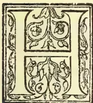

HAVING recently visited Florida, on account of Messrs. Elder, Dempster & Co., for the purpose of acquiring information relative to the methods of pineapple cultivation so successfully pursued in that State, I have the pleasure to report according

ly. In addition to Pineapples I embraced the opportunity of investigating other important cultures in Florida capable of being turned to good account in Jamaica. The resourcefulness of the people there in developing new Industries greatly impressed me throughout my trip. They have little beyond tropical sun and sand at their disposal. For success they depend upon their characteristic energy, industry and perseverance. With these traits they transform the barren resources of the soil.

Before leaving for Florida, I called at Washington, where I had the honour of an interview with the Honourable James Wilson, Secretary of Agriculture in the Cabinet of Mr. McKinley (with the Secretary I may mention I had recently been in communication relative to the cultivation of new products.) I was

welcomed with the utmost consideration and introduced to the Chiefs of Bureaus of the Department, eminent specialists, who most generously placed at my disposal every source of information. Professor Webber, the well-known expert on hybridization, prepared my itinerary with references to the leading cultivators in Florida, whom he thought might be most useful to me in my line of investigation. It is only necessary to say that the exceptional attention I received everywhere, placed me in a position to acquire valuable information. In this connection I wish to offer my sincere thanks to Professor B. T. Galloway, Chief of the Bureau of Plant Industry as well as to Professor Webber.

ORLANDO the first pineapple region I visited, is situated on the most northern latitude at which pineapples are grown in Florida.

Until about 12 years ago the pineapples were cultivated in the open without protection, but the recurrent frosts rendered the cultivation too precarious, for the slightest touch of frost ruined a year's crop.

My references for Washington included one to the pioneer of a new system of pineapple cultivation. Acres of sheds were constructed by this pioneer (Mr. Russell) and he commanded success. This system of cultivation is now exclusively adopted at Orlando, partly to afford protection from frost and partly to screen the pineries from the burning sun. Thus numerous pineries, ranging in size from one to twelve acres, are closely boarded all round 7 to 8 feet high. At regular distances posts are placed some 12ft. apart, on which are fixed connecting rods; on these are placed narrow rafters, between each of which a space similar in width is left for the admission of light. Through these spaces the light is admitted in glittering rays of sunshine, ample, it is abundantly proved, for the well being of the plants. A still more remark.

737------------------------------------------------

718THE TROPICAL AGRICULTURIST.[MAY 1, 1902.]

able feature of cultivation is demonstrated under these sheds, one that further exemplifies the constitutional flexibility of this plant. During several months of winter when frost is dreaded, when every hour of night is watched for possible disaster by all concerned, the whole of this shed structure is covered with canvas, sometimes even with laths fitted interstices of the fixed roof laths, with the result that all the plants in the interior are shrouded in comparative darkness for several months. Within this covered roof when the thermometer falls to about 400 in a two acre pinery a hundred fires are lighted, sometimes stoves. The smoke from the fires combats the frost, though the plants frequently suffer from the smoke.

In one instance last winter one of the best growers risked his one and a half acre pinery throughout the winter without using canvas. He experienced many a sleepless night, but there was no frost, and he said he had stolen a march upon his neighbours from the fact that his plants looked much better than those that were covered. However the other pinieries that were darkened, bore crops just as well as his. Thus the dark treatment does not effect the accommodating powers of the plant. The cultivation under sheds is a remarkable success, it is not only perfect garden cultivation, but it rivals the most skilfully conducted green-house cultivation. Nine thousand are planted to the acre, every plant practically speaking flourishes. It is not uncommon to see a pinery with 95 per cent. bearing fruit. The average is 80 per cent. The soil is an important factor. It is nearly all sand containing as it does from 96 to 98 per cent. of silica. The growers furnish all the food by fertilizers which bring forth luxuriant crops; The fertilizers are manipulated and applied with scientific precision, just what is desired to ensure complete productiveness. There are altogether about 200 acres of cultivation under sheds. Large extensions are made annually. At the time of my visit there was one application for 100,000 suckers. A one-acre or a two-acre shed (and there are many such) is considered a lucrative investment for a small capitalist. The larger cultivators have sheds occupying from 5 to 12 acres each.

The cost of erecting sheds per acre averages fully \$300 and for the canvas as much more. They last about 7 years. Suckers cost 10 cents each, 9,000 per acre (\$900). The fertilizers cost about \$100 per acre annually. Thus an acre costs fully \$2,000 on the first crop. The first crop in about 20 months covers all expenses. The range of prices obtained is from 20 to 75 cents each. This is for "fancy" fruit, practically all Smooth Cayenne. The net profit is stated to be about 40 per cent. The leading cultivators nett more than \$3 per crate averaging 16 fruits. Some of the growers replant, after reaping each crop, some after two crops.

Throughout the year, even during the cool season, the sun shines with tropical brilliancy. During most of the year the temperature approximates to that experienced in Jamaica. During my stay it was higher than it is in Jamaica at any time. The average rainfall for 7 years has been 49 inches and it is evenly distributed. The suckers are set in long beds usually with 7 in the cross rows 18 inches apart and from 22 to 24 inches between the rows. The sandy soil is kept perfectly free from weeds by means a scuffle hoe every fortnight, with which also the fertilizers are turned in two or three times a year. This hoe is worked from the passages on either side of the bed.

Notwithstanding the sandy character of the soil, forests of pine trees covered the land anterior to cultivation. Oak trees are also dispersed here and there. The inference to be drawn from the presence of these and other trees, is that there is more stamina in the soil than is apparent. However the trees penetrate to a considerable depth. Certain varieties of Peaches and Pears flourish in the open when fertilizers are applied. Maize is cultivated on selected spots and yields 15 bushels per acre. In most parts the sandy soil is very deep.

The fruiting season is affected by shed cultivation. Crops are obtained to some extent at the time desired by the cultivator according to the time of planting. The principal season is in August and September. A grower informed me that the "Smooth Cayenne has the great advantage of blooming any time." The plants that bloom in the summer here produce finer fruit than the ones that bloom in the cool Spring. The size of the crates used by the Florida Fancy Pineapple Association is 12 by 20 by 24 inches, number of fruit 10, 12, 14 and 16.

The growers claim that the fruit from the sheds is superior to that grown in the Azores under glass, where the same variety is cultivated. One grower had a fresh stock of suckers which he imported from the Azores for propagating purposes.

JENSEN on the Indian River is situated much further south, about 27° on the east coast. Here are vast fields, many miles of solid cultivation. Altogether there are several thousand acres cultivated on either side of the railway. Perhaps there is no such concentrated area of equal extent under sugar cane cultivation in Jamaica.

The pioneer pineapple cultivator here, indeed pioneer cultivator on the Peninsula of Florida, Captain Richards, gave me an historical account of his initial experiments; how he 18 years ago (at that time the district was a wilderness) brought the first schooner load containing 40,000 suckers from the Key islands, how they failed except a limited number, as he knew not how to treat them in the changed conditions of soil. He returned to the Keys for another schooner load. He persevered amidst the greatest difficulties. Mosquitoes were awful, heads and faces had to be shielded by a netted contrivance. His first shipment to New York attracted great attention. A son is now a large grower, shipping from 8,000 to 10,000 crates per year (average per crate 30). This veteran is at present experimenting with Pineapple wines, etc.

This is the greatest Pineapple region in the world; about 200,000 crates containing six million fruits are shipped to the northern cities annually, and plantations are constantly being extended. Practically all the plants cultivated are the red Spanish variety. This variety is generally admitted to be inferior in quality to several others, but growers claim that "it is the hardest, easiest to cultivate and best suited to varying conditions." The Jamaica Ripley is well known amongst growers and is considered the most luscious of fruits, but though repeatedly tried it has not been successfully cultivated. The Smooth Cayenne is cultivated in the open to a small extent but not quite satisfactorily.

For a long period of years frost was unknown here, but the calamitous freeze of 1894-1895, destroyed all the plantations and ruined most of the planters. However most of the growers were determined to resist all obstacles,—the class of men that make a nation prosperous. They obtained from the Keys and the Bahamas fresh supplies of suckers and made new plantations. Another freeze two years ago, much less severe than the previous one, committed considerable destruction; suckers sprang up from the ground this time. Some pinieries suffered more than others. From year to year the growers live in terror of the return of this disaster, though they look forward to comparative exemption from frost upon their devoted culture.

The soil here is practically the same as that at Orlando. The soil is a mystery, chemically and physically; it is not known how Pineapples can grow in soil which is practically devoid of plant food. "Just how it is that the pineapple can thrive in such soil that seems to be exceedingly deficient in all the necessary qualifications of good land has not been explained. It will probably be necessary to institute careful physiological experiments with the plants itself before the matter shall be thoroughly understood." Again I quote from the Agricultural experiment station Report "we have here a plant that increases in size during the period of greatest drought, when there may be no rain for 6, 8, and at times 10 weeks, in a soil containing 99.44 per cent. of insoluble residue!"

738------------------------------------------------

MAY 1, 1902.]THE TROPICAL AGRICULTURIST.719

The average area of each pinery is from 20 to 60 acres. I noticed that the smaller areas were under much better cultivation than the larger. This is what might be expected, when it is remembered that a 60 acres pinery contains some 7,000,000 plants. Throughout these thousands of acres of pineries weeds are conspicuous by their absence. They are carefully suppressed in the early stage of cultivation. The plants are set about 18 to 22 inches apart, some 12,000 to the acre, including passages. This extremely close planting is considered advantageous.

It is claimed that this dense mass not only supports the plants and fruit, but that it prevents the growth of weeds. The first crop is obtained in about 20 months, and at this stage the fields present a fine symmetrical appearance. For the second and subsequent crops, a couple of suckers are left to each plant; this aggregates into a dense mass of plants after the first crop is harvested, so much so that one wonders how the fruit is cropped. Each sucker yields a fruit, so that greatly augmented crops are obtained. From the period of planting the cultivation is kept up from 8 to 10 years. I noted that they passed their prime in 4 years, hence frequent replanting would be better, but a crop at least is lost by replanting, and when they are densely massed a touch of frost affects them less than it does those wider apart. The 12,000 plants per acre is estimated to yield from 8,000 to 9,000 fruit per acre. These with the additional suckers yield from 9,000 up to as many as 15,000 per acre. I have frequently counted 8 and 10 fruits on a square yard. One man reaped 600 crates per acre this year, though some growers got less than 200 crates per acre, and this may be put down as the general average.

The great bulk of the crop is harvested in June. Last June the growers were unfortunate in having heavy rains (17 inches) which affected the keeping quality of a considerable number of fruits. Not long before they experienced a drought, the fruit was smaller on this account. The fruit when packed is sent by rail to Jacksonville the great distributing centre of Florida, — one day for this. They are then transferred to other trains for the north, — 3 days more. When packed in the trains, a space is left between the crates for ventilation.

The standard size of the crate is 10½ by 12 by 36 inches, two divisions. A crate holds 18 large fruits, next sizes 24, 30, 36, 42 and 48. Average size 30. The 48's are so small that they are hardly worth shipping. Before packing each fruit is wrapped with paper.

The average amount netted per acre is about \$400. "We have had from one acre of pines containing 10,000 plants 250 crates averaging 30 to the crate, or 7,500 pineapples, netting us over transportation, commission, &c. \$2 per crate or \$500 for the acre." Others state that 100 % profit is realized.

The importance of ammonia and potash are constantly discussed, and potash applied at the fruiting season is said to improve the keeping qualities of the fruit. The fertilizers are mixed by the grower to suit his own opinion as to the relative merits of each in gradient. Certain fertilizers are simply thrown over the tops of the plants, but wherever practicable between them. The cost of fertilizer ranges from about \$50 to \$100 per acre per annum.

Many vegetable forms here are purely tropical, including some of our West Indian species, intermingled with scrubby oaks, &c. Innumerable trees were completely destroyed by the great freeze that swept desolation over Florida. The cool winter season here, barring frost, is quite favourable to many tropical plants. This is accentuated by the cloudless sky. The rainfall averages about 60 inches. Amongst tropical fruits that flourish here may be mentioned the mango and the avocado pear. This indicates the nature of the climate. The characteristic vegetation is the spruce pine and the beautiful palmetto which is distributed in vast numbers. Thus the two great representatives of northern and southern latitudes appear in companionship.

Besides the open system of pineapple cultivation so extensively carried on here, the Orlando shed system has been inaugurated since the great freeze of 1895, and so successfully that there is already about the same area of sheds as at Orlando, about 200 acres, and they are in point of size much larger here. Dozens of acres are being extended at a cost of more than \$300 per acre. Peaches thrive in the sheds but not outside. The Jensen (Indian River) growers cultivate the red Spanish pine under sheds in contra-distinction to the Orlando growers with their smooth cayenne. As already stated frosts are less frequent and less severe than at Orlando but the temperature falls to danger point under 40° from time to time, when the plants begin to suffer. No canvas covering or fires are used here. It is found that on a cold morning, the sheds conserve the temperature to the extent of a few degrees. This is important in itself, but other great advantages accrue by the adoption of this great plant growing contrivance. The Red Spanish plants grow far more luxuriantly therein, the fruit is one third larger and it is decidedly improved in flavour, and the plants are cultivated with considerably less fertilising ingredients. Fruit burning is also obviated. Careful observation of the open fields and of the shedded fields side by side, conclusively prove the far great luxuriance and more perfect cultivation under the latter. The adoption of this system of cultivation is quite as important for the Red Spanish variety as it is for the Smooth Cayenne.

The shed method has thus brought to light new cultural possibilities of the pineapple. Darkness during several months of winter at Orlando does not interfere with the perfect cultivation of the plant. Interrupted sunshine throughout the year by means of sheds for both varieties, enhances the luxuriance, productiveness, size and flavour of the fruit, and the cost of fertilising is materially reduced thereby. One great grower to whom I was referred by the Department of Agriculture informed me in the presence of another leading grower, that if he had from the first, confined his attention to 10 acres of sheds, he could have done better than by cultivating 60 acres in the open. Most of his cultivation is now under sheds. And the consensus of opinion is markedly in favour of shed culture. The same grower declared that more money is made out of the Red Spanish, than from the fancy fruit at Orlando, the demand for them being infinitely greater by reason of cheapness.

Oranges too, succeed perfectly in sheds, but the lofty structures requisite are very expensive. I have seen dozens of acres. Horticulturally the system ensures the most vigorous development of plants. At the great Hotels at Palm Beach, &c., ornamental plants are extensively cultivated in sheds. A notable instance of me at Washington on my return from Florida. One of the experts at the Agricultural Department thus called my attention to the fact that in the vicinity of Tampa on the west coast the shed system for cultivating Tobacco, is adopted with remarkable results, both to quality and quantity "the crop is so valuable that the land is now covered with cheese cloth placed on wood framed 9 ft. high." In Jamaica, under sheds Tobacco may become an important industry. The quantity per acre would be greatly augmented as well as improved in quality, and it can be grown in places where it cannot be grown successfully without sheds.

The conclusions I arrived at with regard to the actual benefit conferred on plants by the adoption of shed cultivation are as follows:—It mitigates the fierce burning rays of a tropical sun upon plant life. It prevents continuous and excessive evaporation. It interrupts the force of winds which conduces to increased evaporation and aridity. Thus the whole mass of plants within creates atmospheric conditions of their own, conditions which are suffused throughout the shed.

739------------------------------------------------

720THE TROPICAL AGRICULTURIST.[MAY 1, 1902.PINEAPPLES ON THE KEYS.

From the port of Miami 25° 70' I proceeded in a schooner to Elliot Key, and Key Largo, the latter about 25° 20' to examine the methods of cultivation adopted there. Hundreds of Acres are under cultivation on these islands since about 1860 when they were introduced. On the keys an absolutely different system of cultivation is carried on. The plants are grown among the coralline rocks, between the crevices, the crow bar being used to open the crevices for the plants. The vegetation on the rocks consists of small scrubby trees. This is cut down and burnt. An inch or two of decayed vegetable matter covers most of the rocks. About a year after clearing this soil is completely washed into the crevices so that on some plantations earth is invisible, the entire surface being rock difficult to walk over. In other places there are small collections of humus interspersed among the rocks. The suckers are actually planted to the extent of 1,500 dozens to the acre (18,000.) The cultivation of each pinery is kept up about 5 years. Fertilizers are not used. The cultivators have the great advantage of having their fruit a few weeks earlier in the market, than those cultivated on the mainland and consequently realise a higher price. There can be little doubt that the earlier crop, arises from the high temperature emanated by the rock.

HYBRID PINEAPPLES.

During my interview with Professor Webber, the eminent Chief of Hybridization at Washington, on my way to Florida, I had the gratification of seeing the first hybrid Pineapple fruit. The first product of a new type of Pineapple; the result of many years of devoted skill; a new departure in the history of this fruit. This precious specimen created intense interest.

On my return to Washington from Florida, I was informed by the Chief of the Bureau of Plant Industry, by this time other hybrid fruits each distinctly different had been received from the Experiment Station in Florida; that the flavour of several of the types was extremely satisfactory.

At Miami I visited the Government Experiment Station where these fruits were grown, and saw the plant that gave the first fruit; there are about 300 hybrid plants altogether. Over a dozen had ripened fruit by the middle of July, and many more were coming to maturity. Each plant so far yields distinctly different forms, so that they will be numerous. Some of course will be superior to others. Those that have fruited are producing suckers for multiplication. It is also interesting to record the fact that many of these plants are smooth leaved, spineless, an important consideration from the grower's point of view, for it enables him to traverse his fields with great facility as compared with struggling through the spiny masses of leaves. It is further interesting to relate that the acquisition of smooth foliage was preconceived in the hybridizing operations, in view of its advantageous results. It was a source of pleasure to me to behold these precious achievements. In the near future we shall obtain specimens; for it may not be amiss to say, the Chief of the Bureau offered me most generously everything that can be spared by the Department. There can be no doubt that these important acquisitions are destined to advance the pineapple Industry and extend its popularity everywhere.

I am glad to say I have received seeds from another source of rare varieties which I have sown and hope to grow for further experimental purposes. At the station mentioned there are also many new types of hybridized Oranges the merits of which are as yet unknown, not having borne fruit. Guavas are also hybridized here and many other tropical plants are experimented upon.

PINEAPPLES IN JAMAICA.

The number of fruits exported from Jamaica average only about 65,000 a year. This is what Florida grows on 10 acres. Quite recently the cultivation has received increased attention and judging from the area planted at least 400,000 should be exported very soon. Even this number however is closely approximated by individual growers in Florida. It will remain an insignificant

industry until we export millions annually.

Much of the cultivation is far from satisfactory. Small patches have been successfully cultivated but I suspect there is hardly any cultivator of an acre or two who has not been greatly disappointed. Probably we have had about 100 acres in cultivation for years, yet the export figures only show what is capable of being cultivated on 10 acres. The condition of the soil in Jamaica is the perplexing element. This is the secret of Florida's success. Intermediate between that barren sand and the ordinary soil of Jamaica, we have to strike the best possible medium. In other words to ensure success for this culture, the soil selected must be peculiarly sandy, gravelly or rocky even to the extent of impoverishment in the natural supply of plant food, which deficiency can be advantageously added according to the requirements of the soil.

As stated, in Florida soil is the all important factor and in order to make this cultivation successful in Jamaica on a large scale, soil is the important consideration.

There can be no doubt that the kinds best adapted to cultivation in Jamaica are the acclimatized varieties. The Smooth Cayenne, which by the way I introduced to Jamaica 30 years ago, is less successfully grown than the others. It seems to grow too luxuriantly, all into rank foliage. More sterile conditions of soil should remedy this.

Messrs. Elder Dempster & Co. have with a view to improve and establish this cultivation on a commercial scale decided to cultivate several acres on the Liguanea Plain under my supervision. My long experience in tropical agriculture, coupled with the advantages accruing from a careful study of this culture in Florida, where during my sojourn on the great pineapple fields I acquired much information, will enable me to turn to practical account improved methods of cultivation, the application to our most suitable land of the accumulated knowledge of Florida. I therefore hope to be able to instruct intending cultivators as to the most approved soils and methods applicable to Jamaica.

Pineapples are exposed in Jamaica to the burning sun throughout the year far more than is the case in Florida. I feel convinced that the inauguration of the shed system merits attention for the purpose of warding off the full blaze of the sun and for securing congenial atmospheric conditions. I therefore beg to suggest that I may be empowered to make an experimental trial of a one acre shed, 2 or 3 of the best varieties to be cultivated. On the dry Liguanea Plain, in places where the soil is extremely sandy, I am of opinion that these sheds will prove in valuable. To cover an acre with laths costs about \$300 per acre in Florida. There timber is cheap. We have bamboo which doubtless will answer the purpose perfectly, and it is cheap. Of this material I purpose making my experimental shed. Possibly creepers trained on wires might be substituted for laths eventually. The remarkable improvement appertaining to the pineapples under sheds in Florida can probably be attained by cultivation under sheds here. Thus the Ripley, judging from Floridian experiences, will be considerably augmented in size and improved in quality (a little difference in the size of the fruit doubles its value) and the fruiting season is in some measure regulated by shed culture. In Florida, as already stated, no expense is spared to ensure these conditions. Such a valuable crop is worthy of any improvement of soil, &c.

With regard to this cultivation on the rocks of the keys, similar rocky land abounds in Jamaica,—extensive areas under rank bush and considered uncultivable. These wastes with sufficient rain can be converted into pineapple fields. Little capital is requisite beyond what is necessary for the purchase of suckers. One man can cultivate several acres. Were these hills in Florida hundreds of acres would be planted yearly. Besides we are practically exempt from the plague of mosquitoes that torment the lives of growers on the keys. Sheds are not used on the keys. The rainfall is about 60 inches. In Jamaica,

740------------------------------------------------

MAY 1, 1902.]THE TROPICAL AGRICULTURIST.721

too, as on the bare rocky lands of the keys, limes and tomatoes could be extensively cultivated, both for England and America. Tens of thousands of barrels and crates are exported from the keys, and large sums of money are amassed there from,

In addition to the methods of cultivation applicable to Jamaica, to which I have referred, I have the pleasure to recommend the initiation of another system, which I anticipate will prove most successful. Bearing in mind the peculiar conditions of soil under which the plant is cultivated on a great scale, viz., in the sandy soil of Florida, and on the rocks of the keys, I have arrived at the conclusion that we have in Jamaica another peculiarly favourable condition of soil on which it can be cultivated with the greatest success. Between Old Harbour and the foot of the Manchester Hills, and in other localities, there are thousands of acres of comparatively level limestone rock, on which there is a thin layer of earth about 9 inches deep. Only small trees grow on this land. The soil is too shallow for other cultures. The rainfall is about the same as on the keys.

Sand or rocks in Florida effect the most perfect drainage conceivable. The other type of soil which I recommend,—a thin film of earth resting on a bed rock, it is impossible to surpass from the drainage point of view. Being fertile it is more valuable than sand. The air permeates freely. These conditions assured, abundant rain, rain that would prove prejudicial without trock, will constantly invigorate the plants. Large areas are thus susceptible of cultivation based on the merits of the soil.—*Jamaica Board of Agriculture.*

(To be Concluded.)

## CACAO CULTIVATION IN CEYLON.

MEMO, OF SUGGESTIONS BY THE P.A., SUB-COMMITTEE FOR EXPERIMENTS TO BE UNDERTAKEN FOR CIRCULATION TO THE CACAO COMMITTEE FOR REMARKS AND RETURN TO THE SECRETARY AS SOON AS POSSIBLE.

Name of Estate.

Acreage.

Elevation.

Monthly Rainfall (for as many years back as can conveniently be given).

No. of trees per acre.

Are the trees all of one variety, and if so, which; or are they mixed hybrids?

Approximate age of trees.

Number of pods harvested each month.

Weight of dry Cacao harvested each month.

Weight of black Cacao (dry) harvested each month  
Is there any shade other than wind belts, and if so, what trees do you use? (If certain areas are more or less closely planted kindly mention this)

Which in your opinion is best, and why?

Have you any Cacao trees with no or scarcely any shade? What is your opinion as to its vigour and yield?

Have you noticed any difference in the colour of the flowers—what coloured flowers in your opinion set most?

Which variety Foresters or Ceylon Red is in your opinion the heaviest cropper? Do you use manure? How often and in what quantity? What do you consider the best manure for Cacao, and what time do you think best for its application?

Have you noticed marked effects from the use of manure in gain in vigour or increase of yield in already vigorous Cacao?

Do you prune your trees, and if so, on what system, and have you noticed any benefit caused by it?

DISEASE. Is there any disease on stem, branches or pods in your Estate?

Have you adopted cutting diseased parts entirely out or shaving them, and if so, with what results?

What other treatment if any has been carried out in your Estate?

How often do you go round the whole Estate with curative work and how long does the round take?

What is the cost per acre of this curative work in the year?

What do you do with the empty pods?

Do you destroy diseased husks—by burning or otherwise?

What time of the year do you notice the effects of the disease most?

Is the disease worse in different parts of the estate—what are the environment and conditions in these areas as to aspect, dampness, shade and wind?

Whether the growing of suckers and gormandizers have been tried and whether they have enabled the trees to resist canker?

Whether artificial heating by steam has been tried in fermenting, or whether any artificial ferments have been used? With what effect?

The Committee will be greatly helped in their work of gaining knowledge of Cacao in relation to profitable cultivation if you will make experiments and carefully record notes of their results in the following matters:—

The growing of cuttings.

Suggestious.

Layering.

The elevation at which Cacao will grow vigorously

By planting a few trees on spots at different elevations and recording their prosperity.

By taking off any non-fruit producing branches and suckers and noticing if the total production of fruit increased.

PRUNING.

GRAFTING.

MANUING.

A. PHILIP,

Secretary.

GRAFTING EXPERIMENTS.—According to a recent number of *Le Jardin*, M. Lindemuth lately showed before the Prussian Horticultural Society some interesting specimens of grafting, in which the graft had exercised a more or less marked influence on the stock. The plants were:—1st, Yellow Wallflower on Red Cabbage, in which the plant had developed below lateral branches of Wallflower, with a shoot of cabbage and a head of Red Cabbage. 2ndly, Brussels Sprout on Yellow Wallflower. 3rd, Abutilon Thompsoni on *Althæa naabonensis*. The former is a shrub, the second is a herbaceous plant. Owing to the influence of the Abutilon the branches of the *Althæa* became persistent, and indeed, are two years old. 4th, *Solanum erythrocarpum* on Tomato (*S. lycopersicum*). The Tomato being the more rapid grower, communicated this property to *S. erythrocarpum*. 5th, *Malvastrum capense* became variegated by grafting with Abutilon Thompsoni. 6th, Hybrid Petunia on *Nicotiana glauca*. If Petunias are grafted on the stems of *Nicotiana* of rapid growth, fine shoots of Petunias on the stems can certainly be obtained. Mr. Winter, of Bordighera, has already made this experiment, and has grafted Petunias on many branches of *Nicotiana glauca*, which in that district grows as a shrub. The effect should have been very fine, but a storm bruised the heavy branches of the Petunias. 7th, A new plant, with variegated foliage, *Sida Napæa*, obtained by grafting with Abutilon Thompsoni, was a success in one instance, while another specimen remained green. 8th, *Althæa rosea* (Hollyhock) became variegated by the influence of the graft of Abutilon Thompsoni. Young seedlings of *Althæa rosea*, of *Malvastrum capense*, and variegated *Anoda hastifolia* have, so far, remained green.—*Gardeners' Chronicle*.

741------------------------------------------------

722THE TROPICAL AGRICULTURIST.[MAY 1, 1902.THE DATE TREE.

A writer 50 years ago stated that the date tree was the only tree whose cultivation was not neglected in Egypt. It might truthfully be said now that it is more neglected than any other tree. The cause is obviously due to the introduction of other staple foods, formerly unknown or rare, such as maize, beans, sugar cane, and many vegetables, especially the tomato and onion. Bread is now very cheap and the poorest beggar can buy it. European immigration has directly brought about the bettering of the lower and working classes and wages have gone up in many cases twenty-fold. The Berberee, especially, who formerly considered himself quite wealthy with the possession of a hundred date trees, now assesses their yearly profit at as many shillings, and finding the comparison between £5 per year and the wages and food received by his relations as cooks, bowabs, servants, etc., in Cairo, very unsatisfactory for himself, leaves his date trees to his wives and fathers-in-law and seeks work in the large towns. The characteristic national love of economy of effort has also greatly contributed to the neglect.

It is very interesting to read of the incidents which attended the introduction of many parent trees into this country. Rich and notable sheikhs made it a rule to bring back, if possible, on their return from the pilgrimage to Mecca, a young date tree taken from the base of some good tree en route. The usual chapter of accidents, as well as the ordinary mishaps, such as disease, plague, highway robbery, want of food and the death of the camel or the tree on the way, reduced the number of trees successfully introduced to a minimum. The species generally received either the name of the sheikh or the place of origin. It is probably owing to this custom that whilst there are only about 22 different varieties of date palms in Egypt the trees comprising them have about 250 different names. Of late the pride taken in their cultivation and the feelings almost of veneration for them have died away. The five commonest species grown in Egypt and the Soudan are probably; the Bedreshin, Cairo, Rasheet, Rasson Wadi, and the Fayoum date trees. The Bedreshin tree is very common, fruitful, and very high; its fruit is good and is ready about September. The Rasheet, largely grown in the Delta, is about half as high, has spreading leaves, and its fruit is large and lime-shaped and is not ready until the winter. The Cairo tree is also a smaller one and has smaller but sweeter fruit. The Rassan Wadi is said to have been brought from Arabia by a Moudir of Zigaizig. It is like the Bedreshin date but has inferior fruit. The Fayoum is a smaller variety, has many spreading leaves, and its fruit is thin but very sweet. Some dates are only fit to dry, others to press, and others again to be eaten fresh. To cater for the native requirements is altogether unnecessary, for not only do these trees yield their supplies for local consumption but several hundred tons of inferior dates valued at about £7 per ton are imported yearly from Turkey. An adequate financial return for trouble and expense can easily be gained in Egypt by all cultivators who will extend and grow the better kinds of date. The Basha or Vanille date tree, the Sultani, and the Rasheet are excellent varieties and pay well. That superior fruit gives best returns can be seen by reference to the reports of the British Chamber of Commerce of Egypt, which give the annual average export of dates from Egypt for fifteen years as 645 tons, valued at about £18 per ton. For 1899 and 1900 the value was only £16 per ton, and yet the superior quality of Tunisian dates of the best kind imported was valued at nearly £32 per ton, "nearly double the price?"

From one or two important grocers in Cairo it has been learned that a Greek merchant has taken the trouble during the last two seasons to buy and neatly pack in 3-oke boxes some of the best and largest dates, which he has supplied to the grocers for sale

at the retail price of 5 piastres per oke. Last year he only put on the market about half a ton, but all were very quickly sold. This year he has been able to procure about 4 tons and has already disposed of them all. This should be extremely encouraging to those who intend growing good trees. A few years ago England had only the boxes of pressed dates sold retail by street-hawkers on trucks at about 21. per lb and by grocers at perhaps a penny more. Immediately the import of dates in fancy half-pound and pound cardboard boxes from Algeria began, fruiterers, although at first over-cautious because of the price, found the sale quite easy and the demand increased enormously. Now, on account of their good appearance and superior flavour, they are becoming generally popular even with the middle classes. Much of this trade could be captured by cultivators in Egypt, for in no other country of the world is the climate so suitable for the date. Other products of the fruit and the tree might also be supplied, especially vinegar (similar but superior to that made by the fellahs), wine, preserve, brandy, and brooms.

There are many faults committed in the cultivation of the date palm in Egypt. Not only is water a necessity, but manure also, and so many of the trees which do not bear cannot do so simply because the roots have taken from the ground all available nourishment. The bases of the trees also are yearly left more exposed owing to the contact of the water. A good grower sets his young trees in a trench which is gradually filled up with fertilisers or good soil. The roots should never appear as they do almost everywhere in Egypt in old trees. Another serious fault, sometimes causing the same effect, is the want of sufficient root space. Cases could be mentioned where Arabs have taken the trouble to dig in the hard rock "with a pick-axe holes about three-quarters of a metre square, and set in these young young date-trees. On the premature death of these trees after an initiatory growth of promise they would probably sum up the cause by the ejaculation, "Wallah"—It is the will of God. Where the roots encounter resistance of the subsoil they will often push the tree out of the ground for several feet, and this is by no means an uncommon sight. Thinning fruit in its earliest stage is often very necessary. Natives generally allow it to fall but each fruit has robbed the tree of a certain amount of nourishment which might have been given to the remaining dates. Not many growers are willing to understand that 30 okes of large fine dates will bring in three times as much money as the same weight of small and ordinary ones. Yet many trees properly cared for can, and do, produce fruit as large as lemons or bananas if thinned in the same way as we thin grapes in our English vine-houses.

Young trees should be taken from the bases of the best varieties when 7 to 10 years old. They should be set in trenches about a metre wide where there is plenty of good surface soil. They should be put in the ground up to the leaves, which should be wrapped round with matting or straw. This favours the growth of the roots. Care should be taken to provide free exit for the new leaves at the stem. They should begin to bear fruit in three years and be in full bearing in 10 years. Trees grown from kernels are more healthy and vigorous and may live for 200 years. They are however a very long time growing to maturity and it is impossible to tell before flowering whether they are male or female. The young shoots at the stems, on the other hand, are always of the same sex as the parent. As the trees get old the lower parts of the trunks are inclined to become stony and the sap is unable to flow through them easily. It is well in such cases to apply a fertiliser in which nitrogen and phosphates predominate; the former to accelerate the movement of the sap, the second to promote the formation of new cells, and new tissues, and to facilitate flowering and fructi

742------------------------------------------------

MAY 1, 1902.]THE TROPICAL AGRICULTURIST.723

fication. When the new tissues have gained a predominance over the petrified ones, the vital activity is strong, and the tree grows again under normal conditions. Manganese applied as a fertiliser exercises its oxidising action and procures the free circulation of the sap. The tree can also be beheaded but before doing this a hole must be made through the trunk about twelve feet from the summit and a cylinder of wood inserted so as to protrude on each side. Round this must then be fixed plenty of soil and manure which must be kept continually moist for about a year. The top part will then have sent out roots and can be planted just in the same way as a young tree. Should a date tree by any accident have its crown broken off or core damaged it may shoot out again if the top be covered with clay to keep in the sap. The process of grafting described some time ago by "Appella" in the correspondence columns of the *Egyptian Gazette*, does not seem to be known either in Egypt or the Soudan, though trees have been known to bear branches and shoots throughout the stem where they have been neglected. Some are to be seen at Ab Ain el Wadi in the Iddaila Oasis.—*Egyptian Gazette*.

### THE VALUE OF CHEMICAL MANURES.

Under the auspices of the Bristol and a District Gardeners' Mutual Improvement Association, a most instructive lecture was given in St. John's Rooms on Thursday, January 9, by Mr. F. W. E. Shrivell, F.L.S. F.R.H.S., of Golden Green, Tonbridge. His subject was "Chemical Manures in the Kitchen and Fruit Garden," and was based upon the results of seven years' experimental work carried out in conjunction with Dr. Bernard Dyer, E.L.C. F.L.S. F.C.S. H. Cary Batte Esq. President of the Association, presided over a good attendance, and was accompanied by Mrs. H. Cary Batten, who also takes a deep interest in the work of the society. The president, introducing the lecturer, alluded to the great importance of the subject to the district, where so much attention was devoted to agriculture and horticulture.

Mr. Shrivell, who illustrated his remarks by a series of diagrams, explained that for many years dung was the chief manure both for the farm and garden, but they were now trying, by means of a series of experiments at Tonbridge, to discover whether it was better to use large quantities of dung, or to use a smaller quantity with chemical manure, or to use chemicals entirely. With regard to the system upon which their experiments were conducted, the land on which each vegetable or fruit was grown was divided into sections, each being in area a fiftieth of an acre. One section was manured with heavy dressing of dung; a second with light dressings of dung; a third with chemicals only; and the other three with a light dressing of dung, an ordinary dressing of phosphatic manure (either basic slag or superphosphate of lime) and varying quantities of nitrate of soda. Diagrams were shown, proving that after seven years' experiments, the best result was obtained by employing a small quantity of dung with the use of chemical manure, this being specially noticeable in the case of Broccoli, Potatoes, &c. Nitrogen, phosphates and potash were the elements of farmyard manure. The value of dung was that it was such a marvellous mechanical agent. On light sandy soil, for instance, in dry weather it tended to keep moisture in the ground and prevented evaporation. In the clay soils it tended to lighten it and aerate it to a very considerable extent. That was the great advantage of farmyard manure or what was ordinary called dung. But it had a great disadvantage, and that was its cost. Speaking,

#### WITH REGARD TO FRUIT

the lecturer said experiments had been made by treating its culture in the same way as the vegetables were treated—heavy dressings of dung, light dressings of dung, plus chemicals, and chemicals alone. He

had experimented on Gooseberries, Black Currants, Red Currants, Raspberries, and Plums with light dressing of dung, plus chemicals, and with chemicals alone; and included some interesting information upon the effects on the different fruits. For the purpose of bush fruits—Currants, Raspberries, Gooseberries, &c., the quantities for 100 square yards (broadcast) should be 10 lb. superphosphate, 10 lb. kainit, to be applied during autumn or winter, and in early spring 7 lb to 10 lb nitrate of soda. With regard to strawberries, experiments showed that they could not grow strawberries entirely by the aid of chemicals, but that with a light dressing of dung added to chemicals, they would be much more satisfactory to the grower. Chemical manures were also useful for the purposes of growing Onions, Beet, and Celery. With regard to the latter, he knew that most gardeners were much in favour of sewage, when they could obtain it, but he strongly advised them never to use sewage, for there was a great objection to its use in growing any vegetable that was eaten raw. Sewage should never be used for anything that was not cooked. By its use in this respect, they were apt to spread such diseases as typhoid and diphtheria. In the use of chemical manure for Celery, they would have to use discretion, but they would find that a small quantity judiciously used would ensure a splendid crop. Then, again, they could make a good liquid manure for Cucumbers and Melons. One ounce of nitrate of soda in a gallon of water used once or twice a week would considerably assist them in growing these. Chrysanthemums again were the most difficult plants to deal with; a light liquid manure of half-ounce of nitrate to one gallon of water, might be used when the buds began to form, but they should stop to use it when the buds began to break. In the kitchen garden, chemicals for 100 square yards, with half a load of farmyard manure, should be used thus: Superphosphate, 14 lb. kainit, 10 lb. This should be dug in with the manure in autumn or early spring; and later on they should sow on the surface 10 lb of nitrate of soda in two or more dressings.

After referring to the dressings for herbaceous borders (basic slag, 14 lb; kainit, 8 lb, pricked in in autumn; and nitrate of soda 8 lb, in March and April to the 100 square yards, Mr. Shrivell spoke on another subject which he said was important, and especially to the professional gardeners. This was

#### THE SUBJECT OF LAWNS.

He knew that many gardeners were troubled with Daisies and different weeds on lawns. He thought that wherever they had got a ground with a tremendous quantity of weed on it, that told the tale that the ground was really very poor. If he gave them something to make their lawns grow, they should not grumble at him if they had to cut the grass more often. There was a suggested dressing for a lawn of 100 square yards—14 lb of basic slag with 9 lb kainit, and a later dressing of 5 lb of nitrate of soda. This combination was a plant food to produce the finer Grasses and Clover, while it would do away with the Daisies and commoner weeds in a lawn. It did not follow that if they put this on one year that they need put it on the next. The basic slag and kainit had a tendency to stimulate the growth of Clovers; and if they did not want Clovers, they must keep these two away; but if they wanted a little Clover or Trefoil, put it on. That would do away with the Daisies. Whenever they saw a meadow full of Daisies and Buttercups they knew perfectly well that, as a rule, it was a poor meadow. They must use nitrate alone if they did not wish to grow Clover. His own feeling went to the balanced manure. It was very rarely that lawns had a dressing, the only thing they ever got was a little lawn manure, which was simply sand plus nitrogenous manure. The lecturer gave many other instances of the value of chemicals, and concluded his address amid applause.

(We must apologise to the Bristol gardeners for having held over this interesting and valuable reports,

743------------------------------------------------

724THE TROPICAL AGRICULTURIST.[MAY 1, 1902.

Necessity has no law!—Ed.)—*Journal of Horticulture Cottage Gardener*.

## PINEAPPLES AND THEIR VARIETIES.

We have received the following letter from Mr. J. C. Harvey, of "Buena Ventura" Plantation, Isthmus of Tehuatenpec, San Juan, Evangelista, P.O. V.C. Mexico Dated 25th Nov., 1901, and which is worthy of publication:—

In the October issue of the "Tropical Agriculturist", I note an article signed J. B., copied from the Journal of your Society, *re* Pineapples, and although my principal interest here is Rubber and Cacao I take a special interest in all fruits, if only for home use, and have according to invoice of some two years ago some (2) varieties of pines—besides two sorts which I know nothing of. As a Britisher I hope I may be privileged to ask you a few questions, and also desire to submit a proposition. First, however, is there any difference between Smooth Cayenne and Kew Giant? also, as between Golden Queen and Egyptian Queen? Do you know anything of a pine called Black Antigua? also Mauritius? What is Ripley Queen as against Jamaica Ripley? Is there such a pine as Trinidad? To my mind, pine nomenclature seems very much mixed. What is Black Jamaica? All these pines I have at least sent to me by a Florida specialist. Now as to my proposition. I have a pine here embracing in my opinion every good quality a pine should have, it was introduced four years ago. direct from Guatemala—or lack of a name I call it "White Guatemala Spineless"—it is absolutely smooth and has much the appearance of Smooth Cayenne, that is to say, the plant. You doubtless are aware, that smooth Cayenne, has a very few short spines at the extremity of every leaf, and that the flesh is yellow, this plant has absolutely no spines whatever, and the flesh is almost snow white—sweet yet with a sprightly subacid, yet not stinging taste as some have—the fruit is technically smooth, not shouldered, nor yet conical—in fact, perfect in form—reaches with me with practically no cultivation 7 lb., if the suckers are taken at the right size ripens from end of January to June, and even July according to planting, core never woody—from the fact that I have had them in the house 10 days for perfect ripening should be a good marketer; it is a vigorous plant and makes plenty of slips or offsets—though not such a great number as Golden Queen does—anyway, a strong plant that can be calculated to give from 8 to 15 for propagation annually. I cannot find any account of a pine in either Florida or the West Indies, agreeing with these characteristics, and I feel sure it would be a most valuable addition to your list of pines. I may say as regards soil that this pine seems to grow remarkably well in heavy soil, and in a much damper situation than many others I have, indeed some rot away completely at the roots under similar conditions, and have to be planted in selected situations—it also appears to do well in moderate dry places, though I think on the whole it is best adapted to moderately damp situations in rather heavy rich soil. Our rainfall here is 100 inches distributed over eight months, the bulk of the rainfall however occurs from May to October after which occasional rains till middle of February. March, April, and the most of May hot and dry.

Now what I desire to say is that I should like to get the following:—2 Rothschilds, 2 Ripley (red), 2 Ripley (green), 1 Sugar Loaf, 2 Bullhead, 2 Black, 2 Cowboy, 2 Cheese, 2 Sam Clark, 2 Jerusalem—19 Slips for which I will send an equal number of offsets of the White Guatemala Spineless, they can be sent either way by mail—that is between Mexico and Jamaica.

I, of course, do not know whether you can attend to this yourself personally, if not, will you kindly communicate with some grower that would care to do so, and advice at the earliest opportunity as I should greatly like to conclude the transaction before the dry seasons.

Are your publications for sale, if so, kindly advise cost of subscription.

We have replied as follows:—

We are in receipt of your letter of the 25th November, and have pleasure in replying to your queries as follows:

1.—The Smooth Cayenne Pine Apple and Giant Kew are the same.

2.—The Golden Queen and Egyptian Queen are two of the Queen varieties, (the Ripley being a third.) They present similar characteristics but are not the same.

3.—The Black Antigua is the common pine shipped in quantities from Antigua.

4.—The Jamaica Ripley is the same as the Ripley Queen, the Ripley being one of the Queen varieties.

5.—We have never heard of any distinct variety called "Trinidad."

6.—It is indeed very desirable that pine nomenclature should be brought to some uniformity, now that in so many places pine culture is being put on a commercial basis.

7.—Black Jamaica is often called Black Spanish. It has dark green leaves, shading to a darker hue, almost a blue-purple in the centre, and the leaves are hollow—not open and flattish. The fruit is dark green, and is fit to eat before it shows any yellow or red. The leaves have little hooked prickles, not spines like the teeth of a saw, but set distinctly from each other.

8.—We do not know the White Guatemala Spineless, but all smooth-leaved varieties, so long as they are hard-fleshed and can carry well, are worth cultivating, because of the facility for working when close-planted. Your description of this variety almost fits our "Bull-head," but our variety, although sometimes having entirely smooth leaves, has generally some prickles set irregularly on the leaves; sometimes indeed the leaves are almost all prickly. The flesh of the Bull-head, when the pine is cultivated, is smooth, hard and white, with hardly any eyes, and has a sweet acid flavour much as you describe. The "Bull-head" also grows well in heavy soil, and though some Florida, men have said it is the same as the Red Spanish, others have said it is not,—and we do not think it is.

9.—We will send you three or four of the varieties you name, but Bull-head and Cowboy are the same, and so are the Cheese and Sam Clark Pines. We shall attend to this personally, not knowing any one who will take the matter up in the spirit of an exchange. The subscription to our Agricultural "Journal" (copy sent herewith) is 4s. per annum, and one shilling extra to foreign subscribers.

We have here:—

Ripley—Red and Green.

Golden Queen (which might be called Yellow Ripley.)

Bull Head or Cowboy, (which is sometimes called Red Spanish, but is not.)

Sam Clark, Queen, Cheese, Goffe Pine, Red Pine; which we have called "Red Jamaica."

Sugar Loaf which you know.

Black Pine or Black Jamaica.

China Pines, very similar in general to the Black, but presenting some difference when examined closely in shape and colour of leaf, in placing of spines, and in colour of fruit. These characteristics of China Pines will be closely noted during the coming fruiting season.

Abbakas and Smooth Cayenne, imported from Florida and grown to a good extent here during these last few years.

Rothschilds and Envilles, only grown here to the most limited extent as specimens.

We have arranged to get the pine suckers asked for sent, and on receiving the "White Guatemala Spineless" suckers, will send them to the Public Gardens to be tried.—*The Journal of the Jamaica Agricultural Society*.

744------------------------------------------------

MAY 1, 1902.]THE TROPICAL AGRICULTURIST.725

## Wilson, Smithett & Co's Ceylon Tea Memoranda for 1901.

LONDON, MARCH, 1902.

A review of the course of the CEYLON tea market during the year 1901 is somewhat depressing, and is only relieved by the hope that the experience gained by the crisis, through which the industry has been passing, may prove of real and lasting benefit in the future. The evils caused by the over-production which resulted from the extensions indulged in, both in CEYLON and INDIA, during the era of prosperity enjoyed by tea-growers a few years ago, were considerably aggravated during the past two years by the disorganization of the home trade in the early months of each year, occasioned by the anticipation by distributors of an increased Duty in the Budget proposals, resulting in a large volume of artificial business for the purpose of duty paying, and corresponding heavy capital expenditure, which reduced purchasing powers and affected trade in the country for a considerable time at a period of the year when the arrivals from CEYLON were heaviest.

**The average Price of all Ceylon Tea sold on Garden Account in 1901 was 6.80d per lb., against 7.25d in 1900 and 8d in 1899.**

During the year under review the ill-effects of the Duty scare were even more marked than in the preceding year. The full effect of the coarser plucking resorted to both in CEYLON and INDIA, after the period of high prices in 1899, was not experienced until the early months of 1901, when the heavy arrivals of inferior to common tea were neglected in the rush to pay duty on previous and current purchases of more desirable qualities. At the commencement of the year the quotation for commonest Souchong stood at the very low figure of 4d per lb., and during the following two months it gradually declined to the hitherto unrecorded level of 3d per lb., whilst the coarsest qualities, of which unfortunately there was no small supply, sold at still lower rates. Had these ruinously low prices been confined to the abnormally coarse leaf, which was primarily responsible for the fall, there would have been slight occasion for regret, but the establishment of such low quotations had the effect of reducing the values of the necessary grades of useful Pekoe Souchongs and Pekoes to 4d and 4½d per lb., and several months elapsed before any distinct recovery set in, too late to save many gardens from incurring actual loss in the year's working.

The serious crisis with which planters were confronted and the obvious nature of its primary cause, ensured such steps being taken, without any collective action, as to modify to some extent the output of the

season 1901-2. Manuring operations were to some extent restricted, coarse plucking was reduced, and, finally, Nature herself intervened with climatic conditions unfavourable to heavy flushing, and assisted in putting the industry again in a slightly more satisfactory statistical position, thus not only limiting the supply, but giving the bushes a much needed rest, which should be compensated for by improved body and flavour in the near future.

If, however, a system of rather finer plucking was adopted during the past year on those estates most responsible for the commonest leaf in the previous season, it does not seem as if that policy was universal, at all events on those estates which were remarkable for good tea during that period, and which then actually benefited by the inferiority of the bulk of the crop. The quality of the great majority of up-country teas was distinctly inferior in the autumn of 1901 to that of the previous year, and owing to the improvement in the classes below, the crack marks were considerably less prominent for quality, and consequently commanded less competition and realised lower prices. The district of UDA PUSSELLAWA was most remarkable in this respect, the teas of this district being much less distinguished for their usual characteristic point and flavour; possibly the cause may be attributed to climatic exigencies unlikely to be repeated in the ensuing season, with which we are not acquainted.

The rest, to which the bushes have for some time past been involuntarily subjected, will, in the ordinary course of events, be probably followed by prolific flushing, and it seems advisable therefore that consideration should be given this year to the expediency of resorting to a system of plucking, more like that which used to obtain in the earlier days of the industry, when a maturer leaf was gathered, more especially in the case of those high-country estates to which we have been accustomed to look for a supply of fine CEYLON tea, but which have of late produced so much ordinary quality leaf. Although, owing to unfavourable climatic conditions, the actual output from CEYLON has, during the past few months, fallen considerably short of estimates, STOCK OF ALL GROWTHS, visible and invisible, remains very large—some 30,000,000 lbs. in excess of that existing three years ago, when the important advance in the price of common tea took place, and it seems reasonable to expect that by Midsummer, unless very unlikely circumstances should arise, an ample supply of common CEYLON will be assured, to provide for the requirements of

91

745------------------------------------------------

726THE TROPICAL AGRICULTURIST.[MAY 1, 1902.]

the dull summer season, followed by a plentiful supply of low-priced INDIAN leaf in the autumn. If this should prove to be correct it would seem to be to the advantage of the high elevations to check the desire for large yields, and to produce a more moderate quantity of really good tea as in earlier years, leaving the supply of "good common" tea—not unduly coarse leaf—to the low-country and medium elevations. It must have been apparent to the producers of a good deal of up-country tea during the past season that their manufacture did not compare satisfactorily with the most useful type of thick plain liquoring tea of the lower elevations, by reason of the character of their liquors which were so generally wanting in body and, insufficiently characterised by point and flavour, as well as on account of their lack of distinction in make and appearance.

HOME CONSUMPTION of CEYLON TEA during 1901 fell short of that of the previous year by 1,500,000 lbs. and declined in the year to 35.55 per cent. of the total, from 37 per cent. in 1900. This may be attributed, not to any decline in popularity of the leaf at home, but to the encouraging fact that the RE-EXPORTS showed a remarkable expansion. The total DELIVERIES, HOME CONSUMPTION and RE-EXPORTS together, exceeded the LANDINGS by 3,600,000 lbs. This inroad on the STOCK unfortunately did not prevent a decline in values owing to the excessive supply of INDIAN tea.

FOREIGN TRADE.—The steadily increasing hold that the CEYLON growth is obtaining in the extraneous markets of the world forms at least one subject for congratulation. The RE-EXPORTS from LONDON to the various Foreign markets during 1901 were 4,300,000 lbs. in excess of those of the previous year, notwithstanding the fact that the IMPORTS showed a falling-off of 9,200,000 lbs., and formed 41.70 per cent. of the EXPORTS of all growths, against 32.56 per cent. in 1900 and 6.30 per cent. ten years previously. A reference to the table we give of the DISTRIBUTION of BRITISH IMPORTS of CEYLON TEA will show that

the increased demand for CEYLON tea has not come from one or two quarters only, but was practically universal.

The development in the direct trade from COLOMBO to the different tea-consuming countries of the world is also very encouraging. AMERICA and CANADA took rather less in this way than in 1900, but the fact that AUSTRALIA last year absorbed nearly 21,000,000 lbs. is a most satisfactory feature.

GREEN TEA.—This new feature in CEYLON manufacture has attracted a fair amount of attention. The demand for CEYLON GREEN TEA was not unnaturally somewhat spasmodic and quickly satisfied, but, on the whole, satisfactory prices were realised for the best samples. As was generally anticipated it was in AMERICA that this class of tea enjoyed the readiest market, and there seems to be little doubt that in time it will prove a formidable rival to the JAPANS and CHINAS, which have for so long held the field in the STATES and CANADA. At home, especially quite recently, the scarcity of CHINA Green Teas and their consequent important rise in values caused LONDON buyers to turn their attention to the CEYLON variety, it being thought that the fact that it blended less ostentatiously with Black Tea would make it acceptable. So far, however, this characteristic seems to have proved a bar to its finding favour with the old-fashioned consumers of Green Tea in this country who apparently prefer the unmistakable presence of the CHINA sorts in their blends. The demand for GREEN Tea in this country is, however, so unimportant that Planters will be well advised in confining their attention to the requirements of AMERICA and CANADA with regard to this description.

Our Summary of CEYLON tea sold at auction during 1901 comprises 600 marks. Owing to the endeavour to establish "unreported sales" last summer a good deal of tea was disposed of privately for a time, and it was frequently difficult to obtain authentic prices. We trust, however, that our statistics are not affected by this to any important extent and we can only hope that these Memoranda will prove as useful and correct as it is our constant endeavour to make them.

Estimated relative YIELD and AVERAGE PRICE realised for the different CEYLON Tea Districts, compiled from the Public Auctions held in LONDON between JANUARY 1st and DECEMBER 31st, 1901:—

<table border="1">
<thead>
<tr>
<th></th>
<th>1901. lbs. about</th>
<th>Ay. Price per lb. about 1901.</th>
<th>1900. lbs. about</th>
<th>Av. Price per lb. about 1900.</th>
<th>1899. lbs. about</th>
<th>Av. Price per lb. about 1899.</th>
</tr>
</thead>
<tbody>
<tr>
<td>NUWARA ELLIYA, MATURATTA &amp; UDA</td>
<td></td>
<td></td>
<td></td>
<td></td>
<td></td>
<td></td>
</tr>
<tr>
<td>  PUSSELAWA .. .. .</td>
<td>4,550,000</td>
<td>8.35d</td>
<td>4,500,000</td>
<td>9.10d</td>
<td>4,000,000</td>
<td>9.25d</td>
</tr>
<tr>
<td>  DIMBULA .. .. .</td>
<td>19,825,000</td>
<td>8.25</td>
<td>18,250,000</td>
<td>8.75</td>
<td>17,000,000</td>
<td>9</td>
</tr>
<tr>
<td>  DIKOYA .. .. .</td>
<td>5,950,000</td>
<td>7.50</td>
<td>6,000,000</td>
<td>8</td>
<td>6,000,000</td>
<td>8.50</td>
</tr>
<tr>
<td>  BOGAWANTALAWA .. .. .</td>
<td>4,250,000</td>
<td>7.50</td>
<td>4,500,000</td>
<td>7.90</td>
<td>3,000,000</td>
<td>8.60</td>
</tr>
<tr>
<td>  HAPUTALE .. .. .</td>
<td>3,450,000</td>
<td>7</td>
<td>3,250,000</td>
<td>7.90</td>
<td>2,500,000</td>
<td>8.50</td>
</tr>
<tr>
<td>PUSSELAWA, KOTMALE, PUNDALOYA &amp;</td>
<td></td>
<td></td>
<td></td>
<td></td>
<td></td>
<td></td>
</tr>
<tr>
<td>  RAMBODA .. .. .</td>
<td>8,300,000</td>
<td>6.75</td>
<td>8,500,000</td>
<td>7</td>
<td>8,000,000</td>
<td>7.60</td>
</tr>
<tr>
<td>  MASKELIYA .. .. .</td>
<td>4,100,000</td>
<td>6.50</td>
<td>4,000,000</td>
<td>7.45</td>
<td>3,500,000</td>
<td>8.40</td>
</tr>
<tr>
<td>  HEWAHETA .. .. .</td>
<td>2,350,650</td>
<td>6.50</td>
<td>2,500,000</td>
<td>6.90</td>
<td>2,000,000</td>
<td>7.60</td>
</tr>
<tr>
<td>  AMBEGAMUWA and LOWER DIKOYA .. .. .</td>
<td>2,900,000</td>
<td>6.25</td>
<td>3,500,000</td>
<td>6.60</td>
<td>3,000,000</td>
<td>7.50</td>
</tr>
<tr>
<td>  NILAMBE and HANTANE .. .. .</td>
<td>3,350,000</td>
<td>6.25</td>
<td>4,000,000</td>
<td>6.50</td>
<td>3,500,000</td>
<td>7.50</td>
</tr>
<tr>
<td>  KADUGANAWA, ALAGALA &amp; KURNEGALLA .. .. .</td>
<td>2,000,000</td>
<td>6.25</td>
<td>2,500,000</td>
<td>6.40</td>
<td>2,000,000</td>
<td>7.40</td>
</tr>
<tr>
<td>  MATALE and HUNASERIA .. .. .</td>
<td>5,700,000</td>
<td>6.25</td>
<td>5,750,000</td>
<td>6.35</td>
<td>5,000,000</td>
<td>7.40</td>
</tr>
<tr>
<td>  KNUCKLES, KELLEBOKKA &amp; RANGALE .. .. .</td>
<td>3,950,000</td>
<td>6.15</td>
<td>4,750,000</td>
<td>6.35</td>
<td>4,000,000</td>
<td>7.25</td>
</tr>
<tr>
<td>  UVA .. .. .</td>
<td>6,750,000</td>
<td>6</td>
<td>6,750,000</td>
<td>6.90</td>
<td>5,000,000</td>
<td>7.10</td>
</tr>
<tr>
<td>  SABARAGAMUWA .. .. .</td>
<td>1,550,000</td>
<td>6</td>
<td>1,750,000</td>
<td>6.55</td>
<td>2,000,000</td>
<td>7.50</td>
</tr>
<tr>
<td>  KALUTARA, AMBLANGODA &amp; UDAGAMA .. .. .</td>
<td>3,250,000</td>
<td>5.90</td>
<td>3,000,000</td>
<td>6.25</td>
<td>3,000,000</td>
<td>7.40</td>
</tr>
<tr>
<td>  DOLOBAGE and YAKDESSA .. .. .</td>
<td>4,700,000</td>
<td>5.75</td>
<td>6,000,000</td>
<td>6.20</td>
<td>5,500,000</td>
<td>7.25</td>
</tr>
<tr>
<td>  KELANI VALLEY and KEGALLA .. .. .</td>
<td>8,800,000</td>
<td>5.65</td>
<td>10,000,000</td>
<td>6.10</td>
<td>8,000,000</td>
<td>7</td>
</tr>
</tbody>
</table>

Untraceable marks and tea sold on "purchase account" to the extent of 6,600,000 lbs. are not included in the above estimate.

746------------------------------------------------

MAY 1, 1902.]

THE TROPICAL AGRICULTURIST.

727

Summary of CEYLON TEA sold at public auction in London between January 1st and December 31st 1901. Estimated quantity in lbs. and average prices realised:—

**Average Price for the Year was 6.80d per lb., against 7.25d in 1900, and 8d in 1899.**

The initial letters following the estate names refer to the mean elevation, as follows:—

L (low) sea level up to 1,000 feet HM (high medium) 2,500 to 3,500 feet BH (highest) above 5,000 feet  
 M (medium) 1,000 to 2,500 feet H (high) 3,500 to 5,000 feet

<table border="1">
<thead>
<tr>
<th></th>
<th></th>
<th>1901</th>
<th>Av.</th>
<th>1900</th>
<th>Av.</th>
<th></th>
<th></th>
<th>1901</th>
<th>Av.</th>
<th>1900</th>
<th>Av.</th>
</tr>
<tr>
<th></th>
<th></th>
<th>About</th>
<th>price</th>
<th>About</th>
<th>price</th>
<th></th>
<th></th>
<th>About</th>
<th>price</th>
<th>About</th>
<th>price</th>
</tr>
<tr>
<th></th>
<th></th>
<th>lbs.</th>
<th>per lb.</th>
<th>lbs.</th>
<th>per lb.</th>
<th></th>
<th></th>
<th>lbs.</th>
<th>per lb.</th>
<th>lbs.</th>
<th>per lb.</th>
</tr>
</thead>
<tbody>
<tr>
<td colspan="12"><b>Over 1,000,000 lbs.</b></td>
</tr>
<tr>
<td>Diyagama</td>
<td>... H</td>
<td>1,247,000</td>
<td>9½d</td>
<td>1,066,000</td>
<td>9½d</td>
<td>Calsay.....</td>
<td>H</td>
<td>200,000</td>
<td>7½d</td>
<td>175,000</td>
<td>8½d</td>
</tr>
<tr>
<td colspan="12"><b>Over 500,000 lbs.</b></td>
</tr>
<tr>
<td>Campden Hill ..</td>
<td>M</td>
<td>505,000</td>
<td>6½d</td>
<td>501,000</td>
<td>6½d</td>
<td>Campion .....</td>
<td>H</td>
<td>369,500</td>
<td>8½d</td>
<td>324,500</td>
<td>8½d</td>
</tr>
<tr>
<td>Culloden.....</td>
<td>L</td>
<td>505,500</td>
<td>6d</td>
<td>589,000</td>
<td>6½d</td>
<td>Chapelton.....</td>
<td>H</td>
<td>307,000</td>
<td>7½d</td>
<td>304,000</td>
<td>7½d</td>
</tr>
<tr>
<td>Demodera.....</td>
<td>H</td>
<td>705,500</td>
<td>7d</td>
<td>605,000</td>
<td>7½d</td>
<td>Concordia.....</td>
<td>HH</td>
<td>215,000</td>
<td>10½d</td>
<td>230,000</td>
<td>11d</td>
</tr>
<tr>
<td>Dunsinane.....</td>
<td>H</td>
<td>564,000</td>
<td>8½d</td>
<td>431,000</td>
<td>9½d</td>
<td>Clydesdale .....</td>
<td>H</td>
<td>304,500</td>
<td>8½d</td>
<td>259,500</td>
<td>8½d</td>
</tr>
<tr>
<td>Gonakelle.....</td>
<td>HM</td>
<td>503,000</td>
<td>6½d</td>
<td>469,000</td>
<td>7½d</td>
<td>Cocagalla.....</td>
<td>HM</td>
<td>253,000</td>
<td>7d</td>
<td>305,000</td>
<td>7½d</td>
</tr>
<tr>
<td>Hemingford .....</td>
<td>L</td>
<td>543,500</td>
<td>5½d</td>
<td>483,000</td>
<td>5½d</td>
<td>Cranley .....</td>
<td>H</td>
<td>289,000</td>
<td>8½d</td>
<td>252,000</td>
<td>9½d</td>
</tr>
<tr>
<td>IMP .....</td>
<td>H</td>
<td>510,000</td>
<td>6½d</td>
<td>345,500</td>
<td>6½d</td>
<td>Dartry .....</td>
<td>M</td>
<td>312,500</td>
<td>6½d</td>
<td>270,000</td>
<td>6½d</td>
</tr>
<tr>
<td>Kurugama.....</td>
<td>L</td>
<td>510,000</td>
<td>5½d</td>
<td>675,000</td>
<td>6½d</td>
<td>Delmar .....</td>
<td>H</td>
<td>303,000</td>
<td>9½d</td>
<td>289,000</td>
<td>10d</td>
</tr>
<tr>
<td>Mattakelly.....</td>
<td>H</td>
<td>685,000</td>
<td>7½d</td>
<td>712,000</td>
<td>8½d</td>
<td>Dessford.....</td>
<td>H</td>
<td>209,000</td>
<td>8½d</td>
<td>173,000</td>
<td>8½d</td>
</tr>
<tr>
<td>Meddecombra.....</td>
<td>H</td>
<td>731,000</td>
<td>6½d</td>
<td>756,000</td>
<td>7½d</td>
<td>Digalla .....</td>
<td>L</td>
<td>214,000</td>
<td>5½d</td>
<td>202,000</td>
<td>6d</td>
</tr>
<tr>
<td>St. Leonards.....</td>
<td>HH</td>
<td>571,000</td>
<td>9½d</td>
<td>483,000</td>
<td>10½d</td>
<td>Duckwari.....</td>
<td>HM</td>
<td>312,000</td>
<td>6½d</td>
<td>346,500</td>
<td>6½d</td>
</tr>
<tr>
<td>Sunnycroft.....</td>
<td>L</td>
<td>598,000</td>
<td>5½d</td>
<td>585,000</td>
<td>6½d</td>
<td>Ederapolla .....</td>
<td>L</td>
<td>214,000</td>
<td>6½d</td>
<td>257,000</td>
<td>6d</td>
</tr>
<tr>
<td colspan="12"><b>350,000 lbs. to 500,000 lbs.</b></td>
</tr>
<tr>
<td>Badulla .....</td>
<td>H</td>
<td>403,500</td>
<td>6½d</td>
<td>540,000</td>
<td>6½d</td>
<td>Ellekande .....</td>
<td>L</td>
<td>231,000</td>
<td>5½d</td>
<td>246,000</td>
<td>6d</td>
</tr>
<tr>
<td>Cannavarella.....</td>
<td>H</td>
<td>386,000</td>
<td>8d</td>
<td>307,000</td>
<td>9d</td>
<td>Elkadua .....</td>
<td>HM</td>
<td>246,000</td>
<td>5½d</td>
<td>379,500</td>
<td>6d</td>
</tr>
<tr>
<td>Castlemilk .....</td>
<td>M</td>
<td>363,000</td>
<td>6½d</td>
<td>428,000</td>
<td>6½d</td>
<td>El Teb .....</td>
<td>M</td>
<td>305,500</td>
<td>6½d</td>
<td>329,000</td>
<td>6½d</td>
</tr>
<tr>
<td>Craighead.....</td>
<td>M</td>
<td>493,000</td>
<td>6½d</td>
<td>400,500</td>
<td>7½d</td>
<td>Elston .....</td>
<td>L</td>
<td>296,000</td>
<td>8½d</td>
<td>575,000</td>
<td>6½d</td>
</tr>
<tr>
<td>Degalessa.....</td>
<td>L</td>
<td>433,500</td>
<td>5½d</td>
<td>455,000</td>
<td>6½d</td>
<td>Ernan .....</td>
<td>L</td>
<td>267,000</td>
<td>5½d</td>
<td>310,500</td>
<td>6½d</td>
</tr>
<tr>
<td>Elbedde .....</td>
<td>H</td>
<td>378,000</td>
<td>7½d</td>
<td>284,500</td>
<td>8½d</td>
<td>Gallebodde .....</td>
<td>M</td>
<td>233,000</td>
<td>7½d</td>
<td>251,000</td>
<td>8d</td>
</tr>
<tr>
<td>Fordyce .....</td>
<td>H</td>
<td>395,500</td>
<td>7½d</td>
<td>387,500</td>
<td>7½d</td>
<td>Gammadua.....</td>
<td>H</td>
<td>253,000</td>
<td>5½d</td>
<td>316,000</td>
<td>5½d</td>
</tr>
<tr>
<td>Great Western .....</td>
<td>H</td>
<td>461,000</td>
<td>9d</td>
<td>370,000</td>
<td>9½d</td>
<td>Gikiyanakanda.....</td>
<td>L</td>
<td>317,000</td>
<td>6½d</td>
<td>316,000</td>
<td>6½d</td>
</tr>
<tr>
<td>Hauteville .....</td>
<td>H</td>
<td>415,000</td>
<td>8½d</td>
<td>500,000</td>
<td>9½d</td>
<td>Glencairn.....</td>
<td>H</td>
<td>214,000</td>
<td>6½d</td>
<td>197,500</td>
<td>7½d</td>
</tr>
<tr>
<td>Holyrood East.....</td>
<td>H</td>
<td>357,000</td>
<td>8½d</td>
<td>284,000</td>
<td>9½d</td>
<td>Glenrhos .....</td>
<td>L</td>
<td>202,000</td>
<td>5½d</td>
<td>208,000</td>
<td>6d</td>
</tr>
<tr>
<td>K.A.W.....</td>
<td>HM</td>
<td>490,000</td>
<td>6d</td>
<td>421,000</td>
<td>6½d</td>
<td>Glenugie .....</td>
<td>H</td>
<td>249,000</td>
<td>8½d</td>
<td>224,500</td>
<td>8½d</td>
</tr>
<tr>
<td>Kirkoswald .....</td>
<td>H</td>
<td>450,000</td>
<td>7½d</td>
<td>479,000</td>
<td>7½d</td>
<td>Glenlyon .....</td>
<td>H</td>
<td>287,000</td>
<td>8½d</td>
<td>202,000</td>
<td>9½d</td>
</tr>
<tr>
<td>Le Vallon.....</td>
<td>HM</td>
<td>458,000</td>
<td>7½d</td>
<td>422,500</td>
<td>7½d</td>
<td>Goorookoya .....</td>
<td>M</td>
<td>319,500</td>
<td>6½d</td>
<td>342,500</td>
<td>6½d</td>
</tr>
<tr>
<td>New Peradeniya..</td>
<td>M</td>
<td>441,500</td>
<td>5½d</td>
<td>618,000</td>
<td>6½d</td>
<td>Gouravilla .....</td>
<td>H</td>
<td>352,000</td>
<td>7d</td>
<td>335,000</td>
<td>7½d</td>
</tr>
<tr>
<td>Rangodde .....</td>
<td>H</td>
<td>352,500</td>
<td>6½d</td>
<td>375,500</td>
<td>6½d</td>
<td>Gordon .....</td>
<td>HH</td>
<td>230,000</td>
<td>7½d</td>
<td>259,000</td>
<td>8½d</td>
</tr>
<tr>
<td>Spring Valley.....</td>
<td>H</td>
<td>381,500</td>
<td>7½d</td>
<td>429,000</td>
<td>7½d</td>
<td>Glen Alpin .....</td>
<td>H</td>
<td>302,000</td>
<td>7d</td>
<td>315,000</td>
<td>6½d</td>
</tr>
<tr>
<td>Talawakelle .....</td>
<td>H</td>
<td>467,000</td>
<td>10½d</td>
<td>402,500</td>
<td>11½d</td>
<td>Gallamudina.....</td>
<td>M</td>
<td>358,000</td>
<td>6½d</td>
<td>367,000</td>
<td>7d</td>
</tr>
<tr>
<td>Tangakelly.....</td>
<td>H</td>
<td>383,000</td>
<td>9½d</td>
<td>404,500</td>
<td>9½d</td>
<td>Halwatura .....</td>
<td>L</td>
<td>266,000</td>
<td>5½d</td>
<td>235,500</td>
<td>5½d</td>
</tr>
<tr>
<td>Tillicoultry .....</td>
<td>H</td>
<td>417,000</td>
<td>8d</td>
<td>430,500</td>
<td>9d</td>
<td>Henfold .....</td>
<td>H</td>
<td>258,000</td>
<td>10½d</td>
<td>260,500</td>
<td>11d</td>
</tr>
<tr>
<td>Ukuwella.....</td>
<td>M</td>
<td>350,000</td>
<td>5½d</td>
<td>355,500</td>
<td>5½d</td>
<td>Hoonoocotua.....</td>
<td>H</td>
<td>369,500</td>
<td>6½d</td>
<td>289,000</td>
<td>6½d</td>
</tr>
<tr>
<td>Vellai-oya.....</td>
<td>H</td>
<td>393,000</td>
<td>6½d</td>
<td>441,000</td>
<td>6½d</td>
<td>Hope .....</td>
<td>H</td>
<td>318,500</td>
<td>6½d</td>
<td>317,500</td>
<td>7½d</td>
</tr>
<tr>
<td>Wanarajah .....</td>
<td>H</td>
<td>437,000</td>
<td>9d</td>
<td>383,000</td>
<td>9½d</td>
<td>Hopewell.....</td>
<td>M</td>
<td>268,500</td>
<td>5½d</td>
<td>116,000</td>
<td>6½d</td>
</tr>
<tr>
<td>Waverley.....</td>
<td>H</td>
<td>400,000</td>
<td>9½d</td>
<td>401,500</td>
<td>10d</td>
<td>Halgola .....</td>
<td>L</td>
<td>313,000</td>
<td>5½d</td>
<td>141,500</td>
<td>6d</td>
</tr>
<tr>
<td>Wattegodde .....</td>
<td>H</td>
<td>406,000</td>
<td>8½d</td>
<td>405,500</td>
<td>8½d</td>
<td>Hapupastenne.....</td>
<td>H</td>
<td>308,500</td>
<td>5½d</td>
<td>47,000</td>
<td>6d</td>
</tr>
<tr>
<td>Walpoia.....</td>
<td>L</td>
<td>388,000</td>
<td>5½d</td>
<td>537,500</td>
<td>6d</td>
<td>Ingestre .....</td>
<td>H</td>
<td>214,000</td>
<td>8½d</td>
<td>188,500</td>
<td>10d</td>
</tr>
<tr>
<td colspan="12"><b>200,000 to 350,000 lbs.</b></td>
</tr>
<tr>
<td>Abbotsleigh.....</td>
<td>H</td>
<td>259,000</td>
<td>8d</td>
<td>251,000</td>
<td>8½d</td>
<td>Invery .....</td>
<td>H</td>
<td>237,000</td>
<td>7½d</td>
<td>276,000</td>
<td>7½d</td>
</tr>
<tr>
<td>Allacolla.....</td>
<td>HM</td>
<td>200,000</td>
<td>5½d</td>
<td>203,500</td>
<td>5½d</td>
<td>Imbolpittia.....</td>
<td>M</td>
<td>351,500</td>
<td>6½d</td>
<td>381,500</td>
<td>6½d</td>
</tr>
<tr>
<td>Allagalla .....</td>
<td>M</td>
<td>200,000</td>
<td>6½d</td>
<td>131,500</td>
<td>7½d</td>
<td>Kabaragalla .....</td>
<td>H</td>
<td>227,000</td>
<td>6d</td>
<td>167,000</td>
<td>6½d</td>
</tr>
<tr>
<td>Ambattenne .....</td>
<td>L</td>
<td>243,500</td>
<td>5½d</td>
<td>240,000</td>
<td>5½d</td>
<td>Kadien Lena.....</td>
<td>M</td>
<td>274,100</td>
<td>6½d</td>
<td>344,000</td>
<td>6½d</td>
</tr>
<tr>
<td>Antony Malle.....</td>
<td>M</td>
<td>291,500</td>
<td>6½d</td>
<td>239,500</td>
<td>6½d</td>
<td>Kandanewara .....</td>
<td>HM</td>
<td>288,000</td>
<td>6½d</td>
<td>271,000</td>
<td>6½d</td>
</tr>
<tr>
<td>Bambrakelly &amp; Dell..</td>
<td>H</td>
<td>315,000</td>
<td>7½d</td>
<td></td>
<td></td>
<td>Kehelwatte.....</td>
<td>M</td>
<td>267,000</td>
<td>6½d</td>
<td>229,000</td>
<td>7½d</td>
</tr>
<tr>
<td>Bandarapolla.....</td>
<td>HM</td>
<td>291,000</td>
<td>5½d</td>
<td>494,900</td>
<td>5½d</td>
<td>Keiburne.....</td>
<td>H</td>
<td>226,500</td>
<td>7½d</td>
<td>238,000</td>
<td>7½d</td>
</tr>
<tr>
<td>Battagalla .....</td>
<td>M</td>
<td>205,500</td>
<td>5½d</td>
<td>221,500</td>
<td>6½d</td>
<td>Kellie .....</td>
<td>M</td>
<td>295,000</td>
<td>5½d</td>
<td>368,500</td>
<td>6½d</td>
</tr>
<tr>
<td>Beaunont .....</td>
<td>M</td>
<td>318,000</td>
<td>6½d</td>
<td>241,500</td>
<td>6½d</td>
<td>Kelliebedde .....</td>
<td>H</td>
<td>238,000</td>
<td>8½d</td>
<td>211,500</td>
<td>10½d</td>
</tr>
<tr>
<td>Belgravia.....</td>
<td>H</td>
<td>344,500</td>
<td>8d</td>
<td>432,000</td>
<td>8½d</td>
<td>Knuckles Group..</td>
<td>HM</td>
<td>251,000</td>
<td>5½d</td>
<td>303,500</td>
<td>6½d</td>
</tr>
<tr>
<td>Binoya .....</td>
<td>HM</td>
<td>209,000</td>
<td>6½d</td>
<td>184,000</td>
<td>6½d</td>
<td>Kotiyagalla.....</td>
<td>H</td>
<td>338,000</td>
<td>8½d</td>
<td>343,500</td>
<td>8½d</td>
</tr>
<tr>
<td>Bogahawatte.....</td>
<td>H</td>
<td>221,500</td>
<td>7½d</td>
<td>175,000</td>
<td>7½d</td>
<td>Katooloya.....</td>
<td>H</td>
<td>252,000</td>
<td>6½d</td>
<td>229,000</td>
<td>6½d</td>
</tr>
<tr>
<td>Bogawantalawa .....</td>
<td>H</td>
<td>327,000</td>
<td>7½d</td>
<td>313,000</td>
<td>7½d</td>
<td>Kottagodde.....</td>
<td>H</td>
<td>250,000</td>
<td>7d</td>
<td>204,000</td>
<td>6½d</td>
</tr>
<tr>
<td>Bogawana.....</td>
<td>H</td>
<td>245,500</td>
<td>7½d</td>
<td>251,000</td>
<td>7½d</td>
<td>Ledgerwatte .....</td>
<td>M</td>
<td>330,000</td>
<td>7d</td>
<td>300,000</td>
<td>7d</td>
</tr>
<tr>
<td>Brae .....</td>
<td>HM</td>
<td>239,500</td>
<td>6½d</td>
<td>195,000</td>
<td>6½d</td>
<td>Labukelle .....</td>
<td>H</td>
<td>261,000</td>
<td>7½d</td>
<td>263,500</td>
<td>7½d</td>
</tr>
<tr>
<td>Burnside Group...</td>
<td>M</td>
<td>261,500</td>
<td>5½d</td>
<td>307,000</td>
<td>6½d</td>
<td>Laxapana .....</td>
<td>H</td>
<td>277,500</td>
<td>7d</td>
<td>352,000</td>
<td>6½d</td>
</tr>
<tr>
<td>Bridwell.....</td>
<td>H</td>
<td>235,000</td>
<td>7½d</td>
<td>269,500</td>
<td>7½d</td>
<td>Lippakelle .....</td>
<td>H</td>
<td>240,000</td>
<td>9½d</td>
<td>250,000</td>
<td>10½d</td>
</tr>
<tr>
<td></td>
<td></td>
<td></td>
<td></td>
<td></td>
<td></td>
<td>Loolecondera .....</td>
<td>H</td>
<td>323,000</td>
<td>7½d</td>
<td>379,500</td>
<td>7½d</td>
</tr>
<tr>
<td></td>
<td></td>
<td></td>
<td></td>
<td></td>
<td></td>
<td>Mahadowa .....</td>
<td>H</td>
<td>305,000</td>
<td>7½d</td>
<td>348,000</td>
<td>8½d</td>
</tr>
<tr>
<td></td>
<td></td>
<td></td>
<td></td>
<td></td>
<td></td>
<td>Mahaoya .....</td>
<td>HM</td>
<td>276,000</td>
<td>5½d</td>
<td>290,000</td>
<td>5½d</td>
</tr>
<tr>
<td></td>
<td></td>
<td></td>
<td></td>
<td></td>
<td></td>
<td>Mariawatte.....</td>
<td>H</td>
<td>290,000</td>
<td>6½d</td>
<td>377,500</td>
<td>6½d</td>
</tr>
<tr>
<td></td>
<td></td>
<td></td>
<td></td>
<td></td>
<td></td>
<td>Melfort .....</td>
<td>M</td>
<td>252,000</td>
<td>7d</td>
<td>200,000</td>
<td>5½d</td>
</tr>
<tr>
<td></td>
<td></td>
<td></td>
<td></td>
<td></td>
<td></td>
<td>Meeriabedde.....</td>
<td>II</td>
<td>284,500</td>
<td>6d</td>
<td>256,000</td>
<td>6½d</td>
</tr>
</tbody>
</table>

747------------------------------------------------

728

THE TROPICAL AGRICULTURIST.

[MAY 1, 1902.

<table border="1">
<thead>
<tr>
<th></th>
<th>1901</th>
<th>Av.</th>
<th>1900</th>
<th>Av.</th>
<th></th>
<th>1901</th>
<th>Av.</th>
<th>1900</th>
<th>Av.</th>
</tr>
<tr>
<th></th>
<th>About</th>
<th>price</th>
<th>About</th>
<th>price</th>
<th></th>
<th>About</th>
<th>price</th>
<th>About</th>
<th>price</th>
</tr>
<tr>
<th></th>
<th>lbs.</th>
<th>per lb.</th>
<th>lbs.</th>
<th>per lb.</th>
<th></th>
<th>lbs.</th>
<th>per lb.</th>
<th>lbs.</th>
<th>per lb.</th>
</tr>
</thead>
<tbody>
<tr>
<td>Mayfield.....H</td>
<td>275,000</td>
<td>7½d</td>
<td>223,500</td>
<td>7½d</td>
<td>Barnagalla.....M</td>
<td>164,500</td>
<td>6½d</td>
<td>205,500</td>
<td>7½d</td>
</tr>
<tr>
<td>Mooloya.....H</td>
<td>328,000</td>
<td>7½d</td>
<td>387,500</td>
<td>7½d</td>
<td>Berat.....H</td>
<td>116,000</td>
<td>7½d</td>
<td>118,000</td>
<td>8½d</td>
</tr>
<tr>
<td>Morar.....H</td>
<td>237,000</td>
<td>6½d</td>
<td>163,000</td>
<td>7d</td>
<td>Bellwood.....HM</td>
<td>155,000</td>
<td>6½d</td>
<td>139,000</td>
<td>7d</td>
</tr>
<tr>
<td>Mossville.....M</td>
<td>277,000</td>
<td>7½d</td>
<td>304,000</td>
<td>6½d</td>
<td>Berragalla.....H</td>
<td>142,500</td>
<td>7½d</td>
<td>135,00</td>
<td>8½d</td>
</tr>
<tr>
<td>Mount Vernon....H</td>
<td>248,500</td>
<td>9½d</td>
<td>368,000</td>
<td>8½d</td>
<td>Blackburn.....M</td>
<td>109,000</td>
<td>6½d</td>
<td>118,500</td>
<td>6d</td>
</tr>
<tr>
<td>Mudamana.....L</td>
<td>202,500</td>
<td>5½d</td>
<td>193,500</td>
<td>5½d</td>
<td>Blair Athol.....H</td>
<td>154,500</td>
<td>5½d</td>
<td>200,000</td>
<td>6½d</td>
</tr>
<tr>
<td>New Rasagalla..HM</td>
<td>254,000</td>
<td>6½d</td>
<td></td>
<td></td>
<td>Brookside...H&amp;HH</td>
<td>106,500</td>
<td>9½d</td>
<td>117,000</td>
<td>10½d</td>
</tr>
<tr>
<td>Nilambe.....HM</td>
<td>323,000</td>
<td>6½d</td>
<td>365,500</td>
<td>6½d</td>
<td>Braemore.....H</td>
<td>208,000</td>
<td>8d</td>
<td>166,000</td>
<td>8½d</td>
</tr>
<tr>
<td>Nayabedde.....H</td>
<td>223,500</td>
<td>8½d</td>
<td>200,000</td>
<td>9½d</td>
<td>Bowdiana.....M</td>
<td>103,000</td>
<td>5½d</td>
<td>107,000</td>
<td>6½d</td>
</tr>
<tr>
<td>Nayapane.....HM</td>
<td>218,000</td>
<td>5½d</td>
<td>259,500</td>
<td>6½d</td>
<td>Beddegama...HM</td>
<td>135,500</td>
<td>6½d</td>
<td>149,000</td>
<td>6½d</td>
</tr>
<tr>
<td>Needwood.....H</td>
<td>279,000</td>
<td>6d</td>
<td>339,000</td>
<td>6½d</td>
<td>Bearwell.....H</td>
<td>200,000</td>
<td>8½d</td>
<td></td>
<td></td>
</tr>
<tr>
<td>New Peacock.....H</td>
<td>306,000</td>
<td>7d</td>
<td>280,500</td>
<td>7½d</td>
<td>Cairn-mon-earn..HM</td>
<td>155,000</td>
<td>6d</td>
<td>94,500</td>
<td>6½d</td>
</tr>
<tr>
<td>Nicholaoya.....HM</td>
<td>231,450</td>
<td>6½d</td>
<td>217,500</td>
<td>7d</td>
<td>Caledonia.....H</td>
<td>155,000</td>
<td>7½d</td>
<td>142,000</td>
<td>8½d</td>
</tr>
<tr>
<td>Norwood.....H</td>
<td>302,000</td>
<td>8½d</td>
<td>346,500</td>
<td>7½d</td>
<td>Carlabeck.....H</td>
<td>112,000</td>
<td>8½d</td>
<td>123,500</td>
<td>8½d</td>
</tr>
<tr>
<td>Ouvahkellie.....H</td>
<td>244,000</td>
<td>8½d</td>
<td>209,000</td>
<td>9½d</td>
<td>Cattaratenne...HM</td>
<td>110,500</td>
<td>5½d</td>
<td>120,500</td>
<td>5½d</td>
</tr>
<tr>
<td>Pambagama.....L</td>
<td>290,000</td>
<td>5d</td>
<td>264,500</td>
<td>5½d</td>
<td>Chrystlers Farm..H</td>
<td>182,000</td>
<td>7½d</td>
<td>183,000</td>
<td>8½d</td>
</tr>
<tr>
<td>Parragalla.....HM</td>
<td>262,000</td>
<td>6½d</td>
<td>265,500</td>
<td>6½d</td>
<td>Clontarf.....L</td>
<td>110,500</td>
<td>5½d</td>
<td>121,000</td>
<td>6d</td>
</tr>
<tr>
<td>Penrith.....L</td>
<td>293,000</td>
<td>5½d</td>
<td>238,500</td>
<td>6½d</td>
<td>Cottaganga.....H</td>
<td>110,000</td>
<td>6½d</td>
<td>172,000</td>
<td>6d</td>
</tr>
<tr>
<td>Pen-y-lan.....M</td>
<td>246,000</td>
<td>5½d</td>
<td>288,000</td>
<td>6½d</td>
<td>Dalleagles.....M</td>
<td>179,000</td>
<td>6d</td>
<td>185,500</td>
<td>6½d</td>
</tr>
<tr>
<td>Peradeniya.....H</td>
<td>243,000</td>
<td>6½d</td>
<td>222,500</td>
<td>7d</td>
<td>Dangkande.....HM</td>
<td>123,500</td>
<td>6½d</td>
<td>95,500</td>
<td>6½d</td>
</tr>
<tr>
<td>Pitakande.....HM</td>
<td>245,500</td>
<td>5½d</td>
<td>594,000</td>
<td>5½d</td>
<td>Deeside.....H</td>
<td>155,000</td>
<td>7½d</td>
<td>176,000</td>
<td>7½d</td>
</tr>
<tr>
<td>Portmore.....H</td>
<td>241,000</td>
<td>10½d</td>
<td>263,500</td>
<td>10½d</td>
<td>Heiowita.....M</td>
<td>126,000</td>
<td>5½d</td>
<td>152,500</td>
<td>6d</td>
</tr>
<tr>
<td>Poonagalla.....HM</td>
<td>303,000</td>
<td>6½d</td>
<td>397,000</td>
<td>6½d</td>
<td>Delta.....H</td>
<td>168,500</td>
<td>6d</td>
<td>248,000</td>
<td>6½d</td>
</tr>
<tr>
<td>Pussettenne.....M</td>
<td>251,000</td>
<td>6½d</td>
<td>249,000</td>
<td>5½d</td>
<td>Deltotte.....HM</td>
<td>182,000</td>
<td>5½d</td>
<td>176,000</td>
<td>6½d</td>
</tr>
<tr>
<td>Queensberry.....H</td>
<td>242,500</td>
<td>8d</td>
<td>338,500</td>
<td>7½d</td>
<td>Denegama.....H</td>
<td>106,500</td>
<td>6d</td>
<td>133,500</td>
<td>5½d</td>
</tr>
<tr>
<td>Ragalla.....H</td>
<td>304,000</td>
<td>9½d</td>
<td>384,500</td>
<td>9½d</td>
<td>Densworth.....L</td>
<td>170,000</td>
<td>4½d</td>
<td>182,500</td>
<td>5½d</td>
</tr>
<tr>
<td>Rangalla.....HM</td>
<td>255,000</td>
<td>7½d</td>
<td>242,500</td>
<td>7½d</td>
<td>Derryclare.....H</td>
<td>145,500</td>
<td>7½d</td>
<td>125,500</td>
<td>8½d</td>
</tr>
<tr>
<td>Rothschild.....H</td>
<td>342,000</td>
<td>6½d</td>
<td>364,000</td>
<td>6½d</td>
<td>Detenagalla.....H</td>
<td>101,000</td>
<td>8d</td>
<td>126,500</td>
<td>7½d</td>
</tr>
<tr>
<td>Rutland.....H</td>
<td>298,000</td>
<td>6½d</td>
<td>282,500</td>
<td>6½d</td>
<td>Deviturai.....HM</td>
<td>138,500</td>
<td>7½d</td>
<td>200,500</td>
<td>6½d</td>
</tr>
<tr>
<td>Sandringham.....H</td>
<td>314,500</td>
<td>7½d</td>
<td>340,000</td>
<td>9d</td>
<td>Dewalakanda.....L</td>
<td>167,500</td>
<td>5½d</td>
<td>276,500</td>
<td>5½d</td>
</tr>
<tr>
<td>Sanguhar.....HM</td>
<td>263,500</td>
<td>6½d</td>
<td>249,000</td>
<td>6½d</td>
<td>Dimbula.....H</td>
<td>190,000</td>
<td>8d</td>
<td>158,500</td>
<td>8½d</td>
</tr>
<tr>
<td>St. Clair.....H</td>
<td>289,000</td>
<td>8½d</td>
<td>289,500</td>
<td>8½d</td>
<td>Diyanillakelle...H</td>
<td>129,000</td>
<td>10d</td>
<td>119,000</td>
<td>10½d</td>
</tr>
<tr>
<td>St. John del Rey...H</td>
<td>309,000</td>
<td>8½d</td>
<td>311,500</td>
<td>8½d</td>
<td>Donside.....HM</td>
<td>104,500</td>
<td>6½d</td>
<td>95,500</td>
<td>6½d</td>
</tr>
<tr>
<td>Sheen.....H</td>
<td>216,000</td>
<td>9½d</td>
<td>211,000</td>
<td>9½d</td>
<td>Doteloya.....M</td>
<td>185,000</td>
<td>5½d</td>
<td>269,000</td>
<td>5½d</td>
</tr>
<tr>
<td>Sogama.....HM</td>
<td>265,500</td>
<td>6½d</td>
<td>314,000</td>
<td>6½d</td>
<td>Drayton.....H</td>
<td>161,500</td>
<td>9½d</td>
<td>379,500</td>
<td>8½d</td>
</tr>
<tr>
<td>Stonycliff.....H</td>
<td>283,500</td>
<td>6½d</td>
<td>242,500</td>
<td>8d</td>
<td>Dunedin.....L</td>
<td>188,000</td>
<td>5½d</td>
<td>233,000</td>
<td>6½d</td>
</tr>
<tr>
<td>Sorana.....L</td>
<td>279,300</td>
<td>5½d</td>
<td>221,000</td>
<td>6d</td>
<td>Ellawatte.....M</td>
<td>168,500</td>
<td>6½d</td>
<td>135,500</td>
<td>7½d</td>
</tr>
<tr>
<td>Thornfield.....H</td>
<td>226,500</td>
<td>8½d</td>
<td>279,000</td>
<td>8½d</td>
<td>Edinburgh.....H</td>
<td>129,500</td>
<td>7½d</td>
<td>106,000</td>
<td>8½d</td>
</tr>
<tr>
<td>Udaradella.....HH</td>
<td>224,000</td>
<td>9d</td>
<td>211,500</td>
<td>9½d</td>
<td>Eildon Hall.....H</td>
<td>195,000</td>
<td>8d</td>
<td>159,500</td>
<td>8½d</td>
</tr>
<tr>
<td>Ury.....M</td>
<td>263,000</td>
<td>6½d</td>
<td>303,500</td>
<td>7d</td>
<td>Elfindale.....H</td>
<td>148,500</td>
<td>5½d</td>
<td>137,000</td>
<td>6d</td>
</tr>
<tr>
<td>Upper Haloya....M</td>
<td>207,000</td>
<td>5½d</td>
<td>186,500</td>
<td>6d</td>
<td>Ellagalla.....M</td>
<td>131,500</td>
<td>5½d</td>
<td>95,000</td>
<td>6½d</td>
</tr>
<tr>
<td>Verelapatna.....H</td>
<td>261,000</td>
<td>7½d</td>
<td>220,000</td>
<td>8½d</td>
<td>Eltofts.....H</td>
<td>169,000</td>
<td>7½d</td>
<td>166,500</td>
<td>8½d</td>
</tr>
<tr>
<td>Wangie Oya.....H</td>
<td>202,000</td>
<td>7½d</td>
<td>171,000</td>
<td>6½d</td>
<td>Emelina.....H</td>
<td>128,500</td>
<td>6½d</td>
<td>120,500</td>
<td>7½d</td>
</tr>
<tr>
<td>Warriagalla.....M</td>
<td>254,000</td>
<td>5½d</td>
<td>250,500</td>
<td>6½d</td>
<td>Ellamalle.....HH</td>
<td>153,000</td>
<td>6½d</td>
<td>163,000</td>
<td>6½d</td>
</tr>
<tr>
<td>Wereagalla.....L</td>
<td>215,000</td>
<td>5½d</td>
<td>237,000</td>
<td>5½d</td>
<td>Farm.....M</td>
<td>145,000</td>
<td>6½d</td>
<td>166,000</td>
<td>6½d</td>
</tr>
<tr>
<td>Windsor Forest...H</td>
<td>227,500</td>
<td>6½d</td>
<td>219,500</td>
<td>7d</td>
<td>Fernlands.....H</td>
<td>101,500</td>
<td>9d</td>
<td>141,000</td>
<td>9½d</td>
</tr>
<tr>
<td>Westhall.....HM</td>
<td>277,500</td>
<td>6½d</td>
<td>355,000</td>
<td>6½d</td>
<td>Eetteresso.....HH</td>
<td>159,000</td>
<td>6½d</td>
<td>168,500</td>
<td>7½d</td>
</tr>
<tr>
<td>Wavelkelly.....M</td>
<td>335,000</td>
<td>5½d</td>
<td>269,000</td>
<td>6½d</td>
<td>Ferham.....H</td>
<td>121,000</td>
<td>10d</td>
<td>89,500</td>
<td>9½d</td>
</tr>
<tr>
<td>Yataderia.....L</td>
<td>252,500</td>
<td>4½d</td>
<td>672,000</td>
<td>5½d</td>
<td>Galkandewatte....H</td>
<td>191,000</td>
<td>7½d</td>
<td>166,000</td>
<td>8½d</td>
</tr>
<tr>
<td>Ythanside.....H</td>
<td>242,500</td>
<td>6½d</td>
<td>216,000</td>
<td>7½d</td>
<td>Gartmore.....H</td>
<td>150,500</td>
<td>7½d</td>
<td>128,000</td>
<td>8½d</td>
</tr>
<tr>
<td colspan="10"><b>100,000 to 200,000 lbs.</b></td>
</tr>
<tr>
<td>Abbotsford.....HH</td>
<td>179,500</td>
<td>8½d</td>
<td>196,000</td>
<td>8½d</td>
<td>Glenloch.....M</td>
<td>138,000</td>
<td>6½d</td>
<td>140,500</td>
<td>6½d</td>
</tr>
<tr>
<td>Adam's Peak.....H</td>
<td>217,500</td>
<td>6½d</td>
<td>219,500</td>
<td>7½d</td>
<td>Gloatfell.....H</td>
<td>106,000</td>
<td>1½d</td>
<td>115,000</td>
<td>1½d</td>
</tr>
<tr>
<td>Agrakande.....H</td>
<td>114,000</td>
<td>7½d</td>
<td>148,000</td>
<td>7½d</td>
<td>Gonamotava.....H</td>
<td>178,000</td>
<td>7½d</td>
<td>121,000</td>
<td>9½d</td>
</tr>
<tr>
<td>Albion.....H</td>
<td>134,500</td>
<td>8d</td>
<td>128,000</td>
<td>9d</td>
<td>Gorthie.....H</td>
<td>170,000</td>
<td>7½d</td>
<td>166,500</td>
<td>7½d</td>
</tr>
<tr>
<td>Aldie.....H</td>
<td>185,500</td>
<td>8½d</td>
<td>197,500</td>
<td>9½d</td>
<td>Gonambil.....HM</td>
<td>157,000</td>
<td>6½d</td>
<td>179,500</td>
<td>6½d</td>
</tr>
<tr>
<td>Alton.....H</td>
<td>177,000</td>
<td>8d</td>
<td>139,000</td>
<td>8½d</td>
<td>Gowerakelle.....M</td>
<td>146,000</td>
<td>7½d</td>
<td>121,500</td>
<td>8d</td>
</tr>
<tr>
<td>Alnwick.....H</td>
<td>128,500</td>
<td>8½d</td>
<td>113,000</td>
<td>8½d</td>
<td>Gona Adika Coy..M</td>
<td>113,000</td>
<td>5½d</td>
<td>153,500</td>
<td>6d</td>
</tr>
<tr>
<td>Anlherst.....H</td>
<td>173,000</td>
<td>9½d</td>
<td>182,000</td>
<td>9½d</td>
<td>Grotto.....M</td>
<td>114,000</td>
<td>6d</td>
<td></td>
<td></td>
</tr>
<tr>
<td>Ardross.....L</td>
<td>139,000</td>
<td>5½d</td>
<td>137,000</td>
<td>6½d</td>
<td>Hantane.....M</td>
<td>163,000</td>
<td>5½d</td>
<td>209,000</td>
<td>5½d</td>
</tr>
<tr>
<td>Arslena.....HM</td>
<td>141,000</td>
<td>5½d</td>
<td>113,500</td>
<td>6d</td>
<td>Happugahalande..M</td>
<td>122,500</td>
<td>5½d</td>
<td>180,500</td>
<td>5½d</td>
</tr>
<tr>
<td>Asgeria.....M</td>
<td>108,500</td>
<td>5½d</td>
<td>101,000</td>
<td>6½d</td>
<td>Hatale.....H</td>
<td>205,000</td>
<td>5½d</td>
<td>251,000</td>
<td>6d</td>
</tr>
<tr>
<td>Atgalla.....M</td>
<td>193,000</td>
<td>7½d</td>
<td>248,500</td>
<td>6½d</td>
<td>Heatherley.....HM</td>
<td>114,000</td>
<td>5½d</td>
<td>268,000</td>
<td>6d</td>
</tr>
<tr>
<td>Augusta Tea Estates</td>
<td></td>
<td></td>
<td></td>
<td></td>
<td>Hethersett.....H</td>
<td>111,000</td>
<td>9d</td>
<td>186,500</td>
<td>8½d</td>
</tr>
<tr>
<td>Co.....HM</td>
<td>116,500</td>
<td>6½d</td>
<td>146,000</td>
<td>6½d</td>
<td>Hindagalla.....M</td>
<td>146,000</td>
<td>7½d</td>
<td>147,000</td>
<td>7d</td>
</tr>
<tr>
<td>Avr.....L</td>
<td>208,500</td>
<td>5½d</td>
<td>243,500</td>
<td>6d</td>
<td>Holmwood.....H</td>
<td>120,000</td>
<td>10½d</td>
<td>147,500</td>
<td>10½d</td>
</tr>
<tr>
<td>Abamalla.....L</td>
<td>208,500</td>
<td>5½d</td>
<td>205,500</td>
<td>6d</td>
<td>Holyrood West.....H</td>
<td>197,500</td>
<td>9½d</td>
<td>177,000</td>
<td>9½d</td>
</tr>
<tr>
<td>Appachy Totam...H</td>
<td>170,000</td>
<td>7½d</td>
<td>146,500</td>
<td>8½d</td>
<td>Hunugalla.....H</td>
<td>106,500</td>
<td>5½d</td>
<td>71,500</td>
<td>6d</td>
</tr>
<tr>
<td>Bathford.....H</td>
<td>100,000</td>
<td>7½d</td>
<td>85,000</td>
<td>7½d</td>
<td>Hyndford.....M</td>
<td>162,000</td>
<td>6½d</td>
<td>145,000</td>
<td>6½d</td>
</tr>
<tr>
<td></td>
<td></td>
<td></td>
<td></td>
<td></td>
<td>Hunasgeria.....HM</td>
<td>140,500</td>
<td>5½d</td>
<td>185,500</td>
<td>5½d</td>
</tr>
<tr>
<td></td>
<td></td>
<td></td>
<td></td>
<td></td>
<td>Indurana.....L</td>
<td>125,500</td>
<td>6d</td>
<td>166,500</td>
<td>6½d</td>
</tr>
</tbody>
</table>

748------------------------------------------------

MAY 1, 1902.]

THE TROPICAL AGRICULTURIST.

729

<table border="1">
<thead>
<tr>
<th rowspan="2"></th>
<th colspan="2">1901</th>
<th colspan="2">Av.</th>
<th colspan="2">1900</th>
<th colspan="2">Av.</th>
<th rowspan="2"></th>
<th colspan="2">1901</th>
<th colspan="2">Av.</th>
<th colspan="2">1900</th>
<th colspan="2">Av.</th>
</tr>
<tr>
<th>About lbs.</th>
<th>price per lb.</th>
<th>About lbs.</th>
<th>price per lb.</th>
<th>About lbs.</th>
<th>price per lb.</th>
<th>About lbs.</th>
<th>price per lb.</th>
<th>About lbs.</th>
<th>price per lb.</th>
<th>About lbs.</th>
<th>price per lb.</th>
<th>About lbs.</th>
<th>price per lb.</th>
<th>About lbs.</th>
<th>price per lb.</th>
</tr>
</thead>
<tbody>
<tr><td>Ingoya .....</td><td>129,000</td><td>4½d</td><td>256,000</td><td>5½d</td><td>Riverside .....</td><td>M</td><td>157,000</td><td>5¾d</td><td>147,000</td><td>6d</td></tr>
<tr><td>Kaipogalla .....</td><td>113,000</td><td>7½d</td><td>98,500</td><td>7½d</td><td>Rickarton .....</td><td>HM</td><td>150,000</td><td>6d</td><td>150,500</td><td>7¾d</td></tr>
<tr><td>Kaloogala .....</td><td>107,500</td><td>6½d</td><td>119,500</td><td>7½d</td><td>Ritnageria .....</td><td>H</td><td>109,500</td><td>8½d</td><td>83,000</td><td>9d</td></tr>
<tr><td>Kalupahani .....</td><td>114,500</td><td>7d</td><td>154,000</td><td>7½d</td><td>Rosita .....</td><td>H</td><td>190,000</td><td>7½d</td><td>288,000</td><td>7½d</td></tr>
<tr><td>Kataboola .....</td><td>192,500</td><td>7½d</td><td>203,500</td><td>7d</td><td>Stinsford .....</td><td>L</td><td>104,500</td><td>5¾d</td><td>104,000</td><td>6½d</td></tr>
<tr><td>Keenakelle .....</td><td>157,000</td><td>6¾d</td><td>217,500</td><td>6¾d</td><td>St. Helens .....</td><td>M</td><td>136,000</td><td>5½d</td><td>134,000</td><td>6½d</td></tr>
<tr><td>Kelliewatte .....</td><td>129,000</td><td>8d</td><td>133,500</td><td>7½d</td><td>Shamrock .....</td><td>M</td><td>162,000</td><td>5d</td><td>529,000</td><td>5¾d</td></tr>
<tr><td>Kelvin .....</td><td>102,500</td><td>6½d</td><td>112,500</td><td>6½d</td><td>Sarnia .....</td><td>M</td><td>131,000</td><td>7½d</td><td>164,000</td><td>6½d</td></tr>
<tr><td>Kintyre .....</td><td>140,000</td><td>6½d</td><td>115,000</td><td>7d</td><td>St. Andrew's (Mask) ..</td><td>H</td><td>195,884</td><td>6½d</td><td>294,500</td><td>7½d</td></tr>
<tr><td>Kirrimittia .....</td><td>187,000</td><td>6½d</td><td>183,500</td><td>7d</td><td>St. Clive .....</td><td>M</td><td>150,000</td><td>4¾d</td><td>254,000</td><td>5¾d</td></tr>
<tr><td>Kowlahena .....</td><td>100,500</td><td>8½d</td><td>129,000</td><td>8½d</td><td>Silver Kandy ..</td><td>HH</td><td>133,000</td><td>7½d</td><td>127,000</td><td>9½d</td></tr>
<tr><td>Kottagalla .....</td><td>104,500</td><td>7½d</td><td>68,500</td><td>7½d</td><td>Somerset .....</td><td>H</td><td>162,500</td><td>7½d</td><td>154,500</td><td>7½d</td></tr>
<tr><td>Kuda Oya .....</td><td>187,000</td><td>6½d</td><td>193,000</td><td>6½d</td><td>South Wana Rajah H</td><td></td><td>121,000</td><td>7½d</td><td>110,500</td><td>7½d</td></tr>
<tr><td>Kew .....</td><td>155,000</td><td>7½d</td><td>173,500</td><td>7½d</td><td>Springwood .....</td><td>M</td><td>131,000</td><td>5½d</td><td>174,000</td><td>6d</td></tr>
<tr><td>Knavesmire .....</td><td>101,500</td><td>5½d</td><td></td><td></td><td>Strathdon .....</td><td>HM</td><td>183,000</td><td>6½d</td><td>157,000</td><td>6½d</td></tr>
<tr><td>Lagalla .....</td><td>117,000</td><td>5½d</td><td>136,000</td><td>5½d</td><td>Stockholm .....</td><td>H</td><td>184,000</td><td>7½d</td><td>193,500</td><td>6½d</td></tr>
<tr><td>Lamiliere .....</td><td>141,500</td><td>6½d</td><td>96,500</td><td>7½d</td><td>Sutton .....</td><td>H</td><td>108,500</td><td>11½d</td><td>78,500</td><td>11½d</td></tr>
<tr><td>Lavant .....</td><td>161,000</td><td>5½d</td><td>258,000</td><td>5½d</td><td>Sumtravalle .....</td><td>H</td><td>145,000</td><td>8½d</td><td>133,500</td><td>9½d</td></tr>
<tr><td>Lawrence .....</td><td>193,000</td><td>6½d</td><td>222,000</td><td>7½d</td><td>Stisted .....</td><td>L</td><td>101,500</td><td>6½d</td><td>45,500</td><td>6½d</td></tr>
<tr><td>Lindoola .....</td><td>177,000</td><td>8½d</td><td>205,000</td><td>8½d</td><td>Sapremalkande ..</td><td>L</td><td>120,000</td><td>5½d</td><td></td><td></td></tr>
<tr><td>Lucombe .....</td><td>191,700</td><td>6½d</td><td>238,000</td><td>6½d</td><td>Tallagalla .....</td><td>L</td><td>204,200</td><td>6½d</td><td>216,000</td><td>6½d</td></tr>
<tr><td>Lynford .....</td><td>129,500</td><td>8½d</td><td>145,000</td><td>8½d</td><td>Taurus .....</td><td>H</td><td>156,000</td><td>8½d</td><td>114,000</td><td>9½d</td></tr>
<tr><td>Leangawella .....</td><td>136,900</td><td>7½d</td><td>133,500</td><td>8d</td><td>Theresia .....</td><td>H</td><td>135,000</td><td>8½d</td><td>144,000</td><td>8½d</td></tr>
<tr><td>Lonach .....</td><td>182,000</td><td>5½d</td><td>32,000</td><td>6d</td><td>Tiilyrie .....</td><td>H</td><td>126,500</td><td>7½d</td><td>250,500</td><td>7½d</td></tr>
<tr><td>Medenpennakande L</td><td>113,000</td><td>5½d</td><td></td><td></td><td>Troy .....</td><td>L</td><td>131,000</td><td>5d</td><td>154,500</td><td>5½d</td></tr>
<tr><td>Medampe .....</td><td>188,500</td><td>5½d</td><td></td><td></td><td>Troup .....</td><td>H</td><td>146,500</td><td>8½d</td><td>136,500</td><td>9½d</td></tr>
<tr><td>Macduff .....</td><td>152,000</td><td>7½d</td><td>128,500</td><td>8d</td><td>Tyspany .....</td><td>H</td><td>183,000</td><td>6½d</td><td>190,500</td><td>7d</td></tr>
<tr><td>Maddagedera .....</td><td>218,000</td><td>5½d</td><td>82,000</td><td>5½d</td><td>Tientsin .....</td><td>H</td><td>142,000</td><td>7½d</td><td>144,000</td><td>8d</td></tr>
<tr><td>Mahagalla .....</td><td>139,000</td><td>7d</td><td>142,000</td><td>7½d</td><td>Telbedde .....</td><td>HM</td><td>105,000</td><td>6½d</td><td></td><td></td></tr>
<tr><td>Mahagastotte .....</td><td>146,500</td><td>8½d</td><td>121,500</td><td>9½d</td><td>Ugieside .....</td><td>M</td><td>148,000</td><td>5½d</td><td>158,500</td><td>5½d</td></tr>
<tr><td>Mahaousa .....</td><td>197,500</td><td>5½d</td><td>221,000</td><td>5½d</td><td>Uva .....</td><td>L</td><td>146,500</td><td>5½d</td><td>184,000</td><td>6½d</td></tr>
<tr><td>Marattenne .....</td><td>126,500</td><td>8d</td><td>128,500</td><td>7½d</td><td>Uvakellie .....</td><td>H</td><td>145,000</td><td>8d</td><td>155,500</td><td>8½d</td></tr>
<tr><td>Meria Cotta .....</td><td>182,000</td><td>8½d</td><td>170,000</td><td>9½d</td><td>Va'halana .....</td><td>HM</td><td>130,000</td><td>5½d</td><td>106,500</td><td>6½d</td></tr>
<tr><td>Midlands .....</td><td>156,000</td><td>5½d</td><td>123,000</td><td>6½d</td><td>Valamaly .....</td><td>H</td><td>126,500</td><td>7½d</td><td>119,500</td><td>8½d</td></tr>
<tr><td>Minna .....</td><td>175,000</td><td>7d</td><td>199,000</td><td>7½d</td><td>Venture .....</td><td>H</td><td>196,000</td><td>7d</td><td>195,000</td><td>7½d</td></tr>
<tr><td>Mipitiakande .....</td><td>203,250</td><td>5½d</td><td>184,500</td><td>6d</td><td>Verelupitiya .....</td><td>L</td><td>144,000</td><td>5½d</td><td>145,000</td><td>6½d</td></tr>
<tr><td>Mottingham .....</td><td>106,500</td><td>6½d</td><td>95,000</td><td>7d</td><td>Waldemar .....</td><td>H</td><td>140,000</td><td>7½d</td><td>172,000</td><td>8½d</td></tr>
<tr><td>Moolgama .....</td><td>117,000</td><td>6½d</td><td>115,500</td><td>6½d</td><td>Wallaha .....</td><td>H</td><td>111,000</td><td>8½d</td><td>192,500</td><td>7½d</td></tr>
<tr><td>Moralioya .....</td><td>104,000</td><td>5½d</td><td>98,500</td><td>5½d</td><td>Waltrim .....</td><td>H</td><td>133,500</td><td>7½d</td><td>158,500</td><td>8½d</td></tr>
<tr><td>Mount Pleasant ..</td><td>137,500</td><td>6½d</td><td>133,000</td><td>6½d</td><td>Wattakelly .....</td><td>H</td><td>157,500</td><td>6½d</td><td>165,000</td><td>6½d</td></tr>
<tr><td>Memorakande .....</td><td>163,500</td><td>6½d</td><td>133,000</td><td>6½d</td><td>West Haputale ..</td><td>M</td><td>110,500</td><td>6½d</td><td>89,000</td><td>8d</td></tr>
<tr><td>Meddakande .....</td><td>193,500</td><td>6½d</td><td>97,500</td><td>6½d</td><td>Wewelmadde .....</td><td>M</td><td>113,500</td><td>6½d</td><td>141,500</td><td>6½d</td></tr>
<tr><td>Nikakotua .....</td><td>170,000</td><td>5½d</td><td>257,500</td><td>6d</td><td>Wewesse .....</td><td>HM</td><td>114,000</td><td>6½d</td><td>103,000</td><td>6½d</td></tr>
<tr><td>Napier .....</td><td>130,000</td><td>7½d</td><td>87,500</td><td>7½d</td><td>Wigton .....</td><td>H</td><td>162,000</td><td>6½d</td><td>132,000</td><td>6½d</td></tr>
<tr><td>Narangalla .....</td><td>102,500</td><td>4½d</td><td>125,000</td><td>6½d</td><td>Wihiragalla .....</td><td>H</td><td>198,000</td><td>7½d</td><td>163,500</td><td>8½d</td></tr>
<tr><td></td><td></td><td></td><td></td><td></td><td>Wootton .....</td><td>H</td><td>156,500</td><td>7½d</td><td>133,000</td><td>9½d</td></tr>
<tr><td></td><td></td><td></td><td></td><td></td><td>Walhandua .....</td><td></td><td>105,500</td><td>6d</td><td>77,000</td><td>6½d</td></tr>
<tr><td></td><td></td><td></td><td></td><td></td><td>Yahalakela .....</td><td>L</td><td>115,100</td><td>5½d</td><td>287,000</td><td>6d</td></tr>
<tr><td></td><td></td><td></td><td></td><td></td><td>Yoxford .....</td><td>H</td><td>155,800</td><td>8½d</td><td>129,000</td><td>9d</td></tr>
<tr><td></td><td></td><td></td><td></td><td></td><td>Yahalattenne .....</td><td>HM</td><td>110,000</td><td>6½d</td><td></td><td></td></tr>
</tbody>
</table>

**100,000 to 200,000 lbs.**

<table border="1">
<tbody>
<tr><td>New Forest .....</td><td>113,000</td><td>7½d</td><td>122,000</td><td>7½d</td></tr>
<tr><td>Newton .....</td><td>133,100</td><td>7½d</td><td>155,500</td><td>7½d</td></tr>
<tr><td>North Matale .....</td><td>169,000</td><td>6d</td><td>133,000</td><td>6½d</td></tr>
<tr><td>Nawalakande .....</td><td>138,000</td><td>7d</td><td>142,000</td><td>6½d</td></tr>
<tr><td>Oononagalla .....</td><td>113,000</td><td>6d</td><td>155,500</td><td>7½d</td></tr>
<tr><td>Opalgalla .....</td><td>113,000</td><td>5½d</td><td>138,500</td><td>6½d</td></tr>
<tr><td>Orion .....</td><td>197,500</td><td>5½d</td><td>202,000</td><td>6½d</td></tr>
<tr><td>Osborne .....</td><td>191,000</td><td>7½d</td><td>141,500</td><td>8½d</td></tr>
<tr><td>Pedro .....</td><td>126,000</td><td>8½d</td><td>123,500</td><td>9d</td></tr>
<tr><td>Pansalattenne .....</td><td>129,000</td><td>5½d</td><td>135,500</td><td>6½d</td></tr>
<tr><td>Pantiya .....</td><td>105,500</td><td>4½d</td><td>268,000</td><td>6d</td></tr>
<tr><td>Park .....</td><td>125,000</td><td>9d</td><td>123,000</td><td>10½d</td></tr>
<tr><td>Pingarawe .....</td><td>184,000</td><td>7½d</td><td>140,500</td><td>7½d</td></tr>
<tr><td>Pita Ratmalie .....</td><td>139,000</td><td>9½d</td><td>166,500</td><td>9d</td></tr>
<tr><td>Portree .....</td><td>164,500</td><td>6½d</td><td>175,500</td><td>7½d</td></tr>
<tr><td>Portwood .....</td><td>176,000</td><td>8½d</td><td>94,500</td><td>9½d</td></tr>
<tr><td>Poyston .....</td><td>119,500</td><td>6½d</td><td>130,500</td><td>7½d</td></tr>
<tr><td>Pundaloya .....</td><td>180,000</td><td>8½d</td><td>173,000</td><td>9½d</td></tr>
<tr><td>Rugby .....</td><td>198,500</td><td>6½d</td><td>156,500</td><td>7½d</td></tr>
<tr><td>Radella .....</td><td>115,500</td><td>7½d</td><td>110,500</td><td>6½d</td></tr>
<tr><td>Rappahannock .....</td><td>120,000</td><td>7½d</td><td>111,000</td><td>8½d</td></tr>
<tr><td>Ravenswood .....</td><td>125,000</td><td>6½d</td><td>123,500</td><td>6½d</td></tr>
<tr><td>Relugas .....</td><td>177,000</td><td>5½d</td><td>156,500</td><td>6½d</td></tr>
</tbody>
</table>

**50,000 to 100,000 lbs.**

<table border="1">
<tbody>
<tr><td>Acrawatte .....</td><td>54,500</td><td>7½d</td><td></td><td></td></tr>
<tr><td>Abergeldie .....</td><td>72,500</td><td>6½d</td><td>83,500</td><td>7d</td></tr>
<tr><td>Attabagie .....</td><td>80,000</td><td>5½d</td><td></td><td></td></tr>
<tr><td>Aigburth .....</td><td>88,500</td><td>5½d</td><td>107,000</td><td>6½d</td></tr>
<tr><td>Ampittiakande ..</td><td>89,500</td><td>6d</td><td>124,500</td><td>7½d</td></tr>
<tr><td>Ambawella .....</td><td>67,500</td><td>7½d</td><td>62,500</td><td>7d</td></tr>
<tr><td>Annfield .....</td><td>99,500</td><td>8½d</td><td>91,000</td><td>9d</td></tr>
<tr><td>Atherfield .....</td><td>105,000</td><td>5½d</td><td>121,500</td><td>5½d</td></tr>
<tr><td>Athlone .....</td><td>81,000</td><td>5½d</td><td>112,000</td><td>6d</td></tr>
<tr><td>Atherton .....</td><td>55,000</td><td>5½d</td><td>20,500</td><td>6½d</td></tr>
<tr><td>Ambanpitiya .....</td><td>55,000</td><td>5½d</td><td></td><td></td></tr>
<tr><td>Batgodde .....</td><td>75,000</td><td>7½d</td><td>82,000</td><td>8½d</td></tr>
<tr><td>Battalgalla .....</td><td>75,500</td><td>8½d</td><td>210,500</td><td>8½d</td></tr>
<tr><td>Berrawella .....</td><td>51,000</td><td>6½d</td><td>92,000</td><td>6½d</td></tr>
<tr><td>Benveula .....</td><td>89,500</td><td>4½d</td><td>211,000</td><td>5½d</td></tr>
<tr><td>Beaconsfield .....</td><td>53,500</td><td>8½d</td><td>85,000</td><td>8½d</td></tr>
<tr><td>Beverley .....</td><td>84,000</td><td>6d</td><td>85,500</td><td>7½d</td></tr>
<tr><td>Blackstone .....</td><td>81,500</td><td>5½d</td><td>218,500</td><td>6½d</td></tr>
</tbody>
</table>

749------------------------------------------------

730

THE TROPICAL AGRICULTURIST.

[May 1, 1902.

<table border="1">
<thead>
<tr>
<th></th>
<th>1901</th>
<th>Av.</th>
<th>1900</th>
<th>Av.</th>
<th>1901</th>
<th>Av.</th>
<th>1900</th>
<th>Av.</th>
</tr>
<tr>
<th></th>
<th>About</th>
<th>price.</th>
<th>About</th>
<th>price.</th>
<th>About</th>
<th>price</th>
<th>About</th>
<th>price</th>
</tr>
<tr>
<th></th>
<th>lbs.</th>
<th>per lb.</th>
<th>lbs.</th>
<th>per lb.</th>
<th>lbs.</th>
<th>per lb.</th>
<th>lb.</th>
<th>per lb.</th>
</tr>
</thead>
<tbody>
<tr>
<td>Blackwood .....</td>
<td>94,500</td>
<td>6¾d</td>
<td>92,500</td>
<td>7¼d</td>
<td>Orwell .....</td>
<td>72,000</td>
<td>5¾d</td>
<td>58,500 6d</td>
</tr>
<tr>
<td>Blair Avon .....</td>
<td>79,500</td>
<td>7d</td>
<td>83,000</td>
<td>7d</td>
<td>Ormidale ... ..</td>
<td>84,500</td>
<td>9¼d</td>
<td>95,500 9¾d</td>
</tr>
<tr>
<td>Bon Accord .....</td>
<td>75,000</td>
<td>7¾d</td>
<td>78,500</td>
<td>7¾d</td>
<td>Pita Rajah .....</td>
<td>55,500</td>
<td>5¾d</td>
<td>68,500 6¾d</td>
</tr>
<tr>
<td>Bramley .....</td>
<td>62,000</td>
<td>8¼d</td>
<td>106,000</td>
<td>8¾d</td>
<td>Pannure .....</td>
<td>81,500</td>
<td>6¾d</td>
<td>46,500 7¾d</td>
</tr>
<tr>
<td>Broughton .....</td>
<td>93,000</td>
<td>6¾d</td>
<td>88,500</td>
<td>8d</td>
<td>Peacock Hill ..</td>
<td>84,000</td>
<td>6d</td>
<td>77,000 6¾d</td>
</tr>
<tr>
<td>Ballacadua .....</td>
<td>71,500</td>
<td>5¾d</td>
<td></td>
<td></td>
<td>Poengalia .....</td>
<td>64,000</td>
<td>6¾d</td>
<td>145,500 6¾d</td>
</tr>
<tr>
<td>C'Galla .....</td>
<td>74,500</td>
<td>7¾d</td>
<td>83,500</td>
<td>7¼d</td>
<td>Rajawattee .....</td>
<td>57,000</td>
<td>5¾d</td>
<td>76,500 6¾d</td>
</tr>
<tr>
<td>Chetnole .....</td>
<td>62,500</td>
<td>6d</td>
<td>97,000</td>
<td>6¾d</td>
<td>Rahanwatte .....</td>
<td>99,000</td>
<td>7¼d</td>
<td>79,500 7¾d</td>
</tr>
<tr>
<td>Condegalla .....</td>
<td>102,000</td>
<td>7d</td>
<td>144,000</td>
<td>8¾d</td>
<td>Rangweltenne ..</td>
<td>66,000</td>
<td>5¼d</td>
<td></td>
</tr>
<tr>
<td>Coolbawn .....</td>
<td>86,500</td>
<td>6¼d</td>
<td>123,500</td>
<td>6¾d</td>
<td>Rillamulle .....</td>
<td>89,500</td>
<td>7¼d</td>
<td>110,500 7¾d</td>
</tr>
<tr>
<td>Craig .....</td>
<td>70,000</td>
<td>8¾d</td>
<td>74,000</td>
<td>9¾d</td>
<td>Rookaterne .....</td>
<td>97,000</td>
<td>6¾d</td>
<td>92,500 7¾d</td>
</tr>
<tr>
<td>Cullen .....</td>
<td>74,000</td>
<td>6¾d</td>
<td>149,500</td>
<td>6¾d</td>
<td>Sirisande .....</td>
<td>78,000</td>
<td>5¾d</td>
<td>111,500 5¾d</td>
</tr>
<tr>
<td>Dalukoya .....</td>
<td>58,000</td>
<td>6¾d</td>
<td></td>
<td></td>
<td>Stonyhurst ... ..</td>
<td>66,000</td>
<td>6¾d</td>
<td>64,500 6¾d</td>
</tr>
<tr>
<td>Deanstone .....</td>
<td>70,000</td>
<td>7¾d</td>
<td>77,000</td>
<td>8d</td>
<td>St Andrew's (Dimb)</td>
<td>57,000</td>
<td>8¾d</td>
<td>64,000 8¾d</td>
</tr>
<tr>
<td>Debatgama .....</td>
<td>91,000</td>
<td>4¾d</td>
<td>209,000</td>
<td>6d</td>
<td>St. Lees .....</td>
<td>65,500</td>
<td>7¼d</td>
<td>66,000 7d</td>
</tr>
<tr>
<td>Dedugalla .....</td>
<td>52,000</td>
<td>4¾d</td>
<td>138,000</td>
<td>5¾d</td>
<td>St. Margarets ..</td>
<td>63,500</td>
<td>8d</td>
<td>68,000 8¾p</td>
</tr>
<tr>
<td>Delpotonoya .....</td>
<td>66,000</td>
<td>6¾d</td>
<td>73,500</td>
<td>6¾d</td>
<td>St. Vigean's .....</td>
<td>54,000</td>
<td>7¾d</td>
<td>83,500 7¾d</td>
</tr>
<tr>
<td>Deyanella .....</td>
<td>91,000</td>
<td>7¾d</td>
<td>116,500</td>
<td>7d</td>
<td>Sembawatte .....</td>
<td>54,000</td>
<td>3¾d</td>
<td>127,000 5¾d</td>
</tr>
<tr>
<td>Doombagastalawa</td>
<td>88,000</td>
<td>6d</td>
<td>65,500</td>
<td>6¾d</td>
<td>Scarborough .....</td>
<td>91,500</td>
<td>6¾d</td>
<td>117,000 7¾d</td>
</tr>
<tr>
<td>Devon .....</td>
<td>102,000</td>
<td>8¾d</td>
<td></td>
<td></td>
<td>Shawlands... ..</td>
<td>86,500</td>
<td>6¾d</td>
<td>102,000 6¾d</td>
</tr>
<tr>
<td>Elangapitiya ...</td>
<td>79,500</td>
<td>4¾d</td>
<td>213,500</td>
<td>5¾d</td>
<td>Shannon .....</td>
<td>84,500</td>
<td>6¾d</td>
<td>84,500 6¾d</td>
</tr>
<tr>
<td>Excelsior .....</td>
<td>80,500</td>
<td>9¾d</td>
<td>141,000</td>
<td>10¾d</td>
<td>Shrub's Hill .....</td>
<td>97,500</td>
<td>6¾d</td>
<td></td>
</tr>
<tr>
<td>Ettie .....</td>
<td>57,500</td>
<td>4¾d</td>
<td>58,500</td>
<td>5¾d</td>
<td>Tebuwana .....</td>
<td>65,000</td>
<td>5¾d</td>
<td>102,500 5¾d</td>
</tr>
<tr>
<td>Fairfield ... ..</td>
<td>65,900</td>
<td>8¾d</td>
<td>96,500</td>
<td>8¾d</td>
<td>Thotulagalla ...</td>
<td>95,500</td>
<td>10¾d</td>
<td>99,000 9¼d</td>
</tr>
<tr>
<td>Faithlie .....</td>
<td>92,500</td>
<td>8¼d</td>
<td>185,500</td>
<td>7¾d</td>
<td>Torrington .....</td>
<td>69,000</td>
<td>6¼d</td>
<td></td>
</tr>
<tr>
<td>Fassifern ... ..</td>
<td>80,500</td>
<td>7¾d</td>
<td>61,500</td>
<td>8¾d</td>
<td>Tumisgalla .....</td>
<td>73,000</td>
<td>5d</td>
<td>116,000 5¾d</td>
</tr>
<tr>
<td>Fruit Hill.....</td>
<td>99,500</td>
<td>6¾d</td>
<td>76,000</td>
<td>7¾d</td>
<td>Udabagie .....</td>
<td>64,500</td>
<td>5¼d</td>
<td>89,500 6d</td>
</tr>
<tr>
<td>Forres .....</td>
<td>97,500</td>
<td>7¼d</td>
<td>123,000</td>
<td>7¼d</td>
<td>Uma Oya .....</td>
<td>54,500</td>
<td>7¾d</td>
<td>64,000 7¾d</td>
</tr>
<tr>
<td>Galgawatte .....</td>
<td>94,500</td>
<td>6¾d</td>
<td>102,500</td>
<td>6¾d</td>
<td>Vicartons .....</td>
<td>50,500</td>
<td>5¾d</td>
<td>65,500 6¼d</td>
</tr>
<tr>
<td>Ganapolla .....</td>
<td>51,000</td>
<td>4¾d</td>
<td>100,000</td>
<td>5¾d</td>
<td>West Fessifern ..</td>
<td>69,000</td>
<td>7¾d</td>
<td></td>
</tr>
<tr>
<td>Gavatenne ... ..</td>
<td>73,500</td>
<td>7¾d</td>
<td>66,000</td>
<td>8¾d</td>
<td>Wavena .....</td>
<td>88,500</td>
<td>5¾d</td>
<td>53,500 6¼d</td>
</tr>
<tr>
<td>Glenorchy .....</td>
<td>64,500</td>
<td>7¾d</td>
<td>82,500</td>
<td>8¾d</td>
<td>Waharaka... ..</td>
<td>61,000</td>
<td>5d</td>
<td>287,500 5¾d</td>
</tr>
<tr>
<td>Glentaaffie .....</td>
<td>94,000</td>
<td>7¾d</td>
<td>74,500</td>
<td>7¾d</td>
<td>Warriapolla .....</td>
<td>64,000</td>
<td>6d</td>
<td>71,000 6¾d</td>
</tr>
<tr>
<td>Goomera .....</td>
<td>96,000</td>
<td>4¾d</td>
<td>164,000</td>
<td>5¾d</td>
<td>Westward Ho ...</td>
<td>71,000</td>
<td>8¾d</td>
<td>48,000 7¾d</td>
</tr>
<tr>
<td>Gallata .....</td>
<td>70,500</td>
<td>6¾d</td>
<td>96,000</td>
<td>6¼d</td>
<td>Wattawella .....</td>
<td>71,000</td>
<td>6¾d</td>
<td>82,000 7¾d</td>
</tr>
<tr>
<td>Gonavy .....</td>
<td>59,500</td>
<td>6¾d</td>
<td></td>
<td></td>
<td>Wewebedde .....</td>
<td>54,500</td>
<td>6¾d</td>
<td>56,500 7¾d</td>
</tr>
<tr>
<td>Halloowellah ...</td>
<td>58,500</td>
<td>7¾d</td>
<td>70,000</td>
<td>6¾d</td>
<td>Wevekellie .....</td>
<td>83,000</td>
<td>6¾d</td>
<td>62,000 7¼d</td>
</tr>
<tr>
<td>Hatherleigh .....</td>
<td>70,500</td>
<td>4¾d</td>
<td>107,000</td>
<td>5¾d</td>
<td>Weyweltalawe ..</td>
<td>90,500</td>
<td>6¾d</td>
<td>155,000 6¾d</td>
</tr>
<tr>
<td>Heatherton .....</td>
<td>67,000</td>
<td>6d</td>
<td>81,500</td>
<td>6¾d</td>
<td>Wellington .....</td>
<td>58,500</td>
<td>7¾d</td>
<td>62,000 8¾d</td>
</tr>
<tr>
<td>Holbrook .....</td>
<td>89,000</td>
<td>8¼d</td>
<td>65,500</td>
<td>9d</td>
<td>Weddemulla.....</td>
<td>98,500</td>
<td>7d</td>
<td>85,500 7d½</td>
</tr>
<tr>
<td>Harmony .....</td>
<td>77,500</td>
<td>5¾d</td>
<td>64,500</td>
<td>6d</td>
<td>Weygalla .....</td>
<td>58,000</td>
<td>6d</td>
<td>67,500 6¾d</td>
</tr>
<tr>
<td>Havilland .....</td>
<td>52,500</td>
<td>4¾d</td>
<td>212,500</td>
<td>6d</td>
<td>Weymouth .....</td>
<td>64,500</td>
<td>5¾d</td>
<td>87,500 6¼d</td>
</tr>
<tr>
<td>Harrington .....</td>
<td>83,500</td>
<td>7¾d</td>
<td></td>
<td></td>
<td>Yapame .....</td>
<td>97,500</td>
<td>6¾d</td>
<td>75,000 6¾d</td>
</tr>
<tr>
<td>Ivies .....</td>
<td>97,000</td>
<td>5¾d</td>
<td>87,500</td>
<td>5¾d</td>
<td colspan="4"><b>20,000 to 50,000 lbs.</b></td>
</tr>
<tr>
<td>Indian Walk.....</td>
<td>62,500</td>
<td>5d</td>
<td>46,000</td>
<td>5¾d</td>
<td>Avington .....</td>
<td>52,000</td>
<td>4¾d</td>
<td></td>
</tr>
<tr>
<td>Ingurugalla .....</td>
<td>99,000</td>
<td>5¾d</td>
<td>65,500</td>
<td>6d</td>
<td>Allerton .....</td>
<td>48,000</td>
<td>4¾d</td>
<td>103,500 5¾d</td>
</tr>
<tr>
<td>Igalkande .....</td>
<td>64,000</td>
<td>5¾d</td>
<td></td>
<td></td>
<td>Ankande .....</td>
<td>59,500</td>
<td>5¾d</td>
<td></td>
</tr>
<tr>
<td>Kallebokka .....</td>
<td>88,500</td>
<td>6¾d</td>
<td>99,500</td>
<td>6¾d</td>
<td>Anchainkatte .....</td>
<td>20,000</td>
<td>5¾d</td>
<td>63,500 6¾d</td>
</tr>
<tr>
<td>Kenilworth .....</td>
<td>71,000</td>
<td>5¾d</td>
<td>198,000</td>
<td>6¾d</td>
<td>Avisawella.....</td>
<td>50,500</td>
<td>4¾d</td>
<td>95,000 6¾d</td>
</tr>
<tr>
<td>Kalugama .....</td>
<td>67,000</td>
<td>7¾d</td>
<td>44,000</td>
<td>8¾d</td>
<td>Avoca .....</td>
<td>28,500</td>
<td>7d</td>
<td>24,000 8¾d</td>
</tr>
<tr>
<td>Lauderdale .....</td>
<td>94,500</td>
<td>5¾d</td>
<td>128,500</td>
<td>5¾d</td>
<td>Arnhall .....</td>
<td>24,000</td>
<td>5¾d</td>
<td></td>
</tr>
<tr>
<td>Leangapella .....</td>
<td>99,000</td>
<td>5¾d</td>
<td>108,000</td>
<td>6¾d</td>
<td>Aberdeen .....</td>
<td>37,000</td>
<td>4¾d</td>
<td></td>
</tr>
<tr>
<td>Loinorn .....</td>
<td>94,000</td>
<td>8¾d</td>
<td>88,000</td>
<td>9¾d</td>
<td>Beauvais .....</td>
<td>34,000</td>
<td>6¾d</td>
<td>27,000 7¾d</td>
</tr>
<tr>
<td>Lawrencewatte ..</td>
<td>67,500</td>
<td>4¾d</td>
<td>96,500</td>
<td>6d</td>
<td>Bunyan &amp; Ovoca..</td>
<td>23,000</td>
<td>7¾d</td>
<td></td>
</tr>
<tr>
<td>Logie .....</td>
<td>96,500</td>
<td>7¾d</td>
<td>76,000</td>
<td>7¾d</td>
<td>Broadlands .....</td>
<td>26,500</td>
<td>5¾d</td>
<td></td>
</tr>
<tr>
<td>Malvern .....</td>
<td>94,500</td>
<td>6¾d</td>
<td></td>
<td></td>
<td>Bandara Eliya.....</td>
<td>43,000</td>
<td>7¾d</td>
<td></td>
</tr>
<tr>
<td>Mahacoodagalla ..</td>
<td>80,000</td>
<td>8¾d</td>
<td>150,500</td>
<td>9¾d</td>
<td>Bluefields .....</td>
<td>44,000</td>
<td>5¾d</td>
<td></td>
</tr>
<tr>
<td>Marakona .....</td>
<td>54,500</td>
<td>6¾d</td>
<td>79,000</td>
<td>5¾d</td>
<td>Bothwell .....</td>
<td>44,500</td>
<td>6¾d</td>
<td></td>
</tr>
<tr>
<td>Marlborough .....</td>
<td>54,500</td>
<td>6¾d</td>
<td></td>
<td></td>
<td>Cholankande .....</td>
<td>28,500</td>
<td>8¾d</td>
<td></td>
</tr>
<tr>
<td>Maymolly .....</td>
<td>70,000</td>
<td>7¾d</td>
<td>80,500</td>
<td>7¾d</td>
<td>Clunes .....</td>
<td>23,000</td>
<td>7¾d</td>
<td></td>
</tr>
<tr>
<td>Mincing Lane .....</td>
<td>83,000</td>
<td>7¾d</td>
<td>80,000</td>
<td>7¾d</td>
<td>Claverton .....</td>
<td>34,500</td>
<td>4¾d</td>
<td>72,000 7¼d</td>
</tr>
<tr>
<td>Monakelle .....</td>
<td>50,000</td>
<td>6¾d</td>
<td></td>
<td></td>
<td>Coodagalla .....</td>
<td>21,000</td>
<td>4¾d</td>
<td>36,500 5¾d</td>
</tr>
<tr>
<td>Medettem .....</td>
<td>75,500</td>
<td>5¾d</td>
<td>86,000</td>
<td>6¾d</td>
<td>Craigie Lea .....</td>
<td>56,500</td>
<td>6¾d</td>
<td>25,000 7¾d</td>
</tr>
<tr>
<td>Nahalma .....</td>
<td>70,000</td>
<td>4¾d</td>
<td>178,500</td>
<td>5¾d</td>
<td>Coreen .....</td>
<td>23,000</td>
<td>7d</td>
<td></td>
</tr>
<tr>
<td>North Cove .....</td>
<td>78,000</td>
<td>8d</td>
<td>89,500</td>
<td>9¾d</td>
<td>Damblagolla ...</td>
<td>35,000</td>
<td>5¾d</td>
<td>73,500 6¾d</td>
</tr>
<tr>
<td>Norton .....</td>
<td>53,500</td>
<td>6¾d</td>
<td>89,000</td>
<td>6¾d</td>
<td>Duinnottar .....</td>
<td>27,000</td>
<td>6¾d</td>
<td>61,500 6¾d</td>
</tr>
<tr>
<td>Nuthbourne .....</td>
<td>80,000</td>
<td>9¾d</td>
<td>69,000</td>
<td>8¾d</td>
<td>Doragalla .....</td>
<td>21,000</td>
<td>8¾d</td>
<td></td>
</tr>
<tr>
<td>North Pundaloya</td>
<td>82,500</td>
<td>6¾d</td>
<td>110,500</td>
<td>6¾d</td>
<td>Deniyaya .....</td>
<td>23,500</td>
<td>5d</td>
<td></td>
</tr>
<tr>
<td>Nahaveena .....</td>
<td>51,500</td>
<td>5¾d</td>
<td>61,000</td>
<td>6d</td>
<td>Eastlands .....</td>
<td>38,000</td>
<td>6¾d</td>
<td>40,500 7¼d</td>
</tr>
<tr>
<td>Oolapane .....</td>
<td>77,500</td>
<td>5¾d</td>
<td>55,000</td>
<td>6¾d</td>
<td>Eila .....</td>
<td>29,000</td>
<td>4¾d</td>
<td>67,000 5¾d</td>
</tr>
</tbody>
</table>

750------------------------------------------------

MAY 1, 1902.]THE TROPICAL AGRICULTURIST.731

<table border="1">
<thead>
<tr>
<th rowspan="3"></th>
<th colspan="2">1901</th>
<th colspan="2">1900</th>
<th rowspan="3"></th>
<th colspan="2">1901</th>
<th colspan="2">1900</th>
</tr>
<tr>
<th>About</th>
<th>Av.</th>
<th>About</th>
<th>Av.</th>
<th>About</th>
<th>Av.</th>
<th>About</th>
<th>Av.</th>
</tr>
<tr>
<th>lbs.</th>
<th>price per lb.</th>
<th>lbs.</th>
<th>price per lb.</th>
<th>lbs.</th>
<th>price per lb.</th>
<th>lbs.</th>
<th>price per lb.</th>
</tr>
</thead>
<tbody>
<tr>
<td>Elemane .....</td>
<td>47,000</td>
<td>6½d</td>
<td>66,000</td>
<td>6¾d</td>
<td>Melton .....</td>
<td>40,000</td>
<td>7¾d</td>
<td>69,000</td>
<td>7¾d</td>
</tr>
<tr>
<td>Erracht .....</td>
<td>20,000</td>
<td>4½d</td>
<td></td>
<td></td>
<td>Midlothian .....</td>
<td>33,950</td>
<td>7¾d</td>
<td>73,500</td>
<td>7¾d</td>
</tr>
<tr>
<td>Eladuwu .....</td>
<td>25,000</td>
<td>4¾d</td>
<td></td>
<td></td>
<td>Myraganga .....</td>
<td>46,000</td>
<td>4¾d</td>
<td>71,500</td>
<td>6¾d</td>
</tr>
<tr>
<td>Ella Oya .....</td>
<td>43,500</td>
<td>5¾d</td>
<td></td>
<td></td>
<td>Mousa Eliya .....</td>
<td>24,000</td>
<td>6¾d</td>
<td>87,500</td>
<td>6¾d</td>
</tr>
<tr>
<td>Fairlawn .....</td>
<td>34,000</td>
<td>5d</td>
<td></td>
<td></td>
<td>Mahakande .....</td>
<td>22,500</td>
<td>7d</td>
<td></td>
<td></td>
</tr>
<tr>
<td>Galkande .....</td>
<td>20,500</td>
<td>8¾d</td>
<td></td>
<td></td>
<td>Monte Christo .....</td>
<td>36,000</td>
<td>5¾d</td>
<td></td>
<td></td>
</tr>
<tr>
<td>Gantenne .....</td>
<td>20,500</td>
<td>4¾d</td>
<td></td>
<td></td>
<td>Nakai Denia .....</td>
<td>41,000</td>
<td>4¾d</td>
<td></td>
<td></td>
</tr>
<tr>
<td>Gallaheria .....</td>
<td>42,500</td>
<td>5¾d</td>
<td>88,500</td>
<td>7d</td>
<td>Nella Oola .....</td>
<td>32,000</td>
<td>4¾d</td>
<td>35,000</td>
<td>5¾d</td>
</tr>
<tr>
<td>Gangwarily .....</td>
<td>39,500</td>
<td>4¾d</td>
<td>139,500</td>
<td>6½d</td>
<td>Ohiya .....</td>
<td>41,450</td>
<td>6¾d</td>
<td>45,000</td>
<td>7¾d</td>
</tr>
<tr>
<td>Glenalla .....</td>
<td>25,500</td>
<td>5d</td>
<td>113,000</td>
<td>5¾d</td>
<td>Old Haloya .....</td>
<td>32,500</td>
<td>5¾d</td>
<td>40,500</td>
<td>5¾d</td>
</tr>
<tr>
<td>Glendevou .....</td>
<td>26,500</td>
<td>9d</td>
<td></td>
<td></td>
<td>Oaklands .....</td>
<td>41,500</td>
<td>5¾d</td>
<td></td>
<td></td>
</tr>
<tr>
<td>Glenanore .....</td>
<td>32,500</td>
<td>8¾d</td>
<td></td>
<td></td>
<td>Oakwell .....</td>
<td>21,500</td>
<td>6¾d</td>
<td></td>
<td></td>
</tr>
<tr>
<td>Galphele .....</td>
<td>20,500</td>
<td>5¾d</td>
<td></td>
<td></td>
<td>Pathregalla .....</td>
<td>29,000</td>
<td>5d</td>
<td></td>
<td></td>
</tr>
<tr>
<td>Glenesk .....</td>
<td>49,000</td>
<td>5¾d</td>
<td></td>
<td></td>
<td>Pondappe .....</td>
<td>33,000</td>
<td>5¾d</td>
<td>39,500</td>
<td>6d</td>
</tr>
<tr>
<td>Galatura .....</td>
<td>33,000</td>
<td>7¾d</td>
<td></td>
<td></td>
<td>Putupaula .....</td>
<td>27,000</td>
<td>5¾d</td>
<td></td>
<td></td>
</tr>
<tr>
<td>Hakurugalla .....</td>
<td>27,000</td>
<td>7¾d</td>
<td></td>
<td></td>
<td>Poolbank .....</td>
<td>37,000</td>
<td>7¾d</td>
<td>68,500</td>
<td>7¾d</td>
</tr>
<tr>
<td>Hopton .....</td>
<td>41,000</td>
<td>5¾d</td>
<td>108,000</td>
<td>6¾d</td>
<td>Rasagalla .....</td>
<td>49,500</td>
<td>6¾d</td>
<td>136,000</td>
<td>6¾d</td>
</tr>
<tr>
<td>Hornsey Estate Co. H</td>
<td>25,500</td>
<td>8¾d</td>
<td>27,500</td>
<td>10d</td>
<td>Rassagalla .....</td>
<td>33,000</td>
<td>5¾d</td>
<td></td>
<td></td>
</tr>
<tr>
<td>Hillside .....</td>
<td>23,000</td>
<td>7¾d</td>
<td></td>
<td></td>
<td>Rajawella .....</td>
<td>43,000</td>
<td>5¾d</td>
<td>29,000</td>
<td>6d</td>
</tr>
<tr>
<td>Inicawatte .....</td>
<td>27,000</td>
<td>3¾d</td>
<td>25,500</td>
<td>4¾d</td>
<td>Richlands .....</td>
<td>34,000</td>
<td>5¾d</td>
<td>23,500</td>
<td>6½d</td>
</tr>
<tr>
<td>Iona .....</td>
<td>44,500</td>
<td>9d</td>
<td></td>
<td></td>
<td>Robgill .....</td>
<td>37,500</td>
<td>7¾d</td>
<td>76,500</td>
<td>8¾d</td>
</tr>
<tr>
<td>Kallugalla .....</td>
<td>36,000</td>
<td>4¾d</td>
<td>44,000</td>
<td>5¾d</td>
<td>Sinnapittia .....</td>
<td>30,500</td>
<td>6d</td>
<td>186,000</td>
<td>6¾d</td>
</tr>
<tr>
<td>Kahawatte .....</td>
<td>41,000</td>
<td>5¾d</td>
<td>38,000</td>
<td>7¾d</td>
<td>Stellenberg .....</td>
<td>28,000</td>
<td>6¾d</td>
<td>102,000</td>
<td>7¾d</td>
</tr>
<tr>
<td>Koladenia .....</td>
<td>23,000</td>
<td>4¾d</td>
<td>57,000</td>
<td>6d</td>
<td>Stubton .....</td>
<td>42,000</td>
<td>4¾d</td>
<td>55,500</td>
<td>5¾d</td>
</tr>
<tr>
<td>Kurulugalla .....</td>
<td>24,000</td>
<td>5¾d</td>
<td></td>
<td></td>
<td>Savernake .....</td>
<td>36,500</td>
<td>5¾d</td>
<td></td>
<td></td>
</tr>
<tr>
<td>Karandupona .....</td>
<td>43,000</td>
<td>5¾d</td>
<td></td>
<td></td>
<td>Summerville .....</td>
<td>49,000</td>
<td>5¾d</td>
<td>87,500</td>
<td>7d</td>
</tr>
<tr>
<td>Logan .....</td>
<td>31,500</td>
<td>5¾d</td>
<td>152,500</td>
<td>5¾d</td>
<td>Syston .....</td>
<td>26,500</td>
<td>7¾d</td>
<td></td>
<td></td>
</tr>
<tr>
<td>Lauriston .....</td>
<td>35,000</td>
<td>7¾d</td>
<td>55,000</td>
<td>8¾d</td>
<td>Taprobana .....</td>
<td>47,500</td>
<td>5¾d</td>
<td>77,500</td>
<td>6¾d</td>
</tr>
<tr>
<td>Lovers' Leap .....</td>
<td>25,500</td>
<td>9d</td>
<td>62,000</td>
<td>9¾d</td>
<td>Templestowe .....</td>
<td>37,000</td>
<td>6¾d</td>
<td></td>
<td></td>
</tr>
<tr>
<td>Ladbroke .....</td>
<td>49,000</td>
<td>8¾d</td>
<td>32,500</td>
<td>6¾d</td>
<td>Udaveria .....</td>
<td>48,500</td>
<td>6¾d</td>
<td>50,000</td>
<td>7¾d</td>
</tr>
<tr>
<td>Lochnagar .....</td>
<td>40,500</td>
<td>6¾d</td>
<td></td>
<td></td>
<td>Warleigh .....</td>
<td>34,000</td>
<td>7¾d</td>
<td>65,000</td>
<td>7¾d</td>
</tr>
<tr>
<td>Manickwatte .....</td>
<td>20,500</td>
<td>6d</td>
<td>24,500</td>
<td>6¾d</td>
<td>Warwick .....</td>
<td>48,500</td>
<td>6¾d</td>
<td>40,500</td>
<td>7¾d</td>
</tr>
<tr>
<td>Mandara Newera H</td>
<td>34,000</td>
<td>6¾d</td>
<td>51,000</td>
<td>7¾d</td>
<td>Woodend .....</td>
<td>22,500</td>
<td>4¾d</td>
<td></td>
<td></td>
</tr>
<tr>
<td></td>
<td></td>
<td></td>
<td></td>
<td></td>
<td>Yuillefield .....</td>
<td>47,500</td>
<td>7¾d</td>
<td>91,000</td>
<td>7¾d</td>
</tr>
</tbody>
</table>

5,800,000 lbs. comprising untraceable marks and tea sold on "purchase account" are not included in the above returns.

Weekly Public Auctions of Ceylon Tea during 1901 with average price realised :—

<table border="1">
<thead>
<tr>
<th>Week ending.</th>
<th>Number of Pkgs. offered in auction.</th>
<th>Av. price per lb.</th>
<th>Av. price per lb. for corresponding week 1900.</th>
<th>Week ending.</th>
<th>Number of Pkgs. offered in auction.</th>
<th>Av. price per lb.</th>
<th>Av. price per lb. for corresponding week 1900.</th>
<th>Week ending.</th>
<th>Number of Pkgs. offered in auction.</th>
<th>Av. price per lb.</th>
<th>Av. price per lb. for corresponding week 1900.</th>
</tr>
</thead>
<tbody>
<tr>
<td>Jan. 5</td>
<td>22,195</td>
<td>7.10</td>
<td>7.75</td>
<td>May 4</td>
<td>25,641</td>
<td>6.65</td>
<td>7.25</td>
<td>Aug. 31</td>
<td>25,976</td>
<td>7.00</td>
<td>6.85</td>
</tr>
<tr>
<td>" 12</td>
<td>29,289</td>
<td>6.75</td>
<td>8.00</td>
<td>" 11</td>
<td>19,508</td>
<td>6.55</td>
<td>7.25</td>
<td>Sept. 7</td>
<td>24,590</td>
<td>6.95</td>
<td>6.85</td>
</tr>
<tr>
<td>" 19</td>
<td>30,314</td>
<td>6.60</td>
<td>7.75</td>
<td>" 18</td>
<td>19,968</td>
<td>6.45</td>
<td>7.15</td>
<td>" 14</td>
<td>22,966</td>
<td>7.15</td>
<td>6.85</td>
</tr>
<tr>
<td>" 26</td>
<td>28,086</td>
<td>7.00</td>
<td>7.40</td>
<td>" 25</td>
<td>24,761</td>
<td>6.60</td>
<td>7.00</td>
<td>" 21</td>
<td>21,015</td>
<td>7.60</td>
<td>6.85</td>
</tr>
<tr>
<td>Feb. 2</td>
<td>39,703</td>
<td>6.50</td>
<td>7.25</td>
<td>June 1</td>
<td>no sales</td>
<td>—</td>
<td>6.75</td>
<td>" 28</td>
<td>19,551</td>
<td>7.95</td>
<td>7.00</td>
</tr>
<tr>
<td>" 9</td>
<td>28,979</td>
<td>6.30</td>
<td>7.50</td>
<td>" 8</td>
<td>28,089</td>
<td>6.50</td>
<td>—</td>
<td>Oct. 5</td>
<td>19,207</td>
<td>8.00</td>
<td>7.20</td>
</tr>
<tr>
<td>" 16</td>
<td>31,521</td>
<td>6.00</td>
<td>7.60</td>
<td>" 15</td>
<td>32,045</td>
<td>6.45</td>
<td>6.75</td>
<td>" 12</td>
<td>21,254</td>
<td>7.80</td>
<td>7.50</td>
</tr>
<tr>
<td>" 23</td>
<td>21,081</td>
<td>6.30</td>
<td>7.75</td>
<td>" 22</td>
<td>29,861</td>
<td>6.35</td>
<td>6.50</td>
<td>" 19</td>
<td>16,735</td>
<td>7.80</td>
<td>7.70</td>
</tr>
<tr>
<td>March 2</td>
<td>30,376</td>
<td>6.50</td>
<td>7.60</td>
<td>" 29</td>
<td>24,776</td>
<td>6.35</td>
<td>6.50</td>
<td>" 26</td>
<td>19,660</td>
<td>8.05</td>
<td>7.55</td>
</tr>
<tr>
<td>" 9</td>
<td>34,903</td>
<td>6.50</td>
<td>no sales</td>
<td>July 6</td>
<td>33,108</td>
<td>6.30</td>
<td>6.60</td>
<td>Nov. 2</td>
<td>16,926</td>
<td>8.20</td>
<td>7.60</td>
</tr>
<tr>
<td>" 16</td>
<td>29,052</td>
<td>6.50</td>
<td>7.50</td>
<td>" 13</td>
<td>16,189</td>
<td>6.45</td>
<td>6.90</td>
<td>" 9</td>
<td>13,135</td>
<td>7.90</td>
<td>6.90</td>
</tr>
<tr>
<td>" 23</td>
<td>25,578</td>
<td>6.70</td>
<td>7.60</td>
<td>" 20</td>
<td>31,749</td>
<td>6.25</td>
<td>7.15</td>
<td>" 16</td>
<td>18,409</td>
<td>7.65</td>
<td>7.40</td>
</tr>
<tr>
<td>" 30</td>
<td>24,790</td>
<td>7.00</td>
<td>7.50</td>
<td>" 27</td>
<td>29,687</td>
<td>6.50</td>
<td>7.80</td>
<td>" 23</td>
<td>19,839</td>
<td>7.60</td>
<td>7.50</td>
</tr>
<tr>
<td>April 6</td>
<td>25,479</td>
<td>7.40</td>
<td>7.50</td>
<td>Aug. 3</td>
<td>29,809</td>
<td>6.50</td>
<td>7.30</td>
<td>" 30</td>
<td>16,899</td>
<td>8.00</td>
<td>7.65</td>
</tr>
<tr>
<td>" 13</td>
<td>no sales</td>
<td>—</td>
<td>7.50</td>
<td>" 10</td>
<td>no sales</td>
<td>—</td>
<td>—</td>
<td>Dec. 7</td>
<td>29,710</td>
<td>7.55</td>
<td>7.55</td>
</tr>
<tr>
<td>" 20</td>
<td>32,069</td>
<td>7.35</td>
<td>no sales</td>
<td>" 17</td>
<td>30,614</td>
<td>6.70</td>
<td>7.10</td>
<td>" 14</td>
<td>21,033</td>
<td>7.55</td>
<td>7.40</td>
</tr>
<tr>
<td>" 27</td>
<td>33,329</td>
<td>6.90</td>
<td>7.50</td>
<td>" 24</td>
<td>28,175</td>
<td>6.65</td>
<td>6.90</td>
<td>" 21</td>
<td>20,032</td>
<td>7.55</td>
<td>7.15</td>
</tr>
</tbody>
</table>

751------------------------------------------------

732THE TROPICAL AGRICULTURIST.[MAY 1, 1902.

Distribution of BRITISH IMPORTS of CEYLON Tea during the past three years, taken from the BOARD OF TRADE RETURNS.—

<table border="1">
<thead>
<tr>
<th>Year.</th>
<th>Home Consumption.</th>
<th>To Countries in Europe (chiefly Russia).</th>
<th>To U. S. of America.</th>
<th>To British N. America.</th>
<th>To Other Countries.</th>
</tr>
</thead>
<tbody>
<tr>
<td>1901 .. ..</td>
<td>90,825,519 lbs.</td>
<td>10,023,263 lbs.</td>
<td>2,504,299 lbs.</td>
<td>2,390,894 lbs.</td>
<td>3,154,250 lbs.</td>
</tr>
<tr>
<td>1900 .. ..</td>
<td>92,470,029 ,,</td>
<td>8,487,963 ,,</td>
<td>987,509 ,,</td>
<td>2,131,367 ,,</td>
<td>2,168,585 ,,</td>
</tr>
<tr>
<td>1899 .. ..</td>
<td>85,137,945 ,,</td>
<td>7,265,266 ,,</td>
<td>1,391,931 ,,</td>
<td>2,084,865 ,,</td>
<td>1,402,361 ,,</td>
</tr>
</tbody>
</table>

HOME CONSUMPTION of INDIAN and CEYLON Tea compared with that of CHINA and OTHER COUNTRIES last year, five years, and ten years previously taken from the BOARD OF TRADE RETURNS:—

<table border="1">
<thead>
<tr>
<th></th>
<th colspan="2">1901.</th>
<th colspan="2">1896.</th>
<th colspan="2">1891.</th>
</tr>
<tr>
<th></th>
<th colspan="2">Percentage of total.</th>
<th colspan="2">Percentage of total.</th>
<th colspan="2">Percentage of total.</th>
</tr>
</thead>
<tbody>
<tr>
<td>INDIAN .. ..</td>
<td>148,000,000 lbs.</td>
<td>57.81</td>
<td>123,000,000 lbs.</td>
<td>54.</td>
<td>99,000,000 lbs.</td>
<td>48.9</td>
</tr>
<tr>
<td>CEYLON .. ..</td>
<td>91,000,000 ,,</td>
<td>35.55</td>
<td>80,500,000 ,,</td>
<td>35.2</td>
<td>51,000,000 ,,</td>
<td>25.3</td>
</tr>
<tr>
<td>CHINA, &amp;c. ..</td>
<td>17,000,000 ,,</td>
<td>6.64</td>
<td>24,500,000 ,,</td>
<td>10.8</td>
<td>52,500,000 ,,</td>
<td>25.8</td>
</tr>
<tr>
<td>Total .. ..</td>
<td>256,000,000 lbs.</td>
<td></td>
<td>228,000,000 lbs.</td>
<td></td>
<td>202,500,000 lbs.</td>
<td></td>
</tr>
</tbody>
</table>

RE-EXPORTS of INDIAN and CEYLON Tea compared with that of CHINA and OTHER COUNTRIES last year, five years and ten years ago taken from the BOARD OF TRADE RETURNS:—

<table border="1">
<thead>
<tr>
<th></th>
<th colspan="2">1901.</th>
<th colspan="2">1896.</th>
<th colspan="2">1891.</th>
</tr>
<tr>
<th></th>
<th colspan="2">Percentage of total.</th>
<th colspan="2">Percentage of total.</th>
<th colspan="2">Percentage of total.</th>
</tr>
</thead>
<tbody>
<tr>
<td>INDIAN .. ..</td>
<td>13,226,367 lbs.</td>
<td>39.50</td>
<td>4,399,640 lbs.</td>
<td>13.</td>
<td>3,419,533 lbs.</td>
<td>10.15</td>
</tr>
<tr>
<td>CEYLON .. ..</td>
<td>18,072,706 ,,</td>
<td>41.70</td>
<td>8,496,663 ,,</td>
<td>25.</td>
<td>2,121,446 ,,</td>
<td>6.30</td>
</tr>
<tr>
<td>CHINA, &amp;c. ..</td>
<td>12,089,772 ,,</td>
<td>27.80</td>
<td>21,131,503 ,,</td>
<td>62.</td>
<td>28,171,164 ,,</td>
<td>83.55</td>
</tr>
<tr>
<td>Total .. ..</td>
<td>43,388,845 lbs.</td>
<td></td>
<td>34,027,806 lbs.</td>
<td></td>
<td>33,712,143 lbs.</td>
<td></td>
</tr>
</tbody>
</table>

## FORESTS AND CLIMATE.

Tripoli was formerly a land of crops and woods. Now it is a desert containing ruins of the Punic and Roman periods. M. Mehier de Monthuisieux, after traversing deserts of moving sand and awful stony roads, has visited Jebel Ifren, a mountain rich in traces of the Roman occupation, otherwise poor indeed—not a tree, not a blade of grass. The principal ruins are those of the ancient town of Sabratha, and those of Leptis Magna, the old Punic and Roman capital. These ruins show the former importance of the great emporium. The dead cities, formerly superb, are now humbled beneath the sands of the desert. During the Punic era the sands were not given to wandering, the earth was teeming with vegetable life. More in the interior may be found interesting remains of the old Roman towns on the plateau of Torouhna; these contain numerous constructions somewhat in the form of a portico, and with considerable certainty may be described as oil factories. The country was formerly covered with olive trees: Tripoli was one of the great granaries of the Roman Empire, an abundant source of corn, of oil, and of wine.

"To-day the whole region has become sterile, because of the disappearance of the great forests in the interior which held up the water and distributed it by the river-full." At present this former granary of Europe contains a miserable and scattered population living or starving, on a few lean patches of barley or alfalfa. M. Mehier thinks that the rest of Tripoli will soon be in the same state as Sabratha, Leptis, Oca, and the rest, for without forests water disappears, and without water man disappears.—From an article

by ROGER DUCAMP, Head of the Cochinchina Forest Department, in the "Revue des Eaux et Forests."—Indian Forester.

## PLANTING NOTES.

COLD STORAGE OF FRUIT.—Various experiments have been made in France as regards storing fruit, flowers, and vegetables, in ice chambers. M. Loiseau, President of the Montreuil Seine Societe d'Horticulture, showed at the autumn exhibition of the National Horticultural Society at Grand Palais some Peaches that had kept perfectly in a refrigerator built according to the plans of M. Douane, of Paris. The Peaches had been kept in the chamber fifty-three and fifty-eight days, and represented the varieties Mignonne, Bonouvrier, Belle Beauce, Imperiale, Alexis Lepere, and Galaude. A wholesale dealer offered four francs each for them. The experiments will be continued.—Gardeners' Chronicle.

"RUBBER CULTIVATION IN WEST AFRICA."—This handbook is by Mr. J. H. Holland, Curator of the Botanic Gardens, Old Calabar, Southern Nigeria. It contains mention of six of the principal Rubbers of the world: Para, Ceara, African Vine, African Tree, Central American, and Assam, representing the three natural orders Euphorbiaceæ, Apocynaceæ, and Urticaceæ. Para rubber is not successful in West Africa; Ceara grows in some districts, but is a failure as a rubber producer, as also is Central American. Assam, after ten years' trial, does not yield so well as when growing naturally. Landolphias, from their climbing habit, are not well adapted for cultivation. The native tree (*Funtumia clasica*) possesses many qualities to recommend it. The rubber is of good quality. The book before us includes five large and useful plates.—Gardeners' Chronicle.

752------------------------------------------------

MAY 1, 1902.]THE TROPICAL AGRICULTURIST.733

### AMERICAN VS. ENGLISH MACHINERY IN CHINA.

*Apropos* of the frequent announcements going the rounds of the newspaper press, anent the capture of machinery orders by American firms in markets which the British manufacturer had previously dominated (certain identical reports being frequently repeated *ad nauseam* in the same journals in different forms), it is refreshing to get a glimpse of the other side of the question, and to find that one, at least, of the representatives of our chief staple industry requires not the admonition to "wake up." An old established firm of English Flour Mill Engineers have just secured the contract for the supply and erection of a large flour mill on the most modern system in North China. More than one firm of American makers were competing for the work, and, although they claimed to produce by their process better qualities and higher percentages of flour, the English firm in question was able to satisfy the buyers as to the superiority of their machinery, and its ability to produce qualities and percentages equal, or superior, to the Americans. This English house takes the contract at a price below any of the American houses, and has undertaken to ship the whole plant in ten weeks from date of acceptance of order. The firm in question is Messrs. E R & F Turner, Limited, of Ipswich, who, some months since, shipped a similar complete flour mill to China, the order for which was also secured in competition with America.

### EXPORT OF JAPANESE TEA.

(To the Editor "*Home and Colonial Mail*,")

Dear Sir,—The, producers of tea in India and Ceylon are now endeavouring to copy the Japanese in their methods of manufacturing unfermented teas, and they may also take a lesson in another direction from the clever and capable people who have forced themselves so far to the front as to have become allies of Great Britain itself. Growers in Japan have ascertained that *quality*, not quantity, in production of tea is what pays, and it is a very significant fact that the exports have fallen from their maximum point in 1891 to the extent of 20 per cent reduction in 1900, but the valuation of the smaller quantity in the latter year was fully 30 per cent above that of the larger in the former year.

The moral is a plain one. If India and Ceylon can keep down their quantities, improve their qualities, and gain an increased 30 per cent on the selling values, the crisis in tea production will soon be a memory only.

Japan tea in the United States and Canada has fairly well held its own in consumption because of the very great attention and careful preparation given to the production for its principal foreign market, and all this in spite of the libellous and misleading advertisements regarding it formerly widely circulated in the interests of India and Ceylon tea. Those really did more harm to the latter than to Japan teas in disgusting the regular traders, who were trying to sell both, and they have done further harm in inducing the Japanese merchants to advertise very successfully the purity and merits of the tea they produce and sell. Indian and Ceylon teas, if of fair quality, well made, and sold at reasonable prices, should be their own best advertisements.—I am, sir, yours, &c.,

JOHN McEWAN.

10 and 11, Lime Street, E.C., March 6th, 1902.

### THE SETTLEMENT OF THE COCOS ISLANDS.

It would be hard to match for qualities of romance the story told in *Blackwood* by Mr

92

Hugh Clifford of the settlement of the Cocos Islands. This real Viking Saga begins in the Orkneys in the first years of the nineteenth century. A chance whaling ship put in at one of the lesser islands in search of sailors, and two unwilling brothers were taken on board, their father seeing no other possible way of finding for them an opening in the world. The scene is then changed to Northern China, where the whaler is filling water-casks, and is there boarded and captured suddenly, and without disturbance, by a ship of war belonging to John Company. The reason of this piratical proceeding is then explained to the whaler,—the other ship's navigating officers had died of cholera, and substitutes had to be obtained from somewhere. Finally, the Orkney lad, George Ross, was handed over—he had a capacity for navigation—and the young Viking worked the ship without accident through perilous seas till they reached Calcutta. Warren Hastings heard the story, and gave the hero of it a naval commission. George Ross rose rapidly, and was associated with Raffles in Java, and shared his chief's misery at giving up the island to the Dutch. Had the officials in the Foreign Office in London troubled to break the seals of Raffles's despatches and read them, it is likely that no retrocession would have occurred. Through the years of his active life the Viking had longed once more to return to the island in the North from whence he came. Therefore he took a ship, whose building he had superintended, in discharge of his arrears of pay, manned her with Malays, and set sail for Thule. On the way thither he came upon a coral island, became in love with the place and brought there all his Northern kinsfolk, who together with Malays made the ancestors of the present inhabitants. The son of the first George Ross was a philosopher, and while he wrote a great work his people fell into idleness. He died, and his son, who still lives, and who had been educated in Scotland, succeeded him. He had all the energy and commanding genius of the founder of the family, and has succeeded in making his people industrious, prosperous, and happy. Though Muhammedans, they have abandoned polygamy; and though Asiatic, are neat and tidy. We have given the outline of this wonderful story only; the details are romantic, too, and Mr Clifford has told the story well.—*Spectator*, March 8.

### NEW SELANGOR COMPANY.

The Kajang Coffee and Rubber Co., Limited, has been registered in London, with £23,000 capital, to acquire three estates in Selangor, namely: the West County Estate, managed hitherto by Allen & Co.; the Belmont Estate, and the Weld's Hill Estate. The business of the new Company will include growing and dealing in coffee, tea, india-rubber, and fruit, and prospecting for minerals. The first directors are Messrs. C W Prosser, A A Allen, E Field, and F H Hicks.—*Straits Times*, March 18.

### MINOR PRODUCTS REPORT.

LONDON, March 6.

CAMPHOR (CRUDE).—It is stated that the Japanese Diet has passed the measure which will give that Government the control of the production of Camphor in Japan as is the case with the Formosan output. It is also reported that the market in Japan is rising, and that considerable purchases have been made

753------------------------------------------------

734THE TROPICAL AGRICULTURIST.[MAY 1, 1902.

there, as the ultimate effect of this monopoly must be an advance in all markets. This announcement has, of course, led to an advance also on the London market, and sellers now ask 162s 6d per cwt, c i f, for crude Japanese for March-April shipment; but business is reported at slightly under this figure, and market here is quiet.—Camphor. (Refined).—English refined is so far unchanged at 2s 1½d for ton lots of bells and flowers, but market is firm in view of advance in crude, and should the German refiners raise prices, the English will in all probability do so.

COCA LEAVES.—Green Truxillo leaves are quoted at 10½d per lb spot. In auction 8 bales of thin green Truxillo sold at 10d per lb.

OIL, CITRONELLA.—Small sales on the spot have been made at 10½d per lb.

OIL, LEMONGRASS is quiet, at 7d to 7½d per oz. on the spot. A case of Hardouin's brand from Penang sold at 4d per oz., subject to approval.

CROTON SEED sold at lower prices, 25s 6d per cwt being paid for fairly bright seed, but about half mixed with dark.

KOLA.—For African quarters a bid of 1½d is to be submitted.—*Chemist and Druggist*, March 8.

#### MARKETS AT HOME.

LONDON, March 6.

ANNATTO SEED.—Offered, 42 packages. Sold, 0. Bought in at 2d.

ARECA NUTS.—Offered, 42 packages. Sold, 6. These were of good quality, and realised 20s, being lower.

COCA LEAVES.—Offered, 36 packages. Sold 16. Fine Ceylon Huanoco character sold at 9d to 9½d and damaged at 3½, and broken green Truxillo at 10d.

KOLA NUTS.—Offered, 37 packages. Sold, 0. Bought in at 2½d to 6d according to quality.—*B; & C. Druggist*, March 7.

#### INDIAN PRODUCTS.

Major W Malleson has the following deliverance on this subject in Murray's "Review":—

The chief existing organic products of India other than food grains are cotton, jute, opium, tea, coffee, indigo and tobacco. The demand for Indian cotton must always remain somewhat limited on account of its short staple, and efforts to acclimatise other descriptions in India have not yet met with much success. The Indian cotton mills, especially those in Bombay, are at present greatly depressed, partly on account of the recent complications in China, partly because of low prices and competition. Moreover the cotton crop is largely grown in the districts which suffer most from famine, and a failure of the rains would affect it just as much as the crops of food grains. The further extension of cotton growing is therefore no remedy. Jute is growing in deltaic lands, and is consequently practically unaffected by the vagaries of the monsoon. The industry, however, is probably as well looked after as any in India, and needs no special encouragement. Opium is a Government monopoly and need not be further considered. The tea industry has suffered considerably of late years from over-production, the demand not having kept pace with the supply, chiefly on account of the neglect to open up new markets. But efforts are now being made to introduce the tea-drinking habit amongst the natives of India, and energetic measures for pushing the sale of Indian tea in countries such as Persia and the United States are already showing signs of promise. Coffee is a comparatively small and uncertain crop, only grown in the hills of southern India, and offering no solution to the problem before us. Indigo has been much depressed of late, owing to low prices and the competition of the synthetic substance made in Germany. There is every hope, however, that improved methods of cultivation and production will once more place the indigo industry

on a satisfactory basis. Tobacco is largely grown throughout India to meet native requirements. It is only in southern India and in parts of Tirhoot that any effort is made to cater for Anglo-Indian and European tastes. The time-honoured "Trichy," so beloved of the Anglo-Indian of a dead and gone generation, is now seldom seen. Since the manufacture at Dindigul and other southern centres has been largely taken up by English firms there has been a very great improvement in the quality of the out-turn. Indian cigars and cheroots are now held in wide esteem, considerable quantities being sold in England and elsewhere. But there is ample room for further improvements, and only capital is needed to make India a very formidable rival to the chief tobacco-growing countries of the world. The soil and climate of certain selected parts of India are admirably adapted for the growing of the best description of tobacco, and there is little doubt that if the cultivation of the varieties at present grown in Cuba, America and Turkey was seriously undertaken the result would be more successful. Within quite recent years the native of India has taken largely to cigarette smoking. Most of these cigarettes are of American origin, but there is no good reason why India should not supply her own requirements in this respect.

#### RUBBER OUTPUT OF THE AMAZON VALLEY.

Writing from Para at the end of December, the U. S. Consul says about 700 tons more rubber than had ever before been shipped from the upper tributaries of the Amazon in one season was then on the way down the river, and at least 200 tons more was expected to follow. After reviewing the situation in the markets, he concludes that there is every reason to believe that this season's rubber crop will exceed that of the previous year by a very considerable margin.—*Sell's Commercial Intelligencer*.

#### INCREASE THE ATTRACTION OF SHOWS.

It is recognised by many, says the *Live Stock Journal*, that larger attendances of the general public are desirable at agricultural shows in order to meet the increased expenditure which the growth of these exhibitions has necessitated. There is a feeling also that the former attractions are not now sufficient to draw all the visitors, not directly associated with agriculture who used to attend the meetings, because competition has become keener, and other bodies who cater for the public have displayed greater enterprise in providing what is wanted. The agricultural shows are to a certain extent the modern substitutes for the ancient fairs, which have been in many places also superseded by auction marts. The old fairs had several days which were devoted to business, and one was given up to pleasure. This latter element, it is thought, has not received sufficient attention from the managers of all our shows.

The object of an agricultural show is the thoroughly practical one of improving the live stock and agriculture of the country. It would be a regrettable circumstance if this fact were ever to be overlooked in the slightest degree. Consequently, no one would suggest any curtailment or modification of the existing full classes for all varieties of breeding stock. Addition rather than supersession ought to be the policy in increasing the attractions of shows to the public.

The horse department is that which is most likely to provide attractions for the gate-money public. The sections for breeding animals should be maintained as at present, or extended where desirable, and if the example of the Shire Horse Society in giving prizes

754------------------------------------------------

MAY 1, 1902.]THE TROPICAL AGRICULTURIST.735

to breeders were followed, it would add to the interests of farmers. The group classes also give a new and useful feature.

Prominent amongst the recognised attractions of many shows are the jumping competitions, which with their regulation single hurdle, gate, double hurdle, wall and water have become well-known institutions. The greatest credit is due to the originator of the bending competitions for polo ponies which have deservedly become popular since they were first instituted. Occasionally, too, public interest is stimulated by a driving competition, but for this a large area of ground is required to do it well, such as the big ring of the R A S E. It goes without further saying that in sport-loving England such competitions ought to be keenly contested.

Among other suggestions a correspondent says that bare-backed riding competitions would be likely attractions, even though they might be characterised by some critics as circus performances, though why a man's ability as a bare-backed rider should be derided whilst his seat in the saddle is applauded, no one who has witnessed the ride of the cavalry-men from the Canterbury Depot at the Military Tournament is likely to understand. Pursuit races, embodying mounting and dismounting, saddling and unsaddling tests, should surely be the means of assisting "gates"; and, should it be desired to combine instruction with entertainment, an exhibition of breaking unmanageable horses might be appreciated by a good number of visitors whose duties bring them into collision with evil-tempered beasts. Then the parades of cart horses in gear might be increased and enlist the interest of the users of horses in towns and lead to further emulation amongst them, with the result that they desire to possess superior teams.—*Agricultural Journal and Mining Record*.

## PRODUCE AND PLANTING.

The usual monthly statistics of the values of the representative group of Indian and Ceylon

TEA PLANTING COMPANIES' shares, compiled by Mr. George Seton, of the Indian Tea Share Exchange, 120, Bishopsgate Street Within, E. C., show that the market value of forty-five companies (thirty-six Indian and nine Ceylon) remained almost exactly as it stood a month previously. In a few cases there was a slight fall, but this was rather more than counter-balanced by a corresponding slight rise in others:—

<table>
<tbody>
<tr>
<td>Face value of forty-five companies ..</td>
<td>£9,500,000</td>
</tr>
<tr>
<td>Market value July 1, 1897 highest ..</td>
<td>£12,000,000</td>
</tr>
<tr>
<td>„ January 1, 1901 ..</td>
<td>8,550,000</td>
</tr>
<tr>
<td>„ July 1, 1901 ..</td>
<td>7,000,000</td>
</tr>
<tr>
<td>„ January 1, 1902 ..</td>
<td>6,990,000</td>
</tr>
<tr>
<td>„ February 1, 1902 ..</td>
<td>6,880,000</td>
</tr>
<tr>
<td>„ March 1, 1902 ..</td>
<td>6,890,000</td>
</tr>
</tbody>
</table>

The grand total of the share and debenture capital of 152 companies (86 Indian and 68 Ceylon) of which particulars are obtainable amounts to nearly £18,000,000 so that, on the basis of the above figures, it is estimated that the fluctuation in value for the whole has been approximately as follows:—Face value of capital of 152 companies £18,000,000; market value as a July 1, 1897, £22,750,000; market value as at March 1, 1902, £18,000,000; or a depreciation of nearly 43 per cent. in less than five years' time.

There is no doubt that the work done on behalf of Indian and Ceylon tea in connection with

### EXHIBITIONS

is most effective. The Paris correspondent of the *Pall Mall Gazette*, bears testimony to this in referring to the development of tea drinking in France. He says:—"One of the most striking of recent innovations in Paris is the number of tea-rooms that have sprung up. They nearly all date from the Exhibition, where there was much selling and drinking of tea, principally Ceylon teas. Most of the tea now drunk in Paris comes

from the British Crown Colony, and should therefore be a subject of gratification to English people. While, of course, the five o'clock tea in the home circle is not new, this foregathering in restaurants for the consumption of tea and toast is quite a recent development. A fashionable rendezvous is a large hotel in the Champs Elysées, where the Parisian comes of an afternoon with his women-folk to drink tea and listen to the strains of an excellent band. Most of the great hotels have an institution of the kind, and certain of the most popular tea-houses have a passable orchestra. Music, possibly, is regarded as a sort of compensation for poor toast and muffins; that is one of the secrets that the French have not learned.....The vocabulary of the tea-house, like that of football and ping-pong, is English. One easily slides into 'tea and toast'; it is a good working formula, and, if you draw near, you may hear Monsieur trying a little English on his female friends who seem to stand it remarkably well or casting a semi-critical eye over the *New York Herald*. The tea hour will not displace the hour of the apéritif because that comes at the end of the working day, but the new-found devotion of the leisured classes to tea drinking is a most notable social change.

The *New York journal*, "Tea, Coffee and Sugar," is optimistic about the prospects of

### TEA PRODUCTION

in the Southern States of America. It says: "The tea producers and shippers in China and Japan are watching with interest the experiments of Dr Shepard at Summerville in the growing of tea and the development of the commercial possibilities of the industry as shown by the establishment of the gardens of the American Tea Growing Company near Charleston. The Agricultural Department of the United States has an agent in the Orient, studying conditions in that section of the world, and in a report he has made to Secretary Wilson he calls attention to this matter of the tea growing industry of the United States and the interest taken in it in the Far East. The Chinese and Japanese growers express the opinion that the undertaking will not be successful because of the difficulty of securing cheap labour, but this problem has been practically solved by Dr. Shepard, as perhaps they do not know. If they were more familiar with the conditions that have been developed here as to the possibilities of tea production, they would probably understand that their monopoly of this trade cannot longer be maintained in the American market." China and Japan tea growers may be watchful, but we doubt if they are anxious. If so, they are easily alarmed. As Indian and Ceylon growers are not mentioned in this connection, perhaps they do not count. Anyway, they are accepting the situation philosophically at present.

The March circular of the British Chamber of Commerce, Paris, has the following with reference to the protracted question as to the French duties on colonial produce: "The Bill to which we referred in our monthly circulars for January and February has now been voted by the Senate and promulgated as a law under date of February 22, 1902. In this connection decrees have been issued to the following effect:—The duties provided for by the minimum tariff will continue to be applied provisionally to colonial produce mentioned in article 1 of the laws of February 24, 1900, and July 17, 1900, coming from China, Corea, Ethiopia, Siam, the Republic of Liberia, Muscat, Straits Settlements, Malay Federated States and Hong Kong. The duties provided for by the minimum tariff will continue to be applied during six months from February 24, 1902, to colonial produce mentioned in article 1 of the laws of February 24, 1900, and July 17, 1900, coming from the United States of America, Porto Rico, Peru, Guatemala, Nicaragua, Honduras, British India, Ceylon, Mauritius, the Seychelles Islands, Jamaica, Dutch Indies, German possessions in Africa, Spanish possessions of Fernando Po, Annobon, Corisco, Elobey, and on the west coast of Africa."

755------------------------------------------------

736THE TROPICAL AGRICULTURIST.[MAY 1, 1902.

Mr H C Richards, M.P., writing from Darjeeling, February 6, says: "I was in Calcutta when the telegram came out recording the production of the Giffen suggestion to still further tax tea, whilst leaving untouched the hundreds and thousands of foreign products 'made in Germany' and manufactured in France or the United States. I was asked by some of the representatives of the great tea industry in British India if I would help to lay their protest, accompanied by statistics, before the Chancellor of the Exchequer, and this I did by the second January mail, since which time I am glad to say that His Excellency the Viceroy has telegraphed his support of the prayer of the Chambers of Commerce. I have by last week's mail sent to Downing Street the accompanying statistics, which prove most conclusively that each penny increasing duty renders the work of the British tea-grower in India less remunerative; and I trust that my many grocer supporters will recognise that in my visit to Darjeeling I am seeking on the spot the necessary statistics to oppose this latest suggestion to further tax them. Average rate of dividends on the sixty tea-growing companies which appear in the Calcutta share lists: 1898, 3.75 per cent.; 1899, 4.70 per cent.; 1900, 2.42 per cent., representing a capital of £20,169,300, equal to £1,344,620. Average rate of dividends on sixty-two Indian tea-growing companies registered in London: 1898, 4.04 per cent.; 1899, 5 per cent.; 1900, 3 per cent., representing a capital of £5,422,829. Again: Exports from India and Ceylon during 1900, 334,000,000 lb; world's consumption during 1900, 314,000,000 lb; surplus, 20,000,000 lb; add excess of production over consumption at end of 1899, 14,000,000 lb; total, 34,000,000. During 1900, consumption exceeded production by 9,000,000 lb owing to the opening up of new markets, but there still remains a surplus in London of something like 23,000,000 lb. The above figures show clearly that any curtailment of consumption, such as would result from an increased duty would be fatal to the industry and would not only involve the loss of capital, but would throw out of employment thousands of natives of India."

Mr Henry Cooke, of Moscow, the British Commercial Agent in

RUSSIA,

is doing his best to promote trade between the two countries. He addressed a meeting at the Manchester Chamber of Commerce on Monday, at which he set forth the obstacles and encouragements to British trade with Russia, a partially developed country presenting to us, he said, in some senses, greater possibilities than more fully developed regions. When in London Mr Cooke, as was mentioned in our issue of February 14, was approached on the subject of the probability of the Russian Government reducing the high duty levied on tea from India and Ceylon, and he urged that some efforts should be made by those interested to secure representation on the subject. In Manchester Mr Cooke referred to the tariff difficulty as regards general trade, but in view of the desire frequently expressed recently in Russian circles for a further and fuller development of trade between Russia and Great Britain, he thinks that some attempt should be made here to remove obstacles. He said that Russia was in some respects more like a vast colony that wanted opening out. It was mainly owing to foreign capital, foreign machinery, and foreign skilled workmen that Russia had been to some extent opened out. Officially foreign capital and industry were welcomed in Russia, although to a fuller development of her own industries many obstacles were placed in the path of foreigners. Apropos of Russian trade, we notice that Mr George Collins Levey, the British Commissioner for the British Exhibition in St. Petersburg, has made a long statement in reply to the criticisms of the Lord Mayor of London and other gentlemen who have withdrawn their support from the exhibition. In this he says: In reference to the recent withdrawal by

the Lord Mayor of London and Lord Avebury, from their positions as members of the British Advisory Committee for the St Petersburg Exhibition, I have to state that the Russian Administrative Committee would have felt the action of their lordships very strongly if they did not feel convinced that it was taken on erroneous information forwarded by British subjects resident in St Petersburg, whose trade interests, either as manufacturers or merchants, make it quite natural for them to be unfavourably disposed towards the exhibition.—*H. and C. Mail*, March 14.

THE WORLD'S FAIR IN ST. LOUIS.

The International Exposition to be held in St. Louis, Missouri, next year, will, as is common with Americans, recognize a sentiment. Having in 1876 commemorated Independence, and in 1893 the discovery of America, they now choose the centenary of the purchase of Louisiana as the occasion for their third World's Fair. As this was, perhaps, the largest peaceful transfer of productive lands known to history, it commends itself from a practical as well as from a sentimental point of view. Its political effects are scarcely less in evidence than those of a material character. But the latter challenges attention by the fact that the 12 States and two territories carved out of the purchase now have a population of more than 15 millions, and that they have become a granary for the world, and also supply much of its minerals, so that its property and annual products exceed those of many of the old kingdoms which have played a great part in the world. The price paid for this tract, just exceeding a million square miles, was the equivalent of £3,000,000.

Preparations have been made upon a scale hitherto unknown. Congress has recognized it as a matter of interest to the whole country, and not merely to that portion included in the original transfer. The Federal Government has contributed \$5,000,000, or one-third of the capital sum deemed necessary. St. Louis, as the largest city was chosen as the place, and the duty of providing the remainder of the funds has been accepted by her people. A second \$5,000,000 has been raised by an issue of municipal bonds, while the third \$5,000,000 was subscribed to a company upon which is laid the responsibility, under rigid laws and regulations, of organising and carrying on the Louisiana Purchase Exposition. This body includes 93 of the leading professional and business men. At their head, as president, is ex-Governor David R Francis, who was Secretary of the Interior in the Cabinet of President Cleveland.

The chosen site appropriates about one-half of the 1,300 acres which make Forest-park, with enough adjoining land to cover about 1,000 acres. Fortunately it was possible to make arrangements by which the grounds of Washington University, with its 110 acres and new building, to the value of more than a million dollars, were acquired temporarily for the use of the fair. These grounds are within the boundaries of the city, closely related with one of the most comprehensive systems of internal traction known even in America. Some railways already run through these, and all others

756------------------------------------------------

MAY 1, 1902.]THE TROPICAL AGRICULTURIST.737

will be connected. The fair will thus be within easy reach at small cost, whether in money or exertion.

The plan and scope adopted contemplate "the presentation of manufacturing industries in actual conduct as well as of the machinery out of action; the exhibition of processes as well as of completed products." As many novel features as possible will be shown, but nothing will be sacrificed to them. As it has larger capital resources than any previous exhibition, its managers have procured the best and most experienced men available, and are themselves working with much spirit. In addition to the amount already mentioned it is estimated that the various States will appropriate sums ranging from \$50,000 to \$1,000,000 each, so that these sums will aggregate about two-thirds of the capital sum. Foreign Governments, which spent about \$6,000,000 at Chicago, are expected to do as well at St. Louis. It is estimated that the public money drawn from all sources, together with that raised by the St. Louis subscribers, will reach about \$30,000,000.

Work is going forward as rapidly as is possible in the formative period of an undertaking of such magnitude. Buildings and sewage systems are under contract, lakes and other landscape features are in course of construction, and branch railways are surveyed. Invitations have been extended to all foreign countries, and many of them—about 12 or 15, including France and Japan—have been accepted. Diplomats are in negotiation with Governments, representatives are busy over new schemes, and exhibit agents are devising plans in every part of the world. Among novel features a balloon tournament has been provided for, upon which it is proposed to spend \$200,000 in expenses and prizes. Congresses, drawing their delegates from all over the world, are being arranged, and patriotic, religious and social bodies are preparing to hold conventions or to make exhibits. Energy and bustle, with a desire to rival or excel all previous efforts in this line, are everywhere evident.

As a part of the work, and from a desire to interest visitors and exhibitors from the United Kingdom, offices have been opened at Sanctuary-house, Tothill-street, Westminster, S.W. The representative is Mr. George F. Parker, formerly United States Consul in Birmingham.—*London Times*, March 13.

#### PHILIPPINES: THE FAVOURED LAND.

Luzon, on which Manila is located, contains an area of 47,238 square miles, which is nearly 2,000 square miles larger than Pennsylvania and 3,000 square miles larger than Ohio. It possesses millions of acres of land awaiting the coming of the American husbandman. Its minerals comprise coal, gold, lead, copper, iron, sulphur, marble and kaolin.

The area of the Island of Mindanao is 36,237 square miles. This island alone possesses enough wealth when utilized to make it a world power. On the gulf of Sibuguey there are practically inexhaustible deposits of coal; in Cagayan de Misamis and Surigao, as well as on the headwaters of the Rio de Grande, gold is found, while copper in large quantities abound.

Of several of the larger and more prominent islands very little outside of their fertility is known. This is true of Negros, with an area of 4,854 square miles, Paragua 3,937 square miles and Mindoro 3,972 square miles.

The combined area of these three islands is 12,763 square miles. The combined area of the Hawaiian group is 6,740 square miles. The estimated value of the sugar crop of Hawaii this year is placed at \$28,000,000. What would be the estimated value of the sugar crop and other crops of Negros, Paragua and Mindoro, possessing nearly double the area of Hawaii, if the soil were cultivated by American intelligence?

The area of other islands of destined importance is as follows:—Samar 5,040 square miles, Panay 4,708, Leyte 2,713, Cebu 1,742, Bohol 1,439, Masbate 1,290. Each of these islands is teeming in riches. Each possesses vast areas of timber, agricultural and mineral lands, which make exaggeration puny in describing.—*Manila Volcano*, March 8.

#### COMPETITION OF INDIAN COAL IN CEYLON.

In view of the fact that Colombo is one of, if not the most important British coaling station in the East, it is somewhat disconcerting to find that Ceylon is becoming so large a user of Indian coal. This coal imported into Ceylon is drawn from Bengal, and the quantities imported since 1894, according to Prof. W. R. Dunstan's report to the Society of Arts, have been as follows:—

<table>
<thead>
<tr>
<th></th>
<th>Tons.</th>
</tr>
</thead>
<tbody>
<tr>
<td>1894</td>
<td>61,586</td>
</tr>
<tr>
<td>1895</td>
<td>47,566</td>
</tr>
<tr>
<td>1896</td>
<td>67,417</td>
</tr>
<tr>
<td>1897</td>
<td>105,213</td>
</tr>
<tr>
<td>1898</td>
<td>213,852</td>
</tr>
<tr>
<td>1899</td>
<td>163,908</td>
</tr>
<tr>
<td>1900</td>
<td>335,346</td>
</tr>
<tr>
<td>1901 (For 9 months, Jan. 1 Sept. 30)</td>
<td>260,869</td>
</tr>
</tbody>
</table>

From this it appears that the tonnage is increasing rapidly, the greater part being for the supply of steamers calling at Colombo; but about 40,000 tons a year are now being consumed on the Ceylon Government Railway.

The chemical analysis of some well-known Bengal coal is as follows:—

<table>
<thead>
<tr>
<th></th>
<th>Per Cent.</th>
</tr>
</thead>
<tbody>
<tr>
<td>Carbon fixed</td>
<td>65.75</td>
</tr>
<tr>
<td>Volatile matter</td>
<td>26.05</td>
</tr>
<tr>
<td>Ash</td>
<td>6.55</td>
</tr>
<tr>
<td>Moisture</td>
<td>1.65</td>
</tr>
<tr>
<td></td>
<td>100.00</td>
</tr>
</tbody>
</table>

The objections to Indian coal as compared to Welsh coal are that the former leaves more ash, and consequently about 25 per cent more is required to accomplish the same amount of evaporative work, but steamers are finding it so much cheaper than Welsh coal that it is being more largely used every year, and there is every likelihood of it coming into general use for all but mail steamers, which require Welsh coal on account of the speed required to be maintained. Indian coal is used by industrial establishments in Colombo, such as ice factories, the electric car generating depot, &c., but the quantity thus consumed is not large.

The consumption of Indian coal by steamers is likely to expand rapidly, for, as new steamers are built, provision is made for draught in the furnaces such as will admit of its being used more generally; and, in a measure, this will tend to the displacement of Welsh coal.

757------------------------------------------------

738THE TROPICAL AGRICULTURIST.[MAY 1, 1902.]

The following remarks are taken from the reports of locomotive engineers of the Ceylon Railways, which have recently largely used Indian coal:—

"In 1897 the increased expenditure was chiefly brought about by the cost of Welsh coal having jumped from an average of R18.50 per ton in 1896 to R27.62 in 1897. This tremendous increase in the price of British coal would have had a still more serious effect upon the working, had it not enabled Indian coal to compete successfully with it, and during the year 8,081 tons of Indian coal were consumed at an average cost of R13.09 per ton. Indian coal, under the most favourable conditions, shows an inferiority to the best Cardiff coal of 17 per cent on the low-country main line, and on the upper main line sections on the grades of 1 in 44, from 30 to 33 per cent inferior. The use of this coal on these grades gave considerable trouble, as the large consumption per mile on the up journey, namely, 140 lb per mile, left so much residue in the fireboxes after a 20-mile run, that it was absolutely necessary to clean the fires to such an extent that time was invariably lost.

"The altered grate arrangements also permitted considerable quantities of burning coal to drop into the ash pans and from them on to the sleepers, which gave rise to several complaints from the permanent way staff. The coals burned were Borrea, Anthracite, Giridih and Singareni, the most economical and suitable being Giridih, but the continued use, even on the lower sections, will to a great extent be governed by its relative cost compared to Welsh coal. At the price paid for it during the year it is in very close competition with firewood.

"A saving of R113,000 was effected in the running charges by the use of Indian coal during 1898. The general adoption of Indian coal instead of Welsh coal has very considerably reduced our locomotive expenses; so much so in fact that the consumption for the year shows an increase of 3,800 lb per train mile, yet in consequence of the cost of Indian coal (including handling) having been less by 10 per cent per train mile, the result has been a saving of R113,000.

"In 1898 fuel consumption increased to 99 lb per English mile and 5.30 per train mile. This increase was due to the large use of Borrea coal, which gave considerable trouble throughout the year."

Indian coal at the pit's month is probably lower in price than in any other country, often reaching 2 rupees a ton. The local wholesale selling price of Bengal coal was 4s. 5d. a ton in 1901, as against 4s. 2d. in the previous year. The wholesale price for imported coal in Calcutta averaged 32s. 1d. per ton.—*Iron and Coal Traders' Review*.

## PROFESSOR HERDMAN IN CEYLON.

(To the Editor of the *Liverpool Daily Post*.)

SIR,—Enclosed is a third letter from Professor Herdman, just received, as full of interest as the former ones.—Yours, &c.

ISAAC C. THOMPSON.

53, Croxteth-road, Liverpool.

Gulf of Manaar, January 30th, 1902.

My dear Thompson,—I have now been ten days in Ceylon and, although first impressions are not always correct, still I should be ungrateful were I not to say how interesting everything is, and how exceedingly kind and helpful I have found everyone from the Governor downwards. They all seem to take a personal interest and pleasure in facilitating my arrangements and, as the result, the Oriental tendency to delay, and difficulty in getting unusual things done in a hurry, of which I had heard so much, has been reduced to a minimum. They have chartered a fine steamer for my work—the "Lady Havelock"—of over 300 tons, with a crew of 40, and we have made a start today. We dredge from a boom lashed to the boat

davits at the stern, and trawl from a derrick on the fore-mast. I look after these operations, and Mr Hornell works the tow-nets. We have a laboratory with two good work-tables on deck under an awning, and the microscopes, dissecting instruments, tanks, jars, note-books and specimens scattered about give the place a familiar and home-like appearance, reminding one of the deck of the old "Hydra," except that most of the faces round me are black instead of white.

After a couple of days spent in official visits and business in Colombo I found that the necessary arrangements on the steamer would take a week to complete, so, leaving Mr Hornell to superintend these, and see to the unpacking of our scientific gear, I set off to find several men in the island from whom I knew I could get important information bearing on the pearl-oyster work. First, there were two former students of mine at University College, both now occupying important scientific positions here, viz., Dr. A. J. Chalmers, Registrar of the Medical College and lecturer on biology and allied subjects, and Mr J. C. Willis, Director of the Botanic Gardens at Peradeniya. Both those gentlemen kindly met me on my arrival, and have been most hospitable and helpful. Dr Chalmers has given me the use of a room in his laboratory at Colombo, and Mr Willis has offered a work place in his laboratory at the magnificent Peradeniya gardens. I went to Kandy and Peradeniya to see what use could be made of the laboratory, and to meet Mr Oliver Collett, who has written on the pearl fisheries. Then I found upcountry, at Anuradhapura, (one of the "buried cities" of Ceylon) the two Germans, Dr Paul and Dr Fritz Sarasin, who have been exploring for years in Ceylon, and were the only people who could give me information about Trincomalee, where I wish to dredge. Finally, I met Professor Alex. Agassiz, just returned from his expedition to the Maldiv archipelago, and he kindly lent me 600 fathoms of especially strong and flexible steel rope, which will be a valuable addition to our tackle. Professor Agassiz, you will be interested to hear, says he has had a most successful trip, and has secured all the information, photographs, and specimens of the Coral Reefs that he desired. He says the Maldives is the last of the great coral archipelagos which he had set before himself to examine and that now he is prepared to write his book on the general subject, "Coral Reefs and Islands." There can be no doubt that he has a much more extended personal knowledge of the reefs of the world than Darwin, Murray, or any other previous writer.

Anuradhapura, where I met the Sarasins, is an extraordinary place, consisting of the magnificent ruins of a very ancient city, which until a few years ago was buried in jungle. Many miles of it are still in the jungle and unknown, I was told by the Archaeological Commissioner, who is digging it out with about ninety coolies, half of whom are down with malaria every day. [I noticed that my mosquito curtains at the "Rest House" had large holes in them.] This city was the capital of the ancient Cingalese kings, and was commenced, I believe, in the third or fourth century B.C.—let us say the time of Aristotle. It was deserted when the Tamils invaded the northern part of Ceylon. The most remarkable pieces of work are the enormous temples, the bathing tanks, and the beautifully-carved stones, showing kings, queens, Buddhas, seven-headed cobras, and curious little fat dwarfs, who may be meant to represent the aborigines—the Veddas. One of the temples (Digobas) is said to contain enough bricks to build a wall ten feet high and one foot thick from London to Edinburgh.

The last matter I can mention now is the jungle, and I have found my first experience of it most fascinating. I wish the Biological Society could come and have a day of it with me, and see the Wandaroo monkeys come crashing down from the tops of the trees one after another, swinging themselves up again

758------------------------------------------------

MAY 1, 1902.]THE TROPICAL AGRICULTURIST.739

by a slender branch just when you think they must certainly come to grief on the ground. I had three hours' drive through a jungle road in a bullock cart after dark, from Anuradhapura to Mihintale, with two men who were able to tell me about most of the sounds we heard around us.

Now that we are at sea again our hands will, I hope, be kept very full of work; but I shall try to write to you soon something about the marine zoology of the Gulf of Manaar.—Yours &c. W. A. HERDMAN.

### 'POOR' COFFEE, RUBBER, COCONUTS, &c.

(Extract from Selangor Planters' Association Annual Report for 1901.)

**PLANTING PRODUCTS: COFFEE.**—Prices ruling during the year have shown a decrease from those of 1900 an average of \$18.29 per picul, or \$2.60 per picul less than the average for last year, which was \$20.89. Notwithstanding these low prices, which necessitated the strictest economy, the estates are almost all in good order, and planters are showing great determination to tide over the present crisis which has lasted so long. The reports from coffee brokers are so conflicting that we consider it best to quote from none of them: but the following is an extract from one of the leading merchants in Singapore in answer to a letter written by one of your Committee:—"I would be delighted to assist you with my views on the future of coffee in Brazil, if I had any, which, however, does not happen to be the case. I had a talk with—the other day, and he told me that no fresh planting had been reported from Brazil for some years now: and that there was no doubt but that the trees were getting old and worn out, and that it was very improbable that we should see such large crops again. The fact remains, however, that the visible supply is simply enormous, as you will see from the Circular I send you." The following is an extract from a letter from Santos, in answer to some questions made by one of your Committee, received on 13th February, 1902. "Tell—that the coffee crop for next year is very poor, and will only be about half its usual size, so that prices are sure to go up. I hope to get up to San Paulo next year," etc. It will be remembered by many of you that Ceylon's greatest crop was its last big one. Galaha in that year topped all estates by giving 17½ cwt. per acre, but never gave 4 cwt. per acre again. There is at least something to hope for in all the above. **Crops.**—The crop realised for last year was 19,365, and the estimate for 1902 is 27,146 piculs. Your Committee consider that the sample of your coffee has improved on almost every estate, and they urge on you the importance of doing everything in your power to continue to improve it.

**PARA RUBBER.**—We can now speak with great confidence to you, for during the year vast strides have been made in this cultivation, the acreage planted now being 7,487, 247,458 trees having been planted during 1901. This is not so much to the point as the fact that careful and detailed experiments have been made in tapping our trees of all ages, not only by such men as the Directors of the Botanic Gardens of Singapore, Penang and Perak, but by many of the planters now present, who have proved their figures to be correct.

"I have not seen any published accounts on *Hevea* (excepting Brazilian) where as good results are obtained as in Malaya, either in rate of growth, seed production, dimensions, yield and adaptability." The most casual observer must notice the magnificent growth of nearly all the rubber planted in the Malay Peninsula, and especially that on the well-drained alluvial soil of which we have so much. During the year two well-known rubber experts from Ceylon visited Selangor and Sugei Ujong, and they stated that they had never seen a better growth, and they seemed astonished at the large returns per tree got by Mr Derry and others and at the free flow of latex from our young trees. We think there can be no

doubt that a paying future is before the industry, and that ultimately the Malay Peninsula will oust Brazil from her present position as the premier rubber-producing country of the world. This is a bold forecast, but not an unreasonable one. Before it comes about there will, of course, be a heavy drop in the price of the product, and we would put before planters a few facts to enable them to judge our ability to hold our own in competition with Brazil.

**RAMBONG.**—The planting of *Ficus elastica* has been considerably extended during 1901, 34,804 trees having been planted, or equal to say 700 acres. Rambong is growing magnificently and promises to give quite as good returns as Para, the yield per tree being much larger, which makes up for the lesser price and a smaller number per acre.

**COCONUTS.**—The area under coconuts is 3,008 acres. There is no doubt about the success of this product if the ravages from beetle could be checked, and we think the matter so serious that we consider the Government should be strict in carrying out the powers they have under the Enactment. Somewhat pessimistic views have been expressed by men qualified to pass an opinion as to the crops which our coconuts on the rich alluvial are likely to yield. On a small holding in Klanang district, now about 10 to 12 years old, the average yield per tree amounted to 51½ nuts in 1901, and for the first eight years of its existence this little clearing never had any sort of intelligent supervision. Your Committee, therefore, think that it is not unreasonable to hope that returns over a large acreage may be such as will astonish those who hold that the maximum yield will not amount to more than 20 to 30 nuts per tree.

**MINOR PRODUCTS.**—The planting of catch crops is chiefly done in the coast districts: but it has been found that the planting of small catch crops, such as pumpkins and kladi, do not pay, as it is almost impossible to make the Chinese keep the land clean during their growth, and the whole of what is gained by the catch crops goes in what it costs to put the land in order after them—to say nothing of what the soil loses by them.

It is generally recognised that coffee, even at the present low price, is the best catch crop, and a large acreage is likely to be planted up with Para rubber clearings next year.

### SIR E. N. WALKER ON JAMAICA.

At the Society of Arts after the reading of a paper on Jamaica, our former Lieut. Governor said:—

As it was more than 14 years since he severed his connection with Jamaica, he could not speak with authority on its present condition. Like Mr Thomas, he had been surprised that Jamaica fruit had not found a firmer and wider hold in England. He had brought pines from Jamaica and distributed them in Devonshire amongst people who were accustomed to hot-house pines and the remarks they had made after the practical experience of eating them were very favourable to the fruit. One thing in favour of the Jamaica pineapple was that one never committed the offence of eating sugar with it and he thought that proved the superiority of the Jamaica pine. The enterprise of introducing the banana into this country had not reached the success which he thought it certainly deserved, owing to its excellent character. In appearance it certainly did not compare favourably with its rival which was exported in large quantities and in excellent condition from the Canary Islands. He thought the shippers had not yet hit off the precise condition of ripeness in which the fruit should be shipped. With a friend he had purchased in the City of London a Canary Island banana and a Jamaica banana, and they were both of the opinion that the Jamaica banana had the better flavour. Unfortunately it did not possess the fine, almost golden

759------------------------------------------------

740THE TROPICAL AGRICULTURIST:[MAY 1, 1902.

bloom of its Canary Island rival, and therefore, housekeepers in purchasing the fruit for table were liable to overlook the Jamaica banana. He could also bear testimony to the worth of the Jamaica cigar and had heard on very high authority that there was no reason why Jamaica should not grow as good tobacco and turn out as good cigars as Cuba. He was particularly pleased to hear the tribute Mr Thomas had paid to the Jamaica Negro who was not such a bad fellow as he was very often made out to be. In support of that contention one simply had to ask, Who did all the hard work in the Panama Canal? It was done by the Jamaica Negro. The contractor for one of the smaller railway extensions carried out in the Island of Jamaica, Mr Murray Campbell, had said that in a large experience with various classes of labour he was perfectly satisfied with the Jamaica labourer at 1s. a day. In the past difficulties had arisen which had stood in the way of better relations between the employers and the employed; but that was not to be wondered at when a similar state of affairs had existed between the employers and employed in England. He felt extremely grateful to Mr Thomas for his extremely interesting paper.—*Journal of the Society of Arts*, Feb. 7.

### PLANTING NOTES.

**THE TAMED ZEBRA A SUCCESS.**—Evidently the taming of wild zebras is proving successful. The "Official Gazette" (Mombasa) contains an advertisement that Baron Bronsart von Sheblendorf, of Kilimanjaro, is prepared to supply tamed but unbroken zebras at 200 to 300 rupees each, and tamed and broken-in animals at just twice that price. Orders can be executed in nine months.—*Daily Mail*, March 11.

**A RAILWAY TO NYASSALAND.**—It will be seen from the following paragraph from a recent number of the "Scottish Geographical Magazine," that the time allowed the Shire Highlands Railway Nyassaland Company, to raise its capital expired on the 3rd instant:—

"The Shire Highlands (or Central Africa) Railway. —Many of this Society and readers of this Magazine will be gratified to learn that an agreement has been concluded, on the 3rd of September between the Government and the Shire Highlands Railway, Nyassaland Company, for the construction of a railway in the British Central Africa Protectorate. If the Company provides within six calendar months from that date a certain sum of money to be devoted to the construction of the Central Africa Railway, the Government by the Crown agents will enter into a contract with the Company. The prescribed sum is to be raised by an issue of Debentures of the Company constituting a first charge on all the present and future assets of the Company. The railway is to start from Chiromo and thence proceed to Blantyre, and subsequently to Lake Nyassa. The Company is to have the use of plans, surveys and reports in the possession of the Government, but the Government may require an additional survey to be commenced within three months from the date of the contract and completed within nine months, and the railway commenced within fifteen months from the same date. The railway is to be built in sections of twenty miles."

We cannot tell yet if the Company had been successful. We hope so,

**DISTRICT PRICES AND REDUCTION OF TEA OUTPUT.**—It is worthy of note—says *Indian Gardening and Planting*—that Dooars, the only Indian tea district that does not show a reduction in the crop of 1901, is the district which has obtained the greatest benefit from the rise in prices at home since the middle of last year. Up to the beginning of February the average of all Dooars tea sold on garden account this 1901-02 season is 6 84d, a full penny better than in the corresponding period in 1900-01. The average of all Indian teas sold on garden account during the same period is only a half-penny better than in the previous year, so Dooars has done the best of all districts in this respect notwithstanding a bad start.

**A STATE LABORATORY FOR STUDYING PLANT DISEASES.**—A correspondence has been taking place in "Nature" between Mr. W. Carruthers of the British Museum and Sir W. T. Dyer of Kew on the need for a State Agricultural Laboratory where the diseases of plants can be investigated and remedies found by experiment and other means. The question arose in a statement made by Mr. Carruthers at the Royal Microscopical Society, of which he is President, as to this national want. Sir William Dyer considers that Kew already fulfils this want by naming fungi which are sent to them, but Mr. Carruthers refers to a recent case of cherry disease in which the steps which prevented the spread of the evil, were taken by the Royal Agricultural Society and by private individuals, and not by Kew or the Board of Agriculture. As a colony we are ahead of the old country in employing Government officials to devote themselves to these important matters.

**OPHIR AND TARSHISH.**—In reviewing a new book, "The Gold of Ophir," by Professor A H Keane, the *London Times* says:—

The site allotted to Ophir must stand the test of many conditions. Professor Keane decides, we think rightly, in favour of the south of Arabia, the country known as the Hadramant, the ancient Himyaritic territory. Ophir was a great city or emporium of which Moscha, about half way along the southern coast of Arabia, was the port. It was not the place at which the gold and other products to which it gave its name were found; it was the emporium to which the products of the East and the South were brought, and from which they were distributed by the enterprising Yemenites through the medium of the Phoenicians and other navigators who made use of the Red Sea as a great trade route. Professor Keane, in coming to this conclusion, agrees with some distinguished predecessors, though no one before him has adduced nearly so much evidence in support of it. The same may be said of the arguments by which he proves that the gold imported into Ophir and re-exported for the use of Solomon and other potentates could only have been furnished by the rich gold-bearing country lying to the south of the Zambesi, which Professor Keane identifies with the Scriptural Havilah. Recent explorers of this territory, which is now British—especially Messrs. Hall and Neal, to whose work Professor Keane expresses himself as greatly indebted—have satisfied themselves that gold equivalent to many millions sterling must have been extracted from these mines by the Sabaean Arabs and the Phoenicians who succeeded them. Tarshish Professor Keane identifies with the modern Sofala, though here his evidence is not quite so strong; while the land of Punt he locates with much probability in the north-east horn of Africa.

760------------------------------------------------

MAY 1, 1902.]THE TROPICAL AGRICULTURIST.741ORIGIN OF PEARLS.

William Bateson, Esq., F R S, Vice-President, in the Chair.

Dr H Lyster Jameson, MA, read a paper "On the Origin of Pearls." The author's observations referred especially to *Mytilus edulis*, the Common Mussel. The Pearls were found to be due to the presence of parasitic Distomid larvæ, which entered the subcutaneous tissues of the mussel and became surrounded with an epidermal sack similar in its character to the outer shell-secreting epithelium of the mantle. If the *Distoma* died in the sack it became calcified, and formed the nucleus of a pearl; the pearl arising, like the shell itself, from the calcification of the cuticle of the epithelial cells. The parasite sometimes migrated out of the sack, in which case the nucleus of the pearl was inconspicuous.

Dr Jameson had investigated the life-history of this parasite, and found that it arose as a tail-less Carcarian larva, in sporocysts, in *Tapes decussatus* and *Cardium edule*. He had succeeded in infecting Mussels from *Tapes* in an aquarium. The adult stage of this parasite was apparently *Distoma somatinæ* Levinsen, which occurs in the intestine of the Eider Duck, and which the author had found in the Scoter or Black Duck (*Edemia nigra*).

The complicated life-history of the parasite, and the absence of organs of locomotion in the *Cercaria* stage, sufficed to account for the anomalous and hitherto inexplicable distribution of pearl-bearing Mussels.

Dr Jameson had found that pearls were caused by similar parasites in several other species of Mollusca, including some of the Pearl-Oysters; and he believed that the artificial infection of the Pearl-Oysters could be effected in a similar manner to that which he had found successful in the case of the Common Mussel. When this was achieved the problem of artificially producing pearls would be solved. *Zoological Society of London*, March 14, 1902.

CEYLON GREEN TEA VERSUS CHINA AND JAPAN.THE MARKET IN CANADA : GREEN TEA WITH A GREEN COLOUR WANTED,CANADIAN CRITICISM AND CEYLON OPINION,

In the last issue of the *Canadian Grocer* which reached Ceylon some astonishing statements are made in commenting upon the views of Mr Galt on Ceylon Green Teas. The writer, who it would appear poses as an authority on the Green Tea Trade in Canada, refers to Mr Galt as "A Mr Gault," as if he were some obscure retailer of Green Tea, whereas as we understand Mr Galt directs the management of the largest Indian and Ceylon Tea business in America—the Anglo-American direct Tea Trading Company. At the outset this would appear to indicate malice or ignorance on the part of the writer, who then goes on to state:—Mr Galt declares that green tea as turned out by the factories in Ceylon is not properly made. It is,

he says, "neither a green nor a black tea." And again in answer to a question regarding the demand in the United States and Canada, he adds:—"Not a pound of Ceylon green tea would be sold in America at present were it not bolstered up by money and other presents given away with a pound of tea." Mr Galt's remedy for the defects which he alleges to exist is the firing and packing of the green teas after the manner of the factories in China and Japan. We gather this not only from the reading of the interview with him but, from a conversation we have had with a teamen who in turn, not long since, discussed the subject with Mr Galt himself in London, prior to his departure for Colombo. The firm with which Mr Galt is connected has arranged to manufacture and pack Ceylon green tea after the manner of Japan and China, and the result of the experiment will be watched with a great deal of interest. As far as we can gather, opinion is divided in both Canada and the United States in regard to the wisdom of the new departure which the Anglo-American Direct Tea Trading Company is taking. To the tea manufactures in Ceylon, and those dealers in the United States and Canada who are ardent champions of Ceylon greens, the proposition to adopt the tea-making methods of the competitive countries is no doubt somewhat humiliating. And furthermore, to make the leaf after the styles of China and Japan would certainly tend to deprive the Ceylon article of its individuality, as far as appearance at any rate is concerned. But looked at from the standpoint of utility, the question seems to resolve itself into this: Which method is going to be, in the long run, most conducive to the welfare of the tea industry of Ceylon? And this can only be ascertained by experiment. The logical conclusion, therefore, appears to be—go ahead with the experiment. We cannot agree with Mr Galt's statement that "not a pound of Ceylon green tea would be sold in America were it not bolstered up by money and other presents given away with a pound of tea. We are not prepared to speak for the United States. But, as far as Canada is concerned, they are simply exaggerations. And, according to Talleyrand's maxim, "Everything which is exaggerated is insignificant." A year ago the sale of Ceylon Green Tea was undoubtedly stimulated by the fancy 60 lb canisters given to every retailer who purchased a certain quality of the tea. But we are not aware of any prize or consideration of any kind being given to consumers. At present there is quite a scarcity of Ceylon green tea on the Canadian market and the demand being in excess of the supply, prices are much higher than they were a month or two ago. No doubt the demand is to some extent stimulated by the extraordinary scarcity and dearness of China green teas. But that does not alter the fact that the teas are selling and that without prizes attached thereto. Nor does it strengthen Mr Galt's case, because the tea package firms are by far the largest purchasers of Ceylon green teas. Whether Ceylon green teas will ever take the place of Japan and China greens remains to be seen. There are some who strongly maintain that they will. Others again are just as strong in the contrary view. Although there was a large increase in the importation of green tea of Indian and Ceylon growth last year, the quality is still relatively small when compared with China and Japan green teas. The importation of Ceylon and

93

761------------------------------------------------

742

THE TROPICAL AGRICULTURIST.

[MAY 1, 1902.

Indian green teas into Canada during 1900 and 1901 were as follows:—

<table border="1">
<thead>
<tr>
<th></th>
<th>1900.</th>
<th>1901.</th>
</tr>
</thead>
<tbody>
<tr>
<td>Indian green, lb.</td>
<td>23,214</td>
<td>81,578</td>
</tr>
<tr>
<td>Ceylon " "</td>
<td>27,175</td>
<td>334,634</td>
</tr>
</tbody>
</table>

Japan and China greens imported during the same periods were as follows:—

<table border="1">
<thead>
<tr>
<th></th>
<th>1900.</th>
<th>1901.</th>
</tr>
</thead>
<tbody>
<tr>
<td>Japan greens, lb.</td>
<td>8,520,781</td>
<td>6,645,337</td>
</tr>
<tr>
<td>China " "</td>
<td>1,235,197</td>
<td>863,586"</td>
</tr>
</tbody>
</table>

MR. GALT'S VIEWS ON THE CANADIAN CRITICISMS.

Seen by a representative of the *Observer* this morning Mr. Galt said that he had read over the criticisms of the "Canadian Grocer." He was of opinion that the article had simply been inspired by one of the "ardent champions" which it referred to. The writer was

UNABLE TO REFUTE A SINGLE STATEMENT he had made in connection with the manufacture of Ceylon Green Tea. It seemed that the "Canadian Grocer" had stooped to a purely personal attack. With regard to the remarks which that paper described as "exaggeration" Mr. Galt has no recollection whatever of making so broad a statement as is attributed to him. He is, however, in possession of a letter, received last mail from Toronto in which the writer states that after making careful enquiry he finds that no wholesale Grocer in the city of Hamilton handles Ceylon Green tea and that only two wholesale Grocers in Toronto make a practice of handling it, while their outlet is but for a limited quantity at from 5½d to 6d. Mr Galt's correspondent also informs him that about a year ago the wholesale grocers of Toronto and Hamilton were each induced to handle 200 to 300 half chests of Ceylon Green Tea

BY PRESENTING THEM WITH CANISTERS which were again in turn handed over by them to the retailers as an inducement to the retail trade to purchase the tea. Since the canisters have stopped, the sale of the Ceylon Green Tea has stopped. The package tea concerns in Canada put up what is called a mixed Ceylon Tea. Mr Galt thinks that possibly a good deal of the so-called Ceylon Green Tea is disposed of in this way. (The "ardent champions" probably drink the rest themselves.) The *Canadian Grocer* states that the manufacturers in Ceylon will be humiliated by the introduction of such machinery as would enable them to make

TEAS THAT WOULD COMPETE SUCCESSFULLY with those made in China and Japan. Such is surely an erroneous idea. The object of the manufacturer is surely to produce a Green Tea acceptable to the taste of the people and which will get a market on its merit and not require to be bolstered up by canisters or forced upon the people. So far as the "ardent Champions" are concerned Mr Galt thinks they have been well-paid for their work and, therefore need not be seriously pitied. It is, he says, a generally accepted principle among business-men to give people what they want instead of trying to make them buy something else. The demand is for

A GREEN TEA WITH A GREEN COLOUR and it is only such a tea that is likely to find a ready of market in America. Whether Ceylon will, eventually, be successful in introducing its present style of manufacture remains to be seen, but Mr Galt thinks it will furnish employment to Commissioners for many years to come before

such an end is attained. In conclusion Mr Galt said that the only point of importance which he observed in the article in question was that after weighing all the *pros* and *cons* the "Canadian Grocer" came to the conclusion that the Anglo-American Tea Trade Company were doing the logical thing in carrying on their experiments to make a Ceylon Tea that people will buy.

TEA SALES.

PUBLIC SALES OF TEA IN COLOMBO. FOR THE 1ST QUARTER ENDING MARCH 1902.

<table border="1">
<thead>
<tr>
<th rowspan="3">Date.</th>
<th rowspan="3"></th>
<th rowspan="3">Offered</th>
<th rowspan="3">Sold</th>
<th colspan="4">Demand</th>
</tr>
<tr>
<th rowspan="2">Avg.</th>
<th rowspan="2">Avg.</th>
<th colspan="2">Drafts</th>
</tr>
<tr>
<th>1902.</th>
<th>1901.</th>
<th>s.</th>
<th>d.</th>
</tr>
<tr>
<th></th>
<th></th>
<th>lb.</th>
<th>lb.</th>
<th>c.</th>
<th>c.</th>
<th>s.</th>
<th>d.</th>
</tr>
</thead>
<tbody>
<tr>
<td>Jan.</td>
<td>3</td>
<td>1,493,593</td>
<td>1,020,013</td>
<td>3</td>
<td>27</td>
<td>1/4</td>
<td>1-32</td>
</tr>
<tr>
<td>"</td>
<td>8</td>
<td>646,988</td>
<td>565,268</td>
<td>36</td>
<td>31</td>
<td>1/4</td>
<td>1-32</td>
</tr>
<tr>
<td>"</td>
<td>15</td>
<td>1,120,132</td>
<td>752,067</td>
<td>34</td>
<td>29</td>
<td>1/4</td>
<td>1-32</td>
</tr>
<tr>
<td>"</td>
<td>22</td>
<td>1,375,393</td>
<td>1,050,692</td>
<td>33</td>
<td>27</td>
<td>1/4</td>
<td>1-16</td>
</tr>
<tr>
<td>"</td>
<td>29</td>
<td>930,113</td>
<td>600,060</td>
<td>32</td>
<td>27</td>
<td>1/4</td>
<td>1-16</td>
</tr>
<tr>
<td>Feb.</td>
<td>5</td>
<td>784,641</td>
<td>591,461</td>
<td>33</td>
<td>30</td>
<td>1/4</td>
<td>1-32</td>
</tr>
<tr>
<td>"</td>
<td>12</td>
<td>768,910</td>
<td>651,783</td>
<td>34</td>
<td>29</td>
<td>1/4</td>
<td>1-16</td>
</tr>
<tr>
<td>"</td>
<td>19</td>
<td>1,011,108</td>
<td>775,306</td>
<td>34</td>
<td>29</td>
<td>1/4</td>
<td>1-16</td>
</tr>
<tr>
<td>"</td>
<td>26</td>
<td>891,860</td>
<td>680,597</td>
<td>35</td>
<td>30</td>
<td>1/4</td>
<td>1-32</td>
</tr>
<tr>
<td>Mar.</td>
<td>5</td>
<td>847,998</td>
<td>684,470</td>
<td>36</td>
<td>34</td>
<td>1/4</td>
<td>1-32</td>
</tr>
<tr>
<td>"</td>
<td>12</td>
<td>839,768</td>
<td>685,687</td>
<td>37</td>
<td>35</td>
<td>1/4</td>
<td></td>
</tr>
<tr>
<td>"</td>
<td>19</td>
<td>1,176,128</td>
<td>941,572</td>
<td>36</td>
<td>36</td>
<td>1/4</td>
<td></td>
</tr>
<tr>
<td>"</td>
<td>25</td>
<td>1,097,693</td>
<td>813,238</td>
<td>35</td>
<td>37</td>
<td>1/4</td>
<td></td>
</tr>
<tr>
<td>Total</td>
<td>½ 1902</td>
<td>12,983,825</td>
<td>9,812,209</td>
<td>34½</td>
<td>31</td>
<td>1/4</td>
<td>1-32</td>
</tr>
<tr>
<td>Do</td>
<td>1901</td>
<td>12,531,942</td>
<td>9,604,377</td>
<td>...</td>
<td>...</td>
<td>1/4</td>
<td>...</td>
</tr>
</tbody>
</table>

PUBLIC SALES OF TEA IN LONDON.

FOR THE 1ST QUARTER ENDING MARCH 1902.

<table border="1">
<thead>
<tr>
<th rowspan="3">Date.</th>
<th rowspan="3"></th>
<th rowspan="3">Packages Offered.</th>
<th rowspan="3">Packages Sold.</th>
<th colspan="3">Rentier's Average.</th>
<th colspan="2">Gow. Wilson and Stanton's Average.</th>
</tr>
<tr>
<th rowspan="2">1902.</th>
<th rowspan="2">1902</th>
<th rowspan="2">1901.</th>
<th rowspan="2"></th>
<th rowspan="2"></th>
</tr>
<tr>
<th></th>
<th></th>
</tr>
</thead>
<tbody>
<tr>
<td>Jan.</td>
<td>2</td>
<td>11,000</td>
<td>9,000</td>
<td>7½</td>
<td>7½</td>
<td>7</td>
<td></td>
<td></td>
</tr>
<tr>
<td>"</td>
<td>9</td>
<td>21,000</td>
<td>20,000</td>
<td>7½</td>
<td>7½</td>
<td>6½</td>
<td></td>
<td></td>
</tr>
<tr>
<td>"</td>
<td>16</td>
<td>32,000</td>
<td>29,000</td>
<td>7½</td>
<td>7½</td>
<td>6½</td>
<td></td>
<td></td>
</tr>
<tr>
<td>"</td>
<td>24</td>
<td>26,000</td>
<td>24,000</td>
<td>7½</td>
<td>7½</td>
<td>7½</td>
<td></td>
<td></td>
</tr>
<tr>
<td>"</td>
<td>30</td>
<td>27,000</td>
<td>25,000</td>
<td>7½</td>
<td>7½</td>
<td>6½</td>
<td></td>
<td></td>
</tr>
<tr>
<td>Feb.</td>
<td>6</td>
<td>28,000</td>
<td>24,000</td>
<td>7</td>
<td>7</td>
<td>6</td>
<td></td>
<td></td>
</tr>
<tr>
<td>"</td>
<td>13</td>
<td>26,000</td>
<td>23,000</td>
<td>7</td>
<td>7</td>
<td>6</td>
<td></td>
<td></td>
</tr>
<tr>
<td>"</td>
<td>20</td>
<td>23,000</td>
<td>22,000</td>
<td>6½</td>
<td>6½</td>
<td>6½</td>
<td></td>
<td></td>
</tr>
<tr>
<td>"</td>
<td>27</td>
<td>26,000</td>
<td>24,000</td>
<td>7½</td>
<td>7½</td>
<td>6½</td>
<td></td>
<td></td>
</tr>
<tr>
<td>Mar.</td>
<td>6</td>
<td>21,000</td>
<td>20,000</td>
<td>7½</td>
<td>7½</td>
<td>6½</td>
<td></td>
<td></td>
</tr>
<tr>
<td>"</td>
<td>13</td>
<td>25,000</td>
<td>23,000</td>
<td>7½</td>
<td>7</td>
<td>6½</td>
<td></td>
<td></td>
</tr>
<tr>
<td>"</td>
<td>20</td>
<td>23,000</td>
<td>21,000</td>
<td>7½</td>
<td>7</td>
<td>6½</td>
<td></td>
<td></td>
</tr>
<tr>
<td>"</td>
<td>27</td>
<td>25,000</td>
<td>22,000</td>
<td>7</td>
<td>7</td>
<td>7</td>
<td></td>
<td></td>
</tr>
<tr>
<td>Total</td>
<td>½ 1902</td>
<td>314,000</td>
<td>286,000</td>
<td>7½</td>
<td>7½</td>
<td>6½</td>
<td></td>
<td></td>
</tr>
<tr>
<td>Do</td>
<td>1901</td>
<td>375,000</td>
<td>338,000</td>
<td>...</td>
<td>...</td>
<td>...</td>
<td></td>
<td></td>
</tr>
</tbody>
</table>

[The figures for Local Sales are compiled from the weekly circular of Messrs. Forbes & Walker, while those for London Sales are from the telegrams received weekly.]

THE NEW CEYLON GREEN TEAS.

7th April, 1902.

Messrs. Forbes & Walker, Colombo, have furnished us with the following opinion, at our request, of the green teas being produced under Mr. Galt's direction, as alluded to in our interview with Mr. Galt on Saturday:—

"The favorable opinion we have formed of the samples of 'finished green tea' made by Messrs. Finlay, Muir & Co's factory and shown to us from time to time by Mr. Galt will, we think be shared by most of those who carefully conside

762------------------------------------------------

MAY 1, 1902.]THE TROPICAL AGRICULTURIST.743

he subject. These teas are made to closely imitate China and Japan greens, in make, color of leaf, and style of liquor; young Hysons (including the small leaf Sow-Mee), Hysons and Gunpowders being cleverly copied. In liquor they compare most favourably with Chinese and more than favourably with Japans, the crowning point being their purity and freedom from scum or coloring matter; and we feel confident that such teas will have the effect of overcoming a great difficulty now existing in bringing Ceylon Green teas into consumption in places where at present Chinas and Japans are used; for it stands to reason that it should be a comparatively easy matter to introduce teas whose character is so akin to those of our Eastern rivals into such countries, and when once adopted they will doubtless be preferred by the consumers in the same ratio that our black teas are in other parts of the world.

"Green teas now being made in the various factories of Ceylon are generally speaking sound and good, particularly in cup; but they are undoubtedly at a disadvantage as regards appearance of leaf when competing with China greens—a disadvantage which should not be experienced with the finished green teas.

"As far as we know this is the first attempt made in Ceylon to produce a tea of true green character in the full meaning of the term, and we cannot but think it will be attended with success."

### COCONUTS AT PENANG.

Mr. Curtis writes in his report on the Botanic Gardens, Penang:—

The cultivation of Coconuts is one of the most important and profitable industries in this part of the world, and one in which perhaps a greater number of individuals are interested than in any other. A few Europeans in this Settlement own large plantations, and in the Native Malay States some have planted on a considerable scale; but on the whole it must be looked on mainly as a native proprietor's crop, and in their interests it is important that the destructive beetles be kept in check. When I first came to Penang \$10-12 was about the price per 1,000 nuts and this was then considered a paying price. In recent years the price has ranged from \$25-30 with a ready market for any quantity. A large proportion of the Penang and Province Wellesley crop is shipped to Rangoon, where the product is used as food in the form of curries, sweetmeats, etc. Both in England and Germany coconut butter is being manufactured on an extensive scale, but the low temperature at which it becomes liquid militates against its introduction here.—*Singapore Free Press*, March 26.

### THE FOREST WEALTH OF TRAVANCORE.

Trevandrum, March 18th.—Mr T Ponambalam Pillay, the Acting Conservator of Forests in Travancore, delivered a very interesting lecture on the "Forest Wealth of Travancore" a few days ago.

#### FOREST PRODUCTS.

Major and Minor produce was the definition which embraced all the produce obtained from our forests. Timber and fuel were the two that

were classed under Major produce. The Acting Conservator estimated that there were about 1,000 different kinds of trees and shrubs which it was worth while to study. So finely was this distributed that on an examination of a particular Reserve he found that there were the 24 species of the trees reserved in Travancore in each square mile. To reserve 24 trees was not an exorbitant demand on the part of the Government. The fact was that only a few kinds of timber were exploited and used in Travancore. There were several valuable species—valued in other lands which are not noticed here—notably iron wood (*Xylia delabreformis*). There were enormous quantities of firewood to be had for the mere transporting charges, and yet no one cared to do a business in it. In the towns of the State fuel was so scarce that coconut shells and the leaves of trees, etc., were being utilised as fuel, and if depôts were established by private persons a profit of 10 per cent could be fully depended on. Again, enormous quantities of timber in the shape of waste, from felling by Government contractors, and chips were allowed to rot. The sapwood of all coloured trees and the entire volume of all colourless trees, provided they contained cellulose, could be utilised for wood pulp, which in its turn was suitable for paper making. Roughly speaking, one quarter of the original weight of timber could be obtained in wood pulp by a process which the lecturer described. It was largely in demand and Great Britain and Ireland annually imported the material for 4 millions sterling.

#### OTHER PAPER-MAKING PRODUCTS.

First there was the fibre of the bamboo, the *Eta* or *Vai*, the wild sugar-cane (*Saccharine arundinacea*), the refuse of sugarcane mills, the aloe, the plantain, also a number of palms and cycads which could be utilised, and which were now absolutely rotting away or burnt for manure. The common dhoby's earth was to be had in abundance in the country, and from it could be obtained the caustic soda so essential in paper making. Thus, there were in the country two of the most important materials required for paper manufacture. The locally established paper mill was not successful owing to inexperience and scant knowledge of the surroundings. Expensive English chemicals had to be obtained. In North India some of the paper mills made their own caustic soda.

#### OILS AND RESINS.

Enormous quantities of the heart wood of teak were wasted annually, and yet from this an essential oil much in demand was obtainable. Sandalwood oil was another valuable product if sufficient attention was paid to it. Among other trees from which resinous matter could be obtained with profit for local or Indian consumption were:—*Odina wodier*, the dhoby's nut (*Semicarpus anacardium*), *Acacia Arabica*, *Albizia Sebbeck*, *Vateria indica*, *Ailanthus Malabaricus*, *Ailanthus excelsa*, *Petrocarpus marsupium*. From this last the well-known gum kino was obtained, and though the tree was felled in abundance, no regular recognised branch of trade existed in the product.

#### TANNING AND DYEING.

There were openings in these industries for enterprising people. They were very profitable industries, and there was a large quantity of tanning products in the country which remained

763------------------------------------------------

744

THE TROPICAL AGRICULTURIST.

[MAY 1, 1902.

unutilised either in tanning in the country or in exporting the tanning agents. The same could be said of matter suitable for dyeing and for varnishing.

ROOTS.

Ginger, turmeric and the kina (*Curcuma angustifolia*) were plentiful in parts. There was not much difference in the product known as the arrowroot of commerce which was exported from Europe and the arrowroot made from the kina cultivation would improve the quality of the bulb.

CARDAMOMS AND CINNAMON.

These were valuable products, and there was a host of others (some of which were mentioned) which could be traded in. The importance of obtaining useful botanical specimens was dwelt upon.

SOAPS.

There were things requisite for the manufacture of soap; viz., fats, oils and alkaline, all three obtainable in Travancore. Lemon grass oil was in great demand, and though there was some business done in it, it was not nearly so large as it could be made.

MINERALS.

There was gold in Travancore, but not in paying quantities. At Shencotta, there was iron ore, and pig iron could be made, for there was an abundance of charcoal. Mica abounded and, lastly, plumbago, which was so successfully worked by the Morgan Crucible Co.

ANIMAL PRODUCTS.

Honey was abundant and apiculture was a field for a new departure, as well as that of the rearing of silkworms. There were a large number of trees on which silkworms fed.

The lecturer said Travancore was unique, inasmuch as she contained within her boundaries variations of climate and soil in which most things wanted by the civilised world could be obtained. Rubber had thrived in Travancore, and new varieties were bound to do well. Camphor cultivation was worth a trial. The lecturer concluded by saying that the rising young men of the day should try and strike out a new line for themselves in industrial matters. Government service was a good thing, but all could not be Government servants.—*Cor.—M. Mail*, March 21.

RUBBER DEVELOPMENT IN BOLIVIA.

During the year ended 1st July 1900, the government of Bolivia granted new concessions for working rubber as follows:—

<table>
<tr>
<td></td>
<td>estradas</td>
</tr>
<tr>
<td>Department of La Paz .....</td>
<td>7264</td>
</tr>
<tr>
<td>Department of Santa Cruz .....</td>
<td>9590</td>
</tr>
<tr>
<td>Department of Cochabamba ..</td>
<td>500</td>
</tr>
</table>

Total.....17,354

Since each *estrada* is supposed to embrace 150 rubber trees, these concessions would account for 2,603,100 trees brought under private control within a year. It is understood, however, that many small rubber properties in Bolivia are for sale, due probably to a lack of working capita on the part of the *concessionnaires*, while perhaps some of them have been located only with a view to selling them.

A statement has reached The India Rubber World that the following amounts of rubber paid

export duties (15 per cent *ad valorem*) at the Bolivian custom house in the Acre river district— lately in dispute between Bolivia and Brazil— between January 29 and April 16, 1901, and were shipped via Para:

<table>
<thead>
<tr>
<th></th>
<th>Pounds</th>
</tr>
</thead>
<tbody>
<tr>
<td>Goma elastica (fine rubber).....</td>
<td>2,954,879</td>
</tr>
<tr>
<td>Serramby (coarse rubber).....</td>
<td>328,275</td>
</tr>
<tr>
<td>Caucho.....</td>
<td>13,728</td>
</tr>
</tbody>
</table>

Total..... 3,296,882

India Rubber World, March 1.

LESSER PRODUCTS OF THE COCONUT TREE.

There is really no part of the coconut tree which does not serve man for some economic purpose. At the same time considerable ignorance prevails regarding certain minor products of this palm, and the purposes to which the natives apply them. For instance, the soft, downy light brown cotton, at the outside of the lower part of the compound leaves of the tree, is very popular with physicians and housewives, for there is nothing to beat it in staunching blood from a wound. The mature cotton is a strong weblike tissue of fibres, bearing some resemblance to coarse cloth. Toddy drawers use it as a strainer, while in some parts of country it is woven into very tolerable wearing apparel, chiefly used by fishermen. Then, the roots are largely used by the natives for tooth and paint brushes, and are also sometimes chewed with betel as a substitute for arecanut. They have still more valuable uses, for the native *vydian* prescribes a decoction of coconut roots with ginger and jaggery in cases of fever. When fresh oil is added the mixture is prescribed as a gargle for sore mouth or throat. The shell of the coconut takes a high polish and can be "turned" in a most remarkable manner. It can also be converted into good buttons. Another minor product is the water inside the kernel. The supply diminishes as the fruit approaches maturity. There is no more, delicious summer beverage. The water may be drunk freely without any deleterious effect, and the natives esteem it as a good purifier of the blood. Bricklayers use it in the preparation of a fine whitewash, and when a little of it is mixed with the water in which castor seeds are boiled the quality of the castor oil is highly improved. For the curing of tobacco, a little of the water sprinkled on the leaves improves them and adds to their flavour. The spathe or tough fibrous covering of the blossom makes rough but serviceable headgear, water buckets, light boxes, sheaths for knives, and when soaked in water, a coarse cordage which is substituted for ordinary rope for thatching houses. The flower, which possesses a powerfully astringent property, is used in native medicine. We have then the cabbage at the summit of the tree. This is a tender vegetable, which may be prepared in various ways, and is especially good for pickle, but it can be obtained only at the cost of the tree, and a native must be driven to great extremities before he cuts down a coconut tree. The finer midribs of the leaves are made into tooth picks, coarse pins, brooms, bird cages, and neat blinds, while the larger midribs of the compound leaves are occasionally substituted for the paddles of small canoes and boats. Fine strong cordage is also obtained from them. In short, the numerous useful products of this palm reminds us of Ludovico di Varthema's dictum: "Ten useful things are derived from this tree; the first utility is wood to burn, nuts to eat, ropes for maritime navigation; thin stuffs, which, when they are dried, appear to be made of silk; charcoal in the greatest perfection, wine, water, oil, and sugar,

764------------------------------------------------

MAY 1, 1902.]THE TROPICAL AGRICULTURIST.745

and with its leaves which fall, that is when a branch fall, they cover the houses; and these ward off water for half a year.

—*Capital*, March 27.

## PRODUCE AND PLANTING.

Rumour is again busy about the new taxes. Twenty millions of the deficit in the Exchequer have, it is estimated, to be raised, by new taxation and once more there has been

### TALK OF A FURTHER TAX ON TEA.

The one thing certain is that everything connected with taxation proposals is gloriously uncertain. Money has to be raised somehow, and if, in the general rake-in of funds, the Chancellor of the Exchequer, as is hoped, leaves the tea duty where it is now, there will be much to be thankful for. April 10 is mentioned as the probable date of the Budget speech.

A new paragraph has been added to the regulations for the entry and

### EXAMINATION OF IMPORTED TEAS, AS ADOPTED

#### BY THE UNITED STATES

Treasury Department. The regulations are practically the same as those of last year, with the exception of the following: "In examining Japan's Green Teas and Congous, while limiting the comparisons in the matter of infused leaf and scum to the specific standard called for, examiners are to admit teas upon the question of quality, in the three kinds above cited, provided they are equal, in the case of Japans, to either the Pan Fired or the Basket Fired standard; in greens to either the Country Tea or the Ping Suey standard; and in Congous to either the North China or the South China standard.

### ON THE PROSPECTS OF THE TEA TRADE,

the *Grocer* points out that the statistical position of tea is difficult to gauge just now, in consequence of the dislocation of trade through the exceptional circumstances under which duty payments on the article were made a twelvemonth ago. "Despite the false impression which the statistics are calculated to create, the prospects for Indian and Ceylon tea must be pronounced," our contemporary says, "as very good. Although much difference of opinion has existed respecting the Indian crop as to shortage, the ultimate deficit does not turn out to be so large as was thought earlier in the season, and, according to the latest circular issued by the Indian Tea Association of Calcutta, the total crop of 1901-02 was 165,250,000 lb as compared with 177,500,000 lb in 1900-01. It may be added that the exports to London from April 1 last to February 28 this year reached 152,251,000 lb, in comparison with 160,830,000 lb in 1901. A year ago the tea trade was in a very unsatisfactory state, with prices at an unprecedentedly low point—i.e., 2½d to 3½d per lb for common sorts—owing entirely to over-production. Since last August, however, quotations have been at a more normal level, with a slight upward tendency and occasional set-backs. Approaching nearer to the present date, there has been an increasing demand for the commoner kinds, which have become scarcer, and are much wanted for the chief 'caister.' In proof of this statement we have only to add that the value within the past fortnight has advanced about ¼d to ½d per lb., and for the next month or two all the lower grades of tea available will be required for immediate use. Ceylon shipments have of late been on a somewhat diminished scale, in spite of a lighter quantity and cutturn in 1901 as compared with the previous season and the scarcity of finer qualities of both Indian and Ceylon descriptions has turned out to be unmistakable. In view of this fact it would pay growers to make superior teas,

instead of resorting to indiscriminate plucking, whereby the markets at times are flooded with coarse, common sorts, which often happen to be far too abundant to be thoroughly appreciated. Last spring, it will be remembered, enormous quantities of tea were being taken out of bond to evade the payment of an extra duty, should it be imposed, and so disarranged was the customary order of business that it was several months after before the rate of delivery righted itself; but no such disorganisation of the home trade will be experienced this year. About Christmas-time and shortly afterwards there were some attempts to clear tea out of bond, but they did not assume any formidable shape, and since then the duty payments have been of not more than average amount. Thus, money in tea, which early in 1901 was practically locked up and useless, will now be liberated, and can be applied to the more legitimate purpose of buying and furthering the progress of the trade as well as protecting the interests of consumers as a body. By these means the tea market generally will be kept in a sounder and more healthy condition than it has been for two or three years past."—*H and C. Mail*, March 21.

## TEA IN AMERICA.

New York, Feb. 19.

There has been a little more doing in an invoice way. Market firm and unchanged. The same standards have been adopted for next season as have been in use the past year.

### IMPORTS OF TEA SINCE THE EXHIBITION YEAR.

<table border="1">
<thead>
<tr>
<th>Year ending June 30—</th>
<th>Net imports. Pounds.</th>
<th>Value. Dollars.</th>
<th>Av. import price, per lb —Cents.</th>
<th>Per capita population Pounds.</th>
</tr>
</thead>
<tbody>
<tr>
<td>1898</td>
<td>88,131,088</td>
<td>13,651,800</td>
<td>16.0</td>
<td>1.32</td>
</tr>
<tr>
<td>1894</td>
<td>91,801,565</td>
<td>13,857,893</td>
<td>15.1</td>
<td>1.34</td>
</tr>
<tr>
<td>1895</td>
<td>96,487,942</td>
<td>13,029,868</td>
<td>13.5</td>
<td>1.38</td>
</tr>
<tr>
<td>1896</td>
<td>93,340,248</td>
<td>12,585,741</td>
<td>13.5</td>
<td>1.31</td>
</tr>
<tr>
<td>1897</td>
<td>112,907,548</td>
<td>14,737,062</td>
<td>13.1</td>
<td>1.55</td>
</tr>
<tr>
<td>1898</td>
<td>67,697,295</td>
<td>9,608,530</td>
<td>14.2</td>
<td>0.91</td>
</tr>
<tr>
<td>1899</td>
<td>72,834,816</td>
<td>9,523,313</td>
<td>13.1</td>
<td>0.96</td>
</tr>
<tr>
<td>1900</td>
<td>84,843,471</td>
<td>10,557,741</td>
<td>12.4</td>
<td>1.09</td>
</tr>
<tr>
<td>1901</td>
<td>59,984,947</td>
<td>10,862,455</td>
<td>12.2</td>
<td>1.17</td>
</tr>
</tbody>
</table>

—*American Grocer*.

## CEYLON TEA IN 1901:

### HIGHEST CROPS AND AVERAGES

According to the Annual Report of Messrs. Wilson, Smithett & Co. (which we are reproducing in this issue), the Diyagama Factory (New Dimbula Company) sent the largest quantity of tea to London last year—no less than 1,247,000 lb. realising the splendid all-round average of 9½d per lb.; while Goatfell gave the highest actual average 1s 0½d for 100,000 lb. The other high returns were Sutton 11½d for 108,500 lb.; Talawakelle's 10½d for 467,000 lb.; Waverley 9¾d for 400,000 lb.; Concordia 10¾d for 215,000 lb.; Henfold 10¾d for 258,000 lb.; Lippakelle 9¾d for 240,000 lb.; Mount Vernon 9¾d for 248,500 lb.; Portmore 10¾d for 241,000 lb.; Ragalla 9¾d for 304,000 lb.; Diyanillakelle 10d for 129,000 lb.; Ferham, 10d for 121,000 lb.; Holmwood 10¾d for 120,000 lb.; Nutbourne 9¾d for 80,000; Pitaratmalie 9¾d for 139,000 lb.; Thotulagalla 10¾d for 95,500 lb.

765------------------------------------------------

THE TROPICAL AGRICULTURIST.[MAY 1, 1902.]DO TROUT BREED IN CEYLON?

A correspondent writes to our contemporary that a companion with him at the Horton Plains on April 1st caught a rainbow trout 4 inches long, though the last trout fry (brown) were turned down by Mr. John Fraser in May 1901 and rainbow fry some time earlier, and wishes to know if it could have been born and bred on the Hortons. We enquired of Mr. Fraser his opinion this morning, and he informs us that he recently took out trout, varying from 3 to 20 inches in length, from his own stewpond, from fry put in 2 years ago; they had grown up irregularly and their ages could not at all accurately be told from the size. Mr. Fraser does not share the hope that our rivers may soon be "self-stocking."

THE TEA MARKETS EXPANSION COMMISSION.

(FROM THE SIXTH REPORT.)

We have received a copy of the sixth Report of Messrs Andrew Yule & Co., the Commissioners, to the members of the Advisory Committee, referring to the operations during January and February, 1902.

Tea contributions promised to 28th February, 1902.—Total 683,744 lb, the same as on the 31st December last. Acting on the suggestion of the Commissioners, cash has, in some cases, been given in lieu of tea, at the rate of 4 annas per lb. Up to 28th February, 1902, the following proportions of the promised contributions have been received:—

<table>
<thead>
<tr>
<th></th>
<th>lb.</th>
<th>RS.</th>
<th>AS.</th>
<th>P.</th>
</tr>
</thead>
<tbody>
<tr>
<td>In tea about 47% =</td>
<td>323,987</td>
<td>81,260</td>
<td>9</td>
<td>9</td>
</tr>
<tr>
<td>In cash do 3% =</td>
<td>21,760</td>
<td>5,510</td>
<td>0</td>
<td>0</td>
</tr>
<tr>
<td>Total 50% =</td>
<td>457,347</td>
<td>86,770</td>
<td>9</td>
<td>9</td>
</tr>
</tbody>
</table>

against 39 per cent received to 31st December last. The average value of the tea is 4 annas per lb, against 4 annas 1 pie to 31st December last. Cash subscriptions received to 28th February, 1902 amount to R9,010, against R1,210 received to 31st December last.

PURCHASE OF TEA.—To meet the demand for classes of tea other than those contributed, to 28th February, 1902, 26,358 lb of area were purchased at a cost of R8,974.7-11. The teas were all purchased at public auction. Tea stock on 28th February, 1902, is approximately as follows:—

Received into godowns from contributors 323,987 lb; Ditto by purchase 26,358 lb—Total 350,345 lb. Tea disposed of in the seven months 160,374. Tea in stock on 28th February, 1902 189,971, against 168,888 lb on 31st December last.

PIECE PACKETS.—The demand for these continues satisfactory, the total issued to 28th February, 1902, being 526,015. The packets are sold in any part of India at one piece each as in Calcutta.

BREWED TEA.—The total number of cups brewed tea sold at one piece each, to 28th February, 1902, is 116,222. Cost of working to 28th February, 1902, is roughly R17,000 as against R10,000 to 31st December, 1901.

NEPAUL.—The Prime Minister and Marshall of Nepal, in reply to a letter asking him to encourage the efforts of the commission in that Dominion, stated that, while he personally wished the movement every success, he feared not much could be done, as the Nepal Government had long been unsuccessfully endeavouring to bring

tea into general use with a view to fostering the tea plantations existing in the eastern part of their territory. A case of pice packets has, however, been sent to Nepal as a trial.

OTHER AGENCIES.—Work through other channels and Agencies has been continued. The Dacca Agent reports that the Commission's tea has gained a firm footing in Dacca, which is the main supply station for the Districts of Dacca, My-mensing, Tipperah and Chittagong, and that in the more important towns of these he has established sub-agencies which are under the regular inspection of travellers, who also visit all Fairs within their reach. An Agent of the Commission has also made a tour through Kathiwar and Gujerat, visiting Poibandar, Junaghah, Rajkot, Bhavanagar, Wadwan Ahmedabad, Baroda, Surat, Karachi and Cutch, with a view to introducing the Commission's tea into these places. Another Agent has been actively canvassing Jubbulpore, Agra, Delhi, Jhansi, Cawnpore, and Gwalior. Another Agent has visited several Fairs and Melas, and held demonstrations and sold tea at these gatherings.—*Madras Mail*, April 8.

CEYLON TEA IN 1901.

*Extracts from Geo. White & Co.'s Annual India, Ceylon, and Java Tea Report.*

March, 1902.

We would preface our usual annual report by offering our congratulations to those interested in this important industry, especially the producer, on the partial dispersion of the heavy cloud which over-hung it when we compiled our review just a year ago. From various causes a marked reduction in the output of the chief growing countries has been apparent, and the trade would appear to be once again gradually emerging from a condition of repletion to one of comparatively healthy appetite. The all-absorbing question now is how to guard against a relapse into the lamentable state experienced during the season 1900-1, and in this connection we would draw attention to our remarks under "Prospects."

CEYLON.—The comparative shrinkage in the total crop gathered was less than in the case of India, but increased shipments from both Colombo and London to outside ports reduced the quantity available for the markets within the United Kingdom. Elsewhere we refer to the main question of supply and its effect on prices. In the case of Ceylon it may be noted that the average in February, 1901, was 6¼d per lb, while in the October following it stood at 8d per lb. Quality, on the whole, was distinctly above the average, varying a little according to season, the most attractive reaching London, as is customary, about October. Owing to this usual variation, it may be here noted that seldom, if ever, is it possible to contrast sales made simultaneously in London and Colombo, the high probability being that these markets are not selling similar tea, be it better or worse, there having been nearly two months' difference in the time of manufacture. Really low-grade tea, so often met with twelve months since, has been conspicuous by its absence. As in India, the production of choice quality was on a limited scale, and ordinary fine kinds, having a better class below to compete with than usual, suffered to some extent. Useful to good Broken Pekoes have often been below par, the fact of the important

766------------------------------------------------

MAY 1, 1902.]THE TROPICAL AGRICULTURIST.747

export trade being so far chiefly confined to leaf, having constantly favourably influenced the value of such, to the seeming detriment of brokens. This feature will doubtless become less prominent as outside markets learn to use the whole assortment.

**STATISTICAL POSITION.**—Shipments for the past year to the United Kingdom totalled 107 millions against 114½ in 1900, which, together with an increase in Deliveries in the 12 months of 2½ millions, resulted in a reduced stock of 5 millions at the opening of the present year, compared with 1st Jan., 1901. Generally speaking the immediate position under this heading is satisfactory, especially when it is noted that the imports during the 12 months ending 31st December last were actually some 5 million lbs less than the total deliveries for a like period. For the twelve months the following on Estate Account passed the hammer in London:—

<table>
<thead>
<tr>
<th>1901.</th>
<th>1900.</th>
<th>1899.</th>
</tr>
</thead>
<tbody>
<tr>
<td>1,059,800 pkgs.</td>
<td>1,125,100 pkgs.</td>
<td>1,000,000 pkgs.</td>
</tr>
<tr>
<td>* (Av. 7d ¾ lb.)</td>
<td>(Av. 7¾d ¾ lb.)</td>
<td>(Av. 8d ¾ lb.)</td>
</tr>
</tbody>
</table>

\* Includes the unprecedentedly low rates ruling last spring.

The Board of Trade returns for all Tea (which embraces every Bonded Warehouses in the U. K.) for the past three calendar years were:—

<table>
<thead>
<tr>
<th></th>
<th>Home Consumption.</th>
<th>Export.</th>
</tr>
</thead>
<tbody>
<tr>
<td>1901 .. ..</td>
<td>255,873,000 lb.</td>
<td>43,388,000 lb.</td>
</tr>
<tr>
<td>1900 .. ..</td>
<td>249,792,000 "</td>
<td>*38,907,000 "</td>
</tr>
<tr>
<td>1899 .. ..</td>
<td>242,561,000 "</td>
<td>32,223,000 "</td>
</tr>
<tr>
<td></td>
<td><b>Total</b></td>
<td><b>Bonded Stock,</b></td>
</tr>
<tr>
<td></td>
<td><b>Deliveries.</b></td>
<td><b>Dec. 31.</b></td>
</tr>
<tr>
<td>1901 .. ..</td>
<td>299,261,000 lb.</td>
<td>115,951,000 lb.</td>
</tr>
<tr>
<td>1900 .. ..</td>
<td>288,699,000 "</td>
<td>†119,430,000 "</td>
</tr>
<tr>
<td>1899 .. ..</td>
<td>274,784,000 "</td>
<td>113,010,000 "</td>
</tr>
</tbody>
</table>

\* Excluding about 4½ million lb. of Brick Tea transshipped to Siberia. † Re-adjusted.

This denotes a further extension of over 6 million lb. in the use of the article at home. It is calculated that the consumption per head of the population of the United Kingdom, which was 4½ lb. in 1880 and 5 lb. in 1890, had risen to 6½ lb. in 1901. Exports to the Continent, &c, from here, of British growth mark an expansion of about 7½ million lb., not including "overside" transshipments, and compare with an increase to outside ports from Colombo of 5½ million lb. and a decrease from Calcutta of rather over 2 million lb.

**PROSPECTS.**—The producer has it largely in his power to make or mar, and we would urge upon all interested the high importance of remembering that only by a rigid adherence to the policy of keeping supplies within the limits of consumption, can be found any hope of preventing the already improved situation from again taking a retrograde movement. Finer and more careful plucking, combined with climatic influences, have been the factors at work, and together they have undoubtedly, at least for the time being, saved the situation. Let it be well understood, if growers are again placed in the position they occupied in Season 1900—1901, when they had to force a quantity out of all proportion to consuming possibilities down the throats of the trade, they will assuredly once again feel the inevitable result of transgressing the laws of supply and demand. The heavy extensions carried out about the middle of the last decade are only just coming into full maturity, and under normal weather the approaching crop may easily get out of hand in respect to quantity. In spite of all warnings and the ex-

perience that the contrary usually happens, the feature of any one season as regards an enhanced price obtaining for any particular grade has almost invariably been reflected in the production of the following one. Looking then at the comparatively high level on which common descriptions have stood during most of the past season, there is an element here of further danger. Under similar circumstances have we not heard the grower, who can produce "stand-out" quality, perhaps not unnaturally, exclaim that he will make no more fine tea, so-and-so having got within a trifle of his average and made many maunds more per acre. And thus the seeds are sown for an enormously augmented crop of an inferior article.

It was on this basis, after the *unfortunate*—we use the word advisedly—abnormally high price for common tea season 1899-1900 closed with, that the unwieldy crop of 1900-1901 was gathered, the disastrous results of which should still be green in memory. It is manifest that conspicuous success in curtailing the out-turn must to an appreciable extent follow a climatic condition of slow growth, and in the possible absence of this most necessary factor, in order to lessen the element of chance as regards such, all the greater care will be called for in the direction of restricting output. The mere regulation of plucking, only a given number of leaves and a bud in any unusually free flushing period will scarcely suffice; in the latter event it may at times be essential, even at the expense of cultivation, to put a larger share of the labour force to gather leaf and so get round the garden at shorter intervals. It is obvious that the longer the leaf is allowed to "run," in like ratio will the income of green leaf be increased in bulk and weight and decreased in quality.

In our foregoing remarks we have included the question of supply, as it is inseparably bound up with "prospects" and in it lies the whole crux of the matter. If it can be more widely realised that in the ability to show an increased out-turn in the weekly returns from Gardens does not alone lie salvation, the future welfare of the Trade will become more assured. In this connection we would draw attention to a most significant letter under the heading "Japan Tea," which appeared in the *Home and Colonial Mail* of the 7th instant, and which is of pregnant interest when applied to India and Ceylon. The writer proves by published statistics that from their maximum point in 1891, the exports from that country had fallen in 1900 to the extent of 20 per cent., while the valuation of the reduced quantity had risen by fully 30 per cent. He summarises the position thus:—"The moral is a plain one. If India and Ceylon can keep down their quantities, improve their qualities, and gain an increased 30 per cent. on the selling values, the crisis in tea production will soon be a memory only." To grapple successfully with disease you must strike at the root, and it needs no special knowledge to diagnose the source of the trouble our trade has been suffering from. The regulating of sales, &c, may at times afford relief, but we must go further to find a permanent cure. Speaking generally, no disturbing feature mars the outlook if only the market is not overfed. The use of tea is becoming more and more common throughout the civilized world, and some compensation may here be found for the low prices which have accompanied excessive supplies, and no doubt aided the opening of new markets. The grower has however sown freely to his cost,

767------------------------------------------------

748THE TROPICAL AGRICULTURIST.MAY 1, 1902.

let him now pay attention to the reaping. To judge from Ceylon figures the determination to limit quantity is being well sustained. India should in the coming season see that she also follows a like policy. As regards the producing of Green Tea for America and Canada there has not yet been anything like a sufficient supply to test the possibilities of these markets. The measure of success attained should however encourage perseverance, but large shipments should be forthcoming, even if disposed of at an initial loss, to ensure a tangible result. An energetic effort is being made in India to encourage tea drinking amongst the native population. With such an enormous field to work on there is good hope of a fruitful return on the expenditure in money and kind, now being incurred in the exploitation of the different Presidencies.

**MANUFACTURE.**—The line we would advocate may be gathered from the foregoing remarks. Owners, especially in **Assam**, may feel tempted to go for quantity in view of the prices other districts, more notable for such, have realised. May we remind them of the result of adopting this course in 1900? If an equally good crop as the last one from the Doora, Cachar and Sylhet could be guaranteed, the matter might be different. At times shipments have included some proportion of dry, almost “bakey”, liquoring kinds, a baneful characteristic not infrequently imparted in the final operation of firing.

**PACKING.**—Slack-packed chests, bearing no sign of leakage, not infrequently come to our notice, and as they usually incur an allowance of  $\frac{1}{2}$  per lb., are to be guarded against. This is not claimed on the basis of irregularity of weight, but because the package is not full and consequently liable to travel badly. To the blender a slack-packed chest can make no difference, but he seldom forgets to claim.

**SIZE OF BREAKS.**—Remains as before, viz.:—India, 20 chests, 30 half-chests, 50 boxes. Ceylon, 18 chests, 24 half-chests, 40 boxes. Anything under these is a small break and is to be avoided as much as possible. Ceylon still sends a rather large proportion; this might often be advantageously reduced by fewer grades being assorted. There is practically no object in packing in boxes; they cost the garden more in every way, including freight, handling, &c., and seldom give a corresponding benefit in price. This also applies to half-chests, the demand for which is more limited than formerly; and except in cases where the lighter package is necessary, owing to difficulties of local transport, there appears to be no advantage in using anything but the ordinary full sized chest for the usual run of tea.

<table>
<thead>
<tr>
<th></th>
<th>Total Ceylon.</th>
</tr>
<tr>
<th></th>
<th>lb. average.</th>
</tr>
</thead>
<tbody>
<tr>
<td>1901-1902</td>
<td>748,900-7<math>\frac{1}{2}</math></td>
</tr>
<tr>
<td>1900-1901</td>
<td>861,500-7</td>
</tr>
<tr>
<td>1899-1900</td>
<td>802,400-7<math>\frac{1}{2}</math></td>
</tr>
</tbody>
</table>

#### COTTON IN GERMAN EAST AFRICA.

**BERLIN, March 24.**—A conference of experts and persons interested in the cultivation and sale of cotton met today in the Colonial Department of the German Foreign Office, under the presidency of Dr. Stuebel, head of the Department. The following resolutions were passed unanimously: (1) That the conference notes with interest the report on the satisfactory re-

sults obtained by the cotton expedition of the Colonial Economic Committee to Togo, and expresses its thanks to the Committee. (2) Provided that the necessary funds are granted by the parties interested and by the Government, a commission of agricultural experts is to be dispatched, under the auspices of the Colonial Economic Committee, to the United States, with the object of studying the cultivation of cotton in that country. The result of their investigations is to be turned to account by the establishment of experimental stations for the purpose of introducing in German East Africa the cultivation of cotton as a native industry.—*H and C Mail*, March 28.

#### JAPAN AND THE MALARIAL MOSQUITO.

**Tokio, March 19.**—Extensive experiments, which have been conducted by the military authorities in Formosa for the purpose of determining the influence of mosquito in propagating malaria, show remarkable results. A battalion of soldiers, completely protected against mosquitoes during the malarial season for 161 days, escaped the disease entirely, whereas an unprotected battalion in the same place during the same time had 259 cases.—*London Times*, March 25.

#### PLANTING NOTES.

**STRAITS EXPERIMENTAL PLANTATIONS.**—Mr. Stanley Arden would seem to have made a fair beginning with his important work at the Straits, to judge by the extracts given from his Report in our daily and *T. A.* It was hampered at first by the want of a suitable site; but Mr. Bailey's Selangor Rubber Syndicate came to the rescue, with an offer of 200 acres on certain terms, and these are likely to be agreed to.

**CEYLON V. JAPANESE GREEN TEA.**—The important information we publish elsewhere tonight marks a stage in the history of the production of green tea in Ceylon. The Ceylon article has been hitherto largely preserved from the methods of manufacture in vogue further east, but it remains to be seen whether, if the market held by Japanese greens in Canada is to be properly captured by us, the article from our colony is not to approximate more closely to the Japan product than it does at present. In the new green tea factory in Colombo ample provision is made for this contingency.

**THE NEEM OR MARGOSA.**—The Planter who sent us the extract on the medicinal uses of the Neem from an Indian paper writes:—“I am much obliged to you for the interesting information bearing on the identity of the Indian Neem with the local Margosa. My ignorance has led to the publication of information which, I am sure, will be welcomed by a great many of your readers. I made the acquaintance of the Margosa tree on a visit to the North many years ago, and I know the natives believe in the bark as a febrifuge. The oil is one which commends itself specially to Tamil olfactories as I have reason to know as an employer of Tamil labour; but I think I would prefer the rheumatics to the smell of the oil! *Non tali auxilio.*”

768------------------------------------------------

MAY 1, 1902.]THE TROPICAL AGRICULTURIST.749TO THE PLANTING WORLD.

# Seeds & Plants of Commercial Products.

**Hevea Brasiliensis.**—Orders being booked for the coming crop August-September delivery 1902, booking necessary before the end of April, quantities of 100,000 and over at special low rates. Plants available all the year round, 100,000 and over at special low rates. A leading Rubber planter in Sumatra, who purchased 50,000 seeds in 1899, and 100,000 in 1900, writes us, under date 15th November, 1900:—"I received your letter of 20th October, from which I learn that you added another case of 5,000 seeds to replace the loss, &c. I am satisfied hereby, and even after this adding I am satisfied by the whole delivery of this year." Special offer, post free on application.

**Castilloa Elastica.**—True superior variety cultivated in Mexico, seeds from specially reserved old untapped trees. Orders booked for August-September delivery 1902, immediate booking necessary; large quantities on special terms; Plants in Wardian cases.

A foreign firm of Planters writes under date 11th October, 1901:—"We beg to enquire whether you would procure us 100,000 Castilloa seeds, in which month we might expect them, and what would be the average price." Special offer, post free on application.

**Manihot Glaziovii.**—Seeds and Plants available all the year round, 100,000 and over at special low rates. A Mexican planter in sending an order for this seed wrote on the 22nd August, 1900:—"If they arrive fresh and germinate easily I may send you larger orders, as they are for high ground where the Castilloa does not thrive."

**Ficus Elastica.**—Seeds available in May-June; booking necessary before the end of March; also plants.

**Mimusops Globosa (Balata)** wood of the tree is much sought for buildings, fruits sweet like a plum and eaten, oil from seeds, said to yield as much as 45 lbs. of dry rubber per tree per annum, the milk is drunk and when diluted with water used as cow's milk, grow from sea level up to 2,000 feet, orders being booked for seeds and plants, price on application.

**Cinnamomum Zeylanicum** (Cinnamon superior variety).—New crop of seed in April to June; booking necessary before the end of February; also plants.

**Coffee Arabica, Liberian Hybrid and Maragogopie Hybrid.**—New crop March-April; immediate booking necessary.

A foreign Agricultural Department writes dating 9th September, 1901:—"Please accept our order for 175 lbs. of Tea seed and for 2,000 Coffee beans. In regard to Coffee seed I would say that this will be the first importation made by this department, and we will leave the selection of the varieties to be sent to your judgment."

## OUR DESCRIPTIVE PRICE LISTS.

The following six Descriptive Price Lists are now being forwarded with Circulars and special offer of Seeds and Plants of Rubber and other Economic Products:—

1. 1. Tropical Seeds and Plants of Commercial Products, enlarged edition for 1902.
2. 2. Seeds and Plants of Shade, Timber, Wind-Belts, Fuel, and Ornamental Trees, Trees for Roadsides, Parks, Open Spaces, Pasture Lands, Avenues, Hedges, and for planting among crops (Tea, Coffee Cacao, Cardamoms, &c.)
3. 3. Seeds and Plants of Tropical Fruit Trees including Mango grafts.
4. 4. Bulbs, Tubers and Yams.
5. 5. Orchids—Ceylon and Indian.
6. 6. Seeds and Plants of Palms, Calamus, Pandanus, Cycads, Tree and other Ferns, Crotons, Roses, Dracinas, Shrubs and Creepers.

**Special Arrangements** made with foreign Governments, Botanical and Agricultural Departments, Planters and others for supplying seeds and plants of Commercial Products in large quantities.

"SOUTH AFRICA."—The great authority on South African affairs of 25th March, 1899, says:—"An interesting Catalogue reaches us from the East. It is issued by WILLIAM BROTHERS, Tropical Seed Merchants of Henaratgoda, Ceylon, and schedules all the useful and beautiful plants which will thrive in tropical and semi-tropical regions. We fancy Messrs. Williams should do good business, for now that the great Powers have grabbed all the waste places of the earth, they must turn to and prove that they were worth the grabbing. We recommend the great Powers and Concessionaries under them to go to William Brothers."

*Agents in London:*—MESSRS. P. W. WOOLLEY & Co., 90, Lower Thames Street.

*Agent in Colombo, Ceylon:*—E. B. CREASY, Esq.

*Agent in British Central Africa:*—T. H. LLOYD, Esq., Blantyre.

*Telegraphic Address:*

WILLIAM, HENARATGODA, CEYLON.  
Liber's, A.I. and A.B.C, Codes used.

J. P. WILLIAM & BROTHERS,  
Tropical Seed Merchants,  
HENARATGODA, CEYLON.

769------------------------------------------------

750THE TROPICAL AGRICULTURIST.[MAY 1, 1902.]Correspondence.

To the Editor.

ERADICATION OF THE PRICKLY PEAR  
IN AUSTRALIA.

6th March 1902.

SIR,—In the *Tropical Agriculturist* of January 1902, p. 472 this occurs. "The Government (Brisbane Nov. 27) today decided to offer a reward of £5,000 for the discovery of a method of eradicating the prickly pear," &c., (*Adelaide Observer*) Before eradicating the prickly pear tree, would it not be a wise plan to see whether some use cannot be found for it. But first it might perhaps be useful to try and decide what a "prickly pear" is. There are prickly pear trees (*Opuntia*) in South Africa, in Australia and in South India. Are these three one and the same species, or are they all three different? The name of "Prickly Pear" is very misleading. In the Mediterranean there is a fine species which produces delicious fruit in summer. It is of three different varieties, the red, the white and the yellow fruited. Under cultivation it produces fine fruit and grows into a large bush. In the Mediterranean it is called *Fico d' India*, and presumably it is the "*Opuntia Ficus Indica*." But in England I found it anything but hardy. So recently I obtained two species from the Cambridge Botanic Garden which are there declared to be perfectly hardy although their fruit is of no value. One is *opuntia bicolor*, and other *O. Engelmanni*. My object in getting these, is to try and graft the tender *O. Ficus Indica* on to these hardy ones; and experiment with them again in the open. The appellation of "Prickly Pear" is of no use, as all kinds, good, bad and indifferent, are, it seems, called by that name.

Now, could not the Government of Australia import the fine and luscious varieties of the *O. Ficus Indica* from the Mediterranean—they are grown in Cyprus, Malta, Sicily and other places—and see if they cannot be grafted on the Australian *Opuntia*? That might perhaps be one way of utilizing some at least of the acres of wild prickly pear. It should also make useful hedges.

But there may possibly be another and more sensible way of utilizing this flat-branched tree. In the Mediterranean I have seen people feeding goats with the flat branches of the "*Fico d' India*," cut in pieces, and also with the fruit skins. The goats did not seem to mind the prickles in the least. The sheep has been largely patronised in Australia, but I have never heard that the goat has been cared for there.

Yet the goat is one of the most useful animals, both for its milk and its flesh. Kid is highly prized as a meat. Then its skin is also valuable. One should see the milk men in the south of Europe—in Leghorn, Naples, Sicily, Hyères, &c.,—going from door to door, with a small herd of goats and milking them as the people wanted the milk. It would be an interesting experiment if somebody in Australia would try to feed goats on this prickly pear. The way to commence would be to take a young green branch, scrape off the prickles, cut it in pieces, and force a bit into the goat's mouth to enable it to get a taste of it. If it is hungry, the chances are it will eat it, and continue to do so afterwards.

E. BONAVIA, M.D.

COCONUT PLANTING: TREES PER  
ACRE AND NUTS PER TREE.

London, March 7.

DEAR SIR,—In your *Overland Observer* there are letters from H. L. D., dated 31st January and 3rd February, with reference to Kiri-metiana Coconut estate, which are not without interest.

From the figures he gives it would appear that last year the estate of 603 acres gave 838,970 nuts or 1,391 nuts per acre. He also states the yield per tree was 44.5 nuts, so it follows there are only 31 trees per acre.

As I understand, Coconuts run on an average 80 trees to the acre; so it would appear (unless the 603 acres have an enormous number of vacancies) that only some 40 per cent of the trees, which are said to be from 10 to 30 years old, are in bearing. Perhaps H. L. D. would kindly publish some figures in elucidation?

COPRA.

[An explanation is certainly needed; for the 603 acres are described as "fully planted," and if all the trees are not in bearing—as we suppose must be the case—it was a mistake to average the total crop without specifying how many acres, or trees, were in full and how many in partial bearing?—ED. T.A.]

ALKALINE PHOSPHATIC MANURES.

London, E. C. March 21.

SIR,—In reference to my lecture last week at the Society of Arts the enclosed cutting from the *Standard* of the 20th March shows that the new manure is favourably regarded.—Yours truly,

JOHN HUGHES.

(Cutting.)

An interesting discussion on "The Utility of Alkaline Phosphatic Manures" took place at a meeting of the Society of Arts last week, introduced by Mr. John Hughes, F. I. C. The lecturer described the several phosphatic manures, and stated their respective degrees of solubility in cold water, or in an extremely weak solution of citric acid—much weaker than the acidity in the juice of the roots of plants, or in soils that are not alkaline. The comparisons showed that the new manure, basic superphosphate, is much more soluble than basic slag in cold water, or in a citric acid solution, and that its proportions of available lime and phosphoric acid are very much greater. Ordinary superphosphate is still more soluble in cold water, and for alkaline soils it is to be preferred to the new manure; but for acid soils the latter can hardly fail to give the better results. The several chemical authorities who took part in the discussion almost unanimously expressed the opinion that basic superphosphate would prove a great acquisition to farmers.

PALAI, OR PALU, WOOD.

Hanwella, March 26.

DEAR SIR,—Referring to Mr. Arritage's letter re sawing rate paid for Palai (Tamil, Sinhalese Palu) wood in your paper of the 22nd instant, may I inform you that it is a very tough wood, not inferior to ironwood (Na). A cubic foot of Palu wood is said to weigh 68 lb.; hence it is only used for heavy work, such as bridge construction and for posts in house building. The sawing rates differ according to circumstances and localities. The rates generally paid in the Western Province, for all kinds of hard wood, such as Dunumadala, Galsiyambala, Na, Palu, Munamal, Mee, etc. are between

770------------------------------------------------

MAY 1, 1902]THE TROPICAL AGRICULTURIST.751

rupees eight and ten. None of these are used for cabinet purposes except for curiosity, as they are too heavy and apt to crack, being close-grained.—I am, yours faithfully,

A NATIVE.

#### CEYLON RUBBER.

Kandy, March 27.

SIR,—As of general interest I herein enclose extract from a copy of Messrs. Kramrisch and Company's annual review of the rubber market for the year 1901, received by Government from the Secretary of State for the Colonies.—I am, sir, yours faithfully,

A. PHILIP,

Secretary, P. A.

#### EXTRACT FROM MESSRS. KRAMRISCH AND COMPANY'S ANNUAL REVIEW OF THE RUBBER MARKET FOR THE YEAR 1901.

"Imports from Ceylon were again insignificant, but whatever small quantity reached this market proved very attractive, as the quality and condition continued to be excellent and many buyers were anxious to secure even the small arrivals, owing to the specially clean condition of this rubber. We confidently expect that, if larger imports could be arranged, a great circle of consumers would come in and pay full prices for these grades, especially if the quality be kept up. It would be advisable to encourage the planters and others interested in this product in giving particular attention to this most valuable rubber. High prices were realised and 3s 9 $\frac{1}{2}$ d was recently paid for fine and 2s 4d for the Negroheads. It is, of course, known that this rubber should practically be of the same kind as the one coming from the State of Amazonas, being grown from para seed."

#### KIRIMETIANA COCOUNTS.

Colombo, April 4th.

DEAR SIR,—Replying to a letter signed "Copa", under date London, March 7, *re* Kirimetiana coconut estate, appearing in your issue of 29th ult.—the largest number of trees yet picked from, at any one crop, is 18,380. This includes young trees in bearing with trunks of 4' to 8', of which there are not less than 3,000 to 4,000 on the younger plantations, and amongst the supplies—so that the average from sections of fully matured trees is much larger. Most of the estate is planted 30' apart, which gives 50 trees to the acre, but some small portion is irregularly planted. There are no vacancies.—Yours faithfully,

H. L. D.

[The number of acres being 603, we gather from the above that only about 30 out of 50 trees per acre were picked from at any one crop? It is surely most unusual to plant coco palms 30 feet apart? We had thought few plantations had less than 70 trees to the acre.—Ed. T.A.]

#### CEYLON TEA IN AMERICA.

Kandy, April 7.

SIR,—The accompanying newspaper extracts, received from Mr Wm. Mackenzie, are of considerable interest at present in re-

ference to Ceylon Tea in America and are placed at your disposal accordingly.—Yours faithfully,

A. PHILIP.

Tea merchants say the action of the Ways and Means Committee in retaining tea on the tariff list for another year is outrageous. "The plea that the country is so well stocked with tea that it will take at least a year to work it all off upon the market," declares G T. Matthews, a leading New York importer, "is ridiculous. Every one who knows anything about the business is aware that there has not been for many years such a small stock of tea in the country, for the reason that the importers for several months have been expecting that Congress would remove the duty." The Committee made a mistake in discriminating against tea. It is the one commodity that should have been relieved from the tariff burden the first thing. The people have to pay the increased expense.

The market for Indian and Ceylon teas is rather easy. Japan teas are fairly firm. There is still quite a scarcity on the spot in Ceylon greens, and there have been quite a number of inquiries. Owing to the scarcity, however, the inquiry is not as pronounced as it was. The price of Ceylon greens is at least 1c, higher than it was a month ago. There have been a few transactions here in China green teas during the past week, but there is still a pronounced scarcity, although at the price now ruling not many transactions are to be expected.

Worcester, Mass, is taking to the soft drink habit, and the softest drink and the most popular is tea. Dealers say the sale of tea is greater than for years, and in every line connected with drinking and serving tea there is a boom. Tea has become fashionable once more, and that is the reason for its popularity. It is almost a truism to say that fashions move in circles, that, like history, they repeat themselves. The latest turn of the wheel has brought the tea table into vogue, and prospects point to a long reign of the fad. Many housewives have ransacked the garrets and brought out the old tea table, which now stands in an honored place in the drawingroom. The hostess who fails to offer her guests a cup of tea is far from being the real thing, and since the revival of the custom the graceful art of presiding over a tea table is being practiced in many homes. Where Dame Fashion sets the pace all must follow. Physicians try to discourage the practice of tea drinking, claiming that much tea is poison to the system and that digestion suffers in proportion to the amount of the herb consumed. To this the fashionables are returning that the quiet and rest of a short half hour spent over the tea cups late in the afternoon more than

#### MAKES UP FOR THE DAMAGE

to the system, and that tea properly prepared is not half so harmful as medical men try to make out. In addition to this, they say they are to drink tea as often and as freely as they wish. When fashion and the doctors clash, one party has to go to the wall, and it is not generally fashion. So the tea table and accessories have come back to stay awhile. The woman who owns one of the real old-fashioned Japanese lacquer tea caddies is a queen among her set. The older the better, only it must hold plenty of tea and be air-tight. With the advent of the revived fashion comes a scientific knowledge of properties and constituents of tea and the

771------------------------------------------------

752THE TROPICAL AGRICULTURIST.[MAY 1, 1902.

fashionables are severe critics of its quality. Instead of discussing the servant girl problem the women talk learnedly of various blends, taking as much interest in the arguments as old club men over the virtues of a certain whisky. They can tell to a dot just how much green tea should be mixed with black breakfast tea to produce the desired aroma, and Oolong, Adea and Ceylon are becoming bones of contention as much as women's rights and universal suffrage. Rare old china that has been used for decorative purposes is now being

#### PUT TO A PRACTICAL USE

in the household. It is correct thing to be able to show a varied assortment of Sevres Chini, and all the other kinds of China, that collectors and amateurs affect. The hall marks of the real articles are being looked up, and if the guest turns up a cup when the lady of the house is not looking, it is to see whether the proper stamps is on the China. Imitations don't go, and the unfortunate one discovered in an attempt to palm off inferior ware is made the topic of the next session from which she is absent. It is not at all the correct thing to show a complete set of any one pattern of varied shapes and sizes are desired, the more varied the better. Old-fashioned brass tea kettle are also in great demand. Many a woman who cast the old kettle aside as being useless, bitterly repents her folly, for the dented and battered old brass is infinitely better style than the newest and most artistic patterns from the shops. Those who have kept their old friends are working up a muscle by polishing their sides to a mirror-like gloss. Useful members of the family who are able to embroider are at work on huge tea cosies for the corner table, and these are being modelled as close to old-fashioned lines as possible. In their construction, old pieces of brocade, fragments of old gowns of fancy silks and satins are utilised and take precedence

#### OVER NEWER FASHIONS.

The new fad must be in ancient guise to realise its greatest height. The fashion was introduced by one of the fashionable set, who issued invitations to what she called a kettledrum tea. This was really an old-fashioned 5 o'clock tea under an older name. There was some doubt in her mind as to the success of her venture, but to her great satisfaction the kettledrum "went" with a rush. The honored ones were charmed with the arrangements and made mental plans for a repetition of the function at early dates. Since then 5 o'clocks have been the rage, and in the church-going set, where worldly pleasure, is at present set aside, the tea table has provided a relaxation in place of the gayer meetings of a month ago. There are a hundred and one ways of making tea and each has its devotees, Russian tea, German tea, French tea and plain tea are served, and each manner of service finds some one to appreciate it. The old way of taking tea, which has been out of style among fashionable folks for years, is back again, and cream and sugar pitchers and bowls are enthroned. Tea with lemon has not been altogether displaced, but its grip is weakening. Russian tea, a mixture of tea, lemon and Jamaica rum, is one of the really new ideas, and what few

#### MEN FIND THEIR WAY

to the teas have taken to it with suspicious readiness. If they are allowed to measure out their own proportions they can be persuaded to drink several cups. Houses where Russian tea is served get more men than others, and American men are coming to the belief that the Russians are better fellows than they formerly imagined. The suspicious breath can be easily explained by saying that the owner had just come from Mrs W's afternoon tea. An excuse is sometimes needed in such cases, and by general consent a poor excuse is better than none. There is one essential to a successful tea, no matter in what way the beverage is ultimately served. The tea must be properly prepared in the first place. As well mix a cocktail without bitters as tea without fresh liquor to start with. The accepted mode of making tea is to take fresh cold water and fresh tea. The water is brought to a boil, and while this is going on the maker rinses the tea pot with boiling water, and puts in one big spoonful of dry tea to each cup required. When the water

#### REACHES THE BOILING POINT

it is poured into the tea pot, allowed to stand four minutes and then is ready to serve. Water that has been boiled and allowed to stand is not good. It must be fresh originally and allowed to come to the boiling point and no further. The recipe is simple, and by following it the best results are obtained. Tea is always prepared within sight of the guests, and for this reason a complete alcohol outfit is required. Instead of having the hot water brought from the kitchen, it is boiled on the tea table, and the transfer from boiler to tea pot is immediate. If a fresh supply of tea is wanted, the process must be repeated entirely. Fresh leaves are never added to those already used, for if the leaves are allowed to stand over five minutes they give out too much tannic acid, which is the hurtful ingredient in their make-up. American women are reverting to the old form of simpler food to accompany tea. The best thing to offer is bread and butter, sliced thin, or a simple sandwich. Afternoon parties had degenerated into a sort of free lunch, where the resources of the hostess were drawn on largely for novelties. This is to be done away with, and the women are heaving a sigh of relief over the reaction.

#### THE NEEM TREE.

Colombo, April 16.

SIR,—As some of your readers seem interested in the neem tree, called by the Portuguese "Margosa," they may like to know that in India it is reverenced not only for its medicinal qualities but by reason of its sacred character. It is to the Sivaitees very much what the bô-tree is to the Buddhists. Twigs of it are generally found in their houses, they like camping in its shade and the delicate blossoms are often seen both at their weddings and funeral ceremonies. Owing probably to its slightly disinfectant properties they also use it largely for the manufacture of the "scrubbing sticks" employed by natives as tooth brushes.—I am, yours truly,  
HILTON MERVYN.

772------------------------------------------------

MAY 1, 1902]

THE TROPICAL AGRICULTURIST.

753

**THE WALAWE ESTATE COMPANY, LIMITED.**

**REPORT OF THE DIRECTORS.**

**DIRECTORS:**—Messrs. Edward Elliott, and Edward Rosling.

The Directors herewith submit their Report and Balance Sheet for the year ending 30th September, 1901.

The Working Account, inclusive of R250 deficiency from season ending 30th September, 1900, shows a loss of R2,626.82; and with the liabilities for interest, &c., and cumulative dividend on Preference Shares, it is increased to R4,824.40.

**ACREAGE, &c.**—The whole acreage of the Estate is 865 acres, of which about 560 have been asseedumised; out of this the area cultivated in the year was 1,054 bushels (twice over), or about 527 acres. An extent of 100 acres has been added since the Estate was taken over by the Company, and more would have been done but for the want of cattle, which are becoming very scarce in view of the extension of cultivation in the neighbourhood.

**CROPS, &c.**—The Estate share was 5,162 bushels paddy, which realised R7,125.02; and there was a profit of R571.96 on the purchase of seed paddy, making a gross income of R7,696.98 as against R8,419.31 in the previous year. The decrease was due to poor Maha crop. The Yalla was a fair one, and the Directors are glad to say the Maha now being taken is exceedingly good, and the Estate share is likely to realise R4,500 though the area cultivated was about 50 acres less owing to the sufficient supply of buffaloes.

The Provisional Directors, Messrs. Edward Elliott and Edward Rosling, in terms of the Articles of Association, retire from the Board.

The appointment of an Auditor for season 1901-02 rests with the meeting.

**EMPIRE TEA COMPANY, LIMITED.**

Registered February 26th, with a capital of £50,000 in £1 shares. Object: to plant, manufacture, and deal in any way with tea, coffee, cocoa, and other Eastern and Colonial products; as brokers, importers, commission agents, warehousemen, and wharfingers; to erect machinery, factories, warehouses, &c. The signatories are:—

<table border="0">
<thead>
<tr>
<th></th>
<th style="text-align: right;">Shares.</th>
</tr>
</thead>
<tbody>
<tr>
<td>E G Le Butt, 10, Ashmount-road, Totenham, N.E. ....</td>
<td style="text-align: right;">1</td>
</tr>
<tr>
<td>G A Pollard, Ivanhoe, Anerley-road, West-cliffe-on-Sea ....</td>
<td style="text-align: right;">1</td>
</tr>
<tr>
<td>A Bates, 55, Dunsmure-road, Tamfordhill, N. ....</td>
<td style="text-align: right;">1</td>
</tr>
<tr>
<td>W L Simpson, 93, Station-road, Church-end, Finchley ....</td>
<td style="text-align: right;">1</td>
</tr>
<tr>
<td>G Mitchell, 41, Ockenden-road, Islington, N. ....</td>
<td style="text-align: right;">1</td>
</tr>
<tr>
<td>J B Stewart, 4, Fenchurch-buildings, E.C. ....</td>
<td style="text-align: right;">1</td>
</tr>
<tr>
<td>C W Latham, Oleander Villa, Birkbeck-road, Beckenham. ....</td>
<td style="text-align: right;">1</td>
</tr>
<tr>
<td>F Van Allen, Kandy House, Westcliffe-on-Sea ....</td>
<td style="text-align: right;">1</td>
</tr>
<tr>
<td>▲ Egger, 65, Chardmore-road, Upper Clapton, N.E. ....</td>
<td style="text-align: right;">1</td>
</tr>
</tbody>
</table>

No initial public issue. The first directors (to be not less than three nor more than five) are to be elected by the subscribers. Qualification, one share. Remuneration to be fixed by the Company.

**TALAWAKELE ESTATES COMPANY, LIMITED.**

**REPORT**

to be presented at the fourth ordinary annual general meeting of the Company, to be held at the office of the Company, on Thursday, the 27th March, 1902, at 12 o'clock noon.

The Directors have the pleasure to submit the Balance Sheet and Accounts of the Company for the year ending 31st December, 1901, duly audited.

The Mortgage has been reduced to £15,500, by payment of the fourth instalment of £1,500 on 31st December, last, which has been charged against the profit of the year.

The yield of tea and cost of production were almost the same as in previous years and the gross average price obtained for the tea sold in London, though a penny less than that realised last year, was very similar to that obtained in 1898 and 1899, and may be considered satisfactory.

The expenditure on new clearings, about £325 is charged against Revenue.

**STATEMENT SHOWING RESULTS OF WORKING FOR THE FOUR YEARS ENDING 31ST MARCH, 1901.**

<table border="0">
<thead>
<tr>
<th>Season</th>
<th>Acreage Plucked Acres.</th>
<th>Total Tea Crop. lb.</th>
<th>Yield per Acre. lb.</th>
<th>Sold in London. lb.</th>
<th>Gross Average Price lb. Tea sold in London.</th>
<th>Cost of Crop lb. f.o.b. Colombo</th>
<th>Average Rate of Exchange per Rupee.</th>
</tr>
<tr>
<th></th>
<th></th>
<th></th>
<th></th>
<th></th>
<th>d.</th>
<th>cents.</th>
<th>s. d.</th>
</tr>
</thead>
<tbody>
<tr>
<td>1898</td>
<td>802</td>
<td>421,284</td>
<td>525</td>
<td>418,565</td>
<td>10.57</td>
<td>27½</td>
<td>1 4 3.16</td>
</tr>
<tr>
<td>1899</td>
<td>802</td>
<td>419,544</td>
<td>523</td>
<td>417,164</td>
<td>10.23</td>
<td>27</td>
<td>1 4 5.16</td>
</tr>
<tr>
<td>1900</td>
<td>802</td>
<td>419,632</td>
<td>523</td>
<td>417,975</td>
<td>11.21</td>
<td>27½</td>
<td>1 4 0.0</td>
</tr>
<tr>
<td>1901</td>
<td>802</td>
<td>422,038</td>
<td>526</td>
<td>420,559</td>
<td>10.23</td>
<td>27½</td>
<td>1 4 0.16</td>
</tr>
<tr>
<td colspan="4">The net profit for the year amounted to ..</td>
<td>£7,066</td>
<td>13 6</td>
<td></td>
<td></td>
</tr>
<tr>
<td colspan="4">To which has to be added interest ..</td>
<td>68</td>
<td>9 1</td>
<td></td>
<td></td>
</tr>
<tr>
<td colspan="4">And the balance from last year of ..</td>
<td>413</td>
<td>6 8</td>
<td></td>
<td></td>
</tr>
<tr>
<td colspan="4"></td>
<td style="border-top: 1px solid black;">£7,548</td>
<td style="border-top: 1px solid black;">9 3</td>
<td></td>
<td></td>
</tr>
</tbody>
</table>

Interest on the mortgage for the year has been paid, amounting to ... £850 0 0  
 The fourth instalment of the mortgage of £21,500 has been paid, viz ... 1,500 0 0  
 Dividend on the 6 per cent Preference Shares for the year, less Income Tax, has been paid ... 311 8 9  
 An Interim Dividend of 5 per cent, free of Income Tax, on the ordinary shares was paid on the 1st October .. 1,853 10 0  
 Income Tax .. 376 15 0  
 It is PROPOSED—  
 To pay a final dividend of 6 per cent on the ordinary shares, free of Income Tax, making 11 per cent for the year, which will require .. 2,224 4 0  
 And to carry forward the balance of ... 432 11 6

£7,548 9 3

The Directors desire to place on record their appreciation of the efficient management of the Estates by their Superintendent and his staff.

The Director retiring on this occasion is Mr Charles Murray Robertson, and he being eligible offers himself for re-election.

Mr John Smith, the Auditor, also retires and offers himself for re-election.—By Order of the Board,

ROBERTSON, BOIS & Co. Agents and Secretaries.  
 12, Fenchurch St., London, E.C., March 19, 1902.

773------------------------------------------------

754THE TROPICAL AGRICULTURIST.[MAY 1, 1902.]SCHEDULE OF THE COMPANY'S ESTATES.

<table border="1">
<thead>
<tr>
<th>Estates.</th>
<th>Tea in bearing.</th>
<th>Tea not in bearing.</th>
<th>Forest and Timber.</th>
<th>Grass, Land, Buildings, &amp;c.</th>
<th>Approximate Total.</th>
</tr>
</thead>
<tbody>
<tr>
<td>Talawakelle...</td>
<td>(a) 302</td>
<td>38</td>
<td>(b) 43</td>
<td>(c) 22</td>
<td>405 acres.</td>
</tr>
<tr>
<td>Nannoya ...</td>
<td>250</td>
<td>—</td>
<td>3</td>
<td>9</td>
<td>262 "</td>
</tr>
<tr>
<td>Katookella ...</td>
<td>250</td>
<td>30</td>
<td>—</td>
<td>8</td>
<td>286 "</td>
</tr>
<tr>
<td>Totals ...</td>
<td>802</td>
<td>68</td>
<td>46</td>
<td>39</td>
<td>955 acres.</td>
</tr>
</tbody>
</table>

(a) 3 acres leased from the Proprietors of the Boutiques.  
 (b) 36 acres felled for planting with Tea in 1902.  
 (c) 2 acres leased to Messrs. Davidson & Brown.

PORTMORE TEA COMPANY OF CEYLON, LIMITED.REPORT OF THE DIRECTORS

to be submitted at the Fifth Annual Ordinary General Meeting of Shareholders, to be held at 24, Rood Lane, London, E.C., on Wednesday, 26th March, 1902.

The Directors have the pleasure to submit the general balance sheet and profit and loss account for the year ending 31st December, 1901, duly audited. The net amount at credit of profit and loss, after providing for general expenses, income tax, &c., is £4,375 11s 0d, to which should be added balance brought forward from last year, £684 14s 11d, equal £5,060 5s 11d. An interim dividend of 5 per cent. was paid, August 26th, 1901, amounting to, £2,000 0s 0d. It is proposed to pay a final dividend of 7 per cent. (making 12 per cent. in all, free of income tax) which will absorb £2,800 0s 0d, and to carry forward to next year £260 5s 11d equal £5,060 5s 11d.

In presenting their fifth annual report, the Directors have pleasure in recommending a dividend of 12 per cent. for the year ending December 31st, 1901.

The tea crop from the estates has been 226,282 lb., being at the rate of 486 lb. per acre, against 353 lb. per acre last season, the falling-off in quantity being partly accounted for by a certain acreage having been left unplucked during the latter part of the year, in accordance with the scheme for the reduction of output which it is proposed to continue.

The cost of production has been £4,314 19s 4d, being at the rate of 4.57d per pound, and the crop has netted £9,167 4s 6d, being 9.72d per pound.

The average price of Ceylon tea sold in London in 1900 was 7.20d, and the Portmore gross average was 10.47d, and while the average price of Ceylon tea for 1901 fell to 6.86d, the Portmore average rose to 10.66d, proving that the quality has been fully maintained.

The average rate of exchange has been 1s 4.32ds, against 1s 4.96dths, last year.

Mr L M Torin retires from the Board by rotation, and being eligible, offers himself for re-election.

The latest reports from the manager in Ceylon shews that estates, buildings and machinery are in good order, and the estates of crop and expenditure give promise of continued good results.

The Directors feel that great credit is due to Mr R C Grant, the manager, and Mr H A Grigg, the superintendent in Ceylon, for the way in which they have cultivated the estates and maintained the high quality of the tea during the past year.

THE CRAIGHEAD TEA COMPANY, LIMITED.REPORT

to be presented at the fourth ordinary annual general meeting of the Craighead Tea Company, Limited, to be held at the offices of the Company, 12, Fenchurch Street, London, E.C., on Thursday, the 27th March, 1902, at 2.30 p.m.

The Directors have the pleasure to submit the balance sheet and accounts of the Company for the year ending 31st December, 1901, duly audited.

The mortgage was reduced to £3,150 by the payment of the third instalment of £450 on the 31st December last. This sum is debited to profit and loss account, and is an ample charge for depreciation.

During the year 32 more acres of land have been purchased, the cost of which has been added to capital account.

The total yield, excluding some 20,000 lb. made from purchased leaf, was 481,265 lb. tea, and the gross average price obtained in London was 6.67d per lb. Last year the crop was 395,105 lb. tea, and the gross average was 6.85d per lb.

<table border="1">
<thead>
<tr>
<th></th>
<th>£</th>
<th>s.</th>
<th>d.</th>
<th>£</th>
<th>s.</th>
<th>d.</th>
</tr>
</thead>
<tbody>
<tr>
<td>The Net Profit for the year amounted to ..</td>
<td>3,034</td>
<td>9</td>
<td>0</td>
<td></td>
<td></td>
<td></td>
</tr>
<tr>
<td>And the Balance from last year to ..</td>
<td>670</td>
<td>4</td>
<td>6</td>
<td></td>
<td></td>
<td></td>
</tr>
<tr>
<td></td>
<td></td>
<td></td>
<td></td>
<td>3,704</td>
<td>13</td>
<td>6</td>
</tr>
<tr>
<td>Interest on the Mortgage has been paid ...</td>
<td>180</td>
<td>0</td>
<td>0</td>
<td></td>
<td></td>
<td></td>
</tr>
<tr>
<td>The Third Instalment of the Mortgage (£4,500) has been paid ...</td>
<td>450</td>
<td>0</td>
<td>0</td>
<td></td>
<td></td>
<td></td>
</tr>
<tr>
<td>Dividend on the six per cent. Preference Shares for the year has been paid ...</td>
<td>481</td>
<td>16</td>
<td>0</td>
<td></td>
<td></td>
<td></td>
</tr>
<tr>
<td>An Interim Dividend of 3 per cent. on the Ordinary Shares, free of Income Tax, has been paid ..</td>
<td>687</td>
<td>6</td>
<td>0</td>
<td></td>
<td></td>
<td></td>
</tr>
<tr>
<td>Income Tax ..</td>
<td>89</td>
<td>10</td>
<td>5</td>
<td></td>
<td></td>
<td></td>
</tr>
<tr>
<td>It is proposed—</td>
<td></td>
<td></td>
<td></td>
<td></td>
<td></td>
<td></td>
</tr>
<tr>
<td>To pay a final Dividend of 5 per cent. free of Income Tax, on the Ordinary Shares, which will require ..</td>
<td>1,145</td>
<td>10</td>
<td>0</td>
<td></td>
<td></td>
<td></td>
</tr>
<tr>
<td>And to carry forward the Balance of ..</td>
<td>670</td>
<td>11</td>
<td>1</td>
<td></td>
<td></td>
<td></td>
</tr>
<tr>
<td></td>
<td></td>
<td></td>
<td></td>
<td>£3,704</td>
<td>13</td>
<td>6</td>
</tr>
</tbody>
</table>

The Directors desire to place on record their appreciation of the efficient management of the estates by Mr Ernest Bertie Hay and his staff.

Mr Charles Murray Robertson, the Director who retires on this occasion, being eligible, offers himself for re-election.

Mr J Hamilton Alston, the Auditor, also retires, and offers himself for re-election.

The approximate acreages are as follows as per recent survey:—

<table border="1">
<thead>
<tr>
<th></th>
<th>Acreas.</th>
</tr>
</thead>
<tbody>
<tr>
<td>Tea.—In bearing ..</td>
<td>834</td>
</tr>
<tr>
<td>Tea.—Not in bearing ..</td>
<td>62</td>
</tr>
<tr>
<td>Ravines and Waste ..</td>
<td>62</td>
</tr>
<tr>
<td>Timber Clearings ..</td>
<td>53</td>
</tr>
<tr>
<td>Jungle and Patana ..</td>
<td>31</td>
</tr>
<tr>
<td></td>
<td>1,042 acres.</td>
</tr>
</tbody>
</table>

THE BATTALGALLA ESTATE CO., LTD.

Twelfth annual report to the shareholders:—

The Directors regret that, owing to deficiency in the yield in consequence of unfavourable weather, and the continuance of a depressed range of prices for the produce, the results of the past year have not been satisfactory.

The quantity manufactured has declined from 274,556 lb in 1900 to 218,531 lb last year. The average selling price in London has been 9.34, against 8.38 in 1900, and in Colombo 37.06 cents, against 36 cents the previous year; the total crop averaged a selling price of 7.50d, against 7.85d in 1900.

774------------------------------------------------

MAY 1, 1902.]

THE TROPICAL AGRICULTURIST.

755

London sales amounted to 63,282 lb, netting £2,156 16s 4d. and Colombo sales 154,518 lb, realizing net R55,638 87. This compares with 169,285 lb, netting £5,128 12s 1d, and 104,925 lb, realizing net R37,737 95, sold in 1900 in London and Colombo respectively.

Exchange for drafts has averaged 1/4 19-64, against 1/4 7-16 in 1900.

An interim dividend of 5 per cent on the Shares, free of Income Tax, was paid in October last, and the Directors are unable to recommend any further distribution. A balance of £34 16s 3d at credit of Profit and Loss Account is carried forward.

The best thanks of the shareholders are again due to the Estate Superintendent, Mr G C R Norman, as well as to the Colombo Agents, Messrs E Benham & Co, for their valuable services to the Company for the past year.

In accordance with the articles of Association, Mr Adolf Zimmern retires by rotation, and, being eligible, offers himself for re-election.

In terms of the Articles of Association Mr. G H Alston now retires from the office of Director, but is eligible for re-election.

The appointment of an Auditor for the current year will rest with the meeting.

THE CEYLON TEA AND COCONUT ESTATES COMPANY, LIMITED.

REPORT OF THE DIRECTORS.

ACREAGE.

<table border="1">
<thead>
<tr>
<th></th>
<th></th>
<th>Acres.</th>
</tr>
</thead>
<tbody>
<tr>
<td>TEA.—In full bearing</td>
<td>..</td>
<td>410 2 22</td>
</tr>
<tr>
<td>Coconuts</td>
<td>..</td>
<td>559 3 3</td>
</tr>
<tr>
<td>Cinnamon</td>
<td>..</td>
<td>21 2 30</td>
</tr>
<tr>
<td>Rubber</td>
<td>..</td>
<td>40 0 0</td>
</tr>
<tr>
<td>Jungle, Patna and Scrub</td>
<td>..</td>
<td>375 2 38</td>
</tr>
</tbody>
</table>

Total .. 1,407 1 13 acres.

The Directors have now to submit to the shareholders the accounts for the past year.

THE DIVISION.—The crop secured amounted to 158,963 lb., being 21,037 lb. under the estimate. This is due to the extremely bad season for flushing, and to the continuance of the careful system of plucking.

The cost of laying down the tea in Colombo was 23 31 cents per lb. as compared with 30 47 cents per lb. in 1900, and the nett average price realised was 28 86 cents per lb. against 30 68 cents in 1900. There was no capital expenditure.

COCONUT DIVISION.—The crop gathered was 516,008 nuts, of which 2,430 were sold on the estate at R40 per 1,000 nuts and 4,351 were rejected.

The remainder were made into copra candies 409 2 0.16, and sold at a nett average of R45 58 per candy, as compared with candies 444, 4 0.18 in 1900, which realised an average of R44 93 per candy.

The Estimates for the current year are:—Tea, 200,000 lb. against an expenditure on working account of 42,173. Coconuts, 60,000 nuts on an expenditure of R15,569. This crop has already been sold at an advance of R8 50 per candy over last year. Rubber. An expenditure of R750 which possibly will be covered by the yield from trees which are now ready for tapping.

After making the usual provision for depreciation of buildings and machinery, the result of the year's working shews a loss of R3,843 3 as compared with R9,715 92 in 1900.

In terms of the articles of Association, Mr F Crosbie Roles retires from the Board of Directors and is eligible for re-election.

The appointment of an Auditor for the current year will rest with the meeting.

THE UNION ESTATE COMPANY OF CEYLON, LIMITED.

REPORT OF THE DIRECTORS.

ACREAGE.

<table border="1">
<thead>
<tr>
<th></th>
<th>Tea in full bearing.</th>
<th>Tea not in bearing.</th>
<th>Cocoa.</th>
<th>Cardamoms.</th>
<th>Total Cultivated.</th>
<th>Grass, Jungle &amp; Waste Land.</th>
<th>Total.</th>
</tr>
</thead>
<tbody>
<tr>
<td>Hayes Group</td>
<td>509</td>
<td>3</td>
<td>1</td>
<td>20</td>
<td>532</td>
<td>1,679</td>
<td>2,211</td>
</tr>
<tr>
<td>Dea Ella</td>
<td>243</td>
<td>—</td>
<td>81</td>
<td>—</td>
<td>324</td>
<td>162</td>
<td>486</td>
</tr>
<tr>
<td></td>
<td>752</td>
<td>3</td>
<td>81</td>
<td>20</td>
<td>856</td>
<td>1,841</td>
<td>2,697</td>
</tr>
</tbody>
</table>

The Directors now present to the shareholders the accounts of the Company for the past year.

The crops secured on Dea Ella were 77,336 lb. Tea (including 18,207 lb purchased leaf) 164 cwts Cocoa and small quantities of Coconuts, Arecanuts and Vanilla. The Tea realized 30 69 cents per lb. and the Cocoa R33 15 per cwt, as against 31 44 cents and R44 30 in 1900. The crops from Hayes Group amounted to 273,281 lb. Tea and 1,101 lb. Cardamoms, which realised respectively 30 71 cents and R1 14 per lb. as against 30 75 cents and R1 21 in 1900.

The fall in prices of all the above products is extremely regrettable, and has been unfortunately the experience of many Companies during the past year.

A loss of R6,286 26 was brought forward from 1900 profit and loss account, and this is now reduced to R830 55 by the profits earned in the past year, R5,455 71; it must however be noted that no provision has been made for depreciation. The mortgage of £3,500 bearing interest at 8 per cent, over Hayes Estate, has been paid off and the necessary money borrowed in London at 7 per cent per annum. The Company's Bankers also called for payment of the overdraft, the money for which was provided by Messrs. Whittall & Co., on the security of a mortgage over Dea Ella Estate.

The only Capital expenditure of importance has been the instalments due for the construction of the Hayes Road, which amounted to R7,035 21: there still remains a liability to Government on this account of R9,261 20, which has to be liquidated by half-yearly instalments, the last being due on 30th June, 1903. Contributions to the extent of R1,991 54 paid by this Company in 1896 and 1898 on account of Hean's Land, to ensure the construction of the road, have been refunded by Government in 1902.

The estimate for 1902 is 345,900 lb. Tea, 150 cwts. Cocoa, 20,000 Coconuts and 2,000 lb. Cardamoms, on an expenditure on Working Account of R99,970 22.

THE PUNDALUOYA TEA COMPANY OF CEYLON, LIMITED.

DIRECTORS.—Messrs. Edward Christian, Charles Murray Robertson and Frederick H Christian. AGENTS IN COLOMBO.—Messrs. J M Robertson & Co. AGENTS AND SECRETARIES.—Messrs. Robertson Bois & Co.

Report to be presented at the fifth ordinary annual general meeting of the Company to be held at the office of the Company on Thursday, the 3rd April, 1902, at twelve o'clock noon.

1. The directors now submit their report for the year ending 31st December, 1901, together with the balance sheet and accounts of the Company made up to that date, and duly audited.

The mortgage on Deese Estate has been reduced to £4,000, by the redemption of £3,618 7s 7d, aid on the 7th May last.

3. The crop gathered off the 1,640 acres of old tea was 679,079 lb., against 697,359 lb. last year, when the weather was unusually favourable. Part of the

775------------------------------------------------

756THE TROPICAL AGRICULTURIST:[MAY 1, 1902.]

new clearing (viz. 137 acres) was plucked for the first time and yielded 13,500 lb. tea; the whole expenditure on new clearings has therefore been charged to revenue. The small yield of about 100 lb. per acre on these clearings largely accounts for the diminished yield per acreage plucked as shown below on para. 4. The reduced profits are due to this smaller yield per acre, to increased expenditure on manuring, plucking and buildings, and to a fall of rather more than  $\frac{1}{2}$ d per lb. in the price obtained for the tea.

4. The following statement gives details which may be of interest.

<table border="1">
<thead>
<tr>
<th>Season.</th>
<th>Acreage Plucked.</th>
<th>Total Tea Crop.</th>
<th>Yield per Acre.</th>
<th>Cost of Crop per lb. f. o. b. Colombo.</th>
<th>Gross Average price obtained per lb. Tea.</th>
<th>Average rate of Ex- change per Rupee.</th>
<th>Dividend on Ordi- nary Shares, free of Income Tax.</th>
</tr>
<tr>
<th></th>
<th>acres.</th>
<th>lb.</th>
<th>lb.</th>
<th>d.</th>
<th>d.</th>
<th>s.</th>
<th>d. per cts.</th>
</tr>
</thead>
<tbody>
<tr>
<td>1901</td>
<td>1,777</td>
<td>692,579</td>
<td>390</td>
<td>5 29</td>
<td>8 37</td>
<td>1</td>
<td>4 3-16</td>
<td>4</td>
</tr>
<tr>
<td>1900</td>
<td>1,640</td>
<td>697,359</td>
<td>425</td>
<td>4 86</td>
<td>8 68</td>
<td>1</td>
<td>4 17-64</td>
<td>6</td>
</tr>
<tr>
<td>1899</td>
<td>1,640</td>
<td>644,565</td>
<td>393</td>
<td>4 81</td>
<td>9 28</td>
<td>1</td>
<td>4 9-32</td>
<td>6</td>
</tr>
<tr>
<td>1898</td>
<td>1,640</td>
<td>627,886</td>
<td>383</td>
<td>5 29</td>
<td>9 27</td>
<td>1</td>
<td>4 3-16</td>
<td>6</td>
</tr>
<tr>
<td>1897</td>
<td>1,640</td>
<td>623,699</td>
<td>380</td>
<td>5 22</td>
<td>9 52</td>
<td>1</td>
<td>4 3-16</td>
<td>6</td>
</tr>
</tbody>
</table>

5. The net profit for the year  
amounted to £5,831 12 9  
To which has to be  
added Interest 153 10 9  
And the balance  
from last year of 264 15 9

Making a Total of .. £6,249 19 8

The Directors have already paid out of this:  
Interest for the year  
upon the Mortgage,  
less Income Tax £ 297 8 9  
Dividend for the year  
upon the 6 per cent  
Preference Shares,  
less Income Tax 1,868 12 6  
Income Tax .. 375 8 0  
And they propose to deal with the balance as  
follows:—  
To pay a Dividend of  
4 per cent, free of  
Income Tax, on the  
Ordinary Shares, re-  
quiring .. 2,640 0 0  
To Transfer to Reserve  
for Depreciation and  
General Purposes (in-  
creasing this Account  
to £6,750) .. 750 0 0  
And to carry forward  
the balance of .. 318 15 0  
£6,249 19 8

6. The Director retiring on this occasion is Mr Charles Murray Robertson who, being eligible, offers himself for re-election.

7. Mr John Smith, the Auditor, also retires, and offers himself for re-election.—By Order of the Board,  
ROBERTSON, BOIS & Co.,  
Agents and Secretaries.

SCHEDULE OF THE COMPANY'S ESTATES ON  
31ST DECEMBER, 1901.

<table border="1">
<thead>
<tr>
<th>Estate.</th>
<th>Tea in full and Partial bearing.</th>
<th>Tea not in bearing.</th>
<th>Forest and Patna Land.</th>
<th>Forest and Tim- ber Plantations.</th>
<th>Grass Land, Buildings, and Waste.</th>
<th>Total.</th>
</tr>
</thead>
<tbody>
<tr>
<td>Sheen</td>
<td>609</td>
<td>77</td>
<td>112</td>
<td>45</td>
<td>52</td>
<td>acres</td>
</tr>
<tr>
<td>Pundaluoya</td>
<td>462</td>
<td>33</td>
<td>15</td>
<td>29</td>
<td>95</td>
<td>634 do</td>
</tr>
<tr>
<td>Wootton</td>
<td>306</td>
<td>8</td>
<td>—</td>
<td>39</td>
<td>25</td>
<td>78 do</td>
</tr>
<tr>
<td>Deeside</td>
<td>400</td>
<td>—</td>
<td>10</td>
<td>—</td>
<td>26</td>
<td>436 do</td>
</tr>
<tr>
<td>Total</td>
<td>1,777</td>
<td>118</td>
<td>137</td>
<td>113</td>
<td>198</td>
<td>2,345 acres</td>
</tr>
</tbody>
</table>

PLANTING NOTES.

CURE FOR INTERMITTENT FEVER.—Methylarsenate of soda, injected hypodermically in doses of five to ten centigrammes, has proved an excellent specific against intermittent fever in the military Hospital of Constantine, Algeria. Nine cases refractory to quinine were cured by it. The results of the trial were communicated to the Academie of Sciences.—*Globe*, March 21st.

PLANTING PROGRESS ON THE ANAMALAIS.—We are glad to have a good account of the young district opened on this S. Indian range in coffee, cardamoms, cacao and tea: all are prospering and promise well: 8 cwt. an acre crop of coffee on an estate under 5 years is spoken of. Cinchona (Ledger) is also being planted interspersed with camphor. There are now 7 resident planters.

COMPANY MEETINGS.—Three Company meetings were held in Colombo today. The shareholders of the Drayton Estates Company have, it will be seen, approved of the sale of Yuillefield estate to Mr Charles Shuttleworth for £9,500. For the further working of the Plumbago Mining Company a sum of R10,000 is required and, unless that is secured by the end of the month, the company will be wound up. We regret to notice that the result of the year's working of the Ceylon Tea and Coconut Estates Company is a loss of R3,843-3.

COCAINE IN BENGAL.—The following notification of the Board of Revenue has been published:—Cocaine having been declared an intoxicating drug under Bengal Government Notification of October 23rd, 1900, and having thereby become an excisable article, the sale of it without a license has become illegal under Section 11, Act VII. (BC) of 1878, and punishable under Section 53 of the said Act. It is now hereby notified for general information that the sales of cocaine will not be allowed at all except for *bona fide* medicinal purposes, and that licences for the sale of it will be given to any persons other than approved druggists and chemists. Druggists and chemists desiring to take out licences should apply to the Collector, who will grant the licences, under certain specified conditions, to duly approved persons and firms. Druggists and chemists will be allowed up to March 1st, 1902, to obtain their licences. After that date the law will be put into operation against druggists and chemists, as well as against any other persons, who may be found selling cocaine without a licence. The West-end of London is evidently not the only place where the cocaine habit predominates.—*Chemist and Druggist*, March 22.

776------------------------------------------------

MAY 1, 1902.]THE TROPICAL AGRICULTURIST.757MORE ABOUT RUBBER.

LES PLANTES A CAOUTCHouc ET LEUR CULTURE, PAR LE PROFESSEUR DR. O. WARBURG. Traduction complétée et annotée par J. Vilbouchevitch.\* This translation of Prof. Warburg's able and complete work will be invaluable to those to whom the German volume was a sealed book. The translator prefaces his book by stating that M. Warburg is one of the most noted of the botanists of the Faculty of Berlin and is also professor of the Course on Colonial Products in that city. He is the head of the *Tropenpflanzen*, a monthly periodical. M. Warburg has also travelled in the tropics, and his work has been written especially for practical men who intend to cultivate rubber. Scientific knowledge has, however, advanced considerably since M. Warburg's volume appeared. Thus, to take only one instance, the *Landolphiias* of Africa, some of which were said to yield good Rubber are now rejected. Again, the statistical portion required revising. "We have, therefore, completed the German text and made several additions culled from the personal experiences of such men as M. M. Chevalier, A. Godefroi Lebeuf, J. Grisard, Dr. Heim, A. Michelin and E. de Wilderman. We have also largely increased the number of illustrations, thanks to the loan of several negatives. Our translation is thoroughly faithful, the author himself having assisted us in some doubtful parts. Thanks to our several additions, &c., this volume contains 300 pages as against 150 pages in the original volume."

M. Warburg in his Preface states that though when he first wrote (1898), most of the Rubber of Commerce was procured from natural forests; yet Rubber was being planted in many directions and the documents about the various kinds suitable for cultivation were scattered in such a multitude of periodicals, &c., that he had set himself to collect and submit to careful criticism and analysis the information thus gained. His statistical Introductory chapter on the production and consumption of rubber shows how world-wide is the problem before us. Thus, his tables show quantities and countries from which rubber is procured and to which it finds its way—also the re-exportation. Some 42 pages are taken up with this. The other chapters are headed as follows:—II. Para Rubber; III. Castilloa; IV. Ceara Rubber Tree; V. Mangabeira Rubber; VI. The African Rubber Plants; VII. Ficus Rubber; VIII. Various Rubber Trees of minor importance; IX. Table of Weights and Monies. Index. 26 illustrations are included and the above chapters occupy about 45 or 50 pages each.

It is impossible to give further details of so complete a work. The book must be possessed by those who make the subject their life work, for it is full of interest, as much practical as scientific.

\*Paris: Augustin Challamel, Editeur Rev. Jacob 17, Librairie Marine et Coloniale.

95FORESTS AND WATER-SUPPLY.\*

(An instance from history)

Everybody has heard of the monks of La Trappe, or Trappists, an order whose vows include a life of silence coupled with 8 hours' hard work daily. The monastery was founded in 1140 by Rotrou II, Count of Perche, after losing his wife and his brother William in the wreck of 'La Blanche nef.' The forests with which it was endowed were kept till the Revolution, when they were confiscated to the State. Under which of the 'rights of man' this course was justified it boots not to enquire.

Whether the Trappists had been abusing their forests is not distinctly explained, but it appears that they had certainly been cutting the coppice portion (the greater part) too young, for at the Reformation of 1665 an edict went out against them. This no doubt emanated from the great Colbert, and ran thus:—'The religious community, the abbot, prior and convent of Notre Dame de la Trappe, &c., are hereby forbidden to cut any of the woods attached to the said abbey before the age of fifteen years, seeing the poverty of the soil. They shall regulate their coupes into fifteen equal fellings, and they shall leave standing at each felling the number of standards required by law; they shall allow one-third of their forest area to grow as high forest on the best soil in proximity to the Abbey itself.'

This was duly observed till 1700, when the Abbe de Rance died, after ruling the monastery wisely and well for thirty-seven years. After his death the Trappists thought they would launch out into great iron-works, and the forests had to pay for the disastrous experiment. An old book 'The Life of Dom Pierre, the Dwarf, cleric and former sub-prior of the Abbey of la Trappe,' 1715, states the matter with due appreciation:—'Iron ores have ever been plenty about the Abbey of la Trappe, and many times had the holy father, the late Abbe, been supplicated that he would allow it to be dug out by private persons who desired to establish ironworks. The abbey might expect much profit and no expense. Never would Dom Bouthillier de Rance yield, for he foresaw beneath the promise of large profits the certain ruin of the revenues of his house, coupled with spiritual demoralisation and the relaxation of all the orderly life which he had been at so much pains to institute.'

'But hardly was this holy man laid to his rest than Dom Jacques de la Cour, the new Abbe, lent a willing ear to the proposals of certain monks whose vows of solitude, &c., weighed too heavy on their impetuous natures. He took up a contract to run the iron works of la Trappe for thirteen years, and agreed to pay 2,800 livres for every year. Their destruction ran loose in the forests. Nobody knows how wastefully the furnaces swallowed up wood that might have been simply sold to far better effect. *The springs soon dried up and the ponds (they had always depended on a series of ponds for water-power) became unable to supply more than six weeks' water for the year.* The fires had to go out. The cost of re-lighting them at intervals was prohibitive. Thus fell to the ground all the ambitious hopes of the new Abbe. La Trappe became desperately indebted, much of its property had to be sold, and the monks were often in absolute want of the necessaries of life.' Dom Jacques de la Cour became naturally Dom Jacques de la Sacque, and the ironworks, the monastery, and the forest were involved in a common ruin. So far as the forests are concerned, the State is now working them under a plan of 1894, in three series; a high forest under sixty years' provisional plan, and 2 coppices with standards.

Such is a story that was printed two hundred years ago, long before forest officers and their opponents began to seek for proofs of another disputed matter."

F. G.

—*Indian Forester*, March.

\* "La Foret de la Trappe," *Revue des Eaux et Forêts* for November 1901.

777------------------------------------------------

758THE TROPICAL AGRICULTURIST.[MAY 1, 1902.

### "THE UTILITY OF ALKALINE PHOSPHATIC MANURES."

Mr. John Hughes calls our attention to a paper under this heading read by him at a meeting of the Society of Arts on 12th March ult., when Mr. A. D. Hall, Principal of the South-Eastern Agricultural College, occupied the chair. We shall reproduce the essay and discussion in full in our *Tropical Agriculturist*; but meantime may mention that after an animated discussion, in which nearly all the speakers—the Chairman, Messrs. Hermann Voss, John Ruffle, F. J. Lloyd, Dr. S. Rideall, Messrs. Edward Packard, James Hudson, Dr. Teed and D. A. Louis—spoke of the great value of Mr. Hughes's discovery, the latter in summing up, said:—"He thoroughly believed in superphosphate; but its use ought to be restricted to soils which contained plenty of lime, just as basic slag was confined to soils which were particularly sour, and the new manure to intermediate soils. . . . It is not scientific, it is not economical, that one kind of manure should be sold for application to all kinds of soils—Acid manures may with advantage be applied where there is plenty of lime, and alkaline manures may be more profitably applied where lime is deficient."

### HUMUS AS A PERSERVATIVE AGAINST FROST.

I have just read a French translation, by my old friend, Prof. Henry, of the Nancy Forest School, of Wolny's classic work on the decomposition of organic matter. In it I find the statement that spring and autumn frosts are dangerous on peaty soils, only when the surface of the latter is dry. Wolny gives no illustrations of this law, but I recently observed one in my garden at Cooper's Hill.

Last September, I dug up several rose beds on my lawn and sowed them with grass seed, which has produced a fine crop of young grass. This I carefully watered, and the soil in the beds was well trenched and covered with decomposed leaf mould before the seed was sown. The rest of the lawn has not been trenched, probably for thirty years, and the soil under the grass in it is stillish loam, is now singularly dry for the time of the year. On the morning of Dec. 6th there was a slight frost, 310 F being registered six in his above the grass. At 8 a.m. the lawn was white with rime, except on the new grass, which remained green. This must be due to the fact that the moist, well-trenched humus soil under the new grass was able to conduct heat from below and thus kept the air in contact with it above the freezing-point, while the dry, compact loam under the old turf could not supply sufficient heat to the old grass to preserve it from freezing. Dry humus, according to Wolny, has a low specific heat, and is a bad conductor, while wet humus has a high specific heat, and is a good conductor of heat. On another occasion when snow fell, it melted much sooner on the new grass than on the rest of the garden. As a further illustration of Wolny's law I may cite the fact that water is let on to cranberry swamps in Carolina when frost is feared during the blossoming period, and also that in north-West India, on clear evenings when frost is feared, vegetable gardens and sugar-cane plantations are irrigated in order to obviate danger from frost. Kikur (*Acacia arabica*) plantations in the Punjab are also irrigated when frost is feared. It is also well known in Germany that, if a sphagnum peat bog is to be reproduced, a thin layer of peat must be left at the base of the bog after the

upper peat has been removed, and this layer kept carefully under water, as otherwise the drying up and consequent freezing of the peat will kill the moss. Slight frosts are very prejudicial to vegetation in sub-tropical forests, and when frost is imminent, the precaution of trenching the soil, removing weeds and irrigating cultivations is extremely important for young sugar-cane and other crops. W. R. FISHER.  
Cooper's Hill, Dec. 8.

—Indian Forester.

### TEA IN NATAL.

20) PER CENT INCREASE IN IMPORTS:

NO EXTENSIONS RECORDED.

The Annual Report of the Durban Chamber of Commerce, shows £37,000 worth of tea imported during 1901 as against £12,000 worth in 1900. On the other hand exports of tea grown in Natal show but a slight increase, under 16 per cent—£15,000 worth in 1901 as against £13,000 worth in 1900. £1,111 worth of tea was sent from Natal into the Transvaal, £1,238 to Orange River Colony, £916 over the East Griqualand border (to the south west) and £143 over the Pondoland border.

We have also the following "tea" paragraph:—

No accurate statistics are available of the area under cultivation or the crop for the season. An estimate, however, has been made that by the end of May the output will be not far short of one-and three quarter million pounds weight, say, an advance of 250,000 lb. on that of last year. The chief consumption is within the Colony, but of the exports of 545,047 lb., valued at £22,823, the Cape Colony absorbed 442,040 lb. The area under cultivation may be reckoned as about 4,000 acres.

### THE PEARLING INDUSTRY IN NORTH AUSTRALIA.

Representative V. L. Solomon (S.A.) has addressed the following letter to the Prime Minister of the Commonwealth:—"My attention has been drawn by my constituents in the Northern Territory to the position in which some of them are placed owing to the provisions of the Immigration Restriction Act of 1901, which will render it difficult, if not impossible, for those engaged in the pearling industry to procure the necessary labour for manning their boats. The magnitude and importance of this trade will be better understood after a glance at the following figures. The export of shell from Queensland for the year 1900 was 1,250 tons, valued at £123,451; from Western Australia for the same period, 733 tons, valued at £83,423, and pearls valued at £20,000; from the Northern Territory, 175 tons, valued at £22,674, or a total of 2,153 tons of shell and pearls valued in all at £257,553. There are a very large number of boats employing many thousands of hands as divers, crews, &c., in this industry, the whole product of which passes through the hands of European traders at our ports, and the whole of the stores and supplies required by the men are obtained in Australian ports, and contribute customs duty to the Commonwealth revenue

778------------------------------------------------

MAY 1, 1902.]THE TROPICAL AGRICULTURIST.759

The crew of each boat live on board the boat, visiting the shore only for the purpose of trade, purchasing their stores, and packing their shells for export; and, as their work is in most instances carried on outside of the three-mile limit, none of those dangers which the Immigration Restriction Act is designed to prevent can possibly be anticipated. This question is of such vital importance to a vast number of boat-owners and business people settled in the northern portion of the continent that I feel justified in urging your Government to give it your earliest and most favourable consideration."

Brisbane, March 25.—The Home Secretary has received an important telegram from the Government Resident at Thursday Island bearing on the threatened removal of the headquarters of the pearl shelling industry to Dutch New Guinea on account of the operation of the Immigration Restriction Act. Mr. Mitchell, manager of Messrs. Burn, Philp. and Co., arrived from Dutch New Guinea on Sunday, and reports favourably regarding the Marouky's River. The entrance to the river, he states, is well marked. There is  $3\frac{1}{2}$  fathoms of water on the bar, and the river is navigable for 40 miles. He describes the soil as rich with extensive groves of coconuts. The Dutch have built spacious houses and barracks, and have 400 soldiers besides artificers. The community numbers 600, and more are expected shortly. There is a monthly service by steamer from Java. Mr. Kroesen, the President, says the port will be full. "The pearl-shellers here," says the Hon. John Douglas, "are a good deal attracted by the prospects opened out to them, but as yet have made no move." Mr. Douglas's report was confirmed. The Premier regards it as extremely likely that in the present conditions there will be an exodus to Dutch New Guinea. He would not sit quietly down and see this brought about, and it is probable that a direct appeal in connection with the matter will be made to Mr. Chamberlain.—*Adelaide Observer*, March 29.

## CRYSTALLINE LIMESTONES OF CEYLON.

[FROM THE ABSTRACT OF PROCEEDINGS OF THE GEOLOGICAL SOCIETY OF LONDON.]

March 12th, 1902.—Sir Archibald Geikie, D.C.L., LL.D., F.R.S., Vice-President, in the Chair.

The Rev. H. H. WINDWOOD thanked the Chairman for allowing him to introduce the water-colour drawings by his friend, Miss Breton, of some of the grandest canons in North America. The geological accuracy of the drawings might be attributed to the fact that Miss Breton was the daughter of an old Fellow of the Geological Society.

The following communication was read:—

I. 'The Crystalline Limestones of Ceylon.' By Ananda K. Coomaraswamy, Esq., B. Sc., F.L.S., F.G.S.

The crystalline rocks of Ceylon may be divided into three series:—

(1) The Older Gneisses.  
(2) The Crystalline Limestones.  
(3) The Granulites (Charnockite Series)—pyroxene-granulite, leptynite, etc. A local subdivision of this

series is the Point de Galle Group—wollastonite-scapolitegneisses, etc.

The crystalline limestones of Ceylon are intimately associated with the banded proxene and acid granulites (Charnockite Series). They form bands with outcrops from a few feet to over a quarter of a mile in width, interbedded with the granulites. The limestones themselves have a banded structure (foliation) parallel to that of the granulites and to the boundaries. This foliation of the limestone depends on variations in structure, amount of accessory minerals, and relative proportion of calcite and dolomite. The grain is coarse, sometimes exceedingly so. Parallel and graphic intergrowths of calcite and dolomite are very characteristic. The most abundant accessory minerals are olivine, phlogopite, pink or violet spinel, diopside, pyrite, and blue apatite; less common are amphiboles, clinochumite, green spinel, etc. The most characteristic contact-minerals are diopside, amphibole, green spinel, and greenish micas; and, rather in the granulite than the limestone, scapolite, phlogopite, diopside, sphene. There occur also in the limestones, nodular mineral aggregates composed of characteristic minerals such as diopside, phlogopite, blue apatite, and spinel.

There are often transitions between the limestones and granulites. In some other cases a zone of green rocks (with diopside, dark mica, amphibole, and green spinel) intervene. Bands (sills) of granulite of various width, down to less than a foot, may occur in the limestone, and are parallel to the foliation and general strike. They show peripheral transitions to the limestone by incoming of original calcite and the appearance of lime-silicates, or are separated from it by a zone a few inches wide, in which the minerals diopside, amphibole, and green spinel are characteristic.

Some interrupted sills are described, and compared with the interrupted dykes of nepheline-syenite in the crystalline limestones of Alnó, described by Professor Högdom. A sill may thus be continued along the strike as a series of lenticles. Elsewhere quite isolated masses of pyroxene-granulite occur as inclusions in the limestone.

Although the relation of the granulites to the limestones is on the whole intrusive, the two rocks in their present condition are essentially contemporaneous, and seem alike to have consolidated from a molten magma. The calcite occurring in the granulites near the contact has all the appearance of an original mineral. The foliation of the limestones is regarded as a sort of flow-structure, and corresponds with that of the granulites to which it is always parallel. That the foliation does not result from the action of earth-movements on a solid rock is shown by this, that the very minerals whose variable distribution is one of its chief causes, have certainly not been affected by deforming earth-movements, nor are they such as to have been produced by these; moreover, in this respect a distinction cannot be made between the limestones and granulites, which would necessarily have suffered alike had they been subjected to deforming strains since the consolidation of the latter. The original nature of the limestones is less evident: they may have been sedimentary or tufaceous, and, if so, subsequently softened and metamorphosed; or possibly *ab initio* truly igneous rocks, and related to the charnockite-magma. Reasons for and against these views are given. The relations between the crystalline limestones and nepheline-

779------------------------------------------------

760THE TROPICAL AGRICULTURIST.[MAY 1, 1902.

syenites of Alnö have suggested to Prof. Högbom that perhaps the limestone may have been a product of the nepheline-syenite magma there.

The author feels sure that the crystalline limestones of Ceylon have not arisen by the alteration of the basic lime-silicates of the pyroxene-granulites, although Prof. Judd has advanced this theory in connection with the crystalline limestones of Burma, which seem to resemble those of Ceylon in many ways.

#### DISCUSSION.

Mr. PARKINSON, after expressing his sense of the value of the paper and the care and elaboration with which the details had been worked out, described the contact of granulite and limestone which he had seen near Matale, and remarked that he believed that this section proved, firstly, that the granulite was intrusive, and, secondly, that the intrusion had been attended by absorption of the limestone, which had locally modified greatly the composition of the granulitic magma. As to the original nature of the limestones, he could say nothing; the interrupted sills and isolated masses of the granulite which had been described were very puzzling facts, and he inclined to the opinion that the author's contention that 'the two rocks in their present condition are essentially contemporaneous' was the hypothesis most nearly in accord with the facts.

Mr. HOLLAND thought that the author's self-imposed task of attacking the crystalline problems of Ceylon deserved the highest commendation of the Society, and the additional facts now published formed a great advance on previous work in that area. But he considered that the evidence offered was utterly insufficient to establish the Author's contention that the crystalline limestones had behaved as igneous rocks, and formed part of the magma which gave rise to the associated Charnockite Series. He (the speaker) had described primary and original calcite in a nepheline-syenite from Southern India, as Adams had done for Ontario and Högbom for Alnö; and though he was convinced that calcite might be dissolved without decomposition, and subsequently separated from a nepheline-syenite magma in which there was no free silica and an excess of electropositive alkali, it would be impossible for a limestone and charnockite to come into igneous contact without a chemical reaction which would result in the alteration of both rocks. The phenomena described by the Author were precisely those which would be expected theoretically from the intrusion of a charnockite into a pre-existing limestone. The limestones had been as a whole raised to a high temperature, and (as he had previously suggested from other evidence) had been brought to a condition probably akin to fusion, in which condition there would be a sufficient freedom of molecular movement to account for all their structural peculiarities—the inter-growth of calcite and dolomite, the flow-structures, and the occurrence of large phenocrysts of accessory minerals, which did not indicate an igneous condition any more than the large chiastolites of chiastolite-slates. The absence of cataclastic structures did not indicate freedom from deformation after solidification, as Adams and Nicholson had proved that marble, under differential pressure and at a temperature no higher than 400° C., could be made to flow like glacial ice without the production of cataclastic structures. The plasticity of the limestone at temperatures well

below the fusing-point of any rock was sufficient to account for the steam-like disposition of the inclusions, as well as the dislocation of the charnockite-sills without internal deformation. In India are seen corresponding contact-phenomena where the charnockites invade aluminous rocks (the khondalites of Walker) and siliceous rocks (quartzites of various kinds), and these, like the limestones, have their nearest chemical equivalents among known sediments. In places these parachists and paragneisses predominate over the orthogneisses; while in the south, where denudation has proceeded to greater relative depths, they are subordinate in quantity, and in Ceylon the limestones now exposed are apparently mere inclusions in the Charnockite Series.

Prof. JUDD expressed his gratitude to the Author for bringing forward a description of a district so interesting to geologists. The rocks described were similar to those of Burma, except in the remarkable absence of certain minerals, such as corundum and its derivatives. He found great difficulty, as the author did, in realizing that the charnockites could be intrusive in the limestones. In Burma and Ceylon alike, whatever might be the case in Southern India, the limestones were remarkably subordinate to the silicate rocks, instead of the reverse being the case (as we should expect, if the latter were intrusive in the former). He agreed with the previous speaker as to the difficulty of imagining the limestones to have behaved as igneous rocks, and yet their relations with the igneous rocks were puzzling in the extreme. He referred to the occurrences of Glenelg and Tiree as affording fine illustrations of the part played in such a complex by caliphyses.

Mr. GREENLY remarked that in the Hebridian Gneisses of the North-west of Scotland there was also a great preponderance of igneous over what appeared to be sedimentary material. The Loch Maree Group was now generally regarded as sedimentary, but it was a comparatively narrow zone, while from Loch Maree to Cape Wrath all appeared to be igneous. Limestones were a conspicuous feature of the Loch Maree Group, but they were accompanied by graphite-schists, mica-schists, and other probably sedimentary rocks.

The author, in reply to Mr Holland, said that no doubt in most cases crystallines were a result of the recrystallization of calcareous rocks under pressure; behaviour as a plastic medium did not involve a very high temperature, as had been proved by the work of Adams and Nicholson. But the limestones of Ceylon possessed a number of peculiar characters which, taken together, suggested to him that they had existed in 'a state akin to fusion.' With regard to the interrupted sills, if this phenomenon was due to 'pinching' while both rocks were in a solid state (as Mr Holland had suggested), why did the narrow lime-silicate contact-zones completely surround the lenticles, instead of occurring only on two sides of the granulite, as in the sill itself? Moreover, the accessory minerals in the limestones would show some trace of deformation if such powerful earth-movements had affected their matrix.

In reply to Mr Greenly, the author said that rocks composed mainly of biotite and garnet, which he regarded as of sedimentary origin, were scarce; no rocks with kyanite, andalusite, or sillimanite were known *in situ*. Even if such exist, and are the remains of sedimentary rocks, the igneous rock must greatly exceed

780------------------------------------------------

MAY 1, 1902.]THE TROPICAL AGRICULTURIST.761

them in amount. No graphitic schists had been found. Finally, the author said that he had no wish to lay great stress on his 'igneous' theory, and he regarded the descriptive portion of his papers as of much more importance than the theoretical.

## DEVELOPMENT OF WASTE LANDS IN THE NORTH :

### TRAFFIC FOR THE RAILWAY ; COTTON—SUGAR—TOBACCO.

The rumoured poor traffic returns from the Jaffna railway section have brought "prophets of evil" once more to the front and one of them has been saying that the man who believes in our great Northern Railway being profitable, may be compared to the sailor who, hearing that parrots lived for a hundred years, bought one in order to test the truth of the statement! For ourselves we shall be much disappointed if at least the Jaffna section of the Railway does not prove profitable, in the face of the dense population of the Peninsula. But, of course, there has hitherto been no experience of how a purely Tamil community—"the Scotchmen of the East"—may care to spend money on railway travelling. In the case of the Sinhalese it has been demonstrated that the villagers almost too freely patronise the comfortable third-class carriages, making this branch the most profitable of passenger traffic. It is, however, too soon to judge of the Jaffna Tamils.

But in any case, the opening of the first section of the Northern Railway should direct more attention to the exploiting and utilising of the North-Central country, at least along the railway route. No one expects that trains will run "full up" when the whole line is open to traffic—not even the warmest advocates of the extension without reference to route or gauge; and Sir West Ridgeway will prove himself a far-seeing administrator as well as a vigorous and earnest advocate, if he begins to encourage cultivation by exceptional inducements, if he wishes to see the line become a financial success within the time of his successor. And cotton is one of the products to which both climate and soil over a great part of the route, point as one likely to be successful. Let the Revenue Officers along the line be instructed to start experimental stations, under the guidance of the Director of the Botanical Gardens, and let the best seed available be procured; and that promptly!

This is neither the first, nor the second, time we have counselled the importance of taking time by the forelock, if the Northern Railway is not to prove a burden on the revenue for an inconveniently long period. We should be only too glad if the event convict us of pessimism in expecting an initial loss. There are few, we imagine, who expect the line to do more than pay working expenses for a time;

but even assuming that the Railway may prove financially satisfactory from the start, there would be no harm in the adoption of measures calculated to develop traffic and to promote the prosperity of the country. Admittedly, the population of the interior parts is both scanty and poor, and admittedly the climatic conditions are not such as to attract Europeans; but European capital is essential for operations which would contribute appreciable traffic to the new line. It is in the power of the Government—if not alone, at any rate more quickly and more certainly than private individuals,—to demonstrate the suitability of the country for remunerative cultivation, in order to attract capital. We have before now drawn attention to the probability that part of the country will be found suitable for Sugar, in the opinion of an expert of our acquaintance with large Eastern experience. More recently still we introduced to public notice Mr. MacDougal Gibson who is very hopeful of a great future for the country through Tobacco. And now we desire to emphasise the absolute need of early and thorough experiments with Cotton. At the recent annual general meeting of the Upper India Chamber of Commerce, some facts were brought to light which should receive earnest attention here, and lead to profitable imitation. It was stated that the experimental cultivation of American Cotton at the Cawnpore Agricultural Farm proved that Cotton can be acclimatized in a few years by a system of cultivation which can be adopted by any intelligent ryot, and that the results are a yield five times in weight of that obtained from the local product, and of a fibre suitable for spinning up to 60s instead of 20s. If, as the President stated at that meeting, "a mine of wealth lies literally at the feet of the cultivator" in India, why should it not be so here, too? Let our local Department of Agriculture answer.

## CEYLON INVESTMENTS.

### TEA SHARES AT THE LOWEST POINT YET TOUCHED.

Out of twenty-seven Companies, in the shares of which there have been dealings during the quarter, only six have secured a more favourable price, whilst in the remaining twenty-one cases the fall has, in some cases, been serious. It must be remembered, however, that this, the first quarter of the year, with Rupee as with Sterling Companies, is the period for dividend paying and the large drop of Rs 552,720 is partly to be explained by some of the sales having been made after the payment of the dividend; but it is, in any case, decidedly disappointing that the continued favourable state of the tea market has had so little effect upon the quotations. Since last return we have included Rs 5,000 added capital, issued by the Pitakande Company, and Rs 25,000 by the Ratwatte Company. Commencials have, largely by the increase in the quotation for Galle Face shares, recovered from the set-back they experienced last quarter, although "Steam" and "Ices" are still on the down-grade. Hotel shares,

781------------------------------------------------

762

THE TROPICAL AGRICULTURIST.

[MAY 1, 1902.

with the exception of the Galie Face, the Kandy, and a small rise in the Nuwara Eliya Hotels have not had a favourable quarter, and indeed, it may be said of the whole state of the share market that the prices for the quarter show that investors are "sitting very tight" indeed. The list of Commercial undertakings has received three additional companies, viz., those of the Kaluganga Navigation Company, the Ceylon Ice and Cold Storage, and the Colombo Brick and Tile Company. We may mention that the share list of the last-named Company was subscribed immediately, an unusually successful flotation, which has no parallel during the past two or three years.

The tables are as follows:-

RUPEE PRODUCE COMPANIES.

RISE AND FALL IN THE FIRST QUARTER 1902.

<table border="1">
<thead>
<tr>
<th rowspan="3"></th>
<th colspan="3">Market Value of Shares.</th>
<th rowspan="3">Rise or Fall</th>
</tr>
<tr>
<th>Ordinary</th>
<th>Dec. 31</th>
<th>Mar. 31</th>
</tr>
<tr>
<th>Capital.</th>
<th>R</th>
<th>R</th>
</tr>
</thead>
<tbody>
<tr>
<td>Agra Onvah</td>
<td>375,000</td>
<td>675,000</td>
<td>600,000</td>
<td>- 75,000</td>
</tr>
<tr>
<td>Castlereagh</td>
<td>240,000</td>
<td>180,000</td>
<td>228,000</td>
<td>+ 48,000</td>
</tr>
<tr>
<td>Ceylon Provincials</td>
<td>666,000</td>
<td>666,000</td>
<td>666,000</td>
<td>-</td>
</tr>
<tr>
<td>Ceylon Tea and Coconuts</td>
<td>348,000</td>
<td>348,000</td>
<td>348,000</td>
<td>-</td>
</tr>
<tr>
<td>C'aremont</td>
<td>65,000</td>
<td>16,250</td>
<td>16,250</td>
<td>-</td>
</tr>
<tr>
<td>Clunes</td>
<td>332,000</td>
<td>166,000</td>
<td>166,000</td>
<td>-</td>
</tr>
<tr>
<td>Clyde</td>
<td>270,000</td>
<td>135,000</td>
<td>81,000</td>
<td>- 54,000</td>
</tr>
<tr>
<td>Doomoo</td>
<td>400,000</td>
<td>260,000</td>
<td>280,000</td>
<td>+ 20,000</td>
</tr>
<tr>
<td>Drayton</td>
<td>715,000</td>
<td>1,072,500</td>
<td>1,072,500</td>
<td>-</td>
</tr>
<tr>
<td>Edla</td>
<td>300,000</td>
<td>90,000</td>
<td>82,500</td>
<td>- 7,500</td>
</tr>
<tr>
<td>Estates of Uva</td>
<td>710,500</td>
<td>293,410</td>
<td>269,990</td>
<td>- 23,420</td>
</tr>
<tr>
<td>Gangawatte</td>
<td>178,000</td>
<td>-</td>
<td>-</td>
<td>-</td>
</tr>
<tr>
<td>Glasgow</td>
<td>325,000</td>
<td>617,500</td>
<td>614,250</td>
<td>- 3,250</td>
</tr>
<tr>
<td>Great Wester</td>
<td>584,000</td>
<td>712,480</td>
<td>712,480</td>
<td>-</td>
</tr>
<tr>
<td>Hanugahalande</td>
<td>170,000</td>
<td>170,000</td>
<td>170,000</td>
<td>-</td>
</tr>
<tr>
<td>High Forests</td>
<td>750,000</td>
<td>825,000</td>
<td>750,000</td>
<td>- 75,000</td>
</tr>
<tr>
<td>Do. Part Paid</td>
<td>200,000</td>
<td>225,000</td>
<td>180,000</td>
<td>- 45,000</td>
</tr>
<tr>
<td>Horrekkelly</td>
<td>400,000</td>
<td>330,000</td>
<td>320,000</td>
<td>- 10,000</td>
</tr>
<tr>
<td>Kalnara</td>
<td>400,000</td>
<td>200,000</td>
<td>200,000</td>
<td>-</td>
</tr>
<tr>
<td>Kanapediwatte</td>
<td>334,000</td>
<td>283,900</td>
<td>283,900</td>
<td>-</td>
</tr>
<tr>
<td>Kandyan Hills</td>
<td>125,000</td>
<td>50,000</td>
<td>56,250</td>
<td>+ 6,250</td>
</tr>
<tr>
<td>Kelanit Garden</td>
<td>300,000</td>
<td>75,000</td>
<td>105,900</td>
<td>+ 30,000</td>
</tr>
<tr>
<td>Kirkles</td>
<td>100,000</td>
<td>120,000</td>
<td>50,000</td>
<td>- 7,000</td>
</tr>
<tr>
<td>Knavesmire</td>
<td>415,000</td>
<td>228,250</td>
<td>166,000</td>
<td>- 62,250</td>
</tr>
<tr>
<td>Maha Uva</td>
<td>300,000</td>
<td>240,000</td>
<td>210,000</td>
<td>- 30,000</td>
</tr>
<tr>
<td>Mocha</td>
<td>404,000</td>
<td>535,800</td>
<td>565,600</td>
<td>- 20,200</td>
</tr>
<tr>
<td>Nahavilla</td>
<td>396,500</td>
<td>237,900</td>
<td>237,900</td>
<td>-</td>
</tr>
<tr>
<td>Neboda</td>
<td>261,000</td>
<td>261,000</td>
<td>261,000</td>
<td>-</td>
</tr>
<tr>
<td>Palmerston</td>
<td>410,000</td>
<td>328,000</td>
<td>328,000</td>
<td>-</td>
</tr>
<tr>
<td>Pattiagama</td>
<td>80,000</td>
<td>-</td>
<td>-</td>
<td>-</td>
</tr>
<tr>
<td>Penrhos</td>
<td>150,000</td>
<td>135,000</td>
<td>127,500</td>
<td>- 75,000</td>
</tr>
<tr>
<td>Pine Hill</td>
<td>208,740</td>
<td>139,160</td>
<td>139,160</td>
<td>-</td>
</tr>
<tr>
<td>Pitakanda</td>
<td>310,000</td>
<td>310,000</td>
<td>310,000</td>
<td>-</td>
</tr>
<tr>
<td>Putupaula</td>
<td>200,000</td>
<td>210,000</td>
<td>240,000</td>
<td>-</td>
</tr>
<tr>
<td>Ratwatte</td>
<td>125,000</td>
<td>62,500</td>
<td>60,000</td>
<td>- 2,500</td>
</tr>
<tr>
<td>Do added</td>
<td>25,000</td>
<td>25,000</td>
<td>25,000</td>
<td>-</td>
</tr>
<tr>
<td>Rayigam</td>
<td>600,000</td>
<td>240,000</td>
<td>195,000</td>
<td>- 45,000</td>
</tr>
<tr>
<td>Roeberry</td>
<td>300,000</td>
<td>210,000</td>
<td>210,000</td>
<td>-</td>
</tr>
<tr>
<td>Ruanwella</td>
<td>265,000</td>
<td>92,750</td>
<td>105,000</td>
<td>+ 13,250</td>
</tr>
<tr>
<td>St. Helier's</td>
<td>50,000</td>
<td>50,000</td>
<td>50,000</td>
<td>-</td>
</tr>
<tr>
<td>Talgaswela</td>
<td>200,000</td>
<td>55,000</td>
<td>40,000</td>
<td>- 15,000</td>
</tr>
<tr>
<td>Touacombe</td>
<td>280,000</td>
<td>182,000</td>
<td>168,000</td>
<td>- 14,000</td>
</tr>
<tr>
<td>Udabage</td>
<td>170,000</td>
<td>68,000</td>
<td>68,000</td>
<td>-</td>
</tr>
<tr>
<td>Udugama</td>
<td>315,000</td>
<td>63,000</td>
<td>63,000</td>
<td>-</td>
</tr>
<tr>
<td>Union</td>
<td>320,000</td>
<td>80,000</td>
<td>70,400</td>
<td>- 9,600</td>
</tr>
<tr>
<td>Upper Maskeliya</td>
<td>350,000</td>
<td>297,500</td>
<td>350,000</td>
<td>+ 52,500</td>
</tr>
<tr>
<td>Uvakellie</td>
<td>240,000</td>
<td>156,000</td>
<td>144,000</td>
<td>- 12,000</td>
</tr>
<tr>
<td>Vogan</td>
<td>720,000</td>
<td>378,000</td>
<td>270,000</td>
<td>- 108,000</td>
</tr>
<tr>
<td>Wanarajah</td>
<td>378,000</td>
<td>756,000</td>
<td>756,000</td>
<td>-</td>
</tr>
<tr>
<td>Yatadara</td>
<td>190,000</td>
<td>570,000</td>
<td>541,500</td>
<td>- 28,500</td>
</tr>
<tr>
<td><b>Total</b></td>
<td><b>15,951,240</b></td>
<td><b>13,506,900</b></td>
<td><b>12,954,180</b></td>
<td><b>-552,720</b></td>
</tr>
</tbody>
</table>

*a* No quotation during quarter.

*b* Latest price during quarter, no quotation in latest list.

*c* Buyers' prices have been taken in the absence of transactions or sellers' quotations.

ROPEE COMMERCIAL COMPANIES.

<table border="1">
<thead>
<tr>
<th rowspan="2"></th>
<th rowspan="2">Ordinary</th>
<th colspan="3">Market Value of Shares.</th>
<th rowspan="2">Rise or Fall</th>
</tr>
<tr>
<th>Dec. 31</th>
<th>Mar. 31</th>
<th>Dec. 31</th>
</tr>
<tr>
<th></th>
<th>Capital.</th>
<th>1900.</th>
<th>1901.</th>
<th>1901.</th>
<th>R.</th>
</tr>
</thead>
<tbody>
<tr>
<td>Adam's Peak Hotel</td>
<td>113,800</td>
<td>34,140</td>
<td>35,670</td>
<td></td>
<td>+ 1,530</td>
</tr>
<tr>
<td>Bristol Hot 1</td>
<td>315,000</td>
<td>330,750</td>
<td>283,500</td>
<td></td>
<td>- 47,250</td>
</tr>
<tr>
<td>Ceylon General Steam Navigation</td>
<td>75,000</td>
<td>168,750</td>
<td>165,000</td>
<td></td>
<td>- 3,750</td>
</tr>
<tr>
<td>Ceylon Ice and Cold Storage</td>
<td>450,000</td>
<td>450,000</td>
<td>450,000</td>
<td></td>
<td>-</td>
</tr>
<tr>
<td>Colombo Apothecaries</td>
<td>400,000</td>
<td>550,000</td>
<td>589,000</td>
<td></td>
<td>+ 30,000</td>
</tr>
<tr>
<td>Colombo Assembly Rooms</td>
<td>27,520</td>
<td>21,570</td>
<td>20,640</td>
<td></td>
<td>- 930</td>
</tr>
<tr>
<td>Colombo Brick &amp; Tile Co.</td>
<td>150,000</td>
<td>150,000</td>
<td>150,000</td>
<td></td>
<td>-</td>
</tr>
<tr>
<td>Colombo Fort Land &amp; Building</td>
<td>360,000</td>
<td>360,000</td>
<td>360,000</td>
<td></td>
<td>-</td>
</tr>
<tr>
<td>Colombo Hotels</td>
<td>500,000</td>
<td>1,487,500</td>
<td>1,375,000</td>
<td></td>
<td>- 112,500</td>
</tr>
<tr>
<td>Galie Face Hotel</td>
<td>650,000</td>
<td>900,000</td>
<td>1,300,000</td>
<td></td>
<td>+ 400,000</td>
</tr>
<tr>
<td>Kaluganga Navigation</td>
<td>50,000</td>
<td>50,000</td>
<td>50,000</td>
<td></td>
<td>-</td>
</tr>
<tr>
<td>Kandy Hotels</td>
<td>250,000</td>
<td>275,000</td>
<td>300,000</td>
<td></td>
<td>+ 25,000</td>
</tr>
<tr>
<td>Mount Lavinia Hotel</td>
<td>350,000</td>
<td>245,000</td>
<td>210,000</td>
<td></td>
<td>- 35,000</td>
</tr>
<tr>
<td>New Colombo Ice</td>
<td>210,000</td>
<td>267,500</td>
<td>330,750</td>
<td></td>
<td>- 36,750</td>
</tr>
<tr>
<td>Nuwara Eliya Hotels</td>
<td>42,000</td>
<td>38,500</td>
<td>42,000</td>
<td></td>
<td>+ 3,500</td>
</tr>
<tr>
<td>Public Hall</td>
<td>55,000</td>
<td>24,500</td>
<td>21,000</td>
<td></td>
<td>- 3,500</td>
</tr>
<tr>
<td><b>Total</b></td>
<td><b>3,978,320</b></td>
<td><b>5,399,210</b></td>
<td><b>5,619,560</b></td>
<td></td>
<td><b>+ 220,350</b></td>
</tr>
</tbody>
</table>

-Local "Times,"

THE BRITISH SOLOMON ISLANDS.

The report of the Resident Commissioner of the British Solomon Islands for the past official year gives the white population of the archipelago on March 31 last as 76, of whom 50 were British. Forty-eight were engaged in trading, prospecting, and pearl-shell diving, 13 were members of the French Marxist mission, and most of the remainder were in Government service or were women and children. For the third year in succession no death was due to attack by natives. The revenue has steadily increased from £957 in 1897-98 to £1,933 last year. Trade also has increased. The exports last year amounted to £28,260

COPRA IS THE CHIEF STAPLE, and it is likely to go on increasing as the plantations now forming by the whites come into bearing; pearl-shell, ivory nuts, turtle shell, and beche-de-mer are the other exports. The area under cultivation by white owners is increasing annually, and the planting industry is likely to develop rapidly, and should the Commonwealth stop recruiting altogether the supply of labour would be utilised for local requirements. The immediate result of the Queensland labour trade would be a loss of revenue to the islands from the licences granted to labour ships, but this would be met eventually by increased local revenue. There is now regular steam communication with Sydney, but the Commissioner complains that it is not direct, and argues that the growth of the Solomon Islands justifies a direct steamer, and makes the archipelago worth the attention of the Sydney merchants, for the export trade now is larger than that of the New Hebrides or of New Guinea (excluding gold). All the

COPRA IS NOW CONVERTED INTO SOAP AND OIL CAKE

in Sydney itself, and that port must long continue to be the base of the Pacific island trade. The settlement of outstanding land claims also is a matter demanding attention in the interests of progress in the islands,

782------------------------------------------------

MAY 1, 1902.]THE TROPICAL AGRICULTURIST.763

Before the declaration of the British Protectorate transactions, alleged to have been purchases of land, took place between whites and the natives. In some cases these were reasonable in their nature, and the purchasers have subsequently by occupation acquired what are presumed to be indefeasible titles. In others, however, the claims of the alleged purchasers have been extravagant. Square miles were obtained at a small fraction of a penny per acre, without any inquiry into the title of the vendor, who was frequently the first native met on the beach, and there has been no occupation. Until all the claims have been dealt with, once for all, the agricultural progress of the islands will be retarded.—*London Times*, March 15.

### GEM MINING IN CALIFORNIA.

The recent deposit of a specimen of California jade in the park Museum directs attention to California as a field for gem mining, observes the *San Francisco Chronicle*. "Excepting a tourmaline mine in San Diego county, and a turquoise mine near the southern Nevada border, we believe no systematic effort at mining for gems has ever been made here. The pebble beach near Pescadero has yielded at times some valuable stones, but whether they came from the neighbouring formation, or were cast up by the waves from the bottom of the sea, has not been ascertained. Opals have been found on the beach in the neighbourhood of San Diego, and diamonds of good quality have occasionally been picked up in the sluices of some of the placer mines in the northern counties.

"The turquoise and tourmaline deposits are specially valuable. Handsome gems are made from both. The latter is found in the form of variegated crystals, and gems have been produced from them which were splendid imitations of diamonds of the purest water, pigeon-red rubies sapphires, emeralds and pink and yellow topazes. Montana contains large deposits of sapphires of splendid quality, but no deposit of any consequence of that gem has been found in California. It is offset, perhaps, by the turquoise deposits, especially as this stone is now popular. But the California deposit is so large that the market could easily be broken by an excessive output, so the production is regulated to suit the wants of lapidaries and jewellers.

"In Calaveras county there is a mine which is worked expressly for the quartz crystals it contains. These are not exactly gems, but the crystals are so large that enormous ornamental globes of exceptional value are obtainable from them, and these are in high demand. Japan had formerly a monopoly of this business. But the largest quartz crystal ever found is said to have come from this California mine. Another variety of quartz used for gem-making found in this state is chrysoprase, which takes a beautiful polish. Its color is usually a pale apple-green. Some attention is at present being given to the development of this material in this state for gem-making purposes. It is allied to nickel and usually associated with it, and it is believed to be present in the nickel deposits found near Riddles, in southern Oregon. Valuable deposits of it have been found in California recently. But the most valuable of all recent discoveries of precious stone deposits in California is said to be that of the jade, which was lately added to the Park Museum collection. Its quality is of the finest character, and the deposit is said to be large enough to be quarried in blocks big enough for monumental purpose.—*Bradstreets*.

### PEARL FISHERIES IN BENGAL.

#### HANDSOME RETURNS.

Calcutta, April 9.—Some valuable pearls, some of which are being sold for R400 and R600 each, have been obtained at the fisheries on the Ichamati River, where pearl fishing is carried on. The yearly return has been so good that the fishermen have stopped selling fish.—*Madras Mail*, April 10

### THE "NEEM" OR "MARGOSA" TREE.

*Melia Azadirachta*.

A planting correspondent writes:—

"What is Neem? Can any of our readers enlighten us as to the identity of the neem leaf, and tell us whether there is any plant allied to the neem indigenous to the island or cultivated here? An Indian paper has this:—'With regard to the efficacy of neem leaves as a disinfectant, it is interesting to learn that Baroda, which is situated between Borach on one side and Wasad and Nadiad on the other, and where hundreds of people go daily from places infected with plague, is free from the epidemic. In this connexion it is pointed out that until recently there was a special agency employed in Baroda for daily burning, for about an hour, fresh neem leaves for ten days in those houses in which deaths had occurred, no matter from what cause, and also in the neighbouring houses.'"

Our correspondent will no doubt recognise the tree by its other name "Margosa" Telkohnba of the Sinhalese and Veppaniram of the Tamils, we believe. We have a specimen in our garden at Turret Road, which got so hacked, through native neighbours begging pieces of the bark or branches and leaves (as medicine) that we had to forbid access to it for a time. The tree is common in the Northern forests where Mr. Dyke found it to be indigenous. Balfour's "Cyclopædia" tells us:—

"In appearance the wood is much like mahogany, and is used by the natives for general purposes. Its bark is bitter, is considered a valuable tonic, and has been tried by European physicians with a success nearly equivalent to what might have been expected from cinchona bark. Oil is obtained from the seeds by either expression or boiling, and is much used medicinally. The fruit is not unlike a small French olive in size and appearance. The oil is of a deep yellow colour, has a strong smell and an unpleasant bitter taste; is much esteemed by native doctors as a warm medicine, as an external application in foul ulcers, and as a liniment in rheumatic and spasmodic affections, etc. It is frequently burnt in lamps, and is sold in the bazaar under the name of bitter oil, also black oil. Dr Maxwell found this oil equally efficacious to cod-liver oil in cases of consumption and scrofula. He began with half-ounce doses, morning and evening, which were gradually reduced. Margosa, as well as ilipoo oil, mixed with an equal quantity of cold-drawn castor-oil, produces a hard vegetable wax of an agreeable roseate colour. The leaves of the genera *Melia* and *Azadirachta*, dried and kept in books, are much used by the people of India to preserve furs, feathers, books, papers, and clothes that are lodged in trunks, book-cases, etc., from the attacks of insects. It is useful to place along with them small packets of camphor, or little cups of camphor dissolved in alcohol."

783------------------------------------------------

764THE TROPICAL AGRICULTURIST.[MAY 1, 1902.

Dr. Geo. Watt has much to say of the tree, but we need quote only one passage :-

"The *nim* tree is generally supposed by its presence to materially improve the health of a neighbourhood. Believed to be a prophylactic against malarial fever, and even against cholera, it is frequently planted near buildings and villages. Even Europeans believe in this property to some considerable extent, especially in the North-West Provinces and Oudh, and villages surrounded with *nim* trees are frequently cited as proverbially free from fever, when neighbouring villages suffer severely. It is extremely doubtful, however, whether this tree exercises a beneficial effect to a greater extent than any other."

#### THE SWEET CASSAVA.

According to a communication from the President of the Chamber of Agriculture at Pondicherry, published in the *Journal d' Agriculture Tropicale*, the cultivation of Cassava is an important industry in the whole of Southern India. It is a very remunerative one, with very little risk attaching to it. The variety cultivated in French India is the sweet Cassava, which adapts itself to all varieties of soil, but prefers a sandy, slightly clayish soil to a heavy one. Generally speaking, the cultivation is carried on in land that can be irrigated, and, indeed, it is only in such cases that cultivation can be advantageously carried on at all. The Cassava plant takes ten months to arrive at maturity, and during a period of drought from five to six processes of irrigation every month are necessary. The system of drying the roots to preserve them is not adopted in Pondicherry. Cassava, cultivated under good conditions with good manure, gives from three to four pounds of roots per plant, and is sold at the rate of 60 rupees per caddy of 240 kilogs (528 lb.) on the field. The President of the Chamber of Agriculture thinks that, if a factory for the manufacture of "fscula" were installed in Pondicherry, the production would increase so as to supply several millions of tons per annum, as from 2,500 to 3,000 plants can be planted in a hectare (2.47 acres).—*Friend of India*.

#### PLANTING NOTES.

PHOSPHATES IN TEA SOIL.—Mr. John Hughes bears out, in his letter published elsewhere, the view taken by Mr. Mann and generally established, of the necessity for the presence of phosphates in tea soil, the best tea being richest in phosphoric acid. We have already quoted largely from Mr. Mann's most useful booklet, the tea soils of Assam.

Mexico."—There is a proper in the *Forum*, by Professor Reinsch, entitled "A New Era in Mexico." The article deals with the agricultural and commercial resources of the country, and its value as a field for capital. Mr. Reinsch expects that the next decade will witness great progress in Mexico's industrial life, and thinks that the political and legal conditions of the country give fair security for investors. Most of Mexico's commerce is in the hands of foreigners—Germans, French, and Spanish, while the largest banks are managed by British capitalists. The development of the tropical agricultural belt is one of the great opportunities of the country, land being cheap, and coffee, sugar, and rubber being easily grown. The labour question is the great difficulty, as the natives are shiftless and unintelligent. At present Chinese coolies have to be imported. Mexico, however, is not a land for the investor with small means, as expensive machinery is needed to prepare most of her products for the market.

THE ANNAMALAI PLANTERS—have been favoured with a visit from Lord Ampthill, the present Governor, at an early stage of his administration. The bulk of their address to His Excellency, together with the essential portion of the Governor's reply, appear in our daily and *T.A.*

"CRYSTALLINE LIMESTONES OF CEYLON."—The abstract of what is evidently an able geological paper on the above subject by Mr. A. K. Coomara Swamy, B.Sc., F.L.S., F.G.S., will be found on page 759. It was read before the London Geological Society on March 12th, the veteran Sir Archibald Geikie, F.R.S., being in the chair, while an interesting discussion followed in which Mr. Parkinson (also recently in Ceylon on a geological visit), Mr. Holland, Prof. Judd and Mr. Greenly took part. It is curious and interesting to find comparisons made between our limestones and those near Loch Maree and at other parts of the North-west coast of Scotland.

WATTLE BARK.—South Australian wattle bark has always held a high place in the market for tanning materials. Until prices became greatly reduced some ten years ago, large quantities were stripped and exported. For a long period the industry in South Australia has been depressed, but of late better values have induced greater activity, giving employment to numbers of strippers, and a welcome contribution to the farmers' income and to our staple exports. Plantations have been formed successfully, and more steam grinding mills have been erected, employing many hands. The quantity of bark stripped was 8,330 tons compared with 8,033 tons in the previous year, and 3,131 tons in 1892-3. The quantity exported in 1900 was 8,386 tons, value £63,732; in 1899, 8,953 tons, value £69,985, against 8,206 tons value £62,132, in the previous year. During the decade 1891-1900, shipments amounted to 60,166 tons (the value being £478,433), of which 21,586 tons (valued at £191,237) were exported during the first, and 38,580 tons (value £287,196) during the second five years of the period.—*B. Trade Journal*.

GAME PROTECTION SOCIETY OF CEYLON.—Our columns are largely filled with the annual meeting of this Society at Nuwara Eliya last month and it will be seen that the Society is very much alive, although some complaint is made on the score of insufficient monetary support. Mr. Farr's report is a record one and will provide interesting reading to many sportsmen desirous of putting themselves *au fait* with current sport in Ceylon. We are inclined to support the appeal to sportsmen to do their duty by the Society and avoid the lapse of the protection of game entirely into the hands of Government. The announcement is made that a new sanctuary is to be formed in the Puttalam district; news which should be welcome to all huntsmen. One district which needs attention is that of Trincomalee where our military friends do most of their shooting, but unfortunately do not too well consider the claims of the Game Protection Society. It was natural that the shooting of the rogue elephant at the Kraal should not go unnoticed and the secretary, in general terms, condemns the episode; though "inexperienced sportsmen," a somewhat strong term, perhaps, is used to include the gentlemen who undertook the shooting. These are the main points in the report, but it will be seen that a good deal of discussion followed for which we direct our readers elsewhere.

784------------------------------------------------

MAY 1, 1902.]THE TROPICAL AGRICULTURIST.765PROSPECT OF PEARL FISHERIES.

It is reassuring to learn that Capt. Donnan with his great experience has found no reason during his recent visit, to alter his expectation of a series of three or four successful Pearl oyster fisheries beginning, say in 1905. Of course, it is impossible to make sure until the oysters are older—indeed until the very season of the fishery—but it is very much in accordance with the past history of our Fisheries that there should now be a successful resumption after so many blank years.

This is, of course, entirely apart from what may come of Professor Herdman's Inquiry and experiments. One proposal arising out of the latter is the transplanting of young oysters from a fully occupied, or even overcrowded Bank, to another Bank not far off where the ground is quite clear. But the difficulties in the way of successful transplanting and culture in this way are we believe, considered by Sir Wm. Twynam and Capt. Donnan to be very great indeed! Still, there can be no harm in a trial, native divers and their boats being utilised. As by 1905, the Colombo Harbor and Dock works should be all completed and with a Port Trust in full sway, the Master Attendant or Port Officer will be one of the busiest officials in the place—not likely to be spared to go after the superintendence of a Pearl Fishery, however important. It may, therefore, be a question to be considered when the day approaches as to whether Capt. Donnan should not be induced to re-visit the East and give two months' special service to the first Pearl Oyster Fishery since 1891?

THE EXPERIMENTAL FARM AND GARDEN AT GANGAROOWA.

We are pleased to learn that this latest experiment on the part of the Government is now fully entered upon. The purchase was effected (through the good offices of Mr. T. H. Huxley) to the satisfaction of all concerned:—the Horsford family, Mr. E. Jeffries (who is shortly leaving the island) and Government. Mr. Herbert Wright, as Assistant to Mr. Willis, has entered on the charge of Gangaroooa; and we are glad to learn that this hard-working officer has made a specially good impression on all planters with whom he has come into contact, for his practical good sense, as well as scientific knowledge and personal energy. We trust Gangaroooa Experimental Station will prove a great success.

RICE LANDS AS INVESTMENT,

[What do Ceylon experts say to this?—Ed. T.A.]

The splendid crops of the past few years have drawn a considerable amount of attention to the value of rice lands in Texas and Louisiana. Many years ago rice was cultivated on the great prairie stretching between St. Mary and the Texas line; but as it was treated entirely by Oriental methods, the returns were so poor that the crop was considered hardly worthy of attention. In years of drought, especially, the cultivation was

liable to total loss, and after a few dry seasons the area under rice fell to almost insignificant proportions.

Some fifteen years ago farmers from the North-West began to pay more serious attention to rice, and more scientific and modern methods were adopted. Irrigation was properly undertaken and proper plant and machinery erected. The experimental stage has now long been passed, and today there is something like \$20,000,000 invested in the cultivation of 400,000 acres.

Careful comparative tests have proved that a grower can raise a larger yield in Louisiana and Texas than in any other part of the world, even China and Japan, noted as these countries are for rice-growing. It is an actual fact that where the Japanese grower can cultivate half an acre at a cost of from \$10 to \$18 per year, the planter in South-Western Louisiana or Texas can raise a crop of 80 acres at a cost of from \$180 to \$216 per year; consequently, he can raise 160 times the product of a Japanese grower, even though he pays from eighteen to twenty times the amount for labour.

The cost per acre of the various operations connected with the raising of the cereal in Texas has been carefully estimated as follows:—

<table border="1">
<thead>
<tr>
<th colspan="2">Per acre.</th>
<th colspan="2">Per acre.</th>
</tr>
</thead>
<tbody>
<tr>
<td>Ploughing sod ..</td>
<td>$2 00</td>
<td>Brought forward</td>
<td>$8 25</td>
</tr>
<tr>
<td>Discing twice ..</td>
<td>1 00</td>
<td>Water</td>
<td>6 00</td>
</tr>
<tr>
<td>Harrowing twice...</td>
<td>1 00</td>
<td>Cutting</td>
<td>2 00</td>
</tr>
<tr>
<td>Seeding ..</td>
<td>0 50</td>
<td>Shocking</td>
<td>0 50</td>
</tr>
<tr>
<td>Constructing levees</td>
<td>0 50</td>
<td>Sacks</td>
<td>1 00</td>
</tr>
<tr>
<td>Seed ..</td>
<td>3 30</td>
<td>Threshing</td>
<td>1 00</td>
</tr>
<tr>
<td>Tending levees</td>
<td>0 25</td>
<td>Hauling to warehouse.</td>
<td>0 50</td>
</tr>
<tr>
<td>Carried forward ..</td>
<td>$8 25</td>
<td></td>
<td>$19 25</td>
</tr>
</tbody>
</table>

An average rice crop produces 10 sacks per acre. A sack contains from 160 lb. to 210 lb., averaging about 180 lb. or about 11 barrels to the acre.

Average market price per barrel .. \$3 25

Eleven barrels, at \$3 25 .. \$35 75

Less cost of production .. \$19 25

Net income per acre .. \$16 50

Assuming the cost of land (improved) at \$30 to \$35 per acre, interest on the investment works out at 50 per cent. The crop is a very certain one, the cereal being easier to raise than oats or wheat. It should also be remembered that the rice itself is but one product of the crop. Taking an average barrel of Texas rice, it is found that it will produce 40 lb. of the highest grade, 25 lb. of head rice (the second quality,) 25 lb. of screenings, and 10 lb. of grain suitable for brewers' use. Every portion of it is available, even the chaff, which is burned as fuel in the mill.—*H and C Mail*, March 28.

BRAZIL AND ITS AGRICULTURAL CRISIS.

The Rev Joseph Orton writes to us from the province of Rio de Janeiro on the subject of British trade in Brazil. We give the following extracts from his letter:—"It is true that at the present time the country is in the throes of the most serious agricultural and commercial crisis it has ever known, due to the fall of prices in the coffee, sugar, and india-rubber markets; but this is a temporary state of things, and the country will soon resume its true nature as an earthly paradise. With this preliminary I will point out three methods by which British trade can benefit itself,

96

785------------------------------------------------

766THE TROPICAL AGRICULTURIST.[MAY 1, 1902.

and at the same time be a help to the country :—1. Iron bridge-building.—There is an immense field over nearly the whole of the country for bridges, strong, well-built, safely set, and cheap. A good firm in this line, turning out quickly well-made and cheap work, having its central office in Rio, and houses in the capitals of the different States, would be able to make a good trade. Tropical floods are very disastrous for the wooden bridges commonly in use, and numerous accidents happen through the planks getting rotten. The financial consideration in wooden bridges is that they are cheap. 2. Mineral mining.—At present English mining companies in Brazil confine themselves almost exclusively to that of gold. The country, especially the States of Minas Geraes and Bahia, is, however, so rich in nearly all kinds of minerals, untouched, that there is here a vast field for capital, which, well managed, would bring in good returns. 3. Timber forest exploring.—The three States of Para, Amazonas, and Matto Grosso have thousands of miles of virgin forest timber, for which a market is urgently needed. . . . Since agriculture, sooner or later, will make inroads, and therefore these forests have to come to an end, the best thing to be done is to start companies that could put these timbers on the English market. . . . The three timber-covered States just mentioned have particular advantages for the timber trade, since deep rivers form a complete network all over them, thus obviating heavy road expenses. The lower reaches of the river sides could only be worked six months of the year, owing to floods; but the higher reaches could be worked the whole year.”—*London Times*, March 24.

#### MINERALS AND OIL IN PERSIA.

On Persian soil there are many undeveloped treasures. There are numerous large petroleum fields in the country, not one of which is worked to any extent, much less in a systematic way. The petroleum fields in the provinces of Nazanderan, Gilon, Chamsee, Kerman Lauriston, and Arabistan are hardly touched, and render no profits worth mentioning. In those mountainous regions naphtha is also said to exist in considerable quantities. According to Consul-General Hughes experts on this subject believe that the two cities, Sohab and Schuster, would serve best as central stations from which to work the fields. Sohab can easily be connected with the Dijalah River by means of a navigable canal, by a narrow gauge railway or by pipe lines, so that the oil could be conveyed *via* the Dijalah and Tigris rivers to Mohammere without heavy freights. From there it would have to be transported by special vessels to India, Egypt, China, and Europe. The natural transportation route from Schuschter is along the course of the River Karun. The environs of Schuschter are particularly rich in petroleum and naphtha. At present nearly all the petroleum consumed in Asia and Africa (particularly in Japan, China, India, and Egypt), is furnished by the wells of Baku and Pennsylvania. Persian Petroleum with less cost for freight could, it is said, doubtless compete successfully in neighbouring countries. The rich Persian coal veins are not properly appreciated. They cover wide regions, and are worked in a very primitive way. There can be no doubt that, if vertical and horizontal shafts were driven into the veins, and the water pumped out, quantities of good coal could be brought to

the surface. The Persians dig unsupported shafts not more than 20 or 30 feet deep, and abandon them as soon as water makes the work difficult, re-opening the vein at another spot. Only the surface coal is utilised. Copper, argenterous lead, iron ore, arsenic, sulphur, cobalt, antimony, borax, tin and other minerals are also found in large quantities in the Persian mountain districts. All these resources must remain undeveloped so long as Persia possesses no transportation facilities. Even the well-known turquoise pits of Persia, the most important of which are those of Nishapur, in the Province of Khorassan, yield so far very little good material, owing to the fact that they are owned by natives who cannot work them by the modern system.—*Journal of the Society of Arts*, February 7.

#### THE PAPER MULBERRY IN JAPAN.

The Government of India have made sporadic efforts to cultivate the Paper Mulberry (*Broussonetia papyrifera*) tree in this country without much success, as far as we were aware, from an economic point of view, though the tree has been found to grow well enough in several parts of this country. It may interest our Government officials to know to what varied uses the Japanese put the bark of this plant. We quote below an extract from an informing lecture delivered by Dr. H. Kempte before the Society of Dyers and Colorists, Bradford, last November, and which appears in the *Journal* of that Society for January, 1902. Dr. Kempte said:—

“Permit me to say a few words about Japanese paper in general and about the making of these paper stencils in particular. This wonderful paper with its admirable strength is made of the bast of the Paper Mulberry tree (*Morus papyrifera*), originally a Chinese plant, which is now cultivated all over China and Japan. A mulberry plantation resembles very much a grove of our willow trees, the mulberry having a very short thick stem with many branches. In November, when all the important products, such as tea, rice, beans, etc., have been harvested, the Japanese farmer finds time to cut the branches of the mulberry tree. The first operation is to boil these branches in a weak wood-ash bath in order to loosen the outer layer of bark. After the latter is removed, the bast is peeled off and thoroughly washed by suspending it in the river. The bast is then dried and sold to the papermaker. In our paper mills the pulp is prepared by grinding almost any fibrous material in the beating machine until sufficiently fine, whereby it cannot be avoided that the fibres are cut short. The Japanese, on the contrary, are very particular about treating the mulberry bast in such a way that the fibres retain as much as possible their original length, and this, of course, is the reason for the excellent strength of their paper. The bast is placed on a flat and level granite stone, moistened with water and beaten with wooden hammers until thoroughly fine. The paper is, of course, made by hand, and by shaking the sieve only in one direction, which is almost the rule in Japan, the fibres place themselves nearly parallel. This accounts for the fact that the Japanese paper can only be torn straight in one direction, at the same time possessing a remarkable strength in this direction.

“In China and Japan paper is a far more important and far more generally used article than with us, owing to its superior quality and strength. The Japanese always has a supply of paper sheets in his sleeve pocket. If he has to wipe his nose he does so with a sheet of paper. If he wants a bit of string he twists a strip of paper together. I have had an opportunity in the railway carriage of seeing a Japanese do almost the impossible with a bit of paper string, such as tying up his trunk with the remains of a letter. In Japan, paper not only takes the place of

786------------------------------------------------

MAY 1, 1902]THE TROPICAL AGRICULTURIST.767

our window glass, but even of our doors and walls. Considering that the climate in the provinces north of Tokio is colder in winter than in England, and that the Japanese have no stoves, only some burning charcoal in the *hiba-ki*, a kind of brasier, you will understand how little at home the European traveller feels under such circumstances. I had exactly twelve months ago, when I was in Nagaoka and Nigata, to suffer very much from these primitive arrangements.

"If the Japanese or Chinese paper is impregnated with Ye-no-abara, the oil from *Perilla ocymoides*, the Japanese substitute for boiled linseed oil, it becomes perfectly waterproof. It is used for making umbrellas and macintoshes. Perhaps it will interest you to know that during my stay in Japan I never had an umbrella or a macintosh. If it happened that I was caught by a sudden shower, and this happened very frequently indeed, I went into the nearest paper shop and bought a macintosh of oil paper for 2d (8 sen). The same with umbrellas. If the paper is oiled and varnished, then it takes the place of leather; the roofing of the jinrickshas, the little hand carriages, is often made of paper, even the Japanese "tab" for rainy weather, the equivalent for our water boots, are made of paper.

"As the paper for the stencils as used in cotton and muslin printing must stand a good deal of handling, moisture, and chemicals, it is treated specially for this purpose. A very long fibrous paper, made of unleached mulberry-bast, is impregnated with "shibu," which is an astringent milky extract

the Kaki fruit, *Diospyros kaki*. This extract has the properties of varnish, it dries in the air, stiffens the paper, and makes it very resistant to water.

"The cutting of these stencils is a special industry. It is mostly done by hand; at the most, the stencil cutter prints the outlines on the paper before cutting it."

Dr Kempte called the Paper Mulberry tree *Morus paprifera*. Its present name is *Broussonetia paprifera*. It is closely allied to the ordinary Mulberry, and belongs to the Natural Order *Moraceae*. It grows wild in China and Japan and also in many of the islands of the Pacific Ocean, where the natives manufacture a large part of their clothing from its bark. It forms a small tree, attaining about twenty or thirty feet high, with a trunk seldom more than a foot in diameter, and generally branching at a short distance from the ground. The young branches are covered with short soft hairs. The Japanese cultivate this plant very much in the same way that we grow osiers, and they use only the young shoots for the manufacture of paper; these are cut into conveniently sized pieces, and boiled until the bark separates readily from the wood, when it is peeled off and dried for future use. To convert this bark into paper, they proceed in the following manner:—The dried bark is first moistened by soaking for a few hours in water; all superfluous matter is then removed by scraping with a knife, after which the bark is boiled in a ley of wood ashes until its fibres are thoroughly separated, when it is reduced to a pulp by beating with wooden batons; this pulp is then mixed with mucilage and spread upon frames made of rushes. The paper thus made is of a whitey-brown colour, and very strong; it is in common use in Japan. Instead of paper, the natives of the South Sea Islands manufacture from this bark an exceedingly tough cloth, called *tapa* or *kapa* cloth, which they commonly use for clothing, either plain or printed, and dyed of various colors. This cloth is principally made by the women, who adopt the following method of manufacture:—The bark is first softened by being soaked in water for a considerable length of time; it is then placed upon a log of wood and beaten out with a baton until it is of the requisite degree of fineness. The baton is made of very hard wood, and has four flat sides, each of which is sharply ribbed. Two or four women usually work together, and as they keep time in beating, the noise they make is loud and musical. In some islands, however, another and

inferior method is adopted, the bark being placed upon a flat board and scraped with different kinds of sharp-edged shells while kept constantly wet. By employing mucilage obtained from the arrowroot, the natives join pieces of cloth together, and Admiral Sir Everard Howe states that the King of Tongataboo (one of the friendly Islands) had a piece made which was two miles long and 120 feet wide,—*Indian Gardening and Planting*.

## EGYPT FIFTY YEARS HENCE.

This was the subject of the lecture which Mr Wilcocks gave at the meeting of the Khedivial Geographical Society in the hall of the mixed Tribunals on Saturday afternoon.

The endeavour to pierce the veil which clouds the future is an unsatisfactory task however one may contemplate it. But few of those who listened to Mr Wilcocks's glowing description of the Egypt of the future will be alive 50 years hence to bear witness to the value of his predictions, and none we may perhaps say present were so qualified as the lecturer to judge of the possibilities of the country. Mr Wilcocks, besides being endowed by nature with a vivid imagination, has an almost unrivalled knowledge of Egypt, and especially of its capabilities under a perfected system of perennial irrigation. Mr Wilcocks foresees an Egypt in which

### IRRIGATION WORKS

will have been laid out with a most lavish hand. Dams and weirs at the Ripon Falls, where the Nile leaves the Victoria Nyanza Lake, at Fabougo south of Wadelai, at Senaar, at Abou Harez, at a point near Esna, at Keneh, at Sohag, and at the mouth of the Nile, come within the sanguine view of Mr Wilcocks's imagination. Apart from these expensive works all the canals which are to provide flush irrigation to the Meroe and Senaar peninsulas, to a district of 150,000 feddans at Kom Ombos, to 400,000 feddans in the Fayoum, have to be constructed. Dykes will be made to provide an escape for excessive floods, and, most expensive of all perhaps, a Ministry of Agriculture with bureaux to deal with forecasting the weather, animal industry, chemistry, soils, forestry, experimental stations, foreign products, foreign markets, pisciculture, statistics. It is true that every new irrigation work pays for itself within a comparatively short number of years, but we cannot seriously consider that the country could possibly digest such an enormous programme within 50 years.

Mr Wilcocks foresees the permission of the

### TOBACCO CULTIVATION

and draws a striking picture of the fellah discoursing upon the qualities of his home-grown tobacco beneath the shade of his date palms and vines. Khartoum is to be one of the greatest cities of Africa, the centre of trade through which the products of the Meroe and Senaar peninsulas, the New Egypt, will pass by railway. The extensive marshes of the Bah el Ghazal are to be drained and the White Nile confined within its banks and this large district will be cultivated with rice and the Indian water nut. The rivers will furnish water-power whereby electricity will be furnished to supply power for innumerable factories and for railway locomotion. Those factories, run by the power obtained from the Ripon Falls, will be employed in

787------------------------------------------------

768THE TROPICAL AGRICULTURIST.[MAY 1, 1902.GRINDING THE DRIED BANANA

fruit, which forms, according to Mr. Willecocks, a most nutritious diet. The Wady Ryan is to be used as a basin for the escape of an excessive flood and is to become a fashionable inland sea resort. The Nile-bed itself is to be looked after, and by the help of spurs, etc., the river will be navigable from Cairo to Assouan and in Mr. Willecocks's mind, will be covered with the pleasure boats of tourists who will flock to Egypt then as they do to Switzerland now.

—*Egyptian Gazette*, March 17.

PRODUCE AND PLANTING.

The handling and distributing of tea after it is produced, by those who know their business, is, as we have frequently pointed out, more profitable than growing it. The distributing firms play an important part in popularising tea both at home and abroad; and some of them have rendered good service to India and Ceylon in this respect. The wholesale tea trade has become a vastly important business of recent years, and has developed on broader lines since the rise of the Indian and Ceylon tea industries. Some of the old advertising firms of the days of China tea have either dropped out or restricted their operations, while other enterprising people of more recent times have launched out with vigour, and have reason to feel well satisfied with the result. A history of the tea trade to date, with the story of the rise of the large distributing concerns, whose expansion seems to know no limits, would be interesting reading. The Mazawattee Company, with their huge tea and cocoa business, afford a remarkable example of the fruits of judicious enterprise, and there are other firms the history of whose rise and progress borders on the romantic side of things commercial. The successes of the planter on the other hand, at any rate of recent years, do not seem to offer any striking examples of the reward which should attend merit. He suffers both from pin pricks and more poignant wounds, and finds it difficult to develop at all, because if he should do so he will be accused of over-production. He hopes for better days, but doubts if he will ever loom very large in the chronicles of those who write the history of millionaires and how they made their money, except at secondhand.—*Home and Colonial Mail*, March 28.

GREEN TEAS AND—GREEN TEAS.

We are disappointed with Mr. Drummond Deane. It is very natural, and only to be expected, that he should stand up for his own make of "green teas" and the more he tells us about his plans, his new invention and the appreciation felt for his samples or samples made according to his system the better pleased we are. But why in the world he should drag in the "American Commissioner" into a discussion over different makes of green tea, puzzles us in the extreme. We can see no more connection than between the proverbial "Goodwin Sands and Tenterden steeples." Indeed this diversion looks like a "red herring drawn across the scent." As if, conscious of a weak, case notwithstanding all he had

written, Mr. Deane in conclusion, wished the planters of Ceylon to understand:—"I and the old school of green tea makers are working according to your official American advices, while the *Observer* is backing-up a new-fangled system which is calculated to discredit your representative in America,—therefore, on the personal question if on no other, I claim your support!" Now any such argument is a simple absurdity. In the first place—though we do not usually reveal secrets of the sanctum—the senior editor (who was the subject of such virulent attacks from the American Commissioner as showed the latter to be unfit for his semi-official position) has not hitherto written on the subject of "green teas" at all. (He has had a very busy three months chiefly with book work, for home as well as local publication.) This may possibly at once dissipate Mr. Drummond Deane's suspicions. But a little reflection should show any impartial reader how utterly far-fetched and ungrounded such suspicions are. Our coadjutor had his information at first hand from Mr. Galt; but he also had it corroborated by the recognised agents of the Planters' Association (the employers and patrons of the Commissioner) and if ever therefore an editor was justified in thinking he was writing for the benefit of the tea-planting industry as a whole, and in accordance with the views of the Commissioner, it must have been in the present case, although, sufficient allowance was not made for the need of continuing the estate manufacture at any rate until it was seen how the superior "greens" meet the requirements of the American trade and what prices they realize. It is a fact that Mr. Wm. Mackenzie advised that Ceylon planters should turn their attention to "green teas" almost from the first day he went to America, though his information was far from being as full on this point as it might have been. Now green teas to suit the people of the United States, we are bound to believe—until the contrary is proved to us—must be teas much more after Mr. Galt's, than Mr. Drummond Deane's, system if we are to accept the local report of experts who have seen and tasted both.

Let us, however, come to closer quarters with Mr. Drummond Deane. By what right, or on what authority, does he assume that the teas made under Mr. Galt's direction—and on the system which will be continued by his trained Chinamen at Ambewatte Mills—are or need to be artificially colored? He might just as well assume that teas made on Brunswick, or any other estate, are colored. We of the *Observer* have always dwelt on the supreme importance of Ceylon supplying "pure teas" and what said Messrs. Forbes and Walker in their Report on Mr. Galt's teas:—"the crowning point being their purity and freedom from scum or colouring matter" and the same Broking firm were very careful in their comparison with estate-made greens, thus:—"Green teas now being made in the various factories of Ceylon are generally speaking sound and good, particularly in cup;

788------------------------------------------------

May 1, 1902.]THE TROPICAL AGRICULTURIST.769

but they are undoubtedly at a disadvantage as regards appearance of leaf when compared with China Greens." But says Mr. Drummond Deane, "this is merely "the opinion of a Broker, not a Buyer." It is an expert's opinion and we have always thought that buyers paid special attention to such reports. At the same time it may console our correspondent and other critics—who have thought that in making known Mr. Galt's special success (basing our opinion on the expert Broker's report) we were giving an unnecessary advertisement to the new process,—that it is not at all the wish of its promoters to see the ordinary factory preparation of "green tea" cease. On the contrary, we believe, the owners of Ambewatte Mills are considerable purchasers of our ordinary "green teas," the bonus, however, in such cases falling to the estates from which they come. Nor will such teas be shut out from the American—and especially the Canadian market—so long as they can be supplied cheaply. They are most useful for various purposes we are told, chiefly for "mixing"; and in this connection we would ask the "Thirty Committee," if they can say, or can procure the information, as to how much, approximately, of the Ceylon "green tea" shipped last year, got into *direct consumption*? Our object is to get reliable information on all points connected with the subject; but by no means to discourage estates which have been making "Ceylon greens" from continuing their work so long as the bonus is available. The more "greens" of all kinds made, the less leaf there will be for black tea. At the same time there is undoubtedly one risk to be borne in mind, namely, that American buyers may get it into their heads in some cases, that the low-priced "Ceylon greens" which we are told they use chiefly for blending with higher-priced and therefore presumably better teas from China or Japan in order to reduce the price of the latter?) are the best we can do in this island in respect of green tea. It is surely an advantage if Mr. Galt and Ambewatte Mills (according to the P. A. Brokers' report) are to show them how mistaken they would be in adopting this opinion?

At the same time, let us do justice to the local enterprise in "greens" so far as it has gone. In our editorial of the 7th instant, a mistake was certainly made when it was stated that "the progress made has been slow and small." Considering the circumstances, the figures work out very satisfactorily on the whole. In 1900, bonus was paid on 472,291 lb.; in 1901 on 1,589,929 lb.; and this year the prospect is of the latter figures being doubled,—indeed at the present moment, it is estimated that 400,000 lb. "greens" per month are being turned out from Estate factories. From the Ambewatte Mills as a present maximum, the outturn could not exceed 2,000,000 lb. a year, and it would make very little difference in the price obtained for this superior kind, if the manufacture of 3,000,000 lb. of ordinary "Ceylon Greens" were stopped, for, the true competition is with Japan and China "Greens." On the

other hand, Mr. Galt believes, if his Ceylon made green teastake as he expects in America, that the Japan trade in this article with the Western Continent will disappear in about six years. No doubt, Mr. Galt includes all the green tea from Ceylon as helping to this end; for, whether for blending or other purposes, there can be no doubt that the produce hitherto shipped has been affecting imports from Japan into Canada as shewn by our correspondent signing "A Friend of all Green Tea," whose letter adds a good deal to our information and offers some needful corrections on our previous remarks without any unworthy insinuation.

To sum up, it seems to us that the great importance of Mr. Galt's improved process is that by its means a green tea is turned out that can obtain a price in the United States sufficient, even with the extra cost, to make it independent of the local bonus; whereas the profit on most of the factory-made teas would seem at present, to be due to that bonus? Of course, so long as a bonus is available, all "green" tea made will be entitled to share in it. Be that as it may, we can see no reason—basing our opinion on the expert report of Messrs Forbes and Walker—to doubt the superiority of Mr Galt's system, and while wishing well to all 'Ceylon green teas' we should be especially proud of a product that is likely to hold its own with the very best make of Japan or China greens.

## A FRENCH REVIEW OF THE CEYLON HANDBOOK AND DIRECTORY.

### HIGH APPRECIATION OF THE AGRICULTURAL AND PLANTING REVIEW.

From the *Journal D'Agriculture Tropicale* we give a translation of part of a review of our "Handbook," etc., as follows:—

This big volume frightens one by its very richness; it is stuffed full. But once having expressed a reservation as to its overfulness, we do not hesitate to declare that this Ceylon annual is a work of prime value and that it should not be wanting in any Colonial Library.

Leaving aside the Directory and whatever concerns purely local interests, we would emphasize particularly the chapters entitled "Review of the Agricultural and Planting Industries of Ceylon." It occupies with the allied statistics more than 200 pages and deserves the highest praise for the critical spirit, the accuracy and the earnestness or seriousness which characterise the author's work. It is not all at once that one comes to establish such a monument of research and patience. The first review of this kind was published in 1877. Since then the work has been renewed in 1881, 1883, 1885, 1888, 1890, 1891, 1893, 1895, 1898 and finally in May 1901.

\* J. Ferguson, Ceylon Handbook and Directory, 1901. In 8° 1780 pages, imprimées en très petits caractères. Chez FERGUSON à Colombo, et chez tous les agents du "Tropical Agriculturist,"

789------------------------------------------------

770THE TROPICAL AGRICULTURIST.[MAY 1, 1902.

The author gives in succession the history and the statistics of all the great planting industries of the island; he also draws up a summary of all the efforts at introducing new products, attempted whether by private persons or public institutions. Each paragraph closes with a rapid glance at rival countries and their produce or output. One also finds numerous bibliographic indications and suggestions.

In most cases, the documents quoted or referred to, whether in the text or in a note, appeared first in the *Tropical Agriculturist* and Mr. Ferguson never fails to emphasise the fact with legitimate pride. Some of the paragraphs, which thus set forth the planting industries which have made the prosperity of Ceylon, are truly most remarkable; nothing of the kind could possibly be better done. We shall, perhaps, some day be able to give a more complete idea of the way in which Mr. Ferguson publishes in his journal a translation of articles concerning various cultivations of particular interest for the foreigner.

One must also take note of the commercial studies and World's Statistics of the different great agricultural products; this chapter forms a sort of complement to the preceding one; the list of the authorities consulted for the review, quoted on page 184j, gives some idea of the enormous labour involved in collecting all these figures.

The volume contains also, like its predecessor, a list of Ceylon patents (pages 369-372). This will be invaluable for inventors of all countries who have to do with machinery for tea or other tropical products as well as for anyone interested in tools used on plantations.

Between the Tariff of Batta or Allowances to Witnesses and Jurors and the legislation relating to coolies there is an excellent Report on Ceylon Woods and their adaptability for Tea Chests. Also, some hundreds of pages further on, comes a General List of Ceylon Woods, inserted just before a very useful little study on the Coconut Oil Trade from 1860 to 1901.

## THE PLANTING INDUSTRY AND THE PEOPLE OF INDIA.

[The following appears in the London *Times* of March 29th.—Ed. T.A.]

(To the Editor of the *Times*.)

Sir,—Will you allow me to mention one fact, overlooked by the recent tea-planting deputation to Sir M. Hicks-Beach, that is calculated to give the Government and people of the United Kingdom a greater interest in the planting industry of India and Ceylon than anything hitherto advanced? It is that every acre opened by British capitalists in tea, coffee, cacao, &c., means the support, directly or indirectly, of not fewer than five native men, women, and children. Tea alone affords, therefore, a livelihood to between 4½ and 5 millions of the people in India and Ceylon (almost entirely India, because the latter drawn its estate coolies from Southern India). This should afford the best justification for the Viceroy and the Governor of Ceylon depreciating an increase in the tea duty, which would inevitably result in a great many acres being thrown out of cultivation. The Secretary of State

for India and his advisers should specially note this fact.—Truly yours,

J. FERGUSON, of the *Ceylon Observer*  
and *Tropical Agriculturist*.

Colombo, March 6.

## INDIARUBBER IN NATAL.

ITS CULTIVATION AND PRODUCTION.

BY ANTHONY WILKINSON IN THE "NATAL AGRICULTURAL JOURNAL."

Some years ago I tried the experiment of planting an acre of "Manihot Glaziovii, or the Ceara rubber tree of South America. Mr. Medley Woo', curator of the Durban Botanic Gardens, was kind enough to furnish me with roots and cuttings of Ceara from trees he had growing in the Gardens, and wished me to try an experiment on a larger scale. I planted an acre of Manihot with coffee plants between. The rubber trees grew well and seeded abundantly, and at four years old, when the trees got to a good size, 4 to 5 inches in diameter, on scoring the bark to extract the rubber, although the rubber was of good quality and very elastic, the collecting or getting of it was slow and costly. Accordingly, I came to the conclusion that the experiment would not pay, unless the trees could be tapped and the juice collected in quantity, as is done in South America, and further that Natal was not sufficiently tropical to make good flow of sap. Coming to these conclusions I cut the trees down, but still the trees come up again from the seeds every year, and grow luxuriantly 5 or 6 feet high in the first year, showing the climate to be suitable for their growth. Among my coffee I have a self-sown Ceara only three years old, and over 20 feet high. The red sandy soil of the coast such as that of Berea, Durban, would be the most suitable. The seeds left to mature do not come up for a year or two. By some, filing is recommended, but this is a tedious process; tapping them with a small hammer until they crack serves as well, and is much quicker. The plan adopted to collect the rubber, with the Ceara rubber trees, is to strip off the thin outer bark, which is like brown paper, and expose the green bark. This inner bark is then scored across with a knife at an angle, and the milky juice or sap then exudes and dries on in an hour or two, and can be peeled off and wound up in balls, but the process is so slow with the coolie women employed at 6d per day that I found it would cost about 5s per pound for the labour of collecting, and the product would be worth only about 2s per pound. Now it strikes me very forcibly that, if a cheaper way of extracting the rubber were adopted, it would pay well. The rubber is there, of good quality, but the question is how to get it out. My idea is this: to plant the trees in rows, 12 or more feet apart, like large hedges, and at two or three years old, when large enough, in the spring or early summer, when the sap is rising, to slash off the small branches and leaves, and crush them in a small steam sugar-mill, and let the juice run into a tank of water. The residue of branches and leaves would then be put into a hydraulic press, with steam outside, and pressed as long as the sap would flow. The rubber juice would coagulate in the water, and rubber raked out and squeezed by hand into balls and dried. By this method the trees would be pollared and dwarfed, and could be cut and trimmed once or

790------------------------------------------------

MAY 1, 1902.]THE TROPICAL AGRICULTURIST.771

twice a year, as found advisable. It would be necessary to keep the land well-ploughed and scarified between the rows, for all would depend on the cultivation received. The rows, if in hilly land, would require to be run on the level, so as to cultivate cheaply with horses or mules. There are several other plants which would give good rubber, if treated in this manner and well cultivated. The *Bauhinia*, a white-flowering creeper of the order "Apocynaceæ," the Borneo rubber creeper, grows well here in Natal, and I have no doubt many native plants would be found to produce good rubber. If this plan of extracting rubber from the plants were found to answer, it would revolutionise the rubber trade in a few years, and rubber could be grown to any extent, like sugar. Moreover, the supply of rubber, owing to the destruction of the trees, is decreasing, whilst the demand for the article, which is now being applied to so many different purposes, is steadily increasing, and therefore there is no fear of the market being over-stocked. India-rubber being so valuable an article, worth £200 to £300 a ton, there is a large margin for profit. For an energetic young man wanting something to do and to try a new industry, I would recommend it, but remember the old American sage's saying: "Be sure you are right, then go ahead." I feel pretty sure there is money in it.

Mr. James Gregson, writing in the same journal with reference to a former and more enthusiastic article, says:—"In 1895 and 1896 I had Natal rubber offered me repeatedly at 1s 8d per lb., but I always thought it too dear at the price. I remember Para rubber going up to 4s 9d per lb. just before the Baring Bank failure; and at that time there was some splendid Madagascarian rubber on the market, for which they were asking 3s. per lb., but it would not sell at the figure, although it is the cleanest and strongest rubber next to Para. I have bought flake rubber as low as 6d. per lb. I do not know any African rubber which does not lose from 25 to 30 per cent. in washing and masticating. I have known Mozambique rubber to lose 60 per cent. in washing and masticating, and all African rubbers lose from 25 to 60 per cent. I was never asked above 2s per lb. either in London or Liverpool for Congo Ball, and it is one of the cleanest and strongest African rubbers known. Let him (the Professor) send a sample to Moseley's of Manchester, or MacLellan's of Glasgow, or W. Warner of Tottenham, and they will give its proper market value. Rubber-growing ought to pay in Natal, if kept clean, and not too much sand is put in."—*The India-Rubber Trades' Journal*, March 31.

#### THE MYCOLOGIST'S REPORT FOR 1901: DEVELOPING NEW ORANGES.

##### AMERICAN EXPERIMENTS.

A large crop of paper bags seems to be the yield of a little tree which stands on the grounds of the Department of Agriculture at Washington. There are about 50 of these bags, each with the neck tied firmly, as close inspection discloses about one of the terminal twigs. The effect, writes a contributor to the "New York Sun," is rather grotesque. The tree is the particular charge of Professor Herbert J. Webber, who with his assistant is responsible for its bagging. It is a species of orange tree, the variety having been brought to the United States from China about ten years ago with the idea of using it for hedges. It is evergreen, grows about 30 feet high and has sharp

thorns. The fruit is small and runty, and quite unfit for food. But the fact that it flourishes as far north as Maryland, Kentucky, Indiana and Missouri, gives it a great value to scientists, who are experimenting with a view to securing a more hardy breed of orange.

And this is the explanation of the crop of paper bags. The blossoms of the tree have just been crossed with the St Michael and Siquina oranges, which are the standard varieties of sweet Florida fruit. Professor Webber is trying to secure a hybrid which will retain the edible qualities of the sweet Florida orange and at the same time preserve the hardness of the Chinese mother tree. The paper bags are used to protect the flower which has been fertilised with the pollen of the sweet orange. The first step in the operation of cross-fertilisation is the removal of the pollen-bearing stamen from the blossom. This is done with small scissors and pincers. The petals are also removed, leaving the stigma exposed. This is all done before the blossoms are fully opened, for by that time there is danger that bees or other insects might have carried the pollen from some open blossoms and deposited it on the stigma. When the stamen has been completely removed pollen gathered from the blossoms of the trees in the Government green house are shaken lightly upon the prepared flower. Then the bag is tied tightly in place to make sure that no pollen from the same tree becomes mingled with that already used. After the fruit has had time to begin forming the bags are removed and the twig marked with a tag, giving the name of the other parent.—*Melbourne Leader*, April 5.

#### ELECTRIC-MOTOR TEA-WEIGHING MACHINE.

16 POUNDS A MINUTE.

A novel and intricate apparatus has been in stalled in the tea warehouse of T. H. Estabrooks, St. John, N. B. This is nothing less than an automatic weighing machine capable of weighing out 16 separate pounds of tea per minute. It is an ingenious contrivance. From a hopper in the floor above, the tea is conveyed to the machine by a funnel fitted with automatic jaws, which close the moment 1 lb. of tea is deposited on the pair of scales. In the meantime a bag is being pressed up beneath the pan, which revolves, and into this package the tea is dumped, while another pan takes the place of the first (there are two pans). The whole contrivance is run by a small electric motor, and it can be adjusted to any weight and regulated. It is said to be the first machine of its kind in Canada, and was made by Driver, London, England.—*Indian Planters' Gazette*, March 29.

#### MR. CARRUTHERS ON FUNGAL DISEASES.

It is an evidence of how the work of the Scientific Staff at Peradeniya is growing that the report of the Assistant Director this time, in place of following that of Mr. Willis in a sessional paper, is given publicity separately in one of the circulars issued by the Botanic Gardens. This circular we will, as usual, reproduce in full in our T. A. and need therefore only mention here that Mr. Carruthers supplies a very interesting, as well as adequate, report dealing with Environmental as well as Fungal Diseases, with "Leaf Diseases of Tea," with "Spore Distribution Experiments," gives hints as to "Tea Blight Investigation," "Gray

791------------------------------------------------

772THE TROPICAL AGRICULTURIST.[MAY 1, 1902.]

Blight on Young Shoots," "Root Disease of Tea," "Cacao Canker and other Diseases," "Grevillea Disease,"—for which a special circular is later on to be issued,—"Finger and Toe Disease of Cabbages, etc." "Fungi causing Rotting of Timber," "Fungus on Rubber," [this refers to fungus which grows upon samples of Para Rubber—it does not seem to be of much importance], "Other Diseases of Plants," " "Bluestone' as a Weed-killer," "Grass Seeds for Pastures and Lawns," "Cacao Cuttings," "Measurements of Cacao Pods," with illustrations, which Mr. Carruthers had previously furnished to our monthly; "Selection of Seed in Cacao Planting," "Pollination of Cacao," and "Tours and Planters' Association Meetings." These all show that Mr. Carruthers has a good many subjects under his observation and we may make sure now that no new trouble or what may appear to a planter to be a new disease, will be allowed to escape the notice of the Mycologist. In the matter of greatest importance, diseases affecting tea, Mr. Carruthers reports that tea has been throughout the year 1901 less affected by leaf disease than during 1900.

#### PLANTING NOTES.

A LUCKY ORCHID PURCHASE.—An orchid grower at Kenilworth has had a piece of good luck. Some time ago he bought for a few shillings from a dealer abroad an orchid in sheath. This turned out to be a rare specimen of the *Odontoglossum Crispum*. He gave it the name of "Mabel Whiteley," and the plant gained the award of merit at the last show of the Royal Horticultural Society in London. He has just succeeded in disposing of his treasure for the sum of £220. —*Home paper*, March 11.

THE INDIAN TEA EXPANSION COMMITTEE.—We quote the chief details from this Committee's latest report, which shows that subscriptions and the sale of pice packets continue satisfactory. As compared with 64,327 packets issued in December last, 111,640 packets were issued in January and 135,038 in February. This is a notable increase. Similarly the number of one pice cups of tea sold almost doubled itself within the three months in question. The sale of the pice packets and the brewed tea, we notice, does not yet cover cost, so the working expenses of the Commission have been somewhat increased. The Commissioners, however, hope that these methods will prove a valuable means of fostering the habit of tea drinking amongst the people of India. An outside opinion of the Commission's work that is very encouraging recently appeared in the *British Medical Journal*. "When one comes to consider," says that journal, "the awful death-rate among the Indian poor from such diseases as cholera, bowel complaints, and malignant fevers, all of which owe their origin to the drinking of impure and unboiled water, one is struck with the life-saving prospect of a scheme such as that of popularising the drinking of tea, since tea-making entails water-boiling, and this kills all germs that produce disease."

MALARIAL FEVER.—An Indian contemporary writes:—It is satisfactory to see that the Italian Government and Italian men of science are energetically following up the question of the connexion between mosquito bites and the spread of malaria. They are now specially working at the question of what practical measures can be taken to destroy mosquitoes. It has been discovered that there is a particular aniline dye which, even when very dilute, will kill the larvae of mosquitoes. There is also a powder made from the flowers of the *Pyrcithrum Roseum* which is said to be very efficient against mosquitoes when burnt in a room or distributed through the air by means of bellows. Experiments in a slightly different direction have been conducted by Professor Grassi during the past summer, with a view to ascertaining what drugs are most efficient in destroying the malarial poison. He selected one of the most malarious places in Italy—Ostia, at the mouth of Tiber—and administered to a number of persons pills composed of quinine, arsenic, iron, and a further ingredient which is somewhat unscientifically described in the Consular Report as "bitter herbs." The results seem to have been satisfactory, and Dr. Grassi is preparing a full report on them, which will be published in English as well as Italian.

THE TEA INDUSTRY.—Speaking at the *Society of Arts* in a paper by Mr F H Skrine on "Bengal" some interesting remarks were made by Mr. T. Durant Beighton who said that the two subjects on which he wished specially to speak were tea and famine. No doubt the reader of the paper was accurate in saying that Mr W H Verner was the first person to introduce tea into Jalpaiguri, but in justice to himself he (Mr Beighton) wished to say that who when he joined that district of the Duars as Deputy-Commissioner in 1876 the number of tea gardens was only six or seven, but during his incumbency they increased to 50 or 60. The present condition of the industry was very serious. Over-production had glutted the markets of the world, particularly the British markets, and the planters had not the power of combination of which he should like to see them possessed. They should borrow a little of that aptitude from the other side of the Atlantic for the making of trusts. The tea planters of Ceylon and the tea planters of the Tea Association of Calcutta ought to combine and take some steps in the direction of effectively limiting the output especially of low grade teas and of getting rid of some of the evils which undoubtedly now affected the conduct of the business. He wished to enter his emphatic protest against any further burden being put upon tea. Of all the industries which had flourished since our rule had commenced, that of the tea plantations had been upon the whole of the greatest good to the over-weighted population of that country. No doubt, when the gardens were first opened up, there was a certain amount of deadly malaria, but after that he believed there was no healthier occupation or an occupation more conducive to long life and prosperity of the coolie, his wife and family, all of whom found remunerative employment, than employment in tea gardens and tea estates. There was the further great advantage that it removed the population from congested areas and permanently settled them where their labour was required for the development of the country.

792------------------------------------------------

MAY 1, 1902.]THE TROPICAL AGRICULTURIST.773THE GAME PROTECTION SOCIETY.THE REPORT.

In submitting my report for the year 1901, it is expedient that I should notice briefly the work done by the Society during the year. Mr North C Davidson's last annual report, embodying all ordinances, enactments, and proclamations relating to the protection of game in Ceylon, was circulated amongst members of the Society early in 1901, but it fails to record the proceedings of meetings held during the latter portion of the preceding year. Two general and three sub-Committee meetings were held and at these, certain schemes for the better protection of game were discussed and eventually a definite scheme was elaborated and laid before Government. It dealt with that very difficult question, the native trade in deer horns, and recommended that a strict censorship be placed by Government upon this traffic through the officers of the Public Works, the Forest and the Survey Departments, as well as through the Presidents of Gansabhowas, suggesting that all these be armed with the powers of Itinerating Police Magistrates. Government replied on August 14th, 1900, that the suggestions laid before them by the Ceylon Game Protection Society were incapable of being put into practice, at the same time undertaking to carry out a proposal to register and license professional game trackers.

The Society also expressed its approval of the Draft Firearms Ordinance as published in the Government Gazette No. 5649 of 29th September, 1899. The Sub-Committee drafted during the year an appeal to visiting sportsmen, inviting donations to the C. G. P. Society. This was duly circulated through the Government Agents of the various provinces but appears to have been but feebly responded to, and the revenue of the Society from this source may be quoted as too insignificant to be worthy of notice. At a general meeting in June, 1900, the introduction of Indian antelope (Black Buck) was proposed and duly considered, and at a general meeting in July a sum of Rs. 1,000 was voted for this purpose.

The Hon. Secretary (Mr Davidson) forthwith put himself into communication with His Excellency the then Governor of Madras who most kindly and liberally offered to the C. G. P. S, a number of antelope from Guindy Park. Numerous suggestions were made as to the best localities to stock with these animals and the hearty co-operation and support of our Government Agents in the North and South was promised. Everything in fact was in train for establishing them in the island, but unfortunately they had to be caught. From correspondence submitted to me this difficulty appeared so great and so likely, in conjunction with the transport of these fragile animals over sea, to be attended with loss and considerable cruelty that upon my assumption of office as Hon. Secretary of this Society I suspended negotiations with Madras. The acclimatisation of game is a costly undertaking, if the efforts made are likely to be crowned with success; and in my opinion the Society is not sufficiently wealthy to expend such a large sum of money in the face of such doubtful results. Previous experimental efforts to introduce feathered games have failed completely, and before any more are undertaken our list of members as well as our annual subscriptions should be doubled. Before closing the *resume* of the year's work, I must allude briefly to a rule that was framed by the Society and put into operation by Government in 1900-1901. This rule prohibits all shooting of deer and sambur in the Hill Reserves above an elevation of 4,000 ft., except by special permission of His Excellency the Governor. The concession was asked for by the Society with the object of protecting sambur in those portions of the Hill reserves where elk-hunting could be indulged in. The subject was freely discussed and it was competent for any member of the Society to oppose the rule or to propose a modification of it. Unfortunately the Province of Uva does not appear to

have been represented at the meetings, or if it was the voice of protest was not raised and the rule passed into practical law. I say "unfortunately" for it has given rise to bitterness on the part of certain Uva members who had been in the habit of shooting red deer and who complain that they are debarred by this rule from a sport they had hitherto enjoyed on their patnas, at elevations exceeding 4,000 feet. The resignation of the Honorary Secretaryship by Mr. N. C Davidson occurred during the year and in January, 1901, I was elected to fill the post. The year 1901 was not remarkable for any great change or improvement in the constitution or scope of the Society. Three general meetings were held in Nuwara Eliya and the Sub-committee had under consideration two important papers from Government, dealing (1) with the Yala Sanctuary and (2) with a proposal to enforce old Forest Laws. The recommendations by the Sub-committee with regard to both these have been approved by the Government. I. In Mr. Horsburgh's report on Sanctuary that gentleman made certain suggestions in paragraphs 24, 25 and 28. These were approved by the Committee and subsequently adopted by Government. II. The application of sub-sections D of section 26 of Ordinance 10 of 1885 was recommended by the Assistant Government Agent of Nuwara Eliya to Reserved Forests and it will probably be put into effect.

SUBSCRIPTIONS AND MEMBERS.—It is a great pleasure to me to be able to report that many subscriptions, which had remained unpaid during the two or three preceding years, were paid up during 1901. A few resignations, hitherto unrecorded, were received from members who had ceased to subscribe for some years and a few members were lost by their leaving the island. It is a matter for regret that the new members who have joined during the year fail to make up the deficiency in numbers due to the causes above-mentioned. It is also regrettable that more pecuniary support is not forthcoming and, if in future years it is found that some of the old sporting centres are played out and barren of game, the younger generation of sportsmen will have only themselves to blame for their apathy, of today. Moreover, should the C. G. P. S. lapse and allow its duties and responsibilities to be absorbed by Government, there will be no reasonable ground for surprise if it be found that Government, having paid for the protection of game, shows a disinclination to grant practically unrestricted sporting rights such as we enjoy today. To maintain our position and to ensure a hearing for our suggestions, the Game Protection Society of Ceylon should be a stronger and a more representative body than it is at present. We should not lose sight of the fact that its scope is exceedingly limited and restricted by the laws of the land, and that the power the Society possesses is measured by the length of its purse or in other words by its balance at the bank. To enable us to wield this power effectively, we must devote most of our resources to the payment of game watchers. Under this heading progress is being made and much good is being done in the hills. The destruction of sambur by coolies and by poaching gangs generally has almost ceased. Two watchers, paid by Government at the rate of Rs 15 each per month, are subsidised to the extent of Rs 5 each out of the Society's funds. Two forest peons are also in receipt of the same sum monthly from the same source. In the low country the Yala Sanctuary is watched by night watchers employed by Government and in the proposed new Sanctuary in the Puttalam District four men are to be employed.

The Society pays Rs 30 per month for two watchers in the Meda and Kadawatte Korales under the supervision of the Madawelletten Ratamahataya. During the year under review a sum of Rs 20 per month was applied for by the Haputale Branch Society and in my opinion this should be disbursed from the Society's funds. I would further suggest that fourths of the Uva subscriptions be added to this amount, so that an efficient system of protection

97

793------------------------------------------------

774THE TROPICAL AGRICULTURIST.[MAY 1, 1902.

may be established over a wide area of country, extending, if possible, south to Tanamalvila and across to the northern limit of the Yala Sanctuary. This would provide at least a measure of protection to almost the whole of the Uva Province. With a careful selection of watchers and some supervision from the Honorary Secretary of the Haputale branch there is no reason why the Game Centres of Uva should not receive a large measure of protection by these means. The subject of Branch Societies was again brought up at a general meeting held on May 8th 1901 and the distribution of game watchers was discussed. It was eventually resolved that the latter should be postponed until Branch Societies had been formed.

On the 17th October, 1901, the Hon. Secretary of Haputale Branch introduced a resolution against the rule prohibiting all shooting of game over 4,000 feet. This resolution was eventually withdrawn in favor of an amendment to the effect that it should be permissible to stalk sambur with the rifle where registered packs are limited and at any elevation. It was also resolved at the same time that red deer be removed from the list of protected game. A copy of the above resolution was forwarded to Government by the Hon. Secretary with the expression of a hope that they would be favourably considered. The Hon. the Colonial Secretary replied as follows:—

Colonial Secretary's Office,  
Colombo, November 20th, 1901.

Sir,—With reference to your letter of the 30th October, 1901, regarding the shooting of sambur and deer in the Hill Districts above 4,000 feet, I am directed by His Excellency the Governor to explain to you that the "rule" referred to by you is enforced solely by an instruction to the Government Agents to refrain from issuing licenses to shoot game in any district above the elevation referred to.

2. It would be impossible to grant a license in respect of any special class of "game."—I am, sir your obedient servant.

(Signed), A. G. CLAYTON, for Col. Secy.

The Honorary Sec., The Game Protection Society.

#### BRANCH SOCIETIES.

I regret being unable to report any addition to the number of these during the past year but I do not abandon all hope on this point. Mr. P. R. Shand, the energetic Honorary Secretary of the Nawalapitiya Branch, sends me the names of 16 members who have paid their subscriptions for 1902 and writes hopefully of future support:—

"On information received from our local watcher on 31st October last I wrote to the Government Agent, Kandy, that an elk had been killed at Padupola for a former Aratchchi of that place.

"The Ratamahatmaya of the district was instructed to prosecute and the man was fined R25, which seems little enough as he killed the elk in the close season. The Branch Association or Society started here has brought in a lot of new members. There were 17 on my old list and there are now over 40 on the new one.

P. R. SHAND."

Not having received any financial report for 1901, I am unable to give any information as to what work has been done. In Haputale I cannot help feeling that there is a slightly reviving interest being shewn in the matter of game protection, and it is to be hoped that the Branch Society there will be able to show a good record of work done this time next year. There is ample scope for hearty and undivided efforts.

Since writing the above, I have received from Mr P R Shand a list of members for 1901 and a statement of expenditure for that year.

Mr SHAND proposes handing over to the Parent Society 25 per cent of his total subscriptions and retaining the balance (after providing for last

year's expenses) as a nucleus for further needs and requirements. This arrangement, I think would work quite satisfactorily, provided the estimate of requirements were sent in to the Parent Society in time for the annual meeting in March or April.

It would I think, be only right and proper that the Committee of the Parent Society should pass the estimate and sanction the expenditure.

SANCTUARIES.—During 1901 the Yala Game Sanctuary was visited officially by Mr Hosburgh the Assistant Government-Agent at Hambantota and his very able and exhaustive report was doubtless read by all members of the Society. There are certain paragraphs in that report—viz.: 24, 25, 28—which were suggested by Mr. Horsburgh and which were subsequently approved of by His Excellency the Governor. The two former recommended that houses be provided for the three newly-appointed watchers and the clearing of one of the boundaries. The latter suggested that the country adjacent to Kirindi, Tissu and Palutupane be closed to all non-resident sportsmen. This is a concession that might well form a precedent in the case of other tracts of game country in the island. Through the courtesy of the Hon. Mr Fowler I have recently learned that an efficient water supply has been provided for within the sanctuary and a proper system of patrolling has been established. Game is reported as very plentiful, tame and in good condition. I am also indebted to Mr. H. R. Spence, the Assistant Conservator of Forests, North-Western-Province, for the following information with regard to the proposed new Sanctuary in the Puttalam District of the North-Western-Province. It will consist of all the country lying north of the Kaluoya, some 112,000 acres in extent. It will probably be placed under the charge of the Assistant Conservator of Forests and four watchers who will be paid by Government. All the reports I have received from the Yala Sanctuary clearly set forth the benefits derivable from these protected areas and the Society should now approach Government with a view to obtaining sanction to form sanctuaries of its own.

Complaints have reached me from Trincomalee from time to time of a vast amount of poaching and game slaughter in that and adjoining districts both in and out of season, but unfortunately, in spite of the quantity of game killed by the officers of His Majesty's services in that neighbourhood, the C G F Society receives no pecuniary support from that quarter.

#### DONATIONS.

I am glad to be able to report the receipt of two handsome donations to the Society during the past 12 months: one of £10 from that well-known sportsman and member of this Society, Mr H A Oliverson; and one of R100 from Sir Edward Kinahan, who has recently been on a shooting trip to the island. Three others of small amounts have been received from Messrs. Jowitt, F R Findlay and H Storey. These donations are encouraging to an Hon. Secretary, and I cannot too heartily express the thanks of the Society for them, nor can I too emphatically commend them to the notice of others. Before closing this paper, I feel it to be my duty as Hon. Secretary to enter a protest on behalf of the Society against the practice of allowing inexperienced sportsmen to destroy elephants that may prove themselves troublesome within the stockade of a Kraal, and the recent instance at Kurunegala em-

794------------------------------------------------

MAY 1, 1902.]THE TROPICAL AGRICULTURIST.775

phases the necessity for this in a marked degree. It was not an edifying spectacle for crowds of natives to witness, nor a credit to those engaged in it.

### PRODUCE AND PLANTING.

Mr. J. Ferguson of the *Ceylon Observer* writes:—Certainly it is well to rub in the labour view of the question, and the figures given are very much to the point, but presumably Sir M. Hicks-Beach and the majority of thinking people at home are aware that natives are employed in large numbers on Indian and Ceylon tea gardens, and that these will suffer if the industry be restricted. The Secretary of State for India and his advisers can hardly be ignorant of the fact either, although the figures given by Mr. Ferguson may come as a surprise to them. [Our contemporary forgets that the London *Times* editorially asked by what right the Viceroy of India and others interfered in the financial arrangements of the United Kingdom. We think our figures give the best reason and justification.—ED. C. O.]

The annual general meetings of the following tea companies have been held in Colombo and dividends declared: Castlereagh Tea Company of Ceylon, Limited, final dividend of 3 per cent., making 8 per cent. for the year; Drayton (Ceylon) Estates Company, Limited, 5 per cent., making 8 per cent. for the year; Uvakellie Tea Company of Ceylon, Limited, 7 per cent.; Palmerston Tea Company of Ceylon, Limited,  $2\frac{1}{2}$  per cent., making 5 per cent. for the year; Yataderia Tea Company of Ceylon, Limited, 20 per cent. Discussing the

#### INDIAN TEA CROP

for 1901-02, and commenting upon the estimates of the Indian Tea Association, the "Grocer" says: "To form some approximate idea of what was about the quantity of Indian Tea grown in 1901, we must take into account the amounts that were probably raised in the 'private' and other gardens, which, we venture to say, were of too great importance to be entirely ignored. These, it is not unreasonable to assume, could hardly have fallen below 10,000,000 lb of tea, equal to nearly as much as was gathered of the last season's combined crops in the Darjeeling and Terai districts. This quantity, added to that returned for all other centres of tea cultivation in India, would bring the grand total crop for 1901-02 up to 175,263,453 lb, as against 188,937,257 lb (including every kind and place of growth) for 1900-01. Here is plainly shown a difference or deficiency of over 13,703,000 lb in the crop now coming to a finish. Treated another way, by reckoning the yields in regions where precise returns are easily obtainable, the decrease is almost as great, viz., fully 12,413,000 lb. Such an abridgment in the general supply of tea from one particular source in a single season could not fail, as we have seen, to exercise a very favourable influence on the market for importers, raising prices for the common sorts by 21 per lb from the lowest point in their favour. A well-known Mincing Lane authority observes that 'the producer has it largely in his power to make or mar.' It is certain, at any rate, that if growers are again placed in the position they occupied in 1900-01, when they had to force a quantity out of all proportion to consuming possibilities down the throat of the trade they will again feel the inevitable result of transgressing the laws of supply and demand. The heavy extensions carried out about the

middle of last decade are only just coming into full maturity, and under normal weather the approaching crop may easily be got out of hand. Speaking generally, no disturbing feature mar the outlook, if only the market is not over-fed. The use of tea is becoming more and more common throughout the civilised world, and some compensation may here be found for the low prices which have accompanied excessive supplies, and no doubt aided the opening of new markets. The grower has, however, sown freely to his cost: let him now pay attention to the reaping. To judge from Ceylon figures the determination to limit quantity is being well sustained. India should in the coming season see that she also follows a like policy."—*H. & C. Mail*, April 4.

### PEPPER IN WYNAAD.

Wynaad, April 15th.—Considerable uneasiness has been felt, during the past year, at the blights which have worked a certain amount of damage amongst the vines in parts of the district, and hitherto no specific prophylactic seems to have been discovered. On the other hand liberal cultivation including the application of plenty of farmyard compost, has been followed by most satisfactory results on the vines raised through fields of Arabica coffee, and on one estate the yield this season where such conditions obtain has been phenomenal, and is estimated at considerably over 12 cwts. of the dried spice per acre. When it is borne in mind that 5 cwts. per acre is deemed a good pepper crop, the above return will appear to be the more striking. On the garden referred to little, if any, disease has shown itself, though the property has been under coffee and pepper for somewhere about 30 and 20 years.—*Madras Mail*.

### RHEA FIBRE SYNDICATE.

A Company is being formed under the name of the Bengal Rhea Syndicate Company for the purpose of supplying machinery and aiding the planter in the cultivation of rhea. This beautiful fibre, unlike the aloe, which is grown only for ropage, can be used for a variety of purposes, from the manufacture of a silk pocket handkerchief to a hawser, and as it has been conclusively proved that it can be successfully grown in this district, rhea should have a future before it in Behar. The Syndicate's object is to facilitate the cultivation and manufacture of rhea and, although they are fully engaged for some time to come, applications have been received to extend their terms to a number of other concerns, should the Syndicate decide to increase its capital.—*Indian Planters' Gazette*, April 26.

A POSSIBLE RUBBER YIELDING PLANT.—The Governor of Zanzibar has sent seeds of *Taberanea montana usambarensis* to the Agri-Horticultural Society of Madras, with a note that the fruit attains the size of an ordinary melon and exceeds a juice very much like rubber. Mr. Canavanagh notes that the whole plant appears to contain a great amount of white milky fluid which flows from the slightest bruise on the bark, or from a cracked leaf. About sixty per cent of the seeds have germinated, and are looking strong and healthy.—*Indian Gardening and Planting*, April 17.

795------------------------------------------------

776THE TROPICAL AGRICULTURIST.[MAY 1, 1902.

### ROYAL BOTANIC GARDENS. REPORT FOR 1901.

We are enabled, through the courtesy of the Acting Government Printer, to give the greater part of the Report of the Director and of his Assistants as a *Supplement*, and we need here only call attention to a few salient points. It is satisfactory to learn that last year, so depressing in respect of the price of our staple, was free from any serious epidemic of plant diseases. The success of "camphor" as a minor product,—we hear of distilling being successfully carried on by private parties, notably on a Kotmale estate,—and the discovery that we have indigenous guttapercha trees, which yield a gutta in fair quantity by simple tapping, which, though not of good quality, may prove commercially valuable, are two very interesting facts. Indiarubber being now an established planting industry within the certain limited area adapted to its cultivation, the export of appreciable quantities, much valued in the London market, has begun and may be expected to increase very steadily. There is also much to encourage the extension of Cinchona planting—which, by the way, must be in districts too high for Rubber—and there is room probably with judicious selection of the land, to add to the area under Cacao; while most certainly more should be done in Pepper. Mr. Carruthers' Report has already been the subject of notice. From the Mycologist's Report, we are glad to see that there is some hope of successfully introducing Sericulture—so frequently the subject of spasmodic experiments in Ceylon—and of getting the Sinhalese to take it up in certain rural districts. And why not also Apiculture?—we would ask Mr. Green, this being another industry well within his province. He will know that we have two honey-making bees peculiar to Ceylon; but we are unaware of any local attempt to domesticate them, though an American Apiculturist (now Professor in the Agricultural Department at Washington) took away colonies of these bees to try in Cyprus and Michigan, with what result we have never definitely heard. Mr. Green's Report shows that he has had a thoroughly busy and useful year. In the opinion of many planters Mr. Herbert Wright, "the Scientific Assistant" is "the coming man," and on the Experimental Station at Gangarooa, he ought to have abundant scope for useful work that may have important results. His investigations into gutta-yielding trees are likely to add a new export erelong. His Report as Acting Curator also shows much useful work. Mr. Nock has, as usual, a very interesting Report to furnish of the Hakgala Gardens and connected work: 2,000 camphor plants have been distributed and 4,000 more were being got ready to send out. An experiment in growing Mango trees (seeds got from trees growing at 4,200 feet above sea level in Madagascar) at this high elevation will be watched with interest. We are not told much of the subordinate Gardens at Henaratgoda, Anuradhapura and

Badulla—save that the latter is now a great ornament to the town and that Pimento has there fruited well and should be worth a trial as a minor product throughout Uva; while a new Australian fodder grass is also growing well.

### THE COST OF PLANTING RUBBER.

Many inquiries are made as to the cost per acre of planting rubber trees, which work, to the uninitiated, doubtless seems a very simple matter. But it is evident, from the printed reports of some of the large plantation companies, that the mere setting out of the young seedlings must represent but a small part of the work necessary in forming a plantation on land just reclaimed from the native forest. Before there can be any planting, must come the establishment of a community of laborers—which does not, of course, exist in a forest-covered region. The work of clearing is no small matter, and this is followed by the planting, continued probably through several years, with simultaneous care of the trees already set out. It seems to be the part of economy to produce on the plantation, as far as possible, crops necessary for the subsistence of the men and animals employed, and not a few companies are engaged also in the cultivation of "side crops" for market, such as will yield an income while the rubber trees are reaching a productive age.

On one plantation in Mexico, a report of which has reached us, although the greater part of the projected rubber planting remains to be done, a village has grown up, with a population varying from 250 to 500, a municipality has been organized and a post office established. There is a company store, carrying a stock of goods valued at \$30,000 Mexican; a meat market, blacksmith's shop, laundry, saw mill, brick-making plant, and lime kiln; and also a school for the children on the plantation and a salaried plantation physician. There is even a police force—paid for, like everything else mentioned above, by the company. It is only by making an outlay for these various purposes that a supply of labor can be insured for the coming years of development which must precede the first yield of cultivated rubber from this plantation. There must be labor for constructing buildings, laying out roads, building numerous small bridges, and for planting the various quick-producing crops—all of which work is carried on while other laborers are clearing land, making rubber nurseries, and transplanting rubber seedlings and caring for them for the first few years. Moreover, some outlay is often necessary for creating means of transportation to the nearest railway or seaport.

Of course the plantation referred to is one of the larger enterprises of this class in Mexico; but even on the small private plantations the owner does not calculate to plant or live by rubber alone. There are, on the small as well as the large estates, many items of outlay beyond the mere setting out of rubber trees, so that the prospective planter who confines his estimates to this one feature alone is likely to be doomed to early disappointment. All of which would indicate that the question so often heard, as to the cost per acre of "planting rubber," is much easier asked than answered.—*India Rubber World*, March 1.

### TWO DISEASES OF CACAO TREES.

The occurrence of the disease known as "thrips" on the cacao trees of Guadeloupe has been reported upon by M. Ang. Eliot, who states that the insects causing the disease is widely distributed among the cacao plantations. The pest was the subject of an article in the *West Indian Bulletin*, Vol. II. pp. 175-190, where its occurrence in Grenada, St. Vincent, St. Lucia, and

796------------------------------------------------

MAY 1, 1902.]THE TROPICAL AGRICULTURIST.777

Dominica was noted, with a description of its habits and distribution in Grenada. The damage to the cacao tree is sometimes insignificant, sometimes great, according to the climate, conditions, drought and neglect rendering the trees very liable to an attack. Experience shows that, while proper care of the trees will do much to avert the disease, ultimate reliance must be placed on spraying the trees with kerosene emulsion. The insect appears to be closely allied to the 'thrips' affecting cacao in Ceylon, both the Grenada and Ceylon larvae being characterised by a transverse crimson band.

Professor Giard, to whom an insect has been sent, has named it *Physopus rubricinctus*, though it has been hitherto regarded as belonging to the genus *Heliothrips*. The geographical distribution, as known at present, is Grenada, St. Vincent, St. Lucia, Dominica, Guadeloupe and Ceylon. It is not improbable that the insect will be found to occur in the other parts of the West Indies and South America.

A short time ago, attention was drawn to another disease which attacks cacao trees in Surinam, producing bunches of malformed twigs called 'witch brooms.' In 1900, Professor Bos, of Amsterdam, discovered asei, or fruiting organs, of the *Exoascus* type, on the underside of two rudimentary leaves on the twigs of the 'witch brooms,' from which he concluded that the disease was due to a new fungus, related to those which produce 'witch brooms' in other trees and which he named *Exoascus theobromæ*. Professor Went, of the University of Utrecht, has found that in cacao trees containing 'witch brooms' the pods are attacked by a fungus which causes a swelling at the side, and finally produces a worthless, hard and woody pod. He considers that the fungus causing this malformation, may be allied to that which produces the swelling, but since, up to the present, no spores have been observed, the identification of the fungus has been unsuccessful. The planters in Surinam find it advisable to cut out the 'witch brooms' as soon as they are observed. This method is sufficient to keep the disease from making much headway, but, if carried on to a large extent, will undoubtedly impair the productiveness of the trees.—*Imperial Institute Journal* for April.

---

### PLANTING NOTES.

"GREVILLEAS" DOOMED?—What is this news we hear of grevillea trees on estates in Uva dying out from a fungus attacking the roots? Mr. Carruthers has been to see the evil when it was first observed and, we believe, approves of the trees being cut down and dug out. How about grevilleas in other districts—in Dimbula, for instance? We would strongly advise a careful inspection. There is always the danger of such disease spreading. Who can tell us if the "silky oak" (as it is called) is affected in this way in its native home of Queensland?

SALE OF DWARF TREES.—A number of Japanese dwarf trees, and a collection of miniature British and foreign woodland scenes, belonging to Mrs. Ernest Hart, were offered at auction on Thursday by Messrs. Knight, Frank and Rutley, Conduit-street. Several dwarf cedars sold at good prices. One, which was catalogued as 100 years old, with thick twisted trunk and well-balanced branches, fetched £20. A second, also 100 years old, and measuring 22in. in height, was sold for £14 14s. The demand for miniatures was less brisk; the prices obtained ranged from £6 6s to £3 3s. Several lots were purchased on behalf of Royalty.—*Daily Chronicle*.

RUBBER, COFFEE, &c. IN ABYSSINIA.—In the *Century Magazine* for April there is a paper by R. Le Roux which gives a striking picture of Menelik's country. As regards products, here is what is said:—

On the varied levels of the Abyssinian table-land everything may be cultivated in the way of luxurious products—rubber, coffee, cocoa, vanilla, spices, mulberry, etc. As a matter of fact, the combination of a tropical heat and an Alpine altitude, so to speak, produces in Abyssinia climatic conditions which are certainly unique. These different plateaux resemble nothing so much as a series of greenhouses placed one above the other—cold, temperate, and hot. No matter what the altitude, the temperature is remarkably fixed. I was able to live in Abyssinia for six months, under a tent, at an average of sixty-five hundred feet, without ever being inconvenienced by the cold. Wherever I went I met with vineyards and palm trees, growing readily even at an altitude of eight thousand feet. It is true, also, that these unusual conditions have made Abyssinia an inexhaustible coffee-granary. The fact is now established that this precious plant is not only abundant in Abyssinia, but that it is native to this plateau. It was from the Abyssinian province of Kaffa that coffee, hitherto unknown, was first carried into Arabia. This gave it its name. Even nowadays the inhabitants of Kaffa do not take the trouble to cultivate the coffee-plant; they are satisfied to gather coffee wild under the trees—coffee trees of a size so prodigious that the natives cut them down and out of the trunks make boards thick enough to build their houses. The quality of the aroma is so superior that the English decidedly prefer it to the true Arabian Mocha, or, to speak more literally, to all the Red Sea coffee which goes to Mocha and there receives a baptism of good origin. As things now stand all these products are raised by the Abyssinians only in proportion to their limited needs. They are spoiled by this land of unrivalled fertility, which, in certain places, gives as many as four harvests a year. They ask of it merely the cotton necessary to roll themselves in gay-colored coverings which, when they travel, protect them against the night chill. They sow just enough corn, wheat, durra, sorghum, and canary-seed to live on, and they leave the stretches of land that fire or continued occupation have devastated to grow wild as prairie-lands, which serve as pasture for quantities of goats and enormous sheep, whose wool becomes a long, shaggy coat, and especially for fine herds of cows and zebras with humps on their backs which are luscious eating.

The paper closes as follows:—

Emperor Menelik gave the definite pledge of his esteem for Western civilisation in renouncing with iron will the isolation wherein his predecessors had placed all their confidence. In 1882 he addressed to the President of the French Republic a letter drawing up in these terms of his plans of reform: "I wish to open up, to make safe for science, commerce and industry, the routes which lead from Shoa to the rich southern countries." In order to attain such civilised ends, the emperor has given his faithful friends, M. Ilg and M. Chefnoux, a grant for all the railroads which, starting from the French harbor of Jibuti, on the Indian Ocean, at the entrance of the Red Sea, must in time unite the rich provinces of the west, the land of gold and coffee, with the shipping-dock where all the vessels of the world will touch. Already the first branch of this railroad, that which connects the harbor of Jibuti with the mountains of Harar, is almost finished; the deserts of Issa and Dankali have been traversed; and the greatest natural difficulties presented by the soil have been overcome.

Some allowance must be made for over-sanguine expectations; but, no doubt, the development of Abyssinia is bound to go ahead.

797------------------------------------------------

778

THE TROPICAL AGRICULTURIST.

[MAY 1, 1902.

**SHARE LIST.**

ISSUED BY THE

**COLOMBO SHARE BROKERS' ASSOCIATION.**

**CEYLON PRODUCE COMPANIES.**

<table border="1">
<thead>
<tr>
<th>Company</th>
<th>paid p. sh.</th>
<th>Buy- ers.</th>
<th>Sell- ers.</th>
<th>Trans- actions.</th>
</tr>
</thead>
<tbody>
<tr><td>Agra Ouvah Estates Co., Ltd.</td><td>500</td><td>...</td><td>850</td><td>825</td></tr>
<tr><td>Ceylon Tea and Coconut Estates</td><td>500</td><td>..</td><td>—</td><td>—</td></tr>
<tr><td>Castlereagh Tea Co., Ltd.</td><td>100</td><td>—</td><td>93</td><td>—</td></tr>
<tr><td>Ceylon Provincial Estates Co. Ltd.</td><td>500</td><td>500</td><td>..</td><td>...</td></tr>
<tr><td>Claremont Estates Co., Ltd.</td><td>100</td><td>—</td><td>—</td><td>—</td></tr>
<tr><td>Clunes Tea Co., Ltd.</td><td>100</td><td>45</td><td>...</td><td>50</td></tr>
<tr><td>Clyde Estates Co., Ltd.</td><td>100</td><td>—</td><td>—</td><td>—</td></tr>
<tr><td>Doomoo Tea Co., of Ceylon Ltd.</td><td>100</td><td>..</td><td>70</td><td>6½</td></tr>
<tr><td>Drayton Estate Co., Ltd.</td><td>100</td><td>—</td><td>—</td><td>—</td></tr>
<tr><td>Eila Tea Co., of Ceylon, Ltd.</td><td>100</td><td>25</td><td>—</td><td>—</td></tr>
<tr><td>Estates Co. of Uva, Ltd.</td><td>500</td><td>..</td><td>205</td><td>200</td></tr>
<tr><td>Gangawatte Tea Co., Ltd.</td><td>100</td><td>—</td><td>—</td><td>—</td></tr>
<tr><td>Glasgow Estate Co., Ltd.</td><td>500</td><td>925</td><td>—</td><td>950</td></tr>
<tr><td>Great Western Tea Co., Ltd.</td><td>500</td><td>610</td><td>—</td><td>610</td></tr>
<tr><td>Hapugahalande Tea Estate Co.</td><td>200</td><td>—</td><td>150</td><td>—</td></tr>
<tr><td>High Forests Estates Co., Ltd</td><td>500</td><td>...</td><td>—</td><td>475</td></tr>
<tr><td>Do part paid</td><td>400</td><td>—</td><td>—</td><td>—</td></tr>
<tr><td>Horrakelley Estates Co Ltd</td><td>100</td><td>—</td><td>80</td><td>—</td></tr>
<tr><td>Kalutara Co., Ltd.,</td><td>500</td><td>—</td><td>225</td><td>—</td></tr>
<tr><td>Kandy Hills Co., Ltd.</td><td>100</td><td>—</td><td>40</td><td>—</td></tr>
<tr><td>Kanapediwatte Ltd.</td><td>100</td><td>—</td><td>50</td><td>—</td></tr>
<tr><td>Kelani Tea Garden Co., Ltd.</td><td>100</td><td>..</td><td>35</td><td>—</td></tr>
<tr><td>Kirklees Estate Co., Ltd.</td><td>100</td><td>50</td><td>—</td><td>—</td></tr>
<tr><td>Knarresmire Estates Co., Ltd.</td><td>100</td><td>..</td><td>45</td><td>—</td></tr>
<tr><td>Maha Uva Estates Co., Ltd.</td><td>500</td><td>..</td><td>350</td><td>—</td></tr>
<tr><td>Mocha Tea Co., of Ceylon, Ltd.</td><td>500</td><td>675</td><td>—</td><td>—</td></tr>
<tr><td>Nahavilla Estate Co., Ltd.</td><td>500</td><td>..</td><td>300</td><td>—</td></tr>
<tr><td>Nebuda Tea Co., Ltd.</td><td>500</td><td>—</td><td>—</td><td>—</td></tr>
<tr><td>Palmerston Tea Co., Ltd.</td><td>500</td><td>..</td><td>400</td><td>—</td></tr>
<tr><td>Penrhos Estates Co., Ltd.</td><td>100</td><td>—</td><td>57½</td><td>—</td></tr>
<tr><td>Pitakanda Tea Company</td><td>500</td><td>—</td><td>—</td><td>—</td></tr>
<tr><td>Pine Hill Estate Co., Ltd.</td><td>60</td><td>...</td><td>40</td><td>—</td></tr>
<tr><td>Putupaula Tea Co., Ltd.</td><td>100</td><td>..</td><td>—</td><td>—</td></tr>
<tr><td>Ratwatte Cocoa Co., Ltd</td><td>500</td><td>—</td><td>—</td><td>—</td></tr>
<tr><td>Rayigam Tea Co., Ltd.</td><td>100</td><td>..</td><td>40</td><td>—</td></tr>
<tr><td>Roeberry Tea Co., Ltd.</td><td>100</td><td>80</td><td>—</td><td>77½</td></tr>
<tr><td>Ruanwella Tea Co., Ltd.</td><td>100</td><td>..</td><td>32½</td><td>30</td></tr>
<tr><td>St. Helier's Tea Co., Ltd.</td><td>500</td><td>...</td><td>—</td><td>—</td></tr>
<tr><td>Talgaswela Tea Co., Ltd.</td><td>100</td><td>12½</td><td>20</td><td>—</td></tr>
<tr><td>Do 7 per cent Prefs.</td><td>100</td><td>—</td><td>—</td><td>—</td></tr>
<tr><td>Tonacombe Estate Co., Ltd.</td><td>500</td><td>..</td><td>225</td><td>—</td></tr>
<tr><td>Udugama Tea &amp; Timber Co., Ltd.</td><td>50</td><td>...</td><td>—</td><td>—</td></tr>
<tr><td>Union Estate Co., Ltd.</td><td>500</td><td>..</td><td>110</td><td>—</td></tr>
<tr><td>Upper Maskeliya Estates Co., Ltd.</td><td>500</td><td>..</td><td>—</td><td>—</td></tr>
<tr><td>Uyakellie Tea Co., of Ceylon, Ltd.</td><td>100</td><td>60</td><td>—</td><td>—</td></tr>
<tr><td>Vogan Tea Co., Ltd.,</td><td>100</td><td>...</td><td>50</td><td>—</td></tr>
<tr><td>Wanarajah Tea Co., Ltd.</td><td>500</td><td>..</td><td>900</td><td>—</td></tr>
<tr><td>Yataderiya Tea Co., Ltd.</td><td>100</td><td>—</td><td>300</td><td>—</td></tr>
</tbody>
</table>

**CEYLON COMMERCIAL COMPANIES.**

<table border="1">
<tbody>
<tr><td>Adam's Peak Hotel Co., Ltd.</td><td>100</td><td>...</td><td>30</td><td>—</td></tr>
<tr><td>Bristol Hotel Co., Ltd.</td><td>100</td><td>—</td><td>100</td><td>—</td></tr>
<tr><td>Do 7 per cent Debts</td><td>100</td><td>107</td><td>—</td><td>—</td></tr>
<tr><td>Ceylon Gen. Steam Navigation Co., Ltd</td><td>100</td><td>...</td><td>210</td><td>—</td></tr>
<tr><td>Ceylon Ice &amp; Coal Storage Co. Ltd.</td><td>100</td><td>—</td><td>115</td><td>—</td></tr>
<tr><td>Ceylon Supererogation Ltd.</td><td>100</td><td>—</td><td>45</td><td>—</td></tr>
<tr><td>Colombo Apothecaries' Co. Ltd.</td><td>100</td><td>—</td><td>135</td><td>270 DIV.</td></tr>
<tr><td>Colombo Assembly Rooms Co., Ltd.</td><td>20</td><td>15</td><td>..</td><td>—</td></tr>
<tr><td>Do prefs.</td><td>20</td><td>...</td><td>—</td><td>—</td></tr>
<tr><td>Colombo Fort Land and Building Co., Ltd.</td><td>100</td><td>...</td><td>82½</td><td>—</td></tr>
<tr><td>Colombo Hotels Company</td><td>100</td><td>—</td><td>80</td><td>—</td></tr>
<tr><td>Galle Face Hotel Co., Ltd.</td><td>100</td><td>20</td><td>—</td><td>195</td></tr>
<tr><td>Kandy Hotels Co., Ltd.</td><td>100</td><td>13½</td><td>135</td><td>—</td></tr>
<tr><td>Kaluganga Nav. Co. Ltd.</td><td>60</td><td>—</td><td>—</td><td>—</td></tr>
<tr><td>Mount Davinia Hotel Co., Ltd.</td><td>500</td><td>—</td><td>300</td><td>—</td></tr>
<tr><td>New Colombo Ice Co., Ltd.</td><td>100</td><td>—</td><td>135</td><td>—</td></tr>
<tr><td>Nuwara Eliya Hotels Co., Ltd.</td><td>30</td><td>—</td><td>—</td><td>—</td></tr>
<tr><td>Do 7 per cent prefs.</td><td>100</td><td>—</td><td>—</td><td>—</td></tr>
<tr><td>Public Hall Co., Ltd.</td><td>10</td><td>10</td><td>—</td><td>—</td></tr>
</tbody>
</table>

**LONDON COMPANIES**

<table border="1">
<thead>
<tr>
<th>Company</th>
<th>paid p. sh.</th>
<th>Buy- ers.</th>
<th>Sell- ers.</th>
<th>Trans- action.</th>
</tr>
</thead>
<tbody>
<tr><td>Alliance Tea Co., of Ceylon, Ltd.</td><td>10</td><td>..</td><td>8-9</td><td>—</td></tr>
<tr><td>Anglo-Ceylon General Estates Co</td><td>100</td><td>...</td><td>55-60</td><td>—</td></tr>
<tr><td>Associated Estates Co., of Ceylon</td><td>10</td><td>..</td><td>1½-2½</td><td>—</td></tr>
<tr><td>Do. 6 per cent prefs</td><td>10</td><td>..</td><td>3-5</td><td>—</td></tr>
<tr><td>Ceylon Proprietary Co.</td><td>1</td><td>..</td><td>½-¾</td><td>—</td></tr>
<tr><td>Ceylon Tea Plantation Co., Ltd.</td><td>10</td><td>..</td><td>23½-24</td><td>—</td></tr>
<tr><td>Dimbula Valley Co., Ltd.</td><td>5</td><td>..</td><td>5-5½</td><td>—</td></tr>
<tr><td>Do prefs</td><td>5</td><td>..</td><td>5-6</td><td>—</td></tr>
<tr><td>Eastern Produce &amp; Estates Co. Ltd.</td><td>5</td><td>...</td><td>3½-4</td><td>—</td></tr>
<tr><td>Ederapilla Tea Co., Ltd</td><td>10</td><td>...</td><td>6-8</td><td>—</td></tr>
<tr><td>Imperial Tea Estates Co., Ltd.</td><td>10</td><td>...</td><td>4-4½</td><td>—</td></tr>
<tr><td>Kelani Valley Tea Asscn., Ltd.</td><td>5</td><td>...</td><td>3-5</td><td>—</td></tr>
<tr><td>Kintyre Estates Co., Ltd.</td><td>10</td><td>...</td><td>6-8</td><td>—</td></tr>
<tr><td>Lanka Plantations Co., Ltd</td><td>10</td><td>...</td><td>4</td><td>—</td></tr>
<tr><td>Nahalma Estates Co., Ltd.</td><td>1</td><td>...</td><td>nom</td><td>—</td></tr>
<tr><td>New Dimbula Co., Ltd.</td><td>1</td><td>...</td><td>2½-3</td><td>—</td></tr>
<tr><td>Nuwara Eliya Tea Estate Co., Ltd.</td><td>10</td><td>..</td><td>9½</td><td>—</td></tr>
<tr><td>Ouvah Coffee Co., Ltd.</td><td>10</td><td>..</td><td>6-7</td><td>—</td></tr>
<tr><td>Ragalla Tea Estates Co., Ltd.</td><td>10</td><td>..</td><td>11-13</td><td>—</td></tr>
<tr><td>Scottish Ceylon Tea Co., Ltd.</td><td>10</td><td>..</td><td>10-15</td><td>—</td></tr>
<tr><td>Spring Valley Tea Co., Ltd.</td><td>10</td><td>...</td><td>2-5</td><td>—</td></tr>
<tr><td>Standard Tea Co., Ltd.</td><td>6</td><td>...</td><td>10-12</td><td>—</td></tr>
<tr><td>The Shell Transport and Trading Company, Ltd.</td><td>1</td><td>...</td><td>2½-3½</td><td>—</td></tr>
<tr><td>Ukuwella Estates Co., Ltd.</td><td>2F</td><td>—</td><td>par</td><td>—</td></tr>
<tr><td>Yatyanotta Ceylon Tea Co., Ltd.</td><td>10</td><td>—</td><td>5½</td><td>—</td></tr>
<tr><td>Do. pref. 6 o/o</td><td>10</td><td>—</td><td>9-10</td><td>—</td></tr>
</tbody>
</table>

BY ORDER OF THE COMMITTEE.  
 Colombo, May 9th, 1902.  
 atest London Prices

**RAINFALL RETURN FOR COLOMBO.**

(Supplied by the Surveyor-General.)

<table border="1">
<thead>
<tr>
<th></th>
<th>1897.</th>
<th>1898.</th>
<th>1899.</th>
<th>1900.</th>
<th>AV of 32yrs.</th>
<th>1901.</th>
<th>1902</th>
</tr>
<tr>
<th></th>
<th>Inch</th>
<th>Inch</th>
<th>Inch.</th>
<th>Inch.</th>
<th>Inch.</th>
<th>Inch.</th>
<th>Inch</th>
</tr>
</thead>
<tbody>
<tr><td>January</td><td>3.81</td><td>2.32</td><td>6.98</td><td>3.72</td><td>3.24</td><td>11.91</td><td>1.95</td></tr>
<tr><td>February</td><td>1.68</td><td>1.98</td><td>2.78</td><td>0.63</td><td>1.89</td><td>3.55</td><td>4.57</td></tr>
<tr><td>March</td><td>3.66</td><td>4.21</td><td>0.88</td><td>3.71</td><td>4.75</td><td>5.12</td><td>6.85</td></tr>
<tr><td>April</td><td>10.97</td><td>22.81</td><td>6.66</td><td>15.12</td><td>11.43</td><td>8.71</td><td>10.01</td></tr>
<tr><td>May</td><td>8.30</td><td>5.80</td><td>17.73</td><td>10.63</td><td>12.04</td><td>6.23</td><td>0.82*</td></tr>
<tr><td>June</td><td>10.14</td><td>10.94</td><td>9.23</td><td>7.83</td><td>8.35</td><td>5.93</td><td>—</td></tr>
<tr><td>July</td><td>5.24</td><td>6.15</td><td>1.11</td><td>6.77</td><td>4.30</td><td>4.52</td><td>—</td></tr>
<tr><td>August</td><td>9.09</td><td>0.97</td><td>0.62</td><td>7.35</td><td>3.79</td><td>0.46</td><td>—</td></tr>
<tr><td>September</td><td>4.53</td><td>6.90</td><td>1.43</td><td>4.00</td><td>4.93</td><td>3.93</td><td>—</td></tr>
<tr><td>October</td><td>4.71</td><td>20.60</td><td>12.99</td><td>9.47</td><td>14.36</td><td>3.91</td><td>—</td></tr>
<tr><td>November</td><td>11.65</td><td>17.38</td><td>8.58</td><td>9.25</td><td>12.55</td><td>19.84</td><td>—</td></tr>
<tr><td>December</td><td>8.89</td><td>3.05</td><td>4.44</td><td>5.20</td><td>6.35</td><td>1.70*</td><td>—</td></tr>
<tr><td>Total..</td><td>82.73</td><td>103.11</td><td>73.43</td><td>83.68</td><td>88.03</td><td>75.86</td><td>24.20</td></tr>
</tbody>
</table>

\* From 1st to 6th May. 0.82 Inch, that is up to 9.30 a.m. on the 7th May.—ED. CO.

**CEYLON TEA: MONTHLY SHIPMENTS TO UNITED KINGDOM AND ESTIMATE.**

Estimate for April 1902—9 to 9½ mil. lb.

<table border="1">
<tbody>
<tr><td>Total Shipments</td><td>Do 1902</td><td>9,000,000</td></tr>
<tr><td>Do</td><td>Do 1901</td><td>8,474,940</td></tr>
<tr><td>Do</td><td>Do 1900</td><td>8,924,218</td></tr>
</tbody>
</table>

[ESTIMATE for May 1902—10½ to 11 million lb.]

THE DEAF HEAR.—No. 479 of the *Illustrated World* of 628, Chiswick High Road, London, W., England contains a description of a remarkable Cure for Deafness and Head Noises which may be carried out at the patient's home, and which is said to be a certain cure. This number will be sent free to any deaf persons sending their address to the Editor.

798------------------------------------------------

MAY 1, 1902.]

THE TROPICAL AGRICULTURIST.

779

**COLOMBO PRICE CURRENT.**

(Furnished by the Chamber of Commerce.)

**EXPORTS**

Colombo, May 5th, 1902.

**CARDAMOMS :—**

All round parcel, well bleached per lb. R1.05  
 Do. dull medium do. R0.90  
 Special assortment, 0 and 1 only do. R1.40  
 Seeds do. R1.10

**CINCHONA BARK :—**

Per unit of Sulphate of Quinine 10c—1½ at 3 per cent.

**CINNAMON :—**

Ordinary assortment per lb. 53c.  
 Nos. 1 and 2 only per lb. 58c.  
 Nos. 3 and 4 only per lb. 47c.

**CINNAMON CHIPS :—**

Per candy of 560 lb R70.00

**COCOA :—**

Finest estate red ; unpicked per cwt R42.50  
 Medium do do do R35.00  
 Bright native unpicked and undried R32.50  
 Ordinary do do do R25.00

**COCONUTS :—(husked).**

Selected per thousand R57.00  
 Ordinary " R47.00  
 Smalls " R40.00

**COCONUT CAKE :—**

Poonac in robins f. o. b. per ton R62.50  
 Do in bags none.

**COCONUT (Desiccated).**

Assorted all grades per lb 21c

**COCONUT OIL :—**

Dealers' Oil per cwt R20.00.  
 Coconut Oil in ordinary packages f. o. b. per ton R425.00. Sellers R415 refused

**COFFEE :—**

Plantation Estate Parchment on the spot per bus. R11.50  
 Plantation Estate Coffee f. o. b. (ready) per cwt.—None.

Native Coffee, f.o.b per cwt.—None.

**CITRONELLA OIL :—**

Ready do per lb.—45c

**COPRA :—**

Boat Copra per candy of 560 lb. R62.00  
 Calpentyn Copra do do R63.00  
 Cart do do do R58.00  
 Estate do do do R63.00

**CROTON SEED per cwt—R11.00**

**EBONY :—**

Sound per ton at Govt. depot—R180.00.—Sales of the 7th April.  
 Inferior R90.00.—Sales of the 7th April.

**FIBRES :—**

Coconut Bristle No. 1 per cwt None  
 Do " 2 " None  
 Do mattress " 1 " None  
 Do " 2 " None

Colr Yarn, Kogalla, " 1 to 8 16.00  
 Do Colombo " 1 to 8 10.50  
 Kitool all sizes None  
 Palmyrah None

**PEPPER :—Black**

per lb None

**PLUMBAGO :—**

Large lumps per ton R675  
 Ordinary lumps do R650  
 Chips do R450  
 Dust do R300  
 Do (Flying) do R150

**SAPANWOOD :—**

per ton R35.00

**SATINWOOD (ordinary) per cubic ft. R4.00**

Do (Flowered) per cubic ft. R17.00

**TEA :—**

<table border="1">
<thead>
<tr>
<th></th>
<th>High Grown Average.</th>
<th>Medium Grown Average.</th>
<th>Low Grown Average.</th>
</tr>
<tr>
<th></th>
<th>cts</th>
<th>cts</th>
<th>cts</th>
</tr>
</thead>
<tbody>
<tr>
<td>Broken Pekoe per lb</td>
<td>63</td>
<td>48</td>
<td>39</td>
</tr>
<tr>
<td>Orange Pekoe do</td>
<td>52</td>
<td>38</td>
<td>34</td>
</tr>
<tr>
<td>Pekoe do</td>
<td>46</td>
<td>37</td>
<td>30</td>
</tr>
<tr>
<td>Pekoe Souchong do</td>
<td>44</td>
<td>33</td>
<td>29</td>
</tr>
<tr>
<td>Pekoe Fannings do</td>
<td>32</td>
<td>30</td>
<td>27</td>
</tr>
<tr>
<td>Broken mixed—dust, &amp;c</td>
<td>26</td>
<td>24</td>
<td>24</td>
</tr>
</tbody>
</table>

**CEYLON EXPORTS AND DISTRIBUTION FOR SEASONS 1901 AND 1902.**

<table border="1">
<thead>
<tr>
<th rowspan="2">COUNTRIES</th>
<th colspan="2">Black Tea.</th>
<th colspan="2">Green Tea.</th>
<th colspan="2">Coffee—cwt.</th>
<th colspan="2">Cinnamon</th>
<th colspan="2">Coconut Oil.</th>
<th colspan="2">Poonac.</th>
<th colspan="2">Plumbago.</th>
</tr>
<tr>
<th>1902 lbs.</th>
<th>1901 lbs.</th>
<th>1902 lbs.</th>
<th>1901 lbs.</th>
<th>Plan-tation</th>
<th>Total.</th>
<th>Bales. lbs.</th>
<th>Chips. lbs.</th>
<th>1902 cwt.</th>
<th>1901 cwt.</th>
<th>Copra cwt.</th>
<th>Destic-cated Coconut lb.</th>
<th>cwt.</th>
<th>No.</th>
<th>1902 cwt.</th>
<th>1901 cwt.</th>
</tr>
</thead>
<tbody>
<tr>
<td>U. K.</td>
<td>3433218</td>
<td>3632285</td>
<td>117396</td>
<td>..</td>
<td>2369</td>
<td>2369</td>
<td>116676</td>
<td>74441</td>
<td>54653</td>
<td>46504</td>
<td>7232</td>
<td>2058369</td>
<td>21</td>
<td>3459515</td>
<td>72211</td>
<td>48531</td>
</tr>
<tr>
<td>Austria</td>
<td>7148</td>
<td>19975</td>
<td>..</td>
<td>..</td>
<td>..</td>
<td>..</td>
<td>5600</td>
<td>30300</td>
<td>1701</td>
<td>772</td>
<td>..</td>
<td>36100</td>
<td>..</td>
<td>5000</td>
<td>..</td>
<td>4403</td>
</tr>
<tr>
<td>Belgium</td>
<td>27336</td>
<td>5981</td>
<td>..</td>
<td>..</td>
<td>31</td>
<td>31</td>
<td>36100</td>
<td>6060</td>
<td>1198</td>
<td>1994</td>
<td>..</td>
<td>88820</td>
<td>..</td>
<td>60040</td>
<td>..</td>
<td>14022</td>
</tr>
<tr>
<td>France</td>
<td>84872</td>
<td>131505</td>
<td>..</td>
<td>..</td>
<td>2</td>
<td>2</td>
<td>35800</td>
<td>282001</td>
<td>3364</td>
<td>..</td>
<td>..</td>
<td>45315</td>
<td>..</td>
<td>56020</td>
<td>..</td>
<td>..</td>
</tr>
<tr>
<td>Germany</td>
<td>14878</td>
<td>91227</td>
<td>..</td>
<td>..</td>
<td>..</td>
<td>..</td>
<td>23350</td>
<td>113400</td>
<td>1310</td>
<td>..</td>
<td>..</td>
<td>81250</td>
<td>..</td>
<td>42300</td>
<td>..</td>
<td>..</td>
</tr>
<tr>
<td>Holland</td>
<td>3100</td>
<td>11174</td>
<td>..</td>
<td>..</td>
<td>..</td>
<td>..</td>
<td>13000</td>
<td>75922</td>
<td>..</td>
<td>..</td>
<td>..</td>
<td>..</td>
<td>..</td>
<td>..</td>
<td>..</td>
<td>..</td>
</tr>
<tr>
<td>Italy</td>
<td>4590</td>
<td>5585</td>
<td>..</td>
<td>..</td>
<td>..</td>
<td>..</td>
<td>44100</td>
<td>..</td>
<td>..</td>
<td>..</td>
<td>..</td>
<td>..</td>
<td>..</td>
<td>..</td>
<td>..</td>
<td>..</td>
</tr>
<tr>
<td>Russia</td>
<td>3417878</td>
<td>3312976</td>
<td>..</td>
<td>..</td>
<td>2</td>
<td>2</td>
<td>180</td>
<td>23106</td>
<td>..</td>
<td>..</td>
<td>17036</td>
<td>..</td>
<td>..</td>
<td>..</td>
<td>..</td>
<td>..</td>
</tr>
<tr>
<td>Spain</td>
<td>2250</td>
<td>..</td>
<td>..</td>
<td>..</td>
<td>..</td>
<td>..</td>
<td>69000</td>
<td>..</td>
<td>..</td>
<td>..</td>
<td>..</td>
<td>..</td>
<td>..</td>
<td>..</td>
<td>..</td>
<td>..</td>
</tr>
<tr>
<td>Sweden</td>
<td>30542</td>
<td>19534</td>
<td>..</td>
<td>..</td>
<td>..</td>
<td>..</td>
<td>..</td>
<td>..</td>
<td>..</td>
<td>..</td>
<td>..</td>
<td>..</td>
<td>..</td>
<td>..</td>
<td>..</td>
<td>..</td>
</tr>
<tr>
<td>Turkey</td>
<td>12818</td>
<td>13266</td>
<td>..</td>
<td>..</td>
<td>..</td>
<td>..</td>
<td>..</td>
<td>..</td>
<td>..</td>
<td>..</td>
<td>..</td>
<td>..</td>
<td>..</td>
<td>..</td>
<td>..</td>
<td>..</td>
</tr>
<tr>
<td>India</td>
<td>223132</td>
<td>539034</td>
<td>..</td>
<td>..</td>
<td>63</td>
<td>63</td>
<td>..</td>
<td>2240</td>
<td>24940</td>
<td>23396</td>
<td>..</td>
<td>198201</td>
<td>..</td>
<td>14100</td>
<td>..</td>
<td>1582</td>
</tr>
<tr>
<td>Australia</td>
<td>5321015</td>
<td>6519401</td>
<td>..</td>
<td>..</td>
<td>1210</td>
<td>1210</td>
<td>2700</td>
<td>6608</td>
<td>..</td>
<td>94</td>
<td>..</td>
<td>427240</td>
<td>..</td>
<td>..</td>
<td>..</td>
<td>89</td>
</tr>
<tr>
<td>America</td>
<td>1587690</td>
<td>242630</td>
<td>..</td>
<td>..</td>
<td>535</td>
<td>535</td>
<td>65000</td>
<td>4315</td>
<td>13853</td>
<td>7007</td>
<td>..</td>
<td>12200</td>
<td>..</td>
<td>..</td>
<td>..</td>
<td>132</td>
</tr>
<tr>
<td>Africa</td>
<td>190215</td>
<td>76098</td>
<td>..</td>
<td>..</td>
<td>2</td>
<td>2</td>
<td>..</td>
<td>..</td>
<td>6</td>
<td>76</td>
<td>..</td>
<td>..</td>
<td>..</td>
<td>..</td>
<td>..</td>
<td>56995</td>
</tr>
<tr>
<td>China</td>
<td>907321</td>
<td>63896</td>
<td>..</td>
<td>..</td>
<td>10</td>
<td>10</td>
<td>200</td>
<td>112</td>
<td>..</td>
<td>..</td>
<td>..</td>
<td>..</td>
<td>..</td>
<td>..</td>
<td>..</td>
<td>..</td>
</tr>
<tr>
<td>Singapore</td>
<td>33490</td>
<td>45018</td>
<td>..</td>
<td>..</td>
<td>1</td>
<td>1</td>
<td>..</td>
<td>..</td>
<td>..</td>
<td>..</td>
<td>..</td>
<td>..</td>
<td>..</td>
<td>..</td>
<td>..</td>
<td>..</td>
</tr>
<tr>
<td>Mauritius</td>
<td>26300</td>
<td>8590</td>
<td>..</td>
<td>..</td>
<td>48</td>
<td>48</td>
<td>..</td>
<td>..</td>
<td>..</td>
<td>..</td>
<td>..</td>
<td>..</td>
<td>..</td>
<td>..</td>
<td>..</td>
<td>..</td>
</tr>
<tr>
<td>Malta</td>
<td>126575</td>
<td>126630</td>
<td>..</td>
<td>..</td>
<td>..</td>
<td>..</td>
<td>..</td>
<td>..</td>
<td>..</td>
<td>..</td>
<td>..</td>
<td>..</td>
<td>..</td>
<td>..</td>
<td>..</td>
<td>..</td>
</tr>
<tr>
<td>Total export from 1st Jan to 5th May 1902</td>
<td>44811433</td>
<td>48749441</td>
<td>415061</td>
<td>15550</td>
<td>4274</td>
<td>21135</td>
<td>222100</td>
<td>65839</td>
<td>103099</td>
<td>51338</td>
<td>76161</td>
<td>3356115</td>
<td>41554</td>
<td>4413221</td>
<td>203079</td>
<td>126312</td>
</tr>
</tbody>
</table>

799------------------------------------------------

780

THE TROPICAL AGRICULTURIST.

[MAY 1, 1902.]

MARKET RATES FOR OLD AND NEW PRODUCTS.

(From Lewis & Peat's Fortnightly Price Current, London, March 26th, 1902.)

<table border="1">
<thead>
<tr>
<th colspan="2"></th>
<th>QUALITY.</th>
<th>QUOTATIONS</th>
<th colspan="2"></th>
<th>QUALITY.</th>
<th>QUOTATION.</th>
</tr>
</thead>
<tbody>
<tr>
<td colspan="2"><b>ALCOES, Socotrine cwt.</b></td>
<td>Fair to fine dry</td>
<td>70s a 60s</td>
<td colspan="2"><b>INDIARUBBER (Contd.)</b></td>
<td>Foul to good clean</td>
<td>8d a 2s 3d</td>
</tr>
<tr>
<td colspan="2">Zanzibar &amp; Hepatic</td>
<td>Common to good</td>
<td>20s a 60s</td>
<td colspan="2">Java, Si. g. &amp; Penang lb.</td>
<td>Good to fine ball</td>
<td>2s 6d a 3s</td>
</tr>
<tr>
<td colspan="2"><b>ARROWROOT (Natal) lb.</b></td>
<td>Fair to fine</td>
<td>5½d a 6½d</td>
<td colspan="2">Mozambique</td>
<td>Ordinary to fair ball</td>
<td>1s 10d a 2s 4d</td>
</tr>
<tr>
<td colspan="2"><b>LEES' WAX, cwt.</b></td>
<td></td>
<td></td>
<td colspan="2">Nyassaland</td>
<td>Low sandy B-11</td>
<td>1s 3d a 1s 6d</td>
</tr>
<tr>
<td colspan="2">Zanzibar &amp; White</td>
<td>Good to fine</td>
<td>£6 a £7 10s</td>
<td colspan="2">Madagascar</td>
<td>Sausage, fair to good</td>
<td>2s a 2s 1½d</td>
</tr>
<tr>
<td colspan="2">Bombay</td>
<td>Dark to wood polish</td>
<td>£6 10s a £6 17s 6</td>
<td colspan="2">INDIGO, E.I.</td>
<td>Liver and Livery ball</td>
<td>1s 9d a 2s 1½d</td>
</tr>
<tr>
<td colspan="2">Yellow, Madagascar</td>
<td>Crude and semi-refined</td>
<td>165s a 155s</td>
<td colspan="2">Shipping mid to gd violet</td>
<td>Fair to fine ball</td>
<td>1s 3d a 2s 6½d</td>
</tr>
<tr>
<td colspan="2"><b>CAMPHOR, F romosa</b></td>
<td>Fair average quality</td>
<td>175s a 18s</td>
<td colspan="2">Shipping mid to gd violet</td>
<td>Fr to fine pinky &amp; white</td>
<td>2s a 2s 6½d</td>
</tr>
<tr>
<td colspan="2">Japan</td>
<td>Clipped, toll, bright, fine</td>
<td>18d a 2s</td>
<td colspan="2">Consuming mid. to gd</td>
<td>Fair to good black</td>
<td>1s 3d a 1s 9d</td>
</tr>
<tr>
<td colspan="2"><b>CARDAMOMS, Malabari</b></td>
<td>Middling, stalky &amp; lean</td>
<td>1s 2d a 1s 7d</td>
<td colspan="2">Ordinary to mid.</td>
<td>Niggers, low to fine</td>
<td>7d a 2s</td>
</tr>
<tr>
<td colspan="2">Ceylon, Mysore</td>
<td>Fair to fine plump</td>
<td>1s 2d a 3s 2d</td>
<td colspan="2">Mid. to good Kurpah</td>
<td>Bengal--</td>
<td></td>
</tr>
<tr>
<td colspan="2">Tellicherry</td>
<td>See is</td>
<td>1s 6d a 1s 9d</td>
<td colspan="2">Low to ordinary</td>
<td></td>
<td></td>
</tr>
<tr>
<td colspan="2">Long</td>
<td>Good to fine</td>
<td>1s 6d a 2s</td>
<td colspan="2">Mid. to good Madra</td>
<td></td>
<td></td>
</tr>
<tr>
<td colspan="2">Mangalore</td>
<td>Brownish</td>
<td>1s 3d a 1s 6d</td>
<td colspan="2">Low to ordinary</td>
<td></td>
<td></td>
</tr>
<tr>
<td colspan="2">Castor Oil, Calcutta</td>
<td>Shelly to good</td>
<td>9d a 1s 9d</td>
<td colspan="2">Ord. to good Madra</td>
<td></td>
<td></td>
</tr>
<tr>
<td colspan="2">Chillies, Zanzibar cwt.</td>
<td>Med brown to good bold</td>
<td>2s 3d a 3s 3d</td>
<td colspan="2">Pale reddish to fine</td>
<td></td>
<td></td>
</tr>
<tr>
<td colspan="2"><b>CINCHONA BARK, lb.</b></td>
<td>Ists and 2nds</td>
<td>3½d a 3½d</td>
<td colspan="2">Ordinary to fair</td>
<td></td>
<td></td>
</tr>
<tr>
<td colspan="2">Ceylon</td>
<td>Dull to fine bright</td>
<td>3s 6d a 4s</td>
<td colspan="2">Pickings</td>
<td></td>
<td></td>
</tr>
<tr>
<td colspan="2">Crown, Renewed</td>
<td>Ledgeriana Org. Stem</td>
<td>6d a 9d</td>
<td colspan="2">Dark to fine pale UG</td>
<td></td>
<td></td>
</tr>
<tr>
<td colspan="2">Red, Org. Stem</td>
<td>Red Org. Stem</td>
<td>5d a 7d</td>
<td colspan="2">Fair Coast</td>
<td></td>
<td></td>
</tr>
<tr>
<td colspan="2">Root</td>
<td>Red Org. Stem</td>
<td>3½d a 4½d</td>
<td colspan="2">Jubbepore</td>
<td></td>
<td></td>
</tr>
<tr>
<td colspan="2">Ordinary to fine quill</td>
<td>Renewed</td>
<td>3d a 5½d</td>
<td colspan="2">Bhimies</td>
<td></td>
<td></td>
</tr>
<tr>
<td colspan="2">1sts</td>
<td>Root</td>
<td>3½d a 4d</td>
<td colspan="2">Rhajpore, &amp;c.</td>
<td></td>
<td></td>
</tr>
<tr>
<td colspan="2">2nds</td>
<td></td>
<td>8½d a 1s 6d</td>
<td colspan="2">Calcutta</td>
<td></td>
<td></td>
</tr>
<tr>
<td colspan="2">3rds</td>
<td></td>
<td>5d a 1s 6d</td>
<td colspan="2">64's to 57's</td>
<td></td>
<td></td>
</tr>
<tr>
<td colspan="2">4ths</td>
<td></td>
<td>7½d a 1s 4d</td>
<td colspan="2">110's to 65's</td>
<td></td>
<td></td>
</tr>
<tr>
<td colspan="2">Chius</td>
<td></td>
<td>7d a 11d</td>
<td colspan="2">160's to 115's</td>
<td></td>
<td></td>
</tr>
<tr>
<td colspan="2">Cloves, Penang lb.</td>
<td>Dull to fine bright bold</td>
<td>2½d a 10d</td>
<td colspan="2">Ordinary to fair fresh</td>
<td></td>
<td></td>
</tr>
<tr>
<td colspan="2">Amboyna</td>
<td>Dull to fine</td>
<td>5½d a 9½d</td>
<td colspan="2">Ordinary to middling</td>
<td></td>
<td></td>
</tr>
<tr>
<td colspan="2">Zanzibar</td>
<td>Good and fine bright</td>
<td>4½d a 6d</td>
<td colspan="2">Fair to good bold fresh</td>
<td></td>
<td></td>
</tr>
<tr>
<td colspan="2">And Pemba</td>
<td>Common dull to fair</td>
<td>3 13-16d a 4½d</td>
<td colspan="2">Small ordinary and fair</td>
<td></td>
<td></td>
</tr>
<tr>
<td colspan="2">Stems</td>
<td>Fair</td>
<td>3½d a 3½d</td>
<td colspan="2">Fair merchantable</td>
<td></td>
<td></td>
</tr>
<tr>
<td colspan="2"><b>COFFEE</b></td>
<td></td>
<td>1d</td>
<td colspan="2">According to analysis</td>
<td></td>
<td></td>
</tr>
<tr>
<td colspan="2">Ceylon Plantation</td>
<td>Bold to fine bold colory</td>
<td>92s 6d a 122s</td>
<td colspan="2">Good flavour &amp; colour</td>
<td></td>
<td></td>
</tr>
<tr>
<td colspan="2">Middling to fine mid</td>
<td>Low mid. and low grown</td>
<td>80s a 10½s</td>
<td colspan="2">Dingy to white</td>
<td></td>
<td></td>
</tr>
<tr>
<td colspan="2">Smalls</td>
<td>Smalls</td>
<td>40s a 60s</td>
<td colspan="2">Ordinary to fair sweet</td>
<td></td>
<td></td>
</tr>
<tr>
<td colspan="2">Native</td>
<td>Good ordinary</td>
<td>40s a 55s</td>
<td colspan="2">Bright &amp; good flavour</td>
<td></td>
<td></td>
</tr>
<tr>
<td colspan="2">Liberian</td>
<td>Small to bold</td>
<td>36s a 40s</td>
<td colspan="2">Mid. to fine not woody..</td>
<td></td>
<td></td>
</tr>
<tr>
<td colspan="2">Cocoa, Ceylon</td>
<td>Bold to fine bold</td>
<td>62s a 80s</td>
<td colspan="2">Picked clean flat leaf..</td>
<td></td>
<td></td>
</tr>
<tr>
<td colspan="2">Medium and fair</td>
<td>Medium and fair</td>
<td>55s a 62s</td>
<td colspan="2">wiry Mozambique</td>
<td></td>
<td></td>
</tr>
<tr>
<td colspan="2">Native</td>
<td>51s a 60s 6d</td>
<td></td>
<td colspan="2">Fair to bold heavy</td>
<td></td>
<td></td>
</tr>
<tr>
<td colspan="2">Middling to good</td>
<td>7s a 14s</td>
<td></td>
<td colspan="2">Fair</td>
<td></td>
<td></td>
</tr>
<tr>
<td colspan="2">nominal</td>
<td></td>
<td></td>
<td colspan="2">Dull to fine</td>
<td></td>
<td></td>
</tr>
<tr>
<td colspan="2">Colombo Root</td>
<td>Ordinary to fair</td>
<td>£13 10s a £18</td>
<td colspan="2">Fair to fine bright bold</td>
<td></td>
<td></td>
</tr>
<tr>
<td colspan="2">Coir Rope, Ceylon ton</td>
<td>Ord. to fine long straight</td>
<td>£16 a £19</td>
<td colspan="2">Middling to good small</td>
<td></td>
<td></td>
</tr>
<tr>
<td colspan="2">Cochin</td>
<td>Ordinary to good clean</td>
<td>£20 a £24</td>
<td colspan="2">Dull to fine bright</td>
<td></td>
<td></td>
</tr>
<tr>
<td colspan="2">Fibre, Brush</td>
<td>Common to fine</td>
<td>£7 a £9</td>
<td colspan="2">Ordinary to fine bright</td>
<td></td>
<td></td>
</tr>
<tr>
<td colspan="2">Cochin</td>
<td>Common to superior</td>
<td>£15 a £30</td>
<td colspan="2">Good to fine pinky</td>
<td></td>
<td></td>
</tr>
<tr>
<td colspan="2">Stuffing</td>
<td>Very fine</td>
<td>£12 a £32</td>
<td colspan="2">Inferior to fair</td>
<td></td>
<td></td>
</tr>
<tr>
<td colspan="2">Coir Yarn, Ceylon</td>
<td>Roping, fair to good</td>
<td>£10 a £14 10s</td>
<td colspan="2">Fair to fine flavour</td>
<td></td>
<td></td>
</tr>
<tr>
<td colspan="2">Cochin</td>
<td>Dull to fair</td>
<td>15s a 25s 6d</td>
<td colspan="2">Chips</td>
<td></td>
<td></td>
</tr>
<tr>
<td colspan="2">do.</td>
<td>Fair to fine dry</td>
<td>23s a 35s</td>
<td colspan="2">Madras, Logs</td>
<td></td>
<td></td>
</tr>
<tr>
<td colspan="2">Croton Seeds, sift. cwt.</td>
<td>Fair</td>
<td>40s</td>
<td colspan="2">Chips</td>
<td></td>
<td></td>
</tr>
<tr>
<td colspan="2">Cutch</td>
<td>Good to fine bold</td>
<td>30s a 90s</td>
<td colspan="2">Madras, Logs</td>
<td></td>
<td></td>
</tr>
<tr>
<td colspan="2">Bengal, rough</td>
<td>Small and medium</td>
<td>48s a 70s</td>
<td colspan="2">Chips</td>
<td></td>
<td></td>
</tr>
<tr>
<td colspan="2">Calicut, Cut A</td>
<td>Common to fine bold</td>
<td>35s a 42s 6d</td>
<td colspan="2">Ceylon</td>
<td></td>
<td></td>
</tr>
<tr>
<td colspan="2">B &amp; C</td>
<td>Small and D's</td>
<td>3s 6d a 34s</td>
<td colspan="2">Manila</td>
<td></td>
<td></td>
</tr>
<tr>
<td colspan="2">Cochin Rough</td>
<td>Unsplit</td>
<td>37s 6d a 40s</td>
<td colspan="2">Siam</td>
<td></td>
<td></td>
</tr>
<tr>
<td colspan="2">Japan</td>
<td>Sm. blocky to fine clean</td>
<td>15s a 30s</td>
<td colspan="2">SEEDLAC</td>
<td></td>
<td></td>
</tr>
<tr>
<td colspan="2">Gum Ammoniacum</td>
<td>Picked fine pale in sorts</td>
<td>£10 7s 6d a £18</td>
<td colspan="2">Senna, Tinnevelly lb</td>
<td></td>
<td></td>
</tr>
<tr>
<td colspan="2">Animi, Zanzibar</td>
<td>Part yellow and mixed</td>
<td>£7 a £9</td>
<td colspan="2">Shells, M. o'PEARL</td>
<td></td>
<td></td>
</tr>
<tr>
<td colspan="2">Madagascar</td>
<td>Bean and Pea size ditto</td>
<td>70s a £9 2s 6d</td>
<td colspan="2">Bombay cwt.</td>
<td></td>
<td></td>
</tr>
<tr>
<td colspan="2">Amber and dk. red bold</td>
<td>Amber and dk. red bold</td>
<td>£5 10s a £6 7s 6d</td>
<td colspan="2">Bombay cwt.</td>
<td></td>
<td></td>
</tr>
<tr>
<td colspan="2">Med. &amp; bold glassy sorts</td>
<td>Med. &amp; bold glassy sorts</td>
<td>80s a 120s</td>
<td colspan="2">Bombay cwt.</td>
<td></td>
<td></td>
</tr>
<tr>
<td colspan="2">Fair to good palish</td>
<td>Fair to good palish</td>
<td>£4 a £8</td>
<td colspan="2">Bombay cwt.</td>
<td></td>
<td></td>
</tr>
<tr>
<td colspan="2">red</td>
<td>red</td>
<td>£4 5s a £7 10s</td>
<td colspan="2">Bombay cwt.</td>
<td></td>
<td></td>
</tr>
<tr>
<td colspan="2">Arabia E.I. &amp; Aden</td>
<td>Ordinary to good pale</td>
<td>25s a 45s</td>
<td colspan="2">Bombay cwt.</td>
<td></td>
<td></td>
</tr>
<tr>
<td colspan="2">Turkey sorts</td>
<td>Pickings to fine pale</td>
<td>32s a 36s</td>
<td colspan="2">Bombay cwt.</td>
<td></td>
<td></td>
</tr>
<tr>
<td colspan="2">Glatti</td>
<td>Good and fine pale</td>
<td>10s a 22s 6d</td>
<td colspan="2">Bombay cwt.</td>
<td></td>
<td></td>
</tr>
<tr>
<td colspan="2">Kurrachee</td>
<td>Reddish to pale selected</td>
<td>37s 6d a 42s 6d</td>
<td colspan="2">Bombay cwt.</td>
<td></td>
<td></td>
</tr>
<tr>
<td colspan="2">Madras</td>
<td>Dark to fine pale</td>
<td>30s a 35s</td>
<td colspan="2">Bombay cwt.</td>
<td></td>
<td></td>
</tr>
<tr>
<td colspan="2">Assafetida</td>
<td>Clean fr. to gd. almonds</td>
<td>20s a 25s</td>
<td colspan="2">Bombay cwt.</td>
<td></td>
<td></td>
</tr>
<tr>
<td colspan="2">Kino</td>
<td>Ord. stony and blocky</td>
<td>45s a 80s</td>
<td colspan="2">Bombay cwt.</td>
<td></td>
<td></td>
</tr>
<tr>
<td colspan="2">Myrrh, picked</td>
<td>Fine bright</td>
<td>9s a 30s</td>
<td colspan="2">Bombay cwt.</td>
<td></td>
<td></td>
</tr>
<tr>
<td colspan="2">Aden sorts</td>
<td>Fair to fine pale</td>
<td>1s 3d</td>
<td colspan="2">Bombay cwt.</td>
<td></td>
<td></td>
</tr>
<tr>
<td colspan="2">Olibanum, drop</td>
<td>Middling to good</td>
<td>80s a 115s</td>
<td colspan="2">Bombay cwt.</td>
<td></td>
<td></td>
</tr>
<tr>
<td colspan="2">pickings</td>
<td>Good to fine white</td>
<td>50s a 70s</td>
<td colspan="2">Bombay cwt.</td>
<td></td>
<td></td>
</tr>
<tr>
<td colspan="2">sifttings</td>
<td>Middling to fair</td>
<td>45s a 47s 6d</td>
<td colspan="2">Bombay cwt.</td>
<td></td>
<td></td>
</tr>
<tr>
<td colspan="2">Indiarubber, Assam lb.</td>
<td>Low to good pale</td>
<td>30s a 42s 6d</td>
<td colspan="2">Bombay cwt.</td>
<td></td>
<td></td>
</tr>
<tr>
<td colspan="2">Rangoon</td>
<td>Slightly foul to fine</td>
<td>21s a 32s 6d</td>
<td colspan="2">Bombay cwt.</td>
<td></td>
<td></td>
</tr>
<tr>
<td colspan="2">Borneo</td>
<td>Good to fine</td>
<td>19s a 23s</td>
<td colspan="2">Bombay cwt.</td>
<td></td>
<td></td>
</tr>
<tr>
<td colspan="2">Common to foul &amp; mixd.</td>
<td>Common to foul &amp; mixd.</td>
<td>2s a 2s 3d</td>
<td colspan="2">Bombay cwt.</td>
<td></td>
<td></td>
</tr>
<tr>
<td colspan="2">Fair to good clean</td>
<td>Fair to good clean</td>
<td>7d a 1s 6d</td>
<td colspan="2">Bombay cwt.</td>
<td></td>
<td></td>
</tr>
<tr>
<td colspan="2">Common to fine</td>
<td>Common to fine</td>
<td>2s a 2s 4d</td>
<td colspan="2">Bombay cwt.</td>
<td></td>
<td></td>
</tr>
<tr>
<td colspan="2"></td>
<td></td>
<td>1s a 2s</td>
<td colspan="2">Bombay cwt.</td>
<td></td>
<td></td>
</tr>
</tbody>
</table>

800------------------------------------------------

THE  
AGRICULTURAL MAGAZINE,  
COLOMBO.

*Added as a Supplement Monthly to the "TROPICAL AGRICULTURIST."*

The following pages include the Contents of the *Agricultural Magazine* for May:—

Vol. XIII.]

MAY, 1902.

[No. 10.

TWO USEFUL VEGETABLES.

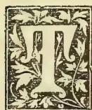

HERE are being introduced into our villages through the School Gardens, two useful and wholesome vegetables which, though common enough in India, are not grown in Ceylon; and as little is known about them, we append the following notes regarding their uses for the benefit of our readers:—

1. *Rumex Vesicarius*.—Sorrel, Bladder Dock (*Polygonaceæ*). This is an annual monococious herbaceous plant, 6 to 12 inches high, with succulent leaves and leaf-stalks, inclined to branch moderately, with a characteristic acid sour taste, and a flavour of rhubarb about it.

Watt gives the following note regarding the medicinal properties of the plant:—

"The juice of the plant is considered by natives to be cooling and aperient, and, to a certain extent, diuretic (*Ainslie*). It is used to allay the pains of toothache, and from its astringent properties it is supposed to check nausea. The whole herb is given internally to allay burning at the pit of the stomach and to improve the appetite. Externally a pulp formed of its bruised leaves is applied to the skin to allay the pains of bites of reptiles and the stings of scorpions. The seeds are said to have similar properties, and are besides prescribed roasted in dysentery. The root also is medicinal (*Dymcock*)."

The plant is cultivated as a vegetable almost throughout India, and is used by the natives

both in the raw and cooked state. It is usually grown in patches near wells, and may be procured almost all the year round.

We are inclined to think that the plant will prove of great value to the natives both owing to its manner of growth and its uses. Watt gives the word *Sûri* as its Sinhalese name, but we can find no reference to the plant in any local works on Botany, nor can we give any explanation of the origin of the word *Sûri*. One thing is certain, however, and that is that the plant is not found in use nor under cultivation in the Island.

For native preparations both leaves and stalks are well suited, a vegetable curry made of the latter being particularly tastety. The same parts may also be used to take the place of rhubarb in tarts, as the rhubarb flavour, previously referred to, predominates in the petioles. The leaves themselves go to make a really excellent jam.

The plant in its early stages adopts the rosette form of growth, as in the lettuce, though the leaves always have fairly long petioles—the leaves themselves being somewhat cordate in shape. Later on, as noted above, a system of branching follows, the branches being considerably thicker than the leafstalks and possessing more of the sour taste and rhubarb flavour. When the leaves are cut for use, the plant continues to put out a fresh growth, a characteristic that goes to enhance the value of the plant which may be described as a hardy grower.

Altogether we consider *Rumex vesicarius* a great acquisition, and trust that our village population will take to it without prejudice, and soon

801------------------------------------------------

782Supplement to the "Tropical Agriculturist."[MAY 1, 1902.]

come to recognize its dietetic value and medicinal virtues. The plant has not flowered with us yet.

2. *Chemopodium album*.—The white goosefoot (*Chenopodiaceæ*).

The plant is found growing in the tropics at sea-level, as well as in Tibet at a height of 14,000 feet. As seen growing here it reaches a height of about 3 feet before producing its inconspicuous inflorescence.

In India the leaves and twigs are eaten as a pot-herb like spinach, but the plant is there chiefly cultivated for its grain, which is considered better than buckwheat. When cultivated during the rains it is said to attain a height of 6 feet, the seed ripening in India in October. Prof. Church says of the leaves of this plant: They are rich in mineral matters, particularly in potash salts. They likewise contain a considerable amount of albumenoids and of other compounds of nitrogen.

Watt refers thus to the medicinal virtues of this plant:—Said to be used in special diseases, and as a laxative in spleen and bilious disorders (*Atkinson*). It is also given in bile and worms (Baden-Powell). It is diobstruent and diuretic.

In the form of the favourite native dish called "mellun" it is very palatable, and would be very welcome in village households. We have no doubt it will be equally suitable for vegetable curry.

The plant is already being grown in School Gardens, and the produce formed one of the vegetables exhibited at the Danowita Village Show held on 22nd March.

#### OCCASIONAL NOTES.

A Board of Agriculture and Industries has been formed in British Guiana, with the object of facilitating the work of fostering Agricultural industries other than that of Sugar-cane, of extending agricultural instruction to small farmers and settlers on the land, of imparting agricultural instruction through the Primary Schools of the Colony, and generally of developing the agricultural resources of British Guiana.

The consignment of Banana plants referred to in our last issue duly arrived from Queensland, and have already been planted out. It includes two plants of each of the following varieties:—Ladies' fingers, Sugar, Butter, Dacca, Barrego, Cavendish, Moku, Delena.

Professor MacOwan, Government Botanist at the Cape, has been invested with the degree of Doctor of Science by the Cape University. Prof. MacOwan's work in South African botany has of a valuable character, and Prof. Harvey of Kew has borne testimony to this fact by stating that but for Prof. MacOwan's great work at the Cape the "Flora Capensis" would have been miserably incomplete. We offer our hearty congratulations to Dr. MacOwan.

We are glad to find the Agricultural Journal of Cape Colony reprinting the Handbook on Practical Orchard work by Messrs. P. MacOwan and

Eustace Pillans. We formed a very high opinion of this little work when it was first published, and consider it well worth bringing within the reach of all who have anything to do with the cultivation of fruit trees.

The cultivation of Cassava or Manioc (*Manihot utilisima*) is spreading rapidly in Florida and the neighbouring States. One great advantage is that the plant grows in sandy soils unsuited to most crops, and can be fertilized by means of leguminous crops without the aid of other manures. The acre is said to yield 8 tons of roots, and the starch got from it is sold for 2½d. per lb., while it goes six times as far as the best wheat starch at 3d. per lb. As a cattle food it is a great acquisition, making it possible, so it is said, to put on a pound of carcass at the cost of a little over a ¼d.

We are glad to learn that Messrs. C. C. Barber's Cocoa (see advertisement on back cover) has "taken" in Australia. It has been accepted by approved Agents in Perth, Sydney, and New South Wales, and its introduction into Queensland and Tasmania has been entrusted to good hands. The first orders received from various quarters have been substantial and promise well for the popularizing of the excellent article turned out by the pioneer firm of Cocoa manufacturers in Ceylon, where Barber's Cocoa is steadily taking the place of the older "brands."

The following Ceylon plants are gall-bearing: *Eugenia Jambolana*, *Areca Catechu*, *Cinnamomum Zeylanicum*, *Pongamia Glabra*, *Terminalia Chebula* and *Acacia Leucopheba*. The fruit of *Terminalia Chebula* and *T. Bellerica* constitute the "Gall-nuts" or Myrobalans of commerce, valuable in tanning.

A correspondent, writing on 20th March from Adelaide says:—The land is most fertile and the climate, except for two or three months, equal to that of the countries washed by the Mediterranean. During the summer, which we have just passed, the temperature keeps often over 90° F., and sometimes, for a day or so, it goes up as high as 108°; but by the laws of compensation, the Mercury falls to a temperate heat for a day or two after. There is plenty of good land to be got from Government at a rental of 2s. per acre per annum, and twenty years to pay the value in, or on a lease of 999 years at 2s. This is the paradise of the working man. Every man and woman must work, and the dignity of labour is understood here as nowhere else. Farmer and labourer have equal rights, and the man in Parliament is dependent chiefly on the working man for his election. This, in a measure, enables the working man to rule the capitalist and to control the laws of the country.

The sentiments embodied in the article on Town and Country Shows which appeared in the last number of the *Agricultural Magazine* are echoed in the *Cape Agricultural Journal*. Says our contemporary: "Let it be prominently borne in mind that

802------------------------------------------------

MAY 1, 1902.]Supplement to the "Tropical Agriculturist."783

Agricultural Shows, while run in the interests of the general sight-seeing public, are especially designed to benefit and promote the farming industry. The question is, do the Shows fulfil their object in this direction?" and so on in the same strain.

We read in the report of the Government Agent of the North-Western Province (Mr. L. W. Booth) for last year, that two Cottagers' Shows were held during the year, one at Habarana and the other at Rambewa, where both attendance and exhibits were numerous. The opportunity was taken to distribute seeds to all who cared to take them.

RAINFALL TAKEN AT THE SCHOOL OF AGRICULTURE DURING THE MONTH OF APRIL, 1902.

<table border="0">
<tbody>
<tr>
<td>1</td>
<td>Tuesday</td>
<td>...</td>
<td>Nil</td>
<td>17</td>
<td>Thursday</td>
<td>...</td>
<td>.21</td>
</tr>
<tr>
<td>2</td>
<td>Wednesday</td>
<td>..</td>
<td>Nil</td>
<td>18</td>
<td>Friday</td>
<td>...</td>
<td>.13</td>
</tr>
<tr>
<td>3</td>
<td>Thursday</td>
<td>...</td>
<td>.05</td>
<td>19</td>
<td>Saturday</td>
<td>...</td>
<td>.82</td>
</tr>
<tr>
<td>4</td>
<td>Friday</td>
<td>..</td>
<td>Nil</td>
<td>20</td>
<td>Sunday</td>
<td>...</td>
<td>Nil</td>
</tr>
<tr>
<td>5</td>
<td>Saturday</td>
<td>..</td>
<td>Nil</td>
<td>21</td>
<td>Monday</td>
<td>...</td>
<td>Nil</td>
</tr>
<tr>
<td>6</td>
<td>Sunday</td>
<td>..</td>
<td>Nil</td>
<td>22</td>
<td>Tuesday</td>
<td>..</td>
<td>Nil</td>
</tr>
<tr>
<td>7</td>
<td>Monday</td>
<td>...</td>
<td>.20</td>
<td>23</td>
<td>Wednesday</td>
<td>...</td>
<td>1.66</td>
</tr>
<tr>
<td>8</td>
<td>Tuesday</td>
<td>...</td>
<td>Nil</td>
<td>24</td>
<td>Thursday</td>
<td>...</td>
<td>Nil</td>
</tr>
<tr>
<td>9</td>
<td>Wednesday</td>
<td>..</td>
<td>Nil</td>
<td>25</td>
<td>Friday</td>
<td>...</td>
<td>Nil</td>
</tr>
<tr>
<td>10</td>
<td>Thursday</td>
<td>...</td>
<td>.03</td>
<td>26</td>
<td>Saturday</td>
<td>..</td>
<td>.44</td>
</tr>
<tr>
<td>11</td>
<td>Friday</td>
<td>...</td>
<td>.04</td>
<td>27</td>
<td>Sunday</td>
<td>...</td>
<td>.04</td>
</tr>
<tr>
<td>12</td>
<td>Saturday</td>
<td>..</td>
<td>.13</td>
<td>28</td>
<td>Monday</td>
<td>...</td>
<td>.20</td>
</tr>
<tr>
<td>13</td>
<td>Sunday</td>
<td>..</td>
<td>.07</td>
<td>29</td>
<td>Tuesday</td>
<td>...</td>
<td>5.65</td>
</tr>
<tr>
<td>14</td>
<td>Monday</td>
<td>...</td>
<td>Nil</td>
<td>30</td>
<td>Wednesday</td>
<td>..</td>
<td>.70</td>
</tr>
<tr>
<td>15</td>
<td>Tuesday</td>
<td>...</td>
<td>Nil</td>
<td>1</td>
<td>Thursday</td>
<td>...</td>
<td>.13</td>
</tr>
<tr>
<td>16</td>
<td>Wednesday</td>
<td>...</td>
<td>Nil</td>
<td></td>
<td></td>
<td></td>
<td></td>
</tr>
</tbody>
</table>

Total... 10.50

Mean... .35

Greatest amount of rainfall registered in any 24 hours on the 29th April, 1902, 5.65 inches.

Recorded by ALEX. PERERA.

COTTON.

Some years ago a good deal of attention was given to the question of Cotton Cultivation in Ceylon, but though a number of small experiments were started at the time, we are not aware that a proper trial under the most favourable conditions was given to the cultivation of the plant. With the opening of the Northern Railway the subject is once more being discussed in view of the possibility of suitable areas being found in the regions through which the new railway runs.

The amount and distribution of rainfall has much to do with successful cotton cultivation, and this fact must be borne in mind in selecting soils. The plant thrives in a very warm atmosphere, provided the latter is moist and that severe drying winds are not prevalent. In the typical cotton climate the mean daily temperature increases from the time of seeding till the plant has reached its greatest vigour and stored up all the reserve food it needs for the production and maturing of fruit. The best type of soil for producing favourable results is a clay loam or

medium heavy sandy loam. The soil should be deep and the sub-soil not heavy and compact. The cotton plant has a well-developed tap-root extending according to the vigour of the plant and the character of the soil, to a depth of three or more feet. The lateral or feeding roots begin usually within three inches of the surface and seldom extend beyond a depth of nine inches. It is a question whether the practice of planting on ridges is as good as working up the land deeply and then sowing the seed on the level ground. The ridge system grew out of the practice of shallow working to a depth of a few inches, though the seed bed is deepened by trowing up the soil till a depth of ten inches or more is obtained. A good seed bed is thus formed it is true, but it will not resist drought as would a level culture accompanied by deep working.

The object of cultivating the land during growth of crop is to prevent loss of moisture in the soil. This is accomplished by maintaining a surface layer one or two inches thick in a thoroughly pulverised condition. At the same time and by the same means weeds and grass are kept down. It is very important that the surface layer of loose soil should be constantly maintained. Especially after rain when the soil tends to settle and form a compact surface, a stirring of the top layer should take place. With the production of crop, cultivation should cease, and the plant helped by reducing water supply by preventing surface evaporation. It is precisely reversing the process desired in the early stages of growth with the object of checking further development of foliage and directing the energies of the plant towards making use of the materials it has already accumulated for the production of fruit.

As regards time of planting &c, local conditions must be consulted before deciding these points, but the object should be as far as possible to secure for the plant an early start and a long season in order to successfully mature its fruit and enable the crop to be gathered in good condition.

On the question of fertilizing or manuring we do not propose to enter, but a good deal of useful information under this head may be derived by a handy pamphlet on "Cotton Culture" published by the German Kali Works for which Messrs. Freudenberg & Co. are the local agents. This publication should prove useful to intending cotton growers as it has proved to us in collating the foregoing information.

We are hopeful of suitable land being found for raising cotton as well as tobacco, which is just at present also being much talked about, in the vast areas now made accessible by the opening of the Northern Railway. With this idea we are making arrangements for trials of suitable varieties of cotton, of which a small supply of seeds has been indented from Egypt.

We have already a local Spinning Company which ought to be some encouragement to intending growers. There is also a Sinhalese pamphlet on Cotton Cultivation compiled by Mr. W. A. de Silva which should serve to bring the subject to the notice of the natives. A revised edition of this pamphlet—brought up to date—and a Tamil translation of the same, might be published with

803------------------------------------------------

784Supplement to the "Tropical Agriculturist."[MAY 1, 1902.

advantage for free circulation by the authorities interested in the development of a local cotton-growing industry and in the opening up of the areas through which the new railway will run.

#### TO PRESERVE MANGO CUTTINGS.

In our February number (*vide* first article) we gave some directions for packing Mango cuttings so as to keep them fresh for budding purposes. In the *Agricultural Journal of Natal* for March the following further information on the same subject occurs:—

Mr. H. Knight, according to a recent issue of the "Queenslander," has received a report from the Department of Agriculture (Queensland) with regard to the cuttings of mango he packed at the City Market here on the 7th of September last. There were four tins. In two were eighteen cuttings packed in moist sand; in the other two were six cuttings, packed in coconut fibre, which had been boiled and washed and squeezed dry. One of the big tins was opened on the 15th of October, and it was found that fourteen of the cuttings were dead, two partly alive, and two fairly healthy. The second big tin was opened on the 12th of November. All the cuttings were dead except the largest, which was covered with nodules, but had no appearance of any buds swelling. The first of the small tins was opened on the 12th of November, and all six cuttings were alive, with numerous buds ready to develop or grown out from  $\frac{1}{4}$  in. to 2 in. in length, the wood covered with white nodules, and the base of the cuttings well calloused. The last tin was opened on the 19th of December. In this case, also, the whole of the cuttings were alive. They had made shoots of from 2 in. to 4 in. long, and all the buds appeared to have developed, though it would have been possible to get adventitious buds from the base of the larger shoots. The base of each cutting was almost completely calloused over. Mr. Benson, who examined the cuttings, states:—"I consider the two large tins a failure. Both the small tins were a complete success, and proved conclusively that mango wood can be successfully sent long distances if carefully packed in tight tins filled with coconut fibre, as used by Mr. Knight." Mr. Knight is quite satisfied with the result of his experiments; but he is hopeful, now that he has demonstrated the possibility of keeping mango cuttings alive for a good length of time, that something may be done by the Department of Agriculture in the matter of introducing into Queensland some of the finer classes of the fruit that are grown in the East.

#### A VALUABLE TIMBER TREE.

The Editor of *Indian Gardening* referring to Mr. Herbert Stone's paper on "The Identification of Timbers" read before the Society of Arts, London, says:—"That our Indian timbers require to be more closely studied is evident. How many people, for instance, know the value of 'Gumbar,' the wood of *Gmelina arborea*, and its peculiarity

of resisting the effects of time, wind and water, and its complete immunity from the attacks of insect pests? Even the voracious white ant will not touch it." The tree known as *Etdemata* is rather common in Ceylon, and its wood is described by Trimen as "yellowish-white, even-grained, light, strong, tough and durable; an excellent timber." The following note given by Dr. Watt in his Dictionary of Economic Products supplies fuller information regarding this timber which is not known popularly. Colour yellowish, greyish, or reddish-white with a glossy lustre, close and even-grained, soft, strong, does not warp or crack in seasoning, weight from 28 to 35 lbs. per cubic foot, breaking weight of a bar 6' ft. by 2 in. by 2 in., 580 lbs. (according to Baker). It is light, has a good surface, is very durable, is easily worked, and takes paint and varnish readily, and is therefore highly esteemed for planking, furniture, carriages, deck boats, panelling, and ornamental work of all kinds. (Gamble.) Mason states that it is largely employed by the Karens for canoes, and by the Burmans for logs. Owing to its extreme durability, it has been recommended as an excellent timber for making tea boxes, and has also attracted much attention as a very suitable wood for furniture, picture frames and similar work in which shrinking and warping has to be avoided.

Buehanan mentions that it is much employed for making native instruments of music. Roxburgh appears to have first noticed the excellence of the timber. He applied various tests to prove this. In one case he placed an outside plank in the river, a little above low water mark, where the worm is supposed to exert its greatest powers.

After three years in this position it was cut and found to be sound and in every way as perfect throughout as it was when first put into the river. Amongst other things a flood door was made of it to keep the tides out of the Botanic Gardens. Seven years and a half after the door (4 ft. square) was made, it still remained good though exposed to sun and water, while similar doors of teak were much decayed after six years' use.

Dr. Watt mentions that the wood has come prominently into notice and is in considerable demand in Calcutta for furniture making.

We have no doubt that Mr. Fredrick Lewis' forthcoming work will contain a reference to this tree, and supply all the information that may be desired from a local point of view.

#### VETERINARY NOTES.

Experiments are in progress in the treatment of Tetanus by subcutaneous injections of fresh nervous substance. Prof. Shindelka, after having unsuccessfully experimented with rabbit brain tried sheep's brain. The fresh cerebral substance was triturated in a strong proportion of sterilised water and the emulsion injected under the skin. This treatment was applied to eight horses suffering from tetanus, and seven of these recovered; one died on the fourth day. Prof. Shindelka intends to continue his exper-

804------------------------------------------------

MAY 1, 1902.]Supplement to the "Tropical Agriculturist."785

ments, and as soon as he has tried them on a sufficiently large number of animals will communicate his results.

In spite of the doubt cast by certain practitioners on the efficacy of iodide of potassium, Mr. Hauptmann is firmly convinced of its good effects. He does not favour injection in the udder chiefly owing to the difficulty of managing an antiseptic solution, but recommends administration by the mouth. Injection of an iodide solution into the uterus produced the same good results. Iodide of potassium, according to Mr. Hauptmann, exercises its specific action on milk fever as soon as it reaches the blood current.

Professor Mucki reports good results with the treatment of a severe case of strangles by means of corrosive sublimate. He used the drug intravenously, and first made an injection of 30 grammes of a solution of 1 in 1,000 in the left jugular. On the following day the temperature fell, but the hyperthermia returning two days later, the Professor administered 40, 50, and finally 60 grammes of the same solution daily. In a few days the fever finally disappeared, the local injuries improved, and the horse became quite convalescent.

The *Veterinary Journal* for February last contains a reprint of a lecture by Prof. Macqueen in which reference is made to, what we might call for the want of a better word "upishness" of young Veterinary Surgeons. The Professor objects to the insertion of the letters "M.R.C.V.S. L." after a Veterinary Surgeon's name, as suggesting something more than nonsense, and states that the final *L.* should be dispensed with on the ground of bad taste and of being altogether superfluous. Another thing objected to is the use of the word "Professor." "So far as I am concerned," says Prof. Macqueen, "the name of *Professor* is not pleasing, and I should certainly live quite happily in this world if there was no such title. My conception of a Professor is a man of about 80 years of age, with a head like Lord Kelvin, with flowing locks like those worn by the late Joseph Gamgee, a man who has lived through various places in a profession, whose experience is beyond question, and who is entitled to the real dignity of being called a Professor. What would Prof. Macqueen say to the local abuse of the word "Doctor" in describing a Veterinary Surgeon?"

Even the Veterinary profession is threatened with an invasion by the weaker sex. In 1897 a lady sat for and successfully passed the preliminary examination and entered as a student of a Scotch College with a view to being enrolled on the register of the R.C.V.S. She, however, found that the Council declined to admit her to examination. Legal proceedings followed against the R.C.V.S. in the Scottish Courts, but the case was dismissed with costs on the plea that the Scottish Courts had no jurisdiction. So ended

the episode of the lady student. There is said to be only one qualified lady Veterinary student in Europe, viz., Mdlle. Kepereaitsch, member of a wealthy Russian family. In America, however, five ladies were enrolled as students in 1897 by the New York Veterinary College. More ladies are seeking admission, with a view it is said of qualifying to treat—*Household Pets*!

## AN AGRICULTURAL PAPER.

We give below an Agricultural Examination paper with answers—something for our readers to think about.

Q. Are you aware that plant food exists in the soil in both available and unavailable forms, and that when plants have used up most of the available portion we call the soil "worn out"?

A. Yes. That soils, though unproductive, contain plant food in large quantities, but it is in such condition that plants cannot get it.

Q. Is it true that a soil is capable of being made a laboratory in which changes will take place, and some of this unavailable plant food be made available?

A. It is only when the soil is in such condition that certain changes can take place, that the unavailable plant food becomes available to the plant.

Q. Are you aware that when the texture of your soil is poor, or, in other words, when your laboratory is out of order, the best manure will not give satisfactory results?

A. The texture or physical condition of the soil is of the first importance. A rock contains plant food, but it will not grow crops because of its physical and chemical condition.

Q. Do you know that heat and air are important agencies in the changes going on in the soil as they are in ordinary fermentation.

A. Chemical changes in the soil cannot take place to the best advantage when air is excluded, or when a favourable temperature cannot be maintained.

Q. Does standing water have a detrimental or beneficial effect on the heat and air, Why?

A. Detrimental because it keeps the temperature low, and at the same time excludes air; while the soil texture is also impaired.

Q. How can you make the soil laboratory do the best work?

A. By making and preserving the best physical conditions possible.

Q. Have you realized what an inch of rainfall means?

A. It means about 113 tons of water supplied the acre.

Q. Are special precautions necessary for preserving the moisture in the soil? Why?

A. Most decidedly. It requires about 300 tons of water to produce one ton of dry matter. A good deal of rain water flows away over the surface of land, and a good deal is evaporated. On this account only a part of the rain is available for

805------------------------------------------------

786Supplement to the "Tropical Agriculturist."[MAY 1, 1902.]

plants; so we must try to save what moisture is already in the soil through previous rains.

Q. How can we make soil moist or keep soil moist?

A. By surface tillage. It keeps a soil moist by preventing it from drying out. When soil is left undisturbed for a long time, and becomes packed down, the moisture in the soil works towards the surface and is evaporated, so passing off into the air. Tillage, or stirring the top layer, make a surface soil mulch through which the soil moisture cannot pass. It is really equivalent to covering the soil with a layer of straw or board. Every cultivator knows how moist it is under a pile of straw which has remained in a place for some time, or under a board. The straw or board does not make the soil moist but prevents it from drying. This is what surface tillage does.

---

## THE ENTOMOLOGY OF THE HOUSE FLY.

---

The house fly, like the poor, is always with us, and it would be to the advantage of everyone to know all about so familiar an insect, and what its power for good and evil are.

In the *Agricultural Journal of Cape Colony* Mr. Charles Loundsbury contributes, under the head of Entomology, an interesting paper on "the house fly," containing a good deal of information which it is desirable we should add to our knowledge of human things.

Mr. Loundsbury gives us an instance of the ignorance prevailing on such a common subject. He says: "I once met a man who was kindly disposed towards the house fly, who confessed to a fondness for its company akin to that felt for the trusting robin red-breast that comes to the door-step at home when snow covers the ground, who was not annoyed when an over-adventurous fly dropped into his coffee, and who never exerted himself to destroy the busy ones which strove to share his sugar. His house was kept scrupulously clean, and flies consequently were not numerous therein, or he might perhaps have held different views concerning these little buzzing guests. He told me he honoured the fly for its intelligence, for its extraordinary vision and the beauty of its complex eye structure, and, most of all, for its peculiar attachment to the habitations of man throughout the wide world. He seemed well acquainted with the creature as a fly and in the house, but, strange to say, he had never probed its earlier history or enquired into its out-door habits; and his respect for the little insect seemed so genuine and unaffected that I forbore from enlightening him. Ignorance to him was indeed bliss. And if any of my readers hold similar views, if they have any affection at all for the house fly and desire to retain it, they had best read no further. My design in penning these notes is to malign the little pest, to lay bare its iniquity, to brand it an abomination of the vilest type, and to instil loathsomeness toward it. I have only one pronounced feeling for the house

fly, and that is of deep disgust. Other creatures there are plenty of an equally offensive production, but the house fly is pre-eminent for habitually insinuating its low-bred filthy self into man's abode, by fouling our food and drink with its dung-stained feet, by soiling our all with its excrement, scattering germs of foul disease for our injury.

We are reminded of the fact that though we abhor many an insect with little reason, chiefly on sentimental grounds, we are in a great measure indifferent to the filth-bred house fly to comman in our dwellings, thronging eating rooms, swarming in baker's shops and meal stalls, and blackening over the baskets of sellers of sweet meats which our children are permitted to eat.

The number of distinct (described) species of flies is said to be 40,000. Of all the number, only about half a dozen habitually enter dwellings, but the most abundant by far is the one species *Musca domestica*—the universal house fly, indeed the "fly."

The only part of the house fly's anatomy worth describing is its mouth. This organ is described as thick throughout, extending down from the head to the ground as the fly stands in feeding, but at other times retracted out of sight. It is expanded at the end and adapted for lapping and sucking, not for piercing.

The house fly is first an elongate white egg, which hatches very quickly, sometimes in less than 8 hours, into a footless white maggot. This grows rapidly, and in about a week in warm weather is about  $\frac{3}{8}$  inch. in length when it is full grown. The maggot retracts in length, and with hard and darkened surface enters into the quiescent pupa stage. In from 5 to 7 days the fly is developed and set free.

The house fly is an all-the-year pest but is more numerous at certain seasons. The average number of eggs laid by a female is 120 per diem. The mission of the fly is that of a scavenger, and particularly so in its larval stage, but strangely enough though the fly is so common, little of an exact nature is known of its breeding places. Horse dung is believed to be the chief food of the maggots, but the dung of cattle and other animals is also freely resorted to. The maggots, not being hardy, succumb as the food dries out. They appear to thrive in pure horse dung, other forms of ordure being too compact unless broken up or mixed with straw. The ideal breeding place would appear to be manure mixed with bedding and saturated with urine, especially if such a mixture be found in a cool shady place. Badly kept stables are their favourite haunt, and almost all stables serve as breeding places, while places where scavenged rubbish is thrown (such as over-cultivated grass fields) are very suitable. It would be well here to add that kitchen waste so commonly allowed to accumulate near dwellings is well calculated to breed the house fly.

The relation of the house fly to disease and the remedies against the pest will be referred to in our next issue.

(To be concluded.)

806------------------------------------------------

MAY 1, 1902.]Supplement to the "Tropical Agriculturist."787THE ADVANTAGES OF MULCHING.

[The appended lecture was delivered by Dr. Lehman, Agricultural Chemist, Mysore, before the United Planters' Association, and clearly explains the advantages of a practice too little adopted in countries subject to drought. The lecture is reproduced in Bulletin No. 2 of the Department of Agriculture Mysore, entitled "Notes on Coffee Cultivation," which in Dr. Lehman strongly recommends mulching instead of digging round the bushes.—Ed. A.M.]

The subject is a very large one, but I shall only touch on four of the most important points. These are:—

1. (1) The tendency to preserve the soil moisture.
2. (2) The tendency to prevent the formation of a crust on the surface.
3. (3) The tendency to preserve the soil in a loose and open condition and retarding the growth of weeds.
4. (4) Allowing the rain to enter the soil more easily and preventing the surface washing.

*The tendency to preserve the soil moisture.*—As we all know, the top layers of soil are generally the driest, while those below are gradually increasing in moisture till the level of the sub-soil water is reached. Of course, shortly after rain this order will be partially reversed, but this will only be for a very short time. In mulched soils this is not, however, the case, as Wollney, in his elaborate experiments conducted near Munich, has clearly pointed out. He, for one found that, even after ten days of dry weather, the surface soil, under a mulch of about an inch of coarse, strawy manure, had still considerably more moisture near the surface than at a depth of four feet. Compared with unmulched soil, the differences are also very striking; especially in the first four inches of soil, as it contained 13 per cent more water than that not mulched. At a depth of two feet there were still 2 per cent in favour of the mulched soil and at three feet a little more than 1 per cent. The above is an average of several experiments; and numerous others conducted at different places on different soils and with different mulches gave similar results; boards, stones, straw and leaves were among the mulching materials used. A very loose surface soil also acts as a mulch, but on the one hand, it is not nearly so efficient as leaves and, on the other, it would soon become compact again. Nevertheless, one of the objects of cultivation is to provide this partial and temporary mulch; for in most localities the application of the only other practical mulching materials, viz., straw or leaves, would prove a rather expensive operation. Since part of the object of cultivation is to form a mulch to retain soil moisture, and as a mulch of leaves would perform this object much better than cultivation, mulching may replace part of the cultivation. The more thoroughly we study the subject, the more convinced of this fact will we become. I need not enter into the theories advanced for the facts obtained by experiments notwithstanding that they have been proven beyond a doubt. It is surprising how the soil moisture will vary in adjacent portions of soil only a few feet or a few inches apart. You may have noticed yourselves that under a covering

of leaves only a few feet square the soil may be moist to the very surface, while just beyond this covering the soil is perfectly dry to the touch for perhaps two feet or more from the surface. The shade under which coffee is grown has also a tendency to preserve the soil moisture. But the mulch of leaves from the shade trees will be at least quite as effective in this respect as the trees themselves. I should not like to make any remark which might induce any of you to lessen your shade; but it is just possible that after extensive experiments have been made, it would be found possible to replace part of the shade by a mulch of leaves. As far as soil moisture goes, a mulch and shade trees work in the same direction. Properly speaking, I ought to give a brief account of the functions of the water in the soil to show how far the preservation of soil moisture is an important factor. But as every one knows that a liberal supply of moisture (not stagnant water) is absolutely necessary, I need not speak of it further at present. Of course, it is possible to have too much water in the soil. But as a mulch will in no wise interfere with the drainage, and as the coffee soils do not appear to have an excessive water-holding power, it is not likely that the mulch will retain much of that which would act injuriously to the coffee. But it would tend to keep the water near the surface, where the larger portion of the roots are—at seasons when without it these portions of the soil would be too dry. Of course, experiments will have to prove in how far the wintering of coffee is desirable or necessary, and it will depend upon the results of those whether it would be desirable or not to retain the mulch through the hot and rainless season. Some planters have noticed that coffee does apparently better on stony soil than on adjacent fields which are not stony. It would be premature to say that this was due to the stones on the surface forming a partial mulch. But that stones act similarly to a mulch (though not nearly so effectively) has been proved. And that the crops are sometimes injuriously affected by removing them has also been noted by observant farmers both in England and in Germany.

*Preventing the formation of a puddled surface.*—The ease with which the surface soil becomes puddled in some parts of the State is very marked. Few of us realize, I believe, what a drawback this really is to plant growth. Frequently you must have noticed that plants are growing very poorly indeed if there is only a thin crust on the surface of the soil. Unfortunately, I do not remember having seen any accurately conducted experiments which would indicate the extent of the injuries done by the crust. But T. B. Terry and other practical agriculturalists claim to have more than doubled some of their crops by always stirring the soil after every shower of rain as soon as it was sufficiently dry, so as to break the crust as soon after it had formed as possible. To do this on any of your estates would be impossible. But a mulch which would break the force of the rain or drip at the surface would prevent this crust formation to a very large extent, if not altogether. The rain water after percolating through the mulch has not sufficient force to move any large

807------------------------------------------------

788Supplement to the "Tropical Agriculturist."[MAY 1, 1902.

portion of soil particles and deposit them in a compact or puddled condition. One of the principal advantages of surface cultivation during the growing season of plants is doubtlessly to be found in the breaking up of the rain-puddled surface of the soil; and as a mulch will do this effectively it will greatly reduce or entirely replace the cultivation necessary on this score. In addition to surface cultivation there is always a certain amount of deep cultivation necessary. But even this can be reduced more or less by the use of a mulch, as the latter has the tendency to preserve the soil in a loose and open condition. This fact has been proven both by measuring the volume of air contained in a definite volume of mulched and unmulched soil, and by noting the shrinkage taking place in similar samples of soil mulched in various ways and those not protected by such a covering. To quote the figures without a detailed account of the experiments might be misleading. It will be sufficient to mention that in each case the mulch prevented the soil from becoming as compact as it otherwise would have become. In addition to this direct influence a mulch also tends to attract worms, which, by their burrowing, actually loosen the soil and possibly assist in rendering some of the plant food more readily available. Furthermore, any of the mulch decaying supplies the soil with vegetable mould at the surface, the place where it is so much needed. You will have noticed the check that a mulch has on weeds. And it is self-evident that a loose soil with no crust and a moist surface will allow the rain to enter more readily and will suffer less from surface washing.

---

#### GENERAL ITEMS.

---

The neglect of the ground or pea-nuts in Ceylon is to say the least of it remarkable, seeing that it is well suited to most parts of the Island. In America during a fair year the ground nut crop averages 5,000,000 bushels, and that is only a small proportion of the world's crop of fully 25,000,000. The Americans eat about 4,000,000 bushels of nuts a year, either in candy or the original kernels. The nut is largely used to adulterate Coffee and Cocoa.

Ground-nut oil, which is perhaps the most valuable product of the plant, is of a pale straw colour, very thin, clean and tasteless. It does not become rancid and even improves with

keeping. The yield is variously stated to be from 16 to 30 per cent, the higher quantity being assisted by heat but determined in quality. Its largest use is in adulterating olive oil, while it is also used for sewing machines and small machinery, for soap-making and as a cooking oil, also for burning. The residue or cake is used as a milk-yielding cattle food as well as a manure.

Some time ago attention was drawn to the value of the parched nuts as a diet for consumptive patients. The taste for parched nuts is so universal in America that a ground-nut stand is to be seen at nearly every street corner in the large towns. *The Cape Colony Agricultural Journal*, to which we are indebted for the above notes, makes a plea for the cultivation of the ground-nut along the Eastern Coast lands.

In composition the white of egg consists of proteid matter dissolved in water, while the yolk contains in addition to proteid, fat and coloring matter. The results of analysis are as follows:—  
*White*: 85.7 water, 12.6 proteid, .25 fat and .59 ash.  
*Yolk*: 50.9 water, 16.2 proteid, 31.75 fat, 1.09 ash.  
*White and Yolk together*: 73.7 water, 14.8 proteid, 10.5 fat, 1.0 ash.

A correspondent of the *Natal Agricultural Journal* gives the following recipe which he has found most successful for mange in dogs: Wash the skin first with warm water and soap (whale oil or Carbolic is preferable). Then apply 4 oz. of whale oil, 1 drachm of creosote, 1 oz. sulphur. Grind the sulphur into a little oil and creosote and then gradually add the rest of the tar and oil. Rub thoroughly into the skin.

*Pergularia odoratissima*, known among the Chinese as the "Night-Scented Orchid" is what is called the "tonkin creeper" in Ceylon. It is, of course, not an orchid, but a member of the order Asclepiadaceae. The flower is a great favourite among older members of the Ceylonese population, and is often placed among articles of clothing owing to the scent it imparts. An attar is said to be extracted from the blossoms. The fruit is incorrectly supposed by some to be the scented bean called "Tonka" or "Tonga" which is borne by *Dipteryx odorata*, a leguminous plant and the seed of which is used to scent snuff and communicate a pleasant odour to clothing.

808------------------------------------------------

# \* The TROPICAL AGRICULTURIST \*

∞ MONTHLY. ∞

XXI.

COLOMBO, JUNE 2ND, 1902.

No 12.

## ANNUAL REPORT OF THE CEYLON GOVERNMENT MYCOLOGIST AND ASSISTANT DIRECTOR, 1901.

### FUNGAL DISEASE.

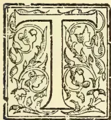

HE past year has been, from a meteorological point of view, rather less favourable to the growth of fungi than is usual in Ceylon. The number of days and hours during which the atmosphere was laden with moisture has been fewer, and the dry and sunny hours more, in nearly all districts than in most previous years. In addition, a good deal of preventive and sanitary work has been done in various districts, and this has lessened the number of spore-producing areas to some extent.

In regard to blights and diseases of staple products of the Island, we are at least in as good a position, if not better, than in January, 1901. Tea diseases have not wrought much havoc, though both leaf and root diseases have still to be seriously reckoned with. In cacao the stem and fruit canker are on the decrease, and will continue to be so, if cacao planters do not slacken their measures against this serious disease.

Some three hundred inquiries have been received during the year, chiefly dealing with diseases in tea, cacao, coconuts, cardamoms, shade and timber trees, and other estate cultivations, but a few referring to horticultural plants.

The work of diagnosing the diseases attacking specimens sent, and by so doing being in a position to recommend preventive or curative measures, is greatly helped by an adequate quantity of material being submitted for examination, and also when any facts which

may bear on the disease are sent with the specimens. A single leaf or two have on occasions been received, with a request for report as to the cause of its abnormal appearance, and recommendations as to treatment, with no other information.

The task is then somewhat similar to that of a doctor called upon to examine a portion of a dead or dying man without any facts about the case, and asked to recommend a course of treatment for this and other similar cases. It will greatly help, in a not always simple task, if as much material can be sent as convenient; if a leaf disease, then all stages of the blighted appearance on old and young leaves, if possible not quite dried up. For sending by post, a small tin box, such as a cigarette or tobacco box, answers the purpose well. Notes as to the time when the disease was first noticed; if tea, how long from pruning, whether on all the plants or only some, whether on all leaves or only some; the conditions present, favourable or otherwise, such as drought, cold, or excess of rain—all these are of much value in forming an opinion as to the causes of disease.

### ENVIRONMENTAL DISEASES.

Many of the specimens sent for report are found on microscopic examination to contain no parasite fungi or other organisms, and to be affected by what are purely *environmental* diseases, *i.e.*, due to the presence of physical conditions, such as drought, excess of water, absence of nutrition in the soil, powerful and continuous wind, lightning, and other such causes. In these cases, when the tissues have been found to be free from the presence of any parasitic organism and show no signs of having been attacked by any insect or other animal, an investigation of the conditions under which the plant has been living is needful, in order to find out the why and wherefore of the evil.

809------------------------------------------------

790THE TROPICAL AGRICULTURIST.[JUNE 2, 1902.

Two cases of tea struck by lightning were examined, and from the facts observed by the planters sending them, and the appearance under the microscope of both stem and leaves, there was no doubt that the injury was due to the passage of an electric current along the ground occupied by the roots of the plants. I have investigated a similar case in England, of elms in Leicestershire struck by lightning, where the shrubs and other plants near the elm trees were damaged along the track of the current.

In the Ceylon case a Grevillea tree was struck and the tea bushes immediately surrounding were damaged. In such cases of accidental injury it is possible by the help of some cattle or other suitable manure to prevent the plants dying, if they are observed and treated soon after the shock.

It is often not easy to say definitely that the lack of health of a plant is due to environmental causes, especially without careful observations of the circumstances of the case, but these are evils that the planter knows well and knows the way to cure—by removing the conditions. In my experience the planter generally does recognize environmental diseases, though, as is only to be expected, he is inclined to attribute the first effects of certain root diseases which are caused by fungi to such causes. If, however, bushes in nearly similar conditions, and apparently originally as vigorous, are “shuck,” some root disease of a fungal nature may legitimately be suspected. In any case of doubt the roots should be examined, and if a fungus is found, or if signs of it are seen, such as discolouration and decay of the root tissues, the whole should be destroyed by burning, and the soil around limed.

The planter who will suffer least from diseases in his cultivations must exercise the same observation and use the same care to keep his plants in health as he does for his horse or his dog. Without a knowledge of the anatomy and physiology of animals, he is yet able to prevent and cure many of the diseases of his domestic animals, and so in the case of his plants; whatever kind they are he may use preventive and curative means as soon as he notices any disease affecting his estate.

#### LEAF DISEASES OF TEA.

Tea has been throughout the year less affected than last year by leaf diseases. In the case of Gray Blight (*Pestalozzia Guepini*), it has been sent to me from almost every tea district in the Island, and therefore seems to have spread across wide areas. Though I have since my arrival in the Island examined an immense number of diseased leaves from jungle and other plants said to be affected by this leaf disease, I have in no case found the fungus to be growing on any other plant. In many cases badly affected tea is surrounded on one or more sides by jungle or scrub and though vast numbers of spores must have lit upon the leaves of plants growing there, no blighted leaves with this particular fungus have been found.

An interesting case of the method of distribution of spores was observed on an estate in a wet district. On the windward side of a narrow strip of jungle, at the brow of a hill, was a badly blighted field of tea; a road some 20 or 30 feet wide had been cut through the jungle, and on the leeward side was a field of tea, only blighted on the bushes which were opposite the opening through the wood. This points to the protection of tea in some cases by means of wind or other belts of trees. The whole question of spore distribution is one of rather a complex nature; it is however one of great importance from an economic point of view, and the experiments initiated during the year with a view of gaining a definite knowledge of conditions under which spores are distributed will, it is to be hoped, lead to measures likely to prevent or hinder the spreading of the spores of leaf diseases.

#### SPORE-DISTRIBUTION EXPERIMENTS.

The experimental “tabernacles,” which are built of jute hessian and are 45 feet long by 8 feet broad, enclosing thirty tea bushes in two rows of fifteen, are

9 feet high, and are placed at right angles to the prevailing winds in certain selected districts at various elevations and climates. They are open to the sky, and the tea in the enclosure is as nearly as possible under the same conditions as that outside. The observations already made in the tabernacle where the tea has already begun to bear leaves have yielded valuable information, and when the whole of these enclosures at varying heights and climates are under observation many data of importance will be gained.

All the tea both in the tabernacle and the surrounding field is pruned, and when the field has come into bearing all leaves on bushes inside the enclosure and around it which show any sign of disease are examined microscopically and the disease determined. The outbreak of disease on either side of the tabernacle is also observed and recorded in the same way. By thus observing at close and regular intervals the same thirty bushes a knowledge is gained of the behaviour of different bushes to disease. One question of much interest as regards tea with gray blight and other leaf diseases, viz., whether the weakly bushes are more or less liable to attack than more vigorous plants, and as to how they re-act to the disease, can here be studied carefully. The data are to be collected at the different stations by the superintendents of the estates selected and the leaves forwarded to me for examination. I also hope to personally inspect them at certain intervals. These gentlemen have most kindly taken a great interest in the investigation, and their valuable help in this matter will, I hope, be repaid by an advance in our knowledge of the whole question. The following is the schedule to be returned after each plucking, which will explain to those interested the *modus operandi* of the investigation:—

#### TEA BLIGHT INVESTIGATION.

The Mycologist, while wishing to reduce the amount of trouble taken by each observer, will be glad to receive as complete answer as possible. If the terms suggested in the footnotes only are used the comparison of the observations at the different stations will be simplified. When convenient the returns should be sent to Peradeniya next day, so that the diseased leaves can be examined with little delay. All the diseased leaves should be sent, unless too bulky, when they should be weighed and the weight sent, with as many of the leaves as possible.

The tabernacle should be kept closed and only the Kangany or Cooiy who is to pluck the bushes admitted.

Name of Estate \_\_\_\_\_

Date of plucking \_\_\_\_\_

Weather Conditions \* \_\_\_\_\_

Wind † \_\_\_\_\_

Weight of leaf plucked from enclosed } \_\_\_\_\_  
bushes (green) }

Approximate number of bushes from } \_\_\_\_\_  
when the diseased leaves came }

Condition of nearest bushes on North } \_\_\_\_\_  
side of tabernacle }

Condition of nearest bushes on South } \_\_\_\_\_  
side of tabernacle }

Does the flush on enclosed bushes } \_\_\_\_\_  
fairly agree with the rest of the field? }

Remarks or observations:—

\* “Very wet,” “rainy,” “no rain,” “no sun,”

“sunny,” “hot sun.”

† “No wind,” “little wind,” “variable,” “constant wind,” “strong wind,”

#### GRAY BLIGHT ON YOUNG SHOOTS.

As was mentioned in my last annual report, a circumstance with regard to Gray Blight, which calls for attention, has been again more than once brought to my notice. It is the fact that the fungus grows in some leaves so vigorously that it penetrates back through the leaf-stalk to the young shoot. In these cases it is able to grow longer than it can do in the leaf, which usually falls off the bush when entirely killed by the fungus and consequently it is on these older parts that I have at last discovered the perfect

810------------------------------------------------

JUNE 2, 1902.]THE TROPICAL AGRICULTURIST.791

fruiting form of the fungus or ascigerous state. This form I am investigating, and it will form the subject of a paper of a more technical character than is suitable in these Circulars. From a planting point of view this discovery is most interesting, as it points to one method this fungus has of perpetuating itself. All such cases, which can be seen by the discolouration of the young shoots and the absence on them of any flush, should be treated by pruning these young shoots back and burning the prunings. A case has occurred of the Gray Blight fungus attacking the youngest beds over a whole field and reducing the yield to a grievous extent. I cannot say whether in the cases I have examined the buds were "banji" by which I mean buds the growth of which has been checked, or whether they were attacked when in their earliest stages.

If the buds are "banji" they may have been on the bush for sometime—long enough for the growth of the fungus as it generally occurs; and further it is probable that the presence of the fungus in the buds may itself have produced a "banji." This phase of the Gray Blight fungus is, however, still being investigated and I may hope to learn more of its nature on visiting the area affected and noticing the conditions prevalent there.

The efforts of the Gray Blight fungus in this direction to decrease the output of tea should be care fully watched and by pruning lightly below the infected places, stopped before it becomes at all common.

#### ROOT DISEASE OF TEA.

A Disease which is more difficult to fight, and which has more disastrous effects in the places where it occurs, is the root disease of tea, which is to be found in many districts, more especially those at higher elevations, where the disintegration of dead vegetable matter is slower than in the low-country.

This is caused by a fungus, most probably *Rosellinia radiciperda*, Massee though in almost all cases there are not present the fruiting parts of the fungus, by which alone it can be certainly identified.

The mycelium of the fungus commonly called "White Root-rot," can be noticed as white thread-like strands, easily seen with the naked eye. When it has permeated the root entirely, it often assumes a fan-like shape covering the surface of the root, and can be easily detected on scraping away the dirt and the outer surface of the root. The majority of known fungi are saprophytic, *i.e.*, living on dead and decaying substances; others are parasitic, *i.e.*, growing on the living tissues of plants or animals. In some cases fungi have the power to exist in both these ways, and the tea root disease fungus is one of this latter kind. It begins its life as a saprophyte on any dead timber of a suitable kind. The softer and more spongy roots of trees like *Symplocos*, when the tree is cut down, are an ideal home for this fungus.

I have found it growing on various jungle roots,—in most cases it is not easy when the tree has been cut down for sometime to certainly determine the species of the root,—on buried logs, and prunings of all sizes, even no thicker than a slate pencil.

Having grown for some time on these dead hosts, when moisture is present it spreads out in different directions until it encounters another piece of suitable food. Unfortunately for the cultivation of tea it has acquired the liking for the living roots of tea bushes. The mycelium can grow to a considerable distance through the soil if damp until it reaches the next piece of nutritive material. I have observed a strand of mycelium  $8\frac{1}{4}$  inches in length which had apparently no intermediate host in its growth from a piece of dead *Symplocos* root to a young root of tea. It must be borne in mind that the presence of moisture is necessary for the growth of this fungus, and also that when it first reaches and attacks the root of living tea the injurious effect to the plant is not noticeable.

From a large series of observations I believe that in the case of vigorous tea a bush may be affected for two years or longer without succumbing. The tea bush is a hardy plant and makes a good fight against such an

enemy, but it is hardly possible that if once the fungus has got a foothold on its roots it can ever throw it off. I have seen this fungus killing out gradually some of the finest tea bushes in a field, and it will generally be seen that when one bush is badly affected and almost dead, some of the surrounding bushes are unhealthy and show signs of suffering, though in a less degree, from the same evil.

The remedies which should be employed to prevent spread of this disease are simple, and where carried out thoroughly have in all cases lessened and should eventually drive out the fungus.

The cutting of drains not less than two feet deep by one broad has the double effect of removing moisture from the soil and isolating the patches of disease, as the fungus mycelium cannot pass over a space of one foot, and if these are kept free from decaying matter, it will be stopped in its progress.

The burying of prunings in infected areas is dangerous and should be discontinued, as by this means the fungus has no other food than the roots of the tea and may be starved out.

The use of lime is undoubtedly a deterrent to the progress of the fungus, but since it is not possible to effect the application of lime so that it is in contact everywhere with the mycelium of the fungus, it is not always successful. I have been told by a careful observer that he has noticed a piece of lime round which the strands of this fungus were wrapped, and I am at present experimenting on the action of various proportions of lime in cultures of this mycelium.

All bushes which are killed should be carefully dug out, leaving none of the root if possible. The hole should be exposed to the air if the weather is fairly dry, and before filling in an application of lime should be made.

The ditches or drains should be dug around a larger area than is observed to be diseased, as some of the surrounding bushes may have the fungus in their roots though not noticeably diseased.

It may be noted as an encouraging feature in the case of this fungus that it rarely produces its spores underground, and seldom reaches the surface, and therefore almost its sole means of spreading itself is by the running through the soil of its mycelium or vegetative portion.

#### CACAO CANKER AND OTHER DISEASE.

Passing from tea to other cultivated plants, a leaf disease of the coconut palm has been studied, which bears a close resemblance to Gray Blight in tea, though it is undoubtedly distinct, and does, happily, not do very much damage to this valuable product.

The canker of cocoa has been somewhat fully dealt with in a Circular discussing the whole question, and it may be mentioned here only briefly. No new phases in the workings of this disease have been found, and the cures and prevention where used have continued to repay those carefully carrying them out. It is still a subject for regret that larger areas are untreated, and that in these places the fungus prospers and spreads both on pod and tree.

It may be that this report will reach some cacao planters who may not have read the circular "Cacao Canker in Ceylon," published in October last, and for these it will be well to repeat the summary of measures which are, I think, very generally considered as effective:—

"Prevention.—Regulate the shade so that the sun and air can reach all parts of the cacao trees, and keep the cacao from being so close as by its own leaves to densely shade the ground.

"Prevent dampness by surface draining, especially in low hollows.

"Allow suckers to grow on all trees that show any sign of disease.

"Burn all dead cacao trees and branches.

"Burn all discoloured pod husks from whatever cause they are discoloured. If this is not possible bury with lime.'

811------------------------------------------------

792THE TROPICAL AGRICULTURIST.[JUNE 2, 1902.

"Bury all pods under at least two inches of soil with a sprinkling of lime.

"*Cure*.—Cut out all diseased patches on bark or branches, removing also a wide margin—not less than two inches—of apparently healthy bark, and burn all the pieces removed.

"If this method is too expensive or too drastic, shave lightly over the diseased areas and around them, and burn the shavings. This latter treatment is not so effective as cutting out. Such work should be done vigorously in the dry weather, when the results are vastly better.

"Keep a gang of expert coolies continually on the look out for new canker patches, and have these parts removed before they spread far or produce their spores.

"Notice any dead cacao trees or branches on neighbouring small holdings, and endeavour to get these removed and burnt.

"These sanitary measures should be carried out on all estates, even where the canker is very rare, and the personal oversight of the superintendent seems to be the only way to prevent small patches of disease being missed in going round. It is much better to take a longer time in going round the estate and have the work thoroughly done than to cover large areas and overlook some canker."

Another disease of cacao of which the nature is not yet exactly known, has been observed and investigated. This is a condition of small and unripe fruits, which is characterized by the unusual flexibility of the pods, giving them when handled the feeling as if made of india-rubber. Pods when in this condition are said to never attain full maturity, and, as a rule wither up and are of no use. I have not been able to find in any typical pods of this character any mycelium of a fungus or injury by insect and it is probable that this is another of the environmental diseases, the cause or causes of which are not yet apparent. That the fruits are fertilized seems proved, an examination of many showing a normal embryo. The loss by this "going off" of a proportion of the pods is important. This condition must not be confused with the drying up of very small pods, which is referred to later, and which at present seems to be due to different causes.

#### GREVILLEA DISEASE.

A disease of *Grevillea robusta* very prevalent in certain districts is at present occupying my attention. This is a canker which, though it grows upon the roots of the *Grevillea* tree as well as the stem, seems in most cases to originate on the stem, usually near the base. The external signs are a darkening of the bark accompanied, as a rule, with an exudation of gum at various points. Some trees are being treated experimentally, and the fungus is being cultivated, and its effect on the tree examined, some healthy trees being inoculated for this purpose. A Circular will be issued and preventive measures recommended when the facts desired are obtained.

Meanwhile it is important that a look out should be kept for this disease of a most valuable shade and timber tree. All specimens which seem to agree with this short description should be noted, and I will be glad to be informed of their existence and any facts bearing on the case.

#### FINGER AND TOE DISEASE OF CABBAGES, &c.

Passing from diseases of our extensively grown plants to those of others, the most important is *Plasmodiophora Brassicæ*, Wor., which has been found in more than one place on cabbages and turnips; it is due to a fungus which attacks the roots and shows itself in malformation of the root, lack of vigour, and subsequently in the death of the whole plant. This disease has been known in Europe for more than a hundred years, and in England is called "Finger and toe," "Club-root Clubbing," and "Anbury." On the Continent the popular names also have reference to the shape of the root, which resembles fingers and toes. These malformations are due to the irritation or stimulus of a fungus which belongs to the group of Myxomycetes, or

"Slime fungi," a most interesting group botanically but not so important economically, since hardly any of them are parasitic, i.e., disease-producing, or other plants. This slime fungus is so called because it has no outward shape, like the majority of the fungi, but consists of a mass of plasmodium or jelly-like material which makes its way from cell to cell of the root and absorbs the contents of each.

After consuming all the food it can find it forms its spores—which are the reproductive bodies and may be considered as seeds—and these can remain for some time without sprouting. In Europe they carry the fungus over the winter and germinate in the spring. When conditions are favourable, these resting spores germinate and throw out a jelly-like material, which it comes in contact with the young root of a cabbage, turnip, or similar plant penetrates into it and produce the "finger-and-toe" disease.

There are two recognized methods of fighting this disease. The first is to starve out the fungus, and this is done by taking advantage of the fact that *Plasmodiophora Brassicæ* only grows on cruciferous plants, i.e., plants of the cabbage order. By not growing such plants as cabbage, kale, turnip, kohlrabi, and substituting crops of potato, lettuce, beans, peas, &c., the fungus can obtain no food, and will consequently in a few years be entirely exterminated. The other one known is lime, and this is only a partial remedy. It has been found that acids favour the development of the "finger-and-toe" fungus and alkalies retard it. Thus, a dressing of lime in a garden or field affected by this disease is of value, though not a certain preventive. It is to be hoped that these measures, preferably the former, may be taken wherever this evil is present in Ceylon, so that this disease may not get a foothold in this Island, such as it has in Europe, where it annually causes great losses to root crops and other plants.

#### FUNGI CAUSING ROTTING OF TIMBER.

Two other fungi have been studied both of economic interest, though not growing on living plants. The first is a species of *Polyporeæ* growing upon beams used for building purposes and causing "dry-rot," the name of which until the cultures have grown sufficiently to produce fruit cannot be given. Some experiments are being made with substances suited to preserve wood from the attacks of this fungus, and also with some different woods in use for building in Ceylon, as to their liability to attack. Some woods are by their structure less easily attacked by this fungus and it is well that the exact amount of immunity they possess should be known.

#### FUNGUS ON RUBBER.

Another is a fungus which grows upon samples of rubber, those examined begin from *Hevea Brasiliensis*, Para rubber; it was growing more abundantly upon those samples which had been precipitated with acetic acid, than on the untreated rubber, but this point will be experimented on. The fungus is a species of *Syncephalis*, and causes characteristic red markings in the sample, though not destroying its translucency. Whether the growth of this fungus on the rubber affects the market price, I have yet to learn.

#### OTHER DISEASES OF PLANTS.

The following plants, in addition to those previously mentioned, have been received as diseased; where the fungus causing the disease or growing on the plant has been identified it is mentioned. In other cases the material did not afford means of identification:—

- *Dillenia retusa*, *Thunb.* *Marasmius sarmentosus*, *Fr.*
- *Michelia Champaca*, *L.* (*Sapu*). *Polyporus sanguineus*, *Fr.*
- *Garcinia Xanthochymus* *Hk. f.* (*Cochin* *Goraka*.)
- *Strigula Complanata*, *Fee.*
- *Oxalis corniculata*, *L.*
- *Mangifera indica*, *L.* (*Mango*). *Fusicadium*, *sp.*
- *Crotolaria*, *sp.*
- *Desmodium cajangfolium*, *DC.* *Peronospora*, *sp.*
- *Phaseolus vulgaris*, *L.*

812------------------------------------------------

JUNE 2, 1902.]THE TROPICAL AGRICULTURIST.793

*Erythrina umbrosa*, H.B.K. (Bois immortelle)  
*Sparassus*, sp.  
*Acacia decurrens*, Willd.  
*Rosa indica*, L. *Phragmidium devastatrix*, Sor.  
*Eucalyptus*, sp. (Gum tree). *Rosellinia radiciperda*, Mass.  
*Quisqualis indica*, L. *Corticium*, sp.  
*Passiflora coerulea*, L. (Passion-flower). *Cystopus*, sp.  
*Cucumis sativus*, L. Cucumber. *Peronospora*, sp.  
*Daucus Carota*, L. Carrot.  
*Coffea liberica* L. *Cladosporium herbarum*, Pers.  
*Rhododendron sinensis*, Sw.  
*Minusops hexandra*, Roxb.  
*Piper nigrum* (Black pepper). *Coleroa*, sp.  
*Acalypha indica*, L.  
*Agathis obtusa*, Lindl. *Strigu'a complanata*, Fee  
*Musa paradisiaca*, L. (Plantain).  
*Karatas* sp. *Pythium de Baryanum*, Hesse.  
*Eleocharis Cardamomum*, Maton. (Cardamom).  
*Areca Catechu*, L. (Areca nut palm). *Physcia speciosa*, Fr.  
*Corypha umbraculifera* L. (Talipot palm). *Sphaeria*, sp.  
*Borassus flabelliformis*, L. (Palmyra palm) *Sphaeria*, sp.  
*Caladium bicolor*, Vent. *Diachaea elegans*, Fr.  
*Panicum sanguinale*, L. *Ustilago*, sp.  
*Setaria glauca Beauv* *Claviceps*, sp.  
*Andropogon*, sp. *Epichloe typhina*, Tull.  
*Eleusine aegyptiaca*, Pers. *Ustilago*, sp.  
*Adiantum Capillus-Veneris*, L. (Maiden-hair-fein Cystopus, sp.).

Some other plants and parts of plants were received which the senders did not know the name of, and which did not afford sufficient material for naming.

#### "BLUESTONE" AS A WEED KILLER.

Other botanical matters not relating to fungi or plant diseases have occupied my attention during the past year. The question of the use of "Bluestone," Copper Sulphate, in stopping the growth of weeds like oxalis, has been investigated, but the experiments showed little or no effect. The undoubted value of this substance in getting rid of charlock from wheat fields in England, without damaging the crop, suggested this experiment, which will be continued under different conditions until it can be definitely stated that it has no useful effect, or its value proved.

#### GRASS SEEDS FOR PASTURES AND LAWNS.

An examination of the seed used in laying down a large area of grass at a high elevation has been made. Four different samples of the mixture, which was obtained from a leading English seed merchant, were analyzed and the proportions of each of the different grass and clover seeds in the mixture determined. By enclosing a portion of this land and allowing the plants to flower, which has been sown down for some time, and observing the plants forming the herbage, an interesting record will be obtained as to the grasses and clovers which have grown and prospered, and those that have failed to come up at all. In this way we shall arrive at a conclusion as to what European grasses, clovers, and other herbage and lawn plants are suited to the hill country. I shall be glad to receive samples from any one who is laying down European seeds, to analyze and give advice as to the value of seeds for the purpose. The practice of buying mixtures is, however, to be deprecated; it is much better to get from the seedman the required quantities of named seeds and mix them when bought.

#### CACAO CUTTINGS.

Cacao and its improvement has not been lost sight of. In the first place, though my own experiments in obtaining new plants from cuttings have not proved successful either in the open or under glass, Mr. Herbert Wright, the Scientific Assistant and Acting Curator of the Gardens, has achieved the re-

quired result, and has succeeded in rearing a plant from a cutting. The conditions which seem to have helped in this case are a sandy soil and an abundant and constant supply of water at the roots. It will be well if this is noted by cacao planters, so that they may be helped in their experiments in this direction. It need hardly be stated how valuable it will be if we can arrive at an easy method of striking cacao cuttings, as by this means we can perpetuate the characters of a specially valuable tree.

#### MEASUREMENTS OF CACAO PODS.

The measurements of fruits have been continued with a view to arriving at a decision as to whether any external characters of the pod can be used for selection of seed. The same results which were recorded last year, and later in a short note in "Tropical Agriculturist" for April, 1901, have been arrived at, viz., that the external shape and size of the fruit affords no criterion as to the commercial value of the seed within, and may often be a most misleading character. The pods examined—more than 1,000 in all—were of all kinds and varieties and on different estates. They were all measured accurately, both lengthways and around the thickest part, and weighed; then they were opened and the number and weight of the seeds and the weight of the fruit wall recorded. The diagrams, produced first in the *Tropical Agriculturist* show more clearly than any explanation the absence of relation between external characters of the fruit and weight of seed.

#### SELECTION OF SEED IN CACAO PLANTING

The natural method of selection of seed pods with our present knowledge of cacao is to select from a parent possessing the qualities wanted. A heavy cropper, i.e., a habitual heavy cropper, not an occasional big yield, a hardy plant, these are the things to be looked for in selection, if we are to improve our Ceylon cacao. No fruit tree gives better promise, and the wonders which have been achieved in improvement of the European and American fruits are an example to encourage in this direction. An experimental plot which was mentioned in last year's report, in which were planted seeds from a tree which has borne for six years an average of 434 ripe pods, has been preserved and tended, and the plants from this bed will be planted out and carefully watched with a view to their possessing a great deal or in part this heavy cropping character of the parent tree.

#### POLLINATION OF CACAO.

The pollination of cacao has been again worked at though unfortunately pressure of other matters prevented much time being devoted to this interesting question. That the heavy cropping qualities of some of our Ceylon trees is due to the more effective pollination and fertilization is more than probable, and therefore a knowledge as to the method of pollination will perhaps help us in finding what conditions are most favourable to the setting of a large quantity of pods. So far as my researches in this field go, I have only discovered one animal, an aphid (*Aphides Ceylonica Theacola*, Buckton), which was carrying pollen grains. This insect I found in considerable numbers in buds and young flowers, and several of them had pollen grains of the cacao adhering to their bodies and limbs. During the next flowering season I hope to carry out an exhaustive series of experiments with regard to the pollination of cacao. Some remarks on this matter in my last annual report were misunderstood, and in letters to the daily papers it was thought that I was attempting some method of artificial pollination. The structure of the cacao flower and other things render this impracticable. In this connection it may be mentioned that inquiries are still made to me about the structure of the cacao flower, owing to an erroneous statement as to "male and female" flowers being at one time published. The flowers of cacao are all truly hermaphrodite, i.e., having both stamen (male) and pistil (female). I have in an examination

813------------------------------------------------

794THE TROPICAL AGRICULTURIST.[JUNE 2, 1902.

of a very large number of flowers, while working at the fertilization, never found any abortion of organs. Cacao seed has been sent to distant parts of the British Empire with a view to discovering the length of time that the seed will retain its vitality under varying conditions. It is important to know the best method of sending seeds or young plants from a distance.

TOURS AND PLANTERS' ASSOCIATION MEETINGS.

During the year I have visited many planting districts, including Badulla, Passara, Monaragala, Dikoya, Matale, Deltota, Dumbara, Ambagamuwa, and the low-country, where experiments and investigations have been made and material collected for laboratory work. I have also attended Planters' Association meetings at various centres, where diseases of plants and cognate matters have been discussed and explanations given on various technical points. It is a pleasure to record my thanks to many planters for valuable help in investigation of plant diseases and other matters.

J. B. CARRUHERS,  
Government Mycologist and

Assistant Director of the Royal Botanic Gardens,  
Peradeniya, January, 1902.

**PINEAPPLES, ORANGES, CASSAVA,  
MANGOES, &c.**

REPORT ON THE CULTIVATION OF  
PINEAPPLES AND OTHER PRODUCTS OF  
FLORIDA.

By ROBERT THOMSON.

*(Formerly Superintendent of the Botanic Gardens of the Government of Jamaica, now Adviser to Messrs. Elder Dempster & Co. on the cultivation of Fruit and other products.)*

(Concluded.)

**ORANGES.**

I visited according to arrangements made at Washington a great Orange nursery at Glen. St Mary, about 80 miles from Jacksonville. Many millions of plants have been propagated here. There are here about half a million plants comprising all the best varieties of Citrus fruits. The proprietor is a well known expert. Orange cultivation prior to the great freeze of 1895, was the greatest industry of Florida, it was the chief "wealth producer" extending over an immense area to the south of Jacksonville. Previous to that great disaster that ruined thousands of families, this region was extolled as the most congenial in Florida for Oranges, for it is recognised by most leading growers that the further north even to "danger point" they grow the more luscious is the fruit. The tallies with our cultivation on the hills. Another frost 2 years ago destroyed the groves connected with this nursery, the trees being frozen to the ground. Thousands of groves were also destroyed by that morning's frost over hundreds of miles of land. Many of the growers are now planting further south in order to escape the frosts. Since last frozen the trees have sprung anew from the bases of the trunks and they now present a splendid appearance having attained a height of seven or eight feet. Several stems are allowed to grow from the base,—most luxuriant stems, branches and foliage. Next year innumerable trees are expected to yield considerable crops. Only a few severe freezes have occurred in about 60 years.

In this extensive nursery thousands of small plants budded two years ago yield from 20 to 40 fruits each. I suggested that many hundreds of small trees could be grown to the acre for early cropping. These precocious trees are budded on citrus trifoliolate stock. Peare, peaches and plums are commonly cultivated

side by side with the orange. Many of the groves in the great orange region of Orlando that were less severely injured by frost are now in a flourishing condition, far finer trees than any in Jamaica. This is another example of the capability of a sandy soil, in which they are made to flourish by constant care and fertilizers. At this nursery I witnessed a new departure in orange cultivation. A considerable number of plants are under experimental treatment for the Department of Agriculture at Washington, plants that were hybridized a few years ago. There are at least 50 very distinct forms, distinguishable by foliage, etc. These are about 8 feet high, and some of them are likely to fruit next year for the first time. At Miami a few hundred miles further south I also saw duplicates of these new forms at the Government Experiment Station, but much smaller plants. Varieties that will endure more frost as well as superior in point of quality are anticipated from these hybridized types. In the orange plantation connected with this nursery my attention was directed to great piles of logs between some of the wide rows of trees. I was surprised to learn that these piles are placed in summer in readiness for the winter frost. When the temperature falls seriously the huge piles of wood are set on fire to repel the frost by means of smoke, this in the open air. The result is usually satisfactory. Orange groves I noted everywhere are peculiarly sensitive to bad cultivation, that is by allowing weeds to grow, by withholding fertilizers, by insufficient cultivation. Whenever neglected, they languish. The ownership of a ten acre grove has been and is still looked forward to as ample to provide all the comforts of a well-to-do family. Each tree is highly prized, for on arriving at maturity it is valued at from \$15 to \$25. "In an Orange Grove 8 to 10 years old \$1,000 per acre has often been realized." Ordinary manure is deprecated "the benefits of barn manure in an average grove are in serious question. The fruits produced by nitrogen from this source are as above stated usually large, coarse, thick skinned, with abundant rag and of inferior flavour." My attention was repeatedly called to the notorious manner in which oranges are packed in Jamaica. Frequently trained packers have been selected in Orlando, sent a few days journey to New York or Baltimore at great expense and besides paid \$2 a day to rehandle orange shipments from Jamaica, that is to size, pick and repack in boxes for distribution. Orange growers and dealers freely express their surprise at this incredible example of Jamaican incompetency. For be it remembered that the splendid quality of the fruit itself is deprecated. "Fruit which is well known by a brand will often sell readily and quickly for 50 per cent more than other fruit equally as good, but not known to be so by the buyer." Orange and Grape Fruit groves are being largely planted in the vicinity of Miami. Plants three years old budded on small lemon stock yield 100 fruit. The size and luxuriance of the foliage is remarkable. Several of the most successful growers informed me that they did not know 10 years ago the difference between an oak and an orange tree. With determined energy and enthusiasm they have become noted cultivators. Before the 1895 freeze five million crates of oranges were shipped from Florida valued at about fifteen millions dollars. After this freeze the number of crates fell to 100,000. Last year it increased to 750,000 and next season double the latter number are expected. California produces six million crates. In a conservatory at Washington the most famous of all orange trees was pointed out to me, the original plant of the navel variety from which by propagation about half of the orange crop of California has originated. Californians commonly salute this wonderful tree.

Since my return from Florida I have visited the parish of Manchester the chief centre of orange production in Jamaica, more than half of all that are shipped coming from here. One firm alone collects

814------------------------------------------------

JUNE 2, 1902.]THE TROPICAL AGRICULTURIST.795

and ships about 100,000 barrels a year. Great benefit has accrued to Jamaica by the naturalization of plants introduced hundreds of years ago. Thus Logwood and Oranges have spontaneously overrun hundreds of miles of the Island and the former has long been established as one of the staple products. The spontaneous diffusion of a species of plant affords abundant proof of the eligibility of the environments in which it grows. Innumerable orange trees are thus widely disseminated in Manchester. Intermingled with other forest trees they have been subjected to severe condition of existence. Thus they present a dwarf stunted aspect. Practically the only attempt at cultivation has been to destroy the native trees by which they are surrounded with the result that small crops are obtainable. From these semi-wild trees thus reclaimed from the forest the average yield is less than half a barrel each. A little attention is sometimes bestowed upon groups of trees. For instance, trees occur on the settlers' coffee fields which have to be regularly weeded. Here they occasionally yield several barrels each and they present a distinctly improved appearance. One of the settlers pointed out a considerable group of trees he obtained on land he purchased. A few years ago his first crop was sold for 3s, the following year he had 6 barrels and in the two subsequent years 14 and 62 barrels respectively. The trees are very unequally distributed; in many places from 20 to 60 may be counted on an acre—occupying but a small portion thereof. Commonly from 6 to 12 of these dwarf trees are crowded in a space equal to that allotted to a single tree in Florida. The Manchester oranges are excellent in point of quality. They are sold at 2s. per barrel of about 40 fruits. If they were carefully handled, sized, etc., and packed in boxes the value would be greatly enhanced. It is interesting to note that several gentlemen in this parish are initiating the cultivation of budded trees with very promising results. I strongly recommend medium sized wild trees as the best stock for budding purposes. This can be done on a large scale. The cultivation of Coffee in Manchester is a large industry among the small settlers. The profit realizable can hardly exceed £2 per acre. If the same cultural attention were paid to the cultivation of oranges the returns would be surprising. Instead of an acre, containing irregular groups of desolate orange trees aggregating some 30 to 60, from which 20 barrels may be obtained, 150 of these small trees could be established per acre by the simple process of transplantation. By higher cultivation than that applied to Coffee 300 barrels of oranges would be assured per acre. On the lines I have propounded orange cultivation is capable of becoming one of the great industries of the Island. There are numerous decayed or worn out trees that should be destroyed and replaced by healthy medium-sized trees. Better to cut the transplanted trees well back to induce new and vigorous growth. In the delightful climate of the Port Royal Mountains this tree yields the very best possible fruit. Thousands of acres could be cultivated in lieu of thousands of trees as at present. The moderate application of fertilizers would ensure splendid returns when the soil is not sufficiently rich, this applies to all parts of the Island. All the conditions referred to emphasize our pre-eminent orange growing capabilities, capabilities such as throw into the shade all Florida that culminated with returns valued at 15 million dollars. Our illimitable resources await enterprising Englishmen to embark in orange growing. Limes grow with perfect success, double the size of those that grow on the keys of Florida. On rocky land hundreds of thousands of lime trees could be established at a trifling cost.

### CASSAVA CULTIVATION.

It is an interesting fact that Orlando (in Florida) the home of the pineapple shed system of cultivation, is indebted to Jamaica for an important industry. About three years ago an American tourist in Jamaica, Mr.

Perkins, was struck with the value of cassava as a starch-yielding plant. On his return to Florida he organized a company and erected a great factory at Lake Mary, 18 miles from Orlando, for the manufacture of cassava starch. I visited the factory at the end of June and was kindly permitted to see through it, the managers taking a great interest in Jamaica. One thousand acres of cassava are cultivated in the vicinity hundreds of acres of which by gentlemen connected with the factory. There are fields of one hundred acres each which I had the pleasure of inspecting. Within 60 miles of the factory the managers purchase the tubers delivered at railway stations at \$5 per ton, and the culture is extending rapidly. This factory crushes 40 to 50 tons of tubers daily during the cropping season of 4 months. The average crop per acre is 9 tons. This plant grows remarkably well on the all present sandy soil. On the day of my visit to a 100 acres field fertilizers were applied to the field, to the value of \$500. I pointed out that larger returns would be obtained from a better soil, in fact double the crop. The yield of starch from the tuber is from 17 to 20 per cent. It is also noteworthy that the manufacture of tapioca and dextrine from cassava are to be taken up with the least possible delay. The coloured labourers employed in this cultivation are paid \$1 a day. From the planting to harvest seven months are requisite. On account of the winter frosts the seed (stem cuttings) has to be buried in the sand for several months. Great piles of them are thus covered during the winter. The cost of preparing the land for this cultivation is \$40 per acre. This for digging up the Palmetto roots which cover the land. I quote the following from a Savannah Newspaper of June, 29th, 1901, relative to this cassava factory: "Brunswick's Board of Trade held an interesting meeting to-day to hear an informal address from President Perkins of the Florida Starch Factory, and for a lengthy session President Perkins entertained a large attendance. President Perkins is en route to the North, where he will study the needs of various cotton factories in their use of starch, and will still further adapt his factory to the manufacture of products suited to them. At present his firm has about \$100,000 invested in the development of the cassava industry and the enlargement of their plant is one of the near by plans." During my sojourn in Florida, I collected other valuable information regarding cassava as an article of food for cattle, etc. Indeed Florida is determined to make cassava a leading staple product. The matter is discussed everywhere. From the report of the professor at the Florida Agricultural Experimental Station I make the following extracts "With all the facts procurable, and with the experience not only of myself, but many practical farmers to support the opinion, I have reached the conclusion that, all things considered, cassava comes nearer furnishing the Florida farmer with a more universally profitable crop than any other which he can grow on equally large areas. It can be utilized in more ways, can be sold in more different forms, can be more chiefly converted into staple and finished products and can be produced for a smaller part of its selling price than any other crop. It is unquestionably true that cassava, all things considered, comes nearer supplying a perfect ration for farm stock than any other concentrated food produced upon Florida farms. Every beef animal in Florida can be put in the condition of western stall-fed cattle by the simple use of cassava at a mere fraction of the cost to the corn feeders of the west. An acre yielding 40 bushels of corn would at this rate produce 1,187 pounds of starch, while an acre of cassava producing 6 tons would yield 2,400 pounds of starch. It thus appears that cassava is to-day the cheapest known source of starch, costing at present market values of raw material only about one fourth as much as its nearest competitor. Not only therefore does the high yield of starch in cassava place it prominently before manufacturers as a probable new material for the great glucose industry, at present practically dependent upon corn, but more.

815------------------------------------------------

796THE TROPICAL AGRICULTURIST.[JUNE 2, 1902.

over cassava contains two other constituents worthy of consideration in this connection, namely, its 3 per cent. of sugar, against the 0.4 per cent. in corn and 1.68 per cent. of fibre, as compared with 2.20 per cent. of corn.

"Manufacturers are now considering the importance of these facts, and there is good reason for expecting the erection of at least two gluco factories in the near future, which will depend upon cassava for their raw material." The same authority says in another report: "The actual profit on the feeding of the cassava steers was 48.42 per cent on the investment. The cotton seed steers returned a profit of 37.43 per cent, and the corn fed steers 14.98 per cent. The difference between lots 1 and 2 is decidedly apparent and shews cassava to be very materially the cheapest and best ration which can be used for fattening purposes. The most astonishing fact, however, is the very great difference demonstrated between the cost and the results of feeding corn and feeding cassava, the difference being almost two-thirds in favour of the latter. Cassava proves itself a most superior beef fattening food. The cost of live weight beef produced by feeding cassava is 1.1 cents per pound, and in 75 days a profit of 59.10 per cent was made by fattening beef upon cassava." The Tampa Herald says "The one thing necessary to secure for Florida an immigration that will convert our pine woods into paying farms, is the discovery and fixed establishment of a money crop; a staple that can be produced on every farm in the state, and which will always bring cash to the farmer in profitable volume so that he can every year have some surplus money to put in the Bank; unless he should prefer to enlarge or improve his farm. Now the Herald believes that this crop can be established by the cultivation of Velvet Beans, and Cassava, and the conversion of them into beef and pork. After all is said and done, meat is the great backbone of the North West, where more good money is made than anywhere else. Let the farmers and owners of lands demonstrate this fact, and they can sell every acre of their holdings to men that will push the stock business. We will have as many people as the land can hold. We will have a village with churches and school in every township. We will have a wealthy and powerful State. We can have it is our firm belief." In addition to the importance of cassava from the foregoing points of view I have the pleasure to state that I directed the attention of the Secretary of State for India four years ago to the utilisation of new varieties of this plant, (the bitter and sweet varieties have been known in one or two localities of India for hundreds of years) among the inhabitants of famine-stricken regions there. I pointed out that the cassava is peculiarly drought resisting, flourishing as it does in arid regions, as well as in humid regions. Thus about 14 inches of rainfall secures abundant crops, whereas for rice cultivation from 50 to 60 inches are requisite. I also pointed out that some of the varieties when cooked as Irish potatoes, rival that edible in point of palatableness. My letters on this subject have been published in India. A few months ago, I received instructions to furnish two Agricultural Departments in India with these special varieties for experimental cultivation. I have obtained these varieties from Colombia from sections of it, one thousand miles apart. During my residence in that Republic, many years ago, I detected the merits of some of these varieties. Thus co-incident with the intimation to hand of the great economic importance of one or two varieties of cassava in America, the acquisition of some 23 additional varieties is most opportune. Several of these are exceedingly rich in starch. And I have just despatched to Bombay and Punjab all the varieties. I am forming a nursery of them here, so that vast numbers of cuttings will be available soon. I purpose establishing a plot of each variety, with a view to determine their merits here. I am also forwarding immediately to the Agricultural Department at Washington the entire collection, also of the bitter cassava which is much richer in starch than the one under cultivation so Florida. I am for-

warding a supply for extensive propagation. Millions will soon be disseminated over Florida. Two varieties the "Bitter" and the "Sweet" have been cultivated here from time immemorial; they are also spread throughout the West Indies. Starch is made from the former for household purposes; from the latter cassava cakes are made and frequently the roots are cooked and eaten by the peasantry though the variety is inferior. Small patches are grown everywhere by the peasantry. The total aggregate may be 100 acres, consequently seed cuttings may be obtained for thousands of acres for immediate cultivation. Doubtless twenty thousand tons of root could be produced within a year. The cultivation is exceedingly simple; it thrives under the most diverse conditions of climate, on the Liguanea and other dry plains, on rocky hill sides, as well as on humid plains and hills wherever the soil is friable or gravelly. To obtain large crops it must be planted annually; it may be planted twice a year in Jamaica; the roots or tubers can be dried to keep for sometime; thus the weight is greatly reduced for transport to be brought from distant parts to a factory. I have mentioned that the factory at Orlando is in operation only four months a year. In Jamaica a factory can be kept going most of the year. It is impossible to exaggerate the importance of a great cassava industry in Jamaica. As a matter of fact an acre of it is worth more than an acre of sugar cane. We have cheap labour compared with Florida. The land is sufficiently rich without artificial fertilisers. A peasant can cultivate a few acres, each yielding at least ten tons at \$5 per ton; this is \$50 per acre. A factory here would confer immense benefit on the community.

#### MANGOES, &c.

Palm Beach is perhaps the most famous Winter Resort in the world. At one of Mr. Flagler's Hotels 400 rooms are added annually. The tropical aspect of the grounds is extremely grand; great avenues of palms, miles in length and forests of palms. The coconut plays an important part; thousands of them commonly 30 feet high are transplanted to command effect. Many other tropical plants are displayed here. There are also hundreds of acres of pineapples and the shed system is strongly advocated. One of the finest plantations is that of Mr. Matthew, and he has several hybrid forms from Washington. Mango and Avocado trees abound here; Mango fruit is extremely popular; hundreds of thousands are eagerly bought at about \$7 per thousand. In the city of Key West the consumption is very large and its popularity is extending northwards, where in the near future it will doubtless become a staple fruit. My programme from Washington included a visit to a noted Mango grower, Professor Gale. He was delighted to show what he has done. Great Indian grafted trees as well as our no. 11 variety are propagated far more successfully than is the case in the west Indies,—by budding, grafting, and inarching. It affords me great pleasure to report that I obtained from the Director of Botanical Gardens at Washington six plants of a new variety of Banana; it is described amongst bananas as "the best fruit of any." My attention will be directed to its propagation with the least possible delay.

#### EUPHORBIACEOUS PLANTS.

The veteran Director of the Botanical Garden, Mr. Smith, whom I have known for 25 years, suggested to me on my way to Florida, to consider and form an opinion, on the practicability, of cultivating Euphorbiaceous plants in this region. I therefore have the pleasure to submit a few remarks. In addition to the characteristic sandy soil of the east coast, another soil rich in humus abounds near Miami, vast areas of it, namely Everglade land. Heretofore nearly all experiments with tropical fruit cultivation have been conducted on the sandy soil, where sub-tropical fruits mingle with purely tropical fruits. In this region frost is practically unknown, coco-nuts thirty years old flourish here, large mango trees, avocado pears with large trunks, some of which must be over twenty years

816------------------------------------------------

JUNE 2, 1902.]THE TROPICAL AGRICULTURIST.797

old, rose apple, tamarind, guava, cotton tree, naseberry (sapodilla), ponciana regia, and many tropical palms. This affords substantial evidence of the capabilities of soil and climate. The widely dispersed pine forests cover great tracts; oaks are scrubby. In this region, therefore, many tropical as well as sub-tropical forms flourish, forms that withstand the reduced temperature of the cool season. At the same time the sub-tropical conditions are typical, for oranges, grape fruit trees, &c., grow with remarkable vigour. I have had a wide experience in the cultivation of valuable economic plants at altitudes ranging from the sea level up to 10,000 feet in the tropics. In this connection, near the equator it is interesting to observe that at an elevation of 6,000 feet mangoes, avocado pears grow side by side with exceedingly fine oranges, just as they do in Florida. At this elevation in the Colombian Andes up to 8,000 feet one of the most important species of rubber is indigenous. I started the cultivation of a plantation of this tree in its native habitat. This plantation was abandoned at the time extensive Cinchona plantations were abandoned. The rubber tree grew with great rapidity, twenty feet high in three years. It is a very distinct form of *Sapium biglandulosum*. More than a year ago I had the pleasure to direct the attention of the secretary of Agriculture to this important plant. I now beg to say that I have carefully considered at the suggestion of Mr. Smith of the Botanical Garden, the conditions at Miami compared with those on the Andes at 6,000 feet. In the forest at this elevation Oak tree abound; there are several species of coniferous trees. Close to Miami I found many indigenous species belonging to natural orders that grow at 6,000 and 8,000 feet in the Colombian Andes, for instance, many forms of Rubiaceae a characteristic order at this elevation (amongst Urticaceae I detected at Miami a congener of Ramie with a beautiful fibre). These analogous conditions couple with the fact that Oranges, &c., flourish at the same elevation at which this rubber tree grows led me to the conclusion that the conditions presented near Miami on the beautiful lands of the Everglades distinctly point to the practicability of growing successfully this species of rubber thereat. Where this tree grows the rainfall is more than one hundred inches a year; it delights in water at the roots when thoroughly drained. Hence irrigation from the beautiful Miami River could be made subservient.

Halfway Tree, August 27th, 1901.

—Board of Agriculture, Jamaica.

## THE *HÆVIA* "PARA," INDIAN RUBBER:

### ORIGIN OF THE INTRODUCTION AND CULTIVATION OF THE TREE.

BY H. A. WICKHAM\*

Although advertisements for sale of the seed of *Para* rubber (*Hævia*) at so much a thousand have now been commonly seen for some time past in all the planting journals in Ceylon and the East, it is not generally known that to the initiation of the Government of India is due the fact that they are within the reach of the planting community at all. Any planter who has had practical experience with the seed of this tree will understand the difficulty which had to be encountered in getting the original stock plants established in the Eastern tropics at such distance from their primitive home in the highland forests of the valley of the Amazon.

In the first instance, so far back as the seventies, the initiation of the Government of India in backing liberally the recommendation of Sir Joseph Hooker enabled me to seize an opportunity, singularly occurring for specially chartering a steamship which happened to be up the Amazon River at the exact time of the fall of the ripe seed in the rubber forest. Had this not been so, I should never have been able to accomplish the feat of securing the large original stock from an only seed so prone to quickly lose vitality.

Just now there seems to be a disposition in some quarters to deprecate the efforts made by the Indian Government as bearing on the method best for the cultivation of the *Hævia*. This seems to be exceedingly short-sighted and ill-advised. As a matter of fact, in the hands of the Government of India, through their forestry officers, all such experimental planting or cultivation cannot be calculated to be other than object lessons of the greatest value to practical planters in all the equatorial colonies, in that it will furnish them with authoritative data (especially the *Hævia*) of a nature to be depended upon.

The true "Para," Indian rubber (*Hævia*) is to be found growing naturally within the immense forest-covered area of the valley of the Amazon and in the tributary rivers, including the head streams of the Orinoco. I found it abundant high up on the Orinoco, above the junction of the Guaviare (the latter stream by right, indeed, should be styled the head stream of the Orinoco). It is plentiful on the banks of the Cassiquiare—that curious bifurcation by which the Orinoco gives of a stream to the Rio Negro, and so converts Guyana into an immense island. I also found it growing in the interior betwixt the Tapajos and the Xingu. The rivers from which the largest supply is drawn now by traders are the Purus and the Madeira. In its native forests it grows dispersed among the other forest trees, two or three trees rarely being found in juxtaposition. In appearance the *Hævia* is a handsome tree, with straight cylindrical trunk—differing wholly from the Ule—the Indian rubber tree (Castilloa) seen in Mosquito and Nicaragua to South Mexico. The wood is soft and perishable. The bark, as in the great majority of tropical trees, is not very thick, and is of a grey colour on the surface, but when scraped, approaches the appearance and colour of a light bay horse's coat. This cleaning has to be done, as in moister regions the bark is thickly coated with growths of moss, ferns, and orchids. The seeds grow, three together, in a sort of hard pod. This pod, becoming heated by the sun, bursts when it is ripe with a sharp popping sound, and scatters the seed for a considerable distance around the tree. The seed is exceedingly oily, and the oil extracted therefrom, closely resembling linseed oil, is a valuable product. The range of temperature in the *Hævia* forest is between 70deg. and 90deg. throughout the year. Rainfall varies considerably in different districts where *Hævia* are found, some districts being nicely divided into wet and dry seasons; each of about six months' duration, while in others it rains more or less the year round. In such districts it is more difficult to collect the *caoutchouc* profitably, as if the stem of the tree is very wet when it is worked, the latex, or rubber-milk, spreads over the surface, of the bark, and is in large part lost. From what has been said it may be seen that the main part of the Indian rubber must be collected during the dry season, although "siringaros," who live near their "siringals," or rubber walks, improve their opportunity by tapping their trees whenever fine days occur during the rainy season. But the trees are doubtless better for a half-yearly rest.

When the native hunter has discovered for himself a district of the forest in which "siringa" trees are sufficiently numerous and near together he first connects them together by cutting a "picado," or path, with his bush knife. Having thus discovered their relative bearing, he next straightens and clears out his paths, endeavouring at the same time to

\*Planter, and some time Commissioner for the introduction of the *Hævia* (Para) Indian rubber for the Government of India, and inspector of forests.—B.H.

101

817------------------------------------------------

798THE TROPICAL AGRICULTURIST.[JUNE 2, 1902.

take in as many trees as possible in each path, and to make all the paths converge to a certain spot, where he puts up his "barrica," or curing station. This done, and having collected a supply of the old nuts of the *inaja* (*Maximiliana regia*) or similar oily palm nuts, he is ready to commence operations on the first fine day. There is some diversity in the manner of taking the rubber *latex* in the Amazon Valley. In some districts they prepare long strips from the inner pith of the foot-stalk of the leaf of the *inaja* or of the *bacaba* palm. These are tacked obliquely round the stem of the trees, with sharpened pieces split out of hard covering of the same leaf stalks. These strips, being smeared on the inside with wet clay, form a channel for collecting and conducting the *latex* milk into the cup placed to receive it. In the other method, which I consider the better, the cups are put on in a ring round the trunk, usually a span apart. Three cuts about 1½ in. long are made in the bark with a small axe. In this way the number of cups is proportioned to the size of the tree. Tin cups are used. They are made slightly concave on one side in order to fit the convexity of the tree trunk. They are attached to the tree by the use of a piece of the ball of kneaded clay, which each collector carries in his bag. The tapping always begins as soon as there is light enough in the forest path to see by. One man is usually apportioned to each path, containing say, 100 trees. When he has cupped his trees he sits down at the end of the path for half an hour or so, but as soon as he sees that the tree last tapped has ceased to drip the milk, he starts at a trot on the back track, detaching and emptying the cups into his calabash as quickly as possible. Speed throughout is a great object, as the milk *latex* speedily coagulates, and then can only be sold on the market for an inferior price, as *serwambi*, as compared to that obtained for that which has been smoke-cured. When the men arrive at the central hut from their different converging paths they each empty their quantum of the *latex* taken for the morning's work into one of the large Indian native earthenware pans, usually used as a receptacle. Care is taken to squeeze out with the hands all of the already coagulated curd-like masses. These are thrown on one side to be made up into balls. Earthen pots in form of miniature kilns are placed over small fires, and the "siringero" sits down to the really tedious part of his business. He drops a handful or so of the oily palm nuts down the narrow neck of the kiln, and forthwith arises a dense smoke. Taking a wooden mould—like an ace of spades in form—and holding it over the pan, he pours some of the *latex* over it in a thin film keeping it turned, so that it shall not run off before he succeeds in setting it to an even surface, which it soon does as it is passed backward and forward through the column of smoke. This is continued, one coating after another, until he has finished the day's supply of rubber-milk. He then sticks his mould up in the thatch of the roof of the shed for the repetition of the process next day, and until he finds the thickness of the biscuit makes the mould unwieldy to handle, when it is cut down one side, slipped off, and stored. This is the native method, which can without doubt be improved upon under conditions of systematic cultivation.

But as all the stock of plants or seed available for the planting and cultivation of this tree in the Eastern tropics are and will be derived from direct lineal descendants of some or other of those 7,000 odd originally introduced by me at the instance of the Government of India in 1876-77, it may be well if it be recollected that their exact place of origin was in 8deg. of south latitude, and to remember their natural conditions there. This the more so since a very general error seems to have obtained that swampy or wet lands are the fitting locality for the *Havia*. This would seem to have arisen in that the "explorer" of a few years' ex-

perience would have some of these trees pointed out to him (naturally in answer to enquiries) growing scattered along the wet margins in going up the lower Amazon or tributaries, whereas the true forests of the "Para" Indian rubber tree lie back on the highlands, and those commonly seen by the enquiring traveller are but ill-grown trees which have sprung up from seeds brought down by freshets from the interior.

As a matter of fact, the whole of the *Havia* which I procured for the Government of India were the produce of large-grown trees in the forest covering the broad plateaux dividing the Tapajos from the Madeira rivers. The soil of these well-drained, wide-extending, forest-covered tablelands is a stiff soil, not remarkably rich, but deep and uniform in character. The *Havia* found growing in these unbroken forests rival all but the largest of the trees therein, attaining to a circumference of 10 ft. to 12 ft. in the bole. These forest plains, having all the character of widespread tablelands, occupy the space betwixt the great arterial river systems of the Amazon, and present an escarpment face, which follows, at greater or less distance, and abuts steeply on the *igapo* or *bagas*—i.e., the marginal river plains—subject to inundation by the annual rise of the great river. So thorough is the drainage of this highland that the people who annually penetrate into these forests for the season's working of the rubber have to utilise certain *lianas* (water-bearing vines) for their water supply, since none is to be obtained by surface-well-sinking, in spite of the heavy rainfall during great part of the year.

The *Havia* is much more amenable, better adapted for systematic cultivation, planting, and working than any other of the rubber-yielding trees with which I am acquainted—for instance, the *Ficus elastica* of the Eastern tropics or the *Ficus regia* of New Guinea, and probably of Malaya; the various species of jungle rubber vines of the East and of New Guinea and tropical Africa; and, to a less degree, the *Castilloa* and *Ceara* of tropical America. The remarkably shapely cylindrical form of the lower trunk (the workable part of the tree) from the ground upward renders it singularly adapted to regular extraction of the rubber *latex*, and although the *latex* of the *Havia* does not appear to lend itself to the process of separation by centrifugal separating machines, as do the *Castilloas* of Guatemala and Southern Mexico, the "Para" rubber, produced by a simple smoke process which has been devised, always commands the best market price.

In New Guinea I was in 1894 first to discover a vine growing in the forest there which produces a very fine quality of Indian rubber. There is also a large forest tree, native of these forests, (a species of *ficus*) which yields a good class of rubber in quantity. None of these, however, being so suited (so amenable) to cultivation in plantation as the "Para," it is much to be recommended that cultivation of the *Havia* be encouraged in that late and undeveloped possession of the British Empire. Now that it has been established in the East, there should be no great difficulty in bringing it down from Singapore; and I have myself seen large tracts of forest and jungle land in New Guinea which are admirably adapted for the planting of this, the premier rubber-producing tree.

The conditions required for the successful and profitable cultivation Para (*Havia*) Indian rubber are in my opinion, that it be regarded as a plantation—a cultivated product—rather than as one to be planted with view of being widely disseminated, under canopy, of an area covered by primitive standing forest. This opinion, formed at the time of the original introduction of the *Havia* to cultivation at the instance of the Government of India in 1876, has been strengthened by subsequent years of planting experience; and I am convinced that any advice for the setting out of the *Havia* rubber-tree as a self-disseminating forest product—i.e., planting it out under canopy through wide areas of existing forests or jungle—will be

818------------------------------------------------

JUNE 2, 1902.]THE TROPICAL AGRICULTURIST.799

found to be founded on fallacy. The *Havia* has no light-winged seed, as mahogany and others. On the contrary, although the seed is scattered to some extent around the parent tree by the bursting of the ripe trifolium pod, it should be remembered that the seed is in form an exceedingly heavy and oily nut, and falls thickly in a circumscribed area. Even there it is exceedingly attractive to every four-footed creature of the jungle, who devour it greedily. In its own forests it owes its preservation only, as I think, to the fact that very venomous and large snakes, the *saracenchus*, are in the habit of lying in wait about the base of these trees in seeding time, and so award off to a great degree the agouti, Indian rabbits, and other rodents. Forest deer, also, in my experience, are very destructive to the young plants. In any case I have found that *Havia* take at least three times as long to come to productive size grown under forest shade as under plantation cultivation free from top shade. Lateral shade to the extent required, at first, for formation of a straight trunk form is readily got by allowing intermediate "second growth" to come up between the young *Havia*. For myself, I have known these trees, when grown in the open, seed abundantly in three years, whereas they would have taken 10 to 12 to do so in the shade of the woods. It is, therefore, recommended that *Havia* should be systematically grown in cultivated plantation. For spacing distance I advise the half chain (33ft. by 33ft.) diagonal, as giving more root scope. This gives 40 trees to the acre. Besides being a good distance, the half chain is of practical advantage in marking off forest land, as by opening lines with the prismatic compass or theodolite, the man following can plant the seed to stake as the chain is drawn over the lines. As soon as the young trees attain proper trunk form the more light and air they are given, and the cleaner they are kept, the stouter and quicker will be their growth, and in the fourth to fifth year they would be in condition to yield to a first tapping for rubber *latex*—say, by using two cups taking on an average a pound (1lb.) of rubber during the drier season of that period. The empty tins used for "preserved milk" answer admirably for this purpose, as they are of about the right size, and being made of thin tin readily bend to the shape of the tree trunk. The operation if carefully done will not arrest the growth of the tree. It is rather shown from experience that accumulation of the *latex* in the bark of the trunk of the trees is augmented thereby. For purpose of extraction there has yet, as I think, been no better instrument devised than the ordinary carpenter's chisel, carefully used with a light mallet. The cuts (three oblique cuts one above another, should be clean cut, and should not penetrate into the wood of the tree. Caution should be exercised in this respect, as if the wood is injured certain species of boring beetles attack the tree. The spacing should be about a span apart, one circle round the trunk of the tree beginning at the ground surface for each day's tapping, and so giving an increased number of cups in use as the tree grows in circumference, with proportionate increase in yield of the *latex*.

One advantage of the close system of cultivation recommended, besides greater economy in working is that centrally-placed curing stations can be secured. This is necessary in order that the *latex* may be quickly treated, so soon as it is taken from the trees, or much of it will become congealed before it could be subjected to the smoke-curing process, and so lose the higher market value.

The *Havia* is naturally a large tree, under favourable conditions attaining a girth of 12ft, in the hole. To stint it in matter of root space or scope will be found to be false economy. I would, therefore, strongly deprecate closer planting than that recommended—half chain (33ft. by 33ft.), 40 to the acre. Planted and cultivated at this distance, and giving say, 5lb. of rubber per tree at 3s. only per pound, it would yield at the rate of some £30 per acre for sale

of rubber alone, apart from value of the seed crop, to be converted into oil worth £25 to £30 per ton.—*The Contract Journal*, Jan. 8, 1902.

## COFFEE CULTIVATION.

The Cultivation of Coffee throughout the world is the subject of an interesting geographical study, illustrated by maps, by M. H. Lecomte, in *La Geographie* June 1901. The subject is treated in three sections: the geography of the natural species of Coffee; the distribution of coffee-growing throughout the world; and the consumption of coffee in various countries.

The coffee-plant belongs to the genus *Coffea*, of the family Rubiaceæ. The latter, which is the fourth in the numerical importance of its species, is distributed chiefly in the warm regions, and no travelling botanist can fail to remark the great abundance of the Rubiaceæ in tropical forests. This family is, on the other hand, poorly represented in temperate lands; although it includes, in all, more than 300 genera and 4,000 species, there are no more than 6 genera and 60 species in France, and only 14 species in Belgium. The tropical flora is incomparably richer in the Rubiaceæ; indeed, it would be easy to show that the family is one of the most extended in tropical regions. Oscar Drude states that 75 per cent. of its species are tropical and affect especially the hot, damp forests. Of 712 species of the Congo Free State, described by Durand and Schinz, the Rubiaceæ come first with 75 species, the Leguminosæ second with 73, then the Composite with 64, and the Labiæ with 33. This family includes a considerable number of useful plants, e.g. *Cinchona*, *Cephalis*, *Ipecacuanha*, *Rubia tinctorum*, *Uncaria Gambir*, etc.

The species which is most cultivated is *Coffea arabica* L. Notwithstanding the general opinion, it is improbable that the shrub is a native of Arabia, where it has never been found wild; it has, on the other hand, been long known in Abyssinia, where it is called *Boun*. The Abbe Raynal thinks that it is a native of Abyssinia, and that it was carried into Arabia by Ethiopian conquerors; and Charles-Jacques Poncet, who travelled in Ethiopia in the years 1698, 1699, and 1700, reports the cultivation of coffee in that country.

This is not the only species which is native to Africa; a large number are known both on the east and west coasts. On the west coast there are 22 species. The indigenous species of Asia are all mountain plants.

Of the numerous species of coffee the *arabica* is the only one largely cultivated, though recently one or two other species have been grown to a small extent; but all the species which can be utilised belong to that region in Africa between 15° N, and 15° S. latitude. The Asiatic varieties have no commercial value, and in America where it is so much grown it is not indigenous.

Till the beginning of the eighteenth century Arabia held a monopoly in the cultivation of coffee. It was shipped to Europe direct from Arabia by the cape, or was purchased in Egypt, whither it had been brought across the Red Sea. Attempts to grow it from the bean were so unsuccessful that it was supposed that the Arabians soaked the beans in boiling water or dried them in hot furnaces. At the end of the seventh century however, the beans germinated perfectly at Batavia, so that to the Dutch belong the honour of first acclimatising the coffee plant outside Arabia.

The Governor of Batavia sent a plant to Amsterdam and a specimen was brought to France by Lieutenant de Resson. It was placed in the *Jardin des Plantes* at Paris and bore flowers and fruit, but did not live long. In 1714 the magistrates of Amsterdam gave a new plant to Louis xiv., and it was sent to the royal garden in Paris. From this coffee plant sprang those which were transplanted and have multiplied in the French colonies. The first attempt at acclimatisation was made at Martinique in 1716, but this was a

819------------------------------------------------

800THE TROPICAL AGRICULTURIST.[JUNE 2, 1902.

failure. In 1728, however, Captain de Clieux, who was voyaging to Martinique, was entrusted with a plant. The story of his devotion has often been told: the passage was long and perilous, and fresh water became scarce. De Clieux, who was impressed with the importance of his commission, and anxious to secure a new source of wealth for his country, shared his meagre supply of water with the precious shrub, which, thanks to his care, reached Martinique in good condition. At the first harvest it yielded two pounds of beans; these were distributed over the Island, and in February 1726 there were nine trees twenty months old, 2,000 smaller ones, and many more just above ground. An unfortunate event hastened the development of coffee culture. Till then the chief industry of the country consisted of cocoa plantations, but a severe earthquake, in 1727, destroyed the plantations, and the colonists in future grew coffee instead of cocoa. Soon Martinique produced more coffee than could be consumed in France.

From Martinique the coffee plant was carried to the other Antilles, and to Central and South America; and now, after less than two hundred years, the countries of America and especially Brazil, are the chief producers. In Java, where the first attempts at acclimatisation were made about two centuries ago, the development of the industry has not been great; Arabia, which used to supply Europe, now produces a very small quantity; and Martinique at present produces scarcely enough for home consumption, and Brazil, where cultivation was insignificant a hundred years ago, is now the great producer.

Numerous and very various are the circumstances which determine the principal subjects of cultivation in any country. The full study of these conditions is of great interest, but only a few of them can be mentioned, such as climate, character, and fertility of soil, means of communication, cost and quality of labour, the history of colonisation, the influence of governments, the taxes in the lands of production, and the tariffs, in those of consumption.

As regards the New World, one may say roughly that coffee is cultivated between the tropics; but not all sections of this vast region are equally suitable for it. In the east there are no important plantations near the Equator; in the west on the contrary, there are very extensive plantations in the state of Ecuador, for the high mountain chain makes it possible to cultivate at a considerable altitude and also prevents that dry season which occurs in all mountainless equatorial regions. This is certainly the reason for the success of coffee growing in Ecuador; for close to the sea, where the annual rainfall is very small, it is not possible to grow it. The same may be said of the coast of Peru.

Brazil is the choice country for growing coffee. Till the beginning of last century Brazil did not grow much, but now it produces three fifths of the coffee which finds its way to the markets of the world. At first the plantations were confined to the province of Rio, then they stretched north to the province of Spiritu Santo, latterly they have been extending south into San Paulo and even into Minas Geraes. Some of the plantations are enormous. There is one, thirty kilometres from Ribeiro Preto, which covers 6,000 hectares and contains 4,700,000 coffee bushes, 8,000 Italians are employed to work it. It is estimated that in the year 1900-1901 Brazil will have exported 9,000,000 bags of coffee.

Coffee is also grown and exported by Dutch Guiana, Venezuela, Colombia, and all the states of Central America; Cuba, Jamaica, Porto Rico, and Martinique, all produce a little, but not so much as formerly. In Africa, coffee is grown principally in Abyssinia and the Congo State. The industry has also spread to many of the islands in the Indian and Pacific Oceans.

The countries where most is grown are between the tropics, but not close to the equator. The New world holds the first place, actually producing five-sixths of

the world's supply, and this accounts for the influence of the American harvest on the price of coffee. Since 1895 the price has been going down steadily, because of the enormous Brazilian crops. These, however, come from the virgin soil of the province of San Paulo, and its productiveness is bound to diminish unless the planters enrich the soil, which they can scarcely afford to do at present prices.

It is difficult to estimate the amount of coffee used in the countries where it is grown, but very easy to arrive at figures for non-producing countries. France uses about 1.82 kilog. per head per annum; England 39, Belgium 3.85, Russian 1.15, Italy 1.42, United States 3.95. Several facts are worth noticing in this connection. Northern European countries drink a great deal more coffee than Southern European. In all countries where the consumption is important it increases rapidly each year. The small amount used in England is counterbalanced by the large consumption of tea. The use of coffee is steadily increasing from year to year, and the increase would be still more marked if both coffee and sugar could be imported duty free; but the influence of tariff must not be over-estimated, for the duty paid in France only amounts to two centimes on every cup. The fact that more coffee is used in France than in Spain, and more in Sweden than in France seems to indicate a decided climatic influence on the use of such beverages as tea and coffee.—*Scottish Geographical Magazine*.

## FIBRES:

### RHEA FIBRE CULTIVATION IN CHINA AND INDIA.

#### INDIA NOT A FAVOURABLE FIELD.

The writer has had considerable opportunities of investigating this rather vexed question in both countries, combined with some practical experience, and in the former country, under the auspices of the Chinese Government.

As various schemes are being continually brought before investors in this country, and considerable sums of money lost in attempts to bring them to a practical conclusion, to which in former times the Indian Government have on more than one occasion lent financial encouragement, the information the writer has gained may possibly be of some interest to the planting and commercial community.

First, investigations were made in India as to whether the extended area of cultivable land available, through the completion of the various Government irrigation schemes, such as the Periyar, would afford any opportunities or advantages to the people in the introduction of rhea cultivation.

The experience of the authorities, however was that all land as it became available under these schemes, and was thrown open to cultivators, was easily disposed of to native buyers for rice, etc., cultivation. So long therefore as land continues to be eagerly taken up for the production of food stuffs, there would apparently be no public object gained in replacing their production by fibre cultivation, unless the latter could be sandwiched in as a rotation crop. Rhea not being an annual but a permanent crop, and not succeeding in flooded land such as rice districts, it is therefore not available for that purpose as jute would be.

Generally the conclusions so far come to, do not establish that India in any part, is in any sense a favourable field for the introduction of the industry.

There is no doubt that China is at present the only country of production in commercial bulk, and it remained therefore to be seen whether investigation into the conditions of successful cultivation in that country would throw light upon, and explain the reasons for, its non-commercial success in India, and elsewhere.

The production in the provinces of Hupeh Hunan, and Szechuen is very large. For manufacture into the finest classes of goods, much of it is shipped to

820------------------------------------------------

JUNE 2, 1902.]THE TROPICAL AGRICULTURIST.801

Canton, Swatow, and other Chinese ports, and the whole production is practically consumed internally, the small export to Europe being of no account. The fibre fulfils all the purposes in China that flax does in England. Clothes for summer wear, shoe, thread, fishing nets, bow strings, twine, rope, and sail cordage, etc., etc.

Investigations into, and practical experience of the Chinese methods of cultivation, revealed much that was useful and instructive, and practically, the writer thinks, explains the whole position, and not favourably possibly to the introduction of the industry in India or the Colonies, under European supervision in large blocks, *i.e.*, on the estate system.

The fibre is undoubtedly indigenous in China, growing as a weed along the roadsides, and in the crevices of the City Walls, therefore, even the delicate seed must find a congenial home and survive the winter, which is sometimes as severe as in England, but of course the commercial yield is from cultivation solely. Now in India, it is difficult to produce from seed with the greatest care, and where the plant has been imported into a new district, the seed absolutely will not germinate, presumably from the absence of a fertilizing agency.

The experience of cultivation in India, was that taking freshly felled forest land with rich alluvial soil, the plant gave luxuriant crops of great height for about 15 months, gradually declining, and the ground was then so completely exhausted, that weeds would hardly grow.

The plant of course is purely a surface feeder. In a short time the roots meet, and become a solid block, and although of course all experiments in digging, root pruning, and turning up the soil were exhausted, and are practised, the plant being a permanent one and not an annual, it is not really possible to give the plant fresh turned soil in an efficient way after each crop, without taking the whole plantation up, which, of course would involve interruption to growth, for the best commercial crops are not really gained until the second year. The writer believes the experience of other planters has been the same, not only in India, but other places, and such manuring as is within the average range of an Indian planter, say once a year even, including replacing stems and leaves, did not put the land into condition again or produce any commercial results, even such manuring as that would probably be impossible in large blocks.

How then do the Chinese continue to produce successive commercial crops? In China every particle of human excrement inclusive of the cities is conserved and put on the land, and there is little doubt that if we ever interfered with their system, by our sanitary regulations, we should probably ruin the country. The liquid manure collected in tanks, after a sufficient time to a low fermentation is brought down to the river and shipped in junks by contractors who supply the farmers; the solids are deposited on the river banks, turned over, mixed, tempered, fermented and then similarly dealt with. It is all applied to the land in the liquid form and the Chinese will not use animal manure in preference, or on the same level, on the ground of want of strength.

The China Grass receives two applications of the strongest liquid manure *each* crop, starting from the time of planting, first immediately after cutting crop, and the second in ten days, and a plantation is calculated to last about ten years, the roots being cut from time to time. Even with all these advantages, while the results are successful and commercial, there are no points to give away as regards the value and length of the crop.

This it appears is how the exhaustion of the land is got over, and successive crops maintained, and it would appear, therefore, to be idle for anyone to embark in any cultivation schemes, except they can find at least equally favourable conditions as the Chinese possess, *i.e.*, they must be prepared to manure richly twice in each crop. This condition does not appear likely to fall in with large blocks under European ownership and

supervision, although reference may be made to the possibility of artificial fertilizers, the result would be exceedingly dubious, if only on account of their slow assimilation, in a necessarily quick growing crop and of finding the right one, combining all the necessary elements in a form that can be at once drawn upon by the plant.

The statistics and estimates of yields, etc., which often occupy so important a place in prospectuses seem to be really of very little importance. The land responds exactly in proportion to the generosity of treatment it receives, yield is heavy or light in proportion. There is no difficulty in getting a remunerative yield, given the necessary conditions. However rich any available site of virgin forest soil may be to start with that practically only governs the situation for the first period of 15 months. When in any case manuring must begin on the Chinese system, and the real question is always the average yield over, say 10 years. Sites therefore are not of premier importance.

The only point of importance or improvement the writer could see that could be added to Chinese methods, is that they do not trouble to irrigate. Thus on a dry season, they often lose the best growing time, viz., the hot weather, and a short length crop follows. This is well known on the market.

There are, however, some other very important details to be learned from the Chinese. The writer has seen in European hands, the crop laboriously gathered by cutting each stem with a knife, with much injury to the young shoots that are to form the next crop. The bulky result containing only 3 to 5 per cent. Fibre is then bundled and carried off the field to the factory, decorticated by machine or hand, and the refuse, stems, etc., actually carried back and spread over the land.

The Chinaman knows better, and does not cut the crop at all. He simply snaps the stem near the root whereupon the fibre opens of itself at the break into two ribbons, inserts his fingers, runs them up, and with a slight pull decortication and cutting are done at one operation, actually taking less time, than mere cutting would do, and leaving each stem and its leaves on the ground in their own place. Thus the whole cumbrous foreign method and its immense cost and extra labour is disposed of at one stroke.

It is evident therefore that decorticating machines have no place, and are absolutely superfluous, because the stems would have to be cut, if they were used, and this, together with the handling the bulky crops of stems on and off the field that has been the bugbear of all European devised scheme, are difficulties that really never existed if an investigation of existing method in China had been made.

The operation above mentioned of course gives ribbons with the brown pellicle on, and where these have to be cleaned, which with modern degumming processes is not at all always essential, the Chinese method has been again grossly exaggerated in difficulty and cost. I have seen descriptions stating that each ribbon was tied to a hook and tediously scraped with a knife, the work being only one pound daily. As a matter of fact the Chinese cleaner has a knife sharpened like the blade of a trowel, which he holds in the palm of the right hand, on his thumb attached to a ring he slips a small piece of bamboo, he then takes a *handful* of ribbons (green) in the left hand, and draws them rapidly between the knife edge and bamboo, then reverses and cleans the held end. The whole thing is exceedingly simple, quick and easy, and the average work tested is 10 lb. cleaned dry fibre per man per day, and as it is really done either in spare time or by the women and children, of no cost as regards any competition by decorticating machines.

In any case if decorticating machines were used the cultivation difficulty being first got over, it would obviously be more economical to decorticate the stripped ribbons in the machine for the purpose of cleaning (gathered in the Chinese way) than the bulk of stems, with the carrying off and on the field.

821------------------------------------------------

802THE TROPICAL AGRICULTURIST.[JUNE 2, 1902.]

Three crops are taken in the year, the time for growth and maturity being about the same as in India, viz., about six to seven weeks.

The writer does not go into the question of yield, which appears satisfactory because the matter seems more to turn upon the other points mentioned.

The native yarn is spun without any twist, which gives it great covering power in the cloth, that is the cloth will be 30/40 closer, or less threadbare, than if made from machine-spun yarn of the same weight, and being spun in the gum, it is perfectly smooth and hairless, without any expense in finishing machinery as is required in machine-made yarn and cloth. The hard grass is wetted, and then shredded into the requisite size, the lengths being joined by a dexterous twist of the fingers, as the thread is wound on a reel continuously. Yarns of astonishing regularity and fineness, are thus produced, and the operation is surprising in its dexterity and result.

It may be interesting also to mention that the Chinese are extending the cultivation of jute, and with the immense area of rich alluvial soil they possess in the great river basins, and their powers of cheap production, India may shortly be seriously threatened in this industry.—*South of India Observer*.

### THE ORANGE.

At a recent meeting of the Renmark Agricultural Bureau Mr. C. R. Rose read a paper on "The Orange" to the following effect:—

The orange is of comparatively modern introduction in horticulture. It is not mentioned in the Scriptures, nor by Herodotus, who lived five centuries before Christ, and who wrote a list of fruits then known, nor by Virgil, who wrote much about such matters 100 years before the Christian era. The orange came originally from the south of China, Burmah, and India. It is found growing wild in the jungles in various parts of India. The Arabs introduced the orange to their country, and thence it got to Syria and Southern Europe. This was probably the bitter orange. The sweet variety was brought to Europe about the fourteenth century by merchants of Genoa or Portugal. Thence the tree was passed by the Spaniards and Portuguese to the Azores and other parts of the "New World," and found congenial conditions. Mexico, Florida, California, proved to be highly suitable. The St. Michael orange originated in the Azores; the Pernambuco and Bahia, (or Navel) were both named after provinces in Brazil. The orange is now found growing in nearly every country where there is enough sunlight and absence of severe frosts. The orange tree seems to thrive in many different kinds of soil. In the Azores the soil is intensely volcanic, which is highly suitable, but in Renmark the tree grows on sand and on stiff clay with equally good results, but the growth is more rampant on the sand, so that it may be fairly concluded that as long as there is sufficient nourishment and moisture in the soil, combined with proper drainage, the orange will do well. The essential in nourishment are chiefly potash, nitrogen, lime, and phosphoric acid, together with several other substances in small quantities, which are almost universally distributed in all soils. Even when all the necessary constituents of plant food are originally present in the soil some or all of them will in time become more or less deficient when crops of any kind are grown without restoration by means of fertilizers. The farmer's land is not racked by crops all the year through, but the orangery is making calls on the soil during the whole time. It is a mistake to starve fruit trees, but the application of manures on too liberal a scale will produce a rank growth of wood with little or no fruit, or there may be an excessive crop of undersized oranges. The first defect is due to too much nitrogen, the other to an excess of phosphoric acid and lime. A moderate dressing with fertilizers each year is better than one heavy application every three years. If a tree has sparse and few leaves, and

there is no lack of moisture, we may reasonably conclude that nitrogen is lacking in the soil, but if there is vigorous growth and little fruit it is probable that lime and phosphoric acid are needed. Drainage is necessary where there is an excess of water, but with the scanty rainfall and regular irrigation at Renmark the danger is reduced to a minimum, the ground should be kept damp, but never swampy. In winter the soil must be kept moist, as at that time the trees are maturing a crop and forming buds which are to supply the crop of the succeeding year. Moisture in winter prevents the tree suffering from the effects of frost. Renmark settlers cannot wait long enough to propagate trees, so they must procure them ready for planting out from the nurseries, and they must carefully guard against the introduction of *Iceya* a purchasii and other insect pests as well as fungus diseases. There should be a law against the introduction of diseased trees as well as against diseased fruit. There are about twenty-five species of fungus diseases, and very many kinds of borers, scales, beetles, caterpillars, and other insect pests affecting fruit trees and vines in Australasia, but very few or none of them at present are found at Renmark. We owe it as a duty to ourselves and our neighbours to maintain a vigilant lookout for the first appearance of any pest or disease, and should such appear to use the most vigorous and effective means to at once suppress it. [The essayist here drew attention to a pamphlet issued by the Agricultural Department of New South Wales dealing with such pests and diseases and the remedies to be adopted. He might also have quoted a similar pamphlet issued by the Central Agriculture Bureau of South Australia some time ago. He objected to the cyanide of potassium treatment for insect pests, because the cyanide gas is very poisonous to human beings, and because the application must be made when the sunlight is strong, but both objections are untenable in the face of the great efficacy of the treatment, and the fact that arsenates are constantly used with safety although very poisonous.—Gen. Secretary.] Newly-planted orange trees must be sheltered, the soil must be constantly maintained in a free and open condition by the use of the hoe, especially beneath the branches of the trees, where there is a favourite breeding harbour for grubs and all sorts of insect pests. In regard to pruning the orange tree should be in a solid compact mass, like a well-built haystack. To attain this allow the tree to grow in the centre, and at the same time shorten the lateral branches. The fruit should be gathered with great care to avoid bruising. In August, 1895, the writer planted 600 orange trees, and now the average height is 10 feet., girth round the branches 30 feet., the butts at 1 foot, from the ground average 15 ft. These are Washington navel, Seletta tree, six years old, which produced 500 oranges. The fruit from this orangery has taken eight first prizes at shows in Adelaide, Mildura, and Renmark. Much damage is done to Renmark fruit by exposing the cases on open trucks, covered with a tarpaulin, between Morgan and Adelaide, when the shade temperature reaches 100 deg. or more. Some effort should be made to secure an alteration in this respect.

Discussion took place upon the best kind of stock to bud or graft the orange upon, but no conclusion arrived at. Re-fumigation Mr. Rose said the cost of fumigation with hydrocyanic acid gas is very small after the first cost of tents, and that fumigation kills every insect on the tree, whilst spraying always misses a number of them.—*Adelaide Observer*.

### RUBBER CULTIVATION IN VERA CRUZ.

TO THE EDITOR OF THE "INDIA-RUBBER AND GUTTA-PERCHA JOURNAL."

DEAR SIR,—I will in this letter confine myself to the work in the nursery. After the woods are burnt off, the best location for a nursery should be selected,

822------------------------------------------------

JUNE 2, 1902.]THE TROPICAL AGRICULTURIST.803

if possible somewhere near to the centre of the land to be planted, as rubber plants, if well grown, are very bulky.

The selection having been made, begin by gathering up all the unburnt logs, place into piles and burn. Then dig the whole location over with mattocks or pickaxes, about one foot deep, taking out all small trees less than 6 inches thick; pile all this on one side of the nursery, as it will be too green to burn. Now go to work with a good stump puller, and pull out all the stumps that the machine can handle without breaking it, or the wire cable. Very often it will be well to help the puller by cutting the roots of some of the largest of the stumps. As soon as they are pulled out, all the earth between the roots should be dug out with mattocks, so as to allow the stumps to dry as soon as possible, when they can be burnt or removed to one side.

As soon as the stumps are all removed, go to work and rake up all the chips, clean, carry them away, then level off the ground, because pulling the stumps make very large holes; now plough the ground about 6 inches deep, then harrow with a good heavy harrow and cross harrow, and if the clods are rather large go over the ground with a roller. Now the land is in good shape to begin work in a workmanlike manner. First lay out two roads, one across the centre, the other at right angles; now the nursery is in four parts, and ready for the seed.

It is of the greatest importance that the seed is of the very best. Last year we purchased seed from an American, as well as from some native planters. Of course, we marked the different seed, or rather the location, but, to our sorrow, that was not at all necessary, as the seed from the American planter germinated at least 95 per cent., while the other germinated about 25 per cent., and very poor plants at that. So the first thing to do is to be certain that the seed is from a reliable person, then go ahead.

Get good hard wood pegs 2 feet long, pointed at one end; now stretch your line across the upper end of one of the quarters, close to the road, which should be 4 feet wide; now with a rule measure 2 feet from the starting point, drive your peg, and so on at every 2 feet, until the whole is marked out; then go the opposite side and do the same, beginning near the centre line and running full across the same piece of the nursery, and, of course, exactly opposite to the first line of pegs. All the rest of the nursery is to be done in the same manner. Now run lines of very stout cord from peg to peg across the quarter to be planted. Open out the lines with a rake and just 1 inch deep, drop in the seed as soon after the lines are opened as it is possible, so as to save the moisture; drop in the seed just 2 inches apart, and cover at once, using the back of the rake for this operation. I have been particular in describing the work in the nursery because the nursery is the foundation of the plantation. Any slip-shod methods tolerated in the nursery will for ever show in the plantation.

I prefer to make the lines 2 feet apart for the reason that a small cultivator can be used between the lines for keeping the weeds down while the plants are very young, after they have grown 1 foot high one hand weeding will be all that is necessary. Some planters may think that 2 feet apart is not enough, but they should remember that we are not after primary branches, or secondary ones, all we want in the young rubber plant is a good straight stem. In coffee, for instance, we take the crop from the branches, but rubber is taken from the

trunk of the tree; besides, all branches of the rubber fall off until the tree is at least 12 or more feet high.

The nursery, as I have said above, is the most important part of the plantation; so I will close with the promise that in my next letter I will treat on 'pitting' digging the plants trimming, carrying to the field, distributing and planting. This latter requires great attention. For instance, we are to plant out 1,500,000 rubber plants in the coming season in a given number of days; so we have to find out how many holes a man can make in a day, how many plants a man can dig and trim in a day, how many he can carry out to the field, how many boys will be required to distribute the plants in front of the planters, and how many plants a man can properly plant in one day; this being done, the question of getting the men to do this amount of work in a given number of days has to be thought out.

Rubber planted out quick after the beginning of the rains shows up the best, and with fewer vacancies than those planted later. Of our last season's planting, those plants put out at the beginning of the rains show up very much better than those planted last, although we were only 28 days planting 340,000 plants.-- Yours truly,

JAS. MAUNDER.

### THREE WAYS OF FEEDING MILK TO CALVES.

Twenty head of grade Shorthorn and Hereford calves were purchased by the Kansas Experiment Station in the spring of 1900 and divided into two lots. One lot was fed on sterilized creamery skim-milk, with a grain ration composed of equal parts of corn and Kafir-corn meal, with all the alfalfa hay they would eat. The second lot was fed the same as the first, except that fresh whole milk was used instead of skim-milk. In addition to these two lots the station secured the privilege of weighing 22 head of high-grade Hereford calves which were running with their dams in a pasture near the Experiment Station.

RESULTS WITH SKIM-MILK.-- For the 22 weeks under experiment the 10 calves consumed 24,736 pounds of skim-milk, 1,430 pounds of corn chop, 1,430 pounds of Kafir-corn meal, and 641 pounds of alfalfa hay. The total gain was 2,331 pounds, or a daily average of 1.51 pounds per head. Figuring skim-milk at 15 cents (7½d.) per 100, grain at 50 cents (2s. 1d.) per 100 pounds, and hay at \$4 (16s. 8d.) per ton, the total feed cost of raising these calves was \$52.68 (£10 19s. 6d.), or \$5.27 (£1 1s. 11½d.) per head. The feed cost for each 100 pounds of gain was \$2.26 9s. 5d.)

Cows that are milked will produce larger yields than when suckling calves. According to the average yield at this station, 10 cows (one for each calf) produced 55,540 pounds of milk, testing 3.93 per cent. butter fat. With butter fat at 15½ cents (7½d.) per pound, this would amount to \$338.52 (£70 10s. 6d.) The value of the skim-milk not needed by the calves would raise this to \$374.24 (£72 19s. 4d.) Deduct from this the value of the feed consumed by the calves, and there remains \$321.56 (£66 19s. 10d.), or \$32.15 (£6 13s. 11½d.) per calf to pay for the expense of milking, feeding the calves, and hauling the milk to the creamery. At 12½ cents (6½d.) per hour this expense need not be one-half of the above sum, leaving \$15 (£3 2s.

823------------------------------------------------

804THE TROPICAL AGRICULTURIST.[JUNE 2, 1902.

6d.) to \$16 (£3 6s. 8d.) clear profit for each calf raised on skim-milk.

**RESULTS WITH WHOLE MILK.**—During 22 weeks these 10 calves consumed 23,287 pounds of fresh milk, 8,355 pounds of corn chop, 835 pounds of Kafir-corn meal, and 835 pounds of alfalfa hay. The total gain was 2,878 pounds, or a daily average of 1.95 pounds per head. (Charging butter fat at creamery prices, the feed cost of raising these calves amounts to \$157.19 (£32 14s. 11½d.), or \$15.72 (£3 5s. 6d.) per head. The feed cost for each 100 pounds of gain amounts to \$5.46 (£1 2s. 9d.).

**RESULTS WITH CALVES NURSED BY THE COWS.**—On May 28, 1900, 22 calves that were running with their dams averaged 174 pounds. On October 15 these same calves averaged 422 pounds, or an average daily gain per head of 1.77 pounds. The only expense attached to raising these calves was the keep of the cows, which was estimated by the owner to be \$12 (£2 10s.) per head. Multiplying the average daily gain of these calves by 154, the number of days in previous experiment, gives a total gain of 272 pounds per head. With \$12 (£2 10s.) as the cost of raising the calf each 150 pounds of gain cost \$4.41 (18s. 4½d.).

**RESULTS IN FEED LOT AFTER WEANING.**—In the fall all these calves were placed in the feed lot, where they were pushed for baby beef. During the seven months under experiment the skim-milk calves gained 440 pounds per head, the whole milk calves 405 pounds per head, and the calves nursed by the cows 422 pounds per head.

This experiment shows that the feed cost of raising a good skim-milk calf need not exceed \$5.25 (£1 1s. 10½d.), in contrast to 15.75 (£3 5s. 7½d.) for a whole-milk calf, and \$8 (£1 13s. 4d.) for one nursed by the dam. The skim-milk calf becomes accustomed to eating both grain and roughness early in life, is handled enough to be gentle, and when transferred to the feed lot is ready to make rapid and economical gains. D. H. OTIS, Experiment Station, Manhattan, Kan.;—*Journal of the Department of Agriculture of Western Australia.*

#### CULTIVATION OF SUNFLOWERS.

The first year of the twentieth century closed with a curious sale, on the Baltic, of a cargo of sunflower seeds, which changed hands at £11 5s. per ton. Though a small trade has been done in sunflower seeds for close on 200 years, this transaction was the first in which a whole cargo—300 tons from Odessa—was dealt with. In Russia, where the cultivation of the sunflower and the manufacture of oil from its seed is conducted on a large scale, the Grandi Flora is the variety grown. The species rises in a slender stalk of 5ft. high, producing one monster head, the average yield being as much as fifty bushels of seed to the acre. So rich is it in oil that that quantity of seed will yield fifty gallons of oil; while the refuse of the seed, after this quantity of oil has been expressed, weighs 1,500 lbs. when made into cattle cakes. Few people in England who grow the sunflower for ornament have any idea of its usefulness. It is among neglected crops in which there is money, as is shown by the price paid a few days ago. Besides the seed, every other portion of the plant can be utilized. The leaves furnish an excellent fodder; while in Russia the stalks are rized as fuel, and their ashes, which contain 10

per cent. of potash, are readily sold at soapmakers. Naturally, in Russia the chief virtue of the sunflower lies in oil contained in its seed. The oil is of a clear, pale yellow colour, almost inodorous and of an agreeable, mild taste, so that it is in great request as a table article. Why sunflowers are not cultivated on an extensive scale in England, it is difficult to say. Poultry and cattle like the seed either in its natural state or crushed and made into cakes. No plant produces such fine honey and wax; when the flower is in bloom the bees abound in it.—*Journal of the Department of Agriculture of Western Australia.*

#### PLANTING NOTES.

**BUREAU OF PLANT INDUSTRY.**—This is a section of the U.S. Department of Agriculture, organised in July 1901, and devoted to the investigation of vegetable physiology and pathology, botanical investigations and experiments, the study of grass and forage plants of pomology, of seed and plant introduction and other matters relating to horticulture and agriculture. Some idea of what our American kinsfolk are doing may be obtained by stating that the bureau consists of a chief, Prof. Galloway, and no fewer than twenty-five assistants, comprising pathologists, botanists, physiologists, a "cerealist," a Tobacco expert, a mycologist, and a chemist.—*Gardeners' Chronicle.*

**THE ROTHAMSTED EXPERIMENTS.**—The Lawes Agricultural Trust Committee at a recent meeting appointed Mr. A. D. Hall, M.A., principal of the Agricultural College, Wye, to succeed the late Sir HENRY GILBERT, F.R.S., as the Director of the Rothamsted Experimental Station. Principal HALL, who received his training at Oxford, and has since distinguished himself by his successful development of Wye College as a centre of agricultural education, will thus carry on the historic experiments that were jointly conducted by Sir J. B. LAWES and Sir HENRY GILBERT for over half a century at Rothamsted, and it is anticipated that not only will the continuity of the work of the past be maintained, but that the progress of science will be advanced in new directions at this national centre of agricultural research.—*Times.*

**A GIGANTIC GRASS SEED.**—At the meeting of the Linnean Society on Thursday, March 20, Dr. OTTO STAFF exhibited several seeds of *Melocanna bambusoides*, a species of Bamboo, which completely upset the popular idea of grass seed dimensions, the giants of which are presumed to be represented by pedigree Wheat and Maize, in which latter the huge mass of seeds constitutes, it is true, a very substantial fruitage, the actual seeds, however, are comparatively small. In *Melocanna*, on the other hand, in lieu of a spike arm or cylindrical mass of associated small seeds, we have solitary ones, measuring no less than 5 inches in height, by 3 in diameter, a massive pear-shaped body, the size and form of which are as utterly different from our usual idea of a grass seed as can well be conceived. By what evolutionary process this huge solitary fruit has been arrived at, is not clear, but as might be expected, the great store of nutriment embodied in so large a fruit favours the development of the associated embryo plant to such an extent, that the first product of germination is a robust growth, which practically secures establishment and continued existence. The single seed is thus fully as efficacious, if not more so, in securing reproduction, than a very large number of small ones, and by its greater individual vigour, would probably have an infinitely better chance of survival in a dense, growing Bamboo jungle, where small weakly seedlings would be utterly incapable of reaching the light. This, indeed, is probably the key to its genesis.—*Gardeners' Chronicle.*

824------------------------------------------------

JUNE 2, 1902.]THE TROPICAL AGRICULTURIST.805

TEMPLESTOWE ESTATE CO., OF  
CEYLON.

The following is the report of the directors, prepared for presentation to the annual meeting of this Co. in the office of Messrs J M Robertson & Co. :—

The Directors have the pleasure to submit their reports and accounts for the year ending 31st Dec 1901. The Crop amounted to 207,173 lb which was short of the Estimate by 17,827 lb. The shortage occurred during the latter half of the season when the weather was most unfavourable for flushing. 7,711 lb clean cinchona bark were also harvested.

The Tea cost 27.57 cents per lb and netted 38.11 cents, (including tea unsold but estimated) against 37 cents last year, which is not unsatisfactory, considering the low prices ruling for the period under review. The Superintendent deserves much credit for the way in which he has worked the Estate and kept the tea up to a very steady standard of quality.

The Acreage of the Estate now consists of :—

<table>
<tr>
<td>479½</td>
<td>acres</td>
<td>Tea 5 years old and upwards.</td>
</tr>
<tr>
<td>14½</td>
<td>do</td>
<td>4 do</td>
</tr>
<tr>
<td>70½</td>
<td>do</td>
<td>3 do</td>
</tr>
<tr>
<td>6</td>
<td>do</td>
<td>2 do</td>
</tr>
<tr>
<td>110</td>
<td>do</td>
<td>Forest. do</td>
</tr>
<tr>
<td>342½</td>
<td>do</td>
<td>Chena and Patra.</td>
</tr>
</table>

1023

The profit on the year's working amounts to R18,033.30 including the balance brought forward from last season and after paying interest on the loan of £4,500. Out of this an interim dividend of 3 per cent has been paid on the Preference Shares, absorbing R3.258 and the amount available for distribution is therefore R14,775.30.

The Directors recommend that this sum be disposed of as follows :—

<table>
<tr>
<td>By the payment of a final Dividend of 3 per cent on the Preference Shares, absorbing</td>
<td>R3,258.00</td>
</tr>
<tr>
<td>By the payment of a Dividend of 3 per cent on the Ordinary Shares, absorbing</td>
<td>R4,926.00</td>
</tr>
<tr>
<td>By transferring to Depreciation account</td>
<td>R5,000.00</td>
</tr>
<tr>
<td>By carrying forward the balance of</td>
<td>R1,591.30</td>
</tr>
<tr>
<td></td>
<td>R14,775.30</td>
</tr>
</table>

Mr H G Bois, who was appointed a Director in place of Mr F W Bois who has left the island, retires in accordance with the Articles of Association but, being eligible, offers himself for re-election.

It will also be necessary to appoint an Auditor for 1902.

KANDYAN HILLS COMPANY,  
LIMITED.

THE REPORT.

ACREAGE STATEMENT.

<table>
<tr>
<td>Tea in full bearing</td>
<td>410 acres</td>
</tr>
<tr>
<td>Not in full bearing under one year</td>
<td>23 ,,</td>
</tr>
<tr>
<td>Cocoa</td>
<td>90 ,,</td>
</tr>
<tr>
<td>Reserve and Forest Land</td>
<td>787 ,,</td>
</tr>
</table>

Total ... 1,310 acres

The Directors beg to present their Report for the season ended 31st December, 1901, together with a statement of the accounts, duly audited, for the same period.

The Tea Crop secured, including bought leaf and Tea made for others, amounted to 200,858 lb. The Cocoa Crop amounted to cwts. 131.1.25 and Croton Seed cwts. 2.3.14. The made Tea gathered from the Estate itself was 175,200, as against an estimate of 200,000 lb, whilst the bought leaf represented 1,600 lb and Tea made for others 24,103 lb, making the total of 200,858 lb.

102

The total cost of production, including Manuring, was 25.20 cts. per lb. made Tea.

The surplus at credit of Working account represents R11,261.59 which, together with R1,414.38 brought forward from Crop season 1900, makes a total of R12,675.97. After paying Interest and other charges and providing a sum of R3,000 for depreciation, there remains a balance of R208.82, which the Directors recommend should be carried forward to the new year.

The new season's estimate of Expenditure is based on a Crop of 200,000 lb. of made Tea at a cost of 22.92 per lb. (including R3,160 to be spent on manuring) and 130 cwts. Cocoa costing R3,760.

Mr. A Collingwood Smail, who has taken up the visiting of the Company from the commencement of this season, in his report dated 18th February, writes hopefully of prospects. Pruning during 1902 is well distributed, which should prevent the Factory at times being overcrowded, and therefore tend to the making of a better and more uniform style, the latter a matter to be aimed at with Tea at this elevation. Mr. Smail also mentions that he hopes there will be a saving on the estimated cost of production.

Mr. W Shakspeare retires from the Board by rotation, but is eligible for re-election.

The appointment of an Auditor rests with the meeting.

YATIYANTOTA, CEYLON TEA  
COMPANY, LIMITED.

DIRECTORS.—A Thomson Esq., Chairman, Charles Young Esq., J M Skinner Esq.

MANAGING AGENTS.—Messrs. Whittall & Company, Colombo.

SECRETARY AND OFFICERS.—T. A. Williams, 27, Mincing Lane, London, E.C.

REPORT OF THE DIRECTORS

The following is a comparative statement of the past three years' working :—

<table>
<thead>
<tr>
<th>Year.</th>
<th>Average Plucked mature and in partial bearing.</th>
<th>Crop secured from Company's Estates.</th>
<th>Average yield per acre plucked.</th>
<th>Average Rate of Exchange per Rupee.</th>
<th>Cost of Crop per lb.</th>
<th>Net Average Sale Price per lb.</th>
</tr>
</thead>
<tbody>
<tr>
<td>1899</td>
<td>2,376</td>
<td>1,343,387</td>
<td>565</td>
<td>1s 4 5-16d</td>
<td>3.48d</td>
<td>5.68d</td>
</tr>
<tr>
<td>1900</td>
<td>2,854</td>
<td>1,470,590</td>
<td>515</td>
<td>1s 4 7-32d</td>
<td>3.40d</td>
<td>4.56d</td>
</tr>
<tr>
<td>1901</td>
<td>2,970</td>
<td>1,261,484</td>
<td>425</td>
<td>1s 4 7-32d</td>
<td>3.83d</td>
<td>5.10d</td>
</tr>
</tbody>
</table>

to be submitted at the fifth annual general meeting of shareholders to be held at the London Commercial Sale Rooms, 30 to 34, Mincing Lane, London, E.C., on Thursday, the 10th April, 1902, at 12 noon.

The Directors now beg to submit the duly audited accounts of the Company for the year ended 31st December, 1901, and they regret being unable to place before the Shareholders a more satisfactory statement.

The bearing area, of all ages, was 2,970 acres from which crops amounting to 1,261,484 lb. were secured, and, in addition, 4,338 lb. were made from purchased leaf. Of the total, 626,087 lb. were sold in Colombo, and 639,735 lb. were shipped to London, the net average realised for the whole being 5.10d per lb.

Including purchased leaf, the average cost, for b (or delivered to buyers in Colombo), was 3.83d per lb. The average rate of exchange for the year was 1s 4 7-32d per rupee.

The Crop of last year was much smaller than that of 1900, due partly to an alteration in the system of plucking, and partly to the season having been a less forcing one. As a result the Teas produced have shown considerable improvement in quality, but, owing to excessive stocks of Tea in bond in London, the increase in the average price secured has not

825------------------------------------------------

806THE TROPICAL AGRICULTURIST.[JUNE 2, 1902.

been commensurate with the improvement in quality. A further extent of young Tea came into the plucking area during the past year; all young and weak fields have been very lightly treated, and this has contributed to the lowering of the average yield per bearing acre.

The net profit for the year amounts to £5,962 3 8

To which has to be added

<table>
<tr>
<td>Balance from 1900 Account..</td>
<td>£2,349 15 3</td>
<td></td>
</tr>
<tr>
<td>Less Bad Debt (Ceylon) now written off ..</td>
<td>289 13 6</td>
<td>2,060 1 9</td>
</tr>
<tr>
<td>Together ..</td>
<td></td>
<td>8,022 5 5</td>
</tr>
<tr>
<td>Dividends have been paid as follows:—</td>
<td></td>
<td></td>
</tr>
<tr>
<td>On the Preference Shares at 6 per cent per annum—</td>
<td></td>
<td></td>
</tr>
<tr>
<td>On 1st July, 1901, and 1st January, 1902 ..</td>
<td></td>
<td>2,700 0 0</td>
</tr>
<tr>
<td>Leaving now to be dealt with ..</td>
<td></td>
<td>£5,322 5 5</td>
</tr>
</table>

This the Directors propose to appropriate as follows:—

<table>
<tr>
<td>(1) In payment of a Dividend on the ordinary shares of 2½ per cent (free of Income Tax) for the year 1901 ..</td>
<td>2,250 0 0</td>
<td></td>
</tr>
<tr>
<td>(2) In writing off Cost of Properties, including Depreciation of Machinery and Buildings ..</td>
<td>1,000 0 0</td>
<td></td>
</tr>
<tr>
<td>(3) In carrying forward to 1902 the balance of ..</td>
<td>2,072 5 0</td>
<td>£5,322 5 5</td>
</tr>
</table>

The following are details of the acreage of the different properties as on 1st January, 1902:—

<table>
<thead>
<tr>
<th rowspan="2">Estate.</th>
<th colspan="4">ACREAGE UNDER TEA.</th>
<th rowspan="2">Forest Reserves, &amp;c.</th>
<th rowspan="2">Total Acreage.</th>
</tr>
<tr>
<th>Bearing.</th>
<th>Partial Bearing.</th>
<th>Not Bearing.</th>
<th>Total.</th>
</tr>
</thead>
<tbody>
<tr>
<td>Polatagama ..</td>
<td>791</td>
<td>—</td>
<td>59</td>
<td>841</td>
<td>201</td>
<td>1,042</td>
</tr>
<tr>
<td>Weoya and New Polatagama ..</td>
<td>632</td>
<td>95</td>
<td>—</td>
<td>727</td>
<td>345</td>
<td>1,072</td>
</tr>
<tr>
<td>Walpola ..</td>
<td>871</td>
<td>—</td>
<td>—</td>
<td>871</td>
<td>145</td>
<td>1,016</td>
</tr>
<tr>
<td>Rondura ..</td>
<td>506</td>
<td>87</td>
<td>8</td>
<td>601</td>
<td>629</td>
<td>1,230</td>
</tr>
<tr>
<td></td>
<td>2,800</td>
<td>182</td>
<td>58</td>
<td>3,040</td>
<td>1,320</td>
<td>4,360</td>
</tr>
</tbody>
</table>

The Company's properties are well equipped with buildings and machinery, and are generally in good heart and condition. The Directors trust, in view of the steadily increasing demand for British-grown teas, that a return to a profitable level of market values may soon be experienced, Mr W J Smith having retired from the Board, the Directors appointed Mr John McInnes Skinner to fill the vacancy, and the appointment will be submitted for confirmation by the Shareholders. In terms of the Articles of Association, Mr A Thomson retires from the Board, and, being eligible, offers himself for re-election. Messrs. Cape and Dalgleish, C.A., offer themselves for re-election as Auditors of the Company.—By order of the Board, T. A. WILLIAMS, Secretary.

27, Mincing Lane, London, E.C., 2nd April, 1902.

#### GENERAL CEYLON TEA ESTATES, LIMITED.

##### REPORT OF THE DIRECTORS

and accounts to December 31st, 1901, to be submitted at the 5th annual general meeting of shareholders, to be held at Cannon Street Hotel on Monday, the 14th April, 1902, at 12 o'clock noon.

The Directors beg to submit herewith the accounts of the Company and their report for the year ending

December 31st 1901, showing a profit of £11,737 8s 0d.

After allowance for debenture interest and other charges, there remains a sum of £3,717 15s 11d at the credit of profit and loss, to which has been added a balance of £493 3s 11d brought forward from the previous year, making a total of £4,210 19s 10d out of which the Directors have written off a sum of £2,000 on account of depreciation of plant and machinery and propose to carry forward the balance of £2,210 19s 10d.

The crops from the Company's estates amounted to 2,371,738 lb. Tea, exclusive of bought leaf, against an estimate of 2,614,000 lb tea, 2,133 bushels of coffee, and 262 cwt. of cocoa.

The tea cost, sold in London, 5 03d., and realised 6 04d. per lb. The exchange for the year averaged 1s. 4 17-64d.

The yield per acre was 433 lb over the fields in full bearing, after allowing 200 lb per acre for the partial bearing fields.

The present cultivated acreage is as follows:—

<table>
<tr>
<td>Tea in bearing ..</td>
<td>5,139</td>
<td>Acres.</td>
</tr>
<tr>
<td>Tea in partial bearing ..</td>
<td>297</td>
<td>do</td>
</tr>
<tr>
<td>Not in bearing ..</td>
<td>163</td>
<td>do</td>
</tr>
<tr>
<td>Cocoa ..</td>
<td>126</td>
<td>do</td>
</tr>
<tr>
<td>Coffee ..</td>
<td>118</td>
<td>do</td>
</tr>
</table>

Total cultivated area 5,843 Acres.

The decrease in the expenditure, as compared with the previous season, is largely due to the temporary suspension of manuring operations for a portion of the year.

The position of affairs during the year decided the Directors that this curtailing of expenditure was prudent, but they are satisfied that manuring can now be resumed.

The statistical position of the tea industry has become sounder during the year, but the present level of prices is still unsatisfactory.

Mr James Sinclair, the Director retiring by rotation, being eligible, offers himself for re-election.

Messrs. Boards, Paterson & Co., the Auditors to the Company, retire, and, being eligible, offer themselves for re-election.

#### NAHALMA TEA ESTATE CO., LTD

##### REPORT OF THE DIRECTORS

to be presented to the shareholders at the eighth annual ordinary general meeting to be held on Wednesday, 9th April, 1902, at the office of the Company, 39, Victoria Street, Westminster, at 12 o'clock noon.

The Directors beg to submit their report, together with the general balance sheet and profit and loss account, for the twelve months ending 31st December, 1901, duly audited with results, before paying debenture interest, interest on deposits, and Directors' fees, in a profit of (after making provision for bad debts incurred on estate prior to 1st October, 1901) £29 13s 1d. But after allowing for—interest of various instalments on prior line 6 per cent., Mortgage debentures from dates of payment to 31st December last, not payable till 30th June, 1902, £23 8s 4d.; debenture interest to 31st December, 1901 (not paid) £540; interest on deposit loans (not paid) £18 17s 4d.; Directors' fees (not paid) £100; debit balance from 1900, £423 19s 1d there will be a balance at debit of profit and loss account to be carried forward to next year of £1,076 11s 8d.,=£1,106 4s 9d.

The crop obtained was 185,268 lb, as against an estimate of 266,000 lb. The shortage was due in a measure to climatic conditions prevailing generally throughout the Kelani Valley.

The acreage of the Company's properties on 31st December last remained unaltered, at—tea in full bearing, 446 acres; jungle, 246 acres; total 692 acres.

A change in the superintendents of the estate was made on 1st October last, since which date the estate

826------------------------------------------------

JUNE 2, 1902.]THE TROPICAL AGRICULTURIST.807

has shown better results, which the Directors confidently hope will be continued.

The crop for the season 1902 is estimated at 210,000 lb.

Mr John Abernethy, the Director, retiring by rotation, being eligible, offers himself for re-election.

Messrs. Fox Sissons & Co., Auditors to the Company, offer themselves for re-election.

### PANAWAL TEA COMPANY, LIMITED. REPORT OF THE DIRECTORS

to be presented to the shareholders at the tenth annual ordinary general meeting, to be held on Tuesday, 8th April, 1902, at the office of the Company, 39, Victoria Street, Westminster, S W.

The Directors beg to submit the general balance sheet and profit and loss account for the year ending 31st December, 1901, duly audited:—The net amount at credit of profit and loss account, including balance brought forward at 31st December, 1900, after providing for general expenses, Directors' and Auditors' fees £943 13s 10d. Dividends on the 7 per cent. cumulative preference shares were paid for 1901, in full, amounting to £371. It is proposed to pay a dividend of 3 per cent on the ordinary shares for the year ending 31st December, 1901, free of income tax, which will absorb £510. Leaving a balance to be carried forward to next season of £62 13s 10d.—Total £943 13s 10d.

The Directors recommend the distribution of a dividend at the rate of 3 per cent. on the ordinary shares of the Company for the year ending 31st December, 1901.

The Directors have still to report upon the very unsatisfactory state of the tea growing industry. Prices during the early part of the season were abnormally low, and the rise that took place later appears only to have stimulated free plucking where possible, and this has tended to reduce prices again later.

No alteration has taken place during the last twelve months in the acreage of the Company's properties, which stood:—

<table>
<tr>
<td>On 31st December last.</td>
<td></td>
</tr>
<tr>
<td>Tea in full bearing</td>
<td>590</td>
</tr>
<tr>
<td>Jungle</td>
<td>341½</td>
</tr>
<tr>
<td></td>
<td>931½ Acres.</td>
</tr>
</table>

The weather during the season was against free growth in the Kelani Valley. The crop realized for 1901 was 273,322 lb. as against an estimate of 335,000 lb. and a revised estimate of 295,000 lb. The yield in 1900 was 339,550 lb.

The visiting Agent (Mr F J Clements) reported the properties at the date of his last visit as being in satisfactory order.

The Honourable Norman Macleod Sinclair, the Director, retiring by rotation, being eligible, offers himself for re-election.

Messrs. Fox, Sissons & Co., Auditors to the Company, offer themselves for re-election.

### TYSPANE TEA COMPANY, LTD.

The Directors have the pleasure to submit the Balance Sheet and Accounts of the Company for the year ending 31st December 1901, duly audited.

The total yield was 277,773 lb. Tea against 280,000 lb. estimated and 252,373 lb. obtained last year, and in view of the generally unfavourable season this may be considered satisfactory.

The average price realised per lb. Tea was 5.66d. nett against 5.72d. nett last year.

The expenditure includes the cost of new machinery about £440, and upkeep of new clearings about £142, charged against revenue. The factory is now fully equipped, and for some time to come only repairs should be necessary.

The present season's crop is estimated at 285,000 lb. Tea.

Exchange averaged 1s 4½d per rupee against 1s 4.5.16d last year.

The Net Profit for the year, after payment of the Interest on Debentures, is £986 10 4

<table>
<tr>
<td>To which has to be added the balance brought forward from last year of</td>
<td>176 7 3</td>
</tr>
<tr>
<td></td>
<td>£1,162 17 7</td>
</tr>
</table>

<table>
<tr>
<td>The Directors have already paid out of this an Interim Dividend of 2 per cent., free of Income Tax</td>
<td>360 0 0</td>
</tr>
<tr>
<td>Income Tax</td>
<td>60 7 9</td>
</tr>
</table>

And it is proposed:—

<table>
<tr>
<td>To pay a final Dividend of 4 per cent. free of Income Tax, making 6 per cent. for the year</td>
<td>720 0 0</td>
</tr>
<tr>
<td>And to carry forward</td>
<td>22 9 10</td>
</tr>
</table>

<table>
<tr>
<td></td>
<td>£1,162 17 7</td>
</tr>
</table>

Mr. Edward Dumaresq Thomas, the retiring Director, offers himself for re-election.

The Auditor, Mr. J Hamilton Alston, also offers himself for re-election.

The acreage of the Estates is as follows:—

<table>
<tr>
<td>Tea in bearing</td>
<td>693 acres.</td>
</tr>
<tr>
<td>Tea in partial bearing</td>
<td>47 do.</td>
</tr>
<tr>
<td>Tea planted in 1897</td>
<td>10 do.</td>
</tr>
<tr>
<td>Do 1898</td>
<td>28 do.</td>
</tr>
<tr>
<td>Do 1899</td>
<td>4 do.</td>
</tr>
<tr>
<td>Do 1901</td>
<td>18 do.</td>
</tr>
<tr>
<td>Jungle, Timber, Waste, &amp;c.</td>
<td>} 168 do.</td>
</tr>
</table>

968 acres.

### AUGUSTA TEA ESTATES CO., LTD.

#### FIFTH ANNUAL REPORT.

The Directors beg to submit the Audited Accounts for the year closing 31st December, 1901.

The quantity of tea manufactured has been 125,971 lb. which has brought an average price of 6.36d per lb. gross, the cost of production having been 23.12 cents, or equivalent to about 4½d per lb. in London. The average rate of exchange has been 1s 4 11.32d.

The result of the year's working has been satisfactory, and the Directors are able to write off an adequate amount for depreciation.

The profit and loss account shows that, after writing off £232 10s from Factory and Machinery account, there is left a sum of £225 11s 7d at credit, and out of this the preference dividend for the year has been paid and the balance carried forward to next account.

By the Articles of Association, Mr Edward H Hancock retires and, being eligible, offers himself for re-election.

The Auditors, Messrs Singleton, Fabian & Co., also offer themselves for re-election.

CHARLES A. REISS and THOMAS J. LAWRENCE, Directors, ALBIN B. TOMKINS, Secretary.  
London, 17th March, 1902.

### LINDULA TEA COMPANY, LTD.

The Directors have the pleasure to submit the balance sheet and accounts of the Company for the year ending 31st December, 1901, duly audited.

The total crop was 171,311 lb. tea, against 185,000 lb. estimated, and 185,634 lb. obtained last season. The falling-off in yield is chiefly attributable to the unfavorable flushing weather during the latter half of the year. The crop was at the rate of 535 lb. per acre, and cost 27 cents per lb., free on board at Colombo, and the gross average price of the 166,050 lb. sold in London was 8½d against 8¾d for 174,820 lb sold last year. The current season's estimate is 175,000 lb. tea.

827------------------------------------------------

808THE TROPICAL AGRICULTURIST.[JUNE 2, 1902.

Drafts were negotiated at an average rate of 1s 4½d against 1s 4 9-32d last year.

The Nett Profit for the year amounts to .. £1,722 18 9

And the Balance from last year to .. 217 0 10

Making a total of .. £1,939 19 7

The Directors have already paid out of this, Dividends on the 6 per cent Preference Shares for the year ending 31st Dec., 1901 £780 0 0

Interim Dividend on the Ordinary Shares of 2½ per cent free of Income Tax .. 650 0 0  
Income Tax .. 83 12 10

And it is Proposed:—

To pay a Final Dividend of 1½ per cent free of Income Tax on the Ordinary Shares, making 4 per cent for the year .. 390 0 0

And to carry forward the balance of .. 36 6 9

£1,939 19 7

The Director retiring on this occasion is Mr Edward Dumaresq Thomas, and, being eligible, he offers himself for re-election.

The Auditor, Mr J Hamilton Alston, also offers himself for re-election.—By Order of the Board,  
ROBERTSON, BOIS & Co., Agents and Secretaries.

#### GENERAL CEYLON TEA ESTATES, LIMITED.

The following is from the report of directors, to be submitted at the fifth annual general meeting of shareholders, to be held on Monday next:—

The directors beg to submit herewith the accounts of the company and their report for the year ending December 31, 1901, showing a profit of £11,737 8s. After allowance for debenture interest and other charges, there remains a sum of £3,717 15s 11d at the credit of profit and loss, to which has been added a balance of £493 3s 11d brought forward from the previous year, making a total of £4,210 19s 10d, out of which the directors have written off a sum of £2,000 on account of depreciation of plant and machinery, and propose to carry forward the balance of £2,210 19s 10d. The crops from the company's estates amounted to 2,371,738 lb tea, exclusive of bought leaf, against an estimate of 2,614,000 lb tea, 2,133 bushels of coffee, and 262 cwt of cocoa. The tea cost, sold in London, 5 03d, and realised 6 04d per lb. The exchange for the year averaged 1s 4 17-64d. The yield per acre was 433 lb over the fields in full bearing, after allowing 200 lb per acre for the partially bearing fields. The present cultivated acreage is as follows: Tea in bearing, 5,139; tea in partial bearing, 297; not in bearing, 163; cocoa, 126; coffee, 118; total cultivated area, 5,843 acres. The decrease in the expenditure, as compared with the previous season, is largely due to the temporary suspension of manuring operations for a portion of the year. The position of affairs during the year decided the directors that this curtailing of expenditure was prudent, but they are satisfied that manuring can now be resumed. The statistical position of the tea industry has become sounder during the year, but the present level of prices is still unsatisfactory.

Mr James Sinclair, the director retiring by rotation, being eligible, offers himself for re-election—*H. and C. Mail*, April 11th.

#### STANDARD TEA COMPANY OF CEYLON, LIMITED.

The following is from the eleventh report of the directors to the shareholders, to be submitted at the general meeting, to be held on Wednesday, 23rd inst:—

The directors submit statement of accounts to December 31, 1901. The profit and loss account shows a profit on the working of the estates in Ceylon of £10,980 19s 8d, which, with the amount brought forward from last year, less interest and home charges, shows a sum of £10,183 11s 8d available for division. In August, 1901, the directors, under the powers entrusted to them, distributed an interim dividend for the six months ending June 30, 1901, of 5 per cent. (10 per cent per annum), absorbing £2,975. They now recommend a dividend at the rate of 10 per cent (making 15 per cent for the year) absorbing £5,950; and the carrying forward to the next year £1,258 11s 8d. The coffee crop was 24 cwt; it realised about £95. The tea crop was 1,105,996 lb, against 1,129,753 lb in 1900. The average exchange for the company as drawers in Colombo was 1s 4 5-32d, against 1s 4 7-32d in 1900, and 1s 4 9-32d in 1899. Prices for Ceylon teas were again generally lower this last season. Of the company's teas produced during 1901, those from the St Leonard's factory sold at about 1½d per lb lower price than 1900 teas; those from Gordon, 1d per lb lower; those from Gouravilla, at about the same average price. The company's properties at the close of 1901 were 3,466 acres, with 2,188 acres of tea considered in full bearing, viz:—In Uda Pussellawa—St Leonards and Coneygar, 902 acres, 530 acres tea bearing; Liddesdale, 814 acres, 200 acres tea bearing; Eskdale, 240 acres, 227 acres tea bearing; Gordon, 386 acres, 304 acres tea bearing; Tulloes, 419 acres, 275 acres tea bearing; in Up. Makeliya—Gourawilla and Up. Cruden, 705 acres, 652 acres tea bearing. There are also 293 acres tea in partial bearing, and some 28 acres in addition planted with tea. Mr Norman W Grieve, the Director, who retires by rotation, being eligible, offers himself for re-election.—*H & C Mail*, April 11.

#### BALMORAL (CEYLON) ESTATES COMPANY, LTD.

The Directors have the pleasure to submit the balance sheet and accounts of the Company for the year ending 31st December, 1901, duly audited.

The total yield of tea was 595,197 lb., against 563,556 lb. last year, being at the rate of 616 lb. per acre all round; the cost of production, exclusive of capital expenditure, was 24½ cents per lb., free on board at Colombo, and the Gross average price obtained was 8.53d per lb, against 8.86d per lb. last year—Sandringham teas averaging 8.28d, and Clydesdale 8.78d per lb. Exchange have averaged throughout the year 1s 4 3-16d against 1s 4½d last year.

Two Oil Engines have been erected in the Clydesdale Factory, and the cost of them, £498 3s 4d., is charged to capital account. All other expenditure having been charged against revenue, the Directors do not consider it necessary to set aside any specific sum for depreciation.

828------------------------------------------------

JUNE 2, 1902.]THE TROPICAL AGRICULTURIST.809

The Net Profit for the  
year amounts to .. £7,782 4 2  
And the Balance from  
last year to .. 722 17 4

Making a total of .. £8,505 1 6

The Directors have  
already paid out of  
this, Dividends on  
the 6 per cent Pre-  
ference Shares for the  
year ending 31st  
December, 1900 .. £1,800 0 0  
Interim Dividend on  
the Ordinary Shares  
of 5 per cent free of  
Income Tax .. 2,601 15 0  
Income Tax .. 305 14 0

And it is proposed :—  
To pay a Dividend of  
6 per cent free of  
Income Tax on the  
Ordinary Shares,  
making 11 per cent  
for the year .. 3,122 2 0  
And to carry forward  
the balance of .. 675 10 6

£8,505 1 6

The Auditor, Mr J Hamilton Alston, offers him-  
self for re-election.

SCHEDULE OF THE COMPANY'S ESTATES.  
Tea.

<table border="1">
<thead>
<tr>
<th></th>
<th>Full Bearing.</th>
<th>Partial Bearing.</th>
<th>Not in Bearing.</th>
<th>Grass, Patana, &amp;c.</th>
<th>Total.</th>
</tr>
</thead>
<tbody>
<tr>
<td>Sandringham and Yarravale ..</td>
<td>527</td>
<td>—</td>
<td>4</td>
<td>12</td>
<td>543</td>
</tr>
<tr>
<td>Balmoral and Clydesdale ..</td>
<td>402</td>
<td>37</td>
<td>27</td>
<td>160</td>
<td>626</td>
</tr>
<tr>
<td>Acrees ..</td>
<td>929</td>
<td>37</td>
<td>31</td>
<td>172</td>
<td>1,169</td>
</tr>
</tbody>
</table>

EASTERN PRODUCE AND ESTATES  
COMPANY, LIMITED.

REPORT.

To be presented at the Fifteenth Ordinary General  
Meeting, to be held at Winchester House, Old Broad  
Street, at 12 o'clock noon, on the 30th April, 1902.

The Directors submit Report and Balance Sheet for  
the year ending 31st December, 1901.

The profit for the year is £20,439 9s 2d, which, added  
to £7,242 6s 9d, balance from last account, amounts to  
£27,681 15 11.

From this has to be deducted :—Interest on Debentures £3,600 ; Debentures for £7,500 drawn and paid off, with bonus of 6 per cent, on 31st December, 1901, £7,875 ; Interim Dividends of 2½ per cent, on Preferred and 1½ per cent, on Ordinary Share Capital, paid 4th November, 1901, £3,746 19s. —Total £15,221 19s; Leaving a balance of £12,459 16s 11d, which it is proposed to apportion as follows :—Final Dividends on the Preferred Shares of 2½ per cent, making 5 per cent for the year, and on the Ordinary Shares of 1½ per cent, making 3 per cent, for the year £5,238 4d; Balance to be carried forward as provision for retirement of Debentures in the current year £7,221 12s 11d.—Grand Total £12,459 16s 11d.

The Debenture debt which stood on 31st December, 1900, at £80,000, has been reduced by the payment of £7,500 out of profits, and now stand at £72,500.

As shown in the schedule below, the Company on 31st December last, had 11,028 acres under Tea cultivation, of which 10,491 were over four years old.

The yield of Tea in 1901 was 3,830,383 lb, the average gross sale price being 6 6½d., as compared with 6 5½d. in 1900. The short yield as compared with the previous year is due to the unfavourable weather that generally prevailed combined with a

more careful system of plucking. The enhanced price obtained for the 1901 crop may be considered satisfactory in view of the fact that the Ceylon average price shows no improvement on the corresponding period for 1900.

The average rate of exchange was 1s. 4 11-32d., as compared with 1s. 4 7-16d. in 1900.

Accompanying this Report will be found a copy of Special Resolutions to be proposed at an Extraordinary General Meeting to be held at the close of the General Meeting on the 30th instant. It will be remembered that the formation of this Company was of an exceptional character, and the Articles of Association did not include all the powers usually inserted. It is now considered desirable to supply this omission so that the Directors may be free to act as and when called upon in the interests of the Company in relation to the matters indicated in the Resolutions in question.

In accordance with the Articles of Association, two of the Directors, Mr. R. A. Cameron and Mr G A Talbot, retires from office, and, being eligible, offer themselves for re-election.

The retiring Auditors, Messrs Welton Jones & Co., offer themselves for re-election. RALPH A CAMERON, Chairman and Managing Director.

41, Eastcheap, E.C., 11th April 1902.

SCHEDULE OF THE COMPANY'S ESTATES AT  
31st DEC. 1901.

Arapolakande, Asgeria and Bulatwatte, Colonna, Condegalla, Doombagastalawa, Dromoland, Hope, Ingurugalla and Berrewella, Kirimettia, Kumara, dola, Kubukkan, Labockellie, Meddecoombra, Norwood, Rothschild, Sogama, Vellai oya and Dandukelawa and Wevekellie.

Under Tea.—11,028 acres; Cocoa 593 acres; Cardamoms, Cinchona, Rubber and Sundries 327 acres; Forest, Grass and uncultivated Land 4,642 acres.—Total 16,590 acres.

CEYLON TEA PLANTATIONS CO., LTD.

Report of the Directors to be submitted at the Fifteenth Annual Ordinary General Meeting of Shareholders, to be held at the office of the Company on Monday, 28th April, 1902.

The Directors have the pleasure to submit the general balance sheet and profit and loss account for the year ending 31st December, 1901, duly audited.

The net amount at credit of Profit and Loss Account, including Balance brought forward at 31st December, 1900, and after providing for General Expenses, Directors Fees, Income Tax, &c., is £ 4,044 11 6

Dividends on the 7 per cent Preference Shares were paid for 1901 (less Income Tax) amounting to .. £ s. d.

An Interim Dividend of 7 per cent on the Ordinary Shares was paid 29th October, 1901, amounting to.. 5,356 7 3

It is proposed to pay a final Dividend of 8 per cent on the Ordinary Shares (making 15 per cent in all, free of Income Tax) which will absorb .. 11,716 12 0

To write off for Depreciation .. 13,390 8 0

And to carry forward to next year a balance of .. 5,000 0 0

£4,044 11 6

829------------------------------------------------

810

THE TROPICAL AGRICULTURIST.

[JUNE 2, 1902.

The unfavorable condition of affairs in the Tea-Growing industry, which had to be recorded for the year 1900, was, your Directors regret to say, continued during the past year.

It is, however, a matter for satisfaction that the profits of the Company enable the Directors to recommend the payment of a dividend of 15 percent, free of income tax, for the fifteenth consecutive year to the ordinary shareholders; to set aside £5,000 for Depreciation, and to carry forward the sum of £8,581 4s 3d.

Owing to finer plucking on some of our estates, but mainly due to most unfavorable weather, the crop from the Company's tea proprietors showed a diminution of yield per acre of 12 per cent as compared with the previous year, the output being 463 lb. per acre as against 526 lb in 1900.

The following shows the quantity of tea accounted for in the profit and loss statement:—

<table border="1">
<thead>
<tr>
<th>Estate</th>
<th>Bought Tea lb.</th>
<th>Leaf Tea tured for others lb.</th>
<th>Tea Manufact. lb.</th>
<th>Total lb.</th>
</tr>
</thead>
<tbody>
<tr>
<td>3,957,335</td>
<td>421,960</td>
<td>301,445</td>
<td>4,680,740</td>
<td></td>
</tr>
</tbody>
</table>

The average gross price for the tea sold in London and elsewhere, including bought leaf, was 7.41d per lb. compared with 7.15d the previous year, and the rate of exchange 1/4 15.64 as against 1/4 19.64 in 1900.

The coconut crop was 1,401,768 nuts. Owing to the improved state of the market, and the favourable condition of the properties for an increasing yield, the future prospects are encouraging for this product.

The year under review has been a trying one for those working tea properties in Ceylon, and the services of the Company's Staff deserve the appreciation of the Shareholders for the results obtained.

Under Clause No. 69 of the Articles of Association, Mr. H K Rutherford retires on this occasion from the Board and, being eligible, offers himself for re-election.

The Auditors, Messrs. Harper Brothers, Chartered Accountants, also retire from office, and offer themselves for re-election.—By order of the Board,

WM. JOHNSTON, Secretary.

London, 19th April 1902.

AVERAGES OF TEA ESTATES AT 31ST DEC. 1901.

<table border="1">
<thead>
<tr>
<th>Estates.</th>
<th>Districts.</th>
<th>Tea in bearing 1901.</th>
<th>Tea net in bearing.</th>
<th>Jungle and Timber Clearings.</th>
<th>Patana and Waste.</th>
<th>Total Acres.</th>
<th>Total Acreages.</th>
</tr>
</thead>
<tbody>
<tr>
<td>Mariawatte</td>
<td>Gampola</td>
<td>458</td>
<td>—</td>
<td>101</td>
<td>23</td>
<td>582</td>
<td></td>
</tr>
<tr>
<td>Atgalla</td>
<td>do</td>
<td>450</td>
<td>4</td>
<td>59</td>
<td>18</td>
<td>531</td>
<td></td>
</tr>
<tr>
<td>Dunedin</td>
<td>Kelani Valley</td>
<td>474</td>
<td>—</td>
<td>58</td>
<td>—</td>
<td>532</td>
<td></td>
</tr>
<tr>
<td>Dewalakande</td>
<td>do</td>
<td>558</td>
<td>—</td>
<td>92</td>
<td>—</td>
<td>650</td>
<td></td>
</tr>
<tr>
<td>Sembawatte</td>
<td>Yackdessa</td>
<td>175</td>
<td>—</td>
<td>274</td>
<td>226</td>
<td>675</td>
<td></td>
</tr>
<tr>
<td>Mudamana</td>
<td>Kelani Valley</td>
<td>391</td>
<td>—</td>
<td>83</td>
<td>—</td>
<td>474</td>
<td></td>
</tr>
<tr>
<td>Ingoya</td>
<td>do</td>
<td>522</td>
<td>—</td>
<td>337</td>
<td>—</td>
<td>859</td>
<td></td>
</tr>
<tr>
<td>Wallaha</td>
<td>Dimbula</td>
<td>247</td>
<td>—</td>
<td>23</td>
<td>20</td>
<td>290</td>
<td></td>
</tr>
<tr>
<td>Tillyrie</td>
<td>Bogawan-talawa</td>
<td>617</td>
<td>—</td>
<td>187</td>
<td>2</td>
<td>756</td>
<td></td>
</tr>
<tr>
<td>Scrubs</td>
<td>Nuwara Eliya</td>
<td>111</td>
<td>—</td>
<td>30</td>
<td>10</td>
<td>151</td>
<td></td>
</tr>
<tr>
<td>Alton</td>
<td>Maskeliya</td>
<td>413</td>
<td>9</td>
<td>24</td>
<td>12</td>
<td>458</td>
<td></td>
</tr>
<tr>
<td>Tangakelly</td>
<td>Dimbula</td>
<td>823</td>
<td>—</td>
<td>48</td>
<td>39</td>
<td>910</td>
<td></td>
</tr>
<tr>
<td>Waverley</td>
<td>do</td>
<td>364</td>
<td>—</td>
<td>—</td>
<td>4</td>
<td>368</td>
<td></td>
</tr>
<tr>
<td>East Holyrood</td>
<td>do</td>
<td>687</td>
<td>—</td>
<td>—</td>
<td>46</td>
<td>733</td>
<td></td>
</tr>
<tr>
<td>Rosita &amp; Lochiel</td>
<td>do</td>
<td>640</td>
<td>—</td>
<td>83</td>
<td>65</td>
<td>788</td>
<td></td>
</tr>
<tr>
<td>West Holyrood</td>
<td>do</td>
<td>480</td>
<td>—</td>
<td>16</td>
<td>21</td>
<td>517</td>
<td></td>
</tr>
<tr>
<td>Yoxford</td>
<td>do</td>
<td>441</td>
<td>—</td>
<td>24</td>
<td>13</td>
<td>478</td>
<td></td>
</tr>
<tr>
<td>Glenlyon and Polmont</td>
<td>do</td>
<td>610</td>
<td>3</td>
<td>55</td>
<td>15</td>
<td>683</td>
<td></td>
</tr>
<tr>
<td></td>
<td></td>
<td>8,461</td>
<td></td>
<td></td>
<td></td>
<td></td>
<td></td>
</tr>
<tr>
<td>Pitaratmalie, Haputale</td>
<td></td>
<td>501</td>
<td>183</td>
<td>728</td>
<td>193</td>
<td>1,605</td>
<td></td>
</tr>
<tr>
<td><b>Total Acreages</b></td>
<td></td>
<td><b>8,962</b></td>
<td><b>199</b></td>
<td><b>2,172</b></td>
<td><b>707</b></td>
<td><b>12,040</b></td>
<td></td>
</tr>
</tbody>
</table>

ACREAGES OF COCONUT ESTATES.

<table border="1">
<thead>
<tr>
<th rowspan="2">Estates.</th>
<th rowspan="2">Provinces.</th>
<th colspan="5">Coconuts.</th>
<th rowspan="2">Total Acreages.</th>
</tr>
<tr>
<th>In bearing.</th>
<th>Not in bearing.</th>
<th>Other Products.</th>
<th>Jungle.</th>
<th>Patana and Waste.</th>
</tr>
</thead>
<tbody>
<tr>
<td>Andigama</td>
<td>North</td>
<td>30</td>
<td>901</td>
<td>—</td>
<td>169</td>
<td>43</td>
<td>1,143</td>
</tr>
<tr>
<td>Mawatie</td>
<td>Western</td>
<td>107</td>
<td>366</td>
<td>—</td>
<td>25</td>
<td>6</td>
<td>504</td>
</tr>
<tr>
<td>Jakwila</td>
<td>do</td>
<td>17</td>
<td>327</td>
<td>—</td>
<td>—</td>
<td>4</td>
<td>348</td>
</tr>
<tr>
<td>Sirangapathe</td>
<td>Western</td>
<td>338</td>
<td>153</td>
<td>28</td>
<td>2</td>
<td>—</td>
<td>521</td>
</tr>
<tr>
<td><b>Total Acreages</b></td>
<td></td>
<td><b>492</b></td>
<td><b>1,747</b></td>
<td><b>28</b></td>
<td><b>196</b></td>
<td><b>53</b></td>
<td><b>2,516</b></td>
</tr>
</tbody>
</table>

VELLIKELLIE TEA COMPANY OF CEYLON, LTD.

Your Directors have the pleasure to submit their Report and Balance-sheet for the year ending 31st December, 1901, duly audited.

The crop amounted to 275,549 lb tea, which cost 26.90 cents per lb free on board at Colombo, and the average price obtained for the 251,699 lb sold in London was 8.03 per lb. Last year the crop amounted to 233,785 lbs, costing 29.95 cents per lb f.o.b., and the average price for the 209,880 lb sold in London was 9.3d per lb. The crop for 1902 is estimated at 280,000 lb tea.

Owing to the fall in the price obtained for the tea, it will be seen that, in spite of the increased yield, the profits are much the same as last year, and the Directors recommend the payment of the same dividend.

An installation of fans in the factory is now complete, and the cost of this, some £207, has been charged against the current season's expenditure.

The rate at which Drafts were negotiated was 1s 4s 16d, against 1s 4d per rupee last year.

The Net Profit for the year amounts to ... 2,241 10 6  
And the Balance from last year to ... 108 13 4  
Making a total of ... 2,350 3 10

The Directors have already paid out of this dividends on the 6% Preference shares for the year ending 31st December, 1900, £285 0 0  
Interim Dividend on the ordinary shares of 3% free of income tax .. 1,057 10 0  
Income tax .. 89 4 8

AND IT IS PROPOSED:—  
To pay a Dividend of 2% free of Income Tax on the Ordinary Share, making 5% for the year .. 705 0 0  
And to carry forward the balance of ... 213 9 2

The Director retiring on this occasion is Mr. Percy Lawrence Johnson, and, being eligible, he offers himself for re-election.

The Auditor, Mr. J Hamilton Alston, also offers himself for re-election.

NUWARA ELIYA TEA ESTATES COMPANY, LIMITED.

Report of the Directors—to be presented to the sixth annual general meeting of shareholders, to be held on Wednesday, the 30th day of April, 1902, at Winchester House, Old Broad Street, London, E.C., at 12 o'clock noon.

The Directors beg to submit the duly Audited Accounts of the Company to 31st December, 1901.

830------------------------------------------------

JUNE 2, 1902.]THE TROPICAL AGRICULTURIST.811

The Crop Account shows a profit from the working of the Estates of £15,297 4s 1d.

The Profit and Loss Account, including the sum brought forward from last year, and the payment of Debenture Interest, Income Tax, &c., shows a credit of £15,791 11s 6d, from which £2 000 has been written off as Depreciation, leaving available for distribution

<table>
<tr>
<td>An Interim Dividend of 3 per cent, free of Income Tax, was paid on 23rd October, 1901, absorbing</td>
<td>£6,000 0 0</td>
<td>£13,791 11 6</td>
</tr>
<tr>
<td>It is now proposed to pay a final dividend of 3 per cent, free of Income Tax, making 6 per cent for the year, which will absorb a further</td>
<td>6,000 0 0</td>
<td>12,000 0 0</td>
</tr>
</table>

And to carry forward the balance of ... £1,791 11 6

The Directors regret the falling-off in returns as compared with last season, in view of which they have considered it unnecessary to charge against the past year's profits the Capital Account outlay on additions to buildings and machinery, but ample provision for depreciation has been charged in the accounts.

The Crop of Tea from the Company's Estates was 1,225,614 lbs., as compared with 1,458,911 lbs. in 1900. The shortfall is attributable partly to less favourable weather, and partly to the adoption of a system of finer plucking, resulting in enhanced cost of production.

The average rate of Exchange for the year was 1s. 4½d. per Rupee, and the cost of the crop, free on board steamer, or delivered to buyers in Colombo, was 5-53d. per lb. The average nett price realized was 8-48d., as against 8-66d. in 1900.

The following table shows the results of the working of the different Estates for the past year :—

<table>
<thead>
<tr>
<th rowspan="2">Estate.</th>
<th colspan="2">Acreage in bearing in 1901.</th>
<th colspan="2">Tea Crop.</th>
<th colspan="2">Average yield per bearing acre.</th>
<th colspan="2">Nett price realized per lb. Tea.</th>
<th colspan="2">Profit per bearing acre.</th>
</tr>
<tr>
<th>Full.</th>
<th>Partial.</th>
<th>lbs.</th>
<th>lbs.</th>
<th>d.</th>
<th>£</th>
<th>s.</th>
<th>d.</th>
<th>£</th>
<th>s.</th>
<th>d.</th>
</tr>
</thead>
<tbody>
<tr>
<td>Park ..</td>
<td>242</td>
<td>22</td>
<td>147,852</td>
<td>560</td>
<td>8-45</td>
<td>7</td>
<td>16</td>
<td>7</td>
<td></td>
<td></td>
<td></td>
</tr>
<tr>
<td>Portwood..</td>
<td>322</td>
<td>30</td>
<td>186,790</td>
<td>530</td>
<td>7-95</td>
<td>4</td>
<td>6</td>
<td>1</td>
<td></td>
<td></td>
<td></td>
</tr>
<tr>
<td>Naseby ..</td>
<td>176</td>
<td>20</td>
<td>97,964</td>
<td>500</td>
<td>9-13</td>
<td>6</td>
<td>10</td>
<td>1</td>
<td></td>
<td></td>
<td></td>
</tr>
<tr>
<td>Pedro ..</td>
<td>370</td>
<td>118</td>
<td>261,223</td>
<td>535</td>
<td>8-44</td>
<td>7</td>
<td>4</td>
<td>5</td>
<td></td>
<td></td>
<td></td>
</tr>
<tr>
<td>Concordia..</td>
<td>288</td>
<td>152</td>
<td>198,395</td>
<td>440</td>
<td>9-05</td>
<td>6</td>
<td>18</td>
<td>3</td>
<td></td>
<td></td>
<td></td>
</tr>
<tr>
<td>Court Lodge</td>
<td>366</td>
<td>—</td>
<td>155,264</td>
<td>424</td>
<td>8-47</td>
<td>5</td>
<td>19</td>
<td>2</td>
<td></td>
<td></td>
<td></td>
</tr>
<tr>
<td>Hethersett</td>
<td>375</td>
<td>25</td>
<td>178,126</td>
<td>445</td>
<td>8-16</td>
<td>4</td>
<td>7</td>
<td>7</td>
<td></td>
<td></td>
<td></td>
</tr>
<tr>
<td></td>
<td>2,139</td>
<td>367</td>
<td>1,225,614</td>
<td>485</td>
<td>8-48</td>
<td>£6</td>
<td>2</td>
<td>1</td>
<td></td>
<td></td>
<td></td>
</tr>
</tbody>
</table>

The yield from Tea in full bearing was 532 lb per acre, and that from Tea in partial bearing 262 lb per acre, as compared with 644 lb and 371 lb respectively in the previous year.

As on 1st January, 1902, the acreages of the Company's properties stand as under :—

<table>
<tr>
<td>Tea in full bearing</td>
<td>2,132</td>
</tr>
<tr>
<td>do do leased lands</td>
<td>98</td>
</tr>
<tr>
<td>do partial bearing</td>
<td>350</td>
</tr>
<tr>
<td>do not yet in bearing</td>
<td>22</td>
</tr>
<tr>
<td>Total land under cultivation with Tea</td>
<td>2,602</td>
</tr>
<tr>
<td>Jungle, Patna and Scrub, and Fuel Trees, &amp;c.</td>
<td>440</td>
</tr>
<tr>
<td></td>
<td>3,042</td>
</tr>
</table>

The Estates continue in excellent condition as regards cultivation, and the Directors are satisfied

with the general working of the properties during the past year.

The retiring Directors are Mr. C A W Cameron and Mr H St. J O Thompson, who, being eligible, offer themselves for re-election.

Messrs. Cooper Brothers & Co., Chartered Accountants, offer themselves for re-election as Auditors of the Company.—By order of the Directors,

FIRTH, SANDS & Co., Secretaries.  
London, 18th April, 1902.

## PRODUCE AND PLANTING.

### THE TENSION AS REGARDS THE BUDGET

is over, and so far as tea is concerned producers have reason to be thankful. Not only has the Chancellor of the Exchequer declined to avail himself of Sir Robert Giffen's hint, by abstaining from adding to the duty, but he has expressed himself in terms of sympathy with tea planters. His reference to tea will be very acceptable. He said, in the course of his speech on Monday night: "Then, Sir, I come to tea. Well, I have listened to the pitiful cry of our fellow-subjects, the tea-producers in India and Ceylon, and, bearing in mind that tea, which is almost a necessary of life (hear, hear), is already taxed to as much as 75 per cent of its average value, I confess I should be sorry to increase that tax." This is all that could be desired under the exceptional circumstances, for no reduction on the duty was to be looked for, and it is something to the good to learn that, at a time when so much money has to be raised, the Chancellor of the Exchequer admits that tea is a "necessary of life," and that he would be sorry to tax an article of produce already bearing an impost equal to 75 per cent of its average value.

TEA-GROWING OPERATIONS IN SOUTH CAROLINA continue to excite a great deal of interest. The British Consul at Charleston makes reference in his annual report to the experiments in tea culture at the South Carolina Government tea farm. While it is probable, he says, that these experiments will be carried on for several years more, with different qualities under widely differing conditions, the most important facts relative to American tea culture have already been demonstrated. Among other things it has been proved that a number of kinds of tea from different countries—Japan, China, Siam, and Formosa—can be grown with profit, and that several other varieties have been found unprofitable in a commercial way. Future experiments will probably continue along this line with a view of getting the greatest productiveness from the tea plant in the shortest time. Another important point ascertained is that the tea bush can survive very cold weather. While it is undoubtedly better that it should be grown where the mercury does not go below 25 deg. Fahr., yet in the frost of two winters ago the tea gardens were subjected to a temperature below zero and suffered little injury therefrom. In the East, where tea grows naturally, the rainfall is from two to three times as much as in Carolina during the summer, which deficiency has been compensated for in the Carolina gardens by a system of irrigation. The careful labour needed in picking the delicate leaf has been provided by giving special school advantages to all the little negroes living in the vicinity who are willing to avail themselves of them, and these children are, during school hours, instructed in tea-picking, and during the tea-

831------------------------------------------------

812THE TROPICAL AGRICULTURIST.[JUNE 2, 1902.

gathering season they are given remunerative work. The most common objection that has been raised to the establishment of an American tea industry has been the difference in the price of labour in America and in the East, but with a full appreciation of its force as applied to poorer grades, there seems to exist a good profit in the production of those higher grades in whose cultivation cheap labour plays a minor part. And in addition the home tea production has this further advantage, that the final drying of the leaf need not be carried to the same extreme degree of heat, whereby a sacrifice of much that is agreeable and beneficial in the flavour is entailed. As we have pointed out before, and as the British Consul thinks possible, if the American Government were to place an import duty on tea, and the home-grown tea industry were to make rapid progress when so fostered, the Indian and Ceylon tea imports to the United States would be affected; but that is in the far future. Meanwhile we learn from New York that with the passage of the War Tax Repeal Bill the tea market shows signs of renewed activity, and in favour of this it may be noted that the stock of tea is small.—*H. and C. Mail*, April 18.

### MOSQUITOES AND MALARIA IN ITALY.

#### A CONSULAR REPORT.

The British Consul remarks in his Report on the Trade for South Italy for 1901:—

The subject of mosquitoes and malaria, which was mentioned in the Report from this Consulate (No. 2,550, Annual Series), is still attracting considerable attention in Italy, and more especially in this District where a large area is subject to malaria. Next to Sardinia, the Province of Basilicata is the largest malarious tract in Italy, and therefore the most interested in the extermination of the disease. The most fatal season occurs in the months of August and September, but the further we go South the longer does the dangerous season continue, so that in Basilicata security can rarely be enjoyed or reckoned upon until the month of October is past.

#### MOSQUITOES GO BY TRAIN.

Mosquitoes dislike wind and when it is high they take refuge where they can. Hence they are not transported by wind as has been often supposed but they move from place to place on or about men and animals and any baggage which attracts them, a fact which explains isolated cases and epidemics which have occurred in places distant alike from marshes and stagnant water. Some interesting cases of fever, owing to this cause, occurred at the station of Termini near Rome, the cases having probably originated from mosquitoes conveyed by the Terracina train which crosses the most deadly part of the Pontine marshes.

#### AN ANILINE DYE EFFICACIOUS.

There is a special aniline dye which when diluted, even to the extent of 0.00031 per mile, is said to kill the larvæ. The well-known pastilles and powder, similar to ordinary insect powder, which can either be burnt or distributed by means of bellows, may also be mentioned. This powder is made of the flowers of the *pyrethrum roseum*, a herb extensively grown on the Dalmatian coast, the cultivation of which is being tried near Ceprano a town in this district about half-way between Naples and Rome. It is found that valerian root, powdered and mixed with the other, renders it more efficacious.

#### THE DIFFICULTY ABOUT DRUGS.

Experiments have been made in the past summer by Professor Grassi to combat the malady by the use of drugs. In this he has obtained a great measure of success, but here again the expense of the drugs and the difficulty of getting the large quantity necessary, taken at regular times, will form an insuperable difficulty in the case of the peasants. Having selected one of the most malarious places in Italy, Ostia at the mouth of the Tiber, Professor Grassi and his staff have administered six pills a day to adults and a proportionate dose to children, the pills being composed of a compound called "Esanofele," a harmless drug composed of quinine, arsenic, iron and bitter herbs. Which salt of quinine or iron, and the proportions used of each of them, has not yet been disclosed, but Dr Grassi, in his recent work (which is in course of translation into English), speaks most highly of the results and the tabulated statistics of the Ostia treatment appear very favourable, though these are too long and too complicated for reproduction here.—*Madras Mail*, April 23.

#### PLANTING NOTES.

THE UNION ESTATE COMPANY OF CEYLON—is certainly one of the unfortunate ones—no dividend for five years and the prospect is not brilliant, apparently, unless there is a determination to abandon any non-paying fields or products and to stick to what we heard long ago described as the really very fine Hayes property. At the same time, the Directors deserve credit for giving up half their fees while no dividend is declared;—but why not mention this in the Report? It is certainly a fact of special interest to shareholders and well-deserving of a sentence, apart from what may be shown in the accounts. The continuation of our full report will be found elsewhere: the "hecking" was unusually long drawn out.

ARSENIC AND TREACLE.—It is good news that the ravages of locusts can be controlled, if not checked, by means of arsenic and treacle. In Natal, we read, that the locust plague is now easily controlled by this simple means. It would be interesting to know how the remedy can be applied over an extensive area. Coconut planters may do well to try them for beetles; and why not for porcupines? The latter pest renders coconut cultivation almost impracticable in parts of the island. The Pallegama Grant suffered severely from porcupines; estates in the Kurunegala-Puttalam districts are said to have been badly smitten by them; in the Southern Province, the extension of Cinnamon cultivation is explained by the difficulty of growing coconuts owing to the destructiveness of porcupines; and even from the Kelani Valley we hear of immense damage done to promising plantations by their fondness for stems just as they begin to show above ground. We should like to hear from some of our more experienced planters, European and Ceylonese, as to the best means of checking the depredations of porcupines—apart from catching them at mischief and then blowing them up!

832------------------------------------------------

JUNE 2, 1902.]THE TROPICAL AGRICULTURIST.813

### UGAR PLANTING IN THE STRAITS: AND THE STRAITS' GOVERNOR.

We have had the pleasure of a call recently from Mr. J. Turner, administrator and attorney of the Penang Sugar Estates Co., who was homeward-bound with his family on six months' leave. Mr. Turner visited Ceylon on his way out after his last furlough early in 1900 and had a look at the country as far north as Anuradhapura. He did not think it suitable for sugar-growing as far as he saw; but, on hearing that further north paddy was plentifully grown, Mr. Turner agreed that sugar might there be profitably cultivated while the quantity of irrigation required (the same kind of soil being suitable for sugar that was used for paddy) would vary to a great extent with the quality of the soil and the rainfall. The rainfall on the Penang Estates was on an average 90 to 100 inches per annum. Since Mr. Turner was in Colombo last, the land either planted or taken up for planting by the Penang Sugar Estates Company has more than doubled the Company's property, no less than 9,000 acres being now opened. The estates are worked by a staff of 50 Europeans—"mostly Scotchmen!" Mr. Turner told us—and, though these are comparatively free from tropical affections, several qualified doctors are employed by the Company to keep the native workers in health as far as possible; as many as 150 natives have succumbed from cholera alone. Mr. Turner was able to renew acquaintance today with Mr. Im Thurn, calling upon him at the Colonial Secretary's Office—in a far more responsible post than when he knew the latter as the able and scientifically gifted curator of the Demerara Museum.

From Mr. Turner we were further interested to hear of the impression Mr. Taylor had made at the Straits—namely that of an exceedingly hard-working and thorough official, almost too much so for that Colony, and determined to possess a complete acquaintance with the details of all business in his hands. Upon Sir Frank Swettenham, Mr. Turner was loud in praise. He regards this Governor as one who will be "heard of" in years to come with a fame greater than any, based merely on his Colonial Governorships. Sir Frank has, says Mr. Turner, *made* the Malay States; he has opened railways and constructed roads out of revenue derived from the country itself, in a most skilful manner. He has all the gifts and capacity of a progressive colonial statesman, who understands the conditions of growth in comparatively young settlements such as the Straits or Colonial infants-in-arms, nearly such as the Malay States. As such he has proved a welcome addition to the Straits, as one not bound to oppose anything in the nature of progress and even wise enough to overrule local conservatism in the larger and future interests of his charge. Mr. Turner regarded his advocacy of Mr. Matthews' scheme for the improved harbour accommodation at Singapore as a remarkably powerful and intelligent piece of work, and the passing of it by the Legislative Council, in the face of strong mercantile

opposition, as an achievement that redounds to the credit of his personal force as well as governing sagacity. Long may Sir Frank be spared to rule the Straits—is the wish we may offer from a flourishing neighbouring Colony, equally blessed with an able Governor who should be "heard of" in days to come—as long as he continues to see and provide for its needs and development as he does today.

### LORD LAMINGTON ON QUEENSLAND.

On March 11th, 1902, the Right Hon. Lord Lamington, G.C.M.G., read a paper on "Notes on Queensland."

The Right Hon. the Earl of Onslow, G.C.M.G., a Vice-President of the Institute, presided.

All friends of Queensland have cause for some satisfaction in the facilities which now exist for obtaining information, supported by statistics and figures, relative to the country's progress, as well as interesting accounts of its early history and physical features. And if this circumstance has made it difficult for me to produce in my "Notes on Queensland" matter which is new to you, and, at the same time, free from the embarrassment of political topics (just recently so very much to the fore), it is, at all events, pleasant to know that the many gaps I have left may be filled at larger sources of information. Among these sources I would especially mention General Sir Henry Norman's Paper read before the Manchester Geographical Society in 1896, Sir Horace Tozer's address of three years ago to the Fellows of this Institute\*—an address, it will be agreed, that left scarcely a phase of human interest untouched, and publications issued under the auspices of the Government, entitled "A Queen Colony," and "The Official Year Book," give a most complete account of the resources and history of Queensland.

The point that first occurs to my mind is the distress that Queensland has suffered, and—according to the most recent news—is, unfortunately, still suffering, through the long period of

#### DROUGHT.

I hear it is especially severe in the Central and Western districts. According to most people, it is the longest on record. Yet it is somewhat misleading to speak of Queensland as being drought-stricken; the country is one of large areas, and things are rarely ever so bad or ever so good as represented by a general statement. Thus, in October, 1900, I travelled in North-West Queensland, and even in some of the worst of the drought-stricken country I came across districts that fared well. This was owing to their being in the track of some thunderstorms, which, as a rule, follow one another over a particular line of country. But even these smiles of nature are often unreliable. For example, paddocks may be seen with good grass which remains uneaten through the absence of water for the stock to drink. And it is in these cases that artesian wells are of such benefit. On the other hand, a creek may be flowing "a banker," and not a blade of grass in the vicinity. This may occur in the case of a regularly flowing river, as the Gregory, but more often is simply due to thunderstorms that have fallen higher up the river

\* Proceedings of the Royal Colonial Institute, vol. xxx. p. 74.

103

833------------------------------------------------

814THE TROPICAL AGRICULTURIST.[JUNE 2, 1902.

basin. Four years ago I saw an instance when I went on an official tour to Thargomindah and South-West Queensland, accompanied by Sir Horace Fozer. I had continued the journey further to the south-west to see the devastation caused by the rabbits. We were camped on Bulloo Downs, and from the heavy thunderclouds, looking like massive black blocks, I anticipated a drenching night. My companions, however, said it would not rain, and they were right. Never a drop fell in our vicinity, and the heat was intense, but the clouds had burst further north, and, on returning to Thargomindah, our buggy horses were all but swimming where creeks had to be crossed. Even at that date the drought was severe, yet in those places where the heavy thunderstorms had fallen the country's remarkable recuperative powers became apparent, luxurious grass springing up where, but a few days before, there had been the barest ground. Considering the heavy losses that the pastoral interest has suffered during these last years, it is to be hoped that the Government, as the State landlord, will be lenient as regards the payment of rent and the renewal of leases. It is as much the moral duty of the State and to its interest to be lenient to distressed tenants as it is the duty of a private landlord. The question of the

#### ARTESIAN WATER SUPPLY

has been recently ventilated both by Dr. R. Logan Jack and Mr. W. Gibbons Cox. Only those who have seen the limitless areas of parched ground, and houses and townships dependent on the storage of water drained from the roof into circular corrugated iron tanks that burn to the touch in the fierce sunlight, can at all adequately appreciate these copious discharges of subterranean water. Mr. Gibbons Cox has emphasised the value of the water for the irrigation and growing of crops. No doubt the water varies much in temperature and in analysis from the different bores, but I know of no instance, as yet, where after two or three years it has not been found adaptable for this purpose owing to the accumulation of mineral deposit. This does not, however, prove that some of the bores, particularly those that are more shallow, might not be free from this defect. On the other hand, the Government Hydraulic Engineer is not optimistic at present as regards the cultivation of crops by this water, and says it is totally inadequate for the irrigation of grass lands on a large scale, though, of course, of inestimable value for watering stock. On the western border of the Gregory River near Camoo-weal the country has a limestone formation, and on Rocklands station windmills pump water out of ordinary wells. Though situated on the watershed of the Gregory River that flows north, this subterranean water is believed to drain into the Georgina, flowing south. Incidentally I may mention that this part of the country is in places honeycombed by caves that give no sign of their existence till the observer is close upon them, their entrances being flush with the surface of the land. Further north there are curious limestone rocks, which in one instance almost block one small valley, standing in long parallel rows, and, being grooved horizontally by intersecting lines, they give an impression of walking along the passages of a ruined Cyclopean temple.

By way of further confirming my opening remark on the misconception conveyed by the general use of the term drought-stricken, and in

contradistinction to this experience of these years of drought when the pastoral and mining interests have so suffered, farming has thriven, sufficient rain having fallen in this more restricted area. In the vicinity of the Russell river the rainfall last year exceeded 246 inches. If at present there is but little

#### AGRICULTURE

on the western plains, it is not the case on the Darling Downs and on the coastlands, which are rapidly being broken up. Where, five years ago, I shot quail with not a house in sight, is studded today with small farms. Passing along in the train the 20 or 30 feet of rich black soil can be seen in the creeks cut deep through the fertile plains. Land that was worth about 1s an acre per annum for grazing sheep, when under lucerne or other green crop, may be reckoned as bringing in about £1 a year. Such were the figures supplied to me by a squatter who had broken up some thousands of acres. Then there are the farms on the chocolate-coloured volcanic soils of the ranges; these vie with the others in fertility, but the scrub, that is, the jungle, has first to be cleared, and in places they suffer from the soil being washed away off the steep slopes by the torrential rains. Below the range the soil is equally rich, but somewhat stiffer to work, preferred by some, however, on account of the more certain rainfall. On the whole, I regard farming in Queensland as a prosperous industry; no doubt there are some drawbacks, and nature provides many plagues, but by contrast with farming here, I should say there was a far larger margin of profit to be gained by the man who, aided by his family, is willing to work. This is particularly true of the dairying interest, which even during the few years I was there not only developed largely, but made vast improvement in the quality of its products. And it must be remembered that the actual necessities of life are few and easily supplied. Meat is cheap, only light clothing is required, fuel is to be had for the cutting, and for nine months of the year anyone could live comfortably under canvas. Before leaving this part of my subject I should like to briefly notice a pestilence which is, most unfortunately, to be reckoned as a serious evil to the pastoral industry. I refer to

#### RABBITS.

From what I last heard, it is to be feared they are working north and east. I found difficulty in obtaining reliable information. In Brisbane, for instance, I was most authoritatively assured before setting out on my journey to the south-west that I should see no rabbits. At first this appeared quite correct, but at length we saw a few on Dynevor Downs. As a matter of fact, they were numerous, but owing to the great scarcity of herbage they were scattered in all directions. At any rate, they do sufficient harm to make it worth while to keep on a single run, two or more carts employed in spreading poison. It must be remembered that some stations in those districts have only about ten cattle to the square mile; hence there must be very little spare food. But on Bulloo Downs there could be no question about the existence of rabbits. The land literally swarmed with them, especially to the south of a cbeck rabbit-proof fence. They were living on bushes barked five or six feet high, and were anything but plump. As for rabbits climbing, I may say that I do not be-

834------------------------------------------------

JUNE 2, 1902.]THE TROPICAL AGRICULTURIST.815

lieve they have, up to the present, developed any fresh powers in that direction. To scramble up amongst the thick branches of a bush, as they manage to do up a dry stone dyke in this country, is the full limit of their capability so far as my own observation goes.

Let me now refer

#### THE GENERAL SCENERY OF THE COUNTRY.

I fancy a stranger's conception of an Australian landscape would be a vista of rolling plains, relieved by sparse green trees of a painfully uniform description. As contrasted with this country, it is quite true, there is a monotony of feature and colour. The close observer, however, will notice distinctions in the vegetation even of the western country, and more pronounced variations from the configuration and vegetation of the eastern. The open plains, with the curiously marked ridges, as if once ploughed, intersected by the stony volcanic open forest ridges, form the characteristics of the Downs. Towards the west these give way to a more park-like country with clumps of the soft grey-green of the brigalow scrub. Further west still there is the cypress pine and mulga. Accompanying these are the gidya (which smells so unpleasantly before and after rain), the bumble orange, lavender bush, sandalwood, glosse box, cinnamon, and countless others. One notable feature about these trees and bushes in that stock in time of drought, when the saltbush and the Mitchell grass are no more, eagerly eat them. It is not until one goes north and reaches the central district that the true open country is seen, entirely devoid of trees. The coast, again, is very dissimilar and the open forest country, being better watered, grows timber much bigger than in the west, whilst on the ranges the scrub land resembles a dense jungle full of vines, creepers, lawyer cane, palms, and gigantic timber.

#### THE BUNYA PINE

I make special mention of, as it is, I believe, peculiar to Queensland, and even there grows only in a limited area. With leaves not unlike those of an ordinary araucaria, the stem cleans itself of branches, and as it grows old presents a noble appearance, rising perhaps 200 feet, with its vast symmetrical bole-crowned by a mushroom-shaped top of deep green foliage. The huge heavy cones contain a seed or nut that tastes like a chestnut. When ripe, natives for hundreds of miles flock to the Bunya Mountains to feast on these seeds, and so rich is the food that they—the natives—become fat and sleek. On the eastern slope of the Main Range the streams and rivers are usually flowing with clear water, through wooded hills, to where the Pacific rolls ceaselessly on the white sands of the coast. Here the most striking features are the isolated peaks of the Glasshouse Mountains, so named by Captain Cook, from their glossy appearance. Further north Mount Larcombe stands out in bold relief. The Barrier Reef protects the shores of Central and Northern Queensland. Some day this will be recognised as an ideal yachting-ground. The numerous uninhabited islands, of almost every conceivable shape, clothed in scrub, scented shrubs, and deep grass—the intricate channels running between, and affording splendid scope for the skill of the navigator—these must before long compel grateful recognition from those in search of change and pleasure. Central and Northern Queensland has a coast line usually bold and rugged. Its dangers are only too evident in the many remains of wrecks which

occurred before the coast was properly lighted. In places where the ranges recede from the shore, there are strips of fertile plain and sugar-growing country. Elsewhere clear mountain streams resembling those in the Highlands of Scotland, only with brighter water, flow invitingly. The Whit Sunday, Molle and Albany Passages are well-known for their beauty. The deep channel allows of the steamer passing close along the wooded shores. But the Hinchinbrook Passage of shallower depth is the most picturesque. The rocky peak of the island is over 3,000 feet. High palms and tropical vegetation fringe the base to the water's edge. On the mainland, the mountains tower yet higher in a series of pinnacles. Mourilyan Harbour, Cairns, and Cooktown are all attractive, and Port Douglas is of especial charm. Certainly, I enjoyed nothing more than yachting along these shores, visiting the little-known Barrier Reef islands. This pleasant experience I was enabled to have by the consideration of the Queensland Government. And now let me add a short notice on

#### THE BIRD-LIFE OF AUSTRALIA.

On the coast country there are to be found many varieties of parrots, cockatoos, the bird-magpies, larks, pigeons and innumerable other species. Nothing could be more melodious than the note of the bell-bird in the thick recesses of the scrub, or more curious to hear than the sharp note of the whip-bird—nothing prettier to see than the black and yellow of the regent-bird, or the claret and black of the rifle-bird. On the western plains flocks of pink galas may be seen whirling in the air. Cockatoos, both black and white, parrots, doves, kingfishers, in addition to the larger forms of bird-life, are also in plenty. Ducks, plain and scrub turkeys, pigeons, quail and snipe are almost the only edible wild birds.

I mention the bird-life to contradict the statement sometimes made that it is scarce in Australia; it is certainly not in Queensland. I might add, too, that the Queensland scrub, I have been informed, is excessively rich in the number and variety of botanical specimens.

Turning now to the consideration of the life of

#### MANKIND

in Queensland, I think the aboriginal population has first claim on our attention. When brought into contact with civilisation they generally deteriorate. I observed many fine types of robust manhood among them, especially such as lived their natural life, uncontaminated by the evil influences of civilisation. They have great muscular strength and activity, are fast runners and high jumpers. As a race, they are very callous to pain. In their tribal conflicts the most severe wounds would be treated with indifference. One mode of punishment is for two or three men to thrust a spear through the body, and I have heard of a native walking sixty miles with a spear through him before he could get help to pull it out. Their intelligence always impressed me, as did their quickness of comprehension. In the back blocks they usually work as stockmen on the runs, and one most capable and successful manager told me he preferred to employ black boys, both on account of their intelligence and reliability. In a mission school at Mapeon I was told the children were quite as intelligent as white children. It is apparent, therefore, that their inferiority, as a people, is not so great as is usually represented. Perhaps, too, the improvement is

835------------------------------------------------

816THE TROPICAL AGRICULTURIST.[JUNE 2, 1902.

more marked as one goes north. To reflect on the swift disappearance of their former thousands is somewhat terrible—in fact appalling. Except in the N. W. and in the Cape York Peninsula, their camps are few and but sparsely occupied. Drink, opium, and disease have mainly contributed to their disappearance, and deeds of violence have not been altogether wanting. Had large reserves been established in the first instance, missionaries and education might have developed a moral spirit that would have combated more successfully the worst influences of civilisation. I do not pretend that the race would have been perpetuated indefinitely, but at least its existence would have been prolonged. They have undoubtedly suffered at the hands of our race, and I never could learn for certain of a single authenticated case where the wild blacks injured a white man or his property without some provocation having been given previously by a white man, or occasionally by one of the new-comers through ignorance giving offence by a neglect of their superstitions. From their inability to differentiate between one white and another, the provocation may have been given by a very different party to the one upon whom revenge was inflicted, and, perhaps, at a date long anterior, whereas the oldest residents have told me sad tales of the punishment and cruelties inflicted when a murder had been committed by

#### THE NATIVES.

Here I may quote the experience of Mr. Petrie. He settled at North Pine about forty-two years ago and can remember seeing tribal fights take place where now the Brisbane Exhibition building stands. Some white settlers had made complaints of natives who were in hundreds about the place. He was, however, considerate to them, and, as a result, never lost a single bullock. He would leave them in charge of his house, and never missed even an ounce of tobacco. They would bring him presents, as they did to anyone who treated them with any consideration, and, furthermore, their conduct towards shipwrecked people was generally good. The two most frequent causes of trouble were the taking of black women by the settlers, and in the spearing of cattle by the blacks. The former incident invariably led to the trouble, and in connection with the second, it must be remembered that the natives were largely deprived of their means of subsistence by pastoral and mining occupation, and hunting, in consequence, almost ceased because of its difficulties. What were the blacks to do? Surely they had a claim for protection, and not to run the risk of being dispersed and shot. At no time are they liked on a run, as the cattle get frightened by their appearance amongst them. "It is impossible," as a judge said in a summing-up, "to overcome racial prejudices where juries of another colour are employed." I hope matters are now on a different footing. I am proud to think that the first real remedial measure was passed during my term of office. Sir Horace Tozer was then Home Secretary. His strenuous and humane endeavours to bring about happier relations are, I am glad to say, being vigorously maintained by his successor, the Hon. J F G Foxton. The continuance of Sir Horace's policy is especially noticeable in the Acts prohibiting the sale of drink and opium to aboriginals and half-castes. Doubtless these are provisions very hard to enforce in dealing with semi-civilised nations. Again, as

part of the general scheme of improvement, protectors have been appointed to exercise supervision. One of these, Dr. Roth, has been specially selected for his interest in native life and his ability to administer medical treatment in cases of disease. I may say here that a native believes that sickness or death is always due to the operations of some foe, and has no idea that they could possibly result from physical causes, and does not therefore understand taking any steps to guard against illness. But perhaps the most beneficial feature of these Acts is to be found in their causing the natives to be regarded as fellow-creatures worthy of help, rather than troublesome beings whose presence was unwelcome and irksome. Greater precautions, too, have been taken against cruel and unfair treatment where natives engage to serve on the pearl or *bêche-de-mer* fishing boats. These were grievously necessary. It must be remembered that the pioneers of civilisation are not always given to sentiment.

The Missions that have started are meeting with considerable success. The children afford the best, if not only, chance of obtaining permanent good results. The great obstacle to improvement in the adult consists in the lack of any appreciation of wants beyond those of bodily gratification for the moment. The perfect communism that prevails is chiefly responsible for this characteristic. Everything a man possesses, or may earn, is at once shared by all other members of the family or tribe, old and young. The chief incentive to work is thereby removed. Mr. Hey, the missionary in charge of Mapoon, quoted to me how a native came to him who had earned two bags of flour as wages. He shared one with the rest of the tribe, but saved the other by handing it over to the custody of the missionary who, from time to time, doled the flour out as required. But as each dole had to be shared with his friends and relatives the poor native merely became a philanthropist on a sort of instalment system, and failed utterly as a domestic economist. Perhaps the only sense of property is to be found in respect of their weapons and dogs. The absence of this sense might, I believe, be traced to the want of any religious faith. They receive no guide to present conduct by looking to the future or hereafter. The present day is the only consideration, without the slightest regard to the next. In a greater or lesser degree I believe this to be a great factor in the disappearance of a race.

To turn to topics more associated with

#### THE NEWCOMERS

is now our business. Outside of political questions, I suppose, there is none of greater interest than of climate. Indeed, it has, in the last few months, assumed the aspect of a political question in itself. I always endeavoured to learn what doctors and others possessed of experience thought upon this point. Naturally, there was some divergence of opinion, but, on the whole, it was corroborative. I will make a general deduction, but allowance must be made for the vast area of country and consequent local variations. To begin with, the death-rate of Brisbane in 1899 was 10.90 per 1,000—the lowest for any of the Australian capitals. For the year 1900 the death-rate of Brisbane was 14.99 per 1,000, and for the colony of Queensland 11.72 per 1,000. The higher rate of Brisbane is due partly to the more crowded cog-

836------------------------------------------------

JUNE 2, 1902.]THE TROPICAL AGRICULTURIST.817

ditions of life, and also to the unhealthy lives drawn there for treatment, but the average rate of 11.96 for the quinquennial period 1896-1900 compares very favourably with the other Australian Colonies. These figures are omitting consideration of the coloured races. As regards Southern Queensland, there can be little, if any, doubt of its healthy character, especially to the west of the main range. Although there is rarely the extreme heat that is experienced in Southern Australia, it may be contended that some people feel the summers long and hot. Many, therefore, like to go to the south for a change, but equally, people in this country like to go to the River or Egypt, and yet the cold here could not be described as unbearable or rigorous, as in the Arctic. These remarks apply also to Central Queensland, only in rather a greater degree. In Northern Queensland and to the north of Townsville, it would hardly be denied that continuous residence in the coast country *does* have a relaxing effect, and that there the white race could not retain its vigour and robustness. Once on the high ranges parallel with, and not far from the coast, I believe living to be quite as healthy as in any other part. One morning at Herbarton my thermometer was down below freezing-point at my bedstead. Here (and this remark applies to the greater portion of Queensland) the air is wonderfully light and refreshing. Possibly, there is some connection between this atmospheric condition and the great rarity of sunstroke, for the head covering of the men in the bush always seemed a very moderate protection. To summarise, I believe that man can engage in almost any kind of labour, except such forms as cane-trashing and cutting, in the tropical regions without deterioration. But the female portion of the community must not be forgotten. The more active the life so much the less does a woman suffer from the heat. From what doctors and others have told me, without, I think, a dissenting opinion, on the tropical coastlands or in the gulf-country white women cannot, as a rule, bring up families without injury to health. On the other hand, it must be remembered that, if the climate in these small portions of the country has a deleterious effect for some, many have come to Queensland to save their lives, and this the dry air of the Downs and western plains especially has done for them. Though it is too early to judge with certainty, one may reasonably assume that, with a climate very different from what obtains here, there will in time be some variation in stock, and the race may become of slighter build, but wiry. On the whole

QUEENSLAND MAY BE PROUD OF ITS CLIMATE when contrasted with other places of equal latitude elsewhere. With the exceptions before mentioned, the whole of the work is done by the white man. Townsville is, essentially, an Anglo-Saxon town. Yet it is of the same latitude that passes through Mauritius, the heart of Madagascar, Beira, Matabeleland, and to the east, Fiji, South Sea Islands, Chili, Bolivia, and well to the north of Rio Janeiro, in all of which places labour is carried on by coloured natives or half-breeds. In making this comparison, let it be remembered that Townsville is only in the south-eastern corner of Northern Queensland, and that Croydon, Cooktown, and other places are nearer the Equator, and yet the mining and other work is

done there by white men. Whilst on this topic I may allude to a habit closely connected with the health of a country. I mean the drinking of spirituous liquors. From my own observation and from the information of others, I may say that, whilst it is usually said that habits of drinking are rife, it is certainly not the case, especially amongst the younger generation who are noticeably abstemious. This must, of necessity, have a beneficial effect on the health of the population. I believe any drinking that may have existed is chiefly due, in the first place, to the pernicious habit of "shouting." Those in the higher ranks of life should now be able to meet without it being thought necessary to treat all around them, and it should not be considered mean for a man to order only what he wants for himself. Another evil is to be found in the bad quality of liquor sold in the back blocks.

I was much struck by the number of hospitals scattered throughout the country. Till recently, in this land, where we are now, hospitals were almost unknown outside the large towns. But in the most thinly populated parts of Queensland a home for the sick and injured is within reasonable distance, considering the vastness of the territory. Great pride is taken in the maintenance of these hospitals, and money is rarely asked for in vain. These are managed by the subscribers, and the State contributes £2 for every £1 locally raised. With one exception they always seemed most carefully and excellently managed, and Lady Lamington, who has interested herself in this subject, would testify to their being at least equal, if not superior, to the country hospitals she has seen over here. The best site in the town or township is well-nigh always occupied by the hospital or by a Roman Catholic Institution.

As regards the general advancement, Queensland moves of course on similar principles to those of the rest of Australia, and it is curious to note the divergent lines of development followed by the two great branches of the British race. In the United States of America

#### INDIVIDUALISM HAS HAD FULL PLAY.

A man there is self-reliant, and ever believes he will himself make his way. In Australia the Government and the laws are looked to in every department of activity for support, direct or indirect, and the laws passed are usually opposed, as much as possible, to the accumulation of capital in the hands of the employer. This policy may procure a more dead level of the diffusion of wealth, and ensure the happiness of the greater number, to a wider extent, than that sudden creation and disappearance of fortunes in the United States, but it necessarily checks that great amount of enterprise, development of resources, and increase of wealth that so prominently characterises the progress of the latter. Another minor comparison I used to note, and the difference is, perhaps, due to the same causes. This consists in the essentially peaceful character of Australian development. As a nation, it is, of course, without parallel. No country has ever attained such prosperity unchallenged by any foe from within or without. But in private individual life the inhabitants, too, themselves, except when the great rush was made at the discovery of the goldfields, have always quietly pursued their way, and weapons of offence have been unknown; whereas in some of the American States, if not today, at any rate till quite recently, a revolver or a bowie-knife was an essential part of a man's every-day attire,

837------------------------------------------------

818THE TROPICAL AGRICULTURIST.[JUNE 2, 1902.]

Coming to a general review of Queensland, I should first of all like to mention the fact that throughout the rivalry of the different States it was always conceded, by the southern States, that Queensland was destined to become the richest and most prosperous in Australia. It has such an enormous variety of sources of wealth; its agricultural products alone would take long to enumerate, drawn as they are from the subtropical and tropical zones. In public, and privately to me, has this often been allowed; and I believe that the future will prove the estimate to be a true one. For my part (and here again I have had the support of outside opinion), I believe its Governments have always been amongst the most patriotic and far-sighted—in other words, the most statesmanlike. I think it proved not only by internal policy, but external as well. As regards the former, the civil administration is on a better basis than can be said of some of the other States. And in my opinion the officials are better instructed. I could give an instance of this from events which occurred after the declaration of the Commonwealth. Sir Samuel Griffith, the present Lieut. Governor and Chief Justice of Queensland, is, to a large extent, responsible for this satisfactory position, as also for the codification of the criminal law. The Government accounts are well kept, and, thanks to a prudent measure passed by Sir Hugh Nelson, the surplus of any one year is automatically handed over for the discharge of public debt. Thus, it is the wish of every Treasurer to pay every account possible before striking his annual balance on June 30, and not to allow an accumulation of arrears by parading a large surplus as regards external affairs. Successive Prime Ministers have invariably shown themselves large-minded in dealing with British New Guinea, and Governors have never lacked support in carrying out their policy despite its complex system of administration, even though, now and again, there has been some little pressure applied to exploit the possession more in the interest of the white man than that of its own inhabitants. The recruiting of the Kanaka labourers has been carried out with the greatest humanity. As I have already stated, Acts have been passed to improve the condition of the aborigines. Adhesion was given to the treaty with Japan, by which the influx of Japanese is placed under control. In this matter Queensland stood alone amongst the States, as I believe she alone, despite the financial depression, has not reduced the salary of the Governor under the Federation. Her regard for her position as a State entity would not risk the decline that might result from reducing the position of its head. She was the first of all the Colonies to offer troops for service in South Africa before the war broke out. She has a system of local government; this decentralisation of business and handing over responsibility to local authorities must tend to a truer appreciation and recognition for the proper supervision of the duties of the government of a country. The admirable lighting of its coast for 1,200 miles is most creditable for a population now, today, only numbering half a million. She was always foremost in maintaining the Federal Council, in erecting Federal forts, and in maintaining and supplying Federal garrisons. She was urgent, too, in the matter of the Pacific cable, and, perhaps, though a small point, I cannot better prove what I mean by the broad and statesmanlike attitude of Queensland than by men-

tioning that she alone of the Australian States gave £1,000 to the cost of the Antarctic Expedition, though, presumably, the State least directly interested.

These considerations make one's sympathies the keener for Queensland under its present disagreeable circumstances. The uncertainty of the operation of the Federal tariff hamper its trade. Without discussing the merits or demerits of the Kanaka question, it is hard that, at a time when nature has sorely troubled the country by lack of rain, a prosperous industry should be threatened with extinction. At least such is the opinion of those who have given their labour and money to it. Even if their fears are exaggerated, one can feel for the men who have developed, and so have the real stake in, the country, whilst we can feel for the Government who have aided them in their enterprise, and on whom these anxious fears must react in the sense of a threatened loss of security for capital, and in a diminution of revenue. Queensland went grudgingly into Federation, knowing her conditions and characteristics were unlike the rest of Australia, and might not be recognised. It must be unpleasant for the responsible authorities to find their fears were to a certain extent justified.

Before I conclude, I must refer to what, to me, as the constitutional chief of the State, was the most agreeable feature—viz., the deep-rooted attachment that is entertained to the Sovereign of this Empire—H.M. the King. I used often to marvel, when visiting some distant lonely settlement, to find how fervent was the loyalty, even amongst people that one would suppose so remotely situated as to lose a sense of such ties. What a wonderful work has been accomplished by one remarkable personality! I speak of our late Queen. How her bright shining goodness and sense of responsibility have gained an influence, widespread and deep, in these hearts and minds—an influence strengthened by the recent journey of Their Royal Highnesses, the Prince and Princess of Wales, which is well known to have been sanctioned by Her late Majesty! Being privileged to remain in Queensland in order to receive Their Royal Highnesses, I know something of the impression created by their visit, when they showed such pleasure in becoming acquainted with as many people as time would allow, and in informing themselves of everything that concerned the commerce, politics, and life of the great dependency. The fruits of these inquiries we have seen in the remarkable speech of H.R.H. the Prince of Wales at the Guildhall, a speech that is often referred to and quoted.

Before I sit down let me repeat my opening observation with regard to a general account of Queensland. Nothing of the kind has been attempted here. I have merely touched upon some matters that often engaged my attention during the happy years that Lady Lamington and myself spent in a country to which our thoughts often revert, and toward which the best wishes of our hearts will ever go forth.

*The Paper was illustrated by a series of Lantern Views.*

The CHAIRMAN (The Earl of Onslow, G.C.M.G.):—I am sorry I must leave now, in order to catch a train, but Lord Brassey, formerly Governor of Victoria, has kindly consented to take my place.

The CHAIRMAN (Lord Brassey, K.C.B.):—I will now conclude the proceedings in the usual way by tendering on your behalf a most hearty vote of

838------------------------------------------------

JUNE 2, 1902.]THE TROPICAL AGRICULTURIST.819

thanks to Lord Lamington for his interesting paper. Everybody who has spoken—and we have had many interesting speeches—has highly and most justly praised the paper. Allusions have been made to one or two points which are not dealt with in the paper. They were not dealt with for the obvious reason that they were controversial, and those of us who has been Constitutional Governors in Australia have been trained to know our duty in the avoidance of matters of controversy. I desire to associate myself in the fullest sense with all that Lord Lamington has said, of regard and appreciation of Australia and its people. We sometimes exchanged visits. On more than one occasion I had the pleasure of travelling in Queensland and of voyaging along this beautiful coast. I have undying recollections of the Hinchinbrook Passage, and my visit extended to the extremest point of Thursday Island. Many of my Victorian subjects were deeply interested in Queensland properties, and I admired greatly the spirit of enterprise with which they endeavoured to develop their resources. Nothing which science could do to cope with the difficulties which climatic conditions too often present to enterprising settlers was left undone. We can only hope that they and all those interested in Queensland may meet with the reward they deserve. Some speakers have been able to present a most encouraging picture of Queensland, which I hope will attract youthful enterprise and benefit that State.

LORD LAMINGTON, G.C.M.G.:—I wish to acknowledge with extreme gratitude the kind references made to my paper. I only wish it had been more complete, but I thought on an occasion like this it was best to take only certain topics for treatment. As to the subject of industries, which I regret I have omitted, I may say that for a new country they are very considerable, and I may mention that Maryborough has perhaps the largest and most complete iron works in all Australia. As to the sugar question, I cannot help thinking there is perhaps a little excess of fear, for if Kanakas are not obtainable there may be found some other form of labour to be engaged on the sugar-cane fields, which will be able to afford the planters the means of producing sugar in the future as in the past. I understand that coolies are proceeding in large numbers up north. I should not like to dispel the pleasing illusions which Sir Arthur Hodgson has indulged in respect to the cattle camp provided for the inspection of Their Royal Highnesses. I listened with interest to Dr. Jack's statement with regard to Mr Kennedy, and I regret to hear that the authenticity of the treacherous conduct he described can be established. But I adhere to the opinion that in earlier times it ought to have been the business of the responsible authority to see that there was some reserve or that something was done to endeavour to prevent the two races coming in conflict one with another. I will conclude by expressing my admiration for the great earnestness of the Australian character. I noted, so far as my own experience went, that whatever they took up they endeavoured to carry through. Whether in sport or in business, they are thoroughly in earnest, and in whatever they engage their methods are thorough. I will ask you to join in giving a hearty vote of thanks to our Chairman, Lord

Onslow. I regret that he has been compelled to leave, but we are grateful for his presence so long as he was here, because a man engaged as under-Secretary for the Colonies has not many leisure evenings. We are deeply indebted to our friend, Lord Brassey, for taking his place. Lord Brassey and I often came together when he was Governor of Victoria. He by no means restricted his interests to that prosperous State, but made himself thoroughly acquainted with the rest of Australia. He was most intent always on the duties of his position, and I regard it as an honour that we have had his presence on this occasion.

---

### THE BALATA OF VENEZUELA.

An extraordinary yield of Venezuelan balata (a species of *gutta-percha*) is recorded in the journal "*El Guaynes*," of Upata in that republic. During the twelve months ending with October last, according to that paper, 1,840,000 kilograms (equal to 4,048,000 pounds) of balata were shipped from the ports of San Felix and Guri, in the territory of Yurnary, to Ciudad Bolivar. The district lies south of the Orinoco and east of its tributary, the Caroni, besides which the region is drained in part by the Yurnary and Imatacea rivers. This balata paid a tax to the State of Bolivar equal to about 4 cents. gold per kilogram (the rate has since been doubled), and two cents to the national treasury of Venezuela. Besides, there were 772 dols. collected in company taxes, fees, etc. The total public revenue from Balata was 11,425.60 dols. The export value of the balata, according to our contemporary, was equivalent on an average to 38 cents gold per pound, bringing the total value for twelve months up to 1,538,200 dols. —*Indiarubber Trades' Journal*, March 31,

---

### RUBY DEVELOPMENT CO., LIMITED.

(73,081).—Registered March 13, with capital £4,000, in £1-shares, to adopt an agreement with R Oblatt and L and N Karpf, to acquire patents, inventions, licences and information relating to the re-construction of rubies, to re-construct work, to sell, purchase and deal with rubies and precious metals and to carry on the business of jewellers, goldsmiths, silversmiths, etc. No initial public issue. The number of Directors is not to be less than 4 or more than 6; the first are L Karpf, N Karpf, R Oblatt and A Raphael. The three first-named are anent; qualification £250. Registered office, 67, Banner Street, Finsbury, E.C.—*Investors' Guardian* March 29.

---

### A CHINESE EXTRACT OF TEA.

At a meeting of the Pharmaceutical Society of Great Britain, held on the 15th ult., Dr Augustine Henry, who was described by the President of the Society as "the greatest living authority in Chinese drugs" delivered a lecture on that subject. In a report of the lecture the *Chemist and Druggist* says that a sample of *Extract of Tea* made in the office of the Prefect at Szemao and used only by the Dowager-Empress, to whom it is sent as tribute, was shown. It is in the form of a yellowish-brown powder, and contains 6 per cent. of caffeine and 12 per cent of tannin,

839------------------------------------------------

520THE TROPICAL AGRICULTURIST.[JUNE 2, 1902.WILD COFFEE IN CENTRAL AFRICA.AN APPARENT HYBRID.

Beyond the Lusambo on the shores of the Sankuru grows a very wild interesting kind of *Coffee-tree*, which is apparently new. It exists also, it is said, in abundance on the left bank of the Lomani, west of the Gandu. It is a small tree three to five yards high with branches spreading out often over the streams with fine leaves larger than those of the Liberian Coffee, and small flowers, smaller than those of the Arabian variety. The berries are of medium size, the seeds rather small and regular and have a very delicate aroma. Coffee of this kind that had been gathered towards Gandu tastes excellent. This coffee is said to abound in the woods on the left bank of the Lomani, and is even cultivated in certain villages. This variety has been cultivated, first by the Arabs, and then by M. Gillain at Lusambo station, where there is about five hundred trees. In the same plantation there were some Liberian coffee trees planted at the same time, but which had not developed so well as this wild kind. This is attributed to the nature of the soil of Lusambo: a silicious earth, rich in vegetable soil for twenty or thirty centimetres down. In such land one must give up Liberian in favour of the new kind, accustomed to grow on the sandy soils so common in the basins of the upper Kassai, Sankuru and the Lomani. This coffee seems to have a great future before it, especially after the southern portion of the great forests is opened up to cultivation.

ANOTHER VARIETY.

In an island of the Lualaba, above Wabundu, grows, in a wild state, a kind of coffee much like the Arabian. It is also found opposite Cagilhatville and on the banks of the Uelle and the Ubangi. It forms a shrub 6 to 18 feet high, with narrow leaves, small elongated beans, rather small berries of rather irregular shape owing to there being often three berries in a bean. The colour of the berry is grey, and there is so little aroma that many berries are required to produce a fair cup of coffee.

A TRUE LIBERIAN.

At Wanie Kukula, there is in the forest another kind of wild coffee whose reputation has so long been made: Liberian coffee living in the forest under the shade of great trees. There are trees in flower 30 to 40 feet high, the trunks of which measured 15 to 25 centimetres in diameter 3 feet from the ground. They bore branches only at the summit of the stems, which is explained by the struggle for light of the denizens of the forest. The seeds are a little smaller than those of the cultivated Liberian trees. In every point the wild and the cultivated Liberian resemble one another, and in a plantation of 5 to 6 hundred trees near by it was not possible to distinguish them. The trees belonged to some Arab Chiefs to whom the Commandant Lothaire had advised as to the cultivation of wild coffee and had given seeds of the cultivated variety.

THREE DISTINCT KINDS.

We must note then the existence, in their wild state, of three different kinds of coffee in the Congo State, and two of these have a great economic importance. For if equatorial Africa is the home of these precious plants, there is no doubt that they may be cultivated there with success. To satisfy oneself, it is sufficient to visit the plantations of Wabundu, and especially those of Stanley Falls. At the latter Station, 400 trees were planted in 1890 on the recent deposits of the left bank of the river. They are very fine and covered with berries; one of these trees was photographed after it had been stripped. The fruits weighed 21 kilos, (47 lb.) which corresponds to about 3 kilo. of coffee (7 lb.) After the Arab campaign, coffee planting was resumed vigorously under the direction of M Rom. Last year there were more than 5,500 plants over a year old and growing vigorously.—*Madras Mail*, April 26.

MR. JOHN HUGHES AND BASIC SUPERPHOSPHATE.

Basic superphosphate is a manure prepared by mixing superphosphate with slaked lime, and is distinctly alkaline, combining the solubility of superphosphate with the alkaline nature of slag. It is particularly adapted for clayey, gravelly, sandy, granitic, or peaty soils, and in general for all soils having less than 1 per cent of lime. It is in the form of a dry powder easily applied. According to the inventor, Mr. John Hughes, it is intended to take an intermediate position between slag and superphosphate, and results in the field last season confirm those of the laboratory.—*Globe*, April 18.

THE CULTIVATION OF TEA IN LOWER BURMA

has disappeared. The late D. Mountjoy cultivated it successfully in the Akyab district for many years. He commenced in 1862 and gained a prize for the excellent quality of his tea at the Calcutta Agricultural Exhibition in 1863-64. In 1876-77 the outturn of tea in the Akyab district amounted to 25,374 lb. According to the *Rangoon Times* no tea has been grown in Lower Burma for some time past, though the returns for Upper Burma last year show 249 acres under tea in the Katha district, and 1,167 acres in the Upper Chindwin.—*Indian Planters' Gazette*, April 26.

GROWING TOMATOES.—Most Growers of tomatoes for sale or export aim at producing very large smooth fruit. That the smooth variety is preferred to the wrinkle kind is evident from the fact that the public, as a rule, do not care for the latter and that a better price can be obtained for the former. But abnormally large tomatoes are a mistake. As a general rule, the public prefer a moderate size. The housewife does not like getting two or three fruits to the lb. because there is often much wasted in the large sizes. From 2 to 3 inches in diameter is quite large enough, and such tomatoes will always command a better price than the very large ones, which are more useful to the cook for "fancy work" than for general purposes.—*Queensland Agricultural Journal* for March.

PESTS AND DISEASES.—Caterpillars, slugs, flies, locusts, birds, worms, scale insects, fungoid diseases of various sorts, will all attack your garden in their turn, and they must be destroyed as soon as they appear, or there will be very little pocket-money. What is the best way of fighting them all? In a small garden you can do a great deal by picking off the caterpillars, but the slugs (*vaginula* particularly) are night intruders, and these may be destroyed by the use of the powder of tobacco refuse. A dusting of this is fatal to them. Then there are sprays which will destroy both insect parasites and fungous diseases. Whale oil soap, 1 lb to 2 gallons of warm water, applied when cold, is an excellent spray. Paris green and Bordeaux mixture will also help. If taken in time most of the enemies of the vegetable garden can be destroyed by proper appliances. Study the writings of scientific vegetable gardeners, and make use of the remedies suggested by them and you will find that you will be successful with your garden, and still have plenty of time to do chores on the farm.—*Queensland Agricultural Journal* for March.

840------------------------------------------------

JUNE 2, 1902.]THE TROPICAL AGRICULTURIST.821

## THE CEYLON TEA SALES OF LAST YEAR.

### DECREASE IN AVERAGE AND OUTPUT; BOTH LOCALLY AND AT HOME.

It is interesting to compare the results of the local (Colombo) Tea Sales for 1901, as compiled for our contemporary the other day and quoted elsewhere, with the Tea Memoranda and London Sales of 1901, reported by Messrs. Wilson Smithett & Co. which we published last month. It will have been observed that the London average for 1901 is nearly a half-penny less than for 1900, notwithstanding the finer "plucking" observed at this end and the poor season which so largely aided reduction of crop. Looking over estates, we observe that in some of the high districts the falling-off is more than  $\frac{1}{2}$ d. For St. Leonards, for instance, it is  $\frac{3}{4}$ d; but then it gave a larger yield by 90,000 lb. last year, but the Mincing Lane Brokers remark generally on a falling-off in Udapussellawa teas, perhaps due to an unfavourable season. Badulla is a half-penny better; but the outturn was less by 130,000 lb.—possibly in a great degree through less leaf being bought. Again Talawakelle average is down  $\frac{3}{4}$ d, but with more tea by 40,000 lb. It is, however, impossible to institute fair comparisons all round, without knowing whether any of the tea from particular estates is sold in Colombo. Possibly 1901 may have seen some sold locally that in the previous year went to London, and *vice versa*.

Turning to the local Sales of 1901, we note that the high districts have shown a similar falling off in the local sales, which inevitably reflect the home market to a large extent. Naseby, it is true, is actually 7 cents above its figure for 1900; but Monkwood shows a drop of 1 cent, St. John's 2 cents, High Forest 13 cents (a big drop from the first place it held last year with the 59 cents that Naseby holds this year), Dunbar, Dunkeld, Queensland and Tonacombe 2 cents, Mocha 7 cents and Maha Uva 3 cents. A rise is shown by only two estates, beside Naseby, out of 25 high-grown; we refer to Glasgow (1 cent) and Malvern (4 cents). Glasgow showed the large output of 333,500 lb. at an average of 46 cents and Malvern 54,000, at 37 cents. Turning to low-grown tea we see that here also only three estates among the best show an increased average:—Weoya (by 4 cents), Glencorse (1 cent) and Polatagama 2 cents; their outputs were, respectively, 134,000 lb., 148,000 lb. and 280,000 lb. The output of Naseby we should mention, seeing how its result stands out amongst the rest, was a medium one, 87,000 lb., in proportion to the other totals, though this means a yield of 550 lb. per acre. The biggest yields have for

the most part been obtained by estates showing an average of 31 cents and over. But they are all surpassed by two: Yata-deria (415,000 lb.) and Kurulugalla (655,000 lb.) with averages of 30 and 25 cents respectively; below the 31 cents average the next highest is Rayigam (290,000 lb.) with average 28 cents. Above 30 cents we find the yields as follows:—

<table border="1">
<thead>
<tr>
<th></th>
<th>Yie'd.</th>
<th>Average.</th>
</tr>
</thead>
<tbody>
<tr>
<td>Vugan</td>
<td>333,000 lb</td>
<td>32 cents</td>
</tr>
<tr>
<td>High Forest</td>
<td>371,000 ,,</td>
<td>46 ,,</td>
</tr>
<tr>
<td>Glasgow</td>
<td>333,500 ,,</td>
<td>46 ,,</td>
</tr>
<tr>
<td>Pallagodda</td>
<td>325,000 ,,</td>
<td>32 ,,</td>
</tr>
<tr>
<td>Agra Ouvah</td>
<td>324,000 ,,</td>
<td>47 ,,</td>
</tr>
<tr>
<td>Marlborough</td>
<td>323,500 ,,</td>
<td>38 ,,</td>
</tr>
<tr>
<td>Chesterford</td>
<td>312,300 ,,</td>
<td>31 ,,</td>
</tr>
</tbody>
</table>

The output for the whole year is very slightly less than in 1900—a decrease by a fraction per cent, namely by 97,065 lb. on 38,442,926, but the average shows  $\frac{1}{2}$  cents decrease; this is not so bad as the drop of very nearly 4 cents that came about in 1900; but it is bad enough, seeing how low the average has sunk in the past 10 years. We give in conclusion, the annual totals sold in Colombo and averages obtained, for the past ten years as follows:—

<table border="1">
<thead>
<tr>
<th colspan="3">ANNUAL TOTAL AND AVERAGE.</th>
</tr>
<tr>
<th></th>
<th>lbs.</th>
<th>Cents.</th>
</tr>
</thead>
<tbody>
<tr>
<td>1891</td>
<td>9,578,611</td>
<td>41</td>
</tr>
<tr>
<td>1892</td>
<td>11,578,869</td>
<td>41</td>
</tr>
<tr>
<td>1893</td>
<td>14,365,017</td>
<td>43</td>
</tr>
<tr>
<td>1894</td>
<td>15,723,020</td>
<td>43</td>
</tr>
<tr>
<td>1895</td>
<td>19,668,116</td>
<td>47</td>
</tr>
<tr>
<td>1896</td>
<td>25,402,624</td>
<td>41</td>
</tr>
<tr>
<td>1897</td>
<td>26,512,099</td>
<td>36<math>\frac{1}{2}</math></td>
</tr>
<tr>
<td>1898</td>
<td>28,847,212</td>
<td>35</td>
</tr>
<tr>
<td>1899</td>
<td>32,472,010</td>
<td>38<math>\frac{1}{2}</math></td>
</tr>
<tr>
<td>1900</td>
<td>38,442,926</td>
<td>34<math>\frac{1}{2}</math></td>
</tr>
<tr>
<td>1901</td>
<td>38,345,861</td>
<td>33</td>
</tr>
</tbody>
</table>

## COLOMBO TEA SALES.

### LOCAL AVERAGES 7 YEARS.

<table border="1">
<thead>
<tr>
<th rowspan="2"></th>
<th colspan="7">HIGH GROWN.</th>
</tr>
<tr>
<th>1895.</th>
<th>1896.</th>
<th>1897.</th>
<th>1898.</th>
<th>1899.</th>
<th>1900.</th>
<th>1901.</th>
</tr>
<tr>
<th></th>
<th>Cts.</th>
<th>Cts.</th>
<th>Cts.</th>
<th>Cts.</th>
<th>Cts.</th>
<th>Cts.</th>
<th>Cts.</th>
</tr>
</thead>
<tbody>
<tr>
<td>Naseby</td>
<td>70</td>
<td>65</td>
<td>71</td>
<td>58</td>
<td>51</td>
<td>52</td>
<td>59</td>
</tr>
<tr>
<td>Monkwood</td>
<td>—</td>
<td>66</td>
<td>57</td>
<td>52</td>
<td>51</td>
<td>55</td>
<td>54</td>
</tr>
<tr>
<td>St. John's</td>
<td>—</td>
<td>81</td>
<td>74</td>
<td>55</td>
<td>57</td>
<td>53</td>
<td>51</td>
</tr>
<tr>
<td>Agra Ouvah</td>
<td>69</td>
<td>61</td>
<td>55</td>
<td>52</td>
<td>51</td>
<td>48</td>
<td>47</td>
</tr>
<tr>
<td>High Forest</td>
<td>—</td>
<td>56</td>
<td>47</td>
<td>49</td>
<td>50</td>
<td>59</td>
<td>46</td>
</tr>
<tr>
<td>Glasgow</td>
<td>61</td>
<td>58</td>
<td>51</td>
<td>50</td>
<td>51</td>
<td>45</td>
<td>46</td>
</tr>
<tr>
<td>Mocha</td>
<td>62</td>
<td>57</td>
<td>48</td>
<td>46</td>
<td>50</td>
<td>52</td>
<td>45</td>
</tr>
<tr>
<td>Dunbar</td>
<td>49</td>
<td>47</td>
<td>52</td>
<td>42</td>
<td>49</td>
<td>47</td>
<td>45</td>
</tr>
<tr>
<td>Middleton</td>
<td>65</td>
<td>52</td>
<td>55</td>
<td>47</td>
<td>51</td>
<td>45</td>
<td>44</td>
</tr>
<tr>
<td>Queensland</td>
<td>53</td>
<td>44</td>
<td>53</td>
<td>43</td>
<td>42</td>
<td>41</td>
<td>40</td>
</tr>
<tr>
<td>Glentilt</td>
<td>53</td>
<td>49</td>
<td>45</td>
<td>47</td>
<td>45</td>
<td>41</td>
<td>40</td>
</tr>
<tr>
<td>Templestowe</td>
<td>56</td>
<td>47</td>
<td>40</td>
<td>38</td>
<td>42</td>
<td>40</td>
<td>39</td>
</tr>
<tr>
<td>Castlereagh</td>
<td>50</td>
<td>46</td>
<td>40</td>
<td>40</td>
<td>42</td>
<td>39</td>
<td>39</td>
</tr>
<tr>
<td>Tonacombe</td>
<td>58</td>
<td>53</td>
<td>45</td>
<td>43</td>
<td>44</td>
<td>40</td>
<td>38</td>
</tr>
<tr>
<td>Dunkeld</td>
<td>57</td>
<td>50</td>
<td>42</td>
<td>40</td>
<td>43</td>
<td>39</td>
<td>37</td>
</tr>
<tr>
<td>Malvern</td>
<td>49</td>
<td>37</td>
<td>30</td>
<td>30</td>
<td>43</td>
<td>33</td>
<td>37</td>
</tr>
<tr>
<td>Great Valley</td>
<td>52</td>
<td>42</td>
<td>40</td>
<td>34</td>
<td>42</td>
<td>36</td>
<td>36</td>
</tr>
<tr>
<td>Maha Uva</td>
<td>54</td>
<td>47</td>
<td>45</td>
<td>43</td>
<td>43</td>
<td>38</td>
<td>35</td>
</tr>
<tr>
<td>Deaculla</td>
<td>55</td>
<td>52</td>
<td>42</td>
<td>40</td>
<td>43</td>
<td>37</td>
<td>35</td>
</tr>
<tr>
<td>Dammeria</td>
<td>56</td>
<td>49</td>
<td>44</td>
<td>38</td>
<td>42</td>
<td>35</td>
<td>35</td>
</tr>
<tr>
<td>St. Heliers</td>
<td>50</td>
<td>45</td>
<td>39</td>
<td>36</td>
<td>39</td>
<td>37</td>
<td>34</td>
</tr>
<tr>
<td>Macaldeniya</td>
<td>56</td>
<td>52</td>
<td>40</td>
<td>38</td>
<td>39</td>
<td>34</td>
<td>34</td>
</tr>
<tr>
<td>Patagama</td>
<td>56</td>
<td>49</td>
<td>41</td>
<td>33</td>
<td>40</td>
<td>35</td>
<td>32</td>
</tr>
<tr>
<td>Dickapitiya</td>
<td>54</td>
<td>47</td>
<td>41</td>
<td>37</td>
<td>40</td>
<td>35</td>
<td>32</td>
</tr>
<tr>
<td>Harangalla</td>
<td>49</td>
<td>42</td>
<td>33</td>
<td>34</td>
<td>37</td>
<td>30</td>
<td>30</td>
</tr>
</tbody>
</table>

104

841------------------------------------------------

822

THE TROPICAL AGRICULTURIST.

[JUNE 2, 1902.

<table border="1">
<thead>
<tr>
<th colspan="8">LOW GROWN.</th>
<th colspan="2">Lbs.</th>
<th colspan="2">Cts.</th>
<th colspan="2">Lbs.</th>
<th colspan="2">Cts.</th>
</tr>
<tr>
<th></th>
<th>1895.</th>
<th>1896.</th>
<th>1897.</th>
<th>1898.</th>
<th>1899.</th>
<th>1900.</th>
<th>1901.</th>
<th></th>
<th></th>
<th></th>
<th></th>
<th></th>
<th></th>
<th></th>
<th></th>
</tr>
<tr>
<th></th>
<th>Cts.</th>
<th>Cts.</th>
<th>Cts.</th>
<th>Cts.</th>
<th>Cts.</th>
<th>Cts.</th>
<th>Cts.</th>
<th></th>
<th></th>
<th></th>
<th></th>
<th></th>
<th></th>
<th></th>
<th></th>
</tr>
</thead>
<tbody>
<tr>
<td>We-oya</td>
<td>46</td>
<td>38</td>
<td>32</td>
<td>30</td>
<td>34</td>
<td>30</td>
<td>34</td>
<td>Coreen</td>
<td>81000</td>
<td>41</td>
<td>Moratoia</td>
<td>42000</td>
<td>33</td>
</tr>
<tr>
<td>Glencorse</td>
<td>49</td>
<td>42</td>
<td>40</td>
<td>32</td>
<td>38</td>
<td>32</td>
<td>33</td>
<td>Laxapana</td>
<td>83000</td>
<td>41</td>
<td>Peru</td>
<td>22000</td>
<td>33</td>
</tr>
<tr>
<td>Vogan</td>
<td>52</td>
<td>46</td>
<td>40</td>
<td>34</td>
<td>38</td>
<td>32</td>
<td>32</td>
<td>Lindupatna</td>
<td>81000</td>
<td>41</td>
<td>St. Andrews</td>
<td>35000</td>
<td>33</td>
</tr>
<tr>
<td>Clyde</td>
<td>53</td>
<td>44</td>
<td>37</td>
<td>33</td>
<td>36</td>
<td>34</td>
<td>31</td>
<td>New Valley</td>
<td>120000</td>
<td>41</td>
<td>Mt. Temple</td>
<td>92000</td>
<td>33</td>
</tr>
<tr>
<td>Chesterford</td>
<td>50</td>
<td>43</td>
<td>39</td>
<td>34</td>
<td>37</td>
<td>32</td>
<td>31</td>
<td>Scarborough</td>
<td>39900</td>
<td>41</td>
<td>Rowley</td>
<td>44000</td>
<td>33</td>
</tr>
<tr>
<td>Kelani</td>
<td>46</td>
<td>39</td>
<td>36</td>
<td>37</td>
<td>37</td>
<td>31</td>
<td>31</td>
<td>Kalapatna</td>
<td>74000</td>
<td>41</td>
<td>Corfu</td>
<td>49000</td>
<td>33</td>
</tr>
<tr>
<td>Farnham</td>
<td>55</td>
<td>43</td>
<td>40</td>
<td>38</td>
<td>37</td>
<td>32</td>
<td>30</td>
<td>Coombe Court</td>
<td>50000</td>
<td>41</td>
<td>Dromoland</td>
<td>39000</td>
<td>33</td>
</tr>
<tr>
<td>Knavesmire</td>
<td>45</td>
<td>34</td>
<td>32</td>
<td>32</td>
<td>38</td>
<td>30</td>
<td>30</td>
<td>Hornsey</td>
<td>131500</td>
<td>41</td>
<td>Walton</td>
<td>62500</td>
<td>33</td>
</tr>
<tr>
<td>Polatagama</td>
<td>46</td>
<td>39</td>
<td>34</td>
<td>32</td>
<td>37</td>
<td>28</td>
<td>30</td>
<td>Drayton</td>
<td>187500</td>
<td>41</td>
<td>Bowhill</td>
<td>42000</td>
<td>33</td>
</tr>
<tr>
<td>Ganapalla</td>
<td>42</td>
<td>36</td>
<td>33</td>
<td>30</td>
<td>36</td>
<td>31</td>
<td>29</td>
<td>St. Pauls</td>
<td>203'00</td>
<td>41</td>
<td>Ewhurst</td>
<td>29500</td>
<td>33</td>
</tr>
<tr>
<td>Torwood</td>
<td>55</td>
<td>40</td>
<td>38</td>
<td>32</td>
<td>38</td>
<td>31</td>
<td>29</td>
<td>Tymawr</td>
<td>138000</td>
<td>40</td>
<td>Higham</td>
<td>97000</td>
<td>33</td>
</tr>
<tr>
<td>Talgaswela</td>
<td>50</td>
<td>41</td>
<td>38</td>
<td>35</td>
<td>35</td>
<td>31</td>
<td>29</td>
<td>Kincora</td>
<td>113400</td>
<td>40</td>
<td>Yelattenne</td>
<td>37000</td>
<td>33</td>
</tr>
<tr>
<td>Arapolakande</td>
<td>—</td>
<td>45</td>
<td>37</td>
<td>39</td>
<td>41</td>
<td>34</td>
<td>28</td>
<td>Waitalawa</td>
<td>87000</td>
<td>40</td>
<td>Glencorse</td>
<td>148000</td>
<td>33</td>
</tr>
<tr>
<td>Clunes</td>
<td>47</td>
<td>39</td>
<td>34</td>
<td>33</td>
<td>36</td>
<td>29</td>
<td>28</td>
<td>Queensland</td>
<td>115000</td>
<td>40</td>
<td>Cabin Ella</td>
<td>123000</td>
<td>33</td>
</tr>
<tr>
<td>Hatdowa</td>
<td>40</td>
<td>33</td>
<td>34</td>
<td>31</td>
<td>34</td>
<td>29</td>
<td>26</td>
<td>Nugawela</td>
<td>49000</td>
<td>40</td>
<td>Yellangowry</td>
<td>38000</td>
<td>33</td>
</tr>
<tr>
<td>Eila</td>
<td>47</td>
<td>40</td>
<td>33</td>
<td>32</td>
<td>36</td>
<td>28</td>
<td>25</td>
<td>Rookwood</td>
<td>298000</td>
<td>40</td>
<td>Algooltenne</td>
<td>147000</td>
<td>33</td>
</tr>
<tr>
<td colspan="16"><b>TOTALS AND AVERAGES FOR 1901.</b></td>
</tr>
<tr>
<td></td>
<td>Lbs.</td>
<td>Cts.</td>
<td></td>
<td></td>
<td></td>
<td>Lbs.</td>
<td>Cts.</td>
<td></td>
<td></td>
<td></td>
<td></td>
<td></td>
<td></td>
<td></td>
<td></td>
</tr>
<tr>
<td>Naseby</td>
<td>87000</td>
<td>59</td>
<td>Penrhos</td>
<td></td>
<td></td>
<td>187000</td>
<td>36</td>
<td>Templeburst</td>
<td>227000</td>
<td>40</td>
<td>Ingoya</td>
<td>140000</td>
<td>33</td>
</tr>
<tr>
<td>Monkswood</td>
<td>154600</td>
<td>54</td>
<td>Battalgalla</td>
<td></td>
<td></td>
<td>150500</td>
<td>36</td>
<td>Tillyrie</td>
<td>99000</td>
<td>39</td>
<td>Nahalma</td>
<td>146000</td>
<td>33</td>
</tr>
<tr>
<td>Glassaugh</td>
<td>212000</td>
<td>54</td>
<td>Mousakelle</td>
<td></td>
<td></td>
<td>25000</td>
<td>36</td>
<td>Midlothian</td>
<td>40000</td>
<td>39</td>
<td>Tavalamtenne</td>
<td>39000</td>
<td>33</td>
</tr>
<tr>
<td>Waldemar</td>
<td>77000</td>
<td>53</td>
<td>Oiron</td>
<td></td>
<td></td>
<td>79500</td>
<td>36</td>
<td>Callander</td>
<td>65000</td>
<td>39</td>
<td>Waragalanda</td>
<td>41000</td>
<td>32</td>
</tr>
<tr>
<td>St. John's</td>
<td>104500</td>
<td>51</td>
<td>Lameliere</td>
<td></td>
<td></td>
<td>120,500</td>
<td>35</td>
<td>Bunyan &amp; Ovoa</td>
<td>158000</td>
<td>39</td>
<td>Pindenioya</td>
<td>15000</td>
<td>32</td>
</tr>
<tr>
<td>Inverness</td>
<td>127000</td>
<td>51</td>
<td>Myraganga</td>
<td></td>
<td></td>
<td>109000</td>
<td>35</td>
<td>New Market</td>
<td>161300</td>
<td>39</td>
<td>Ravana</td>
<td>56000</td>
<td>32</td>
</tr>
<tr>
<td>Mossend</td>
<td>42000</td>
<td>50</td>
<td>Tunisgalle</td>
<td></td>
<td></td>
<td>82000</td>
<td>35</td>
<td>Ardlaw and Wishford</td>
<td>194000</td>
<td>39</td>
<td>Mousakanda</td>
<td>43000</td>
<td>32</td>
</tr>
<tr>
<td>Stafford</td>
<td>48500</td>
<td>49</td>
<td>Findlater</td>
<td></td>
<td></td>
<td>80000</td>
<td>35</td>
<td>New Market</td>
<td>161300</td>
<td>39</td>
<td>Patiagama</td>
<td>30000</td>
<td>32</td>
</tr>
<tr>
<td>Preston</td>
<td>71000</td>
<td>49</td>
<td>St. Norman's</td>
<td></td>
<td></td>
<td>96000</td>
<td>35</td>
<td>Ardlaw and Wishford</td>
<td>194000</td>
<td>39</td>
<td>Tembiligalla</td>
<td>134000</td>
<td>32</td>
</tr>
<tr>
<td>Palmerston</td>
<td>97000</td>
<td>49</td>
<td>Delta</td>
<td></td>
<td></td>
<td>161000</td>
<td>35</td>
<td>Harrow</td>
<td>138000</td>
<td>39</td>
<td>Labookelle</td>
<td>19500</td>
<td>32</td>
</tr>
<tr>
<td>Summer Hill</td>
<td>189000</td>
<td>49</td>
<td>Passara Group</td>
<td></td>
<td></td>
<td>180000</td>
<td>35</td>
<td>Nilomally</td>
<td>168000</td>
<td>39</td>
<td>Ljegrove</td>
<td>36000</td>
<td>32</td>
</tr>
<tr>
<td>Seenagolla</td>
<td>49000</td>
<td>48</td>
<td>Bandarapolla</td>
<td></td>
<td></td>
<td>114000</td>
<td>35</td>
<td>Glencliffe</td>
<td>110000</td>
<td>39</td>
<td>Horagalla</td>
<td>16000</td>
<td>32</td>
</tr>
<tr>
<td>Gonapatiya</td>
<td>132000</td>
<td>48</td>
<td>Roeberry</td>
<td></td>
<td></td>
<td>280500</td>
<td>35</td>
<td>Kenmare</td>
<td>19000</td>
<td>39</td>
<td>Galgedioya</td>
<td>65000</td>
<td>32</td>
</tr>
<tr>
<td>Devonford</td>
<td>56800</td>
<td>47</td>
<td>Madulkelle</td>
<td></td>
<td></td>
<td>42000</td>
<td>35</td>
<td>Robgill</td>
<td>27000</td>
<td>39</td>
<td>Gansarapolla</td>
<td>51000</td>
<td>32</td>
</tr>
<tr>
<td>Bittacy</td>
<td>61000</td>
<td>47</td>
<td>Haputalewella</td>
<td></td>
<td></td>
<td>38000</td>
<td>35</td>
<td>Ingrogalla</td>
<td>63000</td>
<td>39</td>
<td>Hopton</td>
<td>137000</td>
<td>32</td>
</tr>
<tr>
<td>Agra Ouvah</td>
<td>324000</td>
<td>47</td>
<td>Deaculla</td>
<td></td>
<td></td>
<td>115000</td>
<td>35</td>
<td>Mount Vernon</td>
<td>128000</td>
<td>39</td>
<td>Yogama</td>
<td>74600</td>
<td>32</td>
</tr>
<tr>
<td>New Galway</td>
<td>12000</td>
<td>46</td>
<td>Kirklees</td>
<td></td>
<td></td>
<td>146500</td>
<td>35</td>
<td>Weygalla</td>
<td>83000</td>
<td>39</td>
<td>Galphcle</td>
<td>38000</td>
<td>32</td>
</tr>
<tr>
<td>Arakande</td>
<td>28000</td>
<td>46</td>
<td>Maha Uva</td>
<td></td>
<td></td>
<td>238500</td>
<td>35</td>
<td>Templestowe</td>
<td>212500</td>
<td>39</td>
<td>Springwood</td>
<td>30000</td>
<td>32</td>
</tr>
<tr>
<td>Hatton</td>
<td>69000</td>
<td>46</td>
<td>Dammeria</td>
<td></td>
<td></td>
<td>242000</td>
<td>35</td>
<td>Warleigh</td>
<td>96000</td>
<td>39</td>
<td>Wadhurst</td>
<td>20500</td>
<td>32</td>
</tr>
<tr>
<td>Annandale</td>
<td>88000</td>
<td>46</td>
<td>Panilkande</td>
<td></td>
<td></td>
<td>44500</td>
<td>35</td>
<td>Gangawatte</td>
<td>162000</td>
<td>39</td>
<td>Wahagaha-pitiya</td>
<td>39500</td>
<td>32</td>
</tr>
<tr>
<td>Eton</td>
<td>34000</td>
<td>46</td>
<td>Panawatte</td>
<td></td>
<td></td>
<td>113000</td>
<td>35</td>
<td>Castlereagh</td>
<td>179000</td>
<td>39</td>
<td>Pallagodda</td>
<td>325000</td>
<td>32</td>
</tr>
<tr>
<td>Glasgow</td>
<td>333500</td>
<td>46</td>
<td>Clarendon</td>
<td></td>
<td></td>
<td>77000</td>
<td>35</td>
<td>Cullen</td>
<td>152000</td>
<td>39</td>
<td>Vogan</td>
<td>383000</td>
<td>32</td>
</tr>
<tr>
<td>High Forest</td>
<td>371000</td>
<td>46</td>
<td>Woodstock</td>
<td></td>
<td></td>
<td>20000</td>
<td>35</td>
<td>Kellebokke</td>
<td>18500</td>
<td>38</td>
<td>Putupaula</td>
<td>139000</td>
<td>32</td>
</tr>
<tr>
<td>Gleneagles</td>
<td>57000</td>
<td>46</td>
<td>Whyddon</td>
<td></td>
<td></td>
<td>46000</td>
<td>35</td>
<td>Columbia</td>
<td>87000</td>
<td>38</td>
<td>Lauderdale</td>
<td>35000</td>
<td>32</td>
</tr>
<tr>
<td>Mocha</td>
<td>202500</td>
<td>45</td>
<td>Hazelwood</td>
<td></td>
<td></td>
<td>14000</td>
<td>35</td>
<td>Onoogaloya</td>
<td>160,000</td>
<td>38</td>
<td>Narangalla</td>
<td>30000</td>
<td>32</td>
</tr>
<tr>
<td>Luckyland</td>
<td>35500</td>
<td>45</td>
<td>Sindumallay</td>
<td></td>
<td></td>
<td>175000</td>
<td>35</td>
<td>Grange Gardens</td>
<td>34000</td>
<td>38</td>
<td>Nartawakelly</td>
<td>111000</td>
<td>32</td>
</tr>
<tr>
<td>Dunbar</td>
<td>120700</td>
<td>45</td>
<td>Cotswold</td>
<td></td>
<td></td>
<td>44000</td>
<td>35</td>
<td>Killarney</td>
<td>117000</td>
<td>38</td>
<td>Kurunugala</td>
<td></td>
<td></td>
</tr>
<tr>
<td>Maha Eliya</td>
<td>109000</td>
<td>44</td>
<td>Wattagalla</td>
<td></td>
<td></td>
<td>36000</td>
<td>35</td>
<td>Orwell</td>
<td>25000</td>
<td>38</td>
<td>Estates Co.</td>
<td>63000</td>
<td>32</td>
</tr>
<tr>
<td>Erismere</td>
<td>98000</td>
<td>44</td>
<td>Doragalla</td>
<td></td>
<td></td>
<td>153500</td>
<td>35</td>
<td>Fairlawn</td>
<td>78000</td>
<td>38</td>
<td>Evalgolla</td>
<td>59500</td>
<td>32</td>
</tr>
<tr>
<td>Fairfield</td>
<td>44000</td>
<td>44</td>
<td>Dickbedde</td>
<td></td>
<td></td>
<td>62000</td>
<td>34</td>
<td>Coldstream</td>
<td></td>
<td></td>
<td>Mackeliya</td>
<td>68500</td>
<td>32</td>
</tr>
<tr>
<td>Lochiel</td>
<td>128000</td>
<td>44</td>
<td>Kandaloya</td>
<td></td>
<td></td>
<td>165000</td>
<td>34</td>
<td>Group</td>
<td>91,000</td>
<td>38</td>
<td>Dickapittiya</td>
<td>105500</td>
<td>32</td>
</tr>
<tr>
<td>Strathspey</td>
<td>45000</td>
<td>44</td>
<td>Gonavy</td>
<td></td>
<td></td>
<td>128000</td>
<td>34</td>
<td>Munukettia</td>
<td>92500</td>
<td>38</td>
<td>Torrington</td>
<td>160500</td>
<td>32</td>
</tr>
<tr>
<td>Fetteresso</td>
<td>71000</td>
<td>44</td>
<td>Theresia</td>
<td></td>
<td></td>
<td>42000</td>
<td>34</td>
<td>Tonacombe</td>
<td>297000</td>
<td>38</td>
<td>Ravenscraig</td>
<td>76500</td>
<td>32</td>
</tr>
<tr>
<td>Dalhousie</td>
<td>43000</td>
<td>44</td>
<td>Monte Christo</td>
<td></td>
<td></td>
<td>50000</td>
<td>34</td>
<td>Yuillefield</td>
<td>59000</td>
<td>38</td>
<td>Elston</td>
<td>254500</td>
<td>32</td>
</tr>
<tr>
<td>Middleton</td>
<td>223000</td>
<td>44</td>
<td>Amblangoda</td>
<td></td>
<td></td>
<td>46000</td>
<td>34</td>
<td>Elemane</td>
<td>39300</td>
<td>38</td>
<td>Kelani</td>
<td>164000</td>
<td>31</td>
</tr>
<tr>
<td>Iona</td>
<td>38000</td>
<td>43</td>
<td>St. Heliers</td>
<td></td>
<td></td>
<td>100000</td>
<td>34</td>
<td>Marlborough</td>
<td>323500</td>
<td>38</td>
<td>Ranasingha-patana</td>
<td>149500</td>
<td>31</td>
</tr>
<tr>
<td>Bickley</td>
<td>36000</td>
<td>43</td>
<td>Macaldenia</td>
<td></td>
<td></td>
<td>64000</td>
<td>34</td>
<td>Bloomfield</td>
<td>12500</td>
<td>38</td>
<td>Hangran Oya</td>
<td>166000</td>
<td>31</td>
</tr>
<tr>
<td>Pungetty</td>
<td>31000</td>
<td>43</td>
<td>Battawatte</td>
<td></td>
<td></td>
<td>206000</td>
<td>34</td>
<td>Norton</td>
<td>29000</td>
<td>38</td>
<td>Avington</td>
<td>25,500</td>
<td>31</td>
</tr>
<tr>
<td>Stamford Hill</td>
<td>82500</td>
<td>43</td>
<td>Longville</td>
<td></td>
<td></td>
<td>24000</td>
<td>34</td>
<td>Riversdale</td>
<td>20000</td>
<td>38</td>
<td>Mahattenne</td>
<td>76000</td>
<td>31</td>
</tr>
<tr>
<td>Avoca</td>
<td>86000</td>
<td>43</td>
<td>Pansalattenne</td>
<td></td>
<td></td>
<td>67500</td>
<td>34</td>
<td>Widmore</td>
<td>106000</td>
<td>38</td>
<td>Medegodde</td>
<td>56500</td>
<td>31</td>
</tr>
<tr>
<td>Choisy</td>
<td>129000</td>
<td>43</td>
<td>Attampettia</td>
<td></td>
<td></td>
<td>31000</td>
<td>34</td>
<td>Bramley</td>
<td>34000</td>
<td>38</td>
<td>Morton</td>
<td>56000</td>
<td>31</td>
</tr>
<tr>
<td>St. Catherine</td>
<td>35000</td>
<td>43</td>
<td>Oodoowerre</td>
<td></td>
<td></td>
<td>17000</td>
<td>34</td>
<td>Brownlow</td>
<td>270000</td>
<td>38</td>
<td>Koslanda</td>
<td>65000</td>
<td>31</td>
</tr>
<tr>
<td>Rickarton</td>
<td>43000</td>
<td>43</td>
<td>We-oya</td>
<td></td>
<td></td>
<td>134000</td>
<td>34</td>
<td>Dambagas-talawa</td>
<td>74000</td>
<td>37</td>
<td>Koslande</td>
<td>57000</td>
<td>31</td>
</tr>
<tr>
<td>Brecon</td>
<td>10500</td>
<td>42</td>
<td>Ohiya</td>
<td></td>
<td></td>
<td>21000</td>
<td>34</td>
<td>Dunkeld</td>
<td>189000</td>
<td>37</td>
<td>Irex</td>
<td>79000</td>
<td>31</td>
</tr>
<tr>
<td>Rahatungoda</td>
<td>94500</td>
<td>42</td>
<td>Rothes</td>
<td></td>
<td></td>
<td>28000</td>
<td>34</td>
<td>Errillwood</td>
<td>83000</td>
<td>37</td>
<td>Good Hope</td>
<td>137000</td>
<td>31</td>
</tr>
<tr>
<td>Udaveria</td>
<td>56000</td>
<td>42</td>
<td>Mora Ella</td>
<td></td>
<td></td>
<td>74000</td>
<td>34</td>
<td>Malvern</td>
<td>54000</td>
<td>37</td>
<td>Massena</td>
<td>62000</td>
<td>31</td>
</tr>
<tr>
<td>Agra Elbedde</td>
<td>72000</td>
<td>42</td>
<td>Kelani and Braemar</td>
<td></td>
<td></td>
<td>117000</td>
<td>34</td>
<td>Non Pareil</td>
<td>22000</td>
<td>37</td>
<td>Suduganga</td>
<td>30000</td>
<td>31</td>
</tr>
<tr>
<td>Carfax</td>
<td>72000</td>
<td>42</td>
<td>Yarrow</td>
<td></td>
<td></td>
<td>133500</td>
<td>34</td>
<td>Oakham</td>
<td>49000</td>
<td>37</td>
<td>Kumaradola</td>
<td>17000</td>
<td>31</td>
</tr>
<tr>
<td>Mt. Everest</td>
<td>90000</td>
<td>42</td>
<td>Galloola</td>
<td></td>
<td></td>
<td>161000</td>
<td>34</td>
<td>Waganila</td>
<td>33000</td>
<td>37</td>
<td>Thedden</td>
<td>56500</td>
<td>31</td>
</tr>
<tr>
<td>Bandara Eliya</td>
<td>200000</td>
<td>42</td>
<td>Gingran Oya</td>
<td></td>
<td></td>
<td>106500</td>
<td>34</td>
<td>Old Medde-gama</td>
<td>65500</td>
<td>37</td>
<td>Nakiadenia</td>
<td>78000</td>
<td>31</td>
</tr>
<tr>
<td>Ireby</td>
<td>106000</td>
<td>42</td>
<td>Mahapahagalla</td>
<td></td>
<td></td>
<td>79000</td>
<td>34</td>
<td>Simla</td>
<td>13000</td>
<td>27</td>
<td>Puspone</td>
<td>151000</td>
<td>31</td>
</tr>
<tr>
<td>Mansfield</td>
<td>99600</td>
<td>42</td>
<td>Baddegama</td>
<td></td>
<td></td>
<td>17000</td>
<td>34</td>
<td>Hyde</td>
<td>26500</td>
<td>37</td>
<td>Counden</td>
<td>480000</td>
<td>31</td>
</tr>
<tr>
<td>Forest Creek</td>
<td>288000</td>
<td>42</td>
<td>New Peradeniya</td>
<td></td>
<td></td>
<td>67000</td>
<td>34</td>
<td>Tyspane</td>
<td>58000</td>
<td>37</td>
<td>Labugama</td>
<td>28000</td>
<td>31</td>
</tr>
<tr>
<td>Cleveland</td>
<td>59000</td>
<td>42</td>
<td>Weyweltalawa</td>
<td></td>
<td></td>
<td>12000</td>
<td>34</td>
<td>Perndale</td>
<td>75000</td>
<td>37</td>
<td>Leymastotte</td>
<td>40000</td>
<td>31</td>
</tr>
<tr>
<td>Ben Nevis</td>
<td>44000</td>
<td>42</td>
<td>Lonach</td>
<td></td>
<td></td>
<td>130000</td>
<td>34</td>
<td>Aigburth</td>
<td>36500</td>
<td>37</td>
<td>Digdola</td>
<td>76000</td>
<td>31</td>
</tr>
<tr>
<td>Sylvakandy</td>
<td>247000</td>
<td>42</td>
<td>Nyanza</td>
<td></td>
<td></td>
<td>102500</td>
<td>33</td>
<td>Nahavilla</td>
<td>144000</td>
<td>37</td>
<td>O'bode</td>
<td>26000</td>
<td>31</td>
</tr>
<tr>
<td>Blink Bonnie</td>
<td>81000</td>
<td>41</td>
<td>Oakwell</td>
<td></td>
<td></td>
<td>14000</td>
<td>33</td>
<td>Moneragalla</td>
<td>25000</td>
<td>37</td>
<td>Matale</td>
<td>93600</td>
<td>31</td>
</tr>
<tr>
<td>Marigold</td>
<td>93000</td>
<td>41</td>
<td>Coodagalla</td>
<td></td>
<td></td>
<td>15500</td>
<td>33</td>
<td>Yelverton</td>
<td>32000</td>
<td>37</td>
<td>Theydon Bois</td>
<td>84200</td>
<td>31</td>
</tr>
<tr>
<td>Gampaha</td>
<td>178000</td>
<td>41</td>
<td></td>
<td></td>
<td></td>
<td></td>
<td></td>
<td>Poonagalla</td>
<td>200000</td>
<td>37</td>
<td>Chesterford</td>
<td>312300</td>
<td>31</td>
</tr>
<tr>
<td></td>
<td></td>
<td></td>
<td></td>
<td></td>
<td></td>
<td></td>
<td></td>
<td></td>
<td></td>
<td></td>
<td>Mary Hill</td>
<td>55000</td>
<td>31</td>
</tr>
</tbody>
</table>

842------------------------------------------------

Cambridge 27000 30 Woodthorpe 23000 26 Kingdon plays in the

## LOCAL TEA SALES.

---

Pen-y-lan Estate, Dolosbage, for last year,  
gave 28,500 lb. with average of 35 cents.

Avisawella 229000 30 Woodthorpe 23000 26 Kingdon plays in the

843------------------------------------------------

<!-- stage4: FAINT old-images-only -->

[Faint page: no legible print of its own could be verified; text withheld (stage 4 review list)]

844------------------------------------------------

JUNE 2, 1902.]THE TROPICAL AGRICULTURIST.823

<table border="1">
<thead>
<tr>
<th></th>
<th>Lbs.</th>
<th>Cts.</th>
<th></th>
<th>Lbs.</th>
<th>Cts.</th>
<th></th>
<th>Lbs.</th>
<th>Cts.</th>
<th></th>
<th>Lbs.</th>
<th>Cts.</th>
</tr>
</thead>
<tbody>
<tr>
<td>Galheria</td>
<td>65000</td>
<td>37</td>
<td>Bargany</td>
<td>82000</td>
<td>31</td>
<td>Ratwatte</td>
<td>83000</td>
<td>29</td>
<td>Wiipita</td>
<td>43000</td>
<td>24</td>
</tr>
<tr>
<td>Galkanda</td>
<td>47000</td>
<td>37</td>
<td>Nugagalla</td>
<td>55000</td>
<td>31</td>
<td>Warakamure</td>
<td>190500</td>
<td>29</td>
<td>Prindeniya</td>
<td>35000</td>
<td>24</td>
</tr>
<tr>
<td>Allakollawewa</td>
<td>69500</td>
<td>37</td>
<td>Tempo</td>
<td>117000</td>
<td>31</td>
<td>Cooroondo-</td>
<td></td>
<td></td>
<td>Wewawatte</td>
<td>172000</td>
<td>24</td>
</tr>
<tr>
<td>Beverley</td>
<td>61000</td>
<td>37</td>
<td>Clyde</td>
<td>194000</td>
<td>31</td>
<td>watte</td>
<td>122000</td>
<td>29</td>
<td>Derby</td>
<td>24000</td>
<td>24</td>
</tr>
<tr>
<td>Mawiliganga-</td>
<td></td>
<td></td>
<td>Weligoda</td>
<td>50000</td>
<td>31</td>
<td>Maryland</td>
<td>91000</td>
<td>29</td>
<td>Ettapolla</td>
<td>12000</td>
<td>24</td>
</tr>
<tr>
<td>watte</td>
<td>162500</td>
<td>36</td>
<td>Deniyaya</td>
<td>125000</td>
<td>31</td>
<td>Horagoda</td>
<td>38500</td>
<td>28</td>
<td>Sadamulle</td>
<td>31000</td>
<td>24</td>
</tr>
<tr>
<td>Arncliff</td>
<td>30000</td>
<td>36</td>
<td>Neuchatel</td>
<td>180000</td>
<td>31</td>
<td>Rayigam</td>
<td>290000</td>
<td>28</td>
<td>Trewardena</td>
<td>13000</td>
<td>24</td>
</tr>
<tr>
<td>Oonanagalla</td>
<td>55500</td>
<td>36</td>
<td>Morahela</td>
<td>183000</td>
<td>31</td>
<td>Forest Hill</td>
<td>55000</td>
<td>23</td>
<td>Ingeriya</td>
<td>69000</td>
<td>24</td>
</tr>
<tr>
<td>Richlands</td>
<td>17000</td>
<td>36</td>
<td>Hayes</td>
<td>263000</td>
<td>31</td>
<td>Comar</td>
<td>14000</td>
<td>28</td>
<td>Palm Garden</td>
<td>32200</td>
<td>23</td>
</tr>
<tr>
<td>Mahanilu</td>
<td>22000</td>
<td>36</td>
<td>Dryburgh</td>
<td>57000</td>
<td>31</td>
<td>Aberfoyle</td>
<td>30000</td>
<td>28</td>
<td>Honiton</td>
<td>13000</td>
<td>23</td>
</tr>
<tr>
<td>Ramboda</td>
<td>71000</td>
<td>36</td>
<td>Woodend</td>
<td>166000</td>
<td>31</td>
<td>Ninfield</td>
<td>48000</td>
<td>28</td>
<td>Blackburn</td>
<td>22000</td>
<td>23</td>
</tr>
<tr>
<td>Mousa Eliya</td>
<td>58000</td>
<td>36</td>
<td>Bolagalla</td>
<td>59000</td>
<td>30</td>
<td>Walpita</td>
<td>65000</td>
<td>28</td>
<td>Galkadua</td>
<td>57300</td>
<td>23</td>
</tr>
<tr>
<td>Dunnottar</td>
<td>68000</td>
<td>36</td>
<td>Glenon</td>
<td>170000</td>
<td>30</td>
<td>Arapolakande</td>
<td>111000</td>
<td>28</td>
<td>Labaduwa</td>
<td>14000</td>
<td>23</td>
</tr>
<tr>
<td>Pine Hill</td>
<td>221000</td>
<td>36</td>
<td>Galapita-</td>
<td></td>
<td></td>
<td>Agra Oya</td>
<td>84100</td>
<td>28</td>
<td>Cairn Hill</td>
<td>39000</td>
<td>23</td>
</tr>
<tr>
<td>Adisham</td>
<td>157000</td>
<td>36</td>
<td>kande</td>
<td>104000</td>
<td>30</td>
<td>Amblakande</td>
<td>65000</td>
<td>28</td>
<td>Gallawatte</td>
<td>80000</td>
<td>23</td>
</tr>
<tr>
<td>Great Valley</td>
<td>217000</td>
<td>36</td>
<td>Weyanga-</td>
<td></td>
<td></td>
<td>Villeheua</td>
<td>32000</td>
<td>28</td>
<td>Eladuwa</td>
<td>23500</td>
<td>23</td>
</tr>
<tr>
<td>Winwood</td>
<td>71000</td>
<td>36</td>
<td>watte</td>
<td>211300</td>
<td>30</td>
<td>Beausijour</td>
<td>51000</td>
<td>28</td>
<td>Kalupahana</td>
<td>31000</td>
<td>23</td>
</tr>
<tr>
<td>Doonhinde</td>
<td>39000</td>
<td>36</td>
<td>Pendle</td>
<td>41600</td>
<td>30</td>
<td>Depedene</td>
<td>96000</td>
<td>28</td>
<td>Pen-y-lan</td>
<td>24000</td>
<td>23</td>
</tr>
<tr>
<td>Knavesmire</td>
<td>236100</td>
<td>30</td>
<td>Lesmoir</td>
<td>93000</td>
<td>28</td>
<td>Clunes</td>
<td>164000</td>
<td>28</td>
<td>Hartfield</td>
<td>31000</td>
<td>23</td>
</tr>
<tr>
<td>Aberdeen</td>
<td>99000</td>
<td>30</td>
<td>Devalakande</td>
<td>82000</td>
<td>27</td>
<td>Polgahakande</td>
<td>91000</td>
<td>28</td>
<td>Yspa</td>
<td>11000</td>
<td>22</td>
</tr>
<tr>
<td>Laurawatte</td>
<td>53000</td>
<td>30</td>
<td>Oaklands</td>
<td>41000</td>
<td>27</td>
<td>Mt. Clare</td>
<td>86500</td>
<td>28</td>
<td>Citrus</td>
<td>66000</td>
<td>22</td>
</tr>
<tr>
<td>Dambilagolla</td>
<td>27000</td>
<td>30</td>
<td>Hentleys</td>
<td>37000</td>
<td>27</td>
<td>Halwatura</td>
<td>34000</td>
<td>28</td>
<td>California</td>
<td>21000</td>
<td>21</td>
</tr>
<tr>
<td>Neboda</td>
<td>204000</td>
<td>30</td>
<td>Lyndhurst</td>
<td>62000</td>
<td>27</td>
<td>Udabage</td>
<td>56000</td>
<td>28</td>
<td>Ossington</td>
<td>14000</td>
<td>21</td>
</tr>
<tr>
<td>Farnham</td>
<td>90000</td>
<td>30</td>
<td>Handrokande</td>
<td>14000</td>
<td>27</td>
<td>Mawatara</td>
<td>31500</td>
<td>28</td>
<td>Florida</td>
<td>31000</td>
<td>21</td>
</tr>
<tr>
<td>New Anga-</td>
<td></td>
<td></td>
<td>Loughton</td>
<td>76000</td>
<td>27</td>
<td>Bowella</td>
<td>40000</td>
<td>28</td>
<td>Urugalla</td>
<td>15200</td>
<td>20</td>
</tr>
<tr>
<td>mana</td>
<td>79000</td>
<td>30</td>
<td>L'Espoir</td>
<td>16000</td>
<td>27</td>
<td>Purana</td>
<td>36000</td>
<td>28</td>
<td>Raglan</td>
<td>13000</td>
<td>20</td>
</tr>
<tr>
<td>Oonanakande</td>
<td>41000</td>
<td>30</td>
<td>Carberry</td>
<td>34000</td>
<td>27</td>
<td>Glenalla</td>
<td>65500</td>
<td>28</td>
<td>Paragahakande</td>
<td>17000</td>
<td>20</td>
</tr>
<tr>
<td>Ettie</td>
<td>22000</td>
<td>30</td>
<td>Morankande</td>
<td>87500</td>
<td>27</td>
<td></td>
<td>31500</td>
<td>28</td>
<td></td>
<td></td>
<td></td>
</tr>
<tr>
<td>Harangalla</td>
<td>246000</td>
<td>30</td>
<td>Sirikandura</td>
<td>88000</td>
<td>27</td>
<td></td>
<td></td>
<td></td>
<td></td>
<td></td>
<td></td>
</tr>
<tr>
<td>Wiharagama</td>
<td>14000</td>
<td>30</td>
<td>Udapolla</td>
<td>37000</td>
<td>27</td>
<td></td>
<td></td>
<td></td>
<td></td>
<td></td>
<td></td>
</tr>
<tr>
<td>Yahalakelle</td>
<td>29000</td>
<td>30</td>
<td>Hapugasmulle</td>
<td>32000</td>
<td>27</td>
<td></td>
<td></td>
<td></td>
<td></td>
<td></td>
<td></td>
</tr>
<tr>
<td>Owilekande</td>
<td>69000</td>
<td>30</td>
<td>Salawe</td>
<td>57000</td>
<td>27</td>
<td></td>
<td></td>
<td></td>
<td></td>
<td></td>
<td></td>
</tr>
<tr>
<td>Tismoda</td>
<td>44000</td>
<td>30</td>
<td>Wyamitee</td>
<td>16000</td>
<td>27</td>
<td></td>
<td></td>
<td></td>
<td></td>
<td></td>
<td></td>
</tr>
<tr>
<td>N. Punduloya</td>
<td>23000</td>
<td>30</td>
<td>Kudaganga</td>
<td>22000</td>
<td>27</td>
<td></td>
<td></td>
<td></td>
<td></td>
<td></td>
<td></td>
</tr>
<tr>
<td>Harrisland</td>
<td>29000</td>
<td>30</td>
<td>Bodawa</td>
<td>59000</td>
<td>27</td>
<td></td>
<td></td>
<td></td>
<td></td>
<td></td>
<td></td>
</tr>
<tr>
<td>Ravenoya</td>
<td>15900</td>
<td>30</td>
<td>Gangwarily</td>
<td>126000</td>
<td>27</td>
<td></td>
<td></td>
<td></td>
<td></td>
<td></td>
<td></td>
</tr>
<tr>
<td>Parsloes</td>
<td>78000</td>
<td>30</td>
<td>Hanagama</td>
<td>84500</td>
<td>26</td>
<td></td>
<td></td>
<td></td>
<td></td>
<td></td>
<td></td>
</tr>
<tr>
<td>Erracht</td>
<td>195000</td>
<td>30</td>
<td>Moragalla</td>
<td>15000</td>
<td>26</td>
<td></td>
<td></td>
<td></td>
<td></td>
<td></td>
<td></td>
</tr>
<tr>
<td>Kotagaloya</td>
<td>62000</td>
<td>30</td>
<td>Carney</td>
<td>35500</td>
<td>26</td>
<td></td>
<td></td>
<td></td>
<td></td>
<td></td>
<td></td>
</tr>
<tr>
<td>Polatagama</td>
<td>280000</td>
<td>30</td>
<td>Allington</td>
<td>30500</td>
<td>26</td>
<td></td>
<td></td>
<td></td>
<td></td>
<td></td>
<td></td>
</tr>
<tr>
<td>Glenalmond</td>
<td>35500</td>
<td>30</td>
<td>Melville</td>
<td>12000</td>
<td>26</td>
<td></td>
<td></td>
<td></td>
<td></td>
<td></td>
<td></td>
</tr>
<tr>
<td>Little Valley</td>
<td>59500</td>
<td>30</td>
<td>Kumaragala</td>
<td>22000</td>
<td>26</td>
<td></td>
<td></td>
<td></td>
<td></td>
<td></td>
<td></td>
</tr>
<tr>
<td>Rondura</td>
<td>208500</td>
<td>30</td>
<td>Dalveen</td>
<td>17000</td>
<td>26</td>
<td></td>
<td></td>
<td></td>
<td></td>
<td></td>
<td></td>
</tr>
<tr>
<td>Yataderia</td>
<td>415000</td>
<td>30</td>
<td>Wendura</td>
<td>11000</td>
<td>26</td>
<td></td>
<td></td>
<td></td>
<td></td>
<td></td>
<td></td>
</tr>
<tr>
<td>Avisawella</td>
<td>229000</td>
<td>30</td>
<td>Woodthroe</td>
<td>23000</td>
<td>26</td>
<td></td>
<td></td>
<td></td>
<td></td>
<td></td>
<td></td>
</tr>
<tr>
<td>Dea Ella</td>
<td>81800</td>
<td>29</td>
<td>Elkaduwa</td>
<td>40000</td>
<td>26</td>
<td></td>
<td></td>
<td></td>
<td></td>
<td></td>
<td></td>
</tr>
<tr>
<td>Freds Ruhe</td>
<td>100000</td>
<td>29</td>
<td>Siriniwasa</td>
<td>112000</td>
<td>26</td>
<td></td>
<td></td>
<td></td>
<td></td>
<td></td>
<td></td>
</tr>
<tr>
<td>Talgaswella</td>
<td>152000</td>
<td>29</td>
<td>Hatdowa</td>
<td>63000</td>
<td>26</td>
<td></td>
<td></td>
<td></td>
<td></td>
<td></td>
<td></td>
</tr>
<tr>
<td>Shrubs Hill</td>
<td>88000</td>
<td>29</td>
<td>Karangalla</td>
<td>23000</td>
<td>26</td>
<td></td>
<td></td>
<td></td>
<td></td>
<td></td>
<td></td>
</tr>
<tr>
<td>Anningkande</td>
<td>81000</td>
<td>29</td>
<td>Narangoda</td>
<td>77000</td>
<td>26</td>
<td></td>
<td></td>
<td></td>
<td></td>
<td></td>
<td></td>
</tr>
<tr>
<td>Kanapedi-</td>
<td></td>
<td></td>
<td>South Africa</td>
<td>36000</td>
<td>26</td>
<td></td>
<td></td>
<td></td>
<td></td>
<td></td>
<td></td>
</tr>
<tr>
<td>watte</td>
<td>18000</td>
<td>29</td>
<td>Geragama</td>
<td>167500</td>
<td>26</td>
<td></td>
<td></td>
<td></td>
<td></td>
<td></td>
<td></td>
</tr>
<tr>
<td>Torwood</td>
<td>166000</td>
<td>29</td>
<td>Halbarawe</td>
<td>60000</td>
<td>26</td>
<td></td>
<td></td>
<td></td>
<td></td>
<td></td>
<td></td>
</tr>
<tr>
<td>Cooroondoo-</td>
<td></td>
<td></td>
<td>Bogahagoda-</td>
<td></td>
<td></td>
<td></td>
<td></td>
<td></td>
<td></td>
<td></td>
<td></td>
</tr>
<tr>
<td>watte</td>
<td>33000</td>
<td>29</td>
<td>watte</td>
<td>41000</td>
<td>26</td>
<td></td>
<td></td>
<td></td>
<td></td>
<td></td>
<td></td>
</tr>
<tr>
<td>Kitulgalla</td>
<td>85300</td>
<td>29</td>
<td>Shawlands</td>
<td>20000</td>
<td>26</td>
<td></td>
<td></td>
<td></td>
<td></td>
<td></td>
<td></td>
</tr>
<tr>
<td>St. Martin</td>
<td>20000</td>
<td>29</td>
<td>Vincit</td>
<td>49000</td>
<td>26</td>
<td></td>
<td></td>
<td></td>
<td></td>
<td></td>
<td></td>
</tr>
<tr>
<td>Holton</td>
<td>50000</td>
<td>29</td>
<td>Sembawatte</td>
<td>22000</td>
<td>26</td>
<td></td>
<td></td>
<td></td>
<td></td>
<td></td>
<td></td>
</tr>
<tr>
<td>Roseneath</td>
<td>54000</td>
<td>29</td>
<td>Jak Tree Hill</td>
<td>62500</td>
<td>26</td>
<td></td>
<td></td>
<td></td>
<td></td>
<td></td>
<td></td>
</tr>
<tr>
<td>Ganapalla</td>
<td>282000</td>
<td>29</td>
<td>Ambalawa</td>
<td>48500</td>
<td>26</td>
<td></td>
<td></td>
<td></td>
<td></td>
<td></td>
<td></td>
</tr>
<tr>
<td>Ruanwella</td>
<td>160000</td>
<td>29</td>
<td>Monrovia</td>
<td>142500</td>
<td>26</td>
<td></td>
<td></td>
<td></td>
<td></td>
<td></td>
<td></td>
</tr>
<tr>
<td>Maldeniya</td>
<td>112200</td>
<td>29</td>
<td>Bellongalla</td>
<td>36000</td>
<td>26</td>
<td></td>
<td></td>
<td></td>
<td></td>
<td></td>
<td></td>
</tr>
<tr>
<td>Sarnia</td>
<td>20400</td>
<td>29</td>
<td>Maxim</td>
<td>53200</td>
<td>26</td>
<td></td>
<td></td>
<td></td>
<td></td>
<td></td>
<td></td>
</tr>
<tr>
<td>Ferriby</td>
<td>90000</td>
<td>29</td>
<td>Paradise</td>
<td>34000</td>
<td>25</td>
<td></td>
<td></td>
<td></td>
<td></td>
<td></td>
<td></td>
</tr>
<tr>
<td>Selvawatte</td>
<td>23000</td>
<td>29</td>
<td>Mahayaya</td>
<td>33400</td>
<td>25</td>
<td></td>
<td></td>
<td></td>
<td></td>
<td></td>
<td></td>
</tr>
<tr>
<td>Gwernet</td>
<td>32500</td>
<td>29</td>
<td>Charlie Hill</td>
<td>28000</td>
<td>25</td>
<td></td>
<td></td>
<td></td>
<td></td>
<td></td>
<td></td>
</tr>
<tr>
<td>Taunton</td>
<td>13500</td>
<td>29</td>
<td>Warratenne</td>
<td>73000</td>
<td>25</td>
<td></td>
<td></td>
<td></td>
<td></td>
<td></td>
<td></td>
</tr>
<tr>
<td>Theberton</td>
<td>81000</td>
<td>29</td>
<td>Yatiyana</td>
<td>31000</td>
<td>25</td>
<td></td>
<td></td>
<td></td>
<td></td>
<td></td>
<td></td>
</tr>
<tr>
<td>Cresta</td>
<td>28500</td>
<td>29</td>
<td>Yaha Ella</td>
<td>17000</td>
<td>25</td>
<td></td>
<td></td>
<td></td>
<td></td>
<td></td>
<td></td>
</tr>
<tr>
<td>Havilland</td>
<td>107000</td>
<td>29</td>
<td>Ella Oya</td>
<td>94500</td>
<td>25</td>
<td></td>
<td></td>
<td></td>
<td></td>
<td></td>
<td></td>
</tr>
<tr>
<td>Poilkande</td>
<td>194500</td>
<td>29</td>
<td>Kosgalla</td>
<td>18000</td>
<td>25</td>
<td></td>
<td></td>
<td></td>
<td></td>
<td></td>
<td></td>
</tr>
<tr>
<td>Murraythwaite</td>
<td>83000</td>
<td>29</td>
<td>Kanatotta</td>
<td>40000</td>
<td>25</td>
<td></td>
<td></td>
<td></td>
<td></td>
<td></td>
<td></td>
</tr>
<tr>
<td>Perth</td>
<td>160000</td>
<td>29</td>
<td>Bandarawela</td>
<td>25000</td>
<td>25</td>
<td></td>
<td></td>
<td></td>
<td></td>
<td></td>
<td></td>
</tr>
<tr>
<td>Nellicollay-</td>
<td></td>
<td></td>
<td>Primrose Hill</td>
<td>15000</td>
<td>25</td>
<td></td>
<td></td>
<td></td>
<td></td>
<td></td>
<td></td>
</tr>
<tr>
<td>watte</td>
<td>48500</td>
<td>29</td>
<td>Eila</td>
<td>196000</td>
<td>25</td>
<td></td>
<td></td>
<td></td>
<td></td>
<td></td>
<td></td>
</tr>
<tr>
<td>Manickwatte</td>
<td>96000</td>
<td>29</td>
<td>Dikmukulana</td>
<td>44000</td>
<td>25</td>
<td></td>
<td></td>
<td></td>
<td></td>
<td></td>
<td></td>
</tr>
<tr>
<td>Ambragalla</td>
<td>124000</td>
<td>29</td>
<td>Kurulugalla</td>
<td>655000</td>
<td>25</td>
<td></td>
<td></td>
<td></td>
<td></td>
<td></td>
<td></td>
</tr>
<tr>
<td>New Angamana</td>
<td>59000</td>
<td>29</td>
<td>Carendon</td>
<td>31000</td>
<td>25</td>
<td></td>
<td></td>
<td></td>
<td></td>
<td></td>
<td></td>
</tr>
<tr>
<td>Mapitigama</td>
<td>56500</td>
<td>29</td>
<td>Eilandu</td>
<td>24000</td>
<td>24</td>
<td></td>
<td></td>
<td></td>
<td></td>
<td></td>
<td></td>
</tr>
</tbody>
</table>

### VEGETABLE PRODUCTS IN MINCING LANE.

At this time of the year, when the British public generally is more or less interested itself in the Chancellor of the Exchequer's Budget, our thoughts run over a wide range of commercial products, or likely sources of taxation that may possibly suggest themselves to the resourceful and fertile mind of the Chancellor, and that will not press too heavily on any class of the community in particular. In doing this we cannot help being struck with the prominent part the vegetable kingdom plays in the realisation of revenue. A glance even at the Customs Tariff of the United Kingdom which, of course, is a list of those articles which are already liable to duty, proves the truth of this statement, not only with regard to the number of vegetable products in comparison with those from other sources, but also to the absence of many other well-known substances of equal or even more importance, and which would probably yield large sums, were a slight duty chargeable. Tobacco, Tea, and Sugar are, as everybody knows, fruitful sources of revenue which, though the rates upon each may be varied, will, like the income tax, probably never be surrendered. Probably, however, there are comparatively few people who have any idea of the important position fruits and flowers under different forms hold in the Customs tariff, and the unequal manner under which they are taxed; thus, while dried Currants pay only two shillings per cwt., Raisins are charged seven shillings—very unequal rates for two varieties of the Grape, the presence or absence of "stones" or seeds in the fruit apparently making all the difference, and yet not entirely so, for the Sultana (a stoneless Grape) is classified as a Raisin, while some of the very large Currants now often seen in the market are sometimes a puzzle even to the Customs authorities, who have to decide whether they should be classified as Currants or Raisins. Figs and Fig-cake, Plums, and Prunes are chargeable with the same rate as Raisins; while canned

845------------------------------------------------

824THE TROPICAL AGRICULTURIST.[JUNE 2, 1902.

and bottled fruits preserved in thin syrup pay one shilling per cwt., the same preserved in thick syrup have to pay two shillings more, or three shillings per cwt. Crystallised fruits are distinguished from others by a higher rate, namely 4s 2d per cwt. Ginger preserved in syrup or sugar is charged three shillings per cwt., while preserved Tamarinds pay only one shilling.

Flowers occur in the Customs tariff in one form only, and this not in a fresh or dried state, but in the condition of sweetmeat, namely, the crystallised flowers of the Violet, Rose, Orange, and which are charged at the same rate as crystallised fruits, namely, 4s 2d per cwt.

If the Chancellor of the Exchequer were to take a walk through the several brokers' show-rooms in Mincing Lane, he would, no doubt, become imbued with new ideas of taxation; at any rate a glance down the reports of the London market in that busy corner of the great city is a lesson of much interest and great educational value, for it is chiefly in these reports that we first find references to products new to commerce—things that are sent into market at first in small quantities to test their suitability as marketable articles, and their prospect of finding purchasers. Products of this kind of any real value seldom make their way with any flourish of trumpets, but become quietly established, the demand increasing as their properties become known.

The case, is, perhaps, rather different with regard to medicinal products. Any new discovery in this direction has of late years been made the cause of many much-advertised quack medicines, though some of them have proved of value, and have found a place in the *Pharmacopœia*, such as Coca (Erythroxylon coca), and Cascara Sagrada (Rhamnus Purshiana), and others. In the Mincing Lane classification of products, it is sometimes difficult to find any special article; for instance, one unacquainted with the ways of product brokers would scarcely expect to find Chillies classed with spices, but in such company they are always placed, though the principal use of the Chillie is as a condiment, either for making cayenne pepper or for mixing with pickles. Very large quantities of these pungent fruits now come into English commerce, and it is said that the increased demand is to some extent due to the use of much larger quantities than has hitherto been the case in the West of England pilchard preserving trade though there is also a fairly good demand for them in medicine.

The geographical range of commercial Chillies has of late years become much wider than formerly, for, beside the regular source from India, we receive Chillies of good quality and very bright appearance from Nyassaland, Sierra Leone, and Zanzibar; and more recently from Japan. The botanical source of the African Chillies is attributed to *Capsicum minimum*, and though the general appearance of the Japanese form is very similar, it is usually somewhat larger and has less pungency; and it has been suggested that it may be a small form of *C. annuum*. The market value of Chillies varies from 38s per cwt for ordinary mixed Zanzibar to 52s for good red Nyassaland fruits, but these prices are affected by the ebb and flow of supply and demand.

Speaking of spices, one would rather expect to find Vanilla under this head, but so important is this valuable product in the Mincing Lane trade that it is not only placed under a separate head-

ing in the market reports, but the samples themselves are always shown in a separate show-room, and indeed in a distinct building.

The extension of the cultivation of Vanilla, not only in new plantations, but also in entirely new countries, is sufficient proof of its constant demand, and of its value as a profitable crop; and this notwithstanding the continued manufacture and use of artificial vanilline. The following facts on the present condition of the trade in Vanilla are gathered from our well-informed contemporary, the *Chemist and Druggist*, who, in reporting on the Vanilla sales at the end of last month, says that the supply brought forward was the heaviest on record and attracted a much larger attendance of buyers than usual. There was, however, a good demand and practically the whole quantity offered, about 2,800 tons, was sold. Long lengths, being scarce, brought good prices while medium lengths, also sold, were pods from 8 to 8½ inches long, and of good chocolate colour and fetched 22s 6d per lb; 7½ to 8 inches, 19s 6d to 21s 6d; and so on in proportion, for it must be remembered that Vanilla pods are classified in the market and valued according to their length, plumpness, and colour. Thus, at the same sale the lowest grade of dry, brown pods realised only from 4s to 11s 6d per lb.

Referring to the condition and prospects of Vanilla cultivation in the Seychelles, Messrs. Brookes & Green, the well-known brokers, state that the Seychelles crop for 1901, shipped from August to December, totalled fully double the heaviest quantity exported from the island in any previous season, it being estimated at about 80 tons. The feature of this season's supply of Vanilla from the Seychelles is the unprecedented large proportion of short beans. Medium to good size quality measure from 6 to 8 inches, but the consignments landed in London during the past three months have contained about 75 per cent of very short beans, ranging from 3 to 5 inches. The result has been that, whilst long-length quality has fairly maintained previous values, the short measurements show a reduction of about 50 per cent. To obtain good plump pods, it is incumbent for planters to see that early in the season the young shoots are thinned by picking out a quantity of surplus sprouts; in the present case it would seem as though nearly all had been allowed to grow. This view is somewhat confirmed by recent reports from the Seychelles, which advise that the flowering for the next crop is small—possibly due to the weakening of the vines last year; indeed, some of the older plants are reported as seriously exhausted—a very natural result if the above surmise is true.

The warning here given, though not expressed in gardening terms, will be understood by those who cultivate the plant for profit, and who will, no doubt, benefit by the hints. As an illustration of the quantity of Vanilla sometimes shipped in one consignment, it may be stated that in November last one shipment from the Seychelles amounted to 21,267 kilos, of which 12,386 kilos went to Marseilles, and 8,881 kilos to London. The exports from Tahiti during 1900 amounted to 162,636 lb., of the value of £32,132—no small sum to be added to the finances of the island.

Chillies and Vanillas, to which we have referred, are only two items in the immense returns that flow into and are distributed from the great city markets included under the generic name of Mincing Lane. At another time I hope to refer

846------------------------------------------------

JUNE 2, 1902.]THE TROPICAL AGRICULTURIST.825

to other 'products' of equal value and interest. JOHN R. JACKSON, Lymstone, Devon.—*Gardeners' Chronicle*, March 22.

### WOLLD'S PRODUCTION AND CONSUMPTION OF COFFEE.

The French Consul in Brazil, in a report on the state of trade in that country, states that there is an over-production of coffee throughout the world, and that in Brazil there is a tendency to restrict the area of cultivation. He says that in the year from July 1, 1900, to June 30, 1901, the total production of coffee throughout the world was 15,460,000 bags of 132lb. each, and that of this quantity 11,509,000 bags were grown in Brazil, 1,150,000 in Guatemala, Costa Rica, Mexico, and Nicaragua, 1,050,000 in Venezuela, Colombia, Ecuador, and Peru, 480,000 in the Dutch Indies, 450,000 in Hayti, 315,000 in British India and Ceylon, 209,000 in Puerto Rico and Jamaica, and 90,000 in Padang. He estimates the consumption at 14,117,620 bags, leaving an excess of production at 1,342,380 bags.—*London Times*, April 7.

### SUGAR CULTIVATION IN FIJI.

An important feature in the sugar industry of Fiji is the cultivation of cane by Indian coolies who have completed their term of indenture. At Rewa they cultivated, during 1900, 1,077 acres, producing 18,399 tons of cane, valued at £9,473. At Navua they cultivated during the same period, 1,921 acres, producing 24,087 tons of cane, valued at £12,516. During the last three years Government has acquired, under the Settlements Fund, certain blocks of land, aggregating 6,790 acres, which have been divided into small holdings, and considerable areas have now been leased at a nominal rent to Indian immigrants whose terms of indenture have expired with a view to inducing them to remain in the country. The annual rental at present obtained from the blocks leased aggregate £234.—*H. and C. Mail*, April 11.

### WILD ANIMALS IN MADRAS.

The number of wild animals destroyed in this Presidency during 1900-01 was 1,015, or 41 more than in the previous year. Of tigers killed there were 105, or 16 less than in the previous year, but of panthers, leopards, and cheetahs killed there were 829 accounted for, or 55 more than in the previous year. As usual, Ganjam and Vizagapatam contributed the largest number of animals killed, the figures being 269 and 257 respectively. The rewards disbursed during the year amounted to R20,761, against R19,548 in the previous year. The loss of human life caused by wild animals was as high as 205. It was heaviest in Vizagapatam, where 71 persons were killed. The number of cattle killed was 15,197, the heaviest mortality being in South Canara (4,623).—*M. Mail*.

### PLUMBAGO MINING IN CEYLON.

As we mentioned in our last issue Capt. Tregay, the well known mining expert, leaves Ceylon by the mail steamer "Orizaba" on Thursday after 4½ years' residence in Ceylon, having been here since 1897 and spent most of his time on Monerakande whilst also visiting various parts of the island for plumbago mining purposes. "I have had considerable experience in mining generally" said he to our

representative, "and my opinion most decidedly is that there is a good deal of money to be made out of plumbago, if sufficient funds are provided for deep mining. The fact of the matter is that I am going home now with the object of floating one or two companies to take the matter in hand. Most of the surface plumbago has already been exploited and what we want to do is to mine deeper with proper appliances. The deeper the mining, the better the quality and therefore the better the price. High prices, of course, always stimulate prospecting and this was overdone during the boom 3 or 4 years ago. The present prices are sufficient to encourage prospecting on legitimate lines. There is not much new ground to open up but there is plenty of ore below present workings which can be reached with proper appliances to go to great depths. What I mean by proper appliances is superior pumping and hauling machinery; nothing else is required but good management. Most decidedly I believe there is money to be made out of plumbago, if it is properly worked. All you want is a proper system of working and there does not seem to be any system whatever in the native way of working. You want really to get down to the primary rock. What I say is that you may get plumbago at practically an unlimited depth. The greater the depth the better the price. There is a large export from Ceylon just now, but honestly I believe it is from stock and that the production is not keeping pace with the consumption."

### PROFESSOR HERDMAN'S RESEARCHES. (To the Editor of the *Daily Post*.)

Sir,—The enclosed letter from Professor Herdman reaches me abroad, hence delay in transmission. Although more specially intended for his biological friends, it is of such interest as to deserve the wider publicity through your columns, and forms the fourth of the series.

The experiment of the drift bottles, thrown overboard *en route* down Channel as a clue to currents, has proved even more successful than anticipated and form a most valuable sequel to previous experiments made in the Irish Sea.—Yours, &c.,

ISAAC C. THOMPSON.

Mentone, April 3rd, 1902.

S.S. "Lady Havelock," off Chilavatturai Pearl Fisheries, Gulf of Manaar, Feb. 28th, 1902.

My Dear Thompson,—I have just heard from our Fisheries Department at University College of the success of the drift-bottle experiment which we started the night we left Liverpool. Perhaps Mr. Johnstone has given you later information than I have, but within a month from the time they were set free 120 out of the 200 drifters had been returned, and they were practically unanimous as to the story they told about the currents.

Mr. Hornell and I have now been here about six weeks, and have finished the first part of our work, which was a general survey of the marine zoology of the Ceylon coast, and have started the second part—viz. a detailed study of the pearl oyster banks in the Gulf of Manaar. For this work we have our dredging steamer the "Lady Havelock," a smaller steamer the "Serendib," and two large sailing barques, on one

847------------------------------------------------

826THE TROPICAL AGRICULTURIST.[JUNE 2, 1902.

of which we have laboratory and tanks, while the other accommodates the divers and other natives. With the numerous native and ship's boats added, we make a flotilla such as, the Inspector of Fisheries tells me, has never before been seen in this out-of-the-way place.

The general marine fauna here is very rich, and we get up, either by means of the divers or by dredging, new and interesting specimens every day including many cases of commensalism and of protective colouration. We are also getting a good many new facts about the pearl oyster which will, I hope, enable us to make a useful report. But I don't intend to tell you anything about our oyster work except in most general terms, as we shall not come to any conclusions until we have all the facts before us. With our numerous divers and facilities for dredging and trawling we are making a most thorough examination of the ground, and as you know well, in a biological problem of this kind, the whole of the rest of the fauna—both bottom and surface—may have to be taken into account. We are, of course, taking frequent tow-nettings at different depths and times of the day, and I am trusting to you to work the Copepoda out for me, which will be a help in determining the food necessary for the oyster, as we find some Copepoda in its stomach. There are a great many water snakes here. It is striking to find animals like these of terrestrial origin so far out at sea as we do. We have caught and dissected a considerable number. They have been said by the divers to eat the pearl oysters, but we can find no evidence of that from their stomachs. Their food, so far as we have seen, is entirely small fishes. Part of my work is to report upon the most suitable spot for a small biological station. This has necessitated visits to several little-known parts of the coast. Between two trips lately I had a couple of days to spare, which enabled me, along with Mr. Willis, Director of the Botanic Gardens, to go up Adam's Peak, a very interesting climb. We were on the top on the night of full-moon, and found about 500 pilgrims worshipping at the shrine of the sacred footstep—a motley crowd. We had a perfect sunrise, and the famous shadow of the Peak was well shown.

We have seen no sharks yet at the pearl fishery, although they generally make their appearance. The divers wear charms to protect them, and they also have a shark-charmer, who plays a pipe to keep them away. There is likewise a Goddess of the Pearl Banks who has to be propitiated. She was formerly in prehistoric times an Amazonian Queen of the Cingalese who took such an interest in the pearl fishery that she sat all day on the northern end of Karativue Island, watching the divers. Now Karativue is at present at least twenty miles to the south of the pearl banks, which must be discouraging to the believer unless the Queen had remarkable eyesight; but there is a shoal upon which we have been dredging and which extends from the end of Karativue up to within a mile of where we have found the pearl oysters, and it is highly probable that that shoal was formerly part of the island—which establishes at least the possibility of the ancient story. The Queen like the northern part of her island is now beneath the waves and the pearl divers believe that she is still watching them. I hope that this will reach you in time to give my remembrances to the biologists at the April meeting of the Society, and I hope to be with you at the May meeting.—Yours ever.

W. A. HERDMAN.

## THE RENOVATION OF TEA ESTATES,

(By an old Planter.)

Although a considerable number of gardens in the Surma Valley have covered their expenses and declared dividends, the sums carried forward indicate that dependence upon accommodation, either from banks or agency houses, has still been resorted to for tiding over the unproductive months; thus very few proper-

ties at the present time of writing are unencumbered with debt, and recent accounts show that over a very large area the first flush has well nigh been annihilated by hailstorms of unprecedented violence. Considering the overstocks that must be locked up on the Continent, and the dwindling down of the shortage to less than one-fourth of what it was estimated to be in August last, the ripping visitation may be regarded as a blessing in disguise; for there is reason to believe reduction in output has not been so loyally observed as those who professed to have adopted it wished their neighbours to believe,—the statistics proving the allegation. \* \* \* The lighter soil in Sylhet and Cachar is exhausted, and though persistence in keeping up estates which yield but meagre returns (that cannot really be considered legitimate profits) may suit the views of certain interested parties who alone benefit, the hopes of shareholders grow fainter every successive season. \* \* \*

The chief need of the tea plant is ammonia, which by enriching the sap gives extra strength to the leaf, which sales show the Surma Valley teas are deficient in; phosphates develop wood and fruit, corresponding to bone and muscle, but as the ordinary run of our plants are tolerably well supplied in this respect, when not knotted and gnarled by the now fortunately obsolete system of pruning; the bone meal vended does not contain a sufficient proportion of ammonia to bring our leaf up to the mark; an undue amount of the alkali would prove detrimental, but 25 per cent. is certainly required, so that agents might well put themselves in communication with the local gas works upon the subject. Were it feasible we are inclined to recommend one-fourth ammonia, one-fourth fine-ground bone dust two-fourths compost of well-dicculated weeds, dead leaves and other vegetable matter, or bheel soil procurable from such places as are inundated by mountain streams. The proper shape of the renovating pits will suggest themselves to most people, which may be wedge-like, the base being toward the root of the plant, such with the contents well stamped down as much as possible, to prevent evaporation of more volatile gas would have a lasting effect over three or four years, while simple top dressing, even when forked in, wastes its constituents up on the empty air. \* \* \* More remunerative prices must be obtained, for the cost of production has reached its limits; and the carryings forward are neither sufficient to meet cold weather expenses nor clear off any appreciable amount of the debt the majority of plantations are labouring under, still less yield any return to the investors. Mr Mann's whole attention should be directed to the subject of manure; we do not require analysis of soils, which everyone knows have long since parted with whatever productive properties they may have at the outset possessed. Few, even if they have the land, can afford the expense of extensions, which will return nothing for four years, and a good number by ill-advised relinquishments have brought their whole available area under plant. The only hope therefore lies in renovation; the alternative we need not dwell upon. Rule of thumb planting must now give way to systematic gardening, which ultra-conservative orchard owners have at length realized in England. This, combined with curtailment in production, may yet bring the Surma teas up to the 9d., otherwise estates must be thrown up. For though many of the adjuncts or substitutes to tea, suggested *ad nauseam*, promise better results, it has to be remembered that these will not thrive upon exhausted soil, though there are a number of people who in discussing this matter are wont to express a different opinion.—*Indian Planters' Gazette*, April 19.

## TOBACCO IN CENTRAL AFRICA.

As the writer was anxious to know definitely whether tobacco should be fermented or not before exporting, the small sample submitted was unfermented.

848------------------------------------------------

JUNE 2, 1902.]THE TROPICAL AGRICULTURIST.827

The report is as follows:—"In the present condition of the sample of Zomba-grown tobacco, it is quite impossible to denote for what it is suitable. There is little or no flavour of tobacco in it, and evidently it has not been properly fermented.

We presume this is the result of the first attempt to grow tobacco for the London Market and from the general appearance we should think that, with proper expert supervision, a merchantable article could be produced.

The tobacco should be fermented before it is packed."

From the report it would appear that all that is now required to place a good tobacco on the London Market is expert supervision. This is undoubtedly where the whole tobacco question hinges. It has been the critical point in tobacco-growing in other countries as well as B C A, and expert curers have been obtained from America to manipulate the tobacco for the London Market; but can B C A go in for expert curers? From enquiries made in America it is ascertained that the salary of an expert curer for B C A would be over £1,000 per year. It is almost impossible to think of an expert curer being obtained for B C A. until a big business is done in tobacco-growing; then, the community might combine for the services of an expert.

The time is scarcely ripe to engage an expert at present, owing to the small quantity of tobacco grown, and the industry being only in the initial stage of development.

Under the present circumstances it may appear disappointing, and to some perhaps a waste of time and labour to grow tobacco; still it would be a great mistake that there should be any hesitation to cultivate such a valuable product because of the difficulty met with in its curing.

It certainly is a delicate matter to manipulate tobacco to its proper condition, but it is within the range of all to do it; and, considering the suitability of the climate, the cheapness of labour, and the great demand for B C A tobacco in Southern Rhodesia and South African markets, the curing of the crop should be persevered in until a commercial article of good quality can be produced.

Since the receipt of the London Chamber of Commerce Report, about half (nearly 250 lb) of the tobacco grown at Zomba last season has been experimentally fermented, and from the experience thus gained it is hoped that some progress may be made towards successful curing. The bulk now made up is of leaves that were first cut from the stalk, and dried in an ordinary grass shed. A second quantity now being fermented is of leaves that were dried on the stalk, in a grass shed with free circulation of air.

It is too early to say anything definite regarding the quality of the first experiment, but the result is certainly encouraging. It has shown where mistakes occurred in the manipulation, from the time of cutting in the field.

A special highly graduated Hygrometer has now been received for the purpose of fire (flue) curing.

Should anyone be desirous of curing their crop in this manner, every assistance will be given them from this office as far as it is possible.

J. MCCLOUNIE,

Head of Scientific Dept.

*British Central Africa Gazette*, Feb. 28.

## POULTRY CULTURE IN FRANCE.

### ARTIFICIAL INCUBATION ON A BIG SCALE.

In the last report of Consul-General Inglis, of Paris, an interesting account is given of the

method adopted in France in poultry culture, and a description of the artificial incubation which has for many years past been conducted on a large scale, particularly at Gambais, near Houdan, on the Paris-Granville line, about 31 miles from the capital. At this place there is a practical school of aviculture, which was instituted in 1883 by a decree of the Minister of Agriculture, and it is in the centre of the poultry-farming industry, Houdan itself being renowned for its breed of fowls, the favourite description being Houdans, Crèveceur La Flèche, and Faverolles. The Bresse, another breed—a cross between the Andalusian and common fowl—is bred extensively about Bourg, and gives the renowned "Poularde de Bresse." The School of Aviculture at Gambais enjoys a high reputation, and pupils of either sex are received. Candidates must not be under the age of 15, and must have received a certain amount of general instruction, such as would entitle them to a certificate from the primary schools. The terms are £14 for a three months' course, including tuition, board, and lodging. On leaving the school, pupils who have shown capacity to act as instructors in aviculture, received a certificate of competency, which, it is said, enables them without difficulty to obtain employment in this line of industry. In connection with the system of artificial incubation which is practised at the school, it may be said that the incubators and other appliances are more or less the invention of the original founders. Heat, moisture, and aeration are the principal factors in the process of incubation. The heat is now arranged so as to come from above, and, being thus directed on the entire surface of the drawers in which the eggs are arranged, is more evenly distributed, and it is claimed that the eggs, by receiving the warmth from above, are in this respect in the same condition as if under the hen. Regular aeration is obtained by pipes running along each side of the apparatus, and an outlet at the same time secured for the carbonic acid disengaged by the embryos. The requisite degree of moisture is ensured by taking advantage of the difference between the temperature of the drawers and that of the surrounding atmosphere, the two currents being brought into contact by the lateral pipes already referred to; a moist vapour is the result, similar to that observable on the windows of a room in winter.

### THE NEW HYDRO-INCUBATOR

used is capable of accommodating from 200 to 500 eggs, the price of the apparatus ranging from £6 to £12, the latter including drying-box. Heating is now effected by a small briquette of compressed brick dust, which burns slowly from 12 to 14 hours, according to dimensions. To heat an incubator of 250 eggs it is said that three-fourths of a briquette, costing 1½d, is sufficient for 12 hours. The danger of fire inseparable from the use of a lamp is thus eliminated, since the briquette is placed out of harm's way in a specially-arranged chamber. An incubator of 60 eggs requires about 20 briquettes, one of 130 eggs 25, of 250 eggs say 35. The eggs having been placed in the incubator in the morning, the drawers are not opened until the evening, and then only for three or four minutes; the next morning the temperature is taken, the drawers are removed, and the door is then closed; the eggs are turned over and their places changed, so that the eggs which were in the centre are now at the sides of the drawers; they are thus made to

849------------------------------------------------

828THE TROPICAL AGRICULTURIST.[JUNE 2, 1902.

occupy alternately the warmer and cooler parts of the apparatus, and are never twice in succession in the same place or on the same side. An ingenious contrivance has been devised for effecting this operation, which, however, does not appear to require any great expenditure of time, as it is said that as many as 290 eggs can be turned in five minutes, or in ten minutes by an inexperienced hand. After the lapse of ten more minutes the eggs are returned to their places, having been out a sufficient time, if it is summer, for aeration and cooling; the water is then re-heated, or the briquette replaced in the apparatus; the whole then remains undisturbed until 7 p.m.; the doors are, however, opened at 1.30 p.m., and the eggs are gently fanned so as to renovate the air, thus also imitating the hen flapping her wings; at 7 p.m. the temperature is taken, to see if any water has to be drawn off and replaced by a further supply. The eggs are then once more turned and their places changed, as in the morning, and the whole is at once closed. Such is the procedure during the whole period of incubation. To recapitulate:—(1) Temperature 39° to 45° (Centigrade) during the course of incubation; (2) re-arrangement of the eggs, as described, morning and evening; (3) maintenance of the temperature by the addition of boiling water, or of the briquette, and (4) testing the eggs. With regard to the last item, it is estimated that in dealing with a large number of eggs,

#### SOME 20 TO 50 PER CENT. ARE STERILE,

hence the necessity of testing. This is done on the fifth day (120 hours), a special lamp tester being employed for that purpose, for the operation must be performed in a darkened room. In this case, the light is placed at a height of about five feet, the egg being held with the fingers of the right hand, the large end uppermost, while the left placed over the egg acts as a shade. A practised eye can then readily distinguish the fertile egg. After 120 hours in the incubator, if fertile, the yolk is seen to be dilated, forming a semi-circle shaded at the base. The embryo is seen in the centre, and resembles somewhat a spider, the legs of which are represented by the blood vessels, now plainly apparent in proximity to the embryo, and increasing in distinctness as they approach the perimeter of the egg. If the embryo is alive, it oscillates from right to left, from the bottom upwards, every time the egg is moved. If on the other hand it is without life, the vessels are dull and ill-defined, and the embryo will be seen clinging to the sides, and remains motionless, having the appearance of a spot of ink. Before being placed in the incubator, eggs are also tested as to freshness. The air chamber is barely visible on the first day, but goes on increasing in dimensions. Eggs should not be more than a week old. They are collected in boxes with partitions, so that each egg is in a separate compartment and cannot receive a shock or get cracked. They are then placed in a box and covered with bran or dry sawdust. Shaking caused by conveyance in carts or by railway is prejudicial; it cannot, however, always be avoided and in these cases the eggs are laid on grain, in a cool, dry place, for 24 to 36 hours. Fertile eggs cannot be recognised until after five days' incubation. The 21st day having been reached, the drawers of the incubator are opened at 7 a.m. and the tempera-

ture noted as usual; the chirping of the young brood will now probably be audible. Eggs not hatched out are, however, turned as usual, any shells showing signs of perforation being placed with the perforated side uppermost, so that the young chickens may more readily breathe. Chickens already hatched out are now transferred to the drying box. At noon the incubator is again opened, and the operation proceeded with as before, the chickens being covered with a soft woolen cloth in summer, and with a small eider down in winter; the more numerous the brood the less susceptible will they be to cold. The young birds are never helped out of the eggs, except perhaps when one adheres only by a few strands of membrane. If the chicken is assisted to emerge from the shell there is every danger of the blood vessels being lacerated and the loss of a single drop of blood at this stage is, it is said, sufficient to cause the death of the chicken in from three to four days. The drying-box is prepared with a layer of soft straw or hay, barley straw being preferred; 40 to 50 chickens are placed in it and covered as already described. The next day they are brought out into the open compartment; but at this stage no food is given. After being out for from five to ten minutes they are restored to the box, to be taken out again two hours later. This time they are given a few crumbs of very dry bread. After a day in the drying-box, they are transferred to the artificial mother or breeder; two of these suffice for some 450 chickens. During the first week they receive constant attention; on the third or fourth day they are given some liberty, being let out into an enclosed space a few yards square, but the moment they show signs of chilliness they are driven back under the protection of the breeder. The food during this early period consists of a paste made of barleymeal and milk, sufficiently consistent to adhere to the wooden billet employed for that purpose. Instead of waiting, as is usual in the Bresse and Maine, until the birds are from six to eight months old, at Gambais the operation of fattening for the table begins as soon as the pullets have reached the age of three-and-a-half months. Cages containing fifty birds are arranged along the walls of the building devoted to this purpose, which is kept warm in winter, and, as far as possible, cool in summer. The floor of these cages is covered with a thick layer of straw, which is renewed every morning. Three meals are given every day for a fortnight. The first consists of a lukewarm liquid mash, composed of barley meal and water; the second is the same; but for the third the mash is made with milk or "petit lait." The latter is the milk running from cheese in process of manufacture, and fetched in barrels from the manufactories. At the end of a fortnight the fat begins to make its appearance. In order to give the finishing touch, a small quantity of lard is now given to each bird at each meal. This is continued for four or five days, when the bird will be so fat that, if the *régime* were maintained for two days more, it would inevitably succumb. If it is sought to attain the extreme limit of perfection, for the last three days eggs are added to the mash in sufficient quantity for each bird to have at least one per day. The food is given by means of a funnel specially made for the purpose. Two persons, it is said, can thus dispose of sixty fowls in an hour, one in a minute.—*Journal of the Society of Arts*, April 11.

850------------------------------------------------

JUNE 2, 1902.]THE TROPICAL AGRICULTURIST.829TO THE PLANTING WORLD.

# Seeds & Plants of Commercial Products.

**Hevea Brasiliensis.**—Orders being booked for the coming crop August-September delivery 1902, booking necessary before the end of April, quantities of 100,000 and over at special low rates. Plants available all the year round, 100,000 and over at special low rates. A leading Rubber planter in Sumatra, who purchased 50,000 seeds in 1899, and 100,000 in 1900, writes us, under date 15th November, 1900:—"I received your letter of 24th October, from which I learn that you added another case of 5,000 seeds to replace the loss, &c. I am satisfied hereby, and even after this adding I am satisfied by the whole delivery of this year." Special offer, post free on application.

**Castilloa Elastica.**—True superior variety cultivated in Mexico, seeds from specially reserved old untapped trees. Orders booked for August-September delivery 1902, immediate booking necessary; large quantities on special terms; Plants in Wardian cases.

A foreign firm of Planters writes under date 11th October, 1901:—"We beg to enquire whether you would procure us 100,000 Castilloa seeds, in which month we might expect them, and what would be the average price." Special offer, post free on application.

**Manihot Glaziovii.**—Seeds and Plants available all the year round, 100,000 and over at special low rates. A Mexican planter in sending an order for this seed wrote on the 22nd August, 1900:—"If they arrive fresh and germinate easily I may send you larger orders, as they are for high ground where the Castilloa does not thrive."

**Ficus Elastica.**—Seeds available in May-June; booking necessary before the end of March; also plants.

**Mimusops Globosa (Balata)** wood of the tree is much sought for buildings, fruits sweet like a plum and eaten, oil from seeds, said to yield as much as 45 lbs. of dry rubber per tree per annum, the milk is drunk and when diluted with water used as cow's milk, grow from sea-level up to 2,000 feet, orders being booked for seeds and plants, price on application.

**Cinnamomum Zeylanicum** (Cinnamon superior variety).—New crop of seed in April to June; booking necessary before the end of February; also plants.

**Coffee Arabica, Liberian Hybrid and Maragogepie Hybrid.**—New crop March-April; immediate booking necessary.

A foreign Agricultural Department writes dating 9th September, 1901:—"Please accept our order for 175 lbs. of Tea seed and for 2,000 Coffee beans. In regard to Coffee seed I would say that this will be the first importation made by this department, and we will leave the selection of the varieties to be sent to your judgment."

## OUR DESCRIPTIVE PRICE LISTS.

The following six Descriptive Price Lists are now being forwarded with Circulars and special offer of Seeds and Plants of Rubber and other Economic Products:—

1. 1. Tropical Seeds and Plants of Commercial Products, enlarged edition for 1902.
2. 2. Seeds and Plants of Shade, Timber, Wind-Belts, Fuel, and Ornamental Trees, Trees for Roadsides, Parks, Open Spaces, Pasture Lands, Avenues, Hedges, and for planting among crops (Tea, Coffee Cacao, Cardamom, &c.)
3. 3. Seeds and Plants of Tropical Fruit Trees including Mango grafts.
4. 4. Bulbs, Tubers and Yams.
5. 5. Orchids—Ceylon and Indian.
6. 6. Seeds and Plants of Palms, Calamus, Pandanus, Cycads, Tree and other Ferns, Crotons, Roses, Dracinas, Shrubs and Creepers.

Special Arrangements made with foreign Governments, Botanical and Agricultural Departments, Planters and others for supplying seeds and plants of Commercial Products in large quantities.

"SOUTH AFRICA."—The great authority on South African affairs of 25th March, 1899, says:—"An interesting Catalogue reaches us from the East. It is issued by WILLIAM BROTHERS, Tropical Seed Merchants of Henaratgoda, Ceylon, and schedules all the useful and beautiful plants which will thrive in tropical and semi-tropical regions. We fancy Messrs. Williams should do good business, for now that the great Powers have grabbed all the waste places of the earth, they must turn to and prove that they were worth the grabbing. We recommend the great Powers and Concessionaries under them to go to William Brothers."

*Agents in London:*—MESSRS. P. W. WOOLLEY & Co., 90, Lower Thames Street.

*Agent in Colombo, Ceylon:*—E. B. CREASY, Esq.

*Agent in British Central Africa:*—T. H. LLOYD, Esq., Blantyre.

*Telegraphic Address:*

WILLIAM, HENARATGODA, CEYLON.  
Liber's, A.I. and A.B.C. Codes used,

J. P. WILLIAM & BROTHERS,

Tropical Seed Merchants,

HENARATGODA, CEYLON.

851------------------------------------------------

830THE TROPICAL AGRICULTURIST.[JUNE 2, 1902.Correspondence.To the Editor.TEA IN AUSTRALIA :

CUSTOMS INSPECTION AND "COOLIE" VERSUS WHITE MAN'S PACKING.

Melbourne, April 9.

DEAR SIR,—Since writing to you last I have been able to ascertain that the supervision of tea at the Customs will be much the same. The Health Officer still exercises the same power, but unless tea is absolutely unfit for human consumption, I believe, the quality passed may be very low. The prominent aspect of the subject, in fact, seems to be the prevailing impression that an inferior description of tea will now be foisted on Australia. It is therefore for Ceylon to look to what tea is sent here, and be careful never to have her name associated with any of the scandals which are predicted to crop up at the Customs here ere long as stocks diminish. You are doing well in urging this, in season and out of season, particularly at present, as I have noted that *Ceylon* is chiefly aimed at, in a mass of letters which have been appearing in the local press, in regard to what they call "the grave injustice done to Australian tea packers and blenders by the cancellation of the duty on packet tea."

The Labor members are much blamed for their oversight, in what was undoubtedly *their* move, and though I do not think you need anticipate any alteration of the *free* decision in regard to *bulk teas* in the Senate, I am so imbued with the feeling that the Barton Government is under the thumb of the Labor Party that, if the packet people once get the Ear of Trades Hall, "Coolie packed tea" will soon cease to be on the free list. I enclose you some letters and send papers on this and other political aspects.—  
Yours faithfully, ONLOOKER.

The Australian tea importers find their interests have received little consideration at the hands of the representatives in the Federal Parliament. The abolition of the duty places them in a very uncertain position, whilst it entails a heavy loss on their duty-paid stocks. One section of the tea trade will benefit materially, and that is the retailer. Possibly the consumer may get a tea better by 1d per lb. for his 1/3 or 1/ today, but an additional 2d per lb. profit goes into the pockets of the distributor, which is very much to his liking, notwithstanding all Mr Watson's talk. Neither that gentleman nor his friends know much of the trade, and in their efforts to get a free breakfast table have played into the hands of a small section of the community, which will absorb almost the entire remission in duty. The tea packers are in a worse position. All the rubbish which is packed in Ceylon and Indian markets, to which attention was called some time back, will now find its way to Australia, and the coolie will oust the local white packer from his employment and thus fill the ranks of the unemployed. The Labour leader in the end will probably be cursed by those whom he thought he was serving. Packet tea should by all means be dutiable, and it is

regrettable that Ministers did not recognise the urgency of the situation with as much readiness as they have shown in other directions by bringing down recommittals for favored industries.

TEA IN PACKETS.

From time to time the grave injustice done to Australian tea packers and blenders by the cancellation of the duty on packet as well as bulk tea has been pointed out in "The Age," yet singularly enough none of the supporters of local labour has stirred a finger to place a small protective duty on the former, made up by coolie labour and packed in wrappers, &c., which have no duty. The question of packet tea must be kept altogether apart from bulk tea, which the House has in its wisdom or otherwise made free. The total quantity of tea imported into Australia annually is estimated at over 30,000,000 lb., and of this quantity it is computed that more than 20,000,000 lb. are sold in 1/2 lb. to 12 lb. packets, employing local labour. The result of the Federal Government's decision has been to endanger this industry, and coolie-packed teas are being ordered freely. Under the proposed tariff a protective difference of 1d per lb. was made between duty on bulk and packet teas. The trade in Melbourne, Sydney, Adelaide and Queensland are all protesting against the action of the Government, the Melbourne petition reading thus:—

Melbourne, 10th April, 1902.—In drawing attention to our cause, we wish to give assurance that the question of whether tea ought to be free or bear a duty does not form one of the points of our contention. Until recently the different tariffs existing in the various colonies served to make these markets so small that they acted to some extent as a protection to the local tea packers against aggressive competition from the employers of Asiatic labor, but latterly even then it was becoming apparent to us that the cheap black labour must in the end beat us out. With the inauguration of the Federal tariff, our market became one easier for our opponents to work; and we fear, unless some assistance is given us, the disadvantages under which we labour will compel us to remove our packing operation to where we can take advantage of this cheap labour. At the present time there are here representatives from Ceylon canvassing for orders, and using as their main argument that they can undersell locally-packed teas, because of the advantages they have of cheap labour, and that they avoid payment of duty on the materials used in the containers. We pay white men's wages, which is estimated to be about 1/ to every penny that colored labour costs for similar services. In addition to this almost every article we use in our business of tea packing is subject to an import duty, whilst those who compete against us have no such handicap. Wrapping paper, twine, printed matter, timber for cases, weighing machines, scales, dynamos, gas engines, blending machinery, starch for paste making, &c., are subject to duty, and these are the principal items in use. We therefore feel justified in asking that some counter-vailing duty be imposed on all packages of 12 lb. and under containing tea.

CACAO IN THE WEST INDIES: THE WITHERING OF YOUNG PODS.

Trinidad, B.W.I., 9th April, 1902.

SIR,—I noted in your January issue that the author of the article on cacao diseases said that information on the withering of young pods would be acceptable. I gathered some such information some time ago in response to questions which I sent to several planters and managers

852------------------------------------------------

JUNE 2, 1902.]THE TROPICAL AGRICULTURIST.831

in the colony, being anxious to know why there was so much waste of plant energy and to find a remedy. I send herewith four sets of answers and also the list of questions put.

No. 1 is a Manager in Tobago, a neighbouring island, famous for the richness of its soil, and that may account partly for the small percentage given in answer 2.

I regret to notice so little reciprocity between those who live on the estates and those who work from a scientific point of view for the benefit of the former class. Hoping I am not intruding on your valuable space,—I remain, yours faithfully,  
W. L. (CURATOR.)

#### CACAO.

1. What difference is there between Cacao Trees  
(a) under dense shade; (b) under normal shade  
(c) under no shade?

And how is the crop, the number of flowers, the growth, and the amount of disease—especially the drying up of young pods—affected by the above conditions?

2. About how many per cent of young pods wither or dry up on healthy full-bearing trees?

3. Is there a distinct difference in such percentage from trees on poor soil and those on rich soil?

4. Do young pods usually dry up in bunches, i.e. all on one cushion?

5. Do all young pods except one or two sometimes dry up on one cushion and those remaining become good mature pods?

6. Where only one, two or three young pods appear on one cushion, do these usually develop into good pods?

7. Are some parts of the tree more subject to pods drying up than other parts?

8. In what way is the drying up of young pods affected by the weather? And is there more drying up of young pods in or just after an abnormally wet season or an abnormally dry one?

#### ANSWERS TO QUESTIONS ON CACAO.

1.—(a)—Under dense shade pods rot from too much moisture; (b) under normal shade the largest percentage come to perfection; (c) under no shade—except in sheltered valleys—pods wither and dry up.

2.—About 12 per cent of pods dry up.

3.—Decidedly in favour of rich soil.

4.—No.

5.—If carefully thinned, those remaining come to maturity.

6.—Yes, and this is what is most desired by the cacao planter.

7.—Yes, trees not pruned early into shape will bear those pods on the superfluous branches.

8.—Pods do not dry up in ordinary weather, but a heavy downfall of rain has a destructive effect on flowering trees, and very young pods. Under the most favourable situation and cultivation, those dry pods will be seen.

The answers to these questions depend largely on climate, soil, and district or situation.

1.—(a)—Cacao trees under dense shade generally grow to be long and thin, and they are more likely than otherwise to be affected by disease. During wet weather lots of flowers come out and pods form, but they get rotten and wither. (b) Under normal shade, such as Immortal trees at 36 feet apart on the Vega, the trees are in their glory, they will grow uniform and healthy. (b) They will give their full crop of 15 fanegas (average) per thousand according to season. (c) Under no shade, the crop is practically nothing during a dry year. During the wet months the trees throw out promising young shoots, but during the dry months these seem to burn and dry up.

2.—Fully 95 per cent wither. When it is taken into account that even on estates yielding 10 bags (of 165 b each) per thousand trees, the average yield per

tree is 20 to 22 good pods, it is plain that an enormous number must wither.

3.—Little difference, because trees on poor soil throw out fewer flowers than those on rich soil.

4. 5 and 6. One, two, three or more pods often come to maturity on one cushion, which originally had many more young pods, which withered before maturing. In many instances, however, all the young pods on a cushion will dry up.

7. Given a healthy tree, properly pruned, there is no part of that tree more subject to pods drying than other parts.

8. A prolonged season of drought after a season of rain causes a very large percentage of young pods to dry up. Also if after dry weather we experience heavy and continued rains, the young pods seem to become, as we say, "seized" and rotten. On the flats or low-lands more pods wither after an abnormally wet season than after a dry one, but in the hilly and undulating districts many more wither after an abnormally dry season than after a wet one.

1. (a) Slow growth; very small crop; nearly all flowers and young pods die; few flowers; disease frequent. (b) Quick growth; crop large and regular as a rule; flowers plentiful; disease not frequent. (c) Slow growth; very small crop; few flowers; flowers and young pods destroyed by exposure; disease not frequent.

2. About 80 per cent.

3. The percentage must be much the same, as trees on poor soil have proportionately fewer young pods.

4. Yes.

5. Yes.

6. Yes.

7. I do not think so.

8. The drying up of young pods is equally affected by excess of damp or heat and also by high winds, but if the land is hilly it is not affected to any great extent by either excess.

1. (a) Trees appear healthy, but develop very little fruit. (b) Trees put out more blossom and develop a higher percentage of fruit. (c) Under no shade, or on poor dry soil, it would be impossible to grow a tree to bear fruit; on good soil in deep gullies or ravines a fair crop could be obtained without shade.

2. At least 25 to 35 per cent.

3. Percentage higher on poor soil.

4. No, the weakest ones throughout the trees dry up.

5. Yes.

6. Yes.

7. The lower parts of old trees and the upper parts of young ones.

8. Both extremes favour the drying up of young pods. As alternate showery and sunshine seem to be most favourable I prefer very wet weather to very dry, for in the latter, not only do young pods dry up, but those approaching maturity fail to ripen properly.

#### TEA IN THE UNITED STATES: WILD SPECULATION.

Fairfield, Lindula, April 15.

DEAR SIR,—I think the enclosed cutting from an American paper will amuse some of your readers. Who can Harold Weddle be?

The Dr. Shepard mentioned must be a very sanguine man—in addition to being "an enthusiast and benefactor."

Of course, we poor planters have not the advantage of possessing "Dragon's food" jât tea; but many of us own China tea of similar sorts and we will kindly supply the worthy Doctor with an unlimited amount of seed from the same and will label it "Dragon's food" or anything else; or I fancy he could save himself the trouble of opening land in Carolina by purchasing the source of wealth as

853------------------------------------------------

832THE TROPICAL AGRICULTURIST.[JUNE 2, 1902.

above here—and—when he is tired of losing money over the “benefactor” business—he could start an oil factory to work off surplus seed.—Yours faithfully, T. M.

#### TEA CULTIVATION IN SOUTH CAROLINA.

Harold Wedde of London, Eng., visited a number of South Texas points last week on a tour of inspection to determine the adaptability of the soil for tea growing. He is largely engaged in tea culture in Ceylon and India. Through the experiments made in South Carolina he recently became interested in America as a possible tea-growing country. Speaking of the experiments in South Carolina, he said:

“An invitation was recently extended me to visit Pinehurst tea estate at Summerville, S C, by Dr Chas. Shepard, the proprietor, who is experimenting with the possibility of tea culture with the aid of the United States Government Department of Agriculture. Summerville is situated 22 miles from Charleston, S C, a most delightful spot surrounded with lottly pine trees. The soil is admirably adapted for tea growing, being rich and loamy. Dr Shepard has found that tea can be grown in America, but admits that better results could be obtained further south, where more even temperature predominates, less disposed to sudden changes, and where the thermometer does not reach below 25 degrees Fahrenheit. Pinehurst is divided into several sections of tea growing, owing to experiments in the seed obtained from India, Ceylon, China and Japan, both hybrid and indigenous. The best results so far obtained are from Darjeeling seed, a hill region of India. But excellent results have been obtained from seed which the United States government procured from a celebrated tea estate in China, known as Dragon’s food, where the tea is never exported, being entirely consumed by wealthy Chinese. The tea bushes are grown to a height of about four feet and are vigorously pruned and all the soil is sub-drained. Dr Shepard is an enthusiast and benefactor to his countrymen in undertaking so thorough a research in tea cultivation. His motives are purely for the advancement of scientific discovery, without pecuniary gain to himself. And the United States department of Agriculture, Realising this, offers every possible aid to facilitate him in furthering the industry.

“The main difficulty now that is to be overcome, to bring the cost of production on a basis of competition to meet foreign grown tea, is labour, as the heathen and Hindoos receive wages about equal to 8 cents per diem. However, Dr Shepard has partly overcome this obstacle by the employment of several negro children, who live with their parents on the tea estate. The children are educated and fed, which in turn is another step towards the solution of the negro problem. The children are taught to pluck the leaf and in many ways are well adapted in the tea fields.

“No expense has been spared at Pinehurst in adopting modern machinery for driving and preparing the leaf after it is picked. Having imported from England the very best tea machinery in use in India and Ceylon, Dr Shepard has recently completed a machine of his own invention, whereby green tea can be made without the handling as in vogae in China. Its simplicity appears at once to those understanding the manufacture of tea. There is absolutely no sense in artificially coloring tea green, as it comes from

China and Japan. The flavor can be obtained naturally with the aid of Dr Shepard’s machine.

“The cultivation of tea is undoubtedly feasible in America and, if carried on at a large scale and the expenses of labor saved, there is no reason to doubt that in course of time it would become a great and paying industry. One of the important facts is that the tea plant lives longer than a human being and can be gathered from when over 100 years old. We begin to gather the leaf at five years old, but Dr Shepard told me that he had so cultivated and grown it that he gathered the leaf, and it was good, after one year.”

#### CEYLON GREEN TEA—GOOD PROSPECT BEFORE ALL KINDS:—No. I.

April 16th, 1902.

DEAR SIR,—I want to put before you some facts which go to show that Ceylon Green Teas, as made in estate factories last year and now, are appreciated on their own merits in Canada and even in the States. I rather think, for one thing, that Mr. Lipton’s representative could tell you that they are pushing and selling successfully the present make of green tea in the States. As you doubtless know, the tea business of the States is in the hands chiefly of four or five large and very wealthy importing firms who have their agencies in China and Japan, and a good deal of money sunk in these; hence the difficulty in getting in either our black or green teas.

Then during the past month advices have been received from Japan, both independent statements, one private, the other taken from an official report, thus,—“Japan teas are also exported to Canada, but there, I hear, they are being rapidly supplanted by Ceylon produce.” “The position of the Japan tea trade in Canada is unsatisfactory in the extreme. The trade in the finer grades of Japan tea has been to a great extent supplanted in Canada by the Ceylon product, and the only demand that exists for Japan leaf is for the commoner descriptions which can be sold at low prices and which are largely used for mixing purposes.” “In Canada, however, the Japan tea trade is certainly suffering from the competition of Ceylon teas, and it is probable that, except in the lower grades of Japans, used chiefly for mixing purposes, the Ceylon product will eventually supplant the Japan growths.” Export from Yokohama to Canada 1899 7,193,776 lb.; 1901 5,623,366 lb.

In the States they do pay higher prices, and here no doubt Mr. Galt’s tea will meet with a ready sale, and if the difference in price paid for these teas and the present Ceylon green is considerable, no doubt they will find many imitators; but their success yet remains to be seen. My own opinion is that there is an opening for both varieties, and you may have overlooked the statement made by Mr. Bois at the Chamber of Commerce meeting on the 25th March quoting from a letter he had received from Japan “the taste in the U.S. is gradually undergoing a change, and the demand for a pure uncoloured tea is on the increase. Therefore o

854------------------------------------------------

JUNE 2, 1902.]THE TROPICAL AGRICULTURIST.335

the tea now shipped about 1-3rd is now what it professes to be—pure *un coloured* Japan teas.

I make a quotation from your columns:—"India has just been advised that a proper green tea should be made there, and not a tea such as Ceylon makes, which is neither 'fish, flesh or good red herring.'" This, no doubt, refers to your Calcutta telegram of the 4th in which Ceylon is stated to be producing a "namuna" tea; in this your correspondent erred. No "namuna" tea has been made here. This is a black tea, with an out-turn somewhat similar to an oolong unscented, and a tea of this description, might be made, so Mr. Foley says, and pushed in Persia, to replace a similarly made tea, obtained from Java.

Is the Ceylon green neither fish, flesh nor good red herring? Possibly not; but this type is being made in India, it is finding a good sale in Russia, was approved of in Calcutta when tasted by the Afghan envoy and suite, obtained highest recognition at the Chicago Exhibition in 1893, and has met with satisfactory success in Canada. 'Japan greens' is a misnomer, they are known in the American market as "Japans," and are many-hued, black, brown and various shades of green, grey, blue, &c, Ceylon greens, although uncoloured, are green and become greener the more they are handled.

I see that the Anglo-American Direct Tea Trading Company is stated to do already the largest Indian and Ceylon business in America, and I wish them success in their new venture; but surely nothing should be done at this moment to check the output of the present article, which appears to be steadily making its way, if the price paid is any criterion. Low country green selling at the present moment at 34 cents and 35 cents average or two or three cents higher than they would get for their leaf made into black tea. I think the future outlook for our greens promising. They are being taken in Russia and other countries beside America, and we know that the supply from Japan is steadily falling off, and likely to continue; labour there is going up in price, and already costs over a shilling a day, or more than double ours. Their tea has also been falling off in quality as well as quantity.—I am, truly yours,

A FRIEND OF ALL GREEN TEA.

#### No. II:—GREEN TEAS—AND GREEN TEAS.

Stagbrook Group, Peermaad,

Travancore, S. India.

13th April, 1902.

SIR,—Being, of course, greatly interested in Green Tea manufacture, I have read your recent editorials on the subject with interest. That Mr. Galt's experiments in "finishing off" (rather than manufacturing) Ceylon-made greens are so successful, from Messrs. Forbes and Walker's point of view, is certainly encouraging; but a broker is not necessarily a buyer. I had only recently before me samples of Green tea made, I believe, by a Chinaman in a Kangra Valley garden, and though the prices obtained made one's mouth water, viz., R1—2 as; 12 annas and 10 annas per pound, it apparently did not pay, as the

manager wrote to me with a view to adopting what I may call my "Ceylon system." The extra cost of panning and coloring made teas must be considerable from my observation of the process in Japan; and it is more than doubtful at present if a compensating higher rate will be given for appearance by our American buyers. As Mr. Galt, is aware some of the highest-priced Japan teas are "uncolored" basket fired, and also the coloring is only resorted to by foreign buyers after the teas have reached the Treaty Ports. The finest teas are those made up into very thin squills which, though feasible with "China" leaf, would not be feasible with our large indigenous or Hybrid teas unless the bud and first leaf were plucked separately, a process entailing much extra cost.

I venture to express the opinion that (while it is very desirable to take greater care to obtain a good twist and appearance than is frequently the case), carefully made Ceylons, such as some samples of Dewalakande estate, which I had sent me by Mr Larkin from Toronto, are good enough in appearance for any market; and will push their own way on their intrinsic merit without any artificial aid from "coloring matter"—some teas answering to this description I sold in bond in New York at 22 dollar cents last year. Do I understand you to say that the teas Messrs Forbes and Walker refer to are manufactured in Colombo or are they manufactured upcountry and then manipulated in Colombo? I have great hopes that the machine I am about to place on the market will make the matter of "twist" and appearance a very much simpler one than at present; but meanwhile it will be interesting to know the average cost of production on the "Ceylon" system after adding on the Colombo factory charges, and to also get some idea of the trifling extra capital required to enable one to copy Mr Galt's (or rather the Japanese) system of panning and coloring as done in Colombo, without which we are apparently to be shut out of the American market. I fear much that a "dig" at the Ceylon Commissioner had more to do with the articles under comment than a sincere opinion that Ceylon and India should make the retrograde movement of "coloring" their teas.—Yours faithfully,

H D DEANE.

P.S.—It must be remembered Ceylon-made Green Teas took a first award at the Chicago Exhibition without the aid of coloring matter, and I may add that Messrs Frame, Alston and Arbuthnot, of 21, Mining Lane, and 132, Front Street, New York, writing me on 20th March last say they have just heard from their *Toronto friends* who had just inspected my samples, sent to Messrs P Larkin & Co., the Indian Tea Association, Calcutta, and the Planters' Association of Ceylon, "and consider the quality and manufacture to be both first class."

#### THE NEEM OR MARGOSA TREE: NO I.

Jaffna, April 22.

DEAR SIR,—As the information given in your valuable paper concerning the neem tree was interesting to some of your readers, I beg to add the following remarks. The tree is indigenous to Jaffna and the northern forests, and is extremely common here. It is known in Tamil by the name of *vembu* or *veppamaram*. Its uses are numerous and

855------------------------------------------------

834THE TROPICAL AGRICULTURIST.[JUNE 2, 1902.

it is worth special mention, at a time when so much is said about malaria and mosquitoes, that the smoke of the husk or shell of the seed is particularly odious to these unwelcome insects. The shell is put into a pot or chatty and allowed to smoke in a room during the mosquito season, and it is believed to be effective in keeping away these insects so long as any trace of the smoke is left. Cattle are made to inhale this smoke in some diseases. It may also be mentioned that the gum which exudes from the tree when the bark is hacked is the best paste that could be obtained locally. Enough has been said about the medicinal properties of the leaves, bark, and oil, and it is unnecessary for me to revert to it again further than to say that the leaves and twigs are believed to have a magical effect in the hands of the class of native physicians or devil-drivers who administer gentle blows with a bunch of them on the affected parts in cases of sprains, swellings, or snake-bites—or all over the body, in cases of so called possession of devils.—Yours truly, A. N.

II.

Kayts, May 1st.

DEAR SIR,—The leaves of the *vembu* tree serve as disinfectants during the time of small-pox and other epidemics. The bark is a febrifuge like the cinchona bark. The twigs are used as toothbrushes in the mornings, the bitter taste promoting appetite. The discovery of cinchona in America has to a considerable extent diminished the value of the *vembu* or margosa tree.

M. T.

RAINBOW TROUT BREEDING IN  
CEYLON: SOME UNMISTAK-  
ABLE SIGNS.

Bogawantalawa, April 27.

SIR,—It will, I am sure, interest all fishermen and naturalists in Ceylon and India to know that the Rainbow trout (*salmo iridens*) is breeding freely in our upland streams.

On Friday and Saturday last Mr. W. A. Sparling and myself spent several hours in carefully inspecting two streams which were stocked less than two years ago with Rainbow Trout fry and it is no exaggeration to say that we saw hundreds of fry and fish in all stages of growth, from one inch in length to the size of a large minnow.

They were in shoals and in parties of four and five and appeared to be remarkably strong, healthy and wary, taking cover with marvellous rapidity when disturbed. I may state for the information of the sceptical that the streams referred to contain no other fish of any kind or description.

It having now been established beyond any doubt that the Rainbow Trout is breeding in Ceylon, I would suggest that all members of the Ceylon Fishing Club cease forthwith to kill any more of these fish for the space of at least 12 months. Otherwise, we are undoubtedly killing the proverbial goose. Judging from the size of the young fish I saw (from  $1\frac{1}{4}$  inch to  $3\frac{1}{4}$  inch), I should say

that they were hatched from ova deposited between October 1st and January 31st.—I am, yours faithfully,

THOS. FARR.

PLANTING NOTES.

RUBBER.—We are indebted to a Colombo merchant for a copy of the elaborate Annual Review of the Rubber Market—covering three pages of foolscap—of Messrs. Kranovisch & Co. of Liverpool and London. We shall reproduce it in full in our *Tropical Agriculturist*, as interesting in itself to all rubber planters and merchants and handy for reference.

LORD LAMINGTON ON QUEENSLAND.—Apart from the interest felt in Queensland as partially a semi-tropical planting country, a paper by Lord Lamington (owing to rumours connected with his name) is bound to meet with due local attention. The paper he read before the Royal Colonial Institute recently is reprinted on page 813.

TEMPLESTOWE ESTATE COMPANY.—The property owned by this Company has been very well worked during the past year, as is testified to in the report which we publish elsewhere. The crop was nearly 18,000 lb. under the estimate, but there was an advance of 1-11 cents in the price obtained and the profit was such as to admit of a dividend of 3 per cent on the ordinary shares, the transference of R5,000 to the depreciation account and the carrying forward of R1,591 30.

PEARL-FISHING EXPERIMENTS.—As oysters differ among themselves, so do pearl-yielding oysters. We suppose that oysters which are valuable for their shells seldom have pearls comparable to those which our local fisheries yield. Now that experiments are being made with the bi-valve which has contributed handsomely, though erratically, in recent times to our exchequer, it may be well if the experiments can be extended to cover oysters within easy reach of the island. We read in an Indian paper that "it is not generally known that pearl-fishing is carried on annually in the Ichamutty river near Bongong. A correspondent states that this year the pearl-fishers have been unusually fortunate. Among the pearls obtained are some exceptionally good ones, which have sold for as much as R400 and R600 each."

RAINBOW TROUT BREEDING IN CEYLON.—All members of the Ceylon Fishing Club, as well as any anglers in the island who have not joined the Club, will read with especial interest Mr. Farr's letter elsewhere. It leaves little doubt of the hope which has gradually been growing into a belief that trout have begun to breed in Ceylon. Even now, however, we know there are some who will not credit the signs put forward—unless Mr. Farr's letter converts them out of hand. If they can account for the latest facts on opposing theories of their own, we shall be glad to hear from them as the subject is one of the utmost interest, while the introduction of troutova and the hatchery experiments at Nuwara Eliya still continue in full swing.

856------------------------------------------------

JUNE 2, 1902.]THE TROPICAL AGRICULTURIST.835CEYLON TEA IN BOSTON.

The Ceylon tea estate proprietor who, having sent some of his own tea to a friend in Boston, received the information in reply that "Ceylon tea was unknown there," once again sends us an extract from a letter he has had by way of rejoinder to the letter of Mr. MacGuane of the Salada Tea Company. The Bostonian resident who, we need scarcely say, has "no axe to grind", and probably never heard of the Ceylon-American Commissioner or Messrs. Larkin & Co., not being in tea, writes to the estate proprietor as follows:—

"Boston, March 19.—I must try and give you some answer to the 'Salada' Tea Manager's letter of December 30th, 1901, which you sent me. It is amusing to see how ruffled he is over my remarks. I still stick to it that Ceylon tea is *not known* in Boston. Mr. McGuane and I happen to be referring to entirely different sets of Bostonians. I referred to the upper classes who reside on the Back Bay and who would never, for a moment expect to lunch or dine at the Crawford-Woodcock, Marston's, Crosby's or Cottrell's restaurants. These are frequented by business men, shop girls and country people. The Lennox Hotel, I did mention in my letter. It is the only first-class hotel Mr. McGuane has mentioned in his letter. The Thorndike is a family hotel—that is, people live there in suites all the winter, like many others of its kind, but we would not think of going to lunch there. By first-class hotels I mean such as would be starred in '*Baedeker*.' The Touraine is perhaps, the most noted first-class hotel, in Boston I have myself asked for Ceylon tea there, when lunching with friends, and have been told that they did not serve it. At the clubs too, such as the Somerset, the Union and the University, where ladies whose husbands are members can lunch and dine Ceylon tea is not on the menus. These clubs—especially the first two—are the social clubs of Boston, and membership in either carries with it, admission as guests to the social clubs of London, etc. I think I have said enough so far to convince you that Mr. McGuane and I are talking of entirely different sets of Bostonians. He apparently does not know my set, and I certainly do not know his. So with regard to the tea room. The locality he suggests would be patronised by people who would dine at Crosby's or Martin's. The locality I suggested would be patronised in the afternoon by Back Bay people. Society people do not shop down town (Washington Temple and Winter Streets) in the afternoon. The shopping is all done in the morning after which lunch is had either at home, or at one of the clubs, or the Touraine. What is wanted in Boston, from my standpoint, is a nice tea room where ladies and gentlemen could go after a concert, or a visit to the picture galleries, or a walk or a drive. Tea at Marston's and such like places is served in *thick* semi-porcelain cups, such as one would see in Glasgow at 'Lockhart's' dining rooms—not in dainty china cups with nice spoons and knives. At a recent 'fair' I sold Ceylon tea (*not* the 'Salada' brand, whatever that may be) and I have had dozens of enquiries since from my own personal friends as to where they could get more! One lady to whom I gave some of the tea you sent me—two years ago—asked me the other day if I would tell her what tea it was, as she could

not get it and had even sent to New York for tea at \$5 (20/)-a pound, hoping it might be as good. But I have said enough. My letter to you was written entirely in the interests of Ceylon tea. I still stick to it that the article 'Ceylon Tea' is not known well in Boston—whatever the special brand called 'Salada' may be. A thousand or more such signs as 'Salada' does *not* advertise CEYLON TEA pure and simple—but a special brand of a special company. It is like advertising Lipton's tea—which may be a blend of every tea in the world and not necessarily *Pure Ceylon Tea*. I hope this will explain matters.

To turn to another subject, Prince Henry's visit was quite amusing. Boston looked lovely in a fresh mantle of snow with clear bright skies overhead. He passed our house, driving at a tremendous pace and accompanied by the most awfully mounted cavalry I have ever seen. I suppose it *was* hard riding in the snow at such a pace, but the men kept falling off their horses and rode like potato sacks. It was a humiliating exhibition, and the Prince remarked to Admiral Bob Evans, who was with him, that men who rode like that in Germany were arrested! I was very fortunate in getting a ticket of admission to Sanders' Theatre in Cambridge, where Prince Henry had his LL.D. degree given him. I was right in the middle of the third front row, so I saw him very well. He is a very handsome man, over six feet in height, and absolutely thorough-bred looking."

In regard to the "tea" reply, our friend ("Estate Proprietor") writes:—

"I'm bound to say it is a high-flying defence: has an atmosphere which is death to anything but 'blue blood' and is redolent of the "hub of the universe"! Personally it is the horny-handed toiler, that I would like to see attracted to Ceylon tea, who would take to it and come again, albeit to have it the vogue in Society circles would mean a good deal too, for its being in the fashion would in time filter from the classes to the masses who quickly follow suit.—especially in America, where one man is as good as another."

We think the "Thirty Committee" will admit there is enough useful information in the above correspondence to justify its publication. Evidently there are attractions in "pure Ceylon Tea" which ought to make it a profitable article of sale among the better classes in Boston and why not of other New England towns, not to speak of New York, Philadelphia and Chicago. Meantime, enterprising Mr. Wm. Saunders and his supporters might do worse than arrange for a "Tea-room" to sell and serve pure Ceylon Tea in the West end of Boston, U. S. A.

THE PARASITIC ORIGIN OF PEARLS.

We have already mentioned the observations of Dubois and other French investigators on the parasitic origin of pearls. At a recent meeting of the Zoological Society of London, Dr H. L. Jameson said the pearls of the mussel were caused by the larva of a parasite allied to the liver-fluke. The larva is encysted in the mantle of the mussel, and if it dies is calcified, thus forming the core of a pearl. There is hope of producing pearls artificially by their means.—*Globe*, April 11.

857------------------------------------------------

836THE TROPICAL AGRICULTURIST.[JUNE 2, 1902]

TEA CROPS AND PROSPECTS IN  
INDIA AND CEYLON:  
IS THE MAXIMUM OUTTURN OF TEA  
CLOSE AT HAND?  
CONSENSUS OF OPINION AS TO "A  
GOOD TIME COMING."

We are surprised that in their interesting review of the Indian Tea Market for 1901-2 (which we reproduce elsewhere), Messrs. Carritt & Co. do not dwell more clearly on the risk arising from an unusually large crop during season 1902-3, owing first to the extensive area planted in 1898 now coming into bearing and, secondly, to the unlikelihood of a second unfavourable season in regard to weather. Leading Calcutta-merchants in December last made special mention to us of the above risk, adding that, if 1902 were once rounded off without any serious blow to tea, they had the utmost confidence in the future of the industry. There have been no plantings of any serious consequence since 1898 and probably in India, as in Ceylon, the very maximum of crop outturn is close at hand. As regards young tea coming into full bearing, Messrs. Carritt & Co. seem, indeed, to think the period is passed; but they must have overlooked the figures of 1898 and their relation to the present season. They say:—"the coming season can be viewed with confidence so long as the outturn continues on a moderate scale," and they are inclined to think that "scarcity of labour" may counterbalance any climatic advantage. We shall see. But we trust in any case that careful "plucking" will distinguish the majority of Indian gardens, so as to prevent a disastrously large export to the London market during 1902-3.

Turning to Ceylon, it is becoming increasingly evident that our export of black tea to London will be moderate this year. Still more, the opinion is gaining ground that we have probably seen our maximum total export of tea in the 148 million lb. sent away in 1900. The limit of "ten years" given by Mr. Robert Porter for average tea gardens in Ceylon—including the many formed out of old coffee plantations—beyond which their crop outturn cannot be maintained without the application of manure, is, we find, generally accepted; and what with the abandonment of unprofitable fields here and there, the general cessation of planting beyond small clearings few and far between,—we cannot see how Ceylon can send away more than between 140 and 150 millions of lb. of tea during each of the next two or three years. Considering, therefore, the natural expansion of consumption in the larger consuming countries, the good prospect of gaining ground for British grown teas on the Continent of Europe, especially in Russia; the favourable future before "green teas," particularly in America; the likelihood of the Imperial war-tax being taken off tea in 1903, or at latest in 1904; and, though last, not least, the prospect of the spread of a taste for tea among many millions who can afford to drink it, in India,

—we certainly agree that there must be "a good time coming" for planters both here and in the Indian districts, who are favoured with fertile gardens, or who can keep their gardens in good heart by judicious cultivation, including the application of suitable fertilisers.

To back our opinion we may quote the following sentences from the letter of an authority who has a wide practical knowledge of what tea is doing both in Ceylon and India. He writes, after a tour of inspection through certain local districts:—"Properties generally seem to be flushing well; but this is the season for flush, and exports are still 4½ million lb. behind those of last year; and yet Ceylon was plucking fine last year during this period." As regards the outlook generally the same writer says:—"My opinion about tea in general is that it is bound to turn the corner before long (though it may take longer than was expected) and that, if cultivation of estates is maintained—so that the bushes do not go back, and yields consequently decrease,—tea properties will yet pay as well as ever they did in the past, even in the low-country and at medium elevations."—So mote it be!

CEYLON TEN IN CANADA.

GREEN TEAS NOT PERFECT: PINE-  
WOOD TEA-CHESTS INJURIOUS.

We have had placed at our disposal, and have much pleasure in publishing, the following extract of a letter received by a leading Colombo firm from a large tea importer in Montreal, which will interest a large section of our readers, while it scarcely needs any special comment at our hands. The letter speaks for itself and with no uncertain voice:—

"In reply to your enquiry re the prospect of Ceylon and Indian teas with the Canadian market, I may tell you my own opinion, which is, that they have a good prospect in blacks as much as Japan has in its green. They try quite hard to compete with us in green tea recently, but unless they make still further improvements, I do not think they can ever displace us from the market. There are many defects on their part if I point out, but it is needless to tell you about its make, etc., except something wherewith you are interested directly.—It may be interesting to you to know that I have seen many packages of Ceylon tea which are not of Momi wood, but of Pine; the latter, in my opinion, is not from Japan and resembles very much Chinese Pine. As you have some idea of tea, you should know that boxes for tea made out of Pine-wood, either from Japan or elsewhere, cannot be good for tea, and I am greatly surprised to see the Ceylon merchants (who are so earnest in pushing their tea and affecting all kinds of improvements) use boxes made of Pine. Perhaps China Pine is cheaper, but cheap things always come out dearer in the end."

We may add that the writer is the Representative of the Japan Central Tea Traders' Association, and the above is interesting as giving an idea of the view taken by our competitors as to the success of our competition with them in the Canadian market.

858------------------------------------------------

JUNE 2, 1902.]THE TROPICAL AGRICULTURIST.837BANDARAPOLA CEYLON COMPANY,  
LIMITED.REPORT OF THE DIRECTORS

To be presented to the Shareholders at their 9th annual ordinary meeting to be held at the office of the Company, 16, Philpot Lane, London, E.C., on Wednesday, 7th May, 1902, at 12 noon.

The Directors have pleasure in submitting to the Shareholders the Accounts and Balance Sheet for the year ending 31st December, 1901, with Auditor's certificate attached.

After payment of Debenture Interest and all other charges, the net profits for the year amount to £2,223 19s 9d, which with £407 18s 4d, brought forward from previous accounts, gives a total to be dealt with of—£2,631 18s 1d. It is proposed to pay a Dividend for the year, of 6 per cent. (free of Income Tax) absorbing £1,260. To write off Estates Account £500. To write off for depreciation on Buildings and Machinery 10 per cent on £5,265 11s 2d.—£526 11s 2d. £2,286 11s 2d. Leaving a balance to carry forward of £345 6s 11d.

The crops secured during the season amounted to 468,901 lb Tea (including 18,892 lb from purchased leaf) and 303 cwts. 0 qrs. 18 lb Cocoa, against 487,432 lb. Tea, and 267 cwts. 1 qr. 13 lb Cocoa during the previous year.

The average yield per acre was 575 lb of Tea, against 612 lb per acre during 1900, this shortage being chiefly due to finer plucking, while the prices realized were 33 cents per lb for the Teas sold in the Colombo market, and 6-254d in London against 5 512d last year.

The average rate of exchange was 1/4 3ths per rupee.

The acreage of the Company's holdings has not been altered during the year, and remains as stated in last Report, viz:—

<table>
<tr>
<td>Tea in bearing</td>
<td>..</td>
<td>782 acres</td>
</tr>
<tr>
<td>Tea not in bearing</td>
<td>..</td>
<td>6 "</td>
</tr>
<tr>
<td>Cocoa in bearing</td>
<td>..</td>
<td>224 "</td>
</tr>
<tr>
<td>Grass, Ravines, &amp;c.</td>
<td>..</td>
<td>12 "</td>
</tr>
<tr>
<td>Reserve, Jungle, &amp;c.</td>
<td>..</td>
<td>525 "</td>
</tr>
</table>

Total acreage ... 1,549 acres

The Visiting Agent, Mr Joseph Fraser, reports that the general appearance of the estate is most satisfactory, showing a remarkable absence of insect and fungoid pests, and the Board take this opportunity of expressing their appreciation of the services of their Manager, Mr James Anderson.

Of the Debenture Issue £2,100 matured for payment on 1st January, 1902, of which £1,850 was renewed for three years, and £250 for five years at 5 per cent interest per annum.

In accordance with the Articles of Association Sir George A Pilkington retires from the Board, and, being eligible, offers himself for re-election.

Mr John Dalgleish, C.A., also offers himself for re-election as Auditor. G W PAINE, Chairman.

16, Philpot Lane, London, E.C., 22nd April, 1902

GALAHA CEYLON TEA ESTATES AND  
AGENCY COMPANY, LIMITED.REPORT OF THE DIRECTORS

to be submitted to the shareholders at the fifth annual ordinary general meeting to be held at 30, Mincing Lane, E.C., on Thursday, 8th May:—

The Directors have pleasure in submitting their report, also statements of accounts duly audited for the period of 12 months ending 31st December last. The gross profit for the season after providing £400 for depreciation on machinery, &c., is £10,357 8s 2d; add balance of last account £100 14s 8d; equal £10,468 2s 10d; from this has to be deducted interest on £55,000, debentures at five per cent per annum £3,750 dividend on £60,000, preference shares at 6 per cent per annum £3,600; London charges—fees to Trustees, Directors and Auditors £550, interest on loan £660 8s. 5d., income tax, Insurance, &c., £243 1s 10d

7d leaving a balance of £2,659 12s 10d, which the Directors appropriate as follows:—transfer to reserve £1,600 dividend proposed, three per cent on £50,000 ordinary shares, £1,500, balance to carry forward, £159 12s 10d; equal to £2,659 12s 10d.

The tea crop during the season, including 48,053 lb from bought leaf, amounted to 1,217,329 lb, and the cardamom crop was 16,973 lb.

Notwithstanding that the crop was considerably below the estimate, owing to the unfavourable weather which prevailed all over the Island of Ceylon last year, and to the finer plucking adopted on the estates, the net profits would have permitted of a dividend of six per cent. being paid on the ordinary shares for the year, but the Directors, following out their policy have written off £400 for depreciation on machinery, transferred £1,000 to the reserve, bringing that Fund up to £6,700, and recommend a dividend of three per cent, on the ordinary shares for the year.

The Directors are glad to say that the standard of quality of the Company's teas has been fully kept up and they meet with continued favour.

The factory machinery and all buildings are being well maintained and the estates are in the highest state of cultivation.

On the 31st December last the Company had under cultivation in tea 2,867 acres, and in cardamoms 235 acres and the following is a schedule of the acreages of the Company's estates:—

<table>
<thead>
<tr>
<th></th>
<th colspan="2">Tea</th>
<th rowspan="2">Cardamoms.</th>
<th rowspan="2">Timber.</th>
<th rowspan="2">Patna, etc.</th>
<th rowspan="2">Total.</th>
</tr>
<tr>
<th></th>
<th>3 years and over.</th>
<th>Under 3 years.</th>
</tr>
</thead>
<tbody>
<tr>
<td>Dunally and North</td>
<td></td>
<td></td>
<td></td>
<td></td>
<td></td>
<td></td>
</tr>
<tr>
<td>Vedehette</td>
<td>.. 404</td>
<td>—</td>
<td>49</td>
<td>—</td>
<td>269</td>
<td>722</td>
</tr>
<tr>
<td>Galaha</td>
<td>.. 618</td>
<td>—</td>
<td>61</td>
<td>42</td>
<td>58</td>
<td>779</td>
</tr>
<tr>
<td>Goorookelle</td>
<td>.. 872</td>
<td>—</td>
<td>—</td>
<td>—</td>
<td>563</td>
<td>1435</td>
</tr>
<tr>
<td>Kitoolmoola</td>
<td>.. 342</td>
<td>—</td>
<td>46</td>
<td>17</td>
<td>25</td>
<td>420</td>
</tr>
<tr>
<td>Mausakelle</td>
<td>.. 258</td>
<td>5</td>
<td>—</td>
<td>—</td>
<td>397</td>
<td>660</td>
</tr>
<tr>
<td>Vedehettes, East and West</td>
<td>.. 368</td>
<td>—</td>
<td>79</td>
<td>69</td>
<td>324</td>
<td>840</td>
</tr>
<tr>
<td></td>
<td>2862</td>
<td>5</td>
<td>235</td>
<td>128</td>
<td>1636</td>
<td>4866</td>
</tr>
</tbody>
</table>

Mr C E Strachan now retires from the Board, and, being eligible, offers himself for re-election.

The appointment of Auditors rests with the shareholders, and Messrs. Fuller, Wise, and Fisher offer themselves for re-election.

BURNSIDE TEA COMPANY OF CEYLON  
LIMITED.REPORT OF THE DIRECTORS

To be presented to the Shareholders at their sixth annual ordinary meeting to be held at the office of the Company 16, Philpot Lane, London, E.C., on Wednesday, 7th May 1902, at 2-30 p.m.

The Directors beg to submit to the Shareholders the Report and accounts of the Company, duly audited, for the year ending 31st December, 1901.

The total crop from the four estates was 353,284 lb. Tea against 402,113 lb for last year and 9 maunds of Tea Seed were obtained and sold as compared with 52½ maunds in 1900.

For the deficiency in crop of 48,829 lbs., Wattagalla Estate is mainly responsible, and the present Manager considers that the shortage is fully accounted for by the fact that a large area fell due for pruning in the middle of the year, in addition to which somewhat finer plucking was resorted to over all the estates.

Mr. Thomas Smith, our Visiting Agent, in his report of his visits towards the end of January to Burnside, Heeloya and Wattagalla states that through all the old fields of Tea there is no falling-off in the appearance or condition of the bushes, and that

859------------------------------------------------

838THE TROPICAL AGRICULTURIST.[JUNE 2, 1902.

he considers the Tea shews as good growth, as healthy appearance, and is just as capable of giving good crops as it ever was, and both Mr. Smith and Mr. Porter report favourably of the condition of the Estate and prospects of crop at Midlothian.

The average price obtained in London for the Burnside Group was 6'047d per lb., and in Ceylon 32½ cents, while the corresponding averages for Midlothian were 7'108d per lb., and 37½ cents respectively. The average rate of Exchange was 1/4 25/64ths per rupee.

The shortfall in crops and the extremely poor price obtained during the first six months of the year account for the unfortunate position shewn by the attached Balance Sheet, and the Directors regret that to the loss carried forward from last year a further deficit of £742 10s 6d has to be added, making the amount at debit of Profit and Loss Account £1,067 5s and 10d.

The Directors have to report that the Debentures which matured on the 1st January last have been renewed as follows, bearing interest at six per cent per annum:—

<table>
<tr>
<td>For three years</td>
<td>...</td>
<td>£5,250</td>
</tr>
<tr>
<td>For five years</td>
<td>...</td>
<td>9,150</td>
</tr>
<tr>
<td colspan="2"></td>
<td>—</td>
</tr>
<tr>
<td colspan="2"></td>
<td>£14,400</td>
</tr>
</table>

The latest Reports from all the Company's Estates speak favourably of their condition and of the crop prospects, the total amount of tea made up to the end of March shewing a considerable increase on last year's figures.

In accordance with the Articles of the Association Mr G W Paine retires from the Board, and being eligible, offers himself for re-election.

Messrs Cape & Dalgleish, O.A., also offer themselves for re-election as Auditors. By order of the Board, LYALL, ANDERSON & Co., Agents and Secretaries.  
16, Philpot Lane, London, E.C., 23rd April 1902.

#### EDERAPOLLA TEA CO. OF CEYLON LTD.

##### REPORT OF THE DIRECTORS.

To be presented to the Shareholders at their sixth ordinary general meeting, to be held at the Office of the Company, 16, Philpot Lane, London, E.C., on Monday, 5th May, 1902, at 12 noon.

The Directors beg to submit to the Shareholders the Report and Accounts of the Company, duly audited, for the year ending 31st December, 1901.

Inclusive of 22,017 lb. made from bought leaf, the total out-turn of Tea from the three Factories amounted to 508,058 lb., showing a decrease of 46,372 lb. compared with last season; a deficiency chiefly due to more careful plucking throughout the year.

The average price realised was 6'186d per lb. as against 5'803d per lb. last year, and the average rate of Exchange was 1/4 3/8ths, compared with 1/4 27/64ths for 1901.

The net profit for the year amounts to £1,336 9s 7d, which, with £421 15s 1d brought forward from last year, gives £1,758 4s 8d to be now dealt with, and this it is proposed to apportion as follows:—

<table>
<tr>
<td>Amount as above</td>
<td>..</td>
<td>..</td>
<td>£1,758 4 8</td>
</tr>
<tr>
<td>To Dividend of 5 per cent. (free of Income Tax)</td>
<td>...</td>
<td>£1,275 0 0</td>
<td></td>
</tr>
<tr>
<td>To write off Estate Account..</td>
<td></td>
<td>300 0 0</td>
<td></td>
</tr>
<tr>
<td colspan="2"></td>
<td>—</td>
<td>1,575 0 0</td>
</tr>
<tr>
<td>To carry forward to next Account ...</td>
<td>...</td>
<td>£183 4 8</td>
<td></td>
</tr>
</table>

It is hoped that Mr. Porter, who has been in Ceylon for the past three months, will have returned in time to be present at the General Meeting now called, so that the Shareholders can obtain from him the latest information as to the condition and prospects of the

Company's Properties, the detailed acreage of which, as on 1st January last, is now given:—

<table>
<thead>
<tr>
<th></th>
<th>Tea in full bearing.</th>
<th>Tea in partial bearing.</th>
<th>Paddy Field.</th>
<th>Jungle.</th>
<th>Patna and Scrub.</th>
<th>Cardamoms not in bearing.</th>
<th>Total.</th>
</tr>
</thead>
<tbody>
<tr>
<td>Andross ..</td>
<td>258</td>
<td>15</td>
<td></td>
<td>42½</td>
<td>8½</td>
<td></td>
<td>324</td>
</tr>
<tr>
<td>Ederapolla..</td>
<td>581</td>
<td>143</td>
<td>7</td>
<td>68</td>
<td>44</td>
<td></td>
<td>648</td>
</tr>
<tr>
<td>St Helens ..</td>
<td>255</td>
<td></td>
<td></td>
<td></td>
<td>34½</td>
<td>13½</td>
<td>303</td>
</tr>
<tr>
<td>Totals..</td>
<td>894</td>
<td>163</td>
<td>7</td>
<td>110½</td>
<td>87</td>
<td>13½</td>
<td>1,275</td>
</tr>
</tbody>
</table>

In accordance with the Articles of Association, Mr J M Macmartin retires from the Board at this time, and being eligible, offers himself for re-election.

Messrs. Cape and Dalgleish, O.A., also offer themselves for re-election as Auditors.

G. W. PAINE, Chairman.

16, Philpot Lane, London, E.C., 21st April, 1902.

#### HIGHLAND TEA COMPANY OF CEYLON.

##### REPORT OF THE DIRECTORS,

To be presented to the Shareholders at their sixth annual ordinary meeting, to be held at the Office of the Company, 16, Philpot Lane, London, E.C., on Tuesday, 6th May, 1902, at 10-30 a.m.

The Directors have pleasure in submitting to the Shareholders the Balance-sheet and Accounts for the year to 31st December, 1901, with Auditors' Certificate attached.

The net profits for the year amount to £1,499 3s 6d, to which has to be added £105 10s 3d. brought forward from previous accounts, giving a total to be dealt with of £1,604 13s 9d., and this amount it is proposed to apportion as follows:—

Amount as above £1,604 13 9; An Interim Dividend of 2 per cent. (free of Income Tax) paid in September, absorb £640 0 0; It is now proposed to pay a final dividend at the same rate, making 4 per cent. for the year (free of Income Tax) £640 0 0; To write off Estates Account £250 0 0. Total £1,530 0 0. Leaving a balance to carry forward £74 13 9.

The results for last year are disappointing, showing, as they do, a considerable shrinkage from the profits of previous seasons. The factors which have brought about the shortage in question are twofold, viz., the depressed state of tea market, especially during the early part of the year, and the shortness of crop owing to the unfavourable climatic conditions in Ceylon.

The total crops secured for the year from Chrystlers Farm and Glenorchy estate amounted to 241,481 lb. against 262,510 lb., the average yield over all being 413 lb. made tea per acre against 448 lb., in the previous season, while the average price realized in London was 7½d., against 8d. per lb.

During the later months of the year your Directors have been selling the Tea from Glenorchy estate in the Colombo market, the average price realized there being 45 cents per lb., which compares favourably with the prices previously obtained in London.

The average rate of exchange was 1/4 11/64ths as compared with 1/4 19/64ths at which the previous accounts were made up.

Mr. R. Porter, now on his way from Ceylon, paid visits recently to both estates and reports that he found them in excellent order.

In accordance with the Articles of Association, Mr. George G. Anderson retires from the Board, and, being eligible, offers himself for re-election.

Messrs. Cape & Dalgleish, O.A., also offer themselves for re-election as Auditors.

By order of the Board, LYALL, ANDERSON & Co., Agents and Secretaries.

16, Philpot Lane, London, E.C., 22nd April, 1902

860------------------------------------------------

JUNE 2, 1902.]THE TROPICAL AGRICULTURIST.839

KELANI VALLEY TEA ASSOCIATION,  
LIMITED.

REPORT OF THE DIRECTORS

To be presented to the shareholders at their sixteenth ordinary general meeting to be held at the Office of the Company, on Monday, 5th May, 1902, at 2 p.m.

The Directors beg to submit to the shareholders the report and accounts of the Company, duly audited, for the year ending 31st December, 1901.

The crops from the Company's four estates amounted to 549,906 lb. against 662,248 lb. in 1900; the average price realised was 6/20/6d against 5/79/4d, and the average rate of exchange is 4/3d as compared with 1s 4/27-64 in the previous year.

The shortfall in the crop compared with 1900 is partly due to more careful plucking which was adopted at the beginning of the year, but it is also traceable, to a large extent, to the adverse climatic conditions that prevailed during the latter part of the year.

Although the prices obtained in the later months were fairly satisfactory, the average price for 1901 is very little above that for 1900, as the rates that ruled during the first six months were very low.

The net profit for the year amounts to £612 12s 5d, which, with £456 15s brought forward from 1900, makes £1,069 7s 5d now available. Out of this sum the Directors propose to write 5 per cent off on buildings and machinery, which will absorb £638 2s 11d, leaving £431 4s 6d to be carried forward to next season's account.

Debentures to the extent of £7,400 matured during the year, and have been renewed for three or five years at 5 per cent per annum.

Owing to continued absence from London, Mr L F Davies found it impossible to attend the Board Meetings, and he therefore tendered his resignation, which was accepted with much regret.

In accordance with the Articles of Association, the Board have elected Mr John Wallace Stocks, who is duly qualified, to fill the vacancy thus created.

In accordance with the Articles of Association, Mr G W Paine retires from the Board, and, being eligible, offers himself for re-election.

Mr J B Laurie, C.A., also offers himself for re-election as Auditor.

C. W. PAINE, Chairman.

16, Philpot Lane, London, E.C., 21st April, 1902.

POONAGALLA VALLEY CEYLON CO., LTD.REPORT OF THE BOARD OF DIRECTORS

To be presented to the shareholders at their sixth annual ordinary meeting, to be held at the Office of the Company, 16, Philpot Lane, London, E.C., on Tuesday, the 6th May, 1902, at 2 p.m.

The Directors beg to submit the report and Accounts of the Company, duly audited, for the year ending 31st December, 1901.

The total crop of tea amounted to 396,593 lb. showing a decrease compared with that of last season of 84,293 lb. the result, to a certain extent, of finer plucking, but chiefly caused by the severe drought experienced in June, July, and August, and to very high cold winds during the latter months of the year.

This serious shortfall, coupled with the very poor prices realized during the first six months of the past year, is accountable for the unfortunate result of the year's working, the loss shown having been incurred during the half-year ending 30th June. The estates are in good heart and condition, and, given seasonable weather and a fair market, it is hoped that the year now entered upon will end much more satisfactorily.

The Balance Sheet herewith shows that the loss on the year's working amounts to £1,233 19s 11d; and, deducting therefrom £216 2s 8d brought forward

from last year, the debit of Profit and Loss Account stands at £1,017 17s 3d.

The following figures are given for comparison:—

<table>
<thead>
<tr>
<th></th>
<th>1901.</th>
<th>1900.</th>
</tr>
</thead>
<tbody>
<tr>
<td>Total Tea Crop secured</td>
<td>396,593 lb</td>
<td>480,886 lb</td>
</tr>
<tr>
<td>Total Coffee Crop secured</td>
<td>147½ bushels</td>
<td>231 bushels</td>
</tr>
<tr>
<td>Average Price realised for Tea—</td>
<td></td>
<td></td>
</tr>
<tr>
<td>Sold in London</td>
<td>7d per lb</td>
<td>5 44d per lb</td>
</tr>
<tr>
<td>Sold in Ceylon</td>
<td>36 cents</td>
<td>—</td>
</tr>
<tr>
<td>Total Rainfall</td>
<td>69.64 inches</td>
<td>1080.7 inches</td>
</tr>
<tr>
<td>Average rate of Exchange</td>
<td>1/4¾ths</td>
<td>1/4 13.32nds</td>
</tr>
</tbody>
</table>

On the 30th September, at 3 a.m., during the prevalence of a very heavy south-westerly gale, the new Withering House at Poonagalla took fire, and, but for the presence of mind and hard work on the part of the Tea-maker, watchman, and coolies, before the Manager could arrive, the main Factory building would have been destroyed.

The building and contents were fully insured, and the Company will suffer but little pecuniary loss.

The re-erection of the Withering House was immediately taken in hand and is now almost complete.

During the year 25 acres in the Jungle strip at Lunugalla have been planted with cardamoms, which promise well, and the Visiting Agent recommends a further 20 acres being so treated during the present season.

Your Directors have to announce that, in order to provide further necessary capital, the Chairman has had to advance £7,000 on second debenture bonds for four years, bearing interest at 6 per cent per annum.

In accordance with the articles of Association, Mr Robert Porter retires from the Board, and, being eligible, offers himself for re-election.

Messrs. Cape and Dalgleish, C.A., also offer themselves for re-election as Auditors.—By Order of the Board,

LYALL, ANDERSON & CO.,  
Agents and Secretaries.

16, Philpot Lane, London, E.C. 21st April, 1902.

THE SUNNYGAMA (CEYLON) TEA  
ESTATES COMPANY, LIMITED.

THE REPORT OF THE DIRECTORS

to be submitted to the shareholders at the general meeting to be held on Wednesday, 30th April, 1902, at 11 a.m. at No. 34, Great St. Helen's, London, E.C.

The Directors herewith submit their Ninth Annual Report, together with statement of accounts and balance sheet for the year ending 31st Dec., 1901.

The profit and loss account (including £107 9s 6d carried forward from last year) shows a credit balance of £1,928 0s 9d, after paying interest on the debentures to 1st January, 1902, which the Directors propose to apply as follows:—To pay a balance dividend of 3 per cent on the preference shares for the year ended 31st December, 1900, £450; to pay a dividend of 6 per cent on the preference shares for the whole year 1901, £900; total £1,350; carrying forward the balance, viz, £578 0s 9d, total £1,928 0s 9d.

The following figures show the result of the year's working:—

SUNNYCROFT ESTATE.—Crop—641,673 lb tea at an average net price of about 5 9-16d realised £14,871 4s 8d, interest on account £76 16s 3d, total £14,948 0s 11d. Expenditure—Cost of cultivation, shipping, etc., £11,301 15s 8d, profit £3,646 5s 3d.

PAMBAGAMA ESTATE.—Crop—276,861 lb tea at an average net price about 4 15-16d realised £5,713 9s 8d, 9,615 lb tea sold in Ceylon, realizing £1,642 at Exchange of 1/4, £109 9s 4d, total £5,822 19s 0d. Expenditure—Cost of cultivation, shipping, etc., £6,195 16s 8d, interest on account, £8 9s 8d, total £6,204 6s 4d, loss £381 7s 4d, net profit £3,264 17s 11d.

The total crops amounted to 928,149 lb, against an estimate of 1,080,000 lb given in the last Report, the reduction being caused by the finer plucking then referred to. This, together with the better market has led to improved prices, the gross average price of

861------------------------------------------------

840THE TROPICAL AGRICULTURIST.[JUNE 2, 1902.

Sunnycroft being about 6½d per lb against 6d last year, and Pambagama about 5½d against 4½d. The latter estate costs more to work than the former, and the tea is not quite so good, but the quality is improving, and it is hoped Pambagama will show a better result in the next annual report.

Estimates for the current year provide for crops and expenditure (Ceylon) as follows:—

<table border="1">
<thead>
<tr>
<th rowspan="2"></th>
<th colspan="2">Crop. Expenditure.</th>
<th rowspan="2">Cost per lb.</th>
</tr>
<tr>
<th>lb.</th>
<th>R.</th>
</tr>
<tr>
<th></th>
<th></th>
<th></th>
<th>F.O.B.</th>
</tr>
</thead>
<tbody>
<tr>
<td>Sunnycroft ..</td>
<td>780,000</td>
<td>180,834</td>
<td>23 cents.</td>
</tr>
<tr>
<td>Pambagama ..</td>
<td>335,000</td>
<td>83,800</td>
<td>25 "</td>
</tr>
<tr>
<td></td>
<td>1,115,000</td>
<td>264,634</td>
<td>23.73 cents.</td>
</tr>
</tbody>
</table>

On the above basis the cost laid down in London at the current rate of Exchange will be about 4½d. per lb.

In addition provision has to be made to the extent of Rs1,500 on each estate, for planting shade rubber trees, and, in the case of Pambagama, Rs500 for improving the coolie lines, which may be regarded as capital expenditure.

The amount spent on buildings and machinery, &c., has been £2,767 2s. 4d., which has been met without having recourse to an issue of debentures referred to in the last report.

Both estates are now provided with adequate buildings and machinery, and are reported upon as in good order and condition. No further extensions are contemplated at present. The total area is as follows:—

<table border="1">
<thead>
<tr>
<th></th>
<th>Planted.</th>
<th>Reserve.</th>
<th>Total.</th>
</tr>
</thead>
<tbody>
<tr>
<td>Sunnycroft ..</td>
<td>1,145</td>
<td>668</td>
<td>1,813 acres</td>
</tr>
<tr>
<td>Pambagama ..</td>
<td>607</td>
<td>371</td>
<td>978 "</td>
</tr>
</tbody>
</table>

Mr J B Keith, one of your Directors, retires by rotation, and does not seek re-election. Mr W R Arbuthnot, junr., will be proposed to take his place on the Board.

Messrs. Durry, Thurgood & Co, the Auditors of the Company, also retire, and again offer their services.

### THE KANDAPOLLA TEA COMPANY, LIMITED.

#### REPORT OF THE DIRECTORS

to be submitted at the general meeting to be held on Wednesday, the 30th April, 1902, at noon, at the offices of the Company.

The Directors submit the statement of accounts to 31st December, 1901.

The Profit and Loss Account shows a profit on the working of the estates of £2,644 14s 4d; interest, £14 10s 6d; doubtful coast advances recovered, £5 13s 0d; transfer fees £0 10s 0d; brought forward from last year, £586 13s 7d. = £3,252 1s 5d.

The Directors have paid the interest on the debentures, viz., £1,570; dividend on the preference shares to the 30th June, 1900, £939; home charges, as per account, £147 1s 9d; leaving a balance to be disposed of of £595 19s 8d. = £3,252 1s 5d.

The Directors propose to place to the depreciation of machinery account, £250; carrying forward the balance, £345 19s 8d. = £595 19s 8d.

The estimates for the year were based upon a yield of 497,000 lbs. The crop resulted in a total of 411,682 lbs., a falling-off of 85,318 lbs., and, as compared with the preceding year, the decrease is 72,697 lbs.

During the year some 150 acres have been manured, chiefly with non-stimulating chemical manures. The cost of this is included in the current expenditure.

The cost of production averages 37.10 cents per lb of made tea. The amount realised by sale works out at 46.25 cents gross, the profit being 9.15 cents per lb., as compared with 13.20 in 1900, and 14.20 in 1899.

The estimates for the current year are based upon a normal yield, and on a system of medium to fine plucking.

The labour supply and coast advances are in a sound position on all the properties.

The buildings and machinery are generally in good order and repair, but as the engine on Kandapolla,

which has now been running for many years without a stop, is showing signs of wearing out, your Directors have approved the erection of two oil engines of 9-h.p. each, which are now in working order. A considerable saving in the cost of fuel will probably result from this, firewood being a very expensive item at the present time. Should the yield on Devonford increase during the year, as anticipated, it will be necessary to erect a new roller.

£250 has been set aside this year towards the provision of this new machinery.

The yield for the year was lower than was expected, especially during the months of November and December, owing to unfavourable weather, whilst the market price for fine and medium teas, such as are produced upon the Company's properties, was lower than in any previous year.

The following is the total acreage of tea, &c., and crop secured for 1901:—

<table border="1">
<thead>
<tr>
<th rowspan="3">Estates.</th>
<th colspan="3">Forest, Waste,</th>
</tr>
<tr>
<th>Tea Acreage.</th>
<th>&amp;c.</th>
<th>Tea Crop</th>
</tr>
<tr>
<th>Acres.</th>
<th>Acres.</th>
<th>lb.</th>
</tr>
</thead>
<tbody>
<tr>
<td>Kandapolla (Group)</td>
<td>369</td>
<td>17</td>
<td>159,206</td>
</tr>
<tr>
<td>Frotott (Group)</td>
<td>478</td>
<td>177</td>
<td>121,211</td>
</tr>
<tr>
<td>Erroll</td>
<td>215</td>
<td>24</td>
<td>68,971</td>
</tr>
<tr>
<td>Devonford</td>
<td>245</td>
<td>42</td>
<td>62,294</td>
</tr>
<tr>
<td></td>
<td>1,307</td>
<td>260</td>
<td>411,682</td>
</tr>
</tbody>
</table>

Mr J H Alexander, the Director, who retires by rotation, does not offer himself for re-election in consequence of frequent absences from London.

The appointment of Auditors rests with the shareholders.

### THE DIMBULA VALLEY (CEYLON) TEA CO., LIMITED.

#### DIRECTORS' REPORT

To be submitted to the Shareholders at the sixth annual ordinary General Meeting, to be held at the Cannon Street Hotel, on Thursday, 24th April, 1902, at 12 o'clock noon.

The Directors beg to submit the General Balance Sheet and Profit and Loss Account for the twelve months ending 31st December last.

After bringing forward £1,973 10s 6d from last account, and providing for general expenses, London Office expenses, Superintendents' commissions, and £500 for depreciation, the nett amount at credit of Profit and Loss Account for the year ending 31st December last is £15,474 3s 8d.

Dividends aggregating 6 per cent., less Income Tax, have been paid for the 12 months ending 31st March on the Preference Shares, amounting to ..£3,440 2 6

An Interim dividend of 4 per cent., less Income Tax, on the Ordinary Shares has been paid, and amounted to .. 4,586 12 0

It is proposed to pay a final dividend of 4 per cent. on the Ordinary Shares, making 8 per cent. for the year, and which will amount to .. 4,586 12 0

It is proposed to carry to Reserve Fund a sum of .. 2,000 0 0

(Making the total at Reserve £5,000).  
Leaving to be carried forward .. 860 17 8

£15,474 3 8

The crop amounted to 1,193,357 lb. to 31st December, against, for the previous twelve months 1,091,963 lb.

The Directors recommend a final dividend of 4 per cent. on the Ordinary Shares, making 8 per cent. for the year.

The cost of cultivation and placing the crop on board ship was 26.18 cents, against 26.97 cents the previous nine months.

862------------------------------------------------

JUNE 2, 1902.]THE TROPICAL AGRICULTURIST.841

The total crop, including 46 cwt. coffee, realised £36,262 19s 11d nett, equivalent to a gross average for the tea, of 8 11d per lb., against 8 98d last year and 9 40d for the previous season.

Mr Keith F Arbuthnot has been re-appointed to the Board of Directors.

Mr W Forbes Laurie retires by rotation, but being eligible, offers himself for re-election.

Messrs. Singleton, Fabian & Co, the Auditors to the Company, retire, and, being eligible, offer themselves for re-election.

JAMES SINCLAIR, Managing Director; ROWE, WHITE & Co., Secretaries.

April 14th, 1902.

## THE ALLIANCE TEA COMPANY OF CEYLON, LTD.

### REPORT OF THE DIRECTORS

to be submitted at the annual ordinary general meeting of shareholders, to be held at the Company's Office, 9, Fenchurch Avenue, London, E.C., on Friday, 9th May, 1902, at 11 30 a.m.

The Directors have pleasure in submitting the balance sheet and profit and loss account for the year ending 31st December, 1901.

The Nett Profit, after payment of Debenture and other Interest for the year, amounts to .. £4,368 16 10

To which has to be added the Balance brought forward from 1900 1,272 10 1

£6,141 6 11

An Interim Dividend of 3 per cent was paid on the 26th September, 1901, absorbing £1,957 16s; and the Directors now propose to deal with the balance as follows:—(1) In writing off from cost of properties as depreciation of machinery, &c. £1,000; (2) In payment of a final dividend (free of Income Tax) of 3 per cent (making 6 per cent for the year) £1,957 16s; (3) In carrying forward to next year the balance of £1,225 14s 11d. Total £6,141 6s 11d.

The following table gives the acreages and results for the year:—

<table border="1">
<thead>
<tr>
<th>Estate.</th>
<th>Acreage in full and partial bearing.</th>
<th>Tea Crop, lb.</th>
<th>Yield per acre.</th>
<th>Cost of Crop per lb in cent.</th>
<th>Net price realised per lb. in price.</th>
<th>Working Profit.</th>
</tr>
</thead>
<tbody>
<tr>
<td>Aberdeen</td>
<td>361</td>
<td>101,537</td>
<td>281</td>
<td>29.85</td>
<td>4.79</td>
<td>12 2 0</td>
</tr>
<tr>
<td>Calsay</td>
<td>365</td>
<td>172,604</td>
<td>473</td>
<td>30.30</td>
<td>6.79</td>
<td>1,355 7 3</td>
</tr>
<tr>
<td>Dunkeld</td>
<td>517</td>
<td>184,883</td>
<td>358</td>
<td>31.14</td>
<td>5.92</td>
<td>685 14 2</td>
</tr>
<tr>
<td>Luccombe</td>
<td>542</td>
<td>173,751</td>
<td>321</td>
<td>29.80</td>
<td>5.42</td>
<td>470 0 3</td>
</tr>
<tr>
<td>Thornfield and Gleneagles</td>
<td>457</td>
<td>257,604</td>
<td>564</td>
<td>26.47</td>
<td>7.25</td>
<td>3,185 8 3</td>
</tr>
<tr>
<td>Uda Radella</td>
<td>413</td>
<td>196,482</td>
<td>476</td>
<td>28.88</td>
<td>8.20</td>
<td>2,883 12 2</td>
</tr>
<tr>
<td></td>
<td>2,655</td>
<td>1,086,861</td>
<td>409</td>
<td>29.16</td>
<td>6.60</td>
<td>£8,592 4 1</td>
</tr>
</tbody>
</table>

The results from Thornfield, Gleneagles and Uda Radella are very satisfactory, but the Working Profits of Aberdeen and Dunkeld estates show a considerable decline owing to the reduced tea crops.

The total acreage of the estates on 1st January, 1902, was as follows:—

<table border="1">
<thead>
<tr>
<th rowspan="2">Estates.</th>
<th colspan="3">Acreage under Tea.</th>
<th rowspan="2">Total.</th>
<th rowspan="2">Forest Reserves, &amp;c.</th>
<th rowspan="2">Total Acreage.</th>
</tr>
<tr>
<th>In full bearing.</th>
<th>In partial bearing.</th>
<th>Not in bearing.</th>
</tr>
</thead>
<tbody>
<tr>
<td>Aberdeen</td>
<td>347</td>
<td>14</td>
<td>—</td>
<td>361</td>
<td>119</td>
<td>480</td>
</tr>
<tr>
<td>Calsay</td>
<td>352</td>
<td>13</td>
<td>10</td>
<td>375</td>
<td>12</td>
<td>387</td>
</tr>
<tr>
<td>Dunkeld</td>
<td>517</td>
<td>—</td>
<td>—</td>
<td>517</td>
<td>79</td>
<td>596</td>
</tr>
<tr>
<td>Luccombe</td>
<td>542</td>
<td>—</td>
<td>—</td>
<td>542</td>
<td>208</td>
<td>750</td>
</tr>
<tr>
<td>Thornfield and Gleneagles</td>
<td>457</td>
<td>—</td>
<td>7</td>
<td>464</td>
<td>48</td>
<td>512</td>
</tr>
<tr>
<td>Uda Radella</td>
<td>405</td>
<td>8</td>
<td>62</td>
<td>475</td>
<td>80</td>
<td>555</td>
</tr>
<tr>
<td>Kehelgama</td>
<td>—</td>
<td>—</td>
<td>—</td>
<td>—</td>
<td>322</td>
<td>322</td>
</tr>
<tr>
<td></td>
<td>2,620</td>
<td>35</td>
<td>79</td>
<td>2,734</td>
<td>868</td>
<td>3,602</td>
</tr>
</tbody>
</table>

In accordance with the Articles of the Association, Mr. R. S. Corbett retires from the Board at this meeting, and, being eligible, offers himself for re-election.

Messrs. W B Peat & Co. also offer themselves for re-appointment as Auditors to the Company.—By order of the Board,

W. H. BARTLETT, Secretary  
London, 28th April, 1902.

## THE RAGALLA TEA ESTATES LTD.

### REPORT OF THE DIRECTORS

to be submitted to the shareholders at the seventh annual ordinary general meeting, to be held at 30, Mincing Lane, E.C., on Monday, 5th May, 1902, at 12 o'clock noon.

The directors beg to submit their report and also statement of accounts duly audited, for the period of twelve months ending 31st December last—Showing a net profit for that period, after writing off £200 for depreciation of .. £3,828 19 4  
Add the balance of last account .. 152 8 4  
£3,981 7 8

Out of which the following dividends have been paid:—

<table border="1">
<tbody>
<tr>
<td>1901, 1st July—Preference Shares</td>
<td>..</td>
<td>£1,050 0 0</td>
</tr>
<tr>
<td>1902, 1st Jan. do.</td>
<td>..</td>
<td>1,050 0 0</td>
</tr>
<tr>
<td></td>
<td></td>
<td>2,100 0 0</td>
</tr>
<tr>
<td></td>
<td></td>
<td>1,881 7 8</td>
</tr>
</tbody>
</table>

From which the Directors recommend a dividend of 4½ per cent on the ordinary shares, free of income tax .. 1,755 0 0

Leaving a balance to carry forward of .. £126 7 8

The tea crop for the season amounted to 648,442 lb., against the estimate of 750,000 lb., and the shortage of 102,000 lb. was owing to the unfavourable weather that prevailed during the greater part of the year, and also to the finer plucking adopted on the estates. The net average price of the tea was 6 97d. per lb.

The crop for the present season is estimated at 745,000 lb., which should be fully realised.

The Directors are pleased to say that progress is being made with the Railway to the Udupussellawa district. The Government have acquired from the Company the necessary lands for the terminal station, and it is expected the line will be open for traffic some time next year.

The following are the acreages of the Company's estates:—

<table border="1">
<thead>
<tr>
<th>Name.</th>
<th>Tea, Coffee, Timber</th>
<th>Patna, &amp;c.</th>
<th>Total.</th>
</tr>
</thead>
<tbody>
<tr>
<td>Ragalla and Halgran Oya</td>
<td>.. 911 .. .. 177 ..</td>
<td>302 ..</td>
<td>1390</td>
</tr>
<tr>
<td>Kelburne</td>
<td>.. 730 10 .. 177 ..</td>
<td>64 ..</td>
<td>981</td>
</tr>
<tr>
<td></td>
<td>1641 10 354</td>
<td>366</td>
<td>2371</td>
</tr>
</tbody>
</table>

863------------------------------------------------

842THE TROPICAL AGRICULTURIST.[JUNE 2, 1902.

Under Clause 97 of the Articles of Association Mr. C. E. Strachan retires from the Board, and being eligible offers himself for re-election.

The appointment of Auditors rests with the Shareholders, and Messrs. Fuller, Wise and Fisher offer themselves for re-election.

C. E. STRACHAN, M. P. EVANS, *Directors.*

M. P. EVANS & Co., *Secretaries.*

London, April 23rd 1902.

### SCOTTISH CEYLON TEA CO, LTD.

#### REPORT OF THE BOARD OF DIRECTORS.

To be presented to the Shareholders at their thirteenth annual ordinary meeting, to be held at the Office of the Company, 16 Philpot Lane, London, E.C., on Monday, 12th May, 1902, at 12 o'clock noon. The Directors have pleasure in submitting to the Shareholders the Accounts and Balance Sheet for the year ending 31st December, 1901, with Auditor's Certificate attached. The net profits for the year amount to £4,154 5s 11d, to which has to be added £418 13s 5d brought forward from last Accounts, giving a total to be dealt with of £4,567 19s 4d, and this it is proposed to apportion as follows:—Amount as above £4,567 19s 4d; To interim Dividend on the Ordinary Shares of 3½ per cent (free of Income Tax) paid in September, 1901 £1,435; To Dividends on the 7 per cent. Preference Shares paid September, 1901, and March, 1902 £630; To Final Dividend on the Ordinary Shares of 4½ per cent (free of Income Tax), making 8 per cent for the year £1,845; To write off the Capital Expenditure incurred during 1901 £429 9s 3d; To carry forward to next Accounts £228 10s 1d.—Total, £4,567 19s 4d.

The results for the season are disappointing, the shortage as compared with previous accounts being due principally to continued unsatisfactory markets.

The adoption of a system of finer plucking on the Company's estates has also occasioned a considerable shrinkage in the crop of tea secured, which amounted to 795,098 lb, against 899,806 lb in 1900.

In addition to the above, 63,583 lb of tea were manufactured for others, thus giving a total output from the Company's factories of 858,681 lb for the season.

The average yield per acre was 466 lb, against 523 lb. The rate of exchange was 1s 4¾d, against 1s 4 27-64d, and the prices realised in London and Colombo respectively for the Company's tea averaged 7-08d and 30½ cents, against 6-94d and 30½ cents for the previous year.

The cinchona bark harvested during the year amounted to 45,108 lb.

The Company's acreage remains unaltered at a total of 1,963 acres, of which 1,720 acres are under tea cultivation.

The periodical reports from Mr Kerr, the Ceylon Manager, continue to be of a satisfactory nature, and the Directors take this opportunity of acknowledging the services of the Company's staff, both in Ceylon and London.

In accordance with the Articles of Association, Mr R W Forbes retires from the Board, and, being eligible, offers himself for re-election.

Mr James B Laurie, C.A., also offers himself for re-election as Auditor.—H L FORBES, *Chairman.*

London, 30th April, 1902.

### THE IMPERIAL CEYLON TEA ESTATES, LIMITED.

#### REPORT OF THE DIRECTORS

to be submitted at the annual ordinary general meeting of shareholders to be held at the Company's Offices, 9, Fenchurch Avenue, London, E.C., on Friday, the 9th May, 1902, at 3 p.m.

The Directors now beg to submit the balance sheet and profit and loss account for the year ending 31st December, 1901.

The Nett Profit, after payment of Debenture and other Interest for the year, amounts to £4,062 11 11

To which has to be added the balance brought forward from 1900 234 17 4

£4,297 9 3

This the Directors propose to deal with as follows:—(1) In writing off from cost of properties, as depreciation of Machinery, &c. £500; (2) In payment of a dividend of 3 per cent (free of Income Tax) on the paid-up share capital of the Company £2,700; (3) In carrying forward to next year the balance of £1,097 9s 3d. Total £4,297 9s 3d.

The following table gives the acreage, and results for the year:—

<table border="1">
<thead>
<tr>
<th>Estate.</th>
<th>Acreage in full and partial bearing.</th>
<th>Tea Crop, lb.</th>
<th>Yield per Acre.</th>
<th>Cost of Crop per lb. in cents.</th>
<th>Nett price realised per lb., in pence.</th>
<th>Working Profit.</th>
</tr>
</thead>
<tbody>
<tr>
<td>Binoya</td>
<td>526</td>
<td>192,285</td>
<td>366</td>
<td>28-22</td>
<td>5-75</td>
<td>1,059 11 9</td>
</tr>
<tr>
<td>Edinburgh</td>
<td>362</td>
<td>211,257</td>
<td>584</td>
<td>27-85</td>
<td>7-60</td>
<td>3,489 13 11</td>
</tr>
<tr>
<td>Friedland</td>
<td>161</td>
<td>50,240</td>
<td>312</td>
<td>34-92</td>
<td>7-56</td>
<td>399 14 10</td>
</tr>
<tr>
<td>Mottingham</td>
<td>221</td>
<td>101,700</td>
<td>460</td>
<td>28-97</td>
<td>5-52</td>
<td>352 0 7</td>
</tr>
<tr>
<td>St. Vigeans</td>
<td>185</td>
<td>66,314</td>
<td>358</td>
<td>33-84</td>
<td>6-62</td>
<td>315 16 8</td>
</tr>
<tr>
<td></td>
<td>1,455</td>
<td>621,796</td>
<td>427</td>
<td>29-36</td>
<td>6-58</td>
<td>5,616 17 9</td>
</tr>
<tr>
<td>Nonpareil</td>
<td>175</td>
<td>19,985</td>
<td>—</td>
<td>—</td>
<td>—</td>
<td>loss 332 6 3</td>
</tr>
<tr>
<td></td>
<td>Bt. leaf 5,961</td>
<td>—</td>
<td>—</td>
<td>—</td>
<td>—</td>
<td>—</td>
</tr>
<tr>
<td></td>
<td>1,630</td>
<td>647,742</td>
<td>427</td>
<td>29-36</td>
<td>6-58</td>
<td>£5,284 11 6</td>
</tr>
</tbody>
</table>

The result of the season's operations compares favourably with the previous year, and is largely due to the greatly increased profit from Edinburgh estate. Binoya has also done well, whilst the deficiency arising from the working of Nonpareil is much less.

The total acreage of the estates as on 1st January, 1902, was as follows:—

#### Acreage under Tea.

<table border="1">
<thead>
<tr>
<th>Estate.</th>
<th>Tea in full bearing.</th>
<th>Tea in partial bearing.</th>
<th>Tea not in bearing.</th>
<th>Total.</th>
<th>Coffee and Cardamoms.</th>
<th>Forest, Reserves, &amp;c.</th>
<th>Total Acreage.</th>
</tr>
</thead>
<tbody>
<tr>
<td>Binoya</td>
<td>441</td>
<td>85</td>
<td>—</td>
<td>526</td>
<td>—</td>
<td>403</td>
<td>929</td>
</tr>
<tr>
<td>Edinburgh</td>
<td>362</td>
<td>—</td>
<td>48</td>
<td>410</td>
<td>—</td>
<td>40</td>
<td>450</td>
</tr>
<tr>
<td>Friedland</td>
<td>161</td>
<td>—</td>
<td>—</td>
<td>161</td>
<td>—</td>
<td>2</td>
<td>163</td>
</tr>
<tr>
<td>Mottingham</td>
<td>212</td>
<td>9</td>
<td>—</td>
<td>221</td>
<td>—</td>
<td>37</td>
<td>258</td>
</tr>
<tr>
<td>St. Vigeans</td>
<td>185</td>
<td>—</td>
<td>—</td>
<td>185</td>
<td>—</td>
<td>—</td>
<td>185</td>
</tr>
<tr>
<td>Nonpareil</td>
<td>50</td>
<td>125</td>
<td>134</td>
<td>309</td>
<td>44</td>
<td>196</td>
<td>549</td>
</tr>
<tr>
<td></td>
<td>1,411</td>
<td>219</td>
<td>182</td>
<td>1,812</td>
<td>44</td>
<td>678</td>
<td>2,534</td>
</tr>
</tbody>
</table>

In accordance with the Articles of Association Mr. W Meffinon retires from the Board at this meeting, and, being eligible, offers himself for re-election.

Messrs. W B Peat & Co., also offer themselves for re-appointment as Auditors to the Company.—By order of the Board,

W. H. BARTLETT, *Secretary.*

London, 29th April, 1902.

### RANGALLA TEA CO. OF CEYLON.

#### REPORT OF THE DIRECTORS

for the year ending 31st December, 1901, to be submitted at the annual general meeting of Share-

864------------------------------------------------

JUNE 2, 1902.]THE TROPICAL AGRICULTURIST.843

holders, to be held at the Offices of the Company, on Thursday, 8th May, 1902, at 12 o'clock noon.

The Directors beg to submit the Balance Sheet and Profit and Loss Account for the year 1901.

<table border="0">
<tr>
<td>The net profit for the year amounts to</td>
<td>... £1,668 15 9</td>
</tr>
<tr>
<td>To which has to be added the balance brought forward from 1900</td>
<td>.. 412 12 7</td>
</tr>
</table>

£2,081 8 4

An Interim Dividend of 2 per cent was paid on 19th September, 1901, absorbing £440; And the Directors now propose to deal with the balance as follows:—  
1. In writing off from cost of Properties, as Depreciation of Machinery, &c. £1,000, 2. In payment of Final Dividend (free of Income Tax) of 2 per cent (making 4 per cent for the year) £440; 3. In carrying forward the balance of £201 8 4. Total £2,081 8 4. per lb. of 6/49 pence, as against the cost of 5d., or 28/53 cents per lb, f.o.b. Colombo. Exchange for the Company's drafts during the year has averaged 1s. 4 17/32 d. as against the exchange for 1900 of 1s. 4 39/64 d.

The following table gives the acreage of the estates for the last five years:—

<table border="0">
<thead>
<tr>
<th></th>
<th>1897.</th>
<th>1898.</th>
<th>1899.</th>
<th>1900.</th>
<th>1901.</th>
</tr>
</thead>
<tbody>
<tr>
<td>Tea in full bearing ..</td>
<td>..591½</td>
<td>.. 591½</td>
<td>.. 591½</td>
<td>.. 673</td>
<td>.. 673</td>
</tr>
<tr>
<td>Tea in partial bearing ..</td>
<td>..63</td>
<td>.. 90</td>
<td>.. 90</td>
<td>.. 22</td>
<td>.. 43</td>
</tr>
<tr>
<td>Tea not in bearing ..</td>
<td>..61½</td>
<td>.. 34½</td>
<td>.. 34½</td>
<td>.. 21</td>
<td>.. —</td>
</tr>
<tr>
<td>Cardamoms ..</td>
<td>..56</td>
<td>.. 56</td>
<td>.. 56</td>
<td>.. 46</td>
<td>.. 36</td>
</tr>
<tr>
<td>„ not in bearing ..</td>
<td>.. —</td>
<td>.. 10</td>
<td>.. 14</td>
<td>.. 38</td>
<td>.. 38</td>
</tr>
<tr>
<td>Grass and Fuel Timber..</td>
<td>..25</td>
<td>.. 25</td>
<td>.. 25</td>
<td>.. 25</td>
<td>.. 10</td>
</tr>
<tr>
<td>Forest and Waste Land ..</td>
<td>..444</td>
<td>.. 434</td>
<td>.. 430</td>
<td>..416</td>
<td>.. 441</td>
</tr>
<tr>
<td></td>
<td>1,241</td>
<td>1,241</td>
<td>1,241</td>
<td>1,241</td>
<td>1241</td>
</tr>
</tbody>
</table>

The following is a Statement of the Tea and Cardamom Crops, with the yield of Tea per Acre for the same period:—

<table border="0">
<thead>
<tr>
<th></th>
<th>Tea lbs.</th>
<th>Cardamoms lbs.</th>
<th>Yield of Tea per Acre. lbs.</th>
</tr>
</thead>
<tbody>
<tr>
<td>1897 ..</td>
<td>212,555</td>
<td>8,291</td>
<td>360</td>
</tr>
<tr>
<td>1898 ..</td>
<td>206,620</td>
<td>4,026</td>
<td>349</td>
</tr>
<tr>
<td>1899 ..</td>
<td>211,361</td>
<td>4,211</td>
<td>357</td>
</tr>
<tr>
<td>1900 ..</td>
<td>218,572</td>
<td>1,828</td>
<td>325</td>
</tr>
<tr>
<td>1901 ..</td>
<td>230,002</td>
<td>3,119</td>
<td>342</td>
</tr>
</tbody>
</table>

The Estimates for the current year are, with purchased leaf, 265,000 lbs., and 3,000 lbs. Cardamoms, which, with 30,000 lbs. Tea to be manufactured for a neighbouring estate, will give the Factory about 300,000 lbs. Tea to deal with during 1902.

Mr Young has just returned from Ceylon, and reports favourably on the Company's properties. The plants are looking healthy and in good heart, whilst the Factory is ample for all requirements, and well equipped with machinery. Another roller may be necessary towards the end of the year if the output of Tea comes up to expectations.

Mr. William Keswick, M.P., retires from the Board, in accordance with the Articles of Association, and, being eligible, offers himself for re-election.

The Auditors, Messrs W B PEAT & Co., also offer themselves for re-appointment. By order of the Board, London, April 30th. W. H. BARTLETT, Secretary.

#### SPRING VALLEY COFFEE COMPANY, LIMITED.

Directors.—Messrs Alfred Brown, (Managing Director) Leon Famin, P C Oswald, J G Wardrop. Secretary.—J Alec Roberts, Offices.—5, Dowgate Hill, London, E.C.

REPORT.—To be presented to the Thirty-eight Ordinary General Meeting of the Company, to be held at No. 5, Dowgate Hill, London, on Thursday, the 15th day of May, 1902, at 12.30 o'clock p.m.

The following Annual Accounts are now presented to the Shareholders, viz:—Balance Sheet made up to 31st December, 1901. Profit and Loss Account for the year ended 31st December, 1901.

The crop of Tea for the past season amounted to 612,026 lb, and this, together with 5,816 lb brought from neighbouring estates and manufactured at Spring Valley, sold for £18,525 18s 3d.

The crop from the few remaining Coffee trees amounted to 47 cwt 2 qr 3 lb, and realised £184 6s 0d, being at the rate of 77s 7d per cwt, against 68s 2d obtained for the 1900 crop. Coffee sold in Ceylon to the value of £37 12s 0d.

The total proceeds from the sales of produce amounted to £18,747 16s 3d, and expenditure in Ceylon and London to £16,915 9s 4d, leaving a profit on the year's working of £1 832 6s 11d. To this profit has to be added a sum of £627 18s 2d, brought forward from last Account, and after debiting £90 1s 6d for Income Tax and £900 for Dividend on the Preference Share Capital for the 12 months ended 31st December, 1901, there remains a balance of £1,470 3s 7d to be now dealt with.

The Directors recommended the payment of a Dividend of 1½ per cent on the Ordinary Capital, which will absorb £1,200 of the above sum, and that the balance of £270 3s 7d be carried forward to next year.

The weather during the past year was not favourable to flush, and the crop only reached a yield of 408 lb of made tea per acre against 482 lb previously. The coast of production was consequently higher, being 29 cents f.o.b. Colombo, which compares with 26/28 cents for the year 1900.

The unfavourable season and also fixer plucking on many Estates resulted, however, in shorter crops both from Ceylon and India and a better price was secured for our produce, the average being 7/19 pence against 6/81 pence for the preceding year.

Cultivation and manufacturing appliances on the property have been well maintained and crop is at present coming in freely.

The future depends upon market conditions, and these should improve, as while consumption continues to increase both at home and abroad, further planting of tea on a large scale has ceased.

The area of the estate as on 31st December, 1901, was as follows:—

<table border="0">
<thead>
<tr>
<th></th>
<th>TEA.</th>
<th></th>
</tr>
</thead>
<tbody>
<tr>
<td>5 years old and over</td>
<td>..</td>
<td>1,521 acres</td>
</tr>
<tr>
<td>Planted Nov./Dec.</td>
<td>.. 1897</td>
<td>194 do</td>
</tr>
<tr>
<td>Do</td>
<td>.. 1898</td>
<td>196 do</td>
</tr>
<tr>
<td>Do</td>
<td>.. 1901</td>
<td>10 do</td>
</tr>
<tr>
<td>Total under Tea</td>
<td>..</td>
<td>1,921 do</td>
</tr>
<tr>
<td>Total under Fuel</td>
<td>..</td>
<td>163 do</td>
</tr>
<tr>
<td>Forest, &amp;c.</td>
<td>..</td>
<td>257 do</td>
</tr>
<tr>
<td>Oolanakande Estate</td>
<td>..</td>
<td>365 do</td>
</tr>
</tbody>
</table>

Total Area .. 2,706 acres

Mr J G Wardrop, a member of the Board, retires on this occasion, and, being eligible, offers himself for re-election. Messrs Deloitte, Dever, Griffiths & Co., the Auditors, also offer themselves for re-election.

By Order, J. ALEC ROBERTS, Secretary.  
London, 5th May 1902.

#### PACIFIC PHOSPHATE COMPANY.

Pacific Phosphate Company, Ltd. (73,481).—Registered April 18th, with capital £250,000 in £1 shares (125,000 preference) to adopt an agreement with the Pacific Islands Company, Ltd, to prospect, search, examine and explore any territories for phosphate, guano, carbonate of lime, phosphate of lime, nitrate, alumina, oxide of iron and similar substances or products and other

865------------------------------------------------

844THE TROPICAL AGRICULTURIST.[JUNE 2, 1902.

fertilising deposits and substances and to carry on the business of miners, refiners, distillers, manufacturers, exporters and importers of and dealers in such substances as aforesaid and any chemical or other preparation, whether liquid or solid. The subscribers are:—

Shares.

<table>
<tbody>
<tr>
<td>E T Church, 2, Kepler Road, Clapham,</td>
<td></td>
</tr>
<tr>
<td>S W, clk</td>
<td>1</td>
</tr>
<tr>
<td>J A Fuller, 50, Chatterton Road, N, clk...</td>
<td>1</td>
</tr>
<tr>
<td>E S Harper, 76, Oliphant St, Queen's Park</td>
<td></td>
</tr>
<tr>
<td>W, clk</td>
<td>1</td>
</tr>
<tr>
<td>H W Brown, 63, Mackenzie Road, Becken-</td>
<td></td>
</tr>
<tr>
<td>ham, clk</td>
<td>1</td>
</tr>
<tr>
<td>A S Cohen, 18, Compayne Gardens, S</td>
<td></td>
</tr>
<tr>
<td>Hampstead, solr ..</td>
<td>1</td>
</tr>
<tr>
<td>W W P Gaskell, 91, Nightingale La, S W,</td>
<td></td>
</tr>
<tr>
<td>student</td>
<td>1</td>
</tr>
<tr>
<td>G Troughton, 54, Marville Road, Fulham,</td>
<td></td>
</tr>
<tr>
<td>S W, clk</td>
<td>1</td>
</tr>
</tbody>
</table>

Minimum cash subscription 25 per cent of any shares first offered to the public. The first directors (to be not less than 3 nor more than 10) are to be appointed by the subscribers; qualification £250; remuneration as fixed by the company. Registered by Ashurst and Co, 17, Throgmorton Avenue, E C.—*Investors' Guardian*, April 26.

### PLANTING NOTES.

TEA-PACKET WORK IN AUSTRALIA—we learn from Mr. Edward Drummond, of one well-known Melbourne tea firm, Drummed Brothers, can be done in Australia about as cheaply as in Ceylon. It is not because the labour per hour is as cheap, but because the white labour works so much faster and more continuously than black.

BRITISH CENTRAL AFRICA.—In our daily and *T.A.* will be found our latest notes from British Central Africa, which have taken two months to reach us. Though the country has not been progressing but rather the reverse, the last year or two, the advent of the railway brings a brighter prospect and it is hoped to develop the neighbouring markets to the south, for B.C.A. products—coffee, rubber and ivory.

THE NUWARA ELIYA TEA ESTATES COMPANY'S REPORT—is an interesting document. Beside 6 per cent being paid, nearly £1,800 is carried forward, and the Directors and Superintendents are to be congratulated. Of the estates Hethersett has the biggest planted acreage (370); while Pedro (488) has the largest total, and total crop, 261,223 lb. Park (560 lb.) gave the top yield per acre; Naseby, 9-13d the top nett price per lb.; and Park, £7 16 7d gave most profit per acre.

PEARLS AND PEARL OYSTERS.—We draw attention to the interesting contribution given under this heading from the pen of Dr. Andrew Wilson on another page. The theory started by Dr. Jameson may turn out to be of considerable practical importance in connection with Dr. Herdman's investigation, and we have no doubt the discovery will come under the attention of the latter distinguished scientist while he is in England.

BALATA.—In the annual report of British Guiana it is shown that the production of balata has risen from 237,824 lb of a value of £12,231, in 1899 to 1900, to a total of 425,371 lb of a value of £19,555, in 1900 to 1901. A large tract of virgin bullet tree forest were discovered and the industry is in a very healthy condition at present.—*India Rubber Journal*, April 28.

THE TEA CROP FROM THE FAR EAST.—Mr. Tchokoff, in the address we reproduce elsewhere from our contemporary, indicates that that the tea crop at Hankow will not be any bigger this year—unless the reduction of the export duty is going to have any effect. Further we publish news today of recent injury as to the Japan tea crop. If all this proves true, it should go to assist Ceylon and India with what is more than likely to be a bigger output in 1902 than in 1901.

THE REDUCTION IN CHINA'S TEA DUTY—by 3d per lb.—is the result of the Commissioners' memorial to the Throne, regarding which *The Times'* Shanghai correspondent wired on April 19th, a message we quoted two days ago. The export duty at present is, we believe, 2½ taels per picul—or 7s 3d per 133½ lb—which works out at rather less than 3d per pound. The reduction therefore leaves the tax barely 3d per pound. This should assist the China tea exports—which sank by 72,294 and 13,373 piculs, in black and green respectively, in 1900 from the exports of 1899.

RATE OF GROWTH OF SAL (AND OTHERS).—The THINNED AND UNTHINNED AREA... TREES figures which Mr Dickinson was kind enough to communicate in the December number are, I think, likely, in their bare nakedness, to lead many people astray, and for that reason I should have been glad if Mr Dickinson had explained just what value he himself puts upon them. The correctness of the measurements is not in dispute, but their application. Personally, I rejoice that various considerations "make it impossible" to thin such forests at an early age." Nobody doubts the greater rapidity with which girth is acquired by isolated or semi-isolated trees as compared with stems grown in close canopy. The volume per tree is also no doubt greater for a smaller number of trees. I am also aware that the total soil production has been alleged to increase by means of thinnings. But here I begin to boggle, and I refuse decidedly to take the jump that leads to open crops from their youth up. Open crops mean grass on the ground. Grass in sal forest is proof positive of a lot of sunlight wasted. How can the soil production then be said to increase? In any case, youth is the period for the upward struggle. Tall and upright should be our watchwords. When we have got the maximum possible of length and straightness it will be time to go in for girth, but not before. Not knowing the plots, I cannot discuss the figures; but, in any case, I am not prepared to accept the rates of growth deduced as in the least representative of the difference between an unthinned crop and one thinned with due caution. The very constitution of a selection forest is opposed to correct results, such a forest be in more or less in a chronic thinned condition. One-aged crops are the only ones capable of giving true results in regard to effects of thinning

F. GLADOWE.

866------------------------------------------------

JUNE 2, 1902.]THE TROPICAL AGRICULTURIST.845

CARRITT & CO.'S INDIAN TEA  
MARKET REVIEW.  
SEASON 1901-1902.

Calcutta, April 1902.

The season has closed with an actual crop of 175½ millions, of which 153 millions have been exported to the United Kingdom; the corresponding figures for last year were 187½ and 161 millions respectively.

The shortage in outturn, as compared with last year, has amounted to about 12 millions; Assam made 2½ millions, Cachar 4½ millions, and Sylhet 4¼ less; other minor districts also contributed to the shortage. The Dooars' crop weighed out about ½ million more than last year; this is accounted for by the recent extensions coming into full bearing; on last year's area of mature tea this district would have been appreciably behind in outturn. The yield from Darjeeling was practically the same as last year.

The quality of the crop, as a whole, has been good and above the average. Assam sent excellent teas forward up to September when quality fell away, and the concluding week's manufacture was disappointing, there being a very noticeable dearth of true autumn-flavoured tea. Cachar and Sylhet have supplied clean useful types, and the teas have shown a marked improvement, both in respect of appearance and liquor. The Darjeeling crop has been fully average, the proportion of really fine tea has, perhaps, been smaller than usual, but on the other hand there has been less of the thin pointless types. Dooars and Terai, especially the former district, have sent forward particularly good crops; they have been the best seen for a number of years.

A few Nilgiri teas have found their way to this market, and we believe sellers have been well satisfied with the result of their venture. There is always a demand here for these types, particularly the higher quality kinds, and there is room for freer supplies. An invoice from "Daverashola" was very well received towards the close of the season.

The market features of the past year have been the higher range of prices at which low grades have been selling, and the proportionately low level of value of all teas above this category, but more especially the higher grades; the one movement is collateral with the other, and is attributable to a smaller supply of common tea.

The past year will be remembered as one of unusual importance in the history of the industry; twelve months ago the effects of an overabundant supply of indifferent tea were being keenly felt and prospects for the approaching season were anything but bright. The position at the moment is very different, nevertheless the crisis through which the industry has been passing cannot be regarded as over. The improved conditions and outlook are solely attributable to the production of a smaller and better quality crop brought about by a more careful system of plucking and considerably assisted by climatic influences.

Growers are to be congratulated upon their determination and self-restraint shown in the matter of curtailing supplies and improving quality. During the early months of the season there was much to dishearten them; it was an exceptionally late opening, and outturns fell appallingly behind the average for a number of

years. In addition to this the markets took some time to respond and no compensating advance in prices was immediately seen.

It was not until the season had well advanced that tea hardened in value, but with a consistent shortage in supplies this movement became accentuated and the average level of value of Indian tea is now about ¼d. better than at this time last year.

It cannot, however, be said that the working of the past season shows uniformly better results to producers than last year. The course of the markets has not treated individual interests alike; generally speaking, advantages have been counteracted by drawbacks and no real benefit has yet been gained. Low grade teas have advanced in value, but gardens producing them lost most heavily in outturn; the value of medium grades upward has not risen to any appreciable extent, but though short crops have been made they have not weighed so heavily in the balance. The advance in value has been chiefly confined to the lower grades, and Assam gardens particularly may be disappointed with the comparatively small recovery in prices so far shown.

The tendency, however, is in the right direction. There is very clear evidence of prosperous times ahead and not so far distant. The action of growers during the past season has undoubtedly averted a crisis in the industry; they now find themselves in a stronger position at the close of a single season, with a brighter outlook for the future before them, so long as they persevere in their determination to curtail outturn and improve quality. It is interesting and instructive to go into figures and get some idea of what the conditions might have been, had the industry failed to recognise its serious position before a start was made on the past year's crop. Owing to the absence of outturn and export figures of the crop from Southern India, it is difficult to compile an absolutely accurate estimate, but a very fair idea can nevertheless be formed from details at hand. It is probable that, had similar conditions of weather and manufacture existed in 1901-1902 as in 1900-1901, the quantity to be accounted for through Calcutta would have totalled 192½ millions, of which about 166½ millions would have been shipped to the United Kingdom. This heavy crop would have had much the same effect on prices as in 1900. By reason of unfavourable weather, however, and more careful plucking, the actual crop and shipments to the United Kingdom have been reduced to the much more moderate limits of 175½ millions and 153 millions respectively.

From now onwards the industry should realise the vital importance of keeping the crop within reasonable bounds, and particularly during the ensuing two to three years, as the period is now being passed when large extensions, made a few years ago, come into full bearing. Weather was abnormal last year, and played a very important part in levelling down supplies, and it cannot be expected to have the same influence for some time. The position must therefore be met by strict adherence to careful plucking. The producer has recovered considerable strength during the past twelve months and he will continue to do so, provided the markets are fed judiciously; breathing time will be given to enable demand to come abreast of supply and it will not be long before "Tea" will offer as sound an investment as can be found. The past two

107

867------------------------------------------------

846THE TROPICAL AGRICULTURIST.[JUNE 2, 1902.

years have furnished excellent examples of opposite workings. Season 1900-1901 with its heavy crop of indifferent quality gave a result little short of a crisis, the market became clogged and prices tumbled away below bedrock level; the evils continued their effects into season 1901-1902, but were counteracted by smaller supplies and improved quality, and before many weeks had passed there were signs of recovery which have since developed into a quotable advance in the average price of all tea. The coming season can be viewed with confidence so long as the outturn continues on a moderate scale. Although weather is not likely to tend to check supplies, its place will be taken by scarcity of labour which is now occupying the serious attention of producers. The flow of labour from the recruiting districts has been seriously checked, chiefly by recent Government restrictions; and the difficulty in obtaining coolies is, perhaps, greater than had ever before been experienced: it is doubtful if gardens have secured half their additional requirements for their labour force, and this will undoubtedly have its effect on outturn. Circumstances are all in favour of a moderate output; the past year's experience has infused a determination amongst growers to continue on last season's lines, and the labour difficulty, and abandonment of non-remunerative areas, which is considerable, will have a material effect in curtailing the supply.

The conclusions which may reasonably be drawn are that the approaching year's crop will again be a moderate one, and no large increase on last year's export is likely to take place, while a very much greater off-take by new outlets may be anticipated if the local market is more liberally supplied.

In our last annual review we remarked as follows:

"As regards the outlook and prospects for the future it may be said that the position is almost entirely dependent upon the attitude of growers during the coming season. The remedies for dealing with the present depression are in their hands, and they have only to make it evident that they are determined to curtail outturn, improve the standard of quality and devote more attention to the demands for new outlets to bring about more prosperous times."

It has been seen that endeavours to reduce supply and improve quality have been, with the assistance of weather, successful; but no headway, however, has been made towards fostering the demands for outside markets. Only 46½ millions have been sold in Calcutta during the past year, which shows a falling-off of 3½ millions in the supply to this market; a short crop in some measure accounts for this, but not entirely and, it is once more apparent that the importance of studying the requirements of new outlets is not yet realised. For some years past we have urged the necessity of a free supply to Calcutta, and at the conclusion of each season have shown the strength of outside demands, their relation to the supply and the disappointment that must eventually follow a continued disregard of them. The season just closed indicates that Indian tea has lost ground in the markets of the world outside the United Kingdom; from year to year they have increased their trade, until in 1900-1901 they absorbed half the offerings in Calcutta, and there is no doubt that further expansion would follow an increasing supply; on the other hand, a retrograde movement must occur if the course of supply becomes underfed.

This is what has really happened during the last twelve months. Calcutta sales have shown a falling-off of 3½ millions, and outside trade shows 4½ millions decrease. There are now no obstacles in the way of extending our connection with foreign markets; shipping facilities to all parts of the world have marvellously improved of late and the only explanation lies in the reduction of supply on the Calcutta market. The various demands for tea, however, exists and are increasing rapidly, but Ceylon is reaping all the benefit; she is not only getting the increase but is also cutting very seriously into our trade by reason of the better handling of her crop.

In contrasting the two markets last year we remarked:—"As Ceylon increases her business with new markets, so in like proportion is the supply and selection in that market increased by producers. Why should India continue to do the exact opposite?"

The following is an interesting comparison of the two markets:

<table border="1">
<thead>
<tr>
<th rowspan="2"></th>
<th colspan="3">CEYLON.</th>
</tr>
<tr>
<th>Total Crop. millions.</th>
<th>Offered in Colombo. millions.</th>
<th>Shipped to outside markets. millions.</th>
</tr>
</thead>
<tbody>
<tr>
<td>1901</td>
<td>146½</td>
<td>51</td>
<td>40</td>
</tr>
<tr>
<td>1900</td>
<td>148½</td>
<td>48</td>
<td>34½</td>
</tr>
<tr>
<td>1899</td>
<td>130</td>
<td>38½</td>
<td>25½</td>
</tr>
<tr>
<td>1898</td>
<td>119½</td>
<td>36</td>
<td>23½</td>
</tr>
<tr>
<td>1897</td>
<td>116</td>
<td>33½</td>
<td>17</td>
</tr>
<tr>
<td>1896</td>
<td>108</td>
<td>32</td>
<td>14½</td>
</tr>
</tbody>
</table>

  

<table border="1">
<thead>
<tr>
<th rowspan="2"></th>
<th colspan="3">INDIA.</th>
</tr>
<tr>
<th>Total Crop. millions.</th>
<th>Offered in Calcutta. millions.</th>
<th>Shipped to outside markets. millions.</th>
</tr>
</thead>
<tbody>
<tr>
<td>1901</td>
<td>175½</td>
<td>46½</td>
<td>20½</td>
</tr>
<tr>
<td>1900</td>
<td>178½</td>
<td>50</td>
<td>25</td>
</tr>
<tr>
<td>1899</td>
<td>174½</td>
<td>50</td>
<td>22</td>
</tr>
<tr>
<td>1898</td>
<td>154</td>
<td>49</td>
<td>17½</td>
</tr>
<tr>
<td>1897</td>
<td>148½</td>
<td>46</td>
<td>13</td>
</tr>
<tr>
<td>1896</td>
<td>135½</td>
<td>47½</td>
<td>13</td>
</tr>
</tbody>
</table>

In the six years it will be seen that Ceylon's outside trade shows an increase of 25½ millions, and her offerings to meet it have increased 19 millions without a pause from year to year.

During the same period India's outside trade has increased 7½ millions; her offerings, however, have been irregular, and for three consecutive years were stationary while last year they were actually 1½ millions less than five seasons ago when the total crop was 40 millions lighter. The whole of the increase in the crop from India from year to year has been forced on the London market, and no portion of it has been seen in Calcutta. Ceylon shows a very different record in 1899 and in 1900 her crop increased 18½ millions, but only 10 millions of it went to London, the remaining 8½ millions being offered in Colombo. In 1901 her crop was less than the previous year, yet she recognised the advantages in obtaining on the local market and gave it 3 millions more.

Comparing the two centres again, Colombo placed 44½ per cent of its supply in new markets in 1896, and nearly 80 per cent in 1901; while Calcutta figures are 27 per cent and 44½ per cent respectively.

The indications last year correspond to those in 1896 and 1897 and are unmistakable; supplies showed a decrease in all three years, and exports were either less or could make no headway.

Ceylon has therefore gone ahead so rapidly that her local offerings last year were nearly 5 millions more than Calcutta and she has diverted from London just about double as much as India; she thus

868------------------------------------------------

JUNE 2, 1902.]THE TROPICAL AGRICULTURIST.847

feeds and fosters her new outlets carefully and in doing so affords relief to London, providing for a reasonable supply and a healthy tone to that market. She is a long way ahead of us. In 1900 her offerings were 2 millions less than Calcutta, while in 1901 they were nearly 5 millions more.

The distribution of the crop from Calcutta compares with recent years as follows:—

<table border="1">
<thead>
<tr>
<th></th>
<th>1901-1902. millions.</th>
<th>1900-1901. millions.</th>
</tr>
</thead>
<tbody>
<tr>
<td>To United Kingdom</td>
<td>153</td>
<td>161</td>
</tr>
<tr>
<td>To Colonies</td>
<td>8½</td>
<td>10½</td>
</tr>
<tr>
<td>To America</td>
<td>2½</td>
<td>4½</td>
</tr>
<tr>
<td>To other outside markets</td>
<td>10</td>
<td>10</td>
</tr>
<tr>
<th></th>
<th>1899-1900. millions.</th>
<th>1898-1899. millions.</th>
</tr>
<tr>
<td>To United Kingdom</td>
<td>149½</td>
<td>133½</td>
</tr>
<tr>
<td>To Colonies</td>
<td>8½</td>
<td>6½</td>
</tr>
<tr>
<td>To America</td>
<td>6</td>
<td>3½</td>
</tr>
<tr>
<td>To other outside markets</td>
<td>7½</td>
<td>8½</td>
</tr>
</tbody>
</table>

The disappointing figures have been explained. Russia has now made Calcutta a regular market for obtaining its supplies. It is capable of drawing large and increasing quantities and is one of the best fields for an extending trade.

The quantity taken by outside markets from Calcutta sales has amounted to 20½ millions which is equal to 44½ per cent of the total offerings. Last year the proportion was 50 per cent., and the year before 44 per cent. Comparative details are as follows:—

<table border="1">
<thead>
<tr>
<th></th>
<th>1901. mills.</th>
<th>1900. mills.</th>
<th>1899. mills.</th>
<th>1898. mills.</th>
</tr>
</thead>
<tbody>
<tr>
<td>Total quantity sold in Calcutta</td>
<td>46½</td>
<td>49½</td>
<td>50</td>
<td>49</td>
</tr>
<tr>
<td>Percentage of above exported to Colonies</td>
<td>18½%</td>
<td>21½%</td>
<td>16½%</td>
<td>13½%</td>
</tr>
<tr>
<td>Percentage of above exported to America</td>
<td>4½%</td>
<td>9%</td>
<td>12%</td>
<td>6½%</td>
</tr>
<tr>
<td>Percentage of above exported to other outside markets</td>
<td>21½%</td>
<td>20%</td>
<td>15½%</td>
<td>17%</td>
</tr>
</tbody>
</table>

The Port Commissioners have now before them a scheme for improving the present facilities for handling tea in Calcutta, whereby the work can not only be considerably accelerated, but a material reduction in charges is also expected, and a better preservation of the condition of packages. Such improvements are needed more especially in respect of arrangements for ensuring greater expedition in the simultaneous handling of incoming and outgoing teas; the present system necessitates numerous handlings, and at times an exceptional strain is placed on the existing available resources of the warehouse.

The transfer of warehousing accommodation from the centre to the outskirts of the city, however, may interfere with the expeditious working of Calcutta sale teas unless reliable provision is made for continued and easy access to the warehouse, and it is to be hoped this important matter will receive careful consideration for otherwise the working will not be successful.

The following is an extract from a circular having reference to this matter:—

“The Port Commissioners have now under consideration a comprehensive scheme for the provision of suitable berths at the docks, to which the inland vessels would proceed direct on their arrival in Calcutta and discharge their cargoes by means of special appliances into a warehouse, where the tea

might be stored whether for sale in Calcutta or London. Consignments when ready would be passed on from this warehouse direct to the berths of ocean steamers. The object of the scheme is to give despatch and at the same time reduce the handlings, thus cheapening the cost and avoiding the damage and waste, which must be sustained when such articles as chests of tea are subjected to repeated removals. The new tea warehouse would be equally accessible to the railways. The handling of tea from the time it left the Inland vessel or railway wagon, until it was in the Ocean steamer's hold would be reduced to a minimum, whether it was tea for sale in Calcutta or London. As the handling of Calcutta and London teas, under the proposed scheme, would practically be the same, there would always be the option of selling the tea without extra expense, in whichever market suited best for the time being. The present tea warehouse would be used for other purposes. Should the scheme go through, arrangements would be made for conveying by train once or twice a day the representatives of the Tea Brokers and Agents to the Docks.”

The duty question has once more engaged the attention of the trade, but, although it has been responsible for disappointing markets, it has fortunately not been productive of such serious disorganisation as attended the scares of the last two years. Strong representations have been made to the Governments, and it is fervently hoped they have been successful in convincing the powers that be that tea has reached the utmost limit of taxation. Even as it now stands, the impost of 6d per lb is comparatively unfair, and a further increase would invoke a strong feeling of iniquitous legislation, while so many other products remain unburdened. A further increase in duty could not be borne, it would come as a fatal blow to the industry, and at a time when, through its own endeavours, it was overcoming difficulties and a more hopeful future might reasonably be anticipated.

The past year has seen a definite start made in endeavouring to increase the consumption of tea in India. Messrs. Andrew Yule and Company have been appointed Commissioners, and considerable assistance has been given in contributions of cash and tea by the Indian Tea Association and the producing community. The object of the scheme is to put supplies of sound honest tea within easy reach of all classes, and at the same time to relieve the markets of an appreciable portion of the yearly supply. It is unusually comprehensive and every possible outlet in the Empire is being energetically tapped. The Advisory Committee and Commissioners are to be congratulated upon the excellent results already shown. The movement has been in existence but a few months and up to the present about 6½ lakhs of pice packets of dry leaf and 1½ lakhs of cups of brewed leaf have been turned over. The total quantity distributed in various ways is about 2,500 chests. This progress is doubtless beyond expectation, and as the scheme is being thoroughly worked through the proper channels its success seems assured and the offtake through this source, will soon afford material relief to the markets. It is to be hoped the Commission will be loyally supported by producers, as they undoubtedly should, so that the good start made may be carried through to a successful issue. A memorial, praying for the sanction of an export duty on all Indian tea, has

869------------------------------------------------

848THE TROPICAL AGRICULTURIST.[JUNE 2, 1902.]

been presented to His Excellency the Viceroy and his reply is anxiously awaited. The export duty or cess is asked for at the rate of one-fourth of a pie per pound, the infinitesimal equivalent in sterling being one-twelfth part of a farthing. On the total export, however, this assumes the very considerable proportions of about  $2\frac{1}{2}$  lakhs of rupees, or nearly £17,000 sterling. It is desired to utilise this amount for the purpose of increasing the consumption of Indian tea in India and other countries outside the United Kingdom. The memorial is a fully representative one, being signed by those interested in almost 400,000 acres, and it is to be hoped His Excellency's reply will be favourable. The cess will correspond to that which has been in existence in Ceylon for about eight years.

The foregoing remarks will help to convey some impression in regard to the coming year's outlook which is again chiefly dependent upon the policy of growers, but unlike last year they can count upon freer working markets in all parts, occasioned by more or less moderate stocks, and no locking up of capital in London to any great extent. Home stocks appear somewhat heavy on paper, but last year's figures were exclusive of the heavy clearances from bond made in anticipation of the Budget, which were held by dealers and occupied their attention for many months. The present position, however, should not be regarded as any inducement to free plucking and increasing of supply: such action would be extremely unwise and the industry would immediately lose all the advantage gained during the past twelve months.—*Indian Gardening and Planting*, April 24.

#### TRADE AND NAVIGATION OF BRITISH INDIA.

FOR THE 12 MONTHS, 1ST APRIL 1901  
TO 31ST MARCH 1902.

#### TOTAL TRADE TEN TIMES THAT OF CEYLON.

LARGE EXPORT OF PEPPER, CHILLIES  
AND GINGER TO THE VALUE OF  $7\frac{1}{2}$   
MILLION RUPEES.

COFFEE KEEPING UP;—FALLING-OFF  
IN EXPORT OF RUBBER.

On 20th instant we received from the Government of India, its full Customs Accounts for the year ended less than two months ago. This is expeditious work. The grand total for the Import trade is ... R1,011,189,172 and Export trade ... 1,325,565,619.

Grand total ... R2,336,754,791

But the above includes gold and silver imported (over R196,000,000) and exported (over R84,000,000)—and deducting these, the total of "Merchandise" was as follows:—

<table>
<thead>
<tr>
<th></th>
<th>R.</th>
</tr>
</thead>
<tbody>
<tr>
<td>Imports ...</td>
<td>814,705,376</td>
</tr>
<tr>
<td>Exports ...</td>
<td>1,208,336,706</td>
</tr>
<tr>
<td>Total ...</td>
<td>R2,023,042,082</td>
</tr>
</tbody>
</table>

It is interesting to compare our Ceylon figures with the above:

<table>
<thead>
<tr>
<th></th>
<th>R.</th>
</tr>
</thead>
<tbody>
<tr>
<td>Imports (without Specie) 1901 ...</td>
<td>104,050,030</td>
</tr>
<tr>
<td>Exports ...</td>
<td>85,977,410</td>
</tr>
<tr>
<td>Total ...</td>
<td>R190,027,440</td>
</tr>
</tbody>
</table>

So that our annual Ceylon trade is less than one-tenth that of India. This is a wonderfully good comparison however, when the population and size of this little island are contrasted with that of the big continent. One curious point is the preponderance of value in Exports in the case of India, while the reverse is found in Ceylon. We suspect the Customs valuations for Exports are more liberal in India than here; for, of course, the rates applied here are nominal and below real values. At the same time, Ceylon is still to some extent, though slightly now, a distributor of imports, and therefore gets more than she consumes.

Among interesting details is the fact that India imported  $12\frac{1}{2}$  millions coconuts last "year" against  $17\frac{1}{2}$  in 1900-1. Of betel-nuts she took  $9\frac{1}{2}$  million lb. in 1901-2 from Ceylon valued at R1,517,521. The Straits gave India seven times this quantity; but the value is less than three times. Can the Ceylon betel-nut be worth more than twice that of the Straits, although the very name "Penang" means the home of the betel-nut? Who will clear up the mystery.—Of Cloves, Pepper and other Spices, India also imports, but only to a fraction of her exports. Here is a grand show in this department (in which Ceylon is far behind, even in supplying its own wants):—

<table>
<thead>
<tr>
<th></th>
<th>1901-02</th>
<th>1901-02</th>
</tr>
<tr>
<th>SPICES—</th>
<th>lb.</th>
<th>R.</th>
</tr>
</thead>
<tbody>
<tr>
<td>Cardamoms ..</td>
<td>144,792</td>
<td>225,493</td>
</tr>
<tr>
<td>Chillies ...</td>
<td>9,806,416</td>
<td>958,719</td>
</tr>
<tr>
<td>Ginger ...</td>
<td>5,758,616</td>
<td>1,302,323</td>
</tr>
<tr>
<td>Pepper ...</td>
<td>13,589,172</td>
<td>4,801,554</td>
</tr>
<tr>
<td>Other sorts ...</td>
<td>514,814</td>
<td>120,180</td>
</tr>
<tr>
<td>Total ...</td>
<td>29,813,810</td>
<td>7,408,269</td>
</tr>
</tbody>
</table>

We may as well also give the full official return for tea exports:—

<table>
<thead>
<tr>
<th></th>
<th>1901-02</th>
<th>1901-02</th>
</tr>
<tr>
<th>TEA—</th>
<th>lb.</th>
<th>R.</th>
</tr>
</thead>
<tbody>
<tr>
<td>To United Kingdom ..</td>
<td>159,014,075</td>
<td>73,905,206</td>
</tr>
<tr>
<td>„ Russia ...</td>
<td>1,624,580</td>
<td>537,496</td>
</tr>
<tr>
<td>„ Canada ...</td>
<td>1,059,483</td>
<td>412,125</td>
</tr>
<tr>
<td>„ United States ...</td>
<td>1,080,293</td>
<td>385,736</td>
</tr>
<tr>
<td>„ China—</td>
<td></td>
<td></td>
</tr>
<tr>
<td>    Hongkong ...</td>
<td>1,111,192</td>
<td>418,767</td>
</tr>
<tr>
<td>    Treaty Ports ...</td>
<td>225,452</td>
<td>48,939</td>
</tr>
<tr>
<td>„ Persia ...</td>
<td>2,530,546</td>
<td>1,141,549</td>
</tr>
<tr>
<td>„ Turkey in Asia ..</td>
<td>2,626,130</td>
<td>1,008,133</td>
</tr>
<tr>
<td>„ Australia ...</td>
<td>8,575,036</td>
<td>2,913,010</td>
</tr>
<tr>
<td>„ Other Countries ..</td>
<td>1,838,145</td>
<td>723,932</td>
</tr>
<tr>
<td>Total ...</td>
<td>179,684,932</td>
<td>81,494,893</td>
</tr>
</tbody>
</table>

Tea showed 175,038,127 lb. exported in 1899-1900; and 190,305,490 in 1900-01.

It is interesting to note how wonderfully well the export of coffee keeps up:—255,042 cwt. in 1901-2 (of which curiously enough 100,777 cwt. went to France) against 246,431 in 1900-01; and 281,533 in 1899-1900. Cinchona Bark, Caoutchouc (Rubber) and

870------------------------------------------------

JUNE 2, 1902.]THE TROPICAL AGRICULTURIST.849

Tea Seed go steadily down, however, in the exports:—

<table>
<thead>
<tr>
<th></th>
<th>1899-1900</th>
<th>1900-01</th>
<th>1901-02</th>
</tr>
</thead>
<tbody>
<tr>
<td>Cinchona Bark, lb.</td>
<td>3,290,236</td>
<td>2,753,858</td>
<td>1,917,250</td>
</tr>
<tr>
<td>Rubber, cwt.</td>
<td>8,169</td>
<td>7,698</td>
<td>4,136</td>
</tr>
<tr>
<td>Tea Seed, cwt.</td>
<td>1,659</td>
<td>1,121</td>
<td>647</td>
</tr>
</tbody>
</table>

We may add that Cardamoms which were shipped last year to 144,792 lb. gave 191,121 lb. in exports in 1899-1900; but only 123,254 lb. in 1900-1901. The fact is that the Presidency towns offer a splendid consuming market for Cardamoms and all Spices and it is a wonder any are shipped to Europe.

### NEW COMPANY : TO DISTRIBUTE TROPICAL PRODUCTS.

ASSURANCE TRADING Co., LTD. (73,408).—Registered April 12th, with capital £50,000, in 49,500 ordinary shares of £1 each and 10,000 finders' shares of 1s each, to carry on by wholesale and retail the business of tea, coffee, cocoa and chocolate dealers and blenders, general grocers, provision merchants, dealers in foodstuffs, distributors of gifts, bonuses and benefits to customers, planters and growers of tea, coffee, rice, cocoa, cinchona, tobacco, indigo or other produce, farmers, graziers, cattle dealers, millers, storekeepers and general merchants. The subscribers are:

<table>
<thead>
<tr>
<th></th>
<th>Shares</th>
<th>Ord. Fndrs'</th>
</tr>
</thead>
<tbody>
<tr>
<td>H F de Trafford, Hill Crest, Market Harborough, Bart.</td>
<td>4,000</td>
<td>1,000</td>
</tr>
<tr>
<td>H M Stourton, Manor House, Banbury, gentleman</td>
<td>1,000</td>
<td></td>
</tr>
<tr>
<td>E E Felton, Whittington Court, Lich- field, gentleman</td>
<td>2,000</td>
<td>625</td>
</tr>
<tr>
<td>H J Buckmaster, 24, Coleman Street, E.C., gentleman</td>
<td>500</td>
<td>1,250</td>
</tr>
<tr>
<td>E M Earle, Lyncroft, Lichfield, gentle- man</td>
<td>500</td>
<td>125</td>
</tr>
<tr>
<td>E H Gregory, 88, Bishopsgate Street Within, E.C., gentleman</td>
<td>250</td>
<td>125</td>
</tr>
<tr>
<td>W Webb, 23, Queen Victoria Street, E.C., solicitor</td>
<td></td>
<td>834</td>
</tr>
<tr>
<td>P L D Perry, 57, Whitefriargate, Hull, manager</td>
<td></td>
<td>2,666</td>
</tr>
</tbody>
</table>

No initial public issue. The number of directors is not to be less than 3 nor more than 7; the subscribers are to appoint the first; qualification 250; remuneration according to profits (minimum £100 each per annum and £50 extra for the chairman.) Registered by W Webb & Co., 23, Queen Victoria Street, E.C.—*Investors' Guardian*, April 19th.

### LUMINOUS TRAPS FOR INSECTS.

(From a correspondent.)

*Le Phare Agricole* "Meduse"—described and figured on the separate slip—would be the most convenient form for use in Ceylon. I have been using one (obtained through Mr. E B Creasy) for the last month. It is very simple and effective. I have proved it to be an excellent moth trap; but it has failed in the case of *Helopeltis* and *Shothole Borer*, which pests do not appear to be responsive to the attractions of light. It ought to be possible to import these machines at a small cost. Cheapness is a *sine qua non*, if they are to come into general use on estates. For—to produce any practical result—a number of the lamps must be employed simultaneously, in different parts of the affected fields.

### "COFFEE" TOBACCO : NOT OBNOXIOUS.

M Bural, a Frenchman, finds by experiments that while cigarettes made with tobacco are noxious to men and animals, those made with leaves of the coffee plant are inoffensive. Perhaps an English investigator will follow up the clue. What with American "combines" and cheap Virginia cigarettes there is ample room for a wholesome rival of tobacco.—*Globe*.

### BRITISH NORTH BORNEO TOBACCO.

We are informed officially that, at the sale of 19,337 bales of Sumatra and British North Borneo tobacco, which was held at Amsterdam on the 8th instant, a parcel of 1,348 bales of North Borneo tobacco, grown by the New Darvel Bay Tobacco Company, fetched the highest average price—viz., 5s. per lb. for the lot, over £50,000.—*London Times*, April 10th.

### RUBBER PLANTING IN MEXICO.

The president of the Tehuantepec Rubber Culture Co.—Mr H. W. Bennett—writing from their plantations, says: "Over 690 acres of land, which, six months ago, was heavy virgin forest, has been cleared and partially planted. With a large force of laborers employed, it is expected that this area will be more than doubled by the month of June, when all new clearings will be burned over, staked and planted (with the early July rains) with selected stock from our own nurseries. The soil is so exceedingly rich that it will readily support a much larger number of trees per acre than contemplated by our proposal to investors, and it is the purpose of the management to largely increase the number of trees to be planted, with the idea of cutting out (for profit) whenever the growth shall become too dense. This process is considered advisable, if for no other reason than to furnish proper shade for the trees which will later form the permanent plantation."—*India-rubber World*, April 1.

### WILL OF MR. GEO. WHITE.

The estate of the late Mr. George Thomas White of Malvern House, Kenley, and of the firm of Messrs. George White and Co., 31, Fenchurch Street, E.C., tea brokers, who died at the Mandeville Hotel on March 5, aged sixty-two years, has been valued at £29,194 11s 7d gross, and £28,423 5s 4d nett.—*H & C Mail*, May 2.

TROUT IN CEYLON.—We give some interesting particulars elsewhere regarding the trout fry at the Nuwara Eliya Hatcheries, and simultaneously Mr. John Fraser's letter, in search of truth and showing unreadiness to be convinced too easily that trout are breeding in Ceylon, is to hand. It is certainly a question that should be authoritatively settled by more than mere observation of the contents of streams; expert investigation is desirable. "A. J. M." unfortunately has gone a-coronating to Alexandra Park, or his assistance in identification of local-bred trout (whatever his gift be in this direction as regards authorities!) might have been of some immediate service.

871------------------------------------------------

850

THE TROPICAL AGRICULTURIST.

[JUNE 2, 1902.

**SHARE LIST.**

ISSUED BY THE  
**COLOMBO SHARE BROKERS'**  
ASSOCIATION.

**CEYLON PRODUCE COMPANIES.**

<table border="1">
<thead>
<tr>
<th>Company</th>
<th>paid p. sh.</th>
<th>Buy-ers.</th>
<th>Sell-ers.</th>
<th>Trans-actions</th>
</tr>
</thead>
<tbody>
<tr><td>Agra Ouvah Estates Co., Ltd.</td><td>500</td><td>...</td><td>850</td><td>—</td></tr>
<tr><td>Ceylon Tea and Coconut Estates</td><td>500</td><td>...</td><td>—</td><td>—</td></tr>
<tr><td>Castleragh Tea Co., Ltd.</td><td>100</td><td>...</td><td>95</td><td>—</td></tr>
<tr><td>Ceylon Provincial Estates Co. Ltd.</td><td>500</td><td>500</td><td>...</td><td>—</td></tr>
<tr><td>Claremont Estates Co., Ltd.</td><td>100</td><td>...</td><td>—</td><td>—</td></tr>
<tr><td>Clunes Tea Co., Ltd.</td><td>100</td><td>...</td><td>50</td><td>—</td></tr>
<tr><td>Glyde Estates Co., Ltd.</td><td>100</td><td>...</td><td>—</td><td>—</td></tr>
<tr><td>Doomoo Tea Co., of Ceylon Ltd.</td><td>100</td><td>...</td><td>67½</td><td>...</td></tr>
<tr><td>Drayton Estate Co., Ltd.</td><td>100</td><td>...</td><td>—</td><td>—</td></tr>
<tr><td>Eila Tea Co., of Ceylon, Ltd.</td><td>100</td><td>25</td><td>—</td><td>—</td></tr>
<tr><td>Estates Co of Uva, Ltd.</td><td>500</td><td>...</td><td>—</td><td>205</td></tr>
<tr><td>Gangawatte Tea Co., Ltd.</td><td>100</td><td>...</td><td>—</td><td>—</td></tr>
<tr><td>Glasgow Estate Co., Ltd.</td><td>500</td><td>...</td><td>—</td><td>950</td></tr>
<tr><td>Great Western Tea Co., Ltd.</td><td>500</td><td>610</td><td>—</td><td>—</td></tr>
<tr><td>Hapugahalande Tea Estate Co.</td><td>200</td><td>...</td><td>—</td><td>125</td></tr>
<tr><td>High Forests Estates Co., Ltd</td><td>100</td><td>...</td><td>500</td><td>—</td></tr>
<tr><td>    Do part paid</td><td>400</td><td>...</td><td>—</td><td>—</td></tr>
<tr><td>Horrekelley Estates Co Ltd</td><td>100</td><td>...</td><td>80</td><td>—</td></tr>
<tr><td>Kalutara Co., Ltd.,</td><td>500</td><td>...</td><td>225</td><td>—</td></tr>
<tr><td>Kandy Hills Co., Ltd</td><td>100</td><td>...</td><td>40</td><td>—</td></tr>
<tr><td>Kanapediwatte Ltd.</td><td>100</td><td>...</td><td>50</td><td>—</td></tr>
<tr><td>Kelani Tea Garden Co., Ltd.</td><td>100</td><td>...</td><td>35</td><td>—</td></tr>
<tr><td>Kiribos Estate Co., Ltd.</td><td>100</td><td>50</td><td>...</td><td>...</td></tr>
<tr><td>Knavesmere Estates Co., Ltd.</td><td>100</td><td>...</td><td>45</td><td>—</td></tr>
<tr><td>Maha Uva Estates Co., Ltd.</td><td>500</td><td>...</td><td>350</td><td>—</td></tr>
<tr><td>Mocha Tea Co., of Ceylon, Ltd.</td><td>500</td><td>700</td><td>—</td><td>—</td></tr>
<tr><td>Nahavilla Estate Co., Ltd.</td><td>500</td><td>...</td><td>300</td><td>—</td></tr>
<tr><td>Nebeda Tea Co., Ltd.</td><td>500</td><td>...</td><td>—</td><td>—</td></tr>
<tr><td>Palmerston Tea Co., Ltd.</td><td>500</td><td>...</td><td>400</td><td>—</td></tr>
<tr><td>Penrhos Estates Co., Ltd.</td><td>100</td><td>...</td><td>80</td><td>—</td></tr>
<tr><td>Pitakanda Tea Company</td><td>500</td><td>...</td><td>—</td><td>—</td></tr>
<tr><td>Pine Hill Estate Co., Ltd.</td><td>60</td><td>...</td><td>40</td><td>—</td></tr>
<tr><td>Putupaula Tea Co., Ltd.</td><td>100</td><td>...</td><td>—</td><td>—</td></tr>
<tr><td>Ratwatte Cocoa Co., Ltd.</td><td>500</td><td>...</td><td>—</td><td>—</td></tr>
<tr><td>Rayigam Tea Co., Ltd.</td><td>100</td><td>...</td><td>40</td><td>—</td></tr>
<tr><td>Roeberry Tea Co., Ltd.</td><td>100</td><td>80</td><td>—</td><td>—</td></tr>
<tr><td>Ruanwella Tea Co., Ltd.</td><td>100</td><td>...</td><td>32½</td><td>—</td></tr>
<tr><td>St. Helier's Tea Co., Ltd.</td><td>500</td><td>...</td><td>—</td><td>—</td></tr>
<tr><td>Talgaswela Tea Co., Ltd.</td><td>100</td><td>...</td><td>—</td><td>16</td></tr>
<tr><td>    Do 7 per cent Prefs.</td><td>100</td><td>...</td><td>—</td><td>...</td></tr>
<tr><td>Tonacombe Estate Co., Ltd.</td><td>500</td><td>...</td><td>—</td><td>—</td></tr>
<tr><td>Udugama Tea &amp; Timber Co., Ltd.</td><td>50</td><td>...</td><td>—</td><td>...</td></tr>
<tr><td>Union Estate Co., Ltd.</td><td>500</td><td>...</td><td>110</td><td>—</td></tr>
<tr><td>Upper Maskeliya Estates Co., Ltd.</td><td>500</td><td>...</td><td>—</td><td>—</td></tr>
<tr><td>Uvakellie Tea Co., of Ceylon, Ltd</td><td>100</td><td>60</td><td>—</td><td>—</td></tr>
<tr><td>Vogan Tea Co., Ltd.,</td><td>100</td><td>...</td><td>50</td><td>—</td></tr>
<tr><td>Wanarajah Tea Co., Ltd.</td><td>500</td><td>...</td><td>900</td><td>—</td></tr>
<tr><td>Yataderiya Tea Co., Ltd.</td><td>100</td><td>265</td><td>300</td><td>—</td></tr>
</tbody>
</table>

**CEYLON COMMERCIAL COMPANIES**

<table border="1">
<tbody>
<tr><td>Adam's Peak Hotel Co., Ltd.</td><td>100</td><td>...</td><td>30</td><td>—</td></tr>
<tr><td>Bristol Hotel Co., Ltd.</td><td>100</td><td>...</td><td>100</td><td>—</td></tr>
<tr><td>    Do 7 per cent Debts</td><td>100</td><td>107</td><td>—</td><td>—</td></tr>
<tr><td>Ceylon Gen. Steam Navigation Co., Ltd</td><td>100</td><td>...</td><td>210</td><td>—</td></tr>
<tr><td>Ceylon Ice &amp; Cold Storage Co. Ltd.</td><td>100</td><td>...</td><td>115</td><td>—</td></tr>
<tr><td>Ceylon Superration Ltd.</td><td>100</td><td>...</td><td>40</td><td>—</td></tr>
<tr><td>Colombo Apothecaries' Co. Ltd.</td><td>100</td><td>...</td><td>135</td><td>135</td></tr>
<tr><td>Colombo Assembly Rooms Co., Ltd.</td><td>20</td><td>...</td><td>—</td><td>—</td></tr>
<tr><td>    Do pref.</td><td>20</td><td>15</td><td>...</td><td>—</td></tr>
<tr><td>Colombo Port Land and Building Co., Ltd.</td><td>100</td><td>...</td><td>85</td><td>85</td></tr>
<tr><td>Colombo Hotels Company</td><td>100</td><td>...</td><td>280</td><td>280</td></tr>
<tr><td>Galle Face Hotel Co., Ltd.</td><td>100</td><td>190</td><td>195</td><td>—</td></tr>
<tr><td>Kandy Hotels Co., Ltd.</td><td>100</td><td>...</td><td>135</td><td>130</td></tr>
<tr><td>Kaluganga Nav. Co. Ltd.</td><td>30</td><td>...</td><td>—</td><td>—</td></tr>
<tr><td>Mount Lavinia Hotel Co., Ltd.</td><td>500</td><td>...</td><td>300</td><td>—</td></tr>
<tr><td>New Colombo Ice Co., Ltd.</td><td>100</td><td>...</td><td>135</td><td>—</td></tr>
<tr><td>Nuwara Eliya Hotels Co., Ltd.</td><td>30</td><td>80</td><td>...</td><td>...</td></tr>
<tr><td>    Do 7 per cent pref.</td><td>100</td><td>...</td><td>—</td><td>—</td></tr>
<tr><td>Public Hall Co., Ltd.</td><td>10</td><td>10</td><td>—</td><td>—</td></tr>
</tbody>
</table>

**LONDON COMPANIES**

<table border="1">
<thead>
<tr>
<th>Company</th>
<th>paid p. sh.</th>
<th>Buy-ers.</th>
<th>Sell-ers.</th>
<th>Trans-actions</th>
</tr>
</thead>
<tbody>
<tr><td>Alliance Tea Co., of Ceylon, Ltd.</td><td>10</td><td>...</td><td>8-9</td><td>—</td></tr>
<tr><td>Anglo-Ceylon General Estates Co</td><td>100</td><td>...</td><td>55</td><td>60</td></tr>
<tr><td>Associated Estates Co., of Ceylon</td><td>10</td><td>...</td><td>1½-2½</td><td>—</td></tr>
<tr><td>    Do. 6 per cent pref</td><td>10</td><td>...</td><td>3-5</td><td>—</td></tr>
<tr><td>Ceylon Proprietary Co.</td><td>1</td><td>...</td><td>4-½</td><td>—</td></tr>
<tr><td>Ceylon Tea Plantation Co., Ltd.</td><td>10</td><td>...</td><td>20½</td><td>24</td></tr>
<tr><td>Dimbula Valley Co., Ltd.</td><td>5</td><td>...</td><td>5-6½</td><td>—</td></tr>
<tr><td>    Do pref</td><td>5</td><td>...</td><td>5-6</td><td>—</td></tr>
<tr><td>Eastern Produce &amp; Estates Co. Ltd.</td><td>5</td><td>...</td><td>34-3½</td><td>—</td></tr>
<tr><td>Edeapilla Tea Co., Ltd</td><td>10</td><td>...</td><td>6-8</td><td>—</td></tr>
<tr><td>Imperial Tea Estates Co., Ltd.</td><td>10</td><td>...</td><td>4</td><td>4½</td></tr>
<tr><td>Kelani Valley Tea Asscn., Ltd.</td><td>5</td><td>...</td><td>3-5</td><td>—</td></tr>
<tr><td>Kintyre Estates Co., Ltd.</td><td>10</td><td>...</td><td>6</td><td>8</td></tr>
<tr><td>Lanka Plantations Co., Ltd</td><td>10</td><td>...</td><td>4</td><td>—</td></tr>
<tr><td>Nahalma Estates Co., Ltd.</td><td>1</td><td>...</td><td>nom</td><td>—</td></tr>
<tr><td>New Dimbula Co., Ltd.</td><td>1</td><td>...</td><td>2½-3</td><td>...</td></tr>
<tr><td>Nuwara Eliya Tea Estate Co., Ltd.</td><td>10</td><td>...</td><td>9½</td><td>—</td></tr>
<tr><td>Ouvah Coffee Co., Ltd.</td><td>10</td><td>...</td><td>6-7</td><td>—</td></tr>
<tr><td>Bagalla Tea Estates Co., Ltd.</td><td>10</td><td>...</td><td>11-13</td><td>—</td></tr>
<tr><td>Scottish Ceylon Tea Co., Ltd.</td><td>10</td><td>...</td><td>10-15</td><td>—</td></tr>
<tr><td>Spring Valley Tea Co., Ltd.</td><td>10</td><td>...</td><td>2-5</td><td>—</td></tr>
<tr><td>Standard Tea Co., Ltd.</td><td>6</td><td>...</td><td>10-12</td><td>—</td></tr>
<tr><td>The Shell Transport and Trading Company, Ltd.</td><td>1</td><td>...</td><td>2½-3½</td><td>...</td></tr>
<tr><td>Ukuwella Estates Co., Ltd.</td><td>2F</td><td>...</td><td>par</td><td>—</td></tr>
<tr><td>Yatiyantota Ceylon Tea Co., Ltd.</td><td>10</td><td>...</td><td>5½</td><td>...</td></tr>
<tr><td>    Do. pref. 6 o/o</td><td>10</td><td>...</td><td>9-10</td><td>...</td></tr>
</tbody>
</table>

BY ORDER OF THE COMMITTEE.  
Colombo, May 28th, 1902.  
\* Latest London Prices

**RAINFALL RETURN FOR COLOMBO.**

(Supplied by the Surveyor-General.)

<table border="1">
<thead>
<tr>
<th></th>
<th>1897.</th>
<th>1898.</th>
<th>1899.</th>
<th>1900</th>
<th>Av of 32yrs.</th>
<th>1901</th>
<th>1902</th>
</tr>
<tr>
<th></th>
<th>Inch</th>
<th>Inch</th>
<th>Inch.</th>
<th>Inch.</th>
<th>Inch.</th>
<th>Inch.</th>
<th>Inch</th>
</tr>
</thead>
<tbody>
<tr><td>January ..</td><td>3.81</td><td>2.32</td><td>6.98</td><td>3.72</td><td>3.24</td><td>11.91</td><td>1.95</td></tr>
<tr><td>February ..</td><td>1.68</td><td>1.93</td><td>2.78</td><td>0.63</td><td>1.89</td><td>3.55</td><td>4.87</td></tr>
<tr><td>March ..</td><td>3.66</td><td>4.21</td><td>0.88</td><td>3.71</td><td>4.75</td><td>5.12</td><td>6.85</td></tr>
<tr><td>April ..</td><td>10.97</td><td>22.81</td><td>6.66</td><td>15.12</td><td>11.43</td><td>8.71</td><td>10.01</td></tr>
<tr><td>May ..</td><td>8.30</td><td>5.80</td><td>17.73</td><td>10.63</td><td>12.04</td><td>6.28</td><td>8.59*</td></tr>
<tr><td>June ..</td><td>10.14</td><td>10.94</td><td>9.23</td><td>7.83</td><td>8.35</td><td>5.93</td><td>—</td></tr>
<tr><td>July ..</td><td>5.24</td><td>6.15</td><td>1.11</td><td>6.77</td><td>4.30</td><td>4.52</td><td>—</td></tr>
<tr><td>August ..</td><td>9.09</td><td>0.97</td><td>0.62</td><td>7.35</td><td>3.79</td><td>0.46</td><td>—</td></tr>
<tr><td>September ..</td><td>4.58</td><td>6.90</td><td>1.48</td><td>4.00</td><td>4.93</td><td>3.93</td><td>—</td></tr>
<tr><td>October ..</td><td>4.71</td><td>20.60</td><td>12.99</td><td>9.47</td><td>14.36</td><td>3.01</td><td>—</td></tr>
<tr><td>November ..</td><td>11.66</td><td>17.38</td><td>8.58</td><td>9.25</td><td>12.55</td><td>19.84</td><td>—</td></tr>
<tr><td>December ..</td><td>8.89</td><td>3.05</td><td>4.44</td><td>5.20</td><td>6.35</td><td>1.70</td><td>—</td></tr>
<tr><td><b>Total..</b></td><td><b>82.73</b></td><td><b>108.11</b></td><td><b>73.48</b></td><td><b>83.68</b></td><td><b>88.03</b></td><td><b>75.86</b></td><td><b>31.97</b></td></tr>
</tbody>
</table>

\* From 1st to 27th May. 8.59 inch, that is up to 9.30 a.m on the 28th May.—ED. CO.

**CEYLON TEA: MONTHLY SHIPMENTS TO UNITED KINGDOM AND ESTIMATE.**

<table border="1">
<tbody>
<tr><td>Estimate for</td><td>May 1902—10½ to 11 mil. lb.</td></tr>
<tr><td>Total Shipments</td><td>Do 1902—9½ mil. lb.</td></tr>
<tr><td>    Do Do</td><td>Do 1901—9,804,879 lb.</td></tr>
<tr><td>    Do Do</td><td>Do 1900—10,570,636 lb.</td></tr>
<tr><td colspan="2">[ESTIMATE for June 1902—12½ to 13 million lb.]</td></tr>
</tbody>
</table>

THE DEAF HEAR.—No. 479 of the *Illustrated World* of 62½, Chiswick High Road, London, W., England contains a description of a remarkable Cure for Deafness and Head Noises which may be carried out at the patient's home, and which is said to be a certain cure. This number will be sent free to any deaf persons sending their address to the Editor.

872------------------------------------------------

JUNE 2, 1902.]

THE TROPICAL AGRICULTURIST.

851

**COLOMBO PRICE CURRENT.**

(Furnished by the Chamber of Commerce.)

**EXPORTS**

Colombo, May 26th, 1902.

**CARDAMOMS:—**

All round parcel, well bleached per lb. R1.05  
 Do. dull medium do. R0.55  
 Special assortment, 0 and 1 only do. R1.20  
 Seeds do. R1.00

**CINCHONA BARK:—**

Per unit of Sulphate of Quinine 9c—1½ to 3 per cent.

**CINNAMON:—**

Ordinary assortment per lb. 53c.  
 Nos. 1 and 2 only per lb. 58c.  
 Nos. 3 and 4 only per lb. 47c.

**CINNAMON CHIPS:—**

Per candy of 560 lb R72.50

**COCOA:—**

Finest estate red; unpicked per cwt R40.00  
 Medium do do R36.00  
 Bright native unpicked and undried R37.00  
 Ordinary do do R25.00

**COCONUTS—(husked).**

Selected per thousand R56.00  
 Ordinary " R46.00  
 Smalls " R39.00

**COCONUT CAKE—**

Poonac in robins f. o. b. per ton R80.00  
 Do in bags none.

**COCONUT (Desiccated).**

Assorted all grades per lb 21c

**COCONUT OIL—**

Dealers' Oil per cwt R19.25.  
 Coconut Oil in ordinary packages f. o. b. per ton R425.00.—Sellers at the higher figure.

**COFFEE.—**

Plantation Estate Parchment on the spot per bus. R11.00

Plantation Estate Coffee f. o. b. (ready) per cwt.—

**None.**

Native Coffee, f.o.b per cwt.—None.

**CITRONELLA OIL—**

Ready do per lb.—45c

**COPRA—**

Boat Copra per candy of 560 lb. R63.00  
 Calpentyn Copra do do R63.00  
 Cart do do R58.00  
 Estate do do R63.00

**CRECTON SEED per cwt—R11.00**

**EBONY—**

Sound per ton at Govt. depot—R180.00.—Sales of the 7th April.

Inferior R90.00.—Sales of the 7th April.

**FIBRES—**

Coconut Bristle No 1 per cwt None  
 Do " 2 " None  
 Do mattress " 1 " None  
 Do " 2 " None  
 Coir Yarn, Kogalla, 1 to 8 16.00  
 Do Colombo, 1 to 8 R11.00.—Fine qualities

**firmer.**

Kitool all sizes None  
 Palmyrah None

**PEPPER—Black**

per lb None

**PLUMBAGO—**

Large lumps per ton R675  
 Ordinary lumps do R650  
 Chips do R450  
 Dust do R300  
 Do (Flying) do R150

**SAPANWOOD—**

per ton R35.00

**SATINWOOD (ordinary) per cubic ft. R4.00**

Do (Flowered) per cubic ft. R17.00

High Grown Medium Low Grown  
 Average Average Average.

**TEA—**

<table border="1">
<thead>
<tr>
<th></th>
<th>cts</th>
<th>cts</th>
<th>cts</th>
</tr>
</thead>
<tbody>
<tr>
<td>Broken Pekoe and Broken</td>
<td>53</td>
<td>43</td>
<td>36</td>
</tr>
<tr>
<td>Orange Pekoe per lb</td>
<td>44</td>
<td>37</td>
<td>35</td>
</tr>
<tr>
<td>Orange Pekoe do</td>
<td>39</td>
<td>33</td>
<td>28</td>
</tr>
<tr>
<td>Pekoe do</td>
<td>35</td>
<td>28</td>
<td>25</td>
</tr>
<tr>
<td>Pekoe Souchong do</td>
<td>31</td>
<td>27</td>
<td>25</td>
</tr>
<tr>
<td>Pekoe Fannings do</td>
<td>26</td>
<td>26</td>
<td>25</td>
</tr>
<tr>
<td>Broken mixed—dust, &amp;c</td>
<td>26</td>
<td></td>
<td></td>
</tr>
</tbody>
</table>

**CEYLON EXPORTS AND DISTRIBUTION FOR SEASONS 1901 AND 1902.**

<table border="1">
<thead>
<tr>
<th rowspan="2">COUNTRIES</th>
<th colspan="2">Black Tea.</th>
<th colspan="2">Green Tea.</th>
<th colspan="2">Cocoa Nuts.</th>
<th colspan="2">Cinnamon</th>
<th colspan="2">Coconut Oil.</th>
<th colspan="2">Poonac.</th>
<th colspan="2">Plumbago.</th>
</tr>
<tr>
<th>1902 lbs.</th>
<th>1901 lbs.</th>
<th>1902 lbs.</th>
<th>1901 lbs.</th>
<th>Total cwt.</th>
<th>Plan- tation</th>
<th>Bales.</th>
<th>Chips. lbs.</th>
<th>1902 cwt</th>
<th>1901 cwt</th>
<th>Copra cwt.</th>
<th>Desic- cated Coconut lb.</th>
<th>cwt.</th>
<th>Coconuts No.</th>
<th>1902 cwt.</th>
<th>1901 cwt.</th>
</tr>
</thead>
<tbody>
<tr>
<td>U. K.</td>
<td>38831018</td>
<td>4297819</td>
<td>174369</td>
<td>88599</td>
<td>2718</td>
<td></td>
<td>148158</td>
<td>74441</td>
<td>62307</td>
<td>62307</td>
<td>2208</td>
<td>278934</td>
<td>21</td>
<td>49910.0</td>
<td>79963</td>
<td>57987</td>
</tr>
<tr>
<td>Austria</td>
<td>11428</td>
<td>17750</td>
<td></td>
<td></td>
<td>1</td>
<td></td>
<td>5600</td>
<td>36400</td>
<td>2987</td>
<td>1178</td>
<td></td>
<td>49300</td>
<td></td>
<td>5600</td>
<td>4504</td>
<td>6076</td>
</tr>
<tr>
<td>Belgium</td>
<td>20366</td>
<td>3966</td>
<td></td>
<td></td>
<td>31</td>
<td></td>
<td>43506</td>
<td>66640</td>
<td>1198</td>
<td>2495</td>
<td></td>
<td>38820</td>
<td></td>
<td>60040</td>
<td>2417</td>
<td>16107</td>
</tr>
<tr>
<td>France</td>
<td>93472</td>
<td>1317.5</td>
<td></td>
<td></td>
<td>2</td>
<td></td>
<td>26800</td>
<td>5640</td>
<td>238</td>
<td></td>
<td></td>
<td>14000</td>
<td></td>
<td>510680</td>
<td>203</td>
<td></td>
</tr>
<tr>
<td>Germany</td>
<td>150670</td>
<td>150670</td>
<td></td>
<td></td>
<td>23</td>
<td></td>
<td>267181</td>
<td>278901</td>
<td>3361</td>
<td></td>
<td></td>
<td>554555</td>
<td></td>
<td></td>
<td></td>
<td></td>
</tr>
<tr>
<td>Holland</td>
<td>3190</td>
<td>11174</td>
<td></td>
<td></td>
<td></td>
<td></td>
<td>13500</td>
<td>134000</td>
<td></td>
<td></td>
<td></td>
<td>87750</td>
<td></td>
<td></td>
<td></td>
<td></td>
</tr>
<tr>
<td>Iceland</td>
<td>4700</td>
<td>6172</td>
<td></td>
<td></td>
<td></td>
<td></td>
<td>130</td>
<td>75992</td>
<td></td>
<td></td>
<td></td>
<td></td>
<td></td>
<td></td>
<td></td>
<td></td>
</tr>
<tr>
<td>Russia</td>
<td>3636117</td>
<td>4029452</td>
<td>32210</td>
<td></td>
<td>8</td>
<td></td>
<td>86800</td>
<td>26100</td>
<td></td>
<td></td>
<td></td>
<td></td>
<td></td>
<td></td>
<td></td>
<td></td>
</tr>
<tr>
<td>Spain</td>
<td>2550</td>
<td>2550</td>
<td></td>
<td></td>
<td></td>
<td></td>
<td></td>
<td></td>
<td></td>
<td></td>
<td></td>
<td></td>
<td></td>
<td></td>
<td></td>
<td></td>
</tr>
<tr>
<td>Sweden</td>
<td>81702</td>
<td>15936</td>
<td></td>
<td></td>
<td></td>
<td></td>
<td></td>
<td></td>
<td></td>
<td></td>
<td></td>
<td></td>
<td></td>
<td></td>
<td></td>
<td></td>
</tr>
<tr>
<td>Turkey</td>
<td>19423</td>
<td>53292</td>
<td>10751</td>
<td>15093</td>
<td>63</td>
<td></td>
<td></td>
<td>2240</td>
<td>32274</td>
<td></td>
<td></td>
<td>213843</td>
<td></td>
<td>14400</td>
<td>1582</td>
<td>158</td>
</tr>
<tr>
<td>India</td>
<td>216687</td>
<td>726637</td>
<td></td>
<td></td>
<td>1220</td>
<td></td>
<td></td>
<td>7928</td>
<td>94</td>
<td></td>
<td></td>
<td>42720</td>
<td></td>
<td></td>
<td>89</td>
<td>132</td>
</tr>
<tr>
<td>Australia</td>
<td>6510894</td>
<td>875822</td>
<td>255735</td>
<td>307302</td>
<td>535</td>
<td></td>
<td>2700</td>
<td>4315</td>
<td>17371</td>
<td>7007</td>
<td></td>
<td>17300</td>
<td></td>
<td></td>
<td>10478</td>
<td>68994</td>
</tr>
<tr>
<td>America</td>
<td>1629163</td>
<td></td>
<td></td>
<td></td>
<td></td>
<td></td>
<td>65000</td>
<td></td>
<td>6</td>
<td></td>
<td></td>
<td></td>
<td></td>
<td></td>
<td>637</td>
<td></td>
</tr>
<tr>
<td>Africa</td>
<td>219465</td>
<td></td>
<td></td>
<td></td>
<td>1</td>
<td></td>
<td></td>
<td>112</td>
<td>319</td>
<td></td>
<td></td>
<td></td>
<td></td>
<td></td>
<td></td>
<td></td>
</tr>
<tr>
<td>China</td>
<td>1095471</td>
<td></td>
<td></td>
<td></td>
<td>16</td>
<td></td>
<td></td>
<td></td>
<td>20</td>
<td></td>
<td></td>
<td></td>
<td></td>
<td></td>
<td></td>
<td></td>
</tr>
<tr>
<td>Singapore</td>
<td>1954547</td>
<td></td>
<td></td>
<td></td>
<td>1</td>
<td></td>
<td></td>
<td></td>
<td></td>
<td></td>
<td></td>
<td></td>
<td></td>
<td></td>
<td></td>
<td></td>
</tr>
<tr>
<td>Mauritius</td>
<td>49772</td>
<td></td>
<td></td>
<td></td>
<td>48</td>
<td></td>
<td></td>
<td></td>
<td></td>
<td></td>
<td></td>
<td></td>
<td></td>
<td></td>
<td></td>
<td></td>
</tr>
<tr>
<td>Malta</td>
<td>31200</td>
<td></td>
<td></td>
<td></td>
<td></td>
<td></td>
<td></td>
<td></td>
<td></td>
<td></td>
<td></td>
<td></td>
<td></td>
<td></td>
<td></td>
<td></td>
</tr>
<tr>
<td></td>
<td>133075</td>
<td></td>
<td></td>
<td></td>
<td></td>
<td></td>
<td></td>
<td></td>
<td></td>
<td></td>
<td></td>
<td></td>
<td></td>
<td></td>
<td></td>
<td></td>
</tr>
<tr>
<td>Total export from 1st Jan to 26th May 1902</td>
<td>52712264</td>
<td>57379229</td>
<td>473065</td>
<td>415444</td>
<td>4632</td>
<td>14</td>
<td>261640</td>
<td>703269</td>
<td>122636</td>
<td>107241</td>
<td>50319</td>
<td>4236824</td>
<td>51625</td>
<td>5587141</td>
<td>217720</td>
<td>151905</td>
</tr>
</tbody>
</table>

873------------------------------------------------

852

THE TROPICAL AGRICULTURIST.

[JUNE 2, 1902.

MARKET RATES FOR OLD AND NEW PRODUCTS.

(From Lewis & Peat's Fortnightly Price Current, London, April 23rd, 1902.)

<table border="1">
<thead>
<tr>
<th colspan="2"></th>
<th>QUALITY.</th>
<th>QUOTATIONS</th>
<th colspan="2"></th>
<th>QUALITY.</th>
<th>QUOTATION.</th>
</tr>
</thead>
<tbody>
<tr>
<td colspan="2"><b>ALCOES, Socotrine cwt.</b></td>
<td>Fair to fine dry</td>
<td>70s a 80s</td>
<td colspan="2"><b>INDIARUBBER (Contd.)</b></td>
<td>Foul to good clean</td>
<td>8d a 2s 3d</td>
</tr>
<tr>
<td colspan="2">Zanzibar &amp; Hepatic "</td>
<td>Common to good</td>
<td>20s a 60s</td>
<td colspan="2">Java, Sing. &amp; Penang lb.</td>
<td>Good to fine Ball</td>
<td>2s 6d a 2s 10d</td>
</tr>
<tr>
<td colspan="2"><b>ARROWROOT (Natal) lb.</b></td>
<td>Fair to fine</td>
<td>5½d a 6½d</td>
<td colspan="2"><b>Mozambique "</b></td>
<td>Ordinary to fair Ball</td>
<td>1s 10d a 2s 2d</td>
</tr>
<tr>
<td colspan="2"><b>LEES' WAX, cwt.</b></td>
<td></td>
<td></td>
<td colspan="2"></td>
<td>Low sandy B ll</td>
<td>1d a 1s 6d</td>
</tr>
<tr>
<td colspan="2">Zanzibar &amp; { White "</td>
<td>Good to fine</td>
<td>£6 a £7 10s</td>
<td colspan="2"></td>
<td>Sausage, fair to good</td>
<td>1s 10d a 2s ½d</td>
</tr>
<tr>
<td colspan="2">Bombay { Yellow "</td>
<td>Fair</td>
<td>£6 a £7 5s</td>
<td colspan="2"><b>Nyassaland "</b></td>
<td>Liver and Livery Ball</td>
<td>1s 9d a 2s</td>
</tr>
<tr>
<td colspan="2">Madagascar "</td>
<td>Dark to good palish</td>
<td>£6 10s a £6 17s 6d</td>
<td colspan="2"><b>Madagascar "</b></td>
<td>Fair to fine ball</td>
<td>2s 3d a 2s 8d</td>
</tr>
<tr>
<td colspan="2"><b>CAMPHOR, Tirmosa "</b></td>
<td>Crude and semi-refined</td>
<td>16s a 1s 80s</td>
<td colspan="2"></td>
<td>Fair to fine pinky &amp; white</td>
<td>2s a 2s 5½d</td>
</tr>
<tr>
<td colspan="2">Japan "</td>
<td>Fair average quality</td>
<td>17s</td>
<td colspan="2"><b>INDIGO, E.I.</b></td>
<td>Fair to good black</td>
<td>1s 9d a 1s 9d</td>
</tr>
<tr>
<td colspan="2"><b>CARDAMOMS, Malabar "</b></td>
<td>Clipped, bold, bright, fine</td>
<td>1s 9d a 2s</td>
<td colspan="2"></td>
<td>Niggers, low to fine</td>
<td>7d a 2s</td>
</tr>
<tr>
<td colspan="2">Ceylon Mysore "</td>
<td>Middling, stalky &amp; few</td>
<td>1s 2d a 1s 7d</td>
<td colspan="2"><b>Bengal—</b></td>
<td>Shipping mid to gd violet</td>
<td>3s 4d a 3s 8d</td>
</tr>
<tr>
<td colspan="2">" Tellicherry "</td>
<td>Fair to fine plump</td>
<td>1s 2d a 3s 7d</td>
<td colspan="2"></td>
<td>Consuming mid. to gd.</td>
<td>2s 10d a 3s 2d</td>
</tr>
<tr>
<td colspan="2">" Long "</td>
<td>See 1s</td>
<td>1s 1d a 1s 7d</td>
<td colspan="2"><b>MACE, Bombay &amp; Penang</b></td>
<td>Ordinary to mid.</td>
<td>3s 6d a 2s 10d</td>
</tr>
<tr>
<td colspan="2">" Mangalore "</td>
<td>Good to fine</td>
<td>1s 6d a 2s</td>
<td colspan="2">per lb.</td>
<td>Mid. to good Kurpah</td>
<td>9d a 1s 3d</td>
</tr>
<tr>
<td colspan="2">" "</td>
<td>Brownish</td>
<td>1s 3d a 1s 6d</td>
<td colspan="2"></td>
<td>Low to ordinary</td>
<td>1s 9d a 2s 2d</td>
</tr>
<tr>
<td colspan="2">" "</td>
<td>Shelly to good</td>
<td>9d a 1s 9d</td>
<td colspan="2"></td>
<td>Mid. to good Madra</td>
<td>2s a 3s</td>
</tr>
<tr>
<td colspan="2">" "</td>
<td>Med brown to good bold</td>
<td>2s 3d a 3s 3d</td>
<td colspan="2"><b>MYRABOLANS, cwt</b></td>
<td>Low to ordinary</td>
<td>1s 4d a 1s 11d</td>
</tr>
<tr>
<td colspan="2"><b>CASTOR OIL, Calcutta, "</b></td>
<td>Ists and 2nds</td>
<td>2 7-8d a 3½d</td>
<td colspan="2">Bombay "</td>
<td>Ordinary to fair</td>
<td>1s 3d a 1s 4d</td>
</tr>
<tr>
<td colspan="2">CHILLIES, Zanzibar, cwt.</td>
<td>Dull to fine bright</td>
<td>3s 6d a 4s</td>
<td colspan="2">Bombay "</td>
<td>Pickings</td>
<td>5s a 6s</td>
</tr>
<tr>
<td colspan="2"><b>CINCHONA BARK—lb.</b></td>
<td>Ledgeriana Orig. Stem</td>
<td>6d a 9d</td>
<td colspan="2"><b>Bengal "</b></td>
<td>Dark to fine pale UG</td>
<td>4s 6d a 5s</td>
</tr>
<tr>
<td colspan="2">Ceylon</td>
<td>Crown, Renewed</td>
<td>5d a 7d</td>
<td colspan="2">Bombay "</td>
<td>Fair Coast</td>
<td>4s 6½ a 5s 6d</td>
</tr>
<tr>
<td colspan="2"></td>
<td>Org. Stem</td>
<td>3½d a 7d</td>
<td colspan="2"></td>
<td>Jubbipore</td>
<td>4s a 7s</td>
</tr>
<tr>
<td colspan="2"></td>
<td>Org. Stem</td>
<td>3½d a 4½d</td>
<td colspan="2"><b>NUTMEGS—lb.</b></td>
<td>Bhimlies</td>
<td>3s 6d a 5s 6d</td>
</tr>
<tr>
<td colspan="2"></td>
<td>Renewed</td>
<td>3d a 5½d</td>
<td colspan="2">Bombay &amp; Penang "</td>
<td>Rhajpore, &amp;c.</td>
<td>3s 6d a 5s</td>
</tr>
<tr>
<td colspan="2"></td>
<td>Root</td>
<td>3½d a 4d</td>
<td colspan="2"></td>
<td>Calcutta</td>
<td>2s 6d</td>
</tr>
<tr>
<td colspan="2"><b>CINNAMON, Ceylon 1sts</b></td>
<td>Ordinary to fine quill</td>
<td>3½d a 1s 6d</td>
<td colspan="2"><b>64's to 57's</b></td>
<td>64's to 57's</td>
<td>1s 1d a 2s 5½d</td>
</tr>
<tr>
<td colspan="2">per lb 2nds</td>
<td>" "</td>
<td>3d a 1s 6d</td>
<td colspan="2"><b>110's to 65's</b></td>
<td>110's to 65's</td>
<td>6d a 1s</td>
</tr>
<tr>
<td colspan="2">3rds</td>
<td>" "</td>
<td>7½d a 1s 4d</td>
<td colspan="2"><b>160's to 115's</b></td>
<td>160's to 115's</td>
<td>1s 1d a 2s 5½d</td>
</tr>
<tr>
<td colspan="2">4ths</td>
<td>" "</td>
<td>7d a 11d</td>
<td colspan="2"></td>
<td>Ordinary to fair fresh</td>
<td>1s 1d a 2s</td>
</tr>
<tr>
<td colspan="2">Chips</td>
<td>" "</td>
<td>2½d a 10d</td>
<td colspan="2"><b>NUTS, ARECA cwt.</b></td>
<td>Ordinary to middling</td>
<td>1s 1d a 2s</td>
</tr>
<tr>
<td colspan="2"><b>CLOVES, Penang lb.</b></td>
<td>Dull to fine bright bold</td>
<td>5½d a 9½d</td>
<td colspan="2"><b>NUX VOMICA, Bombay</b></td>
<td>Fair to good bold fresh</td>
<td>5s 6d a 6s</td>
</tr>
<tr>
<td colspan="2">Amboyna "</td>
<td>Dull to fine</td>
<td>4½d a 6d</td>
<td colspan="2">per cwt. Madras</td>
<td>Small ordinary and fair</td>
<td>7s a 10s</td>
</tr>
<tr>
<td colspan="2">Zanzibar "</td>
<td>Good and fine bright</td>
<td>3 13-18d a 4½d</td>
<td colspan="2"></td>
<td>Fair merchantable</td>
<td>4s 3d</td>
</tr>
<tr>
<td colspan="2">and Pemba "</td>
<td>Common dull to fair</td>
<td>3½d a 3½d</td>
<td colspan="2"><b>OIL OF ANISEED "</b></td>
<td>According to analysis</td>
<td>2s 6d a 2s 10d</td>
</tr>
<tr>
<td colspan="2">Stems "</td>
<td>Fair</td>
<td>1d</td>
<td colspan="2">CASSIA "</td>
<td>Good flavour &amp; colour</td>
<td>6d</td>
</tr>
<tr>
<td colspan="2"><b>COFFEE</b></td>
<td></td>
<td></td>
<td colspan="2">LEMONGRASS "</td>
<td>Dingy to white</td>
<td>1½d a 3d</td>
</tr>
<tr>
<td colspan="2">Ceylon Plantation "</td>
<td>Bold to fine bold colory</td>
<td>92s 6d a 122s</td>
<td colspan="2">NUTMEG "</td>
<td>Ordinary to fair sweet</td>
<td>3½d a 1s 6d</td>
</tr>
<tr>
<td colspan="2"></td>
<td>Middling to fine mid</td>
<td>80s a 10s</td>
<td colspan="2">CINNAMON "</td>
<td>Bright &amp; good flavour</td>
<td>9½d a 10d</td>
</tr>
<tr>
<td colspan="2"></td>
<td>Low mid. and low grown</td>
<td></td>
<td colspan="2">CITRONELLE "</td>
<td></td>
<td></td>
</tr>
<tr>
<td colspan="2"></td>
<td>Smalls</td>
<td>40s a 60s</td>
<td colspan="2"><b>ORCHELLA WEED—cwt</b></td>
<td></td>
<td></td>
</tr>
<tr>
<td colspan="2">Native</td>
<td>Good ordinary</td>
<td>40s a 55s</td>
<td colspan="2">Ceylon "</td>
<td>Mid. to fine not woody</td>
<td>10s a 12s 6d</td>
</tr>
<tr>
<td colspan="2">Liberian "</td>
<td>Small to bold</td>
<td>3s a 40s</td>
<td colspan="2">Zanzibar "</td>
<td>Picked clean flat leaf</td>
<td>10s a 14s</td>
</tr>
<tr>
<td colspan="2"><b>COCOA, Ceylon "</b></td>
<td>Bold to fine bold</td>
<td>6½s a 76s 6d</td>
<td colspan="2"></td>
<td>" wiry Mozambique</td>
<td>10s a 11s</td>
</tr>
<tr>
<td colspan="2"></td>
<td>Medium and fair</td>
<td>5½s a 6½s</td>
<td colspan="2"><b>PEPPER—(Black) lb.</b></td>
<td></td>
<td></td>
</tr>
<tr>
<td colspan="2"></td>
<td>Native</td>
<td>4½s a 60s</td>
<td colspan="2">Alleppe &amp; Tellicherry</td>
<td>Fair to bold heavy</td>
<td>5 5-8d a 5 7-8d</td>
</tr>
<tr>
<td colspan="2"><b>COLOMBO ROOT</b></td>
<td>Middling to good</td>
<td>7s a 14s</td>
<td colspan="2">Singapore "</td>
<td>Fair</td>
<td>5 5-8d</td>
</tr>
<tr>
<td colspan="2"><b>COIR ROPE, Ceylon ton</b></td>
<td></td>
<td>nominal</td>
<td colspan="2">Acheen &amp; W. C. Penang</td>
<td>Dull to fine</td>
<td>5½d a 5 7-8d</td>
</tr>
<tr>
<td colspan="2">Cochin "</td>
<td>Ordinary to fair</td>
<td>£13 1s a £13</td>
<td colspan="2"><b>PLUMBAGO, lump cwt</b></td>
<td>Fair to fine bright bold</td>
<td>30s a 35s</td>
</tr>
<tr>
<td colspan="2"><b>FIBRE, Brush "</b></td>
<td>Ord. to fine long straight</td>
<td>£16 a £19</td>
<td colspan="2"></td>
<td>Middling to good small</td>
<td>2s a 2½s</td>
</tr>
<tr>
<td colspan="2">Cochin "</td>
<td>Ordinary to good clean</td>
<td>£20 a £24</td>
<td colspan="2"><b>chips</b></td>
<td>Dull to fine bright</td>
<td>9s a 15s</td>
</tr>
<tr>
<td colspan="2">Stuffing "</td>
<td>Common to fine</td>
<td>£7 a £9</td>
<td colspan="2"><b>dust</b></td>
<td>Ordinary to fine bright</td>
<td>4s 6d a 8s 3d</td>
</tr>
<tr>
<td colspan="2"><b>COIR YARN, Ceylon "</b></td>
<td>Common to superior</td>
<td>£15 a £30</td>
<td colspan="2"><b>SAFFLOWER</b></td>
<td>Good to fine pinky</td>
<td>6½s a 75s</td>
</tr>
<tr>
<td colspan="2">Cochin "</td>
<td>" " very fine</td>
<td>£12 a £32</td>
<td colspan="2"></td>
<td>Inferior to fair</td>
<td>40s a 60s</td>
</tr>
<tr>
<td colspan="2">do. "</td>
<td>Roping, fair to good</td>
<td>£10 a £14 10s</td>
<td colspan="2"><b>SANDAL WOOD—</b></td>
<td></td>
<td></td>
</tr>
<tr>
<td colspan="2"><b>CROTON SEEDS, silt. cwt.</b></td>
<td>Dull to fair</td>
<td>1s a 25s</td>
<td colspan="2">Bombay, Logs ton.</td>
<td>Fair to fine flavour</td>
<td>£15 a £30</td>
</tr>
<tr>
<td colspan="2"><b>CUTCH "</b></td>
<td>Fair to fine dry</td>
<td>23s a 35s</td>
<td colspan="2">Chips "</td>
<td>...</td>
<td>£5 a £8</td>
</tr>
<tr>
<td colspan="2"><b>GINGEP, Bengal, rough, "</b></td>
<td>Fair</td>
<td>40s</td>
<td colspan="2">Madras, Logs "</td>
<td>Fair to good flavour</td>
<td>£15 a £30</td>
</tr>
<tr>
<td colspan="2">Calicut, Cut A "</td>
<td>Good to fine bold</td>
<td>0s a 9s</td>
<td colspan="2">Chips "</td>
<td>Inferior to fine</td>
<td>£4 a £8</td>
</tr>
<tr>
<td colspan="2">B &amp; C "</td>
<td>Small and medium</td>
<td>4½s a 70s</td>
<td colspan="2">SAPANWOOD Ceylon "</td>
<td>Fair to good</td>
<td>£5 a £5 10s</td>
</tr>
<tr>
<td colspan="2">Cochin Rough "</td>
<td>Common to fine bold</td>
<td>35s a 42s 6d</td>
<td colspan="2">Manila "</td>
<td>{ Rough &amp; rooty to good</td>
<td>54 10s a £5 15s</td>
</tr>
<tr>
<td colspan="2">Japan "</td>
<td>Small and D's</td>
<td>3s 6d a 3½s</td>
<td colspan="2">Siam "</td>
<td>{ bold smooth</td>
<td>£7</td>
</tr>
<tr>
<td colspan="2"><b>GUM AMMONIACUM "</b></td>
<td>Unsplit</td>
<td>3s a 3½d 6d</td>
<td colspan="2"><b>SEEDLAC cwt.</b></td>
<td>Ord. dusty to gd. soluble</td>
<td>11s a 12½s</td>
</tr>
<tr>
<td colspan="2">Animi, Zanzibar "</td>
<td>Sm. blocky to fine clean</td>
<td>15s a 3s</td>
<td colspan="2">SENNA, Tinnevelly lb</td>
<td>Good to fine bold green</td>
<td>5d a 8d</td>
</tr>
<tr>
<td colspan="2"></td>
<td>Picked fine pale in sorts</td>
<td>£10 7s 6d a £18</td>
<td colspan="2"></td>
<td>Fair greenish</td>
<td>3½d a 4d</td>
</tr>
<tr>
<td colspan="2"></td>
<td>Part yellow and mixed</td>
<td>£7 a £9</td>
<td colspan="2"><b>SHELLS, M. o'PEARL—</b></td>
<td>Common dark and small</td>
<td>½d a 3d</td>
</tr>
<tr>
<td colspan="2"></td>
<td>Bean and Pea size ditto</td>
<td>70s a £9 2s 6d</td>
<td colspan="2">Bombay cwt.</td>
<td>Bold and A's</td>
<td></td>
</tr>
<tr>
<td colspan="2"></td>
<td>Amber and dk. red bold</td>
<td>£5 10s a £6 7s 6d</td>
<td colspan="2"></td>
<td>D's and B's</td>
<td>£1 a £5 10s</td>
</tr>
<tr>
<td colspan="2"></td>
<td>Med. &amp; bold glassy sorts</td>
<td>30s a 1 0s</td>
<td colspan="2"><b>Mergui "</b></td>
<td>Small</td>
<td></td>
</tr>
<tr>
<td colspan="2">Madagascar "</td>
<td>Fair to good palish</td>
<td>£4 a £8</td>
<td colspan="2">Mussel "</td>
<td>Small to bold</td>
<td>£6 7s 6d a £7 17s 6d</td>
</tr>
<tr>
<td colspan="2"></td>
<td>" " red</td>
<td>£4 5s a £7 10s</td>
<td colspan="2">TAMARINDS, Calcutta...</td>
<td>Mid. to fine bl'k not stony</td>
<td>22s a 55s</td>
</tr>
<tr>
<td colspan="2"><b>ARABIC E. I. &amp; Aden "</b></td>
<td>Ordinary to good pale</td>
<td>25s a 4s</td>
<td colspan="2">per cwt. Madras</td>
<td>Stony and inferior</td>
<td>5s a 10s</td>
</tr>
<tr>
<td colspan="2">Turkey sorts "</td>
<td>Pickings to fine pale</td>
<td>3s a 40s</td>
<td colspan="2"><b>TORTOISESHELL</b></td>
<td></td>
<td>4s 6d a 6s</td>
</tr>
<tr>
<td colspan="2">Ghatti "</td>
<td>Good and fine pale</td>
<td>10s a 22s 6d</td>
<td colspan="2">Zanzibar &amp; Bombay lb.</td>
<td>Small to bold dark</td>
<td></td>
</tr>
<tr>
<td colspan="2">Kurrachee "</td>
<td>Reddish to pale selected</td>
<td>35s a 37s 6d</td>
<td colspan="2"></td>
<td>mottle part heavy</td>
<td>16s a 2½s 6d</td>
</tr>
<tr>
<td colspan="2">Madras "</td>
<td>Dark to fine pale</td>
<td>25s a 2½s 6d</td>
<td colspan="2"><b>TURMERIC, Bengal cwt.</b></td>
<td>Fair</td>
<td>16s a 16s 6d</td>
</tr>
<tr>
<td colspan="2"><b>ASSAFOETIDA "</b></td>
<td>Clean fr to gd. almonds</td>
<td>1s a 75s</td>
<td colspan="2">Madras "</td>
<td>Finger fair to fine bold</td>
<td></td>
</tr>
<tr>
<td colspan="2"></td>
<td>Ord. stony and blocky</td>
<td>9s a 3½s</td>
<td colspan="2">Do. "</td>
<td>bright</td>
<td>17s a 2½s</td>
</tr>
<tr>
<td colspan="2"><b>KING "</b></td>
<td>Fine bright</td>
<td>1da 9 1</td>
<td colspan="2">Cochin "</td>
<td>Bulbs</td>
<td>13s a 17s</td>
</tr>
<tr>
<td colspan="2">Murrin, picked "</td>
<td>Fair to fine pale</td>
<td>30s a 11s</td>
<td colspan="2"></td>
<td>Finger</td>
<td>16s 6d a 18s</td>
</tr>
<tr>
<td colspan="2">Aden sorts "</td>
<td>Middling to good</td>
<td>50s a 70s</td>
<td colspan="2"><b>VANILLOES—lb.</b></td>
<td>Bulbs</td>
<td>11s a 11s 6 1</td>
</tr>
<tr>
<td colspan="2">OLIBANUM, drop "</td>
<td>Good to fine white</td>
<td>45s a 47s 6d</td>
<td colspan="2">auritius</td>
<td></td>
<td></td>
</tr>
<tr>
<td colspan="2"></td>
<td>Middling to fair</td>
<td>9s a 47s 6d</td>
<td colspan="2">Bourbon</td>
<td>Gd. crystallized ¾ a 9 in</td>
<td>6s 3d a 19s 6d</td>
</tr>
<tr>
<td colspan="2">pickings</td>
<td>Low to good pale</td>
<td>21s a 27s 6d</td>
<td colspan="2">Seychelles</td>
<td>Foxy &amp; reddish ¾ a 8 "</td>
<td>5s a 13s</td>
</tr>
<tr>
<td colspan="2">siftings</td>
<td>Slightly foul to fine</td>
<td>19s a 23s</td>
<td colspan="2"></td>
<td>Lean and inferior</td>
<td>2s a 6s 9 1</td>
</tr>
<tr>
<td colspan="2"><b>INDIARUBBER, Assam lb.</b></td>
<td>Good to fine</td>
<td>2s a 2s 3d</td>
<td colspan="2"><b>VERMILION lb.</b></td>
<td>Fine, pure, bright</td>
<td>3s 1d a 2s 2d</td>
</tr>
<tr>
<td colspan="2">Rangoon</td>
<td>Common to foul &amp; mx'd.</td>
<td>7d a 18 6d</td>
<td colspan="2"></td>
<td>Good white hard</td>
<td>3½s 6d a 35s 6d</td>
</tr>
<tr>
<td colspan="2">Borneo</td>
<td>Fair to good clean</td>
<td>2s a 2s 4d</td>
<td colspan="2"><b>WAX, Japan, squares cwt</b></td>
<td></td>
<td></td>
</tr>
<tr>
<td colspan="2"></td>
<td>Common to fine</td>
<td>6d a 1s 9d</td>
<td colspan="2"></td>
<td></td>
<td></td>
</tr>
</tbody>
</table>

874------------------------------------------------

# THE AGRICULTURAL MAGAZINE, COLOMBO.

*Added as a Supplement Monthly to the "TROPICAL AGRICULTURIST."*

The following pages include the Contents of the *Agricultural Magazine* for June :—

Vol. XIII.]

JUNE, 1902.

[No. 12.

## VARIATION IN THE COMPOSITION OF COW'S MILK.

**T**HE variation in the quality of milk has perplexed many a dairyman. As a rule variation below the higher standard is attributed to adulteration; and while it is certain that the instability of the standard is taken advantage of by the unscrupulous dealer in milk, the honest man is often unjustly blamed for what he cannot help, through the vagaries of his milking stock.

Those who are interested in this subject and are desirous of informing, themselves, instead of dogmatising in their ignorance, should carefully read the article by Mr. Herbert Ingle, F.I.C., of the Yorkshire College, Leeds, who takes up no less than thirty pages of the latest number of the Transactions of the Highland and Agricultural Society of Scotland in detailing the results of investigations into the inconsistent results as to the quality of milk under regulated treatment and feeding of cows.

The various points which were carefully considered in the investigation were (1) determination of fat, (2) determination of specific gravity, (3) period of lactation, (4) season of the year, (5) time and manner of milking, and (6) the effect of food.

The records given are interesting to those who have the care of milch cattle, but it suffices us to reproduce the general conclusions to be drawn from the results brought out by the practical investigation into the subject.

1. The percentage of fat in the milk of individual cows is liable to enormous variation from time to time, from causes which are unknown.

2. Morning milk is much poorer in result than evening milk, though slightly richer in solids not fat and more abundant. This statement applies to cases where the night interval is much longer than the day.

3. The percentages of fat and solids not fat in milk tend to diminish for two or three months after calving, and then steadily increase as lactation advances.

4. Foods rich in albuminoids seem to improve both the yield of milk and the proportions of fat and solids not fat, at least for a time, while large quantities of carbohydrates, though slightly increasing the yield, appear to diminish its quality.

5. The mixed morning milk of a herd may often fall below 3 per cent of fat in the late summer or autumn, if the milking be performed at the usual unequal intervals.

While the variations referred to under the heads 2, 3 and 4 are thus accountable and to some extent controllable, that referred to as being due to unknown causes must remain a very unsatisfactory element in the dairy industry. With this variation in the percentage of fat, will vary the specific gravity of milk, and to depend upon the lactometer as a gauge of the purity must lead to very erroneous conclusions.

It is to be hoped, however, in the interests of all concerned in the production of pure milk, that the mystery will be soon unravelled and the unknown causes that are responsible for sometimes lowering the quality of milk will, with the help of science, be eventually made known.

875------------------------------------------------

854Supplement to the "Tropical Agriculturist."[JUNE 2, 1902.

RAINFALL TAKEN AT THE SCHOOL OF  
AGRICULTURE DURING THE MONTH  
OF MAY, 1902.

<table>
<tbody>
<tr>
<td>1</td>
<td>Thursday</td>
<td>...</td>
<td>.13</td>
<td>17</td>
<td>Saturday</td>
<td>...</td>
<td>.86</td>
</tr>
<tr>
<td>2</td>
<td>Friday</td>
<td>..</td>
<td>.07</td>
<td>18</td>
<td>Sunday</td>
<td>...</td>
<td>.32</td>
</tr>
<tr>
<td>3</td>
<td>Saturday</td>
<td>..</td>
<td>.70</td>
<td>19</td>
<td>Monday</td>
<td>...</td>
<td>.12</td>
</tr>
<tr>
<td>4</td>
<td>Sunday</td>
<td>..</td>
<td>.08</td>
<td>20</td>
<td>Tuesday</td>
<td>..</td>
<td>Nil</td>
</tr>
<tr>
<td>5</td>
<td>Monday</td>
<td>...</td>
<td>.08</td>
<td>21</td>
<td>Wednesday</td>
<td>...</td>
<td>6.86</td>
</tr>
<tr>
<td>6</td>
<td>Tuesday</td>
<td>...</td>
<td>.43</td>
<td>22</td>
<td>Thursday</td>
<td>..</td>
<td>.24</td>
</tr>
<tr>
<td>7</td>
<td>Wednesday</td>
<td>..</td>
<td>.40</td>
<td>23</td>
<td>Friday</td>
<td>...</td>
<td>.15</td>
</tr>
<tr>
<td>8</td>
<td>Thursday</td>
<td>...</td>
<td>.20</td>
<td>24</td>
<td>Saturday</td>
<td>..</td>
<td>.09</td>
</tr>
<tr>
<td>9</td>
<td>Friday</td>
<td>...</td>
<td>Nil</td>
<td>25</td>
<td>Sunday</td>
<td>...</td>
<td>Nil</td>
</tr>
<tr>
<td>10</td>
<td>Saturday</td>
<td>..</td>
<td>Nil</td>
<td>26</td>
<td>Monday</td>
<td>...</td>
<td>.06</td>
</tr>
<tr>
<td>11</td>
<td>Sunday</td>
<td>..</td>
<td>Nil</td>
<td>27</td>
<td>Tuesday</td>
<td>...</td>
<td>Nil</td>
</tr>
<tr>
<td>12</td>
<td>Monday</td>
<td>...</td>
<td>.02</td>
<td>28</td>
<td>Wednesday</td>
<td>...</td>
<td>.20</td>
</tr>
<tr>
<td>13</td>
<td>Tuesday</td>
<td>...</td>
<td>.11</td>
<td>29</td>
<td>Thursday</td>
<td>...</td>
<td>.84</td>
</tr>
<tr>
<td>14</td>
<td>Wednesday</td>
<td>...</td>
<td>.15</td>
<td>30</td>
<td>Friday</td>
<td>...</td>
<td>.10</td>
</tr>
<tr>
<td>15</td>
<td>Thursday</td>
<td>...</td>
<td>.12</td>
<td>31</td>
<td>Saturday</td>
<td>..</td>
<td>1.40</td>
</tr>
<tr>
<td>16</td>
<td>Friday</td>
<td>...</td>
<td>1.02</td>
<td>1st June</td>
<td>..</td>
<td>..</td>
<td>1.06</td>
</tr>
</tbody>
</table>

Total...15.68

Mean... .51

The greatest amount of rainfall registered in  
24 hours on the 21st May, 1902, 6.86 inches.

Recorded by ALEX. PERERA.

OCCASIONAL NOTES.

We publish in this issue an account of the cultivation of ground-nuts, of which a small crop has just been taken at the Stock Garden, from whence the seeds will be distributed to School Gardens. As we stated in our last issue it is surprising how little this plant is cultivated in the Island, in spite of its being so valuable a product for dietetic and other points of view.

About the middle of May we had the opportunity of inspecting the mangosteen plantation on Mr. J. Dassanayake's property at Bellana, where the mangosteen tree flourishes as luxuriantly as we have seen it do anywhere. At the time of our visit the trees were heavily laden with crop just coming into maturity.

We were struck a few days ago by the peculiar odour of chlorine gas in the gardens of the School of Agriculture, and were reminded of the fact that we had the same experience last year, as far as we remember about the same time. We have failed to connect the odour with some form of vegetation in the neighbourhood, but it may be that it comes from some neighbouring garden, as it seems to be brought by the wind at intervals. There is no reason for believing that the smell is due to decomposition. Have any of our readers had a similar experience, or do they know of any flowers emitting the peculiar odour referred to?

Of the fruits that are well suited to the very sandy soil of the "Cinnamon Gardens" of Colombo are the custard apple and the pine. A plantation of the latter has been bearing very

well all through May, and there will be more fruit to gather in June. The custard apple trees are just now in heavy bearing, and always bear good crops. The trees have been given a small dressing of rape manure which we have found good for all fruits. The great trouble with custard apples is to keep the fruit from being attacked by squirrels. Apparently nothing will force the orange into bearing in such a soil. Trees growing in the clay soils of the Matale district are worth looking at about this time.

SERICULTURE AN INDUSTRY FOR  
THE NATIVES OF CEYLON.

As long ago as August, 1896, a correspondent writing to the *Agricultural Magazine* made the following allusion to this subject:—It must be admitted that we have very few industries in the Island capable of giving employment to the native agriculturist, and especially to the members of his family during the time they have little work in the paddy fields. The Sinhalese cultivator is accused of apathy and gross laziness, but the average tillers of the soil cannot be expected to possess the knowledge and resources necessary for experiments in connection with new industries with a view to their adoption. No one will, however deny, that when he knows of an industry that is likely to bring him an income and will not interfere either with the cultivation of his field or with his liberty as a proprietor, he is not only ready to adopt it, but is capable of carrying on the work with success. Under these circumstances it surely behoves those who have the welfare of the country at heart to experiment in connection with and popularise such industries as will give employment to and draw forth the latent energies and capacity of a large number of the rural population. The improvement of the villagers' condition cannot be effected by the introduction of any industries which require large capital, and which will necessarily involve factory work and cooly labour. These will benefit the larger capitalists, but the material and moral welfare of the agricultural masses can only be improved by providing them with work that will not necessitate the sacrifice of their independence or the neglect of their holdings, however insignificant these may be. They must be encouraged to depend on themselves and work for themselves and not to work for others to the neglect of their land; and they must not be encouraged to congregate in manufacturing centres where with busy surroundings they begin to feel discontented, a condition which leads to much trouble. Under these circumstances the importance of home industries cannot be over-valued. Sericulture or the rearing of silkworms may prove to be one of the industries adapted to the peculiar circumstances of the villagers. We say "may" because there are industries which though they appear likely to be suitable will eventually be found to contain some element which makes it impossible for the people to carry it on with success. This point can only be satisfactorily settled by one or more experiments, and there is no reason why such a trial should not be undertaken in Ceylon.

876------------------------------------------------

JUNE 2, 1902.]Supplement to the "Tropical Agriculturist."855

The history of the various attempts that have been made to establish the silk industry in Ceylon is thus summarised by the Editor of the Ceylon Handbook and Directory:—

There is a spot on the banks of the Kelani river 3 or 4 miles above the Bridge of Boats *en route* to Hanwella called "Orta Seda" (Sin, *Sedawatta*) or Silk Garden, where the Portuguese are believed to have fed silkworms. The Dutch unsuccessfully attempted to propagate the Silkworm plant (mulberry) trees, and produce Silk at Jaffna. (See Tennent, vol. I, page 265.) Tennent also notices the presence of the Tusser silkmoth which feeds on the country almond (*Terminalia Catappa*) and the very common *Palma Christi* or castor-oil plant; but nothing has been done with the Tusser to make it a commercial success. In the British period Bennett takes credit for introducing the white and digitated mulberry (as well as the opium poppy), and on 21st September, 1829, a Government regulation was passed to encourage the growth of "silk and opium" among other agricultural produce. He thought the Northern Province eminently adapted for the silkworm and mulberry plant, being the least humid part of the island; as Tennent thought it best adapted for the Tusser silk and castor-oil plant. Bennett gives instructions (page 217) for the formation of mulberry nurseries, and he quite hoped to see silk a staple of the north of Ceylon. He proposed shading the mulberry plant with plantains and afterwards to grow an undercrop of Indigo. Latterly, experiments with the true silkworm have been tried more than once, more particularly by a coffee planter in Haputale, on whose produce a favourable report was received, but the difficulty of securing careful skilled labour and the injurious effects of thunderstorms on the silkworms prevented the continuance of the experiment. Sir Wm. Gregory took a great interest in the Silk-growing, as in all other experiments with new products. In 1872 he reported that the "mulberry tree grows quickly and vigorously in Ceylon, and the worms are reported to be hardy and to thrive well, but the difficulty was to find patient and skilled hands to wind the silk." Accordingly he recommended the dried cocoon to be sent to Europe to be spun, but the cost of female labour in England is another difficulty. Sir Wm. Gregory introduced and distributed Japanese silkworm eggs in Ceylon. The late Mr. Bury of Golconda, Haputale, Father Palla at Galle and Mr. P.N. Braine in the Central and North-Western Provinces among others, took a special interest in silkworms, and, for a time, had a fair measure of success, also Mr. C. Ralston White in Haputale West and Mr. R. Fraser of Wariapola. The Matale Agricultural Association (in July 1888) took steps at the instance of Mr. E. Gordon Reeves to endeavour to establish Sericulture among the natives of the district. A good plan would be to establish groves of mulberry trees and a silkworm hut near every vernacular school as one means of technical instruction. It would be well if the Ceylon Government could offer a sufficient bonus for the production of an appreciable quantity of this and other new products which only require a good start to take root in the island, develop and prosper.

We have referred to this subject and summarised the information regarding sericulture in Ceylon, as it is now proposed by Mr. E. E. Green, the Government Entomologist, to make a fresh attempt to popularise silkworm rearing among our village population through the School Gardens that have lately been established. The proposal has the approval of the Director of Public Instruction, and already the Superintendent of School Gardens has made a start with the distribution of mulberry cuttings to school teachers. Thus the wish of our correspondent of 1896 and the suggestion of the Editor of the Ceylon Handbook and Directory will be given effect to, with what result remains to be seen, but with an already existing agency for the fostering of the industry, and under the advice of an expert in Mr. E. E. Green, the attempt to popularize sericulture as a home industry for the village population starts under fair auspices.

#### A FINE GAUVA.

Some time ago the *Bulletin of the Botanical Department of Trinidad* described under the above heading a variety of the gauva found growing in the suburbs of Port of Spain and known as the red or Cayenne gauva. The fruit is oval in shape and of an average size of  $3\frac{1}{2}$  in. in its longest and  $2\frac{1}{2}$  in. in its shortest diameter. It has fewer seeds than the ordinary kinds, and is filled with semi-solid red pulp in the interior. For making the celebrated Gauva Jelly of the West Indies it deserves to be widely cultivated. The weight of an average specimen is 35 lb., thus taking seldom more than three fruits to the pound. The flavour is said to be excellent.

We are glad to state that we have received through the courtesy by Mr. T. H. Hart of the Botanic Department of Trinidad a packet of the seed of this gauva, and in writing Mr. Hart says: "I trust you may be successful in raising plants, as it is a variety well worth growing."

#### A NEW MANURE.

Mr. John Hughes, in a paper read before the Society of Arts made the following important statement:—"The time has come," he said, "when manures should be adapted to the soil, rather than that the soil should adapt itself to the manure. Obviously soils differing so much in their chemical composition and physical character as chalk and clay, peat and sand, granite and gravel, require different manures in the same way as they require different cultivation and different kinds of crops. It is not scientific, it is not economical, and it cannot be to the advantage of the farmer, that one kind of manure should be sold for application to all kinds of soils."

Such a pronouncement on the subject of manuring by a chemist who has had ample opportunity of judging of the value of manures and their effect on soil, deserves to be carefully considered by us. In this country, the practice of employing chemical fertilizers is of recent date, and where here has been little opportunity for growers to

877------------------------------------------------

356Supplement to the "Tropical Agriculturist."[JUNE 2, 1902.

acquaint themselves with the character and action of special manures in their various forms, there would naturally be a tendency to a careless use of them, careless in the sense that their use is not based upon a definite knowledge of the substances employed. A perusal of Mr. Hughes' paper and the discussion that followed thereon will show how, even in England, the question of economical manuring is still far from settled.

Mr. F. J. Lloyd, another authority on chemical questions, speaking at the same meeting gave it as his opinion that the time had come when some authoritative body should lay down a definite standard which could be accepted universally as a means of estimating the available food in both a soil and a manure—a statement that still further proves the unsatisfactory character of our knowledge of the relation of manures to soils.

One inference to be drawn from the paper under review is that an alkaline phosphatic manure is under ordinary circumstances the most economic, for while superphosphate is suited only to soils which contain plenty of lime, basic slag is best restricted to soils which are particularly sour.

The question will be asked, what is alkaline or basic superphosphate? This is the new manure which Mr. Hughes may be said to have "discovered." The following extract from his paper will give our readers a fair idea of the fertilizer:—

It occurred, to the author, after careful consideration in the autumn of 1900, that a new and useful manure could be produced by the careful admixture in suitable proportions of ordinary acid superphosphate with finely ground or slaked lime.

After making numerous trial mixture the most suitable proportions were decided upon, and a manure was produced which possessed a distinctly alkaline or basic character, and at the same time supplied from 25 to 27 per cent of phosphate of lime in a form readily soluble in the standard solution (1 in 1,000) of citric acid.

The manure so produced was appropriately called basic superphosphate, because it combined the alkaline nature of slag with the well-known solubility of superphosphate.

The mechanical condition is superior both to that of basic slag and superphosphate. Compared with the former it is much more bulky and lighter in weight, so that if equal weights be placed in two glass tubes about 1 foot long, basic superphosphate will be found to occupy a space of 11 inches as compared with only 4½ inches occupied by basic slag, the relation in round numbers being as 100 to 40.

Compared with superphosphate the new material is very much drier, containing only 4 to 5 per cent of moisture instead of the 14 to 18 per cent usually found in commercial superphosphate.

Being in a finely ground dry powder of light weight and bulky nature, greater uniformity and more perfect distribution can be obtained than is possible with basic slag, which when sown by hand is apt to drop between the fingers before complete delivery can be effected.

The general composition of basic superphosphate may be gathered from the following analysis:—

<table border="1">
<thead>
<tr>
<th colspan="2">COMPOSITION OF BASIC SUPERPHOSPHATE.</th>
</tr>
</thead>
<tbody>
<tr>
<td>Moisture (lost at 212° F.)</td>
<td>4.15</td>
</tr>
<tr>
<td>Combined water and loss on ignition</td>
<td>12.86</td>
</tr>
<tr>
<td>*Phosphoric acid (total)</td>
<td>13.60</td>
</tr>
<tr>
<td>Lime</td>
<td>35.15</td>
</tr>
<tr>
<td>Sulphuric acid</td>
<td>28.50</td>
</tr>
<tr>
<td>Oxides of iron, alumina, magnesia, &amp;c.</td>
<td>2.34</td>
</tr>
<tr>
<td>Insoluble siliceous matters</td>
<td>3.40</td>
</tr>
<tr>
<td>Total</td>
<td>100.00</td>
</tr>
</tbody>
</table>

\*Equal to phosphate of lime . . . 29.68

The manure usually contains from 33 to 35 per cent of total lime, so that in this respect basic superphosphate supplies fully 10 per cent more lime than ordinary acid superphosphate.

Basic superphosphate can be applied, indeed has been applied in the season of 1901, with great advantage on soils deficient in lime, such as sand, gravel, granite, peat and clay.

Briefly, it may be stated that all soils containing less than one per cent of lime will be greatly benefited by the application of basic superphosphate instead of slag or ordinary superphosphate.

It is of practical importance to state that, though originally invented to supplement the deficient solubility of slag, which is fully recognised by those interested in its sale (they therefore recommend its application during the winter months), it has been found by actual field results that the new manure is superior also to superphosphate on soils deficient in lime.

For a further account of the new manure and results of trials made with it we must refer our readers to Mr. Hughes' paper. There is no doubt that a useful fertilizer has been brought to light, and that through it the problem of how to secure the most economic results in the use of phosphates has in a measure been solved. It has been long recognised that the action of these manures is to a great extent dependent on and controlled by the presence and proportion of lime in the soil. But lime, as we know, is very liable to leave the surface soil, and as Mr. Hughes points out it would be far more expensive to supply sufficient lime to a soil that lacks lime so that every square inch should contain enough of it to neutralise any acid brought in contact with it. The adding of about 20 per cent of lime to the superphosphate, sufficient to neutralise all the acid and produce slight excess in order to give it a distinctly acid character, does everything that is required to be done.

## THE CULTIVATION OF THE GROUND NUT.

The pea, earth, or ground nut (*Arachis Hypogaea*) is an annual of the leguminous order, or pea tribe of plants. Before it blooms it generally assumes an upright habit, usually attaining a height of about one foot; but when the flowers appear the plant falls over, and makes its subsequent growth in a procumbent position. The leaves are abruptly pinnate, bearing two pairs of leaflets without any tendril; stipules elongated and adnate to the leaf-stalks.

878------------------------------------------------

JUNE 2, 1902.]Supplement to the "Tropical Agriculturist."857

The flowers are yellow, and are arranged five to seven together in the axils of the leaves. These are succeeded by pods about 1½ inches long, and contain two, and sometimes three, seeds, seventy-five of which weigh 1 oz. The most remarkable feature of the plant is that it thrusts its fruit into the ground to effect its maturation. This peculiarity, however, is not confined to this genus of plants, but exists likewise in an allied genus (*Voandzeia subterranea*, Thours.), commonly known as the Bombara ground-nut. This plant is a native of Madagascar and various parts of Africa, and has been grown successfully in this country, but it will be more fully noticed in a separate article.

The pea-nut is a native of the West Indies and West Africa, but it is now cultivated extensively in many of the warmer parts of the earth for the sake of its seeds. There are two well-marked varieties of the plant, the difference between them being that one has a small pod and the other a large one. Its cultivation is withal so simple, and as it only occupies the land for about five months of the year, the produce can soon be turned to profitable account. Taking into consideration the quantity of pea-nuts that are consumed in the Colony, it would take the produce of many acres to supply the annual demands. The chief commercial value of this plant, however, is the valuable oil that can be expressed from its seeds.

Professor Church, (to whom we are also indebted for the engraving of the plant), gives the following analysis of the Pea-nuts:—

Composition of Pea-nuts.

<table border="1">
<thead>
<tr>
<th></th>
<th colspan="2">In 100 parts.</th>
<th colspan="2">In 1 lb.</th>
</tr>
</thead>
<tbody>
<tr>
<td>Water</td>
<td>...</td>
<td>7·5</td>
<td>...</td>
<td>1 oz. 87 grs.</td>
</tr>
<tr>
<td>Albuminoids</td>
<td>...</td>
<td>24·5</td>
<td>...</td>
<td>3 ,, 403 ,,</td>
</tr>
<tr>
<td>Starch</td>
<td>...</td>
<td>11·7</td>
<td>...</td>
<td>1 ,, 882 ,,</td>
</tr>
<tr>
<td>Oil</td>
<td>...</td>
<td>50·0</td>
<td>...</td>
<td>8 ,, 0 ,,</td>
</tr>
<tr>
<td>Fibre</td>
<td>...</td>
<td>4·5</td>
<td>...</td>
<td>0 ,, 315 ,,</td>
</tr>
<tr>
<td>Ash</td>
<td>...</td>
<td>1·8</td>
<td>...</td>
<td>0 ,, 126 ,,</td>
</tr>
</tbody>
</table>

It will be seen by the foregoing analysis that the pea-nuts contain 50 per cent of their weight in oil. This excellent result must not be expected, however, as a general thing, for the yield varies in nuts that are grown on different soils, and it will be safe to put it down at a lower figure. The oil is thin, of a clear, pale, straw colour, somewhat resembling poppy and the finer kinds of olive oil. It will not become rancid, and it is said to be improved with age. In commerce it is known as "nut oil," and it is said, on good authority that olive oil is not only adulterated with it, but that this nut oil is "often substituted for it." It is a valuable oil as a lubricant for delicate machinery, and as it does not clog the bearings, it possesses great advantages over many other kinds of oil. The oil is extracted from the pea-nuts by two processes—one of them by simple pressure, and the other by the application of heat. Whilst a greater percentage of oil can be obtained by the application of heat, that obtained by the simple pressure process is more valuable as a commercial article. After the greater part of the oil has been extracted from the pea-nuts by pressure, the residue, or cake, can be used for feeding cattle, and it is considered very fattening. Moreover, it can be used as a fertiliser for sugar-cane lands, and also for other crops that are exhaustive to the soil,

Besides the valuable products already mentioned, the pea-nut has many other important economic uses. Owing to the fact, however, that the nuts contain such a large percentage of oil in a fresh state, they require a considerable admixture of starchy food in order to render them easy of digestion. Enormous quantities of parched pea-nuts, however, are consumed nearly all over the world, more particularly in America, and they are far from being unknown in this country, for boys may often be seen eating them, although they are sometimes inferior to what they would be if grown and parched in the Colony. I read a short time ago where one American writer of authority stated that the manufacture of chocolate cakes out of pea-nuts alone, and without a particle of cocoa, is an immense and profitable manufacture in the States. Although so much has been said about this valuable economic plant, its uses are not nearly exhausted. As a green crop it makes valuable forage, and after the pea-nuts are picked off the dried stems, the latter make valuable fodder, which herbivora of all kinds are remarkably fond of, and they are said to be very fattening.

*The soil best suited to the growth of the pea-nut.*—The soil best suited to the growth of this plant is of a light sandy nature, or one inclined that way. It is important that the surface soil should be loose, so that the young pods have no difficulty in pushing their way into the ground to effect maturation. After a suitable piece of ground has been chosen it should be thoroughly cleaned of all weeds and rubbish, and ploughed with a light one-horse plough to a depth not exceeding 6 inches. If it is not naturally fertile, some manure should be applied. If well rotted farm-yard manure is not available, then those commercial manures should be applied that are rich in phosphates. Superphosphate of lime is considered an excellent manure to apply to the land where this crop is grown. The advantage of shallow cultivation will be apparent when it is explained that after the embryo nuts are fertilised, the stalks they are attached to will continue to push themselves into the ground until a firm bed is reached for the peanuts to mature on. When the pea-nuts are matured as near to the surface of the soil as is practicable, the harvest operations are not nearly so laborious, because the produce is more easy to bring to the surface, and a less number of nuts will be likely to be left in the ground. If the soil can be left in a rough ploughed condition for a month or so previous to planting, so much the better—the sun and air will get into it and sweeten it. If weeds should spring up, however, the scarifier should be put over the land to kill them. The scarifier should be freely used on the land a few days previous to planting, so that it will be in the best possible tilth to receive the seed, and be cleaned thoroughly free from weeds.

The rows should be 3 feet apart, and the seeds sown 18 inches apart in the rows. This will allow the land to be easily worked with a horse and light plough or scarifier. It will take 25 lb. of seed to plant an acre. Like many other kinds of seed that contain a large percentage of oil, the pea-nut soon loses its germinating power, even when kept under the best of circumstances. The first

879------------------------------------------------

858Supplement to the "Tropical Agriculturist."[JUNE 2, 1902.

requisite for a good crop of pea-nuts is good seed. In countries where the crop is grown on commercial lines the selection of seed is a most important matter. They are all carefully shelled and hand-picked, and only the plump, perfect ones with unbroken skins, being kept for sowing. If this matter is not carefully attended to, there will be a great many blank places in the field. A few years ago pea-nuts were planted by hand, but it was a very tedious and laborious process. Of late years, however, a simple but effective mechanical contrivance has been brought into use, which deposits pea-nuts at regular distances in the rows and covers them carefully over. With the aid of one of these machines a man can plant about 7 acres per day. It is advisable to sow a few extra seeds in some portion of the field to provide plants for any blanks that may occur. It will also be necessary to keep a close watch on the field until the seedlings are well above ground, for many birds and small animals are so fond of pea-nuts that if the fields are unprotected there would be many blanks to fill up. The young plants will begin to appear above ground in about ten days or a fortnight, according to the state of the weather. When the plants have appeared above ground they are a very pretty sight, and look very much like a lot of young red clover plants, as we see them in spring time in the old country.

When the crop shows signs of ripening, the pods will turn brown. As soon as they have arrived at that stage they must be lifted, or they will get discoloured. If this should take place, their value as a commercial article will be depreciated. If only a few rods of ground are under cultivation, the pea-nuts may be lifted with a fork, but where there are several acres the operation is best done with a plough. This should be run under each row, which will sever the main root of the plant, and will leave the plants and pods on the surface. After they have laid on the ground and become partly dried, they should be stacked in the field to complete the operation. This is usually done in the following way:—Select some stout stakes, about 8 feet high, sharpen one end, and drive them into the ground about 18 inches. See that they are left in a perfectly upright position, at right angles. Nail cross pieces of wood, about 3 feet long, beginning at 2 feet from the bottom and continuing at every 2 feet until the top of the stake is reached. With a fork gather up the plants, and put as many on each stake as it will comfortably hold. If showery weather should ensue before the pea-nuts are sufficiently dry it will be advisable to put a cap of hay or straw on each stake to throw the rain off. After they have become sufficiently dry, the pods may either be picked off in the field or the stacks stored in a barn for the pods to be picked off at some future time. The picking is the most tedious process of all, for it has to be done with hand labour. If an efficient but simple machine could be invented to strip off the pods without injuring them it would not only facilitate getting the produce to market, but it would prove of inestimable value to farmers in sparsely-populated districts, where it is often a difficulty to get labour of any kind to perform what work there is to be done.

As many as 115 bushels of pea-nuts have been harvested from an acre. This, however, is an exceptional case, and the average yield must be put down at a much lower figure. About 25 or 30 bushels are considered a fair crop.—*Agricultural Gazette of N. S. Wales.*

#### SHADE FOR YOUNG TREES.

To the Editor of the "Agricultural Magazine."

DEAR SIR,—In a state of nature young trees grow for a considerable time under shade, and this fact would lead one to ask the question whether shade might not be advisedly supplied to cultivated trees such as the coconut during the early stages of growth—shade for roots as well as foliage. This might be considered rather a fantastic idea by many, but it may be worth looking into.

In the young stage the parts of the tree—stem, leaves and roots—are in a more or less immature and tender condition, at least they have not become "hardened" with increased vigour to the extent that trees of some age have done. Under such circumstances some means of protection against the effects of extreme or varying temperatures may be admitted to be likely to act beneficially. Some fast growing tree of the leguminous order (as likely to add fertility to the soil) such as the *Erythrina*s would naturally be thought of in this connection, if remunerative catch-crops (such as cassava in Ceylon or plantain—the favourite shade tree of the West Indies) are to be discarded as likely to impoverish the soil and as providing insufficiently high and yet broken shade.

In very dry situations shade during the early years of growth, as preserving the soil moisture and protecting the foliage, would enable the plants to make an earlier start and more rapid growth than if no shade were provided.

I have heard of a case where coconuts failed to grow till the lantana scrub was provided, when they came up and flourished into a valuable plantation.

Bare land exposed to a fierce tropical sun is hardly the best condition of soil for young growing plants. Just now much attention is being paid to mulching which is highly recommended by competent authorities in coffee cultivation. In the case of the coconut it is only reasonable to expect some protection for the soil and the roots that in the early stages have not penetrated to any extent into the lower moisture-holding strata.

Weeds, small and great, are generally looked upon as robbers of the soil, but that can only be when they are allowed to flourish and are then pulled up and conveyed off the land. In the case of short-lived delicate plants such as are grown in market gardens the utilization of weeds to any advantage is impracticable, but this is not the case in the permanent cultivation of large trees. Here weeds cannot retard the growth of the crop to an appreciable extent—if at all—while there would be no loss (rather gain) of fertility, provided that they were not carried off the land. The only

880------------------------------------------------

JUNE 2, 1902.]Supplement to the "Tropical Agriculturist."859

requisite would be to keep the weeds within reasonable bounds.

I have seen young trees parched and struggling on a dry soil during the hot weather, while others of the same age were green and flourishing amid lantana scrub. This was in the Chilaw district.

I have also seen full-grown trees looking decidedly cool and comfortable with a dense undergrowth of leguminous weeds in the Kurunegala district.

I should like to have the views of experienced planters on these points:—(1) Whether they approve of keeping young coconut palms for a few years amid low jungles but protected from over-crowding by creepers, &c., in order to provide shade and conserve the soil moisture, or whether they would recommend planting leguminous shade trees (*Erythrina*) to be gradually removed later on. (2) Whether they approve of keeping an undergrowth of weeds (preferably leguminous) in old plantations. If not, what objections they have in the carrying out of these suggestions.

Yours truly,  
C. P.

[Here are a few interesting points for some of our subscribers (and among them are many experienced coconut planters) to attack during a leisure hour.

Clean cultivation our correspondent is no doubt ready to admit is a *sina qua non* under certain circumstances, but he evidently desires to have the views of experienced hands on the departure he proposes in the special case of coconuts and other large trees. A gentleman who possesses a large plantation of mangosteens whispered it to us as a secret that it is kindness (in the shape of too much attention) that kills the young mangosteen: and he showed us some hardy plants which looked double their age, flourishing as he said "in the jungle." Those thinking over the question of growing under shade will be interested in the first article in the *May Tropical Agriculturist*, where an account of the successful cultivation of pine-apples under shade is given.—Ed. A. M.]

## THE ENTOMOLOGY OF THE HOUSE FLY.

(Continued.)

Many of the habits of the fly are painfully familiar to all of us. Its discordant buzzing, its exasperating persistency in returning again and again to our sensitive bald spots, setting our nerves on edge with the tickling of its feet and the rasping of its proboscis and its headlong floundering into the milk jug and coffee cup; likewise its habit, so distressing to the careful housewife, of marking its path, especially on newly-polished mirrors, with little dots of brown-black excrement, are well known to almost everybody. If the fly was a cleanly insect, the importance of these associations with man and man's belongings would be limited by the temporary annoyance caused. But the house fly is far from cleanly. It breeds in dung and returns

to dung to lay its eggs, it flits direct from suppurating sores on the skin of animals to regale itself on our perspiration; it visits stercus, and then, perhaps, the milk pail.

Numerous diseases, some of them most serious in character, may result from the visits of the fly to our food and our persons, for it oft brings with it virulent germs from the faecal or putrid matter which it has visited. It has been demonstrated that the fly can contract plague from feeding on animals that have died of this disease, and that, having contracted plague, it may live for several days and finally fall or drop dead on to food, meanwhile having been depositing excrement laden with virulent bacilli. It is firmly believed by medical men in India that cholera is very frequently transmitted by the house fly. Tuberculosis bacilli are taken up by it through feeding, as it often does, on the sputum of consumptive persons, and these germs are given off in the excreta. The excreta of flies that had been fed on infective sputum, when injected into rabbits, has given rise to tuberculosis. But of all diseases that it may transmit, typhoid or enteric fever probably ranks first in importance. The dejections of persons infected with this disease, it has been stated on the best of authority, harbour the causal organism not only during the period of actual illness, but for some days before and for some time after apparently complete recovery. The fly becomes contaminated by alighting on dejections that have not been properly disinfected, and then may carry the germs into surrounding households. The bacilli multiply rapidly in milk, and how easily can a fly render a whole painful poisonous by falling into it or even simply sipping it! In cities and towns with good sewerage systems and well-enforced sanitary regulations, the carriage of typhoid by the fly is doubtless exceptional, but in concentration and army camps it is presumed to be very common.

Not only may the fly convey infectious diseases, but, it is asserted, some of the worm parasites that afflict humanity as well. The eggs of the tape worm and of the tiny thread or pin worm were found to pass unaltered through "flies" (presumably house flies) by an Italian investigator; and an American zoologist found that fly maggots (of genus *Musca*, species not stated) will devour the common round worm, and that the eggs of the worm are passed off alive in the excreta of the winged adults. The excreta may be dropped on the food and the contained eggs carried into the intestines, where they can develop. It is probable that the life circle of the worm normally depends upon such an extraordinary sequence of happenings for its completion, but as the eggs are almost numberless the survival of the species can safely rest on very slim chances of one egg, or indeed of any one egg if a thousand becoming lodged in the intestine.

The fly evil can be abated to some extent by preventives against multiplication. The thorough cleansing of stable floors even once a week, and the keeping of manure in pits from which flies cannot escape or spreading it on the land where it will dry out quickly are practical measures of high

881------------------------------------------------

860Supplement to the "Tropical Agriculturist."[JUNE 2, 1902.

value to which effect may be given. The maggots swarm in floor crevices and in corners of stalls where dung collects, and thence the necessity of thoroughly cleansing the floor.

To minimise disease transmission human excrement should never be left exposed, and indeed should be at once disinfected. Where sanitary measures are in force covers should be provided for buckets.

Small mesh nettings at the windows and doors are little seen, though in America dwellings are thus protected. Incidentally the screens afford relief from mosquitoes and lessen the dust. The nettings (generally coloured) admit air freely but break the light, so that though a person within can see out clearly one without can see in only dimly.

The value of sticky fly papers, the best of which is that styled "Tanglefoot," of sticky fly strings, of poisoned fly paper, and of wire fly traps are well understood by most house-keepers. All these devices for reducing the number of flies have their disadvantages, yet with due regard to circumstances they are all highly commendable. Sticky fly paper is the least objectionable, despite the buzzing of the victims and the risk of catching one's clothing. Poisoned paper is somewhat dangerous where inquisitive children and pets are about, and besides, it is rather disagreeable to have dead flies dropping into everything. The art of driving flies out of a room seems almost unknown by the majority of Colonials, but driving them out is one of the best ways of getting rid of them. The room to be cleared is darkened except at one partially opened door or window, and the flies are "shooed" with a whisk or cloth to this exit; they move readily towards the light when disturbed, but some skill and patience is required to get them all to leave. Even without more trouble than simply darkening the room and leaving a lighted exit, many of the flies within will pass out; it is a good practice to thus treat dining-rooms between meals.

Pyrethrum powder, otherwise known as insect powder, Persian powder, Dalmatian powder, and most familiarly as Keating's powder, is excellent for use against flies. Some people like to blow an ounce or two with a powder bellows into the closed room at night, others to burn a little on coals or in a roll of twisted paper, but the first method involves a layer of dust and the second a peculiar odour that remains for days, while both necessitate the sweeping up of the stupified victims in the early morning. The neatest way to use it, I think, is to dust it liberally on the window ledges and sills, the windows being closed. When the other sources of light are shut off the flies sooner or later seek the windows and one by one are overcome by the volatile oil of the powder and drop senseless. In the writer's house, the fly is kept almost completely suppressed by darkening the rooms on the days that flies most commonly seek to enter, dull days when rain threatens, by keeping food under cover as much as possible, and by keeping the dining-room, kitchen and pantry dark at all times when not in use, together with the exertions of madam with her butterfly net. Thanks to these measures, it is seldom that a dozen flies can be found in the whole house even in the height of fly season and when the dwellings of

neighbours swarm with the nasty pest. Catching the fly with a butterfly net may seem a childish measure, but it is really a quick way of clearing a room by one who knows how and has a wide deep net.

There is a section of the public of late years who believe that every insect has sufficient natural enemies to hold it in close check, and that insects are only pests through reason of having been separated from one or more of these enemies. I should like to hear one of these people apply his theory to the house fly. It is an insect that seems to be known throughout the world and to pester man everywhere. Natural enemies it has to be sure, but who thinks of these in connection with its abundance? Aside from climatic conditions, the factor of overwhelming importance governing its numbers is not parasites or predaceous enemies, but the question of food supply. Furnish it with an abundance of suitable manure to breed in, and its natural enemies, as far as I can see, have no appreciable effect on it. I greatly fear it is the food supply factor and not the absence of the "proper enemy" that accounts for the pestiferousness of many insects that attack farm and orchard crops. The house fly is preyed on by various small animals as toads and some lizards, and every child knows how some spiders ensnare them. A certain species of long-legged centipede, *Scutigera forceps*, an uncanny creature one sometimes sees scurrying over the walls at midnight, is credited with being an enemy of some importance. So is a tiny red mite, like a small tick, that infests the body of the fly. Then hymenopterous parasites and predaceous beetles are recorded to destroy the maggots; and, lastly, a fungus disease accounts for many of the adults. Specimens which have succumbed to the disease are often to be seen adhering to window glass, surrounded by a halo of white fungus filaments. All over the world the house enemies of the fly seem to be the same.

The remarks here made apply to our species of house fly (*Musa domestica*), but half-a-dozen kinds of flies have the habit of intruding themselves into dwellings. In general what has been said as to remedies applies equally to the others. Most of them, like the house fly, are creatures of filth, but as they are far less abundant indoors they are correspondingly less dangerous to health. Dr. Howard recently had collections of flies caught for him in dining-rooms and kitchens in different parts of the United States, and of the 2,300 specimens he received, 98% proved to be the true house fly. Next to the house fly a species called the stable fly (*Stomoxys Calcitrans*) is reported to be most abundant in houses in the United States. This fly would be mistaken for the house fly by ninety-nine people out of a hundred, but it is distinct and has a hard-pointed proboscis for piercing the skin instead of the broad-tipped, fleshy retractile one.

In closing, let me urge you to always remember that everywhere the common house fly is a creature of foul and filthy habits and one liable to bring misery, disease and even death to your household. Therefore, spare not a little trouble to make its existence a hard one on your premises.—*Cape Agricultural Journal.*

882------------------------------------------------

JUNE 2, 1902.]Supplement to the "Tropical Agriculturist"861PLANT LIFE.

[A SERIES OF SIMPLE LECTURES INTENDED FOR  
A CLASS OF JUNIOR STUDENTS.]

LECTURE V.

Let us now enquire what plants take up from the soil by way of food. To begin with, we must recognise that the food of plants as taken up from the soil consist of more or less soluble compounds spoken of as salts. There are compounds produced by the action of an acid (such as nitric acid) upon a base (such as potash). In this way we get salts such as nitrate of potash, or as it is better known "Saltpetre." This last mentioned salt is one of a class of similar compounds (salts) which, as I have already stated, form the food of plants. Some of these salts though present as a rule only to a small extent are essential to the life of the plant; others which are generally met within the soil are not indispensable though useful to plants. Those which are essential are the salts of potash, magnesia, lime, iron, and in addition phosphorus and sulphur. These which are useful though not indispensable are the salts of soda, silica, manganese, together with chlorine and occasionally other ingredients. What salts these substances form will of course depend upon the acid with which it combines, whether nitric acid, sulphuric acid, or any other acid. Thus we will get nitrates, sulphates, and so on. To attempt a fuller explanation of this part of the subject will be going too much into chemistry, which at present we must avoid. What I have told you will, I think, suffice to make you understand the nature of the food taken by plants from the soil. The most important of the salts referred to above are the nitrates, because they supply what we may say is more important than any other of the elements of plant food, viz., nitrogen. If you ask why certain elements are essential as plant food, I can only say that it has been proved by actual experiment that plants will not grow and flourish without them. The exact place which they fill in the plant economy is difficult to make out, though some scientific men appear to have found that they are required for certain ends. For instance, nitrogen, we are told is an essential constituent of protoplasm (that is the *living* part of plants), and since without nitrogen there can be no protoplasm, without protoplasm there can be no plant. Potash is said to be necessary for the full assimilation of the carbon, which, we have seen, is derived from the air in the form of carbonic acid gas. Recent experiments also tend to shew that without potash no starch can be formed, and starch, you should know, is of primary importance in the nutrition of plants.

Both sulphur and phosphorus are found associated with protoplasm. Phosphorus is believed to be needful in the formation of the pollen or fertilizing powder in the flower, and in the ripening of seeds.

Iron is essential to the formation of leaf-green or chlorophyll, which is essential to the production of starch.

Though the precise function of lime is not known, it is of the greatest importance at least in keeping up the supply of the other essential ingredients. The substances already mentioned and others not alluded to, though not directly concerned in nutrition, yet are so indirectly, by causing change in the soil, by rendering some matters soluble and capable of absorption by the plant, by storing up and preventing the waste of ingredients useful as plant food, and so on. But we are again going rather outside the scope of our subject.

Plants are known to take their food in certain proportions, and cannot be induced to favour a particular substance, because it is supplied or is present in the soil in large quantity. This would seem to indicate the existence of a power of selection as regards food, but is explainable by the varying absorptive capacity of plants; so that by virtue of such varying absorptive and digestive powers, plants take what they want and when they want it, and are not induced to take more by additional supplies.

GENERAL ITEMS.

According to the *Jamaica Agricultural Society's Journal* there is no difference whatever between the two pines known as smooth Cayenne and Giant Kew. A variety, apparently a new one, as being unknown in Jamaica, that should be worth cultivating is the "white Guatemala spineless," thus described by Mr. J. C. Harvey who says that it was introduced into Mexico from Guatemala. It is absolutely smooth and has much the appearance of smooth Cayenne, that is to say the plant. The latter has a few short spines at the end of every leaf and the flesh is yellow; this new pine has absolutely no spines whatever and the flesh is almost snow white—sweet but with a slightly sub-acid yet not stinging taste. The fruit is smooth and not conical—in fact perfect in form—and reaches with practically no cultivation 7 lbs. The core is never woody, and as it keeps well should prove a good market pine. The plant seems to be particularly adapted to heavy soils and damp situations.

In some of the largest and most successful pine apple plantations in Florida, the soil is almost a pure sand containing as much as 99 % silica. It is said to be a mystery how pines grow in such a soil and yet they do grow. At the School of Agriculture, where the soil is particularly sandy, the pine apples have been doing very well, and all through May bore a good crop of fruit.

The Paris Exhibition, where Ceylon made such a good show, has for one thing benefitted the tea industry in the Island, for the custom of "five o'clock Ceylon tea" appears to be spreading in the French capital. It is to be hoped that advantage will be taken of the St. Louis Worlds' Fair to make a thorough representation of our products with a view to educating the great American nation to an appreciation of what is "made in Ceylon."

883------------------------------------------------

862Supplement to the "Tropical Agriculturist."[JUNE 2, 1902.

Says the *Agricultural Journal and Mining Record*:—"The object of an Agricultural Show is the thoroughly practical one of improving agriculture and live-stock of the country. It would be a regrettable circumstance if this fact were ever to be overlooked in the slightest degree."

There are still among practical foresters those who do not admit that the destruction of forests diminishes the rainfall. Two instances lately brought up are the cases of Tripoli, once a fertile

country now desolate owing to the destruction of the forests which resulted in the disappearance of water, and of the forests of La Trappe by the denudation of which the springs and the ponds fed by them dried up.

Some interesting specimens of grafting showed before the Prussian Horticultural Society proved that the graft had exercised a more or less marked influence on the stock—an effect the opposite of what is usual.

A decorative horizontal flourish or scrollwork design, symmetrical with two main loops and a central dot.

884------------------------------------------------

# ROYAL BOTANIC GARDENS.

---

EXTRACTS FROM THE REPORT OF THE DIRECTOR FOR 1901.

---

## 1.—GENERAL.

THE organization of the Department upon modern lines has continued, and is becoming fairly complete in the case of two of the three main subdivisions which are proposed, the Scientific and the Botanic and Horticultural Gardens Divisions. The third, or Division of Experimental Gardens, is at present only under consideration, but it is hoped that it may soon be organized. The Scientific Division, which includes the Director, Mycologist, Entomologist, Chemist, and Assistant, is charged with the scientific investigation of the flora of Ceylon, both indigenous and introduced, with special reference to the economic uses of the plants and the diseases that attack them. The work of this division includes the upkeep and working of the laboratories, library, herbarium, and museum, tours in the Island for the study of plants, cultivations, and diseases, the giving of advice and assistance in all such matters to officials and cultivators, personally and by letter, and, most important of all, the continual carrying on of researches upon the physiology and pathology of plants, their structure, distribution, and other subjects. Successful practical applications of science must be based upon thorough scientific investigations; such work is laborious and needs long periods of time, and it is of the greatest importance that the scientific officers should have the greater portion of their time at their disposal for such work. The appointments of the Entomologist and Mycologist in particular have met with much appreciation, and their help is so constantly sought that a very great part of their time is taken up with personal visits, interviews, and correspondence. In the past year a great amount of work has been carried out by these officers, whose reports are given below, and the result of their work is becoming clearly apparent in the greater freedom from disease of many districts and estates. The Colony has on the whole been free from any very serious epidemics of disease during the year, and the agricultural public has become much more alive to the advantage of keeping a sharp look out for the first appearance of disease and of immediate treatment thereof.

The Director and Chemist have completed an investigation into camphor and have published results, showing a fair possibility of this product proving remunerative as a cultivation in Ceylon. It is already being tried on several estates, and if it prove successful will add another to the few minor products that are as yet cultivated in the tea districts. Investigations of citronella oil, indiarubber, and other products have been continued. The good results of similar work in past years are now becoming apparent in the increasing export of, and the high prices obtained for, indiarubber and coca, both originally introduced by this Department, and which may now be looked upon as new minor industries in Ceylon.

The Assistant has continued his researches into the mode of formation of ebony, calamander, and similar timbers, and into the important problem of the formation of rings in tropical timbers. He has also explored the gutta-percha-yielding districts of the south-west, and investigated our local gutta-producing trees. Some of these have been found to yield a gutta in fair quantity by simple tapping, without its being necessary to sacrifice the tree. The gutta is not of good quality, but it is not improbable that it may prove commercially valuable.

The Director has completed the investigation of the flora of the Maldivé Islands, including the cultivated plants. The results have been published in the new scientific journal, the "Annals of the

885------------------------------------------------

862Supplement to the "Tropical Agriculturist."[JUNE 2, 1902.

Says the *Agricultural Journal and Mining Record*:—"The object of an Agricultural Show is the thoroughly practical one of improving agriculture and live-stock of the country. It would be a regrettable circumstance if this fact were ever to be overlooked in the slightest degree."

There are still among practical foresters those who do not admit that the destruction of forests diminishes the rainfall. Two instances lately brought up are the cases of Tripoli, once a fertile

country now desolate owing to the destruction of the forests which resulted in the disappearance of water, and of the forests of La Trappe by the denudation of which the springs and the ponds fed by them dried up.

Some interesting specimens of grafting showed before the Prussian Horticultural Society proved that the graft had exercised a more or less marked influence on the stock—an effect the opposite of what is usual.

A decorative horizontal separator consisting of two symmetrical, ornate scrollwork designs facing each other. The designs are composed of elegant, swirling lines and small circular motifs, creating a balanced and artistic look.

886------------------------------------------------

# ROYAL BOTANIC GARDENS.

---

EXTRACTS FROM THE REPORT OF THE DIRECTOR FOR 1901.

---

## 1.—GENERAL.

THE organization of the Department upon modern lines has continued, and is becoming fairly complete in the case of two of the three main subdivisions which are proposed, the Scientific and the Botanic and Horticultural Gardens Divisions. The third, or Division of Experimental Gardens, is as yet only under consideration, but it is hoped that it may soon be organized. The Scientific Division, which includes the Director, Mycologist, Entomologist, Chemist, and Assistant, is charged with the scientific investigation of the flora of Ceylon, both indigenous and introduced, with special reference to the economic uses of the plants and the diseases that attack them. The work of this division includes the upkeep and working of the laboratories, library, herbarium, and museum, tours in the Island for the study of plants, cultivations, and diseases, the giving of advice and assistance in all such matters to officials and cultivators, personally and by letter, and, most important of all, the continual carrying on of researches upon the physiology and pathology of plants, their structure, distribution, and other subjects. Successful practical applications of science must be based upon thorough scientific investigations; such work is laborious and needs long periods of time, and it is of the greatest importance that the scientific officers should have the greater portion of their time at their disposal for such work. The appointments of the Entomologist and Mycologist in particular have met with much appreciation, and their help is so constantly sought that a very great part of their time is taken up with personal visits, interviews, and correspondence. In the past year a great amount of work has been carried out by these officers, whose reports are given below, and the result of their work is becoming clearly apparent in the greater freedom from disease of many districts and estates. The Colony has on the whole been free from any very serious epidemics of disease during the year, and the agricultural public has become much more alive to the advantage of keeping a sharp look out for the first appearance of disease and of immediate treatment thereof.

The Director and Chemist have completed an investigation into camphor and have published results, showing a fair possibility of this product proving remunerative as a cultivation in Ceylon. It is already being tried on several estates, and if it prove successful will add another to the few minor products that are as yet cultivated in the tea districts. Investigations of citronella oil, indiarubber, and other products have been continued. The good results of similar work in past years are now becoming apparent in the increasing export of, and the high prices obtained for, indiarubber and coca, both originally introduced by this Department, and which may now be looked upon as new minor industries in Ceylon.

The Assistant has continued his researches into the mode of formation of ebony, calamander, and similar timbers, and into the important problem of the formation of rings in tropical timbers. He has also explored the gutta-percha-yielding districts of the south-west, and investigated our local gutta-producing trees. Some of these have been found to yield a gutta in fair quantity by simple tapping, without its being necessary to sacrifice the tree. The gutta is not of good quality, but it is not improbable that it may prove commercially valuable.

The Director has completed the investigation of the flora of the Maldivé Islands, including the cultivated plants. The results have been published in the new scientific journal, the "Annals of the

887------------------------------------------------

( 2 )

Royal Botanic Gardens, Peradeniya," of which two numbers have been issued during the year, containing several papers by members of the staff and one by a visitor, who worked for some time in the Peradeniya laboratory. Several scientific workers from abroad have used the laboratories and other facilities now available here, which are becoming widely known. A small branch laboratory has been constructed at Hakgala, with sleeping and living accommodation attached to it, thus rendering that garden of much greater value than hitherto.

Several numbers of the "Circular" have been published during the year, and appear to have met with much appreciation. The circulation of this little periodical continues to increase; it is sent to local subscribers at the lowest possible rate, merely sufficient being charged to cover postage (50 cents for twenty numbers). The articles in this journal are popularly written, and do not overlap those in the "Annals."

In view of the extension of the work of the Department, and the increasing interest manifested in "new" products and in scientific methods of cultivation and preparation of economic products, a re-organization of the Economic Museum at Peradeniya has been commenced, and at the same time an attempt is being made to collect and classify all available information about the existing or possible economic products of Ceylon; the great masses of letters, cuttings, notes, references to books, &c., which have accumulated at Peradeniya during the past century are being arranged in files of a somewhat new design, which will be kept in a public consulting room at the museum, and the specimens in the museum are being renewed and re-arranged in accordance with the files, so that inquirers may be able to obtain all available information about products in which they are interested with the least possible trouble to themselves and to the staff of the Department. At the same time a *résumé* of the chief facts of importance about all known economic products of the Island, native, cultivated, or imported, is being put together in book form, and is now in course of publication in the form of supplements to the "Annals." It is hoped that in this way a reliable work of reference may be completed within two or three years, which may prove valuable to planters, officials, and others interested in the products of the Island. The first chapter, dealing with gums, resins, indiarubber, &c., is now almost completed, and part of it has already appeared in print with the second number of the "Annals." The local annual subscription of Rs. 2.50 also covers the supplements.

The second division of the Department (Botanical and Horticultural Gardens) includes the five gardens in different parts of the Island, and it has lately been decided by Government to open a sixth very small garden in the new park at Nuwara Eliya, with the view of trying what can be done on the peculiar soil of that place. The main duty of this division is to introduce and cultivate a few specimens of every possible kind of plant that may prove of use or interest, and to provide beautiful gardens for the pleasure and instruction of the public. At the same time it provides instruction and advice on horticultural matters, and supplies seeds and plants to the public in small quantity. It is no part of the duty of a botanic garden to make large scale trials of economic plants or to supply large quantities of seeds or plants. This is the work of an experimental garden, and hitherto such an institution has been wanting in Ceylon, but negotiations have been in progress during 1901 with the object of providing such a garden, where experiments may be tried on a commercial scale with staples or with plants which may become staples. Such experiments may include not merely the cultivation of considerable areas of one plant, but the trial of manures, different modes of cultivation and treatment for disease, modes of preparation of products for market, and their actual sale upon the open market. Such an institution may serve as an object lesson, and supply when necessary large quantities of seeds or plants, besides testing the commercial possibilities of different cultivations. It may also undertake the very desirable work of breeding new and improved races and varieties of cultivated plants.

Office work continues to increase, and the correspondence with planters and others is becoming very heavy. Working rooms have been provided for the Entomologist and Mycologist by the alterations of the godowns under the library suggested in last report. The library has been largely added to by purchase, gift, and exchange, and is steadily becoming a really good working collection.

An Ordinance (No. 5 of 1901) has been passed enabling the Government to take any necessary steps, such as fumigation, quarantine, or exclusion, to prevent the introduction of disease into the Island with plants from abroad. The import of cacao plants from the Dutch Indies has already been prohibited under this law.

A system of small gardens at village schools having been inaugurated by the Department of Public Instruction, this Department has supplied large quantities of seeds and plants of the best useful kinds for distribution to the schools. Good results in the introduction of new cultivations and increased interest in agricultural progress may be hoped for from this work.

The total cost of the Department, including special votes, has been Rs. 72,087, against Rs. 71,740 last year. The receipts from sales, though the number of purchasers has increased, show a fall from Rs. 4,658 to Rs. 3,741, owing to the cessation of the demand for rubber seed.

888------------------------------------------------

( 3 )2.—NOTES ON ECONOMIC PRODUCTS, &c.

Hitherto the notes given annually under this head have been somewhat irregularly arranged, the more important products being treated first. Commencing with the present year the various products will be dealt with according to the different classes to which they belong, following the scheme of classification adopted in the Handbook of Economic Products of Ceylon now in course of issue.

*Class I: Gums, Resins, Caoutchoucs, Guttas, &c.*—An investigation into the gums and resins produced by the wild plants of Ceylon has been started, with the view of finding out which are of value for local use as substitutes for imported articles. It seems improbable that any of our local products of this kind are good enough or cheap enough for export.

Indiarubber may now be regarded as established as a minor product in the low-country, and an export of appreciable quantities of Hevea or Para rubber has begun; 66 cwt., valued at Rs. 11,986, were exported in 1901 to England. Being carefully prepared, this rubber is of excellent quality, and has sold for prices much exceeding those of the best Para rubber sold on the same market from wild sources. On one occasion 4s. 1½d. per lb. was received for "good biscuit," against 3s. 9½d. for "best Para." A recent market report says: "Ceylon sells with eager competition. The rubber is much liked, and in large quantities would bring high prices." Extension of planting continues in suitable districts, and probably 3,000 acres are now in rubber. In most cases the rubber is mixed with tea and planted by roads and ravines, and perhaps this is for most estates the most satisfactory method of planting under present circumstances.

There has been no demand for, or planting of, gutta-percha during the year. At the instance of the Forest Department Mr. Wright was deputed to explore the forests of the low-country of the south-west and test the gutta-yielding trees there found. His report below gives a brief statement of work done, and full details will be published after receipt of analyses and valuations.

Camphor has been a good deal planted during the year, the chief check being the difficulty of getting good seed, there being no local supply as yet. A Circular has been issued by the Department showing, as the result of some years' experiments, that the tree can be successfully cultivated in many parts of the Island, and that the twigs and leaves yield about 1 per cent. of camphor by a simple process of distillation, a yield which offers a prospect of proving remunerative. The great risk attending this cultivation is that the high price is due to the action of the Japanese monopoly, and that if Ceylon became a serious competitor, the monopolists could probably lower the price enormously by allowing large harvests for a few years. Hence the cultivation of camphor is not to be recommended as the main industry for any estate, but only as a minor industry.

*Class II.: Oils.*—The export of coconut oil rose from 443,959 cwt. in 1900 to 453,531 in 1901, and that of copra from 362,467 to 439,865 cwt. At the same time there has been a considerable rise in the market value of both these articles, due to short crops in other countries.

The export of citronella oil has also increased from 1,409,058 lb. to 1,430,168 lb., but has not reached the figures of 1899. The investigation of the oils, mentioned in last report, has continued, but is not yet complete. The industry is in a very depressed state, owing to overproduction and adulteration, the latter being so bad that even good local oils do not obtain the value that is really due to them. Prices have reached a very low ebb, 9½ to 10d. per lb., and land is going out of cultivation in the grass. On the other hand, the new Java oil, mentioned last year, is selling in increasing quantities at high prices (often 1s. 4d.). It is not in reality so superior to the best Ceylon oils as the price would indicate, but it is not adulterated, and has no bad reputation to contend against.

Of other oils, the export of cinnamon oil has slightly increased, from 72,904 oz. in 1900 to 73,493 oz., but has not yet reached the figures of past years. Trial plantations of castor oil have been made by various planters during the year; the plant grows well here, and there seems no reason why Ceylon should not export this oil as well as India.

*Class III.: Dyes and Tanning Substances.*—The export of sapanwood has been 7,180 cwt. Planting of *Acacia decurrens* continues in the higher districts.

*Class IV.: Fibres.*—There has been a slight decrease in the total export of coir, our chief fibre, the figures being rope 13,030, yarn 75,788, fibre 122,526 cwt., as against 12,572, 87,415, and 115,090 cwt. in 1900. Of palmira and kitul fibres, the export has been 12,353 cwt. and 2,511 cwt. No interest has been taken in other fibres. Sisal hemp is being taken up in India, and the available stock of plants last year was mostly sold to planters there.

*Class V.: Drugs.*—An investigation of the native drugs of Ceylon is being set on foot, and plots of all possible species are being laid out at Peradeniya (see Mr. Wright's report).

889------------------------------------------------

( 4 )

“Of cinchona, the export has materially increased, almost reaching the figures of 1899. Increased interest has been shown in matters relating to this cultivation, and seed has been purchased from abroad and planted in various districts. There is reason to hope that by the planting of improved varieties, and by the practice of grafting of better kinds on poor stocks, this product may again become of importance in Ceylon.” (J. B. Carruthers.)

There has been an appreciable export of coca leaves, which have sold on the London market at 1s. to 1s. 2d. per lb., a price equal to that of the South American kinds.

*Class VI.: Foods and Edible Products.*—Of rice and dry grains there is nothing of special interest to report. The export of cocoanuts has decreased, having been 14,850,781 nuts, as against 14,995,909 in 1900; that of desiccated cocoanut has increased from 13,604,913 lb. to 14,055,493 lb. Tapioca or cassava cultivation continues to spread in the low-country as a minor and catch crop, but no tapioca is made from the tubers, which are eaten like yams. Fruit trees continue to sell steadily from the gardens, but there is but small sign of any attempt to cultivate fruit on any large scale for market, if the long-established industries of cocoanuts and plantains be left out of consideration. The vegetable gardens of Nuwara Eliya have been much troubled with finger and toe disease.

The export of tea seems at last to be reaching its maximum, and shows a slight decrease on the figures of 1900, viz., 145,188,244 lb., against 148,431,639 lb. Part of the decrease is, however, made up by the export of 1,110,774 lb. of green tea, most of which went to America. The export to Russia and Australia has increased, that of black tea to America decreased, but the decrease is more than made up by the green tea. The year has been one of depression, but prospects of the industry are more favourable, the export to England having been 8 million lb. less, and the stock of Ceylon tea there having been considerably reduced. The average price is the lowest as yet recorded, 6.86d., against 7.20d in 1900, but towards the end of the year prices were considerably improved. The industry has not suffered from any very serious outbreaks of disease, and planting has not extended. The remarks made last year on the general prospects of tea in Ceylon continue to hold.

Coffee exports show a further fall from 10,777 to 9,722 cwt. Experiments on grafting coffee are in progress in the gardens (see report of Acting Curator).

“Cacao exports show a very large increase on the figures for 1900, being 49,459 cwt. against 33,476. This, as was foretold in last report, is due to some extent to the lateness of the crop of last year, some of which is credited to 1901, but is also largely due to the energetic measures being taken in combating the canker, and especially in reducing the number of diseased pods, the quantity of ‘black cacao’ having been reduced in some instances by 75 per cent. The prices obtained for cacao, even the best qualities, have been much below those of last year; this is perhaps more due to the conditions of the home market than to any difference in quality of the product, but the increasing proportion of Forastero kinds may have something to do with it. The fall of price should spur planters to consider the questions of cultivation of more productive trees, and the selection of seeds for planting. The canker has, as a rule, been seriously attacked on approved methods, and a marked decrease in the number of diseased trees is apparent. There are, however, many estates where no hindrance is put in the way of the invading fungus.” (J. B. Carruthers.)

Of spices there is little to record. The cultivation of cardamoms is extending, and the export has increased from 537,455 to 559,704 lb. Pepper shows signs of extension of cultivation, and it should at least be possible to dispense with the present large import of this spice. Exports of cinnamon show a rise in bales, a fall in chips, the figures for 1900 being 2,678,111 and 1,863,406 lb., and those for the last year 2,756,270 and 1,516,083 lb. respectively. The “wild cinnamon” again shows an enormous fall to 8,581 lb. bales and 5,066 lb. chips. Vanilla planting has slightly extended. Tobacco cultivation continues to extend in the North and also in the Dumbara district. Of fodder plants there is little to report. An experiment with Swedes is described in Mr. Nock’s report. The much-vaunted grass *Paspalum dilatatum* is being tried in many districts, and a report will be issued later as to its success.

*Class VII.: Timber, &c.*—Mr. Wright’s work on the ebonies, &c., is described in his report below.

*Ornamental Plants.*—Cannas and the small white variegated caladiums have been largely in demand through the year.

JOHN C. WILLIS,  
Director.

Peradeniya, January 30, 1902.

890------------------------------------------------

( 5 )ENTOMOLOGIST'S REPORT.

DURING the past year the usual work of correspondence, research, and experiment has been carried on. Local correspondence shows an increasing interest in, and appreciation of, the work and aims of the Department. In addition to advice to local planters, letters of inquiry and specimens for report have been repeatedly received from Southern India, especially since the much-to-be-regretted death of Mr. Lionel de Niceville, the talented Entomologist lately attached to the Indian Museum. Owing to the scarcity of students in this particular branch, considerable collections of "scale insects" (*Coccidæ*) have been received from foreign countries for determination.

In January an extended tour was made through the Maskeliya, Dikoya, Bogawantalawa, and Balangoda districts, during which I had an opportunity of investigating on the spot several prominent insect pests, notably the "Tea Tortrix" (*Capua coffearia*, Nietn.), and a kind of "white ant" (*Termes* sp.) that has been doing considerable injury to otherwise healthy tea plants. Meetings of the local branches of the Planters' Association in the same districts were attended, at which information on economic entomology was given and discussion invited.

In March a trip to Jaffna, occupying two weeks, was made in company with Dr. Holtermann, a distinguished scientific visitor. The principal object of this tour was to investigate the insect pests of such native-grown products as tobacco, gingelly, palmirah, and the various grains. These crops were found to be remarkably free from attack this year, though several serious pests have been previously reported from the Northern Provinces.

The Gampola district was visited in July, where the "Shot-hole borer" (*Xyleborus fornicatus*)—a serious enemy of the tea plant—was made the special subject of investigation.

In the same month the Rangala district was visited for the purpose of studying a pest of the cardamom plant.

In August a special visit was made to Colombo, at the request of the Municipal Council, to study the habits of the "Lake fly" (*Chironomus* sp.), a pest that has attracted much attention in the neighbourhood of the Colombo lake. These flies do not cause any actual injury, but make themselves objectionable by their habit of swarming into the bungalows at night (attracted by the lights), invading the food, and immolating themselves in the lamps in enormous numbers. The complete life-history of the insect was discovered, and an exhaustive report made advising the best means of removing the nuisance.

A tour in the Kelani Valley was planned for November in connection with the so-called "Mosquito Blight" of tea (*Helopeltis antonii*). But this visit was postponed until the conditions should be more favourable for study.

Experiments are being conducted, with satisfactory results, to ascertain the connection between attacks of tea-mites and pruning. These experiments tend to show that injury from these pests may be very largely avoided by regulating the time of pruning, but a longer period is required to obtain accurate data.

Experiments are also being conducted with a view to the efficient destruction of "white ants" (termites). Various means have been tried, but nothing promises such complete success as bisulphide of carbon, which proved absolutely fatal to these pests in the limited experiments that I was able to make. The difficulty is that at present, owing to the exceedingly inflammable nature of the gases given off by the bisulphide, the shipping companies refuse to carry the compound, and it appears impossible to obtain it in any quantity in Ceylon. With the advent of special steamers for the transport of explosives, this difficulty should eventually be removed.

The question of quarantine continues to receive attention. All Wardian cases received at the Botanical Gardens are promptly fumigated with hydrocyanic acid gas before the contained plants are distributed. The Legislative Council has now passed an Ordinance providing for the effective treatment of all imported plants, and a fumigatorium is being erected for the purpose in Colombo. It is hoped that imported fruit (a fertile source of introduction of noxious insects) will be subjected to similar treatment. The same Ordinance empowers the Government to absolutely prohibit the importation of proclaimed plants from countries known to be subject to specially dangerous pests of such plants.

Sericulture would appear to be an industry particularly suited to the natives of Ceylon. Efforts are being made to introduce a good stock of silkworm, and if the results are satisfactory, it is hoped that the Sinhalese may be induced to interest themselves in the cultivation of silk.

Circulars dealing with the *Helopeltis* insect and the "Mosquito-Malaria" question have been issued from the Department.

Fuller particulars of the miscellaneous work of the division of entomology will be published shortly in the form of a Circular.

E. ERNEST GREEN.

891------------------------------------------------

( 6 )SCIENTIFIC ASSISTANT'S REPORT.

DURING the past year my time has been spent investigating several branches of economic botany and for convenience the report is arranged under separate headings.

*Ebony.*—The work on Ceylon species of *Diospyros* has been continued, and I have now succeeded in obtaining samples of every species known in this Island, together with material from India, China, Malaya, Australia, and the Andaman Islands. A comparative account of the value of ebony from all countries is being prepared, and to ensure completeness I shall be very grateful if any one interested will forward specimens of any species of ebony whenever possible. In Ceylon, by direct observation in the forest, two species have been found, which, though ordinarily regarded as of little value, are capable of producing an ebony which certainly comes second to calamander in point of beauty and hardness. These species (*D. oocarpa*, Thw., and *D. affinis*, Thw.) are not found in the wet zones, but occur, often in abundance, in the intermediate and dry zones of Ceylon.

The greater part of my work has, however, been spent in the forests of the wet zone, and here I have been able to find abundance of calamander trees in flower and fruit, together with quantities of material of several of our rarest species. One species of ebony (*D. oppositifolia*, Thw.) is limited to the upper part of a hill in the Southern Province, and the timber from it was associated by palm botanists with that of calamander. I regret that such is not the case, the timber being, when freshly felled, of a dirty white colour and the centre of the stem invariably hollow. Furthermore, the abundance of parenchyma, the presence of wide medullary rays, and the large-lumined water-conducting elements which characterize this species prove it to be of poor value when compared with other *Diospyros* timbers.

Seeds of every Ceylon species have been obtained, propagation by layering and cuttings has been effected, and we have now a representative collection of the Ceylon *Diospyros* growing in these gardens.

The flowers, hitherto regarded as mainly dioecious (*i.e.*, male and female on different trees) have been studied from fresh material in the forest, and in this branch of work many interesting facts of purely systematic value have been obtained. Though in Ceylon we have only twenty species of *Diospyros*, yet at least nine of them show a departure from the dioecious condition. Some are monoecious only, others monoecious or dioecious, and others are dioecious or polygamous. The complicated relations determined for the different species show how inadequate an account may be which is based on examination of herbarium material alone, and the necessity to work out questions concerning the morphology of the flower in the forests.

Many flowers and fruits have been found which are new to science, but an account of them, together with remarks on the evolution of sex in Ceylon species of *Diospyros*, will be published elsewhere.

*Guttapercha.*—On the suggestion of the Director, an investigation into the yield of guttapercha from Ceylon species of *Palauium* was instituted. This work has been done almost entirely in the forests of the wet zone, and up to the present some eight species of *Sapotaceæ* have been experimented with.

The results from two species of *Palauium*, viz., *P. petiolare*, Engl., and *P. grande*, Engl., have been satisfactory. The yield of guttapercha from these species exceeded all expectations, since in point of quantity it was in excess of the latex yield from Para rubber trees in Ceylon. Furthermore, there is no necessity to fell the tree as is done in Malaya, and though they are of slow growth, they constantly bear abundance of fruit.

Samples of the guttapercha have been prepared in various ways, and should the analytical report upon them prove encouraging, there will be no difficulty in collecting several hundreds of seeds and seedlings from the districts investigated.

Seeds of many other sapotaceous plants have been received from all parts of the world, and a comparative account of the nature and development of the laticiferous system in them is now being arranged.

*Medicinal Plants.*—A revised account of the medicinal plants now growing in Ceylon is being prepared. Large experimental plots have been started, and an analysis is being made of the occurrence, quantity, and nature of the chemical bodies to which the medicinal properties are due.

*General.*—An analysis of the tea plant is being made in conjunction with Mr. Kelway Bamburgh, and the results obtained, particularly with reference to the occurrence and quantity of the enzyme tannin, and starch, the value of certain tests, and the relation of percentage of enzyme to flavour, will soon be placed before the planting community.

Other subjects, such as the comparative value of Ceylon timbers, nitrogen nodules on *Entandrophragma scandens*, observations on *Dracaena reflexa*, cleistogamy in *Ruellia tuberosa*, the botany of *Hinidi*, and the development of sandalwood trees, have received much attention during the past year.

HERBERT WRIGHT

892------------------------------------------------

( 7 )EXTRACTS FROM THE REPORT OF THE ACTING CURATOR, PERADENIYA GARDEN.

*Cultivation and Experiments.*—In this department the main part of the skilled and cooly labour has been used. Large plots of ornamental plants such as cannas, roses, and palms, economic plants such as species of *Crotalaria* now used so extensively as a nitrogenous manure for tea in Ceylon, Para and Ceara rubber, ebonies, guttaperchas, durians, and mangosteens, have been commenced in order to keep up the supply to the public.

Large medicinal plots have been started behind the cattle shed and near the kitchen garden, primarily with the object of making a representative collection of all the more valuable Ceylon species, and secondly, to supply the general public with quantities of especially valuable species. There has been a fair demand for *Brucia Sumatrana*, *Wrightia ceylanica*, and *Irora coccinea* during the year.

A plot behind the Curator's office has been allotted for the experimental cultivation of fourteen kinds of cocoanut presented to the gardens by W. H. Wright, Esq., Mirigama. In this collection it is satisfactory to note that many of the nuts, particularly the Siam, Maldiv, and King varieties, have already begun to sprout. This is a valuable contribution to the garden, and every care is being taken to rear healthy plants.

Experimental cultivations have been established for sandalwood trees. Pot and plot experiments are being carried on in all conditions of soil. We hope to settle whether they are ever parasitic, and the best conditions for development.

*Grafting, Layering, and Cuttings.*—The Java method of grafting has been used in many of our experiments. "The scion is cut from green wood, and the notch is cut in green wood of the stock. The scion is cut about  $\frac{1}{2}$  inch below the leaves with long cuts on both sides to a long V-shaped apex. A corresponding notch is made in the stock, starting between two leaves. The leaves of the scion and of stock are removed at and just below the graft. The graft is then tightly bound with wax and bark, and a small glass test tube is placed over the whole to keep the air damp, &c." An improvement has been made in this experiment, which enables us to maintain an equable temperature and humidity in the region of the graft.

*Coffee.*—In the grafting experiments with coffee, I have been principally concerned in determining the ease with which one kind can be grafted on to another. We have tried Arabian, Liberian, Stenophylla, and hybrid coffees with one another, sometimes having the stock an established tree, at other times in bamboo pots. The best results have been obtained with Arabian stock and Liberian scion, and with these reversed.

*Mangoes.*—Grafting in mangoes is invariably easily accomplished. The Jaffna mango has been grafted on to rupee and honey mangoes, and many others distinguished by the native names, *hohu-amba*, *girawe-amba*, *me-amba*, can be grafted easily with one another.

*Oranges.*—In this division the mandarin has been successfully grafted on to *Citrus indica* and *C. Limonellus*, and the latter on to the mandarin. We are hopeful that good results may yet be obtained in this direction, and experiments will be repeatedly made during the rainy seasons.

*Nutmegs.*—In order to try and reduce the number of males in plants exported from the gardens, a considerable number of saplings have been grafted by approach. Propagation by layering, leading to an increase of the female trees, has been tried, with some success; in these experiments only 10 per cent. of the layerings rooted, but a considerable increase can be assured by more careful work. We have repeatedly tried grafting female on male trees and *vice versa*, but so far have no good results to report. In two cases only were we successful in grafting trees in bearing on to sapling stocks: this was by the "approach" method, and not by fitting scion into incision of stock.

*Mangosteen.*—Successful experiments have been made in layering, but the grafting of the mangosteen on to the Cochin *goraka* is not so easy a matter. We have reason to expect that good results can be obtained by grafting these by approach in the sapling stage, and for this purpose the whole of the year's seed supply of mangosteens has been reserved.

*Cacao.*—We have been successful in grafting one variety on to another in about 30 per cent. of the experiments. In layering and reproduction from cuttings much labour has been spent. The only successful cuttings have been in soil which is very sandy, practically free from all leaf mould, and supplied with running water at irregular intervals. In one set of cuttings only those situated along the course of a small stream, and therefore subject to occasional miniature floods, were successful. This is an important point to note. The cuttings were taken at all ages, but only the woody ones about as thick as a man's finger were of any use. Young twigs with young and mature leaves were tried in pots of sand covered with glass bell jars, but gave no successful results.

893------------------------------------------------

( 8 )

Attempts were made to reproduce the slowest growing of our tropical trees from cuttings, and we are able to report good results in species of *Diospyros*. A large number of *Ainherstia nobilis* trees have been layered, but as yet nothing definite can be stated. If we can successfully reproduce this plant it will be a public boon, as its gorgeous flowers render it one of the most beautiful of ornamental trees.\* Reproduction of roses by inverting the cuttings and using the heat of the sun's rays as the source of "bottom heat" have been partially successful.

**Fruit Trees.**—The past year has been very good. The only fruit-bearing tree of the mangosteen in these gardens gave excellent results, no less than 627 fruits being obtained from it during August and September. As previously mentioned, the whole of the seed supply from this tree has been reserved for grafting experiments.

The mangoes were, as usual, a great success, thousands of fruits having been collected during the season. The same can be said of the Cochin *goraka* and the *Rambutans*.

The durians have this year yielded an abundance of fruit. The trees alongside the river drive near the laboratory gave the best results, five of them giving no less than 243 large ripe fruits. The fruits were sold at from 25 cents to Re. 1 each, and the saplings, four or more of which can be obtained from every fruit, realize 25 cents each. It is conceivable that a few acres of the above fruit trees in bearing might turn out very profitable, since they will thrive on poor soils without much attention.

A plant of the "Cannon Ball tree" was planted by T. R. H. The Duke and Duchess of Cornwall and York near the laboratory, and is growing vigorously.

**Visitors.**—The gardens were visited on 14th April by T. R. H. The Duke and Duchess of Cornwall and York and suite. A memorial tree was planted by them in the Great Circle, near the laboratory. Tea was provided in a pandal erected upon the Great Lawn, and an exhibition of elephants bathing in the river concluded the afternoon. The number of foreign visitors during the past year (2,293) shows a slight decrease on that for 1900.

**Weather.**—The heaviest rainfalls were during the months of April, June, and November, it being 12.03, 14.27, and 18.59 inches respectively. The month of February was the driest in the year, rain falling on four days only, and totalling up to 1.73 inch. The month of December was remarkable for great wind velocity, and a small rainfall of only 4.72 inches. The total year's rainfall is small compared with that of 1900. The following is the year's rainfall with the average of each month for the last eighteen years:—

<table border="1">
<thead>
<tr>
<th rowspan="2">Months.</th>
<th colspan="2">1901.</th>
<th colspan="2">Average for last Eighteen Years.</th>
</tr>
<tr>
<th>Inches.</th>
<th>Days.</th>
<th>Inches.</th>
<th>Days.</th>
</tr>
</thead>
<tbody>
<tr>
<td>January</td>
<td>2.00</td>
<td>7</td>
<td>2.88</td>
<td>6.16</td>
</tr>
<tr>
<td>February</td>
<td>1.73</td>
<td>4</td>
<td>1.62</td>
<td>3.80</td>
</tr>
<tr>
<td>March</td>
<td>2.19</td>
<td>9</td>
<td>4.65</td>
<td>8.44</td>
</tr>
<tr>
<td>April</td>
<td>12.03</td>
<td>18</td>
<td>9.75</td>
<td>14.05</td>
</tr>
<tr>
<td>May</td>
<td>3.87</td>
<td>10</td>
<td>6.75</td>
<td>11.55</td>
</tr>
<tr>
<td>June</td>
<td>14.27</td>
<td>25</td>
<td>10.45</td>
<td>20.33</td>
</tr>
<tr>
<td>July</td>
<td>7.83</td>
<td>25</td>
<td>7.43</td>
<td>18.03</td>
</tr>
<tr>
<td>August</td>
<td>7.07</td>
<td>20</td>
<td>6.19</td>
<td>17.06</td>
</tr>
<tr>
<td>September</td>
<td>3.30</td>
<td>12</td>
<td>6.51</td>
<td>15.08</td>
</tr>
<tr>
<td>October</td>
<td>6.61</td>
<td>17</td>
<td>13.42</td>
<td>19.07</td>
</tr>
<tr>
<td>November</td>
<td>18.59</td>
<td>24</td>
<td>10.88</td>
<td>16.09</td>
</tr>
<tr>
<td>December</td>
<td>4.72</td>
<td>13</td>
<td>8.40</td>
<td>13.01</td>
</tr>
<tr>
<td></td>
<td></td>
<td></td>
<td>Inches.</td>
<td>Days.</td>
</tr>
<tr>
<td>Average Total Rainfall for last Eighteen Years</td>
<td></td>
<td></td>
<td>88.93</td>
<td>165</td>
</tr>
<tr>
<td>Total Rainfall for 1901</td>
<td></td>
<td></td>
<td>84.11</td>
<td>184</td>
</tr>
</tbody>
</table>

HERBERT WRIGHT.

#### EXTRACTIONS FROM THE REPORT OF THE SUPERINTENDENT, HAKGALA GARDEN.

A batch of camphor seeds were sown at the end of February, and 5,000 plants were raised from them. The seeds took from two to three months to germinate. Of the camphor cuttings mentioned in last year's report, I regret to state that only about 10 per cent. struck root. As plants can be so easily raised from seeds or layers, it is a waste of time and labour to raise them from cuttings, as the process is difficult and costly.

\* Since writing the above I have examined several plants and am able to report that several of the layers have rooted.—H. W.

894------------------------------------------------

( 9 )

The English laurel has now become established in the gardens, and 200 cuttings and 56 layers have been put down in the nurseries, and all look well.

The available stocks for grafting were very poor this year, but some scions of apples and plums have been grafted on to the best of them.

As will be seen below, a great deal of work was done in the nursery during the year in the way of propagating and distributing plants. The number of economic and ornamental trees, fruit trees, and general garden plants distributed during the year was 22,405, besides 1,420 cuttings and 67 packets of seeds. The number of plants—chiefly conifers and ornamental trees and shrubs—that were propagated and supplied gratis to the Board of Improvement, Nuwara Eliya, was no less than 12,668, and 620 were supplied for the grounds at the Diyatalawa Camp.

*Borders and Shrubberies, Improvements, &c.*—118,523 plants of ornamental trees and shrubs, herbaceous plants, and general garden plants and bulbs were set out during the year in the upkeep of the gardens, the majority, as usual, being showy annuals and edging plants.

Much damage was done in various parts of the gardens by the high winds in June and July, and a good deal of labour was employed in cutting up fallen trees and clearing away *débris*.

The filling in of the lower side of the drive opposite the lower lakelet was completed in January, and 230 square yards of turf was laid down there, which now forms a belt of nice green lawn.

Some improvements were made at the back of the Picnic Arbour. The ground was dug up under the acacia trees and 195 square yards of turf laid down.

A new border, 48 feet long, has been made on the north-east side of the eucalyptus clump and planted with various kinds of liliaceous plants.

The patana around the new laboratory was cleared of undergrowth and weeds, a new 4-foot wide path 234 ft. long was made leading to this building, and 98 square yards of turf was laid on the banks in front.

Fifty large plants of *Cupressus macrocarpa* were planted in the land between the fernery and old eucalyptus plantation. Two hundred assorted plants that have become too large for the nursery were also planted out in this land.

The forest track leading from the upper part of the gardens to the large pool under the Hakgala rock has been cleared for a distance of 762 yards, so that it can be used with ease for bringing out posts, fence sticks, and other forest produce frequently required in the gardens.

*Classified Herbaceous Garden.*—The bank on the east side of this garden, which was broken away by the heavy rains in March, has been rebuilt and turfed.

*Rose Garden and Rose Borders.*—The rose plants in the several borders flowered very well at the beginning of the year, producing some really fine blooms, but those in the rose garden proper have not done at all well. These latter were all pruned, lifted, and re-planted during July and August. Although some plants have answered to this treatment, the majority have not improved, and I am afraid they will never do any good again. A fresh stock from Europe is now required to replace them.

*Flower Garden and Flowers.*—No alterations or additions were made in the flower garden, but the usual display of flowers was maintained. The flowers in the beds and borders in other parts of the gardens made a good show from January until the end of May and again in August and September.

A plant of *Magnolia grandiflora* flowered well during November and December. Several of its handsome pure white flowers measured over 10 inches in diameter.

*Calophyllum Walkeri*, the “*Kina Tree*” of the Sinhalese.—It may be interesting to state that thousands of these trees flowered most profusely during the first three months of the year. The masses of white flowers in all the forests in this locality were very noticeable.

*Casuarina Plantation.*—The plantation of *Casuarina montana* has continued to thrive during the year. A small strip of land at the bottom, and another at the top has been cleared and planted with 275 more plants.

*Villebrunia Integrifolia.*—The cinchona planted on the plot of land cleared last year below the amphor plantation was all destroyed by sambur deer. This land has now been planted with *Villebrunia integrifolia*, an indigenous plant said to yield an excellent fibre.

*Quercus Cerris*, “*Turkey Oak*.”—A piece of land above, and to the west of, the *Casuarina* plantation has been cleared up and planted with 1,000 plants of the Turkey oak. This piece of land is good, well sheltered, and it is presumed that this species of oak will do well in it.

*Camphor.*—The plants in the small plantation have continued to grow well. Several batches of specimens of the leaves and twigs have been forwarded to Mr. Bamber for further experiment in distillation. Six samples of the soil they are growing in were supplied to him for analysis in August, and

895------------------------------------------------

( 10 )

the very interesting results are published in the Royal Botanic Gardens Circular No 24 published in November. Many inquiries have been made about camphor cultivation during the year, and all have received attention. 2,000 plants have been distributed, and we now have about 4,000 more ready for sending out.

*Mana Grass*.—Four bundles, 40 lb. each, of this grass, from four different localities, have been supplied Mr. Bamber for distillation.

*Ferns*.—Six plants of the indigenous tree fern *Alsophila crinita*, with stems 5 to 6 feet long, were despatched in March for the Botanic Gardens at Munich. Large quantities of maiden hair plants and several thousands of fern fronds were supplied to Queen's House and to the King's Pavilion for decorations during the Royal visit in April.

*New Cart Road to Ambawela Railway Station*.—This road is now completed. We sent the first cart through on the 11th February. It is only 7 miles by this road to Ambawela station, against 9 miles to Nanu-oya. On the return journey there is only about  $1\frac{1}{2}$  mile of uphill, instead of 4 miles as is the case from Nanu-oya.

*Fruit Trees*.—Seeds of a good mango were received from the Director of Agriculture, Madagascar, in May, and fourteen plants have been raised from them. These seeds were from trees growing at an elevation of 4,200 feet, and it is thought that they will produce plants that would fruit at the higher elevations in this Island.

Three dozen assorted fruit tree plants were received in July, through the Director, from Australia, but I regret to report that two-thirds of them were quite dead on arrival. Of the remainder, all the figs and a few oranges revived, and are now doing well.

*Paspalum Dilatatum*.—A small plot of this fodder was sown in the nursery and has grown well. All stock eat it greedily, and it promises to become a very useful addition to the fodders of the up-country districts.

*Swedes*.—An ounce of seeds of a variety called "Defiance" was sown on the 23rd July on a piece of land 48 square yards. They came up well, and were carefully cultivated, and grew splendidly. The crop was taken up on the 9th December— $4\frac{1}{2}$  months from the time of sowing—the yield being 280 lb., or at the rate of  $12\frac{1}{2}$  tons to the acre. The largest weighed 8 lb., and measured 24 inches in circumference. The six heaviest weighed 30 lb., the twelve heaviest 52 lb., and the twenty-five heaviest 91 lb. These roots, which are easily produced, possess grand feeding qualities, and if our local butchers would only feed their cattle on them for a month or two before slaughtering, the quality and flavour of the Ceylon beef would be very much improved.

*Oxalis*.—This pest has continued to spread. The nature of its growth makes it a most difficult plant to eradicate. Nothing but picking out by the hand and burning the tubers seems to have any effect on it. 68 $\frac{1}{2}$  bushels have been picked out of the nursery and borders during the year. This represents 300 to 400 days' labour.

A weed killer was tried on a small patch, but it simply killed the foliage, and after a few weeks the bulbs grew with renewed vigour. It has now got such a hold of the gardens that, unless some enemy or disease can be introduced to destroy it, it will be impossible to keep it down.

*Barbed Wire Fence*.—A special vote was granted for wire fencing, and a barbed wire fence has been fixed all round the inner boundary, enclosing about 46 acres. This fence is made of five strands of 4-point barbed wire, fixed on posts 9 feet apart and 5 feet 6 inches high, the total length being 2,062 yards.

A belt of land 24 feet wide has been cleared all round the inner side and planted up with 6,000 plants of the following trees:—*Acacia decurrens*, *Acacia melanoxylon*, *Frenela rhomboidea*, and *Cupressus macrocarpa*, the latter being planted 50 feet apart with the view of their growing into large timber trees. Seven gates have been fixed at convenient points, and galvanized wire netting has been purchased for fixing along the upper boundary on the forest side in the hope of keeping out small wild animals, such as mouse-deer, porcupines, hares, &c.

*Water Service*.—A special vote was made to the Public Works Department to bring a supply of water to the gardens. This has been accomplished by damming a permanent stream at Sita Eliya, from which 2-inch piping has been laid, leading the water into the old reservoir in the upper part of the gardens, the distance being about  $1\frac{1}{2}$  mile. This supplies a long-felt want, and when the proposed connections are made with the bungalow, laboratory, Foreman's quarters, nurseries, and other parts of the gardens, it will be a great boon, and will greatly facilitate the cultivation and general work of the gardens.

896------------------------------------------------

( 11 )

The following table shows the monthly rainfall and averages from July, 1883, to the end of 1901 and the number of days on which rain fell during the 20 years 1882 to 1901, inclusive:—

<table border="1">
<thead>
<tr>
<th></th>
<th></th>
<th>Jan.</th>
<th>Feb.</th>
<th>March.</th>
<th>April.</th>
<th>May.</th>
<th>June.</th>
<th>July.</th>
<th>Aug.</th>
<th>Sept.</th>
<th>Oct.</th>
<th>Nov.</th>
<th>Dec.</th>
<th>Total.</th>
</tr>
</thead>
<tbody>
<tr>
<td rowspan="2">1901 {</td>
<td>Rainfall</td>
<td>... 3.61</td>
<td>2.51</td>
<td>6.40</td>
<td>4.58</td>
<td>4.87</td>
<td>15.42</td>
<td>3.10</td>
<td>1.64</td>
<td>5.11</td>
<td>12.18</td>
<td>14.19</td>
<td>8.55</td>
<td>82.16</td>
</tr>
<tr>
<td>Days</td>
<td>... 18</td>
<td>11</td>
<td>10</td>
<td>17</td>
<td>11</td>
<td>23</td>
<td>21</td>
<td>12</td>
<td>20</td>
<td>22</td>
<td>20</td>
<td>18</td>
<td>203</td>
</tr>
<tr>
<td rowspan="2">1900 {</td>
<td>Rainfall</td>
<td>... 5.11</td>
<td>0.97</td>
<td>1.11</td>
<td>5.09</td>
<td>5.93</td>
<td>9.60</td>
<td>9.23</td>
<td>8.09</td>
<td>6.94</td>
<td>8.08</td>
<td>16.44</td>
<td>11.20</td>
<td>87.79</td>
</tr>
<tr>
<td>Days</td>
<td>... 18</td>
<td>5</td>
<td>6</td>
<td>16</td>
<td>14</td>
<td>22</td>
<td>29</td>
<td>21</td>
<td>20</td>
<td>17</td>
<td>24</td>
<td>22</td>
<td>214</td>
</tr>
<tr>
<td rowspan="2">1899 {</td>
<td>Rainfall</td>
<td>... 16.74</td>
<td>0.46</td>
<td>5.02</td>
<td>11.97</td>
<td>9.72</td>
<td>6.68</td>
<td>5.92</td>
<td>2.72</td>
<td>5.68</td>
<td>11.43</td>
<td>9.08</td>
<td>8.56</td>
<td>93.98</td>
</tr>
<tr>
<td>Days</td>
<td>... 16</td>
<td>4</td>
<td>11</td>
<td>21</td>
<td>18</td>
<td>23</td>
<td>17</td>
<td>15</td>
<td>17</td>
<td>24</td>
<td>19</td>
<td>23</td>
<td>208</td>
</tr>
<tr>
<td rowspan="2">1898 {</td>
<td>Rainfall</td>
<td>... 10.08</td>
<td>0.74</td>
<td>5.90</td>
<td>10.77</td>
<td>5.48</td>
<td>5.26</td>
<td>4.32</td>
<td>0.61</td>
<td>7.27</td>
<td>15.19</td>
<td>9.25</td>
<td>14.68</td>
<td>89.55</td>
</tr>
<tr>
<td>Days</td>
<td>... 12</td>
<td>11</td>
<td>11</td>
<td>17</td>
<td>18</td>
<td>20</td>
<td>15</td>
<td>8</td>
<td>23</td>
<td>26</td>
<td>25</td>
<td>27</td>
<td>213</td>
</tr>
<tr>
<td rowspan="2">1897 {</td>
<td>Rainfall</td>
<td>... 4.15</td>
<td>2.97</td>
<td>5.61</td>
<td>11.05</td>
<td>7.28</td>
<td>13.34</td>
<td>3.98</td>
<td>12.53</td>
<td>5.37</td>
<td>5.02</td>
<td>10.69</td>
<td>15.94</td>
<td>97.93</td>
</tr>
<tr>
<td>Days</td>
<td>... 16</td>
<td>9</td>
<td>15</td>
<td>25</td>
<td>14</td>
<td>21</td>
<td>16</td>
<td>27</td>
<td>21</td>
<td>15</td>
<td>23</td>
<td>23</td>
<td>225</td>
</tr>
<tr>
<td rowspan="2">1896 {</td>
<td>Rainfall</td>
<td>... 11.44</td>
<td>6.70</td>
<td>3.20</td>
<td>6.26</td>
<td>3.33</td>
<td>8.60</td>
<td>4.71</td>
<td>3.33</td>
<td>10.50</td>
<td>13.75</td>
<td>12.03</td>
<td>26.19</td>
<td>110.04</td>
</tr>
<tr>
<td>Days</td>
<td>... 21</td>
<td>7</td>
<td>9</td>
<td>18</td>
<td>7</td>
<td>23</td>
<td>22</td>
<td>13</td>
<td>21</td>
<td>26</td>
<td>24</td>
<td>29</td>
<td>220</td>
</tr>
<tr>
<td rowspan="2">1895 {</td>
<td>Rainfall</td>
<td>... 10.48</td>
<td>1.53</td>
<td>3.28</td>
<td>7.34</td>
<td>4.37</td>
<td>7.66</td>
<td>5.13</td>
<td>4.96</td>
<td>5.50</td>
<td>14.91</td>
<td>7.38</td>
<td>21.61</td>
<td>94.15</td>
</tr>
<tr>
<td>Days</td>
<td>... 13</td>
<td>6</td>
<td>9</td>
<td>17</td>
<td>14</td>
<td>18</td>
<td>20</td>
<td>19</td>
<td>22</td>
<td>29</td>
<td>18</td>
<td>20</td>
<td>205</td>
</tr>
<tr>
<td rowspan="2">1894 {</td>
<td>Rainfall</td>
<td>... 5.45</td>
<td>1.79</td>
<td>8.44</td>
<td>7.95</td>
<td>3.03</td>
<td>3.55</td>
<td>2.55</td>
<td>5.65</td>
<td>3.70</td>
<td>9.10</td>
<td>13.77</td>
<td>9.26</td>
<td>74.34</td>
</tr>
<tr>
<td>Days</td>
<td>... 18</td>
<td>7</td>
<td>12</td>
<td>18</td>
<td>9</td>
<td>22</td>
<td>15</td>
<td>18</td>
<td>18</td>
<td>20</td>
<td>20</td>
<td>22</td>
<td>199</td>
</tr>
<tr>
<td rowspan="2">1893 {</td>
<td>Rainfall</td>
<td>... 5.25</td>
<td>1.19</td>
<td>11.55</td>
<td>3.15</td>
<td>5.49</td>
<td>11.48</td>
<td>5.82</td>
<td>2.81</td>
<td>1.27</td>
<td>7.64</td>
<td>14.55</td>
<td>10.52</td>
<td>80.72</td>
</tr>
<tr>
<td>Days</td>
<td>... 18</td>
<td>4</td>
<td>19</td>
<td>11</td>
<td>17</td>
<td>20</td>
<td>25</td>
<td>20</td>
<td>11</td>
<td>19</td>
<td>25</td>
<td>23</td>
<td>212</td>
</tr>
<tr>
<td rowspan="2">1892 {</td>
<td>Rainfall</td>
<td>... 24.07</td>
<td>6.54</td>
<td>1.23</td>
<td>6.40</td>
<td>7.33</td>
<td>2.13</td>
<td>13.15</td>
<td>5.60</td>
<td>4.83</td>
<td>7.96</td>
<td>18.47</td>
<td>8.38</td>
<td>106.09</td>
</tr>
<tr>
<td>Days</td>
<td>... 25</td>
<td>16</td>
<td>4</td>
<td>11</td>
<td>14</td>
<td>21</td>
<td>21</td>
<td>19</td>
<td>15</td>
<td>24</td>
<td>23</td>
<td>22</td>
<td>215</td>
</tr>
<tr>
<td rowspan="2">1891 {</td>
<td>Rainfall</td>
<td>... 8.54</td>
<td>4.20</td>
<td>8.50</td>
<td>6.22</td>
<td>18.53</td>
<td>7.14</td>
<td>3.76</td>
<td>2.70</td>
<td>5.87</td>
<td>22.85</td>
<td>7.46</td>
<td>22.88</td>
<td>118.65</td>
</tr>
<tr>
<td>Days</td>
<td>... 10</td>
<td>15</td>
<td>10</td>
<td>16</td>
<td>22</td>
<td>17</td>
<td>16</td>
<td>16</td>
<td>13</td>
<td>30</td>
<td>13</td>
<td>26</td>
<td>205</td>
</tr>
<tr>
<td rowspan="2">1890 {</td>
<td>Rainfall</td>
<td>... 6.34</td>
<td>4.47</td>
<td>0.88</td>
<td>15.91</td>
<td>3.98</td>
<td>4.78</td>
<td>4.75</td>
<td>4.16</td>
<td>3.52</td>
<td>5.98</td>
<td>8.97</td>
<td>7.23</td>
<td>70.97</td>
</tr>
<tr>
<td>Days</td>
<td>... 14</td>
<td>11</td>
<td>8</td>
<td>20</td>
<td>8</td>
<td>11</td>
<td>14</td>
<td>19</td>
<td>15</td>
<td>19</td>
<td>18</td>
<td>15</td>
<td>172</td>
</tr>
<tr>
<td rowspan="2">1889 {</td>
<td>Rainfall</td>
<td>... 7.25</td>
<td>1.55</td>
<td>7.06</td>
<td>12.21</td>
<td>15.01</td>
<td>4.55</td>
<td>8.50</td>
<td>4.02</td>
<td>10.27</td>
<td>4.25</td>
<td>7.69</td>
<td>5.88</td>
<td>88.34</td>
</tr>
<tr>
<td>Days</td>
<td>... 10</td>
<td>3</td>
<td>15</td>
<td>20</td>
<td>18</td>
<td>16</td>
<td>20</td>
<td>14</td>
<td>20</td>
<td>10</td>
<td>16</td>
<td>18</td>
<td>180</td>
</tr>
<tr>
<td rowspan="2">1888 {</td>
<td>Rainfall</td>
<td>... 0.26</td>
<td>—</td>
<td>5.11</td>
<td>9.84</td>
<td>8.79</td>
<td>15.53</td>
<td>0.96</td>
<td>2.03</td>
<td>6.96</td>
<td>10.04</td>
<td>11.62</td>
<td>18.93</td>
<td>90.07</td>
</tr>
<tr>
<td>Days</td>
<td>... 4</td>
<td>—</td>
<td>11</td>
<td>16</td>
<td>28</td>
<td>23</td>
<td>8</td>
<td>11</td>
<td>14</td>
<td>19</td>
<td>22</td>
<td>19</td>
<td>175</td>
</tr>
<tr>
<td rowspan="2">1887 {</td>
<td>Rainfall</td>
<td>... 4.89</td>
<td>3.67</td>
<td>1.21</td>
<td>7.48</td>
<td>8.20</td>
<td>4.45</td>
<td>5.05</td>
<td>3.32</td>
<td>6.43</td>
<td>10.04</td>
<td>13.40</td>
<td>33.77</td>
<td>101.91</td>
</tr>
<tr>
<td>Days</td>
<td>... 16</td>
<td>11</td>
<td>7</td>
<td>19</td>
<td>17</td>
<td>27</td>
<td>16</td>
<td>15</td>
<td>20</td>
<td>24</td>
<td>23</td>
<td>29</td>
<td>224</td>
</tr>
<tr>
<td rowspan="2">1886 {</td>
<td>Rainfall</td>
<td>... 11.30</td>
<td>2.66</td>
<td>3.28</td>
<td>3.43</td>
<td>9.13</td>
<td>7.60</td>
<td>8.18</td>
<td>8.45</td>
<td>6.79</td>
<td>9.61</td>
<td>6.97</td>
<td>9.03</td>
<td>86.43</td>
</tr>
<tr>
<td>Days</td>
<td>... 21</td>
<td>9</td>
<td>9</td>
<td>15</td>
<td>18</td>
<td>17</td>
<td>24</td>
<td>19</td>
<td>20</td>
<td>21</td>
<td>18</td>
<td>20</td>
<td>211</td>
</tr>
<tr>
<td rowspan="2">1885 {</td>
<td>Rainfall</td>
<td>... 5.56</td>
<td>2.42</td>
<td>3.12</td>
<td>4.16</td>
<td>8.52</td>
<td>15.57</td>
<td>4.77</td>
<td>3.47</td>
<td>3.21</td>
<td>10.60</td>
<td>8.03</td>
<td>12.71</td>
<td>83.14</td>
</tr>
<tr>
<td>Days</td>
<td>... 24</td>
<td>5</td>
<td>12</td>
<td>12</td>
<td>19</td>
<td>26</td>
<td>18</td>
<td>11</td>
<td>14</td>
<td>26</td>
<td>23</td>
<td>25</td>
<td>215</td>
</tr>
<tr>
<td rowspan="2">1884 {</td>
<td>Rainfall</td>
<td>... 4.67</td>
<td>1.85</td>
<td>3.90</td>
<td>3.02</td>
<td>4.48</td>
<td>2.23</td>
<td>3.09</td>
<td>4.33</td>
<td>8.32</td>
<td>14.07</td>
<td>9.81</td>
<td>15.47</td>
<td>75.24</td>
</tr>
<tr>
<td>Days</td>
<td>... 17</td>
<td>7</td>
<td>9</td>
<td>12</td>
<td>12</td>
<td>11</td>
<td>17</td>
<td>22</td>
<td>20</td>
<td>25</td>
<td>19</td>
<td>25</td>
<td>196</td>
</tr>
<tr>
<td rowspan="2">1883 {</td>
<td>Rainfall*</td>
<td>... —</td>
<td>—</td>
<td>—</td>
<td>—</td>
<td>—</td>
<td>—</td>
<td>11.96</td>
<td>7.96</td>
<td>3.27</td>
<td>6.80</td>
<td>9.24</td>
<td>7.83</td>
<td>47.06</td>
</tr>
<tr>
<td>Days</td>
<td>... 22</td>
<td>11</td>
<td>8</td>
<td>18</td>
<td>18</td>
<td>23</td>
<td>22</td>
<td>25</td>
<td>14</td>
<td>22</td>
<td>24</td>
<td>19</td>
<td>226</td>
</tr>
<tr>
<td>1882...</td>
<td>Days</td>
<td>10</td>
<td>16</td>
<td>6</td>
<td>12</td>
<td>15</td>
<td>18</td>
<td>31</td>
<td>31</td>
<td>27</td>
<td>27</td>
<td>20</td>
<td>22</td>
<td>235</td>
</tr>
<tr>
<td colspan="2">Average Days†</td>
<td>16</td>
<td>8</td>
<td>10</td>
<td>16</td>
<td>16</td>
<td>20</td>
<td>19</td>
<td>18</td>
<td>18</td>
<td>22</td>
<td>21</td>
<td>22</td>
<td>208</td>
</tr>
<tr>
<td colspan="2">Average Rainfall‡</td>
<td>8.07</td>
<td>2.57</td>
<td>4.71</td>
<td>7.60</td>
<td>7.40</td>
<td>8.98</td>
<td>5.73</td>
<td>4.65</td>
<td>5.83</td>
<td>10.50</td>
<td>11.00</td>
<td>14.35</td>
<td>90.63§</td>
</tr>
</tbody>
</table>

The greatest pressure of the wind during the year was 6.840 lb. per square foot on the 5th June, equalling a velocity of 36 miles an hour, against the same pressure on the 12th June last year.

The mean daily horizontal movement of the air for the year was 84.85 miles, against 90.88 miles of the year before.

The windiest month was again June, with a mean daily horizontal movement of 185.60 miles, against 223.30 miles of the same month last year.

The calmest month this year was January, with a mean of 25.14 miles, against 25.50 miles in February of the year before.

The highest temperature of the sun's rays was 131.0 on the 28th May, against 129.0 on the 1st and 21st and 25th May last year.

The lowest on grass was 33.0 on the 27th January.

\* Rainfall of half year.

† Average of 18 years January to June, and 19 years July to December.

‡ Average of 20 years.

§ Average of 18 years.

897------------------------------------------------

( 12 )

The mean amount of cloud was 6.8, against 6.5 of that of the year before.

The cloudiest month was January, with a mean of 8.0, against 8.1 in November of last year.

The brightest months were March and May, with a mean of 6.0, against February and March of the year before, with a mean of 4.5 each.

W. NOCK.

#### HENARATGODA GARDEN.

THE late Conductor having resigned during the year, Mr. W. Perera, First Foreman at Peradeniya, was appointed in his place. A complete overhaul and re-organization of the garden is now being carried out. The main road has been gravelled and ditched, new walks opened, many new flower beds planted, and the general condition of the garden improved. Several experimental plots of rubber, tea, &c., now no longer needed, have been cleared to make room for trials of other things. It is intended in 1902 to catalogue the entire garden, and to plant several new experimental plots. 210 visitors, other than parties, visited the garden in 1901. The rainfall for the year has been—

<table>
<thead>
<tr>
<th></th>
<th>Inches.</th>
<th>Days.</th>
<th></th>
<th>Inches.</th>
<th>Days.</th>
</tr>
</thead>
<tbody>
<tr>
<td>January</td>
<td>8.54</td>
<td>13</td>
<td>July</td>
<td>9.25</td>
<td>15</td>
</tr>
<tr>
<td>February</td>
<td>5.79</td>
<td>11</td>
<td>August</td>
<td>1.80</td>
<td>12</td>
</tr>
<tr>
<td>March</td>
<td>5.07</td>
<td>14</td>
<td>September</td>
<td>2.37</td>
<td>10</td>
</tr>
<tr>
<td>April</td>
<td>10.88</td>
<td>18</td>
<td>October</td>
<td>11.23</td>
<td>11</td>
</tr>
<tr>
<td>May</td>
<td>10.94</td>
<td>19</td>
<td>November</td>
<td>19.51</td>
<td>20</td>
</tr>
<tr>
<td>June</td>
<td>15.66</td>
<td>27</td>
<td>December</td>
<td>3.69</td>
<td>6</td>
</tr>
</tbody>
</table>

Total, 104.73 inches on 176 days, against 100.83 inches on 177 days in 1900.

The average for the eleven years 1891–1901 is 100.37 inches on 163 days.

#### ANURADHAPURA GARDEN.

THE garden has been kept in good order. Watering in the long dry season consumes a large part of the labour, and a better water supply would be a great boon. The flower beds have been very effective in display, and many so-called English flowers have done well.

Fruit trees continue to be distributed in the district by the aid of the Government Agent, and 336 have been issued in this way during the year.

#### BADULLA GARDEN.

THE Conductor having been promoted to Hakgala during the year has been succeeded by Mr. D. T. de Alwis from Peradeniya. The garden has been kept in good order, and is now a great ornament to the town. New coolies and plant sheds are much needed.

Pimento has fruited well, and should be worth trial in Uva. *Paspalum dilatatum*, the new Australian fodder grass, has also grown well.

898------------------------------------------------

# LITERARY REGISTER SUPPLEMENT:

AND CEYLON

## “NOTES AND QUERIES.”

[Under this heading, in future, we mean to give a four or eight page “Supplement” with our *Tropical Agriculturist*, from quarter to quarter, according as there is matter of sufficient value so to be preserved.]

AUGUST, 1901.

### THE SINHALESE LANGUAGE: ITS ORIGIN AND STRUCTURE.\*

A REVIEW.

(Communicated.)

#### WHERE THE SINHALESE CAME FROM AND HOW THEY GOT THEIR LANGUAGE.

Some years ago the late Dr. Rost, Librarian of the India Office, in writing to a friend of the writer, remarked on the growing interest manifested by European scholars in the language and literature of Ceylon and lamented the want of facilities afforded to the Continental student in procuring books published in this island. That this interest in the subject has grown with years and has borne good fruit appears from an elaborate treatise just published in Germany by the Erlangen Professor of Sanskrit.

Dr. Geiger, who spent some time in Ceylon collecting materials for his great work, has clearly indicated the exact place that Sinhalese occupies in the family of languages, its near kinship to Mahrathi; and has ascertained its original home to have been in the North-West Provinces. Before the Professor came into the field, the ethnological questions regarding the origin of the Sinhalese had long since been settled and the verdict of the historical scholar that they are an Aryan people has been strangely confirmed by the philological student. Though the history and origin of the Sinhalese people have long been examined carefully by Orientalists at home and abroad, the subject of their language had not received that critical attention which it deserved. But we may no longer complain; light has burst from two opposite quarters, from the East and West, when it was least expected. Simultaneous with the publication of Prof. Geiger's work in Germany, there is published in Ceylon an interesting brochure, with the title of the heading of this article, by that veteran Sinhalese scholar, Mr. W P Ranesinghe. Both students have had the courage to grapple with a subject, which

has for a long time baffled Orientalists, owing to its intricacy, and although working independently they have arrived at practically the same conclusions. It is foreign to my purpose to notice at length the work of the German *savant*, and I shall turn with interest to the no less important contribution by the Sinhalese scholar.

Mr. Ranesinghe, in his preface, after reviewing the efforts hitherto made to show the affinity of the Sinhalese language to Sanskrit, Pali, and Hindi, says:—“But no effort has been made in either of these treatises to set forth the various changes which words have undergone in their passage from Sanskrit, Pali, and the Prakrits into Sinhalese; much less to account for such changes. I have attempted to show the changes, and to find reasons for most of the changes which these words have undergone. While engaged in this task I found that there was a certain uniformity in the way these changes had taken place, and that they are regulated by certain fixed principles. I have sought to deduce these underlying principles and have set them forth as rules, supporting my position in each case by several examples. I have also not thought it foreign to my purpose to print the Indo-Aryan equivalents side by side with their Sinhalese cognates, so that the reader may see at a glance how nearly related Sinhalese stands to the Sanskritic dialects of Modern India.”

Mr. Ranesinghe has here given us an insight as to the method of his work, and the difficulty of his task can only be realised by those who have attempted any similar work. The author can fairly claim the credit of having made the “first attempt to reduce the intricate subject of Sinhalese word-formation into scientific form” and the success he has achieved is as much due to his energy as to his intimate knowledge of the Sinhalese language and the heterogeneous elements which go to the composition of it.

The book contains four chapters, the first two of which include letter-press dealing with the origin of the Sinhalese language, whence it is derived, and the nature of the characters in which it is written. The interesting problem, as to what language Prince Wijaya and his war-band spoke, is here discussed, and for the first time a satisfactory solution is offered. “The language of

\* The Sinhalese Language: Its Origin and Structure, London. Luzac & Co. 1s 6d; Colombo R1.

899------------------------------------------------

( 54 )

Wijaya and his followers," summarises Mr. Ranesinghe, "could not have been Pali, as that language is now known to us, but it must have been Prakrit or corrupt Pali, which, Professor Max Müller says, was the parent of all the Aryan vernaculars of India, and this supposition is confirmed by the fact that the early rock inscriptions in Ceylon are in a corrupt Prakrit."—p 3. Another misapprehension which the book will remove is in regard to the term *Elu*, whose derivation has baffled some older scholars who considered it to be a special poetical dialect of the Sinhalese. In the first page of his book Mr. Ranesinghe shows the word *Elu* to be no other than a different form or derivative of the term *Sinhala*. Professor R. C. Childers first pointed this out some years ago in a paper contributed to the Royal Asiatic Society of Great Britain and Ireland, and Mr. Ranesinghe has further traced the derivation of the term. As regards the form of the Sinhalese letters the author says that "an examination of the *Lát* characters, in which the ancient rock inscriptions of Ceylon are inscribed, with their development from time to time, will clearly shew that the modern Sinhalese letters are evolved from them, and those letters that are not found in the inscriptions and peculiar to Sanskrit are taken from the *Dewa Nagara*."

The book is an excellent production of the kind and by its publication Mr. Ranesinghe has rendered a great service to Philological Science. The work when complete—for it is only the first part that is out—should go a great way to supply what is so much needed: a Historical Grammar of the Sinhalese Language, a volume to occupy the place so admirably filled in England by Dr. Morris's Grammar. It may be added that the book is very neatly and carefully got-up by the Government Printer, and I have succeeded in detecting only one typographical error, *e.g.*, the title of ch. II. for ch. III. at the head of the latter chapter which has not been noted in the "errata" column.—LIBRA.

### THE GEOLOGY OF CEYLON.

We omitted yesterday to call attention to the able review by Mr. A. K. Coomaraswamy—now in the island—of a learned paper by a German scientist on the geology of Ceylon, or rather on the department affecting our plumbago deposits and granulitic rocks. Professor Weinschenk arrives at conclusions as to the geological sequence of events in Ceylon, which are no doubt satisfactory to his fellow-scientists but which we confess are rather puzzling to our ordinary non-scientific lay mind. Mr. Coomaraswamy would be doing a service if he interpreted the learned German's conclusions into language that might be "understood of the common people", and still more, if he would show us how far progress has been made in explaining two of the most mysterious rocks in our earth's crust, which are abundant in Ceylon, namely, laterite or cabook and graphite or plumbago. Where the iron of the one came from and the carbon of the other, we have always understood that even the most accomplished geologists would be chary of dogmatically affirming. About low-level laterite something may be said; but gneiss and other rocks passing into laterite on the top of

a hill is another question. Equally difficult is it to say whether graphite was deposited from water or solidified from gas. We would like to know if the German Professor explains why the mineral should have so strong an affinity to quartz, or is this still amongst the as yet unsolved problems of the science of Geology? We would again press for the Geological Survey so long promised and talked of, to take up the work systematically for the island as a whole, and we trust to see Mr. Coomaraswamy's services retained and utilised by the Government when that Survey actually begins.

[Extracted from the GEOLOGICAL MAGAZINE, Decade IV, Vol. VIII, No. 442, p. 175, April, 1901.]

E. Weinschenk. Zur Kenntniss der Graphitlagerstätten. III. Die Graphitlagerstätten der Insel Ceylon. Abh. k. bay. akad. Wiss, Cl. II, Bd. xxi, Abth. 11; München, 1900.

Professor Weinschenk has examined a series of rock and vein specimens from the graphite mines of Ragedara, Ampé, Pushena, and Humbuluwa, in Ceylon, collected by Dr. Grunling. He discusses the nature of the granulitic rocks and the mode of occurrence and origin of the graphite.

A general petrographical description of the granulitic rocks is given, illustrated by three plates of microphotographs. Massive habit, granulitic structure, and variable chemical composition are characteristic. Except in the more basic varieties, intergrowths of two felspars are very noticeable. The granulitic rocks include a continuous series ranging from aplites (*weiss-steine*) to pyroeneplagioclase rocks (*trapp-granuliten*) and even pyroxenites. A rather oily lustre and greenish colour are very characteristic features. The constituent minerals are in a remarkably fresh condition, except in the immediate neighbourhood of the graphite veins. It is interesting to note that Professor Weinschenk does not mention any pleochroic monoclinic pyroxene.

There are certain other rocks in Ceylon which include coarse-grained dolomites and 'cipolins,' containing blue apatite and contact mineral such as forsterite, chondrodite, phlogopite and spinel, and also the peculiar andalusite, sillimanite, and corundum bearing rocks described by Lacroix.

The granulitic rocks show no trace of the operation of dynamic causes; they are regarded as an eruptive mass which may form a single unit or be compound in character. The occurrence of coarse crystalline dolomites in the midst of the granulitic series seems to show that different eruptive units are separated by contact rocks. The existence of still younger eruptive masses of granite has not yet been demonstrated, for the few rocks as yet described from Ceylon as granite are rather varieties of the granulitic series.

Professor Weinschenk compares the Saxon and Ceylon granulites, thinking with Naumann that the former are truly eruptive rocks. Had the Ceylon rocks been studied before those of Saxony this view would have been more widely held. They differ from the Saxon rocks chiefly in their non-schistos character and coarser grain. Lehmann regarded the peculiarities of the Saxon granulites as the result of dynamo-metamorphism. He regarded the microperthitic intergrowths of two felspars as the result of such a process, but as these are

900------------------------------------------------

( 55 )

characteristic of quite unaltered rocks in Ceylon they may also be original in the Saxon rocks. The absence of sericite in the latter presents a difficulty to those who favour the dynamo-metamorphic view. Lehmann supposed that its place was taken by biotite, but this mineral is not infrequently an original constituent in Ceylon rocks. Garnets are characteristic of typical granulites, and their presence is the result of chemical peculiarities in the magma or peculiar physical conditions obtaining at the time of its consolidation. The chemical composition of Ceylon and Saxon granulites resembles those of truly igneous rocks. Perhaps in Saxony we are dealing only with the outer margin of an eruptive mass intruded into surrounding schistose rocks, while in Ceylon the heart of the eruptive mass is exposed. In both cases there has been extensive magmatic differentiation, and this may be considered characteristic of granulites in general.

It is only in immediate contact with the graphite veins that the granulite matrix is chemically altered and finally impregnated with graphite. Fragments of rocks included in the veins are also specially affected. In altered rocks the feldspars are largely changed to nontronite, a feature associated with the occurrence of graphite in the Passau district also. The pyroxenes change to a fine scaly material with aggregate polarisation. Mica and garnet alter less readily. Impregnation with rutile and titanite is characteristic, as in the Bavario-Bohemian area. Beside the rock fragments, pieces of various minerals occur in the veins—quartz, pyrite, orthoclase, microperthite, apatite, biotite, augite—the formation of these being previous to that of the graphite; while calcite, and sometimes biotite, seem to have been deposited contemporaneously.

In the Passau district (Bavaria) the formation of nontronite and impregnation with graphite affect the whole schistose complex, while in Ceylon the graphite occurs in veins. This difference depends chiefly on the harder and more massive character of the Ceylon rocks. In Ceylon, Siberia and Cumberland the graphite occurs in veins; in Passau and Ticonderoga (U. S. A.) in veins and beds; in Bohemia in beds: these differences depend on the varied character of the matrix and not on different modes of origin of the graphite. Emanations of carbon monoxide, with or without cyanogen-bearing compounds, may have given rise to the graphite veins; while the introduction of iron oxide and manganese peroxide in their neighbourhood may argue that metal carbonyls were also present.

Finally Professor Weinschenck would suppose the following to have been the sequence of events in Ceylon:—A fluid magma intruded into beds of unknown age consolidated as a peculiar 'schlierig' rock, while contact-metamorphic structures were developed in surrounding beds. Contraction-joints developed on cooling, allowed the formation of pegmatites, including pure quartz veins to some extent. But, contemporaneously with the formation of the pegmatite, there were emanations of carbon monoxide and cyanogen-bearing compounds, which followed the same paths as the pegmatites and then gave rise to the graphite veins. The system of veins traversing the whole massif played in latter mountain movements the role of buffer, the soft yielding mineral absorbing the mechanical effects, and thus the Ceylon granulites remained unaltered by dynamic changes.

I have attempted in this review merely to give an abstract of Professor Weinschenck's views as expressed in his important paper.

A. K. COOMARA-SWAMY.

## VISIT TO A CINGALESE INSANE ASYLUM.

BY A NURSE GLOBE-TROTTER.

Seven o'clock in the morning according to English ideas of time is a most unsuitable hour at which to visit a public institution. In Ceylon a before-breakfast round of a hospital or asylum is quite "the thing." Later on, the stifling heat makes up-and-down-stair visitation a penance and weariness to the flesh. Unlike most tropical institutions, which are commonly built on one floor, bungalow fashion, the huge insane Asylum at Colombo possesses many stairs and an upper storey.

Accordingly, at 7 a.m. punctually, after a drive through the lovely Cinnamon Gardens, which are the joy of generations of globe-trotters, one of the highest officials of Ceylon and I explored the wilderness of tropical trees, flowers and gorgeous blossoms, in which the vast insane Asylum of Colombo, containing some 1,200 patients, stands. The patients, like ourselves, had taken an early cup of tea and bread and butter, the more substantial breakfast which we subsequently saw in process of being cooked is served at about 10 a.m. It was the Europeans who taught the Cingalese to drink tea, a habit which has now become inveterate and exaggerated in native family life.

The asylum household had been up and busy for about a couple of hours before our arrival, groups of semi-safe patients were scattered under the shade of the trees, for even at this early hour the sun was sufficiently strong to make a shelter from its rays both grateful and comforting.

They were squatting native fashion on the grass, chattering, crying and laughing in turns. Most of the men were smoking; some were dressed in the Cingalese "half petticoat," wearing turbans made from several yards of linen wound about their heads; others were garbed coolly fashion in a single wide loin cloth.

### A DRAWBACK TO GOOD NURSING.

The native ideal of bliss is to squat eternally—and talk eternally. Before visiting the East I had accepted the "grave quiet Oriental" of literature as a gospel truth, but as a matter of fact neither the man nor the woman of the East ever stops talking. They stay awake most of the night, because the day has not been long enough to give them time to say all they want to. And if by some chance sleep overcomes a native he still goes on talking. This incessant chatter is a terrible drawback to good nursing, both in Ceylon and India. For the nurse finds it a most difficult matter to obtain absolute quiet for her patient, either in the daytime or the still small hours of nights. The punkah puller's wife and family cannot be prevented from camping out with him day and night, so as to form a cheery conversation party. The incessant prayer of a patient in the East is for one hour's real rest. For if the humans can be silenced by superhuman effort, threats and fines, the flying foxes, monkeys, jackals, and crows all have their noisy innings till a sick man's nerves grow raw with noise.

### AMUSEMENTS.

The amusements of a Cingalese Asylum are few and far between. Natives play very few games, though they are incessant dice-throwers and

901------------------------------------------------

( 56 )

gamblers. Amusements such as are common in the home asylums would not be a success if they were introduced in the East. None of the inmates would know what to make of a piano. The only form of music appreciated by the Cingalese is that resulting from the tom-tom and a gruesome imitation of a bagpipe. All other harmonies would be regarded as weary, stale, and unprofitable. Since the beating of tom-toms could hardly be permitted for the sake of the sanity of doctors and nurses—the routine seemed somewhat dull from the European stand-point. But the native does not find it so.

#### THE NURSING STAFF.

The matron and all the head nurses are Burghers, which means that they are of Dutch extraction with a more less commingling of native blood. The Burgher of Ceylon corresponds to the Eurasian of India. There is a large staff of Cingalese attendants in addition, who do duty of a non-nursing kind. The patient help to cook, do most of the domestic housework, keep the grounds in order, saw and assist the native and quite sane cooks. Some of the patients, recognising the important official who accompanied me, removed the cloth from their shoulders, this being the highest mark of respect to his superiors that a native can show.

#### HOMICIDAL PATIENTS.

Many of the patients are homicidal, but the medical superintendent told us that epilepsy and epileptiform varieties of insanity are not nearly as common in Ceylon as at home. An old lady was pointed out to us whose greatest boast and pride in life rests in the fact that she cut her husband literally and truly into tiny shreds. She looked very crude and primitive, as most of the Cingalese do, but there was nothing markedly ferocious about her appearance. Among the other patients she is a kind of heroine from the complete and unusual nature of her crime. The Cingalese temperament is rarely violent or cruel, though it is treacherous to a degree. It is a somewhat curious fact that the insane male natives we saw looked far more manly and decided than sane Cingalese men usually do. For it is a proverbial truth that the average Cingalese man looks "rather more like a woman than a real woman does." It was very touching to see an old insane native woman bestowing such tender care on her blind, insane, and grown-up daughter, whom she tends and watches and cares for as though she were an infant. Maternal devotion is characteristic of the natives of Ceylon, and cruelty or even mild unkindness to children is very rare in the island.

#### COOKING AND THE DIET.

The kitchen presented a novel scene. All the cooking—and capital cooking, too—is done picnic

fashion, by means of a few smouldering logs and primitive saucepans. An old man patient—and we were relieved to hear that he was not classed with the homicides—was brandishing a big knife and shredding some fifty fresh half-coconuts for use in the breakfast curry. After the nut is cut in fine shreds, it is rolled with the most crude kind of native rolling pin, before it is added to the curry pot. Other patients were busily slicing the Bombay duck and somewhat "high" salted fish, without which and some twenty other odd vegetable and pickled compounds the native curry of the country would not be considered complete. Nice-looking rice "hoppers" were in process of preparation, the rice previously boiled being mixed with coconut oil into a consistent mass and fried in small portions, like pancake or fritters. It takes a native to swallow, enjoy, and digest the strong rancid coconut oil which enters so largely into Cingalese cookery. Some of the patients were lepers, for leprosy is not yet compulsorily segregated in Ceylon. Many have become insane through immoderate drinking of the strong and deadly arrack spirit or toddy which the native distills so cleverly from coconut flowers. Indeed, he is very skilful at extracting strong drinks from almost any tree.

#### GOVERNING BY KINDNESS.

The cubic space for each patient, judged by the British point of view, is enormous, but, of course, more air space is needed in the tropics. Very little restraint is used, and a strong effort is made to govern by kindness and moral suasion rather than by a show of force. The patients appeared to be devoted to their doctors, some of whom are English, while others are "Burghers," who have mostly taken their medical degrees at Edinburgh. One old man, who was rather a bad case, hearing of our contemplated visit, determined to honour the occasion by gathering the most gaudy and resplendent tropical blossoms from the grounds. In the absence of flower vases he had filled two pairs of shoes, borrowed for that purpose from a European source, since the native wears only the hardened skin shoes wherewith nature endows him. Bright with tropical blossoms most tastefully arranged, four shoes stood ranged outside his cell door, and he proudly did the honours of the flower show. He had calculated on a money result—and he got it. It is impossible to visit and study the workings of this huge Insane Asylum of Colombo without being impressed with its admirable methods. Indeed, the Asylum ranks high in the estimation of all who are familiar with it, and it is popularly allowed to be "a credit to Ceylon."—"Hospital" *Nursing Mirror*.

902------------------------------------------------

Supplement to this day's issue.

# CEYLON TEA PLANTATIONS CO.

STATEMENT shewing Results of working for the 15 years ending 31st December, 1901.

<table border="1">
<thead>
<tr>
<th rowspan="2">Year</th>
<th rowspan="2">Acres of Tea in bearing</th>
<th rowspan="2">Yield per Acre</th>
<th rowspan="2">Rate of Exchange per Ru.</th>
<th rowspan="2">Sale Price of Tea, London</th>
<th rowspan="2">Estate Tea</th>
<th rowspan="2">Bought Leaf Tea</th>
<th rowspan="2">Tea manufactured for others</th>
<th rowspan="2">Total</th>
<th colspan="2">Capital Issued.</th>
<th colspan="3">Net Profit.</th>
<th colspan="3">Additions to Reserve</th>
<th colspan="9">DEPRECIATION</th>
<th colspan="2">Dividends.</th>
</tr>
<tr>
<th>Ordinary</th>
<th>Preference.</th>
<th colspan="3"></th>
<th colspan="3"></th>
<th colspan="3">From Profits</th>
<th colspan="3">From Premiums on Shares issued.</th>
<th colspan="3">Total.</th>
<th>Ordinary</th>
<th>Preference.</th>
</tr>
<tr>
<th></th>
<th>Acres</th>
<th>lbs.</th>
<th>d</th>
<th>d</th>
<th>lbs.</th>
<th>lbs.</th>
<th>lbs.</th>
<th>lbs.</th>
<th>£</th>
<th>£</th>
<th>£</th>
<th>s</th>
<th>d</th>
<th>£</th>
<th>s</th>
<th>d</th>
<th>£</th>
<th>s</th>
<th>d</th>
<th>£</th>
<th>s</th>
<th>d</th>
<th>£</th>
<th>s</th>
<th>d</th>
</tr>
</thead>
<tbody>
<tr>
<td>1887</td>
<td>1,251</td>
<td>403</td>
<td>1/6½</td>
<td>13 00</td>
<td>504,350</td>
<td>84,208</td>
<td>10,131</td>
<td>518,689</td>
<td>56,090</td>
<td>..</td>
<td>13,257</td>
<td>16</td>
<td>3</td>
<td>..</td>
<td>..</td>
<td>..</td>
<td>..</td>
<td>..</td>
<td>..</td>
<td>..</td>
<td>..</td>
<td>..</td>
<td>..</td>
<td>..</td>
<td>15</td>
</tr>
<tr>
<td>1888</td>
<td>1,403</td>
<td>394</td>
<td>1/4½</td>
<td>10 20</td>
<td>554,235</td>
<td>128,178</td>
<td>102,919</td>
<td>850,332</td>
<td>76,197</td>
<td>..</td>
<td>10,258</td>
<td>1</td>
<td>10</td>
<td>..</td>
<td>..</td>
<td>..</td>
<td>12</td>
<td>9</td>
<td>3</td>
<td>..</td>
<td>..</td>
<td>..</td>
<td>12</td>
<td>9</td>
<td>3</td>
</tr>
<tr>
<td>1889</td>
<td>2,773</td>
<td>538</td>
<td>1/4½</td>
<td>11 00</td>
<td>937,407</td>
<td>799,779</td>
<td>277,148</td>
<td>2,014,334</td>
<td>122,040</td>
<td>..</td>
<td>23,370</td>
<td>14</td>
<td>8</td>
<td>3,000</td>
<td>0</td>
<td>0</td>
<td>1,807</td>
<td>2</td>
<td>3</td>
<td>..</td>
<td>..</td>
<td>..</td>
<td>1,807</td>
<td>2</td>
<td>3</td>
</tr>
<tr>
<td>1890</td>
<td>3,947</td>
<td>387</td>
<td>1/6½</td>
<td>11 00</td>
<td>1,603,102</td>
<td>698,421</td>
<td>838,237</td>
<td>2,939,765</td>
<td>141,970</td>
<td>30,000</td>
<td>31,002</td>
<td>3</td>
<td>6</td>
<td>6,725</td>
<td>0</td>
<td>0</td>
<td>4,010</td>
<td>16</td>
<td>9</td>
<td>..</td>
<td>..</td>
<td>..</td>
<td>4,010</td>
<td>16</td>
<td>9</td>
</tr>
<tr>
<td>1891</td>
<td>5,168</td>
<td>414</td>
<td>1/5½</td>
<td>9 37</td>
<td>2,085,291</td>
<td>881,616</td>
<td>1,318,785</td>
<td>4,291,691</td>
<td>149,690</td>
<td>70,000</td>
<td>31,233</td>
<td>3</td>
<td>9</td>
<td>6,493</td>
<td>8</td>
<td>0</td>
<td>..</td>
<td>..</td>
<td>..</td>
<td>..</td>
<td>..</td>
<td>..</td>
<td>..</td>
<td>..</td>
<td>15</td>
</tr>
<tr>
<td>1892</td>
<td>6,684</td>
<td>376</td>
<td>1/3½</td>
<td>9 38</td>
<td>2,481,938</td>
<td>796,766</td>
<td>1,387,996</td>
<td>4,668,699</td>
<td>147,140</td>
<td>73,440</td>
<td>37,146</td>
<td>1</td>
<td>11</td>
<td>10,781</td>
<td>12</td>
<td>0</td>
<td>..</td>
<td>..</td>
<td>..</td>
<td>6,276</td>
<td>7</td>
<td>3</td>
<td>6,276</td>
<td>7</td>
<td>3</td>
</tr>
<tr>
<td>1893</td>
<td>7,167</td>
<td>419</td>
<td>1/3½</td>
<td>8 85</td>
<td>3,009,356</td>
<td>639,615</td>
<td>1,418,268</td>
<td>4,957,239</td>
<td>167,380</td>
<td>81,080</td>
<td>43,986</td>
<td>12</td>
<td>7</td>
<td>10,000</td>
<td>0</td>
<td>0</td>
<td>2,600</td>
<td>0</td>
<td>0</td>
<td>4,984</td>
<td>6</td>
<td>11</td>
<td>7,484</td>
<td>6</td>
<td>11</td>
</tr>
<tr>
<td>1894</td>
<td>7,879</td>
<td>372</td>
<td>1/1½</td>
<td>8 84</td>
<td>2,971,987</td>
<td>616,692</td>
<td>1,238,819</td>
<td>4,825,498</td>
<td>167,380</td>
<td>81,080</td>
<td>48,603</td>
<td>1</td>
<td>4</td>
<td>16,000</td>
<td>0</td>
<td>0</td>
<td>3,500</td>
<td>0</td>
<td>0</td>
<td>..</td>
<td>..</td>
<td>..</td>
<td>3,500</td>
<td>0</td>
<td>0</td>
</tr>
<tr>
<td>1895</td>
<td>8,073</td>
<td>437</td>
<td>1/1½</td>
<td>8 09</td>
<td>3,530,737</td>
<td>665,603</td>
<td>1,110,584</td>
<td>5,305,924</td>
<td>167,380</td>
<td>81,080</td>
<td>51,926</td>
<td>10</td>
<td>10</td>
<td>20,000</td>
<td>0</td>
<td>0</td>
<td>2,000</td>
<td>0</td>
<td>0</td>
<td>..</td>
<td>..</td>
<td>..</td>
<td>2,000</td>
<td>0</td>
<td>0</td>
</tr>
<tr>
<td>1896</td>
<td>7,898</td>
<td>470</td>
<td>1/2½</td>
<td>8 14</td>
<td>3,763,117</td>
<td>603,381</td>
<td>1,214,842</td>
<td>5,483,697</td>
<td>167,380</td>
<td>81,080</td>
<td>48,956</td>
<td>10</td>
<td>8</td>
<td>16,000</td>
<td>0</td>
<td>0</td>
<td>4,000</td>
<td>0</td>
<td>0</td>
<td>..</td>
<td>..</td>
<td>..</td>
<td>4,000</td>
<td>0</td>
<td>0</td>
</tr>
<tr>
<td>1897</td>
<td>8,067</td>
<td>475</td>
<td>1/3½</td>
<td>7 85</td>
<td>4,000,516</td>
<td>603,840</td>
<td>1,919,789</td>
<td>6,524,145</td>
<td>167,380</td>
<td>81,080</td>
<td>42,199</td>
<td>3</td>
<td>0</td>
<td>6,000</td>
<td>0</td>
<td>0</td>
<td>3,000</td>
<td>0</td>
<td>0</td>
<td>..</td>
<td>..</td>
<td>..</td>
<td>6,000</td>
<td>0</td>
<td>0</td>
</tr>
<tr>
<td>1898</td>
<td>8,067</td>
<td>450</td>
<td>1/4½</td>
<td>7 97*</td>
<td>3,714,316</td>
<td>355,671</td>
<td>1,065,294</td>
<td>5,075,181</td>
<td>167,380</td>
<td>81,080</td>
<td>41,381</td>
<td>4</td>
<td>4</td>
<td>6,000</td>
<td>0</td>
<td>0</td>
<td>5,000</td>
<td>0</td>
<td>0</td>
<td>..</td>
<td>..</td>
<td>..</td>
<td>6,000</td>
<td>0</td>
<td>0</td>
</tr>
<tr>
<td>1899</td>
<td>8,199</td>
<td>455</td>
<td>1/4½</td>
<td>7 86</td>
<td>4,033,602</td>
<td>566,664</td>
<td>517,663</td>
<td>6,098,447</td>
<td>167,380</td>
<td>81,080</td>
<td>48,062</td>
<td>17</td>
<td>1</td>
<td>6,000</td>
<td>0</td>
<td>0</td>
<td>5,000</td>
<td>0</td>
<td>0</td>
<td>..</td>
<td>..</td>
<td>..</td>
<td>6,000</td>
<td>0</td>
<td>0</td>
</tr>
<tr>
<td>1900</td>
<td>8,413</td>
<td>626</td>
<td>1/4½</td>
<td>7 15</td>
<td>432,132</td>
<td>481,666</td>
<td>449,194</td>
<td>5,362,892</td>
<td>167,380</td>
<td>81,080</td>
<td>41,011</td>
<td>6</td>
<td>0</td>
<td>..</td>
<td>..</td>
<td>..</td>
<td>10,000</td>
<td>0</td>
<td>0</td>
<td>..</td>
<td>..</td>
<td>..</td>
<td>10,000</td>
<td>0</td>
<td>0</td>
</tr>
<tr>
<td>1901</td>
<td>8,461</td>
<td>463</td>
<td>1/4½</td>
<td>7 41</td>
<td>3,957,335</td>
<td>421,959</td>
<td>371,445</td>
<td>4,680,740</td>
<td>167,380</td>
<td>81,080</td>
<td>37,199</td>
<td>2</td>
<td>0</td>
<td>..</td>
<td>..</td>
<td>..</td>
<td>5,000</td>
<td>0</td>
<td>0</td>
<td>..</td>
<td>..</td>
<td>..</td>
<td>6,000</td>
<td>0</td>
<td>0</td>
</tr>
</tbody>
</table>

\* From this date the figures represent the average price of the Teas sold in London and elsewhere.

† and a Bonus of 3s.

903------------------------------------------------

<!-- stage4: FAINT old-images-only -->

[Faint page: no legible print of its own could be verified; text withheld (stage 4 review list)]

904------------------------------------------------

Supplement to the "Tropical Agricultural"

**COFFEE AND PEPPER EXPORTS FROM WESTERN INDIA.**

To the Editor, "Ceylon Observer," Colombo.

Tellicherry, 23rd Sept. 1901.

DEAR SIR,—I have the pleasure to furnish you with my annual statement Exports of Coffee and Pepper for the year ending 30th June, 1901, the total figures of which approximately represent what the crops of these products in India, for the year in question, amounted to. As usual, I further show the distribution of shipments to various ports, and have added the figures relating to exports for the three previous years for the purpose of comparison.

COFFEE.—The crop for the past year was some 74 per cent. in excess of that of 1899-1900 by far the larger proportion of which was shipped from the port of Mangalore. Of the total quantity shipped cwt. 265,046 may be regarded as plantation, and the balance cwt. 107,137 as native coffee. The prices fluctuated to such an extent that I find it impossible to arrive at an accurate average value of the coffee exported, but if the average value of both plantation and native coffee be taken at say R550 per ton t.o.b., the total value of coffee exported during the year amounts to R11,770,947-8-0.

PEPPER.—The total exports of this spice amounted to cwt. 211,957, or some 26 per cent. more than was shipped last year, the value of which at an average of R37-8-0 per cwt. amounts to R7,949,512-8-0. Tellicherry is still the chief port of export for this spice.—I am, dear sir, yours faithfully,

O. W. LAYARD, for Agent, Arbuthnot & Co.

**MAZAR ARBUTHNOT & COMPANY'S ANNUAL STATEMENT OF EXPORTS OF COFFEE AND PEPPER FROM SOUTHERN INDIA DURING THE SEASON ENDING 30TH JUNE 1901.**

<table border="1">
<thead>
<tr>
<th rowspan="2">From</th>
<th colspan="2">Mangalore</th>
<th colspan="2">Calcutta</th>
<th colspan="2">Bombay</th>
<th colspan="2">Rangoon</th>
<th colspan="2">Madras</th>
<th colspan="2">Tirunelveli</th>
<th colspan="2">Tromsø</th>
<th colspan="2">Kanyakumari</th>
<th colspan="2">Coimbatore</th>
<th colspan="2">Madras</th>
<th colspan="2">TOTALS</th>
</tr>
<tr>
<th>Cwt.</th>
<th>Value</th>
<th>Cwt.</th>
<th>Value</th>
<th>Cwt.</th>
<th>Value</th>
<th>Cwt.</th>
<th>Value</th>
<th>Cwt.</th>
<th>Value</th>
<th>Cwt.</th>
<th>Value</th>
<th>Cwt.</th>
<th>Value</th>
<th>Cwt.</th>
<th>Value</th>
<th>Cwt.</th>
<th>Value</th>
<th>Cwt.</th>
<th>Value</th>
<th>Cwt.</th>
<th>Value</th>
</tr>
</thead>
<tbody>
<tr>
<td>London</td>
<td>72,443</td>
<td>73,042</td>
<td>—</td>
<td>—</td>
<td>34,571</td>
<td>34,773</td>
<td>4,061</td>
<td>—</td>
<td>21,723</td>
<td>21,723</td>
<td>4,126</td>
<td>42,067</td>
<td>2,919</td>
<td>62,220</td>
<td>242</td>
<td>—</td>
<td>343</td>
<td>8,652</td>
<td>—</td>
<td>554</td>
<td>293</td>
<td>47</td>
<td>20,550</td>
<td>—</td>
<td>208,007</td>
<td>16,545</td>
</tr>
<tr>
<td>Liverpool</td>
<td>—</td>
<td>—</td>
<td>—</td>
<td>—</td>
<td>—</td>
<td>—</td>
<td>—</td>
<td>—</td>
<td>—</td>
<td>—</td>
<td>—</td>
<td>—</td>
<td>—</td>
<td>—</td>
<td>—</td>
<td>—</td>
<td>—</td>
<td>—</td>
<td>—</td>
<td>—</td>
<td>—</td>
<td>—</td>
<td>—</td>
<td>—</td>
<td>—</td>
<td>3,150</td>
</tr>
<tr>
<td>Glasgow</td>
<td>—</td>
<td>—</td>
<td>—</td>
<td>—</td>
<td>—</td>
<td>—</td>
<td>—</td>
<td>—</td>
<td>—</td>
<td>—</td>
<td>—</td>
<td>—</td>
<td>—</td>
<td>—</td>
<td>—</td>
<td>—</td>
<td>—</td>
<td>—</td>
<td>—</td>
<td>—</td>
<td>—</td>
<td>—</td>
<td>—</td>
<td>—</td>
<td>—</td>
<td>—</td>
</tr>
<tr>
<td>Manchester</td>
<td>—</td>
<td>—</td>
<td>—</td>
<td>—</td>
<td>—</td>
<td>—</td>
<td>—</td>
<td>—</td>
<td>—</td>
<td>—</td>
<td>—</td>
<td>—</td>
<td>—</td>
<td>—</td>
<td>—</td>
<td>—</td>
<td>—</td>
<td>—</td>
<td>—</td>
<td>—</td>
<td>—</td>
<td>—</td>
<td>—</td>
<td>—</td>
<td>—</td>
<td>—</td>
</tr>
<tr>
<td>Hartlepool</td>
<td>—</td>
<td>—</td>
<td>—</td>
<td>—</td>
<td>—</td>
<td>—</td>
<td>—</td>
<td>—</td>
<td>—</td>
<td>—</td>
<td>—</td>
<td>—</td>
<td>—</td>
<td>—</td>
<td>—</td>
<td>—</td>
<td>—</td>
<td>—</td>
<td>—</td>
<td>—</td>
<td>—</td>
<td>—</td>
<td>—</td>
<td>—</td>
<td>—</td>
<td>—</td>
</tr>
<tr>
<td>Bristol</td>
<td>—</td>
<td>—</td>
<td>—</td>
<td>—</td>
<td>—</td>
<td>—</td>
<td>—</td>
<td>—</td>
<td>—</td>
<td>—</td>
<td>—</td>
<td>—</td>
<td>—</td>
<td>—</td>
<td>—</td>
<td>—</td>
<td>—</td>
<td>—</td>
<td>—</td>
<td>—</td>
<td>—</td>
<td>—</td>
<td>—</td>
<td>—</td>
<td>—</td>
<td>—</td>
</tr>
<tr>
<td>Trinidad</td>
<td>—</td>
<td>—</td>
<td>—</td>
<td>—</td>
<td>—</td>
<td>—</td>
<td>—</td>
<td>—</td>
<td>—</td>
<td>—</td>
<td>—</td>
<td>—</td>
<td>—</td>
<td>—</td>
<td>—</td>
<td>—</td>
<td>—</td>
<td>—</td>
<td>—</td>
<td>—</td>
<td>—</td>
<td>—</td>
<td>—</td>
<td>—</td>
<td>—</td>
<td>—</td>
</tr>
<tr>
<td>Oran</td>
<td>—</td>
<td>—</td>
<td>—</td>
<td>—</td>
<td>—</td>
<td>—</td>
<td>—</td>
<td>—</td>
<td>—</td>
<td>—</td>
<td>—</td>
<td>—</td>
<td>—</td>
<td>—</td>
<td>—</td>
<td>—</td>
<td>—</td>
<td>—</td>
<td>—</td>
<td>—</td>
<td>—</td>
<td>—</td>
<td>—</td>
<td>—</td>
<td>—</td>
<td>—</td>
</tr>
<tr>
<td>Leghorn</td>
<td>—</td>
<td>—</td>
<td>—</td>
<td>—</td>
<td>—</td>
<td>—</td>
<td>—</td>
<td>—</td>
<td>—</td>
<td>—</td>
<td>—</td>
<td>—</td>
<td>—</td>
<td>—</td>
<td>—</td>
<td>—</td>
<td>—</td>
<td>—</td>
<td>—</td>
<td>—</td>
<td>—</td>
<td>—</td>
<td>—</td>
<td>—</td>
<td>—</td>
<td>—</td>
</tr>
<tr>
<td>Naples</td>
<td>—</td>
<td>—</td>
<td>—</td>
<td>—</td>
<td>—</td>
<td>—</td>
<td>—</td>
<td>—</td>
<td>—</td>
<td>—</td>
<td>—</td>
<td>—</td>
<td>—</td>
<td>—</td>
<td>—</td>
<td>—</td>
<td>—</td>
<td>—</td>
<td>—</td>
<td>—</td>
<td>—</td>
<td>—</td>
<td>—</td>
<td>—</td>
<td>—</td>
<td>—</td>
</tr>
<tr>
<td>Yedo</td>
<td>—</td>
<td>—</td>
<td>—</td>
<td>—</td>
<td>—</td>
<td>—</td>
<td>—</td>
<td>—</td>
<td>—</td>
<td>—</td>
<td>—</td>
<td>—</td>
<td>—</td>
<td>—</td>
<td>—</td>
<td>—</td>
<td>—</td>
<td>—</td>
<td>—</td>
<td>—</td>
<td>—</td>
<td>—</td>
<td>—</td>
<td>—</td>
<td>—</td>
<td>—</td>
</tr>
<tr>
<td>Hamburg</td>
<td>—</td>
<td>—</td>
<td>—</td>
<td>—</td>
<td>—</td>
<td>—</td>
<td>—</td>
<td>—</td>
<td>—</td>
<td>—</td>
<td>—</td>
<td>—</td>
<td>—</td>
<td>—</td>
<td>—</td>
<td>—</td>
<td>—</td>
<td>—</td>
<td>—</td>
<td>—</td>
<td>—</td>
<td>—</td>
<td>—</td>
<td>—</td>
<td>—</td>
<td>—</td>
</tr>
<tr>
<td>Adelaide</td>
<td>—</td>
<td>—</td>
<td>—</td>
<td>—</td>
<td>—</td>
<td>—</td>
<td>—</td>
<td>—</td>
<td>—</td>
<td>—</td>
<td>—</td>
<td>—</td>
<td>—</td>
<td>—</td>
<td>—</td>
<td>—</td>
<td>—</td>
<td>—</td>
<td>—</td>
<td>—</td>
<td>—</td>
<td>—</td>
<td>—</td>
<td>—</td>
<td>—</td>
<td>—</td>
</tr>
<tr>
<td>Sydney</td>
<td>—</td>
<td>—</td>
<td>—</td>
<td>—</td>
<td>—</td>
<td>—</td>
<td>—</td>
<td>—</td>
<td>—</td>
<td>—</td>
<td>—</td>
<td>—</td>
<td>—</td>
<td>—</td>
<td>—</td>
<td>—</td>
<td>—</td>
<td>—</td>
<td>—</td>
<td>—</td>
<td>—</td>
<td>—</td>
<td>—</td>
<td>—</td>
<td>—</td>
<td>—</td>
</tr>
<tr>
<td>Melbourne</td>
<td>—</td>
<td>—</td>
<td>—</td>
<td>—</td>
<td>—</td>
<td>—</td>
<td>—</td>
<td>—</td>
<td>—</td>
<td>—</td>
<td>—</td>
<td>—</td>
<td>—</td>
<td>—</td>
<td>—</td>
<td>—</td>
<td>—</td>
<td>—</td>
<td>—</td>
<td>—</td>
<td>—</td>
<td>—</td>
<td>—</td>
<td>—</td>
<td>—</td>
<td>—</td>
</tr>
<tr>
<td>Brisbane</td>
<td>—</td>
<td>—</td>
<td>—</td>
<td>—</td>
<td>—</td>
<td>—</td>
<td>—</td>
<td>—</td>
<td>—</td>
<td>—</td>
<td>—</td>
<td>—</td>
<td>—</td>
<td>—</td>
<td>—</td>
<td>—</td>
<td>—</td>
<td>—</td>
<td>—</td>
<td>—</td>
<td>—</td>
<td>—</td>
<td>—</td>
<td>—</td>
<td>—</td>
<td>—</td>
</tr>
<tr>
<td>New York</td>
<td>—</td>
<td>—</td>
<td>—</td>
<td>—</td>
<td>—</td>
<td>—</td>
<td>—</td>
<td>—</td>
<td>—</td>
<td>—</td>
<td>—</td>
<td>—</td>
<td>—</td>
<td>—</td>
<td>—</td>
<td>—</td>
<td>—</td>
<td>—</td>
<td>—</td>
<td>—</td>
<td>—</td>
<td>—</td>
<td>—</td>
<td>—</td>
<td>—</td>
<td>—</td>
</tr>
<tr>
<td>Philadelphia</td>
<td>—</td>
<td>—</td>
<td>—</td>
<td>—</td>
<td>—</td>
<td>—</td>
<td>—</td>
<td>—</td>
<td>—</td>
<td>—</td>
<td>—</td>
<td>—</td>
<td>—</td>
<td>—</td>
<td>—</td>
<td>—</td>
<td>—</td>
<td>—</td>
<td>—</td>
<td>—</td>
<td>—</td>
<td>—</td>
<td>—</td>
<td>—</td>
<td>—</td>
<td>—</td>
</tr>
<tr>
<td>Baltimore</td>
<td>—</td>
<td>—</td>
<td>—</td>
<td>—</td>
<td>—</td>
<td>—</td>
<td>—</td>
<td>—</td>
<td>—</td>
<td>—</td>
<td>—</td>
<td>—</td>
<td>—</td>
<td>—</td>
<td>—</td>
<td>—</td>
<td>—</td>
<td>—</td>
<td>—</td>
<td>—</td>
<td>—</td>
<td>—</td>
<td>—</td>
<td>—</td>
<td>—</td>
<td>—</td>
</tr>
<tr>
<td>Chicago</td>
<td>—</td>
<td>—</td>
<td>—</td>
<td>—</td>
<td>—</td>
<td>—</td>
<td>—</td>
<td>—</td>
<td>—</td>
<td>—</td>
<td>—</td>
<td>—</td>
<td>—</td>
<td>—</td>
<td>—</td>
<td>—</td>
<td>—</td>
<td>—</td>
<td>—</td>
<td>—</td>
<td>—</td>
<td>—</td>
<td>—</td>
<td>—</td>
<td>—</td>
<td>—</td>
</tr>
<tr>
<td>Mauritius</td>
<td>—</td>
<td>—</td>
<td>—</td>
<td>—</td>
<td>—</td>
<td>—</td>
<td>—</td>
<td>—</td>
<td>—</td>
<td>—</td>
<td>—</td>
<td>—</td>
<td>—</td>
<td>—</td>
<td>—</td>
<td>—</td>
<td>—</td>
<td>—</td>
<td>—</td>
<td>—</td>
<td>—</td>
<td>—</td>
<td>—</td>
<td>—</td>
<td>—</td>
<td>—</td>
</tr>
<tr>
<td>Rangoon</td>
<td>—</td>
<td>—</td>
<td>—</td>
<td>—</td>
<td>—</td>
<td>—</td>
<td>—</td>
<td>—</td>
<td>—</td>
<td>—</td>
<td>—</td>
<td>—</td>
<td>—</td>
<td>—</td>
<td>—</td>
<td>—</td>
<td>—</td>
<td>—</td>
<td>—</td>
<td>—</td>
<td>—</td>
<td>—</td>
<td>—</td>
<td>—</td>
<td>—</td>
<td>—</td>
</tr>
<tr>
<td>Turkey</td>
<td>—</td>
<td>—</td>
<td>—</td>
<td>—</td>
<td>—</td>
<td>—</td>
<td>—</td>
<td>—</td>
<td>—</td>
<td>—</td>
<td>—</td>
<td>—</td>
<td>—</td>
<td>—</td>
<td>—</td>
<td>—</td>
<td>—</td>
<td>—</td>
<td>—</td>
<td>—</td>
<td>—</td>
<td>—</td>
<td>—</td>
<td>—</td>
<td>—</td>
<td>—</td>
</tr>
<tr>
<td>Turkey, Africa</td>
<td>—</td>
<td>—</td>
<td>—</td>
<td>—</td>
<td>—</td>
<td>—</td>
<td>—</td>
<td>—</td>
<td>—</td>
<td>—</td>
<td>—</td>
<td>—</td>
<td>—</td>
<td>—</td>
<td>—</td>
<td>—</td>
<td>—</td>
<td>—</td>
<td>—</td>
<td>—</td>
<td>—</td>
<td>—</td>
<td>—</td>
<td>—</td>
<td>—</td>
<td>—</td>
</tr>
<tr>
<td>Car and Port</td>
<td>—</td>
<td>—</td>
<td>—</td>
<td>—</td>
<td>—</td>
<td>—</td>
<td>—</td>
<td>—</td>
<td>—</td>
<td>—</td>
<td>—</td>
<td>—</td>
<td>—</td>
<td>—</td>
<td>—</td>
<td>—</td>
<td>—</td>
<td>—</td>
<td>—</td>
<td>—</td>
<td>—</td>
<td>—</td>
<td>—</td>
<td>—</td>
<td>—</td>
<td>—</td>
</tr>
<tr>
<td>Calcutta</td>
<td>—</td>
<td>—</td>
<td>—</td>
<td>—</td>
<td>—</td>
<td>—</td>
<td>—</td>
<td>—</td>
<td>—</td>
<td>—</td>
<td>—</td>
<td>—</td>
<td>—</td>
<td>—</td>
<td>—</td>
<td>—</td>
<td>—</td>
<td>—</td>
<td>—</td>
<td>—</td>
<td>—</td>
<td>—</td>
<td>—</td>
<td>—</td>
<td>—</td>
<td>—</td>
</tr>
<tr>
<td>Bombay</td>
<td>—</td>
<td>—</td>
<td>—</td>
<td>—</td>
<td>—</td>
<td>—</td>
<td>—</td>
<td>—</td>
<td>—</td>
<td>—</td>
<td>—</td>
<td>—</td>
<td>—</td>
<td>—</td>
<td>—</td>
<td>—</td>
<td>—</td>
<td>—</td>
<td>—</td>
<td>—</td>
<td>—</td>
<td>—</td>
<td>—</td>
<td>—</td>
<td>—</td>
<td>—</td>
</tr>
<tr>
<td>Tromsø</td>
<td>—</td>
<td>—</td>
<td>—</td>
<td>—</td>
<td>—</td>
<td>—</td>
<td>—</td>
<td>—</td>
<td>—</td>
<td>—</td>
<td>—</td>
<td>—</td>
<td>—</td>
<td>—</td>
<td>—</td>
<td>—</td>
<td>—</td>
<td>—</td>
<td>—</td>
<td>—</td>
<td>—</td>
<td>—</td>
<td>—</td>
<td>—</td>
<td>—</td>
<td>—</td>
</tr>
<tr>
<td>Ceylon</td>
<td>—</td>
<td>—</td>
<td>—</td>
<td>—</td>
<td>—</td>
<td>—</td>
<td>—</td>
<td>—</td>
<td>—</td>
<td>—</td>
<td>—</td>
<td>—</td>
<td>—</td>
<td>—</td>
<td>—</td>
<td>—</td>
<td>—</td>
<td>—</td>
<td>—</td>
<td>—</td>
<td>—</td>
<td>—</td>
<td>—</td>
<td>—</td>
<td>—</td>
<td>—</td>
</tr>
<tr>
<td><b>TOTALS</b></td>
<td><b>72,443</b></td>
<td><b>73,042</b></td>
<td><b>—</b></td>
<td><b>—</b></td>
<td><b>34,571</b></td>
<td><b>34,773</b></td>
<td><b>4,061</b></td>
<td><b>—</b></td>
<td><b>21,723</b></td>
<td><b>21,723</b></td>
<td><b>4,126</b></td>
<td><b>42,067</b></td>
<td><b>2,919</b></td>
<td><b>62,220</b></td>
<td><b>242</b></td>
<td><b>—</b></td>
<td><b>343</b></td>
<td><b>8,652</b></td>
<td><b>—</b></td>
<td><b>554</b></td>
<td><b>293</b></td>
<td><b>47</b></td>
<td><b>20,550</b></td>
<td><b>—</b></td>
<td><b>208,007</b></td>
<td><b>16,545</b></td>
</tr>
<tr>
<td><b>Less Imports</b></td>
<td><b>—</b></td>
<td><b>—</b></td>
<td><b>—</b></td>
<td><b>—</b></td>
<td><b>—</b></td>
<td><b>—</b></td>
<td><b>—</b></td>
<td><b>—</b></td>
<td><b>—</b></td>
<td><b>—</b></td>
<td><b>—</b></td>
<td><b>—</b></td>
<td><b>—</b></td>
<td><b>—</b></td>
<td><b>—</b></td>
<td><b>—</b></td>
<td><b>—</b></td>
<td><b>—</b></td>
<td><b>—</b></td>
<td><b>—</b></td>
<td><b>—</b></td>
<td><b>—</b></td>
<td><b>—</b></td>
<td><b>—</b></td>
<td><b>—</b></td>
<td><b>—</b></td>
</tr>
<tr>
<td><b>Net Exports</b></td>
<td><b>72,443</b></td>
<td><b>73,042</b></td>
<td><b>—</b></td>
<td><b>—</b></td>
<td><b>34,571</b></td>
<td><b>34,773</b></td>
<td><b>4,061</b></td>
<td><b>—</b></td>
<td><b>21,723</b></td>
<td><b>21,723</b></td>
<td><b>4,126</b></td>
<td><b>42,067</b></td>
<td><b>2,919</b></td>
<td><b>62,220</b></td>
<td><b>242</b></td>
<td><b>—</b></td>
<td><b>343</b></td>
<td><b>8,652</b></td>
<td><b>—</b></td>
<td><b>554</b></td>
<td><b>293</b></td>
<td><b>47</b></td>
<td><b>20,550</b></td>
<td><b>—</b></td>
<td><b>208,007</b></td>
<td><b>16,545</b></td>
</tr>
</tbody>
</table>

905------------------------------------------------

<!-- stage4: FAINT old-images-only -->

[Faint page: no legible print of its own could be verified; text withheld (stage 4 review list)]

906------------------------------------------------

Supplement to this day's issue.

(From the Chamber of Commerce Price Current.)

# Exports of Ceylon Produce from Colombo and Galle during the Past Ten Years.

COMPILED AS FROM 1ST JANUARY TO 31ST DECEMBER IN EACH YEAR.

<table border="1">
<thead>
<tr>
<th rowspan="2"></th>
<th colspan="3">COFFEE, CWT.</th>
<th rowspan="2">LIME-WOOD</th>
<th rowspan="2">TEA</th>
<th rowspan="2">COCOA</th>
<th rowspan="2">Cardamom</th>
<th colspan="2">CINNAMON</th>
<th colspan="2">WILD CINNAMON</th>
<th rowspan="2">Coconut Oil</th>
<th rowspan="2">Deh-cated Coconut</th>
<th rowspan="2">Coconut Poona</th>
<th rowspan="2">Coconut</th>
<th rowspan="2">Plumbago</th>
<th colspan="3">CORK</th>
<th rowspan="2">Ebony</th>
<th rowspan="2">Deer Horn</th>
<th rowspan="2">Japan-wood</th>
<th rowspan="2">Palmyra Fibre</th>
<th rowspan="2">Kilal Fibre</th>
<th rowspan="2">Citron-ela Oil</th>
<th rowspan="2">Cinnamon Oil</th>
</tr>
<tr>
<th>Plan-tation</th>
<th>Native</th>
<th>Total</th>
<th>Bales lb.</th>
<th>Chips lb.</th>
<th>Bales lb.</th>
<th>Chips lb.</th>
<th>Cwt.</th>
<th>Yarn</th>
<th>Fibre</th>
</tr>
</thead>
<tbody>
<tr>
<td>Total Exports from 1st Jan to 31st Dec, 1901</td>
<td>8,131</td>
<td>91</td>
<td>9,722</td>
<td>601,089</td>
<td>145,189,311</td>
<td>19,459</td>
<td>849,704</td>
<td>2,756,270</td>
<td>1,516,083</td>
<td>8,581</td>
<td>5,066</td>
<td>453,631</td>
<td>439,563</td>
<td>14,054</td>
<td>894,356</td>
<td>14,650,771</td>
<td>453,267</td>
<td>13,030</td>
<td>75,788</td>
<td>122,826</td>
<td>10,259</td>
<td>..</td>
<td>7,140</td>
<td>12,353</td>
<td>2,841</td>
<td>1,470,172</td>
<td>73,493</td>
</tr>
<tr>
<td>Do. do. do. 1900</td>
<td>10,773</td>
<td>4</td>
<td>10,777</td>
<td>610,482</td>
<td>149,431,078</td>
<td>33,476</td>
<td>877,485</td>
<td>2,678,111</td>
<td>1,583,400</td>
<td>43,230</td>
<td>65,014</td>
<td>113,959</td>
<td>387,402</td>
<td>13,601,913</td>
<td>185,952</td>
<td>14,085,409</td>
<td>343,350</td>
<td>12,672</td>
<td>87,418</td>
<td>116,009</td>
<td>8,110</td>
<td>..</td>
<td>14,392</td>
<td>1,685</td>
<td>3,178</td>
<td>1,490,335</td>
<td>72,924</td>
</tr>
<tr>
<td>Do. do. do. 1899</td>
<td>13,171</td>
<td>140</td>
<td>13,311</td>
<td>675,781</td>
<td>119,769,071</td>
<td>30,982</td>
<td>821,473</td>
<td>2,534,056</td>
<td>1,414,165</td>
<td>..</td>
<td>..</td>
<td>135,630</td>
<td>500,277</td>
<td>13,040,831</td>
<td>210,620</td>
<td>14,027,714</td>
<td>473,676</td>
<td>13,333</td>
<td>75,519</td>
<td>93,770</td>
<td>3,876</td>
<td>..</td>
<td>8,258</td>
<td>11,621</td>
<td>3,791</td>
<td>1,385,915</td>
<td>143,312</td>
</tr>
<tr>
<td>Do. do. do. 1897</td>
<td>10,112</td>
<td>771</td>
<td>10,883</td>
<td>633,340</td>
<td>110,054,507</td>
<td>34,305</td>
<td>823,800</td>
<td>2,574,637</td>
<td>1,067,031</td>
<td>..</td>
<td>..</td>
<td>109,660</td>
<td>109,601</td>
<td>13,354,452</td>
<td>132,470</td>
<td>13,810,506</td>
<td>357,257</td>
<td>11,732</td>
<td>91,460</td>
<td>74,476</td>
<td>3,280</td>
<td>..</td>
<td>5,714</td>
<td>10,780</td>
<td>1,851</td>
<td>1,187,807</td>
<td>151,530</td>
</tr>
<tr>
<td>Do. do. do. 1906</td>
<td>21,852</td>
<td>865</td>
<td>22,717</td>
<td>1,399,520</td>
<td>108,141,412</td>
<td>31,396</td>
<td>492,683</td>
<td>2,227,845</td>
<td>808,502</td>
<td>..</td>
<td>..</td>
<td>313,797</td>
<td>60,046</td>
<td>10,007,599</td>
<td>179,358</td>
<td>10,953,891</td>
<td>310,491</td>
<td>10,143</td>
<td>68,328</td>
<td>50,918</td>
<td>6,661</td>
<td>..</td>
<td>9,469</td>
<td>13,761</td>
<td>2,072</td>
<td>1,132,141</td>
<td>172,057</td>
</tr>
<tr>
<td>Do. do. do. 1894</td>
<td>6,090</td>
<td>3,931</td>
<td>8,920</td>
<td>621,685</td>
<td>97,679,871</td>
<td>37,428</td>
<td>374,635</td>
<td>2,189,577</td>
<td>620,176</td>
<td>..</td>
<td>..</td>
<td>134,140</td>
<td>30,765</td>
<td>8,721,077</td>
<td>174,175</td>
<td>10,899,719</td>
<td>331,921</td>
<td>12,082</td>
<td>90,113</td>
<td>77,326</td>
<td>7,210</td>
<td>..</td>
<td>8,737</td>
<td>9,565</td>
<td>3,530</td>
<td>1,152,355</td>
<td>78,857</td>
</tr>
<tr>
<td>Do. do. do. 1892</td>
<td>31,553</td>
<td>657</td>
<td>32,210</td>
<td>2,497,818</td>
<td>61,591,714</td>
<td>31,110</td>
<td>306,317</td>
<td>1,969,905</td>
<td>657,770</td>
<td>..</td>
<td>..</td>
<td>487,671</td>
<td>36,612</td>
<td>5,732,802</td>
<td>165,189</td>
<td>8,282,669</td>
<td>329,321</td>
<td>14,416</td>
<td>91,746</td>
<td>87,735</td>
<td>8,793</td>
<td>453</td>
<td>6,193</td>
<td>22,557</td>
<td>2,217</td>
<td>662,471</td>
<td>68,150</td>
</tr>
<tr>
<td>Do. do. do. 1902</td>
<td>52,539</td>
<td>2,831</td>
<td>55,370</td>
<td>3,571,325</td>
<td>84,108,064</td>
<td>30,668</td>
<td>428,110</td>
<td>1,993,557</td>
<td>647,116</td>
<td>..</td>
<td>..</td>
<td>387,712</td>
<td>41,623</td>
<td>4,114,504</td>
<td>165,525</td>
<td>11,079,025</td>
<td>327,633</td>
<td>7,519</td>
<td>84,531</td>
<td>59,461</td>
<td>6,131</td>
<td>343</td>
<td>6,678</td>
<td>33,091</td>
<td>2,417</td>
<td>665,630</td>
<td>140,334</td>
</tr>
<tr>
<td>Do. do. do. 1903</td>
<td>40,601</td>
<td>2,539</td>
<td>43,140</td>
<td>6,783,320</td>
<td>71,383,857</td>
<td>17,327</td>
<td>372,810</td>
<td>1,947,328</td>
<td>618,125</td>
<td>..</td>
<td>..</td>
<td>350,077</td>
<td>124,690</td>
<td>3,839,724</td>
<td>204,166</td>
<td>9,717,380</td>
<td>1,425,701</td>
<td>27,593</td>
<td>121,778</td>
<td>47,445</td>
<td>6,034</td>
<td>720</td>
<td>10,704</td>
<td>1</td>
<td>2,131</td>
<td>514,602</td>
<td>108,303</td>
</tr>
</tbody>
</table>

\* Besides 1,110,774 lb. of Green Tea. † No records previous to 1892.

## DISTRIBUTION FOR 1900 AND 1901.

<table border="1">
<thead>
<tr>
<th rowspan="2">COUNTRIES</th>
<th colspan="2">Black Tea</th>
<th>Green Tea</th>
<th colspan="3">Coffee Cwt</th>
<th colspan="2">Cinchona</th>
<th>Cocoa</th>
<th>Cardamom</th>
<th colspan="2">Cinnamon</th>
<th colspan="2">Wild Cinnamon</th>
<th colspan="2">Coconut Oil</th>
<th>Copra</th>
<th>Deh-cated Coconut</th>
<th>Poona</th>
<th>Coconut</th>
<th>Plumbago</th>
<th colspan="3">CORK</th>
<th>Ebony</th>
<th>Japan-wood</th>
<th>Palmyra Fibre</th>
<th>Kilal Fibre</th>
<th>Citron-ela Oil</th>
<th>Cinnamon Oil</th>
</tr>
<tr>
<th>1901 lb.</th>
<th>1900 lb.</th>
<th>lb.</th>
<th>Plantation</th>
<th>Native</th>
<th>Total</th>
<th>1901 Branch &amp; Trunk lb.</th>
<th>1900 Branch &amp; Trunk lb.</th>
<th>Cwt.</th>
<th>lb.</th>
<th>Bales lb.</th>
<th>Chips lb.</th>
<th>Bales lb.</th>
<th>Chips lb.</th>
<th>1901 Cwt.</th>
<th>1900 Cwt.</th>
<th>Cwt.</th>
<th>lb.</th>
<th>Cwt.</th>
<th>No.</th>
<th>1901 Cwt.</th>
<th>1900 Cwt.</th>
<th>Rope</th>
<th>Yarn</th>
<th>Fibre</th>
<th>Cwt.</th>
<th>Cwt.</th>
<th>Cwt.</th>
<th>Cwt.</th>
<th>lb.</th>
<th>Oz.</th>
</tr>
</thead>
<tbody>
<tr>
<td>To U.K.</td>
<td>105497339</td>
<td>113764193</td>
<td>237231</td>
<td>6610</td>
<td>..</td>
<td>6610</td>
<td>564614</td>
<td>498168</td>
<td>42344</td>
<td>321531</td>
<td>812250</td>
<td>235635</td>
<td>7681</td>
<td>3944</td>
<td>236514</td>
<td>237635</td>
<td>10816</td>
<td>10098220</td>
<td>7960</td>
<td>11454163</td>
<td>197443</td>
<td>125516</td>
<td>203</td>
<td>62218</td>
<td>68261</td>
<td>3161</td>
<td>3603</td>
<td>9352</td>
<td>2527</td>
<td>925908</td>
<td>63913</td>
</tr>
<tr>
<td>Austria</td>
<td>60958</td>
<td>94633</td>
<td>..</td>
<td>..</td>
<td>..</td>
<td>..</td>
<td>..</td>
<td>..</td>
<td>45</td>
<td>..</td>
<td>6040</td>
<td>29140</td>
<td>..</td>
<td>..</td>
<td>10682</td>
<td>9385</td>
<td>27252</td>
<td>113533</td>
<td>..</td>
<td>4000</td>
<td>..</td>
<td>..</td>
<td>..</td>
<td>180</td>
<td>..</td>
<td>..</td>
<td>1635</td>
<td>..</td>
<td>..</td>
<td>..</td>
<td>..</td>
</tr>
<tr>
<td>Belgium</td>
<td>17781</td>
<td>92054</td>
<td>..</td>
<td>54</td>
<td>..</td>
<td>58</td>
<td>..</td>
<td>..</td>
<td>110</td>
<td>6000</td>
<td>109200</td>
<td>179855</td>
<td>..</td>
<td>1122</td>
<td>5672</td>
<td>2040</td>
<td>88850</td>
<td>588361</td>
<td>102277</td>
<td>243670</td>
<td>24770</td>
<td>32081</td>
<td>..</td>
<td>1635</td>
<td>25791</td>
<td>850</td>
<td>..</td>
<td>2065</td>
<td>..</td>
<td>..</td>
<td>..</td>
</tr>
<tr>
<td>France</td>
<td>317560</td>
<td>326800</td>
<td>..</td>
<td>201</td>
<td>..</td>
<td>201</td>
<td>..</td>
<td>..</td>
<td>157</td>
<td>1460</td>
<td>55200</td>
<td>3920</td>
<td>..</td>
<td>..</td>
<td>645</td>
<td>..</td>
<td>98044</td>
<td>17365</td>
<td>560</td>
<td>406</td>
<td>606</td>
<td>301</td>
<td>0</td>
<td>942</td>
<td>842</td>
<td>381</td>
<td>..</td>
<td>..</td>
<td>..</td>
<td>..</td>
<td>..</td>
</tr>
<tr>
<td>Germany</td>
<td>580104</td>
<td>402717</td>
<td>..</td>
<td>53</td>
<td>69</td>
<td>123</td>
<td>6756</td>
<td>..</td>
<td>2710</td>
<td>70891</td>
<td>669932</td>
<td>619941</td>
<td>..</td>
<td>..</td>
<td>12354</td>
<td>12685</td>
<td>167435</td>
<td>1330102</td>
<td>93577</td>
<td>845170</td>
<td>50680</td>
<td>62962</td>
<td>..</td>
<td>875</td>
<td>15655</td>
<td>3722</td>
<td>1834</td>
<td>6268</td>
<td>..</td>
<td>172084</td>
<td>1476</td>
</tr>
<tr>
<td>Holland</td>
<td>19041</td>
<td>2000</td>
<td>..</td>
<td>..</td>
<td>..</td>
<td>..</td>
<td>..</td>
<td>..</td>
<td>..</td>
<td>..</td>
<td>18500</td>
<td>91840</td>
<td>..</td>
<td>..</td>
<td>3716</td>
<td>..</td>
<td>..</td>
<td>68500</td>
<td>..</td>
<td>..</td>
<td>202</td>
<td>912</td>
<td>..</td>
<td>225</td>
<td>952</td>
<td>..</td>
<td>..</td>
<td>587</td>
<td>..</td>
<td>..</td>
<td>..</td>
</tr>
<tr>
<td>Italy</td>
<td>13924</td>
<td>6339</td>
<td>..</td>
<td>..</td>
<td>..</td>
<td>..</td>
<td>..</td>
<td>..</td>
<td>..</td>
<td>..</td>
<td>1916</td>
<td>178700</td>
<td>163104</td>
<td>..</td>
<td>..</td>
<td>10882</td>
<td>367</td>
<td>2900</td>
<td>150</td>
<td>..</td>
<td>7842</td>
<td>100</td>
<td>..</td>
<td>1905</td>
<td>14</td>
<td>..</td>
<td>..</td>
<td>..</td>
<td>..</td>
<td>..</td>
<td>..</td>
</tr>
<tr>
<td>Russia</td>
<td>9609734</td>
<td>8917185</td>
<td>44162</td>
<td>127</td>
<td>..</td>
<td>127</td>
<td>..</td>
<td>..</td>
<td>..</td>
<td>..</td>
<td>..</td>
<td>..</td>
<td>..</td>
<td>..</td>
<td>134</td>
<td>..</td>
<td>66246</td>
<td>..</td>
<td>..</td>
<td>..</td>
<td>3713</td>
<td>1203</td>
<td>..</td>
<td>..</td>
<td>..</td>
<td>..</td>
<td>..</td>
<td>..</td>
<td>..</td>
<td>..</td>
<td>..</td>
</tr>
<tr>
<td>Spain</td>
<td>250</td>
<td>17730</td>
<td>..</td>
<td>..</td>
<td>..</td>
<td>..</td>
<td>..</td>
<td>..</td>
<td>..</td>
<td>..</td>
<td>310162</td>
<td>86500</td>
<td>..</td>
<td>..</td>
<td>..</td>
<td>..</td>
<td>..</td>
<td>10870</td>
<td>..</td>
<td>..</td>
<td>..</td>
<td>20</td>
<td>..</td>
<td>..</td>
<td>..</td>
<td>..</td>
<td>..</td>
<td>..</td>
<td>..</td>
<td>..</td>
<td>..</td>
<td>..</td>
</tr>
<tr>
<td>Sweden</td>
<td>65104</td>
<td>71300</td>
<td>..</td>
<td>..</td>
<td>..</td>
<td>..</td>
<td>..</td>
<td>..</td>
<td>..</td>
<td>..</td>
<td>..</td>
<td>14200</td>
<td>..</td>
<td>..</td>
<td>199</td>
<td>..</td>
<td>3925</td>
<td>13100</td>
<td>..</td>
<td>..</td>
<td>204</td>
<td>303</td>
<td>..</td>
<td>90</td>
<td>..</td>
<td>..</td>
<td>..</td>
<td>..</td>
<td>..</td>
<td>4420</td>
<td>..</td>
</tr>
<tr>
<td>Turkey</td>
<td>40978</td>
<td>47009</td>
<td>..</td>
<td>..</td>
<td>..</td>
<td>..</td>
<td>..</td>
<td>..</td>
<td>..</td>
<td>..</td>
<td>..</td>
<td>..</td>
<td>..</td>
<td>..</td>
<td>..</td>
<td>..</td>
<td>..</td>
<td>..</td>
<td>..</td>
<td>..</td>
<td>..</td>
<td>..</td>
<td>..</td>
<td>..</td>
<td>..</td>
<td>..</td>
<td>..</td>
<td>..</td>
<td>..</td>
<td>..</td>
<td>..</td>
</tr>
<tr>
<td>India</td>
<td>1122989</td>
<td>1144013</td>
<td>16121</td>
<td>68</td>
<td>..</td>
<td>68</td>
<td>..</td>
<td>..</td>
<td>..</td>
<td>..</td>
<td>..</td>
<td>..</td>
<td>..</td>
<td>..</td>
<td>..</td>
<td>..</td>
<td>..</td>
<td>..</td>
<td>..</td>
<td>..</td>
<td>..</td>
<td>..</td>
<td>..</td>
<td>..</td>
<td>..</td>
<td>..</td>
<td>..</td>
<td>..</td>
<td>..</td>
<td>..</td>
<td>..</td>
</tr>
<tr>
<td>Australia</td>
<td>20678208</td>
<td>17606912</td>
<td>2976</td>
<td>2277</td>
<td>10</td>
<td>2287</td>
<td>..</td>
<td>..</td>
<td>256</td>
<td>221</td>
<td>10158</td>
<td>71108</td>
<td>..</td>
<td>..</td>
<td>107</td>
<td>667</td>
<td>..</td>
<td>745263</td>
<td>..</td>
<td>..</td>
<td>940</td>
<td>2101</td>
<td>0</td>
<td>401</td>
<td>6591</td>
<td>..</td>
<td>..</td>
<td>20</td>
<td>..</td>
<td>14</td>
<td>2916</td>
<td>5184</td>
</tr>
<tr>
<td>America</td>
<td>3704335</td>
<td>3980680</td>
<td>797796</td>
<td>175</td>
<td>12</td>
<td>187</td>
<td>25389</td>
<td>..</td>
<td>1630</td>
<td>4451</td>
<td>358300</td>
<td>27837</td>
<td>..</td>
<td>..</td>
<td>27205</td>
<td>65049</td>
<td>1</td>
<td>986334</td>
<td>..</td>
<td>..</td>
<td>174063</td>
<td>162449</td>
<td>..</td>
<td>1150</td>
<td>3869</td>
<td>811</td>
<td>..</td>
<td>61</td>
<td>..</td>
<td>292946</td>
<td>20</td>
</tr>
<tr>
<td>Africa</td>
<td>305730</td>
<td>250609</td>
<td>..</td>
<td>..</td>
<td>..</td>
<td>..</td>
<td>..</td>
<td>..</td>
<td>..</td>
<td>..</td>
<td>2397</td>
<td>5000</td>
<td>..</td>
<td>..</td>
<td>76</td>
<td>82</td>
<td>..</td>
<td>19553</td>
<td>..</td>
<td>..</td>
<td>..</td>
<td>..</td>
<td>..</td>
<td>..</td>
<td>..</td>
<td>..</td>
<td>..</td>
<td>..</td>
<td>..</td>
<td>..</td>
<td>..</td>
</tr>
<tr>
<td>China</td>
<td>2682334</td>
<td>1262463</td>
<td>12485</td>
<td>43</td>
<td>..</td>
<td>43</td>
<td>4325</td>
<td>9405</td>
<td>140</td>
<td>6672</td>
<td>15100</td>
<td>..</td>
<td>..</td>
<td>..</td>
<td>1919</td>
<td>1034</td>
<td>..</td>
<td>74334</td>
<td>..</td>
<td>..</td>
<td>..</td>
<td>..</td>
<td>..</td>
<td>..</td>
<td>..</td>
<td>..</td>
<td>..</td>
<td>..</td>
<td>..</td>
<td>..</td>
<td>..</td>
</tr>
<tr>
<td>Singapore</td>
<td>147560</td>
<td>119178</td>
<td>..</td>
<td>..</td>
<td>..</td>
<td>..</td>
<td>..</td>
<td>..</td>
<td>600</td>
<td>1797</td>
<td>559</td>
<td>7700</td>
<td>..</td>
<td>..</td>
<td>3197</td>
<td>6059</td>
<td>..</td>
<td>..</td>
<td>..</td>
<td>..</td>
<td>..</td>
<td>..</td>
<td>..</td>
<td>..</td>
<td>..</td>
<td>..</td>
<td>..</td>
<td>..</td>
<td>..</td>
<td>..</td>
<td>..</td>
</tr>
<tr>
<td>Mauritius</td>
<td>55375</td>
<td>17323</td>
<td>..</td>
<td>29</td>
<td>..</td>
<td>29</td>
<td>..</td>
<td>..</td>
<td>..</td>
<td>..</td>
<td>..</td>
<td>..</td>
<td>..</td>
<td>..</td>
<td>..</td>
<td>..</td>
<td>..</td>
<td>..</td>
<td>..</td>
<td>..</td>
<td>..</td>
<td>..</td>
<td>..</td>
<td>..</td>
<td>..</td>
<td>..</td>
<td>..</td>
<td>..</td>
<td>..</td>
<td>..</td>
<td>..</td>
</tr>
<tr>
<td>Malta</td>
<td>312633</td>
<td>419518</td>
<td>..</td>
<td>..</td>
<td>..</td>
<td>..</td>
<td>..</td>
<td>..</td>
<td>..</td>
<td>..</td>
<td>..</td>
<td>..</td>
<td>..</td>
<td>..</td>
<td>..</td>
<td>..</td>
<td>..</td>
<td>..</td>
<td>..</td>
<td>..</td>
<td>..</td>
<td>..</td>
<td>..</td>
<td>..</td>
<td>..</td>
<td>..</td>
<td>..</td>
<td>..</td>
<td>..</td>
<td>..</td>
<td>..</td>
</tr>
<tr>
<td>Total Exports from 1st Jan to 31st Dec 1901</td>
<td>145188244</td>
<td>148481639</td>
<td>1110774</td>
<td>9631</td>
<td>91</td>
<td>9722</td>
<td>601089</td>
<td>510462</td>
<td>49459</td>
<td>559701</td>
<td>2756270</td>
<td>1516083</td>
<td>8581</td>
<td>5066</td>
<td>453531</td>
<td>448050</td>
<td>439563</td>
<td>14055493</td>
<td>244356</td>
<td>14550781</td>
<td>453267</td>
<td>383350</td>
<td>13030</td>
<td>75788</td>
<td>122826</td>
<td>10259</td>
<td>7180</td>
<td>12353</td>
<td>2541</td>
<td>1430168</td>
<td>73493</td>
</tr>
</tbody>
</table>

It has been ascertained by reference to the Customs Returns and from other sources that a quantity of tea included by us previously in our U.K. Shipment was actually in course of transhipment to America and Canada. also that a quantity of tea described previously as for China was actually intended for Western America. The figures have been adjusted as far as possible. It should further be noted that for good reasons the Russian figures have been altered. Out of the large quantity of the teas appearing as for China, the bulk eventually finds its way to Russia (in Europe and Asia) in the form of Brick Tea.

907------------------------------------------------

<!-- stage4: ACCEPT_CAP r1O/O_001:57 -->

Supplement to this day's Issue.

1901-1902.

**The Planters' Association of Ceylon, KANDY.**

**FORTY-EIGHTH ANNUAL REPORT.**

FOR THE YEAR ENDING 17TH FEBRUARY, 1902.

The forty-eighth Annual Report of the Planters' Association of Ceylon which your Committee presents to-day records a further period of work accomplished in the interests of the Planting Enterprise, and Agriculture generally. It reviews briefly the operations of your Committee and indicates some salient features while bringing various matters of a more general character under notice. The Register of Estates and Voters has been maintained, the total number being 918 at date, thus showing a large increase as compared with ten years ago when for the year ending 17th February, 1892, the Register stood at 647, while twenty years ago for the year ending 17th February, 1882, the Register was 501, and thirty years ago for the year ending 17th February, 1872, the Register showed 276 members only.

**PLANTING PRODUCTS.**

**TEA.**

Patchy owing to finer plucking but chiefly on account of unfavourable climatic conditions the total shipments of tea for 1901 fell short of those for the previous year by 8,243,385. Outside markets however, took an increase of 6,019,599 lbs., leaving a total shortage of 8,203,791 lbs. sent to the United Kingdom. The amount available for consumption in Great Britain was further reduced by a large increase in Foreign Exports from London. Over the greater portion of the Planting Districts the weather was adverse to heavy flushing throughout the year and there was not experienced those heavy rushes which had become customary in late years. Rainfall was universally short and those Districts which are most dependent on an abundance of rain suffered most in yield. Judging from total shipments being only 8,243,385 behind last year, it would appear as if a large amount of young tea has come into bearing during the year. Your Committee feels that the possible maximum crop has by no means been reached, and would reiterate the importance of careful medium to fine plucking rather than the manufacture of large quantities of common quality Teas.

As of considerable interest for perusal, reference, and comparison from time to time, a few quotations from the leading London and Local Tea Circulators are herein placed on record with acknowledgments, and thanks to the compilers.

The packages printed for Public Sale in the past three years at London stood as follows:-

<table border="1">
<tr>
<td>From 1st January to 31st Dec 1901</td>
<td>1,188,600 packages, average 7d. per lb.</td>
</tr>
<tr>
<td>Do. do. 1900</td>
<td>1,283,200 do. do. 7d. per lb.</td>
</tr>
<tr>
<td>Do. do. 1899</td>
<td>1,148,500 do. do. 7d. per lb.</td>
</tr>
</table>

In consequence of the inferiority of the 1900 crop, due to heavy flushes and coarse pluckings generally, prices at this time twelve months since (December, 1900) were at an abnormally low level for ordinary to fair kinds, clean Pekoe Sonchongs selling at 4d. per lb., or 2d. per lb. under the quotation of the same period of the former year. Attention being thus forcibly directed to the situation a Committee was formed to deal with it, and although no uniform plan of action was adopted, the majority of Planters, by picking somewhat finer and using greater care in manufacture, contributed to produce a more saleable class, and also to curtail the output, so that values in the second half of the year showed some recovery, the average being:-

<table border="1">
<tr>
<td>Jan. to June for 65,500 pkgs. 1d. per lb. against 17.5 pkgs. 7d. per lb.</td>
</tr>
<tr>
<td>July to Dec for 52,000 pkgs. 1d. per lb. against 17.5 pkgs. 7d. per lb.</td>
</tr>
</table>

Owing to the measures taken, quality was considerably improved, and the Teas, especially common and medium descriptions, were better than for several previous seasons. On the other hand, perhaps, the selection of finest and choice growths was comparatively limited.

**QUOTATIONS.**

<table border="1">
<tr>
<td>Pekoe</td>
<td>... com. to medium</td>
<td>17.00</td>
<td>0.7</td>
</tr>
<tr>
<td>Pekoe and Orange Pekoe</td>
<td>... com. to medium</td>
<td>17.00</td>
<td>0.7</td>
</tr>
<tr>
<td>Broken Pekoe</td>
<td>... com. to medium</td>
<td>17.00</td>
<td>0.7</td>
</tr>
<tr>
<td>Bro. Pekoe and Bro. Or. Pekoe</td>
<td>... com. to medium</td>
<td>17.00</td>
<td>0.7</td>
</tr>
<tr>
<td>Sonchong and Pekoe Sonchong</td>
<td>... com. to medium</td>
<td>17.00</td>
<td>0.7</td>
</tr>
<tr>
<td>Pekoe Sonchong</td>
<td>... fine to finest</td>
<td>17.00</td>
<td>0.7</td>
</tr>
<tr>
<td>Broken Pekoe Sonchong and Pekoe fannings</td>
<td>... com. to medium</td>
<td>17.00</td>
<td>0.7</td>
</tr>
<tr>
<td>Broken Tea and Dust</td>
<td>... com. to medium</td>
<td>17.00</td>
<td>0.7</td>
</tr>
</table>

<table border="1">
<tr>
<td>Pekoe</td>
<td>... com. to medium</td>
<td>17.00</td>
<td>0.7</td>
</tr>
<tr>
<td>Pekoe and Orange Pekoe</td>
<td>... com. to medium</td>
<td>17.00</td>
<td>0.7</td>
</tr>
<tr>
<td>Broken Pekoe</td>
<td>... com. to medium</td>
<td>17.00</td>
<td>0.7</td>
</tr>
<tr>
<td>Bro. Pekoe and Bro. Or. Pekoe</td>
<td>... com. to medium</td>
<td>17.00</td>
<td>0.7</td>
</tr>
<tr>
<td>Sonchong and Pekoe Sonchong</td>
<td>... com. to medium</td>
<td>17.00</td>
<td>0.7</td>
</tr>
<tr>
<td>Pekoe Sonchong</td>
<td>... fine to finest</td>
<td>17.00</td>
<td>0.7</td>
</tr>
<tr>
<td>Broken Pekoe Sonchong and Pekoe fannings</td>
<td>... com. to medium</td>
<td>17.00</td>
<td>0.7</td>
</tr>
<tr>
<td>Broken Tea and Dust</td>
<td>... com. to medium</td>
<td>17.00</td>
<td>0.7</td>
</tr>
</table>

**LONDON TEA RETURNS.**

<table border="1">
<tr>
<th>IMPORTS.</th>
<th>EXPORTS.</th>
</tr>
<tr>
<td>1st Jan. to 31st Dec. 1901</td>
<td>1st Jan. to 31st Dec. 1901</td>
</tr>
<tr>
<td>India 1,471,000 lbs.</td>
<td>1,713,000 lbs.</td>
</tr>
<tr>
<td>Ceylon 1,111,000 lbs.</td>
<td>1,675,000 lbs.</td>
</tr>
<tr>
<td>China 21,771,000 lbs.</td>
<td>24,325,000 lbs.</td>
</tr>
<tr>
<td>Java 5,285,000 lbs.</td>
<td>4,633,000 lbs.</td>
</tr>
<tr>
<td><b>290,249,000 lbs.</b></td>
<td><b>291,681,000 lbs.</b></td>
</tr>
</table>

<table border="1">
<tr>
<th>STOCK, 31st December 1901.</th>
<th>1900.</th>
<th>1899.</th>
</tr>
<tr>
<td>India</td>
<td>78,014,000 lbs.</td>
<td>69,923,000 lbs.</td>
</tr>
<tr>
<td>Ceylon</td>
<td>10,711,000 lbs.</td>
<td>24,361,000 lbs.</td>
</tr>
<tr>
<td>China</td>
<td>17,832,000 lbs.</td>
<td>17,149,000 lbs.</td>
</tr>
<tr>
<td>Java</td>
<td>750,000 lbs.</td>
<td>711,000 lbs.</td>
</tr>
<tr>
<td><b>111,417,000 lbs.</b></td>
<td><b>112,138,000 lbs.</b></td>
<td></td>
</tr>
</table>

**Monthly shipments from Ceylon to the United Kingdom during the past five years.**

<table border="1">
<tr>
<th></th>
<th>1901.</th>
<th>1900.</th>
<th>1899.</th>
<th>1898.</th>
<th>1897.</th>
</tr>
<tr>
<td>January</td>
<td>125,000</td>
<td>105,000</td>
<td>675,000</td>
<td>850,000</td>
<td>870,000</td>
</tr>
<tr>
<td>February</td>
<td>85,000</td>
<td>85,000</td>
<td>775,000</td>
<td>875,000</td>
<td>650,000</td>
</tr>
<tr>
<td>March</td>
<td>85,000</td>
<td>155,000</td>
<td>850,000</td>
<td>950,000</td>
<td>900,000</td>
</tr>
<tr>
<td>April</td>
<td>90,000</td>
<td>50,000</td>
<td>850,000</td>
<td>775,000</td>
<td>550,000</td>
</tr>
<tr>
<td>May</td>
<td>150,000</td>
<td>150,000</td>
<td>850,000</td>
<td>950,000</td>
<td>250,000</td>
</tr>
<tr>
<td>June</td>
<td>115,000</td>
<td>125,000</td>
<td>1,000,000</td>
<td>1,000,000</td>
<td>115,000</td>
</tr>
<tr>
<td>July</td>
<td>90,000</td>
<td>115,000</td>
<td>850,000</td>
<td>1,050,000</td>
<td>1,050,000</td>
</tr>
<tr>
<td>August</td>
<td>100,000</td>
<td>75,000</td>
<td>750,000</td>
<td>625,000</td>
<td>650,000</td>
</tr>
<tr>
<td>September</td>
<td>90,000</td>
<td>50,000</td>
<td>750,000</td>
<td>750,000</td>
<td>625,000</td>
</tr>
<tr>
<td>October</td>
<td>90,000</td>
<td>75,000</td>
<td>850,000</td>
<td>850,000</td>
<td>650,000</td>
</tr>
<tr>
<td>November</td>
<td>92,000</td>
<td>92,000</td>
<td>675,000</td>
<td>850,000</td>
<td>650,000</td>
</tr>
<tr>
<td>December</td>
<td>125,000</td>
<td>115,000</td>
<td>1,000,000</td>
<td>850,000</td>
<td>850,000</td>
</tr>
<tr>
<td><b>1,030,000</b></td>
<td><b>1,145,000</b></td>
<td><b>1,015,000</b></td>
<td><b>9,025,000</b></td>
<td><b>9,570,000</b></td>
<td></td>
</tr>
</table>

**Production.**—Exports from India and Ceylon in 1900 totalled 384,000,000 lbs., while the world's consumption was only 314,000,000 lbs., resulting in a surplus of 20,000,000 lbs. In 1901 about 829,000,000 lbs. were exported from India and Ceylon, while the world's consumption was about 837,000,000 lbs. Exports from India 18,200,000 lbs. against 18,200,000 lbs. last year. Exports from Ceylon 14,600,000 lbs. against 14,600,000 lbs. last year.

<table border="1">
<tr>
<td>Total lbs.</td>
<td>328,000,000</td>
<td>371,000,000</td>
</tr>
<tr>
<td>While the Consumption at home and abroad was about —</td>
<td></td>
<td></td>
</tr>
<tr>
<td>India</td>
<td>181,000,000</td>
<td>172,000,000</td>
</tr>
<tr>
<td>Ceylon</td>
<td>163,000,000</td>
<td>142,000,000</td>
</tr>
<tr>
<td><b>Total lbs.</b></td>
<td><b>337,000,000</b></td>
<td><b>314,000,000</b></td>
</tr>
<tr>
<td>Surplus consumption lbs.</td>
<td>90,000,000</td>
<td>2,500,000</td>
</tr>
</table>

The surplus is thus partially worked off. Exports from China have been considerably below last year's, which may further divert foreign demand towards British grown teas.

**CONSUMPTION.**—Home consumption appears to expand in spite of the higher duty, which has mainly been paid by Producers. Duty payments (estimating December) amount to 255,000,000 lbs. against 240,702,088 lbs. last year, and 242,569,818 in 1899. Abroad, some 18,000,000 lbs. more were used, the increase being to a large extent due to the unusually low prices. Progress has been remarkable, the quantity taken in 1890 being only 14,000,000 lbs., whereas in 1901 it was about 96,000,000 lbs. The opening of new outlets has practically saved the industry from ruin.

**COARSE PLUCKING** was mainly instrumental in reducing the lower grades to almost nominal values, and proved disastrous to many estates. Manuring, which was perhaps overdone in 1890, has not this year been so freely resorted to.

FROM COLOMBO REPORTS THE TOTAL EXPORTS FOR 1901 WERE 146,726,096 lbs. against 148,609,477 lbs. in 1900 distributed as under.

<table border="1">
<tr>
<th colspan="5">Tea distribution from 1st January to 31st December, 1901.</th>
</tr>
<tr>
<th></th>
<th>United Kingdom</th>
<th>Russia</th>
<th>Other countries in Europe</th>
<th>America</th>
</tr>
<tr>
<td>1901</td>
<td>106,041,800 lbs.</td>
<td>9,108,200 lbs.</td>
<td>1,480,124 lbs.</td>
<td>3,644,165 lbs.</td>
</tr>
<tr>
<td>1900</td>
<td>114,822,642 lbs.</td>
<td>8,959,811 lbs.</td>
<td>1,319,667 lbs.</td>
<td>4,112,204 lbs.</td>
</tr>
<tr>
<td></td>
<td><b>Africa and Mauritius</b></td>
<td><b>Australia</b></td>
<td><b>India</b></td>
<td><b>China and Singapore</b></td>
</tr>
<tr>
<td>1901</td>
<td>412,225 lbs.</td>
<td>20,926,951 lbs.</td>
<td>1,504 lbs.</td>
<td>1,955,067 lbs.</td>
</tr>
<tr>
<td>1900</td>
<td>81,591 lbs.</td>
<td>11,011,571 lbs.</td>
<td>1,252,412 lbs.</td>
<td>1,955,067 lbs.</td>
</tr>
<tr>
<td></td>
<td><b>146,726,096</b></td>
<td><b>148,609,477</b></td>
<td></td>
<td></td>
</tr>
</table>

The following are the names of the countries in which the exports were distributed:—Australia, Austria, Africa, China, Germany, Holland, Italy, Mauritius, Russia and Singapore, while American Belgium, France, India, Malaya, Spain, Sweden, Turkey and the United Kingdom show a decrease. The exports for America, however, are somewhat misleading, as a considerable quantity of tea has been shipped there via London and China.

This includes tea shipped to Hankow for manufacture into brick tea consumed in Russia and Siberia. Ceylon showed an absence of the coarse Teas noticeable last year, and quality in consequence was better, and about equal to that of recent years. Average for Teas sold on garden account, 8.8d., against 7.2d. in 1900.

Green Tea—Some attempt has been made to capture the markets for Green Tea, especially in America.

Duty payments in 1901 indicate a normal increase in Home Consumption, the quantity consumed per head of population amounting to lbs. 6.17, against lbs. 6.11 in 1900, and lbs. 5.98 in 1899. The use of China Tea was extremely limited. Re-exports of Indian and Ceylon Tea showed a marked increase.

In Appendix C. will be found further Statistics relating to Ceylon Tea in London.

**TEA BLIGHTS.**

By far the greater portion of the Ten Districts have been wonderfully free from blights and pests of all description, and wherever cultivation has been carefully carried out grey blight has been practically absent. The most important during the year has been a serious attack of shot borers in one District, whilst the caterpillar of one or more of the Tortricids has given a good deal of trouble in another. The Government Mycologist is carrying out some interesting experiments in infection and the spreading of disease by isolating patches of tea in Hessian Tabernacles, and where caterpillar is bad it would be of interest to try the use of an acetylene light with a view to attack the pest when in the moth stage of its existence. The thanks of your Association are due to the Mycologist and the Entomologist, and also to the Director of the Royal Botanic Gardens at Peradeniya for readiness to assist with advice, when pests either new or old appear and give trouble.

**TEA INDUSTRY AND OVERPRODUCTION.**

During the year an effort was made, in conjunction with India, to curtail the excessive production of tea, and after various schemes had been considered it was decided to ask proprietors to reduce the estimated crop by 10% either by resting a portion of the acreage, finer plucking or by making the surplus into Green Tea. This scheme though approved of in India failed to receive a sufficient amount of support in Ceylon. Your Committee however feels that the attempt did a certain amount of good in that it accentuated the necessity for extremely careful plucking and manufacture. Your Committee would wish to herein recall the words of His Royal Highness The Duke of Cornwall when in Kandy recently:—He said:—"In 1882 the great tea cultivation was yet in its infancy and Ceylon planters were still engaged with one hand combating the disease which threatened their staple, coffee, and with the other seeking for new products to replace or supplement it. To add to these difficulties came a serious financial crisis; but this combination of misfortune was faced with that intelligent resource and with that pluck, patience, and determination which have ever characterized the planters of Ceylon. It is owing to these qualities that your products have won the high position in the markets of the world."

**INCREASE OF THE LEVY ENACTED TOWARDS INCREASING THE CONSUMPTION OF CEYLON TEA IN FOREIGN LANDS.**

The following Minute and Resolution having been passed at a meeting of the "Thirty Committee" held on the 14th September, 1901, were submitted for the consideration of the Planters' Association of Ceylon:—Read Report of the Colombo Members of the "Thirty Committee", in conference with others interested in the American and Continental tea trade. After discussion the following Resolutions were passed:—(1) That in the opinion of the Committee the cess should be increased. (2) That the Planters' Association be requested to ascertain the opinion of tea producers as to increasing the cess, with a view to give further assistance to the green tea industry.

Your Committee having considered the abovementioned Report and opinion, passed the following Resolution:—"That the Committee of the Planters' Association are convinced that an increase in the cess is a pressing necessity; (2) that the Ceylon Association be urged to join in the movement with a view to obtain the sanction of the Government to an increase of the cess from 20 to 30 cents per 100 lbs."

**OFFICIAL ESTIMATE OF TEA CROP FOR 1901 AND 1902.**

It having been decided not to make public an official estimate of the Tea Crop for 1901 in February, it was not until May that the Committee confirmed the original estimate of the Tea Crop for export during 1901 at 146,000,000 lbs. as follows:—

<table border="1">
<tr>
<td>United Kingdom</td>
<td>105,000,000 lbs.</td>
</tr>
<tr>
<td>Australia</td>
<td>18,000,000 "</td>
</tr>
<tr>
<td>Russia</td>
<td>12,000,000 "</td>
</tr>
<tr>
<td>America</td>
<td>6,000,000 "</td>
</tr>
<tr>
<td>Other Countries</td>
<td>8,000,000 "</td>
</tr>
<tr>
<td>Green Teas</td>
<td>2,000,000 "</td>
</tr>
</table>

**146,000,000 lbs.**

Your Committee estimates the Tea Crop for Export during the year 1902, at 154,000,000 lbs. As regards the distribution of the Crop the following is submitted:—"Russia 11,000,000 lbs., Australia 21,500,000 lbs., America 6,500,000 lbs., other countries 7,000,000 lbs. leaving for the United Kingdom 108,000,000 lbs."

**CACAO.**

The crop for the past year, (1901), 17,471 cwt., is the largest on record, and a careful examination of the increase of acreage does not lead to the conclusion that this is to any appreciable extent caused by new land coming into bearing, it may be assumed that the increase is due largely to the recovery of estates from the attacks of caterpillar and other pests and that agriculturally cocoa is in a sounder position than it has been for some years. Forster continues to supersede the red cocoa, and it is possible that it is due to this change in the character of cocoa exported that the market for Ceylon is in its present disorganized condition. The demand for the red cocoa of Ceylon was always of a limited dark coloured beans. Very little Ceylon cocoa is now free from these, and as a result it has been a hindrance to the market from Trinidad, which is all Forster, sells readily. At the same time it is probable that as the Forster increases in Ceylon, that it will no longer command fancy prices, but will sell on a parity position of Cacao as a whole in sound condition. The statistical and the stocks are smaller than they have been for some years. Locally cacao stealing continues, and whilst acknowledging the efforts of officials to suppress this evil, it is now apparent that special legislation is necessary. Special outbreaks of crime are met with special legislation in all countries and the coffee stealing ordinance was passed to suppress such an evil in Ceylon. Some ordinance of the same description is now required to suppress cacao stealing. As the law at present stands, to obtain a conviction eye witnesses of the actual theft are a necessity, and many convictions therefore fail when there is no real doubt of guilt.

The following statistics are taken from Messrs. Wilson, Smith & Co.'s London circular.

<table border="1">
<tr>
<td>Year African ex.</td>
<td>1901.</td>
<td>1900.</td>
<td>1899.</td>
<td>1898.</td>
<td>1897.</td>
<td>1896.</td>
<td>1895.</td>
</tr>
<tr>
<td>Crops in Lisbon bags</td>
<td>267,768</td>
<td>219,400</td>
<td>219,050</td>
<td>166,051</td>
<td>141,711</td>
<td>125,039</td>
<td>107,569</td>
</tr>
<tr>
<td>Composition of the London Stock:</td>
<td></td>
<td></td>
<td></td>
<td></td>
<td></td>
<td></td>
<td></td>
</tr>
</table>

<table border="1">
<tr>
<td>Trinidad</td>
<td>18,010</td>
<td>25,027</td>
<td>18,085</td>
</tr>
<tr>
<td>Grenada</td>
<td>6,655</td>
<td>8,186</td>
<td>9,810</td>
</tr>
<tr>
<td>Other British possessions</td>
<td>2,892</td>
<td>5,042</td>
<td>4,187</td>
</tr>
<tr>
<td>Ceylon and Java</td>
<td>14,711</td>
<td>4,675</td>
<td>5,921</td>
</tr>
<tr>
<td><b>Total British</b></td>
<td><b>37,262</b></td>
<td><b>44,280</b></td>
<td><b>38,033</b></td>
</tr>
</table>

<table border="1">
<tr>
<td>Guayaquil</td>
<td>1901.</td>
<td>1900.</td>
<td>1899.</td>
</tr>
<tr>
<td>Bahia (Brazil)</td>
<td>25,625</td>
<td>32,861</td>
<td>30,731</td>
</tr>
<tr>
<td>African</td>
<td>4,195</td>
<td>6,892</td>
<td>5,716</td>
</tr>
<tr>
<td>Other Foreign</td>
<td>1,650</td>
<td>2,258</td>
<td>3,811</td>
</tr>
<tr>
<td></td>
<td>5,921</td>
<td>1,114</td>
<td>4,915</td>
</tr>
<tr>
<td><b>Total Foreign</b></td>
<td><b>40,891</b></td>
<td><b>45,920</b></td>
<td><b>44,675</b></td>
</tr>
</table>

<table border="1">
<tr>
<td>TOTAL STOCK all growths LONDON</td>
<td>1901.</td>
<td>1899.</td>
</tr>
<tr>
<td>" " " HAVRE</td>
<td>77,652</td>
<td>70,651</td>
</tr>
<tr>
<td>Year's Imports—LONDON</td>
<td>8,893</td>
<td>212,520</td>
</tr>
<tr>
<td>" " " HAVRE</td>
<td>9,282</td>
<td>9,282</td>
</tr>
<tr>
<td>DELIVERIES—LONDON</td>
<td>210,196</td>
<td>377,996</td>
</tr>
<tr>
<td>" " " HAVRE</td>
<td>210,196</td>
<td>377,996</td>
</tr>
</table>

<table border="1">
<tr>
<td>TOTAL STOCK all growths LONDON</td>
<td>1900.</td>
<td>1899.</td>
<td>1898.</td>
</tr>
<tr>
<td>" " " HAVRE</td>
<td>90,200</td>
<td>82,715</td>
<td>98,157</td>
</tr>
<tr>
<td>" " " LIVERPOOL</td>
<td>35,611</td>
<td>100,598</td>
<td>72,101</td>
</tr>
<tr>
<td>Year's Imports—LONDON</td>
<td>9,891</td>
<td>4,970</td>
<td>5,916</td>
</tr>
<tr>
<td>" " " HAVRE</td>
<td>21,450</td>
<td>202,100</td>
<td>236,450</td>
</tr>
<tr>
<td>DELIVERIES—LONDON</td>
<td>207,785</td>
<td>217,845</td>
<td>218,960</td>
</tr>
<tr>
<td>" " " HAVRE</td>
<td>935,890</td>
<td>378,815</td>
<td>342,550</td>
</tr>
</table>

<table border="1">
<tr>
<th colspan="4">SOME COMPARATIVE PRICES—</th>
</tr>
<tr>
<th></th>
<th>1902.</th>
<th>1901.</th>
<th>1900.</th>
</tr>
<tr>
<td>GUAYAQUIL, Summer Arrivals</td>
<td>per cwt. 80/6</td>
<td>82/6</td>
<td>80/6</td>
</tr>
<tr>
<td>Do. Winter</td>
<td>do. 64/6</td>
<td>66/7</td>
<td>74/7</td>
</tr>
<tr>
<td>Do. Machala and Caraquez</td>
<td>do. 63/6</td>
<td>73/7</td>
<td>74/7</td>
</tr>
<tr>
<td>TRINIDAD, middling red</td>
<td>do. 67/6</td>
<td>67/6</td>
<td>75/6</td>
</tr>
<tr>
<td>Do. good and fine</td>
<td>do. 67/6</td>
<td>67/6</td>
<td>75/6</td>
</tr>
<tr>
<td>GRENADA, fair</td>
<td>do. 67/6</td>
<td>67/6</td>
<td>75/6</td>
</tr>
<tr>
<td>Do. good</td>
<td>do. 67/6</td>
<td>67/6</td>
<td>75/6</td>
</tr>
<tr>
<td>AFRICAN</td>
<td>do. 62/6</td>
<td>64/6</td>
<td>70/6</td>
</tr>
<tr>
<td>BAHIA</td>
<td>do. 58/6</td>
<td>61/6</td>
<td>69/6</td>
</tr>
<tr>
<td>DOMINICA, St. Lucia &amp;c.</td>
<td>do. 54/6</td>
<td>58/6</td>
<td>67/6</td>
</tr>
<tr>
<td>CEYLON, ordinary to good</td>
<td>do. 55/6</td>
<td>63/6</td>
<td>60/6</td>
</tr>
<tr>
<td>Do. fine</td>
<td>do. 70/6</td>
<td>60/6</td>
<td>75/6</td>
</tr>
</table>

<table border="1">
<tr>
<th colspan="4">SOME COMPARATIVE PRICES—</th>
</tr>
<tr>
<th></th>
<th>1899.</th>
<th>1898.</th>
<th>1897.</th>
</tr>
<tr>
<td>GUAYAQUIL, Summer Arrivals</td>
<td>per cwt. 76/6</td>
<td>78/6</td>
<td>74/6</td>
</tr>
<tr>
<td>Do. Winter</td>
<td>do. 64/6</td>
<td>72/6</td>
<td>74/6</td>
</tr>
<tr>
<td>Do. Machala and Caraquez</td>
<td>do. 63/6</td>
<td>74/6</td>
<td>77/6</td>
</tr>
<tr>
<td>TRINIDAD, middling red</td>
<td>do. 71/6</td>
<td>75/6</td>
<td>77/6</td>
</tr>
<tr>
<td>Do. good and fine</td>
<td>do. 72/6</td>
<td>76/6</td>
<td>78/6</td>
</tr>
<tr>
<td>GRENADA, fair</td>
<td>do. 70/6</td>
<td>74/6</td>
<td>76/6</td>
</tr>
<tr>
<td>Do. good</td>
<td>do. 70/6</td>
<td>74/6</td>
<td>76/6</td>
</tr>
<tr>
<td>AFRICAN</td>
<td>do. 67/6</td>
<td>68/6</td>
<td>72/6</td>
</tr>
<tr>
<td>BAHIA</td>
<td>do. 65/6</td>
<td>68/6</td>
<td>72/6</td>
</tr>
<tr>
<td>DOMINICA, St. Lucia, &amp;c.</td>
<td>do. 64/6</td>
<td>65/6</td>
<td>71/6</td>
</tr>
<tr>
<td>CEYLON, ordinary to good</td>
<td>do. 69/6</td>
<td>72/6</td>
<td>77/6</td>
</tr>
<tr>
<td>Do. fine</td>
<td>do. 75/6</td>
<td>77/6</td>
<td>81/6</td>
</tr>
</table>

**CARDAMOMS.**

The area under this cultivation has been very largely increased during the past two years both here and in India. The exports for the year ending 31st December, 1901, show the heaviest on record, being 569,704 lbs. against 587,456 lbs. in 1900. Prices both in the London and local markets have fallen considerably in the past year in consequence of the heavy exports. With a still further large increase in acreage shortly coming into bearing from European estates and from native gardens recently planted in almost every village in the Kandyana Province the tendency must be to increase the exports to such an extent that the supply will probably exceed the demand and the market will likely fall below remunerative prices.

The following statement submitted by leading London Brokers shows the movements during the last twelve months as compared with the five previous years.

<table border="1">
<tr>
<td>Stock 31st December</td>
<td>Years.</td>
<td>1901.</td>
<td>1900.</td>
<td>1899.</td>
</tr>
<tr>
<td>Imported in year</td>
<td>cases</td>
<td>1,022</td>
<td>2,104</td>
<td>1,710</td>
</tr>
<tr>
<td>Delivered "</td>
<td>"</td>
<td>8,780</td>
<td>5,032</td>
<td>4,781</td>
</tr>
<tr>
<td></td>
<td>"</td>
<td>4,000</td>
<td>4,607</td>
<td>1,840</td>
</tr>
<tr>
<td>Stock 31st December</td>
<td>Years.</td>
<td>1898.</td>
<td>1897.</td>
<td>1896.</td>
</tr>
<tr>
<td>Imported in year</td>
<td>cases</td>
<td>1,262</td>
<td>470</td>
<td>344</td>
</tr>
<tr>
<td>Delivered "</td>
<td>"</td>
<td>4,799</td>
<td>3,409</td>
<td>2,112</td>
</tr>
<tr>
<td></td>
<td>"</td>
<td>4,015</td>
<td>8,838</td>
<td>2,644</td>
</tr>
</table>

**COCOANUTS.**

The quantities of the different products of the coconut palm exported in 1901 show conclusively that, taking the island all over, there was no falling off in production, but rather a slight increase. Oil, Copra, Poomic, Desiccated nuts, all show an increase. The figures for oil and coconuts were the highest on record, save on two occasions; poomic has only once been higher, coconuts were exceeded by only about 150,000 last year, and the quantity of Desiccated Coconuts the largest ever exported. Copra and fibre were the largest for 8 years past (the particulars of the Chamber of Commerce Price Current Appendix), so that the industry in all its branches may be said to have well maintained its position. It is difficult to say what has caused the recent great rise in the price of oil and especially of Copra, the rise in the price of nuts was greatest in the districts with cheapest access to the Metropolis, and in localities where there were desiccating Mills, which competed keenly with the Copra driers. Supplies, compared with other years, were not short, so outside influences must be sought for, and these were probably many. The war in the Philippines, restricting the export of Copra etc., reported decrease in the crop in the Straits Settlements, possibly a shortage in the export of palm oil from Africa, and your Committee hopes, the discovery of new uses for the Cocoanut. Whatever the causes they contributed to raise the price of oil from Rs. 18 to Rs. 20 per cwt. and of Copra from Rs. 16 to Rs. 64 per Caddy of 500 lbs. other products of the palm sharing more or less in the high prices. Such prices were never known before in the history of the industry, and till there is further information as to the real causes operating to produce them, it is not possible to say whether they may be expected to continue. The Cocoanut industry is at present on a very firm footing, and the acreage of new land planted of late is not such as to, in the near future, materially affect it. The trees continue free of any serious pest, the "Kurumma", their worst enemy, being easily controlled. Altogether the outlook for owners of Cocoanut property seems bright.

**RUBBER.**

This product is receiving more attention; it is being steadily planted up both in the low country and also on estates situated at medium elevation. The yield and quality of rubber obtained at the Para variety growing in the Kalutara district has been very satisfactory, some of the rubber realizing 4s. 2d. a lb. Steps are being taken to import the seeds and plants of the best varieties of Castola into the Island.

**TOTAL EXPORTS FROM CEYLON DURING THE YEAR 1901**

Your Committee as usual invites attention to Appendix A. hereto annexed for official statements of Exports from Ceylon during 1901, for which your thanks are again due to the Hon.ble Mr. W. H. Jackson. The return is useful for reference and comparison with similar data made up to the same period by the Ceylon Chamber of Commerce, which follows as Appendix B.

**RAILWAY EXTENSION AND IRRIGATION WORKS.**

In view of the discussion that took place at the General Meeting of your Association on the 5th December, 1899, in considering the Secretary of State's Despatch No. 222 relating to the surplus balances of Revenue, attention is herein drawn to Sessional Paper XXXI, 1901, despatches relating to Expenditure on Railway Expenditure and Irrigation Works which will be included in the Book of Proceedings for future reference. With special reference to progress made in Railway Extensions the latest available authoritative information is the following from the Address of His Excellency the Governor on opening the present Session of the Legislative Council:—

"The Railways under construction are the Northern, the Kelani Valley, and that from Nannu-oya to Nuwara Elyya and onwards to the Hill Districts of Uda Pussellawa. The cost of these Railways is estimated at Rs. 11,029,376, Rs. 4,084,780, and Rs. 1,801,631, respectively. On the Northern Railway, which like the Uda Pussellawa Railway is under the charge of Mr. Oliver, the expenditure at the end of July amounted to Rs. 8,200,000. At both ends substantial progress has been made. On the first forty miles at the southern end the works are in hand, including nearly all the bridges and culverts on the first twenty miles. The rails are laid for ten miles, and there is a large quantity of bridge, permanent way, and other material on the ground. On forty miles of the northern end from Kankesanurai the work is well forward; the rails are laid for twenty miles, nearly to Chavakachcheri. At Anuradhapura also, on five miles on either side work is begun. Labour has been fairly plentiful. Work on the Uda Pussellawa Railway is in progress on the Crown lands through which the line runs, and the acquisition of the private lands required is now proceeding. On the Kelani Valley Railway (48½ miles) land has been acquired up to 45½ miles, and the

earthwork has been completed up to 31 miles, and is being vigorously carried on between 31 and 48 miles. Of the major bridges, the masonry of three spans of 60 feet has been completed, and the masonry of three spans of 100 feet and of two spans of 60 feet is in progress. The Kirillapane bridge (which is to consist of one span of 100 feet and one span of 60 feet) and the Situwaka bridge (which will consist of four spans of 75 feet) are advancing towards completion; the masonry of 185 bridges and culverts has been completed, and the masonry of 94 bridges and culverts is in progress."

By the courtesy of Government your Committee has been favoured with a copy of Report from the Chief Resident Engineer, Kelani Valley Railway, showing the progress of the construction of the Kelani Valley Railway up to the end of December 1901—Maradana Junction to Yatiyantota, Length 48½ miles, Gauge 2 feet 6 inches, and it may therefore be of interest to add that land for the Railway has been acquired up to 46 miles 11 chains, while the earth work in formation of banks and outtings has been completed up to Avisawella Station (86 miles), and is in progress between 86 miles and 46 miles 11 chains. The Kirillapane Canal Bridge, the Bada Amuna Ela Bridge and the Maha Oya Bridge have been completed. The masonry of the Wak Oya Bridge has been completed, as also for the Heen Ela Bridge. The work in connection with other bridges is being pushed forward. In the forty-fifth Annual Report for the year ending 17th February 1899, your Committee placed on record an expression of the cordial thanks of the Planters' Association to His Excellency the Governor for the steps he had taken in the matter of the Kelani Valley Railway Extension, and in watching with keen interest the development of the policy of progress, it is matter of gratification to know that His Majesty has been pleased to approve of the extension of His Excellency's term of office as Governor of Ceylon until October 1908, before which time it is certain the construction of the proposed Railway will have greatly advanced, thereby demonstrating that the period of the Governor's rule has witnessed progressive policy on wise and liberal lines.

**CEYLON GOVERNMENT RAILWAY.**

In connection with the Ceylon Government Railways your Committee welcomes the change in management and looks forward to early improvement and reform as so persistently asked for in the past.

**INCIDENCE OF TAXATION.**

Government having been unable to comply with your request for a reduction of Railway Rates, the appointment of a Commission on the incidence of taxation was asked for, and it is satisfactory to report that the Commission will ere long begin its labours.

**GOVERNMENT CONTRIBUTION TO TEA FUND.**

At the Annual General Meeting on the 17th February, 1901, a resolution was passed inviting Government to give practical effect to expressions of concern for the welfare of the Ceylon Tea enterprise in connection with the further exploitation of Ceylon Tea at various exhibitions by contributing to the Ceylon Tea (New Markets) Fund from general revenue during 1901, a sum equal to the amount collected during 1900 under Ordinance No. 4 of 1894 for increasing the consumption of Ceylon Tea in foreign lands. The application was formulated on the precedent of what has been termed the grant-in-aid system which has from time to time been applied in connection with planting and native interests with much benefit in other matters. The arguments adduced in support of the resolution were that owing to the serious fall in the price paid for Ceylon Tea the planting industry was in a critical position, a proportion of estates having been even worked at a loss, so that proprietors were not in a position to easily and the necessary further sums for required increased expenditure recommended by the "Thirty Committee". It is admitted that the prosperity of the industry and of Ceylon generally depends largely on increased demand for Ceylon Tea from foreign markets, and that it is desirable that the "Thirty Committee" should be placed in a position more expeditiously to make known Ceylon Tea throughout the world. The question was ably brought before the Legislative Council by your Representative there, but as he failed to receive that support which your Association fully expected the proposition was negatived.

**LABOUR SUPPLY.**

As usual your Committee appends abstracts of the Official Returns of arrivals and departures of coolies during the years 1899, 1900, 1901.

<table border="1">
<tr>
<th rowspan="2">Months.</th>
<th colspan="4">No. since the commencement of the year.</th>
</tr>
<tr>
<th>Arrivals</th>
<th>D'tures</th>
<th>Arrivals</th>
<th>D'tures</th>
</tr>
<tr>
<td>January</td>
<td>3,213</td>
<td>7,185</td>
<td>8,218</td>
<td>7,185</td>
</tr>
<tr>
<td>February</td>
<td>9,295</td>
<td>7,677</td>
<td>6,442</td>
<td>14,863</td>
</tr>
<tr>
<td>March</td>
<td>4,985</td>
<td>7,682</td>
<td>11,438</td>
<td>22,614</td>
</tr>
<tr>
<td>April</td>
<td>5,070</td>
<td>7,008</td>
<td>16,512</td>
<td>29,547</td>
</tr>
<tr>
<td>May</td>
<td>6,618</td>
<td>8,460</td>
<td>23,165</td>
<td>38,207</td>
</tr>
<tr>
<td>June</td>
<td>7,605</td>
<td>6,175</td>
<td>38,766</td>
<td>51,682</td>
</tr>
<tr>
<td>July</td>
<td>7,601</td>
<td>5,594</td>
<td>30,766</td>
<td>14,082</td>
</tr>
<tr>
<td>August</td>
<td>2,831</td>
<td>8,387</td>
<td>11,303</td>
<td>54,661</td>
</tr>
<tr>
<td>September</td>
<td>8,760</td>
<td>6,091</td>
<td>14,967</td>
<td>64,067</td>
</tr>
<tr>
<td>October</td>
<td>8,041</td>
<td>5,711</td>
<td>53,011</td>
<td>70,408</td>
</tr>
<tr>
<td>November</td>
<td>1,508</td>
<td>5,522</td>
<td>37,819</td>
<td>76,690</td>
</tr>
<tr>
<td>December</td>
<td>10,571</td>
<td>5,660</td>
<td>68,898</td>
<td>81,639</td>
</tr>
</table>

<table border="1">
<tr>
<th rowspan="2">Months.</th>
<th colspan="4">No. since the commencement of the year.</th>
</tr>
<tr>
<th>Arrivals</th>
<th>D'tures</th>
<th>Arrivals</th>
<th>D'tures</th>
</tr>
<tr>
<td>January</td>
<td>9,211</td>
<td>8,187</td>
<td>9,211</td>
<td>8,187</td>
</tr>
<tr>
<td>February</td>
<td>12,100</td>
<td>10,676</td>
<td>21,811</td>
<td>18,865</td>
</tr>
<tr>
<td>March</td>
<td>16,095</td>
<td>18,314</td>
<td>37,406</td>
<td>32,079</td>
</tr>
<tr>
<td>April</td>
<td>26,000</td>
<td>11,478</td>
<td>64,815</td>
<td>43,552</td>
</tr>
<tr>
<td>May</td>
<td>35,010</td>
<td>11,550</td>
<td>99,355</td>
<td>55,182</td>
</tr>
<tr>
<td>June</td>
<td>28,435</td>
<td>8,647</td>
<td>122,790</td>
<td>63,799</td>
</tr>
<tr>
<td>July</td>
<td>22,916</td>
<td>6,020</td>
<td>145,786</td>
<td>71,799</td>
</tr>
<tr>
<td>August</td>
<td>15,658</td>
<td>9,998</td>
<td>161,394</td>
<td>81,702</td>
</tr>
<tr>
<td>September</td>
<td>14,968</td>
<td>9,776</td>
<td>176,737</td>
<td>89,767</td>
</tr>
<tr>
<td>October</td>
<td>11,728</td>
<td>8,778</td>
<td>187,450</td>
<td>98,510</td>
</tr>
<tr>
<td>November</td>
<td>10,427</td>
<td>7,075</td>
<td>197,907</td>
<td>105,615</td>
</tr>
<tr>
<td>December</td>
<td>10,087</td>
<td>7,321</td>
<td>207,994</td>
<td>112,985</td>
</tr>
</table>

<table border="1">
<tr>
<th rowspan="2">Months.</th>
<th colspan="4">No. since the commencement of the year.</th>
</tr>
<tr>
<th>Arrivals</th>
<th>D'tures</th>
<th>Arrivals</th>
<th>D'tures</th>
</tr>
<tr>
<td>January</td>
<td>4,825</td>
<td>12,276</td>
<td>4,825</td>
<td>12,276</td>
</tr>
<tr>
<td>February</td>
<td>8,013</td>
<td>9,615</td>
<td>12,898</td>
<td>21,801</td>
</tr>
<tr>
<td>March</td>
<td>8,687</td>
<td>9,127</td>
<td>21,425</td>
<td>31,018</td>
</tr>
<tr>
<td>April</td>
<td>10,738</td>
<td>9,430</td>
<td>32,148</td>
<td>40,448</td>
</tr>
<tr>
<td>May</td>
<td>13,130</td>
<td>11,907</td>
<td>52,268</td>
<td>52,355</td>
</tr>
<tr>
<td>June</td>
<td>12,002</td>
<td>8,210</td>
<td>58,170</td>
<td>60,606</td>
</tr>
<tr>
<td>July</td>
<td>14,026</td>
<td>9,102</td>
<td>72,795</td>
<td>69,797</td>
</tr>
<tr>
<td>August</td>
<td>10,988</td>
<td>8,266</td>
<td>88,720</td>
<td>78,068</td>
</tr>
<tr>
<td>September</td>
<td>11,989</td>
<td>7,906</td>
<td>95,718</td>
<td>85,609</td>
</tr>
<tr>
<td>October</td>
<td>9,902</td>
<td>6,763</td>
<td>105,710</td>
<td>92,782</td>
</tr>
<tr>
<td>November</td>
<td>7,008</td>
<td>18,424</td>
<td>118,018</td>
<td>111,156</td>
</tr>
<tr>
<td>December</td>
<td>6,985</td>
<td>7,187</td>
<td>120,603</td>
<td>118,348</td>
</tr>
</table>

**LABOUR FEDERATION OF CEYLON.**

In connection with the Labour Federation the following Resolution was recently brought under the notice of your Committee at the instance of the Dinbulla Association:—"That this Association considers the present law regarding bolting coolies to be inadequate, and requests the Labour Federation Committee to consider the advisability of making the employment by any superintendent or gangman knowingly of a coolie who has not legally ceased to belong to another estate, an offence punishable by law."

A sub-Committee was appointed to consider the Resolution and to report generally on the present state of the Labour question.

**CENSUS 1901.**

According to Sessional Paper XXI, 1901:—"The fourth decennial Census of Ceylon was taken on the night of 1st March 1901. The previous enumerations of which there is record were those of 1824, 1871, 1881 and 1891." The result is herein given for future guidance and reference. Your Committee and the Office bearers of District Associations co-operated all in their power as regards Estate Labours.

The Population of Ceylon at the Census of March 1, 1901, in the various Provinces, Districts, and Chief Headmen's Divisions of the Island, compared with the Population at the Censuses of 1881 and 1891 for the Local Areas of 1901.

908------------------------------------------------

<table border="1">
<thead>
<tr>
<th colspan="2">The Estate Population</th>
<th colspan="2">Increase or Decrease per cent.</th>
</tr>
<tr>
<th>1881</th>
<th>1891</th>
<th>1881-89</th>
<th>1891-93</th>
</tr>
</thead>
<tbody>
<tr>
<td>1,000</td>
<td>1,050</td>
<td>5.0</td>
<td>4.8</td>
</tr>
<tr>
<td>1,050</td>
<td>1,100</td>
<td>4.8</td>
<td>4.6</td>
</tr>
<tr>
<td>1,100</td>
<td>1,150</td>
<td>4.6</td>
<td>4.4</td>
</tr>
<tr>
<td>1,150</td>
<td>1,200</td>
<td>4.4</td>
<td>4.2</td>
</tr>
</tbody>
</table>

under the supervision of these local bodies, whose interest it is to ensure economy." It is understood that an Ordinance is being drafted to give effect to the above recommendations. The proposal to be over the Grant-in-aid Roads will be referred, it is anticipated, to the Commission on the incidence of Taxation.

In Appendix E will be found interesting statements of the commutation money spent on the Principal and Minor Roads in the Planting Districts for a number of years.

### REDUCTION OF BRITISH TEA DUTY.

In addition to the representation of your Association forwarded through government to the Secretary of State for the Colonies urging a reduction, at as early a date as is compatible with the financial needs of the Empire of the Import Duty on Tea in Great Britain, His Excellency the Governor also telegraphed that the Ceylon Government desired to impress on His Majesty's Government the disastrous consequences which a further increase of duty on tea might entail on the chief industry of this loyal Colony. A reply was duly received that the Governor's despatch and telegram had been laid before the Chancellor of the Exchequer, where later on it was announced that though the duty would not be reduced at present it would not be increased meanwhile. Your Committee would again record the gratitude of the Association for the action taken by His Excellency in the matter.

### CUSTOMS DUTY UPON COLONIAL PRODUCTS ENTERING FRANCE FROM COUNTRIES WHICH DO NOT ENJOY MOST FAVOURED NATION TREATMENT.

At the close of last year the Ceylon Association in London was asked to watch the further developments in the matter of the proposed Most Favoured Nation Customs Duty upon Colonial Products entering France from countries which do not enjoy Most Favoured Nation Treatment with a view to any further action. In conjunction with the Ceylon Chamber of Commerce a second memorial to the Secretary of State was forwarded in September, 1901, again drawing attention to the action passed by the French Government on 24th February, 1900, that altered Customs Duty upon Colonial Products entering France from countries which do not enjoy Most Favoured Nation Treatment, pointing out the serious effect which the final passing of such a law would have upon British Colonial Products and particularly upon Tea, Coffee, Chocolate and Spices exported from India, Ceylon, the British West Indies, and the British East and West Coasts of Africa. The prayer of the memorial was to have the securing a postponement of the new duties, at all events to the extreme limit allowed by article 6 of the law so as to avert if possible should the British Government be unsuccessful in obtaining for its Colonies Most Favoured Nation Treatment an exceedingly severe blow to British Colonial trade with France. Your Committee is glad to learn that the French Law referred to of 24th February, 1900, will again be suspended for a year, so that the duties during that time will remain as they now are and there will be no increase of the present duties on Ceylon Tea.

### DUTY ON TEA IN AUSTRALIA.

It will be in the recollection of members that a proposal was made to levy a duty of 2d. per lb. plus 20 per cent ad valorem Duty on Tea within the Commonwealth of Australia and that the same was taken in the matter both by His Excellency the Governor and the Ceylon Chamber of Commerce to insure recognition. The thanks of your Association are herein rendered to the following resolution was transmitted to the Chamber:—"That the Committee of the Planters' Association cordially approve of the action taken by the Chamber of Commerce in approaching the Federal Parliament of Australia with a view to the adjustment of the duty proposed on tea, and endorse the arguments brought forward by that body, that the imposition of an additional duty is seriously detrimental to the interests of capital employed in the tea industry of Ceylon and India, placing it at a disadvantage upon cheap China tea. In the result the imposition of duty on Tea was abandoned in favor of a fixed duty on Tea of 2d. per lb. bulk and 3d. per lb. packets."

### RUBBER PLANTING IN BURMAH

Your Committee having received information that the Government of India is taking steps to develop the cultivation on a large scale of Rubber producing trees in Burmah, notably the Para Rubber Tree *Hevea brasiliensis*, Mull. Arg. in the Tenasserim division of Burmah, resolved to bring the question under the consideration of His Majesty's Government. In a memorial to the Secretary of State on the subject it was pointed out (1) that an authoritative statement that the Government of India had no intention of placing Rubber on the London market nor competing with private enterprise in large operations would tend to remove any cause for alarm. (2) that there appeared to be no necessity for an extensive experimental cultivation of five to ten acres because the successful planting of Para Rubber in suitable climates is already assured. Your Committee have to report that the reply received must be considered carefully in as much as it could be a want of sympathy with the legitimate claims of private enterprise to do business in and an assurance as desiderated.

### PERIODICAL TOURS OF SCIENTIFIC OFFICERS, AND CONNECTED MATTERS

Your Committee has pleasure in again bringing under notice the periodical tours of scientific officers of the staff at the Royal Botanical Gardens, Peradeniya, and to the interesting papers read at various District Association meetings during the year as well as to the discussions that took place. The idea continues to recommend itself as a happy one which it is hoped will continue to expand, thus bringing scientific research and practical working in agricultural operations into yet closer touch with the best results.

### ANALYSIS OF MANURE. ORDINANCE NO. 12 OF 1901. AS ORDINANCE FOR REGULATING THE SALE OF MANURES OR FERTILIZERS OF THE SOIL.

Your Committee is glad to be able to direct attention to the Ordinance above mentioned which may be cited as the Fertilizers' Ordinance 1901 which came into operation on the 1st of January, 1902. The regulations under section 9 of the Ordinance made by the Governor with the advice of the Executive Council were published for general information in the "Ceylon Government Gazette" No. 6516 of November 6th, 1901, and copies were circulated to the various District Associations. They relate chiefly to the proceedings and regulations with general directions as regards samples of the fertilizers. Your Committee has lately, on the invitation of His Excellency, submitted for approval the name of Mr. Kelway Barber as analyst under section 5 of the Ordinance No. 12 of 1901.

### VISITORS TO HOSPITALS AND DISPENSARIES IN THE PLANTING DISTRICTS.

Without at all seeming special to mention your Committee is glad to know that these appointments continue to prove useful and beneficial. Quoting from His Excellency's address on opening the session of the Legislative Council for 1901, your Committee remarks:—"Many necessary appointments to hospitals for Malaria, Cholera and Typhus, and the Infectious Diseases Hospital at Nuwara Eliya have been made during the year."

### PLANTERS' WARD AT THE GENERAL HOSPITAL, COLOMBO, AND AT THE BAKER WARD, NUWARA ELIYA.

Your Committee would convey an expression of thanks to the Principal Civil Medical Officer and through him to those immediately in charge of the wards, for the attention and care bestowed on Planters in these wards during the past year. The following is the official Return of Planters who availed of the Planters' Ward, Colombo, and the Baker Ward, Nuwara Eliya, during the year 1901:

<table border="1">
<thead>
<tr>
<th>Hospitals</th>
<th>Number</th>
<th>No. admitted</th>
<th>Total</th>
<th>No. discharged</th>
<th>No. remaining</th>
</tr>
<tr>
<th>during Dec., 1902</th>
<th>reached on 31st Dec., 1902</th>
<th>during 1901</th>
<th></th>
<th>during 1901</th>
<th>on 31st Dec., 1901</th>
</tr>
</thead>
<tbody>
<tr>
<td>General</td>
<td>4</td>
<td>62</td>
<td>62</td>
<td>62</td>
<td>0</td>
</tr>
<tr>
<td>Baker Ward</td>
<td>2</td>
<td>2</td>
<td>2</td>
<td>2</td>
<td>0</td>
</tr>
<tr>
<td>Total</td>
<td>6</td>
<td>64</td>
<td>64</td>
<td>64</td>
<td>0</td>
</tr>
</tbody>
</table>

### PUBLIC WORKS.

In the Annual Report for the year ending 17th February, 1897 and 1898 respectively, reference was made to the munificent gift by the late Mrs. Baker of the Planters' Ward at Nuwara Eliya, and to the proposed Window in Holy Trinity College, Nuwara Eliya, to perpetuate her memory; it is satisfactory therefore at length to be able to report that the work has now been completed. The three lights in the East Window of the Church representing the Announcement, the visit of the wise men and the raising of the jars, daughter are those on which the subscribers' money has been expended amounting to Rs. 1,500.00 inclusive of Erection and also the Enlarged Photograph of Mrs. Baker placed in the Victoria Commemoration Buildings, Kandy.

This sum has now been provided, as the following quotation from His Excellency the Governor's address to the Legislative Council at the opening of the Session of 1901/02 on the 18th October, 1901, will show—"Last year I drew attention to the large liabilities which we had incurred on account of the very extensive scheme of Railway and Irrigation Extension sanctioned by the Secretary of State, of which the cost was estimated at Rs. 20,610,000. Of this amount, one-half was to be met from borrowed money and one-half from past and future savings from General Revenue. I then expressed the hope that the whole of this liability would be discharged in 1903 or perhaps be found out of revenue—would be discharged in 1903 or perhaps in 1904. My anticipation has been more than realised, for the correspondence with the Secretary of State, which will be submitted to you, will show that the balance can be met out of the surplus for 1900, and accordingly that the liability is fully discharged. You are now free from debt on this account and the surplus of this and succeeding years will again be at your disposal. I congratulate you on this happy issue of a vexations controversy. It disquiets many gloomy anticipations and justifies the views and arguments with which I commended to you this great policy of progress." During the year the Commission on the cost of Public Works continued its sittings and its report has been published as sessional paper No. XXXIII, 1901. A good deal of valuable information is embodied in the report and several important recommendations have been made, most of which have met with the Governor's approval, and will be acted on. One important recommendation was that the grant-in-aid principle should be extended to a cheaper class of roads than had been permitted under the old ordinance, and it is understood that an ordinance to carry out this recommendation is now under consideration. The subject of the taking over of grant-in-aid roads as main roads has not been lost sight of, but as it is to be referred for the consideration of the Commission on the Incidence of Taxation nothing further can be done until that Commission commences its sittings. The expenditure on Public Works extraordinary was considerably cut down when it became apparent that the revenue of 1901 was likely to show a falling off, and by the omission of certain works not of a very urgent nature only about Rs. 1,476,000 will have been spent out of the estimated Expenditure of Rs. 1,950,120. For the new year the estimate of expenditure on Public Works extraordinary is Rs. 1,847,072, and on annually recurrent works Rs. 2,014,815. This is exclusive of the expenditure by the Irrigation Department which is now in full swing and has an estimated expenditure of Rs. 1,240,137 principally chargeable to surplus funds.

### REDUCTION OF TELEGRAM CHARGES BETWEEN THE UNITED KINGDOM AND THE EAST.

In continuation of the paragraph in last year's Report it is interesting to note that a reduction is now definitely spoken of from 4s. 2d. to 2s. 6d. per word on cable rates to the East and that effect may shortly be given to this new departure in the right direction.

### CEYLON PLANTERS' RIFLE CORPS.

Adverting to the paragraph in last Annual Report recording the establishment of a Rifle Corps your Committee congratulates all concerned on the progress since made and places as appendix F here to for perusal and reference the latest authoritative information regarding the corps as to regimental organization and equipment.

### CEYLON CONTINGENT OF MOUNTED INFANTRY.

It will be remembered that His Excellency the Governor reported in addressing the Legislative Council "From our small European population we raised a contingent of 180 young men, well mounted and fully equipped, to represent the Crown Colonies among the armed forces of which the self-governing Colonies were despatched to the service of war. Our contingent—too few in number—has been cruelly decimated by disease, but those who remain have been in the forefront of the fighting and we have the testimony of the Commander-in-Chief, spontaneously offered, that they have rendered excellent service."

In addition to and in continuation of other references in previous Annual Reports your Committee has the honour to report that during the Royal visit to Kandy in April, 1901, His Royal Highness the Duke of Cornwall presented the King's Colour now domiciled in the Victoria Commemoration Buildings to the Officer Commanding the Ceylon Mounted Infantry and distributed Medals to the Members of the Ceylon Contingent who had returned to the Island. The words of the Prince were "A very pleasant duty has been deputed to me by the King. It is to present His Majesty's Colour to the Ceylon Mounted Infantry and to confer the South African War Medal upon those of the Regiment who have taken part in that campaign. I confide to your keeping this Colour, not only as a record of past services but as an emblem of loyalty and patriotism, round which you may rally whenever the occasion shall arise to again give your services to the defence of the interests of the Empire. I regret that as hostilities yet continue, many of your comrades cannot be present here to-day. There are some who, alas, can only be here in memory. We heartily sympathise with all who mourn for dear ones such as Lieut. Thomas, one of three brothers belonging to an old and respected planter family, and others who laid down their lives or sacrificed their health in following the call of duty. I take the opportunity of acknowledging the valuable services rendered by the planters. They not only sent a large number of Volunteers to the Front but formed themselves into a Rifle Corps, which I am glad to say is represented here to-day, for the protection of your own shores against a possible foe."

It has further been resolved that a permanent monument be erected in commemoration of the Ceylon Contingent on the Victoria Garden adjoining the Victoria Commemoration Buildings, Kandy.

### CEYLON ASSOCIATION IN LONDON.

During the year the action of the Ceylon Association in London in correspondence with your Association has been alike practical and beneficial. Your Committee rests assured that cordial co-operation and a good understanding will always be maintained if possible on both sides and that in this as in other matters conspicuous regard will be rendered to the motto "Unitas Salus Nostri" in the interests of all in any way connected with the great Agricultural enterprise of Ceylon.

### REPRESENTATIVE IN THE LEGISLATIVE COUNCIL.

To the Hon. Mr. J. N. Campbell an expression of the cordial thanks of your Association is again conveyed for his watchful and greatly appreciated services as Planting Representative in the Legislative Council during the past year.

### DISTRICT ASSOCIATIONS.

There are now, your Committee is glad to report, twenty-six District Associations as compared with ten District Associations during the year ending 17th February, 1892. In no mere form of words an expression of thanks is herein tendered to the Officers for their co-operation and courteous attention to the various demands made during the year in connection with planting and connected matters.

### BAKER MEMORIAL.

In the Annual Report for the year ending 17th February, 1897 and 1898 respectively, reference was made to the munificent gift by the late Mrs. Baker of the Planters' Ward at Nuwara Eliya, and to the proposed Window in Holy Trinity College, Nuwara Eliya, to perpetuate her memory; it is satisfactory therefore at length to be able to report that the work has now been completed. The three lights in the East Window of the Church representing the Announcement, the visit of the wise men and the raising of the jars, daughter are those on which the subscribers' money has been expended amounting to Rs. 1,500.00 inclusive of Erection and also the Enlarged Photograph of Mrs. Baker placed in the Victoria Commemoration Buildings, Kandy.

### PLANTERS' BENEVOLENT FUND.

ESTABLISHED TO COMMEMORATE THE MEMORY OF HER MAJESTY QUEEN VICTORIA 1867-1887.

Though the aggregate of Donations and subscriptions collected by the Honorary Treasurer of the Fund during the year 1901 is less than usual, amounting to Rs. 412.27 and Rs. 2640.00 respectively, this is largely accounted for by those who are "Patrons" under regulation D having accordingly ceased to subscribe annually and by the removal or decrease of old subscribers, while Donations naturally are more or less exceptional and can hardly be looked upon as a steady factor in calculating annual revenue. During the year 1900 a considerable sum was collected as arrears of subscription for previous years while this increased the total for that period of the year greatly. When the incidents and adjustments are taken into account the fact that in view of the present financial condition of planters no special efforts are made and the money drawn mainly from planters no special

effect was given to the general recommendation of the subscribers, that an application be sent direct to the members of the Planters' Association of Ceylon on a form to be drawn up. The disbursements from the "Fund" in the form of grants to be in need of assistance have aggregated Rs. 1926.18 during 1901, while the interest on investments amounted to Rs. 1829.30. Indian Government 3 1/2 per cent paper was purchased during the year to the value of Rs. 3,000.00, other investments remaining as before. Your Committee would again cordially commend the Planters' Benevolent Fund to all Planters and would invite all one either by annual subscription or donation to co-operate in building up the Fund so as to permit of its beneficial action being kept up and extended in the future.

### VISIT OF THEIR ROYAL HIGHNESSES THE DUKE AND DUCHESS OF CORNWALL AND YORK IN APRIL, 1901.

An event unique in the History of Ceylon—and not Ceylon alone but also His Majesty's Dominions beyond the seas—has been recorded in the auspicious and ever welcome visit of Their Royal Highnesses the Duke and Duchess of Cornwall and York, now Prince and Princess of Wales. It will be remembered that Their Royal Highnesses broke their journey and visited Kandy en-route, as the Prince said, "To preside at the first representative assembly of the Australian Commonwealth," and there can be little doubt, as has been well remarked, that one result of the Prince's journey will be to systematise and make more businesslike the bonds uniting the Empire. An Address of Welcome on behalf of your Association was presented to His Royal Highness at the King's Pavilion, Kandy, on the 18th April to which the Duke graciously replied. The Address was placed in a beautiful Casket of Ivory set with Ceylon gems of value, and it is hoped may be regarded as a Memento of the visit to Ceylon by the Prince and Princess in years to come. From the Duke's eloquent words then spoken the following might be engraved as alike of adulation, encouragement, and inspiration: "I feel sure you are fully alive to the necessity in these days of keen competition of maintaining the same high standard of skill and energy for keeping and extending the position you have secured. I much regret that at the present time your prospects are not so bright as usual. I earnestly trust that this depression is but temporary; and I shall watch with interest for an early revival of prosperity, which you so well deserve. I thank you for the language in which you refer to the important mission with which I have been entrusted by my dear father, and for your wishes that it may serve to knit even closer the ties of affection which bind together the Empire over which His Majesty rules. I shall not fail to convey to him your expressions of loyalty and attachment to his throne and person, and of your reverence for the memory of our late beloved and universally mourned Sovereign."

### GEORGE WALL REFERENCE LIBRARY AND TOWER.

The thanks of your Association is herein recorded to Government, kindred Institutions and other donors for valued contributions to the Reference Library in the past year. It was remembered how small was the beginning made twenty years ago as mentioned in the Annual Report for the year ending 17th February 1882 in the direction of a more convenient arrangement of a few books then belonging to the Association and a more comfortable Reference Reading Room for publications, Reports and Newspapers. Your Committee is glad to again report progress and that the Collection now styled "The George Wall Reference Library and Tower," is firmly established and is likely to increase in usefulness, interest and importance hereafter.

### OBITUARY.

To the Roll of deceased Members of the Planting Community has to be added with much regret the following: W. Peatess, C. C. Bell; Alexander T. Brown; John Cameron; Wm D. Evans, P. O. B. Horsford; Wm Keith; H. P. Marshall; T. J. Martin; A. Orchard; T. N. Orchard; A. A. Pillans; J. M. Smith; L. C. White; W. Boyd; A. H. Hopkins; P. D. Lloyd; Fred. Pulley; H. P. Shakerley; John Stuart; A. H. Inset; J. B. S. D'Agullar; Stanley Ross; C. Caupoon; Jas. G. Muclurhane; Norman Smellie; E. Kensington; Geo. S. Duff; H. B. Carrick; Wm. Robb; J. Hodgson; W. Sandy; Thomas; W. L. S. Scott; P. H. Whittaker; E. Kensington.

### FINANCES.

In laying on the table the Accounts of your Association for the year made up to 31st January, 1902, it is satisfactory to state that the balance remaining at credit is Rs. 5186.20.

The record of the year has been one of investigation, development and progress. Interest in the work of the Planters' Association of Ceylon continues to increase, while the value of its organization to producers has been again apparent and it is believed appreciated. It is certain that in the future the extended usefulness of the operations of your Association will be further demonstrated, and your committee in resigning office would urge on Proprietors and all interested in the agricultural prosperity of Ceylon the importance of prominent and practical support with cordial consideration at all times to proposals submitted having in view the advancement and continued prosperity on the great planting enterprise.

### APPENDIX A.

#### General Export from the Island of Ceylon in the year 1901.

<table border="1">
<thead>
<tr>
<th rowspan="2">ARTICLES.</th>
<th colspan="2">QUANTITIES.</th>
<th rowspan="2">TOTAL.</th>
</tr>
<tr>
<th>Black lbs.</th>
<th>Green lbs.</th>
</tr>
</thead>
<tbody>
<tr>
<td>Tea United Kingdom</td>
<td>102,647,473</td>
<td>260,949</td>
<td>102,888,422</td>
</tr>
<tr>
<td colspan="4"><b>BRITISH COLONIES, ETC.</b></td>
</tr>
<tr>
<td>Aden</td>
<td>7,419</td>
<td></td>
<td>7,419</td>
</tr>
<tr>
<td>British India</td>
<td>1,182,790</td>
<td>785</td>
<td>1,183,575</td>
</tr>
<tr>
<td>British East Africa</td>
<td>28,700</td>
<td></td>
<td>28,700</td>
</tr>
<tr>
<td>British West Indies</td>
<td>80,147</td>
<td>7,150</td>
<td>87,297</td>
</tr>
<tr>
<td>Burmah</td>
<td>10,618</td>
<td>17,443</td>
<td>28,061</td>
</tr>
<tr>
<td>Canada</td>
<td>2,828,457</td>
<td>549,018</td>
<td>3,377,475</td>
</tr>
<tr>
<td>Cape Colony</td>
<td>85,985</td>
<td></td>
<td>85,985</td>
</tr>
<tr>
<td>Gilaniar</td>
<td>2,600</td>
<td></td>
<td>2,600</td>
</tr>
<tr>
<td>Hongkong</td>
<td>431,766</td>
<td>408</td>
<td>432,174</td>
</tr>
<tr>
<td>Malta</td>
<td>365,288</td>
<td>6,825</td>
<td>372,113</td>
</tr>
<tr>
<td>Maldives Islands</td>
<td>780</td>
<td></td>
<td>780</td>
</tr>
<tr>
<td>Mauritius</td>
<td>58,666</td>
<td></td>
<td>58,666</td>
</tr>
<tr>
<td>Natal</td>
<td>65,627</td>
<td></td>
<td>65,627</td>
</tr>
<tr>
<td>Newfoundland</td>
<td>1,177</td>
<td></td>
<td>1,177</td>
</tr>
<tr>
<td>New South Wales</td>
<td>7,460,537</td>
<td>1,714</td>
<td>7,462,251</td>
</tr>
<tr>
<td>New Zealand</td>
<td>3,900,723</td>
<td></td>
<td>3,900,723</td>
</tr>
<tr>
<td colspan="4"><b>Other British possessions in Africa</b></td>
</tr>
<tr>
<td>Other British possessions in Asia</td>
<td>6,745</td>
<td></td>
<td>6,745</td>
</tr>
<tr>
<td>Queensland</td>
<td>779,325</td>
<td></td>
<td>779,325</td>
</tr>
<tr>
<td>South Australia</td>
<td>1,912,880</td>
<td>1,262</td>
<td>1,914,142</td>
</tr>
<tr>
<td>Straits Settlements</td>
<td>129,851</td>
<td></td>
<td>129,851</td>
</tr>
<tr>
<td>Tasmania</td>
<td>124,414</td>
<td></td>
<td>124,414</td>
</tr>
<tr>
<td>Victoria</td>
<td>6,770,943</td>
<td></td>
<td>6,770,943</td>
</tr>
<tr>
<td>West Australia</td>
<td>584,943</td>
<td></td>
<td>584,943</td>
</tr>
<tr>
<td>Zanzibar</td>
<td>26,501</td>
<td></td>
<td>26,501</td>
</tr>
<tr>
<td colspan="4"><b>FOREIGN COUNTRIES.</b></td>
</tr>
<tr>
<td>Austria</td>
<td>49,271</td>
<td></td>
<td>49,271</td>
</tr>
<tr>
<td>Belgium</td>
<td>86,782</td>
<td></td>
<td>86,782</td>
</tr>
<tr>
<td>China (excluding Hongkong)</td>
<td>2,187,643</td>
<td>1,450</td>
<td>2,189,093</td>
</tr>
<tr>
<td>Denmark</td>
<td>9,657</td>
<td></td>
<td>9,657</td>
</tr>
<tr>
<td>Egypt</td>
<td>112,180</td>
<td></td>
<td>112,180</td>
</tr>
<tr>
<td>France</td>
<td>849,205</td>
<td></td>
<td>849,205</td>
</tr>
<tr>
<td>Germany</td>
<td>658,535</td>
<td></td>
<td>658,535</td>
</tr>
<tr>
<td>Greece</td>
<td>2,842</td>
<td></td>
<td>2,842</td>
</tr>
<tr>
<td>Holland</td>
<td>11,176</td>
<td></td>
<td>11,176</td>
</tr>
<tr>
<td>Italy</td>
<td>10,507</td>
<td></td>
<td>10,507</td>
</tr>
<tr>
<td>Japan</td>
<td>19,240</td>
<td></td>
<td>19,240</td>
</tr>
<tr>
<td>Madagascar</td>
<td>1,074</td>
<td></td>
<td>1,074</td>
</tr>
<tr>
<td>Mozambique</td>
<td>1,650</td>
<td></td>
<td>1,650</td>
</tr>
<tr>
<td>Norway</td>
<td>10,411</td>
<td></td>
<td>10,411</td>
</tr>
<tr>
<td colspan="4"><b>Other Foreign Countries in Australia.</b></td>
</tr>
<tr>
<td>Peru</td>
<td>6,960</td>
<td></td>
<td>6,960</td>
</tr>
<tr>
<td>Philippines</td>
<td>17,431</td>
<td></td>
<td>17,431</td>
</tr>
<tr>
<td>Russia in Asia</td>
<td>6,434</td>
<td></td>
<td>6,434</td>
</tr>
<tr>
<td>Russia in Europe</td>
<td>32,604</td>
<td>38,255</td>
<td>70,859</td>
</tr>
<tr>
<td>South America</td>
<td>9,517,633</td>
<td>1,807</td>
<td>9,519,440</td>
</tr>
<tr>
<td>Sweden</td>
<td>20,282</td>
<td></td>
<td>20,282</td>
</tr>
<tr>
<td>Switzerland</td>
<td>20</td>
<td></td>
<td>20</td>
</tr>
<tr>
<td>Turkey in Asia</td>
<td>33,930</td>
<td></td>
<td>33,930</td>
</tr>
<tr>
<td>Turkey in Europe</td>
<td>1,154</td>
<td></td>
<td>1,154</td>
</tr>
<tr>
<td>U. S. of America</td>
<td>91,037</td>
<td></td>
<td>91,037</td>
</tr>
<tr>
<td></td>
<td>21,747</td>
<td></td>
<td>21,747</td>
</tr>
<tr>
<td></td>
<td>1,167,919</td>
<td>360,374</td>
<td>1,528,293</td>
</tr>
<tr>
<td><b>Total</b></td>
<td><b>1,348,026,118</b></td>
<td><b>1,260,490</b></td>
<td><b>1,349,286,608</b></td>
</tr>
</tbody>
</table>

\* Average price fixed for the value cents 88 per lb.

<table border="1">
<thead>
<tr>
<th rowspan="2">ARTICLES.</th>
<th colspan="2">QUANTITIES.</th>
<th colspan="2">VALUE IN</th>
<th rowspan="2">Duty</th>
</tr>
<tr>
<th>Cwtts.</th>
<th></th>
<th>CURRENCY.</th>
<th></th>
</tr>
</thead>
<tbody>
<tr>
<td colspan="6"><b>Coffee</b></td>
</tr>
<tr>
<td><b>Native</b></td>
<td></td>
<td></td>
<td></td>
<td></td>
<td>Rs. c.</td>
</tr>
<tr>
<td>British Colonies</td>
<td>1</td>
<td>85</td>
<td></td>
<td></td>
<td>0 22</td>
</tr>
<tr>
<td>British India</td>
<td>50</td>
<td>2,117</td>
<td></td>
<td></td>
<td>6 01</td>
</tr>
<tr>
<td>Victoria</td>
<td>50</td>
<td>2,117</td>
<td></td>
<td></td>
<td>6 00</td>
</tr>
<tr>
<td colspan="6"><b>Foreign Countries</b></td>
</tr>
<tr>
<td>France</td>
<td>10</td>
<td>2,222</td>
<td></td>
<td></td>
<td>6 00</td>
</tr>
<tr>
<td></td>
<td>111</td>
<td>7,944</td>
<td>17.45</td>
<td>17.45</td>
<td>17 12</td>
</tr>
</tbody>
</table>

909------------------------------------------------

<!-- stage4: FAINT old-images-only -->

[Faint page: no legible print of its own could be verified; text withheld (stage 4 review list)]

910------------------------------------------------

<!-- stage4: ACCEPT_CAP r1O/O_001:58 -->

<table border="1">
<thead>
<tr>
<th></th>
<th>Cwt.</th>
<th>Rs.</th>
<th>Rs.</th>
<th>c.</th>
</tr>
</thead>
<tbody>
<tr>
<td>United Kingdom</td>
<td>6,718</td>
<td>404,216</td>
<td>673</td>
<td>02</td>
</tr>
<tr>
<td>BRITISH COLONIES.</td>
<td></td>
<td></td>
<td></td>
<td></td>
</tr>
<tr>
<td>British India</td>
<td>42</td>
<td>2,627</td>
<td>4</td>
<td>12</td>
</tr>
<tr>
<td>Burmah</td>
<td>10</td>
<td>602</td>
<td>1</td>
<td>01</td>
</tr>
<tr>
<td>Canada</td>
<td>149</td>
<td>8,964</td>
<td>14</td>
<td>89</td>
</tr>
<tr>
<td>Cape Colony</td>
<td>...</td>
<td>6</td>
<td>0</td>
<td>01</td>
</tr>
<tr>
<td>Hongkong</td>
<td>18</td>
<td>1,083</td>
<td>1</td>
<td>50</td>
</tr>
<tr>
<td>Mauritius</td>
<td>48</td>
<td>3,888</td>
<td>4</td>
<td>80</td>
</tr>
<tr>
<td>New South Wales</td>
<td>349</td>
<td>20,576</td>
<td>137</td>
<td>81</td>
</tr>
<tr>
<td>New Zealand</td>
<td>298</td>
<td>17,927</td>
<td>29</td>
<td>87</td>
</tr>
<tr>
<td>Queensland</td>
<td>15</td>
<td>902</td>
<td>1</td>
<td>50</td>
</tr>
<tr>
<td>South Australia</td>
<td>152</td>
<td>9,665</td>
<td>15</td>
<td>93</td>
</tr>
<tr>
<td>Straits Settlements</td>
<td>...</td>
<td>13</td>
<td>0</td>
<td>03</td>
</tr>
<tr>
<td>Tasmania</td>
<td>19</td>
<td>1,143</td>
<td>1</td>
<td>39</td>
</tr>
<tr>
<td>Victoria</td>
<td>121</td>
<td>81,524</td>
<td>82</td>
<td>46</td>
</tr>
<tr>
<td>West Australia</td>
<td>17</td>
<td>1,023</td>
<td>1</td>
<td>76</td>
</tr>
<tr>
<td>FOREIGN COUNTRIES.</td>
<td></td>
<td></td>
<td></td>
<td></td>
</tr>
<tr>
<td>Belgium</td>
<td>52</td>
<td>3,125</td>
<td>8</td>
<td>36</td>
</tr>
<tr>
<td>China (excluding Hongkong)</td>
<td>21</td>
<td>1,263</td>
<td>2</td>
<td>10</td>
</tr>
<tr>
<td>France</td>
<td>5</td>
<td>301</td>
<td>0</td>
<td>60</td>
</tr>
<tr>
<td>Germany</td>
<td>59</td>
<td>3,549</td>
<td>5</td>
<td>99</td>
</tr>
<tr>
<td>Italy</td>
<td>...</td>
<td>...</td>
<td>1</td>
<td>72</td>
</tr>
<tr>
<td>Russia in Asia</td>
<td>17</td>
<td>1,023</td>
<td>11</td>
<td>41</td>
</tr>
<tr>
<td>Russia in Europe</td>
<td>114</td>
<td>6,585</td>
<td>11</td>
<td>41</td>
</tr>
<tr>
<td>Sweden</td>
<td>...</td>
<td>...</td>
<td>...</td>
<td>...</td>
</tr>
<tr>
<td>Turkey in Asia</td>
<td>129</td>
<td>7,781</td>
<td>12</td>
<td>90</td>
</tr>
<tr>
<td>U. S. of America</td>
<td>8,757</td>
<td>626,839</td>
<td>50</td>
<td>16</td>
</tr>
<tr>
<td></td>
<td></td>
<td></td>
<td></td>
<td>269 01</td>
</tr>
</tbody>
</table>

<table border="1">
<thead>
<tr>
<th></th>
<th>lbs.</th>
<th>Rs.</th>
<th>Rs.</th>
<th>c.</th>
</tr>
</thead>
<tbody>
<tr>
<td>United Kingdom</td>
<td>461,569</td>
<td>16,127</td>
<td>206</td>
<td>17</td>
</tr>
<tr>
<td>FOREIGN COUNTRIES.</td>
<td></td>
<td></td>
<td></td>
<td></td>
</tr>
<tr>
<td>Belgium</td>
<td>3</td>
<td>...</td>
<td>0</td>
<td>01</td>
</tr>
<tr>
<td>Germany</td>
<td>6,759</td>
<td>676</td>
<td>3</td>
<td>02</td>
</tr>
<tr>
<td>Japan</td>
<td>8,568</td>
<td>656</td>
<td>2</td>
<td>95</td>
</tr>
<tr>
<td>U. S. of America</td>
<td>25,389</td>
<td>2,639</td>
<td>11</td>
<td>33</td>
</tr>
<tr>
<td></td>
<td>489,685</td>
<td>49,984</td>
<td>224</td>
<td>16</td>
</tr>
</tbody>
</table>

<table border="1">
<thead>
<tr>
<th></th>
<th>Cwt.</th>
<th>Rs.</th>
<th>Rs.</th>
<th>c.</th>
</tr>
</thead>
<tbody>
<tr>
<td>United Kingdom</td>
<td>40,403</td>
<td>1,975,931</td>
<td>4,012</td>
<td>11</td>
</tr>
<tr>
<td>BRITISH COLONIES.</td>
<td></td>
<td></td>
<td></td>
<td></td>
</tr>
<tr>
<td>British India</td>
<td>4</td>
<td>196</td>
<td>0</td>
<td>40</td>
</tr>
<tr>
<td>Canada</td>
<td>9</td>
<td>440</td>
<td>0</td>
<td>95</td>
</tr>
<tr>
<td>New South Wales</td>
<td>40</td>
<td>1,876</td>
<td>4</td>
<td>00</td>
</tr>
<tr>
<td>New Zealand</td>
<td>25</td>
<td>1,309</td>
<td>2</td>
<td>80</td>
</tr>
<tr>
<td>Straits Settlements</td>
<td>2,037</td>
<td>59,609</td>
<td>203</td>
<td>77</td>
</tr>
<tr>
<td>Victoria</td>
<td>121</td>
<td>81,524</td>
<td>11</td>
<td>97</td>
</tr>
<tr>
<td>Australia</td>
<td>1</td>
<td>2,201</td>
<td>4</td>
<td>50</td>
</tr>
<tr>
<td>Belgium</td>
<td>110</td>
<td>7,379</td>
<td>11</td>
<td>00</td>
</tr>
<tr>
<td>France</td>
<td>199</td>
<td>9,731</td>
<td>19</td>
<td>88</td>
</tr>
<tr>
<td>Germany</td>
<td>2,124</td>
<td>118,534</td>
<td>242</td>
<td>40</td>
</tr>
<tr>
<td>Russia in Europe</td>
<td>236</td>
<td>11,051</td>
<td>22</td>
<td>61</td>
</tr>
<tr>
<td>U. S. of America</td>
<td>1,521</td>
<td>59,047</td>
<td>182</td>
<td>07</td>
</tr>
<tr>
<td></td>
<td>47,471</td>
<td>2,321,331</td>
<td>4,748</td>
<td>46</td>
</tr>
</tbody>
</table>

<table border="1">
<thead>
<tr>
<th></th>
<th>Cwt.</th>
<th>Rs.</th>
</tr>
</thead>
<tbody>
<tr>
<td>United Kingdom</td>
<td>2,722</td>
<td>393,615</td>
</tr>
<tr>
<td>BRITISH COLONIES.</td>
<td></td>
<td></td>
</tr>
<tr>
<td>British India</td>
<td>1,877</td>
<td>179,553</td>
</tr>
<tr>
<td>Burmah</td>
<td>1</td>
<td>100</td>
</tr>
<tr>
<td>Cape Colony</td>
<td>1</td>
<td>100</td>
</tr>
<tr>
<td>Maldivic Islands</td>
<td>2</td>
<td>376</td>
</tr>
<tr>
<td>New South Wales</td>
<td>2</td>
<td>140</td>
</tr>
<tr>
<td>Straits Settlements</td>
<td>0</td>
<td>1,750</td>
</tr>
<tr>
<td>Zanzibar</td>
<td>2</td>
<td>200</td>
</tr>
<tr>
<td>FOREIGN COUNTRIES.</td>
<td></td>
<td></td>
</tr>
<tr>
<td>Belgium</td>
<td>19</td>
<td>2,900</td>
</tr>
<tr>
<td>France</td>
<td>17</td>
<td>9,255</td>
</tr>
<tr>
<td>Germany</td>
<td>832</td>
<td>72,878</td>
</tr>
<tr>
<td>Italy</td>
<td>11</td>
<td>1,621</td>
</tr>
<tr>
<td>Japan</td>
<td>75</td>
<td>12,032</td>
</tr>
<tr>
<td>Russia in Europe</td>
<td>7</td>
<td>800</td>
</tr>
<tr>
<td>U. S. of America</td>
<td>153</td>
<td>27,415</td>
</tr>
<tr>
<td></td>
<td>4,952</td>
<td>394,574 Declared</td>
</tr>
</tbody>
</table>

<table border="1">
<thead>
<tr>
<th></th>
<th>Cwt.</th>
<th>Rs.</th>
</tr>
</thead>
<tbody>
<tr>
<td>United Kingdom</td>
<td>27</td>
<td>799</td>
</tr>
<tr>
<td>BRITISH COLONIES.</td>
<td></td>
<td></td>
</tr>
<tr>
<td>British India</td>
<td>97,795</td>
<td>1,543,149</td>
</tr>
<tr>
<td>Burmah</td>
<td>10</td>
<td>100</td>
</tr>
<tr>
<td>Maldivic Islands</td>
<td>2,751</td>
<td>28,117</td>
</tr>
<tr>
<td>Mauritius</td>
<td>374</td>
<td>3,610</td>
</tr>
<tr>
<td>Other British possessions in Asia</td>
<td>39</td>
<td>470</td>
</tr>
<tr>
<td>Straits Settlements</td>
<td>...</td>
<td>...</td>
</tr>
<tr>
<td>FOREIGN COUNTRIES.</td>
<td></td>
<td></td>
</tr>
<tr>
<td>India (excluding British)</td>
<td>3,240</td>
<td>35,611</td>
</tr>
<tr>
<td></td>
<td>101,215</td>
<td>1,611,546 Declared</td>
</tr>
<tr>
<td>United Kingdom</td>
<td>82</td>
<td>1,722</td>
</tr>
<tr>
<td>BRITISH COLONIES.</td>
<td></td>
<td></td>
</tr>
<tr>
<td>British India</td>
<td>82</td>
<td>672</td>
</tr>
<tr>
<td>FOREIGN COUNTRIES.</td>
<td></td>
<td></td>
</tr>
<tr>
<td>Germany</td>
<td>45</td>
<td>1,008</td>
</tr>
<tr>
<td></td>
<td>162</td>
<td>3,402 Rs 21 per cwt.</td>
</tr>
</tbody>
</table>

<table border="1">
<thead>
<tr>
<th></th>
<th>lbs.</th>
<th>Rs.</th>
</tr>
</thead>
<tbody>
<tr>
<td>United Kingdom</td>
<td>114</td>
<td>92</td>
</tr>
<tr>
<td>BRITISH COLONIES.</td>
<td></td>
<td></td>
</tr>
<tr>
<td>British India</td>
<td>240</td>
<td>542</td>
</tr>
<tr>
<td>Natal</td>
<td>15</td>
<td>15</td>
</tr>
<tr>
<td>New South Wales</td>
<td>16</td>
<td>82</td>
</tr>
<tr>
<td>Victoria</td>
<td>10</td>
<td>10</td>
</tr>
<tr>
<td>FOREIGN COUNTRIES.</td>
<td></td>
<td></td>
</tr>
<tr>
<td>China</td>
<td>84</td>
<td>200</td>
</tr>
<tr>
<td></td>
<td>479</td>
<td>911 Declared</td>
</tr>
</tbody>
</table>

<table border="1">
<thead>
<tr>
<th></th>
<th>lbs.</th>
<th>Rs.</th>
</tr>
</thead>
<tbody>
<tr>
<td>United Kingdom</td>
<td>5,167,766</td>
<td>674,181 Declared.</td>
</tr>
<tr>
<td>BRITISH COLONIES.</td>
<td></td>
<td></td>
</tr>
<tr>
<td>British India</td>
<td>53,148</td>
<td>14,550</td>
</tr>
<tr>
<td>Maldivic Islands</td>
<td>1,650</td>
<td>200</td>
</tr>
<tr>
<td>New South Wales</td>
<td>1,359</td>
<td>250</td>
</tr>
<tr>
<td>Victoria</td>
<td>4,180</td>
<td>1,684</td>
</tr>
<tr>
<td>West Australia</td>
<td>7,351</td>
<td>1,944</td>
</tr>
<tr>
<td>FOREIGN COUNTRIES.</td>
<td></td>
<td></td>
</tr>
<tr>
<td>Belgium</td>
<td>18,176</td>
<td>1,029</td>
</tr>
<tr>
<td>China</td>
<td>44</td>
<td>...</td>
</tr>
<tr>
<td>Denmark</td>
<td>2,109</td>
<td>6</td>
</tr>
<tr>
<td>France</td>
<td>1,038</td>
<td>77</td>
</tr>
<tr>
<td>Germany</td>
<td>6</td>
<td>...</td>
</tr>
<tr>
<td>India (excluding British)</td>
<td>616</td>
<td>85</td>
</tr>
<tr>
<td>Italy</td>
<td>84</td>
<td>58</td>
</tr>
<tr>
<td>Japan</td>
<td>67</td>
<td>10</td>
</tr>
<tr>
<td>U. S. of America</td>
<td>8,065</td>
<td>1,817</td>
</tr>
<tr>
<td></td>
<td>281,604</td>
<td>51,181 Declared</td>
</tr>
</tbody>
</table>

<table border="1">
<thead>
<tr>
<th></th>
<th>Cwt.</th>
<th>Rs.</th>
</tr>
</thead>
<tbody>
<tr>
<td>United Kingdom</td>
<td>82,238</td>
<td>1,634,888</td>
</tr>
<tr>
<td>BRITISH COLONIES.</td>
<td></td>
<td></td>
</tr>
<tr>
<td>Canada</td>
<td>40</td>
<td>812</td>
</tr>
<tr>
<td>Cape Colony</td>
<td>454</td>
<td>9,810</td>
</tr>
<tr>
<td>Hongkong</td>
<td>1</td>
<td>270</td>
</tr>
<tr>
<td>New South Wales</td>
<td>1,836</td>
<td>36,486</td>
</tr>
<tr>
<td>New Zealand</td>
<td>1,663</td>
<td>39,482</td>
</tr>
<tr>
<td>Queensland</td>
<td>311</td>
<td>5,728</td>
</tr>
<tr>
<td>South Australia</td>
<td>672</td>
<td>11,274</td>
</tr>
<tr>
<td>Tasmania</td>
<td>41</td>
<td>1,024</td>
</tr>
<tr>
<td>Victoria</td>
<td>3,466</td>
<td>68,095</td>
</tr>
<tr>
<td>West Australia</td>
<td>267</td>
<td>7,209</td>
</tr>
<tr>
<td>FOREIGN COUNTRIES.</td>
<td></td>
<td></td>
</tr>
<tr>
<td>Austria</td>
<td>798</td>
<td>14,067</td>
</tr>
<tr>
<td>Belgium</td>
<td>8,480</td>
<td>102,437</td>
</tr>
<tr>
<td>Denmark</td>
<td>728</td>
<td>11,715</td>
</tr>
<tr>
<td>France</td>
<td>155</td>
<td>2,886</td>
</tr>
<tr>
<td>Germany</td>
<td>11,187</td>
<td>195,618</td>
</tr>
<tr>
<td>Holland</td>
<td>907</td>
<td>14,219</td>
</tr>
<tr>
<td>Italy</td>
<td>1</td>
<td>60</td>
</tr>
<tr>
<td>South America</td>
<td>29</td>
<td>668</td>
</tr>
<tr>
<td>U. S. of America</td>
<td>8,914</td>
<td>166,180</td>
</tr>
<tr>
<td></td>
<td>125,949</td>
<td>2,314,708 Declared.</td>
</tr>
</tbody>
</table>

<table border="1">
<thead>
<tr>
<th></th>
<th>Rs.</th>
</tr>
</thead>
<tbody>
<tr>
<td>United Kingdom</td>
<td>11,696,180</td>
</tr>
<tr>
<td>BRITISH COLONIES.</td>
<td></td>
</tr>
<tr>
<td>Aden</td>
<td>2,735</td>
</tr>
<tr>
<td>British India</td>
<td>455,929</td>
</tr>
<tr>
<td>Mauritius</td>
<td>200</td>
</tr>
<tr>
<td>Other British possessions in Asia</td>
<td>109</td>
</tr>
<tr>
<td>Straits Settlements</td>
<td>18,700</td>
</tr>
<tr>
<td></td>
<td>225</td>
</tr>
</tbody>
</table>

<table border="1">
<thead>
<tr>
<th></th>
<th>Cwt.</th>
<th>Rs.</th>
</tr>
</thead>
<tbody>
<tr>
<td>United Kingdom</td>
<td>12,000</td>
<td>548</td>
</tr>
<tr>
<td>Belgium</td>
<td>197,676</td>
<td>10,433</td>
</tr>
<tr>
<td>Egypt</td>
<td>1,837,140</td>
<td>85,018</td>
</tr>
<tr>
<td>France</td>
<td>10,200</td>
<td>150</td>
</tr>
<tr>
<td>Germany</td>
<td>1,397,302</td>
<td>68,392</td>
</tr>
<tr>
<td>Italy</td>
<td>11,143</td>
<td>600</td>
</tr>
<tr>
<td>Japan</td>
<td>2,760</td>
<td>119</td>
</tr>
<tr>
<td></td>
<td>15,374,612</td>
<td>773,391 Declared</td>
</tr>
</tbody>
</table>

<table border="1">
<thead>
<tr>
<th></th>
<th>Cwt.</th>
<th>Rs.</th>
</tr>
</thead>
<tbody>
<tr>
<td>United Kingdom</td>
<td>170</td>
<td>691</td>
</tr>
<tr>
<td>BRITISH COLONIES.</td>
<td></td>
<td></td>
</tr>
<tr>
<td>British India</td>
<td>55</td>
<td>158</td>
</tr>
<tr>
<td>Straits Settlements</td>
<td>69</td>
<td>242</td>
</tr>
<tr>
<td>FOREIGN COUNTRIES.</td>
<td></td>
<td></td>
</tr>
<tr>
<td>Egypt</td>
<td>41</td>
<td>115</td>
</tr>
<tr>
<td>France</td>
<td>20</td>
<td>67</td>
</tr>
<tr>
<td>India (excluding British)</td>
<td>1</td>
<td>3</td>
</tr>
<tr>
<td></td>
<td>366</td>
<td>1329 cents 3 per lb.</td>
</tr>
</tbody>
</table>

<table border="1">
<thead>
<tr>
<th></th>
<th>Cwt.</th>
<th>Rs.</th>
</tr>
</thead>
<tbody>
<tr>
<td>United Kingdom</td>
<td>789</td>
<td>31,228</td>
</tr>
<tr>
<td>BRITISH COLONIES.</td>
<td></td>
<td></td>
</tr>
<tr>
<td>British India</td>
<td>301</td>
<td>5,120</td>
</tr>
<tr>
<td>Maldivic Islands</td>
<td>23</td>
<td>543</td>
</tr>
<tr>
<td>FOREIGN COUNTRIES.</td>
<td></td>
<td></td>
</tr>
<tr>
<td>France</td>
<td>2</td>
<td>30</td>
</tr>
<tr>
<td>Germany</td>
<td>1,127</td>
<td>37,121</td>
</tr>
</tbody>
</table>

H. M. Customs, Colombo, 20th January, 1902. W. H. JACKSON, Principal Collector.

**REPORT OF THE THIRTY COMMITTEE.**

Report of the "Thirty Committee" appointed to administer the proceeds of the Export Duty on Tea, levied under Ordinance No. 4 of 1894 for increasing the consumption of Ceylon Tea in foreign lands for the year 1901.

MEMBERS OF THE "THIRTY COMMITTEE," 1901.

The following is the list of the "Thirty Committee" at 31st December, 1901.

- Messrs. James Westland, J. A. Burmester, A. C. Kingsford, J. B. Coles, Hon. Mr. J. N. Campbell, Geo. Kent Deaker, Alex. Wardrop, Wm. Saunders, R. A. Galton, H. O. Hoseason, Gordon Pyper, W. D. Bosanquet, T. C. Huxley, Wm. Forsythe, A. Philip, J. P. E. Ryan, Joseph Fraser, W. R. Tutham, E. D. Harrison, R. S. Duff Tytler, W. D. Gibbon, Edward Roasting, Oliver Collett, Keith Rollo, Geo. Hathorn, G. F. Trull, R. S. Templer, Hon. Mr. W. Henry Figg, Duncan Skrine, Stanley Bols.

For part of the year Messrs. H. A. Tipple and E. H. Hutchison were members.

**FINANCES.**

The total collections paid into the Ceylon Tea (New Markets) Fund on account of the Export Duty on Tea from January 1901 to 31st December 1901 amounted to Rs. 292,542-29. The balance in the Bank brought forward from 1900 was Rs. 82,000-98.

The usual summary of accounts for the half-yearly periods ending 30th June 1901, and 31st December 1901, with various connected statements of Charges and Discharges are appended.

**MINUTES OF PROCEEDINGS.**

The Minutes of Proceedings of the Meetings of the "Thirty Committee" have been as usual forwarded to Government for information and guidance after confirmation.

**GOVERNOR IN EXECUTIVE COUNCIL.**

The approval of the Governor in Executive Council was obtained to the following appropriations of the proceeds of the levy as from time to time desired and determined by the "Thirty Committee" during the year.

- Credit opened for—
  1. Representative in America. Amount appropriated and sanctioned by the Governor in Executive Council per letter dated 9th February 1901, for advertising Ceylon tea in America during 1901, £8,000 sterling at exchange 1/4 per rupee ... Rs. 120,000-00
  2. Ceylon tea on the Continent of Europe. Amount appropriated and sanctioned by the Governor per letter dated 9th February, 1901, for advertising Ceylon tea on the Continent of Europe during 1901, £8,000 sterling at exchange 1/4 per rupee ... Rs. 120,000-00
  3. Ceylon Green Tea 1900-1901 scheme. Amount appropriated and sanctioned by the Governor in Executive Council per letter dated 10th January, 1901, for the purpose of payments under the scheme ... Rs. 20,000-00
  4. Ceylon Green Tea 1900-1901 scheme 5 cents basis. Amount sanctioned by the Governor in Executive Council per letter dated 4th June, 1901, (vide also resolution of the "Thirty Committee" 14th July and 16th September, 1900) ... Rs. 30,000-00
  5. Amount sanctioned by the Governor in Executive Council per letter dated 30th September, 1901 ... Rs. 20,000-00
  6. In connection with the grant fixed at five cents per lb. for the second million pounds in terms of the resolution passed by the "Thirty Committee" on the 14th July, 1901 ... Rs. 30,000-00

The Grand total of Rs. 1,709,011-01 has been levied since 1896 as under.

<table border="1">
<thead>
<tr>
<th></th>
<th>Rs.</th>
</tr>
</thead>
<tbody>
<tr>
<td>30th June, 1896</td>
<td>112,874-64</td>
</tr>
<tr>
<td>31st Dec., " "</td>
<td>94,811-13</td>
</tr>
<tr>
<td>30th June, 1896</td>
<td>112,278-00</td>
</tr>
<tr>
<td>31st Dec., " "</td>
<td>104,091-70</td>
</tr>
<tr>
<td>30th June, 1897</td>
<td>114,388-52</td>
</tr>
<tr>
<td>31st Dec., " "</td>
<td>112,472-21</td>
</tr>
<tr>
<td>30th June, 1898</td>
<td>121,065-82</td>
</tr>
<tr>
<td>31st Dec., " "</td>
<td>119,109-01</td>
</tr>
<tr>
<td>30th June, 1899</td>
<td>120,042-18</td>
</tr>
<tr>
<td>31st Dec., " "</td>
<td>135,811-37</td>
</tr>
<tr>
<td>30th June, 1900</td>
<td>151,989-31</td>
</tr>
<tr>
<td>31st Dec., " "</td>
<td>142,150-07</td>
</tr>
<tr>
<td>30th June, 1901</td>
<td>157,691-27</td>
</tr>
<tr>
<td>31st Dec., " "</td>
<td>135,451-02</td>
</tr>
<tr>
<td></td>
<td>Rs. 1,709,011-01</td>
</tr>
</tbody>
</table>

<table border="1">
<thead>
<tr>
<th colspan="4">REPRESENTATIVE IN AMERICA.</th>
</tr>
<tr>
<th colspan="4">The Remittances made to Mr. Wm. Mackenzie from 1st January 1900, to 31st December, 1901, were as under noted.</th>
</tr>
<tr>
<th></th>
<th>£</th>
<th>Rs.</th>
<th></th>
</tr>
</thead>
<tbody>
<tr>
<td>1900.</td>
<td></td>
<td></td>
<td></td>
</tr>
<tr>
<td>February 18th to Remitted to Mr. Mackenzie</td>
<td>2,000</td>
<td>20,767-41</td>
<td></td>
</tr>
<tr>
<td>April 9th do.</td>
<td>2,000</td>
<td>30,058-71</td>
<td></td>
</tr>
<tr>
<td>June 19th do.</td>
<td>2,000</td>
<td>30,000-00</td>
<td></td>
</tr>
<tr>
<td>September 25th do.</td>
<td>1,500</td>
<td>22,548-23</td>
<td></td>
</tr>
<tr>
<td>December 11th do.</td>
<td>2,000</td>
<td>30,000-00</td>
<td></td>
</tr>
<tr>
<td>1901.</td>
<td></td>
<td></td>
<td></td>
</tr>
<tr>
<td>February 26th do.</td>
<td>1,000</td>
<td>15,000-00</td>
<td></td>
</tr>
<tr>
<td>May 14th do.</td>
<td>1,000</td>
<td>15,029-85</td>
<td></td>
</tr>
<tr>
<td>May 28th do.</td>
<td>1,000</td>
<td>15,058-82</td>
<td></td>
</tr>
<tr>
<td>July 19th do.</td>
<td>1,000</td>
<td>15,058-82</td>
<td></td>
</tr>
<tr>
<td>September 9th do.</td>
<td>1,000</td>
<td>15,000-00</td>
<td></td>
</tr>
<tr>
<td>October 4th do.</td>
<td>1,000</td>
<td>15,000-00</td>
<td></td>
</tr>
<tr>
<td>November 12th do.</td>
<td>1,000</td>
<td>15,000-00</td>
<td></td>
</tr>
<tr>
<td>December 29th do.</td>
<td>1,000</td>
<td>15,000-00</td>
<td></td>
</tr>
<tr>
<td></td>
<td>Rs. 202,601-37</td>
<td></td>
<td></td>
</tr>
</tbody>
</table>

Up to 31st December, 1899, the amount remitted to Mr. Wm. Mackenzie for pushing, advertising and making known Ceylon tea in America aggregated Rs. 811,862-11, making a grand total of Rs. 1,081,862-11 placed at the disposal of the Representative in America from 1894 onwards. As regards the results of the Campaign opinions may doubtless differ, but as affording useful data in the matter the following is quoted from recent remarks of leading London brokers under date 29th November, 1901.

There has been considerable progress in the quantity of Indian and Ceylon tea taken in North America during the last nine months, as compared with the same period of 1900, the increase amounting to nearly 40%. Re-exports from this country have also materially increased.

It is noteworthy that 1,270,868 lbs. of all tea were sent from America to this country between 1st January and 27th November, but there is reason to believe that much of this was China tea, while a portion of the tea sent from Ceylon to China may possibly have been for the Russian Market, although the majority has doubtless gone to America.

<table border="1">
<thead>
<tr>
<th></th>
<th>1901.</th>
<th>1900.</th>
<th>1899.</th>
<th>1898.</th>
</tr>
</thead>
<tbody>
<tr>
<td>Indian</td>
<td>4,380,878</td>
<td>8,109,978</td>
<td>8,918,760</td>
<td>9,439,671</td>
</tr>
<tr>
<td>Ceylon</td>
<td>9,721,503</td>
<td>6,826,585</td>
<td>5,654,276</td>
<td>6,252,800</td>
</tr>
<tr>
<td>Total lbs.</td>
<td>14,111,381</td>
<td>9,935,508</td>
<td>9,639,042</td>
<td>9,786,471</td>
</tr>
<tr>
<td></td>
<td>1897.</td>
<td>1896.</td>
<td>1895.</td>
<td></td>
</tr>
<tr>
<td>Indian</td>
<td>9,809,218</td>
<td>2,524,529</td>
<td>2,112,755</td>
<td></td>
</tr>
<tr>
<td>Ceylon</td>
<td>4,555,501</td>
<td>8,038,465</td>
<td>8,909,180</td>
<td></td>
</tr>
<tr>
<td>Total lbs.</td>
<td>8,464,740</td>
<td>5,662,994</td>
<td>6,420,935</td>
<td></td>
</tr>
</tbody>
</table>

**INDIAN AND CEYLON TEA TAKEN IN UNITED STATES AND CANADA FROM 1st JANUARY TO 30th SEPT. 1901.**

<table border="1">
<thead>
<tr>
<th></th>
<th>INDIAN TEA.</th>
<th>1901.</th>
<th>1900.</th>
<th>1899.</th>
</tr>
</thead>
<tbody>
<tr>
<td>Re-exports from U. K.</td>
<td>...</td>
<td>2,155,189</td>
<td>1,275,734</td>
<td>1,540,936</td>
</tr>
<tr>
<td>Transhipments via U. K.</td>
<td>...</td>
<td>567,178</td>
<td>506,241</td>
<td>210,550</td>
</tr>
<tr>
<td>Direct expts. via China</td>
<td>...</td>
<td>578,410</td>
<td>418,798</td>
<td>472,993</td>
</tr>
<tr>
<td>Direct expts. from Calcutta</td>
<td>...</td>
<td>1,068,800</td>
<td>848,205</td>
<td>1,719,181</td>
</tr>
<tr>
<td>Total lbs.</td>
<td>...</td>
<td>4,380,878</td>
<td>8,109,978</td>
<td>8,948,766</td>
</tr>
<tr>
<td></td>
<td>1898.</td>
<td>1897.</td>
<td>1896.</td>
<td></td>
</tr>
<tr>
<td>Re-exports from U. K.</td>
<td>...</td>
<td>1,102,280</td>
<td>1,924,530</td>
<td>897,581</td>
</tr>
<tr>
<td>Transhipments via U. K.</td>
<td>...</td>
<td>855,307</td>
<td>2,804,120</td>
<td>1,526,995</td>
</tr>
<tr>
<td>Direct expts. via China</td>
<td>...</td>
<td>385,811</td>
<td>280,249</td>
<td>100,000</td>
</tr>
<tr>
<td>Direct expts. from Calcutta</td>
<td>...</td>
<td>780,266</td>
<td>nil.</td>
<td>nil.</td>
</tr>
<tr>
<td>Total lbs.</td>
<td>...</td>
<td>3,187,670</td>
<td>8,909,218</td>
<td>2,521,529</td>
</tr>
<tr>
<td></td>
<td>1895.</td>
<td></td>
<td></td>
<td></td>
</tr>
<tr>
<td>Re-exports from U. K.</td>
<td>...</td>
<td>1,272,111</td>
<td></td>
<td></td>
</tr>
<tr>
<td>Transhipments via U. K.</td>
<td>...</td>
<td>1,110,644</td>
<td></td>
<td></td>
</tr>
<tr>
<td>Direct expts. via China</td>
<td>...</td>
<td>80,000</td>
<td></td>
<td></td>
</tr>
<tr>
<td>Direct expts. from Calcutta</td>
<td>...</td>
<td>nil.</td>
<td></td>
<td></td>
</tr>
<tr>
<td>Total lbs.</td>
<td>...</td>
<td>2,412,755</td>
<td></td>
<td></td>
</tr>
</tbody>
</table>

<table border="1">
<thead>
<tr>
<th></th>
<th>CEYLON TEA.</th>
<th>1901.</th>
<th>1900.</th>
<th>1899.</th>
</tr>
</thead>
<tbody>
<tr>
<td>Re-exports from U. K.</td>
<td>...</td>
<td>8,721,503</td>
<td>2,408,820</td>
<td>2,131,180</td>
</tr>
<tr>
<td>Transhipments via U. K.</td>
<td>...</td>
<td>1,909,462</td>
<td>427,439</td>
<td>169,169</td>
</tr>
<tr>
<td>Direct expts. via China</td>
<td>...</td>
<td>2,228,626</td>
<td>981,871</td>
<td>985,046</td>
</tr>
<tr>
<td>Direct expts. from Colombo</td>
<td>...</td>
<td>1,867,907</td>
<td>8,058,905</td>
<td>1,844,081</td>
</tr>
<tr>
<td>Total lbs.</td>
<td>...</td>
<td>9,721,503</td>
<td>6,826,585</td>
<td>5,684,276</td>
</tr>
<tr>
<td></td>
<td>1898.</td>
<td>1897.</td>
<td>1896.</td>
<td></td>
</tr>
<tr>
<td>Re-exports from U. K.</td>
<td>...</td>
<td>2,059,755</td>
<td>2,581,965</td>
<td>1,968,261</td>
</tr>
<tr>
<td>Transhipments via U. K.</td>
<td>...</td>
<td>1,141,288</td>
<td>1,604,068</td>
<td>856,549</td>
</tr>
<tr>
<td>Direct expts. via China</td>
<td>...</td>
<td>852,179</td>
<td>469,468</td>
<td>216,032</td>
</tr>
<tr>
<td>Direct expts. from Colombo</td>
<td>...</td>
<td>1,605,686</td>
<td>nil.</td>
<td>nil.</td>
</tr>
<tr>
<td>Total lbs.</td>
<td>...</td>
<td>6,252,801</td>
<td>4,555,501</td>
<td>8,038,465</td>
</tr>
<tr>
<td></td>
<td>1895.</td>
<td></td>
<td></td>
<td></td>
</tr>
<tr>
<td>Re-exports from U. K.</td>
<td>...</td>
<td>2,015,900</td>
<td></td>
<td></td>
</tr>
<tr>
<td>Transhipments via U. K.</td>
<td>...</td>
<td>720,589</td>
<td></td>
<td></td>
</tr>
<tr>
<td>Direct expts. via China</td>
<td>...</td>
<td>235,601</td>
<td></td>
<td></td>
</tr>
<tr>
<td>Direct expts. from Colombo</td>
<td>...</td>
<td>nil.</td>
<td></td>
<td></td>
</tr>
<tr>
<td>Total lbs.</td>
<td>...</td>
<td>8,008,180</td>
<td></td>
<td></td>
</tr>
</tbody>
</table>

Possibly some portion of this quantity may have gone to Russia, in which case this figure will be too large.

As reporting generally on the position of matters Mr. Mackenzie writes:—

"I send a few remarks on our work in America in 1901. Owing to the reduction in the amount allowed me for 1901, the work had to be curtailed somewhat. The system with the same as during former years—that is, Press advertising with assistance to those who advertised our teas, sampled, demonstrated, sent out circulars, &c.

A larger portion of our general advertising was done in Canada this last year as several packet firms there were pushing Ceylon Greens. It is too soon yet to know the total shipments of Ceylon teas to America during last year, but up to end of September they appear to have been about 40 per cent. ahead of previous year. To me, this is a pleasant surprise, as owing to the large import of cheap China Congous (black teas) in 1900-01 there seemed to be less room for Ceylons. It looks a decided sign of progress. The imports of Congous in 1901-02 are expected to be only half of the quantity during 1900-91. But dealing with figures giving forward estimates is dangerous, as circumstances may arise which entirely upset prophesies. As Ceylon has for the present almost entirely ceased to help the sale of its black teas in America, I may be expected to say something of the chances of Greens, for which the quality is much larger. I have had so many good reports of the quality of the Greens hitherto sent to America and have known so many instances where Firms have purchased those teas five to ten times, that I cannot for a moment doubt that our Greens suit the people when they have had a fair chance of trying them. Several others—exports—representatives of Colombo Firms, who have travelled in America, with the express purpose of ascertaining the feeling there regarding our "Greens," have been so convinced as I have been.

In the cup the teas are liked, although the difference from Japan teas in appearance is occasionally made an objection. And it undoubtedly is, because the Grocer does not care to risk handling a tea so unlike what his customers have always drunk. While he is trying to induce them to buy the new article, his rival across the Street has sold them the old one. This objection may be overcome, as an attempt to be made in Colombo to manufacture and pack the tea to resemble in Japan. The real obstacles are the vested interests and large Japan. They practically own the entire Tea market of America. They cannot reasonably be expected readily, or without a severe struggle, to abandon their capital and business in the far East,

and allow the trade to go to Colombo. In Canada it appears to me lies our line of least resistance with the Greens, and, during this year, our work should be chiefly done there. The sum available is too small to touch the Green Tea portion of the United States, which extends from Buffalo to the Western Coast. The most enthusiastic advocate of Green Ceylon Tea is still the man who has handled most of Mr. Larkin of Toronto, Canada."

From a Statistical point of view the following figures are appended:—

<table border="1">
<thead>
<tr>
<th colspan="5">American Imports of Tea.</th>
</tr>
<tr>
<th>Year ending June 30.</th>
<th>Net Imports. Pounds.</th>
<th>Value. Dollars.</th>
<th>Av. import price per lb. consumption. Cents.</th>
<th>Per capita consumption. Pounds.</th>
</tr>
</thead>
<tbody>
<tr>
<td>1882</td>
<td>77,191,060</td>
<td>18,879,046</td>
<td>24.5</td>
<td>1.47</td>
</tr>
<tr>
<td>1883</td>
<td>69,397,945</td>
<td>15,278,894</td>
<td>23.5</td>
<td>1.30</td>
</tr>
<tr>
<td>1884</td>
<td>60,001,944</td>
<td>12,313,200</td>
<td>20.2</td>
<td>1.09</td>
</tr>
<tr>
<td>1885</td>
<td>66,374,365</td>
<td>13,135,782</td>
<td>19.5</td>
<td>1.18</td>
</tr>
<tr>
<td>1886</td>
<td>78,873,161</td>
<td>16,431,355</td>
<td>19.6</td>
<td>1.37</td>
</tr>
<tr>
<td>1887</td>
<td>87,481,186</td>
<td>16,865,633</td>
<td>18.7</td>
<td>1.49</td>
</tr>
<tr>
<td>1888</td>
<td>89,944,647</td>
<td>18,164,171</td>
<td>15.8</td>
<td>1.40</td>
</tr>
<tr>
<td>1889</td>
<td>79,192,233</td>
<td>12,561,812</td>
<td>16.0</td>
<td>1.28</td>
</tr>
<tr>
<td>1890</td>
<td>83,944,958</td>
<td>12,210,443</td>
<td>16.0</td>
<td>1.33</td>
</tr>
<tr>
<td>1891</td>
<td>82,395,924</td>
<td>13,539,785</td>
<td>17.0</td>
<td>1.29</td>
</tr>
<tr>
<td>1892</td>
<td>61,616,741</td>
<td>14,267,411</td>
<td>18.0</td>
<td>1.37</td>
</tr>
<tr>
<td>1893</td>
<td>88,131,033</td>
<td>13,637,800</td>
<td>16.0</td>
<td>1.32</td>
</tr>
<tr>
<td>1894</td>
<td>91,891,565</td>
<td>18,337,893</td>
<td>15.1</td>
<td>1.34</td>
</tr>
<tr>
<td>1895</td>
<td>95,437,042</td>
<td>13,029,868</td>
<td>13.5</td>
<td>1.38</td>
</tr>
<tr>
<td>1896</td>
<td>93,540,248</td>
<td>12,585,741</td>
<td>13.5</td>
<td>1.31</td>
</tr>
<tr>
<td>1897</td>
<td>112,907,648</td>
<td>14,737,062</td>
<td>13.1</td>
<td>1.55</td>
</tr>
<tr>
<td>1898</td>
<td>67,697,295</td>
<td>9,608,539</td>
<td>14.2</td>
<td>0.91</td>
</tr>
<tr>
<td>1899</td>
<td>72,834,816</td>
<td>9,633,913</td>
<td>13.1</td>
<td>0.96</td>
</tr>
<tr>
<td>1900</td>
<td>81,813,491</td>
<td>10,637,741</td>
<td>13.4</td>
<td>1.00</td>
</tr>
<tr>
<td>1901</td>
<td>89,084,917</td>
<td>10,592,455</td>
<td>12.2</td>
<td>1.17</td>
</tr>
</tbody>
</table>

**CEYLON GREEN TEAS.**

In terms of resolution passed by the "Thirty Committee" the following memos showing payments made under Ceylon Green Teas Grant have been from time to time prepared and will be useful for perusal and reference, also including amount from previous statements in the Report for 1900.

Appended thereto will also be found extracts of all the various minutes passed by the "Thirty Committee" since 1896 onwards in connection with the Green Teas for the United States of America and also a specimen of one of the latest general advertisements of Black or Green Ceylon Teas regularly published in the Canadian Grocer.

(Specimen of General Advertisement referred to.)

**Black or Green Ceylon Tea.**

The merit of the Black Teas has established them high in popular estimation. They are drunk wherever the English Language is spoken. They follow the flag and drive out less meritorious growths.

But some consumers are wedded to light drawing kinds, with pale liquor and without the full body and richness of the black kinds.

The Green Teas of Ceylon are made expressly for this trade. In Make, Quality and Price they challenge comparison with other growths.

They are grown, prepared and packed with the same skill by the British Planters who have revolutionized the Black Tea Trade.

They have caught on in Canada and are no longer in the experimental stage.

**TRY THEM.** As regards the American Market, the extract appended from a trade journal is of interest:—

"Invoice trading light; jobbing demand slow. Prices are well sustained, especially for greens. New York, January 8th.

**REVIEW FOR 1901.**

The year 1901 opened with 54,881,219 pounds of tea in Warehouse, which quantity steadily declined to 89,521,551 pounds on November 30th, 1901.

The following table shows the quantity of tea entered for consumption in the United States, including both entries for immediate consumption and withdrawals from warehouse for consumption, value and amount of duties, for the twelve months ending June 30th, 1900 and 1901:

<table border="1">
<thead>
<tr>
<th></th>
<th>Quantity. Pounds.</th>
<th>Value. Dollars.</th>
<th>Duties. Dollars.</th>
</tr>
</thead>
<tbody>
<tr>
<td>1900</td>
<td>80,086,369</td>
<td>10,895,048</td>
<td>8,003,687</td>
</tr>
<tr>
<td>1901</td>
<td>82,698,537</td>
<td>10,005,430</td>
<td>8,459,354</td>
</tr>
</tbody>
</table>

The imports for eleven months of 1901, ending November 30th, were as follows:—

<table border="1">
<thead>
<tr>
<th></th>
<th>Pounds.</th>
<th>Duties. Dollars.</th>
</tr>
</thead>
<tbody>
<tr>
<td>Chinese Empire</td>
<td>...</td>
<td>25,692,603</td>
</tr>
<tr>
<td>Japan</td>
<td>...</td>
<td>28,159,819</td>
</tr>
<tr>
<td>All other countries</td>
<td>...</td>
<td>6,798,104</td>
</tr>
<tr>
<td>Total</td>
<td>...</td>
<td>60,650,456</td>
</tr>
</tbody>
</table>

Same time in 1900 ... 89,456,696

Same time in 1899 ... 77,517,896

The above shows that Japan supplied 46 per cent. and China 12.6 per cent. of the total imports.

The light receipts and a slight increase (8 per cent. plus) in consumption accounts for a steadily improving market during the year. The close was firm at the best figures.

**CEYLON TEA ON THE CONTINENT OF EUROPE.**

The Remittances and Disbursements on account to Mr. J. H. Renton from 18th February, 1900, made in Ceylon for pushing and making known Ceylon Tea on the Continent of Europe to 31st January, 1901, have been as follows:—

<table border="1">
<thead>
<tr>
<th></th>
<th>£</th>
<th>Rs.</th>
<th>cts.</th>
</tr>
</thead>
<tbody>
<tr>
<td>1900.</td>
<td></td>
<td></td>
<td></td>
</tr>
<tr>
<td>Feb. 18</td>
<td>To remitted to Mr. J. H. Renton</td>
<td>1,000</td>
<td>14,888 78</td>
</tr>
<tr>
<td>March 6</td>
<td>Do</td>
<td>1,000</td>
<td>14,012 62</td>
</tr>
<tr>
<td>April 9</td>
<td>Do</td>
<td>1,000</td>
<td>15,029 85</td>
</tr>
<tr>
<td>May 17</td>
<td>Do</td>
<td>1,000</td>
<td>15,029 85</td>
</tr>
<tr>
<td>July 9</td>
<td>Do</td>
<td>1,000</td>
<td>15,000 00</td>
</tr>
<tr>
<td>Oct. 4</td>
<td>Do</td>
<td>1,000</td>
<td>15,058 82</td>
</tr>
<tr>
<td>Dec. 18</td>
<td>Do</td>
<td>1,000</td>
<td>15,000 00</td>
</tr>
<tr>
<td>1901.</td>
<td></td>
<td></td>
<td></td>
</tr>
<tr>
<td>Jany. 31</td>
<td>Do</td>
<td>2,000</td>
<td>30,000 00</td>
</tr>
<tr>
<td></td>
<td></td>
<td>9,000</td>
<td>134,918 86</td>
</tr>
</tbody>
</table>

**SUNDRIES.**

<table border="1">
<thead>
<tr>
<th></th>
<th>£</th>
<th>Rs.</th>
</tr>
</thead>
<tbody>
<tr>
<td>1900.</td>
<td></td>
<td></td>
</tr>
<tr>
<td>Feb. 13</td>
<td>To paid A. M. &amp; J. Ferguson for circulars</td>
<td>258 50</td>
</tr>
<tr>
<td>26</td>
<td>Do Skeen &amp; Co. for photographs</td>
<td>75 00</td>
</tr>
<tr>
<td>"</td>
<td>Do Bosanquet &amp; Co. for Golden Tips</td>
<td>812 50</td>
</tr>
<tr>
<td>"</td>
<td>Do Forbes &amp; Walker for sample tins</td>
<td>25 50</td>
</tr>
<tr>
<td>"</td>
<td>Do Lipton Limited for Tea</td>
<td>2,031 00</td>
</tr>
<tr>
<td>"</td>
<td>Do Dodwell Carill &amp; Co. for Tea</td>
<td>6,000 00</td>
</tr>
<tr>
<td>"</td>
<td>Do Lipton Limited for Tea</td>
<td>3,010 00</td>
</tr>
<tr>
<td></td>
<td></td>
<td>11,203 50</td>
</tr>
<tr>
<td></td>
<td>Total as at 31st January, 1901</td>
<td>116,116 36</td>
</tr>
<tr>
<td>1901.</td>
<td></td>
<td></td>
</tr>
<tr>
<td>March 14</td>
<td>Remittance</td>
<td>1,000 15,058 82</td>
</tr>
<tr>
<td></td>
<td>Total as at 30th April, 1901.</td>
<td>Rs. 101,175 18</td>
</tr>
<tr>
<td>May 14</td>
<td>Remittance</td>
<td>1,000 15,029 85</td>
</tr>
<tr>
<td>July 19</td>
<td>"</td>
<td>1,000 15,058 82</td>
</tr>
<tr>
<td>Oct. 4</td>
<td>"</td>
<td>500 7,500 00</td>
</tr>
<tr>
<td>Nov. 12</td>
<td>"</td>
<td>1,000 15,000 00</td>
</tr>
<tr>
<td>Dec. 29</td>
<td>"</td>
<td>1,000 15,000 00</td>
</tr>
<tr>
<td></td>
<td></td>
<td>228,703 86</td>
</tr>
</tbody>
</table>

**PAYMENTS MADE AS AT 31ST DECEMBER 1900, ON ACCOUNT OF CREDITS OPENED, viz.**

<table border="1">
<thead>
<tr>
<th></th>
<th>Rs.</th>
</tr>
</thead>
<tbody>
<tr>
<td>Ceylon Tea in Russia</td>
<td>52,308 80</td>
</tr>
<tr>
<td>Ceylon Tea in Germany</td>
<td>88,024 32</td>
</tr>
<tr>
<td>Paris International Exhibition 1900</td>
<td>30,000 00</td>
</tr>
<tr>
<td>Ceylon Tea on the Continent of Europe</td>
<td>116,116 86</td>
</tr>
</tbody>
</table>

911------------------------------------------------

<table border="1">
<tr>
<td>Ceylon Green Teas credits opened</td>
<td>30,000 00</td>
</tr>
<tr>
<td>Deduct unexpended balance transferred to 1900 &amp; 1901 Scheme</td>
<td>64 40</td>
</tr>
<tr>
<td>Ceylon Green Tea 1900 &amp; 1901 Scheme</td>
<td>50,935 60</td>
</tr>
<tr>
<td>Ceylon Tea in Norway</td>
<td>19,079 60</td>
</tr>
<tr>
<td>Representative in America</td>
<td>1,049 24</td>
</tr>
<tr>
<td>Ceylon Tea in Sweden</td>
<td>112,414 38</td>
</tr>
<tr>
<td>Ferguson's Pure Ceylon Tea Pamphlet</td>
<td>563 04</td>
</tr>
<tr>
<td></td>
<td>450 00</td>
</tr>
<tr>
<td></td>
<td>180,491 52</td>
</tr>
</table>

Less the following since written off entirely and closed.

<table border="1">
<tr>
<td>Ceylon Tea in Germany</td>
<td>84,621 82</td>
</tr>
<tr>
<td>Paris International Exhibition</td>
<td>30,000 00</td>
</tr>
<tr>
<td>Ceylon Green Teas</td>
<td>29,935 60</td>
</tr>
<tr>
<td>Ceylon Tea in Norway</td>
<td>1,009 24</td>
</tr>
<tr>
<td>Ceylon Tea in Sweden</td>
<td>568 04</td>
</tr>
<tr>
<td></td>
<td>100,132 20</td>
</tr>
<tr>
<td></td>
<td>880,359 32</td>
</tr>
</table>

E. & O. E.  
SUMMARY OF RECEIPTS AND EXPENDITURE: CEYLON TEA (NEW MARKETS) FUND AS AT 30TH JUNE, 1901.

<table border="1">
<tr>
<th colspan="2">RECEIPTS.</th>
</tr>
<tr>
<td>Ceylon Tea (New Markets) Fund</td>
<td>Rs. 187,091 27</td>
</tr>
<tr>
<td>Advances against Credits opened as per memo</td>
<td>880,860 82</td>
</tr>
<tr>
<td>Credits payable (vide memo.)</td>
<td>212,394 17</td>
</tr>
<tr>
<td>Balances in National Bank of India Ltd. as per previous statement 31st December, 1900</td>
<td>82,000 98</td>
</tr>
<tr>
<td>Balance in Petty Cash as per previous statement 31st December, 1900</td>
<td>200 47</td>
</tr>
<tr>
<td>Interest Account</td>
<td>944 81</td>
</tr>
<tr>
<td></td>
<td>Rs. 782,999 52</td>
</tr>
</table>

<table border="1">
<tr>
<th colspan="2">EXPENDITURE.</th>
</tr>
<tr>
<td>Credit opened for Representative in America 1900-1901</td>
<td>270,804 40</td>
</tr>
<tr>
<td>Credit opened for Ceylon Tea in Russia</td>
<td>59,818 12</td>
</tr>
<tr>
<td>Do. Commissioner for the Continent of Europe</td>
<td>80,000 00</td>
</tr>
<tr>
<td>Do. On the Continent of Europe 1900 &amp; 1901</td>
<td>270,000 00</td>
</tr>
<tr>
<td>Do. Ceylon Green Teas 1900-1901 Scheme</td>
<td>70,064 40</td>
</tr>
<tr>
<td>Do. Ceylon Tea in Manila</td>
<td>750 00</td>
</tr>
<tr>
<td>Do. Ferguson's Pure Ceylon Tea Pamphlet</td>
<td>500 00</td>
</tr>
<tr>
<td>Secretariat and Management, including a contribution to Office expenses</td>
<td>3,000 00</td>
</tr>
<tr>
<td>Printing</td>
<td>818 05</td>
</tr>
<tr>
<td>Auditor</td>
<td>65 00</td>
</tr>
<tr>
<td>Miscellaneous</td>
<td>695 51</td>
</tr>
<tr>
<td>Stationery</td>
<td>171 70</td>
</tr>
<tr>
<td>Charges: Peons, Coolies, Potties, Postages, and Sundry disbursements</td>
<td>387 91</td>
</tr>
<tr>
<td>National Bank of India, Limited, Colombo</td>
<td>82,566 24</td>
</tr>
<tr>
<td>Petty Cash</td>
<td>118 86</td>
</tr>
<tr>
<td></td>
<td>Rs. 782,999 52</td>
</tr>
</table>

E. & O. E.  
Kandy, 30th June, 1901.  
Audited and found correct,  
(Signed) J. D. FORBES,  
Incorporated Accountant,  
Auditor.

ANALYSIS OF PAYMENTS &c., MADE UNDER CREDITS PAYABLE FROM 1ST JANUARY TO 30TH JUNE, 1901.

<table border="1">
<tr>
<th colspan="2">CREDITS OPENED AS UNDER.</th>
</tr>
<tr>
<td>Ceylon Tea on the Continent of Europe</td>
<td>Rs. 60,038 17</td>
</tr>
<tr>
<td>Representative in America</td>
<td>45,038 17</td>
</tr>
<tr>
<td>Ferguson's Pure Ceylon Tea Pamphlets</td>
<td>50 00</td>
</tr>
<tr>
<td>Ceylon Green Teas</td>
<td>4,735 09</td>
</tr>
</table>

<table border="1">
<tr>
<td>Credits cancelled</td>
<td></td>
</tr>
<tr>
<td>Sundry adjustments (as under)</td>
<td>10,864 78</td>
</tr>
<tr>
<td>Representative at Paris International Exhibition, 1900</td>
<td>7,500 00</td>
</tr>
<tr>
<td>Commissioner for the Continent of Europe</td>
<td>15,000 00</td>
</tr>
<tr>
<td>Journal Cross Entry</td>
<td>22,000 00</td>
</tr>
<tr>
<td>Balances Payable as at 30th June, 1901</td>
<td>213,894 17</td>
</tr>
<tr>
<td></td>
<td>Rs. 421,027 98</td>
</tr>
</table>

SKETCH MEMO. SHOWING CREDITS OPENED PAYMENTS MADE AND AVAILABLE BALANCES AS AT 30TH JUNE, 1901.

<table border="1">
<tr>
<th colspan="3">Ceylon Tea (New Markets) Fund.</th>
</tr>
<tr>
<td>Ceylon tea in Russia</td>
<td>Rs. c.</td>
<td>Rs. c.</td>
</tr>
<tr>
<td>Commissioner for the Continent of Europe</td>
<td>59,818 12</td>
<td>52,298 89</td>
</tr>
<tr>
<td>Ceylon tea on the Continent of Europe</td>
<td>45,000 00</td>
<td>15,000 00</td>
</tr>
<tr>
<td>Ceylon Green Teas 1900-1901 scheme</td>
<td>270,000 00</td>
<td>176,204 58</td>
</tr>
<tr>
<td>Representative in America</td>
<td>70,064 40</td>
<td>60,581 78</td>
</tr>
<tr>
<td>Ceylon tea in Manila</td>
<td>750 00</td>
<td>750 00</td>
</tr>
<tr>
<td></td>
<td>497,637 75</td>
<td>212,894 17</td>
</tr>
<tr>
<td>Balances payable:</td>
<td>312,894 17</td>
<td></td>
</tr>
<tr>
<td></td>
<td>Rs. 709,931 92</td>
<td>709,931 92</td>
</tr>
</table>

<table border="1">
<tr>
<th colspan="2">BANK BALANCES.</th>
</tr>
<tr>
<td>National Bank of India, Ltd., Colombo</td>
<td>Rs. 74,035 28</td>
</tr>
<tr>
<td>do. No. 2 account</td>
<td>8,581 01</td>
</tr>
<tr>
<td></td>
<td>Rs. 82,616 29</td>
</tr>
</table>

<table border="1">
<tr>
<th colspan="2">MEMO.</th>
</tr>
<tr>
<td>To balance payable under credits opened as per sketch memo. above...</td>
<td>Rs. 212,894 17</td>
</tr>
<tr>
<td>By balance in Bank as above</td>
<td>82,616 29</td>
</tr>
<tr>
<td></td>
<td>Rs. 129,817 98</td>
</tr>
</table>

CEYLON TEA NEW (MARKETS) FUND.—COLLECTIONS FOR FIRST HALF OF YEAR, 1901.  
From 1st January to 30th June, 1901.

<table border="1">
<tr>
<td>Paid in per Colonial Treasurer proceeds of the levy imposed on Tea during December, 1900</td>
<td>Rs. 26,748 05</td>
</tr>
<tr>
<td>Paid in per Colonial Treasurer proceeds of the levy imposed on Tea during January, 1901</td>
<td>27,216 41</td>
</tr>
<tr>
<td>Paid in per Colonial Treasurer proceeds of the levy imposed on Tea during February, 1901</td>
<td>21,628 75</td>
</tr>
<tr>
<td>Paid in per Colonial Treasurer proceeds of the levy imposed on Tea during March, 1901</td>
<td>27,887 06</td>
</tr>
<tr>
<td>Paid in per Colonial Treasurer proceeds of the levy imposed on Tea during April, 1901</td>
<td>22,584 70</td>
</tr>
<tr>
<td>Paid in per Colonial Treasurer proceeds of the levy imposed on Tea during May, 1901</td>
<td>30,098 21</td>
</tr>
<tr>
<td></td>
<td>Rs. 157,091 27</td>
</tr>
</table>

N.B.—DEPENDENCIES.

<table border="1">
<tr>
<td>Credits sanctioned for</td>
<td></td>
</tr>
<tr>
<td>Ceylon Green Teas, 1901 scheme (5 cts basis)</td>
<td>Rs. 20,000 00</td>
</tr>
<tr>
<td>Golden Tips</td>
<td>£ 50 ... " 750 00</td>
</tr>
<tr>
<td>Credit Total.</td>
<td></td>
</tr>
<tr>
<td>Honolulu &amp; West Indies</td>
<td>£ 500 ... " 7,500 00</td>
</tr>
</table>

CEYLON TEA (NEW MARKETS) FUND.

PAYMENTS MADE AS AT 1ST JULY, 1901, ON ACCOUNT OF CREDITS OPENED.

<table border="1">
<tr>
<td>Ceylon tea in Russia</td>
<td>Rs. 52,298 89</td>
</tr>
<tr>
<td>Commissioner for the Continent of Europe 1901-1902 (J. H. Renton)</td>
<td>15,000 00</td>
</tr>
<tr>
<td>Ceylon tea on the Continent of Europe</td>
<td>176,204 58</td>
</tr>
</table>

<table border="1">
<tr>
<td>Ceylon Green Teas 1900-1901 scheme</td>
<td>66,581 78</td>
</tr>
<tr>
<td>Representative in America</td>
<td>187,502 55</td>
</tr>
<tr>
<td></td>
<td>407,537 75</td>
</tr>
</table>

Total amount of advances against credits opened as at 30th June, 1901.

Less the following written off

Commissioner on the Continent of Europe (being one year's salary) ... Rs. 15,000 00

Summary of Receipts and Expenditure: CEYLON TEA (NEW MARKETS) FUND AS AT 31ST DECEMBER, 1901.

<table border="1">
<tr>
<th colspan="2">RECEIPTS.</th>
</tr>
<tr>
<td>Ceylon Tea (New Markets) Fund</td>
<td>186,461 02</td>
</tr>
<tr>
<td>Advance against Credits opened as per memo.</td>
<td>182,587 75</td>
</tr>
<tr>
<td>Credits payable</td>
<td>79,814 00</td>
</tr>
<tr>
<td>Balances in National Bank of India Limited, as previous statement 30th June 1901</td>
<td>82,566 24</td>
</tr>
<tr>
<td>Balance in Petty Cash as per previous statement</td>
<td>18 86</td>
</tr>
<tr>
<td>do</td>
<td>300 32</td>
</tr>
<tr>
<td>Interest Account</td>
<td>Rs. 780,518 35</td>
</tr>
</table>

<table border="1">
<tr>
<th colspan="2">EXPENDITURE.</th>
</tr>
<tr>
<td>Credit opened for "Golden Tips"</td>
<td>750 00</td>
</tr>
<tr>
<td>Credit opened for Representative in America</td>
<td>270,804 40</td>
</tr>
<tr>
<td>Do. Ceylon Tea in Russia</td>
<td>57,618 12</td>
</tr>
<tr>
<td>Do. Commissioner for the Continent of Europe</td>
<td>80,000 00</td>
</tr>
<tr>
<td>Do. Ceylon Tea on the Continent of Europe</td>
<td>270,000 00</td>
</tr>
<tr>
<td>Do. Ceylon Green Teas 1900-1901 Scheme (7 cents)</td>
<td>70,004 40</td>
</tr>
<tr>
<td>Do. Ceylon Tea in Manila</td>
<td>750 00</td>
</tr>
<tr>
<td>Secretariat and Management including a contribution to Office expenses</td>
<td>3,000 00</td>
</tr>
<tr>
<td>Printing and Advertising</td>
<td>52 46</td>
</tr>
<tr>
<td>Auditor</td>
<td>65 00</td>
</tr>
<tr>
<td>Miscellaneous</td>
<td>791 60</td>
</tr>
<tr>
<td>Stationery</td>
<td>828 83</td>
</tr>
<tr>
<td>Charges, Peons, Coolies, Potties, Postages and Sundry Disbursements</td>
<td>508 81</td>
</tr>
<tr>
<td>National Bank of India Limited, Colombo</td>
<td>22,984 74</td>
</tr>
<tr>
<td>Petty Cash</td>
<td>127 71</td>
</tr>
<tr>
<td>Credit opened for Ceylon Green Teas 1900-01 Scheme (5 cents)</td>
<td>50,000 00</td>
</tr>
<tr>
<td>Chicago Exhibition Fund (voluntary)</td>
<td>3,942 78</td>
</tr>
<tr>
<td></td>
<td>Rs. 780,518 35</td>
</tr>
</table>

Kandy, 31st December, 1901.  
Audited and found correct,  
(Signed) J. D. FORBES,  
Incorporated Accountant,  
Auditor.

CEYLON TEA (NEW MARKETS) FUND.

Sketch Memo. showing credits opened, payments made and available balances as at 31st December, 1901.

<table border="1">
<tr>
<th colspan="3">Ceylon tea in Russia</th>
</tr>
<tr>
<td>Credits opened.</td>
<td>Rs. c.</td>
<td>Rs. c.</td>
</tr>
<tr>
<td>Payments made.</td>
<td>Rs. c.</td>
<td>Rs. c.</td>
</tr>
<tr>
<td>Balances at date.</td>
<td>Rs. c.</td>
<td>Rs. c.</td>
</tr>
<tr>
<td></td>
<td>57,618 12</td>
<td>55,181 15</td>
</tr>
<tr>
<td></td>
<td>2,881 97</td>
<td></td>
</tr>
</table>

<table border="1">
<tr>
<th colspan="3">Commissioner for the Continent of Europe 1901-1902 (J. H. Renton)</th>
</tr>
<tr>
<td>Credits opened.</td>
<td>Rs. c.</td>
<td>Rs. c.</td>
</tr>
<tr>
<td>Payments made.</td>
<td>Rs. c.</td>
<td>Rs. c.</td>
</tr>
<tr>
<td>Balances at date.</td>
<td>Rs. c.</td>
<td>Rs. c.</td>
</tr>
<tr>
<td></td>
<td>80,000 00</td>
<td>7,529 41</td>
</tr>
<tr>
<td></td>
<td>22,470 59</td>
<td></td>
</tr>
</table>

<table border="1">
<tr>
<th colspan="3">Ceylon tea on the Continent of Europe</th>
</tr>
<tr>
<td>Credits opened.</td>
<td>Rs. c.</td>
<td>Rs. c.</td>
</tr>
<tr>
<td>Payments made.</td>
<td>Rs. c.</td>
<td>Rs. c.</td>
</tr>
<tr>
<td>Balances at date.</td>
<td>Rs. c.</td>
<td>Rs. c.</td>
</tr>
<tr>
<td></td>
<td>270,000 00</td>
<td>228,768 85</td>
</tr>
<tr>
<td></td>
<td>41,232 15</td>
<td></td>
</tr>
</table>

<table border="1">
<tr>
<td>Ceylon Green Teas 1900-1901 scheme (7 cents basis)</td>
<td>70,004 40</td>
<td>60,972 07</td>
</tr>
<tr>
<td>Ceylon Green Teas 1900-1901 scheme (5 cents basis)</td>
<td>50,000 00</td>
<td>45,278 91</td>
</tr>
<tr>
<td>Representative in America (Win. Mackenzie)</td>
<td>270,804 40</td>
<td>262,561 87</td>
</tr>
<tr>
<td>Ceylon tea in Manila</td>
<td>750 00</td>
<td>750 00</td>
</tr>
<tr>
<td>"Golden Tips"</td>
<td>750 00</td>
<td>501 00</td>
</tr>
<tr>
<td></td>
<td>749,881 92</td>
<td>609,787 26</td>
</tr>
<tr>
<td>Balances payable Rs.</td>
<td></td>
<td>79,814 66</td>
</tr>
<tr>
<td></td>
<td>Rs. 749,881 92</td>
<td></td>
</tr>
</table>

BANK BALANCES.

<table border="1">
<tr>
<td>National Bank of India, Ltd., Colombo</td>
<td>Rs. 18,628 00</td>
</tr>
<tr>
<td>Do. No. 2 a/c...</td>
<td>6,458 05</td>
</tr>
<tr>
<td></td>
<td>Rs. 22,084 71</td>
</tr>
</table>

MEMO.

<table border="1">
<tr>
<td>To balance payable under credits opened as per sketch memo. above</td>
<td>79,814 66</td>
</tr>
<tr>
<td>By balance in Bank as above</td>
<td>22,084 71</td>
</tr>
<tr>
<td></td>
<td>Rs. 56,699 37</td>
</tr>
</table>

<table border="1">
<tr>
<td>Amount of collections for the first half year of 1901 at 30th June as per previous statement</td>
<td>157,091 27</td>
</tr>
<tr>
<td>Collections since received for June</td>
<td>25,018 64</td>
</tr>
<tr>
<td>do. July</td>
<td>27,119 02</td>
</tr>
<tr>
<td>do. Aug.</td>
<td>20,148 89</td>
</tr>
<tr>
<td>do. Sept.</td>
<td>17,435 04</td>
</tr>
<tr>
<td>do. Oct.</td>
<td>29,181 90</td>
</tr>
<tr>
<td>do. Nov.</td>
<td>21,660 44</td>
</tr>
<tr>
<td></td>
<td>135,451 02</td>
</tr>
<tr>
<td></td>
<td>Rs. 292,542 29</td>
</tr>
</table>

DEPENDENCIES. (Not provided for in the above statement)

<table border="1">
<tr>
<td>Credit voted. Honolulu and West Indies £500</td>
<td>Rs. 7,500 00</td>
</tr>
<tr>
<td>Credit to be opened for Continent of Europe, vote for 1902, £2,500</td>
<td>22,500 00</td>
</tr>
<tr>
<td>Representative in America. Credit to be opened for £4,000...</td>
<td>87,500 00</td>
</tr>
<tr>
<td>Ceylon tea on the Continent of Europe. Additional credit to be sanctioned</td>
<td>50,000 00</td>
</tr>
<tr>
<td>Credit to be opened for Ceylon Green Teas during 1902 on a further 2,000,000 lbs per resolution 14th September, 1901, at 5 cents</td>
<td>150,000 00</td>
</tr>
<tr>
<td>Credit for additional grant say</td>
<td>20,000 00</td>
</tr>
<tr>
<td>British Exhibition in St-Petersburg 1902, credit to be sanctioned £1,500</td>
<td>30,000 00</td>
</tr>
<tr>
<td></td>
<td>Rs. 274,500 00</td>
</tr>
</table>

ANALYSIS OF PAYMENTS &c., MADE UNDER CREDITS PAYABLE FROM 1ST JULY TO 31ST DECEMBER.

<table border="1">
<tr>
<th colspan="2">Credits Opened Account.</th>
</tr>
<tr>
<td>Ceylon tea on the Continent of Europe</td>
<td>Rs. 52,558 89</td>
</tr>
<tr>
<td>Commissioner for the Continent of Europe</td>
<td>7,529 41</td>
</tr>
<tr>
<td>Representative in America</td>
<td>75,058 89</td>
</tr>
<tr>
<td>Ceylon Green Teas 1900-1901 scheme 7 cents basis</td>
<td>8,410 29</td>
</tr>
<tr>
<td>Ceylon Green Teas 1900-1901 scheme 5 cents new basis</td>
<td>46,278 91</td>
</tr>
<tr>
<td>"Golden Tips"</td>
<td>501 00</td>
</tr>
<tr>
<td>Ceylon tea in Russia</td>
<td>2,882 26</td>
</tr>
<tr>
<td></td>
<td>Rs. 187,199 51</td>
</tr>
</table>

912------------------------------------------------

# TEA, COFFEE, CINCHONA, COCOA, AND CARDAMOM SALES.

No. 22.

COLOMBO, JUNE 10, 1901.

PRICE:—12½ cents each, 3 copies  
30 cents; 9 copies ¾ rupee.

## COLOMBO SALES OF TEA.

### LARGE LOTS.

#### E. Benham & Co.]

[23,601 lb.]

<table border="1">
<thead>
<tr>
<th>Lot.</th>
<th>Box.</th>
<th>Pkgs.</th>
<th>Name.</th>
<th>lb.</th>
<th>c.</th>
</tr>
</thead>
<tbody>
<tr>
<td>1</td>
<td>Hapugastenne,</td>
<td></td>
<td></td>
<td></td>
<td></td>
</tr>
<tr>
<td></td>
<td>Invoice No. 15</td>
<td>66</td>
<td>31 ch bro or pek</td>
<td>3100</td>
<td>35</td>
</tr>
<tr>
<td>2</td>
<td></td>
<td>69</td>
<td>30 do or pek</td>
<td>2700</td>
<td>26 bid</td>
</tr>
<tr>
<td>3</td>
<td></td>
<td>72</td>
<td>36 do pek</td>
<td>3420</td>
<td>23 bid</td>
</tr>
<tr>
<td>4</td>
<td></td>
<td>75</td>
<td>22 do pek sou</td>
<td>1760</td>
<td>20</td>
</tr>
<tr>
<td>6</td>
<td>Battalgalla</td>
<td>81</td>
<td>23 ch or pek</td>
<td>2660</td>
<td>39 bid</td>
</tr>
<tr>
<td>7</td>
<td></td>
<td>84</td>
<td>32 do pek</td>
<td>2560</td>
<td>32</td>
</tr>
<tr>
<td>8</td>
<td></td>
<td>87</td>
<td>11 ch pek sou</td>
<td>880</td>
<td>29</td>
</tr>
<tr>
<td>10</td>
<td></td>
<td>93</td>
<td>10 hf-ch bro pek fans</td>
<td>700</td>
<td>27</td>
</tr>
<tr>
<td>11</td>
<td>H F</td>
<td>96</td>
<td>16 ch pek sou</td>
<td>900</td>
<td>20 bid</td>
</tr>
<tr>
<td>12</td>
<td>Mapitigama</td>
<td>99</td>
<td>13 ch bro pek</td>
<td>1170</td>
<td>34</td>
</tr>
<tr>
<td>13</td>
<td></td>
<td>2</td>
<td>18 do pek</td>
<td>1476</td>
<td>25</td>
</tr>
<tr>
<td>14</td>
<td></td>
<td>5</td>
<td>14 do pek sou</td>
<td>1120</td>
<td>17</td>
</tr>
</tbody>
</table>

#### Messrs. Forbes & Walker.

[594,222 lb.]

<table border="1">
<thead>
<tr>
<th>Lot.</th>
<th>Box.</th>
<th>Pkgs.</th>
<th>Name.</th>
<th>lb.</th>
<th>c.</th>
</tr>
</thead>
<tbody>
<tr>
<td>1</td>
<td>R S</td>
<td>2176</td>
<td>16 ch dust</td>
<td>2160</td>
<td>19</td>
</tr>
<tr>
<td>2</td>
<td>H</td>
<td>2179</td>
<td>8 do green tea</td>
<td></td>
<td></td>
</tr>
<tr>
<td>3</td>
<td>K</td>
<td>2182</td>
<td>8 ch dust</td>
<td>1104</td>
<td>13</td>
</tr>
<tr>
<td>4</td>
<td>Adisham</td>
<td>2185</td>
<td>15 ch bro or pek</td>
<td>1500</td>
<td>58 bid</td>
</tr>
<tr>
<td>5</td>
<td></td>
<td>2188</td>
<td>16 do bro pek</td>
<td>1600</td>
<td>40</td>
</tr>
<tr>
<td>6</td>
<td></td>
<td>2191</td>
<td>29 do pek</td>
<td>2465</td>
<td>34 bid</td>
</tr>
<tr>
<td>8</td>
<td>Harrow</td>
<td>2197</td>
<td>18 ch bro or pek</td>
<td>1980</td>
<td>44</td>
</tr>
<tr>
<td>9</td>
<td></td>
<td>2200</td>
<td>12 do or pek</td>
<td>1200</td>
<td>33 bid</td>
</tr>
<tr>
<td>10</td>
<td></td>
<td>2203</td>
<td>32 do pek</td>
<td>3200</td>
<td>31</td>
</tr>
<tr>
<td>11</td>
<td></td>
<td>2206</td>
<td>8 do pek sou</td>
<td>760</td>
<td>24</td>
</tr>
<tr>
<td>13</td>
<td>Passara Group</td>
<td>2212</td>
<td>22 ch bro pek</td>
<td>2090</td>
<td>29</td>
</tr>
<tr>
<td>14</td>
<td></td>
<td>2215</td>
<td>9 do or pek</td>
<td>765</td>
<td>24</td>
</tr>
<tr>
<td>15</td>
<td></td>
<td>2218</td>
<td>17 do bro or pek</td>
<td>1700</td>
<td>32</td>
</tr>
<tr>
<td>16</td>
<td></td>
<td>2221</td>
<td>34 do pek</td>
<td>3060</td>
<td>25</td>
</tr>
<tr>
<td>17</td>
<td></td>
<td>2224</td>
<td>18 do pek sou</td>
<td>1620</td>
<td>20</td>
</tr>
<tr>
<td>18</td>
<td>Passara group</td>
<td>2227</td>
<td>16 ch bro or pek</td>
<td>1600</td>
<td>32</td>
</tr>
<tr>
<td>19</td>
<td></td>
<td>2230</td>
<td>17 do pek sou</td>
<td>1530</td>
<td>20</td>
</tr>
<tr>
<td>20</td>
<td>Cullen</td>
<td>2233</td>
<td>49 ch bro or pek</td>
<td>4900</td>
<td>47</td>
</tr>
<tr>
<td>21</td>
<td></td>
<td>2236</td>
<td>32 do pek</td>
<td>2560</td>
<td>28</td>
</tr>
<tr>
<td>23</td>
<td></td>
<td>2242</td>
<td>19 hf ch dust</td>
<td>1634</td>
<td>24</td>
</tr>
<tr>
<td>25</td>
<td>B B, in estate mark</td>
<td>2248</td>
<td>15 hf ch bro pek</td>
<td>825</td>
<td>33</td>
</tr>
<tr>
<td>31</td>
<td>Carberry</td>
<td>2266</td>
<td>24 ch bro pek</td>
<td>2280</td>
<td>30</td>
</tr>
<tr>
<td>32</td>
<td></td>
<td>2269</td>
<td>11 do pek</td>
<td>880</td>
<td>20</td>
</tr>
<tr>
<td>35</td>
<td></td>
<td>2278</td>
<td>7 do bro pek fans</td>
<td>761</td>
<td>24</td>
</tr>
<tr>
<td>37</td>
<td>G K</td>
<td>2284</td>
<td>28 ch pek sou</td>
<td>2100</td>
<td>18</td>
</tr>
<tr>
<td>38</td>
<td></td>
<td>2287</td>
<td>13 do sou</td>
<td>780</td>
<td>16</td>
</tr>
<tr>
<td>39</td>
<td></td>
<td>2290</td>
<td>15 do dust</td>
<td>2340</td>
<td>22</td>
</tr>
<tr>
<td>40</td>
<td>Carolina</td>
<td>2293</td>
<td>9 ch green tea sifting</td>
<td></td>
<td></td>
</tr>
<tr>
<td>44</td>
<td>G, in estate mark</td>
<td>2305</td>
<td>10 ch fans</td>
<td>750</td>
<td>25</td>
</tr>
<tr>
<td>45</td>
<td></td>
<td>2308</td>
<td>9 do dust</td>
<td>765</td>
<td>23</td>
</tr>
<tr>
<td>46</td>
<td>B, in estate mark</td>
<td>2311</td>
<td>14 ch sou</td>
<td>1300</td>
<td>18</td>
</tr>
<tr>
<td>47</td>
<td></td>
<td>2314</td>
<td>16 do dust</td>
<td>2240</td>
<td>22</td>
</tr>
<tr>
<td>48</td>
<td>Maryland</td>
<td>2317</td>
<td>12 ch bro pek</td>
<td>1140</td>
<td>24</td>
</tr>
<tr>
<td>49</td>
<td></td>
<td>2320</td>
<td>19 do pek</td>
<td>1615</td>
<td>19</td>
</tr>
<tr>
<td>50</td>
<td></td>
<td>2323</td>
<td>9 do pek sou</td>
<td>765</td>
<td>17</td>
</tr>
<tr>
<td>51</td>
<td>Theydon Bcis</td>
<td>2326</td>
<td>10 ch or pek</td>
<td>960</td>
<td>34</td>
</tr>
<tr>
<td>52</td>
<td></td>
<td>2329</td>
<td>1 do pek</td>
<td>1275</td>
<td>25</td>
</tr>
<tr>
<td>55</td>
<td>T B, in estate mark</td>
<td>2338</td>
<td>10 ch fans</td>
<td>960</td>
<td>25</td>
</tr>
<tr>
<td>57</td>
<td>B D W G</td>
<td>2344</td>
<td>63 hf ch bro pek</td>
<td>2660</td>
<td>36</td>
</tr>
<tr>
<td>58</td>
<td></td>
<td>2347</td>
<td>41 do pek</td>
<td>2060</td>
<td>29</td>
</tr>
<tr>
<td>62</td>
<td>New Galway</td>
<td>2359</td>
<td>13 hf ch bro pek</td>
<td>715</td>
<td>35</td>
</tr>
<tr>
<td>65</td>
<td>Tymawr</td>
<td>2368</td>
<td>22 hf-ch or pek</td>
<td>1210</td>
<td>46</td>
</tr>
<tr>
<td>66</td>
<td></td>
<td>2371</td>
<td>12 do bro or pek</td>
<td>720</td>
<td>59</td>
</tr>
<tr>
<td>67</td>
<td></td>
<td>2374</td>
<td>23 do pek</td>
<td>1150</td>
<td>35</td>
</tr>
<tr>
<td>68</td>
<td></td>
<td>2377</td>
<td>15 do pek sou</td>
<td>760</td>
<td>35</td>
</tr>
<tr>
<td>69</td>
<td>Ella Oya</td>
<td>2380</td>
<td>27 hf ch bro or pek</td>
<td>1484</td>
<td>34</td>
</tr>
<tr>
<td>70</td>
<td></td>
<td>2383</td>
<td>9 ch or pek</td>
<td>810</td>
<td>24</td>
</tr>
<tr>
<td>71</td>
<td></td>
<td>2386</td>
<td>21 do pek</td>
<td>1637</td>
<td>21</td>
</tr>
<tr>
<td>72</td>
<td></td>
<td>2389</td>
<td>18 do pek sou</td>
<td>1420</td>
<td>17</td>
</tr>
<tr>
<td>75</td>
<td>Errollwood</td>
<td>2398</td>
<td>15 hf ch bro or pek</td>
<td>825</td>
<td>66</td>
</tr>
<tr>
<td>76</td>
<td></td>
<td>2401</td>
<td>11 ch or pek</td>
<td>1155</td>
<td>38</td>
</tr>
<tr>
<td>77</td>
<td></td>
<td>2404</td>
<td>12 do pek</td>
<td>1260</td>
<td>34</td>
</tr>
<tr>
<td>78</td>
<td>Wewawatte</td>
<td>2407</td>
<td>13 ch bro pek</td>
<td>819</td>
<td>27</td>
</tr>
<tr>
<td>81</td>
<td>Great Valley Ceylon, in est.</td>
<td></td>
<td></td>
<td></td>
<td></td>
</tr>
</tbody>
</table>

<table border="1">
<thead>
<tr>
<th>Lot.</th>
<th>Box.</th>
<th>Pkgs.</th>
<th>Name.</th>
<th>lb.</th>
<th>c.</th>
</tr>
</thead>
<tbody>
<tr>
<td>82</td>
<td>mark</td>
<td>2416</td>
<td>39 hf ch bro or pek</td>
<td>2340</td>
<td>48</td>
</tr>
<tr>
<td>83</td>
<td></td>
<td>2419</td>
<td>17 do or pek</td>
<td>1615</td>
<td>34</td>
</tr>
<tr>
<td>84</td>
<td></td>
<td>2422</td>
<td>39 do pek</td>
<td>3510</td>
<td>29</td>
</tr>
<tr>
<td>85</td>
<td>Digdolla</td>
<td>2425</td>
<td>17 do pek sou</td>
<td>1530</td>
<td>21</td>
</tr>
<tr>
<td>86</td>
<td></td>
<td>2428</td>
<td>31 ch bro or pek</td>
<td>3100</td>
<td>33 bid</td>
</tr>
<tr>
<td>89</td>
<td>Tembiligalla</td>
<td>2431</td>
<td>31 do pek</td>
<td>2625</td>
<td>27 bid</td>
</tr>
<tr>
<td>90</td>
<td></td>
<td>2440</td>
<td>48 ch bro or pek</td>
<td>4560</td>
<td>29</td>
</tr>
<tr>
<td>94</td>
<td>Palmerston</td>
<td>2443</td>
<td>32 do pek</td>
<td>2850</td>
<td>21 bid</td>
</tr>
<tr>
<td>95</td>
<td></td>
<td>2455</td>
<td>13 hf ch bro or pek</td>
<td>741</td>
<td>72</td>
</tr>
<tr>
<td>96</td>
<td></td>
<td>2458</td>
<td>19 do or pek</td>
<td>1045</td>
<td>46</td>
</tr>
<tr>
<td>102</td>
<td>Ardlaw and Wisnford</td>
<td>2461</td>
<td>12 do pek</td>
<td>1044</td>
<td>43</td>
</tr>
<tr>
<td>103</td>
<td></td>
<td>2479</td>
<td>26 ch bro or pek</td>
<td>2600</td>
<td>45</td>
</tr>
<tr>
<td>104</td>
<td></td>
<td>2482</td>
<td>15 do pek</td>
<td>1494</td>
<td>36</td>
</tr>
<tr>
<td>105</td>
<td>Tunigalla</td>
<td>2485</td>
<td>6 do fans</td>
<td>768</td>
<td>26</td>
</tr>
<tr>
<td>106</td>
<td></td>
<td>2483</td>
<td>18 hf ch bro or pek</td>
<td>990</td>
<td>54</td>
</tr>
<tr>
<td>107</td>
<td></td>
<td>2491</td>
<td>40 do bro pek</td>
<td>2400</td>
<td>29 bid</td>
</tr>
<tr>
<td>108</td>
<td></td>
<td>2494</td>
<td>42 do or pek</td>
<td>2310</td>
<td>28</td>
</tr>
<tr>
<td>109</td>
<td></td>
<td>2497</td>
<td>31 ch pek</td>
<td>2790</td>
<td>26</td>
</tr>
<tr>
<td>112</td>
<td>Irex</td>
<td>2500</td>
<td>20 do pek sou</td>
<td>1600</td>
<td>20</td>
</tr>
<tr>
<td>113</td>
<td></td>
<td>2509</td>
<td>27 ch bro or pek</td>
<td>2700</td>
<td>34</td>
</tr>
<tr>
<td>117</td>
<td>Achan</td>
<td>2512</td>
<td>31 do pek</td>
<td>2790</td>
<td>24</td>
</tr>
<tr>
<td>119</td>
<td>Gallawatte</td>
<td>2524</td>
<td>20 hf ch unas</td>
<td>1300</td>
<td>26</td>
</tr>
<tr>
<td>120</td>
<td></td>
<td>2530</td>
<td>8 ch bro or pek</td>
<td>800</td>
<td>36</td>
</tr>
<tr>
<td>121</td>
<td></td>
<td>2533</td>
<td>16 do bro pek</td>
<td>1440</td>
<td>26</td>
</tr>
<tr>
<td>122</td>
<td>Maha Uva</td>
<td>2536</td>
<td>21 do pek</td>
<td>1680</td>
<td>20</td>
</tr>
<tr>
<td>123</td>
<td></td>
<td>2539</td>
<td>57 hf ch bro or pek</td>
<td>3705</td>
<td>38</td>
</tr>
<tr>
<td>124</td>
<td></td>
<td>2542</td>
<td>63 do or pek</td>
<td>3528</td>
<td>33</td>
</tr>
<tr>
<td>125</td>
<td></td>
<td>2545</td>
<td>20 do or pek</td>
<td>1117</td>
<td>31</td>
</tr>
<tr>
<td>126</td>
<td></td>
<td>2548</td>
<td>51 ch pek</td>
<td>4590</td>
<td>30</td>
</tr>
<tr>
<td>127</td>
<td></td>
<td>2551</td>
<td>39 do pek sou</td>
<td>3003</td>
<td>24</td>
</tr>
<tr>
<td>128</td>
<td>Pallagodda</td>
<td>2554</td>
<td>17 hf ch dust</td>
<td>1530</td>
<td>24</td>
</tr>
<tr>
<td>129</td>
<td></td>
<td>2557</td>
<td>19 ch bro or pek</td>
<td>1900</td>
<td>33</td>
</tr>
<tr>
<td>130</td>
<td></td>
<td>2560</td>
<td>29 do bro pek</td>
<td>2900</td>
<td>36</td>
</tr>
<tr>
<td>131</td>
<td></td>
<td>2563</td>
<td>25 do or pek</td>
<td>2250</td>
<td>28</td>
</tr>
<tr>
<td>132</td>
<td></td>
<td>2566</td>
<td>20 do pek</td>
<td>1710</td>
<td>25</td>
</tr>
<tr>
<td>133</td>
<td>Erracht</td>
<td>2569</td>
<td>22 do pek sou</td>
<td>1986</td>
<td>25</td>
</tr>
<tr>
<td>134</td>
<td></td>
<td>2572</td>
<td>15 ch bro pek</td>
<td>1500</td>
<td>32</td>
</tr>
<tr>
<td>135</td>
<td></td>
<td>2575</td>
<td>13 do or pek</td>
<td>1105</td>
<td>28</td>
</tr>
<tr>
<td>136</td>
<td></td>
<td>2578</td>
<td>37 do pek</td>
<td>3145</td>
<td>25</td>
</tr>
<tr>
<td>137</td>
<td></td>
<td>2581</td>
<td>15 do pek sou</td>
<td>1275</td>
<td>22</td>
</tr>
<tr>
<td>139</td>
<td>Gampaha</td>
<td>2584</td>
<td>12 do bro pek fans</td>
<td>1440</td>
<td>26</td>
</tr>
<tr>
<td>140</td>
<td></td>
<td>2590</td>
<td>30 ch bro or pek</td>
<td>3300</td>
<td>44</td>
</tr>
<tr>
<td>141</td>
<td></td>
<td>2593</td>
<td>30 do or pek</td>
<td>2850</td>
<td>41</td>
</tr>
<tr>
<td>142</td>
<td>Killarney</td>
<td>2596</td>
<td>46 do pek</td>
<td>3910</td>
<td>37</td>
</tr>
<tr>
<td>145</td>
<td>Dunkeld</td>
<td>2599</td>
<td>16 ch or pek</td>
<td>1440</td>
<td>36</td>
</tr>
<tr>
<td>146</td>
<td></td>
<td>2608</td>
<td>64 hf ch bro or pek</td>
<td>3712</td>
<td>43</td>
</tr>
<tr>
<td>147</td>
<td></td>
<td>2611</td>
<td>20 ch or pek</td>
<td>1900</td>
<td>34</td>
</tr>
<tr>
<td>148</td>
<td>Carfax</td>
<td>2614</td>
<td>25 do pek</td>
<td>2250</td>
<td>32</td>
</tr>
<tr>
<td>149</td>
<td></td>
<td>2617</td>
<td>30 ch or pek</td>
<td>2700</td>
<td>38 bid</td>
</tr>
<tr>
<td>150</td>
<td>Inverness</td>
<td>2620</td>
<td>21 do pek</td>
<td>1890</td>
<td>33</td>
</tr>
<tr>
<td>151</td>
<td></td>
<td>2623</td>
<td>15 ch or pek</td>
<td>1350</td>
<td>46 bid</td>
</tr>
<tr>
<td>152</td>
<td></td>
<td>2625</td>
<td>10 do bro or pek</td>
<td>1000</td>
<td>48 bid</td>
</tr>
<tr>
<td>153</td>
<td>Glencore</td>
<td>2629</td>
<td>13 do pek</td>
<td>1170</td>
<td>40 bid</td>
</tr>
<tr>
<td>154</td>
<td></td>
<td>2632</td>
<td>32 ch bro pek</td>
<td>3200</td>
<td>38</td>
</tr>
<tr>
<td>155</td>
<td></td>
<td>2633</td>
<td>30 do or pek</td>
<td>2710</td>
<td>30</td>
</tr>
<tr>
<td>156</td>
<td></td>
<td>2638</td>
<td>29 do pek</td>
<td>2320</td>
<td>26</td>
</tr>
<tr>
<td>157</td>
<td>Ingrogalla</td>
<td>2641</td>
<td>50 do pek sou</td>
<td>3750</td>
<td>23</td>
</tr>
<tr>
<td>158</td>
<td>O B E C, in estate mark</td>
<td>2644</td>
<td>17 ch pek</td>
<td>1530</td>
<td>29</td>
</tr>
<tr>
<td>159</td>
<td>Forest Creek</td>
<td>2647</td>
<td>12 ch bro or pek</td>
<td>1200</td>
<td>55 bid</td>
</tr>
<tr>
<td>160</td>
<td></td>
<td>2650</td>
<td>32 do bro pek</td>
<td>3200</td>
<td>45</td>
</tr>
<tr>
<td>161</td>
<td></td>
<td>2653</td>
<td>13 do or pek</td>
<td>1170</td>
<td>38</td>
</tr>
<tr>
<td>162</td>
<td></td>
<td>2656</td>
<td>15 do pek No 1</td>
<td>1350</td>
<td>35</td>
</tr>
<tr>
<td>163</td>
<td>St. Norman's</td>
<td>2659</td>
<td>30 do pek No 2</td>
<td>2700</td>
<td>30 bid</td>
</tr>
<tr>
<td>164</td>
<td></td>
<td>2662</td>
<td>46 ch bro pek</td>
<td>5060</td>
<td>37</td>
</tr>
<tr>
<td>165</td>
<td></td>
<td>2665</td>
<td>73 do bro pek</td>
<td>7300</td>
<td>37</td>
</tr>
<tr>
<td>166</td>
<td></td>
<td>2668</td>
<td>34 do pek</td>
<td>3366</td>
<td>37</td>
</tr>
<tr>
<td>168</td>
<td>B R, in est. mark</td>
<td>2671</td>
<td>9 do pek sou</td>
<td>900</td>
<td>29</td>
</tr>
<tr>
<td>171</td>
<td>Choisy</td>
<td>2677</td>
<td>8 ch pek sou</td>
<td>888</td>
<td>14</td>
</tr>
<tr>
<td>172</td>
<td></td>
<td>2686</td>
<td>50 hf ch bro or pek</td>
<td>2750</td>
<td>38</td>
</tr>
<tr>
<td>173</td>
<td></td>
<td>2689</td>
<td>20 ch or pek</td>
<td>1900</td>
<td>30 bid</td>
</tr>
<tr>
<td>174</td>
<td>Mansfield</td>
<td>2692</td>
<td>0 do pek</td>
<td>2550</td>
<td>26</td>
</tr>
<tr>
<td>175</td>
<td></td>
<td>2695</td>
<td>73 hf ch bro pek</td>
<td>4380</td>
<td>40</td>
</tr>
<tr>
<td>176</td>
<td>O B E C, in estate mark</td>
<td>2698</td>
<td>15 ch pek</td>
<td>1425</td>
<td>35</td>
</tr>
<tr>
<td>178</td>
<td>Newmarket</td>
<td>2704</td>
<td>35 ch bro or pek</td>
<td>2310</td>
<td>49</td>
</tr>
<tr>
<td>179</td>
<td></td>
<td>2707</td>
<td>36 do bro pek</td>
<td>4032</td>
<td>32 bid</td>
</tr>
<tr>
<td>180</td>
<td></td>
<td>2710</td>
<td>28 do or pek</td>
<td>2520</td>
<td>33 bid</td>
</tr>
<tr>
<td>181</td>
<td></td>
<td>2713</td>
<td>19 do pek</td>
<td>1748</td>
<td>30</td>
</tr>
<tr>
<td>183</td>
<td>Dambagas-talawa</td>
<td>2716</td>
<td>8 do pek sou</td>
<td>768</td>
<td>28</td>
</tr>
<tr>
<td>184</td>
<td></td>
<td>2722</td>
<td>20 ch bro or pek</td>
<td>2200</td>
<td>43 bid</td>
</tr>
<tr>
<td>185</td>
<td></td>
<td>2725</td>
<td>31 do bro pek</td>
<td>3410</td>
<td>35 bid</td>
</tr>
<tr>
<td>186</td>
<td></td>
<td>2728</td>
<td>24 do pek</td>
<td>1304</td>
<td>33 bid</td>
</tr>
<tr>
<td>188</td>
<td>Matale</td>
<td>2731</td>
<td>10 do pek sou</td>
<td>1000</td>
<td>27 bid</td>
</tr>
<tr>
<td>189</td>
<td></td>
<td>2737</td>
<td>55 hf ch bro pek</td>
<td>3300</td>
<td>33</td>
</tr>
<tr>
<td>190</td>
<td></td>
<td>2740</td>
<td>30 do pek</td>
<td>2700</td>
<td>28</td>
</tr>
<tr>
<td>191</td>
<td></td>
<td>2743</td>
<td>17 do pek sou</td>
<td>1530</td>
<td>22</td>
</tr>
<tr>
<td>193</td>
<td>Ireby</td>
<td>2752</td>
<td>15 ch pek</td>
<td>1269</td>
<td>31</td>
</tr>
</tbody>
</table>

913------------------------------------------------

2

CEYLON PRODUCE SALES LIST.

<table border="1">
<thead>
<tr>
<th>Lot</th>
<th>Box.</th>
<th>Pkgs.</th>
<th>Name.</th>
<th>lb.</th>
<th>c.</th>
</tr>
</thead>
<tbody>
<tr>
<td>194</td>
<td>Shrubs Hill</td>
<td>2755 13 ch</td>
<td>bro pek</td>
<td>3407</td>
<td>23</td>
</tr>
<tr>
<td>195</td>
<td></td>
<td>2758 26 do</td>
<td>bro pek</td>
<td>2860</td>
<td>27</td>
</tr>
<tr>
<td>196</td>
<td></td>
<td>2731 52 do</td>
<td>or pek</td>
<td>4576</td>
<td>23</td>
</tr>
<tr>
<td>197</td>
<td></td>
<td>2764 32 do</td>
<td>pek</td>
<td>2720</td>
<td>20</td>
</tr>
<tr>
<td>198</td>
<td>R M, in estate mark</td>
<td>2767 19 hf ch</td>
<td>bro or pek</td>
<td>1026</td>
<td>36</td>
</tr>
<tr>
<td>199</td>
<td></td>
<td>2770 53 ch</td>
<td>tro pek</td>
<td>5300</td>
<td>32</td>
</tr>
<tr>
<td>200</td>
<td></td>
<td>2773 40 do</td>
<td>pek</td>
<td>3400</td>
<td>26</td>
</tr>
<tr>
<td>201</td>
<td></td>
<td>2776 14 do</td>
<td>pek sou</td>
<td>1245</td>
<td>51</td>
</tr>
<tr>
<td>203</td>
<td></td>
<td>2782 12 do</td>
<td>fans</td>
<td>720</td>
<td>26</td>
</tr>
<tr>
<td>204</td>
<td></td>
<td>2785 5 hf ch</td>
<td>dust</td>
<td>710</td>
<td>74</td>
</tr>
<tr>
<td>205</td>
<td>Galkande</td>
<td>2788 24 hf ch</td>
<td>bro pek</td>
<td>1440</td>
<td>42</td>
</tr>
<tr>
<td>206</td>
<td></td>
<td>2791 35 do</td>
<td>or pek</td>
<td>1750</td>
<td>33</td>
</tr>
<tr>
<td>207</td>
<td></td>
<td>2794 18 ch</td>
<td>pek</td>
<td>1530</td>
<td>32</td>
</tr>
<tr>
<td>208</td>
<td>Kotagaloya</td>
<td>2797 32 do</td>
<td>pek</td>
<td>2720</td>
<td>21</td>
</tr>
<tr>
<td>209</td>
<td>Drayton</td>
<td>2800 87 hf ch</td>
<td>or pek</td>
<td>4350</td>
<td>42</td>
</tr>
<tr>
<td>210</td>
<td></td>
<td>2803 65 ch</td>
<td>pek</td>
<td>5525</td>
<td>37</td>
</tr>
<tr>
<td>211</td>
<td></td>
<td>2806 18 do</td>
<td>fans</td>
<td>1530</td>
<td>29</td>
</tr>
<tr>
<td>212</td>
<td>Ketadola</td>
<td>2809 10 ch</td>
<td>bro pek</td>
<td>1039</td>
<td>22</td>
</tr>
<tr>
<td>213</td>
<td></td>
<td>2812 8 do</td>
<td>pek</td>
<td>796</td>
<td>14</td>
</tr>
<tr>
<td>217</td>
<td>Strathspey</td>
<td>2824 21 do</td>
<td>or pek</td>
<td>2097</td>
<td>34 bid</td>
</tr>
<tr>
<td>218</td>
<td>N E</td>
<td>2827 15 do</td>
<td>pek sou</td>
<td>1620</td>
<td>26</td>
</tr>
<tr>
<td>220</td>
<td>Mahayaya</td>
<td>2833 14 hf-ch</td>
<td>bro pek</td>
<td>812</td>
<td>25</td>
</tr>
<tr>
<td>221</td>
<td></td>
<td>2836 22 do</td>
<td>pek</td>
<td>1100</td>
<td>22</td>
</tr>
<tr>
<td>225</td>
<td>Memorakande</td>
<td>2848 8 ch</td>
<td>dust</td>
<td>800</td>
<td>19</td>
</tr>
<tr>
<td>226</td>
<td></td>
<td>2851 19 hf-ch</td>
<td>fans</td>
<td>1520</td>
<td>22</td>
</tr>
<tr>
<td>227</td>
<td>Woodend</td>
<td>2854 38 ch</td>
<td>br pek</td>
<td>3800</td>
<td>31</td>
</tr>
<tr>
<td>228</td>
<td></td>
<td>2857 48 do</td>
<td>pek</td>
<td>4560</td>
<td>23</td>
</tr>
<tr>
<td>229</td>
<td></td>
<td>2860 15 do</td>
<td>pek sou</td>
<td>1200</td>
<td>19</td>
</tr>
<tr>
<td>231</td>
<td></td>
<td>2866 7 do</td>
<td>bro pek fans</td>
<td>793</td>
<td>25</td>
</tr>
<tr>
<td>232</td>
<td>Rockwood</td>
<td>2869 26 hf-ch</td>
<td>young hyson</td>
<td>1456</td>
<td>38</td>
</tr>
<tr>
<td>235</td>
<td>Waitalawa</td>
<td>2878 66 do</td>
<td>bro pek</td>
<td>3300</td>
<td>52</td>
</tr>
<tr>
<td>236</td>
<td></td>
<td>2881 94 do</td>
<td>pek</td>
<td>4700</td>
<td>30 bid</td>
</tr>
<tr>
<td>237</td>
<td></td>
<td>2884 18 do</td>
<td>pek sou</td>
<td>900</td>
<td>21</td>
</tr>
<tr>
<td>239</td>
<td>Arapolakande</td>
<td>2890 111 do</td>
<td>young hyson</td>
<td>5550</td>
<td>38 bid</td>
</tr>
<tr>
<td>240</td>
<td></td>
<td>2893 45 ch</td>
<td>hyson</td>
<td>4500</td>
<td>24 bid</td>
</tr>
<tr>
<td>241</td>
<td></td>
<td>2896 15 do</td>
<td>hy-on No. 2</td>
<td>1500</td>
<td>18 bid</td>
</tr>
<tr>
<td>243</td>
<td>Yataderia</td>
<td>2902 41 hf ch</td>
<td>bro or pek</td>
<td>2665</td>
<td>36</td>
</tr>
<tr>
<td>244</td>
<td></td>
<td>2905 28 do</td>
<td>bro pek</td>
<td>1848</td>
<td>29</td>
</tr>
<tr>
<td>245</td>
<td></td>
<td>2908 40 do</td>
<td>or pek</td>
<td>2400</td>
<td>29</td>
</tr>
<tr>
<td>246</td>
<td></td>
<td>2911 37 ch</td>
<td>pek No. 1</td>
<td>3515</td>
<td>21</td>
</tr>
<tr>
<td>247</td>
<td></td>
<td>2914 21 do</td>
<td>pek</td>
<td>2058</td>
<td>20</td>
</tr>
<tr>
<td>250</td>
<td>Walapatna</td>
<td>2923 41 do</td>
<td>bro tea</td>
<td>3772</td>
<td>25</td>
</tr>
<tr>
<td>253</td>
<td>Marlborough</td>
<td>2932 18 hf ch</td>
<td>bro or pek</td>
<td>972</td>
<td>45</td>
</tr>
<tr>
<td>254</td>
<td></td>
<td>2935 19 ch</td>
<td>or pek</td>
<td>1900</td>
<td>34</td>
</tr>
<tr>
<td>255</td>
<td></td>
<td>2938 16 do</td>
<td>or pek</td>
<td>1360</td>
<td>31</td>
</tr>
<tr>
<td>256</td>
<td></td>
<td>2941 19 do</td>
<td>pek</td>
<td>1862</td>
<td>30</td>
</tr>
<tr>
<td>258</td>
<td>Dromoland</td>
<td>2947 24 do</td>
<td>or pek</td>
<td>2400</td>
<td>24</td>
</tr>
<tr>
<td>259</td>
<td></td>
<td>2950 26 hf-ch</td>
<td>bro or pek</td>
<td>1560</td>
<td>31</td>
</tr>
<tr>
<td>260</td>
<td></td>
<td>2953 16 ch</td>
<td>pek</td>
<td>1504</td>
<td>22</td>
</tr>
<tr>
<td>266</td>
<td>Lochil</td>
<td>2971 41 hf-ch</td>
<td>bro or pek</td>
<td>2460</td>
<td>46</td>
</tr>
<tr>
<td>267</td>
<td></td>
<td>2974 39 ch</td>
<td>bro or pek</td>
<td>4173</td>
<td>46</td>
</tr>
<tr>
<td>268</td>
<td></td>
<td>2977 46 do</td>
<td>pek</td>
<td>4002</td>
<td>32</td>
</tr>
<tr>
<td>269</td>
<td></td>
<td>2980 12 do</td>
<td>pek sou</td>
<td>1080</td>
<td>24</td>
</tr>
<tr>
<td>270</td>
<td>Weyunga-watte</td>
<td>2983 21 do</td>
<td>bro pek</td>
<td>2905</td>
<td>30</td>
</tr>
<tr>
<td>271</td>
<td></td>
<td>2986 31 do</td>
<td>pek</td>
<td>2945</td>
<td>23</td>
</tr>
<tr>
<td>272</td>
<td></td>
<td>2989 28 do</td>
<td>pek sou</td>
<td>2100</td>
<td>20</td>
</tr>
<tr>
<td>276</td>
<td>Tillyrie</td>
<td>3001 8 do</td>
<td>fans</td>
<td>960</td>
<td>24</td>
</tr>
<tr>
<td>279</td>
<td>Ingroya</td>
<td>3010 35 hf ch</td>
<td>dust</td>
<td>3440</td>
<td>24</td>
</tr>
<tr>
<td>281</td>
<td>Rockcave</td>
<td>3016 16 ch</td>
<td>bro pek</td>
<td>1600</td>
<td>30</td>
</tr>
<tr>
<td>282</td>
<td></td>
<td>3019 25 do</td>
<td>pek</td>
<td>2250</td>
<td>18</td>
</tr>
<tr>
<td>283</td>
<td></td>
<td>3022 13 do</td>
<td>pek sou</td>
<td>1040</td>
<td>16</td>
</tr>
<tr>
<td>285</td>
<td>Geragama</td>
<td>3028 15 do</td>
<td>bro or pek</td>
<td>1650</td>
<td>32</td>
</tr>
<tr>
<td>286</td>
<td></td>
<td>3031 21 do</td>
<td>br pek</td>
<td>1590</td>
<td>27</td>
</tr>
<tr>
<td>287</td>
<td></td>
<td>3034 35 do</td>
<td>pek</td>
<td>2975</td>
<td>23</td>
</tr>
<tr>
<td>288</td>
<td></td>
<td>3037 23 do</td>
<td>pek sou</td>
<td>1725</td>
<td>19</td>
</tr>
<tr>
<td>289</td>
<td></td>
<td>3040 10 hf-ch</td>
<td>dust</td>
<td>800</td>
<td>22</td>
</tr>
<tr>
<td>290</td>
<td>Cullen</td>
<td>3043 41 ch</td>
<td>bro or pek</td>
<td>4100</td>
<td>47</td>
</tr>
<tr>
<td>291</td>
<td></td>
<td>3046 33 do</td>
<td>or pek</td>
<td>2904</td>
<td>31</td>
</tr>
<tr>
<td>292</td>
<td></td>
<td>3049 31 do</td>
<td>pek</td>
<td>2635</td>
<td>26</td>
</tr>
<tr>
<td>293</td>
<td>Preston</td>
<td>3052 40 hf ch</td>
<td>bro pek</td>
<td>4000</td>
<td>51</td>
</tr>
<tr>
<td>295</td>
<td>F F in est. mark</td>
<td>3058 24 do</td>
<td>bro pek fans</td>
<td>1320</td>
<td>25</td>
</tr>
<tr>
<td>296</td>
<td></td>
<td>3061 20 do</td>
<td>pek</td>
<td>1000</td>
<td>17</td>
</tr>
<tr>
<td>297</td>
<td>Fairlawn</td>
<td>3064 22 do</td>
<td>bro or pek</td>
<td>1210</td>
<td>45</td>
</tr>
<tr>
<td>298</td>
<td></td>
<td>3067 19 do</td>
<td>or pek</td>
<td>855</td>
<td>39</td>
</tr>
<tr>
<td>299</td>
<td></td>
<td>3070 25 ch</td>
<td>pek</td>
<td>2125</td>
<td>34</td>
</tr>
<tr>
<td>302</td>
<td>Hanwella</td>
<td>3079 10 do</td>
<td>young hyson</td>
<td>1000</td>
<td>37</td>
</tr>
<tr>
<td>306</td>
<td>Pine Hill</td>
<td>3091 29 hf-ch</td>
<td>bro or pek</td>
<td>1740</td>
<td>45</td>
</tr>
<tr>
<td>307</td>
<td></td>
<td>3094 26 ch</td>
<td>or pek</td>
<td>2600</td>
<td>31</td>
</tr>
<tr>
<td>308</td>
<td></td>
<td>3097 28 do</td>
<td>pek</td>
<td>2660</td>
<td>26</td>
</tr>
<tr>
<td>309</td>
<td></td>
<td>3100 16 do</td>
<td>pek sou</td>
<td>1280</td>
<td>23</td>
</tr>
<tr>
<td>310</td>
<td>H G M</td>
<td>3103 22 hf-ch</td>
<td>bro or pek</td>
<td>1430</td>
<td>35</td>
</tr>
<tr>
<td>311</td>
<td></td>
<td>3106 18 ch</td>
<td>bro pek</td>
<td>1800</td>
<td>28</td>
</tr>
<tr>
<td>312</td>
<td>G T D</td>
<td>3109 12 do</td>
<td>bro pek</td>
<td>1200</td>
<td>28</td>
</tr>
<tr>
<td>313</td>
<td></td>
<td>3112 8 ch</td>
<td>pek</td>
<td>760</td>
<td>19</td>
</tr>
<tr>
<td>314</td>
<td>Queensland</td>
<td>3116 8 do</td>
<td>pek</td>
<td>717</td>
<td>33 bid</td>
</tr>
<tr>
<td>315</td>
<td>Talgaswella</td>
<td>3118 32 do</td>
<td>or pek</td>
<td>2720</td>
<td>25</td>
</tr>
<tr>
<td>316</td>
<td></td>
<td>3121 37 do</td>
<td>pek</td>
<td>2860</td>
<td>21</td>
</tr>
<tr>
<td>317</td>
<td></td>
<td>3124 22 do</td>
<td>pek sou</td>
<td>1650</td>
<td>17</td>
</tr>
<tr>
<td>318</td>
<td>S R in est mark</td>
<td>3127 10 do</td>
<td>con gou</td>
<td>1000</td>
<td>15</td>
</tr>
<tr>
<td>319</td>
<td>Norton</td>
<td>3130 10 do</td>
<td>or pek</td>
<td>797</td>
<td>43</td>
</tr>
<tr>
<td>320</td>
<td></td>
<td>3133 10 do</td>
<td>pek sou</td>
<td>817</td>
<td>31</td>
</tr>
<tr>
<td>321</td>
<td>Errillwood</td>
<td>3136 13 do</td>
<td>or pek</td>
<td>1300</td>
<td>36</td>
</tr>
<tr>
<td>325</td>
<td>Stafford</td>
<td>3148 19 do</td>
<td>or pek</td>
<td>1897</td>
<td>40</td>
</tr>
<tr>
<td>326</td>
<td>N</td>
<td>3151 7 do</td>
<td>dust</td>
<td>910</td>
<td>23</td>
</tr>
</tbody>
</table>

<table border="1">
<thead>
<tr>
<th>Lot.</th>
<th>Box.</th>
<th>Pkgs.</th>
<th>Name.</th>
<th>lb.</th>
<th>c.</th>
</tr>
</thead>
<tbody>
<tr>
<td>327</td>
<td></td>
<td>3154 10 hf ch</td>
<td>pek fans</td>
<td>1300</td>
<td>24</td>
</tr>
<tr>
<td>328</td>
<td>Walpita</td>
<td>3157 19 ch</td>
<td>pek</td>
<td>1900</td>
<td>20</td>
</tr>
<tr>
<td>329</td>
<td></td>
<td>3160 11 do</td>
<td>pek sou</td>
<td>830</td>
<td>18</td>
</tr>
<tr>
<td>333</td>
<td>W in est mark</td>
<td>3172 9 do</td>
<td>pek</td>
<td>900</td>
<td>18</td>
</tr>
<tr>
<td>334</td>
<td>De-culla</td>
<td>3175 58 hf-ch</td>
<td>bro pek</td>
<td>3190</td>
<td>36</td>
</tr>
<tr>
<td>335</td>
<td></td>
<td>3176 54 do</td>
<td>pek</td>
<td>3760</td>
<td>26</td>
</tr>
<tr>
<td>333</td>
<td></td>
<td>3181 15 do</td>
<td>pek sou</td>
<td>1050</td>
<td>20</td>
</tr>
<tr>
<td>337</td>
<td>Obode</td>
<td>3184 20 ch</td>
<td>bro pek</td>
<td>2240</td>
<td>35</td>
</tr>
<tr>
<td>338</td>
<td></td>
<td>3187 17 do</td>
<td>or pek</td>
<td>1700</td>
<td>27</td>
</tr>
<tr>
<td>339</td>
<td></td>
<td>3190 12 do</td>
<td>pek</td>
<td>1050</td>
<td>23</td>
</tr>
<tr>
<td>341</td>
<td>Monkswood</td>
<td>3196 32 hf-ch</td>
<td>bro pek</td>
<td>1920</td>
<td>61</td>
</tr>
<tr>
<td>342</td>
<td></td>
<td>3199 34 do</td>
<td>or pek</td>
<td>1370</td>
<td>55</td>
</tr>
<tr>
<td>343</td>
<td></td>
<td>3202 33 ch</td>
<td>pek</td>
<td>2970</td>
<td>45</td>
</tr>
<tr>
<td>344</td>
<td></td>
<td>3205 19 do</td>
<td>pek sou</td>
<td>1710</td>
<td>41</td>
</tr>
<tr>
<td>345</td>
<td></td>
<td>3208 15 hf-ch</td>
<td>fans</td>
<td>1050</td>
<td>33</td>
</tr>
<tr>
<td>346</td>
<td>Gallawatte</td>
<td>3211 13 ch</td>
<td>bro pek</td>
<td>1170</td>
<td>25</td>
</tr>
<tr>
<td>347</td>
<td></td>
<td>3214 19 do</td>
<td>pek</td>
<td>1520</td>
<td>21</td>
</tr>
<tr>
<td>348</td>
<td>Rowley</td>
<td>3217 26 do</td>
<td>br or pek</td>
<td>1300</td>
<td>43</td>
</tr>
<tr>
<td>349</td>
<td></td>
<td>3220 21 do</td>
<td>or pek</td>
<td>1050</td>
<td>30</td>
</tr>
<tr>
<td>350</td>
<td></td>
<td>3223 28 do</td>
<td>pek</td>
<td>1900</td>
<td>29</td>
</tr>
<tr>
<td>353</td>
<td>Coreen</td>
<td>3232 46 hf ch</td>
<td>bro or pek</td>
<td>2760</td>
<td>49</td>
</tr>
<tr>
<td>354</td>
<td></td>
<td>3235 29 ch</td>
<td>or pek</td>
<td>2552</td>
<td>35 bid</td>
</tr>
<tr>
<td>355</td>
<td>H in est mark</td>
<td>3238 15 do</td>
<td>bro pek</td>
<td>1575</td>
<td>45 bid</td>
</tr>
<tr>
<td>356</td>
<td>Theydon Bois</td>
<td>3241 20 do</td>
<td>pek</td>
<td>1497</td>
<td>23</td>
</tr>
<tr>
<td>357</td>
<td>St. Heliers</td>
<td>3244 13 hf-ch</td>
<td>bro or pek</td>
<td>728</td>
<td>49 bid</td>
</tr>
<tr>
<td>358</td>
<td></td>
<td>3247 25 do</td>
<td>bro or pek</td>
<td>1375</td>
<td>40</td>
</tr>
<tr>
<td>359</td>
<td></td>
<td>3250 17 ch</td>
<td>pek</td>
<td>1530</td>
<td>33</td>
</tr>
<tr>
<td>360</td>
<td></td>
<td>3253 10 do</td>
<td>pek sou</td>
<td>950</td>
<td>26</td>
</tr>
<tr>
<td>361</td>
<td>New Pera-deniya</td>
<td>3256 35 hf-ch</td>
<td>fans</td>
<td>2100</td>
<td>27 bid</td>
</tr>
<tr>
<td>362</td>
<td>Maryland</td>
<td>3259 26 ch</td>
<td>bro pek</td>
<td>2600</td>
<td>37</td>
</tr>
<tr>
<td>363</td>
<td></td>
<td>3262 31 do</td>
<td>or pek</td>
<td>2790</td>
<td>26</td>
</tr>
<tr>
<td>364</td>
<td></td>
<td>3265 26 do</td>
<td>pek</td>
<td>2340</td>
<td>23</td>
</tr>
<tr>
<td>365</td>
<td></td>
<td>3268 15 do</td>
<td>pek sou</td>
<td>1350</td>
<td>18</td>
</tr>
<tr>
<td>367</td>
<td>Marlborough</td>
<td>3274 16 hf-ch</td>
<td>bro or pek</td>
<td>816</td>
<td>44</td>
</tr>
<tr>
<td>368</td>
<td></td>
<td>3277 17 ch</td>
<td>bro pek</td>
<td>1700</td>
<td>35</td>
</tr>
<tr>
<td>370</td>
<td></td>
<td>3280 7 do</td>
<td>or pek</td>
<td>700</td>
<td>31</td>
</tr>
<tr>
<td>370</td>
<td>Mawaliganga-watte</td>
<td>3283 15 do</td>
<td>pek</td>
<td>1425</td>
<td>28</td>
</tr>
<tr>
<td>372</td>
<td></td>
<td>3286 7 hf-ch</td>
<td>bro or pek</td>
<td>700</td>
<td>34</td>
</tr>
<tr>
<td>372</td>
<td></td>
<td>3289 46 ch</td>
<td>bro pek</td>
<td>4600</td>
<td>26</td>
</tr>
<tr>
<td>373</td>
<td></td>
<td>3292 34 do</td>
<td>pek sou</td>
<td>2754</td>
<td>18</td>
</tr>
<tr>
<td>374</td>
<td>Castlereagh</td>
<td>3295 26 hf-ch</td>
<td>bro or pek</td>
<td>1300</td>
<td>52</td>
</tr>
<tr>
<td>375</td>
<td></td>
<td>3298 21 ch</td>
<td>bro pek</td>
<td>2100</td>
<td>33 bid</td>
</tr>
<tr>
<td>376</td>
<td></td>
<td>3301 11 do</td>
<td>or pek</td>
<td>880</td>
<td>33</td>
</tr>
<tr>
<td>374</td>
<td></td>
<td>3304 10 do</td>
<td>pek</td>
<td>850</td>
<td>30</td>
</tr>
<tr>
<td>378</td>
<td>A M B</td>
<td>3307 20 do</td>
<td>dust</td>
<td>2800</td>
<td>22</td>
</tr>
<tr>
<td>379</td>
<td></td>
<td>3310 19 do</td>
<td>fans</td>
<td>2280</td>
<td>19</td>
</tr>
</tbody>
</table>

**Messrs. Somerville & Co.—**  
[248,586 lb.]

<table border="1">
<thead>
<tr>
<th>Lot.</th>
<th>Box.</th>
<th>Pkgs.</th>
<th>Name.</th>
<th>lb.</th>
<th>c.</th>
</tr>
</thead>
<tbody>
<tr>
<td>3</td>
<td>Citrus</td>
<td>430 20 ch</td>
<td>bro pek</td>
<td>2000</td>
<td>29</td>
</tr>
<tr>
<td>4</td>
<td></td>
<td>433 22 do</td>
<td>pek</td>
<td>2200</td>
<td>18</td>
</tr>
<tr>
<td>5</td>
<td></td>
<td>436 7 do</td>
<td>pek sou</td>
<td>700</td>
<td>16</td>
</tr>
<tr>
<td>7</td>
<td>Kosgahahena</td>
<td>442 12 ch</td>
<td>bro pek</td>
<td>1320</td>
<td>23</td>
</tr>
<tr>
<td>8</td>
<td></td>
<td>445 13 do</td>
<td>pek</td>
<td>1300</td>
<td>15</td>
</tr>
<tr>
<td>12</td>
<td>Rothes</td>
<td>457 22 hf ch</td>
<td>bro pek</td>
<td>1320</td>
<td>38</td>
</tr>
<tr>
<td>13</td>
<td></td>
<td>460 11 ch</td>
<td>pek</td>
<td>1045</td>
<td>29</td>
</tr>
<tr>
<td>17</td>
<td>Dikmukalana</td>
<td>472 33 hf ch</td>
<td>pek</td>
<td>1650</td>
<td>20</td>
</tr>
<tr>
<td>18</td>
<td>South Africa</td>
<td>475 20 ch</td>
<td>bro or pek</td>
<td>2000</td>
<td>28</td>
</tr>
<tr>
<td>19</td>
<td></td>
<td>478 19 do</td>
<td>or pek</td>
<td>1805</td>
<td>29</td>
</tr>
<tr>
<td>20</td>
<td></td>
<td>481 21 do</td>
<td>pek</td>
<td>1785</td>
<td>21</td>
</tr>
<tr>
<td>21</td>
<td></td>
<td>484 23 do</td>
<td>pek sou</td>
<td>1840</td>
<td>19</td>
</tr>
<tr>
<td>22</td>
<td>Harangalla</td>
<td>487 9 ch</td>
<td>bro or pek</td>
<td>855</td>
<td>43</td>
</tr>
<tr>
<td>23</td>
<td></td>
<td>490 12 do</td>
<td>bro pek</td>
<td>1140</td>
<td>32</td>
</tr>
<tr>
<td>24</td>
<td></td>
<td>493 23 do</td>
<td>or pek</td>
<td>1955</td>
<td>30</td>
</tr>
<tr>
<td>25</td>
<td></td>
<td>496 51 do</td>
<td>pek</td>
<td>4080</td>
<td>23 bid</td>
</tr>
<tr>
<td>26</td>
<td></td>
<td>499 13 do</td>
<td>pek sou</td>
<td>1040</td>
<td>18</td>
</tr>
<tr>
<td>27</td>
<td></td>
<td>502 9 do</td>
<td>bro pek fans</td>
<td>900</td>
<td>29</td>
</tr>
<tr>
<td>28</td>
<td>Woodthorpe</td>
<td>505 12 ch</td>
<td>bro pek</td>
<td>1200</td>
<td>33</td>
</tr>
<tr>
<td>29</td>
<td></td>
<td>508 12 do</td>
<td>pek</td>
<td>1020</td>
<td>22</td>
</tr>
<tr>
<td>30</td>
<td></td>
<td>511 10 do</td>
<td>pek sou</td>
<td>800</td>
<td>19</td>
</tr>
<tr>
<td>33</td>
<td>Kumaragalla</td>
<td>520 14 ch</td>
<td>bro pek</td>
<td>1400</td>
<td>32</td>
</tr>
<tr>
<td>34</td>
<td></td>
<td>523 13 do</td>
<td>pek</td>
<td>1105</td>
<td>21</td>
</tr>
<tr>
<td>35</td>
<td></td>
<td>526 10 ch</td>
<td>pek sou</td>
<td>800</td>
<td>18</td>
</tr>
<tr>
<td>38</td>
<td>Doragalla</td>
<td>535 20 ch</td>
<td>bro pek slack packed</td>
<td>2000</td>
<td>36</td>
</tr>
<tr>
<td>39</td>
<td></td>
<td>538 12 do</td>
<td>or pek</td>
<td>1180</td>
<td>31</td>
</tr>
<tr>
<td>40</td>
<td></td>
<td>541 35 do</td>
<td>pek</td>
<td>3150</td>
<td>29</td>
</tr>
<tr>
<td>42</td>
<td></td>
<td>547 7 do</td>
<td>fan</td>
<td>910</td>
<td>24</td>
</tr>
<tr>
<td>45</td>
<td>Goodwood</td>
<td>556 26 hf ch</td>
<td>pek</td>
<td>1170</td>
<td>24 bid</td>
</tr>
<tr>
<td>50</td>
<td>Lawrence</td>
<td>571 10 ch</td>
<td>bro pek</td>
<td>1000</td>
<td>30</td>
</tr>
<tr>
<td>51</td>
<td></td>
<td>574 22 do</td>
<td>pek sou</td>
<td>1650</td>
<td>20</td>
</tr>
<tr>
<td>52</td>
<td>Polgahakande</td>
<td>577 11 ch</td>
<td>bro or pek</td>
<td>1155</td>
<td>23</td>
</tr>
<tr>
<td>53</td>
<td></td>
<td>580 20 do</td>
<td>pek</td>
<td>1720</td>
<td>18</td>
</tr>
<tr>
<td>54</td>
<td></td>
<td>583 10 do</td>
<td>pek sou</td>
<td>840</td>
<td>17</td>
</tr>
<tr>
<td>55</td>
<td>Tavalamtenne</td>
<td>586 12 hf ch</td>
<td>bro or pek</td>
<td>720</td>
<td>47 bid</td>
</tr>
<tr>
<td>56</td>
<td></td>
<td>589 20 do</td>
<td>or pek</td>
<td>900</td>
<td>30 bid</td>
</tr>
<tr>
<td>57</td>
<td></td>
<td>592 25 do</td>
<td>pek</td>
<td>1125</td>
<td>23 bid</td>
</tr>
<tr>
<td>61</td>
<td>Hangranoya</td>
<td>604 13 ch</td>
<td>fans</td>
<td>1580</td>
<td>20</td>
</tr>
<tr>
<td>62</td>
<td></td>
<td>607 10 do</td>
<td>sou</td>
<td>800</td>
<td>18</td>
</tr>
<tr>
<td>63</td>
<td></td>
<td>610 9 hf ch</td>
<td>dust</td>
<td>765</td>
<td>22</td>
</tr>
<tr>
<td>65</td>
<td>Mawatara</td>
<td>616 15 hf ch</td>
<td>bro pek</td>
<td>825</td>
<td>27</td>
</tr>
<tr>
<td>66</td>
<td></td>
<td>619 20 do</td>
<td>pek</td>
<td>1000</td>
<td>20</td>
</tr>
<tr>
<td>67</td>
<td></td>
<td>622 14 do</td>
<td>pek sou</td>
<td>700</td>
<td>17</td>
</tr>
</tbody>
</table>

914------------------------------------------------

CEYLON PRODUCE SALES LIST.

3

<table border="1">
<thead>
<tr>
<th>Lot.</th>
<th>Box.</th>
<th>Pkgs.</th>
<th>Name.</th>
<th>lb.</th>
<th>c.</th>
</tr>
</thead>
<tbody>
<tr>
<td>74 Onankande</td>
<td>643</td>
<td>19 hf ch</td>
<td>bro pek</td>
<td>950</td>
<td>39</td>
</tr>
<tr>
<td>75</td>
<td>646</td>
<td>21 do</td>
<td>pek</td>
<td>1150</td>
<td>22</td>
</tr>
<tr>
<td>76</td>
<td>649</td>
<td>12 ch</td>
<td>pek sou</td>
<td>840</td>
<td>18</td>
</tr>
<tr>
<td>78 Gangwarily</td>
<td>655</td>
<td>27 ch</td>
<td>bro pek</td>
<td>2430</td>
<td>30</td>
</tr>
<tr>
<td>79</td>
<td>658</td>
<td>25 do</td>
<td>or pek</td>
<td>1750</td>
<td>26</td>
</tr>
<tr>
<td>80</td>
<td>661</td>
<td>40 do</td>
<td>pek</td>
<td>3200</td>
<td>20</td>
</tr>
<tr>
<td>81</td>
<td>664</td>
<td>15 do</td>
<td>pek sou</td>
<td>1200</td>
<td>18</td>
</tr>
<tr>
<td>82</td>
<td>667</td>
<td>18 do</td>
<td>sou</td>
<td>1350</td>
<td>14</td>
</tr>
<tr>
<td>86 Glenalla</td>
<td>679</td>
<td>9 ch</td>
<td>bro or pek</td>
<td>900</td>
<td>33</td>
</tr>
<tr>
<td>87</td>
<td>682</td>
<td>11 do</td>
<td>or pek</td>
<td>880</td>
<td>29</td>
</tr>
<tr>
<td>88</td>
<td>685</td>
<td>20 do</td>
<td>pek</td>
<td>1700</td>
<td>22</td>
</tr>
<tr>
<td>89</td>
<td>688</td>
<td>9 do</td>
<td>pek sou</td>
<td>765</td>
<td>18</td>
</tr>
<tr>
<td>92 Havilland</td>
<td>697</td>
<td>18 ch</td>
<td>bro or pek</td>
<td>1800</td>
<td>34</td>
</tr>
<tr>
<td>93</td>
<td>700</td>
<td>13 do</td>
<td>or pek</td>
<td>1040</td>
<td>29</td>
</tr>
<tr>
<td>94</td>
<td>703</td>
<td>42 do</td>
<td>pek</td>
<td>3780</td>
<td>22</td>
</tr>
<tr>
<td>97</td>
<td></td>
<td>11 hf ch</td>
<td>fans</td>
<td>880</td>
<td>24</td>
</tr>
<tr>
<td></td>
<td>718</td>
<td>13 ch</td>
<td>red leaf</td>
<td>845</td>
<td>6</td>
</tr>
<tr>
<td>99 Gangwarily.</td>
<td>724</td>
<td>14 hf ch</td>
<td>bro or pek</td>
<td>784</td>
<td>42</td>
</tr>
<tr>
<td>101 Forest Hill</td>
<td>727</td>
<td>8 do</td>
<td>pek sou</td>
<td>720</td>
<td>22</td>
</tr>
<tr>
<td>102</td>
<td>730</td>
<td>11 do</td>
<td>fans</td>
<td>836</td>
<td>26</td>
</tr>
<tr>
<td>104</td>
<td>733</td>
<td>17 ch</td>
<td>bro pek</td>
<td>1666</td>
<td>28</td>
</tr>
<tr>
<td>105</td>
<td>736</td>
<td>26 do</td>
<td>pek</td>
<td>2418</td>
<td>22</td>
</tr>
<tr>
<td>108 Avisawella</td>
<td>745</td>
<td>20 ch</td>
<td>bro pek</td>
<td>2000</td>
<td>31</td>
</tr>
<tr>
<td>109</td>
<td>748</td>
<td>33 do</td>
<td>pek</td>
<td>2805</td>
<td>22</td>
</tr>
<tr>
<td>110</td>
<td>751</td>
<td>16 do</td>
<td>pek sou</td>
<td>1280</td>
<td>17</td>
</tr>
<tr>
<td>111 Nugawella</td>
<td>754</td>
<td>30 hf ch</td>
<td>or pek</td>
<td>1350</td>
<td>22 bid</td>
</tr>
<tr>
<td>112</td>
<td>757</td>
<td>60 do</td>
<td>bro pek</td>
<td>3300</td>
<td>32</td>
</tr>
<tr>
<td>113</td>
<td>760</td>
<td>50 do</td>
<td>pek</td>
<td>1350</td>
<td>22</td>
</tr>
<tr>
<td>114</td>
<td>763</td>
<td>27 do</td>
<td>pek sou</td>
<td>1080</td>
<td>18</td>
</tr>
<tr>
<td>117 Danawkande</td>
<td>772</td>
<td>8 ch</td>
<td>pek</td>
<td>800</td>
<td>24</td>
</tr>
<tr>
<td>122 N C</td>
<td>787</td>
<td>44 ch</td>
<td>bro or pek</td>
<td>4400</td>
<td>32</td>
</tr>
<tr>
<td>123</td>
<td>790</td>
<td>40 do</td>
<td>bro pek</td>
<td>3803</td>
<td>33 bid</td>
</tr>
<tr>
<td>124</td>
<td>793</td>
<td>79 do</td>
<td>pek</td>
<td>7110</td>
<td>26</td>
</tr>
<tr>
<td>126 Dalveen</td>
<td>799</td>
<td>20 ch</td>
<td>bro pek</td>
<td>1800</td>
<td>29</td>
</tr>
<tr>
<td>127</td>
<td>802</td>
<td>27 do</td>
<td>pek</td>
<td>2160</td>
<td>23</td>
</tr>
<tr>
<td>128</td>
<td>805</td>
<td>10 do</td>
<td>con</td>
<td>1000</td>
<td>18</td>
</tr>
<tr>
<td>131 K W</td>
<td>814</td>
<td>13 ch</td>
<td>bro or pek</td>
<td>1430</td>
<td>33</td>
</tr>
<tr>
<td>132</td>
<td>817</td>
<td>40 do</td>
<td>or pek</td>
<td>3200</td>
<td>23</td>
</tr>
<tr>
<td>133</td>
<td>820</td>
<td>24 do</td>
<td>pek</td>
<td>1810</td>
<td>21</td>
</tr>
<tr>
<td>134 Gwernet</td>
<td>823</td>
<td>16 hf ch</td>
<td>bro pek</td>
<td>880</td>
<td>39</td>
</tr>
<tr>
<td>135</td>
<td>826</td>
<td>22 ch</td>
<td>pek</td>
<td>1870</td>
<td>28</td>
</tr>
<tr>
<td>136</td>
<td>829</td>
<td>12 do</td>
<td>pek sou</td>
<td>960</td>
<td>21</td>
</tr>
<tr>
<td>137</td>
<td>832</td>
<td>15 do</td>
<td>or pek</td>
<td>1425</td>
<td>30</td>
</tr>
<tr>
<td>140 S, in estate mark</td>
<td>841</td>
<td>11 ch 1 hf ch</td>
<td>bro pek</td>
<td>1146</td>
<td>18</td>
</tr>
<tr>
<td>141 Old Madde-gama</td>
<td>844</td>
<td>10 ch</td>
<td>bro or pek</td>
<td>800</td>
<td>46</td>
</tr>
<tr>
<td>143</td>
<td>850</td>
<td>18 do</td>
<td>pek</td>
<td>1530</td>
<td>34</td>
</tr>
<tr>
<td>147 Blinkbonnie</td>
<td>862</td>
<td>32 hf ch</td>
<td>bro pek</td>
<td>1984</td>
<td>42 bid</td>
</tr>
<tr>
<td>148</td>
<td>865</td>
<td>13 ch</td>
<td>or pek</td>
<td>1235</td>
<td>39 bid</td>
</tr>
<tr>
<td>149</td>
<td>868</td>
<td>14 do</td>
<td>pek No 1</td>
<td>1120</td>
<td>37</td>
</tr>
<tr>
<td>150</td>
<td>871</td>
<td>10 do</td>
<td>pek No.</td>
<td>950</td>
<td>42</td>
</tr>
<tr>
<td>151</td>
<td>874</td>
<td>9 do</td>
<td>pek sou</td>
<td>733</td>
<td>31</td>
</tr>
<tr>
<td>152 Nyanza</td>
<td>877</td>
<td>14 ch</td>
<td>or pek</td>
<td>1400</td>
<td>30</td>
</tr>
<tr>
<td>153</td>
<td>880</td>
<td>13 hf ch</td>
<td>bro or pek</td>
<td>754</td>
<td>45</td>
</tr>
<tr>
<td>154</td>
<td>883</td>
<td>14 ch</td>
<td>pek</td>
<td>1330</td>
<td>29</td>
</tr>
<tr>
<td>157 Wavena</td>
<td>892</td>
<td>17 ch</td>
<td>pek sou</td>
<td>1360</td>
<td>17</td>
</tr>
<tr>
<td>158 Nellikollay-watte</td>
<td>895</td>
<td>24 hf ch</td>
<td>bro pek</td>
<td>1536</td>
<td>36</td>
</tr>
<tr>
<td>159</td>
<td>898</td>
<td>14 do</td>
<td>or pek</td>
<td>742</td>
<td>30</td>
</tr>
<tr>
<td>160</td>
<td>901</td>
<td>13 ch</td>
<td>pek</td>
<td>1170</td>
<td>25</td>
</tr>
<tr>
<td>164 Attabahena</td>
<td>913</td>
<td>14 hf ch</td>
<td>bro pek</td>
<td>770</td>
<td>25</td>
</tr>
<tr>
<td>167 Yarrow</td>
<td>922</td>
<td>19 hf ch</td>
<td>flowy or pek</td>
<td>950</td>
<td>48</td>
</tr>
<tr>
<td>168</td>
<td>925</td>
<td>46 do</td>
<td>or pek</td>
<td>2308</td>
<td>30</td>
</tr>
<tr>
<td>169</td>
<td>928</td>
<td>23 do</td>
<td>bro or pek</td>
<td>1265</td>
<td>34</td>
</tr>
<tr>
<td>170</td>
<td>931</td>
<td>46 do</td>
<td>pek</td>
<td>2070</td>
<td>29</td>
</tr>
<tr>
<td>171</td>
<td>934</td>
<td>18 do</td>
<td>pek sou</td>
<td>900</td>
<td>20</td>
</tr>
<tr>
<td>172</td>
<td>937</td>
<td>16 do</td>
<td>bro or pek fans</td>
<td>1040</td>
<td>28</td>
</tr>
<tr>
<td>179 B B O</td>
<td>958</td>
<td>25 ch</td>
<td>pek</td>
<td>2500</td>
<td>39 bid</td>
</tr>
<tr>
<td>180</td>
<td>961</td>
<td>23 do</td>
<td>pek sou</td>
<td>2070</td>
<td>28</td>
</tr>
<tr>
<td>181 Ranasingha-patana</td>
<td>964</td>
<td>45 hf ch</td>
<td>or pek</td>
<td>2160</td>
<td>23</td>
</tr>
<tr>
<td>182</td>
<td>967</td>
<td>100 do</td>
<td>bro or pek</td>
<td>6000</td>
<td>34</td>
</tr>
<tr>
<td>183</td>
<td>970</td>
<td>37 ch</td>
<td>pek</td>
<td>3182</td>
<td>24</td>
</tr>
<tr>
<td>184</td>
<td>973</td>
<td>24 do</td>
<td>pek sou</td>
<td>1944</td>
<td>21</td>
</tr>
<tr>
<td>185 A J P</td>
<td>976</td>
<td>39 ch</td>
<td>pek</td>
<td>3315</td>
<td>20 bid</td>
</tr>
<tr>
<td>186</td>
<td>979</td>
<td>44 do</td>
<td>pek sou</td>
<td>3520</td>
<td>14 bid</td>
</tr>
<tr>
<td>187</td>
<td>982</td>
<td>43 do</td>
<td>bro tea</td>
<td>3440</td>
<td>8 bid</td>
</tr>
<tr>
<td>188 Walla Valley</td>
<td>985</td>
<td>18 ch</td>
<td>pek No 2</td>
<td>1620</td>
<td>24 bid</td>
</tr>
<tr>
<td>197 Jak Tree Hill</td>
<td>1012</td>
<td>24 hf ch</td>
<td>bro pek</td>
<td>1440</td>
<td>28</td>
</tr>
<tr>
<td>199</td>
<td>1015</td>
<td>7 ch</td>
<td>pek</td>
<td>700</td>
<td>20</td>
</tr>
<tr>
<td>200 Abberwatte</td>
<td>1021</td>
<td>17 ch</td>
<td>pek sou</td>
<td>1564</td>
<td>11 bid</td>
</tr>
<tr>
<td>202 A V E</td>
<td>1027</td>
<td>7 ch 1 hf ch</td>
<td>pek sou</td>
<td>742</td>
<td>8</td>
</tr>
<tr>
<td>203 K L M</td>
<td>1030</td>
<td>11 hf ch</td>
<td>dust</td>
<td>715</td>
<td>13</td>
</tr>
<tr>
<td>204</td>
<td>1033</td>
<td>32 do</td>
<td>pek fans</td>
<td>1760</td>
<td>6 bid</td>
</tr>
<tr>
<td>205 Cotswold</td>
<td>1036</td>
<td>12 ch</td>
<td>or pek</td>
<td>900</td>
<td>32 bid</td>
</tr>
<tr>
<td>207 Wiharagama</td>
<td>1042</td>
<td>33 hf ch</td>
<td>bro pek</td>
<td>1495</td>
<td>29</td>
</tr>
<tr>
<td>208 L O N, in estate mark</td>
<td>1045</td>
<td>25 ch</td>
<td>pek sou</td>
<td>2025</td>
<td>14</td>
</tr>
<tr>
<td>209 Aberfoyle</td>
<td>1048</td>
<td>16 hf ch 1 box</td>
<td>bro or pek</td>
<td>933</td>
<td>44</td>
</tr>
<tr>
<td>210</td>
<td>1051</td>
<td>15 hf ch</td>
<td>bro pek</td>
<td>750</td>
<td>33</td>
</tr>
<tr>
<td>211</td>
<td>1054</td>
<td>15 ch</td>
<td>pek</td>
<td>1506</td>
<td>27</td>
</tr>
</tbody>
</table>

<table border="1">
<thead>
<tr>
<th>Lot.</th>
<th>Box.</th>
<th>Pkgs.</th>
<th>Name.</th>
<th>lb.</th>
<th>c.</th>
</tr>
</thead>
<tbody>
<tr>
<td>216 L H O</td>
<td>1069</td>
<td>10 ch 1 hf ch</td>
<td>pek sou</td>
<td>922</td>
<td>6</td>
</tr>
<tr>
<td>218 Galkertenne</td>
<td>1075</td>
<td>14 ch</td>
<td>Hyson No 1</td>
<td>1238</td>
<td>20</td>
</tr>
<tr>
<td>219</td>
<td>1078</td>
<td>6 do</td>
<td>Hyson fans</td>
<td>720</td>
<td>10</td>
</tr>
<tr>
<td>221 Valugama</td>
<td>1084</td>
<td>14 ch</td>
<td>Hyson No 1</td>
<td>1283</td>
<td>with drawn.</td>
</tr>
<tr>
<td>222</td>
<td>1087</td>
<td>11 do</td>
<td>Hyson</td>
<td>1067</td>
<td>7 bid</td>
</tr>
<tr>
<td>223 M D D</td>
<td>1090</td>
<td>11 ch</td>
<td>sou</td>
<td>850</td>
<td>7 bid</td>
</tr>
<tr>
<td>224 G M D</td>
<td>1093</td>
<td>42 ch</td>
<td>bro tea</td>
<td>3360</td>
<td>7 bid</td>
</tr>
<tr>
<td>225 Hapusgas mulle</td>
<td>1096</td>
<td>13 ch</td>
<td>bro pek</td>
<td>1430</td>
<td>30</td>
</tr>
<tr>
<td>226</td>
<td>1099</td>
<td>8 do</td>
<td>pek</td>
<td>736</td>
<td>21</td>
</tr>
<tr>
<td>227</td>
<td>1102</td>
<td>17 do</td>
<td>unas</td>
<td>1700</td>
<td>18</td>
</tr>
<tr>
<td>229 G</td>
<td>1108</td>
<td>6 ch 1 hf ch</td>
<td>fans</td>
<td>785</td>
<td>7 bid</td>
</tr>
</tbody>
</table>

[Mr. E. John.—245,337 lb.]

<table border="1">
<thead>
<tr>
<th>Lot.</th>
<th>Box.</th>
<th>Pkgs.</th>
<th>Name.</th>
<th>lb.</th>
<th>c.</th>
</tr>
</thead>
<tbody>
<tr>
<td>1 Wahagapitiya</td>
<td>116</td>
<td>42 ch</td>
<td>pek</td>
<td>3780</td>
<td>21</td>
</tr>
<tr>
<td>4 M N</td>
<td>125</td>
<td>14 do</td>
<td>or pek</td>
<td>1400</td>
<td>44</td>
</tr>
<tr>
<td>5</td>
<td>128</td>
<td>13 hf ch</td>
<td>bro or pek</td>
<td>741</td>
<td>56</td>
</tr>
<tr>
<td>6</td>
<td>131</td>
<td>20 ch</td>
<td>pek</td>
<td>1860</td>
<td>35</td>
</tr>
<tr>
<td>7</td>
<td>134</td>
<td>8 do</td>
<td>pek sou</td>
<td>702</td>
<td>29</td>
</tr>
<tr>
<td>8</td>
<td>137</td>
<td>9 hf ch</td>
<td>fans</td>
<td>702</td>
<td>25</td>
</tr>
<tr>
<td>9 Bowella</td>
<td>140</td>
<td>18 do</td>
<td>bro pek</td>
<td>1008</td>
<td>29 bid</td>
</tr>
<tr>
<td>10</td>
<td>143</td>
<td>15 ch</td>
<td>pek</td>
<td>1200</td>
<td>22 bid</td>
</tr>
<tr>
<td>11</td>
<td>146</td>
<td>10 do</td>
<td>pek sou</td>
<td>756</td>
<td>18 bid</td>
</tr>
<tr>
<td>13 Comar</td>
<td>152</td>
<td>18 hf-ch</td>
<td>or pek</td>
<td>900</td>
<td>28 bid</td>
</tr>
<tr>
<td>14</td>
<td>155</td>
<td>25 do</td>
<td>bro or pek</td>
<td>1500</td>
<td>32</td>
</tr>
<tr>
<td>15</td>
<td>158</td>
<td>8 ch</td>
<td>pek</td>
<td>768</td>
<td>22</td>
</tr>
<tr>
<td>16 Natuwakelle</td>
<td>161</td>
<td>19 do</td>
<td>bro or pek</td>
<td>1900</td>
<td>38</td>
</tr>
<tr>
<td>17</td>
<td>164</td>
<td>27 do</td>
<td>bro pek</td>
<td>2700</td>
<td>29</td>
</tr>
<tr>
<td>18</td>
<td>167</td>
<td>31 do</td>
<td>pek</td>
<td>2790</td>
<td>23</td>
</tr>
<tr>
<td>19</td>
<td>170</td>
<td>15 do</td>
<td>pek sou</td>
<td>1356</td>
<td>18</td>
</tr>
<tr>
<td>21 Mel Villa</td>
<td>176</td>
<td>27 hf-ch</td>
<td>bro pek</td>
<td>1350</td>
<td>30</td>
</tr>
<tr>
<td>22</td>
<td>179</td>
<td>22 do</td>
<td>pek</td>
<td>1100</td>
<td>19</td>
</tr>
<tr>
<td>27 Eila</td>
<td>194</td>
<td>43 ch</td>
<td>pek</td>
<td>4085</td>
<td>22 bid</td>
</tr>
<tr>
<td>28</td>
<td>197</td>
<td>84 do</td>
<td>pek sou</td>
<td>6730</td>
<td>19</td>
</tr>
<tr>
<td>29 Morton</td>
<td>200</td>
<td>13 do</td>
<td>bro pek</td>
<td>1300</td>
<td>39</td>
</tr>
<tr>
<td>30</td>
<td>203</td>
<td>14 do</td>
<td>or pek</td>
<td>1330</td>
<td>29 bid</td>
</tr>
<tr>
<td>31</td>
<td>206</td>
<td>41 do</td>
<td>pek</td>
<td>3690</td>
<td>21</td>
</tr>
<tr>
<td>32</td>
<td>209</td>
<td>12 do</td>
<td>pek sou</td>
<td>960</td>
<td>17</td>
</tr>
<tr>
<td>34</td>
<td>215</td>
<td>7 do</td>
<td>pek fans</td>
<td>805</td>
<td>24</td>
</tr>
<tr>
<td>37 Fordyce</td>
<td>224</td>
<td>19 hf ch</td>
<td>dust</td>
<td>1805</td>
<td>25</td>
</tr>
<tr>
<td>38 Templestowe</td>
<td>227</td>
<td>26 ch</td>
<td>bro or pek</td>
<td>2050</td>
<td>45</td>
</tr>
<tr>
<td>39</td>
<td>230</td>
<td>18 hf-ch</td>
<td>bro pek</td>
<td>1296</td>
<td>37</td>
</tr>
<tr>
<td>40</td>
<td>233</td>
<td>25 do</td>
<td>or pek</td>
<td>1175</td>
<td>38</td>
</tr>
<tr>
<td>41</td>
<td>236</td>
<td>18 ch</td>
<td>pek sou</td>
<td>1584</td>
<td>33</td>
</tr>
<tr>
<td>42</td>
<td>239</td>
<td>25 do</td>
<td>pek</td>
<td>2125</td>
<td>36</td>
</tr>
<tr>
<td>43 Mocha</td>
<td>242</td>
<td>27 do</td>
<td>bro or pek</td>
<td>2700</td>
<td>51</td>
</tr>
<tr>
<td>44</td>
<td>245</td>
<td>15 do</td>
<td>or pek</td>
<td>1500</td>
<td>38</td>
</tr>
<tr>
<td>45</td>
<td>248</td>
<td>18 do</td>
<td>pek</td>
<td>1764</td>
<td>36</td>
</tr>
<tr>
<td>46 Ottery</td>
<td>251</td>
<td>10 hf ch</td>
<td>fans</td>
<td>800</td>
<td>26</td>
</tr>
<tr>
<td>47</td>
<td>254</td>
<td>13 ch</td>
<td>bro or pek</td>
<td>1500</td>
<td>48</td>
</tr>
<tr>
<td>48</td>
<td>257</td>
<td>19 do</td>
<td>or pek</td>
<td>1520</td>
<td>35</td>
</tr>
<tr>
<td>49</td>
<td>260</td>
<td>18 do</td>
<td>pek</td>
<td>1530</td>
<td>33</td>
</tr>
<tr>
<td>52 Agra Ouvah</td>
<td>269</td>
<td>44 hf ch</td>
<td>bro or pek</td>
<td>2552</td>
<td>63</td>
</tr>
<tr>
<td>53</td>
<td>272</td>
<td>73 do</td>
<td>or pek</td>
<td>4212</td>
<td>40</td>
</tr>
<tr>
<td>54</td>
<td>275</td>
<td>27 ch</td>
<td>pek</td>
<td>2538</td>
<td>37</td>
</tr>
<tr>
<td>55</td>
<td>278</td>
<td>27 hf ch</td>
<td>bro or p</td>
<td>1620</td>
<td>44 bid</td>
</tr>
<tr>
<td>56</td>
<td>281</td>
<td>30 do</td>
<td>or pek</td>
<td>1500</td>
<td>53</td>
</tr>
<tr>
<td>57</td>
<td>284</td>
<td>40 do</td>
<td>pek</td>
<td>2160</td>
<td>47</td>
</tr>
<tr>
<td>58</td>
<td>287</td>
<td>17 do</td>
<td>pek fans</td>
<td>1190</td>
<td>31</td>
</tr>
<tr>
<td>59 Gingranoya</td>
<td>290</td>
<td>9 ch</td>
<td>bro or pek</td>
<td></td>
<td></td>
</tr>
<tr>
<td></td>
<td></td>
<td></td>
<td>No. 2</td>
<td>390</td>
<td>37</td>
</tr>
<tr>
<td>60</td>
<td>293</td>
<td>17 do</td>
<td>pek</td>
<td>1445</td>
<td>30</td>
</tr>
<tr>
<td>61</td>
<td>296</td>
<td>11 do</td>
<td>bro pek</td>
<td>1210</td>
<td></td>
</tr>
<tr>
<td>62</td>
<td>299</td>
<td>20 do</td>
<td>pek</td>
<td>1500</td>
<td>with'd'n</td>
</tr>
<tr>
<td>63 Eladuwa</td>
<td>302</td>
<td>10 do</td>
<td>bro pek</td>
<td>1200</td>
<td></td>
</tr>
<tr>
<td>64 Glasgow</td>
<td>305</td>
<td>41 do</td>
<td>bro or pek</td>
<td>3157</td>
<td>52</td>
</tr>
<tr>
<td>65</td>
<td>308</td>
<td>22 do</td>
<td>or pek</td>
<td>1496</td>
<td>41</td>
</tr>
<tr>
<td>66</td>
<td>311</td>
<td>13 do</td>
<td>pek</td>
<td>1186</td>
<td>41</td>
</tr>
<tr>
<td>67</td>
<td>314</td>
<td>8 do</td>
<td>pek sou</td>
<td>800</td>
<td>36</td>
</tr>
<tr>
<td>68 Allington</td>
<td>317</td>
<td>7 do</td>
<td>bro pek</td>
<td>700</td>
<td>30</td>
</tr>
<tr>
<td>69</td>
<td>320</td>
<td>8 do</td>
<td>pek</td>
<td>720</td>
<td>20</td>
</tr>
<tr>
<td>77 Oonoagaloya</td>
<td>344</td>
<td>29 do</td>
<td>or pek</td>
<td>2610</td>
<td>30 bid</td>
</tr>
<tr>
<td>78</td>
<td>347</td>
<td>29 do</td>
<td>pek</td>
<td>2900</td>
<td>27</td>
</tr>
<tr>
<td>79 Rookwood</td>
<td>350</td>
<td>58 hf ch</td>
<td>bro or pek</td>
<td>3480</td>
<td>49 bid</td>
</tr>
<tr>
<td>80</td>
<td>353</td>
<td>32 ch</td>
<td>or pek</td>
<td>3072</td>
<td>37 bid</td>
</tr>
<tr>
<td>81</td>
<td>356</td>
<td>46 do</td>
<td>pek</td>
<td>4140</td>
<td>33 bid</td>
</tr>
<tr>
<td>82 G W</td>
<td>359</td>
<td>10 do</td>
<td>pek fans</td>
<td>1000</td>
<td>19 bid</td>
</tr>
<tr>
<td>83 Morahela</td>
<td>362</td>
<td>15 do</td>
<td>bro or pek</td>
<td>1500</td>
<td>35</td>
</tr>
<tr>
<td>84</td>
<td>365</td>
<td>15 do</td>
<td>or pek No 1</td>
<td>1305</td>
<td>31</td>
</tr>
<tr>
<td>85</td>
<td>368</td>
<td>10 do</td>
<td>bro pek</td>
<td>960</td>
<td>33 bid</td>
</tr>
<tr>
<td>86</td>
<td>371</td>
<td>12 do</td>
<td>or pek No.2</td>
<td>1008</td>
<td>26</td>
</tr>
<tr>
<td>87</td>
<td>374</td>
<td>12 do</td>
<td>pek</td>
<td>1302</td>
<td>21</td>
</tr>
<tr>
<td>88 S J</td>
<td>377</td>
<td>17 hf ch</td>
<td>bro or pek</td>
<td>1054</td>
<td>out</td>
</tr>
<tr>
<td>89 S</td>
<td>380</td>
<td>58 do</td>
<td>bro pek</td>
<td>3190</td>
<td>38 bid</td>
</tr>
<tr>
<td>90</td>
<td>383</td>
<td>33 ch</td>
<td>pek</td>
<td>2805</td>
<td>26</td>
</tr>
<tr>
<td>91</td>
<td>386</td>
<td>22 do</td>
<td>pek sou</td>
<td>1650</td>
<td>19</td>
</tr>
<tr>
<td>94 Nahavilla</td>
<td>395</td>
<td>43 do</td>
<td>or pek</td>
<td>4320</td>
<td>26 bid</td>
</tr>
<tr>
<td>95</td>
<td>398</td>
<td>45 do</td>
<td>bro pek</td>
<td>4500</td>
<td>27 bid</td>
</tr>
<tr>
<td>96</td>
<td>401</td>
<td>22 do</td>
<td>pek</td>
<td>1980</td>
<td>26</td>
</tr>
<tr>
<td>97 S T V</td>
<td>404</td>
<td>7 do</td>
<td>unas</td>
<td>875</td>
<td>9</td>
</tr>
<tr>
<td>98 Templestowe</td>
<td>407</td>
<td>28 hf ch</td>
<td>or pek</td>
<td>1316</td>
<td>36 bid</td>
</tr>
</tbody>
</table>

915------------------------------------------------

4

CEYLON PRODUCE SALES LIST.

<table border="1">
<thead>
<tr>
<th>Lot.</th>
<th>Box.</th>
<th>Pkgs.</th>
<th>Name.</th>
<th>lb.</th>
<th>c.</th>
</tr>
</thead>
<tbody>
<tr><td>101</td><td>Coundon</td><td>416 20 ch</td><td>pek (H)</td><td>1760</td><td>22 bid</td></tr>
<tr><td>102</td><td></td><td>419 9 do</td><td>pek sou (H)</td><td>810</td><td>18</td></tr>
<tr><td>103</td><td></td><td>422 18 hf-ch</td><td>bro pek</td><td>1008</td><td>28</td></tr>
<tr><td>105</td><td>Ferndale</td><td>428 12 ch</td><td>bro pek</td><td>1330</td><td>48</td></tr>
<tr><td>106</td><td></td><td>431 10 do</td><td>or pek</td><td>850</td><td>32</td></tr>
<tr><td>107</td><td></td><td>434 12 do</td><td>pek</td><td>1020</td><td>27</td></tr>
<tr><td>103</td><td>Mocha</td><td>440 14 do</td><td>or pek</td><td>1330</td><td>36 bid</td></tr>
<tr><td>111</td><td>Morahela</td><td>443 23 do</td><td>bro or pek</td><td>2300</td><td>39</td></tr>
<tr><td>112</td><td></td><td>449 17 do</td><td>or pek No.1</td><td>1462</td><td>33</td></tr>
<tr><td>114</td><td></td><td>455 18 do</td><td>or pek No.2</td><td>1312</td><td>26</td></tr>
<tr><td>115</td><td></td><td>458 19 do</td><td>pek</td><td>1596</td><td>21 bid</td></tr>
<tr><td>116</td><td></td><td>461 8 do</td><td>sou</td><td>720</td><td>17</td></tr>
<tr><td>117</td><td>Arncliff</td><td>464 61 hf ch</td><td>bro or pek</td><td>3660</td><td>48</td></tr>
<tr><td>118</td><td></td><td>467 36 do</td><td>or pek</td><td>1800</td><td>38</td></tr>
<tr><td>119</td><td></td><td>470 14 ch</td><td>pek</td><td>1280</td><td>31 bid</td></tr>
<tr><td>120</td><td></td><td>473 56 do</td><td>pek sou</td><td>5096</td><td>26 bid</td></tr>
<tr><td>121</td><td></td><td>476 11 do</td><td>pek fans</td><td>770</td><td>25 bid</td></tr>
<tr><td>122</td><td></td><td>479 8 do</td><td>dust</td><td>760</td><td>23 bid</td></tr>
<tr><td>123</td><td>Little Valley</td><td>482 12 do</td><td>bro pek</td><td>1197</td><td>29</td></tr>
<tr><td>125</td><td>Maryland</td><td>488 7 do</td><td>bro pek</td><td>700</td><td>28</td></tr>
<tr><td>126</td><td></td><td>491 7 do</td><td>pek</td><td>700</td><td>18</td></tr>
<tr><td>127</td><td>B D</td><td>494 11 hf ch</td><td>pek fans</td><td>860</td><td>24</td></tr>
<tr><td>128</td><td>Elston</td><td>497 19 ch</td><td>pek</td><td>1615</td><td>28</td></tr>
<tr><td>129</td><td></td><td>500 29 do</td><td>pek sou</td><td>2610</td><td>24</td></tr>
<tr><td>130</td><td>Gangawatte</td><td>503 21 do</td><td>bro or pek</td><td>2100</td><td>54</td></tr>
<tr><td>131</td><td></td><td>506 21 do</td><td>bro pek</td><td>2100</td><td>36</td></tr>
<tr><td>132</td><td></td><td>509 35 do</td><td>pek</td><td>2150</td><td>36</td></tr>
<tr><td>134</td><td></td><td>515 10 hf-ch</td><td>fans</td><td>700</td><td>27</td></tr>
<tr><td>136</td><td>Mount Everest</td><td>521 33 do</td><td>bro or pek</td><td>1815</td><td>65</td></tr>
<tr><td>137</td><td></td><td>524 25 ch</td><td>or pek</td><td>2250</td><td>39 bid</td></tr>
<tr><td>138</td><td></td><td>527 43 do</td><td>pek</td><td>4800</td><td>34</td></tr>
<tr><td>139</td><td></td><td>530 15 do</td><td>pek sou</td><td>1350</td><td>30</td></tr>
<tr><td>141</td><td>Warleigh</td><td>536 18 hf ch</td><td>bro or pek</td><td>1080</td><td>64 bid</td></tr>
<tr><td>142</td><td></td><td>539 18 do</td><td>or pek</td><td>990</td><td>48 bid</td></tr>
<tr><td>143</td><td></td><td>542 32 ch</td><td>bro pek</td><td>3040</td><td>34 bid</td></tr>
<tr><td>144</td><td></td><td>545 30 do</td><td>pek</td><td>2550</td><td>31 bid</td></tr>
<tr><td>146</td><td></td><td>551 12 hf ch</td><td>dust</td><td>960</td><td>24</td></tr>
<tr><td>147</td><td>Leingford</td><td>554 19 ch</td><td>bro or pek</td><td>2073</td><td>33</td></tr>
<tr><td>148</td><td></td><td>557 20 do</td><td>bro pek</td><td>2000</td><td>29</td></tr>
<tr><td>149</td><td></td><td>560 10 do</td><td>pek</td><td>938</td><td>17</td></tr>
<tr><td>150</td><td></td><td>563 9 do</td><td>pek sou</td><td>900</td><td>10</td></tr>
<tr><td>151</td><td>Galoola</td><td>566 46 do</td><td>bro pek</td><td>4600</td><td>32</td></tr>
<tr><td>152</td><td></td><td>569 35 do</td><td>bro pek</td><td>3500</td><td>34</td></tr>
<tr><td>153</td><td></td><td>572 52 do</td><td>pek</td><td>4680</td><td>26</td></tr>
<tr><td>154</td><td></td><td>575 33 do</td><td>pek sou</td><td>2640</td><td>19</td></tr>
<tr><td>157</td><td>Kelaneiya and Braemar</td><td>584 12 do</td><td>bro or pek</td><td>1200</td><td>50</td></tr>
<tr><td>158</td><td></td><td>587 13 do</td><td>or pek</td><td>1300</td><td>35</td></tr>
<tr><td>159</td><td></td><td>590 16 do</td><td>pek</td><td>1520</td><td>30</td></tr>
<tr><td>160</td><td>Winwood</td><td>593 18 hf ch</td><td>bro or pek</td><td>900</td><td>50</td></tr>
<tr><td>161</td><td></td><td>596 13 ch</td><td>or pek</td><td>1170</td><td>35</td></tr>
<tr><td>162</td><td></td><td>599 10 do</td><td>pek</td><td>900</td><td>31</td></tr>
<tr><td>163</td><td></td><td>602 12 do</td><td>pek sou</td><td>1080</td><td>24</td></tr>
<tr><td>164</td><td></td><td>605 10 hf ch</td><td>dust</td><td>900</td><td>23</td></tr>
<tr><td>165</td><td>Mocha</td><td>608 18 ch</td><td>pek</td><td>1746</td><td>37</td></tr>
</tbody>
</table>

SMALL LOTS.

E. Benham & Co.

<table border="1">
<thead>
<tr>
<th>Lot.</th>
<th>Box.</th>
<th>Pkgs.</th>
<th>Name.</th>
<th>lb.</th>
<th>c.</th>
</tr>
</thead>
<tbody>
<tr><td>5</td><td>Hapugastenne, Invoice No. 16</td><td>78 3 hf ch</td><td>dust</td><td>240</td><td>22</td></tr>
<tr><td>9</td><td>Battagalla</td><td>90 9 ch</td><td>sou</td><td>675</td><td>22</td></tr>
<tr><td>15</td><td>Mapitigama</td><td>8 2 do</td><td>fans</td><td>240</td><td>27</td></tr>
</tbody>
</table>

[Messrs. Forbes & Walker.]

<table border="1">
<thead>
<tr>
<th>Lot.</th>
<th>Box.</th>
<th>Pkgs.</th>
<th>Name.</th>
<th>lb.</th>
<th>c.</th>
</tr>
</thead>
<tbody>
<tr><td>7</td><td>Adisham</td><td>2194 6 ch</td><td>pek sou</td><td>510</td><td>30</td></tr>
<tr><td>12</td><td>Harrow</td><td>2209 2 do</td><td>dust</td><td>290</td><td>25</td></tr>
<tr><td>22</td><td>Cullen</td><td>2239 8 ch</td><td>pek sou</td><td>664</td><td>19</td></tr>
<tr><td>24</td><td>Sylvakandy</td><td>2245 4 ch</td><td>dust</td><td>400</td><td>24</td></tr>
<tr><td>26</td><td>B E, in estate mark</td><td>2251 14 hf ch</td><td>pek</td><td>686</td><td>20</td></tr>
<tr><td>27</td><td></td><td>2254 12 do</td><td>pek sou</td><td>600</td><td>17</td></tr>
<tr><td>28</td><td></td><td>2257 1 do</td><td>fans</td><td>61</td><td>18</td></tr>
<tr><td>29</td><td></td><td>2260 1 do</td><td>congou</td><td>47</td><td>16</td></tr>
<tr><td>30</td><td></td><td>2263 1 do</td><td>pek dust</td><td>92</td><td>20</td></tr>
<tr><td>33</td><td>Carberry</td><td>2272 8 ch</td><td>pek sou</td><td>520</td><td>18</td></tr>
<tr><td>34</td><td></td><td>2275 2 do</td><td>sou</td><td>120</td><td>16</td></tr>
<tr><td>36</td><td></td><td>2281 3 do</td><td>dust</td><td>435</td><td>23</td></tr>
<tr><td>41</td><td>C M</td><td>2296 2 ch</td><td>bro pek</td><td>200</td><td>21</td></tr>
<tr><td>42</td><td></td><td>2299 1 do</td><td>pek</td><td>90</td><td>20</td></tr>
<tr><td>43</td><td>M C</td><td>2302 1 ch</td><td>pek</td><td>90</td><td>21</td></tr>
<tr><td>53</td><td>Theydon Bois</td><td>2334 7 ch</td><td>pek sou</td><td>560</td><td>20</td></tr>
<tr><td>54</td><td>T B, in estate mark</td><td>2335 6 ch</td><td>dust</td><td>570</td><td>24</td></tr>
<tr><td>56</td><td></td><td>2341 3 do</td><td>congou</td><td>270</td><td>10</td></tr>
<tr><td>59</td><td>B D W G</td><td>2350 7 hf-ch</td><td>pek sou</td><td>360</td><td>18</td></tr>
<tr><td>60</td><td></td><td>2353 3 do</td><td>dust</td><td>270</td><td>25</td></tr>
<tr><td>61</td><td>New Galway</td><td>2356 6 do</td><td>bro or pek</td><td>390</td><td>41</td></tr>
<tr><td>62</td><td></td><td>2362 12 ch</td><td>pek</td><td>660</td><td>34</td></tr>
</tbody>
</table>

<table border="1">
<thead>
<tr>
<th>Lot.</th>
<th>Box.</th>
<th>Pkgs.</th>
<th>Name.</th>
<th>lb.</th>
<th>c.</th>
</tr>
</thead>
<tbody>
<tr><td>64</td><td></td><td>2365 3 hf ch</td><td>pek</td><td>150</td><td>25</td></tr>
<tr><td>73</td><td>Ella Oya</td><td>2392 2 do</td><td>dust</td><td>166</td><td>22</td></tr>
<tr><td>74</td><td></td><td>2395 3 do</td><td>bro pek fans</td><td>164</td><td>26</td></tr>
<tr><td>79</td><td>Wewawatte</td><td>2410 10 ch</td><td>pek</td><td>610</td><td>18</td></tr>
<tr><td>80</td><td></td><td>2413 6 hf ch</td><td>sou</td><td>342</td><td>14</td></tr>
<tr><td>87</td><td>Digdolla</td><td>2434 8 ch</td><td>pek sou</td><td>600</td><td>21</td></tr>
<tr><td>88</td><td></td><td>2437 4 ch</td><td>dust</td><td>640</td><td>21</td></tr>
<tr><td>91</td><td>Tembiligalla</td><td>2446 2 ch</td><td>pek sou</td><td>180</td><td>17</td></tr>
<tr><td>92</td><td></td><td>2449 1 do</td><td>bro pek fans</td><td>115</td><td>24</td></tr>
<tr><td>93</td><td></td><td>2452 2 do</td><td>dust</td><td>300</td><td>23</td></tr>
<tr><td>97</td><td>Palmerton</td><td>2462 2 ch</td><td>pek sou</td><td>156</td><td>35</td></tr>
<tr><td>98</td><td>Kelvin</td><td>2467 6 do</td><td>pek fans</td><td>689</td><td>25</td></tr>
<tr><td>99</td><td></td><td>2470 5 hf ch</td><td>dust</td><td>400</td><td>22</td></tr>
<tr><td>100</td><td></td><td>2473 2 ch</td><td>sou</td><td>150</td><td>15</td></tr>
<tr><td>101</td><td>Welkandala</td><td>2476 6 hf ch</td><td>bro pek fans</td><td>420</td><td>23</td></tr>
<tr><td>110</td><td>Tunigalla</td><td>2503 4 ch</td><td>sou</td><td>309</td><td>16</td></tr>
<tr><td>111</td><td></td><td>2506 5 hf ch</td><td>dust</td><td>450</td><td>24</td></tr>
<tr><td>114</td><td>Irex</td><td>2515 6 ch</td><td>pek sou</td><td>480</td><td>20</td></tr>
<tr><td>115</td><td></td><td>2518 1 do</td><td>fans</td><td>110</td><td>25</td></tr>
<tr><td>116</td><td></td><td>2521 2 do</td><td>dust</td><td>170</td><td>22</td></tr>
<tr><td>118</td><td>Achan</td><td>2527 1 hf ch</td><td>dust</td><td>55</td><td>23</td></tr>
<tr><td>138</td><td>Erracht</td><td>2587 2 ch</td><td>dust</td><td>350</td><td>23</td></tr>
<tr><td>143</td><td>Killarney</td><td>2602 4 do</td><td>bro mix</td><td>400</td><td>23</td></tr>
<tr><td>144</td><td></td><td>26 5 5 hf ch</td><td>fans</td><td>425</td><td>25</td></tr>
<tr><td>167</td><td>St. Norman's</td><td>2674 2 ch</td><td>dust</td><td>200</td><td>23</td></tr>
<tr><td>169</td><td>W</td><td>2680 1 hf ch</td><td>bro or pek</td><td>65</td><td>51</td></tr>
<tr><td>170</td><td></td><td>2683 3 do</td><td>bro pek</td><td>125</td><td>43</td></tr>
<tr><td>176</td><td>Mansfield</td><td>2701 5 ch</td><td>pek sou</td><td>450</td><td>23</td></tr>
<tr><td>182</td><td>O B E C, in estate mark</td><td>2719 3 ch</td><td>dust</td><td>480</td><td>24</td></tr>
<tr><td>187</td><td>New Market Dambagas- talawa</td><td>2734 5 ch</td><td>bro pek fans</td><td>675</td><td>25</td></tr>
<tr><td>191</td><td>Matale</td><td>2745 3 hf ch</td><td>fans</td><td>225</td><td>25</td></tr>
<tr><td>192</td><td></td><td>2749 2 do</td><td>dust</td><td>180</td><td>22</td></tr>
<tr><td>202</td><td>B M, estate mark</td><td>2779 4 ch</td><td>sou</td><td>356</td><td>17</td></tr>
<tr><td>214</td><td>Ketadola</td><td>2815 1 ch</td><td>pek sou</td><td>95</td><td>12</td></tr>
<tr><td>215</td><td></td><td>2818 1 do</td><td>fans</td><td>110</td><td>12</td></tr>
<tr><td>216</td><td></td><td>2821 1 do</td><td>pek sou</td><td>93</td><td>8</td></tr>
<tr><td>219</td><td>Mahayaya</td><td>2830 8 do</td><td>bro or pek</td><td>552</td><td>32</td></tr>
<tr><td>222</td><td></td><td>2839 13 hf-ch</td><td>pek sou</td><td>650</td><td>19</td></tr>
<tr><td>223</td><td></td><td>2842 3 do</td><td>sou</td><td>165</td><td>15</td></tr>
<tr><td>224</td><td></td><td>2845 1 do</td><td>dust</td><td>91</td><td>18</td></tr>
<tr><td>230</td><td>Woodend</td><td>2863 4 ch</td><td>dust</td><td>560</td><td>23</td></tr>
<tr><td>233</td><td>Rockwood</td><td>2872 4 do</td><td>hyson No 2</td><td>360</td><td>27</td></tr>
<tr><td>234</td><td></td><td>2875 1 do</td><td>hyson siftings</td><td>70</td><td>14</td></tr>
<tr><td>238</td><td>Waitalawa</td><td>2887 6 hf-ch</td><td>dust</td><td>540</td><td>25</td></tr>
<tr><td>242</td><td>Arapalakande</td><td>2899 5 do</td><td>siftids</td><td>425</td><td>12</td></tr>
<tr><td>248</td><td>Yataderia</td><td>2917 5 ch</td><td>pek sou</td><td>490</td><td>16</td></tr>
<tr><td>249</td><td></td><td>2920 7 hf ch</td><td>dust</td><td>644</td><td>23</td></tr>
<tr><td>251</td><td>Walapatna</td><td>2926 4 ch</td><td>pek sou</td><td>472</td><td>19</td></tr>
<tr><td>252</td><td></td><td>2929 2 do</td><td>unast</td><td>230</td><td>24</td></tr>
<tr><td>257</td><td>C in est mark</td><td>2944 4 hf ch</td><td>dust</td><td>356</td><td>19</td></tr>
<tr><td>261</td><td>Dromoland</td><td>2956 6 ch</td><td>pek sou</td><td>540</td><td>16</td></tr>
<tr><td>262</td><td></td><td>2959 5 hf ch</td><td>fans</td><td>380</td><td>24</td></tr>
<tr><td>263</td><td>Ingrugalla</td><td>2962 2 ch</td><td>red leaf</td><td>180</td><td>7 bid</td></tr>
<tr><td>264</td><td>Kirimettia</td><td>2965 2 do</td><td>bro mixed</td><td>200</td><td>18</td></tr>
<tr><td>265</td><td></td><td>2968 5 do</td><td>congou</td><td>450</td><td>18</td></tr>
<tr><td>273</td><td>Weyunge- watte</td><td>2992 3 do</td><td>sou</td><td>255</td><td>18</td></tr>
<tr><td>274</td><td></td><td>2995 3 hf ch</td><td>dust</td><td>240</td><td>23</td></tr>
<tr><td>275</td><td>M L M</td><td>2998 6 hf ch</td><td>dust</td><td>480</td><td>21</td></tr>
<tr><td>277</td><td>Seambawatte</td><td>3004 3 ch</td><td>dust</td><td>471</td><td>21</td></tr>
<tr><td>278</td><td></td><td>3007 3 do</td><td>bro tea</td><td>267</td><td>10</td></tr>
<tr><td>280</td><td>Ingroya</td><td>3013 5 do</td><td>bro tea</td><td>560</td><td>14</td></tr>
<tr><td>284</td><td>Rockcave</td><td>3025 2 do</td><td>dust</td><td>240</td><td>21</td></tr>
<tr><td>294</td><td>Preston</td><td>3055 5 hf-ch</td><td>br or pk fans</td><td>560</td><td>37</td></tr>
<tr><td>300</td><td>Fairlawn</td><td>3073 7 ch</td><td>pek sou</td><td>525</td><td>24</td></tr>
<tr><td>301</td><td></td><td>3076 4 hf ch</td><td>dust</td><td>309</td><td>24</td></tr>
<tr><td>303</td><td>Hanwella</td><td>3082 6 ch</td><td>hyson No. 1</td><td>600</td><td>23</td></tr>
<tr><td>304</td><td></td><td>3085 2 do</td><td>hyson No. 2</td><td>200</td><td>17</td></tr>
<tr><td>305</td><td></td><td>3088 2 do</td><td>hyson siftings</td><td>260</td><td>11</td></tr>
<tr><td>322</td><td>K W D</td><td>3139 3 do</td><td>fans</td><td>420</td><td>24</td></tr>
<tr><td>323</td><td></td><td>3142 4 do</td><td>broken tea</td><td>443</td><td>11</td></tr>
<tr><td>324</td><td>C R D</td><td>3145 2 do</td><td>sou</td><td>160</td><td>17</td></tr>
<tr><td>330</td><td>Walpita</td><td>3163 2 do</td><td>sou</td><td>180</td><td>17</td></tr>
<tr><td>331</td><td></td><td>3166 2 do</td><td>fans</td><td>240</td><td>23</td></tr>
<tr><td>332</td><td></td><td>3169 4 do</td><td>dust</td><td>600</td><td>19</td></tr>
<tr><td>240</td><td>Obode</td><td>3193 3 do</td><td>pek sou</td><td>255</td><td>19</td></tr>
<tr><td>351</td><td>Rowley</td><td>3226 5 do</td><td>pek sou</td><td>250</td><td>19</td></tr>
<tr><td>352</td><td></td><td>3229 2 do</td><td>dust</td><td>100</td><td>24</td></tr>
<tr><td>366</td><td>Maryland</td><td>3271 4 hf ch</td><td>pek</td><td>320</td><td>23</td></tr>
<tr><td>80</td><td>E in est mark</td><td>3313 1 ch</td><td>bro pek</td><td>75</td><td>25</td></tr>
<tr><td>361</td><td></td><td>3316 1 do</td><td>pek sou</td><td>75</td><td>18</td></tr>
<tr><td>382</td><td></td><td>3319 1 hf ch</td><td>dust</td><td>80</td><td>19</td></tr>
<tr><td>383</td><td>P in est mark</td><td>3322 1 ch</td><td>or pek</td><td>90</td><td>33</td></tr>
<tr><td>384</td><td>E in est mark</td><td>3325 1 do</td><td>or pek</td><td>61</td><td>33</td></tr>
</tbody>
</table>

[Messrs. Somerville & Co.]

<table border="1">
<thead>
<tr>
<th>Lot.</th>
<th>Box.</th>
<th>Pkgs.</th>
<th>Name.</th>
<th>lb.</th>
<th>c.</th>
</tr>
</thead>
<tbody>
<tr><td>1</td><td>St. Joseph's Land</td><td>424 4 hf-ch</td><td>pek sou</td><td>200</td><td>8</td></tr>
<tr><td>2</td><td>Oolapane</td><td>427 7 hf-ch</td><td>dust</td><td>560</td><td>24</td></tr>
<tr><td>6</td><td>Citrus</td><td>439 2 ch</td><td>dust</td><td>340</td><td>29</td></tr>
</tbody>
</table>

916------------------------------------------------

CEYLON PRODUCE SALES LIST.

5

<table border="1">
<thead>
<tr>
<th>Lot.</th>
<th>Box.</th>
<th>Pkgs.</th>
<th>Name.</th>
<th>lb.</th>
<th>c.</th>
</tr>
</thead>
<tbody>
<tr><td>9</td><td>Kosgahahena</td><td>448 2 ch</td><td>pek sou</td><td>200</td><td>8</td></tr>
<tr><td>10</td><td></td><td>451 3 do</td><td>sou</td><td>300</td><td>6</td></tr>
<tr><td>11</td><td></td><td>454 1 do</td><td>pek dust</td><td>135</td><td>16</td></tr>
<tr><td>14</td><td>Rothes</td><td>463 1 ch</td><td>pek sou</td><td>88</td><td>16</td></tr>
<tr><td>15</td><td></td><td>466 1 hf ch</td><td>dust</td><td>90</td><td>24</td></tr>
<tr><td>16</td><td></td><td>469 1 do</td><td>bro mix</td><td>75</td><td>7</td></tr>
<tr><td>31</td><td>Woodthorpe</td><td>514 2 ch</td><td>dust</td><td>107</td><td>21</td></tr>
<tr><td>32</td><td></td><td>517 2 do</td><td>sou</td><td>152</td><td>13</td></tr>
<tr><td>36</td><td>Kumaragalla</td><td>529 2 ch</td><td>sou</td><td>152</td><td>17</td></tr>
<tr><td>37</td><td></td><td>532 2 hf ch</td><td>dust</td><td>132</td><td>21</td></tr>
<tr><td>41</td><td>Doragalla</td><td>544 8 ch</td><td>pek sou</td><td>640</td><td>21</td></tr>
<tr><td>43</td><td>Goodwood</td><td>550 10 hf ch</td><td>or pek</td><td>500</td><td>35</td></tr>
<tr><td>44</td><td></td><td>553 8 do</td><td>bro pek</td><td>440</td><td>45</td></tr>
<tr><td>46</td><td></td><td>559 3 do</td><td>dust</td><td>225</td><td>24</td></tr>
<tr><td>47</td><td></td><td>562 2 do</td><td>or pek</td><td>100</td><td>35</td></tr>
<tr><td>48</td><td></td><td>565 1 do</td><td>bro pek</td><td>55</td><td>33</td></tr>
<tr><td>49</td><td></td><td>568 4 do</td><td>pek</td><td>180</td><td>22</td></tr>
<tr><td>58</td><td>Tavalamtenne</td><td>595 15 hf ch</td><td>pek sou</td><td>675</td><td>17</td></tr>
<tr><td>59</td><td></td><td>598 2 do</td><td>dust</td><td>140</td><td>21</td></tr>
<tr><td>60</td><td></td><td>601 2 do</td><td>pek fans</td><td>116</td><td>24</td></tr>
<tr><td>64</td><td>Mawatarara</td><td>613 7 hf ch</td><td>bro or pek</td><td>455</td><td>23</td></tr>
<tr><td>65</td><td></td><td>625 2 do</td><td>dust</td><td>170</td><td>22</td></tr>
<tr><td>99</td><td>Wyamita</td><td>628 6 ch</td><td>bro pek</td><td>630</td><td>32</td></tr>
<tr><td>70</td><td></td><td>631 5 do</td><td>pek No 1</td><td>425</td><td>25</td></tr>
<tr><td>71</td><td></td><td>634 5 do</td><td>pek slack</td><td>425</td><td>22</td></tr>
<tr><td>72</td><td></td><td>637 2 do</td><td>pek sou</td><td>160</td><td>17</td></tr>
<tr><td>73</td><td></td><td>640 1 hf ch</td><td>dust</td><td>80</td><td>22</td></tr>
<tr><td>77</td><td>Oonankande</td><td>652 3 hf ch</td><td>dust slack</td><td>204</td><td>23</td></tr>
<tr><td>83</td><td>Gangwarily</td><td>670 5 ch</td><td>bro pek fans</td><td>450</td><td>24</td></tr>
<tr><td>84</td><td></td><td>673 2 hf ch</td><td>dust slack</td><td>150</td><td>20</td></tr>
<tr><td>85</td><td></td><td>676 3 ch</td><td>fans</td><td>300</td><td>23</td></tr>
<tr><td>90</td><td>Glenalla</td><td>691 3 ch</td><td>sou</td><td>255</td><td>16</td></tr>
<tr><td>91</td><td></td><td>694 1 do</td><td>dust</td><td>225</td><td>23</td></tr>
<tr><td></td><td></td><td>1 hf ch</td><td></td><td></td><td></td></tr>
<tr><td>95</td><td>Havilland</td><td>706 8 ch</td><td>pek sou</td><td>640</td><td>20</td></tr>
<tr><td>96</td><td></td><td>709 3 do</td><td>dust</td><td>260</td><td>23</td></tr>
<tr><td>98</td><td></td><td>715 1 do</td><td>bro mix</td><td>85</td><td>7</td></tr>
<tr><td>100</td><td>Gangwarily</td><td>721 10 ch</td><td>sou</td><td>650</td><td>7</td></tr>
<tr><td>106</td><td>I P</td><td>799 9 ch</td><td>pek sou</td><td>648</td><td>17</td></tr>
<tr><td>107</td><td></td><td>742 7 hf ch</td><td>dust</td><td>630</td><td>21</td></tr>
<tr><td>115</td><td>Nugawella</td><td>766 3 hf ch</td><td>dust</td><td>255</td><td>22</td></tr>
<tr><td>116</td><td>Danawakande</td><td>769 5 ch</td><td>bro pek</td><td>550</td><td>32</td></tr>
<tr><td></td><td></td><td>1 hf ch</td><td></td><td></td><td></td></tr>
<tr><td>118</td><td></td><td>775 5 ch</td><td>pek sou</td><td>550</td><td>17</td></tr>
<tr><td></td><td></td><td>1 hf ch</td><td></td><td></td><td></td></tr>
<tr><td>119</td><td></td><td>778 4 ch</td><td>pek sou</td><td>400</td><td>20</td></tr>
<tr><td>120</td><td></td><td>781 1 do</td><td>dust</td><td>130</td><td>19</td></tr>
<tr><td>121</td><td></td><td>784 1 hf ch</td><td>con</td><td>50</td><td>7</td></tr>
<tr><td>125</td><td>Dalveen</td><td>796 4 ch</td><td>or pek</td><td>360</td><td>31</td></tr>
<tr><td>129</td><td></td><td>808 4 do</td><td>fans</td><td>390</td><td>23</td></tr>
<tr><td>130</td><td></td><td>811 4 hf ch</td><td>dust</td><td>340</td><td>22</td></tr>
<tr><td>138</td><td>Gwernet</td><td>835 9 hf-ch</td><td>or pek fans</td><td>675</td><td>26</td></tr>
<tr><td>139</td><td></td><td>838 4 do</td><td>pek dust</td><td>360</td><td>23</td></tr>
<tr><td>142</td><td>Old Madde-game</td><td>847 6 ch</td><td>or pek</td><td>420</td><td>35</td></tr>
<tr><td>144</td><td></td><td>853 2 ch</td><td>pek fans</td><td>190</td><td>25</td></tr>
<tr><td>145</td><td></td><td>856 1 do</td><td>dust</td><td>110</td><td>23</td></tr>
<tr><td>146</td><td>Mt. Vernon</td><td>859 1 ch</td><td>pek</td><td>90</td><td>30</td></tr>
<tr><td>155</td><td>Nyanza</td><td>886 5 ch</td><td>pek sou</td><td>450</td><td>21</td></tr>
<tr><td>156</td><td></td><td>889 2 do</td><td>dust</td><td>260</td><td>24</td></tr>
<tr><td>161</td><td>Nellicollay-watte</td><td>904 8 ch</td><td>pek ou</td><td>60</td><td>19</td></tr>
<tr><td>162</td><td></td><td>907 1 hf ch</td><td>dust</td><td>93</td><td>24</td></tr>
<tr><td>163</td><td></td><td>910 1 do</td><td>fans</td><td>75</td><td>25</td></tr>
<tr><td>165</td><td>Attabahena</td><td>916 11 hf ch</td><td>pek</td><td>550</td><td>17</td></tr>
<tr><td>166</td><td></td><td>919 7 do</td><td>pek sou</td><td>350</td><td>12</td></tr>
<tr><td>173</td><td>Yarrow</td><td>940 6 hf ch</td><td>dust</td><td>540</td><td>24</td></tr>
<tr><td>174</td><td>S, in est. maak</td><td>943 2 hf ch</td><td>bro pek</td><td>120</td><td>22</td></tr>
<tr><td>175</td><td></td><td>946 2 do</td><td>pek</td><td>110</td><td>17</td></tr>
<tr><td>176</td><td></td><td>949 3 ch</td><td>pek sou</td><td>270</td><td>10</td></tr>
<tr><td>177</td><td></td><td>952 1 do</td><td>dust</td><td>150</td><td>20</td></tr>
<tr><td>178</td><td></td><td>955 1 box</td><td>hyson</td><td>25</td><td>7</td></tr>
<tr><td>189</td><td>Sangaly Toppoe</td><td>988 10 hf ch</td><td>bro or pek</td><td>620</td><td>23</td></tr>
<tr><td>190</td><td></td><td>991 6 do</td><td>or pek</td><td>330</td><td>26</td></tr>
<tr><td>192</td><td>D B R, in est. mark</td><td>997 1 ch</td><td>bro pek</td><td>93</td><td>21</td></tr>
<tr><td>193</td><td></td><td>1000 2 hf ch</td><td>pek</td><td>110</td><td>17</td></tr>
<tr><td>194</td><td></td><td>1003 1 do</td><td>pek sou</td><td>55</td><td>13</td></tr>
<tr><td>195</td><td></td><td>1006 1 do</td><td>fans</td><td>85</td><td>17</td></tr>
<tr><td>196</td><td></td><td>1009 6 do</td><td>pek</td><td>322</td><td>17</td></tr>
<tr><td>199</td><td>Jak Tree Hill</td><td>1018 4 ch</td><td>pek sou</td><td>400</td><td>17</td></tr>
<tr><td>201</td><td>Abberwatte</td><td>1024 4 ch</td><td></td><td></td><td></td></tr>
<tr><td></td><td></td><td>1 hf ch</td><td>pek sou No. 2</td><td>292</td><td>6 bid</td></tr>
<tr><td>206</td><td>Cotswold</td><td>1039 3 ch</td><td>bro pek fans</td><td>285</td><td>25</td></tr>
<tr><td>212</td><td>Aberfoyle</td><td>1057 2 hf-ch</td><td>pek A</td><td>112</td><td>30</td></tr>
<tr><td>213</td><td></td><td>1060 4 do</td><td>pek sou</td><td>580</td><td>16</td></tr>
<tr><td>214</td><td></td><td>1063 3 do</td><td>pek fans</td><td>204</td><td>25</td></tr>
<tr><td>215</td><td></td><td>1066 2 do</td><td>pek dust</td><td>172</td><td>24</td></tr>
<tr><td>217</td><td>Galkertenne</td><td>1072 6 ch</td><td>young hyson</td><td>576</td><td>24 bid</td></tr>
<tr><td>228</td><td>Hapusgas-</td><td></td><td></td><td></td><td></td></tr>
<tr><td></td><td>mulla</td><td>1105 2 ch</td><td>dust</td><td>300</td><td>18</td></tr>
<tr><td>230</td><td>S F</td><td>1111 9 hf</td><td>fans</td><td>630</td><td>12 bid</td></tr>
</tbody>
</table>

<table border="1">
<thead>
<tr>
<th colspan="6">[Mr. E. John.]</th>
</tr>
<tr>
<th>Lot.</th>
<th>Box.</th>
<th>Pkgs.</th>
<th>Name.</th>
<th>lb.</th>
<th>c.</th>
</tr>
</thead>
<tbody>
<tr><td>2</td><td>Wahagapitiya</td><td>119 3 ch</td><td>dust</td><td>390</td><td>23</td></tr>
<tr><td>3</td><td></td><td>122 3 do</td><td>fans</td><td>330</td><td>25</td></tr>
<tr><td>12</td><td>A A</td><td>149 1 do</td><td>dust</td><td>128</td><td>20</td></tr>
<tr><td>20</td><td>Natuwakelle</td><td>173 4 do</td><td>dust</td><td>400</td><td>24</td></tr>
<tr><td>23</td><td>Mei Villa</td><td>182 9 hf ch</td><td>pek sou</td><td>450</td><td>16</td></tr>
<tr><td>24</td><td></td><td>185 2 do</td><td>bro pek dust</td><td>160</td><td>23</td></tr>
<tr><td>25</td><td></td><td>188 3 do</td><td>pek dust</td><td>170</td><td>23</td></tr>
<tr><td>26</td><td></td><td>191 1 do</td><td>cougou</td><td>50</td><td>8</td></tr>
<tr><td>33</td><td>Morton</td><td>212 2 do</td><td>dust</td><td>170</td><td>20</td></tr>
<tr><td>35</td><td></td><td>218 7 ch</td><td>sou</td><td>560</td><td>9</td></tr>
<tr><td>36</td><td>Fordyce</td><td>221 6 hf ch</td><td>fans</td><td>450</td><td>26</td></tr>
<tr><td>50</td><td>Ottery</td><td>263 6 ch</td><td>sou</td><td>480</td><td>22</td></tr>
<tr><td>51</td><td></td><td>266 2 hf ch</td><td>dust</td><td>180</td><td>25</td></tr>
<tr><td>70</td><td>Allington</td><td>323 4 ch</td><td>pek sou</td><td>360</td><td>15</td></tr>
<tr><td>71</td><td></td><td>326 1 do</td><td>cougou</td><td>90</td><td>9</td></tr>
<tr><td>73</td><td></td><td>329 2 do</td><td>dust</td><td>240</td><td>23</td></tr>
<tr><td>73</td><td>Ullandapitiya</td><td>332 4 do</td><td>bro or pek</td><td>220</td><td>30</td></tr>
<tr><td>74</td><td></td><td>335 5 do</td><td>or pek</td><td>250</td><td>24</td></tr>
<tr><td>75</td><td></td><td>338 6 do</td><td>pek</td><td>300</td><td>18</td></tr>
<tr><td>76</td><td></td><td>341 5 do</td><td>sou</td><td>225</td><td>17</td></tr>
<tr><td>92</td><td>S</td><td>389 3 do</td><td>sou</td><td>210</td><td>16</td></tr>
<tr><td>99</td><td></td><td>392 3 hf ch</td><td>fans</td><td>350</td><td>25</td></tr>
<tr><td>99</td><td>Coundon</td><td>410 7 ch</td><td>or pek (H)</td><td>560</td><td>23 bid</td></tr>
<tr><td>100</td><td></td><td>413 13 hf ch</td><td>bro or pek</td><td>624</td><td>34</td></tr>
<tr><td>104</td><td></td><td>425 4 do</td><td>fans (H)</td><td>260</td><td>24</td></tr>
<tr><td>108</td><td>Ferndale</td><td>437 7 ch</td><td>pek sou</td><td>560</td><td>25</td></tr>
<tr><td>110</td><td>Anamallai</td><td>443 2 hf ch</td><td>dust</td><td>170</td><td>20</td></tr>
<tr><td>113</td><td>Morabela</td><td>452 6 ch</td><td>bro pek</td><td>576</td><td>with'd'n</td></tr>
<tr><td>124</td><td>L ttle Valley</td><td>455 6 do</td><td>pek</td><td>537</td><td>13</td></tr>
<tr><td>133</td><td>Gangawatte</td><td>512 4 do</td><td>pek sou</td><td>400</td><td>34</td></tr>
<tr><td>135</td><td>A</td><td>518 3 do</td><td>dust</td><td>300</td><td>20</td></tr>
<tr><td>145</td><td>W reigh</td><td>548 3 do</td><td>pek sou</td><td>240</td><td>30 bid</td></tr>
<tr><td>155</td><td>Galoola</td><td>578 4 do</td><td>dust</td><td>400</td><td>24</td></tr>
<tr><td>156</td><td></td><td>581 3 do</td><td>fans</td><td>300</td><td>26</td></tr>
</tbody>
</table>

CEYLON COCOA SALES IN LONDON.

(From Our Commercial Correspondent)

MINCING LANE, May 17.

"Kawachi Maru."—CG in estate mark, 2 bags sold at 64s 6d; 32 bags sold at 60s.

"Austral."—Bandarapola T. 5 bags sold at 50s.

"Ixion."—Lower Haloya, 2 bags sold at 56s; 2 bags sold at 31s; 5 bags sold at 53s 6d; Rockhill A, 4 bags sold at 63s; B, 6 bags sold at 41s; C, 7 bags sold at 57s; Mausava A, 6 bags sold at 67s; B, 4 bags sold at 25s; C, 2 bags sold at 51s.

"City of Perth."—Rockhill B, 14 bags sold at 30s; C, 8 bags sold at 58s; Mausava B, 9 bags sold at 65s; C, 3 bags sold at 45s.

"Sado Maru."—Yattawatte A2, 6 bags sold at 46s 6d; B1, 6 bags sold at 57s; B2, 1 bag sold at 42s; A1, 2 bags sold at 52s 6d; B1, 1 bag sold at 52s 6d; R1, 33 bags sold at 54s 6d; B1, 3 bags sold at 40s 6d; T, 5 bags sold at 40s 6d; Brown, 2 bags sold at 40s 6d; B, 7 bags sold at 20s; Dynevor A, 4 bags sold at 62s; B, 4 bags sold at 62s; C, 2 bags sold at 52s; D, 2 bags sold at 35s.

"Kanagawa Maru."—Yattawatte A2, 6 bags sold at 46s 6d; B1, 11 bags sold at 57s; B2, 1 bag sold at 41s; Broken, 1 bag sold at 69s.

"Derbyshire."—Coodulgalla, 1 bag sold at 50s; CDG, 2 bags sold at 53s.

"Trent."—S M, 1 bag (sweepings) sold at 66s.

"Cheshire."—Ditto T, 2 bags sold at 61s.

"Inaba Maru."—No mark, 1 bag (sweepings) sold at 56s.

"Alcincus."—B, 28 bags sold at 39s 6d.

"Ixion."—Alloowihare A, 2 bags sold at 64s; B, 8 bags sold at 59s; C, 3 bags sold at 59s 6d; D, 5 bags sold at 29s; A, 2 bags sold at 56s 6d.

"City of Corinth."—New Peradeniya 2, 1 bag sold at 62s 6d; 3, 1 bag sold at 53s 6d; 4, 1 bag sold at 53s 6d; 5, 1 bag sold at 53s 6d; 6, 1 bag sold at 28s; 7, 1 bag sold at 28s; Owella A, 3 bags sold at 62s 6d; B, 1 bag sold at 52s.

"Deucalion."—Gigranella DB, 12 bags sold at 60s

OBSERVER PRINTING WORKS.

917------------------------------------------------

<!-- stage4: FAINT old-images-only -->

[Faint page: no legible print of its own could be verified; text withheld (stage 4 review list)]

This image is a scan of a blank page. The background is a uniform light beige or off-white color. There are several small, dark specks scattered across the surface, which appear to be dust or scanning artifacts. No text, lines, or other markings are present on the page.

918------------------------------------------------

# TEA, COFFEE, CINCHONA, COCOA, AND CARDAMOM SALES.

No. 23.

COLOMBO, JUNE 17, 1901.

PRICE:—12½ cents each, 3 copies  
30 cents; 9 copies ½ rupee.

## COLOMBO SALES OF TEA.

### LARGE LOTS.

#### E. Benham & Co.]

[26,875 lb.]

<table border="1">
<thead>
<tr>
<th>Lot.</th>
<th>Box.</th>
<th>Pkgs.</th>
<th>Name.</th>
<th>lb.</th>
<th>c.</th>
</tr>
</thead>
<tbody>
<tr>
<td>1 H F</td>
<td>67</td>
<td>9 ch</td>
<td>bro pek</td>
<td>900</td>
<td>30 bid</td>
</tr>
<tr>
<td>2 Hornsey</td>
<td>70</td>
<td>44 hf ch</td>
<td>bro pek</td>
<td>2420</td>
<td rowspan="2">} withdn.</td>
</tr>
<tr>
<td>3</td>
<td>73</td>
<td>37 ch</td>
<td>pek</td>
<td>2960</td>
</tr>
<tr>
<td>4</td>
<td>76</td>
<td>10 do</td>
<td>pek sou</td>
<td>800</td>
<td>27</td>
</tr>
<tr>
<td>6 Battalgalla</td>
<td>82</td>
<td>26 ch</td>
<td>or pek</td>
<td>2470</td>
<td rowspan="2">} withdn.</td>
</tr>
<tr>
<td>7</td>
<td>85</td>
<td>31 do</td>
<td>pek</td>
<td>2480</td>
</tr>
<tr>
<td>8</td>
<td>88</td>
<td>10 do</td>
<td>pek sou</td>
<td>800</td>
<td>29</td>
</tr>
<tr>
<td>12 Bunyan and Ovoca</td>
<td>100</td>
<td>67 hf ch</td>
<td>bro or pek</td>
<td>4020</td>
<td>48</td>
</tr>
<tr>
<td>13</td>
<td>3</td>
<td>39 do</td>
<td>or pek</td>
<td>1950</td>
<td>37 bid</td>
</tr>
<tr>
<td>14</td>
<td>6</td>
<td>32 ch</td>
<td>pek</td>
<td>3200</td>
<td>33</td>
</tr>
<tr>
<td>15</td>
<td>9</td>
<td>31 do</td>
<td>pek sou</td>
<td>2790</td>
<td>28</td>
</tr>
</tbody>
</table>

#### Messrs. Forbes & Walker.

[643,290 lb.]

<table border="1">
<thead>
<tr>
<th>Lot.</th>
<th>Box.</th>
<th>Pkgs.</th>
<th>Name.</th>
<th>lb.</th>
<th>c.</th>
</tr>
</thead>
<tbody>
<tr>
<td>2 W N</td>
<td>3331</td>
<td>12 hf ch</td>
<td>bro pek fans</td>
<td>1440</td>
<td>25</td>
</tr>
<tr>
<td>4 W H C F, in est. mark</td>
<td>3337</td>
<td>12 ch</td>
<td>bro pek</td>
<td>1152</td>
<td>26</td>
</tr>
<tr>
<td>5</td>
<td>3340</td>
<td>15 do</td>
<td>pek</td>
<td>1350</td>
<td>16</td>
</tr>
<tr>
<td>12 O B E C, in estate mark</td>
<td></td>
<td></td>
<td></td>
<td></td>
<td></td>
</tr>
<tr>
<td>Summer Hill</td>
<td>3361</td>
<td>23 ch</td>
<td>or pek</td>
<td>1955</td>
<td>43</td>
</tr>
<tr>
<td>13</td>
<td>3364</td>
<td>6 do</td>
<td>pek</td>
<td>2340</td>
<td>39</td>
</tr>
<tr>
<td>14</td>
<td>3367</td>
<td>23 do</td>
<td>pek sou</td>
<td>1909</td>
<td>34</td>
</tr>
<tr>
<td>15 Hatton</td>
<td>3370</td>
<td>34 ch</td>
<td>bro pek</td>
<td>3570</td>
<td>60</td>
</tr>
<tr>
<td>16</td>
<td>3373</td>
<td>34 do</td>
<td>pek</td>
<td>3060</td>
<td>40</td>
</tr>
<tr>
<td>18 Dunbar</td>
<td>3379</td>
<td>19 hf ch</td>
<td>bro or pek</td>
<td>950</td>
<td>69</td>
</tr>
<tr>
<td>19</td>
<td>3382</td>
<td>16 do</td>
<td>bro pek</td>
<td>944</td>
<td>45</td>
</tr>
<tr>
<td>20</td>
<td>3385</td>
<td>17 ch</td>
<td>or pek</td>
<td>1479</td>
<td>42</td>
</tr>
<tr>
<td>21</td>
<td>3388</td>
<td>29 do</td>
<td>pek</td>
<td>2378</td>
<td>39</td>
</tr>
<tr>
<td>22</td>
<td>3391</td>
<td>12 do</td>
<td>pek sou</td>
<td>924</td>
<td>33</td>
</tr>
<tr>
<td>25 Putupaula</td>
<td>3400</td>
<td>25 ch</td>
<td>bro pek</td>
<td>2875</td>
<td>34</td>
</tr>
<tr>
<td>26</td>
<td>3403</td>
<td>22 do</td>
<td>or pek</td>
<td>1760</td>
<td>31</td>
</tr>
<tr>
<td>27</td>
<td>3406</td>
<td>25 do</td>
<td>pek No 1</td>
<td>1875</td>
<td>25</td>
</tr>
<tr>
<td>28</td>
<td>3409</td>
<td>27 do</td>
<td>pek No 2</td>
<td>2025</td>
<td>22</td>
</tr>
<tr>
<td>29</td>
<td>3412</td>
<td>15 do</td>
<td>pek sou</td>
<td>1050</td>
<td>19</td>
</tr>
<tr>
<td>30 T D A</td>
<td>3415</td>
<td>9 ch</td>
<td>bro or pek</td>
<td>927</td>
<td rowspan="2">} withdn.</td>
</tr>
<tr>
<td>31</td>
<td>3418</td>
<td>14 do</td>
<td>pek</td>
<td>1232</td>
</tr>
<tr>
<td>32</td>
<td>3421</td>
<td>8 do</td>
<td>pek sou</td>
<td>744</td>
<td rowspan="2">} withdn.</td>
</tr>
<tr>
<td>35 Queensland</td>
<td>3430</td>
<td>14 hf ch</td>
<td>bro or pek</td>
<td>700</td>
<td>61</td>
</tr>
<tr>
<td>36</td>
<td>3433</td>
<td>7 ch</td>
<td>bro pek</td>
<td>700</td>
<td>42</td>
</tr>
<tr>
<td>37</td>
<td>3436</td>
<td>7 do</td>
<td>or pek</td>
<td>735</td>
<td>39</td>
</tr>
<tr>
<td>38</td>
<td>3439</td>
<td>14 do</td>
<td>pek</td>
<td>1260</td>
<td>35</td>
</tr>
<tr>
<td>39</td>
<td>3442</td>
<td>9 do</td>
<td>pek sou</td>
<td>765</td>
<td>29</td>
</tr>
<tr>
<td>43 T C L, in estate mark</td>
<td>3454</td>
<td>12 ch</td>
<td>congou</td>
<td>1200</td>
<td>15</td>
</tr>
<tr>
<td>48 Puspone</td>
<td>3469</td>
<td>23 ch</td>
<td>or pek</td>
<td>2300</td>
<td>31</td>
</tr>
<tr>
<td>49</td>
<td>3472</td>
<td>36 do</td>
<td>bro pek</td>
<td>4140</td>
<td>34</td>
</tr>
<tr>
<td>50</td>
<td>3475</td>
<td>16 do</td>
<td>pek</td>
<td>1440</td>
<td>25</td>
</tr>
<tr>
<td>51</td>
<td>3478</td>
<td>8 hf-ch</td>
<td>dust</td>
<td>736</td>
<td>23</td>
</tr>
<tr>
<td>53 St. Martin's</td>
<td>3484</td>
<td>22 do</td>
<td>bro pek</td>
<td>880</td>
<td>35</td>
</tr>
<tr>
<td>54</td>
<td>3487</td>
<td>27 do</td>
<td>pek</td>
<td>1080</td>
<td>26</td>
</tr>
<tr>
<td>56 Yelattenne</td>
<td>3493</td>
<td>27 ch</td>
<td>bro or pek</td>
<td>1620</td>
<td>49 bid</td>
</tr>
<tr>
<td>57</td>
<td>3496</td>
<td>22 hf ch</td>
<td>pek</td>
<td>1450</td>
<td>39 bid</td>
</tr>
<tr>
<td>58</td>
<td>3499</td>
<td>24 do</td>
<td>pek sou</td>
<td>1152</td>
<td>37 bid</td>
</tr>
<tr>
<td>61 St. Paul's</td>
<td>3508</td>
<td>51 do</td>
<td>bro or pek</td>
<td>2046</td>
<td>49</td>
</tr>
<tr>
<td>62</td>
<td>3511</td>
<td>43 do</td>
<td>or pek</td>
<td></td>
<td></td>
</tr>
<tr>
<td></td>
<td></td>
<td></td>
<td>No 1</td>
<td>2385</td>
<td>39</td>
</tr>
<tr>
<td>63</td>
<td>3514</td>
<td>42 do</td>
<td>or pek</td>
<td>1974</td>
<td>31</td>
</tr>
<tr>
<td>64</td>
<td>3517</td>
<td>43 ch</td>
<td>pek</td>
<td>2322</td>
<td>30</td>
</tr>
<tr>
<td>65 Lyegrove</td>
<td>3520</td>
<td>12 ch</td>
<td>bro pek</td>
<td>1200</td>
<td>38</td>
</tr>
<tr>
<td>66</td>
<td>3523</td>
<td>12 do</td>
<td>pek</td>
<td>1080</td>
<td>33</td>
</tr>
<tr>
<td>69 O B E C, in estate mark</td>
<td></td>
<td></td>
<td></td>
<td></td>
<td></td>
</tr>
<tr>
<td>Forest Creek</td>
<td>3532</td>
<td>7 ch</td>
<td>bro or pek</td>
<td>700</td>
<td>65</td>
</tr>
<tr>
<td>70</td>
<td>3535</td>
<td>21 do</td>
<td>bro pek</td>
<td>2100</td>
<td>49</td>
</tr>
<tr>
<td>71</td>
<td>3538</td>
<td>14 do</td>
<td>or pek</td>
<td>1260</td>
<td>39</td>
</tr>
<tr>
<td>72</td>
<td>3541</td>
<td>12 do</td>
<td>pek No 1</td>
<td>1050</td>
<td>33 bid</td>
</tr>
<tr>
<td>73</td>
<td>3544</td>
<td>28 do</td>
<td>pek No 2</td>
<td>2520</td>
<td>32</td>
</tr>
<tr>
<td>74 Johannesburg</td>
<td>3547</td>
<td>20 hf ch</td>
<td>bro pek</td>
<td>1700</td>
<td>23</td>
</tr>
<tr>
<td>75</td>
<td>3550</td>
<td>11 do</td>
<td>bro pek fans</td>
<td>715</td>
<td>24</td>
</tr>
<tr>
<td>77 O B E C, in estate mark</td>
<td></td>
<td></td>
<td></td>
<td></td>
<td></td>
</tr>
<tr>
<td>Nilomally</td>
<td>3556</td>
<td>33 ch</td>
<td>or pek</td>
<td>3036</td>
<td>42 bid</td>
</tr>
<tr>
<td>78</td>
<td>3559</td>
<td>22 do</td>
<td>pek No 1</td>
<td>1760</td>
<td>34 bid</td>
</tr>
<tr>
<td>79</td>
<td>3563</td>
<td>23 do</td>
<td>pek No 2</td>
<td>2024</td>
<td>32 bid</td>
</tr>
<tr>
<td>80</td>
<td>3565</td>
<td>10 do</td>
<td>pek sou</td>
<td>900</td>
<td>26 bid</td>
</tr>
</tbody>
</table>

<table border="1">
<thead>
<tr>
<th>Lot.</th>
<th>Box.</th>
<th>Pkgs.</th>
<th>Name.</th>
<th>lb.</th>
<th>c.</th>
</tr>
</thead>
<tbody>
<tr>
<td>83 Clyde</td>
<td>3574</td>
<td>13 ch</td>
<td>bro or pek</td>
<td>1300</td>
<td>40</td>
</tr>
<tr>
<td>84</td>
<td>3577</td>
<td>29 do</td>
<td>bro pek</td>
<td>2842</td>
<td>30</td>
</tr>
<tr>
<td></td>
<td></td>
<td>29 do</td>
<td>do</td>
<td>2749</td>
<td>30</td>
</tr>
<tr>
<td>85</td>
<td>3580</td>
<td>11 do</td>
<td>pek No 1</td>
<td>990</td>
<td>25</td>
</tr>
<tr>
<td>86</td>
<td>3583</td>
<td>19 do</td>
<td>pek No 2</td>
<td>1767</td>
<td>22</td>
</tr>
<tr>
<td>87</td>
<td>3586</td>
<td>10 do</td>
<td>pek sou</td>
<td>750</td>
<td>19</td>
</tr>
<tr>
<td>91 Ireby</td>
<td>3595</td>
<td>20 ch</td>
<td>bro pek</td>
<td>2100</td>
<td>47</td>
</tr>
<tr>
<td>92</td>
<td></td>
<td>1 15 do</td>
<td>pek</td>
<td>1275</td>
<td>35</td>
</tr>
<tr>
<td>95 Pendle</td>
<td>10</td>
<td>13 hf ch</td>
<td>bro or pek</td>
<td>767</td>
<td>45</td>
</tr>
<tr>
<td>96</td>
<td>13</td>
<td>26 do</td>
<td>bro or pek</td>
<td>1505</td>
<td>44</td>
</tr>
<tr>
<td>97</td>
<td>16</td>
<td>31 ch</td>
<td>or pek</td>
<td>3100</td>
<td>32</td>
</tr>
<tr>
<td>98</td>
<td>19</td>
<td>22 do</td>
<td>or pek</td>
<td>2087</td>
<td>32</td>
</tr>
<tr>
<td>103 K P W</td>
<td>31</td>
<td>47 hf-ch</td>
<td>bro pek</td>
<td>2555</td>
<td>28</td>
</tr>
<tr>
<td>103</td>
<td>34</td>
<td>50 do</td>
<td>bro or pek</td>
<td>3000</td>
<td>33</td>
</tr>
<tr>
<td>104</td>
<td>37</td>
<td>40 do</td>
<td>or pek</td>
<td>1860</td>
<td>32</td>
</tr>
<tr>
<td>105</td>
<td>40</td>
<td>100 do</td>
<td>pek</td>
<td>5000</td>
<td>23</td>
</tr>
<tr>
<td>106</td>
<td>43</td>
<td>30 do</td>
<td>pek sou</td>
<td>1500</td>
<td>18</td>
</tr>
<tr>
<td>110 Parsloes</td>
<td>55</td>
<td>55 ch</td>
<td>bro pek</td>
<td>5500</td>
<td>27</td>
</tr>
<tr>
<td>111</td>
<td>58</td>
<td>38 do</td>
<td>pek</td>
<td>2420</td>
<td>22</td>
</tr>
<tr>
<td>114 Stamford Hill</td>
<td>67</td>
<td>26 hf ch</td>
<td>bro pek</td>
<td>1560</td>
<td>58</td>
</tr>
<tr>
<td>115</td>
<td>70</td>
<td>12 ch</td>
<td>or pek</td>
<td>1020</td>
<td>47</td>
</tr>
<tr>
<td>116</td>
<td>73</td>
<td>25 do</td>
<td>pek</td>
<td>2250</td>
<td>38</td>
</tr>
<tr>
<td>119 Tempo</td>
<td>82</td>
<td>19 ch</td>
<td>bro pek</td>
<td>2014</td>
<td>49</td>
</tr>
<tr>
<td>120</td>
<td>85</td>
<td>10 do</td>
<td>or pek</td>
<td>900</td>
<td>34</td>
</tr>
<tr>
<td>121</td>
<td>88</td>
<td>21 do</td>
<td>pek No 1</td>
<td>1785</td>
<td>23</td>
</tr>
<tr>
<td>122</td>
<td>91</td>
<td>14 do</td>
<td>pek No 2</td>
<td>1008</td>
<td>20</td>
</tr>
<tr>
<td>124 Nahalma</td>
<td>97</td>
<td>50 hf ch</td>
<td>bro pek</td>
<td>4100</td>
<td>32</td>
</tr>
<tr>
<td>125</td>
<td>100</td>
<td>41 ch</td>
<td>pek</td>
<td>3936</td>
<td>23</td>
</tr>
<tr>
<td>126</td>
<td>103</td>
<td>26 do</td>
<td>pek sou</td>
<td>2444</td>
<td>20</td>
</tr>
<tr>
<td>128</td>
<td>109</td>
<td>9 hf ch</td>
<td>pek dust</td>
<td>720</td>
<td>24</td>
</tr>
<tr>
<td>129 C N N</td>
<td>112</td>
<td>18 ch</td>
<td>bro pek</td>
<td>1950</td>
<td>34</td>
</tr>
<tr>
<td>132 Middleton</td>
<td>121</td>
<td>19 do</td>
<td>bro pek</td>
<td>1900</td>
<td>45</td>
</tr>
<tr>
<td>133</td>
<td>124</td>
<td>23 do</td>
<td>pek</td>
<td>1955</td>
<td>35</td>
</tr>
<tr>
<td>134 Gonapitiya</td>
<td>127</td>
<td>52 hf ch</td>
<td>or pek</td>
<td>2600</td>
<td>43</td>
</tr>
<tr>
<td>135</td>
<td>130</td>
<td>39 do</td>
<td>bro pek</td>
<td>2184</td>
<td>50</td>
</tr>
<tr>
<td>A</td>
<td></td>
<td>28 do</td>
<td>do</td>
<td>1596</td>
<td>49</td>
</tr>
<tr>
<td>136</td>
<td>133</td>
<td>57 do</td>
<td>pek</td>
<td>2964</td>
<td>35</td>
</tr>
<tr>
<td>137</td>
<td>136</td>
<td>34 do</td>
<td>pek sou</td>
<td>1666</td>
<td>35</td>
</tr>
<tr>
<td>138</td>
<td>139</td>
<td>26 do</td>
<td>pek fans</td>
<td>1742</td>
<td>35</td>
</tr>
<tr>
<td>139</td>
<td>142</td>
<td>5 do</td>
<td>dust</td>
<td>712</td>
<td>25</td>
</tr>
<tr>
<td>143 Devonford</td>
<td>154</td>
<td>20 hf ch</td>
<td>bro or pek</td>
<td>1200</td>
<td>65</td>
</tr>
<tr>
<td>144</td>
<td>157</td>
<td>12 ch</td>
<td>or pek</td>
<td>1050</td>
<td>46</td>
</tr>
<tr>
<td>145</td>
<td>160</td>
<td>12 do</td>
<td>pek</td>
<td>1080</td>
<td>43</td>
</tr>
<tr>
<td>146 Vogan</td>
<td>163</td>
<td>20 do</td>
<td>bro or pek</td>
<td>2000</td>
<td>52</td>
</tr>
<tr>
<td>147</td>
<td>166</td>
<td>28 do</td>
<td>or pek</td>
<td>2800</td>
<td>30</td>
</tr>
<tr>
<td>148</td>
<td>169</td>
<td>38 do</td>
<td>pek</td>
<td>3420</td>
<td>23</td>
</tr>
<tr>
<td>151 T D A</td>
<td>178</td>
<td>9 ch</td>
<td>bro pek</td>
<td>927</td>
<td rowspan="2">} withdn.</td>
</tr>
<tr>
<td>152</td>
<td>181</td>
<td>14 do</td>
<td>pek</td>
<td>1232</td>
</tr>
<tr>
<td>153</td>
<td>184</td>
<td>8 do</td>
<td>pek No 1</td>
<td>744</td>
<td rowspan="2">} withdn.</td>
</tr>
<tr>
<td>154 Ingrogalla</td>
<td>187</td>
<td>20 ch</td>
<td>bro pek</td>
<td>2000</td>
<td>37</td>
</tr>
<tr>
<td>155 I N G, in estate mark</td>
<td>190</td>
<td>6 ch</td>
<td>bro pek dust</td>
<td>840</td>
<td>24</td>
</tr>
<tr>
<td>156</td>
<td>193</td>
<td>11 do</td>
<td>pek fans</td>
<td>1155</td>
<td>27</td>
</tr>
<tr>
<td>157 Bramley</td>
<td>193</td>
<td>42 hf ch</td>
<td>bro pek</td>
<td>2438</td>
<td>47</td>
</tr>
<tr>
<td colspan="6" style="text-align: center;">(packed in 2 oz. lead)</td>
</tr>
<tr>
<td>158</td>
<td>199</td>
<td>39 do</td>
<td>pek</td>
<td>1950</td>
<td>36</td>
</tr>
<tr>
<td>159</td>
<td>202</td>
<td>39 do</td>
<td>pek sou</td>
<td>2184</td>
<td>32</td>
</tr>
<tr>
<td>160 Glendon</td>
<td>205</td>
<td>16 ch</td>
<td>bro pek</td>
<td>1600</td>
<td>46</td>
</tr>
<tr>
<td>161</td>
<td>208</td>
<td>48 do</td>
<td>or pek</td>
<td>4320</td>
<td>30</td>
</tr>
<tr>
<td>162</td>
<td>211</td>
<td>46 do</td>
<td>pek</td>
<td>3680</td>
<td>27</td>
</tr>
<tr>
<td>163</td>
<td>214</td>
<td>14 do</td>
<td>pek sou</td>
<td>1120</td>
<td>23</td>
</tr>
<tr>
<td>165 Clarendon</td>
<td>220</td>
<td>36 hf ch</td>
<td>bro pek</td>
<td>2268</td>
<td>47</td>
</tr>
<tr>
<td>166</td>
<td>223</td>
<td>45 do</td>
<td>or pek</td>
<td>2430</td>
<td>37</td>
</tr>
<tr>
<td>167</td>
<td>226</td>
<td>30 ch</td>
<td>pek</td>
<td>2850</td>
<td>30</td>
</tr>
<tr>
<td>168</td>
<td>229</td>
<td>23 do</td>
<td>pek sou</td>
<td>2300</td>
<td>25</td>
</tr>
<tr>
<td>171 Dimbulkelle</td>
<td>238</td>
<td>12 hf ch</td>
<td>bro pek</td>
<td>756</td>
<td>32</td>
</tr>
<tr>
<td>172</td>
<td>241</td>
<td>17 ch</td>
<td>pek sou</td>
<td>1700</td>
<td>20</td>
</tr>
<tr>
<td>175 Palmerston</td>
<td>250</td>
<td>12 hf ch</td>
<td>bro or pek</td>
<td>720</td>
<td>70</td>
</tr>
<tr>
<td>176</td>
<td>253</td>
<td>14 ch</td>
<td>pek</td>
<td>1260</td>
<td>43</td>
</tr>
<tr>
<td>178 Macaldeniya</td>
<td>259</td>
<td>19 hf ch</td>
<td>bro pek</td>
<td>1140</td>
<td>39</td>
</tr>
<tr>
<td>179</td>
<td>262</td>
<td>19 do</td>
<td>pek No 1</td>
<td>1045</td>
<td>31</td>
</tr>
<tr>
<td>180</td>
<td>265</td>
<td>20 do</td>
<td>pek</td>
<td>1100</td>
<td>26</td>
</tr>
<tr>
<td>181</td>
<td>268</td>
<td>13 do</td>
<td>pek sou</td>
<td>715</td>
<td>22</td>
</tr>
<tr>
<td>183 Halbarawa</td>
<td>274</td>
<td>9 ch</td>
<td>pek sou</td>
<td>720</td>
<td>16</td>
</tr>
<tr>
<td>184 Bargany</td>
<td>277</td>
<td>23 hf ch</td>
<td>bro or pek</td>
<td>1380</td>
<td>42</td>
</tr>
<tr>
<td>186</td>
<td>283</td>
<td>9 ch</td>
<td>pek</td>
<td>855</td>
<td>29</td>
</tr>
<tr>
<td>187</td>
<td>286</td>
<td>13 do</td>
<td>pek sou</td>
<td>1040</td>
<td>22</td>
</tr>
<tr>
<td>190 Nugagalla</td>
<td>295</td>
<td>37 hf ch</td>
<td>bro pek</td>
<td>1850</td>
<td>46</td>
</tr>
<tr>
<td>191</td>
<td>298</td>
<td>84 do</td>
<td>pek</td>
<td>4900</td>
<td>29</td>
</tr>
<tr>
<td>192 P. nrihos</td>
<td>301</td>
<td>27 hf ch</td>
<td>bro or pek</td>
<td>1559</td>
<td>50</td>
</tr>
<tr>
<td>193</td>
<td>304</td>
<td>28 do</td>
<td>or pek</td>
<td>1344</td>
<td>38</td>
</tr>
<tr>
<td>194</td>
<td>307</td>
<td>36 ch</td>
<td>pek</td>
<td>3312</td>
<td>31</td>
</tr>
<tr>
<td>195</td>
<td>310</td>
<td>12 do</td>
<td>pek sou</td>
<td>960</td>
<td>23</td>
</tr>
<tr>
<td>195 High Forest</td>
<td>319</td>
<td>58 hf ch</td>
<td>or pek</td>
<td></td>
<td></td>
</tr>
<tr>
<td></td>
<td></td>
<td></td>
<td>No 1</td>
<td>3364</td>
<td>48</td>
</tr>
<tr>
<td>199</td>
<td>322</td>
<td>43 do</td>
<td>or pek</td>
<td>2365</td>
<td>38 bid</td>
</tr>
<tr>
<td>200</td>
<td>325</td>
<td>24 do</td>
<td>pek</td>
<td>1200</td>
<td>35 bid</td>
</tr>
<tr>
<td>201 Polatagama</td>
<td>323</td>
<td>38 ch</td>
<td>bro pek</td>
<td>3800</td>
<td>39</td>
</tr>
<tr>
<td>202</td>
<td>331</td>
<td>17 do</td>
<td>or pek</td>
<td>1615</td>
<td>32</td>
</tr>
<tr>
<td>203</td>
<td>334</td>
<td>51 do</td>
<td>pek</td>
<td>4590</td>
<td>25</td>
</tr>
<tr>
<td>204</td>
<td>337</td>
<td>19 do</td>
<td>pek sou</td>
<td>1865</td>
<td>21</td>
</tr>
<tr>
<td>205</td>
<td>310</td>
<td>10 do</td>
<td>bro pek</td>
<td></td>
<td></td>
</tr>
</tbody>
</table>

919------------------------------------------------

2

CEYLON PRODUCE SALES LIST.

<table border="1">
<thead>
<tr>
<th>Lot.</th>
<th>Box.</th>
<th>Pkgs.</th>
<th>Name.</th>
<th>lb.</th>
<th>c.</th>
</tr>
</thead>
<tbody>
<tr><td>207</td><td>Dammeria</td><td>346 30 ch</td><td>fans</td><td>1000</td><td>24</td></tr>
<tr><td>208</td><td></td><td>349 40 do</td><td>bro pek</td><td>3600</td><td>29</td></tr>
<tr><td>209</td><td></td><td>352 10 do</td><td>bro or pek</td><td>1000</td><td>39 bid</td></tr>
<tr><td>210</td><td></td><td>355 42 do</td><td>or pek</td><td>3780</td><td>34 bid</td></tr>
<tr><td>211</td><td></td><td>358 23 do</td><td>pek sou</td><td>2070</td><td>28</td></tr>
<tr><td>213</td><td>Wecya</td><td>364 14 ch</td><td>bro or pek</td><td>1540</td><td>36</td></tr>
<tr><td>214</td><td></td><td>367 21 do</td><td>bro pek</td><td>2100</td><td>31</td></tr>
<tr><td>315</td><td></td><td>370 41 do</td><td>pek</td><td>3690</td><td>24</td></tr>
<tr><td>116</td><td></td><td>373 32 do</td><td>pek sou</td><td>2880</td><td>20</td></tr>
<tr><td>218</td><td>High Forest</td><td>379 56 hf ch</td><td>bro or pek</td><td>3920</td><td>41</td></tr>
<tr><td>219</td><td></td><td>382 24 do</td><td>pek sou</td><td>1104</td><td>33</td></tr>
<tr><td>220</td><td></td><td>385 26 do</td><td>pek dust</td><td>2340</td><td>26</td></tr>
<tr><td>221</td><td>Massena</td><td>388 71 do</td><td>bro pek</td><td>3550</td><td>37</td></tr>
<tr><td>222</td><td></td><td>391 30 do</td><td>pek</td><td>1500</td><td>23</td></tr>
<tr><td>223</td><td></td><td>394 14 do</td><td>pek sou</td><td>700</td><td>18</td></tr>
<tr><td>226</td><td>Killarney</td><td>403 18 do</td><td>bro or pek</td><td>1080</td><td>48</td></tr>
<tr><td>227</td><td></td><td>406 22 ch</td><td>pek</td><td>1980</td><td>32</td></tr>
<tr><td>228</td><td>Seenagolla</td><td>409 15 hf ch</td><td>bro or pek</td><td>500</td><td>61</td></tr>
<tr><td>229</td><td></td><td>412 19 do</td><td>or pek</td><td>988</td><td>52</td></tr>
<tr><td>230</td><td></td><td>415 16 do</td><td>pek</td><td>928</td><td>42</td></tr>
<tr><td>231</td><td>G, Roberry</td><td>418 38 ch</td><td>bro or pek</td><td>3500</td><td>48</td></tr>
<tr><td>232</td><td></td><td>421 45 do</td><td>bro pek</td><td>4500</td><td>33</td></tr>
<tr><td>233</td><td></td><td>424 44 ch</td><td>pek</td><td>4045</td><td>30</td></tr>
<tr><td>234</td><td></td><td>427 11 do</td><td>pek sou</td><td>946</td><td>23</td></tr>
<tr><td>235</td><td></td><td>430 18 do</td><td>dust</td><td>1500</td><td>23</td></tr>
<tr><td>236</td><td></td><td>433 12 do</td><td>fans</td><td>1200</td><td>26</td></tr>
<tr><td>239</td><td>Naseby</td><td>442 20 hf ch</td><td>bro or pek</td><td>1800</td><td>58</td></tr>
<tr><td>240</td><td></td><td>445 30 do</td><td>or pek</td><td>1410</td><td>57</td></tr>
<tr><td>241</td><td></td><td>448 30 do</td><td>pek</td><td>1500</td><td>44</td></tr>
<tr><td>242</td><td>Fetteresso</td><td>451 24 hf ch</td><td>bro or pek</td><td>1488</td><td>60</td></tr>
<tr><td>243</td><td></td><td>454 34 do</td><td>bro pek</td><td>2118</td><td>40</td></tr>
<tr><td>244</td><td></td><td>457 30 do</td><td>bro pek</td><td>1920</td><td>42</td></tr>
<tr><td>245</td><td></td><td>460 18 ch</td><td>pek</td><td>6120</td><td>37</td></tr>
<tr><td>246</td><td></td><td>463 19 do</td><td>pek sou</td><td>1520</td><td>34</td></tr>
<tr><td>247</td><td>Maha Eliya</td><td>466 23 ch</td><td>or pek</td><td>2207</td><td>37 bid</td></tr>
<tr><td>248</td><td>Woodend</td><td>469 18 do</td><td>bro pek</td><td>1800</td><td>34</td></tr>
<tr><td>249</td><td></td><td>472 26 do</td><td>pek</td><td>2470</td><td>23</td></tr>
<tr><td>250</td><td></td><td>475 10 do</td><td>pek sou</td><td>800</td><td>20</td></tr>
<tr><td>256</td><td>Paniikande</td><td>493 26 ch</td><td>or pek</td><td>2600</td><td>33 bid</td></tr>
<tr><td>257</td><td></td><td>496 12 do</td><td>bro or pek</td><td>1200</td><td>43</td></tr>
<tr><td>258</td><td></td><td>499 24 do</td><td>pek</td><td>2280</td><td>27</td></tr>
<tr><td>259</td><td></td><td>502 15 do</td><td>pek sou</td><td>1275</td><td>24</td></tr>
<tr><td>262</td><td>Ella Oya</td><td>511 3 do</td><td>young hyson</td><td>810</td><td rowspan="2">with'd'n</td></tr>
<tr><td>263</td><td></td><td>514 10 do</td><td>hyson</td><td>700</td></tr>
<tr><td>264</td><td></td><td>517 11 do</td><td>hyson No. 2</td><td>850</td><td></td></tr>
<tr><td>266</td><td>Tymawr</td><td>523 17 hf-ch</td><td>bro or pek</td><td>1020</td><td>66</td></tr>
<tr><td>267</td><td></td><td>526 29 do</td><td>or pek</td><td>1595</td><td>48</td></tr>
<tr><td>268</td><td></td><td>529 27 do</td><td>pek</td><td>1350</td><td>39</td></tr>
<tr><td>269</td><td></td><td>532 20 do</td><td>pek sou</td><td>1000</td><td>35</td></tr>
<tr><td>270</td><td>Agra Oya</td><td>535 10 ch</td><td>br pek</td><td>1000</td><td rowspan="2">with'd'n</td></tr>
<tr><td>271</td><td></td><td>538 9 do</td><td>pek</td><td>765</td></tr>
<tr><td>272</td><td></td><td>541 8 do</td><td>pek sou</td><td>720</td><td></td></tr>
<tr><td>273</td><td>Kincora</td><td>544 9 do</td><td>bro or pek</td><td>864</td><td>60</td></tr>
<tr><td>274</td><td></td><td>547 10 do</td><td>or pek</td><td>850</td><td>37</td></tr>
<tr><td>275</td><td></td><td>550 24 do</td><td>pek</td><td>2040</td><td>24</td></tr>
<tr><td>276</td><td>Lesmcir</td><td>553 10 do</td><td>or pek</td><td>900</td><td>30</td></tr>
<tr><td>277</td><td></td><td>556 19 do</td><td>bro pek</td><td>1900</td><td>33</td></tr>
<tr><td>278</td><td></td><td>559 24 do</td><td>pek</td><td>2160</td><td>22</td></tr>
<tr><td>279</td><td></td><td>562 10 do</td><td>pek sou</td><td>800</td><td>19</td></tr>
<tr><td>281</td><td>Bogahagoda.</td><td></td><td></td><td></td><td></td></tr>
<tr><td></td><td>watte.</td><td>568 10 do</td><td>bro pek</td><td>1000</td><td>32</td></tr>
<tr><td>282</td><td></td><td>571 14 do</td><td>pek</td><td>1330</td><td>20</td></tr>
<tr><td>283</td><td></td><td>574 9 do</td><td>pek sou</td><td>810</td><td>17</td></tr>
<tr><td>284</td><td>Weygala</td><td>577 9 do</td><td>bro pek</td><td>900</td><td>47 bid</td></tr>
<tr><td>285</td><td></td><td>580 16 do</td><td>pek</td><td>1380</td><td>32</td></tr>
<tr><td>287</td><td>Forest Creek</td><td>586 13 do</td><td>bro or pek</td><td>1300</td><td>56 bid</td></tr>
<tr><td>238</td><td>N</td><td>589 60 hf ch</td><td>young hyson</td><td>3300</td><td>6 bid</td></tr>
<tr><td>289</td><td>L</td><td>592 20 do</td><td>young hyson</td><td>1100</td><td>26 bid</td></tr>
<tr><td>290</td><td></td><td>595 15 do</td><td>hyson</td><td>705</td><td>17 bid</td></tr>
<tr><td>291</td><td>Queensland</td><td>598 7 ch</td><td>bro pek</td><td>700</td><td>39</td></tr>
<tr><td>292</td><td></td><td>601 8 do</td><td>or pek</td><td>840</td><td>38</td></tr>
<tr><td>293</td><td></td><td>604 12 do</td><td>pek</td><td>1140</td><td>31</td></tr>
<tr><td>299</td><td>Tonacombe</td><td>622 59 do</td><td>or pek</td><td>5310</td><td>35</td></tr>
<tr><td>300</td><td></td><td>625 55 do</td><td>bro pek</td><td>5500</td><td>46</td></tr>
<tr><td>301</td><td></td><td>628 47 do</td><td>pek</td><td>4280</td><td>32</td></tr>
<tr><td>302</td><td></td><td>631 15 do</td><td>pek sou</td><td>1275</td><td>26</td></tr>
<tr><td>303</td><td>Knavesmire</td><td>634 18 do</td><td>or pek</td><td>1520</td><td>31</td></tr>
<tr><td>304</td><td></td><td>637 80 do</td><td>bro pek</td><td>7600</td><td>31</td></tr>
<tr><td>305</td><td></td><td>640 27 do</td><td>pek</td><td>2025</td><td>22</td></tr>
<tr><td>300</td><td></td><td>643 21 do</td><td>pek sou</td><td>1470</td><td>18</td></tr>
<tr><td>307</td><td>Castlereagh</td><td>646 26 hf-ch</td><td>bro or pek</td><td>1300</td><td>51</td></tr>
<tr><td>308</td><td></td><td>649 19 ch</td><td>br pek</td><td>1900</td><td>35</td></tr>
<tr><td>309</td><td></td><td>652 11 do</td><td>or pek</td><td>880</td><td>34</td></tr>
<tr><td>310</td><td></td><td>655 11 do</td><td>pek</td><td>935</td><td>22</td></tr>
<tr><td>314</td><td>S V in est mar.</td><td>667 12 do</td><td>pek fans</td><td>1344</td><td>24</td></tr>
<tr><td>316</td><td>Clunes</td><td>673 9 do</td><td>or pek</td><td>720</td><td>29</td></tr>
<tr><td>317</td><td></td><td>676 18 do</td><td>bro or pek</td><td>1800</td><td>33</td></tr>
<tr><td>318</td><td></td><td>679 19 do</td><td>bro pek</td><td>1615</td><td>31</td></tr>
<tr><td>319</td><td></td><td>682 23 do</td><td>pek No. 1</td><td>1840</td><td>23</td></tr>
<tr><td>320</td><td></td><td>685 21 do</td><td>pek No. 2</td><td>1680</td><td>20</td></tr>
<tr><td>323</td><td></td><td>694 12 do</td><td>pek sou</td><td>960</td><td>17</td></tr>
<tr><td>326</td><td>C</td><td>708 17 do</td><td>pek</td><td>1360</td><td>19</td></tr>
<tr><td>327</td><td>P B C</td><td>706 25 hf ch</td><td>dust</td><td>2517</td><td>23</td></tr>
<tr><td>328</td><td>Kirklees</td><td>709 18 ch</td><td>or pek</td><td>1620</td><td>38</td></tr>
<tr><td>329</td><td></td><td>712 66 do</td><td>pek</td><td>4480</td><td>28</td></tr>
<tr><td>330</td><td></td><td>715 24 do</td><td>pek</td><td>1917</td><td>23 bid</td></tr>
<tr><td>331</td><td></td><td>718 13 do</td><td>pek sou</td><td>1105</td><td>21 bid</td></tr>
</tbody>
</table>

<table border="1">
<thead>
<tr>
<th>Lot.</th>
<th>Box.</th>
<th>Pkgs.</th>
<th>Name.</th>
<th>lb.</th>
<th>c.</th>
</tr>
</thead>
<tbody>
<tr><td>333</td><td>Ganapalla</td><td>724 10 ch</td><td>or pek No 1</td><td>920</td><td>35</td></tr>
<tr><td>334</td><td></td><td>727 19 do</td><td>or pk No. 2</td><td>1634</td><td>29</td></tr>
<tr><td>335</td><td></td><td>730 24 do</td><td>bro or pek</td><td>2640</td><td>32</td></tr>
<tr><td>336</td><td></td><td>733 21 do</td><td>pek No. 1</td><td>1806</td><td>23</td></tr>
<tr><td>337</td><td></td><td>736 24 do</td><td>pek No. 2</td><td>2016</td><td>21</td></tr>
<tr><td>340</td><td>Widmore</td><td>739 24 do</td><td>pek sou</td><td>1920</td><td>18</td></tr>
<tr><td>341</td><td></td><td>745 59 hf-ch</td><td>or pek</td><td>2655</td><td>40</td></tr>
<tr><td>342</td><td></td><td>746 97 do</td><td>bro or pek</td><td>5820</td><td>48</td></tr>
<tr><td>343</td><td></td><td>751 274 do</td><td>pek</td><td>14248</td><td>31</td></tr>
<tr><td>344</td><td></td><td>754 145 do</td><td>pek sou</td><td>6380</td><td>36</td></tr>
<tr><td>346</td><td>Maxim</td><td>757 9 do</td><td>pek fans</td><td>720</td><td>25</td></tr>
<tr><td>347</td><td></td><td>763 17 ch</td><td>or pek</td><td>1649</td><td>29</td></tr>
<tr><td>348</td><td></td><td>766 15 do</td><td>bro pek</td><td>1500</td><td>31</td></tr>
<tr><td>349</td><td></td><td>769 15 do</td><td>pr pk No. 2</td><td>1800</td><td>24</td></tr>
<tr><td>350</td><td></td><td>772 21 do</td><td>pek</td><td>1755</td><td>24</td></tr>
<tr><td>352</td><td>Hopton</td><td>775 11 do</td><td>pek sou</td><td>860</td><td>20</td></tr>
<tr><td>353</td><td>Trafalgar</td><td>781 24 do</td><td>pek</td><td>2154</td><td>28</td></tr>
<tr><td>354</td><td></td><td>784 33 do</td><td>bro or pek</td><td>3366</td><td>39</td></tr>
<tr><td>355</td><td></td><td>787 20 do</td><td>or pek</td><td>1640</td><td>34</td></tr>
<tr><td>356</td><td></td><td>790 58 do</td><td>pek</td><td>5336</td><td>28</td></tr>
<tr><td>357</td><td></td><td>793 68 do</td><td>pek</td><td>5336</td><td>27</td></tr>
<tr><td>358</td><td>H G M</td><td>796 19 do</td><td>bro pek sou</td><td>1520</td><td>21</td></tr>
<tr><td>359</td><td></td><td>799 13 hf-ch</td><td>bro or pek</td><td>845</td><td>37</td></tr>
<tr><td>360</td><td></td><td>802 18 ch</td><td>pek</td><td>1620</td><td>23</td></tr>
<tr><td>361</td><td></td><td>805 9 do</td><td>bro pek</td><td>855</td><td>32</td></tr>
<tr><td>362</td><td>Purana</td><td>808 12 hf-ch</td><td>fans</td><td>840</td><td>25</td></tr>
<tr><td>363</td><td></td><td>811 13 ch</td><td>bro pek</td><td>1365</td><td>34</td></tr>
<tr><td>364</td><td></td><td>814 40 do</td><td>pek</td><td>3200</td><td>24</td></tr>
<tr><td>369</td><td>Monkswood</td><td>817 17 do</td><td>pek sou</td><td>1224</td><td>20</td></tr>
<tr><td>370</td><td></td><td>832 20 hf-ch</td><td>bro pek</td><td>1200</td><td>57</td></tr>
<tr><td>371</td><td></td><td>835 22 do</td><td>or pek</td><td>1210</td><td>61</td></tr>
<tr><td>372</td><td>Middleton</td><td>838 20 do</td><td>pek</td><td>2000</td><td>50</td></tr>
<tr><td>373</td><td></td><td>841 15 do</td><td>bro or pek</td><td>840</td><td>70</td></tr>
<tr><td>374</td><td></td><td>844 19 ch</td><td>bro pek</td><td>1900</td><td>43</td></tr>
<tr><td>375</td><td>Passaragroup</td><td>847 20 do</td><td>pek</td><td>1700</td><td>36</td></tr>
<tr><td>377</td><td></td><td>850 9 do</td><td>bro or pek</td><td>960</td><td>35</td></tr>
<tr><td>378</td><td></td><td>856 16 do</td><td>bro pek</td><td>1520</td><td>29</td></tr>
<tr><td>379</td><td></td><td>859 22 dc</td><td>pek</td><td>1980</td><td>23 bid</td></tr>
<tr><td>381</td><td></td><td>862 13 do</td><td>pek sou</td><td>1170</td><td>20 bid</td></tr>
<tr><td>382</td><td>Harrow</td><td>868 12 do</td><td>fans</td><td>840</td><td>25</td></tr>
<tr><td>383</td><td></td><td>871 10 do</td><td>or pek</td><td>1000</td><td>35</td></tr>
<tr><td>384</td><td></td><td>874 25 do</td><td>bro or pek</td><td>1500</td><td>51</td></tr>
<tr><td>385</td><td></td><td>877 36 do</td><td>pek</td><td>3600</td><td>33</td></tr>
<tr><td>387</td><td>Coombe Court</td><td>880 11 do</td><td>pek sou</td><td>1045</td><td>26</td></tr>
<tr><td>388</td><td></td><td>883 12 hf-ch</td><td>bro or pek</td><td>730</td><td>60</td></tr>
<tr><td>389</td><td></td><td>889 18 do</td><td>br pek</td><td>1080</td><td>39 bid</td></tr>
<tr><td>390</td><td></td><td>892 35 do</td><td>bro pek</td><td>2100</td><td>38 bid</td></tr>
<tr><td>391</td><td>Carfax</td><td>895 11 do</td><td>pek</td><td>990</td><td>35 bid</td></tr>
<tr><td>392</td><td>Glengariffe</td><td>898 30 ch</td><td>or pek</td><td>2697</td><td>32 bid</td></tr>
<tr><td>393</td><td></td><td>901 28 do</td><td>br or pek</td><td>1540</td><td>42</td></tr>
<tr><td>394</td><td></td><td>904 17 do</td><td>or pek</td><td>765</td><td>32 bid</td></tr>
<tr><td>395</td><td></td><td>907 35 do</td><td>pek</td><td>3325</td><td>26 bid</td></tr>
<tr><td>397</td><td>Bellongalla</td><td>910 22 do</td><td>pek sou</td><td>1716</td><td>21</td></tr>
<tr><td>400</td><td>Marlborough</td><td>916 15 hf ch</td><td>bro pek</td><td>825</td><td>31</td></tr>
<tr><td>401</td><td></td><td>925 14 do</td><td>bro or pek</td><td>756</td><td>52</td></tr>
<tr><td>402</td><td></td><td>928 16 ch</td><td>bro pek</td><td>1680</td><td>41</td></tr>
<tr><td>403</td><td></td><td>931 7 do</td><td>or pek</td><td>700</td><td>33</td></tr>
<tr><td>404</td><td>Torwood</td><td>934 13 do</td><td>pek</td><td>1235</td><td>34</td></tr>
<tr><td>405</td><td></td><td>937 25 do</td><td>bro or pek</td><td>2450</td><td>32</td></tr>
<tr><td>406</td><td></td><td>940 20 do</td><td>or pk</td><td>1600</td><td>25</td></tr>
<tr><td>407</td><td></td><td>943 37 do</td><td>pek</td><td>2812</td><td>20</td></tr>
<tr><td>408</td><td></td><td>946 27 do</td><td>pek sou</td><td>1890</td><td>18</td></tr>
<tr><td>409</td><td></td><td>949 7 hf-ch</td><td>bro pek fans</td><td>840</td><td>26</td></tr>
<tr><td>410</td><td>Carlakebeck</td><td>952 8 ch</td><td>dust</td><td>1040</td><td>23</td></tr>
<tr><td>412</td><td>Amblakande</td><td>955 8 do</td><td>pek sou</td><td>800</td><td>31</td></tr>
<tr><td>413</td><td></td><td>961 14 do</td><td>bro pek</td><td>1400</td><td>34</td></tr>
<tr><td>414</td><td></td><td>964 11 hf ch</td><td>or pek</td><td>850</td><td>32</td></tr>
<tr><td>417</td><td>Coreen</td><td>967 13 ch</td><td>pek</td><td>800</td><td>23</td></tr>
<tr><td>418</td><td>Tembilligalla</td><td>976 29 do</td><td>or pek</td><td>2549</td><td>38</td></tr>
<tr><td>419</td><td></td><td>979 42 do</td><td>bro or pek</td><td>5990</td><td>30</td></tr>
<tr><td>423</td><td>Pallagodde</td><td>982 29 do</td><td>pek</td><td>2610</td><td>24</td></tr>
<tr><td>424</td><td></td><td>994 21 do</td><td>bro or pek</td><td>2110</td><td>34</td></tr>
<tr><td>425</td><td></td><td>997 33 do</td><td>bro pek</td><td>3300</td><td>35</td></tr>
<tr><td>426</td><td></td><td>1000 27 hf ch</td><td>or pek</td><td>2430</td><td>28</td></tr>
<tr><td>427</td><td></td><td>1003 24 ch</td><td>pek</td><td>2049</td><td>24</td></tr>
<tr><td>428</td><td></td><td>1006 19 do</td><td>pek sou</td><td>1710</td><td>22</td></tr>
<tr><td>429</td><td>Dammeria</td><td>1009 42 do</td><td>bro pek</td><td>4200</td><td>38 bid</td></tr>
<tr><td>430</td><td></td><td>1012 54 do</td><td>pek</td><td>5100</td><td>31 bid</td></tr>
<tr><td>431</td><td></td><td>1015 16 do</td><td>br pek fans</td><td>1250</td><td>29 bid</td></tr>
<tr><td>432</td><td>M</td><td>1018 8 hf-ch</td><td>pek sou</td><td>720</td><td>24 bid</td></tr>
<tr><td></td><td></td><td>1021 13 do</td><td>br pk fans</td><td>845</td><td>22</td></tr>
</tbody>
</table>

[Mr. E. John.—230,967 lb.]

<table border="1">
<thead>
<tr>
<th>Lot.</th>
<th>Box.</th>
<th>Pkgs.</th>
<th>Name.</th>
<th>lb.</th>
<th>c.</th>
</tr>
</thead>
<tbody>
<tr><td>1</td><td>Dikbedde</td><td>611 9 ch</td><td>bro pek</td><td>900</td><td>21</td></tr>
<tr><td>2</td><td></td><td>614 14 do</td><td>pek</td><td>1400</td><td>16</td></tr>
<tr><td>7</td><td>Little Valley</td><td>629 18 do</td><td>bro pek</td><td>1300</td><td>35</td></tr>
<tr><td>8</td><td></td><td>632 11 do</td><td>pek</td><td>95</td><td>28</td></tr>
<tr><td>11</td><td></td><td>641 9 do</td><td>pek No. 2</td><td>720</td><td>25</td></tr>
<tr><td>12</td><td>Kadienlena</td><td>644 73 hf ch</td><td>pek fans</td><td>5475</td><td>24</td></tr>
<tr><td>13</td><td>Dickapitiya</td><td>647 28 ch</td><td>bro pek</td><td>2860</td><td>33</td></tr>
<tr><td>14</td><td></td><td>650 32 do</td><td>pek</td><td>300</td><td>24</td></tr>
<tr><td>15</td><td>Cabin Ella</td><td>653 22 do</td><td>or pek</td><td>1870</td><td>36</td></tr>
<tr><td>16</td><td></td><td>656 47 hf-ch</td><td>bro or pek</td><td>2632</td><td>38</td></tr>
<tr><td>17</td><td></td><td>659 17 ch</td><td>pek</td><td>1530</td><td>33</td></tr>
</tbody>
</table>

920------------------------------------------------

CEYLON PRODUCE SALES LIST.

3

<table border="1">
<thead>
<tr>
<th>Lot.</th>
<th>Box.</th>
<th>Pkgs.</th>
<th>Name.</th>
<th>lb.</th>
<th>c.</th>
</tr>
</thead>
<tbody>
<tr><td>18</td><td>662</td><td>12</td><td>do</td><td>pek sou</td><td>1080 25</td></tr>
<tr><td>20</td><td>Higham</td><td>668</td><td>38</td><td>do</td><td>bro pek 3800 34</td></tr>
<tr><td>21</td><td></td><td>671</td><td>23</td><td>do</td><td>pek 2185 23</td></tr>
<tr><td>22</td><td></td><td>674</td><td>17</td><td>do</td><td>pek sou 1615 20</td></tr>
<tr><td>25</td><td>Glassaugh</td><td>683</td><td>14</td><td>do</td><td>or pek 1400 61</td></tr>
<tr><td>26</td><td></td><td>686</td><td>17</td><td>hf ch</td><td>bro or pek 1139 53</td></tr>
<tr><td>27</td><td></td><td>689</td><td>15</td><td>ch</td><td>pek 1500 48</td></tr>
<tr><td>28</td><td>Brownlow</td><td>692</td><td>23</td><td>hf-ch</td><td>bro or pek 1652 50</td></tr>
<tr><td>29</td><td></td><td>695</td><td>19</td><td>ch</td><td>or pek 1710 39</td></tr>
<tr><td>30</td><td></td><td>693</td><td>23</td><td>do</td><td>pek 1978 35</td></tr>
<tr><td>32</td><td>G T</td><td>704</td><td>13</td><td>do</td><td>pek 1170 20</td></tr>
<tr><td>34</td><td>Wellington</td><td>710</td><td>43</td><td>hf-ch</td><td>bro pek 2580 61</td></tr>
<tr><td>37</td><td>B K</td><td>719</td><td>11</td><td>do</td><td>dust 1067 25</td></tr>
<tr><td>38</td><td>Mocha</td><td>722</td><td>23</td><td>ch</td><td>bro or pek 2800 56</td></tr>
<tr><td>39</td><td></td><td>725</td><td>12</td><td>do</td><td>or pek 1200 42</td></tr>
<tr><td>40</td><td></td><td>728</td><td>18</td><td>do</td><td>pek 1728 37</td></tr>
<tr><td>41</td><td></td><td>731</td><td>14</td><td>do</td><td>pek sou 1360 33</td></tr>
<tr><td>42</td><td>Glentilt</td><td>734</td><td>32</td><td>do</td><td>bro pek 3200 48</td></tr>
<tr><td>43</td><td></td><td>737</td><td>23</td><td>do</td><td>or pek 2185 38</td></tr>
<tr><td>44</td><td></td><td>740</td><td>17</td><td>do</td><td>pek 1445 34</td></tr>
<tr><td>47</td><td>Birnam</td><td>749</td><td>20</td><td>do</td><td>pek sou 1360 32</td></tr>
<tr><td>49</td><td>Ottery</td><td>755</td><td>15</td><td>do</td><td>bro or pek 1500 46 bid</td></tr>
<tr><td>50</td><td></td><td>753</td><td>23</td><td>do</td><td>pek 1840 35</td></tr>
<tr><td>53</td><td>Gingranoya</td><td>767</td><td>13</td><td>do</td><td>bro or pek 1300 38</td></tr>
<tr><td>54</td><td></td><td>770</td><td>13</td><td>do</td><td>or pek 1170 33</td></tr>
<tr><td>55</td><td>Harrisland</td><td>773</td><td>14</td><td>hf ch</td><td>bro or pek 784 44</td></tr>
<tr><td>59</td><td>H R</td><td>785</td><td>18</td><td>ch</td><td>bro or pek 1800 46 bid</td></tr>
<tr><td>60</td><td></td><td>783</td><td>14</td><td>do</td><td>or pek 1260 32 bid</td></tr>
<tr><td>61</td><td></td><td>791</td><td>1</td><td>do</td><td>pek sou 1190 22 bid</td></tr>
<tr><td>62</td><td>Winwood</td><td>794</td><td>17</td><td>hf ch</td><td>bro or pek 950 50</td></tr>
<tr><td>63</td><td></td><td>797</td><td>15</td><td>ch</td><td>or pek 1500 36</td></tr>
<tr><td>64</td><td></td><td>800</td><td>9</td><td>do</td><td>pek 800 33</td></tr>
<tr><td>65</td><td></td><td>803</td><td>12</td><td>do</td><td>pek sou 1080 29</td></tr>
<tr><td>66</td><td>Morahela</td><td>806</td><td>31</td><td>do</td><td>bro or pek 3100 37</td></tr>
<tr><td>67</td><td></td><td>809</td><td>20</td><td>do</td><td>or pek No 1 1720 34</td></tr>
<tr><td>68</td><td></td><td>812</td><td>22</td><td>do</td><td>or pek No 2 1892 26</td></tr>
<tr><td>69</td><td></td><td>815</td><td>12</td><td>do</td><td>bro pek 1132 40</td></tr>
<tr><td>70</td><td></td><td>818</td><td>27</td><td>do</td><td>pek 2268 33</td></tr>
<tr><td>73</td><td>Rondura</td><td>827</td><td>21</td><td>do</td><td>bro pek 1995 33</td></tr>
<tr><td>74</td><td></td><td>830</td><td>21</td><td>do</td><td>or pek 1785 36</td></tr>
<tr><td>76</td><td></td><td>836</td><td>42</td><td>do</td><td>pek 3360 25</td></tr>
<tr><td>79</td><td>Agra Ouvah</td><td>845</td><td>34</td><td>hf ch</td><td>bro or pek 1972 65</td></tr>
<tr><td>80</td><td></td><td>843</td><td>43</td><td>do</td><td>or pek 2592 44</td></tr>
<tr><td>81</td><td></td><td>851</td><td>19</td><td>ch</td><td>pek 1786 40</td></tr>
<tr><td>82</td><td>Glasgow</td><td>854</td><td>44</td><td>do</td><td>bro or pek 3388 51</td></tr>
<tr><td>83</td><td></td><td>857</td><td>24</td><td>do</td><td>or pek 1632 46</td></tr>
<tr><td>84</td><td></td><td>860</td><td>15</td><td>do</td><td>pek 1380 39</td></tr>
<tr><td>85</td><td></td><td>863</td><td>9</td><td>do</td><td>pek sou 900 35</td></tr>
<tr><td>86</td><td></td><td>866</td><td>11</td><td>do</td><td>pek fans 1078 28</td></tr>
<tr><td>94</td><td>K A S, in estate mark</td><td>890</td><td>7</td><td>do</td><td>pek sou 700 11 bid</td></tr>
<tr><td>97</td><td>Villedole</td><td>899</td><td>10</td><td>do</td><td>pek sou 880 16</td></tr>
<tr><td>98</td><td>Ohiya</td><td>902</td><td>16</td><td>hf ch</td><td>bro pek 880 39</td></tr>
<tr><td>99</td><td></td><td>905</td><td>9</td><td>ch</td><td>pek 755 27</td></tr>
<tr><td>103</td><td>X Y Z</td><td>917</td><td>11</td><td>hf ch</td><td>pek dust 990 25</td></tr>
<tr><td>104</td><td>Suduganga</td><td>920</td><td>9</td><td>ch</td><td>or pek 765 32</td></tr>
<tr><td>105</td><td></td><td>923</td><td>16</td><td>hf ch</td><td>bro or pek 880 45</td></tr>
<tr><td>106</td><td></td><td>926</td><td>19</td><td>ch</td><td>pek sou 1425 23</td></tr>
<tr><td>109</td><td>Wahagapitiya</td><td>935</td><td>14</td><td>do</td><td>bro pek 1400 31 bid</td></tr>
<tr><td>111</td><td>Salawe</td><td>941</td><td>11</td><td>do</td><td>pek sou 999 17</td></tr>
<tr><td>112</td><td>S H</td><td>944</td><td>26</td><td>do</td><td>or pek 1248 36</td></tr>
<tr><td>113</td><td></td><td>947</td><td>17</td><td>do</td><td>bro pek 1700 36 bid</td></tr>
<tr><td>114</td><td></td><td>950</td><td>19</td><td>do</td><td>pek 1710 29 bid</td></tr>
<tr><td>115</td><td>O</td><td>953</td><td>45</td><td>do</td><td>bro or pek 4500 32 bid</td></tr>
<tr><td>116</td><td></td><td>956</td><td>13</td><td>do</td><td>bro pek 1170 28</td></tr>
<tr><td>117</td><td></td><td>959</td><td>41</td><td>do</td><td>or pek 3690 24</td></tr>
<tr><td>118</td><td>K</td><td>962</td><td>14</td><td>do</td><td>bro pek 1330 30</td></tr>
<tr><td>119</td><td>M P S</td><td>965</td><td>18</td><td>hf ch</td><td>bro pek fans 1260 24</td></tr>
<tr><td>120</td><td></td><td>968</td><td>8</td><td>ch</td><td>bro or pek 880 23</td></tr>
<tr><td>122</td><td>Y K</td><td>974</td><td>7</td><td>do</td><td>dust 1050 19</td></tr>
<tr><td>125</td><td>Glentilt</td><td>983</td><td>31</td><td>do</td><td>bro pek 3400 47</td></tr>
<tr><td>126</td><td></td><td>986</td><td>22</td><td>do</td><td>or pek 2090 37</td></tr>
<tr><td>127</td><td></td><td>989</td><td>19</td><td>do</td><td>pek 1615 36</td></tr>
<tr><td>123</td><td></td><td>992</td><td>12</td><td>do</td><td>pek sou 1080 32</td></tr>
<tr><td>130</td><td>Brownlow</td><td>998</td><td>27</td><td>hf ch</td><td>bro or pek 1674 58</td></tr>
<tr><td>131</td><td></td><td>1</td><td>13</td><td>ch</td><td>or pek 1209 38</td></tr>
<tr><td>132</td><td></td><td>4</td><td>20</td><td>do</td><td>pek 1720 35</td></tr>
<tr><td>134</td><td>L'Espoir</td><td>10</td><td>20</td><td>hf-ch</td><td>bro pek 1120 34</td></tr>
<tr><td>135</td><td></td><td>13</td><td>14</td><td>ch</td><td>pek 1190 22</td></tr>
<tr><td>136</td><td></td><td>16</td><td>11</td><td>do</td><td>pek sou 935 18</td></tr>
<tr><td>139</td><td>Waragalande</td><td>25</td><td>12</td><td>do</td><td>bro or pek 1200 38</td></tr>
<tr><td>140</td><td></td><td>28</td><td>16</td><td>do</td><td>bro pek 1600 31</td></tr>
<tr><td>141</td><td></td><td>31</td><td>18</td><td>do</td><td>pek 1620 24</td></tr>
<tr><td>142</td><td></td><td>34</td><td>10</td><td>do</td><td>pek sou 900 2</td></tr>
<tr><td>14</td><td>Higham</td><td>40</td><td>15</td><td>do</td><td>bro or pek 975 34 bid</td></tr>
<tr><td>145</td><td></td><td>43</td><td>14</td><td>do</td><td>bro pek 1400 35</td></tr>
<tr><td>146</td><td></td><td>46</td><td>9</td><td>do</td><td>pek 855 27</td></tr>
<tr><td>148</td><td>Rookwood</td><td>52</td><td>32</td><td>do</td><td>or pek 3072 37</td></tr>
<tr><td>149</td><td></td><td>55</td><td>45</td><td>do</td><td>pek 4140 33</td></tr>
<tr><td>150</td><td>Glassaugh</td><td>58</td><td>15</td><td>do</td><td>or pek 1500 60</td></tr>
<tr><td>151</td><td></td><td>61</td><td>18</td><td>hf ch</td><td>bro or pek 1260 50</td></tr>
<tr><td>152</td><td></td><td>64</td><td>17</td><td>ch</td><td>pek 170 49</td></tr>
<tr><td>153</td><td>Koslande</td><td>67</td><td>23</td><td>hf ch</td><td>bro pek 1540 33</td></tr>
<tr><td>154</td><td></td><td>70</td><td>26</td><td>ch</td><td>pek 2100 21</td></tr>
<tr><td>158</td><td>Neuham</td><td>82</td><td>22</td><td>do</td><td>bro pek 2200 23</td></tr>
<tr><td>159</td><td></td><td>85</td><td>13</td><td>do</td><td>pek 1230 17</td></tr>
<tr><td>161</td><td></td><td>91</td><td>14</td><td>do</td><td>sou (Not bulked 1190 7</td></tr>
</tbody>
</table>

<table border="1">
<thead>
<tr>
<th>Lot.</th>
<th>Box.</th>
<th>Pkgs.</th>
<th>Name.</th>
<th>lb.</th>
<th>c.</th>
</tr>
</thead>
<tbody>
<tr><td>162</td><td></td><td>94</td><td>hf-ch</td><td>dust</td><td>760 16</td></tr>
<tr><td>163</td><td>Gonavy</td><td>97</td><td>1 ch</td><td>or pek</td><td>1040 32</td></tr>
<tr><td>166</td><td>F L D</td><td>106</td><td>13 hf ch</td><td>dust</td><td>1235 16</td></tr>
<tr><td>167</td><td>Mount Clare</td><td>109</td><td>33 ch</td><td>bro or pek</td><td>3300</td></tr>
<tr><td>168</td><td></td><td>112</td><td>23</td><td>do</td><td>or pek 2070</td></tr>
<tr><td>169</td><td></td><td>115</td><td>17</td><td>do</td><td>pek 1445 withd'n</td></tr>
<tr><td>170</td><td></td><td>118</td><td>12</td><td>do</td><td>pek sou 960</td></tr>
<tr><td>174</td><td>Coslanda</td><td>130</td><td>28 hf ch</td><td>bro pek</td><td>1540 35</td></tr>
<tr><td>175</td><td></td><td>133</td><td>26</td><td>ch</td><td>pek 2210 21</td></tr>
<tr><td>179</td><td>N B, in estate mark</td><td>145</td><td>18</td><td>do</td><td>bro pek 1803 38</td></tr>
<tr><td>180</td><td>Kolapatna</td><td>148</td><td>26 hf ch</td><td>bro or pek</td><td>1404 56</td></tr>
<tr><td>181</td><td></td><td>151</td><td>25</td><td>do</td><td>or pek 1250 45</td></tr>
<tr><td>182</td><td></td><td>154</td><td>24</td><td>do</td><td>pek 1200 38</td></tr>
<tr><td>184</td><td></td><td>160</td><td>14</td><td>do</td><td>unas 700 30 bid</td></tr>
<tr><td>187</td><td>Mossend</td><td>169</td><td>14</td><td>ch</td><td>bro or pek 770 63</td></tr>
<tr><td>183</td><td></td><td>172</td><td>31</td><td>hf-ch</td><td>or pek 1870 52</td></tr>
<tr><td>189</td><td></td><td>175</td><td>48</td><td>do</td><td>pek 2160 37 bid</td></tr>
</tbody>
</table>

Messrs. Somerville & Co.—

[253,732 lb.]

<table border="1">
<thead>
<tr>
<th>Lot.</th>
<th>Box.</th>
<th>Pkgs.</th>
<th>Name.</th>
<th>lb.</th>
<th>c.</th>
</tr>
</thead>
<tbody>
<tr><td>9</td><td>Paragahakande</td><td>1138</td><td>13 ch</td><td>pek</td><td>1170 16</td></tr>
<tr><td>15</td><td>Labuduwa</td><td>1156</td><td>7</td><td>do</td><td>bro pek 777 32</td></tr>
<tr><td>17</td><td></td><td>1162</td><td>12</td><td>do</td><td>pek sou 1326 19</td></tr>
<tr><td>19</td><td>H J S</td><td>1168</td><td>16 hf ch</td><td>pek</td><td>960 24</td></tr>
<tr><td>22</td><td>Murraythwaite</td><td>1177</td><td>19 ch</td><td>pek</td><td>1520 21</td></tr>
<tr><td>24</td><td>Ambalawa</td><td>1183</td><td>27 hf ch</td><td>bro pek</td><td>1465 27</td></tr>
<tr><td>25</td><td></td><td>1186</td><td>15 ch</td><td>pek</td><td>1200 22</td></tr>
<tr><td>26</td><td></td><td>1189</td><td>10</td><td>do</td><td>pek sou 760 18</td></tr>
<tr><td>29</td><td>Simla</td><td>1193</td><td>23</td><td>do</td><td>bro pek 2576 37 bid</td></tr>
<tr><td>30</td><td></td><td>1201</td><td>16</td><td>do</td><td>pek 1324 27 bid</td></tr>
<tr><td>31</td><td></td><td>1204</td><td>8</td><td>do</td><td>pek sou 709 21 bid</td></tr>
<tr><td>34</td><td>Rahatungoda</td><td>1213</td><td>36 fch</td><td>bro or pek</td><td>1944 50 bid</td></tr>
<tr><td>35</td><td></td><td>1216</td><td>37</td><td>do</td><td>or pek 1998 48</td></tr>
<tr><td>36</td><td></td><td>1219</td><td>46</td><td>do</td><td>pek 2530 38</td></tr>
<tr><td>37</td><td>Fairfield</td><td>1222</td><td>22</td><td>do</td><td>or pek 990 39 bid</td></tr>
<tr><td>38</td><td></td><td>1225</td><td>27</td><td>ch</td><td>bro pek 2700 46 bid</td></tr>
<tr><td>39</td><td></td><td>1228</td><td>20</td><td>do</td><td>pek 1800 39</td></tr>
<tr><td>40</td><td>Kelani</td><td>1231</td><td>13</td><td>do</td><td>bro pek 1600 36</td></tr>
<tr><td>41</td><td></td><td>1234</td><td>16</td><td>do</td><td>bro or pek 1600 30</td></tr>
<tr><td>42</td><td></td><td>1237</td><td>25</td><td>do</td><td>or pek 2125 29</td></tr>
<tr><td>43</td><td></td><td>1240</td><td>35</td><td>do</td><td>pek 2000 25</td></tr>
<tr><td>44</td><td></td><td>1243</td><td>14</td><td>do</td><td>pek sou 1050 21</td></tr>
<tr><td>45</td><td></td><td>1246</td><td>7</td><td>do</td><td>dust 700 24</td></tr>
<tr><td>46</td><td></td><td>1249</td><td>11</td><td>fch</td><td>pek fans 825 27</td></tr>
<tr><td>49</td><td>B A</td><td>1253</td><td>11</td><td>do</td><td>dust 990 24</td></tr>
<tr><td>50</td><td>Yspa</td><td>1261</td><td>19</td><td>ch</td><td>pek sou 1615 23</td></tr>
<tr><td>51</td><td>Harangalla</td><td>1264</td><td>10</td><td>do</td><td>bro or pek 950 38</td></tr>
<tr><td>52</td><td></td><td>1267</td><td>10</td><td>do</td><td>or pek 850 32</td></tr>
<tr><td>53</td><td></td><td>1270</td><td>25</td><td>do</td><td>pek 2000 26</td></tr>
<tr><td>54</td><td></td><td>1273</td><td>12</td><td>do</td><td>pek sou 960 19</td></tr>
<tr><td>55</td><td></td><td>1276</td><td>15</td><td>hf ch</td><td>bro pek dust 1125 25</td></tr>
<tr><td>56</td><td>Ingeriya</td><td>1279</td><td>27</td><td>ch</td><td>bro pek 2700 30</td></tr>
<tr><td>57</td><td></td><td>1282</td><td>18</td><td>do</td><td>pek 1710 22</td></tr>
<tr><td>58</td><td></td><td>1285</td><td>19</td><td>do</td><td>pek sou 1805 19</td></tr>
<tr><td>59</td><td>Pindeni Oya</td><td>1288</td><td>18</td><td>do</td><td>or pek 1620 34</td></tr>
<tr><td>60</td><td></td><td>1291</td><td>12</td><td>do</td><td>pek 1020 28</td></tr>
<tr><td>61</td><td></td><td>1294</td><td>9</td><td>do</td><td>pek fans 300 26</td></tr>
<tr><td>63</td><td>Elchico</td><td>1300</td><td>22</td><td>hf ch</td><td>bro or pek 1320 36</td></tr>
<tr><td>64</td><td></td><td>1303</td><td>20</td><td>do</td><td>bro pek 1000 32</td></tr>
<tr><td>65</td><td></td><td>1306</td><td>20</td><td>do</td><td>pek 1000 25 bid</td></tr>
<tr><td>66</td><td></td><td>1309</td><td>20</td><td>do</td><td>pek sou 1000 20</td></tr>
<tr><td>69</td><td>Hangranoya</td><td>1318</td><td>9</td><td>ch</td><td>bro or pek 855 47</td></tr>
<tr><td>70</td><td></td><td>1321</td><td>32</td><td>do</td><td>bro pek 3200 35</td></tr>
<tr><td>71</td><td></td><td>1324</td><td>24</td><td>do</td><td>pek 2100 24 bid</td></tr>
<tr><td>72</td><td>Mousa</td><td>1327</td><td>9</td><td>do</td><td>bro pek 900 28</td></tr>
<tr><td>75</td><td>Owilikande</td><td>1338</td><td>29</td><td>do</td><td>bro pek 2900 30</td></tr>
<tr><td>76</td><td></td><td>1339</td><td>9</td><td>do</td><td>pek 810 18</td></tr>
<tr><td>77</td><td>K</td><td>1342</td><td>10</td><td>do</td><td>bro pek 1000 16</td></tr>
<tr><td>78</td><td></td><td>1345</td><td>8</td><td>do</td><td>pek 800 13</td></tr>
<tr><td>81</td><td>Warakamure</td><td>1354</td><td>34</td><td>do</td><td>bro pek 3400 31</td></tr>
<tr><td>82</td><td></td><td>1357</td><td>37</td><td>do</td><td>pek 3330 22</td></tr>
<tr><td>83</td><td></td><td>1360</td><td>13</td><td>hf ch</td><td>fans 910 25</td></tr>
<tr><td>88</td><td>Lyndhurst</td><td>1375</td><td>18</td><td>do</td><td>bro pek 900 33</td></tr>
<tr><td>90</td><td></td><td>1381</td><td>21</td><td>do</td><td>or pek 945 22</td></tr>
<tr><td>93</td><td></td><td>1380</td><td>14</td><td>do</td><td>bro or pek 840 30</td></tr>
<tr><td>94</td><td>Raglan</td><td>1393</td><td>10</td><td>ch</td><td>bro pek 1000</td></tr>
<tr><td>95</td><td></td><td>1396</td><td>12</td><td>do</td><td>pek 1140 withd</td></tr>
<tr><td>96</td><td></td><td>1399</td><td>8</td><td>do</td><td>pek sou 720 5</td></tr>
<tr><td>98</td><td>R K P</td><td>1405</td><td>15</td><td>do</td><td>bro or pek 1425 34</td></tr>
<tr><td>99</td><td></td><td>1408</td><td>13</td><td>do</td><td>pek 1170 25</td></tr>
<tr><td>100</td><td>Ravana</td><td>1411</td><td>45</td><td>hf ch</td><td>bro pek 2475 34 bid</td></tr>
<tr><td>101</td><td></td><td>1414</td><td>40</td><td>do</td><td>pek 1800 26 bid</td></tr>
<tr><td>102</td><td></td><td>1417</td><td>1</td><td>do</td><td>pek sou 720 2</td></tr>
<tr><td>104</td><td>Alpitakande</td><td>1423</td><td>20</td><td>hf ch</td><td>or pek 1060 27 bid</td></tr>
<tr><td>105</td><td></td><td>1426</td><td>30</td><td>do</td><td>pek 1300 22</td></tr>
<tr><td>106</td><td>D M O G in estate mark</td><td>1429</td><td>15</td><td>hf ch</td><td>bro pek 825</td></tr>
<tr><td>107</td><td></td><td>1432</td><td>14</td><td>do</td><td>or pek 770 31</td></tr>
<tr><td>108</td><td></td><td>1435</td><td>16</td><td>ch</td><td>pek sou 1200 28</td></tr>
<tr><td>109</td><td></td><td>1433</td><td>10</td><td>hf ch</td><td>dust 800</td></tr>
<tr><td>110</td><td></td><td>1441</td><td>12</td><td>do</td><td>fans 720</td></tr>
<tr><td>111</td><td>D M O G in</td><td></td><td></td><td></td><td></td></tr>
</tbody>
</table>

921------------------------------------------------

4

CEYLON PRODUCE SALES LIST.

<table border="1">
<thead>
<tr>
<th>Lot.</th>
<th>Box.</th>
<th>Pkgs.</th>
<th>Name.</th>
<th>lb.</th>
<th>c.</th>
</tr>
</thead>
<tbody>
<tr>
<td>estate mark</td>
<td>1444</td>
<td>17 do</td>
<td>bro or pek</td>
<td>850</td>
<td>44</td>
</tr>
<tr>
<td>112</td>
<td>1447</td>
<td>12 ch</td>
<td>pek</td>
<td>960</td>
<td>23</td>
</tr>
<tr>
<td>113</td>
<td>1450</td>
<td>21 do</td>
<td>pek sou</td>
<td>1575</td>
<td>24</td>
</tr>
<tr>
<td>114 Narangoda</td>
<td>1453</td>
<td>25 do</td>
<td>bro pek</td>
<td>2375</td>
<td>30</td>
</tr>
<tr>
<td>115</td>
<td>1456</td>
<td>22 do</td>
<td>pek</td>
<td>1980</td>
<td>21</td>
</tr>
<tr>
<td>116</td>
<td>1459</td>
<td>12 do</td>
<td>pek sou</td>
<td>1080</td>
<td>19</td>
</tr>
<tr>
<td>121 Karangalla</td>
<td>1474</td>
<td>20 do</td>
<td>bro pek</td>
<td>2200</td>
<td>31</td>
</tr>
<tr>
<td>122</td>
<td>1477</td>
<td>21 do</td>
<td>pek</td>
<td>1785</td>
<td>22</td>
</tr>
<tr>
<td>123</td>
<td>1480</td>
<td>10 do</td>
<td>pek sou</td>
<td>850</td>
<td>19</td>
</tr>
<tr>
<td>125 Jak Tree Hill</td>
<td>1486</td>
<td>11 do</td>
<td>bro pek</td>
<td>1100</td>
<td>32</td>
</tr>
<tr>
<td>128 Farnham</td>
<td>1495</td>
<td>27 do</td>
<td>or pek</td>
<td>2295</td>
<td>31</td>
</tr>
<tr>
<td>129</td>
<td>1498</td>
<td>26 do</td>
<td>pek</td>
<td>2600</td>
<td>24</td>
</tr>
<tr>
<td>130</td>
<td>1501</td>
<td>17 do</td>
<td>pek sou</td>
<td>1360</td>
<td>20</td>
</tr>
<tr>
<td>131 South Africa</td>
<td>1504</td>
<td>19 do</td>
<td>bro or pek</td>
<td>1900</td>
<td>26</td>
</tr>
<tr>
<td>132</td>
<td>1507</td>
<td>18 do</td>
<td>bro pek</td>
<td>1800</td>
<td>24</td>
</tr>
<tr>
<td>133</td>
<td>1510</td>
<td>20 do</td>
<td>pek</td>
<td>1700</td>
<td>22</td>
</tr>
<tr>
<td>134</td>
<td>1512</td>
<td>20 do</td>
<td>pek sou</td>
<td>1560</td>
<td>21</td>
</tr>
<tr>
<td>135 Ccoroondoo-watte</td>
<td>1513</td>
<td>12 do</td>
<td>bro pek</td>
<td>1200</td>
<td>40</td>
</tr>
<tr>
<td>136</td>
<td>1519</td>
<td>43 do</td>
<td>pek</td>
<td>4300</td>
<td>22</td>
</tr>
<tr>
<td>137</td>
<td>1522</td>
<td>18 do</td>
<td>pek sou</td>
<td>1800</td>
<td>19</td>
</tr>
<tr>
<td>138 Hopewell</td>
<td>1525</td>
<td>21 do</td>
<td>bro or pek</td>
<td>2205</td>
<td>36</td>
</tr>
<tr>
<td>139</td>
<td>1528</td>
<td>23 do</td>
<td>or pek</td>
<td>2520</td>
<td>28 bid</td>
</tr>
<tr>
<td>140</td>
<td>1531</td>
<td>40 do</td>
<td>pek</td>
<td>3200</td>
<td>25</td>
</tr>
<tr>
<td>141</td>
<td>1534</td>
<td>25 do</td>
<td>pek sou</td>
<td>1750</td>
<td>20</td>
</tr>
<tr>
<td>143 Marigold</td>
<td>1540</td>
<td>35 hf ch</td>
<td>bro or pek</td>
<td>1820</td>
<td>52</td>
</tr>
<tr>
<td>144</td>
<td>1543</td>
<td>36 do</td>
<td>or pek</td>
<td>1764</td>
<td>37</td>
</tr>
<tr>
<td>145</td>
<td>1546</td>
<td>29 do</td>
<td>pek</td>
<td>1392</td>
<td>35</td>
</tr>
<tr>
<td>146</td>
<td>1549</td>
<td>35 do</td>
<td>pek sou</td>
<td>1680</td>
<td>35</td>
</tr>
<tr>
<td>147</td>
<td>1552</td>
<td>15 do</td>
<td>br pek fans</td>
<td>960</td>
<td>37</td>
</tr>
<tr>
<td>148</td>
<td>1555</td>
<td>10 do</td>
<td>dust</td>
<td>710</td>
<td>29</td>
</tr>
<tr>
<td>149 Allakollawewa</td>
<td>1558</td>
<td>31 do</td>
<td>bro or pek</td>
<td>1674</td>
<td>52</td>
</tr>
<tr>
<td>150</td>
<td>1561</td>
<td>31 do</td>
<td>or pek</td>
<td>1519</td>
<td>37</td>
</tr>
<tr>
<td>151</td>
<td>1564</td>
<td>27 do</td>
<td>pek</td>
<td>1296</td>
<td>35</td>
</tr>
<tr>
<td>152</td>
<td>1567</td>
<td>25 do</td>
<td>pek sou</td>
<td>1200</td>
<td>36</td>
</tr>
<tr>
<td>155 O</td>
<td>1576</td>
<td>12 ch</td>
<td>bro pek</td>
<td>1192</td>
<td>24</td>
</tr>
<tr>
<td>156 K G</td>
<td>1579</td>
<td>33 ch</td>
<td>bro pek</td>
<td>2805</td>
<td>25 bid</td>
</tr>
<tr>
<td>157</td>
<td>1582</td>
<td>41 do</td>
<td>pek</td>
<td>3281</td>
<td>17 bid</td>
</tr>
<tr>
<td>158</td>
<td>1585</td>
<td>24 do</td>
<td>sou</td>
<td>2280</td>
<td>15 bid</td>
</tr>
<tr>
<td>159 Ahamed</td>
<td>1588</td>
<td>9 do</td>
<td>bro pek</td>
<td>900</td>
<td>25</td>
</tr>
<tr>
<td>160</td>
<td>1591</td>
<td>8 do</td>
<td>pek</td>
<td>800</td>
<td>19</td>
</tr>
<tr>
<td>163 B H</td>
<td>1600</td>
<td>20 hf ch</td>
<td>bro or pek</td>
<td>1200</td>
<td>49</td>
</tr>
<tr>
<td>164</td>
<td>1603</td>
<td>43 do</td>
<td>or pek</td>
<td>2150</td>
<td>33</td>
</tr>
<tr>
<td>165 Murraythwaite</td>
<td>1606</td>
<td>25 ch</td>
<td>bro pek</td>
<td>2500</td>
<td>32</td>
</tr>
<tr>
<td>166</td>
<td>1609</td>
<td>17 do</td>
<td>pek</td>
<td>1360</td>
<td>23</td>
</tr>
<tr>
<td>167 Galphele</td>
<td>1612</td>
<td>19 do</td>
<td>bro or pek</td>
<td>2090</td>
<td>43</td>
</tr>
<tr>
<td>168</td>
<td>1615</td>
<td>27 do</td>
<td>or pek</td>
<td>2700</td>
<td>33</td>
</tr>
<tr>
<td>169</td>
<td>1618</td>
<td>22 do</td>
<td>bro pek</td>
<td>2420</td>
<td>53</td>
</tr>
<tr>
<td>170</td>
<td>1621</td>
<td>26 do</td>
<td>pek</td>
<td>2340</td>
<td>26</td>
</tr>
<tr>
<td>173 Doragalla</td>
<td>1630</td>
<td>16 do</td>
<td>bro pek</td>
<td>1670</td>
<td>41</td>
</tr>
<tr>
<td>174</td>
<td>1633</td>
<td>14 do</td>
<td>or pek</td>
<td>1260</td>
<td>33</td>
</tr>
<tr>
<td>175</td>
<td>1636</td>
<td>31 do</td>
<td>pek</td>
<td>2790</td>
<td>29</td>
</tr>
<tr>
<td>177</td>
<td>1642</td>
<td>9 do</td>
<td>fans</td>
<td>1215</td>
<td>27</td>
</tr>
<tr>
<td>178 Annandale</td>
<td>1645</td>
<td>12 hf ch</td>
<td>bro or pek</td>
<td>720</td>
<td>69 bid</td>
</tr>
<tr>
<td>179</td>
<td>1648</td>
<td>21 do</td>
<td>or pek</td>
<td>1134</td>
<td>47</td>
</tr>
<tr>
<td>180</td>
<td>1651</td>
<td>22 do</td>
<td>pek</td>
<td>1276</td>
<td>40</td>
</tr>
<tr>
<td>181</td>
<td>1654</td>
<td>18 do</td>
<td>dust</td>
<td>990</td>
<td>35</td>
</tr>
<tr>
<td>183 Columbia</td>
<td>1660</td>
<td>30 do</td>
<td>bro or pek</td>
<td>1650</td>
<td>46 bid</td>
</tr>
<tr>
<td>184</td>
<td>1663</td>
<td>38 do</td>
<td>or pek</td>
<td>1824</td>
<td>35 bid</td>
</tr>
<tr>
<td>185</td>
<td>1666</td>
<td>39 do</td>
<td>pek</td>
<td>1872</td>
<td>35</td>
</tr>
<tr>
<td>196 Mousa Eliya</td>
<td>1699</td>
<td>7 ch</td>
<td>dust</td>
<td>700</td>
<td>18</td>
</tr>
<tr>
<td>197 S L G</td>
<td>1702</td>
<td>9 do</td>
<td>sou</td>
<td>765</td>
<td>17</td>
</tr>
<tr>
<td>199 F L W</td>
<td>1708</td>
<td>22 hf ch</td>
<td>bro or pek</td>
<td>1210</td>
<td>42 bid</td>
</tr>
<tr>
<td>200</td>
<td>1711</td>
<td>17 ch</td>
<td>bro pek</td>
<td>1700</td>
<td>37</td>
</tr>
<tr>
<td>201</td>
<td>1714</td>
<td>58 do</td>
<td>pek</td>
<td>4930</td>
<td>22 bid</td>
</tr>
<tr>
<td>202 M</td>
<td>1717</td>
<td>15 do</td>
<td>pek</td>
<td>1200</td>
<td>21</td>
</tr>
<tr>
<td>203</td>
<td>1720</td>
<td>10 do</td>
<td>pek sou</td>
<td>900</td>
<td>out</td>
</tr>
<tr>
<td>204 Havilland</td>
<td>1723</td>
<td>10 do</td>
<td>bro mix</td>
<td>800</td>
<td>7</td>
</tr>
<tr>
<td>205</td>
<td>1726</td>
<td>12 do</td>
<td>or pek</td>
<td>960</td>
<td>29</td>
</tr>
<tr>
<td>206 Glenalia</td>
<td>1729</td>
<td>24 do</td>
<td>pek</td>
<td>2040</td>
<td>21</td>
</tr>
<tr>
<td>207 Gangwarily</td>
<td>1732</td>
<td>12 do</td>
<td>pek</td>
<td>1020</td>
<td>21</td>
</tr>
<tr>
<td>208 Cotswold</td>
<td>1735</td>
<td>16 do</td>
<td>bro or pek</td>
<td>1260</td>
<td>45</td>
</tr>
<tr>
<td>209</td>
<td>1738</td>
<td>12 do</td>
<td>or pek</td>
<td>900</td>
<td>9</td>
</tr>
<tr>
<td>210</td>
<td>1741</td>
<td>23 do</td>
<td>pek</td>
<td>2380</td>
<td>34</td>
</tr>
<tr>
<td>211</td>
<td>1744</td>
<td>11 do</td>
<td>pek sou</td>
<td>935</td>
<td>32</td>
</tr>
<tr>
<td>215 Merton</td>
<td>1756</td>
<td>18 hf ch</td>
<td>fans</td>
<td>390</td>
<td>24</td>
</tr>
<tr>
<td>216 Harrangalla</td>
<td>1759</td>
<td>10 ch</td>
<td>or pek</td>
<td>850</td>
<td>30 bid</td>
</tr>
<tr>
<td>217</td>
<td>1762</td>
<td>11 do</td>
<td>bro pek</td>
<td>1045</td>
<td>36</td>
</tr>
<tr>
<td>218</td>
<td>1765</td>
<td>30 do</td>
<td>pek</td>
<td>2400</td>
<td>25</td>
</tr>
<tr>
<td>219</td>
<td>1763</td>
<td>15 do</td>
<td>pek sou</td>
<td>1290</td>
<td>19</td>
</tr>
</tbody>
</table>

<table border="1">
<thead>
<tr>
<th colspan="6">[Messrs. Forbes &amp; Walker.]</th>
</tr>
<tr>
<th>Lot.</th>
<th>Box.</th>
<th>Pkgs.</th>
<th>Name.</th>
<th>lb.</th>
<th>c.</th>
</tr>
</thead>
<tbody>
<tr>
<td>1 C, in estate mark</td>
<td>3328</td>
<td>1 bf ch</td>
<td>bro or pek</td>
<td>54</td>
<td>38</td>
</tr>
<tr>
<td>2 W N, in est. mark</td>
<td>3334</td>
<td>5 do</td>
<td>dust</td>
<td>450</td>
<td>24</td>
</tr>
<tr>
<td>6 W H C F, in est. mark</td>
<td>3343</td>
<td>3 ch</td>
<td>fans</td>
<td>300</td>
<td>13</td>
</tr>
<tr>
<td>7</td>
<td>3346</td>
<td>2 do</td>
<td>dust</td>
<td>280</td>
<td>16</td>
</tr>
<tr>
<td>8 Graceland</td>
<td>3349</td>
<td>1 hf-ch</td>
<td>pek sou</td>
<td>500</td>
<td>out</td>
</tr>
<tr>
<td>9</td>
<td>3352</td>
<td>1 do</td>
<td>red leaf</td>
<td>45</td>
<td>6</td>
</tr>
<tr>
<td>10</td>
<td>3355</td>
<td>2 do</td>
<td>congou</td>
<td>90</td>
<td>9</td>
</tr>
<tr>
<td>11</td>
<td>3358</td>
<td>3 do</td>
<td>dust</td>
<td>225</td>
<td>17</td>
</tr>
<tr>
<td>17 Hatton</td>
<td>3376</td>
<td>4 ch</td>
<td>dust</td>
<td>600</td>
<td>25</td>
</tr>
<tr>
<td>23 Dunbar</td>
<td>3394</td>
<td>11 hf ch</td>
<td>bro pek fans</td>
<td>682</td>
<td>41</td>
</tr>
<tr>
<td>24</td>
<td>3397</td>
<td>1 ch</td>
<td>dust</td>
<td>154</td>
<td>25</td>
</tr>
<tr>
<td>33 T D A</td>
<td>3424</td>
<td>1 do</td>
<td>fans</td>
<td>78</td>
<td rowspan="2">withdn.</td>
</tr>
<tr>
<td>34</td>
<td>3427</td>
<td>3 hf ch</td>
<td>dust</td>
<td>225</td>
</tr>
<tr>
<td>40 Queensland</td>
<td>3445</td>
<td>2 do</td>
<td>or pek dust</td>
<td>150</td>
<td>25</td>
</tr>
<tr>
<td>41</td>
<td>3448</td>
<td>2 do</td>
<td>bro pek No 2</td>
<td>210</td>
<td>22</td>
</tr>
<tr>
<td>42</td>
<td>3451</td>
<td>2 ch</td>
<td>pek No 2</td>
<td>200</td>
<td>18</td>
</tr>
<tr>
<td>44 T C L, in est. mark</td>
<td>3457</td>
<td>3 ch</td>
<td>pek fans</td>
<td>300</td>
<td>17</td>
</tr>
<tr>
<td>45</td>
<td>3460</td>
<td>4 hf ch</td>
<td>dust</td>
<td>320</td>
<td>18</td>
</tr>
<tr>
<td>46 C T L</td>
<td>3463</td>
<td>3 do</td>
<td>fans</td>
<td>210</td>
<td>22</td>
</tr>
<tr>
<td>47</td>
<td>3463</td>
<td>2 do</td>
<td>dust</td>
<td>180</td>
<td>24</td>
</tr>
<tr>
<td>52 Puspone</td>
<td>3481</td>
<td>5 ch</td>
<td>bro mix</td>
<td>500</td>
<td>19</td>
</tr>
<tr>
<td>55 St. Martin's</td>
<td>3490</td>
<td>4 hf ch</td>
<td>fans</td>
<td>249</td>
<td>23</td>
</tr>
<tr>
<td>59 Yelatenne</td>
<td>3502</td>
<td>3 ch</td>
<td>sou</td>
<td>270</td>
<td>19</td>
</tr>
<tr>
<td>60</td>
<td>3505</td>
<td>2 do</td>
<td>fans</td>
<td>174</td>
<td>24</td>
</tr>
<tr>
<td>67 Lyegrove</td>
<td>3526</td>
<td>6 ch</td>
<td>pek sou</td>
<td>680</td>
<td>25</td>
</tr>
<tr>
<td>68</td>
<td>3529</td>
<td>2 do</td>
<td>dust</td>
<td>160</td>
<td>25</td>
</tr>
<tr>
<td>76 Johannesburg</td>
<td>3553</td>
<td>6 ch</td>
<td>congou</td>
<td>540</td>
<td>9</td>
</tr>
<tr>
<td>81 O B E C, in estate mark</td>
<td></td>
<td></td>
<td></td>
<td></td>
<td></td>
</tr>
<tr>
<td>Nilomally</td>
<td>3568</td>
<td>5 ch</td>
<td>fans</td>
<td>500</td>
<td>26</td>
</tr>
<tr>
<td>82</td>
<td>3571</td>
<td>2 do</td>
<td>bro pek fans</td>
<td>200</td>
<td>26</td>
</tr>
<tr>
<td>83 Clyde</td>
<td>3589</td>
<td>4 ch</td>
<td>dust</td>
<td>600</td>
<td>23</td>
</tr>
<tr>
<td>89</td>
<td>3592</td>
<td>1 do</td>
<td>pek fans</td>
<td>137</td>
<td>24</td>
</tr>
<tr>
<td>90 Sylvakandy, Invoice No. 7</td>
<td>3595</td>
<td>3 ch</td>
<td>dust</td>
<td>300</td>
<td>24</td>
</tr>
<tr>
<td>93 Ireby</td>
<td>4</td>
<td>4 hf ch</td>
<td>fans</td>
<td>280</td>
<td>35</td>
</tr>
<tr>
<td>94</td>
<td>7</td>
<td>7 do</td>
<td>dust</td>
<td>595</td>
<td>25</td>
</tr>
<tr>
<td>99 Pendle</td>
<td>22</td>
<td>3 ch</td>
<td>pek</td>
<td>261</td>
<td>24</td>
</tr>
<tr>
<td>100</td>
<td>25</td>
<td>1 do</td>
<td>pek sou</td>
<td>84</td>
<td>21</td>
</tr>
<tr>
<td>101</td>
<td>28</td>
<td>3 hf ch</td>
<td>dust</td>
<td>249</td>
<td>24</td>
</tr>
<tr>
<td>107 K P W</td>
<td>46</td>
<td>4 do</td>
<td>bro pek fans</td>
<td>300</td>
<td>25</td>
</tr>
<tr>
<td>108</td>
<td>49</td>
<td>4 do</td>
<td>pek fans</td>
<td>300</td>
<td>24</td>
</tr>
<tr>
<td>109</td>
<td>52</td>
<td>3 do</td>
<td>dust</td>
<td>255</td>
<td>22</td>
</tr>
<tr>
<td>112 Parsloes</td>
<td>61</td>
<td>6 ch</td>
<td>pek sou</td>
<td>480</td>
<td>19</td>
</tr>
<tr>
<td>113</td>
<td>64</td>
<td>4 hf ch</td>
<td>dust</td>
<td>360</td>
<td>22</td>
</tr>
<tr>
<td>117 Stamford Hill</td>
<td>76</td>
<td>5 ch</td>
<td>pek sou</td>
<td>450</td>
<td>34</td>
</tr>
<tr>
<td>118</td>
<td>79</td>
<td>3 hf ch</td>
<td>dust</td>
<td>255</td>
<td>24</td>
</tr>
<tr>
<td>133 Tempo</td>
<td>94</td>
<td>4 do</td>
<td>dust</td>
<td>380</td>
<td>24</td>
</tr>
<tr>
<td>127 Nabalma</td>
<td>106</td>
<td>5 do</td>
<td>bro pek fans</td>
<td>280</td>
<td>23</td>
</tr>
<tr>
<td>130 C N N</td>
<td>115</td>
<td>7 ch</td>
<td>pek sou</td>
<td>595</td>
<td>34</td>
</tr>
<tr>
<td>131</td>
<td>118</td>
<td>9 hf ch</td>
<td>fans</td>
<td>630</td>
<td>26</td>
</tr>
<tr>
<td>140 Roscria</td>
<td>145</td>
<td>3 ch</td>
<td>bro pek</td>
<td>300</td>
<td>31</td>
</tr>
<tr>
<td>141</td>
<td>148</td>
<td>4 do</td>
<td>pek</td>
<td>328</td>
<td>20</td>
</tr>
<tr>
<td>142</td>
<td>151</td>
<td>1 do</td>
<td>pek sou</td>
<td>92</td>
<td>17</td>
</tr>
<tr>
<td>149 Vogan</td>
<td>172</td>
<td>6 ch</td>
<td>pek sou</td>
<td>540</td>
<td>19</td>
</tr>
<tr>
<td>150</td>
<td>175</td>
<td>5 hf ch</td>
<td>dust</td>
<td>475</td>
<td>23</td>
</tr>
<tr>
<td>164 G</td>
<td>217</td>
<td>8 ch</td>
<td>dust</td>
<td>640</td>
<td>16</td>
</tr>
<tr>
<td>169 Clarendon</td>
<td>232</td>
<td>7 ch</td>
<td>sou</td>
<td>560</td>
<td>19</td>
</tr>
<tr>
<td>170</td>
<td>235</td>
<td>4 hf ch</td>
<td>dust</td>
<td>320</td>
<td>23</td>
</tr>
<tr>
<td>173 Dimbulakelle</td>
<td>244</td>
<td>5 ch</td>
<td>sou</td>
<td>400</td>
<td>15</td>
</tr>
<tr>
<td>174</td>
<td>247</td>
<td>1 hf ch</td>
<td>dust</td>
<td>80</td>
<td>22</td>
</tr>
<tr>
<td>177 Palmerston</td>
<td>256</td>
<td>8 do</td>
<td>dust No 1</td>
<td>680</td>
<td>26</td>
</tr>
<tr>
<td>183 Macaldeniya</td>
<td>271</td>
<td>2 do</td>
<td>dust</td>
<td>150</td>
<td>23</td>
</tr>
<tr>
<td>185 Bargany</td>
<td>280</td>
<td>11 do</td>
<td>or pek</td>
<td>605</td>
<td>33</td>
</tr>
<tr>
<td>183 B Y</td>
<td>289</td>
<td>5 do</td>
<td>bro pek fans</td>
<td>325</td>
<td>26</td>
</tr>
<tr>
<td>189</td>
<td>292</td>
<td>1 ch</td>
<td>dust</td>
<td>90</td>
<td>22</td>
</tr>
<tr>
<td>196 Penrhos</td>
<td>313</td>
<td>2 hf ch</td>
<td>fans</td>
<td>150</td>
<td>24</td>
</tr>
<tr>
<td>197</td>
<td>316</td>
<td>1 do</td>
<td>pek dust</td>
<td>93</td>
<td>21</td>
</tr>
<tr>
<td>206 Poltagama</td>
<td>343</td>
<td>2 ch</td>
<td>dust</td>
<td>300</td>
<td>22</td>
</tr>
<tr>
<td>212 Dammeria</td>
<td>351</td>
<td>5 hf ch</td>
<td>dust</td>
<td>500</td>
<td>24</td>
</tr>
<tr>
<td>217 Werya</td>
<td>376</td>
<td>4 ch</td>
<td>dust</td>
<td>600</td>
<td>24</td>
</tr>
<tr>
<td>224 Massena</td>
<td>397</td>
<td>9 hf ch</td>
<td>bro pek fans</td>
<td>585</td>
<td>26</td>
</tr>
<tr>
<td>225</td>
<td>400</td>
<td>4 do</td>
<td>dust</td>
<td>300</td>
<td>24</td>
</tr>
<tr>
<td>237 G, Roberry</td>
<td>436</td>
<td>2 ch</td>
<td>bro or pek</td>
<td></td>
<td></td>
</tr>
<tr>
<td></td>
<td></td>
<td></td>
<td>No 2</td>
<td>200</td>
<td>25</td>
</tr>
<tr>
<td>238</td>
<td>439</td>
<td>2 do</td>
<td>pek No 2</td>
<td>149</td>
<td>19</td>
</tr>
<tr>
<td>251 Woodend</td>
<td>478</td>
<td>4 ch</td>
<td>fans</td>
<td>448</td>
<td>27</td>
</tr>
<tr>
<td>252</td>
<td>481</td>
<td>2 do</td>
<td>dust</td>
<td>280</td>
<td>22</td>
</tr>
<tr>
<td>253 Augusta</td>
<td>484</td>
<td>1 ch</td>
<td>sou</td>
<td>90</td>
<td>15</td>
</tr>
<tr>
<td>254</td>
<td>487</td>
<td>2 do</td>
<td>dust No. 1</td>
<td>290</td>
<td>20</td>
</tr>
<tr>
<td>255</td>
<td>490</td>
<td>1 do</td>
<td>dust No. 2</td>
<td>105</td>
<td>21</td>
</tr>
<tr>
<td>260 Panilkande</td>
<td>505</td>
<td>8 do</td>
<td>sou</td>
<td>640</td>
<td>19</td>
</tr>
<tr>
<td>261 C R D</td>
<td>508</td>
<td>4 do</td>
<td>sou</td>
<td>320</td>
<td>20</td>
</tr>
<tr>
<td>280 Bogahagoda-watte</td>
<td>565</td>
<td>5 ch</td>
<td>bro or pek</td>
<td>550</td>
<td>30</td>
</tr>
<tr>
<td>286 Weygalla</td>
<td>583</td>
<td>4 do</td>
<td>pek sou</td>
<td>400</td>
<td>26</td>
</tr>
<tr>
<td>294 Queensland</td>
<td>607</td>
<td>4 do</td>
<td>pek sou</td>
<td>360</td>
<td>27</td>
</tr>
<tr>
<td>295</td>
<td>610</td>
<td>1 hf-ch</td>
<td>bro pek dust</td>
<td>80</td>
<td>28</td>
</tr>
<tr>
<td>296</td>
<td>613</td>
<td>1 do</td>
<td>or pek dust</td>
<td>77</td>
<td>25</td>
</tr>
<tr>
<td>297</td>
<td>616</td>
<td>1 ch</td>
<td>bro pek No 2</td>
<td>100</td>
<td>22</td>
</tr>
<tr>
<td>298</td>
<td>619</td>
<td>1 do</td>
<td>pk No. 2</td>
<td>105</td>
<td>18</td>
</tr>
</tbody>
</table>

SMALL LOTS.

E. Benham & Co.

<table border="1">
<thead>
<tr>
<th>Lot.</th>
<th>Box.</th>
<th>Pkgs.</th>
<th>Name.</th>
<th>lb.</th>
<th>c.</th>
</tr>
</thead>
<tbody>
<tr>
<td>5 Hornsey</td>
<td>79</td>
<td>7 ch</td>
<td>sou</td>
<td>525</td>
<td>22</td>
</tr>
<tr>
<td>9 Battagalla</td>
<td>91</td>
<td>8 do</td>
<td>sou</td>
<td>600</td>
<td>26</td>
</tr>
<tr>
<td>10 Coodoogalla</td>
<td>94</td>
<td>8 hf ch</td>
<td>pek sou</td>
<td>40</td>
<td>19</td>
</tr>
<tr>
<td>11</td>
<td>97</td>
<td>8 do</td>
<td>dust</td>
<td>560</td>
<td>24</td>
</tr>
</tbody>
</table>

922------------------------------------------------

CEYLON PRODUCE SALES LIST.

5

<table border="1">
<thead>
<tr>
<th>Lot.</th>
<th>Box.</th>
<th>Pkgs.</th>
<th>Name.</th>
<th>lb.</th>
<th>c.</th>
</tr>
</thead>
<tbody>
<tr>
<td>311</td>
<td>Castlereagh</td>
<td>658</td>
<td>5 hf ch fans</td>
<td>350</td>
<td>27</td>
</tr>
<tr>
<td>312</td>
<td></td>
<td>661</td>
<td>3 do dust</td>
<td>225</td>
<td>24</td>
</tr>
<tr>
<td>313</td>
<td>S V in est mark</td>
<td>664</td>
<td>6 do dust</td>
<td>450</td>
<td>23</td>
</tr>
<tr>
<td>315</td>
<td>Kabragalla</td>
<td>670</td>
<td>6 ch dust</td>
<td>510</td>
<td>23</td>
</tr>
<tr>
<td>321</td>
<td>Clunes</td>
<td>683</td>
<td>5 hf-ch pek fans</td>
<td>500</td>
<td>24</td>
</tr>
<tr>
<td>322</td>
<td></td>
<td>691</td>
<td>3 do bro pk fans</td>
<td>150</td>
<td>22</td>
</tr>
<tr>
<td>324</td>
<td></td>
<td>697</td>
<td>8 ch sou</td>
<td>640</td>
<td>16</td>
</tr>
<tr>
<td>325</td>
<td></td>
<td>700</td>
<td>7 ch dust</td>
<td>595</td>
<td>22</td>
</tr>
<tr>
<td>332</td>
<td>Kirklees</td>
<td>721</td>
<td>6 ch dust</td>
<td>540</td>
<td>24</td>
</tr>
<tr>
<td>339</td>
<td>Ganapala</td>
<td>742</td>
<td>4 do dust</td>
<td>464</td>
<td>22</td>
</tr>
<tr>
<td>345</td>
<td>Widmore</td>
<td>760</td>
<td>2 do unast</td>
<td>140</td>
<td>31</td>
</tr>
<tr>
<td>351</td>
<td>Maxim</td>
<td>778</td>
<td>9 hf-ch pek fans</td>
<td>567</td>
<td>23</td>
</tr>
<tr>
<td>365</td>
<td>Purana</td>
<td>820</td>
<td>3 do dust</td>
<td>255</td>
<td>24</td>
</tr>
<tr>
<td>366</td>
<td></td>
<td>823</td>
<td>3 do fans</td>
<td>270</td>
<td>27</td>
</tr>
<tr>
<td>367</td>
<td></td>
<td>826</td>
<td>1 do unast</td>
<td>74</td>
<td>17</td>
</tr>
<tr>
<td>368</td>
<td></td>
<td>829</td>
<td>1 ch bro mixed</td>
<td>70</td>
<td>8 bid</td>
</tr>
<tr>
<td>376</td>
<td>Passaragroup</td>
<td>853</td>
<td>7 do or pek</td>
<td>595</td>
<td>28</td>
</tr>
<tr>
<td>380</td>
<td></td>
<td>865</td>
<td>7 do dust</td>
<td>595</td>
<td>23</td>
</tr>
<tr>
<td>386</td>
<td>Harrow</td>
<td>883</td>
<td>4 do fans</td>
<td>560</td>
<td>26</td>
</tr>
<tr>
<td>396</td>
<td>Glengariffe</td>
<td>913</td>
<td>8 do pek fans</td>
<td>520</td>
<td>25</td>
</tr>
<tr>
<td>398</td>
<td>Bellongalla</td>
<td>919</td>
<td>7 do pek</td>
<td>595</td>
<td>25</td>
</tr>
<tr>
<td>399</td>
<td></td>
<td>922</td>
<td>2 hf-ch fans</td>
<td>140</td>
<td>25</td>
</tr>
<tr>
<td>441</td>
<td>Carlaback</td>
<td>958</td>
<td>4 ch bro pek fans</td>
<td>560</td>
<td>26</td>
</tr>
<tr>
<td>445</td>
<td>Amblakande</td>
<td>970</td>
<td>3 do dust</td>
<td>300</td>
<td>22</td>
</tr>
<tr>
<td>416</td>
<td>V in est mark</td>
<td>973</td>
<td>4 hf-ch hyson fans</td>
<td>200</td>
<td>12</td>
</tr>
<tr>
<td>420</td>
<td>Tembiligalla</td>
<td>985</td>
<td>3 ch pek sou</td>
<td>255</td>
<td>19</td>
</tr>
<tr>
<td>421</td>
<td></td>
<td>988</td>
<td>3 do dust</td>
<td>465</td>
<td>22</td>
</tr>
<tr>
<td>422</td>
<td></td>
<td>991</td>
<td>1 do bro pk fans</td>
<td>120</td>
<td>23</td>
</tr>
</tbody>
</table>

[Messrs. Somerville & Co.]

<table border="1">
<thead>
<tr>
<th>Lot.</th>
<th>Box.</th>
<th>Pkgs.</th>
<th>Name.</th>
<th>lb.</th>
<th>c.</th>
</tr>
</thead>
<tbody>
<tr>
<td>1</td>
<td>M H T S, in estate mark</td>
<td>1114</td>
<td>8 ch pek sou</td>
<td>683</td>
<td>10</td>
</tr>
<tr>
<td>2</td>
<td></td>
<td>1117</td>
<td>1 hf ch dust</td>
<td>75</td>
<td>18</td>
</tr>
<tr>
<td>3</td>
<td>Kirenvilla</td>
<td>1120</td>
<td>4 ch bro pek</td>
<td>400</td>
<td>32</td>
</tr>
<tr>
<td>4</td>
<td></td>
<td>1123</td>
<td>3 do pek</td>
<td>300</td>
<td>17</td>
</tr>
<tr>
<td>5</td>
<td></td>
<td>1126</td>
<td>3 do pek sou</td>
<td>345</td>
<td>8</td>
</tr>
<tr>
<td>6</td>
<td></td>
<td>1129</td>
<td>1 ch sou</td>
<td>80</td>
<td>7</td>
</tr>
<tr>
<td>7</td>
<td></td>
<td>1132</td>
<td>1 do pek fans</td>
<td>95</td>
<td>13</td>
</tr>
<tr>
<td>8</td>
<td>Paragahakande</td>
<td>1135</td>
<td>6 do bro pek</td>
<td>600</td>
<td>34</td>
</tr>
<tr>
<td>10</td>
<td></td>
<td>1141</td>
<td>5 do pek sou</td>
<td>425</td>
<td>8</td>
</tr>
<tr>
<td>11</td>
<td></td>
<td>1144</td>
<td>3 do fans</td>
<td>270</td>
<td>10</td>
</tr>
<tr>
<td>12</td>
<td></td>
<td>1147</td>
<td>1 do dust</td>
<td>116</td>
<td>15</td>
</tr>
<tr>
<td>13</td>
<td></td>
<td>1150</td>
<td>1 do con</td>
<td>100</td>
<td>5</td>
</tr>
<tr>
<td>14</td>
<td></td>
<td>1153</td>
<td>2 do red leaf</td>
<td>200</td>
<td>6</td>
</tr>
<tr>
<td>13</td>
<td>Labuduwu</td>
<td>1159</td>
<td>4 do pek</td>
<td>387</td>
<td>23</td>
</tr>
<tr>
<td>18</td>
<td></td>
<td>1165</td>
<td>1 do fans</td>
<td>95</td>
<td>14</td>
</tr>
<tr>
<td>20</td>
<td>H J S</td>
<td>1171</td>
<td>8 hf-ch pek sou</td>
<td>480</td>
<td>20</td>
</tr>
<tr>
<td>21</td>
<td></td>
<td>1174</td>
<td>3 do dust</td>
<td>600</td>
<td>23</td>
</tr>
<tr>
<td>23</td>
<td>Ambalawa</td>
<td>1180</td>
<td>8 do or pek</td>
<td>400</td>
<td>29</td>
</tr>
<tr>
<td>27</td>
<td></td>
<td>1192</td>
<td>5 do fans</td>
<td>300</td>
<td>24</td>
</tr>
<tr>
<td>28</td>
<td>San Co</td>
<td>1195</td>
<td>2 ch sou</td>
<td>164</td>
<td>16</td>
</tr>
<tr>
<td>32</td>
<td>Simla</td>
<td>1207</td>
<td>1 hf ch fans</td>
<td>74</td>
<td>25</td>
</tr>
<tr>
<td>33</td>
<td></td>
<td>1210</td>
<td>1 do pek dust</td>
<td>95</td>
<td>23</td>
</tr>
<tr>
<td>47</td>
<td>Mincing Lane</td>
<td>1252</td>
<td>3 do dust</td>
<td>270</td>
<td>23</td>
</tr>
<tr>
<td>48</td>
<td></td>
<td>1255</td>
<td>1 ch sou</td>
<td>100</td>
<td>7</td>
</tr>
<tr>
<td>62</td>
<td>Pindeni Oya</td>
<td>1297</td>
<td>1 do dust</td>
<td>160</td>
<td>14</td>
</tr>
<tr>
<td>67</td>
<td>Elchico</td>
<td>1312</td>
<td>1 hf ch dust</td>
<td>90</td>
<td>19</td>
</tr>
<tr>
<td>68</td>
<td></td>
<td>1315</td>
<td>2 do pek fans</td>
<td>140</td>
<td>24</td>
</tr>
<tr>
<td>73</td>
<td>Mousa</td>
<td>1330</td>
<td>5 ch pek</td>
<td>450</td>
<td>21</td>
</tr>
<tr>
<td>74</td>
<td></td>
<td>1333</td>
<td>1 do pek sou</td>
<td>80</td>
<td>18</td>
</tr>
<tr>
<td>79</td>
<td>K</td>
<td>1348</td>
<td>4 do pek sou</td>
<td>260</td>
<td>8</td>
</tr>
<tr>
<td>80</td>
<td></td>
<td>1351</td>
<td>3 do fans</td>
<td>390</td>
<td>10</td>
</tr>
<tr>
<td>84</td>
<td>Warakamure</td>
<td>1363</td>
<td>5 hf ch dust</td>
<td>500</td>
<td>24</td>
</tr>
<tr>
<td>85</td>
<td>H R</td>
<td>1366</td>
<td>1 ch bro pek</td>
<td>139</td>
<td>28</td>
</tr>
<tr>
<td>86</td>
<td></td>
<td>1369</td>
<td>2 ch pek</td>
<td>224</td>
<td>18</td>
</tr>
<tr>
<td>87</td>
<td></td>
<td>1372</td>
<td>1 ch dust</td>
<td>73</td>
<td>23</td>
</tr>
<tr>
<td>89</td>
<td>Lyndhurst</td>
<td>1378</td>
<td>12 hf ch or pek</td>
<td>610</td>
<td>25</td>
</tr>
<tr>
<td>91</td>
<td></td>
<td>1384</td>
<td>13 do pek sou</td>
<td>546</td>
<td>18</td>
</tr>
<tr>
<td>92</td>
<td></td>
<td>1387</td>
<td>2 do dust</td>
<td>174</td>
<td>22</td>
</tr>
<tr>
<td>97</td>
<td>Raglan</td>
<td>1402</td>
<td>1 ch dust</td>
<td>120</td>
<td>16</td>
</tr>
<tr>
<td>103</td>
<td>Ravana</td>
<td>1420</td>
<td>2 hf ch dust</td>
<td>170</td>
<td>22</td>
</tr>
<tr>
<td>117</td>
<td>California</td>
<td>1462</td>
<td>12 hf ch bro pek</td>
<td>600</td>
<td>30</td>
</tr>
<tr>
<td>118</td>
<td></td>
<td>1465</td>
<td>4 ch pek</td>
<td>400</td>
<td>14</td>
</tr>
<tr>
<td>119</td>
<td></td>
<td>1468</td>
<td>1 do pek sou</td>
<td>134</td>
<td>10</td>
</tr>
<tr>
<td>120</td>
<td></td>
<td>1471</td>
<td>1 ch pek dust</td>
<td>75</td>
<td>19</td>
</tr>
<tr>
<td>124</td>
<td>Karangalla</td>
<td>1483</td>
<td>1 do dust</td>
<td>90</td>
<td>22</td>
</tr>
<tr>
<td>126</td>
<td>Jak Tree Hill</td>
<td>1489</td>
<td>4 ch pek</td>
<td>400</td>
<td>20</td>
</tr>
<tr>
<td>127</td>
<td></td>
<td>1492</td>
<td>5 do pek sou</td>
<td>500</td>
<td>19</td>
</tr>
<tr>
<td>142</td>
<td>Hopewell</td>
<td>1537</td>
<td>4 hf-ch dust</td>
<td>280</td>
<td>22</td>
</tr>
<tr>
<td>153</td>
<td>Allakollawewa</td>
<td>1570</td>
<td>10 do bro pek fans</td>
<td>640</td>
<td>38</td>
</tr>
<tr>
<td>154</td>
<td></td>
<td>1573</td>
<td>6 do pek dust</td>
<td>444</td>
<td>27</td>
</tr>
<tr>
<td>161</td>
<td>Ahamed</td>
<td>1594</td>
<td>3 ch pek sou</td>
<td>370</td>
<td>5</td>
</tr>
<tr>
<td>162</td>
<td></td>
<td>1597</td>
<td>4 do fans</td>
<td>400</td>
<td>14</td>
</tr>
<tr>
<td>171</td>
<td>G H</td>
<td>1624</td>
<td>7 do pek sou</td>
<td>630</td>
<td>22</td>
</tr>
<tr>
<td>172</td>
<td></td>
<td>1627</td>
<td>4 do fans</td>
<td>600</td>
<td>24</td>
</tr>
<tr>
<td>176</td>
<td>Doragella</td>
<td>1639</td>
<td>7 do pek sou</td>
<td>560</td>
<td>30</td>
</tr>
</tbody>
</table>

<table border="1">
<thead>
<tr>
<th>Lot.</th>
<th>Box.</th>
<th>Pkgs.</th>
<th>Name.</th>
<th>lb.</th>
<th>c.</th>
</tr>
</thead>
<tbody>
<tr>
<td>182</td>
<td>Annandale</td>
<td>1657</td>
<td>4 hf ch dust</td>
<td>352</td>
<td>26</td>
</tr>
<tr>
<td>183</td>
<td>F in est. mark</td>
<td>1669</td>
<td>3 do dust</td>
<td>225</td>
<td>25</td>
</tr>
<tr>
<td>187</td>
<td>St. Joseph's Land</td>
<td>1672</td>
<td>3 do br pek</td>
<td>159</td>
<td>28</td>
</tr>
<tr>
<td>188</td>
<td></td>
<td>1675</td>
<td>1 do pek</td>
<td>57</td>
<td>17</td>
</tr>
<tr>
<td>189</td>
<td></td>
<td>1678</td>
<td>2 do pek sou</td>
<td>90</td>
<td>12</td>
</tr>
<tr>
<td>190</td>
<td></td>
<td>1681</td>
<td>1 do dust</td>
<td>69</td>
<td>17</td>
</tr>
<tr>
<td>191</td>
<td>Mudikiriya-kande</td>
<td>1684</td>
<td>3 ch bro pek</td>
<td>270</td>
<td>28</td>
</tr>
<tr>
<td>192</td>
<td></td>
<td>1687</td>
<td>2 do or pek</td>
<td>163</td>
<td>28</td>
</tr>
<tr>
<td>193</td>
<td></td>
<td>1690</td>
<td>2 do pek</td>
<td>160</td>
<td>17</td>
</tr>
<tr>
<td>194</td>
<td></td>
<td>1693</td>
<td>2 do pek sou</td>
<td>196</td>
<td>13</td>
</tr>
<tr>
<td>195</td>
<td>Mousaeliya</td>
<td>1696</td>
<td>4 do pek sou</td>
<td>400</td>
<td>13</td>
</tr>
<tr>
<td>198</td>
<td>S L G</td>
<td>1705</td>
<td>6 hf-ch dust</td>
<td>510</td>
<td>23</td>
</tr>
<tr>
<td>212</td>
<td>Cotswold</td>
<td>1447</td>
<td>4 ch bro pek fans</td>
<td>380</td>
<td>26</td>
</tr>
<tr>
<td>213</td>
<td></td>
<td>1450</td>
<td>2 do dust</td>
<td>220</td>
<td>24</td>
</tr>
<tr>
<td>214</td>
<td>M in est. mark</td>
<td>1753</td>
<td>1 do dust</td>
<td>104</td>
<td>21</td>
</tr>
</tbody>
</table>

[Mr. E. John.]

<table border="1">
<thead>
<tr>
<th>Lot.</th>
<th>Box.</th>
<th>Pkgs.</th>
<th>Name.</th>
<th>lb.</th>
<th>c.</th>
</tr>
</thead>
<tbody>
<tr>
<td>3</td>
<td></td>
<td></td>
<td></td>
<td></td>
<td></td>
</tr>
<tr>
<td>4</td>
<td>Dikbedde</td>
<td>617</td>
<td>5 ch pek sou</td>
<td>500</td>
<td>11</td>
</tr>
<tr>
<td></td>
<td></td>
<td>620</td>
<td>6 do congou</td>
<td>540</td>
<td>7</td>
</tr>
<tr>
<td>5</td>
<td></td>
<td>623</td>
<td>1 do dust</td>
<td>150</td>
<td>19</td>
</tr>
<tr>
<td>6</td>
<td>Little Valley</td>
<td>625</td>
<td>5 do or pek</td>
<td>400</td>
<td>32</td>
</tr>
<tr>
<td>9</td>
<td></td>
<td>626</td>
<td>6 do pek sou</td>
<td>480</td>
<td>20</td>
</tr>
<tr>
<td>10</td>
<td></td>
<td>628</td>
<td>3 hf ch dust</td>
<td>240</td>
<td>24</td>
</tr>
<tr>
<td>19</td>
<td>Cabin Ella</td>
<td>665</td>
<td>6 do br or pek fans</td>
<td>386</td>
<td>29</td>
</tr>
<tr>
<td>23</td>
<td>Higham</td>
<td>677</td>
<td>6 do dust (Not bulked)</td>
<td>570</td>
<td>20</td>
</tr>
<tr>
<td>24</td>
<td></td>
<td>680</td>
<td>3 ch sou (do)</td>
<td>300</td>
<td>17</td>
</tr>
<tr>
<td>31</td>
<td>G T</td>
<td>701</td>
<td>5 do bro pek</td>
<td>525</td>
<td>28</td>
</tr>
<tr>
<td>32</td>
<td></td>
<td>707</td>
<td>6 hf ch dust</td>
<td>570</td>
<td>19</td>
</tr>
<tr>
<td>35</td>
<td>Wellington</td>
<td>713</td>
<td>2 ch pek sou</td>
<td>200</td>
<td>30</td>
</tr>
<tr>
<td>36</td>
<td></td>
<td>716</td>
<td>3 hf ch dust</td>
<td>240</td>
<td>24</td>
</tr>
<tr>
<td>45</td>
<td>W H</td>
<td>743</td>
<td>3 do or pek</td>
<td>168</td>
<td>17</td>
</tr>
<tr>
<td>46</td>
<td></td>
<td>746</td>
<td>3 do pek</td>
<td>259</td>
<td>15</td>
</tr>
<tr>
<td>48</td>
<td>R B</td>
<td>752</td>
<td>3 ch pek</td>
<td>270</td>
<td>24 bid</td>
</tr>
<tr>
<td>51</td>
<td>Ottery</td>
<td>761</td>
<td>5 do pek sou</td>
<td>400</td>
<td>37</td>
</tr>
<tr>
<td>52</td>
<td></td>
<td>764</td>
<td>1 hf ch dust</td>
<td>90</td>
<td>22</td>
</tr>
<tr>
<td>56</td>
<td>Harrisland</td>
<td>776</td>
<td>1 do or pek</td>
<td>672</td>
<td>24</td>
</tr>
<tr>
<td>57</td>
<td></td>
<td>779</td>
<td>3 do fans</td>
<td>225</td>
<td>25</td>
</tr>
<tr>
<td>55</td>
<td></td>
<td>782</td>
<td>1 do dust</td>
<td>95</td>
<td>22</td>
</tr>
<tr>
<td>71</td>
<td>Morahela</td>
<td>821</td>
<td>4 ch sou</td>
<td>350</td>
<td>18</td>
</tr>
<tr>
<td>72</td>
<td></td>
<td>824</td>
<td>4 hf ch dust</td>
<td>335</td>
<td>withd'n</td>
</tr>
<tr>
<td>75</td>
<td>Rondura</td>
<td>833</td>
<td>6 ch bro or pek</td>
<td>630</td>
<td>31</td>
</tr>
<tr>
<td>77</td>
<td></td>
<td>839</td>
<td>8 do pek sou</td>
<td>640</td>
<td>20</td>
</tr>
<tr>
<td>78</td>
<td></td>
<td>842</td>
<td>2 do dust</td>
<td>330</td>
<td>23</td>
</tr>
<tr>
<td>87</td>
<td>C L</td>
<td>869</td>
<td>7 hf ch bro or pek</td>
<td>371</td>
<td>28</td>
</tr>
<tr>
<td>88</td>
<td></td>
<td>872</td>
<td>6 do or pek</td>
<td>232</td>
<td>25</td>
</tr>
<tr>
<td>89</td>
<td></td>
<td>875</td>
<td>10 do pek</td>
<td>460</td>
<td>22</td>
</tr>
<tr>
<td>90</td>
<td></td>
<td>878</td>
<td>3 do pek sou</td>
<td>123</td>
<td>17</td>
</tr>
<tr>
<td>91</td>
<td></td>
<td>881</td>
<td>1 do bro pek fans</td>
<td>81</td>
<td>23</td>
</tr>
<tr>
<td>92</td>
<td>K A S, in estate mark</td>
<td>884</td>
<td>5 ch bro pek</td>
<td>500</td>
<td>28</td>
</tr>
<tr>
<td>93</td>
<td></td>
<td>887</td>
<td>5 do pek</td>
<td>500</td>
<td>16</td>
</tr>
<tr>
<td>95</td>
<td></td>
<td>893</td>
<td>2 do fans</td>
<td>226</td>
<td>10</td>
</tr>
<tr>
<td>96</td>
<td></td>
<td>896</td>
<td>2 do bro mix</td>
<td>200</td>
<td>5</td>
</tr>
<tr>
<td>100</td>
<td>O hiya</td>
<td>908</td>
<td>5 do pek sou</td>
<td>475</td>
<td>23</td>
</tr>
<tr>
<td>101</td>
<td></td>
<td>911</td>
<td>2 do sou</td>
<td>142</td>
<td>17</td>
</tr>
<tr>
<td>102</td>
<td></td>
<td>914</td>
<td>5 hf ch dust</td>
<td>375</td>
<td>22</td>
</tr>
<tr>
<td>107</td>
<td>Suduganga</td>
<td>929</td>
<td>1 do pek fans</td>
<td>70</td>
<td>27</td>
</tr>
<tr>
<td>108</td>
<td></td>
<td>932</td>
<td>5 ch sou</td>
<td>350</td>
<td>19</td>
</tr>
<tr>
<td>110</td>
<td>Wahagapitiya</td>
<td>938</td>
<td>6 do pek sou</td>
<td>540</td>
<td>17</td>
</tr>
<tr>
<td>121</td>
<td>M P S</td>
<td>971</td>
<td>6 do 1 hf ch bro pek</td>
<td>661</td>
<td>23</td>
</tr>
<tr>
<td>123</td>
<td>A F, in estate mark</td>
<td>977</td>
<td>3 ch pek sou</td>
<td>270</td>
<td>17</td>
</tr>
<tr>
<td>124</td>
<td></td>
<td>980</td>
<td>1 do dust</td>
<td>100</td>
<td>17</td>
</tr>
<tr>
<td>129</td>
<td>Elemane</td>
<td>985</td>
<td>3 do fans</td>
<td>300</td>
<td>25</td>
</tr>
<tr>
<td>133</td>
<td>Brownlow</td>
<td>7</td>
<td>3 hf ch dust</td>
<td>600</td>
<td>24</td>
</tr>
<tr>
<td>137</td>
<td>L'Espoir</td>
<td>19</td>
<td>2 do dust</td>
<td>170</td>
<td>22</td>
</tr>
<tr>
<td>138</td>
<td></td>
<td>22</td>
<td>1 ch sou</td>
<td>90</td>
<td>10</td>
</tr>
<tr>
<td>143</td>
<td>Waragalande</td>
<td>87</td>
<td>3 do dust</td>
<td>360</td>
<td>24</td>
</tr>
<tr>
<td>147</td>
<td>Higham</td>
<td>49</td>
<td>6 do pek sou</td>
<td>540</td>
<td>23</td>
</tr>
<tr>
<td>155</td>
<td>Koslande</td>
<td>73</td>
<td>5 do pek sou</td>
<td>450</td>
<td>18</td>
</tr>
<tr>
<td>154</td>
<td></td>
<td>76</td>
<td>3 hf ch fans</td>
<td>330</td>
<td>25</td>
</tr>
<tr>
<td>157</td>
<td></td>
<td>79</td>
<td>2 do dust</td>
<td>160</td>
<td>24</td>
</tr>
<tr>
<td>160</td>
<td>Neuham</td>
<td>58</td>
<td>6 ch pek sou</td>
<td>570</td>
<td>10</td>
</tr>
<tr>
<td>164</td>
<td>K P</td>
<td>100</td>
<td>6 do 1 hf-ch or pek</td>
<td>650</td>
<td>29 bid</td>
</tr>
<tr>
<td>165</td>
<td></td>
<td>103</td>
<td>7 ch pek</td>
<td>595</td>
<td>18 bid</td>
</tr>
<tr>
<td>171</td>
<td>Mount Clare</td>
<td>121</td>
<td>4 do fans</td>
<td>400</td>
<td rowspan="2">} withheld</td>
</tr>
<tr>
<td>172</td>
<td></td>
<td>124</td>
<td>1 do dust</td>
<td>110</td>
</tr>
<tr>
<td>173</td>
<td></td>
<td>127</td>
<td>4 do bro tea</td>
<td>412</td>
<td></td>
</tr>
<tr>
<td>176</td>
<td>Coslanda</td>
<td>136</td>
<td>5 do pek sou</td>
<td>450</td>
<td>16</td>
</tr>
<tr>
<td>177</td>
<td></td>
<td>139</td>
<td>3 do fans</td>
<td>330</td>
<td>25</td>
</tr>
<tr>
<td>178</td>
<td></td>
<td>142</td>
<td>3 hf ch dust</td>
<td>160</td>
<td>24</td>
</tr>
<tr>
<td>183</td>
<td>Kolapatna</td>
<td>157</td>
<td>8 do pek sou</td>
<td>400</td>
<td>36</td>
</tr>
<tr>
<td>185</td>
<td></td>
<td>163</td>
<td>7 do br or pe fans</td>
<td>420</td>
<td>44</td>
</tr>
<tr>
<td>186</td>
<td></td>
<td>166</td>
<td>14 do fans</td>
<td>560</td>
<td>35</td>
</tr>
<tr>
<td>190</td>
<td>Mossend</td>
<td>178</td>
<td>10 do fans</td>
<td>650</td>
<td>43</td>
</tr>
<tr>
<td>191</td>
<td></td>
<td>181</td>
<td>2 do dust</td>
<td>140</td>
<td>26</td>
</tr>
</tbody>
</table>

923------------------------------------------------

6CEYLON PRODUCE SALES LIST.CEYLON COFFEE SALES IN LONDON.

(From Our Commercial Correspondent.)

MINCING LANE, May 24.

"Aicinous,"—Mausagalla A, 2 casks and 1 tierce sold at 104s 6d.

CEYLON COCOA SALES IN LONDON.

"Australian,"—WT & Co. in estate mark, 47 bags sold at 64s.

"Bingo Maru,"—OBEC in estate mark, Kondesalle Ceylon O F, 7 bags sold at 70s; ditto 1 F, 2 bags sold at 65; ditto O, 3 bags sold at 70s; ditto 1, 1 bag sold at 65s; ditto F D, 2 bags sold at 56s 6d; ditto G, 3 bags sold at 47s 6d; ditto B, 20 bags sold at 48s; 20 bags sold at 49s; 115 bags sold at 50s; OBEC in estate mark, Mahaberia Ceylon O F, 1 bag sold at 65s; ditto B, 22 bags sold at 47s 6d; ditto O C, 1 bag sold at 65s.

"Kawachi Maru,"—OBEC in estate mark, Kondesalle Ceylon O F, 24 bags sold at 72s 6d; ditto 1 F, 10 bags sold at 66s 6d; ditto O, 6 bags sold at 82s; ditto 1, 2 bags sold at 70s.

"Clan Ronald,"—Ditto O, 2 bags sold at 63s 6d.

"Clan Macneil,"—OBEC in estate mark, Kondesalle Ceylon O F, 1 bag sold at 64s; ditto D, 40 bags sold at 62s 6d; ditto D, 8 bags sold at 62s.

"Australian,"—W T & C in estate mark, 67 bags sold at 64s.

"Guadiana,"—O DM in estate mark, 41 bags sold at 62s; E in estate mark, 9 bags sold at 57s; D in estate mark, 50 bags sold at 60s.

"Logician,"—A DMA & Co. in estate mark, 41 bags sold at 60s.

"Banca,"—Ditto C, 4 bags sold at 56s; ditto B, 4 bags sold at 56s 6d; ditto D, 1 bag sold at 22s; ditto O, 2 bags sold at 52s.

"Ixion,"—North Matale, 1 bag sold at 58s.

"Bingo Maru,"—M F in estate mark, Estate Cocoa, 2 bags sold at 46s.

"Clan Macneil,"—KKK 49 bags sold at 62s.

CEYLON CARDAMOMS SALES IN LONDON.

"Bingo Maru,"—Gallattenne Cardamoms A, 3 cases sold at 3s; ditto B, 2 cases sold at 2s 1d; ditto C, 4 cases sold at 2s 4d; ditto D, 4 cases sold at 1s 7d; ditto E, 1 case sold at 1s 2d.

"Deucalion,"—Ditto A, 2 cases sold at 1s 10d; Kandaloya Cardamoms A, 1 case sold at 1s 7d; ditto B, 2 cases sold at 1s 6d; Pingarawa Cardamoms No. O, 3 cases sold at 2s 7d; ditto No. 1, 3 cases sold at 1s 11d.

"Cheshire,"—M & H MM 1, 2 cases sold at 1s 6d.

"Aicinous,"—Vedehette Cardamoms Ex, 1 case sold at 3s 4d.

"Logician,"—Pingarawa Cardamoms No. 1, 2 cases sold at 2s 7d; 1 case sold at 2s 6d.

"City of Perth,"—Altwood Ceylon Cardamoms, 5 cases sold at 1s 10d.

"Bingo Maru,"—Delpotonoya, 3 cases sold at 3s 1d; 4 cases sold at 2s 6d; 1 case sold at 2s; 4 cases sold at 2s 1d; 1 case sold at 1s 5d; 2 cases sold at 1s 9d; 2 cases sold at 1s 5d.

"Banca,"—Ditto 1, 11 cases sold at 2s 6d; ditto 2, 2 cases sold at 1s 9d; 3 cases sold at 1s 10d; ditto 3, 2 cases sold at 1s 6d; ditto B, 3 cases sold at 1s 8d; ditto S, 11 cases sold at 1s 6d.

CEYLON CINNAMON SALES IN LONDON.

"Kamakura Maru,"—OBW in estate mark, Ekelle Plantation, 10 bales sold at 10d; 12 bales sold at 9½d; 13 bales sold at 9d; 7 bales sold at 8½d; 2 bales sold at 8d.

"Clan Matheson,"—Walahandua Estate, 3 bales sold at 10d; 2 bales sold at 9½d; 2 bales sold at 9d; 2 bales sold at 8½d.

"Sado Maru,"—NBPS in estate mark, Ekelle Plantation, 1 bale sold at 1d; 7 bales sold at 11d; 54 bales sold at 9½d; 23 bales sold at 9d; 61 bales sold at 8½d.

"Kamakura Maru,"—No. 1, Ekelle Plantation D in estate mark, 10 bales sold at 9½d; 25 bales sold at 9d.

"Aicinous,"—Ekelle Plantation P in estate mark, 15 bales sold at 8d; ditto No. 1, 14 bales sold at 9½d; ditto No. 2, 19 bales sold at 8½d; 18 bales sold at 8d; ditto No. 3, 21 bales sold at 8d; ditto No. 4, 10 bales sold at 7½d.

"Deucalion,"—F in estate mark, Ekelle Plantation No. 1, 10 bales sold at 10d; ditto No. 2, 13 bales sold at 9½d; 12 bales sold at 9d; ditto No. 3, 13 bales sold at 8½d; ditto No. 4, 2 bales sold at 7½d.

"Derbyshire,"—ASGD in estate mark, Kaderane, 4 bales sold at 1s 6d; 13 bales sold at 1s 5d; 11 bales sold at 1s 4d; 2 bales sold at 1s 3d; 4 bales sold at 11d; 8 bales sold at 10d; 1 bale and 1 parcel sold at 7½d; 1 box sold at 9½d; 1 bag sold at 10d; 3 bags clippings sold at 8d.

"Aicinous,"—JDC Thornwood, 8 bales sold at 10½d.

"Sinai,"—Horahena JDSR in estate mark, Hadina Plantation, 7 bales sold at 1s 1d; JBKP in estate mark, 3 bales sold at 1s; 2 bales sold at 11d; 4 bales and 1 parcel sold at 9d.

"Statesman,"—FSWS in estate mark, North Kaderane, 4 bales sold at 1s 1d; 6 bales sold at 1s 3d.

"Kawachi Maru,"—AL in estate mark, Ekelle Plantation, 22 bales sold at 10½d; 12 bales sold at 9½d.

"Kamakura Maru,"—C H de S Kuruwitte, 4 bales sold at 11d; 17 bales sold at 10½d; 15 bales sold at 10d; 12 bales sold at 9½d; C H de S Salawa, 5 bales sold at 11d; 8 bales sold at 10d.

"Kanagawa Maru,"—C H de S Salawa, 15 bales sold at 9½d; C H de S Kaderane, 2 bales sold at 11d; 4 bales sold at 10d; 3 bales sold at 9½d; 2 bales sold at 9d; C H de S Rustoom, 1 bale sold at 11d; 3 bales sold at 10d; 5 bales sold at 9½d; 1 bale sold at 8½d; C H de S Koottariavalle, 1 bale sold at 11d; 3 bales sold at 10d; 1 bale sold at 9½d; 1 bale sold at 8½d.

"Sado Maru,"—C H de S Kandevalle, 1 bale sold at 11d; 4 bales sold at 10d; 5 bales sold at 9½d; 2 bales sold at 9d; 2 bales sold at 10d; 1 bale sold at 9½d; 1 bale sold at 9½d.

"Patroclus,"—Ekelle Plantation AFS in estate mark, 3 bales sold at 10½d. 6 bales sold at 10d.

"Dordogne,"—DBM Plantation 1, 2 bales sold at 8½d; ditto 2, 5 bales sold at 7½d; ditto 3, 4 bales sold at 7½d.

"Glaucus,"—S in estate mark, Ekelle Plantation, 6 bales sold at 10½d; 14 bales sold at 10d.

CINNAMON CHIPS, CUTTINGS & CLIPPINGS.

"Clan Matheson,"—EPM Ratmechera, 14 bags sold at 2½d.

"Kawachi Maru,"—C H de S Salawa, 2 bales sold at 10d; 4 bales sold at 9½d; 7 bales sold at 9d; C H de S Ratmalane, 2 bales sold at 9½d; 6 bales sold at 9½d; 3 bales sold at 9d; C H de S Morotto, 1 bale sold at 10d; 1 bale sold at 9½d.

"Bingo Maru,"—C H de S Kuruwitte, 3 bales sold at 9½d; 6 bales sold at 9½d; 4 bales sold at 9d; C H de S Innegaltuduwe, 1 bale sold at 9½d; 2 bales sold at 9d; C H de S Kuruwitte, 1 bale sold at 7½d.

OBSERVER PRINTING WORKS.

924------------------------------------------------

<!-- stage4: ACCEPT_TABLE tabT/T_015:27+28+29 -->

# TEA, COFFEE, CINCHONA, COCOA, AND CARDAMOM SALES.

No. 24.

COLOMBO, JUNE 24, 1901.

PRICE:—12½ cents each, 3 copies  
30 cents; 9 copies ½ rupee.

## COLOMBO SALES OF TEA.

### LARGE LOTS.

**E. Benham & Co.]**

[20,361 lb.]

<table border="1">
<thead>
<tr>
<th>Lot.</th>
<th>Box.</th>
<th>Pkgs.</th>
<th>Name.</th>
<th>lb.</th>
<th>c.</th>
</tr>
</thead>
<tbody>
<tr>
<td>99</td>
<td>Chesterford</td>
<td>1318 67 ch</td>
<td>bro pek</td>
<td>6700</td>
<td>38</td>
</tr>
<tr>
<td>100</td>
<td></td>
<td>1321 74 do</td>
<td>pek</td>
<td>6660</td>
<td>25</td>
</tr>
<tr>
<td>101</td>
<td></td>
<td>1324 41 do</td>
<td>pek sou</td>
<td>2690</td>
<td>22</td>
</tr>
<tr>
<td>104</td>
<td>Mansfield</td>
<td>1333 45 hf ch</td>
<td>bro pek</td>
<td>2700</td>
<td>48 bid</td>
</tr>
<tr>
<td>105</td>
<td></td>
<td>1336 25 ch</td>
<td>pek</td>
<td>2375</td>
<td>36</td>
</tr>
<tr>
<td>106</td>
<td></td>
<td>1339 12 do</td>
<td>pek sou</td>
<td>1080</td>
<td>29</td>
</tr>
<tr>
<td>107</td>
<td></td>
<td>1342 10 hf ch</td>
<td>dust</td>
<td>900</td>
<td>26</td>
</tr>
<tr>
<td>108</td>
<td>Dunedin</td>
<td>1345 17 do</td>
<td>or pek</td>
<td>782</td>
<td>33</td>
</tr>
</tbody>
</table>

<table border="1">
<thead>
<tr>
<th>Lot.</th>
<th>Box.</th>
<th>Pkgs.</th>
<th>Name.</th>
<th>lb.</th>
<th>c.</th>
</tr>
</thead>
<tbody>
<tr>
<td>5</td>
<td>Belgodde</td>
<td>80 26 hf ch</td>
<td>pek</td>
<td>1300</td>
<td>19</td>
</tr>
<tr>
<td>6</td>
<td></td>
<td>83 19 do</td>
<td>pek sou</td>
<td>855</td>
<td>15</td>
</tr>
<tr>
<td>7</td>
<td>Belgodde, Invoice No. 2</td>
<td>86 7 ch</td>
<td>bro pek</td>
<td>700</td>
<td>33</td>
</tr>
<tr>
<td>8</td>
<td></td>
<td>89 7 do</td>
<td>pek</td>
<td>700</td>
<td>18</td>
</tr>
<tr>
<td>12</td>
<td>Hornsey</td>
<td>1 12 ch</td>
<td>pek sou</td>
<td>960</td>
<td>31</td>
</tr>
<tr>
<td>14</td>
<td>Torrington</td>
<td>7 45 ch</td>
<td>or pek</td>
<td>4050</td>
<td>33</td>
</tr>
<tr>
<td>15</td>
<td></td>
<td>10 35 do</td>
<td>do No 2</td>
<td>2800</td>
<td>23 bid</td>
</tr>
<tr>
<td>16</td>
<td></td>
<td>13 34 do</td>
<td>bro or pek</td>
<td>3400</td>
<td>32 bid</td>
</tr>
<tr>
<td>17</td>
<td></td>
<td>16 18 do</td>
<td>pek</td>
<td>1710</td>
<td>25</td>
</tr>
<tr>
<td>18</td>
<td></td>
<td>19 15 do</td>
<td>pek sou</td>
<td>1200</td>
<td>21</td>
</tr>
</tbody>
</table>

**Messrs. Forbes & Walker,**

[566,742 lb.]

<table border="1">
<thead>
<tr>
<th>Lot.</th>
<th>Box.</th>
<th>Pkgs.</th>
<th>Name.</th>
<th>lb.</th>
<th>c.</th>
</tr>
</thead>
<tbody>
<tr>
<td>2</td>
<td>Ettapolla</td>
<td>1027 14 hf ch</td>
<td>pek</td>
<td>700</td>
<td>24</td>
</tr>
<tr>
<td>6</td>
<td>New Peacock</td>
<td>1039 15 ch</td>
<td>sou</td>
<td>1350</td>
<td>25</td>
</tr>
<tr>
<td>8</td>
<td></td>
<td>1045 19 hf ch</td>
<td>pek fans</td>
<td>1425</td>
<td>25</td>
</tr>
<tr>
<td>12</td>
<td>R G, in est. mark</td>
<td>1057 7 ch</td>
<td>bro or pek</td>
<td>700</td>
<td>39</td>
</tr>
<tr>
<td>14</td>
<td></td>
<td>1063 9 do</td>
<td>pek</td>
<td>810</td>
<td>27</td>
</tr>
<tr>
<td>19</td>
<td>P CH Galle, in estate mark</td>
<td>1078 16 ch</td>
<td>pek</td>
<td>1440</td>
<td>21</td>
</tr>
<tr>
<td>22</td>
<td>G E B, in estate mark</td>
<td>1087 41 ch</td>
<td>bro pek</td>
<td>4100</td>
<td>32</td>
</tr>
<tr>
<td>23</td>
<td></td>
<td>1090 21 do</td>
<td>pek</td>
<td>1680</td>
<td>22</td>
</tr>
<tr>
<td>30</td>
<td>Bambragalla</td>
<td>1111 14 hf ch</td>
<td>pek</td>
<td>700</td>
<td>23</td>
</tr>
<tr>
<td>32</td>
<td>Dromcland</td>
<td>1117 14 do</td>
<td>or pek</td>
<td>1330</td>
<td>35</td>
</tr>
<tr>
<td>34</td>
<td></td>
<td>1123 20 do</td>
<td>bro or pek</td>
<td></td>
<td></td>
</tr>
</tbody>
</table>

<table border="1">
<tbody>
<tr>
<td>110</td>
<td></td>
<td>1351 15 ch</td>
<td>dust</td>
<td>1275</td>
<td>24</td>
</tr>
<tr>
<td>111</td>
<td>Dunnottar</td>
<td>1354 18 hf ch</td>
<td>bro or pek</td>
<td>900</td>
<td>54</td>
</tr>
<tr>
<td>112</td>
<td></td>
<td>1357 13 ch</td>
<td>pek</td>
<td>1105</td>
<td>36</td>
</tr>
<tr>
<td>114</td>
<td></td>
<td>1363 7 do</td>
<td>bro pek fans</td>
<td>910</td>
<td>26</td>
</tr>
<tr>
<td>118</td>
<td>Theydon Bois</td>
<td>1375 13 ch</td>
<td>bro or pek</td>
<td>1235</td>
<td>53</td>
</tr>
<tr>
<td>119</td>
<td></td>
<td>1378 16 do</td>
<td>or pek</td>
<td>1440</td>
<td>35</td>
</tr>
<tr>
<td>120</td>
<td></td>
<td>1381 26 do</td>
<td>pek</td>
<td>1950</td>
<td>25</td>
</tr>
<tr>
<td>121</td>
<td></td>
<td>1384 10 do</td>
<td>pek sou</td>
<td>800</td>
<td>21</td>
</tr>
<tr>
<td>122</td>
<td>St. Heliers</td>
<td>1387 20 hf ch</td>
<td>bro or pek</td>
<td>1100</td>
<td>49</td>
</tr>
<tr>
<td>123</td>
<td></td>
<td>1390 19 ch</td>
<td>pek</td>
<td>1710</td>
<td>33</td>
</tr>
<tr>
<td>125</td>
<td>Palmerston</td>
<td>1396 12 hf ch</td>
<td>bro or pek</td>
<td>720</td>
<td>73</td>
</tr>
<tr>
<td>126</td>
<td></td>
<td>1399 15 do</td>
<td>bro pek</td>
<td>900</td>
<td>51</td>
</tr>
<tr>
<td>127</td>
<td></td>
<td>1402 12 ch</td>
<td>pek</td>
<td>1080</td>
<td>47</td>
</tr>
<tr>
<td>128</td>
<td>Cholankanda</td>
<td>1405 68 do</td>
<td>sou</td>
<td>5440</td>
<td>17 bid</td>
</tr>
<tr>
<td>129</td>
<td>Warattenne, Invoice No 14</td>
<td>1408 9 ch</td>
<td>bro or pek</td>
<td>930</td>
<td>34</td>
</tr>
<tr>
<td>130</td>
<td></td>
<td>1411 20 do</td>
<td>bro pek</td>
<td>1860</td>
<td>30</td>
</tr>
<tr>
<td>131</td>
<td></td>
<td>1414 13 do</td>
<td>pek</td>
<td>1105</td>
<td>23</td>
</tr>
<tr>
<td>132</td>
<td></td>
<td>1417 18 do</td>
<td>pek sou</td>
<td>1440</td>
<td>21</td>
</tr>
<tr>
<td>134</td>
<td>Galsanda</td>
<td>1423 32 hf ch</td>
<td>or pek</td>
<td>1600</td>
<td>35</td>
</tr>
<tr>
<td>135</td>
<td></td>
<td>1426 14 ch</td>
<td>pek</td>
<td>1190</td>
<td>32</td>
</tr>
<tr>
<td>137</td>
<td>Kotagaloya</td>
<td>1432 36 do</td>
<td>bro pek</td>
<td>3780</td>
<td>30</td>
</tr>
<tr>
<td>138</td>
<td></td>
<td>1435 29 do</td>
<td>pek</td>
<td>2465</td>
<td>21</td>
</tr>
<tr>
<td>139</td>
<td></td>
<td>1438 8 do</td>
<td>pek sou</td>
<td>720</td>
<td>19</td>
</tr>
<tr>
<td>140</td>
<td></td>
<td>1441 10 hf ch</td>
<td>dust</td>
<td>850</td>
<td>24</td>
</tr>
<tr>
<td>141</td>
<td>Middleton</td>
<td>1444 23 do</td>
<td>bro or pek</td>
<td>1283</td>
<td>68</td>
</tr>
<tr>
<td>142</td>
<td></td>
<td>1447 24 ch</td>
<td>bro pek</td>
<td>2400</td>
<td>41</td>
</tr>
<tr>
<td>143</td>
<td></td>
<td>1450 28 do</td>
<td>pek</td>
<td>2380</td>
<td>36</td>
</tr>
<tr>
<td>144</td>
<td></td>
<td>1453 17 hf ch</td>
<td>dust</td>
<td>1360</td>
<td>25</td>
</tr>
<tr>
<td>145</td>
<td>Deaculla</td>
<td>1456 45 do</td>
<td>or pek</td>
<td>2475</td>
<td>34</td>
</tr>
<tr>
<td>146</td>
<td></td>
<td>1459 51 ch</td>
<td>pek</td>
<td>3570</td>
<td>26</td>
</tr>
<tr>
<td>147</td>
<td></td>
<td>1462 18 do</td>
<td>pek sou</td>
<td>1260</td>
<td>21</td>
</tr>
<tr>
<td>148</td>
<td></td>
<td>1465 10 hf ch</td>
<td>dust</td>
<td>800</td>
<td>26</td>
</tr>
</tbody>
</table>

<table border="1">
<tbody>
<tr>
<td>35</td>
<td></td>
<td>1126</td>
<td>14</td>
<td>ch</td>
<td>pek</td>
<td>No 2</td>
<td>1120</td>
<td>46</td>
<td>149</td>
<td>Delta</td>
<td>1468</td>
<td>45</td>
<td>ch</td>
<td>bro pek</td>
<td>4500</td>
<td>39</td>
</tr>
<tr>
<td>38</td>
<td>Maha Uva</td>
<td>1135</td>
<td>58</td>
<td>hf ch</td>
<td>bro or pek</td>
<td></td>
<td>1232</td>
<td>30</td>
<td>150</td>
<td></td>
<td>1471</td>
<td>44</td>
<td>do</td>
<td>pek</td>
<td>3784</td>
<td>28</td>
</tr>
<tr>
<td>39</td>
<td></td>
<td>1138</td>
<td>46</td>
<td>do</td>
<td>or pek</td>
<td></td>
<td>4060</td>
<td>39</td>
<td>151</td>
<td></td>
<td>1474</td>
<td>32</td>
<td>do</td>
<td>pek sou</td>
<td>2592</td>
<td>23</td>
</tr>
<tr>
<td>40</td>
<td></td>
<td>1141</td>
<td>65</td>
<td>ch</td>
<td>pek</td>
<td></td>
<td>2760</td>
<td>34 bid</td>
<td>152</td>
<td>Kitulgalla</td>
<td>1477</td>
<td>15</td>
<td>hf ch</td>
<td>bro or pek</td>
<td>975</td>
<td>33</td>
</tr>
<tr>
<td>41</td>
<td></td>
<td>1144</td>
<td>34</td>
<td>do</td>
<td>pek sou</td>
<td></td>
<td>5850</td>
<td>31</td>
<td>153</td>
<td></td>
<td>1480</td>
<td>20</td>
<td>ch</td>
<td>or pek</td>
<td>1800</td>
<td>29</td>
</tr>
<tr>
<td>45</td>
<td>Dunkeld</td>
<td>1156</td>
<td>12</td>
<td>ch</td>
<td>pek sou</td>
<td></td>
<td>2720</td>
<td>27</td>
<td>154</td>
<td></td>
<td>1483</td>
<td>22</td>
<td>do</td>
<td>pek</td>
<td>1650</td>
<td>23</td>
</tr>
<tr>
<td>46</td>
<td></td>
<td>1159</td>
<td>15</td>
<td>hf ch</td>
<td>pek fans</td>
<td></td>
<td>1140</td>
<td>24</td>
<td>159</td>
<td>Anningkan-</td>
<td></td>
<td></td>
<td></td>
<td></td>
<td></td>
<td></td>
</tr>
<tr>
<td>47</td>
<td></td>
<td>1162</td>
<td>12</td>
<td>do</td>
<td>dust</td>
<td></td>
<td>1020</td>
<td>26</td>
<td>de</td>
<td></td>
<td>1493</td>
<td>23</td>
<td>ch</td>
<td>bro pek</td>
<td>2300</td>
<td>32</td>
</tr>
<tr>
<td>49</td>
<td>V, in estate</td>
<td></td>
<td></td>
<td></td>
<td></td>
<td></td>
<td>1056</td>
<td>24</td>
<td></td>
<td></td>
<td>1501</td>
<td>18</td>
<td>do</td>
<td>pek</td>
<td>1710</td>
<td>24</td>
</tr>
<tr>
<td></td>
<td>mark</td>
<td>1168</td>
<td>9</td>
<td>hf-ch</td>
<td>dust</td>
<td></td>
<td>720</td>
<td>25</td>
<td>161</td>
<td></td>
<td>1504</td>
<td>18</td>
<td>do</td>
<td>pek sou</td>
<td>1320</td>
<td>21</td>
</tr>
<tr>
<td>51</td>
<td>Strathspey</td>
<td>1174</td>
<td>7</td>
<td>ch</td>
<td>bro or pek</td>
<td></td>
<td>735</td>
<td>53 bi</td>
<td>162</td>
<td>B D W P</td>
<td>1507</td>
<td>12</td>
<td>do</td>
<td>bro pek</td>
<td></td>
<td></td>
</tr>
<tr>
<td>52</td>
<td></td>
<td>1177</td>
<td>22</td>
<td>do</td>
<td>or pek</td>
<td></td>
<td>2200</td>
<td>43</td>
<td></td>
<td></td>
<td></td>
<td></td>
<td></td>
<td>fans</td>
<td>1020</td>
<td>30</td>
</tr>
<tr>
<td>53</td>
<td></td>
<td>1180</td>
<td>21</td>
<td>do</td>
<td>pek</td>
<td></td>
<td>1932</td>
<td>35</td>
<td>164</td>
<td>Algooltenne</td>
<td>1513</td>
<td>36</td>
<td>ch</td>
<td>bro or pek</td>
<td>3600</td>
<td>37 bid</td>
</tr>
<tr>
<td>54</td>
<td></td>
<td>1183</td>
<td>9</td>
<td>do</td>
<td>pek sou</td>
<td></td>
<td>828</td>
<td>28</td>
<td>165</td>
<td></td>
<td>1516</td>
<td>53</td>
<td>do</td>
<td>or pek</td>
<td>4770</td>
<td>36 bid</td>
</tr>
<tr>
<td>56</td>
<td>Coldstream</td>
<td></td>
<td></td>
<td></td>
<td></td>
<td></td>
<td></td>
<td></td>
<td>166</td>
<td></td>
<td>1519</td>
<td>42</td>
<td>do</td>
<td>pek</td>
<td>3330</td>
<td>29 bid</td>
</tr>
<tr>
<td></td>
<td>Group</td>
<td>1189</td>
<td>61</td>
<td>hf ch</td>
<td>bro pek</td>
<td></td>
<td>3355</td>
<td>43</td>
<td>167</td>
<td></td>
<td>1522</td>
<td>17</td>
<td>do</td>
<td>pek sou</td>
<td>1710</td>
<td>23 bid</td>
</tr>
<tr>
<td>57</td>
<td></td>
<td>1192</td>
<td>20</td>
<td>ch</td>
<td>pek</td>
<td></td>
<td>1700</td>
<td>33</td>
<td>168</td>
<td>Laverness</td>
<td>1525</td>
<td>10</td>
<td>do</td>
<td>bro or pek</td>
<td>997</td>
<td>45 bid</td>
</tr>
<tr>
<td>58</td>
<td></td>
<td>1195</td>
<td>12</td>
<td>do</td>
<td>pek sou</td>
<td></td>
<td>1020</td>
<td>26</td>
<td>169</td>
<td></td>
<td>1528</td>
<td>15</td>
<td>do</td>
<td>or pek</td>
<td>1347</td>
<td>46</td>
</tr>
<tr>
<td>61</td>
<td>Lindupatna</td>
<td>1204</td>
<td>16</td>
<td>ch</td>
<td>bro or pek</td>
<td></td>
<td>1760</td>
<td>51</td>
<td>170</td>
<td></td>
<td>1531</td>
<td>13</td>
<td>do</td>
<td>pek</td>
<td>1167</td>
<td>41</td>
</tr>
<tr>
<td>62</td>
<td></td>
<td>1207</td>
<td>25</td>
<td>do</td>
<td>bro pek</td>
<td></td>
<td>2750</td>
<td>40</td>
<td>171</td>
<td>Aberdeen</td>
<td>1534</td>
<td>34</td>
<td>do</td>
<td>bro pek</td>
<td>3298</td>
<td>35</td>
</tr>
<tr>
<td>63</td>
<td></td>
<td>1210</td>
<td>24</td>
<td>do</td>
<td>pek</td>
<td></td>
<td>2304</td>
<td>34</td>
<td>172</td>
<td></td>
<td>1537</td>
<td>30</td>
<td>do</td>
<td>pek</td>
<td>2370</td>
<td>25</td>
</tr>
<tr>
<td>64</td>
<td></td>
<td>1213</td>
<td>9</td>
<td>do</td>
<td>pek sou</td>
<td></td>
<td>864</td>
<td>27 bid</td>
<td>173</td>
<td></td>
<td>1540</td>
<td>10</td>
<td>hf ch</td>
<td>bro pek</td>
<td></td>
<td></td>
</tr>
<tr>
<td>67</td>
<td>M P</td>
<td>1222</td>
<td>15</td>
<td>ch</td>
<td>sou</td>
<td></td>
<td>1275</td>
<td>17</td>
<td></td>
<td></td>
<td></td>
<td></td>
<td></td>
<td>fans</td>
<td>720</td>
<td>25</td>
</tr>
<tr>
<td>68</td>
<td></td>
<td>1225</td>
<td>6</td>
<td>do</td>
<td>dust</td>
<td></td>
<td>840</td>
<td>23</td>
<td>174</td>
<td>Hanwella</td>
<td>1543</td>
<td>10</td>
<td>ch</td>
<td>young</td>
<td></td>
<td></td>
</tr>
<tr>
<td>70</td>
<td>P</td>
<td>1231</td>
<td>13</td>
<td>ch</td>
<td>pek sou</td>
<td></td>
<td></td>
<td></td>
<td></td>
<td></td>
<td></td>
<td></td>
<td></td>
<td>nyson</td>
<td>1000</td>
<td>36</td>
</tr>
<tr>
<td></td>
<td></td>
<td></td>
<td></td>
<td></td>
<td>No 2</td>
<td></td>
<td>1170</td>
<td>19</td>
<td>178</td>
<td>Killarney</td>
<td>1555</td>
<td>10</td>
<td>do</td>
<td>or pek</td>
<td>900</td>
<td>36 bid</td>
</tr>
<tr>
<td>71</td>
<td></td>
<td>1234</td>
<td>15</td>
<td>do</td>
<td>fans</td>
<td></td>
<td>1860</td>
<td>32</td>
<td>179</td>
<td></td>
<td>1558</td>
<td>12</td>
<td>do</td>
<td>pek sou</td>
<td>1140</td>
<td>27</td>
</tr>
<tr>
<td>72</td>
<td></td>
<td>1237</td>
<td>10</td>
<td>hf ch</td>
<td>dust</td>
<td></td>
<td>800</td>
<td>25</td>
<td>181</td>
<td>High Forest</td>
<td>1564</td>
<td>72</td>
<td>hf ch</td>
<td>or pek</td>
<td></td>
<td></td>
</tr>
<tr>
<td>73</td>
<td>Gall heria</td>
<td>1240</td>
<td>21</td>
<td>ch</td>
<td>bro or pek</td>
<td></td>
<td>2100</td>
<td>47</td>
<td></td>
<td></td>
<td></td>
<td></td>
<td></td>
<td>No 1</td>
<td>4032</td>
<td>45</td>
</tr>
<tr>
<td>74</td>
<td></td>
<td>1241</td>
<td>17</td>
<td>do</td>
<td>or pek</td>
<td></td>
<td>1445</td>
<td>34</td>
<td>182</td>
<td></td>
<td>1567</td>
<td>56</td>
<td>do</td>
<td>or pek</td>
<td>3080</td>
<td>38</td>
</tr>
<tr>
<td>75</td>
<td></td>
<td>1246</td>
<td>32</td>
<td>do</td>
<td>pek</td>
<td></td>
<td>2720</td>
<td>29</td>
<td>183</td>
<td></td>
<td>1570</td>
<td>30</td>
<td>do</td>
<td>pek</td>
<td>1440</td>
<td>31 bid</td>
</tr>
<tr>
<td>76</td>
<td></td>
<td>1249</td>
<td>13</td>
<td>do</td>
<td>pek sou</td>
<td></td>
<td>1235</td>
<td>22</td>
<td>184</td>
<td>Polatagama</td>
<td>1573</td>
<td>36</td>
<td>ch</td>
<td>bro pek</td>
<td>3600</td>
<td>37 bid</td>
</tr>
<tr>
<td>78</td>
<td>Beverley</td>
<td>1255</td>
<td>13</td>
<td>ch</td>
<td>or pek dust</td>
<td></td>
<td>1105</td>
<td>27</td>
<td>185</td>
<td></td>
<td>1576</td>
<td>9</td>
<td>do</td>
<td>or pek</td>
<td>810</td>
<td>33</td>
</tr>
<tr>
<td>79</td>
<td>Laxapana</td>
<td>1258</td>
<td>32</td>
<td>hf-ch</td>
<td>pek fans</td>
<td></td>
<td></td>
<td></td>
<td>186</td>
<td></td>
<td>1579</td>
<td>71</td>
<td>do</td>
<td>pek</td>
<td>6390</td>
<td>26</td>
</tr>
<tr>
<td></td>
<td></td>
<td></td>
<td></td>
<td></td>
<td>dust</td>
<td></td>
<td>2240</td>
<td>24</td>
<td>187</td>
<td></td>
<td>1582</td>
<td>10</td>
<td>do</td>
<td>pek sou</td>
<td>1060</td>
<td>18</td>
</tr>
<tr>
<td>80</td>
<td>Vogan</td>
<td>1261</td>
<td>30</td>
<td>ch</td>
<td>bro or pek</td>
<td></td>
<td>3000</td>
<td>50</td>
<td>188</td>
<td></td>
<td>1585</td>
<td>14</td>
<td>do</td>
<td>bro pek</td>
<td></td>
<td></td>
</tr>
<tr>
<td>81</td>
<td></td>
<td>1264</td>
<td>46</td>
<td>do</td>
<td>or pek</td>
<td></td>
<td>4600</td>
<td>32</td>
<td></td>
<td></td>
<td></td>
<td></td>
<td></td>
<td>fans</td>
<td>1400</td>
<td>26</td>
</tr>
<tr>
<td>82</td>
<td></td>
<td>1267</td>
<td>67</td>
<td>do</td>
<td>pek</td>
<td></td>
<td>6030</td>
<td>24</td>
<td>189</td>
<td></td>
<td>1588</td>
<td>5</td>
<td>do</td>
<td>dust</td>
<td>700</td>
<td>23</td>
</tr>
<tr>
<td>83</td>
<td></td>
<td>1270</td>
<td>8</td>
<td>do</td>
<td>pek sou</td>
<td></td>
<td>720</td>
<td>19</td>
<td>190</td>
<td>High Forest</td>
<td>1591</td>
<td>40</td>
<td>hf ch</td>
<td>or pek</td>
<td></td>
<td></td>
</tr>
<tr>
<td>85</td>
<td>Adisham</td>
<td>1276</td>
<td>18</td>
<td>ch</td>
<td>bro or pek</td>
<td></td>
<td>1800</td>
<td>62</td>
<td></td>
<td></td>
<td></td>
<td></td>
<td></td>
<td>No 1</td>
<td>2320</td>
<td>46</td>
</tr>
<tr>
<td>86</td>
<td></td>
<td>1279</td>
<td>17</td>
<td>do</td>
<td>bro pek</td>
<td></td>
<td>1700</td>
<td>40</td>
<td>191</td>
<td></td>
<td>1594</td>
<td>24</td>
<td>do</td>
<td>or pek</td>
<td>1320</td>
<td>38</td>
</tr>
<tr>
<td>87</td>
<td></td>
<td>1282</td>
<td>25</td>
<td>do</td>
<td>pek</td>
<td></td>
<td>2125</td>
<td>34</td>
<td>192</td>
<td></td>
<td>1597</td>
<td>20</td>
<td>do</td>
<td>pek</td>
<td>1440</td>
<td>31 bid</td>
</tr>
<tr>
<td>88</td>
<td>Pine Hill</td>
<td>1285</td>
<td>24</td>
<td>hf ch</td>
<td>bro or pek</td>
<td></td>
<td>1440</td>
<td>51</td>
<td>193</td>
<td>Gampaha</td>
<td>1600</td>
<td>25</td>
<td>ch</td>
<td>bro or pek</td>
<td>2750</td>
<td>48</td>
</tr>
<tr>
<td>89</td>
<td></td>
<td>1288</td>
<td>19</td>
<td>ch</td>
<td>or pek</td>
<td></td>
<td>1805</td>
<td>37</td>
<td>194</td>
<td></td>
<td>1603</td>
<td>25</td>
<td>do</td>
<td>or pek</td>
<td>2375</td>
<td>43</td>
</tr>
<tr>
<td>90</td>
<td></td>
<td>1291</td>
<td>22</td>
<td>do</td>
<td>pek</td>
<td></td>
<td>1980</td>
<td>27</td>
<td>195</td>
<td></td>
<td>1606</td>
<td>29</td>
<td>do</td>
<td>pek</td>
<td>2465</td>
<td>41</td>
</tr>
<tr>
<td>91</td>
<td></td>
<td>1294</td>
<td>10</td>
<td>do</td>
<td>pek sou</td>
<td></td>
<td>850</td>
<td>23</td>
<td>196</td>
<td></td>
<td>1609</td>
<td>27</td>
<td>do</td>
<td>pek sou</td>
<td>2430</td>
<td>38</td>
</tr>
<tr>
<td>93</td>
<td>Tunisgalla</td>
<td>1300</td>
<td>32</td>
<td>hf ch</td>
<td>bro pek</td>
<td></td>
<td>1920</td>
<td>34 bid</td>
<td>198</td>
<td>High Forest</td>
<td>1615</td>
<td>37</td>
<td>hf ch</td>
<td>or pek</td>
<td></td>
<td></td>
</tr>
<tr>
<td>94</td>
<td></td>
<td>1303</td>
<td>30</td>
<td>ch</td>
<td>or pek</td>
<td></td>
<td>1650</td>
<td>33</td>
<td></td>
<td></td>
<td></td>
<td></td>
<td></td>
<td>No 1</td>
<td>2146</td>
<td>46</td>
</tr>
<tr>
<td>95</td>
<td></td>
<td>1306</td>
<td>19</td>
<td>do</td>
<td>pek</td>
<td></td>
<td>1710</td>
<td>25</td>
<td>199</td>
<td></td>
<td>1618</td>
<td>27</td>
<td>do</td>
<td>or pek</td>
<td>1650</td>
<td>38</td>
</tr>
<tr>
<td>96</td>
<td></td>
<td>1309</td>
<td>14</td>
<td>do</td>
<td>pek sou</td>
<td></td>
<td>1190</td>
<td>21</td>
<td>200</td>
<td></td>
<td>1621</td>
<td>30</td>
<td>do</td>
<td>pek</td>
<td>1440</td>
<td>31 bid</td>
</tr>
<tr>
<td></td>
<td></td>
<td></td>
<td></td>
<td></td>
<td></td>
<td></td>
<td></td>
<td></td>
<td>201</td>
<td>Kuanwella</td>
<td>1624</td>
<td>29</td>
<td>ch</td>
<td>or pek</td>
<td>2465</td>
<td>27</td>
</tr>
</tbody>
</table>

925------------------------------------------------

2

CEYLON PRODUCE SALES LIST.

<table border="1">
<thead>
<tr>
<th>Lot.</th>
<th>Box.</th>
<th>Pkgs.</th>
<th>Name.</th>
<th>lb.</th>
<th>c.</th>
</tr>
</thead>
<tbody>
<tr><td>202</td><td>1627</td><td>20 ch</td><td>bro pek</td><td>2000</td><td>30</td></tr>
<tr><td>203</td><td>1630</td><td>38 do</td><td>pek</td><td>3420</td><td>21</td></tr>
<tr><td>204</td><td>1633</td><td>11 do</td><td>pek sou</td><td>990</td><td>19</td></tr>
<tr><td>206</td><td>Bloomfont- tein</td><td></td><td></td><td></td><td></td></tr>
<tr><td>207</td><td>Shrubs Hill</td><td>1639</td><td>20 do</td><td>pek</td><td>1800</td><td>20</td></tr>
<tr><td>208</td><td></td><td>1642</td><td>27 ch</td><td>bro pek</td><td>2970</td><td></td></tr>
<tr><td>209</td><td></td><td>1645</td><td>48 do</td><td>or pek</td><td>4224</td><td></td></tr>
<tr><td>210</td><td></td><td>1648</td><td>31 do</td><td>pek</td><td>2573</td><td rowspan="2">withdn.</td></tr>
<tr><td>211</td><td></td><td>1651</td><td>15 do</td><td>pek sou</td><td>1200</td></tr>
<tr><td></td><td></td><td>1654</td><td>17 do</td><td>bro pek</td><td></td><td></td></tr>
<tr><td></td><td></td><td></td><td>fans</td><td>1360</td><td></td><td></td></tr>
<tr><td>212</td><td>Belton</td><td>1657</td><td>20 hf-ch</td><td>bro or pek</td><td>1200</td><td>44 bid</td></tr>
<tr><td>213</td><td></td><td>1660</td><td>11 ch</td><td>or pek</td><td>1023</td><td>35</td></tr>
<tr><td>214</td><td></td><td>1663</td><td>21 do</td><td>pek</td><td>1848</td><td>24 bid</td></tr>
<tr><td>218</td><td>Mahalla</td><td>1675</td><td>9 do</td><td>pek</td><td>810</td><td>21</td></tr>
<tr><td>221</td><td>Urayton</td><td>1684</td><td>78 hf ch</td><td>or pek</td><td>4290</td><td>42</td></tr>
<tr><td>222</td><td></td><td>1687</td><td>55 ch</td><td>pek</td><td>4950</td><td>36</td></tr>
<tr><td>223</td><td></td><td>1690</td><td>22 do</td><td>pek sou</td><td>2090</td><td>34</td></tr>
<tr><td>225</td><td>Nahalma</td><td>1696</td><td>43 do</td><td>br pek</td><td>3526</td><td>34</td></tr>
<tr><td>226</td><td></td><td>1699</td><td>36 do</td><td>pek</td><td>3384</td><td>23</td></tr>
<tr><td>227</td><td></td><td>1702</td><td>24 do</td><td>pek sou</td><td>2208</td><td>21</td></tr>
<tr><td>230</td><td>Tory</td><td>1711</td><td>10 do</td><td>sou</td><td>1050</td><td>14 bid</td></tr>
<tr><td>231</td><td>Monkswood</td><td>1714</td><td>18 hf-ch</td><td>bro pek</td><td>1060</td><td>55 bid</td></tr>
<tr><td>232</td><td></td><td>1717</td><td>20 do</td><td>or pek</td><td>1100</td><td>60</td></tr>
<tr><td>233</td><td></td><td>1720</td><td>27 ch</td><td>pek</td><td>2700</td><td>53</td></tr>
<tr><td>234</td><td></td><td>1733</td><td>14 do</td><td>pek sou</td><td>1190</td><td>41</td></tr>
<tr><td>238</td><td>Yataderia</td><td>1735</td><td>20 hf-ch</td><td>bro or pek</td><td>1300</td><td>39</td></tr>
<tr><td>239</td><td></td><td>1738</td><td>42 do</td><td>bro pek</td><td>2688</td><td>32</td></tr>
<tr><td>240</td><td></td><td>1744</td><td>14 ch</td><td>or pek</td><td>1260</td><td>24</td></tr>
<tr><td>241</td><td></td><td>1744</td><td>21 do</td><td>pek</td><td>1806</td><td>21</td></tr>
<tr><td>242</td><td>Castlereagh</td><td>1747</td><td>22 hf-ch</td><td>bro or pek</td><td>1100</td><td>54</td></tr>
<tr><td>243</td><td></td><td>1750</td><td>14 ch</td><td>bro pek</td><td>1400</td><td>37</td></tr>
<tr><td>244</td><td></td><td>1753</td><td>10 do</td><td>or pek</td><td>800</td><td>35</td></tr>
<tr><td>245</td><td></td><td>1756</td><td>9 do</td><td>pek</td><td>765</td><td>32</td></tr>
<tr><td>246</td><td></td><td>1759</td><td>9 do</td><td>pek sou</td><td>720</td><td>22</td></tr>
<tr><td>247</td><td>Marlborough</td><td>1762</td><td>35 do</td><td>br pek</td><td>3675</td><td>41</td></tr>
<tr><td>248</td><td></td><td>1765</td><td>51 do</td><td>pek</td><td>4590</td><td>31</td></tr>
<tr><td>249</td><td>Lochiel</td><td>1768</td><td>46 hf-ch</td><td>bro or pek</td><td>2622</td><td>45 bid</td></tr>
<tr><td>250</td><td></td><td>1771</td><td>22 ch</td><td>pek</td><td>1914</td><td>33</td></tr>
<tr><td>252</td><td>Weyunga-</td><td></td><td></td><td></td><td></td><td></td></tr>
<tr><td></td><td>watte</td><td>1777</td><td>20 do</td><td>bro pek</td><td>2100</td><td>34</td></tr>
<tr><td>253</td><td></td><td>1780</td><td>22 do</td><td>pek</td><td>2090</td><td>26</td></tr>
<tr><td>254</td><td></td><td>1783</td><td>22 do</td><td>pek sou</td><td>1760</td><td>21</td></tr>
<tr><td>257</td><td>B W D</td><td>1792</td><td>10 hf-ch</td><td>dust</td><td>800</td><td>25</td></tr>
<tr><td>258</td><td>Erracht</td><td>1795</td><td>28 ch</td><td>bro pek</td><td>2800</td><td>35</td></tr>
<tr><td>259</td><td></td><td>1798</td><td>17 do</td><td>or pek</td><td>1445</td><td>33</td></tr>
<tr><td>260</td><td></td><td>1801</td><td>36 do</td><td>pek</td><td>3060</td><td>24</td></tr>
<tr><td>261</td><td></td><td>1804</td><td>20 do</td><td>pek sou</td><td>1700</td><td>20</td></tr>
<tr><td>262</td><td></td><td>1807</td><td>12 do</td><td>bro pek fans</td><td>1440</td><td>24</td></tr>
<tr><td>264</td><td>Dickbedde</td><td>1813</td><td>50 do</td><td>bro pek</td><td>5250</td><td>39</td></tr>
<tr><td>265</td><td></td><td>1816</td><td>47 do</td><td>pek</td><td>4465</td><td>27</td></tr>
<tr><td>266</td><td></td><td>1819</td><td>15 do</td><td>pek sou</td><td>1380</td><td>21</td></tr>
<tr><td>266</td><td></td><td>1822</td><td>8 hf-ch</td><td>dust</td><td>760</td><td>25</td></tr>
<tr><td>271</td><td>Talgaswela</td><td>1834</td><td>17 do</td><td>bro or pek</td><td>1020</td><td>32</td></tr>
<tr><td>272</td><td></td><td>1837</td><td>25 ch</td><td>or pek</td><td>2125</td><td>33</td></tr>
<tr><td>273</td><td></td><td>1840</td><td>29 do</td><td>pek</td><td>2320</td><td>22</td></tr>
<tr><td>274</td><td></td><td>1843</td><td>15 do</td><td>pek sou</td><td>1125</td><td>20</td></tr>
<tr><td>275</td><td></td><td>1846</td><td>13 hf-ch</td><td>pek No 2</td><td>750</td><td>24</td></tr>
<tr><td>276</td><td>Maryland</td><td>1849</td><td>20 ch</td><td>bro pek</td><td>2000</td><td>38</td></tr>
<tr><td>277</td><td></td><td>1852</td><td>26 do</td><td>or pek</td><td>2340</td><td>31</td></tr>
<tr><td>278</td><td></td><td>1855</td><td>22 do</td><td>pek</td><td>1980</td><td>24</td></tr>
<tr><td>279</td><td></td><td>1858</td><td>18 do</td><td>pek sou</td><td>1620</td><td>21</td></tr>
<tr><td>281</td><td>Poonagalla</td><td>1864</td><td>13 do</td><td>br pek</td><td>1430</td><td>46</td></tr>
<tr><td>282</td><td></td><td>1867</td><td>9 do</td><td>or pek</td><td>882</td><td>36</td></tr>
<tr><td>283</td><td></td><td>1870</td><td>23 do</td><td>pek</td><td>2185</td><td>28</td></tr>
<tr><td>284</td><td></td><td>1873</td><td>12 do</td><td>pek sou</td><td>1020</td><td>22</td></tr>
<tr><td>286</td><td></td><td>1879</td><td>40 do</td><td>fans</td><td>2800</td><td>31</td></tr>
<tr><td>287</td><td></td><td>1882</td><td>29 do</td><td>dust</td><td>2610</td><td>25</td></tr>
<tr><td>288</td><td>A G</td><td>1885</td><td>10 do</td><td>bro tea</td><td>1010</td><td>12</td></tr>
<tr><td>291</td><td>Ugieside</td><td>1894</td><td>24 do</td><td>bro mix</td><td>2280</td><td>20</td></tr>
<tr><td>293</td><td></td><td>1900</td><td>26 do</td><td>bro mix</td><td>2470</td><td>19</td></tr>
<tr><td>294</td><td>Coldstream</td><td></td><td></td><td></td><td></td><td></td></tr>
<tr><td></td><td>Group</td><td>1903</td><td>60 hf ch</td><td>bro pek</td><td>3900</td><td>45</td></tr>
<tr><td>295</td><td></td><td>1906</td><td>20 ch</td><td>pek</td><td>1700</td><td>33</td></tr>
<tr><td>300</td><td>Totamora</td><td>1921</td><td>15 hf-ch</td><td>bro pek</td><td>840</td><td>41</td></tr>
<tr><td>301</td><td></td><td>1924</td><td>10 ch</td><td>pek</td><td>950</td><td>27</td></tr>
<tr><td>304</td><td>Vogan</td><td>1933</td><td>19 hf-ch</td><td>bro or pek</td><td>1900</td><td>52</td></tr>
<tr><td>305</td><td></td><td>1936</td><td>29 ch</td><td>or pek</td><td>2900</td><td>32</td></tr>
<tr><td>306</td><td></td><td>1939</td><td>42 do</td><td>pek</td><td>3780</td><td>23 bid</td></tr>
<tr><td>309</td><td>Madulkelle</td><td>1948</td><td>12 do</td><td>bro pek</td><td>1140</td><td>38</td></tr>
<tr><td>310</td><td></td><td>1951</td><td>10 do</td><td>or pek</td><td>800</td><td>39</td></tr>
<tr><td>313</td><td>Kukuloya</td><td>1960</td><td>9 do</td><td>bro or pek</td><td>900</td><td>44</td></tr>
<tr><td>311</td><td></td><td>1963</td><td>10 do</td><td>br pek</td><td>960</td><td>29 bid</td></tr>
<tr><td>316</td><td>Cullen</td><td>1969</td><td>42 do</td><td>bro or pek</td><td>4200</td><td>44</td></tr>
<tr><td>317</td><td></td><td>1972</td><td>24 do</td><td>pek</td><td>2040</td><td>31</td></tr>
<tr><td>318</td><td></td><td>1975</td><td>10 hf-ch</td><td>dust</td><td>820</td><td>25</td></tr>
<tr><td>319</td><td>Ardlaw and</td><td></td><td></td><td></td><td></td><td></td></tr>
<tr><td></td><td>Wishford</td><td>1978</td><td>24 ch</td><td>bro or pek</td><td>2616</td><td>49</td></tr>
<tr><td>320</td><td></td><td>1981</td><td>41 hf-ch</td><td>or pek</td><td>2009</td><td>39</td></tr>
<tr><td>321</td><td></td><td>1984</td><td>42 ch</td><td>pek</td><td>3654</td><td>34</td></tr>
<tr><td>322</td><td></td><td>1987</td><td>8 hf ch</td><td>dust</td><td>704</td><td>24</td></tr>
<tr><td>323</td><td></td><td>1990</td><td>21 do</td><td>or pek</td><td>1029</td><td>37</td></tr>
<tr><td>324</td><td></td><td>1993</td><td>8 ch</td><td>fans</td><td>1048</td><td>27</td></tr>
<tr><td>325</td><td>New Valley</td><td>1996</td><td>15 do</td><td>bro or pek</td><td>1500</td><td>36 bid</td></tr>
<tr><td>326</td><td>X Y Z</td><td>1999</td><td>7 do</td><td>bro or pek</td><td>700</td><td>30</td></tr>
<tr><td>327</td><td>Malugas</td><td>2002</td><td>6 do</td><td>dust</td><td>940</td><td>24</td></tr>
</tbody>
</table>

<table border="1">
<thead>
<tr>
<th>Lot.</th>
<th>Box.</th>
<th>Pkgs.</th>
<th>Name.</th>
<th>lb.</th>
<th>c.</th>
</tr>
</thead>
<tbody>
<tr><td>328</td><td>Great Valley, Ceylon, in est mark</td><td>2005</td><td>23 hf ch</td><td>dust</td><td>1955</td><td>24</td></tr>
<tr><td>329</td><td>Trafalgar</td><td>2008</td><td>25 ch</td><td>bro or pek</td><td>2750</td><td>45</td></tr>
<tr><td>330</td><td></td><td>2011</td><td>36 do</td><td>pek</td><td>3456</td><td>28 bid</td></tr>
<tr><td>331</td><td></td><td>2014</td><td>35 do</td><td>pek</td><td>3360</td><td>28 bid</td></tr>
<tr><td>332</td><td></td><td>2017</td><td>19 do</td><td>bro pek sou</td><td>1530</td><td>23</td></tr>
<tr><td>333</td><td>St. Paul's</td><td>2020</td><td>39 hf-ch</td><td>or pek</td><td>2184</td><td>42</td></tr>
<tr><td>334</td><td></td><td>2023</td><td>40 do</td><td>or pek</td><td>1920</td><td>33</td></tr>
<tr><td>335</td><td></td><td>2026</td><td>27 do</td><td>pek</td><td>1485</td><td>31</td></tr>
<tr><td>336</td><td>Devonford</td><td>2030</td><td>20 hf ch</td><td>bro or pek</td><td>1200</td><td>66</td></tr>
<tr><td>337</td><td></td><td>2032</td><td>12 ch</td><td>or pek</td><td>1080</td><td>42 bid</td></tr>
<tr><td>338</td><td></td><td>2035</td><td>2 do</td><td>pek sou</td><td>104</td><td>36</td></tr>
<tr><td>339</td><td>Yuillefield</td><td>2038</td><td>58 hf-ch</td><td>or pek</td><td>2900</td><td>45</td></tr>
<tr><td>340</td><td></td><td>2041</td><td>70 ch</td><td>pek</td><td>5950</td><td>32</td></tr>
<tr><td>342</td><td>D G T</td><td>2047</td><td>7 do</td><td>bro pek</td><td>770</td><td>28</td></tr>
<tr><td>343</td><td></td><td>2050</td><td>9 do</td><td>pek</td><td>972</td><td>22 bid</td></tr>
<tr><td>344</td><td>Weligoda</td><td>2053</td><td>15 hf-ch</td><td>pek dust</td><td>1140</td><td>24</td></tr>
<tr><td>345</td><td>Galapitakande</td><td>2056</td><td>13 ch</td><td>bro pek</td><td>1300</td><td>47</td></tr>
<tr><td>346</td><td></td><td>2059</td><td>24 do</td><td>or pek</td><td>2250</td><td>36</td></tr>
<tr><td>347</td><td></td><td>2062</td><td>44 do</td><td>pek</td><td>3960</td><td>29</td></tr>
<tr><td>350</td><td>Coreen</td><td>2071</td><td>27 hf ch</td><td>bro pek</td><td>3024</td><td>50</td></tr>
<tr><td>351</td><td></td><td>2074</td><td>20 ch</td><td>or pek</td><td>1760</td><td>40</td></tr>
<tr><td>352</td><td></td><td>2077</td><td>37 do</td><td>pek</td><td>3182</td><td>37</td></tr>
<tr><td>357</td><td>Maldeniya</td><td>2092</td><td>26 do</td><td>bro pek</td><td>2600</td><td>36</td></tr>
<tr><td>358</td><td></td><td>2095</td><td>23 do</td><td>pek</td><td>2185</td><td>27</td></tr>
<tr><td>359</td><td></td><td>2098</td><td>23 do</td><td>pek sou</td><td>1955</td><td>21</td></tr>
<tr><td>360</td><td>G T D</td><td>2101</td><td>20 do</td><td>bro pek</td><td>2000</td><td>31</td></tr>
<tr><td>361</td><td></td><td>2104</td><td>15 cc</td><td>pek</td><td>1350</td><td>24</td></tr>
<tr><td>362</td><td>Hanwella</td><td>2107</td><td>10 do</td><td>young h son</td><td>1000</td><td>35</td></tr>
<tr><td>366</td><td>Mahawale</td><td>2119</td><td>18 do</td><td>bro pek</td><td>1890</td><td>29</td></tr>
<tr><td>367</td><td></td><td>2122</td><td>18 do</td><td>pek</td><td>1620</td><td>19</td></tr>
<tr><td>368</td><td></td><td>2125</td><td>18 do</td><td>pek sou</td><td>1350</td><td>17</td></tr>
<tr><td>370</td><td>Queensland</td><td>2131</td><td>14 hf ch</td><td>bro or pek</td><td>700</td><td>58</td></tr>
<tr><td>371</td><td></td><td>2134</td><td>7 ch</td><td>bro pek</td><td>700</td><td>43</td></tr>
<tr><td>372</td><td></td><td>2137</td><td>18 do</td><td>pek</td><td>1710</td><td>33 bid</td></tr>
<tr><td>376</td><td>Bloomfont-in</td><td>2149</td><td>35 hf-ch</td><td>br pek dust</td><td>2975</td><td>25</td></tr>
</tbody>
</table>

Messrs. Semerville & Co.—

[362 943 lb.]

<table border="1">
<thead>
<tr>
<th>Lot.</th>
<th>Box.</th>
<th>Pkgs.</th>
<th>Name.</th>
<th>lb.</th>
<th>c.</th>
</tr>
</thead>
<tbody>
<tr><td>5</td><td>Kurulugalla</td><td>1783</td><td>13 ch</td><td>bro pek</td><td>1500</td><td>32</td></tr>
<tr><td>6</td><td></td><td>1786</td><td>13 do</td><td>pek</td><td>1170</td><td>23</td></tr>
<tr><td>9</td><td>Handrokande</td><td>1795</td><td>11 ch</td><td>bro pek</td><td>1100</td><td>30</td></tr>
<tr><td>10</td><td></td><td>1788</td><td>18 do</td><td>pek</td><td>1530</td><td>24</td></tr>
<tr><td>11</td><td></td><td>1801</td><td>9 do</td><td>pek sou</td><td>730</td><td>18</td></tr>
<tr><td>13</td><td>St. Catherine</td><td>1807</td><td>32 hf ch</td><td>bro pek</td><td>1603</td><td>41</td></tr>
<tr><td>14</td><td></td><td>1810</td><td>16 do</td><td>pek</td><td>1412</td><td>27</td></tr>
<tr><td></td><td></td><td></td><td>1 hf ch</td><td></td><td></td><td></td></tr>
<tr><td>16</td><td>Polgaha-</td><td></td><td></td><td></td><td></td><td></td></tr>
<tr><td></td><td>kande</td><td>1816</td><td>9 ch</td><td>bro or pek</td><td>918</td><td>32</td></tr>
<tr><td>17</td><td></td><td>1819</td><td>11 do</td><td>or pek</td><td>924</td><td>33</td></tr>
<tr><td>18</td><td></td><td>1822</td><td>15 do</td><td>pek</td><td>1260</td><td>22</td></tr>
<tr><td>19</td><td>Ferriby</td><td>1825</td><td>23 ch</td><td>bro pek</td><td>2300</td><td>35</td></tr>
<tr><td>20</td><td></td><td>1828</td><td>17 hf ch</td><td>or pek</td><td>765</td><td>32</td></tr>
<tr><td>21</td><td></td><td>1831</td><td>37 ch</td><td>pek</td><td>3330</td><td>23 bid</td></tr>
<tr><td>22</td><td></td><td>1834</td><td>21 do</td><td>pek sou</td><td>1680</td><td>20</td></tr>
<tr><td>23</td><td>G A</td><td>1837</td><td>13 ch</td><td>pek sou</td><td>1118</td><td>17</td></tr>
<tr><td>25</td><td></td><td>1843</td><td>13 hf ch</td><td>dust</td><td>1040</td><td>22</td></tr>
<tr><td>26</td><td>Derby</td><td>1846</td><td>21 hf ch</td><td>bro pek</td><td>1260</td><td>35</td></tr>
<tr><td>27</td><td></td><td>1849</td><td>16 do</td><td>pek</td><td>880</td><td>25</td></tr>
<tr><td>28</td><td></td><td>1852</td><td>13 do</td><td>pek sou</td><td>715</td><td>20</td></tr>
<tr><td>32</td><td>Warakamure</td><td>1864</td><td>26 ch</td><td>bro pek</td><td>2360</td><td>31</td></tr>
<tr><td>33</td><td></td><td>1867</td><td>23 do</td><td>pek</td><td>2360</td><td>31</td></tr>
<tr><td>34</td><td>Monrovia</td><td>1870</td><td>51 ch</td><td>bro pek</td><td>4590</td><td>22</td></tr>
<tr><td>35</td><td></td><td>1873</td><td>39 do</td><td>pek</td><td>3510</td><td>22</td></tr>
<tr><td>36</td><td></td><td>1876</td><td>17 do</td><td>pek sou</td><td>1615</td><td>18</td></tr>
<tr><td>39</td><td>Kurunegalle</td><td></td><td></td><td></td><td></td><td></td></tr>
<tr><td></td><td>est. Co.</td><td>1885</td><td>24 hf ch</td><td>bro or pek</td><td>1440</td><td>36</td></tr>
<tr><td>40</td><td></td><td>1888</td><td>23 do</td><td>or pek</td><td>1265</td><td>31</td></tr>
<tr><td>41</td><td></td><td>1891</td><td>25 ch</td><td>pek</td><td>2000</td><td>24</td></tr>
<tr><td>42</td><td></td><td>1894</td><td>12 do</td><td>pek sou</td><td>960</td><td>21</td></tr>
<tr><td>44</td><td>Glanalmond</td><td>1897</td><td>18 hf ch</td><td>bro pek</td><td>1080</td><td>35</td></tr>
<tr><td>46</td><td></td><td>1900</td><td>10 ch</td><td>pek</td><td>850</td><td>25</td></tr>
<tr><td>49</td><td>C C</td><td>1903</td><td>13 ch</td><td>bro pek</td><td>1300</td><td>26 bid</td></tr>
<tr><td>50</td><td></td><td>1906</td><td>39 do</td><td>or pek</td><td>3554</td><td>31</td></tr>
<tr><td>51</td><td></td><td>1909</td><td>31 do</td><td>pek</td><td>2480</td><td>23</td></tr>
<tr><td>52</td><td>Deniyaya</td><td>1912</td><td>65 do</td><td>pek sou</td><td>5200</td><td>15 bid</td></tr>
<tr><td>53</td><td></td><td>1915</td><td>52 ch</td><td>bro pek</td><td>5200</td><td>36</td></tr>
<tr><td>54</td><td></td><td>1918</td><td>26 do</td><td>pek</td><td>2670</td><td>25</td></tr>
<tr><td>55</td><td></td><td>1921</td><td>15 do</td><td>pek sou</td><td>1500</td><td>21</td></tr>
<tr><td>56</td><td></td><td>1924</td><td>7 do</td><td>sou</td><td>700</td><td>13</td></tr>
<tr><td>57</td><td>Hobart</td><td>1927</td><td>20 ch</td><td>pek sou</td><td>1400</td><td>17</td></tr>
<tr><td>58</td><td>Rayigam</td><td>1930</td><td>25 ch</td><td>bro pek</td><td>2500</td><td>35</td></tr>
<tr><td>59</td><td></td><td>1933</td><td>23 do</td><td>or pek</td><td>2070</td><td>26</td></tr>
<tr><td>60</td><td></td><td>1936</td><td>28 do</td><td>pek</td><td>2210</td><td>24</td></tr>
<tr><td>61</td><td></td><td>1939</td><td>15 do</td><td>pek sou</td><td>1425</td><td>21</td></tr>
<tr><td>63</td><td>Agra Elbedde</td><td>1942</td><td>37 hf ch</td><td>bro or pek</td><td>2220</td><td>55</td></tr>
<tr><td>64</td><td></td><td>1945</td><td>17 do</td><td>or pek</td><td>935</td><td>43</td></tr>
<tr><td>65</td><td></td><td>1948</td><td>58 do</td><td>pek</td><td>2900</td><td>41</td></tr>
<tr><td>66</td><td></td><td>1951</td><td>27 do</td><td>pek sou</td><td>1215</td><td>39</td></tr>
<tr><td>69</td><td>Nyanza</td><td>1954</td><td>14 ch</td><td>or pek</td><td>1400</td><td>34</td></tr>
<tr><td>70</td><td></td><td>1957</td><td>16 hf ch</td><td>bro or pek</td><td>928</td><td>48</td></tr>
<tr><td>71</td><td></td><td>1960</td><td>16 ch</td><td>pek</td><td>1580</td><td>29</td></tr>
</tbody>
</table>

926------------------------------------------------

CEYLON PRODUCE SALES LIST.

3

<table border="1">
<thead>
<tr>
<th>Lot.</th>
<th>Box.</th>
<th>Pkgs.</th>
<th>Name.</th>
<th>lb.</th>
<th>c.</th>
</tr>
</thead>
<tbody>
<tr><td>74</td><td>91</td><td>30</td><td>hf ch bro pek</td><td>1650</td><td>34</td></tr>
<tr><td>75</td><td>94</td><td>26</td><td>ch pek</td><td>2340</td><td>22</td></tr>
<tr><td>76</td><td>37</td><td>24</td><td>do pek sou</td><td>2040</td><td>19</td></tr>
<tr><td>77</td><td>100</td><td>11</td><td>ch Hyson No 1</td><td>1067</td><td>out</td></tr>
<tr><td>78</td><td>103</td><td>30</td><td>ch bro pek</td><td>3000</td><td>35</td></tr>
<tr><td>79</td><td>106</td><td>20</td><td>do pek</td><td>1600</td><td>25</td></tr>
<tr><td>80</td><td>109</td><td>15</td><td>do pek sou</td><td>1200</td><td>18</td></tr>
<tr><td>81</td><td>Tavalamtenne</td><td>112</td><td>12 hf ch bro or pek</td><td>720</td><td>50</td></tr>
<tr><td>82</td><td></td><td>115</td><td>20 do or pek</td><td>900</td><td>35</td></tr>
<tr><td>83</td><td>118</td><td>25</td><td>do pek</td><td>1125</td><td>24 bid</td></tr>
<tr><td>87</td><td>130</td><td>12</td><td>hf ch pek</td><td>780</td><td>26 bid</td></tr>
<tr><td>89</td><td>Mandagodera</td><td>136</td><td>33 ch bro pek</td><td>3300</td><td>38</td></tr>
<tr><td>90</td><td></td><td>139</td><td>40 do or pek</td><td>3600</td><td>30</td></tr>
<tr><td>91</td><td></td><td>142</td><td>32 do pek</td><td>2500</td><td>23</td></tr>
<tr><td>92</td><td></td><td>145</td><td>38 do pek sou</td><td>2100</td><td>21</td></tr>
<tr><td>93</td><td></td><td>148</td><td>13 hf ch oro pek fans</td><td>845</td><td>26</td></tr>
<tr><td>99</td><td>Blinkbonnie</td><td>166</td><td>24 ch bro pek</td><td>1488</td><td>45</td></tr>
<tr><td>100</td><td></td><td>169</td><td>9 do or pek</td><td>855</td><td>44</td></tr>
<tr><td>101</td><td></td><td>172</td><td>12 do pek No 1</td><td>960</td><td>35</td></tr>
<tr><td>104</td><td>Grange Garden</td><td>181</td><td>19 ch bro or pek</td><td>1900</td><td>43</td></tr>
<tr><td>105</td><td></td><td>184</td><td>15 do or pek</td><td>1500</td><td>39</td></tr>
<tr><td>106</td><td></td><td>187</td><td>16 do pek</td><td>1600</td><td>29 bid</td></tr>
<tr><td>110</td><td>Raglan</td><td>199</td><td>10 ch bro pek</td><td>1000</td><td>out</td></tr>
<tr><td>111</td><td>Kalawewa</td><td>202</td><td>45 hf ch bro or pek</td><td>2385</td><td>29 bid</td></tr>
<tr><td>110</td><td></td><td>205</td><td>80 do pek</td><td>3680</td><td>25</td></tr>
<tr><td>113</td><td>Theberton</td><td>208</td><td>13 ch bro or pek</td><td>1300</td><td>33</td></tr>
<tr><td>114</td><td></td><td>211</td><td>11 do or pek</td><td>990</td><td>32</td></tr>
<tr><td>115</td><td></td><td>214</td><td>29 do pek</td><td>2465</td><td>24 bid</td></tr>
<tr><td>119</td><td>New Valley</td><td>226</td><td>23 ch bro or pek</td><td>2300</td><td>46</td></tr>
<tr><td>120</td><td></td><td>229</td><td>25 do or pek</td><td>2250</td><td>35 bid</td></tr>
<tr><td>121</td><td></td><td>232</td><td>17 ch pek</td><td>1700</td><td>33</td></tr>
<tr><td>122</td><td></td><td>235</td><td>20 do pek sou</td><td>1600</td><td>30</td></tr>
<tr><td>124</td><td>Carney</td><td>241</td><td>18 hf ch bro pek</td><td>900</td><td>34</td></tr>
<tr><td>138</td><td>B E</td><td>283</td><td>49 hf ch or pek</td><td>2352</td><td>36 bid</td></tr>
<tr><td>139</td><td></td><td>286</td><td>94 do bro or pek</td><td>5823</td><td>41 bid</td></tr>
<tr><td>140</td><td></td><td>289</td><td>60 do pek</td><td>2880</td><td>32 bid</td></tr>
<tr><td>141</td><td></td><td>292</td><td>31 do pek No 2</td><td>1643</td><td>29 bid</td></tr>
<tr><td>142</td><td></td><td>295</td><td>24 do pek sou</td><td>1200</td><td>26 bid</td></tr>
<tr><td>143</td><td></td><td>298</td><td>10 do pek fans</td><td>670</td><td>27</td></tr>
<tr><td>146</td><td>M B</td><td>307</td><td>13 ch or pek</td><td>1209</td><td>35 bid</td></tr>
<tr><td>147</td><td></td><td>310</td><td>25 hf ch bro or pek</td><td>1632</td><td>40 bid</td></tr>
<tr><td>148</td><td></td><td>313</td><td>18 ch pek</td><td>1728</td><td>30 bid</td></tr>
<tr><td>149</td><td>M V, in estate</td><td>316</td><td>34 ch pek</td><td>2992</td><td>27 bid</td></tr>
<tr><td>151</td><td>Avisawella</td><td>322</td><td>31 hf ch bro or pek</td><td>1550</td><td>44</td></tr>
<tr><td>152</td><td></td><td>325</td><td>29 ch bro pek</td><td>2900</td><td>34</td></tr>
<tr><td>153</td><td></td><td>328</td><td>51 do pek</td><td>4335</td><td>22 bid</td></tr>
<tr><td>154</td><td></td><td>331</td><td>35 do pek sou</td><td>5800</td><td>19</td></tr>
<tr><td>156</td><td></td><td>337</td><td>5 do dust</td><td>700</td><td>22</td></tr>
<tr><td>159</td><td>M</td><td>346</td><td>19 ch pek sou</td><td>1672</td><td>12</td></tr>
<tr><td>160</td><td>Ravenscraig</td><td>349</td><td>15 hf ch bro pek</td><td>825</td><td>40</td></tr>
<tr><td>161</td><td></td><td>352</td><td>29 ch pek</td><td>2610</td><td>29</td></tr>
<tr><td>164</td><td>Yarrow</td><td>361</td><td>15 hf ch flow or pek</td><td>750</td><td>45</td></tr>
<tr><td>165</td><td></td><td>364</td><td>27 do or pek</td><td>1215</td><td>34</td></tr>
<tr><td>166</td><td></td><td>367</td><td>14 do bro or pek</td><td>770</td><td>34</td></tr>
<tr><td>167</td><td></td><td>370</td><td>41 do pek</td><td>1927</td><td>26</td></tr>
<tr><td>168</td><td></td><td>373</td><td>16 do pek sou</td><td>800</td><td>21</td></tr>
<tr><td>174</td><td>H</td><td>388</td><td>20 hf ch bro pek No 1</td><td>1100</td><td>31</td></tr>
<tr><td>175</td><td></td><td>394</td><td>30 do pek No 1</td><td>1500</td><td>19</td></tr>
<tr><td>177</td><td></td><td>400</td><td>42 do pek sou</td><td>2100</td><td>16</td></tr>
<tr><td>178</td><td></td><td>403</td><td>23 do pek sou</td><td>1150</td><td>17</td></tr>
<tr><td>180</td><td>Rayigam</td><td>409</td><td>18 ch bro pek</td><td>1800</td><td>35</td></tr>
<tr><td>181</td><td></td><td>412</td><td>15 do or pek</td><td>1275</td><td>26</td></tr>
<tr><td>182</td><td></td><td>415</td><td>14 do pek</td><td>1120</td><td>22 bid</td></tr>
<tr><td>183</td><td></td><td>418</td><td>12 do pek sou</td><td>1140</td><td>20</td></tr>
<tr><td>186</td><td></td><td>427</td><td>13 hf ch pek dust</td><td>1105</td><td>22</td></tr>
<tr><td>187</td><td>Mora Ella</td><td>430</td><td>41 hf ch bro or pek</td><td>2460</td><td>38</td></tr>
<tr><td>188</td><td></td><td>433</td><td>29 do or pek</td><td>1537</td><td>33</td></tr>
<tr><td>189</td><td></td><td>436</td><td>34 ch pek</td><td>3060</td><td>25</td></tr>
<tr><td>190</td><td></td><td>439</td><td>14 do pek sou</td><td>1218</td><td>21</td></tr>
<tr><td>191</td><td>Cooroondoo-</td><td>442</td><td>9 ch bro pek</td><td>900</td><td>41 bid</td></tr>
<tr><td></td><td>watte</td><td>445</td><td>15 do pek</td><td>1500</td><td>22 bid</td></tr>
<tr><td>192</td><td></td><td>448</td><td>11 do pek sou</td><td>1100</td><td>19</td></tr>
<tr><td>193</td><td></td><td>460</td><td>23 hf ch bro pek</td><td>1265</td><td>38</td></tr>
<tr><td>197</td><td>Mary Hill</td><td>463</td><td>59 do pek</td><td>2950</td><td>27</td></tr>
<tr><td>198</td><td></td><td>466</td><td>47 do pek sou</td><td>1880</td><td>21</td></tr>
<tr><td>199</td><td></td><td>493</td><td>31 ch bro or pek</td><td>3000</td><td>35</td></tr>
<tr><td>203</td><td>Neboda</td><td>496</td><td>32 do or nek</td><td>2560</td><td>23</td></tr>
<tr><td>209</td><td></td><td>502</td><td>9 do pek</td><td>765</td><td>21</td></tr>
<tr><td>211</td><td></td><td>505</td><td>16 do pek sou</td><td>1216</td><td>19</td></tr>
<tr><td>212</td><td>Neuchatel</td><td>511</td><td>47 ch bro or pek</td><td>4700</td><td>25</td></tr>
<tr><td>214</td><td></td><td>514</td><td>40 do or pek</td><td>3200</td><td>21 bid</td></tr>
<tr><td>215</td><td></td><td>517</td><td>30 do pek sou</td><td>2400</td><td>19</td></tr>
<tr><td>220</td><td>Mahattenne</td><td>529</td><td>16 ch bro pek</td><td>1600</td><td>31 bid</td></tr>
<tr><td>221</td><td></td><td>532</td><td>20 do pek</td><td>1900</td><td>23 bid</td></tr>
<tr><td>223</td><td>C &amp; Y</td><td>538</td><td>14 ch bro or pek</td><td>1440</td><td>20 bid</td></tr>
<tr><td>224</td><td></td><td>541</td><td>16 do pek</td><td>1520</td><td>17 bid</td></tr>
<tr><td>225</td><td></td><td>544</td><td>43 do fans</td><td>3440</td><td>9 bid</td></tr>
<tr><td>226</td><td>M T</td><td>547</td><td>35 hf ch fans</td><td>2870</td><td>7 bid</td></tr>
<tr><td>227</td><td>Glenalla</td><td>550</td><td>10 ch bro or pek</td><td>1000</td><td>34</td></tr>
<tr><td>228</td><td></td><td>553</td><td>13 cu or pek</td><td>1040</td><td>32</td></tr>
<tr><td>229</td><td></td><td>556</td><td>23 do pek</td><td>1955</td><td>24</td></tr>
<tr><td>230</td><td></td><td>559</td><td>9 do pek sou</td><td>765</td><td>20</td></tr>
<tr><td>233</td><td>Old Madde-</td><td>568</td><td>13 ch bro or pek</td><td>975</td><td>43</td></tr>
<tr><td></td><td>gama</td><td>571</td><td>10 do or pek</td><td>700</td><td>39</td></tr>
<tr><td>234</td><td></td><td>574</td><td>16 do pek</td><td>1360</td><td>36</td></tr>
<tr><td>235</td><td></td><td></td><td></td><td></td><td></td></tr>
</tbody>
</table>

<table border="1">
<thead>
<tr>
<th>Lot.</th>
<th>Box.</th>
<th>Pkgs.</th>
<th>Name.</th>
<th>lb.</th>
<th>c.</th>
</tr>
</thead>
<tbody>
<tr><td>238</td><td>Harangalla</td><td>583</td><td>9 ch bro or pek</td><td>855</td><td>35</td></tr>
<tr><td>239</td><td></td><td>586</td><td>8 do bro pek</td><td>760</td><td>36</td></tr>
<tr><td>240</td><td></td><td>589</td><td>9 do or pek</td><td>765</td><td>30</td></tr>
<tr><td>241</td><td></td><td>592</td><td>36 do pek</td><td>2880</td><td>25 bid</td></tr>
<tr><td>243</td><td></td><td>598</td><td>14 do bro pek dust</td><td>1050</td><td>25</td></tr>
<tr><td>244</td><td>Roseneath</td><td>601</td><td>25 ch bro pek</td><td>2500</td><td>35</td></tr>
<tr><td>245</td><td></td><td>604</td><td>19 do pek</td><td>1710</td><td>25 bid</td></tr>
<tr><td>246</td><td></td><td>607</td><td>33 do pek sou</td><td>2805</td><td>22</td></tr>
<tr><td>247</td><td>Bodava</td><td>610</td><td>44 hf ch bro pek</td><td>2420</td><td>31</td></tr>
<tr><td>248</td><td></td><td>613</td><td>14 ch pek</td><td>1260</td><td>23</td></tr>
<tr><td>254</td><td>Jak Tree Hill</td><td>631</td><td>18 ch bro pek</td><td>1800</td><td>32</td></tr>
<tr><td>255</td><td></td><td>634</td><td>11 do pek</td><td>1100</td><td>22 bid</td></tr>
<tr><td>256</td><td></td><td>637</td><td>7 do pek sou</td><td>700</td><td>18</td></tr>
<tr><td>259</td><td>Charlie Hill</td><td>646</td><td>18 hf ch bro pek</td><td>900</td><td>36</td></tr>
<tr><td>260</td><td></td><td>649</td><td>15 do pek</td><td>750</td><td>24</td></tr>
<tr><td>264</td><td>Kumaragalla</td><td>661</td><td>20 ch bro pek</td><td>2000</td><td>35</td></tr>
<tr><td>265</td><td></td><td>664</td><td>20 do pek</td><td>1700</td><td>24</td></tr>
<tr><td>266</td><td></td><td>667</td><td>12 do pek sou</td><td>960</td><td>20</td></tr>
<tr><td>269</td><td>Primrose Hill</td><td>676</td><td>13 ch bro pek</td><td>1300</td><td>35</td></tr>
<tr><td>270</td><td></td><td>679</td><td>21 do pek</td><td>1785</td><td>24</td></tr>
<tr><td>271</td><td>Woodthorpe</td><td>691</td><td>12 ch bro pek</td><td>1200</td><td>36</td></tr>
<tr><td>275</td><td></td><td>694</td><td>19 do pek</td><td>1615</td><td>24</td></tr>
<tr><td>279</td><td>Meidegodde</td><td>706</td><td>33 hf ch or pek</td><td>1300</td><td>35</td></tr>
<tr><td>280</td><td>Lukuwatte</td><td>709</td><td>9 ch bro pek</td><td>900</td><td>20</td></tr>
<tr><td>284</td><td>P</td><td>721</td><td>11 ch bro pek sou</td><td>1045</td><td>6 bid</td></tr>
<tr><td>286</td><td>T L G</td><td>727</td><td>12 ch bro pek sou</td><td>1200</td><td>9 bid</td></tr>
<tr><td>287</td><td>W R Y</td><td>730</td><td>20 ch bro pek fans</td><td>2000</td><td>6 bid</td></tr>
<tr><td>288</td><td>Hillwatte</td><td>733</td><td>26 ch bro pek</td><td>2860</td><td>28 bid</td></tr>
<tr><td>289</td><td></td><td>736</td><td>32 do pek</td><td>2720</td><td>21 bid</td></tr>
<tr><td>290</td><td></td><td>739</td><td>18 do pek sou</td><td>1350</td><td>12 bid</td></tr>
<tr><td>291</td><td>H F D</td><td>742</td><td>20 ch bro pek</td><td>1900</td><td>29 bid</td></tr>
<tr><td>292</td><td></td><td>745</td><td>24 do pek</td><td>2040</td><td>20 bid</td></tr>
<tr><td>293</td><td></td><td>748</td><td>17 do pek sou</td><td>1700</td><td>16</td></tr>
<tr><td>294</td><td>A C</td><td>751</td><td>8 ch dust</td><td>1800</td><td>19 bid</td></tr>
<tr><td>295</td><td></td><td>754</td><td>7 do fans</td><td>980</td><td>23 bid</td></tr>
<tr><td>296</td><td>Rambodde</td><td>757</td><td>22 hf ch bro pek</td><td>1320</td><td>46</td></tr>
<tr><td>297</td><td></td><td>760</td><td>39 do pek</td><td>1950</td><td>33</td></tr>
<tr><td>298</td><td></td><td>763</td><td>22 do pek sou</td><td>1100</td><td>20</td></tr>
</tbody>
</table>

[Mr. E. John.—297,603 lb.]

<table border="1">
<thead>
<tr>
<th>Lot.</th>
<th>Box.</th>
<th>Pkgs.</th>
<th>Name.</th>
<th>lb.</th>
<th>c.</th>
</tr>
</thead>
<tbody>
<tr><td>3</td><td>Bowhill</td><td>190</td><td>22 ch bro pek</td><td>2200</td><td>35</td></tr>
<tr><td>4</td><td></td><td>193</td><td>20 do pek</td><td>1800</td><td>23 bid</td></tr>
<tr><td>5</td><td>Oonoagaloya</td><td>196</td><td>25 do bro or pek</td><td>2500</td><td>46</td></tr>
<tr><td>6</td><td></td><td>199</td><td>13 hf-ch fans</td><td>910</td><td>25</td></tr>
<tr><td>7</td><td></td><td>202</td><td>13 do dust</td><td>1105</td><td>26</td></tr>
<tr><td>8</td><td>Wadhurst</td><td>205</td><td>9 ch or pek</td><td>900</td><td>36</td></tr>
<tr><td>13</td><td>Mount Clare</td><td>220</td><td>33 do bro or pek</td><td>3300</td><td>39</td></tr>
<tr><td>14</td><td></td><td>223</td><td>23 do or pek</td><td>2070</td><td>30</td></tr>
<tr><td>15</td><td></td><td>225</td><td>17 do pek</td><td>1445</td><td>27</td></tr>
<tr><td>16</td><td></td><td>229</td><td>12 do pek sou</td><td>990</td><td>21</td></tr>
<tr><td>20</td><td>Nahavilla</td><td>241</td><td>28 do or pek</td><td>2520</td><td>30 bid</td></tr>
<tr><td>21</td><td></td><td>244</td><td>37 do bro pek</td><td>3700</td><td>34 bid</td></tr>
<tr><td>22</td><td></td><td>247</td><td>16 do pek</td><td>1440</td><td>25 bid</td></tr>
<tr><td>23</td><td></td><td>250</td><td>18 do pek sou</td><td>1440</td><td>20 bid</td></tr>
<tr><td>24</td><td>Doonhinda</td><td>253</td><td>26 do bro pek</td><td>2600</td><td>36</td></tr>
<tr><td>25</td><td></td><td>256</td><td>32 do pek</td><td>3200</td><td>24 bid</td></tr>
<tr><td>26</td><td></td><td>259</td><td>8 do pek sou</td><td>800</td><td>22</td></tr>
<tr><td>28</td><td>Ratwatte</td><td>265</td><td>38 do bro pek</td><td>3990</td><td>32</td></tr>
<tr><td>29</td><td></td><td>268</td><td>27 do pek</td><td>2430</td><td>33</td></tr>
<tr><td>30</td><td></td><td>271</td><td>19 do pek sou</td><td>1520</td><td>20</td></tr>
<tr><td>32</td><td>Long Ville</td><td>277</td><td>20 do bro pek</td><td>2000</td><td>37</td></tr>
<tr><td>33</td><td></td><td>280</td><td>18 do pek</td><td>1800</td><td>24</td></tr>
<tr><td>34</td><td></td><td>283</td><td>15 do pek sou</td><td>1425</td><td>1</td></tr>
<tr><td>35</td><td>L E L</td><td>286</td><td>39 do bro or pek</td><td>4095</td><td>37 bid</td></tr>
<tr><td>36</td><td></td><td>289</td><td>27 do No. 1 bro or pek</td><td>2700</td><td>33 bid</td></tr>
<tr><td>37</td><td></td><td>292</td><td>62 do No. 2 bro pek</td><td>6200</td><td>30 bid</td></tr>
<tr><td>38</td><td></td><td>295</td><td>63 do pek</td><td>5335</td><td>22 bid</td></tr>
<tr><td>39</td><td>Elston</td><td>293</td><td>16 do pek</td><td>1360</td><td>25 bid</td></tr>
<tr><td>40</td><td></td><td>301</td><td>17 do pek sou</td><td>1530</td><td>23</td></tr>
<tr><td>41</td><td>Chapelton</td><td>304</td><td>8 hf ch dust</td><td>720</td><td>24</td></tr>
<tr><td>43</td><td>Lameliere</td><td>310</td><td>21 ch bro or pek</td><td>2184</td><td>45</td></tr>
<tr><td>44</td><td></td><td>313</td><td>23 do or pek</td><td>2070</td><td>34 bid</td></tr>
<tr><td>45</td><td></td><td>316</td><td>35 do pek</td><td>3220</td><td>29</td></tr>
<tr><td>46</td><td></td><td>319</td><td>22 hf ch pek fans</td><td>1648</td><td>26</td></tr>
<tr><td>47</td><td>G W</td><td>322</td><td>10 ch pek sou</td><td>750</td><td>28</td></tr>
<tr><td>48</td><td></td><td>325</td><td>37 hf ch dust</td><td>3330</td><td>27</td></tr>
<tr><td>53</td><td>M N</td><td>340</td><td>22 ch or pek</td><td>2210</td><td>42</td></tr>
<tr><td>54</td><td></td><td>343</td><td>15 hf ch bro or pek</td><td>855</td><td>57</td></tr>
<tr><td>55</td><td></td><td>346</td><td>32 ch pek</td><td>2944</td><td>34</td></tr>
<tr><td>56</td><td></td><td>349</td><td>8 do pek sou</td><td>720</td><td>20</td></tr>
<tr><td>57</td><td>Cresta</td><td>352</td><td>36 hf-ch bro pek</td><td>1800</td><td>33</td></tr>
<tr><td>58</td><td></td><td>355</td><td>19 ch pek</td><td>1634</td><td>20 bid</td></tr>
<tr><td>61</td><td>Poilkanda</td><td>364</td><td>24 do bro or pek</td><td>2160</td><td>34</td></tr>
<tr><td>62</td><td></td><td>367</td><td>35 do bro pek</td><td>3150</td><td>30</td></tr>
<tr><td>63</td><td></td><td>370</td><td>42 do pek</td><td>3360</td><td>21 bid</td></tr>
<tr><td>64</td><td>P K T</td><td>373</td><td>13 hf-ch dust</td><td>1040</td><td>28</td></tr>
<tr><td>65</td><td>Ottery</td><td>376</td><td>16 ch bro or pek</td><td>1600</td><td>45 bid</td></tr>
<tr><td>66</td><td></td><td>379</td><td>25 do pek</td><td>2000</td><td>33 bid</td></tr>
<tr><td>69</td><td>St. John's</td><td>388</td><td>30 hf ch bro or pek</td><td>1800</td><td>53</td></tr>
<tr><td>70</td><td></td><td>391</td><td>30 do or pek</td><td>1500</td><td>61</td></tr>
<tr><td>71</td><td></td><td>394</td><td>80 do pek</td><td>1620</td><td>45</td></tr>
<tr><td>72</td><td></td><td>397</td><td>22 do pek sou</td><td>1144</td><td>35 bid</td></tr>
<tr><td>73</td><td>S J</td><td>400</td><td>17 do bro or pek</td><td>1054</td><td>57</td></tr>
</tbody>
</table>

927------------------------------------------------

4

CEYLON PRODUCE SALES LIST.

<table border="1">
<thead>
<tr>
<th>Lot.</th>
<th>Box.</th>
<th>Pkgs.</th>
<th>Name.</th>
<th>lb.</th>
<th>c.</th>
</tr>
</thead>
<tbody>
<tr><td>74</td><td>Oonoogaloya</td><td>403 26 ch</td><td>pek</td><td>2600</td><td>26 bid</td></tr>
<tr><td>75</td><td>Gonavy</td><td>406 18 do</td><td>or pek</td><td>1530</td><td>32</td></tr>
<tr><td>76</td><td></td><td>409 27 do</td><td>bro pek</td><td>1485</td><td>35 bid</td></tr>
<tr><td>77</td><td></td><td>412 35 do</td><td>pek</td><td>2825</td><td>23 bid</td></tr>
<tr><td>78</td><td></td><td>415 19 do</td><td>or pek</td><td>1520</td><td>30 bid</td></tr>
<tr><td>79</td><td></td><td>418 35 do</td><td>bro pek</td><td>1925</td><td>35 bid</td></tr>
<tr><td>80</td><td></td><td>421 38 do</td><td>pek</td><td>2850</td><td>26</td></tr>
<tr><td>81</td><td>Dalhousie</td><td>424 24 hf ch</td><td>or pek</td><td>1320</td><td>53</td></tr>
<tr><td>82</td><td></td><td>427 16 do</td><td>bro pek</td><td>960</td><td>63</td></tr>
<tr><td>83</td><td></td><td>430 28 do</td><td>pek</td><td>1260</td><td>39</td></tr>
<tr><td>84</td><td></td><td>433 14 do</td><td>pek sou</td><td>770</td><td>37</td></tr>
<tr><td>86</td><td>Agra Ouvah</td><td>439 35 do</td><td>bro or pek</td><td>2030</td><td>71</td></tr>
<tr><td>87</td><td></td><td>442 43 do</td><td>or pek</td><td>2322</td><td>44</td></tr>
<tr><td>88</td><td></td><td>445 21 ch</td><td>pek</td><td>1974</td><td>42</td></tr>
<tr><td>89</td><td></td><td>448 12 do</td><td>pek sou</td><td>1104</td><td>36</td></tr>
<tr><td>90</td><td></td><td>451 26 hf ch</td><td>pek fans</td><td>280</td><td>30</td></tr>
<tr><td>92</td><td>Glasgow</td><td>457 45 ch</td><td>bro or pek</td><td>3465</td><td>57</td></tr>
<tr><td>93</td><td></td><td>460 27 do</td><td>or pek</td><td>1836</td><td>43</td></tr>
<tr><td>94</td><td></td><td>463 18 do</td><td>pek</td><td>1636</td><td>41</td></tr>
<tr><td>95</td><td></td><td>466 9 do</td><td>pek sou</td><td>900</td><td>25</td></tr>
<tr><td>96</td><td>Rondura</td><td>469 42 do</td><td>bro pek</td><td>4200</td><td>32</td></tr>
<tr><td>97</td><td></td><td>472 30 do</td><td>or pek</td><td>2550</td><td>32</td></tr>
<tr><td>98</td><td></td><td>475 23 do</td><td>bro or pek</td><td>2415</td><td>29</td></tr>
<tr><td>99</td><td></td><td>478 53 do</td><td>pek</td><td>4505</td><td>23 bid</td></tr>
<tr><td>100</td><td></td><td>481 13 do</td><td>pek sou</td><td>1170</td><td>20</td></tr>
<tr><td>101</td><td></td><td>484 5 do</td><td>dust</td><td>850</td><td>23</td></tr>
<tr><td>102</td><td>Vincit</td><td>487 15 do</td><td>bro pek</td><td>1500</td><td>34</td></tr>
<tr><td>103</td><td></td><td>490 19 do</td><td>pek</td><td>1710</td><td>21 bid</td></tr>
<tr><td>104</td><td></td><td>493 18 do</td><td>pek sou</td><td>1105</td><td>19</td></tr>
<tr><td>106</td><td>Woodstock</td><td>499 21 do</td><td>bro or pek</td><td>2100</td><td>35 bid</td></tr>
<tr><td>107</td><td></td><td>502 18 do</td><td>pek</td><td>1235</td><td>27 bid</td></tr>
<tr><td>108</td><td>Perth</td><td>505 31 do</td><td>bro or pek</td><td>3100</td><td>32</td></tr>
<tr><td>109</td><td></td><td>508 31 do</td><td>or pek</td><td>2480</td><td>23 bid</td></tr>
<tr><td>110</td><td></td><td>511 34 do</td><td>pek</td><td>2482</td><td>21 bid</td></tr>
<tr><td>111</td><td></td><td>514 17 do</td><td>pek sou</td><td>1190</td><td>19</td></tr>
<tr><td>112</td><td></td><td>517 6 do</td><td>1 hf ch</td><td>1 hf ch</td><td></td></tr>
<tr><td>113</td><td>Bowella</td><td>520 9 ch</td><td>pek dust</td><td>913</td><td>24</td></tr>
<tr><td>114</td><td></td><td>523 11 do</td><td>bro pek</td><td>900</td><td>32</td></tr>
<tr><td>117</td><td>Bittacy</td><td>532 17 do</td><td>pek</td><td>880</td><td>21 bid</td></tr>
<tr><td>118</td><td></td><td>535 15 do</td><td>bro pek</td><td>1697</td><td>41 bid</td></tr>
<tr><td>121</td><td>S</td><td>544 22 hf ch</td><td>pek</td><td>1347</td><td>35</td></tr>
<tr><td>122</td><td></td><td>547 15 ch</td><td>bro pek</td><td>1210</td><td>34 bid</td></tr>
<tr><td>123</td><td></td><td>550 14 do</td><td>pek</td><td>1275</td><td>22 bid</td></tr>
<tr><td>126</td><td>Rookwood</td><td>559 58 hf ch</td><td>pek sou</td><td>1050</td><td>19</td></tr>
<tr><td>127</td><td></td><td>562 33 ch</td><td>bro or pek</td><td>3450</td><td>52</td></tr>
<tr><td>128</td><td></td><td>565 46 do</td><td>or pek</td><td>3168</td><td>37</td></tr>
<tr><td>129</td><td>Templestowe</td><td>568 27 do</td><td>pek</td><td>4140</td><td>32 bid</td></tr>
<tr><td>130</td><td></td><td>571 14 do</td><td>bro or pek</td><td>2160</td><td>45</td></tr>
<tr><td>131</td><td></td><td>574 28 hf ch</td><td>or pek</td><td>980</td><td>36</td></tr>
<tr><td>132</td><td></td><td>577 58 ch</td><td>pek</td><td>1127</td><td>38</td></tr>
<tr><td>133</td><td></td><td>580 11 do</td><td>pek</td><td>2520</td><td>36</td></tr>
<tr><td>134</td><td></td><td>583 13 do</td><td>pek sou</td><td>990</td><td>34</td></tr>
<tr><td>135</td><td></td><td>586 10 hf ch</td><td>fans</td><td>1235</td><td>27</td></tr>
<tr><td>136</td><td>New Tunisgalla</td><td>589 25 ch</td><td>dust</td><td>950</td><td>26</td></tr>
<tr><td>137</td><td></td><td>592 12 do</td><td>bro pek</td><td>2500</td><td>32</td></tr>
<tr><td>140</td><td>Evaigolla</td><td>601 31 hf-ch</td><td>pek</td><td>1000</td><td>with'd'n</td></tr>
<tr><td>141</td><td></td><td>604 25 do</td><td>or pek</td><td>1240</td><td>36</td></tr>
<tr><td>142</td><td></td><td>607 48 do</td><td>bro or pek</td><td>1250</td><td>37</td></tr>
<tr><td>143</td><td></td><td>610 18 do</td><td>pek</td><td>1680</td><td>33</td></tr>
<tr><td>146</td><td>Goomera</td><td>619 70 do</td><td>pek sou</td><td>720</td><td>20</td></tr>
<tr><td>147</td><td></td><td>622 20 ch</td><td>bro pek</td><td>4200</td><td>39</td></tr>
<tr><td>148</td><td>Glentilt</td><td>625 28 do</td><td>pek</td><td>2000</td><td>26 bid</td></tr>
<tr><td>149</td><td></td><td>628 19 do</td><td>or pek</td><td>2185</td><td>33 bid</td></tr>
<tr><td>150</td><td>17, in est. mark</td><td>631 19 do</td><td>pek</td><td>1615</td><td>32 bid</td></tr>
<tr><td>151</td><td></td><td>634 9 do</td><td>bro or pek</td><td>1800</td><td>28 bid</td></tr>
<tr><td>152</td><td></td><td>637 14 do</td><td>bro pek</td><td>900</td><td>30</td></tr>
<tr><td>153</td><td></td><td>640 7 do</td><td>pek</td><td>1400</td><td>19 bid</td></tr>
<tr><td>155</td><td>Myraganga</td><td>646 34 do</td><td>pek sou</td><td>700</td><td>13 bid</td></tr>
<tr><td>156</td><td></td><td>649 27 do</td><td>or pek</td><td>3060</td><td>35</td></tr>
<tr><td>157</td><td></td><td>652 26 do</td><td>bro or pek No. 2</td><td>2160</td><td>35 bid</td></tr>
<tr><td>158</td><td></td><td>655 12 do</td><td>bro or pek</td><td>2600</td><td>37 bid</td></tr>
<tr><td>159</td><td></td><td>658 16 do</td><td>pek</td><td>1140</td><td>23 bid</td></tr>
<tr><td>160</td><td>G W</td><td>661 12 do</td><td>pek sou</td><td>1250</td><td>21</td></tr>
<tr><td>161</td><td>Leingford</td><td>664 30 do</td><td>or pek</td><td>1000</td><td>25</td></tr>
<tr><td>162</td><td></td><td>667 11 do</td><td>bro or pek</td><td>3000</td><td>35</td></tr>
<tr><td>163</td><td></td><td>670 11 ch</td><td>1 hf ch</td><td>1225</td><td>23 bid</td></tr>
<tr><td>164</td><td></td><td>673 18 ch</td><td>or pek</td><td>1133</td><td>16</td></tr>
<tr><td>166</td><td>Moratota</td><td>678 13 do</td><td>pek</td><td>1300</td><td>12</td></tr>
<tr><td>167</td><td>Estate</td><td>679 15 do</td><td>pek sou</td><td>1800</td><td>12</td></tr>
<tr><td>168</td><td></td><td>682 8 do</td><td>bro pek</td><td>1650</td><td>39 bid</td></tr>
<tr><td>173</td><td>Brownlow</td><td>685 20 do</td><td>or pek</td><td>800</td><td>33 bid</td></tr>
<tr><td>174</td><td></td><td>688 22 ch</td><td>pek</td><td>1800</td><td>23 bid</td></tr>
<tr><td>175</td><td></td><td>700 22 hf-ch</td><td>bro or pek</td><td>1295</td><td>56</td></tr>
<tr><td>176</td><td></td><td>703 21 ch</td><td>or pek</td><td>1932</td><td>37 bid</td></tr>
<tr><td>177</td><td>Gangawatte</td><td>706 25 do</td><td>pek</td><td>235</td><td>34</td></tr>
<tr><td>178</td><td></td><td>709 9 do</td><td>pek sou</td><td>891</td><td>20 bid</td></tr>
<tr><td>179</td><td></td><td>712 23 do</td><td>bro or pek</td><td>2800</td><td>52</td></tr>
<tr><td>181</td><td></td><td>715 19 do</td><td>bro pek</td><td>1900</td><td>36 bid</td></tr>
<tr><td>182</td><td></td><td>718 42 do</td><td>pek</td><td>380</td><td>35</td></tr>
<tr><td>186</td><td>Theresia</td><td>724 10 hf ch</td><td>pek</td><td>700</td><td>25</td></tr>
<tr><td>189</td><td>Gingranoya</td><td>727 17 do</td><td>dust</td><td>1000</td><td>28</td></tr>
<tr><td>190</td><td></td><td>739 27 ch</td><td>fans</td><td>2295</td><td>32</td></tr>
<tr><td>191</td><td></td><td>748 16 do</td><td>pek sou</td><td>200</td><td>41</td></tr>
<tr><td>192</td><td></td><td>751 10 do</td><td>bro or pek</td><td>160</td><td>30</td></tr>
<tr><td></td><td></td><td>754 25 do</td><td>or pek</td><td>90</td><td>38</td></tr>
<tr><td></td><td></td><td>757 18 do</td><td>pek</td><td>2125</td><td>30</td></tr>
<tr><td></td><td></td><td></td><td></td><td>1360</td><td>30</td></tr>
</tbody>
</table>

<table border="1">
<thead>
<tr>
<th>Lot.</th>
<th>Box.</th>
<th>Pkgs.</th>
<th>Name.</th>
<th>lb.</th>
<th>c.</th>
</tr>
</thead>
<tbody>
<tr><td>194</td><td>Craigingilt</td><td>763 12 ch</td><td>bro pek</td><td>1200</td><td>33 bid</td></tr>
<tr><td>195</td><td></td><td>763 11 do</td><td>pek</td><td>960</td><td>19 bid</td></tr>
<tr><td>196</td><td></td><td>769 10 do</td><td>pek sou</td><td>700</td><td>16 bid</td></tr>
</tbody>
</table>

SMALL LOTS.

E. Benham & Co.

<table border="1">
<thead>
<tr>
<th>Lot.</th>
<th>Box.</th>
<th>Pkgs.</th>
<th>Name.</th>
<th>lb.</th>
<th>c.</th>
</tr>
</thead>
<tbody>
<tr><td>1</td><td>S, in estate</td><td></td><td></td><td></td><td></td></tr>
<tr><td>2</td><td>Mark</td><td>65 1 ch</td><td>bro pek</td><td>92</td><td>24</td></tr>
<tr><td>3</td><td></td><td>71 1 do</td><td>pek</td><td>78</td><td>18</td></tr>
<tr><td>4</td><td>Belgodde</td><td>74 1 do</td><td>dust</td><td>125</td><td>18</td></tr>
<tr><td>9</td><td>Belgodde</td><td>77 8 hf ch</td><td>bro pek</td><td>400</td><td>36</td></tr>
<tr><td>10</td><td>Invoice No. 2</td><td>92 4 ch</td><td>pek sou</td><td>380</td><td>12</td></tr>
<tr><td>11</td><td></td><td>95 1 do</td><td>sou</td><td>100</td><td>9</td></tr>
<tr><td>13</td><td>Hornsey</td><td>98 1 do</td><td>dust</td><td>145</td><td>18</td></tr>
<tr><td>18</td><td>Wewlagala</td><td>4 8 ch</td><td>sou</td><td>60</td><td>26</td></tr>
<tr><td>20</td><td></td><td>22 5 ch</td><td>bro pek</td><td>500</td><td>15</td></tr>
<tr><td></td><td></td><td>25 3 do</td><td>pek</td><td>266</td><td>10</td></tr>
</tbody>
</table>

[Messrs. Forbes & Walker.]

<table border="1">
<thead>
<tr>
<th>Lot.</th>
<th>Box.</th>
<th>Pkgs.</th>
<th>Name.</th>
<th>lb.</th>
<th>c.</th>
</tr>
</thead>
<tbody>
<tr><td>1</td><td>Etiapolla</td><td>1024 11 hf ch</td><td>or pek</td><td>550</td><td>37</td></tr>
<tr><td>3</td><td></td><td>1030 7 do</td><td>pek sou</td><td>350</td><td>17</td></tr>
<tr><td>4</td><td></td><td>1033 8 do</td><td>bro tea</td><td>490</td><td>15</td></tr>
<tr><td>5</td><td></td><td>1036 2 do</td><td>dust</td><td>120</td><td>22</td></tr>
<tr><td>7</td><td>New Pea-cock</td><td>1042 6 hf ch</td><td>bro mix</td><td>300</td><td>15</td></tr>
<tr><td>9</td><td>Gathela</td><td>1045 7 do</td><td>bro pek</td><td>370</td><td>31</td></tr>
<tr><td>10</td><td></td><td>1051 9 do</td><td>pek</td><td>455</td><td>20</td></tr>
<tr><td>11</td><td></td><td>1054 8 do</td><td>pek sou</td><td>480</td><td>11</td></tr>
<tr><td>1</td><td>E G, in estate</td><td></td><td></td><td></td><td></td></tr>
<tr><td>16</td><td>mark</td><td>1060 6 ch</td><td>or pek</td><td>549</td><td>32</td></tr>
<tr><td>17</td><td></td><td>1066 3 do</td><td>pek sou</td><td>240</td><td>24</td></tr>
<tr><td>18</td><td>P C H Galle, in estate</td><td>1069 2 hf-ch</td><td>dust</td><td>160</td><td>24</td></tr>
<tr><td>20</td><td>mark</td><td>1072 9 hf ch</td><td>bro or pek</td><td>450</td><td>37 bid</td></tr>
<tr><td>21</td><td></td><td>1075 5 ch</td><td>or pek</td><td>450</td><td>26 bid</td></tr>
<tr><td>24</td><td>G E B, in estate</td><td>1081 2 do</td><td>congou</td><td>200</td><td>11</td></tr>
<tr><td>25</td><td>mark</td><td>1084 7 do</td><td>bro pek fans</td><td>420</td><td>25</td></tr>
<tr><td>26</td><td></td><td>1093 7 ch</td><td>pek sou</td><td>560</td><td>20</td></tr>
<tr><td>27</td><td>Bambragalla</td><td>1096 2 do</td><td>sou</td><td>210</td><td>11</td></tr>
<tr><td>28</td><td></td><td>1099 8 do</td><td>pek dust</td><td>610</td><td>24</td></tr>
<tr><td>29</td><td></td><td>1102 10 hf ch</td><td>bro or pek</td><td>600</td><td>33</td></tr>
<tr><td>31</td><td></td><td>1105 8 do</td><td>bro pek</td><td>440</td><td>28</td></tr>
<tr><td>33</td><td>Dromoland</td><td>1108 11 do</td><td>or pek</td><td>550</td><td>31</td></tr>
<tr><td>36</td><td></td><td>1114 9 do</td><td>pek sou</td><td>450</td><td>21</td></tr>
<tr><td>37</td><td></td><td>1123 8 do</td><td>bro or pek</td><td></td><td></td></tr>
<tr><td>42</td><td>Maha Uva</td><td>1129 4 ch</td><td>No 1</td><td>450</td><td>35</td></tr>
<tr><td>43</td><td></td><td>1132 3 hf ch</td><td>pek sou</td><td>380</td><td>19</td></tr>
<tr><td>44</td><td></td><td>1132 3 hf ch</td><td>fans</td><td>255</td><td>24</td></tr>
<tr><td>50</td><td></td><td>1147 7 do</td><td>fans</td><td>595</td><td>25</td></tr>
<tr><td>55</td><td></td><td>1150 2 do</td><td>congou</td><td>180</td><td>15</td></tr>
<tr><td>59</td><td></td><td>1153 6 do</td><td>dust</td><td>450</td><td>25</td></tr>
<tr><td>60</td><td>V, in estate</td><td>1165 4 hf ch</td><td>bro pek fans</td><td>280</td><td>26</td></tr>
<tr><td>66</td><td>mark</td><td>1171 1 ch</td><td>bro tea</td><td>110</td><td>26</td></tr>
<tr><td>69</td><td>Strathspey</td><td>1186 3 ch</td><td>dust</td><td>330</td><td>24</td></tr>
<tr><td>77</td><td>Coldstream</td><td></td><td></td><td></td><td></td></tr>
<tr><td>82</td><td>Group</td><td>1193 3 hf ch</td><td>fans</td><td>195</td><td>25</td></tr>
<tr><td>92</td><td></td><td>1201 6 do</td><td>dust</td><td>450</td><td>24</td></tr>
<tr><td>97</td><td>Lindupatna</td><td>1216 4 ch</td><td>bro pek fans</td><td>510</td><td>25</td></tr>
<tr><td>98</td><td>Fetteresso</td><td>1219 4 do</td><td>bro mix</td><td>400</td><td>8</td></tr>
<tr><td>99</td><td>M P</td><td>1228 2 ch</td><td>dust No 2</td><td>340</td><td>23</td></tr>
<tr><td>102</td><td>Gallaheria</td><td>1232 3 do</td><td>dust</td><td>300</td><td>24</td></tr>
<tr><td>103</td><td>Vegan</td><td>1237 8 hf ch</td><td>dust</td><td>650</td><td>24</td></tr>
<tr><td>108</td><td>Tunisgalla</td><td>1237 12 do</td><td>bro or pek</td><td>660</td><td>55</td></tr>
<tr><td>109</td><td></td><td>1312 3 do</td><td>dust</td><td>270</td><td>23</td></tr>
<tr><td>112</td><td>Sylvakandy</td><td>1315 4 ch</td><td>dust</td><td>400</td><td>24</td></tr>
<tr><td>113</td><td>Chesterford</td><td>1327 3 ch</td><td>congou</td><td>270</td><td>17</td></tr>
<tr><td>115</td><td></td><td>1330 6 hf ch</td><td>dust</td><td>450</td><td>24</td></tr>
<tr><td>116</td><td>Dunedin</td><td>1348 2 ch</td><td>bro or pek</td><td></td><td></td></tr>
<tr><td>117</td><td></td><td></td><td>fans</td><td>120</td><td>27</td></tr>
<tr><td>124</td><td>Dunottar</td><td>1360 3 ch</td><td>pek sou</td><td>650</td><td>24</td></tr>
<tr><td>133</td><td></td><td>1366 3 do</td><td>pek fans</td><td>300</td><td>27</td></tr>
<tr><td>138</td><td></td><td>1369 1 do</td><td>bro mix</td><td>160</td><td>9</td></tr>
<tr><td>139</td><td>St. Heliers</td><td>1372 2 do</td><td>dust No 2</td><td>200</td><td>23</td></tr>
<tr><td>140</td><td>Waratenne</td><td>1393 7 hf ch</td><td>dust</td><td>574</td><td>24</td></tr>
<tr><td>141</td><td>Invoice No. 14</td><td>1400 5 hf ch</td><td>dust</td><td>400</td><td>23</td></tr>
<tr><td>142</td><td>Galkande</td><td>1425 6 ch</td><td>pek sou</td><td>540</td><td>22</td></tr>
<tr><td>143</td><td>Kitulgalla</td><td>1436 3 ch</td><td>pek sou</td><td>270</td><td>18</td></tr>
<tr><td>144</td><td></td><td>1439 2 do</td><td>dust</td><td>260</td><td>23</td></tr>
<tr><td>145</td><td></td><td>1442 1 do</td><td>fans</td><td>00</td><td>25</td></tr>
<tr><td>146</td><td></td><td>1495 2 hf ch</td><td>pek sou</td><td>100</td><td>17</td></tr>
<tr><td>147</td><td>B D W P</td><td>1500 2 do</td><td>dust</td><td>130</td><td>24</td></tr>
<tr><td>148</td><td></td><td></td><td></td><td></td><td></td></tr>
<tr><td>149</td><td>Hanwella</td><td>1546 6 ch</td><td>hyson No 1</td><td>600</td><td>27</td></tr>
</tbody>
</table>

928------------------------------------------------

CEYLON PRODUCE SALES LIST.

5

<table border="1">
<thead>
<tr>
<th>Lot.</th>
<th>Box.</th>
<th>Pkgs.</th>
<th>Name.</th>
<th>lb.</th>
<th>c.</th>
</tr>
</thead>
<tbody>
<tr><td>176</td><td>1549</td><td>2 ch</td><td>hyson No 2</td><td>200</td><td>16</td></tr>
<tr><td>177</td><td>1552</td><td>2 do</td><td>hyson siftings</td><td>260</td><td>14</td></tr>
<tr><td>180</td><td>1561</td><td>1 hf ch</td><td>bro or pek</td><td>60</td><td>33</td></tr>
<tr><td>197</td><td>1612</td><td>7 hf ch</td><td>pek fans</td><td>630</td><td>25</td></tr>
<tr><td>205</td><td>1636</td><td>6 ch</td><td>dust</td><td>480</td><td>23</td></tr>
<tr><td>215</td><td>1666</td><td>3 hf ch</td><td>dust</td><td>246</td><td>25</td></tr>
<tr><td>216</td><td>1669</td><td>12 hf ch</td><td>bro pek</td><td>696</td><td>43</td></tr>
<tr><td>217</td><td>1672</td><td>12 do</td><td>or pek</td><td>624</td><td>30</td></tr>
<tr><td>219</td><td>1674</td><td>5 ch</td><td>pek sou</td><td>400</td><td>18</td></tr>
<tr><td>220</td><td>1681</td><td>1 do</td><td>dust</td><td>116</td><td>22</td></tr>
<tr><td>224</td><td>1693</td><td>3 do</td><td>sou</td><td>255</td><td>22</td></tr>
<tr><td>228</td><td>1705</td><td>8 hf ch</td><td>bro pek fans</td><td>448</td><td>28</td></tr>
<tr><td>226</td><td>1708</td><td>7 do</td><td>dust</td><td>569</td><td>25</td></tr>
<tr><td>235</td><td>1726</td><td>9 do</td><td>fans</td><td>630</td><td>35</td></tr>
<tr><td>236</td><td>1729</td><td>6 do</td><td>dust</td><td>540</td><td>26</td></tr>
<tr><td>237</td><td colspan="5">K W D in est mark</td></tr>
<tr><td>251</td><td>1732</td><td>8 ch</td><td>br or pkfans</td><td>600</td><td>26</td></tr>
<tr><td>255</td><td>1774</td><td>6 do</td><td>pek sou</td><td>510</td><td>30</td></tr>
<tr><td>256</td><td>1786</td><td>3 do</td><td>sou</td><td>306</td><td>18</td></tr>
<tr><td>263</td><td>1789</td><td>3 hf-ch</td><td>dust</td><td>235</td><td>22</td></tr>
<tr><td>268</td><td>1810</td><td>2 ch</td><td>dust</td><td>350</td><td>24</td></tr>
<tr><td>269</td><td colspan="5">J ES in est mark</td></tr>
<tr><td>270</td><td>1825</td><td>2 do</td><td>bro pek</td><td>183</td><td>31</td></tr>
<tr><td>320</td><td>1828</td><td>4 do</td><td>pek</td><td>320</td><td>18</td></tr>
<tr><td>285</td><td>1831</td><td>3 do</td><td>pek sou</td><td>216</td><td>10</td></tr>
<tr><td>288</td><td>1861</td><td>4 hf-ch</td><td>dust</td><td>320</td><td>22</td></tr>
<tr><td>290</td><td>1876</td><td>8 ch</td><td>sou</td><td>680</td><td>13</td></tr>
<tr><td>292</td><td>1888</td><td>4 do</td><td>dust</td><td>620</td><td>19</td></tr>
<tr><td>292</td><td>1891</td><td>6 do</td><td>dust</td><td>480</td><td>17</td></tr>
<tr><td>296</td><td>1897</td><td>4 do</td><td>dust</td><td>320</td><td>18</td></tr>
<tr><td>297</td><td colspan="5">Coldstream Group</td></tr>
<tr><td>297</td><td>1909</td><td>8 do</td><td>pek sou</td><td>680</td><td>28</td></tr>
<tr><td>298</td><td>1912</td><td>4 hf ch</td><td>fans</td><td>262</td><td>24</td></tr>
<tr><td>299</td><td>1915</td><td>4 do</td><td>dust</td><td>320</td><td>23</td></tr>
<tr><td>302</td><td>1918</td><td>2 ch</td><td>bro mixed</td><td>200</td><td>12</td></tr>
<tr><td>303</td><td>1927</td><td>2 do</td><td>pek sou</td><td>184</td><td>21</td></tr>
<tr><td>307</td><td>1930</td><td>2 do</td><td>dust</td><td>154</td><td>23</td></tr>
<tr><td>308</td><td>1942</td><td>5 do</td><td>pek sou</td><td>425</td><td>19</td></tr>
<tr><td>311</td><td>1945</td><td>5 hf ch</td><td>dust</td><td>425</td><td>24</td></tr>
<tr><td>312</td><td>1954</td><td>3 ch</td><td>dust</td><td>330</td><td>25</td></tr>
<tr><td>315</td><td>1957</td><td>3 hf ch</td><td>fans</td><td>210</td><td>29</td></tr>
<tr><td>341</td><td>1966</td><td>4 ch</td><td>flo pek</td><td>368</td><td>50</td></tr>
<tr><td>343</td><td>2044</td><td>2 hf-ch</td><td>sou</td><td>100</td><td>18</td></tr>
<tr><td>349</td><td>2065</td><td>5 ch</td><td>pek sou</td><td>425</td><td>20</td></tr>
<tr><td>353</td><td>2068</td><td>3 hf ch</td><td>dust</td><td>265</td><td>24</td></tr>
<tr><td>354</td><td>2080</td><td>3 ch</td><td>pek sou</td><td>270</td><td>29</td></tr>
<tr><td>355</td><td>2083</td><td>6 hf ch</td><td>pek fans</td><td>432</td><td>29</td></tr>
<tr><td>356</td><td>2086</td><td>6 do</td><td>dust</td><td>540</td><td>25</td></tr>
<tr><td>363</td><td colspan="5">K V in est mark</td></tr>
<tr><td>363</td><td>2089</td><td>4 do</td><td>young hyson</td><td>252</td><td>13</td></tr>
<tr><td>364</td><td>2110</td><td>6 ch</td><td>hyson No 1</td><td>600</td><td>27</td></tr>
<tr><td>365</td><td>2113</td><td>2 do</td><td>hyson No. 2</td><td>200</td><td>16</td></tr>
<tr><td>365</td><td>2116</td><td>2 do</td><td>hyson siftings</td><td>260</td><td>14</td></tr>
<tr><td>369</td><td>2123</td><td>1 do</td><td>dust</td><td>160</td><td>20</td></tr>
<tr><td>373</td><td>2140</td><td>6 do</td><td>pek sou</td><td>540</td><td>27</td></tr>
<tr><td>374</td><td>2143</td><td>3 do</td><td>pr pk No. 2</td><td>285</td><td>23</td></tr>
<tr><td>375</td><td>2146</td><td>5 do</td><td>pek No. 2</td><td>600</td><td>19</td></tr>
<tr><td>377</td><td>2152</td><td>4 do</td><td>fans</td><td>380</td><td>25</td></tr>
<tr><td>378</td><td>2155</td><td>3 do</td><td>fans</td><td>420</td><td>23</td></tr>
</tbody>
</table>

<table border="1">
<thead>
<tr>
<th>Lot.</th>
<th>Box.</th>
<th>Pkgs.</th>
<th>Name.</th>
<th>lb.</th>
<th>c.</th>
</tr>
</thead>
<tbody>
<tr><td>95</td><td colspan="5">F, in estate mark</td></tr>
<tr><td>96</td><td>154</td><td>3 ch</td><td>pek sou</td><td>330</td><td>33</td></tr>
<tr><td>97</td><td>157</td><td>5 hf ch</td><td>dust</td><td>385</td><td>26</td></tr>
<tr><td>98</td><td colspan="5">F A, in estate maak</td></tr>
<tr><td>102</td><td>160</td><td>1 ch</td><td>pek sou</td><td>107</td><td>28</td></tr>
<tr><td>103</td><td>161</td><td>4 hf ch</td><td>dust</td><td>300</td><td>24</td></tr>
<tr><td>107</td><td>175</td><td>7 ch</td><td>pek No 2</td><td>605</td><td>44</td></tr>
<tr><td>108</td><td>173</td><td>6 do</td><td>pek sou</td><td>492</td><td>37</td></tr>
<tr><td>107</td><td>180</td><td>3 ch</td><td>pek sou</td><td>300</td><td>22</td></tr>
<tr><td>103</td><td>193</td><td>1 do</td><td>fans</td><td>100</td><td>25</td></tr>
<tr><td>109</td><td>196</td><td>2 hf ch</td><td>dust</td><td>170</td><td>25</td></tr>
<tr><td>116</td><td>217</td><td>4 ch</td><td>pek sou</td><td>340</td><td>20</td></tr>
<tr><td>117</td><td>220</td><td>2 do</td><td>fans</td><td>260</td><td>22</td></tr>
<tr><td>118</td><td>223</td><td>2 do</td><td>dust</td><td>200</td><td>24</td></tr>
<tr><td>123</td><td>238</td><td>1 hf ch</td><td>dust</td><td>75</td><td>21</td></tr>
<tr><td>125</td><td>244</td><td>13 hf ch</td><td>pek</td><td>555</td><td>22</td></tr>
<tr><td>126</td><td>247</td><td>11 hf ch</td><td>pek sou</td><td>550</td><td>18</td></tr>
<tr><td>127</td><td>250</td><td>1 do</td><td>bro pek fans</td><td>50</td><td>20</td></tr>
<tr><td>128</td><td>253</td><td>1 do</td><td>sou</td><td>50</td><td>9</td></tr>
<tr><td>129</td><td>256</td><td>1 do</td><td>dust</td><td>50</td><td>22</td></tr>
<tr><td>130</td><td colspan="5">Do No 2</td></tr>
<tr><td>131</td><td>259</td><td>2 hf ch</td><td>bro pek</td><td>100</td><td>32</td></tr>
<tr><td>132</td><td>262</td><td>1 do</td><td>pek</td><td>45</td><td>18</td></tr>
<tr><td>133</td><td>265</td><td>1 do</td><td>pek sou</td><td>50</td><td>15</td></tr>
<tr><td>133</td><td>268</td><td>9 hf ch</td><td>bro pek</td><td>450</td><td>29</td></tr>
<tr><td>134</td><td>271</td><td>8 do</td><td>pek</td><td>400</td><td>17</td></tr>
<tr><td>135</td><td>274</td><td>8 do</td><td>pek sou</td><td>400</td><td>16</td></tr>
<tr><td>136</td><td>277</td><td>2 do</td><td>sou</td><td>100</td><td>12</td></tr>
<tr><td>137</td><td>280</td><td>1 do</td><td>dust</td><td>50</td><td>20</td></tr>
<tr><td>144</td><td>301</td><td>11 hf ch</td><td>dust</td><td>600</td><td>24</td></tr>
<tr><td>145</td><td>304</td><td>11 do</td><td>pek fans</td><td>660</td><td>35</td></tr>
<tr><td>150</td><td>319</td><td>2 lf ch</td><td>fans</td><td>174</td><td>20</td></tr>
<tr><td>155</td><td>334</td><td>6 ch</td><td>fans</td><td>600</td><td>25</td></tr>
<tr><td>157</td><td>340</td><td>5 ch</td><td>sou</td><td>400</td><td>10</td></tr>
<tr><td>158</td><td>343</td><td>5 ch</td><td>bro pek</td><td>482</td><td>17</td></tr>
<tr><td>162</td><td>355</td><td>6 ch</td><td>pek sou</td><td>570</td><td>19</td></tr>
<tr><td>163</td><td>358</td><td>2 hf-ch</td><td>dust</td><td>160</td><td>24</td></tr>
<tr><td>169</td><td>376</td><td>8 hf ch</td><td>flowy or pek fans</td><td>520</td><td>29</td></tr>
<tr><td>170</td><td>379</td><td>5 do</td><td>bro pek dust</td><td>450</td><td>24</td></tr>
<tr><td>171</td><td colspan="5">T W D, in estate mark</td></tr>
<tr><td>171</td><td>382</td><td>4 hf ch 1 box</td><td>bro pek</td><td>295</td><td>20</td></tr>
<tr><td>172</td><td>385</td><td>3 hf ch</td><td>pek</td><td>153</td><td>17</td></tr>
<tr><td>174</td><td>391</td><td>7 hf ch</td><td>bro pek No 2</td><td>385</td><td>30</td></tr>
<tr><td>176</td><td>397</td><td>10 do</td><td>pek No 2</td><td>500</td><td>18</td></tr>
<tr><td>179</td><td>406</td><td>7 do</td><td>pek dust</td><td>455</td><td>19</td></tr>
<tr><td>184</td><td>421</td><td>6 ch</td><td>bro pek fans</td><td>600</td><td>26</td></tr>
<tr><td>185</td><td>424</td><td>5 hf ch</td><td>dust</td><td>420</td><td>24</td></tr>
<tr><td>194</td><td colspan="5">Cooroondoo-watte</td></tr>
<tr><td>195</td><td>451</td><td>5 ch</td><td>bro pek fans</td><td>500</td><td>26</td></tr>
<tr><td>196</td><td>454</td><td>3 hf ch</td><td>pek fans</td><td>252</td><td>24</td></tr>
<tr><td>200</td><td>457</td><td>2 ch</td><td>pek</td><td>160</td><td>19</td></tr>
<tr><td>201</td><td>469</td><td>6 hf ch</td><td>dust</td><td>400</td><td>24</td></tr>
<tr><td>202</td><td colspan="5">O O R, in estate mark</td></tr>
<tr><td>202</td><td>472</td><td>2 ch</td><td>bro or pek</td><td>190</td><td>24</td></tr>
<tr><td>202</td><td>475</td><td>3 do 1 hf ch</td><td>pek</td><td>330</td><td>16</td></tr>
<tr><td>202</td><td>478</td><td>2 ch 1 hf ch</td><td>pek sou</td><td>232</td><td>14</td></tr>
<tr><td>204</td><td>481</td><td>3 do</td><td>dust</td><td>214</td><td>18</td></tr>
<tr><td>205</td><td>484</td><td>1 ch</td><td>bro or pek</td><td>108</td><td>27</td></tr>
<tr><td>206</td><td>487</td><td>1 hf ch</td><td>bro pek</td><td>32</td><td>27</td></tr>
<tr><td>207</td><td>490</td><td>1 do</td><td>pek</td><td>49</td><td>22</td></tr>
<tr><td>210</td><td>499</td><td>6 ch</td><td>bro pek</td><td>600</td><td>26</td></tr>
<tr><td>213</td><td>508</td><td>4 hf ch</td><td>dust</td><td>360</td><td>24</td></tr>
<tr><td>217</td><td>520</td><td>4 ch</td><td>dust</td><td>600</td><td>24</td></tr>
<tr><td>218</td><td>523</td><td>7 ch</td><td>sou</td><td>498</td><td>8</td></tr>
<tr><td>222</td><td>535</td><td>5 ch</td><td>pek sou</td><td>450</td><td>18</td></tr>
<tr><td>231</td><td>562</td><td>3 ch</td><td>sou</td><td>255</td><td>17</td></tr>
<tr><td>232</td><td>565</td><td>1 do</td><td>dust</td><td>145</td><td>24</td></tr>
<tr><td>236</td><td colspan="5">Old Madde-gama</td></tr>
<tr><td>237</td><td>577</td><td>7 ch</td><td>pek sou</td><td>560</td><td>30</td></tr>
<tr><td>242</td><td>580</td><td>3 do</td><td>dust</td><td>315</td><td>25</td></tr>
<tr><td>242</td><td>595</td><td>7 ch</td><td>pek sou</td><td>560</td><td>20</td></tr>
<tr><td>249</td><td>616</td><td>8 ch</td><td>pek sou</td><td>680</td><td>16</td></tr>
<tr><td>250</td><td>619</td><td>1 do</td><td>bro mix</td><td>95</td><td>16</td></tr>
<tr><td>251</td><td>622</td><td>4 do</td><td>fans</td><td>520</td><td>24</td></tr>
<tr><td>252</td><td>625</td><td>3 ch</td><td>brc pek</td><td>309</td><td>32 bid</td></tr>
<tr><td>253</td><td>628</td><td>3 do</td><td>pek</td><td>300</td><td>22</td></tr>
<tr><td>257</td><td>640</td><td>8 hf ch</td><td>fans</td><td>560</td><td>25</td></tr>
<tr><td>258</td><td>643</td><td>6 do</td><td>dust</td><td>510</td><td>24</td></tr>
<tr><td>261</td><td>652</td><td>9 hf ch</td><td>pek sou</td><td>405</td><td>20</td></tr>
<tr><td>262</td><td>655</td><td>6 do</td><td>bro pek fans</td><td>300</td><td>24</td></tr>
<tr><td>263</td><td>658</td><td>2 do</td><td>dust</td><td>140</td><td>22</td></tr>
<tr><td>267</td><td>670</td><td>2 ch</td><td>sou</td><td>152</td><td>17</td></tr>
<tr><td>268</td><td>673</td><td>1 hf ch</td><td>dust</td><td>53</td><td>22</td></tr>
<tr><td>271</td><td>682</td><td>6 ch</td><td>pek sou</td><td>480</td><td>20</td></tr>
<tr><td>272</td><td>685</td><td>1 do</td><td>sou</td><td>76</td><td>17</td></tr>
<tr><td>273</td><td>688</td><td>1 hf ch</td><td>dust</td><td>80</td><td>22</td></tr>
<tr><td>276</td><td>697</td><td>4 ch</td><td>pek sou</td><td>320</td><td>20</td></tr>
<tr><td>277</td><td>700</td><td>1 hf ch</td><td>dust</td><td>49</td><td>22</td></tr>
<tr><td>278</td><td>703</td><td>1 do</td><td>sou</td><td>76</td><td>17</td></tr>
<tr><td>181</td><td>712</td><td>6 hf ch</td><td>pek</td><td>300</td><td>16</td></tr>
<tr><td>282</td><td>715</td><td>5 ch</td><td>pek sou</td><td>475</td><td>11</td></tr>
<tr><td>283</td><td>718</td><td>5 hf ch</td><td>bro or pek</td><td>295</td><td>32</td></tr>
<tr><td>285</td><td>724</td><td>3 ch</td><td>pek sou</td><td>285</td><td>8 bid</td></tr>
<tr><td>299</td><td>766</td><td>5 hf ch</td><td>dust</td><td>375</td><td>25</td></tr>
<tr><td>300</td><td>769</td><td>2 do</td><td>con</td><td>100</td><td>13</td></tr>
</tbody>
</table>

[Messrs. Somerville & Co.]

<table border="1">
<thead>
<tr>
<th>Lot.</th>
<th>Box.</th>
<th>Pkgs.</th>
<th>Name.</th>
<th>lb.</th>
<th>c.</th>
</tr>
</thead>
<tbody>
<tr><td>1</td><td>Hurst Pierpoint</td><td>1771</td><td>4 ch</td><td>bro pek</td><td>360</td><td>28</td></tr>
<tr><td>2</td><td></td><td>1774</td><td>3 do</td><td>pek</td><td>270</td><td>21</td></tr>
<tr><td>3</td><td></td><td>1777</td><td>2 do</td><td>pek sou</td><td>190</td><td>12</td></tr>
<tr><td>4</td><td></td><td>1780</td><td>1 do</td><td>dust</td><td>100</td><td>16</td></tr>
<tr><td>7</td><td>Kurulugalla</td><td>1789</td><td>2 do</td><td>pek sou</td><td>190</td><td>18</td></tr>
<tr><td>8</td><td></td><td>1792</td><td>1 do</td><td>pek dust</td><td>133</td><td>20</td></tr>
<tr><td>12</td><td>Handrokande</td><td>1804</td><td>2 ch</td><td>dust</td><td>200</td><td>22</td></tr>
<tr><td>15</td><td>St. Catherine</td><td>1813</td><td>3 hf ch</td><td>dust</td><td>213</td><td>22</td></tr>
<tr><td>24</td><td>G A</td><td>1843</td><td>7 ch</td><td>sou</td><td>476</td><td>14</td></tr>
<tr><td>29</td><td>Derby</td><td>1855</td><td>9 hf ch</td><td>sou</td><td>450</td><td>15</td></tr>
<tr><td>30</td><td></td><td>1858</td><td>5 do</td><td>pek fans</td><td>300</td><td>26</td></tr>
<tr><td>31</td><td></td><td>1861</td><td>2 do</td><td>dust</td><td>150</td><td>22</td></tr>
<tr><td>37</td><td>Monrovia</td><td>1879</td><td>5 ch</td><td>bro tea</td><td>475</td><td>9</td></tr>
<tr><td>38</td><td></td><td>1882</td><td>4 do</td><td>pek dust</td><td>600</td><td>24</td></tr>
<tr><td>43</td><td>Kurunegalle</td><td></td><td></td><td></td><td></td><td></td></tr>
<tr><td>43</td><td>est. Co.</td><td>1897</td><td>6 hf ch</td><td>dust</td><td>510</td><td>24</td></tr>
<tr><td>45</td><td>Glenalmond</td><td></td><td>4 10 hf ch</td><td>or pek</td><td>500</td><td>34</td></tr>
<tr><td>47</td><td></td><td></td><td>10 3 ch</td><td>pek sou</td><td>255</td><td>19</td></tr>
<tr><td>48</td><td></td><td></td><td>13 2 hf ch</td><td>dust</td><td>160</td><td>23</td></tr>
<tr><td>62</td><td>Rayigam</td><td></td><td>55 6 hf ch</td><td>dust</td><td>480</td><td>25</td></tr>
<tr><td>67</td><td>X X</td><td></td><td>70 4 hf ch</td><td>bro or pek fans</td><td>240</td><td>33</td></tr>
<tr><td>68</td><td></td><td></td><td>73 4 do</td><td>dust</td><td>320</td><td>25</td></tr>
<tr><td>72</td><td>Nyanza</td><td></td><td>85 3 ch</td><td>pek sou</td><td>270</td><td>20</td></tr>
<tr><td>73</td><td></td><td></td><td>88 4 do</td><td>dust</td><td>400</td><td>24</td></tr>
<tr><td>84</td><td>Tavalam-tenne</td><td></td><td>121 15 hf ch</td><td>pek sou</td><td>675</td><td>21</td></tr>
<tr><td>85</td><td>Goodwood</td><td></td><td>124 7 hf ch</td><td>or pek</td><td>385</td><td>37</td></tr>
<tr><td>86</td><td></td><td></td><td>127 7 do</td><td>bro pek</td><td>385</td><td>38</td></tr>
<tr><td>88</td><td></td><td></td><td>133 6 do</td><td>pek sou</td><td>360</td><td>20 bid</td></tr>
<tr><td>94</td><td>Maddagedera</td><td></td><td>151 6 hf ch</td><td>dust</td><td>480</td><td>24</td></tr>
</tbody>
</table>

929------------------------------------------------

6

CEYLON PRODUCE SALES LIST.

<table border="1">
<thead>
<tr>
<th colspan="7">[Mr. E. John.]</th>
</tr>
<tr>
<th>Lot.</th>
<th>Box.</th>
<th>Pkgs.</th>
<th>Name.</th>
<th>lb.</th>
<th>c.</th>
<th></th>
</tr>
</thead>
<tbody>
<tr><td>1</td><td>Iona</td><td>184</td><td>2 hf ch dust</td><td>170</td><td>25</td><td></td></tr>
<tr><td>2</td><td></td><td>187</td><td>3 do fans</td><td>270</td><td>28</td><td></td></tr>
<tr><td>9</td><td>Wadhurst</td><td>208</td><td>7 do pek</td><td>630</td><td>29</td><td></td></tr>
<tr><td>10</td><td></td><td>211</td><td>4 do pek sou</td><td>360</td><td>20</td><td></td></tr>
<tr><td>11</td><td></td><td>214</td><td>1 hf ch dust</td><td>80</td><td>23</td><td></td></tr>
<tr><td>12</td><td></td><td>217</td><td>1 ch fans</td><td>55</td><td>28</td><td></td></tr>
<tr><td>17</td><td>Mount Clare</td><td>232</td><td>4 do fans</td><td>490</td><td>24</td><td></td></tr>
<tr><td>18</td><td></td><td>235</td><td>1 do dust</td><td>110</td><td>23</td><td></td></tr>
<tr><td>19</td><td></td><td>238</td><td>4 do bro tea</td><td>412</td><td>6</td><td></td></tr>
<tr><td>27</td><td>Doonhinda</td><td>262</td><td>4 do dust</td><td>400</td><td>25</td><td></td></tr>
<tr><td>31</td><td>Batwatte</td><td>274</td><td>7 hf ch dust</td><td>560</td><td>23</td><td></td></tr>
<tr><td>42</td><td>Chapelton</td><td>307</td><td>5 ch sou</td><td>450</td><td>21</td><td></td></tr>
<tr><td>49</td><td>W K</td><td>328</td><td>2 do or pek</td><td>180</td><td>25</td><td></td></tr>
<tr><td>50</td><td></td><td>331</td><td>2 do bro pek</td><td>200</td><td>24</td><td></td></tr>
<tr><td>51</td><td></td><td>334</td><td>5 do</td><td></td><td></td><td></td></tr>
<tr><td></td><td></td><td></td><td>1 hf-ch pek</td><td>530</td><td>17</td><td></td></tr>
<tr><td>52</td><td></td><td>337</td><td>3 ch bro mix</td><td>210</td><td>6</td><td></td></tr>
<tr><td>59</td><td>Cresta</td><td>388</td><td>7 do pek sou</td><td>595</td><td>18</td><td></td></tr>
<tr><td>60</td><td></td><td>391</td><td>6 hf ch dust</td><td>400</td><td>23</td><td></td></tr>
<tr><td>67</td><td>Ottery</td><td>392</td><td>5 ch pek sou</td><td>400</td><td>30</td><td></td></tr>
<tr><td>68</td><td></td><td>395</td><td>2 hf ch dust</td><td>180</td><td>26</td><td></td></tr>
<tr><td>85</td><td>Dalhousie</td><td>436</td><td>4 do bro pek fans</td><td>260</td><td>28</td><td></td></tr>
<tr><td>91</td><td>Agra.Ouvah</td><td>464</td><td>2 do dust</td><td>200</td><td>25</td><td></td></tr>
<tr><td>105</td><td>Vincit</td><td>496</td><td>1 ch dust</td><td>135</td><td>23</td><td></td></tr>
<tr><td>115</td><td>Bowella</td><td>526</td><td>7 do pek sou</td><td>525</td><td>18</td><td></td></tr>
<tr><td>116</td><td></td><td>529</td><td>3 hf ch dust</td><td>225</td><td>24</td><td></td></tr>
<tr><td>119</td><td>Bittacy</td><td>538</td><td>3 ch fans</td><td>297</td><td>30</td><td></td></tr>
<tr><td>120</td><td></td><td>541</td><td>7 hf ch bro or pek</td><td>347</td><td>66</td><td></td></tr>
<tr><td>124</td><td>S</td><td>553</td><td>3 do fans</td><td>210</td><td>28</td><td></td></tr>
<tr><td>125</td><td></td><td>556</td><td>2 ch sou</td><td>130</td><td>17</td><td></td></tr>
<tr><td>133</td><td>New Tunisgalla</td><td>595</td><td>1 do pek sou</td><td>90</td><td></td><td></td></tr>
<tr><td>139</td><td></td><td>598</td><td>1 do dust</td><td>103</td><td></td><td>withd'n</td></tr>
</tbody>
</table>

<table border="1">
<thead>
<tr>
<th>Lot.</th>
<th>Box.</th>
<th>Pkgs.</th>
<th>Name.</th>
<th>lb.</th>
<th>c.</th>
</tr>
</thead>
<tbody>
<tr><td>144</td><td>Evalgella</td><td>613</td><td>3 hf ch dust</td><td>180</td><td>22</td></tr>
<tr><td>145</td><td>The Farm</td><td>616</td><td>4 ch dust</td><td>440</td><td>24</td></tr>
<tr><td>154</td><td>Mount Clare</td><td>643</td><td>2 do or pek</td><td>180</td><td>25</td></tr>
<tr><td>165</td><td>Leingford</td><td>676</td><td>1 do dust</td><td>96</td><td>20</td></tr>
<tr><td>169</td><td>Moratota Estate</td><td>688</td><td>4 do pek No. 2</td><td>320</td><td>18</td></tr>
<tr><td>170</td><td></td><td>691</td><td>1 do bro pek fans</td><td>150</td><td>22</td></tr>
<tr><td>171</td><td>Nelun</td><td>694</td><td>3 do bro pek</td><td>300</td><td>30</td></tr>
<tr><td>172</td><td></td><td>697</td><td>5 do pek</td><td>500</td><td>18</td></tr>
<tr><td>180</td><td>Gangawatte</td><td>721</td><td>7 do pek sou</td><td>630</td><td>37</td></tr>
<tr><td>183</td><td>N</td><td>730</td><td>3 hf-ch dust</td><td>680</td><td>25</td></tr>
<tr><td>184</td><td>A</td><td>733</td><td>3 ch bro pek</td><td>283</td><td>24</td></tr>
<tr><td>185</td><td></td><td>736</td><td>2 do</td><td></td><td></td></tr>
<tr><td></td><td></td><td></td><td>1 hf ch pek sou</td><td>225</td><td>10</td></tr>
<tr><td>187</td><td>Theresia</td><td>742</td><td>8 do dust</td><td>640</td><td>25</td></tr>
<tr><td>188</td><td></td><td>745</td><td>1 ch sou</td><td>75</td><td>20</td></tr>
<tr><td>193</td><td>Craigingilt</td><td>760</td><td>1 do bro or pek</td><td>110</td><td>32 bid</td></tr>
<tr><td>197</td><td>A A</td><td>772</td><td>1 do dust</td><td>100</td><td>20</td></tr>
<tr><td>198</td><td>R B</td><td>775</td><td>3 do pek</td><td>267</td><td>22 bid</td></tr>
</tbody>
</table>

CEYLON COFFEE SALES IN LONDON.

(From Our Commercial Correspondent.)

MINCING LANE, May 31.

"Alcinous."—Wiharagalla F, 1 barrel sold at 90s; ditto 1, 1 tierce sold at 92s; ditto 2, 2 casks and 1 tierce sold at 75s 6d; WHG in estate mark, 1 barrel sold at 32s; 1 barrel sold at 60s.

OBSERVER PRINTING WORKS.

930------------------------------------------------

<!-- stage4: ACCEPT_TABLE vsplitV/V_005:39+40+41+42+43 -->

TEA. COFFEE, CINCHONA, COCOA, AND CARDAMOM SALES.

No. 25.

COLOMBO, JULY 1, 1901

## COLOMBO SALES OF TEA.

### LARGE LOTS.

#### E. Benham & Co.]

[12,572 lb.]

<table><thead><tr><th>Lot.</th><th>Box.</th><th>Pkgs.</th><th>Name.</th><th>lb.</th><th>c.</th></tr></thead><tbody><tr><td>3</td><td>Coodagalla</td><td>75 45</td><td>hf ch bro pek</td><td>2250</td><td>32</td></tr><tr><td>4</td><td></td><td>78 25</td><td>do pek</td><td>1125</td><td>21</td></tr><tr><td>10</td><td>Valamaly</td><td>96 21</td><td>do dust</td><td>1680</td><td>20 bid</td></tr><tr><td>11</td><td>Hornsey</td><td>99 39</td><td>do bro pek</td><td>2067</td><td>48</td></tr><tr><td>12</td><td></td><td>2 29</td><td>ch pek</td><td>2174</td><td>36</td></tr><tr><td>13</td><td></td><td>5 10</td><td>do pek sou</td><td>700</td><td>32</td></tr></tbody></table>

#### Messrs. Forbes & Walker

[695,263 lb.]

<table><thead><tr><th>Lot.</th><th>Box.</th><th>Pkgs.</th><th>Name.</th><th>lb.</th><th>c.</th></tr></thead><tbody><tr><td>1</td><td>Avoca</td><td>2161 24</td><td>ch bro or pek</td><td>2640</td><td>48 b d</td></tr><tr><td>2</td><td></td><td>2164 16</td><td>do bro pek</td><td>1600</td><td>40</td></tr><tr><td>3</td><td></td><td>2167 24</td><td>do pek</td><td>2304</td><td>37</td></tr><tr><td>4</td><td>Panawatte</td><td>2170 13</td><td>ch bro pek</td><td>1495</td><td>43</td></tr><tr><td>5</td><td></td><td>2173 14</td><td>do or pek</td><td>1372</td><td>37</td></tr><tr><td>6</td><td></td><td>2176 22</td><td>do pek</td><td>2200</td><td>28</td></tr><tr><td>7</td><td></td><td>2179 8</td><td>do pek sou</td><td>760</td><td>25</td></tr><tr><td>8</td><td>Freds Ruhe</td><td>2182 42</td><td>do bro pek</td><td>4200</td><td>32</td></tr><tr><td>9</td><td></td><td>2185 35</td><td>do pek</td><td>3325</td><td>22</td></tr><tr><td>10</td><td></td><td>2188 18</td><td>do pek sou</td><td>1800</td><td>18</td></tr><tr><td>11</td><td>OBE C, in</td><td></td><td></td><td></td><td></td></tr></tbody></table>

<table border="1">
<tbody>
<tr>
<td></td>
<td>estate mark</td>
<td></td>
<td></td>
<td></td>
<td></td>
<td></td>
<td></td>
</tr>
<tr>
<td></td>
<td>Nilloomally</td>
<td>2191</td>
<td>17</td>
<td>ch</td>
<td>bro or pek</td>
<td>1700</td>
<td>57 bid</td>
</tr>
<tr>
<td>12</td>
<td></td>
<td>2194</td>
<td>30</td>
<td>do</td>
<td>or pek</td>
<td>2760</td>
<td>42</td>
</tr>
<tr>
<td>13</td>
<td></td>
<td>2197</td>
<td>23</td>
<td>do</td>
<td>pek No 1</td>
<td>1840</td>
<td>34 bid</td>
</tr>
<tr>
<td>14</td>
<td></td>
<td>2200</td>
<td>17</td>
<td>do</td>
<td>do No 2</td>
<td>1496</td>
<td>43</td>
</tr>
<tr>
<td>15</td>
<td></td>
<td>2203</td>
<td>13</td>
<td>do</td>
<td>pek sou</td>
<td>1170</td>
<td>31</td>
</tr>
<tr>
<td>19</td>
<td>Glencorse</td>
<td>2215</td>
<td>10</td>
<td>ch</td>
<td>bro pek</td>
<td>1000</td>
<td>41</td>
</tr>
<tr>
<td>20</td>
<td></td>
<td>2218</td>
<td>10</td>
<td>do</td>
<td>or pek</td>
<td>900</td>
<td>36</td>
</tr>
<tr>
<td>21</td>
<td></td>
<td>2221</td>
<td>12</td>
<td>do</td>
<td>pek</td>
<td>960</td>
<td>24</td>
</tr>
<tr>
<td>22</td>
<td></td>
<td>2224</td>
<td>20</td>
<td>do</td>
<td>pek sou</td>
<td>1500</td>
<td>22</td>
</tr>
<tr>
<td>23</td>
<td>O B E C, in estate mark</td>
<td></td>
<td></td>
<td></td>
<td></td>
<td></td>
<td></td>
</tr>
<tr>
<td></td>
<td>New market</td>
<td>2227</td>
<td>19</td>
<td>hf ch</td>
<td>bro or pek</td>
<td>1254</td>
<td>56</td>
</tr>
<tr>
<td>24</td>
<td></td>
<td>2230</td>
<td>22</td>
<td>ch</td>
<td>bro pek</td>
<td>2464</td>
<td>39</td>
</tr>
<tr>
<td>25</td>
<td></td>
<td>2233</td>
<td>33</td>
<td>do</td>
<td>do</td>
<td>4029</td>
<td>37</td>
</tr>
<tr>
<td>26</td>
<td></td>
<td>2236</td>
<td>18</td>
<td>do</td>
<td>or pek</td>
<td>1620</td>
<td>35</td>
</tr>
<tr>
<td>27</td>
<td></td>
<td>2239</td>
<td>10</td>
<td>do</td>
<td>pek</td>
<td>920</td>
<td>33</td>
</tr>
<tr>
<td>30</td>
<td>K H L</td>
<td>2248</td>
<td>14</td>
<td>hf ch</td>
<td>fans</td>
<td>980</td>
<td>33</td>
</tr>
<tr>
<td>31</td>
<td></td>
<td>2251</td>
<td>11</td>
<td>do</td>
<td>dust</td>
<td>990</td>
<td>25</td>
</tr>
<tr>
<td>32</td>
<td>Chesterford</td>
<td>2254</td>
<td>34</td>
<td>ch</td>
<td>bro pek</td>
<td>3400</td>
<td>38</td>
</tr>
<tr>
<td>33</td>
<td></td>
<td>2257</td>
<td>37</td>
<td>do</td>
<td>pek</td>
<td>3330</td>
<td>26</td>
</tr>
<tr>
<td>34</td>
<td></td>
<td>2260</td>
<td>20</td>
<td>do</td>
<td>pek sou</td>
<td>1800</td>
<td>25</td>
</tr>
<tr>
<td>35</td>
<td></td>
<td>2263</td>
<td>10</td>
<td>do</td>
<td>fans</td>
<td>900</td>
<td>27</td>
</tr>
<tr>
<td>36</td>
<td>Walton</td>
<td>2266</td>
<td>20</td>
<td>ch</td>
<td>bro pek</td>
<td>2200</td>
<td>35</td>
</tr>
<tr>
<td>37</td>
<td></td>
<td>2269</td>
<td>13</td>
<td>do</td>
<td>or pek</td>
<td>1170</td>
<td>27</td>
</tr>
<tr>
<td>38</td>
<td></td>
<td>2272</td>
<td>11</td>
<td>do</td>
<td>pek</td>
<td>990</td>
<td>24</td>
</tr>
<tr>
<td>41</td>
<td>Udapolla</td>
<td>2281</td>
<td>8</td>
<td>ch</td>
<td>or pek</td>
<td>720</td>
<td>32</td>
</tr>
<tr>
<td>42</td>
<td></td>
<td>2284</td>
<td>14</td>
<td>do</td>
<td>bro pek</td>
<td>1400</td>
<td>33</td>
</tr>
<tr>
<td>43</td>
<td></td>
<td>2287</td>
<td>15</td>
<td>do</td>
<td>pek</td>
<td>1350</td>
<td>21</td>
</tr>
<tr>
<td>46</td>
<td>Fetteresso</td>
<td>2296</td>
<td>24</td>
<td>hf ch</td>
<td>bro or pek</td>
<td>1488</td>
<td>58</td>
</tr>
<tr>
<td>47</td>
<td></td>
<td>2299</td>
<td>50</td>
<td>do</td>
<td>bro pek</td>
<td>3200</td>
<td>38</td>
</tr>
<tr>
<td>48</td>
<td></td>
<td>2302</td>
<td>18</td>
<td>ch</td>
<td>pek</td>
<td>1620</td>
<td>37</td>
</tr>
<tr>
<td>50</td>
<td>Rockside</td>
<td>2308</td>
<td>8</td>
<td>ch</td>
<td>bro pek</td>
<td></td>
<td></td>
</tr>
<tr>
<td></td>
<td></td>
<td></td>
<td></td>
<td></td>
<td>fans</td>
<td>960</td>
<td>33</td>
</tr>
<tr>
<td>53</td>
<td>Choisy</td>
<td>2317</td>
<td>71</td>
<td>hf-ch</td>
<td>bro or pek</td>
<td>3905</td>
<td>44</td>
</tr>
<tr>
<td>54</td>
<td></td>
<td>2320</td>
<td>29</td>
<td>ch</td>
<td>or pek</td>
<td>2755</td>
<td>34</td>
</tr>
<tr>
<td>55</td>
<td></td>
<td>2323</td>
<td>42</td>
<td>do</td>
<td>pek</td>
<td>3570</td>
<td>35</td>
</tr>
<tr>
<td>56</td>
<td>Ninfield</td>
<td>2326</td>
<td>18</td>
<td>do</td>
<td>bro pek</td>
<td>1800</td>
<td>35</td>
</tr>
<tr>
<td>57</td>
<td></td>
<td>2329</td>
<td>25</td>
<td>do</td>
<td>pek</td>
<td>2250</td>
<td>22</td>
</tr>
<tr>
<td>58</td>
<td></td>
<td>2332</td>
<td>9</td>
<td>do</td>
<td>pek sou</td>
<td>720</td>
<td>18</td>
</tr>
<tr>
<td>61</td>
<td>Sirikandura</td>
<td>2341</td>
<td>15</td>
<td>ch</td>
<td>bro pek</td>
<td>1500</td>
<td>35</td>
</tr>
<tr>
<td>62</td>
<td></td>
<td>2344</td>
<td>14</td>
<td>do</td>
<td>pek</td>
<td>1330</td>
<td>21</td>
</tr>
<tr>
<td>63</td>
<td></td>
<td>2347</td>
<td>15</td>
<td>do</td>
<td>pek sou</td>
<td>1350</td>
<td>19</td>
</tr>
<tr>
<td>69</td>
<td>Wewawatte</td>
<td>2365</td>
<td>13</td>
<td>hf ch</td>
<td>bro pek</td>
<td>845</td>
<td>31</td>
</tr>
<tr>
<td>75</td>
<td>Palm Garden</td>
<td>2383</td>
<td>10</td>
<td>ch</td>
<td>bro pek</td>
<td>1100</td>
<td>31</td>
</tr>
<tr>
<td>76</td>
<td></td>
<td>2386</td>
<td>8</td>
<td>do</td>
<td>pek</td>
<td>800</td>
<td>17</td>
</tr>
<tr>
<td>80</td>
<td>Yatiyana</td>
<td>2398</td>
<td>11</td>
<td>ch</td>
<td>bro pek</td>
<td>1100</td>
<td>25</td>
</tr>
<tr>
<td>86</td>
<td>Clarendon</td>
<td>2416</td>
<td>47</td>
<td>hf ch</td>
<td>bro pek</td>
<td>2961</td>
<td>39 bid</td>
</tr>
<tr>
<td>87</td>
<td></td>
<td>2419</td>
<td>52</td>
<td>ch</td>
<td>or pek</td>
<td>2803</td>
<td>32 bid</td>
</tr>
<tr>
<td>88</td>
<td></td>
<td>2422</td>
<td>28</td>
<td>do</td>
<td>pek</td>
<td>2660</td>
<td>30</td>
</tr>
<tr>
<td>89</td>
<td></td>
<td>2425</td>
<td>23</td>
<td>do</td>
<td>pek sou</td>
<td>2300</td>
<td>24</td>
</tr>
<tr>
<td>92</td>
<td>Yelverton</td>
<td>2434</td>
<td>24</td>
<td>ch</td>
<td>bro pek</td>
<td>2520</td>
<td>41</td>
</tr>
<tr>
<td>93</td>
<td></td>
<td>2437</td>
<td>23</td>
<td>do</td>
<td>pek</td>
<td>2185</td>
<td>30</td>
</tr>
<tr>
<td>99</td>
<td>Maha Eliya</td>
<td>2455</td>
<td>27</td>
<td>hf-ch</td>
<td>bro or pek</td>
<td>1485</td>
<td>53 bid</td>
</tr>
<tr>
<td>100</td>
<td></td>
<td>2458</td>
<td>24</td>
<td>ch</td>
<td>or pek</td>
<td>2400</td>
<td>41</td>
</tr>
<tr>
<td>101</td>
<td></td>
<td>2461</td>
<td>38</td>
<td>do</td>
<td>pek</td>
<td>3800</td>
<td>37</td>
</tr>
<tr>
<td>102</td>
<td>Yelattenne</td>
<td>2464</td>
<td>27</td>
<td>ch</td>
<td>bro or pek</td>
<td>1617</td>
<td>45</td>
</tr>
<tr>
<td>103</td>
<td></td>
<td>2467</td>
<td>29</td>
<td>do</td>
<td>pek</td>
<td>1447</td>
<td>32 bid</td>
</tr>
<tr>
<td>104</td>
<td></td>
<td>2470</td>
<td>24</td>
<td>do</td>
<td>pek sou</td>
<td>1146</td>
<td>24</td>
</tr>
<tr>
<td>105</td>
<td>Passara Group</td>
<td>2473</td>
<td>12</td>
<td>do</td>
<td>or pek</td>
<td>1080</td>
<td>36</td>
</tr>
</tbody>
</table>

PRICE :—12½ cents each, 3 copies  
30 cents ; 9 copies ½ rupee.

<table border="1">
<thead>
<tr>
<th>Lot.</th>
<th>Box.</th>
<th>Pkgs.</th>
<th>Name.</th>
<th>lb.</th>
<th>c.</th>
</tr>
</thead>
<tbody>
<tr>
<td>106</td>
<td>2176</td>
<td>15 ch</td>
<td>bro or pek</td>
<td>1500</td>
<td>40 bid</td>
</tr>
<tr>
<td>107</td>
<td>2479</td>
<td>18 do</td>
<td>pek</td>
<td>1620</td>
<td>32</td>
</tr>
<tr>
<td>114 Matale</td>
<td>2500</td>
<td>43 hf ch</td>
<td>bro pek</td>
<td>2365</td>
<td>35</td>
</tr>
<tr>
<td>115</td>
<td>2503</td>
<td>24 ch</td>
<td>pek</td>
<td>2040</td>
<td>26</td>
</tr>
<tr>
<td>116</td>
<td>2506</td>
<td>16 do</td>
<td>pek sou</td>
<td>1360</td>
<td>24</td>
</tr>
<tr>
<td>119 Stafford</td>
<td>2515</td>
<td>17 hf ch</td>
<td>bro or pek</td>
<td>1105</td>
<td>52 bid</td>
</tr>
<tr>
<td>120</td>
<td>2518</td>
<td>23 do</td>
<td>or pek</td>
<td>2300</td>
<td>44</td>
</tr>
<tr>
<td>121</td>
<td>2521</td>
<td>25 do</td>
<td>pek</td>
<td>2125</td>
<td>40</td>
</tr>
<tr>
<td>125 Pine Hill</td>
<td>2533</td>
<td>21 hf ch</td>
<td>bro or pek</td>
<td>1260</td>
<td>47</td>
</tr>
<tr>
<td>126</td>
<td>2536</td>
<td>23 ch</td>
<td>or pek</td>
<td>2070</td>
<td>34</td>
</tr>
<tr>
<td>127</td>
<td>2539</td>
<td>25 do</td>
<td>pek</td>
<td>2250</td>
<td>26 bid</td>
</tr>
<tr>
<td>128</td>
<td>2542</td>
<td>10 hf ch</td>
<td>dust</td>
<td>850</td>
<td>25</td>
</tr>
<tr>
<td>H G M</td>
<td>2545</td>
<td>17 do</td>
<td>flowery or pek</td>
<td>1020</td>
<td>44</td>
</tr>
<tr>
<td></td>
<td>2548</td>
<td>15 ch</td>
<td>pek</td>
<td>1350</td>
<td>25</td>
</tr>
<tr>
<td>131 Dunnbar</td>
<td>2551</td>
<td>14 hf ch</td>
<td>bro or pek</td>
<td>700</td>
<td>72</td>
</tr>
<tr>
<td>132</td>
<td>2554</td>
<td>12 do</td>
<td>bro pek</td>
<td>708</td>
<td>50</td>
</tr>
<tr>
<td>133</td>
<td>2557</td>
<td>14 ch</td>
<td>or pek</td>
<td>1190</td>
<td>43</td>
</tr>
<tr>
<td>134</td>
<td>2560</td>
<td>22 do</td>
<td>pek</td>
<td>1760</td>
<td>40</td>
</tr>
<tr>
<td>135</td>
<td>2563</td>
<td>14 do</td>
<td>pek sou</td>
<td>994</td>
<td>37</td>
</tr>
<tr>
<td>133 O B E C, in estate mark</td>
<td></td>
<td></td>
<td></td>
<td></td>
<td></td>
</tr>
<tr>
<td>Sindumallay</td>
<td>2572</td>
<td>55 ch</td>
<td>bro pek</td>
<td>5665</td>
<td>39</td>
</tr>
<tr>
<td>139</td>
<td>2575</td>
<td>14 do</td>
<td>or pek</td>
<td>1232</td>
<td>33</td>
</tr>
<tr>
<td>140</td>
<td>2578</td>
<td>43 do</td>
<td>pek</td>
<td>3655</td>
<td>25 bid</td>
</tr>
<tr>
<td>141</td>
<td>2581</td>
<td>29 do</td>
<td>pek sou</td>
<td>2050</td>
<td>21 bid</td>
</tr>
<tr>
<td>142 O B E C, in estate mark</td>
<td></td>
<td></td>
<td></td>
<td></td>
<td></td>
</tr>
<tr>
<td>Forest Creek</td>
<td>2584</td>
<td>11 ch</td>
<td>bro or pek</td>
<td>1100</td>
<td rowspan="5">} with dm.</td>
</tr>
<tr>
<td>143</td>
<td>2587</td>
<td>31 do</td>
<td>bro pek</td>
<td>3100</td>
</tr>
<tr>
<td>144</td>
<td>2590</td>
<td>14 do</td>
<td>or pek</td>
<td>1260</td>
</tr>
<tr>
<td>145</td>
<td>2593</td>
<td>21 do</td>
<td>pek No 1</td>
<td>1890</td>
</tr>
<tr>
<td>146</td>
<td>2596</td>
<td>21 do</td>
<td>pek No 2</td>
<td>1890</td>
</tr>
<tr>
<td>147 K P W</td>
<td>2599</td>
<td>19 ch</td>
<td>bro or pek</td>
<td>1235</td>
<td>38</td>
</tr>
<tr>
<td>148</td>
<td>2602</td>
<td>29 do</td>
<td>bro pek</td>
<td>1450</td>
<td>33</td>
</tr>
<tr>
<td>150</td>
<td>2603</td>
<td>55 do</td>
<td>pek</td>
<td>2750</td>
<td>24</td>
</tr>
<tr>
<td>151</td>
<td>2611</td>
<td>15 do</td>
<td>pek sou</td>
<td>750</td>
<td>20</td>
</tr>
<tr>
<td>155 St. Marga-</td>
<td></td>
<td></td>
<td></td>
<td></td>
<td></td>
</tr>
</tbody>
</table>

<table border="1">
<tbody>
<tr>
<td></td>
<td>ret's</td>
<td>2623</td>
<td>11</td>
<td>ch</td>
<td>bro pek</td>
<td>1100</td>
<td>39</td>
</tr>
<tr>
<td>158</td>
<td>Naseby</td>
<td>2632</td>
<td>30</td>
<td>hf ch</td>
<td>bro or pek</td>
<td>1800</td>
<td>56 bid</td>
</tr>
<tr>
<td>159</td>
<td></td>
<td>2635</td>
<td>30</td>
<td>do</td>
<td>or pek</td>
<td>1410</td>
<td>61</td>
</tr>
<tr>
<td>160</td>
<td>Ambragalla</td>
<td>2638</td>
<td>41</td>
<td>hf ch</td>
<td>or pek</td>
<td>1968</td>
<td>31 bid</td>
</tr>
<tr>
<td>161</td>
<td></td>
<td>2641</td>
<td>78</td>
<td>do</td>
<td>bro or pek</td>
<td>4680</td>
<td>35</td>
</tr>
<tr>
<td>162</td>
<td></td>
<td>2644</td>
<td>22</td>
<td>ch</td>
<td>pek</td>
<td>1980</td>
<td>27</td>
</tr>
<tr>
<td>163</td>
<td></td>
<td>2647</td>
<td>20</td>
<td>do</td>
<td>pek sou</td>
<td>1560</td>
<td>23</td>
</tr>
<tr>
<td>164</td>
<td>Doorooma-</td>
<td></td>
<td></td>
<td></td>
<td></td>
<td></td>
<td></td>
</tr>
<tr>
<td></td>
<td>della</td>
<td>2650</td>
<td>11</td>
<td>ch</td>
<td>pek sou</td>
<td>902</td>
<td>19</td>
</tr>
<tr>
<td>165</td>
<td>Findlater</td>
<td>2653</td>
<td>35</td>
<td>hf ch</td>
<td>bro pek</td>
<td>1960</td>
<td>41</td>
</tr>
<tr>
<td>166</td>
<td></td>
<td>2656</td>
<td>17</td>
<td>ch</td>
<td>pek</td>
<td>1615</td>
<td>26</td>
</tr>
<tr>
<td>169</td>
<td>Ingrogalla</td>
<td>2665</td>
<td>15</td>
<td>do</td>
<td>bro pek</td>
<td>1500</td>
<td>39</td>
</tr>
<tr>
<td>170</td>
<td></td>
<td>2663</td>
<td>22</td>
<td>do</td>
<td>pek</td>
<td>1980</td>
<td>28</td>
</tr>
<tr>
<td>171</td>
<td>Baddegama</td>
<td>2671</td>
<td>7</td>
<td>ch</td>
<td>bro or pek</td>
<td>700</td>
<td>41</td>
</tr>
<tr>
<td>172</td>
<td></td>
<td>2674</td>
<td>7</td>
<td>do</td>
<td>bro pek</td>
<td>700</td>
<td>32</td>
</tr>
<tr>
<td>173</td>
<td>Lesmoir</td>
<td>2677</td>
<td>10</td>
<td>ch</td>
<td>or pek</td>
<td>500</td>
<td>34</td>
</tr>
<tr>
<td>174</td>
<td></td>
<td>2680</td>
<td>15</td>
<td>do</td>
<td>bro pek</td>
<td>1500</td>
<td>35</td>
</tr>
<tr>
<td>175</td>
<td></td>
<td>2683</td>
<td>17</td>
<td>do</td>
<td>pek</td>
<td>1530</td>
<td>22</td>
</tr>
<tr>
<td>176</td>
<td>Kumbawella</td>
<td>2686</td>
<td>16</td>
<td>ch</td>
<td>bro pek</td>
<td>1600</td>
<td>33</td>
</tr>
<tr>
<td>177</td>
<td></td>
<td>2689</td>
<td>10</td>
<td>do</td>
<td>pek</td>
<td>900</td>
<td>23</td>
</tr>
<tr>
<td>178</td>
<td></td>
<td>2692</td>
<td>13</td>
<td>do</td>
<td>do No 1</td>
<td>1170</td>
<td>19</td>
</tr>
<tr>
<td>179</td>
<td></td>
<td>2695</td>
<td>16</td>
<td>do</td>
<td>pek sou</td>
<td>1440</td>
<td>15</td>
</tr>
<tr>
<td>182</td>
<td>Putupaula</td>
<td>2704</td>
<td>13</td>
<td>ch</td>
<td>bro or pek</td>
<td>1560</td>
<td>35</td>
</tr>
<tr>
<td>183</td>
<td></td>
<td>2707</td>
<td>22</td>
<td>do</td>
<td>bro pek</td>
<td>1980</td>
<td>38</td>
</tr>
<tr>
<td>184</td>
<td></td>
<td>2710</td>
<td>22</td>
<td>do</td>
<td>or pek</td>
<td>1870</td>
<td>28</td>
</tr>
<tr>
<td>185</td>
<td></td>
<td>2713</td>
<td>21</td>
<td>do</td>
<td>pek No 1</td>
<td>1575</td>
<td>23</td>
</tr>
<tr>
<td>186</td>
<td></td>
<td>2716</td>
<td>23</td>
<td>do</td>
<td>pek No 2</td>
<td>1725</td>
<td>22</td>
</tr>
<tr>
<td>187</td>
<td></td>
<td>2719</td>
<td>12</td>
<td>do</td>
<td>pek sou</td>
<td>840</td>
<td>21</td>
</tr>
<tr>
<td>188</td>
<td>New Galway</td>
<td>2722</td>
<td>20</td>
<td>hf ch</td>
<td>bro pek</td>
<td>1200</td>
<td>44 bid</td>
</tr>
<tr>
<td>191</td>
<td>Nugagalla</td>
<td>2731</td>
<td>35</td>
<td>do</td>
<td>bro pek</td>
<td>1750</td>
<td>44</td>
</tr>
<tr>
<td>192</td>
<td></td>
<td>2734</td>
<td>85</td>
<td>do</td>
<td>pek</td>
<td>4250</td>
<td>26</td>
</tr>
<tr>
<td>193</td>
<td>Roeberry</td>
<td>2737</td>
<td>36</td>
<td>ch</td>
<td>bro or pek</td>
<td>3600</td>
<td>50 bid</td>
</tr>
<tr>
<td>194</td>
<td></td>
<td>2740</td>
<td>57</td>
<td>do</td>
<td>bro pek</td>
<td>5700</td>
<td>36 bid</td>
</tr>
<tr>
<td>195</td>
<td></td>
<td>2743</td>
<td>79</td>
<td>do</td>
<td>pek</td>
<td>7268</td>
<td>31</td>
</tr>
<tr>
<td>196</td>
<td></td>
<td>2746</td>
<td>48</td>
<td>do</td>
<td>pek sou</td>
<td>4512</td>
<td>24</td>
</tr>
<tr>
<td>197</td>
<td></td>
<td>2749</td>
<td>8</td>
<td>do</td>
<td>dust</td>
<td>800</td>
<td>24</td>
</tr>
<tr>
<td>198</td>
<td></td>
<td>2752</td>
<td>7</td>
<td>do</td>
<td>fans</td>
<td>700</td>
<td>26</td>
</tr>
<tr>
<td>199</td>
<td>Ouvahkellie</td>
<td>2755</td>
<td>11</td>
<td>ch</td>
<td>pek sou</td>
<td>990</td>
<td>32</td>
</tr>
<tr>
<td>200</td>
<td></td>
<td>2758</td>
<td>14</td>
<td>do</td>
<td>dust</td>
<td>1120</td>
<td>25</td>
</tr>
<tr>
<td>201</td>
<td>Uragalla</td>
<td>2761</td>
<td>19</td>
<td>ch</td>
<td>bro pek</td>
<td>1615</td>
<td>18</td>
</tr>
<tr>
<td>208</td>
<td>Laverness</td>
<td>2782</td>
<td>15</td>
<td>ch</td>
<td>bro or pek</td>
<td>1500</td>
<td>43 bid</td>
</tr>
<tr>
<td>209</td>
<td></td>
<td>2785</td>
<td>26</td>
<td>do</td>
<td>or pek</td>
<td>2340</td>
<td>50</td>
</tr>
<tr>
<td>210</td>
<td></td>
<td>2788</td>
<td>19</td>
<td>do</td>
<td>pek</td>
<td>1710</td>
<td>42</td>
</tr>
<tr>
<td>211</td>
<td></td>
<td>2791</td>
<td>9</td>
<td>do</td>
<td>pek sou</td>
<td>900</td>
<td>35</td>
</tr>
<tr>
<td>212</td>
<td>Dunkeld</td>
<td>2894</td>
<td>61</td>
<td>hf ch</td>
<td>bro or pek</td>
<td>3538</td>
<td>46</td>
</tr>
<tr>
<td>213</td>
<td></td>
<td>2897</td>
<td>17</td>
<td>ch</td>
<td>or pek</td>
<td>1615</td>
<td>34 bid</td>
</tr>
<tr>
<td>214</td>
<td></td>
<td>2800</td>
<td>23</td>
<td>do</td>
<td>pek</td>
<td>2070</td>
<td>23</td>
</tr>
<tr>
<td>216</td>
<td>Morankande</td>
<td>2806</td>
<td>12</td>
<td>ch</td>
<td>or pek</td>
<td>1020</td>
<td>32</td>
</tr>
<tr>
<td>217</td>
<td></td>
<td>2809</td>
<td>13</td>
<td>do</td>
<td>pek</td>
<td>1170</td>
<td>20 bid</td>
</tr>
<tr>
<td>218</td>
<td></td>
<td>2812</td>
<td>13</td>
<td>do</td>
<td>pek sou</td>
<td>910</td>
<td>19</td>
</tr>
<tr>
<td>222</td>
<td>Galtadua</td>
<td>2824</td>
<td>23</td>
<td>ch</td>
<td>bro pek</td>
<td>2530</td>
<td>32</td>
</tr>
<tr>
<td>223</td>
<td></td>
<td>2827</td>
<td>20</td>
<td>do</td>
<td>pek</td>
<td>2000</td>
<td>18 bid</td>
</tr>
<tr>
<td>224</td>
<td></td>
<td>2830</td>
<td>13</td>
<td>do</td>
<td>pek sou</td>
<td>1300</td>
<td>16</td>
</tr>
<tr>
<td>227</td>
<td>Oodoowera</td>
<td>2839</td>
<td>9</td>
<td>ch</td>
<td>bro pek</td>
<td>900</td>
<td>41</td>
</tr>
<tr>
<td>228</td>
<td></td>
<td>2842</td>
<td>9</td>
<td>do</td>
<td>pek</td>
<td>792</td>
<td>28</td>
</tr>
</tbody>
</table>

931------------------------------------------------

2

CEYLON PRODUCE SALES LIST.

<table border="1">
<thead>
<tr>
<th>Lot.</th>
<th>Box.</th>
<th>Pkgs.</th>
<th>Name.</th>
<th>lb.</th>
<th>c.</th>
</tr>
</thead>
<tbody>
<tr><td>231</td><td>Fairlawn</td><td>2851</td><td>25 hf ch</td><td>bro or pek</td><td>1375 49</td></tr>
<tr><td>232</td><td></td><td>2854</td><td>22 do</td><td>or pek</td><td>880 41</td></tr>
<tr><td>233</td><td></td><td>2857</td><td>26 ch</td><td>pek</td><td>2210 34</td></tr>
<tr><td>236</td><td>Killarney</td><td>2866</td><td>50 hf ch</td><td>bro or pek</td><td>3000 47</td></tr>
<tr><td>237</td><td></td><td>2869</td><td>20 ch</td><td>pek</td><td>1500 34</td></tr>
<tr><td>238</td><td>B P C</td><td>2872</td><td>17 hf ch</td><td>dust</td><td>1445 24</td></tr>
<tr><td>239</td><td>Seenagolla</td><td>2875</td><td>12 do</td><td>bro or pek</td><td>720 57</td></tr>
<tr><td>240</td><td></td><td>2878</td><td>13 do</td><td>pek</td><td>764 46</td></tr>
<tr><td>241</td><td>Battawatte</td><td>2881</td><td>8 ch</td><td>or pek</td><td>800 37</td></tr>
<tr><td>242</td><td></td><td>2884</td><td>43 hf ch</td><td>bro or pek</td><td>2795 41</td></tr>
<tr><td>243</td><td></td><td>2887</td><td>24 ch</td><td>pek</td><td>2280 27</td></tr>
<tr><td>244</td><td></td><td>2890</td><td>10 do</td><td>pek sou</td><td>800 24</td></tr>
<tr><td>246</td><td>High Forest</td><td>2896</td><td>50 hf ch</td><td>or pek</td><td></td></tr>
<tr><td></td><td></td><td></td><td></td><td>No 1</td><td>2900 43 bid</td></tr>
<tr><td>247</td><td></td><td>2899</td><td>51 do</td><td>or pek</td><td>2805 33</td></tr>
<tr><td>248</td><td></td><td>2902</td><td>52 do</td><td>pek</td><td>2496 33</td></tr>
<tr><td>249</td><td>Dea Ella</td><td>2905</td><td>22 hf ch</td><td>bro or pek</td><td>1210 37</td></tr>
<tr><td>250</td><td></td><td>2908</td><td>30 do</td><td>or pek</td><td>1690 29</td></tr>
<tr><td>251</td><td></td><td>2911</td><td>40 do</td><td>pek</td><td>2000 24</td></tr>
<tr><td>253</td><td>High Forest</td><td>2917</td><td>46 hf ch</td><td>bro or pek</td><td></td></tr>
<tr><td></td><td></td><td></td><td></td><td>No 1</td><td>2668 46</td></tr>
<tr><td>254</td><td></td><td>2920</td><td>30 do</td><td>or pek</td><td>1680 39</td></tr>
<tr><td>257</td><td></td><td>2923</td><td>26 do</td><td>pek</td><td>1248 34</td></tr>
<tr><td>256</td><td>Battawatte</td><td>2926</td><td>8 ch</td><td>or pek</td><td>800 35</td></tr>
<tr><td>257</td><td></td><td>2929</td><td>43 hf ch</td><td>bro or pek</td><td>2795 38</td></tr>
<tr><td>258</td><td></td><td>2932</td><td>25 ch</td><td>pek</td><td>2375 27</td></tr>
<tr><td>259</td><td></td><td>2935</td><td>10 do</td><td>pek sou</td><td>800 23</td></tr>
<tr><td>261</td><td>High Forest</td><td>2941</td><td>53 hf ch</td><td>or pek</td><td></td></tr>
<tr><td></td><td></td><td></td><td></td><td>No 1</td><td>3074 46</td></tr>
<tr><td>262</td><td></td><td>2944</td><td>35 do</td><td>or pek</td><td>1960 39</td></tr>
<tr><td>263</td><td></td><td>2947</td><td>30 do</td><td>pek</td><td>1440 34</td></tr>
<tr><td>264</td><td>Paliagodda</td><td>2950</td><td>9 ch</td><td>bro or pek</td><td>900 36</td></tr>
<tr><td>265</td><td></td><td>2953</td><td>17 do</td><td>bro pek</td><td>1700 38</td></tr>
<tr><td>266</td><td></td><td>2956</td><td>16 do</td><td>or pek</td><td>1360 31</td></tr>
<tr><td>267</td><td></td><td>2959</td><td>13 do</td><td>pek</td><td>1105 24</td></tr>
<tr><td>268</td><td></td><td>2962</td><td>12 do</td><td>pek sou</td><td>1080 22</td></tr>
<tr><td>269</td><td></td><td>2965</td><td>15 hf ch</td><td>dust</td><td>1350 24</td></tr>
<tr><td>270</td><td>Polatagama</td><td>2968</td><td>38 ch</td><td>bro pek</td><td>3800 39</td></tr>
<tr><td>272</td><td></td><td>2974</td><td>61 do</td><td>pek</td><td>5185 24</td></tr>
<tr><td>273</td><td></td><td>2977</td><td>15 do</td><td>pek sou</td><td>1425 20</td></tr>
<tr><td>274</td><td></td><td>2980</td><td>10 do</td><td>fans</td><td>1000 25</td></tr>
<tr><td>276</td><td>Dammeria</td><td>2986</td><td>37 ch</td><td>or pek</td><td>3330 35</td></tr>
<tr><td>277</td><td></td><td>2989</td><td>26 do</td><td>pek sou</td><td>2340 24</td></tr>
<tr><td>278</td><td></td><td>2992</td><td>13 do</td><td>bro or pek</td><td>1300 39</td></tr>
<tr><td>280</td><td>Clunes</td><td>2998</td><td>17 do</td><td>bro or pek</td><td>1700 37</td></tr>
<tr><td>281</td><td></td><td>3001</td><td>9 do</td><td>bro pek</td><td>810 31</td></tr>
<tr><td>282</td><td></td><td>3004</td><td>14 do</td><td>pek No 1</td><td>1120 21</td></tr>
<tr><td>283</td><td></td><td>3007</td><td>20 do</td><td>pek No 2</td><td>1600 18</td></tr>
<tr><td>288</td><td>M R</td><td>3022</td><td>12 ch</td><td>dust</td><td>1358 20</td></tr>
<tr><td>290</td><td>E D P</td><td>3028</td><td>9 hf ch</td><td>dust</td><td>720 24</td></tr>
<tr><td>291</td><td>Middleton</td><td>3031</td><td>21 ch</td><td>bro pek</td><td>1995 43</td></tr>
<tr><td>292</td><td></td><td>3034</td><td>23 do</td><td>pek</td><td>1840 35</td></tr>
<tr><td>293</td><td>Good Hope</td><td>3037</td><td>76 ch</td><td>bro pek</td><td>6840 30</td></tr>
<tr><td>294</td><td></td><td>3040</td><td>32 do</td><td>bro or pek</td><td>3200 37</td></tr>
<tr><td>295</td><td></td><td>3043</td><td>23 do</td><td>pek</td><td>2070 23</td></tr>
<tr><td>296</td><td></td><td>3046</td><td>8 do</td><td>pek sou</td><td>720 19</td></tr>
<tr><td>299</td><td>Anningkan-</td><td>3055</td><td>12 ch</td><td>bro pek</td><td>1140 35</td></tr>
<tr><td></td><td>de</td><td>3058</td><td>12 do</td><td>pek</td><td>1140 22</td></tr>
<tr><td>300</td><td></td><td>3063</td><td>12 do</td><td>pek</td><td>1140 22</td></tr>
<tr><td>304</td><td>Gonapatiya</td><td>3070</td><td>20 hf ch</td><td>or pek</td><td>1000 46</td></tr>
<tr><td>305</td><td></td><td>3073</td><td>16 do</td><td>bro pek</td><td>912 61</td></tr>
<tr><td>306</td><td></td><td>3076</td><td>30 do</td><td>pek</td><td>1560 41</td></tr>
<tr><td>310</td><td>Kalupahana</td><td>3088</td><td>10 ch</td><td>br pek</td><td>1100 34</td></tr>
<tr><td>314</td><td>Wewalakande</td><td>3100</td><td>19 hf-ch</td><td>bro pek</td><td>1036 25</td></tr>
<tr><td>317</td><td>Macaldeniya</td><td>3109</td><td>17 do</td><td>bro pek</td><td>1020 45</td></tr>
<tr><td>318</td><td></td><td>3112</td><td>17 do</td><td>pk No. 1</td><td>935 36 bid</td></tr>
<tr><td>319</td><td></td><td>3115</td><td>19 do</td><td>pek</td><td>1045 26 bid</td></tr>
<tr><td>323</td><td>Cholankande</td><td>3127</td><td>35 ch</td><td>fans</td><td>4900 25</td></tr>
<tr><td>324</td><td>Maxim</td><td>3130</td><td>18 do</td><td>bro pek</td><td>1800 33 bid</td></tr>
<tr><td>325</td><td></td><td>3133</td><td>18 do</td><td>or pek</td><td>1692 39 bid</td></tr>
<tr><td>329</td><td></td><td>3136</td><td>23 do</td><td>pek</td><td>1840 23 bid</td></tr>
<tr><td>337</td><td>High Forest</td><td>3139</td><td>43 hf ch</td><td>or pek</td><td>2362 35 bid</td></tr>
<tr><td>328</td><td></td><td>3142</td><td>24 do</td><td>pek</td><td>1197 33</td></tr>
<tr><td>332</td><td>Maha Uva</td><td>3154</td><td>41 do</td><td>bro or pek</td><td>2065 41</td></tr>
<tr><td>333</td><td></td><td>3157</td><td>43 do</td><td>or pek</td><td>2580 26</td></tr>
<tr><td>334</td><td></td><td>3160</td><td>40 ch</td><td>pek</td><td>3800 35</td></tr>
<tr><td>335</td><td></td><td>3163</td><td>33 do</td><td>pek sou</td><td>3060 34</td></tr>
<tr><td>337</td><td>Kirklees</td><td>3169</td><td>25 hf-ch</td><td>bro or pek</td><td>1375 48</td></tr>
<tr><td>338</td><td></td><td>3172</td><td>20 do</td><td>bro pek</td><td>1300 44</td></tr>
<tr><td>339</td><td></td><td>3175</td><td>12 do</td><td>bro tea</td><td>700 39</td></tr>
<tr><td>340</td><td></td><td>3178</td><td>8 do</td><td>dust</td><td>720 24</td></tr>
<tr><td>311</td><td>Gampaha</td><td>3181</td><td>53 do</td><td>bro or pek</td><td>3286 46</td></tr>
<tr><td>342</td><td></td><td>3184</td><td>40 do</td><td>or pek</td><td>2030 42</td></tr>
<tr><td>343</td><td></td><td>3187</td><td>15 do</td><td>pek</td><td>705 37</td></tr>
<tr><td>345</td><td>Pallegodde</td><td>3193</td><td>11 ch</td><td>bro or pek</td><td>1045 35</td></tr>
<tr><td>346</td><td></td><td>3196</td><td>14 do</td><td>bro pek</td><td>1400 34</td></tr>
<tr><td>347</td><td></td><td>3199</td><td>10 do</td><td>or pek</td><td>800 27</td></tr>
<tr><td>348</td><td></td><td>3202</td><td>9 do</td><td>pek</td><td>720 21</td></tr>
<tr><td>349</td><td></td><td>3205</td><td>9 do</td><td>pek sou</td><td>720 17</td></tr>
<tr><td>350</td><td>Weoya</td><td>3208</td><td>7 do</td><td>bro or pek</td><td>735 37</td></tr>
<tr><td>351</td><td></td><td>3211</td><td>43 do</td><td>bro pek</td><td>405 34</td></tr>
<tr><td>352</td><td></td><td>3214</td><td>32 do</td><td>pek</td><td>2980 22 bid</td></tr>
<tr><td>353</td><td></td><td>3217</td><td>30 do</td><td>pek sou</td><td>2400 18</td></tr>
<tr><td>354</td><td>F C T</td><td>3232</td><td>8 do</td><td>unast</td><td>760 12</td></tr>
<tr><td>359</td><td>Delta</td><td>3235</td><td>36 do</td><td>br pek</td><td>2600 42</td></tr>
<tr><td>360</td><td></td><td>3238</td><td>41 do</td><td>pek</td><td>3506 32</td></tr>
<tr><td>361</td><td></td><td>3241</td><td>31 do</td><td>pek sou</td><td>2511 26</td></tr>
<tr><td>392</td><td></td><td>3244</td><td>9 do</td><td>fans</td><td>1080 26</td></tr>
</tbody>
</table>

<table border="1">
<thead>
<tr>
<th>Lot.</th>
<th>Box.</th>
<th>Pkgs.</th>
<th>Name.</th>
<th>lb.</th>
<th>c.</th>
</tr>
</thead>
<tbody>
<tr><td>364</td><td>C R D</td><td>3250</td><td>12 ch</td><td>dust</td><td>1200 24</td></tr>
<tr><td>366</td><td>Deaculla</td><td>3256</td><td>44 hf-ch</td><td>bro pek</td><td>2420 37</td></tr>
<tr><td>367</td><td></td><td>3259</td><td>52 ch</td><td>pek</td><td>3640 24</td></tr>
<tr><td>368</td><td></td><td>3262</td><td>25 do</td><td>pek sou</td><td>1750 19</td></tr>
<tr><td>369</td><td>W H R</td><td>3265</td><td>26 hf ch</td><td>fans</td><td>1820 23</td></tr>
<tr><td>370</td><td></td><td>3268</td><td>14 do</td><td>dust</td><td>1190 26</td></tr>
<tr><td>371</td><td>Mariawatte</td><td>3271</td><td>24 ch</td><td>sou</td><td>2160 19</td></tr>
<tr><td>372</td><td></td><td>3274</td><td>14 hf-ch</td><td>dust</td><td>2465 24</td></tr>
<tr><td>373</td><td>Kumaradola</td><td>3277</td><td>20 ch</td><td>bro pek</td><td>2200 41</td></tr>
<tr><td>374</td><td></td><td>3280</td><td>14 do</td><td>or pek</td><td>1260 25 bid</td></tr>
<tr><td>375</td><td></td><td>3283</td><td>11 do</td><td>pek</td><td>990 24</td></tr>
<tr><td>378</td><td>Marragalla</td><td>3292</td><td>16 do</td><td>bro pek</td><td>1760 41</td></tr>
<tr><td>379</td><td></td><td>3295</td><td>22 do</td><td>bro pek</td><td>2420 41</td></tr>
<tr><td>380</td><td></td><td>3298</td><td>25 do</td><td>or pek</td><td>2250 28</td></tr>
<tr><td>381</td><td></td><td>3301</td><td>22 do</td><td>pek</td><td>1950 25</td></tr>
<tr><td>385</td><td>Tillyrie</td><td>3313</td><td>25 hf ch</td><td>bro or pek</td><td>1750 53</td></tr>
<tr><td>386</td><td></td><td>3316</td><td>52 ch</td><td>bro pek</td><td>5200 44</td></tr>
<tr><td>337</td><td></td><td>3319</td><td>45 do</td><td>pek</td><td>3825 36</td></tr>
<tr><td>388</td><td>Marlborough</td><td>3322</td><td>20 hf-ch</td><td>bro or pek</td><td>1000 51 bid</td></tr>
<tr><td>359</td><td></td><td>3325</td><td>12 ch</td><td>bro pek</td><td>1260 41</td></tr>
<tr><td>390</td><td></td><td>3328</td><td>8 do</td><td>or pek</td><td>720 34</td></tr>
<tr><td>391</td><td></td><td>3331</td><td>11 do</td><td>pek</td><td>850 31</td></tr>
<tr><td>392</td><td>Castlereagh</td><td>3334</td><td>28 hf ch</td><td>bro or pek</td><td>1400 52</td></tr>
<tr><td>393</td><td></td><td>3337</td><td>13 ch</td><td>bro pek</td><td>1235 38</td></tr>
<tr><td>394</td><td></td><td>3340</td><td>9 do</td><td>or pek</td><td>720 33</td></tr>
<tr><td>395</td><td></td><td>3343</td><td>9 do</td><td>pek</td><td>765 31</td></tr>
<tr><td>398</td><td>Woodend</td><td>3352</td><td>19 do</td><td>bro pek</td><td>1900 36</td></tr>
<tr><td>399</td><td></td><td>3355</td><td>25 do</td><td>pek</td><td>2250 21 bid</td></tr>
<tr><td>402</td><td>Taldus</td><td>3364</td><td>7 do</td><td>bro or pek</td><td>721 36</td></tr>
<tr><td>403</td><td></td><td>3367</td><td>10 do</td><td>or pek</td><td>860 38</td></tr>
<tr><td>407</td><td>C B</td><td>3379</td><td>29 do</td><td>pek sou</td><td>1800 31 bid</td></tr>
<tr><td>408</td><td>Kenmare</td><td>3382</td><td>28 do</td><td>bro or pek</td><td>2912 52 bid</td></tr>
<tr><td>409</td><td>Geragama</td><td>3385</td><td>17 do</td><td>bro or pek</td><td>1870 36</td></tr>
<tr><td>410</td><td></td><td>3388</td><td>25 do</td><td>br pek</td><td>2250 31</td></tr>
<tr><td>411</td><td></td><td>3391</td><td>34 do</td><td>pek</td><td>2590 22</td></tr>
<tr><td>412</td><td></td><td>3394</td><td>32 do</td><td>pek sou</td><td>2400 19</td></tr>
<tr><td>413</td><td></td><td>3397</td><td>10 hf ch</td><td>dust</td><td>800 22</td></tr>
<tr><td>414</td><td>Adisham</td><td>3409</td><td>21 ch</td><td>bro or pek</td><td>2100 53 bid</td></tr>
<tr><td>415</td><td></td><td>3403</td><td>20 do</td><td>bro pek</td><td>2000 40</td></tr>
<tr><td>416</td><td></td><td>3406</td><td>23 do</td><td>pek</td><td>1955 34</td></tr>
<tr><td>417</td><td></td><td>3409</td><td>9 do</td><td>pek sou</td><td>765 30</td></tr>
<tr><td>421</td><td>B D W G</td><td>3421</td><td>49 hf-ch</td><td>br pek</td><td>2450 40</td></tr>
<tr><td>422</td><td></td><td>3424</td><td>48 do</td><td>pek</td><td>2400 30</td></tr>
<tr><td>426</td><td>M Golla</td><td>3446</td><td>8 ch</td><td>pek</td><td>720 22</td></tr>
<tr><td>427</td><td></td><td>3439</td><td>15 do</td><td>dust</td><td>1200 24</td></tr>
<tr><td>428</td><td>Thedden</td><td>3442</td><td>29 do</td><td>bro pek</td><td>2900 36 bid</td></tr>
<tr><td>429</td><td></td><td>3445</td><td>27 do</td><td>pek</td><td>2430 24 bid</td></tr>
<tr><td>430</td><td>Nakiadeniya</td><td>3448</td><td>10 do</td><td>pek sou</td><td>800 20 bid</td></tr>
<tr><td>433</td><td></td><td>3457</td><td>13 do</td><td>bro or pek</td><td>780 37</td></tr>
<tr><td>436</td><td></td><td>3463</td><td>8 do</td><td>br pek</td><td>500 31</td></tr>
<tr><td>437</td><td></td><td>3466</td><td>23 do</td><td>pek</td><td>1840 23 bid</td></tr>
<tr><td>438</td><td></td><td>3473</td><td>29 ch</td><td>pek sou</td><td>1560 19 bid</td></tr>
<tr><td>440</td><td>Newangamana</td><td>3478</td><td>28 hf ch</td><td>br pek</td><td>2600 36</td></tr>
<tr><td>441</td><td></td><td>3481</td><td>22 ch</td><td>pek</td><td>1980 23</td></tr>
<tr><td>442</td><td></td><td>3484</td><td>17 do</td><td>pek No. 2</td><td>1536 21</td></tr>
<tr><td>443</td><td></td><td>3487</td><td>23 do</td><td>pek sou</td><td>2070 19</td></tr>
<tr><td>444</td><td></td><td>3490</td><td>7 do</td><td>fans</td><td>875 22</td></tr>
<tr><td>446</td><td>Munukattia,</td><td></td><td></td><td></td><td></td></tr>
<tr><td></td><td>Ceylon, in</td><td></td><td></td><td></td><td></td></tr>
<tr><td></td><td>est. mark</td><td>3496</td><td>11 ch</td><td>or pek</td><td>990 34</td></tr>
<tr><td>447</td><td></td><td>3499</td><td>29 do</td><td>br pk No. 1</td><td>1740 45</td></tr>
<tr><td>448</td><td></td><td>3502</td><td>22 do</td><td>pek</td><td>1760 32</td></tr>
<tr><td>449</td><td></td><td>3505</td><td>8 ch</td><td>pek sou</td><td>800 28</td></tr>
<tr><td>450</td><td>Drayton</td><td>3508</td><td>43 hf-ch</td><td>or pek</td><td>2410 42</td></tr>
<tr><td>451</td><td></td><td>3511</td><td>27 ch</td><td>pek No. 2</td><td>2295 34</td></tr>
<tr><td>456</td><td>Mansfield</td><td>3526</td><td>45 hf-ch</td><td>or pek</td><td>2697 44 bid</td></tr>
<tr><td>457</td><td>Pungetty</td><td>3529</td><td>24 hf-ch</td><td>bro or pek</td><td>1680 44 bid</td></tr>
<tr><td>458</td><td></td><td>3532</td><td>22 ch</td><td>or pek</td><td>2728 39</td></tr>
<tr><td>459</td><td></td><td>3535</td><td>20 do</td><td>pek</td><td>2280 33 bid</td></tr>
<tr><td>460</td><td></td><td>3538</td><td>8 do</td><td>pek sou</td><td>500 34</td></tr>
<tr><td>463</td><td>Rock wood</td><td>3547</td><td>32 hf-ch</td><td>young hyson</td><td>1556 41</td></tr>
<tr><td>464</td><td></td><td>3550</td><td>9 do</td><td>hyson</td><td>855 28</td></tr>
<tr><td>467</td><td>Hopton</td><td>3559</td><td>37 ch</td><td>bro or pek</td><td>3700 42 bid</td></tr>
<tr><td>468</td><td></td><td>3562</td><td>44 do</td><td>or pek</td><td>4400 28 bid</td></tr>
<tr><td>469</td><td></td><td>3565</td><td>43 do</td><td>pek</td><td>3870 28 bid</td></tr>
<tr><td>470</td><td></td><td>3568</td><td>22 do</td><td>pek sou</td><td>1980 23 bid</td></tr>
<tr><td>474</td><td>Tembiligalla</td><td>3580</td><td>32 do</td><td>bro or pek</td><td>3040 36</td></tr>
<tr><td>475</td><td></td><td>3583</td><td>18 do</td><td>pek</td><td>1620 25</td></tr>
<tr><td>469</td><td>Poonagalla</td><td>3595</td><td>23 do</td><td>bro pek</td><td>2576 44 bid</td></tr>
<tr><td>489</td><td></td><td>3598</td><td>35 do</td><td>pek</td><td>3325 30</td></tr>
<tr><td>481</td><td></td><td>1</td><td>19 do</td><td>pek sou</td><td>1634 25</td></tr>
<tr><td>482</td><td>Yataderia</td><td>4</td><td>34 hf ch</td><td>bro or pek</td><td>2244 41</td></tr>
<tr><td>483</td><td></td><td>7</td><td>58 do</td><td>br pek</td><td>3712 31</td></tr>
<tr><td>484</td><td></td><td>10</td><td>16 ch</td><td>or pek</td><td>1552 22</td></tr>
<tr><td>485</td><td></td><td>13</td><td>24 do</td><td>pek</td><td>1963 20</td></tr>
<tr><td>487</td><td>Ireby</td><td>19</td><td>50 hf-ch</td><td>bro pek</td><td>2250 48</td></tr>
<tr><td>488</td><td></td><td>22</td><td>21 ch</td><td>pek</td><td>1785 36</td></tr>
<tr><td>489</td><td></td><td>25</td><td>13 do</td><td>pek sou</td><td>1105 34</td></tr>
<tr><td>490</td><td>Udabage</td><td>28</td><td>33 hf-ch</td><td>young hyson</td><td>1650 37</td></tr>
<tr><td>492</td><td></td><td>34</td><td>32 do</td><td>hyson No. 1</td><td>1600 26</td></tr>
<tr><td>493</td><td></td><td>37</td><td>20 do</td><td>hyson No. 2</td><td>1000 20</td></tr>
<tr><td>496</td><td>Belgravia</td><td>46</td><td>25 ch</td><td>bro pek</td><td>2625 42 bid</td></tr>
<tr><td>497</td><td></td><td>49</td><td>37 hf ch</td><td>bro or pek</td><td>2220 50 bid</td></tr>
<tr><td>498</td><td></td><td>52</td><td>18 ch</td><td>or pek</td><td>1530 39 bid</td></tr>
<tr><td>496</td><td></td><td>55</td><td>30 do</td><td>pek</td><td>2700 36 bid</td></tr>
<tr><td>502</td><td>Lochiel</td><td>64</td><td>51 hf-ch</td><td>bro or pek</td><td>2305 46 bid</td></tr>
<tr><td>503</td><td></td><td>67</td><td>25 ch</td><td>pek</td><td>2050 32</td></tr>
</tbody>
</table>

932------------------------------------------------

CEYLON PRODUCE SALES LIST.

3

<table border="1">
<thead>
<tr>
<th>Lot.</th>
<th>Box.</th>
<th>Pgks.</th>
<th>Name.</th>
<th>lb.</th>
<th>c.</th>
</tr>
</thead>
<tbody>
<tr>
<td>508 Queensland</td>
<td>82</td>
<td>8 ch</td>
<td>bro pek</td>
<td>760</td>
<td>44</td>
</tr>
<tr>
<td>509</td>
<td>85</td>
<td>14 do</td>
<td>pek</td>
<td>1330</td>
<td>32 did</td>
</tr>
<tr>
<td>518</td>
<td>97</td>
<td>18 do</td>
<td>pek</td>
<td>1707</td>
<td>out</td>
</tr>
<tr>
<td>514 Bloemfontein</td>
<td>100</td>
<td>17 hf-ch</td>
<td>bro pek</td>
<td>1000</td>
<td>24</td>
</tr>
<tr>
<td>515</td>
<td>103</td>
<td>14 do</td>
<td>bro pek fans</td>
<td>910</td>
<td>26</td>
</tr>
</tbody>
</table>

**Messrs. Somerville & Co.—**  
[230,884 lb.]

<table border="1">
<thead>
<tr>
<th>Lot.</th>
<th>Box.</th>
<th>Pgks.</th>
<th>Name.</th>
<th>lb.</th>
<th>c.</th>
</tr>
</thead>
<tbody>
<tr>
<td>1 P G K</td>
<td>772</td>
<td>5 ch</td>
<td>dust</td>
<td>700</td>
<td>14 bid</td>
</tr>
<tr>
<td>2 W N</td>
<td>775</td>
<td>9 ch</td>
<td>bro pek</td>
<td>900</td>
<td>27</td>
</tr>
<tr>
<td>3</td>
<td>778</td>
<td>11 do</td>
<td>pek sou</td>
<td>1100</td>
<td>5 bid</td>
</tr>
<tr>
<td>4</td>
<td>781</td>
<td>13 hf ch</td>
<td>fans</td>
<td>960</td>
<td>10 bid</td>
</tr>
<tr>
<td>10 Wilpita</td>
<td>784</td>
<td>18 do</td>
<td>dust</td>
<td>1400</td>
<td>5 bid</td>
</tr>
<tr>
<td>20</td>
<td>799</td>
<td>8 ch</td>
<td>or pek</td>
<td>800</td>
<td>12 bid</td>
</tr>
<tr>
<td>23 Pindeni Oya</td>
<td>838</td>
<td>8 ch</td>
<td>or pek</td>
<td>760</td>
<td>18</td>
</tr>
<tr>
<td>24</td>
<td>841</td>
<td>12 ch</td>
<td>pek</td>
<td>1020</td>
<td>24</td>
</tr>
<tr>
<td>29 Mahagoda</td>
<td>856</td>
<td>8 do</td>
<td>pek</td>
<td>810</td>
<td>10</td>
</tr>
<tr>
<td>36 Kannatotta</td>
<td>877</td>
<td>26 ch</td>
<td>bro pek</td>
<td>2340</td>
<td>19</td>
</tr>
<tr>
<td>37</td>
<td>880</td>
<td>12 do</td>
<td>pek No 1</td>
<td>1020</td>
<td>14</td>
</tr>
<tr>
<td>38</td>
<td>883</td>
<td>12 do</td>
<td>pek No 2</td>
<td>960</td>
<td>12</td>
</tr>
<tr>
<td>41 Mossville</td>
<td>892</td>
<td>36 hf ch</td>
<td>dust</td>
<td>3060</td>
<td>24</td>
</tr>
<tr>
<td>42 Wiharagama</td>
<td>895</td>
<td>29 hf ch</td>
<td>bro pek</td>
<td>1740</td>
<td>31</td>
</tr>
<tr>
<td>43</td>
<td>898</td>
<td>7 ch</td>
<td>or pek</td>
<td>770</td>
<td>23</td>
</tr>
<tr>
<td>45 Siriniwasa</td>
<td>904</td>
<td>21 ch</td>
<td>bro pek</td>
<td>2100</td>
<td>32</td>
</tr>
<tr>
<td>46</td>
<td>907</td>
<td>12 do</td>
<td>pek No 2</td>
<td>1900</td>
<td>33</td>
</tr>
<tr>
<td>47</td>
<td>910</td>
<td>46 do</td>
<td>pek</td>
<td>4140</td>
<td>23</td>
</tr>
<tr>
<td>48</td>
<td>913</td>
<td>28 do</td>
<td>pek sou</td>
<td>2520</td>
<td>19</td>
</tr>
<tr>
<td>52 Dartry</td>
<td>925</td>
<td>18 hf ch</td>
<td>fans</td>
<td>1384</td>
<td>25</td>
</tr>
<tr>
<td>55 Yspa</td>
<td>934</td>
<td>22 ch</td>
<td>pek sou</td>
<td>1760</td>
<td>25</td>
</tr>
<tr>
<td>56 S R K</td>
<td>937</td>
<td>8 ch</td>
<td>pek sou</td>
<td>800</td>
<td>31</td>
</tr>
<tr>
<td>62 Warakamure</td>
<td>955</td>
<td>25 ch</td>
<td>bro pek</td>
<td>2500</td>
<td>32</td>
</tr>
<tr>
<td>63</td>
<td>958</td>
<td>18 do</td>
<td>pek</td>
<td>1620</td>
<td>22 bid</td>
</tr>
<tr>
<td>64 Dodantela</td>
<td>961</td>
<td>14 ch</td>
<td>bro pek</td>
<td>1470</td>
<td>33</td>
</tr>
<tr>
<td>65</td>
<td>964</td>
<td>27 do</td>
<td>pek</td>
<td>2430</td>
<td>20</td>
</tr>
<tr>
<td>66</td>
<td>967</td>
<td>13 do</td>
<td>pek sou</td>
<td>1040</td>
<td>17</td>
</tr>
<tr>
<td>69 Forest Hill</td>
<td>973</td>
<td>15 ch</td>
<td>bro pek</td>
<td>1530</td>
<td>38</td>
</tr>
<tr>
<td>69</td>
<td>976</td>
<td>26 do</td>
<td>pek</td>
<td>2574</td>
<td>24</td>
</tr>
<tr>
<td>70 Dikmukalana</td>
<td>979</td>
<td>24 hf ch</td>
<td>bro pek</td>
<td>1320</td>
<td>35</td>
</tr>
<tr>
<td>71</td>
<td>982</td>
<td>21 do</td>
<td>or pek</td>
<td>1050</td>
<td>26</td>
</tr>
<tr>
<td>72</td>
<td>985</td>
<td>25 do</td>
<td>pek</td>
<td>1300</td>
<td>21</td>
</tr>
<tr>
<td>74 D M O G, in estate mark</td>
<td>991</td>
<td>17 hf ch</td>
<td>bro or pek</td>
<td>850</td>
<td>44</td>
</tr>
<tr>
<td>75</td>
<td>994</td>
<td>13 do</td>
<td>bro pek</td>
<td>715</td>
<td>33</td>
</tr>
<tr>
<td>76</td>
<td>997</td>
<td>9 ch</td>
<td>pek</td>
<td>720</td>
<td>28</td>
</tr>
<tr>
<td>77</td>
<td>1000</td>
<td>15 do</td>
<td>pek sou</td>
<td>1125</td>
<td>28</td>
</tr>
<tr>
<td>78 Eewadugama</td>
<td>1003</td>
<td>15 ch</td>
<td>bro pek</td>
<td>1650</td>
<td>32</td>
</tr>
<tr>
<td>79</td>
<td>1006</td>
<td>8 do</td>
<td>pek</td>
<td>800</td>
<td>23</td>
</tr>
<tr>
<td>89 Yspa</td>
<td>1036</td>
<td>12 ch</td>
<td>pek dust</td>
<td>1680</td>
<td>25</td>
</tr>
<tr>
<td>93 D</td>
<td>1043</td>
<td>8 ch</td>
<td>bro pek</td>
<td>800</td>
<td>32</td>
</tr>
<tr>
<td>97 Paddawella</td>
<td>1060</td>
<td>8 ch</td>
<td>bro pek</td>
<td>860</td>
<td>22</td>
</tr>
<tr>
<td>100 Damblagolla</td>
<td>1069</td>
<td>12 hf ch</td>
<td>bro pek</td>
<td>720</td>
<td>34 bid</td>
</tr>
<tr>
<td>101</td>
<td>1072</td>
<td>31 ch</td>
<td>pek</td>
<td>2635</td>
<td>24</td>
</tr>
<tr>
<td>102</td>
<td>1075</td>
<td>20 do</td>
<td>pek sou</td>
<td>1600</td>
<td>20 bid</td>
</tr>
<tr>
<td>103 Ambalawa</td>
<td>1078</td>
<td>19 do</td>
<td>bro pek</td>
<td>1500</td>
<td>32</td>
</tr>
<tr>
<td>104</td>
<td>1081</td>
<td>9 do</td>
<td>pek</td>
<td>720</td>
<td>23</td>
</tr>
<tr>
<td>103 Kelani</td>
<td>1081</td>
<td>9 do</td>
<td>bro pek</td>
<td>1000</td>
<td>33</td>
</tr>
<tr>
<td>109</td>
<td>1093</td>
<td>10 ch</td>
<td>bro or pek</td>
<td>1200</td>
<td>35</td>
</tr>
<tr>
<td>110</td>
<td>1096</td>
<td>12 do</td>
<td>or pek</td>
<td>2210</td>
<td>31</td>
</tr>
<tr>
<td>111</td>
<td>1099</td>
<td>26 do</td>
<td>pek</td>
<td>2800</td>
<td>25</td>
</tr>
<tr>
<td>112</td>
<td>1102</td>
<td>35 do</td>
<td>pek</td>
<td>710</td>
<td>25</td>
</tr>
<tr>
<td>123 Doragalla</td>
<td>1105</td>
<td>7 do</td>
<td>fans</td>
<td>1805</td>
<td>41</td>
</tr>
<tr>
<td>124</td>
<td>1138</td>
<td>19 ch</td>
<td>bro pek</td>
<td>1530</td>
<td>34</td>
</tr>
<tr>
<td>125</td>
<td>1141</td>
<td>17 do</td>
<td>or pek</td>
<td>2265</td>
<td>23</td>
</tr>
<tr>
<td>128</td>
<td>1144</td>
<td>27 do</td>
<td>pek</td>
<td>1125</td>
<td>23</td>
</tr>
<tr>
<td>128</td>
<td>1147</td>
<td>15 do</td>
<td>pek sou</td>
<td>945</td>
<td>30</td>
</tr>
<tr>
<td>128 Polgahakanda</td>
<td>1153</td>
<td>9 ch</td>
<td>bro pek</td>
<td>1452</td>
<td>21 bid</td>
</tr>
<tr>
<td>129</td>
<td>1156</td>
<td>19 do</td>
<td>pek No 1</td>
<td>880</td>
<td>18</td>
</tr>
<tr>
<td>130</td>
<td>1159</td>
<td>10 do</td>
<td>pek No 2</td>
<td>1120</td>
<td>17</td>
</tr>
<tr>
<td>131</td>
<td>1162</td>
<td>14 do</td>
<td>pek sou</td>
<td>1080</td>
<td>25 bid</td>
</tr>
<tr>
<td>134 Goodwood</td>
<td>1171</td>
<td>18 ch</td>
<td>pek</td>
<td>1179</td>
<td>21 bid</td>
</tr>
<tr>
<td>135</td>
<td>1174</td>
<td>26 hf ch</td>
<td>pek</td>
<td>1900</td>
<td>36</td>
</tr>
<tr>
<td>138 Rayigam</td>
<td>1183</td>
<td>19 ch</td>
<td>bro pek</td>
<td>1615</td>
<td>23 bid</td>
</tr>
<tr>
<td>139</td>
<td>1186</td>
<td>13 do</td>
<td>or pek</td>
<td>1640</td>
<td>23 bid</td>
</tr>
<tr>
<td>140</td>
<td>1189</td>
<td>13 do</td>
<td>pek</td>
<td>1520</td>
<td>19 bid</td>
</tr>
<tr>
<td>144 Annandale</td>
<td>1192</td>
<td>16 do</td>
<td>or pek</td>
<td>1095</td>
<td>46</td>
</tr>
<tr>
<td>145</td>
<td>1201</td>
<td>20 hf ch</td>
<td>pek</td>
<td>969</td>
<td>41</td>
</tr>
<tr>
<td>146</td>
<td>1204</td>
<td>17 do</td>
<td>pek sou</td>
<td>825</td>
<td>34</td>
</tr>
<tr>
<td>149 Marigold</td>
<td>1207</td>
<td>15 do</td>
<td>bro or pek</td>
<td>2300</td>
<td>52</td>
</tr>
<tr>
<td>150</td>
<td>1216</td>
<td>46 hf ch</td>
<td>or pek</td>
<td>2205</td>
<td>36</td>
</tr>
<tr>
<td>151</td>
<td>1219</td>
<td>45 do</td>
<td>pek</td>
<td>150</td>
<td>35</td>
</tr>
<tr>
<td>152</td>
<td>1222</td>
<td>25 do</td>
<td>pek sou</td>
<td>192</td>
<td>34</td>
</tr>
<tr>
<td>153 Allacollawewa</td>
<td>1225</td>
<td>22 do</td>
<td>bro or pek</td>
<td>1750</td>
<td>53</td>
</tr>
<tr>
<td>154</td>
<td>1231</td>
<td>36 ch</td>
<td>or pek</td>
<td>161</td>
<td>37</td>
</tr>
<tr>
<td>155</td>
<td>1234</td>
<td>35 ch</td>
<td>pek</td>
<td>966</td>
<td>37</td>
</tr>
<tr>
<td>155 T T</td>
<td>1231</td>
<td>21 do</td>
<td>pek fans</td>
<td>727</td>
<td>26</td>
</tr>
<tr>
<td>158 Murraythwaite</td>
<td>1240</td>
<td>9 hf ch</td>
<td>bro pek</td>
<td>2100</td>
<td>34</td>
</tr>
<tr>
<td>159</td>
<td>1243</td>
<td>21 ch</td>
<td>pek</td>
<td>1330</td>
<td>22</td>
</tr>
<tr>
<td>164 Selvawatte</td>
<td>1246</td>
<td>17 do</td>
<td>bro pek</td>
<td>1485</td>
<td>36</td>
</tr>
<tr>
<td>165</td>
<td>1248</td>
<td>27 hf ch</td>
<td>pek</td>
<td>960</td>
<td>20</td>
</tr>
<tr>
<td>169 Cooroondowatte</td>
<td>1261</td>
<td>13 ch</td>
<td>bro pek</td>
<td>900</td>
<td>43</td>
</tr>
</tbody>
</table>

<table border="1">
<thead>
<tr>
<th>Lot.</th>
<th>Box.</th>
<th>Pgks.</th>
<th>Name.</th>
<th>lb.</th>
<th>c.</th>
</tr>
</thead>
<tbody>
<tr>
<td>170</td>
<td>1279</td>
<td>10 ch</td>
<td>pek sou</td>
<td>1000</td>
<td>19</td>
</tr>
<tr>
<td>171 Oaklands</td>
<td>1282</td>
<td>15 do</td>
<td>bro pek</td>
<td>1500</td>
<td>32</td>
</tr>
<tr>
<td>173</td>
<td>1285</td>
<td>13 do</td>
<td>pek</td>
<td>1225</td>
<td>21 bid</td>
</tr>
<tr>
<td>174</td>
<td>1288</td>
<td>13 do</td>
<td>pek sou</td>
<td>15</td>
<td>19 bid</td>
</tr>
<tr>
<td>175</td>
<td>1291</td>
<td>11 do</td>
<td>sou</td>
<td>30</td>
<td>16</td>
</tr>
<tr>
<td>176</td>
<td>1297</td>
<td>9 do</td>
<td>or pek fans</td>
<td>945</td>
<td>27</td>
</tr>
<tr>
<td>177 St. Andrews</td>
<td>1300</td>
<td>13 hf ch</td>
<td>bro pek</td>
<td>780</td>
<td>32</td>
</tr>
<tr>
<td>182 Avisawella</td>
<td>1315</td>
<td>51 ch</td>
<td>pek</td>
<td>4335</td>
<td>21 bid</td>
</tr>
<tr>
<td>183 Meidegoddia</td>
<td>1318</td>
<td>19 hf ch</td>
<td>pek</td>
<td>855</td>
<td>25</td>
</tr>
<tr>
<td>184</td>
<td>1321</td>
<td>38 do</td>
<td>pek</td>
<td>1380</td>
<td>25</td>
</tr>
<tr>
<td>185 St. C</td>
<td>1324</td>
<td>23 ch</td>
<td>bro or pek</td>
<td>2415</td>
<td>32</td>
</tr>
<tr>
<td>186</td>
<td>1327</td>
<td>20 do</td>
<td>bro pek</td>
<td>2000</td>
<td>33</td>
</tr>
<tr>
<td>187</td>
<td>1330</td>
<td>26 do</td>
<td>or pek</td>
<td>2340</td>
<td>20 bid</td>
</tr>
<tr>
<td>188</td>
<td>1333</td>
<td>18 hf ch</td>
<td>pek</td>
<td>720</td>
<td>20 bid</td>
</tr>
<tr>
<td>189</td>
<td>1336</td>
<td>42 do</td>
<td>pek sou</td>
<td>2100</td>
<td>17 bid</td>
</tr>
<tr>
<td>190 B</td>
<td>1339</td>
<td>25 hf ch</td>
<td>fans</td>
<td>1625</td>
<td>6 bid</td>
</tr>
<tr>
<td>191 W</td>
<td>1342</td>
<td>16 hf ch</td>
<td>fans</td>
<td>910</td>
<td>6 bid</td>
</tr>
<tr>
<td>192 Columbia</td>
<td>1345</td>
<td>22 hf ch</td>
<td>bro or pek</td>
<td>1200</td>
<td>41 bid</td>
</tr>
<tr>
<td>193</td>
<td>1348</td>
<td>22 do</td>
<td>or pek</td>
<td>1101</td>
<td>37 bid</td>
</tr>
<tr>
<td>194</td>
<td>1351</td>
<td>23 do</td>
<td>pek</td>
<td>1150</td>
<td>33 bid</td>
</tr>
<tr>
<td>195 Hilwatte</td>
<td>1354</td>
<td>32 ch</td>
<td>pek</td>
<td>2770</td>
<td>20 bid</td>
</tr>
<tr>
<td>196</td>
<td>1357</td>
<td>18 do</td>
<td>pek sou</td>
<td>1350</td>
<td>11 bid</td>
</tr>
<tr>
<td>197 H F D</td>
<td>1360</td>
<td>20 ch</td>
<td>bro pek</td>
<td>1800</td>
<td>30</td>
</tr>
<tr>
<td>198</td>
<td>1363</td>
<td>24 do</td>
<td>pek</td>
<td>2040</td>
<td>12 bid</td>
</tr>
<tr>
<td>199 A C</td>
<td>1366</td>
<td>8 ch</td>
<td>dust</td>
<td>1080</td>
<td>19 bid</td>
</tr>
<tr>
<td>200</td>
<td>1369</td>
<td>7 do</td>
<td>fans</td>
<td>980</td>
<td>18 bid</td>
</tr>
<tr>
<td>204 Hangranoya</td>
<td>1381</td>
<td>9 ch</td>
<td>bro or pek</td>
<td>855</td>
<td>48</td>
</tr>
<tr>
<td>205</td>
<td>1384</td>
<td>32 do</td>
<td>bro pek</td>
<td>3200</td>
<td>35</td>
</tr>
<tr>
<td>206</td>
<td>1387</td>
<td>15 do</td>
<td>pek</td>
<td>1620</td>
<td>23</td>
</tr>
<tr>
<td>207</td>
<td>1390</td>
<td>14 do</td>
<td>pek sou</td>
<td>1125</td>
<td>20 bid</td>
</tr>
<tr>
<td>208 K P</td>
<td>1393</td>
<td>14 ch</td>
<td>pek</td>
<td>1330</td>
<td>19 bid</td>
</tr>
<tr>
<td>209</td>
<td>1396</td>
<td>30 hf ch</td>
<td>pek sou</td>
<td>100</td>
<td>11 bid</td>
</tr>
<tr>
<td>210 N A</td>
<td>1399</td>
<td>81 hf ch</td>
<td>or pek</td>
<td>3725</td>
<td>19 bid</td>
</tr>
<tr>
<td>211 Harrangalla</td>
<td>1402</td>
<td>9 ch</td>
<td>or pek</td>
<td>765</td>
<td>31</td>
</tr>
<tr>
<td>212</td>
<td>1405</td>
<td>10 do</td>
<td>bro pek</td>
<td>690</td>
<td>36</td>
</tr>
<tr>
<td>213</td>
<td>1408</td>
<td>28 do</td>
<td>pek</td>
<td>2240</td>
<td>21 bid</td>
</tr>
<tr>
<td>214</td>
<td>1411</td>
<td>9 do</td>
<td>pek sou</td>
<td>720</td>
<td>17</td>
</tr>
<tr>
<td>215</td>
<td>1414</td>
<td>10 do</td>
<td>bro pek fans</td>
<td>1000</td>
<td>29</td>
</tr>
<tr>
<td>216 Y K, in estate mark</td>
<td>1417</td>
<td>9 ch</td>
<td>bro pek</td>
<td>880</td>
<td>19</td>
</tr>
<tr>
<td>218 C C</td>
<td>1423</td>
<td>13 ch</td>
<td>bro pek</td>
<td>1300</td>
<td>24 bid</td>
</tr>
<tr>
<td>219</td>
<td>1426</td>
<td>14 do</td>
<td>bro or pek</td>
<td>1400</td>
<td>24</td>
</tr>
<tr>
<td>220</td>
<td>1429</td>
<td>43 do</td>
<td>fans</td>
<td>3440</td>
<td>12 bid</td>
</tr>
<tr>
<td>222 Mousakande</td>
<td>1455</td>
<td>16 ch</td>
<td>bro pek</td>
<td>1472</td>
<td>37</td>
</tr>
<tr>
<td>223</td>
<td>1438</td>
<td>25 hf ch</td>
<td>bro or pek</td>
<td>1375</td>
<td>38</td>
</tr>
<tr>
<td>227</td>
<td>1441</td>
<td>20 ch</td>
<td>pek</td>
<td>2240</td>
<td>30</td>
</tr>
<tr>
<td>226 Alpitakande</td>
<td>1447</td>
<td>20 hf ch</td>
<td>or pek</td>
<td>1060</td>
<td>27 bid</td>
</tr>
</tbody>
</table>

[Mr. E. John.—281,247 lb.]

<table border="1">
<thead>
<tr>
<th>Lot.</th>
<th>Box.</th>
<th>Pgks.</th>
<th>Name.</th>
<th>lb.</th>
<th>c.</th>
</tr>
</thead>
<tbody>
<tr>
<td>1 Karawakettia</td>
<td>778</td>
<td>11 ch</td>
<td>bro pek</td>
<td>1210</td>
<td>22</td>
</tr>
<tr>
<td>2</td>
<td>781</td>
<td>18 do</td>
<td>pek</td>
<td>1709</td>
<td>10 bid</td>
</tr>
<tr>
<td>3 Oonoogaloya</td>
<td>784</td>
<td>26 do</td>
<td>or pek</td>
<td>2340</td>
<td>34</td>
</tr>
<tr>
<td>4</td>
<td>787</td>
<td>13 do</td>
<td>bro or pek</td>
<td>1300</td>
<td>44</td>
</tr>
<tr>
<td>5</td>
<td>790</td>
<td>11 hf-ch</td>
<td>bro or pek No 2</td>
<td>770</td>
<td>37</td>
</tr>
<tr>
<td>6</td>
<td>793</td>
<td>14 ch</td>
<td>pek sou</td>
<td>1120</td>
<td>37</td>
</tr>
<tr>
<td>7 Mount Everest</td>
<td>796</td>
<td>16 do</td>
<td>bro or pek</td>
<td>1600</td>
<td>57 bid</td>
</tr>
<tr>
<td>8</td>
<td>799</td>
<td>19 do</td>
<td>or pek</td>
<td>1710</td>
<td>43</td>
</tr>
<tr>
<td>9</td>
<td>802</td>
<td>42 do</td>
<td>pek</td>
<td>4200</td>
<td>35</td>
</tr>
<tr>
<td>10</td>
<td>805</td>
<td>12 do</td>
<td>pek sou</td>
<td>1080</td>
<td>35</td>
</tr>
<tr>
<td>11 Cyprus</td>
<td>808</td>
<td>24 hf ch</td>
<td>bro pek</td>
<td>1200</td>
<td>31</td>
</tr>
<tr>
<td>12</td>
<td>811</td>
<td>21 do</td>
<td>pek</td>
<td>1050</td>
<td>20</td>
</tr>
<tr>
<td>13</td>
<td>814</td>
<td>17 do</td>
<td>pek sou</td>
<td>850</td>
<td>18</td>
</tr>
<tr>
<td>15 Natuwakelle</td>
<td>820</td>
<td>10 ch</td>
<td>bro or pek</td>
<td>1000</td>
<td>39</td>
</tr>
<tr>
<td>16</td>
<td>823</td>
<td>20 do</td>
<td>bro pek</td>
<td>2000</td>
<td>33</td>
</tr>
<tr>
<td>17</td>
<td>826</td>
<td>23 do</td>
<td>pek</td>
<td>2070</td>
<td>23</td>
</tr>
<tr>
<td>18</td>
<td>829</td>
<td>16 do</td>
<td>pek sou</td>
<td>1440</td>
<td>18</td>
</tr>
<tr>
<td>21 Bittacy</td>
<td>838</td>
<td>34 do</td>
<td>bro pek</td>
<td>3400</td>
<td>48</td>
</tr>
<tr>
<td>22</td>
<td>841</td>
<td>16 do</td>
<td>pek</td>
<td>1440</td>
<td>49</td>
</tr>
<tr>
<td>27 Elston</td>
<td>856</td>
<td>10 do</td>
<td>or pek</td>
<td>850</td>
<td>34 bid</td>
</tr>
<tr>
<td>28</td>
<td>859</td>
<td>10 do</td>
<td>pek</td>
<td>1601</td>
<td>25 bid</td>
</tr>
<tr>
<td>29</td>
<td>862</td>
<td>23 do</td>
<td>pek sou</td>
<td>1840</td>
<td>22 bid</td>
</tr>
<tr>
<td>30</td>
<td>865</td>
<td>10 hf ch</td>
<td>dust</td>
<td>900</td>
<td>25</td>
</tr>
<tr>
<td>31 Birnam</td>
<td>868</td>
<td>25 ch</td>
<td>pek sou</td>
<td>1700</td>
<td>35</td>
</tr>
<tr>
<td>33 Troup</td>
<td>874</td>
<td>24 do</td>
<td>pek sou</td>
<td>2250</td>
<td>36</td>
</tr>
<tr>
<td>34 Culloden</td>
<td>877</td>
<td>7 do</td>
<td>dust</td>
<td>1080</td>
<td>20</td>
</tr>
<tr>
<td>38 Harrisland</td>
<td>889</td>
<td>16 do</td>
<td>pek</td>
<td>1424</td>
<td>40</td>
</tr>
<tr>
<td>40 Little Valley</td>
<td>895</td>
<td>7 do</td>
<td>bro or pek</td>
<td>735</td>
<td>20</td>
</tr>
<tr>
<td>41</td>
<td>898</td>
<td>12 do</td>
<td>bro pek</td>
<td>1360</td>
<td>33</td>
</tr>
<tr>
<td>42</td>
<td>901</td>
<td>11 do</td>
<td>pek No. 1</td>
<td>990</td>
<td>27</td>
</tr>
<tr>
<td>46 Nahavilla</td>
<td>913</td>
<td>17 do</td>
<td>or pek</td>
<td>1530</td>
<td>33</td>
</tr>
<tr>
<td>47</td>
<td>916</td>
<td>16 do</td>
<td>bro pek</td>
<td>1600</td>
<td>37</td>
</tr>
<tr>
<td>48</td>
<td>919</td>
<td>17 do</td>
<td>pek</td>
<td>1530</td>
<td>29</td>
</tr>
<tr>
<td>49</td>
<td>922</td>
<td>12 do</td>
<td>pek sou</td>
<td>960</td>
<td>22</td>
</tr>
<tr>
<td>50</td>
<td>925</td>
<td>12 hf-ch</td>
<td>pek fans</td>
<td>540</td>
<td>26</td>
</tr>
<tr>
<td>52 Ottery</td>
<td>931</td>
<td>18 ch</td>
<td>bro or pek</td>
<td>1500</td>
<td>44</td>
</tr>
<tr>
<td>53</td>
<td>934</td>
<td>30 do</td>
<td>pek</td>
<td>2400</td>
<td>33</td>
</tr>
<tr>
<td>56 Manickwatte</td>
<td>943</td>
<td>54 hf ch</td>
<td>or pek</td>
<td>2700</td>
<td>31</td>
</tr>
<tr>
<td>57</td>
<td>946</td>
<td>65 do</td>
<td>bro or pek</td>
<td>3900</td>
<td>36 bid</td>
</tr>
<tr>
<td>58</td>
<td>949</td>
<td>27 ch</td>
<td>pek</td>
<td>2430</td>
<td>24</td>
</tr>
<tr>
<td>59</td>
<td>952</td>
<td>22 hf-ch</td>
<td>pek sou</td>
<td>1760</td>
<td>22</td>
</tr>
<tr>
<td>60 Eila</td>
<td>955</td>
<td>43 ch</td>
<td>bro or pek</td>
<td>4300</td>
<td>34</td>
</tr>
<tr>
<td>61</td>
<td>958</td>
<td>16 do</td>
<td>or pek</td>
<td>1440</td>
<td>33</td>
</tr>
<tr>
<td>62</td>
<td>961</td>
<td>67 do</td>
<td>pek sou</td>
<td>5025</td>
<td>13</td>
</tr>
</tbody>
</table>

933------------------------------------------------

4

CEYLON PRODUCE SALES LIST.

<table border="1">
<thead>
<tr>
<th>Lot.</th>
<th>Box.</th>
<th>Pkgs.</th>
<th>Name.</th>
<th>lb.</th>
<th>c.</th>
</tr>
</thead>
<tbody>
<tr><td>63</td><td>964</td><td>23 ch</td><td>son</td><td>1725</td><td>17</td></tr>
<tr><td>64 Cleveland</td><td>967</td><td>52 hf ch</td><td>flwy or pek</td><td>2560</td><td>46 bid</td></tr>
<tr><td>65</td><td>970</td><td>54 do</td><td>pek</td><td>2862</td><td>34 bid</td></tr>
<tr><td>66</td><td>973</td><td>17 do</td><td>pek sou</td><td>850</td><td>34</td></tr>
<tr><td>68 Mocha</td><td>979</td><td>26 ch</td><td>bro or pek</td><td>2600</td><td>46 bid</td></tr>
<tr><td>69</td><td>982</td><td>10 do</td><td>or pek</td><td>850</td><td>36 bid</td></tr>
<tr><td>70</td><td>985</td><td>16 do</td><td>pek</td><td>1536</td><td>36</td></tr>
<tr><td>71</td><td>938</td><td>18 do</td><td>pek sou</td><td>1620</td><td>36</td></tr>
<tr><td>72 Glasgow</td><td>991</td><td>39 do</td><td>bro or pek</td><td>2925</td><td>47 bid</td></tr>
<tr><td>73</td><td>994</td><td>21 do</td><td>or pek</td><td>1428</td><td>35 bid</td></tr>
<tr><td>74</td><td>997</td><td>14 do</td><td>pek</td><td>1288</td><td>35 b.d</td></tr>
<tr><td>75</td><td>1000</td><td>8 do</td><td>pek sou</td><td>800</td><td>25</td></tr>
<tr><td>76 Agra Ouvah</td><td>3</td><td>52 hf ch</td><td>bro or pek</td><td>3016</td><td>69</td></tr>
<tr><td>77</td><td>6</td><td>50 do</td><td>or pek</td><td>2700</td><td>44</td></tr>
<tr><td>78</td><td>9</td><td>23 ch</td><td>pek</td><td>2116</td><td>41</td></tr>
<tr><td>79 Callander</td><td>12</td><td>24 hf ch</td><td>bro or pek</td><td>1440</td><td>47</td></tr>
<tr><td>80</td><td>15</td><td>27 do</td><td>or pek</td><td>1404</td><td>41 bid</td></tr>
<tr><td>81</td><td>18</td><td>48 do</td><td>pek</td><td>2400</td><td>35</td></tr>
<tr><td>84 Ben Nevis</td><td>27</td><td>12 ch</td><td>bro pek</td><td>1224</td><td>47 b.d</td></tr>
<tr><td>86</td><td>33</td><td>20 do</td><td>pek</td><td>1500</td><td>37</td></tr>
<tr><td>90 Whyddon</td><td>45</td><td>16 hf ch</td><td>bro or pek</td><td>1024</td><td>48</td></tr>
<tr><td>91</td><td>48</td><td>16 ch</td><td>bro pek</td><td>1792</td><td>38</td></tr>
<tr><td>39</td><td>51</td><td>12 do</td><td>or pek</td><td>1050</td><td>33</td></tr>
<tr><td>97 Kandaloya</td><td>66</td><td>21 hf ch</td><td>fans</td><td>1050</td><td>26</td></tr>
<tr><td>99 St. Andrew's</td><td>72</td><td>10 do</td><td>dust</td><td>850</td><td>25</td></tr>
<tr><td>100 Gingranoya</td><td>75</td><td>8 ch</td><td>bro or pek No. 2</td><td>920</td><td>34</td></tr>
<tr><td>101</td><td>78</td><td>11 do</td><td>pek sou</td><td>935</td><td>24</td></tr>
<tr><td>102</td><td>81</td><td>6 do</td><td>dust</td><td>810</td><td>25</td></tr>
<tr><td>103 L E L</td><td>84</td><td>18 do</td><td>pek No. 1</td><td>1620</td><td>29</td></tr>
<tr><td>104</td><td>87</td><td>14 do</td><td>pek No. 2</td><td>1232</td><td>25</td></tr>
<tr><td>105</td><td>90</td><td>16 hf ch</td><td>dust</td><td>1280</td><td>26</td></tr>
<tr><td>106 Poolbank</td><td>93</td><td>30 do</td><td>bro pek</td><td>1800</td><td>47 bid</td></tr>
<tr><td>107</td><td>96</td><td>34 ch</td><td>pek</td><td>3400</td><td>36</td></tr>
<tr><td>110 Morton</td><td>105</td><td>7 do</td><td>bro or pek</td><td>735</td><td>37</td></tr>
<tr><td>111</td><td>108</td><td>19 do</td><td>or pek</td><td>1805</td><td>32</td></tr>
<tr><td>112</td><td>111</td><td>17 do</td><td>pek No. 1</td><td>1530</td><td>22</td></tr>
<tr><td>113</td><td>114</td><td>24 do</td><td>pek sou</td><td>2040</td><td>18</td></tr>
<tr><td>119 J</td><td>132</td><td>14 hf-ch</td><td>bro pek fans</td><td>924</td><td>27</td></tr>
<tr><td>120 Rondura</td><td>135</td><td>20 ch</td><td>bro pek</td><td>2000</td><td>34</td></tr>
<tr><td>121</td><td>138</td><td>13 do</td><td>or pek</td><td>1105</td><td>34</td></tr>
<tr><td>122</td><td>141</td><td>8 do</td><td>bro or pek</td><td>880</td><td>31</td></tr>
<tr><td>123</td><td>144</td><td>27 do</td><td>pek</td><td>2295</td><td>23</td></tr>
<tr><td>126 Glentilt</td><td>153</td><td>28 do</td><td>bro pek</td><td>2800</td><td>47</td></tr>
<tr><td>127</td><td>156</td><td>22 do</td><td>or pek</td><td>2590</td><td>36</td></tr>
<tr><td>128</td><td>159</td><td>17 do</td><td>pek</td><td>1445</td><td>33</td></tr>
<tr><td>129</td><td>162</td><td>19 hf ch</td><td>fans</td><td>1520</td><td>36</td></tr>
<tr><td>130 O N</td><td>165</td><td>15 ch</td><td>bro or pek</td><td>1500</td><td>35</td></tr>
<tr><td>131</td><td>168</td><td>35 do</td><td>bro pek</td><td>3150</td><td>32</td></tr>
<tr><td>132</td><td>171</td><td>36 do</td><td>or pek</td><td>3384</td><td>24 bid</td></tr>
<tr><td>133</td><td>174</td><td>24 do</td><td>pek</td><td>2208</td><td>22 bid</td></tr>
<tr><td>134</td><td>177</td><td>17 do</td><td>pek sou</td><td>1615</td><td>18 bid</td></tr>
<tr><td>135 P, in est. mark</td><td>180</td><td>22 do</td><td>or pek</td><td>1870</td><td>32 bid</td></tr>
<tr><td>136 L O L</td><td>183</td><td>65 hf ch</td><td>bro pek</td><td>3640</td><td>out</td></tr>
<tr><td>137</td><td>186</td><td>27 ch</td><td>pek</td><td>2025</td><td>21 bid</td></tr>
<tr><td>138 K P</td><td>189</td><td>14 hf ch</td><td>unas</td><td>700</td><td>24</td></tr>
<tr><td>139 Ouvah</td><td>192</td><td>20 ch</td><td>pek sou</td><td>1800</td><td>26</td></tr>
<tr><td>140 Bowella</td><td>195</td><td>10 do</td><td>bro pek</td><td>1000</td><td>32</td></tr>
<tr><td>141</td><td>298</td><td>10 do</td><td>pek</td><td>850</td><td>21</td></tr>
<tr><td>149 Ferndale</td><td>222</td><td>13 do</td><td>bro pek</td><td>1430</td><td>50</td></tr>
<tr><td>150</td><td>225</td><td>12 do</td><td>or pek</td><td>1020</td><td>32</td></tr>
<tr><td>151</td><td>228</td><td>15 do</td><td>pek</td><td>1275</td><td>27</td></tr>
<tr><td>152</td><td>231</td><td>11 do</td><td>pek sou</td><td>880</td><td>24</td></tr>
<tr><td>157 D, in est. mark</td><td>246</td><td>87 hf ch</td><td>pek</td><td>3654</td><td>50 bid</td></tr>
<tr><td>158 Rookwood</td><td>249</td><td>76 do</td><td>bro or pek</td><td>4550</td><td>50 bid</td></tr>
<tr><td>159</td><td>252</td><td>60 ch</td><td>or pek</td><td>4850</td><td>35 bid</td></tr>
<tr><td>160</td><td>255</td><td>47 do</td><td>pek</td><td>4230</td><td>31 bid</td></tr>
<tr><td>161</td><td>258</td><td>37 hf-ch</td><td>bro pek</td><td>2516</td><td>32 bid</td></tr>
<tr><td>162</td><td>261</td><td>9 do</td><td>pek dust</td><td>792</td><td>24</td></tr>
<tr><td>165 M P S</td><td>270</td><td>10 ch</td><td>pek sou</td><td>860</td><td>6 bid</td></tr>
<tr><td>167 S</td><td>276</td><td>9 hf ch</td><td>dust</td><td>702</td><td>15</td></tr>
<tr><td>168 Poilakanda</td><td>279</td><td>23 ch</td><td>or pek</td><td>2070</td><td>34</td></tr>
<tr><td>169</td><td>282</td><td>31 do</td><td>bro pek</td><td>2790</td><td>59</td></tr>
<tr><td>170</td><td>285</td><td>32 do</td><td>pek</td><td>2560</td><td>21</td></tr>
<tr><td>172 A N</td><td>291</td><td>14 do</td><td>sou</td><td>1126</td><td>out</td></tr>
<tr><td>174 C G</td><td>297</td><td>12 do</td><td>bro pek</td><td>1200</td><td>34</td></tr>
<tr><td>175</td><td>300</td><td>11 do</td><td>pek</td><td>880</td><td>21</td></tr>
<tr><td>176</td><td>303</td><td>10 do</td><td>pek sou</td><td>700</td><td>19</td></tr>
<tr><td>177 Glassnough</td><td>306</td><td>17 do</td><td>or pek</td><td>1700</td><td>58</td></tr>
<tr><td>178</td><td>309</td><td>7 do</td><td>or pek No. 2</td><td>2700</td><td>46</td></tr>
<tr><td>179</td><td>312</td><td>17 do</td><td>pek</td><td>1755</td><td>46</td></tr>
<tr><td>180</td><td>315</td><td>8 do</td><td>pek No 2</td><td>840</td><td>38</td></tr>
<tr><td>181</td><td>318</td><td>9 do</td><td>pek sou</td><td>900</td><td>34 bid</td></tr>
<tr><td>182 Elston</td><td>321</td><td>27 do</td><td>pek</td><td>2100</td><td>27</td></tr>
<tr><td>183</td><td>324</td><td>43 do</td><td>pek sou</td><td>3640</td><td>23</td></tr>
<tr><td>184</td><td>327</td><td>16 do</td><td>or pek</td><td>1360</td><td>34 bid</td></tr>
<tr><td>186 Brownlow</td><td>330</td><td>31 do</td><td>bro or pek</td><td>1736</td><td>50</td></tr>
<tr><td>186</td><td>333</td><td>24 do</td><td>or pek</td><td>2040</td><td>35</td></tr>
<tr><td>187</td><td>336</td><td>27 do</td><td>pek</td><td>2241</td><td>34</td></tr>
<tr><td>188</td><td>339</td><td>18 hf ch</td><td>bro pek fans</td><td>1332</td><td>26</td></tr>
<tr><td>189 Warleigh</td><td>342</td><td>14 do</td><td>bro or pek</td><td>840</td><td>50 bid</td></tr>
<tr><td>190</td><td>345</td><td>17 do</td><td>or pek</td><td>935</td><td>40 bid</td></tr>
<tr><td>191</td><td>348</td><td>26 ch</td><td>bro pek</td><td>2470</td><td>36</td></tr>
<tr><td>192</td><td>351</td><td>28 do</td><td>pek</td><td>2350</td><td>32</td></tr>
<tr><td>194 M T S</td><td>357</td><td>12 do</td><td>sou</td><td>1020</td><td>6</td></tr>
<tr><td>195</td><td>360</td><td>7 do</td><td>fans</td><td>735</td><td>8</td></tr>
<tr><td>197 St. John's</td><td>366</td><td>25 do</td><td>bro or pek</td><td>1500</td><td>46 bid</td></tr>
</tbody>
</table>

<table border="1">
<thead>
<tr>
<th>Lot.</th>
<th>Box.</th>
<th>Pkgs.</th>
<th>Name.</th>
<th>lb.</th>
<th>c.</th>
</tr>
</thead>
<tbody>
<tr><td>198</td><td>369</td><td>26 ch</td><td>or pek No 1</td><td>1352</td><td>56 bid</td></tr>
<tr><td>199</td><td>372</td><td>34 do</td><td>or pek</td><td>1700</td><td>52</td></tr>
<tr><td>200</td><td>375</td><td>30 do</td><td>pek</td><td>1620</td><td>45</td></tr>
<tr><td>201</td><td>378</td><td>14 do</td><td>pek fans</td><td>950</td><td>33</td></tr>
<tr><td>202 S P</td><td>381</td><td>40 hf-ch</td><td>or pek</td><td>1920</td><td>32 bid</td></tr>
<tr><td>202</td><td>384</td><td>27 do</td><td>pek</td><td>1485</td><td>27 bid</td></tr>
<tr><td>205 P H</td><td>390</td><td>50 do</td><td>or pek</td><td>3000</td><td>30 bid</td></tr>
</tbody>
</table>

SMALL LOTS.

E. Benham & Co.

<table border="1">
<thead>
<tr>
<th>Lot.</th>
<th>Box.</th>
<th>Pkgs.</th>
<th>Name.</th>
<th>lb.</th>
<th>c.</th>
</tr>
</thead>
<tbody>
<tr><td>1 Battalgalla</td><td>69</td><td>7 ch</td><td>pek sou</td><td>525</td><td>26 bid</td></tr>
<tr><td>2</td><td>72</td><td>5 do</td><td>sou</td><td>375</td><td>23 bid</td></tr>
<tr><td>5 Hittuwellen-tenne</td><td>81</td><td>4 ch</td><td>bro pek</td><td>400</td><td>35</td></tr>
<tr><td>6</td><td>84</td><td>3 do</td><td>pek</td><td>300</td><td>22</td></tr>
<tr><td>7 Belgodde</td><td>87</td><td>4 hf ch</td><td>bro pek</td><td>200</td><td>32</td></tr>
<tr><td>8</td><td>90</td><td>11 do</td><td>pek</td><td>550</td><td>18</td></tr>
<tr><td>9</td><td>93</td><td>5 do</td><td>pek sou</td><td>225</td><td>10</td></tr>
</tbody>
</table>

[Messrs. Forbes & Walker.]

<table border="1">
<thead>
<tr>
<th>Lot.</th>
<th>Box.</th>
<th>Pkgs.</th>
<th>Name.</th>
<th>lb.</th>
<th>c.</th>
</tr>
</thead>
<tbody>
<tr><td>16 O B E C, in estate mark</td><td>2306</td><td>2 ch</td><td>bro pek fans</td><td>200</td><td>28</td></tr>
<tr><td>Nilomally</td><td>2209</td><td>2 do</td><td>fans</td><td>200</td><td>26</td></tr>
<tr><td>17</td><td>2212</td><td>2 hf ch</td><td>dust</td><td>200</td><td>22</td></tr>
<tr><td>28 O B E C, in estate mark</td><td></td><td></td><td></td><td></td><td></td></tr>
<tr><td>New Market</td><td>2242</td><td>4 ch</td><td>pek sou</td><td>400</td><td>25</td></tr>
<tr><td>29</td><td>2245</td><td>3 hf-ch</td><td>dust</td><td>285</td><td>26</td></tr>
<tr><td>39 Walton</td><td>2275</td><td>3 ch</td><td>bro tea</td><td>240</td><td>21</td></tr>
<tr><td>40</td><td>2278</td><td>1 do</td><td>dust</td><td>150</td><td>20</td></tr>
<tr><td>44 Udopolla</td><td>2290</td><td>8 ch</td><td>pek sou</td><td>640</td><td>18</td></tr>
<tr><td>45</td><td>2293</td><td>2 hf ch</td><td>dust</td><td>160</td><td>21</td></tr>
<tr><td>49 Rockside</td><td>2305</td><td>5 ch</td><td>sou</td><td>400</td><td>21</td></tr>
<tr><td>51</td><td>2311</td><td>5 do</td><td>dust</td><td>675</td><td>21</td></tr>
<tr><td>52</td><td>2314</td><td>1 do</td><td>dust No 2</td><td>175</td><td>17</td></tr>
<tr><td>59 Ninfield</td><td>2335</td><td>4 do</td><td>fans</td><td>440</td><td>19</td></tr>
<tr><td>60</td><td>2338</td><td>2 do</td><td>dust</td><td>280</td><td>19</td></tr>
<tr><td>64 Sirikandura</td><td>2350</td><td>1 do</td><td>bro pek fans</td><td>70</td><td>23</td></tr>
<tr><td>65</td><td>2353</td><td>1 do</td><td>fans</td><td>96</td><td>18</td></tr>
<tr><td>66</td><td>2356</td><td>2 do</td><td>congou</td><td>184</td><td>10</td></tr>
<tr><td>67</td><td>2359</td><td>2 do</td><td>bro pek dust</td><td>233</td><td>21</td></tr>
<tr><td>68</td><td>2362</td><td>1 do</td><td>dust</td><td>170</td><td>18</td></tr>
<tr><td>70 Wewawatte</td><td>2368</td><td>9 hf ch</td><td>pek</td><td>549</td><td>20</td></tr>
<tr><td>71</td><td>2371</td><td>7 do</td><td>pek sou</td><td>592</td><td>17</td></tr>
<tr><td>72 K D A</td><td>2374</td><td>2 ch</td><td>bro pek</td><td>220</td><td>26</td></tr>
<tr><td>73</td><td>2377</td><td>2 do</td><td>pek</td><td>200</td><td>21</td></tr>
<tr><td>74</td><td>2380</td><td>1 do</td><td>pek sou</td><td>100</td><td>14</td></tr>
<tr><td>77 Palm Garden</td><td>2389</td><td>6 ch</td><td>pek sou</td><td>600</td><td>15</td></tr>
<tr><td>78</td><td>2392</td><td>1 do</td><td>fans</td><td>110</td><td>14</td></tr>
<tr><td>79</td><td>2395</td><td>1 do</td><td>dust</td><td>160</td><td>17</td></tr>
<tr><td>81 Yatiyana</td><td>2401</td><td>2 ch</td><td>bro pek No 2</td><td>200</td><td>23</td></tr>
<tr><td>82</td><td>2404</td><td>2 do</td><td>pek</td><td>194</td><td>15</td></tr>
<tr><td>83</td><td>2407</td><td>1 do</td><td>pek sou</td><td>86</td><td>10</td></tr>
<tr><td>84 Tennehena</td><td>2410</td><td>1 ch</td><td>bro pek</td><td>151</td><td>23</td></tr>
<tr><td>85</td><td>2413</td><td>1 do</td><td>pek</td><td>174</td><td>14</td></tr>
<tr><td>90 Clarendon</td><td>2428</td><td>8 ch</td><td>sou</td><td>640</td><td>15</td></tr>
<tr><td>91</td><td>2431</td><td>4 hf ch</td><td>dust</td><td>320</td><td>24</td></tr>
<tr><td>94 Yelverton</td><td>2440</td><td>7 ch</td><td>pek sou</td><td>644</td><td>23</td></tr>
<tr><td>95</td><td>2443</td><td>4 hf ch</td><td>dust</td><td>350</td><td>24</td></tr>
<tr><td>96 R, in estate mark</td><td>2446</td><td>1 hf ch</td><td>bro pek</td><td>46</td><td>25</td></tr>
<tr><td>97</td><td>3449</td><td>1 do</td><td>pek</td><td>58</td><td>17</td></tr>
<tr><td>98</td><td>2452</td><td>1 do</td><td>dust</td><td>72</td><td>15</td></tr>
<tr><td>108 Passra Group</td><td>2482</td><td>7 ch</td><td>pek sou</td><td>630</td><td>26</td></tr>
<tr><td>109</td><td>2485</td><td>1 hf ch</td><td>dust</td><td>55</td><td>25</td></tr>
<tr><td>110</td><td>2488</td><td>2 do</td><td>fans</td><td>140</td><td>30</td></tr>
<tr><td>111 Hylton</td><td>2491</td><td>6 do</td><td>bro pek</td><td>330</td><td>31</td></tr>
<tr><td>112</td><td>2494</td><td>3 ch</td><td>pek</td><td>255</td><td>23</td></tr>
<tr><td>113</td><td>2497</td><td>3 do</td><td>pek sou</td><td>255</td><td>21</td></tr>
<tr><td>117 Matale</td><td>2509</td><td>1 hf ch</td><td>fans</td><td>80</td><td>25</td></tr>
<tr><td>118</td><td>2512</td><td>2 do</td><td>dust</td><td>180</td><td>24</td></tr>
<tr><td>122 Stafford</td><td>2524</td><td>3 do</td><td>fans</td><td>210</td><td>23</td></tr>
<tr><td>123</td><td>2527</td><td>2 do</td><td>dust</td><td>180</td><td>25</td></tr>
<tr><td>124 Nynan.godde</td><td>2530</td><td>8 ch</td><td>dust</td><td>640</td><td>17</td></tr>
<tr><td>136 Dunbar</td><td>2566</td><td>7 hf ch</td><td>bro pek fans</td><td>399</td><td>59</td></tr>
<tr><td>137</td><td>2569</td><td>1 do</td><td>dust</td><td>86</td><td>26</td></tr>
<tr><td>149 K P W</td><td>2604</td><td>14 ch</td><td>or pek</td><td>630</td><td>31</td></tr>
<tr><td>152</td><td>2614</td><td>2 do</td><td>bro pek fans</td><td>50</td><td>20</td></tr>
<tr><td>153</td><td>2617</td><td>2 do</td><td>pek fans</td><td>150</td><td>27</td></tr>
<tr><td>154</td><td>2620</td><td>2 do</td><td>dust</td><td>170</td><td>22</td></tr>
<tr><td>156 St. Margaret's</td><td>2626</td><td>8 ch</td><td>pek sou</td><td>640</td><td>23</td></tr>
<tr><td>157</td><td>2639</td><td>7 do</td><td>bro pek fans</td><td>660</td><td>27</td></tr>
</tbody>
</table>

934------------------------------------------------

CEYLON PRODUCE SALES LIST.

5

<table border="1">
<thead>
<tr>
<th>Lot.</th>
<th>Box.</th>
<th>Pkgs.</th>
<th>Name.</th>
<th>lb.</th>
<th>c.</th>
</tr>
</thead>
<tbody>
<tr><td>167</td><td>Findlater</td><td>2659</td><td>6 ch</td><td>pek sou</td><td>552 23</td></tr>
<tr><td>168</td><td></td><td>2662</td><td>3 hf ch</td><td>dust</td><td>285 23</td></tr>
<tr><td>169</td><td>Kumbawella</td><td>2698</td><td>1 ch</td><td>fans</td><td>125 17</td></tr>
<tr><td>170</td><td></td><td>2701</td><td>1 ch</td><td>dust</td><td>150 18</td></tr>
<tr><td>189</td><td>New Galway</td><td>2725</td><td>11 hf ch</td><td>pek</td><td>605 35</td></tr>
<tr><td>190</td><td></td><td>2728</td><td>2 do</td><td>pek sou</td><td>140 27</td></tr>
<tr><td>202</td><td>Uragalla</td><td>2764</td><td>1 ch</td><td>bro pek</td><td>50 14</td></tr>
<tr><td>203</td><td></td><td>2767</td><td>6 do</td><td>pek No 1</td><td>480 12</td></tr>
<tr><td>204</td><td></td><td>2770</td><td>4 do</td><td>do No 2</td><td>320 10</td></tr>
<tr><td>205</td><td></td><td>2773</td><td>1 hf ch</td><td>do No 2</td><td>40 8</td></tr>
<tr><td>206</td><td></td><td>2776</td><td>1 ch</td><td>dust</td><td>125 18</td></tr>
<tr><td>207</td><td></td><td>2779</td><td>1 hf ch</td><td>do</td><td>109 17</td></tr>
<tr><td>215</td><td>Morankande</td><td>2803</td><td>9 do</td><td>bro or pek</td><td>504 39</td></tr>
<tr><td>219</td><td></td><td>2815</td><td>4 do</td><td>bro or pek fan</td><td>280 17</td></tr>
<tr><td>220</td><td></td><td>2818</td><td>2 do</td><td>dust</td><td>150 23</td></tr>
<tr><td>221</td><td>Galkadua</td><td>2821</td><td>2 ch</td><td>bro or pek</td><td>220 37</td></tr>
<tr><td>225</td><td></td><td>2833</td><td>1 do</td><td>fans</td><td>110 13</td></tr>
<tr><td>226</td><td></td><td>2836</td><td>1 do</td><td>dust</td><td>160 16</td></tr>
<tr><td>229</td><td>Ordowera</td><td>2845</td><td>7 ch</td><td>pek sou</td><td>602 20</td></tr>
<tr><td>230</td><td></td><td>2848</td><td>1 do</td><td>dust</td><td>144 22</td></tr>
<tr><td>234</td><td>Fairlawn</td><td>2860</td><td>7 ch</td><td>pek sou</td><td>560 24</td></tr>
<tr><td>235</td><td></td><td>2863</td><td>3 hf ch</td><td>dust</td><td>240 26</td></tr>
<tr><td>245</td><td>Battawatte</td><td>2893</td><td>3 ch</td><td>dust</td><td>300 24</td></tr>
<tr><td>252</td><td>Dea Ella</td><td>2914</td><td>8 hf ch</td><td>fans</td><td>480 27</td></tr>
<tr><td>260</td><td>Battawatte</td><td>2938</td><td>2 ch</td><td>dust</td><td>200 24</td></tr>
<tr><td>271</td><td>Polatagama</td><td>2971</td><td>5 do</td><td>or pek</td><td>450 33</td></tr>
<tr><td>277</td><td></td><td>2983</td><td>3 do</td><td>dust</td><td>390 24</td></tr>
<tr><td>179</td><td>Dammeria</td><td>2995</td><td>4 hf ch</td><td>dust</td><td>400 25</td></tr>
<tr><td>284</td><td>Clunes</td><td>3010</td><td>2 ch</td><td>pek fans</td><td>240 20</td></tr>
<tr><td>285</td><td></td><td>3013</td><td>7 do</td><td>pek sou</td><td>530 12</td></tr>
<tr><td>286</td><td></td><td>3016</td><td>4 do</td><td>sou</td><td>360 9</td></tr>
<tr><td>287</td><td></td><td>3019</td><td>4 hf ch</td><td>dust</td><td>425 20</td></tr>
<tr><td>289</td><td>E D P</td><td>3025</td><td>8 ch</td><td>sou</td><td>640 20</td></tr>
<tr><td>297</td><td>Good Hope</td><td>3049</td><td>3 do</td><td>dust No 2</td><td>405 22</td></tr>
<tr><td>298</td><td>Anringkan-</td><td></td><td></td><td></td><td></td></tr>
<tr><td></td><td>de</td><td>3352</td><td>5 do</td><td>bro or pek</td><td>475 26</td></tr>
<tr><td>301</td><td>North Cove</td><td>3061</td><td>4 ch</td><td>bro mix</td><td>368 17</td></tr>
<tr><td>302</td><td></td><td>3064</td><td>3 do</td><td>pek sou</td><td>285 20</td></tr>
<tr><td>303</td><td></td><td>3067</td><td>1 hf ch</td><td>dust</td><td>90 23</td></tr>
<tr><td>307</td><td>Ookowatte</td><td>3079</td><td>2 ch</td><td>dust</td><td>205 20</td></tr>
<tr><td>308</td><td></td><td>3082</td><td>3 do</td><td>pek fans</td><td>390 22</td></tr>
<tr><td>309</td><td></td><td>3085</td><td>1 do</td><td>sou</td><td>90 8</td></tr>
<tr><td>311</td><td>Kalupahana</td><td>3081</td><td>4 do</td><td>pek</td><td>360 15</td></tr>
<tr><td>312</td><td></td><td>3094</td><td>3 do</td><td>pek No. 2</td><td>285 16</td></tr>
<tr><td>313</td><td></td><td>3097</td><td>3 do</td><td>pek sou</td><td>270 11</td></tr>
<tr><td>315</td><td>Wewalakande</td><td>3103</td><td>12 hf-ch</td><td>pek</td><td>600 14</td></tr>
<tr><td>316</td><td></td><td>3106</td><td>10 do</td><td>pek sou</td><td>460 8</td></tr>
<tr><td>320</td><td>Macaldenia</td><td>3118</td><td>12 do</td><td>pek sou</td><td>660 23</td></tr>
<tr><td>321</td><td></td><td>3121</td><td>4 do</td><td>dust</td><td>260 26</td></tr>
<tr><td>322</td><td></td><td>3124</td><td>1 do</td><td>dust</td><td>85 25</td></tr>
<tr><td>329</td><td>N W W</td><td>3145</td><td>1 ch</td><td>bro or pek</td><td>97 42</td></tr>
<tr><td>330</td><td>Killarney</td><td>3148</td><td>1 do</td><td>bro or pek</td><td>99 41</td></tr>
<tr><td>331</td><td>F W W</td><td>3151</td><td>1 do</td><td>pek</td><td>100 32</td></tr>
<tr><td>336</td><td>Maha Uva</td><td>3166</td><td>6 hf ch</td><td>dust</td><td>540 25</td></tr>
<tr><td>344</td><td>Gampaha</td><td>3190</td><td>12 do</td><td>pek sou</td><td>564 36</td></tr>
<tr><td>354</td><td>Weoya</td><td>3220</td><td>3 ch</td><td>dust</td><td>450 24</td></tr>
<tr><td>355</td><td>Maha Oya</td><td>3223</td><td>3 do</td><td>bro pek</td><td>240 28</td></tr>
<tr><td>356</td><td></td><td>3226</td><td>3 do</td><td>unast</td><td>210 20</td></tr>
<tr><td>357</td><td>F F B</td><td>3229</td><td>3 do</td><td>unast</td><td>276 11</td></tr>
<tr><td>363</td><td>Patchakadua</td><td>3247</td><td>8 hf ch</td><td>dust</td><td>680 20</td></tr>
<tr><td>365</td><td>C R D</td><td>3253</td><td>4 ch</td><td>sou</td><td>320 18</td></tr>
<tr><td>376</td><td>Kumaradola</td><td>3256</td><td>4 do</td><td>bro tea</td><td>320 20</td></tr>
<tr><td>377</td><td></td><td>3259</td><td>1 do</td><td>dust</td><td>150 20</td></tr>
<tr><td>382</td><td>Marragalla</td><td>3304</td><td>7 do</td><td>bro tea</td><td>560 20</td></tr>
<tr><td>383</td><td></td><td>3307</td><td>5 do</td><td>dust</td><td>450 20</td></tr>
<tr><td>384</td><td>Ingrugalla</td><td>3310</td><td>3 hf-ch</td><td>bro tea</td><td>340 21</td></tr>
<tr><td>296</td><td>A K</td><td>3346</td><td>4 ch</td><td>pek sou</td><td>380 18</td></tr>
<tr><td>387</td><td></td><td>3349</td><td>3 do</td><td>dust</td><td>390 23</td></tr>
<tr><td>400</td><td>Woodend</td><td>3358</td><td>1 do</td><td>dust</td><td>140 20</td></tr>
<tr><td>401</td><td></td><td>3361</td><td>5 do</td><td>bro pek fans</td><td>500 25</td></tr>
<tr><td>404</td><td>Taldua</td><td>3370</td><td>5 do</td><td>pek</td><td>465 19 bid</td></tr>
<tr><td>405</td><td></td><td>3373</td><td>1 do</td><td>pek sou</td><td>93 13 bid</td></tr>
<tr><td>406</td><td></td><td>3376</td><td>1 do</td><td>fans</td><td>84 22</td></tr>
<tr><td>418</td><td>Adisham</td><td>3412</td><td>5 hf-ch</td><td>dust</td><td>400 24</td></tr>
<tr><td>419</td><td>B B in est.</td><td></td><td></td><td></td><td></td></tr>
<tr><td></td><td>mark</td><td>3415</td><td>5 ch</td><td>bro pek</td><td>500 14 bid</td></tr>
<tr><td>420</td><td></td><td>3418</td><td>4 boxes</td><td>pek</td><td>80 10</td></tr>
<tr><td>423</td><td>B D W G</td><td>3427</td><td>6 hf ch</td><td>pek sou</td><td>300 23</td></tr>
<tr><td>424</td><td></td><td>3430</td><td>5 ch</td><td>dust</td><td>450 26</td></tr>
<tr><td>425</td><td>M'Golla</td><td>3433</td><td>3 do</td><td>or pek</td><td>270 31</td></tr>
<tr><td>31</td><td>Thedden</td><td>3451</td><td>1 hf-ch</td><td>bro pek fans</td><td>125 26</td></tr>
<tr><td>432</td><td></td><td>3454</td><td>2 ch</td><td>dust</td><td>320 23</td></tr>
<tr><td>434</td><td>Nakiadeniya</td><td>3460</td><td>4 hf ch</td><td>bro or pk</td><td>220 34</td></tr>
<tr><td>435</td><td></td><td>3463</td><td>7 ch</td><td>or pek</td><td>630 33</td></tr>
<tr><td>439</td><td></td><td>3475</td><td>2 do</td><td>br pk fans</td><td>120 25</td></tr>
<tr><td>445</td><td>Newangamana</td><td>3493</td><td>4 do</td><td>dust</td><td>600 21</td></tr>
<tr><td>452</td><td>Bogahagola-</td><td></td><td></td><td></td><td></td></tr>
<tr><td></td><td>watte</td><td>3514</td><td>2 do</td><td>pr or pek</td><td>220 27</td></tr>
<tr><td>453</td><td></td><td>3517</td><td>4 do</td><td>bro pek</td><td>400 27</td></tr>
<tr><td>454</td><td></td><td>3520</td><td>6 dc</td><td>pek</td><td>570 18</td></tr>
<tr><td>455</td><td></td><td>3523</td><td>4 do</td><td>pek sou</td><td>360 11</td></tr>
<tr><td>461</td><td>Pungetty</td><td>3541</td><td>2 hf-ch</td><td>dust</td><td>214 20</td></tr>
<tr><td>462</td><td></td><td>3544</td><td>4 do</td><td>fans</td><td>360 26</td></tr>
<tr><td>465</td><td>Rockwood</td><td>3553</td><td>4 ch</td><td>hy-on No. 2</td><td>415 with'd'n</td></tr>
<tr><td>466</td><td></td><td>3556</td><td>1 hf ch</td><td>siftings</td><td>72 12</td></tr>
<tr><td>471</td><td>Hopton</td><td>3571</td><td>2 ch</td><td>fans</td><td>200 26</td></tr>
<tr><td>472</td><td></td><td>3574</td><td>1 hf-ch</td><td>dust</td><td>110 20</td></tr>
</tbody>
</table>

<table border="1">
<thead>
<tr>
<th>Lot.</th>
<th>Box.</th>
<th>Pkgs.</th>
<th>Name.</th>
<th>lb.</th>
<th>c.</th>
</tr>
</thead>
<tbody>
<tr><td>473</td><td>K C A in est.</td><td></td><td></td><td></td><td></td></tr>
<tr><td></td><td>mark</td><td>3577</td><td>4 hf-ch</td><td>hyson siftings</td><td>264 13</td></tr>
<tr><td>476</td><td>Tembiligalla</td><td>3586</td><td>1 ch</td><td>pek sou</td><td>90 18</td></tr>
<tr><td>477</td><td></td><td>3589</td><td>1 do</td><td>bro pek fans</td><td>110 22</td></tr>
<tr><td>78</td><td></td><td>3592</td><td>1 do</td><td>dust</td><td>155 20</td></tr>
<tr><td>36</td><td>Putupaula</td><td>16</td><td>8 hf ch</td><td>dust</td><td>680 with'd'n</td></tr>
<tr><td>91</td><td>Udabage</td><td>31 13</td><td>do</td><td>hyson No 1 A</td><td>650 25</td></tr>
<tr><td>94</td><td></td><td>40</td><td>6 do</td><td>green tea fans</td><td>360 12</td></tr>
<tr><td>95</td><td></td><td>43</td><td>3 do</td><td>green tea dust</td><td>255 12</td></tr>
<tr><td>300</td><td>Belgravia</td><td>58</td><td>2 do</td><td>dust</td><td>180 20</td></tr>
<tr><td>301</td><td></td><td>61</td><td>8 do</td><td>fans</td><td>600 27</td></tr>
<tr><td>304</td><td>Lochiel</td><td>70</td><td>5 ch</td><td>pek sou</td><td>375 23</td></tr>
<tr><td>305</td><td>Kehelwatte</td><td>73</td><td>3 do</td><td>bro pek</td><td>321 32</td></tr>
<tr><td>306</td><td></td><td>76</td><td>1 do</td><td>pek</td><td>90 20</td></tr>
<tr><td>307</td><td></td><td>79</td><td>1 do</td><td>pek sou</td><td>84 18</td></tr>
<tr><td>310</td><td>Queensland</td><td>88</td><td>4 do</td><td>pek sou</td><td>360 23 bid</td></tr>
<tr><td>311</td><td></td><td>91</td><td>2 do</td><td>pek No. 2</td><td>200 18</td></tr>
<tr><td>312</td><td></td><td>94</td><td>2 hf ch</td><td>br pek dust</td><td>156 24</td></tr>
</tbody>
</table>

[Messrs. Somerville & Co.]

<table border="1">
<thead>
<tr>
<th>Lot.</th>
<th>Box.</th>
<th>Pkgs.</th>
<th>Name.</th>
<th>lb.</th>
<th>c.</th>
</tr>
</thead>
<tbody>
<tr><td>6</td><td>Alutkelle</td><td>787</td><td>9 hf ch</td><td>bro pek</td><td>450 24</td></tr>
<tr><td>7</td><td></td><td>790</td><td>5 do</td><td>pek</td><td>250 16</td></tr>
<tr><td>8</td><td></td><td>793</td><td>10 do</td><td>pek sou</td><td>450 9</td></tr>
<tr><td>9</td><td>Wilpita</td><td>796</td><td>6 ch</td><td>bro pek</td><td>600 28</td></tr>
<tr><td>11</td><td></td><td>802</td><td>3 do</td><td>pek</td><td>300 12</td></tr>
<tr><td>12</td><td></td><td>805</td><td>1 do</td><td>pek sou</td><td>102 9</td></tr>
<tr><td>13</td><td></td><td>808</td><td>1 do</td><td>fans</td><td>100 14</td></tr>
<tr><td>14</td><td></td><td>811</td><td>1 do</td><td>dust</td><td>165 19</td></tr>
<tr><td>15</td><td>E D P</td><td>814</td><td>1 hf ch</td><td>bro or pek</td><td>50 29</td></tr>
<tr><td>16</td><td></td><td>817</td><td>1 do</td><td>bro pek</td><td>50 23</td></tr>
<tr><td>17</td><td></td><td>820</td><td>1 do</td><td>or pek</td><td>50 17</td></tr>
<tr><td>18</td><td>Wilpita</td><td>823</td><td>11 hf ch</td><td>bro or pek</td><td>550 31</td></tr>
<tr><td>19</td><td></td><td>826</td><td>3 ch</td><td>pek</td><td>300 19</td></tr>
<tr><td>21</td><td></td><td>832</td><td>1 do</td><td>pek fans</td><td>65 14</td></tr>
<tr><td>22</td><td></td><td>835</td><td>1 do</td><td>dust</td><td>80 18</td></tr>
<tr><td>36</td><td>Pindeni Oya</td><td>847</td><td>6 ch</td><td>sou</td><td>540 15</td></tr>
<tr><td>27</td><td></td><td>850</td><td>1 do</td><td>dust</td><td>155 17</td></tr>
<tr><td>28</td><td>Mahagoda</td><td>855</td><td>4 ch</td><td>bro pek</td><td>400 21</td></tr>
<tr><td>30</td><td>Loomont</td><td>859</td><td>10 hf ch</td><td>bro pek</td><td>500 14 bid</td></tr>
<tr><td>31</td><td></td><td>862</td><td>6 do</td><td>bro pek</td><td>300 11</td></tr>
<tr><td>32</td><td></td><td>865</td><td>3 do</td><td>bro pek</td><td>160 10</td></tr>
<tr><td>33</td><td></td><td>868</td><td>2 do</td><td>bro tea</td><td>113 7</td></tr>
<tr><td>34</td><td></td><td>871</td><td>1 do</td><td>dust</td><td>72 14</td></tr>
<tr><td>35</td><td></td><td>874</td><td>1 do</td><td>red leaf</td><td>50 6</td></tr>
<tr><td>39</td><td>Kannatotta</td><td>886</td><td>5 ch</td><td>fans</td><td>500 15</td></tr>
<tr><td>40</td><td></td><td>889</td><td>2 do</td><td>dust</td><td>280 15</td></tr>
<tr><td>44</td><td>Wiharagama</td><td>901</td><td>5 ch</td><td>pek</td><td>500 18</td></tr>
<tr><td>49</td><td>Siriniwasa</td><td>916</td><td>6 ch</td><td>bro pek fans</td><td>630 21</td></tr>
<tr><td>50</td><td></td><td>919</td><td>4 do</td><td>dust</td><td>600 20</td></tr>
<tr><td>51</td><td>S L G</td><td>922</td><td>8 ch</td><td>sou</td><td>680 19</td></tr>
<tr><td>53</td><td>Dartry</td><td>928</td><td>5 hf ch</td><td>dust</td><td>465 20</td></tr>
<tr><td>54</td><td></td><td>931</td><td>1 ch</td><td>bro tea</td><td>112 15</td></tr>
<tr><td>57</td><td>S R K</td><td>940</td><td>4 ch</td><td>dust</td><td>640 27</td></tr>
<tr><td>53</td><td></td><td>943</td><td>1 do</td><td>bro mix</td><td>109 15</td></tr>
<tr><td>59</td><td>Batgodde B</td><td>946</td><td>6 ch</td><td>bro pek</td><td>672 34 bid</td></tr>
<tr><td>60</td><td></td><td>949</td><td>5 do</td><td>pek</td><td>475 27</td></tr>
<tr><td>61</td><td></td><td>952</td><td>2 do</td><td>pek sou</td><td>180 22</td></tr>
<tr><td>67</td><td>Dodantele</td><td>970</td><td>3 hf ch</td><td>dust</td><td>225 22</td></tr>
<tr><td>73</td><td>L, in estate</td><td></td><td></td><td></td><td></td></tr>
<tr><td></td><td>mark</td><td>988</td><td>1 ch</td><td>bro or pek</td><td>100 35</td></tr>
<tr><td>80</td><td>Bewadugama</td><td>1009</td><td>5 ch</td><td>pek sou</td><td>450 20</td></tr>
<tr><td>81</td><td></td><td>1012</td><td>2 do</td><td>dust</td><td>220 23</td></tr>
<tr><td>82</td><td>S</td><td>1015</td><td>7 hf ch</td><td>dust</td><td>560 26</td></tr>
<tr><td>83</td><td></td><td>1018</td><td>10 do</td><td>sou</td><td>500 9</td></tr>
<tr><td>84</td><td>A</td><td>1021</td><td>5 hf ch</td><td>dust</td><td>400 26</td></tr>
<tr><td>55</td><td></td><td>1024</td><td>4 do</td><td>sou</td><td>200 10</td></tr>
<tr><td>36</td><td>Labuduwa</td><td>1027</td><td>3 ch</td><td>bro pek</td><td>336 28</td></tr>
<tr><td>37</td><td></td><td>1030</td><td>2 do</td><td>pek</td><td>194 18</td></tr>
<tr><td>38</td><td></td><td>1033</td><td>6 do</td><td>pek sou</td><td>680 17</td></tr>
<tr><td>30</td><td>Dyamita</td><td>1039</td><td>5 ch</td><td>bro pek</td><td>525 32</td></tr>
<tr><td>31</td><td></td><td>1042</td><td>5 do</td><td>pek</td><td>425 23</td></tr>
<tr><td>32</td><td></td><td>1045</td><td>4 do</td><td>pek sou</td><td>320 18</td></tr>
<tr><td>94</td><td>D</td><td>1051</td><td>6 ch</td><td>pek</td><td>570 17</td></tr>
<tr><td>35</td><td></td><td>1054</td><td>7 do</td><td>pek sou</td><td>630 13</td></tr>
<tr><td>96</td><td></td><td>1057</td><td>1 do</td><td>bro pek dust</td><td>115 18</td></tr>
<tr><td>98</td><td>Paddawella</td><td>1063</td><td>6 ch</td><td>pek</td><td>600 11 bid</td></tr>
<tr><td>99</td><td></td><td>1066</td><td>6 do</td><td>pek sou</td><td>600 8</td></tr>
<tr><td>105</td><td>Primston</td><td>1084</td><td>11 hf ch</td><td>bro pek</td><td>605 25</td></tr>
<tr><td>106</td><td></td><td>1087</td><td>13 do</td><td>pek</td><td>650 18</td></tr>
<tr><td>107</td><td></td><td>1090</td><td>5 do</td><td>pek sou</td><td>400 11</td></tr>
<tr><td>113</td><td>Kahatagala</td><td>1108</td><td>1 ch</td><td>bro or pek</td><td>100 26</td></tr>
<tr><td>114</td><td></td><td>1111</td><td>2 do</td><td>or pek</td><td>170 30</td></tr>
<tr><td>115</td><td></td><td>1114</td><td>3 do</td><td>pek</td><td>240 26</td></tr>
<tr><td>116</td><td></td><td>1117</td><td>1 do</td><td>pek sou</td><td>80 18</td></tr>
<tr><td>117</td><td></td><td>1120</td><td>1 do</td><td>fans</td><td>100 24</td></tr>
<tr><td>118</td><td>J P E</td><td>1123</td><td>2 ch</td><td>bro or pek</td><td>100 26</td></tr>
<tr><td>119</td><td></td><td>1126</td><td>1 do</td><td>or pek</td><td>85 31</td></tr>
<tr><td>120</td><td></td><td>1129</td><td>2 do</td><td>pek</td><td>160 24</td></tr>
<tr><td>121</td><td></td><td>1132</td><td>1 do</td><td>pek sou</td><td>80 13</td></tr>
<tr><td>122</td><td></td><td>1135</td><td>1 do</td><td>fans</td><td>100 24</td></tr>
<tr><td>127</td><td>Doragalla</td><td>1150</td><td>5 ch</td><td>fans</td><td>625 28</td></tr>
<tr><td>132</td><td>Goodwood</td><td>1165</td><td>8 ch</td><td>or pek</td><td>480 35</td></tr>
<tr><td>133</td><td></td><td>1168</td><td>7 do</td><td>bro pek</td><td>420 38</td></tr>
<tr><td>136</td><td></td><td>1177</td><td>5 hf ch</td><td>fans</td><td>325 27</td></tr>
</tbody>
</table>

935------------------------------------------------

6

CEYLON PRODUCE SALES LIST.

<table border="1">
<thead>
<tr>
<th>Lot.</th>
<th>Box.</th>
<th>Pkgs.</th>
<th>Name.</th>
<th>lb.</th>
<th>r.</th>
</tr>
</thead>
<tbody>
<tr>
<td>137</td>
<td>1150</td>
<td>5 hf ch</td>
<td>dust</td>
<td>375</td>
<td>23</td>
</tr>
<tr>
<td>142 Rayigam</td>
<td>1195</td>
<td>4 hf ch</td>
<td>dust</td>
<td>320</td>
<td>25</td>
</tr>
<tr>
<td>143 Annandale</td>
<td>1198</td>
<td>10hf ch</td>
<td>bro or pek</td>
<td>590</td>
<td>63</td>
</tr>
<tr>
<td>147</td>
<td>1210</td>
<td>6 do</td>
<td>sou</td>
<td>306</td>
<td>26</td>
</tr>
<tr>
<td>148 E</td>
<td>1213</td>
<td>5 ch</td>
<td>dust</td>
<td>500</td>
<td>22</td>
</tr>
<tr>
<td>156 Allacolla-wewa</td>
<td>1237</td>
<td>10 hf ch</td>
<td>pek sou</td>
<td>480</td>
<td>36</td>
</tr>
<tr>
<td>160 Murrayth-waite</td>
<td>1249</td>
<td>8 ch</td>
<td>pek sou</td>
<td>640</td>
<td>19</td>
</tr>
<tr>
<td>161</td>
<td>1252</td>
<td>3 do</td>
<td>fans</td>
<td>560</td>
<td>26</td>
</tr>
<tr>
<td>162</td>
<td>1255</td>
<td>2 do</td>
<td>dust</td>
<td>310</td>
<td>23</td>
</tr>
<tr>
<td>163 M N</td>
<td>1249</td>
<td>2 ch</td>
<td>pek dust</td>
<td>210</td>
<td>22</td>
</tr>
<tr>
<td>166 Salvawatte</td>
<td>1267</td>
<td>1 ch</td>
<td>sou</td>
<td>85</td>
<td>17</td>
</tr>
<tr>
<td>167</td>
<td>1270</td>
<td>1 hf ch</td>
<td>fans</td>
<td>80</td>
<td>21</td>
</tr>
<tr>
<td>168</td>
<td>1273</td>
<td>1 do</td>
<td>dust</td>
<td>95</td>
<td>16</td>
</tr>
<tr>
<td>175 Oaklands</td>
<td>1294</td>
<td>7 ch</td>
<td>bro pek fans</td>
<td>630</td>
<td>26</td>
</tr>
<tr>
<td>178 St. Andrews</td>
<td>1303</td>
<td>10 hf ch</td>
<td>pek</td>
<td>500</td>
<td>20 bid</td>
</tr>
<tr>
<td>179</td>
<td>1306</td>
<td>3 do</td>
<td>pek sou</td>
<td>120</td>
<td>17</td>
</tr>
<tr>
<td>180 Heatherton</td>
<td>1307</td>
<td>4 hf ch</td>
<td>dust</td>
<td>320</td>
<td>27</td>
</tr>
<tr>
<td>181</td>
<td>1312</td>
<td>3 do</td>
<td>scu</td>
<td>150</td>
<td>12</td>
</tr>
<tr>
<td>201 Donside</td>
<td>1372</td>
<td>1 hf ch</td>
<td>pek fans</td>
<td>80</td>
<td>24</td>
</tr>
<tr>
<td>202</td>
<td>1375</td>
<td>2 ch</td>
<td>sou</td>
<td>180</td>
<td>10</td>
</tr>
<tr>
<td>203</td>
<td>1378</td>
<td>4 hf ch</td>
<td>dust</td>
<td>360</td>
<td>24</td>
</tr>
<tr>
<td>217 Y K, in estate mark</td>
<td>1420</td>
<td>4 hf ch</td>
<td>fans</td>
<td>318</td>
<td>25</td>
</tr>
<tr>
<td>221 Cairnton</td>
<td>1452</td>
<td>12 hf ch</td>
<td>bro or pek</td>
<td>648</td>
<td>25 bid</td>
</tr>
<tr>
<td>225 Mousakande</td>
<td>1444</td>
<td>7 do</td>
<td>fans</td>
<td>490</td>
<td>27</td>
</tr>
</tbody>
</table>

[Mr. E. John.]

<table border="1">
<thead>
<tr>
<th>Lot.</th>
<th>Box.</th>
<th>Pkgs.</th>
<th>Name.</th>
<th>lb.</th>
<th>c.</th>
</tr>
</thead>
<tbody>
<tr>
<td>14 Cyprus</td>
<td>817</td>
<td>1 hf ch</td>
<td>dust</td>
<td>80</td>
<td>23</td>
</tr>
<tr>
<td>29 Natuwakelle</td>
<td>832</td>
<td>4 ch</td>
<td>dust</td>
<td>400</td>
<td>23</td>
</tr>
<tr>
<td>10 B C</td>
<td>835</td>
<td>4 do</td>
<td>bro mix</td>
<td>380</td>
<td>7</td>
</tr>
<tr>
<td>23 Bittacy</td>
<td>844</td>
<td>4 do</td>
<td>pek sou</td>
<td>360</td>
<td>33</td>
</tr>
<tr>
<td>24</td>
<td>847</td>
<td>2 do</td>
<td>fans</td>
<td>200</td>
<td>30</td>
</tr>
<tr>
<td>25</td>
<td>850</td>
<td>6 hf ch</td>
<td>bro or pek</td>
<td>300</td>
<td>65 bid</td>
</tr>
<tr>
<td>26</td>
<td>853</td>
<td>4 do</td>
<td>dust</td>
<td>320</td>
<td>26</td>
</tr>
<tr>
<td>32 N B</td>
<td>871</td>
<td>3 ch</td>
<td>bro mix</td>
<td>285</td>
<td>7</td>
</tr>
<tr>
<td>35 A W T</td>
<td>880</td>
<td>3 do</td>
<td>bro pek fans</td>
<td>300</td>
<td>27</td>
</tr>
<tr>
<td>36</td>
<td>883</td>
<td>3 do</td>
<td>dust</td>
<td>360</td>
<td>20</td>
</tr>
<tr>
<td>37</td>
<td>886</td>
<td>6 do</td>
<td>cougou</td>
<td>540</td>
<td>15</td>
</tr>
<tr>
<td>39 Harrisland</td>
<td>892</td>
<td>6 do</td>
<td>pek sou</td>
<td>463</td>
<td>19</td>
</tr>
<tr>
<td>43 Little Valley</td>
<td>904</td>
<td>7 do</td>
<td>pek sou</td>
<td>595</td>
<td>22</td>
</tr>
<tr>
<td>44</td>
<td>907</td>
<td>2 hf ch</td>
<td>dust</td>
<td>160</td>
<td>24</td>
</tr>
<tr>
<td>45</td>
<td>910</td>
<td>7 ch</td>
<td>pek No. 2</td>
<td>560</td>
<td>22</td>
</tr>
<tr>
<td>51 Y C</td>
<td>928</td>
<td>2 do</td>
<td>pek</td>
<td>206</td>
<td>14</td>
</tr>
<tr>
<td>54 Ottery</td>
<td>937</td>
<td>6 do</td>
<td>pek sou</td>
<td>450</td>
<td>23</td>
</tr>
<tr>
<td>55</td>
<td>940</td>
<td>2 hf ch</td>
<td>dust</td>
<td>170</td>
<td>26</td>
</tr>
<tr>
<td>67 Cleveland</td>
<td>976</td>
<td>4 do</td>
<td>fans</td>
<td>320</td>
<td>26</td>
</tr>
<tr>
<td>82 Callander</td>
<td>21</td>
<td>6 do</td>
<td>pek sou</td>
<td>252</td>
<td>28</td>
</tr>
<tr>
<td>83</td>
<td>24</td>
<td>8 do</td>
<td>bro pek fans</td>
<td>592</td>
<td>28</td>
</tr>
<tr>
<td>85 Ben Nevis</td>
<td>30</td>
<td>8 ch</td>
<td>or pek</td>
<td>680</td>
<td>47</td>
</tr>
<tr>
<td>87</td>
<td>36</td>
<td>4 do</td>
<td>pek sou</td>
<td>360</td>
<td>29</td>
</tr>
<tr>
<td>88</td>
<td>39</td>
<td>3 hf ch</td>
<td>dust</td>
<td>255</td>
<td>27</td>
</tr>
<tr>
<td>89 Elemane</td>
<td>42</td>
<td>3 ch</td>
<td>fans</td>
<td>300</td>
<td>23</td>
</tr>
<tr>
<td>93 Whyddon</td>
<td>54</td>
<td>7 do</td>
<td>pek</td>
<td>644</td>
<td>24</td>
</tr>
<tr>
<td>94</td>
<td>57</td>
<td>2 do</td>
<td>pek sou</td>
<td>200</td>
<td>21</td>
</tr>
<tr>
<td>95</td>
<td>60</td>
<td>3 hf ch</td>
<td>fans</td>
<td>210</td>
<td>27</td>
</tr>
<tr>
<td>96</td>
<td>62</td>
<td>2 do</td>
<td>dust</td>
<td>200</td>
<td>26</td>
</tr>
<tr>
<td>98 Kandaloya</td>
<td>69</td>
<td>10 do</td>
<td>dust</td>
<td>500</td>
<td>26</td>
</tr>
<tr>
<td>108 Poolbank</td>
<td>99</td>
<td>4 ch</td>
<td>pek sou</td>
<td>400</td>
<td>26 bid</td>
</tr>
<tr>
<td>109</td>
<td>102</td>
<td>2 hf ch</td>
<td>dust</td>
<td>170</td>
<td>25</td>
</tr>
<tr>
<td>114 Morton</td>
<td>117</td>
<td>3 ch</td>
<td>pek fans</td>
<td>240</td>
<td>18</td>
</tr>
<tr>
<td>115</td>
<td>120</td>
<td>3 hf ch</td>
<td>dust</td>
<td>270</td>
<td>22</td>
</tr>
<tr>
<td>116</td>
<td>123</td>
<td>6 ch</td>
<td>sou</td>
<td>480</td>
<td>8</td>
</tr>
<tr>
<td>117</td>
<td>126</td>
<td>4 do</td>
<td>bro or pek fans</td>
<td>440</td>
<td>24</td>
</tr>
<tr>
<td>118 L E L</td>
<td>129</td>
<td>6 hf ch</td>
<td>dust No. 2</td>
<td>480</td>
<td>26</td>
</tr>
<tr>
<td>124 Rondura</td>
<td>147</td>
<td>6 ch</td>
<td>pek sou</td>
<td>540</td>
<td>18</td>
</tr>
<tr>
<td>125</td>
<td>150</td>
<td>2 do</td>
<td>dust</td>
<td>340</td>
<td>20</td>
</tr>
<tr>
<td>142 Eladuwa</td>
<td>201</td>
<td>4 do</td>
<td>mixed</td>
<td>540</td>
<td>14</td>
</tr>
<tr>
<td>143 Coundon</td>
<td>204</td>
<td>2 do</td>
<td>fans</td>
<td>136</td>
<td>25</td>
</tr>
<tr>
<td>144</td>
<td>207</td>
<td>2 hf ch</td>
<td>dust</td>
<td>180</td>
<td>20</td>
</tr>
<tr>
<td>145 Taunton</td>
<td>201</td>
<td>8 ch</td>
<td>pek No. 2</td>
<td>680</td>
<td>24</td>
</tr>
<tr>
<td>146</td>
<td>213</td>
<td>6 do</td>
<td>pek sou</td>
<td>510</td>
<td>19</td>
</tr>
<tr>
<td>147</td>
<td>216</td>
<td>3 do</td>
<td>fans</td>
<td>360</td>
<td>26</td>
</tr>
<tr>
<td>147</td>
<td>219</td>
<td>1 hf ch</td>
<td>dust</td>
<td>100</td>
<td>20</td>
</tr>
<tr>
<td>153 Ferndale</td>
<td>234</td>
<td>1 ch</td>
<td>dust</td>
<td>167</td>
<td>23</td>
</tr>
<tr>
<td>154</td>
<td>237</td>
<td>1 do</td>
<td>bro pek fans</td>
<td>110</td>
<td>24</td>
</tr>
<tr>
<td>155 Pitioya</td>
<td>240</td>
<td>4 do</td>
<td>sou</td>
<td>320</td>
<td>10</td>
</tr>
<tr>
<td>156 Y K</td>
<td>243</td>
<td>5 do</td>
<td>sou</td>
<td>400</td>
<td>7</td>
</tr>
<tr>
<td>163 M P S</td>
<td>264</td>
<td>5 do</td>
<td>bro pek</td>
<td>450</td>
<td>withd'n</td>
</tr>
<tr>
<td>164</td>
<td>267</td>
<td>5 do</td>
<td>pek</td>
<td>425</td>
<td>8 bid</td>
</tr>
<tr>
<td>166</td>
<td>273</td>
<td>4 do</td>
<td>fans</td>
<td>400</td>
<td>withd'n</td>
</tr>
<tr>
<td>171 A N</td>
<td>288</td>
<td>6 do</td>
<td></td>
<td></td>
<td></td>
</tr>
<tr>
<td>173 C G</td>
<td>294</td>
<td>1 hf ch</td>
<td>pek sou</td>
<td>635</td>
<td>16 bid</td>
</tr>
<tr>
<td>193 Warleigh</td>
<td>354</td>
<td>1 ch</td>
<td>bro or pek</td>
<td>110</td>
<td>32</td>
</tr>
<tr>
<td>196 M T S</td>
<td>363</td>
<td>4 do</td>
<td>pek sou</td>
<td>320</td>
<td>30</td>
</tr>
<tr>
<td>204 S P</td>
<td>387</td>
<td>15 hf ch</td>
<td>mixed</td>
<td>380</td>
<td>7</td>
</tr>
<tr>
<td></td>
<td></td>
<td></td>
<td>pek sou</td>
<td>675</td>
<td>20 bid</td>
</tr>
</tbody>
</table>

CEYLON COFFEE SALES IN LONDON.

(From Our Commercial Correspondent.)

MINCING LANE, June 17.

"Musician."—1 Thotulagalla, 1 tierce sold at 66s 3 ditto, 1 barrel sold at 33s.

CEYLON COCOA SALES IN LONDON.

"Stentor."—Ratwatte, 4 bags sold at 49s 6d; 4 bags sold at 50s.

"Shenano Maru."—VTA in estate mark, size B, 7 bags sold at 68s.

"Derbyshire."—D in estate mark, 7 bags sold at 49s; MM in estate mark, 1 bag sold at 49s; M in estate mark, 43 bags sold at 51s 6d; A in estate mark, 14 bags sold at 50s.

"Stentor."—Polwatte A, 20 bags sold at 79s; 1 bag sold at 65s; ditto B, 3 bags sold at 52s; ditto C, 2 bags sold at 68s; ditto D, 1 bag sold at 50s; ditto E, 1 bag sold at 25s 6d; ditto F, 1 bag sold at 25s 6d.

"Wakasa Maru."—Ditto B, 7 bags sold at 60s 6d; ditto C, 4 bags sold at 53s 6d.

"Alcinous."—Wiharagama 1, 8 bags sold at 77s; ditto 2, 7 bags sold at 67s; ditto 3, 7 bags sold at 64s; ditto T, 3 bags sold at 40s 6d.

"Stentor."—Hentimalie London, 13 bags sold at 61s.

CEYLON CARDAMOMS SALES IN LONDON.

"Statesman."—Winchfield AA, 2 cases sold at 3s 8d; ditto A, 2 cases sold at 2s 10d; ditto B, 2 cases sold at 1s 7d; ditto Seeds, 2 cases sold at 1s 10d.

"Bingo Maru."—Ditto 1, 3 cases sold at 2s 1d; ditto 2, 2 cases sold at 1s 8d; 2 cases sold at 1s 10d.

"Rahaduri."—CCC in estate mark, 7 cases sold at 3s 2d; GGG in estate mark, 2 cases sold at 2s 11d; 1 case sold at 2s 9d; 1 case sold at 2s 5d; MMM in estate mark, 5 cases sold at 3s 3d; 2 cases sold at 3s; CT in estate mark, 5 cases sold at 3s 3d; G Y in estate mark, 1 case sold at 2s 5d; 2 cases sold at 2s 3d; MG in estate mark, 1 case sold at 3s 3d; 1 case sold at 3s 2d; 2 cases sold at 3s; G Y in estate mark, 1 bag sold at 2s 1d; GT in estate mark, 2 cases sold at 1s 8d.

"Menelans."—Wariagalla Mysore C, 2 cases sold at 1s 4d; Nello Olla 2, 1 case sold at 1s 5d.

"Stentor."—W S in estate mark, 5 cases sold at 1s 9d; ditto S, 1 case sold at 2s; 1 case sold at 1s 11d.

"Cuzco."—Kobo Mysore O, 2 cases sold at 2s 10d; ditto 1, 6 cases sold at 2s 2d; ditto 2, 4 cases sold at 1s 8d; ditto 3, 2 cases sold at 1s 5d; ditto Seed, 1 case sold at 2s; MM in estate mark, 1 case sold at 2s 6d.

"Musician."—Elkadua O, 1 case sold at 2s 9d; ditto 1, 5 cases sold at 2s; ditto 2, 2 cases sold at 1s 7d; ditto Seed, 1 case sold at 2s; 1 bag sold at 1s.

"Alcinous."—Elkadua O, 4 cases sold at 2s 9d.

"Musician."—Midlands O, 2 cases sold at 2s 9d; ditto 1, 5 cases sold at 2s 1d; ditto 2, 1 case sold at 1s 6d.

"Stentor."—Midlands O, 4 cases sold at 2s 10d; ditto 1, 13 cases sold at 2s 1d; ditto 2, 3 cases sold at 1s 6d; ditto B & S, 2 cases sold at 1s 5d; 1 bag sold at 2s.

OBSERVER PRINTING WORKS.

936------------------------------------------------

# TEA, COFFEE, CINCHONA, COCOA, AND CARDAMOM SALES.

No. 26.

COLOMBO, JULY 8, 1901.

PRICE:—12½ cents each, 3 copies  
30 cents; 9 copies ¾ rupee.

## COLOMBO SALES OF TEA.

### LARGE LOTS.

#### E. Benham & Co.]

[38,229 lb.]

<table border="1">
<thead>
<tr>
<th>Lot.</th>
<th>Box.</th>
<th>Pkgs.</th>
<th>Name.</th>
<th>lb.</th>
<th>c.</th>
</tr>
</thead>
<tbody>
<tr>
<td>4 Velama</td>
<td>79</td>
<td>26</td>
<td>ch bro pek</td>
<td>2470</td>
<td>31</td>
</tr>
<tr>
<td>5</td>
<td>82</td>
<td>13</td>
<td>do pek No 1</td>
<td>1105</td>
<td>24</td>
</tr>
<tr>
<td>6</td>
<td>85</td>
<td>17</td>
<td>do pek No 2</td>
<td>1360</td>
<td>21 bid</td>
</tr>
<tr>
<td>7</td>
<td>88</td>
<td>27</td>
<td>do pek sou</td>
<td>2160</td>
<td>19</td>
</tr>
<tr>
<td>9 P in estate mark</td>
<td>94</td>
<td>19</td>
<td>ch pek sou</td>
<td>1710</td>
<td>20 bid</td>
</tr>
<tr>
<td>10 Hornsey</td>
<td>97</td>
<td>50</td>
<td>hf ch bro pek</td>
<td>2650</td>
<td>45 bid</td>
</tr>
<tr>
<td>11</td>
<td>100</td>
<td>28</td>
<td>ch pek</td>
<td>2100</td>
<td>35</td>
</tr>
<tr>
<td>12</td>
<td>101</td>
<td>14</td>
<td>do pek sou</td>
<td>980</td>
<td>33</td>
</tr>
<tr>
<td>13 M N</td>
<td>6</td>
<td>12</td>
<td>do pek</td>
<td>1050</td>
<td>21 bid</td>
</tr>
<tr>
<td>16 C W W</td>
<td>15</td>
<td>34</td>
<td>do bro pek</td>
<td>3100</td>
<td>26 bid</td>
</tr>
<tr>
<td>17</td>
<td>18</td>
<td>29</td>
<td>do or pek</td>
<td>2749</td>
<td>28 bid</td>
</tr>
<tr>
<td>18</td>
<td>21</td>
<td>27</td>
<td>do pek</td>
<td>2430</td>
<td>20 bid</td>
</tr>
<tr>
<td>19 Bunyan and Ovoca</td>
<td>24</td>
<td>69</td>
<td>hf ch bro or pek</td>
<td>4140</td>
<td>42 bid</td>
</tr>
<tr>
<td>20</td>
<td>27</td>
<td>37</td>
<td>ch or pek</td>
<td>1850</td>
<td>38</td>
</tr>
<tr>
<td>21</td>
<td>30</td>
<td>33</td>
<td>do pek</td>
<td>3300</td>
<td>35</td>
</tr>
<tr>
<td>22</td>
<td>33</td>
<td>32</td>
<td>do pek sou</td>
<td>2830</td>
<td>29</td>
</tr>
</tbody>
</table>

#### Messrs. Forbes & Walker

[626,437 lb.]

<table border="1">
<thead>
<tr>
<th>Lot.</th>
<th>Box.</th>
<th>Pkgs.</th>
<th>Name.</th>
<th>lb.</th>
<th>c.</th>
</tr>
</thead>
<tbody>
<tr>
<td>7 Fetteresso</td>
<td>124</td>
<td>44</td>
<td>hf ch bro pek</td>
<td>2816</td>
<td>38</td>
</tr>
<tr>
<td>8</td>
<td>127</td>
<td>18</td>
<td>ch pek sou</td>
<td>1530</td>
<td>32</td>
</tr>
<tr>
<td>9 Sirikandura</td>
<td>130</td>
<td>7</td>
<td>ch bro or pek</td>
<td>700</td>
<td>37</td>
</tr>
<tr>
<td>10</td>
<td>133</td>
<td>9</td>
<td>do bro pek</td>
<td>900</td>
<td>33</td>
</tr>
<tr>
<td>11</td>
<td>136</td>
<td>15</td>
<td>do pek</td>
<td>1425</td>
<td>21</td>
</tr>
<tr>
<td>12</td>
<td>139</td>
<td>15</td>
<td>do pek sou</td>
<td>1350</td>
<td>19</td>
</tr>
<tr>
<td>22 Panawatte</td>
<td>169</td>
<td>13</td>
<td>ch bro pek</td>
<td>1430</td>
<td>44</td>
</tr>
<tr>
<td>23</td>
<td>172</td>
<td>10</td>
<td>do or pek</td>
<td>900</td>
<td>38</td>
</tr>
<tr>
<td>24</td>
<td>175</td>
<td>15</td>
<td>do pek</td>
<td>1425</td>
<td>29</td>
</tr>
<tr>
<td>27 R M, in estate mark</td>
<td>184</td>
<td>21</td>
<td>hf ch bro or pek</td>
<td>1134</td>
<td>38</td>
</tr>
<tr>
<td>28</td>
<td>187</td>
<td>59</td>
<td>ch bro pek</td>
<td>5900</td>
<td>35</td>
</tr>
<tr>
<td>29</td>
<td>190</td>
<td>41</td>
<td>do pek</td>
<td>3485</td>
<td>24</td>
</tr>
<tr>
<td>30</td>
<td>193</td>
<td>20</td>
<td>do pek sou</td>
<td>1680</td>
<td>21</td>
</tr>
<tr>
<td>32</td>
<td>199</td>
<td>18</td>
<td>hf ch fans</td>
<td>1080</td>
<td>26</td>
</tr>
<tr>
<td>34 S R, in estate mark</td>
<td>205</td>
<td>17</td>
<td>ch congou</td>
<td>1700</td>
<td>19</td>
</tr>
<tr>
<td>35 Torwood</td>
<td>208</td>
<td>12</td>
<td>do bro or pek</td>
<td>1176</td>
<td>35</td>
</tr>
<tr>
<td>36</td>
<td>211</td>
<td>9</td>
<td>do or pek</td>
<td>720</td>
<td>23</td>
</tr>
<tr>
<td>37</td>
<td>214</td>
<td>15</td>
<td>do pek</td>
<td>1110</td>
<td>26</td>
</tr>
<tr>
<td>40 Corfu</td>
<td>223</td>
<td>23</td>
<td>hf ch or pek</td>
<td>1150</td>
<td>35</td>
</tr>
<tr>
<td>41</td>
<td>226</td>
<td>28</td>
<td>do bro pek</td>
<td>1540</td>
<td>40 bid</td>
</tr>
<tr>
<td>42</td>
<td>229</td>
<td>52</td>
<td>do pek</td>
<td>2600</td>
<td>25 bid</td>
</tr>
<tr>
<td>44 Yogama</td>
<td>235</td>
<td>9</td>
<td>ch bro or pek</td>
<td>900</td>
<td>41</td>
</tr>
<tr>
<td>45</td>
<td>238</td>
<td>19</td>
<td>do bro pek</td>
<td>1900</td>
<td>36</td>
</tr>
<tr>
<td>46</td>
<td>241</td>
<td>25</td>
<td>do pek</td>
<td>2250</td>
<td>27</td>
</tr>
<tr>
<td>47</td>
<td>244</td>
<td>10</td>
<td>do pek sou</td>
<td>850</td>
<td>22</td>
</tr>
<tr>
<td>49 Cullen</td>
<td>250</td>
<td>50</td>
<td>ch bro pek</td>
<td>5000</td>
<td>43</td>
</tr>
<tr>
<td>50</td>
<td>253</td>
<td>32</td>
<td>do or pek</td>
<td>2720</td>
<td>33 bid</td>
</tr>
<tr>
<td>51</td>
<td>256</td>
<td>13</td>
<td>do pek sou</td>
<td>1131</td>
<td>23</td>
</tr>
<tr>
<td>52 L L</td>
<td>259</td>
<td>30</td>
<td>hf ch dust</td>
<td>2250</td>
<td>22</td>
</tr>
<tr>
<td>53 C C</td>
<td>262</td>
<td>26</td>
<td>do dust</td>
<td>1950</td>
<td>22</td>
</tr>
<tr>
<td>54 Ismalle</td>
<td>265</td>
<td>8</td>
<td>ch pes fans</td>
<td>840</td>
<td>20</td>
</tr>
<tr>
<td>55</td>
<td>268</td>
<td>10</td>
<td>do bro pek dust</td>
<td>1300</td>
<td>24</td>
</tr>
<tr>
<td>56 Chesterford</td>
<td>271</td>
<td>40</td>
<td>ch bro pek</td>
<td>4000</td>
<td>40</td>
</tr>
<tr>
<td>57</td>
<td>274</td>
<td>30</td>
<td>do pek</td>
<td>2700</td>
<td>35</td>
</tr>
<tr>
<td>58</td>
<td>277</td>
<td>30</td>
<td>do pek sou</td>
<td>2700</td>
<td>21</td>
</tr>
<tr>
<td>60 Tonacombe</td>
<td>283</td>
<td>55</td>
<td>ch or pek</td>
<td>4950</td>
<td>33</td>
</tr>
<tr>
<td>61</td>
<td>286</td>
<td>51</td>
<td>do bro pek</td>
<td>5100</td>
<td>29</td>
</tr>
<tr>
<td>62</td>
<td>289</td>
<td>49</td>
<td>do pek</td>
<td>4410</td>
<td>28</td>
</tr>
<tr>
<td>63</td>
<td>292</td>
<td>18</td>
<td>do pek sou</td>
<td>1620</td>
<td>23</td>
</tr>
<tr>
<td>64</td>
<td>295</td>
<td>17</td>
<td>do dust</td>
<td>1445</td>
<td>20</td>
</tr>
<tr>
<td>65 Glendon</td>
<td>298</td>
<td>20</td>
<td>ch bro pek</td>
<td>2000</td>
<td>42</td>
</tr>
<tr>
<td>66</td>
<td>301</td>
<td>47</td>
<td>do or pek</td>
<td>4230</td>
<td>31 bid</td>
</tr>
<tr>
<td>67</td>
<td>304</td>
<td>41</td>
<td>do pek</td>
<td>3280</td>
<td>23</td>
</tr>
<tr>
<td>68</td>
<td>307</td>
<td>14</td>
<td>do pek sou</td>
<td>1120</td>
<td>20</td>
</tr>
<tr>
<td>69</td>
<td>310</td>
<td>10</td>
<td>do sou</td>
<td>800</td>
<td>16</td>
</tr>
<tr>
<td>72 Clyde</td>
<td>319</td>
<td>33</td>
<td>ch bro pek</td>
<td>3135</td>
<td>32 bid</td>
</tr>
<tr>
<td>73</td>
<td>322</td>
<td>16</td>
<td>do bro or pek</td>
<td>1600</td>
<td>41 bid</td>
</tr>
<tr>
<td>74</td>
<td>325</td>
<td>12</td>
<td>do pek No 1</td>
<td>1044</td>
<td>23</td>
</tr>
<tr>
<td>75</td>
<td>328</td>
<td>16</td>
<td>do do No 2</td>
<td>1440</td>
<td>21</td>
</tr>
<tr>
<td>76</td>
<td>331</td>
<td>10</td>
<td>do pek sou</td>
<td>730</td>
<td>18</td>
</tr>
<tr>
<td>80 M T P, in est. mark</td>
<td>343</td>
<td>22</td>
<td>ch dust</td>
<td>2200</td>
<td>20</td>
</tr>
<tr>
<td>81 Hentleys</td>
<td>346</td>
<td>23</td>
<td>hf ch bro pek</td>
<td>1242</td>
<td>35</td>
</tr>
<tr>
<td>83</td>
<td>352</td>
<td>19</td>
<td>ch pek</td>
<td>1615</td>
<td>22</td>
</tr>
<tr>
<td>87 Penrhos</td>
<td>364</td>
<td>26</td>
<td>hf ch bro or pek</td>
<td>1482</td>
<td>47</td>
</tr>
<tr>
<td>88</td>
<td>367</td>
<td>27</td>
<td>do or pek</td>
<td>1296</td>
<td>34</td>
</tr>
</tbody>
</table>

<table border="1">
<thead>
<tr>
<th>Lot.</th>
<th>Box.</th>
<th>Pkgs.</th>
<th>Name.</th>
<th>lb.</th>
<th>c.</th>
</tr>
</thead>
<tbody>
<tr>
<td>89</td>
<td>370</td>
<td>32</td>
<td>ch pek</td>
<td>2944</td>
<td>26</td>
</tr>
<tr>
<td>90</td>
<td>373</td>
<td>12</td>
<td>do pek sou</td>
<td>960</td>
<td>22</td>
</tr>
<tr>
<td>94 Digdola</td>
<td>385</td>
<td>26</td>
<td>ch bro or pek</td>
<td>2508</td>
<td>38</td>
</tr>
<tr>
<td>95</td>
<td>388</td>
<td>22</td>
<td>do pek</td>
<td>1760</td>
<td>24 bid</td>
</tr>
<tr>
<td>96</td>
<td>391</td>
<td>12</td>
<td>do pek sou</td>
<td>900</td>
<td>18 bid</td>
</tr>
<tr>
<td>97</td>
<td>394</td>
<td>9</td>
<td>do bro pek fans</td>
<td>810</td>
<td>24</td>
</tr>
<tr>
<td>98 Welkandala</td>
<td>397</td>
<td>42</td>
<td>ch bro or pek</td>
<td>4200</td>
<td>34</td>
</tr>
<tr>
<td>99</td>
<td>400</td>
<td>22</td>
<td>do or pek</td>
<td>1980</td>
<td>32</td>
</tr>
<tr>
<td>100</td>
<td>403</td>
<td>71</td>
<td>do pek</td>
<td>3910</td>
<td>21</td>
</tr>
<tr>
<td>101</td>
<td>406</td>
<td>46</td>
<td>do pek sou</td>
<td>6390</td>
<td>18</td>
</tr>
<tr>
<td>102</td>
<td>409</td>
<td>14</td>
<td>hf ch dust</td>
<td>2600</td>
<td>21</td>
</tr>
<tr>
<td>103 Halwatura, Inv. No. 12</td>
<td>412</td>
<td>26</td>
<td>ch bro pek</td>
<td>2860</td>
<td>33 bid</td>
</tr>
<tr>
<td>104</td>
<td>415</td>
<td>59</td>
<td>do or pek</td>
<td>5900</td>
<td>29 bid</td>
</tr>
<tr>
<td>105</td>
<td>418</td>
<td>47</td>
<td>do pek</td>
<td>4230</td>
<td>23 bid</td>
</tr>
<tr>
<td>106</td>
<td>421</td>
<td>44</td>
<td>do pek sou</td>
<td>3740</td>
<td>18 bid</td>
</tr>
<tr>
<td>107</td>
<td>424</td>
<td>20</td>
<td>hf ch bro pek fans</td>
<td>1400</td>
<td>27</td>
</tr>
<tr>
<td>114 Ewhurst</td>
<td>445</td>
<td>9</td>
<td>ch bro pek</td>
<td>927</td>
<td>37</td>
</tr>
<tr>
<td>116</td>
<td>451</td>
<td>12</td>
<td>do pek</td>
<td>1176</td>
<td>31</td>
</tr>
<tr>
<td>122 Choisy</td>
<td>469</td>
<td>50</td>
<td>hf ch bro or pek</td>
<td>2750</td>
<td>43</td>
</tr>
<tr>
<td>123</td>
<td>472</td>
<td>22</td>
<td>ch or pek</td>
<td>2068</td>
<td>33</td>
</tr>
<tr>
<td>124</td>
<td>475</td>
<td>21</td>
<td>do pek</td>
<td>1785</td>
<td>32</td>
</tr>
<tr>
<td>125 W V R</td>
<td>478</td>
<td>21</td>
<td>hf ch bro or pek</td>
<td>1155</td>
<td>51 bid</td>
</tr>
<tr>
<td>126</td>
<td>481</td>
<td>77</td>
<td>do bro pek</td>
<td>3850</td>
<td>36 bid</td>
</tr>
<tr>
<td>127</td>
<td>484</td>
<td>37</td>
<td>do pek</td>
<td>1850</td>
<td>32 bid</td>
</tr>
<tr>
<td>128</td>
<td>487</td>
<td>31</td>
<td>do pek sou</td>
<td>1395</td>
<td>22 bid</td>
</tr>
<tr>
<td>130 Memorakan-de</td>
<td>493</td>
<td>14</td>
<td>ch fans</td>
<td>1120</td>
<td>21</td>
</tr>
<tr>
<td>132 O B E C, in estate mark</td>
<td></td>
<td></td>
<td></td>
<td></td>
<td></td>
</tr>
<tr>
<td>Forest Creek</td>
<td>499</td>
<td>13</td>
<td>ch sou</td>
<td>1170</td>
<td>13 bid</td>
</tr>
<tr>
<td>133</td>
<td>502</td>
<td>16</td>
<td>do fans</td>
<td>1600</td>
<td>24</td>
</tr>
<tr>
<td>135</td>
<td>508</td>
<td>40</td>
<td>do pek dust</td>
<td>2890</td>
<td>32</td>
</tr>
<tr>
<td>136</td>
<td>511</td>
<td>34</td>
<td>do dust</td>
<td>2890</td>
<td>25</td>
</tr>
<tr>
<td>137 St. Paul's, Inv. No 18</td>
<td>514</td>
<td>19</td>
<td>ch bro or pek</td>
<td>1254</td>
<td>45</td>
</tr>
<tr>
<td>138</td>
<td>517</td>
<td>36</td>
<td>hf ch or pek No 1</td>
<td>1680</td>
<td>38 bid</td>
</tr>
<tr>
<td>139</td>
<td>520</td>
<td>32</td>
<td>do or pek</td>
<td>1690</td>
<td>53</td>
</tr>
<tr>
<td>140</td>
<td>523</td>
<td>23</td>
<td>do pek</td>
<td>1265</td>
<td>30</td>
</tr>
<tr>
<td>141 Loinorn</td>
<td>526</td>
<td>23</td>
<td>ch or pek</td>
<td>2070</td>
<td>53 bid</td>
</tr>
<tr>
<td>142 Vogan</td>
<td>529</td>
<td>15</td>
<td>ch bro or pek</td>
<td>1500</td>
<td>48</td>
</tr>
<tr>
<td>143</td>
<td>532</td>
<td>23</td>
<td>do or pek</td>
<td>2300</td>
<td>30</td>
</tr>
<tr>
<td>144</td>
<td>535</td>
<td>33</td>
<td>do pek</td>
<td>2805</td>
<td>23</td>
</tr>
<tr>
<td>147 Preston</td>
<td>544</td>
<td>20</td>
<td>ch bro or pek</td>
<td>2100</td>
<td>66</td>
</tr>
<tr>
<td>148</td>
<td>547</td>
<td>8</td>
<td>do or pek</td>
<td>720</td>
<td>55</td>
</tr>
<tr>
<td>149</td>
<td>550</td>
<td>10</td>
<td>do pek sou</td>
<td>800</td>
<td>29</td>
</tr>
<tr>
<td>151 Tempo</td>
<td>556</td>
<td>14</td>
<td>ch bro pek</td>
<td>1470</td>
<td>38</td>
</tr>
<tr>
<td>152</td>
<td>559</td>
<td>19</td>
<td>do or pek</td>
<td>1900</td>
<td>30</td>
</tr>
<tr>
<td>153</td>
<td>562</td>
<td>19</td>
<td>do pek</td>
<td>1710</td>
<td>22</td>
</tr>
<tr>
<td>157 O B E C in estate mark</td>
<td></td>
<td></td>
<td></td>
<td></td>
<td></td>
</tr>
<tr>
<td>New market</td>
<td>574</td>
<td>19</td>
<td>hf ch bro or pek</td>
<td>1254</td>
<td>58</td>
</tr>
<tr>
<td>158</td>
<td>577</td>
<td>21</td>
<td>ch bro pek</td>
<td>2310</td>
<td>38 bid</td>
</tr>
<tr>
<td>159</td>
<td>580</td>
<td>11</td>
<td>do bro pek</td>
<td>990</td>
<td>33 bid</td>
</tr>
<tr>
<td>160</td>
<td>583</td>
<td>12</td>
<td>do pek</td>
<td>1089</td>
<td>33</td>
</tr>
<tr>
<td>164 Norton</td>
<td>595</td>
<td>40</td>
<td>ch bro or pek</td>
<td>2320</td>
<td>41</td>
</tr>
<tr>
<td>165</td>
<td>598</td>
<td>20</td>
<td>do pek</td>
<td>1900</td>
<td>32</td>
</tr>
<tr>
<td>166</td>
<td>601</td>
<td>16</td>
<td>do pek sou</td>
<td>1312</td>
<td>24</td>
</tr>
<tr>
<td>167 H G M</td>
<td>604</td>
<td>12</td>
<td>ch bro pek</td>
<td>1250</td>
<td>34</td>
</tr>
<tr>
<td>168</td>
<td>607</td>
<td>15</td>
<td>do pek sou</td>
<td>1350</td>
<td>23</td>
</tr>
<tr>
<td>169 Harrow</td>
<td>610</td>
<td>18</td>
<td>hf ch or pek</td>
<td>990</td>
<td>35 bid</td>
</tr>
<tr>
<td>170</td>
<td>613</td>
<td>20</td>
<td>do bro or pek</td>
<td>1200</td>
<td>60</td>
</tr>
<tr>
<td>171</td>
<td>616</td>
<td>20</td>
<td>do pek</td>
<td>2000</td>
<td>37</td>
</tr>
<tr>
<td>174 Palmerston</td>
<td>625</td>
<td>15</td>
<td>do bro or pek</td>
<td>870</td>
<td>79</td>
</tr>
<tr>
<td>175</td>
<td>628</td>
<td>12</td>
<td>ch pek</td>
<td>1056</td>
<td>47</td>
</tr>
<tr>
<td>177 St. Heliers</td>
<td>634</td>
<td>12</td>
<td>do bro or pek</td>
<td>1140</td>
<td>39</td>
</tr>
<tr>
<td>178</td>
<td>637</td>
<td>16</td>
<td>do pek</td>
<td>1440</td>
<td>30</td>
</tr>
<tr>
<td>179 Ardlaw and Wishford</td>
<td>640</td>
<td>17</td>
<td>ch or pek</td>
<td>1700</td>
<td>44 bid</td>
</tr>
<tr>
<td>180</td>
<td>643</td>
<td>19</td>
<td>do or pek</td>
<td>1634</td>
<td>35</td>
</tr>
<tr>
<td>181</td>
<td>646</td>
<td>16</td>
<td>do pek</td>
<td>1312</td>
<td>34</td>
</tr>
<tr>
<td>184 Middleton</td>
<td>655</td>
<td>21</td>
<td>hf ch bro or pek</td>
<td>1050</td>
<td>74</td>
</tr>
<tr>
<td>185</td>
<td>658</td>
<td>17</td>
<td>ch bro pek</td>
<td>1650</td>
<td>46</td>
</tr>
<tr>
<td>186</td>
<td>661</td>
<td>19</td>
<td>do pek</td>
<td>1529</td>
<td>38</td>
</tr>
<tr>
<td>187</td>
<td>664</td>
<td>10</td>
<td>do dust</td>
<td>750</td>
<td>26</td>
</tr>
<tr>
<td>188 Errcllwood</td>
<td>667</td>
<td>16</td>
<td>hf ch bro or pek</td>
<td>850</td>
<td>50 bid</td>
</tr>
<tr>
<td>189</td>
<td>670</td>
<td>11</td>
<td>ch or pek</td>
<td>1155</td>
<td>39</td>
</tr>
<tr>
<td>190</td>
<td>673</td>
<td>14</td>
<td>do pek</td>
<td>1400</td>
<td>30 bid</td>
</tr>
<tr>
<td>191</td>
<td>675</td>
<td>8</td>
<td>do pek sou</td>
<td>840</td>
<td>24 bid</td>
</tr>
<tr>
<td>192 Erlsmere</td>
<td>679</td>
<td>21</td>
<td>hf ch bro or pek</td>
<td>924</td>
<td>61</td>
</tr>
<tr>
<td>194</td>
<td>685</td>
<td>25</td>
<td>do bro pek</td>
<td>1400</td>
<td>41</td>
</tr>
<tr>
<td>195</td>
<td>688</td>
<td>20</td>
<td>ch pek</td>
<td>1600</td>
<td>34</td>
</tr>
<tr>
<td>202 O B E C, in estate mark</td>
<td></td>
<td></td>
<td></td>
<td></td>
<td></td>
</tr>
<tr>
<td>Forest Creek</td>
<td>709</td>
<td>11</td>
<td>ch bro or pek</td>
<td>1097</td>
<td>57 bid</td>
</tr>
<tr>
<td>203</td>
<td>712</td>
<td>31</td>
<td>do bro pek</td>
<td>3097</td>
<td>44</td>
</tr>
<tr>
<td>204</td>
<td>715</td>
<td>14</td>
<td>do or pek</td>
<td>1257</td>
<td>33 bid</td>
</tr>
<tr>
<td>205</td>
<td>718</td>
<td>21</td>
<td>do pek No 1</td>
<td>1887</td>
<td>33</td>
</tr>
<tr>
<td>206</td>
<td>721</td>
<td>21</td>
<td>do pek No 2</td>
<td>1887</td>
<td>32</td>
</tr>
<tr>
<td>207 Carfax</td>
<td>724</td>
<td>14</td>
<td>ch bro or pek</td>
<td>1490</td>
<td>44</td>
</tr>
<tr>
<td>208</td>
<td>727</td>
<td>20</td>
<td>do or pek</td>
<td>1800</td>
<td>35</td>
</tr>
</tbody>
</table>

937------------------------------------------------

2

CEYLON PRODUCE SALES LIST.

<table border="1">
<thead>
<tr>
<th>Lot.</th>
<th>Box.</th>
<th>Pkgs.</th>
<th>Name.</th>
<th>lb.</th>
<th>c.</th>
</tr>
</thead>
<tbody>
<tr><td>209</td><td>730</td><td>20 ch</td><td>pek</td><td>1800</td><td>35</td></tr>
<tr><td>210 Midlothian</td><td>733</td><td>31 hf ch</td><td>or pek</td><td>1550</td><td>36 bid</td></tr>
<tr><td>211</td><td>736</td><td>28 ch</td><td>pek</td><td>2520</td><td>31 bid</td></tr>
<tr><td>212 Dunkeld</td><td>739</td><td>43 hf ch</td><td>bro or pek</td><td>2494</td><td>42</td></tr>
<tr><td>213</td><td>742</td><td>12 ch</td><td>or pek</td><td>1140</td><td>33 bid</td></tr>
<tr><td>214</td><td>745</td><td>14 do</td><td>pek</td><td>1260</td><td>31</td></tr>
<tr><td>215 Inverness</td><td>748</td><td>16 do</td><td>bro or pek</td><td>1900</td><td>43 bid</td></tr>
<tr><td>216</td><td>751</td><td>24 do</td><td>or pek</td><td>2160</td><td>40 bid</td></tr>
<tr><td>217</td><td>754</td><td>19 do</td><td>pek</td><td>1710</td><td>37</td></tr>
<tr><td>218 Hanwella</td><td>767</td><td>11 do</td><td>young hyson</td><td>1100</td><td>34</td></tr>
<tr><td>222 Battawatte</td><td>769</td><td>35 do</td><td>bro or pek</td><td>3850</td><td>56</td></tr>
<tr><td>223</td><td>772</td><td>8 do</td><td>or pek</td><td>800</td><td>30 bid</td></tr>
<tr><td>224</td><td>775</td><td>31 do</td><td>pek</td><td>2945</td><td>28</td></tr>
<tr><td>225</td><td>778</td><td>12 do</td><td>pek sou</td><td>960</td><td>22</td></tr>
<tr><td>227 High Forest</td><td>784</td><td>33 hf ch</td><td>or pek</td><td></td><td></td></tr>
<tr><td></td><td></td><td></td><td>No 1</td><td>2038</td><td>46</td></tr>
<tr><td>228</td><td>787</td><td>42 do</td><td>or pek</td><td>2352</td><td>36 bid</td></tr>
<tr><td>229</td><td>790</td><td>30 do</td><td>pek</td><td>1440</td><td>34</td></tr>
<tr><td>230 Kirklees</td><td>793</td><td>38 ch</td><td>or pek</td><td>3420</td><td>33 bid</td></tr>
<tr><td>231</td><td>796</td><td>27 do</td><td>pek</td><td>2700</td><td>28 bid</td></tr>
<tr><td>232</td><td>799</td><td>33 do</td><td>pek sou</td><td>2805</td><td>21 bid</td></tr>
<tr><td>233 Clunes</td><td>802</td><td>12 ch</td><td>or pek</td><td>900</td><td>27</td></tr>
<tr><td>234</td><td>805</td><td>19 do</td><td>bro pek</td><td>1615</td><td>30</td></tr>
<tr><td>235</td><td>808</td><td>12 do</td><td>bro or pek</td><td>1260</td><td>29</td></tr>
<tr><td>236</td><td>811</td><td>13 do</td><td>pek No 1</td><td>1105</td><td>21</td></tr>
<tr><td>237</td><td>814</td><td>40 do</td><td>pek No 2</td><td>3200</td><td>17</td></tr>
<tr><td>239</td><td>820</td><td>11 do</td><td>pek sou</td><td>935</td><td>14</td></tr>
<tr><td>242 Dammeria</td><td>829</td><td>58 ch</td><td>bro pek</td><td>5800</td><td>39</td></tr>
<tr><td>243</td><td>832</td><td>22 do</td><td>pek</td><td>2200</td><td>33</td></tr>
<tr><td>244 Pallagodda</td><td>835</td><td>17 ch</td><td>bro or pek</td><td>1700</td><td>33</td></tr>
<tr><td>245</td><td>838</td><td>30 do</td><td>bro pek</td><td>3000</td><td>35</td></tr>
<tr><td>246</td><td>841</td><td>20 do</td><td>or pek</td><td>1700</td><td>28</td></tr>
<tr><td>247</td><td>844</td><td>18 do</td><td>pek</td><td>1530</td><td>22</td></tr>
<tr><td>248</td><td>847</td><td>23 do</td><td>pek sou</td><td>1955</td><td>21</td></tr>
<tr><td>249 Polatagama</td><td>850</td><td>37 ch</td><td>bro pek</td><td>3700</td><td>39</td></tr>
<tr><td>251</td><td>856</td><td>55 do</td><td>pek</td><td>4675</td><td>23 bid</td></tr>
<tr><td>252</td><td>859</td><td>11 do</td><td>pek sou</td><td>990</td><td>20</td></tr>
<tr><td>253</td><td>862</td><td>11 do</td><td>bro pek fans</td><td>1100</td><td>25</td></tr>
<tr><td>255 Thedden</td><td>868</td><td>29 ch</td><td>bro pek</td><td>2897</td><td>34 bid</td></tr>
<tr><td>256</td><td>871</td><td>27 do</td><td>pek</td><td>2427</td><td>28</td></tr>
<tr><td>257</td><td>874</td><td>10 do</td><td>pek sou</td><td>797</td><td>20 bid</td></tr>
<tr><td>258 Puspone</td><td>877</td><td>29 ch</td><td>oripek</td><td>2900</td><td>25</td></tr>
<tr><td>259</td><td>880</td><td>25 do</td><td>bro pek</td><td>2875</td><td>34</td></tr>
<tr><td>260</td><td>883</td><td>18 do</td><td>pek</td><td>1710</td><td>25 bid</td></tr>
<tr><td>261</td><td>886</td><td>18 do</td><td>pek sou</td><td>1620</td><td>22</td></tr>
<tr><td>262</td><td>889</td><td>31 hf ch</td><td>bro or pek</td><td>2170</td><td>33</td></tr>
<tr><td>263 Yataderia</td><td>892</td><td>41 hf ch</td><td>bro or pek</td><td>2706</td><td>39</td></tr>
<tr><td>264</td><td>895</td><td>48 do</td><td>bro pek</td><td>3072</td><td>31</td></tr>
<tr><td>265</td><td>898</td><td>16 ch</td><td>or pek</td><td>1456</td><td>23</td></tr>
<tr><td>266</td><td>901</td><td>21 do</td><td>pek</td><td>1911</td><td>21</td></tr>
<tr><td>267 Inverness</td><td>904</td><td>10 ch</td><td>bro or pek</td><td>994</td><td>out</td></tr>
<tr><td>268 Castlereagh</td><td>907</td><td>25 hf ch</td><td>bro or pek</td><td>1250</td><td>53</td></tr>
<tr><td>269</td><td>910</td><td>13 ch</td><td>bro pek</td><td>1300</td><td>36</td></tr>
<tr><td>270</td><td>913</td><td>10 do</td><td>or pek</td><td>800</td><td>32</td></tr>
<tr><td>271</td><td>916</td><td>9 do</td><td>pek</td><td>810</td><td>31</td></tr>
<tr><td>272</td><td>919</td><td>9 do</td><td>pek sou</td><td>720</td><td>22</td></tr>
<tr><td>273 Lochiel</td><td>922</td><td>22 hf ch</td><td>bro or pek</td><td>1276</td><td>64</td></tr>
<tr><td>274</td><td>925</td><td>36 do</td><td>bro pek</td><td>1980</td><td>41</td></tr>
<tr><td>275</td><td>928</td><td>19 ch</td><td>pek</td><td>1577</td><td>33</td></tr>
<tr><td>277 Weyunga-</td><td></td><td></td><td></td><td></td><td></td></tr>
<tr><td>watte</td><td>934</td><td>25 ch</td><td>bro pek</td><td>2500</td><td>33</td></tr>
<tr><td>278</td><td>937</td><td>32 do</td><td>pek</td><td>2880</td><td>24</td></tr>
<tr><td>279</td><td>940</td><td>31 do</td><td>pek sou</td><td>2480</td><td>20</td></tr>
<tr><td>282 Mawiliganga-</td><td></td><td></td><td></td><td></td><td></td></tr>
<tr><td>watte</td><td>949</td><td>8 do</td><td>bro or pek</td><td>800</td><td>38</td></tr>
<tr><td>283</td><td>952</td><td>41 do</td><td>pek</td><td>4100</td><td>27</td></tr>
<tr><td>284</td><td>955</td><td>33 do</td><td>pek sou</td><td>2541</td><td>20</td></tr>
<tr><td>285</td><td>958</td><td>10 do</td><td>dust</td><td>1000</td><td>24</td></tr>
<tr><td>286 Pitaratmalie</td><td>961</td><td>38 hf ch</td><td>bro or pek</td><td>2432</td><td>43 bid</td></tr>
<tr><td>287</td><td>964</td><td>49 do</td><td>bro pek</td><td>2744</td><td>37 bid</td></tr>
<tr><td>288</td><td>967</td><td>85 do</td><td>pek</td><td>4080</td><td>34 bid</td></tr>
<tr><td>289 Waverley</td><td>970</td><td>32 ch</td><td>pek sou</td><td>2880</td><td>33</td></tr>
<tr><td>290 Marlborough</td><td>973</td><td>21 hf-ch</td><td>bro or pek</td><td>1050</td><td>57</td></tr>
<tr><td>291</td><td>976</td><td>11 ch</td><td>bro pek</td><td>1100</td><td>41</td></tr>
<tr><td>292</td><td>979</td><td>8 do</td><td>or pek</td><td>720</td><td>32</td></tr>
<tr><td>293</td><td>982</td><td>13 do</td><td>pek</td><td>910</td><td>27 bid</td></tr>
<tr><td>294 Ganapalla</td><td>985</td><td>10 do</td><td>or pk No. 1</td><td>900</td><td>34</td></tr>
<tr><td>295</td><td>988</td><td>25 do</td><td>or pk No. 2</td><td>2050</td><td>28</td></tr>
<tr><td>296</td><td>991</td><td>18 do</td><td>bro or pek</td><td>1608</td><td>33</td></tr>
<tr><td>297</td><td>994</td><td>22 do</td><td>pk No. 1</td><td>1826</td><td>22</td></tr>
<tr><td>298</td><td>997</td><td>21 do</td><td>pek No. 2</td><td>1722</td><td>20</td></tr>
<tr><td>299</td><td>1000</td><td>19 do</td><td>pek sou</td><td>1520</td><td>18</td></tr>
<tr><td>300 Bargany</td><td>1003</td><td>18 do</td><td>bro pek</td><td>1600</td><td>35</td></tr>
<tr><td>301</td><td>1006</td><td>20 do</td><td>pek</td><td>1800</td><td>22 bid</td></tr>
<tr><td>305</td><td>1018</td><td>27 hf-ch</td><td>bro or pek</td><td>1620</td><td>39 bid</td></tr>
<tr><td>306</td><td>1021</td><td>25 do</td><td>or pek</td><td>1250</td><td>32 bid</td></tr>
<tr><td>307</td><td>1024</td><td>26 ch</td><td>pek</td><td>2080</td><td>30 bid</td></tr>
<tr><td>310 Woodend</td><td>1033</td><td>17 do</td><td>bro pek</td><td>1700</td><td>36</td></tr>
<tr><td>311</td><td>1036</td><td>19 do</td><td>pek</td><td>1710</td><td>23</td></tr>
<tr><td>312</td><td>1039</td><td>11 do</td><td>pek sou</td><td>889</td><td>19</td></tr>
<tr><td>318 Irex</td><td>1057</td><td>26 do</td><td>or pek</td><td>2600</td><td>38</td></tr>
<tr><td>319</td><td>1060</td><td>32 do</td><td>pek</td><td>2880</td><td>29</td></tr>
<tr><td>325 M T P in est</td><td></td><td></td><td></td><td></td><td></td></tr>
<tr><td>mark</td><td>1078</td><td>22 do</td><td>dust</td><td>2200</td><td>withd'n</td></tr>
<tr><td>326 Talgaswela</td><td>1081</td><td>12 hf-ch</td><td>bro or pek</td><td>720</td><td>36</td></tr>
<tr><td>327</td><td>1084</td><td>30 ch</td><td>or pek</td><td>2550</td><td>32</td></tr>
</tbody>
</table>

<table border="1">
<thead>
<tr>
<th>Lot.</th>
<th>Box.</th>
<th>Pkgs.</th>
<th>Name.</th>
<th>lb.</th>
<th>c.</th>
</tr>
</thead>
<tbody>
<tr><td>328</td><td>1087</td><td>28 ch</td><td>pek</td><td>2240</td><td>23</td></tr>
<tr><td>329</td><td>1090</td><td>15 do</td><td>pek sou</td><td>1125</td><td>20</td></tr>
<tr><td>341 Lesmoir</td><td>1096</td><td>21 do</td><td>bro pek</td><td>2100</td><td>33</td></tr>
<tr><td>332</td><td>1099</td><td>15 do</td><td>pek</td><td>1350</td><td>21</td></tr>
<tr><td>335</td><td>1102</td><td>18 do</td><td>pek sou</td><td>1440</td><td>20</td></tr>
<tr><td>334 Nahalma</td><td>1105</td><td>35 do</td><td>bro pek</td><td>2870</td><td>35</td></tr>
<tr><td>335</td><td>1108</td><td>21 do</td><td>pek</td><td>1914</td><td>22</td></tr>
<tr><td>336</td><td>1111</td><td>20 do</td><td>pek sou</td><td>1840</td><td>21</td></tr>
<tr><td>339 Arapolakande</td><td>1120</td><td>65 hf ch</td><td>young hyson</td><td>3575</td><td>37 bid</td></tr>
<tr><td>340</td><td>1123</td><td>32 ch</td><td>hyson</td><td>3200</td><td>26 bid</td></tr>
<tr><td>841</td><td>1126</td><td>8 do</td><td>hyson No 2</td><td>800</td><td>21 bid</td></tr>
<tr><td>343 Kotagaloya</td><td>1132</td><td>19 do</td><td>br pek</td><td>1900</td><td>37 bid</td></tr>
<tr><td>344</td><td>1135</td><td>25 do</td><td>pek</td><td>2000</td><td>20</td></tr>
<tr><td>345 Moneragalla</td><td>1138</td><td>18 hf-ch</td><td>bro or pek</td><td>728</td><td>43</td></tr>
<tr><td>347</td><td>1144</td><td>14 ch</td><td>or pek</td><td>980</td><td>27 bid</td></tr>
<tr><td>348</td><td>1147</td><td>16 do</td><td>pek</td><td>1040</td><td>22</td></tr>
<tr><td>353 Walpita</td><td>1162</td><td>13 do</td><td>bro pek</td><td>1300</td><td>31</td></tr>
<tr><td>354</td><td>1165</td><td>12 do</td><td>or pek</td><td>1200</td><td>26</td></tr>
<tr><td>355</td><td>1168</td><td>23 do</td><td>pek</td><td>2185</td><td>20</td></tr>
<tr><td>359 Mousakellie</td><td>1180</td><td>15 do</td><td>bro or pek</td><td>900</td><td>42</td></tr>
<tr><td>361</td><td>1186</td><td>8 do</td><td>pek</td><td>760</td><td>28 bid</td></tr>
<tr><td>365 I K V</td><td>1198</td><td>15 do</td><td>pek fans</td><td>1800</td><td>26</td></tr>
<tr><td>366 St. Paul's</td><td>1201</td><td>15 hf ch</td><td>bro or pek</td><td>990</td><td>39</td></tr>
<tr><td>367</td><td>1204</td><td>44 do</td><td>or pk No. 1</td><td>2464</td><td>36 bid</td></tr>
<tr><td>368</td><td>1207</td><td>42 do</td><td>or pek</td><td>2100</td><td>33</td></tr>
<tr><td>369</td><td>1210</td><td>33 do</td><td>pek</td><td>1815</td><td>30</td></tr>
<tr><td>372 Upper Lye-</td><td></td><td></td><td></td><td></td><td></td></tr>
<tr><td>grove</td><td>1219</td><td>27 hf-ch</td><td>or pek</td><td>1350</td><td>25 bid</td></tr>
<tr><td>373</td><td>1222</td><td>37 do</td><td>bro pek</td><td>2220</td><td>36</td></tr>
<tr><td>374</td><td>1225</td><td>15 ch</td><td>pek</td><td>1350</td><td>26</td></tr>
<tr><td>375</td><td>1228</td><td>10 do</td><td>pek sou</td><td>840</td><td>22</td></tr>
<tr><td>376 Kennington</td><td>1231</td><td>9 do</td><td>bro pek</td><td>990</td><td>30 bid</td></tr>
<tr><td>377</td><td>1234</td><td>18 do</td><td>pek</td><td>1620</td><td>21 bid</td></tr>
<tr><td>382 Trafelgar</td><td>1249</td><td>22 do</td><td>bro or pek</td><td>2244</td><td>39 bid</td></tr>
<tr><td>383</td><td>1252</td><td>18 do</td><td>or pek</td><td>1440</td><td>31 bid</td></tr>
<tr><td>384</td><td>1255</td><td>29 do</td><td>pek</td><td>2668</td><td>25 bid</td></tr>
<tr><td>385</td><td>1258</td><td>29 do</td><td>pek</td><td>2668</td><td>25 bid</td></tr>
<tr><td>386</td><td>1261</td><td>22 do</td><td>bro pek sou</td><td>1584</td><td>18</td></tr>
<tr><td>387 Stranwer</td><td>1264</td><td>38 do</td><td>bro or pek</td><td>3800</td><td>38 bid</td></tr>
<tr><td>388</td><td>1267</td><td>27 do</td><td>or pek</td><td>2322</td><td>43</td></tr>
<tr><td>389</td><td>1270</td><td>40 do</td><td>pek</td><td>3200</td><td>31</td></tr>
<tr><td>390</td><td>1273</td><td>25 do</td><td>pek No. 2</td><td>2250</td><td>28 bid</td></tr>
<tr><td>391</td><td>1276</td><td>25 do</td><td>br pk dust</td><td>2500</td><td>22 bid</td></tr>
<tr><td>392 Bandara Mliya</td><td>1279</td><td>32 hf-ch</td><td>or pek</td><td>1504</td><td>37</td></tr>
<tr><td>393</td><td>1282</td><td>49 do</td><td>bro or pek</td><td>3038</td><td>43</td></tr>
<tr><td>394</td><td>1285</td><td>12 do</td><td>br pek</td><td>780</td><td>35 bid</td></tr>
<tr><td>395</td><td>1288</td><td>22 do</td><td>pek</td><td>1034</td><td>29 bid</td></tr>
<tr><td>397 Stafford</td><td>1294</td><td>17 do</td><td>bro or pek</td><td>1102</td><td>43 bid</td></tr>
<tr><td>401 Hopton</td><td>1306</td><td>25 ch</td><td>bro or pek</td><td>2500</td><td>42</td></tr>
<tr><td>402</td><td>1309</td><td>35 do</td><td>or pek</td><td>3500</td><td>30 bid</td></tr>
<tr><td>403</td><td>1312</td><td>29 do</td><td>pek</td><td>2610</td><td>23 bid</td></tr>
<tr><td>407 Amblangoda</td><td>1324</td><td>13 do</td><td>bro or pek</td><td>1300</td><td>36 bid</td></tr>
<tr><td>408</td><td>1327</td><td>17 do</td><td>or pek</td><td>1700</td><td>31 bid</td></tr>
<tr><td>409</td><td>1330</td><td>16 do</td><td>pek</td><td>1440</td><td>25 bid</td></tr>
<tr><td>413 Queensland</td><td>1342</td><td>14 do</td><td>pek</td><td>1327</td><td>30</td></tr>
<tr><td>414</td><td>1345</td><td>18 do</td><td>pek</td><td>1704</td><td>29</td></tr>
<tr><td>416 Naseby</td><td>1351</td><td>30 hf ch</td><td>bro or pek</td><td>1797</td><td>withd'n</td></tr>
<tr><td>417 A O</td><td>1354</td><td>14 ch</td><td>bro mix</td><td>1400</td><td>6</td></tr>
<tr><td>418 St. Clive</td><td>1357</td><td>16 hf ch</td><td>young hyson</td><td>800</td><td>34</td></tr>
<tr><td>419</td><td>1360</td><td>17 ch</td><td>young hyson</td><td>765</td><td>23</td></tr>
<tr><td>422 A P I C</td><td>1369</td><td>15 hf-ch</td><td>bro pek</td><td>825</td><td>29</td></tr>
<tr><td>423</td><td>1372</td><td>11 ch</td><td>pek</td><td>1100</td><td>22</td></tr>
<tr><td>424 Udabage</td><td>1375</td><td>26 hf ch</td><td>br or pek</td><td>1430</td><td>32</td></tr>
<tr><td>425</td><td>1378</td><td>20 do</td><td>or pek</td><td>1000</td><td>28</td></tr>
<tr><td>426</td><td>1381</td><td>15 do</td><td>pek</td><td>759</td><td>20</td></tr>
<tr><td>428</td><td>1387</td><td>9 do</td><td>dust</td><td>765</td><td>18</td></tr>
<tr><td>430 Kincora</td><td>1393</td><td>20 ch</td><td>bro pek</td><td>2200</td><td>45</td></tr>
<tr><td>431</td><td>1396</td><td>35 do</td><td>pek</td><td>2975</td><td>33</td></tr>
<tr><td>432</td><td>1399</td><td>21 do</td><td>pek sou</td><td>1575</td><td>29</td></tr>
<tr><td>434 Ambalakande</td><td>1405</td><td>10 do</td><td>br pek</td><td>1000</td><td>41</td></tr>
<tr><td>435</td><td>1408</td><td>18 do</td><td>pek</td><td>1440</td><td>27</td></tr>
<tr><td>436</td><td>1411</td><td>12 do</td><td>pek sou</td><td>960</td><td>21</td></tr>
<tr><td>437 Weligoda</td><td>1414</td><td>17 hf ch</td><td>dust</td><td>1275</td><td>25</td></tr>
<tr><td>438 H'Oya</td><td>1417</td><td>8 ch</td><td>sou</td><td>720</td><td>22 bid</td></tr>
<tr><td>439 Sylvakandy</td><td>1420</td><td>25 hf-ch</td><td>bro or pek</td><td>1925</td><td>30</td></tr>
<tr><td>440</td><td>1423</td><td>15 ch</td><td>or pek</td><td>1350</td><td>22</td></tr>
<tr><td>441</td><td>1426</td><td>22 do</td><td>pek</td><td>1980</td><td>20</td></tr>
<tr><td>443 Queensland</td><td>1432</td><td>9 do</td><td>pek sou</td><td>765</td><td>25 bid</td></tr>
<tr><td>444 Tymawr</td><td>1435</td><td>20 hf-ch</td><td>bro or pek</td><td>910</td><td>55 bid</td></tr>
<tr><td>445</td><td>1438</td><td>14 do</td><td>or pek</td><td>1100</td><td>41 bid</td></tr>
<tr><td>446</td><td>1441</td><td>22 do</td><td>pek</td><td>1100</td><td>38 bid</td></tr>
<tr><td>447</td><td>1444</td><td>16 do</td><td>pek sou</td><td>800</td><td>32 bid</td></tr>
<tr><td>448 Hanwella</td><td>1447</td><td>19 do</td><td>young hyscn</td><td>1045</td><td>37</td></tr>
<tr><td>452 Bramley</td><td>1459</td><td>40 do</td><td>bro pek</td><td>2400</td><td>46</td></tr>
<tr><td>453</td><td>1462</td><td>34 do</td><td>or pek</td><td>1904</td><td>34 bid</td></tr>
<tr><td>454</td><td>1465</td><td>50 do</td><td>pek</td><td>2500</td><td>32 bid</td></tr>
</tbody>
</table>

Messrs. Somerville & Co.—

[320,091 lb.]

<table border="1">
<thead>
<tr>
<th>Lot.</th>
<th>Box.</th>
<th>Pkgs.</th>
<th>Name.</th>
<th>lb.</th>
<th>c.</th>
</tr>
</thead>
<tbody>
<tr><td>9 B A</td><td>1474</td><td>15 hf ch</td><td>dust</td><td>1350</td><td>24</td></tr>
<tr><td>14 Owilikande</td><td>1489</td><td>42 ch</td><td>bro pek</td><td>4200</td><td>32</td></tr>
<tr><td>15</td><td>1492</td><td>10 do</td><td>pek</td><td>850</td><td>20</td></tr>
<tr><td>16</td><td>1495</td><td>12 hf ch</td><td>bro pek fa</td><td>840</td><td>25</td></tr>
<tr><td>17</td><td>1498</td><td>9 do</td><td>dust</td><td>720</td><td>21</td></tr>
</tbody>
</table>

938------------------------------------------------

CEYLON PRODUCE SALES LIST.

3

<table border="1">
<thead>
<tr>
<th>Lot.</th>
<th>Box.</th>
<th>Pkgs.</th>
<th>Name.</th>
<th>lb.</th>
<th>c.</th>
</tr>
</thead>
<tbody>
<tr><td>18 Kudaganga</td><td>1501</td><td>8 ch</td><td>bro pek</td><td>806</td><td>30</td></tr>
<tr><td>19</td><td>1504</td><td>14 co</td><td>pek</td><td>1330</td><td>22</td></tr>
<tr><td>20</td><td>1507</td><td>11 do</td><td>pek sou</td><td>1045</td><td>20</td></tr>
<tr><td>23 Bodava</td><td>1515</td><td>29 hf ch</td><td>bro pek</td><td>1595</td><td>34</td></tr>
<tr><td>28 Paradise</td><td>1531</td><td>11 ch</td><td>or pek</td><td>1045</td><td>30</td></tr>
<tr><td>29</td><td>1434</td><td>7 do</td><td>bro pek</td><td>770</td><td>39</td></tr>
<tr><td>30</td><td>153</td><td>16 do</td><td>pek</td><td>1520</td><td>20</td></tr>
<tr><td>31</td><td>1540</td><td>11 do</td><td>pek sou</td><td>990</td><td>18</td></tr>
<tr><td>34 Ingeriya</td><td>1549</td><td>35 hf ch</td><td>bro pek</td><td>1750</td><td>33</td></tr>
<tr><td>35</td><td>1552</td><td>20 do</td><td>pek</td><td>990</td><td>22</td></tr>
<tr><td>37</td><td>1558</td><td>7 ch</td><td>dust</td><td>1001</td><td>19</td></tr>
<tr><td>38 Eilandhu</td><td>1561</td><td>12 ch</td><td>bro pek</td><td>1140</td><td>23</td></tr>
<tr><td>39</td><td>1564</td><td>14 do</td><td>pek</td><td>1260</td><td>18</td></tr>
<tr><td>42 Dryburgh</td><td>1573</td><td>33 ch</td><td>bro or pek</td><td>1851</td><td>36</td></tr>
<tr><td>43</td><td>1576</td><td>16 do</td><td>or pek</td><td>1424</td><td>32</td></tr>
<tr><td>44</td><td>1579</td><td>19 do</td><td>or pek</td><td>1577</td><td>32</td></tr>
<tr><td>45</td><td>1582</td><td>42 do</td><td>pek</td><td>3360</td><td>21 bid</td></tr>
<tr><td>46 Mahattenne</td><td>1585</td><td>12 ch</td><td>bro or pek</td><td>1200</td><td>39 bid</td></tr>
<tr><td>47</td><td>1588</td><td>22 do</td><td>bro pek</td><td>2200</td><td>33</td></tr>
<tr><td>48</td><td>1591</td><td>18 do</td><td>pek</td><td>1710</td><td>23</td></tr>
<tr><td>57 Meddegodda</td><td>1618</td><td>30 hf ch</td><td>bro or pek</td><td>1510</td><td>37</td></tr>
<tr><td>60 Warakamure</td><td>1627</td><td>28 ch</td><td>bro pek</td><td>2800</td><td>37</td></tr>
<tr><td>61</td><td>1630</td><td>22 do</td><td>pek</td><td>1892</td><td>22</td></tr>
<tr><td>62 Horagoda</td><td>1633</td><td>7 ch</td><td>bro or pek</td><td>700</td><td>32</td></tr>
<tr><td>63</td><td>1636</td><td>9 do</td><td>or pek</td><td>765</td><td>32</td></tr>
<tr><td>64</td><td>1639</td><td>13 do</td><td>pek</td><td>1235</td><td>18 bid</td></tr>
<tr><td>68 Avisawella</td><td>1651</td><td>18 ch</td><td>bro pek</td><td>1800</td><td>34</td></tr>
<tr><td>69</td><td>1654</td><td>14 hf ch</td><td>bro or pek</td><td>700</td><td>46</td></tr>
<tr><td>70</td><td>1657</td><td>20 ch</td><td>pek</td><td>1800</td><td>22</td></tr>
<tr><td>71</td><td>1660</td><td>20 do</td><td>pek sou</td><td>1600</td><td>19</td></tr>
<tr><td>78 Pindeni Oya</td><td>1681</td><td>10 ch</td><td>or pek</td><td>550</td><td>22</td></tr>
<tr><td>80</td><td>1687</td><td>8 do</td><td>sou</td><td>720</td><td>18</td></tr>
<tr><td>81</td><td>1690</td><td>8 do</td><td>bro pek fans</td><td>800</td><td>22</td></tr>
<tr><td>87 New Valley</td><td>1708</td><td>20 ch</td><td>bro or pek</td><td>2000</td><td>46</td></tr>
<tr><td>88</td><td>1711</td><td>17 do</td><td>or pek</td><td>1530</td><td>33 bid</td></tr>
<tr><td>89</td><td>1714</td><td>14 do</td><td>pek</td><td>1400</td><td>31</td></tr>
<tr><td>90</td><td>1717</td><td>16 do</td><td>pek sou</td><td>1280</td><td>30</td></tr>
<tr><td>92 Maddagedera</td><td>1723</td><td>26 ch</td><td>bro pek</td><td>2610</td><td>35</td></tr>
<tr><td>93</td><td>1726</td><td>19 do</td><td>or pek</td><td>1710</td><td>30</td></tr>
<tr><td>94</td><td>1729</td><td>35 do</td><td>pek</td><td>2800</td><td>24</td></tr>
<tr><td>95</td><td>1732</td><td>26 ch</td><td>pek sou</td><td>1950</td><td>20</td></tr>
<tr><td>96</td><td>1735</td><td>18 hf ch</td><td>bro pek fans</td><td>1080</td><td>25</td></tr>
<tr><td>98 Nyanza</td><td>1741</td><td>11 ch</td><td>or pek</td><td>1100</td><td>32</td></tr>
<tr><td>99</td><td>1744</td><td>16 hf ch</td><td>bro or pek</td><td>880</td><td>46</td></tr>
<tr><td>100</td><td>1747</td><td>15 ch</td><td>pek</td><td>1350</td><td>28 bid</td></tr>
<tr><td>104 South Africa</td><td>1759</td><td>24 ch</td><td>bro pek</td><td>2400</td><td>25 bid</td></tr>
<tr><td>105</td><td>1762</td><td>19 do</td><td>pek</td><td>1558</td><td>22</td></tr>
<tr><td>106</td><td>1765</td><td>20 do</td><td>pek sou</td><td>1560</td><td>20</td></tr>
<tr><td>109 Mawataru</td><td>1774</td><td>19 ch</td><td>bro box</td><td>1710</td><td>31</td></tr>
<tr><td>110</td><td>1777</td><td>17 do</td><td>pek sou</td><td>1275</td><td>20</td></tr>
<tr><td>112 Old Madde-</td><td>1783</td><td>11 ch</td><td>bro or pek</td><td>880</td><td>48</td></tr>
<tr><td>gama</td><td>1789</td><td>16 do</td><td>pek</td><td>1360</td><td>34</td></tr>
<tr><td>114</td><td>1798</td><td>19 ch</td><td>bro or pek</td><td>1900</td><td>40</td></tr>
<tr><td>117 Tyspane</td><td>1801</td><td>30 do</td><td>bro pek</td><td>3000</td><td>34</td></tr>
<tr><td>118</td><td>1804</td><td>58 do</td><td>pek</td><td>4814</td><td>28</td></tr>
<tr><td>119</td><td>1807</td><td>30 hf ch</td><td>bro pek</td><td>1500</td><td>34</td></tr>
<tr><td>121</td><td>1810</td><td>22 do</td><td>pek</td><td>990</td><td>33</td></tr>
<tr><td>122</td><td>1813</td><td>16 do</td><td>pek sou</td><td>800</td><td>18</td></tr>
<tr><td>127 Aberfoyle</td><td>1828</td><td>14 hf ch</td><td>bro pek</td><td>700</td><td>37</td></tr>
<tr><td>128</td><td>1831</td><td>14 ch</td><td>pek</td><td>1400</td><td>26</td></tr>
<tr><td>133 Jak Tree Hill</td><td>1846</td><td>14 ch</td><td>bro pek</td><td>1400</td><td>32</td></tr>
<tr><td>134</td><td>1849</td><td>8 do</td><td>pek</td><td>800</td><td>22</td></tr>
<tr><td>138 D M O G, in</td><td>1861</td><td>26 hf ch</td><td>bro or pek</td><td>1300</td><td>41</td></tr>
<tr><td>est. mark</td><td>1864</td><td>21 ch</td><td>pek</td><td>1680</td><td>28</td></tr>
<tr><td>139</td><td>1867</td><td>18 do</td><td>pek sou</td><td>1350</td><td>26</td></tr>
<tr><td>140 Beausejour</td><td>1879</td><td>16 hf ch</td><td>bro or pek</td><td>960</td><td>33 bid</td></tr>
<tr><td>147</td><td>1888</td><td>40 do</td><td>pek</td><td>1920</td><td>24</td></tr>
<tr><td>148</td><td>1891</td><td>ch</td><td>pek sou</td><td>720</td><td>20</td></tr>
<tr><td>153 R K P</td><td>1906</td><td>21 ch</td><td>bro or pek</td><td>1890</td><td>36</td></tr>
<tr><td>154</td><td>1909</td><td>14 do</td><td>or pek</td><td>1120</td><td>35</td></tr>
<tr><td>155</td><td>1912</td><td>19 do</td><td>pek</td><td>1615</td><td>21 bid</td></tr>
<tr><td>156 Weygalla</td><td>1916</td><td>11 ch</td><td>bro pek</td><td>1100</td><td>56</td></tr>
<tr><td>157</td><td>1927</td><td>do</td><td>pek</td><td>2295</td><td>29 bid</td></tr>
<tr><td>160 Fairfield</td><td>1929</td><td>29 hf ch</td><td>bro or pek</td><td>1652</td><td>70</td></tr>
<tr><td>161</td><td>1931</td><td>20 ch</td><td>or pek</td><td>1830</td><td>38 bid</td></tr>
<tr><td>162</td><td>1934</td><td>18 do</td><td>bro pek</td><td>1998</td><td>36 bid</td></tr>
<tr><td>163</td><td>1937</td><td>29 do</td><td>pek</td><td>2755</td><td>35</td></tr>
<tr><td>165</td><td>1943</td><td>12 hf ch</td><td>fans</td><td>840</td><td>26</td></tr>
<tr><td>167 Citrus</td><td>1949</td><td>18 ch</td><td>bro pek</td><td>1800</td><td>32</td></tr>
<tr><td>168</td><td>1952</td><td>19 do</td><td>pek</td><td>1900</td><td>22</td></tr>
<tr><td>174 Kurulugalla</td><td>1970</td><td>14 ch</td><td>bro pek</td><td>1400</td><td>34</td></tr>
<tr><td>175</td><td>1973</td><td>11 do</td><td>pek</td><td>1045</td><td>24</td></tr>
<tr><td>180 Cooroondoo-</td><td>88</td><td>9 ch</td><td>bro pek</td><td>900</td><td>37 bid</td></tr>
<tr><td>watte</td><td>91</td><td>27 do</td><td>pek</td><td>2700</td><td>22</td></tr>
<tr><td>181</td><td>97</td><td>7 ch</td><td>bro pek</td><td>700</td><td>20 bid</td></tr>
<tr><td>183 Ossington</td><td>100</td><td>13 do</td><td>pek</td><td>1170</td><td>16</td></tr>
<tr><td>184</td><td>109</td><td>27 hf ch</td><td>bro pek</td><td>1620</td><td>36</td></tr>
<tr><td>187 Rothes</td><td>112</td><td>11 ch</td><td>pek</td><td>990</td><td>28</td></tr>
<tr><td>188</td><td>121</td><td>55 ch</td><td>or pek</td><td>2750</td><td>28 bid</td></tr>
<tr><td>191 Ranasingha-</td><td>124</td><td>63 do</td><td>bro or pek</td><td>3780</td><td>38 bid</td></tr>
<tr><td>patna</td><td>127</td><td>27 ch</td><td>pek</td><td>2430</td><td>26</td></tr>
<tr><td>192</td><td>130</td><td>20 do</td><td>pek sou</td><td>1600</td><td>22 bid</td></tr>
<tr><td>193</td><td>133</td><td>22 ch</td><td>bro pek</td><td>2260</td><td>35</td></tr>
<tr><td>194</td><td></td><td></td><td></td><td></td><td></td></tr>
<tr><td>195 Murrayth-</td><td></td><td></td><td></td><td></td><td></td></tr>
<tr><td>waite</td><td></td><td></td><td></td><td></td><td></td></tr>
</tbody>
</table>

<table border="1">
<thead>
<tr>
<th>Lot.</th>
<th>Box.</th>
<th>Pkgs.</th>
<th>Name.</th>
<th>lb.</th>
<th>c.</th>
</tr>
</thead>
<tbody>
<tr><td>196</td><td>136</td><td>17 ch</td><td>pek</td><td>1360</td><td>22</td></tr>
<tr><td>201 S L G</td><td>151</td><td>11 do</td><td>sou</td><td>935</td><td>15</td></tr>
<tr><td>202 Yarrow</td><td>154</td><td>18 hf ch</td><td>flowy or pek</td><td>900</td><td>46</td></tr>
<tr><td>203</td><td>157</td><td>26 do</td><td>or pek</td><td>1345</td><td>30</td></tr>
<tr><td>204</td><td>160</td><td>14 do</td><td>pek sou</td><td>812</td><td>35</td></tr>
<tr><td>205</td><td>163</td><td>28 do</td><td>dust</td><td>1232</td><td>25 bid</td></tr>
<tr><td>209 Neuchatel</td><td>175</td><td>35 ch</td><td>bro or pek</td><td>3600</td><td>37</td></tr>
<tr><td>210</td><td>178</td><td>31 ch</td><td>or pek</td><td>2480</td><td>23</td></tr>
<tr><td>211</td><td>181</td><td>16 do</td><td>pek sou</td><td>1280</td><td>23</td></tr>
<tr><td>212</td><td>184</td><td>6 do</td><td>dust</td><td>810</td><td>23</td></tr>
<tr><td>214 Neboda</td><td>190</td><td>29 ch</td><td>bro or pek</td><td>2900</td><td>37</td></tr>
<tr><td>215</td><td>193</td><td>28 do</td><td>or pek</td><td>2296</td><td>25</td></tr>
<tr><td>216</td><td>199</td><td>11 do</td><td>pek</td><td>935</td><td>21</td></tr>
<tr><td>217</td><td>202</td><td>11 do</td><td>pek sou</td><td>836</td><td>20</td></tr>
<tr><td>220 Deniyaya</td><td>208</td><td>62 ch</td><td>bro pek</td><td>6200</td><td>35</td></tr>
<tr><td>221</td><td>211</td><td>32 do</td><td>pek</td><td>3200</td><td>22 bid</td></tr>
<tr><td>222</td><td>214</td><td>20 do</td><td>pek sou</td><td>2000</td><td>20</td></tr>
<tr><td>225 D M R</td><td>228</td><td>11 ch</td><td>dust</td><td>1100</td><td>22</td></tr>
<tr><td>226 Kelani</td><td>236</td><td>10 ch</td><td>bro pek</td><td>900</td><td>39</td></tr>
<tr><td>227</td><td>239</td><td>14 do</td><td>bro or pek</td><td>1400</td><td>32 bid</td></tr>
<tr><td>228</td><td>232</td><td>17 do</td><td>or pek</td><td>1360</td><td>31</td></tr>
<tr><td>229</td><td>235</td><td>21 do</td><td>pek</td><td>1680</td><td>24</td></tr>
<tr><td>230</td><td>238</td><td>12 do</td><td>pek sou</td><td>960</td><td>21</td></tr>
<tr><td>231 Yspa</td><td>241</td><td>14 ch</td><td>pek sou</td><td>1210</td><td>23</td></tr>
<tr><td>233 St. marks</td><td>262</td><td>31 ch</td><td>pek sou</td><td>2520</td><td>16 bid</td></tr>
<tr><td>239 Waganilla</td><td>265</td><td>20 ch</td><td>bro pek</td><td>2000</td><td>39</td></tr>
<tr><td>240</td><td>268</td><td>21 do</td><td>or pek</td><td>1890</td><td>36</td></tr>
<tr><td>241</td><td>271</td><td>11 do</td><td>pek</td><td>990</td><td>34</td></tr>
<tr><td>242</td><td>274</td><td>9 do</td><td>pek sou</td><td>720</td><td>23</td></tr>
<tr><td>248 G P</td><td>292</td><td>19 ch</td><td>bro or pek</td><td>2090</td><td>34 bid</td></tr>
<tr><td>249</td><td>295</td><td>85 hf ch</td><td>or pek</td><td>3825</td><td>24 bid</td></tr>
<tr><td>250</td><td>293</td><td>24 ch</td><td>pek</td><td>2040</td><td>22 bid</td></tr>
<tr><td>251 Harangalla</td><td>301</td><td>17 ch</td><td>bro or pek</td><td>1615</td><td>35 bid</td></tr>
<tr><td>252</td><td>304</td><td>10 do</td><td>bro pek</td><td>850</td><td>32 bid</td></tr>
<tr><td>253</td><td>307</td><td>21 do</td><td>pek</td><td>1680</td><td>21 bid</td></tr>
<tr><td>254</td><td>310</td><td>13 hf ch</td><td>dust</td><td>975</td><td>25</td></tr>
<tr><td>255 B N</td><td>313</td><td>30 ch</td><td>bro or pek</td><td>3000</td><td>26 bid</td></tr>
<tr><td>256</td><td>316</td><td>46 do</td><td>bro pek</td><td>4186</td><td>24 bid</td></tr>
<tr><td>257</td><td>319</td><td>45 do</td><td>pek sou</td><td>3825</td><td>16 bid</td></tr>
<tr><td>258 Raneleigh</td><td>322</td><td>28 ch</td><td>pek sou</td><td>2540</td><td>13 bid</td></tr>
<tr><td>259</td><td>325</td><td>15 do</td><td>fans</td><td>1870</td><td>22</td></tr>
<tr><td>260 Abewatte</td><td>328</td><td>23 ch</td><td>bro or pek</td><td>2300</td><td>26</td></tr>
<tr><td>261 Marigold</td><td>331</td><td>26 hf ch</td><td>bro or pek</td><td>1494</td><td>51</td></tr>
<tr><td>262</td><td>334</td><td>23 do</td><td>or pek</td><td>1150</td><td>37</td></tr>
<tr><td>263</td><td>337</td><td>23 do</td><td>pek</td><td>1104</td><td>33</td></tr>
<tr><td>264</td><td>340</td><td>30 do</td><td>pek sou</td><td>1416</td><td>35</td></tr>
<tr><td>265</td><td>343</td><td>30 do</td><td>bro pek fans</td><td>2080</td><td>36</td></tr>
<tr><td>266 Allakolla-</td><td>346</td><td>21 hf ch</td><td>bro or pek</td><td>1134</td><td>50</td></tr>
<tr><td>wewa</td><td>349</td><td>20 do</td><td>or pek</td><td>1000</td><td>36</td></tr>
<tr><td>267</td><td>352</td><td>20 do</td><td>pek</td><td>960</td><td>37</td></tr>
<tr><td>268</td><td>355</td><td>30 do</td><td>pek sou</td><td>1380</td><td>36</td></tr>
<tr><td>269</td><td>358</td><td>13 do</td><td>bro pek fans</td><td>845</td><td>35</td></tr>
<tr><td>270</td><td>364</td><td>33 hf ch</td><td>bro or pek</td><td>1728</td><td>46</td></tr>
<tr><td>272 Rahatungoda</td><td>367</td><td>33 do</td><td>pek</td><td>1782</td><td>40</td></tr>
<tr><td>273</td><td>370</td><td>44 do</td><td>pek</td><td>2420</td><td>37</td></tr>
<tr><td>274</td><td>373</td><td>33 hf ch</td><td>bro or pek</td><td>1749</td><td>24</td></tr>
<tr><td>275 Hartfield</td><td>376</td><td>24 ch</td><td>pek</td><td>968</td><td>23</td></tr>
<tr><td>276</td><td>379</td><td>13 do</td><td>pek sou</td><td>936</td><td>20</td></tr>
<tr><td>277</td><td>382</td><td>12 ch</td><td>bro or pek</td><td>1140</td><td>36</td></tr>
<tr><td>278 Gangwarily</td><td>385</td><td>42 do</td><td>er pek</td><td>3780</td><td>30</td></tr>
<tr><td>279</td><td>388</td><td>39 do</td><td>pek</td><td>3315</td><td>23</td></tr>
<tr><td>280</td><td>391</td><td>26 do</td><td>pek sou</td><td>2080</td><td>20</td></tr>
<tr><td>281</td><td>397</td><td>8 do</td><td>or pek fans</td><td>720</td><td>28</td></tr>
<tr><td>283</td><td>400</td><td>8 do</td><td>fans</td><td>800</td><td>23</td></tr>
<tr><td>284</td><td>406</td><td>29 ch</td><td>bro or pek</td><td>2900</td><td>36</td></tr>
<tr><td>286 Havilland</td><td>409</td><td>21 do</td><td>or pek</td><td>1680</td><td>31</td></tr>
<tr><td>287</td><td>412</td><td>75 do</td><td>pek</td><td>6750</td><td>22</td></tr>
<tr><td>288</td><td>415</td><td>11 do</td><td>pek sou</td><td>880</td><td>19</td></tr>
<tr><td>289</td><td>421</td><td>13 hf ch</td><td>fans</td><td>910</td><td>25</td></tr>
<tr><td>291 L B K</td><td>427</td><td>10 ch</td><td>pek</td><td>950</td><td>7</td></tr>
<tr><td>293</td><td>430</td><td>13 do</td><td>pek sou</td><td>1105</td><td>6</td></tr>
<tr><td>294</td><td>433</td><td>30 do</td><td>sou</td><td>2250</td><td>6</td></tr>
<tr><td>295</td><td></td><td></td><td></td><td></td><td></td></tr>
</tbody>
</table>

[Mr. E. John.—209,855 lb.]

<table border="1">
<thead>
<tr>
<th>Lot.</th>
<th>Box.</th>
<th>Pkgs.</th>
<th>Name.</th>
<th>lb.</th>
<th>c.</th>
</tr>
</thead>
<tbody>
<tr><td>3</td><td>399</td><td>9 ch</td><td>bro or pek</td><td>882</td><td>30</td></tr>
<tr><td>4 Tebuwane</td><td>402</td><td>11 do</td><td>or pek</td><td>880</td><td>27</td></tr>
<tr><td>5</td><td>405</td><td>12 do</td><td>pek</td><td>888</td><td>23</td></tr>
<tr><td>6</td><td>408</td><td>10 do</td><td>pek sou</td><td>700</td><td>17</td></tr>
<tr><td>10 Gansarapolla</td><td>420</td><td>12 hf ch</td><td>bro or pek</td><td>840</td><td>38</td></tr>
<tr><td>11</td><td>423</td><td>19 do</td><td>bro pek</td><td>1140</td><td>33</td></tr>
<tr><td>12</td><td>426</td><td>11 ch</td><td>or pek</td><td>1210</td><td>24 bid</td></tr>
<tr><td>13</td><td>429</td><td>8 do</td><td>pek</td><td>800</td><td>21 bid</td></tr>
<tr><td>14 Winwood</td><td>432</td><td>23 hf ch</td><td>bro or pek</td><td>1150</td><td>44 bid</td></tr>
<tr><td>15</td><td>435</td><td>17 ch</td><td>or pek</td><td>1700</td><td>32 bid</td></tr>
<tr><td>16</td><td>438</td><td>14 do</td><td>pek</td><td>1260</td><td>31</td></tr>
<tr><td>17</td><td>441</td><td>13 do</td><td>pek sou</td><td>1170</td><td>26</td></tr>
<tr><td>18</td><td>444</td><td>17 hf ch</td><td>bro pek fans</td><td>1020</td><td>29</td></tr>
<tr><td>22 Carendon</td><td>456</td><td>26 ch</td><td>bro pek</td><td>2778</td><td>31 bid</td></tr>
<tr><td>23</td><td>459</td><td>18 do</td><td>pek</td><td>1800</td><td>20 bid</td></tr>
<tr><td>24</td><td>462</td><td>12 do</td><td>pek sou</td><td>1200</td><td>17 bid</td></tr>
<tr><td>26 Mocha</td><td>468</td><td>20 do</td><td>bro or pek</td><td>2000</td><td>47</td></tr>
<tr><td>27</td><td>471</td><td>9 do</td><td>or pek</td><td>855</td><td>36 bid</td></tr>
<tr><td>28</td><td>474</td><td>12 do</td><td>pek</td><td>1140</td><td>35</td></tr>
<tr><td>29</td><td>477</td><td>15 do</td><td>pek sou</td><td>1350</td><td>34</td></tr>
<tr><td>30</td><td>480</td><td>12 hf ch</td><td>fans</td><td>960</td><td>31</td></tr>
</tbody>
</table>

939------------------------------------------------

4

CEYLON PRODUCE SALES LIST.

<table border="1">
<thead>
<tr>
<th>Lot.</th>
<th>Box.</th>
<th>Pkgs.</th>
<th>Name.</th>
<th>lb.</th>
<th>c.</th>
</tr>
</thead>
<tbody>
<tr>
<td>31 Templestowe</td>
<td>483</td>
<td>22 ch</td>
<td>bro or pek</td>
<td>1760</td>
<td>46</td>
</tr>
<tr>
<td>32</td>
<td>483</td>
<td>22 hf ch</td>
<td>or pek</td>
<td>1056</td>
<td>36</td>
</tr>
<tr>
<td>33</td>
<td>489</td>
<td>28 ch</td>
<td>pek</td>
<td>2520</td>
<td>26</td>
</tr>
<tr>
<td>41 Glasgow</td>
<td>513</td>
<td>22 do</td>
<td>or pek</td>
<td>1540</td>
<td>37 bid</td>
</tr>
<tr>
<td>42</td>
<td>516</td>
<td>16 do</td>
<td>pek</td>
<td>1472</td>
<td>36</td>
</tr>
<tr>
<td>43</td>
<td>519</td>
<td>10 do</td>
<td>pek sou</td>
<td>1000</td>
<td>34</td>
</tr>
<tr>
<td>44 Agra Ouvah</td>
<td>522</td>
<td>50 hf-ch</td>
<td>bro or pek</td>
<td>2900</td>
<td>69</td>
</tr>
<tr>
<td>45</td>
<td>525</td>
<td>36 do</td>
<td>or pek</td>
<td>1872</td>
<td>45</td>
</tr>
<tr>
<td>46</td>
<td>528</td>
<td>18 ch</td>
<td>pek</td>
<td>1656</td>
<td>43</td>
</tr>
<tr>
<td>51 Rookwood</td>
<td>543</td>
<td>46 do</td>
<td>pek</td>
<td>4140</td>
<td>30 bid</td>
</tr>
<tr>
<td>53 Galanda</td>
<td>549</td>
<td>20 do</td>
<td>bro pek</td>
<td>2000</td>
<td>27</td>
</tr>
<tr>
<td>54</td>
<td>552</td>
<td>21 do</td>
<td>pek</td>
<td>1785</td>
<td>21</td>
</tr>
<tr>
<td>55</td>
<td>555</td>
<td>15 do</td>
<td>pek A</td>
<td>1350</td>
<td>21</td>
</tr>
<tr>
<td>57</td>
<td>561</td>
<td>10 do</td>
<td>sou(2 oz. lead)</td>
<td></td>
<td></td>
</tr>
<tr>
<td></td>
<td></td>
<td></td>
<td>(Ven. pkgs.)</td>
<td>1010</td>
<td>11</td>
</tr>
<tr>
<td>59</td>
<td>567</td>
<td>10 do</td>
<td>pek fans</td>
<td>1050</td>
<td>16</td>
</tr>
<tr>
<td>61 G L</td>
<td>573</td>
<td>9 do</td>
<td>bro pek No. 2</td>
<td>900</td>
<td>15</td>
</tr>
<tr>
<td>62 Allington</td>
<td>576</td>
<td>11 do</td>
<td>bro pek</td>
<td>1110</td>
<td>32</td>
</tr>
<tr>
<td>63</td>
<td>579</td>
<td>13 do</td>
<td>pek</td>
<td>1170</td>
<td>20</td>
</tr>
<tr>
<td>67 Mount Everest</td>
<td>591</td>
<td>10 do</td>
<td>bro or pek</td>
<td>1000</td>
<td>61</td>
</tr>
<tr>
<td>68</td>
<td>594</td>
<td>12 do</td>
<td>or pek</td>
<td>1080</td>
<td>38 bid</td>
</tr>
<tr>
<td>69</td>
<td>597</td>
<td>21 do</td>
<td>pek</td>
<td>2100</td>
<td>35</td>
</tr>
<tr>
<td>70 Moratota Estate</td>
<td>600</td>
<td>8 do</td>
<td>or pek</td>
<td>800</td>
<td>32 bid</td>
</tr>
<tr>
<td>71 Koslande</td>
<td>603</td>
<td>20 hf-ch</td>
<td>bro pek</td>
<td>1100</td>
<td>33</td>
</tr>
<tr>
<td>72</td>
<td>606</td>
<td>20 ch</td>
<td>pek</td>
<td>1700</td>
<td>21</td>
</tr>
<tr>
<td>76 Gonavy</td>
<td>618</td>
<td>9 do</td>
<td>pek sou</td>
<td>810</td>
<td>21</td>
</tr>
<tr>
<td>77</td>
<td>621</td>
<td>13 hf ch</td>
<td>dust</td>
<td>975</td>
<td>23</td>
</tr>
<tr>
<td>79</td>
<td>627</td>
<td>9 ch</td>
<td>pek sou</td>
<td>810</td>
<td>21</td>
</tr>
<tr>
<td>80</td>
<td>630</td>
<td>11 hf ch</td>
<td>dust</td>
<td>825</td>
<td>24</td>
</tr>
<tr>
<td>81</td>
<td>633</td>
<td>12 ch</td>
<td>pek sou</td>
<td>1080</td>
<td>21</td>
</tr>
<tr>
<td>83</td>
<td>639</td>
<td>11 hf-ch</td>
<td>pek sou</td>
<td>990</td>
<td>21</td>
</tr>
<tr>
<td>84</td>
<td>642</td>
<td>9 do</td>
<td>dust</td>
<td>720</td>
<td>24</td>
</tr>
<tr>
<td>86 Cabin Ella</td>
<td>648</td>
<td>17 ch</td>
<td>or pek</td>
<td>1445</td>
<td>34</td>
</tr>
<tr>
<td>87</td>
<td>651</td>
<td>28 hf-ch</td>
<td>bro or pek</td>
<td>1568</td>
<td>38</td>
</tr>
<tr>
<td>88</td>
<td>654</td>
<td>17 ch</td>
<td>pek</td>
<td>1530</td>
<td>32</td>
</tr>
<tr>
<td>89</td>
<td>657</td>
<td>9 do</td>
<td>pek sou</td>
<td>810</td>
<td>25</td>
</tr>
<tr>
<td>93 Heatherly</td>
<td>669</td>
<td>15 do</td>
<td>pek No. 1</td>
<td>1350</td>
<td>13</td>
</tr>
<tr>
<td>97 Higham</td>
<td>681</td>
<td>26 do</td>
<td>bro pek</td>
<td>2600</td>
<td>39</td>
</tr>
<tr>
<td>98</td>
<td>684</td>
<td>17 do</td>
<td>pek</td>
<td>1615</td>
<td>30</td>
</tr>
<tr>
<td>99</td>
<td>687</td>
<td>10 do</td>
<td>pek sou</td>
<td>900</td>
<td>23</td>
</tr>
<tr>
<td>103 Bowhill</td>
<td>699</td>
<td>20 do</td>
<td>pek</td>
<td>1800</td>
<td>withd'n</td>
</tr>
<tr>
<td>104 Coslande</td>
<td>702</td>
<td>20 hf ch</td>
<td>bro pek</td>
<td>1100</td>
<td>34</td>
</tr>
<tr>
<td>105</td>
<td>705</td>
<td>20 ch</td>
<td>pek</td>
<td>1700</td>
<td>21</td>
</tr>
<tr>
<td>108 Eila</td>
<td>717</td>
<td>78 do</td>
<td>bro pek</td>
<td>6630</td>
<td>27 bid</td>
</tr>
<tr>
<td>110</td>
<td>720</td>
<td>76 do</td>
<td>pek</td>
<td>6840</td>
<td>21</td>
</tr>
<tr>
<td>111</td>
<td>723</td>
<td>15 do</td>
<td>pek fans</td>
<td>1500</td>
<td>23</td>
</tr>
<tr>
<td>112</td>
<td>726</td>
<td>15 hf ch</td>
<td>dust</td>
<td>1275</td>
<td>23</td>
</tr>
<tr>
<td>114 Ottery</td>
<td>732</td>
<td>16 ch</td>
<td>bro or pek</td>
<td>1600</td>
<td>41 bid</td>
</tr>
<tr>
<td>115</td>
<td>735</td>
<td>24 do</td>
<td>pek</td>
<td>1920</td>
<td>33</td>
</tr>
<tr>
<td>116</td>
<td>738</td>
<td>11 do</td>
<td>pek</td>
<td>880</td>
<td>38</td>
</tr>
<tr>
<td>119 Oakwell</td>
<td>747</td>
<td>28 do</td>
<td>bro pek</td>
<td>3248</td>
<td>37</td>
</tr>
<tr>
<td>120</td>
<td>750</td>
<td>29 do</td>
<td>pek</td>
<td>3016</td>
<td>24 bid</td>
</tr>
<tr>
<td>121</td>
<td>753</td>
<td>12 do</td>
<td>pek sou</td>
<td>1164</td>
<td>20</td>
</tr>
<tr>
<td>124 Caardy Goody</td>
<td>762</td>
<td>25 do</td>
<td>bro or pek</td>
<td>2875</td>
<td>24 bid</td>
</tr>
<tr>
<td>125</td>
<td>765</td>
<td>21 do</td>
<td>bro pek</td>
<td>2310</td>
<td>23 bid</td>
</tr>
<tr>
<td>129 Gangawatte</td>
<td>777</td>
<td>15 do</td>
<td>bro or pek</td>
<td>1500</td>
<td>60</td>
</tr>
<tr>
<td>130</td>
<td>780</td>
<td>15 do</td>
<td>bro pek</td>
<td>1500</td>
<td>40</td>
</tr>
<tr>
<td>131</td>
<td>783</td>
<td>41 do</td>
<td>pek</td>
<td>3690</td>
<td>35</td>
</tr>
<tr>
<td>135 Brownlow</td>
<td>795</td>
<td>25 hf ch</td>
<td>bro or pek</td>
<td>1525</td>
<td>49</td>
</tr>
<tr>
<td>136</td>
<td>798</td>
<td>21 ch</td>
<td>or pek</td>
<td>1911</td>
<td>35</td>
</tr>
<tr>
<td>137</td>
<td>801</td>
<td>23 do</td>
<td>pek</td>
<td>2288</td>
<td>34</td>
</tr>
<tr>
<td>138 Dickapittia</td>
<td>804</td>
<td>30 do</td>
<td>bro pek</td>
<td>3000</td>
<td>32 bid</td>
</tr>
<tr>
<td>139</td>
<td>807</td>
<td>41 do</td>
<td>pek</td>
<td>4100</td>
<td>25</td>
</tr>
<tr>
<td>140 Elston</td>
<td>810</td>
<td>11 do</td>
<td>or pek</td>
<td>990</td>
<td>35</td>
</tr>
<tr>
<td>141</td>
<td>813</td>
<td>19 do</td>
<td>pek</td>
<td>1615</td>
<td>28</td>
</tr>
<tr>
<td>142</td>
<td>816</td>
<td>19 do</td>
<td>pek sou</td>
<td>1615</td>
<td>22</td>
</tr>
<tr>
<td>143 Myraganga</td>
<td>819</td>
<td>46 do</td>
<td>or pek</td>
<td>4140</td>
<td>30 bid</td>
</tr>
<tr>
<td>144</td>
<td>822</td>
<td>40 do</td>
<td>or pek No. 2</td>
<td>3200</td>
<td>28</td>
</tr>
<tr>
<td>145</td>
<td>825</td>
<td>31 do</td>
<td>bro or pek</td>
<td>3100</td>
<td>35 bid</td>
</tr>
<tr>
<td>146</td>
<td>828</td>
<td>20 do</td>
<td>pek</td>
<td>1900</td>
<td>26</td>
</tr>
<tr>
<td>147</td>
<td>831</td>
<td>13 do</td>
<td>pek sou</td>
<td>1040</td>
<td>21</td>
</tr>
<tr>
<td>148 Glasgow</td>
<td>834</td>
<td>21 do</td>
<td>or pek</td>
<td>1428</td>
<td>36</td>
</tr>
<tr>
<td>149</td>
<td>837</td>
<td>14 do</td>
<td>pek</td>
<td>1288</td>
<td>26</td>
</tr>
<tr>
<td>150 M P S</td>
<td>840</td>
<td>46 do</td>
<td>br pek dust</td>
<td>4140</td>
<td>20 bid</td>
</tr>
<tr>
<td>151</td>
<td>843</td>
<td>25 hf ch</td>
<td>br pek fans</td>
<td>1750</td>
<td>21 bid</td>
</tr>
<tr>
<td>152 Mount Clare</td>
<td>846</td>
<td>12 ch</td>
<td>bro or pek</td>
<td>1200</td>
<td>36</td>
</tr>
<tr>
<td>153</td>
<td>849</td>
<td>8 do</td>
<td>or pek</td>
<td>720</td>
<td>24</td>
</tr>
<tr>
<td>154</td>
<td>852</td>
<td>8 do</td>
<td>pek</td>
<td>701</td>
<td>20</td>
</tr>
<tr>
<td>156 P T G</td>
<td>858</td>
<td>28 do</td>
<td>bro or pek</td>
<td>2800</td>
<td>35 bid</td>
</tr>
<tr>
<td>157</td>
<td>861</td>
<td>40 do</td>
<td>pek</td>
<td>3400</td>
<td>24 bid</td>
</tr>
<tr>
<td>158</td>
<td>864</td>
<td>12 do</td>
<td>pek sou</td>
<td>840</td>
<td>18 bid</td>
</tr>
<tr>
<td>161 Goomera</td>
<td>873</td>
<td>65 hf ch</td>
<td>bro pek</td>
<td>3900</td>
<td>32 bid</td>
</tr>
<tr>
<td>162</td>
<td>876</td>
<td>21 ch</td>
<td>pek (2 oz. lead)</td>
<td>2100</td>
<td>26</td>
</tr>
<tr>
<td>163 M T S</td>
<td>879</td>
<td>13 hf ch</td>
<td>pek dust</td>
<td>1170</td>
<td>17 bid</td>
</tr>
<tr>
<td>164</td>
<td>882</td>
<td>7 ch</td>
<td>pek fan</td>
<td>805</td>
<td>17 bid</td>
</tr>
<tr>
<td>165 Ruanwella</td>
<td>885</td>
<td>29 do</td>
<td>or pek</td>
<td>2465</td>
<td>28</td>
</tr>
<tr>
<td>166 Gonavy</td>
<td>888</td>
<td>18 hf-ch</td>
<td>or pek</td>
<td>1280</td>
<td>33</td>
</tr>
<tr>
<td>167</td>
<td>891</td>
<td>25 ch</td>
<td>bro pek</td>
<td>1375</td>
<td>36 bid</td>
</tr>
<tr>
<td>168</td>
<td>894</td>
<td>39 do</td>
<td>pek</td>
<td>2925</td>
<td>26</td>
</tr>
<tr>
<td>169 T E W N</td>
<td>897</td>
<td>11 do</td>
<td>dust</td>
<td>1100</td>
<td>20</td>
</tr>
</tbody>
</table>

SMALL LOTS.

E. Benham & Co.

<table border="1">
<thead>
<tr>
<th>Lot.</th>
<th>Box.</th>
<th>Pkgs.</th>
<th>Name.</th>
<th>lb.</th>
<th>c.</th>
</tr>
</thead>
<tbody>
<tr>
<td>1 Barton</td>
<td>70</td>
<td>4 ch</td>
<td>bro pek</td>
<td>390</td>
<td>29</td>
</tr>
<tr>
<td>2</td>
<td>73</td>
<td>4 do</td>
<td>pek</td>
<td>320</td>
<td>22</td>
</tr>
<tr>
<td>3</td>
<td>76</td>
<td>4 do</td>
<td>pek sou</td>
<td>320</td>
<td>18</td>
</tr>
<tr>
<td>8 Velana</td>
<td>91</td>
<td>3 ch</td>
<td>bro pek fans</td>
<td>375</td>
<td>22 bid</td>
</tr>
<tr>
<td>14 W</td>
<td>9</td>
<td>2 do</td>
<td>bro or pek</td>
<td>200</td>
<td>33 bid</td>
</tr>
<tr>
<td>15</td>
<td>12</td>
<td>3 do</td>
<td>pek sou</td>
<td>270</td>
<td>12 bid</td>
</tr>
</tbody>
</table>

[Messrs. Forbes & Walker.]

<table border="1">
<thead>
<tr>
<th>Lot.</th>
<th>Box.</th>
<th>Pkgs.</th>
<th>Name.</th>
<th>lb.</th>
<th>c.</th>
</tr>
</thead>
<tbody>
<tr>
<td>1 Horagaskelle</td>
<td>106</td>
<td>5 hf ch</td>
<td>bro pek</td>
<td>300</td>
<td>30</td>
</tr>
<tr>
<td>2</td>
<td>109</td>
<td>5 do</td>
<td>pek</td>
<td>277</td>
<td>21</td>
</tr>
<tr>
<td>3</td>
<td>112</td>
<td>4 do</td>
<td>pek sou</td>
<td>128</td>
<td>16</td>
</tr>
<tr>
<td>4 P F, in estate mark</td>
<td>115</td>
<td>9 hf ch</td>
<td>bro pek</td>
<td>495</td>
<td>14</td>
</tr>
<tr>
<td>5</td>
<td>118</td>
<td>6 do</td>
<td>pek</td>
<td>300</td>
<td>12</td>
</tr>
<tr>
<td>6</td>
<td>121</td>
<td>5 do</td>
<td>pek sou</td>
<td>225</td>
<td>9</td>
</tr>
<tr>
<td>13 Sirikandura</td>
<td>142</td>
<td>1 ch</td>
<td>bro pek fans</td>
<td>70</td>
<td>23</td>
</tr>
<tr>
<td>14</td>
<td>145</td>
<td>2 do</td>
<td>fans</td>
<td>124</td>
<td>16</td>
</tr>
<tr>
<td>15</td>
<td>148</td>
<td>1 do</td>
<td>congou</td>
<td>79</td>
<td>16</td>
</tr>
<tr>
<td>16</td>
<td>151</td>
<td>2 do</td>
<td>bro pek dust</td>
<td>236</td>
<td>25</td>
</tr>
<tr>
<td>17</td>
<td>154</td>
<td>1 do</td>
<td>dust</td>
<td>157</td>
<td>19</td>
</tr>
<tr>
<td>18 J A I, in est. mark</td>
<td>157</td>
<td>1 hf ch</td>
<td>bro pek</td>
<td>50</td>
<td>25</td>
</tr>
<tr>
<td>19</td>
<td>160</td>
<td>4 do</td>
<td>pek</td>
<td>180</td>
<td>16</td>
</tr>
<tr>
<td>20</td>
<td>163</td>
<td>3 do</td>
<td>pek sou</td>
<td>120</td>
<td>11</td>
</tr>
<tr>
<td>21</td>
<td>166</td>
<td>1 do</td>
<td>bro pek fans</td>
<td>57</td>
<td>21</td>
</tr>
<tr>
<td>25 Panawatte</td>
<td>178</td>
<td>6 ch</td>
<td>pek sou</td>
<td>555</td>
<td>23</td>
</tr>
<tr>
<td>26</td>
<td>181</td>
<td>3 hf ch</td>
<td>dust</td>
<td>450</td>
<td>20</td>
</tr>
<tr>
<td>31 R M, in estate mark</td>
<td>196</td>
<td>6 ch</td>
<td>sou</td>
<td>540</td>
<td>19</td>
</tr>
<tr>
<td>33</td>
<td>202</td>
<td>4 do</td>
<td>dust</td>
<td>580</td>
<td>25</td>
</tr>
<tr>
<td>38 Torwood</td>
<td>217</td>
<td>7 do</td>
<td>pek sou</td>
<td>490</td>
<td>18</td>
</tr>
<tr>
<td>39</td>
<td>220</td>
<td>8 do</td>
<td>sou</td>
<td>640</td>
<td>16</td>
</tr>
<tr>
<td>43 Corfu</td>
<td>232</td>
<td>7 hf ch</td>
<td>bro pek fans</td>
<td>490</td>
<td>26</td>
</tr>
<tr>
<td>45 Yogama</td>
<td>247</td>
<td>5 ch</td>
<td>dust</td>
<td>600</td>
<td>23</td>
</tr>
<tr>
<td>59 Chesterford</td>
<td>280</td>
<td>3 ch</td>
<td>congou</td>
<td>270</td>
<td>17</td>
</tr>
<tr>
<td>70 Glendon</td>
<td>343</td>
<td>9 ch</td>
<td>bro pek fans</td>
<td>585</td>
<td>25</td>
</tr>
<tr>
<td>71</td>
<td>346</td>
<td>8 do</td>
<td>dust</td>
<td>640</td>
<td>22</td>
</tr>
<tr>
<td>77 Clyde</td>
<td>334</td>
<td>2 do</td>
<td>dust</td>
<td>280</td>
<td>22</td>
</tr>
<tr>
<td>78</td>
<td>337</td>
<td>2 do</td>
<td>pek fans</td>
<td>256</td>
<td>23</td>
</tr>
<tr>
<td>79 M T P, in estate mark</td>
<td>340</td>
<td>4 ch</td>
<td>bro tea</td>
<td>490</td>
<td>9</td>
</tr>
<tr>
<td>82 Hentleys</td>
<td>349</td>
<td>14 hf ch</td>
<td>or pek</td>
<td>658</td>
<td>36</td>
</tr>
<tr>
<td>84</td>
<td>355</td>
<td>8 ch</td>
<td>pek sou</td>
<td>600</td>
<td>19</td>
</tr>
<tr>
<td>85</td>
<td>358</td>
<td>4 hf-ch</td>
<td>fans</td>
<td>300</td>
<td>24</td>
</tr>
<tr>
<td>86</td>
<td>361</td>
<td>1 do</td>
<td>pek dust</td>
<td>102</td>
<td>15</td>
</tr>
<tr>
<td>91 Penrhos</td>
<td>376</td>
<td>2 ch</td>
<td>sou</td>
<td>164</td>
<td>17</td>
</tr>
<tr>
<td>92</td>
<td>379</td>
<td>3 hf ch</td>
<td>fans</td>
<td>225</td>
<td>24</td>
</tr>
<tr>
<td>93</td>
<td>382</td>
<td>1 do</td>
<td>dust</td>
<td>91</td>
<td>20</td>
</tr>
<tr>
<td>108 Halwatura, Inv. No. 12</td>
<td>427</td>
<td>4 hf ch</td>
<td>dust</td>
<td>360</td>
<td>21</td>
</tr>
<tr>
<td>109 Barrington</td>
<td>430</td>
<td>9 do</td>
<td>bro pek</td>
<td>460</td>
<td>31</td>
</tr>
<tr>
<td>110</td>
<td>433</td>
<td>7 do</td>
<td>pek</td>
<td>350</td>
<td>24</td>
</tr>
<tr>
<td>111</td>
<td>436</td>
<td>9 do</td>
<td>pek sou</td>
<td>450</td>
<td>17</td>
</tr>
<tr>
<td>112</td>
<td>439</td>
<td>1 do</td>
<td>dust</td>
<td>80</td>
<td>20</td>
</tr>
<tr>
<td>113 B B B, in estate mark</td>
<td>442</td>
<td>5 ch</td>
<td>dust</td>
<td>410</td>
<td>22</td>
</tr>
<tr>
<td>115 Ewhurst</td>
<td>448</td>
<td>4 hf ch</td>
<td>bro or pek</td>
<td>232</td>
<td>47</td>
</tr>
<tr>
<td>117</td>
<td>454</td>
<td>4 ch</td>
<td>pek sou</td>
<td>380</td>
<td>22</td>
</tr>
<tr>
<td>118</td>
<td>457</td>
<td>3 hf ch</td>
<td>fans</td>
<td>231</td>
<td>25</td>
</tr>
<tr>
<td>119 Ambalapitiya</td>
<td>460</td>
<td>4 do</td>
<td>bro pek</td>
<td>200</td>
<td>31</td>
</tr>
<tr>
<td>120</td>
<td>463</td>
<td>7 do</td>
<td>pek</td>
<td>336</td>
<td>18</td>
</tr>
<tr>
<td>121</td>
<td>466</td>
<td>7 do</td>
<td>pek sou</td>
<td>312</td>
<td>12</td>
</tr>
<tr>
<td>129 Memorakande</td>
<td>490</td>
<td>5 ch</td>
<td>dust</td>
<td>500</td>
<td>18</td>
</tr>
<tr>
<td>131 Aigburch</td>
<td>496</td>
<td>6 hf ch</td>
<td>dust</td>
<td>600</td>
<td>20</td>
</tr>
<tr>
<td>134 O B E C, in estate mark</td>
<td>505</td>
<td>4 ch</td>
<td>red leaf</td>
<td>340</td>
<td>12</td>
</tr>
<tr>
<td>145 Forest Creek Vegan</td>
<td>538</td>
<td>4 do</td>
<td>pek sou</td>
<td>340</td>
<td>20</td>
</tr>
<tr>
<td>146</td>
<td>541</td>
<td>5 hf ch</td>
<td>dust</td>
<td>400</td>
<td>22</td>
</tr>
<tr>
<td>150 Preston</td>
<td>553</td>
<td>3 ch</td>
<td>bro pek fans</td>
<td>336</td>
<td>41</td>
</tr>
<tr>
<td>154 Tempo</td>
<td>565</td>
<td>6 do</td>
<td>pek sou</td>
<td>450</td>
<td>19</td>
</tr>
<tr>
<td>155</td>
<td>568</td>
<td>3 hf ch</td>
<td>bro pek fans</td>
<td>171</td>
<td>26</td>
</tr>
<tr>
<td>156</td>
<td>571</td>
<td>3 do</td>
<td>dust</td>
<td>255</td>
<td>20</td>
</tr>
<tr>
<td>161 O B E C, in estate mark</td>
<td>586</td>
<td>3 ch</td>
<td>pek sou</td>
<td>300</td>
<td>24</td>
</tr>
<tr>
<td>New Market</td>
<td>589</td>
<td>3 hf ch</td>
<td>fans</td>
<td>210</td>
<td>26</td>
</tr>
<tr>
<td>162</td>
<td>592</td>
<td>2 do</td>
<td>dust</td>
<td>190</td>
<td>21</td>
</tr>
<tr>
<td>163 Harrow</td>
<td>619</td>
<td>5 ch</td>
<td>pek sou</td>
<td>450</td>
<td>34</td>
</tr>
<tr>
<td>173</td>
<td>622</td>
<td>3 hf ch</td>
<td>dust</td>
<td>240</td>
<td>24</td>
</tr>
<tr>
<td>176 Palmerston</td>
<td>631</td>
<td>2 ch</td>
<td>pek sou</td>
<td>156</td>
<td>37</td>
</tr>
<tr>
<td>182 Athlone</td>
<td>649</td>
<td>4 do</td>
<td>fans</td>
<td>400</td>
<td>22</td>
</tr>
<tr>
<td>183</td>
<td>652</td>
<td>1 hf ch</td>
<td>dust</td>
<td>80</td>
<td>19</td>
</tr>
<tr>
<td>193 Erismere</td>
<td>682</td>
<td>6 ch</td>
<td>or pek</td>
<td>480</td>
<td>41</td>
</tr>
<tr>
<td>196</td>
<td>691</td>
<td>5 do</td>
<td>pek sou</td>
<td>425</td>
<td>27</td>
</tr>
<tr>
<td>197</td>
<td>694</td>
<td>2 hf ch</td>
<td>dust</td>
<td>164</td>
<td>22</td>
</tr>
<tr>
<td>198 W, in estate mark</td>
<td>697</td>
<td>2 hf ch</td>
<td>young hyson</td>
<td>105</td>
<td>out</td>
</tr>
</tbody>
</table>

940------------------------------------------------

CEYLON PRODUCE SALES LIST.

5

<table border="1">
<thead>
<tr>
<th>Lot.</th>
<th>Box.</th>
<th>Pkgs.</th>
<th>Name.</th>
<th>lb.</th>
<th>c.</th>
<th>Lot.</th>
<th>Box.</th>
<th>Pkgs.</th>
<th>Name.</th>
<th>lb.</th>
<th>c.</th>
</tr>
</thead>
<tbody>
<tr>
<td>199</td>
<td>700</td>
<td>2 hf ch</td>
<td>hyson No 1</td>
<td>128</td>
<td>18 bid</td>
<td>11</td>
<td>1480</td>
<td>3 ch</td>
<td>pek</td>
<td>140</td>
<td>27</td>
</tr>
<tr>
<td>200</td>
<td>703</td>
<td>1 do</td>
<td>hyson</td>
<td>70</td>
<td>14 bid</td>
<td>12</td>
<td>1483</td>
<td>3 do</td>
<td>pek sou</td>
<td>270</td>
<td>11</td>
</tr>
<tr>
<td>201</td>
<td>706</td>
<td>do</td>
<td>twanky</td>
<td>52</td>
<td>11</td>
<td>13</td>
<td>1486</td>
<td>1 do</td>
<td>fans</td>
<td>100</td>
<td>12</td>
</tr>
<tr>
<td>219 Hanwella</td>
<td>760</td>
<td>4 do</td>
<td>hyson No 1</td>
<td>400</td>
<td>24</td>
<td>21 Kudaganga</td>
<td>1510</td>
<td>3 do</td>
<td>bro pek fans</td>
<td>285</td>
<td>23</td>
</tr>
<tr>
<td>220</td>
<td>763</td>
<td>3 ch</td>
<td>hyson No 2</td>
<td>300</td>
<td>15</td>
<td>22</td>
<td>1513</td>
<td>5 do</td>
<td>bro pek dust</td>
<td>625</td>
<td>21</td>
</tr>
<tr>
<td>221</td>
<td>766</td>
<td>2 do</td>
<td>hyson siftings</td>
<td>250</td>
<td>12</td>
<td>24 Bodava</td>
<td>1519</td>
<td>7 ch</td>
<td>pek</td>
<td>630</td>
<td>21</td>
</tr>
<tr>
<td>226 Battawatte</td>
<td>781</td>
<td>3 do</td>
<td>dust</td>
<td>300</td>
<td>20</td>
<td>25</td>
<td>1522</td>
<td>5 do</td>
<td>pek sou</td>
<td>425</td>
<td>19</td>
</tr>
<tr>
<td>238 Clunes</td>
<td>817</td>
<td>3 ch</td>
<td>bro pek fans</td>
<td>225</td>
<td>16</td>
<td>26</td>
<td>1525</td>
<td>1 hf ch</td>
<td>bro mix</td>
<td>45</td>
<td>12</td>
</tr>
<tr>
<td>240</td>
<td>823</td>
<td>2 do</td>
<td></td>
<td></td>
<td></td>
<td>27</td>
<td>1528</td>
<td>2 do</td>
<td>fans</td>
<td>280</td>
<td>22</td>
</tr>
<tr>
<td>241</td>
<td>826</td>
<td>1 hf ch</td>
<td>fans</td>
<td>245</td>
<td>16</td>
<td>32 Paradise</td>
<td>1543</td>
<td>2 ch</td>
<td>dust</td>
<td>330</td>
<td>23</td>
</tr>
<tr>
<td>250 Polatagama</td>
<td>853</td>
<td>6 ch</td>
<td>or pek</td>
<td>540</td>
<td>34</td>
<td>33 Ingeriya</td>
<td>1546</td>
<td>5 ch</td>
<td>bro or pek</td>
<td>570</td>
<td>28</td>
</tr>
<tr>
<td>254</td>
<td>865</td>
<td>2 do</td>
<td>dust</td>
<td>300</td>
<td>20</td>
<td>36</td>
<td>1555</td>
<td>6 do</td>
<td>pek sou</td>
<td>570</td>
<td>18</td>
</tr>
<tr>
<td>276 Lochiel</td>
<td>931</td>
<td>6 do</td>
<td>pek sou</td>
<td>450</td>
<td>26</td>
<td>40 Eilandhu</td>
<td>1567</td>
<td>1 ch</td>
<td>dust</td>
<td>150</td>
<td>20</td>
</tr>
<tr>
<td>280 Weyunga-watte</td>
<td>943</td>
<td>5 ch</td>
<td>sou</td>
<td>425</td>
<td>17</td>
<td>41</td>
<td>1570</td>
<td>1 do</td>
<td>bro mix</td>
<td>100</td>
<td>9</td>
</tr>
<tr>
<td>251</td>
<td>946</td>
<td>4 hf ch</td>
<td>dust</td>
<td>329</td>
<td>20</td>
<td>49 Mahatenne</td>
<td>1594</td>
<td>5 ch</td>
<td>pek sou</td>
<td>450</td>
<td>18</td>
</tr>
<tr>
<td>302 Bargany</td>
<td>1009</td>
<td>7 ch</td>
<td>pek sou</td>
<td>560</td>
<td>19</td>
<td>50</td>
<td>1597</td>
<td>4 do</td>
<td>dust</td>
<td>400</td>
<td>22</td>
</tr>
<tr>
<td>303</td>
<td>1012</td>
<td>1 do</td>
<td>dust</td>
<td>140</td>
<td>20</td>
<td>51 M N</td>
<td>1600</td>
<td>1 ch</td>
<td>bro pek</td>
<td>72</td>
<td>23</td>
</tr>
<tr>
<td>304</td>
<td>1015</td>
<td>1 do</td>
<td>bro pek fans</td>
<td>89</td>
<td>25</td>
<td>52</td>
<td>1603</td>
<td>2 do</td>
<td>or pek</td>
<td>172</td>
<td>22</td>
</tr>
<tr>
<td>308 O B E C in est mark</td>
<td>1027</td>
<td>4 do</td>
<td>br or pk fans</td>
<td>260</td>
<td>26</td>
<td>53</td>
<td>1606</td>
<td>1 hf ch</td>
<td>pek</td>
<td>47</td>
<td>19</td>
</tr>
<tr>
<td>309</td>
<td>1030</td>
<td>1 hf ch</td>
<td>dust</td>
<td>95</td>
<td>19</td>
<td>54</td>
<td>1609</td>
<td>1 ch</td>
<td>pek sou</td>
<td>88</td>
<td>10</td>
</tr>
<tr>
<td>313 Woodend</td>
<td>1042</td>
<td>2 ch</td>
<td>dust</td>
<td>268</td>
<td>22</td>
<td>55</td>
<td>1612</td>
<td>1 hf ch</td>
<td>pek fans</td>
<td>42</td>
<td>15 bid</td>
</tr>
<tr>
<td>314</td>
<td>1045</td>
<td>2 do</td>
<td>fans</td>
<td>220</td>
<td>25</td>
<td>56</td>
<td>1615</td>
<td>1 box</td>
<td>dust</td>
<td>26</td>
<td>16</td>
</tr>
<tr>
<td>315 Relugas</td>
<td>1048</td>
<td>3 do</td>
<td>dust</td>
<td>495</td>
<td>20</td>
<td>58 Meddegodda</td>
<td>1621</td>
<td>4 hf ch</td>
<td>dust</td>
<td>240</td>
<td>21</td>
</tr>
<tr>
<td>316 Putupaula</td>
<td>1051</td>
<td>1 hf ch</td>
<td>bro pek</td>
<td>49</td>
<td>28</td>
<td>59</td>
<td>1624</td>
<td>1 do</td>
<td>fans</td>
<td>50</td>
<td>23</td>
</tr>
<tr>
<td>317</td>
<td>1054</td>
<td>7 do</td>
<td>pek dust</td>
<td>630</td>
<td>32</td>
<td>55 Horagoda</td>
<td>1642</td>
<td>7 ch</td>
<td>pek sou</td>
<td>630</td>
<td>18</td>
</tr>
<tr>
<td>320 Irex</td>
<td>1063</td>
<td>7 ch</td>
<td>pek sou</td>
<td>560</td>
<td>21</td>
<td>66</td>
<td>1645</td>
<td>1 do</td>
<td>dust</td>
<td>100</td>
<td>20</td>
</tr>
<tr>
<td>321</td>
<td>1066</td>
<td>1 do</td>
<td>pek fans</td>
<td>110</td>
<td>23</td>
<td>67</td>
<td>1648</td>
<td>1 do</td>
<td>con</td>
<td>100</td>
<td>8</td>
</tr>
<tr>
<td>322</td>
<td>1069</td>
<td>2 do</td>
<td>dust</td>
<td>170</td>
<td>19</td>
<td>72 Avisawella</td>
<td>1663</td>
<td>5 hf ch</td>
<td>dust</td>
<td>350</td>
<td>22</td>
</tr>
<tr>
<td>323</td>
<td>1072</td>
<td>1 hf-ch</td>
<td>br or pk fans</td>
<td>55</td>
<td>23</td>
<td>73 Beruketiya</td>
<td>1666</td>
<td>6 ch</td>
<td>bro pek</td>
<td>648</td>
<td>29</td>
</tr>
<tr>
<td>324 M T P in est mark</td>
<td>1075</td>
<td>4 ch</td>
<td>bro tea</td>
<td>420</td>
<td>withd'n</td>
<td>74</td>
<td>1669</td>
<td>1 do</td>
<td>bro pek No 2</td>
<td>80</td>
<td>23</td>
</tr>
<tr>
<td>330 Lesmoir</td>
<td>1093</td>
<td>7 do</td>
<td>or pek</td>
<td>630</td>
<td>32</td>
<td>75</td>
<td>1672</td>
<td>7 do</td>
<td>pek</td>
<td>638</td>
<td>20</td>
</tr>
<tr>
<td>337 Nahalma</td>
<td>1114</td>
<td>5 hf-ch</td>
<td>bro pek fans</td>
<td>250</td>
<td>29</td>
<td>76 Pindeni Oya</td>
<td>1675</td>
<td>1 do</td>
<td>fans</td>
<td>117</td>
<td>20</td>
</tr>
<tr>
<td>338</td>
<td>1117</td>
<td>3 do</td>
<td>dust</td>
<td>240</td>
<td>22</td>
<td>79</td>
<td>1684</td>
<td>7 do</td>
<td>pek sou</td>
<td>595</td>
<td>26</td>
</tr>
<tr>
<td>342 Arapolakande</td>
<td>1129</td>
<td>4 do</td>
<td>siftings</td>
<td>320</td>
<td>13</td>
<td>82</td>
<td>1693</td>
<td>1 do</td>
<td>dust</td>
<td>146</td>
<td>18</td>
</tr>
<tr>
<td>346 Moneragalla</td>
<td>1141</td>
<td>5 ch</td>
<td>bro pek</td>
<td>360</td>
<td>35</td>
<td>83 W H I</td>
<td>1696</td>
<td>2 hf ch</td>
<td>bro pek</td>
<td>100</td>
<td>23</td>
</tr>
<tr>
<td>349</td>
<td>1150</td>
<td>4 do</td>
<td>pek sou</td>
<td>240</td>
<td>18</td>
<td>84</td>
<td>1699</td>
<td>4 do</td>
<td>pek</td>
<td>180</td>
<td>19</td>
</tr>
<tr>
<td>350</td>
<td>1153</td>
<td>3 do</td>
<td>fans</td>
<td>264</td>
<td>25</td>
<td>85</td>
<td>1702</td>
<td>4 do</td>
<td>pek sou</td>
<td>160</td>
<td>12</td>
</tr>
<tr>
<td>351</td>
<td>1156</td>
<td>3 hf-ch</td>
<td>dust</td>
<td>240</td>
<td>22</td>
<td>91 New Valley</td>
<td>1720</td>
<td>1 hf ch</td>
<td>dust</td>
<td>30</td>
<td>22</td>
</tr>
<tr>
<td>352 Walpita</td>
<td>1159</td>
<td>4 ch</td>
<td>bro or pek</td>
<td>400</td>
<td>37</td>
<td>97 Maddagedera</td>
<td>1738</td>
<td>6 hf ch</td>
<td>dust</td>
<td>480</td>
<td>22</td>
</tr>
<tr>
<td>356</td>
<td>1171</td>
<td>8 do</td>
<td>pek sou</td>
<td>640</td>
<td>18</td>
<td>101 Nyanza</td>
<td>1750</td>
<td>4 ch</td>
<td>pek sou</td>
<td>360</td>
<td>22</td>
</tr>
<tr>
<td>357</td>
<td>1174</td>
<td>3 do</td>
<td>sou</td>
<td>231</td>
<td>14</td>
<td>102</td>
<td>1753</td>
<td>5 do</td>
<td>pek fans</td>
<td>590</td>
<td>26</td>
</tr>
<tr>
<td>358</td>
<td>1177</td>
<td>2 do</td>
<td>dust</td>
<td>300</td>
<td>18</td>
<td>103</td>
<td>1756</td>
<td>3 do</td>
<td>dust</td>
<td>300</td>
<td>22</td>
</tr>
<tr>
<td>360 Mousakellie</td>
<td>1183</td>
<td>7 do</td>
<td>or pek</td>
<td>655</td>
<td>30 bid</td>
<td>107 Mawatara</td>
<td>1768</td>
<td>4 ch</td>
<td>bro or pek</td>
<td>372</td>
<td>40</td>
</tr>
<tr>
<td>361</td>
<td>1189</td>
<td>3 do</td>
<td>pek sou</td>
<td>270</td>
<td>22</td>
<td>108</td>
<td>1771</td>
<td>4 do</td>
<td>or pek</td>
<td>296</td>
<td>33</td>
</tr>
<tr>
<td>363</td>
<td>1192</td>
<td>3 do</td>
<td>dust</td>
<td>240</td>
<td>22</td>
<td>109</td>
<td>1780</td>
<td>2 do</td>
<td>dust</td>
<td>201</td>
<td>21</td>
</tr>
<tr>
<td>364</td>
<td>1195</td>
<td>3 do</td>
<td>bro pek fans</td>
<td>165</td>
<td>27</td>
<td>113 Old Madde-gama</td>
<td>1786</td>
<td>3 ch</td>
<td>or pek</td>
<td>560</td>
<td>37 bid</td>
</tr>
<tr>
<td>370 Augusta</td>
<td>1213</td>
<td>2 do</td>
<td>sou</td>
<td>96</td>
<td>14</td>
<td>115</td>
<td>1792</td>
<td>5 do</td>
<td>pek sou</td>
<td>425</td>
<td>39</td>
</tr>
<tr>
<td>371</td>
<td>1216</td>
<td>3 do</td>
<td>dust</td>
<td>440</td>
<td>20</td>
<td>116</td>
<td>1795</td>
<td>2 do</td>
<td>dust</td>
<td>210</td>
<td>27</td>
</tr>
<tr>
<td>375 Kennington</td>
<td>1237</td>
<td>4 do</td>
<td>pek sou</td>
<td>340</td>
<td>19</td>
<td>123 Carney</td>
<td>1816</td>
<td>3 hf ch</td>
<td>bro pek fans</td>
<td>150</td>
<td>23</td>
</tr>
<tr>
<td>379</td>
<td>1240</td>
<td>3 do</td>
<td>dust</td>
<td>459</td>
<td>20</td>
<td>124</td>
<td>1819</td>
<td>1 do</td>
<td>sou</td>
<td>50</td>
<td>10</td>
</tr>
<tr>
<td>380</td>
<td>1243</td>
<td>4 do</td>
<td>dust</td>
<td>560</td>
<td>20</td>
<td>125</td>
<td>1822</td>
<td>2 do</td>
<td>dust</td>
<td>100</td>
<td>20</td>
</tr>
<tr>
<td>381</td>
<td>1243</td>
<td>1 do</td>
<td>unast</td>
<td>116</td>
<td>17</td>
<td>126 Aberfoyle</td>
<td>1825</td>
<td>5 hf-ch</td>
<td>bro or pek</td>
<td>450</td>
<td>42</td>
</tr>
<tr>
<td>386 Bandaraeliya</td>
<td>1291</td>
<td>15 hf-ch</td>
<td>pek sou</td>
<td>690</td>
<td>26</td>
<td>121</td>
<td>1834</td>
<td>2 ch</td>
<td>pek sou</td>
<td>170</td>
<td>19</td>
</tr>
<tr>
<td>398 R in est. mark</td>
<td>1297</td>
<td>1 do</td>
<td>bro pek</td>
<td>46</td>
<td>26</td>
<td>130</td>
<td>1837</td>
<td>2 hf ch</td>
<td>pek fans</td>
<td>142</td>
<td>24</td>
</tr>
<tr>
<td>399</td>
<td>1300</td>
<td>1 do</td>
<td>pek</td>
<td>50</td>
<td>20</td>
<td>131</td>
<td>1840</td>
<td>1 do</td>
<td>bro or pk dust</td>
<td>54</td>
<td>22</td>
</tr>
<tr>
<td>400</td>
<td>1303</td>
<td>1 do</td>
<td>dust</td>
<td>56</td>
<td>20</td>
<td>132</td>
<td>1843</td>
<td>2 do</td>
<td>pek dust</td>
<td>143</td>
<td>21</td>
</tr>
<tr>
<td>404 Hopton</td>
<td>1315</td>
<td>7 ch</td>
<td>pek sou</td>
<td>630</td>
<td>21</td>
<td>135 Jak Tree Hill</td>
<td>1852</td>
<td>3 do</td>
<td>pek sou</td>
<td>300</td>
<td>18</td>
</tr>
<tr>
<td>405</td>
<td>1318</td>
<td>2 do</td>
<td>fans</td>
<td>200</td>
<td>24</td>
<td>136</td>
<td>1855</td>
<td>5 ch</td>
<td>sou</td>
<td>450</td>
<td>10</td>
</tr>
<tr>
<td>406</td>
<td>1321</td>
<td>2 do</td>
<td>dust</td>
<td>220</td>
<td>22</td>
<td>137</td>
<td>1858</td>
<td>3 hf ch</td>
<td>dust</td>
<td>270</td>
<td>20</td>
</tr>
<tr>
<td>410 Amblangoda</td>
<td>1333</td>
<td>6 do</td>
<td>pek sou</td>
<td>540</td>
<td>21</td>
<td>141 D M O G, in est. mark</td>
<td>1870</td>
<td>3 ch</td>
<td>bro mix</td>
<td>255</td>
<td>10</td>
</tr>
<tr>
<td>411</td>
<td>1336</td>
<td>1 do</td>
<td>fans</td>
<td>110</td>
<td>24</td>
<td>142</td>
<td>1873</td>
<td>8 hf ch</td>
<td>dust</td>
<td>680</td>
<td>25</td>
</tr>
<tr>
<td>412</td>
<td>1339</td>
<td>1 do</td>
<td>dust</td>
<td>110</td>
<td>22</td>
<td>143</td>
<td>1876</td>
<td>7 do</td>
<td>fans</td>
<td>429</td>
<td>27</td>
</tr>
<tr>
<td>415 Queensland</td>
<td>1343</td>
<td>4 do</td>
<td>pek sou</td>
<td>357</td>
<td>34</td>
<td>145 Beausejour</td>
<td>1882</td>
<td>12 hf ch</td>
<td>or pek</td>
<td>640</td>
<td>32 bid</td>
</tr>
<tr>
<td>420 St. Clive</td>
<td>1363</td>
<td>10 hf-ch</td>
<td>hyson No. 1</td>
<td>450</td>
<td>15 bid</td>
<td>146</td>
<td>1885</td>
<td>11 do</td>
<td>bro pek</td>
<td>660</td>
<td>31</td>
</tr>
<tr>
<td>421</td>
<td>1366</td>
<td>5 do</td>
<td>hyson fans</td>
<td>250</td>
<td>8 bid</td>
<td>149</td>
<td>1894</td>
<td>2 do</td>
<td>bro pek fans</td>
<td>120</td>
<td>24</td>
</tr>
<tr>
<td>427 Udabage</td>
<td>1384</td>
<td>5 do</td>
<td>pek sou</td>
<td>250</td>
<td>17</td>
<td>150</td>
<td>1897</td>
<td>1 do</td>
<td>pek fans</td>
<td>60</td>
<td>22</td>
</tr>
<tr>
<td>429</td>
<td>1390</td>
<td>3 do</td>
<td>dust</td>
<td>240</td>
<td>20</td>
<td>151</td>
<td>1900</td>
<td>1 ch</td>
<td>dust</td>
<td>140</td>
<td>21</td>
</tr>
<tr>
<td>433 Kincora</td>
<td>1402</td>
<td>4 ch</td>
<td>bro pek fans</td>
<td>520</td>
<td>31</td>
<td>152</td>
<td>1903</td>
<td>1 do</td>
<td>bro mix</td>
<td>85</td>
<td>20</td>
</tr>
<tr>
<td>442 Sylvakande</td>
<td>1429</td>
<td>4 do</td>
<td>dust</td>
<td>400</td>
<td>20</td>
<td>158 Weygalla</td>
<td>22</td>
<td>5 ch</td>
<td>pek sou</td>
<td>500</td>
<td>23</td>
</tr>
<tr>
<td>449 Hanwella</td>
<td>1450</td>
<td>8 hf-ch</td>
<td>hyson No. 1</td>
<td>410</td>
<td>25</td>
<td>159</td>
<td>25</td>
<td>1 do</td>
<td>dust</td>
<td>110</td>
<td>20</td>
</tr>
<tr>
<td>450</td>
<td>1453</td>
<td>4 do</td>
<td>hyson No 2</td>
<td>220</td>
<td>16</td>
<td>164 Fairfield</td>
<td>40</td>
<td>5 ch</td>
<td>pek sou</td>
<td>500</td>
<td>28 bid</td>
</tr>
<tr>
<td>451</td>
<td>1456</td>
<td>9 do</td>
<td>hyson siftings</td>
<td>675</td>
<td>12</td>
<td>166</td>
<td>46</td>
<td>3 hf-ch</td>
<td>dust</td>
<td>300</td>
<td>20</td>
</tr>
<tr>
<td></td>
<td></td>
<td></td>
<td></td>
<td></td>
<td></td>
<td>169 Citrus</td>
<td>55</td>
<td>4 ch</td>
<td>pek sou</td>
<td>400</td>
<td>17</td>
</tr>
<tr>
<td></td>
<td></td>
<td></td>
<td></td>
<td></td>
<td></td>
<td>170</td>
<td>58</td>
<td>3 ch</td>
<td>fans</td>
<td>300</td>
<td>14</td>
</tr>
<tr>
<td></td>
<td></td>
<td></td>
<td></td>
<td></td>
<td></td>
<td>171</td>
<td>61</td>
<td>2 do</td>
<td>dust</td>
<td>270</td>
<td>18</td>
</tr>
<tr>
<td></td>
<td></td>
<td></td>
<td></td>
<td></td>
<td></td>
<td>172 H A</td>
<td>64</td>
<td>2 ch</td>
<td>unas</td>
<td>209</td>
<td>8</td>
</tr>
<tr>
<td></td>
<td></td>
<td></td>
<td></td>
<td></td>
<td></td>
<td>173</td>
<td>67</td>
<td>2 do</td>
<td>fans</td>
<td>179</td>
<td>6</td>
</tr>
<tr>
<td></td>
<td></td>
<td></td>
<td></td>
<td></td>
<td></td>
<td>176 Kurulugalla</td>
<td>76</td>
<td>3 ch</td>
<td>pek sou</td>
<td>285</td>
<td>17</td>
</tr>
<tr>
<td></td>
<td></td>
<td></td>
<td></td>
<td></td>
<td></td>
<td>177</td>
<td>79</td>
<td>2 ch</td>
<td>bro tea</td>
<td>170</td>
<td>6</td>
</tr>
<tr>
<td></td>
<td></td>
<td></td>
<td></td>
<td></td>
<td></td>
<td>178</td>
<td>82</td>
<td>1 do</td>
<td>bro pek fans</td>
<td>100</td>
<td>22</td>
</tr>
<tr>
<td></td>
<td></td>
<td></td>
<td></td>
<td></td>
<td></td>
<td>179</td>
<td>85</td>
<td>1 do</td>
<td>pek dust</td>
<td>130</td>
<td>19</td>
</tr>
<tr>
<td></td>
<td></td>
<td></td>
<td></td>
<td></td>
<td></td>
<td>182 Cooroondoowatte</td>
<td>94</td>
<td>5 ch</td>
<td>bro pek fans</td>
<td>500</td>
<td>27</td>
</tr>
<tr>
<td></td>
<td></td>
<td></td>
<td></td>
<td></td>
<td></td>
<td>185 Ossington</td>
<td>103</td>
<td>5 ch</td>
<td>pek sou</td>
<td>450</td>
<td>10</td>
</tr>
<tr>
<td></td>
<td></td>
<td></td>
<td></td>
<td></td>
<td></td>
<td>186</td>
<td>106</td>
<td>1 do</td>
<td>dust</td>
<td>140</td>
<td>18</td>
</tr>
<tr>
<td></td>
<td></td>
<td></td>
<td></td>
<td></td>
<td></td>
<td>189 Rothes</td>
<td>115</td>
<td>1 ch</td>
<td>pek sou</td>
<td>87</td>
<td>16</td>
</tr>
<tr>
<td></td>
<td></td>
<td></td>
<td></td>
<td></td>
<td></td>
<td>190</td>
<td>118</td>
<td>1 hf ch</td>
<td>dust</td>
<td>90</td>
<td>20</td>
</tr>
<tr>
<td></td>
<td></td>
<td></td>
<td></td>
<td></td>
<td></td>
<td>197 Makuluway</td>
<td>139</td>
<td>2 hf-ch</td>
<td>bro pek</td>
<td>110</td>
<td>35</td>
</tr>
<tr>
<td></td>
<td></td>
<td></td>
<td></td>
<td></td>
<td></td>
<td>198</td>
<td>142</td>
<td>3 do</td>
<td>pek</td>
<td>125</td>
<td>21</td>
</tr>
<tr>
<td></td>
<td></td>
<td></td>
<td></td>
<td></td>
<td></td>
<td>199</td>
<td>145</td>
<td>4 do</td>
<td>sou</td>
<td>192</td>
<td>12</td>
</tr>
<tr>
<td></td>
<td></td>
<td></td>
<td></td>
<td></td>
<td></td>
<td>200</td>
<td>148</td>
<td>1 do</td>
<td>fans</td>
<td>64</td>
<td>12</td>
</tr>
<tr>
<td></td>
<td></td>
<td></td>
<td></td>
<td></td>
<td></td>
<td>206 Yarrow</td>
<td>166</td>
<td>12 hf ch</td>
<td>pek sou</td>
<td>600</td>
<td>20</td>
</tr>
<tr>
<td></td>
<td></td>
<td></td>
<td></td>
<td></td>
<td></td>
<td>207</td>
<td>169</td>
<td>9 do</td>
<td>bro or pek fans</td>
<td>540</td>
<td>29</td>
</tr>
<tr>
<td></td>
<td></td>
<td></td>
<td></td>
<td></td>
<td></td>
<td>208</td>
<td>173</td>
<td>3 do</td>
<td>pek dust</td>
<td>246</td>
<td>23</td>
</tr>
<tr>
<td></td>
<td></td>
<td></td>
<td></td>
<td></td>
<td></td>
<td>213 Neuchatel</td>
<td>187</td>
<td>3 hf-ch</td>
<td>fans</td>
<td>255</td>
<td>12</td>
</tr>
</tbody>
</table>

[Messrs. Somerville & Co.]

<table border="1">
<thead>
<tr>
<th>Lot.</th>
<th>Box.</th>
<th>Pkgs.</th>
<th>Name.</th>
<th>lb.</th>
<th>c.</th>
</tr>
</thead>
<tbody>
<tr>
<td>1 Yatagala</td>
<td>1450</td>
<td>2 ch</td>
<td>bro pek</td>
<td>236</td>
<td>20</td>
</tr>
<tr>
<td></td>
<td></td>
<td>1 hf ch</td>
<td></td>
<td></td>
<td></td>
</tr>
<tr>
<td>2</td>
<td>1453</td>
<td>3 ch</td>
<td>pek</td>
<td>318</td>
<td>20</td>
</tr>
<tr>
<td></td>
<td></td>
<td>1 hf ch</td>
<td></td>
<td></td>
<td></td>
</tr>
<tr>
<td>3</td>
<td>1456</td>
<td>2 ch</td>
<td>bro pek</td>
<td>160</td>
<td>7</td>
</tr>
<tr>
<td>4 Udu Mulla</td>
<td>1459</td>
<td>3 ch</td>
<td>bro pek</td>
<td>270</td>
<td>23</td>
</tr>
<tr>
<td>5</td>
<td>1462</td>
<td>5 do</td>
<td>pek</td>
<td>400</td>
<td>12</td>
</tr>
<tr>
<td>6</td>
<td>1465</td>
<td>1 do</td>
<td>pek sou</td>
<td>156</td>
<td>8</td>
</tr>
<tr>
<td></td>
<td></td>
<td>2 hf ch</td>
<td></td>
<td></td>
<td></td>
</tr>
<tr>
<td>7</td>
<td>1468</td>
<td>1 ch</td>
<td>bro pek fans</td>
<td>222</td>
<td>17</td>
</tr>
<tr>
<td></td>
<td></td>
<td>2 hf ch</td>
<td></td>
<td></td>
<td></td>
</tr>
<tr>
<td>8 Y J S</td>
<td>1471</td>
<td>1 ch</td>
<td>pek</td>
<td>525</td>
<td>10</td>
</tr>
<tr>
<td></td>
<td></td>
<td>9 hf ch</td>
<td></td>
<td></td>
<td></td>
</tr>
<tr>
<td>10 Hurstpier-point</td>
<td>1477</td>
<td>5 ch</td>
<td>bro pek</td>
<td>450</td>
<td>29</td>
</tr>
</tbody>
</table>

941------------------------------------------------

5

CEYLON PRODUCE SALES LIST.

<table border="1">
<thead>
<tr>
<th>Lot.</th>
<th>Box.</th>
<th>Pkgs.</th>
<th>Name.</th>
<th>lb.</th>
<th>c.</th>
</tr>
</thead>
<tbody>
<tr>
<td>216 Neboda</td>
<td>196</td>
<td>6 ch</td>
<td>bro pek</td>
<td>600</td>
<td>30</td>
</tr>
<tr>
<td>219</td>
<td>205</td>
<td>2 hf ch</td>
<td>dust</td>
<td>180</td>
<td>20</td>
</tr>
<tr>
<td>223 D M R</td>
<td>217</td>
<td>5 ch</td>
<td>pek</td>
<td>500</td>
<td>23</td>
</tr>
<tr>
<td>224</td>
<td>220</td>
<td>5 do</td>
<td>sou</td>
<td>500</td>
<td>15</td>
</tr>
<tr>
<td>232 Paddawella</td>
<td>244</td>
<td>6 ch</td>
<td>pek</td>
<td>600</td>
<td>12</td>
</tr>
<tr>
<td>233 S, in estate mark</td>
<td>247</td>
<td>1 ch</td>
<td>bro pek</td>
<td>120</td>
<td>21 bid</td>
</tr>
<tr>
<td>234</td>
<td>250</td>
<td>1 do</td>
<td>pek</td>
<td>110</td>
<td>18</td>
</tr>
<tr>
<td>235</td>
<td>253</td>
<td>2 do</td>
<td>pek sou</td>
<td>220</td>
<td>10</td>
</tr>
<tr>
<td></td>
<td></td>
<td>1 hf-ch</td>
<td></td>
<td></td>
<td></td>
</tr>
<tr>
<td>236</td>
<td>156</td>
<td>1 ch</td>
<td>dust</td>
<td>140</td>
<td>16</td>
</tr>
<tr>
<td>237</td>
<td>159</td>
<td>1 box</td>
<td>hyson</td>
<td>10</td>
<td>with'dn.</td>
</tr>
<tr>
<td>243 Malabar</td>
<td>277</td>
<td>4 ch</td>
<td>bro pek</td>
<td>400</td>
<td>31</td>
</tr>
<tr>
<td>244</td>
<td>280</td>
<td>7 do</td>
<td>pek</td>
<td>560</td>
<td>23</td>
</tr>
<tr>
<td>245</td>
<td>233</td>
<td>2 do</td>
<td>pek sou</td>
<td>160</td>
<td>20</td>
</tr>
<tr>
<td>246</td>
<td>286</td>
<td>1 do</td>
<td>pek fans</td>
<td>100</td>
<td>22</td>
</tr>
<tr>
<td>247</td>
<td>289</td>
<td>1 do</td>
<td>dust</td>
<td>100</td>
<td>20</td>
</tr>
<tr>
<td>271 Allakolla-wewa</td>
<td>361</td>
<td>4 hf ch</td>
<td>pek dust</td>
<td>264</td>
<td>26</td>
</tr>
<tr>
<td>282 Gangwarily</td>
<td>394</td>
<td>7 ch</td>
<td>sou</td>
<td>525</td>
<td>12</td>
</tr>
<tr>
<td>285</td>
<td>403</td>
<td>3 hf ch</td>
<td>dust</td>
<td>240</td>
<td>18</td>
</tr>
<tr>
<td>290 Havilland</td>
<td>418</td>
<td>3 hf ch</td>
<td>dust</td>
<td>270</td>
<td>21</td>
</tr>
<tr>
<td>292</td>
<td>424</td>
<td>2 ch</td>
<td>bro mix</td>
<td>190</td>
<td>9</td>
</tr>
<tr>
<td>296 L B K</td>
<td>436</td>
<td>5 ch</td>
<td>fans</td>
<td>575</td>
<td>8</td>
</tr>
<tr>
<td>297 Batgodde A</td>
<td>439</td>
<td>4 hf ch</td>
<td>bro or pek</td>
<td>252</td>
<td>37</td>
</tr>
<tr>
<td>298</td>
<td>442</td>
<td>2 ch</td>
<td>or pek</td>
<td>186</td>
<td>32</td>
</tr>
<tr>
<td>299</td>
<td>445</td>
<td>3 do</td>
<td>pek</td>
<td>288</td>
<td>24</td>
</tr>
<tr>
<td>300</td>
<td>448</td>
<td>1 do</td>
<td>pek sou</td>
<td>80</td>
<td>20</td>
</tr>
<tr>
<td>301</td>
<td>451</td>
<td>1 do</td>
<td>pek dust</td>
<td>94</td>
<td>20</td>
</tr>
</tbody>
</table>

[Mr. E. John.]

<table border="1">
<thead>
<tr>
<th>Lot.</th>
<th>Box.</th>
<th>Pkgs.</th>
<th>Name.</th>
<th>lb.</th>
<th>c.</th>
</tr>
</thead>
<tbody>
<tr>
<td>1 K P</td>
<td>398</td>
<td>7 ch</td>
<td>pek</td>
<td>595</td>
<td>12 bid</td>
</tr>
<tr>
<td>2 St. Andrew's</td>
<td>396</td>
<td>6 hf ch</td>
<td>dust</td>
<td>510</td>
<td>22</td>
</tr>
<tr>
<td>7 Tebuwane</td>
<td>411</td>
<td>7 ch</td>
<td>bro pek No. 2</td>
<td>630</td>
<td>30</td>
</tr>
<tr>
<td>8</td>
<td>414</td>
<td>7 do</td>
<td>pek No. 2</td>
<td>532</td>
<td>22</td>
</tr>
<tr>
<td>9</td>
<td>417</td>
<td>7 do</td>
<td>pek sou No. 2</td>
<td>490</td>
<td>12</td>
</tr>
<tr>
<td>19 Danwella</td>
<td>447</td>
<td>1 hf ch</td>
<td>bro pek</td>
<td>69</td>
<td>20 bid</td>
</tr>
<tr>
<td>20</td>
<td>450</td>
<td>2 ch</td>
<td>pek</td>
<td>164</td>
<td>20</td>
</tr>
<tr>
<td>21</td>
<td>453</td>
<td>1 hf ch</td>
<td>dust</td>
<td>88</td>
<td>20</td>
</tr>
<tr>
<td>25 Clarendon</td>
<td>465</td>
<td>1 ch</td>
<td>dust</td>
<td>178</td>
<td>18</td>
</tr>
<tr>
<td>34 A A</td>
<td>492</td>
<td>1 do</td>
<td>dust</td>
<td>65</td>
<td>18</td>
</tr>
<tr>
<td>35 Ullandapitiya</td>
<td>495</td>
<td>2 hf ch</td>
<td>bro or pek</td>
<td>110</td>
<td>45</td>
</tr>
<tr>
<td>36</td>
<td>438</td>
<td>2 do</td>
<td>or pek</td>
<td>100</td>
<td>34</td>
</tr>
<tr>
<td>37</td>
<td>501</td>
<td>4 do</td>
<td>pek</td>
<td>200</td>
<td>24</td>
</tr>
<tr>
<td>38</td>
<td>504</td>
<td>1 do</td>
<td>fans</td>
<td>60</td>
<td>24</td>
</tr>
<tr>
<td>39</td>
<td>507</td>
<td>1 do</td>
<td>dust</td>
<td>50</td>
<td>21</td>
</tr>
<tr>
<td>40</td>
<td>510</td>
<td>2 do</td>
<td>sou</td>
<td>90</td>
<td>20</td>
</tr>
<tr>
<td>47 P P P</td>
<td>551</td>
<td>2 ch</td>
<td>bro or pek</td>
<td>180</td>
<td>29</td>
</tr>
<tr>
<td>48</td>
<td>534</td>
<td>2 do</td>
<td>or pek</td>
<td>190</td>
<td>34</td>
</tr>
<tr>
<td>49</td>
<td>537</td>
<td>3 do</td>
<td>pek</td>
<td>240</td>
<td>20</td>
</tr>
<tr>
<td>50</td>
<td>540</td>
<td>1 do</td>
<td>fans</td>
<td>110</td>
<td>23</td>
</tr>
<tr>
<td>52 Galanda</td>
<td>546</td>
<td>7 hf ch</td>
<td>bro or pek</td>
<td>497</td>
<td>34</td>
</tr>
<tr>
<td>56</td>
<td>558</td>
<td>4 ch</td>
<td>pek sou</td>
<td>320</td>
<td>16</td>
</tr>
<tr>
<td>57</td>
<td>564</td>
<td>4 do</td>
<td>br or pek fans</td>
<td>480</td>
<td>24</td>
</tr>
<tr>
<td>60</td>
<td>570</td>
<td>7 hf-ch</td>
<td>dust</td>
<td>595</td>
<td>17</td>
</tr>
<tr>
<td>64 Allington</td>
<td>582</td>
<td>6 ch</td>
<td>pek sou</td>
<td>540</td>
<td>15</td>
</tr>
<tr>
<td>65</td>
<td>585</td>
<td>1 do</td>
<td>bro pek fans</td>
<td>110</td>
<td>26</td>
</tr>
<tr>
<td>66</td>
<td>588</td>
<td>1 do</td>
<td>dust</td>
<td>120</td>
<td>20</td>
</tr>
<tr>
<td>73 Koslande</td>
<td>609</td>
<td>5 do</td>
<td>pek sou</td>
<td>450</td>
<td>18</td>
</tr>
<tr>
<td>74</td>
<td>612</td>
<td>2 hf ch</td>
<td>fans</td>
<td>220</td>
<td>26</td>
</tr>
<tr>
<td>75</td>
<td>615</td>
<td>2 do</td>
<td>dust</td>
<td>160</td>
<td>22</td>
</tr>
<tr>
<td>78 Gonavy</td>
<td>624</td>
<td>3 ch</td>
<td>sou</td>
<td>255</td>
<td>out</td>
</tr>
<tr>
<td>82</td>
<td>636</td>
<td>10 hf ch</td>
<td>pek fans</td>
<td>550</td>
<td>28</td>
</tr>
<tr>
<td>85</td>
<td>645</td>
<td>7 do</td>
<td>pek fans</td>
<td>455</td>
<td>25</td>
</tr>
<tr>
<td>90 Cabin Ella</td>
<td>660</td>
<td>8 do</td>
<td>br or pek fans</td>
<td>528</td>
<td>27</td>
</tr>
<tr>
<td>91 Heatherly</td>
<td>663</td>
<td>6 ch</td>
<td>or pek</td>
<td>540</td>
<td>31</td>
</tr>
<tr>
<td>92</td>
<td>666</td>
<td>8 do</td>
<td>pek sou</td>
<td>640</td>
<td>17</td>
</tr>
<tr>
<td>94</td>
<td>672</td>
<td>4 do</td>
<td>dust</td>
<td>640</td>
<td>19</td>
</tr>
<tr>
<td>95</td>
<td>675</td>
<td>2 do</td>
<td>bro mix</td>
<td>250</td>
<td>13</td>
</tr>
<tr>
<td>96 Higham</td>
<td>678</td>
<td>7 hf ch</td>
<td>bro or pek</td>
<td>455</td>
<td>38</td>
</tr>
<tr>
<td>100</td>
<td>690</td>
<td>2 do</td>
<td>dust</td>
<td>190</td>
<td>20</td>
</tr>
<tr>
<td>101</td>
<td>693</td>
<td>1 ch</td>
<td>sou</td>
<td>100</td>
<td>17</td>
</tr>
</tbody>
</table>

<table border="1">
<thead>
<tr>
<th>Lot.</th>
<th>Box.</th>
<th>Pkgs.</th>
<th>Name.</th>
<th>lb.</th>
<th>c.</th>
</tr>
</thead>
<tbody>
<tr>
<td>102</td>
<td>696</td>
<td>3 hf ch</td>
<td>bro pek fans</td>
<td>225</td>
<td>24</td>
</tr>
<tr>
<td>106 Coslande</td>
<td>703</td>
<td>5 ch</td>
<td>pek sou</td>
<td>450</td>
<td>18</td>
</tr>
<tr>
<td>107</td>
<td>711</td>
<td>2 do</td>
<td>fans</td>
<td>220</td>
<td>26</td>
</tr>
<tr>
<td>108</td>
<td>714</td>
<td>2 hf ch</td>
<td>dust</td>
<td>160</td>
<td>22</td>
</tr>
<tr>
<td>118 S, in est. mark</td>
<td>729</td>
<td>1 ch</td>
<td>bro pek dust</td>
<td>161</td>
<td>17 bid</td>
</tr>
<tr>
<td>117 Ottery</td>
<td>741</td>
<td>6 do</td>
<td>pek sou</td>
<td>480</td>
<td>28</td>
</tr>
<tr>
<td>118</td>
<td>744</td>
<td>2 do</td>
<td>dust</td>
<td>170</td>
<td>24</td>
</tr>
<tr>
<td>122 Oakwell</td>
<td>756</td>
<td>2 hf ch</td>
<td>fans</td>
<td>152</td>
<td>24</td>
</tr>
<tr>
<td>123</td>
<td>759</td>
<td>1 do</td>
<td>dust</td>
<td>95</td>
<td>20</td>
</tr>
<tr>
<td>126 Caardy Goody</td>
<td>768</td>
<td>1 ch</td>
<td>bro pek</td>
<td>110</td>
<td>with'dn</td>
</tr>
<tr>
<td>127</td>
<td>771</td>
<td>1 do</td>
<td>pek</td>
<td>100</td>
<td>16</td>
</tr>
<tr>
<td>128</td>
<td>774</td>
<td>1 hf ch</td>
<td>pek fans</td>
<td>70</td>
<td>20</td>
</tr>
<tr>
<td>132 Gangawatte</td>
<td>786</td>
<td>4 ch</td>
<td>pek sou</td>
<td>360</td>
<td>25</td>
</tr>
<tr>
<td>133</td>
<td>789</td>
<td>6 hf ch</td>
<td>dust</td>
<td>420</td>
<td>25</td>
</tr>
<tr>
<td>134</td>
<td>792</td>
<td>7 do</td>
<td>fans</td>
<td>490</td>
<td>27</td>
</tr>
<tr>
<td>155 Mount Clare</td>
<td>855</td>
<td>5 ch</td>
<td>pek sou</td>
<td>400</td>
<td>15</td>
</tr>
<tr>
<td>159 Maryland</td>
<td>867</td>
<td>5 do</td>
<td>bro pek</td>
<td>400</td>
<td>30</td>
</tr>
<tr>
<td>160</td>
<td>870</td>
<td>4 do</td>
<td>pek</td>
<td>500</td>
<td>16</td>
</tr>
</tbody>
</table>

CEYLON COCOA SALES IN LONDON.

(From Our Commercial Correspondent.)

MINCING LANE, June 14.

"City of Perth."—Ditto B, 3 bags sold at 59s 6d ; ditto G, 9 bags sold at 50s 6d ; ditto Pieces, 1 bag sold at 50s.

"Deucalion."—Ditto G, 7 bags sold at 40s 6d ; ditto B, 11 bags sold at 43s ; ditto A, 2 bags sold at 57s ; ditto G, 6 bags sold at 46s ; ditto Pieces, 7 bags sold at 53s.

"Tamba Maru."—Hylton Brown, 2 bags sold at 59s 6d ; ditto Black, 2 bags sold at 42s 6d ; ditto T, 1 bag sold at 54s.

"Kawachi Maru."—Hylton OO, 1 bag sold at 58s ; ditto O, 5 bags sold at 64s ; ditto Brown, 2 bags sold at 53s ; ditto T, 3 bags sold at 50s 6d ; ditto B, 7 bags sold at 44s 6d.

"Austral."—Beredewelle COC Ex. No. 1, 19 bags sold at 87s 6d ; ditto T, 2 bags sold at 48s ; ditto Brown, 3 bags sold at 33s 6d.

"Statesman."—A Glenalpin, 12 bags sold at 64s ; 1 bag sold at 56s ; Bditto, 11 bags sold at 50s.

"Hitachi Maru."—A Glenalpin, 16 bags sold at 64s 6d.

"Matiana."—Wattapalawa 1, 36 bags sold at 65s 6d ; ditto 2, 2 bags sold at 56s 6d.

"Kanagawa Maru."—MA in estate mark, Estate Cocoa, 60 bags sold at 58s ; 16 bags sold at 59s.

"Cheshire."—Middlemarch, 3 bags sold at 66s ; 4 bags sold at 60s 6d ; 2 bags sold at 55s ; 2 bags sold at 36s.

"Logician."—Warriapolla, 6 bags sold at 57s 6d ; 7 bags sold at 56s ; Suduganga, 39 bags sold at 93s 6d ; 5 bags sold at 65s ; 4 bags sold at 54s ; 4 bags sold at 50s 6d.

"Derbyshire."—2, 4 bags sold at 43s ; 1 Dark, 5 bags sold at 50s 6d ; Broken, 1 bag sold at 56s ; 1, 11 bags sold at 54s ; 2, 2 bags sold at 40s ; 2 Dark, 1 bag sold at 19s ; 1 Dark, 1 bag sold at 40s.

"Hitachi Maru."—S in estate mark, 3 bags sold at 50s ; W in estate mark, 1 bag sold at 50s ; N in estate mark, 1 bag sold at 50s.

"Statesman."—K P G, 3 bags sold at 54s ; 20 bags sold at 41s 6d ; 7 bags sold at 42s.

OBSERVER PRINTING WORKS.

942------------------------------------------------

<!-- stage4: ACCEPT_TABLE vsplitV/V_005:44+45+46+47+48 -->

# TEA, COFFEE, CINCHONA, COCOA, AND CARDAMOM SALES.

No. 27.

COLOMBO, JULY 15, 1901.

{ PRICE:—12½ cents each, 3 copies  
30 cents; 9 copies ½ rupee.

COLOMBO SALES OF TEA.

Lot.

Box.

Pkgs.

Name.

lb.

r.

# LARGE LOTS.

## E. Benham & Co.]

[21,928 lb.]

<table border="1">
<thead>
<tr>
<th>Lot.</th>
<th></th>
<th>Box.</th>
<th>Pkgs.</th>
<th>Name.</th>
<th>lb.</th>
<th>c.</th>
</tr>
</thead>
<tbody>
<tr>
<td>1</td>
<td>Mapitigana</td>
<td>71</td>
<td>12 ch</td>
<td>bro pek</td>
<td>1056</td>
<td>36</td>
</tr>
<tr>
<td>2</td>
<td></td>
<td>74</td>
<td>14 do</td>
<td>pek</td>
<td>1092</td>
<td>26</td>
</tr>
<tr>
<td>3</td>
<td></td>
<td>77</td>
<td>12 do</td>
<td>pek sou</td>
<td>900</td>
<td>19</td>
</tr>
<tr>
<td>5</td>
<td></td>
<td>83</td>
<td>6 do</td>
<td>fans</td>
<td>780</td>
<td>23</td>
</tr>
<tr>
<td>6</td>
<td>Hornsey</td>
<td>86</td>
<td>20 hf ch</td>
<td>bro pek fans</td>
<td>1320</td>
<td>28</td>
</tr>
<tr>
<td>7</td>
<td>H</td>
<td>89</td>
<td>19 ch</td>
<td>pek sou</td>
<td>1710</td>
<td>34 bid</td>
</tr>
<tr>
<td>8</td>
<td>Battalgalla</td>
<td>92</td>
<td>18 hf ch</td>
<td>bro pek fans</td>
<td>1183</td>
<td>27</td>
</tr>
<tr>
<td>13</td>
<td>Bunyan and Ovoca</td>
<td>7</td>
<td>47 hf ch</td>
<td>bro or pek</td>
<td>2820</td>
<td>45 bid</td>
</tr>
<tr>
<td></td>
<td></td>
<td>10</td>
<td>69 do</td>
<td>bro or pek</td>
<td>4140</td>
<td>45 bid</td>
</tr>
<tr>
<td>14</td>
<td></td>
<td>13</td>
<td>26 do</td>
<td>or pek</td>
<td>1300</td>
<td>38</td>
</tr>
<tr>
<td>15</td>
<td></td>
<td>16</td>
<td>20 ch</td>
<td>pek</td>
<td>2000</td>
<td>35 bid</td>
</tr>
<tr>
<td>16</td>
<td></td>
<td>19</td>
<td>14 do</td>
<td>pek sou</td>
<td>1260</td>
<td>32</td>
</tr>
<tr>
<td>17</td>
<td></td>
<td></td>
<td></td>
<td></td>
<td></td>
<td></td>
</tr>
</tbody>
</table>

## Messrs. Forbes & Walker

[528,910 lb.]

<table border="1">
<thead>
<tr>
<th>Lot.</th>
<th></th>
<th>Box.</th>
<th>Pkgs.</th>
<th>Name.</th>
<th>lb.</th>
<th>c.</th>
</tr>
</thead>
<tbody>
<tr>
<td>5</td>
<td>N</td>
<td>1480</td>
<td>23 ch</td>
<td>pek fans</td>
<td>2760</td>
<td>24</td>
</tr>
<tr>
<td>6</td>
<td>O B E C, in estate mark Summer Hill</td>
<td>1483</td>
<td>45 ch</td>
<td>bro or pek</td>
<td>2745</td>
<td>60</td>
</tr>
<tr>
<td></td>
<td></td>
<td>1486</td>
<td>22 do</td>
<td>pek</td>
<td>2068</td>
<td>46</td>
</tr>
<tr>
<td>7</td>
<td></td>
<td>1489</td>
<td>47 do</td>
<td>pek sou</td>
<td>3854</td>
<td>37</td>
</tr>
<tr>
<td>8</td>
<td></td>
<td>1495</td>
<td>10 do</td>
<td>pek</td>
<td>1000</td>
<td>20</td>
</tr>
<tr>
<td>10</td>
<td>S G</td>
<td></td>
<td></td>
<td></td>
<td></td>
<td></td>
</tr>
<tr>
<td>12</td>
<td>Nilomally, O B E C in estate mark</td>
<td>1501</td>
<td>24 ch</td>
<td>or pek</td>
<td>2208</td>
<td>37 bid</td>
</tr>
<tr>
<td></td>
<td></td>
<td>1504</td>
<td>19 do</td>
<td>pek No 1</td>
<td>1520</td>
<td>33 bid</td>
</tr>
<tr>
<td>13</td>
<td></td>
<td>1507</td>
<td>16 do</td>
<td>do No 2</td>
<td>1408</td>
<td>31 bid</td>
</tr>
<tr>
<td>14</td>
<td></td>
<td>1510</td>
<td>18 ch</td>
<td>bro pek</td>
<td>1710</td>
<td>30</td>
</tr>
<tr>
<td>15</td>
<td>Carberry</td>
<td>1531</td>
<td>35 ch</td>
<td>pek sou</td>
<td>2625</td>
<td>20</td>
</tr>
<tr>
<td>22</td>
<td>G K</td>
<td>1534</td>
<td>18 do</td>
<td>sou</td>
<td>1080</td>
<td>17</td>
</tr>
<tr>
<td>23</td>
<td></td>
<td>1537</td>
<td>13 do</td>
<td>dust</td>
<td>1950</td>
<td>20</td>
</tr>
<tr>
<td>24</td>
<td></td>
<td>1540</td>
<td>25 do</td>
<td>bro pek</td>
<td>2500</td>
<td>28</td>
</tr>
<tr>
<td>25</td>
<td>Halbarawe</td>
<td>1543</td>
<td>15 do</td>
<td>pek</td>
<td>1350</td>
<td>19</td>
</tr>
<tr>
<td>26</td>
<td></td>
<td>1555</td>
<td>51 hf ch</td>
<td>bro pek</td>
<td>3060</td>
<td rowspan="3">} withdn.</td>
</tr>
<tr>
<td>30</td>
<td>Laxapana</td>
<td>1558</td>
<td>32 ch</td>
<td>or pek</td>
<td>2880</td>
</tr>
<tr>
<td>31</td>
<td></td>
<td>1561</td>
<td>59 do</td>
<td>pek</td>
<td>5310</td>
</tr>
<tr>
<td>32</td>
<td></td>
<td>1564</td>
<td>25 do</td>
<td>bro or pek</td>
<td>2375</td>
<td>40</td>
</tr>
<tr>
<td>33</td>
<td>Catterattenne</td>
<td>1567</td>
<td>28 do</td>
<td>or pek</td>
<td>2100</td>
<td>30</td>
</tr>
<tr>
<td>34</td>
<td></td>
<td>1570</td>
<td>32 do</td>
<td>pek sou</td>
<td>2560</td>
<td>24</td>
</tr>
<tr>
<td>35</td>
<td></td>
<td>1573</td>
<td>20 ch</td>
<td>pek sou</td>
<td>1300</td>
<td>21 bid</td>
</tr>
<tr>
<td>36</td>
<td></td>
<td>1579</td>
<td>18 ch</td>
<td>bro or pek</td>
<td>1800</td>
<td>34</td>
</tr>
<tr>
<td>38</td>
<td>Maxim</td>
<td></td>
<td></td>
<td></td>
<td></td>
<td></td>
</tr>
<tr>
<td>41</td>
<td>Dambagas- talawa</td>
<td>1588</td>
<td>11 ch</td>
<td>bro or pek</td>
<td>1210</td>
<td>49</td>
</tr>
<tr>
<td></td>
<td></td>
<td>1591</td>
<td>10 do</td>
<td>bro pek</td>
<td>1060</td>
<td>40</td>
</tr>
<tr>
<td>42</td>
<td></td>
<td>1594</td>
<td>14 do</td>
<td>pek</td>
<td>1344</td>
<td>37</td>
</tr>
<tr>
<td>43</td>
<td></td>
<td></td>
<td></td>
<td></td>
<td></td>
<td></td>
</tr>
<tr>
<td>50</td>
<td>Sylvakandy</td>
<td>1615</td>
<td>35 hf ch</td>
<td>bro or pek No 1</td>
<td>1925</td>
<td>46</td>
</tr>
</tbody>
</table>

<table border="1">
<tbody>
<tr>
<td>51</td>
<td></td>
<td>1618</td>
<td>37</td>
<td>do</td>
<td>bro or pek No 2</td>
<td>2035</td>
<td>46</td>
<td>16</td>
</tr>
<tr>
<td>52</td>
<td></td>
<td>1621</td>
<td>20</td>
<td>ch</td>
<td>or pek</td>
<td>1800</td>
<td>33</td>
<td>17</td>
</tr>
<tr>
<td>53</td>
<td></td>
<td>1624</td>
<td>41</td>
<td>do</td>
<td>pek</td>
<td>3690</td>
<td>27</td>
<td>17</td>
</tr>
<tr>
<td>59</td>
<td>B W</td>
<td>1642</td>
<td>30</td>
<td>ch</td>
<td>dust</td>
<td>2550</td>
<td>21</td>
<td>17</td>
</tr>
<tr>
<td>61</td>
<td>Kelburne</td>
<td>1648</td>
<td>10</td>
<td>hf-ch</td>
<td>dust</td>
<td>800</td>
<td>26</td>
<td>17</td>
</tr>
<tr>
<td>62</td>
<td>Cottaganga</td>
<td>1651</td>
<td>10</td>
<td>do</td>
<td>dust</td>
<td>800</td>
<td>22</td>
<td>17</td>
</tr>
<tr>
<td>63</td>
<td>Ragalla</td>
<td>1654</td>
<td>21</td>
<td>do</td>
<td>fans</td>
<td>1470</td>
<td>28</td>
<td>17</td>
</tr>
<tr>
<td>64</td>
<td>Parsloes</td>
<td>1657</td>
<td>69</td>
<td>ch</td>
<td>bro pek</td>
<td>6900</td>
<td>31 bid</td>
<td></td>
</tr>
<tr>
<td>65</td>
<td></td>
<td>1660</td>
<td>40</td>
<td>do</td>
<td>pek</td>
<td>3600</td>
<td>23</td>
<td>17</td>
</tr>
<tr>
<td>66</td>
<td></td>
<td>1663</td>
<td>18</td>
<td>do</td>
<td>pek sou</td>
<td>1440</td>
<td>20</td>
<td>17</td>
</tr>
<tr>
<td>68</td>
<td>Penrhos</td>
<td>1669</td>
<td>28</td>
<td>hf ch</td>
<td>bro or pek</td>
<td>1568</td>
<td>49</td>
<td>17</td>
</tr>
<tr>
<td>69</td>
<td></td>
<td>1672</td>
<td>29</td>
<td>do</td>
<td>or pek</td>
<td>1392</td>
<td>34</td>
<td>17</td>
</tr>
<tr>
<td>70</td>
<td></td>
<td>1675</td>
<td>34</td>
<td>ch</td>
<td>pek</td>
<td>3060</td>
<td>29</td>
<td></td>
</tr>
<tr>
<td>71</td>
<td></td>
<td>1678</td>
<td>12</td>
<td>do</td>
<td>pek sou</td>
<td>960</td>
<td>22 bid</td>
<td>18</td>
</tr>
<tr>
<td>75</td>
<td>Waitalawa</td>
<td>1690</td>
<td>80</td>
<td>hf ch</td>
<td>bro pek</td>
<td>4000</td>
<td>51</td>
<td>18</td>
</tr>
<tr>
<td>76</td>
<td></td>
<td>1693</td>
<td>124</td>
<td>do</td>
<td>pek</td>
<td>6200</td>
<td>30</td>
<td>18</td>
</tr>
<tr>
<td>77</td>
<td></td>
<td>1696</td>
<td>25</td>
<td>do</td>
<td>pek sou</td>
<td>1250</td>
<td>22</td>
<td>18</td>
</tr>
<tr>
<td>78</td>
<td></td>
<td>1699</td>
<td>8</td>
<td>do</td>
<td>dust</td>
<td>720</td>
<td>25</td>
<td>18</td>
</tr>
<tr>
<td>79</td>
<td>Woodend</td>
<td>1702</td>
<td>17</td>
<td>ch</td>
<td>bro pek</td>
<td>1700</td>
<td>34</td>
<td>18</td>
</tr>
<tr>
<td>80</td>
<td></td>
<td>1705</td>
<td>21</td>
<td>do</td>
<td>pek</td>
<td>1890</td>
<td>23</td>
<td>18</td>
</tr>
<tr>
<td>83</td>
<td>Nakia Deniya</td>
<td>1714</td>
<td>22</td>
<td>hf-ch</td>
<td>bro or pek</td>
<td>1210</td>
<td>36</td>
<td>13</td>
</tr>
<tr>
<td></td>
<td>Naseby</td>
<td>1732</td>
<td>24</td>
<td>do</td>
<td>bro or pek</td>
<td>1440</td>
<td>70</td>
<td>18</td>
</tr>
<tr>
<td>90</td>
<td></td>
<td>1735</td>
<td>24</td>
<td>do</td>
<td>or pek</td>
<td>1128</td>
<td>62</td>
<td>18</td>
</tr>
<tr>
<td>91</td>
<td></td>
<td>1738</td>
<td>24</td>
<td>do</td>
<td>pek</td>
<td>1200</td>
<td>54</td>
<td>19</td>
</tr>
<tr>
<td>92</td>
<td>F, in estate mark</td>
<td>1741</td>
<td>9</td>
<td>ch</td>
<td>pek sou</td>
<td>999</td>
<td>9</td>
<td>19</td>
</tr>
<tr>
<td>97</td>
<td>Kosgalla</td>
<td>1756</td>
<td>17</td>
<td>hf ch</td>
<td>pek</td>
<td>7665</td>
<td>33</td>
<td>19</td>
</tr>
<tr>
<td>96</td>
<td>Galkande</td>
<td>1762</td>
<td>29</td>
<td>do</td>
<td>or pek</td>
<td>1450</td>
<td>33</td>
<td>19</td>
</tr>
<tr>
<td>100</td>
<td></td>
<td>1765</td>
<td>22</td>
<td>ch</td>
<td>pek</td>
<td>1870</td>
<td>27</td>
<td>20</td>
</tr>
<tr>
<td>101</td>
<td>E Land</td>
<td>1768</td>
<td>25</td>
<td>do</td>
<td>sou</td>
<td>1750</td>
<td>12</td>
<td>20</td>
</tr>
<tr>
<td>102</td>
<td>Ingurugalla</td>
<td>1771</td>
<td>12</td>
<td>ch</td>
<td>bro pek</td>
<td>1200</td>
<td>42</td>
<td>20</td>
</tr>
<tr>
<td>103</td>
<td></td>
<td>1774</td>
<td>12</td>
<td>do</td>
<td>pek</td>
<td>1080</td>
<td>31</td>
<td>20</td>
</tr>
</tbody>
</table>

<table border="1">
<tbody>
<tr>
<td>6</td>
<td>Stamford Hill</td>
<td>1783</td>
<td>27</td>
<td>hf ch</td>
<td>bro pek</td>
<td>1620</td>
<td>53</td>
</tr>
<tr>
<td>7</td>
<td></td>
<td>1786</td>
<td>13</td>
<td>ch</td>
<td>or pek</td>
<td>1105</td>
<td>51</td>
</tr>
<tr>
<td>8</td>
<td></td>
<td>1789</td>
<td>28</td>
<td>do</td>
<td>pek</td>
<td>2520</td>
<td>35</td>
</tr>
<tr>
<td>1</td>
<td>Fetteresso</td>
<td>1798</td>
<td>8</td>
<td>do</td>
<td>dust</td>
<td>760</td>
<td>23</td>
</tr>
<tr>
<td>2</td>
<td>G, in estate mark</td>
<td>1801</td>
<td>11</td>
<td>ch</td>
<td>pek sou</td>
<td>1012</td>
<td>23</td>
</tr>
<tr>
<td>3</td>
<td>Lichtenburg</td>
<td>1804</td>
<td>35</td>
<td>hf ch</td>
<td>bro pek dust</td>
<td>2975</td>
<td>15</td>
</tr>
<tr>
<td>4</td>
<td></td>
<td>1807</td>
<td>9</td>
<td>ch</td>
<td>congou</td>
<td>810</td>
<td>15</td>
</tr>
<tr>
<td>5</td>
<td>O B E C, in estate mark</td>
<td></td>
<td></td>
<td></td>
<td></td>
<td></td>
<td></td>
</tr>
<tr>
<td>6</td>
<td>Forest Creek</td>
<td>1810</td>
<td>13</td>
<td>ch</td>
<td>bro or pek</td>
<td>1300</td>
<td>61 bid</td>
</tr>
<tr>
<td>7</td>
<td></td>
<td>1813</td>
<td>33</td>
<td>do</td>
<td>bro pek</td>
<td>3300</td>
<td>42 bid</td>
</tr>
<tr>
<td>8</td>
<td></td>
<td>1816</td>
<td>13</td>
<td>do</td>
<td>or pek</td>
<td>1170</td>
<td>35 bid</td>
</tr>
<tr>
<td>9</td>
<td></td>
<td>1819</td>
<td>18</td>
<td>do</td>
<td>pek No 1</td>
<td>1620</td>
<td>33 bid</td>
</tr>
<tr>
<td>0</td>
<td></td>
<td>1822</td>
<td>19</td>
<td>do</td>
<td>pek No 2</td>
<td>1710</td>
<td>32</td>
</tr>
<tr>
<td>1</td>
<td>Theydon Bois</td>
<td>1825</td>
<td>11</td>
<td>ch</td>
<td>or pek</td>
<td>990</td>
<td>36</td>
</tr>
<tr>
<td>2</td>
<td></td>
<td>1828</td>
<td>21</td>
<td>do</td>
<td>pek</td>
<td>1575</td>
<td>26</td>
</tr>
<tr>
<td>3</td>
<td></td>
<td>1831</td>
<td>9</td>
<td>do</td>
<td>pek sou</td>
<td>720</td>
<td>21</td>
</tr>
<tr>
<td>4</td>
<td>Roeberry</td>
<td>1834</td>
<td>21</td>
<td>ch</td>
<td>bro or pek</td>
<td>2100</td>
<td>54</td>
</tr>
<tr>
<td>5</td>
<td></td>
<td>2337</td>
<td>36</td>
<td>do</td>
<td>bro pek</td>
<td>3600</td>
<td>40</td>
</tr>
<tr>
<td>6</td>
<td></td>
<td>1840</td>
<td>46</td>
<td>do</td>
<td>pek</td>
<td>4232</td>
<td>34</td>
</tr>
<tr>
<td>7</td>
<td></td>
<td>1843</td>
<td>13</td>
<td>do</td>
<td>pek sou</td>
<td>1222</td>
<td>30</td>
</tr>
<tr>
<td>8</td>
<td>Palmerston</td>
<td>1846</td>
<td>13</td>
<td>hf ch</td>
<td>bro or pek</td>
<td>741</td>
<td>70</td>
</tr>
<tr>
<td>0</td>
<td></td>
<td>1849</td>
<td>14</td>
<td>ch</td>
<td>pek</td>
<td>1232</td>
<td>46</td>
</tr>
<tr>
<td>1</td>
<td>Aberdeen</td>
<td>1855</td>
<td>29</td>
<td>ch</td>
<td>bro pek</td>
<td>2842</td>
<td>35</td>
</tr>
<tr>
<td>2</td>
<td></td>
<td>1858</td>
<td>34</td>
<td>do</td>
<td>pek</td>
<td>2830</td>
<td>26</td>
</tr>
<tr>
<td>4</td>
<td></td>
<td>1861</td>
<td>11</td>
<td>hf ch</td>
<td>bro pek fans</td>
<td>770</td>
<td>25</td>
</tr>
<tr>
<td>5</td>
<td>B A</td>
<td>1867</td>
<td>16</td>
<td>do</td>
<td>fans</td>
<td>960</td>
<td>25</td>
</tr>
<tr>
<td>6</td>
<td>Killarney</td>
<td>1870</td>
<td>50</td>
<td>do</td>
<td>bro or pek</td>
<td>2750</td>
<td>40</td>
</tr>
<tr>
<td>8</td>
<td></td>
<td>1873</td>
<td>20</td>
<td>ch</td>
<td>pek</td>
<td>1800</td>
<td>32</td>
</tr>
<tr>
<td>9</td>
<td>Morankande</td>
<td>1879</td>
<td>21</td>
<td>ch</td>
<td>or pek</td>
<td>1785</td>
<td>29</td>
</tr>
<tr>
<td>0</td>
<td></td>
<td>1882</td>
<td>36</td>
<td>do</td>
<td>pek</td>
<td>3240</td>
<td>21 bid</td>
</tr>
<tr>
<td>3</td>
<td></td>
<td>1885</td>
<td>23</td>
<td>do</td>
<td>pek sou</td>
<td>1725</td>
<td>19</td>
</tr>
<tr>
<td>4</td>
<td>Dunkeld</td>
<td>1894</td>
<td>38</td>
<td>hf ch</td>
<td>bro or pek</td>
<td>2204</td>
<td>47</td>
</tr>
<tr>
<td>5</td>
<td></td>
<td>1897</td>
<td>11</td>
<td>ch</td>
<td>or pek</td>
<td>1045</td>
<td>33 bid</td>
</tr>
<tr>
<td>6</td>
<td></td>
<td>1900</td>
<td>14</td>
<td>do</td>
<td>pek</td>
<td>1260</td>
<td>32</td>
</tr>
<tr>
<td>7</td>
<td>B W D Hayes</td>
<td>1903</td>
<td>12</td>
<td>hf ch</td>
<td>dust</td>
<td>960</td>
<td>21</td>
</tr>
<tr>
<td></td>
<td></td>
<td>1906</td>
<td>24</td>
<td>ch</td>
<td>bro or pek</td>
<td>2230</td>
<td>38</td>
</tr>
</tbody>
</table>

<table border="1">
<tbody>
<tr>
<td>8</td>
<td>1909</td>
<td>22</td>
<td>do</td>
<td>bro or pek</td>
<td>No 2</td>
<td>2310</td>
<td>35 bid</td>
</tr>
<tr>
<td>9</td>
<td>1912</td>
<td>16</td>
<td>do</td>
<td>or pek</td>
<td></td>
<td>1280</td>
<td>28</td>
</tr>
<tr>
<td>0</td>
<td>1915</td>
<td>100</td>
<td>do</td>
<td>pek</td>
<td></td>
<td>8000</td>
<td>23</td>
</tr>
<tr>
<td>1</td>
<td>1918</td>
<td>22</td>
<td>do</td>
<td>pek sou</td>
<td></td>
<td>1980</td>
<td>17 bid</td>
</tr>
<tr>
<td>3</td>
<td>High Foreet</td>
<td>1924</td>
<td>34 bf ch</td>
<td>or pek</td>
<td></td>
<td></td>
<td></td>
</tr>
<tr>
<td></td>
<td></td>
<td></td>
<td></td>
<td>No 1</td>
<td></td>
<td>1972</td>
<td>46 bid</td>
</tr>
<tr>
<td>4</td>
<td></td>
<td>1937</td>
<td>33 do</td>
<td>or pek</td>
<td></td>
<td>1848</td>
<td>40</td>
</tr>
<tr>
<td>5</td>
<td></td>
<td>1930</td>
<td>31 do</td>
<td>pek</td>
<td></td>
<td>1488</td>
<td>35</td>
</tr>
<tr>
<td>6</td>
<td>Battawatte</td>
<td>1933</td>
<td>7 ch</td>
<td>or pek</td>
<td></td>
<td>700</td>
<td>32 bid</td>
</tr>
<tr>
<td>7</td>
<td></td>
<td>1936</td>
<td>51 hf ch</td>
<td>bro or pek</td>
<td></td>
<td>3315</td>
<td>37</td>
</tr>
<tr>
<td>8</td>
<td></td>
<td>1939</td>
<td>29 ch</td>
<td>pek</td>
<td></td>
<td>2755</td>
<td>28</td>
</tr>
<tr>
<td>9</td>
<td></td>
<td>1942</td>
<td>10 do</td>
<td>pek sou</td>
<td></td>
<td>300</td>
<td>23</td>
</tr>
<tr>
<td>1</td>
<td>Ruanwella</td>
<td>1948</td>
<td>17 ch</td>
<td>or pek</td>
<td></td>
<td>1360</td>
<td>31</td>
</tr>
<tr>
<td>2</td>
<td></td>
<td>1951</td>
<td>31 do</td>
<td>bro pek</td>
<td></td>
<td>3100</td>
<td>34</td>
</tr>
<tr>
<td>3</td>
<td></td>
<td>1954</td>
<td>28 do</td>
<td>pek</td>
<td></td>
<td>2660</td>
<td>22</td>
</tr>
<tr>
<td>4</td>
<td></td>
<td>1957</td>
<td>10 do</td>
<td>pek sou</td>
<td></td>
<td>900</td>
<td>20</td>
</tr>
<tr>
<td>7</td>
<td>Maha Uva</td>
<td>1966</td>
<td>45 hf ch</td>
<td>bro or pek</td>
<td></td>
<td>2925</td>
<td>45</td>
</tr>
<tr>
<td>8</td>
<td></td>
<td>1969</td>
<td>23 do</td>
<td>or pek</td>
<td></td>
<td>1380</td>
<td>37 bid</td>
</tr>
<tr>
<td>9</td>
<td></td>
<td>1972</td>
<td>26 ch</td>
<td>pek</td>
<td></td>
<td>2470</td>
<td>36</td>
</tr>
<tr>
<td>0</td>
<td></td>
<td>1975</td>
<td>11 do</td>
<td>pek sou</td>
<td></td>
<td>935</td>
<td>31</td>
</tr>
<tr>
<td>1</td>
<td></td>
<td>1978</td>
<td>11 hf ch</td>
<td>dust</td>
<td></td>
<td>990</td>
<td>26</td>
</tr>
<tr>
<td>2</td>
<td>Erracht</td>
<td>1981</td>
<td>33 ch</td>
<td>bro pek</td>
<td></td>
<td>3420</td>
<td>33</td>
</tr>
<tr>
<td>3</td>
<td></td>
<td>1984</td>
<td>36 do</td>
<td>pek</td>
<td></td>
<td>2380</td>
<td>22</td>
</tr>
<tr>
<td>4</td>
<td></td>
<td>1987</td>
<td>24 do</td>
<td>pek sou</td>
<td></td>
<td>1920</td>
<td>19</td>
</tr>
<tr>
<td>5</td>
<td></td>
<td>1990</td>
<td>15 do</td>
<td>bro pek</td>
<td></td>
<td></td>
<td></td>
</tr>
<tr>
<td></td>
<td></td>
<td></td>
<td></td>
<td>fans</td>
<td></td>
<td>1800</td>
<td>24</td>
</tr>
<tr>
<td>6</td>
<td>Dammeria</td>
<td>1993</td>
<td>21 ch</td>
<td>pek</td>
<td></td>
<td>2100</td>
<td>30 bid</td>
</tr>
<tr>
<td>7</td>
<td></td>
<td>1996</td>
<td>27 do</td>
<td>pek sou</td>
<td></td>
<td>2430</td>
<td>26</td>
</tr>
<tr>
<td>8</td>
<td></td>
<td>1999</td>
<td>33 do</td>
<td>or pek</td>
<td></td>
<td>2970</td>
<td>33 bid</td>
</tr>
<tr>
<td>9</td>
<td>High Forest</td>
<td>2002</td>
<td>29 hf ch</td>
<td>or pek</td>
<td></td>
<td></td>
<td></td>
</tr>
<tr>
<td></td>
<td></td>
<td></td>
<td></td>
<td>No 1</td>
<td></td>
<td>1634</td>
<td>52</td>
</tr>
<tr>
<td>0</td>
<td></td>
<td>2005</td>
<td>17 do</td>
<td>or pek</td>
<td></td>
<td>901</td>
<td>43</td>
</tr>
<tr>
<td>1</td>
<td></td>
<td>2008</td>
<td>16 do</td>
<td>pek</td>
<td></td>
<td>768</td>
<td>37</td>
</tr>
<tr>
<td>2</td>
<td>Pine Hill</td>
<td>2011</td>
<td>24 hf ch</td>
<td>bro or pek</td>
<td></td>
<td>1440</td>
<td>49</td>
</tr>
<tr>
<td>3</td>
<td></td>
<td>2014</td>
<td>19 ch</td>
<td>or pek</td>
<td></td>
<td>1710</td>
<td>34 bid</td>
</tr>
<tr>
<td>4</td>
<td></td>
<td>2017</td>
<td>24 do</td>
<td>pek</td>
<td></td>
<td>2160</td>
<td>27 bid</td>
</tr>
<tr>
<td>5</td>
<td></td>
<td>2020</td>
<td>10 do</td>
<td>pek sou</td>
<td></td>
<td>850</td>
<td>22 bid</td>
</tr>
<tr>
<td>6</td>
<td>H G M</td>
<td>2023</td>
<td>17 hf-ch</td>
<td>bro or pek</td>
<td></td>
<td>1105</td>
<td>37</td>
</tr>
<tr>
<td>7</td>
<td></td>
<td>2026</td>
<td>12 ch</td>
<td>pek</td>
<td></td>
<td>1080</td>
<td>26</td>
</tr>
<tr>
<td>8</td>
<td>Monkswood</td>
<td>2029</td>
<td>29 hf ch</td>
<td>bro pek</td>
<td></td>
<td>1740</td>
<td>63</td>
</tr>
<tr>
<td>9</td>
<td></td>
<td>2032</td>
<td>23 do</td>
<td>or pek</td>
<td></td>
<td>1265</td>
<td>57</td>
</tr>
<tr>
<td>0</td>
<td></td>
<td>2025</td>
<td>25 do</td>
<td>pek</td>
<td></td>
<td>2250</td>
<td>47</td>
</tr>
<tr>
<td>3</td>
<td>Anningkande</td>
<td>2044</td>
<td>12 ch</td>
<td>bro pek</td>
<td></td>
<td>1140</td>
<td>33</td>
</tr>
<tr>
<td>4</td>
<td></td>
<td>2047</td>
<td>12 do</td>
<td>pek</td>
<td></td>
<td>1140</td>
<td>22</td>
</tr>
<tr>
<td>5</td>
<td>Middleton</td>
<td>2050</td>
<td>17 do</td>
<td>bro pek</td>
<td></td>
<td>1615</td>
<td>43</td>
</tr>
<tr>
<td>6</td>
<td></td>
<td>2053</td>
<td>16 do</td>
<td>pek</td>
<td></td>
<td>1280</td>
<td>36</td>
</tr>
<tr>
<td>3</td>
<td>B D W P</td>
<td>2065</td>
<td>10 do</td>
<td>bro pek fans</td>
<td></td>
<td>1100</td>
<td>31</td>
</tr>
<tr>
<td>2</td>
<td>Devonford</td>
<td>2071</td>
<td>25 hf ch</td>
<td>bro or pek</td>
<td></td>
<td>1525</td>
<td>54</td>
</tr>
<tr>
<td>3</td>
<td></td>
<td>2074</td>
<td>12 ch</td>
<td>pek</td>
<td></td>
<td>1116</td>
<td>40</td>
</tr>
<tr>
<td>4</td>
<td></td>
<td>2077</td>
<td>9 hf-ch</td>
<td>dust</td>
<td></td>
<td>720</td>
<td>26</td>
</tr>
</tbody>
</table>

943------------------------------------------------

2

CEYLON PRODUCE SALES LIST.

<table border="1">
<thead>
<tr>
<th>Lot.</th>
<th>Box.</th>
<th>Pkgs.</th>
<th>Name.</th>
<th>lb.</th>
<th>c.</th>
</tr>
</thead>
<tbody>
<tr><td>205</td><td>Algoollenne</td><td>2080</td><td>28 ch</td><td>bro or pek</td><td>2800 40 bid</td></tr>
<tr><td>206</td><td></td><td>2083</td><td>39 do</td><td>or pek</td><td>3510 28 bid</td></tr>
<tr><td>207</td><td></td><td>2086</td><td>35 do</td><td>pek</td><td>2800 23 bid</td></tr>
<tr><td>208</td><td></td><td>2089</td><td>18 do</td><td>pek sou</td><td>1800 21 bid</td></tr>
<tr><td>210</td><td>New Pera-deniya</td><td>2095</td><td>16 hf ch</td><td>dust</td><td>1280 24</td></tr>
<tr><td>212</td><td>Dunbar</td><td>2101</td><td>14 do</td><td>bro or pek</td><td>700 69</td></tr>
<tr><td>213</td><td></td><td>2104</td><td>15 do</td><td>bro pek</td><td>825 47</td></tr>
<tr><td>214</td><td></td><td>2107</td><td>9 ch</td><td>or pek</td><td>702 41</td></tr>
<tr><td>215</td><td></td><td>2110</td><td>9 do</td><td>pek</td><td>702 39</td></tr>
<tr><td>218</td><td>Thedden</td><td>2110</td><td>29 do</td><td>br pek</td><td>2894 35 bid</td></tr>
<tr><td>219</td><td></td><td>2122</td><td>10 do</td><td>pek sou</td><td>794 21 bid</td></tr>
<tr><td>222</td><td>P'Kanda</td><td>2131</td><td>9 do</td><td>pek</td><td>765 22</td></tr>
<tr><td>223</td><td>Vegan</td><td>2134</td><td>15 do</td><td>bro or pek</td><td>1500 52</td></tr>
<tr><td>224</td><td></td><td>2137</td><td>23 do</td><td>or pek</td><td>2300 36</td></tr>
<tr><td>225</td><td></td><td>2140</td><td>33 do</td><td>pek</td><td>2805 23 bid</td></tr>
<tr><td>228</td><td>Glengariffe</td><td>2149</td><td>50 hf-ch</td><td>bro or pek</td><td>2600 46</td></tr>
<tr><td>229</td><td></td><td>2152</td><td>34 ch</td><td>pek</td><td>3162 50</td></tr>
<tr><td>230</td><td></td><td>2155</td><td>24 do</td><td>pek sou</td><td>1809 23</td></tr>
<tr><td>231</td><td>Ismalle</td><td>2158</td><td>10 do</td><td>pek fans</td><td>1150 21</td></tr>
<tr><td>232</td><td>Halwatura</td><td>2161</td><td>25 hf-ch</td><td>bro or pek</td><td>1600 56</td></tr>
<tr><td>233</td><td></td><td>2164</td><td>33 ch</td><td>or pek</td><td>3300 33</td></tr>
<tr><td>234</td><td></td><td>2167</td><td>52 do</td><td>pek</td><td>5200 25 bid</td></tr>
<tr><td>235</td><td></td><td>2170</td><td>50 do</td><td>pek sou</td><td>4600 23 bid</td></tr>
<tr><td>236</td><td></td><td>2173</td><td>20 hf ch</td><td>pek fans</td><td>1200 26</td></tr>
<tr><td>238</td><td>Warattenne</td><td>2179</td><td>20 ch</td><td>bro or pek</td><td>2200 34</td></tr>
<tr><td>239</td><td></td><td>2182</td><td>32 do</td><td>br pek</td><td>2850 32</td></tr>
<tr><td>240</td><td></td><td>2185</td><td>37 do</td><td>pek</td><td>3145 23</td></tr>
<tr><td>241</td><td></td><td>2188</td><td>44 do</td><td>pek sou</td><td>3300 20</td></tr>
<tr><td>242</td><td></td><td>2191</td><td>19 hf-ch</td><td>dust</td><td>800 18</td></tr>
<tr><td>243</td><td>Mansfield</td><td>2194</td><td>41 hf-ch</td><td>bro pek</td><td>2460 47</td></tr>
<tr><td>244</td><td></td><td>2197</td><td>20 ch</td><td>pek</td><td>1900 40</td></tr>
<tr><td>246</td><td>Yatadeiya</td><td>2203</td><td>28 hf-ch</td><td>bro or pek</td><td>1792 38</td></tr>
<tr><td>247</td><td></td><td>2206</td><td>44 ch</td><td>br pek</td><td>4400 31</td></tr>
<tr><td>248</td><td></td><td>2209</td><td>9 do</td><td>or pek</td><td>855 33</td></tr>
<tr><td>249</td><td></td><td>2212</td><td>18 do</td><td>pek</td><td>1656 21</td></tr>
<tr><td>250</td><td></td><td>2215</td><td>11 do</td><td>pek sou</td><td>1100 19</td></tr>
<tr><td>251</td><td>R A M</td><td>2218</td><td>10 hf-ch</td><td>dust</td><td>800 25</td></tr>
<tr><td>252</td><td>Poonagalla</td><td>2221</td><td>28 ch</td><td>or pek</td><td>2660 37</td></tr>
<tr><td>253</td><td></td><td>2224</td><td>21 do</td><td>bro pek</td><td>2352 46</td></tr>
<tr><td>254</td><td></td><td>2227</td><td>29 do</td><td>pek</td><td>2842 30</td></tr>
<tr><td>255</td><td></td><td>2230</td><td>25 do</td><td>pek sou</td><td>2125 26</td></tr>
<tr><td>256</td><td>Lochiel</td><td>2233</td><td>12 hf-ch</td><td>bro or pek</td><td>720 62</td></tr>
<tr><td>257</td><td></td><td>2236</td><td>19 ch</td><td>or pek</td><td>1900 40</td></tr>
<tr><td>258</td><td></td><td>2239</td><td>17 do</td><td>pek</td><td>1445 33</td></tr>
<tr><td>259</td><td>Marlborough</td><td>2242</td><td>25 hf-ch</td><td>bro or pek</td><td>1250 54</td></tr>
<tr><td>260</td><td></td><td>2245</td><td>14 ch</td><td>bro pek</td><td>1400 39</td></tr>
<tr><td>261</td><td></td><td>2248</td><td>9 do</td><td>or pek</td><td>810 32</td></tr>
<tr><td>262</td><td></td><td>2251</td><td>17 do</td><td>pek</td><td>1224 29</td></tr>
<tr><td>263</td><td>Maryland</td><td>2254</td><td>19 do</td><td>bro pek</td><td>1900 39</td></tr>
<tr><td>264</td><td></td><td>2257</td><td>25 do</td><td>or pek</td><td>2250 30</td></tr>
<tr><td>265</td><td></td><td>2260</td><td>20 do</td><td>pek</td><td>1800 25</td></tr>
<tr><td>266</td><td></td><td>2263</td><td>15 do</td><td>pek sou</td><td>1350 21</td></tr>
<tr><td>268</td><td>Kumara Dola</td><td>2269</td><td>11 do</td><td>bro pek</td><td>1210 36 bid</td></tr>
<tr><td>269</td><td></td><td>2272</td><td>8 do</td><td>or pek</td><td>720 28</td></tr>
<tr><td>270</td><td></td><td>2275</td><td>8 do</td><td>pek</td><td>720 23</td></tr>
<tr><td>277</td><td>Summer Hill</td><td>2296</td><td>42 do</td><td>bro or pek</td><td>2520 60 bid</td></tr>
<tr><td>278</td><td></td><td>2299</td><td>59 do</td><td>bro pek</td><td>3835 47 bid</td></tr>
<tr><td>279</td><td></td><td>2302</td><td>24 do</td><td>or pek</td><td>2160 48</td></tr>
<tr><td>284</td><td>C P H Galle, in est. mark</td><td>2317</td><td>20 hf ch</td><td>young hyson</td><td>1000 32 bid</td></tr>
<tr><td>285</td><td></td><td>2320</td><td>20 do</td><td>hyson</td><td>1000 26</td></tr>
<tr><td>287</td><td>W V R A</td><td>2326</td><td>60 do</td><td>bro pek</td><td>3000 35</td></tr>
<tr><td>288</td><td></td><td>2329</td><td>31 do</td><td>pek</td><td>1550 31</td></tr>
<tr><td>289</td><td></td><td>2332</td><td>27 do</td><td>pek sou</td><td>1215 25</td></tr>
<tr><td>290</td><td>Nahalma</td><td>2335</td><td>34 ch</td><td>bro pek</td><td>2720 25</td></tr>
<tr><td>291</td><td></td><td>2338</td><td>23 do</td><td>pek</td><td>2116 24</td></tr>
<tr><td>292</td><td></td><td>2341</td><td>17 do</td><td>pek sou</td><td>1547 21</td></tr>
<tr><td>293</td><td>Good Hope</td><td>2344</td><td>42 do</td><td>bro pek</td><td>3730 28</td></tr>
<tr><td>294</td><td></td><td>2347</td><td>14 do</td><td>bro or pek</td><td>1400 39</td></tr>
<tr><td>295</td><td></td><td>2350</td><td>16 do</td><td>pek</td><td>1440 24</td></tr>
<tr><td>299</td><td>B W</td><td>2362</td><td>52 do</td><td>br pek</td><td>5200 34</td></tr>
<tr><td>304</td><td>Kitulgalle</td><td>2377</td><td>20 hf ch</td><td>bro or pek</td><td>1300 34 bid</td></tr>
<tr><td>305</td><td></td><td>2380</td><td>19 ch</td><td>or pek</td><td>1710 27 bid</td></tr>
<tr><td>306</td><td></td><td>2383</td><td>21 do</td><td>pek</td><td>1575 22</td></tr>
<tr><td>309</td><td>Arawa</td><td>2392</td><td>20 do</td><td>or pek</td><td>1900 27</td></tr>
<tr><td>310</td><td></td><td>2395</td><td>25 do</td><td>pek A</td><td>2375 24</td></tr>
<tr><td>311</td><td></td><td>2398</td><td>20 do</td><td>pek sou</td><td>1700 20</td></tr>
<tr><td>312</td><td>Ambagalla</td><td>2401</td><td>48 hf-ch</td><td>or pek</td><td>2904 32</td></tr>
<tr><td>313</td><td></td><td>2404</td><td>56 do</td><td>bro or pek</td><td>5760 35 bid</td></tr>
<tr><td>314</td><td></td><td>2407</td><td>33 ch</td><td>pek</td><td>2970 26</td></tr>
<tr><td>315</td><td></td><td>2410</td><td>24 do</td><td>pek sou</td><td>1920 23</td></tr>
<tr><td>316</td><td>Great Valley, Ceylon, in est. mark</td><td>2413</td><td>48 hf ch</td><td>bro or pek</td><td>2880 46</td></tr>
<tr><td>317</td><td></td><td>2416</td><td>27 ch</td><td>or pek</td><td>2430 34</td></tr>
<tr><td>318</td><td></td><td>2419</td><td>47 do</td><td>pek</td><td>4230 28</td></tr>
<tr><td>319</td><td></td><td>2422</td><td>19 do</td><td>pek sou</td><td>1710 26</td></tr>
<tr><td>320</td><td>Findlater</td><td>2425</td><td>34 hf-ch</td><td>br pek</td><td>1904 41 bid</td></tr>
<tr><td>321</td><td></td><td>2428</td><td>18 ch</td><td>pek</td><td>1710 32</td></tr>
<tr><td>322</td><td>Bargany</td><td>2452</td><td>27 hf ch</td><td>bro or pek</td><td>1617 35 bid</td></tr>
<tr><td>330</td><td></td><td>2455</td><td>25 do</td><td>or pek</td><td>1247 30 bid</td></tr>
<tr><td>331</td><td></td><td>2458</td><td>28 ch</td><td>pek</td><td>2077 23 bid</td></tr>
<tr><td>332</td><td>Passara Group</td><td>2461</td><td>16 do</td><td>or pek</td><td>1440 35</td></tr>
<tr><td>333</td><td></td><td>2464</td><td>20 do</td><td>bro or pek</td><td>2000 44 bid</td></tr>
<tr><td>334</td><td></td><td>2467</td><td>17 do</td><td>pek</td><td>1615 40</td></tr>
<tr><td>337</td><td>Chesterford</td><td>2476</td><td>32 do</td><td>bro pek</td><td>3200 39</td></tr>
</tbody>
</table>

<table border="1">
<thead>
<tr>
<th>Lot.</th>
<th>Box.</th>
<th>Pkgs.</th>
<th>Name.</th>
<th>lb.</th>
<th>c.</th>
</tr>
</thead>
<tbody>
<tr><td>338</td><td>2479</td><td>30 ch</td><td>pek</td><td>2700</td><td>21</td></tr>
<tr><td>339</td><td>2482</td><td>21 do</td><td>pek sou</td><td>1690</td><td>22</td></tr>
<tr><td>340</td><td>2485</td><td>10 do</td><td>fans</td><td>900</td><td>25</td></tr>
<tr><td>342</td><td>2491</td><td>15 do</td><td>or pek</td><td>1350</td><td>33 bid</td></tr>
<tr><td>343</td><td>2494</td><td>15 do</td><td>pek</td><td>1350</td><td>27 bid</td></tr>
<tr><td>344</td><td>2497</td><td>20 do</td><td>br pek</td><td>2200</td><td>35 bid</td></tr>
<tr><td>345</td><td>2500</td><td>14 do</td><td>or pek</td><td>1260</td><td>28</td></tr>
<tr><td>346</td><td>2503</td><td>13 do</td><td>pek</td><td>1170</td><td>23</td></tr>
<tr><td>348</td><td>2509</td><td>29 hf-ch</td><td>bro pek</td><td>1595</td><td>33</td></tr>
<tr><td>349</td><td>2512</td><td>21 ch</td><td>pek</td><td>1725</td><td>23</td></tr>
<tr><td>350</td><td>2515</td><td>15 do</td><td>pek sou</td><td>1275</td><td>20</td></tr>
<tr><td>354</td><td>Delta</td><td>2527</td><td>41 do</td><td>bro pek</td><td>4100 33 bid</td></tr>
<tr><td>355</td><td></td><td>2530</td><td>30 do</td><td>pek</td><td>2580 29</td></tr>
<tr><td>356</td><td></td><td>2533</td><td>25 do</td><td>pek sou</td><td>2025 23</td></tr>
<tr><td>359</td><td>Lavant</td><td>2512</td><td>9 do</td><td>fans</td><td>555 withd'n</td></tr>
</tbody>
</table>

[Mr. E. John.—157,592 lb.]

<table border="1">
<thead>
<tr>
<th>Lot.</th>
<th>Box.</th>
<th>Pkgs.</th>
<th>Name.</th>
<th>lb.</th>
<th>c.</th>
</tr>
</thead>
<tbody>
<tr><td>4</td><td>Glentilt</td><td>909</td><td>28 ch</td><td>bro pek</td><td>2500 48</td></tr>
<tr><td>5</td><td></td><td>912</td><td>22 do</td><td>or pek</td><td>1980 35</td></tr>
<tr><td>6</td><td></td><td>915</td><td>16 do</td><td>pek</td><td>1360 32</td></tr>
<tr><td>11</td><td>Morahela</td><td>930</td><td>13 do</td><td>or pek No.2</td><td>1118 53 bid</td></tr>
<tr><td>12</td><td></td><td>933</td><td>18 do</td><td>bro or pek</td><td>1800 32 bid</td></tr>
<tr><td>13</td><td></td><td>936</td><td>26 do</td><td>pek</td><td>2184 22 bid</td></tr>
<tr><td>15</td><td>Agra Ouvah</td><td>942</td><td>48 hf-ch</td><td>bro or pek</td><td>2784 71</td></tr>
<tr><td>16</td><td></td><td>945</td><td>36 do</td><td>or pek</td><td>1872 39 bid</td></tr>
<tr><td>17</td><td></td><td>948</td><td>17 ch</td><td>pek</td><td>1564 40</td></tr>
<tr><td>18</td><td>Glasgow</td><td>951</td><td>69 do</td><td>bro or pek</td><td>4620 49</td></tr>
<tr><td>19</td><td></td><td>954</td><td>16 do</td><td>or pek</td><td>1120 37 bid</td></tr>
<tr><td>20</td><td></td><td>957</td><td>12 do</td><td>pek</td><td>1104 34</td></tr>
<tr><td>21</td><td></td><td>960</td><td>9 do</td><td>pek sou</td><td>900 33</td></tr>
<tr><td>22</td><td></td><td>963</td><td>9 do</td><td>pek fans</td><td>855 37</td></tr>
<tr><td>23</td><td>Kandaloya</td><td>966</td><td>22 hf ch</td><td>bro or pek</td><td>990 42 bid</td></tr>
<tr><td>24</td><td></td><td>969</td><td>19 do</td><td>bro pek</td><td>855 35 bid</td></tr>
<tr><td>25</td><td></td><td>972</td><td>34 do</td><td>or pek</td><td>1360 33 bid</td></tr>
<tr><td>26</td><td></td><td>975</td><td>54 do</td><td>pek</td><td>2160 25</td></tr>
<tr><td>28</td><td>Warleigh</td><td>981</td><td>14 do</td><td>bro or pek</td><td>887 56 bid</td></tr>
<tr><td>29</td><td></td><td>984</td><td>17 do</td><td>or pek</td><td>932 50</td></tr>
<tr><td>30</td><td>Oonoogaloya</td><td>987</td><td>18 ch</td><td>or pek</td><td>1620 32</td></tr>
<tr><td>31</td><td></td><td>990</td><td>16 do</td><td>bro or pek</td><td>1610 45</td></tr>
<tr><td>32</td><td></td><td>993</td><td>25 do</td><td>pek</td><td>2125 38</td></tr>
<tr><td>33</td><td>Natuwakellie</td><td>996</td><td>11 do</td><td>bro or pek</td><td>1100 41</td></tr>
<tr><td>34</td><td></td><td>999</td><td>14 do</td><td>bro pek</td><td>1400 33</td></tr>
<tr><td>35</td><td></td><td>2</td><td>23 do</td><td>pek</td><td>2070 30</td></tr>
<tr><td>36</td><td></td><td>5</td><td>13 do</td><td>pek sou</td><td>1170 22</td></tr>
<tr><td>38</td><td>L E L</td><td>11</td><td>25 do</td><td>bro or pek</td><td>2500 41 bid</td></tr>
<tr><td>39</td><td></td><td>14</td><td>22 do</td><td>No. 1 bro or pek</td><td>2200 39</td></tr>
<tr><td>40</td><td></td><td>17</td><td>32 do</td><td>No 2 bro pek</td><td>3200 35</td></tr>
<tr><td>41</td><td>Morahela</td><td>20</td><td>21 do</td><td>bro or pek</td><td>2100 34 bid</td></tr>
<tr><td>42</td><td></td><td>23</td><td>16 do</td><td>or pek No.1</td><td>1376 31 bid</td></tr>
<tr><td>43</td><td></td><td>26</td><td>20 do</td><td>or pek No.2</td><td>1720 24 bid</td></tr>
<tr><td>45</td><td></td><td>32</td><td>21 do</td><td>pek</td><td>1764 22</td></tr>
<tr><td>47</td><td>Winkly</td><td>38</td><td>31 hf ch</td><td>bro or pek</td><td>1860 30</td></tr>
<tr><td>48</td><td></td><td>41</td><td>8 ch</td><td>or pek</td><td>730 30</td></tr>
<tr><td>49</td><td>Ottery</td><td>44</td><td>17 do</td><td>bro or pek</td><td>1700 46</td></tr>
<tr><td>50</td><td></td><td>47</td><td>23 do</td><td>pek</td><td>1540 32</td></tr>
<tr><td>53</td><td>Brownlow</td><td>56</td><td>20 hf ch</td><td>bro or pek</td><td>1200 53</td></tr>
<tr><td>54</td><td></td><td>59</td><td>14 ch</td><td>or pek</td><td>1316 35</td></tr>
<tr><td>55</td><td></td><td>62</td><td>20 do</td><td>pek</td><td>1700 34</td></tr>
<tr><td>56</td><td>Little Valley</td><td>65</td><td>7 do</td><td>bro or pek</td><td>785 38</td></tr>
<tr><td>57</td><td></td><td>68</td><td>15 do</td><td>bro pek</td><td>1575 33</td></tr>
<tr><td>58</td><td></td><td>71</td><td>16 do</td><td>pek</td><td>1320 23</td></tr>
<tr><td>61</td><td>M N</td><td>80</td><td>20 do</td><td>or pek</td><td>2010 37 bid</td></tr>
<tr><td>62</td><td></td><td>83</td><td>20 hf-ch</td><td>bro or pek</td><td>1160 57</td></tr>
<tr><td>63</td><td></td><td>86</td><td>28 ch</td><td>pek</td><td>2510 31 bid</td></tr>
<tr><td>64</td><td></td><td>89</td><td>8 do</td><td>pek sou</td><td>760 31</td></tr>
<tr><td>65</td><td></td><td>92</td><td>11 hf-ch</td><td>fans</td><td>890 30</td></tr>
<tr><td>68</td><td>Lynford</td><td>101</td><td>16 do</td><td>dust</td><td>1168 25</td></tr>
<tr><td>70</td><td>St. John's</td><td>107</td><td>25 do</td><td>bro or pek</td><td>1500 50 bid</td></tr>
<tr><td>71</td><td>Perth</td><td>110</td><td>24 ch</td><td>bro or pek</td><td>2352 34</td></tr>
<tr><td>72</td><td></td><td>113</td><td>23 do</td><td>or pek</td><td>1840 24</td></tr>
<tr><td>73</td><td></td><td>116</td><td>15 do</td><td>pek</td><td>1095 22</td></tr>
<tr><td>75</td><td>Galoola</td><td>125</td><td>47 do</td><td>bro pek</td><td>4700 35</td></tr>
<tr><td>76</td><td></td><td>123</td><td>56 do</td><td>pek</td><td>5040 39</td></tr>
<tr><td>77</td><td></td><td>131</td><td>29 do</td><td>pek sou</td><td>2320 25</td></tr>
<tr><td>81</td><td>Myraganga</td><td>140</td><td>26 do</td><td>or pek</td><td>2050 27 bid</td></tr>
<tr><td>82</td><td></td><td>143</td><td>59 do</td><td>bro or pek</td><td>6900 38</td></tr>
<tr><td>83</td><td></td><td>146</td><td>18 do</td><td>pek</td><td>1710 25</td></tr>
<tr><td>86</td><td>Gonavy</td><td>155</td><td>19 do</td><td>or pek</td><td>1615 32</td></tr>
<tr><td>87</td><td></td><td>158</td><td>17 do</td><td>bro pek</td><td>1700 44</td></tr>
<tr><td>88</td><td></td><td>161</td><td>33 do</td><td>pek</td><td>2475 26</td></tr>
<tr><td>89</td><td>S</td><td>164</td><td>36 hf ch</td><td>bro pek</td><td>1980 38</td></tr>
<tr><td>90</td><td></td><td>167</td><td>22 ch</td><td>pek</td><td>1570 29</td></tr>
<tr><td>91</td><td></td><td>170</td><td>18 ao</td><td>pek sou</td><td>1350 21</td></tr>
<tr><td>92</td><td>Elston</td><td>173</td><td>8 do</td><td>or pek</td><td>720 33 bid</td></tr>
<tr><td>93</td><td></td><td>176</td><td>14 do</td><td>pek</td><td>1190 25 bid</td></tr>
<tr><td>94</td><td></td><td>179</td><td>13 do</td><td>pek sou</td><td>1170 21 bid</td></tr>
<tr><td>95</td><td></td><td>182</td><td>12 hf ch</td><td>dust</td><td>1105 25</td></tr>
<tr><td>102</td><td>Gingranoya</td><td>203</td><td>16 ch</td><td>bro or pek</td><td>1600 38</td></tr>
<tr><td>103</td><td></td><td>206</td><td>10 do</td><td>or pek</td><td>900 32</td></tr>
<tr><td>104</td><td></td><td>209</td><td>28 do</td><td>pek</td><td>2210 30</td></tr>
<tr><td>105</td><td>Evalgolla</td><td>212</td><td>36 hf-ch</td><td>bro or pek</td><td>1800 37</td></tr>
</tbody>
</table>

944------------------------------------------------

CEYLON PRODUCE SALES LIST.

3

<table border="1">
<thead>
<tr>
<th>Lot.</th>
<th>Box.</th>
<th>Pkgs.</th>
<th>Name.</th>
<th>lb.</th>
<th>c.</th>
</tr>
</thead>
<tbody>
<tr>
<td>106</td>
<td>2 5</td>
<td>22 hf ch</td>
<td>or pek</td>
<td>1100</td>
<td>39</td>
</tr>
<tr>
<td>108</td>
<td>2 1</td>
<td>75 do</td>
<td>pek</td>
<td>2625</td>
<td>24</td>
</tr>
<tr>
<td>112 Y K</td>
<td>233</td>
<td>7 ch</td>
<td>dust</td>
<td>1050</td>
<td>21</td>
</tr>
<tr>
<td>118 Dicsbedde</td>
<td>251</td>
<td>11 do</td>
<td>bro pek</td>
<td>1103</td>
<td>26</td>
</tr>
<tr>
<td>119</td>
<td>254</td>
<td>14 do</td>
<td>pek</td>
<td>1403</td>
<td>15 bid</td>
</tr>
</tbody>
</table>

**Messrs. Somerville & Co.—**

[171,487 lb.]

<table border="1">
<thead>
<tr>
<th>Lot.</th>
<th>Box.</th>
<th>Pkgs.</th>
<th>Name.</th>
<th>lb.</th>
<th>c.</th>
</tr>
</thead>
<tbody>
<tr>
<td>4 Moragalla</td>
<td>461</td>
<td>7 ch</td>
<td>pek</td>
<td>700</td>
<td>20</td>
</tr>
<tr>
<td>9 Blackburn</td>
<td>478</td>
<td>11 ch</td>
<td>pek sou</td>
<td>935</td>
<td>22</td>
</tr>
<tr>
<td>10</td>
<td>481</td>
<td>18 hf ch</td>
<td>fans</td>
<td>1350</td>
<td>25</td>
</tr>
<tr>
<td>11</td>
<td>484</td>
<td>10 do</td>
<td>dust</td>
<td>900</td>
<td>22</td>
</tr>
<tr>
<td>12 Glenanore</td>
<td>487</td>
<td>7 ch</td>
<td>pek sou</td>
<td>700</td>
<td>29</td>
</tr>
<tr>
<td>13</td>
<td>490</td>
<td>11 do</td>
<td>bro mix</td>
<td>1210</td>
<td>28</td>
</tr>
<tr>
<td>15 Polzahakande</td>
<td>496</td>
<td>9 ch</td>
<td>or pek</td>
<td>774</td>
<td>32</td>
</tr>
<tr>
<td>16 South Africa</td>
<td>499</td>
<td>21 ch</td>
<td>bro or pek</td>
<td>1932</td>
<td>33 bid</td>
</tr>
<tr>
<td>21 P Y O</td>
<td>514</td>
<td>14 ch</td>
<td>or pek</td>
<td>1330</td>
<td>35 bid</td>
</tr>
<tr>
<td>22</td>
<td>517</td>
<td>17 do</td>
<td>pek</td>
<td>1530</td>
<td>26 bid</td>
</tr>
<tr>
<td>24 Oonankande</td>
<td>523</td>
<td>23 hf ch</td>
<td>bro pek</td>
<td>1150</td>
<td>37</td>
</tr>
<tr>
<td>25</td>
<td>526</td>
<td>27 do</td>
<td>pek</td>
<td>1350</td>
<td>35</td>
</tr>
<tr>
<td>26</td>
<td>529</td>
<td>15 ch</td>
<td>pek sou</td>
<td>1050</td>
<td>19</td>
</tr>
<tr>
<td>29 Warakamure</td>
<td>528</td>
<td>25 ch</td>
<td>bro pek</td>
<td>2500</td>
<td>32</td>
</tr>
<tr>
<td>30</td>
<td>541</td>
<td>21 do</td>
<td>pek</td>
<td>1806</td>
<td>22</td>
</tr>
<tr>
<td>31</td>
<td>544</td>
<td>15 do</td>
<td>pek sou</td>
<td>1275</td>
<td>18</td>
</tr>
<tr>
<td>32</td>
<td>547</td>
<td>15 hf ch</td>
<td>fans</td>
<td>1050</td>
<td>25</td>
</tr>
<tr>
<td>33 Doragalla</td>
<td>550</td>
<td>19 ch</td>
<td>bro pek</td>
<td>1805</td>
<td>37</td>
</tr>
<tr>
<td>34</td>
<td>553</td>
<td>32 do</td>
<td>pek</td>
<td>2720</td>
<td>28</td>
</tr>
<tr>
<td>35</td>
<td>556</td>
<td>14 do</td>
<td>pek sou</td>
<td>1078</td>
<td>21</td>
</tr>
<tr>
<td>36</td>
<td>559</td>
<td>10 do</td>
<td>fans</td>
<td>1350</td>
<td>26</td>
</tr>
<tr>
<td>37 Blinkbonnie</td>
<td>562</td>
<td>32 hf ch</td>
<td>bro pek</td>
<td>2016</td>
<td>46</td>
</tr>
<tr>
<td>38</td>
<td>565</td>
<td>12 ch</td>
<td>or pek</td>
<td>1140</td>
<td>40</td>
</tr>
<tr>
<td>39</td>
<td>568</td>
<td>19 do</td>
<td>pek</td>
<td>1672</td>
<td>40</td>
</tr>
<tr>
<td>41 Tientsin</td>
<td>574</td>
<td>19 ch</td>
<td>pek sou</td>
<td>1615</td>
<td>28</td>
</tr>
<tr>
<td>42</td>
<td>577</td>
<td>6 do</td>
<td>dust</td>
<td>840</td>
<td>27</td>
</tr>
<tr>
<td>43 Lyndhurst</td>
<td>580</td>
<td>26 hf ch</td>
<td>bro pek</td>
<td>1560</td>
<td>33</td>
</tr>
<tr>
<td>44</td>
<td>583</td>
<td>14 do</td>
<td>or pek</td>
<td>700</td>
<td>26</td>
</tr>
<tr>
<td>45</td>
<td>583</td>
<td>30 do</td>
<td>pek</td>
<td>1350</td>
<td>22</td>
</tr>
<tr>
<td>46</td>
<td>589</td>
<td>19 do</td>
<td>pek</td>
<td>855</td>
<td>19</td>
</tr>
<tr>
<td>48 Hatdowa</td>
<td>595</td>
<td>28 ch</td>
<td>bro pek</td>
<td>2800</td>
<td>32</td>
</tr>
<tr>
<td>49</td>
<td>598</td>
<td>13 do</td>
<td>or pek</td>
<td>1105</td>
<td>31</td>
</tr>
<tr>
<td>50</td>
<td>601</td>
<td>21 do</td>
<td>pek</td>
<td>1680</td>
<td>22</td>
</tr>
<tr>
<td>51</td>
<td>604</td>
<td>15 do</td>
<td>pek sou</td>
<td>1125</td>
<td>18</td>
</tr>
<tr>
<td>53 Hanagama</td>
<td>610</td>
<td>12 ch</td>
<td>pek sou</td>
<td>1080</td>
<td>16</td>
</tr>
<tr>
<td>56 Nellicollay-watte</td>
<td>619</td>
<td>18 hf ch</td>
<td>bro pek</td>
<td>1152</td>
<td>36</td>
</tr>
<tr>
<td>58</td>
<td>625</td>
<td>11 ch</td>
<td>pek</td>
<td>990</td>
<td>25</td>
</tr>
<tr>
<td>62 Salawa</td>
<td>637</td>
<td>15 ch</td>
<td>or pek</td>
<td>1350</td>
<td>31</td>
</tr>
<tr>
<td>63</td>
<td>640</td>
<td>14 do</td>
<td>bro pek</td>
<td>1540</td>
<td>32</td>
</tr>
<tr>
<td>64</td>
<td>643</td>
<td>15 do</td>
<td>pek</td>
<td>1500</td>
<td>22</td>
</tr>
<tr>
<td>65</td>
<td>646</td>
<td>14 do</td>
<td>pek sou</td>
<td>1330</td>
<td>20</td>
</tr>
<tr>
<td>66</td>
<td>649</td>
<td>7 do</td>
<td>pek fans</td>
<td>805</td>
<td>24</td>
</tr>
<tr>
<td>68 Mousa</td>
<td>655</td>
<td>9 ch</td>
<td>bro pek</td>
<td>900</td>
<td>31</td>
</tr>
<tr>
<td>72 Hapugasmulle</td>
<td>667</td>
<td>10 ch</td>
<td>bro pek</td>
<td>1100</td>
<td>34</td>
</tr>
<tr>
<td>73</td>
<td>670</td>
<td>15 do</td>
<td>pek</td>
<td>1449</td>
<td>22</td>
</tr>
<tr>
<td>77 Scarborough</td>
<td>682</td>
<td>16 hf ch</td>
<td>dust</td>
<td>1230</td>
<td>23</td>
</tr>
<tr>
<td>78 Meetiyagoda</td>
<td>685</td>
<td>8 ch</td>
<td>bro pek</td>
<td>800</td>
<td>24</td>
</tr>
<tr>
<td>84 L G</td>
<td>703</td>
<td>19 ch</td>
<td>bro or pek</td>
<td>1900</td>
<td>out</td>
</tr>
<tr>
<td>85 Farnham</td>
<td>706</td>
<td>30 hf ch</td>
<td>bro or pek</td>
<td>1680</td>
<td>37</td>
</tr>
<tr>
<td>86</td>
<td>709</td>
<td>16 do</td>
<td>or pek</td>
<td>1330</td>
<td>30 bid</td>
</tr>
<tr>
<td>87</td>
<td>712</td>
<td>20 do</td>
<td>pek</td>
<td>1900</td>
<td>24</td>
</tr>
<tr>
<td>88</td>
<td>715</td>
<td>14 do</td>
<td>pek sou</td>
<td>1120</td>
<td>21</td>
</tr>
<tr>
<td>89</td>
<td>718</td>
<td>13 hf ch</td>
<td>dust</td>
<td>1040</td>
<td>21</td>
</tr>
<tr>
<td>90</td>
<td>721</td>
<td>12 do</td>
<td>pek fans</td>
<td>792</td>
<td>24</td>
</tr>
<tr>
<td>91</td>
<td>724</td>
<td>13 do</td>
<td>bro pek fans</td>
<td>858</td>
<td>25</td>
</tr>
<tr>
<td>95 Cumbowella</td>
<td>736</td>
<td>20 ch</td>
<td>bro or pek</td>
<td>2030</td>
<td>20 bid</td>
</tr>
<tr>
<td>96</td>
<td>739</td>
<td>20 do</td>
<td>bro pek</td>
<td>1800</td>
<td>out</td>
</tr>
<tr>
<td>97</td>
<td>742</td>
<td>18 do</td>
<td>pek</td>
<td>1530</td>
<td>out</td>
</tr>
<tr>
<td>98 Dikmukalana</td>
<td>745</td>
<td>30 hf ch</td>
<td>bro pek fans</td>
<td>1650</td>
<td>24</td>
</tr>
<tr>
<td>100 St. Catherine</td>
<td>751</td>
<td>16 hf ch</td>
<td>bro or pek</td>
<td>803</td>
<td>52</td>
</tr>
<tr>
<td>101</td>
<td>754</td>
<td>16 do</td>
<td>bro pek</td>
<td>723</td>
<td>41</td>
</tr>
<tr>
<td>102</td>
<td>757</td>
<td>10 ch</td>
<td>pek</td>
<td>853</td>
<td>25</td>
</tr>
<tr>
<td>104 W S</td>
<td>763</td>
<td>12 ch</td>
<td>bro or pek</td>
<td>1200</td>
<td>37</td>
</tr>
<tr>
<td>105</td>
<td>766</td>
<td>7 do</td>
<td>or pek</td>
<td>700</td>
<td>27</td>
</tr>
<tr>
<td>106</td>
<td>769</td>
<td>11 do</td>
<td>pek</td>
<td>997</td>
<td>23</td>
</tr>
<tr>
<td>110 Hobart</td>
<td>781</td>
<td>24 hf ch</td>
<td>pek sou</td>
<td>1080</td>
<td>19</td>
</tr>
<tr>
<td>114 Rayigam</td>
<td>793</td>
<td>14 do</td>
<td>pek dust</td>
<td>1120</td>
<td>23</td>
</tr>
<tr>
<td>115 Jak Tree Hill</td>
<td>796</td>
<td>10 ch</td>
<td>bro pek</td>
<td>1000</td>
<td>33</td>
</tr>
<tr>
<td>116</td>
<td>799</td>
<td>7 do</td>
<td>pek sou</td>
<td>700</td>
<td>19</td>
</tr>
<tr>
<td>119 Avisawella</td>
<td>808</td>
<td>18 ch</td>
<td>bro pek</td>
<td>1800</td>
<td>35</td>
</tr>
<tr>
<td>120</td>
<td>811</td>
<td>29 do</td>
<td>pek</td>
<td>2610</td>
<td>23</td>
</tr>
<tr>
<td>121</td>
<td>814</td>
<td>25 do</td>
<td>pek sou</td>
<td>2000</td>
<td>19</td>
</tr>
<tr>
<td>123</td>
<td>820</td>
<td>14 hf ch</td>
<td>bro or pek</td>
<td>700</td>
<td>44</td>
</tr>
<tr>
<td>124 Ferriby</td>
<td>823</td>
<td>29 ch</td>
<td>bro pek</td>
<td>2900</td>
<td>34</td>
</tr>
<tr>
<td>124</td>
<td>826</td>
<td>17 hf ch</td>
<td>pek No 1</td>
<td>765</td>
<td>26</td>
</tr>
<tr>
<td>126</td>
<td>829</td>
<td>32 do</td>
<td>pek No 2</td>
<td>2830</td>
<td>23</td>
</tr>
<tr>
<td>127</td>
<td>832</td>
<td>15 ch</td>
<td>pek sou</td>
<td>1200</td>
<td>20</td>
</tr>
<tr>
<td>129 Galkadua</td>
<td>838</td>
<td>8 ch</td>
<td>pek sou</td>
<td>800</td>
<td>15</td>
</tr>
<tr>
<td>131 H</td>
<td>844</td>
<td>24 hf ch</td>
<td>bro pek</td>
<td>1320</td>
<td>34</td>
</tr>
<tr>
<td>132</td>
<td>847</td>
<td>42 do</td>
<td>pek</td>
<td>2100</td>
<td>23</td>
</tr>
<tr>
<td>133</td>
<td>850</td>
<td>57 do</td>
<td>pek sou</td>
<td>2850</td>
<td>19</td>
</tr>
<tr>
<td>134 Columbia</td>
<td>853</td>
<td>22 hf ch</td>
<td>bro or pek</td>
<td>1210</td>
<td>44 bid</td>
</tr>
<tr>
<td>135</td>
<td>856</td>
<td>22 do</td>
<td>or pek</td>
<td>1100</td>
<td>34 bid</td>
</tr>
<tr>
<td>136</td>
<td>859</td>
<td>23 do</td>
<td>pek</td>
<td>1150</td>
<td>31 bid</td>
</tr>
</tbody>
</table>

<table border="1">
<thead>
<tr>
<th>Lot.</th>
<th>Box.</th>
<th>Pkgs.</th>
<th>Name.</th>
<th>lb.</th>
<th>c.</th>
</tr>
</thead>
<tbody>
<tr>
<td>137 G B</td>
<td>862</td>
<td>14 hf ch</td>
<td>dust</td>
<td>730</td>
<td>with/dn</td>
</tr>
<tr>
<td>138 Gooiwood</td>
<td>865</td>
<td>26 hf ch</td>
<td>pek</td>
<td>1170</td>
<td>25</td>
</tr>
<tr>
<td>139 Cooroondoo-watte</td>
<td>868</td>
<td>8 ch</td>
<td>bro pek</td>
<td>800</td>
<td>43</td>
</tr>
<tr>
<td>140</td>
<td>871</td>
<td>10 do</td>
<td>pek</td>
<td>1000</td>
<td>24</td>
</tr>
<tr>
<td>141</td>
<td>874</td>
<td>10 do</td>
<td>pek sou</td>
<td>1000</td>
<td>20</td>
</tr>
<tr>
<td>146 N P</td>
<td>889</td>
<td>15 hf ch</td>
<td>bro mix</td>
<td>750</td>
<td>10</td>
</tr>
<tr>
<td>149 Tavalamtenne</td>
<td>893</td>
<td>18 hf ch</td>
<td>pek</td>
<td>810</td>
<td>25 bid</td>
</tr>
<tr>
<td>156 Ranasingha-patna</td>
<td>919</td>
<td>45 hf ch</td>
<td>or pek</td>
<td>2250</td>
<td>31 bid</td>
</tr>
<tr>
<td>157</td>
<td>922</td>
<td>61 do</td>
<td>bro or pek</td>
<td>3600</td>
<td>38 bid</td>
</tr>
<tr>
<td>158</td>
<td>925</td>
<td>23 ch</td>
<td>pek</td>
<td>2024</td>
<td>27</td>
</tr>
<tr>
<td>159</td>
<td>928</td>
<td>15 do</td>
<td>pek sou</td>
<td>1230</td>
<td>23</td>
</tr>
<tr>
<td>160 Harrangalla</td>
<td>931</td>
<td>12 ch</td>
<td>bro or pek</td>
<td>1440</td>
<td>35</td>
</tr>
<tr>
<td>161</td>
<td>934</td>
<td>14 do</td>
<td>bro pek</td>
<td>1190</td>
<td>33</td>
</tr>
<tr>
<td>162</td>
<td>937</td>
<td>18 do</td>
<td>pek</td>
<td>1140</td>
<td>23</td>
</tr>
<tr>
<td>163</td>
<td>940</td>
<td>9 do</td>
<td>pek sou</td>
<td>720</td>
<td>19</td>
</tr>
<tr>
<td>166 Lochnagar</td>
<td>949</td>
<td>10 ch</td>
<td>dust</td>
<td>850</td>
<td>20</td>
</tr>
<tr>
<td>177 South Africa</td>
<td>972</td>
<td>24 ch</td>
<td>bro pek</td>
<td>2400</td>
<td>26 bid</td>
</tr>
<tr>
<td>179 Elchico</td>
<td>988</td>
<td>28 hf ch</td>
<td>bro or pek</td>
<td>1540</td>
<td>40</td>
</tr>
<tr>
<td>180</td>
<td>991</td>
<td>20 do</td>
<td>bro pek</td>
<td>1000</td>
<td>33</td>
</tr>
<tr>
<td>181</td>
<td>994</td>
<td>25 do</td>
<td>pek</td>
<td>1250</td>
<td>25</td>
</tr>
<tr>
<td>182</td>
<td>997</td>
<td>26 do</td>
<td>pek sou</td>
<td>1300</td>
<td>20</td>
</tr>
<tr>
<td>183 Ambalawa</td>
<td>1000</td>
<td>27 hf ch</td>
<td>bro pek</td>
<td>1210</td>
<td>34</td>
</tr>
<tr>
<td>184</td>
<td>1003</td>
<td>12 ch</td>
<td>sou</td>
<td>960</td>
<td>19</td>
</tr>
</tbody>
</table>

**SMALL LOTS.**

**E. Benham & Co.**

<table border="1">
<thead>
<tr>
<th>Lot.</th>
<th>Box.</th>
<th>Pkgs.</th>
<th>Name.</th>
<th>lb.</th>
<th>c.</th>
</tr>
</thead>
<tbody>
<tr>
<td>4 Mavitigama</td>
<td>80</td>
<td>5 ch</td>
<td>sou</td>
<td>400</td>
<td>19</td>
</tr>
<tr>
<td>9 Halgolie (Invoice No 14)</td>
<td>95</td>
<td>5 ch</td>
<td>dust</td>
<td>650</td>
<td>22</td>
</tr>
<tr>
<td>10 Halgolie (Invoice No 15)</td>
<td>98</td>
<td>4 do</td>
<td>dust</td>
<td>512</td>
<td>19</td>
</tr>
<tr>
<td>11 Hapugastenne (Invoice No 21)</td>
<td>1</td>
<td>5 hf ch</td>
<td>dust</td>
<td>400</td>
<td>21</td>
</tr>
<tr>
<td>12 Hapugastenne (Invoice No 20)</td>
<td>4</td>
<td>4 do</td>
<td>dust</td>
<td>320</td>
<td>21</td>
</tr>
</tbody>
</table>

**[Messrs. Forbes & Walker.]**

<table border="1">
<thead>
<tr>
<th>Lot.</th>
<th>Box.</th>
<th>Pkgs.</th>
<th>Name.</th>
<th>lb.</th>
<th>c.</th>
</tr>
</thead>
<tbody>
<tr>
<td>1 B'Watte</td>
<td>1468</td>
<td>3 ch</td>
<td>pek sou</td>
<td>270</td>
<td>13</td>
</tr>
<tr>
<td>2</td>
<td>1471</td>
<td>2 do</td>
<td>bro mix</td>
<td>200</td>
<td>5</td>
</tr>
<tr>
<td>3 N</td>
<td>1474</td>
<td>5 do</td>
<td>sou</td>
<td>500</td>
<td>15</td>
</tr>
<tr>
<td>4</td>
<td>1477</td>
<td>1 do</td>
<td>dust</td>
<td>130</td>
<td>22</td>
</tr>
<tr>
<td>9 S G</td>
<td>1494</td>
<td>1 do</td>
<td>bro pek</td>
<td>63</td>
<td>25</td>
</tr>
<tr>
<td>11 S G</td>
<td>1495</td>
<td>5 ch</td>
<td>pek sou</td>
<td>400</td>
<td>12</td>
</tr>
<tr>
<td>16 Carberry</td>
<td>1513</td>
<td>3 do</td>
<td>pek</td>
<td>225</td>
<td>19</td>
</tr>
<tr>
<td>17</td>
<td>1516</td>
<td>6 do</td>
<td>pek scu</td>
<td>420</td>
<td>18</td>
</tr>
<tr>
<td>18</td>
<td>1519</td>
<td>4 do</td>
<td>sou</td>
<td>240</td>
<td>16</td>
</tr>
<tr>
<td>19</td>
<td>1522</td>
<td>5 do</td>
<td>bro pek sou</td>
<td>400</td>
<td>25</td>
</tr>
<tr>
<td>20</td>
<td>1525</td>
<td>5 do</td>
<td>bro pek fans</td>
<td>575</td>
<td>24</td>
</tr>
<tr>
<td>21</td>
<td>1528</td>
<td>3 do</td>
<td>dust</td>
<td>450</td>
<td>19</td>
</tr>
<tr>
<td>27 Halbarawa</td>
<td>1546</td>
<td>9 ch</td>
<td>pek</td>
<td>675</td>
<td>14</td>
</tr>
<tr>
<td>28</td>
<td>1549</td>
<td>2 do</td>
<td>fans</td>
<td>245</td>
<td>20</td>
</tr>
<tr>
<td>29</td>
<td>1552</td>
<td>1 do</td>
<td>dust</td>
<td>184</td>
<td>20</td>
</tr>
<tr>
<td>37 Catterattenne</td>
<td>1576</td>
<td>7 hf ch</td>
<td>bro or pek fans</td>
<td>455</td>
<td>28</td>
</tr>
<tr>
<td>39 Maxim</td>
<td>1582</td>
<td>8 ch</td>
<td>pek sou</td>
<td>616</td>
<td>20</td>
</tr>
<tr>
<td>40 Weligoda</td>
<td>1585</td>
<td>9 hf ch</td>
<td>pek dust</td>
<td>675</td>
<td>22</td>
</tr>
<tr>
<td>44 Dambagas-talawa</td>
<td>1597</td>
<td>5 ch</td>
<td>pek sou</td>
<td>480</td>
<td>30</td>
</tr>
<tr>
<td>45</td>
<td>1600</td>
<td>2 do</td>
<td>bro pek fans</td>
<td>270</td>
<td>22</td>
</tr>
<tr>
<td>46 D G T</td>
<td>1603</td>
<td>2 do</td>
<td>bro pek</td>
<td>330</td>
<td>34</td>
</tr>
<tr>
<td>47</td>
<td>1606</td>
<td>4 do</td>
<td>pek</td>
<td>424</td>
<td>26</td>
</tr>
<tr>
<td>48</td>
<td>1609</td>
<td>2 do</td>
<td>pek sou</td>
<td>200</td>
<td>21</td>
</tr>
<tr>
<td>49</td>
<td>1612</td>
<td>1 do</td>
<td>bro pek fans</td>
<td>140</td>
<td>20</td>
</tr>
<tr>
<td>54 Sylvakandy</td>
<td>1627</td>
<td>4 ch</td>
<td>dust</td>
<td>400</td>
<td>22</td>
</tr>
<tr>
<td>55 B W, in estate mark</td>
<td>1630</td>
<td>6 ch</td>
<td>bro pek</td>
<td>570</td>
<td>27</td>
</tr>
<tr>
<td>56</td>
<td>1633</td>
<td>5 do</td>
<td>pek</td>
<td>150</td>
<td>22 bid</td>
</tr>
<tr>
<td>57</td>
<td>1636</td>
<td>6 do</td>
<td>pek sou</td>
<td>510</td>
<td>19</td>
</tr>
<tr>
<td>58</td>
<td>1639</td>
<td>1 do</td>
<td>fans</td>
<td>120</td>
<td>21 bid</td>
</tr>
<tr>
<td>60 North Matale</td>
<td>1645</td>
<td>6 hf ch</td>
<td>dust</td>
<td>540</td>
<td>21</td>
</tr>
<tr>
<td>67 Parsloes</td>
<td>1666</td>
<td>4 do</td>
<td>dust</td>
<td>360</td>
<td>19</td>
</tr>
<tr>
<td>72 Penrhos</td>
<td>1681</td>
<td>2 ch</td>
<td>sou</td>
<td>132</td>
<td>18</td>
</tr>
<tr>
<td>73</td>
<td>1684</td>
<td>2 hf ch</td>
<td>fans</td>
<td>150</td>
<td>20</td>
</tr>
<tr>
<td>74</td>
<td>1687</td>
<td>1 do</td>
<td>pek dust</td>
<td>96</td>
<td>20</td>
</tr>
<tr>
<td>81 Woodend</td>
<td>1708</td>
<td>6 ch</td>
<td>pek sou</td>
<td>480</td>
<td>19</td>
</tr>
<tr>
<td>82</td>
<td>1711</td>
<td>1 do</td>
<td>dust</td>
<td>150</td>
<td>20</td>
</tr>
<tr>
<td>84 Nakia Deniya</td>
<td>1717</td>
<td>6 ch</td>
<td>or pek</td>
<td>540</td>
<td>35</td>
</tr>
<tr>
<td>85</td>
<td>1720</td>
<td>6 do</td>
<td>pek</td>
<td>480</td>
<td>25</td>
</tr>
<tr>
<td>86</td>
<td>1723</td>
<td>2 do</td>
<td>pek fans</td>
<td>120</td>
<td>22</td>
</tr>
<tr>
<td>87</td>
<td>1726</td>
<td>3 do</td>
<td>dust</td>
<td>420</td>
<td>19</td>
</tr>
<tr>
<td>93 Kosgalla</td>
<td>1744</td>
<td>7 hf ch</td>
<td>bro pek</td>
<td>350</td>
<td>34</td>
</tr>
<tr>
<td>94</td>
<td>1747</td>
<td>9 do</td>
<td>pek</td>
<td>405</td>
<td>16</td>
</tr>
<tr>
<td>95</td>
<td>1750</td>
<td>6 do</td>
<td>pek sou</td>
<td>240</td>
<td>14</td>
</tr>
<tr>
<td>96 X</td>
<td>1753</td>
<td>10 do</td>
<td>bro pek</td>
<td>600</td>
<td>35</td>
</tr>
<tr>
<td>98</td>
<td>1759</td>
<td>7 do</td>
<td>pek sou</td>
<td>350</td>
<td>17</td>
</tr>
</tbody>
</table>

945------------------------------------------------

4

CEYLON PRODUCE SALES LIST.

<table border="1">
<thead>
<tr>
<th>Lot.</th>
<th>Box.</th>
<th>Pkgs.</th>
<th>Name.</th>
<th>lb.</th>
<th>c.</th>
</tr>
</thead>
<tbody>
<tr>
<td>104</td>
<td>I N G, in est. mark</td>
<td>1777 7 ch</td>
<td>pek sou</td>
<td>595</td>
<td>21 bid</td>
</tr>
<tr>
<td>105</td>
<td></td>
<td>1780 5 do</td>
<td>sou</td>
<td>400</td>
<td>18</td>
</tr>
<tr>
<td>109</td>
<td>Stamford Hill</td>
<td>1792 5 ch</td>
<td>pek sou</td>
<td>450</td>
<td>28</td>
</tr>
<tr>
<td>110</td>
<td></td>
<td>1795 4 hf-ch</td>
<td>dust</td>
<td>340</td>
<td>25</td>
</tr>
<tr>
<td>129</td>
<td>Palmerston</td>
<td>1852 2 do</td>
<td>bro or pek fans</td>
<td>140</td>
<td>31</td>
</tr>
<tr>
<td>133</td>
<td>R A</td>
<td>1864 7 hf ch</td>
<td>dust</td>
<td>595</td>
<td>19</td>
</tr>
<tr>
<td>137</td>
<td>Morsnande</td>
<td>1876 12 do</td>
<td>bro or pek</td>
<td>672</td>
<td>31</td>
</tr>
<tr>
<td>141</td>
<td></td>
<td>1888 3 do</td>
<td>bro or pek fans</td>
<td>225</td>
<td>22</td>
</tr>
<tr>
<td>142</td>
<td></td>
<td>1891 2 do</td>
<td>dust</td>
<td>170</td>
<td>22</td>
</tr>
<tr>
<td>152</td>
<td>Hayes</td>
<td>1921 10 hf ch</td>
<td>bro or pek fans</td>
<td>650</td>
<td>30</td>
</tr>
<tr>
<td>160</td>
<td>Battawatte</td>
<td>1945 2 ch</td>
<td>dust</td>
<td>200</td>
<td>22</td>
</tr>
<tr>
<td>165</td>
<td>Kuanwella</td>
<td>1960 3 do</td>
<td>fans</td>
<td>300</td>
<td>18</td>
</tr>
<tr>
<td>168</td>
<td></td>
<td>1963 7 hf ch</td>
<td>dust</td>
<td>560</td>
<td>21</td>
</tr>
<tr>
<td>191</td>
<td>Nella Oolla</td>
<td>2038 2 ch</td>
<td>congou</td>
<td>146</td>
<td>6</td>
</tr>
<tr>
<td>191</td>
<td></td>
<td>2041 4 hf-ch</td>
<td>dust</td>
<td>332</td>
<td>20</td>
</tr>
<tr>
<td>197</td>
<td>Roscrea</td>
<td>2056 5 cn</td>
<td>bro pek</td>
<td>500</td>
<td>31</td>
</tr>
<tr>
<td>198</td>
<td></td>
<td>2059 4 do</td>
<td>pek</td>
<td>328</td>
<td>21</td>
</tr>
<tr>
<td>199</td>
<td></td>
<td>2062 2 do</td>
<td>pek sou</td>
<td>200</td>
<td>17</td>
</tr>
<tr>
<td>201</td>
<td>B D W 2</td>
<td>2068 2 hf-ch</td>
<td>dust</td>
<td>130</td>
<td>22</td>
</tr>
<tr>
<td>209</td>
<td>New Pera- deniya</td>
<td>2092 8 do</td>
<td>fans</td>
<td>480</td>
<td>21</td>
</tr>
<tr>
<td>211</td>
<td></td>
<td>2098 6 ch</td>
<td>red leaf</td>
<td>480</td>
<td>7</td>
</tr>
<tr>
<td>216</td>
<td>Dunbar</td>
<td>2113 3 do</td>
<td>pek sou</td>
<td>216</td>
<td>29</td>
</tr>
<tr>
<td>217</td>
<td></td>
<td>2116 1 hf-ch</td>
<td>dust</td>
<td>81</td>
<td>22</td>
</tr>
<tr>
<td>220</td>
<td>P Kanda</td>
<td>2125 4 ch</td>
<td>bro or pek</td>
<td>400</td>
<td>45</td>
</tr>
<tr>
<td>221</td>
<td></td>
<td>2128 5 do</td>
<td>or pek</td>
<td>475</td>
<td>30</td>
</tr>
<tr>
<td>226</td>
<td>Vogan</td>
<td>2143 4 do</td>
<td>pek sou</td>
<td>340</td>
<td>17</td>
</tr>
<tr>
<td>227</td>
<td></td>
<td>2146 5 hf ch</td>
<td>dust</td>
<td>400</td>
<td>21</td>
</tr>
<tr>
<td>237</td>
<td>Halwatura</td>
<td>2176 5 do</td>
<td>dust</td>
<td>450</td>
<td>18</td>
</tr>
<tr>
<td>245</td>
<td>Mansfield</td>
<td>2200 6 ch</td>
<td>pek sou</td>
<td>540</td>
<td>30</td>
</tr>
<tr>
<td>267</td>
<td>Maryland</td>
<td>2266 3 hf-ch</td>
<td>dust</td>
<td>240</td>
<td>21</td>
</tr>
<tr>
<td>271</td>
<td>Kumara Dola</td>
<td>2278 1 ch</td>
<td>bro tea</td>
<td>80</td>
<td>20</td>
</tr>
<tr>
<td>272</td>
<td></td>
<td>2281 1 do</td>
<td>dust</td>
<td>150</td>
<td>20</td>
</tr>
<tr>
<td>273</td>
<td>Strathisla</td>
<td>2284 1 hf ch</td>
<td>sou</td>
<td>41</td>
<td>7</td>
</tr>
<tr>
<td>274</td>
<td></td>
<td>2287 1 do</td>
<td>br or pk fans</td>
<td>70</td>
<td>18</td>
</tr>
<tr>
<td>275</td>
<td></td>
<td>2290 3 do</td>
<td>dust</td>
<td>255</td>
<td>20</td>
</tr>
<tr>
<td>276</td>
<td></td>
<td>2293 2 do</td>
<td>pek fans</td>
<td>220</td>
<td>19</td>
</tr>
<tr>
<td>280</td>
<td>Baddegama</td>
<td>2305 6 ch</td>
<td>br pek</td>
<td>640</td>
<td>30 bid</td>
</tr>
<tr>
<td>281</td>
<td></td>
<td>2308 5 do</td>
<td>pek</td>
<td>425</td>
<td>20 bid</td>
</tr>
<tr>
<td>282</td>
<td></td>
<td>2311 4 do</td>
<td>pek sou</td>
<td>360</td>
<td>19</td>
</tr>
<tr>
<td>283</td>
<td></td>
<td>2314 3 do</td>
<td>dust</td>
<td>360</td>
<td>20</td>
</tr>
<tr>
<td>286</td>
<td>C P H in est mark</td>
<td>2323 3 do</td>
<td>siftings</td>
<td>150</td>
<td>11</td>
</tr>
<tr>
<td>296</td>
<td>Good Hope</td>
<td>2353 7 ch</td>
<td>pek sou</td>
<td>630</td>
<td>18</td>
</tr>
<tr>
<td>297</td>
<td></td>
<td>2356 3 do</td>
<td>dust</td>
<td>240</td>
<td>20</td>
</tr>
<tr>
<td>298</td>
<td></td>
<td>2359 4 hf ch</td>
<td>bro pek fans</td>
<td>300</td>
<td>23</td>
</tr>
<tr>
<td>300</td>
<td>B W</td>
<td>2365 7 ch</td>
<td>pek</td>
<td>630</td>
<td>22 bid</td>
</tr>
<tr>
<td>301</td>
<td></td>
<td>2368 5 do</td>
<td>pek sou</td>
<td>450</td>
<td>21 bid</td>
</tr>
<tr>
<td>302</td>
<td></td>
<td>2371 2 do</td>
<td>sou</td>
<td>180</td>
<td>17</td>
</tr>
<tr>
<td>303</td>
<td></td>
<td>2374 1 do</td>
<td>dust</td>
<td>100</td>
<td>19</td>
</tr>
<tr>
<td>307</td>
<td>Kitulgalla</td>
<td>2386 3 do</td>
<td>pek sou</td>
<td>270</td>
<td>16</td>
</tr>
<tr>
<td>308</td>
<td></td>
<td>2389 3 do</td>
<td>dust</td>
<td>315</td>
<td>20</td>
</tr>
<tr>
<td>322</td>
<td>Findlater</td>
<td>2431 5 do</td>
<td>pek sou</td>
<td>460</td>
<td>23</td>
</tr>
<tr>
<td>323</td>
<td></td>
<td>2434 3 do</td>
<td>dust</td>
<td>235</td>
<td>23</td>
</tr>
<tr>
<td>324</td>
<td>Ettie</td>
<td>2437 5 do</td>
<td>young hyson</td>
<td>500</td>
<td>24</td>
</tr>
<tr>
<td>325</td>
<td></td>
<td>2440 4 do</td>
<td>young hyson</td>
<td>350</td>
<td>18</td>
</tr>
<tr>
<td>326</td>
<td></td>
<td>2443 6 do</td>
<td>hyson No. 2</td>
<td>540</td>
<td>out</td>
</tr>
<tr>
<td>327</td>
<td></td>
<td>2446 1 do</td>
<td>hyson fans</td>
<td>120</td>
<td>10</td>
</tr>
<tr>
<td>328</td>
<td></td>
<td>2449 1 do</td>
<td>dust</td>
<td>164</td>
<td>11</td>
</tr>
<tr>
<td>335</td>
<td>Passara Group</td>
<td>2470 7 do</td>
<td>pek sou</td>
<td>665</td>
<td>35</td>
</tr>
<tr>
<td>326</td>
<td></td>
<td>2473 4 hf-ch</td>
<td>fans</td>
<td>280</td>
<td>28</td>
</tr>
<tr>
<td>341</td>
<td>Chesterford</td>
<td>2488 6 do</td>
<td>dust</td>
<td>480</td>
<td>21</td>
</tr>
<tr>
<td>347</td>
<td>Maragalla</td>
<td>2506 2 ch</td>
<td>bro tea</td>
<td>160</td>
<td>19</td>
</tr>
<tr>
<td>351</td>
<td>B G</td>
<td>2518 2 hf-ch</td>
<td>fans</td>
<td>130</td>
<td>24</td>
</tr>
<tr>
<td>352</td>
<td></td>
<td>2521 4 do</td>
<td>dust</td>
<td>340</td>
<td>23</td>
</tr>
<tr>
<td>353</td>
<td></td>
<td>2524 1 ch</td>
<td>sou</td>
<td>80</td>
<td>7</td>
</tr>
<tr>
<td>357</td>
<td>W</td>
<td>2536 2 hf ch</td>
<td>dust</td>
<td>180</td>
<td>19</td>
</tr>
<tr>
<td>358</td>
<td>Ardross</td>
<td>2539 6 do</td>
<td>dust</td>
<td>480</td>
<td>19</td>
</tr>
<tr>
<td>360</td>
<td>Lavant</td>
<td>2545 7 do</td>
<td>dust</td>
<td>616</td>
<td>with'd'n</td>
</tr>
</tbody>
</table>

[Mr. E. John.]

<table border="1">
<thead>
<tr>
<th>Lot.</th>
<th>Box.</th>
<th>Pkgs.</th>
<th>Name.</th>
<th>lb.</th>
<th>c.</th>
</tr>
</thead>
<tbody>
<tr>
<td>1</td>
<td>Bowella</td>
<td>900 6 ch</td>
<td>bro pek</td>
<td>600</td>
<td>30</td>
</tr>
<tr>
<td>2</td>
<td></td>
<td>903 5 do</td>
<td>pek</td>
<td>425</td>
<td>21</td>
</tr>
<tr>
<td>3</td>
<td></td>
<td>906 3 do</td>
<td>pek sou</td>
<td>240</td>
<td>13</td>
</tr>
<tr>
<td>7</td>
<td>Verelapatna</td>
<td>913 3 do</td>
<td>fans</td>
<td>330</td>
<td>22</td>
</tr>
<tr>
<td>8</td>
<td></td>
<td>921 6 do</td>
<td>dust</td>
<td>660</td>
<td>21</td>
</tr>
<tr>
<td>9</td>
<td>St. John Del Rey</td>
<td>924 4 hf-ch</td>
<td>pek fans</td>
<td>340</td>
<td>22</td>
</tr>
<tr>
<td>10</td>
<td></td>
<td>927 2 do</td>
<td>dust</td>
<td>230</td>
<td>19</td>
</tr>
<tr>
<td>14</td>
<td>Morahela</td>
<td>939 2 ch</td>
<td>sou</td>
<td>150</td>
<td>18</td>
</tr>
<tr>
<td>27</td>
<td>Kandalooya</td>
<td>978 5 hf ch</td>
<td>pek sou</td>
<td>200</td>
<td>20</td>
</tr>
<tr>
<td>37</td>
<td>Natuwakellie</td>
<td>8 4 ch</td>
<td>dust</td>
<td>400</td>
<td>21</td>
</tr>
<tr>
<td>44</td>
<td>Morahela</td>
<td>29 7 do</td>
<td>bro pek</td>
<td>672</td>
<td>35 bid</td>
</tr>
<tr>
<td>56</td>
<td></td>
<td>35 5 do</td>
<td>sou</td>
<td>450</td>
<td>20</td>
</tr>
<tr>
<td>61</td>
<td>Ottery</td>
<td>50 6 do</td>
<td>pek sou</td>
<td>480</td>
<td>27</td>
</tr>
<tr>
<td>52</td>
<td></td>
<td>53 3 hf ch</td>
<td>dust</td>
<td>240</td>
<td>25</td>
</tr>
<tr>
<td>55</td>
<td>Little Valley</td>
<td>74 5 ch</td>
<td>pek sou</td>
<td>440</td>
<td>20</td>
</tr>
<tr>
<td>60</td>
<td></td>
<td>77 4 hf ch</td>
<td>dust</td>
<td>320</td>
<td>20</td>
</tr>
</tbody>
</table>

<table border="1">
<thead>
<tr>
<th>Lot.</th>
<th>Box.</th>
<th>Pkgs.</th>
<th>Name.</th>
<th>lb.</th>
<th>c.</th>
</tr>
</thead>
<tbody>
<tr>
<td>68</td>
<td>M N</td>
<td>95 3 hf-ch</td>
<td>dust</td>
<td>284</td>
<td>22</td>
</tr>
<tr>
<td>67</td>
<td>Sangubar</td>
<td>98 7 ch</td>
<td>sou</td>
<td>595</td>
<td>16</td>
</tr>
<tr>
<td>69</td>
<td>Dickapittia</td>
<td>104 5 do</td>
<td>pek sou</td>
<td>540</td>
<td>18</td>
</tr>
<tr>
<td>74</td>
<td>Perth</td>
<td>119 8 do</td>
<td>pek sou</td>
<td>580</td>
<td>19</td>
</tr>
<tr>
<td>75</td>
<td></td>
<td>122 2 do</td>
<td>pek dust</td>
<td>280</td>
<td>22</td>
</tr>
<tr>
<td>79</td>
<td>Galoola</td>
<td>134 6 do</td>
<td>dust</td>
<td>600</td>
<td>21</td>
</tr>
<tr>
<td>80</td>
<td></td>
<td>137 5 do</td>
<td>fans</td>
<td>500</td>
<td>23</td>
</tr>
<tr>
<td>84</td>
<td>Myraganga</td>
<td>149 8 do</td>
<td>pek sou</td>
<td>640</td>
<td>20</td>
</tr>
<tr>
<td>96</td>
<td>Toisy</td>
<td>155 3 do</td>
<td>bro pek</td>
<td>300</td>
<td>22 bid</td>
</tr>
<tr>
<td>97</td>
<td></td>
<td>158 4 do</td>
<td>pek</td>
<td>355</td>
<td>out</td>
</tr>
<tr>
<td>93</td>
<td></td>
<td>191 2 do</td>
<td>fans</td>
<td>200</td>
<td>out</td>
</tr>
<tr>
<td>99</td>
<td></td>
<td>194 1 do</td>
<td>sou</td>
<td>90</td>
<td>14</td>
</tr>
<tr>
<td>100</td>
<td>M</td>
<td>197 3 hf ch</td>
<td>or pek</td>
<td>153</td>
<td>out</td>
</tr>
<tr>
<td>101</td>
<td></td>
<td>200 3 ch</td>
<td>pek sou</td>
<td>300</td>
<td>8</td>
</tr>
<tr>
<td>107</td>
<td>Evalgolla</td>
<td>218 16 hf ch</td>
<td>or pek</td>
<td>640</td>
<td>34</td>
</tr>
<tr>
<td>109</td>
<td>Maryland</td>
<td>224 4 ch</td>
<td>bro pek</td>
<td>400</td>
<td>30</td>
</tr>
<tr>
<td>110</td>
<td></td>
<td>227 4 do</td>
<td>pek</td>
<td>400</td>
<td>19</td>
</tr>
<tr>
<td>111</td>
<td>Anamallai</td>
<td>230 2 hf ch</td>
<td>dust</td>
<td>170</td>
<td>20</td>
</tr>
<tr>
<td>113</td>
<td>St. John's Wood</td>
<td>236 6 ch</td>
<td>bro pek</td>
<td>570</td>
<td>27</td>
</tr>
<tr>
<td>114</td>
<td></td>
<td>239 6 do</td>
<td>pek</td>
<td>510</td>
<td>20</td>
</tr>
<tr>
<td>115</td>
<td></td>
<td>242 6 do</td>
<td>pek sou</td>
<td>520</td>
<td>17</td>
</tr>
<tr>
<td>116</td>
<td>Poolbank</td>
<td>245 2 do</td>
<td>pek sou</td>
<td>200</td>
<td>24</td>
</tr>
<tr>
<td>117</td>
<td></td>
<td>248 2 hf ch</td>
<td>dust</td>
<td>170</td>
<td>15 bid</td>
</tr>
<tr>
<td>120</td>
<td>Dickbedde</td>
<td>257 4 ch</td>
<td>pek sou</td>
<td>403</td>
<td>out</td>
</tr>
</tbody>
</table>

[Messrs. Somerville & Co.]

<table border="1">
<thead>
<tr>
<th>Lot.</th>
<th>Box.</th>
<th>Pkgs.</th>
<th>Name.</th>
<th>lb.</th>
<th>c.</th>
</tr>
</thead>
<tbody>
<tr>
<td>1</td>
<td>R, in estate mark</td>
<td>454 2 ch</td>
<td>pek</td>
<td>170</td>
<td>17</td>
</tr>
<tr>
<td>2</td>
<td></td>
<td>457 2 do</td>
<td>dust</td>
<td>264</td>
<td>15</td>
</tr>
<tr>
<td>3</td>
<td>Moragalla</td>
<td>461 6 ch</td>
<td>bro pek</td>
<td>600</td>
<td>32</td>
</tr>
<tr>
<td>5</td>
<td></td>
<td>466 6 do</td>
<td>pek sou</td>
<td>600</td>
<td>18</td>
</tr>
<tr>
<td>6</td>
<td></td>
<td>469 1 do</td>
<td>sou</td>
<td>100</td>
<td>12</td>
</tr>
<tr>
<td>7</td>
<td></td>
<td>472 3 do</td>
<td>fans</td>
<td>200</td>
<td>12 bid</td>
</tr>
<tr>
<td>8</td>
<td></td>
<td>475 1 do</td>
<td>dust</td>
<td>106</td>
<td>15</td>
</tr>
<tr>
<td>14</td>
<td>Glenanore</td>
<td>493 7 hf ch</td>
<td>dust</td>
<td>595</td>
<td>23</td>
</tr>
<tr>
<td>17</td>
<td>A G A Lindula</td>
<td>502 3 ch</td>
<td>pek sou</td>
<td>276</td>
<td>22 bid</td>
</tr>
<tr>
<td>18</td>
<td></td>
<td>505 4 do</td>
<td>pek sou</td>
<td>380</td>
<td>19 bid</td>
</tr>
<tr>
<td>19</td>
<td></td>
<td>509 4 hf-ch</td>
<td>dust</td>
<td>320</td>
<td>21 bid</td>
</tr>
<tr>
<td>20</td>
<td></td>
<td>511 3 ch</td>
<td>dust</td>
<td>380</td>
<td>20 bid</td>
</tr>
<tr>
<td>23</td>
<td>P Y O</td>
<td>520 5 ch</td>
<td>dust</td>
<td>500</td>
<td>22</td>
</tr>
<tr>
<td>27</td>
<td>Oonankande</td>
<td>532 3 hf ch</td>
<td>dust</td>
<td>210</td>
<td>21</td>
</tr>
<tr>
<td>28</td>
<td></td>
<td>535 1 do</td>
<td>red leaf</td>
<td>66</td>
<td>7</td>
</tr>
<tr>
<td>40</td>
<td>Blinkbonnie</td>
<td>571 8 ch</td>
<td>pek sou</td>
<td>672</td>
<td>35</td>
</tr>
<tr>
<td>47</td>
<td>Lyndhuist</td>
<td>592 3 hf ch</td>
<td>dust</td>
<td>255</td>
<td>21</td>
</tr>
<tr>
<td>52</td>
<td>Hatdowa</td>
<td>607 2 ch</td>
<td>dust</td>
<td>300</td>
<td>21</td>
</tr>
<tr>
<td>54</td>
<td>Hanagama</td>
<td>613 8 ch</td>
<td>sou</td>
<td>640</td>
<td>12</td>
</tr>
<tr>
<td>55</td>
<td></td>
<td>616 4 hf ch</td>
<td>dust</td>
<td>293</td>
<td>18</td>
</tr>
<tr>
<td>57</td>
<td>Nellicollay- watte</td>
<td>622 13 hf ch</td>
<td>or pek</td>
<td>676</td>
<td>31</td>
</tr>
<tr>
<td>59</td>
<td></td>
<td>628 9 ch</td>
<td>pek sou</td>
<td>666</td>
<td>20</td>
</tr>
<tr>
<td>60</td>
<td></td>
<td>631 1 hf-ch</td>
<td>dust</td>
<td>94</td>
<td>21</td>
</tr>
<tr>
<td>61</td>
<td></td>
<td>634 1 do</td>
<td>fans</td>
<td>70</td>
<td>21</td>
</tr>
<tr>
<td>67</td>
<td>Salawe</td>
<td>652 2 ch</td>
<td>pek dust</td>
<td>314</td>
<td>21</td>
</tr>
<tr>
<td>69</td>
<td>Mousa</td>
<td>658 6 ch</td>
<td>pek</td>
<td>540</td>
<td>22</td>
</tr>
<tr>
<td>70</td>
<td></td>
<td>661 2 do</td>
<td>pek sou</td>
<td>160</td>
<td>18</td>
</tr>
<tr>
<td>71</td>
<td></td>
<td>664 1 hf ch</td>
<td>dust</td>
<td>90</td>
<td>19</td>
</tr>
<tr>
<td>74</td>
<td>Hepugasmulle</td>
<td>673 4 ch</td>
<td>uns</td>
<td>400</td>
<td>14</td>
</tr>
<tr>
<td>75</td>
<td></td>
<td>676 2 do</td>
<td>dust</td>
<td>328</td>
<td>15</td>
</tr>
<tr>
<td>76</td>
<td>Castlemilk</td>
<td>679 5 hf ch</td>
<td>dust</td>
<td>270</td>
<td>20 bid</td>
</tr>
<tr>
<td>79</td>
<td>Meetiyagoda</td>
<td>688 4 ch</td>
<td>pek sou</td>
<td>440</td>
<td>14</td>
</tr>
<tr>
<td>80</td>
<td></td>
<td>691 1 do</td>
<td>sou</td>
<td>100</td>
<td>8</td>
</tr>
<tr>
<td>81</td>
<td></td>
<td>694 5 do</td>
<td>fans</td>
<td>500</td>
<td>7</td>
</tr>
<tr>
<td>82</td>
<td>Mincing Lane</td>
<td>697 4 hf ch</td>
<td>pek fans</td>
<td>225</td>
<td>27</td>
</tr>
<tr>
<td>83</td>
<td></td>
<td>700 2 do</td>
<td>dust</td>
<td>180</td>
<td>23</td>
</tr>
<tr>
<td>92</td>
<td>H R</td>
<td>727 1 ch</td>
<td>bro pek</td>
<td>95</td>
<td>27</td>
</tr>
<tr>
<td>93</td>
<td></td>
<td>730 2 do</td>
<td>pek</td>
<td>163</td>
<td>19</td>
</tr>
<tr>
<td>94</td>
<td></td>
<td>733 1 hf-ch</td>
<td>dust</td>
<td>68</td>
<td>17</td>
</tr>
<tr>
<td>99</td>
<td>Allakolla</td>
<td>748 5 hf ch</td>
<td>dust</td>
<td>500</td>
<td>19</td>
</tr>
<tr>
<td>103</td>
<td>St Catherine</td>
<td>760 3 hf ch</td>
<td>bro or pek</td>
<td>198</td>
<td>25</td>
</tr>
<tr>
<td>107</td>
<td>S W</td>
<td>772 1 ch</td>
<td>or pek dust</td>
<td>127</td>
<td>19</td>
</tr>
<tr>
<td>108</td>
<td></td>
<td>775 1 do</td>
<td>dust</td>
<td>140</td>
<td>18</td>
</tr>
<tr>
<td>109</td>
<td>G</td>
<td>778 1 hf-ch</td>
<td>bro mix</td>
<td>66</td>
<td>6</td>
</tr>
<tr>
<td>111</td>
<td>G D F</td>
<td>784 13 hf ch</td>
<td>pek</td>
<td>535</td>
<td>14</td>
</tr>
<tr>
<td>112</td>
<td>Rayigam</td>
<td>787 3 ch</td>
<td>bro pek fans</td>
<td>300</td>
<td>25</td>
</tr>
<tr>
<td>113</td>
<td></td>
<td>790 5 hf ch</td>
<td>bro pek dust</td>
<td>400</td>
<td>22</td>
</tr>
<tr>
<td>117</td>
<td>Cairnton</td>
<td>802 9 hf ch</td>
<td>fans</td>
<td>486</td>
<td>20</td>
</tr>
<tr>
<td>118</td>
<td></td>
<td>805 6 do</td>
<td>dust</td>
<td>324</td>
<td>20</td>
</tr>
<tr>
<td>122</td>
<td>Avisawella</td>
<td>817 3 ch</td>
<td>fans</td>
<td>300</td>
<td>24</td>
</tr>
<tr>
<td>128</td>
<td>Ferriby</td>
<td>835 2 hf ch</td>
<td>dust</td>
<td>170</td>
<td>21</td>
</tr>
<tr>
<td>130</td>
<td>M, in estate mark</td>
<td>841 1 ch</td>
<td>bro pek</td>
<td>96</td>
<td>43</td>
</tr>
<tr>
<td>142</td>
<td>Cooroondoo- watte</td>
<td>877 5 ch</td>
<td>con</td>
<td>500</td>
<td>12</td>
</tr>
<tr>
<td>143</td>
<td></td>
<td>880 2 do</td>
<td>bro pek fans</td>
<td>200</td>
<td>24</td>
</tr>
<tr>
<td>144</td>
<td></td>
<td>883 3 hf ch</td>
<td>pek fans</td>
<td>252</td>
<td>22</td>
</tr>
<tr>
<td>145</td>
<td></td>
<td>886 5 ch</td>
<td>dust</td>
<td>500</td>
<td>18</td>
</tr>
<tr>
<td>147</td>
<td>Tavalamtenne</td>
<td>892 8 hf ch</td>
<td>bro or pek</td>
<td>480</td>
<td>52</td>
</tr>
<tr>
<td>148</td>
<td></td>
<td>895 15 do</td>
<td>or pek</td>
<td>675</td>
<td>30</td>
</tr>
<tr>
<td>149</td>
<td></td>
<td>901 9 do</td>
<td>pek sou</td>
<td>405</td>
<td>19</td>
</tr>
<tr>
<td>151</td>
<td>Chetnole</td>
<td>904 7 hf ch</td>
<td>dust</td>
<td>490</td>
<td>20</td>
</tr>
<tr>
<td>152</td>
<td>L R</td>
<td>907 3 ch</td>
<td>bro pek</td>
<td>294</td>
<td>27</td>
</tr>
<tr>
<td>153</td>
<td></td>
<td>910 3 do</td>
<td>pek</td>
<td>255</td>
<td>16</td>
</tr>
<tr>
<td>154</td>
<td></td>
<td>913 4 do</td>
<td>pek sou</td>
<td>390</td>
<td>10</td>
</tr>
</tbody>
</table>

946------------------------------------------------

CEYLON PRODUCE SALES LIST.5

<table border="1">
<thead>
<tr>
<th>Lot.</th>
<th>Box.</th>
<th>Pkgs.</th>
<th>Name.</th>
<th>lb.</th>
<th>c.</th>
</tr>
</thead>
<tbody>
<tr>
<td>155</td>
<td>916</td>
<td>2 ch</td>
<td>dust</td>
<td>280</td>
<td>17</td>
</tr>
<tr>
<td>164 Harrangalla</td>
<td>943</td>
<td>7 hf ch</td>
<td>bro pek dust</td>
<td>525</td>
<td>21</td>
</tr>
<tr>
<td>165 Lochnagar</td>
<td>946</td>
<td>3 ch</td>
<td>sou</td>
<td>285</td>
<td>12</td>
</tr>
<tr>
<td>167 California</td>
<td>952</td>
<td>9 hf ch</td>
<td>bro pek</td>
<td>450</td>
<td>29</td>
</tr>
<tr>
<td>168</td>
<td>955</td>
<td>5 ch</td>
<td>pek</td>
<td>500</td>
<td>17</td>
</tr>
<tr>
<td>169</td>
<td>958</td>
<td>4 do</td>
<td>pek sou</td>
<td>400</td>
<td>9</td>
</tr>
<tr>
<td>170</td>
<td>961</td>
<td>1 hf ch</td>
<td>pek dust</td>
<td>80</td>
<td>17</td>
</tr>
<tr>
<td>171 Mudikiriya-kande</td>
<td>964</td>
<td>2 ch</td>
<td>bro or pek</td>
<td>180</td>
<td>39</td>
</tr>
<tr>
<td>172</td>
<td>967</td>
<td>2 do</td>
<td>bro pek</td>
<td>200</td>
<td>28</td>
</tr>
<tr>
<td>173</td>
<td>970</td>
<td>2 do</td>
<td>pek</td>
<td>200</td>
<td>22</td>
</tr>
<tr>
<td>174</td>
<td>973</td>
<td>3 do</td>
<td>pek sou</td>
<td>270</td>
<td>18</td>
</tr>
<tr>
<td>175</td>
<td>976</td>
<td>1 do</td>
<td>sou</td>
<td>90</td>
<td>16</td>
</tr>
<tr>
<td>176</td>
<td>979</td>
<td>1 do</td>
<td>pek faus</td>
<td>105</td>
<td>18</td>
</tr>
<tr>
<td>178 M, in estate mark</td>
<td>985</td>
<td>1 do</td>
<td>unas</td>
<td>76</td>
<td>18</td>
</tr>
</tbody>
</table>

CEYLON COFFEE SALES IN LONDON.

(From Our Commercial Correspondent.)

MINCING LANE, June 21.

"Clan Macnab."—Ditto 1, 2 casks sold at 81s; 2, 3 casks and 1 tierce sold at 60s; ditto PB, 1 cask sold at 62s; AADT T Co. Pallavasal F, 1 barrel sold at 80s; ditto 1, 1 cask and 1 tierce sold at 70s; 2, 5 casks and 1 tierce sold at 58s; ditto PB, 1 cask and 1 barrel sold at 60s; 1, 1 cask and 1 tierce sold at 70s; 2, 4 casks and 1 tierce sold at 56s; A AADT T Co. Pallavasal F, 1 barrel sold at 73s; ditto 1, 1 cask sold at 73s.

"City of Perth."—OBEC in estate mark, Mahariatenne O, 1 barrel sold at 40s; ditto 1, 1 cask sold at 40s; 2, 1 cask sold at 35s.

CEYLON COCOA SALES IN LONDON.

"Guadiana."—A I in estate mark, Estate Cocoa, 20 bags sold at 59s; AA in estate mark, Estate Cocoa, 35 bags sold at 59s; 2 bags sold at 50s 6d; O DM in estate mark, 20 bags sold at 62s; OO DMA & Co. in estate mark, 12 bags sold at 63s; A in estate mark, 2 bags sold at 51s.

"City of Perth."—Grove, 43 bags sold at 77s 6d; ditto 1, 1 bag sold at 45s; B, 2 bags sold at 45s.

"Idomeneus."—Belgodde 1, 6 bags sold at 65s; 2, 3 bags sold at 57s 6d; Meegama A, 1 bag sold at 56s; C, 1 bag sold at 61s; 1, 4 bags sold at 62s; B, 3 bags sold at 49s 6d; B1, 1 bag sold at 55s.

"Kanagawa Maru."—Meegama 1, 8 bags sold at 62s; C, 1 bag sold at 57s; B, 3 bags sold at 50s; B1, 1 bag sold at 55s.

"Magician."—Marakona 1, 4 bags sold at 55s; 2, 11 bags sold at 45s; 3, 5 bags sold at 43s; 4, 5 bags sold at 10s; 5, 15 bags sold at 10s; 6, 2 bags sold at 7s.

"City of Perth."—Marakona II, 8 bags sold at 57s.

"Clan McNeil."—M, 1 bag sold at 55s.

"Duke of Westminster."—M in estate mark, 20 bags sold at 50s 6d; 44 bags sold at 50s; 15 bags sold at 49s.

CEYLON CARDAMOMS SALES IN LONDON.

"Caledonia."—E CP 1 in estate mark, 1 pocket sold 2s 10d; ditto 2, 1 case sold at 2s 11d; ditto U 3, 1 case sold at 1s 8d; ditto 1 at 2s; 1 at 1s 5d; CP 3, 1 case sold at 2s 4d; ditto, 1 pocket 2s 3d; 1 case at 1s 4d; 1 pocket at 1s 11d; 1 at 2s; 1 case at 2s; 1 at 1s 4d; 1 pocket sold at 1s 9d.

"Idomeneus."—Hoolo Group 1, 9 cases sold at 2s 4d; ditto 2, 2 cases sold at 1s 10; 2 at 1s 9d; ditto seed 1 case sold at 1s 11d.

"Stentor."—Vedehetta cardamoms EX, 1 case sold at 3s 5d; ditto A, 3 cases sold at 1s 9d; ditto B, 2 cases sold at 1s 8d; ditto C, 1 case sold at 1s 5d; ditto D, 1 case sold at 2s.

"Magician."—Vedehetta cardamoms B, 1 case sold at 2s 1d; ditto D, 3 cases sold at 1s 7d; ditto E, 1 case sold at 2s.

"Statesman."—Vedehetta cardamoms B, 1 case sold at 2s 1d; ditto D, 2 cases sold at 1s; ditto E, 1 case sold at 1s 11d.

"Lancashire."—ditto 2, 6 cases sold at 1s 8d; ditto 3, 3 cases sold at 1s 5d.

"Statesman."—Altwood Ceylon Cardamoms, 5 cases sold at 2s 5d; 4 cases sold at 2s 1d; ditto, 1 case sold at 1s 8d; 4 cases sold at 1s 7d.

"Duke of Westminster."—Mousakanda, Mysore, 1, 1 case sold at 2s 2d; ditto 2, 1 case sold at 1 11d; ditto 3, 1 case sold at 1s 6d; ditto Seed, 1 case sold at 1s 10d.

"Clan McNeil."—Mousakanda 2, 2 cases sold at 2s 6d.

"Duke of Westminster."—Forrest Hill, Mysore 1, 1 case sold at 2s 10d; ditto 2, 4 cases sold at 2s 5d; ditto 3, 5 cases sold at 1s 8d.

"Candia."—ditto 1, 10 cases sold at 2s 3d; ditto 2, 8 cases sold at 1s 7d; ditto 3, 2 cases sold at 1s 6d; ditto Shunk, 2 cases sold at 1s 6d; ditto Seed, 8 cases sold at 1s 5d.

"Idomeneus."—W S in estate mark A, 2 cases sold at 2s; ditto B, 2 cases sold at 1s 8d; ditto Warrangalla, Mysore B, 4 cases sold at 1s 9d; ditto C, 1 case sold at 1s 4d; ditto D, 5 cases sold at 1s 4d.

"Candia."—ditto D, 5 cases sold at 1s 8d; ditto 3, 3 cases sold at 1s 6d; ditto Kobo, Mysore S, 7 cases sold at 1s 5d; ditto Seeds, 1 bag sold at 1s 8d.

"City of Khios."—2 cases sold at 1s 6d; ditto OO, 3 cases sold at 2s 1d; ditto O, 2 cases sold at 1s 7d; ditto Brown, 1 case sold at 1s 5d; ditto Seed, 1 case sold at 1s 9d.

"Magician."—ditto 2, 2 cases sold at 1s 6d; ditto B S, 1 case sold at 1s 4d; ditto Seeds, 1 case sold at 1s.

"City of Venice."—ditto 1, 6 cases sold at 1s 10d; ditto St. Martins 2, 6 cases sold at 1s 7d; ditto 2, 3 cases sold at 1s 8d; ditto 2, 2 cases sold at 1s 7d; ditto 3, 4 cases sold at 1s 5d; ditto 4, 1 case sold at 1s 4d.

OBSERVER PRINTING WORKS.

947------------------------------------------------

<!-- stage4: FAINT old-images-only -->

[Faint page: no legible print of its own could be verified; text withheld (stage 4 review list)]

This image is a scan of a blank page. The paper has a light beige or cream-colored tint. There are a few small, dark specks scattered across the surface, which appear to be scanning artifacts or dust particles. No text, lines, or other markings are present on the page.

948------------------------------------------------

# TEA, COFFEE, CINCHONA, COCOA, AND CARDAMOM SALES.

No. 28.

COLOMBO, JULY 22, 1901.

} PRICE:—12½ cents each, 3 copies  
30 cents; 9 copies ½ rupee.

## COLOMBO SALES OF TEA.

### LARGE LOTS.

#### E. Benham & Co.]

[15,912 lb.]

<table border="1">
<thead>
<tr>
<th>Lot.</th>
<th>Box.</th>
<th>Pkgs.</th>
<th>Name.</th>
<th>lb.</th>
<th>c.</th>
</tr>
</thead>
<tbody>
<tr>
<td>1</td>
<td>Hapugastenne (Invoice No 19)</td>
<td>72 20 ch</td>
<td>dust</td>
<td>2700</td>
<td>18</td>
</tr>
<tr>
<td>3</td>
<td>Mandara Newera (Invoice No 9)</td>
<td>78 12 hf ch</td>
<td>dust</td>
<td>960</td>
<td>21</td>
</tr>
<tr>
<td>4</td>
<td>Battalgalla</td>
<td>81 18 ch</td>
<td>pek sou</td>
<td>1260</td>
<td>32</td>
</tr>
<tr>
<td>5</td>
<td></td>
<td>84 15 do</td>
<td>sou</td>
<td>975</td>
<td>26</td>
</tr>
<tr>
<td>6</td>
<td></td>
<td>87 14 hf ch</td>
<td>dust</td>
<td>1260</td>
<td>22</td>
</tr>
<tr>
<td>7</td>
<td>B, in estate mark</td>
<td>90 19 ch</td>
<td>pek sou</td>
<td>1710</td>
<td>25 bid</td>
</tr>
<tr>
<td>8</td>
<td>Hornsey</td>
<td>93 39 hf ch</td>
<td>bro pek</td>
<td>2067</td>
<td>50 bid</td>
</tr>
<tr>
<td>9</td>
<td></td>
<td>96 20 ch</td>
<td>pek</td>
<td>1500</td>
<td>34 bid</td>
</tr>
<tr>
<td>11</td>
<td></td>
<td>2 12 hf ch</td>
<td>dust</td>
<td>1080</td>
<td>22</td>
</tr>
<tr>
<td>12</td>
<td>G, in estate mark</td>
<td>5 19 ch</td>
<td>pek sou</td>
<td>1710</td>
<td>25 bid</td>
</tr>
</tbody>
</table>

#### Messrs. Forbes & Walker

[695,839 lb.]

<table border="1">
<thead>
<tr>
<th>Lot.</th>
<th>Box.</th>
<th>Pkgs.</th>
<th>Name.</th>
<th>lb.</th>
<th>c.</th>
</tr>
</thead>
<tbody>
<tr>
<td>1</td>
<td>W F G</td>
<td>2548 39 ch</td>
<td>dust</td>
<td>2730</td>
<td>20</td>
</tr>
<tr>
<td>2</td>
<td></td>
<td>2551 16 do</td>
<td>pek fans</td>
<td>900</td>
<td>22</td>
</tr>
<tr>
<td>3</td>
<td>Mahayaya</td>
<td>2554 13 hf ch</td>
<td>bro or pek</td>
<td>845</td>
<td>32</td>
</tr>
<tr>
<td>4</td>
<td></td>
<td>2557 19 do</td>
<td>bro pek</td>
<td>1026</td>
<td>28</td>
</tr>
<tr>
<td>5</td>
<td></td>
<td>2560 30 do</td>
<td>pek</td>
<td>1470</td>
<td>23</td>
</tr>
<tr>
<td>6</td>
<td></td>
<td>2563 17 do</td>
<td>pek sou</td>
<td>850</td>
<td>20</td>
</tr>
<tr>
<td>9</td>
<td>Lindupatna</td>
<td>2572 12 ch</td>
<td>bro or pek</td>
<td>1320</td>
<td>50</td>
</tr>
<tr>
<td>10</td>
<td></td>
<td>2575 11 do</td>
<td>bro pek</td>
<td>1166</td>
<td>40 bid</td>
</tr>
<tr>
<td>11</td>
<td></td>
<td>2578 14 do</td>
<td>pek</td>
<td>1348</td>
<td>34 bid</td>
</tr>
<tr>
<td>14</td>
<td>Alvern</td>
<td>2587 23 ch</td>
<td>bro pek</td>
<td>2415</td>
<td>33 bid</td>
</tr>
<tr>
<td>15</td>
<td></td>
<td>2590 33 do</td>
<td>pek</td>
<td>2305</td>
<td>23</td>
</tr>
<tr>
<td>16</td>
<td></td>
<td>2593 22 do</td>
<td>pek sou</td>
<td>1760</td>
<td>21</td>
</tr>
<tr>
<td>17</td>
<td>Walton</td>
<td>2596 18 ch</td>
<td>bro pek</td>
<td>1980</td>
<td>36</td>
</tr>
<tr>
<td>18</td>
<td></td>
<td>2599 12 do</td>
<td>or pek</td>
<td>1080</td>
<td>28</td>
</tr>
<tr>
<td>19</td>
<td></td>
<td>2602 11 do</td>
<td>pek</td>
<td>990</td>
<td>25</td>
</tr>
<tr>
<td>23</td>
<td>Glencorse</td>
<td>2614 22 ch</td>
<td>bro pek</td>
<td>2200</td>
<td>41</td>
</tr>
<tr>
<td>24</td>
<td></td>
<td>2617 23 do</td>
<td>or pek</td>
<td>2070</td>
<td>37</td>
</tr>
<tr>
<td>25</td>
<td></td>
<td>2620 25 do</td>
<td>pek</td>
<td>2000</td>
<td>26</td>
</tr>
<tr>
<td>26</td>
<td></td>
<td>2623 33 do</td>
<td>pek sou</td>
<td>3475</td>
<td>23</td>
</tr>
<tr>
<td>32</td>
<td>Putupaula</td>
<td>2641 22 ch</td>
<td>bro pek</td>
<td>1980</td>
<td>41</td>
</tr>
<tr>
<td>33</td>
<td></td>
<td>2644 22 do</td>
<td>pek</td>
<td>1760</td>
<td>28</td>
</tr>
<tr>
<td>34</td>
<td></td>
<td>2647 22 do</td>
<td>pek No 1</td>
<td>1650</td>
<td>25</td>
</tr>
<tr>
<td>35</td>
<td></td>
<td>2650 12 do</td>
<td>pek No 2</td>
<td>900</td>
<td>23</td>
</tr>
<tr>
<td>36</td>
<td>Maha Eliya</td>
<td>2653 20 hf ch</td>
<td>bro or pek</td>
<td>1100</td>
<td>57</td>
</tr>
<tr>
<td>37</td>
<td></td>
<td>2656 18 ch</td>
<td>or pek</td>
<td>1800</td>
<td>41</td>
</tr>
<tr>
<td>38</td>
<td></td>
<td>2659 31 do</td>
<td>pek</td>
<td>3100</td>
<td>36</td>
</tr>
<tr>
<td>39</td>
<td>A</td>
<td>2662 9 ch</td>
<td>sou</td>
<td>810</td>
<td>18</td>
</tr>
<tr>
<td>40</td>
<td>Welkandala</td>
<td>2665 37 ch</td>
<td>bro pek</td>
<td>3700</td>
<td>36 bid</td>
</tr>
<tr>
<td>41</td>
<td></td>
<td>2668 24 do</td>
<td>or pek</td>
<td>2160</td>
<td>32 bid</td>
</tr>
<tr>
<td>42</td>
<td></td>
<td>2671 41 do</td>
<td>pek</td>
<td>3690</td>
<td>23 bid</td>
</tr>
<tr>
<td>43</td>
<td></td>
<td>2674 21 do</td>
<td>pek sou</td>
<td>1755</td>
<td>21 bid</td>
</tr>
<tr>
<td>44</td>
<td>Robgill</td>
<td>2677 10 hf ch</td>
<td>dust</td>
<td>1000</td>
<td>21</td>
</tr>
<tr>
<td>45</td>
<td>Carlabeck</td>
<td>2680 10 ch</td>
<td>pek sou</td>
<td>960</td>
<td>31</td>
</tr>
<tr>
<td>48</td>
<td>C B</td>
<td>2689 7 do</td>
<td>pek</td>
<td>700</td>
<td>28</td>
</tr>
<tr>
<td>51</td>
<td>Purana</td>
<td>2698 7 ch</td>
<td>bro pek</td>
<td>735</td>
<td>35</td>
</tr>
<tr>
<td>52</td>
<td></td>
<td>2701 22 do</td>
<td>pek</td>
<td>1750</td>
<td>25</td>
</tr>
<tr>
<td>57</td>
<td>Udaveria</td>
<td>2716 7 do</td>
<td>unas</td>
<td>700</td>
<td>13</td>
</tr>
<tr>
<td>58</td>
<td></td>
<td>2719 8 do</td>
<td>sou</td>
<td>720</td>
<td>20</td>
</tr>
<tr>
<td>59</td>
<td></td>
<td>2722 10 hf ch</td>
<td>fans</td>
<td>870</td>
<td>22</td>
</tr>
<tr>
<td>62</td>
<td>Maldeniya</td>
<td>2731 24 ch</td>
<td>bro pek</td>
<td>2400</td>
<td>59</td>
</tr>
<tr>
<td>63</td>
<td></td>
<td>2734 22 do</td>
<td>pek</td>
<td>1980</td>
<td>26</td>
</tr>
<tr>
<td>64</td>
<td></td>
<td>2737 0 do</td>
<td>pek sou</td>
<td>1600</td>
<td>22</td>
</tr>
<tr>
<td>71</td>
<td>Matale</td>
<td>2758 37 hf ch</td>
<td>bro pek</td>
<td>2220</td>
<td>37</td>
</tr>
<tr>
<td>72</td>
<td></td>
<td>2761 20 ch</td>
<td>pek</td>
<td>1850</td>
<td>31</td>
</tr>
<tr>
<td>73</td>
<td></td>
<td>2764 13 do</td>
<td>pek sou</td>
<td>1170</td>
<td>27</td>
</tr>
<tr>
<td>77</td>
<td>Ardlaw and Wishford</td>
<td>2776 23 ch</td>
<td>bro or pek</td>
<td>2300</td>
<td>49</td>
</tr>
<tr>
<td>78</td>
<td></td>
<td>2779 20 do</td>
<td>or pek</td>
<td>1700</td>
<td>35</td>
</tr>
<tr>
<td>79</td>
<td></td>
<td>2782 31 do</td>
<td>pek</td>
<td>2635</td>
<td>34</td>
</tr>
<tr>
<td>80</td>
<td></td>
<td>2785 7 do</td>
<td>pek sou</td>
<td>760</td>
<td>24</td>
</tr>
<tr>
<td>81</td>
<td>Ardlaw and Wishford</td>
<td>2783 6 ch</td>
<td>fans</td>
<td>774</td>
<td>27</td>
</tr>
<tr>
<td>83</td>
<td>Cullen</td>
<td>2794 44 do</td>
<td>bro or pek</td>
<td>4400</td>
<td>39</td>
</tr>
<tr>
<td>84</td>
<td></td>
<td>2797 24 do</td>
<td>or pek</td>
<td>1870</td>
<td>35</td>
</tr>
<tr>
<td>85</td>
<td></td>
<td>2800 44 do</td>
<td>pek</td>
<td>3784</td>
<td>31</td>
</tr>
<tr>
<td>86</td>
<td></td>
<td>2803 10 hf-ch</td>
<td>dust</td>
<td>860</td>
<td>23</td>
</tr>
<tr>
<td>87</td>
<td>Knavesmire</td>
<td>2806 123 ch</td>
<td>bro pek</td>
<td>11665</td>
<td>33</td>
</tr>
<tr>
<td>88</td>
<td></td>
<td>2809 15 do</td>
<td>pek</td>
<td>1125</td>
<td>23</td>
</tr>
<tr>
<td>89</td>
<td></td>
<td>2812 22 do</td>
<td>pek sou</td>
<td>1540</td>
<td>20</td>
</tr>
<tr>
<td>90</td>
<td>Fetteresso</td>
<td>2815 35 hf ch</td>
<td>bro or pek</td>
<td>2170</td>
<td>55</td>
</tr>
<tr>
<td>91</td>
<td></td>
<td>2818 43 do</td>
<td>bro pek</td>
<td>2666</td>
<td>38</td>
</tr>
<tr>
<td>92</td>
<td></td>
<td>2821 21 ch</td>
<td>pek</td>
<td>1995</td>
<td>35</td>
</tr>
<tr>
<td>93</td>
<td></td>
<td>2824 10 do</td>
<td>pek sou</td>
<td>900</td>
<td>33</td>
</tr>
</tbody>
</table>

<table border="1">
<thead>
<tr>
<th>Lot.</th>
<th>Box.</th>
<th>Pkgs.</th>
<th>Name.</th>
<th>lb.</th>
<th>c.</th>
</tr>
</thead>
<tbody>
<tr>
<td>94</td>
<td>O B E C, in estate mark sindumallydo</td>
<td>2827 47 ch</td>
<td>bro pek</td>
<td>4888</td>
<td>37</td>
</tr>
<tr>
<td>95</td>
<td></td>
<td>2830 14 do</td>
<td>or pek</td>
<td>1232</td>
<td>35</td>
</tr>
<tr>
<td>96</td>
<td></td>
<td>2833 34 do</td>
<td>pek</td>
<td>2890</td>
<td>26</td>
</tr>
<tr>
<td>97</td>
<td></td>
<td>2836 22 do</td>
<td>pek sou</td>
<td>1540</td>
<td>28</td>
</tr>
<tr>
<td>100</td>
<td>Maballa</td>
<td>2845 8 ch</td>
<td>pek</td>
<td>700</td>
<td>24</td>
</tr>
<tr>
<td>103</td>
<td>Nakiadenia</td>
<td>2854 9 ch</td>
<td>bro pek</td>
<td>900</td>
<td rowspan="2">withdn.</td>
</tr>
<tr>
<td>104</td>
<td></td>
<td>2857 22 do</td>
<td>pek</td>
<td>1760</td>
</tr>
<tr>
<td>105</td>
<td>St. Paul's</td>
<td>2860 13 hf ch</td>
<td>bro or pek</td>
<td>858</td>
<td>54</td>
</tr>
<tr>
<td>106</td>
<td></td>
<td>2863 22 do</td>
<td>or bro</td>
<td></td>
<td></td>
</tr>
<tr>
<td>107</td>
<td></td>
<td>2866 26 do</td>
<td>No 1</td>
<td>1232</td>
<td>42</td>
</tr>
<tr>
<td>108</td>
<td></td>
<td>2869 23 do</td>
<td>or pek</td>
<td>1300</td>
<td>33</td>
</tr>
<tr>
<td>109</td>
<td>Delton</td>
<td>2872 13 do</td>
<td>pek</td>
<td>1265</td>
<td>31</td>
</tr>
<tr>
<td>110</td>
<td></td>
<td>2875 8 ch</td>
<td>bro or pek</td>
<td>754</td>
<td>55</td>
</tr>
<tr>
<td>111</td>
<td></td>
<td>2878 12 do</td>
<td>or pek</td>
<td>720</td>
<td>34 bid</td>
</tr>
<tr>
<td>113</td>
<td>Penrhos</td>
<td>2884 20 hf ch</td>
<td>pek</td>
<td>1056</td>
<td>27 bid</td>
</tr>
<tr>
<td>114</td>
<td></td>
<td>2887 15 ch</td>
<td>bro or pek</td>
<td>1120</td>
<td>49</td>
</tr>
<tr>
<td>115</td>
<td></td>
<td>2890 20 do</td>
<td>or pek</td>
<td>720</td>
<td>35</td>
</tr>
<tr>
<td>116</td>
<td></td>
<td>2895 9 do</td>
<td>pek</td>
<td>1800</td>
<td>27</td>
</tr>
<tr>
<td>120</td>
<td>K P W</td>
<td>2905 37 hf ch</td>
<td>pek sou</td>
<td>720</td>
<td>22</td>
</tr>
<tr>
<td>121</td>
<td></td>
<td>2908 36 do</td>
<td>bro or pek</td>
<td>2405</td>
<td>35</td>
</tr>
<tr>
<td>122</td>
<td></td>
<td>2911 25 do</td>
<td>bro pek</td>
<td>1980</td>
<td>32</td>
</tr>
<tr>
<td>123</td>
<td></td>
<td>2914 72 do</td>
<td>or pek</td>
<td>1125</td>
<td>30</td>
</tr>
<tr>
<td>124</td>
<td></td>
<td>2917 18 do</td>
<td>pek</td>
<td>3600</td>
<td>25</td>
</tr>
<tr>
<td>128</td>
<td>Tembiligalla</td>
<td>2921 31 ch</td>
<td>pek sou</td>
<td>900</td>
<td>21</td>
</tr>
<tr>
<td>129</td>
<td></td>
<td>2932 19 do</td>
<td>bro or pek</td>
<td>2945</td>
<td>36</td>
</tr>
<tr>
<td>133</td>
<td>C T L</td>
<td>2944 14 hf-ch</td>
<td>pek</td>
<td>1710</td>
<td>27</td>
</tr>
<tr>
<td>135</td>
<td>Trafalgar</td>
<td>2950 49 ch</td>
<td>pek fans</td>
<td>1000</td>
<td>20</td>
</tr>
<tr>
<td>136</td>
<td></td>
<td>2953 11 do</td>
<td>bro or pek</td>
<td>4998</td>
<td>44</td>
</tr>
<tr>
<td>137</td>
<td></td>
<td>2956 20 do</td>
<td>bro pek</td>
<td>1386</td>
<td>30</td>
</tr>
<tr>
<td>138</td>
<td></td>
<td>2969 49 do</td>
<td>or pek</td>
<td>1560</td>
<td>33</td>
</tr>
<tr>
<td>139</td>
<td></td>
<td>2962 48 do</td>
<td>pek</td>
<td>4696</td>
<td>25</td>
</tr>
<tr>
<td>140</td>
<td></td>
<td>2965 32 do</td>
<td>pek</td>
<td>4512</td>
<td>25</td>
</tr>
<tr>
<td>141</td>
<td>A M B</td>
<td>2968 24 ch</td>
<td>bro pek</td>
<td>2560</td>
<td>21</td>
</tr>
<tr>
<td>144</td>
<td>Panmure</td>
<td>2977 35 hf ch</td>
<td>dust</td>
<td>3360</td>
<td>22</td>
</tr>
<tr>
<td>145</td>
<td></td>
<td>2980 34 do</td>
<td>bro or pek</td>
<td>1925</td>
<td>43</td>
</tr>
<tr>
<td>146</td>
<td></td>
<td>2983 28 ch</td>
<td>or pek</td>
<td>1700</td>
<td>35</td>
</tr>
<tr>
<td>147</td>
<td></td>
<td>2986 11 do</td>
<td>pek</td>
<td>2520</td>
<td>31</td>
</tr>
<tr>
<td>148</td>
<td></td>
<td>2989 15 hf ch</td>
<td>pek sou</td>
<td>1045</td>
<td>22</td>
</tr>
<tr>
<td>150</td>
<td>Coldstream Group</td>
<td>2995 64 hf ch</td>
<td>bro or pek</td>
<td>1260</td>
<td>26</td>
</tr>
<tr>
<td>151</td>
<td></td>
<td>2998 21 do</td>
<td>fans</td>
<td></td>
<td></td>
</tr>
<tr>
<td>152</td>
<td></td>
<td>3001 11 do</td>
<td>bro pek</td>
<td>3200</td>
<td>44</td>
</tr>
<tr>
<td>159</td>
<td>Clyde</td>
<td>3022 21 ch</td>
<td>pek</td>
<td>1785</td>
<td>26</td>
</tr>
<tr>
<td>160</td>
<td></td>
<td>3025 10 do</td>
<td>bro pek</td>
<td>880</td>
<td>23</td>
</tr>
<tr>
<td>161</td>
<td></td>
<td>3028 15 do</td>
<td>bro or pek</td>
<td>2058</td>
<td>33</td>
</tr>
<tr>
<td>162</td>
<td></td>
<td>3031 17 do</td>
<td>pek No 1</td>
<td>1000</td>
<td>45</td>
</tr>
<tr>
<td>165</td>
<td>Pallagodda</td>
<td>3040 14 ch</td>
<td>pek No 2</td>
<td>1335</td>
<td>24</td>
</tr>
<tr>
<td>166</td>
<td></td>
<td>3043 27 do</td>
<td>do No 2</td>
<td>1430</td>
<td>23</td>
</tr>
<tr>
<td>167</td>
<td></td>
<td>3046 23 do</td>
<td>bro or pek</td>
<td>1490</td>
<td>36</td>
</tr>
<tr>
<td>168</td>
<td></td>
<td>3049 17 do</td>
<td>bro or pek</td>
<td>2700</td>
<td>37</td>
</tr>
<tr>
<td>169</td>
<td></td>
<td>3052 11 do</td>
<td>or pek</td>
<td>1870</td>
<td>29</td>
</tr>
<tr>
<td>170</td>
<td>Non Pariel</td>
<td>3055 27 hf ch</td>
<td>pek</td>
<td>1445</td>
<td>25</td>
</tr>
<tr>
<td>171</td>
<td></td>
<td>3058 21 do</td>
<td>pek sou</td>
<td>990</td>
<td>23</td>
</tr>
<tr>
<td>172</td>
<td></td>
<td>3061 23 do</td>
<td>bro or pek</td>
<td>1526</td>
<td>45 bid</td>
</tr>
<tr>
<td>173</td>
<td></td>
<td>3064 17 do</td>
<td>or pek</td>
<td>1176</td>
<td>38</td>
</tr>
<tr>
<td>176</td>
<td>Ganapalla</td>
<td>3073 23 ch</td>
<td>pek</td>
<td>1181</td>
<td>33</td>
</tr>
<tr>
<td>177</td>
<td></td>
<td>3076 33 do</td>
<td>pek sou</td>
<td>782</td>
<td>29</td>
</tr>
<tr>
<td>178</td>
<td></td>
<td>3079 25 do</td>
<td>bro or pek</td>
<td>2438</td>
<td>34</td>
</tr>
<tr>
<td>179</td>
<td></td>
<td>3082 27 do</td>
<td>or pek</td>
<td>2848</td>
<td>34</td>
</tr>
<tr>
<td>180</td>
<td></td>
<td>3085 23 do</td>
<td>pek No 1</td>
<td>2075</td>
<td>23 bid</td>
</tr>
<tr>
<td>181</td>
<td>Lovat</td>
<td>3088 8 hf ch</td>
<td>pek No 2</td>
<td>2214</td>
<td>22</td>
</tr>
<tr>
<td>182</td>
<td></td>
<td>3091 23 ch</td>
<td>bro or pek</td>
<td>1840</td>
<td>21</td>
</tr>
<tr>
<td>183</td>
<td></td>
<td>3094 28 do</td>
<td>dust</td>
<td>928</td>
<td>21</td>
</tr>
<tr>
<td>184</td>
<td>Inverness</td>
<td>3097 21 hf ch</td>
<td>bro pek</td>
<td>2300</td>
<td>27</td>
</tr>
<tr>
<td>185</td>
<td></td>
<td>3100 30 ch</td>
<td>or pek</td>
<td>2296</td>
<td>16 bid</td>
</tr>
<tr>
<td>186</td>
<td></td>
<td>3103 25 do</td>
<td>bro or pek</td>
<td>2100</td>
<td>42 bid</td>
</tr>
<tr>
<td>137</td>
<td>Dunkeld</td>
<td>3106 33 hf-ch</td>
<td>or pek</td>
<td>2700</td>
<td>41 bid</td>
</tr>
<tr>
<td>188</td>
<td></td>
<td>3109 11 ch</td>
<td>pek</td>
<td>2250</td>
<td>35 bid</td>
</tr>
<tr>
<td>189</td>
<td></td>
<td>3112 12 do</td>
<td>bro or pek</td>
<td>1914</td>
<td>49</td>
</tr>
<tr>
<td>190</td>
<td></td>
<td>3115 13 do</td>
<td>or pek</td>
<td>1045</td>
<td>33 bid</td>
</tr>
<tr>
<td>191</td>
<td></td>
<td>3118 15 hf ch</td>
<td>pek</td>
<td>1080</td>
<td>32</td>
</tr>
<tr>
<td>192</td>
<td></td>
<td>3121 11 do</td>
<td>pek sou</td>
<td>1170</td>
<td>26</td>
</tr>
<tr>
<td>193</td>
<td>Hanwella</td>
<td>3124 23 hf ch</td>
<td>pek fans</td>
<td>1020</td>
<td>24</td>
</tr>
<tr>
<td>197</td>
<td></td>
<td>3136 25 do</td>
<td>dust</td>
<td>990</td>
<td>22</td>
</tr>
<tr>
<td>198</td>
<td>Killarney</td>
<td>3139 16 ch</td>
<td>young</td>
<td></td>
<td></td>
</tr>
<tr>
<td>200</td>
<td>Seenegolla</td>
<td>3145 13 hf ch</td>
<td>hyson</td>
<td>1265</td>
<td>36</td>
</tr>
<tr>
<td>203</td>
<td></td>
<td>3154 22 do</td>
<td>bro or pek</td>
<td>1500</td>
<td>43</td>
</tr>
<tr>
<td>204</td>
<td></td>
<td>3157 11 do</td>
<td>pek sou</td>
<td>1520</td>
<td>27</td>
</tr>
<tr>
<td>206</td>
<td>D, in estate mark</td>
<td>3163 14 hf ch</td>
<td>bro or pek</td>
<td>780</td>
<td>55</td>
</tr>
<tr>
<td>208</td>
<td>Udabage</td>
<td>3169 34 do</td>
<td>pek sou</td>
<td>1188</td>
<td>31</td>
</tr>
<tr>
<td>209</td>
<td></td>
<td>3172 59 do</td>
<td>dust</td>
<td>902</td>
<td>22</td>
</tr>
<tr>
<td>210</td>
<td></td>
<td>3175 58 do</td>
<td>fans</td>
<td></td>
<td></td>
</tr>
<tr>
<td>211</td>
<td></td>
<td>3178 25 do</td>
<td>bro or pek</td>
<td>1870</td>
<td>35</td>
</tr>
<tr>
<td>212</td>
<td>Tonacombe</td>
<td>3181 53 ch</td>
<td>pek</td>
<td>2950</td>
<td>21</td>
</tr>
<tr>
<td>213</td>
<td></td>
<td>3184 44 do</td>
<td>or pek</td>
<td>2900</td>
<td>26</td>
</tr>
<tr>
<td>214</td>
<td></td>
<td>3187 43 do</td>
<td>pek sou</td>
<td>1250</td>
<td>19</td>
</tr>
<tr>
<td>215</td>
<td></td>
<td>3190 16 do</td>
<td>or pek</td>
<td>5510</td>
<td>38</td>
</tr>
<tr>
<td></td>
<td></td>
<td></td>
<td>bro pek</td>
<td>4400</td>
<td>42 bid</td>
</tr>
<tr>
<td></td>
<td></td>
<td></td>
<td>pek</td>
<td>4560</td>
<td>35</td>
</tr>
<tr>
<td></td>
<td></td>
<td></td>
<td>pek sou</td>
<td>1440</td>
<td>30</td>
</tr>
</tbody>
</table>

949------------------------------------------------

2CEYLON PRODUCE SALES LIST.

<table border="1">
<thead>
<tr>
<th>Lot.</th>
<th>Box.</th>
<th>Pkgs.</th>
<th>Name.</th>
<th>lb.</th>
<th>c.</th>
<th>Lot.</th>
<th>Box.</th>
<th>Pkgs.</th>
<th>Name.</th>
<th>lb.</th>
<th>c.</th>
</tr>
</thead>
<tbody>
<tr>
<td>216 Palmerston</td>
<td>3193</td>
<td>13 hf ch</td>
<td>bro or pek</td>
<td>715</td>
<td>70</td>
<td>350 L in est. mark</td>
<td>3595</td>
<td>25 hf ch</td>
<td>dust</td>
<td>2175</td>
<td>20</td>
</tr>
<tr>
<td>217</td>
<td>3194</td>
<td>12 ch</td>
<td>pek</td>
<td>1020</td>
<td>43</td>
<td>353 Marlborough</td>
<td>4</td>
<td>20 do</td>
<td>bro or pek</td>
<td>1000</td>
<td>56</td>
</tr>
<tr>
<td>225 Delta</td>
<td>3220</td>
<td>33 ch</td>
<td>bro pek</td>
<td>3300</td>
<td>39</td>
<td>354</td>
<td>7</td>
<td>14 ch</td>
<td>bro pek</td>
<td>1330</td>
<td>40</td>
</tr>
<tr>
<td>226</td>
<td>3223</td>
<td>17 do</td>
<td>pek</td>
<td>1462</td>
<td>31</td>
<td>355</td>
<td>10</td>
<td>10 do</td>
<td>or pek</td>
<td>800</td>
<td>33</td>
</tr>
<tr>
<td>227</td>
<td>3226</td>
<td>13 do</td>
<td>pek sou</td>
<td>1053</td>
<td>26</td>
<td>356</td>
<td>13</td>
<td>15 do</td>
<td>pek</td>
<td>1050</td>
<td>31</td>
</tr>
<tr>
<td>228 Middleton</td>
<td>3229</td>
<td>13 hf ch</td>
<td>bro or pek</td>
<td>750</td>
<td>71</td>
<td>362 Harrow</td>
<td>31</td>
<td>17 hf ch</td>
<td>bro or pek</td>
<td>1020</td>
<td>58</td>
</tr>
<tr>
<td>229</td>
<td>3232</td>
<td>16 do</td>
<td>bro pek</td>
<td>1440</td>
<td>42</td>
<td>363</td>
<td>34</td>
<td>14 ch</td>
<td>pek</td>
<td>1400</td>
<td>34</td>
</tr>
<tr>
<td>230</td>
<td>3235</td>
<td>16 do</td>
<td>pek</td>
<td>1280</td>
<td>35</td>
<td>366 Sylvakandy</td>
<td>43</td>
<td>48 do</td>
<td>bro pek</td>
<td>4800</td>
<td>47</td>
</tr>
<tr>
<td>231 Erismere</td>
<td>3238</td>
<td>13 hf ch</td>
<td>bro or pek</td>
<td>780</td>
<td>57</td>
<td>367</td>
<td>46</td>
<td>30 do</td>
<td>pek</td>
<td>2700</td>
<td>30</td>
</tr>
<tr>
<td>232</td>
<td>3244</td>
<td>27 ch</td>
<td>bro pek</td>
<td>1512</td>
<td>42</td>
<td>370 Madulkelle</td>
<td>55</td>
<td>8 do</td>
<td>bro or pek</td>
<td>800</td>
<td>45</td>
</tr>
<tr>
<td>233</td>
<td>3247</td>
<td>22 do</td>
<td>pek</td>
<td>1760</td>
<td>34</td>
<td>371</td>
<td>58</td>
<td>9 do</td>
<td>bro pek</td>
<td>855</td>
<td>34</td>
</tr>
<tr>
<td>237 Gonapatiya</td>
<td>3256</td>
<td>20 hf ch</td>
<td>bro pek</td>
<td>1140</td>
<td>52 bid</td>
<td>372</td>
<td>61</td>
<td>16 do</td>
<td>sou</td>
<td>1280</td>
<td>25</td>
</tr>
<tr>
<td>238</td>
<td>3259</td>
<td>26 do</td>
<td>or pek</td>
<td>1300</td>
<td>42</td>
<td>375 Chesterford</td>
<td>70</td>
<td>40 do</td>
<td>bro pek</td>
<td>4000</td>
<td>37</td>
</tr>
<tr>
<td>239</td>
<td>3262</td>
<td>33 do</td>
<td>pek</td>
<td>1716</td>
<td>38</td>
<td>376</td>
<td>73</td>
<td>25 do</td>
<td>pek</td>
<td>2250</td>
<td>24</td>
</tr>
<tr>
<td>240</td>
<td>3265</td>
<td>26 do</td>
<td>pek sou</td>
<td>1300</td>
<td>36</td>
<td>377</td>
<td>76</td>
<td>22 do</td>
<td>pek sou</td>
<td>1900</td>
<td>23</td>
</tr>
<tr>
<td>241 Gonapatiya</td>
<td>3268</td>
<td>21 do</td>
<td>bro pek</td>
<td>1977</td>
<td>53 bid</td>
<td>378</td>
<td>79</td>
<td>9 do</td>
<td>fans</td>
<td>810</td>
<td>24</td>
</tr>
<tr>
<td>242</td>
<td>3271</td>
<td>25 do</td>
<td>or pek</td>
<td>1275</td>
<td>43</td>
<td>381 Sembawtte</td>
<td>88</td>
<td>21 do</td>
<td>bro pek</td>
<td>2100</td>
<td>32</td>
</tr>
<tr>
<td>243</td>
<td>3274</td>
<td>30 do</td>
<td>pek</td>
<td>1560</td>
<td>39</td>
<td>382</td>
<td>91</td>
<td>28 do</td>
<td>pek</td>
<td>2352</td>
<td>32</td>
</tr>
<tr>
<td>244</td>
<td>3277</td>
<td>16 do</td>
<td>pek sou</td>
<td>800</td>
<td>26</td>
<td>383</td>
<td>94</td>
<td>16 do</td>
<td>pek sou</td>
<td>1104</td>
<td>20</td>
</tr>
<tr>
<td>245</td>
<td>3280</td>
<td>11 do</td>
<td>pek fans</td>
<td>748</td>
<td>34</td>
<td>384 Freds Ruhe</td>
<td>97</td>
<td>40 do</td>
<td>br pek</td>
<td>4000</td>
<td>34</td>
</tr>
<tr>
<td>249 Haputala-wella</td>
<td>3292</td>
<td>29 hf ch</td>
<td>bro pek</td>
<td>1740</td>
<td>36</td>
<td>385</td>
<td>100</td>
<td>33 do</td>
<td>pek</td>
<td>2970</td>
<td>22</td>
</tr>
<tr>
<td>250</td>
<td>3295</td>
<td>23 do</td>
<td>pek</td>
<td>1150</td>
<td>26</td>
<td>386</td>
<td>103</td>
<td>8 do</td>
<td>pek sou</td>
<td>800</td>
<td>20</td>
</tr>
<tr>
<td>254 Poyston</td>
<td>3307</td>
<td>53 hf ch</td>
<td>bro pek</td>
<td>2650</td>
<td>39 bid</td>
<td>387 W A</td>
<td>106</td>
<td>7 do</td>
<td>bro pek</td>
<td>770</td>
<td>26</td>
</tr>
<tr>
<td>255</td>
<td>3310</td>
<td>18 ch</td>
<td>pek</td>
<td>1600</td>
<td>27 bid</td>
<td>391 Galkande</td>
<td>118</td>
<td>8 do</td>
<td>pek sou</td>
<td>720</td>
<td>23</td>
</tr>
<tr>
<td>256 Great Valley</td>
<td></td>
<td></td>
<td></td>
<td></td>
<td></td>
<td>392 Kotagaoya</td>
<td>121</td>
<td>11 do</td>
<td>bro pek</td>
<td>1100</td>
<td>36</td>
</tr>
<tr>
<td>Ceylon in est. mark</td>
<td>3313</td>
<td>41 hf ch</td>
<td>bro or pek</td>
<td>2460</td>
<td>53</td>
<td>393 Munukattia, Ceylon, in est mark</td>
<td>133</td>
<td>9 do</td>
<td>or pek</td>
<td>765</td>
<td>37</td>
</tr>
<tr>
<td>257</td>
<td>3316</td>
<td>19 ch</td>
<td>or pek</td>
<td>1710</td>
<td>35</td>
<td>397</td>
<td>136</td>
<td>32 hf-ch</td>
<td>bro pek</td>
<td>1856</td>
<td>47</td>
</tr>
<tr>
<td>258</td>
<td>3319</td>
<td>28 do</td>
<td>pek</td>
<td>2464</td>
<td>29</td>
<td>398</td>
<td>139</td>
<td>23 do</td>
<td>pek</td>
<td>1725</td>
<td>28</td>
</tr>
<tr>
<td>259</td>
<td>3322</td>
<td>11 do</td>
<td>pek sou</td>
<td>990</td>
<td>30</td>
<td>399</td>
<td>142</td>
<td>9 ch</td>
<td>pek sou</td>
<td>810</td>
<td>22</td>
</tr>
<tr>
<td>260 Halwatura (Invoice No 12)</td>
<td>3325</td>
<td>59 ch</td>
<td>or pek</td>
<td>5897</td>
<td>29</td>
<td>402 Talgaswela</td>
<td>151</td>
<td>21 ch</td>
<td>or pek</td>
<td>1785</td>
<td>30</td>
</tr>
<tr>
<td>261 Opalgalla</td>
<td>3328</td>
<td>24 hf ch</td>
<td>dust</td>
<td>1970</td>
<td>18</td>
<td>403</td>
<td>154</td>
<td>21 do</td>
<td>pek</td>
<td>1630</td>
<td>23</td>
</tr>
<tr>
<td>262</td>
<td>3331</td>
<td>9 ch</td>
<td>congou</td>
<td>729</td>
<td>14</td>
<td>404</td>
<td>157</td>
<td>14 do</td>
<td>pek sou</td>
<td>1050</td>
<td>20</td>
</tr>
<tr>
<td>263 Thedden</td>
<td>3334</td>
<td>29 ch</td>
<td>bro pek</td>
<td>2591</td>
<td>32 bid</td>
<td>406</td>
<td>163</td>
<td>10 hf ch</td>
<td>dust</td>
<td>800</td>
<td>21</td>
</tr>
<tr>
<td>264</td>
<td>3337</td>
<td>10 do</td>
<td>pek sou</td>
<td>791</td>
<td>21</td>
<td>407 Holton</td>
<td>166</td>
<td>14 ch</td>
<td>bro pek</td>
<td>1320</td>
<td>29</td>
</tr>
<tr>
<td>265 North Pundal-oya</td>
<td>3340</td>
<td>25 hf ch</td>
<td>young byson</td>
<td>1375</td>
<td></td>
<td>408</td>
<td>169</td>
<td>17 do</td>
<td>pek</td>
<td>1445</td>
<td>30</td>
</tr>
<tr>
<td>266</td>
<td>3343</td>
<td>19 ch</td>
<td>hyson</td>
<td>1710</td>
<td>withdn.</td>
<td>411 Kitulgalla</td>
<td>178</td>
<td>19 do</td>
<td>or pek</td>
<td>1710</td>
<td>23 bid</td>
</tr>
<tr>
<td>267</td>
<td>3346</td>
<td>6 do</td>
<td>l-yson No 2</td>
<td>990</td>
<td></td>
<td>415 W R A</td>
<td>190</td>
<td>21 hf-ch</td>
<td>bro pek</td>
<td>1155</td>
<td>53</td>
</tr>
<tr>
<td>271 Kincora</td>
<td>3358</td>
<td>12 ch</td>
<td>bro or pek</td>
<td>1140</td>
<td>56</td>
<td>416 Algooltenne</td>
<td>193</td>
<td>27 ch</td>
<td>bro or pek</td>
<td>2700</td>
<td>37 bid</td>
</tr>
<tr>
<td>272</td>
<td>3361</td>
<td>15 do</td>
<td>or pek</td>
<td>1275</td>
<td>36 bid</td>
<td>417</td>
<td>196</td>
<td>40 do</td>
<td>or pek</td>
<td>3600</td>
<td>29 bid</td>
</tr>
<tr>
<td>273</td>
<td>3364</td>
<td>9 do</td>
<td>pek</td>
<td>765</td>
<td>34</td>
<td>418</td>
<td>199</td>
<td>26 do</td>
<td>pek</td>
<td>2080</td>
<td>25 bid</td>
</tr>
<tr>
<td>278 Vogan</td>
<td>3379</td>
<td>17 ch</td>
<td>bro or pek</td>
<td>1700</td>
<td>52</td>
<td>419</td>
<td>202</td>
<td>20 do</td>
<td>pek sou</td>
<td>2000</td>
<td>23 bid</td>
</tr>
<tr>
<td>279</td>
<td>3382</td>
<td>28 do</td>
<td>or pek</td>
<td>2860</td>
<td>30 bid</td>
<td>420</td>
<td>205</td>
<td>22 hf-ch</td>
<td>dust</td>
<td>1849</td>
<td>22</td>
</tr>
<tr>
<td>280</td>
<td>3385</td>
<td>42 do</td>
<td>pek</td>
<td>3570</td>
<td>23</td>
<td>422 Patigama</td>
<td>211</td>
<td>16 ch</td>
<td>pek</td>
<td>960</td>
<td>24 bid</td>
</tr>
<tr>
<td>283 H G M</td>
<td>3334</td>
<td>20 hf ch</td>
<td>flow or pek</td>
<td>1100</td>
<td>56</td>
<td>423 Dunnottar</td>
<td>214</td>
<td>16 hf ch</td>
<td>bro or pek</td>
<td>800</td>
<td>51 bid</td>
</tr>
<tr>
<td>284</td>
<td>3397</td>
<td>20 do</td>
<td>bro or pek</td>
<td>1300</td>
<td>40</td>
<td>424</td>
<td>217</td>
<td>22 do</td>
<td>br pek</td>
<td>1190</td>
<td>36 bid</td>
</tr>
<tr>
<td>285</td>
<td>3400</td>
<td>12 ch</td>
<td>bro pek</td>
<td>1200</td>
<td>35</td>
<td>425</td>
<td>220</td>
<td>10 ch</td>
<td>pek No. 1</td>
<td>850</td>
<td>33</td>
</tr>
<tr>
<td>286</td>
<td>3403</td>
<td>16 do</td>
<td>pek</td>
<td>1440</td>
<td>27 bid</td>
<td>426</td>
<td>223</td>
<td>23 do</td>
<td>pek</td>
<td>1955</td>
<td>33</td>
</tr>
<tr>
<td>290 G T D</td>
<td>3415</td>
<td>10 ch</td>
<td>bro pek</td>
<td>1000</td>
<td>31</td>
<td>430 Maxim</td>
<td>235</td>
<td>19 do</td>
<td>bro or pek</td>
<td>1824</td>
<td>35</td>
</tr>
<tr>
<td>291</td>
<td>3418</td>
<td>9 do</td>
<td>pek</td>
<td>810</td>
<td>24</td>
<td>432 Yahalattenne</td>
<td>241</td>
<td>10 hf-ch</td>
<td>dust</td>
<td>830</td>
<td>22</td>
</tr>
<tr>
<td>294 Adisham</td>
<td>3427</td>
<td>20 ch</td>
<td>bro or pek</td>
<td>2060</td>
<td>51 bid</td>
<td>433 N'Totum</td>
<td>244</td>
<td>27 ch</td>
<td>bro or pek</td>
<td>2690</td>
<td>25 bid</td>
</tr>
<tr>
<td>295</td>
<td>3430</td>
<td>17 do</td>
<td>bro pek</td>
<td>1615</td>
<td>34 bid</td>
<td>434 Pannapitiya</td>
<td>247</td>
<td>7 do</td>
<td>bro pek</td>
<td>700</td>
<td>33</td>
</tr>
<tr>
<td>296</td>
<td>3433</td>
<td>17 do</td>
<td>pek</td>
<td>1445</td>
<td>29 bid</td>
<td>440 O B E C in estate mark</td>
<td>250</td>
<td>10 do</td>
<td>pek</td>
<td>1000</td>
<td>23</td>
</tr>
<tr>
<td>297 Chotankande</td>
<td>3436</td>
<td>50 ch</td>
<td>pek sou</td>
<td>4000</td>
<td>18</td>
<td>441 Newmarket</td>
<td>265</td>
<td>21 hf-ch</td>
<td>bro or pek</td>
<td>1302</td>
<td>61</td>
</tr>
<tr>
<td>298</td>
<td>3439</td>
<td>25 do</td>
<td>unas</td>
<td>1500</td>
<td>18</td>
<td>442</td>
<td>268</td>
<td>18 ch</td>
<td>bro pek</td>
<td>1980</td>
<td>40</td>
</tr>
<tr>
<td>299 Queensland</td>
<td>3442</td>
<td>27 hf ch</td>
<td>bro or pek</td>
<td>1350</td>
<td>50 bid</td>
<td>443</td>
<td>271</td>
<td>11 do</td>
<td>or pek</td>
<td>999</td>
<td>34</td>
</tr>
<tr>
<td>300</td>
<td>3445</td>
<td>12 ch</td>
<td>br pek</td>
<td>1140</td>
<td>41</td>
<td>443</td>
<td>274</td>
<td>11 do</td>
<td>pek</td>
<td>999</td>
<td>33</td>
</tr>
<tr>
<td>302</td>
<td>3451</td>
<td>37 do</td>
<td>pek</td>
<td>3145</td>
<td>29</td>
<td>447 Hatton</td>
<td>266</td>
<td>27 do</td>
<td>bro pek</td>
<td>2835</td>
<td>57</td>
</tr>
<tr>
<td>303</td>
<td>3454</td>
<td>13 do</td>
<td>pek sou</td>
<td>1105</td>
<td>24</td>
<td>448</td>
<td>289</td>
<td>26 do</td>
<td>pek</td>
<td>2340</td>
<td>43</td>
</tr>
<tr>
<td>307 Lauderdale</td>
<td>3466</td>
<td>34 do</td>
<td>bro pek</td>
<td>3400</td>
<td>33</td>
<td>451 G</td>
<td>298</td>
<td>12 do</td>
<td>fans</td>
<td>900</td>
<td>20</td>
</tr>
<tr>
<td>308</td>
<td>3469</td>
<td>21 do</td>
<td>pek</td>
<td>1995</td>
<td>24</td>
<td>454 Panawatte</td>
<td>307</td>
<td>16 do</td>
<td>br pek</td>
<td>1760</td>
<td>41</td>
</tr>
<tr>
<td>309</td>
<td>3472</td>
<td>12 do</td>
<td>pek sou</td>
<td>1140</td>
<td>22</td>
<td>455</td>
<td>310</td>
<td>12 do</td>
<td>or pek</td>
<td>1104</td>
<td>35</td>
</tr>
<tr>
<td>311 Deteloya</td>
<td>3478</td>
<td>30 do</td>
<td>bro pek</td>
<td>3000</td>
<td>34</td>
<td>456</td>
<td>313</td>
<td>19 do</td>
<td>pek</td>
<td>1805</td>
<td>26</td>
</tr>
<tr>
<td>312</td>
<td>3481</td>
<td>36 do</td>
<td>pek</td>
<td>3060</td>
<td>24</td>
<td>459 Avoca</td>
<td>322</td>
<td>12 do</td>
<td>pek sou</td>
<td>1152</td>
<td>33</td>
</tr>
<tr>
<td>313</td>
<td>3484</td>
<td>21 do</td>
<td>pek No. 2</td>
<td>1995</td>
<td>23</td>
<td>461 Coombe Court</td>
<td>328</td>
<td>12 hf-ch</td>
<td>bro or pek</td>
<td>720</td>
<td>58 bid</td>
</tr>
<tr>
<td>314</td>
<td>3487</td>
<td>30 do</td>
<td>sou</td>
<td>2400</td>
<td>20</td>
<td>462</td>
<td>331</td>
<td>17 do</td>
<td>br pek</td>
<td>1020</td>
<td>40 bid</td>
</tr>
<tr>
<td>315 D in est. mark</td>
<td>3490</td>
<td>28 hf-ch</td>
<td>fans</td>
<td>1820</td>
<td>22</td>
<td>464</td>
<td>337</td>
<td>12 ch</td>
<td>pek</td>
<td>1140</td>
<td>33 bid</td>
</tr>
<tr>
<td>318 Yataderia</td>
<td>3499</td>
<td>31 do</td>
<td>br or pk fans</td>
<td>1984</td>
<td>39</td>
<td>465 Talgaswela</td>
<td>340</td>
<td>28 do</td>
<td>or pek</td>
<td>2377</td>
<td>28</td>
</tr>
<tr>
<td>319</td>
<td>3502</td>
<td>45 ch</td>
<td>bro pek</td>
<td>4500</td>
<td>32</td>
<td>466 Knavesmire</td>
<td>343</td>
<td>38 do</td>
<td>pek</td>
<td>2847</td>
<td>22</td>
</tr>
<tr>
<td>320</td>
<td>3505</td>
<td>15 do</td>
<td>or pek</td>
<td>1380</td>
<td>25</td>
<td>467 L H O</td>
<td>346</td>
<td>70 do</td>
<td>pek sou</td>
<td>6650</td>
<td>12 bid</td>
</tr>
<tr>
<td>321</td>
<td>3508</td>
<td>16 do</td>
<td>pek</td>
<td>1424</td>
<td>22</td>
<td>470 New Peacock</td>
<td>355</td>
<td>17 hf ch</td>
<td>pek fans</td>
<td>1275</td>
<td>21</td>
</tr>
<tr>
<td>323</td>
<td>3514</td>
<td>16 hf ch</td>
<td>dust</td>
<td>1472</td>
<td>20</td>
<td>471 S Hill</td>
<td>358</td>
<td>12 ch</td>
<td>bro or pek</td>
<td>1140</td>
<td>35 bid</td>
</tr>
<tr>
<td>324 Castlereagh</td>
<td>3517</td>
<td>24 do</td>
<td>bro or pek</td>
<td>1200</td>
<td>56</td>
<td>472</td>
<td>361</td>
<td>12 do</td>
<td>pek No. 2</td>
<td>1080</td>
<td>32 bid</td>
</tr>
<tr>
<td>325</td>
<td>3520</td>
<td>12 ch</td>
<td>br pek</td>
<td>1140</td>
<td>38</td>
<td>473 Marlborough</td>
<td>364</td>
<td>25 ch</td>
<td>pek</td>
<td>2250</td>
<td>28 bid</td>
</tr>
<tr>
<td>326</td>
<td>3523</td>
<td>9 do</td>
<td>or pek</td>
<td>720</td>
<td>34</td>
<td>474 Lesmoir</td>
<td>367</td>
<td>12 do</td>
<td>or pek</td>
<td>1080</td>
<td>36</td>
</tr>
<tr>
<td>327</td>
<td>3526</td>
<td>9 do</td>
<td>pek</td>
<td>720</td>
<td>33</td>
<td>475</td>
<td>370</td>
<td>20 do</td>
<td>br pek</td>
<td>2000</td>
<td>36 bid</td>
</tr>
<tr>
<td>328</td>
<td>3529</td>
<td>10 hf-ch</td>
<td>fans</td>
<td>700</td>
<td>23</td>
<td>476</td>
<td>373</td>
<td>19 do</td>
<td>pek</td>
<td>1710</td>
<td>24 bid</td>
</tr>
<tr>
<td>329 Laurawatte</td>
<td>3532</td>
<td>23 ch</td>
<td>bro pek</td>
<td>2520</td>
<td>35</td>
<td>477</td>
<td>376</td>
<td>10 do</td>
<td>pek sou</td>
<td>800</td>
<td>21</td>
</tr>
<tr>
<td>330</td>
<td>3535</td>
<td>24 do</td>
<td>or pek</td>
<td>2304</td>
<td>31</td>
<td>478 Taldua</td>
<td>379</td>
<td>8 do</td>
<td>bro or pek</td>
<td>800</td>
<td>33 bid</td>
</tr>
<tr>
<td>331</td>
<td>3538</td>
<td>27 do</td>
<td>pek</td>
<td>2403</td>
<td>27</td>
<td>479</td>
<td>382</td>
<td>10 do</td>
<td>pek</td>
<td>850</td>
<td>24 bid</td>
</tr>
<tr>
<td>332</td>
<td>3541</td>
<td>16 do</td>
<td>pek sou</td>
<td>1504</td>
<td>23</td>
<td>483 Freds Ruhe</td>
<td>394</td>
<td>17 do</td>
<td>pek</td>
<td>1530</td>
<td>23</td>
</tr>
<tr>
<td>335 Poonagalla</td>
<td>3550</td>
<td>29 do</td>
<td>br pek</td>
<td>3248</td>
<td>47 bid</td>
<td>484 Trafalgar</td>
<td>397</td>
<td>18 do</td>
<td>pek sou</td>
<td>1827</td>
<td>22 bid</td>
</tr>
<tr>
<td>336</td>
<td>3553</td>
<td>30 do</td>
<td>pek</td>
<td>2940</td>
<td>34</td>
<td>486 Kukuloya</td>
<td>403</td>
<td>10 do</td>
<td>or pek</td>
<td>800</td>
<td>36</td>
</tr>
<tr>
<td>337</td>
<td>3556</td>
<td>18 hf-ch</td>
<td>fans</td>
<td>1260</td>
<td>29</td>
<td>487</td>
<td>406</td>
<td>10 do</td>
<td>pek</td>
<td>850</td>
<td>24</td>
</tr>
<tr>
<td>338</td>
<td>3559</td>
<td>10 do</td>
<td>dust</td>
<td>930</td>
<td>22</td>
<td>488 Pine Hill</td>
<td>409</td>
<td>25 hf ch</td>
<td>bro or pek</td>
<td>1500</td>
<td>47</td>
</tr>
<tr>
<td>339 Weyungawatte</td>
<td>3562</td>
<td>23 ch</td>
<td>bro pek</td>
<td>2300</td>
<td>35</td>
<td>489</td>
<td>412</td>
<td>10 ch</td>
<td>or pek</td>
<td>900</td>
<td>33</td>
</tr>
<tr>
<td>340</td>
<td>3565</td>
<td>27 do</td>
<td>pek</td>
<td>2430</td>
<td>24</td>
<td>490</td>
<td>415</td>
<td>23 do</td>
<td>pek</td>
<td>2070</td>
<td>28</td>
</tr>
<tr>
<td>341</td>
<td>3568</td>
<td>19 do</td>
<td>pek sou</td>
<td>1425</td>
<td>22</td>
<td>491 Luckyland</td>
<td>418</td>
<td>10 do</td>
<td>pek sou</td>
<td>850</td>
<td>24</td>
</tr>
<tr>
<td>344 Lochiel</td>
<td>3577</td>
<td>15 hf-ch</td>
<td>bro or pek</td>
<td>870</td>
<td>62</td>
<td>493</td>
<td>424</td>
<td>35 hf-ch</td>
<td>br or pek</td>
<td>2170</td>
<td>53</td>
</tr>
<tr>
<td>345</td>
<td>3580</td>
<td>14 ch</td>
<td>or pek</td>
<td>1330</td>
<td>40</td>
<td>494</td>
<td>427</td>
<td>30 do</td>
<td>or pek</td>
<td>1650</td>
<td>40</td>
</tr>
<tr>
<td>346</td>
<td>3583</td>
<td>13 do</td>
<td>pek</td>
<td>1040</td>
<td>33</td>
<td>495</td>
<td>430</td>
<td>22 ch</td>
<td>pek</td>
<td>1936</td>
<td>40</td>
</tr>
<tr>
<td>347 Kirrimettia</td>
<td>3586</td>
<td>10 do</td>
<td>congou</td>
<td>900</td>
<td>19</td>
<td>496</td>
<td>433</td>
<td>22 hf ch</td>
<td>pek sou</td>
<td>1100</td>
<td>36</td>
</tr>
<tr>
<td>348 Labukelle</td>
<td>3589</td>
<td>9 do</td>
<td>pek sou</td>
<td>864</td>
<td>24</td>
<td>498 Carfax</td>
<td>439</td>
<td>15 ch</td>
<td>bro or pek</td>
<td>1500</td>
<td>45</td>
</tr>
<tr>
<td></td>
<td></td>
<td></td>
<td></td>
<td></td>
<td></td>
<td>569</td>
<td>442</td>
<td>16 do</td>
<td>or pek</td>
<td>1440</td>
<td>38</td>
</tr>
<tr>
<td></td>
<td></td>
<td></td>
<td></td>
<td></td>
<td></td>
<td>400</td>
<td>445</td>
<td>16 do</td>
<td>pek</td>
<td>1440</td>
<td>36</td>
</tr>
</tbody>
</table>

950------------------------------------------------

CEYLON PRODUCE SALES LIST.

3

<table border="1">
<thead>
<tr>
<th>Lot.</th>
<th>Box.</th>
<th>Pkgs.</th>
<th>Name.</th>
<th>lb.</th>
<th>c.</th>
</tr>
</thead>
<tbody>
<tr>
<td>501</td>
<td>Bandarapola</td>
<td>448</td>
<td>36 hf ch</td>
<td>bro or pek</td>
<td>2520 36</td>
</tr>
<tr>
<td></td>
<td></td>
<td>451</td>
<td>65 do</td>
<td>br pk</td>
<td>3445 35</td>
</tr>
<tr>
<td>503</td>
<td></td>
<td>454</td>
<td>23 ch</td>
<td>pek</td>
<td>2070 23 bid</td>
</tr>
<tr>
<td>504</td>
<td>High Forest</td>
<td>457</td>
<td>64 hf-ch</td>
<td>bro or pek</td>
<td>4900 34</td>
</tr>
<tr>
<td>505</td>
<td></td>
<td>460</td>
<td>32 do</td>
<td>pek sou</td>
<td>1472 30</td>
</tr>
<tr>
<td>506</td>
<td></td>
<td>463</td>
<td>17 do</td>
<td>pek dust</td>
<td>1580 26</td>
</tr>
<tr>
<td>507</td>
<td>W in est mark</td>
<td>466</td>
<td>11 ch</td>
<td>sou</td>
<td>1100 16</td>
</tr>
<tr>
<td>508</td>
<td>High Forest</td>
<td>469</td>
<td>38 hf-ch</td>
<td>or pk No. 1</td>
<td>2204 55</td>
</tr>
<tr>
<td>509</td>
<td></td>
<td>472</td>
<td>35 do</td>
<td>or pek</td>
<td>1935 41</td>
</tr>
<tr>
<td>510</td>
<td></td>
<td>475</td>
<td>32 do</td>
<td>pek</td>
<td>1536 38</td>
</tr>
<tr>
<td>511</td>
<td></td>
<td>478</td>
<td>70 do</td>
<td>or pk No. 1</td>
<td>4060 54</td>
</tr>
<tr>
<td>512</td>
<td></td>
<td>481</td>
<td>42 do</td>
<td>or pek</td>
<td>2310 41</td>
</tr>
<tr>
<td>513</td>
<td></td>
<td>484</td>
<td>40 do</td>
<td>pek</td>
<td>1560 38</td>
</tr>
<tr>
<td>514</td>
<td>Battawatte</td>
<td>487</td>
<td>70 do</td>
<td>bro or pek</td>
<td>4550 36</td>
</tr>
<tr>
<td>515</td>
<td></td>
<td>490</td>
<td>11 ch</td>
<td>or pek</td>
<td>1100 33</td>
</tr>
<tr>
<td>516</td>
<td></td>
<td>493</td>
<td>43 do</td>
<td>pek</td>
<td>4085 36</td>
</tr>
<tr>
<td>517</td>
<td></td>
<td>496</td>
<td>17 do</td>
<td>pek sou</td>
<td>1360 25</td>
</tr>
<tr>
<td>519</td>
<td>Maryland</td>
<td>502</td>
<td>13 do</td>
<td>bro pek</td>
<td>1300 39</td>
</tr>
<tr>
<td>520</td>
<td></td>
<td>505</td>
<td>19 do</td>
<td>or pek</td>
<td>1710 31</td>
</tr>
<tr>
<td>521</td>
<td></td>
<td>508</td>
<td>14 do</td>
<td>pek</td>
<td>1260 26</td>
</tr>
<tr>
<td>522</td>
<td></td>
<td>511</td>
<td>9 do</td>
<td>pek sou</td>
<td>810 23</td>
</tr>
<tr>
<td>524</td>
<td>K W</td>
<td>517</td>
<td>18 hf ch</td>
<td>bro tea</td>
<td>1892 17</td>
</tr>
<tr>
<td>525</td>
<td>Wewel elle</td>
<td>520</td>
<td>18 do</td>
<td>dust</td>
<td>1496 21</td>
</tr>
<tr>
<td>526</td>
<td>Lagalla</td>
<td>523</td>
<td>25 ch</td>
<td>bro or pek</td>
<td>2250 35 bid</td>
</tr>
<tr>
<td>527</td>
<td></td>
<td>526</td>
<td>34 do</td>
<td>or pek</td>
<td>2550 26 bid</td>
</tr>
<tr>
<td>528</td>
<td></td>
<td>529</td>
<td>21 do</td>
<td>pek</td>
<td>1680 23 bid</td>
</tr>
<tr>
<td>529</td>
<td></td>
<td>532</td>
<td>18 do</td>
<td>pek sou</td>
<td>1260 21</td>
</tr>
</tbody>
</table>

**Messrs. Somerville & Co.—**

[298,397 lb.]

<table border="1">
<thead>
<tr>
<th>Lot.</th>
<th>Box.</th>
<th>Pkgs.</th>
<th>Name.</th>
<th>lb.</th>
<th>c.</th>
</tr>
</thead>
<tbody>
<tr>
<td>1</td>
<td>Wavena</td>
<td>1006</td>
<td>11 ch</td>
<td>pek sou</td>
<td>880 22</td>
</tr>
<tr>
<td>3</td>
<td>Polgahakande</td>
<td>1012</td>
<td>7 ch</td>
<td>bro or pek</td>
<td>700 35</td>
</tr>
<tr>
<td>4</td>
<td></td>
<td>1015</td>
<td>10 do</td>
<td>pek</td>
<td>800 22</td>
</tr>
<tr>
<td>7</td>
<td>Wahagapitiya</td>
<td>1024</td>
<td>20 ch</td>
<td>pek</td>
<td>1800 23</td>
</tr>
<tr>
<td>8</td>
<td>Florida</td>
<td>1027</td>
<td>14 ch</td>
<td>bro pek</td>
<td>1400 28</td>
</tr>
<tr>
<td>9</td>
<td></td>
<td>1030</td>
<td>15 do</td>
<td>pek</td>
<td>1440 20</td>
</tr>
<tr>
<td>16</td>
<td>Rambodde</td>
<td>1051</td>
<td>19 hf ch</td>
<td>bro pek</td>
<td>1045 46</td>
</tr>
<tr>
<td>17</td>
<td></td>
<td>1054</td>
<td>26 do</td>
<td>pek</td>
<td>1300 32</td>
</tr>
<tr>
<td>18</td>
<td></td>
<td>1057</td>
<td>15 do</td>
<td>pek sou</td>
<td>750 25</td>
</tr>
<tr>
<td>23</td>
<td>R, in estate mark</td>
<td>1072</td>
<td>14 ch</td>
<td>sou</td>
<td>1190 21</td>
</tr>
<tr>
<td>24</td>
<td></td>
<td>1075</td>
<td>16 hf ch</td>
<td>dust</td>
<td>1360 21</td>
</tr>
<tr>
<td>26</td>
<td>Monte Christo</td>
<td>1081</td>
<td>34 ch</td>
<td>bro pek</td>
<td>3400 39</td>
</tr>
<tr>
<td>27</td>
<td></td>
<td>1084</td>
<td>13 do</td>
<td>pek</td>
<td>1170 26</td>
</tr>
<tr>
<td>32</td>
<td>Meenatchee</td>
<td>1099</td>
<td>14 hf ch</td>
<td>bro pek</td>
<td>770 with dn</td>
</tr>
<tr>
<td>35</td>
<td>Warakamure</td>
<td>1108</td>
<td>21 ch</td>
<td>bro pek</td>
<td>2100 32</td>
</tr>
<tr>
<td>36</td>
<td></td>
<td>1111</td>
<td>16 do</td>
<td>pek</td>
<td>1376 22</td>
</tr>
<tr>
<td>37</td>
<td></td>
<td>1114</td>
<td>12 do</td>
<td>pek sou</td>
<td>1020 21</td>
</tr>
<tr>
<td>38</td>
<td>Oolapane</td>
<td>1117</td>
<td>9 hf ch</td>
<td>dust</td>
<td>720 20</td>
</tr>
<tr>
<td>40</td>
<td>Ravenscraig</td>
<td>1123</td>
<td>18 hf ch</td>
<td>bro pek</td>
<td>990 43</td>
</tr>
<tr>
<td>41</td>
<td></td>
<td>1126</td>
<td>20 ch</td>
<td>pek</td>
<td>1800 28</td>
</tr>
<tr>
<td>47</td>
<td>Ravana</td>
<td>1144</td>
<td>50 hf ch</td>
<td>bro pek</td>
<td>2750 35</td>
</tr>
<tr>
<td>48</td>
<td></td>
<td>1147</td>
<td>40 do</td>
<td>pek</td>
<td>1500 25</td>
</tr>
<tr>
<td>49</td>
<td></td>
<td>1150</td>
<td>18 do</td>
<td>pek sou</td>
<td>720 21</td>
</tr>
<tr>
<td>51</td>
<td>Agra Elbedde</td>
<td>1156</td>
<td>28 hf ch</td>
<td>bro or pek</td>
<td>1680 47</td>
</tr>
<tr>
<td>53</td>
<td></td>
<td>1162</td>
<td>36 do</td>
<td>pek</td>
<td>1800 44</td>
</tr>
<tr>
<td>54</td>
<td></td>
<td>1165</td>
<td>16 do</td>
<td>pek sou</td>
<td>720 36</td>
</tr>
<tr>
<td>57</td>
<td>Tyspane</td>
<td>1174</td>
<td>14 ch</td>
<td>bro or pek</td>
<td>1330 42</td>
</tr>
<tr>
<td>58</td>
<td></td>
<td>1177</td>
<td>23 do</td>
<td>bro pek</td>
<td>2185 37</td>
</tr>
<tr>
<td>59</td>
<td></td>
<td>1180</td>
<td>33 do</td>
<td>pek</td>
<td>3154 26 bid</td>
</tr>
<tr>
<td>64</td>
<td>Mora Ella</td>
<td>1195</td>
<td>33 hf ch</td>
<td>bro or pek</td>
<td>1914 39</td>
</tr>
<tr>
<td>65</td>
<td></td>
<td>1198</td>
<td>25 do</td>
<td>or pek</td>
<td>1250 35</td>
</tr>
<tr>
<td>66</td>
<td></td>
<td>1201</td>
<td>18 ch</td>
<td>pek</td>
<td>1620 28</td>
</tr>
<tr>
<td>67</td>
<td></td>
<td>1204</td>
<td>11 do</td>
<td>pek sou</td>
<td>957 23</td>
</tr>
<tr>
<td>68</td>
<td></td>
<td>1207</td>
<td>13 hf ch</td>
<td>bro or pek fans</td>
<td>910 24</td>
</tr>
<tr>
<td>70</td>
<td>New Valley</td>
<td>1213</td>
<td>14 ch</td>
<td>bro or pek</td>
<td>1400 48</td>
</tr>
<tr>
<td>71</td>
<td></td>
<td>1216</td>
<td>12 do</td>
<td>or pek</td>
<td>1080 34</td>
</tr>
<tr>
<td>72</td>
<td></td>
<td>1219</td>
<td>10 do</td>
<td>pek</td>
<td>1090 32</td>
</tr>
<tr>
<td>73</td>
<td></td>
<td>1222</td>
<td>11 do</td>
<td>pek sou</td>
<td>880 30</td>
</tr>
<tr>
<td>75</td>
<td>Columbia</td>
<td>1228</td>
<td>24 hf ch</td>
<td>bro or pek</td>
<td>1320 48</td>
</tr>
<tr>
<td>76</td>
<td></td>
<td>1231</td>
<td>23 do</td>
<td>bro pek No 1</td>
<td>1495 32</td>
</tr>
<tr>
<td>77</td>
<td></td>
<td>1234</td>
<td>22 do</td>
<td>or pek</td>
<td>1100 35</td>
</tr>
<tr>
<td>78</td>
<td></td>
<td>1237</td>
<td>23 do</td>
<td>pek</td>
<td>1150 33</td>
</tr>
<tr>
<td>81</td>
<td>Rahatungoda</td>
<td>1246</td>
<td>24 hf ch</td>
<td>bro or pek</td>
<td>1296 49</td>
</tr>
<tr>
<td>82</td>
<td></td>
<td>1249</td>
<td>22 do</td>
<td>bro pek</td>
<td>1430 34</td>
</tr>
<tr>
<td>83</td>
<td></td>
<td>1252</td>
<td>20 do</td>
<td>or pek</td>
<td>1080 39</td>
</tr>
<tr>
<td>84</td>
<td></td>
<td>1255</td>
<td>23 do</td>
<td>pek</td>
<td>1265 38</td>
</tr>
<tr>
<td>90</td>
<td>Bodava</td>
<td>1273</td>
<td>22 hf ch</td>
<td>bro pek</td>
<td>1210 34</td>
</tr>
<tr>
<td>96</td>
<td>Ossington</td>
<td>1291</td>
<td>7 ch</td>
<td>bro pek</td>
<td>700 23</td>
</tr>
<tr>
<td>97</td>
<td>Mt. Vernon</td>
<td>1294</td>
<td>19 ch</td>
<td>pek sou</td>
<td>1520 33</td>
</tr>
<tr>
<td>99</td>
<td></td>
<td>1300</td>
<td>15 hf ch</td>
<td>dust</td>
<td>1200 22</td>
</tr>
<tr>
<td>100</td>
<td>Mary Hill</td>
<td>1303</td>
<td>19 hf ch</td>
<td>bro pek</td>
<td>1045 40</td>
</tr>
<tr>
<td>101</td>
<td></td>
<td>1306</td>
<td>41 do</td>
<td>pek</td>
<td>1845 26</td>
</tr>
<tr>
<td>102</td>
<td></td>
<td>1309</td>
<td>26 do</td>
<td>pek sou</td>
<td>1040 23</td>
</tr>
<tr>
<td>105</td>
<td>Blinkbonnie</td>
<td>1318</td>
<td>9 hf ch</td>
<td>dust</td>
<td>792 23</td>
</tr>
<tr>
<td>106</td>
<td>Citrus</td>
<td>1321</td>
<td>12 ch</td>
<td>bro pek</td>
<td>1180 32</td>
</tr>
<tr>
<td>107</td>
<td></td>
<td>1324</td>
<td>12 do</td>
<td>pek</td>
<td>1200 22</td>
</tr>
<tr>
<td>117</td>
<td>Narangoda</td>
<td>1354</td>
<td>34 ch</td>
<td>bro pek</td>
<td>3230 34</td>
</tr>
<tr>
<td>118</td>
<td></td>
<td>1357</td>
<td>26 do</td>
<td>pek</td>
<td>2340 22</td>
</tr>
<tr>
<td>119</td>
<td></td>
<td>1360</td>
<td>17 do</td>
<td>pek sou</td>
<td>1530 21</td>
</tr>
</tbody>
</table>

<table border="1">
<thead>
<tr>
<th>Lot.</th>
<th>Box.</th>
<th>Pkgs.</th>
<th>Name.</th>
<th>lb.</th>
<th>c.</th>
</tr>
</thead>
<tbody>
<tr>
<td>121</td>
<td>Galphele</td>
<td>1366</td>
<td>13 ch</td>
<td>bro or pek</td>
<td>1300 42</td>
</tr>
<tr>
<td>122</td>
<td></td>
<td>1369</td>
<td>12 do</td>
<td>or pek</td>
<td>1200 32</td>
</tr>
<tr>
<td>123</td>
<td></td>
<td>1372</td>
<td>23 do</td>
<td>bro pek</td>
<td>2300 35</td>
</tr>
<tr>
<td>124</td>
<td></td>
<td>1375</td>
<td>13 do</td>
<td>pek</td>
<td>1170 28</td>
</tr>
<tr>
<td>128</td>
<td>Arduthie</td>
<td>1387</td>
<td>19 hf ch</td>
<td>bro pek</td>
<td>1045 35</td>
</tr>
<tr>
<td>129</td>
<td></td>
<td>1390</td>
<td>16 do</td>
<td>pek</td>
<td>800 25</td>
</tr>
<tr>
<td>135</td>
<td>I P</td>
<td>1408</td>
<td>9 hf ch</td>
<td>dust</td>
<td>792 20</td>
</tr>
<tr>
<td>138</td>
<td>Barnagalla</td>
<td>1417</td>
<td>8 hf ch</td>
<td>fans</td>
<td>728 27</td>
</tr>
<tr>
<td>139</td>
<td></td>
<td>1420</td>
<td>26 do</td>
<td>dust</td>
<td>1872 22</td>
</tr>
<tr>
<td>140</td>
<td>Walla Valley</td>
<td>1423</td>
<td>18 hf ch</td>
<td>Flowy or pek</td>
<td>990 45 bid</td>
</tr>
<tr>
<td>141</td>
<td></td>
<td>1426</td>
<td>10 ch</td>
<td>or pek</td>
<td>1000 34 bid</td>
</tr>
<tr>
<td>142</td>
<td></td>
<td>1429</td>
<td>22 do</td>
<td>pek</td>
<td>1760 28 bid</td>
</tr>
<tr>
<td>144</td>
<td></td>
<td>1435</td>
<td>18 do</td>
<td>pek sou un-bulked</td>
<td>1020 22 bid</td>
</tr>
<tr>
<td>145</td>
<td>Avisawella</td>
<td>1438</td>
<td>14 hf ch</td>
<td>bro or pek</td>
<td>700 47</td>
</tr>
<tr>
<td>146</td>
<td></td>
<td>1441</td>
<td>16 ch</td>
<td>bro or pek</td>
<td>1600 35</td>
</tr>
<tr>
<td>147</td>
<td></td>
<td>1444</td>
<td>25 do</td>
<td>pek</td>
<td>2250 23</td>
</tr>
<tr>
<td>148</td>
<td></td>
<td>1447</td>
<td>28 do</td>
<td>pek sou</td>
<td>2240 21</td>
</tr>
<tr>
<td>150</td>
<td></td>
<td>1453</td>
<td>10 do</td>
<td>dust</td>
<td>700 20</td>
</tr>
<tr>
<td>151</td>
<td>Hangranoya</td>
<td>1456</td>
<td>10 ch</td>
<td>bro or pek</td>
<td>900 42 bid</td>
</tr>
<tr>
<td>152</td>
<td></td>
<td>1459</td>
<td>32 do</td>
<td>bro pek</td>
<td>3280 34</td>
</tr>
<tr>
<td>153</td>
<td></td>
<td>1462</td>
<td>15 do</td>
<td>pek</td>
<td>1350 22</td>
</tr>
<tr>
<td>154</td>
<td></td>
<td>1465</td>
<td>10 do</td>
<td>pek sou</td>
<td>800 20</td>
</tr>
<tr>
<td>155</td>
<td>Cotswold</td>
<td>1468</td>
<td>13 ch</td>
<td>bro or pek</td>
<td>975 43</td>
</tr>
<tr>
<td>156</td>
<td></td>
<td>1471</td>
<td>11 do</td>
<td>or pek</td>
<td>715 32 bid</td>
</tr>
<tr>
<td>157</td>
<td></td>
<td>1474</td>
<td>21 do</td>
<td>pek</td>
<td>1785 29</td>
</tr>
<tr>
<td>162</td>
<td>Yspa</td>
<td>1489</td>
<td>10 ch</td>
<td>pek sou</td>
<td>750 25</td>
</tr>
<tr>
<td>163</td>
<td></td>
<td>1492</td>
<td>7 do</td>
<td>dust</td>
<td>980 21</td>
</tr>
<tr>
<td>173</td>
<td>Mousa Bliya</td>
<td>1522</td>
<td>32 ch</td>
<td>bro pek</td>
<td>3260 40</td>
</tr>
<tr>
<td>174</td>
<td></td>
<td>1525</td>
<td>9 do</td>
<td>pek</td>
<td>720 34</td>
</tr>
<tr>
<td>175</td>
<td></td>
<td>1528</td>
<td>19 do</td>
<td>pek</td>
<td>1805 27</td>
</tr>
<tr>
<td>176</td>
<td>Weygalla</td>
<td>1531</td>
<td>9 ch</td>
<td>bro pek</td>
<td>855 55</td>
</tr>
<tr>
<td>177</td>
<td></td>
<td>1534</td>
<td>19 do</td>
<td>pek</td>
<td>1615 28 bid</td>
</tr>
<tr>
<td>181</td>
<td>Kurunegalle</td>
<td></td>
<td></td>
<td></td>
<td></td>
</tr>
<tr>
<td></td>
<td>est. Co.</td>
<td>1546</td>
<td>19 hf ch</td>
<td>bro or pek</td>
<td>1140 38</td>
</tr>
<tr>
<td>182</td>
<td></td>
<td>1549</td>
<td>13 do</td>
<td>or pek</td>
<td>715 31</td>
</tr>
<tr>
<td>183</td>
<td></td>
<td>1552</td>
<td>11 ch</td>
<td>pek</td>
<td>935 23</td>
</tr>
<tr>
<td>184</td>
<td></td>
<td>1555</td>
<td>9 do</td>
<td>pek sou</td>
<td>765 21</td>
</tr>
<tr>
<td>191</td>
<td>O M</td>
<td>1556</td>
<td>10 ch</td>
<td>or pek</td>
<td>963 24</td>
</tr>
<tr>
<td>192</td>
<td>Nyanza</td>
<td>1579</td>
<td>8 ch</td>
<td>or pek</td>
<td>800 33</td>
</tr>
<tr>
<td>194</td>
<td></td>
<td>1585</td>
<td>9 do</td>
<td>pek</td>
<td>810 24</td>
</tr>
<tr>
<td>198</td>
<td>T G A</td>
<td>1597</td>
<td>30 hf ch</td>
<td>bro pek</td>
<td>1500 25</td>
</tr>
<tr>
<td>199</td>
<td>South Africa</td>
<td>1600</td>
<td>23 ch</td>
<td>bro pek</td>
<td>2300 23</td>
</tr>
<tr>
<td>201</td>
<td>Hopewell</td>
<td>1606</td>
<td>30 hf ch</td>
<td>dust</td>
<td>2550 20</td>
</tr>
<tr>
<td>203</td>
<td>Annandale</td>
<td>1612</td>
<td>19 hf ch</td>
<td>or pek</td>
<td>1007 40 bid</td>
</tr>
<tr>
<td>204</td>
<td></td>
<td>1615</td>
<td>21 do</td>
<td>pek</td>
<td>1176 35 bid</td>
</tr>
<tr>
<td>205</td>
<td></td>
<td>1618</td>
<td>16 do</td>
<td>pek sou</td>
<td>843 30 bid</td>
</tr>
<tr>
<td>209</td>
<td>Doragalla</td>
<td>1630</td>
<td>33 ch</td>
<td>bro pek</td>
<td>3300 47</td>
</tr>
<tr>
<td>210</td>
<td></td>
<td>1633</td>
<td>43 do</td>
<td>pek</td>
<td>3526 30</td>
</tr>
<tr>
<td>211</td>
<td></td>
<td>1638</td>
<td>21 do</td>
<td>pek sou</td>
<td>1617 23</td>
</tr>
<tr>
<td>212</td>
<td></td>
<td>1639</td>
<td>20 hf ch</td>
<td>fans</td>
<td>1340 27</td>
</tr>
<tr>
<td>213</td>
<td>D</td>
<td>1642</td>
<td>8 hf ch</td>
<td>bro mix</td>
<td>920 16</td>
</tr>
<tr>
<td>214</td>
<td>Fairfield</td>
<td>1645</td>
<td>20 ch</td>
<td>or pek</td>
<td>1800 38 bid</td>
</tr>
<tr>
<td>215</td>
<td></td>
<td>1648</td>
<td>18 do</td>
<td>bro pek</td>
<td>1998 40 bid</td>
</tr>
<tr>
<td>216</td>
<td>K G</td>
<td>1651</td>
<td>13 ch</td>
<td>sou</td>
<td>1170 15</td>
</tr>
<tr>
<td>217</td>
<td>Dryburgh</td>
<td>1654</td>
<td>20 hf ch</td>
<td>bro or pek</td>
<td>1280 37</td>
</tr>
<tr>
<td>218</td>
<td></td>
<td>1657</td>
<td>11 ch</td>
<td>or pek</td>
<td>979 32</td>
</tr>
<tr>
<td>219</td>
<td></td>
<td>1660</td>
<td>22 do</td>
<td>pek</td>
<td>1760 23</td>
</tr>
<tr>
<td>220</td>
<td>Lanchine</td>
<td>1663</td>
<td>27 hf ch</td>
<td>bro pek</td>
<td>1512 33</td>
</tr>
<tr>
<td>221</td>
<td>Roseneath</td>
<td>1666</td>
<td>19 ch</td>
<td>bro pek</td>
<td>1900 37</td>
</tr>
<tr>
<td>222</td>
<td></td>
<td>1669</td>
<td>17 do</td>
<td>pek</td>
<td>1530 24</td>
</tr>
<tr>
<td>223</td>
<td></td>
<td>1672</td>
<td>26 do</td>
<td>pek sou</td>
<td>2210 22</td>
</tr>
<tr>
<td>226</td>
<td>Murraythwaitte</td>
<td>1681</td>
<td>14 ch</td>
<td>bro pek</td>
<td>1400 36</td>
</tr>
<tr>
<td>227</td>
<td></td>
<td>1684</td>
<td>11 do</td>
<td>pek</td>
<td>880 23</td>
</tr>
<tr>
<td>238</td>
<td>H G L</td>
<td>1717</td>
<td>9 hf ch</td>
<td>dust</td>
<td>720 20</td>
</tr>
<tr>
<td>239</td>
<td>Sadamulla</td>
<td>1730</td>
<td>8 ch</td>
<td>or pek</td>
<td>730 27 bid</td>
</tr>
<tr>
<td>240</td>
<td></td>
<td>1732</td>
<td>12 do</td>
<td>pek</td>
<td>1200 20</td>
</tr>
<tr>
<td>241</td>
<td></td>
<td>1736</td>
<td>24 do</td>
<td>pek sou</td>
<td>2400 17</td>
</tr>
<tr>
<td>242</td>
<td></td>
<td>1739</td>
<td>9 do</td>
<td>bro pek No. 2</td>
<td>900 18</td>
</tr>
<tr>
<td>244</td>
<td>Thornton</td>
<td>1735</td>
<td>8 ch</td>
<td>pek fans</td>
<td>1080 18</td>
</tr>
<tr>
<td>245</td>
<td></td>
<td>1738</td>
<td>9 do</td>
<td>dust</td>
<td>1350 15</td>
</tr>
<tr>
<td>246</td>
<td>B E</td>
<td>1741</td>
<td>94 hf ch</td>
<td>bro or pek</td>
<td>5328 40</td>
</tr>
<tr>
<td>247</td>
<td></td>
<td>1744</td>
<td>49 do</td>
<td>or pek</td>
<td>2352 36 bid</td>
</tr>
<tr>
<td>249</td>
<td>B E</td>
<td>1750</td>
<td>48 hf ch</td>
<td>pek</td>
<td>2496 33 bid</td>
</tr>
<tr>
<td>251</td>
<td>S</td>
<td>1756</td>
<td>15 hf ch</td>
<td>pek dust</td>
<td>1230 18</td>
</tr>
<tr>
<td>252</td>
<td>Harangalla</td>
<td>1759</td>
<td>14 ch</td>
<td>bro or pek</td>
<td>1260 35</td>
</tr>
<tr>
<td>253</td>
<td></td>
<td>1762</td>
<td>13 do</td>
<td>bro pek</td>
<td>1040 31</td>
</tr>
<tr>
<td>254</td>
<td></td>
<td>1765</td>
<td>17 do</td>
<td>pek</td>
<td>1360 22</td>
</tr>
<tr>
<td>255</td>
<td></td>
<td>1768</td>
<td>12 do</td>
<td>pek sou</td>
<td>990 20</td>
</tr>
<tr>
<td>257</td>
<td>H Gamama</td>
<td>1774</td>
<td>33 hf ch</td>
<td>dust</td>
<td>2895 17</td>
</tr>
<tr>
<td>258</td>
<td>Cairnton</td>
<td>1777</td>
<td>18 hf ch</td>
<td>bro pek fans</td>
<td>918 20</td>
</tr>
<tr>
<td>260</td>
<td>Rayigam</td>
<td>1783</td>
<td>36 ch</td>
<td>bro pek</td>
<td>3600 34</td>
</tr>
<tr>
<td>261</td>
<td></td>
<td>1786</td>
<td>31 do</td>
<td>or pek</td>
<td>2890 25</td>
</tr>
<tr>
<td>262</td>
<td></td>
<td>1789</td>
<td>25 do</td>
<td>pek</td>
<td>2060 23</td>
</tr>
<tr>
<td>263</td>
<td></td>
<td>1792</td>
<td>37 do</td>
<td>pek sou</td>
<td>3515 22</td>
</tr>
<tr>
<td>271</td>
<td>St. T</td>
<td>1816</td>
<td>32 ch</td>
<td>bro tea</td>
<td>2816 6 bid</td>
</tr>
<tr>
<td>274</td>
<td>H, in estate mark</td>
<td>1825</td>
<td>34 ch</td>
<td>bro tea</td>
<td>2992 6 bid</td>
</tr>
<tr>
<td>275</td>
<td>R, in estate mark</td>
<td>1828</td>
<td>23 ch</td>
<td>pek</td>
<td>2055 with dn</td>
</tr>
<tr>
<td>276</td>
<td></td>
<td>1831</td>
<td>37 do</td>
<td>pek sou</td>
<td>3142 out</td>
</tr>
<tr>
<td>277</td>
<td>Cooroodoo-watta</td>
<td>1834</td>
<td>16 ch</td>
<td>bro pek un-bulked</td>
<td>1600</td>
</tr>
<tr>
<td>278</td>
<td></td>
<td>1837</td>
<td>10 do</td>
<td>pek</td>
<td>1060</td>
</tr>
</tbody>
</table>

951------------------------------------------------

4

CEYLON PRODUCE SALES LIST.

<table border="1">
<thead>
<tr>
<th>Lot.</th>
<th>Box.</th>
<th>Pkgs.</th>
<th>Name.</th>
<th>lb.</th>
<th>c.</th>
</tr>
</thead>
<tbody>
<tr>
<td>280 N P</td>
<td>1843</td>
<td>13 ch</td>
<td>bro pek</td>
<td>1430</td>
<td>35 bid</td>
</tr>
<tr>
<td>281</td>
<td>1846</td>
<td>19 do</td>
<td>or pek</td>
<td>1577</td>
<td>31 b d</td>
</tr>
<tr>
<td>282</td>
<td>1849</td>
<td>22 do</td>
<td>pek sou</td>
<td>1650</td>
<td>20</td>
</tr>
<tr>
<td>283</td>
<td>1852</td>
<td>18 do</td>
<td>sou</td>
<td>1350</td>
<td>18</td>
</tr>
<tr>
<td>284 Pitakande</td>
<td>1855</td>
<td>62 do</td>
<td>pek sou</td>
<td>5580</td>
<td>16 bid</td>
</tr>
<tr>
<td>285 H B</td>
<td>1858</td>
<td>24 ch</td>
<td>pek</td>
<td>2040</td>
<td>18</td>
</tr>
<tr>
<td>286 W O</td>
<td>1861</td>
<td>32 ch</td>
<td>pek sou</td>
<td>2880</td>
<td>20</td>
</tr>
<tr>
<td>287</td>
<td>1864</td>
<td>17 do</td>
<td>sou</td>
<td>1700</td>
<td>with dn</td>
</tr>
</tbody>
</table>

[Mr. E. John.—256,612 lb.]

<table border="1">
<thead>
<tr>
<th>Lot.</th>
<th>Box.</th>
<th>Pkgs.</th>
<th>Name.</th>
<th>lb.</th>
<th>c.</th>
</tr>
</thead>
<tbody>
<tr>
<td>7 G F R, in est. mark</td>
<td>278</td>
<td>10 ch</td>
<td>bro or pek</td>
<td>1000</td>
<td>42</td>
</tr>
<tr>
<td>8</td>
<td>281</td>
<td>8 do</td>
<td>bro pek</td>
<td>800</td>
<td>33</td>
</tr>
<tr>
<td>9</td>
<td>284</td>
<td>27 do</td>
<td>pek</td>
<td>2430</td>
<td>24</td>
</tr>
<tr>
<td>13 Poilakanda</td>
<td>296</td>
<td>20 do</td>
<td>bro or pek</td>
<td>1800</td>
<td>35</td>
</tr>
<tr>
<td>14</td>
<td>299</td>
<td>28 do</td>
<td>bro pek</td>
<td>2520</td>
<td>32</td>
</tr>
<tr>
<td>15</td>
<td>302</td>
<td>26 do</td>
<td>pek</td>
<td>2340</td>
<td>23</td>
</tr>
<tr>
<td>17 Woodstock</td>
<td>308</td>
<td>16 do</td>
<td>bro or pek</td>
<td>1600</td>
<td>36</td>
</tr>
<tr>
<td>18</td>
<td>311</td>
<td>8 do</td>
<td>pek</td>
<td>760</td>
<td>26</td>
</tr>
<tr>
<td>24 Glassaugh</td>
<td>329</td>
<td>28 hf-ch</td>
<td>or pek</td>
<td>1540</td>
<td>55</td>
</tr>
<tr>
<td>25</td>
<td>332</td>
<td>46 do</td>
<td>bro or pek</td>
<td>2990</td>
<td>40 bid</td>
</tr>
<tr>
<td>26</td>
<td>335</td>
<td>13 ch</td>
<td>pek</td>
<td>1365</td>
<td>44</td>
</tr>
<tr>
<td>27</td>
<td>336</td>
<td>10 hf ch</td>
<td>dust</td>
<td>950</td>
<td>25</td>
</tr>
<tr>
<td>29 W B B</td>
<td>344</td>
<td>18 ch</td>
<td>bro pek</td>
<td>1710</td>
<td>20</td>
</tr>
<tr>
<td>30</td>
<td>347</td>
<td>15 do</td>
<td>pek</td>
<td>1200</td>
<td>20 bid</td>
</tr>
<tr>
<td>31</td>
<td>350</td>
<td>9 do</td>
<td>pek sou</td>
<td>765</td>
<td>14</td>
</tr>
<tr>
<td>32</td>
<td>353</td>
<td>31 hf-ch</td>
<td>dust</td>
<td>2790</td>
<td>20 bid</td>
</tr>
<tr>
<td>34 Koslanda</td>
<td>359</td>
<td>13 do</td>
<td>bro pek</td>
<td>715</td>
<td>36</td>
</tr>
<tr>
<td>35</td>
<td>362</td>
<td>13 ch</td>
<td>pek</td>
<td>1105</td>
<td>23</td>
</tr>
<tr>
<td>39 Templestowe</td>
<td>374</td>
<td>23 do</td>
<td>bro or pek</td>
<td>1840</td>
<td>51</td>
</tr>
<tr>
<td>40</td>
<td>377</td>
<td>17 hf-ch</td>
<td>bro pek</td>
<td>1105</td>
<td>40</td>
</tr>
<tr>
<td>41</td>
<td>380</td>
<td>26 ch</td>
<td>pek</td>
<td>2210</td>
<td>57</td>
</tr>
<tr>
<td>42</td>
<td>383</td>
<td>14 do</td>
<td>pek sou</td>
<td>1190</td>
<td>35</td>
</tr>
<tr>
<td>43</td>
<td>386</td>
<td>9 do</td>
<td>fans</td>
<td>855</td>
<td>31</td>
</tr>
<tr>
<td>44 St. John's</td>
<td>389</td>
<td>30 hf ch</td>
<td>bro or pek</td>
<td>1800</td>
<td>43</td>
</tr>
<tr>
<td>45</td>
<td>392</td>
<td>30 do</td>
<td>or pek</td>
<td>1500</td>
<td>48</td>
</tr>
<tr>
<td>46</td>
<td>395</td>
<td>30 do</td>
<td>pek</td>
<td>1620</td>
<td>41</td>
</tr>
<tr>
<td>47</td>
<td>398</td>
<td>14 do</td>
<td>pek sou</td>
<td>723</td>
<td>33</td>
</tr>
<tr>
<td>48 Glentilt</td>
<td>401</td>
<td>13 ch</td>
<td>bro pek</td>
<td>1777</td>
<td>49</td>
</tr>
<tr>
<td>49</td>
<td>404</td>
<td>15 do</td>
<td>or pek</td>
<td>1331</td>
<td>34 bid</td>
</tr>
<tr>
<td>50</td>
<td>407</td>
<td>10 do</td>
<td>pek</td>
<td>850</td>
<td>32</td>
</tr>
<tr>
<td>52</td>
<td>413</td>
<td>10 hf ch</td>
<td>fans</td>
<td>500</td>
<td>24</td>
</tr>
<tr>
<td>55 Eila</td>
<td>422</td>
<td>24 ch</td>
<td>bro or pek</td>
<td>2400</td>
<td>35</td>
</tr>
<tr>
<td>56</td>
<td>425</td>
<td>38 do</td>
<td>bro pek</td>
<td>3420</td>
<td>30</td>
</tr>
<tr>
<td>57</td>
<td>428</td>
<td>10 do</td>
<td>or pek</td>
<td>850</td>
<td>29</td>
</tr>
<tr>
<td>58</td>
<td>431</td>
<td>21 do</td>
<td>pek</td>
<td>1380</td>
<td>22</td>
</tr>
<tr>
<td>59</td>
<td>434</td>
<td>42 do</td>
<td>pek sou</td>
<td>3360</td>
<td>20</td>
</tr>
<tr>
<td>60</td>
<td>437</td>
<td>11 do</td>
<td>sou</td>
<td>770</td>
<td>17</td>
</tr>
<tr>
<td>61 Chapelton</td>
<td>440</td>
<td>8 hf-ch</td>
<td>dust</td>
<td>720</td>
<td>26</td>
</tr>
<tr>
<td>65 W, in est. mark</td>
<td>452</td>
<td>12 do</td>
<td>dust</td>
<td>1044</td>
<td>23</td>
</tr>
<tr>
<td>66 Coslanda</td>
<td>455</td>
<td>13 do</td>
<td>bro pek</td>
<td>715</td>
<td>37</td>
</tr>
<tr>
<td>67</td>
<td>458</td>
<td>13 ch</td>
<td>pek</td>
<td>1105</td>
<td>23</td>
</tr>
<tr>
<td>71 Kolapatna</td>
<td>470</td>
<td>16 hf ch</td>
<td>bro or pek</td>
<td>864</td>
<td>58</td>
</tr>
<tr>
<td>72</td>
<td>473</td>
<td>16 do</td>
<td>or pek</td>
<td>800</td>
<td>39 bid</td>
</tr>
<tr>
<td>73</td>
<td>476</td>
<td>18 do</td>
<td>pek</td>
<td>846</td>
<td>33 bid</td>
</tr>
<tr>
<td>78 Gonavy</td>
<td>491</td>
<td>19 ch</td>
<td>or pek</td>
<td>1615</td>
<td>32</td>
</tr>
<tr>
<td>79</td>
<td>494</td>
<td>15 do</td>
<td>bro pek</td>
<td>1500</td>
<td>26</td>
</tr>
<tr>
<td>80</td>
<td>497</td>
<td>30 do</td>
<td>pek</td>
<td>2250</td>
<td>42</td>
</tr>
<tr>
<td>81 Ben Nevis</td>
<td>500</td>
<td>13 hf ch</td>
<td>bro pek</td>
<td>780</td>
<td>59</td>
</tr>
<tr>
<td>83</td>
<td>506</td>
<td>13 ch</td>
<td>pek</td>
<td>1170</td>
<td>41</td>
</tr>
<tr>
<td>86 Winwood</td>
<td>515</td>
<td>28 hf-ch</td>
<td>bro or pek</td>
<td>1150</td>
<td>49</td>
</tr>
<tr>
<td>87 L'Espoir</td>
<td>518</td>
<td>8 ch</td>
<td>bro pek</td>
<td>800</td>
<td>35</td>
</tr>
<tr>
<td>88</td>
<td>521</td>
<td>8 do</td>
<td>pek</td>
<td>720</td>
<td>23</td>
</tr>
<tr>
<td>90 Brownloy</td>
<td>527</td>
<td>36 hf ch</td>
<td>bro or pek</td>
<td>2088</td>
<td>55</td>
</tr>
<tr>
<td>91</td>
<td>530</td>
<td>22 ch</td>
<td>or pek</td>
<td>1870</td>
<td>35</td>
</tr>
<tr>
<td>92</td>
<td>533</td>
<td>18 do</td>
<td>pek</td>
<td>1476</td>
<td>34</td>
</tr>
<tr>
<td>95 G M</td>
<td>542</td>
<td>21 do</td>
<td>bro or pek</td>
<td>2184</td>
<td>35 bid</td>
</tr>
<tr>
<td>6</td>
<td>545</td>
<td>39 do</td>
<td>bro pek (B)</td>
<td>3510</td>
<td>30</td>
</tr>
<tr>
<td>7 Gingranoya</td>
<td>548</td>
<td>10 do</td>
<td>bro or pek</td>
<td>1000</td>
<td>40</td>
</tr>
<tr>
<td>8</td>
<td>551</td>
<td>12 do</td>
<td>pek</td>
<td>1020</td>
<td>29</td>
</tr>
<tr>
<td>100 Ankanda</td>
<td>557</td>
<td>9 do</td>
<td>pek sou</td>
<td>810</td>
<td>20</td>
</tr>
<tr>
<td>104 Evalgolla</td>
<td>563</td>
<td>16 hf ch</td>
<td>pek sou</td>
<td>860</td>
<td>21</td>
</tr>
<tr>
<td>105</td>
<td>572</td>
<td>33 do</td>
<td>pek sou</td>
<td>1320</td>
<td>23</td>
</tr>
<tr>
<td>109 Yahalakelle</td>
<td>584</td>
<td>58 ch</td>
<td>bro pek</td>
<td>5800</td>
<td>32 bid</td>
</tr>
<tr>
<td>110</td>
<td>587</td>
<td>18 do</td>
<td>pek</td>
<td>1620</td>
<td>22 bid</td>
</tr>
<tr>
<td>111</td>
<td>590</td>
<td>19 do</td>
<td>pek sou</td>
<td>1425</td>
<td>21 bid</td>
</tr>
<tr>
<td>112 Cowndom</td>
<td>593</td>
<td>8 do</td>
<td>or pek (H)</td>
<td>720</td>
<td>34</td>
</tr>
<tr>
<td>115</td>
<td>602</td>
<td>16 do</td>
<td>pek (H)</td>
<td>1440</td>
<td>26</td>
</tr>
<tr>
<td>124 Bowhill</td>
<td>629</td>
<td>21 do</td>
<td>bro pek</td>
<td>2100</td>
<td>37</td>
</tr>
<tr>
<td>125</td>
<td>632</td>
<td>19 do</td>
<td>pek</td>
<td>1710</td>
<td>24</td>
</tr>
<tr>
<td>128 Suduganga</td>
<td>641</td>
<td>22 hf ch</td>
<td>bro or pek</td>
<td>1199</td>
<td>44</td>
</tr>
<tr>
<td>129</td>
<td>644</td>
<td>16 ch</td>
<td>pek sou</td>
<td>1200</td>
<td>23</td>
</tr>
<tr>
<td>136 Comar</td>
<td>665</td>
<td>27 hf ch</td>
<td>bro pek</td>
<td>1512</td>
<td>30 bid</td>
</tr>
<tr>
<td>139 Rookwood</td>
<td>674</td>
<td>36 do</td>
<td>bro or pek</td>
<td>2160</td>
<td>49 bid</td>
</tr>
<tr>
<td>140</td>
<td>677</td>
<td>18 do</td>
<td>bro pek</td>
<td>1224</td>
<td>30 bid</td>
</tr>
<tr>
<td>141</td>
<td>680</td>
<td>24 ch</td>
<td>or pek</td>
<td>2304</td>
<td>32 bid</td>
</tr>
<tr>
<td>142</td>
<td>683</td>
<td>23 do</td>
<td>pek</td>
<td>2070</td>
<td>27 bid</td>
</tr>
<tr>
<td>143</td>
<td>686</td>
<td>25 do</td>
<td>pek</td>
<td>2250</td>
<td>26 bid</td>
</tr>
<tr>
<td>144 Moratota</td>
<td>689</td>
<td>13 do</td>
<td>bro pek</td>
<td>1430</td>
<td>38</td>
</tr>
<tr>
<td>146</td>
<td>695</td>
<td>18 do</td>
<td>pek</td>
<td>1620</td>
<td>23 bid</td>
</tr>
<tr>
<td>150 Lameliere</td>
<td>707</td>
<td>20 do</td>
<td>bro pek</td>
<td>2080</td>
<td>43</td>
</tr>
<tr>
<td>151</td>
<td>710</td>
<td>21 do</td>
<td>or pek</td>
<td>1890</td>
<td>33</td>
</tr>
</tbody>
</table>

<table border="1">
<thead>
<tr>
<th>Lot.</th>
<th>Box.</th>
<th>Pkgs.</th>
<th>Name.</th>
<th>lb.</th>
<th>c.</th>
</tr>
</thead>
<tbody>
<tr>
<td>152</td>
<td>713</td>
<td>28 ch</td>
<td>pek</td>
<td>2570</td>
<td>27</td>
</tr>
<tr>
<td>153</td>
<td>716</td>
<td>7 do</td>
<td>sou</td>
<td>700</td>
<td>21</td>
</tr>
<tr>
<td>155 Fordyce</td>
<td>722</td>
<td>10 do</td>
<td>fans</td>
<td>800</td>
<td>26</td>
</tr>
<tr>
<td>156</td>
<td>725</td>
<td>18 do</td>
<td>dust</td>
<td>1620</td>
<td>22 bid</td>
</tr>
<tr>
<td>157 Galloola</td>
<td>728</td>
<td>44 do</td>
<td>bro pek</td>
<td>4400</td>
<td>37 bid</td>
</tr>
<tr>
<td>158</td>
<td>731</td>
<td>53 do</td>
<td>pek</td>
<td>4770</td>
<td>31</td>
</tr>
<tr>
<td>159</td>
<td>734</td>
<td>84 do</td>
<td>pek sou</td>
<td>2720</td>
<td>28</td>
</tr>
<tr>
<td>162 G H</td>
<td>743</td>
<td>15 do</td>
<td>or pek</td>
<td>1500</td>
<td>50 bid</td>
</tr>
<tr>
<td>163</td>
<td>746</td>
<td>14 do</td>
<td>or pek</td>
<td>1400</td>
<td>50 bid</td>
</tr>
<tr>
<td>164 P P</td>
<td>749</td>
<td>16 do</td>
<td>or pek No. 2</td>
<td>1440</td>
<td>42 bid</td>
</tr>
<tr>
<td>166 Agra Ouvah</td>
<td>758</td>
<td>21 hf ch</td>
<td>bro or pek</td>
<td>1218</td>
<td>71</td>
</tr>
<tr>
<td>167</td>
<td>761</td>
<td>46 do</td>
<td>or pek</td>
<td>2392</td>
<td>45</td>
</tr>
<tr>
<td>168</td>
<td>764</td>
<td>12 ch</td>
<td>pek</td>
<td>1104</td>
<td>44</td>
</tr>
<tr>
<td>170</td>
<td>770</td>
<td>23 hf ch</td>
<td>pek fans</td>
<td>1040</td>
<td>32</td>
</tr>
<tr>
<td>172 Alplakande</td>
<td>776</td>
<td>9 ch</td>
<td>sou</td>
<td>810</td>
<td>15</td>
</tr>
<tr>
<td>173 M N</td>
<td>779</td>
<td>10 do</td>
<td>or pek</td>
<td>1000</td>
<td>35 bid</td>
</tr>
<tr>
<td>175</td>
<td>785</td>
<td>12 do</td>
<td>2 hf ch</td>
<td>pek</td>
<td>1144</td>
<td>31 bid</td>
</tr>
<tr>
<td>180 G</td>
<td>800</td>
<td>3 ch</td>
<td>bro pek</td>
<td>720</td>
<td>29</td>
</tr>
<tr>
<td>183 Culloden</td>
<td>809</td>
<td>7 do</td>
<td>bro pek</td>
<td>700</td>
<td>29</td>
</tr>
<tr>
<td>184</td>
<td>812</td>
<td>16 do</td>
<td>pek</td>
<td>1360</td>
<td>20</td>
</tr>
<tr>
<td>185 Mossend</td>
<td>815</td>
<td>13 hf ch</td>
<td>bro or pek</td>
<td>715</td>
<td>57 bid</td>
</tr>
<tr>
<td>186</td>
<td>818</td>
<td>21 do</td>
<td>or pek</td>
<td>1115</td>
<td>40 bid</td>
</tr>
<tr>
<td>187</td>
<td>821</td>
<td>24 do</td>
<td>pek</td>
<td>1080</td>
<td>37 bid</td>
</tr>
<tr>
<td>190 Myraganga</td>
<td>830</td>
<td>30 ch</td>
<td>or pek</td>
<td>2400</td>
<td>28 bid</td>
</tr>
<tr>
<td>191</td>
<td>833</td>
<td>66 do</td>
<td>bro or pek</td>
<td>6600</td>
<td>36 bid</td>
</tr>
<tr>
<td>192</td>
<td>836</td>
<td>19 do</td>
<td>pek</td>
<td>1805</td>
<td>26</td>
</tr>
<tr>
<td>194</td>
<td>842</td>
<td>10 do</td>
<td>pek fans</td>
<td>1150</td>
<td>23 bid</td>
</tr>
<tr>
<td>196 Nahavilla</td>
<td>848</td>
<td>26 do</td>
<td>or pek</td>
<td>2340</td>
<td>46</td>
</tr>
<tr>
<td>197</td>
<td>851</td>
<td>38 do</td>
<td>bro pek</td>
<td>3800</td>
<td>46 bid</td>
</tr>
<tr>
<td>198</td>
<td>854</td>
<td>20 do</td>
<td>pek</td>
<td>1800</td>
<td>42</td>
</tr>
<tr>
<td>199</td>
<td>857</td>
<td>15 do</td>
<td>pek sou</td>
<td>1200</td>
<td>30</td>
</tr>
<tr>
<td>200</td>
<td>860</td>
<td>10 hf ch</td>
<td>dust</td>
<td>700</td>
<td>21 bid</td>
</tr>
<tr>
<td>202 Dickapittia</td>
<td>866</td>
<td>28 ch</td>
<td>bro pek</td>
<td>2800</td>
<td>32 bid</td>
</tr>
<tr>
<td>203</td>
<td>869</td>
<td>30 do</td>
<td>pek</td>
<td>3000</td>
<td>25</td>
</tr>
<tr>
<td>204</td>
<td>872</td>
<td>12 hf ch</td>
<td>dust</td>
<td>960</td>
<td>20 bid</td>
</tr>
<tr>
<td>207 Ladbrooke</td>
<td>881</td>
<td>26 do</td>
<td>bro or pek</td>
<td>1560</td>
<td>60 bid</td>
</tr>
<tr>
<td>208</td>
<td>884</td>
<td>14 ch</td>
<td>or pek</td>
<td>1330</td>
<td>42</td>
</tr>
<tr>
<td>209</td>
<td>887</td>
<td>22 do</td>
<td>pek</td>
<td>1980</td>
<td>36</td>
</tr>
<tr>
<td>214 Cleveland</td>
<td>902</td>
<td>42 hf ch</td>
<td>flowy or pek</td>
<td>2268</td>
<td>47 bid</td>
</tr>
<tr>
<td>215</td>
<td>905</td>
<td>46 do</td>
<td>pek</td>
<td>2330</td>
<td>34 bid</td>
</tr>
<tr>
<td>216</td>
<td>908</td>
<td>16 do</td>
<td>pek sou</td>
<td>800</td>
<td>31 bid</td>
</tr>
<tr>
<td>219 Kandaloya</td>
<td>917</td>
<td>22 do</td>
<td>bro pek</td>
<td>990</td>
<td>36 bid</td>
</tr>
<tr>
<td>220</td>
<td>920</td>
<td>28 do</td>
<td>or pek</td>
<td>1120</td>
<td>34 bid</td>
</tr>
<tr>
<td>221</td>
<td>923</td>
<td>53 do</td>
<td>pek</td>
<td>2120</td>
<td>26 bid</td>
</tr>
<tr>
<td>222 Cresta</td>
<td>926</td>
<td>27 do</td>
<td>bro pek</td>
<td>1350</td>
<td>34</td>
</tr>
<tr>
<td>223</td>
<td>929</td>
<td>11 ch</td>
<td>pek</td>
<td>346</td>
<td>22</td>
</tr>
<tr>
<td>226 G W.</td>
<td>933</td>
<td>24 hf ch</td>
<td>sou</td>
<td>2300</td>
<td>14</td>
</tr>
<tr>
<td>227</td>
<td>941</td>
<td>9 ch</td>
<td>fans (Ven. pkgs.)</td>
<td>1215</td>
<td>14</td>
</tr>
<tr>
<td>229 Wendura</td>
<td>947</td>
<td>10 do</td>
<td>pek</td>
<td>900</td>
<td>23</td>
</tr>
</tbody>
</table>

SMALL LOTS.

E. Benham & Co.

<table border="1">
<thead>
<tr>
<th>Lot.</th>
<th>Box.</th>
<th>Pkgs.</th>
<th>Name.</th>
<th>lb.</th>
<th>c.</th>
</tr>
</thead>
<tbody>
<tr>
<td>2 Meddakande, (Invoice No 11)</td>
<td>75</td>
<td>6 hf ch</td>
<td>dust</td>
<td>480</td>
<td>20</td>
</tr>
<tr>
<td>10 Hornsey</td>
<td>99</td>
<td>3 ch</td>
<td>pek sou</td>
<td>210</td>
<td>23 bid</td>
</tr>
</tbody>
</table>

[Messrs. Forbes & Walker.]

<table border="1">
<thead>
<tr>
<th>Lot.</th>
<th>Box.</th>
<th>Pkgs.</th>
<th>Name.</th>
<th>lb.</th>
<th>c.</th>
</tr>
</thead>
<tbody>
<tr>
<td>7 Mahayaya</td>
<td>2566</td>
<td>6 hf ch</td>
<td>sou</td>
<td>318</td>
<td>19</td>
</tr>
<tr>
<td>8</td>
<td>2569</td>
<td>1 do</td>
<td>dust</td>
<td>91</td>
<td>19</td>
</tr>
<tr>
<td>12 Lindupatna</td>
<td>2581</td>
<td>5 ch</td>
<td>pek sou</td>
<td>480</td>
<td>27 bid</td>
</tr>
<tr>
<td>13</td>
<td>2584</td>
<td>4 do</td>
<td>bro pek fans</td>
<td>320</td>
<td>22 bid</td>
</tr>
<tr>
<td>20 Walton</td>
<td>2605</td>
<td>3 ch</td>
<td>bro tea</td>
<td>240</td>
<td>22</td>
</tr>
<tr>
<td>21 B B, in estate mark</td>
<td>2608</td>
<td>3 ch</td>
<td>bro pek</td>
<td>300</td>
<td>18</td>
</tr>
<tr>
<td>22</td>
<td>2611</td>
<td>4 do</td>
<td>pek</td>
<td>370</td>
<td>19</td>
</tr>
<tr>
<td>27 L N S, in estate mark</td>
<td>2626</td>
<td>1 hf ch</td>
<td>bro pek</td>
<td>35</td>
<td>25</td>
</tr>
<tr>
<td>28</td>
<td>2629</td>
<td>1 ch</td>
<td>pek</td>
<td>91</td>
<td>20</td>
</tr>
<tr>
<td>29</td>
<td>2632</td>
<td>3 do</td>
<td>pek sou</td>
<td>218</td>
<td>16</td>
</tr>
<tr>
<td>30</td>
<td>2635</td>
<td>1 do</td>
<td>dust</td>
<td>138</td>
<td>17</td>
</tr>
<tr>
<td>31</td>
<td>2638</td>
<td>1 hf ch</td>
<td>dust</td>
<td>80</td>
<td>21</td>
</tr>
<tr>
<td>46 Carlabeck</td>
<td>2683</td>
<td>4 ch</td>
<td>bro pek fans</td>
<td>540</td>
<td>22</td>
</tr>
<tr>
<td>47 C B</td>
<td>2686</td>
<td>5 do</td>
<td>bro pek</td>
<td>550</td>
<td>32</td>
</tr>
<tr>
<td>49</td>
<td>2692</td>
<td>1 do</td>
<td>pek sou</td>
<td>100</td>
<td>20</td>
</tr>
<tr>
<td>50</td>
<td>2695</td>
<td>1 do</td>
<td>bro pek fans</td>
<td>140</td>
<td>21</td>
</tr>
<tr>
<td>53 Purana</td>
<td>2704</td>
<td>8 ch</td>
<td>pek sou</td>
<td>576</td>
<td>21</td>
</tr>
<tr>
<td>54</td>
<td>2707</td>
<td>1 hf ch</td>
<td>dust No 1</td>
<td>85</td>
<td>21</td>
</tr>
<tr>
<td>55</td>
<td>2710</td>
<td>1 do</td>
<td>dust No 2</td>
<td>85</td>
<td>20</td>
</tr>
<tr>
<td>56</td>
<td>2713</td>
<td>2 ch</td>
<td>fans</td>
<td>180</td>
<td>25</td>
</tr>
<tr>
<td>60 Kabragalla</td>
<td>2725</td>
<td>6 hf ch</td>
<td>dust</td>
<td>510</td>
<td>20</td>
</tr>
<tr>
<td>61 W W</td>
<td>2728</td>
<td>3 ch</td>
<td>bro pek</td>
<td>299</td>
<td>29</td>
</tr>
<tr>
<td>65 Maldeniya</td>
<td>2740</td>
<td>3 do</td>
<td>bro or pek fans</td>
<td>300</td>
<td>23</td>
</tr>
<tr>
<td>66 Hylton</td>
<td>2743</td>
<td>4 hf ch</td>
<td>bro pek</td>
<td>220</td>
<td>34</td>
</tr>
<tr>
<td>67</td>
<td>2746</td>
<td>2 do</td>
<td>pek</td>
<td>160</td>
<td>22</td>
</tr>
</tbody>
</table>

952------------------------------------------------

CEYLON PRODUCE SALES LIST.

5

<table border="1">
<thead>
<tr>
<th>Lot.</th>
<th>Box.</th>
<th>Pkgs.</th>
<th>Name.</th>
<th>lb.</th>
<th>c.</th>
</tr>
</thead>
<tbody>
<tr><td>68</td><td>2749</td><td>2 hf ch</td><td>pek sou</td><td>160</td><td>22</td></tr>
<tr><td>69</td><td>2752</td><td>1 do</td><td>fans</td><td>70</td><td>21</td></tr>
<tr><td>70</td><td>2755</td><td>1 do</td><td>dust</td><td>90</td><td>20</td></tr>
<tr><td>74 Matale</td><td>2767</td><td>2 do</td><td>fans</td><td>150</td><td>24</td></tr>
<tr><td>75</td><td>2770</td><td>2 do</td><td>dust</td><td>180</td><td>21</td></tr>
<tr><td>76</td><td>2773</td><td>6 ch</td><td>sou</td><td>600</td><td>20</td></tr>
<tr><td>82 Ardlaw and Wishford</td><td>2791</td><td>2 hf ch</td><td>dust</td><td>178</td><td>20</td></tr>
<tr><td>98 Mahalla</td><td>2839</td><td>6 ch</td><td>bro pek</td><td>600</td><td>41</td></tr>
<tr><td>99</td><td>2842</td><td>6 do</td><td>or pek</td><td>600</td><td>29</td></tr>
<tr><td>101</td><td>2848</td><td>5 do</td><td>pek sou</td><td>400</td><td>21</td></tr>
<tr><td>102</td><td>2851</td><td>1 do</td><td>dust</td><td>118</td><td>20</td></tr>
<tr><td>112 Belton</td><td>2881</td><td>2 hf-ch</td><td>dust</td><td>160</td><td>21</td></tr>
<tr><td>117 Penrhos</td><td>2896</td><td>1 ch</td><td>sou</td><td>67</td><td>19</td></tr>
<tr><td>118</td><td>2899</td><td>1 hf ch</td><td>fans</td><td>75</td><td>20</td></tr>
<tr><td>119</td><td>2902</td><td>1 do</td><td>pek dust</td><td>90</td><td>19</td></tr>
<tr><td>125 K P W</td><td>2920</td><td>3 do</td><td>bro pek fan</td><td>225</td><td>21</td></tr>
<tr><td>126</td><td>2923</td><td>2 do</td><td>pek fans</td><td>150</td><td>20</td></tr>
<tr><td>127</td><td>2926</td><td>2 do</td><td>dust</td><td>170</td><td>19</td></tr>
<tr><td>130 Tembiligalla</td><td>2935</td><td>1 ch</td><td>pek sou</td><td>90</td><td>20</td></tr>
<tr><td>131</td><td>2938</td><td>1 do</td><td>bro pek fans</td><td>120</td><td>23</td></tr>
<tr><td>132</td><td>2941</td><td>1 do</td><td>dust</td><td>155</td><td>19</td></tr>
<tr><td>134 C T L</td><td>2947</td><td>4 hf ch</td><td>dust</td><td>380</td><td>19</td></tr>
<tr><td>142 Cendia</td><td>2971</td><td>4 do</td><td>pek fans</td><td>256</td><td>40</td></tr>
<tr><td>143 C L</td><td>2974</td><td>3 ch</td><td>bro tea</td><td>318</td><td>24</td></tr>
<tr><td>149 Panmure Coldstream Group</td><td>2992</td><td>8 hf ch</td><td>dust</td><td>680</td><td>21</td></tr>
<tr><td>154</td><td>3004</td><td>4 do</td><td>fans</td><td>280</td><td>23</td></tr>
<tr><td>155</td><td>3007</td><td>5 do</td><td>dust</td><td>400</td><td>22</td></tr>
<tr><td>156 New Gatway</td><td>3010</td><td>1 ch</td><td>bro mix</td><td>109</td><td>12</td></tr>
<tr><td>157</td><td>3013</td><td>10 hf ch</td><td>bro pek</td><td>600</td><td>47</td></tr>
<tr><td>158</td><td>3016</td><td>10 do</td><td>pek</td><td>550</td><td>40</td></tr>
<tr><td>163 Clyde</td><td>3019</td><td>1 do</td><td>pek sou</td><td>50</td><td>31</td></tr>
<tr><td>164</td><td>3024</td><td>5 ch</td><td>pek sou</td><td>375</td><td>20</td></tr>
<tr><td>174 Non Pariel</td><td>3037</td><td>2 do</td><td>dust</td><td>296</td><td>22</td></tr>
<tr><td>175</td><td>3067</td><td>4 hf ch</td><td>bro or pek fans</td><td>280</td><td>28</td></tr>
<tr><td>194 Hanwella</td><td>3127</td><td>6 do</td><td>bro or pek dust</td><td>346</td><td>21</td></tr>
<tr><td>195</td><td>3130</td><td>3 do</td><td>hyson No 1 do No 2</td><td>330</td><td>21 out</td></tr>
<tr><td>196</td><td>3133</td><td>4 do</td><td>hyson siftings</td><td>300</td><td>11</td></tr>
<tr><td>199 Killarney</td><td>3142</td><td>6 ch</td><td>bro mix</td><td>600</td><td>14</td></tr>
<tr><td>201 Seenegolla</td><td>3148</td><td>10 hf ch</td><td>or pek</td><td>520</td><td>42</td></tr>
<tr><td>202</td><td>3151</td><td>11 do</td><td>pek</td><td>627</td><td>37</td></tr>
<tr><td>205 D, in estate mark</td><td>3160</td><td>14 do</td><td>sou</td><td>630</td><td rowspan="2">} withd'n.</td></tr>
<tr><td>207</td><td>3166</td><td>7 do</td><td>dust</td><td>560</td></tr>
<tr><td>218 Palmerston</td><td>3199</td><td>2 ch</td><td>pek sou</td><td>150</td><td>34</td></tr>
<tr><td>219</td><td>3202</td><td>2 hf ch</td><td>dust</td><td>150</td><td>22</td></tr>
<tr><td>220 Rockwood</td><td>3205</td><td>4 do</td><td>hyson No 2</td><td>306</td><td>16</td></tr>
<tr><td>221</td><td>3208</td><td>1 do</td><td>siftings</td><td>34</td><td>12</td></tr>
<tr><td>222 K W D, in est. mark</td><td>3211</td><td>3 hf ch</td><td>bro or pek fans</td><td>235</td><td>25</td></tr>
<tr><td>223</td><td>3214</td><td>1 ch</td><td>fans</td><td>160</td><td>19</td></tr>
<tr><td>224</td><td>3217</td><td>1 do</td><td>bro tea</td><td>123</td><td>14</td></tr>
<tr><td>222 Erlsmere</td><td>3241</td><td>8 do</td><td>or pek</td><td>640</td><td>38</td></tr>
<tr><td>225</td><td>3250</td><td>5 do</td><td>pek sou</td><td>425</td><td>28</td></tr>
<tr><td>226</td><td>3253</td><td>3 hf ch</td><td>dust</td><td>252</td><td>26</td></tr>
<tr><td>146 Roscria</td><td>3288</td><td>1 ch</td><td>bro pek</td><td>133</td><td>28</td></tr>
<tr><td>247</td><td>3280</td><td>1 ch</td><td>pek</td><td>82</td><td>21</td></tr>
<tr><td>248</td><td>3289</td><td>1 hf ch</td><td>pek sou</td><td>56</td><td>18</td></tr>
<tr><td>251 Haputelewella</td><td>3298</td><td>15 do</td><td>pek sou</td><td>675</td><td>21</td></tr>
<tr><td>252</td><td>3301</td><td>1 do</td><td>fans</td><td>80</td><td>19</td></tr>
<tr><td>253 M'Golla</td><td>3304</td><td>5 do</td><td>dust</td><td>400</td><td>22</td></tr>
<tr><td>368 North Pundaloya</td><td>3349</td><td>7 do</td><td>siftings</td><td>490</td><td rowspan="2">} withd'n.</td></tr>
<tr><td>269</td><td>3362</td><td>3 ch</td><td>hyson No 2</td><td>255</td></tr>
<tr><td>270 Weligoda</td><td>3365</td><td>8 hf ch</td><td>dust</td><td>576</td><td>20</td></tr>
<tr><td>274 Kincora</td><td>3367</td><td>2 ch</td><td>dust</td><td>350</td><td>18</td></tr>
<tr><td>275 K C A, in est. mark</td><td>3370</td><td>3 hf ch</td><td>young hyson fans</td><td>240</td><td>12</td></tr>
<tr><td>276 A G</td><td>3373</td><td>1 ch</td><td>bro pek</td><td>95</td><td>23</td></tr>
<tr><td>277</td><td>3376</td><td>1 do</td><td>pek sou</td><td>75</td><td>18</td></tr>
<tr><td>281 Vogan</td><td>3388</td><td>5 ch</td><td>pek sou</td><td>400</td><td>20</td></tr>
<tr><td>282</td><td>3391</td><td>6 hf ch</td><td>dust</td><td>480</td><td>20</td></tr>
<tr><td>287 H G M</td><td>3406</td><td>4 ch</td><td>pek sou</td><td>360</td><td>24</td></tr>
<tr><td>288</td><td>3409</td><td>8 hf ch</td><td>fans</td><td>560</td><td>29</td></tr>
<tr><td>289</td><td>3412</td><td>4 ch</td><td>dust</td><td>650</td><td>20</td></tr>
<tr><td>292 G T D</td><td>3421</td><td>7 ch</td><td>pek sou</td><td>630</td><td>21</td></tr>
<tr><td>293</td><td>3424</td><td>4 do</td><td>dust</td><td>480</td><td>20</td></tr>
<tr><td>301 Queensland</td><td>3448</td><td>4 ch</td><td>pek No. 2</td><td>400</td><td>21</td></tr>
<tr><td>304</td><td>3457</td><td>4 do</td><td>dust</td><td>300</td><td>20</td></tr>
<tr><td>305</td><td>3460</td><td>2 do</td><td>bro pek No 2</td><td>200</td><td>19</td></tr>
<tr><td>306</td><td>3463</td><td>3 do</td><td>sou</td><td>300</td><td>16</td></tr>
<tr><td>310 Lauderdale</td><td>3475</td><td>6 hf ch</td><td>dust</td><td>480</td><td>21</td></tr>
<tr><td>316 D in est mark</td><td>3493</td><td>8 do</td><td>fans No 2</td><td>520</td><td>21</td></tr>
<tr><td>317</td><td>3496</td><td>7 do</td><td>dust</td><td>560</td><td>18</td></tr>
<tr><td>322 Yataderia</td><td>3511</td><td>7 do</td><td>pek sou</td><td>665</td><td>20</td></tr>
<tr><td>333 Laurawatte</td><td>3544</td><td>5 ch</td><td>fans</td><td>465</td><td>19</td></tr>
<tr><td>334 C in est mark</td><td>3547</td><td>8 hf ch</td><td>dust</td><td>696</td><td>25</td></tr>
</tbody>
</table>

<table border="1">
<thead>
<tr>
<th>Lot.</th>
<th>Box.</th>
<th>Pkgs.</th>
<th>Name.</th>
<th>lb.</th>
<th>c.</th>
</tr>
</thead>
<tbody>
<tr><td>342 Weyunga-watte</td><td>3571</td><td>2 ch</td><td>sou</td><td>180</td><td>20</td></tr>
<tr><td>343</td><td>3574</td><td>4 hf ch</td><td>dust</td><td>320</td><td>20</td></tr>
<tr><td>349 Labukelle</td><td>3592</td><td>7 do</td><td>bro pek fans</td><td>518</td><td>23</td></tr>
<tr><td>351 A G</td><td>3598</td><td>3 ch</td><td>bro tea</td><td>300</td><td>16</td></tr>
<tr><td>352</td><td>1</td><td>1 do</td><td>dust</td><td>150</td><td>21</td></tr>
<tr><td>357 I G A</td><td>16</td><td>3 do</td><td>br pek</td><td>300</td><td>28</td></tr>
<tr><td>358</td><td>19</td><td>3 do</td><td>pek</td><td>270</td><td>22</td></tr>
<tr><td>359 Ingrugalla</td><td>22</td><td>2 do</td><td>pek sou</td><td>180</td><td>20</td></tr>
<tr><td>360</td><td>25</td><td>6 do</td><td>bro tea</td><td>510</td><td>21</td></tr>
<tr><td>361 Harrow</td><td>28</td><td>6 hf-ch</td><td>or pek</td><td>630</td><td>37</td></tr>
<tr><td>364</td><td>37</td><td>4 ch</td><td>pek sou</td><td>350</td><td>25</td></tr>
<tr><td>365</td><td>40</td><td>3 do</td><td>dust</td><td>255</td><td>23</td></tr>
<tr><td>368 Sylvakandy</td><td>49</td><td>2 do</td><td>pek sou</td><td>190</td><td>22</td></tr>
<tr><td>369</td><td>52</td><td>3 do</td><td>dust</td><td>240</td><td>20</td></tr>
<tr><td>373 Madulkelle</td><td>64</td><td>2 do</td><td>dust</td><td>220</td><td>19</td></tr>
<tr><td>374</td><td>67</td><td>2 do</td><td>fans</td><td>210</td><td>20</td></tr>
<tr><td>379 Chesterford</td><td>82</td><td>1 do</td><td>congou</td><td>87</td><td>14</td></tr>
<tr><td>380</td><td>85</td><td>3 hf-ch</td><td>dust</td><td>240</td><td>20</td></tr>
<tr><td>388 W A</td><td>109</td><td>6 ch</td><td>pek</td><td>600</td><td>14</td></tr>
<tr><td>389 Galkande</td><td>112</td><td>6 hf-ch</td><td>or pek</td><td>300</td><td>34</td></tr>
<tr><td>390</td><td>115</td><td>5 ch</td><td>pek</td><td>425</td><td>24</td></tr>
<tr><td>393 Kotagaoya</td><td>124</td><td>6 do</td><td>pek</td><td>510</td><td>24</td></tr>
<tr><td>394</td><td>127</td><td>6 do</td><td>pek sou</td><td>540</td><td>22</td></tr>
<tr><td>395</td><td>130</td><td>8 hf ch</td><td>dust</td><td>640</td><td>20</td></tr>
<tr><td>400 Munukettia, Ceylon, in estate mark</td><td>145</td><td>1 ch</td><td>sou</td><td>100</td><td>20</td></tr>
<tr><td>401</td><td>148</td><td>7 do</td><td>dust</td><td>560</td><td>20</td></tr>
<tr><td>405 Talgaswela</td><td>160</td><td>9 hf ch</td><td>bro pek No. 2</td><td>540</td><td>22</td></tr>
<tr><td>409 Holton</td><td>172</td><td>4 ch</td><td>pek sou</td><td>340</td><td>21</td></tr>
<tr><td>410 B A</td><td>175</td><td>5 do</td><td>dust</td><td>400</td><td>20</td></tr>
<tr><td>412 W in est. mark</td><td>181</td><td>2 hf-ch</td><td>young hyson</td><td>105</td><td>32</td></tr>
<tr><td>413</td><td>184</td><td>2 do</td><td>hyson No. 1</td><td>128</td><td>22</td></tr>
<tr><td>414</td><td>187</td><td>1 do</td><td>hyson</td><td>70</td><td>18</td></tr>
<tr><td>421 Algooltenne</td><td>208</td><td>6 ch</td><td>sou</td><td>551</td><td>18</td></tr>
<tr><td>427 Dunnottar</td><td>226</td><td>2 do</td><td>bro pek fans</td><td>260</td><td>26</td></tr>
<tr><td>428</td><td>229</td><td>1 do</td><td>pek fans</td><td>130</td><td>23</td></tr>
<tr><td>429</td><td>232</td><td>2 do</td><td>pek sou</td><td>170</td><td>25</td></tr>
<tr><td>431 Maxim</td><td>238</td><td>6 do</td><td>pek sou</td><td>480</td><td>22</td></tr>
<tr><td>436 Pannapitiya</td><td>253</td><td>7 do</td><td>pek sou</td><td>665</td><td>20</td></tr>
<tr><td>437</td><td>256</td><td>1 do</td><td>br pek fans</td><td>100</td><td>22</td></tr>
<tr><td>438</td><td>259</td><td>2 do</td><td>dust</td><td>160</td><td>18</td></tr>
<tr><td>439 J S T</td><td>262</td><td>1 do</td><td>pek</td><td>100</td><td>19</td></tr>
<tr><td>444 O B E C in estate mark</td><td>277</td><td>5 do</td><td>pek sou</td><td>600</td><td>25</td></tr>
<tr><td>445</td><td>280</td><td>3 hf-ch</td><td>fans</td><td>210</td><td>26</td></tr>
<tr><td>446</td><td>283</td><td>2 ch</td><td>dust</td><td>300</td><td>20</td></tr>
<tr><td>449 Hatton</td><td>292</td><td>6 do</td><td>pek sou</td><td>510</td><td>28</td></tr>
<tr><td>450</td><td>295</td><td>2 do</td><td>dust</td><td>315</td><td>20</td></tr>
<tr><td>452 G</td><td>301</td><td>5 do</td><td>dust</td><td>425</td><td>19</td></tr>
<tr><td>453</td><td>304</td><td>1 do</td><td>pek</td><td>48</td><td>21</td></tr>
<tr><td>457 Panawatte</td><td>316</td><td>7 do</td><td>pek sou</td><td>630</td><td>23</td></tr>
<tr><td>458</td><td>319</td><td>1 do</td><td>dust</td><td>150</td><td>21</td></tr>
<tr><td>460 Avoca</td><td>325</td><td>5 do</td><td>bro pek fans</td><td>675</td><td>22</td></tr>
<tr><td>463 Coombe Court</td><td>334</td><td>6 do</td><td>or pek</td><td>510</td><td>37 bid</td></tr>
<tr><td>468 New Peacock</td><td>349</td><td>4 do</td><td>sou</td><td>340</td><td>22</td></tr>
<tr><td>469</td><td>352</td><td>5 hf-ch</td><td>bro mixed</td><td>250</td><td>20</td></tr>
<tr><td>480 Taldua</td><td>385</td><td>6 ch</td><td>pek sou</td><td>600</td><td>20</td></tr>
<tr><td>481</td><td>388</td><td>1 do</td><td>fans</td><td>85</td><td>21</td></tr>
<tr><td>482</td><td>391</td><td>2 do</td><td>dust</td><td>116</td><td>19</td></tr>
<tr><td>485 Warwick</td><td>400</td><td>5 hf-ch</td><td>dust</td><td>400</td><td>20</td></tr>
<tr><td>492 Pine Hill</td><td>421</td><td>6 hf ch</td><td>dust</td><td>510</td><td>21</td></tr>
<tr><td>497 Luykland</td><td>438</td><td>2 do</td><td>fans</td><td>180</td><td>22</td></tr>
<tr><td>518 Battawatte</td><td>499</td><td>3 ch</td><td>dust</td><td>300</td><td>19</td></tr>
<tr><td>523 Maryland</td><td>514</td><td>2 hf ch</td><td>dust</td><td>160</td><td>19</td></tr>
<tr><td>530 Lagalla</td><td>535</td><td>8 ch</td><td>br or pk fans</td><td>520</td><td>23</td></tr>
<tr><td>531 Ettie</td><td>538</td><td>6 do</td><td>hyson No. 2</td><td>537</td><td>6 bid</td></tr>
</tbody>
</table>

[Messrs. Somerville & Co.]

<table border="1">
<thead>
<tr>
<th>Lot.</th>
<th>Box.</th>
<th>Pkgs.</th>
<th>Name.</th>
<th>lb.</th>
<th>c.</th>
</tr>
</thead>
<tbody>
<tr><td>2 Wavena</td><td>1009</td><td>4 ch</td><td>unas</td><td>348</td><td>25</td></tr>
<tr><td>5 Wahagapitiya</td><td>1018</td><td>6 ch</td><td>bro or pek</td><td>600</td><td>41</td></tr>
<tr><td>6</td><td>1021</td><td>5 do</td><td>bro pek</td><td>500</td><td>31</td></tr>
<tr><td>10 Florida</td><td>1033</td><td>6 ch</td><td>sou</td><td>540</td><td>14</td></tr>
<tr><td>11</td><td>1036</td><td>7 do</td><td>fans</td><td>672</td><td>18</td></tr>
<tr><td>12</td><td>1039</td><td>2 do</td><td>dust</td><td>280</td><td>18</td></tr>
<tr><td>13</td><td>1042</td><td>3 do</td><td>con</td><td>270</td><td>12</td></tr>
<tr><td>14</td><td>1045</td><td>2 do</td><td>red leaf</td><td>180</td><td>7</td></tr>
<tr><td>15</td><td>1048</td><td>1 do</td><td>bro mix</td><td>96</td><td>16</td></tr>
<tr><td>19 R, in estate mark</td><td>1060</td><td>4 hf ch</td><td>pek dust</td><td>300</td><td>21</td></tr>
<tr><td>20</td><td>1063</td><td>3 do</td><td>con</td><td>150</td><td>18</td></tr>
<tr><td>21 R, in estate mark</td><td>1066</td><td>2 ch</td><td>bro pek</td><td>214</td><td>31</td></tr>
<tr><td>22</td><td>1069</td><td>3 do</td><td>pek</td><td>285</td><td>23</td></tr>
<tr><td>25</td><td>1078</td><td>4 do</td><td>con</td><td>348</td><td>9</td></tr>
<tr><td>28 Monte Christo</td><td>1087</td><td>6 ch</td><td>pek sou</td><td>510</td><td>22</td></tr>
<tr><td>29</td><td>1090</td><td>2 do</td><td>sou</td><td>160</td><td>20</td></tr>
<tr><td>30</td><td>1093</td><td>4 hf ch</td><td>dust</td><td>320</td><td>22</td></tr>
<tr><td>31</td><td>1096</td><td>4 do</td><td>fans</td><td>240</td><td>22</td></tr>
<tr><td>33 Meenatchee</td><td>1102</td><td>11 hf ch</td><td>pek</td><td>550</td><td rowspan="2">} with-drawn.</td></tr>
<tr><td>34</td><td>1105</td><td>6 do</td><td>pek sou</td><td>250</td></tr>
</tbody>
</table>

953------------------------------------------------

6

CEYLON PRODUCE SALES LIST.

<table border="1">
<thead>
<tr>
<th>Lot.</th>
<th>Box.</th>
<th>Pkgs.</th>
<th>Name.</th>
<th>lb.</th>
<th>c.</th>
</tr>
</thead>
<tbody>
<tr><td>39</td><td>Oolapane</td><td>1120 10</td><td>hf ch fans</td><td>650</td><td>22</td></tr>
<tr><td>42</td><td>Ravenscraig</td><td>1129 5</td><td>ch pek sou</td><td>450</td><td>24</td></tr>
<tr><td>43</td><td></td><td>1132 2</td><td>hf ch dust</td><td>160</td><td>20</td></tr>
<tr><td>44</td><td>M N</td><td>1135 1</td><td>ch pek sou</td><td>88</td><td>12</td></tr>
<tr><td>45</td><td></td><td>1138 1</td><td>hf ch pek fans</td><td>42</td><td>15</td></tr>
<tr><td>46</td><td>S, in estate</td><td></td><td></td><td></td><td></td></tr>
<tr><td></td><td>mark</td><td>1141 1</td><td>ch bro pek</td><td>120</td><td>25</td></tr>
<tr><td>50</td><td>P D</td><td>1153 1</td><td>hf ch dust</td><td>85</td><td>25</td></tr>
<tr><td>52</td><td>Agra Elbeddel</td><td>1159 10</td><td>hf ch or pek</td><td>550</td><td>37</td></tr>
<tr><td>55</td><td>X X</td><td>1168 2</td><td>hf ch bro or pek fans</td><td>130</td><td>22</td></tr>
<tr><td>56</td><td></td><td>1171 3</td><td>do pek dust</td><td>240</td><td>19</td></tr>
<tr><td>60</td><td>D C, in estate</td><td></td><td></td><td></td><td></td></tr>
<tr><td></td><td>mork</td><td>1183 4</td><td>hf ch bro pek</td><td>180</td><td>23</td></tr>
<tr><td>61</td><td></td><td>1186 5</td><td>do pek</td><td>225</td><td>14</td></tr>
<tr><td>62</td><td>F, in estate</td><td></td><td></td><td></td><td></td></tr>
<tr><td></td><td>mark</td><td>1189 2</td><td>ch pek sou</td><td>174</td><td>25</td></tr>
<tr><td>63</td><td></td><td>1192 4</td><td>hf ch dust</td><td>280</td><td>20</td></tr>
<tr><td>69</td><td>Mora Ella</td><td>1210 5</td><td>hf ch dust</td><td>450</td><td>21</td></tr>
<tr><td>74</td><td>New Valley</td><td>1225 1</td><td>hf ch dust</td><td>50</td><td>20</td></tr>
<tr><td>79</td><td>Columbia</td><td>1240 10</td><td>hf ch pek sou</td><td>600</td><td>27</td></tr>
<tr><td>80</td><td></td><td>1243 8</td><td>do dust</td><td>680</td><td>22</td></tr>
<tr><td>85</td><td>Rahatungoda</td><td>1258 6</td><td>hf ch pek sou</td><td>324</td><td>27</td></tr>
<tr><td>86</td><td></td><td>1261 6</td><td>do ouet</td><td>522</td><td>22</td></tr>
<tr><td>87</td><td>Castlemilk</td><td>1264 2</td><td>hf ch fans</td><td>150</td><td>23 bid</td></tr>
<tr><td>88</td><td></td><td>1267 1</td><td>do dust</td><td>85</td><td>19 bid</td></tr>
<tr><td>89</td><td>Diyanilkelle</td><td>1270 4</td><td>hf ch dust</td><td>340</td><td>20 bid</td></tr>
<tr><td>91</td><td>Bodava</td><td>1276 5</td><td>ch pek</td><td>450</td><td>23</td></tr>
<tr><td>92</td><td></td><td>1279 4</td><td>do pek sou</td><td>340</td><td>21</td></tr>
<tr><td>93</td><td></td><td>1282 1</td><td>hf ch bro mix</td><td>50</td><td>19</td></tr>
<tr><td>94</td><td></td><td>1285 1</td><td>ch fans</td><td>140</td><td>21</td></tr>
<tr><td>95</td><td></td><td>1288 1</td><td>hf ch sou</td><td>50</td><td>12</td></tr>
<tr><td>98</td><td>Mt. Vernon</td><td>1297 8</td><td>hf ch fans</td><td>544</td><td>29</td></tr>
<tr><td>103</td><td>Mary Hill</td><td>1312 3</td><td>hf ch dust</td><td>225</td><td>21</td></tr>
<tr><td>104</td><td>Blinkbonnie</td><td>1315 9</td><td>hf ch fans</td><td>585</td><td>29</td></tr>
<tr><td>108</td><td>Circus</td><td>1327 3</td><td>ch pek sou</td><td>300</td><td>16</td></tr>
<tr><td>109</td><td></td><td>1330 2</td><td>do fans</td><td>200</td><td>17</td></tr>
<tr><td>110</td><td></td><td>1333 1</td><td>do dust</td><td>162</td><td>18</td></tr>
<tr><td>111</td><td>H A</td><td>1336 1</td><td>ch fans</td><td>100</td><td>8</td></tr>
<tr><td>112</td><td>Kerenvilla</td><td>1339 3</td><td>ch bro pek</td><td>360</td><td>31</td></tr>
<tr><td>113</td><td></td><td>1342 1</td><td>hf ch pek No 1</td><td>250</td><td>20</td></tr>
<tr><td>114</td><td></td><td>1345 1</td><td>ch pek No 2</td><td>100</td><td>14</td></tr>
<tr><td>115</td><td></td><td>1348 2</td><td>do pek sou</td><td>200</td><td>12</td></tr>
<tr><td>116</td><td></td><td>1351 1</td><td>hf ch sou</td><td>50</td><td>5</td></tr>
<tr><td>120</td><td>Narangoda</td><td>1363 7</td><td>ch dust</td><td>560</td><td>19</td></tr>
<tr><td>125</td><td>G H</td><td>1378 4</td><td>ch pek sou</td><td>360</td><td>21</td></tr>
<tr><td>126</td><td></td><td>1381 1</td><td>do sou</td><td>80</td><td>20</td></tr>
<tr><td>127</td><td></td><td>1384 2</td><td>do fans</td><td>300</td><td>20</td></tr>
<tr><td>130</td><td>Arduthie</td><td>1393 4</td><td>hf-ch pek sou</td><td>200</td><td>22</td></tr>
<tr><td>131</td><td></td><td>1396 1</td><td>do dust</td><td>70</td><td>20</td></tr>
<tr><td>132</td><td>G B</td><td>1399 7</td><td>hf ch bro tea</td><td>350</td><td>14</td></tr>
<tr><td>133</td><td></td><td>1402 7</td><td>do dust</td><td>350</td><td>21</td></tr>
<tr><td>134</td><td>I P</td><td>1405 9</td><td>ch pek sou</td><td>675</td><td>22</td></tr>
<tr><td>135</td><td>Raxawa</td><td>1411 4</td><td>hf ch dust</td><td>352</td><td>20</td></tr>
<tr><td>137</td><td></td><td>1414 8</td><td>do bro or pek fans</td><td>560</td><td>24</td></tr>
<tr><td>143</td><td>Walla Valley</td><td>1432 7</td><td>ch pek No 2</td><td>630</td><td>25 bid</td></tr>
<tr><td>149</td><td>Avisawella</td><td>1470 5</td><td>ch sou</td><td>400</td><td>16</td></tr>
<tr><td>158</td><td>Cotswood</td><td>1477 7</td><td>ch pek sou</td><td>560</td><td>26</td></tr>
<tr><td>159</td><td></td><td>1480 3</td><td>do bro pek fans</td><td>270</td><td>24</td></tr>
<tr><td>160</td><td></td><td>1483 2</td><td>do dust</td><td>220</td><td>19</td></tr>
<tr><td>161</td><td>St. Leys</td><td>1488 1</td><td>hf ch fans</td><td>88</td><td>18</td></tr>
<tr><td>164</td><td>Heatheton</td><td>1495 3</td><td>hf ch dust</td><td>240</td><td>20</td></tr>
<tr><td>165</td><td></td><td>1498 3</td><td>do sou</td><td>150</td><td>10</td></tr>
<tr><td>166</td><td>S</td><td>1501 5</td><td>hf ch dust</td><td>400</td><td>19</td></tr>
<tr><td>167</td><td></td><td>1504 6</td><td>do sou</td><td>300</td><td>11</td></tr>
<tr><td>168</td><td>A</td><td>1507 4</td><td>hf ch dust</td><td>320</td><td>19</td></tr>
<tr><td>169</td><td></td><td>1510 3</td><td>do sou</td><td>150</td><td>11</td></tr>
<tr><td>170</td><td>Deeville</td><td>1513 7</td><td>hf ch bro pek</td><td>385</td><td>33</td></tr>
<tr><td>171</td><td></td><td>1516 6</td><td>do pek</td><td>300</td><td>23</td></tr>
<tr><td>172</td><td></td><td>1519 2</td><td>do pek sou</td><td>100</td><td>20</td></tr>
<tr><td>178</td><td>Weygalla</td><td>1537 4</td><td>ch pek sou</td><td>400</td><td>22</td></tr>
<tr><td>179</td><td></td><td>1540 1</td><td>hf ch dust</td><td>80</td><td>22</td></tr>
<tr><td>180</td><td></td><td>1543 1</td><td>do pek sou</td><td>60</td><td>20</td></tr>
<tr><td>185</td><td>Kurunegalle</td><td></td><td></td><td></td><td></td></tr>
<tr><td></td><td>est Co.</td><td>1558 2</td><td>hf ch dust</td><td>160</td><td>20</td></tr>
<tr><td>186</td><td>Jak Tree Hill</td><td>1561 4</td><td>ch bro pek</td><td>400</td><td>33</td></tr>
<tr><td>187</td><td></td><td>1564 7</td><td>do pek</td><td>693</td><td>24</td></tr>
<tr><td>188</td><td></td><td>1567 3</td><td>do pek sou</td><td>288</td><td>20</td></tr>
<tr><td>189</td><td></td><td>1570 3</td><td>do sou</td><td>270</td><td>16</td></tr>
<tr><td>190</td><td></td><td>1573 2</td><td>hf-ch dust</td><td>180</td><td>20</td></tr>
<tr><td>193</td><td>Nyanza</td><td>1582 12</td><td>hf ch bro or pek</td><td>660</td><td>45</td></tr>
<tr><td>195</td><td></td><td>1588 4</td><td>ch pek sou</td><td>360</td><td>22</td></tr>
<tr><td>196</td><td></td><td>1591 3</td><td>do pek fans</td><td>300</td><td>22</td></tr>
<tr><td>197</td><td></td><td>1594 3</td><td>do dust</td><td>300</td><td>20</td></tr>
<tr><td>199</td><td>South Africa</td><td>1603 9</td><td>ch pek cou</td><td>666</td><td>20</td></tr>
<tr><td>202</td><td>Annandale</td><td>1609 10</td><td>hf ch bro or pek</td><td>583</td><td>69</td></tr>
<tr><td>206</td><td></td><td>1621 2</td><td>do sou</td><td>84</td><td>24</td></tr>
<tr><td>207</td><td></td><td>1624 4</td><td>do fans</td><td>240</td><td>24</td></tr>
<tr><td>208</td><td></td><td>1627 2</td><td>do dust</td><td>176</td><td>20</td></tr>
<tr><td>224</td><td>Roseneath</td><td>1675 5</td><td>ch dust</td><td>500</td><td>19</td></tr>
<tr><td>225</td><td>R.</td><td>1678 4</td><td>ch bro mix</td><td>400</td><td>10</td></tr>
<tr><td>228</td><td>Murraythwaite</td><td></td><td></td><td></td><td></td></tr>
<tr><td></td><td></td><td>1687 5</td><td>ch pek sou</td><td>400</td><td>21</td></tr>
<tr><td>229</td><td></td><td>1690 3</td><td>do bro pek fans</td><td>360</td><td>21</td></tr>
<tr><td>230</td><td></td><td>1693 1</td><td>do dust</td><td>170</td><td>18</td></tr>
</tbody>
</table>

<table border="1">
<thead>
<tr>
<th>Lot.</th>
<th>Box.</th>
<th>Pkgs.</th>
<th>Name.</th>
<th>lb.</th>
<th>c.</th>
</tr>
</thead>
<tbody>
<tr><td>281</td><td>P, in estate</td><td></td><td></td><td></td><td></td></tr>
<tr><td></td><td>mark</td><td>1696 1</td><td>hf ch green dust</td><td>73</td><td>11</td></tr>
<tr><td>282</td><td>F A D</td><td>1699 4</td><td>ch pek dust</td><td>509</td><td>17 bid</td></tr>
<tr><td>283</td><td></td><td>1702 1</td><td>do pek fans</td><td>108</td><td>17 bid</td></tr>
<tr><td>284</td><td>Ande</td><td>1705 7</td><td>ch pek sou</td><td>665</td><td>18</td></tr>
<tr><td>285</td><td></td><td>1708 1</td><td>do fans</td><td>83</td><td>9</td></tr>
<tr><td>286</td><td>H G L</td><td>1711 5</td><td>hf ch fans</td><td>300</td><td>19</td></tr>
<tr><td>287</td><td></td><td>1714 4</td><td>do sou</td><td>200</td><td>11</td></tr>
<tr><td>243</td><td>Sadamulla</td><td>1732 7</td><td>ch dust</td><td>595</td><td>17</td></tr>
<tr><td>248</td><td>B E</td><td>1747 10</td><td>ch bro pek</td><td>660</td><td>39 bid</td></tr>
<tr><td>250</td><td></td><td>1753 12</td><td>do pek sou</td><td>696</td><td>30</td></tr>
<tr><td>256</td><td>Harangalla</td><td>1771 3</td><td>ch bro pek fans</td><td>300</td><td>21</td></tr>
<tr><td>259</td><td>Cairnton</td><td>1780 12</td><td>hf ch fans</td><td>576</td><td>16</td></tr>
<tr><td>264</td><td>Rayigam</td><td>1795 1</td><td>ch bro pek fans</td><td>100</td><td>21</td></tr>
<tr><td>265</td><td></td><td>1798 4</td><td>hf ch bro pek dust</td><td>320</td><td>21</td></tr>
<tr><td>266</td><td></td><td>1801 3</td><td>do pek dust</td><td>240</td><td>18</td></tr>
<tr><td>267</td><td>D B R, in estate</td><td></td><td></td><td></td><td></td></tr>
<tr><td></td><td>mark</td><td>1804 1</td><td>ch bro pek</td><td>90</td><td>25</td></tr>
<tr><td>263</td><td></td><td>1807 2</td><td>hf ch pek</td><td>106</td><td>18</td></tr>
<tr><td>269</td><td></td><td>1810 1</td><td>ch pek sou</td><td>78</td><td>16</td></tr>
<tr><td>270</td><td></td><td>1813 1</td><td>hf ch dust</td><td>95</td><td>17</td></tr>
<tr><td>272</td><td>Gonanbil</td><td>1819 3</td><td>hf-ch fans</td><td>270</td><td>24 bid</td></tr>
<tr><td>273</td><td></td><td>1822 6</td><td>do dust</td><td>510</td><td>22</td></tr>
<tr><td>279</td><td>Cooroondoo-watte</td><td>1840 5</td><td>ch pek sou</td><td>500</td><td>22</td></tr>
</tbody>
</table>

[Mr. E. John.]

<table border="1">
<thead>
<tr>
<th>Lot.</th>
<th>Box.</th>
<th>Pkgs.</th>
<th>Name.</th>
<th>lb.</th>
<th>c.</th>
</tr>
</thead>
<tbody>
<tr><td>1</td><td>Wellington</td><td>260 1</td><td>ch pek sou</td><td>100</td><td>21</td></tr>
<tr><td>2</td><td></td><td>263 3</td><td>hf ch dust</td><td>240</td><td>22</td></tr>
<tr><td>3</td><td>Melvilla</td><td>266 12</td><td>do bro pek</td><td>600</td><td>34</td></tr>
<tr><td>4</td><td></td><td>269 12</td><td>do pek</td><td>600</td><td>22</td></tr>
<tr><td>5</td><td></td><td>272 5</td><td>do pek sou</td><td>250</td><td>18</td></tr>
<tr><td>6</td><td></td><td>275 1</td><td>do pek dust</td><td>60</td><td>18</td></tr>
<tr><td>10</td><td>G F R, in est.</td><td></td><td></td><td></td><td></td></tr>
<tr><td></td><td>mark</td><td>287 2</td><td>ch pek sou</td><td>180</td><td>21</td></tr>
<tr><td>11</td><td></td><td>290 2</td><td>do dust</td><td>280</td><td>18</td></tr>
<tr><td>12</td><td></td><td>293 5</td><td>do fans</td><td>550</td><td>21</td></tr>
<tr><td>16</td><td>Poilakanda</td><td>305 8</td><td>do dust</td><td>640</td><td>20</td></tr>
<tr><td>19</td><td>W K</td><td>314 4</td><td>do pek sou</td><td>420</td><td>22</td></tr>
<tr><td>20</td><td></td><td>317 6</td><td>hf ch fans</td><td>450</td><td>21</td></tr>
<tr><td>21</td><td>S T V</td><td>320 5</td><td>ch unas</td><td>600</td><td>12</td></tr>
<tr><td>22</td><td>Talawakelle</td><td>323 1</td><td>hf ch dust</td><td>90</td><td>20</td></tr>
<tr><td>23</td><td></td><td>326 3</td><td>ch sou</td><td>255</td><td>21</td></tr>
<tr><td>28</td><td>Glassaugh</td><td>341 9</td><td>hf ch No 2</td><td>621</td><td>39 bid</td></tr>
<tr><td>33</td><td>W H G</td><td>356 4</td><td>ch bro mix</td><td>400</td><td>13</td></tr>
<tr><td>36</td><td>Koslanda</td><td>365 5</td><td>do pek sou</td><td>450</td><td>21</td></tr>
<tr><td>37</td><td></td><td>368 2</td><td>do fans</td><td>220</td><td>24</td></tr>
<tr><td>38</td><td></td><td>371 3</td><td>hf-ch dust</td><td>240</td><td>19</td></tr>
<tr><td>51</td><td>Glentilt</td><td>410 7</td><td>ch 1 hf-ch</td><td>667</td><td>26</td></tr>
<tr><td>53</td><td>Thotulagalla</td><td>416 3</td><td>do ouet</td><td>255</td><td>23 bid</td></tr>
<tr><td>54</td><td>Uvakelle</td><td>419 2</td><td>ch bro mix</td><td>272</td><td>24 bid</td></tr>
<tr><td>62</td><td>Chapelton</td><td>443 2</td><td>hf ch dust No. 2</td><td>190</td><td>21</td></tr>
<tr><td>63</td><td></td><td>446 4</td><td>ch sou</td><td>360</td><td>23</td></tr>
<tr><td>64</td><td>W P</td><td>449 3</td><td>do bro mix</td><td>288</td><td>18</td></tr>
<tr><td>65</td><td>Coslanda</td><td>461 5</td><td>do pek sou</td><td>450</td><td>22</td></tr>
<tr><td>69</td><td></td><td>464 2</td><td>do fans</td><td>220</td><td>24</td></tr>
<tr><td>70</td><td></td><td>467 3</td><td>hf-ch dust</td><td>240</td><td>19</td></tr>
<tr><td>74</td><td>Kolapatna</td><td>479 6</td><td>do pek sou</td><td>300</td><td>27</td></tr>
<tr><td>75</td><td></td><td>482 3</td><td>do br or pek fans</td><td>180</td><td>36</td></tr>
<tr><td>76</td><td></td><td>485 3</td><td>do fans</td><td>210</td><td>19</td></tr>
<tr><td>77</td><td>Fruit Hill</td><td>488 3</td><td>do fans</td><td>255</td><td>22</td></tr>
<tr><td>82</td><td>Ben Nevis</td><td>503 9</td><td>do or pek</td><td>432</td><td>56</td></tr>
<tr><td>84</td><td></td><td>509 2</td><td>ch pek sou</td><td>184</td><td>28</td></tr>
<tr><td>85</td><td></td><td>512 1</td><td>hf ch dust</td><td>89</td><td>19</td></tr>
<tr><td>89</td><td>L'Espoir</td><td>524 7</td><td>ch pek sou</td><td>602</td><td>21</td></tr>
<tr><td>93</td><td>Z Z Z</td><td>536 7</td><td>hf ch pek dust</td><td>625</td><td>20</td></tr>
<tr><td>94</td><td></td><td>539 6</td><td>do sou</td><td>350</td><td>19</td></tr>
<tr><td>99</td><td>Eladuwu</td><td>554 7</td><td>ch pek sou</td><td>630</td><td>15</td></tr>
<tr><td>101</td><td>Ankanda</td><td>560 1</td><td>do dust</td><td>140</td><td>19</td></tr>
<tr><td>102</td><td></td><td>563 1</td><td>do sou</td><td>50</td><td>19</td></tr>
<tr><td>103</td><td></td><td>566 6</td><td>hf ch pek</td><td>210</td><td>24</td></tr>
<tr><td>106</td><td>Evalgolla</td><td>575 5</td><td>do sou</td><td>175</td><td>21</td></tr>
<tr><td>107</td><td></td><td>578 1</td><td>do fans</td><td>50</td><td>22</td></tr>
<tr><td>108</td><td></td><td>581 4</td><td>do dust</td><td>240</td><td>20</td></tr>
<tr><td>113</td><td>Coundon</td><td>596 7</td><td>do bro pek</td><td>385</td><td>36</td></tr>
<tr><td>114</td><td></td><td>599 5</td><td>ch bro pek A (H)</td><td>475</td><td>36</td></tr>
<tr><td>116</td><td></td><td>605 7</td><td>do pek A (H)</td><td>630</td><td>27</td></tr>
<tr><td>117</td><td></td><td>603 5</td><td>hf ch bro pek fans</td><td>325</td><td>24</td></tr>
<tr><td>118</td><td></td><td>611 5</td><td>ch pek sou</td><td>450</td><td>23</td></tr>
<tr><td>119</td><td></td><td>614 2</td><td>hf ch fans</td><td>135</td><td>21</td></tr>
<tr><td>120</td><td></td><td>617 2</td><td>do dust</td><td>180</td><td>17</td></tr>
<tr><td>121</td><td>K G E</td><td>620 5</td><td>do bro pek</td><td>255</td><td>30</td></tr>
<tr><td>122</td><td></td><td>623 3</td><td>ch pek H</td><td>258</td><td>20</td></tr>
<tr><td>123</td><td></td><td>626 2</td><td>hf ch bro mix</td><td>130</td><td>12</td></tr>
<tr><td>126</td><td>Bowhill</td><td>635 2</td><td>ch dust</td><td>300</td><td>19</td></tr>
<tr><td>127</td><td>Suduganga</td><td>638 8</td><td>do or pek</td><td>670</td><td>30</td></tr>
<tr><td>130</td><td></td><td>647 7</td><td>do 1 hf-ch</td><td>535</td><td>21</td></tr>
<tr><td>131</td><td></td><td>650 2</td><td>do pek fans</td><td>109</td><td>20</td></tr>
<tr><td>132</td><td>S G</td><td>653 3</td><td>do bro mix</td><td>129</td><td>8</td></tr>
</tbody>
</table>

954------------------------------------------------

CEYLON PRODUCE SALES LIST.

7

<table border="1">
<thead>
<tr>
<th>Lot.</th>
<th>Box.</th>
<th>Pkgs.</th>
<th>Name.</th>
<th>lb.</th>
<th>c.</th>
<th>Lot.</th>
<th>Box.</th>
<th>Pkgs.</th>
<th>Name.</th>
<th>lb.</th>
<th>c.</th>
</tr>
</thead>
<tbody>
<tr>
<td>133 Iona</td>
<td>656</td>
<td>3 do</td>
<td>dust</td>
<td>240</td>
<td>22</td>
<td>188 Mossend</td>
<td>824</td>
<td>5 do</td>
<td>fans</td>
<td>325</td>
<td>37</td>
</tr>
<tr>
<td>134</td>
<td>659</td>
<td>2 do</td>
<td>br or pek fans</td>
<td>140</td>
<td>28</td>
<td>189</td>
<td>827</td>
<td>2 do</td>
<td>dust</td>
<td>130</td>
<td>20</td>
</tr>
<tr>
<td>135 A A</td>
<td>662</td>
<td>1 ch</td>
<td>dust</td>
<td>70</td>
<td>18</td>
<td>193 Myraganga</td>
<td>839</td>
<td>7 ch</td>
<td>pek sou</td>
<td>560</td>
<td>23</td>
</tr>
<tr>
<td>137 Comar</td>
<td>668</td>
<td>5 do</td>
<td>pek</td>
<td>530</td>
<td>22</td>
<td>195</td>
<td>845</td>
<td>1 do</td>
<td>dust</td>
<td>140</td>
<td>19</td>
</tr>
<tr>
<td>138</td>
<td>671</td>
<td>4 do</td>
<td>dust</td>
<td>320</td>
<td>20</td>
<td>201 Nahavilla</td>
<td>863</td>
<td>8 hf ch</td>
<td>pek fans</td>
<td>500</td>
<td>27</td>
</tr>
<tr>
<td>145 Moratota</td>
<td>692</td>
<td>4 do</td>
<td>or pek</td>
<td>400</td>
<td>28 bid</td>
<td>205 Dickapittia</td>
<td>875</td>
<td>9 do</td>
<td>fans</td>
<td>576</td>
<td>21</td>
</tr>
<tr>
<td>147</td>
<td>698</td>
<td>7 do</td>
<td>pek No. 2</td>
<td>560</td>
<td>20</td>
<td>206</td>
<td>878</td>
<td>2 ch</td>
<td>sou</td>
<td>200</td>
<td>14</td>
</tr>
<tr>
<td>148</td>
<td>701</td>
<td>3 hf ch</td>
<td>bro pek fans</td>
<td>240</td>
<td>23</td>
<td>210 Ladbrooke</td>
<td>890</td>
<td>5 hf ch</td>
<td>pek sou</td>
<td>250</td>
<td>23</td>
</tr>
<tr>
<td>149</td>
<td>704</td>
<td>1 do</td>
<td>pek</td>
<td>80</td>
<td>20</td>
<td>211</td>
<td>893</td>
<td>4 do</td>
<td>fans</td>
<td>295</td>
<td>20</td>
</tr>
<tr>
<td>154 Lameliere</td>
<td>719</td>
<td>7 do</td>
<td>pek fans</td>
<td>532</td>
<td>25</td>
<td>212 B B B</td>
<td>896</td>
<td>2 ch</td>
<td>bro congou</td>
<td>190</td>
<td>7</td>
</tr>
<tr>
<td>160 Galloola</td>
<td>737</td>
<td>5 ch</td>
<td>dust</td>
<td>400</td>
<td>20</td>
<td>213 Elemane</td>
<td>899</td>
<td>2 do</td>
<td>fans</td>
<td>200</td>
<td>21</td>
</tr>
<tr>
<td>161</td>
<td>740</td>
<td>4 do</td>
<td>fans</td>
<td>400</td>
<td>24</td>
<td>217 Cleveland</td>
<td>911</td>
<td>3 hf ch</td>
<td>fans</td>
<td>240</td>
<td>21</td>
</tr>
<tr>
<td>165 Agra Ouvah</td>
<td>752</td>
<td>1 hf ch</td>
<td>pek</td>
<td>37</td>
<td>31</td>
<td>218 CL</td>
<td>914</td>
<td>2 ch</td>
<td>bro mix</td>
<td>124</td>
<td>10</td>
</tr>
<tr>
<td>169</td>
<td>767</td>
<td>6 ch</td>
<td>pek sou</td>
<td>540</td>
<td>39</td>
<td>224 Cresta</td>
<td>932</td>
<td>4 do</td>
<td>pek sou</td>
<td>340</td>
<td>21</td>
</tr>
<tr>
<td>172</td>
<td>773</td>
<td>3 hf ch</td>
<td>dust</td>
<td>219</td>
<td>20</td>
<td>225</td>
<td>935</td>
<td>4 hf ch</td>
<td>dust</td>
<td>280</td>
<td>21</td>
</tr>
<tr>
<td>174 MN</td>
<td>782</td>
<td>10 do</td>
<td>bro or pek</td>
<td>566</td>
<td>55</td>
<td>228 Wendura</td>
<td>944</td>
<td>5 do</td>
<td>bro pek</td>
<td>550</td>
<td>35</td>
</tr>
<tr>
<td>176</td>
<td>788</td>
<td>2 ch</td>
<td>pek sou</td>
<td>338</td>
<td>27</td>
<td>230</td>
<td>950</td>
<td>6 do</td>
<td>pek sou</td>
<td>540</td>
<td>22</td>
</tr>
<tr>
<td>177</td>
<td>791</td>
<td>2 ch</td>
<td>fans</td>
<td>156</td>
<td>23</td>
<td>231</td>
<td>953</td>
<td>1 do</td>
<td>dust</td>
<td>89</td>
<td>20</td>
</tr>
<tr>
<td>178</td>
<td>794</td>
<td>1 do</td>
<td>dust</td>
<td>88</td>
<td>21</td>
<td>232 Cyprus</td>
<td>956</td>
<td>12 do</td>
<td>bro pek</td>
<td>600</td>
<td rowspan="3">} with'd'n</td>
</tr>
<tr>
<td>179</td>
<td>797</td>
<td>1 do</td>
<td>bro mix</td>
<td>63</td>
<td>15</td>
<td>233</td>
<td>959</td>
<td>10 do</td>
<td>pek</td>
<td>506</td>
</tr>
<tr>
<td>181 G</td>
<td>803</td>
<td>5 do</td>
<td>pek</td>
<td>425</td>
<td>18</td>
<td>234</td>
<td>962</td>
<td>8 do</td>
<td>pek sou</td>
<td>400</td>
</tr>
<tr>
<td>183 N</td>
<td>806</td>
<td>6 hf ch</td>
<td>dust</td>
<td>522</td>
<td>21</td>
<td></td>
<td></td>
<td></td>
<td></td>
<td></td>
<td></td>
</tr>
</tbody>
</table>

OBSERVER PRINTING WORKS.

955------------------------------------------------

<!-- stage4: FAINT old-images-only -->

[Faint page: no legible print of its own could be verified; text withheld (stage 4 review list)]

This image shows a blank page with a light beige or cream-colored background. There are several small, dark specks scattered across the surface, which appear to be scanning artifacts or dust. A faint vertical line is visible along the right edge of the page, possibly indicating the binding or the edge of the paper. The overall texture is slightly grainy, typical of a scanned document.

956------------------------------------------------

# TEA, COFFEE, CINCHONA, COCOA, AND CARDAMOM SALES.

No. 29.

COLOMBO, JULY 29, 1901.

PRICE:—12½ cents each, 3 copies  
30 cents; 9 copies ¾ rupee.

## COLOMBO SALES OF TEA.

### LARGE LOTS.

**Messrs. Forbes & Walker.**

[532,537 lb.]

<table border="1">
<thead>
<tr>
<th>Lot.</th>
<th>Box.</th>
<th>Pkgs.</th>
<th>Name.</th>
<th>lb.</th>
<th>c.</th>
</tr>
</thead>
<tbody>
<tr>
<td>1</td>
<td>W F, in estate mark</td>
<td>541 1½ ch</td>
<td>congou</td>
<td>1050</td>
<td>20</td>
</tr>
<tr>
<td>7</td>
<td>Bogahag-da-watte</td>
<td>559 10 ch</td>
<td>pek</td>
<td>950</td>
<td>23</td>
</tr>
<tr>
<td>9</td>
<td>Beverley (2 oz. lead line)</td>
<td>565 25 hf ch</td>
<td>bro pek</td>
<td>1375</td>
<td>38</td>
</tr>
<tr>
<td>10</td>
<td></td>
<td>568 18 do</td>
<td>or pek</td>
<td>900</td>
<td>34</td>
</tr>
<tr>
<td>11</td>
<td></td>
<td>571 20 do</td>
<td>pek sou</td>
<td>900</td>
<td>22</td>
</tr>
<tr>
<td>12</td>
<td></td>
<td>574 18 do</td>
<td>pek No 1</td>
<td>900</td>
<td>28</td>
</tr>
<tr>
<td>13</td>
<td></td>
<td>577 26 do</td>
<td>pek No 2</td>
<td>1300</td>
<td>25</td>
</tr>
<tr>
<td>14</td>
<td>Palmgarden</td>
<td>580 14 ch</td>
<td>bro pek</td>
<td>1540</td>
<td>32</td>
</tr>
<tr>
<td>15</td>
<td></td>
<td>583 10 do</td>
<td>pek</td>
<td>1000</td>
<td>23</td>
</tr>
<tr>
<td>20</td>
<td>Eria Olla</td>
<td>598 10 ch</td>
<td>bro pek</td>
<td>930</td>
<td>34</td>
</tr>
<tr>
<td>21</td>
<td></td>
<td>601 13 do</td>
<td>pek</td>
<td>988</td>
<td>24</td>
</tr>
<tr>
<td>29</td>
<td>Waverley</td>
<td>625 17 do</td>
<td>pek sou</td>
<td>1615</td>
<td>33</td>
</tr>
<tr>
<td>30</td>
<td>Dromoland</td>
<td>628 12 hf-ch</td>
<td>bro or pek No 1</td>
<td>720</td>
<td>56</td>
</tr>
<tr>
<td>31</td>
<td></td>
<td>631 13 ch</td>
<td>bro or pek No 2</td>
<td>1235</td>
<td>46</td>
</tr>
<tr>
<td>32</td>
<td></td>
<td>634 10 do</td>
<td>or pek</td>
<td>880</td>
<td>32 bid</td>
</tr>
<tr>
<td>33</td>
<td></td>
<td>637 12 do</td>
<td>pek</td>
<td>1056</td>
<td>31</td>
</tr>
<tr>
<td>37</td>
<td>Bramley</td>
<td>649 31 hf ch</td>
<td>bro pek</td>
<td>1798</td>
<td>48</td>
</tr>
<tr>
<td>38</td>
<td></td>
<td>652 26 do</td>
<td>bro or pek</td>
<td>1763</td>
<td>32 bid</td>
</tr>
<tr>
<td>39</td>
<td></td>
<td>655 37 do</td>
<td>or pek</td>
<td>2072</td>
<td>36</td>
</tr>
<tr>
<td>40</td>
<td></td>
<td>658 46 ch</td>
<td>pek</td>
<td>2300</td>
<td>32</td>
</tr>
<tr>
<td>41</td>
<td>K H L</td>
<td>661 12 hf ch</td>
<td>fans</td>
<td>840</td>
<td>26</td>
</tr>
<tr>
<td>45</td>
<td>Torwood</td>
<td>673 21 ch</td>
<td>bro or pek</td>
<td>2100</td>
<td>37</td>
</tr>
<tr>
<td>46</td>
<td></td>
<td>676 20 do</td>
<td>bro pek</td>
<td>1649</td>
<td>32</td>
</tr>
<tr>
<td>47</td>
<td></td>
<td>679 90 do</td>
<td>pek</td>
<td>6840</td>
<td>73</td>
</tr>
<tr>
<td>45</td>
<td>Welkandala</td>
<td>682 29 ch</td>
<td>bro or pek</td>
<td>2900</td>
<td>35 bid</td>
</tr>
<tr>
<td>49</td>
<td></td>
<td>685 10 do</td>
<td>or pek</td>
<td>900</td>
<td>35</td>
</tr>
<tr>
<td>50</td>
<td></td>
<td>688 34 do</td>
<td>pek</td>
<td>3060</td>
<td>24 bid</td>
</tr>
<tr>
<td>51</td>
<td></td>
<td>691 20 do</td>
<td>pek sou</td>
<td>1700</td>
<td>21</td>
</tr>
<tr>
<td>52</td>
<td></td>
<td>694 9 hf ch</td>
<td>dust</td>
<td>720</td>
<td>19</td>
</tr>
<tr>
<td>52</td>
<td>Stafford</td>
<td>697 18 do</td>
<td>bro or pek</td>
<td>1170</td>
<td>47 bid</td>
</tr>
<tr>
<td>54</td>
<td></td>
<td>700 24 ch</td>
<td>or pek</td>
<td>2400</td>
<td>40 bid</td>
</tr>
<tr>
<td>55</td>
<td></td>
<td>703 23 do</td>
<td>pek</td>
<td>2070</td>
<td>38</td>
</tr>
<tr>
<td>58</td>
<td>Dunally</td>
<td>712 20 ch</td>
<td>pek sou</td>
<td>1600</td>
<td>25</td>
</tr>
<tr>
<td>61</td>
<td>Hautville</td>
<td>721 52 hf ch</td>
<td>dust</td>
<td>4420</td>
<td>20</td>
</tr>
<tr>
<td>63</td>
<td>Kelburne</td>
<td>737 10 ch</td>
<td>dust</td>
<td>850</td>
<td>20</td>
</tr>
<tr>
<td>64</td>
<td>Gallaheria</td>
<td>730 16 do</td>
<td>bro or pek</td>
<td>1600</td>
<td>51</td>
</tr>
<tr>
<td>65</td>
<td></td>
<td>733 15 do</td>
<td>or pek</td>
<td>1275</td>
<td>36</td>
</tr>
<tr>
<td>66</td>
<td></td>
<td>736 32 do</td>
<td>pek</td>
<td>2720</td>
<td>23</td>
</tr>
<tr>
<td>67</td>
<td></td>
<td>739 16 do</td>
<td>pek sou</td>
<td>1520</td>
<td>24</td>
</tr>
<tr>
<td>69</td>
<td>V, in estate mark</td>
<td>745 11 ch</td>
<td>pek sou</td>
<td>880</td>
<td>22</td>
</tr>
<tr>
<td>73</td>
<td>New Anga-mana</td>
<td>757 12 ch</td>
<td>bro or pek</td>
<td>1080</td>
<td>39</td>
</tr>
<tr>
<td>74</td>
<td></td>
<td>760 23 do</td>
<td>bro pek</td>
<td>2070</td>
<td>34</td>
</tr>
<tr>
<td>75</td>
<td></td>
<td>763 24 do</td>
<td>pek</td>
<td>2160</td>
<td>25</td>
</tr>
<tr>
<td>76</td>
<td></td>
<td>766 22 do</td>
<td>pek sou</td>
<td>1980</td>
<td>23</td>
</tr>
<tr>
<td>80</td>
<td>Strathspey</td>
<td>778 7 ch</td>
<td>bro or pek</td>
<td>714</td>
<td>60</td>
</tr>
<tr>
<td>81</td>
<td></td>
<td>781 14 do</td>
<td>or pek</td>
<td>1414</td>
<td>43</td>
</tr>
<tr>
<td>82</td>
<td></td>
<td>784 16 do</td>
<td>pek</td>
<td>1504</td>
<td>39</td>
</tr>
<tr>
<td>86</td>
<td>Sirisandura</td>
<td>796 9 ch</td>
<td>bro or pek</td>
<td>900</td>
<td>38</td>
</tr>
<tr>
<td>87</td>
<td></td>
<td>799 7 do</td>
<td>bro pek</td>
<td>703</td>
<td>35</td>
</tr>
<tr>
<td>88</td>
<td></td>
<td>802 11 do</td>
<td>pek</td>
<td>1045</td>
<td>23</td>
</tr>
<tr>
<td>89</td>
<td></td>
<td>805 10 do</td>
<td>pek sou</td>
<td>900</td>
<td>21</td>
</tr>
<tr>
<td>95</td>
<td>Laukka</td>
<td>823 11 ch</td>
<td>bro pek</td>
<td>1155</td>
<td>36</td>
</tr>
<tr>
<td>96</td>
<td></td>
<td>826 15 do</td>
<td>pek</td>
<td>1350</td>
<td>25</td>
</tr>
<tr>
<td>99</td>
<td>M</td>
<td>835 15 ch</td>
<td>bro pek</td>
<td>1500</td>
<td>31</td>
</tr>
<tr>
<td>103</td>
<td>Rock Cave</td>
<td>847 22 ch</td>
<td>bro pek</td>
<td>2200</td>
<td>34</td>
</tr>
<tr>
<td>104</td>
<td></td>
<td>850 29 do</td>
<td>pek</td>
<td>2610</td>
<td>23</td>
</tr>
<tr>
<td>107</td>
<td>Yulfield</td>
<td>859 12 hf ch</td>
<td>bro or pek</td>
<td>780</td>
<td>45</td>
</tr>
<tr>
<td>108</td>
<td></td>
<td>862 29 do</td>
<td>or pek</td>
<td>1450</td>
<td>46</td>
</tr>
<tr>
<td>109</td>
<td></td>
<td>865 43 ch</td>
<td>pek</td>
<td>3635</td>
<td>34</td>
</tr>
<tr>
<td>112</td>
<td>Drayton</td>
<td>874 53 hf-ch</td>
<td>or pek</td>
<td>2650</td>
<td>41</td>
</tr>
<tr>
<td>113</td>
<td></td>
<td>877 49 ch</td>
<td>pek</td>
<td>4165</td>
<td>33 bid</td>
</tr>
<tr>
<td>114</td>
<td></td>
<td>880 29 do</td>
<td>pek sou</td>
<td>2610</td>
<td>30</td>
</tr>
<tr>
<td>116</td>
<td>Yelverton</td>
<td>886 23 do</td>
<td>bro pek</td>
<td>2115</td>
<td>46</td>
</tr>
<tr>
<td>117</td>
<td></td>
<td>889 23 do</td>
<td>pek</td>
<td>2185</td>
<td>36</td>
</tr>
<tr>
<td>120</td>
<td>St. Paul's Inv.</td>
<td>898 12 hf ch</td>
<td>bro or pek</td>
<td>792</td>
<td>51</td>
</tr>
<tr>
<td>121</td>
<td>No 2</td>
<td>901 30 do</td>
<td>or pek No 1</td>
<td>1680</td>
<td>44</td>
</tr>
<tr>
<td>122</td>
<td></td>
<td>904 30 do</td>
<td>or pek</td>
<td>1440</td>
<td>34</td>
</tr>
<tr>
<td>123</td>
<td></td>
<td>907 20 do</td>
<td>pek</td>
<td>1375</td>
<td>32</td>
</tr>
<tr>
<td>124</td>
<td>Arubkande</td>
<td>910 11 ch</td>
<td>bro pek</td>
<td>1100</td>
<td>43</td>
</tr>
<tr>
<td>125</td>
<td></td>
<td>913 15 do</td>
<td>pek</td>
<td>1200</td>
<td>27</td>
</tr>
<tr>
<td>128</td>
<td>Coreen</td>
<td>922 43 hf ch</td>
<td>bro or pek</td>
<td>2580</td>
<td>48</td>
</tr>
<tr>
<td>129</td>
<td></td>
<td>925 19 ch</td>
<td>or pek</td>
<td>1672</td>
<td>39</td>
</tr>
<tr>
<td>130</td>
<td></td>
<td>928 14 do</td>
<td>pek</td>
<td>1190</td>
<td>32</td>
</tr>
<tr>
<td>132</td>
<td>Ragalla</td>
<td>934 18 hf ch</td>
<td>fans</td>
<td>1350</td>
<td>27</td>
</tr>
<tr>
<td>133</td>
<td></td>
<td>937 9 do</td>
<td>dust</td>
<td>810</td>
<td>20</td>
</tr>
</tbody>
</table>

<table border="1">
<thead>
<tr>
<th>Lot.</th>
<th>Box.</th>
<th>Pkgs.</th>
<th>Name.</th>
<th>lb.</th>
<th>c.</th>
</tr>
</thead>
<tbody>
<tr>
<td>134</td>
<td>Ouvahkellie</td>
<td>940 9 ch</td>
<td>pek sou</td>
<td>810</td>
<td>30</td>
</tr>
<tr>
<td>135</td>
<td></td>
<td>943 10 hf ch</td>
<td>dust</td>
<td>800</td>
<td>22</td>
</tr>
<tr>
<td>136</td>
<td>Macaldenia</td>
<td>946 20 do</td>
<td>bro pek</td>
<td>1200</td>
<td>45</td>
</tr>
<tr>
<td>137</td>
<td></td>
<td>949 23 do</td>
<td>pek No 1</td>
<td>1265</td>
<td>35</td>
</tr>
<tr>
<td>138</td>
<td></td>
<td>952 29 do</td>
<td>pek</td>
<td>1595</td>
<td>28</td>
</tr>
<tr>
<td>142</td>
<td>St. Hcliers</td>
<td>964 16 hf ch</td>
<td>bro or pek No 1</td>
<td>893</td>
<td>52</td>
</tr>
<tr>
<td>143</td>
<td></td>
<td>967 16 ch</td>
<td></td>
<td></td>
<td></td>
</tr>
<tr>
<td>144</td>
<td></td>
<td>1 hf ch</td>
<td>bro or pek</td>
<td>1655</td>
<td>42</td>
</tr>
<tr>
<td>145</td>
<td></td>
<td>23 ch</td>
<td>pek</td>
<td>2670</td>
<td>31</td>
</tr>
<tr>
<td>151</td>
<td>Maha Eliya</td>
<td>11 do</td>
<td>pek sou</td>
<td>1647</td>
<td>24</td>
</tr>
<tr>
<td>152</td>
<td></td>
<td>991 15 hf-ch</td>
<td>bro or pek</td>
<td>825</td>
<td>55 bid</td>
</tr>
<tr>
<td>153</td>
<td></td>
<td>10 ch</td>
<td>or pek</td>
<td>1800</td>
<td>38 bid</td>
</tr>
<tr>
<td>154</td>
<td></td>
<td>997 17 do</td>
<td>pek</td>
<td>1700</td>
<td>31 bid</td>
</tr>
<tr>
<td>155</td>
<td></td>
<td>1000 16 do</td>
<td>pek sou</td>
<td>1440</td>
<td>29 bid</td>
</tr>
<tr>
<td>159</td>
<td>L G F, in est. mark</td>
<td>23 hf ch</td>
<td>pek fans</td>
<td>2240</td>
<td>25</td>
</tr>
<tr>
<td>160</td>
<td></td>
<td>1015 29 ch</td>
<td>pek sou</td>
<td>2900</td>
<td>22</td>
</tr>
<tr>
<td>161</td>
<td>Lyegrove</td>
<td>44 hf ch</td>
<td>pek dust</td>
<td>3300</td>
<td>21</td>
</tr>
<tr>
<td>163</td>
<td></td>
<td>8 ch</td>
<td>or pek</td>
<td>760</td>
<td>38</td>
</tr>
<tr>
<td>166</td>
<td>Bickley</td>
<td>14 do</td>
<td>pek</td>
<td>1330</td>
<td>30</td>
</tr>
<tr>
<td>167</td>
<td></td>
<td>21 hf ch</td>
<td>pek sou</td>
<td>1155</td>
<td>24</td>
</tr>
<tr>
<td>168</td>
<td>O B E C, in estate mark</td>
<td>16 do</td>
<td>dust</td>
<td>1680</td>
<td>21</td>
</tr>
<tr>
<td>169</td>
<td>Summerhill, Invoice No 6</td>
<td>39 ch</td>
<td>pek sou</td>
<td>3354</td>
<td>34</td>
</tr>
<tr>
<td>170</td>
<td></td>
<td>12 do</td>
<td>do</td>
<td>864</td>
<td>30</td>
</tr>
<tr>
<td>171</td>
<td>Ingrogalla</td>
<td>11 ch</td>
<td>fans</td>
<td>2465</td>
<td>27</td>
</tr>
<tr>
<td>172</td>
<td></td>
<td>11 ch</td>
<td>bro pek</td>
<td>1100</td>
<td>38</td>
</tr>
<tr>
<td>173</td>
<td>Wilpita</td>
<td>11 do</td>
<td>pek</td>
<td>930</td>
<td>32</td>
</tr>
<tr>
<td>177</td>
<td></td>
<td>24 hf ch</td>
<td>bro or pek</td>
<td>1260</td>
<td>35</td>
</tr>
<tr>
<td>181</td>
<td>Massena</td>
<td>13 ch</td>
<td>or pek</td>
<td>1170</td>
<td>23</td>
</tr>
<tr>
<td>182</td>
<td></td>
<td>76 hf ch</td>
<td>bro pek</td>
<td>3800</td>
<td>35</td>
</tr>
<tr>
<td>183</td>
<td></td>
<td>37 do</td>
<td>pek</td>
<td>1850</td>
<td>26</td>
</tr>
<tr>
<td>186</td>
<td>Fairlawn</td>
<td>17 do</td>
<td>pek sou</td>
<td>850</td>
<td>22</td>
</tr>
<tr>
<td>137</td>
<td></td>
<td>26 do</td>
<td>bro or pek</td>
<td>1430</td>
<td>56</td>
</tr>
<tr>
<td>183</td>
<td></td>
<td>21 do</td>
<td>or pek</td>
<td>840</td>
<td>41</td>
</tr>
<tr>
<td>188</td>
<td>Galadua</td>
<td>22 ch</td>
<td>pek</td>
<td>1870</td>
<td>35</td>
</tr>
<tr>
<td>192</td>
<td></td>
<td>21 do</td>
<td>bro pek</td>
<td>2310</td>
<td>32</td>
</tr>
<tr>
<td>197</td>
<td>Letchmey</td>
<td>14 do</td>
<td>pek</td>
<td>1400</td>
<td>24</td>
</tr>
<tr>
<td>198</td>
<td></td>
<td>14 hf ch</td>
<td>pek fans</td>
<td>910</td>
<td>21</td>
</tr>
<tr>
<td>200</td>
<td>Morankande</td>
<td>10 do</td>
<td>dust</td>
<td>850</td>
<td>21</td>
</tr>
<tr>
<td>201</td>
<td></td>
<td>9 ch</td>
<td>or pek</td>
<td>765</td>
<td>33</td>
</tr>
<tr>
<td>202</td>
<td></td>
<td>13 do</td>
<td>pek</td>
<td>1170</td>
<td>24</td>
</tr>
<tr>
<td>204</td>
<td></td>
<td>10 do</td>
<td>pek sou</td>
<td>750</td>
<td>22</td>
</tr>
<tr>
<td>205</td>
<td>B C, in estate mark</td>
<td>13 ch</td>
<td>dust</td>
<td>1560</td>
<td>21</td>
</tr>
<tr>
<td>207</td>
<td>Killarney</td>
<td>19 do</td>
<td>pek</td>
<td>1615</td>
<td>33</td>
</tr>
<tr>
<td>208</td>
<td>Maha Uva</td>
<td>37 hf ch</td>
<td>bro or pek</td>
<td>2590</td>
<td>44</td>
</tr>
<tr>
<td>209</td>
<td></td>
<td>37 do</td>
<td>or pek</td>
<td>2220</td>
<td>46</td>
</tr>
<tr>
<td>210</td>
<td></td>
<td>34 ch</td>
<td>pek</td>
<td>3230</td>
<td>38</td>
</tr>
<tr>
<td>211</td>
<td></td>
<td>9 do</td>
<td>pek sou</td>
<td>765</td>
<td>35</td>
</tr>
<tr>
<td>213</td>
<td>Polatagama</td>
<td>23 ch</td>
<td>bro pek</td>
<td>2300</td>
<td>46</td>
</tr>
<tr>
<td>215</td>
<td></td>
<td>37 do</td>
<td>or pek</td>
<td>3330</td>
<td>27</td>
</tr>
<tr>
<td>216</td>
<td></td>
<td>9 do</td>
<td>pek sou</td>
<td>810</td>
<td>22</td>
</tr>
<tr>
<td>217</td>
<td></td>
<td>9 do</td>
<td>bro pek fans</td>
<td>900</td>
<td>24</td>
</tr>
<tr>
<td>219</td>
<td>Dea Ella</td>
<td>34 hf ch</td>
<td>bro or pek</td>
<td>1870</td>
<td>36</td>
</tr>
<tr>
<td>220</td>
<td></td>
<td>13 do</td>
<td>or pek</td>
<td>900</td>
<td>29</td>
</tr>
<tr>
<td>221</td>
<td></td>
<td>27 do</td>
<td>pek</td>
<td>1350</td>
<td>26</td>
</tr>
<tr>
<td>222</td>
<td></td>
<td>15 do</td>
<td>pek sou</td>
<td>900</td>
<td>32</td>
</tr>
<tr>
<td>225</td>
<td>Kirklees</td>
<td>24 do</td>
<td>bro pek</td>
<td>1440</td>
<td>41</td>
</tr>
<tr>
<td>227</td>
<td></td>
<td>29 ch</td>
<td>bro or pek</td>
<td>2610</td>
<td>29</td>
</tr>
<tr>
<td>228</td>
<td></td>
<td>6 do</td>
<td>pek fans</td>
<td>720</td>
<td>25</td>
</tr>
<tr>
<td>229</td>
<td>Dammeria</td>
<td>10 ch</td>
<td>bro or pek</td>
<td>1000</td>
<td>40</td>
</tr>
<tr>
<td>230</td>
<td></td>
<td>29 do</td>
<td>bro pek</td>
<td>2960</td>
<td>39 bid</td>
</tr>
<tr>
<td>231</td>
<td></td>
<td>32 do</td>
<td>pek</td>
<td>3230</td>
<td>35</td>
</tr>
<tr>
<td>232</td>
<td></td>
<td>11 do</td>
<td>or pek</td>
<td>990</td>
<td>36</td>
</tr>
<tr>
<td>233</td>
<td>Kirklees</td>
<td>33 ch</td>
<td>pek</td>
<td>2805</td>
<td>29</td>
</tr>
<tr>
<td>234</td>
<td></td>
<td>9 do</td>
<td>dust</td>
<td>810</td>
<td>21</td>
</tr>
<tr>
<td>235</td>
<td>Hanwella</td>
<td>12 do</td>
<td>young hyson</td>
<td>1255</td>
<td>29 bid</td>
</tr>
<tr>
<td>239</td>
<td>Seenagolla</td>
<td>37 do</td>
<td>bro or pek</td>
<td>2331</td>
<td>52</td>
</tr>
<tr>
<td>240</td>
<td></td>
<td>20 ch</td>
<td>or pek</td>
<td>1820</td>
<td>49</td>
</tr>
<tr>
<td>241</td>
<td></td>
<td>15 do</td>
<td>pek</td>
<td>1470</td>
<td>38</td>
</tr>
<tr>
<td>242</td>
<td></td>
<td>8 do</td>
<td>pek sou</td>
<td>800</td>
<td>35</td>
</tr>
<tr>
<td>244</td>
<td></td>
<td>10 hf ch</td>
<td>dust</td>
<td>850</td>
<td>22</td>
</tr>
<tr>
<td>245</td>
<td>Pallagodda</td>
<td>12 ch</td>
<td>bro or pek</td>
<td>1200</td>
<td>35</td>
</tr>
<tr>
<td>246</td>
<td></td>
<td>19 do</td>
<td>bro pek</td>
<td>1900</td>
<td>59 bid</td>
</tr>
<tr>
<td>247</td>
<td></td>
<td>15 do</td>
<td>or pek</td>
<td>1275</td>
<td>34</td>
</tr>
<tr>
<td>248</td>
<td></td>
<td>14 do</td>
<td>pek</td>
<td>1120</td>
<td>26</td>
</tr>
<tr>
<td>249</td>
<td></td>
<td>16 do</td>
<td>pek sou</td>
<td>1440</td>
<td>24</td>
</tr>
<tr>
<td>250</td>
<td></td>
<td>9 do</td>
<td>sou</td>
<td>810</td>
<td>21</td>
</tr>
<tr>
<td>251</td>
<td></td>
<td>17 do</td>
<td>dust</td>
<td>1445</td>
<td>23</td>
</tr>
<tr>
<td>252</td>
<td>Bargan</td>
<td>21 hf ch</td>
<td>bro or pek</td>
<td>1155</td>
<td>41</td>
</tr>
<tr>
<td>253</td>
<td></td>
<td>20 do</td>
<td>or pek</td>
<td>960</td>
<td>31</td>
</tr>
<tr>
<td>254</td>
<td></td>
<td>29 ch</td>
<td>pek</td>
<td>2465</td>
<td>26</td>
</tr>
<tr>
<td>258</td>
<td>E Land</td>
<td>22 ch</td>
<td>sou</td>
<td>1870</td>
<td>16</td>
</tr>
<tr>
<td>259</td>
<td>O B E C, in estate mark</td>
<td>11 ch</td>
<td>bro or pek</td>
<td>1100</td>
<td>60</td>
</tr>
<tr>
<td>260</td>
<td>Forest Creek</td>
<td>27 do</td>
<td>bro pek</td>
<td>2700</td>
<td>43</td>
</tr>
</tbody>
</table>

957------------------------------------------------

2

CEYLON PRODUCE SALES LIST.

<table border="1">
<thead>
<tr>
<th>Lot.</th>
<th>Box.</th>
<th>Pkgs.</th>
<th>Name.</th>
<th>lb.</th>
<th>c.</th>
</tr>
</thead>
<tbody>
<tr><td>261</td><td>1321</td><td>13 ch</td><td>or pek</td><td>1170</td><td>35 bid</td></tr>
<tr><td>262</td><td>1324</td><td>12 do</td><td>pek No 1</td><td>1080</td><td>74</td></tr>
<tr><td>263</td><td>1327</td><td>17 do</td><td>pek No 2</td><td>1530</td><td>32</td></tr>
<tr><td>266 P</td><td>1336</td><td>14 do</td><td>pek sou</td><td></td><td></td></tr>
<tr><td></td><td></td><td></td><td>No 1</td><td>1190</td><td>24</td></tr>
<tr><td>267</td><td>1330</td><td>19 do</td><td>pek sou</td><td></td><td></td></tr>
<tr><td></td><td></td><td></td><td>No 2</td><td>1230</td><td>23</td></tr>
<tr><td>268</td><td>1342</td><td>9 hf ch</td><td>dust</td><td>720</td><td>21</td></tr>
<tr><td>269 U S A</td><td>1345</td><td>15 ch</td><td>dust</td><td>1500</td><td>17</td></tr>
<tr><td>270 Preston</td><td>1348</td><td>21 do</td><td>bro pek</td><td>2100</td><td>52</td></tr>
<tr><td>271</td><td>1351</td><td>9 do</td><td>pek</td><td>720</td><td>49</td></tr>
<tr><td>272</td><td>1354</td><td>10 do</td><td>pek sou</td><td>800</td><td>36</td></tr>
<tr><td>273 Peirhos</td><td>1357</td><td>39 hf ch</td><td>bro pek</td><td>2145</td><td>50</td></tr>
<tr><td>274</td><td>1360</td><td>25 do</td><td>or pek</td><td>1315</td><td>38</td></tr>
<tr><td>275</td><td>1363</td><td>36 ch</td><td>pek</td><td>3132</td><td>27</td></tr>
<tr><td>276</td><td>1366</td><td>14 do</td><td>pek sou</td><td>1092</td><td>24</td></tr>
<tr><td>280 Good Hope</td><td>1378</td><td>18 do</td><td>bro pek</td><td>1620</td><td>33</td></tr>
<tr><td>285 O'Bode</td><td>1393</td><td>17 do</td><td>bro pek</td><td>1904</td><td>38</td></tr>
<tr><td>286</td><td>1396</td><td>13 do</td><td>or pek</td><td>1300</td><td>28</td></tr>
<tr><td>287</td><td>1399</td><td>9 do</td><td>pek</td><td>810</td><td>25</td></tr>
<tr><td>290 Gonapatiya</td><td>1408</td><td>21 hf ch</td><td>bro pek</td><td>1197</td><td>66</td></tr>
<tr><td>291</td><td>1411</td><td>28 do</td><td>or pek</td><td>1478</td><td>52</td></tr>
<tr><td>292</td><td>1414</td><td>32 do</td><td>pek</td><td>1696</td><td>45</td></tr>
<tr><td>293</td><td>1417</td><td>20 do</td><td>pek sou</td><td>960</td><td>35</td></tr>
<tr><td>294 Gonapitiya</td><td>1420</td><td>23 hf ch</td><td>pek fans</td><td>1564</td><td>36</td></tr>
<tr><td>295</td><td>1423</td><td>9 ch</td><td>pek dust</td><td>801</td><td>23</td></tr>
<tr><td>296 Malvern</td><td>1426</td><td>22 hf-ch</td><td>bro pek</td><td>1210</td><td>41</td></tr>
<tr><td>297</td><td>1429</td><td>58 do</td><td>pek</td><td>4060</td><td>27</td></tr>
<tr><td>298</td><td>1432</td><td>15 ch</td><td>pek sou</td><td>1050</td><td>23</td></tr>
<tr><td>299</td><td>1435</td><td>13 hf ch</td><td>dust</td><td>1040</td><td>20</td></tr>
<tr><td>301 Udapolla</td><td>1441</td><td>11 ch</td><td>br pek</td><td>1109</td><td>36</td></tr>
<tr><td>302</td><td>1444</td><td>12 do</td><td>pek</td><td>1080</td><td>25</td></tr>
<tr><td>305 Kenmare</td><td>1453</td><td>28 do</td><td>bro or pek</td><td>2909</td><td>44 bid</td></tr>
<tr><td>306 Great Valley, Ceylon in est. mark</td><td>1456</td><td>33 hf ch</td><td>bro or pek</td><td>1960</td><td>51</td></tr>
<tr><td>307</td><td>1459</td><td>16 ch</td><td>or pek</td><td>1440</td><td>37</td></tr>
<tr><td>308</td><td>1462</td><td>18 do</td><td>pek</td><td>1620</td><td>30</td></tr>
<tr><td>310</td><td>1468</td><td>11 do</td><td>dust</td><td>335</td><td>23</td></tr>
<tr><td>320 Yatiyana</td><td>1498</td><td>22 do</td><td>bro pek</td><td>2200</td><td>28</td></tr>
<tr><td>324 Bargany</td><td>1510</td><td>23 hf ch</td><td>bro or pek</td><td>1265</td><td>42</td></tr>
<tr><td>325</td><td>1513</td><td>22 do</td><td>or pek</td><td>1056</td><td>31</td></tr>
<tr><td>326</td><td>1516</td><td>12 ch</td><td>pek</td><td>900</td><td>26</td></tr>
<tr><td>339 Galapita- kande</td><td>1555</td><td>20 do</td><td>or pek</td><td>1900</td><td>38</td></tr>
<tr><td>340</td><td>1558</td><td>15 do</td><td>bro pek</td><td>1500</td><td>42 bid</td></tr>
<tr><td>341</td><td>1561</td><td>47 do</td><td>pek</td><td>4230</td><td>35 bid</td></tr>
<tr><td>342</td><td>1564</td><td>10 do</td><td>pek sou</td><td>850</td><td>27 bid</td></tr>
<tr><td>344 Avoca</td><td>1570</td><td>19 do</td><td>bro or pek</td><td>2090</td><td>48</td></tr>
<tr><td>345</td><td>1573</td><td>10 do</td><td>bro pek</td><td>1000</td><td>41</td></tr>
<tr><td>346</td><td>1576</td><td>17 do</td><td>pek</td><td>1632</td><td>34</td></tr>
<tr><td>359 Findlater</td><td>1585</td><td>65 hf-ch</td><td>bro pek</td><td>3640</td><td>48</td></tr>
<tr><td>350</td><td>1588</td><td>35 ch</td><td>pek</td><td>3325</td><td>37</td></tr>
<tr><td>353 Poonagalla</td><td>1597</td><td>32 do</td><td>or pek</td><td>3040</td><td>38</td></tr>
<tr><td>354</td><td>1600</td><td>31 do</td><td>bro pek</td><td>3565</td><td>47</td></tr>
<tr><td>355</td><td>1603</td><td>54 do</td><td>pek</td><td>5292</td><td>33</td></tr>
<tr><td>356</td><td>1606</td><td>45 do</td><td>pek sou</td><td>4050</td><td>26</td></tr>
<tr><td>357</td><td>1609</td><td>22 do</td><td>sou</td><td>1870</td><td>24</td></tr>
<tr><td>358</td><td>1612</td><td>22 do</td><td>fans</td><td>1650</td><td>29</td></tr>
<tr><td>360 Queensland</td><td>1618</td><td>27 hf-ch</td><td>bro or pek</td><td>1347</td><td>51</td></tr>
<tr><td>363 Ingoye</td><td>1627</td><td>41 ch</td><td>bro pek</td><td>4223</td><td>34</td></tr>
<tr><td>364</td><td>1630</td><td>30 do</td><td>pek</td><td>2616</td><td>25</td></tr>
<tr><td>365</td><td>1633</td><td>20 do</td><td>pek sou</td><td>1400</td><td>22</td></tr>
<tr><td>366 Tillyrie</td><td>1636</td><td>52 hf ch</td><td>bro or pek</td><td>2360</td><td>48 bid</td></tr>
<tr><td>367</td><td>1639</td><td>27 ch</td><td>bro pek</td><td>2700</td><td>44 bid</td></tr>
<tr><td>368</td><td>1642</td><td>44 do</td><td>pek</td><td>3520</td><td>34</td></tr>
<tr><td>369</td><td>1645</td><td>14 do</td><td>pek No. 2</td><td>1260</td><td>30</td></tr>
<tr><td>371 Dewalakande</td><td>1651</td><td>20 hf-ch</td><td>dust</td><td>1700</td><td>19</td></tr>
<tr><td>378 Kalupahana</td><td>1672</td><td>9 ch</td><td>bro pek</td><td>945</td><td>33</td></tr>
<tr><td>379 Choisy</td><td>1675</td><td>49 hf-ch</td><td>bro or pek</td><td>2695</td><td>44</td></tr>
<tr><td>380</td><td>1678</td><td>14 ch</td><td>or pek</td><td>1330</td><td>35</td></tr>
<tr><td>381</td><td>1681</td><td>20 do</td><td>pek</td><td>1700</td><td>30</td></tr>
<tr><td>382 Karabusnawa</td><td>1684</td><td>30 hf-ch</td><td>bro pek</td><td>1500</td><td>34</td></tr>
<tr><td>383</td><td>1687</td><td>20 do</td><td>pek</td><td>1009</td><td>24</td></tr>
<tr><td>387 Rockside</td><td>1699</td><td>10 ch</td><td>bro pek fans</td><td>1200</td><td>27</td></tr>
<tr><td>389 Hopton</td><td>1705</td><td>42 do</td><td>bro or pek</td><td>4200</td><td>40 bid</td></tr>
<tr><td>390</td><td>1708</td><td>50 do</td><td>or pek</td><td>5000</td><td>38 bid</td></tr>
<tr><td>391</td><td>1711</td><td>50 do</td><td>pek</td><td>4500</td><td>31</td></tr>
<tr><td>392</td><td>1714</td><td>24 do</td><td>pek sou</td><td>2160</td><td>26</td></tr>
<tr><td>395 Bandara Eliya</td><td>1723</td><td>32 hf ch</td><td>or pek</td><td>1536</td><td>34 bid</td></tr>
<tr><td>396</td><td>1726</td><td>72 do</td><td>bro or pek</td><td>4464</td><td>40 bid</td></tr>
<tr><td>397</td><td>1729</td><td>39 do</td><td>pek</td><td>1363</td><td>28 bid</td></tr>
<tr><td>398 Lauderdale</td><td>1732</td><td>26 ch</td><td>bro pek</td><td>2600</td><td>33</td></tr>
<tr><td>399</td><td>1735</td><td>16 do</td><td>pek</td><td>1530</td><td>23</td></tr>
<tr><td>400</td><td>1738</td><td>9 do</td><td>pek sou</td><td>855</td><td>22</td></tr>
<tr><td>403 T C I. in est. mark</td><td>1747</td><td>8 do</td><td>congou</td><td>800</td><td>19</td></tr>
<tr><td>415 Ugieside</td><td>1783</td><td>23 do</td><td>bro mix</td><td>2125</td><td>21</td></tr>
<tr><td>418 Cholankande</td><td>1792</td><td>24 do</td><td>fans</td><td>2380</td><td>25</td></tr>
<tr><td>419</td><td>1795</td><td>31 do</td><td>dust</td><td>2480</td><td>18</td></tr>
<tr><td>420 Tunigala</td><td>1798</td><td>14 hf-ch</td><td>bro or pek</td><td>770</td><td>59</td></tr>
<tr><td>421</td><td>1801</td><td>38 do</td><td>bro pek</td><td>2280</td><td>36</td></tr>
<tr><td>422</td><td>1804</td><td>50 do</td><td>or pek</td><td>2500</td><td>33</td></tr>
<tr><td>423</td><td>1807</td><td>34 ch</td><td>pek</td><td>3069</td><td>27</td></tr>
<tr><td>424</td><td>1810</td><td>19 do</td><td>pek sou</td><td>1615</td><td>24</td></tr>
<tr><td>426 Sylvakandy</td><td>1816</td><td>74 do</td><td>br pek</td><td>4700</td><td>52</td></tr>
<tr><td>427</td><td>1819</td><td>31 do</td><td>pek</td><td>2790</td><td>32</td></tr>
</tbody>
</table>

<table border="1">
<thead>
<tr>
<th>Lot.</th>
<th>Box.</th>
<th>Pkgs.</th>
<th>Name.</th>
<th>lb.</th>
<th>c.</th>
</tr>
</thead>
<tbody>
<tr><td>429 Holton</td><td>1825</td><td>18 ch</td><td>bro pek</td><td>1710</td><td>29</td></tr>
<tr><td>430</td><td>1828</td><td>14 do</td><td>pek</td><td>1190</td><td>22</td></tr>
<tr><td>436 Lesmcur</td><td>1846</td><td>13 do</td><td>or pek</td><td>1170</td><td>35</td></tr>
<tr><td>437</td><td>1849</td><td>19 do</td><td>bro pek</td><td>1900</td><td>25</td></tr>
<tr><td>438</td><td>1852</td><td>24 do</td><td>pek</td><td>2160</td><td>25</td></tr>
<tr><td>439</td><td>1855</td><td>12 do</td><td>pek sou</td><td>960</td><td>22</td></tr>
<tr><td>441 Vegan</td><td>1861</td><td>18 do</td><td>bro pek</td><td>1800</td><td>53</td></tr>
<tr><td>442</td><td>1864</td><td>30 do</td><td>or pek</td><td>2350</td><td>32</td></tr>
<tr><td>443</td><td>1867</td><td>44 do</td><td>pek</td><td>3740</td><td>26</td></tr>
<tr><td>446 Pine Hill</td><td>1876</td><td>24 do</td><td>pek</td><td>2157</td><td>26</td></tr>
<tr><td>447 Poyston</td><td>1879</td><td>53 hf ch</td><td>bro pek</td><td>2047</td><td>39</td></tr>
<tr><td>450 High Forest</td><td>1888</td><td>48 do</td><td>or pk No. 1</td><td>2784</td><td>57</td></tr>
<tr><td>451</td><td>1891</td><td>27 do</td><td>or pek</td><td>1485</td><td>49</td></tr>
<tr><td>452</td><td>1894</td><td>23 do</td><td>pek</td><td>1104</td><td>42</td></tr>
<tr><td>453 Clunes</td><td>1897</td><td>10 ch</td><td>bro or pek</td><td>1000</td><td>38</td></tr>
<tr><td>454</td><td>1900</td><td>16 do</td><td>or pek</td><td>1200</td><td>30</td></tr>
<tr><td>455</td><td>1903</td><td>25 do</td><td>bro pek</td><td>2125</td><td>34</td></tr>
<tr><td>456</td><td>1906</td><td>22 do</td><td>pek No. 1</td><td>1760</td><td>25</td></tr>
<tr><td>457</td><td>1909</td><td>38 do</td><td>pek No. 2</td><td>3040</td><td>22</td></tr>
<tr><td>458</td><td>1912</td><td>9 do</td><td>pek sou</td><td>765</td><td>20</td></tr>
<tr><td>462 Ruanwella</td><td>1924</td><td>12 do</td><td>or pek</td><td>900</td><td>28</td></tr>
<tr><td>463</td><td>1927</td><td>23 do</td><td>br pek</td><td>2300</td><td>34</td></tr>
<tr><td>464</td><td>1930</td><td>30 do</td><td>pek</td><td>2710</td><td>22</td></tr>
<tr><td>465</td><td>1933</td><td>10 do</td><td>pek sou</td><td>900</td><td>22</td></tr>
<tr><td>468 High Forest</td><td>1942</td><td>14 hf ch</td><td>or pk No 1</td><td>812</td><td>56</td></tr>
<tr><td>469</td><td>1945</td><td>26 do</td><td>bro or pek</td><td>1950</td><td>36</td></tr>
<tr><td>470</td><td>1948</td><td>27 do</td><td>or pek</td><td>1485</td><td>46</td></tr>
<tr><td>471 C B</td><td>1951</td><td>20 ch</td><td>pek sou</td><td>1600</td><td>24 bid</td></tr>
<tr><td>472 Geragama</td><td>1954</td><td>9 do</td><td>bro or pek</td><td>690</td><td>37</td></tr>
<tr><td>473</td><td>1957</td><td>15 do</td><td>br pek</td><td>1350</td><td>32</td></tr>
<tr><td>474</td><td>1960</td><td>16 do</td><td>pek</td><td>1360</td><td>26</td></tr>
<tr><td>475</td><td>1963</td><td>17 do</td><td>pek sou</td><td>1360</td><td></td></tr>
<tr><td>477 Diglola</td><td>1969</td><td>25 do</td><td>bro pek</td><td>2375</td><td></td></tr>
<tr><td>478</td><td>1972</td><td>52 do</td><td>pek</td><td>4620</td><td>27</td></tr>
<tr><td>483 Monkswood</td><td>1987</td><td>30 hf ch</td><td>br pek</td><td>1500</td><td>73</td></tr>
<tr><td>484</td><td>1990</td><td>21 do</td><td>or pek</td><td>1155</td><td>60</td></tr>
<tr><td>485</td><td>1993</td><td>14 ch</td><td>pek sou</td><td>1190</td><td>42</td></tr>
<tr><td>486</td><td>1996</td><td>15 hf-ch</td><td>fans</td><td>1050</td><td>35</td></tr>
<tr><td>490 R B Y C R D</td><td>2008</td><td>10 do</td><td>dust</td><td>1030</td><td>20</td></tr>
<tr><td>494 Clova Sana</td><td>2020</td><td>23 do</td><td>bro pek</td><td>1150</td><td>29 bid</td></tr>
<tr><td>505</td><td>2023</td><td>21 do</td><td>pek</td><td>1050</td><td>22</td></tr>
<tr><td>400 W N</td><td>2038</td><td>8 ch</td><td>bro pek sou</td><td>720</td><td>22</td></tr>
<tr><td>502 Marlborough</td><td>2044</td><td>14 hf ch</td><td>bro or pek</td><td>700</td><td>53</td></tr>
<tr><td>503</td><td>2047</td><td>3 ch</td><td>br pek</td><td>800</td><td>47</td></tr>
<tr><td>504</td><td>2050</td><td>9 do</td><td>or pek</td><td>810</td><td>36</td></tr>
<tr><td>505</td><td>2053</td><td>9 do</td><td>pek</td><td>720</td><td></td></tr>
<tr><td>508 S V in est mark</td><td>2062</td><td>16 hf-ch</td><td>pek fans</td><td>1140</td><td>25</td></tr>
<tr><td>511 Patiamagama</td><td>2071</td><td>10 ch</td><td>pek</td><td>957</td><td>24</td></tr>
<tr><td>512 Delta</td><td>2074</td><td>31 do</td><td>bro pek</td><td>3162</td><td>42 bid</td></tr>
<tr><td>513</td><td>2077</td><td>22 do</td><td>pek</td><td>1914</td><td>31</td></tr>
<tr><td>514</td><td>2080</td><td>18 do</td><td>pek sou</td><td>1458</td><td>23</td></tr>
<tr><td>515</td><td>2083</td><td>6 hf-ch</td><td>pek fans</td><td>720</td><td>23</td></tr>
</tbody>
</table>

Messrs. Somerville & Co.—

[259,682 lb.]

<table border="1">
<thead>
<tr>
<th>Lot.</th>
<th>Box.</th>
<th>Pkgs.</th>
<th>Name.</th>
<th>lb.</th>
<th>c.</th>
</tr>
</thead>
<tbody>
<tr><td>1 Monrov</td><td>1887</td><td>50 ch</td><td>bro pek</td><td>4750</td><td>29 bid</td></tr>
<tr><td>2</td><td>1870</td><td>44 do</td><td>pek</td><td>4180</td><td>22</td></tr>
<tr><td>3</td><td>1873</td><td>18 do</td><td>pek sou</td><td>1710</td><td>19</td></tr>
<tr><td>8 Sirinlwasa</td><td>1888</td><td>19 ch</td><td>bro pek</td><td>1900</td><td>35</td></tr>
<tr><td>9</td><td>1891</td><td>11 do</td><td>bro pek No 2</td><td>1045</td><td>33</td></tr>
<tr><td>10</td><td>1894</td><td>29 do</td><td>pek</td><td>2610</td><td>22</td></tr>
<tr><td>11</td><td>1897</td><td>46 do</td><td>pek sou</td><td>3910</td><td>21</td></tr>
<tr><td>14 Labugama</td><td>7</td><td>22 hf ch</td><td>bro pek</td><td>1210</td><td>38</td></tr>
<tr><td>15</td><td>10</td><td>25 ch</td><td>pek</td><td>2125</td><td>24</td></tr>
<tr><td>16</td><td>13</td><td>16 do</td><td>pek sou</td><td>1280</td><td>21</td></tr>
<tr><td>18 Horagalla</td><td>19</td><td>33 hf ch</td><td>bro or pek</td><td>2090</td><td>36</td></tr>
<tr><td>19</td><td>22</td><td>10 ch</td><td>or pek</td><td>850</td><td>30</td></tr>
<tr><td>20</td><td>25</td><td>11 do</td><td>pek</td><td>935</td><td>25</td></tr>
<tr><td>24 Yarrow</td><td>37</td><td>35 hf ch</td><td>flowy or pek</td><td>1750</td><td>37</td></tr>
<tr><td>25</td><td>40</td><td>27 do</td><td>pek</td><td>1215</td><td>28</td></tr>
<tr><td>30 Ambalawa</td><td>55</td><td>10 ch</td><td>pek</td><td>800</td><td>23</td></tr>
<tr><td>33 Deniyaya</td><td>79</td><td>38 ch</td><td>bro pek</td><td>3800</td><td>36 bid</td></tr>
<tr><td>39</td><td>82</td><td>10 do</td><td>pek</td><td>950</td><td>24</td></tr>
<tr><td>43 Eewadugama</td><td>94</td><td>13 ch</td><td>bro pek</td><td>1495</td><td>35</td></tr>
<tr><td>44</td><td>97</td><td>8 do</td><td>pek</td><td>840</td><td>30</td></tr>
<tr><td>47 Nugawella</td><td>106</td><td>29 hf ch</td><td>bro or pek</td><td>1740</td><td>38</td></tr>
<tr><td>48</td><td>109</td><td>20 do</td><td>pek</td><td>1100</td><td>37 bid</td></tr>
<tr><td>49</td><td>112</td><td>30 do</td><td>or pek</td><td>1590</td><td>31 bid</td></tr>
<tr><td>50</td><td>115</td><td>32 do</td><td>pek</td><td>1696</td><td>26</td></tr>
<tr><td>53 Glenalmond</td><td>124</td><td>15 hf ch</td><td>bro pek</td><td>900</td><td>36 bid</td></tr>
<tr><td>55</td><td>130</td><td>9 ch</td><td>pek</td><td>742</td><td>24 bid</td></tr>
<tr><td>64 Forest Hill</td><td>137</td><td>8 ch</td><td>bro pek</td><td>800</td><td>35</td></tr>
<tr><td>86</td><td>163</td><td>12 do</td><td>pek</td><td>1152</td><td>25</td></tr>
<tr><td>70 Mousakande</td><td>175</td><td>20 hf ch</td><td>bro or pek</td><td>1120</td><td>37</td></tr>
<tr><td>71</td><td>178</td><td>11 ch</td><td>bro pek</td><td>1034</td><td>34</td></tr>
<tr><td>72</td><td>181</td><td>19 do</td><td>pek</td><td>1615</td><td>32</td></tr>
<tr><td>73 Glenalla</td><td>184</td><td>27 ch</td><td>bro or pek</td><td>2700</td><td>37</td></tr>
<tr><td>74</td><td>187</td><td>24 do</td><td>or pek</td><td>1920</td><td>32</td></tr>
<tr><td>75</td><td>190</td><td>29 do</td><td>pek</td><td>2465</td><td>24</td></tr>
<tr><td>76 Glenalla</td><td>193</td><td>10 ch</td><td>pek sou</td><td>850</td><td>20 bid</td></tr>
<tr><td>85 Orion</td><td>220</td><td>19 ch</td><td>bro pek</td><td>1900</td><td>33 bid</td></tr>
</tbody>
</table>

958------------------------------------------------

CEYLON PRODUCE SALES LIST.

3

<table border="1">
<thead>
<tr>
<th>Lot.</th>
<th>Box.</th>
<th>Pkgs.</th>
<th>Name.</th>
<th>lb.</th>
<th>c.</th>
</tr>
</thead>
<tbody>
<tr><td>86</td><td>223</td><td>20</td><td>ch bro pek A</td><td>2000</td><td>34</td></tr>
<tr><td>87</td><td>226</td><td>21</td><td>do bro pek B</td><td>2100</td><td>34</td></tr>
<tr><td>88</td><td>229</td><td>20</td><td>do pek</td><td>1900</td><td>24 bid</td></tr>
<tr><td>89</td><td>232</td><td>18</td><td>do pek A</td><td>1710</td><td>25</td></tr>
<tr><td>90</td><td>235</td><td>16</td><td>do pek sou</td><td>1440</td><td>22</td></tr>
<tr><td>95</td><td>Dryburgh</td><td>250</td><td>11 hf ch fans</td><td>836</td><td>17 bid</td></tr>
<tr><td>96</td><td>Haraugalla</td><td>253</td><td>15 ch bro pek</td><td>1650</td><td>35</td></tr>
<tr><td>97</td><td></td><td>256</td><td>12 do pek</td><td>1820</td><td>24</td></tr>
<tr><td>101</td><td>Dodantela</td><td>268</td><td>13 hf-ch bro pek</td><td>715</td><td>31</td></tr>
<tr><td>102</td><td></td><td>271</td><td>11 ch pek</td><td>990</td><td>24</td></tr>
<tr><td>108</td><td>Depedene</td><td>289</td><td>59 hf ch bro pek</td><td>2950</td><td>34</td></tr>
<tr><td>109</td><td></td><td>292</td><td>46 do pek</td><td>2300</td><td>25</td></tr>
<tr><td>110</td><td></td><td>295</td><td>39 do pek sou</td><td>1950</td><td>22</td></tr>
<tr><td>112</td><td></td><td>301</td><td>49 hf ch bro pek</td><td>2450</td><td>34</td></tr>
<tr><td>113</td><td></td><td>304</td><td>44 do pek</td><td>2200</td><td>25</td></tr>
<tr><td>114</td><td></td><td>307</td><td>35 do pek sou</td><td>1750</td><td>22</td></tr>
<tr><td>118</td><td>Medegodda</td><td>319</td><td>24 hf ch pek</td><td>980</td><td>29</td></tr>
<tr><td>119</td><td></td><td>323</td><td>23 do pek sou</td><td>1150</td><td>31</td></tr>
<tr><td>121</td><td>Owilikande</td><td>328</td><td>30 ch bro pek</td><td>3000</td><td>32</td></tr>
<tr><td>122</td><td></td><td>331</td><td>10 do pek</td><td>900</td><td>22</td></tr>
<tr><td>129</td><td>Oononagalla</td><td>352</td><td>35 hf ch bro or pek No 1</td><td>1250</td><td>46 bid</td></tr>
<tr><td>130</td><td></td><td>355</td><td>22 ch bro or pek No 2</td><td>2200</td><td>38 bid</td></tr>
<tr><td>131</td><td></td><td>358</td><td>34 do pek</td><td>2720</td><td>28 bid</td></tr>
<tr><td>132</td><td>Warakamure</td><td>361</td><td>22 ch bro pek</td><td>2200</td><td>35</td></tr>
<tr><td>133</td><td></td><td>364</td><td>19 do pek</td><td>1634</td><td>23</td></tr>
<tr><td>134</td><td></td><td>367</td><td>13 do pek sou</td><td>1105</td><td>20</td></tr>
<tr><td>135</td><td>Galgediyoa</td><td>370</td><td>7 ch bro pek</td><td>700</td><td>31 bid</td></tr>
<tr><td>136</td><td></td><td>373</td><td>17 do pek sou</td><td>1515</td><td>22</td></tr>
<tr><td>137</td><td></td><td>376</td><td>16 do bro pek A. I.</td><td>1600</td><td>33 bid</td></tr>
<tr><td>141</td><td>Raglan</td><td>388</td><td>11 ch bro pek</td><td>1100</td><td>27</td></tr>
<tr><td>142</td><td></td><td>391</td><td>23 do pek</td><td>2670</td><td>12 bid</td></tr>
<tr><td>144</td><td>Allacolawewe</td><td>397</td><td>26 hf ch bro or pek</td><td>1040</td><td>46 bid</td></tr>
<tr><td>145</td><td></td><td>400</td><td>30 do or pek</td><td>1470</td><td>36 bid</td></tr>
<tr><td>146</td><td></td><td>403</td><td>29 do pek</td><td>1090</td><td>37</td></tr>
<tr><td>147</td><td></td><td>406</td><td>27 do pek sou</td><td>1328</td><td>27</td></tr>
<tr><td>148</td><td>Marigold</td><td>409</td><td>25 hf ch bro or pek</td><td>1300</td><td>46</td></tr>
<tr><td>149</td><td></td><td>412</td><td>40 do or pek</td><td>1960</td><td>37</td></tr>
<tr><td>150</td><td></td><td>415</td><td>32 do pek</td><td>1568</td><td>37</td></tr>
<tr><td>151</td><td></td><td>418</td><td>46 do pek sou</td><td>2346</td><td>36</td></tr>
<tr><td>152</td><td>Damblagolla</td><td>421</td><td>34 hf ch bro pek</td><td>2043</td><td>39</td></tr>
<tr><td>153</td><td></td><td>424</td><td>16 ch or pek</td><td>1492</td><td>34</td></tr>
<tr><td>154</td><td></td><td>427</td><td>1 hf ch 55 ch pek</td><td>4717</td><td>25</td></tr>
<tr><td>155</td><td></td><td>430</td><td>28 ch pek sou</td><td>2240</td><td>22</td></tr>
<tr><td>157</td><td>Mahatenne</td><td>438</td><td>11 ch bro or pek</td><td>1100</td><td>42 bid</td></tr>
<tr><td>158</td><td></td><td>439</td><td>29 do bro pek</td><td>2900</td><td>34 bid</td></tr>
<tr><td>159</td><td></td><td>442</td><td>25 do pek</td><td>2375</td><td>25</td></tr>
<tr><td>160</td><td></td><td>445</td><td>8 do pek sou</td><td>720</td><td>21</td></tr>
<tr><td>164</td><td>D B G</td><td>457</td><td>10 ch fans</td><td>1060</td><td>18 bid</td></tr>
<tr><td>166</td><td></td><td>463</td><td>12 do dust</td><td>969</td><td>16 bid</td></tr>
<tr><td>170</td><td>D M O G, in est mark</td><td>475</td><td>20 hf ch bro or pek</td><td>1000</td><td>44</td></tr>
<tr><td>171</td><td></td><td>478</td><td>24 do bro pek</td><td>1320</td><td>40</td></tr>
<tr><td>172</td><td></td><td>481</td><td>18 ch pek</td><td>1449</td><td>28</td></tr>
<tr><td>173</td><td></td><td>484</td><td>23 do pek sou</td><td>1725</td><td>25</td></tr>
<tr><td>177</td><td>Theberton</td><td>498</td><td>8 ch bro or pek</td><td>800</td><td>34 bid</td></tr>
<tr><td>179</td><td></td><td>502</td><td>15 do pek</td><td>1275</td><td>26</td></tr>
<tr><td>182</td><td>Handroksande</td><td>511</td><td>8 ch bro pek</td><td>800</td><td>24</td></tr>
<tr><td>183</td><td></td><td>514</td><td>14 do pek</td><td>1190</td><td>24</td></tr>
<tr><td>186</td><td>Hobart</td><td>523</td><td>20 hf ch bro or pek</td><td>1100</td><td>32 bid</td></tr>
<tr><td>187</td><td>Kirinawasa</td><td>526</td><td>19 ch bro pek</td><td>1710</td><td>out</td></tr>
<tr><td>188</td><td></td><td>529</td><td>34 do or pek</td><td>2805</td><td>24 bid</td></tr>
<tr><td>189</td><td></td><td>532</td><td>15 do pek</td><td>1125</td><td>22 bid</td></tr>
<tr><td>190</td><td>D C</td><td>535</td><td>23 ch bro pek fans</td><td>2815</td><td>25 bid</td></tr>
<tr><td>191</td><td></td><td>538</td><td>8 ch pek fans</td><td>1200</td><td>22 bid</td></tr>
<tr><td>193</td><td>Kanatotta</td><td>544</td><td>16 ch bro pek</td><td>1440</td><td>out</td></tr>
<tr><td>194</td><td></td><td>547</td><td>11 do pek No 1</td><td>880</td><td></td></tr>
<tr><td>195</td><td></td><td>550</td><td>15 do pek No. 2</td><td>1200</td><td></td></tr>
<tr><td>196</td><td></td><td>553</td><td>8 do fans</td><td>800</td><td></td></tr>
<tr><td>198</td><td>H J S</td><td>559</td><td>18 hf ch bro pek</td><td>1080</td><td>30</td></tr>
<tr><td>199</td><td></td><td>562</td><td>16 do pek sou</td><td>960</td><td>21</td></tr>
<tr><td>204</td><td>Kurulugalla</td><td>577</td><td>16 ch bro pek</td><td>1600</td><td>32 bid</td></tr>
<tr><td>205</td><td></td><td>580</td><td>13 do pek</td><td>1235</td><td>24</td></tr>
<tr><td>209</td><td>Neboda</td><td>592</td><td>19 ch bro or pek</td><td>1900</td><td>38</td></tr>
<tr><td>210</td><td></td><td>595</td><td>25 do or pek</td><td>2125</td><td>20</td></tr>
<tr><td>212</td><td></td><td>601</td><td>10 do pek</td><td>880</td><td>23</td></tr>
<tr><td>216</td><td>Neboda</td><td>613</td><td>12 ch bro or pek</td><td>1200</td><td>37</td></tr>
<tr><td>217</td><td></td><td>616</td><td>17 do or pek</td><td>1615</td><td>32</td></tr>
<tr><td>222</td><td>Neuchatel</td><td>631</td><td>50 ch bro or pek</td><td>5000</td><td>35 bid</td></tr>
<tr><td>223</td><td></td><td>634</td><td>29 do or pek</td><td>2320</td><td>27</td></tr>
<tr><td>224</td><td></td><td>637</td><td>15 do pek sou</td><td>1200</td><td>22</td></tr>
<tr><td>226</td><td>Galkettiya-watte</td><td>643</td><td>8 ch bro pek</td><td>720</td><td>26 bid</td></tr>
<tr><td>229</td><td></td><td>652</td><td>8 do pek sou</td><td>720</td><td>20 bid</td></tr>
<tr><td>232</td><td>Kudaganga</td><td>661</td><td>13 ch bro pek</td><td>1390</td><td>34</td></tr>
<tr><td>233</td><td></td><td>664</td><td>9 do pek</td><td>855</td><td>23 bid</td></tr>
<tr><td>234</td><td></td><td>667</td><td>8 do pek sou</td><td>720</td><td>21</td></tr>
<tr><td>237</td><td>R, in estate mark</td><td>676</td><td>37 ch pek sou</td><td>3142</td><td>out</td></tr>
<tr><td>238</td><td>H'Watte</td><td>679</td><td>13 hf ch dust</td><td>1170</td><td>5</td></tr>
<tr><td>239</td><td></td><td>682</td><td>12 ch fans</td><td>1560</td><td>4</td></tr>
<tr><td>241</td><td>K F, in estate mark</td><td>688</td><td>20 ch bro or pek</td><td>2000</td><td>out</td></tr>
<tr><td>242</td><td>Maragalla</td><td>691</td><td>12 ch bro pek</td><td>1320</td><td>37 bid</td></tr>
<tr><td>243</td><td></td><td>694</td><td>15 do or pek</td><td>1425</td><td>35</td></tr>
</tbody>
</table>

<table border="1">
<thead>
<tr>
<th>Lot.</th>
<th>Box.</th>
<th>Pkgs.</th>
<th>Name.</th>
<th>lb.</th>
<th>c.</th>
</tr>
</thead>
<tbody>
<tr><td>244</td><td>697</td><td>17</td><td>ch pek</td><td>1700</td><td>23</td></tr>
<tr><td>245</td><td>T C</td><td>700</td><td>12 do pek sou</td><td>1500</td><td>17</td></tr>
<tr><td>246</td><td>T</td><td>703</td><td>11 ch bro mix</td><td>1045</td><td>5 bid</td></tr>
<tr><td>248</td><td>R S, in estate mark</td><td>709</td><td>20 ch bro pek</td><td>1800</td><td>out</td></tr>
<tr><td>249</td><td>Glentaaffe</td><td>712</td><td>9 hf ch dust</td><td>831</td><td>20</td></tr>
<tr><td>250</td><td>L M</td><td>715</td><td>18 ch pek</td><td>1530</td><td>out</td></tr>
<tr><td>251</td><td>M N</td><td>718</td><td>19 ch bro or pek</td><td>1900</td><td>out</td></tr>
<tr><td>252</td><td>Cranford</td><td>721</td><td>21 ch bro or pek</td><td>2205</td><td>26</td></tr>
</tbody>
</table>

[Messrs. E. John & Co.—223,526 lb.]

<table border="1">
<thead>
<tr>
<th>Lot.</th>
<th>Box.</th>
<th>Pkgs.</th>
<th>Name.</th>
<th>lb.</th>
<th>c.</th>
</tr>
</thead>
<tbody>
<tr><td>1</td><td>K A S, in est. mark</td><td>956</td><td>7 ch 1 hf-ch</td><td>765</td><td>24</td></tr>
<tr><td>2</td><td></td><td>959</td><td>7 ch pek</td><td>709</td><td>17</td></tr>
<tr><td>3</td><td></td><td>962</td><td>11 do pek sou</td><td>1100</td><td>12</td></tr>
<tr><td>7</td><td>Rappahanock</td><td>974</td><td>10 hf ch dust</td><td>800</td><td>23</td></tr>
<tr><td>8</td><td>Morten</td><td>977</td><td>7 ch bro or pek</td><td>735</td><td>34</td></tr>
<tr><td>9</td><td></td><td>980</td><td>10 do or pek</td><td>950</td><td>28 bid</td></tr>
<tr><td>10</td><td></td><td>983</td><td>20 do pek</td><td>1800</td><td>23</td></tr>
<tr><td>15</td><td>Deeside</td><td>998</td><td>24 hf-ch fans</td><td>1560</td><td>23</td></tr>
<tr><td>17</td><td>Theresia</td><td>4</td><td>18 ch pek sou</td><td>1530</td><td>23</td></tr>
<tr><td>21</td><td>Bittacy</td><td>16</td><td>27 do bro pek</td><td>2700</td><td>41 bid</td></tr>
<tr><td>22</td><td></td><td>19</td><td>13 do pek</td><td>1170</td><td>36 bid</td></tr>
<tr><td>30</td><td>Vincit</td><td>43</td><td>21 do or pek</td><td>1890</td><td>33</td></tr>
<tr><td>31</td><td></td><td>46</td><td>15 do pek</td><td>1350</td><td>23</td></tr>
<tr><td>33</td><td></td><td>52</td><td>6 do bro pek fans</td><td>720</td><td>23</td></tr>
<tr><td>35</td><td>Winwood</td><td>58</td><td>17 hf-ch bro or pek</td><td>850</td><td>52</td></tr>
<tr><td>36</td><td></td><td>61</td><td>13 ch or pek</td><td>1300</td><td>35</td></tr>
<tr><td>37</td><td></td><td>64</td><td>10 do pek</td><td>900</td><td>32</td></tr>
<tr><td>39</td><td></td><td>70</td><td>9 do pek sou</td><td>810</td><td>26</td></tr>
<tr><td>40</td><td></td><td>73</td><td>12 do sou</td><td>1000</td><td>22</td></tr>
<tr><td>45</td><td>J D</td><td>88</td><td>7 do 1 hf-ch</td><td>1048</td><td>19 bid</td></tr>
<tr><td>47</td><td>Morahela</td><td>94</td><td>16 ch or pek No. 1</td><td>1376</td><td>32</td></tr>
<tr><td>49</td><td>St. Andrew's</td><td>100</td><td>10 hf ch bro pek dust</td><td>850</td><td>21</td></tr>
<tr><td>50</td><td></td><td>103</td><td>9 do dust</td><td>765</td><td>16</td></tr>
<tr><td>51</td><td>Ohiya</td><td>106</td><td>14 do pek sou</td><td>700</td><td>35</td></tr>
<tr><td>53</td><td>Elston</td><td>112</td><td>13 ch pek</td><td>1040</td><td>34</td></tr>
<tr><td>54</td><td></td><td>115</td><td>32 do pek sou</td><td>2560</td><td>25</td></tr>
<tr><td>55</td><td>Kadflenena</td><td>118</td><td>32 hf-ch pek fans</td><td>2240</td><td>23</td></tr>
<tr><td>56</td><td>Gangawatte</td><td>121</td><td>13 ch bro or pek</td><td>1300</td><td>60</td></tr>
<tr><td>57</td><td></td><td>124</td><td>13 do bro pek</td><td>1300</td><td>45</td></tr>
<tr><td>58</td><td></td><td>127</td><td>31 do pek</td><td>2790</td><td>34</td></tr>
<tr><td>61</td><td>Birnam</td><td>138</td><td>16 hf ch fans</td><td>1120</td><td>26</td></tr>
<tr><td>63</td><td></td><td>142</td><td>27 ch pek sou</td><td>1836</td><td>29</td></tr>
<tr><td>65</td><td>Long Ville</td><td>148</td><td>23 do bro pek</td><td>2300</td><td>41</td></tr>
<tr><td>66</td><td></td><td>151</td><td>14 do pek</td><td>1400</td><td>29</td></tr>
<tr><td>67</td><td></td><td>154</td><td>12 do pek sou</td><td>1080</td><td>25</td></tr>
<tr><td>68</td><td>Ratwatte</td><td>157</td><td>22 do bro pek</td><td>2310</td><td>34</td></tr>
<tr><td>69</td><td></td><td>160</td><td>17 do pek</td><td>1530</td><td>23</td></tr>
<tr><td>70</td><td></td><td>163</td><td>9 do pek sou</td><td>720</td><td>20</td></tr>
<tr><td>72</td><td>M T S</td><td>169</td><td>13 hf ch br pek dust</td><td>1170</td><td>15</td></tr>
<tr><td>73</td><td></td><td>172</td><td>7 ch pek fans</td><td>805</td><td>11</td></tr>
<tr><td>74</td><td>Glasgow</td><td>175</td><td>35 do bro or pek</td><td>2695</td><td>47</td></tr>
<tr><td>75</td><td></td><td>178</td><td>13 do or pek</td><td>910</td><td>35 bid</td></tr>
<tr><td>76</td><td></td><td>181</td><td>10 do pek</td><td>920</td><td>37</td></tr>
<tr><td>77</td><td></td><td>184</td><td>7 do pek sou</td><td>760</td><td>34</td></tr>
<tr><td>78</td><td>Eton</td><td>137</td><td>50 hf ch bro or pek</td><td>2760</td><td>67</td></tr>
<tr><td>79</td><td></td><td>190</td><td>30 ch or pek</td><td>2850</td><td>41</td></tr>
<tr><td>80</td><td></td><td>193</td><td>35 do pek sou</td><td>3600</td><td>35</td></tr>
<tr><td>84</td><td>Midlothian</td><td>205</td><td>25 hf ch bro pek</td><td>1500</td><td>51</td></tr>
<tr><td>85</td><td></td><td>208</td><td>23 do or pek</td><td>1150</td><td>35 bid</td></tr>
<tr><td>86</td><td></td><td>211</td><td>25 ch pek</td><td>2250</td><td>33 bid</td></tr>
<tr><td>87</td><td></td><td>214</td><td>16 do pek sou</td><td>1360</td><td>28 bid</td></tr>
<tr><td>88</td><td></td><td>217</td><td>10 hf ch fans</td><td>800</td><td>26</td></tr>
<tr><td>89</td><td>Glasgow</td><td>220</td><td>41 ch bro or pek</td><td>3157</td><td>62</td></tr>
<tr><td>90</td><td></td><td>223</td><td>14 do or pek</td><td>980</td><td>40</td></tr>
<tr><td>91</td><td></td><td>226</td><td>10 do pek</td><td>920</td><td>38</td></tr>
<tr><td>92</td><td></td><td>229</td><td>7 do pek sou</td><td>700</td><td>24</td></tr>
<tr><td>93</td><td></td><td>232</td><td>9 do pek fans</td><td>855</td><td>37</td></tr>
<tr><td>95</td><td>Waragalande</td><td>238</td><td>7 do bro or pek</td><td>700</td><td>45</td></tr>
<tr><td>96</td><td></td><td>241</td><td>10 do bro pek</td><td>1090</td><td>36</td></tr>
<tr><td>97</td><td></td><td>244</td><td>14 do pek</td><td>1260</td><td>25</td></tr>
<tr><td>98</td><td></td><td>247</td><td>9 do pek sou</td><td>810</td><td>22</td></tr>
<tr><td>100</td><td>G B</td><td>253</td><td>7 do bro pek</td><td>735</td><td>26</td></tr>
<tr><td>101</td><td></td><td>256</td><td>10 do pek</td><td>850</td><td>22</td></tr>
<tr><td>103</td><td></td><td>262</td><td>14 hf ch fans</td><td>980</td><td>21</td></tr>
<tr><td>105</td><td>Oonoogaloya</td><td>268</td><td>10 ch or pek</td><td>900</td><td>33</td></tr>
<tr><td>106</td><td></td><td>271</td><td>8 do bro or pek</td><td>800</td><td>44</td></tr>
<tr><td>107</td><td></td><td>274</td><td>9 do pek</td><td>765</td><td>26 bid</td></tr>
<tr><td>109</td><td></td><td>280</td><td>11 hf ch No. 2</td><td>770</td><td>33</td></tr>
<tr><td>111</td><td></td><td>286</td><td>9 do dust</td><td>765</td><td>20</td></tr>
<tr><td>112</td><td>Gingranoya</td><td>289</td><td>8 ch bro or pek</td><td>800</td><td>41</td></tr>
<tr><td>113</td><td></td><td>292</td><td>11 do pek sou</td><td>830</td><td>22</td></tr>
<tr><td>114</td><td>Mount Clare</td><td>295</td><td>9 do bro or pek</td><td>900</td><td>38</td></tr>
<tr><td>122</td><td>Wootton</td><td>319</td><td>14 hf ch dust</td><td>1200</td><td>19 bid</td></tr>
<tr><td>123</td><td>Bogawana</td><td>322</td><td>15 do dust</td><td>1575</td><td>23</td></tr>
<tr><td>124</td><td>Natuwakelle</td><td>325</td><td>9 ch bro or pek</td><td>900</td><td>46</td></tr>
<tr><td>125</td><td></td><td>328</td><td>16 do bro pek</td><td>1600</td><td>35</td></tr>
<tr><td>126</td><td></td><td>331</td><td>20 do pek</td><td>1300</td><td>30</td></tr>
<tr><td>127</td><td></td><td>334</td><td>12 do pek sou</td><td>1080</td><td>23</td></tr>
<tr><td>129</td><td>Poolbank</td><td>340</td><td>52 hf ch bro pek</td><td>3120</td><td>41 bid</td></tr>
</tbody>
</table>

959------------------------------------------------

4CEYLON PRODUCE SALES LIST.

<table border="1">
<thead>
<tr>
<th>Lot.</th>
<th>Box.</th>
<th>Pkgs.</th>
<th>Name.</th>
<th>lb.</th>
<th>c.</th>
</tr>
</thead>
<tbody>
<tr><td>130</td><td>Orderly</td><td>343</td><td>7 hf ch</td><td>bro or pek</td><td>780 23</td></tr>
<tr><td>131</td><td></td><td>346</td><td>9 ch</td><td>pek</td><td>810 23</td></tr>
<tr><td>132</td><td></td><td>349</td><td>18 do</td><td>pek sou</td><td>1548 23</td></tr>
<tr><td>134</td><td>Cabin Ella</td><td>355</td><td>20 do</td><td>or pek</td><td>1700 25</td></tr>
<tr><td>135</td><td></td><td>358</td><td>38 hf ch</td><td>bro or pek</td><td>2128 42</td></tr>
<tr><td>136</td><td></td><td>361</td><td>19 ch</td><td>pek</td><td>1815 22</td></tr>
<tr><td>137</td><td></td><td>364</td><td>11 do</td><td>pek sou</td><td>935 25 bid</td></tr>
<tr><td>139</td><td></td><td>370</td><td>28 hf ch</td><td>pek fans</td><td>2100 21 bid</td></tr>
<tr><td>142</td><td>Rookwood</td><td>379</td><td>40 do</td><td>bro or pek</td><td>2400 47 bid</td></tr>
<tr><td>143</td><td></td><td>382</td><td>19 do</td><td>bro pek</td><td>1292 31</td></tr>
<tr><td>144</td><td></td><td>385</td><td>26 ch</td><td>or pek</td><td>2496 33</td></tr>
<tr><td>145</td><td></td><td>388</td><td>24 do</td><td>pek</td><td>2160 27 bid</td></tr>
<tr><td>146</td><td></td><td>391</td><td>21 do</td><td>pek</td><td>1890 26 bid</td></tr>
<tr><td>147</td><td>S H</td><td>394</td><td>26 hf ch</td><td>or pek</td><td>1300 24</td></tr>
<tr><td>148</td><td></td><td>397</td><td>19 ch</td><td>pek</td><td>1615 27 bid</td></tr>
<tr><td>149</td><td>Cleveland</td><td>400</td><td>42 hf ch</td><td>flowy or pek</td><td>2288 47</td></tr>
<tr><td>150</td><td></td><td>403</td><td>46 do</td><td>pek</td><td>2300 36</td></tr>
<tr><td>151</td><td></td><td>406</td><td>16 do</td><td>pek sou</td><td>800 32</td></tr>
<tr><td>152</td><td>Callander</td><td>409</td><td>26 do</td><td>bro or pek</td><td>1560 40 bid</td></tr>
<tr><td>153</td><td></td><td>412</td><td>28 do</td><td>or pek</td><td>1400 36 bid</td></tr>
<tr><td>154</td><td></td><td>415</td><td>47 do</td><td>pek</td><td>2256 36</td></tr>
<tr><td>157</td><td>Rondura</td><td>424</td><td>43 ch</td><td>bro pek</td><td>4300 33 bid</td></tr>
<tr><td>158</td><td></td><td>427</td><td>19 do</td><td>or pek</td><td>1615 30</td></tr>
<tr><td>159</td><td></td><td>430</td><td>19 do</td><td>bro or pek</td><td>2090 32</td></tr>
<tr><td>160</td><td></td><td>433</td><td>40 do</td><td>pek</td><td>3600 25</td></tr>
<tr><td>164</td><td>Ouvah</td><td>445</td><td>20 do</td><td>pek sou</td><td>1800 27</td></tr>
<tr><td>165</td><td>Glassaugh</td><td>448</td><td>15 do</td><td>or pek</td><td>1500 67</td></tr>
<tr><td>166</td><td></td><td>451</td><td>18 hf ch</td><td>bro or pek</td><td>1170 56</td></tr>
<tr><td>167</td><td></td><td>454</td><td>13 ch</td><td>pek</td><td>1300 51</td></tr>
<tr><td>170</td><td>B, Talawa, in estate mark</td><td>463</td><td>12 do</td><td>bro or pek</td><td>1140 47</td></tr>
<tr><td>171</td><td></td><td>466</td><td>19 do</td><td>pek No. 2</td><td>1710 27</td></tr>
<tr><td>172</td><td></td><td>469</td><td>19 do</td><td>pek sou</td><td>1710 25 bid</td></tr>
<tr><td>173</td><td>N B</td><td>472</td><td>24 hf ch</td><td>pek sou</td><td>1440 30</td></tr>
<tr><td>175</td><td>Veralapatna</td><td>478</td><td>8 ch</td><td>dust</td><td>880 22</td></tr>
<tr><td>176</td><td>Gansarapolla</td><td>481</td><td>15 hf ch</td><td>bro or pek</td><td>1050 39</td></tr>
<tr><td>177</td><td></td><td>484</td><td>35 do</td><td>bro pek</td><td>2030 35</td></tr>
<tr><td>178</td><td></td><td>487</td><td>18 ch</td><td>or pek</td><td>1980 25 bid</td></tr>
<tr><td>179</td><td></td><td>490</td><td>10 do</td><td>pek</td><td>950 25</td></tr>
<tr><td>180</td><td>The Farm</td><td>493</td><td>8 do</td><td>bro pek</td><td>880 37</td></tr>
<tr><td>184</td><td>Ferndale</td><td>505</td><td>16 do</td><td>bro pek</td><td>1600 52</td></tr>
<tr><td>185</td><td></td><td>508</td><td>14 do</td><td>or pek</td><td>1190 35</td></tr>
<tr><td>186</td><td></td><td>511</td><td>12 do</td><td>pek</td><td>960 31</td></tr>
<tr><td>201</td><td>Delpotencya</td><td>556</td><td>20 hf ch</td><td>dust</td><td>1400 20</td></tr>
<tr><td>202</td><td>Kolapatna</td><td>559</td><td>16 do</td><td>or pek</td><td>860 36 bid</td></tr>
<tr><td>203</td><td></td><td>562</td><td>18 do</td><td>pek</td><td>846 33 bid</td></tr>
<tr><td>204</td><td>L E L</td><td>565</td><td>25 ch</td><td>bro or pek</td><td></td></tr>
<tr><td></td><td></td><td></td><td></td><td>No. 1</td><td>2500 47</td></tr>
<tr><td>205</td><td>N P</td><td>568</td><td>8 do</td><td>pek</td><td>800 12 bid</td></tr>
<tr><td>206</td><td></td><td>571</td><td>18 do</td><td>pek sou</td><td>1620 10 bid</td></tr>
<tr><td>207</td><td>Mocha</td><td>574</td><td>47 do</td><td>bro or pek</td><td>4700 50 bid</td></tr>
<tr><td>208</td><td></td><td>577</td><td>18 do</td><td>or pek</td><td>1710 39</td></tr>
<tr><td>209</td><td></td><td>580</td><td>26 do</td><td>pek</td><td>2340 35</td></tr>
<tr><td>210</td><td></td><td>583</td><td>19 do</td><td>pek sou</td><td>1615 32</td></tr>
<tr><td>211</td><td></td><td>586</td><td>13 hf ch</td><td>fans</td><td>1170 21 bid</td></tr>
<tr><td>212</td><td></td><td>589</td><td>10 do</td><td>dust</td><td>1000 18 bid</td></tr>
<tr><td>213</td><td></td><td>592</td><td>11 ch</td><td>bro tea</td><td>935 19</td></tr>
<tr><td>214</td><td>M P S</td><td>595</td><td>11 do</td><td>bro or pek</td><td>1100 26</td></tr>
<tr><td>215</td><td></td><td>598</td><td>8 do</td><td>pek</td><td>854 22</td></tr>
</tbody>
</table>

SMALL LOTS.

[Messrs. Forbes & Walker.]

<table border="1">
<thead>
<tr>
<th>Lot.</th>
<th>Box.</th>
<th>Pkgs.</th>
<th>Name.</th>
<th>lb.</th>
<th>c.</th>
</tr>
</thead>
<tbody>
<tr><td>2</td><td>K D A</td><td>544</td><td>2 ch</td><td>bro pek</td><td>200 29</td></tr>
<tr><td>3</td><td></td><td>547</td><td>1 do</td><td>pek</td><td>160 20</td></tr>
<tr><td>4</td><td></td><td>550</td><td>1 do</td><td>pek sou</td><td>100 18</td></tr>
<tr><td>5</td><td>Bogahagoda-watte</td><td>553</td><td>3 ch</td><td>bro or pek</td><td>830 33</td></tr>
<tr><td>6</td><td></td><td>556</td><td>5 do</td><td>bro pek</td><td>560 28</td></tr>
<tr><td>8</td><td></td><td>562</td><td>4 do</td><td>pek sou</td><td>380 20</td></tr>
<tr><td>16</td><td>Palmgarden</td><td>566</td><td>4 do</td><td>pek sou</td><td>400 20</td></tr>
<tr><td>17</td><td></td><td>569</td><td>1 do</td><td>unas</td><td>120 16</td></tr>
<tr><td>18</td><td></td><td>592</td><td>1 do</td><td>congou</td><td>100 16</td></tr>
<tr><td>19</td><td></td><td>595</td><td>1 do</td><td>dust</td><td>160 14</td></tr>
<tr><td>22</td><td>Eria Olla</td><td>604</td><td>6 ch</td><td>pek sou</td><td>480 21</td></tr>
<tr><td>23</td><td></td><td>607</td><td>1 hf ch</td><td>dust</td><td>76 19</td></tr>
<tr><td>24</td><td>B B, in est. mark</td><td>610</td><td>12 do</td><td>bro pek</td><td>680 33</td></tr>
<tr><td>25</td><td></td><td>613</td><td>15 do</td><td>pek</td><td>645 24</td></tr>
<tr><td>26</td><td></td><td>616</td><td>12 do</td><td>pek sou</td><td>600 20</td></tr>
<tr><td>27</td><td></td><td>619</td><td>1 do</td><td>congou</td><td>52 14</td></tr>
<tr><td>28</td><td></td><td>622</td><td>1 do</td><td>pek dust</td><td>81 16</td></tr>
<tr><td>34</td><td>Dromoland</td><td>640</td><td>4 hf ch</td><td>pek sou</td><td>200 26</td></tr>
<tr><td>35</td><td></td><td>643</td><td>3 do</td><td>fans</td><td>195 26</td></tr>
<tr><td>36</td><td></td><td>646</td><td>2 do</td><td>dust</td><td>170 19</td></tr>
<tr><td>42</td><td>K H L</td><td>664</td><td>4 do</td><td>dust</td><td>360 22</td></tr>
<tr><td>43</td><td>Doorooma-della</td><td>667</td><td>6 ch</td><td>pek sou</td><td>504 25</td></tr>
<tr><td>44</td><td></td><td>670</td><td>3 hf ch</td><td>dust</td><td>180 18</td></tr>
<tr><td>56</td><td>Stafford</td><td>706</td><td>8 do</td><td>fans</td><td>225 23</td></tr>
<tr><td>57</td><td></td><td>709</td><td>2 do</td><td>dust</td><td>180 18</td></tr>
<tr><td>59</td><td>Dunally</td><td>715</td><td>5 ch</td><td>sou</td><td>400 20</td></tr>
<tr><td>60</td><td></td><td>718</td><td>3 hf ch</td><td>dust</td><td>240 17</td></tr>
<tr><td>62</td><td>Etlugama</td><td>724</td><td>6 ch</td><td>sou</td><td>540 17</td></tr>
<tr><td>68</td><td>Gallaherla</td><td>742</td><td>1 do</td><td>dust</td><td>100 19</td></tr>
<tr><td>70</td><td>V, in estate mark</td><td>748</td><td>7 hf ch</td><td>dust</td><td>560 18</td></tr>
<tr><td>71</td><td></td><td>751</td><td>2 do</td><td>bro pek fans</td><td>140 22</td></tr>
<tr><td>72</td><td></td><td>754</td><td>1 ch</td><td>bro tea</td><td>105 23</td></tr>
<tr><td>77</td><td>New Anga-mana</td><td>769</td><td>3 ch</td><td>pek fans</td><td>330 23</td></tr>
<tr><td>78</td><td></td><td>772</td><td>3 do</td><td>pek dust</td><td>420 19</td></tr>
<tr><td>79</td><td>D, in estate mark</td><td>775</td><td>7 hf ch</td><td>dust</td><td>557 18</td></tr>
<tr><td>83</td><td>Strathspey</td><td>787</td><td>4 ch</td><td>pek sou</td><td>312 31</td></tr>
<tr><td>84</td><td></td><td>790</td><td>3 do</td><td>dust</td><td>264 22</td></tr>
<tr><td>85</td><td>Y P S</td><td>793</td><td>1 ch</td><td>red leaf</td><td>98 17</td></tr>
<tr><td>90</td><td>Sirkandure</td><td>808</td><td>1 do</td><td>bro pek fan</td><td>70 22</td></tr>
<tr><td>91</td><td></td><td>811</td><td>1 do</td><td>fans</td><td>66 17</td></tr>
<tr><td>92</td><td></td><td>814</td><td>1 ch</td><td>congou</td><td>75 15</td></tr>
<tr><td>93</td><td></td><td>817</td><td>2 do</td><td>bro pek dust</td><td>245 21</td></tr>
<tr><td>94</td><td></td><td>820</td><td>1 do</td><td>dust</td><td>125 18</td></tr>
<tr><td>97</td><td>Laukka</td><td>829</td><td>4 do</td><td>pek sou</td><td>340 20</td></tr>
<tr><td>98</td><td></td><td>832</td><td>2 hf ch</td><td>dust</td><td>150 17</td></tr>
<tr><td>100</td><td>M</td><td>838</td><td>7 ch</td><td>pek</td><td>595 23</td></tr>
<tr><td>101</td><td></td><td>841</td><td>1 do</td><td>pek sou</td><td>65 21</td></tr>
<tr><td>102</td><td></td><td>844</td><td>2 do</td><td>dust</td><td>170 13</td></tr>
<tr><td>105</td><td>Rock Cave</td><td>853</td><td>7 do</td><td>pek sou</td><td>560 20</td></tr>
<tr><td>106</td><td></td><td>856</td><td>2 hf-ch</td><td>dust</td><td>170 18</td></tr>
<tr><td>110</td><td>Yuillefield</td><td>868</td><td>1 do</td><td>sou</td><td>50 24</td></tr>
<tr><td>111</td><td></td><td>871</td><td>2 do</td><td>dust</td><td>180 19</td></tr>
<tr><td>115</td><td>Meddettenne</td><td>883</td><td>3 ch</td><td>bro pek fans</td><td>438 20</td></tr>
<tr><td>118</td><td>Yelverton</td><td>892</td><td>6 do</td><td>pek sou</td><td>552 26</td></tr>
<tr><td>119</td><td></td><td>895</td><td>4 do</td><td>dust</td><td>360 22</td></tr>
<tr><td>126</td><td>Amblakande</td><td>916</td><td>7 ch</td><td>pek sou</td><td>566 22</td></tr>
<tr><td>127</td><td></td><td>919</td><td>3 do</td><td>dust</td><td>300 19</td></tr>
<tr><td>131</td><td>Coreen</td><td>931</td><td>4 hf ch</td><td>dust</td><td>336 20</td></tr>
<tr><td>139</td><td>Macaldeniya</td><td>955</td><td>11 do</td><td>pek sou</td><td>605 23</td></tr>
<tr><td>140</td><td></td><td>958</td><td>3 do</td><td>fans</td><td>192 26</td></tr>
<tr><td>141</td><td></td><td>961</td><td>3 do</td><td>dust</td><td>255 20</td></tr>
<tr><td>146</td><td>St. Hellers</td><td>976</td><td>7 hf ch</td><td>dust</td><td>167 13</td></tr>
<tr><td>147</td><td></td><td>979</td><td>5 do</td><td>fans</td><td>235 out</td></tr>
<tr><td>148</td><td></td><td>982</td><td>4 ch</td><td>bro tea</td><td>75 8 bid</td></tr>
<tr><td>149</td><td>Athlone</td><td>985</td><td>2 hf ch</td><td>dust</td><td>160 19</td></tr>
<tr><td>150</td><td></td><td>988</td><td>1 ch</td><td>fans</td><td>100 22</td></tr>
<tr><td>156</td><td>B B, in estate mark</td><td>1006</td><td>1 ch</td><td>bro pek</td><td>100 21</td></tr>
<tr><td>157</td><td></td><td>1009</td><td>2 do</td><td>pek</td><td>160 16 bid</td></tr>
<tr><td>158</td><td></td><td>1012</td><td>4 do</td><td>dust</td><td>400 17</td></tr>
<tr><td>162</td><td>Lyegrove</td><td>1024</td><td>5 do</td><td>bro pek</td><td>525 41</td></tr>
<tr><td>164</td><td></td><td>1030</td><td>6 do</td><td>pek sou</td><td>510 25</td></tr>
<tr><td>165</td><td></td><td>1033</td><td>2 do</td><td>dust</td><td>170 19</td></tr>
<tr><td>173</td><td>I N G, in est. mark</td><td>1057</td><td>3 ch</td><td>bro pek dust</td><td>420 20</td></tr>
<tr><td>174</td><td></td><td>1060</td><td>6 do</td><td>pek fans</td><td>600 25</td></tr>
<tr><td>176</td><td>Wilpita</td><td>1068</td><td>5 do</td><td>bro pek</td><td>475 23</td></tr>
<tr><td>178</td><td></td><td>1072</td><td>3 do</td><td>bro mix</td><td>300 14</td></tr>
<tr><td>179</td><td></td><td>1075</td><td>1 hf ch</td><td>dust</td><td>65 17</td></tr>
<tr><td>180</td><td></td><td>1078</td><td>1 do</td><td>fans</td><td>55 13</td></tr>
<tr><td>184</td><td>Massena</td><td>1090</td><td>9 do</td><td>bro pek fans</td><td>585 22</td></tr>
<tr><td>185</td><td></td><td>1093</td><td>5 do</td><td>dust</td><td>400 18</td></tr>
<tr><td>189</td><td>Fairlawn</td><td>1105</td><td>7 ch</td><td>pek sou</td><td>525 29</td></tr>
<tr><td>190</td><td></td><td>1108</td><td>3 hf ch</td><td>dust</td><td>255 20</td></tr>
<tr><td>193</td><td>Galkadua</td><td>1117</td><td>6 ch</td><td>pek sou</td><td>600 22</td></tr>
<tr><td>194</td><td></td><td>1120</td><td>1 do</td><td>fans</td><td>120 18</td></tr>
<tr><td>195</td><td></td><td>1123</td><td>1 do</td><td>congou</td><td>100 12 bid</td></tr>
<tr><td>196</td><td></td><td>1126</td><td>1 do</td><td>dust</td><td>200 12 bid</td></tr>
<tr><td>199</td><td>M rrankande</td><td>1135</td><td>10 hf ch</td><td>bro or pek</td><td>560 38</td></tr>
<tr><td>203</td><td></td><td>1147</td><td>2 do</td><td>bro or pek fan</td><td>140 22</td></tr>
<tr><td>204</td><td></td><td>1150</td><td>1 do</td><td>dust</td><td>90 20</td></tr>
<tr><td>206</td><td>Killarney</td><td>1156</td><td>12 hf ch</td><td>bro or pek</td><td>680 50</td></tr>
<tr><td>212</td><td>Maha Uva</td><td>1174</td><td>3 do</td><td>dust</td><td>270 22</td></tr>
<tr><td>214</td><td>Polatagama</td><td>1180</td><td>5 ch</td><td>or pek</td><td>425 31</td></tr>
<tr><td>218</td><td></td><td>1192</td><td>3 do</td><td>dust</td><td>420 19</td></tr>
<tr><td>223</td><td>Dea Ella</td><td>1267</td><td>3 hf ch</td><td>fans</td><td>180 22</td></tr>
<tr><td>224</td><td></td><td>1210</td><td>5 do</td><td>dust</td><td>400 18</td></tr>
<tr><td>226</td><td>Kirklees</td><td>1216</td><td>7 do</td><td>bro or pek</td><td>490 35</td></tr>
<tr><td>238</td><td>Hanwella</td><td>1246</td><td>3 ch</td><td>hyson No 1</td><td>300 21</td></tr>
<tr><td>237</td><td></td><td>1249</td><td>2 do</td><td>hyson No 2</td><td>200 15</td></tr>
<tr><td>238</td><td></td><td>1252</td><td>2 do</td><td>hyson siftings</td><td>260 9</td></tr>
<tr><td>243</td><td>Seenagolla V</td><td>1267</td><td>2 ch</td><td>sou</td><td>218 26</td></tr>
<tr><td>255</td><td>B Y</td><td>1303</td><td>1 hf ch</td><td>dust</td><td>90 out</td></tr>
<tr><td>256</td><td></td><td>1306</td><td>2 ch</td><td>bro or pek fans</td><td>150 out</td></tr>
<tr><td>257</td><td></td><td>1309</td><td>1 hf ch</td><td>pek fans</td><td>70 out</td></tr>
<tr><td>264</td><td>P</td><td>1330</td><td>6 do</td><td>bro pek</td><td>300 34</td></tr>
<tr><td>265</td><td></td><td>1333</td><td>3 ch</td><td>pek</td><td>270 25</td></tr>
<tr><td>277</td><td>Penrhos</td><td>1369</td><td>1 hf ch</td><td>sou</td><td>39 18</td></tr>
<tr><td>278</td><td></td><td>1372</td><td>3 do</td><td>fans</td><td>240 22</td></tr>
<tr><td>279</td><td></td><td>1375</td><td>1 do</td><td>pek dust</td><td>67 19</td></tr>
<tr><td>281</td><td>Good Hope</td><td>1381</td><td>5 ch</td><td>bro or pek</td><td>500 37</td></tr>
<tr><td>282</td><td></td><td>1384</td><td>6 do</td><td>pek</td><td>50 24</td></tr>
<tr><td>283</td><td></td><td>1387</td><td>4 do</td><td>pek sou</td><td>360 24</td></tr>
<tr><td>284</td><td></td><td>1390</td><td>1 do</td><td>dust</td><td>128 20</td></tr>
<tr><td>288</td><td>O'Bodde</td><td>1402</td><td>3 do</td><td>pek sou</td><td>255 22</td></tr>
<tr><td>289</td><td></td><td>1405</td><td>3 hf ch</td><td>dust</td><td>300 18</td></tr>
<tr><td>300</td><td>Udapolia</td><td>1438</td><td>7 ch</td><td>or pek</td><td>630 33</td></tr>
<tr><td>303</td><td></td><td>1447</td><td>6 do</td><td>pek sou</td><td>480 23</td></tr>
</tbody>
</table>

960------------------------------------------------

CEYLON PRODUCE SALES LIST.

5

<table border="1">
<thead>
<tr>
<th>Lot.</th>
<th>Box.</th>
<th>Pgks.</th>
<th>Name.</th>
<th>lb.</th>
<th>c.</th>
</tr>
</thead>
<tbody>
<tr>
<td>304</td>
<td>1450</td>
<td>2 hf ch</td>
<td>dust</td>
<td>160</td>
<td>17</td>
</tr>
<tr>
<td>309</td>
<td>Great Valley, Ceylon, in est. mark</td>
<td>1465 7 ch</td>
<td>pek sou</td>
<td>630</td>
<td>16</td>
</tr>
<tr>
<td>311</td>
<td>Wewawatte</td>
<td>1471 9 hf-ch</td>
<td>br pek</td>
<td>594</td>
<td>33</td>
</tr>
<tr>
<td>312</td>
<td></td>
<td>1474 6 do</td>
<td>pek</td>
<td>366</td>
<td>23</td>
</tr>
<tr>
<td>313</td>
<td></td>
<td>1477 5 do</td>
<td>pek sou</td>
<td>280</td>
<td>20</td>
</tr>
<tr>
<td>314</td>
<td>J A S</td>
<td>1480 1 ch</td>
<td>bro pek</td>
<td>55</td>
<td>24</td>
</tr>
<tr>
<td>315</td>
<td></td>
<td>1483 5 hf-ch</td>
<td>pek</td>
<td>250</td>
<td>20</td>
</tr>
<tr>
<td>316</td>
<td></td>
<td>1486 5 do</td>
<td>pek sou</td>
<td>225</td>
<td>18</td>
</tr>
<tr>
<td>317</td>
<td>J S in est. mark</td>
<td>1489 2 ch</td>
<td>red leaf No. 1</td>
<td>210</td>
<td>19</td>
</tr>
<tr>
<td>318</td>
<td></td>
<td>1492 2 do</td>
<td>red leaf No. 2</td>
<td>160</td>
<td>15</td>
</tr>
<tr>
<td>319</td>
<td></td>
<td>1495 4 do</td>
<td>dust</td>
<td>540</td>
<td>17</td>
</tr>
<tr>
<td>321</td>
<td>Yatiyana</td>
<td>1501 2 do</td>
<td>unast</td>
<td>270</td>
<td>21</td>
</tr>
<tr>
<td>322</td>
<td></td>
<td>1504 3 do</td>
<td>pek</td>
<td>288</td>
<td>16</td>
</tr>
<tr>
<td>323</td>
<td></td>
<td>1507 1 do</td>
<td>pek sou</td>
<td>85</td>
<td>15</td>
</tr>
<tr>
<td>327</td>
<td>B Y in estate mark</td>
<td>1519 1 do</td>
<td>dust</td>
<td>50</td>
<td>16</td>
</tr>
<tr>
<td>328</td>
<td></td>
<td>1522 1 hf ch</td>
<td>br or pk fans</td>
<td>50</td>
<td>23</td>
</tr>
<tr>
<td>329</td>
<td></td>
<td>1525 1 do</td>
<td>pek fans</td>
<td>75</td>
<td>20</td>
</tr>
<tr>
<td>330</td>
<td>O F in estate mark No. 2</td>
<td>1528 4 ch</td>
<td>br pek</td>
<td>310</td>
<td>26</td>
</tr>
<tr>
<td>331</td>
<td></td>
<td>1531 4 do</td>
<td>pek</td>
<td>330</td>
<td>20</td>
</tr>
<tr>
<td>332</td>
<td></td>
<td>1534 4 do</td>
<td>pek sou</td>
<td>316</td>
<td>17</td>
</tr>
<tr>
<td>333</td>
<td></td>
<td>1537 1 hf-ch</td>
<td>pek green tea</td>
<td>39</td>
<td>10</td>
</tr>
<tr>
<td>334</td>
<td>O F in estate mark No. 1</td>
<td>1540 4 do</td>
<td>br pek</td>
<td>260</td>
<td>26</td>
</tr>
<tr>
<td>335</td>
<td></td>
<td>1543 1 ch</td>
<td>pek</td>
<td>103</td>
<td>20</td>
</tr>
<tr>
<td>336</td>
<td></td>
<td>1546 1 hf-ch</td>
<td>pek sou</td>
<td>52</td>
<td>17</td>
</tr>
<tr>
<td>337</td>
<td></td>
<td>1549 1 do</td>
<td>dust</td>
<td>66</td>
<td>16</td>
</tr>
<tr>
<td>338</td>
<td></td>
<td>1552 1 box</td>
<td>hyson</td>
<td>20</td>
<td>15</td>
</tr>
<tr>
<td>343</td>
<td>Galapitakande</td>
<td>1567 4 hf ch</td>
<td>dust</td>
<td>350</td>
<td>18</td>
</tr>
<tr>
<td>347</td>
<td>Avuca</td>
<td>1579 3 ch</td>
<td>pek sou</td>
<td>500</td>
<td>23</td>
</tr>
<tr>
<td>348</td>
<td></td>
<td>1582 2 hf ch</td>
<td>bro pek fans</td>
<td>160</td>
<td>22</td>
</tr>
<tr>
<td>351</td>
<td>Findlater</td>
<td>1591 7 ch</td>
<td>pek sou</td>
<td>614</td>
<td>30</td>
</tr>
<tr>
<td>352</td>
<td></td>
<td>1594 7 hf ch</td>
<td>dust</td>
<td>595</td>
<td>23</td>
</tr>
<tr>
<td>359</td>
<td>Poonagalla</td>
<td>1615 6 do</td>
<td>dust</td>
<td>564</td>
<td>20</td>
</tr>
<tr>
<td>361</td>
<td>Ingrugalla</td>
<td>1621 2 ch</td>
<td>pek sou</td>
<td>180</td>
<td>16</td>
</tr>
<tr>
<td>362</td>
<td></td>
<td>1624 3 hf ch</td>
<td>bro tea</td>
<td>255</td>
<td>20</td>
</tr>
<tr>
<td>370</td>
<td>Kabragalla</td>
<td>1648 3 do</td>
<td>dust</td>
<td>227</td>
<td>19</td>
</tr>
<tr>
<td>372</td>
<td>Kalupahana</td>
<td>1654 5 ch</td>
<td>or pek</td>
<td>470</td>
<td>23</td>
</tr>
<tr>
<td>373</td>
<td></td>
<td>1657 6 do</td>
<td>pek</td>
<td>540</td>
<td>21</td>
</tr>
<tr>
<td>374</td>
<td></td>
<td>1660 2 do</td>
<td>pek sou</td>
<td>176</td>
<td>20</td>
</tr>
<tr>
<td>375</td>
<td></td>
<td>1663 3 do</td>
<td>fans</td>
<td>324</td>
<td>18</td>
</tr>
<tr>
<td>376</td>
<td></td>
<td>1666 3 do</td>
<td>bro mixed</td>
<td>318</td>
<td>14</td>
</tr>
<tr>
<td>377</td>
<td></td>
<td>1669 1 do</td>
<td>dust</td>
<td>162</td>
<td>14</td>
</tr>
<tr>
<td>384</td>
<td>Karabusnawa</td>
<td>1680 8 hf-ch</td>
<td>pek sou</td>
<td>460</td>
<td>20</td>
</tr>
<tr>
<td>385</td>
<td></td>
<td>1693 2 do</td>
<td>sou</td>
<td>100</td>
<td>16</td>
</tr>
<tr>
<td>386</td>
<td>R ckside</td>
<td>1696 5 ch</td>
<td>sou</td>
<td>470</td>
<td>22</td>
</tr>
<tr>
<td>388</td>
<td></td>
<td>1702 4 do</td>
<td>dust</td>
<td>540</td>
<td>20</td>
</tr>
<tr>
<td>393</td>
<td>Hopton</td>
<td>1717 5 do</td>
<td>fans</td>
<td>507</td>
<td>23</td>
</tr>
<tr>
<td>394</td>
<td></td>
<td>1720 5 do</td>
<td>dust</td>
<td>550</td>
<td>19</td>
</tr>
<tr>
<td>401</td>
<td>Lauderdale</td>
<td>1741 6 do</td>
<td>dust</td>
<td>420</td>
<td>19</td>
</tr>
<tr>
<td>402</td>
<td>T C L in est. mark</td>
<td>1744 4 do</td>
<td>pek fans</td>
<td>400</td>
<td>17</td>
</tr>
<tr>
<td>404</td>
<td>Eland</td>
<td>1750 1 do</td>
<td>sou</td>
<td>85</td>
<td>14</td>
</tr>
<tr>
<td>405</td>
<td>A B F</td>
<td>1753 2 do</td>
<td>br pk</td>
<td>200</td>
<td>30</td>
</tr>
<tr>
<td>406</td>
<td></td>
<td>1756 2 do</td>
<td>pek</td>
<td>200</td>
<td>18</td>
</tr>
<tr>
<td>407</td>
<td></td>
<td>1759 2 do</td>
<td>pek sou</td>
<td>200</td>
<td>14</td>
</tr>
<tr>
<td>408</td>
<td></td>
<td>1762 1 do</td>
<td>dust</td>
<td>150</td>
<td>15</td>
</tr>
<tr>
<td>409</td>
<td></td>
<td>1765 1 do</td>
<td>fans</td>
<td>114</td>
<td>12</td>
</tr>
<tr>
<td>410</td>
<td>Attabagie</td>
<td>1768 4 hf-ch</td>
<td>dust</td>
<td>420</td>
<td>16</td>
</tr>
<tr>
<td>411</td>
<td></td>
<td>1771 4 do</td>
<td>bro mixed</td>
<td>480</td>
<td>10</td>
</tr>
<tr>
<td>412</td>
<td>Memorakande</td>
<td>1774 2 ch</td>
<td>fans</td>
<td>160</td>
<td>20</td>
</tr>
<tr>
<td>413</td>
<td></td>
<td>1777 2 do</td>
<td>dust</td>
<td>270</td>
<td>16</td>
</tr>
<tr>
<td>414</td>
<td>Ugieside</td>
<td>1780 4 do</td>
<td>dust</td>
<td>320</td>
<td>19</td>
</tr>
<tr>
<td>416</td>
<td>Augusta</td>
<td>1786 1 do</td>
<td>fans</td>
<td>122</td>
<td>25</td>
</tr>
<tr>
<td>417</td>
<td></td>
<td>1789 2 do</td>
<td>dust No 1</td>
<td>290</td>
<td>20</td>
</tr>
<tr>
<td>423</td>
<td>Tunigala</td>
<td>1813 5 hf-ch</td>
<td>dust</td>
<td>450</td>
<td>20</td>
</tr>
<tr>
<td>428</td>
<td>Sylvakandy</td>
<td>1822 3 ch</td>
<td>dust</td>
<td>240</td>
<td>21</td>
</tr>
<tr>
<td>431</td>
<td>Holton</td>
<td>1831 6 do</td>
<td>pek sou</td>
<td>510</td>
<td>21</td>
</tr>
<tr>
<td>432</td>
<td>B A</td>
<td>1834 2 do</td>
<td>br pek</td>
<td>160</td>
<td>16</td>
</tr>
<tr>
<td>433</td>
<td>Donnybrook</td>
<td>1837 4 hf ch</td>
<td>br pek</td>
<td>270</td>
<td>56</td>
</tr>
<tr>
<td>434</td>
<td></td>
<td>1840 5 do</td>
<td>pek</td>
<td>220</td>
<td>35</td>
</tr>
<tr>
<td>435</td>
<td></td>
<td>1843 1 do</td>
<td>dust</td>
<td>88</td>
<td>20</td>
</tr>
<tr>
<td>440</td>
<td>Lesmoir</td>
<td>1858 7 ch</td>
<td>dust</td>
<td>560</td>
<td>18</td>
</tr>
<tr>
<td>441</td>
<td>Vogan</td>
<td>1876 6 do</td>
<td>pek sou</td>
<td>510</td>
<td>20</td>
</tr>
<tr>
<td>445</td>
<td></td>
<td>1873 6 hf-ch</td>
<td>dust</td>
<td>450</td>
<td>22</td>
</tr>
<tr>
<td>448</td>
<td>R B Y</td>
<td>1882 9 do</td>
<td>bro or pek</td>
<td>450</td>
<td>33</td>
</tr>
<tr>
<td>449</td>
<td></td>
<td>1885 7 ch</td>
<td>pek sou</td>
<td>630</td>
<td>22</td>
</tr>
<tr>
<td>459</td>
<td>Clunes</td>
<td>1915 4 do</td>
<td>br pek fans</td>
<td>360</td>
<td>18</td>
</tr>
<tr>
<td>460</td>
<td></td>
<td>1918 1 do</td>
<td>sou</td>
<td>97</td>
<td>14</td>
</tr>
<tr>
<td>461</td>
<td></td>
<td>1921 6 do</td>
<td>dust</td>
<td>425</td>
<td>17</td>
</tr>
<tr>
<td>466</td>
<td>Ruanwella</td>
<td>1936 4 do</td>
<td>fans</td>
<td>470</td>
<td>18</td>
</tr>
<tr>
<td>467</td>
<td></td>
<td>1939 4 do</td>
<td>dust</td>
<td>320</td>
<td>18</td>
</tr>
<tr>
<td>476</td>
<td>Geragama</td>
<td>1966 7 do</td>
<td>dust</td>
<td>595</td>
<td>19</td>
</tr>
<tr>
<td>479</td>
<td>Digdola</td>
<td>1975 4 do</td>
<td>bro pek fans</td>
<td>360</td>
<td>23</td>
</tr>
<tr>
<td>480</td>
<td>Rin e t mark</td>
<td>1978 1 do</td>
<td>br pek</td>
<td>75</td>
<td>27</td>
</tr>
<tr>
<td>481</td>
<td></td>
<td>1981 1 do</td>
<td>pek</td>
<td>70</td>
<td>22</td>
</tr>
<tr>
<td>482</td>
<td></td>
<td>1984 1 hf-ch</td>
<td>fans</td>
<td>62</td>
<td>18</td>
</tr>
<tr>
<td>487</td>
<td>Monkwood</td>
<td>1989 6 do</td>
<td>dust</td>
<td>540</td>
<td>26</td>
</tr>
<tr>
<td>488</td>
<td>North Cove</td>
<td>2002 2 do</td>
<td>pek</td>
<td>100</td>
<td>36</td>
</tr>
<tr>
<td>489</td>
<td></td>
<td>2005 1 ch</td>
<td>sou</td>
<td>100</td>
<td>18</td>
</tr>
<tr>
<td>491</td>
<td>R B Y C R D</td>
<td>2011 3 do</td>
<td>red leaf</td>
<td>225</td>
<td>8</td>
</tr>
<tr>
<td>492</td>
<td></td>
<td>2014 4 do</td>
<td>sou</td>
<td>320</td>
<td>18</td>
</tr>
<tr>
<td>493</td>
<td></td>
<td>2017 1 do</td>
<td>bro mixed</td>
<td>100</td>
<td>17</td>
</tr>
</tbody>
</table>

<table border="1">
<thead>
<tr>
<th>Lot.</th>
<th>Box.</th>
<th>Pgks.</th>
<th>Name.</th>
<th>lb.</th>
<th>c.</th>
</tr>
</thead>
<tbody>
<tr>
<td>496</td>
<td>Clova Sana</td>
<td>2026 3 hf-ch</td>
<td>pek sou</td>
<td>150</td>
<td>20</td>
</tr>
<tr>
<td>497</td>
<td></td>
<td>2029 7 do</td>
<td>fans</td>
<td>350</td>
<td>18</td>
</tr>
<tr>
<td>498</td>
<td>S</td>
<td>2032 3 ch</td>
<td>fans</td>
<td>372</td>
<td>22</td>
</tr>
<tr>
<td>499</td>
<td></td>
<td>2035 6 do</td>
<td>dust</td>
<td>704</td>
<td>19</td>
</tr>
<tr>
<td>501</td>
<td>W N</td>
<td>2041 4 do</td>
<td>bro tea</td>
<td>320</td>
<td>10</td>
</tr>
<tr>
<td>506</td>
<td>S V in est mark</td>
<td>2056 2 hf ch</td>
<td>br pek</td>
<td>110</td>
<td>40</td>
</tr>
<tr>
<td>507</td>
<td></td>
<td>2059 2 do</td>
<td>pek</td>
<td>106</td>
<td>30</td>
</tr>
<tr>
<td>509</td>
<td></td>
<td>2065 4 do</td>
<td>dust</td>
<td>300</td>
<td>19</td>
</tr>
<tr>
<td>510</td>
<td></td>
<td>2063 2 ch</td>
<td>bro mixed</td>
<td>200</td>
<td>16</td>
</tr>
<tr>
<td>516</td>
<td>Patchakadwa</td>
<td>2086 5 hf-ch</td>
<td>dust</td>
<td>470</td>
<td>18</td>
</tr>
</tbody>
</table>

[Messrs. Somerville & Co.]

<table border="1">
<thead>
<tr>
<th>Lot</th>
<th>Box.</th>
<th>Pgks.</th>
<th>Name.</th>
<th>lb.</th>
<th>c</th>
</tr>
</thead>
<tbody>
<tr>
<td>4</td>
<td>Monrovia</td>
<td>1876 5 ch</td>
<td>bro tea</td>
<td>450</td>
<td>12</td>
</tr>
<tr>
<td>5</td>
<td></td>
<td>1879 3 do</td>
<td>pek dust</td>
<td>450</td>
<td>17</td>
</tr>
<tr>
<td>6</td>
<td></td>
<td>1882 1 hf ch</td>
<td>Young Hyson</td>
<td>50</td>
<td>20</td>
</tr>
<tr>
<td>7</td>
<td>Siriniwata</td>
<td>1885 3 ch</td>
<td>bro or pek</td>
<td>300</td>
<td>29</td>
</tr>
<tr>
<td>12</td>
<td></td>
<td>1 6 do</td>
<td>bro pek fans</td>
<td>600</td>
<td>22</td>
</tr>
<tr>
<td>13</td>
<td></td>
<td>4 3 do</td>
<td>dust</td>
<td>420</td>
<td>19</td>
</tr>
<tr>
<td>17</td>
<td>Labugama</td>
<td>16 4 hf ch</td>
<td>bro pek fans</td>
<td>250</td>
<td>20</td>
</tr>
<tr>
<td>21</td>
<td>Horagala K V</td>
<td>28 9 ch</td>
<td>pek sou</td>
<td>630</td>
<td>22 bid</td>
</tr>
<tr>
<td>22</td>
<td></td>
<td>31 6 hf ch</td>
<td>fans</td>
<td>420</td>
<td>20 bid</td>
</tr>
<tr>
<td>23</td>
<td>Yarrow</td>
<td>34 10 hf ch</td>
<td>bro or pek</td>
<td>530</td>
<td>39</td>
</tr>
<tr>
<td>25</td>
<td></td>
<td>43 10 do</td>
<td>pek sou</td>
<td>500</td>
<td>23</td>
</tr>
<tr>
<td>27</td>
<td></td>
<td>46 8 do</td>
<td>Flowy or pek fans</td>
<td>520</td>
<td>26</td>
</tr>
<tr>
<td>28</td>
<td></td>
<td>49 2 do</td>
<td>bro pek dust</td>
<td>170</td>
<td>18</td>
</tr>
<tr>
<td>29</td>
<td>Ambalawa</td>
<td>52 6 ch</td>
<td>or pek</td>
<td>460</td>
<td>30</td>
</tr>
<tr>
<td>31</td>
<td>San Gio</td>
<td>58 3 ch</td>
<td>sou</td>
<td>255</td>
<td>18</td>
</tr>
<tr>
<td>32</td>
<td></td>
<td>61 2 hf ch</td>
<td>dust</td>
<td>102</td>
<td>19</td>
</tr>
<tr>
<td>33</td>
<td>G A, in estate mark</td>
<td>64 5 ch</td>
<td>bro pek</td>
<td>470</td>
<td>32</td>
</tr>
<tr>
<td>34</td>
<td></td>
<td>67 6 do</td>
<td>pek</td>
<td>510</td>
<td>32</td>
</tr>
<tr>
<td>35</td>
<td></td>
<td>70 5 do</td>
<td>pek sou</td>
<td>325</td>
<td>21</td>
</tr>
<tr>
<td>36</td>
<td></td>
<td>73 1 hf-ch</td>
<td>dust</td>
<td>56</td>
<td>17</td>
</tr>
<tr>
<td>37</td>
<td></td>
<td>76 5 ch</td>
<td>bro mix</td>
<td>375</td>
<td>8</td>
</tr>
<tr>
<td>40</td>
<td>veniyaya</td>
<td>85 6 ch</td>
<td>pek sou</td>
<td>540</td>
<td>52</td>
</tr>
<tr>
<td>41</td>
<td></td>
<td>88 3 do</td>
<td>bro pek fans</td>
<td>270</td>
<td>25</td>
</tr>
<tr>
<td>42</td>
<td></td>
<td>91 6 do</td>
<td>bro pek dust</td>
<td>600</td>
<td>20 bid</td>
</tr>
<tr>
<td>45</td>
<td>Eewadugama</td>
<td>100 6 ch</td>
<td>pek sou</td>
<td>510</td>
<td>22</td>
</tr>
<tr>
<td>46</td>
<td></td>
<td>103 1 do</td>
<td>dust</td>
<td>136</td>
<td>18</td>
</tr>
<tr>
<td>51</td>
<td>Nugiwella</td>
<td>118 8 ch</td>
<td>pek sou</td>
<td>649</td>
<td>23</td>
</tr>
<tr>
<td>52</td>
<td></td>
<td>121 3 hf ch</td>
<td>dust</td>
<td>240</td>
<td>20</td>
</tr>
<tr>
<td>54</td>
<td>Glenalmond</td>
<td>127 10 hf ch</td>
<td>or pek</td>
<td>500</td>
<td>34</td>
</tr>
<tr>
<td>56</td>
<td></td>
<td>133 3 do</td>
<td>pek sou</td>
<td>229</td>
<td>22</td>
</tr>
<tr>
<td>57</td>
<td></td>
<td>136 2 do</td>
<td>dust</td>
<td>145</td>
<td>19</td>
</tr>
<tr>
<td>58</td>
<td>Patulpana</td>
<td>139 6 hf ch</td>
<td>bro pek</td>
<td>320</td>
<td>35</td>
</tr>
<tr>
<td>59</td>
<td></td>
<td>142 5 do</td>
<td>or pek</td>
<td>250</td>
<td>23</td>
</tr>
<tr>
<td>60</td>
<td></td>
<td>145 4 do</td>
<td>pek sou</td>
<td>200</td>
<td>22</td>
</tr>
<tr>
<td>61</td>
<td></td>
<td>148 4 do</td>
<td>pek</td>
<td>270</td>
<td>22</td>
</tr>
<tr>
<td>62</td>
<td>F A, in estate mark</td>
<td>151 5 hf ch</td>
<td>dust</td>
<td>470</td>
<td>21 bid</td>
</tr>
<tr>
<td>63</td>
<td>Forest Hill</td>
<td>154 12 hf ch</td>
<td>bro or pek</td>
<td>684</td>
<td>37 bid</td>
</tr>
<tr>
<td>65</td>
<td></td>
<td>160 1 do</td>
<td>bro pek</td>
<td>55</td>
<td>33</td>
</tr>
<tr>
<td>67</td>
<td></td>
<td>166 4 ch</td>
<td>pek sou</td>
<td>396</td>
<td>24</td>
</tr>
<tr>
<td>68</td>
<td></td>
<td>169 1 hf ch</td>
<td>pek sou</td>
<td>53</td>
<td>22</td>
</tr>
<tr>
<td>69</td>
<td></td>
<td>172 9 do</td>
<td>fans</td>
<td>675</td>
<td>19 bid</td>
</tr>
<tr>
<td>77</td>
<td>Glenalla</td>
<td>196 3 do</td>
<td>sou</td>
<td>255</td>
<td>17</td>
</tr>
<tr>
<td>78</td>
<td></td>
<td>199 3 hf ch</td>
<td>dust No 1</td>
<td>240</td>
<td>19</td>
</tr>
<tr>
<td>79</td>
<td></td>
<td>202 2 do</td>
<td>dust No 2</td>
<td>160</td>
<td>16</td>
</tr>
<tr>
<td>80</td>
<td></td>
<td>205 1 ch</td>
<td>fans</td>
<td>45</td>
<td>16</td>
</tr>
<tr>
<td>81</td>
<td></td>
<td>208 8 do</td>
<td>pek</td>
<td>689</td>
<td>22 bid</td>
</tr>
<tr>
<td>82</td>
<td></td>
<td>211 3 do</td>
<td>pek sou</td>
<td>255</td>
<td>20</td>
</tr>
<tr>
<td>83</td>
<td>Orion</td>
<td>214 1 box</td>
<td>golden tips</td>
<td>5 R3 50 bid</td>
<td></td>
</tr>
<tr>
<td>84</td>
<td></td>
<td>217 20 boxes</td>
<td>bro or pek</td>
<td>460</td>
<td>46</td>
</tr>
<tr>
<td>91</td>
<td></td>
<td>238 2 hf ch</td>
<td>dust</td>
<td>170</td>
<td>18</td>
</tr>
<tr>
<td>92</td>
<td></td>
<td>241 1 ch</td>
<td>fans</td>
<td>110</td>
<td>18</td>
</tr>
<tr>
<td>93</td>
<td></td>
<td>244 1 do</td>
<td>bro mix</td>
<td>120</td>
<td>20</td>
</tr>
<tr>
<td>94</td>
<td>Dyburgh</td>
<td>247 8 ch</td>
<td>pek sou</td>
<td>680</td>
<td>22</td>
</tr>
<tr>
<td>98</td>
<td>Karangalla</td>
<td>259 6 ch</td>
<td>pek sou</td>
<td>570</td>
<td>21</td>
</tr>
<tr>
<td>99</td>
<td></td>
<td>262 1 do</td>
<td>sou</td>
<td>170</td>
<td>17</td>
</tr>
<tr>
<td>100</td>
<td></td>
<td>265 2 hf ch</td>
<td>dust</td>
<td>180</td>
<td>18</td>
</tr>
<tr>
<td>103</td>
<td>Podantela</td>
<td>274 3 ch</td>
<td>pek sou</td>
<td>255</td>
<td>21</td>
</tr>
<tr>
<td>104</td>
<td></td>
<td>277 3 hf-ch</td>
<td>dust unbulke</td>
<td>225</td>
<td>17</td>
</tr>
<tr>
<td>105</td>
<td>M J P</td>
<td>280 2 ch</td>
<td>bro pek</td>
<td>164</td>
<td>26</td>
</tr>
<tr>
<td>106</td>
<td></td>
<td>283 4 do</td>
<td>pek</td>
<td>310</td>
<td>26</td>
</tr>
<tr>
<td>107</td>
<td></td>
<td>286 2 do</td>
<td>pek sou</td>
<td>154</td>
<td>8</td>
</tr>
<tr>
<td>111</td>
<td>Depedene</td>
<td>293 5 hf ch</td>
<td>dust</td>
<td>400</td>
<td>20</td>
</tr>
<tr>
<td>115</td>
<td></td>
<td>310 8 hf-ch</td>
<td>dust</td>
<td>530</td>
<td>20</td>
</tr>
<tr>
<td>116</td>
<td>Meddegodda</td>
<td>313 12 hf ch</td>
<td>bro or pek</td>
<td>160</td>
<td>42</td>
</tr>
<tr>
<td>117</td>
<td></td>
<td>316 15 do</td>
<td>or pek</td>
<td>675</td>
<td>38</td>
</tr>
<tr>
<td>120</td>
<td></td>
<td>325 2 do</td>
<td>dust</td>
<td>120</td>
<td>20</td>
</tr>
<tr>
<td>123</td>
<td>Owilitande</td>
<td>331 5 ch</td>
<td>pek sou</td>
<td>425</td>
<td>14 bid</td>
</tr>
<tr>
<td>124</td>
<td></td>
<td>337 8 hf ch</td>
<td>fans</td>
<td>569</td>
<td>20</td>
</tr>
<tr>
<td>125</td>
<td></td>
<td>340 3 do</td>
<td>dust</td>
<td>255</td>
<td>17</td>
</tr>
<tr>
<td>126</td>
<td>B A</td>
<td>343 5 hf ch</td>
<td>pek fans</td>
<td>375</td>
<td>21</td>
</tr>
<tr>
<td>127</td>
<td></td>
<td>346 4 ch</td>
<td>bro tea</td>
<td>380</td>
<td>14</td>
</tr>
<tr>
<td>128</td>
<td></td>
<td>349 7 hf ch</td>
<td>dust</td>
<td>630</td>
<td>19</td>
</tr>
<tr>
<td>138</td>
<td>Galgediyo</td>
<td>379 5 ch</td>
<td>pek</td>
<td>475</td>
<td>24</td>
</tr>
<tr>
<td>139</td>
<td></td>
<td>382 6 do</td>
<td>pek sou A I</td>
<td>570</td>
<td>22</td>
</tr>
<tr>
<td>140</td>
<td></td>
<td>385 6 do</td>
<td>fans</td>
<td>600</td>
<td>22</td>
</tr>
<tr>
<td>143</td>
<td>Raglan</td>
<td>394 1 ch</td>
<td>dust</td>
<td>184</td>
<td>16</td>
</tr>
<tr>
<td></td>
<td></td>
<td>1 hf ch</td>
<td></td>
<td></td>
<td></td>
</tr>
<tr>
<td>156</td>
<td>B F</td>
<td>433 2 ch</td>
<td>unas</td>
<td>191</td>
<td>22</td>
</tr>
<tr>
<td>161</td>
<td>Mahaterine</td>
<td>443 3 ch</td>
<td>dust</td>
<td>300</td>
<td>19</td>
</tr>
</tbody>
</table>

961------------------------------------------------

6

CEYLON PRODUCE SALES LIST.

<table border="1">
<thead>
<tr>
<th>Lot.</th>
<th>Box.</th>
<th>Pkgs.</th>
<th>Name.</th>
<th>lb.</th>
<th>c.</th>
</tr>
</thead>
<tbody>
<tr>
<td>163 Walla Valley</td>
<td>451</td>
<td>5 ch</td>
<td>pek sou</td>
<td>375</td>
<td>with'd'n</td>
</tr>
<tr>
<td>165 D B G</td>
<td>460</td>
<td>4 ch</td>
<td>bro mix</td>
<td>400</td>
<td>9</td>
</tr>
<tr>
<td>167 Weywelta-lawa</td>
<td>466</td>
<td>3 hf ch</td>
<td>dust</td>
<td>270</td>
<td>18</td>
</tr>
<tr>
<td>168</td>
<td>469</td>
<td>9 do</td>
<td>pek fans</td>
<td>585</td>
<td>20</td>
</tr>
<tr>
<td>169</td>
<td>472</td>
<td>3 ch</td>
<td>bro mix</td>
<td>285</td>
<td>16</td>
</tr>
<tr>
<td>174 D M O G, in estate mark</td>
<td>487</td>
<td>1 ch</td>
<td>bro mix</td>
<td>85</td>
<td>14</td>
</tr>
<tr>
<td>175</td>
<td>480</td>
<td>5 hf ch</td>
<td>dust</td>
<td>425</td>
<td>18</td>
</tr>
<tr>
<td>176</td>
<td>493</td>
<td>3 do</td>
<td>fans</td>
<td>189</td>
<td>21</td>
</tr>
<tr>
<td>178 Theberton</td>
<td>499</td>
<td>7 ch</td>
<td>or pek</td>
<td>630</td>
<td>32</td>
</tr>
<tr>
<td>180</td>
<td>505</td>
<td>1 do</td>
<td>pek sou</td>
<td>85</td>
<td>21</td>
</tr>
<tr>
<td>181</td>
<td>508</td>
<td>1 do</td>
<td>fans</td>
<td>100</td>
<td>17</td>
</tr>
<tr>
<td>184 Handrokande</td>
<td>517</td>
<td>6 ch</td>
<td>pek sou</td>
<td>450</td>
<td>21</td>
</tr>
<tr>
<td>185</td>
<td>520</td>
<td>1 hf ch</td>
<td>dust</td>
<td>100</td>
<td>20</td>
</tr>
<tr>
<td>192 D C</td>
<td>541</td>
<td>2 ch</td>
<td>dust</td>
<td>349</td>
<td>18 bid</td>
</tr>
<tr>
<td>197 Kanatotta</td>
<td>556</td>
<td>2 ch</td>
<td>dust</td>
<td>280</td>
<td>14</td>
</tr>
<tr>
<td>200 Kosgahahena</td>
<td>565</td>
<td>4 ch</td>
<td>bro pek</td>
<td>400</td>
<td>28</td>
</tr>
<tr>
<td>201</td>
<td>568</td>
<td>3 do</td>
<td>pek</td>
<td>300</td>
<td>20</td>
</tr>
<tr>
<td>202</td>
<td>571</td>
<td>1 do</td>
<td>pek sou</td>
<td>100</td>
<td>12</td>
</tr>
<tr>
<td>203</td>
<td>574</td>
<td>1 do</td>
<td>fans</td>
<td>100</td>
<td>11</td>
</tr>
<tr>
<td>206 Kurulugalla</td>
<td>583</td>
<td>4 ch</td>
<td>pek sou</td>
<td>400</td>
<td>20</td>
</tr>
<tr>
<td>207</td>
<td>586</td>
<td>1 do</td>
<td>bro pek fans</td>
<td>90</td>
<td>17</td>
</tr>
<tr>
<td>208</td>
<td>589</td>
<td>2 do</td>
<td>pek dust</td>
<td>260</td>
<td>19</td>
</tr>
<tr>
<td>211 Neboda</td>
<td>593</td>
<td>3 ch</td>
<td>bro pek</td>
<td>300</td>
<td>26</td>
</tr>
<tr>
<td>213</td>
<td>604</td>
<td>1 do</td>
<td>pek sou</td>
<td>109</td>
<td>19</td>
</tr>
<tr>
<td>214</td>
<td>607</td>
<td>3 hf ch</td>
<td>dust</td>
<td>270</td>
<td>18</td>
</tr>
<tr>
<td>215</td>
<td>610</td>
<td>4 ch</td>
<td>bro mix</td>
<td>404</td>
<td>14</td>
</tr>
<tr>
<td>218</td>
<td>619</td>
<td>5 ch</td>
<td>bro pek</td>
<td>475</td>
<td>27</td>
</tr>
<tr>
<td>219</td>
<td>622</td>
<td>4 do</td>
<td>pek</td>
<td>352</td>
<td>23</td>
</tr>
<tr>
<td>220</td>
<td>625</td>
<td>2 do</td>
<td>pek sou</td>
<td>200</td>
<td>21</td>
</tr>
<tr>
<td>221</td>
<td>628</td>
<td>3 hf ch</td>
<td>dust</td>
<td>270</td>
<td>18</td>
</tr>
<tr>
<td>226 Neuchatel</td>
<td>640</td>
<td>4 ch</td>
<td>dust</td>
<td>560</td>
<td>18</td>
</tr>
<tr>
<td>227 Galkettiya-watte</td>
<td>646</td>
<td>5 ch</td>
<td>pek</td>
<td>450</td>
<td>20 bid</td>
</tr>
<tr>
<td>228</td>
<td>649</td>
<td>3 do</td>
<td>pek No 2</td>
<td>240</td>
<td>21 bid</td>
</tr>
<tr>
<td>230</td>
<td>655</td>
<td>2 do</td>
<td>fans</td>
<td>220</td>
<td>19 bid</td>
</tr>
<tr>
<td>231</td>
<td>658</td>
<td>2 do</td>
<td>dust</td>
<td>240</td>
<td>18 bid</td>
</tr>
<tr>
<td>235 Kudaganga</td>
<td>670</td>
<td>2 do</td>
<td>fans</td>
<td>200</td>
<td>19</td>
</tr>
<tr>
<td>236</td>
<td>673</td>
<td>5 do</td>
<td>bro pek dust</td>
<td>575</td>
<td>19</td>
</tr>
<tr>
<td>240 H Watte</td>
<td>685</td>
<td>3 ch</td>
<td>red leaf</td>
<td>348</td>
<td>8</td>
</tr>
<tr>
<td>247 Hopewell</td>
<td>706</td>
<td>6 hf ch</td>
<td>dust</td>
<td>420</td>
<td>20</td>
</tr>
</tbody>
</table>

[Messrs. E. John & Co.]

<table border="1">
<thead>
<tr>
<th>Lot.</th>
<th>Box.</th>
<th>Pkgs.</th>
<th>Name.</th>
<th>lb.</th>
<th>c.</th>
</tr>
</thead>
<tbody>
<tr>
<td>4 K A S, in est. mark</td>
<td>965</td>
<td>3 ch</td>
<td>bro mix</td>
<td>300</td>
<td>7</td>
</tr>
<tr>
<td>5 Pundaluoya</td>
<td>958</td>
<td>3 hf ch</td>
<td>fans</td>
<td>255</td>
<td>23</td>
</tr>
<tr>
<td>6</td>
<td>971</td>
<td>3 do</td>
<td>cust</td>
<td>321</td>
<td>20</td>
</tr>
<tr>
<td>11 Morton</td>
<td>956</td>
<td>3 ch</td>
<td>pek sou</td>
<td>210</td>
<td>18</td>
</tr>
<tr>
<td>12</td>
<td>959</td>
<td>1 do</td>
<td>or pek fans</td>
<td>99</td>
<td>19</td>
</tr>
<tr>
<td>13</td>
<td>992</td>
<td>2 hf ch</td>
<td>dust</td>
<td>150</td>
<td>18</td>
</tr>
<tr>
<td>14 Deeside</td>
<td>995</td>
<td>4 do</td>
<td>dust</td>
<td>360</td>
<td>20</td>
</tr>
<tr>
<td>16 Ampittakande</td>
<td>1017</td>
<td>7 do</td>
<td>dust</td>
<td>560</td>
<td>18 bid</td>
</tr>
<tr>
<td>18 Theresia</td>
<td>1017</td>
<td>7 do</td>
<td>dust</td>
<td>560</td>
<td>20</td>
</tr>
<tr>
<td>19</td>
<td>1017</td>
<td>1 do</td>
<td>sou</td>
<td>44</td>
<td>24</td>
</tr>
<tr>
<td>20</td>
<td>132</td>
<td>2 ch</td>
<td>bro mix</td>
<td>200</td>
<td>20</td>
</tr>
<tr>
<td>23 Bittacy</td>
<td>223</td>
<td>3 do</td>
<td>pek sou</td>
<td>270</td>
<td>32</td>
</tr>
<tr>
<td>24</td>
<td>253</td>
<td>3 do</td>
<td>fans</td>
<td>300</td>
<td>27 bid</td>
</tr>
<tr>
<td>25</td>
<td>283</td>
<td>6 hf ch</td>
<td>bro or pek</td>
<td>300</td>
<td>61 bid</td>
</tr>
<tr>
<td>26</td>
<td>314</td>
<td>4 do</td>
<td>dust</td>
<td>320</td>
<td>21</td>
</tr>
<tr>
<td>27 Cyprus</td>
<td>3412</td>
<td>ch</td>
<td>bro pek</td>
<td>600</td>
<td>32</td>
</tr>
<tr>
<td>28</td>
<td>3710</td>
<td>do</td>
<td>pek</td>
<td>500</td>
<td>23</td>
</tr>
<tr>
<td>29</td>
<td>408</td>
<td>do</td>
<td>pek sou</td>
<td>400</td>
<td>20</td>
</tr>
<tr>
<td>32 Vincit</td>
<td>497</td>
<td>do</td>
<td>pek sou</td>
<td>630</td>
<td>22</td>
</tr>
<tr>
<td>34</td>
<td>551</td>
<td>do</td>
<td>dust</td>
<td>100</td>
<td>17</td>
</tr>
<tr>
<td>38 Winwood</td>
<td>676</td>
<td>do</td>
<td>pek No. 2</td>
<td>600</td>
<td>28</td>
</tr>
<tr>
<td>41</td>
<td>767</td>
<td>hf ch</td>
<td>dust</td>
<td>630</td>
<td>21</td>
</tr>
<tr>
<td>42</td>
<td>794</td>
<td>do</td>
<td>fans</td>
<td>240</td>
<td>23</td>
</tr>
<tr>
<td>43</td>
<td>824</td>
<td>do</td>
<td>bro pek</td>
<td>240</td>
<td>28</td>
</tr>
<tr>
<td>44 J D</td>
<td>858</td>
<td>do</td>
<td>bro pek fans</td>
<td>513</td>
<td>23 bid</td>
</tr>
<tr>
<td>46</td>
<td>912</td>
<td>ch</td>
<td>dust</td>
<td>215</td>
<td>19</td>
</tr>
<tr>
<td>48 Morahela</td>
<td>977</td>
<td>do</td>
<td>bro pek</td>
<td>672</td>
<td>36</td>
</tr>
<tr>
<td>52 H H</td>
<td>1091</td>
<td>do</td>
<td>bro mix</td>
<td>84</td>
<td>8</td>
</tr>
<tr>
<td>59 Gangawatte</td>
<td>1303</td>
<td>do</td>
<td>pek sou</td>
<td>300</td>
<td>26</td>
</tr>
<tr>
<td>60</td>
<td>1336</td>
<td>hf ch</td>
<td>dust</td>
<td>540</td>
<td>22</td>
</tr>
<tr>
<td>62</td>
<td>1394</td>
<td>ch</td>
<td>sou</td>
<td>360</td>
<td>22</td>
</tr>
<tr>
<td>64 Y</td>
<td>1453</td>
<td>do</td>
<td>red leaf</td>
<td>270</td>
<td>8</td>
</tr>
<tr>
<td>71 Ratwatte</td>
<td>1363</td>
<td>hf ch</td>
<td>dust</td>
<td>240</td>
<td>18</td>
</tr>
<tr>
<td>81 Eton</td>
<td>1496</td>
<td>2 ch</td>
<td>sou (H)</td>
<td>185</td>
<td>27</td>
</tr>
<tr>
<td>82</td>
<td>1992</td>
<td>do</td>
<td>dust (H)</td>
<td>156</td>
<td>20</td>
</tr>
<tr>
<td>83</td>
<td>2021</td>
<td>1 bag</td>
<td>red leaf</td>
<td>59</td>
<td>7</td>
</tr>
<tr>
<td>94 K P</td>
<td>2357</td>
<td>ch</td>
<td>pek</td>
<td>595</td>
<td>15</td>
</tr>
<tr>
<td>99 Waragalande</td>
<td>2502</td>
<td>do</td>
<td>dust</td>
<td>200</td>
<td>20</td>
</tr>
<tr>
<td>102 G B</td>
<td>2595</td>
<td>hf ch</td>
<td>dust</td>
<td>475</td>
<td>17</td>
</tr>
<tr>
<td>104</td>
<td>2655</td>
<td>do</td>
<td>bro mix</td>
<td>425</td>
<td>14</td>
</tr>
<tr>
<td>108 Oonoogaloya</td>
<td>2772</td>
<td>ch</td>
<td>pek sou</td>
<td>170</td>
<td>23</td>
</tr>
<tr>
<td>110</td>
<td>28310</td>
<td>hf ch</td>
<td>fans</td>
<td>650</td>
<td>23 bid</td>
</tr>
<tr>
<td>115 Mount Clare</td>
<td>2985</td>
<td>ch</td>
<td>or pek</td>
<td>450</td>
<td>37</td>
</tr>
<tr>
<td>116</td>
<td>3011</td>
<td>do</td>
<td>pek</td>
<td>220</td>
<td>23</td>
</tr>
<tr>
<td>117</td>
<td>3043</td>
<td>do</td>
<td>pek sou</td>
<td>222</td>
<td>20</td>
</tr>
</tbody>
</table>

<table border="1">
<thead>
<tr>
<th>Lot.</th>
<th>Box.</th>
<th>Pkgs.</th>
<th>Name.</th>
<th>lb.</th>
<th>c.</th>
</tr>
</thead>
<tbody>
<tr>
<td>118</td>
<td>307</td>
<td>3 ch</td>
<td>fans No 1</td>
<td>270</td>
<td>20</td>
</tr>
<tr>
<td>119</td>
<td>310</td>
<td>2 hf ch</td>
<td>dust No. 1</td>
<td>190</td>
<td>17</td>
</tr>
<tr>
<td>120</td>
<td>313</td>
<td>1 do</td>
<td>fans No. 2</td>
<td>85</td>
<td>15</td>
</tr>
<tr>
<td>121</td>
<td>316</td>
<td>1 do</td>
<td>dust No. 2</td>
<td>67</td>
<td>16</td>
</tr>
<tr>
<td>128 Natuwakelle</td>
<td>337</td>
<td>4 ch</td>
<td>dust</td>
<td>400</td>
<td>21</td>
</tr>
<tr>
<td>138 Orderly</td>
<td>352</td>
<td>1 do</td>
<td>dust</td>
<td>83</td>
<td>19</td>
</tr>
<tr>
<td>138 Cabin Ella</td>
<td>367</td>
<td>7 hf-ch</td>
<td>pek fans</td>
<td>462</td>
<td>24</td>
</tr>
<tr>
<td>140</td>
<td>373</td>
<td>8 bags</td>
<td>red leaf (B)</td>
<td>416</td>
<td>8</td>
</tr>
<tr>
<td>141</td>
<td>376</td>
<td>5 hf-ch</td>
<td>pek dust (B)</td>
<td>450</td>
<td>17</td>
</tr>
<tr>
<td>155 Callander</td>
<td>413</td>
<td>5 do</td>
<td>pek sou</td>
<td>200</td>
<td>32</td>
</tr>
<tr>
<td>156</td>
<td>421</td>
<td>7 do</td>
<td>fans</td>
<td>518</td>
<td>27</td>
</tr>
<tr>
<td>161 Rondura</td>
<td>436</td>
<td>2 ch</td>
<td>pek fans</td>
<td>234</td>
<td>24</td>
</tr>
<tr>
<td>162</td>
<td>429</td>
<td>6 do</td>
<td>pek sou</td>
<td>540</td>
<td>21</td>
</tr>
<tr>
<td>163</td>
<td>442</td>
<td>4 do</td>
<td>dust</td>
<td>660</td>
<td>19</td>
</tr>
<tr>
<td>168 Glassaugh</td>
<td>457</td>
<td>3 do</td>
<td>bro mix</td>
<td>320</td>
<td>18</td>
</tr>
<tr>
<td>169 Gingranoya</td>
<td>460</td>
<td>1 do</td>
<td>bro or pek</td>
<td>100</td>
<td>34</td>
</tr>
<tr>
<td>174 Veralapatna</td>
<td>475</td>
<td>2 do</td>
<td>fans</td>
<td>120</td>
<td>21</td>
</tr>
<tr>
<td>181 The Farm</td>
<td>496</td>
<td>4 do</td>
<td>pek</td>
<td>340</td>
<td>25</td>
</tr>
<tr>
<td>182</td>
<td>499</td>
<td>5 do</td>
<td>pek sou</td>
<td>425</td>
<td>22</td>
</tr>
<tr>
<td>183</td>
<td>502</td>
<td>3 do</td>
<td>dust</td>
<td>255</td>
<td>19</td>
</tr>
<tr>
<td>187 Ferndale</td>
<td>514</td>
<td>8 do</td>
<td>pek sou</td>
<td>600</td>
<td>24</td>
</tr>
<tr>
<td>188</td>
<td>517</td>
<td>1 do</td>
<td>dust</td>
<td>160</td>
<td>20</td>
</tr>
<tr>
<td>189</td>
<td>520</td>
<td>1 do</td>
<td>bro pek fans</td>
<td>135</td>
<td>23</td>
</tr>
<tr>
<td>190 Taunton</td>
<td>523</td>
<td>14 boxes</td>
<td>flowy or pek</td>
<td>280</td>
<td>43</td>
</tr>
<tr>
<td>191</td>
<td>526</td>
<td>5 ch</td>
<td>pek No. 2</td>
<td>425</td>
<td>28</td>
</tr>
<tr>
<td>192</td>
<td>529</td>
<td>4 do</td>
<td>pek sou</td>
<td>340</td>
<td>26</td>
</tr>
<tr>
<td>193</td>
<td>532</td>
<td>2 do</td>
<td>fans</td>
<td>240</td>
<td>23</td>
</tr>
<tr>
<td>194</td>
<td>535</td>
<td>1 hf-ch</td>
<td>dust</td>
<td>100</td>
<td>18</td>
</tr>
<tr>
<td>195 Pitioya</td>
<td>538</td>
<td>4 ch</td>
<td>bro pek</td>
<td>200</td>
<td>36</td>
</tr>
<tr>
<td>196</td>
<td>541</td>
<td>5 do</td>
<td>or pek</td>
<td>250</td>
<td>28</td>
</tr>
<tr>
<td>197</td>
<td>544</td>
<td>2 do</td>
<td>pek</td>
<td>150</td>
<td>24</td>
</tr>
<tr>
<td>193</td>
<td>547</td>
<td>1 do</td>
<td>pek sou</td>
<td>75</td>
<td>22</td>
</tr>
<tr>
<td>199</td>
<td>550</td>
<td>1 hf ch</td>
<td>fans</td>
<td>65</td>
<td>25</td>
</tr>
<tr>
<td>200 Annamalai</td>
<td>553</td>
<td>1 do</td>
<td>dust</td>
<td>85</td>
<td>18</td>
</tr>
</tbody>
</table>

CEYLON COFFEE SALES IN LONDON.

(From Our Commercial Correspondent.)

MINCING LANE, July 5.

"Kawachi Maru."—Gowerakellie F, 1 barrel sold at 112s; ditto 1, 1 cask sold at 118s; ditto 2, 2 casks and 1 tierce sold at 110s; ditto S, 1 barrel sold at 53s; ditto PB, 1 barrel sold at 127s; GKE T in estate mark, 1 barrel sold at 33s; G K E, 1 barrel sold at 34s; 1 bag sold at 85s; Gonakelle F, 1 barrel sold at 115s; ditto 1, 1 cask sold at 118s; ditto 2, 1 cask sold at 106s; ditto PB, 1 barrel sold at 110s; GK T in estate mark, 1 barrel sold at 32s; 1 bag sold at 87s.

"Stentor."—Niabedde 1, 1 barrel sold at 100s; ditto S, 1 barrel sold at 40s; ditto PB, 1 barrel sold at 126s; NB T in estate mark, 1 barrel sold at 33s.

CEYLON COCOA SALES IN LONDON.

"Orizaba."—Beredewelle COC Ex. No. 1, 44 bags sold at 85s.

"Kanagawa Maru."—Muwagala A, 22 bags sold at 66s.

"Ixion."—Asgeria A, 2 bags sold at 54s 6d.

"Kawachi Maru."—Goonambil, 1 bag sold at 54s 6d.

"Craftsman."—AP & Co, in estate mark, Angrowella, 1 bag sold at 59s; 1 bag sold at 58s.

"Alcinous."—A ditto, 26 bags sold at 63s.

"Idomeneus."—Gangarooa, 2 bags sold at 56s.

"Lancashire."—Ditto, 12 bags sold at 62s.

"Magician."—Ditto 2, 3 bags sold at 66s; ditto 3, 4 bags sold at 56s; ditto Black, 3 bags sold at 41s.

OBSERVER PRINTING WORKS.

962------------------------------------------------

# TEA, COFFEE, CINCHONA, COCOA, AND CARDAMOM SALES.

No. 30.

COLOMBO, AUGUST 5, 1901.

PRICE:—12½ cents each, 3 copies  
30 cents; 9 copies ¾ rupee.

## COLOMBO SALES OF TEA.

### LARGE LOTS.

#### E. Benham & Co.]

[12,843 lb.]

<table border="1">
<thead>
<tr>
<th>Lot.</th>
<th>Box.</th>
<th>Pkgs.</th>
<th>Name.</th>
<th>lb.</th>
<th>c.</th>
</tr>
</thead>
<tbody>
<tr>
<td>4</td>
<td>Coodoogalla</td>
<td>17 37</td>
<td>bf ch bro pek</td>
<td>1850</td>
<td>32</td>
</tr>
<tr>
<td>7</td>
<td>Hornsey</td>
<td>26 35</td>
<td>do bro pek</td>
<td>1855</td>
<td>33</td>
</tr>
<tr>
<td>8</td>
<td></td>
<td>29 22</td>
<td>ch pek</td>
<td>1650</td>
<td>34</td>
</tr>
<tr>
<td>15</td>
<td>Mapitigama</td>
<td>40 8</td>
<td>ch bro or pek</td>
<td>760</td>
<td>38 bid</td>
</tr>
<tr>
<td>16</td>
<td></td>
<td>53 8</td>
<td>do bro pek</td>
<td>781</td>
<td>31</td>
</tr>
<tr>
<td>17</td>
<td></td>
<td>56 17</td>
<td>do pek</td>
<td>1530</td>
<td>24</td>
</tr>
<tr>
<td>18</td>
<td></td>
<td>59 10</td>
<td>do fans</td>
<td>1110</td>
<td>19</td>
</tr>
</tbody>
</table>

#### Messrs. Forbes & Walker

[557,462 lb.]

<table border="1">
<thead>
<tr>
<th>Lot.</th>
<th>Box.</th>
<th>Pkgs.</th>
<th>Name.</th>
<th>lb.</th>
<th>c.</th>
</tr>
</thead>
<tbody>
<tr>
<td>1</td>
<td>Mansfield</td>
<td>2059 30</td>
<td>bf ch bro pek</td>
<td>1800</td>
<td>48</td>
</tr>
<tr>
<td>2</td>
<td></td>
<td>2092 16</td>
<td>ch pek</td>
<td>1520</td>
<td>37</td>
</tr>
<tr>
<td>4</td>
<td></td>
<td>2098 10</td>
<td>hf ch dust</td>
<td>900</td>
<td>21</td>
</tr>
<tr>
<td>5</td>
<td>Halbarawa</td>
<td>2101 22</td>
<td>ch bro pek</td>
<td>2200</td>
<td>28</td>
</tr>
<tr>
<td>6</td>
<td></td>
<td>2104 13</td>
<td>do pek</td>
<td>1170</td>
<td>20 bid</td>
</tr>
<tr>
<td>8</td>
<td>Pingarawa</td>
<td>2110 10</td>
<td>hf ch dust</td>
<td>900</td>
<td>20</td>
</tr>
<tr>
<td>11</td>
<td>Ragawatte</td>
<td>2119 8</td>
<td>ch sou</td>
<td>720</td>
<td>20</td>
</tr>
<tr>
<td>13</td>
<td></td>
<td>2125 11</td>
<td>hf ch dust</td>
<td>860</td>
<td>19</td>
</tr>
<tr>
<td>14</td>
<td>Passara Group</td>
<td>2128 13</td>
<td>ch or pek</td>
<td>1170</td>
<td>43 bid</td>
</tr>
<tr>
<td>15</td>
<td></td>
<td>2131 17</td>
<td>do bro or pek</td>
<td>1700</td>
<td>42 bid</td>
</tr>
<tr>
<td>16</td>
<td></td>
<td>2134 18</td>
<td>do pek</td>
<td>1620</td>
<td>42</td>
</tr>
<tr>
<td>17</td>
<td></td>
<td>2137 10</td>
<td>do pek sou</td>
<td>900</td>
<td>37</td>
</tr>
<tr>
<td>20</td>
<td>Waldemar</td>
<td>2146 24</td>
<td>hf ch bro or pek</td>
<td>1440</td>
<td>70</td>
</tr>
<tr>
<td>21</td>
<td></td>
<td>2149 25</td>
<td>do bro pek</td>
<td>1680</td>
<td>46</td>
</tr>
<tr>
<td>22</td>
<td></td>
<td>2152 19</td>
<td>ch or pek</td>
<td>1900</td>
<td>45</td>
</tr>
<tr>
<td>23</td>
<td></td>
<td>2155 18</td>
<td>do pek</td>
<td>1620</td>
<td>39 bid</td>
</tr>
<tr>
<td>25</td>
<td>Rackarton</td>
<td>2161 29</td>
<td>hf ch bro or pek</td>
<td>1827</td>
<td>51</td>
</tr>
<tr>
<td>26</td>
<td></td>
<td>2164 16</td>
<td>ch or pek</td>
<td>1600</td>
<td>37</td>
</tr>
<tr>
<td>27</td>
<td></td>
<td>2167 10</td>
<td>do pek</td>
<td>1000</td>
<td>30 bid</td>
</tr>
<tr>
<td>28</td>
<td></td>
<td>2170 10</td>
<td>do pek sou</td>
<td>1000</td>
<td>29</td>
</tr>
<tr>
<td>29</td>
<td></td>
<td>2173 13</td>
<td>hf ch bro tea</td>
<td>845</td>
<td>26 bid</td>
</tr>
<tr>
<td>32</td>
<td>Ambragalla</td>
<td>2182 43</td>
<td>do or pek</td>
<td>2150</td>
<td>52</td>
</tr>
<tr>
<td>35</td>
<td></td>
<td>2185 82</td>
<td>do bro or pek</td>
<td>4920</td>
<td>35 bid</td>
</tr>
<tr>
<td>34</td>
<td></td>
<td>2 88 24</td>
<td>ch pek</td>
<td>2160</td>
<td>22 bid</td>
</tr>
<tr>
<td>35</td>
<td></td>
<td>2191 14</td>
<td>do pek sou</td>
<td>1120</td>
<td>22 bid</td>
</tr>
<tr>
<td>38</td>
<td>M</td>
<td>2200 13</td>
<td>hf ch dust</td>
<td>910</td>
<td>19</td>
</tr>
<tr>
<td>46</td>
<td>Glendon</td>
<td>2224 15</td>
<td>ch bro pek</td>
<td>1575</td>
<td>46 bid</td>
</tr>
<tr>
<td>47</td>
<td></td>
<td>2227 36</td>
<td>do or pek</td>
<td>3240</td>
<td>31 bid</td>
</tr>
<tr>
<td>48</td>
<td></td>
<td>2230 40</td>
<td>do pek</td>
<td>320</td>
<td>27</td>
</tr>
<tr>
<td>49</td>
<td></td>
<td>2233 28</td>
<td>do pek sou</td>
<td>2380</td>
<td>22</td>
</tr>
<tr>
<td>53</td>
<td>Tonacombe</td>
<td>2245 40</td>
<td>ch or pek</td>
<td>3800</td>
<td>38</td>
</tr>
<tr>
<td>54</td>
<td></td>
<td>2248 36</td>
<td>do bro pek</td>
<td>340</td>
<td>45</td>
</tr>
<tr>
<td>55</td>
<td></td>
<td>2251 48</td>
<td>do pek</td>
<td>4220</td>
<td>37</td>
</tr>
<tr>
<td>56</td>
<td></td>
<td>2254 17</td>
<td>dc pek sou</td>
<td>1445</td>
<td>37</td>
</tr>
<tr>
<td>57</td>
<td></td>
<td>2257 11</td>
<td>hf ch dust</td>
<td>935</td>
<td>22</td>
</tr>
<tr>
<td>58</td>
<td>H</td>
<td>2260 15</td>
<td>ch bro pek</td>
<td>1575</td>
<td>28 bid</td>
</tr>
<tr>
<td>61</td>
<td>St. Paul's Inv.</td>
<td></td>
<td></td>
<td></td>
<td></td>
</tr>
<tr>
<td></td>
<td>No 22</td>
<td>2269 15</td>
<td>hf ch bro or pek</td>
<td>990</td>
<td>35 bid</td>
</tr>
<tr>
<td>62</td>
<td></td>
<td>2272 33</td>
<td>do or pek</td>
<td></td>
<td></td>
</tr>
<tr>
<td></td>
<td></td>
<td></td>
<td>No 1</td>
<td>1848</td>
<td>39</td>
</tr>
<tr>
<td>63</td>
<td></td>
<td>2275 33</td>
<td>do or pek</td>
<td>1650</td>
<td>35</td>
</tr>
<tr>
<td>64</td>
<td></td>
<td>2278 29</td>
<td>do pek</td>
<td>1595</td>
<td>29</td>
</tr>
<tr>
<td>65</td>
<td>St. Paul's Inv.</td>
<td></td>
<td></td>
<td></td>
<td></td>
</tr>
<tr>
<td></td>
<td>No. 23</td>
<td>2 81 16</td>
<td>do bro or pek</td>
<td>1056</td>
<td>35 bid</td>
</tr>
<tr>
<td>66</td>
<td></td>
<td>2285 41</td>
<td>do or pek</td>
<td></td>
<td></td>
</tr>
<tr>
<td></td>
<td></td>
<td></td>
<td>No 1</td>
<td>2255</td>
<td>40</td>
</tr>
<tr>
<td>67</td>
<td></td>
<td>2287 39</td>
<td>do pek</td>
<td>2106</td>
<td>30</td>
</tr>
<tr>
<td>68</td>
<td>CL</td>
<td>2290 34</td>
<td>ch bro pek</td>
<td>3400</td>
<td>32 bid</td>
</tr>
<tr>
<td>69</td>
<td></td>
<td>2293 15</td>
<td>do or pek</td>
<td>1350</td>
<td>27 bid</td>
</tr>
<tr>
<td>70</td>
<td></td>
<td>2 96 18</td>
<td>do pek No 1</td>
<td>1620</td>
<td>22 bid</td>
</tr>
<tr>
<td>71</td>
<td></td>
<td>2299 29</td>
<td>do pek No 2</td>
<td>2610</td>
<td>21 bid</td>
</tr>
<tr>
<td>72</td>
<td>Great V. Iley</td>
<td></td>
<td></td>
<td></td>
<td></td>
</tr>
<tr>
<td></td>
<td>Ceylon, in est.</td>
<td></td>
<td></td>
<td></td>
<td></td>
</tr>
<tr>
<td></td>
<td>mark</td>
<td>2302 31</td>
<td>ch bro or pek</td>
<td>1860</td>
<td>50</td>
</tr>
<tr>
<td>73</td>
<td></td>
<td>2 05 15</td>
<td>do or pek</td>
<td>1360</td>
<td>37 bid</td>
</tr>
<tr>
<td>74</td>
<td></td>
<td>2308 19</td>
<td>do pek</td>
<td>1672</td>
<td>29 bid</td>
</tr>
<tr>
<td>75</td>
<td></td>
<td>2311 8</td>
<td>do pek sou</td>
<td>720</td>
<td>30</td>
</tr>
<tr>
<td>78</td>
<td>N</td>
<td>2320 16</td>
<td>ch pek fans</td>
<td>1920</td>
<td>16 bid</td>
</tr>
<tr>
<td>79</td>
<td>Irex</td>
<td>2323 29</td>
<td>ch bro or pek</td>
<td>2900</td>
<td>35</td>
</tr>
<tr>
<td>80</td>
<td></td>
<td>2326 23</td>
<td>do pek</td>
<td>2070</td>
<td>24</td>
</tr>
<tr>
<td>86</td>
<td>Laxapana</td>
<td>2344 8</td>
<td>ch pek</td>
<td>720</td>
<td>22 bid</td>
</tr>
<tr>
<td>87</td>
<td></td>
<td>2347 17</td>
<td>hf ch dust</td>
<td>1445</td>
<td>21</td>
</tr>
<tr>
<td>92</td>
<td>Erracht</td>
<td>2362 31</td>
<td>ch bro pek</td>
<td>2790</td>
<td>34</td>
</tr>
<tr>
<td>93</td>
<td></td>
<td>2365 26</td>
<td>do pek</td>
<td>2680</td>
<td>25</td>
</tr>
<tr>
<td>94</td>
<td></td>
<td>2368 40</td>
<td>do pek sou</td>
<td>3200</td>
<td>22</td>
</tr>
<tr>
<td>95</td>
<td></td>
<td>2371 20</td>
<td>do bro pek</td>
<td></td>
<td></td>
</tr>
<tr>
<td></td>
<td></td>
<td></td>
<td>fans</td>
<td>2100</td>
<td>22</td>
</tr>
<tr>
<td>96</td>
<td></td>
<td>2374 5</td>
<td>do dust</td>
<td>875</td>
<td>19</td>
</tr>
</tbody>
</table>

<table border="1">
<thead>
<tr>
<th>Lot.</th>
<th>Box.</th>
<th>Pkgs.</th>
<th>Name.</th>
<th>lb.</th>
<th>c.</th>
</tr>
</thead>
<tbody>
<tr>
<td>98</td>
<td>Aberdeen</td>
<td>2350 26</td>
<td>ch bro pek</td>
<td>240</td>
<td>35</td>
</tr>
<tr>
<td>99</td>
<td></td>
<td>2353 27</td>
<td>do pek</td>
<td>210</td>
<td>27</td>
</tr>
<tr>
<td>100</td>
<td></td>
<td>2356 18</td>
<td>do sou</td>
<td>1476</td>
<td>22</td>
</tr>
<tr>
<td>102</td>
<td>Inverness</td>
<td>2392 13</td>
<td>ch bro or pek</td>
<td>1300</td>
<td>45 bid</td>
</tr>
<tr>
<td>103</td>
<td></td>
<td>2395 18</td>
<td>do or pek</td>
<td>1620</td>
<td>48</td>
</tr>
<tr>
<td>104</td>
<td></td>
<td>2398 17</td>
<td>do pek</td>
<td>1520</td>
<td>38 bid</td>
</tr>
<tr>
<td>106</td>
<td>Hanwella</td>
<td>2404 14</td>
<td>ch young hyson</td>
<td>1400</td>
<td>30 bid</td>
</tr>
<tr>
<td>112</td>
<td>B A</td>
<td>2422 11</td>
<td>do pek s-u</td>
<td>850</td>
<td>22</td>
</tr>
<tr>
<td>113</td>
<td>Gleneagles</td>
<td>2425 54</td>
<td>ch bro or pek</td>
<td>5508</td>
<td>47 bid</td>
</tr>
<tr>
<td>114</td>
<td></td>
<td>2428 37</td>
<td>do or pek</td>
<td>3071</td>
<td>45</td>
</tr>
<tr>
<td>115</td>
<td></td>
<td>2431 15</td>
<td>d pek</td>
<td>1425</td>
<td>39</td>
</tr>
<tr>
<td>116</td>
<td></td>
<td>2434 9</td>
<td>hf ch pek fans</td>
<td>765</td>
<td>22</td>
</tr>
<tr>
<td>117</td>
<td>Dunbar</td>
<td>2437 17</td>
<td>do bro or pek</td>
<td>850</td>
<td>64 bid</td>
</tr>
<tr>
<td>118</td>
<td></td>
<td>2440 14</td>
<td>do bro pek</td>
<td>784</td>
<td>43 bid</td>
</tr>
<tr>
<td>119</td>
<td></td>
<td>2443 9</td>
<td>ch or pek</td>
<td>756</td>
<td>47</td>
</tr>
<tr>
<td>120</td>
<td></td>
<td>2446 9</td>
<td>do pek</td>
<td>702</td>
<td>36</td>
</tr>
<tr>
<td>124</td>
<td>D in estate mark</td>
<td>2458 19</td>
<td>ch hyson</td>
<td>1900</td>
<td>out</td>
</tr>
<tr>
<td>125</td>
<td>Cheisy</td>
<td>2461 29</td>
<td>hf ch bro or pek</td>
<td>1450</td>
<td>44</td>
</tr>
<tr>
<td>126</td>
<td></td>
<td>2464 8</td>
<td>ch or pek</td>
<td>760</td>
<td>32 bid</td>
</tr>
<tr>
<td>127</td>
<td></td>
<td>2467 11</td>
<td>do pek</td>
<td>935</td>
<td>27 bid</td>
</tr>
<tr>
<td>128</td>
<td></td>
<td>2470 9</td>
<td>do pek s-u</td>
<td>720</td>
<td>23 bid</td>
</tr>
<tr>
<td>132</td>
<td>Yuillefield</td>
<td>2482 17</td>
<td>ch pek</td>
<td>1445</td>
<td>29 bid</td>
</tr>
<tr>
<td>134</td>
<td>Puspone</td>
<td>2488 25</td>
<td>ch or pek</td>
<td>2500</td>
<td>29 bid</td>
</tr>
<tr>
<td>135</td>
<td></td>
<td>2491 25</td>
<td>do bro pek</td>
<td>2875</td>
<td>56</td>
</tr>
<tr>
<td>136</td>
<td></td>
<td>2494 19</td>
<td>do pek</td>
<td>1805</td>
<td>26 bid</td>
</tr>
<tr>
<td>137</td>
<td></td>
<td>2497 22</td>
<td>hf ch bro or pek</td>
<td>1430</td>
<td>34</td>
</tr>
<tr>
<td>138</td>
<td>Stamford Hill</td>
<td>2500 25</td>
<td>hf ch bro pek</td>
<td>1500</td>
<td>53</td>
</tr>
<tr>
<td>139</td>
<td></td>
<td>2503 17</td>
<td>do or pek</td>
<td>816</td>
<td>55</td>
</tr>
<tr>
<td>140</td>
<td></td>
<td>2506 23</td>
<td>ch pek</td>
<td>2070</td>
<td>35 bid</td>
</tr>
<tr>
<td>143</td>
<td>St. Margarets</td>
<td>2515 15</td>
<td>ch bro pek</td>
<td>1500</td>
<td>39</td>
</tr>
<tr>
<td>145</td>
<td>Tempo</td>
<td>2521 18</td>
<td>ch bro pek</td>
<td>1890</td>
<td>39</td>
</tr>
<tr>
<td>146</td>
<td></td>
<td>2524 27</td>
<td>do or pek</td>
<td>269</td>
<td>24 bid</td>
</tr>
<tr>
<td>147</td>
<td></td>
<td>2527 20</td>
<td>do pek</td>
<td>1880</td>
<td>24</td>
</tr>
<tr>
<td>153</td>
<td>Sirikandue</td>
<td>2545 10</td>
<td>ch pek</td>
<td>950</td>
<td>25</td>
</tr>
<tr>
<td>154</td>
<td></td>
<td>2548 10</td>
<td>do pek sou</td>
<td>900</td>
<td>22</td>
</tr>
<tr>
<td>159</td>
<td>Gonapatiya</td>
<td>2563 20</td>
<td>hf ch bro pek</td>
<td>1140</td>
<td>48 bid</td>
</tr>
<tr>
<td>160</td>
<td></td>
<td>2566 21</td>
<td>do bro pek</td>
<td>1197</td>
<td>49 bid</td>
</tr>
<tr>
<td>161</td>
<td>Gonapatiya</td>
<td>2 69 33</td>
<td>hf ch or pek</td>
<td>1749</td>
<td>53</td>
</tr>
<tr>
<td>162</td>
<td></td>
<td>2572 20</td>
<td>do bro pek</td>
<td>1160</td>
<td>52 bid</td>
</tr>
<tr>
<td>163</td>
<td></td>
<td>2575 37</td>
<td>do pek</td>
<td>1924</td>
<td>39</td>
</tr>
<tr>
<td>164</td>
<td></td>
<td>2578 14</td>
<td>do pek fans</td>
<td>952</td>
<td>36</td>
</tr>
<tr>
<td>205</td>
<td>Aighurth</td>
<td>2581 9</td>
<td>ch sou</td>
<td>770</td>
<td>19</td>
</tr>
<tr>
<td>167</td>
<td>Kitulgalla</td>
<td>2587 19</td>
<td>ch or pek</td>
<td>1710</td>
<td>27</td>
</tr>
<tr>
<td>168</td>
<td>Middleton</td>
<td>2590 14</td>
<td>hf ch bro or pek</td>
<td>700</td>
<td>69</td>
</tr>
<tr>
<td>169</td>
<td></td>
<td>2593 26</td>
<td>ch bro pek</td>
<td>2470</td>
<td>43</td>
</tr>
<tr>
<td>170</td>
<td></td>
<td>2596 28</td>
<td>do pek</td>
<td>2240</td>
<td>33</td>
</tr>
<tr>
<td>174</td>
<td>Erismere</td>
<td>2608 14</td>
<td>hf ch bro pek</td>
<td>784</td>
<td>42</td>
</tr>
<tr>
<td>175</td>
<td></td>
<td>2611 18</td>
<td>ch pek</td>
<td>1440</td>
<td>35</td>
</tr>
<tr>
<td>178</td>
<td>Monkswood</td>
<td>2620 24</td>
<td>hf ch bro pek</td>
<td>1440</td>
<td>67</td>
</tr>
<tr>
<td>179</td>
<td></td>
<td>2623 17</td>
<td>do or pek</td>
<td>935</td>
<td>68</td>
</tr>
<tr>
<td>180</td>
<td></td>
<td>2626 19</td>
<td>ch pek</td>
<td>1716</td>
<td>53</td>
</tr>
<tr>
<td>181</td>
<td>Deaculla</td>
<td>2629 73</td>
<td>hf ch bro pek</td>
<td>4015</td>
<td>35 bid</td>
</tr>
<tr>
<td>182</td>
<td></td>
<td>2632 36</td>
<td>do pek</td>
<td>2520</td>
<td>25 bid</td>
</tr>
<tr>
<td>183</td>
<td></td>
<td>2635 36</td>
<td>do pek sou</td>
<td>2570</td>
<td>22</td>
</tr>
<tr>
<td>184</td>
<td>Tymawr</td>
<td>2638 15</td>
<td>hf ch or pek</td>
<td>825</td>
<td>37 bid</td>
</tr>
<tr>
<td>185</td>
<td></td>
<td>2641 11</td>
<td>do bro or pek</td>
<td>715</td>
<td>49 bid</td>
</tr>
<tr>
<td>186</td>
<td></td>
<td>2644 14</td>
<td>do pek</td>
<td>742</td>
<td>36 bid</td>
</tr>
<tr>
<td>187</td>
<td></td>
<td>2647 14</td>
<td>do pek sou</td>
<td>700</td>
<td>31</td>
</tr>
<tr>
<td>188</td>
<td>Errollwood</td>
<td>2650 8</td>
<td>do dust</td>
<td>720</td>
<td>20</td>
</tr>
<tr>
<td>189</td>
<td></td>
<td>2653 18</td>
<td>hf ch bro or pek</td>
<td>990</td>
<td>51</td>
</tr>
<tr>
<td>190</td>
<td></td>
<td>2656 10</td>
<td>ch or pek</td>
<td>950</td>
<td>37</td>
</tr>
<tr>
<td>191</td>
<td></td>
<td>2659 14</td>
<td>do pek</td>
<td>1400</td>
<td>28 bid</td>
</tr>
<tr>
<td>192</td>
<td>Bandarapolla</td>
<td>2662 35</td>
<td>hf ch bro or pek</td>
<td>2275</td>
<td>36</td>
</tr>
<tr>
<td>193</td>
<td></td>
<td>2665 62</td>
<td>do bro pek</td>
<td>3596</td>
<td>34</td>
</tr>
<tr>
<td>194</td>
<td></td>
<td>2668 25</td>
<td>ch or pek</td>
<td>2750</td>
<td>27</td>
</tr>
<tr>
<td>195</td>
<td>Bramley</td>
<td>2671 17</td>
<td>hf ch bro pek</td>
<td>1020</td>
<td>48</td>
</tr>
<tr>
<td>196</td>
<td></td>
<td>2674 33</td>
<td>do pek</td>
<td>1650</td>
<td>34 bid</td>
</tr>
<tr>
<td>197</td>
<td></td>
<td>2677 19</td>
<td>do or pek</td>
<td></td>
<td></td>
</tr>
<tr>
<td></td>
<td></td>
<td></td>
<td>No 1</td>
<td>1064</td>
<td>36 bid</td>
</tr>
<tr>
<td>199</td>
<td>Cullen</td>
<td>2683 28</td>
<td>ch bro or pek</td>
<td>2800</td>
<td>41</td>
</tr>
<tr>
<td>200</td>
<td></td>
<td>2686 24</td>
<td>do pek</td>
<td>2160</td>
<td>36</td>
</tr>
<tr>
<td>202</td>
<td>Chesterford</td>
<td>2692 33</td>
<td>ch bro pek</td>
<td>3300</td>
<td>41</td>
</tr>
<tr>
<td>203</td>
<td></td>
<td>2695 33</td>
<td>do pek</td>
<td>2270</td>
<td>27</td>
</tr>
<tr>
<td>204</td>
<td></td>
<td>2698 30</td>
<td>do pek sou</td>
<td>2700</td>
<td>24</td>
</tr>
<tr>
<td>205</td>
<td>Warattenne, Inv.</td>
<td></td>
<td></td>
<td></td>
<td></td>
</tr>
<tr>
<td></td>
<td>No 18</td>
<td>2701 10</td>
<td>ch bro or pek</td>
<td>1170</td>
<td>35</td>
</tr>
<tr>
<td>206</td>
<td></td>
<td>2704 16</td>
<td>do bro pek</td>
<td>1440</td>
<td>30</td>
</tr>
<tr>
<td>207</td>
<td></td>
<td>2707 16</td>
<td>do pek</td>
<td>1360</td>
<td>24</td>
</tr>
<tr>
<td>208</td>
<td></td>
<td>2710 20</td>
<td>do pek sou</td>
<td>1500</td>
<td>22</td>
</tr>
<tr>
<td>210</td>
<td>Pinehill</td>
<td>2716 24</td>
<td>hf ch bro or pek</td>
<td>1440</td>
<td>50</td>
</tr>
<tr>
<td>211</td>
<td></td>
<td>2719 17</td>
<td>ch or pek</td>
<td>1510</td>
<td>33 bid</td>
</tr>
<tr>
<td>212</td>
<td></td>
<td>2722 26</td>
<td>do pek</td>
<td>2340</td>
<td>27</td>
</tr>
<tr>
<td>213</td>
<td>Hopton</td>
<td>2725 23</td>
<td>do bro or pek</td>
<td>2300</td>
<td>42 bid</td>
</tr>
<tr>
<td>114</td>
<td></td>
<td>2728 29</td>
<td>do or pek</td>
<td>2900</td>
<td>35 bid</td>
</tr>
<tr>
<td>215</td>
<td></td>
<td>2731 27</td>
<td>do pek</td>
<td>2430</td>
<td>35</td>
</tr>
<tr>
<td>216</td>
<td></td>
<td>2734 11</td>
<td>do pek sou</td>
<td>990</td>
<td>27</td>
</tr>
<tr>
<td>219</td>
<td>An. blangoda</td>
<td>2743 14</td>
<td>ch bro or pek</td>
<td>1400</td>
<td>43</td>
</tr>
<tr>
<td>220</td>
<td></td>
<td>2746 17</td>
<td>do or pek</td>
<td>1710</td>
<td>34</td>
</tr>
<tr>
<td>221</td>
<td></td>
<td>2749 16</td>
<td>do pek</td>
<td>1440</td>
<td>32</td>
</tr>
</tbody>
</table>

963------------------------------------------------

2

CEYLON PRODUCE SALES LIST.

<table border="1">
<thead>
<tr>
<th>Lot.</th>
<th>Box.</th>
<th>Pkgs.</th>
<th>Name.</th>
<th>lb.</th>
<th>c.</th>
</tr>
</thead>
<tbody>
<tr><td>225</td><td>Kincora</td><td>2761</td><td>12 ch</td><td>bro pek</td><td>1320 48</td></tr>
<tr><td>226</td><td></td><td>2764</td><td>14 do</td><td>pek</td><td>1120 95</td></tr>
<tr><td>227</td><td></td><td>2767</td><td>10 do</td><td>pek sou</td><td>750 30</td></tr>
<tr><td>230</td><td>Dickhena</td><td>2776</td><td>55 ch</td><td>bro or pek</td><td>5509 34 bid</td></tr>
<tr><td>231</td><td></td><td>2779</td><td>24 do</td><td>or pek</td><td>2160 30 bid</td></tr>
<tr><td>232</td><td></td><td>2782</td><td>23 do</td><td>pek</td><td>2900 23 bid</td></tr>
<tr><td>233</td><td></td><td>2785</td><td>8 do</td><td>pek sou</td><td>760 22</td></tr>
<tr><td>234</td><td></td><td>2788</td><td>12 hf ch</td><td>dust</td><td>1080 23 bid</td></tr>
<tr><td>235</td><td>Castlereagh</td><td>2791</td><td>32 hf ch</td><td>bro or pek</td><td>1600 52</td></tr>
<tr><td>236</td><td></td><td>2794</td><td>14 ch</td><td>bro pek</td><td>1330 38</td></tr>
<tr><td>237</td><td></td><td>2797</td><td>11 do</td><td>or pek</td><td>880 34</td></tr>
<tr><td>238</td><td></td><td>2800</td><td>9 do</td><td>pek</td><td>720 30</td></tr>
<tr><td>239</td><td></td><td>2803</td><td>9 do</td><td>pek sou</td><td>720 23</td></tr>
<tr><td>240</td><td>Poonagalla</td><td>2806</td><td>12 ch</td><td>or pek</td><td>1152 42</td></tr>
<tr><td>241</td><td></td><td>2809</td><td>18 do</td><td>bro pek</td><td>2070 49</td></tr>
<tr><td>242</td><td></td><td>2812</td><td>25 do</td><td>pek</td><td>2500 37</td></tr>
<tr><td>243</td><td></td><td>2815</td><td>13 do</td><td>pek sou</td><td>1170 29</td></tr>
<tr><td>244</td><td>Marlborough</td><td>2818</td><td>15 hf ch</td><td>bro or pek</td><td>750 52</td></tr>
<tr><td>245</td><td></td><td>2821</td><td>9 ch</td><td>bro pek</td><td>855 47</td></tr>
<tr><td>246</td><td></td><td>2824</td><td>12 do</td><td>or pek</td><td>1020 39</td></tr>
<tr><td>247</td><td></td><td>2827</td><td>9 do</td><td>pek</td><td>720 33</td></tr>
<tr><td>249</td><td>Mawiliganga-watte</td><td>2833</td><td>9 ch</td><td>bro or pek</td><td>855 41</td></tr>
<tr><td>250</td><td></td><td>2836</td><td>44 do</td><td>bro pek</td><td>3960 31</td></tr>
<tr><td>251</td><td></td><td>2839</td><td>31 do</td><td>pek sou</td><td>2635 22</td></tr>
<tr><td>252</td><td></td><td>2842</td><td>10 do</td><td>pek dust</td><td>850 19</td></tr>
<tr><td>253</td><td>Weyunga-watte</td><td>2845</td><td>21 ch</td><td>bro pek</td><td>2100 37 bid</td></tr>
<tr><td>254</td><td></td><td>2848</td><td>26 do</td><td>pek</td><td>2340 27 bid</td></tr>
<tr><td>255</td><td></td><td>2851</td><td>16 do</td><td>pek sou</td><td>1280 24 bid</td></tr>
<tr><td>257</td><td>Lochiel</td><td>2857</td><td>21 hf-ch</td><td>bro or pek</td><td>1218 60</td></tr>
<tr><td>258</td><td></td><td>2860</td><td>26 ch</td><td>or pek</td><td>2500 38 bid</td></tr>
<tr><td>259</td><td></td><td>2863</td><td>22 do</td><td>pek</td><td>1326 35</td></tr>
<tr><td>262</td><td>Woodend</td><td>2872</td><td>29 do</td><td>bro pek</td><td>2900 33 bid</td></tr>
<tr><td>263</td><td></td><td>2875</td><td>42 do</td><td>pek</td><td>3780 25</td></tr>
<tr><td>264</td><td></td><td>2878</td><td>10 do</td><td>pek sou</td><td>800 22</td></tr>
<tr><td>266</td><td>Nugagalla</td><td>2884</td><td>22 hf ch</td><td>bro pek</td><td>1100 51</td></tr>
<tr><td>267</td><td></td><td>2887</td><td>50 do</td><td>pek</td><td>2500 32</td></tr>
<tr><td>268</td><td></td><td>2890</td><td>24 do</td><td>pek sou</td><td>1200 23</td></tr>
<tr><td>269</td><td></td><td>2893</td><td>10 do</td><td>dust</td><td>900 20</td></tr>
<tr><td>271</td><td>Delta</td><td>2899</td><td>30 ch</td><td>bro pek</td><td>3060 36 bid</td></tr>
<tr><td>272</td><td></td><td>2902</td><td>24 do</td><td>pek</td><td>2088 34</td></tr>
<tr><td>273</td><td></td><td>2905</td><td>20 do</td><td>pek sou</td><td>1620 27</td></tr>
<tr><td>274</td><td>Agra Oya</td><td>2908</td><td>10 do</td><td>bro pek</td><td>1000 34</td></tr>
<tr><td>275</td><td></td><td>2911</td><td>9 do</td><td>pek</td><td>765 25</td></tr>
<tr><td>276</td><td></td><td>2914</td><td>8 do</td><td>pek sou</td><td>720 22</td></tr>
<tr><td>277</td><td>W V R A</td><td>2917</td><td>22 hf-ch</td><td>bro or pek</td><td>1100 49</td></tr>
<tr><td>278</td><td></td><td>2920</td><td>15 do</td><td>fans</td><td>1200 21</td></tr>
<tr><td>279</td><td>Talgaswela</td><td>2923</td><td>13 do</td><td>bro or pek</td><td>780 38</td></tr>
<tr><td>280</td><td></td><td>2926</td><td>9 ch</td><td>bro or pek</td><td>900 38</td></tr>
<tr><td>281</td><td></td><td>2929</td><td>30 do</td><td>or pek</td><td>1600 31</td></tr>
<tr><td>282</td><td></td><td>2932</td><td>26 do</td><td>pek</td><td>2080 26</td></tr>
<tr><td>283</td><td></td><td>2935</td><td>16 do</td><td>pek sou</td><td>1200 22</td></tr>
<tr><td>285</td><td>Mahayaya</td><td>2911</td><td>18 hf-ch</td><td>bro pek</td><td>972 30</td></tr>
<tr><td>286</td><td></td><td>2914</td><td>14 do</td><td>pek</td><td>1204 23 bid</td></tr>
<tr><td>287</td><td></td><td>2947</td><td>19 do</td><td>pek sou</td><td>893 21</td></tr>
<tr><td>290</td><td>Dickbedde</td><td>2956</td><td>51 ch</td><td>bro pek</td><td>5100 41</td></tr>
<tr><td>291</td><td></td><td>2959</td><td>50 do</td><td>pek</td><td>4750 36</td></tr>
<tr><td>292</td><td></td><td>2962</td><td>12 do</td><td>pek sou</td><td>1104 36</td></tr>
<tr><td>293</td><td></td><td>2965</td><td>9 hf ch</td><td>dust</td><td>855 23</td></tr>
<tr><td>294</td><td>Oakham</td><td>2968</td><td>24 do</td><td>bro pek</td><td>1440 33 bid</td></tr>
<tr><td>295</td><td></td><td>2971</td><td>22 do</td><td>or pek</td><td>950 34 bid</td></tr>
<tr><td>296</td><td></td><td>2974</td><td>20 ch</td><td>pek</td><td>1800 30 bid</td></tr>
<tr><td>299</td><td>Yogama</td><td>2983</td><td>12 do</td><td>bro pek</td><td>1200 42</td></tr>
<tr><td>300</td><td></td><td>2986</td><td>8 do</td><td>or pek</td><td>720 35</td></tr>
<tr><td>301</td><td></td><td>2989</td><td>18 do</td><td>pek</td><td>1620 27</td></tr>
<tr><td>303</td><td>G E in est. mark</td><td>2995</td><td>40 hf-ch</td><td>bro or pek</td><td>2400 36</td></tr>
<tr><td>304</td><td></td><td>2998</td><td>26 ch</td><td>bro pek</td><td>2600 32 bid</td></tr>
<tr><td>305</td><td></td><td>3001</td><td>23 do</td><td>pek</td><td>1955 26 bid</td></tr>
<tr><td>306</td><td></td><td>3004</td><td>10 do</td><td>pek sou</td><td>800 22</td></tr>
<tr><td>308</td><td></td><td>3010</td><td>10 do</td><td>dust</td><td>770 20</td></tr>
<tr><td>310</td><td>Carberry</td><td>3016</td><td>18 do</td><td>bro pek</td><td>1890 35</td></tr>
<tr><td>313</td><td>G K</td><td>3025</td><td>44 do</td><td>pek sou</td><td>3300 20</td></tr>
<tr><td>314</td><td></td><td>3028</td><td>18 do</td><td>sou</td><td>1880 19</td></tr>
<tr><td>316</td><td></td><td>3034</td><td>10 do</td><td>dust</td><td>1500 17</td></tr>
<tr><td>318</td><td>Ganapalla</td><td>3040</td><td>25 do</td><td>or pek</td><td>2125 32 bid</td></tr>
<tr><td>319</td><td></td><td>3043</td><td>21 do</td><td>bro or pek</td><td>2310 35</td></tr>
<tr><td>320</td><td></td><td>3046</td><td>20 do</td><td>pek No. 1</td><td>1720 27</td></tr>
<tr><td>321</td><td></td><td>3049</td><td>31 do</td><td>pek No. 2</td><td>2604 23</td></tr>
<tr><td>322</td><td>Dammeria</td><td>3052</td><td>13 do</td><td>bro pek</td><td>1300 45</td></tr>
<tr><td>323</td><td></td><td>3055</td><td>13 hf ch</td><td>bro pek fans</td><td>1040 32</td></tr>
<tr><td>324</td><td></td><td>3058</td><td>7 do</td><td>dust</td><td>700 20</td></tr>
<tr><td>325</td><td></td><td>3061</td><td>23 ch</td><td>pek</td><td>2300 35</td></tr>
<tr><td>325</td><td></td><td>3064</td><td>17 do</td><td>pek sou</td><td>1500 30</td></tr>
<tr><td>327</td><td></td><td>3067</td><td>14 do</td><td>or pek</td><td>1260 38</td></tr>
<tr><td>328</td><td>Erracht</td><td>3070</td><td>20 do</td><td>br pek</td><td>2000 35</td></tr>
<tr><td>329</td><td></td><td>3073</td><td>15 do</td><td>pek</td><td>1275 27</td></tr>
<tr><td>330</td><td></td><td>3076</td><td>13 do</td><td>pek sou</td><td>1040 22</td></tr>
<tr><td>333</td><td>Maha Uva</td><td>2085</td><td>43 hf-ch</td><td>bro or pek</td><td>3010 38 bid</td></tr>
<tr><td>334</td><td></td><td>3088</td><td>32 do</td><td>or pek</td><td>1900 40 bid</td></tr>
<tr><td>335</td><td></td><td>3091</td><td>32 ch</td><td>pek</td><td>3010 39</td></tr>
<tr><td>336</td><td></td><td>3094</td><td>9 do</td><td>pek sou</td><td>810 37</td></tr>
<tr><td>337</td><td>Kirklees</td><td>3097</td><td>15 do</td><td>bro or pek</td><td>1650 48</td></tr>
<tr><td>338</td><td></td><td>3100</td><td>30 do</td><td>or pek</td><td>3000 38</td></tr>
<tr><td>339</td><td></td><td>3103</td><td>38 do</td><td>pek</td><td>3610 33</td></tr>
<tr><td>340</td><td>Gampah</td><td>3106</td><td>34 do</td><td>pek</td><td>2992 36</td></tr>
</tbody>
</table>

<table border="1">
<thead>
<tr>
<th>Lot.</th>
<th>Box.</th>
<th>Pkgs.</th>
<th>Name.</th>
<th>lb.</th>
<th>c.</th>
</tr>
</thead>
<tbody>
<tr><td>841</td><td></td><td>3109</td><td>27 ch</td><td>pek sou</td><td>2430 36</td></tr>
<tr><td>342</td><td></td><td>3112</td><td>9 do</td><td>pek fans</td><td>810 20</td></tr>
<tr><td>343</td><td>Pallagodda</td><td>3115</td><td>10 do</td><td>bro or pek</td><td>1000 35</td></tr>
<tr><td>344</td><td></td><td>3118</td><td>19 do</td><td>bro pek</td><td>1900 35 bid</td></tr>
<tr><td>345</td><td></td><td>3121</td><td>13 do</td><td>or pek</td><td>1105 33</td></tr>
<tr><td>346</td><td></td><td>3124</td><td>10 do</td><td>pek</td><td>850 26</td></tr>
<tr><td>347</td><td></td><td>3127</td><td>10 do</td><td>pek sou</td><td>900 24</td></tr>
<tr><td>348</td><td>Queensland</td><td>3130</td><td>8 do</td><td>bro pek</td><td>760 43</td></tr>
<tr><td>349</td><td></td><td>3133</td><td>11 do</td><td>pek</td><td>935 31 bid</td></tr>
<tr><td>352</td><td>Cholakande</td><td>3142</td><td>14 do</td><td>or pek</td><td>1120 28</td></tr>
<tr><td>353</td><td></td><td>3145</td><td>40 do</td><td>pek</td><td>3400 23</td></tr>
<tr><td>354</td><td></td><td>3148</td><td>28 do</td><td>pek sou</td><td>2240 19</td></tr>
<tr><td>355</td><td>Theydon Bois</td><td>3151</td><td>8 do</td><td>bro or pek</td><td>720 39 bid</td></tr>
<tr><td>356</td><td></td><td>3154</td><td>10 do</td><td>or pek</td><td>850 35</td></tr>
<tr><td>357</td><td></td><td>3157</td><td>15 do</td><td>pek</td><td>1125 25</td></tr>
<tr><td>359</td><td>Galagama</td><td>3163</td><td>25 do</td><td>bro pek</td><td>2500 29</td></tr>
<tr><td>360</td><td></td><td>3166</td><td>27 do</td><td>pek</td><td>2565 20</td></tr>
<tr><td>361</td><td>Maxim</td><td>3169</td><td>22 do</td><td>bro pek</td><td>2200 30 bid</td></tr>
<tr><td>362</td><td></td><td>3172</td><td>19 do</td><td>pek</td><td>1596 26</td></tr>
<tr><td>364</td><td>Doorooma-della</td><td>3178</td><td>8 do</td><td>bro pek</td><td>752 36</td></tr>
<tr><td>365</td><td></td><td>3181</td><td>11 do</td><td>pek</td><td>946 31</td></tr>
<tr><td>366</td><td>Ireby</td><td>3184</td><td>40 hf ch</td><td>br pek</td><td>2400 47</td></tr>
<tr><td>367</td><td></td><td>3187</td><td>17 do</td><td>pek</td><td>1445 35 bid</td></tr>
<tr><td>371</td><td>P</td><td>3195</td><td>27 ch</td><td>or pek</td><td>2700 out</td></tr>
<tr><td>372</td><td></td><td>3202</td><td>22 do</td><td>pek</td><td>2200 out</td></tr>
<tr><td>374</td><td>Hentleys</td><td>3208</td><td>19 hf ch</td><td>br pek</td><td>1007 35</td></tr>
<tr><td>376</td><td></td><td>3214</td><td>14 ch</td><td>pek</td><td>1120 21</td></tr>
<tr><td>380</td><td>K P W</td><td>3226</td><td>34 hf-ch</td><td>bro or pek</td><td>2210 38 bid</td></tr>
<tr><td>381</td><td></td><td>3229</td><td>28 do</td><td>bro pek</td><td>1540 32 bid</td></tr>
<tr><td>382</td><td></td><td>3232</td><td>17 do</td><td>or pek</td><td>765 32</td></tr>
<tr><td>383</td><td></td><td>3235</td><td>60 do</td><td>pek</td><td>3000 25</td></tr>
<tr><td>384</td><td></td><td>3238</td><td>30 do</td><td>pek sou</td><td>1500 22</td></tr>
<tr><td>388</td><td>Harrow</td><td>3250</td><td>15 do</td><td>bro or pek</td><td>900 53 bid</td></tr>
<tr><td>390</td><td></td><td>3256</td><td>19 ch</td><td>pek</td><td>1900 34 bid</td></tr>
<tr><td>393</td><td>Passara Group</td><td>3256</td><td>8 do</td><td>or pek</td><td>720 40</td></tr>
<tr><td>394</td><td></td><td>3263</td><td>13 do</td><td>bro or pek</td><td>1000 50 bid</td></tr>
<tr><td>395</td><td></td><td>3271</td><td>12 do</td><td>pek</td><td>1080 42 bid</td></tr>
<tr><td>399</td><td>Tembiligalla</td><td>3283</td><td>30 do</td><td>bro or pek</td><td>2550 34 bid</td></tr>
<tr><td>400</td><td></td><td>3286</td><td>18 do</td><td>pek</td><td>1620 25 bid</td></tr>
<tr><td>404</td><td>Waitalawa</td><td>3298</td><td>55 hf ch</td><td>br pek</td><td>2750 50</td></tr>
<tr><td>405</td><td></td><td>3301</td><td>63 do</td><td>pek</td><td>3400 33 bid</td></tr>
<tr><td>410</td><td>P Langarden</td><td>3316</td><td>14 ch</td><td>bro pek</td><td>1540 36 bid</td></tr>
<tr><td>411</td><td>Laukta</td><td>3319</td><td>11 do</td><td>bro pek</td><td>1175 35 bid</td></tr>
<tr><td>412</td><td>Lethenry</td><td>3322</td><td>31 hf-ch</td><td>bro or pek</td><td>1550 out</td></tr>
<tr><td>415</td><td>Ye. langowry</td><td>3331</td><td>15 ch</td><td>bro pek</td><td>1500 42</td></tr>
<tr><td>416</td><td></td><td>3334</td><td>20 do</td><td>or pek</td><td>1800 32 bid</td></tr>
<tr><td>417</td><td></td><td>3337</td><td>16 do</td><td>pek</td><td>1440 26 bid</td></tr>
<tr><td>418</td><td></td><td>3340</td><td>9 do</td><td>pek sou</td><td>810 21</td></tr>
<tr><td>420</td><td>Richmond</td><td>3346</td><td>12 hf-ch</td><td>br pek</td><td>720 72</td></tr>
<tr><td>421</td><td></td><td>3349</td><td>16 do</td><td>pek</td><td>800 59</td></tr>
<tr><td>423</td><td>Bramley</td><td>3355</td><td>26 do</td><td>bro or pek</td><td>1765 27 bid</td></tr>
<tr><td>424</td><td>Palmerston</td><td>3353</td><td>13 hf-ch</td><td>bro or pek</td><td>715 74</td></tr>
<tr><td>425</td><td></td><td>3361</td><td>14 do</td><td>br pek</td><td>812 46</td></tr>
<tr><td>426</td><td></td><td>3364</td><td>14 ch</td><td>pek</td><td>1190 42</td></tr>
</tbody>
</table>

Messrs. Somerville & Co.—

[180,020 lb.]

<table border="1">
<thead>
<tr>
<th>Lot.</th>
<th>Box.</th>
<th>Pkgs.</th>
<th>Name.</th>
<th>lb.</th>
<th>c.</th>
</tr>
</thead>
<tbody>
<tr><td>1</td><td>Nikawella</td><td>724</td><td>14 hf ch</td><td>bro pek</td><td>770 31 bid</td></tr>
<tr><td>4</td><td>W K P</td><td>733</td><td>16 ch</td><td>bro pek</td><td>1680 37</td></tr>
<tr><td>5</td><td></td><td>736</td><td>16 do</td><td>or pek</td><td>1440 31 bid</td></tr>
<tr><td>6</td><td></td><td>739</td><td>44 do</td><td>pek</td><td>3740 27</td></tr>
<tr><td>7</td><td></td><td>742</td><td>17 do</td><td>pek sou</td><td>1275 22</td></tr>
<tr><td>10</td><td>W, in estate mark</td><td>751</td><td>16 ch</td><td>pek fans</td><td>505 20</td></tr>
<tr><td>11</td><td></td><td>754</td><td>7 do</td><td>dust</td><td>1220 16</td></tr>
<tr><td>12</td><td></td><td>757</td><td>21 do</td><td>sou</td><td>2700 20</td></tr>
<tr><td>13</td><td></td><td>760</td><td>9 do</td><td>unas</td><td>855 16</td></tr>
<tr><td>14</td><td>Ferriby</td><td>763</td><td>22 ch</td><td>bro pek</td><td>1980 35</td></tr>
<tr><td>15</td><td></td><td>766</td><td>13 do</td><td>pek No. 1</td><td>910 27</td></tr>
<tr><td>16</td><td></td><td>769</td><td>13 do</td><td>pek</td><td>1105 26</td></tr>
<tr><td>17</td><td></td><td>772</td><td>11 do</td><td>pek sou</td><td>770 22</td></tr>
<tr><td>19</td><td>Avisawella</td><td>773</td><td>15 hf ch</td><td>bro or pek</td><td>750 43</td></tr>
<tr><td>20</td><td></td><td>781</td><td>16 ch</td><td>bro pek</td><td>1600 34</td></tr>
<tr><td>21</td><td></td><td>784</td><td>17 do</td><td>pek</td><td>1735 25</td></tr>
<tr><td>22</td><td></td><td>787</td><td>17 do</td><td>pek sou</td><td>1360 21</td></tr>
<tr><td>23</td><td>Dartry</td><td>780</td><td>17 hf ch</td><td>fans</td><td>1809 20</td></tr>
<tr><td>28</td><td>Aberfoyle</td><td>805</td><td>8 ch</td><td>pek</td><td>800 26</td></tr>
<tr><td>33</td><td>Kelani</td><td>820</td><td>9 ch</td><td>bro pek</td><td>810 33 bid</td></tr>
<tr><td>34</td><td></td><td>823</td><td>15 do</td><td>bro or pek</td><td>1500 36</td></tr>
<tr><td>35</td><td></td><td>826</td><td>9 do</td><td>or pek</td><td>720 30</td></tr>
<tr><td>36</td><td></td><td>829</td><td>24 do</td><td>pek</td><td>1920 25</td></tr>
<tr><td>37</td><td></td><td>832</td><td>11 do</td><td>fans</td><td>900 25</td></tr>
<tr><td>39</td><td>Goodwood</td><td>833</td><td>15 hf ch</td><td>or pek</td><td>900 35 bid</td></tr>
<tr><td>41</td><td></td><td>834</td><td>17 do</td><td>pek</td><td>935 33</td></tr>
<tr><td>43</td><td></td><td>850</td><td>11 do</td><td>fans</td><td>715 21</td></tr>
<tr><td>45</td><td>Charlie Hill</td><td>856</td><td>18 hf ch</td><td>bro pek</td><td>950 31</td></tr>
<tr><td>46</td><td></td><td>859</td><td>15 do</td><td>pek</td><td>700 24</td></tr>
<tr><td>55</td><td>P</td><td>886</td><td>9 ch</td><td>unas</td><td>955 10</td></tr>
<tr><td>57</td><td>South Africa</td><td>892</td><td>18 ch</td><td>pek</td><td>1440 24 bid</td></tr>
<tr><td>59</td><td>Herby</td><td>893</td><td>15 hf-ch</td><td>bro pek</td><td>900 36</td></tr>
<tr><td>68</td><td>H</td><td>925</td><td>21 do</td><td>bro pek</td><td>1155 35</td></tr>
</tbody>
</table>

964------------------------------------------------

CEYLON PRODUCE SALES LIST.

3

<table border="1">
<thead>
<tr>
<th>Lot.</th>
<th>Box.</th>
<th>Pkgs.</th>
<th>Name.</th>
<th>lb.</th>
<th>c.</th>
</tr>
</thead>
<tbody>
<tr><td>69</td><td>928</td><td>29 hf ch</td><td>pek</td><td>1450</td><td>25</td></tr>
<tr><td>70</td><td>931</td><td>47 do</td><td>pek sou</td><td>2350</td><td>21</td></tr>
<tr><td>71</td><td>Ranasingha-</td><td></td><td></td><td></td><td></td></tr>
<tr><td></td><td>patna</td><td>934</td><td>82 hf ch</td><td>or pek</td><td>4100 34 bid</td></tr>
<tr><td>72</td><td></td><td>937</td><td>93 do</td><td>bro or pek</td><td>5580 35 bid</td></tr>
<tr><td>73</td><td></td><td>940</td><td>40 do</td><td>pek</td><td>3600 33</td></tr>
<tr><td>74</td><td></td><td>943</td><td>27 do</td><td>pek sou</td><td>2160 26</td></tr>
<tr><td>76</td><td>Mousa Eliya</td><td>949</td><td>31 ch</td><td>bro pek</td><td>3100 39</td></tr>
<tr><td>77</td><td></td><td>952</td><td>18 ch</td><td>pek</td><td>1710 27</td></tr>
<tr><td>83</td><td>Horagoda</td><td>970</td><td>7 do</td><td>bro or pek</td><td>700 35</td></tr>
<tr><td>84</td><td></td><td>973</td><td>9 do</td><td>or pek</td><td>765 29</td></tr>
<tr><td>85</td><td></td><td>976</td><td>10 do</td><td>pek</td><td>950 23</td></tr>
<tr><td>90</td><td>Hangranoya</td><td>991</td><td>9 do</td><td>bro pek</td><td>2000 34</td></tr>
<tr><td>93</td><td>Ramboda</td><td>1000</td><td>18 hf ch</td><td>bro pek</td><td>390 46 bid</td></tr>
<tr><td>94</td><td></td><td>1003</td><td>22 do</td><td>pek</td><td>1100 34</td></tr>
<tr><td>99</td><td>L</td><td>1018</td><td>17 hf ch</td><td>dust</td><td>1445 19</td></tr>
<tr><td>100</td><td></td><td>1021</td><td>9 do</td><td>bro mix</td><td>810 14</td></tr>
<tr><td>104</td><td>Beausejour</td><td>10 3</td><td>27 hf ch</td><td>pek</td><td>1215 26</td></tr>
<tr><td>105</td><td></td><td>1036</td><td>9 ch</td><td>pek sou</td><td>720 23</td></tr>
<tr><td>115</td><td>Oaklands</td><td>1066</td><td>18 ch</td><td>or pek</td><td>1520 31</td></tr>
<tr><td>116</td><td></td><td>1069</td><td>15 do</td><td>bro pek</td><td>1500 33</td></tr>
<tr><td>117</td><td></td><td>1072</td><td>23 do</td><td>pek</td><td>2185 25</td></tr>
<tr><td>119</td><td></td><td>1078</td><td>14 hf ch</td><td>dust</td><td>1330 12 bid</td></tr>
<tr><td>120</td><td></td><td>1081</td><td>17 do</td><td>fans</td><td>1870 20</td></tr>
<tr><td>123</td><td>K T</td><td>1090</td><td>18 ch</td><td>bro pek fans</td><td>1728 24</td></tr>
<tr><td>124</td><td>Gr nge</td><td></td><td></td><td></td><td></td></tr>
<tr><td></td><td>Gardens</td><td>1093</td><td>12 ch</td><td>bro or pek</td><td>1200 44</td></tr>
<tr><td>125</td><td></td><td>1096</td><td>10 do</td><td>or pek</td><td>1000 36</td></tr>
<tr><td>126</td><td></td><td>1109</td><td>11 do</td><td>pek</td><td>1100 32</td></tr>
<tr><td>131</td><td>Maddagedera</td><td>1114</td><td>9 hf ch</td><td>dust</td><td>765 17</td></tr>
<tr><td>132</td><td>Lyndhurst</td><td>1117</td><td>30 hf ch</td><td>bro pek</td><td>1650 34</td></tr>
<tr><td>134</td><td></td><td>1123</td><td>47 do</td><td>pek</td><td>2105 24</td></tr>
<tr><td>135</td><td></td><td>1126</td><td>38 do</td><td>pek sou</td><td>1701 21</td></tr>
<tr><td>137</td><td>Galgedi Oya</td><td>1132</td><td>25 ch</td><td>bro pek</td><td>2500 35</td></tr>
<tr><td>138</td><td></td><td>1135</td><td>13 do</td><td>pek sou</td><td>1235 23</td></tr>
<tr><td>142</td><td>Paragaha</td><td></td><td></td><td></td><td></td></tr>
<tr><td></td><td>kande</td><td>1147</td><td>7 ch</td><td>bro pek</td><td>700 29</td></tr>
<tr><td>143</td><td></td><td>1150</td><td>11 do</td><td>rek</td><td>1045 24</td></tr>
<tr><td>152</td><td>Yarrow</td><td>1177</td><td>16 hf ch</td><td>flowy or pek</td><td>768 45</td></tr>
<tr><td>153</td><td></td><td>1180</td><td>25 do</td><td>or pek</td><td>1200 34</td></tr>
<tr><td>154</td><td></td><td>1183</td><td>14 do</td><td>bro or pek</td><td>728 40</td></tr>
<tr><td>155</td><td></td><td>1186</td><td>21 do</td><td>pek</td><td>882 28</td></tr>
<tr><td>159</td><td>Cooroondoo</td><td></td><td></td><td></td><td></td></tr>
<tr><td></td><td>watte</td><td>1193</td><td>10 ch</td><td>bro pek</td><td>1000 45</td></tr>
<tr><td>160</td><td></td><td>1201</td><td>13 do</td><td>pek</td><td>1300 27</td></tr>
<tr><td>163</td><td>Murrayth</td><td></td><td></td><td></td><td></td></tr>
<tr><td></td><td>waite</td><td>1210</td><td>13 ch</td><td>bro pek</td><td>1300 34</td></tr>
<tr><td>164</td><td></td><td>1213</td><td>9 do</td><td>pek</td><td>720 26</td></tr>
<tr><td>165</td><td>Hatdowa</td><td>1216</td><td>19 ch</td><td>bro pek</td><td>1805 32</td></tr>
<tr><td>166</td><td></td><td>1219</td><td>9 do</td><td>or pek</td><td>765 30</td></tr>
<tr><td>167</td><td></td><td>1232</td><td>16 do</td><td>pek</td><td>1200 25</td></tr>
<tr><td>168</td><td></td><td>1235</td><td>11 do</td><td>pek sou</td><td>770 21</td></tr>
<tr><td>174</td><td>Rayigam</td><td>1243</td><td>23 ch</td><td>bro pek</td><td>2185 34</td></tr>
<tr><td>175</td><td></td><td>1246</td><td>21 do</td><td>or pek</td><td>1785 27</td></tr>
<tr><td>176</td><td></td><td>1249</td><td>21 do</td><td>pek</td><td>1650 24</td></tr>
<tr><td>177</td><td></td><td>1252</td><td>25 do</td><td>pek sou</td><td>2375 23</td></tr>
<tr><td>178</td><td>G H</td><td>1255</td><td>24 ch</td><td>sou</td><td>2280 18 bid</td></tr>
<tr><td>179</td><td>Polgahakande</td><td>1258</td><td>8 ch</td><td>bro or pek</td><td>800 35</td></tr>
<tr><td>180</td><td></td><td>1261</td><td>10 do</td><td>or pek</td><td>760 30</td></tr>
<tr><td>181</td><td></td><td>1264</td><td>7 do</td><td>bro pek</td><td>735 31</td></tr>
<tr><td>182</td><td></td><td>1267</td><td>13 do</td><td>pek</td><td>1014 23</td></tr>
<tr><td>183</td><td></td><td>1270</td><td>10 do</td><td>pek sou</td><td>780 22</td></tr>
<tr><td>184</td><td>L L</td><td>1273</td><td>20 ch</td><td>pek sou</td><td>1600 21 bid</td></tr>
<tr><td>185</td><td>Messville</td><td>1276</td><td>30 hf ch</td><td>dust</td><td>2550 19</td></tr>
<tr><td>186</td><td>N M</td><td>1279</td><td>25 ch</td><td>pek sou</td><td>2000 20 bid</td></tr>
<tr><td>189</td><td>Harangalla</td><td>1288</td><td>14 ch</td><td>bro or pek</td><td>1330 43</td></tr>
<tr><td>190</td><td></td><td>1291</td><td>14 do</td><td>bro pek</td><td>1260 36</td></tr>
<tr><td>191</td><td></td><td>1294</td><td>20 do</td><td>pek</td><td>1600 28</td></tr>
<tr><td>192</td><td></td><td>1297</td><td>9 do</td><td>pek sou</td><td>720 22</td></tr>
<tr><td>193</td><td>X X X</td><td>1300</td><td>32 do</td><td>pek sou</td><td>2560 20</td></tr>
<tr><td>194</td><td>G M</td><td>1303</td><td>14 do</td><td>pek sou</td><td>1120 20 bid</td></tr>
<tr><td>195</td><td>Bullagolla</td><td>1306</td><td>9 ch</td><td>pek</td><td>855 26 bid</td></tr>
<tr><td>196</td><td>Greylands</td><td>1309</td><td>40 ch</td><td>pek sou</td><td>3650 out</td></tr>
<tr><td></td><td></td><td></td><td>1 hf ch</td><td></td><td></td></tr>
</tbody>
</table>

[Messrs. E. John & Co.—171,172 lb.]

<table border="1">
<thead>
<tr>
<th>Lot.</th>
<th>Box.</th>
<th>Pkgs.</th>
<th>Name.</th>
<th>lb.</th>
<th>c.</th>
</tr>
</thead>
<tbody>
<tr><td>1</td><td>Mount Everest</td><td>601</td><td>7 ch</td><td>bro pek fans</td><td>700 24</td></tr>
<tr><td>2</td><td></td><td>604</td><td>7 do</td><td>dust</td><td>700 19</td></tr>
<tr><td>3</td><td>Morahela</td><td>607</td><td>11 do</td><td>or pek No. 1</td><td>591 31</td></tr>
<tr><td>4</td><td></td><td>610</td><td>9 do</td><td>or pek No. 2</td><td>747 27</td></tr>
<tr><td>9</td><td>Koslanda</td><td>625</td><td>24 hf-ch</td><td>bro pek</td><td>1330 24 bid</td></tr>
<tr><td>10</td><td></td><td>628</td><td>27 ch</td><td>pek</td><td>2295 24</td></tr>
<tr><td>15</td><td>St. John's</td><td>643</td><td>30 hf ch</td><td>bro or pek</td><td>1800 51</td></tr>
<tr><td>16</td><td></td><td>646</td><td>30 do</td><td>or pek</td><td>1500 57</td></tr>
<tr><td>17</td><td></td><td>649</td><td>30 do</td><td>pek</td><td>1620 42</td></tr>
<tr><td>18</td><td></td><td>652</td><td>10 do</td><td>dust</td><td>780 21</td></tr>
<tr><td>21</td><td>Templestowe</td><td>661</td><td>22 ch</td><td>bro or pek</td><td>1760 41 bid</td></tr>
<tr><td>22</td><td></td><td>664</td><td>14 hf-ch</td><td>bro pek</td><td>900 37</td></tr>
<tr><td>23</td><td></td><td>667</td><td>26 do</td><td>or pek</td><td>1170 38 bid</td></tr>
<tr><td>24</td><td></td><td>670</td><td>27 ch</td><td>pek</td><td>2295 36</td></tr>
<tr><td>25</td><td></td><td>673</td><td>10 do</td><td>pek sou</td><td>800 33</td></tr>
<tr><td>26</td><td>Glentilt</td><td>676</td><td>25 do</td><td>bro pek</td><td>2600 46 bid</td></tr>
<tr><td>27</td><td></td><td>679</td><td>20 do</td><td>or pek</td><td>1800 34 bid</td></tr>
</tbody>
</table>

<table border="1">
<thead>
<tr>
<th>Lot.</th>
<th>Box.</th>
<th>Pkgs.</th>
<th>Name.</th>
<th>lb.</th>
<th>c.</th>
</tr>
</thead>
<tbody>
<tr><td>28</td><td></td><td>682</td><td>15 ch</td><td>pek</td><td>1275 31</td></tr>
<tr><td>29</td><td>L E L</td><td>685</td><td>14 do</td><td>bro or pek</td><td>1330 41 bid</td></tr>
<tr><td>30</td><td></td><td>688</td><td>23 do</td><td>bro pek</td><td>2300 35 bid</td></tr>
<tr><td>31</td><td></td><td>691</td><td>23 do</td><td>pek</td><td>1840 30 bid</td></tr>
<tr><td>32</td><td>Warleigh</td><td>694</td><td>13 hf-ch</td><td>bro or pek</td><td>780 66</td></tr>
<tr><td>33</td><td></td><td>697</td><td>14 do</td><td>bro or pek</td><td>834 47</td></tr>
<tr><td>34</td><td></td><td>700</td><td>14 do</td><td>or pek</td><td>770 54</td></tr>
<tr><td>35</td><td></td><td>703</td><td>21 ch</td><td>bro pek</td><td>1995 34 bid</td></tr>
<tr><td>36</td><td></td><td>706</td><td>20 ch</td><td>pek</td><td>1700 34</td></tr>
<tr><td>38</td><td></td><td>712</td><td>9 hf-ch</td><td>dust</td><td>720 21</td></tr>
<tr><td>40</td><td>G T</td><td>718</td><td>13 ch</td><td>pek</td><td>1170 23</td></tr>
<tr><td>43</td><td>Warriagalla</td><td>727</td><td>12 do</td><td>bro pek</td><td>1200 23 bid</td></tr>
<tr><td>44</td><td></td><td>730</td><td>11 do</td><td>pek</td><td>880 23</td></tr>
<tr><td>50</td><td>Elston</td><td>748</td><td>13 do</td><td>or pek</td><td>1170 36 bid</td></tr>
<tr><td>51</td><td></td><td>751</td><td>27 do</td><td>pek</td><td>2295 34</td></tr>
<tr><td>52</td><td></td><td>754</td><td>13 do</td><td>pek sou</td><td>1170 25</td></tr>
<tr><td>57</td><td>Perth</td><td>769</td><td>27 do</td><td>bro pek</td><td>2700 34</td></tr>
<tr><td>58</td><td></td><td>772</td><td>17 do</td><td>or pek</td><td>1445 27 bid</td></tr>
<tr><td>59</td><td></td><td>775</td><td>30 do</td><td>pek No. 1</td><td>2400 26</td></tr>
<tr><td>60</td><td></td><td>778</td><td>17 do</td><td>pek No. 2</td><td>1241 24</td></tr>
<tr><td>63</td><td>Burnside Group</td><td>787</td><td>25 do</td><td>bro pek</td><td>2625 35 bid</td></tr>
<tr><td>64</td><td></td><td>790</td><td>43 do</td><td>pek</td><td>3655 28 bid</td></tr>
<tr><td>67</td><td>Agra Ouvah</td><td>799</td><td>34 hf ch</td><td>bro or pek</td><td>1972 68</td></tr>
<tr><td>68</td><td></td><td>802</td><td>25 do</td><td>or pek</td><td>1300 46</td></tr>
<tr><td>69</td><td></td><td>805</td><td>13 ch</td><td>pek</td><td>1196 44</td></tr>
<tr><td>70</td><td>Glasgow</td><td>808</td><td>33 do</td><td>bro or pek</td><td>2541 56</td></tr>
<tr><td>71</td><td></td><td>811</td><td>14 do</td><td>or pek</td><td>980 39</td></tr>
<tr><td>74</td><td></td><td>814</td><td>10 do</td><td>pek</td><td>900 35 bid</td></tr>
<tr><td>73</td><td></td><td>817</td><td>7 do</td><td>pek sou</td><td>700 32</td></tr>
<tr><td>74</td><td>Coslanda</td><td>820</td><td>24 hf ch</td><td>bro pek</td><td>1320 36</td></tr>
<tr><td>75</td><td></td><td>823</td><td>27 ch</td><td>pek</td><td>2295 24</td></tr>
<tr><td>80</td><td>Gonavy</td><td>838</td><td>10 do</td><td>pek sou</td><td>1000 24</td></tr>
<tr><td>84</td><td>Whyddon</td><td>850</td><td>19 hf ch</td><td>bro or pek</td><td>1103 48</td></tr>
<tr><td>85</td><td></td><td>853</td><td>15 ch</td><td>bro pek</td><td>1620 43</td></tr>
<tr><td>86</td><td></td><td>856</td><td>9 do</td><td>or pek</td><td>810 33</td></tr>
<tr><td>87</td><td></td><td>859</td><td>9 do</td><td>pek</td><td>810 29</td></tr>
<tr><td>91</td><td>H F D</td><td>871</td><td>6 do</td><td>dust</td><td>900 16 bid</td></tr>
<tr><td>92</td><td>Brownlow</td><td>874</td><td>27 hf ch</td><td>bro or pek</td><td>1566 51 bid</td></tr>
<tr><td>93</td><td></td><td>877</td><td>25 ch</td><td>or pek</td><td>2200 37</td></tr>
<tr><td>94</td><td></td><td>880</td><td>34 do</td><td>pek</td><td>2856 34</td></tr>
<tr><td>96</td><td>Doonhinda</td><td>836</td><td>17 do</td><td>bro pek</td><td>1700 48</td></tr>
<tr><td>97</td><td></td><td>889</td><td>24 do</td><td>pek</td><td>2400 34</td></tr>
<tr><td>93</td><td></td><td>892</td><td>8 do</td><td>pek sou</td><td>860 30</td></tr>
<tr><td>100</td><td>Kelaniya and</td><td></td><td></td><td></td><td></td></tr>
<tr><td></td><td>Braemar</td><td>898</td><td>15 do</td><td>bro or pek</td><td>1500 46</td></tr>
<tr><td>101</td><td></td><td>901</td><td>14 do</td><td>or pek</td><td>1400 31 bid</td></tr>
<tr><td>102</td><td></td><td>904</td><td>20 do</td><td>pek</td><td>1900 32</td></tr>
<tr><td>106</td><td>Ottery</td><td>916</td><td>16 do</td><td>bro or pek</td><td>1600 48 bid</td></tr>
<tr><td>107</td><td></td><td>919</td><td>22 do</td><td>pek</td><td>1760 33 bid</td></tr>
<tr><td>110</td><td>R S</td><td>928</td><td>9 do</td><td>bro or pek</td><td>945 40</td></tr>
<tr><td>111</td><td></td><td>931</td><td>13 do</td><td>pek</td><td>1105 25</td></tr>
<tr><td>114</td><td>O, in est. mark</td><td>940</td><td>8 do</td><td>bro or pek</td><td>896 26</td></tr>
<tr><td>120</td><td>Bridwell</td><td>958</td><td>24 hf ch</td><td>dust</td><td>1800 21 bid</td></tr>
<tr><td>126</td><td>Agra Ouvah</td><td>976</td><td>33 do</td><td>bro or pek</td><td>1914 70</td></tr>
<tr><td>127</td><td></td><td>979</td><td>26 do</td><td>or pek</td><td>1352 43 bid</td></tr>
<tr><td>128</td><td></td><td>982</td><td>9 ch</td><td>pek</td><td>810 44</td></tr>
<tr><td>129</td><td>Loughton</td><td>985</td><td>53 hf ch</td><td>bro pek</td><td>2650 34</td></tr>
<tr><td>130</td><td></td><td>988</td><td>70 do</td><td>pek</td><td>3500 25 bid</td></tr>
<tr><td>131</td><td></td><td>991</td><td>56 do</td><td>pek sou</td><td>2800 22</td></tr>
<tr><td>133</td><td></td><td>997</td><td>15 do</td><td>bro pek fans</td><td>750 24</td></tr>
<tr><td>134</td><td>Evalgolla</td><td>1000</td><td>23 do</td><td>or pek</td><td>1035 35</td></tr>
<tr><td>135</td><td></td><td>3</td><td>20 do</td><td>bro or pek</td><td>1100 40</td></tr>
<tr><td>136</td><td></td><td>6</td><td>36 do</td><td>pek</td><td>1440 28</td></tr>
<tr><td>141</td><td>Ouvah</td><td>21</td><td>12 ch</td><td>pek sou</td><td>1080 25 bid</td></tr>
<tr><td>142</td><td>W H G</td><td>24</td><td>8 do</td><td>bro mix</td><td>760 14</td></tr>
<tr><td>144</td><td>Yapame</td><td>30</td><td>48 do</td><td>bro pek</td><td>5040 37 bid</td></tr>
<tr><td>145</td><td></td><td>33</td><td>42 do</td><td>pek</td><td>4200 34</td></tr>
<tr><td>146</td><td></td><td>36</td><td>45 do</td><td>pek sou</td><td>4275 27</td></tr>
<tr><td>147</td><td>Galata</td><td>39</td><td>9 hf ch</td><td>dust</td><td>720 20</td></tr>
<tr><td>149</td><td></td><td>45</td><td>18 ch</td><td>bro pek</td><td>1700 35 bid</td></tr>
<tr><td>150</td><td></td><td>48</td><td>20 do</td><td>pek</td><td>1700 25 bid</td></tr>
<tr><td>152</td><td>M W</td><td>54</td><td>14 do</td><td>pek sou</td><td>1190 36</td></tr>
<tr><td>154</td><td>Rookwood</td><td>60</td><td>32 hf ch</td><td>bro or pek</td><td>1930 47 bid</td></tr>
<tr><td>155</td><td></td><td>63</td><td>31 do</td><td>or pek</td><td>1612 31 bid</td></tr>
<tr><td>156</td><td></td><td>66</td><td>45 do</td><td>pek</td><td>2250 28 bid</td></tr>
<tr><td>157</td><td></td><td>69</td><td>14 do</td><td>bro pek</td><td>952 30 bid</td></tr>
<tr><td>159</td><td>E X L</td><td>75</td><td>20 ch</td><td>pek sou</td><td>1800 31 bid</td></tr>
</tbody>
</table>

SMALL LOTS.

E. Benham & Co.

<table border="1">
<thead>
<tr>
<th>Lot.</th>
<th>Box.</th>
<th>Pkgs.</th>
<th>Name.</th>
<th>lb.</th>
<th>c.</th>
</tr>
</thead>
<tbody>
<tr><td>1</td><td>Hapugastenne</td><td>8</td><td>2 hf ch</td><td>dust</td><td>400 18</td></tr>
<tr><td>2</td><td>L</td><td>11</td><td>2 ch</td><td>pek</td><td>194 25 bid</td></tr>
<tr><td>3</td><td></td><td>14</td><td>1 do</td><td>bro or pek</td><td>100 42 bid</td></tr>
<tr><td>5</td><td>Coodocgalla</td><td>20</td><td>13 hf ch</td><td>pek</td><td>585 23</td></tr>
<tr><td>6</td><td></td><td>23</td><td>7 do</td><td>pek sou</td><td>315 20</td></tr>
<tr><td>9</td><td>Hornsey</td><td>32</td><td>9 ch</td><td>pek sou</td><td>630 29</td></tr>
<tr><td>10</td><td>Belgodde</td><td>35</td><td>4 hf ch</td><td>bro pek</td><td>200 37</td></tr>
<tr><td>11</td><td></td><td>38</td><td>8 do</td><td>pek</td><td>400 23</td></tr>
<tr><td>12</td><td></td><td>41</td><td>4 do</td><td>pek sou</td><td>180 20</td></tr>
<tr><td>13</td><td></td><td>44</td><td>1 do</td><td>dust</td><td>60 18</td></tr>
<tr><td>14</td><td>Hapugastenne</td><td>47</td><td>3 do</td><td>dust</td><td>240 18</td></tr>
</tbody>
</table>

965------------------------------------------------

4

CEYLON PRODUCE SALES LIST.

[Messrs. Forbes & Walker.]

<table border="1">
<thead>
<tr>
<th>Lot.</th>
<th>Box.</th>
<th>Pkgs.</th>
<th>Name.</th>
<th>lb.</th>
<th>c.</th>
</tr>
</thead>
<tbody>
<tr>
<td>3 Mansfield</td>
<td>2095</td>
<td>5 ch</td>
<td>pek</td>
<td>450</td>
<td>35</td>
</tr>
<tr>
<td>7 Halbarawa</td>
<td>2107</td>
<td>5 do</td>
<td>pek</td>
<td>400</td>
<td>18</td>
</tr>
<tr>
<td>9 R</td>
<td>2118</td>
<td>2 hf ch</td>
<td>bro pek</td>
<td>115</td>
<td>41</td>
</tr>
<tr>
<td>10 Ragawatte</td>
<td>2116</td>
<td>7 ch</td>
<td>pek sou</td>
<td>550</td>
<td>29</td>
</tr>
<tr>
<td>12</td>
<td>2122</td>
<td>5 hf ch</td>
<td>fans</td>
<td>300</td>
<td>22</td>
</tr>
<tr>
<td>18 Pessara Group</td>
<td>2140</td>
<td>3 hf ch</td>
<td>dust</td>
<td>270</td>
<td>17</td>
</tr>
<tr>
<td>19</td>
<td>2143</td>
<td>3 do</td>
<td>fans</td>
<td>210</td>
<td>23</td>
</tr>
<tr>
<td>24 W, in estate mark</td>
<td>2148</td>
<td>1 ch</td>
<td>pek</td>
<td>100</td>
<td>23</td>
</tr>
<tr>
<td>30 Rickarton</td>
<td>2176</td>
<td>2 hf ch</td>
<td>fans</td>
<td>170</td>
<td>19</td>
</tr>
<tr>
<td>31</td>
<td>2179</td>
<td>2 ch</td>
<td>pek No 1</td>
<td>158</td>
<td>29</td>
</tr>
<tr>
<td>36 Ambragalla</td>
<td>2194</td>
<td>5 do</td>
<td>dust</td>
<td>425</td>
<td>19</td>
</tr>
<tr>
<td>37 M</td>
<td>2197</td>
<td>4 hf ch</td>
<td>fans</td>
<td>260</td>
<td>20</td>
</tr>
<tr>
<td>39 Moneragalla</td>
<td>2208</td>
<td>6 ch</td>
<td>bro or pek</td>
<td>432</td>
<td>45</td>
</tr>
<tr>
<td>40</td>
<td>2206</td>
<td>6 do</td>
<td>bro pek</td>
<td>432</td>
<td>35</td>
</tr>
<tr>
<td>41</td>
<td>2209</td>
<td>8 do</td>
<td>or pek</td>
<td>560</td>
<td>30</td>
</tr>
<tr>
<td>42</td>
<td>2212</td>
<td>10 do</td>
<td>pek</td>
<td>650</td>
<td>24</td>
</tr>
<tr>
<td>43</td>
<td>2215</td>
<td>2 do</td>
<td>pek sou</td>
<td>116</td>
<td>22</td>
</tr>
<tr>
<td>44</td>
<td>2218</td>
<td>2 do</td>
<td>dust</td>
<td>220</td>
<td>18</td>
</tr>
<tr>
<td>45</td>
<td>2221</td>
<td>3 do</td>
<td>fans</td>
<td>246</td>
<td>20</td>
</tr>
<tr>
<td>50 Glendon</td>
<td>2236</td>
<td>5 hf ch</td>
<td>bro pek fans</td>
<td>300</td>
<td>22</td>
</tr>
<tr>
<td>51</td>
<td>2239</td>
<td>6 do</td>
<td>fans</td>
<td>350</td>
<td>19</td>
</tr>
<tr>
<td>52</td>
<td>2242</td>
<td>8 hf ch</td>
<td>dust</td>
<td>640</td>
<td>18</td>
</tr>
<tr>
<td>59 H</td>
<td>2263</td>
<td>6 ch</td>
<td>pek</td>
<td>570</td>
<td>24</td>
</tr>
<tr>
<td>60</td>
<td>2266</td>
<td>7 do</td>
<td>pek sou</td>
<td>630</td>
<td>22</td>
</tr>
<tr>
<td>76 Great Valley Ceylon, in est. mark</td>
<td>2314</td>
<td>5 ch</td>
<td>dust</td>
<td>425</td>
<td>22</td>
</tr>
<tr>
<td>77 N</td>
<td>2317</td>
<td>3 do</td>
<td>sou</td>
<td>300</td>
<td>22</td>
</tr>
<tr>
<td>81 Irex</td>
<td>2329</td>
<td>5 ch</td>
<td>pek sou</td>
<td>400</td>
<td>22</td>
</tr>
<tr>
<td>82</td>
<td>2332</td>
<td>1 do</td>
<td>pek fans</td>
<td>110</td>
<td>20</td>
</tr>
<tr>
<td>83</td>
<td>2335</td>
<td>1 do</td>
<td>dust</td>
<td>85</td>
<td>16</td>
</tr>
<tr>
<td>84 Laxapna</td>
<td>2338</td>
<td>5 hf ch</td>
<td>bro pek</td>
<td>300</td>
<td>36</td>
</tr>
<tr>
<td>85</td>
<td>2341</td>
<td>6 do</td>
<td>or pek</td>
<td>300</td>
<td>30</td>
</tr>
<tr>
<td>97 Erracht</td>
<td>2377</td>
<td>7 ch</td>
<td>con gou</td>
<td>596</td>
<td>13</td>
</tr>
<tr>
<td>105 Inverness</td>
<td>2401</td>
<td>7 hf ch</td>
<td>dust</td>
<td>595</td>
<td>18</td>
</tr>
<tr>
<td>107 Hanwella</td>
<td>2407</td>
<td>4 ch</td>
<td>hyson No 1</td>
<td>40</td>
<td>20</td>
</tr>
<tr>
<td>108</td>
<td>2410</td>
<td>1 do</td>
<td>hyson No 2</td>
<td>100</td>
<td>13</td>
</tr>
<tr>
<td>109</td>
<td>2413</td>
<td>1 do</td>
<td>hyson sittings</td>
<td>130</td>
<td>11</td>
</tr>
<tr>
<td>110 B A</td>
<td>2416</td>
<td>6 hf ch</td>
<td>bro pek</td>
<td>360</td>
<td>23</td>
</tr>
<tr>
<td>111</td>
<td>2419</td>
<td>4 do</td>
<td>dust</td>
<td>320</td>
<td>18</td>
</tr>
<tr>
<td>121 Dunbar</td>
<td>2449</td>
<td>3 ch</td>
<td>pek sou</td>
<td>201</td>
<td>29</td>
</tr>
<tr>
<td>122</td>
<td>2452</td>
<td>6 hf ch</td>
<td>bro pek fan</td>
<td>342</td>
<td>35</td>
</tr>
<tr>
<td>123</td>
<td>2455</td>
<td>1 do</td>
<td>dust</td>
<td>82</td>
<td>20</td>
</tr>
<tr>
<td>129 Yuillefield</td>
<td>2473</td>
<td>6 do</td>
<td>bro or pek</td>
<td>390</td>
<td>44</td>
</tr>
<tr>
<td>130</td>
<td>2476</td>
<td>11 do</td>
<td>or pek</td>
<td>495</td>
<td>41</td>
</tr>
<tr>
<td>131</td>
<td>2479</td>
<td>1 do</td>
<td>or pek</td>
<td>50</td>
<td>41</td>
</tr>
<tr>
<td>133</td>
<td>2485</td>
<td>1 do</td>
<td>dust</td>
<td>50</td>
<td>17 bid</td>
</tr>
<tr>
<td>141 Stamford Hill</td>
<td>2509</td>
<td>4 ch</td>
<td>pek sou</td>
<td>360</td>
<td>23</td>
</tr>
<tr>
<td>142</td>
<td>2512</td>
<td>3 hf ch</td>
<td>dust</td>
<td>270</td>
<td>21</td>
</tr>
<tr>
<td>144 St. Margarets</td>
<td>2518</td>
<td>7 ch</td>
<td>bro pek fans</td>
<td>560</td>
<td>21</td>
</tr>
<tr>
<td>148 Tempo</td>
<td>2530</td>
<td>7 ch</td>
<td>pek sou</td>
<td>588</td>
<td>22</td>
</tr>
<tr>
<td>149</td>
<td>2533</td>
<td>2 do</td>
<td>sou</td>
<td>160</td>
<td>20</td>
</tr>
<tr>
<td>150</td>
<td>2536</td>
<td>3 hf ch</td>
<td>dust</td>
<td>255</td>
<td>13</td>
</tr>
<tr>
<td>151 Sirikandura</td>
<td>2539</td>
<td>6 ch</td>
<td>bro or pek</td>
<td>600</td>
<td>34</td>
</tr>
<tr>
<td>152</td>
<td>2542</td>
<td>6 do</td>
<td>bro pek</td>
<td>600</td>
<td>32</td>
</tr>
<tr>
<td>155</td>
<td>2551</td>
<td>1 do</td>
<td>fans</td>
<td>60</td>
<td>16</td>
</tr>
<tr>
<td>156</td>
<td>2554</td>
<td>1 do</td>
<td>bro pek dust</td>
<td>138</td>
<td>22</td>
</tr>
<tr>
<td>157</td>
<td>2557</td>
<td>1 do</td>
<td>dust</td>
<td>129</td>
<td>16</td>
</tr>
<tr>
<td>158 D</td>
<td>2560</td>
<td>4 ch</td>
<td>red leaf</td>
<td>348</td>
<td>8</td>
</tr>
<tr>
<td>166 Aigburch</td>
<td>2584</td>
<td>3 hf ch</td>
<td>dust</td>
<td>270</td>
<td>16</td>
</tr>
<tr>
<td>171 Middleton</td>
<td>2599</td>
<td>7 do</td>
<td>dust</td>
<td>525</td>
<td>23</td>
</tr>
<tr>
<td>172 Erismere</td>
<td>2602</td>
<td>11 do</td>
<td>bro or pek</td>
<td>572</td>
<td>57</td>
</tr>
<tr>
<td>173</td>
<td>2606</td>
<td>6 ch</td>
<td>or pek</td>
<td>480</td>
<td>39</td>
</tr>
<tr>
<td>176</td>
<td>2614</td>
<td>4 do</td>
<td>pek sou</td>
<td>340</td>
<td>27</td>
</tr>
<tr>
<td>177</td>
<td>2617</td>
<td>1 hf-ch</td>
<td>dust</td>
<td>84</td>
<td>19</td>
</tr>
<tr>
<td>198 Ellamulle</td>
<td>2680</td>
<td>9 bags</td>
<td>red leaf</td>
<td>666</td>
<td>9</td>
</tr>
<tr>
<td>201 Cullen</td>
<td>2689</td>
<td>7 ch</td>
<td>pek sou</td>
<td>665</td>
<td>26</td>
</tr>
<tr>
<td>209 Warattenne, Inv. ice No 18</td>
<td>2713</td>
<td>6 hf ch</td>
<td>dust</td>
<td>480</td>
<td>18</td>
</tr>
<tr>
<td>217 Hooton</td>
<td>2737</td>
<td>2 ch</td>
<td>fans</td>
<td>200</td>
<td>25</td>
</tr>
<tr>
<td>218</td>
<td>2740</td>
<td>2 do</td>
<td>dust</td>
<td>220</td>
<td>19</td>
</tr>
<tr>
<td>222 Ambalangoda</td>
<td>2752</td>
<td>7 do</td>
<td>pek sou</td>
<td>630</td>
<td>24</td>
</tr>
<tr>
<td>223</td>
<td>2755</td>
<td>1 do</td>
<td>fans</td>
<td>100</td>
<td>21</td>
</tr>
<tr>
<td>224</td>
<td>2758</td>
<td>1 do</td>
<td>dust</td>
<td>110</td>
<td>19</td>
</tr>
<tr>
<td>228 Kincora</td>
<td>2770</td>
<td>2 do</td>
<td>fans</td>
<td>200</td>
<td>30</td>
</tr>
<tr>
<td>229</td>
<td>2773</td>
<td>1 do</td>
<td>dust</td>
<td>155</td>
<td>19</td>
</tr>
<tr>
<td>248 Marlborough</td>
<td>2810</td>
<td>4 do</td>
<td>pek sou</td>
<td>280</td>
<td>26</td>
</tr>
<tr>
<td>256 Weyungawatte</td>
<td>2854</td>
<td>3 hf ch</td>
<td>dust</td>
<td>240</td>
<td>19</td>
</tr>
<tr>
<td>260 C in estate mark</td>
<td>2866</td>
<td>2 ch</td>
<td>1 hf ch pek</td>
<td>258</td>
<td>20</td>
</tr>
<tr>
<td>261 L in estate mark</td>
<td>2869</td>
<td>2 ch</td>
<td>pek</td>
<td>200</td>
<td>24</td>
</tr>
<tr>
<td>265 Woodend</td>
<td>2881</td>
<td>2 do</td>
<td>dust</td>
<td>280</td>
<td>16</td>
</tr>
<tr>
<td>270 Penylan</td>
<td>2896</td>
<td>3 do</td>
<td>fans</td>
<td>300</td>
<td>18</td>
</tr>
<tr>
<td>284 Mahayaya</td>
<td>2938</td>
<td>11 hf-ch</td>
<td>bro or pek</td>
<td>693</td>
<td>34</td>
</tr>
<tr>
<td>288</td>
<td>2940</td>
<td>6 do</td>
<td>sou</td>
<td>306</td>
<td>17</td>
</tr>
<tr>
<td>289</td>
<td>2953</td>
<td>2 do</td>
<td>dust</td>
<td>178</td>
<td>16</td>
</tr>
<tr>
<td>297 Oakham</td>
<td>2977</td>
<td>2 do</td>
<td>pek fans</td>
<td>160</td>
<td>21</td>
</tr>
<tr>
<td>298</td>
<td>2980</td>
<td>5 ch</td>
<td>pek sou</td>
<td>475</td>
<td>23</td>
</tr>
</tbody>
</table>

<table border="1">
<thead>
<tr>
<th>Lot.</th>
<th>Box.</th>
<th>Pkgs.</th>
<th>Name.</th>
<th>lb.</th>
<th>c.</th>
</tr>
</thead>
<tbody>
<tr>
<td>202</td>
<td>Yogama</td>
<td>2992</td>
<td>7 ch</td>
<td>pek sou</td>
<td>595 23</td>
</tr>
<tr>
<td>307</td>
<td>G E in est. mark</td>
<td>3007</td>
<td>4 do</td>
<td>sou</td>
<td>360 20</td>
</tr>
<tr>
<td>309</td>
<td>Carberry</td>
<td>3013</td>
<td>4 do</td>
<td>cr pek</td>
<td>360 30</td>
</tr>
<tr>
<td>311</td>
<td></td>
<td>3019</td>
<td>7 do</td>
<td>pek</td>
<td>525 24</td>
</tr>
<tr>
<td>312</td>
<td></td>
<td>3022</td>
<td>4 ch</td>
<td>bro pek sou</td>
<td>340 21</td>
</tr>
<tr>
<td>315</td>
<td>G K</td>
<td>3031</td>
<td>5 do</td>
<td>fans</td>
<td>475 20</td>
</tr>
<tr>
<td>317</td>
<td>E. Land</td>
<td>3079</td>
<td>1 do</td>
<td>sou</td>
<td>82 15 bid</td>
</tr>
<tr>
<td>331</td>
<td>Erracht</td>
<td>3079</td>
<td>4 do</td>
<td>bro pek fans</td>
<td>420 23</td>
</tr>
<tr>
<td>332</td>
<td></td>
<td>3082</td>
<td>1 do</td>
<td>bro pek fans</td>
<td>105 17</td>
</tr>
<tr>
<td>350</td>
<td>Queensland</td>
<td>3136</td>
<td>5 do</td>
<td>pek sou</td>
<td>425 26</td>
</tr>
<tr>
<td>351</td>
<td></td>
<td>3139</td>
<td>1 do</td>
<td>bro pek No. 2</td>
<td>100 31</td>
</tr>
<tr>
<td>358</td>
<td>Theydon Bois</td>
<td>3160</td>
<td>6 do</td>
<td>pek sou</td>
<td>450 19</td>
</tr>
<tr>
<td>363</td>
<td>D orooma-della</td>
<td>3175</td>
<td>11 hf-ch</td>
<td>bro or pek</td>
<td>616 42</td>
</tr>
<tr>
<td>363</td>
<td>Ireby</td>
<td>3190</td>
<td>6 ch</td>
<td>pek sou</td>
<td>510 31</td>
</tr>
<tr>
<td>369</td>
<td></td>
<td>3193</td>
<td>5 hf ch</td>
<td>fans</td>
<td>560 31</td>
</tr>
<tr>
<td>370</td>
<td></td>
<td>3196</td>
<td>6 do</td>
<td>dust</td>
<td>510 21</td>
</tr>
<tr>
<td>373</td>
<td>Poengalla</td>
<td>3205</td>
<td>3 ch</td>
<td>dust</td>
<td>270 17</td>
</tr>
<tr>
<td>375</td>
<td>Hentleys</td>
<td>3211</td>
<td>14 hf-ch</td>
<td>or pek</td>
<td>644 30</td>
</tr>
<tr>
<td>377</td>
<td></td>
<td>3217</td>
<td>7 ch</td>
<td>pek sou</td>
<td>518 19</td>
</tr>
<tr>
<td>378</td>
<td></td>
<td>3220</td>
<td>2 hf ch</td>
<td>fans</td>
<td>150 18</td>
</tr>
<tr>
<td>379</td>
<td></td>
<td>3223</td>
<td>1 do</td>
<td>pek dust</td>
<td>18 16</td>
</tr>
<tr>
<td>385</td>
<td>K P W</td>
<td>3241</td>
<td>2 do</td>
<td>br pk fans</td>
<td>150 26</td>
</tr>
<tr>
<td>386</td>
<td></td>
<td>3244</td>
<td>2 do</td>
<td>pek fans</td>
<td>150 23</td>
</tr>
<tr>
<td>387</td>
<td></td>
<td>3247</td>
<td>2 do</td>
<td>dust</td>
<td>170 18</td>
</tr>
<tr>
<td>389</td>
<td>Harrow</td>
<td>3253</td>
<td>9 do</td>
<td>bro pek</td>
<td>540 45</td>
</tr>
<tr>
<td>391</td>
<td></td>
<td>3259</td>
<td>5 ch</td>
<td>pek sou</td>
<td>450 32</td>
</tr>
<tr>
<td>392</td>
<td></td>
<td>3262</td>
<td>2 hf ch</td>
<td>dust</td>
<td>164 20</td>
</tr>
<tr>
<td>396</td>
<td>Passara Group</td>
<td>3274</td>
<td>6 ch</td>
<td>pek sou</td>
<td>540 38</td>
</tr>
<tr>
<td>397</td>
<td></td>
<td>3277</td>
<td>1 hf-ch</td>
<td>dust</td>
<td>90 18</td>
</tr>
<tr>
<td>398</td>
<td></td>
<td>3280</td>
<td>3 do</td>
<td>fans</td>
<td>210 27</td>
</tr>
<tr>
<td>401</td>
<td>Tembiligalla</td>
<td>3289</td>
<td>1 ch</td>
<td>pek sou</td>
<td>90 22</td>
</tr>
<tr>
<td>402</td>
<td></td>
<td>3292</td>
<td>1 do</td>
<td>bro pek fans</td>
<td>108 21</td>
</tr>
<tr>
<td>403</td>
<td></td>
<td>3295</td>
<td>1 do</td>
<td>dust</td>
<td>150 19</td>
</tr>
<tr>
<td>406</td>
<td>Waitalawa</td>
<td>3304</td>
<td>12 do</td>
<td>pek sou</td>
<td>600 23</td>
</tr>
<tr>
<td>407</td>
<td></td>
<td>3307</td>
<td>4 hf ch</td>
<td>dust</td>
<td>360 21</td>
</tr>
<tr>
<td>408</td>
<td>Tangakelle</td>
<td>3310</td>
<td>1 do</td>
<td>br or pk fans</td>
<td>43 out</td>
</tr>
<tr>
<td>409</td>
<td>Erracht</td>
<td>3313</td>
<td>1 ch</td>
<td>bro pek fans</td>
<td>105 21</td>
</tr>
<tr>
<td>413</td>
<td>Lethenty</td>
<td>3325</td>
<td>25 boxes</td>
<td>bro or pek</td>
<td>500 out</td>
</tr>
<tr>
<td>414</td>
<td></td>
<td>3328</td>
<td>7 ch</td>
<td>bro or pek</td>
<td>588 out</td>
</tr>
<tr>
<td>419</td>
<td>Yellangowry</td>
<td>3343</td>
<td>3 hf ch</td>
<td>dust</td>
<td>240 19</td>
</tr>
<tr>
<td>422</td>
<td>Richmond</td>
<td>3352</td>
<td>3 do</td>
<td>pek sou</td>
<td>135 48</td>
</tr>
</tbody>
</table>

[Messrs. Somerville & Co.]

<table border="1">
<thead>
<tr>
<th>Lot.</th>
<th>Box.</th>
<th>Pkgs.</th>
<th>Name.</th>
<th>lb.</th>
<th>c.</th>
</tr>
</thead>
<tbody>
<tr>
<td>2</td>
<td>Nikawella</td>
<td>727</td>
<td>11 hf ch</td>
<td>pek</td>
<td>550 23</td>
</tr>
<tr>
<td>3</td>
<td></td>
<td>730</td>
<td>5 do</td>
<td>pek sou</td>
<td>250 20</td>
</tr>
<tr>
<td>8</td>
<td>W K P</td>
<td>745</td>
<td>4 ch</td>
<td>sou</td>
<td>304 20</td>
</tr>
<tr>
<td>9</td>
<td></td>
<td>748</td>
<td>3 hf ch</td>
<td>dust</td>
<td>185 18</td>
</tr>
<tr>
<td>18</td>
<td>Feriby</td>
<td>775</td>
<td>1 hf ch</td>
<td>dust</td>
<td>75 15</td>
</tr>
<tr>
<td>24</td>
<td>Dartry</td>
<td>793</td>
<td>3 hf ch</td>
<td>dust</td>
<td>291 15</td>
</tr>
<tr>
<td>25</td>
<td></td>
<td>796</td>
<td>1 ch</td>
<td>sou</td>
<td>102 19</td>
</tr>
<tr>
<td>26</td>
<td>Aberfoyle</td>
<td>799</td>
<td>11 hf ch</td>
<td>bro or pek</td>
<td>660 42</td>
</tr>
<tr>
<td>27</td>
<td></td>
<td>802</td>
<td>9 do</td>
<td>bro pek</td>
<td>473 34</td>
</tr>
<tr>
<td>29</td>
<td></td>
<td>803</td>
<td>2 ch</td>
<td>pek sou</td>
<td>170 20</td>
</tr>
<tr>
<td>30</td>
<td></td>
<td>811</td>
<td>1 do</td>
<td>sou</td>
<td>87 20</td>
</tr>
<tr>
<td>31</td>
<td></td>
<td>814</td>
<td>2 do</td>
<td>bro mix</td>
<td>146 21</td>
</tr>
<tr>
<td>32</td>
<td></td>
<td>817</td>
<td>1 do</td>
<td>pek dust</td>
<td>125 17</td>
</tr>
<tr>
<td>38</td>
<td>Kelani</td>
<td>835</td>
<td>5 ch</td>
<td>dust</td>
<td>500 18</td>
</tr>
<tr>
<td>40</td>
<td>Goodwood</td>
<td>841</td>
<td>12 do</td>
<td>bro or pek</td>
<td>680 42</td>
</tr>
<tr>
<td>42</td>
<td></td>
<td>847</td>
<td>7 hf ch</td>
<td>pek sou</td>
<td>325 24</td>
</tr>
<tr>
<td>44</td>
<td></td>
<td>853</td>
<td>2 do</td>
<td>dust</td>
<td>180 18</td>
</tr>
<tr>
<td>47</td>
<td>Charlie Hill</td>
<td>862</td>
<td>5 hf ch</td>
<td>pek sou</td>
<td>230 20</td>
</tr>
<tr>
<td>48</td>
<td></td>
<td>865</td>
<td>8 do</td>
<td>bro pek fans</td>
<td>420 23</td>
</tr>
<tr>
<td>49</td>
<td></td>
<td>863</td>
<td>1 do</td>
<td>dust</td>
<td>70 17</td>
</tr>
<tr>
<td>50</td>
<td>Allakolla</td>
<td>871</td>
<td>2 ch</td>
<td>sou</td>
<td>10 17</td>
</tr>
<tr>
<td>51</td>
<td>Malgattenne</td>
<td>874</td>
<td>6 ch</td>
<td>bro pek</td>
<td>641 29</td>
</tr>
<tr>
<td>52</td>
<td></td>
<td>877</td>
<td>7 do</td>
<td>pek</td>
<td>688 23</td>
</tr>
<tr>
<td>53</td>
<td></td>
<td>880</td>
<td>6 do</td>
<td>pek sou</td>
<td>575 20</td>
</tr>
<tr>
<td>54</td>
<td></td>
<td>883</td>
<td>3 do</td>
<td>bro tea</td>
<td>318 14</td>
</tr>
<tr>
<td>56</td>
<td>P</td>
<td>889</td>
<td>1 ch</td>
<td>dust</td>
<td>120 11</td>
</tr>
<tr>
<td>58</td>
<td>South Africa</td>
<td>895</td>
<td>6 ch</td>
<td>pek sou</td>
<td>468 21</td>
</tr>
<tr>
<td>60</td>
<td>Derby</td>
<td>901</td>
<td>11 hf ch</td>
<td>pek</td>
<td>605 26</td>
</tr>
<tr>
<td>61</td>
<td></td>
<td>904</td>
<td>10 do</td>
<td>pek sou</td>
<td>550 22</td>
</tr>
<tr>
<td>62</td>
<td></td>
<td>907</td>
<td>6 do</td>
<td>sou</td>
<td>300 20</td>
</tr>
<tr>
<td>63</td>
<td></td>
<td>910</td>
<td>6 do</td>
<td>pek fans</td>
<td>390 20</td>
</tr>
<tr>
<td>64</td>
<td></td>
<td>913</td>
<td>2 do</td>
<td>dust</td>
<td>150 18</td>
</tr>
<tr>
<td>65</td>
<td>K</td>
<td>916</td>
<td>5 ca</td>
<td>bro pek</td>
<td>500 27</td>
</tr>
<tr>
<td>66</td>
<td></td>
<td>919</td>
<td>6 do</td>
<td>pek</td>
<td>600 14</td>
</tr>
<tr>
<td>67</td>
<td></td>
<td>922</td>
<td>5 do</td>
<td>pek sou</td>
<td>450 12</td>
</tr>
<tr>
<td>75</td>
<td>Ranasingha patna</td>
<td>943</td>
<td>7 hf ch</td>
<td>dust</td>
<td>588 20</td>
</tr>
<tr>
<td>78</td>
<td>Mabel</td>
<td>955</td>
<td>5 ch</td>
<td>bro pek</td>
<td>500 27</td>
</tr>
<tr>
<td>79</td>
<td></td>
<td>958</td>
<td>4 do</td>
<td>pek</td>
<td>400 19</td>
</tr>
<tr>
<td>80</td>
<td></td>
<td>961</td>
<td>2 do</td>
<td>pek sou</td>
<td>180 15</td>
</tr>
<tr>
<td>81</td>
<td>Hopewell</td>
<td>964</td>
<td>5 hf ch</td>
<td>dust</td>
<td>350 18</td>
</tr>
<tr>
<td>82</td>
<td>Maddagedera</td>
<td>967</td>
<td>5 hf ch</td>
<td>dust</td>
<td>425 18</td>
</tr>
<tr>
<td>86</td>
<td>Horagoda</td>
<td>979</td>
<td>5 ch</td>
<td>pek sou</td>
<td>475 21</td>
</tr>
<tr>
<td>87</td>
<td></td>
<td>982</td>
<td>1 do</td>
<td>dust</td>
<td>113 16</td>
</tr>
<tr>
<td>88</td>
<td></td>
<td>985</td>
<td>1 do</td>
<td>con</td>
<td>82 12</td>
</tr>
<tr>
<td>89</td>
<td>Hangranoya</td>
<td>988</td>
<td>6 ch</td>
<td>bro or pek</td>
<td>540 46</td>
</tr>
<tr>
<td>91</td>
<td></td>
<td>994</td>
<td>7 do</td>
<td>pek</td>
<td>630 26</td>
</tr>
<tr>
<td>92</td>
<td></td>
<td>997</td>
<td>7 do</td>
<td>pek sou</td>
<td>560 23</td>
</tr>
</tbody>
</table>

966------------------------------------------------

CEYLON PRODUCE SALES LIST.5

<table border="1">
<thead>
<tr>
<th>Lot.</th>
<th>Box.</th>
<th>Pkgs.</th>
<th>Name.</th>
<th>lb.</th>
<th>c.</th>
</tr>
</thead>
<tbody>
<tr>
<td>95</td>
<td>Rambodde</td>
<td>1006</td>
<td>11 hf ch pek sou</td>
<td>550</td>
<td>25</td>
</tr>
<tr>
<td>96</td>
<td>R, in estate mark</td>
<td>1009</td>
<td>1 hf ch con</td>
<td>50</td>
<td>16</td>
</tr>
<tr>
<td>97</td>
<td></td>
<td>1012</td>
<td>3 do pek dust</td>
<td>195</td>
<td>17</td>
</tr>
<tr>
<td>98</td>
<td></td>
<td>1015</td>
<td>2 do bro pek dust</td>
<td>128</td>
<td>20</td>
</tr>
<tr>
<td>101</td>
<td>Beausejour</td>
<td>1024</td>
<td>1 ch bro or pek</td>
<td>640</td>
<td>32</td>
</tr>
<tr>
<td>102</td>
<td></td>
<td>1027</td>
<td>11 do or pek</td>
<td>550</td>
<td>33</td>
</tr>
<tr>
<td>103</td>
<td></td>
<td>1030</td>
<td>2 ch bro pek</td>
<td>664</td>
<td>29</td>
</tr>
<tr>
<td>106</td>
<td></td>
<td>1039</td>
<td>2 hf ch bro pek fans</td>
<td>130</td>
<td>20</td>
</tr>
<tr>
<td>107</td>
<td></td>
<td>1042</td>
<td>1 do pek fans</td>
<td>55</td>
<td>18</td>
</tr>
<tr>
<td>108</td>
<td></td>
<td>1045</td>
<td>1 ch dust</td>
<td>140</td>
<td>16</td>
</tr>
<tr>
<td>109</td>
<td>Mulli Totum</td>
<td>1048</td>
<td>3 hf ch bro pek</td>
<td>174</td>
<td>32</td>
</tr>
<tr>
<td>110</td>
<td></td>
<td>1051</td>
<td>5 do or pek</td>
<td>445</td>
<td>30</td>
</tr>
<tr>
<td>111</td>
<td></td>
<td>1054</td>
<td>3 ch pek</td>
<td>300</td>
<td>22</td>
</tr>
<tr>
<td>112</td>
<td></td>
<td>1057</td>
<td>4 do pek sou</td>
<td>360</td>
<td>19</td>
</tr>
<tr>
<td>113</td>
<td></td>
<td>1060</td>
<td>1 hf ch fans</td>
<td>71</td>
<td>16</td>
</tr>
<tr>
<td>114</td>
<td>Farnbam</td>
<td>1063</td>
<td>8 ch sou</td>
<td>680</td>
<td>17</td>
</tr>
<tr>
<td>118</td>
<td>Oaklands</td>
<td>1075</td>
<td>3 ch pek sou</td>
<td>255</td>
<td>21</td>
</tr>
<tr>
<td>121</td>
<td>O</td>
<td>1084</td>
<td>3 bags mix tea</td>
<td>255</td>
<td>7</td>
</tr>
<tr>
<td>122</td>
<td></td>
<td>1087</td>
<td>3 do red leaf</td>
<td>90</td>
<td>7</td>
</tr>
<tr>
<td>127</td>
<td>Grange Gardens</td>
<td>1102</td>
<td>1 do pek sou</td>
<td>100</td>
<td>20</td>
</tr>
<tr>
<td>128</td>
<td></td>
<td>1105</td>
<td>1 do fans</td>
<td>100</td>
<td>20</td>
</tr>
<tr>
<td>129</td>
<td></td>
<td>1108</td>
<td>2 do bro mix</td>
<td>200</td>
<td>7</td>
</tr>
<tr>
<td>130</td>
<td></td>
<td>1111</td>
<td>1 hf ch dust</td>
<td>85</td>
<td>18</td>
</tr>
<tr>
<td>133</td>
<td>Lyndhurst</td>
<td>1120</td>
<td>9 hf ch or pek</td>
<td>450</td>
<td>31</td>
</tr>
<tr>
<td>136</td>
<td></td>
<td>1129</td>
<td>3 do dust</td>
<td>215</td>
<td>18</td>
</tr>
<tr>
<td>139</td>
<td>M, in estate mark</td>
<td>1138</td>
<td>1 ch pek</td>
<td>95</td>
<td>26</td>
</tr>
<tr>
<td>140</td>
<td>Ritnageria</td>
<td>1141</td>
<td>8 hf ch bro pek</td>
<td>528</td>
<td>31 bid</td>
</tr>
<tr>
<td>141</td>
<td></td>
<td>1144</td>
<td>5 do pek</td>
<td>305</td>
<td>23</td>
</tr>
<tr>
<td>144</td>
<td>Paragahakande</td>
<td>1153</td>
<td>4 ch pek sou</td>
<td>360</td>
<td>15</td>
</tr>
<tr>
<td>145</td>
<td></td>
<td>1156</td>
<td>4 do fans</td>
<td>380</td>
<td>13</td>
</tr>
<tr>
<td>146</td>
<td></td>
<td>1159</td>
<td>2 do bro mix</td>
<td>200</td>
<td>9</td>
</tr>
<tr>
<td>147</td>
<td></td>
<td>1162</td>
<td>1 do dust</td>
<td>125</td>
<td>15</td>
</tr>
<tr>
<td>148</td>
<td></td>
<td>1165</td>
<td>1 do con</td>
<td>100</td>
<td>10</td>
</tr>
<tr>
<td>149</td>
<td>T, in estate mark</td>
<td>1168</td>
<td>8 hf ch bro pek</td>
<td>480</td>
<td>29</td>
</tr>
<tr>
<td>150</td>
<td></td>
<td>1171</td>
<td>5 do pek</td>
<td>265</td>
<td>20</td>
</tr>
<tr>
<td>151</td>
<td></td>
<td>1174</td>
<td>10 do pek sou</td>
<td>530</td>
<td>18</td>
</tr>
<tr>
<td>156</td>
<td>Yarrow</td>
<td>1139</td>
<td>11 hf ch pek sou</td>
<td>495</td>
<td>23</td>
</tr>
<tr>
<td>157</td>
<td></td>
<td>1192</td>
<td>5 do flowy or pek fans</td>
<td>300</td>
<td>24</td>
</tr>
<tr>
<td>158</td>
<td></td>
<td>1195</td>
<td>2 do dust</td>
<td>170</td>
<td>19</td>
</tr>
<tr>
<td>161</td>
<td>Cooroondoo watte</td>
<td>1204</td>
<td>6 ch pek sou</td>
<td>600</td>
<td>22</td>
</tr>
<tr>
<td>162</td>
<td></td>
<td>1207</td>
<td>3 hf ch fans</td>
<td>252</td>
<td>18</td>
</tr>
<tr>
<td>169</td>
<td>Hatdowa</td>
<td>1228</td>
<td>3 ch dust</td>
<td>450</td>
<td>18</td>
</tr>
<tr>
<td>170</td>
<td>Scarborough</td>
<td>1231</td>
<td>4 hf ch dust</td>
<td>320</td>
<td>18</td>
</tr>
<tr>
<td>171</td>
<td></td>
<td>1234</td>
<td>4 ch fans</td>
<td>418</td>
<td>19 bid</td>
</tr>
<tr>
<td>172</td>
<td></td>
<td>1237</td>
<td>3 hf ch pek sou</td>
<td>180</td>
<td>18</td>
</tr>
<tr>
<td>173</td>
<td></td>
<td>1240</td>
<td>4 do bro tea</td>
<td>280</td>
<td>9</td>
</tr>
<tr>
<td>187</td>
<td>B U S</td>
<td>1282</td>
<td>5 ch pek sou</td>
<td>500</td>
<td>11 bid</td>
</tr>
<tr>
<td>188</td>
<td>F F</td>
<td>1285</td>
<td>2 ch pek dust</td>
<td>349</td>
<td>out</td>
</tr>
</tbody>
</table>

[Messrs. E. John & Co.]

<table border="1">
<thead>
<tr>
<th>Lot.</th>
<th>Box.</th>
<th>Pkgs.</th>
<th>Name.</th>
<th>lb.</th>
<th>c.</th>
</tr>
</thead>
<tbody>
<tr>
<td>5</td>
<td>Morahela</td>
<td>618</td>
<td>3 ch pek</td>
<td>252</td>
<td>24</td>
</tr>
<tr>
<td>6</td>
<td></td>
<td>616</td>
<td>6 do bro or pek</td>
<td>600</td>
<td>35</td>
</tr>
<tr>
<td>7</td>
<td></td>
<td>619</td>
<td>1 hf ch bro or pek</td>
<td>63</td>
<td>23</td>
</tr>
<tr>
<td>8</td>
<td>Uvakellie</td>
<td>622</td>
<td>2 ch bro mix</td>
<td>300</td>
<td>20 bid</td>
</tr>
<tr>
<td>11</td>
<td>Koslanda</td>
<td>631</td>
<td>6 do pek sou</td>
<td>540</td>
<td>21</td>
</tr>
<tr>
<td>12</td>
<td></td>
<td>634</td>
<td>1 do cougou</td>
<td>80</td>
<td>16</td>
</tr>
<tr>
<td>13</td>
<td></td>
<td>637</td>
<td>3 do fans</td>
<td>270</td>
<td>19</td>
</tr>
<tr>
<td>14</td>
<td></td>
<td>640</td>
<td>2 hf ch dust</td>
<td>200</td>
<td>17</td>
</tr>
<tr>
<td>19</td>
<td>St. John Del Rey</td>
<td>655</td>
<td>4 do fans</td>
<td>312</td>
<td>21</td>
</tr>
<tr>
<td>20</td>
<td></td>
<td>658</td>
<td>2 do dust</td>
<td>216</td>
<td>19</td>
</tr>
<tr>
<td>37</td>
<td>Warleigh</td>
<td>709</td>
<td>2 ch pek sou</td>
<td>160</td>
<td>28</td>
</tr>
<tr>
<td>39</td>
<td>G T</td>
<td>715</td>
<td>6 do bro pek</td>
<td>630</td>
<td>30</td>
</tr>
<tr>
<td>41</td>
<td></td>
<td>721</td>
<td>5 hf ch dust</td>
<td>475</td>
<td>16</td>
</tr>
<tr>
<td>42</td>
<td>Warriagalla</td>
<td>724</td>
<td>7 ch or pek</td>
<td>630</td>
<td>30</td>
</tr>
<tr>
<td>45</td>
<td></td>
<td>733</td>
<td>5 do pek sou</td>
<td>375</td>
<td>21</td>
</tr>
<tr>
<td>46</td>
<td></td>
<td>736</td>
<td>3 hf ch dust</td>
<td>240</td>
<td>18</td>
</tr>
<tr>
<td>47</td>
<td></td>
<td>739</td>
<td>4 do bro pek fans</td>
<td>240</td>
<td>22</td>
</tr>
<tr>
<td>48</td>
<td>H</td>
<td>742</td>
<td>6 ch bro mix</td>
<td>600</td>
<td>8</td>
</tr>
<tr>
<td>49</td>
<td>Wewelmadde</td>
<td>745</td>
<td>6 hf ch dust</td>
<td>450</td>
<td>18</td>
</tr>
<tr>
<td>53</td>
<td>K</td>
<td>757</td>
<td>1 ch pek</td>
<td>78</td>
<td>23</td>
</tr>
<tr>
<td>54</td>
<td>Yapame</td>
<td>760</td>
<td>2 do dust</td>
<td>220</td>
<td>16</td>
</tr>
<tr>
<td>55</td>
<td></td>
<td>763</td>
<td>5 do fans</td>
<td>550</td>
<td>15</td>
</tr>
<tr>
<td>56</td>
<td></td>
<td>766</td>
<td>3 do pek fans</td>
<td>330</td>
<td>18</td>
</tr>
<tr>
<td>61</td>
<td>Perth</td>
<td>731</td>
<td>9 do pek sou</td>
<td>630</td>
<td>21</td>
</tr>
<tr>
<td>62</td>
<td></td>
<td>734</td>
<td>7 hf ch pek dust</td>
<td>525</td>
<td>18</td>
</tr>
<tr>
<td>65</td>
<td>Burnside Group</td>
<td>793</td>
<td>2 ch pek sou</td>
<td>160</td>
<td>22</td>
</tr>
<tr>
<td>66</td>
<td></td>
<td>796</td>
<td>7 hf ch dust</td>
<td>560</td>
<td>19</td>
</tr>
<tr>
<td>76</td>
<td>Coslanda</td>
<td>826</td>
<td>6 ch pek sou</td>
<td>540</td>
<td>22</td>
</tr>
<tr>
<td>77</td>
<td></td>
<td>829</td>
<td>1 do congou</td>
<td>80</td>
<td>16</td>
</tr>
<tr>
<td>78</td>
<td></td>
<td>832</td>
<td>3 do fans</td>
<td>270</td>
<td>19</td>
</tr>
<tr>
<td>79</td>
<td></td>
<td>833</td>
<td>2 hf-ch dust</td>
<td>200</td>
<td>18</td>
</tr>
<tr>
<td>81</td>
<td>Gonavy</td>
<td>841</td>
<td>5 do dust</td>
<td>400</td>
<td>19</td>
</tr>
<tr>
<td>82</td>
<td></td>
<td>844</td>
<td>4 ch sou</td>
<td>340</td>
<td>21</td>
</tr>
<tr>
<td>83</td>
<td></td>
<td>847</td>
<td>6 hf ch fans</td>
<td>360</td>
<td>27</td>
</tr>
<tr>
<td>88</td>
<td>Whyddon</td>
<td>862</td>
<td>4 ch pek sou</td>
<td>376</td>
<td>24</td>
</tr>
</tbody>
</table>

<table border="1">
<thead>
<tr>
<th>Lot.</th>
<th>Box.</th>
<th>Pkgs.</th>
<th>Name.</th>
<th>lb.</th>
<th>c.</th>
</tr>
</thead>
<tbody>
<tr>
<td>89</td>
<td></td>
<td>865</td>
<td>2 hf ch fans</td>
<td>150</td>
<td>28</td>
</tr>
<tr>
<td>90</td>
<td></td>
<td>868</td>
<td>2 do dust</td>
<td>180</td>
<td>19</td>
</tr>
<tr>
<td>95</td>
<td>Brownlow</td>
<td>883</td>
<td>8 do bro pek fans</td>
<td>616</td>
<td>24</td>
</tr>
<tr>
<td>99</td>
<td>Doonhinda</td>
<td>895</td>
<td>3 ch dust</td>
<td>330</td>
<td>18</td>
</tr>
<tr>
<td>103</td>
<td>Keluneiya and Braemar</td>
<td>907</td>
<td>6 do bro pek fans</td>
<td>600</td>
<td>31</td>
</tr>
<tr>
<td>104</td>
<td></td>
<td>910</td>
<td>5 do sou</td>
<td>475</td>
<td>24</td>
</tr>
<tr>
<td>105</td>
<td></td>
<td>913</td>
<td>5 hf ch dust</td>
<td>400</td>
<td>19</td>
</tr>
<tr>
<td>108</td>
<td>Ottery</td>
<td>922</td>
<td>5 ch pek sou (not bulked)</td>
<td>400</td>
<td>26</td>
</tr>
<tr>
<td>109</td>
<td></td>
<td>925</td>
<td>2 hf ch dust</td>
<td>160</td>
<td>20</td>
</tr>
<tr>
<td>112</td>
<td>R S</td>
<td>934</td>
<td>2 ch pek sou</td>
<td>164</td>
<td>21</td>
</tr>
<tr>
<td>113</td>
<td></td>
<td>937</td>
<td>1 hf ch dust</td>
<td>80</td>
<td>19</td>
</tr>
<tr>
<td>115</td>
<td>O, in est. mark</td>
<td>943</td>
<td>6 ch bro or pek</td>
<td>600</td>
<td>19</td>
</tr>
<tr>
<td>116</td>
<td></td>
<td>946</td>
<td>1 do bro pek</td>
<td>100</td>
<td>16</td>
</tr>
<tr>
<td>117</td>
<td></td>
<td>949</td>
<td>1 do bro pek No. 2</td>
<td>100</td>
<td>16</td>
</tr>
<tr>
<td>118</td>
<td></td>
<td>952</td>
<td>1 hf-ch bro pek</td>
<td>53</td>
<td>16</td>
</tr>
<tr>
<td>119</td>
<td></td>
<td>955</td>
<td>1 do fans</td>
<td>70</td>
<td>16</td>
</tr>
<tr>
<td>121</td>
<td>Bowella</td>
<td>961</td>
<td>2 ch bro pek</td>
<td>210</td>
<td>29</td>
</tr>
<tr>
<td>122</td>
<td></td>
<td>964</td>
<td>3 do pek</td>
<td>255</td>
<td>22</td>
</tr>
<tr>
<td>123</td>
<td></td>
<td>967</td>
<td>2 do pek sou</td>
<td>160</td>
<td>20</td>
</tr>
<tr>
<td>124</td>
<td></td>
<td>970</td>
<td>4 do bro or pek</td>
<td>400</td>
<td>33</td>
</tr>
<tr>
<td>125</td>
<td></td>
<td>973</td>
<td>3 do bro pek</td>
<td>285</td>
<td>29</td>
</tr>
<tr>
<td>132</td>
<td>Loughton</td>
<td>984</td>
<td>6 hf ch dust</td>
<td>300</td>
<td>18</td>
</tr>
<tr>
<td>137</td>
<td>Evalgolla</td>
<td>9</td>
<td>4 do pek sou</td>
<td>200</td>
<td>24</td>
</tr>
<tr>
<td>138</td>
<td></td>
<td>12</td>
<td>4 do sou</td>
<td>180</td>
<td>22</td>
</tr>
<tr>
<td>139</td>
<td></td>
<td>15</td>
<td>1 do fans</td>
<td>50</td>
<td>27</td>
</tr>
<tr>
<td>140</td>
<td></td>
<td>18</td>
<td>4 do dust</td>
<td>240</td>
<td>19</td>
</tr>
<tr>
<td>143</td>
<td>Yapme</td>
<td>27</td>
<td>3 ch bro pek No. 1</td>
<td>300</td>
<td>32</td>
</tr>
<tr>
<td>148</td>
<td>Galata</td>
<td>42</td>
<td>4 do sou</td>
<td>380</td>
<td>17</td>
</tr>
<tr>
<td>151</td>
<td>S, in est. mark</td>
<td>51</td>
<td>1 do bro pek dust</td>
<td>161</td>
<td>14</td>
</tr>
<tr>
<td>153</td>
<td>L M</td>
<td>57</td>
<td>8 hf ch bro pek fans</td>
<td>510</td>
<td>20 bid</td>
</tr>
<tr>
<td>158</td>
<td>Rookwood</td>
<td>72</td>
<td>2 do pek dust</td>
<td>184</td>
<td>17</td>
</tr>
</tbody>
</table>

CEYLON CARDAMOMS SALES IN LONDON.

(From Our Commercial Correspondent.)

MINCING LANE, July 5.

"Bingo Maru."—Lebanon Group Mysore D, 1 case sold at 1s 5d; ditto Seed, 1 case sold at 2s.

"Ajax."—Duckwari A 1, 1 case sold at 4s; ditto B 1, 4 cases sold at 3s 2d; ditto C 1, 8 cases sold at 2s 3d; ditto D Splits, 1 case sold at 1s 4d; ditto A G Splits, 3 cases sold at 1s 6d; ditto B, 6 cases sold at 2s 6d; ditto D, 2 cases sold at 1s 6d; ditto A Split, 1 case sold at 1s 9d; ditto B Splits, 2 cases sold at 1s 7d; ditto C Splits, 2 cases sold at 1s 5d; ditto D Split, 1 case sold at 1s 4d.

"Cheshire."—Ditto No. 2, 2 cases sold at 2s 2d; ditto No. 3, 2 cases sold at 1s 5d; ditto Seed, 1 case sold at 2s.

"City of Perth."—Kobo Mysore B, 2 cases sold at 1s 7d; ditto S, 8 cases sold at 1s 5d; Seed, 1 bag sold at 1s 11d.

"Ajax."—BB, 1 case sold at 1s 5d; B, 2 cases sold at 1s 5d; Seed, 1 case sold at 2s; 1 bag sold at 1s 11d; ditto 2, 1 case sold at 1s 7d; 1 case sold at 1s 8d; ditto 3, 1 case sold at 1s 5d; ditto B, 1 case sold at 1s 7d; ditto Seed, 4 cases sold at 1s 5d; 1 bag sold at 2s 3d.

CEYLON COFFEE SALES IN LONDON.

(From Our Commercial Correspondent.)

MINCING LANE, July 12.

"Tamba Maru."—Tillicoultry, 6 bags sold at 34s; ditto PB, 1 bag sold at 34s.

"Port Chalmers."—PWD, 1 cask sold at 22s.

"Karamania."—PW in estate mark 2, 1 tierce sold at 18s; ditto S, 1 tierce sold at 18s.

CEYLON COCOA SALES IN LONDON.

"Magician."—A, 2 bags sold at 47s 6d.

OBSERVER PRINTING WORKS.

967------------------------------------------------

<!-- stage4: FAINT old-images-only -->

[Faint page: no legible print of its own could be verified; text withheld (stage 4 review list)]

This image shows a blank page with a light beige or cream-colored background. There are several small, dark specks scattered across the surface, which appear to be scanning artifacts or dust. A faint vertical line is visible along the right edge of the page, possibly indicating the binding or the edge of the paper. The overall texture is slightly grainy, typical of a scanned document.

968------------------------------------------------

# TEA, COFFEE, CINCHONA, COCOA, AND CARDAMOM SALES.

No. 31.

COLOMBO, AUGUST 12, 1901.

PRICE:—12½ cents each, 3 copies  
30 cents; 9 copies ¾ rupee.

## COLOMBO SALES OF TEA.

### LARGE LOTS.

#### Messrs. Forbes & Walker

[584,239 lb.]

<table border="1">
<thead>
<tr>
<th>Lot.</th>
<th>Box.</th>
<th>Pkgs.</th>
<th>Name.</th>
<th>lb.</th>
<th>c.</th>
</tr>
</thead>
<tbody>
<tr>
<td>1 Nakiadenia</td>
<td>3367</td>
<td>22 ch</td>
<td>pek</td>
<td>1780</td>
<td>26</td>
</tr>
<tr>
<td>2 B, in estate mark</td>
<td>3370</td>
<td>20 ch</td>
<td>sou</td>
<td>1800</td>
<td>23</td>
</tr>
<tr>
<td>3</td>
<td>3373</td>
<td>12 do</td>
<td>dust</td>
<td>1800</td>
<td>20</td>
</tr>
<tr>
<td>10 I K V</td>
<td>3394</td>
<td>11 ch</td>
<td>pek fans</td>
<td>1320</td>
<td>24</td>
</tr>
<tr>
<td>11 Hanagama</td>
<td>3397</td>
<td>43 ch</td>
<td>bro or pek</td>
<td>2580</td>
<td>35</td>
</tr>
<tr>
<td>12</td>
<td>3400</td>
<td>56 do</td>
<td>or pek</td>
<td>7740</td>
<td>27</td>
</tr>
<tr>
<td>13</td>
<td>3403</td>
<td>99 do</td>
<td>pek</td>
<td>8910</td>
<td>23</td>
</tr>
<tr>
<td>14 New Peradeniya</td>
<td>3406</td>
<td>20 ch</td>
<td>bro pek</td>
<td>2100</td>
<td>40</td>
</tr>
<tr>
<td>15</td>
<td>3409</td>
<td>21 do</td>
<td>or pek</td>
<td>1890</td>
<td>33</td>
</tr>
<tr>
<td>16</td>
<td>3412</td>
<td>40 do</td>
<td>pek</td>
<td>3400</td>
<td>29</td>
</tr>
<tr>
<td>17</td>
<td>3415</td>
<td>22 do</td>
<td>pek sou</td>
<td>1500</td>
<td>24</td>
</tr>
<tr>
<td>19 O B E C, in estate mark</td>
<td></td>
<td></td>
<td></td>
<td></td>
<td></td>
</tr>
<tr>
<td>Summer Hill</td>
<td>3421</td>
<td>48 hf ch</td>
<td>bro or pek</td>
<td>2832</td>
<td>67</td>
</tr>
<tr>
<td>20</td>
<td>3424</td>
<td>15 ch</td>
<td>or pek</td>
<td></td>
<td></td>
</tr>
<tr>
<td></td>
<td></td>
<td></td>
<td>No 1</td>
<td>1584</td>
<td>53 bid</td>
</tr>
<tr>
<td>21</td>
<td>3427</td>
<td>25 do</td>
<td>pek</td>
<td>2350</td>
<td>46 bid</td>
</tr>
<tr>
<td>22 Nilomally O B C, in est. mark</td>
<td>3430</td>
<td>33 ch</td>
<td>or pek</td>
<td>3036</td>
<td>40</td>
</tr>
<tr>
<td>23</td>
<td>3433</td>
<td>20 do</td>
<td>bro or pek</td>
<td>2000</td>
<td>54 bid</td>
</tr>
<tr>
<td>24</td>
<td>3436</td>
<td>20 do</td>
<td>pek No 1</td>
<td>1600</td>
<td>34</td>
</tr>
<tr>
<td>25</td>
<td>3439</td>
<td>16 do</td>
<td>pek No 2</td>
<td>1408</td>
<td>34</td>
</tr>
<tr>
<td>26</td>
<td>3442</td>
<td>14 do</td>
<td>pek sou</td>
<td>1260</td>
<td>29</td>
</tr>
<tr>
<td>31 Walton</td>
<td>3457</td>
<td>16 ch</td>
<td>bro pek</td>
<td>1780</td>
<td>39</td>
</tr>
<tr>
<td>32</td>
<td>3460</td>
<td>10 do</td>
<td>or pek</td>
<td>900</td>
<td>30</td>
</tr>
<tr>
<td>33</td>
<td>3463</td>
<td>10 do</td>
<td>pek</td>
<td>900</td>
<td>26</td>
</tr>
<tr>
<td>35 Chesterford</td>
<td>3469</td>
<td>36 ch</td>
<td>bro pek</td>
<td>3600</td>
<td>38 bid</td>
</tr>
<tr>
<td>36</td>
<td>3472</td>
<td>31 do</td>
<td>pek</td>
<td>2790</td>
<td>29</td>
</tr>
<tr>
<td>37</td>
<td>3475</td>
<td>24 do</td>
<td>pek sou</td>
<td>2160</td>
<td>25</td>
</tr>
<tr>
<td>39 Ardlaw and Wishford</td>
<td>3481</td>
<td>26 hf ch</td>
<td>bro or pek</td>
<td>1430</td>
<td>48</td>
</tr>
<tr>
<td>40</td>
<td>3484</td>
<td>9 ch</td>
<td>bro pek</td>
<td>810</td>
<td>44</td>
</tr>
<tr>
<td>41</td>
<td>3487</td>
<td>9 do</td>
<td>or pek</td>
<td>738</td>
<td>33</td>
</tr>
<tr>
<td>42</td>
<td>3490</td>
<td>23 do</td>
<td>pek</td>
<td>1909</td>
<td>32</td>
</tr>
<tr>
<td>43 Sylvakandy</td>
<td>3493</td>
<td>48 ch</td>
<td>bro pek</td>
<td>4800</td>
<td>49</td>
</tr>
<tr>
<td>44</td>
<td>3496</td>
<td>25 do</td>
<td>pek</td>
<td>2260</td>
<td>35</td>
</tr>
<tr>
<td>46 D, in estate mark</td>
<td>3502</td>
<td>40 ch</td>
<td>sou</td>
<td>3200</td>
<td>22</td>
</tr>
<tr>
<td>47 Beverley (2 oz, lead)</td>
<td>3505</td>
<td>27 hf-ch</td>
<td>bro pek</td>
<td>1620</td>
<td>41</td>
</tr>
<tr>
<td>48</td>
<td>3508</td>
<td>29 do</td>
<td>or pek</td>
<td>1450</td>
<td>36</td>
</tr>
<tr>
<td>49</td>
<td>3511</td>
<td>32 do</td>
<td>pek</td>
<td>1600</td>
<td>28</td>
</tr>
<tr>
<td>50</td>
<td>3514</td>
<td>22 do</td>
<td>pek sou</td>
<td>990</td>
<td>23</td>
</tr>
<tr>
<td>51 Ingrogalla</td>
<td>3517</td>
<td>9 ch</td>
<td>bro pek</td>
<td>900</td>
<td>40</td>
</tr>
<tr>
<td>52</td>
<td>3520</td>
<td>9 do</td>
<td>pek</td>
<td>810</td>
<td>33</td>
</tr>
<tr>
<td>53 Glencorse</td>
<td>3523</td>
<td>42 ch</td>
<td>bro pek</td>
<td>4200</td>
<td>40</td>
</tr>
<tr>
<td>54</td>
<td>3526</td>
<td>22 do</td>
<td>or pek</td>
<td>1980</td>
<td>35</td>
</tr>
<tr>
<td>55</td>
<td>3529</td>
<td>18 do</td>
<td>pek</td>
<td>1440</td>
<td>31</td>
</tr>
<tr>
<td>56</td>
<td>3532</td>
<td>54 do</td>
<td>pek sou</td>
<td>4050</td>
<td>24</td>
</tr>
<tr>
<td>57 Roeberry, J</td>
<td>3535</td>
<td>38 ch</td>
<td>bro or pek</td>
<td>3800</td>
<td>62</td>
</tr>
<tr>
<td>58</td>
<td>3538</td>
<td>84 do</td>
<td>bro pek</td>
<td>8400</td>
<td>43</td>
</tr>
<tr>
<td>59</td>
<td>3541</td>
<td>110 do</td>
<td>pek</td>
<td>10120</td>
<td>37</td>
</tr>
<tr>
<td>60</td>
<td>3544</td>
<td>53 do</td>
<td>pek sou</td>
<td>4982</td>
<td>34</td>
</tr>
<tr>
<td>63 Naseby</td>
<td>3553</td>
<td>24 hf ch</td>
<td>bro or pek</td>
<td>1440</td>
<td>80</td>
</tr>
<tr>
<td>64</td>
<td>3556</td>
<td>25 do</td>
<td>pek</td>
<td>1250</td>
<td>62</td>
</tr>
<tr>
<td>69 Yaha Ella</td>
<td>3571</td>
<td>8 ch</td>
<td>pek</td>
<td>730</td>
<td>24</td>
</tr>
<tr>
<td>72 T U S</td>
<td>3580</td>
<td>22 ch</td>
<td>bro mix</td>
<td>1760</td>
<td>12</td>
</tr>
<tr>
<td>74 Ugieside</td>
<td>3586</td>
<td>10 do</td>
<td>do</td>
<td>950</td>
<td>18</td>
</tr>
<tr>
<td>75 Udaveria</td>
<td>3589</td>
<td>40 hf ch</td>
<td>bro or pek</td>
<td>2400</td>
<td>46</td>
</tr>
<tr>
<td>76</td>
<td>3592</td>
<td>34 ch</td>
<td>pek</td>
<td>3230</td>
<td>38</td>
</tr>
<tr>
<td>77</td>
<td>3595</td>
<td>24 do</td>
<td>pek sou</td>
<td>2160</td>
<td>36</td>
</tr>
<tr>
<td>78 Udabage</td>
<td>3598</td>
<td>91 ch</td>
<td>young hyson</td>
<td>1155</td>
<td rowspan="2">} withdn.</td>
</tr>
<tr>
<td>80</td>
<td>4</td>
<td>18 do</td>
<td>hyson</td>
<td></td>
</tr>
<tr>
<td></td>
<td></td>
<td></td>
<td>No 1 B</td>
<td>900</td>
<td></td>
</tr>
<tr>
<td>81 Udabage</td>
<td>7</td>
<td>38 hf ch</td>
<td>bro pek</td>
<td>1900</td>
<td>40</td>
</tr>
<tr>
<td>82</td>
<td>10</td>
<td>34 do</td>
<td>or pek</td>
<td>1700</td>
<td>27</td>
</tr>
<tr>
<td>83</td>
<td>13</td>
<td>23 do</td>
<td>pek</td>
<td>1150</td>
<td>25</td>
</tr>
<tr>
<td>84 Ireby</td>
<td>16</td>
<td>23 do</td>
<td>bro pek</td>
<td>1680</td>
<td>47</td>
</tr>
<tr>
<td>85</td>
<td>19</td>
<td>12 ch</td>
<td>pek</td>
<td>1020</td>
<td>38</td>
</tr>
<tr>
<td>92 Dotloya</td>
<td>40</td>
<td>20 ch</td>
<td>bro pek</td>
<td>2000</td>
<td>37</td>
</tr>
<tr>
<td>93</td>
<td>43</td>
<td>25 do</td>
<td>pek</td>
<td>2125</td>
<td>26</td>
</tr>
<tr>
<td>94</td>
<td>46</td>
<td>11 do</td>
<td>pek No 2</td>
<td>1045</td>
<td>24</td>
</tr>
<tr>
<td>95</td>
<td>49</td>
<td>19 do</td>
<td>sou</td>
<td>1520</td>
<td>21</td>
</tr>
<tr>
<td>96 D, in estate mark</td>
<td>52</td>
<td>22 hf ch</td>
<td>fans</td>
<td>1430</td>
<td>24</td>
</tr>
<tr>
<td>99 Deaculla</td>
<td>61</td>
<td>53 do</td>
<td>bro pek</td>
<td>2915</td>
<td>44</td>
</tr>
<tr>
<td>100</td>
<td>64</td>
<td>57 do</td>
<td>pek</td>
<td>3990</td>
<td>34</td>
</tr>
<tr>
<td>101</td>
<td>67</td>
<td>18 do</td>
<td>pek sou</td>
<td>1360</td>
<td>28</td>
</tr>
<tr>
<td>102 Devonford</td>
<td>70</td>
<td>18 hf ch</td>
<td>bro or pek</td>
<td>1080</td>
<td>56</td>
</tr>
<tr>
<td>103</td>
<td>73</td>
<td>12 ch</td>
<td>or pek</td>
<td>1140</td>
<td>47</td>
</tr>
<tr>
<td>104</td>
<td>76</td>
<td>12 do</td>
<td>pek sou</td>
<td>1104</td>
<td>33</td>
</tr>
</tbody>
</table>

<table border="1">
<thead>
<tr>
<th>Lot.</th>
<th>Box.</th>
<th>Pkgs.</th>
<th>Name.</th>
<th>lb.</th>
<th>c.</th>
</tr>
</thead>
<tbody>
<tr>
<td>105 Tory</td>
<td>79</td>
<td>16 ch</td>
<td>sou</td>
<td>1760</td>
<td>17</td>
</tr>
<tr>
<td>106 B D W P</td>
<td>82</td>
<td>27 ch</td>
<td>bro pek</td>
<td>2430</td>
<td>39</td>
</tr>
<tr>
<td>107</td>
<td>85</td>
<td>7 do</td>
<td>bro pek fans</td>
<td>770</td>
<td>33</td>
</tr>
<tr>
<td>110</td>
<td>94</td>
<td>19 do</td>
<td>bro pek</td>
<td>1719</td>
<td>39</td>
</tr>
<tr>
<td>114 R M, in estate mark</td>
<td>106</td>
<td>15 hf ch</td>
<td>bro or pek</td>
<td>810</td>
<td>45</td>
</tr>
<tr>
<td>116</td>
<td>112</td>
<td>45 ch</td>
<td>bro pek</td>
<td>4500</td>
<td>34</td>
</tr>
<tr>
<td>117</td>
<td>115</td>
<td>18 do</td>
<td>pek</td>
<td>1536</td>
<td>30</td>
</tr>
<tr>
<td>118</td>
<td>118</td>
<td>11 do</td>
<td>pek sou</td>
<td>913</td>
<td>25</td>
</tr>
<tr>
<td>122 Fetteresso</td>
<td>130</td>
<td>24 hf ch</td>
<td>bro or pek</td>
<td>1440</td>
<td>61</td>
</tr>
<tr>
<td>123</td>
<td>133</td>
<td>60 do</td>
<td>bro pek</td>
<td>3720</td>
<td>42</td>
</tr>
<tr>
<td>124</td>
<td>136</td>
<td>16 ch</td>
<td>pek</td>
<td>1360</td>
<td>42</td>
</tr>
<tr>
<td>125</td>
<td>139</td>
<td>17 do</td>
<td>pek sou</td>
<td>1445</td>
<td>37</td>
</tr>
<tr>
<td>126 Lesmoir</td>
<td>142</td>
<td>10 ch</td>
<td>or pek</td>
<td>900</td>
<td>34 bid</td>
</tr>
<tr>
<td>127</td>
<td>145</td>
<td>19 do</td>
<td>bro pek</td>
<td>1900</td>
<td>35 bid</td>
</tr>
<tr>
<td>128</td>
<td>148</td>
<td>19 do</td>
<td>bro pek</td>
<td>1900</td>
<td>35</td>
</tr>
<tr>
<td>129</td>
<td>151</td>
<td>26 do</td>
<td>pek</td>
<td>1800</td>
<td>27</td>
</tr>
<tr>
<td>137 Nakiadeniya</td>
<td>175</td>
<td>11 ch</td>
<td>bro tea</td>
<td>880</td>
<td>10 bid</td>
</tr>
<tr>
<td>140 Beverley (2 oz. lead line)</td>
<td>184</td>
<td>19 hf ch</td>
<td>bro pek</td>
<td>1040</td>
<td>42</td>
</tr>
<tr>
<td>141</td>
<td>187</td>
<td>30 do</td>
<td>or pek</td>
<td>1500</td>
<td>36</td>
</tr>
<tr>
<td>142</td>
<td>190</td>
<td>28 do</td>
<td>pek</td>
<td>1400</td>
<td>25</td>
</tr>
<tr>
<td>143</td>
<td>193</td>
<td>18 do</td>
<td>pek sou</td>
<td>810</td>
<td>23</td>
</tr>
<tr>
<td>144 Yataderia</td>
<td>196</td>
<td>55 ch</td>
<td>bro or pek</td>
<td>5497</td>
<td>35 bid</td>
</tr>
<tr>
<td>145</td>
<td>199</td>
<td>24 do</td>
<td>or pek</td>
<td>2157</td>
<td>31 bid</td>
</tr>
<tr>
<td>146</td>
<td>202</td>
<td>23 do</td>
<td>pek</td>
<td>2297</td>
<td>26</td>
</tr>
<tr>
<td>147 Oodoowera</td>
<td>205</td>
<td>9 ch</td>
<td>bro pek</td>
<td>918</td>
<td>44</td>
</tr>
<tr>
<td>148</td>
<td>208</td>
<td>8 do</td>
<td>pek</td>
<td>736</td>
<td>35</td>
</tr>
<tr>
<td>151 Haanwella</td>
<td>217</td>
<td>13 ch</td>
<td>young hyson</td>
<td>1300</td>
<td>34</td>
</tr>
<tr>
<td>155 Dunkeld</td>
<td>229</td>
<td>44 hf-ch</td>
<td>bro or pek</td>
<td>2552</td>
<td>52</td>
</tr>
<tr>
<td>156</td>
<td>232</td>
<td>11 ch</td>
<td>or pek</td>
<td>1045</td>
<td>37 bid</td>
</tr>
<tr>
<td>157</td>
<td>235</td>
<td>18 do</td>
<td>pek</td>
<td>1620</td>
<td>36</td>
</tr>
<tr>
<td>159 Ganapalla</td>
<td>241</td>
<td>16 ch</td>
<td>or pek</td>
<td>1376</td>
<td>36</td>
</tr>
<tr>
<td>160</td>
<td>244</td>
<td>18 do</td>
<td>bro or pek</td>
<td>1800</td>
<td>36</td>
</tr>
<tr>
<td>161</td>
<td>247</td>
<td>11 do</td>
<td>pek No 1</td>
<td>945</td>
<td>27</td>
</tr>
<tr>
<td>162</td>
<td>250</td>
<td>20 do</td>
<td>pek No 2</td>
<td>1680</td>
<td>23</td>
</tr>
<tr>
<td>163</td>
<td>253</td>
<td>10 hf ch</td>
<td>dust</td>
<td>850</td>
<td>22</td>
</tr>
<tr>
<td>164 Bandarapolla</td>
<td>256</td>
<td>38 do</td>
<td>bro or pek</td>
<td>2394</td>
<td>33</td>
</tr>
<tr>
<td>165</td>
<td>259</td>
<td>64 do</td>
<td>bro pek</td>
<td>3530</td>
<td>34</td>
</tr>
<tr>
<td>166</td>
<td>262</td>
<td>25 ch</td>
<td>pek</td>
<td>2660</td>
<td>25 bid</td>
</tr>
<tr>
<td>167 R G</td>
<td>265</td>
<td>9 ch</td>
<td>bro pek fans</td>
<td>1075</td>
<td>25</td>
</tr>
<tr>
<td>168</td>
<td>268</td>
<td>6 do</td>
<td>dust</td>
<td>885</td>
<td>21</td>
</tr>
<tr>
<td>169 High Forest</td>
<td>271</td>
<td>46 hf ch</td>
<td>or pek</td>
<td>2760</td>
<td>59</td>
</tr>
<tr>
<td>170</td>
<td>274</td>
<td>14 do</td>
<td>or pek</td>
<td>770</td>
<td>54</td>
</tr>
<tr>
<td>171</td>
<td>277</td>
<td>32 do</td>
<td>pek</td>
<td>1536</td>
<td>47</td>
</tr>
<tr>
<td>172 Battawatte</td>
<td>280</td>
<td>69 hf ch</td>
<td>bro or pek</td>
<td>4485</td>
<td>41</td>
</tr>
<tr>
<td>173</td>
<td>283</td>
<td>13 ch</td>
<td>or pek</td>
<td>1300</td>
<td>30</td>
</tr>
<tr>
<td>174</td>
<td>286</td>
<td>41 do</td>
<td>pek</td>
<td>3895</td>
<td>35</td>
</tr>
<tr>
<td>175</td>
<td>289</td>
<td>20 do</td>
<td>pek sou</td>
<td>1600</td>
<td>29</td>
</tr>
<tr>
<td>177 Weyunga-watte</td>
<td>295</td>
<td>21 ch</td>
<td>bro pek</td>
<td>2097</td>
<td>36 b</td>
</tr>
<tr>
<td>178</td>
<td>298</td>
<td>26 do</td>
<td>pek</td>
<td>2387</td>
<td>26 b</td>
</tr>
<tr>
<td>179 High Forest</td>
<td>301</td>
<td>46 hf ch</td>
<td>or pek</td>
<td></td>
<td></td>
</tr>
<tr>
<td></td>
<td></td>
<td></td>
<td>No 1</td>
<td>2665</td>
<td rowspan="2">} withdn.</td>
</tr>
<tr>
<td>180</td>
<td>304</td>
<td>28 do</td>
<td>or pek</td>
<td>1540</td>
</tr>
<tr>
<td>181</td>
<td>307</td>
<td>20 do</td>
<td>pek</td>
<td>960</td>
<td rowspan="2">} withdn.</td>
</tr>
<tr>
<td>182 Pallagodda</td>
<td>310</td>
<td>10 ch</td>
<td>bro or pek</td>
<td>1000</td>
</tr>
<tr>
<td>183</td>
<td>313</td>
<td>19 do</td>
<td>bro pek</td>
<td>1900</td>
<td rowspan="2">} withdn.</td>
</tr>
<tr>
<td>184</td>
<td>316</td>
<td>13 ch</td>
<td>or pek</td>
<td>1105</td>
</tr>
<tr>
<td>185</td>
<td>319</td>
<td>10 do</td>
<td>pek</td>
<td>850</td>
<td rowspan="2">} withdn.</td>
</tr>
<tr>
<td>186</td>
<td>322</td>
<td>10 do</td>
<td>pek sou</td>
<td>900</td>
</tr>
<tr>
<td>137 Weoya</td>
<td>325</td>
<td>22 ch</td>
<td>bro or pek</td>
<td>2310</td>
<td>40</td>
</tr>
<tr>
<td>188</td>
<td>328</td>
<td>27 do</td>
<td>bro pek</td>
<td>2565</td>
<td>35</td>
</tr>
<tr>
<td>189</td>
<td>331</td>
<td>96 do</td>
<td>pek</td>
<td>2340</td>
<td>26</td>
</tr>
<tr>
<td>190</td>
<td>334</td>
<td>40 do</td>
<td>pek sou</td>
<td>3200</td>
<td>24</td>
</tr>
<tr>
<td>192</td>
<td>340</td>
<td>5 do</td>
<td>dust</td>
<td>750</td>
<td>22</td>
</tr>
<tr>
<td>206 Polatagama</td>
<td>382</td>
<td>10 ch</td>
<td>pek sou</td>
<td>1006</td>
<td>22</td>
</tr>
<tr>
<td>207 Yellangowry</td>
<td>385</td>
<td>20 ch</td>
<td>or pek</td>
<td>1797</td>
<td>33</td>
</tr>
<tr>
<td>208</td>
<td>388</td>
<td>16 do</td>
<td>pek</td>
<td>1437</td>
<td rowspan="2">} withdn.</td>
</tr>
<tr>
<td>209 Clyde</td>
<td>391</td>
<td>7 ch</td>
<td>bro or pek</td>
<td>700</td>
</tr>
<tr>
<td>210</td>
<td>394</td>
<td>20 do</td>
<td>bro pek</td>
<td>1880</td>
<td>35</td>
</tr>
<tr>
<td>211</td>
<td>397</td>
<td>10 do</td>
<td>pek No 1</td>
<td>850</td>
<td>26</td>
</tr>
<tr>
<td>212</td>
<td>400</td>
<td>11 do</td>
<td>pek No 2</td>
<td>1023</td>
<td>25</td>
</tr>
<tr>
<td>215 Parsloes</td>
<td>409</td>
<td>54 ch</td>
<td>bro pek</td>
<td>5400</td>
<td>34</td>
</tr>
<tr>
<td>216</td>
<td>412</td>
<td>38 do</td>
<td>pek</td>
<td>3420</td>
<td>26</td>
</tr>
<tr>
<td>117</td>
<td>415</td>
<td>21 do</td>
<td>pek sou</td>
<td>1680</td>
<td>23</td>
</tr>
<tr>
<td>219 Vogan</td>
<td>421</td>
<td>17 ch</td>
<td>bro or pek</td>
<td>1700</td>
<td>51</td>
</tr>
<tr>
<td>220</td>
<td>424</td>
<td>27 do</td>
<td>or pek</td>
<td>2565</td>
<td>35</td>
</tr>
<tr>
<td>221</td>
<td>427</td>
<td>44 do</td>
<td>pek</td>
<td>3740</td>
<td>25</td>
</tr>
<tr>
<td>224 Nahalma</td>
<td>436</td>
<td>26 ch</td>
<td>bro pek</td>
<td>2080</td>
<td>39</td>
</tr>
<tr>
<td>225</td>
<td>439</td>
<td>27 do</td>
<td>pek</td>
<td>2484</td>
<td>27</td>
</tr>
<tr>
<td>226</td>
<td>442</td>
<td>18 do</td>
<td>pek sou</td>
<td>1656</td>
<td>24</td>
</tr>
<tr>
<td>229 Errollwood</td>
<td>451</td>
<td>7 ch</td>
<td>pek sou</td>
<td>700</td>
<td>23</td>
</tr>
<tr>
<td>230</td>
<td>454</td>
<td>11 hf ch</td>
<td>or pek fans</td>
<td>715</td>
<td>31</td>
</tr>
<tr>
<td>231</td>
<td>457</td>
<td>26 ch</td>
<td>bro pek</td>
<td>2340</td>
<td>34</td>
</tr>
<tr>
<td>232</td>
<td>460</td>
<td>15 do</td>
<td>bro or pek</td>
<td>1500</td>
<td>37</td>
</tr>
<tr>
<td>237 Nahalma</td>
<td>475</td>
<td>20 do</td>
<td>bro pek</td>
<td>1660</td>
<td>39</td>
</tr>
<tr>
<td>238</td>
<td>478</td>
<td>16 do</td>
<td>pek</td>
<td>1472</td>
<td>27</td>
</tr>
<tr>
<td>239</td>
<td>481</td>
<td>15 do</td>
<td>pek sou</td>
<td>1385</td>
<td>24</td>
</tr>
<tr>
<td>240 Glendon</td>
<td>484</td>
<td>15 do</td>
<td>bro pek</td>
<td>1500</td>
<td>46</td>
</tr>
<tr>
<td>241</td>
<td>487</td>
<td>33 do</td>
<td>or pek</td>
<td>2970</td>
<td>33</td>
</tr>
<tr>
<td>242</td>
<td>490</td>
<td>31 do</td>
<td>pek</td>
<td>2635</td>
<td>28</td>
</tr>
</tbody>
</table>

969------------------------------------------------

2

CEYLON PRODUCE SALES LIST.

<table border="1">
<thead>
<tr>
<th>Lot.</th>
<th>Box.</th>
<th>Pkgs.</th>
<th>Name.</th>
<th>lb.</th>
<th>c.</th>
</tr>
</thead>
<tbody>
<tr><td>243</td><td>493</td><td>15 ch</td><td>pek sou</td><td>1275</td><td>24</td></tr>
<tr><td>246 Dickoya.</td><td>502</td><td>35 hf-ch</td><td>bro or pek</td><td>1750</td><td>51</td></tr>
<tr><td>247</td><td>505</td><td>26 ch</td><td>bro pek</td><td>2470</td><td>35 bid</td></tr>
<tr><td>248</td><td>508</td><td>26 do</td><td>pek</td><td>2080</td><td>28 bid</td></tr>
<tr><td>249</td><td>511</td><td>9 do</td><td>pek sou</td><td>765</td><td>24</td></tr>
<tr><td>250 P T N</td><td>514</td><td>30 ch</td><td>bro or pek</td><td>2695</td><td>32 bid</td></tr>
<tr><td>251 Hayes</td><td>517</td><td>47 do</td><td>bro or pek</td><td>4700</td><td>39</td></tr>
<tr><td>252</td><td>520</td><td>16 do</td><td>or pek</td><td>1280</td><td>30</td></tr>
<tr><td>253</td><td>523</td><td>76 do</td><td>pek</td><td>6460</td><td>26</td></tr>
<tr><td>255 Coombe-court</td><td>529</td><td>12 hf ch</td><td>bro or pek</td><td>720</td><td>30</td></tr>
<tr><td>256</td><td>532</td><td>19 do</td><td>bro pek</td><td>1140</td><td>46</td></tr>
<tr><td>257</td><td>535</td><td>15 do</td><td>bro pek</td><td>825</td><td>44</td></tr>
<tr><td>258</td><td>538</td><td>9 ch</td><td>pek</td><td>855</td><td>37</td></tr>
<tr><td>261 Macaldenia</td><td>547</td><td>17 hf-ch</td><td>bro pek</td><td>1020</td><td>47</td></tr>
<tr><td>262</td><td>550</td><td>18 do</td><td>or pek</td><td>990</td><td>38</td></tr>
<tr><td>263</td><td>553</td><td>23 do</td><td>pek</td><td>1265</td><td>35</td></tr>
<tr><td>267 B B in est. mark</td><td>565</td><td>13 do</td><td>bro pek</td><td>715</td><td>33</td></tr>
<tr><td>272 Weyungawatte</td><td>580</td><td>16 ch</td><td>pek sou</td><td>1277</td><td>25</td></tr>
<tr><td>273 Yataderia</td><td>583</td><td>54 hf ch</td><td>bro or pek</td><td>3294</td><td>36 bid</td></tr>
<tr><td>274</td><td>586</td><td>24 ch</td><td>or pek</td><td>2184</td><td>31 bid</td></tr>
<tr><td>275</td><td>589</td><td>22 do</td><td>pek</td><td>2090</td><td>25</td></tr>
<tr><td>276</td><td>592</td><td>9 do</td><td>pek sou</td><td>855</td><td>22</td></tr>
<tr><td>278 T T</td><td>595</td><td>8 do</td><td>red leaf</td><td>736</td><td>with'd'n</td></tr>
<tr><td>279 Sembawatte</td><td>601</td><td>28 do</td><td>bro pek</td><td>2800</td><td>34</td></tr>
<tr><td>280</td><td>604</td><td>36 do</td><td>pek</td><td>2808</td><td>25</td></tr>
<tr><td>281</td><td>607</td><td>10 do</td><td>pek sou</td><td>700</td><td>23</td></tr>
<tr><td>282 Lochiel</td><td>610</td><td>14 hf-ch</td><td>bro or pek</td><td>812</td><td>66</td></tr>
<tr><td>283</td><td>613</td><td>15 ch</td><td>or pek</td><td>1500</td><td>46</td></tr>
<tr><td>284</td><td>616</td><td>15 do</td><td>pek</td><td>1745</td><td>41</td></tr>
<tr><td>285 Marlborough</td><td>619</td><td>16 hf ch</td><td>bro or pek</td><td>750</td><td>53</td></tr>
<tr><td>286</td><td>622</td><td>10 ch</td><td>bro pek</td><td>1000</td><td>46 bid</td></tr>
<tr><td>287</td><td>625</td><td>10 do</td><td>or pek</td><td>900</td><td>39</td></tr>
<tr><td>288</td><td>628</td><td>12 do</td><td>pek</td><td>960</td><td>35</td></tr>
<tr><td>292 Weemalla</td><td>640</td><td>7 do</td><td>bro or pek</td><td>700</td><td rowspan="2">} with'd'n</td></tr>
<tr><td>293</td><td>643</td><td>9 do</td><td>or pek</td><td>765</td></tr>
<tr><td>294</td><td>646</td><td>15 do</td><td>pek</td><td>1275</td><td></td></tr>
<tr><td>299 T C L in est. mark</td><td>661</td><td>18 do</td><td>congou</td><td>1800</td><td>19</td></tr>
<tr><td>301 Peny-lan</td><td>667</td><td>26 do</td><td>bro pek</td><td>2600</td><td>39</td></tr>
<tr><td>302</td><td>670</td><td>13 do</td><td>pek</td><td>1170</td><td>25</td></tr>
<tr><td>304 Panawatte</td><td>676</td><td>23 do</td><td>br pek</td><td>2576</td><td>41</td></tr>
<tr><td>305</td><td>679</td><td>12 do</td><td>or pek</td><td>1200</td><td>36</td></tr>
<tr><td>306</td><td>683</td><td>19 do</td><td>pek</td><td>1862</td><td>29</td></tr>
<tr><td>308 Thedden</td><td>688</td><td>26 do</td><td>pek or</td><td>2600</td><td>36</td></tr>
<tr><td>309</td><td>691</td><td>16 do</td><td>pek</td><td>1520</td><td>29</td></tr>
<tr><td>313 Munukattia, Ceyln. in est. mark</td><td>703</td><td>8 do</td><td>or pek</td><td>704</td><td>41</td></tr>
<tr><td>314</td><td>706</td><td>22 hf-ch</td><td>bro pek</td><td>1320</td><td>54</td></tr>
<tr><td>315</td><td>709</td><td>14 do</td><td>pek</td><td>1050</td><td>34</td></tr>
<tr><td>317 Kulivathana</td><td>715</td><td>12 ch</td><td>bro pek</td><td>1200</td><td>29</td></tr>
<tr><td>320</td><td>724</td><td>10 do</td><td>pek sou</td><td>500</td><td>20</td></tr>
<tr><td>323 Blcmfontein</td><td>733</td><td>23 hf-ch</td><td>br pek dust</td><td>1955</td><td>50</td></tr>
<tr><td>325 Walpita</td><td>739</td><td>15 ch</td><td>br pek</td><td>1500</td><td>34</td></tr>
<tr><td>326</td><td>742</td><td>14 do</td><td>or pek</td><td>1400</td><td>29</td></tr>
<tr><td>327</td><td>745</td><td>26 do</td><td>pek</td><td>2170</td><td>25</td></tr>
<tr><td>328</td><td>748</td><td>12 do</td><td>pek sou</td><td>960</td><td>22</td></tr>
<tr><td>329 O B E C in est. mark New-market</td><td>751</td><td>40 hf ch</td><td>bro or pek</td><td>2320</td><td>62</td></tr>
<tr><td>330</td><td>754</td><td>27 ch</td><td>bro pek</td><td>2916</td><td>44</td></tr>
<tr><td>331</td><td>757</td><td>17 do</td><td>or pek</td><td>1530</td><td>35 bid</td></tr>
<tr><td>332</td><td>760</td><td>19 do</td><td>pek</td><td>1710</td><td>32</td></tr>
<tr><td>333</td><td>763</td><td>9 do</td><td>pek sou</td><td>846</td><td>26</td></tr>
<tr><td>336 X X</td><td>772</td><td>24 do</td><td>pek sou</td><td>1920</td><td>11 bid</td></tr>
<tr><td>337 M &amp; B</td><td>775</td><td>41 hf-ch</td><td>fans</td><td>2870</td><td>12</td></tr>
<tr><td>338 Great Valley, Ceylon in est. mark</td><td>778</td><td>15 ch</td><td>or pek</td><td>1347</td><td>37 bid</td></tr>
<tr><td>339</td><td>781</td><td>19 do</td><td>pek</td><td>1669</td><td>32 bid</td></tr>
<tr><td>340 High Forest</td><td>784</td><td>31 hf-ch</td><td>pek</td><td>1488</td><td>38</td></tr>
<tr><td>341</td><td>787</td><td>15 do</td><td>pek</td><td>735</td><td>47</td></tr>
<tr><td>342 L E</td><td>790</td><td>16 ch</td><td>pek</td><td>1504</td><td>23</td></tr>
<tr><td>345 Dammeria</td><td>799</td><td>14 do</td><td>bro pek</td><td>1400</td><td>45</td></tr>
<tr><td>346</td><td>802</td><td>11 do</td><td>pek sou</td><td>990</td><td>35</td></tr>
<tr><td>347</td><td>805</td><td>11 do</td><td>pek</td><td>1100</td><td>38</td></tr>
<tr><td>348</td><td>808</td><td>9 do</td><td>bro or pek</td><td>900</td><td>34</td></tr>
<tr><td>349</td><td>811</td><td>9 do</td><td>or pek</td><td>810</td><td>40</td></tr>
<tr><td>352 Tembiligalla</td><td>820</td><td>30 do</td><td>bro or pek</td><td>2847</td><td>36</td></tr>
<tr><td>353</td><td>823</td><td>18 do</td><td>pek</td><td>1617</td><td>27</td></tr>
<tr><td>354 Waitalawa</td><td>826</td><td>68 hf-ch</td><td>pek</td><td>3397</td><td>32 bid</td></tr>
<tr><td>355 St. Clive</td><td>829</td><td>18 do</td><td>young hyson</td><td>980</td><td>35 bid</td></tr>
<tr><td>359 Weligoda</td><td>841</td><td>36 ch</td><td>bro pek</td><td>3600</td><td>35</td></tr>
<tr><td>360</td><td>844</td><td>20 do</td><td>pek</td><td>1640</td><td>27</td></tr>
<tr><td>361</td><td>847</td><td>12 do</td><td>pek sou</td><td>900</td><td>24</td></tr>
<tr><td>362</td><td>850</td><td>18 hf-ch</td><td>dust</td><td>1296</td><td>23</td></tr>
<tr><td>363 Kincora</td><td>853</td><td>11 ch</td><td>bro or pek</td><td>1045</td><td>65</td></tr>
<tr><td>364</td><td>856</td><td>13 do</td><td>or pek</td><td>1105</td><td>33</td></tr>
<tr><td>365</td><td>859</td><td>9 do</td><td>pek</td><td>720</td><td>37</td></tr>
<tr><td>366 Puspone</td><td>862</td><td>25 do</td><td>or pek</td><td>2497</td><td>30 bid</td></tr>
<tr><td>368 Khehkelke</td><td>863</td><td>18 do</td><td>bro pek</td><td>1710</td><td>38 bid</td></tr>
<tr><td>369</td><td>871</td><td>12 do</td><td>or pek</td><td>960</td><td>37 bid</td></tr>
<tr><td>370</td><td>874</td><td>17 do</td><td>pek</td><td>1530</td><td>32</td></tr>
<tr><td>371 E &amp; H</td><td>877</td><td>35 hf-ch</td><td>fans</td><td>2500</td><td>22</td></tr>
<tr><td>373 Maxim</td><td>883</td><td>29 ch</td><td>bro or pek</td><td>2900</td><td>34</td></tr>
</tbody>
</table>

<table border="1">
<thead>
<tr>
<th>Lot.</th>
<th>Box.</th>
<th>Pkgs.</th>
<th>Name.</th>
<th>lb.</th>
<th>c.</th>
</tr>
</thead>
<tbody>
<tr><td>375</td><td>889</td><td>19 ch</td><td>pek</td><td>1615</td><td>27</td></tr>
<tr><td>376</td><td>892</td><td>12 do</td><td>pek sou</td><td>936</td><td>24</td></tr>
<tr><td>377 Oakham</td><td>895</td><td>24 hf-ch</td><td>br pek</td><td>1437</td><td>40 bid</td></tr>
<tr><td>378</td><td>898</td><td>20 ch</td><td>pek</td><td>1787</td><td>30</td></tr>
<tr><td>379 Dewalakande</td><td>901</td><td>20 do</td><td>bro pek</td><td>2100</td><td>34 bid</td></tr>
<tr><td>380</td><td>904</td><td>25 do</td><td>or pek</td><td>2525</td><td>31 bid</td></tr>
<tr><td>381</td><td>907</td><td>45 do</td><td>pek</td><td>4230</td><td>23</td></tr>
<tr><td>382</td><td>910</td><td>18 do</td><td>pek sou</td><td>1674</td><td>21</td></tr>
<tr><td>383</td><td>913</td><td>20 do</td><td>bro pek</td><td>2080</td><td>35 bid</td></tr>
<tr><td>384</td><td>916</td><td>25 do</td><td>or pek</td><td>2560</td><td>32 bid</td></tr>
<tr><td>385</td><td>919</td><td>50 do</td><td>pek</td><td>4500</td><td>23</td></tr>
<tr><td>386</td><td>922</td><td>18 do</td><td>pek sou</td><td>1638</td><td>21</td></tr>
<tr><td>387 G E in est. mark</td><td>925</td><td>23 do</td><td>pek</td><td>952</td><td>26 bid</td></tr>
<tr><td>388 Delta</td><td>928</td><td>22 do</td><td>bro pek</td><td>2244</td><td>41</td></tr>
<tr><td>389</td><td>931</td><td>15 do</td><td>pek</td><td>1305</td><td>33</td></tr>
<tr><td>390</td><td>934</td><td>11 do</td><td>pek sou</td><td>891</td><td>27</td></tr>
<tr><td>391 C N N</td><td>937</td><td>12 do</td><td>pek sou</td><td>960</td><td>27</td></tr>
<tr><td>392 Errellwood</td><td>940</td><td>14 do</td><td>pek</td><td>1400</td><td>30</td></tr>
<tr><td>393 Panilkande</td><td>943</td><td>18 do</td><td>or pek</td><td>1710</td><td>37</td></tr>
<tr><td>394</td><td>946</td><td>28 do</td><td>bro or pek</td><td>3080</td><td>37 bid</td></tr>
<tr><td>395</td><td>949</td><td>34 do</td><td>pek</td><td>3080</td><td>29 bid</td></tr>
<tr><td>396</td><td>952</td><td>30 do</td><td>pek sou</td><td>2700</td><td>25</td></tr>
<tr><td>397</td><td>955</td><td>11 do</td><td>sou</td><td>935</td><td>22</td></tr>
<tr><td>405 Cholande</td><td>979</td><td>23 do</td><td>pek</td><td>2240</td><td>20 bid</td></tr>
<tr><td>406 Choisy</td><td>982</td><td>9 do</td><td>pek sou</td><td>717</td><td>25</td></tr>
<tr><td>407 Rowley</td><td>985</td><td>21 hf ch</td><td>bro or pek</td><td>1060</td><td>56</td></tr>
<tr><td>408</td><td>988</td><td>20 do</td><td>pek</td><td>1000</td><td>29</td></tr>
<tr><td>409 Springwood</td><td>991</td><td>23 ch</td><td>bro pek</td><td>2520</td><td>34</td></tr>
<tr><td>410</td><td>994</td><td>28 do</td><td>pek</td><td>2240</td><td>25</td></tr>
<tr><td>411</td><td>997</td><td>22 do</td><td>or pek fans</td><td>2200</td><td>31</td></tr>
<tr><td>412</td><td>1000</td><td>9 hf ch</td><td>dust</td><td>765</td><td>22</td></tr>
<tr><td>413 S R in est. mark</td><td>1003</td><td>21 ch</td><td>congou</td><td>2100</td><td>22</td></tr>
<tr><td>414 Cholakande</td><td>1006</td><td>21 do</td><td>or pek</td><td>1689</td><td>27 bid</td></tr>
<tr><td>415</td><td>1009</td><td>35 do</td><td>pek</td><td>2975</td><td>23</td></tr>
<tr><td>416</td><td>1012</td><td>18 do</td><td>pek sou</td><td>1440</td><td>21</td></tr>
</tbody>
</table>

Messrs. Somerville & Co.—  
[172,513 lb.]

<table border="1">
<thead>
<tr>
<th>Lot.</th>
<th>Box.</th>
<th>Pkgs.</th>
<th>Name.</th>
<th>lb.</th>
<th>c.</th>
</tr>
</thead>
<tbody>
<tr><td>1 Avisawella</td><td>1312</td><td>14 hf ch</td><td>bro or pek</td><td>700</td><td>43</td></tr>
<tr><td>2</td><td>1315</td><td>13 ch</td><td>bro pek</td><td>1300</td><td>35</td></tr>
<tr><td>3</td><td>1318</td><td>10 do</td><td>or pek</td><td>900</td><td>27</td></tr>
<tr><td>4</td><td>1321</td><td>12 do</td><td>pek</td><td>1080</td><td>25</td></tr>
<tr><td>5</td><td>1324</td><td>11 do</td><td>pek sou</td><td>850</td><td>21</td></tr>
<tr><td>7 R K P</td><td>1330</td><td>21 ch</td><td>bro or pek</td><td>1985</td><td>36</td></tr>
<tr><td>9</td><td>1336</td><td>21 do</td><td>pek</td><td>1890</td><td>26</td></tr>
<tr><td>12 Carney</td><td>1345</td><td>27 hf ch</td><td>bro pek</td><td>1350</td><td>35</td></tr>
<tr><td>13</td><td>1348</td><td>20 do</td><td>pek</td><td>900</td><td>26</td></tr>
<tr><td>14</td><td>1351</td><td>21 do</td><td>pek sou</td><td>945</td><td>21</td></tr>
<tr><td>19 G A</td><td>1366</td><td>10 ch</td><td>pek sou</td><td>870</td><td>21</td></tr>
<tr><td>26 S R K</td><td>1387</td><td>14 ch</td><td>pek</td><td>1288</td><td>33</td></tr>
<tr><td>29 Warakamure</td><td>1396</td><td>37 ch</td><td>bro pek</td><td>3700</td><td>34</td></tr>
<tr><td>30</td><td>1399</td><td>29 do</td><td>pek</td><td>2494</td><td>24</td></tr>
<tr><td>31</td><td>1402</td><td>22 do</td><td>pek sou</td><td>1870</td><td>21</td></tr>
<tr><td>32 Pindeni Oya</td><td>1405</td><td>19 do</td><td>or pek</td><td>1710</td><td>27 bid</td></tr>
<tr><td>33</td><td>1408</td><td>16 do</td><td>pek</td><td>1360</td><td>25</td></tr>
<tr><td>34</td><td>1411</td><td>9 do</td><td>pek sou</td><td>765</td><td>23</td></tr>
<tr><td>35</td><td>1414</td><td>11 do</td><td>bro pek fans</td><td>unbulked 990</td><td>23 bid</td></tr>
<tr><td>33 Old Madde-gama</td><td>1423</td><td>19 ch</td><td>bro or pek</td><td>1425</td><td>48</td></tr>
<tr><td>39</td><td>1426</td><td>12 do</td><td>or pek</td><td>780</td><td>38</td></tr>
<tr><td>40</td><td>1429</td><td>17 do</td><td>pek</td><td>1445</td><td>36</td></tr>
<tr><td>51 Hyde</td><td>1462</td><td>14 hf ch</td><td>bro or pek</td><td>854</td><td>40</td></tr>
<tr><td>52</td><td>1465</td><td>9 do</td><td>or pek</td><td>900</td><td>36</td></tr>
<tr><td>53</td><td>1468</td><td>11 do</td><td>pek</td><td>924</td><td>30</td></tr>
<tr><td>57 Gwernet</td><td>1480</td><td>16 ch</td><td>pek</td><td>1140</td><td>30</td></tr>
<tr><td>58</td><td>1483</td><td>8 do</td><td>pek sou un bulked</td><td>760</td><td>27</td></tr>
<tr><td>59</td><td>1486</td><td>13 do</td><td>or pek</td><td>1300</td><td>33 bid</td></tr>
<tr><td>63 V N G, in estate mark</td><td>1498</td><td>13 hf ch</td><td>pek</td><td>728</td><td>26</td></tr>
<tr><td>67 Oonankanda</td><td>1510</td><td>16 hf ch</td><td>bro pek</td><td>800</td><td>40</td></tr>
<tr><td>68</td><td>1513</td><td>19 do</td><td>pek</td><td>950</td><td>27</td></tr>
<tr><td>69</td><td>1516</td><td>11 do</td><td>pek sou</td><td>743</td><td>22</td></tr>
<tr><td>72 Havilland</td><td>1525</td><td>11 hf ch</td><td>fans</td><td>715</td><td>23</td></tr>
<tr><td>74</td><td>1531</td><td>24 ch</td><td>bro or pek</td><td>2400</td><td>39</td></tr>
<tr><td>75</td><td>1534</td><td>13 do</td><td>or pek</td><td>1235</td><td>32</td></tr>
<tr><td>76</td><td>1537</td><td>54 do</td><td>pek</td><td>4580</td><td>26</td></tr>
<tr><td>77</td><td>1540</td><td>8 do</td><td>pek No. 2</td><td>720</td><td>25</td></tr>
<tr><td>78</td><td>1543</td><td>10 do</td><td>pek sou</td><td>800</td><td>23</td></tr>
<tr><td>79 Blinkbonnie</td><td>1546</td><td>30 hf ch</td><td>bro pek</td><td>1800</td><td>49</td></tr>
<tr><td>80</td><td>1549</td><td>12 ch</td><td>or pek</td><td>1140</td><td>39</td></tr>
<tr><td>81</td><td>1552</td><td>17 do</td><td>pek</td><td>1462</td><td>33</td></tr>
<tr><td>83 Doonevale</td><td>1558</td><td>7 ch</td><td>bro or pek</td><td>784</td><td>34</td></tr>
<tr><td>84</td><td>1561</td><td>8 do</td><td>or pek</td><td>763</td><td>19</td></tr>
<tr><td>85</td><td>1564</td><td>11 do</td><td>pek</td><td>1025</td><td>24</td></tr>
<tr><td>87</td><td>1570</td><td>9 do</td><td>pek sou</td><td>810</td><td>21</td></tr>
<tr><td>92 P Kande</td><td>1585</td><td>11 ch</td><td>pek</td><td>1045</td><td>20 bid</td></tr>
<tr><td>93 Neuchatel</td><td>1588</td><td>31 do</td><td>bro or pek</td><td>3100</td><td>37</td></tr>
<tr><td>94</td><td>1591</td><td>59 do</td><td>bro or pek</td><td>5000</td><td>35</td></tr>
<tr><td>95</td><td>1594</td><td>22 do</td><td>or pek</td><td>1760</td><td>29</td></tr>
</tbody>
</table>

970------------------------------------------------

CEYLON PRODUCE SALES LIST.

3

<table border="1">
<thead>
<tr>
<th>Lot.</th>
<th>Box.</th>
<th>Pkgs.</th>
<th>Name.</th>
<th>lb.</th>
<th>c.</th>
</tr>
</thead>
<tbody>
<tr><td>98</td><td>1597</td><td>12 ch</td><td>pek sou</td><td>960</td><td>23</td></tr>
<tr><td>98 Richlands</td><td>1603</td><td>27 hf ch</td><td>bro pek</td><td>1350</td><td>41 bid</td></tr>
<tr><td>99</td><td>1606</td><td>24 ch</td><td>pek</td><td>1920</td><td>31 bid</td></tr>
<tr><td>100 Horagalla K V</td><td>1609</td><td>38 hf ch</td><td>bro or pek</td><td>2090</td><td>36 bid</td></tr>
<tr><td>101</td><td>1612</td><td>10 ch</td><td>or pek</td><td>850</td><td>31 bid</td></tr>
<tr><td>102</td><td>1615</td><td>11 do</td><td>pek</td><td>935</td><td>25 bid</td></tr>
<tr><td>103 Naragoda</td><td>1618</td><td>26 ch</td><td>bro pek</td><td>2470</td><td>33</td></tr>
<tr><td>104</td><td>1621</td><td>21 do</td><td>pek</td><td>1890</td><td>24</td></tr>
<tr><td>105</td><td>1624</td><td>14 do</td><td>pek sou</td><td>1260</td><td>21</td></tr>
<tr><td>109 Annandale</td><td>1636</td><td>15 hf ch</td><td>or pek</td><td>795</td><td>53</td></tr>
<tr><td>110</td><td>1639</td><td>14 do</td><td>pek</td><td>798</td><td>42</td></tr>
<tr><td>111</td><td>1642</td><td>17 do</td><td>pek sou</td><td>854</td><td>36</td></tr>
<tr><td>112 Galgediyoa</td><td>1645</td><td>16 ch</td><td>bro pek</td><td>1600</td><td>35</td></tr>
<tr><td>113</td><td>1648</td><td>9 do</td><td>pek sou</td><td>555</td><td>24</td></tr>
<tr><td>118 Galkettiya-watte</td><td>1663</td><td>8 ch</td><td>bro pek</td><td>720</td><td>32</td></tr>
<tr><td>120</td><td>1669</td><td>8 do</td><td>pek sou</td><td>720</td><td>20</td></tr>
<tr><td>123 Ingeriya</td><td>1678</td><td>24 ch</td><td>bro pek</td><td>2400</td><td>34</td></tr>
<tr><td>124</td><td>1681</td><td>17 do</td><td>pek</td><td>1615</td><td>24</td></tr>
<tr><td>125</td><td>1684</td><td>21 hf ch</td><td>pek sou</td><td>1008</td><td>22</td></tr>
<tr><td>129 R, in estate mark</td><td>1696</td><td>37 ch</td><td>pek sou</td><td>3142</td><td>18 bid</td></tr>
<tr><td>131 I P</td><td>1762</td><td>8 hf ch</td><td>dust</td><td>704</td><td>20</td></tr>
<tr><td>132 D M</td><td>1765</td><td>20 ch</td><td>sou</td><td>1600</td><td>9 bid</td></tr>
<tr><td>134 Hobart</td><td>1711</td><td>10 ch</td><td>pek</td><td>900</td><td>26</td></tr>
<tr><td>137 Cooroondoo-watta</td><td>1720</td><td>7 ch</td><td>pek</td><td>700</td><td>27</td></tr>
<tr><td>138 G M</td><td>1723</td><td>24 ch</td><td>sou</td><td>1920</td><td>8 bid</td></tr>
<tr><td>147 L vat</td><td>1750</td><td>28 ch</td><td>pek</td><td>2295</td><td>22</td></tr>
<tr><td>148 Bollagalla</td><td>1753</td><td>44 ch</td><td>bro pek</td><td>4400</td><td>37</td></tr>
<tr><td>149</td><td>1756</td><td>31 do</td><td>pek</td><td>2450</td><td>29</td></tr>
<tr><td>150</td><td>1759</td><td>22 do</td><td>pek sou</td><td>1760</td><td>23</td></tr>
<tr><td>151</td><td>1762</td><td>9 hf ch</td><td>dust</td><td>810</td><td>23</td></tr>
<tr><td>152 W</td><td>1765</td><td>18 ch</td><td>or pek</td><td>1800</td><td>23 bid</td></tr>
<tr><td>153</td><td>1763</td><td>31 do</td><td>pek</td><td>2790</td><td>21</td></tr>
<tr><td>154</td><td>1771</td><td>9 do</td><td>pek sou</td><td>855</td><td>16 bid</td></tr>
<tr><td>155 Dalveen</td><td>1774</td><td>15 ch</td><td>bro pek</td><td>1350</td><td>33</td></tr>
<tr><td>156</td><td>1777</td><td>14 do</td><td>pek</td><td>1120</td><td>25</td></tr>
<tr><td>157</td><td>1780</td><td>7 do</td><td>con</td><td>700</td><td>22</td></tr>
<tr><td>160 B G</td><td>1789</td><td>37 hf ch</td><td>bro or pek</td><td>2000</td><td>31</td></tr>
<tr><td>161</td><td>1792</td><td>24 ch</td><td>bro pek</td><td>2282</td><td>33 bid</td></tr>
<tr><td>162 Hangranoya</td><td>1795</td><td>14 ch</td><td>pek son</td><td>1190</td><td>23</td></tr>
<tr><td>163</td><td>1798</td><td>12 do</td><td>fans</td><td>1440</td><td>22</td></tr>
<tr><td>166 Deniyaya</td><td>1807</td><td>30 ch</td><td>bro pek</td><td>3000</td><td>36</td></tr>
<tr><td>167</td><td>1810</td><td>14 do</td><td>pek</td><td>1330</td><td>27</td></tr>
<tr><td>168</td><td>1813</td><td>9 do</td><td>pek sou</td><td>810</td><td>24</td></tr>
<tr><td>170 H O, in estate mark</td><td>1819</td><td>15 hf ch</td><td>pek fans</td><td>1050</td><td>16 bid</td></tr>
<tr><td>172 Forest Hill</td><td>1825</td><td>10 ch</td><td>bro pek</td><td>1000</td><td>37</td></tr>
<tr><td>173</td><td>1828</td><td>15 do</td><td>pek</td><td>1455</td><td>28</td></tr>
<tr><td>176 Bodava</td><td>1837</td><td>28 hf ch</td><td>bro pek</td><td>1540</td><td>36</td></tr>
<tr><td>181 G, in estate mark</td><td>1852</td><td>40 ch</td><td>pek sou</td><td>3650</td><td>out</td></tr>
<tr><td></td><td></td><td>1 hf ch</td><td></td><td></td><td></td></tr>
<tr><td>182 Laxana</td><td>1855</td><td>29 ch</td><td>pek sou</td><td>2378</td><td>20 bid</td></tr>
<tr><td>183 Jak Tree Hill</td><td>1858</td><td>14 ch</td><td>bro pek</td><td>1400</td><td>35</td></tr>
<tr><td>184</td><td>1861</td><td>7 do</td><td>pek</td><td>700</td><td>26</td></tr>
<tr><td>187 Mary Hill</td><td>1870</td><td>25 hf-ch</td><td>pek</td><td>1250</td><td>34</td></tr>
<tr><td>188</td><td>1873</td><td>23 do</td><td>pek sou</td><td>1035</td><td>24</td></tr>
<tr><td>190 South Africa</td><td>1879</td><td>18 ch</td><td>bro pek</td><td>1500</td><td>30 bid</td></tr>
</tbody>
</table>

[Messrs. E. John & Co.—187,546 lb.]

<table border="1">
<thead>
<tr>
<th>Lot.</th>
<th>Box.</th>
<th>Pkgs.</th>
<th>Name.</th>
<th>lb.</th>
<th>c.</th>
</tr>
</thead>
<tbody>
<tr><td>3 Poilakanda</td><td>84</td><td>24 ch</td><td>bro or pek</td><td>2160</td><td>36</td></tr>
<tr><td>4</td><td>87</td><td>38 do</td><td>bro pek</td><td>3800</td><td>33</td></tr>
<tr><td>5</td><td>90</td><td>32 do</td><td>pek</td><td>2850</td><td>25</td></tr>
<tr><td>6 Winwood</td><td>93</td><td>18 hf-ch</td><td>bro or pek</td><td>900</td><td>48 bid</td></tr>
<tr><td>7</td><td>96</td><td>13 ch</td><td>or pek</td><td>1300</td><td>38</td></tr>
<tr><td>8</td><td>99</td><td>10 do</td><td>pek</td><td>900</td><td>32 bid</td></tr>
<tr><td>9</td><td>102</td><td>8 do</td><td>pek sou</td><td>720</td><td>27</td></tr>
<tr><td>10 Oonoagaloya</td><td>105</td><td>17 do</td><td>or pek</td><td>1530</td><td>36</td></tr>
<tr><td>11</td><td>108</td><td>13 do</td><td>bro or pek</td><td>1200</td><td>46</td></tr>
<tr><td>12</td><td>111</td><td>17 do</td><td>pek</td><td>1445</td><td>32</td></tr>
<tr><td>13 Hinela</td><td>114</td><td>21 hf-ch</td><td>bro pek</td><td>1550</td><td>38</td></tr>
<tr><td>14</td><td>117</td><td>24 do</td><td>pek</td><td>1200</td><td>28</td></tr>
<tr><td>17 Elston</td><td>126</td><td>14 ch</td><td>or pek</td><td>1260</td><td>34 bid</td></tr>
<tr><td>13</td><td>129</td><td>17 do</td><td>pek</td><td>1445</td><td>31</td></tr>
<tr><td>19</td><td>132</td><td>15 do</td><td>pek sou</td><td>1275</td><td>25</td></tr>
<tr><td>20</td><td>135</td><td>14 hf-ch</td><td>dust</td><td>1190</td><td>19</td></tr>
<tr><td>21 Elston</td><td>138</td><td>36 ch</td><td>pek sou</td><td>3240</td><td>25</td></tr>
<tr><td>22 Gangawatte</td><td>141</td><td>13 do</td><td>bro or pek</td><td>1300</td><td>58</td></tr>
<tr><td>23</td><td>144</td><td>9 do</td><td>bro pek</td><td>900</td><td>45</td></tr>
<tr><td>24</td><td>147</td><td>21 do</td><td>pek</td><td>1890</td><td>38</td></tr>
<tr><td>26 M N</td><td>153</td><td>27 hf-ch</td><td>bro or pek</td><td>1539</td><td>49</td></tr>
<tr><td>27</td><td>156</td><td>13 ch</td><td>pek</td><td>1118</td><td>37</td></tr>
<tr><td>33 Harrisland</td><td>174</td><td>13 hf ch</td><td>bro or pek</td><td>702</td><td>42</td></tr>
<tr><td>35</td><td>180</td><td>14 ch</td><td>pek</td><td>1190</td><td>24</td></tr>
<tr><td>39 R B R</td><td>192</td><td>57 do</td><td>bro pek</td><td>5700</td><td>28 bid</td></tr>
<tr><td>40</td><td>195</td><td>15 do</td><td>pek</td><td>1500</td><td>26</td></tr>
<tr><td>43 Manickwatte</td><td>204</td><td>47 hf ch</td><td>or pek</td><td>2350</td><td>33</td></tr>
<tr><td>44</td><td>207</td><td>54 do</td><td>bro or pek</td><td>3240</td><td>57</td></tr>
<tr><td>45</td><td>210</td><td>24 ch</td><td>pek</td><td>2160</td><td>28</td></tr>
<tr><td>46</td><td>213</td><td>20 do</td><td>pek sou</td><td>1600</td><td>24</td></tr>
<tr><td>48 Little Valley</td><td>219</td><td>7 do</td><td>bro or pek</td><td>700</td><td>40 bid</td></tr>
<tr><td>49</td><td>222</td><td>15 do</td><td>bro pek</td><td>1675</td><td>34</td></tr>
</tbody>
</table>

<table border="1">
<thead>
<tr>
<th>Lot.</th>
<th>Box.</th>
<th>Pkgs.</th>
<th>Name.</th>
<th>lb.</th>
<th>c.</th>
</tr>
</thead>
<tbody>
<tr><td>50</td><td>225</td><td>16 ch</td><td>pek</td><td>1360</td><td>30</td></tr>
<tr><td>54 Rondura</td><td>237</td><td>24 do</td><td>bro pek</td><td>2400</td><td>35</td></tr>
<tr><td>55</td><td>240</td><td>18 do</td><td>or pek</td><td>1620</td><td>34</td></tr>
<tr><td>57</td><td>246</td><td>14 do</td><td>pek</td><td>1260</td><td>26</td></tr>
<tr><td>61 Glasgow</td><td>258</td><td>26 do</td><td>bro or pek</td><td>2602</td><td>59</td></tr>
<tr><td>62</td><td>261</td><td>13 do</td><td>or pek</td><td>910</td><td>38 bid</td></tr>
<tr><td>63</td><td>264</td><td>9 do</td><td>pek</td><td>828</td><td>42</td></tr>
<tr><td>64</td><td>267</td><td>8 do</td><td>pek fans</td><td>760</td><td>30</td></tr>
<tr><td>65 Agra Ouvah</td><td>270</td><td>32 hf ch</td><td>bro or pek</td><td>1856</td><td>72</td></tr>
<tr><td>66</td><td>273</td><td>25 do</td><td>or pek</td><td>1250</td><td>48</td></tr>
<tr><td>67</td><td>276</td><td>8 ch</td><td>pek</td><td>720</td><td>47</td></tr>
<tr><td>68 Natuwakelle</td><td>279</td><td>11 do</td><td>bro or pek</td><td>1100</td><td>52</td></tr>
<tr><td>69</td><td>282</td><td>16 do</td><td>bro pek</td><td>1600</td><td>36</td></tr>
<tr><td>70</td><td>285</td><td>19 do</td><td>pek</td><td>1710</td><td>32</td></tr>
<tr><td>71</td><td>288</td><td>10 do</td><td>pek sou</td><td>900</td><td>24</td></tr>
<tr><td>73 W L</td><td>294</td><td>29 do</td><td>bro or pek</td><td>2900</td><td>34 bid</td></tr>
<tr><td>74</td><td>297</td><td>35 do</td><td>bro pek</td><td>3465</td><td>32</td></tr>
<tr><td>75 Kandy</td><td>300</td><td>29 do</td><td>pek sou</td><td>2810</td><td>24</td></tr>
<tr><td>76 Killamunulle</td><td>303</td><td>19 hf ch</td><td>bro pek fans</td><td>1368</td><td>34</td></tr>
<tr><td>77</td><td>306</td><td>10 do</td><td>dust</td><td>900</td><td>20</td></tr>
<tr><td>78</td><td>309</td><td>21 ch</td><td>bro or pek</td><td>2100</td><td>56</td></tr>
<tr><td>79</td><td>312</td><td>18 do</td><td>or pek</td><td>1674</td><td>41</td></tr>
<tr><td>80</td><td>315</td><td>18 do</td><td>pek</td><td>1620</td><td>41</td></tr>
<tr><td>82 Ouvah</td><td>321</td><td>20 do</td><td>pek sou</td><td>1800</td><td>34 bid</td></tr>
<tr><td>83 A G S</td><td>324</td><td>18 hf ch</td><td>dust</td><td>1620</td><td>20</td></tr>
<tr><td>86 Coundon</td><td>333</td><td>36 do</td><td>bro pek</td><td>1944</td><td>37</td></tr>
<tr><td>87</td><td>336</td><td>23 ch</td><td>pek (H)</td><td>2116</td><td>31</td></tr>
<tr><td>89</td><td>342</td><td>10 do</td><td>pek sou (H)</td><td>1000</td><td>30</td></tr>
<tr><td>92 Oakwell</td><td>351</td><td>15 do</td><td>bro pek</td><td>1800</td><td>40</td></tr>
<tr><td>93</td><td>354</td><td>18 do</td><td>pek</td><td>1980</td><td>36</td></tr>
<tr><td>94</td><td>357</td><td>7 hf ch</td><td>pek sou</td><td>721</td><td>32</td></tr>
<tr><td>100 Doonevale</td><td>375</td><td>9 ch</td><td>pek sou</td><td>810</td><td>22</td></tr>
<tr><td>101</td><td>378</td><td>7 do</td><td>tca dust</td><td>1050</td><td>18</td></tr>
<tr><td>102 Hobart</td><td>381</td><td>24 hf ch</td><td>pek sou</td><td>1680</td><td>21 bid</td></tr>
<tr><td>103 W N</td><td>384</td><td>16 a</td><td>fans</td><td>960</td><td>out</td></tr>
<tr><td>104 B T</td><td>387</td><td>20 ch</td><td>sou</td><td>1600</td><td>18</td></tr>
<tr><td>105 Rookwood</td><td>390</td><td>57 hf ch</td><td>bro or pek</td><td>3420</td><td>49 bid</td></tr>
<tr><td>106</td><td>393</td><td>38 ch</td><td>or pek</td><td>3648</td><td>34 bid</td></tr>
<tr><td>107</td><td>396</td><td>45 do</td><td>pek</td><td>4050</td><td>withd'n</td></tr>
<tr><td>108</td><td>399</td><td>54 do</td><td>pek</td><td>4860</td><td>28 bid</td></tr>
<tr><td>109 Moratota</td><td>402</td><td>18 do</td><td>bro pek</td><td>1980</td><td>39</td></tr>
<tr><td>111</td><td>408</td><td>21 do</td><td>pek</td><td>1890</td><td>31</td></tr>
<tr><td>115 Ambalawa</td><td>420</td><td>10 do</td><td>pek sou</td><td>750</td><td>22</td></tr>
<tr><td>116 Gingranoya</td><td>423</td><td>10 do</td><td>bro or pek</td><td>950</td><td>43 bid</td></tr>
<tr><td>117</td><td>426</td><td>10 do</td><td>or pek</td><td>800</td><td>37</td></tr>
<tr><td>118</td><td>429</td><td>13 do</td><td>pek</td><td>1040</td><td>30</td></tr>
<tr><td>119</td><td>432</td><td>17 do</td><td>pek sou</td><td>1360</td><td>25</td></tr>
<tr><td>122 G W</td><td>441</td><td>12 do</td><td>pek sou</td><td>1080</td><td>25 bid</td></tr>
<tr><td>127 Rookwood</td><td>456</td><td>41 hf ch</td><td>bro or pek</td><td>2460</td><td>53</td></tr>
<tr><td>128</td><td>459</td><td>25 ch</td><td>or pek</td><td>2400</td><td>35</td></tr>
<tr><td>129</td><td>462</td><td>26 ch</td><td>pek</td><td>2340</td><td>30</td></tr>
<tr><td>130 Jak Tree Hill</td><td>465</td><td>7 do</td><td>pek sou</td><td>700</td><td>20 bid</td></tr>
<tr><td>133 Nahavilla</td><td>474</td><td>24 ch</td><td>or pek</td><td>2160</td><td>52</td></tr>
<tr><td>134</td><td>477</td><td>28 do</td><td>bro pek</td><td>2360</td><td>54</td></tr>
<tr><td>135</td><td>480</td><td>16 do</td><td>pek</td><td>1440</td><td>47</td></tr>
<tr><td>136 Glassaugh</td><td>483</td><td>21 hf ch</td><td>or pek</td><td>1118</td><td>62</td></tr>
<tr><td>137</td><td>486</td><td>16 do</td><td>bro or pek</td><td>1040</td><td>49 bid</td></tr>
<tr><td>138</td><td>489</td><td>9 ch</td><td>pek</td><td>936</td><td>46 bid</td></tr>
<tr><td>140 L</td><td>495</td><td>56 hf ch</td><td>pek</td><td>2800</td><td>23 bid</td></tr>
<tr><td>141 Gonavy</td><td>498</td><td>20 ch</td><td>or pek</td><td>1700</td><td>35</td></tr>
<tr><td>142</td><td>501</td><td>19 do</td><td>bro pek</td><td>1900</td><td>42</td></tr>
<tr><td>143</td><td>504</td><td>35 do</td><td>pek</td><td>2625</td><td>35</td></tr>
<tr><td>145 O F E</td><td>510</td><td>12 do</td><td>or pek</td><td>1200</td><td>26</td></tr>
<tr><td>146</td><td>513</td><td>13 do</td><td>bro pek</td><td>1300</td><td>33</td></tr>
<tr><td>147</td><td>516</td><td>12 do</td><td>pek</td><td>1200</td><td>19</td></tr>
<tr><td>150 Peru</td><td>525</td><td>9 do</td><td>bro or pek</td><td>900</td><td>41 bid</td></tr>
<tr><td>151</td><td>528</td><td>10 do</td><td>pek</td><td>900</td><td>30 bid</td></tr>
<tr><td>158 Mutueliya</td><td>543</td><td>8 do</td><td>pek sou</td><td>720</td><td>28 bid</td></tr>
</tbody>
</table>

SMALL LOTS.

[Messrs. Forbes & Walker.]

<table border="1">
<thead>
<tr>
<th>Lot.</th>
<th>Box.</th>
<th>Pkgs.</th>
<th>Name.</th>
<th>lb.</th>
<th>c.</th>
</tr>
</thead>
<tbody>
<tr><td>4 Ambalapitiya</td><td>3376</td><td>7 hf ch</td><td>bro pek</td><td>350</td><td>31</td></tr>
<tr><td>5</td><td>3379</td><td>11 do</td><td>pek</td><td>550</td><td>23</td></tr>
<tr><td>6</td><td>3382</td><td>5 do</td><td>pek sou</td><td>225</td><td>17</td></tr>
<tr><td>7</td><td>3385</td><td>4 do</td><td>sou</td><td>172</td><td>14</td></tr>
<tr><td>8</td><td>3388</td><td>1 do</td><td>bro pek fans</td><td>62</td><td>12</td></tr>
<tr><td>9</td><td>3391</td><td>1 do</td><td>dust</td><td>80</td><td>16</td></tr>
<tr><td>18 New Pera-deniya</td><td>3418</td><td>2 ch</td><td>dust</td><td>160</td><td>18</td></tr>
<tr><td>27 Nilomally, O B E C, in est. mark</td><td>3445</td><td>4 ch</td><td>bro pek fans</td><td>400</td><td>23</td></tr>
<tr><td>28</td><td>3448</td><td>5 do</td><td>fans</td><td>500</td><td>24</td></tr>
<tr><td>29 Kennington</td><td>3451</td><td>3 ch</td><td>dust</td><td>450</td><td>20</td></tr>
<tr><td>30</td><td>3454</td><td>2 do</td><td>unas</td><td>200</td><td>16</td></tr>
<tr><td>34 Walton</td><td>3466</td><td>1 ch</td><td>dust</td><td>150</td><td>21</td></tr>
<tr><td>38 Chesterford</td><td>3478</td><td>6 do</td><td>fans</td><td>540</td><td>22</td></tr>
<tr><td>45 Sylvakandy</td><td>3489</td><td>3 ch</td><td>dust</td><td>270</td><td>22</td></tr>
<tr><td>61 Bargany</td><td>3547</td><td>2 box</td><td>silver tips</td><td>6 R 75</td><td></td></tr>
<tr><td>62</td><td>3550</td><td>1 ch</td><td>silver tips fans</td><td>3</td><td>1.25</td></tr>
</tbody>
</table>

971------------------------------------------------

4

CEYLON PRODUCE SALES LIST.

<table border="1">
<thead>
<tr>
<th>Lot.</th>
<th>Box.</th>
<th>Pkgs.</th>
<th>Name.</th>
<th>lb.</th>
<th>c.</th>
</tr>
</thead>
<tbody>
<tr><td>65</td><td>Barrington</td><td>3559</td><td>4 hf ch</td><td>bro pek</td><td>200 35</td></tr>
<tr><td>66</td><td></td><td>3562</td><td>5 do</td><td>pek</td><td>250 28</td></tr>
<tr><td>67</td><td></td><td>3565</td><td>6 do</td><td>pek sou</td><td>300 20</td></tr>
<tr><td>68</td><td>Yaha Ella</td><td>3568</td><td>1 ch</td><td></td><td></td></tr>
<tr><td></td><td></td><td></td><td>4 hf ch</td><td>bro pek</td><td>300 33</td></tr>
<tr><td>70</td><td></td><td>3574</td><td>3 ch</td><td>pek sou</td><td>270 20</td></tr>
<tr><td>71</td><td></td><td>3577</td><td>1 do</td><td>dust</td><td>95 out</td></tr>
<tr><td>73</td><td>Ugieside</td><td>3583</td><td>3 do</td><td>dust</td><td>240 16</td></tr>
<tr><td>79</td><td>Udabege</td><td>1</td><td>8 ch</td><td>hyson No 1 A</td><td>400 withdn.</td></tr>
<tr><td>86</td><td>Ireby</td><td>22</td><td>5 do</td><td>pek sou</td><td>425 31</td></tr>
<tr><td>87</td><td>Ireby, S T</td><td>25</td><td>3 hf ch</td><td>bro pek</td><td>185 41</td></tr>
<tr><td>88</td><td></td><td>28</td><td>3 do</td><td>pek</td><td>135 30</td></tr>
<tr><td>89</td><td></td><td>31</td><td>1 do</td><td>pek sou</td><td>40 24</td></tr>
<tr><td>90</td><td>Halwatura</td><td>34</td><td>5 hf ch</td><td>dust</td><td>450 21</td></tr>
<tr><td>91</td><td>B K</td><td>37</td><td>4 ch</td><td>bro mix</td><td>320 14</td></tr>
<tr><td>97</td><td>D, in estate mark</td><td>55</td><td>6 hf ch</td><td>fans No 2</td><td>390 27</td></tr>
<tr><td>98</td><td></td><td>58</td><td>7 do</td><td>dust</td><td>560 18</td></tr>
<tr><td>108</td><td>B D W P</td><td>88</td><td>1 ch</td><td>sou No 2</td><td>85 out</td></tr>
<tr><td>109</td><td></td><td>91</td><td>2 hf ch</td><td>dust</td><td>180 20</td></tr>
<tr><td>111</td><td></td><td>97</td><td>6 ch</td><td>bro pek fans</td><td>660 33</td></tr>
<tr><td>112</td><td></td><td>100</td><td>1 do</td><td>sou</td><td>85 16</td></tr>
<tr><td>113</td><td></td><td>103</td><td>1 hf ch</td><td>dust</td><td>90 17</td></tr>
<tr><td>115</td><td>R M, in est. mark</td><td>169</td><td>12 hf ch</td><td>or pek</td><td>600 32</td></tr>
<tr><td>119</td><td></td><td>121</td><td>2 ch</td><td>sou</td><td>184 15</td></tr>
<tr><td>120</td><td></td><td>124</td><td>9 do</td><td>fans</td><td>540 25</td></tr>
<tr><td>121</td><td></td><td>127</td><td>2 do</td><td>dust</td><td>300 20</td></tr>
<tr><td>130</td><td>Lesmoir</td><td>154</td><td>8 ch</td><td>pek sou</td><td>640 22</td></tr>
<tr><td>131</td><td>Nai iadeniya</td><td>157</td><td>1 do</td><td>bro pek fans</td><td>125 23</td></tr>
<tr><td>132</td><td></td><td>160</td><td>2 hf ch</td><td>pek fans</td><td>200 18</td></tr>
<tr><td>133</td><td></td><td>163</td><td>1 ch</td><td>dust</td><td>140 18</td></tr>
<tr><td>134</td><td></td><td>166</td><td>1 do</td><td>bro mix</td><td>80 16</td></tr>
<tr><td>135</td><td></td><td>169</td><td>2 do</td><td>bro or pek</td><td>200 30</td></tr>
<tr><td>136</td><td></td><td>172</td><td>3 do</td><td>or pek</td><td>270 30</td></tr>
<tr><td>138</td><td></td><td>178</td><td>2 do</td><td>pek sou</td><td>150 19</td></tr>
<tr><td>139</td><td></td><td>181</td><td>4 do</td><td>bro or pek</td><td></td></tr>
<tr><td></td><td></td><td></td><td>No 2</td><td></td><td>448 31</td></tr>
<tr><td>149</td><td>Oodoowera</td><td>211</td><td>5 ch</td><td>pek sou</td><td>440 26</td></tr>
<tr><td>150</td><td></td><td>214</td><td>1 do</td><td>dust</td><td>144 20</td></tr>
<tr><td>152</td><td>Hanwella</td><td>220</td><td>3 do</td><td>hyson No 1</td><td>300 24</td></tr>
<tr><td>153</td><td></td><td>223</td><td>2 do</td><td>hyson No 2</td><td>190 17</td></tr>
<tr><td>154</td><td></td><td>226</td><td>2 ch</td><td>hyson</td><td></td></tr>
<tr><td></td><td></td><td></td><td>siftings</td><td></td><td>220 11</td></tr>
<tr><td>158</td><td>C Galla</td><td>238</td><td>2 hf ch</td><td>dust</td><td>180 19</td></tr>
<tr><td>176</td><td>Battawatte</td><td>292</td><td>3 ch</td><td>dust</td><td>300 23</td></tr>
<tr><td>191</td><td>Weoya</td><td>337</td><td>3 do</td><td>bro pek fan</td><td>255 25</td></tr>
<tr><td>193</td><td>A L</td><td>343</td><td>4 do</td><td>bro pek</td><td>380 30</td></tr>
<tr><td>194</td><td></td><td>346</td><td>3 do</td><td>pek</td><td>309 20</td></tr>
<tr><td>195</td><td></td><td>349</td><td>3 do</td><td>pek sou</td><td>216 17</td></tr>
<tr><td>196</td><td></td><td>352</td><td>2 do</td><td>dust</td><td>276 16</td></tr>
<tr><td>197</td><td>Gabhela</td><td>355</td><td>5 hf ch</td><td>bro pek</td><td>250 33</td></tr>
<tr><td>198</td><td></td><td>358</td><td>8 do</td><td>pek</td><td>350 26</td></tr>
<tr><td>199</td><td></td><td>361</td><td>7 do</td><td>pek sou</td><td>355 18</td></tr>
<tr><td>200</td><td></td><td>364</td><td>2 do</td><td>dust</td><td>140 17</td></tr>
<tr><td>201</td><td>Kosgalla</td><td>367</td><td>6 do</td><td>bro pek</td><td>300 35</td></tr>
<tr><td>202</td><td></td><td>370</td><td>10 do</td><td>pek</td><td>450 26</td></tr>
<tr><td>203</td><td></td><td>373</td><td>3 do</td><td>pek sou</td><td>150 18</td></tr>
<tr><td>204</td><td></td><td>376</td><td>3 do</td><td>bro pek fans</td><td>210 out</td></tr>
<tr><td>205</td><td></td><td>379</td><td>4 do</td><td>unas</td><td>200 16</td></tr>
<tr><td>213</td><td>Clyde</td><td>403</td><td>5 ch</td><td>pek sou</td><td>375 22</td></tr>
<tr><td>214</td><td></td><td>406</td><td>1 do</td><td>pek fans</td><td>142 23</td></tr>
<tr><td>218</td><td>Parslces</td><td>418</td><td>3 hf ch</td><td>dust</td><td>270 22</td></tr>
<tr><td>222</td><td>Vogan</td><td>430</td><td>5 ch</td><td>pek sou</td><td>400 21</td></tr>
<tr><td>223</td><td></td><td>433</td><td>6 hf ch</td><td>dust</td><td>480 22</td></tr>
<tr><td>227</td><td>Nahalma</td><td>445</td><td>11 do</td><td>bro pek fans</td><td>616 30</td></tr>
<tr><td>228</td><td></td><td>448</td><td>6 do</td><td>dust</td><td>450 23</td></tr>
<tr><td>233</td><td>Good Hope</td><td>463</td><td>7 ch</td><td>pek</td><td>630 26</td></tr>
<tr><td>234</td><td></td><td>466</td><td>2 hf ch</td><td>dust</td><td>190 22</td></tr>
<tr><td>235</td><td>Ookoowatte</td><td>469</td><td>3 ch</td><td>pek fans</td><td>390 22</td></tr>
<tr><td>236</td><td></td><td>472</td><td>1 hf ch</td><td>dust</td><td>105 17</td></tr>
<tr><td>244</td><td>Glendon</td><td>496</td><td>6 ch</td><td>bro pek fans</td><td>360 26</td></tr>
<tr><td>245</td><td></td><td>499</td><td>7 do</td><td>dust</td><td>560 21</td></tr>
<tr><td>254</td><td>Hayes</td><td>526</td><td>6 do</td><td>fans</td><td>420 26</td></tr>
<tr><td>259</td><td>Coombecowrt</td><td>541</td><td>2 ch</td><td>pek sou</td><td>190 29</td></tr>
<tr><td>260</td><td></td><td>544</td><td>1 hf ch</td><td>dust</td><td>85 22</td></tr>
<tr><td>264</td><td>Macaldenia</td><td>556</td><td>9 hf ch</td><td>pek sou</td><td>495 24</td></tr>
<tr><td>265</td><td></td><td>559</td><td>2 do</td><td>fans</td><td>150 24</td></tr>
<tr><td>266</td><td></td><td>562</td><td>2 do</td><td>dust</td><td>160 23</td></tr>
<tr><td>268</td><td>B B in est. mark</td><td>568</td><td>13 do</td><td>pek</td><td>598 26</td></tr>
<tr><td>269</td><td></td><td>571</td><td>11 do</td><td>pek sou</td><td>550 22</td></tr>
<tr><td>270</td><td></td><td>574</td><td>1 do</td><td>fan</td><td>65 15</td></tr>
<tr><td>271</td><td></td><td>577</td><td>1 do</td><td>pek dust</td><td>80 17</td></tr>
<tr><td>277</td><td>Yataderia</td><td>595</td><td>6 do</td><td>fans</td><td>540 20</td></tr>
<tr><td>289</td><td>Marlborough</td><td>631</td><td>4 ch</td><td>pek sou</td><td>280 27</td></tr>
<tr><td>290</td><td>Ingrugalla</td><td>634</td><td>5 do</td><td>pek sou</td><td>450 17</td></tr>
<tr><td>291</td><td></td><td>637</td><td>4 hf ch</td><td>bro tea</td><td>340 24</td></tr>
<tr><td>295</td><td>Weemalla</td><td>649</td><td>1 ch</td><td>pek sou</td><td>90 } withdn</td></tr>
<tr><td>296</td><td></td><td>652</td><td>2 hf ch</td><td>bro tea</td><td>170 }</td></tr>
<tr><td>297</td><td>Kehelwatte</td><td>655</td><td>1 ch</td><td>fans</td><td>110 23</td></tr>
<tr><td>298</td><td></td><td>658</td><td>4 hf ch</td><td>dust</td><td>340 22</td></tr>
<tr><td>300</td><td>T C Lin est. mark</td><td>664</td><td>3 ch</td><td>pek fans</td><td>300 out</td></tr>
<tr><td>303</td><td>Peny-lan</td><td>673</td><td>6 do</td><td>pek sou</td><td>540 20</td></tr>
<tr><td>307</td><td>Panawatte</td><td>685</td><td>6 do</td><td>pek sou</td><td>600 24</td></tr>
<tr><td>310</td><td>Gallantenne</td><td>694</td><td>6 do</td><td>pek sou</td><td>510 22</td></tr>
<tr><td>311</td><td></td><td>697</td><td>2 do</td><td>bro pek fans</td><td>250 23</td></tr>
</tbody>
</table>

<table border="1">
<thead>
<tr>
<th>Lot.</th>
<th>Box.</th>
<th>Pkgs.</th>
<th>Name.</th>
<th>lb.</th>
<th>c.</th>
</tr>
</thead>
<tbody>
<tr><td>312</td><td></td><td>700</td><td>1 ch</td><td>dust</td><td>160 18</td></tr>
<tr><td>316</td><td>Munukettia, Ceylon, in est mark</td><td>712</td><td>6 hf-ch</td><td>pek sou</td><td>588 26</td></tr>
<tr><td>318</td><td>Kullivathana</td><td>715</td><td>8 ch</td><td>pek</td><td>680 22</td></tr>
<tr><td>319</td><td></td><td>721</td><td>5 do</td><td>or pek</td><td>400 27</td></tr>
<tr><td>321</td><td></td><td>727</td><td>5 do</td><td>congou</td><td>425 14</td></tr>
<tr><td>322</td><td></td><td>730</td><td>4 do</td><td>br pk dust</td><td>400 19</td></tr>
<tr><td>324</td><td>Walpita</td><td>736</td><td>5 do</td><td>bro or pek</td><td>500 38</td></tr>
<tr><td>334</td><td>O B E C in est. mark, New-market</td><td>766</td><td>4 hf ch</td><td>fans</td><td>300 25</td></tr>
<tr><td>335</td><td></td><td>769</td><td>3 ch</td><td>dust</td><td>450 23</td></tr>
<tr><td>343</td><td>A M</td><td>793</td><td>1 do</td><td>bro pek</td><td>100 25</td></tr>
<tr><td>344</td><td>G A</td><td>796</td><td>1 hf-ch</td><td>bro pek</td><td>60 37</td></tr>
<tr><td>350</td><td>Dammeria</td><td>814</td><td>2 ch</td><td>br pk fans</td><td>200 24</td></tr>
<tr><td>351</td><td></td><td>817</td><td>4 do</td><td>dust</td><td>480 24</td></tr>
<tr><td>356</td><td>St. Clive</td><td>832</td><td>15 hf ch</td><td>hyson</td><td>675 24 bid</td></tr>
<tr><td>357</td><td></td><td>835</td><td>15 do</td><td>hyson No. 2</td><td>675 17</td></tr>
<tr><td>358</td><td></td><td>838</td><td>5 ch</td><td>fans</td><td>250 10</td></tr>
<tr><td>367</td><td>Kehelkelle</td><td>865</td><td>11 hf-ch</td><td>bro or pek</td><td>550 64</td></tr>
<tr><td>372</td><td>E &amp; H</td><td>880</td><td>7 do</td><td>dust</td><td>665 22</td></tr>
<tr><td>373</td><td>Maxim</td><td>883</td><td>5 boxes</td><td>golden tips</td><td>25 75</td></tr>
<tr><td>398</td><td>Panilkande</td><td>958</td><td>5 ch</td><td>dust</td><td>575 21</td></tr>
<tr><td>399</td><td>H S Finest. mark</td><td>961</td><td>1 do</td><td>bro or pek</td><td>93 36</td></tr>
<tr><td>400</td><td></td><td>964</td><td>2 hf ch</td><td>bro pek No 1</td><td>108 30</td></tr>
<tr><td>401</td><td></td><td>967</td><td>2 do</td><td>bro pek No. 2</td><td>120 26</td></tr>
<tr><td>402</td><td></td><td>970</td><td>2 do</td><td>pek sou</td><td>105 18</td></tr>
<tr><td>403</td><td></td><td>973</td><td>3 do</td><td>unast</td><td>129 14</td></tr>
<tr><td>404</td><td></td><td>976</td><td>2 do</td><td>fans</td><td>132 17</td></tr>
<tr><td>417</td><td>Tangakelle</td><td>1015</td><td>1 hf ch</td><td>br or pk fans</td><td>40 27</td></tr>
</tbody>
</table>

[Messrs. Somerville & Co.]

<table border="1">
<thead>
<tr>
<th>Lot.</th>
<th>Box.</th>
<th>Pkgs.</th>
<th>Name.</th>
<th>lb.</th>
<th>c.</th>
</tr>
</thead>
<tbody>
<tr><td>6</td><td>Avisawella</td><td>1327</td><td>5 hf ch</td><td>dust</td><td>350 20</td></tr>
<tr><td>8</td><td>R K P</td><td>1333</td><td>6 ch</td><td>or pek</td><td>540 30</td></tr>
<tr><td>10</td><td></td><td>1339</td><td>5 do</td><td>fans</td><td>650 22</td></tr>
<tr><td>11</td><td></td><td>1342</td><td>1 do</td><td>dust</td><td>130 16</td></tr>
<tr><td>15</td><td>Carney</td><td>1354</td><td>4 hf ch</td><td>sou</td><td>200 19</td></tr>
<tr><td>16</td><td></td><td>1357</td><td>4 do</td><td>bro pek fans</td><td>200 22</td></tr>
<tr><td>17</td><td></td><td>1360</td><td>2 do</td><td>pek fans</td><td>100 15</td></tr>
<tr><td>18</td><td></td><td>1363</td><td>3 do</td><td>dust</td><td>150 20</td></tr>
<tr><td>20</td><td>G A</td><td>1369</td><td>3 ch</td><td>sou</td><td>420 18</td></tr>
<tr><td>21</td><td>J P E</td><td>1372</td><td>1 hf ch</td><td>or pek</td><td>40 32</td></tr>
<tr><td>22</td><td></td><td>1375</td><td>1 do</td><td>bro or pek</td><td>60 30</td></tr>
<tr><td>23</td><td></td><td>1378</td><td>1 do</td><td>pek</td><td>50 22</td></tr>
<tr><td>24</td><td></td><td>1381</td><td>1 do</td><td>fans</td><td>50 15</td></tr>
<tr><td>25</td><td></td><td>1384</td><td>1 do</td><td>dust</td><td>50 18</td></tr>
<tr><td>27</td><td>S R K</td><td>1390</td><td>6 ch</td><td>pek sou</td><td>600 23</td></tr>
<tr><td>28</td><td></td><td>1393</td><td>3 do</td><td>dust</td><td>480 21</td></tr>
<tr><td>36</td><td>Findeni Oya</td><td>1417</td><td>8 ch</td><td>sou</td><td>680 20</td></tr>
<tr><td>37</td><td></td><td>1420</td><td>1 do</td><td>dust</td><td>148 18</td></tr>
<tr><td>41</td><td>Old Madde gama</td><td>1432</td><td>6 ch</td><td>pek sou</td><td>450 27</td></tr>
<tr><td>42</td><td></td><td>1435</td><td>4 do</td><td>dust</td><td>400 24</td></tr>
<tr><td>43</td><td>Loomont</td><td>1438</td><td>2 hf ch</td><td>bro pek</td><td>110 23</td></tr>
<tr><td>44</td><td></td><td>1441</td><td>1 do</td><td>pek</td><td>49 15</td></tr>
<tr><td>45</td><td>L F</td><td>1444</td><td>1 hf ch</td><td>bro pek</td><td>55 23</td></tr>
<tr><td>46</td><td></td><td>1447</td><td>1 do</td><td>pek</td><td>45 15</td></tr>
<tr><td>47</td><td></td><td>1450</td><td>2 do</td><td>pek sou</td><td>93 13</td></tr>
<tr><td>48</td><td></td><td>1453</td><td>1 do</td><td>unas</td><td>50 9</td></tr>
<tr><td>49</td><td></td><td>1456</td><td>1 do</td><td>dust</td><td>72 6</td></tr>
<tr><td>50</td><td></td><td>1459</td><td>1 do</td><td>red leaf</td><td>60 4</td></tr>
<tr><td>54</td><td>Buona Vista</td><td>1471</td><td>8 hf ch</td><td>or pek</td><td>424 23</td></tr>
<tr><td>55</td><td></td><td>1474</td><td>10 do</td><td>pek</td><td>460 17</td></tr>
<tr><td>56</td><td>Gwernet</td><td>1477</td><td>5 ch</td><td>bro pek</td><td>525 39</td></tr>
<tr><td>60</td><td></td><td>1489</td><td>4 do</td><td>or pek fans</td><td>440 22</td></tr>
<tr><td>61</td><td>V N G, in estate mark</td><td>1492</td><td>5 hf ch</td><td>bro or pek</td><td>250 32</td></tr>
<tr><td>62</td><td></td><td>1495</td><td>12 do</td><td>bro pek</td><td>672 34</td></tr>
<tr><td>64</td><td></td><td>1501</td><td>11 do</td><td>pek sou</td><td>616 22</td></tr>
<tr><td>65</td><td></td><td>1504</td><td>3 hf ch</td><td>sou</td><td>168 19</td></tr>
<tr><td>66</td><td></td><td>1507</td><td>4 do</td><td>fans</td><td>240 19</td></tr>
<tr><td>66a</td><td></td><td>1507a</td><td>4 do</td><td>bro pek fans</td><td>224 31</td></tr>
<tr><td>70</td><td>Oonankande</td><td>1519</td><td>2 hf ch</td><td>dust</td><td>140 22</td></tr>
<tr><td>71</td><td>Havilland</td><td>1522</td><td>2 hf ch</td><td>dust</td><td>170 20</td></tr>
<tr><td>73</td><td></td><td>1523</td><td>3 do</td><td>bro mix</td><td>255 14</td></tr>
<tr><td>82</td><td>Blinkbonnie</td><td>1555</td><td>6 ch</td><td>pek sou</td><td>510 33</td></tr>
<tr><td>85a</td><td>Doonevale</td><td>1564a</td><td>1 ch</td><td>pek A</td><td>76 22</td></tr>
<tr><td>86</td><td></td><td>1567</td><td>5 do</td><td>pek No 2</td><td>412 19</td></tr>
<tr><td>88</td><td></td><td>1573</td><td>6 do</td><td>sou</td><td>419 15</td></tr>
<tr><td>89</td><td></td><td>1576</td><td>1 do</td><td>dust</td><td>102 18</td></tr>
<tr><td>90</td><td></td><td>1579</td><td>2 co</td><td>fans</td><td>144 8</td></tr>
<tr><td>91</td><td></td><td>1582</td><td>2 do</td><td>red leaf</td><td>171 7</td></tr>
<tr><td>97</td><td>Neuchatel</td><td>1600</td><td>2 ch</td><td>dust</td><td>280 23</td></tr>
<tr><td>108</td><td>Narangoda</td><td>1627</td><td>4 hf ch</td><td>sou</td><td>220 16</td></tr>
<tr><td>107</td><td>F, in estate mark</td><td>1630</td><td>2 hf ch</td><td>dust</td><td>160 19</td></tr>
<tr><td>108</td><td>Annandale</td><td>1633</td><td>10 hf ch</td><td>bro or pek</td><td>570 75</td></tr>
<tr><td>114</td><td>H R</td><td>1651</td><td>1 ch</td><td>bro pek</td><td>95 31</td></tr>
<tr><td>115</td><td></td><td>1654</td><td>2 do</td><td>pek</td><td>185 23</td></tr>
<tr><td>116</td><td></td><td>1657</td><td>1 hf ch</td><td>dust</td><td>67 18</td></tr>
<tr><td>117</td><td></td><td>1660</td><td>1 do</td><td>Hyson</td><td>59 10</td></tr>
</tbody>
</table>

972------------------------------------------------

CEYLON PRODUCE SALES LIST.5

<table border="1">
<thead>
<tr>
<th>Lot.</th>
<th>Box.</th>
<th>Pkgs.</th>
<th>Name.</th>
<th>lb.</th>
<th>c.</th>
</tr>
</thead>
<tbody>
<tr>
<td>119 Galkettiya watte</td>
<td>1666</td>
<td>3 ch</td>
<td>pek No. 2</td>
<td>240</td>
<td>24</td>
</tr>
<tr>
<td>121</td>
<td>1672</td>
<td>2 do</td>
<td>fans</td>
<td>220</td>
<td>18</td>
</tr>
<tr>
<td>122</td>
<td>1675</td>
<td>2 do</td>
<td>dust</td>
<td>24</td>
<td>19</td>
</tr>
<tr>
<td>126 Ingeriya</td>
<td>1687</td>
<td>3 ch</td>
<td>pek dust</td>
<td>372</td>
<td>21</td>
</tr>
<tr>
<td>127</td>
<td>1690</td>
<td>6 hf ch</td>
<td>bro pek B</td>
<td>300</td>
<td>29</td>
</tr>
<tr>
<td>128</td>
<td>1693</td>
<td>7 do</td>
<td>pek B</td>
<td>396</td>
<td>24</td>
</tr>
<tr>
<td>130 I P</td>
<td>1699</td>
<td>6 ch</td>
<td>pek sou</td>
<td>450</td>
<td>24</td>
</tr>
<tr>
<td>133 Hobart</td>
<td>1708</td>
<td>6 hf ch</td>
<td>or pek</td>
<td>318</td>
<td>35</td>
</tr>
<tr>
<td>135</td>
<td>1714</td>
<td>7 ch</td>
<td>pek sou</td>
<td>546</td>
<td>22</td>
</tr>
<tr>
<td>136 Cooroondoo- watte</td>
<td>1717</td>
<td>5 ch</td>
<td>bro pek</td>
<td>500</td>
<td>39</td>
</tr>
<tr>
<td>139 Mousa</td>
<td>1726</td>
<td>5 ch</td>
<td>bro pek</td>
<td>500</td>
<td>32 bid</td>
</tr>
<tr>
<td>140</td>
<td>1729</td>
<td>4 do</td>
<td>pek</td>
<td>360</td>
<td>26</td>
</tr>
<tr>
<td>141</td>
<td>1732</td>
<td>2 do</td>
<td>pek sou</td>
<td>160</td>
<td>20</td>
</tr>
<tr>
<td>142 W T</td>
<td>1735</td>
<td>2 hf ch</td>
<td>bro pek</td>
<td>120</td>
<td>28</td>
</tr>
<tr>
<td>143</td>
<td>1738</td>
<td>2 do</td>
<td>pek</td>
<td>110</td>
<td>20</td>
</tr>
<tr>
<td>144</td>
<td>1741</td>
<td>3 ch</td>
<td>pek sou</td>
<td>255</td>
<td>18</td>
</tr>
<tr>
<td>145</td>
<td>1744</td>
<td>1 do</td>
<td>dust</td>
<td>150</td>
<td>18</td>
</tr>
<tr>
<td>146</td>
<td>1747</td>
<td>1 box</td>
<td>Hyson</td>
<td>15</td>
<td>10</td>
</tr>
<tr>
<td>158 Dalveen</td>
<td>1783</td>
<td>5 ch</td>
<td>or pek fans</td>
<td>500</td>
<td>23</td>
</tr>
<tr>
<td>159</td>
<td>1786</td>
<td>2 hf ch</td>
<td>dust</td>
<td>132</td>
<td>20</td>
</tr>
<tr>
<td>164 Hangranoya</td>
<td>1801</td>
<td>7 ch</td>
<td>bro tea</td>
<td>595</td>
<td>8</td>
</tr>
<tr>
<td>165</td>
<td>1804</td>
<td>7 do</td>
<td>bro tea</td>
<td>660</td>
<td>8</td>
</tr>
<tr>
<td>169 Deniyaya</td>
<td>1816</td>
<td>4 ch</td>
<td>bro pek dust</td>
<td>360</td>
<td>22</td>
</tr>
<tr>
<td>171 Forest Hill</td>
<td>1822</td>
<td>7 hf ch</td>
<td>bro or pek</td>
<td>392</td>
<td>44</td>
</tr>
<tr>
<td>174</td>
<td>1831</td>
<td>3 ch</td>
<td>pek sou</td>
<td>270</td>
<td>22</td>
</tr>
<tr>
<td>175</td>
<td>1834</td>
<td>6 hf ch</td>
<td>fans</td>
<td>456</td>
<td>23</td>
</tr>
<tr>
<td>177 Bodava</td>
<td>1840</td>
<td>5 ch</td>
<td>pek</td>
<td>450</td>
<td>24</td>
</tr>
<tr>
<td>178</td>
<td>1843</td>
<td>3 do</td>
<td>pek sou</td>
<td>255</td>
<td>21</td>
</tr>
<tr>
<td>179</td>
<td>1846</td>
<td>2 do</td>
<td>fans</td>
<td>260</td>
<td>21</td>
</tr>
<tr>
<td>180</td>
<td>1849</td>
<td>1 hf-ch</td>
<td>bro mix</td>
<td>61</td>
<td>9</td>
</tr>
<tr>
<td>185 Jak Tree Hill</td>
<td>1864</td>
<td>5 ch</td>
<td>pek sou</td>
<td>500</td>
<td>23</td>
</tr>
<tr>
<td>186 Mary Hill</td>
<td>1867</td>
<td>9 hf ch</td>
<td>bro pek</td>
<td>504</td>
<td>44</td>
</tr>
<tr>
<td>189</td>
<td>1876</td>
<td>3 do</td>
<td>dust</td>
<td>225</td>
<td>22</td>
</tr>
<tr>
<td>191 South Africa</td>
<td>1882</td>
<td>8 ch</td>
<td>pek sou</td>
<td>624</td>
<td>23</td>
</tr>
</tbody>
</table>

[Messrs. E. John & Co.]

<table border="1">
<thead>
<tr>
<th>Lot.</th>
<th>Box.</th>
<th>Pkgs.</th>
<th>Name.</th>
<th>lb.</th>
<th>c.</th>
</tr>
</thead>
<tbody>
<tr>
<td>1 A A</td>
<td>74</td>
<td>1 ch</td>
<td>dust</td>
<td>120</td>
<td>18</td>
</tr>
<tr>
<td>2 Elemane</td>
<td>81</td>
<td>3 do</td>
<td>fans</td>
<td>300</td>
<td>23</td>
</tr>
<tr>
<td>15 Hinela</td>
<td>120</td>
<td>4 hf-ch</td>
<td>pek sou</td>
<td>200</td>
<td>22</td>
</tr>
<tr>
<td>16</td>
<td>123</td>
<td>1 do</td>
<td>dust</td>
<td>50</td>
<td>21</td>
</tr>
<tr>
<td>35 Gangawatte</td>
<td>150</td>
<td>5 do</td>
<td>fans</td>
<td>350</td>
<td>30</td>
</tr>
<tr>
<td>38 Riseland</td>
<td>159</td>
<td>2 ch</td>
<td>young hyson</td>
<td>210</td>
<td>12 bid</td>
</tr>
<tr>
<td>29</td>
<td>162</td>
<td>2 do</td>
<td>do No. 1</td>
<td>200</td>
<td>out</td>
</tr>
<tr>
<td>30</td>
<td>165</td>
<td>4 do</td>
<td>hyson</td>
<td>400</td>
<td>out</td>
</tr>
<tr>
<td>31</td>
<td>168</td>
<td>2 do</td>
<td>fans</td>
<td>185</td>
<td>out</td>
</tr>
<tr>
<td>32</td>
<td>171</td>
<td>1 do</td>
<td>young hyson</td>
<td>100</td>
<td>out</td>
</tr>
<tr>
<td>34 Harrisland</td>
<td>177</td>
<td>14 hf-ch</td>
<td>or pek</td>
<td>658</td>
<td>51</td>
</tr>
<tr>
<td>36</td>
<td>183</td>
<td>6 ch</td>
<td>pek sou</td>
<td>462</td>
<td>21</td>
</tr>
<tr>
<td>37</td>
<td>186</td>
<td>3 hf ch</td>
<td>fans</td>
<td>225</td>
<td>23</td>
</tr>
<tr>
<td>38</td>
<td>189</td>
<td>1 d</td>
<td>pek dust</td>
<td>93</td>
<td>16</td>
</tr>
<tr>
<td>41 R B R</td>
<td>193</td>
<td>6 ch</td>
<td>pek sou</td>
<td>600</td>
<td>20</td>
</tr>
<tr>
<td>42</td>
<td>201</td>
<td>6 do</td>
<td>dust</td>
<td>600</td>
<td>18</td>
</tr>
<tr>
<td>47 Manickwatte</td>
<td>216</td>
<td>5 hf-ch</td>
<td>dust</td>
<td>390</td>
<td>21</td>
</tr>
<tr>
<td>51 Little Valley</td>
<td>228</td>
<td>5 ch</td>
<td>pek sou</td>
<td>400</td>
<td>26</td>
</tr>
<tr>
<td>52</td>
<td>231</td>
<td>3 hf ch</td>
<td>dust</td>
<td>240</td>
<td>22</td>
</tr>
<tr>
<td>53</td>
<td>234</td>
<td>2 ch</td>
<td></td>
<td></td>
<td></td>
</tr>
<tr>
<td></td>
<td>1 hf ch</td>
<td></td>
<td>red leaf</td>
<td>240</td>
<td>6</td>
</tr>
<tr>
<td>56 Rondura</td>
<td>243</td>
<td>6 ch</td>
<td>bro or pek</td>
<td>690</td>
<td>32</td>
</tr>
<tr>
<td>57</td>
<td>249</td>
<td>1 do</td>
<td>pek fans</td>
<td>117</td>
<td>19</td>
</tr>
<tr>
<td>59</td>
<td>252</td>
<td>7 do</td>
<td>pek sou</td>
<td>630</td>
<td>21</td>
</tr>
<tr>
<td>60</td>
<td>255</td>
<td>3 do</td>
<td>dust</td>
<td>495</td>
<td>18</td>
</tr>
<tr>
<td>72 Natuwakelle</td>
<td>291</td>
<td>4 do</td>
<td>dust</td>
<td>400</td>
<td>22</td>
</tr>
<tr>
<td>81 Mocha</td>
<td>318</td>
<td>7 hf ch</td>
<td>fans</td>
<td>560</td>
<td>33</td>
</tr>
<tr>
<td>84 A G S</td>
<td>327</td>
<td>3 do</td>
<td>dust No. 2</td>
<td>330</td>
<td>14</td>
</tr>
<tr>
<td>85</td>
<td>330</td>
<td>2 do</td>
<td>red leaf</td>
<td>110</td>
<td>6</td>
</tr>
</tbody>
</table>

<table border="1">
<thead>
<tr>
<th>Lot.</th>
<th>Box.</th>
<th>Pkgs.</th>
<th>Name.</th>
<th>lb.</th>
<th>c.</th>
</tr>
</thead>
<tbody>
<tr>
<td>88 C and n</td>
<td>359</td>
<td>6 hf ch</td>
<td>bro pek fans</td>
<td>408</td>
<td>32</td>
</tr>
<tr>
<td>10</td>
<td>352</td>
<td>2 do</td>
<td>fans (H)</td>
<td>132</td>
<td>23</td>
</tr>
<tr>
<td>91</td>
<td>348</td>
<td>2 do</td>
<td>dust (H)</td>
<td>188</td>
<td>19</td>
</tr>
<tr>
<td>95 Oal well</td>
<td>360</td>
<td>1 do</td>
<td>fans</td>
<td>78</td>
<td>24</td>
</tr>
<tr>
<td>96</td>
<td>363</td>
<td>1 do</td>
<td>dust</td>
<td>97</td>
<td>21</td>
</tr>
<tr>
<td>97 Doonevale</td>
<td>363</td>
<td>3 ch</td>
<td>bro or pek</td>
<td>336</td>
<td>32</td>
</tr>
<tr>
<td>98</td>
<td>369</td>
<td>3 do</td>
<td>or pek</td>
<td>300</td>
<td>22 bid</td>
</tr>
<tr>
<td>99</td>
<td>372</td>
<td>6 do</td>
<td>pek</td>
<td>570</td>
<td>23</td>
</tr>
<tr>
<td>110 Moratota</td>
<td>401</td>
<td>6 do</td>
<td>or pek</td>
<td>610</td>
<td>30 bid</td>
</tr>
<tr>
<td>112</td>
<td>411</td>
<td>6 do</td>
<td>pek No. 2</td>
<td>480</td>
<td>23</td>
</tr>
<tr>
<td>113</td>
<td>414</td>
<td>1 do</td>
<td>bro pek</td>
<td>80</td>
<td>20</td>
</tr>
<tr>
<td>114</td>
<td>417</td>
<td>1 do</td>
<td>pek</td>
<td>80</td>
<td>18</td>
</tr>
<tr>
<td>120 Gingranoya</td>
<td>435</td>
<td>6 do</td>
<td>br or pek No. 2</td>
<td>660</td>
<td>26</td>
</tr>
<tr>
<td>121</td>
<td>438</td>
<td>4 do</td>
<td>dust</td>
<td>520</td>
<td>21</td>
</tr>
<tr>
<td>123 Bowella</td>
<td>444</td>
<td>5 do</td>
<td>pek</td>
<td>425</td>
<td>23 bid</td>
</tr>
<tr>
<td>124</td>
<td>447</td>
<td>3 do</td>
<td>pek sou</td>
<td>240</td>
<td>22</td>
</tr>
<tr>
<td>125</td>
<td>450</td>
<td>1 do</td>
<td>fans</td>
<td>100</td>
<td>18 bid</td>
</tr>
<tr>
<td>126</td>
<td>453</td>
<td>5 do</td>
<td>dust</td>
<td>350</td>
<td>20</td>
</tr>
<tr>
<td>131 Ris land</td>
<td>468</td>
<td>1 box</td>
<td>silver tips</td>
<td>7 1/2</td>
<td>R2.50</td>
</tr>
<tr>
<td>132 W T G</td>
<td>471</td>
<td>1 hf ch</td>
<td>or pek</td>
<td>55</td>
<td>32</td>
</tr>
<tr>
<td>139 Galgawatte</td>
<td>492</td>
<td>2 ch</td>
<td>dust</td>
<td>200</td>
<td>20</td>
</tr>
<tr>
<td>144 Verelapatne</td>
<td>507</td>
<td>5 do</td>
<td>tea dust</td>
<td>550</td>
<td>27</td>
</tr>
<tr>
<td>145 O F E</td>
<td>519</td>
<td>2 do</td>
<td>bro pek fans</td>
<td>220</td>
<td>20</td>
</tr>
<tr>
<td>149</td>
<td>522</td>
<td>1 do</td>
<td>bro pek dust</td>
<td>140</td>
<td>18</td>
</tr>
<tr>
<td>152 Peru</td>
<td>531</td>
<td>6 do</td>
<td>pek sou</td>
<td>510</td>
<td></td>
</tr>
<tr>
<td>153</td>
<td>534</td>
<td>2 do</td>
<td>bro pek fans</td>
<td>200</td>
<td>with'd'n</td>
</tr>
<tr>
<td>154</td>
<td>537</td>
<td>1 do</td>
<td>dust</td>
<td>150</td>
<td></td>
</tr>
<tr>
<td>155 Mutueliya</td>
<td>540</td>
<td>11 hf ch</td>
<td>bro or pek</td>
<td>550</td>
<td>37 bid</td>
</tr>
<tr>
<td>157</td>
<td>546</td>
<td>1 do</td>
<td>bro pek fans</td>
<td>76</td>
<td>20 bid</td>
</tr>
</tbody>
</table>

CEYLON CARDAMOMS SALES IN LONDON.

(From Our Commercial Correspondent.)

MINCING LANE, July 19th.

"Antenor."—2 Hoolo Group, 3 cases sold at 1s 5d; Seed, 1 case sold at 2s; Narangalle 1, 2 cases sold at 2s 2d; ditto 2, 2 cases sold at 1s 8d; 2 cases sold at 1s 7d; ditto 3, 1 case sold at 1s 4d; AL O O Malabar, 4 cases sold at 2s 5d; Vedehette Cardamoms Ex., 1 case sold at 3s 2d; ditto A A, 1 case sold at 2s 8d; ditto A, 2 cases sold at 1s 7d; ditto B, 2 cases sold at 1s 5d; Katooloya Cardamoms Ex., 2 cases sold at 1s 7d; ditto B, 4 cases sold at 1s 8d; ditto D, 1 case sold at 2s 1d.

"Sanuki Maru."—Ditto B, 2 cases sold at 1s 5d, "Statesman."—Ditto A, 2 cases sold at 1s 7d; ditto B, 2 cases sold at 1s 6d; ditto C, 1 case sold at 1s 5d.

"Ajax."—Ditto A, 2 cases sold at 1s 6d; Pingarawa Cardamoms O, 3 cases sold at 1s 5d; ditto 1, 3 cases sold at 2s 2d; Ratnatenna Cardamoms Ex., 1 case sold at 1s 7d; ditto A, 1 case sold at 1s 6d.

"Awa Maru."—Delpotonoya, 1 case sold at 2s 9d; 1 case sold at 1s 4d; 1 case sold at 1s 8d; 1 case sold at 1s 6d; 1 case sold at 1s 5d.

"Shropshire."—Wattakelly No. 1, 1 case sold at 2s; ditto No. 2, 2 cases sold at 1s 9d; ditto No. 3, 4 cases sold at 1s 6d; ditto Reds, 1 case sold at 1s; ditto Seed, 1 case sold at 1s 11d.

OBSERVER PRINTING WORKS.

973------------------------------------------------

<!-- stage4: FAINT old-images-only -->

[Faint page: no legible print of its own could be verified; text withheld (stage 4 review list)]

This image shows a blank, aged page with a light beige or cream color. The surface has a subtle texture and slight discoloration, characteristic of old paper. There are no markings, text, or illustrations on the page.

974------------------------------------------------

# TEA, COFFEE, CINCHONA, COCOA, AND CARDAMOM SALES.

No. 32.

COLOMBO, AUGUST 26, 1901.

PRICE:—12½ cents each, 3 copies  
30 cents; 9 copies ½ rupee.

## COLOMBO SALES OF TEA.

### LARGE LOTS.

#### Messrs. E. Benham & Co.

[22,772 lb.]

<table border="1">
<thead>
<tr>
<th>Lot.</th>
<th>Box.</th>
<th>Pkgs.</th>
<th>Name.</th>
<th>lb.</th>
<th>c.</th>
</tr>
</thead>
<tbody>
<tr>
<td>1</td>
<td>Rasgalla</td>
<td>73 28</td>
<td>hf ch dust</td>
<td>2240</td>
<td>25</td>
</tr>
<tr>
<td>7</td>
<td>Battalgalla</td>
<td>91 20</td>
<td>ch or pek</td>
<td>1800</td>
<td>44</td>
</tr>
<tr>
<td>8</td>
<td></td>
<td>91 19</td>
<td>do pek</td>
<td>1425</td>
<td>38</td>
</tr>
<tr>
<td>9</td>
<td>Hornsey</td>
<td>97 39</td>
<td>hf ch bro pek</td>
<td>2067</td>
<td>54 bid</td>
</tr>
<tr>
<td>10</td>
<td></td>
<td>100 23</td>
<td>ch pek</td>
<td>1725</td>
<td>40</td>
</tr>
<tr>
<td>11</td>
<td></td>
<td>3 10</td>
<td>ch pek sou</td>
<td>700</td>
<td>39</td>
</tr>
<tr>
<td>12</td>
<td>Battalgalla</td>
<td>6 9</td>
<td>ch pek sou</td>
<td>720</td>
<td>36 bid</td>
</tr>
<tr>
<td>13</td>
<td></td>
<td>9 12</td>
<td>do sou</td>
<td>840</td>
<td>29</td>
</tr>
<tr>
<td>14</td>
<td>Bunyan &amp; Ovals</td>
<td>45</td>
<td>hf ch bro or pek</td>
<td>2700</td>
<td>52 bid</td>
</tr>
<tr>
<td>15</td>
<td></td>
<td>15 34</td>
<td>do or pek</td>
<td>1530</td>
<td>39</td>
</tr>
<tr>
<td>16</td>
<td></td>
<td>18 17</td>
<td>ch pek</td>
<td>1700</td>
<td>39</td>
</tr>
<tr>
<td>17</td>
<td></td>
<td>21 13</td>
<td>ch pek sou</td>
<td>1170</td>
<td>37</td>
</tr>
<tr>
<td>19</td>
<td>Shepperton</td>
<td>27 10</td>
<td>ch br pek</td>
<td>950</td>
<td>32</td>
</tr>
<tr>
<td>20</td>
<td></td>
<td>30 15</td>
<td>do pek sou</td>
<td>1350</td>
<td>23 bid</td>
</tr>
</tbody>
</table>

#### Messrs. Forbes & Walker

[869,535 lb.]

<table border="1">
<thead>
<tr>
<th>Lot.</th>
<th>Box.</th>
<th>Pkgs.</th>
<th>Name.</th>
<th>lb.</th>
<th>c.</th>
</tr>
</thead>
<tbody>
<tr>
<td>1</td>
<td>G in est. mark</td>
<td>1018 12</td>
<td>ch congou</td>
<td>960</td>
<td>19</td>
</tr>
<tr>
<td>2</td>
<td>W F G</td>
<td>1021 49</td>
<td>hf ch dust</td>
<td>3675</td>
<td>22</td>
</tr>
<tr>
<td>3</td>
<td></td>
<td>1024 46</td>
<td>do pek fans</td>
<td>2530</td>
<td>27</td>
</tr>
<tr>
<td>4</td>
<td>New Peacock</td>
<td>1027 16</td>
<td>do bro pek</td>
<td>800</td>
<td>39</td>
</tr>
<tr>
<td>7</td>
<td></td>
<td>10 6 18</td>
<td>do pek fans</td>
<td>13 0</td>
<td>24</td>
</tr>
<tr>
<td>12</td>
<td>A M B</td>
<td>1051 8</td>
<td>ch dust</td>
<td>1120</td>
<td>20</td>
</tr>
<tr>
<td>17</td>
<td>Melbourne</td>
<td>1066 14</td>
<td>do bro or pek</td>
<td>1400</td>
<td>38</td>
</tr>
<tr>
<td>18</td>
<td></td>
<td>1 69 7</td>
<td>do bro pek</td>
<td>700</td>
<td>36</td>
</tr>
<tr>
<td>19</td>
<td></td>
<td>1072 12</td>
<td>do pek</td>
<td>10 0</td>
<td>27</td>
</tr>
<tr>
<td>28</td>
<td>C P H Galle, in est. mark</td>
<td>1099 14</td>
<td>do young hyson</td>
<td>700</td>
<td>31 bid</td>
</tr>
<tr>
<td>29</td>
<td></td>
<td>1102 17</td>
<td>do hyson</td>
<td>800</td>
<td>22 bid</td>
</tr>
<tr>
<td>31</td>
<td>Mahalla</td>
<td>1 08 8</td>
<td>do bro pek</td>
<td>8 0</td>
<td>44</td>
</tr>
<tr>
<td>32</td>
<td></td>
<td>1 11 7</td>
<td>do or pek</td>
<td>700</td>
<td>33</td>
</tr>
<tr>
<td>33</td>
<td></td>
<td>11 4 10</td>
<td>do pek</td>
<td>9 0</td>
<td>27</td>
</tr>
<tr>
<td>36</td>
<td>Glencorse</td>
<td>11 3 10</td>
<td>do bro pek</td>
<td>10 0</td>
<td>42</td>
</tr>
<tr>
<td>37</td>
<td></td>
<td>11 6 14</td>
<td>do or pek</td>
<td>1260</td>
<td>35</td>
</tr>
<tr>
<td>38</td>
<td></td>
<td>11 9 18</td>
<td>do pek</td>
<td>1440</td>
<td>29</td>
</tr>
<tr>
<td>39</td>
<td></td>
<td>1182 11</td>
<td>do pek No. 2</td>
<td>880</td>
<td>27</td>
</tr>
<tr>
<td>40</td>
<td></td>
<td>1185 21</td>
<td>do pek s u</td>
<td>1575</td>
<td>25</td>
</tr>
<tr>
<td>41</td>
<td></td>
<td>1138 8</td>
<td>do dust</td>
<td>1232</td>
<td>22</td>
</tr>
<tr>
<td>48</td>
<td>Fredsruhe</td>
<td>1159 35</td>
<td>do bro pek</td>
<td>3500</td>
<td>37</td>
</tr>
<tr>
<td>49</td>
<td></td>
<td>1 62 27</td>
<td>do pek</td>
<td>2430</td>
<td>26</td>
</tr>
<tr>
<td>50</td>
<td></td>
<td>1 65 15</td>
<td>do pek sou</td>
<td>1500</td>
<td>23</td>
</tr>
<tr>
<td>55</td>
<td>Shi andura</td>
<td>1180 12</td>
<td>do pek</td>
<td>1140</td>
<td>27</td>
</tr>
<tr>
<td>56</td>
<td></td>
<td>1 83 13</td>
<td>do pek sou</td>
<td>1170</td>
<td>24</td>
</tr>
<tr>
<td>61</td>
<td>St. H</td>
<td>1198 8</td>
<td>do bro pek</td>
<td>800</td>
<td>38</td>
</tr>
<tr>
<td>64</td>
<td>Great Valley, Ceylon, in est. mark</td>
<td>1207 32</td>
<td>do bro or pek</td>
<td>1920</td>
<td>53</td>
</tr>
<tr>
<td>65</td>
<td></td>
<td>1210 13</td>
<td>do or pek</td>
<td>1170</td>
<td>38</td>
</tr>
<tr>
<td>66</td>
<td></td>
<td>12 3 17</td>
<td>do pek</td>
<td>1496</td>
<td>35</td>
</tr>
<tr>
<td>75</td>
<td>Clarendon</td>
<td>1240 43</td>
<td>hf ch br pek</td>
<td>2772</td>
<td>37</td>
</tr>
<tr>
<td>76</td>
<td></td>
<td>1243 48</td>
<td>ch or pek</td>
<td>2592</td>
<td>53</td>
</tr>
<tr>
<td>77</td>
<td></td>
<td>1 46 31</td>
<td>ch pek</td>
<td>2945</td>
<td>25</td>
</tr>
<tr>
<td>78</td>
<td></td>
<td>1249 19</td>
<td>do pek sou</td>
<td>2900</td>
<td>23</td>
</tr>
<tr>
<td>81</td>
<td>O B E C in estate mark, Sindumillay</td>
<td>1253 48</td>
<td>do bro pek</td>
<td>4800</td>
<td>40</td>
</tr>
<tr>
<td>82</td>
<td></td>
<td>1261 15</td>
<td>do or pek</td>
<td>1390</td>
<td>36</td>
</tr>
<tr>
<td>83</td>
<td></td>
<td>1264 32</td>
<td>do pek</td>
<td>2560</td>
<td>32</td>
</tr>
<tr>
<td>84</td>
<td></td>
<td>1 67 18</td>
<td>do pek sou</td>
<td>1260</td>
<td>26</td>
</tr>
<tr>
<td>85</td>
<td></td>
<td>1270 16</td>
<td>do dust</td>
<td>1312</td>
<td>24</td>
</tr>
<tr>
<td>86</td>
<td>Choisy</td>
<td>1273 53</td>
<td>hf ch bro or pek</td>
<td>2915</td>
<td>44</td>
</tr>
<tr>
<td>87</td>
<td></td>
<td>1 76 13</td>
<td>ch or pek</td>
<td>1235</td>
<td>36</td>
</tr>
<tr>
<td>88</td>
<td></td>
<td>1 79 21</td>
<td>do pek</td>
<td>1785</td>
<td>34</td>
</tr>
<tr>
<td>89</td>
<td></td>
<td>1251 21</td>
<td>do pek sou</td>
<td>1650</td>
<td>31</td>
</tr>
<tr>
<td>90</td>
<td>New Pera- deniya</td>
<td>1285 20</td>
<td>do br pek</td>
<td>2100</td>
<td>40</td>
</tr>
<tr>
<td>91</td>
<td></td>
<td>1283 22</td>
<td>do or pek</td>
<td>1980</td>
<td>32</td>
</tr>
<tr>
<td>92</td>
<td></td>
<td>1 91 40</td>
<td>do pek</td>
<td>3400</td>
<td>29</td>
</tr>
<tr>
<td>93</td>
<td></td>
<td>1 94 22</td>
<td>do pek sou</td>
<td>1650</td>
<td>24</td>
</tr>
<tr>
<td>95</td>
<td>St. Pauls</td>
<td>1303 15</td>
<td>hf ch bro or pek</td>
<td>990</td>
<td>56</td>
</tr>
<tr>
<td>97</td>
<td></td>
<td>1306 40</td>
<td>do or pek</td>
<td>2240</td>
<td>41</td>
</tr>
<tr>
<td>98</td>
<td></td>
<td>1 09 41</td>
<td>do pek</td>
<td>2214</td>
<td>38</td>
</tr>
<tr>
<td>99</td>
<td>Yalattenne</td>
<td>1312 33</td>
<td>ch bro or pek</td>
<td>1920</td>
<td>41 bid</td>
</tr>
<tr>
<td>100</td>
<td></td>
<td>1 15 31</td>
<td>hf ch pek</td>
<td>1650</td>
<td>36</td>
</tr>
<tr>
<td>101</td>
<td></td>
<td>1318 30</td>
<td>do pek sou</td>
<td>1410</td>
<td>30</td>
</tr>
<tr>
<td>104</td>
<td>O B E C in estate mark Forest Creek</td>
<td>1327 15</td>
<td>ch bro or pek</td>
<td>1500</td>
<td>62 bid</td>
</tr>
<tr>
<td>105</td>
<td></td>
<td>1330 35</td>
<td>do bro pek</td>
<td>3500</td>
<td>48</td>
</tr>
</tbody>
</table>

<table border="1">
<thead>
<tr>
<th>Lot.</th>
<th>Box.</th>
<th>Pkgs.</th>
<th>Name.</th>
<th>lb.</th>
<th>c.</th>
</tr>
</thead>
<tbody>
<tr>
<td>106</td>
<td>1333 13</td>
<td>ch or pek</td>
<td>1170</td>
<td>37 bid</td>
</tr>
<tr>
<td>107</td>
<td>13 6 13</td>
<td>do pek No. 1</td>
<td>170</td>
<td>36</td>
</tr>
<tr>
<td>108</td>
<td>13 9 20</td>
<td>do pek No. 2</td>
<td>1800</td>
<td>35</td>
</tr>
<tr>
<td>109</td>
<td>Rickarton 1342 30</td>
<td>hf ch bro or pek</td>
<td>100</td>
<td>58</td>
</tr>
<tr>
<td>110</td>
<td>1345 9</td>
<td>ch or pek</td>
<td>1700</td>
<td>42</td>
</tr>
<tr>
<td>111</td>
<td>1348 11</td>
<td>do pek</td>
<td>990</td>
<td>39</td>
</tr>
<tr>
<td>112</td>
<td>1351 9</td>
<td>do pek sou</td>
<td>900</td>
<td>35</td>
</tr>
<tr>
<td>113</td>
<td>1354 11</td>
<td>hf ch bro tea</td>
<td>1365</td>
<td>28</td>
</tr>
<tr>
<td>121</td>
<td>Putupaula 1373 15</td>
<td>do bro or pek</td>
<td>1575</td>
<td>49</td>
</tr>
<tr>
<td>122</td>
<td>1381 50</td>
<td>do br pek</td>
<td>1800</td>
<td>40</td>
</tr>
<tr>
<td>123</td>
<td>1384 28</td>
<td>do br pek</td>
<td>1800</td>
<td>41</td>
</tr>
<tr>
<td>124</td>
<td>1387 13</td>
<td>do bro pek fans</td>
<td>1500</td>
<td>33</td>
</tr>
<tr>
<td>125</td>
<td>1 90 27</td>
<td>do or pek</td>
<td>2160</td>
<td>34</td>
</tr>
<tr>
<td>126</td>
<td>1 91 26</td>
<td>do pe No. 1</td>
<td>2080</td>
<td>27</td>
</tr>
<tr>
<td>127</td>
<td>1593 15</td>
<td>do pek No. 2</td>
<td>1175</td>
<td>26</td>
</tr>
<tr>
<td>128</td>
<td>1399 12</td>
<td>do pek sou</td>
<td>840</td>
<td>24</td>
</tr>
<tr>
<td>132</td>
<td>Queensland 14 1 1</td>
<td>hf ch bro or pek</td>
<td>700</td>
<td rowspan="2">} with'd'n</td>
</tr>
<tr>
<td>133</td>
<td>14 4 7</td>
<td>ch or pek</td>
<td>700</td>
</tr>
<tr>
<td>136</td>
<td>Templehurst 1423 21</td>
<td>do br pek</td>
<td>2000</td>
<td>44</td>
</tr>
<tr>
<td>139</td>
<td>Tonacombe 1432 32</td>
<td>do or pek</td>
<td>3400</td>
<td>46</td>
</tr>
<tr>
<td>140</td>
<td></td>
<td>1435 24</td>
<td>do bro pek</td>
<td>2000</td>
<td>19</td>
</tr>
<tr>
<td>141</td>
<td></td>
<td>1438 46</td>
<td>do pek</td>
<td>440</td>
<td>42</td>
</tr>
<tr>
<td>142</td>
<td></td>
<td>1441 15</td>
<td>do pek sou</td>
<td>175</td>
<td>40</td>
</tr>
<tr>
<td>143</td>
<td>Galaha 1441 30</td>
<td>hf ch dust</td>
<td>250</td>
<td>24</td>
</tr>
<tr>
<td>144</td>
<td>Mahawale 1447 32</td>
<td>ch bro pek</td>
<td>300</td>
<td>34</td>
</tr>
<tr>
<td>145</td>
<td></td>
<td>1450 18</td>
<td>do pek</td>
<td>160</td>
<td>25</td>
</tr>
<tr>
<td>146</td>
<td></td>
<td>1453 18</td>
<td>do pek sou</td>
<td>1350</td>
<td>24</td>
</tr>
<tr>
<td>149</td>
<td>Geragama 1462 10</td>
<td>do bro or pek</td>
<td>1100</td>
<td>36</td>
</tr>
<tr>
<td>150</td>
<td></td>
<td>1465 14</td>
<td>do bro pek</td>
<td>1440</td>
<td>34</td>
</tr>
<tr>
<td>151</td>
<td></td>
<td>1468 19</td>
<td>do pek</td>
<td>1615</td>
<td>27</td>
</tr>
<tr>
<td>152</td>
<td></td>
<td>1471 17</td>
<td>do pek sou</td>
<td>1360</td>
<td>23</td>
</tr>
<tr>
<td>155</td>
<td>Corfu 1480 16</td>
<td>hf ch bro pek</td>
<td>880</td>
<td>44</td>
</tr>
<tr>
<td>156</td>
<td></td>
<td>1483 25</td>
<td>do pek</td>
<td>1200</td>
<td>30</td>
</tr>
<tr>
<td>158</td>
<td>Waldemar 14 9 28</td>
<td>do bro or pek</td>
<td>1560</td>
<td>68</td>
</tr>
<tr>
<td>159</td>
<td></td>
<td>1492 40</td>
<td>do bro pek</td>
<td>2400</td>
<td>52</td>
</tr>
<tr>
<td>160</td>
<td></td>
<td>1495 27</td>
<td>ch or pek</td>
<td>2700</td>
<td>51</td>
</tr>
<tr>
<td>161</td>
<td></td>
<td>1493 23</td>
<td>do pek</td>
<td>1930</td>
<td>46</td>
</tr>
<tr>
<td>162</td>
<td></td>
<td>1501 24</td>
<td>hf ch fans</td>
<td>2140</td>
<td>29</td>
</tr>
<tr>
<td>163</td>
<td>Stamford Hill 1604 21</td>
<td>do bro pek</td>
<td>1260</td>
<td rowspan="2">} with'd'n</td>
</tr>
<tr>
<td>164</td>
<td></td>
<td>1507 9</td>
<td>ch or pek</td>
<td>720</td>
</tr>
<tr>
<td>165</td>
<td></td>
<td>1510 17</td>
<td>do pek</td>
<td>1300</td>
<td>38</td>
</tr>
<tr>
<td>168</td>
<td>K P W 15 9 20</td>
<td>hf ch bro or pek</td>
<td>1015</td>
<td>33</td>
</tr>
<tr>
<td>169</td>
<td></td>
<td>1522 9</td>
<td>do bro pek</td>
<td>1800</td>
<td>26</td>
</tr>
<tr>
<td>171</td>
<td></td>
<td>1523 36</td>
<td>do pek</td>
<td>800</td>
<td>23</td>
</tr>
<tr>
<td>172</td>
<td></td>
<td>1531 16</td>
<td>do pek sou</td>
<td>3315</td>
<td>40</td>
</tr>
<tr>
<td>176</td>
<td>Tembiligalla 1543 35</td>
<td>ch bro or pek</td>
<td>1800</td>
<td>29</td>
</tr>
<tr>
<td>177</td>
<td></td>
<td>1546 20</td>
<td>do bro pek</td>
<td>2100</td>
<td>44</td>
</tr>
<tr>
<td>181</td>
<td>Tempo 1553 20</td>
<td>do or pek</td>
<td>2600</td>
<td>34</td>
</tr>
<tr>
<td>182</td>
<td></td>
<td>1561 26</td>
<td>do pek</td>
<td>1890</td>
<td>27</td>
</tr>
<tr>
<td>183</td>
<td></td>
<td>1564 11</td>
<td>do pek sou</td>
<td>800</td>
<td>25</td>
</tr>
<tr>
<td>184</td>
<td></td>
<td>1567 10</td>
<td>do bro or pek</td>
<td>1815</td>
<td rowspan="2">} with'd'n</td>
</tr>
<tr>
<td>186</td>
<td>Penthos 1573 33</td>
<td>hf ch or pek</td>
<td>1550</td>
</tr>
<tr>
<td>187</td>
<td></td>
<td>1576 31</td>
<td>do pek</td>
<td>2600</td>
<td>26</td>
</tr>
<tr>
<td>188</td>
<td></td>
<td>1579 30</td>
<td>ch pek sou</td>
<td>1900</td>
<td>47 bid</td>
</tr>
<tr>
<td>189</td>
<td></td>
<td>1582 14</td>
<td>do bro pek</td>
<td>1400</td>
<td>40 bid</td>
</tr>
<tr>
<td>193</td>
<td>Poonagalla 1594 17</td>
<td>do pek sou</td>
<td>1440</td>
<td>36 bid</td>
</tr>
<tr>
<td>194</td>
<td></td>
<td>1597 54</td>
<td>do dust</td>
<td>800</td>
<td>25</td>
</tr>
<tr>
<td>195</td>
<td></td>
<td>1600 16</td>
<td>do br pek</td>
<td>2535</td>
<td>36</td>
</tr>
<tr>
<td>193</td>
<td>Weyunga- watte 1603 10</td>
<td>hf ch pek</td>
<td>2190</td>
<td>26</td>
</tr>
<tr>
<td>193</td>
<td></td>
<td>1606 27</td>
<td>ch or pek</td>
<td>800</td>
<td>24 bi</td>
</tr>
<tr>
<td>199</td>
<td></td>
<td>1612 31</td>
<td>do br pek</td>
<td>2064</td>
<td>25</td>
</tr>
<tr>
<td>202</td>
<td>Belloongalla 1621 14</td>
<td>hf ch br or pek</td>
<td>540</td>
<td>36 bid</td>
</tr>
<tr>
<td>204</td>
<td></td>
<td>1627 11</td>
<td>ch or pek</td>
<td>2064</td>
<td>25</td>
</tr>
<tr>
<td>204</td>
<td>Atgalla 16 6 24</td>
<td>do br pek</td>
<td>1040</td>
<td>45</td>
</tr>
<tr>
<td>208</td>
<td>Thismoda 1639 16</td>
<td>hf ch or pek</td>
<td>1200</td>
<td>36</td>
</tr>
<tr>
<td>209</td>
<td></td>
<td>1642 20</td>
<td>do pek</td>
<td>2430</td>
<td>28</td>
</tr>
<tr>
<td>210</td>
<td></td>
<td>1645 27</td>
<td>do pek sou</td>
<td>1500</td>
<td>24</td>
</tr>
<tr>
<td>211</td>
<td></td>
<td>1648 17</td>
<td>do bro or pek</td>
<td>300</td>
<td>55</td>
</tr>
<tr>
<td>216</td>
<td>Castlereagh 1663 26</td>
<td>hf ch br pek</td>
<td>1445</td>
<td>38 bid</td>
</tr>
<tr>
<td>217</td>
<td></td>
<td>1666 11</td>
<td>ch or pek</td>
<td>720</td>
<td>36</td>
</tr>
<tr>
<td>218</td>
<td></td>
<td>1669 9</td>
<td>do pek</td>
<td>720</td>
<td>35</td>
</tr>
<tr>
<td>219</td>
<td></td>
<td>1672 9</td>
<td>do br or pk No.</td>
<td>1700</td>
<td>55</td>
</tr>
<tr>
<td>220</td>
<td>Yataderia 1675 51</td>
<td>hf ch or pek</td>
<td>2139</td>
<td>29 bid</td>
</tr>
<tr>
<td>221</td>
<td></td>
<td>1678 23</td>
<td>ch or pek</td>
<td>2600</td>
<td>26 bid</td>
</tr>
<tr>
<td>222</td>
<td></td>
<td>1681 28</td>
<td>do br or pk No.</td>
<td>1700</td>
<td>55</td>
</tr>
<tr>
<td>223</td>
<td>Dromoland 1684 13</td>
<td>hf ch or pek</td>
<td>800</td>
<td>36</td>
</tr>
<tr>
<td>224</td>
<td></td>
<td>1687 16</td>
<td>do br or pk No.</td>
<td>700</td>
<td>29</td>
</tr>
<tr>
<td>226</td>
<td></td>
<td>1693 10</td>
<td>ch br pek</td>
<td>1500</td>
<td>65</td>
</tr>
<tr>
<td>230</td>
<td>Bencon 1705 8</td>
<td>do bro pek</td>
<td>1190</td>
<td>45</td>
</tr>
<tr>
<td>234</td>
<td>Hattcn 1717 15</td>
<td>do bro pek</td>
<td>2100</td>
<td>43</td>
</tr>
<tr>
<td>235</td>
<td></td>
<td>1720 14</td>
<td>do or pek</td>
<td>1800</td>
<td>54</td>
</tr>
<tr>
<td>236</td>
<td>New Pera- deniya 1723 20</td>
<td>do pek</td>
<td>4930</td>
<td>31</td>
</tr>
<tr>
<td>237</td>
<td></td>
<td>1726 20</td>
<td>do pek sou</td>
<td>1125</td>
<td>25</td>
</tr>
<tr>
<td>238</td>
<td></td>
<td>1729 58</td>
<td>do sou</td>
<td>1140</td>
<td>21</td>
</tr>
<tr>
<td>239</td>
<td></td>
<td>1732 15</td>
<td>do dust</td>
<td>880</td>
<td>23</td>
</tr>
<tr>
<td>249</td>
<td>E D P 1762 13</td>
<td>hf ch bro or pek</td>
<td>1300</td>
<td>38</td>
</tr>
<tr>
<td>250</td>
<td></td>
<td>1765 11</td>
<td>hf ch br pek</td>
<td>738</td>
<td>34</td>
</tr>
<tr>
<td>254</td>
<td>Torwood 1777 13</td>
<td>ch or pek</td>
<td>3040</td>
<td>25</td>
</tr>
<tr>
<td>255</td>
<td></td>
<td>1780 9</td>
<td>do pek</td>
<td></td>
<td></td>
</tr>
<tr>
<td>256</td>
<td></td>
<td>1783 40</td>
<td>do pek</td>
<td></td>
<td></td>
</tr>
</tbody>
</table>

975------------------------------------------------

2

CEYLON PRODUCE SALES LIST.

<table border="1">
<thead>
<tr>
<th>Lot.</th>
<th>Bcx.</th>
<th>Pkgs.</th>
<th>Name.</th>
<th>lb.</th>
<th>c.</th>
</tr>
</thead>
<tbody>
<tr><td>250</td><td>Coreen</td><td>1792 15 ch</td><td>bro or pek</td><td>1620</td><td>50 bid</td></tr>
<tr><td>260</td><td></td><td>1795 12 do</td><td>or pek</td><td>934</td><td>41</td></tr>
<tr><td>264</td><td>Weligoda</td><td>1807 28 do</td><td>bro pek</td><td>2800</td><td>38</td></tr>
<tr><td>265</td><td></td><td>1810 20 do</td><td>pek</td><td>1670</td><td>28</td></tr>
<tr><td>266</td><td></td><td>1813 10 do</td><td>pek son</td><td>750</td><td>24</td></tr>
<tr><td>269</td><td>Cullen</td><td>1822 26 do</td><td>b.o or pek</td><td>2600</td><td>50</td></tr>
<tr><td>270</td><td></td><td>1825 20 do</td><td>or pek</td><td>1920</td><td>43</td></tr>
<tr><td>271</td><td></td><td>1828 10 hf-ch</td><td>dust</td><td>870</td><td>27</td></tr>
<tr><td>272</td><td>Dickoya</td><td>1831 9 ch</td><td>bro or pek</td><td>9 0</td><td>50</td></tr>
<tr><td>273</td><td></td><td>1834 9 do</td><td>br pek</td><td>855</td><td>35</td></tr>
<tr><td>274</td><td></td><td>1837 10 do</td><td>pek</td><td>850</td><td>32</td></tr>
<tr><td>276</td><td>Glengariffe</td><td>1843 34 hf ch</td><td>or pek</td><td>1590</td><td>38</td></tr>
<tr><td>277</td><td></td><td>1846 20 ch</td><td>pek</td><td>1660</td><td>33</td></tr>
<tr><td>278</td><td></td><td>1849 26 do</td><td>pek son</td><td>1950</td><td>26</td></tr>
<tr><td>279</td><td></td><td>1852 18 do</td><td>pek fans</td><td>1170</td><td>29</td></tr>
<tr><td>280</td><td></td><td>1855 9 hf-ch</td><td>dust</td><td>720</td><td>25</td></tr>
<tr><td>281</td><td>Pansalatenne</td><td>1858 5 ch</td><td>dust</td><td>775</td><td>20</td></tr>
<tr><td>283</td><td>Matale</td><td>1864 47 hf-ch</td><td>bro pek</td><td>2820</td><td>42</td></tr>
<tr><td>284</td><td></td><td>1867 24 ch</td><td>pek</td><td>2160</td><td>37</td></tr>
<tr><td>285</td><td></td><td>1870 15 do</td><td>pek son</td><td>1350</td><td>31</td></tr>
<tr><td>289</td><td>Maldeniya</td><td>1882 27 do</td><td>bro pek</td><td>2700</td><td>46</td></tr>
<tr><td>290</td><td></td><td>1885 30 do</td><td>pek</td><td>2700</td><td>33</td></tr>
<tr><td>291</td><td></td><td>1888 16 do</td><td>pek son</td><td>1280</td><td>26</td></tr>
<tr><td>294</td><td>X X</td><td>1897 24 do</td><td>pek son</td><td>1920</td><td>18 bid</td></tr>
<tr><td>295</td><td>F R</td><td>1900 37 do</td><td>pek</td><td>3515</td><td>26 bid</td></tr>
<tr><td>296</td><td></td><td>1903 8 do</td><td>pek son</td><td>800</td><td>20 bid</td></tr>
<tr><td>297</td><td>Yelverton</td><td>1906 16 do</td><td>bro pek</td><td>1575</td><td>42</td></tr>
<tr><td>298</td><td></td><td>1909 14 do</td><td>pek</td><td>1330</td><td>44</td></tr>
<tr><td>296</td><td></td><td>1912 13 do</td><td>pek son</td><td>1196</td><td>39</td></tr>
<tr><td>301</td><td>I K V</td><td>1918 11 do</td><td>pek fans</td><td>1320</td><td>27</td></tr>
<tr><td>302</td><td>Mansfield</td><td>1931 50 hf ch</td><td>bro pek</td><td>3000</td><td>55</td></tr>
<tr><td>303</td><td></td><td>1924 21 ch</td><td>pek</td><td>1995</td><td>42</td></tr>
<tr><td>304</td><td></td><td>1927 11 do</td><td>pek son</td><td>990</td><td>38</td></tr>
<tr><td>305</td><td>O B E C in est. mark</td><td></td><td></td><td></td><td></td></tr>
<tr><td>306</td><td>Summer Hill</td><td>1930 24 do</td><td>bro or pek</td><td>1488</td><td>68 bid</td></tr>
<tr><td>307</td><td></td><td>1933 20 do</td><td>or pek</td><td>1840</td><td>53 bid</td></tr>
<tr><td>308</td><td>Gonapatiya</td><td>1936 21 do</td><td>pek son</td><td>1722</td><td>41 bid</td></tr>
<tr><td>309</td><td></td><td>1939 22 hf-ch</td><td>br pek</td><td>1276</td><td>67</td></tr>
<tr><td>310</td><td></td><td>1942 24 do</td><td>or pek</td><td>1372</td><td>56</td></tr>
<tr><td>311</td><td></td><td>1945 25 do</td><td>pek</td><td>1250</td><td>46</td></tr>
<tr><td>312</td><td>Middleton</td><td>1948 21 do</td><td>pek son</td><td>1050</td><td>39</td></tr>
<tr><td>313</td><td></td><td>1951 14 do</td><td>br or pek</td><td>700</td><td>81</td></tr>
<tr><td>314</td><td></td><td>1954 17 ch</td><td>br pk</td><td>1700</td><td>52</td></tr>
<tr><td>315</td><td>Kitulgalla</td><td>1957 18 do</td><td>pek</td><td>1830</td><td>43</td></tr>
<tr><td>316</td><td></td><td>1960 16 hf ch</td><td>bro or pek</td><td>960</td><td>36</td></tr>
<tr><td>317</td><td></td><td>1963 17 ch</td><td>or pek</td><td>1530</td><td>32</td></tr>
<tr><td>318</td><td></td><td>1966 18 do</td><td>pek</td><td>1350</td><td>24</td></tr>
<tr><td>320</td><td>C T L</td><td>1975 14 hf ch</td><td>fans</td><td>1050</td><td>23</td></tr>
<tr><td>321</td><td>K O</td><td>1978 18 ch</td><td>br pek</td><td>1500</td><td>52</td></tr>
<tr><td>322</td><td></td><td>1981 26 do</td><td>pek</td><td>2080</td><td>36</td></tr>
<tr><td>323</td><td></td><td>1984 13 do</td><td>pek son</td><td>975</td><td>26 bid</td></tr>
<tr><td>323</td><td>Purana</td><td>1987 8 do</td><td>bro pek</td><td>840</td><td>38 bid</td></tr>
<tr><td>325</td><td></td><td>1990 18 do</td><td>pek</td><td>1440</td><td>32</td></tr>
<tr><td>330</td><td>Pine Hill</td><td>2005 22 hf ch</td><td>bro or pek</td><td>1320</td><td>48</td></tr>
<tr><td>331</td><td></td><td>2008 16 ch</td><td>or pek</td><td>1440</td><td>36</td></tr>
<tr><td>332</td><td></td><td>2011 18 do</td><td>pek</td><td>1620</td><td>34</td></tr>
<tr><td>333</td><td></td><td>2014 8 do</td><td>pek son</td><td>720</td><td>26</td></tr>
<tr><td>334</td><td>H G M</td><td>2017 13 hf ch</td><td>bro or pek</td><td>715</td><td>54</td></tr>
<tr><td>335</td><td></td><td>2020 19 do</td><td>bro or pek</td><td>1140</td><td>42</td></tr>
<tr><td>336</td><td></td><td>2023 12 ch</td><td>bro pek</td><td>1900</td><td>26</td></tr>
<tr><td>337</td><td></td><td>2026 14 do</td><td>pek</td><td>1260</td><td>31</td></tr>
<tr><td>338</td><td>St. Margaret's</td><td>2029 7 do</td><td>bro pek</td><td>700</td><td>59</td></tr>
<tr><td>340</td><td>Preston</td><td>2035 14 do</td><td>br pek</td><td>1480</td><td>65</td></tr>
<tr><td>343</td><td>Lainorn</td><td>2044 25 do</td><td>or pek</td><td>2250</td><td>53 bid</td></tr>
<tr><td>348</td><td>Strathspey</td><td>2059 12 do</td><td>or pek</td><td>1200</td><td>43 bid</td></tr>
<tr><td>349</td><td></td><td>2062 9 do</td><td>pek</td><td>837</td><td>41</td></tr>
<tr><td>352</td><td>Haputalewella</td><td>2071 30 hf ch</td><td>bro pek</td><td>1500</td><td>43</td></tr>
<tr><td>353</td><td></td><td>2074 20 do</td><td>pek</td><td>1000</td><td>35</td></tr>
<tr><td>354</td><td></td><td>2077 11 do</td><td>pek son</td><td>765</td><td>31</td></tr>
<tr><td>355</td><td></td><td>2080 11 do</td><td>fans</td><td>880</td><td>25</td></tr>
<tr><td>356</td><td>High Forest</td><td>2083 46 do</td><td>or pk No. 1</td><td>2668</td><td>66</td></tr>
<tr><td>357</td><td></td><td>2086 28 do</td><td>or pek</td><td>1540</td><td>56</td></tr>
<tr><td>358</td><td></td><td>2089 20 do</td><td>pek</td><td>960</td><td>53</td></tr>
<tr><td>359</td><td>Hayes</td><td>2092 44 do</td><td>bro or pek</td><td>4180</td><td>38</td></tr>
<tr><td>360</td><td></td><td>2095 13 do</td><td>or pek</td><td>1105</td><td>81</td></tr>
<tr><td>361</td><td></td><td>2098 40 do</td><td>pek</td><td>3400</td><td>26</td></tr>
<tr><td>362</td><td></td><td>2101 11 do</td><td>pek</td><td>935</td><td>25 bid</td></tr>
<tr><td>363</td><td></td><td>2104 20 do</td><td>pek son</td><td>1580</td><td>23</td></tr>
<tr><td>364</td><td></td><td>2107 14 hf ch</td><td>fans</td><td>980</td><td>26</td></tr>
<tr><td>366</td><td>High Forest</td><td>2118 42 do</td><td>or pk No. 1</td><td>2438</td><td>65</td></tr>
<tr><td>367</td><td></td><td>2116 36 do</td><td>or pek</td><td>1430</td><td>56</td></tr>
<tr><td>368</td><td></td><td>2119 18 do</td><td>pek</td><td>864</td><td>52</td></tr>
<tr><td>369</td><td>Maha Uva</td><td>2122 26 do</td><td>bro or pek</td><td>1730</td><td>43</td></tr>
<tr><td>370</td><td></td><td>2125 22 do</td><td>or pek</td><td>1320</td><td>50</td></tr>
<tr><td>371</td><td></td><td>2128 27 ch</td><td>pek</td><td>2565</td><td>41</td></tr>
<tr><td>372</td><td></td><td>2131 9 do</td><td>pek son</td><td>810</td><td>38</td></tr>
<tr><td>373</td><td></td><td>2134 10 hf-ch</td><td>dust</td><td>900</td><td>26</td></tr>
<tr><td>374</td><td>Pallagodde</td><td>2137 11 ch</td><td>bro or pek</td><td>1100</td><td>56</td></tr>
<tr><td>375</td><td></td><td>2140 21 do</td><td>bro pek</td><td>2100</td><td>40</td></tr>
<tr><td>376</td><td></td><td>2143 16 do</td><td>or pek</td><td>1360</td><td>32</td></tr>
<tr><td>377</td><td></td><td>2146 13 do</td><td>pek</td><td>1105</td><td>28</td></tr>
<tr><td>378</td><td></td><td>2149 15 do</td><td>pek fans</td><td>1170</td><td>26</td></tr>
<tr><td>380</td><td>Ruanwella</td><td>2155 26 do</td><td>or pek</td><td>2080</td><td>36</td></tr>
<tr><td>381</td><td></td><td>2159 18 do</td><td>bro pek</td><td>1800</td><td>37</td></tr>
<tr><td>382</td><td></td><td>2161 28 do</td><td>pek</td><td>2440</td><td>26</td></tr>
<tr><td>383</td><td></td><td>2164 11 do</td><td>pek son</td><td>990</td><td>24</td></tr>
</tbody>
</table>

<table border="1">
<thead>
<tr>
<th>Lot.</th>
<th>Box.</th>
<th>Pkgs.</th>
<th>Name.</th>
<th>lb.</th>
<th>c.</th>
</tr>
</thead>
<tbody>
<tr><td>386</td><td>Polatagama</td><td>2173 34 ch</td><td>bro pek</td><td>3400</td><td>46</td></tr>
<tr><td>388</td><td></td><td>2179 47 do</td><td>pek</td><td>4280</td><td>27</td></tr>
<tr><td>389</td><td></td><td>2182 8 do</td><td>pek son</td><td>760</td><td>23</td></tr>
<tr><td>390</td><td></td><td>2185 8 do</td><td>bro pek fans</td><td>800</td><td>27</td></tr>
<tr><td>392</td><td>Battawatte</td><td>2191 8 ch</td><td>or pek</td><td>800</td><td>40</td></tr>
<tr><td>393</td><td></td><td>2194 45 do</td><td>bro or pek</td><td>2925</td><td>43</td></tr>
<tr><td>394</td><td></td><td>2197 27 do</td><td>pek No 1</td><td>2565</td><td>38</td></tr>
<tr><td>395</td><td></td><td>2200 11 do</td><td>pek son</td><td>880</td><td>32</td></tr>
<tr><td>397</td><td>Kirklees</td><td>2206 18 hf ch</td><td>bro or pek</td><td>1080</td><td>52</td></tr>
<tr><td>398</td><td></td><td>2209 16 ch</td><td>bro pek</td><td>1520</td><td>40</td></tr>
<tr><td>399</td><td></td><td>2212 22 do</td><td>pek</td><td>7090</td><td>37</td></tr>
<tr><td>400</td><td></td><td>2215 12 do</td><td>pek son</td><td>1140</td><td>37</td></tr>
<tr><td>403</td><td>Erracht</td><td>2224 30 ch</td><td>bro pek</td><td>3000</td><td>37</td></tr>
<tr><td>404</td><td></td><td>2227 29 do</td><td>pek</td><td>1955</td><td>29</td></tr>
<tr><td>405</td><td></td><td>2230 17 do</td><td>pek son</td><td>1445</td><td>25</td></tr>
<tr><td>406</td><td></td><td>2233 9 do</td><td>bro pek fans</td><td>990</td><td>24</td></tr>
<tr><td>403</td><td>Inverness</td><td>2239 13 do</td><td>bro or pek</td><td>1800</td><td>48</td></tr>
<tr><td>409</td><td></td><td>2242 16 do</td><td>or pek</td><td>1440</td><td>48</td></tr>
<tr><td>410</td><td></td><td>2245 15 do</td><td>pek</td><td>1275</td><td>41</td></tr>
<tr><td>412</td><td>Hanwella</td><td>2251 15 do</td><td>Young</td><td></td><td></td></tr>
<tr><td>416</td><td>Killarney</td><td>2263 35 hf ch</td><td>Hyson</td><td>1438</td><td>35</td></tr>
<tr><td>417</td><td></td><td>2266 9 ch</td><td>bro or pek</td><td>2100</td><td>45</td></tr>
<tr><td>418</td><td>B W D</td><td>2269 15 do</td><td>or pek</td><td>720</td><td>40</td></tr>
<tr><td>419</td><td></td><td>2272 16 hf ch</td><td>unas</td><td>1590</td><td>21</td></tr>
<tr><td>420</td><td>Massena</td><td>2275 52 hf ch</td><td>dust</td><td>1280</td><td>22</td></tr>
<tr><td>421</td><td></td><td>2278 25 ch</td><td>bro pek</td><td>2600</td><td>39</td></tr>
<tr><td>425</td><td>Carfax</td><td>2290 13 do</td><td>pek</td><td>1260</td><td>30</td></tr>
<tr><td>426</td><td></td><td>2293 15 do</td><td>bro or pek</td><td>1300</td><td>51</td></tr>
<tr><td>427</td><td></td><td>2296 15 do</td><td>or pek</td><td>1350</td><td>44</td></tr>
<tr><td>428</td><td>Seenagolla</td><td>2299 14 hf ch</td><td>pek</td><td>1350</td><td>38</td></tr>
<tr><td>430</td><td></td><td>2305 15 do</td><td>bro or pek</td><td>840</td><td>66</td></tr>
<tr><td>433</td><td>Bandarapolla</td><td>2314 40 do</td><td>pek</td><td>855</td><td>42</td></tr>
<tr><td>434</td><td></td><td>2317 60 do</td><td>bro or pek</td><td>2600</td><td>39</td></tr>
<tr><td>435</td><td></td><td>2320 20 ch</td><td>pek pek</td><td>3240</td><td>36</td></tr>
<tr><td>436</td><td></td><td>2323 12 do</td><td>or pek</td><td>2200</td><td>29</td></tr>
<tr><td>442</td><td>Fairlawn</td><td>2341 26 hf ch</td><td>pek</td><td>1044</td><td>28</td></tr>
<tr><td>443</td><td></td><td>2344 20 do</td><td>bro or pek</td><td>1430</td><td>55</td></tr>
<tr><td>444</td><td></td><td>2347 19 do</td><td>or pek</td><td>80</td><td>45</td></tr>
<tr><td>447</td><td>Seenagolla</td><td>2356 3 hf ch</td><td>pek</td><td>1615</td><td>38</td></tr>
<tr><td>448</td><td></td><td>2359 11 do</td><td>bro or pek</td><td>806</td><td>66</td></tr>
<tr><td>449</td><td></td><td>2362 11 do</td><td>or pek</td><td>1045</td><td>55</td></tr>
<tr><td>452</td><td>Queensland</td><td>2371 11 ch</td><td>pek</td><td>1133</td><td>40</td></tr>
<tr><td>453</td><td>Naseby</td><td>2374 25 hf ch</td><td>pek</td><td>935</td><td>31</td></tr>
<tr><td>454</td><td></td><td>2377 26 do</td><td>bro or pek</td><td>1500</td><td>40</td></tr>
<tr><td>455</td><td></td><td>2380 8 do</td><td>or pek</td><td>1222</td><td>34</td></tr>
<tr><td>456</td><td>Ingrealla</td><td>2383 8 ch</td><td>dust</td><td>744</td><td>25</td></tr>
<tr><td>457</td><td></td><td>2386 8 do</td><td>bro pek</td><td>800</td><td></td></tr>
<tr><td>462</td><td>Waverley</td><td>2401 9 hf ch</td><td>pek</td><td>720</td><td>withdn.</td></tr>
<tr><td>463</td><td>Marlborough</td><td>2404 25 do</td><td>711</td><td></td><td></td></tr>
<tr><td>464</td><td></td><td>2407 18 ch</td><td>bro or pek</td><td>1250</td><td>54</td></tr>
<tr><td>465</td><td></td><td>2410 13 do</td><td>br pek</td><td>1800</td><td>44</td></tr>
<tr><td>466</td><td></td><td>2413 11 do</td><td>or pek</td><td>1170</td><td>42</td></tr>
<tr><td>468</td><td></td><td>2418 28 hf ch</td><td>pek</td><td>880</td><td>36</td></tr>
<tr><td>469</td><td></td><td>2422 13 do</td><td>bro pek fans</td><td>1680</td><td>35</td></tr>
<tr><td>477</td><td>Poonagalla</td><td>2446 39 ch</td><td>dust</td><td>845</td><td>25</td></tr>
<tr><td>478</td><td></td><td>2449 24 do</td><td>bro or pek</td><td>390</td><td>50 bid</td></tr>
<tr><td>479</td><td></td><td>2452 54 do</td><td>bro pek</td><td>2760</td><td>52</td></tr>
<tr><td>480</td><td></td><td>2455 20 do</td><td>pek</td><td>5400</td><td>42</td></tr>
<tr><td>482</td><td></td><td>2461 18 hf ch</td><td>pek son</td><td>1880</td><td>39</td></tr>
<tr><td>483</td><td></td><td>2474 11 do</td><td>fans</td><td>1350</td><td>34</td></tr>
<tr><td>485</td><td></td><td>2470 15 do</td><td>dust</td><td>1034</td><td>26</td></tr>
<tr><td>486</td><td>Pretoria</td><td>2473 16 ch</td><td>bro or pek</td><td>1110</td><td>40 bid</td></tr>
<tr><td>487</td><td></td><td>2476 11 hf ch</td><td>pek son</td><td>1440</td><td>out</td></tr>
<tr><td>489</td><td>Puspene</td><td>2482 28 ch</td><td>bro pek</td><td>2385</td><td>23</td></tr>
<tr><td>490</td><td></td><td>2485 39 do</td><td>or pek</td><td>2800</td><td>35</td></tr>
<tr><td>491</td><td></td><td>2488 18 do</td><td>bro pek</td><td>4185</td><td>37</td></tr>
<tr><td>492</td><td></td><td>2491 19 do</td><td>pek</td><td>1710</td><td>27</td></tr>
<tr><td>494</td><td>Coldstream</td><td>2494 37 hf ch</td><td>pek son</td><td>1710</td><td>24</td></tr>
<tr><td>494</td><td>Group</td><td>2497 11 ch</td><td>pek</td><td>1850</td><td>52</td></tr>
<tr><td>499</td><td>Bargany</td><td>2512 15 hf ch</td><td>bro or pek</td><td>880</td><td>41</td></tr>
<tr><td>500</td><td></td><td>2515 23 do</td><td>bro pek</td><td>900</td><td>61</td></tr>
<tr><td>501</td><td></td><td>2518 20 do</td><td>or pek</td><td>1380</td><td>42</td></tr>
<tr><td>502</td><td></td><td>2521 12 ch</td><td>or pek</td><td>1100</td><td>40</td></tr>
<tr><td>505</td><td>St Paul's</td><td>2530 21 hf ch</td><td>pek</td><td>1080</td><td>39</td></tr>
<tr><td>506</td><td>Inv No 25</td><td>2533 46 do</td><td>bro or pek</td><td>1386</td><td>58</td></tr>
<tr><td>507</td><td></td><td>2536 38 do</td><td>or pek</td><td>2576</td><td>43</td></tr>
<tr><td>511</td><td>Theydon Buis</td><td>2548 10 ch</td><td>pek</td><td>2052</td><td>33</td></tr>
<tr><td>512</td><td></td><td>2551 19 do</td><td>bro pek</td><td>850</td><td>38</td></tr>
<tr><td>515</td><td></td><td>2558 10 do</td><td>pek</td><td>1425</td><td>27</td></tr>
<tr><td>513</td><td>Silvakandy</td><td>2563 35 do</td><td>fans</td><td>950</td><td>25</td></tr>
<tr><td>517</td><td></td><td>2566 33 do</td><td>bro pek</td><td>5500</td><td>47</td></tr>
<tr><td>520</td><td>Findlater</td><td>2575 12 do</td><td>pek</td><td>2970</td><td>39</td></tr>
<tr><td>521</td><td></td><td>2578 12 do</td><td>bro pek</td><td>1260</td><td>49</td></tr>
<tr><td>522</td><td></td><td>2581 12 do</td><td>pek</td><td>1140</td><td>44</td></tr>
<tr><td>525</td><td>Knavesmire</td><td>2590 18 do</td><td>pek son</td><td>1104</td><td>38</td></tr>
<tr><td>526</td><td></td><td>2593 75 do</td><td>or pek</td><td>1530</td><td>34</td></tr>
<tr><td>527</td><td></td><td>2598 13 do</td><td>bro pek</td><td>7125</td><td>35</td></tr>
<tr><td>528</td><td></td><td>2599 17 do</td><td>pek</td><td>975</td><td>28</td></tr>
<tr><td>529</td><td>Chesterford</td><td>2602 43 do</td><td>pek son</td><td>1190</td><td>25</td></tr>
<tr><td>530</td><td></td><td>2605 39 do</td><td>bro pek</td><td>4300</td><td>47</td></tr>
<tr><td>531</td><td></td><td>2608 20 do</td><td>pek</td><td>3510</td><td>32</td></tr>
<tr><td>532</td><td>Coombecourt</td><td>2611 13 hf ch</td><td>pek son</td><td>1800</td><td>26</td></tr>
<tr><td>533</td><td></td><td>2614 14 do</td><td>bro or pek</td><td>715</td><td>53 bid</td></tr>
<tr><td>534</td><td></td><td>2617 13 do</td><td>bro pek</td><td>770</td><td>37 bid</td></tr>
<tr><td>533</td><td></td><td>2620 10 ch</td><td>bro pek</td><td>715</td><td>37 bid</td></tr>
<tr><td>533</td><td></td><td>2620 10 ch</td><td>pek</td><td>900</td><td>32 bid</td></tr>
</tbody>
</table>

976------------------------------------------------

CEYLON PRODUCE SALES LIST.

3

<table border="1">
<thead>
<tr>
<th>Lot.</th>
<th>Box.</th>
<th>Pkgs.</th>
<th>Name.</th>
<th>lb.</th>
<th>c.</th>
</tr>
</thead>
<tbody>
<tr><td>536</td><td>Cholankande</td><td>2623</td><td>25 do or pek</td><td>2000</td><td>28</td></tr>
<tr><td>537</td><td></td><td>2626</td><td>48 do pek</td><td>4080</td><td>24</td></tr>
<tr><td>538</td><td></td><td>2629</td><td>19 do pek sou</td><td>1520</td><td>22</td></tr>
<tr><td>541</td><td>Lindula</td><td>2638</td><td>11 ch dust</td><td>1045</td><td>21</td></tr>
<tr><td>542</td><td>Queensland</td><td>2641</td><td>7 do bro pek</td><td>700</td><td>53</td></tr>
<tr><td>543</td><td></td><td>2644</td><td>10 do pek</td><td>900</td><td>43</td></tr>
<tr><td>548</td><td>Tymawr</td><td>2659</td><td>13 hf ch or pek</td><td>715</td><td>38</td></tr>
<tr><td>549</td><td></td><td>2662</td><td>15 do or pek</td><td>825</td><td>40</td></tr>
<tr><td>550</td><td></td><td>2665</td><td>12 do bro or pek</td><td>780</td><td>54</td></tr>
<tr><td>551</td><td></td><td>2668</td><td>15 do pek</td><td>750</td><td>36</td></tr>
<tr><td>553</td><td>Gallawatte</td><td>2674</td><td>20 ch bro pek</td><td>1800</td><td>33</td></tr>
<tr><td>556</td><td></td><td>2683</td><td>38 do pek</td><td>2400</td><td>25</td></tr>
<tr><td>453</td><td></td><td>2689</td><td>10 do pek fans</td><td>1006</td><td>24</td></tr>
<tr><td>559</td><td>Talgawela</td><td>2692</td><td>12 do bro or pek</td><td>1200</td><td>41</td></tr>
<tr><td>560</td><td></td><td>2695</td><td>25 do pek</td><td>2000</td><td>76</td></tr>
<tr><td>561</td><td></td><td>2699</td><td>15 do pek sou</td><td>1125</td><td>24</td></tr>
<tr><td>562</td><td></td><td>2701</td><td>20 do or pek</td><td>1600</td><td>34</td></tr>
<tr><td>563</td><td></td><td>2704</td><td>12 hf ch bro pek</td><td></td><td></td></tr>
<tr><td></td><td></td><td></td><td>No 2</td><td>720</td><td>25</td></tr>
<tr><td>564</td><td>Strathisla</td><td>2707</td><td>29 ch bro or pek</td><td>2900</td><td>39</td></tr>
<tr><td>565</td><td></td><td>2710</td><td>26 do pek</td><td>2340</td><td>30</td></tr>
<tr><td>566</td><td>Algooltenne</td><td>2713</td><td>37 do bro or pek</td><td>3700</td><td>45 bid</td></tr>
<tr><td>567</td><td></td><td>2716</td><td>51 do or pek</td><td>4590</td><td>32</td></tr>
<tr><td>568</td><td></td><td>2719</td><td>46 do pek</td><td>3680</td><td>29</td></tr>
<tr><td>569</td><td></td><td>2722</td><td>20 do pek sou</td><td>2000</td><td>25</td></tr>
<tr><td>570</td><td>Delta</td><td>2725</td><td>8 do bro or pek</td><td>880</td><td>44 bid</td></tr>
<tr><td>571</td><td></td><td>2723</td><td>25 do bro pek</td><td>2500</td><td>40</td></tr>
<tr><td>572</td><td></td><td>2731</td><td>22 do pek</td><td>1892</td><td>33</td></tr>
<tr><td>573</td><td></td><td>2734</td><td>16 do pek sou</td><td>1796</td><td>27</td></tr>
<tr><td>576</td><td>Maha Eliya</td><td>2743</td><td>26 hf ch bro or pek</td><td>1430</td><td>59</td></tr>
<tr><td>577</td><td></td><td>2746</td><td>17 do or pek</td><td>1700</td><td>41 bid</td></tr>
<tr><td>578</td><td></td><td>2749</td><td>23 do pek</td><td>2300</td><td>36 bid</td></tr>
<tr><td>579</td><td>Vogan</td><td>2752</td><td>16 hf ch bro or pek</td><td>1600</td><td>56</td></tr>
<tr><td>580</td><td></td><td>2755</td><td>24 ch or pek</td><td>2280</td><td>37</td></tr>
<tr><td>581</td><td></td><td>2758</td><td>31 do pek</td><td>2700</td><td>29</td></tr>
<tr><td>582</td><td></td><td>2761</td><td>18 do pek sou</td><td>1530</td><td>25</td></tr>
<tr><td>584</td><td>Digdola</td><td>2767</td><td>10 do bro or pek</td><td>950</td><td>35 bid</td></tr>
<tr><td>585</td><td></td><td>2770</td><td>19 do pek</td><td>1520</td><td>26</td></tr>
<tr><td>588</td><td></td><td>2779</td><td>7 do dust</td><td>1650</td><td>24</td></tr>
<tr><td>589</td><td>Ganapalle</td><td>2782</td><td>11 do or pek</td><td>916</td><td>38</td></tr>
<tr><td>590</td><td></td><td>2785</td><td>34 do bro or pek</td><td>3332</td><td>36</td></tr>
<tr><td>591</td><td></td><td>2755</td><td>16 do pek No 1</td><td>1376</td><td>27</td></tr>
<tr><td>592</td><td></td><td>2791</td><td>32 do pek No 2</td><td>2720</td><td>25</td></tr>
<tr><td>593</td><td></td><td>2794</td><td>11 do bro pek fans</td><td>1232</td><td>25</td></tr>
<tr><td>596</td><td>Udapolla</td><td>2803</td><td>13 do bro pek</td><td>1800</td><td>35</td></tr>
<tr><td>597</td><td></td><td>2806</td><td>4 do pek</td><td>1260</td><td>29</td></tr>
<tr><td>600</td><td>Oakham</td><td>2815</td><td>16 hf ch bro pek</td><td>960</td><td></td></tr>
<tr><td>601</td><td></td><td>2816</td><td>16 do or pek</td><td>720</td><td>withdn.</td></tr>
<tr><td>602</td><td></td><td>2821</td><td>12 ch pek</td><td>1080</td><td></td></tr>
<tr><td>605</td><td>Lesmoir</td><td>2839</td><td>8 ch or pek</td><td>720</td><td>34</td></tr>
<tr><td>606</td><td></td><td>2833</td><td>12 do bro pek</td><td>1200</td><td>36</td></tr>
<tr><td>607</td><td></td><td>2836</td><td>16 de pek</td><td>1440</td><td>27</td></tr>
<tr><td>608</td><td>Meddetenne</td><td>2839</td><td>25 do bro pek</td><td>2500</td><td>34</td></tr>
<tr><td>609</td><td></td><td>2842</td><td>19 do pek</td><td>1805</td><td>26</td></tr>
<tr><td>610</td><td></td><td>2845</td><td>15 do pek sou</td><td>1350</td><td>22</td></tr>
<tr><td>612</td><td>Drayton</td><td>2851</td><td>69 hf ch or pek</td><td>3450</td><td>43</td></tr>
<tr><td>613</td><td></td><td>2854</td><td>67 ch pek</td><td>5360</td><td>36</td></tr>
<tr><td>614</td><td></td><td>2857</td><td>28 do pek sou</td><td>2249</td><td>37</td></tr>
<tr><td>615</td><td>Ambalakande</td><td>2860</td><td>14 do bro pek</td><td>1400</td><td>38</td></tr>
<tr><td>616</td><td></td><td>2863</td><td>19 do pek</td><td>1520</td><td>27</td></tr>
<tr><td>619</td><td>Galapitakande</td><td>2872</td><td>11 do bro pek</td><td>1100</td><td>53</td></tr>
<tr><td>620</td><td></td><td>2875</td><td>15 do or pek</td><td>1500</td><td>44</td></tr>
<tr><td>621</td><td></td><td>2878</td><td>43 do pek</td><td>3870</td><td>41</td></tr>
<tr><td>622</td><td></td><td>2881</td><td>9 do pek sou</td><td>765</td><td>38</td></tr>
<tr><td>624</td><td>Kincora</td><td>2887</td><td>18 do bro or pek</td><td>1890</td><td>48 bid</td></tr>
<tr><td>625</td><td></td><td>2890</td><td>19 do pek</td><td>1620</td><td>39</td></tr>
<tr><td>626</td><td></td><td>2893</td><td>11 do pek sou</td><td>825</td><td>35</td></tr>
<tr><td>628</td><td>Dambagas-talawe</td><td>2909</td><td>14 do bro or pek</td><td>1440</td><td>55</td></tr>
<tr><td>629</td><td></td><td>2902</td><td>14 do bro pek</td><td>1400</td><td>40</td></tr>
<tr><td>630</td><td></td><td>2905</td><td>15 do pek</td><td>1350</td><td>38</td></tr>
<tr><td>632</td><td>D W</td><td>2914</td><td>22 do pek sou</td><td>1870</td><td>21</td></tr>
<tr><td>635</td><td>Mariawatte</td><td>2920</td><td>12 do sou</td><td>1026</td><td>21 bid</td></tr>
<tr><td>636</td><td></td><td>2923</td><td>21 hf ch dust</td><td>1785</td><td>24</td></tr>
<tr><td>637</td><td>Lochiel</td><td>2926</td><td>15 do bro or pek</td><td>870</td><td>70</td></tr>
<tr><td>638</td><td></td><td>2929</td><td>14 ch or pek</td><td>1400</td><td>47</td></tr>
<tr><td>639</td><td></td><td>2932</td><td>25 do pek</td><td>1245</td><td>40</td></tr>
<tr><td>640</td><td>Laurawatte</td><td>2935</td><td>13 hf ch fans</td><td>1209</td><td>23</td></tr>
<tr><td>642</td><td>Kotagaloya</td><td>2941</td><td>13 ch bro pek</td><td>1430</td><td>33</td></tr>
<tr><td>643</td><td></td><td>2944</td><td>12 do pek</td><td>1200</td><td>26</td></tr>
<tr><td>645</td><td>Galkande</td><td>2950</td><td>17 hf ch or pek</td><td>850</td><td>35</td></tr>
<tr><td>646</td><td></td><td>2953</td><td>16 ch pek</td><td>1360</td><td>34</td></tr>
<tr><td>648</td><td>Rockside</td><td>2959</td><td>6 do bro pek fans</td><td>720</td><td>28</td></tr>
<tr><td>651</td><td>Ardlaw and Wisaford</td><td>2968</td><td>33 hf ch bro or pek</td><td>1716</td><td>53 bid</td></tr>
<tr><td>652</td><td></td><td>2971</td><td>10 ch bro pek</td><td>820</td><td>41</td></tr>
<tr><td>653</td><td></td><td>2974</td><td>11 do or pek</td><td>913</td><td>41</td></tr>
<tr><td>654</td><td></td><td>2977</td><td>23 do pek</td><td>1817</td><td>38</td></tr>
<tr><td>655</td><td></td><td>2980</td><td>6 do fans</td><td>738</td><td>25</td></tr>
<tr><td>656</td><td></td><td>2983</td><td>11 do pek sou</td><td>937</td><td>22</td></tr>
<tr><td>658</td><td>Dunnottar</td><td>2989</td><td>7 do bro pek</td><td>700</td><td>40</td></tr>
<tr><td>659</td><td></td><td>2992</td><td>22 do pek</td><td>1870</td><td>36</td></tr>
<tr><td>660</td><td>Halbarawa</td><td>2995</td><td>18 do bro pek</td><td>1800</td><td>35</td></tr>
<tr><td>661</td><td></td><td>2998</td><td>12 do pek</td><td>1020</td><td>25</td></tr>
<tr><td>665</td><td>Monkswood</td><td>3010</td><td>26 hf ch bro or pek</td><td>1560</td><td>81</td></tr>
<tr><td>666</td><td></td><td>3013</td><td>22 do or pek</td><td>1210</td><td>70</td></tr>
<tr><td>667</td><td></td><td>3016</td><td>24 do pek</td><td>2400</td><td>61</td></tr>
</tbody>
</table>

<table border="1">
<thead>
<tr>
<th>Lot.</th>
<th>Box.</th>
<th>Pkgs.</th>
<th>Name.</th>
<th>lb.</th>
<th>c.</th>
</tr>
</thead>
<tbody>
<tr><td>668</td><td></td><td>3019</td><td>17 do pek sou</td><td>1445</td><td>57</td></tr>
<tr><td>669</td><td></td><td>3022</td><td>12 do fans</td><td>840</td><td>37</td></tr>
<tr><td>671</td><td>Palmerston</td><td>3028</td><td>14 hf ch b o or pek</td><td>742</td><td>76</td></tr>
<tr><td>672</td><td></td><td>3031</td><td>15 do pek</td><td>175</td><td>49</td></tr>
<tr><td>675</td><td>Norton</td><td>3040</td><td>27 ch bro pek</td><td>1512</td><td>42</td></tr>
<tr><td>676</td><td></td><td>3043</td><td>15 do pek</td><td>1380</td><td>35</td></tr>
<tr><td>677</td><td>Kalawewa</td><td>3046</td><td>20 hf ch bro or pek</td><td>1000</td><td></td></tr>
<tr><td>678</td><td></td><td>3049</td><td>20 do or pek</td><td>1000</td><td>withdn</td></tr>
<tr><td>679</td><td></td><td>3052</td><td>40 do pek</td><td>2000</td><td></td></tr>
<tr><td>686</td><td>Weyunga-watte</td><td>3073</td><td>21 ch bro pek</td><td>2094</td><td>37 bid</td></tr>
<tr><td>687</td><td></td><td>3076</td><td>26 do pek</td><td>2334</td><td>28 bid</td></tr>
<tr><td>691</td><td>Ingoya</td><td>3088</td><td>58 ch bro pek</td><td>5974</td><td>35</td></tr>
<tr><td>692</td><td></td><td>3091</td><td>32 do pek</td><td>2560</td><td>26</td></tr>
<tr><td>693</td><td></td><td>3094</td><td>20 do pek sou</td><td>1520</td><td>24</td></tr>
<tr><td>696</td><td>Harrow</td><td>3103</td><td>19 hf ch bro or pek</td><td>1140</td><td>60</td></tr>
<tr><td>697</td><td></td><td>3106</td><td>12 ch bro pek</td><td>720</td><td>45</td></tr>
<tr><td>698</td><td></td><td>3109</td><td>18 ch pek</td><td>1860</td><td>38</td></tr>
<tr><td>701</td><td>Knaivesmire</td><td>3118</td><td>77 ch bro pek</td><td>7315</td><td>35</td></tr>
<tr><td>702</td><td></td><td>3121</td><td>23 do pek</td><td>1725</td><td>28</td></tr>
<tr><td>703</td><td></td><td>3124</td><td>18 do pek sou</td><td>1260</td><td>25</td></tr>
<tr><td>704</td><td>Hanwella</td><td>3127</td><td>24 ch Young Hyson</td><td>2400</td><td>36</td></tr>
<tr><td>705</td><td></td><td>3130</td><td>9 do hys n No 1</td><td>900</td><td>25</td></tr>
<tr><td>708</td><td>Gleneagles</td><td>3139</td><td>88 hf ch bro or pek</td><td>5016</td><td>51</td></tr>
<tr><td>709</td><td></td><td>3142</td><td>37 ch or pek</td><td>3145</td><td>40</td></tr>
<tr><td>710</td><td></td><td>3145</td><td>14 do pek</td><td>1330</td><td>38</td></tr>
<tr><td>711</td><td></td><td>3148</td><td>9 hf ch pek fans</td><td>765</td><td>26</td></tr>
<tr><td>714</td><td>Maxim</td><td>3157</td><td>20 ch bro pek</td><td>2000</td><td>33</td></tr>
<tr><td>715</td><td></td><td>3160</td><td>19 do pek</td><td>1615</td><td>28</td></tr>
<tr><td>716</td><td>Pallegodde</td><td>3163</td><td>10 ch bro or pek</td><td>1000</td><td>36</td></tr>
<tr><td>717</td><td></td><td>3166</td><td>15 do bro pek</td><td>1500</td><td>40</td></tr>
<tr><td>718</td><td></td><td>3169</td><td>14 do or pek</td><td>1190</td><td>31</td></tr>
<tr><td>719</td><td></td><td>3172</td><td>11 do pek</td><td>935</td><td>28</td></tr>
<tr><td>720</td><td></td><td>3175</td><td>13 do pek sou</td><td>1170</td><td>25</td></tr>
<tr><td>721</td><td>Woodend</td><td>3178</td><td>21 ch bro pek</td><td>3100</td><td>34 bid</td></tr>
<tr><td>722</td><td></td><td>3181</td><td>39 do pek</td><td>3510</td><td>25</td></tr>
<tr><td>723</td><td></td><td>3184</td><td>11 do pek sou</td><td>880</td><td>23</td></tr>
<tr><td>726</td><td>Moneragalla</td><td>3193</td><td>14 hf-ch bro pek</td><td>1036</td><td>40 bid</td></tr>
<tr><td>732</td><td>V, in estate mark</td><td>3211</td><td>14 ch pek sou</td><td>1120</td><td>24</td></tr>
<tr><td>735</td><td>Blarneywatte</td><td>3220</td><td>10 ch bro pek</td><td>1020</td><td>42</td></tr>
<tr><td>736</td><td></td><td>3223</td><td>9 do pek</td><td>900</td><td>38</td></tr>
<tr><td>739</td><td>Maha Uva</td><td>3232</td><td>39 hf ch bro or pek</td><td>2730</td><td>45</td></tr>
<tr><td>740</td><td></td><td>3235</td><td>35 do or pek</td><td>2100</td><td>51</td></tr>
<tr><td>741</td><td></td><td>3238</td><td>27 ch sou</td><td>2700</td><td>42</td></tr>
</tbody>
</table>

Messrs. Somerville & Co.—

[403,902 lb.]

<table border="1">
<thead>
<tr>
<th>Lot.</th>
<th>Box.</th>
<th>Pkgs.</th>
<th>Name.</th>
<th>lb.</th>
<th>c.</th>
</tr>
</thead>
<tbody>
<tr><td>1</td><td>H J S</td><td>1885</td><td>16 hf ch or pek</td><td>960</td><td>21</td></tr>
<tr><td>2</td><td>Salewe</td><td>1885</td><td>13 ch or pek</td><td>1235</td><td>34</td></tr>
<tr><td>3</td><td></td><td>1891</td><td>12 do bro pek</td><td>1320</td><td>36</td></tr>
<tr><td>4</td><td></td><td>1894</td><td>17 do pek</td><td>1615</td><td>26</td></tr>
<tr><td>5</td><td></td><td>1897</td><td>10 do pek sou</td><td>900</td><td>24</td></tr>
<tr><td>8</td><td>Hapugasmulle</td><td>7</td><td>13 ch bro pek</td><td>1430</td><td>38</td></tr>
<tr><td>9</td><td></td><td>10</td><td>11 do pek</td><td>106</td><td>29</td></tr>
<tr><td>10</td><td></td><td>13</td><td>8 ch unas</td><td>800</td><td>26</td></tr>
<tr><td>12</td><td>Owilikande</td><td>19</td><td>26 ch bro pek</td><td>2470</td><td>32</td></tr>
<tr><td>13</td><td></td><td>22</td><td>24 do pek</td><td>2160</td><td>25</td></tr>
<tr><td>14</td><td>Rayigam</td><td>25</td><td>15 ch bro pek</td><td>1425</td><td>37</td></tr>
<tr><td>15</td><td></td><td>28</td><td>14 do or pek</td><td>1190</td><td>28</td></tr>
<tr><td>16</td><td></td><td>31</td><td>17 ch pek</td><td>1360</td><td>26 bid</td></tr>
<tr><td>17</td><td></td><td>34</td><td>17 do pek sou</td><td>1700</td><td>24</td></tr>
<tr><td>18</td><td></td><td>37</td><td>16 do bro pek fans</td><td>1520</td><td>28 bid</td></tr>
<tr><td>19</td><td></td><td>40</td><td>11 hf ch bro pek</td><td>825</td><td>21</td></tr>
<tr><td>21</td><td>Orion</td><td>46</td><td>19 ch bro pek</td><td>1900</td><td>40</td></tr>
<tr><td>22</td><td></td><td>49</td><td>19 do bro pek</td><td>1900</td><td>41</td></tr>
<tr><td>23</td><td></td><td>52</td><td>19 do pek</td><td>1805</td><td>28</td></tr>
<tr><td>24</td><td></td><td>55</td><td>18 do pek sou</td><td>1620</td><td>25</td></tr>
<tr><td>28</td><td>Monte Christo</td><td>67</td><td>21 ch bro pek</td><td>2160</td><td>44</td></tr>
<tr><td>33</td><td>Ambalawa</td><td>82</td><td>31 hf ch bro pek</td><td>1705</td><td>54</td></tr>
<tr><td>34</td><td></td><td>85</td><td>10 ch or pek</td><td>800</td><td>30</td></tr>
<tr><td>35</td><td></td><td>88</td><td>12 do pek</td><td>960</td><td>26</td></tr>
<tr><td>36</td><td></td><td>91</td><td>10 do pek sou</td><td>750</td><td>23</td></tr>
<tr><td>39</td><td>Mt. Vernon</td><td>100</td><td>31 ch pek sou</td><td>2573</td><td>38</td></tr>
<tr><td>41</td><td></td><td>106</td><td>14 hf ch dust</td><td>1120</td><td>26</td></tr>
<tr><td>42</td><td>Labugama</td><td>109</td><td>23 hf ch bro pek</td><td>1265</td><td>38</td></tr>
<tr><td>43</td><td></td><td>112</td><td>18 ch pek</td><td>1530</td><td>27</td></tr>
<tr><td>46</td><td>Agra Elbedde</td><td>118</td><td>16 hf ch bro or pek</td><td>960</td><td>49</td></tr>
<tr><td>46</td><td></td><td>121</td><td>15 do or pek</td><td>825</td><td>41</td></tr>
<tr><td>47</td><td></td><td>124</td><td>19 do pek</td><td>950</td><td>42</td></tr>
<tr><td>51</td><td>Kelani</td><td>136</td><td>13 ch bro pek</td><td>1170</td><td>39</td></tr>
<tr><td>52</td><td></td><td>139</td><td>12 do bro or pek</td><td>1200</td><td>36</td></tr>
<tr><td>53</td><td></td><td>142</td><td>13 do pek</td><td>1105</td><td>29</td></tr>
<tr><td>54</td><td></td><td>145</td><td>10 do pek sou</td><td>750</td><td>24</td></tr>
<tr><td>60</td><td>Hyde</td><td>163</td><td>10 ch or pek</td><td>1000</td><td>39</td></tr>
<tr><td>61</td><td></td><td>166</td><td>13 hf ch bro pek</td><td>793</td><td>38 bid</td></tr>
<tr><td>62</td><td></td><td>169</td><td>10 ch pek</td><td>840</td><td>35</td></tr>
<tr><td>63</td><td>Marigold</td><td>172</td><td>23 hf-ch bro or pek</td><td>1265</td><td>55</td></tr>
<tr><td>64</td><td></td><td>175</td><td>42 hf ch or pek</td><td>2058</td><td>41</td></tr>
<tr><td>65</td><td></td><td>178</td><td>16 do pek</td><td>800</td><td>47</td></tr>
<tr><td>66</td><td></td><td>181</td><td>18 do pek sou</td><td>864</td><td>40</td></tr>
<tr><td>68</td><td></td><td>187</td><td>17 do pek dust</td><td>1275</td><td>26</td></tr>
</tbody>
</table>

977------------------------------------------------

4

CEYLON PRODUCE SALES LIST.

<table border="1">
<thead>
<tr>
<th>Lot.</th>
<th>Box.</th>
<th>Pkgs.</th>
<th>Name.</th>
<th>lc.</th>
<th>b.</th>
</tr>
</thead>
<tbody>
<tr><td>70</td><td>Hangranoya</td><td>193 23 ch</td><td>bro pek</td><td>2300</td><td>36</td></tr>
<tr><td>71</td><td></td><td>166 8 do</td><td>pek</td><td>720</td><td>29</td></tr>
<tr><td>73</td><td>South Africa</td><td>202 27 ch</td><td>bro or pek</td><td>2646</td><td>32 bid</td></tr>
<tr><td>74</td><td>Alalakawewa</td><td>205 18 hf ch</td><td>bro or pek</td><td>954</td><td>55</td></tr>
<tr><td>75</td><td></td><td>208 31 do</td><td>or pek</td><td>1,509</td><td>41</td></tr>
<tr><td>77</td><td></td><td>214 29 do</td><td>pek sou</td><td>132</td><td>29</td></tr>
<tr><td>73</td><td></td><td>217 23 do</td><td>bro pek fans</td><td>1449</td><td>36</td></tr>
<tr><td>79</td><td>Ravana</td><td>220 42 hf ch</td><td>bro pek</td><td>2310</td><td>30 bid</td></tr>
<tr><td>80</td><td></td><td>223 40 do</td><td>pek</td><td>1800</td><td>50</td></tr>
<tr><td>81</td><td></td><td>226 18 hf ch</td><td>pek sou</td><td>720</td><td>25</td></tr>
<tr><td>85</td><td>Mamatara</td><td>233 16 ch</td><td>bro pek</td><td>1536</td><td>34</td></tr>
<tr><td>86</td><td></td><td>241 12 do</td><td>pek sou</td><td>960</td><td>31</td></tr>
<tr><td>88</td><td>Columbia</td><td>247 30 hf ch</td><td>bro or pek</td><td>1620</td><td>43 bid</td></tr>
<tr><td>89</td><td></td><td>250 28 do</td><td>or pek</td><td>1400</td><td>37</td></tr>
<tr><td>90</td><td></td><td>253 32 do</td><td>pek</td><td>1600</td><td>36</td></tr>
<tr><td>91</td><td>Rahatungoda</td><td>256 41 hf ch</td><td>bro or pek</td><td>2296</td><td>63</td></tr>
<tr><td>92</td><td></td><td>259 30 do</td><td>or pek</td><td>1620</td><td>45</td></tr>
<tr><td>93</td><td></td><td>262 36 do</td><td>pek</td><td>1980</td><td>40</td></tr>
<tr><td>94</td><td>Eilandhu</td><td>265 13 ch</td><td>bro pek</td><td>1235</td><td>33</td></tr>
<tr><td>95</td><td></td><td>268 14 do</td><td>pek</td><td>1260</td><td>33</td></tr>
<tr><td>101</td><td>Rathes</td><td>286 14 hf ch</td><td>bro pek</td><td>840</td><td>41</td></tr>
<tr><td>105</td><td>Walla Valley</td><td>298 11 ch</td><td>pek</td><td>935</td><td>33 bid</td></tr>
<tr><td>106</td><td>Waganika</td><td>301 13 ch</td><td>bro pek</td><td>1,000</td><td>49 bid</td></tr>
<tr><td>107</td><td></td><td>304 8 do</td><td>or pek</td><td>720</td><td>43 bid</td></tr>
<tr><td>108</td><td></td><td>307 8 do</td><td>pek</td><td>720</td><td>41 bid</td></tr>
<tr><td>112</td><td>Dikmukalana</td><td>319 19 hf ch</td><td>bro pek fans</td><td>1045</td><td>24</td></tr>
<tr><td>113</td><td></td><td>322 29 do</td><td>pek sou</td><td>1392</td><td>25</td></tr>
<tr><td>114</td><td></td><td>325 21 do</td><td>pek sou</td><td>1050</td><td>25</td></tr>
<tr><td>115</td><td></td><td>328 29 do</td><td>pek</td><td>1450</td><td>26</td></tr>
<tr><td>116</td><td>St. Andrew's</td><td></td><td></td><td></td><td></td></tr>
<tr><td></td><td>K</td><td>331 13 hf ch</td><td>bro pek</td><td>780</td><td>34</td></tr>
<tr><td>120</td><td>Theberton</td><td>343 8 ch</td><td>bro or pek</td><td>800</td><td>35</td></tr>
<tr><td>122</td><td></td><td>349 14 do</td><td>pek</td><td>1190</td><td>28</td></tr>
<tr><td>143</td><td>E Chico</td><td>409 21 hf ch</td><td>bro pek</td><td>1050</td><td>35</td></tr>
<tr><td>143</td><td></td><td>412 36 do</td><td>bro or pek</td><td>2160</td><td>43</td></tr>
<tr><td>144</td><td></td><td>415 45 do</td><td>pek</td><td>2475</td><td>28</td></tr>
<tr><td>146</td><td>Ettie</td><td>421 25 ch</td><td>bro pek</td><td>2500</td><td>36</td></tr>
<tr><td>147</td><td></td><td>424 21 do</td><td>pek</td><td>2100</td><td>25</td></tr>
<tr><td>148</td><td></td><td>427 14 do</td><td>pek sou</td><td>1330</td><td>24</td></tr>
<tr><td>153</td><td>Galphele</td><td>442 15 ch</td><td>bro or pek</td><td>1,400</td><td>46</td></tr>
<tr><td>154</td><td></td><td>445 17 do</td><td>or pek</td><td>1520</td><td>36</td></tr>
<tr><td>155</td><td></td><td>448 14 do</td><td>bro pek</td><td>1400</td><td>35</td></tr>
<tr><td>156</td><td></td><td>451 19 do</td><td>pek</td><td>1520</td><td>31</td></tr>
<tr><td>161</td><td>Lance Field</td><td>466 46 hf ch</td><td>bro or pek</td><td>2898</td><td>33</td></tr>
<tr><td>162</td><td></td><td>469 30 do</td><td>bro pek</td><td>3000</td><td>32</td></tr>
<tr><td>164</td><td></td><td>475 11 do</td><td>pek sou</td><td>1100</td><td>18</td></tr>
<tr><td>166</td><td></td><td>481 13 do</td><td>pek dust</td><td>1105</td><td>20</td></tr>
<tr><td>167</td><td>Munangoda</td><td>484 19 ch</td><td>pek</td><td>1900</td><td>13 bid</td></tr>
<tr><td>173</td><td>St. Catherine</td><td>502 17 hf ch</td><td>bro or pek</td><td>850</td><td>45</td></tr>
<tr><td>174</td><td></td><td>505 9 ch</td><td>pek</td><td>723</td><td>29</td></tr>
<tr><td>176</td><td>Kanatota</td><td>511 2 ch</td><td>bro pek</td><td>2070</td><td>28</td></tr>
<tr><td>181</td><td>Ganwarily</td><td>525 5 ch</td><td>bro pek</td><td>3500</td><td>36 bid</td></tr>
<tr><td>182</td><td></td><td>529 20 do</td><td>pek</td><td>1700</td><td>27 bid</td></tr>
<tr><td>183</td><td></td><td>532 17 do</td><td>pek sou</td><td>1360</td><td>24 bid</td></tr>
<tr><td>188</td><td>Coornoodoo-</td><td></td><td></td><td></td><td></td></tr>
<tr><td></td><td>watte</td><td>547 7 ch</td><td>bro pek</td><td>700</td><td>42</td></tr>
<tr><td>189</td><td></td><td>550 10 do</td><td>pek</td><td>1020</td><td>29</td></tr>
<tr><td>190</td><td></td><td>553 7 do</td><td>pek sou</td><td>720</td><td>25</td></tr>
<tr><td>191</td><td>Kurulugalla</td><td>556 10 ch</td><td>bro pek</td><td>1,000</td><td>34</td></tr>
<tr><td>192</td><td></td><td>559 10 do</td><td>pek</td><td>920</td><td>26</td></tr>
<tr><td>204</td><td>Avisawella</td><td>595 16 hf ch</td><td>bro or pek</td><td>800</td><td>45</td></tr>
<tr><td>205</td><td></td><td>598 19 ch</td><td>bro pek</td><td>1900</td><td>36</td></tr>
<tr><td>206</td><td></td><td>601 12 do</td><td>or pek</td><td>1080</td><td>28</td></tr>
<tr><td>207</td><td></td><td>604 21 do</td><td>pek</td><td>1890</td><td>27</td></tr>
<tr><td>208</td><td></td><td>607 28 do</td><td>pek sou</td><td>2240</td><td>24</td></tr>
<tr><td>212</td><td>Grange</td><td></td><td></td><td></td><td></td></tr>
<tr><td></td><td>Garden</td><td>619 7 ch</td><td>bro or pek</td><td>700</td><td>49</td></tr>
<tr><td>213</td><td></td><td>622 7 do</td><td>or pek</td><td>700</td><td>38</td></tr>
<tr><td>220</td><td>Neboda</td><td>643 78 ch</td><td>bro pek</td><td>7800</td><td>34</td></tr>
<tr><td>221</td><td></td><td>646 21 do</td><td>pek</td><td>1785</td><td>26</td></tr>
<tr><td>223</td><td>New Valley</td><td>652 24 ch</td><td>bro or pek</td><td>2400</td><td>50 bid</td></tr>
<tr><td>224</td><td></td><td>665 24 do</td><td>or pek</td><td>2180</td><td>36 bid</td></tr>
<tr><td>225</td><td></td><td>658 21 ch</td><td>pek</td><td>2100</td><td>35</td></tr>
<tr><td>226</td><td></td><td>661 20 do</td><td>pek sou</td><td>1700</td><td>33</td></tr>
<tr><td>227</td><td>W P K</td><td>664 15 ch</td><td>sou</td><td>1,75</td><td>out</td></tr>
<tr><td>228</td><td>Oonangalla</td><td>667 23 ch</td><td>bro pek</td><td>2300</td><td>33 bid</td></tr>
<tr><td>229</td><td></td><td>670 23 do</td><td>pek sou</td><td>2070</td><td>24</td></tr>
<tr><td>230</td><td>Nyanza</td><td>673 19 hf ch</td><td>bro or pek</td><td>1,45</td><td>48</td></tr>
<tr><td>231</td><td></td><td>676 1 ch</td><td>pek</td><td>1500</td><td>39</td></tr>
<tr><td>232</td><td></td><td>679 13 do</td><td>pek</td><td>1170</td><td>30</td></tr>
<tr><td>235</td><td>B P</td><td>688 10 ch</td><td>sou</td><td>850</td><td>8 bid</td></tr>
<tr><td>236</td><td>Kudaganga</td><td>691 14 ch</td><td>bro pek</td><td>1400</td><td>33 bid</td></tr>
<tr><td>241</td><td>Siriniwasa</td><td>706 21 ch</td><td>bro pek No 1</td><td>2100</td><td>30</td></tr>
<tr><td>243</td><td></td><td>712 34 ch</td><td>pek</td><td>3,60</td><td>28</td></tr>
<tr><td>244</td><td></td><td>715 35 do</td><td>pek sou</td><td>3150</td><td>24</td></tr>
<tr><td>247</td><td>Galgedioya</td><td>724 9 ch</td><td>bro pek</td><td>900</td><td>35</td></tr>
<tr><td>249</td><td></td><td>730 10 do</td><td>pek</td><td>950</td><td>28</td></tr>
<tr><td>253</td><td></td><td>742 9 hf ch</td><td>dust</td><td>720</td><td>25</td></tr>
<tr><td>255</td><td>Doragalla</td><td>748 21 ch</td><td>bro pek</td><td>2100</td><td>44 bid</td></tr>
<tr><td>256</td><td></td><td>751 35 do</td><td>pek</td><td>2800</td><td>35</td></tr>
<tr><td>257</td><td></td><td>754 14 do</td><td>pek sou</td><td>1120</td><td>26</td></tr>
<tr><td>258</td><td></td><td>757 9 do</td><td>fans</td><td>1125</td><td>29</td></tr>
<tr><td>259</td><td>Nelllicollay-</td><td></td><td></td><td></td><td></td></tr>
<tr><td></td><td>watte</td><td>760 19 hf ch</td><td>bro pek</td><td>1178</td><td>44</td></tr>
<tr><td>261</td><td></td><td>766 9 ch</td><td>pek</td><td>783</td><td>28</td></tr>
<tr><td>265</td><td>Warakamure</td><td>778 4 ch</td><td>bro pek</td><td>4400</td><td>31</td></tr>
<tr><td>266</td><td></td><td>781 41 do</td><td>pek</td><td>3526</td><td>25</td></tr>
<tr><td>267</td><td></td><td>784 26 do</td><td>pek sou</td><td>2210</td><td>23</td></tr>
</tbody>
</table>

<table border="1">
<thead>
<tr>
<th>Lot.</th>
<th>Box.</th>
<th>Pkgs.</th>
<th>Name.</th>
<th>lb.</th>
<th>c.</th>
</tr>
</thead>
<tbody>
<tr><td>268</td><td>Tyspane</td><td>767 15 ch</td><td>bro or pek</td><td>1500</td><td>42</td></tr>
<tr><td>269</td><td></td><td>790 28 ch</td><td>bro pek</td><td>2660</td><td>36</td></tr>
<tr><td>270</td><td></td><td>793 3 do</td><td>pek</td><td>2635</td><td>36</td></tr>
<tr><td>271</td><td>Ankande</td><td>796 20 ch</td><td>bro pek</td><td>2000</td><td>38</td></tr>
<tr><td>272</td><td></td><td>799 21 do</td><td>pek</td><td>1800</td><td>33</td></tr>
<tr><td>273</td><td></td><td>802 8 do</td><td>pek sou</td><td>700</td><td>25</td></tr>
<tr><td>275</td><td>Murrayth-</td><td></td><td></td><td></td><td></td></tr>
<tr><td></td><td>watte</td><td>803 13 ch</td><td>bro pek</td><td>1300</td><td>37</td></tr>
<tr><td>280</td><td>Haddowa</td><td>823 24 ch</td><td>bro pek</td><td>2250</td><td>35</td></tr>
<tr><td>282</td><td></td><td>829 17 do</td><td>pek</td><td>1275</td><td>25</td></tr>
<tr><td>283</td><td></td><td>832 13 do</td><td>pek sou</td><td>975</td><td>24</td></tr>
<tr><td>290</td><td>Nugawella</td><td>833 21 hf ch</td><td>bro or pek</td><td>1,660</td><td>46</td></tr>
<tr><td>291</td><td></td><td>856 16 do</td><td>bro pek</td><td>832</td><td>43</td></tr>
<tr><td>300</td><td>Ravenscraig</td><td>853 16 hf ch</td><td>bro pek</td><td>880</td><td>46</td></tr>
<tr><td>301</td><td></td><td>856 18 ch</td><td>pek</td><td>1710</td><td>32</td></tr>
<tr><td>304</td><td>Farnham</td><td>855 31 hf ch</td><td>bro pek</td><td>1,136</td><td>40</td></tr>
<tr><td>305</td><td></td><td>858 8 ch</td><td>or pek</td><td>2350</td><td>34</td></tr>
<tr><td>306</td><td></td><td>901 15 do</td><td>pek</td><td>145</td><td>29</td></tr>
<tr><td>307</td><td></td><td>904 14 do</td><td>pek sou</td><td>1,900</td><td>24</td></tr>
<tr><td>308</td><td>Cotsw. Id</td><td>907 13 ch</td><td>bro or pek</td><td>975</td><td rowspan="2">} with drawn</td></tr>
<tr><td>309</td><td></td><td>910 11 do</td><td>or pek</td><td>715</td></tr>
<tr><td>310</td><td></td><td>913 17 do</td><td>pek</td><td>1445</td><td></td></tr>
<tr><td>311</td><td></td><td>916 8 do</td><td>pek sou</td><td>700</td><td></td></tr>
<tr><td>312</td><td>Palagal</td><td>919 1 ch</td><td>pek</td><td>900</td><td>31 bid</td></tr>
<tr><td>313</td><td>Damalgolla</td><td>922 12 hf ch</td><td>bro pek</td><td>720</td><td>30 bid</td></tr>
<tr><td>313</td><td></td><td>925 18 ch</td><td>pek</td><td>1530</td><td>30</td></tr>
<tr><td>315</td><td></td><td>926 11 do</td><td>pek sou</td><td>830</td><td>25</td></tr>
<tr><td>317</td><td>G B</td><td>934 10 ch</td><td>pek</td><td>900</td><td>31 bid</td></tr>
<tr><td>318</td><td>D A</td><td>937 7 ch</td><td>pek fans</td><td>805</td><td>26</td></tr>
<tr><td>321</td><td>D W</td><td>946 6 ch</td><td>dust</td><td>840</td><td>16</td></tr>
<tr><td>323</td><td>Sadamulla</td><td>952 17 ch</td><td>bro pek</td><td>1700</td><td>30</td></tr>
<tr><td>324</td><td></td><td>955 13 hf ch</td><td>bro or pek</td><td>715</td><td>33</td></tr>
<tr><td>326</td><td></td><td>961 12 do</td><td>pek</td><td>900</td><td>25 bid</td></tr>
<tr><td>327</td><td></td><td>964 14 do</td><td>pek A</td><td>1260</td><td>20</td></tr>
<tr><td>328</td><td>Coorondoo-</td><td></td><td></td><td></td><td></td></tr>
<tr><td></td><td>watte</td><td>967 7 ch</td><td>pek</td><td>700</td><td>28</td></tr>
<tr><td>329</td><td>Karanglla</td><td>970 13 ch</td><td>bro pek</td><td>1430</td><td>35</td></tr>
<tr><td>330</td><td></td><td>973 11 do</td><td>pek</td><td>935</td><td>27 bid</td></tr>
<tr><td>333</td><td>Polgahakande</td><td>982 13 ch</td><td>bro pek</td><td>1500</td><td>36</td></tr>
<tr><td>334</td><td></td><td>985 17 do</td><td>or pek</td><td>1000</td><td>32</td></tr>
<tr><td>335</td><td></td><td>988 21 do</td><td>pek</td><td>1764</td><td>26</td></tr>
<tr><td>337</td><td>B P</td><td>994 14 ch</td><td>pek</td><td>1,900</td><td>29 bid</td></tr>
<tr><td>338</td><td></td><td>997 25 do</td><td>pek sou</td><td>1950</td><td>25</td></tr>
<tr><td>352</td><td>South Africa</td><td>1039 2 ch</td><td>bro pek</td><td>2250</td><td>30 bid</td></tr>
<tr><td>354</td><td>W K P</td><td>1045 15 ch</td><td>bro pek</td><td>1575</td><td>42 bid</td></tr>
<tr><td>355</td><td></td><td>1048 16 do</td><td>or pek</td><td>1440</td><td>26</td></tr>
<tr><td>356</td><td></td><td>1051 4 do</td><td>pek</td><td>3400</td><td>35</td></tr>
<tr><td>357</td><td></td><td>1054 11 do</td><td>pek sou</td><td>825</td><td>25</td></tr>
<tr><td>360</td><td>Hanagama</td><td>1063 12 ch</td><td>bro or pek</td><td>720</td><td>36 bid</td></tr>
<tr><td>361</td><td></td><td>1066 12 do</td><td>or pek</td><td>2070</td><td>26 bid</td></tr>
<tr><td>362</td><td></td><td>1069 27 do</td><td>pek</td><td>2970</td><td>24</td></tr>
<tr><td>363</td><td>Mousa Eliya</td><td>1072 12 ch</td><td>bro or pek</td><td>900</td><td>4 bid</td></tr>
<tr><td>364</td><td></td><td>1075 9 do</td><td>bro pek</td><td>855</td><td>28</td></tr>
<tr><td>365</td><td></td><td>1078 16 do</td><td>or pek</td><td>720</td><td>40</td></tr>
<tr><td>366</td><td></td><td>1081 11 do</td><td>pek</td><td>1045</td><td>34</td></tr>
<tr><td>370</td><td>Menrovia</td><td>1093 45 ch</td><td>bro pek</td><td>4275</td><td>33 bid</td></tr>
<tr><td>371</td><td></td><td>1096 38 do</td><td>pek</td><td>3420</td><td>25</td></tr>
<tr><td>372</td><td></td><td>1099 17 do</td><td>pek sou</td><td>1,615</td><td>22</td></tr>
<tr><td>373</td><td></td><td>1102 14 do</td><td>bro tea</td><td>1260</td><td>12</td></tr>
<tr><td>375</td><td>S. Watte</td><td>1103 28 ch</td><td>bro pek</td><td>2800</td><td>32 bid</td></tr>
<tr><td>376</td><td></td><td>1111 16 do</td><td>pek</td><td>1408</td><td>28 bid</td></tr>
<tr><td>377</td><td></td><td>1114 21 do</td><td>pek sou</td><td>1755</td><td>25</td></tr>
<tr><td>378</td><td>Scarborough</td><td>1117 14 ch</td><td>bro or pek</td><td>1400</td><td>56</td></tr>
<tr><td>379</td><td></td><td>1120 21 do</td><td>bro pek</td><td>2100</td><td>41 bid</td></tr>
<tr><td>380</td><td></td><td>1123 32 do</td><td>pek</td><td>2850</td><td>38</td></tr>
<tr><td>383</td><td>D M O B, in</td><td></td><td></td><td></td><td></td></tr>
<tr><td></td><td>mark</td><td>1132 15 hf ch</td><td>bro or pek</td><td>750</td><td>44</td></tr>
<tr><td>384</td><td></td><td>1135 15 ch</td><td>pek</td><td>1200</td><td>34</td></tr>
<tr><td>385</td><td></td><td>1138 17 do</td><td>pek sou</td><td>1275</td><td>33</td></tr>
<tr><td>386</td><td></td><td>1141 14 hf ch</td><td>bro pek</td><td>770</td><td>42</td></tr>
<tr><td>387</td><td>G L D M, in</td><td></td><td></td><td></td><td></td></tr>
<tr><td></td><td>est. mark</td><td>1144 47 ch</td><td>pek sou</td><td>3,790</td><td>24</td></tr>
<tr><td>388</td><td>Dodantala</td><td>1147 5 ch</td><td>bro pek</td><td>1,65</td><td>33 bid</td></tr>
<tr><td></td><td></td><td>1153 hf ch</td><td></td><td></td><td></td></tr>
<tr><td>389</td><td></td><td>1150 6 ch</td><td>pek</td><td>1140</td><td>26</td></tr>
<tr><td>394</td><td>Jak Tree Hill</td><td>1165 11 ch</td><td>bro pek</td><td>1100</td><td>34 bid</td></tr>
<tr><td>396</td><td></td><td>1171 7 do</td><td>pek sou</td><td>700</td><td>23</td></tr>
<tr><td>399</td><td>Harrangalla</td><td>1180 25 ch</td><td>bro r pek</td><td>1375</td><td>36 bid</td></tr>
<tr><td>400</td><td></td><td>1183 21 do</td><td>bro pek</td><td>1590</td><td>35</td></tr>
<tr><td>401</td><td></td><td>1186 30 ch</td><td>pek</td><td>2550</td><td>26 bid</td></tr>
<tr><td>412</td><td></td><td>1159 19 hf ch</td><td>bro pek dust</td><td>1425</td><td>26</td></tr>
<tr><td>403</td><td></td><td>1192 8 ch</td><td>bro pek fans</td><td>800</td><td>28</td></tr>
<tr><td>406</td><td>Roseneath</td><td>1198 14 ch</td><td>bro pek</td><td>1400</td><td>30</td></tr>
<tr><td>406</td><td></td><td>1201 12 do</td><td>pek</td><td>1080</td><td>32</td></tr>
<tr><td>407</td><td></td><td>1204 16 do</td><td>pek sou</td><td>1,250</td><td>26</td></tr>
<tr><td>408</td><td>Di mukalana</td><td>1207 24 hf ch</td><td>pek</td><td>1200</td><td>26</td></tr>
<tr><td>409</td><td></td><td>1210 18 do</td><td>bro pek fans</td><td>900</td><td>25</td></tr>
<tr><td>412</td><td>K G</td><td>1219 10 ch</td><td>s u</td><td>960</td><td>20</td></tr>
<tr><td>413</td><td>Yspa</td><td>1222 16 ch</td><td>pek sou</td><td>1360</td><td>26</td></tr>
<tr><td>414</td><td></td><td>1225 6 do</td><td>pek dust</td><td>840</td><td>25</td></tr>
<tr><td>415</td><td>Dryburgh</td><td>1228 20 hf ch</td><td>bro or pek</td><td>1250</td><td>36</td></tr>
<tr><td>416</td><td></td><td>1231 18 ch</td><td>or pek</td><td>1602</td><td>33 bid</td></tr>
<tr><td>417</td><td></td><td>1234 22 do</td><td>pek</td><td>1738</td><td>27 bid</td></tr>
<tr><td>420</td><td>K V</td><td>1243 13 hf ch</td><td>fans</td><td>819</td><td>21</td></tr>
<tr><td>421</td><td>Colnton</td><td>1246 22 hf ch</td><td>bro pek fans</td><td>1276</td><td>22</td></tr>
<tr><td>422</td><td>Moragalla</td><td>1249 7 ch</td><td>bro pek</td><td>700</td><td>35</td></tr>
<tr><td>427</td><td>Pindeniya</td><td>1264 15 ch</td><td>pek</td><td>1275</td><td>26</td></tr>
<tr><td>429</td><td></td><td>1270 9 do</td><td>sou</td><td>765</td><td>23</td></tr>
</tbody>
</table>

978------------------------------------------------

CEYLON PRODUCE SALES LIST.

5

[Messrs. E. John & Co.—291,796 lb.]

<table border="1">
<thead>
<tr>
<th>Lot.</th>
<th>Box.</th>
<th>Pkgs.</th>
<th>Name.</th>
<th>lb.</th>
<th>c.</th>
</tr>
</thead>
<tbody>
<tr><td>5</td><td>Mel Villa</td><td>561</td><td>15 hf ch</td><td>bro pek</td><td>750 33</td></tr>
<tr><td>11</td><td>Brownlow</td><td>579</td><td>28 do</td><td>bro or pek</td><td>1680 51 bid</td></tr>
<tr><td>12</td><td></td><td>582</td><td>18 ch</td><td>or pek</td><td>1638 38</td></tr>
<tr><td>13</td><td></td><td>585</td><td>23 do</td><td>pek</td><td>1978 38</td></tr>
<tr><td>14</td><td></td><td>588</td><td>10 do</td><td>pek sou</td><td>880 33</td></tr>
<tr><td>15</td><td>Higham</td><td>591</td><td>20 do</td><td>bro pek</td><td>2000 42</td></tr>
<tr><td>16</td><td></td><td>594</td><td>18 do</td><td>pek</td><td>1820 34</td></tr>
<tr><td>17</td><td></td><td>597</td><td>11 do</td><td>pek sou</td><td>990 34</td></tr>
<tr><td>18</td><td>Cabin Ella</td><td>600</td><td>9 do</td><td>or pek</td><td>765 37</td></tr>
<tr><td>19</td><td></td><td>603</td><td>19 hf ch</td><td>bro or pek</td><td>1064 42</td></tr>
<tr><td>20</td><td></td><td>606</td><td>3 ch</td><td>pek</td><td>765 37</td></tr>
<tr><td>21</td><td>Ohiya</td><td>609</td><td>13 do</td><td>pek</td><td>1170 39</td></tr>
<tr><td>25</td><td>Moratota</td><td>621</td><td>16 hf ch</td><td>bro pek</td><td>1560 41</td></tr>
<tr><td>27</td><td></td><td>627</td><td>10 ch</td><td>pek</td><td>900 38</td></tr>
<tr><td>29</td><td>Poilakanda</td><td>633</td><td>9 do</td><td>bro or pek</td><td>900 36</td></tr>
<tr><td>30</td><td></td><td>636</td><td>14 do</td><td>bro pek</td><td>1400 34</td></tr>
<tr><td>31</td><td></td><td>639</td><td>12 do</td><td>pek</td><td>1080 26</td></tr>
<tr><td>35</td><td>Allington</td><td>651</td><td>8 do</td><td>pek</td><td>720 24</td></tr>
<tr><td>43</td><td>Woodstock</td><td>675</td><td>14 hf ch</td><td>bro or pek</td><td>770 40</td></tr>
<tr><td>45</td><td>Bowhil</td><td>681</td><td>8 ch</td><td>bro or pek</td><td>800 39</td></tr>
<tr><td>46</td><td></td><td>684</td><td>8 do</td><td>or pek</td><td>720 36</td></tr>
<tr><td>47</td><td></td><td>687</td><td>14 do</td><td>pek</td><td>1260 28</td></tr>
<tr><td>49</td><td>Perth</td><td>693</td><td>28 do</td><td>bro pek</td><td>2800 35</td></tr>
<tr><td>50</td><td></td><td>696</td><td>28 do</td><td>or pek</td><td>1530 32</td></tr>
<tr><td>51</td><td></td><td>699</td><td>33 do</td><td>pek No. 1</td><td>2640 26 bid</td></tr>
<tr><td>52</td><td></td><td>702</td><td>15 do</td><td>pek No. 2</td><td>1125 25</td></tr>
<tr><td>56</td><td>Ratwatte</td><td>714</td><td>26 do</td><td>bro pek</td><td>2730 34 bid</td></tr>
<tr><td>57</td><td></td><td>717</td><td>25 do</td><td>pek</td><td>2250 24</td></tr>
<tr><td>58</td><td></td><td>720</td><td>13 do</td><td>pek sou</td><td>1040 22</td></tr>
<tr><td>60</td><td>Gangawatte</td><td>726</td><td>12 do</td><td>bro or pek</td><td>1200 53 bid</td></tr>
<tr><td>61</td><td></td><td>729</td><td>7 do</td><td>bro pek</td><td>700 45</td></tr>
<tr><td>62</td><td></td><td>732</td><td>17 do</td><td>pek</td><td>1530 38</td></tr>
<tr><td>66</td><td>Theresia</td><td>744</td><td>12 do</td><td>pek sou</td><td>1026 37</td></tr>
<tr><td>68</td><td>Eila</td><td>750</td><td>60 do</td><td>pek sou</td><td>4200 33</td></tr>
<tr><td>69</td><td></td><td>753</td><td>16 hf ch</td><td>dust</td><td>1200 23</td></tr>
<tr><td>75</td><td>Glentilt</td><td>771</td><td>21 ch</td><td>bro pek</td><td>2100 46 bid</td></tr>
<tr><td>76</td><td></td><td>774</td><td>17 do</td><td>or pek</td><td>1630 34 bid</td></tr>
<tr><td>77</td><td></td><td>777</td><td>12 do</td><td>pek</td><td>1020 34</td></tr>
<tr><td>80</td><td>St. John's</td><td>786</td><td>25 hf ch</td><td>or pek</td><td>1150 64</td></tr>
<tr><td>81</td><td></td><td>789</td><td>25 do</td><td>pek</td><td>1225 51</td></tr>
<tr><td>82</td><td></td><td>792</td><td>11 do</td><td>pek fans</td><td>704 37</td></tr>
<tr><td>84</td><td>Cleveland</td><td>798</td><td>31 do</td><td>flowy or pek</td><td>1736 49</td></tr>
<tr><td>85</td><td></td><td>801</td><td>34 do</td><td>pek</td><td>1734 38</td></tr>
<tr><td>88</td><td>Templestowe</td><td>810</td><td>21 ch</td><td>bro or pek</td><td>1575 47</td></tr>
<tr><td>89</td><td></td><td>813</td><td>19 do</td><td>pek</td><td>1520 41</td></tr>
<tr><td>90</td><td></td><td>816</td><td>9 hf ch</td><td>fans</td><td>810 31</td></tr>
<tr><td>91</td><td></td><td>819</td><td>9 do</td><td>dust</td><td>810 25</td></tr>
<tr><td>92</td><td>Koslanda</td><td>822</td><td>16 do</td><td>bro pek</td><td>880 42</td></tr>
<tr><td>93</td><td></td><td>825</td><td>16 ch</td><td>pek</td><td>1360 30</td></tr>
<tr><td>97</td><td>L E L</td><td>837</td><td>14 do</td><td>bro or pek</td><td>1330 withd'n</td></tr>
<tr><td>107</td><td>Morahela</td><td>867</td><td>26 do</td><td>pek</td><td>2184 32</td></tr>
<tr><td>108</td><td></td><td>870</td><td>22 do</td><td>bro or pek</td><td>2200 38</td></tr>
<tr><td>109</td><td></td><td>873</td><td>17 do</td><td>bro pek</td><td>1632 42</td></tr>
<tr><td>114</td><td>Kolapatna</td><td>888</td><td>18 hf ch</td><td>pek</td><td>846 32</td></tr>
<tr><td>115</td><td>Carendon</td><td>891</td><td>15 ch</td><td>bro pek</td><td>1584 33</td></tr>
<tr><td>116</td><td></td><td>894</td><td>11 do</td><td>pek</td><td>1100 27</td></tr>
<tr><td>119</td><td>G</td><td>903</td><td>10 do</td><td>sou</td><td>800 22</td></tr>
<tr><td>120</td><td></td><td>906</td><td>15 do</td><td>sou</td><td>1275 13 bid</td></tr>
<tr><td>121</td><td>Coslanda</td><td>909</td><td>16 hf ch</td><td>bro pek</td><td>880 41 bid</td></tr>
<tr><td>122</td><td></td><td>912</td><td>16 ch</td><td>pek</td><td>1360 30</td></tr>
<tr><td>129</td><td>Galloola</td><td>933</td><td>16 do</td><td>bro or pek</td><td>1600 40</td></tr>
<tr><td>130</td><td></td><td>936</td><td>20 do</td><td>bro pek</td><td>2000 38 bid</td></tr>
<tr><td>131</td><td></td><td>939</td><td>48 do</td><td>pek</td><td>4320 37</td></tr>
<tr><td>132</td><td></td><td>942</td><td>21 do</td><td>pek sou</td><td>1680 35</td></tr>
<tr><td>135</td><td>Loughton</td><td>951</td><td>55 hf ch</td><td>bro pek</td><td>2750 37</td></tr>
<tr><td>136</td><td></td><td>954</td><td>85 do</td><td>pek</td><td>4250 29</td></tr>
<tr><td>137</td><td></td><td>957</td><td>55 do</td><td>pek sou</td><td>2750 27</td></tr>
<tr><td>140</td><td>N D</td><td>966</td><td>18 ch</td><td>pek</td><td>1620 18</td></tr>
<tr><td>141</td><td>Elston</td><td>969</td><td>16 do</td><td>or pek</td><td>1440 33</td></tr>
<tr><td>142</td><td></td><td>972</td><td>19 do</td><td>pek</td><td>1615 33</td></tr>
<tr><td>143</td><td></td><td>975</td><td>15 do</td><td>pek sou</td><td>1350 28</td></tr>
<tr><td>144</td><td></td><td>978</td><td>10 do</td><td>or pek</td><td>900 39</td></tr>
<tr><td>145</td><td></td><td>981</td><td>19 do</td><td>pek</td><td>1615 34</td></tr>
<tr><td>146</td><td></td><td>984</td><td>20 do</td><td>pek sou</td><td>1800 28</td></tr>
<tr><td>147</td><td>L'Espoir</td><td>987</td><td>7 do</td><td>bro pek</td><td>700 35</td></tr>
<tr><td>148</td><td></td><td>990</td><td>8 do</td><td>pek</td><td>720 27</td></tr>
<tr><td>152</td><td>Gansarapolla</td><td>2</td><td>20 hf ch</td><td>bro or pek</td><td>1300 37 bid</td></tr>
<tr><td>153</td><td></td><td>5</td><td>31 do</td><td>bro pek</td><td>1705 33 bid</td></tr>
<tr><td>154</td><td></td><td>8</td><td>28 ch</td><td>or pek</td><td>3080 30</td></tr>
<tr><td>156</td><td>Alplakande</td><td>14</td><td>8 do</td><td>sou</td><td>720 15</td></tr>
<tr><td>157</td><td>Nahavilla</td><td>17</td><td>22 do</td><td>or pek</td><td>1980 54</td></tr>
<tr><td>158</td><td></td><td>20</td><td>22 do</td><td>bro pek</td><td>2200 50 bid</td></tr>
<tr><td>159</td><td></td><td>23</td><td>12 do</td><td>pek</td><td>1080 48</td></tr>
<tr><td>160</td><td></td><td>26</td><td>12 do</td><td>pek sou</td><td>960 40</td></tr>
<tr><td>161</td><td>Wahagapitiya</td><td>29</td><td>11 do</td><td>bro or pek</td><td>1100 46</td></tr>
<tr><td>162</td><td></td><td>32</td><td>13 do</td><td>bro pek</td><td>1300 35</td></tr>
<tr><td>163</td><td></td><td>35</td><td>15 do</td><td>pek</td><td>1350 29</td></tr>
<tr><td>167</td><td>E L</td><td>47</td><td>8 do</td><td>bro or pek</td><td>800 32 bid</td></tr>
<tr><td>168</td><td></td><td>50</td><td>34 do</td><td>bro pek</td><td>2890 33 bid</td></tr>
<tr><td>169</td><td></td><td>53</td><td>24 do</td><td>pek</td><td>2040 withd'n</td></tr>
<tr><td>172</td><td>Salem</td><td>62</td><td>7 do</td><td>or pek</td><td>(2 oz. lead) 700 36 bid</td></tr>
<tr><td>175</td><td>Burnside Group</td><td>71</td><td>18 do</td><td>bro pek</td><td>1890 40</td></tr>
<tr><td>176</td><td></td><td>74</td><td>29 do</td><td>pek</td><td>2465 32</td></tr>
</tbody>
</table>

<table border="1">
<thead>
<tr>
<th>Lot.</th>
<th>Box.</th>
<th>Pkgs.</th>
<th>Name.</th>
<th>lb.</th>
<th>c.</th>
</tr>
</thead>
<tbody>
<tr><td>180</td><td>Midlothian</td><td>86</td><td>22 hf ch</td><td>bro pek</td><td>1320 53</td></tr>
<tr><td>181</td><td></td><td>89</td><td>19 do</td><td>or pek</td><td>912 40</td></tr>
<tr><td>182</td><td></td><td>92</td><td>17 ch</td><td>pek</td><td>1615 40</td></tr>
<tr><td>183</td><td></td><td>95</td><td>12 do</td><td>pek sou</td><td>1020 31</td></tr>
<tr><td>184</td><td>Callander</td><td>98</td><td>19 hf ch</td><td>bro or pek</td><td>1140 50</td></tr>
<tr><td>185</td><td></td><td>101</td><td>20 do</td><td>or pek</td><td>1000 49</td></tr>
<tr><td>186</td><td></td><td>104</td><td>34 do</td><td>pek</td><td>1700 41</td></tr>
<tr><td>189</td><td>Dalhousie</td><td>119</td><td>19 do</td><td>bro pek</td><td>1945 64</td></tr>
<tr><td>190</td><td></td><td>116</td><td>23 do</td><td>or pek</td><td>1150 54</td></tr>
<tr><td>191</td><td></td><td>119</td><td>27 do</td><td>pek</td><td>1215 43</td></tr>
<tr><td>194</td><td>Glasgow</td><td>128</td><td>26 ch</td><td>bro or pek</td><td>2002 40 bid</td></tr>
<tr><td>195</td><td></td><td>131</td><td>13 do</td><td>or pek</td><td>910 32 bid</td></tr>
<tr><td>196</td><td></td><td>134</td><td>8 do</td><td>pek</td><td>736 30 bid</td></tr>
<tr><td>197</td><td></td><td>137</td><td>7 do</td><td>pek sou</td><td>700 24 bid</td></tr>
<tr><td>198</td><td>Agra Ouvah</td><td>140</td><td>34 hf ch</td><td>bro or pek</td><td>1972 71</td></tr>
<tr><td>199</td><td></td><td>143</td><td>27 do</td><td>or pek</td><td>1350 51</td></tr>
<tr><td>200</td><td></td><td>146</td><td>9 ch</td><td>pek</td><td>810 46</td></tr>
<tr><td>202</td><td></td><td>152</td><td>12 hf ch</td><td>pek fans</td><td>960 29</td></tr>
<tr><td>204</td><td>Eton</td><td>158</td><td>50 do</td><td>bro or pek</td><td>2700 55 bid</td></tr>
<tr><td>205</td><td></td><td>161</td><td>25 ch</td><td>or pek</td><td>2620 41 bid</td></tr>
<tr><td>206</td><td></td><td>164</td><td>18 do</td><td>pek sou</td><td>1710 40</td></tr>
<tr><td>208</td><td>Glasgow</td><td>170</td><td>27 do</td><td>bro or pek</td><td>2079 48 bid</td></tr>
<tr><td>209</td><td></td><td>173</td><td>14 do</td><td>or pek</td><td>930 36 bid</td></tr>
<tr><td>210</td><td></td><td>176</td><td>10 do</td><td>pek</td><td>920 38</td></tr>
<tr><td>211</td><td>Vincit</td><td>179</td><td>18 do</td><td>or pek</td><td>1620 35</td></tr>
<tr><td>212</td><td></td><td>182</td><td>15 do</td><td>pek</td><td>1350 26</td></tr>
<tr><td>218</td><td>Rookwood</td><td>200</td><td>24 hf ch</td><td>bro or pek</td><td>1440 53</td></tr>
<tr><td>219</td><td></td><td>203</td><td>15 ch</td><td>or pek</td><td>1440 35</td></tr>
<tr><td>220</td><td></td><td>206</td><td>26 do</td><td>pek</td><td>2340 31</td></tr>
<tr><td>221</td><td></td><td>209</td><td>22 do</td><td>pek</td><td>1980 28 bid</td></tr>
<tr><td>222</td><td>Kelaneiya and</td><td></td><td></td><td></td><td></td></tr>
<tr><td></td><td>Braemar</td><td>212</td><td>20 do</td><td>bro or pek</td><td>2000 47 bid</td></tr>
<tr><td>223</td><td></td><td>215</td><td>18 do</td><td>or pek</td><td>1800 30 bid</td></tr>
<tr><td>224</td><td></td><td>218</td><td>25 do</td><td>pek</td><td>2375 30 bid</td></tr>
<tr><td>228</td><td>L B A</td><td>230</td><td>18 do</td><td>pek</td><td>1440 32</td></tr>
<tr><td>229</td><td></td><td>233</td><td>16 do</td><td>pek sou</td><td>1280 23</td></tr>
<tr><td>231</td><td>S L L</td><td>239</td><td>18 hf ch</td><td>dust</td><td>1688 22</td></tr>
<tr><td>232</td><td>Ottery</td><td>242</td><td>20 ch</td><td>bro or pek</td><td>2000 52</td></tr>
<tr><td>233</td><td></td><td>245</td><td>22 do</td><td>pek</td><td>1760 35</td></tr>
<tr><td>236</td><td>Eladuwa</td><td>254</td><td>6 do</td><td>mixed</td><td>780 14</td></tr>
<tr><td>237</td><td>Lameliere</td><td>257</td><td>16 do</td><td>bro or pek</td><td>1600 46</td></tr>
<tr><td>238</td><td></td><td>260</td><td>16 do</td><td>or pek</td><td>1408 35</td></tr>
<tr><td>239</td><td></td><td>263</td><td>20 do</td><td>pek</td><td>1800 30</td></tr>
<tr><td>243</td><td>Tellisford</td><td>275</td><td>12 do</td><td>bro pek</td><td>1200 34 bid</td></tr>
<tr><td>244</td><td></td><td>278</td><td>15 do</td><td>pek</td><td>1350 26</td></tr>
<tr><td>251</td><td>Gonavy</td><td>299</td><td>18 do</td><td>or pek</td><td>1530 36</td></tr>
<tr><td>252</td><td></td><td>302</td><td>16 do</td><td>bro pek</td><td>1600 42 bid</td></tr>
<tr><td>253</td><td></td><td>305</td><td>33 do</td><td>pek</td><td>2475 31 bid</td></tr>
<tr><td>254</td><td>Ottery</td><td>308</td><td>9 do</td><td>bro or pek</td><td>855 48</td></tr>
<tr><td>255</td><td></td><td>311</td><td>12 do</td><td>pek</td><td>949 37</td></tr>
<tr><td>257</td><td>L K L</td><td>317</td><td>19 do</td><td>or pek</td><td>1520 27 bid</td></tr>
<tr><td>258</td><td></td><td>320</td><td>7 do</td><td>bro pek</td><td>700 31 bid</td></tr>
<tr><td>259</td><td>Myraganga</td><td>323</td><td>26 do</td><td>or pek</td><td>2080 32</td></tr>
<tr><td>260</td><td></td><td>326</td><td>57 do</td><td>bro or pek</td><td>5700 37 bid</td></tr>
<tr><td>261</td><td></td><td>329</td><td>17 do</td><td>pek</td><td>1615 31</td></tr>
<tr><td>264</td><td>Maryland</td><td>338</td><td>7 do</td><td>bro pek</td><td>700 32</td></tr>
<tr><td>265</td><td></td><td>341</td><td>7 do</td><td>pek</td><td>700 26</td></tr>
<tr><td>266</td><td>Wilpita</td><td>344</td><td>11 do</td><td>bro or pek</td><td>1100 32</td></tr>
<tr><td>267</td><td></td><td>347</td><td>12 do</td><td>or pek</td><td>1140 25</td></tr>
<tr><td>270</td><td>Lameliere</td><td>356</td><td>16 do</td><td>bro or pek</td><td>1600 44</td></tr>
<tr><td>271</td><td></td><td>359</td><td>16 do</td><td>or pek</td><td>1408 36</td></tr>
<tr><td>272</td><td></td><td>362</td><td>20 do</td><td>pek</td><td>1500 33</td></tr>
<tr><td>273</td><td>Kolapatna</td><td>365</td><td>19 hf ch</td><td>bro or pek</td><td>1045 51</td></tr>
<tr><td>274</td><td></td><td>368</td><td>21 do</td><td>or pek</td><td>1060 35</td></tr>
<tr><td>275</td><td></td><td>371</td><td>19 do</td><td>pek</td><td>893 35</td></tr>
<tr><td>279</td><td>Rondura</td><td>383</td><td>21 ch</td><td>bro pek</td><td>2100 35</td></tr>
<tr><td>280</td><td></td><td>386</td><td>15 do</td><td>or pek</td><td>1350 36</td></tr>
<tr><td>281</td><td></td><td>389</td><td>9 do</td><td>bro or pek</td><td>1035 32</td></tr>
<tr><td>282</td><td></td><td>392</td><td>20 do</td><td>pek</td><td>1700 27</td></tr>
<tr><td>285</td><td>Glassaugh</td><td>401</td><td>19 hf ch</td><td>or pek</td><td>1007 61</td></tr>
<tr><td>286</td><td></td><td>404</td><td>15 do</td><td>bro or pek</td><td>975 59</td></tr>
<tr><td>287</td><td></td><td>407</td><td>9 ch</td><td>pek</td><td>945 51</td></tr>
<tr><td>289</td><td></td><td>413</td><td>15 hf ch</td><td>or pek No. 2</td><td>825 51</td></tr>
<tr><td>291</td><td>Little Valley</td><td>419</td><td>7 ch</td><td>bro or pek</td><td>700 36 bid</td></tr>
<tr><td>292</td><td></td><td>422</td><td>10 do</td><td>pek</td><td>800 31</td></tr>
<tr><td>295</td><td>Birnam</td><td>431</td><td>21 do</td><td>pek sou</td><td>1428 36</td></tr>
<tr><td>298</td><td>Bowella</td><td>440</td><td>9 do</td><td>pek</td><td>765 25</td></tr>
</tbody>
</table>

SMALL LOTS.

Messrs. E. Benham & Co.

<table border="1">
<thead>
<tr>
<th>Lot.</th>
<th>Box.</th>
<th>Pkgs.</th>
<th>Name.</th>
<th>lb.</th>
<th>c.</th>
</tr>
</thead>
<tbody>
<tr><td>2</td><td>L</td><td>76</td><td>2 ch</td><td>pek</td><td>194 22</td></tr>
<tr><td>3</td><td>Hittuwellentenne</td><td>79</td><td>4 do</td><td>bro pek</td><td>400 35</td></tr>
<tr><td>4</td><td></td><td>82</td><td>4 do</td><td>pek</td><td>400 24</td></tr>
<tr><td>5</td><td>S in est mark</td><td>85</td><td>1 do</td><td>bro pek</td><td>70 28</td></tr>
<tr><td>6</td><td></td><td>88</td><td>2 do</td><td>pek</td><td>126 20</td></tr>
<tr><td>18</td><td>Bunyan and</td><td></td><td></td><td></td><td></td></tr>
<tr><td></td><td>Ovoca</td><td>24</td><td>7 hf-ch</td><td>dust</td><td>665 24</td></tr>
</tbody>
</table>

979------------------------------------------------

6

CEYLON PRODUCE SALES LIST.

Messrs. Forbes & Walker

<table border="1">
<thead>
<tr>
<th>Lot.</th>
<th>Box.</th>
<th>Pkgs.</th>
<th>Name.</th>
<th>lb.</th>
<th>c.</th>
</tr>
</thead>
<tbody>
<tr>
<td>5</td>
<td>New Peacock</td>
<td>1030 4 hf-ch</td>
<td>sou</td>
<td>360</td>
<td>27</td>
</tr>
<tr>
<td>6</td>
<td></td>
<td>1033 7 do</td>
<td>bro mixed</td>
<td>350</td>
<td>20</td>
</tr>
<tr>
<td>8</td>
<td>J A I in ett. mark</td>
<td>1039 1 do</td>
<td>bro pek</td>
<td>50</td>
<td>29</td>
</tr>
<tr>
<td>9</td>
<td></td>
<td>1042 2 do</td>
<td>pek</td>
<td>100</td>
<td>22</td>
</tr>
<tr>
<td>10</td>
<td></td>
<td>1045 1 do</td>
<td>pek sou</td>
<td>45</td>
<td>20</td>
</tr>
<tr>
<td>11</td>
<td></td>
<td>1048 1 do</td>
<td>sou</td>
<td>38</td>
<td>18</td>
</tr>
<tr>
<td>13</td>
<td>Haldarawa</td>
<td>1054 1 ch</td>
<td>fans</td>
<td>124</td>
<td>20</td>
</tr>
<tr>
<td>14</td>
<td></td>
<td>1057 2 do</td>
<td>dust</td>
<td>328</td>
<td>18</td>
</tr>
<tr>
<td>15</td>
<td>M'Golla</td>
<td>1060 5 do</td>
<td>pek sou</td>
<td>450</td>
<td>23</td>
</tr>
<tr>
<td>16</td>
<td></td>
<td>1063 3 do</td>
<td>dust</td>
<td>210</td>
<td>20</td>
</tr>
<tr>
<td>20</td>
<td>Belgodde</td>
<td>1075 2 hf-ch</td>
<td>bro pek</td>
<td>100</td>
<td>40</td>
</tr>
<tr>
<td>21</td>
<td></td>
<td>1078 7 do</td>
<td>pek</td>
<td>350</td>
<td>25</td>
</tr>
<tr>
<td>22</td>
<td></td>
<td>1081 2 do</td>
<td>pek sou</td>
<td>90</td>
<td>21</td>
</tr>
<tr>
<td>23</td>
<td>S P in estate mark</td>
<td>1084 2 ch</td>
<td>young hyson</td>
<td>126</td>
<td>16</td>
</tr>
<tr>
<td>24</td>
<td></td>
<td>1087 1 do</td>
<td>hyson</td>
<td>43</td>
<td>21 bid</td>
</tr>
<tr>
<td>25</td>
<td></td>
<td>1090 2 do</td>
<td>hyson No. 1</td>
<td>118</td>
<td>18</td>
</tr>
<tr>
<td>26</td>
<td></td>
<td>1093 3 hf-ch</td>
<td>hyson No. 2</td>
<td>186</td>
<td>14</td>
</tr>
<tr>
<td>27</td>
<td></td>
<td>1096 1 ch</td>
<td>hyson dust</td>
<td>56</td>
<td>12</td>
</tr>
<tr>
<td>30</td>
<td>C P H Galle, in est. mark</td>
<td>1105 2 do</td>
<td>siftings</td>
<td>120</td>
<td>11</td>
</tr>
<tr>
<td>34</td>
<td>Mahalla</td>
<td>1117 7 do</td>
<td>pek sou</td>
<td>595</td>
<td>23</td>
</tr>
<tr>
<td>35</td>
<td></td>
<td>1120 1 do</td>
<td>dust</td>
<td>121</td>
<td>23</td>
</tr>
<tr>
<td>42</td>
<td>Ettapolla</td>
<td>1141 10 hf ch</td>
<td>or pek</td>
<td>500</td>
<td>34</td>
</tr>
<tr>
<td>43</td>
<td></td>
<td>1144 13 do</td>
<td>pek</td>
<td>650</td>
<td>26</td>
</tr>
<tr>
<td>44</td>
<td></td>
<td>1147 5 do</td>
<td>pek sou</td>
<td>250</td>
<td>23</td>
</tr>
<tr>
<td>45</td>
<td></td>
<td>1150 3 do</td>
<td>bro tea</td>
<td>150</td>
<td>21</td>
</tr>
<tr>
<td>46</td>
<td></td>
<td>1153 1 do</td>
<td>dust</td>
<td>62</td>
<td>21</td>
</tr>
<tr>
<td>47</td>
<td></td>
<td>1156 2 do</td>
<td>congou</td>
<td>100</td>
<td>14</td>
</tr>
<tr>
<td>51</td>
<td>W A</td>
<td>1168 3 ch</td>
<td>bro pek</td>
<td>330</td>
<td>32</td>
</tr>
<tr>
<td>52</td>
<td></td>
<td>1171 5 do</td>
<td>pek</td>
<td>500</td>
<td>24</td>
</tr>
<tr>
<td>53</td>
<td>Sirikandura</td>
<td>1174 6 do</td>
<td>or pek</td>
<td>570</td>
<td>33</td>
</tr>
<tr>
<td>54</td>
<td></td>
<td>1177 7 do</td>
<td>bro pek</td>
<td>665</td>
<td>34</td>
</tr>
<tr>
<td>57</td>
<td></td>
<td>1186 2 do</td>
<td>congou</td>
<td>165</td>
<td>18</td>
</tr>
<tr>
<td>58</td>
<td></td>
<td>1189 1 do</td>
<td>bro pek fans</td>
<td>85</td>
<td>24</td>
</tr>
<tr>
<td>59</td>
<td></td>
<td>1192 1 do</td>
<td>fans</td>
<td>77</td>
<td>20</td>
</tr>
<tr>
<td>60</td>
<td></td>
<td>1195 1 do</td>
<td>br pk dust</td>
<td>134</td>
<td>24</td>
</tr>
<tr>
<td>62</td>
<td>St. H.</td>
<td>1201 2 do</td>
<td>pek No. 1</td>
<td>160</td>
<td>28</td>
</tr>
<tr>
<td>63</td>
<td></td>
<td>1204 2 do</td>
<td>pek No 2</td>
<td>103</td>
<td>26</td>
</tr>
<tr>
<td>67</td>
<td>Great Valley, Ceylon in est mark</td>
<td>1216 7 do</td>
<td>pek sou</td>
<td>630</td>
<td>28</td>
</tr>
<tr>
<td>68</td>
<td></td>
<td>1219 4 do</td>
<td>dust</td>
<td>240</td>
<td>25</td>
</tr>
<tr>
<td>69</td>
<td>Wyamita</td>
<td>1222 6 do</td>
<td>bro pek</td>
<td>600</td>
<td>37</td>
</tr>
<tr>
<td>70</td>
<td></td>
<td>1225 6 do</td>
<td>pek</td>
<td>510</td>
<td>29</td>
</tr>
<tr>
<td>71</td>
<td></td>
<td>1228 5 do</td>
<td>pek sou</td>
<td>425</td>
<td>24</td>
</tr>
<tr>
<td>72</td>
<td></td>
<td>1231 1 do</td>
<td>sou</td>
<td>85</td>
<td>23</td>
</tr>
<tr>
<td>73</td>
<td></td>
<td>1234 1 do</td>
<td>dust</td>
<td>130</td>
<td>24</td>
</tr>
<tr>
<td>74</td>
<td>G V</td>
<td>1237 3 do</td>
<td>sou</td>
<td>285</td>
<td>8</td>
</tr>
<tr>
<td>79</td>
<td>Clarendon</td>
<td>1252 5 do</td>
<td>sou</td>
<td>400</td>
<td>21</td>
</tr>
<tr>
<td>80</td>
<td></td>
<td>1255 4 hf ch</td>
<td>dust</td>
<td>320</td>
<td>24</td>
</tr>
<tr>
<td>94</td>
<td>New Pera-deniya</td>
<td>1297 4 ch</td>
<td>sou</td>
<td>304</td>
<td>23</td>
</tr>
<tr>
<td>95</td>
<td></td>
<td>1300 3 do</td>
<td>dust</td>
<td>240</td>
<td>23</td>
</tr>
<tr>
<td>102</td>
<td>Yelattenne</td>
<td>1321 3 do</td>
<td>fans</td>
<td>255</td>
<td>25</td>
</tr>
<tr>
<td>103</td>
<td></td>
<td>1324 2 do</td>
<td>sou</td>
<td>150</td>
<td>24</td>
</tr>
<tr>
<td>114</td>
<td>Rickarton</td>
<td>1357 6 hf ch</td>
<td>fans</td>
<td>510</td>
<td>25</td>
</tr>
<tr>
<td>115</td>
<td>Agraoya</td>
<td>1360 8 ch</td>
<td>bro or pek</td>
<td>680</td>
<td>37</td>
</tr>
<tr>
<td>116</td>
<td></td>
<td>1363 3 do</td>
<td>pek sou</td>
<td>225</td>
<td>24</td>
</tr>
<tr>
<td>117</td>
<td></td>
<td>1366 1 hf ch</td>
<td>pek fans</td>
<td>60</td>
<td>22</td>
</tr>
<tr>
<td>118</td>
<td></td>
<td>1369 1 ch</td>
<td>congou</td>
<td>90</td>
<td>18</td>
</tr>
<tr>
<td>119</td>
<td></td>
<td>1372 1 do</td>
<td>unast</td>
<td>110</td>
<td>29</td>
</tr>
<tr>
<td>120</td>
<td></td>
<td>1375 3 do</td>
<td>bro mixed</td>
<td>240</td>
<td>22</td>
</tr>
<tr>
<td>129</td>
<td>Putupaula</td>
<td>1402 5 hf-ch</td>
<td>dust</td>
<td>425</td>
<td>23</td>
</tr>
<tr>
<td>130</td>
<td>B B in est. mark</td>
<td>1405 2 ch</td>
<td>bro pek</td>
<td>200</td>
<td>4</td>
</tr>
<tr>
<td>131</td>
<td></td>
<td>1408 2 do</td>
<td>pek</td>
<td>180</td>
<td>22</td>
</tr>
<tr>
<td>137</td>
<td>Templehurst</td>
<td>1426 7 do</td>
<td>pek</td>
<td>665</td>
<td>36</td>
</tr>
<tr>
<td>138</td>
<td></td>
<td>1429 4 do</td>
<td>pek sou</td>
<td>360</td>
<td>30</td>
</tr>
<tr>
<td>147</td>
<td>Warwick</td>
<td>1456 6 hf-ch</td>
<td>dust</td>
<td>510</td>
<td>25</td>
</tr>
<tr>
<td>148</td>
<td>W</td>
<td>1459 3 do</td>
<td>dust</td>
<td>255</td>
<td>21</td>
</tr>
<tr>
<td>153</td>
<td>Geragama</td>
<td>1474 6 do</td>
<td>dust</td>
<td>480</td>
<td>20</td>
</tr>
<tr>
<td>154</td>
<td>Corfu</td>
<td>1477 10 do</td>
<td>or pek</td>
<td>500</td>
<td>35</td>
</tr>
<tr>
<td>157</td>
<td></td>
<td>1486 4 do</td>
<td>bro pek fans</td>
<td>280</td>
<td>24</td>
</tr>
<tr>
<td>170</td>
<td>K P W</td>
<td>1525 10 do</td>
<td>or pek</td>
<td>450</td>
<td>34</td>
</tr>
<tr>
<td>173</td>
<td></td>
<td>1534 2 do</td>
<td>br pek fans</td>
<td>150</td>
<td>29</td>
</tr>
<tr>
<td>174</td>
<td></td>
<td>1537 1 do</td>
<td>pek fans</td>
<td>75</td>
<td>26</td>
</tr>
<tr>
<td>175</td>
<td></td>
<td>1540 1 do</td>
<td>dust</td>
<td>85</td>
<td>23</td>
</tr>
<tr>
<td>178</td>
<td>Tembiligalla</td>
<td>1549 1 ch</td>
<td>pek sou</td>
<td>90</td>
<td>23</td>
</tr>
<tr>
<td>179</td>
<td></td>
<td>1552 1 do</td>
<td>bro pek fans</td>
<td>100</td>
<td>29</td>
</tr>
<tr>
<td>180</td>
<td></td>
<td>1555 1 do</td>
<td>dust</td>
<td>150</td>
<td>22</td>
</tr>
<tr>
<td>185</td>
<td>Tempo</td>
<td>1570 3 hf-ch</td>
<td>dust</td>
<td>255</td>
<td>23</td>
</tr>
<tr>
<td>200</td>
<td>Weyunga-watte</td>
<td>1615 2 ch</td>
<td>sou</td>
<td>160</td>
<td>23</td>
</tr>
<tr>
<td>201</td>
<td></td>
<td>1618 4 hf-ch</td>
<td>dust</td>
<td>320</td>
<td>24</td>
</tr>
<tr>
<td>203</td>
<td>Bellongalla</td>
<td>1624 13 do</td>
<td>or pek</td>
<td>650</td>
<td>33</td>
</tr>
<tr>
<td>205</td>
<td>B G</td>
<td>1630 7 ch</td>
<td>pek sou</td>
<td>560</td>
<td>23</td>
</tr>
<tr>
<td>206</td>
<td></td>
<td>1633 2 hf ch</td>
<td>dust</td>
<td>160</td>
<td>20</td>
</tr>
<tr>
<td>212</td>
<td>Thismoda</td>
<td>1651 2 do</td>
<td>fans</td>
<td>120</td>
<td>26</td>
</tr>
<tr>
<td>213</td>
<td></td>
<td>1654 3 do</td>
<td>dust</td>
<td>246</td>
<td>24</td>
</tr>
<tr>
<td>214</td>
<td>P L</td>
<td>1657 1 do</td>
<td>bro pek</td>
<td>83</td>
<td>31</td>
</tr>
<tr>
<td>215</td>
<td></td>
<td>1660 1 do</td>
<td>pek</td>
<td>44</td>
<td>25</td>
</tr>
<tr>
<td>225</td>
<td>Dromoland</td>
<td>1690 8 ch</td>
<td>or pek</td>
<td>680</td>
<td>37</td>
</tr>
<tr>
<td>227</td>
<td></td>
<td>1696 2 do</td>
<td>pek sou</td>
<td>180</td>
<td>33</td>
</tr>
</tbody>
</table>

<table border="1">
<thead>
<tr>
<th>Lot.</th>
<th>Box.</th>
<th>Pkgs.</th>
<th>Name.</th>
<th>lb.</th>
<th>c.</th>
</tr>
</thead>
<tbody>
<tr>
<td>223</td>
<td>1699</td>
<td>1 hf ch</td>
<td>br pk fans</td>
<td>75</td>
<td>26</td>
</tr>
<tr>
<td>229</td>
<td>1702</td>
<td>1 do</td>
<td>dust</td>
<td>90</td>
<td>23</td>
</tr>
<tr>
<td>231</td>
<td>Bencon</td>
<td>1708 6 ch</td>
<td>pek</td>
<td>540</td>
<td>22</td>
</tr>
<tr>
<td>232</td>
<td></td>
<td>1711 2 do</td>
<td>fans</td>
<td>200</td>
<td>18</td>
</tr>
<tr>
<td>233</td>
<td></td>
<td>1714 1 do</td>
<td>dust</td>
<td>135</td>
<td>18</td>
</tr>
<tr>
<td>240</td>
<td>New Pera-deniya</td>
<td>1735 2 do</td>
<td>sou</td>
<td>152</td>
<td>22</td>
</tr>
<tr>
<td>241</td>
<td></td>
<td>1738 4 do</td>
<td>fans</td>
<td>240</td>
<td>27</td>
</tr>
<tr>
<td>242</td>
<td></td>
<td>1741 3 do</td>
<td>dust</td>
<td>240</td>
<td>24</td>
</tr>
<tr>
<td>243</td>
<td>Uragalla</td>
<td>1744 4 do</td>
<td></td>
<td></td>
<td></td>
</tr>
<tr>
<td></td>
<td></td>
<td>1 hf ch</td>
<td>bro or pek</td>
<td>410</td>
<td>32</td>
</tr>
<tr>
<td>244</td>
<td>1747</td>
<td>7 ch</td>
<td></td>
<td></td>
<td></td>
</tr>
<tr>
<td></td>
<td></td>
<td>1 hf ch</td>
<td>bro pek</td>
<td>640</td>
<td>34</td>
</tr>
<tr>
<td>245</td>
<td>1750</td>
<td>2 ch</td>
<td></td>
<td></td>
<td></td>
</tr>
<tr>
<td></td>
<td></td>
<td>1 hf ch</td>
<td>pek</td>
<td>205</td>
<td>18</td>
</tr>
<tr>
<td>246</td>
<td>1753</td>
<td>2 ch</td>
<td>br or pk fans</td>
<td>160</td>
<td>18</td>
</tr>
<tr>
<td>247</td>
<td>1756</td>
<td>3 do</td>
<td>pek sou</td>
<td>225</td>
<td>18</td>
</tr>
<tr>
<td>248</td>
<td>1759</td>
<td>1 do</td>
<td>red leaf</td>
<td>45</td>
<td>8</td>
</tr>
<tr>
<td>251</td>
<td>R in est. mark</td>
<td>1768 1 do</td>
<td>bro pek</td>
<td>61</td>
<td>29</td>
</tr>
<tr>
<td>252</td>
<td></td>
<td>1771 1 do</td>
<td>pek</td>
<td>71</td>
<td>23</td>
</tr>
<tr>
<td>253</td>
<td></td>
<td>1774 1 hf ch</td>
<td>fans</td>
<td>64</td>
<td>20</td>
</tr>
<tr>
<td>257</td>
<td>Torwood</td>
<td>1786 3 ch</td>
<td>bro pek fans</td>
<td>240</td>
<td>24</td>
</tr>
<tr>
<td>258</td>
<td></td>
<td>1789 4 do</td>
<td>dust</td>
<td>520</td>
<td>22</td>
</tr>
<tr>
<td>261</td>
<td>Coreen</td>
<td>1793 9 do</td>
<td>pek</td>
<td>666</td>
<td>32</td>
</tr>
<tr>
<td>262</td>
<td></td>
<td>1801 3 do</td>
<td>pek sou</td>
<td>246</td>
<td>30</td>
</tr>
<tr>
<td>263</td>
<td>Weligoda</td>
<td>1804 2 hf-ch</td>
<td>dust</td>
<td>160</td>
<td>24</td>
</tr>
<tr>
<td>267</td>
<td>Hatherleigh</td>
<td>1816 8 ch</td>
<td>pek dust</td>
<td>576</td>
<td>24</td>
</tr>
<tr>
<td></td>
<td></td>
<td>1819 2 do</td>
<td></td>
<td></td>
<td></td>
</tr>
<tr>
<td></td>
<td></td>
<td>1 ch</td>
<td>pk fans</td>
<td>344</td>
<td>25</td>
</tr>
<tr>
<td>275</td>
<td>Dickoya</td>
<td>1840 2 ch</td>
<td>pek sou</td>
<td>170</td>
<td>25</td>
</tr>
<tr>
<td>282</td>
<td>B G</td>
<td>1861 7 do</td>
<td>bro mixed</td>
<td>400</td>
<td>19</td>
</tr>
<tr>
<td>286</td>
<td>Matale</td>
<td>1873 1 hf ch</td>
<td>fans</td>
<td>75</td>
<td>26</td>
</tr>
<tr>
<td>287</td>
<td></td>
<td>1876 2 do</td>
<td>dust</td>
<td>170</td>
<td>24</td>
</tr>
<tr>
<td>288</td>
<td></td>
<td>1879 1 ch</td>
<td>sou</td>
<td>110</td>
<td>22</td>
</tr>
<tr>
<td>292</td>
<td>Maldeniya</td>
<td>1891 4 do</td>
<td>bro pek fans</td>
<td>400</td>
<td>26</td>
</tr>
<tr>
<td>293</td>
<td></td>
<td>1894 3 do</td>
<td>dust</td>
<td>390</td>
<td>20</td>
</tr>
<tr>
<td>300</td>
<td>Yelverton</td>
<td>1915 3 hf ch</td>
<td>dust</td>
<td>270</td>
<td>24</td>
</tr>
<tr>
<td>318</td>
<td>Kitulgalla</td>
<td>1969 1 ch</td>
<td>sou</td>
<td>94</td>
<td>20</td>
</tr>
<tr>
<td>319</td>
<td></td>
<td>1972 2 do</td>
<td>pek sou</td>
<td>150</td>
<td>23</td>
</tr>
<tr>
<td>326</td>
<td>Purana</td>
<td>1993 7 do</td>
<td>pek sou</td>
<td>504</td>
<td>25</td>
</tr>
<tr>
<td>327</td>
<td></td>
<td>1996 2 hf ch</td>
<td>dust</td>
<td>170</td>
<td>22</td>
</tr>
<tr>
<td>328</td>
<td></td>
<td>1999 1 ch</td>
<td>fans</td>
<td>90</td>
<td>30</td>
</tr>
<tr>
<td>329</td>
<td></td>
<td>2002 1 hf ch</td>
<td>bro mixed</td>
<td>47</td>
<td>17</td>
</tr>
<tr>
<td>339</td>
<td>St. Margarets</td>
<td>2032 4 ch</td>
<td>bro pek fans</td>
<td>320</td>
<td>31</td>
</tr>
<tr>
<td>341</td>
<td>Preston</td>
<td>2038 2 hf-ch</td>
<td>br or pk fans</td>
<td>224</td>
<td>39</td>
</tr>
<tr>
<td>342</td>
<td></td>
<td>2041 2 ch</td>
<td>unast</td>
<td>220</td>
<td>34</td>
</tr>
<tr>
<td>344</td>
<td>New Galway</td>
<td>2047 7 hf ch</td>
<td>bro pek</td>
<td>420</td>
<td>59</td>
</tr>
<tr>
<td>345</td>
<td></td>
<td>2050 6 do</td>
<td>pek</td>
<td>330</td>
<td>42</td>
</tr>
<tr>
<td>346</td>
<td></td>
<td>2053 1 do</td>
<td>pek sou</td>
<td>50</td>
<td>36</td>
</tr>
<tr>
<td>347</td>
<td>Strathspey</td>
<td>2056 6 ch</td>
<td>bro or pek</td>
<td>630</td>
<td>66</td>
</tr>
<tr>
<td>350</td>
<td></td>
<td>2065 2 do</td>
<td>pek sou</td>
<td>166</td>
<td>36</td>
</tr>
<tr>
<td>351</td>
<td></td>
<td>2068 2 do</td>
<td>dust</td>
<td>200</td>
<td>25</td>
</tr>
<tr>
<td>365</td>
<td>Hayes</td>
<td>2110 7 hf ch</td>
<td>fans</td>
<td>490</td>
<td>26</td>
</tr>
<tr>
<td>379</td>
<td>Ruanwella</td>
<td>2152 5 ch</td>
<td>or pek</td>
<td>560</td>
<td>27</td>
</tr>
<tr>
<td>384</td>
<td></td>
<td>2167 3 hf ch</td>
<td>dust</td>
<td>240</td>
<td>22</td>
</tr>
<tr>
<td>385</td>
<td></td>
<td>2170 4 do</td>
<td>fans</td>
<td>410</td>
<td>22</td>
</tr>
<tr>
<td>387</td>
<td>Polatagama</td>
<td>2176 5 ch</td>
<td>or pek</td>
<td>475</td>
<td>34</td>
</tr>
<tr>
<td>391</td>
<td></td>
<td>2188 3 do</td>
<td>dust</td>
<td>390</td>
<td>23</td>
</tr>
<tr>
<td>396</td>
<td>Battawatte</td>
<td>2203 2 hf ch</td>
<td>dust</td>
<td>200</td>
<td>24</td>
</tr>
<tr>
<td>401</td>
<td>Kirteeles</td>
<td>2218 5 do</td>
<td>pek fans</td>
<td>600</td>
<td>36</td>
</tr>
<tr>
<td>402</td>
<td></td>
<td>2221 2 dc</td>
<td>dust</td>
<td>180</td>
<td>24</td>
</tr>
<tr>
<td>407</td>
<td>Erracht</td>
<td>2236 1 ch</td>
<td>dust</td>
<td>175</td>
<td>22</td>
</tr>
<tr>
<td>411</td>
<td>Inverness</td>
<td>2248 4 do</td>
<td>pek sou</td>
<td>380</td>
<td>35</td>
</tr>
<tr>
<td>413</td>
<td>Hanwella</td>
<td>2254 3 do</td>
<td>Hyson No 1</td>
<td>300</td>
<td>22</td>
</tr>
<tr>
<td>414</td>
<td></td>
<td>2257 1 do</td>
<td>Hyson No 2</td>
<td>160</td>
<td>16</td>
</tr>
<tr>
<td>415</td>
<td></td>
<td>2260 1 do</td>
<td>Hyson Sifts</td>
<td>128</td>
<td>13</td>
</tr>
<tr>
<td>422</td>
<td>Massena</td>
<td>2281 9 hf ch</td>
<td>pek sou</td>
<td>450</td>
<td>23</td>
</tr>
<tr>
<td>423</td>
<td></td>
<td>2284 6 do</td>
<td>bro pek fans</td>
<td>360</td>
<td>26</td>
</tr>
<tr>
<td>424</td>
<td></td>
<td>2287 4 do</td>
<td>dust</td>
<td>320</td>
<td>22</td>
</tr>
<tr>
<td>429</td>
<td>Seenagolla</td>
<td>2332 8 do</td>
<td>or pek</td>
<td>424</td>
<td>49</td>
</tr>
<tr>
<td>431</td>
<td></td>
<td>2308 6 do</td>
<td>pek sou</td>
<td>312</td>
<td>37</td>
</tr>
<tr>
<td>432</td>
<td></td>
<td>2311 2 do</td>
<td>dust</td>
<td>160</td>
<td>23</td>
</tr>
<tr>
<td>437</td>
<td>Letchemey</td>
<td>2326 2 do</td>
<td>bro or pek</td>
<td>120</td>
<td>28</td>
</tr>
<tr>
<td>438</td>
<td></td>
<td>2329 4 do</td>
<td>dust</td>
<td>180</td>
<td>23</td>
</tr>
<tr>
<td>439</td>
<td></td>
<td>2332 1 do</td>
<td>pek sou</td>
<td>45</td>
<td>20</td>
</tr>
<tr>
<td>440</td>
<td></td>
<td>2335 6 do</td>
<td>pek fans</td>
<td>390</td>
<td>24</td>
</tr>
<tr>
<td>441</td>
<td></td>
<td>2338 1 do</td>
<td>dust</td>
<td>90</td>
<td>22</td>
</tr>
<tr>
<td>445</td>
<td>Fairlawn</td>
<td>2350 5 ch</td>
<td>pek sou</td>
<td>400</td>
<td>23</td>
</tr>
<tr>
<td>446</td>
<td></td>
<td>2353 3 dh</td>
<td>dust</td>
<td>240</td>
<td>25</td>
</tr>
<tr>
<td>450</td>
<td>Seenagolla</td>
<td>2365 4 do</td>
<td>pek sou</td>
<td>400</td>
<td>33</td>
</tr>
<tr>
<td>451</td>
<td></td>
<td>2393 2 hf ch</td>
<td>dust</td>
<td>172</td>
<td>25</td>
</tr>
<tr>
<td>458</td>
<td>I N G</td>
<td>2389 4 ch</td>
<td>pek sou</td>
<td>340</td>
<td>25</td>
</tr>
<tr>
<td>459</td>
<td></td>
<td>2392 3 do</td>
<td>pek fans</td>
<td>315</td>
<td>24</td>
</tr>
<tr>
<td>460</td>
<td></td>
<td>2395 3 do</td>
<td>sou</td>
<td>240</td>
<td>24</td>
</tr>
<tr>
<td>467</td>
<td>Marlborough</td>
<td>2416 4 do</td>
<td>pek sou</td>
<td>280</td>
<td>28</td>
</tr>
<tr>
<td>470</td>
<td>Claverton</td>
<td>2425 3 hf ch</td>
<td>dust</td>
<td>195</td>
<td>25</td>
</tr>
<tr>
<td>471</td>
<td>I G A</td>
<td>2428 1 ch</td>
<td>bro pek</td>
<td>100</td>
<td>31</td>
</tr>
<tr>
<td>472</td>
<td></td>
<td>2431 2 do</td>
<td>pek</td>
<td>180</td>
<td>24</td>
</tr>
<tr>
<td>473</td>
<td>Ingurugalla</td>
<td>2434 1 do</td>
<td>pek sou</td>
<td>90</td>
<td>22</td>
</tr>
<tr>
<td>474</td>
<td></td>
<td>2437 1 hf ch</td>
<td>bro tea</td>
<td>85</td>
<td>19</td>
</tr>
<tr>
<td>475</td>
<td>W M</td>
<td>2440 2 ch</td>
<td>bro pek</td>
<td>200</td>
<td>33</td>
</tr>
<tr>
<td>476</td>
<td></td>
<td>2443 2 do</td>
<td>pek</td>
<td>180</td>
<td>24</td>
</tr>
<tr>
<td>481</td>
<td>Poonagalla</td>
<td>2458 7 do</td>
<td>sou</td>
<td>644</td>
<td>27</td>
</tr>
<tr>
<td>484</td>
<td></td>
<td>2467 2 hf ch</td>
<td>unass</td>
<td>132</td>
<td>25</td>
</tr>
<tr>
<td>488</td>
<td>Pretoria</td>
<td>2479 8 do</td>
<td>bro pek fans</td>
<td>520</td>
<td>24</td>
</tr>
<tr>
<td>495</td>
<td>Coldstream Group</td>
<td>2500 7 ch</td>
<td>pek sou</td>
<td>560</td>
<td>33</td>
</tr>
</tbody>
</table>

980------------------------------------------------

<!-- stage4: ACCEPT_TABLE vsplitV/V_005:49+50+51+52+53 -->

CEYLON PRODUCE SALES LIST.

7

<table border="1">
<thead>
<tr>
<th>Lot.</th>
<th></th>
<th>Box.</th>
<th>Pkgs.</th>
<th>Name.</th>
<th>lb.</th>
<th>c.</th>
</tr>
</thead>
<tbody>
<tr>
<td>496</td>
<td></td>
<td>2503</td>
<td>2 hf ch</td>
<td>fans</td>
<td>150</td>
<td>27</td>
</tr>
<tr>
<td>497</td>
<td></td>
<td>2506</td>
<td>3 do</td>
<td>dust</td>
<td>240</td>
<td>24</td>
</tr>
<tr>
<td>498</td>
<td></td>
<td>2509</td>
<td>1 ch</td>
<td>bro mix</td>
<td>105</td>
<td>9</td>
</tr>
<tr>
<td>503</td>
<td>Bargany</td>
<td>2524</td>
<td>1 hf ch</td>
<td>dust</td>
<td>95</td>
<td>20</td>
</tr>
<tr>
<td>504</td>
<td></td>
<td>2527</td>
<td>3 do</td>
<td>pek fans</td>
<td>180</td>
<td>24</td>
</tr>
<tr>
<td>508</td>
<td>O K</td>
<td>2439</td>
<td>10 do</td>
<td>bro pek</td>
<td>500</td>
<td>31</td>
</tr>
<tr>
<td>509</td>
<td></td>
<td>2542</td>
<td>5 do</td>
<td>pek</td>
<td>250</td>
<td>21</td>
</tr>
<tr>
<td>510</td>
<td></td>
<td>2545</td>
<td>5 do</td>
<td>pek sou</td>
<td>250</td>
<td>20</td>
</tr>
<tr>
<td>513</td>
<td>Theydon Bois</td>
<td>2554</td>
<td>4 ch</td>
<td>pek sou</td>
<td>560</td>
<td>23</td>
</tr>
<tr>
<td>514</td>
<td></td>
<td>2557</td>
<td>4 do</td>
<td>dust</td>
<td>380</td>
<td>23</td>
</tr>
<tr>
<td>518</td>
<td>Silvakandy</td>
<td>2569</td>
<td>2 do</td>
<td>pek sou</td>
<td>160</td>
<td>25</td>
</tr>
<tr>
<td>519</td>
<td></td>
<td>2572</td>
<td>3 do</td>
<td>dust</td>
<td>300</td>
<td>24</td>
</tr>
<tr>
<td>523</td>
<td>Findlater</td>
<td>2584</td>
<td>2 do</td>
<td>dust</td>
<td>180</td>
<td>25</td>
</tr>
<tr>
<td>524</td>
<td>Pitaratmalie</td>
<td>2587</td>
<td>1 do</td>
<td>bro or pek</td>
<td>71</td>
<td>36</td>
</tr>
<tr>
<td>539</td>
<td>Lindula</td>
<td>2632</td>
<td>3 ch</td>
<td>bro pek</td>
<td>300</td>
<td>31</td>
</tr>
<tr>
<td>540</td>
<td></td>
<td>2635</td>
<td>4 do</td>
<td>pek</td>
<td>420</td>
<td>22</td>
</tr>
<tr>
<td>544</td>
<td>Queensland</td>
<td>2647</td>
<td>1 do</td>
<td>pek No 2</td>
<td>90</td>
<td>20</td>
</tr>
<tr>
<td>545</td>
<td></td>
<td>2650</td>
<td>3 do</td>
<td>pek sou</td>
<td>300</td>
<td>30</td>
</tr>
<tr>
<td>546</td>
<td></td>
<td>2653</td>
<td>1 do</td>
<td>sou</td>
<td>105</td>
<td>16</td>
</tr>
<tr>
<td>547</td>
<td></td>
<td>2656</td>
<td>1 do</td>
<td>dust</td>
<td>75</td>
<td>24</td>
</tr>
<tr>
<td>552</td>
<td>C R D</td>
<td>2671</td>
<td>4 hf ch</td>
<td>sou</td>
<td>320</td>
<td>22</td>
</tr>
<tr>
<td>554</td>
<td>Gallawatte</td>
<td>2677</td>
<td>1 ch</td>
<td>bro pek</td>
<td>66</td>
<td>40</td>
</tr>
<tr>
<td>555</td>
<td></td>
<td>2680</td>
<td>3 do</td>
<td>bro or pek</td>
<td>500</td>
<td>40</td>
</tr>
<tr>
<td>557</td>
<td></td>
<td>2686</td>
<td>6 do</td>
<td>bro tea</td>
<td>540</td>
<td>21</td>
</tr>
<tr>
<td>574</td>
<td>Delta</td>
<td>2737</td>
<td>5 hf ch</td>
<td>fans</td>
<td>600</td>
<td>25</td>
</tr>
<tr>
<td>575</td>
<td></td>
<td>2740</td>
<td>4 do</td>
<td>dust</td>
<td>340</td>
<td>24</td>
</tr>
<tr>
<td>583</td>
<td>Vegan</td>
<td>2764</td>
<td>6 ch</td>
<td>dust</td>
<td>480</td>
<td>24</td>
</tr>
<tr>
<td>586</td>
<td>Digdola</td>
<td>2773</td>
<td>8 do</td>
<td>pek sou</td>
<td>600</td>
<td>23</td>
</tr>
<tr>
<td>587</td>
<td></td>
<td>2776</td>
<td>6 do</td>
<td>bro pek fans</td>
<td>570</td>
<td>24</td>
</tr>
<tr>
<td>594</td>
<td>Ganapalla</td>
<td>2797</td>
<td>5 do</td>
<td>dust</td>
<td>440</td>
<td>23</td>
</tr>
<tr>
<td>595</td>
<td>Udapolla</td>
<td>2800</td>
<td>7 do</td>
<td>or pek</td>
<td>680</td>
<td>35</td>
</tr>
<tr>
<td>598</td>
<td></td>
<td>2809</td>
<td>4 do</td>
<td>pek sou</td>
<td>320</td>
<td>24</td>
</tr>
<tr>
<td>599</td>
<td></td>
<td>2812</td>
<td>2 bf ch</td>
<td>dust</td>
<td>160</td>
<td>23</td>
</tr>
<tr>
<td>603</td>
<td>Oakham</td>
<td>2824</td>
<td>3 ch</td>
<td>pek sou</td>
<td>285</td>
<td>23</td>
</tr>
<tr>
<td>604</td>
<td></td>
<td>2827</td>
<td>2 hf ch</td>
<td>pek fans</td>
<td>150</td>
<td>24</td>
</tr>
<tr>
<td>611</td>
<td>Meddetenne</td>
<td>2848</td>
<td>4 ch</td>
<td>bro pek fans</td>
<td>544</td>
<td>23</td>
</tr>
<tr>
<td>617</td>
<td>Amblakande</td>
<td>2866</td>
<td>8 do</td>
<td>pek sou</td>
<td>640</td>
<td>24</td>
</tr>
<tr>
<td>618</td>
<td></td>
<td>2869</td>
<td>2 do</td>
<td>dust</td>
<td>200</td>
<td>23</td>
</tr>
<tr>
<td>623</td>
<td>Galpitakande</td>
<td>2884</td>
<td>5 hf ch</td>
<td>dust</td>
<td>285</td>
<td>26</td>
</tr>
<tr>
<td>627</td>
<td>Kinecora</td>
<td>2896</td>
<td>1 ch</td>
<td>dust</td>
<td>140</td>
<td>26</td>
</tr>
<tr>
<td>631</td>
<td>Dambagas-</td>
<td></td>
<td></td>
<td></td>
<td></td>
<td></td>
</tr>
<tr>
<td></td>
<td>talawe</td>
<td>2908</td>
<td>4 do</td>
<td>pek sou</td>
<td>360</td>
<td>29</td>
</tr>
<tr>
<td>632</td>
<td></td>
<td>2911</td>
<td>2 do</td>
<td>bro pek fans</td>
<td>260</td>
<td>25</td>
</tr>
<tr>
<td>634</td>
<td>Arslena</td>
<td>2917</td>
<td>1 ch</td>
<td>br pk No. 2</td>
<td>100</td>
<td>28</td>
</tr>
<tr>
<td>641</td>
<td>Halwatura</td>
<td>2938</td>
<td>6 hf ch</td>
<td>dust</td>
<td>540</td>
<td>22</td>
</tr>
<tr>
<td>644</td>
<td>Kotagaloya</td>
<td>2947</td>
<td>5 do</td>
<td>dust</td>
<td>400</td>
<td>24</td>
</tr>
<tr>
<td>647</td>
<td>Rockside</td>
<td>2956</td>
<td>4 ch</td>
<td>sou</td>
<td>320</td>
<td>23</td>
</tr>
<tr>
<td>649</td>
<td></td>
<td>2962</td>
<td>3 do</td>
<td>dust</td>
<td>405</td>
<td>25</td>
</tr>
<tr>
<td>650</td>
<td></td>
<td>2965</td>
<td>5 hf ch</td>
<td>dust No 2</td>
<td>450</td>
<td>23</td>
</tr>
</tbody>
</table>

<table border="1">
<tbody>
<tr>
<td>657</td>
<td>Dunottar</td>
<td>2986</td>
<td>13</td>
<td>do</td>
<td>bro or pek</td>
<td>650</td>
<td>53</td>
</tr>
<tr>
<td>662</td>
<td>Halbarawa</td>
<td>3001</td>
<td>5</td>
<td>ch</td>
<td>pek sou</td>
<td>375</td>
<td>21</td>
</tr>
<tr>
<td>663</td>
<td></td>
<td>3004</td>
<td>2</td>
<td>do</td>
<td>fans</td>
<td>248</td>
<td>23</td>
</tr>
<tr>
<td>664</td>
<td></td>
<td>3007</td>
<td>1</td>
<td>do</td>
<td>dust</td>
<td>170</td>
<td>21</td>
</tr>
<tr>
<td>670</td>
<td>Monkswood</td>
<td>3025</td>
<td>4</td>
<td>do</td>
<td>dust</td>
<td>360</td>
<td>27</td>
</tr>
<tr>
<td>673</td>
<td>U laveria</td>
<td>3034</td>
<td>4</td>
<td>do</td>
<td>sou</td>
<td>360</td>
<td>25</td>
</tr>
<tr>
<td>674</td>
<td></td>
<td>3037</td>
<td>7</td>
<td>do</td>
<td>fans</td>
<td>630</td>
<td>30</td>
</tr>
<tr>
<td>680</td>
<td>Kabragalla</td>
<td>3055</td>
<td>2</td>
<td>hf ch</td>
<td>bro pek</td>
<td>110</td>
<td>38</td>
</tr>
<tr>
<td>681</td>
<td></td>
<td>3058</td>
<td>1</td>
<td>do</td>
<td>bro or pek</td>
<td>55</td>
<td>45</td>
</tr>
<tr>
<td>682</td>
<td></td>
<td>3061</td>
<td>3</td>
<td>do</td>
<td>pek</td>
<td>150</td>
<td>27</td>
</tr>
<tr>
<td>683</td>
<td></td>
<td>3064</td>
<td>1</td>
<td>do</td>
<td>pek sou</td>
<td>50</td>
<td>24</td>
</tr>
<tr>
<td>684</td>
<td></td>
<td>3067</td>
<td>2</td>
<td>do</td>
<td>dust</td>
<td>170</td>
<td>23</td>
</tr>
<tr>
<td>685</td>
<td></td>
<td>3070</td>
<td>7</td>
<td>do</td>
<td>bro tea</td>
<td>385</td>
<td>13</td>
</tr>
<tr>
<td>688</td>
<td>Sembawatte</td>
<td>3079</td>
<td>7</td>
<td>ch</td>
<td>bro pek</td>
<td>651</td>
<td>36</td>
</tr>
<tr>
<td>689</td>
<td></td>
<td>3082</td>
<td>6</td>
<td>do</td>
<td>pek</td>
<td>444</td>
<td>26</td>
</tr>
<tr>
<td>690</td>
<td></td>
<td>3085</td>
<td>10</td>
<td>do</td>
<td>pek sou</td>
<td>680</td>
<td>25</td>
</tr>
<tr>
<td>694</td>
<td></td>
<td>3097</td>
<td>7</td>
<td>hf ch</td>
<td>dust</td>
<td>665</td>
<td>24</td>
</tr>
<tr>
<td>695</td>
<td></td>
<td>3100</td>
<td>2</td>
<td>ch</td>
<td>bro tea</td>
<td>218</td>
<td>17</td>
</tr>
<tr>
<td>699</td>
<td>Harrow</td>
<td>3112</td>
<td>6</td>
<td>do</td>
<td>pek sou</td>
<td>540</td>
<td>32</td>
</tr>
<tr>
<td>700</td>
<td></td>
<td>3115</td>
<td>1</td>
<td>hf ch</td>
<td>dust</td>
<td>70</td>
<td>25</td>
</tr>
<tr>
<td>706</td>
<td>Hanwella</td>
<td>3133</td>
<td>3</td>
<td>do</td>
<td>Hyson No 2</td>
<td>260</td>
<td>16</td>
</tr>
<tr>
<td>707</td>
<td></td>
<td>3136</td>
<td>4</td>
<td>do</td>
<td>Hyson Siftgs</td>
<td>470</td>
<td>12</td>
</tr>
<tr>
<td>712</td>
<td>P O</td>
<td>3151</td>
<td>2</td>
<td>hf ch</td>
<td>bro pek</td>
<td>144</td>
<td>36</td>
</tr>
<tr>
<td>713</td>
<td></td>
<td>3154</td>
<td>7</td>
<td>do</td>
<td>pek</td>
<td>388</td>
<td>26</td>
</tr>
<tr>
<td>724</td>
<td>Woodend</td>
<td>3187</td>
<td>5</td>
<td>ch</td>
<td>dust</td>
<td>420</td>
<td>22</td>
</tr>
<tr>
<td>725</td>
<td>Moneragalla</td>
<td>3190</td>
<td>4</td>
<td>hf ch</td>
<td>bro or pek</td>
<td>347</td>
<td>66</td>
</tr>
<tr>
<td>727</td>
<td></td>
<td>3196</td>
<td>10</td>
<td>do</td>
<td>pek No 1</td>
<td>680</td>
<td>37</td>
</tr>
<tr>
<td>728</td>
<td></td>
<td>3199</td>
<td>9</td>
<td>do</td>
<td>pek No 2</td>
<td>594</td>
<td>30</td>
</tr>
<tr>
<td>729</td>
<td></td>
<td>3202</td>
<td>5</td>
<td>do</td>
<td>pek sou</td>
<td>285</td>
<td>25</td>
</tr>
<tr>
<td>730</td>
<td></td>
<td>3205</td>
<td>2</td>
<td>do</td>
<td>or pek fans</td>
<td>164</td>
<td>26</td>
</tr>
<tr>
<td>731</td>
<td></td>
<td>3208</td>
<td>1</td>
<td>do</td>
<td>dust</td>
<td>106</td>
<td>22</td>
</tr>
<tr>
<td>733</td>
<td>V</td>
<td>3215</td>
<td>7</td>
<td>do</td>
<td>dust</td>
<td>569</td>
<td>22</td>
</tr>
<tr>
<td>734</td>
<td></td>
<td>3214</td>
<td>2</td>
<td>do</td>
<td>bro pek fans</td>
<td>140</td>
<td>24</td>
</tr>
<tr>
<td>737</td>
<td>Blarneywatte</td>
<td>3226</td>
<td>4</td>
<td>ch</td>
<td>pek sou</td>
<td>360</td>
<td>26</td>
</tr>
<tr>
<td>738</td>
<td></td>
<td>3229</td>
<td>2</td>
<td>do</td>
<td>dust</td>
<td>146</td>
<td>23</td>
</tr>
<tr>
<td>742</td>
<td>Maha Uva</td>
<td>3241</td>
<td>7</td>
<td>do</td>
<td>pek snu</td>
<td>665</td>
<td>34</td>
</tr>
<tr>
<td>742</td>
<td>Kalupahana</td>
<td>3244</td>
<td>4</td>
<td>do</td>
<td>bro pek</td>
<td>448</td>
<td>37</td>
</tr>
<tr>
<td>744</td>
<td></td>
<td>3247</td>
<td>2</td>
<td>do</td>
<td>or pek</td>
<td>200</td>
<td>28</td>
</tr>
<tr>
<td>745</td>
<td></td>
<td>3250</td>
<td>7</td>
<td>do</td>
<td>pek</td>
<td>665</td>
<td>22</td>
</tr>
<tr>
<td>746</td>
<td></td>
<td>253</td>
<td>4</td>
<td>do</td>
<td>pek sou</td>
<td>360</td>
<td>20</td>
</tr>
<tr>
<td>747</td>
<td></td>
<td>3256</td>
<td>2</td>
<td>do</td>
<td>fans</td>
<td>210</td>
<td>14</td>
</tr>
<tr>
<td>748</td>
<td></td>
<td>3259</td>
<td>1</td>
<td>do</td>
<td>bro mix</td>
<td>105</td>
<td>8</td>
</tr>
<tr>
<td>756</td>
<td></td>
<td>3262</td>
<td>1</td>
<td>do</td>
<td>dust</td>
<td>154</td>
<td>18</td>
</tr>
<tr>
<td>750</td>
<td>Pemdole</td>
<td>3265</td>
<td>2</td>
<td>do</td>
<td>bro pek</td>
<td>138</td>
<td>25</td>
</tr>
<tr>
<td>751</td>
<td>Harrow</td>
<td>3268</td>
<td>1</td>
<td>hf ch</td>
<td>fans</td>
<td>70</td>
<td>23</td>
</tr>
</tbody>
</table>

[Messrs. Somerville & Co.]

<table border="1">
<thead>
<tr>
<th>Lot.</th>
<th>Box.</th>
<th>Pkgs.</th>
<th>Name.</th>
<th>lb.</th>
<th>c.</th>
</tr>
</thead>
<tbody>
<tr>
<td>6 Salawe</td>
<td>1</td>
<td>2 ch</td>
<td>pek dust</td>
<td>330</td>
<td>23</td>
</tr>
<tr>
<td>7 Hapugasmulle</td>
<td>4</td>
<td>2 ch</td>
<td>or pek</td>
<td>200</td>
<td>46</td>
</tr>
<tr>
<td>11</td>
<td>16</td>
<td>1 do</td>
<td>dust</td>
<td>156</td>
<td>22</td>
</tr>
<tr>
<td>20 Rayigam</td>
<td>43</td>
<td>5 hf ch</td>
<td>pek dust</td>
<td>400</td>
<td>24</td>
</tr>
<tr>
<td>25 Orion</td>
<td>58</td>
<td>3 hf ch</td>
<td>dust</td>
<td>240</td>
<td>21</td>
</tr>
<tr>
<td>26</td>
<td>61</td>
<td>2 ch</td>
<td>fans</td>
<td>220</td>
<td>18</td>
</tr>
<tr>
<td>27</td>
<td>64</td>
<td>1 box</td>
<td>golden tips</td>
<td>5</td>
<td>out</td>
</tr>
<tr>
<td>29 F, in estate</td>
<td></td>
<td></td>
<td></td>
<td></td>
<td></td>
</tr>
<tr>
<td>mark</td>
<td>70</td>
<td>1 ch</td>
<td>pek sou</td>
<td>98</td>
<td>23</td>
</tr>
<tr>
<td>30</td>
<td>73</td>
<td>3 hf ch</td>
<td>dust</td>
<td>234</td>
<td>24</td>
</tr>
<tr>
<td>31 F A, in estate</td>
<td></td>
<td></td>
<td></td>
<td></td>
<td></td>
</tr>
<tr>
<td>mark</td>
<td>76</td>
<td>1 ch</td>
<td>pek sou</td>
<td>100</td>
<td>31</td>
</tr>
<tr>
<td>32</td>
<td>79</td>
<td>3 do</td>
<td>dust</td>
<td>375</td>
<td>25</td>
</tr>
<tr>
<td>37 San Cio</td>
<td>94</td>
<td>2 hf ch</td>
<td>dust</td>
<td>104</td>
<td>20</td>
</tr>
<tr>
<td>38</td>
<td>97</td>
<td>2 do</td>
<td>con</td>
<td>188</td>
<td>18</td>
</tr>
<tr>
<td>40 Mt. Vernon</td>
<td>103</td>
<td>6 hf ch</td>
<td>fans</td>
<td>396</td>
<td>36</td>
</tr>
<tr>
<td>44 Labugama</td>
<td>115</td>
<td>6 ch</td>
<td>pek sou</td>
<td>480</td>
<td>23</td>
</tr>
<tr>
<td>48 Agra Elbedde</td>
<td>127</td>
<td>7 hf ch</td>
<td>pek sou</td>
<td>315</td>
<td>36</td>
</tr>
<tr>
<td>49 X X</td>
<td>130</td>
<td>2 hf ch</td>
<td>dust</td>
<td>160</td>
<td>24</td>
</tr>
<tr>
<td>50</td>
<td>133</td>
<td>1 do</td>
<td>bro or pek fans</td>
<td>65</td>
<td>26</td>
</tr>
<tr>
<td>55 Kahatagalla</td>
<td>148</td>
<td>1 ch</td>
<td>bro pek</td>
<td>90</td>
<td>35</td>
</tr>
<tr>
<td>56</td>
<td>151</td>
<td>2 do</td>
<td>bro or pek</td>
<td>200</td>
<td>33</td>
</tr>
<tr>
<td>57</td>
<td>154</td>
<td>4 do</td>
<td>pek</td>
<td>340</td>
<td>26</td>
</tr>
<tr>
<td>58</td>
<td>157</td>
<td>1 do</td>
<td>fans</td>
<td>100</td>
<td>23</td>
</tr>
<tr>
<td>59</td>
<td>160</td>
<td>1 do</td>
<td>pek sou</td>
<td>75</td>
<td>22</td>
</tr>
<tr>
<td>67 Marigold</td>
<td>184</td>
<td>10 hf ch</td>
<td>bro pek fans</td>
<td>630</td>
<td>40</td>
</tr>
<tr>
<td>69 Hangranoya</td>
<td>190</td>
<td>7 ch</td>
<td>bro or pek</td>
<td>630</td>
<td>51</td>
</tr>
<tr>
<td>72</td>
<td>199</td>
<td>4 do</td>
<td>pek sou</td>
<td>320</td>
<td></td>
</tr>
<tr>
<td>76 Allakollawewa</td>
<td>211</td>
<td>13 hf ch</td>
<td>pek</td>
<td>650</td>
<td>47</td>
</tr>
<tr>
<td>81 Ravana</td>
<td>226</td>
<td>18 hf ch</td>
<td>pek sou</td>
<td>720</td>
<td>25</td>
</tr>
<tr>
<td>82 F D</td>
<td>229</td>
<td>1 hf ch</td>
<td>dust</td>
<td>85</td>
<td>18 bid</td>
</tr>
<tr>
<td>83 Mawatara</td>
<td>223</td>
<td>3 ch</td>
<td>bro or pek</td>
<td>309</td>
<td>26 bid</td>
</tr>
<tr>
<td>84</td>
<td>235</td>
<td>4 ch</td>
<td>or pek</td>
<td>300</td>
<td>32</td>
</tr>
<tr>
<td>87</td>
<td>244</td>
<td>2 hf ch</td>
<td>dust</td>
<td>144</td>
<td>20</td>
</tr>
<tr>
<td>86 Eilandhu</td>
<td>271</td>
<td>1 ch</td>
<td>dust</td>
<td>115</td>
<td>21</td>
</tr>
<tr>
<td>87</td>
<td>274</td>
<td>2 do</td>
<td>bro mix</td>
<td>134</td>
<td>10</td>
</tr>
<tr>
<td>88 California</td>
<td>277</td>
<td>7 hf ch</td>
<td>bro pek</td>
<td>350</td>
<td>31</td>
</tr>
<tr>
<td>89</td>
<td>280</td>
<td>5 ch</td>
<td>pek</td>
<td>550</td>
<td>21</td>
</tr>
</tbody>
</table>

<table border="1">
<tbody>
<tr>
<td>100</td>
<td></td>
<td>283</td>
<td>1 hf ch</td>
<td>pek sou</td>
<td>300</td>
<td>20</td>
</tr>
<tr>
<td>102</td>
<td>Rotheres</td>
<td>289</td>
<td>5 ch</td>
<td>pek</td>
<td>450</td>
<td>26 bid</td>
</tr>
<tr>
<td>103</td>
<td></td>
<td>292</td>
<td>3 do</td>
<td>unas</td>
<td>300</td>
<td>20</td>
</tr>
<tr>
<td>104</td>
<td></td>
<td>295</td>
<td>1 hf ch</td>
<td>dust</td>
<td>90</td>
<td>20</td>
</tr>
<tr>
<td>109</td>
<td>Waganilla</td>
<td>310</td>
<td>3 ch</td>
<td>pek sou</td>
<td>240</td>
<td>out</td>
</tr>
<tr>
<td>110</td>
<td></td>
<td>313</td>
<td>2 do</td>
<td>pek fans</td>
<td>140</td>
<td>26</td>
</tr>
<tr>
<td>111</td>
<td></td>
<td>316</td>
<td>3 do</td>
<td>dust</td>
<td>240</td>
<td>25</td>
</tr>
<tr>
<td>117</td>
<td>St. Andrews K</td>
<td>334</td>
<td>10 hf ch</td>
<td>bro pek</td>
<td>500</td>
<td>26</td>
</tr>
<tr>
<td>118</td>
<td></td>
<td>337</td>
<td>2 do</td>
<td>pek sou</td>
<td>90</td>
<td>23</td>
</tr>
<tr>
<td>119</td>
<td></td>
<td>340</td>
<td>2 do</td>
<td>bro pek dust</td>
<td>160</td>
<td>24</td>
</tr>
<tr>
<td>121</td>
<td>Theberton</td>
<td>346</td>
<td>6 ch</td>
<td>or pek</td>
<td>540</td>
<td>33</td>
</tr>
<tr>
<td>123</td>
<td></td>
<td>352</td>
<td>1 do</td>
<td>pek sou</td>
<td>85</td>
<td>22</td>
</tr>
<tr>
<td>124</td>
<td></td>
<td>355</td>
<td>1 do</td>
<td>fans</td>
<td>100</td>
<td>23</td>
</tr>
<tr>
<td>125</td>
<td></td>
<td>358</td>
<td>1 do</td>
<td>dust</td>
<td>100</td>
<td>22</td>
</tr>
<tr>
<td>126</td>
<td>Ellinkettia</td>
<td>361</td>
<td>2 ch</td>
<td>bro pek No 1</td>
<td>200</td>
<td>32</td>
</tr>
<tr>
<td>127</td>
<td></td>
<td>364</td>
<td>1 do</td>
<td>bro pek No 2</td>
<td>100</td>
<td>28</td>
</tr>
<tr>
<td>128</td>
<td></td>
<td>367</td>
<td>2 do</td>
<td>pek No 1</td>
<td>200</td>
<td>22</td>
</tr>
<tr>
<td>129</td>
<td></td>
<td>370</td>
<td>2 do</td>
<td>pek</td>
<td>180</td>
<td>20</td>
</tr>
<tr>
<td>130</td>
<td></td>
<td>373</td>
<td>4 do</td>
<td>pek sou</td>
<td>320</td>
<td>18</td>
</tr>
<tr>
<td>131</td>
<td>C S</td>
<td>376</td>
<td>1 ch</td>
<td>pek sou</td>
<td>90</td>
<td>16</td>
</tr>
<tr>
<td>132</td>
<td></td>
<td>379</td>
<td>1 do</td>
<td>sou</td>
<td>80</td>
<td>12</td>
</tr>
<tr>
<td>133</td>
<td>Atabahena</td>
<td>382</td>
<td>5 hf ch</td>
<td>bro pek</td>
<td>280</td>
<td>30</td>
</tr>
<tr>
<td>134</td>
<td></td>
<td>385</td>
<td>5 do</td>
<td>pek</td>
<td>250</td>
<td>23</td>
</tr>
<tr>
<td>135</td>
<td></td>
<td>388</td>
<td>4 do</td>
<td>pek sou</td>
<td>200</td>
<td>20</td>
</tr>
<tr>
<td>136</td>
<td>Mudikiriya-</td>
<td></td>
<td></td>
<td></td>
<td></td>
<td></td>
</tr>
<tr>
<td></td>
<td>kande</td>
<td>391</td>
<td>1 ch</td>
<td>bro pek</td>
<td>100</td>
<td>33</td>
</tr>
<tr>
<td>137</td>
<td></td>
<td>394</td>
<td>1 do</td>
<td>bro pek</td>
<td>100</td>
<td>36</td>
</tr>
<tr>
<td>138</td>
<td></td>
<td>397</td>
<td>2 do</td>
<td>pek sou</td>
<td>170</td>
<td>21</td>
</tr>
<tr>
<td>139</td>
<td></td>
<td>400</td>
<td>1 do</td>
<td>pek fans</td>
<td>110</td>
<td>25</td>
</tr>
<tr>
<td>140</td>
<td></td>
<td>403</td>
<td>1 do</td>
<td>dust</td>
<td>130</td>
<td>16</td>
</tr>
<tr>
<td>141</td>
<td></td>
<td>406</td>
<td>1 do</td>
<td>con</td>
<td>55</td>
<td>12</td>
</tr>
<tr>
<td>145</td>
<td>Elehico</td>
<td>418</td>
<td>9 hf ch</td>
<td>pek sou</td>
<td>450</td>
<td>26</td>
</tr>
<tr>
<td>149</td>
<td>W H I</td>
<td>430</td>
<td>1 hf ch</td>
<td>bro pek</td>
<td>50</td>
<td>24</td>
</tr>
<tr>
<td>150</td>
<td></td>
<td>433</td>
<td>2 do</td>
<td>pek</td>
<td>100</td>
<td>20</td>
</tr>
<tr>
<td>151</td>
<td></td>
<td>436</td>
<td>1 do</td>
<td>pek sou</td>
<td>45</td>
<td>18</td>
</tr>
<tr>
<td>152</td>
<td></td>
<td>439</td>
<td>1 do</td>
<td>sou</td>
<td>38</td>
<td>10</td>
</tr>
<tr>
<td>157</td>
<td>G H</td>
<td>454</td>
<td>3 ch</td>
<td>pek sou</td>
<td>270</td>
<td>24</td>
</tr>
<tr>
<td>158</td>
<td></td>
<td>457</td>
<td>1 do</td>
<td>sou</td>
<td>80</td>
<td>20</td>
</tr>
<tr>
<td>159</td>
<td></td>
<td>460</td>
<td>4 do</td>
<td>fans</td>
<td>600</td>
<td>22</td>
</tr>
<tr>
<td>160</td>
<td>Lance Field</td>
<td>463</td>
<td>10 hf ch</td>
<td>Flowy pek</td>
<td>500</td>
<td>36 bid</td>
</tr>
<tr>
<td>163</td>
<td></td>
<td>472</td>
<td>7 ch</td>
<td>or pek</td>
<td>630</td>
<td>26</td>
</tr>
<tr>
<td>165</td>
<td></td>
<td>478</td>
<td>5 hf ch</td>
<td>bro pek fans</td>
<td>300</td>
<td>25</td>
</tr>
<tr>
<td>168</td>
<td>Arcady</td>
<td>487</td>
<td>7 hf ch</td>
<td>bro pek</td>
<td>350</td>
<td>27</td>
</tr>
<tr>
<td>169</td>
<td></td>
<td>490</td>
<td>6 do</td>
<td>pek</td>
<td>300</td>
<td>22</td>
</tr>
<tr>
<td>170</td>
<td></td>
<td>493</td>
<td>6 do</td>
<td>pek sou</td>
<td>300</td>
<td>19</td>
</tr>
<tr>
<td>171</td>
<td></td>
<td>496</td>
<td>2 do</td>
<td>sou</td>
<td>100</td>
<td>18</td>
</tr>
<tr>
<td>172</td>
<td></td>
<td>499</td>
<td>1 do</td>
<td>dust</td>
<td>50</td>
<td>16</td>
</tr>
<tr>
<td>175</td>
<td>St. Catherine</td>
<td>503</td>
<td>1 hf ch</td>
<td>bro or pek fans</td>
<td>63</td>
<td>24</td>
</tr>
<tr>
<td>177</td>
<td>Kanatota</td>
<td>514</td>
<td>5 ch</td>
<td>pek No 1</td>
<td>400</td>
<td>22</td>
</tr>
<tr>
<td>178</td>
<td></td>
<td>517</td>
<td>6 do</td>
<td>pek No 2</td>
<td>480</td>
<td>20</td>
</tr>
<tr>
<td>179</td>
<td></td>
<td>520</td>
<td>5 do</td>
<td>fans</td>
<td>500</td>
<td>23</td>
</tr>
<tr>
<td>180</td>
<td></td>
<td>523</td>
<td>2 do</td>
<td>dust</td>
<td>280</td>
<td>20</td>
</tr>
<tr>
<td>184</td>
<td>Gangwarily</td>
<td>585</td>
<td>2 hf ch</td>
<td>dust</td>
<td>170</td>
<td>20</td>
</tr>
<tr>
<td>185</td>
<td></td>
<td>538</td>
<td>8 do</td>
<td>fans</td>
<td>520</td>
<td>26</td>
</tr>
<tr>
<td>186</td>
<td></td>
<td>541</td>
<td>5 ch</td>
<td>sou</td>
<td>450</td>
<td>20</td>
</tr>
<tr>
<td>187</td>
<td></td>
<td>544</td>
<td>12 do</td>
<td>bro or pek fans</td>
<td>660</td>
<td>30</td>
</tr>
</tbody>
</table>

981------------------------------------------------

8CEYLON PRODUCE SALES LIST.

<table border="1">
<thead>
<tr>
<th>Lot.</th>
<th>Box.</th>
<th>Pkgs.</th>
<th>Name.</th>
<th>lb.</th>
<th>c.</th>
</tr>
</thead>
<tbody>
<tr><td>193</td><td>Kurulugalla</td><td>562</td><td>2 ch</td><td>pek sou</td><td>190 23</td></tr>
<tr><td>194</td><td></td><td>565</td><td>1 do</td><td>bro tea</td><td>100 9</td></tr>
<tr><td>195</td><td>Talgawatte</td><td>568</td><td>1 ch</td><td>bro pek</td><td>100 26</td></tr>
<tr><td>196</td><td></td><td>571</td><td>3 do</td><td>pek</td><td>303 18</td></tr>
<tr><td>197</td><td></td><td>574</td><td>1 do</td><td>pek sou</td><td>100 15</td></tr>
<tr><td>198</td><td>I X L</td><td>577</td><td>2 ch</td><td>bro pek</td><td>186 19</td></tr>
<tr><td>199</td><td></td><td>580</td><td>1 do</td><td>pek</td><td>76 19</td></tr>
<tr><td>200</td><td></td><td>583</td><td>1 do</td><td>pek sou</td><td>153 14</td></tr>
<tr><td></td><td></td><td></td><td>1 hf ch</td><td></td><td></td></tr>
<tr><td>201</td><td></td><td>586</td><td>1 ch</td><td>bro pek fans</td><td>83 18</td></tr>
<tr><td>202</td><td></td><td>589</td><td>1 ch</td><td>pek fans</td><td>49 17</td></tr>
<tr><td>203</td><td></td><td>592</td><td>1 do</td><td>dust</td><td>72 16</td></tr>
<tr><td>209</td><td>Avisawella</td><td>610</td><td>3 ch</td><td>fans</td><td>300 24</td></tr>
<tr><td>210</td><td></td><td>613</td><td>5 hf ch</td><td>dust</td><td>350 23</td></tr>
<tr><td>211</td><td>A A</td><td>616</td><td>4 ch</td><td>sou</td><td>320 16</td></tr>
<tr><td>214</td><td>Grange</td><td></td><td></td><td></td><td></td></tr>
<tr><td></td><td>Gardens</td><td>625</td><td>6 ch</td><td>pek</td><td>690 32</td></tr>
<tr><td>315</td><td></td><td>628</td><td>1 do</td><td>pek sou</td><td>100 25</td></tr>
<tr><td>216</td><td></td><td>631</td><td>1 do</td><td>fans</td><td>100 27</td></tr>
<tr><td>217</td><td></td><td>634</td><td>1 hf ch</td><td>dust</td><td>85 22</td></tr>
<tr><td>218</td><td>St. Leys</td><td>637</td><td>1 ch</td><td>sou</td><td>95 23</td></tr>
<tr><td>219</td><td></td><td>640</td><td>1 hf ch</td><td>fans</td><td>86 18</td></tr>
<tr><td>222</td><td>Neboda</td><td>649</td><td>5 hf ch</td><td>dust</td><td>450 24</td></tr>
<tr><td>233</td><td>Nyanza</td><td>682</td><td>3 ch</td><td>pek sou</td><td>270 24</td></tr>
<tr><td>234</td><td></td><td>685</td><td>2 do</td><td>dust</td><td>200 23</td></tr>
<tr><td>237</td><td>Kudaganga</td><td>694</td><td>6 ch</td><td>pek</td><td>540 26</td></tr>
<tr><td>238</td><td></td><td>697</td><td>6 do</td><td>pek sou</td><td>450 24</td></tr>
<tr><td>239</td><td></td><td>700</td><td>1 do</td><td>fans</td><td>100 24</td></tr>
<tr><td>240</td><td></td><td>703</td><td>3 do</td><td>bro pek dust</td><td>390 25</td></tr>
<tr><td>242</td><td>Siriniwasa</td><td>709</td><td>7 ch</td><td>bro pek No 2</td><td>665 34</td></tr>
<tr><td>245</td><td></td><td>718</td><td>6 do</td><td>bro pek fans</td><td>600 26</td></tr>
<tr><td>246</td><td></td><td>721</td><td>3 do</td><td>dust</td><td>420 23</td></tr>
<tr><td>248</td><td>Galgedioya</td><td>727</td><td>5 ch</td><td>or pek</td><td>500 40</td></tr>
<tr><td>250</td><td></td><td>733</td><td>7 do</td><td>pek A</td><td>665 26 bid</td></tr>
<tr><td>251</td><td></td><td>736</td><td>6 do</td><td>pek sou A</td><td>570 23</td></tr>
<tr><td>252</td><td></td><td>739</td><td>1 do</td><td>pek sou</td><td>95 22</td></tr>
<tr><td>254</td><td></td><td>745</td><td>2 do</td><td>fans</td><td>200 26</td></tr>
<tr><td>260</td><td>Nellicollay-</td><td></td><td></td><td></td><td></td></tr>
<tr><td></td><td>waite</td><td>763</td><td>9 hf ch</td><td>or pek</td><td>450 31</td></tr>
<tr><td>262</td><td></td><td>769</td><td>7 ch</td><td>pek sou</td><td>490 23</td></tr>
<tr><td>263</td><td></td><td>772</td><td>1 ch</td><td>dust</td><td>92 20</td></tr>
<tr><td>264</td><td></td><td>775</td><td>1 do</td><td>fans</td><td>77 24</td></tr>
<tr><td>274</td><td>Ankande</td><td>805</td><td>1 ch</td><td>dust</td><td>140 20</td></tr>
<tr><td>276</td><td>Murrayth-</td><td></td><td></td><td></td><td></td></tr>
<tr><td></td><td>watte</td><td>811</td><td>8 ch</td><td>pek</td><td>640 26</td></tr>
<tr><td>277</td><td></td><td>814</td><td>3 do</td><td>pek sou</td><td>240 23</td></tr>
<tr><td>278</td><td></td><td>817</td><td>2 do</td><td>bro pek fans</td><td>260 24</td></tr>
<tr><td>279</td><td></td><td>890</td><td>1 do</td><td>dust</td><td>160 16</td></tr>
<tr><td>281</td><td>Hatdowa</td><td>826</td><td>5 ch</td><td>or pek</td><td>425 32</td></tr>
<tr><td>284</td><td></td><td>835</td><td>3 do</td><td>dust</td><td>450 24</td></tr>
<tr><td>285</td><td>Glenalmond</td><td>838</td><td>9 hf ch</td><td>bro pek</td><td>540 40</td></tr>
<tr><td>286</td><td></td><td>841</td><td>4 ch</td><td>or pek</td><td>360 33</td></tr>
<tr><td>287</td><td></td><td>844</td><td>6 do</td><td>pek</td><td>540 28</td></tr>
<tr><td>288</td><td></td><td>847</td><td>1 do</td><td>pek sou</td><td>90 21</td></tr>
<tr><td>289</td><td></td><td>850</td><td>1 hf ch</td><td>dust</td><td>80 22</td></tr>
<tr><td>292</td><td>Nugawella</td><td>859</td><td>9 ch</td><td>or pek</td><td>450 36</td></tr>
<tr><td>293</td><td></td><td>862</td><td>10 hf ch</td><td>pek</td><td>500 32</td></tr>
<tr><td>295</td><td></td><td>868</td><td>2 do</td><td>dust</td><td>160 24</td></tr>
<tr><td>296</td><td>Nugawella</td><td>871</td><td>2 hf ch</td><td>bro or pek</td><td>120 33</td></tr>
<tr><td>297</td><td></td><td>874</td><td>3 do</td><td>bro pek</td><td>156 33</td></tr>
<tr><td>298</td><td></td><td>877</td><td>2 do</td><td>pek</td><td>100 26</td></tr>
<tr><td>299</td><td></td><td>880</td><td>1 ch</td><td>pek sou</td><td>80 22</td></tr>
<tr><td>302</td><td>Ravenscraig</td><td>889</td><td>3 ch</td><td>pek sou</td><td>300 24</td></tr>
<tr><td>303</td><td></td><td>892</td><td>3 hf ch</td><td>dust</td><td>240 24</td></tr>
<tr><td>316</td><td>G B</td><td>931</td><td>11 hf ch</td><td>dust</td><td>550 25</td></tr>
<tr><td>319</td><td>D W</td><td>940</td><td>1 ch</td><td>pek sou</td><td>85 20</td></tr>
<tr><td>320</td><td></td><td>943</td><td>4 do</td><td>sou</td><td>380 16</td></tr>
<tr><td>322</td><td></td><td>949</td><td>1 do</td><td>unas</td><td>76 17</td></tr>
<tr><td>325</td><td>Sadamulla</td><td>958</td><td>4 ch</td><td>or pek</td><td>280 28</td></tr>
<tr><td>331</td><td>Karanagalla</td><td>976</td><td>4 ch</td><td>pek sou</td><td>310 23</td></tr>
<tr><td>322</td><td></td><td>979</td><td>1 hf ch</td><td>dust</td><td>90 24</td></tr>
<tr><td>336</td><td>Polgahakande</td><td>991</td><td>5 ch</td><td>pek No 2</td><td>450 22</td></tr>
<tr><td>339</td><td>Park Hill</td><td>1000</td><td>5 ch</td><td>bro pek</td><td>520 32 bid</td></tr>
<tr><td></td><td></td><td></td><td>1 hf ch</td><td></td><td></td></tr>
<tr><td>340</td><td></td><td>1003</td><td>3 ch</td><td>pek</td><td>201 26</td></tr>
<tr><td>341</td><td></td><td>1006</td><td>2 do</td><td>pek sou</td><td>144 23</td></tr>
<tr><td>342</td><td></td><td>1009</td><td>1 do</td><td>sou</td><td>55 18</td></tr>
<tr><td>343</td><td>Labuduwa</td><td>1012</td><td>4 ch</td><td>bro pek</td><td>426 21</td></tr>
<tr><td>344</td><td></td><td>1015</td><td>2 do</td><td>pek</td><td>172 23</td></tr>
<tr><td>345</td><td></td><td>1018</td><td>6 do</td><td>pek sou</td><td>591 19</td></tr>
<tr><td>346</td><td></td><td>1021</td><td>2 do</td><td>unas</td><td>201 19</td></tr>
<tr><td>347</td><td></td><td>1024</td><td>2 do</td><td>bro mix</td><td>260 19</td></tr>
<tr><td></td><td></td><td></td><td>2 hf ch</td><td></td><td></td></tr>
<tr><td>348</td><td></td><td>1027</td><td>1 ch</td><td>fans</td><td>161 10</td></tr>
<tr><td></td><td></td><td></td><td>1 hf ch</td><td></td><td></td></tr>
<tr><td>349</td><td></td><td>1030</td><td>1 do</td><td>pek dust</td><td>63 18</td></tr>
<tr><td>350</td><td></td><td>1033</td><td>1 ch</td><td>dust</td><td>132 14</td></tr>
<tr><td>351</td><td>South Africa</td><td>1036</td><td>19 boxes</td><td>bro or pek</td><td>380 35 bid</td></tr>
<tr><td>353</td><td></td><td>1042</td><td>5 hf ch</td><td>dust</td><td>435 24</td></tr>
<tr><td>355</td><td>W K P</td><td>1057</td><td>3 ch</td><td>sou</td><td>228 22</td></tr>
<tr><td>359</td><td></td><td>1060</td><td>3 hf ch</td><td>dust</td><td>186 24</td></tr>
<tr><td>360</td><td>Hanagama</td><td>1063</td><td>10 hf ch</td><td>bro or pek</td><td>600 out</td></tr>
<tr><td>367</td><td>Mincing Lane</td><td>1084</td><td>6 hf ch</td><td>fans</td><td>450 33</td></tr>
<tr><td>365</td><td></td><td>1087</td><td>2 do</td><td>dust</td><td>180 25</td></tr>
<tr><td>369</td><td></td><td>1090</td><td>1 do</td><td>sou</td><td>55 16</td></tr>
<tr><td>374</td><td>Monrovia</td><td>1105</td><td>3 ch</td><td>pek dust</td><td>450 21</td></tr>
<tr><td>381</td><td>Scarborough</td><td>1126</td><td>6 ch</td><td>pek sou</td><td>510 32</td></tr>
<tr><td>382</td><td></td><td>1129</td><td>7 hf-ch</td><td>fans</td><td>546 27</td></tr>
</tbody>
</table>

<table border="1">
<thead>
<tr>
<th>Lot.</th>
<th>Box.</th>
<th>Pkgs.</th>
<th>Name.</th>
<th>lb.</th>
<th>c.</th>
</tr>
</thead>
<tbody>
<tr><td>390</td><td>Dodantala</td><td>1153</td><td>5 ch</td><td>pek sou</td><td>425 20</td></tr>
<tr><td>391</td><td></td><td>1156</td><td>2 hf ch</td><td>dust</td><td>150 22</td></tr>
<tr><td>292</td><td>D T</td><td>1159</td><td>1 hf ch</td><td>bro pek</td><td>40 32</td></tr>
<tr><td>393</td><td></td><td>1162</td><td>1 do</td><td>pek sou</td><td>72 20</td></tr>
<tr><td>395</td><td>Jak Tree Hill</td><td>1168</td><td>6 ch</td><td>pek</td><td>600 25</td></tr>
<tr><td>397</td><td></td><td>1174</td><td>3 do</td><td>sou</td><td>270 15</td></tr>
<tr><td>398</td><td></td><td>1177</td><td>1 do</td><td>dust</td><td>90 22</td></tr>
<tr><td>404</td><td>Harrangalla</td><td>1195</td><td>8 ch</td><td>pek sou</td><td>640 22</td></tr>
<tr><td>410</td><td>Hopewell</td><td>1213</td><td>8 hf ch</td><td>dust No 1</td><td>520 27</td></tr>
<tr><td>411</td><td>W &amp; W</td><td>1216</td><td>1 ch</td><td>pek</td><td>100 32</td></tr>
<tr><td>418</td><td>B and D</td><td>1237</td><td>8 hf-ch</td><td>dust</td><td>640 26</td></tr>
<tr><td>419</td><td></td><td>1240</td><td>4 do</td><td>br or pek fans</td><td>240 26</td></tr>
<tr><td>423</td><td>Moragalla</td><td>1252</td><td>6 do</td><td>pek</td><td>600 22</td></tr>
<tr><td>424</td><td></td><td>1255</td><td>5 do</td><td>pek sou</td><td>500 21</td></tr>
<tr><td>425</td><td></td><td>1258</td><td>2 c</td><td>fans</td><td>212 23</td></tr>
<tr><td>426</td><td>Pindenioya</td><td>1261</td><td>6 ch</td><td>or pek</td><td>540 30</td></tr>
<tr><td>428</td><td></td><td>1267</td><td>3 do</td><td>pek sou</td><td>255 24</td></tr>
<tr><td>430</td><td></td><td>1273</td><td>6 do</td><td>bro pek fans</td><td>540 25</td></tr>
<tr><td>431</td><td></td><td>1276</td><td>1 do</td><td>dust</td><td>148 23</td></tr>
</tbody>
</table>

[Messrs. E. John & Co.]

<table border="1">
<thead>
<tr>
<th>Lot.</th>
<th>Box.</th>
<th>Pkgs.</th>
<th>Name.</th>
<th>lb.</th>
<th>c.</th>
</tr>
</thead>
<tbody>
<tr><td>1</td><td>Danwella</td><td>549</td><td>1 hf ch</td><td>bro pek</td><td>53 20</td></tr>
<tr><td>2</td><td></td><td>552</td><td>1 do</td><td>pek</td><td>45 1b</td></tr>
<tr><td>3</td><td></td><td>555</td><td>1 do</td><td>pek fans</td><td>77 18</td></tr>
<tr><td>4</td><td>H P</td><td>558</td><td>3 ch</td><td></td><td></td></tr>
<tr><td></td><td></td><td></td><td>1 hf ch</td><td>sou</td><td>300 12</td></tr>
<tr><td>6</td><td>Mel Villa</td><td>564</td><td>12 do</td><td>pek</td><td>600 25</td></tr>
<tr><td>7</td><td></td><td>567</td><td>4 do</td><td>pek sou</td><td>200 31</td></tr>
<tr><td>8</td><td></td><td>570</td><td>1 do</td><td>bro pek dus</td><td>80 22</td></tr>
<tr><td>9</td><td></td><td>573</td><td>2 do</td><td>pek dust</td><td>100 21</td></tr>
<tr><td>10</td><td></td><td>576</td><td>1 do</td><td>cougou</td><td>50 12</td></tr>
<tr><td>22</td><td>Obiya</td><td>612</td><td>6 do</td><td>dust</td><td>510 24</td></tr>
<tr><td>23</td><td>E P</td><td>615</td><td>8 do</td><td>bro pek fans</td><td>507 24</td></tr>
<tr><td>24</td><td></td><td>618</td><td>2 do</td><td>dust</td><td>343 22</td></tr>
<tr><td>26</td><td>Moratota</td><td>624</td><td>7 do</td><td>or pek</td><td>600 35</td></tr>
<tr><td>28</td><td></td><td>630</td><td>3 ch</td><td>pek No. 2</td><td>240 25</td></tr>
<tr><td>32</td><td>P K T</td><td>642</td><td>6 hf ch</td><td>dust</td><td>480 22</td></tr>
<tr><td>33</td><td>Allington</td><td>645</td><td>6 ch</td><td>bro pek</td><td>600 35</td></tr>
<tr><td>34</td><td></td><td>648</td><td>3 do</td><td>bro or pek</td><td>330 35</td></tr>
<tr><td>36</td><td></td><td>654</td><td>3 do</td><td>pek sou</td><td>270 23</td></tr>
<tr><td>37</td><td></td><td>657</td><td>1 do</td><td>dust</td><td>120 18</td></tr>
<tr><td>38</td><td>A W T</td><td>660</td><td>2 ch</td><td>bro pek fans</td><td>220 26</td></tr>
<tr><td>39</td><td></td><td>663</td><td>3 do</td><td>pek fans</td><td>300 12</td></tr>
<tr><td>40</td><td></td><td>666</td><td>3 do</td><td>congou</td><td>270 14</td></tr>
<tr><td>41</td><td></td><td>669</td><td>4 do</td><td>dust</td><td>480 17</td></tr>
<tr><td>42</td><td></td><td>672</td><td>2 do</td><td>sou</td><td>180 21</td></tr>
<tr><td>44</td><td>Woodstock</td><td>678</td><td>6 do</td><td>pek</td><td>570 28</td></tr>
<tr><td>48</td><td>Bowhill</td><td>690</td><td>1 do</td><td>dust</td><td>150 24</td></tr>
<tr><td>53</td><td>Perth</td><td>705</td><td>7 do</td><td>pek sou</td><td>525 23</td></tr>
<tr><td>54</td><td></td><td>708</td><td>3 do</td><td>pek dust</td><td>435 23</td></tr>
<tr><td>55</td><td></td><td>711</td><td>1 do</td><td>pek fans</td><td>94 25</td></tr>
<tr><td>59</td><td>Ratwatte</td><td>723</td><td>3 hf ch</td><td>dust</td><td>240 23</td></tr>
<tr><td>63</td><td>Gangawatte</td><td>735</td><td>2 ch</td><td>pek sou</td><td>200 35</td></tr>
<tr><td>64</td><td></td><td>738</td><td>5 hf-ch</td><td>dust</td><td>450 26</td></tr>
<tr><td>65</td><td></td><td>741</td><td>5 do</td><td>fans</td><td>350 36</td></tr>
<tr><td>67</td><td>Theresia</td><td>747</td><td>4 do</td><td>dust</td><td>320 24</td></tr>
<tr><td>70</td><td>Eila</td><td>756</td><td>8 ch</td><td>sou</td><td>400 21</td></tr>
<tr><td>71</td><td></td><td>759</td><td>3 hf ch</td><td>or pek fans</td><td>180 22</td></tr>
<tr><td>72</td><td></td><td>762</td><td>1 ch</td><td>or pek</td><td>65 32</td></tr>
<tr><td>73</td><td></td><td>765</td><td>1 hf ch</td><td>bro pek</td><td>35 32</td></tr>
<tr><td>74</td><td>Uvakellie</td><td>768</td><td>2 ch</td><td>bro mix</td><td>300 32</td></tr>
<tr><td>78</td><td>Glentilt</td><td>780</td><td>7 do</td><td>pek sou</td><td>560 32</td></tr>
<tr><td>79</td><td></td><td>783</td><td>6 hf ch</td><td>fans</td><td>480 26</td></tr>
<tr><td>83</td><td>Sheen</td><td>795</td><td>6 do</td><td>bro pek fans</td><td>510 with d'm</td></tr>
<tr><td>86</td><td>Cleveland</td><td>804</td><td>10 do</td><td>pek sou</td><td>500 35</td></tr>
<tr><td>87</td><td></td><td>807</td><td>2 do</td><td>fans</td><td>160 33</td></tr>
<tr><td>94</td><td>Koslanda</td><td>828</td><td>4 ch</td><td>pek sou</td><td>300 25</td></tr>
<tr><td>95</td><td></td><td>831</td><td>1 do</td><td>fans</td><td>110 25</td></tr>
<tr><td>96</td><td></td><td>834</td><td>1 hf ch</td><td>dust</td><td>80 22</td></tr>
<tr><td>98</td><td>Iona</td><td>840</td><td>2 do</td><td>fans</td><td>140 28</td></tr>
<tr><td>99</td><td></td><td>843</td><td>2 do</td><td>dust</td><td>170 24</td></tr>
<tr><td>100</td><td>Ullandapitiya</td><td>846</td><td>2 do</td><td>bro or pek</td><td>100 40</td></tr>
<tr><td>101</td><td></td><td>849</td><td>2 do</td><td>bro pek</td><td>100 34</td></tr>
<tr><td>102</td><td></td><td>852</td><td>3 do</td><td>pek</td><td>150 28</td></tr>
<tr><td>103</td><td></td><td>855</td><td>2 do</td><td>sou</td><td>90 24</td></tr>
<tr><td>104</td><td>C X G, in est.</td><td></td><td></td><td></td><td></td></tr>
<tr><td></td><td>mark</td><td>858</td><td>3 ch</td><td>bro pek</td><td>300 33</td></tr>
<tr><td>105</td><td></td><td>861</td><td>6 do</td><td>pek</td><td>540 25</td></tr>
<tr><td>106</td><td></td><td>864</td><td>4 do</td><td>pek sou</td><td>360 23</td></tr>
<tr><td>110</td><td>Morahela</td><td>876</td><td>6 do</td><td>sou</td><td>540 24</td></tr>
<tr><td>111</td><td></td><td>879</td><td>5 hf ch</td><td>dust</td><td>490 24</td></tr>
<tr><td>112</td><td>N &amp; H</td><td>882</td><td>3 do</td><td>bro pek</td><td>120 58</td></tr>
<tr><td>113</td><td></td><td>885</td><td>5 do</td><td>pek</td><td>220 22</td></tr>
<tr><td>117</td><td>Clarendon</td><td>897</td><td>4 ch</td><td>pek sou</td><td>400 23</td></tr>
<tr><td>118</td><td></td><td>900</td><td>1 do</td><td>dust</td><td>132 21</td></tr>
<tr><td>123</td><td>Coslanda</td><td>915</td><td>4 do</td><td>pek sou</td><td>360 25</td></tr>
<tr><td>124</td><td></td><td>918</td><td>1 do</td><td>fans</td><td>110 26</td></tr>
<tr><td>125</td><td></td><td>921</td><td>1 hf ch</td><td>dust</td><td>80 22</td></tr>
<tr><td>126</td><td>St. John Del</td><td></td><td></td><td></td><td></td></tr>
<tr><td></td><td>Rey</td><td>924</td><td>3 ch</td><td>fans</td><td>231 24</td></tr>
<tr><td>127</td><td></td><td>927</td><td>2 do</td><td>dust</td><td>200 20</td></tr>
<tr><td>128</td><td>Thotulagalla</td><td>930</td><td>5 do</td><td>dust</td><td>425 26</td></tr>
<tr><td>133</td><td>Galloola</td><td>945</td><td>5 do</td><td>dust</td><td>500 24</td></tr>
<tr><td>134</td><td></td><td>948</td><td>2 do</td><td>fans</td><td>260 23</td></tr>
</tbody>
</table>

982------------------------------------------------

CEYLON PRODUCE SALES LIST.9

<table border="1">
<thead>
<tr>
<th>Lot.</th>
<th>Box.</th>
<th>Pkgs.</th>
<th>Name.</th>
<th>lb.</th>
<th>c.</th>
</tr>
</thead>
<tbody>
<tr>
<td>138</td>
<td>Loughton</td>
<td>960 12 hf ch</td>
<td>dust</td>
<td>600</td>
<td>25</td>
</tr>
<tr>
<td>139</td>
<td></td>
<td>963 13 do</td>
<td>ans</td>
<td>650</td>
<td>25</td>
</tr>
<tr>
<td>149</td>
<td>L'Espoir</td>
<td>993 5 ch</td>
<td>pek sou</td>
<td>450</td>
<td>24</td>
</tr>
<tr>
<td>150</td>
<td></td>
<td>996 3 hf ch</td>
<td>dust</td>
<td>231</td>
<td>22</td>
</tr>
<tr>
<td>151</td>
<td></td>
<td>999 1 ch</td>
<td>sou</td>
<td>93</td>
<td>14</td>
</tr>
<tr>
<td>155</td>
<td>N</td>
<td>11 7 hf ch</td>
<td>dust</td>
<td>595</td>
<td>26</td>
</tr>
<tr>
<td>161</td>
<td>Wahagapitiya</td>
<td>38 1 ch</td>
<td>pek sou</td>
<td>90</td>
<td>23</td>
</tr>
<tr>
<td>165</td>
<td></td>
<td>41 2 do</td>
<td>dust</td>
<td>260</td>
<td>22</td>
</tr>
<tr>
<td>166</td>
<td></td>
<td>44 1 do</td>
<td>fans</td>
<td>120</td>
<td>24</td>
</tr>
<tr>
<td>170</td>
<td>E L</td>
<td>56 5 hf ch</td>
<td>pek fans</td>
<td>300</td>
<td>24</td>
</tr>
<tr>
<td>171</td>
<td>Salem</td>
<td>59 3 ch</td>
<td>bro or pek (2 oz. lead)</td>
<td>300</td>
<td>51</td>
</tr>
<tr>
<td>173</td>
<td></td>
<td>65 6 do</td>
<td>pek do</td>
<td>540</td>
<td>29 bid</td>
</tr>
<tr>
<td>174</td>
<td></td>
<td>68 2 do</td>
<td>pek sou do</td>
<td>180</td>
<td>24</td>
</tr>
<tr>
<td>177</td>
<td>Burnside Group</td>
<td>77 2 do</td>
<td>pek sou</td>
<td>160</td>
<td>28</td>
</tr>
<tr>
<td>178</td>
<td></td>
<td>80 2 hf ch</td>
<td>fans</td>
<td>90</td>
<td>22</td>
</tr>
<tr>
<td>179</td>
<td></td>
<td>83 6 do</td>
<td>dust</td>
<td>450</td>
<td>25</td>
</tr>
<tr>
<td>187</td>
<td>Callander</td>
<td>107 4 do</td>
<td>pek sou</td>
<td>181</td>
<td>38</td>
</tr>
<tr>
<td>188</td>
<td></td>
<td>110 5 do</td>
<td>bro pek fans</td>
<td>370</td>
<td>38</td>
</tr>
<tr>
<td>192</td>
<td>Dalhousie</td>
<td>122 12 do</td>
<td>pek sou</td>
<td>600</td>
<td>33</td>
</tr>
<tr>
<td>193</td>
<td></td>
<td>125 3 do</td>
<td>bro pek fans</td>
<td>225</td>
<td>26</td>
</tr>
<tr>
<td>201</td>
<td>Agra Ouvah</td>
<td>149 6 ch</td>
<td>pek sou</td>
<td>528</td>
<td>41</td>
</tr>
<tr>
<td>203</td>
<td></td>
<td>155 1 hf-ch</td>
<td>dust</td>
<td>97</td>
<td>22</td>
</tr>
<tr>
<td>207</td>
<td>Eton</td>
<td>167 1 do</td>
<td>dust</td>
<td>90</td>
<td>24</td>
</tr>
<tr>
<td>213</td>
<td>Vincit</td>
<td>185 6 ch</td>
<td>pek sou</td>
<td>540</td>
<td>23</td>
</tr>
<tr>
<td>214</td>
<td></td>
<td>188 3 do</td>
<td>bro pek fans</td>
<td>330</td>
<td>26</td>
</tr>
<tr>
<td>215</td>
<td></td>
<td>191 1 do</td>
<td>dust</td>
<td>160</td>
<td>23</td>
</tr>
<tr>
<td>216</td>
<td>The Farm</td>
<td>194 2 hf-ch</td>
<td>dust</td>
<td>170</td>
<td>23</td>
</tr>
<tr>
<td>217</td>
<td>Annamalai</td>
<td>197 1 do</td>
<td>dust</td>
<td>85</td>
<td>19</td>
</tr>
<tr>
<td>225</td>
<td>Kelaneiya and Braemar</td>
<td>221 4 ch</td>
<td>sou</td>
<td>380</td>
<td>28</td>
</tr>
<tr>
<td>226</td>
<td></td>
<td>224 4 do</td>
<td>fans</td>
<td>400</td>
<td>38</td>
</tr>
<tr>
<td>227</td>
<td></td>
<td>227 4 hf-ch</td>
<td>dust</td>
<td>320</td>
<td>23</td>
</tr>
<tr>
<td>230</td>
<td>S L L</td>
<td>236 7 ch</td>
<td>fans</td>
<td>693</td>
<td>23</td>
</tr>
<tr>
<td>234</td>
<td>Ottery</td>
<td>248 5 do</td>
<td>pek sou</td>
<td>400</td>
<td>29</td>
</tr>
<tr>
<td>235</td>
<td></td>
<td>251 3 hf ch</td>
<td>dust</td>
<td>240</td>
<td>23</td>
</tr>
<tr>
<td>240</td>
<td>Delpotencya</td>
<td>266 1 ch</td>
<td>sou</td>
<td>80</td>
<td>22</td>
</tr>
<tr>
<td>241</td>
<td>R W D, in est. mark</td>
<td>269 3 do</td>
<td>pek</td>
<td>270</td>
<td>28</td>
</tr>
<tr>
<td>242</td>
<td>Elemane</td>
<td>272 4 do</td>
<td>fans</td>
<td>400</td>
<td>27</td>
</tr>
<tr>
<td>245</td>
<td>Tellisford</td>
<td>281 5 do</td>
<td>pek sou</td>
<td>390</td>
<td>24</td>
</tr>
<tr>
<td>246</td>
<td></td>
<td>284 1 do</td>
<td>dust</td>
<td>142</td>
<td>20</td>
</tr>
<tr>
<td>247</td>
<td>Kattadoola</td>
<td>287 6 do</td>
<td>bro pek</td>
<td>600</td>
<td>31</td>
</tr>
<tr>
<td>248</td>
<td></td>
<td>290 4 do</td>
<td>pek</td>
<td>400</td>
<td>20</td>
</tr>
<tr>
<td>219</td>
<td></td>
<td>293 3 do</td>
<td>pek No. 2</td>
<td>300</td>
<td>20</td>
</tr>
<tr>
<td>250</td>
<td></td>
<td>296 1 do</td>
<td>fans</td>
<td>98</td>
<td>13</td>
</tr>
<tr>
<td>256</td>
<td>Ottery</td>
<td>314 1 do</td>
<td>dust</td>
<td>87</td>
<td>24</td>
</tr>
<tr>
<td>262</td>
<td>Wendura</td>
<td>332 3 do</td>
<td>bro pek</td>
<td>270</td>
<td>36</td>
</tr>
<tr>
<td>263</td>
<td></td>
<td>335 3 do</td>
<td>pek</td>
<td>225</td>
<td>27</td>
</tr>
<tr>
<td>268</td>
<td>Wilpita</td>
<td>350 4 do</td>
<td>bro mix</td>
<td>400</td>
<td>13</td>
</tr>
<tr>
<td>269</td>
<td></td>
<td>353 1 do</td>
<td>fans</td>
<td>100</td>
<td>18</td>
</tr>
<tr>
<td>276</td>
<td>Kolapatna</td>
<td>374 7 hf ch</td>
<td>pek sou</td>
<td>455</td>
<td>27</td>
</tr>
<tr>
<td>277</td>
<td></td>
<td>377 4 do</td>
<td>br or pek fans</td>
<td>240</td>
<td>35</td>
</tr>
<tr>
<td>278</td>
<td></td>
<td>380 6 do</td>
<td>fans</td>
<td>408</td>
<td>26</td>
</tr>
<tr>
<td>283</td>
<td>Rondura</td>
<td>395 4 ch</td>
<td>pek sou</td>
<td>360</td>
<td>24</td>
</tr>
<tr>
<td>284</td>
<td></td>
<td>398 2 do</td>
<td>dust</td>
<td>330</td>
<td>22</td>
</tr>
<tr>
<td>288</td>
<td>Glassaugh</td>
<td>410 6 do</td>
<td>pek No. 2</td>
<td>600</td>
<td>43</td>
</tr>
<tr>
<td>290</td>
<td></td>
<td>416 10 hf ch</td>
<td>br or pek No. 2</td>
<td>650</td>
<td>43</td>
</tr>
<tr>
<td>293</td>
<td>Little Valley</td>
<td>425 3 ch</td>
<td>pek sou</td>
<td>240</td>
<td>24</td>
</tr>
<tr>
<td>294</td>
<td></td>
<td>425 1 hf-ch</td>
<td>dust</td>
<td>80</td>
<td>23</td>
</tr>
<tr>
<td>296</td>
<td>Bowella</td>
<td>434 4 ch</td>
<td>bro or pek</td>
<td>450</td>
<td>33</td>
</tr>
</tbody>
</table>

<table border="1">
<thead>
<tr>
<th>Lot.</th>
<th>Box.</th>
<th>Pkgs.</th>
<th>Name.</th>
<th>b.</th>
<th>c.</th>
</tr>
</thead>
<tbody>
<tr>
<td>297</td>
<td>437 5 ch</td>
<td>bro pek</td>
<td>475</td>
<td>31</td>
</tr>
<tr>
<td>229</td>
<td>443 1 do</td>
<td>fans</td>
<td>100</td>
<td>22</td>
</tr>
<tr>
<td>300</td>
<td>446 3 do</td>
<td>bro pek</td>
<td>300</td>
<td>33</td>
</tr>
<tr>
<td>301</td>
<td>449 5 do</td>
<td>pek</td>
<td>425</td>
<td>25</td>
</tr>
<tr>
<td>302</td>
<td>452 4 do</td>
<td>pek sou</td>
<td>400</td>
<td>23</td>
</tr>
<tr>
<td>303</td>
<td>455 1 do</td>
<td>fans</td>
<td>95</td>
<td>22</td>
</tr>
<tr>
<td>304</td>
<td>St. Andrew's 458 7 hf ch</td>
<td>dust</td>
<td>595</td>
<td>20</td>
</tr>
</tbody>
</table>

CEYLON COCOA SALES IN LONDON.

(From Our Commercial Correspondent.)

MINCING LANE, July 19.

"Antenor."—HK T, 1 bag sold at 59s.

"Idomineus."—High Walton, 5 bags sold at 63s.

"Stentor."—Yattawatte A 2, 3 bags sold at 46s 6s; B 2, 2 bags sold at 40s 6d; Broken, 1 bag sold at 63s.

"Awa Maru."—KAS & Co., 63 bags sold at 60s; 2 bags sold at 50s; ditto A, 7 bags sold at 55s 6d; 1 bag sold at 45s.

"Antenor."—Hentimalie, 9 bags sold at 58s 6d

CEYLON COCOA SALES IN LONDON.

(From Our Commercial Correspondent.)

MINCING LANE, July 30th.

"Antenor."—Ditto T y, 1 bag sold at 40s; ditto Y a, 5 bags sold at 50s; ditto B a, 5 bags sold at 50s.

"Craftsman."—Ditto 2, 1 bag sold at 55s.

"Awa Maru."—Old Haloya, 2 bags sold at 65s; 5 bags sold at 47s; 1 bag sold at 55s.

"Stentor."—K P G, 1 bags sold at 55s.

"Kawachi Maru."—Ditto No. 2, 7 bags sold at 45s.

"Lancashire."—Monarakelle A 2, 3 bags sold at 41s; Broken, 3 bags sold at 56s; B 2, 2 bags sold at 45s; 1 bag sold at 50s.

CEYLON CARDAMOMS SALES IN LONDON.

MINCING LANE, August 2nd.

"Shropshire."—Gammadua No. 1 Mysore, 1 case sold at 2s 4d; ditto No. 2 Mysore, 1 case sold at 1s 8d; ditto No. 3 Mysore, 3 cases sold at 1s 5d; ditto No. 1 Seed, 1 case sold at 2s 1d.

OBSERVER PRINTING WORKS.

983------------------------------------------------

984------------------------------------------------

# TEA, COFFEE, CINCHONA, COCOA, AND CARDAMOM SALES.

No. 33.

COLOMBO, SEPTEMBER 2, 1901.

PRICE:—12½ cents each, 3 copies  
30 cents; 9 copies ¾ rupee.

## COLOMBO SALES OF TEA.

### LARGE LOTS.

[Messrs. Forbes & Walker.]

[684,545 lb.]

<table border="1">
<thead>
<tr>
<th>Lot.</th>
<th>Box.</th>
<th>Pkgs.</th>
<th>Name.</th>
<th>lb.</th>
<th>c.</th>
</tr>
</thead>
<tbody>
<tr>
<td>13</td>
<td>Bogahagoda-watte</td>
<td>3307</td>
<td>10 ch pek</td>
<td>900</td>
<td>36</td>
</tr>
<tr>
<td>15</td>
<td>New Anga-mana</td>
<td>3313</td>
<td>11 ch bro or pek</td>
<td>1100</td>
<td>49</td>
</tr>
<tr>
<td>16</td>
<td></td>
<td>3316</td>
<td>27 do bro pek</td>
<td>2700</td>
<td>34 bid</td>
</tr>
<tr>
<td>17</td>
<td></td>
<td>3319</td>
<td>23 do pek</td>
<td>2520</td>
<td>29</td>
</tr>
<tr>
<td>18</td>
<td></td>
<td>3322</td>
<td>13 do pek sou</td>
<td>1170</td>
<td>26</td>
</tr>
<tr>
<td>21</td>
<td>Galleheria</td>
<td>3331</td>
<td>8 ch bro or pek</td>
<td>800</td>
<td>57</td>
</tr>
<tr>
<td>23</td>
<td></td>
<td>3337</td>
<td>14 do pek</td>
<td>1190</td>
<td>34</td>
</tr>
<tr>
<td>25</td>
<td>Yatiyana</td>
<td>3343</td>
<td>17 ch bro pek</td>
<td>1698</td>
<td>36 bid</td>
</tr>
<tr>
<td>28</td>
<td>Baddegama</td>
<td>3352</td>
<td>10 ch bro or pek</td>
<td>1000</td>
<td>38</td>
</tr>
<tr>
<td>29</td>
<td></td>
<td>3355</td>
<td>10 do bro pek</td>
<td>1000</td>
<td>32</td>
</tr>
<tr>
<td>33</td>
<td>Lindupatna</td>
<td>3367</td>
<td>15 ch bro or pek</td>
<td>1575</td>
<td>61</td>
</tr>
<tr>
<td>34</td>
<td></td>
<td>3370</td>
<td>12 do bro pek</td>
<td>1200</td>
<td>46</td>
</tr>
<tr>
<td>35</td>
<td></td>
<td>3373</td>
<td>14 do pek</td>
<td>1260</td>
<td>39</td>
</tr>
<tr>
<td>38</td>
<td>Trewardene</td>
<td>3382</td>
<td>11 ch bro pek</td>
<td>1100</td>
<td>33</td>
</tr>
<tr>
<td>39</td>
<td></td>
<td>3385</td>
<td>13 do or pek</td>
<td>1300</td>
<td>28</td>
</tr>
<tr>
<td>40</td>
<td></td>
<td>3388</td>
<td>22 do pek</td>
<td>2200</td>
<td>26</td>
</tr>
<tr>
<td>41</td>
<td></td>
<td>3391</td>
<td>18 do pek sou</td>
<td>1800</td>
<td>23</td>
</tr>
<tr>
<td>44</td>
<td>Ninfield</td>
<td>3400</td>
<td>14 ch bro pek</td>
<td>1400</td>
<td>36</td>
</tr>
<tr>
<td>45</td>
<td></td>
<td>3403</td>
<td>17 do pek</td>
<td>1530</td>
<td>27</td>
</tr>
<tr>
<td>48</td>
<td>Clarenden</td>
<td>3412</td>
<td>29 hf ch bro pek</td>
<td>1827</td>
<td>42</td>
</tr>
<tr>
<td>49</td>
<td></td>
<td>3415</td>
<td>32 do or pek</td>
<td>1728</td>
<td>38</td>
</tr>
<tr>
<td>50</td>
<td></td>
<td>3418</td>
<td>16 do pek</td>
<td>1520</td>
<td>29</td>
</tr>
<tr>
<td>51</td>
<td></td>
<td>3421</td>
<td>10 do pek sou</td>
<td>1060</td>
<td>25</td>
</tr>
<tr>
<td>54</td>
<td>Choisy</td>
<td>3430</td>
<td>26 hf ch bro or pek</td>
<td>1430</td>
<td>50</td>
</tr>
<tr>
<td>55</td>
<td></td>
<td>3433</td>
<td>9 ch or pek</td>
<td>855</td>
<td>39</td>
</tr>
<tr>
<td>56</td>
<td></td>
<td>3433</td>
<td>11 do pek</td>
<td>935</td>
<td>37</td>
</tr>
<tr>
<td>57</td>
<td></td>
<td>3439</td>
<td>10 do pek sou</td>
<td>800</td>
<td>33</td>
</tr>
<tr>
<td>58</td>
<td>Wewawatte</td>
<td>3442</td>
<td>11 hf ch bro pek</td>
<td>726</td>
<td>35</td>
</tr>
<tr>
<td>62</td>
<td>Clarendon, Invoice No. 3</td>
<td>3454</td>
<td>20 hf ch bro pek</td>
<td>1260</td>
<td>48 bid</td>
</tr>
<tr>
<td>63</td>
<td></td>
<td>3457</td>
<td>19 do bro pek</td>
<td>1026</td>
<td>43</td>
</tr>
<tr>
<td>69</td>
<td>Ismalle</td>
<td>3475</td>
<td>11 ch fans</td>
<td>1265</td>
<td>24</td>
</tr>
<tr>
<td>70</td>
<td></td>
<td>3478</td>
<td>10 do bro pek dust</td>
<td>1500</td>
<td>23</td>
</tr>
<tr>
<td>71</td>
<td>Velana</td>
<td>3481</td>
<td>10 ch bro pek</td>
<td>950</td>
<td>35 bid</td>
</tr>
<tr>
<td>72</td>
<td></td>
<td>3484</td>
<td>9 do pek</td>
<td>720</td>
<td>29</td>
</tr>
<tr>
<td>75</td>
<td>Campion</td>
<td>3493</td>
<td>44 hf ch dust</td>
<td>3300</td>
<td>28</td>
</tr>
<tr>
<td>76</td>
<td>C</td>
<td>3496</td>
<td>11 ch sou</td>
<td>990</td>
<td>22</td>
</tr>
<tr>
<td>77</td>
<td>Dunally</td>
<td>3499</td>
<td>11 ch sou</td>
<td>880</td>
<td>26</td>
</tr>
<tr>
<td>79</td>
<td>Kelburne</td>
<td>3505</td>
<td>10 hf ch dust</td>
<td>850</td>
<td>26</td>
</tr>
<tr>
<td>80</td>
<td>Radella</td>
<td>3508</td>
<td>14 do fans</td>
<td>1050</td>
<td>31</td>
</tr>
<tr>
<td>81</td>
<td></td>
<td>3511</td>
<td>8 do dust</td>
<td>720</td>
<td>25</td>
</tr>
<tr>
<td>82</td>
<td>Safford</td>
<td>3514</td>
<td>12 do bro or pek</td>
<td>780</td>
<td>71</td>
</tr>
<tr>
<td>83</td>
<td></td>
<td>3517</td>
<td>18 ch or pek</td>
<td>1800</td>
<td>60</td>
</tr>
<tr>
<td>84</td>
<td></td>
<td>3520</td>
<td>15 do pek</td>
<td>1356</td>
<td>53</td>
</tr>
<tr>
<td>88</td>
<td>Tunisgalla</td>
<td>3532</td>
<td>25 hf ch bro pek</td>
<td>1500</td>
<td>36 bid</td>
</tr>
<tr>
<td>89</td>
<td></td>
<td>3535</td>
<td>30 do or pek</td>
<td>1500</td>
<td>34</td>
</tr>
<tr>
<td>90</td>
<td></td>
<td>3538</td>
<td>16 ch pek</td>
<td>1410</td>
<td>29</td>
</tr>
<tr>
<td>91</td>
<td></td>
<td>3541</td>
<td>9 do pek sou</td>
<td>765</td>
<td>25</td>
</tr>
<tr>
<td>93</td>
<td>Sylvakandy</td>
<td>3547</td>
<td>52 do bro pek</td>
<td>5300</td>
<td>50</td>
</tr>
<tr>
<td>94</td>
<td></td>
<td>3550</td>
<td>29 do pek</td>
<td>2610</td>
<td>36</td>
</tr>
<tr>
<td>96</td>
<td>St. Patrick</td>
<td>3556</td>
<td>13 ch pek</td>
<td>1066</td>
<td>27</td>
</tr>
<tr>
<td>97</td>
<td>Taldua</td>
<td>3559</td>
<td>18 ch bro or pek</td>
<td>1854</td>
<td>36 bid</td>
</tr>
<tr>
<td>98</td>
<td></td>
<td>3562</td>
<td>24 do pek</td>
<td>2040</td>
<td>28</td>
</tr>
<tr>
<td>99</td>
<td></td>
<td>3565</td>
<td>11 do pek sou</td>
<td>1045</td>
<td>26</td>
</tr>
<tr>
<td>102</td>
<td>APIC</td>
<td>3574</td>
<td>13 hf-ch bro pek</td>
<td>780</td>
<td>37</td>
</tr>
<tr>
<td>103</td>
<td></td>
<td>3577</td>
<td>8 ch or pek</td>
<td>720</td>
<td>31</td>
</tr>
<tr>
<td>104</td>
<td></td>
<td>3580</td>
<td>14 do pek</td>
<td>1260</td>
<td>26</td>
</tr>
<tr>
<td>105</td>
<td>Waldemar</td>
<td>3583</td>
<td>24 hf ch bro or pek</td>
<td>1440</td>
<td>63</td>
</tr>
<tr>
<td>106</td>
<td></td>
<td>3586</td>
<td>40 do bro pek</td>
<td>2400</td>
<td>58</td>
</tr>
<tr>
<td>107</td>
<td></td>
<td>3589</td>
<td>26 ch or pek</td>
<td>2000</td>
<td>56</td>
</tr>
<tr>
<td>108</td>
<td></td>
<td>3592</td>
<td>18 do pek</td>
<td>1620</td>
<td>48</td>
</tr>
<tr>
<td>109</td>
<td></td>
<td>3595</td>
<td>18 do pek sou</td>
<td>1620</td>
<td>42</td>
</tr>
<tr>
<td>111</td>
<td>R in estate mark</td>
<td>1</td>
<td>9 ch pek sou</td>
<td>979</td>
<td>22</td>
</tr>
<tr>
<td>113</td>
<td>Dunbar</td>
<td>7</td>
<td>20 hf ch bro or pek</td>
<td>1000</td>
<td>69 bid</td>
</tr>
<tr>
<td>114</td>
<td></td>
<td>10</td>
<td>9 ch or pek</td>
<td>762</td>
<td>49</td>
</tr>
<tr>
<td>115</td>
<td></td>
<td>13</td>
<td>11 do pek</td>
<td>924</td>
<td>29</td>
</tr>
<tr>
<td>116</td>
<td></td>
<td>13</td>
<td>13 hf-ch bro pek</td>
<td>702</td>
<td>55</td>
</tr>
<tr>
<td>119</td>
<td>O B E C, in est. mark, New Market</td>
<td>25</td>
<td>31 hf ch bro or pek</td>
<td>1798</td>
<td>67</td>
</tr>
<tr>
<td>120</td>
<td></td>
<td>26</td>
<td>23 ch bro pek</td>
<td>2530</td>
<td>47</td>
</tr>
<tr>
<td>121</td>
<td></td>
<td>31</td>
<td>10 do or pek</td>
<td>900</td>
<td>39</td>
</tr>
<tr>
<td>122</td>
<td></td>
<td>34</td>
<td>11 do pek</td>
<td>990</td>
<td>36</td>
</tr>
<tr>
<td>126</td>
<td>B, in estate mark</td>
<td>46</td>
<td>18 do sou</td>
<td>1620</td>
<td>23</td>
</tr>
<tr>
<td>127</td>
<td></td>
<td>49</td>
<td>8 do dust</td>
<td>1200</td>
<td>23</td>
</tr>
<tr>
<td>128</td>
<td>Anningkande</td>
<td>52</td>
<td>12 do bro or pek</td>
<td>1140</td>
<td>47</td>
</tr>
<tr>
<td>129</td>
<td></td>
<td>55</td>
<td>13 do bro pek</td>
<td>1235</td>
<td>36</td>
</tr>
<tr>
<td>130</td>
<td></td>
<td>58</td>
<td>12 do pek No 2</td>
<td>1080</td>
<td>25</td>
</tr>
</tbody>
</table>

<table border="1">
<thead>
<tr>
<th>Lot.</th>
<th>Box.</th>
<th>Pkgs.</th>
<th>Name.</th>
<th>lb.</th>
<th>c.</th>
</tr>
</thead>
<tbody>
<tr>
<td>131</td>
<td>61</td>
<td>17 ch</td>
<td>pek</td>
<td>1615</td>
<td>28</td>
</tr>
<tr>
<td>132</td>
<td>64</td>
<td>10 hf ch</td>
<td>dust</td>
<td>750</td>
<td>24</td>
</tr>
<tr>
<td>133</td>
<td>North Cove</td>
<td>67</td>
<td>34 do or pek</td>
<td>1700</td>
<td>56 bid</td>
</tr>
<tr>
<td>134</td>
<td>Devonford</td>
<td>70</td>
<td>12 ch or pek</td>
<td>1104</td>
<td>48 bid</td>
</tr>
<tr>
<td>135</td>
<td></td>
<td>73</td>
<td>12 do pek</td>
<td>1128</td>
<td>40</td>
</tr>
<tr>
<td>140</td>
<td>Deaculla</td>
<td>88</td>
<td>55 hf ch bro pek</td>
<td>3025</td>
<td>47</td>
</tr>
<tr>
<td>141</td>
<td></td>
<td>91</td>
<td>50 ch pek</td>
<td>3500</td>
<td>36</td>
</tr>
<tr>
<td>142</td>
<td></td>
<td>94</td>
<td>20 do pek sou</td>
<td>1400</td>
<td>81</td>
</tr>
<tr>
<td>143</td>
<td>Gool Hope</td>
<td>97</td>
<td>29 ch bro pek</td>
<td>2610</td>
<td>35</td>
</tr>
<tr>
<td>144</td>
<td></td>
<td>100</td>
<td>19 do bro or pek</td>
<td>1900</td>
<td>39</td>
</tr>
<tr>
<td>145</td>
<td></td>
<td>103</td>
<td>13 do pek</td>
<td>1170</td>
<td>27</td>
</tr>
<tr>
<td>146</td>
<td></td>
<td>106</td>
<td>8 do pek sou</td>
<td>720</td>
<td>24</td>
</tr>
<tr>
<td>149</td>
<td>P T A</td>
<td>115</td>
<td>16 ch pek sou</td>
<td>1440</td>
<td>20 bid</td>
</tr>
<tr>
<td>150</td>
<td>Middleton</td>
<td>118</td>
<td>17 do bro pek</td>
<td>1700</td>
<td>48 bid</td>
</tr>
<tr>
<td>151</td>
<td></td>
<td>121</td>
<td>18 do pek</td>
<td>1530</td>
<td>39 bid</td>
</tr>
<tr>
<td>152</td>
<td>Avoca</td>
<td>124</td>
<td>15 ch bro or pek</td>
<td>1575</td>
<td>63</td>
</tr>
<tr>
<td>153</td>
<td></td>
<td>127</td>
<td>12 do bro pek</td>
<td>1200</td>
<td>46</td>
</tr>
<tr>
<td>154</td>
<td></td>
<td>130</td>
<td>11 do pek</td>
<td>1260</td>
<td>45</td>
</tr>
<tr>
<td>165</td>
<td>Pine Hill</td>
<td>163</td>
<td>22 hf ch bro or pek</td>
<td>1325</td>
<td>57</td>
</tr>
<tr>
<td>166</td>
<td></td>
<td>166</td>
<td>15 ch or pek</td>
<td>1370</td>
<td>40</td>
</tr>
<tr>
<td>167</td>
<td></td>
<td>169</td>
<td>18 do pek</td>
<td>1620</td>
<td>38</td>
</tr>
<tr>
<td>168</td>
<td>Warattenne</td>
<td>172</td>
<td>11 do bro or pek</td>
<td>1210</td>
<td>36</td>
</tr>
<tr>
<td>169</td>
<td></td>
<td>175</td>
<td>13 do bro pek</td>
<td>1320</td>
<td>53</td>
</tr>
<tr>
<td>170</td>
<td></td>
<td>178</td>
<td>25 do pek</td>
<td>2125</td>
<td>27</td>
</tr>
<tr>
<td>171</td>
<td></td>
<td>181</td>
<td>23 do pek sou</td>
<td>1840</td>
<td>24</td>
</tr>
<tr>
<td>172</td>
<td></td>
<td>184</td>
<td>10 hf ch dust</td>
<td>800</td>
<td>22</td>
</tr>
<tr>
<td>174</td>
<td>Clyde</td>
<td>190</td>
<td>18 ch bro pek</td>
<td>1728</td>
<td>33</td>
</tr>
<tr>
<td>175</td>
<td></td>
<td>193</td>
<td>7 do bro or pek</td>
<td>700</td>
<td>53</td>
</tr>
<tr>
<td>177</td>
<td></td>
<td>199</td>
<td>11 do pek No 2</td>
<td>1056</td>
<td>27</td>
</tr>
<tr>
<td>181</td>
<td>Cholankande</td>
<td>211</td>
<td>25 ch or pek</td>
<td>2000</td>
<td>38</td>
</tr>
<tr>
<td>182</td>
<td></td>
<td>214</td>
<td>41 do pek</td>
<td>3485</td>
<td>25</td>
</tr>
<tr>
<td>183</td>
<td></td>
<td>217</td>
<td>11 do pek sou</td>
<td>880</td>
<td>22</td>
</tr>
<tr>
<td>184</td>
<td></td>
<td>220</td>
<td>17 do fans</td>
<td>2040</td>
<td>22</td>
</tr>
<tr>
<td>185</td>
<td></td>
<td>222</td>
<td>12 do dust</td>
<td>960</td>
<td>23</td>
</tr>
<tr>
<td>186</td>
<td>Tonacombe</td>
<td>226</td>
<td>36 ch or pek</td>
<td>3420</td>
<td>48</td>
</tr>
<tr>
<td>187</td>
<td></td>
<td>229</td>
<td>27 do bro pek</td>
<td>2700</td>
<td>72</td>
</tr>
<tr>
<td>188</td>
<td></td>
<td>232</td>
<td>41 do pek</td>
<td>3690</td>
<td>44</td>
</tr>
<tr>
<td>189</td>
<td></td>
<td>235</td>
<td>14 do pek sou</td>
<td>1190</td>
<td>41</td>
</tr>
<tr>
<td>190</td>
<td></td>
<td>238</td>
<td>12 do dust</td>
<td>1020</td>
<td>27</td>
</tr>
<tr>
<td>191</td>
<td>Templehurst</td>
<td>241</td>
<td>18 ch bro pek</td>
<td>1980</td>
<td>50</td>
</tr>
<tr>
<td>192</td>
<td></td>
<td>244</td>
<td>10 do pek</td>
<td>1400</td>
<td>42</td>
</tr>
<tr>
<td>194</td>
<td>Udaveria</td>
<td>250</td>
<td>23 hf ch bro or pek</td>
<td>1500</td>
<td>57</td>
</tr>
<tr>
<td>195</td>
<td></td>
<td>253</td>
<td>25 ch or pek</td>
<td>2500</td>
<td>46</td>
</tr>
<tr>
<td>196</td>
<td></td>
<td>256</td>
<td>20 do pek</td>
<td>1960</td>
<td>42</td>
</tr>
<tr>
<td>197</td>
<td></td>
<td>259</td>
<td>18 do pek sou</td>
<td>1620</td>
<td>40</td>
</tr>
<tr>
<td>198</td>
<td>Erracht</td>
<td>263</td>
<td>23 do bro pek</td>
<td>2380</td>
<td>38</td>
</tr>
<tr>
<td>199</td>
<td></td>
<td>265</td>
<td>18 do pek</td>
<td>1530</td>
<td>27</td>
</tr>
<tr>
<td>200</td>
<td></td>
<td>268</td>
<td>10 do pek sou</td>
<td>850</td>
<td>24</td>
</tr>
<tr>
<td>203</td>
<td>Lucky Land</td>
<td>277</td>
<td>30 hf ch bro or pek</td>
<td>1860</td>
<td>57</td>
</tr>
<tr>
<td>204</td>
<td></td>
<td>280</td>
<td>20 do or pek</td>
<td>1160</td>
<td>54</td>
</tr>
<tr>
<td>205</td>
<td></td>
<td>283</td>
<td>25 do pek</td>
<td>1260</td>
<td>46</td>
</tr>
<tr>
<td>206</td>
<td></td>
<td>286</td>
<td>15 do pek sou</td>
<td>730</td>
<td>41</td>
</tr>
<tr>
<td>208</td>
<td>Galkadua</td>
<td>292</td>
<td>13 ch bro pek</td>
<td>1320</td>
<td>35 bid</td>
</tr>
<tr>
<td>209</td>
<td></td>
<td>295</td>
<td>8 do pek</td>
<td>800</td>
<td>25 bid</td>
</tr>
<tr>
<td>212</td>
<td>Morankande</td>
<td>304</td>
<td>17 hf ch bro or pek</td>
<td>952</td>
<td rowspan="2">withdn.</td>
</tr>
<tr>
<td>213</td>
<td></td>
<td>307</td>
<td>15 ch or pek</td>
<td>1275</td>
</tr>
<tr>
<td>214</td>
<td></td>
<td>319</td>
<td>20 do pek</td>
<td>1800</td>
<td rowspan="2">48 bid</td>
</tr>
<tr>
<td>216</td>
<td></td>
<td>316</td>
<td>13 do pek sou</td>
<td>910</td>
</tr>
<tr>
<td>218</td>
<td>Inverness</td>
<td>322</td>
<td>18 ch bro or pek</td>
<td>1800</td>
<td rowspan="2">39 bid</td>
</tr>
<tr>
<td>219</td>
<td></td>
<td>325</td>
<td>20 do or pek</td>
<td>1800</td>
</tr>
<tr>
<td>220</td>
<td></td>
<td>328</td>
<td>22 do pek</td>
<td>1870</td>
<td>43</td>
</tr>
<tr>
<td>222</td>
<td>Clunes</td>
<td>334</td>
<td>15 do bro or pek</td>
<td>1425</td>
<td rowspan="2">35</td>
</tr>
<tr>
<td>223</td>
<td></td>
<td>337</td>
<td>10 do or pek</td>
<td>850</td>
</tr>
<tr>
<td>224</td>
<td></td>
<td>340</td>
<td>16 do pek No 1</td>
<td>1280</td>
<td>30</td>
</tr>
<tr>
<td>225</td>
<td></td>
<td>343</td>
<td>23 do pek No 2</td>
<td>2070</td>
<td>26</td>
</tr>
<tr>
<td>229</td>
<td>H F</td>
<td>355</td>
<td>34 hf ch or pek</td>
<td>No 1 2074</td>
<td>60</td>
</tr>
<tr>
<td>230</td>
<td></td>
<td>458</td>
<td>22 do or pek</td>
<td>1232</td>
<td>50 bid</td>
</tr>
<tr>
<td>231</td>
<td></td>
<td>361</td>
<td>14 do pek</td>
<td>700</td>
<td>46</td>
</tr>
<tr>
<td>232</td>
<td>Dea Ella</td>
<td>364</td>
<td>30 do brc or pek</td>
<td>1650</td>
<td>44</td>
</tr>
<tr>
<td>233</td>
<td></td>
<td>367</td>
<td>38 do or pek</td>
<td>1900</td>
<td>35</td>
</tr>
<tr>
<td>234</td>
<td></td>
<td>370</td>
<td>34 do pek</td>
<td>1700</td>
<td>21</td>
</tr>
<tr>
<td>235</td>
<td></td>
<td>373</td>
<td>12 do fans</td>
<td>720</td>
<td>28</td>
</tr>
<tr>
<td>236</td>
<td>High Forest</td>
<td>376</td>
<td>43 hf ch No. 1</td>
<td>2537</td>
<td>78</td>
</tr>
<tr>
<td>237</td>
<td></td>
<td>379</td>
<td>33 do or pek</td>
<td>1782</td>
<td>60</td>
</tr>
<tr>
<td>238</td>
<td></td>
<td>382</td>
<td>24 do pek</td>
<td>1176</td>
<td>53</td>
</tr>
<tr>
<td>240</td>
<td>Broadland</td>
<td>388</td>
<td>5 do dust</td>
<td>800</td>
<td>23</td>
</tr>
<tr>
<td>244</td>
<td>Damneria</td>
<td>400</td>
<td>22 do pek</td>
<td>2200</td>
<td>37</td>
</tr>
<tr>
<td>245</td>
<td></td>
<td>403</td>
<td>25 do bro pek</td>
<td>2500</td>
<td>42 bid</td>
</tr>
<tr>
<td>246</td>
<td></td>
<td>406</td>
<td>14 do pek sou</td>
<td>1260</td>
<td>35</td>
</tr>
<tr>
<td>247</td>
<td></td>
<td>409</td>
<td>17 do or pek</td>
<td>1330</td>
<td>42</td>
</tr>
<tr>
<td>250</td>
<td>Diomoland</td>
<td>418</td>
<td>16 hf ch bro or pek</td>
<td>No. 2 377</td>
<td>42 bid</td>
</tr>
<tr>
<td>251</td>
<td>Elteb</td>
<td>421</td>
<td>19 hf ch dust</td>
<td>1322</td>
<td>24</td>
</tr>
<tr>
<td>254</td>
<td>Mahayaya</td>
<td>430</td>
<td>11 hf ch bro pek</td>
<td>826</td>
<td>38</td>
</tr>
<tr>
<td>255</td>
<td></td>
<td>433</td>
<td>16 do pek</td>
<td>82</td>
<td>29</td>
</tr>
<tr>
<td>261</td>
<td>Yataderia</td>
<td>451</td>
<td>22 hf ch bro or pek</td>
<td>161</td>
<td>39</td>
</tr>
<tr>
<td>262</td>
<td></td>
<td>454</td>
<td>30 ch br pek</td>
<td>3000</td>
<td>33</td>
</tr>
<tr>
<td>263</td>
<td></td>
<td>457</td>
<td>17 do or pek</td>
<td>1619</td>
<td>31</td>
</tr>
<tr>
<td>264</td>
<td></td>
<td>460</td>
<td>19 do pek</td>
<td>1882</td>
<td>27</td>
</tr>
<tr>
<td>265</td>
<td></td>
<td>463</td>
<td>8 hf-ch dust</td>
<td>70</td>
<td>23</td>
</tr>
<tr>
<td>266</td>
<td>Castleragh</td>
<td>466</td>
<td>20 do bro or pek</td>
<td>1000</td>
<td>57</td>
</tr>
</tbody>
</table>

985------------------------------------------------

<!-- stage4: ACCEPT_TABLE vsplitV/V_005:54+55+56+57+58 -->

2CEYLON PRODUCE SALES LIST.

---

<table><thead><tr><th>Lot.</th><th>Box.</th><th>Pkgs.</th><th>Name.</th><th>lb.</th><th>c.</th><th>Lot.</th><th>Box.</th><th>Pkgs.</th><th>Name.</th><th>lb.</th><th>c.</th></tr></thead></table>

<table border="1">
<tbody>
<tr>
<td>267</td>
<td></td>
<td>469</td>
<td>8</td>
<td>ch</td>
<td>br pk</td>
<td>760</td>
<td>40</td>
<td>4</td>
</tr>
<tr>
<td>268</td>
<td></td>
<td>472</td>
<td>9</td>
<td>do</td>
<td>or pek</td>
<td>720</td>
<td>35 bid</td>
<td>4</td>
</tr>
<tr>
<td>269</td>
<td></td>
<td>475</td>
<td>10</td>
<td>hf-ch</td>
<td>fans</td>
<td>700</td>
<td>22</td>
<td>4</td>
</tr>
<tr>
<td>271</td>
<td>Lochiel</td>
<td>481</td>
<td>17</td>
<td>do</td>
<td>bro or pek</td>
<td>969</td>
<td>70</td>
<td>4</td>
</tr>
<tr>
<td>272</td>
<td></td>
<td>484</td>
<td>17</td>
<td>ch</td>
<td>or pek</td>
<td>1700</td>
<td>43</td>
<td>4</td>
</tr>
<tr>
<td>273</td>
<td></td>
<td>487</td>
<td>18</td>
<td>do</td>
<td>pek</td>
<td>1494</td>
<td>38</td>
<td>4</td>
</tr>
<tr>
<td>274</td>
<td>Mawiliganga- watte</td>
<td>490</td>
<td>9</td>
<td>do</td>
<td>bro or pek</td>
<td>945</td>
<td>41</td>
<td>4</td>
</tr>
<tr>
<td>275</td>
<td></td>
<td>493</td>
<td>12</td>
<td>do</td>
<td>or pek</td>
<td>924</td>
<td>31</td>
<td>4</td>
</tr>
<tr>
<td>276</td>
<td></td>
<td>496</td>
<td>37</td>
<td>do</td>
<td>bro pek</td>
<td>2700</td>
<td>33</td>
<td>4</td>
</tr>
<tr>
<td>277</td>
<td></td>
<td>499</td>
<td>29</td>
<td>do</td>
<td>pek sou</td>
<td>2175</td>
<td>25</td>
<td>4</td>
</tr>
<tr>
<td>280</td>
<td>Marlborough</td>
<td>508</td>
<td>25</td>
<td>hf ch</td>
<td>br or pek</td>
<td>1250</td>
<td>56</td>
<td>4</td>
</tr>
<tr>
<td>281</td>
<td></td>
<td>511</td>
<td>16</td>
<td>ch</td>
<td>bro pek</td>
<td>1600</td>
<td>46</td>
<td></td>
</tr>
<tr>
<td>282</td>
<td></td>
<td>514</td>
<td>15</td>
<td>do</td>
<td>or pek</td>
<td>1350</td>
<td>40</td>
<td>4</td>
</tr>
<tr>
<td>283</td>
<td></td>
<td>517</td>
<td>14</td>
<td>do</td>
<td>pek</td>
<td>1120</td>
<td>38</td>
<td>4</td>
</tr>
<tr>
<td>284</td>
<td>Kennington</td>
<td>520</td>
<td>8</td>
<td>do</td>
<td>bro pek</td>
<td>880</td>
<td>34 bid</td>
<td>4</td>
</tr>
<tr>
<td>285</td>
<td></td>
<td>523</td>
<td>17</td>
<td>do</td>
<td>pek</td>
<td>1530</td>
<td>26 bid</td>
<td>4</td>
</tr>
<tr>
<td>289</td>
<td></td>
<td>535</td>
<td>9</td>
<td>do</td>
<td>pk sou No 1</td>
<td>747</td>
<td>24 bid</td>
<td>4</td>
</tr>
<tr>
<td>290</td>
<td>Yellangowry</td>
<td>538</td>
<td>19</td>
<td>do</td>
<td>bro pek</td>
<td>1900</td>
<td>42</td>
<td>4</td>
</tr>
<tr>
<td>291</td>
<td></td>
<td>541</td>
<td>25</td>
<td>do</td>
<td>or pek</td>
<td>2250</td>
<td>33</td>
<td>4</td>
</tr>
<tr>
<td>292</td>
<td></td>
<td>544</td>
<td>18</td>
<td>do</td>
<td>pek</td>
<td>1620</td>
<td>28</td>
<td>4</td>
</tr>
<tr>
<td>293</td>
<td></td>
<td>547</td>
<td>11</td>
<td>do</td>
<td>pek sou</td>
<td>990</td>
<td>25</td>
<td>4</td>
</tr>
<tr>
<td>295</td>
<td>Weyungawatte</td>
<td>553</td>
<td>19</td>
<td>do</td>
<td>bro pek</td>
<td>1900</td>
<td>37</td>
<td>4</td>
</tr>
<tr>
<td>296</td>
<td></td>
<td>556</td>
<td>21</td>
<td>do</td>
<td>pek</td>
<td>1890</td>
<td>30</td>
<td>4</td>
</tr>
<tr>
<td>297</td>
<td></td>
<td>559</td>
<td>18</td>
<td>do</td>
<td>pek sou</td>
<td>1440</td>
<td>25</td>
<td>4</td>
</tr>
<tr>
<td>300</td>
<td>Thedden</td>
<td>568</td>
<td>18</td>
<td>do</td>
<td>br pek</td>
<td>1800</td>
<td>36 bid</td>
<td>4</td>
</tr>
<tr>
<td>301</td>
<td></td>
<td>571</td>
<td>13</td>
<td>do</td>
<td>pek</td>
<td>1170</td>
<td>29 bid</td>
<td>4</td>
</tr>
<tr>
<td>305</td>
<td>Adisham</td>
<td>583</td>
<td>14</td>
<td>do</td>
<td>bro or pek</td>
<td>1400</td>
<td>66</td>
<td>4</td>
</tr>
<tr>
<td>306</td>
<td></td>
<td>586</td>
<td>20</td>
<td>do</td>
<td>bro pek</td>
<td>1900</td>
<td>40</td>
<td>4</td>
</tr>
<tr>
<td>307</td>
<td></td>
<td>589</td>
<td>11</td>
<td>do</td>
<td>pek</td>
<td>935</td>
<td>39</td>
<td>4</td>
</tr>
<tr>
<td>309</td>
<td>St. Heliers</td>
<td>595</td>
<td>16</td>
<td>do</td>
<td>bro or pek</td>
<td>1600</td>
<td>53</td>
<td>4</td>
</tr>
<tr>
<td>310</td>
<td></td>
<td>598</td>
<td>13</td>
<td>do</td>
<td>pek</td>
<td>1235</td>
<td>33</td>
<td>4</td>
</tr>
<tr>
<td>311</td>
<td>Weligoda</td>
<td>601</td>
<td>11</td>
<td>hf-ch</td>
<td>pek dnst</td>
<td>715</td>
<td>23</td>
<td>4</td>
</tr>
<tr>
<td>312</td>
<td></td>
<td>604</td>
<td>28</td>
<td>ch</td>
<td>bro pek</td>
<td>2688</td>
<td>35 bid</td>
<td></td>
</tr>
<tr>
<td>313</td>
<td></td>
<td>607</td>
<td>17</td>
<td>do</td>
<td>pek</td>
<td>1360</td>
<td>26 bid</td>
<td></td>
</tr>
<tr>
<td>315</td>
<td></td>
<td>613</td>
<td>10</td>
<td>do</td>
<td>dust</td>
<td>720</td>
<td>23</td>
<td></td>
</tr>
<tr>
<td>316</td>
<td>Pansalattenne</td>
<td>616</td>
<td>56</td>
<td>do</td>
<td>bro pek</td>
<td>3420</td>
<td>39</td>
<td></td>
</tr>
</tbody>
</table>

<table border="1">
<tbody>
<tr><td>317</td><td></td><td>619</td><td>30</td><td>do</td><td>pek</td><td>2400</td><td>29</td></tr>
<tr><td>318</td><td></td><td>622</td><td>17</td><td>do</td><td>pek sou</td><td>1360</td><td>25</td></tr>
<tr><td>319</td><td></td><td>625</td><td>7</td><td>do</td><td>br pek fans</td><td>875</td><td>26</td></tr>
<tr><td>320</td><td>Hayes</td><td>628</td><td>35</td><td>do</td><td>br or pek</td><td>3325</td><td>38</td></tr>
<tr><td>321</td><td></td><td>631</td><td>19</td><td>do</td><td>or pek</td><td>1520</td><td>35</td></tr>
<tr><td>322</td><td></td><td>634</td><td>59</td><td>do</td><td>pek</td><td>7565</td><td>26</td></tr>
<tr><td>323</td><td></td><td>637</td><td>13</td><td>hf eh</td><td>br or pk fans</td><td>910</td><td>33</td></tr>
<tr><td>324</td><td>Weoya</td><td>640</td><td>16</td><td>ch</td><td>bro or pek</td><td>1680</td><td>37</td></tr>
<tr><td>325</td><td></td><td>643</td><td>25</td><td>do</td><td>bro pek</td><td>2375</td><td>33</td></tr>
<tr><td>326</td><td></td><td>646</td><td>21</td><td>do</td><td>pek</td><td>1890</td><td>28</td></tr>
<tr><td>327</td><td></td><td>649</td><td>23</td><td>do</td><td>pek sou</td><td>1840</td><td>24</td></tr>
<tr><td>329</td><td></td><td>655</td><td>6</td><td>do</td><td>dust</td><td>900</td><td>23</td></tr>
<tr><td>334</td><td>Killarney</td><td>670</td><td>25</td><td>hf ch</td><td>bro or pek</td><td>1575</td><td>56</td></tr>
<tr><td>335</td><td></td><td>673</td><td>30</td><td>ch</td><td>pek sou</td><td>2850</td><td>32</td></tr>
<tr><td>336</td><td>Bandarapolla</td><td>676</td><td>48</td><td>hf-ch</td><td>bro or pek</td><td>3216</td><td>39</td></tr>
<tr><td>337</td><td></td><td>679</td><td>61</td><td>ch</td><td>bro pek</td><td>3355</td><td>34</td></tr>
<tr><td>338</td><td></td><td>682</td><td>27</td><td>do</td><td>or pek</td><td>3105</td><td>30</td></tr>
<tr><td>339</td><td></td><td>685</td><td>12</td><td>do</td><td>pek</td><td>1044</td><td>28</td></tr>
<tr><td>340</td><td>B D W P</td><td>688</td><td>7</td><td>do</td><td>br pek fans</td><td>770</td><td>37</td></tr>
<tr><td>348</td><td>Holton</td><td>712</td><td>16</td><td>do</td><td>bro pek</td><td>1520</td><td>32 bid</td></tr>
<tr><td>349</td><td></td><td>715</td><td>21</td><td>do</td><td>pek</td><td>1785</td><td>25</td></tr>
<tr><td>350</td><td></td><td>718</td><td>10</td><td>do</td><td>pek sou</td><td>850</td><td>22</td></tr>
<tr><td>352</td><td>Tembiligalla</td><td>724</td><td>25</td><td>do</td><td>bro or pek</td><td>2375</td><td>38</td></tr>
<tr><td>353</td><td></td><td>727</td><td>16</td><td>do</td><td>pek</td><td>1440</td><td>31</td></tr>
<tr><td>357</td><td>Nugagalla</td><td>739</td><td>20</td><td>hf-ch</td><td>bro pek</td><td>1000</td><td>57</td></tr>
<tr><td>358</td><td></td><td>742</td><td>53</td><td>do</td><td>pek</td><td>2660</td><td>33</td></tr>
<tr><td>359</td><td>Penrhos</td><td>745</td><td>29</td><td>do</td><td>bro or pek</td><td>1595</td><td>52</td></tr>
<tr><td>360</td><td></td><td>748</td><td>25</td><td>do</td><td>or pek</td><td>1125</td><td>38</td></tr>
<tr><td>361</td><td></td><td>751</td><td>25</td><td>ch</td><td>pek</td><td>2125</td><td>34</td></tr>
<tr><td>362</td><td></td><td>754</td><td>11</td><td>do</td><td>pek sou</td><td>858</td><td>28</td></tr>
<tr><td>365</td><td>Scrubs</td><td>763</td><td>11</td><td>hf-ch</td><td>fans</td><td>726</td><td>26</td></tr>
<tr><td>366</td><td></td><td>766</td><td>27</td><td>do</td><td>dust</td><td>2133</td><td>23</td></tr>
<tr><td>367</td><td>L H O</td><td>769</td><td>60</td><td>ch</td><td>pek sou</td><td>5700</td><td>18 bid</td></tr>
<tr><td>368</td><td></td><td>772</td><td>30</td><td>do</td><td>br pek fans</td><td>3360</td><td>out</td></tr>
<tr><td>369</td><td>Galagama</td><td>775</td><td>41</td><td>hf ch</td><td>bro pek</td><td>3895</td><td>33</td></tr>
<tr><td>370</td><td></td><td>778</td><td>24</td><td>ch</td><td>pek</td><td>2160</td><td>26</td></tr>
<tr><td>371</td><td>Yataderia</td><td>781</td><td>74</td><td>hf ch</td><td>bro or pek</td><td>4588</td><td>38</td></tr>
<tr><td>372</td><td></td><td>784</td><td>24</td><td>ch</td><td>or pek</td><td>2184</td><td>31</td></tr>
<tr><td>373</td><td></td><td>787</td><td>21</td><td>do</td><td>pek</td><td>2100</td><td>27</td></tr>
<tr><td>374</td><td></td><td>790</td><td>10</td><td>do</td><td>pek sou</td><td>950</td><td>25</td></tr>
<tr><td>376</td><td>M in est. mark</td><td>796</td><td>8</td><td>do</td><td>pek dust</td><td>1056</td><td>23</td></tr>
<tr><td>377</td><td>B in est mark</td><td>799</td><td>25</td><td>do</td><td>green tea dust</td><td>3250</td><td>12</td></tr>
<tr><td>378</td><td>G K</td><td>802</td><td>35</td><td>do</td><td>pek sou</td><td>2625</td><td>27</td></tr>
<tr><td>380</td><td></td><td>808</td><td>9</td><td>do</td><td>dust</td><td>1305</td><td>23</td></tr>
<tr><td>382</td><td>Bandara Eliya</td><td>814</td><td>51</td><td>hf-ch</td><td>fio. or pek</td><td>3060</td><td>46</td></tr>
<tr><td>383</td><td></td><td>817</td><td>47</td><td>do</td><td>br pek</td><td>2820</td><td>36 bid</td></tr>
<tr><td>384</td><td></td><td>820</td><td>27</td><td>ch</td><td>pek</td><td>1350</td><td>32 bid</td></tr>
<tr><td>385</td><td></td><td>823</td><td>16</td><td>hf ch</td><td>pek fans</td><td>1040</td><td>26 bid</td></tr>
<tr><td>386</td><td></td><td>826</td><td>9</td><td>do</td><td>dust</td><td>756</td><td>23</td></tr>
<tr><td>387</td><td>Lesmoir</td><td>829</td><td>11</td><td>ch</td><td>br pek</td><td>1100</td><td>35</td></tr>
<tr><td>388</td><td></td><td>832</td><td>11</td><td>do</td><td>pek</td><td>990</td><td>30</td></tr>
<tr><td>391</td><td>Ambragalla</td><td>841</td><td>82</td><td>hf-ch</td><td>bro or pek</td><td>4920</td><td>35 bid</td></tr>
<tr><td>392</td><td></td><td>844</td><td>24</td><td>ch</td><td>pek</td><td>2160</td><td>30 bid</td></tr>
<tr><td>393</td><td>Loinorn</td><td>847</td><td>25</td><td>do</td><td>or pek</td><td>2247</td><td>52 bid</td></tr>
<tr><td>394</td><td>Maha Ella</td><td>850</td><td>17</td><td>do</td><td>or pek</td><td>1697</td><td>40 bid</td></tr>
<tr><td>395</td><td></td><td>853</td><td>23</td><td>do</td><td>pek</td><td>2297</td><td>34 bid</td></tr>
<tr><td>396</td><td>Tymawr</td><td>856</td><td>13</td><td>hf-ch</td><td>or pek</td><td>715</td><td>44</td></tr>
<tr><td>397</td><td></td><td>859</td><td>12</td><td>do</td><td>bro or pek</td><td>756</td><td>58</td></tr>
<tr><td>398</td><td></td><td>862</td><td>16</td><td>do</td><td>pek sou</td><td>800</td><td>34</td></tr>
<tr><td>399</td><td>Tory</td><td>865</td><td>7</td><td>ch</td><td>sou</td><td>770</td><td>29</td></tr>
</tbody>
</table>

<table border="1">
<tbody>
<tr>
<td>00</td>
<td>Bedford</td>
<td>868</td>
<td>17</td>
<td>ch</td>
<td>bro pek</td>
<td>1615</td>
<td>34</td>
</tr>
<tr>
<td>01</td>
<td></td>
<td>871</td>
<td>17</td>
<td>do</td>
<td>pek</td>
<td>1615</td>
<td>28</td>
</tr>
<tr>
<td>02</td>
<td>Pen-y-land</td>
<td>874</td>
<td>23</td>
<td>do</td>
<td>bro pek</td>
<td>3300</td>
<td>39 bid</td>
</tr>
<tr>
<td>03</td>
<td></td>
<td>877</td>
<td>17</td>
<td>do</td>
<td>pek</td>
<td>1530</td>
<td>32</td>
</tr>
<tr>
<td>04</td>
<td></td>
<td>880</td>
<td>8</td>
<td>do</td>
<td>pek sou</td>
<td>720</td>
<td>26</td>
</tr>
<tr>
<td>05</td>
<td>H G M</td>
<td>883</td>
<td>13</td>
<td>hf ch</td>
<td>bro or pek</td>
<td>780</td>
<td>43</td>
</tr>
<tr>
<td>06</td>
<td></td>
<td>886</td>
<td>11</td>
<td>ch</td>
<td>pek</td>
<td>990</td>
<td>33</td>
</tr>
<tr>
<td>07</td>
<td>Purana</td>
<td>889</td>
<td>8</td>
<td>do</td>
<td>bro pek</td>
<td>837</td>
<td>39 bid</td>
</tr>
<tr>
<td>08</td>
<td>P R M</td>
<td>892</td>
<td>34</td>
<td>hf ch</td>
<td>pek sou</td>
<td>1564</td>
<td>33</td>
</tr>
<tr>
<td>09</td>
<td></td>
<td>895</td>
<td>37</td>
<td>do</td>
<td>dust</td>
<td>3145</td>
<td>23</td>
</tr>
<tr>
<td>11</td>
<td>Kukuloya</td>
<td>901</td>
<td>10</td>
<td>ch</td>
<td>bro pek</td>
<td>950</td>
<td>33 bid</td>
</tr>
<tr>
<td>12</td>
<td></td>
<td>904</td>
<td>9</td>
<td>do</td>
<td>sou</td>
<td>720</td>
<td>25</td>
</tr>
<tr>
<td>13</td>
<td>Ardlaw and Wishford</td>
<td>907</td>
<td>33</td>
<td>hf-ch</td>
<td>br or pek</td>
<td>1713</td>
<td>50 bid</td>
</tr>
<tr>
<td>14</td>
<td>Agrakande</td>
<td>910</td>
<td>24</td>
<td>do</td>
<td>bro or pek</td>
<td>1248</td>
<td>64 bid</td>
</tr>
<tr>
<td>15</td>
<td></td>
<td>913</td>
<td>34</td>
<td>ch</td>
<td>or pek</td>
<td>3230</td>
<td>44 bid</td>
</tr>
<tr>
<td>16</td>
<td></td>
<td>916</td>
<td>18</td>
<td>do</td>
<td>pek</td>
<td>1620</td>
<td>38 bid</td>
</tr>
<tr>
<td>20</td>
<td>Woodend</td>
<td>928</td>
<td>28</td>
<td>do</td>
<td>bro pek</td>
<td>2800</td>
<td>56</td>
</tr>
<tr>
<td>21</td>
<td></td>
<td>931</td>
<td>37</td>
<td>do</td>
<td>pek</td>
<td>3240</td>
<td>27</td>
</tr>
<tr>
<td>22</td>
<td></td>
<td>934</td>
<td>11</td>
<td>do</td>
<td>pek sou</td>
<td>880</td>
<td>24</td>
</tr>
<tr>
<td>28</td>
<td>Cholande</td>
<td>952</td>
<td>28</td>
<td>do</td>
<td>pek</td>
<td>2240</td>
<td>21 bid</td>
</tr>
<tr>
<td>29</td>
<td>Yalattenne</td>
<td>955</td>
<td>33</td>
<td>do</td>
<td>bro or pek</td>
<td>1977</td>
<td>39 bid</td>
</tr>
<tr>
<td>30</td>
<td>Bedford</td>
<td>955</td>
<td>12</td>
<td>do</td>
<td>pk No. 2</td>
<td>1080</td>
<td>26</td>
</tr>
<tr>
<td>31</td>
<td>Delta</td>
<td>961</td>
<td>8</td>
<td>do</td>
<td>bro or pek</td>
<td>877</td>
<td>45</td>
</tr>
<tr>
<td>32</td>
<td>K P W</td>
<td>964</td>
<td>25</td>
<td>hf ch</td>
<td>bro or pek</td>
<td>1500</td>
<td>40</td>
</tr>
<tr>
<td>33</td>
<td></td>
<td>967</td>
<td>28</td>
<td>do</td>
<td>bro pek</td>
<td>1485</td>
<td>35</td>
</tr>
<tr>
<td>35</td>
<td></td>
<td>973</td>
<td>28</td>
<td>do</td>
<td>pek</td>
<td>1400</td>
<td>27</td>
</tr>
<tr>
<td>40</td>
<td>Villehena</td>
<td>988</td>
<td>68</td>
<td>ch</td>
<td>bro pek</td>
<td>6800</td>
<td>33 bid</td>
</tr>
<tr>
<td>41</td>
<td></td>
<td>991</td>
<td>34</td>
<td>do</td>
<td>pek</td>
<td>3400</td>
<td>27</td>
</tr>
<tr>
<td>42</td>
<td></td>
<td>994</td>
<td>18</td>
<td>do</td>
<td>pek sou</td>
<td>1620</td>
<td>24</td>
</tr>
<tr>
<td>43</td>
<td></td>
<td>997</td>
<td>18</td>
<td>do</td>
<td>sou</td>
<td>900</td>
<td>withd'm</td>
</tr>
<tr>
<td>44</td>
<td></td>
<td>1000</td>
<td>11</td>
<td>do</td>
<td>dust</td>
<td>850</td>
<td>22</td>
</tr>
<tr>
<td>45</td>
<td>Castlereagh</td>
<td>1003</td>
<td>11</td>
<td>do</td>
<td>bro pek</td>
<td>1642</td>
<td>36 bid</td>
</tr>
</tbody>
</table>

# Messrs. Somerville & Co.—

[175,831 lb.]

<table border="1">
<thead>
<tr>
<th>Lot.</th>
<th>Box.</th>
<th>Pkgs.</th>
<th>Name.</th>
<th>lb.</th>
<th>c.</th>
</tr>
</thead>
<tbody>
<tr>
<td>8 Invery</td>
<td>1300</td>
<td>14 ch</td>
<td>dust</td>
<td>2030</td>
<td>22</td>
</tr>
<tr>
<td>9 Citrus</td>
<td>1303</td>
<td>19 ch</td>
<td>bro pek</td>
<td>1800</td>
<td>34</td>
</tr>
<tr>
<td>0</td>
<td>1306</td>
<td>22 do</td>
<td>pek</td>
<td>2200</td>
<td>26</td>
</tr>
<tr>
<td>4 Kelani</td>
<td>1318</td>
<td>19 ch</td>
<td>bro pek</td>
<td>1805</td>
<td>38 bid</td>
</tr>
<tr>
<td>5</td>
<td>1321</td>
<td>17 do</td>
<td>bro or pek</td>
<td>1700</td>
<td>37</td>
</tr>
<tr>
<td>6</td>
<td>1324</td>
<td>21 do</td>
<td>pek</td>
<td>1785</td>
<td>32</td>
</tr>
<tr>
<td>7</td>
<td>1327</td>
<td>9 do</td>
<td>fans</td>
<td>900</td>
<td>28</td>
</tr>
<tr>
<td>8 Oaklands</td>
<td>1330</td>
<td>29 ch</td>
<td>bro pek</td>
<td>3045</td>
<td>36</td>
</tr>
<tr>
<td>9</td>
<td>1333</td>
<td>18 do</td>
<td>pek</td>
<td>1710</td>
<td>31</td>
</tr>
<tr>
<td>0</td>
<td>1368</td>
<td>9 do</td>
<td>pek sou</td>
<td>765</td>
<td>25</td>
</tr>
<tr>
<td>4 Hanagama</td>
<td>1348</td>
<td>17 ch</td>
<td>pek sou</td>
<td>1530</td>
<td>24</td>
</tr>
<tr>
<td>5</td>
<td>1351</td>
<td>12 do</td>
<td>pek</td>
<td>960</td>
<td>22</td>
</tr>
<tr>
<td>7 Coorooondoo-</td>
<td></td>
<td></td>
<td></td>
<td></td>
<td></td>
</tr>
<tr>
<td>watte</td>
<td>1357</td>
<td>7 ch</td>
<td>bro pek</td>
<td>700</td>
<td>42</td>
</tr>
<tr>
<td>8 Richlands</td>
<td>1360</td>
<td>12 do</td>
<td>bro or pek</td>
<td>1140</td>
<td>52</td>
</tr>
<tr>
<td>9</td>
<td>1363</td>
<td>11 do</td>
<td>pek sou</td>
<td>1100</td>
<td>27</td>
</tr>
<tr>
<td>0 Mahattenne</td>
<td>1366</td>
<td>8 ch</td>
<td>bro or pek</td>
<td>800</td>
<td>48 bid</td>
</tr>
<tr>
<td>1</td>
<td>1369</td>
<td>19 do</td>
<td>bro pek</td>
<td>1900</td>
<td>35</td>
</tr>
<tr>
<td>2</td>
<td>1372</td>
<td>18 do</td>
<td>pek</td>
<td>1710</td>
<td>28</td>
</tr>
<tr>
<td>5 A, in estate</td>
<td></td>
<td></td>
<td></td>
<td></td>
<td></td>
</tr>
<tr>
<td>mark</td>
<td>1381</td>
<td>17 hf ch</td>
<td>pek sou</td>
<td>799</td>
<td>30</td>
</tr>
<tr>
<td>6 M, in estate</td>
<td></td>
<td></td>
<td></td>
<td></td>
<td></td>
</tr>
<tr>
<td>mark</td>
<td>1384</td>
<td>24 hf ch</td>
<td>pek sou</td>
<td>1128</td>
<td>32</td>
</tr>
<tr>
<td>8 H</td>
<td>1390</td>
<td>11 hf ch</td>
<td>pek dust</td>
<td>825</td>
<td>19</td>
</tr>
<tr>
<td>9</td>
<td>1393</td>
<td>24 do</td>
<td>con</td>
<td>1200</td>
<td>20</td>
</tr>
<tr>
<td>3 Muriattenne</td>
<td>1405</td>
<td>27 hf-ch</td>
<td>pek</td>
<td>1350</td>
<td>44</td>
</tr>
<tr>
<td>5 Cotswold</td>
<td>1411</td>
<td>13 ch</td>
<td>bro or pek</td>
<td>975</td>
<td>45</td>
</tr>
<tr>
<td>6</td>
<td>1414</td>
<td>11 do</td>
<td>or pek</td>
<td>715</td>
<td>36</td>
</tr>
<tr>
<td>7</td>
<td>1417</td>
<td>17 do</td>
<td>pek</td>
<td>1445</td>
<td>33</td>
</tr>
<tr>
<td>8</td>
<td>1420</td>
<td>8 do</td>
<td>pek sou</td>
<td>700</td>
<td>27</td>
</tr>
<tr>
<td>9 Mora Ella</td>
<td>1423</td>
<td>24 hf ch</td>
<td>bro or pek</td>
<td>1320</td>
<td>45</td>
</tr>
<tr>
<td>0</td>
<td>1426</td>
<td>22 do</td>
<td>or pek</td>
<td>1056</td>
<td>39</td>
</tr>
<tr>
<td>1</td>
<td>1429</td>
<td>15 do</td>
<td>bro pek</td>
<td>930</td>
<td>38</td>
</tr>
<tr>
<td>2</td>
<td>1432</td>
<td>19 ch</td>
<td>pek</td>
<td>1710</td>
<td>31</td>
</tr>
<tr>
<td>3</td>
<td>1435</td>
<td>9 do</td>
<td>pek sou</td>
<td>765</td>
<td>27</td>
</tr>
<tr>
<td>4 Avisawella</td>
<td>1438</td>
<td>14 hf ch</td>
<td>bro or pek</td>
<td>700</td>
<td>44</td>
</tr>
<tr>
<td>5</td>
<td>1441</td>
<td>9 ch</td>
<td>or pek</td>
<td>810</td>
<td>30</td>
</tr>
<tr>
<td>6</td>
<td>1444</td>
<td>12 do</td>
<td>pek</td>
<td>1080</td>
<td>27</td>
</tr>
<tr>
<td>7</td>
<td>1447</td>
<td>12 do</td>
<td>pek sou</td>
<td>960</td>
<td>24</td>
</tr>
<tr>
<td>8 Ferriby</td>
<td>1450</td>
<td>55 boxes</td>
<td>bro or pek</td>
<td>1100</td>
<td>41</td>
</tr>
<tr>
<td>9</td>
<td>1453</td>
<td>19 ch</td>
<td>bro pek</td>
<td>1805</td>
<td>35</td>
</tr>
<tr>
<td>0</td>
<td>1456</td>
<td>25 do</td>
<td>pek</td>
<td>2125</td>
<td>28</td>
</tr>
<tr>
<td>1</td>
<td>1459</td>
<td>11 do</td>
<td>pek sou</td>
<td>880</td>
<td>26</td>
</tr>
<tr>
<td>6 Yarrow</td>
<td>1474</td>
<td>24 hf ch</td>
<td>bro or pek</td>
<td>1248</td>
<td>40</td>
</tr>
<tr>
<td>7</td>
<td>1477</td>
<td>27 do</td>
<td>bro pek</td>
<td>1215</td>
<td>37</td>
</tr>
<tr>
<td>8</td>
<td>1480</td>
<td>27 do</td>
<td>pek</td>
<td>1134</td>
<td>31</td>
</tr>
<tr>
<td>9</td>
<td>1483</td>
<td>14 do</td>
<td>pek</td>
<td>700</td>
<td>27</td>
</tr>
<tr>
<td>2 Weygalla</td>
<td>1492</td>
<td>41 boxes</td>
<td>bro pek</td>
<td>820</td>
<td>65</td>
</tr>
<tr>
<td>4</td>
<td>1498</td>
<td>16 ch</td>
<td>pek (bulked and hooped)</td>
<td>1360</td>
<td>32</td>
</tr>
<tr>
<td>5 Cambuwella</td>
<td>1501</td>
<td>24 ch</td>
<td>sou</td>
<td>2400</td>
<td>16</td>
</tr>
<tr>
<td>7 Sadamulla</td>
<td>1507</td>
<td>15 ch</td>
<td>bro pek</td>
<td>1428</td>
<td>27 bid</td>
</tr>
<tr>
<td>8</td>
<td>1510</td>
<td>17 do</td>
<td>pek</td>
<td>1703</td>
<td>20</td>
</tr>
<tr>
<td>3 Simla</td>
<td>1525</td>
<td>8 ch</td>
<td>or pek</td>
<td>840</td>
<td>46</td>
</tr>
<tr>
<td>4</td>
<td>1528</td>
<td>12 do</td>
<td>pek</td>
<td>1200</td>
<td>40</td>
</tr>
<tr>
<td>8 Beausejour</td>
<td>1540</td>
<td>18 ch</td>
<td>bro or pek</td>
<td>1620</td>
<td>37</td>
</tr>
<tr>
<td>9</td>
<td>1543</td>
<td>19 do</td>
<td>pek</td>
<td>1520</td>
<td>26 bid</td>
</tr>
</tbody>
</table>

986------------------------------------------------

CEYLON PRODUCE SALES LIST.

3

<table border="1">
<thead>
<tr>
<th>Lot.</th>
<th>Box.</th>
<th>Pkgs.</th>
<th>Name.</th>
<th>lb.</th>
<th>c.</th>
</tr>
</thead>
<tbody>
<tr><td>92</td><td>Columbia</td><td>1552</td><td>20 hf ch</td><td>bro or pek</td><td>1100 42 bid</td></tr>
<tr><td>93</td><td></td><td>1555</td><td>20 do</td><td>or pek</td><td>1000 38</td></tr>
<tr><td>94</td><td></td><td>1568</td><td>20 do</td><td>pek</td><td>900 35</td></tr>
<tr><td>95</td><td>Rahatungoda</td><td>1561</td><td>20 hf ch</td><td>bro or pek</td><td>1120 59</td></tr>
<tr><td>96</td><td></td><td>1564</td><td>19 do</td><td>or pek</td><td>1026 42 bid</td></tr>
<tr><td>97</td><td></td><td>1567</td><td>22 do</td><td>pek</td><td>1183 40</td></tr>
<tr><td>100</td><td>Meddegodda</td><td>1576</td><td>27 hf ch</td><td>pek</td><td>1080 29 bid</td></tr>
<tr><td>101</td><td></td><td>1579</td><td>14 do</td><td>pek sou</td><td>700 25</td></tr>
<tr><td>103</td><td>Dependene</td><td>1585</td><td>17 hf ch</td><td>bro pek</td><td>850 33</td></tr>
<tr><td>105</td><td></td><td>1691</td><td>23 do</td><td>pek</td><td>1150 26</td></tr>
<tr><td>106</td><td></td><td>1594</td><td>29 do</td><td>pek sou</td><td>1450 24</td></tr>
<tr><td>114</td><td>Tavalamtenne</td><td>1618</td><td>20 hf ch</td><td>pek</td><td>900 30</td></tr>
<tr><td>121</td><td>Galgedioya</td><td>1639</td><td>96 ch</td><td>bro pek</td><td>2600 36 bid</td></tr>
<tr><td>122</td><td></td><td>1642</td><td>13 do</td><td>pek</td><td>1235 31</td></tr>
<tr><td>123</td><td></td><td>1645</td><td>19 do</td><td>pek sou</td><td>1805 26</td></tr>
<tr><td>126</td><td>S E</td><td>1651</td><td>14 ch</td><td>pek</td><td>1260 21</td></tr>
<tr><td>127</td><td>Hopewell</td><td>1657</td><td>25 hf ch</td><td>bro pek fans</td><td>1750 25</td></tr>
<tr><td>128</td><td></td><td>1660</td><td>11 do</td><td>dust</td><td>935 24</td></tr>
<tr><td>130</td><td>O D</td><td>1666</td><td>14 hf ch</td><td>dust</td><td>1330 12 bid</td></tr>
<tr><td>131</td><td>N W N</td><td>1669</td><td>11 ch</td><td>pek sou</td><td>1100 15</td></tr>
<tr><td>132</td><td>A, in est mark</td><td>1677</td><td>9 ch</td><td>bro pek</td><td>900 55</td></tr>
<tr><td>133</td><td></td><td>1685</td><td>19 do</td><td>or pek</td><td>1862 23</td></tr>
<tr><td>136</td><td>R A D, in es-</td><td>1684</td><td>8 ch</td><td>pek</td><td>760 14</td></tr>
<tr><td></td><td>tate mark</td><td>1687</td><td>21 hf ch</td><td>bro pek</td><td>1155 47</td></tr>
<tr><td>137</td><td>Rambodde</td><td>1690</td><td>27 do</td><td>pek</td><td>1350 34</td></tr>
<tr><td>138</td><td></td><td>1702</td><td>17 ch</td><td>pek</td><td>1615 26</td></tr>
<tr><td>142</td><td>I G Y</td><td>1705</td><td>16 do</td><td>pek sou</td><td>1200 24 bid</td></tr>
<tr><td>143</td><td></td><td>1706</td><td>16 do</td><td>pek sou</td><td>1200 24 bid</td></tr>
<tr><td>144</td><td>Kurunegalle</td><td>1708</td><td>14 hf ch</td><td>bro or pek</td><td>540 42</td></tr>
<tr><td></td><td>ests. Co.</td><td>1714</td><td>12 ch</td><td>pek</td><td>1020 28</td></tr>
<tr><td>146</td><td></td><td>1726</td><td>40 hf ch</td><td>pek sou</td><td>2000 21</td></tr>
<tr><td>150</td><td>B M</td><td>1732</td><td>19 hf ch</td><td>bro or pek</td><td>1064 40</td></tr>
<tr><td>152</td><td>Mousakande</td><td>1735</td><td>11 ch</td><td>bro pek</td><td>134 38</td></tr>
<tr><td>153</td><td></td><td>1738</td><td>13 do</td><td>pek</td><td>1118 32</td></tr>
<tr><td>154</td><td></td><td>1741</td><td>35 hf ch</td><td>bro pek</td><td>1925 36</td></tr>
<tr><td>155</td><td>Bodava</td><td>1756</td><td>10 ch</td><td>pek sou</td><td>850 26 bid</td></tr>
<tr><td>160</td><td>H P</td><td>1759</td><td>13 do</td><td>sou</td><td>1372 23 bid</td></tr>
<tr><td>161</td><td></td><td>1763</td><td>3 ch</td><td>or pek</td><td>3000 26</td></tr>
<tr><td>162</td><td>Deniyaya</td><td>1765</td><td>25 do</td><td>bro or pek</td><td>2500 45</td></tr>
<tr><td>163</td><td></td><td>1768</td><td>29 do</td><td>pek</td><td>2755 31</td></tr>
<tr><td>164</td><td></td><td>1771</td><td>14 do</td><td>pek sou</td><td>1230 25</td></tr>
<tr><td>165</td><td></td><td>1773</td><td>8 hf ch</td><td>dust</td><td>720 23</td></tr>
<tr><td>166</td><td></td><td>1789</td><td>17 ch</td><td>pek sou</td><td>1564 18 bid</td></tr>
<tr><td>171</td><td>Abberwatte</td><td>1793</td><td>8 ch</td><td>dust</td><td>1080 18</td></tr>
<tr><td>173</td><td>A C</td><td>1795</td><td>52 do</td><td>bro pek</td><td>5200 35</td></tr>
<tr><td>174</td><td>Nehoda</td><td>1801</td><td>9 do</td><td>pek</td><td>885 25</td></tr>
<tr><td>175</td><td></td><td>1807</td><td>42 ch</td><td>bro or pek</td><td>4200 39</td></tr>
<tr><td>176</td><td></td><td>1810</td><td>22 do</td><td>or pek</td><td>1760 31</td></tr>
<tr><td>177</td><td>Neuchatel</td><td>1813</td><td>15 do</td><td>pek sou</td><td>1200 28</td></tr>
<tr><td>178</td><td></td><td>1822</td><td>11 ch</td><td>Hyson</td><td>1067 18 bid</td></tr>
<tr><td>179</td><td>Galkertenne</td><td>1837</td><td>16 hf ch</td><td>bro pek</td><td>880 36</td></tr>
<tr><td>182</td><td>Bonside</td><td>1852</td><td>19 ch</td><td>bro pek</td><td>1900 37</td></tr>
<tr><td>192</td><td>Hangranoya</td><td>1865</td><td>9 do</td><td>pek</td><td>810 28</td></tr>
<tr><td>193</td><td></td><td></td><td></td><td></td><td></td></tr>
</tbody>
</table>

[Messrs. E. John & Co.—212,044 lb.]

<table border="1">
<thead>
<tr>
<th>Lot.</th>
<th>Box.</th>
<th>Pkgs.</th>
<th>Name.</th>
<th>lb.</th>
<th>c.</th>
</tr>
</thead>
<tbody>
<tr><td>12</td><td>Wadhurst</td><td>494</td><td>9 ch</td><td>bro pek</td><td>900 41</td></tr>
<tr><td>17</td><td>FX, in est mark.</td><td>609</td><td>20 hf ch</td><td>br pek fans</td><td>1160 22</td></tr>
<tr><td>18</td><td>Natuwakellie</td><td>512</td><td>9 ch</td><td>bro or pek</td><td>900 50</td></tr>
<tr><td>19</td><td></td><td>515</td><td>14 do</td><td>bro pek</td><td>1400 36</td></tr>
<tr><td>20</td><td></td><td>518</td><td>16 do</td><td>pek</td><td>1440 32</td></tr>
<tr><td>21</td><td></td><td>521</td><td>8 do</td><td>pek sou</td><td>720 26</td></tr>
<tr><td>23</td><td>Mount Everest</td><td>527</td><td>43 hf ch</td><td>bro or pek</td><td>2365 63 bid</td></tr>
<tr><td>24</td><td></td><td>530</td><td>28 do</td><td>or pek</td><td>1400 47</td></tr>
<tr><td>25</td><td></td><td>533</td><td>29 ch</td><td>pek</td><td>2900 40</td></tr>
<tr><td>26</td><td></td><td>536</td><td>16 do</td><td>pek sou</td><td>1400 37</td></tr>
<tr><td>27</td><td></td><td>539</td><td>13 hf ch</td><td>bro pek fans</td><td>900 32</td></tr>
<tr><td>29</td><td>Windwood</td><td>545</td><td>20 do</td><td>bro or pek</td><td>1000 54</td></tr>
<tr><td>30</td><td></td><td>548</td><td>16 ch</td><td>or pek</td><td>1440 38</td></tr>
<tr><td>31</td><td></td><td>551</td><td>10 do</td><td>pek</td><td>900 30 bid</td></tr>
<tr><td>36</td><td>Warleigh</td><td>566</td><td>12 do</td><td>bro pek</td><td>1140 38</td></tr>
<tr><td>37</td><td></td><td>569</td><td>13 do</td><td>pek</td><td>1105 35</td></tr>
<tr><td>39</td><td>Glentilt</td><td>575</td><td>18 do</td><td>bro pek</td><td>1800 54</td></tr>
<tr><td>40</td><td></td><td>578</td><td>15 do</td><td>or pek</td><td>1350 37</td></tr>
<tr><td>41</td><td></td><td>581</td><td>12 do</td><td>pek</td><td>1020 35</td></tr>
<tr><td>42</td><td>B K</td><td>584</td><td>9 hf ch</td><td>dust</td><td>837 29</td></tr>
<tr><td>43</td><td>St. John's</td><td>587</td><td>26 do</td><td>bro or pek</td><td>1560 70</td></tr>
<tr><td>44</td><td></td><td>590</td><td>27 do</td><td>or pek</td><td>1356 70</td></tr>
<tr><td>45</td><td></td><td>593</td><td>28 do</td><td>pek</td><td>1512 50</td></tr>
<tr><td>46</td><td></td><td>596</td><td>21 do</td><td>pek sou</td><td>1032 40</td></tr>
<tr><td>47</td><td>Kelaneiya and</td><td>599</td><td>11 ch</td><td>bro or pek</td><td>1100 51</td></tr>
<tr><td></td><td>Braemar</td><td>602</td><td>11 do</td><td>or pek</td><td>1100 34</td></tr>
<tr><td>48</td><td></td><td>605</td><td>15 do</td><td>pek</td><td>1425 32</td></tr>
<tr><td>49</td><td></td><td>620</td><td>25 hf ch</td><td>bro pek</td><td>1250 22 bid</td></tr>
<tr><td>54</td><td>Comar</td><td>633</td><td>14 ch</td><td>bro pek</td><td>1400 34 bid</td></tr>
<tr><td>55</td><td>G</td><td>626</td><td>8 do</td><td>pek</td><td>800 26</td></tr>
<tr><td>56</td><td></td><td>635</td><td>19 do</td><td>bro pek</td><td>1995 42 bid</td></tr>
<tr><td>59</td><td>Mahapagalla</td><td>638</td><td>11 do</td><td>pek</td><td>1045 34 bid</td></tr>
<tr><td>60</td><td></td><td>641</td><td>9 hf ch</td><td>dust</td><td>720 25</td></tr>
<tr><td>61</td><td></td><td>644</td><td>16 ch</td><td>or pek</td><td>1440 40</td></tr>
<tr><td>62</td><td>Elston</td><td>647</td><td>18 do</td><td>pek</td><td>1530 33</td></tr>
<tr><td>63</td><td></td><td></td><td></td><td></td><td></td></tr>
</tbody>
</table>

<table border="1">
<thead>
<tr>
<th>Lot.</th>
<th>Box.</th>
<th>Pkgs.</th>
<th>Name.</th>
<th>b.</th>
<th>c.</th>
</tr>
</thead>
<tbody>
<tr><td>64</td><td></td><td>650</td><td>29 ch</td><td>pek sou</td><td>2610 28</td></tr>
<tr><td>66</td><td>Gonavy</td><td>656</td><td>10 do</td><td>pek sou</td><td>950 26</td></tr>
<tr><td>69</td><td>Mocha</td><td>665</td><td>34 do</td><td>bro or pek</td><td>3400 57</td></tr>
<tr><td>70</td><td></td><td>663</td><td>18 do</td><td>or pek</td><td>1620 44</td></tr>
<tr><td>71</td><td></td><td>671</td><td>18 do</td><td>pek</td><td>1710 42</td></tr>
<tr><td>72</td><td></td><td>674</td><td>18 do</td><td>pek sou</td><td>1530 40</td></tr>
<tr><td>73</td><td>Galloola</td><td>677</td><td>24 do</td><td>bro or pek</td><td>2400 46</td></tr>
<tr><td>74</td><td></td><td>680</td><td>23 do</td><td>bro pek</td><td>2300 46</td></tr>
<tr><td>75</td><td></td><td>683</td><td>61 do</td><td>pek</td><td>5490 41</td></tr>
<tr><td>76</td><td></td><td>686</td><td>31 do</td><td>pek sou</td><td>2480 37</td></tr>
<tr><td>78</td><td>Manickwatte</td><td>692</td><td>24 hf ch</td><td>or pek</td><td>1200 34</td></tr>
<tr><td>79</td><td></td><td>695</td><td>31 do</td><td>bro or pek</td><td>1860 37</td></tr>
<tr><td>80</td><td></td><td>698</td><td>18 ch</td><td>pek</td><td>1620 33</td></tr>
<tr><td>81</td><td></td><td>701</td><td>16 do</td><td>pek sou</td><td>1280 31</td></tr>
<tr><td>83</td><td>Perth</td><td>707</td><td>18 do</td><td>bro pek</td><td>1764 36</td></tr>
<tr><td>84</td><td></td><td>710</td><td>21 do</td><td>or pek</td><td>1680 32</td></tr>
<tr><td>85</td><td></td><td>713</td><td>13 do</td><td>pek</td><td>910 27 bid</td></tr>
<tr><td>88</td><td>Glasgow</td><td>722</td><td>30 do</td><td>bro or pek</td><td>2310 54</td></tr>
<tr><td>89</td><td></td><td>725</td><td>15 do</td><td>or pek</td><td>1050 42</td></tr>
<tr><td>90</td><td></td><td>728</td><td>9 do</td><td>pek</td><td>828 39</td></tr>
<tr><td>91</td><td>Galgawatte</td><td>731</td><td>10 do</td><td>bro pek</td><td>1000 38</td></tr>
<tr><td>92</td><td></td><td>734</td><td>9 do</td><td>pek</td><td>860 29</td></tr>
<tr><td>95</td><td>Brownlow</td><td>743</td><td>24 do</td><td>bro or pek</td><td>1344 57</td></tr>
<tr><td>96</td><td></td><td>746</td><td>15 ch</td><td>or pek</td><td>1245 38</td></tr>
<tr><td>97</td><td></td><td>749</td><td>16 do</td><td>pek</td><td>1344 37</td></tr>
<tr><td>98</td><td>Galata</td><td>752</td><td>17 do</td><td>bro pek</td><td>1649 38 bid</td></tr>
<tr><td>99</td><td></td><td>755</td><td>23 do</td><td>pek</td><td>1955 32</td></tr>
<tr><td>100</td><td></td><td>758</td><td>19 do</td><td>pek sou</td><td>1710 27</td></tr>
<tr><td>101</td><td>Dickapittia</td><td>761</td><td>32 do</td><td>bro pek</td><td>3200 38 bid</td></tr>
<tr><td>102</td><td></td><td>764</td><td>33 do</td><td>pek</td><td>3300 35</td></tr>
<tr><td>103</td><td>M N</td><td>767</td><td>31 hf ch</td><td>bro or pek</td><td>1767 54</td></tr>
<tr><td>104</td><td></td><td>770</td><td>16 ch</td><td>pek</td><td>1410 33</td></tr>
<tr><td>105</td><td></td><td>773</td><td>10 do</td><td>pek sou</td><td>880 31</td></tr>
<tr><td>107</td><td>Lynford</td><td>779</td><td>24 hf ch</td><td>bro or pek</td><td>1320 47</td></tr>
<tr><td>108</td><td></td><td>782</td><td>36 ch</td><td>bro pek</td><td>3600 44</td></tr>
<tr><td>109</td><td></td><td>785</td><td>13 do</td><td>pek sou</td><td>1170 32</td></tr>
<tr><td>111</td><td>O'Gaila</td><td>791</td><td>15 do</td><td>bro or pek</td><td>1500 21 bid</td></tr>
<tr><td>112</td><td></td><td>794</td><td>40 do</td><td>pek</td><td>3400 23 bid</td></tr>
<tr><td>113</td><td></td><td>797</td><td>14 do</td><td>pek</td><td>1103 22</td></tr>
<tr><td>114</td><td>Oonoogaloya</td><td>800</td><td>18 ch</td><td>or pek</td><td>1620 38</td></tr>
<tr><td>115</td><td></td><td>803</td><td>13 do</td><td>bro or pek</td><td>1300 55</td></tr>
<tr><td>116</td><td></td><td>806</td><td>14 do</td><td>pek</td><td>1190 33</td></tr>
<tr><td>117</td><td>S R C</td><td>809</td><td>28 hf ch</td><td>bro or pek</td><td>No. 1 1683 63 bid</td></tr>
<tr><td></td><td></td><td></td><td></td><td>No. 2</td><td></td></tr>
<tr><td>118</td><td></td><td>812</td><td>22 ch</td><td>bro or pek</td><td>2511 50 bid</td></tr>
<tr><td>119</td><td></td><td>815</td><td>43 do</td><td>or pek</td><td>4475 43 bid</td></tr>
<tr><td>120</td><td></td><td>818</td><td>23 do</td><td>pek</td><td>2165 39 bid</td></tr>
<tr><td>121</td><td>L L</td><td>821</td><td>53 hf ch</td><td>bro pek</td><td>2650 36</td></tr>
<tr><td>122</td><td></td><td>824</td><td>70 do</td><td>pek</td><td>3500 28</td></tr>
<tr><td>128</td><td>Elbedde</td><td>842</td><td>12 do</td><td>dust</td><td>1200 26</td></tr>
<tr><td>129</td><td>P M A</td><td>845</td><td>35 ch</td><td>pek</td><td>2975 29 bid</td></tr>
<tr><td>130</td><td></td><td>848</td><td>25 hf ch</td><td>pek sou</td><td>1250 23 bid</td></tr>
<tr><td>131</td><td>Arnecliff</td><td>851</td><td>16 ch</td><td>bro or pek</td><td>1600 47 bid</td></tr>
<tr><td>132</td><td></td><td>854</td><td>9 do</td><td>or pek</td><td>810 44 bid</td></tr>
<tr><td>133</td><td></td><td>857</td><td>17 do</td><td>pek</td><td>1530 46</td></tr>
<tr><td>134</td><td>G B</td><td>860</td><td>15 do</td><td>pek sou</td><td>1275 with d'm</td></tr>
<tr><td>136</td><td>O</td><td>868</td><td>15 do</td><td>dust</td><td>1050 22</td></tr>
<tr><td>137</td><td>Cabin Ella</td><td>869</td><td>21 do</td><td>bro pek</td><td>2100 41</td></tr>
<tr><td>138</td><td></td><td>872</td><td>15 do</td><td>pek</td><td>1350 37</td></tr>
<tr><td>139</td><td></td><td>875</td><td>10 do</td><td>pek sou</td><td>900 35</td></tr>
<tr><td>141</td><td>Orwell</td><td>881</td><td>24 do</td><td>or pek</td><td>2352 35</td></tr>
<tr><td>142</td><td></td><td>884</td><td>27 hf ch</td><td>bro pek</td><td>1620 47</td></tr>
<tr><td>143</td><td></td><td>887</td><td>19 ch</td><td>pek</td><td>1615 31 bid</td></tr>
<tr><td>144</td><td>Agra Ouvah</td><td>890</td><td>43 hf ch</td><td>bro or pek</td><td>2494 73</td></tr>
<tr><td>145</td><td></td><td>893</td><td>34 do</td><td>or pek</td><td>1700 51</td></tr>
<tr><td>146</td><td></td><td>896</td><td>11 ch</td><td>pek</td><td>1012 47</td></tr>
<tr><td>147</td><td>Gingranoya</td><td>899</td><td>19 do</td><td>bro or pek</td><td>950 48</td></tr>
<tr><td>148</td><td></td><td>902</td><td>12 do</td><td>pek</td><td>960 26</td></tr>
<tr><td>149</td><td>Bittacy</td><td>905</td><td>16 do</td><td>bro pek</td><td>1600 44 bid</td></tr>
<tr><td>150</td><td></td><td>908</td><td>9 do</td><td>pek</td><td>810 39</td></tr>
<tr><td>155</td><td>Kandaloya</td><td>923</td><td>16 hf ch</td><td>bro or pek</td><td>720 52</td></tr>
<tr><td>156</td><td></td><td>926</td><td>26 do</td><td>bro pek</td><td>1170 39</td></tr>
<tr><td>157</td><td></td><td>929</td><td>37 do</td><td>or pek</td><td>1480 36</td></tr>
<tr><td>158</td><td></td><td>932</td><td>73 do</td><td>pek</td><td>2920 31</td></tr>
<tr><td>164</td><td>F</td><td>950</td><td>18 ch</td><td>dust</td><td>1620 24</td></tr>
<tr><td>170</td><td>Evalgolla</td><td>965</td><td>17 hf ch</td><td>bro or pek</td><td>935 47</td></tr>
<tr><td>171</td><td></td><td>971</td><td>27 do</td><td>pek</td><td>1050 31</td></tr>
<tr><td>172</td><td></td><td>974</td><td>15 do</td><td>pek sou</td><td>750 27</td></tr>
<tr><td>176</td><td>M K</td><td>986</td><td>12 ch</td><td>pek fans</td><td>1440 24</td></tr>
<tr><td>178</td><td>M P S</td><td>992</td><td>12 do</td><td>bro or pek</td><td>1310 out</td></tr>
<tr><td>179</td><td></td><td>995</td><td>9 do</td><td>pek</td><td>810 out</td></tr>
<tr><td>181</td><td>S</td><td>1</td><td>12 hf ch</td><td>fans</td><td>810 24</td></tr>
<tr><td>183</td><td>Bookwood</td><td>7</td><td>25 do</td><td>bro or pek</td><td>1500 53 bid</td></tr>
<tr><td>184</td><td></td><td>10</td><td>17 ch</td><td>or pek</td><td>1632 36</td></tr>
<tr><td>185</td><td></td><td>13</td><td>28 do</td><td>pek</td><td>2520 30 bid</td></tr>
<tr><td>186</td><td></td><td>16</td><td>20 do</td><td>pek</td><td>1800 29 bid</td></tr>
</tbody>
</table>

987------------------------------------------------

4

CEYLON PRODUCE SALES LIST.

SMALL LOTS,

Messrs. Forbes & Walker

<table border="1">
<thead>
<tr>
<th>Lot.</th>
<th>Box.</th>
<th>Pkgs.</th>
<th>Name.</th>
<th>lb.</th>
<th>c.</th>
</tr>
</thead>
<tbody>
<tr>
<td>1 S K M</td>
<td>3271</td>
<td>1 ch</td>
<td>bro pek</td>
<td>110</td>
<td>31</td>
</tr>
<tr>
<td>2</td>
<td>3274</td>
<td>1 do</td>
<td>pek</td>
<td>100</td>
<td>23</td>
</tr>
<tr>
<td>3</td>
<td>3277</td>
<td>1 do</td>
<td>pek sou</td>
<td>100</td>
<td>22</td>
</tr>
<tr>
<td>4 K D A</td>
<td>3280</td>
<td>1 ch</td>
<td>bro or pek</td>
<td>80</td>
<td>30</td>
</tr>
<tr>
<td>5</td>
<td>3283</td>
<td>1 do</td>
<td>bro pek</td>
<td>110</td>
<td>33</td>
</tr>
<tr>
<td>6</td>
<td>3286</td>
<td>1 do</td>
<td>pek</td>
<td>100</td>
<td>24</td>
</tr>
<tr>
<td>7</td>
<td>3289</td>
<td>1 do</td>
<td>pek sou</td>
<td>100</td>
<td>22</td>
</tr>
<tr>
<td>8</td>
<td>3292</td>
<td>1 do</td>
<td>unass</td>
<td>56</td>
<td>23</td>
</tr>
<tr>
<td>9</td>
<td>3295</td>
<td>2 do</td>
<td>pek No 2</td>
<td>164</td>
<td>21</td>
</tr>
<tr>
<td>10</td>
<td>3298</td>
<td>1 do</td>
<td>pek sou</td>
<td>100</td>
<td>18</td>
</tr>
<tr>
<td>11 Bogahagoda-watte</td>
<td>3301</td>
<td>4 ch</td>
<td>bro or pek</td>
<td>440</td>
<td>32 bid</td>
</tr>
<tr>
<td>12</td>
<td>3304</td>
<td>6 do</td>
<td>bro pek</td>
<td>570</td>
<td>30 bid</td>
</tr>
<tr>
<td>14</td>
<td>3310</td>
<td>5 do</td>
<td>pek sou</td>
<td>475</td>
<td>22</td>
</tr>
<tr>
<td>10 New Anga-mana</td>
<td>3325</td>
<td>3 ch</td>
<td>fans</td>
<td>360</td>
<td>24</td>
</tr>
<tr>
<td>20</td>
<td>3328</td>
<td>3 do</td>
<td>dust</td>
<td>405</td>
<td>23</td>
</tr>
<tr>
<td>22 Galleheria</td>
<td>3334</td>
<td>7 do</td>
<td>or pek</td>
<td>595</td>
<td>39 bid</td>
</tr>
<tr>
<td>24</td>
<td>3340</td>
<td>7 do</td>
<td>pek sou</td>
<td>630</td>
<td>28</td>
</tr>
<tr>
<td>26 Yatiyana</td>
<td>3346</td>
<td>1 ch</td>
<td>unas</td>
<td>86</td>
<td>22</td>
</tr>
<tr>
<td>27</td>
<td>3349</td>
<td>1 do</td>
<td>dust</td>
<td>156</td>
<td>21 bid</td>
</tr>
<tr>
<td>30 Baddegama</td>
<td>3358</td>
<td>5 do</td>
<td>pek</td>
<td>425</td>
<td>27</td>
</tr>
<tr>
<td>31</td>
<td>3361</td>
<td>4 do</td>
<td>pek sou</td>
<td>320</td>
<td>25</td>
</tr>
<tr>
<td>32</td>
<td>3364</td>
<td>1 do</td>
<td>dust</td>
<td>120</td>
<td>22</td>
</tr>
<tr>
<td>36 Lindupatna</td>
<td>3376</td>
<td>7 ch</td>
<td>pek sou</td>
<td>630</td>
<td>35</td>
</tr>
<tr>
<td>37</td>
<td>3379</td>
<td>3 do</td>
<td>bro pek fans</td>
<td>399</td>
<td>28</td>
</tr>
<tr>
<td>42 Trewardene</td>
<td>3394</td>
<td>6 do</td>
<td>sou</td>
<td>600</td>
<td>20</td>
</tr>
<tr>
<td>43</td>
<td>3397</td>
<td>3 do</td>
<td>dust</td>
<td>420</td>
<td>18</td>
</tr>
<tr>
<td>46 Ninfield</td>
<td>3406</td>
<td>4 ch</td>
<td>pek sou</td>
<td>340</td>
<td>24</td>
</tr>
<tr>
<td>47</td>
<td>3409</td>
<td>4 hf ch</td>
<td>dust</td>
<td>300</td>
<td>22</td>
</tr>
<tr>
<td>52 Clarendon</td>
<td>3424</td>
<td>3 ch</td>
<td>sou</td>
<td>240</td>
<td>23</td>
</tr>
<tr>
<td>53</td>
<td>3427</td>
<td>2 hf ch</td>
<td>pek dust</td>
<td>160</td>
<td>22</td>
</tr>
<tr>
<td>59 Wewewatte</td>
<td>3445</td>
<td>7 do</td>
<td>pek</td>
<td>434</td>
<td>27</td>
</tr>
<tr>
<td>60</td>
<td>3448</td>
<td>3 do</td>
<td>pek|sou</td>
<td>174</td>
<td>24</td>
</tr>
<tr>
<td>61</td>
<td>3451</td>
<td>1 do</td>
<td>dust</td>
<td>87</td>
<td>21</td>
</tr>
<tr>
<td>64 Clarendon, Invoice No. 3</td>
<td>3460</td>
<td>5 ch</td>
<td>pek</td>
<td>475</td>
<td>37</td>
</tr>
<tr>
<td>65</td>
<td>3463</td>
<td>3 do</td>
<td>pek sou</td>
<td>300</td>
<td>31</td>
</tr>
<tr>
<td>66</td>
<td>3466</td>
<td>2 hf ch</td>
<td>dust</td>
<td>160</td>
<td>24</td>
</tr>
<tr>
<td>67 B P</td>
<td>3469</td>
<td>1 ch</td>
<td>bro pek</td>
<td>100</td>
<td>24</td>
</tr>
<tr>
<td>68</td>
<td>3472</td>
<td>1 do</td>
<td>pek</td>
<td>100</td>
<td>19</td>
</tr>
<tr>
<td>73 Velana</td>
<td>3487</td>
<td>3 ch</td>
<td>pek sou</td>
<td>240</td>
<td>25</td>
</tr>
<tr>
<td>74</td>
<td>3490</td>
<td>1 do</td>
<td>bro pek fans</td>
<td>125</td>
<td>25</td>
</tr>
<tr>
<td>78 Dunally</td>
<td>3502</td>
<td>6 hf ch</td>
<td>dust</td>
<td>480</td>
<td>23</td>
</tr>
<tr>
<td>85 Stafford</td>
<td>3523</td>
<td>1 do</td>
<td>fans</td>
<td>75</td>
<td>30</td>
</tr>
<tr>
<td>86</td>
<td>3526</td>
<td>1 do</td>
<td>dust</td>
<td>85</td>
<td>23</td>
</tr>
<tr>
<td>87 Tunisgalla</td>
<td>3529</td>
<td>9 hf ch</td>
<td>bro or pek</td>
<td>495</td>
<td>67</td>
</tr>
<tr>
<td>92</td>
<td>3544</td>
<td>3 do</td>
<td>dust</td>
<td>270</td>
<td>21</td>
</tr>
<tr>
<td>95 Sylvakandy</td>
<td>3553</td>
<td>3 ch</td>
<td>dust</td>
<td>300</td>
<td>23</td>
</tr>
<tr>
<td>100 Taldua</td>
<td>3568</td>
<td>2 do</td>
<td>fans</td>
<td>174</td>
<td>24</td>
</tr>
<tr>
<td>101</td>
<td>3571</td>
<td>2 do</td>
<td>dust</td>
<td>112</td>
<td>22</td>
</tr>
<tr>
<td>110 Waldemar</td>
<td>3593</td>
<td>7 hf ch</td>
<td>fans</td>
<td>558</td>
<td>27</td>
</tr>
<tr>
<td>112 R, in estate mark</td>
<td>4</td>
<td>1 ch</td>
<td>green tea</td>
<td>86</td>
<td>8</td>
</tr>
<tr>
<td>117 Dunbar</td>
<td>19 10</td>
<td>hf ch</td>
<td>bro pek fans</td>
<td>570</td>
<td>41</td>
</tr>
<tr>
<td>118</td>
<td>22</td>
<td>1 ch</td>
<td>dust</td>
<td>153</td>
<td>22</td>
</tr>
<tr>
<td>122 O B E C, in estate mark</td>
<td>37</td>
<td>6 ch</td>
<td>pek sou</td>
<td>576</td>
<td>33</td>
</tr>
<tr>
<td>124</td>
<td>40</td>
<td>5 hf ch</td>
<td>fans</td>
<td>350</td>
<td>28</td>
</tr>
<tr>
<td>125</td>
<td>43</td>
<td>2 ch</td>
<td>dust</td>
<td>300</td>
<td>23</td>
</tr>
<tr>
<td>136 Ookoowatte</td>
<td>76</td>
<td>8 hf ch</td>
<td>bro pek fans</td>
<td>440</td>
<td>32</td>
</tr>
<tr>
<td>137</td>
<td>79</td>
<td>1 do</td>
<td>dust</td>
<td>95</td>
<td>18 bid</td>
</tr>
<tr>
<td>138</td>
<td>82</td>
<td>2 ch</td>
<td>pek fans</td>
<td>325</td>
<td>20</td>
</tr>
<tr>
<td>139</td>
<td>85</td>
<td>3 ch</td>
<td>pek</td>
<td>210</td>
<td>24</td>
</tr>
<tr>
<td>147 Good Hope</td>
<td>109</td>
<td>3 hf ch</td>
<td>bro pek fans</td>
<td>225</td>
<td>24</td>
</tr>
<tr>
<td>148</td>
<td>112</td>
<td>3 do</td>
<td>dust</td>
<td>255</td>
<td>18</td>
</tr>
<tr>
<td>155 Avoca</td>
<td>133</td>
<td>6 ch</td>
<td>pek sou</td>
<td>540</td>
<td>34</td>
</tr>
<tr>
<td>156</td>
<td>136</td>
<td>2 do</td>
<td>bro pek fans</td>
<td>260</td>
<td>25</td>
</tr>
<tr>
<td>157 I B Y</td>
<td>139</td>
<td>1 do</td>
<td>pek</td>
<td>75</td>
<td>27</td>
</tr>
<tr>
<td>158 R G, in estate mark</td>
<td>142</td>
<td>3 ch</td>
<td>bro or pek</td>
<td>300</td>
<td>46</td>
</tr>
<tr>
<td>159</td>
<td>145</td>
<td>3 do</td>
<td>or pek</td>
<td>270</td>
<td>34</td>
</tr>
<tr>
<td>160</td>
<td>148</td>
<td>3 do</td>
<td>pek</td>
<td>270</td>
<td>27</td>
</tr>
<tr>
<td>161</td>
<td>151</td>
<td>2 do</td>
<td>pek sou</td>
<td>160</td>
<td>24</td>
</tr>
<tr>
<td>162</td>
<td>154</td>
<td>1 hf ch</td>
<td>dust</td>
<td>80</td>
<td>22</td>
</tr>
<tr>
<td>163 M'Golla</td>
<td>157</td>
<td>1 ch</td>
<td>dust</td>
<td>80</td>
<td>20</td>
</tr>
<tr>
<td>134 W</td>
<td>160</td>
<td>1 hf ch</td>
<td>pek</td>
<td>60</td>
<td>23</td>
</tr>
<tr>
<td>173 Warattenne</td>
<td>187</td>
<td>7 do</td>
<td>bro mix</td>
<td>665</td>
<td>8</td>
</tr>
<tr>
<td>178 Clyde</td>
<td>196</td>
<td>7 ch</td>
<td>pek No 1</td>
<td>644</td>
<td>28</td>
</tr>
<tr>
<td>178</td>
<td>202</td>
<td>6 do</td>
<td>pek sou</td>
<td>462</td>
<td>25</td>
</tr>
<tr>
<td>179 Ouvahkellie</td>
<td>205</td>
<td>6 do</td>
<td>pek sou</td>
<td>540</td>
<td>33</td>
</tr>
<tr>
<td>180</td>
<td>208</td>
<td>7 do</td>
<td>dust</td>
<td>560</td>
<td>23</td>
</tr>
<tr>
<td>193 Templehurst</td>
<td>247</td>
<td>1 hf ch</td>
<td>dust</td>
<td>95</td>
<td>22</td>
</tr>
<tr>
<td>201 Erracht</td>
<td>271</td>
<td>3 ch</td>
<td>bro pek fans</td>
<td>360</td>
<td>24</td>
</tr>
<tr>
<td>202</td>
<td>274</td>
<td>1 do</td>
<td>dust</td>
<td>142</td>
<td>21</td>
</tr>
<tr>
<td>207 Lucky Land</td>
<td>289</td>
<td>1 hf ch</td>
<td>pek fans</td>
<td>90</td>
<td>24</td>
</tr>
<tr>
<td>210 Galkadua</td>
<td>298</td>
<td>3 ch</td>
<td>pek sou</td>
<td>300</td>
<td>23</td>
</tr>
<tr>
<td>211</td>
<td>301</td>
<td>1 do</td>
<td>fans</td>
<td>120</td>
<td>20</td>
</tr>
<tr>
<td>221 Inverness</td>
<td>331</td>
<td>5 do</td>
<td>dust</td>
<td>425</td>
<td>23</td>
</tr>
<tr>
<td>226 Clunes</td>
<td>346</td>
<td>6 ch</td>
<td>pek sou</td>
<td>540</td>
<td>24</td>
</tr>
<tr>
<td>227</td>
<td>249</td>
<td>5 do</td>
<td>bro pek fans</td>
<td>525</td>
<td>24</td>
</tr>
</tbody>
</table>

<table border="1">
<thead>
<tr>
<th>Lot.</th>
<th>Box.</th>
<th>Pkgs.</th>
<th>Name.</th>
<th>lb.</th>
<th>c.</th>
</tr>
</thead>
<tbody>
<tr>
<td>228</td>
<td>352</td>
<td>2 ch</td>
<td>dust</td>
<td>214</td>
<td>22</td>
</tr>
<tr>
<td>229 Broadland</td>
<td>385</td>
<td>6 do</td>
<td>pek fans</td>
<td>630</td>
<td>25</td>
</tr>
<tr>
<td>241</td>
<td>391</td>
<td>1 do</td>
<td>do</td>
<td>104</td>
<td>23</td>
</tr>
<tr>
<td>242 R G</td>
<td>394</td>
<td>4 do</td>
<td>du-t</td>
<td>560</td>
<td>20</td>
</tr>
<tr>
<td>243</td>
<td>397</td>
<td>4 do</td>
<td>bro pek fans</td>
<td>480</td>
<td>29</td>
</tr>
<tr>
<td>248 Dammeria</td>
<td>412</td>
<td>4 do</td>
<td>bro pek fans</td>
<td>320</td>
<td>27</td>
</tr>
<tr>
<td>249</td>
<td>415</td>
<td>3 do</td>
<td>dust</td>
<td>300</td>
<td>22</td>
</tr>
<tr>
<td>252 Elteb</td>
<td>424</td>
<td>7 do</td>
<td>sou</td>
<td>690</td>
<td>25</td>
</tr>
<tr>
<td>253 Maheyaya</td>
<td>427</td>
<td>11 hf ch</td>
<td>or pek</td>
<td>616</td>
<td>36</td>
</tr>
<tr>
<td>256</td>
<td>436</td>
<td>13 do</td>
<td>pek sou</td>
<td>650</td>
<td>25</td>
</tr>
<tr>
<td>257</td>
<td>439</td>
<td>5 do</td>
<td>sou</td>
<td>265</td>
<td>22</td>
</tr>
<tr>
<td>258</td>
<td>442</td>
<td>1 do</td>
<td>dust</td>
<td>90</td>
<td>20</td>
</tr>
<tr>
<td>259 Dewalakande</td>
<td>445</td>
<td>4 ch</td>
<td>green fans</td>
<td>392</td>
<td>10</td>
</tr>
<tr>
<td>260</td>
<td>448</td>
<td>3 do</td>
<td>green dust</td>
<td>258</td>
<td>13</td>
</tr>
<tr>
<td>270 Kehelwatte</td>
<td>478</td>
<td>6 hf ch</td>
<td>dust</td>
<td>510</td>
<td>20</td>
</tr>
<tr>
<td>278 Mawiliganga-watte</td>
<td>502</td>
<td>5 ch</td>
<td>dust</td>
<td>435</td>
<td>20</td>
</tr>
<tr>
<td>279</td>
<td>505</td>
<td>3 do</td>
<td>br or pk fans</td>
<td>243</td>
<td>32</td>
</tr>
<tr>
<td>286 Kemington</td>
<td>526</td>
<td>6 do</td>
<td>pek sou</td>
<td>480</td>
<td>24 bid</td>
</tr>
<tr>
<td>287</td>
<td>529</td>
<td>3 do</td>
<td>dust</td>
<td>435</td>
<td>20 bid</td>
</tr>
<tr>
<td>288</td>
<td>532</td>
<td>1 do</td>
<td>unast</td>
<td>85</td>
<td>21 bid</td>
</tr>
<tr>
<td>294 Yellangowry</td>
<td>550</td>
<td>3 hf ch</td>
<td>dust</td>
<td>240</td>
<td>20</td>
</tr>
<tr>
<td>298 Weyunga-watte</td>
<td>562</td>
<td>1 ch</td>
<td>sou</td>
<td>85</td>
<td>23</td>
</tr>
<tr>
<td>299</td>
<td>565</td>
<td>2 hf ch</td>
<td>dust</td>
<td>170</td>
<td>22</td>
</tr>
<tr>
<td>302 Thedden</td>
<td>574</td>
<td>4 ch</td>
<td>pek sou</td>
<td>320</td>
<td>25 bid</td>
</tr>
<tr>
<td>303</td>
<td>577</td>
<td>1 do</td>
<td>bro pek fans</td>
<td>130</td>
<td>24 bid</td>
</tr>
<tr>
<td>304</td>
<td>580</td>
<td>1 do</td>
<td>dust</td>
<td>160</td>
<td>27</td>
</tr>
<tr>
<td>308 Adisham</td>
<td>592</td>
<td>3 ch</td>
<td>pek sou</td>
<td>255</td>
<td>31 bid</td>
</tr>
<tr>
<td>314 Weligoda</td>
<td>610</td>
<td>8 do</td>
<td>pek sou</td>
<td>600</td>
<td>24</td>
</tr>
<tr>
<td>328 Weoya</td>
<td>652</td>
<td>6 do</td>
<td>bro pek fans</td>
<td>540</td>
<td>26</td>
</tr>
<tr>
<td>330 Oodoowerre</td>
<td>658</td>
<td>4 do</td>
<td>bro pek</td>
<td>408</td>
<td>47</td>
</tr>
<tr>
<td>331</td>
<td>661</td>
<td>3 do</td>
<td>pek</td>
<td>276</td>
<td>33</td>
</tr>
<tr>
<td>332</td>
<td>664</td>
<td>2 do</td>
<td>pek sou</td>
<td>180</td>
<td>26</td>
</tr>
<tr>
<td>333</td>
<td>667</td>
<td>1 hf ch</td>
<td>dust</td>
<td>80</td>
<td>23</td>
</tr>
<tr>
<td>341 B D W P</td>
<td>691</td>
<td>1 ch</td>
<td>pek No. 2</td>
<td>85</td>
<td>24</td>
</tr>
<tr>
<td>342</td>
<td>694</td>
<td>1 do</td>
<td>bro mixed</td>
<td>115</td>
<td>13</td>
</tr>
<tr>
<td>343</td>
<td>697</td>
<td>1 hf ch</td>
<td>dust</td>
<td>90</td>
<td>21</td>
</tr>
<tr>
<td>344 St. Johns Wood</td>
<td>700</td>
<td>2 ch</td>
<td>bro or pek</td>
<td>200</td>
<td>33</td>
</tr>
<tr>
<td>345</td>
<td>703</td>
<td>2 do</td>
<td>bro pek</td>
<td>200</td>
<td>28</td>
</tr>
<tr>
<td>346</td>
<td>706</td>
<td>2 do</td>
<td>or pek</td>
<td>200</td>
<td>27</td>
</tr>
<tr>
<td>247</td>
<td>709</td>
<td>3 do</td>
<td>pek</td>
<td>240</td>
<td>25</td>
</tr>
<tr>
<td>351 B A</td>
<td>721</td>
<td>3 do</td>
<td>dust</td>
<td>240</td>
<td>20</td>
</tr>
<tr>
<td>354 Tembiligalla</td>
<td>730</td>
<td>1 do</td>
<td>pek sou</td>
<td>90</td>
<td>25</td>
</tr>
<tr>
<td>355</td>
<td>733</td>
<td>1 do</td>
<td>bro pek fans</td>
<td>103</td>
<td>26</td>
</tr>
<tr>
<td>356</td>
<td>736</td>
<td>1 do</td>
<td>dust</td>
<td>150</td>
<td>16 bid</td>
</tr>
<tr>
<td>363 Penrhos</td>
<td>757</td>
<td>2 hf ch</td>
<td>fans</td>
<td>140</td>
<td>25</td>
</tr>
<tr>
<td>364</td>
<td>760</td>
<td>1 do</td>
<td>pek dust</td>
<td>95</td>
<td>20</td>
</tr>
<tr>
<td>375 Yataderia</td>
<td>793</td>
<td>4 do</td>
<td>dust</td>
<td>368</td>
<td>23</td>
</tr>
<tr>
<td>379 G K</td>
<td>805</td>
<td>10 ch</td>
<td>sou</td>
<td>600</td>
<td>23</td>
</tr>
<tr>
<td>381</td>
<td>811</td>
<td>5 do</td>
<td>fans</td>
<td>450</td>
<td>24</td>
</tr>
<tr>
<td>389 Lesmoir</td>
<td>835</td>
<td>8 do</td>
<td>pek sou</td>
<td>640</td>
<td>24</td>
</tr>
<tr>
<td>390</td>
<td>838</td>
<td>8 do</td>
<td>dust</td>
<td>640</td>
<td>21</td>
</tr>
<tr>
<td>410 Kukuloya</td>
<td>893</td>
<td>6 do</td>
<td>bro or pek</td>
<td>600</td>
<td>41</td>
</tr>
<tr>
<td>417 Agrakande</td>
<td>919</td>
<td>2 do</td>
<td>fans</td>
<td>190</td>
<td>39</td>
</tr>
<tr>
<td>418</td>
<td>922</td>
<td>5 do</td>
<td>pek sou</td>
<td>450</td>
<td>35</td>
</tr>
<tr>
<td>419</td>
<td>925</td>
<td>3 do</td>
<td>dust</td>
<td>390</td>
<td>23</td>
</tr>
<tr>
<td>423 Woodend</td>
<td>937</td>
<td>1 do</td>
<td>dust</td>
<td>140</td>
<td>21</td>
</tr>
<tr>
<td>424 Poengalla</td>
<td>940</td>
<td>2 do</td>
<td>dust</td>
<td>150</td>
<td>22</td>
</tr>
<tr>
<td>425 Memorakande</td>
<td>943</td>
<td>5 do</td>
<td>dust</td>
<td>400</td>
<td>17</td>
</tr>
<tr>
<td>426 Relugas</td>
<td>946</td>
<td>1 do</td>
<td>sou</td>
<td>85</td>
<td>16</td>
</tr>
<tr>
<td>427</td>
<td>949</td>
<td>5 do</td>
<td>dust</td>
<td>495</td>
<td>20</td>
</tr>
<tr>
<td>434 K P W</td>
<td>970</td>
<td>9 hf ch</td>
<td>or pek</td>
<td>465</td>
<td>33</td>
</tr>
<tr>
<td>436</td>
<td>976</td>
<td>10 do</td>
<td>pek sou</td>
<td>500</td>
<td>24</td>
</tr>
<tr>
<td>437</td>
<td>979</td>
<td>1 do</td>
<td>br pk fans</td>
<td>75</td>
<td>16</td>
</tr>
<tr>
<td>438</td>
<td>982</td>
<td>1 do</td>
<td>pk fans</td>
<td>75</td>
<td>25</td>
</tr>
<tr>
<td>439</td>
<td>935</td>
<td>1 do</td>
<td>dust</td>
<td>85</td>
<td>21</td>
</tr>
<tr>
<td>446 Kennington</td>
<td>1006</td>
<td>2 ch</td>
<td>unast</td>
<td>197</td>
<td>20</td>
</tr>
</tbody>
</table>

(Messrs. Somerville & Co.)

<table border="1">
<thead>
<tr>
<th>Lot.</th>
<th>Box.</th>
<th>Pkgs.</th>
<th>Name.</th>
<th>lb.</th>
<th>c.</th>
</tr>
</thead>
<tbody>
<tr>
<td>1 A B C</td>
<td>1279</td>
<td>5 ch</td>
<td>bro pek</td>
<td>500</td>
<td>19</td>
</tr>
<tr>
<td>2 S</td>
<td>282</td>
<td>3 hf ch</td>
<td>dust</td>
<td>240</td>
<td>21</td>
</tr>
<tr>
<td>3</td>
<td>1285</td>
<td>8 do</td>
<td>sou</td>
<td>400</td>
<td>22</td>
</tr>
<tr>
<td>4 A</td>
<td>1288</td>
<td>2 hf ch</td>
<td>dust</td>
<td>160</td>
<td>21</td>
</tr>
<tr>
<td>5</td>
<td>1291</td>
<td>4 do</td>
<td>sou</td>
<td>200</td>
<td>22</td>
</tr>
<tr>
<td>6 Heatherton</td>
<td>1294</td>
<td>1 hf ch</td>
<td>dust</td>
<td>80</td>
<td>21</td>
</tr>
<tr>
<td>7</td>
<td>1397</td>
<td>3 do</td>
<td>sou</td>
<td>150</td>
<td>22</td>
</tr>
<tr>
<td>11 Citrus</td>
<td>1309</td>
<td>4 ch</td>
<td>pek sou</td>
<td>400</td>
<td>23</td>
</tr>
<tr>
<td>16</td>
<td>1312</td>
<td>4 do</td>
<td>fans</td>
<td>400</td>
<td>20</td>
</tr>
<tr>
<td>13</td>
<td>1315</td>
<td>1 do</td>
<td>pek dust</td>
<td>165</td>
<td>19</td>
</tr>
<tr>
<td>21 Oaklands</td>
<td>1339</td>
<td>5 ch</td>
<td>fans</td>
<td>500</td>
<td>24</td>
</tr>
<tr>
<td>22</td>
<td>1342</td>
<td>6 do</td>
<td>dust</td>
<td>480</td>
<td>21</td>
</tr>
<tr>
<td>23</td>
<td>1345</td>
<td>1 bag</td>
<td>red leaf</td>
<td>60</td>
<td>5</td>
</tr>
<tr>
<td>26 Hanagama</td>
<td>1354</td>
<td>5 hf ch</td>
<td>dust</td>
<td>350</td>
<td>21</td>
</tr>
<tr>
<td>33 Mahattenne</td>
<td>1375</td>
<td>7 ch</td>
<td>pek sou</td>
<td>630</td>
<td>24</td>
</tr>
<tr>
<td>34</td>
<td>1378</td>
<td>2 do</td>
<td>dust</td>
<td>200</td>
<td>22</td>
</tr>
<tr>
<td>37 H</td>
<td>1387</td>
<td>5 hf ch</td>
<td>unas</td>
<td>275</td>
<td>20</td>
</tr>
<tr>
<td>40 Muriattenne</td>
<td>1396</td>
<td>12 hf ch</td>
<td>bro or pek</td>
<td>696</td>
<td>57</td>
</tr>
<tr>
<td>41</td>
<td>1399</td>
<td>11 do</td>
<td>or pek</td>
<td>517</td>
<td>44</td>
</tr>
<tr>
<td>42</td>
<td>1402</td>
<td>9 do</td>
<td>bro pek</td>
<td>540</td>
<td>49</td>
</tr>
<tr>
<td>44</td>
<td>1408</td>
<td>13 do</td>
<td>pek sou</td>
<td>555</td>
<td>40</td>
</tr>
<tr>
<td>62 Ferriby</td>
<td>1452</td>
<td>1 ch</td>
<td>fans</td>
<td>100</td>
<td>22</td>
</tr>
<tr>
<td>63</td>
<td>1465</td>
<td>1 hf ch</td>
<td>dust</td>
<td>80</td>
<td>20</td>
</tr>
</tbody>
</table>

988------------------------------------------------

CEYLON PRODUCE SALES LIST.

5

<table border="1">
<thead>
<tr>
<th>Lot.</th>
<th>Box.</th>
<th>Pkgs.</th>
<th>Name.</th>
<th>lb.</th>
<th>c.</th>
</tr>
</thead>
<tbody>
<tr>
<td>64 Ritnageria</td>
<td>1468</td>
<td>10 hf-ch</td>
<td>bro pek</td>
<td>680</td>
<td>35</td>
</tr>
<tr>
<td>65</td>
<td>1471</td>
<td>5 do</td>
<td>pek</td>
<td>295</td>
<td>28</td>
</tr>
<tr>
<td>70 Yarrow</td>
<td>1486</td>
<td>6 hf ch</td>
<td>flow or pek fans</td>
<td>386</td>
<td>26</td>
</tr>
<tr>
<td>71</td>
<td>1489</td>
<td>2 do</td>
<td>pek dust</td>
<td>170</td>
<td>22</td>
</tr>
<tr>
<td>73 Weygalla</td>
<td>1495</td>
<td>6 ch</td>
<td>bro pek No 2 (bulked and hooped)</td>
<td>600</td>
<td>36 bid</td>
</tr>
<tr>
<td>76 Cumbuwella</td>
<td>1504</td>
<td>4 ch</td>
<td>dust</td>
<td>600</td>
<td>17 bid</td>
</tr>
<tr>
<td>79 Sadumulla</td>
<td>1513</td>
<td>3 ch</td>
<td>pek sou</td>
<td>303</td>
<td>out</td>
</tr>
<tr>
<td>80</td>
<td>1516</td>
<td>4 do</td>
<td>unas</td>
<td>403</td>
<td>8 bid</td>
</tr>
<tr>
<td>81</td>
<td>1519</td>
<td>1 do</td>
<td>dust</td>
<td>142</td>
<td>15</td>
</tr>
<tr>
<td>82 Simla</td>
<td>1522</td>
<td>5 hf ch</td>
<td>bro or pek</td>
<td>736</td>
<td>42</td>
</tr>
<tr>
<td>85</td>
<td>1531</td>
<td>4 ch</td>
<td>pek sou</td>
<td>380</td>
<td>36</td>
</tr>
<tr>
<td>86</td>
<td>1534</td>
<td>2 hf ch</td>
<td>fans</td>
<td>150</td>
<td>30</td>
</tr>
<tr>
<td>87</td>
<td>1537</td>
<td>2 do</td>
<td>pek dust</td>
<td>180</td>
<td>21</td>
</tr>
<tr>
<td>90 Beausejour</td>
<td>1546</td>
<td>4 ch</td>
<td>pek sou</td>
<td>300</td>
<td>24</td>
</tr>
<tr>
<td>91</td>
<td>1549</td>
<td>3 do</td>
<td>bro pek fans</td>
<td>255</td>
<td>24</td>
</tr>
<tr>
<td>93 Meddegodda</td>
<td>1570</td>
<td>11 hf ch</td>
<td>bro or pek</td>
<td>605</td>
<td>44 bid</td>
</tr>
<tr>
<td>99</td>
<td>1573</td>
<td>15 do</td>
<td>or pek</td>
<td>675</td>
<td>39</td>
</tr>
<tr>
<td>102</td>
<td>1582</td>
<td>1 do</td>
<td>dust</td>
<td>69</td>
<td>21</td>
</tr>
<tr>
<td>104 Depedene</td>
<td>1585</td>
<td>4 hf ch</td>
<td>or pek</td>
<td>200</td>
<td>30</td>
</tr>
<tr>
<td>107</td>
<td>1597</td>
<td>3 do</td>
<td>dust</td>
<td>240</td>
<td>21</td>
</tr>
<tr>
<td>107a</td>
<td>1597a</td>
<td>1 do</td>
<td>dust</td>
<td>80</td>
<td>18</td>
</tr>
<tr>
<td>108 Tavalamtenne</td>
<td>1600</td>
<td>5 hf ch</td>
<td>or pek</td>
<td>300</td>
<td>42 bid</td>
</tr>
<tr>
<td>109</td>
<td>1603</td>
<td>9 do</td>
<td>pek</td>
<td>405</td>
<td>30</td>
</tr>
<tr>
<td>110</td>
<td>1606</td>
<td>11 do</td>
<td>pek sou</td>
<td>495</td>
<td>25</td>
</tr>
<tr>
<td>111</td>
<td>1609</td>
<td>2 do</td>
<td>sou</td>
<td>90</td>
<td>23</td>
</tr>
<tr>
<td>112</td>
<td>1612</td>
<td>7 do</td>
<td>bro or pek</td>
<td>420</td>
<td>46 bid</td>
</tr>
<tr>
<td>113</td>
<td>2615</td>
<td>10 do</td>
<td>or pek</td>
<td>450</td>
<td>38</td>
</tr>
<tr>
<td>115</td>
<td>1621</td>
<td>7 do</td>
<td>pek sou</td>
<td>315</td>
<td>25</td>
</tr>
<tr>
<td>116 N W K</td>
<td>1624</td>
<td>4 ch</td>
<td>bro or pek</td>
<td>223</td>
<td>32</td>
</tr>
<tr>
<td>117</td>
<td>1627</td>
<td>5 do</td>
<td>or pek</td>
<td>437</td>
<td>32</td>
</tr>
<tr>
<td>118</td>
<td>1630</td>
<td>1 hf ch</td>
<td>dust</td>
<td>37</td>
<td>19</td>
</tr>
<tr>
<td>119</td>
<td>1633</td>
<td>2 do</td>
<td>fans</td>
<td>160</td>
<td>20</td>
</tr>
<tr>
<td>120 Galgedioya</td>
<td>1636</td>
<td>31 boxes</td>
<td>bro or pek not hooped</td>
<td>60</td>
<td>40 brd</td>
</tr>
<tr>
<td>124</td>
<td>1648</td>
<td>3 ch</td>
<td>dust</td>
<td>240</td>
<td>22</td>
</tr>
<tr>
<td>125</td>
<td>1651</td>
<td>2 do</td>
<td>bro mix</td>
<td>140</td>
<td>18</td>
</tr>
<tr>
<td>129 Maddagedera</td>
<td>1663</td>
<td>6 hf ch</td>
<td>dust</td>
<td>480</td>
<td>20</td>
</tr>
<tr>
<td>134 Agrawatte</td>
<td>1678</td>
<td>5 ch</td>
<td>bro pek fans</td>
<td>325</td>
<td>20</td>
</tr>
<tr>
<td>135 R A D, in es- tate mark</td>
<td>1681</td>
<td>8 hf ch</td>
<td>bro pek</td>
<td>480</td>
<td>20</td>
</tr>
<tr>
<td>139 Rambodde</td>
<td>1693</td>
<td>13 hf ch</td>
<td>pek sou</td>
<td>585</td>
<td>20</td>
</tr>
<tr>
<td>140 R, in estate mark</td>
<td>1696</td>
<td>5 hf ch</td>
<td>pek dust</td>
<td>350</td>
<td>24</td>
</tr>
<tr>
<td>141</td>
<td>1699</td>
<td>1 do</td>
<td>con</td>
<td>50</td>
<td>20</td>
</tr>
<tr>
<td>145 Kurunegalle</td>
<td>1711</td>
<td>12 hf ch</td>
<td>or pek</td>
<td>600</td>
<td>33</td>
</tr>
<tr>
<td>147</td>
<td>1717</td>
<td>5 ch</td>
<td>pek sou</td>
<td>425</td>
<td>25</td>
</tr>
<tr>
<td>148</td>
<td>1720</td>
<td>2 do</td>
<td>con</td>
<td>172</td>
<td>25</td>
</tr>
<tr>
<td>149</td>
<td>1723</td>
<td>3 hf ch</td>
<td>dust</td>
<td>240</td>
<td>21</td>
</tr>
<tr>
<td>151 S L</td>
<td>1729</td>
<td>5 ch</td>
<td>dust</td>
<td>500</td>
<td>23</td>
</tr>
<tr>
<td>156 Bodaya</td>
<td>1744</td>
<td>7 ch</td>
<td>pek</td>
<td>630</td>
<td>28</td>
</tr>
<tr>
<td>157</td>
<td>1747</td>
<td>5 do</td>
<td>pek sou</td>
<td>425</td>
<td>25</td>
</tr>
<tr>
<td>158</td>
<td>1750</td>
<td>2 do</td>
<td>fans</td>
<td>280</td>
<td>23</td>
</tr>
<tr>
<td>159</td>
<td>1753</td>
<td>1 hf ch</td>
<td>bro mix</td>
<td>45</td>
<td>14</td>
</tr>
<tr>
<td>167 Deniyaya</td>
<td>1777</td>
<td>6 ch</td>
<td>pek fans</td>
<td>600</td>
<td>26 bid</td>
</tr>
<tr>
<td>168 D M R</td>
<td>1780</td>
<td>3 ch</td>
<td>bro pek</td>
<td>300</td>
<td>32</td>
</tr>
<tr>
<td>169</td>
<td>1783</td>
<td>2 do</td>
<td>sou</td>
<td>180</td>
<td>22</td>
</tr>
<tr>
<td>170</td>
<td>1786</td>
<td>2 do</td>
<td>bro mix</td>
<td>186</td>
<td>16</td>
</tr>
<tr>
<td>172 Abberwatte</td>
<td>1792</td>
<td>4 ch</td>
<td>pek sou</td>
<td>392</td>
<td>10</td>
</tr>
<tr>
<td></td>
<td></td>
<td>1 hf ch</td>
<td></td>
<td></td>
<td></td>
</tr>
<tr>
<td>176 Neboda</td>
<td>1804</td>
<td>3 hf ch</td>
<td>dust</td>
<td>270</td>
<td>21</td>
</tr>
<tr>
<td>180 Neuchatel</td>
<td>1816</td>
<td>4 ch</td>
<td>dust</td>
<td>560</td>
<td>22</td>
</tr>
<tr>
<td>181 Y K, in estate mark</td>
<td>1819</td>
<td>5 ch</td>
<td>pek sou</td>
<td>435</td>
<td>24</td>
</tr>
<tr>
<td>183 D K</td>
<td>1826</td>
<td>6 hf ch</td>
<td>fans</td>
<td>450</td>
<td>21</td>
</tr>
<tr>
<td>188 Donside</td>
<td>1840</td>
<td>2 hf ch</td>
<td>sou</td>
<td>170</td>
<td>20</td>
</tr>
<tr>
<td>189</td>
<td>1843</td>
<td>3 do</td>
<td>bro pek fans</td>
<td>210</td>
<td>22</td>
</tr>
<tr>
<td>190</td>
<td>1846</td>
<td>4 do</td>
<td>dust</td>
<td>360</td>
<td>19</td>
</tr>
<tr>
<td>191 Hangranoya</td>
<td>1849</td>
<td>7 ch</td>
<td>bro or pek</td>
<td>630</td>
<td>57</td>
</tr>
<tr>
<td>194</td>
<td>1858</td>
<td>4 do</td>
<td>pek sou</td>
<td>320</td>
<td>25</td>
</tr>
<tr>
<td>195 Glenamore</td>
<td>1861</td>
<td>7 hf ch</td>
<td>dust</td>
<td>595</td>
<td>22</td>
</tr>
</tbody>
</table>

[Messrs. E. John & Co.]

<table border="1">
<thead>
<tr>
<th>Lot.</th>
<th>Box.</th>
<th>Pkgs.</th>
<th>Name.</th>
<th>lb.</th>
<th>c.</th>
</tr>
</thead>
<tbody>
<tr>
<td>1 A R</td>
<td>461</td>
<td>3 ch</td>
<td>bro or pek</td>
<td>330</td>
<td>26</td>
</tr>
<tr>
<td>2</td>
<td>464</td>
<td>4 do</td>
<td>pek fans</td>
<td>409</td>
<td>19</td>
</tr>
<tr>
<td>3</td>
<td>467</td>
<td>2 do</td>
<td>congou</td>
<td>180</td>
<td>15</td>
</tr>
<tr>
<td>4</td>
<td>470</td>
<td>2 do</td>
<td>dust</td>
<td>240</td>
<td>19</td>
</tr>
<tr>
<td>5 Bambragalla</td>
<td>473</td>
<td>6 hf ch</td>
<td>bro or pek</td>
<td>872</td>
<td>35</td>
</tr>
<tr>
<td>6</td>
<td>476</td>
<td>2 do</td>
<td>bro pek</td>
<td>110</td>
<td>30</td>
</tr>
<tr>
<td>7</td>
<td>479</td>
<td>3 do</td>
<td>or pek</td>
<td>255</td>
<td>31</td>
</tr>
<tr>
<td>8</td>
<td>482</td>
<td>10 do</td>
<td>pek</td>
<td>500</td>
<td>26</td>
</tr>
<tr>
<td>9</td>
<td>485</td>
<td>8 do</td>
<td>pek sou</td>
<td>400</td>
<td>24</td>
</tr>
<tr>
<td>10</td>
<td>488</td>
<td>1 do</td>
<td>pek fans</td>
<td>75</td>
<td>21</td>
</tr>
<tr>
<td>11</td>
<td>491</td>
<td>2 do</td>
<td>dust</td>
<td>170</td>
<td>18</td>
</tr>
<tr>
<td>13 Wadhurst</td>
<td>497</td>
<td>6 ch</td>
<td>pek</td>
<td>540</td>
<td>33</td>
</tr>
<tr>
<td>14</td>
<td>500</td>
<td>5 do</td>
<td>pek sou</td>
<td>456</td>
<td>26</td>
</tr>
<tr>
<td>15</td>
<td>503</td>
<td>2 hf ch</td>
<td>dust</td>
<td>140</td>
<td>22</td>
</tr>
<tr>
<td>16</td>
<td>506</td>
<td>1 ch</td>
<td>fans</td>
<td>100</td>
<td>26</td>
</tr>
<tr>
<td>22 Natuwakellie</td>
<td>524</td>
<td>3 do</td>
<td>dust</td>
<td>300</td>
<td>22</td>
</tr>
<tr>
<td>23 Mount Everest</td>
<td>542</td>
<td>2 hf-ch</td>
<td>dust</td>
<td>300</td>
<td>23</td>
</tr>
<tr>
<td>32 Winwood</td>
<td>554</td>
<td>7 ch</td>
<td>pek sou</td>
<td>630</td>
<td>30</td>
</tr>
<tr>
<td>33</td>
<td>557</td>
<td>5 do</td>
<td>sou</td>
<td>450</td>
<td>26</td>
</tr>
<tr>
<td>34 Warleigh</td>
<td>560</td>
<td>8 hf ch</td>
<td>bro or pek</td>
<td>480</td>
<td>72</td>
</tr>
<tr>
<td>35</td>
<td>563</td>
<td>9 do</td>
<td>or pek</td>
<td>495</td>
<td>51</td>
</tr>
<tr>
<td>38</td>
<td>572</td>
<td>1 ch</td>
<td>pek sou</td>
<td>80</td>
<td>26</td>
</tr>
<tr>
<td>50 Kelaneiya and Braemar</td>
<td>608</td>
<td>1 do</td>
<td>bro pek fans</td>
<td>100</td>
<td>31</td>
</tr>
<tr>
<td>51</td>
<td>611</td>
<td>1 do</td>
<td>sou</td>
<td>95</td>
<td>25</td>
</tr>
<tr>
<td>52</td>
<td>614</td>
<td>1 hf ch</td>
<td>dust</td>
<td>80</td>
<td>22</td>
</tr>
<tr>
<td>53 A A</td>
<td>617</td>
<td>1 ch</td>
<td>dust</td>
<td>155</td>
<td>18</td>
</tr>
<tr>
<td>57 G</td>
<td>629</td>
<td>1 do</td>
<td>pek sou</td>
<td>90</td>
<td>21</td>
</tr>
<tr>
<td>58</td>
<td>632</td>
<td>5 do</td>
<td>dust</td>
<td>500</td>
<td>31</td>
</tr>
<tr>
<td>65 S</td>
<td>653</td>
<td>3 do</td>
<td>bro mix</td>
<td>270</td>
<td>6</td>
</tr>
<tr>
<td>67 Gonavy</td>
<td>659</td>
<td>5 hf ch</td>
<td>dust</td>
<td>400</td>
<td>22</td>
</tr>
<tr>
<td>68</td>
<td>662</td>
<td>6 do</td>
<td>fans</td>
<td>290</td>
<td>24</td>
</tr>
<tr>
<td>77 Galloola</td>
<td>689</td>
<td>5 ch</td>
<td>dust</td>
<td>500</td>
<td>22</td>
</tr>
<tr>
<td>82 Manickwatte</td>
<td>704</td>
<td>3 hf ch</td>
<td>dust</td>
<td>225</td>
<td>22</td>
</tr>
<tr>
<td>86 Perth</td>
<td>716</td>
<td>6 ch</td>
<td>pek sou</td>
<td>420</td>
<td>26</td>
</tr>
<tr>
<td>87</td>
<td>719</td>
<td>2 do</td>
<td>pek dust</td>
<td>280</td>
<td>21</td>
</tr>
<tr>
<td>93 Galgawatte</td>
<td>737</td>
<td>1 do</td>
<td>dust</td>
<td>100</td>
<td>20</td>
</tr>
<tr>
<td>94 G</td>
<td>740</td>
<td>1 do</td>
<td>pek sou</td>
<td>95</td>
<td>21</td>
</tr>
<tr>
<td>106 M N</td>
<td>776</td>
<td>6 hf ch</td>
<td>fans</td>
<td>444</td>
<td>25</td>
</tr>
<tr>
<td>110 Lyuford</td>
<td>788</td>
<td>3 ch</td>
<td>bro tea</td>
<td>300</td>
<td>8</td>
</tr>
<tr>
<td>123 Twakande</td>
<td>827</td>
<td>2 do</td>
<td>or pek</td>
<td>170</td>
<td>32</td>
</tr>
<tr>
<td>124</td>
<td>830</td>
<td>3 do</td>
<td>bro pek</td>
<td>300</td>
<td>34</td>
</tr>
<tr>
<td>125</td>
<td>833</td>
<td>4 do</td>
<td>pek</td>
<td>360</td>
<td>27</td>
</tr>
<tr>
<td>126</td>
<td>836</td>
<td>3 do</td>
<td>pek sou</td>
<td>240</td>
<td>24</td>
</tr>
<tr>
<td>127 Elbedde</td>
<td>839</td>
<td>5 do</td>
<td>sou</td>
<td>400</td>
<td>25</td>
</tr>
<tr>
<td>135 O</td>
<td>863</td>
<td>3 do</td>
<td>fans</td>
<td>300</td>
<td>22</td>
</tr>
<tr>
<td>140 Cabin Ella</td>
<td>878</td>
<td>6 hf ch</td>
<td>bro pek fans</td>
<td>396</td>
<td>25</td>
</tr>
<tr>
<td>151 Bittacy</td>
<td>911</td>
<td>2 ch</td>
<td>pek sou</td>
<td>180</td>
<td>35</td>
</tr>
<tr>
<td>152</td>
<td>914</td>
<td>1 do</td>
<td>fans</td>
<td>100</td>
<td>36</td>
</tr>
<tr>
<td>153</td>
<td>917</td>
<td>4 hf ch</td>
<td>bro or pek</td>
<td>200</td>
<td>68</td>
</tr>
<tr>
<td>154</td>
<td>920</td>
<td>3 do</td>
<td>dust</td>
<td>240</td>
<td>23</td>
</tr>
<tr>
<td>159 Kandaloya</td>
<td>935</td>
<td>7 do</td>
<td>pek sou</td>
<td>280</td>
<td>26</td>
</tr>
<tr>
<td>160 S S S</td>
<td>938</td>
<td>2 ch</td>
<td>bro pek</td>
<td>200</td>
<td>26</td>
</tr>
<tr>
<td>161</td>
<td>941</td>
<td>2 do</td>
<td>pek</td>
<td>170</td>
<td>20</td>
</tr>
<tr>
<td>162</td>
<td>944</td>
<td>4 do</td>
<td>pek sou</td>
<td>280</td>
<td>16</td>
</tr>
<tr>
<td>163 Mahayaya</td>
<td>947</td>
<td>4 do</td>
<td></td>
<td></td>
<td></td>
</tr>
<tr>
<td></td>
<td></td>
<td>1 hf ch</td>
<td>sou</td>
<td>303</td>
<td>20</td>
</tr>
<tr>
<td>165 Taunton</td>
<td>953</td>
<td>5 box</td>
<td>flowy or pek</td>
<td>100</td>
<td>57</td>
</tr>
<tr>
<td>166</td>
<td>956</td>
<td>5 ch</td>
<td>pek sou</td>
<td>425</td>
<td>34</td>
</tr>
<tr>
<td>167</td>
<td>959</td>
<td>2 do</td>
<td>fans</td>
<td>240</td>
<td>31</td>
</tr>
<tr>
<td>168</td>
<td>962</td>
<td>1 hf ch</td>
<td>dust</td>
<td>95</td>
<td>21</td>
</tr>
<tr>
<td>169 Evalgolla</td>
<td>965</td>
<td>15 do</td>
<td>or pek</td>
<td>675</td>
<td>40</td>
</tr>
<tr>
<td>173</td>
<td>977</td>
<td>5 do</td>
<td>sou</td>
<td>225</td>
<td>24</td>
</tr>
<tr>
<td>174</td>
<td>980</td>
<td>1 do</td>
<td>bro pek fans</td>
<td>55</td>
<td>28</td>
</tr>
<tr>
<td>175</td>
<td>983</td>
<td>3 do</td>
<td>dust</td>
<td>180</td>
<td>21</td>
</tr>
<tr>
<td>177 M K</td>
<td>989</td>
<td>3 ch</td>
<td>sou</td>
<td>240</td>
<td>10</td>
</tr>
<tr>
<td>180 S</td>
<td>998</td>
<td>7 hf ch</td>
<td>dust</td>
<td>595</td>
<td>21</td>
</tr>
<tr>
<td>182</td>
<td>1004</td>
<td>7 ch</td>
<td>sou</td>
<td>665</td>
<td>22</td>
</tr>
</tbody>
</table>

OBSERVER PRINTING WORKS.

989------------------------------------------------

<!-- stage4: FAINT old-images-only -->

[Faint page: no legible print of its own could be verified; text withheld (stage 4 review list)]

990------------------------------------------------

# TEA, COFFEE, CINCHONA, COCOA, AND CARDAMOM SALES.

**No. 34.**

COLOMBO, SEPTEMBER 9, 1901.

PRICE:—12½ cents each, 3 copies  
30 cents; 6 copies ¾ rupee.

## COLOMBO SALES OF TEA.

### LARGE LOTS.

#### **E. Benham & Co. |**

[21,496 lb. |

<table border="1">
<thead>
<tr>
<th>Lot.</th>
<th>Box.</th>
<th>Pkgs.</th>
<th>Name.</th>
<th>lb.</th>
<th>c.</th>
</tr>
</thead>
<tbody>
<tr>
<td>1 Coodoogalla</td>
<td>74</td>
<td>38 hf ch</td>
<td>bro pek</td>
<td>1900</td>
<td>40</td>
</tr>
<tr>
<td>2</td>
<td>77</td>
<td>16 do</td>
<td>pek</td>
<td>720</td>
<td>30</td>
</tr>
<tr>
<td>4 CDG</td>
<td>83</td>
<td>10 do</td>
<td>dust</td>
<td>700</td>
<td>22</td>
</tr>
<tr>
<td>5 Mapitigama</td>
<td>86</td>
<td>12 ch</td>
<td>bro or pek</td>
<td>1200</td>
<td>43</td>
</tr>
<tr>
<td>6</td>
<td>89</td>
<td>11 do</td>
<td>bro pek</td>
<td>1100</td>
<td>33 bid</td>
</tr>
<tr>
<td>7</td>
<td>92</td>
<td>20 do</td>
<td>pek</td>
<td>1840</td>
<td>23</td>
</tr>
<tr>
<td>8</td>
<td>95</td>
<td>18 do</td>
<td>pek sou</td>
<td>1581</td>
<td>24</td>
</tr>
<tr>
<td>9</td>
<td>98</td>
<td>7 do</td>
<td>fans</td>
<td>875</td>
<td>24</td>
</tr>
<tr>
<td>10 Hornsey</td>
<td>1</td>
<td>33 hf ch</td>
<td>bro pek</td>
<td>1749</td>
<td>60</td>
</tr>
<tr>
<td>11</td>
<td>4</td>
<td>19 ch</td>
<td>pek</td>
<td>1520</td>
<td>39 bid</td>
</tr>
<tr>
<td>12</td>
<td>7</td>
<td>15 do</td>
<td>pek sou</td>
<td>1050</td>
<td>36</td>
</tr>
<tr>
<td>16 Medakande</td>
<td>19</td>
<td>9 hf-ch</td>
<td>dust</td>
<td>720</td>
<td>23</td>
</tr>
<tr>
<td>17 M N N</td>
<td>22</td>
<td>22 ch</td>
<td>or pek</td>
<td>1780</td>
<td>29 bid</td>
</tr>
<tr>
<td>18</td>
<td>25</td>
<td>22 do</td>
<td>pek sou</td>
<td>1780</td>
<td>24 bid</td>
</tr>
<tr>
<td>19 T N</td>
<td>28</td>
<td>17 do</td>
<td>sou</td>
<td>1411</td>
<td>19 bid</td>
</tr>
</tbody>
</table>

#### [Messrs. Forbes & Walker.

[462,116 lb.]

<table border="1">
<thead>
<tr>
<th>Lot.</th>
<th>Box.</th>
<th>Pkgs.</th>
<th>Name.</th>
<th>lb.</th>
<th>c.</th>
</tr>
</thead>
<tbody>
<tr>
<td>8 R M, in estate mark</td>
<td>1030</td>
<td>36 ch</td>
<td>bro pek</td>
<td>3600</td>
<td>38 bid</td>
</tr>
<tr>
<td>10</td>
<td>1036</td>
<td>12 do</td>
<td>pek No 2</td>
<td>1020</td>
<td>30</td>
</tr>
<tr>
<td>15 New Peradeniya</td>
<td>1051</td>
<td>20 ch</td>
<td>bro pek</td>
<td>2100</td>
<td>43</td>
</tr>
<tr>
<td>16</td>
<td>1054</td>
<td>20 do</td>
<td>or pek</td>
<td>1800</td>
<td>38</td>
</tr>
<tr>
<td>17</td>
<td>1057</td>
<td>52 do</td>
<td>pek</td>
<td>4420</td>
<td>32</td>
</tr>
<tr>
<td>18</td>
<td>1060</td>
<td>13 do</td>
<td>pek sou</td>
<td>975</td>
<td>27</td>
</tr>
<tr>
<td>22 Munukettia Ceylon, in est. mark</td>
<td>1072</td>
<td>8 ch</td>
<td>or pek</td>
<td>704</td>
<td>41</td>
</tr>
<tr>
<td>23</td>
<td>1075</td>
<td>25 hf ch</td>
<td>bro pek</td>
<td>1450</td>
<td>55</td>
</tr>
<tr>
<td>24</td>
<td>1078</td>
<td>13 ch</td>
<td>pek</td>
<td>975</td>
<td>33</td>
</tr>
<tr>
<td>28 Sirisandura</td>
<td>1090</td>
<td>9 ch</td>
<td>bro pek</td>
<td>900</td>
<td>33</td>
</tr>
<tr>
<td>29</td>
<td>1093</td>
<td>10 do</td>
<td>pek</td>
<td>950</td>
<td>26</td>
</tr>
<tr>
<td>30</td>
<td>1096</td>
<td>10 do</td>
<td>pek sou</td>
<td>900</td>
<td>24</td>
</tr>
<tr>
<td>33 C B</td>
<td>1120</td>
<td>8 ch</td>
<td>pek</td>
<td>785</td>
<td>33</td>
</tr>
<tr>
<td>41 Turwood</td>
<td>1129</td>
<td>28 ch</td>
<td>bro or pek</td>
<td>2800</td>
<td>45</td>
</tr>
<tr>
<td>42</td>
<td>1132</td>
<td>16 do</td>
<td>bro pek</td>
<td>1312</td>
<td>34</td>
</tr>
<tr>
<td>43</td>
<td>1135</td>
<td>69 do</td>
<td>pek</td>
<td>5244</td>
<td>27</td>
</tr>
<tr>
<td>47 Udabage</td>
<td>1147</td>
<td>20 hf ch</td>
<td>bro pek</td>
<td>1000</td>
<td>32</td>
</tr>
<tr>
<td>48</td>
<td>1150</td>
<td>20 do</td>
<td>pek</td>
<td>1000</td>
<td>28</td>
</tr>
<tr>
<td>49</td>
<td>1153</td>
<td>16 do</td>
<td>pek sou</td>
<td>800</td>
<td>25</td>
</tr>
<tr>
<td>50 Ireby</td>
<td>1156</td>
<td>36 do</td>
<td>bro pek</td>
<td>2160</td>
<td>60</td>
</tr>
<tr>
<td>51</td>
<td>1159</td>
<td>17 ch</td>
<td>pek</td>
<td>1445</td>
<td>42</td>
</tr>
<tr>
<td>52 Roberry, K</td>
<td>1163</td>
<td>19 ch</td>
<td>bro or pek</td>
<td>1900</td>
<td>66</td>
</tr>
<tr>
<td>53</td>
<td>1165</td>
<td>42 do</td>
<td>bro pek</td>
<td>4200</td>
<td>50</td>
</tr>
<tr>
<td>54</td>
<td>1168</td>
<td>70 do</td>
<td>pek</td>
<td>6140</td>
<td>42</td>
</tr>
<tr>
<td>55</td>
<td>1171</td>
<td>27 do</td>
<td>pek sou</td>
<td>2533</td>
<td>39</td>
</tr>
<tr>
<td>56 Roeberry</td>
<td>1174</td>
<td>27 hf ch</td>
<td>fans</td>
<td>2533</td>
<td>26</td>
</tr>
<tr>
<td>57</td>
<td>1177</td>
<td>15 do</td>
<td>dust</td>
<td>1500</td>
<td>24</td>
</tr>
<tr>
<td>58 Sylvakandy</td>
<td>1180</td>
<td>80 do</td>
<td>bro pek</td>
<td>4100</td>
<td>53</td>
</tr>
<tr>
<td>59</td>
<td>1183</td>
<td>31 ch</td>
<td>pek</td>
<td>2700</td>
<td>36</td>
</tr>
<tr>
<td>61 St. Paul's, Invoice No. 26</td>
<td>1189</td>
<td>18 hf ch</td>
<td>bro or pek</td>
<td>1183</td>
<td>57</td>
</tr>
<tr>
<td>62</td>
<td>1192</td>
<td>33 do</td>
<td>or pek</td>
<td>2123</td>
<td>47</td>
</tr>
<tr>
<td>63</td>
<td>1195</td>
<td>28 do</td>
<td>pek</td>
<td>1512</td>
<td>41</td>
</tr>
<tr>
<td>64 O B E C, in est. mark, Summer Hill</td>
<td>1198</td>
<td>49 hf ch</td>
<td>bro or pek</td>
<td>2959</td>
<td>63</td>
</tr>
<tr>
<td>65</td>
<td>1201</td>
<td>37 ch</td>
<td>bro pek</td>
<td>2479</td>
<td>58</td>
</tr>
<tr>
<td>66</td>
<td>1204</td>
<td>29 do</td>
<td>pek</td>
<td>2755</td>
<td>47</td>
</tr>
<tr>
<td>67 Dotulgalla</td>
<td>1207</td>
<td>12 ch</td>
<td>bro or pek</td>
<td>1320</td>
<td>54 bid</td>
</tr>
<tr>
<td>68</td>
<td>1210</td>
<td>20 do</td>
<td>or pek</td>
<td>2000</td>
<td>40 bid</td>
</tr>
<tr>
<td>69</td>
<td>1213</td>
<td>30 do</td>
<td>pek</td>
<td>2700</td>
<td>34 bid</td>
</tr>
<tr>
<td>70 Arslena</td>
<td>1216</td>
<td>18 ch</td>
<td>bro pek No 2</td>
<td>1800</td>
<td>41</td>
</tr>
<tr>
<td>71</td>
<td>1219</td>
<td>20 do</td>
<td>pek</td>
<td>1800</td>
<td>26</td>
</tr>
<tr>
<td>72</td>
<td>1222</td>
<td>11 do</td>
<td>pek sou</td>
<td>830</td>
<td>24</td>
</tr>
<tr>
<td>73 Springwood</td>
<td>1225</td>
<td>26 ch</td>
<td>bro pek</td>
<td>2340</td>
<td>38</td>
</tr>
<tr>
<td>74</td>
<td>1228</td>
<td>28 do</td>
<td>pek</td>
<td>2240</td>
<td>29</td>
</tr>
<tr>
<td>75</td>
<td>1231</td>
<td>17 do</td>
<td>or pek fans</td>
<td>1700</td>
<td>30</td>
</tr>
<tr>
<td>77 St. Martin's</td>
<td>1237</td>
<td>24 hf ch</td>
<td>bro pek</td>
<td>960</td>
<td>40</td>
</tr>
<tr>
<td>78</td>
<td>1240</td>
<td>29 do</td>
<td>pek</td>
<td>1160</td>
<td>31</td>
</tr>
<tr>
<td>80 O B E C, in estate mark Forest Creek</td>
<td>1246</td>
<td>14 ch</td>
<td>bro or pek</td>
<td>1400</td>
<td>69</td>
</tr>
<tr>
<td>81</td>
<td>1249</td>
<td>31 do</td>
<td>bro pek</td>
<td>300</td>
<td>51</td>
</tr>
<tr>
<td>82</td>
<td>1252</td>
<td>14 do</td>
<td>or pek</td>
<td>1250</td>
<td>38 bid</td>
</tr>
<tr>
<td>8</td>
<td>1255</td>
<td>13 do</td>
<td>pek No 1</td>
<td>1170</td>
<td>37 bid</td>
</tr>
<tr>
<td>8</td>
<td>1255</td>
<td>18 do</td>
<td>pek No 2</td>
<td>1620</td>
<td>36</td>
</tr>
</tbody>
</table>

<table border="1">
<thead>
<tr>
<th>Lot.</th>
<th>Box.</th>
<th>Pkgs.</th>
<th>Name.</th>
<th>lb.</th>
<th>c.</th>
</tr>
</thead>
<tbody>
<tr>
<td>85 Ingrogalla</td>
<td>1261</td>
<td>5 ch</td>
<td>bro pek</td>
<td>800</td>
<td>40</td>
</tr>
<tr>
<td>86</td>
<td>1264</td>
<td>8 do</td>
<td>pek</td>
<td>720</td>
<td>36</td>
</tr>
<tr>
<td>91 O B E C, in estate mark Sindumally</td>
<td>1279</td>
<td>48 ch</td>
<td>bro pek</td>
<td>4800</td>
<td>42 bid</td>
</tr>
<tr>
<td>92</td>
<td>1282</td>
<td>13 do</td>
<td>or pek</td>
<td>1079</td>
<td>36 bid</td>
</tr>
<tr>
<td>93</td>
<td>1285</td>
<td>33 do</td>
<td>pek</td>
<td>2640</td>
<td>39 bid</td>
</tr>
<tr>
<td>94</td>
<td>1288</td>
<td>18 do</td>
<td>pek sou</td>
<td>1224</td>
<td>25 bid</td>
</tr>
<tr>
<td>95 B W</td>
<td>1291</td>
<td>9 ch</td>
<td>dust</td>
<td>792</td>
<td>25</td>
</tr>
<tr>
<td>96 Irex</td>
<td>1294</td>
<td>27 do</td>
<td>bro or pek</td>
<td>2700</td>
<td>41</td>
</tr>
<tr>
<td>97</td>
<td>1297</td>
<td>33 do</td>
<td>pek</td>
<td>2070</td>
<td>32</td>
</tr>
<tr>
<td>102 M T P, in estate mark</td>
<td>1312</td>
<td>11 ch</td>
<td>pek fans</td>
<td>1155</td>
<td>25</td>
</tr>
<tr>
<td>103</td>
<td>1315</td>
<td>17 do</td>
<td>sou</td>
<td>1630</td>
<td>20</td>
</tr>
<tr>
<td>104</td>
<td>1318</td>
<td>8 do</td>
<td>pek sou</td>
<td>960</td>
<td>20</td>
</tr>
<tr>
<td>111 Gonapatiya</td>
<td>1339</td>
<td>27 hf ch</td>
<td>or pek</td>
<td>1404</td>
<td>50</td>
</tr>
<tr>
<td>112</td>
<td>1342</td>
<td>25 do</td>
<td>bro pek</td>
<td>1400</td>
<td>63</td>
</tr>
<tr>
<td>113</td>
<td>1345</td>
<td>35 do</td>
<td>pek</td>
<td>1715</td>
<td>47</td>
</tr>
<tr>
<td>114</td>
<td>1348</td>
<td>20 do</td>
<td>pek sou</td>
<td>940</td>
<td>40</td>
</tr>
<tr>
<td>115</td>
<td>1351</td>
<td>21 do</td>
<td>pek fans</td>
<td>1386</td>
<td>41</td>
</tr>
<tr>
<td>116</td>
<td>1354</td>
<td>20 do</td>
<td>bro pek</td>
<td>1140</td>
<td>47</td>
</tr>
<tr>
<td>117 Monkwood</td>
<td>1367</td>
<td>20 hf ch</td>
<td>bro pek</td>
<td>1200</td>
<td>36</td>
</tr>
<tr>
<td>118</td>
<td>1360</td>
<td>24 do</td>
<td>or pek</td>
<td>1320</td>
<td>72</td>
</tr>
<tr>
<td>119</td>
<td>1373</td>
<td>17 ch</td>
<td>pek</td>
<td>1615</td>
<td>66</td>
</tr>
<tr>
<td>120</td>
<td>1366</td>
<td>12 do</td>
<td>pek sou</td>
<td>1020</td>
<td>50</td>
</tr>
<tr>
<td>121 Middleton</td>
<td>1369</td>
<td>20 hf ch</td>
<td>bro or pek</td>
<td>1000</td>
<td>74</td>
</tr>
<tr>
<td>122</td>
<td>1372</td>
<td>23 ch</td>
<td>bro pek</td>
<td>2900</td>
<td>45</td>
</tr>
<tr>
<td>123</td>
<td>1375</td>
<td>23 do</td>
<td>pek</td>
<td>2240</td>
<td>42</td>
</tr>
<tr>
<td>125 Aigburth</td>
<td>1381</td>
<td>41 ch</td>
<td>bro pek</td>
<td>3895</td>
<td></td>
</tr>
<tr>
<td>126</td>
<td>1384</td>
<td>31 do</td>
<td>pek</td>
<td>2790</td>
<td>withdn.</td>
</tr>
<tr>
<td>127</td>
<td>1387</td>
<td>16 do</td>
<td>pek sou</td>
<td>1360</td>
<td></td>
</tr>
<tr>
<td>128 Kehelkelle</td>
<td>1390</td>
<td>24 hf ch</td>
<td>bro or pek</td>
<td>1200</td>
<td>54 bid</td>
</tr>
<tr>
<td>129</td>
<td>1393</td>
<td>30 ch</td>
<td>bro pek</td>
<td>3000</td>
<td>37 bid</td>
</tr>
<tr>
<td>130</td>
<td>1396</td>
<td>20 do</td>
<td>or pek</td>
<td>1800</td>
<td>32 bid</td>
</tr>
<tr>
<td>133 Puspone</td>
<td>1405</td>
<td>21 ch</td>
<td>or pek</td>
<td>2100</td>
<td>33 bid</td>
</tr>
<tr>
<td>134</td>
<td>1408</td>
<td>31 do</td>
<td>bro pek</td>
<td>3565</td>
<td>39</td>
</tr>
<tr>
<td>135</td>
<td>1411</td>
<td>15 do</td>
<td>pek</td>
<td>1425</td>
<td>39</td>
</tr>
<tr>
<td>136</td>
<td>1414</td>
<td>9 do</td>
<td>pek sou</td>
<td>810</td>
<td>27</td>
</tr>
<tr>
<td>137</td>
<td>1417</td>
<td>7 do</td>
<td>bro mix</td>
<td>700</td>
<td>17</td>
</tr>
<tr>
<td>138</td>
<td>1420</td>
<td>14 hf ch</td>
<td>dust</td>
<td>1190</td>
<td>22</td>
</tr>
<tr>
<td>139 F S</td>
<td>1423</td>
<td>42 ch</td>
<td>pek sou</td>
<td>3780</td>
<td>18 bid.</td>
</tr>
<tr>
<td>140 Pallagodda</td>
<td>1425</td>
<td>10 ch</td>
<td>bro or pek</td>
<td>1000</td>
<td>35</td>
</tr>
<tr>
<td>141</td>
<td>1429</td>
<td>19 do</td>
<td>bro pek</td>
<td>1900</td>
<td>41</td>
</tr>
<tr>
<td>142</td>
<td>1432</td>
<td>15 do</td>
<td>or pek</td>
<td>1275</td>
<td>32</td>
</tr>
<tr>
<td>143</td>
<td>1435</td>
<td>11 do</td>
<td>pek</td>
<td>935</td>
<td>29</td>
</tr>
<tr>
<td>144</td>
<td>1438</td>
<td>15 do</td>
<td>pek sou</td>
<td>1275</td>
<td>26</td>
</tr>
<tr>
<td>145</td>
<td>1441</td>
<td>12 hf-ch</td>
<td>dust</td>
<td>1080</td>
<td>23</td>
</tr>
<tr>
<td>146 Gampaha</td>
<td>1444</td>
<td>34 ch</td>
<td>bro or pek</td>
<td>3740</td>
<td>65</td>
</tr>
<tr>
<td>147</td>
<td>1447</td>
<td>20 do</td>
<td>or pek</td>
<td>1900</td>
<td>61</td>
</tr>
<tr>
<td>148</td>
<td>1450</td>
<td>39 do</td>
<td>pek</td>
<td>3432</td>
<td>47</td>
</tr>
<tr>
<td>149</td>
<td>1453</td>
<td>19 do</td>
<td>pek sou</td>
<td>1710</td>
<td>45</td>
</tr>
<tr>
<td>150 Ruanwella</td>
<td>1456</td>
<td>7 ch</td>
<td>bro or pek</td>
<td>700</td>
<td>31</td>
</tr>
<tr>
<td>151</td>
<td>1459</td>
<td>23 do</td>
<td>or pek</td>
<td>140</td>
<td>53</td>
</tr>
<tr>
<td>152</td>
<td>1462</td>
<td>16 do</td>
<td>bro pek</td>
<td>1600</td>
<td>39</td>
</tr>
<tr>
<td>153</td>
<td>1465</td>
<td>34 do</td>
<td>pek</td>
<td>2060</td>
<td>27</td>
</tr>
<tr>
<td>154</td>
<td>1478</td>
<td>10 do</td>
<td>pek sou</td>
<td>850</td>
<td>25</td>
</tr>
<tr>
<td>158 Maha Uva</td>
<td>1480</td>
<td>19 hf ch</td>
<td>bro or pek</td>
<td>1320</td>
<td>54</td>
</tr>
<tr>
<td>159</td>
<td>1483</td>
<td>21 do</td>
<td>or pek</td>
<td>1260</td>
<td>54</td>
</tr>
<tr>
<td>160</td>
<td>1486</td>
<td>18 ch</td>
<td>pek</td>
<td>1300</td>
<td>36</td>
</tr>
<tr>
<td>134 Aberdeen</td>
<td>1498</td>
<td>32 ch</td>
<td>bro pek</td>
<td>2944</td>
<td>94</td>
</tr>
<tr>
<td>105</td>
<td>1501</td>
<td>34 do</td>
<td>pek</td>
<td>2754</td>
<td>28</td>
</tr>
<tr>
<td>166 Dunkeld</td>
<td>1504</td>
<td>40 hf ch</td>
<td>bro or pek</td>
<td>2320</td>
<td>50</td>
</tr>
<tr>
<td>167</td>
<td>1507</td>
<td>12 ch</td>
<td>or pek</td>
<td>1140</td>
<td>41</td>
</tr>
<tr>
<td>168</td>
<td>1510</td>
<td>16 do</td>
<td>pek</td>
<td>1346</td>
<td>36</td>
</tr>
<tr>
<td>169 Ganapalla</td>
<td>1513</td>
<td>36 ch</td>
<td>bro or pek</td>
<td>3528</td>
<td>39</td>
</tr>
<tr>
<td>170</td>
<td>1516</td>
<td>10 do</td>
<td>or pek</td>
<td>360</td>
<td>39</td>
</tr>
<tr>
<td>171</td>
<td>1519</td>
<td>17 do</td>
<td>pek No 1</td>
<td>1462</td>
<td>38</td>
</tr>
<tr>
<td>172</td>
<td>1522</td>
<td>31 do</td>
<td>pek No 2</td>
<td>2604</td>
<td>26</td>
</tr>
<tr>
<td>173</td>
<td>1525</td>
<td>7 do</td>
<td>bro pek fans</td>
<td>784</td>
<td>28</td>
</tr>
<tr>
<td>175 Vogan</td>
<td>1531</td>
<td>17 ch</td>
<td>bro or pek</td>
<td>1700</td>
<td>36</td>
</tr>
<tr>
<td>176</td>
<td>1534</td>
<td>25 do</td>
<td>or pek</td>
<td>2375</td>
<td>39</td>
</tr>
<tr>
<td>177</td>
<td>1537</td>
<td>28 do</td>
<td>pek</td>
<td>2500</td>
<td>31</td>
</tr>
<tr>
<td>178</td>
<td>1540</td>
<td>18 do</td>
<td>pek sou</td>
<td>1530</td>
<td>26</td>
</tr>
<tr>
<td>184 Parsloes</td>
<td>1558</td>
<td>34 ch</td>
<td>bro pek</td>
<td>3400</td>
<td>38</td>
</tr>
<tr>
<td>185</td>
<td>1561</td>
<td>25 do</td>
<td>pek</td>
<td>2200</td>
<td>34</td>
</tr>
<tr>
<td>138 Tempo</td>
<td>1570</td>
<td>16 ch</td>
<td>bro pek</td>
<td>1520</td>
<td>47</td>
</tr>
<tr>
<td>189</td>
<td>1573</td>
<td>18 do</td>
<td>or pek</td>
<td>1710</td>
<td>34</td>
</tr>
<tr>
<td>190</td>
<td>1576</td>
<td>17 do</td>
<td>pek</td>
<td>1530</td>
<td>29</td>
</tr>
<tr>
<td>195 Cholankande</td>
<td>1591</td>
<td>47 ch</td>
<td>or pek</td>
<td>3760</td>
<td>30</td>
</tr>
<tr>
<td>196</td>
<td>1594</td>
<td>45 do</td>
<td>pek</td>
<td>3325</td>
<td>26</td>
</tr>
<tr>
<td>197</td>
<td>1597</td>
<td>12 do</td>
<td>pek sou</td>
<td>960</td>
<td>25</td>
</tr>
<tr>
<td>153 Palmerston</td>
<td>1600</td>
<td>16 hf ch</td>
<td>bro pek</td>
<td>900</td>
<td>68</td>
</tr>
<tr>
<td>199</td>
<td>1603</td>
<td>11 ch</td>
<td>pek</td>
<td>935</td>
<td>46</td>
</tr>
<tr>
<td>201 Chesterford</td>
<td>1609</td>
<td>36 ch</td>
<td>bro pek</td>
<td>3600</td>
<td>51</td>
</tr>
<tr>
<td>202</td>
<td>1612</td>
<td>39 do</td>
<td>pek</td>
<td>2700</td>
<td>33</td>
</tr>
<tr>
<td>203</td>
<td>1615</td>
<td>20 do</td>
<td>pek sou</td>
<td>1560</td>
<td>28</td>
</tr>
<tr>
<td>204</td>
<td>1618</td>
<td>10 do</td>
<td>fans</td>
<td>900</td>
<td>25</td>
</tr>
<tr>
<td>205 Dickbedde</td>
<td>1621</td>
<td>45 ch</td>
<td>bro pek</td>
<td>4650</td>
<td>52</td>
</tr>
<tr>
<td>206</td>
<td>1624</td>
<td>44 do</td>
<td>pek</td>
<td>4150</td>
<td>42</td>
</tr>
<tr>
<td>207</td>
<td>1627</td>
<td>10 do</td>
<td>pek sou</td>
<td>920</td>
<td>36</td>
</tr>
<tr>
<td>208</td>
<td>1630</td>
<td>9 hf ch</td>
<td>dust</td>
<td>837</td>
<td>25</td>
</tr>
<tr>
<td>209 Fresh Water</td>
<td>1633</td>
<td>13 ch</td>
<td>bro or pek</td>
<td>1890</td>
<td>67</td>
</tr>
</tbody>
</table>

991------------------------------------------------

2CEYLON PRODUCE SALES LIST.

<table border="1">
<thead>
<tr>
<th>Lot.</th>
<th>Box.</th>
<th>Pkgs.</th>
<th>Name.</th>
<th>lb.</th>
<th>c.</th>
</tr>
</thead>
<tbody>
<tr><td>210</td><td>1636</td><td>38 ch</td><td>bro pek</td><td>4180</td><td>51</td></tr>
<tr><td>211</td><td>1639</td><td>36 do</td><td>pek</td><td>3312</td><td>39</td></tr>
<tr><td>216 Oakham</td><td>1654</td><td>14 hf ch</td><td>bro pek</td><td>540</td><td>50 bid</td></tr>
<tr><td>217</td><td>1657</td><td>10 do</td><td>pek</td><td>900</td><td>37 bid</td></tr>
<tr><td>220 Kroonstad</td><td>1666</td><td>13 ch</td><td>bro pek</td><td>1365</td><td>out</td></tr>
<tr><td>222 Glencorse</td><td>1672</td><td>33 do</td><td>bro pek</td><td>3300</td><td>44</td></tr>
<tr><td>223</td><td>1675</td><td>14 do</td><td>or pek</td><td>1260</td><td>39</td></tr>
<tr><td>224</td><td>1678</td><td>14 do</td><td>pek</td><td>1120</td><td>33</td></tr>
<tr><td>225</td><td>1681</td><td>45 do</td><td>pek sou</td><td>3375</td><td>26</td></tr>
<tr><td>226 Erlsmere</td><td>1684</td><td>22 hf ch</td><td>bro or pek</td><td>1144</td><td>62</td></tr>
<tr><td>227</td><td>1687</td><td>17 do</td><td>bro pek</td><td>952</td><td>46</td></tr>
<tr><td>228</td><td>1690</td><td>21 ch</td><td>pek</td><td>1638</td><td>41</td></tr>
<tr><td>231 Ingoya</td><td>1699</td><td>25 do</td><td>bro pek</td><td>2575</td><td>36</td></tr>
<tr><td>232</td><td>1702</td><td>39 do</td><td>pek</td><td>3315</td><td>27</td></tr>
<tr><td>233</td><td>1705</td><td>18 do</td><td>pek sou</td><td>1260</td><td>25</td></tr>
<tr><td>234 Forres</td><td>1708</td><td>24 hf ch</td><td>bro or pek</td><td>1336</td><td>59</td></tr>
<tr><td>235</td><td>1711</td><td>26 do</td><td>bro pek</td><td>1629</td><td>46</td></tr>
<tr><td>236</td><td>1714</td><td>23 ch</td><td>pek</td><td>1855</td><td>37</td></tr>
<tr><td>237 Marlborough</td><td>1717</td><td>24 hf-ch</td><td>bro or pek</td><td>1200</td><td>55</td></tr>
<tr><td>238</td><td>1720</td><td>12 ch</td><td>bro pek</td><td>1200</td><td>44 bid</td></tr>
<tr><td>239</td><td>1723</td><td>8 do</td><td>or pek</td><td>720</td><td>37 bid</td></tr>
<tr><td>240</td><td>1726</td><td>6 do</td><td>pek</td><td>720</td><td>36 bid</td></tr>
<tr><td>242 M A in est.</td><td></td><td></td><td></td><td></td><td></td></tr>
<tr><td></td><td>1732</td><td>10 do</td><td>dust</td><td>1450</td><td>21</td></tr>
<tr><td>243 Ingoya</td><td>1735</td><td>46 do</td><td>bro pek</td><td>4692</td><td>36</td></tr>
<tr><td>244</td><td>1738</td><td>44 do</td><td>pek</td><td>3784</td><td>28</td></tr>
<tr><td>245</td><td>1741</td><td>18 do</td><td>pek sou</td><td>1332</td><td>25</td></tr>
<tr><td>246 Yataderia</td><td>1744</td><td>28 hf ch</td><td>bro or pek</td><td>1736</td><td>41</td></tr>
<tr><td>247</td><td>1747</td><td>38 ch</td><td>bro pek</td><td>3800</td><td>34</td></tr>
<tr><td>248</td><td>1750</td><td>21 do</td><td>or pek</td><td>2100</td><td>33</td></tr>
<tr><td>249</td><td>1753</td><td>26 do</td><td>pek</td><td>2476</td><td>26</td></tr>
<tr><td>250 W V R A</td><td>1756</td><td>18 hf ch</td><td>bro or pek</td><td>900</td><td>51</td></tr>
<tr><td>254 Waitalawa</td><td>1768</td><td>44 do</td><td>or pek</td><td>2200</td><td>57</td></tr>
<tr><td>255</td><td>1771</td><td>51 do</td><td>pek</td><td>2500</td><td>35</td></tr>
<tr><td>258 Panilkande</td><td>1780</td><td>20 ch</td><td>bro or pek</td><td>2000</td><td>43 bid</td></tr>
<tr><td>259</td><td>1783</td><td>10 do</td><td>or pek</td><td>950</td><td>46</td></tr>
<tr><td>260</td><td>1786</td><td>12 do</td><td>pek</td><td>1080</td><td>32</td></tr>
<tr><td>262 Maldeniya</td><td>1792</td><td>29 do</td><td>bro pek</td><td>2900</td><td>38</td></tr>
<tr><td>263</td><td>1795</td><td>26 do</td><td>pek</td><td>2340</td><td>32</td></tr>
<tr><td>264</td><td>1798</td><td>14 do</td><td>pek sou</td><td>1120</td><td>35</td></tr>
<tr><td>265</td><td>1801</td><td>7 do</td><td>fans</td><td>700</td><td>28</td></tr>
<tr><td>267 Talgaswela</td><td>1807</td><td>12 do</td><td>bro or pek</td><td>1200</td><td>42</td></tr>
<tr><td>268</td><td>1810</td><td>18 do</td><td>or pek</td><td>1440</td><td>34</td></tr>
<tr><td>269</td><td>1813</td><td>26 do</td><td>pek</td><td>2080</td><td>28</td></tr>
<tr><td>270</td><td>1816</td><td>15 do</td><td>pek sou</td><td>1125</td><td>25</td></tr>
<tr><td>271 Queensland</td><td>1819</td><td>9 do</td><td>pek sou</td><td>765</td><td>27 bid</td></tr>
<tr><td>272 Pallagodda</td><td>1822</td><td>11 do</td><td>pek sou</td><td>990</td><td>23 bid</td></tr>
<tr><td>273 Rowley</td><td>1825</td><td>14 hf ch</td><td>bro or pek</td><td>700</td><td>47</td></tr>
<tr><td>274</td><td>1828</td><td>14 do</td><td>or pek</td><td>700</td><td>34</td></tr>
<tr><td>279 Ambalangoda</td><td>1843</td><td>9 ch</td><td>br or pek</td><td>900</td><td>52</td></tr>
<tr><td>280</td><td>1846</td><td>11 do</td><td>or pek</td><td>1100</td><td>43</td></tr>
<tr><td>281</td><td>1849</td><td>11 do</td><td>pek</td><td>990</td><td>41</td></tr>
<tr><td>285 Harrow</td><td>1861</td><td>19 do</td><td>bro or pek</td><td>1140</td><td>54 bid</td></tr>
<tr><td>287</td><td>1867</td><td>11 ch</td><td>pek</td><td>1100</td><td>39</td></tr>
<tr><td>289 Knavesmire</td><td>1873</td><td>14 do</td><td>or pek</td><td>1190</td><td>33</td></tr>
<tr><td>290</td><td>1876</td><td>76 do</td><td>bro pek</td><td>7320</td><td>34 bid</td></tr>
<tr><td>291</td><td>1879</td><td>14 do</td><td>pek</td><td>1650</td><td>28</td></tr>
<tr><td>292</td><td>1882</td><td>14 do</td><td>pek sou</td><td>980</td><td>25</td></tr>
<tr><td>293</td><td>1885</td><td>10 hf-ch</td><td>br pek fans</td><td>800</td><td>25</td></tr>
<tr><td>294 Queensland</td><td>1888</td><td>7 ch</td><td>bro pek</td><td>700</td><td>50 bid</td></tr>
<tr><td>295</td><td>1891</td><td>7 do</td><td>or pek</td><td>735</td><td>45</td></tr>
<tr><td>296</td><td>1894</td><td>10 do</td><td>pek</td><td>950</td><td>41</td></tr>
<tr><td>300 Coombe Court</td><td>1906</td><td>26 hf ch</td><td>br pek</td><td>1430</td><td>38 bid</td></tr>
<tr><td>301</td><td>1909</td><td>16 ch</td><td>pek</td><td>950</td><td>34 bid</td></tr>
<tr><td>305 Kincora</td><td>1921</td><td>14 do</td><td>bro or pek</td><td>1400</td><td>58</td></tr>
<tr><td>306</td><td>1924</td><td>14 do</td><td>pek</td><td>1120</td><td>38</td></tr>
<tr><td>309 High Forest</td><td>1933</td><td>35 hf-ch</td><td>bro or pek</td><td>2625</td><td>39</td></tr>
<tr><td>310</td><td>1936</td><td>20 do</td><td>pek sou</td><td>910</td><td>41</td></tr>
<tr><td>311</td><td>1939</td><td>12 do</td><td>pek dust</td><td>1080</td><td>26</td></tr>
<tr><td>312 Kirklees</td><td>1942</td><td>20 do</td><td>bro or pek</td><td>1200</td><td>50</td></tr>
<tr><td>313</td><td>1945</td><td>18 ch</td><td>or pek</td><td>1710</td><td>45</td></tr>
<tr><td>314</td><td>1948</td><td>21 do</td><td>pek</td><td>1995</td><td>39</td></tr>
<tr><td>315</td><td>1951</td><td>8 do</td><td>pek sou</td><td>760</td><td>37</td></tr>
<tr><td>316 H F</td><td>1954</td><td>32 hf ch</td><td>or pk No. 1</td><td>1930</td><td>55</td></tr>
<tr><td>317</td><td>1957</td><td>22 do</td><td>or pek</td><td>1232</td><td>54</td></tr>
<tr><td>318</td><td>1960</td><td>17 do</td><td>pek</td><td>850</td><td>45</td></tr>
<tr><td>319 Bandarapolla</td><td>1963</td><td>55 do</td><td>bro or pek</td><td>3630</td><td>40</td></tr>
<tr><td>320</td><td>1966</td><td>70 do</td><td>br pek</td><td>3850</td><td>36</td></tr>
<tr><td>321</td><td>1969</td><td>29 ch</td><td>or pek</td><td>3335</td><td>32</td></tr>
<tr><td>322</td><td>1972</td><td>17 do</td><td>pek</td><td>1580</td><td>20</td></tr>
<tr><td>323 B P C</td><td>1975</td><td>19 do</td><td>dust</td><td>1615</td><td>24</td></tr>
<tr><td>326 Ma yland</td><td>1984</td><td>11 do</td><td>br pek</td><td>1100</td><td>43</td></tr>
<tr><td>327</td><td>1987</td><td>15 do</td><td>or pek</td><td>1350</td><td>33</td></tr>
<tr><td>328</td><td>1990</td><td>11 do</td><td>pek</td><td>990</td><td>30</td></tr>
<tr><td>331 Y Tenne</td><td>1999</td><td>7 do</td><td>br pek</td><td>700</td><td>37</td></tr>
<tr><td>332</td><td>2002</td><td>18 do</td><td>pek</td><td>1620</td><td>31 bid</td></tr>
<tr><td>333</td><td>2005</td><td>23 do</td><td>pek sou</td><td>1840</td><td>24</td></tr>
<tr><td>334 M</td><td>2008</td><td>7 do</td><td>dust</td><td>805</td><td>19</td></tr>
<tr><td>335 Laxapana-</td><td></td><td></td><td></td><td></td><td></td></tr>
<tr><td></td><td>2011</td><td>7 do</td><td>bro or pek</td><td>700</td><td>43</td></tr>
<tr><td>336</td><td>2014</td><td>10 do</td><td>bro pek</td><td>900</td><td>34</td></tr>
<tr><td>337</td><td>2017</td><td>10 do</td><td>pek</td><td>800</td><td>27</td></tr>
<tr><td>339 Velana</td><td>2023</td><td>10 do</td><td>bro pek</td><td>947</td><td>36</td></tr>
<tr><td>340 Tunigalla</td><td>2026</td><td>25 hf ch</td><td>bro pek</td><td>1497</td><td>38</td></tr>
<tr><td>341 Tuedden</td><td>2029</td><td>18 do</td><td>bro pek</td><td>1797</td><td>40</td></tr>
<tr><td>342</td><td>2032</td><td>13 do</td><td>pek</td><td>1167</td><td>31 bid</td></tr>
<tr><td>347 Adisham</td><td>2041</td><td>29 do</td><td>bro pek</td><td>1897</td><td>47</td></tr>
</tbody>
</table>

Messrs. Somerville & Co.—

[210,150 lb.]

<table border="1">
<thead>
<tr>
<th>Lot.</th>
<th>Box.</th>
<th>Pkgs.</th>
<th>Name.</th>
<th>lb.</th>
<th>c.</th>
</tr>
</thead>
<tbody>
<tr><td>2 W, in estate</td><td></td><td></td><td></td><td></td><td></td></tr>
<tr><td></td><td>1867</td><td>6 ch</td><td>pek sou</td><td>750</td><td>20</td></tr>
<tr><td>4 Polghakande</td><td>1873</td><td>11 ch</td><td>bro pek</td><td>1100</td><td>38</td></tr>
<tr><td>5</td><td>1876</td><td>9 do</td><td>or pek</td><td>703</td><td>33</td></tr>
<tr><td>6</td><td>1879</td><td>14 do</td><td>pek</td><td>1148</td><td>28</td></tr>
<tr><td>7</td><td>1882</td><td>9 do</td><td>pek sou</td><td>810</td><td>25</td></tr>
<tr><td>8 Mousa Eliya</td><td>1885</td><td>7 ch</td><td>dust</td><td>700</td><td>22</td></tr>
<tr><td>10 Annandale</td><td>1891</td><td>13 hf ch</td><td>bro or pek</td><td>741</td><td>75</td></tr>
<tr><td>11</td><td>1894</td><td>20 do</td><td>or pek</td><td>1040</td><td>45 bid</td></tr>
<tr><td>12</td><td>1897</td><td>18 do</td><td>pek</td><td>972</td><td>41 bid</td></tr>
<tr><td>13</td><td>1</td><td>20 do</td><td>pek sou</td><td>1020</td><td>37</td></tr>
<tr><td>16 Old Madde-</td><td></td><td></td><td></td><td></td><td></td></tr>
<tr><td></td><td>10</td><td>12 ch</td><td>bro or pek</td><td>900</td><td>51</td></tr>
<tr><td>18</td><td>16</td><td>15 do</td><td>pek</td><td>1275</td><td>38</td></tr>
<tr><td>21 Dikmukalana</td><td>26</td><td>22 hf ch</td><td>bro pek</td><td>1210</td><td>36</td></tr>
<tr><td>22</td><td>28</td><td>18 do</td><td>or pek</td><td>900</td><td>32</td></tr>
<tr><td>23 Ambalawa</td><td>31</td><td>15 hf ch</td><td>bro pek</td><td>825</td><td>33</td></tr>
<tr><td>25</td><td>37</td><td>10 ch</td><td>pek</td><td>800</td><td>26</td></tr>
<tr><td>26 K O</td><td>40</td><td>9 ch</td><td>bro pek</td><td>900</td><td>55</td></tr>
<tr><td>27</td><td>43</td><td>13 do</td><td>pek</td><td>1040</td><td>37 bid</td></tr>
<tr><td>31 Owilikaande</td><td>55</td><td>18 ch</td><td>bro pek</td><td>1710</td><td>34 bid</td></tr>
<tr><td>32</td><td>58</td><td>30 do</td><td>pek</td><td>2700</td><td>27</td></tr>
<tr><td>35 Narangoda</td><td>67</td><td>33 ch</td><td>bro pek</td><td>3135</td><td>35</td></tr>
<tr><td>36</td><td>70</td><td>28 do</td><td>pek</td><td>2520</td><td>27</td></tr>
<tr><td>37</td><td>73</td><td>20 do</td><td>pek sou</td><td>1800</td><td>24</td></tr>
<tr><td>38 Lyndhurst</td><td>76</td><td>24 hf ch</td><td>bro pek</td><td>1320</td><td>42</td></tr>
<tr><td>40</td><td>82</td><td>52 do</td><td>pek</td><td>2080</td><td>29</td></tr>
<tr><td>41</td><td>85</td><td>40 do</td><td>pek sou</td><td>1800</td><td>25</td></tr>
<tr><td>44 Brecon</td><td>94</td><td>9 ch</td><td>or pek</td><td>945</td><td>41</td></tr>
<tr><td>45</td><td>97</td><td>9 do</td><td>pek</td><td>555</td><td>40</td></tr>
<tr><td>47 Hangranoya</td><td>103</td><td>10 ch</td><td>fans</td><td>1200</td><td>24</td></tr>
<tr><td>48</td><td>106</td><td>10 hf ch</td><td>dust</td><td>850</td><td>23</td></tr>
<tr><td>53 Tyspane</td><td>121</td><td>15 ch</td><td>bro or pek</td><td>1500</td><td>46</td></tr>
<tr><td>54</td><td>124</td><td>40 do</td><td>bro pek</td><td>2300</td><td>38</td></tr>
<tr><td>55</td><td>127</td><td>27 do</td><td>pek</td><td>2295</td><td>31</td></tr>
<tr><td>56 Marigold</td><td>130</td><td>23 hf ch</td><td>bro or pek</td><td>1219</td><td>58</td></tr>
<tr><td>57</td><td>133</td><td>40 do</td><td>or pek</td><td>2000</td><td>42</td></tr>
<tr><td>58</td><td>136</td><td>16 do</td><td>pek</td><td>768</td><td>46</td></tr>
<tr><td>59</td><td>139</td><td>29 do</td><td>pek sou</td><td>1363</td><td>39</td></tr>
<tr><td>61</td><td>145</td><td>12 do</td><td>pek dust</td><td>864</td><td>30</td></tr>
<tr><td>62 Allakolla-</td><td></td><td></td><td></td><td></td><td></td></tr>
<tr><td></td><td>148</td><td>13 hf ch</td><td>bro or pek</td><td>702</td><td>58</td></tr>
<tr><td>63</td><td>151</td><td>21 do</td><td>or pek</td><td>1029</td><td>42</td></tr>
<tr><td>64</td><td>154</td><td>21 do</td><td>pek sou</td><td>1008</td><td>39</td></tr>
<tr><td>66</td><td>160</td><td>18 do</td><td>pek dust</td><td>1314</td><td>29</td></tr>
<tr><td>67 Rayigam</td><td>163</td><td>19 hf-ch</td><td>bro or pek</td><td>1140</td><td>52</td></tr>
<tr><td>68</td><td>166</td><td>42 ch</td><td>bro pek</td><td>3990</td><td>37</td></tr>
<tr><td>69</td><td>169</td><td>34 do</td><td>pek</td><td>2890</td><td>25</td></tr>
<tr><td>70</td><td>172</td><td>25 do</td><td>pek sou</td><td>2250</td><td>26</td></tr>
<tr><td>77 Avisawella</td><td>193</td><td>17 ch</td><td>bro pek</td><td>1700</td><td>36</td></tr>
<tr><td>78</td><td>196</td><td>12 do</td><td>pek</td><td>1080</td><td>27</td></tr>
<tr><td>79</td><td>199</td><td>14 do</td><td>pek sou</td><td>1120</td><td>25</td></tr>
<tr><td>80</td><td>202</td><td>14 hf ch</td><td>bro or pek</td><td>700</td><td>45</td></tr>
<tr><td>81 Cooroondoo-</td><td></td><td></td><td></td><td></td><td></td></tr>
<tr><td></td><td>205</td><td>7 ch</td><td>bro pek</td><td>700</td><td>46</td></tr>
<tr><td>82</td><td>208</td><td>14 do</td><td>pek</td><td>1400</td><td>29</td></tr>
<tr><td>83</td><td>211</td><td>7 do</td><td>pek sou</td><td>700</td><td>24</td></tr>
<tr><td>84 A</td><td>214</td><td>7 ch</td><td>pek</td><td>700</td><td>20 bid</td></tr>
<tr><td>85 Warakamure</td><td>217</td><td>47 ch</td><td>bro pek</td><td>4700</td><td>34</td></tr>
<tr><td>86</td><td>220</td><td>44 do</td><td>pek</td><td>3784</td><td>26</td></tr>
<tr><td>87</td><td>223</td><td>26 do</td><td>pek sou</td><td>2210</td><td>23</td></tr>
<tr><td>88</td><td>226</td><td>14 hf ch</td><td>fans</td><td>1050</td><td>27</td></tr>
<tr><td>90 Killarney</td><td>232</td><td>10 ch</td><td>sou</td><td>1000</td><td>20 bid</td></tr>
<tr><td>91 Hewawatte</td><td>235</td><td>35 hf ch</td><td>bro pek</td><td>1750</td><td>38 bid</td></tr>
<tr><td>92</td><td>238</td><td>20 do</td><td>or pek</td><td>940</td><td>41</td></tr>
<tr><td>93</td><td>241</td><td>30 do</td><td>pek</td><td>1380</td><td>31 bid</td></tr>
<tr><td>95 Harangalla</td><td>247</td><td>10 ch</td><td>bro or pek</td><td>950</td><td>43</td></tr>
<tr><td>96</td><td>250</td><td>10 do</td><td>bro pek</td><td>900</td><td>37</td></tr>
<tr><td>97</td><td>253</td><td>14 do</td><td>pek</td><td>1190</td><td>32</td></tr>
<tr><td>99 Aigburth</td><td>259</td><td>41 ch</td><td>bro pek</td><td>3895</td><td>44</td></tr>
<tr><td>100</td><td>262</td><td>21 do</td><td>pek</td><td>2790</td><td>24</td></tr>
<tr><td>101</td><td>265</td><td>16 do</td><td>pek sou</td><td>1360</td><td>31</td></tr>
<tr><td>102 Walla Valley</td><td>268</td><td>11 ch</td><td>pek</td><td>935</td><td>33 bid</td></tr>
<tr><td>107 Forest Hill</td><td>283</td><td>9 ch</td><td>bro pek</td><td>960</td><td>41</td></tr>
<tr><td>108</td><td>286</td><td>15 do</td><td>pek</td><td>1425</td><td>33</td></tr>
<tr><td>110 A</td><td>292</td><td>30 ch</td><td>or pek</td><td>270</td><td>33 bid</td></tr>
<tr><td>113 B D E</td><td>310</td><td>19 ch</td><td>sou</td><td>1710</td><td>out</td></tr>
<tr><td>117 Mousa Eliya</td><td>313</td><td>22 ch</td><td>bro pek</td><td>2200</td><td>40 bid</td></tr>
<tr><td>118</td><td>316</td><td>9 do</td><td>pek</td><td>855</td><td>38</td></tr>
<tr><td>123 G A</td><td>331</td><td>11 hf ch</td><td>dust</td><td>880</td><td>20</td></tr>
<tr><td>124 W T</td><td>334</td><td>8 do</td><td>pek sou</td><td>720</td><td>20</td></tr>
<tr><td>136</td><td>358</td><td>20 hf ch</td><td>or pek</td><td>1100</td><td>34 bid</td></tr>
<tr><td>132 Hobart</td><td>361</td><td>15 ch</td><td>bro pek</td><td>1500</td><td>31</td></tr>
<tr><td>133 Florida</td><td>364</td><td>16 do</td><td>pek</td><td>1520</td><td>20</td></tr>
<tr><td>134 H</td><td>385</td><td>20 ch</td><td>pek sou</td><td>1700</td><td>out</td></tr>
<tr><td>142 Selvawatte</td><td>388</td><td>48 hf ch</td><td>bro pek un</td><td></td><td></td></tr>
<tr><td></td><td></td><td></td><td>bulked</td><td>2640</td><td>41</td></tr>
<tr><td>143</td><td>391</td><td>16 ch</td><td>pek</td><td>1280</td><td>31</td></tr>
<tr><td>147 N T</td><td>403</td><td>24 ch</td><td>bro or pek</td><td>2400</td><td>40</td></tr>
<tr><td>148</td><td>406</td><td>19 do</td><td>or pek</td><td>1520</td><td>34</td></tr>
<tr><td>149</td><td>409</td><td>24 do</td><td>pek</td><td>2040</td><td>29 bid</td></tr>
<tr><td>150</td><td>412</td><td>15 do</td><td>pek sou</td><td>1200</td><td>25</td></tr>
<tr><td>152 Halleowella</td><td>418</td><td>5 ch</td><td>dust</td><td>700</td><td>28</td></tr>
</tbody>
</table>

992------------------------------------------------

CEYLON PRODUCE SALES LIST.

3

<table border="1">
<thead>
<tr>
<th>Lot.</th>
<th>Box.</th>
<th>Pkgs.</th>
<th>Name.</th>
<th>lb.</th>
<th>c.</th>
</tr>
</thead>
<tbody>
<tr><td>153 E</td><td>421</td><td>14 ch</td><td>pek</td><td>1260</td><td>24</td></tr>
<tr><td>154 Mt. Temple</td><td>424</td><td>26 ch</td><td>bro or pek</td><td>2600</td><td>34 bid</td></tr>
<tr><td>156</td><td>430</td><td>22 do</td><td>pek</td><td>1870</td><td>29 bid</td></tr>
<tr><td>157 Handrookande</td><td>433</td><td>6 ch</td><td>bro pek</td><td>702</td><td>34</td></tr>
<tr><td>158</td><td>436</td><td>11 do</td><td>pek</td><td>990</td><td>29</td></tr>
<tr><td>161 Donside</td><td>445</td><td>19 ch</td><td>pek</td><td>1425</td><td>29 bid</td></tr>
<tr><td>162</td><td>448</td><td>23 do</td><td>pek sou</td><td>2070</td><td>24 bid</td></tr>
<tr><td>163 South Africa</td><td>451</td><td>23 ch</td><td>bro pek</td><td>2300</td><td>30</td></tr>
<tr><td>165 Orion</td><td>457</td><td>24 ch</td><td>bro pek</td><td>2400</td><td>39</td></tr>
<tr><td>166</td><td>460</td><td>20 do</td><td>pek</td><td>1900</td><td>33</td></tr>
<tr><td>167</td><td>463</td><td>21 do</td><td>pek A</td><td>1995</td><td>35</td></tr>
<tr><td>168</td><td>466</td><td>18 do</td><td>pek sou</td><td>1710</td><td>30</td></tr>
<tr><td>172 K Kaduwa</td><td>478</td><td>16 ch</td><td>pek sou</td><td>1230</td><td>out</td></tr>
<tr><td>173 D S</td><td>481</td><td>10 hf ch</td><td>pek dust</td><td>780</td><td>18</td></tr>
<tr><td>176 D M O G, in estate mark</td><td>490</td><td>12 ch</td><td>pek sou</td><td>900</td><td>26</td></tr>
<tr><td>177 Murray-thwaite</td><td>493</td><td>10 ch</td><td>pek</td><td>800</td><td>28</td></tr>
<tr><td>178 F D A</td><td>496</td><td>33 ch</td><td>pek</td><td>2675</td><td>20 bid</td></tr>
<tr><td>179</td><td>498</td><td>22 do</td><td>pek sou</td><td>1716</td><td>out</td></tr>
<tr><td>180</td><td>502</td><td>33 do</td><td>sou</td><td>2640</td><td>out</td></tr>
<tr><td>185 Hanagama</td><td>517</td><td>24 ch</td><td>or pek</td><td>2070</td><td>25 bid</td></tr>
<tr><td>187 A C E, in estate mark Dimbula</td><td>523</td><td>24 hf ch</td><td>bro or pek</td><td>1248</td><td>65 bid</td></tr>
<tr><td>188</td><td>526</td><td>34 ch</td><td>or pek</td><td>3230</td><td>43 bid</td></tr>
<tr><td>189 R K P</td><td>529</td><td>38 do</td><td>bro pek</td><td>2800</td><td>31</td></tr>
<tr><td>190</td><td>532</td><td>14 do</td><td>pek</td><td>1330</td><td>27</td></tr>
<tr><td>192 L M, in estate mark</td><td>538</td><td>10 ch</td><td>dust</td><td>1450</td><td>11 bid</td></tr>
<tr><td>193 S D</td><td>541</td><td>15 hf ch</td><td>bro sou</td><td>750</td><td>17</td></tr>
<tr><td>202 H</td><td>568</td><td>47 hf ch</td><td>pek sou</td><td>2350</td><td>18 bid</td></tr>
<tr><td>204 A, in estate mark</td><td>574</td><td>19 hf ch</td><td>dust</td><td>1615</td><td>out</td></tr>
<tr><td>205 Ragalla</td><td>577</td><td>21 hf ch</td><td>fans</td><td>1460</td><td>25 bid</td></tr>
<tr><td>206 Sadamulla</td><td>580</td><td>15 ch</td><td>bro pek</td><td>1428</td><td>28 bid</td></tr>
<tr><td>207 R H L</td><td>583</td><td>14 ch</td><td>pek</td><td>1260</td><td>29 bid</td></tr>
<tr><td>208</td><td>586</td><td>9 do</td><td>pek sou</td><td>765</td><td>24 bid</td></tr>
</tbody>
</table>

[Messrs. E. John & Co.—169,910 lb.]

<table border="1">
<thead>
<tr>
<th>Lot.</th>
<th>Box.</th>
<th>Pkgs.</th>
<th>Name.</th>
<th>lb.</th>
<th>c.</th>
</tr>
</thead>
<tbody>
<tr><td>3 Captain's Garden</td><td>26</td><td>8 ch</td><td>pek sou</td><td>720</td><td>24</td></tr>
<tr><td>4 Poilakande</td><td>28</td><td>15 do</td><td>bro or pek</td><td>1500</td><td>40</td></tr>
<tr><td>5</td><td>31</td><td>25 do</td><td>bro pek</td><td>2500</td><td>35</td></tr>
<tr><td>6</td><td>34</td><td>21 do</td><td>pek</td><td>1890</td><td>27</td></tr>
<tr><td>7 Hinela</td><td>37</td><td>14 hf ch</td><td>bro or pek</td><td>700</td><td>55</td></tr>
<tr><td>8</td><td>40</td><td>14 do</td><td>pek</td><td>700</td><td>42</td></tr>
<tr><td>10 Galavilla</td><td>46</td><td>20 ch</td><td>bro pek</td><td>1800</td><td>with'd'n</td></tr>
<tr><td>11</td><td>49</td><td>17 do</td><td>pek</td><td>1445</td><td></td></tr>
<tr><td>12 H</td><td>52</td><td>15 do</td><td>pek No. 1</td><td>1550</td><td>23</td></tr>
<tr><td>15 St. John's</td><td>61</td><td>26 hf ch</td><td>bro or pek</td><td>1560</td><td>70</td></tr>
<tr><td>16</td><td>64</td><td>30 do</td><td>or pek</td><td>1500</td><td>70</td></tr>
<tr><td>17</td><td>67</td><td>12 do</td><td>pek fans</td><td>840</td><td>27</td></tr>
<tr><td>19 Glasgow</td><td>73</td><td>26 ch</td><td>bro or pek</td><td>2002</td><td>57</td></tr>
<tr><td>20</td><td>76</td><td>14 do</td><td>or pek</td><td>980</td><td>40 bid</td></tr>
<tr><td>21</td><td>79</td><td>8 do</td><td>pek</td><td>736</td><td>40</td></tr>
<tr><td>23 Karawkettia</td><td>85</td><td>9 do</td><td>pek</td><td>924</td><td>26 bid</td></tr>
<tr><td>24 Manangoda</td><td>88</td><td>19 do</td><td>bro pek</td><td>1900</td><td>37</td></tr>
<tr><td>25</td><td>91</td><td>29 do</td><td>pek</td><td>2390</td><td>20</td></tr>
<tr><td>26 R V</td><td>94</td><td>22 do</td><td>bro or pek</td><td>1100</td><td>49 bid</td></tr>
<tr><td>27</td><td>97</td><td>30 do</td><td>bro pek</td><td>1500</td><td>36</td></tr>
<tr><td>28</td><td>100</td><td>12 do</td><td>pek</td><td>1020</td><td>27 bid</td></tr>
<tr><td>30 Little Valley</td><td>106</td><td>13 do</td><td>bro pek</td><td>1170</td><td>37</td></tr>
<tr><td>31</td><td>109</td><td>10 do</td><td>pek</td><td>800</td><td>30</td></tr>
<tr><td>35 Avington</td><td>121</td><td>8 do</td><td>bro or pek</td><td>800</td><td>35 bid</td></tr>
<tr><td>36</td><td>124</td><td>20 do</td><td>bro pek</td><td>1700</td><td>35</td></tr>
<tr><td>37</td><td>127</td><td>19 do</td><td>pek</td><td>1615</td><td>27 bid</td></tr>
<tr><td>38</td><td>130</td><td>34 do</td><td>pek sou</td><td>2210</td><td>24</td></tr>
<tr><td>42 Brownlow</td><td>142</td><td>24 hf ch</td><td>bro or pek</td><td>1368</td><td>58</td></tr>
<tr><td>43</td><td>145</td><td>16 ch</td><td>or pek</td><td>1424</td><td>42</td></tr>
<tr><td>44</td><td>148</td><td>11 do</td><td>pek</td><td>836</td><td>38</td></tr>
<tr><td>45 Elston</td><td>151</td><td>20 do</td><td>pek</td><td>1700</td><td>33</td></tr>
<tr><td>46</td><td>154</td><td>31 do</td><td>pek sou</td><td>2791</td><td>27 bid</td></tr>
<tr><td>49 Elemane</td><td>163</td><td>23 do</td><td>bro pek</td><td>2300</td><td>55</td></tr>
<tr><td>50</td><td>166</td><td>21 do</td><td>pek</td><td>1890</td><td>46</td></tr>
<tr><td>51</td><td>169</td><td>12 do</td><td>pek sou</td><td>1080</td><td>39</td></tr>
<tr><td>53 Kelaniya and Praemar</td><td>175</td><td>25 do</td><td>pek</td><td>2375</td><td>29 bid</td></tr>
<tr><td>54 Ottery</td><td>173</td><td>9 do</td><td>bro or pek</td><td>900</td><td>57</td></tr>
<tr><td>55</td><td>181</td><td>16 do</td><td>pek</td><td>1280</td><td>37</td></tr>
<tr><td>57 A</td><td>187</td><td>28 do</td><td>pek sou</td><td>2240</td><td>12</td></tr>
<tr><td>59 Coslanda</td><td>193</td><td>12 do</td><td>pek</td><td>1020</td><td>37</td></tr>
<tr><td>64 Clarendon</td><td>208</td><td>7 do</td><td>bro pek</td><td>742</td><td>36</td></tr>
<tr><td>67 L L E</td><td>217</td><td>16 do</td><td>or pek</td><td>1408</td><td>35 bid</td></tr>
<tr><td>68</td><td>220</td><td>20 do</td><td>pek</td><td>1800</td><td>29 bid</td></tr>
<tr><td>70 Koslande</td><td>226</td><td>12 do</td><td>pek</td><td>1020</td><td>37</td></tr>
<tr><td>74 F Y</td><td>238</td><td>16 do</td><td>pek sou</td><td>1200</td><td>12 bid</td></tr>
<tr><td>75 A E L</td><td>241</td><td>14 hf ch</td><td>bro or pek</td><td>700</td><td>64</td></tr>
<tr><td>76</td><td>244</td><td>15 do</td><td>or pek</td><td>825</td><td>43 bid</td></tr>
<tr><td>77</td><td>247</td><td>18 ch</td><td>pek</td><td>1494</td><td>38</td></tr>
<tr><td>79 Bowella</td><td>253</td><td>12 do</td><td>pek</td><td>1020</td><td>28</td></tr>
<tr><td>84 Poilakande</td><td>268</td><td>14 do</td><td>bro pek</td><td>1400</td><td>34 bid</td></tr>
<tr><td>85 G B</td><td>271</td><td>15 do</td><td>pek sou</td><td>1275</td><td>17 bid</td></tr>
<tr><td>88 Mahapagalla</td><td>280</td><td>11 do</td><td>bro pek</td><td>1155</td><td>47 bid</td></tr>
</tbody>
</table>

<table border="1">
<thead>
<tr>
<th>Lot.</th>
<th>Box.</th>
<th>Pkgs.</th>
<th>Name.</th>
<th>lb.</th>
<th>c.</th>
</tr>
</thead>
<tbody>
<tr><td>89</td><td>253</td><td>18 ch</td><td>pek</td><td>1710</td><td>39 bid</td></tr>
<tr><td>90</td><td>286</td><td>21 do</td><td>pek sou</td><td>1890</td><td>33 bid</td></tr>
<tr><td>92 Waragalande</td><td>292</td><td>8 do</td><td>bro or pek</td><td>800</td><td>54</td></tr>
<tr><td>93</td><td>295</td><td>14 do</td><td>bro pek</td><td>1400</td><td>38</td></tr>
<tr><td>94</td><td>298</td><td>18 do</td><td>pek</td><td>1620</td><td>32</td></tr>
<tr><td>95</td><td>301</td><td>9 do</td><td>pek sou</td><td>810</td><td>28</td></tr>
<tr><td>97 Glassaugh</td><td>307</td><td>24 hf ch</td><td>or pek</td><td>1272</td><td>63</td></tr>
<tr><td>98</td><td>310</td><td>17 do</td><td>bro or pek</td><td>1105</td><td>60</td></tr>
<tr><td>99</td><td>313</td><td>10 ch</td><td>pek</td><td>1050</td><td>50</td></tr>
<tr><td>100 Nahavilla</td><td>316</td><td>12 do</td><td>pek sou</td><td>960</td><td>36 bid</td></tr>
<tr><td>101 Doonhinde</td><td>319</td><td>16 do</td><td>bro pek</td><td>1600</td><td>60</td></tr>
<tr><td>102</td><td>322</td><td>21 do</td><td>pek</td><td>2100</td><td>50</td></tr>
<tr><td>105 Gangawatte</td><td>331</td><td>11 do</td><td>bro or pek</td><td>1100</td><td>63</td></tr>
<tr><td>106</td><td>334</td><td>8 do</td><td>bro pek</td><td>800</td><td>46</td></tr>
<tr><td>107</td><td>337</td><td>14 do</td><td>pek</td><td>1260</td><td>39</td></tr>
<tr><td>111 Troup</td><td>349</td><td>20 do</td><td>pek sou</td><td>1900</td><td>29 bid</td></tr>
<tr><td>112 L E L</td><td>352</td><td>17 do</td><td>pek No. 2</td><td>1275</td><td>30</td></tr>
<tr><td>114 Mutueliya</td><td>358</td><td>20 do</td><td>pek sou</td><td>1800</td><td>35</td></tr>
<tr><td>115 Ammakelle</td><td>361</td><td>16 do</td><td>bro pek</td><td>1570</td><td>36</td></tr>
<tr><td>116</td><td>364</td><td>9 do</td><td>pek</td><td>927</td><td>18 bid</td></tr>
<tr><td>118 Bton</td><td>370</td><td>46 hf ch</td><td>bro or pek</td><td>2484</td><td>58</td></tr>
<tr><td>119</td><td>373</td><td>16 ch</td><td>or pek</td><td>1440</td><td>43</td></tr>
<tr><td>120</td><td>376</td><td>16 do</td><td>pek sou</td><td>1520</td><td>37</td></tr>
<tr><td>121 Agra Guyah</td><td>379</td><td>35 hf ch</td><td>bro or pek</td><td>2030</td><td>67 bid</td></tr>
<tr><td>122</td><td>382</td><td>28 do</td><td>or pek</td><td>1400</td><td>50</td></tr>
<tr><td>123</td><td>385</td><td>9 ch</td><td>pek</td><td>828</td><td>44 bid</td></tr>
<tr><td>124 M C</td><td>388</td><td>20 do</td><td>bro pek fans</td><td>2060</td><td>with'd'm</td></tr>
<tr><td>125 Kandaloya</td><td>391</td><td>16 hf ch</td><td>bro or pek</td><td>720</td><td>59</td></tr>
<tr><td>126</td><td>394</td><td>18 do</td><td>bro pek</td><td>810</td><td>38 bid</td></tr>
<tr><td>127</td><td>397</td><td>27 do</td><td>or pek</td><td>1080</td><td>37</td></tr>
<tr><td>128</td><td>400</td><td>58 do</td><td>pek</td><td>2320</td><td>30 bid</td></tr>
<tr><td>131 Rookwood</td><td>409</td><td>24 do</td><td>bro or pek</td><td>1440</td><td>52 bid</td></tr>
<tr><td>132</td><td>412</td><td>14 ch</td><td>or pek</td><td>1344</td><td>34 bid</td></tr>
<tr><td>133</td><td>415</td><td>28 do</td><td>pek</td><td>2520</td><td>28 bid</td></tr>
<tr><td>134</td><td>418</td><td>35 do</td><td>bro pek</td><td>2380</td><td>33</td></tr>
<tr><td>136 Ouyah</td><td>424</td><td>10 do</td><td>pek</td><td>900</td><td>37 bid</td></tr>
<tr><td>137 N B Y</td><td>427</td><td>8 hf ch</td><td>fans</td><td>744</td><td>33 bid</td></tr>
<tr><td>138 Coundon</td><td>430</td><td>28 do</td><td>bro pek</td><td>1568</td><td>39</td></tr>
<tr><td>139</td><td>433</td><td>22 ch</td><td>pek (H)</td><td>2090</td><td>27 bid</td></tr>
<tr><td>140</td><td>436</td><td>9 do</td><td>pek sou (H)</td><td>783</td><td>25</td></tr>
<tr><td>147 Ferndale</td><td>457</td><td>20 hf ch</td><td>bro pek</td><td>1100</td><td>56</td></tr>
<tr><td>148</td><td>460</td><td>8 ch</td><td>or pek</td><td>720</td><td>39</td></tr>
<tr><td>149</td><td>463</td><td>9 do</td><td>pek No. 1</td><td>720</td><td>35</td></tr>
<tr><td>150</td><td>466</td><td>19 do</td><td>pek No. 2</td><td>1520</td><td>32</td></tr>
<tr><td>154 O</td><td>478</td><td>15 do</td><td>bro pek</td><td>1580</td><td>21 bid</td></tr>
<tr><td>155 W, in est. mark</td><td>481</td><td>16 do</td><td>pek fans</td><td>2055</td><td>23 bid</td></tr>
<tr><td>156 R Y</td><td>484</td><td>18 do</td><td>pek sou</td><td>1620</td><td>12 bid</td></tr>
<tr><td>157 R, in est. mark</td><td>487</td><td>37 do</td><td>pek sou</td><td>3142</td><td>17 bid</td></tr>
<tr><td>158 O'Galla</td><td>490</td><td>82 do</td><td>pek</td><td>6970</td><td>18 bid</td></tr>
<tr><td>159 M P S</td><td>493</td><td>22 hf ch</td><td>bro pek fans</td><td>1650</td><td>24 bid</td></tr>
<tr><td>161 P, in est. mark</td><td>499</td><td>11 ch</td><td></td><td></td><td></td></tr>
<tr><td></td><td></td><td>5 hf ch</td><td>pek</td><td>1346</td><td>22 bid</td></tr>
</tbody>
</table>

SMALL LOTS,

E. Benham & Co.

<table border="1">
<thead>
<tr>
<th>Lot.</th>
<th>Box.</th>
<th>Pkgs.</th>
<th>Name.</th>
<th>lb.</th>
<th>c.</th>
</tr>
</thead>
<tbody>
<tr><td>3 C D G</td><td>80</td><td>3 hf ch</td><td>pek sou</td><td>185</td><td>26</td></tr>
<tr><td>13 Hittuwellen-tenne</td><td>10</td><td>6 ch</td><td>bro pek</td><td>600</td><td>37</td></tr>
<tr><td>14</td><td>13</td><td>5 do</td><td>pek</td><td>500</td><td>27</td></tr>
<tr><td>15 Halgolla</td><td>16</td><td>3 do</td><td>dust</td><td>372</td><td>24</td></tr>
</tbody>
</table>

Messrs. Forbes & Walker

<table border="1">
<thead>
<tr>
<th>Lot.</th>
<th>Box.</th>
<th>Pkgs.</th>
<th>Name.</th>
<th>lb.</th>
<th>c.</th>
</tr>
</thead>
<tbody>
<tr><td>1 Hunugalla</td><td>1009</td><td>6 ch</td><td>pek sou</td><td>480</td><td>34</td></tr>
<tr><td>2</td><td>1012</td><td>6 hf ch</td><td>dust</td><td>510</td><td>22</td></tr>
<tr><td>3 Halbarawa</td><td>1015</td><td>5 ch</td><td>bro pek</td><td>500</td><td>34</td></tr>
<tr><td>4</td><td>1018</td><td>5 do</td><td>pek</td><td>425</td><td>23</td></tr>
<tr><td>5</td><td>1021</td><td>2 do</td><td>pek sou</td><td>150</td><td>23</td></tr>
<tr><td>6 R M in estate mark</td><td>1024</td><td>10 hf ch</td><td>bro or pek</td><td>540</td><td>46 bid</td></tr>
<tr><td>7</td><td>1027</td><td>7 do</td><td>or pek</td><td>364</td><td>40</td></tr>
<tr><td>9</td><td>1035</td><td>12 do</td><td>pek No. 1</td><td>600</td><td>34</td></tr>
<tr><td>11</td><td>1039</td><td>6 ch</td><td>pek sou</td><td>498</td><td>27</td></tr>
<tr><td>12</td><td>1042</td><td>1 do</td><td>sou</td><td>90</td><td>23</td></tr>
<tr><td>13</td><td>1045</td><td>5 do</td><td>fans</td><td>300</td><td>27</td></tr>
<tr><td>14</td><td>1048</td><td>1 do</td><td>dust</td><td>150</td><td>24</td></tr>
<tr><td>19 New Peradeniya</td><td>1063</td><td>2 ch</td><td>sou</td><td>152</td><td>24</td></tr>
<tr><td>20</td><td>1066</td><td>2 do</td><td>fans</td><td>120</td><td>25</td></tr>
<tr><td>21</td><td>1069</td><td>2 do</td><td>dust</td><td>160</td><td>23</td></tr>
<tr><td>25 Munekettia Ceylon in est. mark</td><td>1081</td><td>5 ch</td><td>pek sou</td><td>450</td><td>30</td></tr>
<tr><td>26</td><td>1084</td><td>4 hf ch</td><td>dust</td><td>320</td><td>24</td></tr>
<tr><td>27 Sirikandura</td><td>1087</td><td>2 ch</td><td>bro or pek</td><td>200</td><td>33</td></tr>
<tr><td>31</td><td>1099</td><td>1 do</td><td>congou</td><td>76</td><td>18</td></tr>
<tr><td>32</td><td>1102</td><td>1 do</td><td>fans</td><td>67</td><td>22</td></tr>
<tr><td>33</td><td>1105</td><td>1 do</td><td>bro pek dust</td><td>122</td><td>24</td></tr>
<tr><td>34</td><td>1108</td><td>1 do</td><td>dust</td><td>161</td><td>20</td></tr>
</tbody>
</table>

993------------------------------------------------

4CEYLON PRODUCE SALES LIST.

<table border="1">
<thead>
<tr>
<th>Lot.</th>
<th>Box.</th>
<th>Pkgs.</th>
<th>Name.</th>
<th>lb.</th>
<th>c.</th>
</tr>
</thead>
<tbody>
<tr>
<td>35 Carlaback</td>
<td>1111</td>
<td>7 ch</td>
<td>pek sou</td>
<td>665</td>
<td>35</td>
</tr>
<tr>
<td>36</td>
<td>1114</td>
<td>3 do</td>
<td>bro pek fans</td>
<td>390</td>
<td>26</td>
</tr>
<tr>
<td>37 E B</td>
<td>1117</td>
<td>6 do</td>
<td>bro pek</td>
<td>636</td>
<td>39</td>
</tr>
<tr>
<td>39</td>
<td>1123</td>
<td>2 do</td>
<td>pek sou</td>
<td>188</td>
<td>25</td>
</tr>
<tr>
<td>40</td>
<td>1126</td>
<td>1 do</td>
<td>bro pek fans</td>
<td>189</td>
<td>25</td>
</tr>
<tr>
<td>44 Thorwood</td>
<td>1138</td>
<td>4 ch</td>
<td>dust</td>
<td>520</td>
<td>23</td>
</tr>
<tr>
<td>45 Uabage</td>
<td>1141</td>
<td>3 hf ch</td>
<td>bro or pek</td>
<td>440</td>
<td>46</td>
</tr>
<tr>
<td>46</td>
<td>1144</td>
<td>8 do</td>
<td>or pek</td>
<td>440</td>
<td>35</td>
</tr>
<tr>
<td>60 Sylvakandy</td>
<td>1183</td>
<td>2 ch</td>
<td>dust</td>
<td>290</td>
<td>25</td>
</tr>
<tr>
<td>78 Springwood</td>
<td>1234</td>
<td>6 hf ch</td>
<td>dust</td>
<td>510</td>
<td>24</td>
</tr>
<tr>
<td>79 St. Martin's</td>
<td>1243</td>
<td>3 do</td>
<td>fans</td>
<td>180</td>
<td>23</td>
</tr>
<tr>
<td>87 Amblapitiya</td>
<td>1267</td>
<td>7 do</td>
<td>or pek</td>
<td>250</td>
<td>37</td>
</tr>
<tr>
<td>88</td>
<td>1270</td>
<td>12 do</td>
<td>pek</td>
<td>600</td>
<td>25</td>
</tr>
<tr>
<td>89</td>
<td>1273</td>
<td>3 do</td>
<td>pek sou</td>
<td>128</td>
<td>21</td>
</tr>
<tr>
<td>90</td>
<td>1276</td>
<td>1 do</td>
<td>dust</td>
<td>60</td>
<td>14</td>
</tr>
<tr>
<td>93 Irex</td>
<td>1300</td>
<td>6 ch</td>
<td>pek sou</td>
<td>480</td>
<td>24</td>
</tr>
<tr>
<td>99</td>
<td>1303</td>
<td>1 do</td>
<td>bro or pek</td>
<td></td>
<td></td>
</tr>
<tr>
<td></td>
<td></td>
<td></td>
<td>fans</td>
<td>110</td>
<td>25</td>
</tr>
<tr>
<td>100</td>
<td>1306</td>
<td>1 do</td>
<td>dust</td>
<td>85</td>
<td>23</td>
</tr>
<tr>
<td>101</td>
<td>1309</td>
<td>1 do</td>
<td>pek fans</td>
<td>110</td>
<td>26</td>
</tr>
<tr>
<td>105 B B, in estate</td>
<td></td>
<td></td>
<td></td>
<td></td>
<td></td>
</tr>
<tr>
<td>mark</td>
<td>1321</td>
<td>3 ch</td>
<td>pek sou</td>
<td>240</td>
<td>25</td>
</tr>
<tr>
<td>106</td>
<td>1321</td>
<td>2 do</td>
<td>bro pek</td>
<td>200</td>
<td>24</td>
</tr>
<tr>
<td>107</td>
<td>1327</td>
<td>4 do</td>
<td>pek</td>
<td>320</td>
<td>23</td>
</tr>
<tr>
<td>108 B K</td>
<td>1330</td>
<td>6 do</td>
<td>dust</td>
<td>600</td>
<td>23</td>
</tr>
<tr>
<td>109</td>
<td>1338</td>
<td>6 do</td>
<td>bro mix</td>
<td>320</td>
<td>17</td>
</tr>
<tr>
<td>110</td>
<td>1336</td>
<td>4 do</td>
<td>fans</td>
<td>400</td>
<td>24</td>
</tr>
<tr>
<td>124 Middleton</td>
<td>1378</td>
<td>9 hf ch</td>
<td>dust</td>
<td>630</td>
<td>27</td>
</tr>
<tr>
<td>131 E and H</td>
<td>1399</td>
<td>3 do</td>
<td>fans</td>
<td>225</td>
<td>25</td>
</tr>
<tr>
<td>132</td>
<td>1402</td>
<td>7 do</td>
<td>dust</td>
<td>630</td>
<td>23</td>
</tr>
<tr>
<td>155 Ruanwella</td>
<td>1471</td>
<td>1 ch</td>
<td>fans No. 1</td>
<td>100</td>
<td>28</td>
</tr>
<tr>
<td>156</td>
<td>1474</td>
<td>3 do</td>
<td>dust</td>
<td>240</td>
<td>22</td>
</tr>
<tr>
<td>157</td>
<td>1477</td>
<td>1 do</td>
<td>fans No 2</td>
<td>100</td>
<td>24</td>
</tr>
<tr>
<td>161 Aha Uva</td>
<td>1489</td>
<td>6 do</td>
<td>pek sou</td>
<td>570</td>
<td>42</td>
</tr>
<tr>
<td>162</td>
<td>1492</td>
<td>6 hf ch</td>
<td>dust</td>
<td>540</td>
<td>25</td>
</tr>
<tr>
<td>163</td>
<td>1493</td>
<td>2 ch</td>
<td>congou</td>
<td>200</td>
<td>25</td>
</tr>
<tr>
<td>174 Ganapalla</td>
<td>1523</td>
<td>6 hf ch</td>
<td>dust</td>
<td>528</td>
<td>24</td>
</tr>
<tr>
<td>179 Vagan</td>
<td>1543</td>
<td>7 do</td>
<td>dust</td>
<td>560</td>
<td>25</td>
</tr>
<tr>
<td>180 P'kanda</td>
<td>1546</td>
<td>2 ch</td>
<td>bro or pek</td>
<td>200</td>
<td>49</td>
</tr>
<tr>
<td>181</td>
<td>1549</td>
<td>3 do</td>
<td>or pek</td>
<td>285</td>
<td>35</td>
</tr>
<tr>
<td>182</td>
<td>1552</td>
<td>6 do</td>
<td>pek</td>
<td>540</td>
<td>27</td>
</tr>
<tr>
<td>183</td>
<td>1555</td>
<td>5 do</td>
<td>pek sou</td>
<td>400</td>
<td>24</td>
</tr>
<tr>
<td>186 Parsloes</td>
<td>1564</td>
<td>8 ch</td>
<td>pek sou</td>
<td>640</td>
<td>25</td>
</tr>
<tr>
<td>187</td>
<td>1567</td>
<td>1 hf ch</td>
<td>dust</td>
<td>90</td>
<td>22</td>
</tr>
<tr>
<td>191 Tempo</td>
<td>1579</td>
<td>3 ch</td>
<td>pek sou</td>
<td>240</td>
<td>24</td>
</tr>
<tr>
<td>192 Blackford</td>
<td>1582</td>
<td>7 hf ch</td>
<td>bro pek</td>
<td>355</td>
<td>29</td>
</tr>
<tr>
<td>193</td>
<td>1585</td>
<td>6 do</td>
<td>pek</td>
<td>300</td>
<td>26</td>
</tr>
<tr>
<td>194</td>
<td>1588</td>
<td>1 do</td>
<td>pek sou</td>
<td>50</td>
<td>24</td>
</tr>
<tr>
<td>200 Palmerston</td>
<td>1606</td>
<td>2 ch</td>
<td>pek sou</td>
<td>150</td>
<td>37</td>
</tr>
<tr>
<td>212 H</td>
<td>1642</td>
<td>1 hf ch</td>
<td>bro pek</td>
<td>52</td>
<td>44</td>
</tr>
<tr>
<td>213</td>
<td>1645</td>
<td>1 do</td>
<td>bro pek</td>
<td>42</td>
<td>42</td>
</tr>
<tr>
<td>14 B B B, in estate</td>
<td></td>
<td></td>
<td></td>
<td></td>
<td></td>
</tr>
<tr>
<td>mark</td>
<td>1648</td>
<td>4 ch</td>
<td>dust</td>
<td>332</td>
<td>23</td>
</tr>
<tr>
<td>215 Oakham</td>
<td>1651</td>
<td>12 hf ch</td>
<td>or pek</td>
<td>540</td>
<td>42 bid</td>
</tr>
<tr>
<td>218</td>
<td>1660</td>
<td>3 do</td>
<td>pek sou</td>
<td>235</td>
<td>30</td>
</tr>
<tr>
<td>219</td>
<td>1663</td>
<td>1 do</td>
<td>pek fans</td>
<td>75</td>
<td>25</td>
</tr>
<tr>
<td>221 Kronstad</td>
<td>1669</td>
<td>8 ch</td>
<td>sou</td>
<td>680</td>
<td>out</td>
</tr>
<tr>
<td>229 Erlsmere</td>
<td>1693</td>
<td>5 do</td>
<td>pek sou</td>
<td>400</td>
<td>33 bid</td>
</tr>
<tr>
<td>230</td>
<td>1696</td>
<td>2 do</td>
<td>dust</td>
<td>164</td>
<td>24</td>
</tr>
<tr>
<td>241 M A in est</td>
<td></td>
<td></td>
<td></td>
<td></td>
<td></td>
</tr>
<tr>
<td>mark</td>
<td>1729</td>
<td>5 do</td>
<td>sou</td>
<td>425</td>
<td>17</td>
</tr>
<tr>
<td>251 B D W P</td>
<td>1759</td>
<td>6 do</td>
<td>bro pek fans</td>
<td>660</td>
<td>35</td>
</tr>
<tr>
<td>252</td>
<td>1762</td>
<td>1 do</td>
<td>sou No. 2</td>
<td>85</td>
<td>17</td>
</tr>
<tr>
<td>253</td>
<td>1765</td>
<td>1 hf ch</td>
<td>dust</td>
<td>90</td>
<td>23</td>
</tr>
<tr>
<td>256 Waitalawa</td>
<td>1774</td>
<td>11 do</td>
<td>pek sou</td>
<td>556</td>
<td>26</td>
</tr>
<tr>
<td>257</td>
<td>1777</td>
<td>4 do</td>
<td>dust</td>
<td>360</td>
<td>24</td>
</tr>
<tr>
<td>261 Panilhande</td>
<td>1789</td>
<td>3 do</td>
<td>dust</td>
<td>330</td>
<td>24</td>
</tr>
<tr>
<td>266 Maldeniya</td>
<td>1804</td>
<td>4 ch</td>
<td>dust</td>
<td>520</td>
<td>23</td>
</tr>
<tr>
<td>275 Ugieside</td>
<td>1831</td>
<td>7 do</td>
<td>bro mixed</td>
<td>665</td>
<td>27</td>
</tr>
<tr>
<td>276 B in est mark</td>
<td>1834</td>
<td>1 hf ch</td>
<td>bro pek</td>
<td>50</td>
<td>32</td>
</tr>
<tr>
<td>277</td>
<td>1837</td>
<td>1 ch</td>
<td>pek sou</td>
<td>75</td>
<td>21</td>
</tr>
<tr>
<td>278</td>
<td>1840</td>
<td>1 do</td>
<td>fans</td>
<td>120</td>
<td>22</td>
</tr>
<tr>
<td>282 Amblangoda</td>
<td>1852</td>
<td>5 do</td>
<td>pek sou</td>
<td>450</td>
<td>36</td>
</tr>
<tr>
<td>283</td>
<td>1855</td>
<td>2 do</td>
<td>fans</td>
<td>209</td>
<td>34</td>
</tr>
<tr>
<td>284</td>
<td>1858</td>
<td>1 do</td>
<td>dust</td>
<td>110</td>
<td>23</td>
</tr>
<tr>
<td>286 Harrow</td>
<td>1864</td>
<td>10 hf ch</td>
<td>bro pek</td>
<td>600</td>
<td>50</td>
</tr>
<tr>
<td>288</td>
<td>1870</td>
<td>2 do</td>
<td>dust</td>
<td>160</td>
<td>24</td>
</tr>
<tr>
<td>297 Queensland</td>
<td>1897</td>
<td>4 ch</td>
<td>pek sou</td>
<td>360</td>
<td>36</td>
</tr>
<tr>
<td>298</td>
<td>1900</td>
<td>2 hf ch</td>
<td>or pek dust</td>
<td>150</td>
<td>24</td>
</tr>
<tr>
<td>299 Ccombe Court</td>
<td>1903</td>
<td>10 do</td>
<td>bro or pek</td>
<td>550</td>
<td>54</td>
</tr>
<tr>
<td>302</td>
<td>1912</td>
<td>2 ch</td>
<td>pek sou</td>
<td>190</td>
<td>26</td>
</tr>
<tr>
<td>303</td>
<td>1915</td>
<td>2 hf ch</td>
<td>dust</td>
<td>150</td>
<td>23</td>
</tr>
<tr>
<td>304</td>
<td>1918</td>
<td>1 ch</td>
<td>sou</td>
<td>100</td>
<td>13</td>
</tr>
<tr>
<td>307 Bulugola</td>
<td>1927</td>
<td>1 do</td>
<td>fans</td>
<td>100</td>
<td>31</td>
</tr>
<tr>
<td>308</td>
<td>1930</td>
<td>1 do</td>
<td>dust</td>
<td>110</td>
<td>23</td>
</tr>
<tr>
<td>324 Hopton</td>
<td>1978</td>
<td>4 do</td>
<td>fans</td>
<td>400</td>
<td>31</td>
</tr>
<tr>
<td>325</td>
<td>1981</td>
<td>4 do</td>
<td>dust</td>
<td>440</td>
<td>24</td>
</tr>
<tr>
<td>329 Maryland</td>
<td>1993</td>
<td>6 do</td>
<td>pek sou</td>
<td>540</td>
<td>24</td>
</tr>
<tr>
<td>330</td>
<td>1996</td>
<td>2 do</td>
<td>dust</td>
<td>180</td>
<td>23</td>
</tr>
<tr>
<td>335 Laxapana</td>
<td></td>
<td></td>
<td></td>
<td></td>
<td></td>
</tr>
<tr>
<td>galla</td>
<td>2020</td>
<td>3 do</td>
<td>pek sou</td>
<td>255</td>
<td>24</td>
</tr>
<tr>
<td>343 Thedden</td>
<td>2035</td>
<td>4 do</td>
<td>pek sou</td>
<td>317</td>
<td>27</td>
</tr>
<tr>
<td>344</td>
<td>2038</td>
<td>1 do</td>
<td>bro pek fans</td>
<td>127</td>
<td>26</td>
</tr>
</tbody>
</table>

[Messrs. Somerville & Co.]

<table border="1">
<thead>
<tr>
<th>Lot.</th>
<th>Box.</th>
<th>Pkgs.</th>
<th>Name.</th>
<th>lb.</th>
<th>c.</th>
</tr>
</thead>
<tbody>
<tr>
<td>1 W, in estate</td>
<td></td>
<td></td>
<td></td>
<td></td>
<td></td>
</tr>
<tr>
<td>mark</td>
<td>1864</td>
<td>5 ch</td>
<td>sou</td>
<td>300</td>
<td>20</td>
</tr>
<tr>
<td>8</td>
<td>1870</td>
<td>2 do</td>
<td>dust</td>
<td>350</td>
<td>19</td>
</tr>
<tr>
<td>9 Mousa Eliya</td>
<td>1883</td>
<td>3 ch</td>
<td>pek sou</td>
<td>300</td>
<td>22</td>
</tr>
<tr>
<td>14 A, in estate</td>
<td></td>
<td></td>
<td></td>
<td></td>
<td></td>
</tr>
<tr>
<td>mark</td>
<td>4</td>
<td>6 hf ch</td>
<td>fans</td>
<td>360</td>
<td>20</td>
</tr>
<tr>
<td>15</td>
<td>7</td>
<td>4 do</td>
<td>dust</td>
<td>240</td>
<td>20</td>
</tr>
<tr>
<td>17 Old Maddegama</td>
<td>13</td>
<td>6 ch</td>
<td>or pek</td>
<td>390</td>
<td>41</td>
</tr>
<tr>
<td>19</td>
<td>19</td>
<td>4 do</td>
<td>pek sou</td>
<td>340</td>
<td>35</td>
</tr>
<tr>
<td>20</td>
<td>22</td>
<td>4 do</td>
<td>bro pek dust</td>
<td>470</td>
<td>25</td>
</tr>
<tr>
<td>24 Ambalawa</td>
<td>34</td>
<td>8 ch</td>
<td>or pek</td>
<td>640</td>
<td>32</td>
</tr>
<tr>
<td>28 K O</td>
<td>46</td>
<td>6 ch</td>
<td>pek sou</td>
<td>450</td>
<td>31</td>
</tr>
<tr>
<td>29</td>
<td>49</td>
<td>2 do</td>
<td>fans</td>
<td>250</td>
<td>20</td>
</tr>
<tr>
<td>30</td>
<td>52</td>
<td>1 do</td>
<td>dust</td>
<td>165</td>
<td>21</td>
</tr>
<tr>
<td>33 Owilikande</td>
<td>61</td>
<td>6 hf ch</td>
<td>bro pek fans</td>
<td>420</td>
<td>24</td>
</tr>
<tr>
<td>34</td>
<td>64</td>
<td>5 do</td>
<td>dust</td>
<td>400</td>
<td>29</td>
</tr>
<tr>
<td>39 Lyndhurst</td>
<td>79</td>
<td>7 hf ch</td>
<td>or pek</td>
<td>350</td>
<td>35</td>
</tr>
<tr>
<td>42</td>
<td>88</td>
<td>1 do</td>
<td>dust</td>
<td>90</td>
<td>22</td>
</tr>
<tr>
<td>43 Brecon</td>
<td>91</td>
<td>9 hf ch</td>
<td>bro or pek</td>
<td>540</td>
<td>55</td>
</tr>
<tr>
<td>46 Hangranoya</td>
<td>100</td>
<td>4 ch</td>
<td>sou</td>
<td>320</td>
<td>22</td>
</tr>
<tr>
<td>49 Kerenvilla</td>
<td>109</td>
<td>3 ch</td>
<td>bro pek</td>
<td>330</td>
<td>30</td>
</tr>
<tr>
<td>50</td>
<td>112</td>
<td>3 do</td>
<td>pek No 1</td>
<td>300</td>
<td>20</td>
</tr>
<tr>
<td>51</td>
<td>115</td>
<td>1 do</td>
<td>pek No 2</td>
<td>100</td>
<td>20</td>
</tr>
<tr>
<td>52</td>
<td>118</td>
<td>2 do</td>
<td>pek sou</td>
<td>200</td>
<td>16</td>
</tr>
<tr>
<td>60 Marigold</td>
<td>142</td>
<td>4 hf ch</td>
<td>bro pek fans</td>
<td>255</td>
<td>40</td>
</tr>
<tr>
<td>65 Allakollawewa</td>
<td>157</td>
<td>7 hf ch</td>
<td>bro pek fans</td>
<td>445</td>
<td>46</td>
</tr>
<tr>
<td>71 Mousa</td>
<td>175</td>
<td>3 ch</td>
<td>bro pek</td>
<td>280</td>
<td>35</td>
</tr>
<tr>
<td>72</td>
<td>178</td>
<td>3 do</td>
<td>pek</td>
<td>270</td>
<td>39</td>
</tr>
<tr>
<td>73</td>
<td>181</td>
<td>1 do</td>
<td>pek sou</td>
<td>50</td>
<td>25</td>
</tr>
<tr>
<td>74 Hurstpier</td>
<td></td>
<td></td>
<td></td>
<td></td>
<td></td>
</tr>
<tr>
<td>point</td>
<td>184</td>
<td>5 ch</td>
<td>bro pek</td>
<td>500</td>
<td>30</td>
</tr>
<tr>
<td>75</td>
<td>187</td>
<td>4 do</td>
<td>pek</td>
<td>400</td>
<td>20</td>
</tr>
<tr>
<td>76</td>
<td>190</td>
<td>4 do</td>
<td>pek sou</td>
<td>400</td>
<td>14 bid</td>
</tr>
<tr>
<td>89 B H G</td>
<td>229</td>
<td>6 ch</td>
<td>pek sou</td>
<td>540</td>
<td>17 bid</td>
</tr>
<tr>
<td>94 Hewawatte</td>
<td>244</td>
<td>2 hf ch</td>
<td>pek sou</td>
<td>132</td>
<td>18 bid</td>
</tr>
<tr>
<td>98 Harangalla</td>
<td>256</td>
<td>7 ch</td>
<td>pek sou</td>
<td>560</td>
<td>25</td>
</tr>
<tr>
<td>103 W H</td>
<td>271</td>
<td>4 ch</td>
<td>pek sou</td>
<td>360</td>
<td>25</td>
</tr>
<tr>
<td>104 M T A</td>
<td>274</td>
<td>4 ch</td>
<td>pek</td>
<td>320</td>
<td>drawn</td>
</tr>
<tr>
<td>105 Waverley</td>
<td>277</td>
<td>1 ch</td>
<td>pek sou</td>
<td>90</td>
<td>28</td>
</tr>
<tr>
<td>106 Forest Hill</td>
<td>280</td>
<td>6 hf ch</td>
<td>bro or pek</td>
<td>336</td>
<td>46</td>
</tr>
<tr>
<td>109</td>
<td>289</td>
<td>6 do</td>
<td>ans</td>
<td>455</td>
<td>26</td>
</tr>
<tr>
<td>111 Charlie Hill</td>
<td>295</td>
<td>12 hf ch</td>
<td>bro pek</td>
<td>600</td>
<td>36</td>
</tr>
<tr>
<td>112</td>
<td>298</td>
<td>10 do</td>
<td>pek</td>
<td>450</td>
<td>28</td>
</tr>
<tr>
<td>113</td>
<td>301</td>
<td>6 do</td>
<td>pek sou</td>
<td>252</td>
<td>25</td>
</tr>
<tr>
<td>114</td>
<td>304</td>
<td>3 do</td>
<td>bro pek fans</td>
<td>150</td>
<td>29</td>
</tr>
<tr>
<td>115</td>
<td>307</td>
<td>1 do</td>
<td>dust</td>
<td>75</td>
<td>23</td>
</tr>
<tr>
<td>119 T in estate</td>
<td></td>
<td></td>
<td></td>
<td></td>
<td></td>
</tr>
<tr>
<td>mark</td>
<td>319</td>
<td>12 hf ch</td>
<td>bro pek</td>
<td>695</td>
<td>28 bid</td>
</tr>
<tr>
<td>120</td>
<td>322</td>
<td>3 do</td>
<td>pek</td>
<td>165</td>
<td>25</td>
</tr>
<tr>
<td>121</td>
<td>325</td>
<td>9 do</td>
<td>pek sou</td>
<td>494</td>
<td>23</td>
</tr>
<tr>
<td>122</td>
<td>328</td>
<td>2 do</td>
<td>pek fans</td>
<td>112</td>
<td>23</td>
</tr>
<tr>
<td>125 D B R in est.</td>
<td></td>
<td></td>
<td></td>
<td></td>
<td></td>
</tr>
<tr>
<td>mark</td>
<td>337</td>
<td>1 ch</td>
<td>bro pek</td>
<td>90</td>
<td>30</td>
</tr>
<tr>
<td>126</td>
<td>340</td>
<td>2 do</td>
<td>pek</td>
<td>104</td>
<td>25</td>
</tr>
<tr>
<td>127</td>
<td>343</td>
<td>1 do</td>
<td>pek sou</td>
<td>55</td>
<td>23</td>
</tr>
<tr>
<td>128</td>
<td>346</td>
<td>1 ch</td>
<td>dust</td>
<td>93</td>
<td>29</td>
</tr>
<tr>
<td>129 Labuduwa</td>
<td>349</td>
<td>3 ch</td>
<td>bro pek</td>
<td>305</td>
<td>35</td>
</tr>
<tr>
<td>130</td>
<td>352</td>
<td>1 do</td>
<td>pek</td>
<td>105</td>
<td>25</td>
</tr>
<tr>
<td>131</td>
<td>355</td>
<td>5 do</td>
<td>pek</td>
<td>493</td>
<td>24</td>
</tr>
<tr>
<td>136 Florida</td>
<td>370</td>
<td>5 ch</td>
<td>fans</td>
<td>480</td>
<td>21</td>
</tr>
<tr>
<td>137</td>
<td>373</td>
<td>2 do</td>
<td>dust</td>
<td>290</td>
<td>29</td>
</tr>
<tr>
<td>138</td>
<td>376</td>
<td>1 do</td>
<td>red leaf</td>
<td>100</td>
<td>6</td>
</tr>
<tr>
<td>139</td>
<td>379</td>
<td>2 do</td>
<td>con</td>
<td>180</td>
<td>10 bid</td>
</tr>
<tr>
<td>140</td>
<td>382</td>
<td>1 do</td>
<td>sou mix</td>
<td>90</td>
<td>14</td>
</tr>
<tr>
<td>144 Salvawatte</td>
<td>394</td>
<td>1 ch</td>
<td>sou</td>
<td>85</td>
<td>18</td>
</tr>
<tr>
<td>145</td>
<td>397</td>
<td>3 hf ch</td>
<td>fans</td>
<td>240</td>
<td>23</td>
</tr>
<tr>
<td>146</td>
<td>400</td>
<td>1 do</td>
<td>dust</td>
<td>58</td>
<td>15</td>
</tr>
<tr>
<td>151 Halloowella</td>
<td>415</td>
<td>5 ch</td>
<td>sou</td>
<td>470</td>
<td>25</td>
</tr>
<tr>
<td>155 Mt. Temple</td>
<td>427</td>
<td>30 boxes</td>
<td>or pek</td>
<td>600</td>
<td>41</td>
</tr>
<tr>
<td>159 Handrookande</td>
<td>439</td>
<td>3 ch</td>
<td>pek sou</td>
<td>255</td>
<td>24</td>
</tr>
<tr>
<td>160</td>
<td>442</td>
<td>1 do</td>
<td>dust</td>
<td>130</td>
<td>22</td>
</tr>
<tr>
<td>164 South Africa</td>
<td>454</td>
<td>19 box</td>
<td>bro or pek</td>
<td>380</td>
<td>41</td>
</tr>
<tr>
<td>169 Orion</td>
<td>469</td>
<td>4 ch</td>
<td>fans</td>
<td>460</td>
<td>26</td>
</tr>
<tr>
<td>170</td>
<td>472</td>
<td>3 do</td>
<td>bro mixed</td>
<td>336</td>
<td>28</td>
</tr>
<tr>
<td>171</td>
<td>475</td>
<td>1 box</td>
<td>golden tipo</td>
<td>5</td>
<td>out</td>
</tr>
<tr>
<td>174 D S</td>
<td>484</td>
<td>2 ch</td>
<td></td>
<td></td>
<td></td>
</tr>
<tr>
<td></td>
<td></td>
<td>1 hf ch</td>
<td>pk fans</td>
<td>250</td>
<td>29</td>
</tr>
<tr>
<td>175</td>
<td>487</td>
<td>4 ch</td>
<td>pek</td>
<td>320</td>
<td>out</td>
</tr>
<tr>
<td>181 R X</td>
<td>505</td>
<td>2 hf ch</td>
<td>bro pek</td>
<td>120</td>
<td>30</td>
</tr>
<tr>
<td>182</td>
<td>508</td>
<td>2 do</td>
<td>pek</td>
<td>110</td>
<td>22</td>
</tr>
<tr>
<td>183</td>
<td>511</td>
<td>2 do</td>
<td>pek sou</td>
<td>170</td>
<td>21</td>
</tr>
<tr>
<td>184</td>
<td>514</td>
<td>1 do</td>
<td>dust</td>
<td>140</td>
<td>21</td>
</tr>
<tr>
<td>186 Cumbuwella</td>
<td>520</td>
<td>4 ch</td>
<td>dust</td>
<td>600</td>
<td>21</td>
</tr>
<tr>
<td>191 Cairnton</td>
<td>535</td>
<td>9 hf ch</td>
<td>pek fans</td>
<td>630</td>
<td>20 bid</td>
</tr>
<tr>
<td>194 P L</td>
<td>544</td>
<td>7 do</td>
<td>fans</td>
<td>420</td>
<td>20</td>
</tr>
<tr>
<td>195</td>
<td>547</td>
<td>7 do</td>
<td>dust</td>
<td>595</td>
<td>15</td>
</tr>
<tr>
<td>196</td>
<td>550</td>
<td>6 do</td>
<td>bro mixed</td>
<td>630</td>
<td>5</td>
</tr>
<tr>
<td>197 W P A</td>
<td>553</td>
<td>2 do</td>
<td>bro pek</td>
<td>102</td>
<td>28</td>
</tr>
<tr>
<td>198</td>
<td>556</td>
<td>2 do</td>
<td>pek</td>
<td>96</td>
<td>23</td>
</tr>
<tr>
<td>199</td>
<td>559</td>
<td>2 do</td>
<td>pek sou</td>
<td>93</td>
<td>19</td>
</tr>
<tr>
<td>200</td>
<td>562</td>
<td>2 do</td>
<td>dust</td>
<td>130</td>
<td>19</td>
</tr>
<tr>
<td>201 H S F in est</td>
<td></td>
<td></td>
<td></td>
<td></td>
<td></td>
</tr>
<tr>
<td>mark</td>
<td>565</td>
<td>3 do</td>
<td>unast</td>
<td>129</td>
<td>14 bid</td>
</tr>
<tr>
<td>203 F L</td>
<td>571</td>
<td>1 ch</td>
<td>bro mixed</td>
<td>85</td>
<td>3</td>
</tr>
</tbody>
</table>

994------------------------------------------------

CEYLON PRODUCE SALES LIST.

5

[Messrs. E. John & Co.]

<table border="1">
<thead>
<tr>
<th>Lot.</th>
<th>Box.</th>
<th>Pkgs.</th>
<th>Name.</th>
<th>lb.</th>
<th>c.</th>
</tr>
</thead>
<tbody>
<tr>
<td>1</td>
<td>Captain's Garden</td>
<td>19 3 ch</td>
<td>bro pek</td>
<td>300</td>
<td>36</td>
</tr>
<tr>
<td>2</td>
<td></td>
<td>22 4 do</td>
<td>pek</td>
<td>360</td>
<td>38</td>
</tr>
<tr>
<td>9</td>
<td>Hinela</td>
<td>43 3 hf ch</td>
<td>pek sou</td>
<td>150</td>
<td>32 bid</td>
</tr>
<tr>
<td>13</td>
<td>H</td>
<td>55 8 ch</td>
<td>pek No. 2</td>
<td>640</td>
<td>18 oid</td>
</tr>
<tr>
<td>14</td>
<td></td>
<td>58 3 hf ch</td>
<td>dust</td>
<td>240</td>
<td>20</td>
</tr>
<tr>
<td>13</td>
<td>Fruit Hill</td>
<td>70 2 ch</td>
<td>fans</td>
<td>170</td>
<td>23</td>
</tr>
<tr>
<td>22</td>
<td>Karawhetia</td>
<td>82 6 do</td>
<td>bro pek</td>
<td>693</td>
<td>34</td>
</tr>
<tr>
<td>29</td>
<td>Little Valley</td>
<td>103 3 do</td>
<td>bro or pek</td>
<td>235</td>
<td>43</td>
</tr>
<tr>
<td>32</td>
<td></td>
<td>112 3 do</td>
<td>pek sou</td>
<td>240</td>
<td>25</td>
</tr>
<tr>
<td>33</td>
<td></td>
<td>115 1 hf ch</td>
<td>just</td>
<td>80</td>
<td>23</td>
</tr>
<tr>
<td>34</td>
<td></td>
<td>118 3 ch</td>
<td>fans</td>
<td>315</td>
<td>26</td>
</tr>
<tr>
<td>33</td>
<td>Avington</td>
<td>133 5 do</td>
<td>sou</td>
<td>325</td>
<td>21</td>
</tr>
<tr>
<td>40</td>
<td></td>
<td>136 2 do</td>
<td>fans</td>
<td>220</td>
<td>22</td>
</tr>
<tr>
<td>41</td>
<td></td>
<td>139 3 do</td>
<td>dust</td>
<td>360</td>
<td>20</td>
</tr>
<tr>
<td>47</td>
<td>H</td>
<td>157 3 do</td>
<td>green dust</td>
<td>255</td>
<td>13</td>
</tr>
<tr>
<td>48</td>
<td></td>
<td>160 2 do</td>
<td>siftings</td>
<td>150</td>
<td>12</td>
</tr>
<tr>
<td>52</td>
<td>Elemane</td>
<td>172 2 do</td>
<td>fans</td>
<td>200</td>
<td>29</td>
</tr>
<tr>
<td>56</td>
<td>Ottery</td>
<td>184 1 hf ch</td>
<td>dust</td>
<td>84</td>
<td>25</td>
</tr>
<tr>
<td>58</td>
<td>Cuslanda</td>
<td>190 10 do</td>
<td>bro pek</td>
<td>550</td>
<td>46</td>
</tr>
<tr>
<td>60</td>
<td></td>
<td>193 2 ch</td>
<td>pek sou</td>
<td>180</td>
<td>30</td>
</tr>
<tr>
<td>61</td>
<td></td>
<td>199 1 do</td>
<td>fans</td>
<td>100</td>
<td>27</td>
</tr>
<tr>
<td>62</td>
<td></td>
<td>202 2 hf ch</td>
<td>dust</td>
<td>150</td>
<td>24</td>
</tr>
<tr>
<td>63</td>
<td>L</td>
<td>205 3 ch</td>
<td>green fans</td>
<td>270</td>
<td>12</td>
</tr>
<tr>
<td>65</td>
<td>Carendon</td>
<td>211 5 do</td>
<td>pek</td>
<td>500</td>
<td>28</td>
</tr>
<tr>
<td>66</td>
<td></td>
<td>214 2 do</td>
<td>pek sou</td>
<td>200</td>
<td>24</td>
</tr>
<tr>
<td>69</td>
<td>Koslande</td>
<td>223 10 hf ch</td>
<td>bro pek</td>
<td>550</td>
<td>47</td>
</tr>
<tr>
<td>71</td>
<td></td>
<td>229 2 ch</td>
<td>pek sou</td>
<td>180</td>
<td>31</td>
</tr>
<tr>
<td>72</td>
<td></td>
<td>232 1 do</td>
<td>fans</td>
<td>100</td>
<td>25</td>
</tr>
<tr>
<td>73</td>
<td></td>
<td>235 2 hf ch</td>
<td>dust</td>
<td>150</td>
<td>24</td>
</tr>
<tr>
<td>78</td>
<td>Bowella</td>
<td>250 4 ch</td>
<td>bro pek</td>
<td>410</td>
<td>34</td>
</tr>
<tr>
<td>80</td>
<td></td>
<td>256 3 do</td>
<td>pek sou</td>
<td>240</td>
<td>25</td>
</tr>
<tr>
<td>81</td>
<td></td>
<td>259 2 do</td>
<td>sou</td>
<td>170</td>
<td>20</td>
</tr>
<tr>
<td>82</td>
<td></td>
<td>262 1 do</td>
<td>pek fans</td>
<td>100</td>
<td>25</td>
</tr>
<tr>
<td>83</td>
<td></td>
<td>265 4 hf-ch</td>
<td>dust</td>
<td>200</td>
<td>23</td>
</tr>
<tr>
<td>86</td>
<td>Chapelton</td>
<td>274 7 do</td>
<td>dust</td>
<td>630</td>
<td>25</td>
</tr>
<tr>
<td>87</td>
<td></td>
<td>277 5 ch</td>
<td>s u</td>
<td>400</td>
<td>15</td>
</tr>
<tr>
<td>91</td>
<td>Mahapagalla</td>
<td>289 4 hf ch</td>
<td>dust</td>
<td>320</td>
<td>25</td>
</tr>
<tr>
<td>96</td>
<td>Waragalande</td>
<td>304 3 ch</td>
<td>dust</td>
<td>360</td>
<td>24</td>
</tr>
<tr>
<td>103</td>
<td>Doonhinde</td>
<td>325 6 do</td>
<td>pek sou</td>
<td>600</td>
<td>43</td>
</tr>
<tr>
<td>104</td>
<td></td>
<td>328 2 do</td>
<td>dust</td>
<td>220</td>
<td>25</td>
</tr>
<tr>
<td>108</td>
<td>Gangawatte</td>
<td>340 2 do</td>
<td>pek sou</td>
<td>200</td>
<td>21</td>
</tr>
<tr>
<td>109</td>
<td></td>
<td>343 4 hf-ch</td>
<td>fans</td>
<td>280</td>
<td>28</td>
</tr>
<tr>
<td>110</td>
<td>P</td>
<td>346 3 ch</td>
<td>green fans</td>
<td>180</td>
<td>11</td>
</tr>
<tr>
<td>113</td>
<td>Mahapagalla</td>
<td>355 1 do</td>
<td>pek</td>
<td>25</td>
<td>26</td>
</tr>
<tr>
<td>117</td>
<td>N</td>
<td>367 6 hf ch</td>
<td>twankey</td>
<td>444</td>
<td>12</td>
</tr>
<tr>
<td>129</td>
<td>Kandalcya</td>
<td>403 9 do</td>
<td>fans</td>
<td>450</td>
<td>26</td>
</tr>
<tr>
<td>130</td>
<td></td>
<td>406 5 do</td>
<td>dust</td>
<td>250</td>
<td>24</td>
</tr>
<tr>
<td>135</td>
<td>Bookwood</td>
<td>425 7 ch</td>
<td>pek dust</td>
<td>616</td>
<td>23</td>
</tr>
<tr>
<td>141</td>
<td>Coundon</td>
<td>439 2 hf-ch</td>
<td>fans (H)</td>
<td>140</td>
<td>25</td>
</tr>
<tr>
<td>142</td>
<td>H H</td>
<td>442 1 do</td>
<td>pek No. 2</td>
<td>50</td>
<td>10</td>
</tr>
<tr>
<td>143</td>
<td>K</td>
<td>445 7 ch</td>
<td>bro pek</td>
<td>665</td>
<td>28</td>
</tr>
<tr>
<td>144</td>
<td></td>
<td>448 1 do</td>
<td>pek</td>
<td>75</td>
<td>21</td>
</tr>
<tr>
<td>145</td>
<td></td>
<td>451 3 do</td>
<td>pek sou</td>
<td>210</td>
<td>20</td>
</tr>
<tr>
<td>146</td>
<td></td>
<td>454 1 do</td>
<td>unas</td>
<td>72</td>
<td>24</td>
</tr>
</tbody>
</table>

<table border="1">
<thead>
<tr>
<th>Lot.</th>
<th>Box.</th>
<th>Pkgs.</th>
<th>Name.</th>
<th>lb.</th>
<th>c.</th>
</tr>
</thead>
<tbody>
<tr>
<td>151</td>
<td>Ferndale</td>
<td>469 1 ch</td>
<td>dust</td>
<td>160</td>
<td>23</td>
</tr>
<tr>
<td>152</td>
<td></td>
<td>472 1 do</td>
<td>bro pek fans</td>
<td>120</td>
<td>26</td>
</tr>
<tr>
<td>153</td>
<td></td>
<td>475 1 hf ch</td>
<td>pek dust</td>
<td>74</td>
<td>24</td>
</tr>
<tr>
<td>160</td>
<td>Little Valley</td>
<td>496 1 ch</td>
<td>bro or pek</td>
<td>95</td>
<td>38</td>
</tr>
<tr>
<td>162</td>
<td>P P P</td>
<td>502 2 do</td>
<td>bro or pek</td>
<td>200</td>
<td>35</td>
</tr>
<tr>
<td>163</td>
<td></td>
<td>505 1 do</td>
<td>or pek</td>
<td>95</td>
<td>31</td>
</tr>
<tr>
<td>164</td>
<td></td>
<td>503 2 do</td>
<td>pek</td>
<td>160</td>
<td>26</td>
</tr>
<tr>
<td>165</td>
<td></td>
<td>511 1 do</td>
<td>fans</td>
<td>90</td>
<td>18</td>
</tr>
</tbody>
</table>

CEYLON COFFEE SALES IN LONDON.

(From Our Commercial Correspondent.)

MINCING LANE, August 16.

"Calchas."—B in estate mark, 20 bags sold at 21s.  
 "Awa Maru."—Gonamotawa F, 1 barrel sold at 111s; ditto 1 1 cask sold at 92s.

CEYLON COCOA SALES IN LONDON.

"Ajax."—Palli London T, 3 bags sold at 51s 6d.  
 "Calchas."—Ditto T, 2 bags sold at 57s 6d;  
 Pathregalla London T, 1 bag sold at 51s 6d.  
 "Inaba Maru."—MAK in estate mark, 8 bags sold at 56s.  
 "Calchas."—Monarakelle 2, 3 bags sold at 49s 6d; Broken, 1 bag sold at 56s.  
 "Sado Maru."—Maria 2, 4 bags sold at 49s; 3, 2 bags sold at 49s.  
 "Kawachi Maru."—Pansalatenne 2, 1 bag sold at 49s.  
 "Ajax."—North Matale, 4 bags sold at 55s; 1 bag sold at 56s.

CEYLON CARDAMOMS SALES IN LONDON.

"Cheshire."—Nawanagalla No. 2, 2 cases sold at 2s 2d.  
 "Shinano Maru."—Vicartons A, 1 case sold at 2s 6d; ditto B, 3 cases sold at 1s 6d; ditto C, 1 case sold at 1s 5d

OBSERVER PRINTING WORKS.

995------------------------------------------------

<!-- stage4: FAINT old-images-only -->

[Faint page: no legible print of its own could be verified; text withheld (stage 4 review list)]

This image shows a blank page with a light beige or cream-colored background. There are several small, dark specks scattered across the surface, which appear to be scanning artifacts or dust. A dark vertical strip is visible along the right edge of the page, likely representing the binding or the edge of the paper. The overall texture is slightly grainy, typical of a scanned document.

996------------------------------------------------

# TEA, COFFEE, CINCHONA, COCOA, AND CARDAMOM SALES.

No. 35.

COLOMBO, SEPTEMBER 16, 1901.

{ PRICE:—12½ cents each, 3 copies  
30 cents; 6 copies ½ rupee.

## COLOMBO SALES OF TEA.

### LARGE LOTS.

#### [E. Benham & Co.]

[20,745 lb.]

<table border="1">
<thead>
<tr>
<th>Lot.</th>
<th>Box.</th>
<th>Pkgs.</th>
<th>Name.</th>
<th>lb.</th>
<th>c.</th>
</tr>
</thead>
<tbody>
<tr>
<td>1 Battalgalla</td>
<td>75</td>
<td>22 ch</td>
<td>or pek</td>
<td>1980</td>
<td>50</td>
</tr>
<tr>
<td>2</td>
<td>78</td>
<td>24 do</td>
<td>pek</td>
<td>1872</td>
<td>39 bid</td>
</tr>
<tr>
<td>3 Hornsey</td>
<td>81</td>
<td>34 hf ch</td>
<td>bro pek</td>
<td>1802</td>
<td>60</td>
</tr>
<tr>
<td>4</td>
<td>84</td>
<td>18 ch</td>
<td>pek</td>
<td>1440</td>
<td>41</td>
</tr>
<tr>
<td>6 Mandara Newera</td>
<td>90</td>
<td>10 hf ch</td>
<td>dust</td>
<td>750</td>
<td>27</td>
</tr>
<tr>
<td>10 Bunyan and Ovoca</td>
<td>2</td>
<td>41 do</td>
<td>bro or pek</td>
<td>2460</td>
<td>59</td>
</tr>
<tr>
<td>11</td>
<td>5</td>
<td>28 do</td>
<td>or pek</td>
<td>1260</td>
<td>42</td>
</tr>
<tr>
<td>12</td>
<td>8</td>
<td>15 ch</td>
<td>pek</td>
<td>1500</td>
<td>39</td>
</tr>
<tr>
<td>13</td>
<td>11</td>
<td>13 do</td>
<td>pek sou</td>
<td>1170</td>
<td>37</td>
</tr>
<tr>
<td>14 Hazelwood</td>
<td>14</td>
<td>32 do</td>
<td>bro pek</td>
<td>3200</td>
<td>43</td>
</tr>
<tr>
<td>15</td>
<td>17</td>
<td>11 do</td>
<td>pek No 1</td>
<td>946</td>
<td>28 bid</td>
</tr>
<tr>
<td>16</td>
<td>20</td>
<td>13 do</td>
<td>pek sou</td>
<td>975</td>
<td>24 bid</td>
</tr>
</tbody>
</table>

#### [Messrs. Forbes & Walker.]

[436,162 lb.]

<table border="1">
<thead>
<tr>
<th>Lot.</th>
<th>Box.</th>
<th>Pkgs.</th>
<th>Name.</th>
<th>lb.</th>
<th>c.</th>
</tr>
</thead>
<tbody>
<tr>
<td>4 Baverley, (packed in 2 oz. lead line)</td>
<td>2053</td>
<td>38 hf ch</td>
<td>or pek</td>
<td>2090</td>
<td>37</td>
</tr>
<tr>
<td>5</td>
<td>2058</td>
<td>16 do</td>
<td>bro pek</td>
<td>960</td>
<td>52</td>
</tr>
<tr>
<td>6</td>
<td>2059</td>
<td>26 do</td>
<td>pek sou</td>
<td>1170</td>
<td>30</td>
</tr>
<tr>
<td>7</td>
<td>2062</td>
<td>36 do</td>
<td>pek</td>
<td>1800</td>
<td>33</td>
</tr>
<tr>
<td>8</td>
<td>2065</td>
<td>13 do</td>
<td>dust</td>
<td>1040</td>
<td>24</td>
</tr>
<tr>
<td>12 Nakiadieniya</td>
<td>2077</td>
<td>14 ch</td>
<td>pek</td>
<td>1120</td>
<td>30</td>
</tr>
<tr>
<td>17 F F, in estate mark</td>
<td>2092</td>
<td>20 hf ch</td>
<td>bro pek</td>
<td>1000</td>
<td>out</td>
</tr>
<tr>
<td>21 Panawatte</td>
<td>2104</td>
<td>31 ch</td>
<td>bro pek</td>
<td>3472</td>
<td>43</td>
</tr>
<tr>
<td>22</td>
<td>2107</td>
<td>14 do</td>
<td>or pek</td>
<td>1330</td>
<td>41</td>
</tr>
<tr>
<td>23</td>
<td>2110</td>
<td>30 do</td>
<td>pek</td>
<td>3000</td>
<td>36</td>
</tr>
<tr>
<td>24</td>
<td>2113</td>
<td>10 do</td>
<td>pek sou</td>
<td>1000</td>
<td>31</td>
</tr>
<tr>
<td>26 Haputale-wella</td>
<td>2119</td>
<td>40 hf ch</td>
<td>bro pek</td>
<td>2400</td>
<td>45</td>
</tr>
<tr>
<td>27</td>
<td>2122</td>
<td>24 do</td>
<td>pek</td>
<td>1200</td>
<td>38</td>
</tr>
<tr>
<td>28 St. Paul's, Invoice No. 27</td>
<td>2125</td>
<td>12 do</td>
<td>bro or pek</td>
<td>792</td>
<td>63</td>
</tr>
<tr>
<td>29</td>
<td>2128</td>
<td>21 do</td>
<td>or pek</td>
<td>1176</td>
<td>56</td>
</tr>
<tr>
<td>30</td>
<td>2151</td>
<td>20 do</td>
<td>pek</td>
<td>1020</td>
<td>45</td>
</tr>
<tr>
<td>36 Villhena</td>
<td>2149</td>
<td>18 hfch</td>
<td>sou</td>
<td>900</td>
<td>25</td>
</tr>
<tr>
<td>37 Holton</td>
<td>2152</td>
<td>14 ch</td>
<td>bro pek</td>
<td>1330</td>
<td>34 bid</td>
</tr>
<tr>
<td>38</td>
<td>2155</td>
<td>13 do</td>
<td>pek</td>
<td>1105</td>
<td>27</td>
</tr>
<tr>
<td>39 Nilomally, O B E C, in est. mark,</td>
<td>2158</td>
<td>27 ch</td>
<td>or pek</td>
<td>2484</td>
<td>42</td>
</tr>
<tr>
<td>40</td>
<td>2161</td>
<td>18 do</td>
<td>pek No 1</td>
<td>1440</td>
<td>37</td>
</tr>
<tr>
<td>41</td>
<td>2164</td>
<td>17 do</td>
<td>pek No 2</td>
<td>1496</td>
<td>37</td>
</tr>
<tr>
<td>42</td>
<td>2167</td>
<td>11 do</td>
<td>bro or pek</td>
<td>1100</td>
<td>67</td>
</tr>
<tr>
<td>45 Great Valley Ceylon, in est. mark</td>
<td>2176</td>
<td>47 hf ch</td>
<td>or pek</td>
<td>2632</td>
<td>58</td>
</tr>
<tr>
<td>46</td>
<td>2179</td>
<td>30 do</td>
<td>or pek</td>
<td>1500</td>
<td>40</td>
</tr>
<tr>
<td>47</td>
<td>2182</td>
<td>22 do</td>
<td>pek</td>
<td>1936</td>
<td>39</td>
</tr>
<tr>
<td>48</td>
<td>2185</td>
<td>11 do</td>
<td>pek sou</td>
<td>990</td>
<td>35</td>
</tr>
<tr>
<td>50 Pine Hill</td>
<td>2191</td>
<td>22 do</td>
<td>bro or pek</td>
<td>1320</td>
<td>55</td>
</tr>
<tr>
<td>51</td>
<td>2194</td>
<td>14 ch</td>
<td>or pek</td>
<td>1260</td>
<td>43</td>
</tr>
<tr>
<td>52</td>
<td>2197</td>
<td>17 do</td>
<td>pek</td>
<td>1530</td>
<td>39</td>
</tr>
<tr>
<td>53 Ardlaw and Wishford</td>
<td>2200</td>
<td>15 ch</td>
<td>bro or pek</td>
<td>1530</td>
<td>61</td>
</tr>
<tr>
<td>54</td>
<td>2203</td>
<td>14 do</td>
<td>bro pek</td>
<td>1316</td>
<td>44</td>
</tr>
<tr>
<td>55</td>
<td>2206</td>
<td>12 do</td>
<td>or pek</td>
<td>1036</td>
<td>43</td>
</tr>
<tr>
<td>56</td>
<td>2209</td>
<td>24 do</td>
<td>pek</td>
<td>1965</td>
<td>39</td>
</tr>
<tr>
<td>58 Chesterford</td>
<td>2215</td>
<td>34 ch</td>
<td>bro pek</td>
<td>3400</td>
<td>47</td>
</tr>
<tr>
<td>59</td>
<td>2218</td>
<td>32 do</td>
<td>pek</td>
<td>2580</td>
<td>37</td>
</tr>
<tr>
<td>60</td>
<td>2221</td>
<td>22 do</td>
<td>pek sou</td>
<td>1880</td>
<td>28</td>
</tr>
<tr>
<td>62 Clyde</td>
<td>2227</td>
<td>22 ch</td>
<td>bro pek</td>
<td>2134</td>
<td>34</td>
</tr>
<tr>
<td>63</td>
<td>2230</td>
<td>10 do</td>
<td>pek No 1</td>
<td>920</td>
<td>31</td>
</tr>
<tr>
<td>64</td>
<td>2233</td>
<td>11 do</td>
<td>pek No 2</td>
<td>1056</td>
<td>28</td>
</tr>
<tr>
<td>65</td>
<td>2245</td>
<td>7 do</td>
<td>bro or pek</td>
<td>700</td>
<td>57</td>
</tr>
<tr>
<td>69 Bloom Park</td>
<td>2243</td>
<td>18 hf ch</td>
<td>bro pek</td>
<td>980</td>
<td>37</td>
</tr>
<tr>
<td>70</td>
<td>2251</td>
<td>15 do</td>
<td>pek</td>
<td>1425</td>
<td>30</td>
</tr>
<tr>
<td>71</td>
<td>2254</td>
<td>10 do</td>
<td>pek sou</td>
<td>950</td>
<td>26</td>
</tr>
<tr>
<td>75 Waldemar</td>
<td>2266</td>
<td>13 do</td>
<td>bro or pek</td>
<td>780</td>
<td>77</td>
</tr>
<tr>
<td>76</td>
<td>2269</td>
<td>33 ch</td>
<td>bro pek</td>
<td>1900</td>
<td>59</td>
</tr>
<tr>
<td>77</td>
<td>2272</td>
<td>17 do</td>
<td>or pek</td>
<td>1700</td>
<td>53</td>
</tr>
<tr>
<td>78</td>
<td>2275</td>
<td>13 do</td>
<td>pek</td>
<td>1170</td>
<td>52</td>
</tr>
<tr>
<td>79 Laxapana-galla</td>
<td>2278</td>
<td>10 ch</td>
<td>bro or pek</td>
<td>1090</td>
<td>43</td>
</tr>
<tr>
<td>80</td>
<td>2281</td>
<td>17 do</td>
<td>bro pek</td>
<td>1520</td>
<td>36</td>
</tr>
<tr>
<td>81</td>
<td>2284</td>
<td>31 do</td>
<td>pek</td>
<td>2480</td>
<td>27</td>
</tr>
<tr>
<td>84</td>
<td>2293</td>
<td>8 do</td>
<td>bro tea</td>
<td>726</td>
<td>16</td>
</tr>
</tbody>
</table>

<table border="1">
<thead>
<tr>
<th>Lot.</th>
<th>Box.</th>
<th>Pkgs.</th>
<th>Name.</th>
<th>lb.</th>
<th>c.</th>
</tr>
</thead>
<tbody>
<tr>
<td>85 Gonapatiya</td>
<td>2296</td>
<td>20 hf ch</td>
<td>bro pek</td>
<td>1140</td>
<td>66</td>
</tr>
<tr>
<td>86</td>
<td>2299</td>
<td>27 do</td>
<td>or pek</td>
<td>1377</td>
<td>57</td>
</tr>
<tr>
<td>87</td>
<td>2302</td>
<td>27 do</td>
<td>pek</td>
<td>1350</td>
<td>51</td>
</tr>
<tr>
<td>88 Delta</td>
<td>2305</td>
<td>15 hf-ch</td>
<td>bro or pek</td>
<td>500</td>
<td>49 bid</td>
</tr>
<tr>
<td>89</td>
<td>2308</td>
<td>27 ch</td>
<td>bro pek</td>
<td>2700</td>
<td>41</td>
</tr>
<tr>
<td>90</td>
<td>2311</td>
<td>27 do</td>
<td>pek</td>
<td>2322</td>
<td>36</td>
</tr>
<tr>
<td>91</td>
<td>2314</td>
<td>21 do</td>
<td>pek sou</td>
<td>1701</td>
<td>30</td>
</tr>
<tr>
<td>92 Nahalma</td>
<td>2317</td>
<td>28 ch</td>
<td>bro pek</td>
<td>2184</td>
<td>41</td>
</tr>
<tr>
<td>93</td>
<td>2320</td>
<td>26 do</td>
<td>pek</td>
<td>2392</td>
<td>30</td>
</tr>
<tr>
<td>94</td>
<td>2323</td>
<td>23 do</td>
<td>pek sou</td>
<td>2070</td>
<td>26</td>
</tr>
<tr>
<td>96</td>
<td>2329</td>
<td>9 hf ch</td>
<td>dust</td>
<td>720</td>
<td>24</td>
</tr>
<tr>
<td>97 Cholankande</td>
<td>2332</td>
<td>20 ch</td>
<td>pek sou</td>
<td>1600</td>
<td>25</td>
</tr>
<tr>
<td>98 LHO</td>
<td>2335</td>
<td>32 ch</td>
<td>bro pek</td>
<td></td>
<td></td>
</tr>
<tr>
<td>99 Anningkande</td>
<td>2338</td>
<td>9 ch</td>
<td>fans</td>
<td>2534</td>
<td>24</td>
</tr>
<tr>
<td>100</td>
<td>2341</td>
<td>14 do</td>
<td>bro or pek</td>
<td>855</td>
<td>43</td>
</tr>
<tr>
<td>101</td>
<td>2344</td>
<td>9 do</td>
<td>or pek</td>
<td>1336</td>
<td>37</td>
</tr>
<tr>
<td>102</td>
<td>2347</td>
<td>9 do</td>
<td>pek</td>
<td>810</td>
<td>31</td>
</tr>
<tr>
<td>103</td>
<td>2350</td>
<td>9 do</td>
<td>pek sou</td>
<td>855</td>
<td>29</td>
</tr>
<tr>
<td>104</td>
<td>2353</td>
<td>12 hf-ch</td>
<td>pek sou</td>
<td>810</td>
<td>25</td>
</tr>
<tr>
<td>105 Rickerton</td>
<td>2356</td>
<td>33 do</td>
<td>dust</td>
<td>900</td>
<td>24</td>
</tr>
<tr>
<td>106</td>
<td>2359</td>
<td>22 ch</td>
<td>bro or pek</td>
<td>2046</td>
<td>59</td>
</tr>
<tr>
<td>107</td>
<td>2362</td>
<td>9 do</td>
<td>or pek</td>
<td>1980</td>
<td>45</td>
</tr>
<tr>
<td>108</td>
<td>2365</td>
<td>8 do</td>
<td>pek</td>
<td>810</td>
<td>41</td>
</tr>
<tr>
<td>109</td>
<td>2368</td>
<td>2 hf ch</td>
<td>pek sou</td>
<td>800</td>
<td>36</td>
</tr>
<tr>
<td>111 Theydon</td>
<td></td>
<td></td>
<td>bro tea</td>
<td>1449</td>
<td>33</td>
</tr>
<tr>
<td>113 Bois</td>
<td>2374</td>
<td>11 ch</td>
<td>bro or pek</td>
<td>990</td>
<td>51</td>
</tr>
<tr>
<td>115 Battawatte</td>
<td>2386</td>
<td>43 hf ch</td>
<td>pek</td>
<td>1050</td>
<td>29</td>
</tr>
<tr>
<td>116</td>
<td>2389</td>
<td>8 ch</td>
<td>bro or pek</td>
<td>2795</td>
<td>47 bid</td>
</tr>
<tr>
<td>117</td>
<td>2392</td>
<td>24 do</td>
<td>or pek</td>
<td>800</td>
<td>45 bid</td>
</tr>
<tr>
<td>118</td>
<td>2395</td>
<td>10 do</td>
<td>pek</td>
<td>2280</td>
<td>42</td>
</tr>
<tr>
<td>121 Hayes</td>
<td>2404</td>
<td>30 ch</td>
<td>pek sou</td>
<td>300</td>
<td>36</td>
</tr>
<tr>
<td>122 Pallagodda</td>
<td>2407</td>
<td>13 ch</td>
<td>bro or pek</td>
<td>2700</td>
<td>24</td>
</tr>
<tr>
<td>123</td>
<td>2410</td>
<td>20 do</td>
<td>bro or pek</td>
<td>1400</td>
<td>36</td>
</tr>
<tr>
<td>124</td>
<td>2413</td>
<td>14 do</td>
<td>or pek</td>
<td>2000</td>
<td>39 bid</td>
</tr>
<tr>
<td>125</td>
<td>2416</td>
<td>13 do</td>
<td>or pek</td>
<td>1260</td>
<td>32</td>
</tr>
<tr>
<td>126</td>
<td>2419</td>
<td>13 do</td>
<td>pek</td>
<td>1105</td>
<td>28 bid</td>
</tr>
<tr>
<td>127 High Forest</td>
<td>2422</td>
<td>52 hf ch</td>
<td>pek sou</td>
<td>1170</td>
<td>26</td>
</tr>
<tr>
<td>128</td>
<td>2425</td>
<td>30 do</td>
<td>or pek</td>
<td>3016</td>
<td>64 bid</td>
</tr>
<tr>
<td>129</td>
<td>2428</td>
<td>20 do</td>
<td>No 1</td>
<td>1650</td>
<td>55</td>
</tr>
<tr>
<td>130 Dammeria</td>
<td>2431</td>
<td>20 ch</td>
<td>pek</td>
<td>980</td>
<td>49</td>
</tr>
<tr>
<td>131</td>
<td>2434</td>
<td>16 do</td>
<td>bro pek</td>
<td>2000</td>
<td>52 bid</td>
</tr>
<tr>
<td>132</td>
<td>2437</td>
<td>42 do</td>
<td>or pek</td>
<td>1440</td>
<td>45 bid</td>
</tr>
<tr>
<td>134 Morankande</td>
<td>2443</td>
<td>17 hf ch</td>
<td>pek</td>
<td>4200</td>
<td>43</td>
</tr>
<tr>
<td>135</td>
<td>2446</td>
<td>15 ch</td>
<td>bro or pek</td>
<td>952</td>
<td>41</td>
</tr>
<tr>
<td>136</td>
<td>2449</td>
<td>20 do</td>
<td>or pek</td>
<td>1275</td>
<td>34</td>
</tr>
<tr>
<td>137</td>
<td>2452</td>
<td>13 do</td>
<td>pek</td>
<td>1800</td>
<td>28</td>
</tr>
<tr>
<td>140 Hanwella</td>
<td>2461</td>
<td>27 ch</td>
<td>pek sou</td>
<td>910</td>
<td>25</td>
</tr>
<tr>
<td>141</td>
<td>2465</td>
<td>9 do</td>
<td>young hyson</td>
<td>2835</td>
<td>37</td>
</tr>
<tr>
<td>144 Fairlawn</td>
<td>2473</td>
<td>15 hf ch</td>
<td>hyson No 1</td>
<td>900</td>
<td>25</td>
</tr>
<tr>
<td>146</td>
<td>2479</td>
<td>12 ch</td>
<td>bro or pek</td>
<td>825</td>
<td>64</td>
</tr>
<tr>
<td>149 Killarney</td>
<td>2483</td>
<td>10 ch</td>
<td>pek</td>
<td>1020</td>
<td>39</td>
</tr>
<tr>
<td>150</td>
<td>2491</td>
<td>15 do</td>
<td>or pek</td>
<td>800</td>
<td>40 bid</td>
</tr>
<tr>
<td>151 Bandara-polla</td>
<td>2494</td>
<td>50 hf ch</td>
<td>pek</td>
<td>1350</td>
<td>38</td>
</tr>
<tr>
<td>152</td>
<td>2497</td>
<td>68 hf ch</td>
<td>bro or pek</td>
<td>3300</td>
<td>41</td>
</tr>
<tr>
<td>153</td>
<td>2500</td>
<td>21 ch</td>
<td>bro pek</td>
<td>3740</td>
<td>35</td>
</tr>
<tr>
<td>154</td>
<td>2503</td>
<td>18 do</td>
<td>or pek</td>
<td>2115</td>
<td>31</td>
</tr>
<tr>
<td>156 Geragama, Invoice No 21</td>
<td>2509</td>
<td>10 ch</td>
<td>pek</td>
<td>1600</td>
<td>29</td>
</tr>
<tr>
<td>157</td>
<td>2512</td>
<td>20 do</td>
<td>bro or pek</td>
<td>1100</td>
<td>38</td>
</tr>
<tr>
<td>158</td>
<td>2515</td>
<td>25 do</td>
<td>bro pek</td>
<td>1800</td>
<td>34</td>
</tr>
<tr>
<td>159</td>
<td>2518</td>
<td>25 do</td>
<td>pek</td>
<td>2125</td>
<td>28</td>
</tr>
<tr>
<td>161 Waratenne, Invoice No. 22</td>
<td>2524</td>
<td>9 ch</td>
<td>pek sou</td>
<td>2000</td>
<td>25</td>
</tr>
<tr>
<td>162</td>
<td>2527</td>
<td>11 do</td>
<td>bro or pek</td>
<td>990</td>
<td>39</td>
</tr>
<tr>
<td>163</td>
<td>2530</td>
<td>19 do</td>
<td>bro pek</td>
<td>1445</td>
<td>35</td>
</tr>
<tr>
<td>134</td>
<td>2533</td>
<td>19 do</td>
<td>pek</td>
<td>1615</td>
<td>29</td>
</tr>
<tr>
<td>167 G, in estate mark</td>
<td>2542</td>
<td>46 ch</td>
<td>pek sou</td>
<td>750</td>
<td>25</td>
</tr>
<tr>
<td>168 Glendon</td>
<td>2545</td>
<td>12 ch</td>
<td>fans</td>
<td>557</td>
<td>27</td>
</tr>
<tr>
<td>169</td>
<td>2548</td>
<td>32 do</td>
<td>bro pek</td>
<td>1260</td>
<td>53</td>
</tr>
<tr>
<td>170</td>
<td>2551</td>
<td>32 do</td>
<td>or pek</td>
<td>2380</td>
<td>36</td>
</tr>
<tr>
<td>171</td>
<td>2554</td>
<td>17 do</td>
<td>pek</td>
<td>2720</td>
<td>59</td>
</tr>
<tr>
<td>174 Matale</td>
<td>2563</td>
<td>32 hf ch</td>
<td>bro pek</td>
<td>1445</td>
<td>26</td>
</tr>
<tr>
<td>175</td>
<td>2566</td>
<td>17 ch</td>
<td>bro pek</td>
<td>1530</td>
<td>38</td>
</tr>
<tr>
<td>176</td>
<td>2569</td>
<td>10 do</td>
<td>pek</td>
<td>900</td>
<td>33</td>
</tr>
<tr>
<td>181 R</td>
<td>2584</td>
<td>9 do</td>
<td>dust</td>
<td>1020</td>
<td>21</td>
</tr>
<tr>
<td>189 Naseby</td>
<td>2608</td>
<td>25 hf ch</td>
<td>bro or pek</td>
<td>1500</td>
<td>80</td>
</tr>
<tr>
<td>190</td>
<td>2611</td>
<td>25 do</td>
<td>or pek</td>
<td>1175</td>
<td>64 bi</td>
</tr>
<tr>
<td>191</td>
<td>2614</td>
<td>25 do</td>
<td>pek</td>
<td>1350</td>
<td>57</td>
</tr>
<tr>
<td>192 Passara Group</td>
<td>2617</td>
<td>11 ch</td>
<td>bro or pek</td>
<td>990</td>
<td>48 bi</td>
</tr>
<tr>
<td>193</td>
<td>2620</td>
<td>16 do</td>
<td>bro or pek</td>
<td>1600</td>
<td>55 bi</td>
</tr>
<tr>
<td>194</td>
<td>2623</td>
<td>28 do</td>
<td>pek</td>
<td>2520</td>
<td>44</td>
</tr>
<tr>
<td>198 Yataderiya</td>
<td>2635</td>
<td>19 hf ch</td>
<td>bro or pek</td>
<td>1178</td>
<td>44</td>
</tr>
<tr>
<td>199</td>
<td>2638</td>
<td>48 ch</td>
<td>bro pek</td>
<td>4500</td>
<td>76</td>
</tr>
<tr>
<td>200</td>
<td>2641</td>
<td>22 do</td>
<td>or pek</td>
<td>2200</td>
<td>32 bid</td>
</tr>
<tr>
<td>201</td>
<td>2644</td>
<td>18 do</td>
<td>pek</td>
<td>1710</td>
<td>27</td>
</tr>
<tr>
<td>202</td>
<td>2647</td>
<td>19 do</td>
<td>pek sou</td>
<td>1600</td>
<td>24</td>
</tr>
<tr>
<td>204 Castlereng's</td>
<td>2653</td>
<td>2 hf ch</td>
<td>bro or pek</td>
<td>1100</td>
<td>60</td>
</tr>
</tbody>
</table>

997------------------------------------------------

2

CEYLON PRODUCE SALES LIST.

<table border="1">
<thead>
<tr>
<th>Lot.</th>
<th>Box.</th>
<th>Pkgs.</th>
<th>Name.</th>
<th>lb.</th>
<th>c.</th>
</tr>
</thead>
<tbody>
<tr><td>205</td><td>2656</td><td>9 ch</td><td>bro pek</td><td>855</td><td>42</td></tr>
<tr><td>206</td><td>2659</td><td>9 do</td><td>or pek</td><td>720</td><td>36</td></tr>
<tr><td>207</td><td>2662</td><td>11 do</td><td>pek</td><td>880</td><td>36</td></tr>
<tr><td>208 Marlborough</td><td>2665</td><td>22 hf ch</td><td>bro or pek</td><td>1100</td><td>57</td></tr>
<tr><td>209</td><td>2668</td><td>16 ch</td><td>bro pek</td><td>1600</td><td>47</td></tr>
<tr><td>210</td><td>2671</td><td>19 do</td><td>pek</td><td>800</td><td>41</td></tr>
<tr><td>211 Yoxford</td><td>2674</td><td>18 hf ch</td><td>fans</td><td>990</td><td>37</td></tr>
<tr><td>212</td><td>2677</td><td>14 ch</td><td>pek sou</td><td>1302</td><td>30</td></tr>
<tr><td>213</td><td>2680</td><td>47 hf ch</td><td>dust</td><td>3672</td><td>27</td></tr>
<tr><td>214 Troy</td><td>2683</td><td>11 ch</td><td>bro or pek</td><td>1165</td><td>39</td></tr>
<tr><td>215</td><td>2686</td><td>8 do</td><td>or pek</td><td>760</td><td>33</td></tr>
<tr><td>216</td><td>2689</td><td>10 do</td><td>pek</td><td>900</td><td>28 bid</td></tr>
<tr><td>217 Curzon, Kota-</td><td></td><td></td><td></td><td></td><td></td></tr>
<tr><td>218 giri</td><td>2692</td><td>19 do</td><td>bro pek</td><td>1995</td><td>36</td></tr>
<tr><td>219</td><td>2695</td><td>35 do</td><td>pek</td><td>3080</td><td>29</td></tr>
<tr><td>220</td><td>2693</td><td>33 do</td><td>pek sou</td><td>2904</td><td>23</td></tr>
<tr><td>220</td><td>2701</td><td>24 do</td><td>congou</td><td>1776</td><td>17</td></tr>
<tr><td>221</td><td>2704</td><td>17 do</td><td>bro mixed</td><td>1989</td><td>29</td></tr>
<tr><td>222</td><td>2707</td><td>5 do</td><td>dust No. 1</td><td>700</td><td>22</td></tr>
<tr><td>224 St. Patrick</td><td>2713</td><td>93 do</td><td>pek</td><td>2024</td><td>29</td></tr>
<tr><td>225 Ismalle</td><td>2716</td><td>20 do</td><td>sou</td><td>1800</td><td>21</td></tr>
<tr><td>226 C H</td><td>2719</td><td>25 do</td><td>red leaf</td><td>2250</td><td>13</td></tr>
<tr><td>227 Naliadeniya</td><td>2722</td><td>15 do</td><td>pek</td><td>1200</td><td>33</td></tr>
<tr><td>228</td><td>2725</td><td>12 do</td><td>pek sou</td><td>840</td><td>27</td></tr>
<tr><td>229 Fetteresso</td><td>2728</td><td>24 hf ch</td><td>bro or pek</td><td>1440</td><td>62</td></tr>
<tr><td>230</td><td>2731</td><td>42 do</td><td>bro pek</td><td>2520</td><td>49</td></tr>
<tr><td>231</td><td>2734</td><td>18 ch</td><td>pek</td><td>1620</td><td>46</td></tr>
<tr><td>232</td><td>2737</td><td>23 do</td><td>pek sou</td><td>1955</td><td>38 bid</td></tr>
<tr><td>233 Walpita</td><td>2740</td><td>16 do</td><td>bro or pek</td><td>1600</td><td>37</td></tr>
<tr><td>234</td><td>2743</td><td>13 do</td><td>bro pek</td><td>1200</td><td>35</td></tr>
<tr><td>235</td><td>2746</td><td>25 do</td><td>pek</td><td>2375</td><td>27</td></tr>
<tr><td>236</td><td>2749</td><td>11 do</td><td>pek sou</td><td>880</td><td>25</td></tr>
<tr><td>238</td><td>2755</td><td>5 do</td><td>dust</td><td>700</td><td>23</td></tr>
<tr><td>239 B E</td><td>2758</td><td>90 hf-ch</td><td>bro or pek</td><td>5580</td><td>44 bid</td></tr>
<tr><td>240</td><td>2761</td><td>80 do</td><td>or pek</td><td>3840</td><td>36</td></tr>
<tr><td>241</td><td>2764</td><td>36 do</td><td>pek</td><td>1800</td><td>34</td></tr>
<tr><td>242 Tembiligalla</td><td>2767</td><td>39 ch</td><td>bro or pek</td><td>3705</td><td>39</td></tr>
<tr><td>243</td><td>2770</td><td>25 do</td><td>pek</td><td>2250</td><td>31</td></tr>
<tr><td>247 B B in est.</td><td></td><td></td><td></td><td></td><td></td></tr>
<tr><td>mark</td><td>2782</td><td>14 do</td><td>pek sou</td><td>1990</td><td>35</td></tr>
<tr><td>248</td><td>2785</td><td>10 hf ch</td><td>dust</td><td>800</td><td>26</td></tr>
<tr><td>249 Kukuland</td><td>2788</td><td>20 do</td><td>bro or pek</td><td>2000</td><td>42</td></tr>
<tr><td>250</td><td>2791</td><td>29 do</td><td>pek</td><td>2610</td><td>35</td></tr>
<tr><td>251</td><td>2794</td><td>12 do</td><td>pek sou</td><td>1080</td><td>28</td></tr>
<tr><td>253 C R D</td><td>2800</td><td>7 do</td><td>dust</td><td>700</td><td>23</td></tr>
<tr><td>257 Hayes</td><td>2812</td><td>47 do</td><td>bro or pek</td><td>4465</td><td>41</td></tr>
<tr><td>258</td><td>2816</td><td>13 do</td><td>or pek</td><td>1040</td><td>38</td></tr>
<tr><td>259</td><td>2818</td><td>61 do</td><td>pek</td><td>4580</td><td>28</td></tr>
<tr><td>260</td><td>2821</td><td>22 do</td><td>pek sou</td><td>1980</td><td>25</td></tr>
<tr><td>262 Queensland</td><td>2827</td><td>14 hf ch</td><td>bro or pek</td><td>700</td><td>77</td></tr>
<tr><td>263</td><td>2830</td><td>7 ch</td><td>br pek</td><td>700</td><td>58</td></tr>
<tr><td>264</td><td>2833</td><td>9 do</td><td>pek</td><td>810</td><td>44 bid</td></tr>
<tr><td>267 Udabage</td><td>2842</td><td>37 hf ch</td><td>young hyson</td><td>2035</td><td>32 bid</td></tr>
<tr><td>268</td><td>2845</td><td>23 do</td><td>hyson No. 1 A</td><td>1150</td><td>27</td></tr>
<tr><td>269</td><td>2848</td><td>30 do</td><td>hyson No. 1 B</td><td>1500</td><td>23 bid</td></tr>
<tr><td>270</td><td>2851</td><td>15 do</td><td>hyson No. 2</td><td>750</td><td>16 bid</td></tr>
<tr><td>271</td><td>2854</td><td>17 do</td><td>green tea fans</td><td>935</td><td>11 bid</td></tr>
<tr><td>273 Tonacombe</td><td>2860</td><td>36 ch</td><td>or pek</td><td>3420</td><td>49</td></tr>
<tr><td>274</td><td>2863</td><td>22 do</td><td>bro pek</td><td>2200</td><td>62</td></tr>
<tr><td>275</td><td>2866</td><td>47 do</td><td>pek</td><td>4230</td><td>44</td></tr>
<tr><td>276</td><td>2869</td><td>14 do</td><td>pek sou</td><td>1190</td><td>39</td></tr>
<tr><td>277 Lochiel</td><td>2872</td><td>19 hf ch</td><td>bro or pek</td><td>1102</td><td>71</td></tr>
<tr><td>278</td><td>2875</td><td>23 ch</td><td>or pek</td><td>2300</td><td>46</td></tr>
<tr><td>279</td><td>2878</td><td>21 do</td><td>pek</td><td>1827</td><td>40</td></tr>
<tr><td>283 M</td><td>2890</td><td>13 do</td><td>bro pek</td><td>1362</td><td>out</td></tr>
<tr><td>285 K'Watte</td><td>2896</td><td>30 hf-ch</td><td>bro or pek</td><td>1800</td><td>38 bid</td></tr>
<tr><td>286</td><td>2899</td><td>10 ch</td><td>or pek</td><td>720</td><td>44</td></tr>
<tr><td>287</td><td>2902</td><td>16 do</td><td>pek</td><td>1440</td><td>30 bid</td></tr>
<tr><td>288 R M in est.</td><td></td><td></td><td></td><td></td><td></td></tr>
<tr><td>mark</td><td>2905</td><td>36 do</td><td>bro pek</td><td>3597</td><td>38 bid</td></tr>
<tr><td>289 C H</td><td>2908</td><td>41 do</td><td>red leaf</td><td>3690</td><td>11</td></tr>
<tr><td>291 Lauderdale</td><td>2914</td><td>40 do</td><td>bro pek</td><td>4000</td><td>59</td></tr>
<tr><td>292</td><td>2917</td><td>25 do</td><td>pek</td><td>2375</td><td>28</td></tr>
<tr><td>293</td><td>2920</td><td>23 do</td><td>pek sou</td><td>2070</td><td>25</td></tr>
<tr><td>294</td><td>2923</td><td>16 hf-ch</td><td>br pek dust</td><td>1280</td><td>24</td></tr>
<tr><td>295 T C L in est.</td><td></td><td></td><td></td><td></td><td></td></tr>
<tr><td>mark</td><td>2926</td><td>13 ch</td><td>sou</td><td>1235</td><td>23</td></tr>
<tr><td>298 H F</td><td>2935</td><td>20 hf ch</td><td>bro or pek</td><td>1220</td><td>52 bid</td></tr>
<tr><td>299</td><td>2938</td><td>26 do</td><td>or pk No. 1</td><td>1430</td><td>51 bid</td></tr>
<tr><td>300</td><td>2941</td><td>42 do</td><td>or pek</td><td>2058</td><td>35 bid</td></tr>
<tr><td>301 Penrhos</td><td>2944</td><td>20 hf ch</td><td>bro or pek</td><td>1100</td><td>55</td></tr>
<tr><td>302</td><td>2947</td><td>20 do</td><td>or pek</td><td>900</td><td>40</td></tr>
<tr><td>303</td><td>2950</td><td>18 ch</td><td>pek</td><td>1530</td><td>36</td></tr>
<tr><td>304</td><td>2953</td><td>9 do</td><td>pek sou</td><td>702</td><td>31</td></tr>
<tr><td>307 Adisham</td><td>2962</td><td>12 do</td><td>bro or pek</td><td>1200</td><td>64 bid</td></tr>
<tr><td>308</td><td>2965</td><td>19 do</td><td>bro pek</td><td>1805</td><td>43 bid</td></tr>
<tr><td>309</td><td>2968</td><td>13 do</td><td>pek</td><td>1105</td><td>39</td></tr>
<tr><td>311 Salim</td><td>2974</td><td>7 do</td><td>or pek</td><td>700</td><td>41</td></tr>
<tr><td>312</td><td>2977</td><td>8 do</td><td>pek</td><td>720</td><td>43</td></tr>
<tr><td>315 Kennington</td><td>2986</td><td>8 do</td><td>br pek</td><td>877</td><td>36</td></tr>
<tr><td>316</td><td>2989</td><td>17 do</td><td>pek</td><td>1527</td><td>28</td></tr>
<tr><td>320</td><td>3001</td><td>9 do</td><td>pk sou No. 1</td><td>744</td><td>25</td></tr>
<tr><td>321 W K</td><td>3004</td><td>22 hf-ch</td><td>bro or pek</td><td>1430</td><td>37 bid</td></tr>
<tr><td>322</td><td>3007</td><td>21 ch</td><td>pek</td><td>1785</td><td>33</td></tr>
<tr><td>323</td><td>3010</td><td>30 hf-ch</td><td>pek sou</td><td>1600</td><td>24</td></tr>
<tr><td>324 St. Paul's</td><td>3013</td><td>28 do</td><td>pek</td><td>1609</td><td>41</td></tr>
</tbody>
</table>

<table border="1">
<thead>
<tr>
<th>Lot.</th>
<th>Box.</th>
<th>Pkgs.</th>
<th>Name.</th>
<th>lb.</th>
<th>c.</th>
</tr>
</thead>
<tbody>
<tr><td>325 Duckwari</td><td>3016</td><td>60 ch</td><td>bro pek</td><td>6000</td><td rowspan="5">withd'n</td></tr>
<tr><td>326</td><td>3019</td><td>60 do</td><td>pek</td><td>5100</td></tr>
<tr><td>327</td><td>3022</td><td>60 do</td><td>pek sou</td><td>4800</td></tr>
<tr><td>328</td><td>3025</td><td>20 do</td><td>pek fans</td><td>2400</td></tr>
<tr><td>329 Palmerston</td><td>3028</td><td>13 hf ch</td><td>bro or pek</td><td>780</td><td>77</td></tr>
<tr><td>330</td><td>3031</td><td>12 do</td><td>bro pek</td><td>756</td><td>58</td></tr>
<tr><td>331</td><td>3034</td><td>9 do</td><td>pek</td><td>765</td><td>47</td></tr>
</tbody>
</table>

Messrs. Somerville & Co.--

[112,064 lb.]

<table border="1">
<thead>
<tr>
<th>Lot.</th>
<th>Box.</th>
<th>Pkgs.</th>
<th>Name.</th>
<th>lb.</th>
<th>c.</th>
</tr>
</thead>
<tbody>
<tr><td>1 Mossville</td><td>589</td><td>13 hf ch</td><td>dust</td><td>1170</td><td>22</td></tr>
<tr><td>3 Pindenioya</td><td>595</td><td>10 ch</td><td>pek</td><td>800</td><td>30</td></tr>
<tr><td>5 Fairfield</td><td>601</td><td>13 hf ch</td><td>fans</td><td>871</td><td>28 bid</td></tr>
<tr><td>8 Carney</td><td>610</td><td>16 hf ch</td><td>pek</td><td>720</td><td>23 bid</td></tr>
<tr><td>13 Yarrow</td><td>625</td><td>20 hf ch</td><td>bro or pek</td><td>1100</td><td>41</td></tr>
<tr><td>14</td><td>628</td><td>28 do</td><td>bro pek</td><td>1344</td><td>41</td></tr>
<tr><td>15</td><td>631</td><td>30 do</td><td>pek</td><td>1320</td><td>33</td></tr>
<tr><td>16</td><td>634</td><td>14 do</td><td>pek sou</td><td>700</td><td>37</td></tr>
<tr><td>19 Scarborough</td><td>643</td><td>19 hf ch</td><td>bro or pek</td><td>1028</td><td>61</td></tr>
<tr><td>20</td><td>646</td><td>17 do</td><td>or pek</td><td>884</td><td>44</td></tr>
<tr><td>21</td><td>649</td><td>27 do</td><td>pek</td><td>1377</td><td>39</td></tr>
<tr><td>22</td><td>652</td><td>17 do</td><td>pek sou</td><td>799</td><td>36</td></tr>
<tr><td>23 Wellesley</td><td>655</td><td>28 ch</td><td>sou</td><td>2786</td><td>9 bid</td></tr>
<tr><td>25 Ingeriya</td><td>661</td><td>22 ch</td><td>bro pek</td><td>2200</td><td>35</td></tr>
<tr><td>26</td><td>664</td><td>13 do</td><td>pek</td><td>1235</td><td>23</td></tr>
<tr><td>27</td><td>667</td><td>12 do</td><td>pek sou</td><td>1140</td><td>26</td></tr>
<tr><td>30 Lonach</td><td>676</td><td>45 hf ch</td><td>bro or pek</td><td>2610</td><td>41</td></tr>
<tr><td>31</td><td>679</td><td>28 ch</td><td>or pek</td><td>2464</td><td>38</td></tr>
<tr><td>32</td><td>682</td><td>43 do</td><td>pek</td><td>3440</td><td>32</td></tr>
<tr><td>33</td><td>685</td><td>15 do</td><td>pek sou</td><td>1200</td><td>27</td></tr>
<tr><td>34 Doragalla</td><td>688</td><td>28 ch</td><td>bro pek</td><td>2660</td><td>47</td></tr>
<tr><td>35</td><td>691</td><td>36 do</td><td>pek</td><td>2580</td><td>36</td></tr>
<tr><td>36</td><td>694</td><td>12 do</td><td>pek sou</td><td>950</td><td>29</td></tr>
<tr><td>37</td><td>697</td><td>11 do</td><td>fans</td><td>1485</td><td>32</td></tr>
<tr><td>38 Raglan</td><td>700</td><td>7 ch</td><td>bro pek</td><td>700</td><td>33</td></tr>
<tr><td>39</td><td>703</td><td>17 do</td><td>pek</td><td>1615</td><td>25</td></tr>
<tr><td>49 Thia Sholah</td><td>733</td><td>14 hf ch</td><td>or pek</td><td>840</td><td>40</td></tr>
<tr><td>52 Blackburn</td><td>742</td><td>24 ch</td><td>pek sou</td><td>2040</td><td>27</td></tr>
<tr><td>53</td><td>745</td><td>12 hf ch</td><td>dust</td><td>1020</td><td>24</td></tr>
<tr><td>55 Galpitya</td><td>751</td><td>28 ch</td><td>bro pek</td><td>2520</td><td>34 bid</td></tr>
<tr><td>56</td><td>754</td><td>18 do</td><td>pek</td><td>1440</td><td>31</td></tr>
<tr><td>57</td><td>757</td><td>18 do</td><td>pek sou</td><td>1350</td><td>26</td></tr>
<tr><td>58</td><td>760</td><td>14 hf ch</td><td>pek fans</td><td>840</td><td>23</td></tr>
<tr><td>63 C N</td><td>775</td><td>22 ch</td><td>pek</td><td>1760</td><td>32</td></tr>
<tr><td>64</td><td>778</td><td>10 do</td><td>pek sou</td><td>880</td><td>27</td></tr>
<tr><td>69 P, in estate</td><td></td><td></td><td></td><td></td><td></td></tr>
<tr><td>mark</td><td>793</td><td>11 ch</td><td>pek sou</td><td>1045</td><td>8 bid</td></tr>
<tr><td>72 C</td><td>802</td><td>10 ch</td><td>dust</td><td>850</td><td>20</td></tr>
<tr><td>74 Rayigam</td><td>803</td><td>9 hf ch</td><td>dust</td><td>720</td><td>25</td></tr>
<tr><td>83 Mary Hill</td><td>835</td><td>17 hf ch</td><td>bro pek</td><td>935</td><td>48</td></tr>
<tr><td>84</td><td>838</td><td>26 do</td><td>pek</td><td>1170</td><td>37</td></tr>
<tr><td>85</td><td>841</td><td>19 do</td><td>pek sou</td><td>760</td><td>27</td></tr>
<tr><td>87 Kelani</td><td>847</td><td>17 ch</td><td>bro pek</td><td>1515</td><td>39</td></tr>
<tr><td>88</td><td>850</td><td>16 do</td><td>bro or pek</td><td>1600</td><td>41</td></tr>
<tr><td>89</td><td>853</td><td>15 do</td><td>pek</td><td>1350</td><td>30</td></tr>
<tr><td>90</td><td>853</td><td>10 do</td><td>fans</td><td>1000</td><td>29</td></tr>
<tr><td>91 B G N</td><td>859</td><td>15 ch</td><td>bro or pek</td><td>1425</td><td>40</td></tr>
<tr><td>92</td><td>862</td><td>22 do</td><td>pek</td><td>1980</td><td>25 bid</td></tr>
<tr><td>93</td><td>865</td><td>15 do</td><td>pek sou</td><td>1275</td><td>26 bid</td></tr>
<tr><td>94 T</td><td>868</td><td>12 ch</td><td>bro pek</td><td>1200</td><td>20</td></tr>
<tr><td>103 Hangranoya</td><td>895</td><td>19 ch</td><td>bro pek</td><td>1900</td><td>38</td></tr>
<tr><td>104</td><td>898</td><td>11 do</td><td>pek</td><td>990</td><td>32</td></tr>
<tr><td>108 Glenburn</td><td>910</td><td>19 ch</td><td>pek</td><td>1900</td><td>17 bid</td></tr>
<tr><td>109</td><td>913</td><td>9 do</td><td>pek sou</td><td>963</td><td>11 bid</td></tr>
<tr><td>113 Oononagalla</td><td>925</td><td>28 hf ch</td><td>bro or pek</td><td>1400</td><td rowspan="5">with-drawn.</td></tr>
<tr><td>114</td><td>928</td><td>13 ch</td><td>bro pek</td><td>1300</td></tr>
<tr><td>115</td><td>931</td><td>37 do</td><td>pek</td><td>2960</td></tr>
<tr><td>116</td><td>934</td><td>12 do</td><td>pek sou</td><td>1020</td></tr>
<tr><td>117</td><td>937</td><td>14 hf ch</td><td>dust</td><td>1120</td></tr>
<tr><td>118 Harrangalla</td><td>940</td><td>11 ch</td><td>bro or pek</td><td>1045</td><td>43 bid</td></tr>
<tr><td>119</td><td>943</td><td>10 do</td><td>bro pek</td><td>900</td><td>36 bid</td></tr>
<tr><td>120</td><td>946</td><td>14 do</td><td>pek</td><td>1190</td><td>34</td></tr>
<tr><td>121</td><td>949</td><td>12 hf ch</td><td>bro pek dust</td><td>900</td><td>25</td></tr>
<tr><td>122 L M R</td><td>952</td><td>9 ch</td><td>bro mix</td><td>770</td><td>6 bid</td></tr>
<tr><td>127 Danawakande</td><td>967</td><td>9 ch</td><td>pek</td><td>900</td><td>29</td></tr>
<tr><td>131 M</td><td>979</td><td>8 ch</td><td>sou</td><td>720</td><td>out</td></tr>
<tr><td>134 G</td><td>988</td><td>8 ch</td><td>sou</td><td>720</td><td>out</td></tr>
</tbody>
</table>

[Messrs. E. John & Co.--226,659 lb.]

<table border="1">
<thead>
<tr>
<th>Lot.</th>
<th>Box.</th>
<th>Pkgs.</th>
<th>Name.</th>
<th>lb.</th>
<th>c.</th>
</tr>
</thead>
<tbody>
<tr><td>7 H B K</td><td>532</td><td>12 hf ch</td><td>bro pek</td><td>720</td><td>44</td></tr>
<tr><td>5</td><td>535</td><td>10 ch</td><td>pek</td><td>900</td><td>37</td></tr>
<tr><td>9 Sanguhar</td><td>538</td><td>14 hf ch</td><td>dust</td><td>1120</td><td>26</td></tr>
<tr><td>10 Galata</td><td>541</td><td>7 ch</td><td>bro or pek</td><td>700</td><td>44</td></tr>
<tr><td>11</td><td>544</td><td>10 do</td><td>pek</td><td>850</td><td>32</td></tr>
<tr><td>12</td><td>547</td><td>8 do</td><td>pek sou</td><td>720</td><td>26 bid</td></tr>
<tr><td>14 Elston</td><td>553</td><td>21 do</td><td>pek</td><td>1785</td><td>34</td></tr>
<tr><td>15</td><td>553</td><td>12 hf ch</td><td>dust</td><td>1020</td><td>24</td></tr>
<tr><td>16</td><td>559</td><td>15 ch</td><td>pek sou</td><td>1350</td><td>28</td></tr>
<tr><td>18 Culoden</td><td>565</td><td>10 do</td><td>pek</td><td>900</td><td>24</td></tr>
</tbody>
</table>

998------------------------------------------------

CEYLON PRODUCE SALES LIST.

3

<table border="1">
<thead>
<tr>
<th>Lot.</th>
<th>Box.</th>
<th>Pkgs.</th>
<th>Name.</th>
<th>lb.</th>
<th>c.</th>
</tr>
</thead>
<tbody>
<tr><td>19</td><td>Kadien'ena</td><td>568</td><td>24 hf-ch</td><td>pek fans</td><td>1680 26</td></tr>
<tr><td>20</td><td>Nahavilla</td><td>571</td><td>20 ch</td><td>or pek</td><td>1800 48 bid</td></tr>
<tr><td>21</td><td></td><td>574</td><td>23 do</td><td>bro pek</td><td>2300 55</td></tr>
<tr><td>22</td><td></td><td>577</td><td>10 do</td><td>pek</td><td>900 46 bid</td></tr>
<tr><td>23</td><td></td><td>580</td><td>10 do</td><td>pek sou</td><td>800 39</td></tr>
<tr><td>29</td><td>Whyddon</td><td>598</td><td>21 do</td><td>bro or pek</td><td>2268 45 bid</td></tr>
<tr><td>30</td><td></td><td>601</td><td>14 do</td><td>or pek</td><td>1260 36</td></tr>
<tr><td>34</td><td>T E W N</td><td>613</td><td>7 do</td><td>bro or pek</td><td>700</td></tr>
<tr><td>35</td><td></td><td>616</td><td>11 do</td><td>or pek</td><td>1100 } with'd'n</td></tr>
<tr><td>38</td><td></td><td>625</td><td>13 do</td><td>dust</td><td>1300</td></tr>
<tr><td>39</td><td>Mount Clare</td><td>628</td><td>9 do</td><td>young hyson</td><td>855 35</td></tr>
<tr><td>40</td><td></td><td>631</td><td>10 do</td><td>hyson</td><td>850 25</td></tr>
<tr><td>41</td><td></td><td>634</td><td>9 do</td><td>hyson No. 2</td><td>765 17</td></tr>
<tr><td>46</td><td>Glentilt</td><td>649</td><td>19 do</td><td>bro pek</td><td>1900 59</td></tr>
<tr><td>47</td><td></td><td>652</td><td>11 do</td><td>or pek</td><td>1100 41</td></tr>
<tr><td>48</td><td></td><td>655</td><td>15 do</td><td>pek</td><td>1425 36</td></tr>
<tr><td>49</td><td></td><td>658</td><td>8 hf-ch</td><td>pek sou</td><td>720 34</td></tr>
<tr><td>50</td><td>Eila</td><td>661</td><td>10 ch</td><td>bro or pek</td><td>1000 37 bid</td></tr>
<tr><td>51</td><td></td><td>664</td><td>37 do</td><td>bro pek</td><td>3145 34 bid</td></tr>
<tr><td>52</td><td></td><td>667</td><td>13 do</td><td>pek</td><td>1105 28</td></tr>
<tr><td>53</td><td>Gonavy</td><td>670</td><td>17 do</td><td>or pek</td><td>1445 34 bid</td></tr>
<tr><td>54</td><td></td><td>673</td><td>16 do</td><td>bro pek</td><td>1600 45</td></tr>
<tr><td>55</td><td></td><td>676</td><td>29 do</td><td>pek</td><td>2175 33</td></tr>
<tr><td>56</td><td>Glasgow</td><td>679</td><td>17 do</td><td>bro or pek</td><td>1309 62</td></tr>
<tr><td>57</td><td></td><td>682</td><td>13 do</td><td>or pek</td><td>910 43</td></tr>
<tr><td>58</td><td></td><td>685</td><td>9 do</td><td>pek</td><td>838 41</td></tr>
<tr><td>59</td><td></td><td>688</td><td>10 do</td><td>pek sou</td><td>1000 39</td></tr>
<tr><td>60</td><td></td><td>691</td><td>11 do</td><td>pek fans</td><td>1045 29</td></tr>
<tr><td>61</td><td>Midlothian</td><td>694</td><td>16 hf ch</td><td>bro pek</td><td>960 56</td></tr>
<tr><td>62</td><td></td><td>697</td><td>16 do</td><td>or pek</td><td>736 43</td></tr>
<tr><td>63</td><td></td><td>700</td><td>14 ch</td><td>pek</td><td>1330 41</td></tr>
<tr><td>65</td><td>Rookwood</td><td>706</td><td>30 do</td><td>bro or pek</td><td>1800 54</td></tr>
<tr><td>66</td><td></td><td>709</td><td>20 do</td><td>or pek</td><td>1920 36</td></tr>
<tr><td>67</td><td></td><td>712</td><td>22 do</td><td>pek</td><td>1980 33</td></tr>
<tr><td>68</td><td>Moratoke</td><td>715</td><td>24 do</td><td>bro pek</td><td>2640 40 bid</td></tr>
<tr><td>70</td><td></td><td>721</td><td>20 do</td><td>pek</td><td>1800 34</td></tr>
<tr><td>71</td><td></td><td>724</td><td>13 do</td><td>pek No. 2</td><td>1040 28</td></tr>
<tr><td>74</td><td>G P</td><td>733</td><td>31 hf ch</td><td>bro pek</td><td>1705 37</td></tr>
<tr><td>75</td><td>M R</td><td>736</td><td>32 ch</td><td>bro pek</td><td>3200 39 bid</td></tr>
<tr><td>76</td><td></td><td>739</td><td>61 hf ch</td><td>pek</td><td>2867 35</td></tr>
<tr><td>78</td><td>Kandaloza</td><td>745</td><td>22 do</td><td>bro pek</td><td>990 41</td></tr>
<tr><td>79</td><td></td><td>748</td><td>23 do</td><td>or pek</td><td>920 41</td></tr>
<tr><td>80</td><td></td><td>751</td><td>76 do</td><td>pek</td><td>3040 33</td></tr>
<tr><td>82</td><td>K</td><td>757</td><td>37 ch</td><td>bro or pek</td><td>3700 49 bid</td></tr>
<tr><td>83</td><td></td><td>760</td><td>43 do</td><td>or pek</td><td>3655 33 bid</td></tr>
<tr><td>84</td><td></td><td>763</td><td>20 do</td><td>pek</td><td>1800 32</td></tr>
<tr><td>85</td><td></td><td>766</td><td>38 do</td><td>pek No. 2</td><td>3420 27 bid</td></tr>
<tr><td>86</td><td>Kalawewa</td><td>769</td><td>18 do</td><td>bro pek</td><td>1620 34 bid</td></tr>
<tr><td>87</td><td></td><td>772</td><td>25 do</td><td>pek</td><td>2174 31 bid</td></tr>
<tr><td>88</td><td>Glassaugh</td><td>775</td><td>16 hf ch</td><td>or pek</td><td>896 63</td></tr>
<tr><td>89</td><td></td><td>778</td><td>12 do</td><td>bro or pek</td><td>804 58 bid</td></tr>
<tr><td>90</td><td></td><td>781</td><td>10 ch</td><td>pek</td><td>1050 45 bid</td></tr>
<tr><td>93</td><td>G N</td><td>790</td><td>7 do</td><td></td><td></td></tr>
<tr><td></td><td></td><td></td><td>1 hf ch</td><td>pek fans</td><td>1073 22</td></tr>
<tr><td>95</td><td>G'Watte</td><td>796</td><td>20 do</td><td>bro or pek</td><td>1300 39 bid</td></tr>
<tr><td>96</td><td></td><td>799</td><td>22 ch</td><td>pek</td><td>1950 32</td></tr>
<tr><td>97</td><td>M</td><td>802</td><td>14 do</td><td>pek sou</td><td>1372 out</td></tr>
<tr><td>98</td><td>Rondura</td><td>805</td><td>37 do</td><td>bro pek</td><td>3700 40</td></tr>
<tr><td>99</td><td></td><td>808</td><td>15 do</td><td>or pek</td><td>1350 36</td></tr>
<tr><td>100</td><td></td><td>811</td><td>11 do</td><td>bro or pek</td><td>1265 32</td></tr>
<tr><td>101</td><td></td><td>814</td><td>26 do</td><td>pek</td><td>2210 29</td></tr>
<tr><td>104</td><td>Myraganga</td><td>823</td><td>21 do</td><td>or pek</td><td>1680 37</td></tr>
<tr><td>105</td><td></td><td>826</td><td>68 do</td><td>bro or pek</td><td>6800 44 bid</td></tr>
<tr><td>106</td><td></td><td>829</td><td>15 do</td><td>pek</td><td>1425 36</td></tr>
<tr><td>108</td><td>Loughton</td><td>835</td><td>50 hf ch</td><td>bro pek</td><td>2500 41 bid</td></tr>
<tr><td>109</td><td></td><td>838</td><td>75 do</td><td>pek</td><td>3900 36</td></tr>
<tr><td>110</td><td></td><td>841</td><td>58 ch</td><td>pek sou</td><td>2900 35</td></tr>
<tr><td>113</td><td>B, Talawa, in est. mark</td><td>850</td><td>15 do</td><td>bro or pek</td><td>1425 41 bid</td></tr>
<tr><td>114</td><td></td><td>853</td><td>23 do</td><td>pek</td><td>2070 32 bid</td></tr>
<tr><td>116</td><td>Templestowe</td><td>859</td><td>34 do</td><td>bro or pek</td><td>2550 55</td></tr>
<tr><td>117</td><td></td><td>862</td><td>23 do</td><td>bro pek</td><td>1495 39</td></tr>
<tr><td>118</td><td></td><td>865</td><td>23 hf ch</td><td>or pek</td><td>1035 41 bid</td></tr>
<tr><td>119</td><td></td><td>868</td><td>26 ch</td><td>pek</td><td>2080 38 bid</td></tr>
<tr><td>120</td><td></td><td>871</td><td>11 do</td><td>pek sou</td><td>880 35</td></tr>
<tr><td>121</td><td>Ratwatte</td><td>874</td><td>32 do</td><td>bro pek</td><td>3360 35</td></tr>
<tr><td>122</td><td></td><td>877</td><td>30 do</td><td>pek</td><td>2700 28</td></tr>
<tr><td>123</td><td></td><td>880</td><td>17 do</td><td>pek sou</td><td>1360 24</td></tr>
<tr><td>125</td><td>Higham</td><td>886</td><td>19 hf ch</td><td>bro or pek</td><td>1235 42</td></tr>
<tr><td>126</td><td></td><td>889</td><td>32 ch</td><td>bro pek</td><td>3200 46</td></tr>
<tr><td>127</td><td></td><td>892</td><td>70 do</td><td>pek</td><td>2850 38</td></tr>
<tr><td>128</td><td></td><td>895</td><td>16 do</td><td>pek sou</td><td>1520 35</td></tr>
<tr><td>130</td><td>Longville</td><td>901</td><td>20 do</td><td>bro pek</td><td>2000 40 bid</td></tr>
<tr><td>131</td><td></td><td>904</td><td>12 do</td><td>pek</td><td>1200 36</td></tr>
<tr><td>132</td><td></td><td>907</td><td>8 do</td><td>pek sou</td><td>720 34</td></tr>
<tr><td>134</td><td></td><td>913</td><td>10 hf ch</td><td>fans</td><td>700 29</td></tr>
<tr><td>136</td><td>S R C</td><td>919</td><td>32 do</td><td>bro or pek</td><td>1920 60 bid</td></tr>
<tr><td>137</td><td></td><td>922</td><td>45 ch</td><td>or pek</td><td>4650 45 bid</td></tr>
<tr><td>138</td><td></td><td>925</td><td>21 do</td><td>pek</td><td>1974 40 bid</td></tr>
<tr><td>139</td><td>Ferndale</td><td>928</td><td>19 do</td><td>bro or pek</td><td>1045 54</td></tr>
<tr><td>142</td><td></td><td>937</td><td>16 do</td><td>pek</td><td>1280 35</td></tr>
<tr><td>144</td><td>Yahalakele</td><td>943</td><td>72 do</td><td>bro pek</td><td>7200 35</td></tr>
<tr><td>145</td><td></td><td>946</td><td>19 do</td><td>pek</td><td>1520 27</td></tr>
<tr><td>146</td><td></td><td>949</td><td>18 do</td><td>pek sou</td><td>1260 24</td></tr>
<tr><td>147</td><td></td><td>952</td><td>8 do</td><td>pek fans</td><td>560 24 bid</td></tr>
<tr><td>148</td><td></td><td>955</td><td>5 do</td><td>dust</td><td>800 20</td></tr>
<tr><td>149</td><td>L</td><td>958</td><td>34 do</td><td>bro pek</td><td>2887 34 bid</td></tr>
<tr><td>150</td><td>M N</td><td>961</td><td>13 do</td><td>bro or pek</td><td>1300 50 bid</td></tr>
</tbody>
</table>

<table border="1">
<thead>
<tr>
<th>Lot.</th>
<th>Box.</th>
<th>Pkgs.</th>
<th>Name.</th>
<th>lb.</th>
<th>c.</th>
</tr>
</thead>
<tbody>
<tr><td>551</td><td></td><td>984</td><td>21 ch</td><td>pek</td><td>1883 39</td></tr>
<tr><td>154</td><td>R W</td><td>973</td><td>21 do</td><td>bro pek</td><td>2205 34 bid</td></tr>
<tr><td>155</td><td>Morahela</td><td>976</td><td>25 do</td><td>pek</td><td>2100 36</td></tr>
<tr><td>156</td><td></td><td>979</td><td>24 do</td><td>or pek No. 2</td><td>2064 38</td></tr>
<tr><td>157</td><td></td><td>982</td><td>15 do</td><td>or pek No. 1</td><td>1290 39 bid</td></tr>
<tr><td>158</td><td></td><td>985</td><td>23 do</td><td>bro or pek</td><td>2300 39</td></tr>
<tr><td>159</td><td></td><td>988</td><td>12 do</td><td>bro pek</td><td>1152 47</td></tr>
<tr><td>162</td><td>Ukuwatte</td><td>997</td><td>27 hf ch</td><td>bro pek</td><td>3105 31 bid</td></tr>
<tr><td>163</td><td></td><td>1000</td><td>20 ch</td><td>pek</td><td>1800 28 bid</td></tr>
<tr><td>164</td><td></td><td>3</td><td>16 do</td><td>pek sou</td><td>1280 24</td></tr>
<tr><td>165</td><td>Navangama</td><td>15</td><td>14 do</td><td>or pek</td><td>1400 37</td></tr>
<tr><td>169</td><td></td><td>18</td><td>15 do</td><td>pek</td><td>1350 32</td></tr>
</tbody>
</table>

SMALL LOTS,

E. Benham & Co.

<table border="1">
<thead>
<tr>
<th>Lot.</th>
<th>Box.</th>
<th>Pkgs.</th>
<th>Name.</th>
<th>lb.</th>
<th>c.</th>
</tr>
</thead>
<tbody>
<tr><td>5</td><td>Hornsey</td><td>87</td><td>7 ch</td><td>pek sou</td><td>490 36</td></tr>
<tr><td>7</td><td>Mandara</td><td></td><td></td><td></td><td></td></tr>
<tr><td>8</td><td>Newera</td><td>93</td><td>3 hf ch</td><td>dust</td><td>240 22</td></tr>
<tr><td>9</td><td>Hapugastenne</td><td>96</td><td>4 do</td><td>dust</td><td>302 24</td></tr>
<tr><td>9</td><td>Galatura</td><td>99</td><td>4 do</td><td>dust</td><td>340 23</td></tr>
</tbody>
</table>

Messrs. Forbes & Walker.

<table border="1">
<thead>
<tr>
<th>Lot</th>
<th>Box.</th>
<th>Pkgs.</th>
<th>Name.</th>
<th>lb.</th>
<th>c.</th>
</tr>
</thead>
<tbody>
<tr><td>1</td><td>Horagaskelle</td><td>2044</td><td>6 hf ch</td><td>bro pek</td><td>356 35</td></tr>
<tr><td>2</td><td></td><td>2047</td><td>6 do</td><td>pek</td><td>316 24</td></tr>
<tr><td>3</td><td></td><td>2050</td><td>5 do</td><td>pek sou</td><td>284 22</td></tr>
<tr><td>9</td><td>Nakiadeniya</td><td>2068</td><td>7 ch</td><td>bro or pek</td><td>420 40 bid</td></tr>
<tr><td>10</td><td></td><td>2071</td><td>3 do</td><td>bro or pek</td><td></td></tr>
<tr><td></td><td></td><td></td><td>No 2</td><td>336 36</td><td></td></tr>
<tr><td>11</td><td></td><td>2074</td><td>4 do</td><td>or pek</td><td>360 37</td></tr>
<tr><td>13</td><td></td><td>2080</td><td>6 do</td><td>pek sou</td><td>450 26</td></tr>
<tr><td>14</td><td></td><td>2083</td><td>4 do</td><td>bro tea</td><td>320 19</td></tr>
<tr><td>15</td><td></td><td>2086</td><td>2 do</td><td>pek fans</td><td>200 26</td></tr>
<tr><td>16</td><td></td><td>2089</td><td>2 do</td><td>dust</td><td>280 23</td></tr>
<tr><td>18</td><td>F F in estate mark</td><td>2095</td><td>13 hf ch</td><td>pek</td><td>650 20</td></tr>
<tr><td>19</td><td></td><td>2098</td><td>6 do</td><td>pek sou</td><td>270 16</td></tr>
<tr><td>20</td><td></td><td>2101</td><td>1 do</td><td>bro mix</td><td>50 18</td></tr>
<tr><td>25</td><td>Panawatte</td><td>2116</td><td>4 ch</td><td>dust</td><td>600 23</td></tr>
<tr><td>31</td><td>Beruketiya</td><td>2134</td><td>6 do</td><td>bro pek</td><td>588 35</td></tr>
<tr><td>32</td><td></td><td>2137</td><td>3 do</td><td>bro pek No 2</td><td>282 26</td></tr>
<tr><td>33</td><td></td><td>2140</td><td>4 do</td><td>pek</td><td>360 25</td></tr>
<tr><td>34</td><td></td><td>2143</td><td>3 do</td><td>pek sou</td><td>275 24</td></tr>
<tr><td>35</td><td></td><td>2146</td><td>1 do</td><td>pek dust</td><td>130 23</td></tr>
<tr><td>43</td><td>Nilomally, O B E C, in estate mark</td><td>2170</td><td>1 ch</td><td>bro pek fans</td><td>100 32</td></tr>
<tr><td>44</td><td></td><td>2173</td><td>5 do</td><td>fans</td><td>509 28</td></tr>
<tr><td>49</td><td>Great Valley Ceylon, in est. mark</td><td>2188</td><td>4 hf ch</td><td>dust</td><td>340 23</td></tr>
<tr><td>57</td><td>Ardlaw and Wishford</td><td>2212</td><td>8 hf ch</td><td>dust</td><td>696 22</td></tr>
<tr><td>61</td><td>Chesterford</td><td>2224</td><td>3 ch</td><td>congou</td><td>270 22</td></tr>
<tr><td>65</td><td>Clyde</td><td>2236</td><td>4 ch</td><td>pek sou</td><td>300 35</td></tr>
<tr><td>66</td><td></td><td>2239</td><td>4 do</td><td>dust</td><td>580 23</td></tr>
<tr><td>67</td><td></td><td>2242</td><td>2 do</td><td>pek fans</td><td>260 25</td></tr>
<tr><td>72</td><td>Bloom Park</td><td>2257</td><td>2 ch</td><td>bro pek fans</td><td>200 28</td></tr>
<tr><td>73</td><td>Bloom Park, J S T</td><td>2260</td><td>6 ch</td><td>pek</td><td>600 24</td></tr>
<tr><td>74</td><td>Bloom Park</td><td>2263</td><td>2 hf ch</td><td>dust</td><td>180 18</td></tr>
<tr><td>82</td><td>Laxapana-galla</td><td>2287</td><td>5 ch</td><td>pek sou</td><td>425 25</td></tr>
<tr><td>83</td><td></td><td>2290</td><td>6 do</td><td>pek fans</td><td>600 27</td></tr>
<tr><td>95</td><td>Nahalma</td><td>2326</td><td>10 hf ch</td><td>bro pek fans</td><td>560 32</td></tr>
<tr><td>110</td><td>Rickarton</td><td>2371</td><td>4 do</td><td>dust</td><td>340 25</td></tr>
<tr><td>112</td><td>Theydon Bois</td><td>2377</td><td>8 ch</td><td>or pek</td><td>630 38</td></tr>
<tr><td>114</td><td></td><td>2383</td><td>5 do</td><td>pek sou</td><td>400 25</td></tr>
<tr><td>119</td><td>Battawatte</td><td>2393</td><td>2 ch</td><td>dust</td><td>200 24</td></tr>
<tr><td>120</td><td>Hayes</td><td>2401</td><td>2 do</td><td>pek</td><td>170 25</td></tr>
<tr><td>133</td><td>Dammeria</td><td>2440</td><td>4 ch</td><td>fans</td><td>320 28</td></tr>
<tr><td>138</td><td>Mcrankande</td><td>2455</td><td>8 hf ch</td><td>bro or pek fans</td><td>660 26</td></tr>
<tr><td>139</td><td></td><td>2458</td><td>2 do</td><td>dust</td><td>180 24</td></tr>
<tr><td>142</td><td>Hanwella</td><td>2467</td><td>2 ch</td><td>hyson No 2</td><td>220 16</td></tr>
<tr><td>143</td><td></td><td>2470</td><td>2 do</td><td>hyson siftings</td><td>260 12</td></tr>
<tr><td>145</td><td>Fairlawn</td><td>2476</td><td>16 hf ch</td><td>or pek</td><td>640 48</td></tr>
<tr><td>147</td><td></td><td>2482</td><td>5 ch</td><td>pek sou</td><td>400 34</td></tr>
<tr><td>148</td><td></td><td>2485</td><td>2 hf ch</td><td>dust</td><td>150 25</td></tr>
<tr><td>155</td><td>W</td><td>2506</td><td>1 ch</td><td>pek</td><td>90 30</td></tr>
<tr><td>160</td><td>Geragama, Invoice No. 21</td><td>2521</td><td>8 hf ch</td><td>dust</td><td>640 24</td></tr>
<tr><td>165</td><td>Warwick</td><td>2536</td><td>3 do</td><td>dust</td><td>255 24</td></tr>
<tr><td>166</td><td>Halwatura</td><td>2539</td><td>7 do</td><td>dust</td><td>560 24</td></tr>
<tr><td>172</td><td>Glendon</td><td>2557</td><td>5 ch</td><td>bro pek fans</td><td>385 32</td></tr>
<tr><td>173</td><td></td><td>2560</td><td>7 do</td><td>dust</td><td>525 24</td></tr>
<tr><td>177</td><td>Matale</td><td>2572</td><td>1 hf ch</td><td>sou</td><td>90 28</td></tr>
<tr><td>178</td><td></td><td>2575</td><td>1 do</td><td>fans</td><td>75 29</td></tr>
</tbody>
</table>

999------------------------------------------------

4

CEYLON PRODUCE SALES LIST.

<table border="1">
<thead>
<tr>
<th>Lot.</th>
<th>Box.</th>
<th>Pkgs.</th>
<th>Name.</th>
<th>lb.</th>
<th>c.</th>
</tr>
</thead>
<tbody>
<tr><td>179</td><td>2578</td><td>1 hf ch</td><td>dust</td><td>90</td><td>24</td></tr>
<tr><td>180</td><td>2581</td><td>3 ch</td><td>sou</td><td>201</td><td>18</td></tr>
<tr><td>182</td><td>2587</td><td>4 do</td><td>bro or pek</td><td>420</td><td>28</td></tr>
<tr><td>183</td><td>2590</td><td>1 do</td><td>or pek</td><td>95</td><td>22</td></tr>
<tr><td>184</td><td>2593</td><td>1 do</td><td>bro pek</td><td>100</td><td>27</td></tr>
<tr><td>185</td><td>2596</td><td>2 dc</td><td>pek</td><td>180</td><td>20</td></tr>
<tr><td>186</td><td>2599</td><td>2 do</td><td>unas</td><td>180</td><td>16</td></tr>
<tr><td>187</td><td>2602</td><td>1 ch</td><td>dust</td><td>143</td><td>22</td></tr>
<tr><td>188</td><td>2695</td><td>1 hf ch</td><td>dust</td><td>85</td><td>24</td></tr>
<tr><td>195</td><td>2626</td><td>1 do</td><td>dust</td><td>90</td><td>24</td></tr>
<tr><td>196</td><td>2629</td><td>2 do</td><td>fans</td><td>140</td><td>29</td></tr>
<tr><td>197</td><td>2632</td><td>1 ch</td><td>or pek</td><td>95</td><td>36</td></tr>
<tr><td>203</td><td>2650</td><td>6 hf ch</td><td>dust</td><td>540</td><td>24</td></tr>
<tr><td>223</td><td>2710</td><td>1 ch</td><td>dust No. 2</td><td>175</td><td>out</td></tr>
<tr><td>237</td><td>2752</td><td>7 do</td><td>sou</td><td>560</td><td>22</td></tr>
<tr><td>244</td><td>2773</td><td>1 do</td><td>pek sou</td><td>90</td><td>25</td></tr>
<tr><td>245</td><td>2776</td><td>1 do</td><td>bro pek fans</td><td>125</td><td>28</td></tr>
<tr><td>246</td><td>2779</td><td>1 do</td><td>dust</td><td>159</td><td>23</td></tr>
<tr><td>252</td><td>2797</td><td>3 do</td><td>bro pek fans</td><td>215</td><td>36</td></tr>
<tr><td>254</td><td>2803</td><td>4 do</td><td>sou</td><td>320</td><td>20</td></tr>
<tr><td>255</td><td>2806</td><td>11 do</td><td>g. t. siftings</td><td>630</td><td>12</td></tr>
<tr><td>256</td><td>2819</td><td>3 do</td><td>dust</td><td>189</td><td>14</td></tr>
<tr><td>261</td><td>2824</td><td>9 do</td><td>fans</td><td>630</td><td>34</td></tr>
<tr><td>265</td><td>2836</td><td>3 do</td><td>pek sou</td><td>255</td><td>38 bid</td></tr>
<tr><td>266</td><td>2839</td><td>1 hf ch</td><td>br pk dust</td><td>80</td><td>26</td></tr>
<tr><td>272</td><td>2857</td><td>5 do</td><td>green tea dust</td><td>400</td><td>13</td></tr>
<tr><td>280</td><td>2881</td><td>3 ch</td><td>pek fans</td><td>390</td><td>25</td></tr>
<tr><td>281</td><td>2884</td><td>1 do</td><td>bro pek fans</td><td>60</td><td>28</td></tr>
<tr><td>282</td><td>2887</td><td>1 do</td><td>dust</td><td>100</td><td>23</td></tr>
<tr><td>284</td><td>2893</td><td>8 do</td><td>sou</td><td>677</td><td>out</td></tr>
<tr><td>290</td><td>2911</td><td>2 do</td><td>red leaf</td><td>180</td><td>7</td></tr>
<tr><td>296</td><td>2929</td><td>3 do</td><td>pek fans</td><td>300</td><td>23</td></tr>
<tr><td>297</td><td>2932</td><td>3 do</td><td>pek dust</td><td>240</td><td>22</td></tr>
<tr><td>305</td><td>2956</td><td>2 do</td><td>sou</td><td>134</td><td>24</td></tr>
<tr><td>306</td><td>2959</td><td>2 hf ch</td><td>fans</td><td>150</td><td>25</td></tr>
<tr><td>310</td><td>2971</td><td>2 ch</td><td>bro or pek</td><td>200</td><td>71</td></tr>
<tr><td>313</td><td>2930</td><td>2 do</td><td>pek sou</td><td>180</td><td>26</td></tr>
<tr><td>314</td><td>2983</td><td>1 do</td><td>dust</td><td>100</td><td>24</td></tr>
<tr><td>317</td><td>2992</td><td>6 ch</td><td>pek sou</td><td>477</td><td>24</td></tr>
<tr><td>318</td><td>2995</td><td>3 do</td><td>dust</td><td>432</td><td>23</td></tr>
<tr><td>319</td><td>2998</td><td>1 do</td><td>unast</td><td>82</td><td>23</td></tr>
</tbody>
</table>

[Messrs. Somerville & Co.]

<table border="1">
<thead>
<tr>
<th>Lot.</th>
<th>Box.</th>
<th>Pkgs.</th>
<th>Name.</th>
<th>lb.</th>
<th>c.</th>
</tr>
</thead>
<tbody>
<tr><td>4</td><td>592</td><td>4 ch</td><td>or pek</td><td>360</td><td>33</td></tr>
<tr><td>2</td><td>598</td><td>1 do</td><td>dust</td><td>142</td><td>23</td></tr>
<tr><td>6</td><td>604</td><td>3 ch</td><td>sou</td><td>162</td><td>30</td></tr>
<tr><td>7</td><td>607</td><td>1 do</td><td>dust</td><td>95</td><td>24</td></tr>
<tr><td>9</td><td>613</td><td>12 hf ch</td><td>pek sou</td><td>540</td><td>24</td></tr>
<tr><td>10</td><td>616</td><td>2 do</td><td>bro pek fans</td><td>100</td><td>28</td></tr>
<tr><td>11</td><td>619</td><td>1 do</td><td>sou</td><td>60</td><td>18</td></tr>
<tr><td>12</td><td>622</td><td>2 do</td><td>dust</td><td>100</td><td>23</td></tr>
<tr><td>17</td><td>637</td><td>5 hf ch</td><td>bro pek fans</td><td>330</td><td>31</td></tr>
<tr><td>18</td><td>640</td><td>2 do</td><td>pek dust</td><td>176</td><td>24</td></tr>
<tr><td>24</td><td>658</td><td>3 ch</td><td>dust</td><td>200</td><td>11</td></tr>
<tr><td>28</td><td>670</td><td>2 ch</td><td>pek dust</td><td>364</td><td>23</td></tr>
<tr><td>29</td><td>673</td><td>10 boxes</td><td>pek</td><td>100</td><td>24</td></tr>
<tr><td>40</td><td>706</td><td>1 ch</td><td>dust</td><td>125</td><td>22</td></tr>
<tr><td>41</td><td>709</td><td>6 hf ch</td><td>bro pek</td><td>360</td><td>33</td></tr>
<tr><td>42</td><td>712</td><td>11 do</td><td>pek</td><td>660</td><td>36</td></tr>
<tr><td>43</td><td>715</td><td>9 do</td><td>pek sou</td><td>540</td><td>24</td></tr>
<tr><td>44</td><td>718</td><td>6 do</td><td>dust</td><td>450</td><td>23</td></tr>
<tr><td>45</td><td>721</td><td>7 ch</td><td>pek sou</td><td>560</td><td>24</td></tr>
<tr><td>46</td><td>724</td><td>6 do</td><td>sou</td><td>396</td><td>22</td></tr>
<tr><td>47</td><td>727</td><td>4 ch</td><td>pek sou</td><td>300</td><td>26</td></tr>
<tr><td>48</td><td>730</td><td>6 hf ch</td><td>dust</td><td>525</td><td>24</td></tr>
<tr><td>50</td><td>736</td><td>10 do</td><td>pek</td><td>530</td><td>24 bid</td></tr>
<tr><td>51</td><td>739</td><td>10 do</td><td>pek No 2</td><td>500</td><td>20 bid</td></tr>
<tr><td>54</td><td>743</td><td>9 hf ch</td><td>fans</td><td>630</td><td>25</td></tr>
<tr><td>59</td><td>763</td><td>1 ch</td><td>bro pek</td><td>100</td><td>34</td></tr>
<tr><td>60</td><td>766</td><td>3 do</td><td>pek</td><td>240</td><td>29</td></tr>
<tr><td>61</td><td>769</td><td>2 do</td><td>pek sou</td><td>160</td><td>26</td></tr>
<tr><td>62</td><td>772</td><td>1 do</td><td>fans</td><td>70</td><td>22</td></tr>
<tr><td>65</td><td>781</td><td>6 ch</td><td>bro pek</td><td>630</td><td>17 bid</td></tr>
<tr><td>66</td><td>784</td><td>5 do</td><td>pek</td><td>500</td><td>15 bid</td></tr>
<tr><td>67</td><td>787</td><td>4 do</td><td>pek sou</td><td>360</td><td>12 bid</td></tr>
<tr><td>68</td><td>790</td><td>6 do</td><td>bro pek fans</td><td>520</td><td>18</td></tr>
<tr><td>70</td><td>793</td><td>5 hf ch</td><td>pek fans</td><td>400</td><td>24</td></tr>
<tr><td>71</td><td>799</td><td>3 do</td><td>dust</td><td>300</td><td>22</td></tr>
<tr><td>73</td><td>805</td><td>3 ch</td><td>bro mix</td><td>261</td><td>23</td></tr>
<tr><td>75</td><td>811</td><td>4 ch</td><td>pek fans</td><td>527</td><td>23</td></tr>
<tr><td>76</td><td>814</td><td>1 do</td><td>dust</td><td>169</td><td>22</td></tr>
<tr><td>77</td><td>817</td><td>1 hf ch</td><td>bro pek</td><td>64</td><td>30</td></tr>
<tr><td>78</td><td>820</td><td>1 box</td><td>pek</td><td>13</td><td>20</td></tr>
<tr><td>79</td><td>823</td><td>1 hf ch</td><td>pek sou</td><td>43</td><td>15</td></tr>
<tr><td>80</td><td>826</td><td>1 box</td><td>bro pek fans</td><td>32</td><td>18</td></tr>
<tr><td>81</td><td>829</td><td>1 do</td><td>pek fans</td><td>18</td><td>18</td></tr>
<tr><td>82</td><td>832</td><td>1 do</td><td>dust</td><td>8</td><td>20</td></tr>
<tr><td>86</td><td>844</td><td>3 hf ch</td><td>dust</td><td>225</td><td>24</td></tr>
<tr><td>95</td><td>871</td><td>1 ch</td><td>bro pek</td><td>90</td><td>36</td></tr>
<tr><td>96</td><td>874</td><td>2 do</td><td>pek</td><td>160</td><td>24</td></tr>
<tr><td>97</td><td>877</td><td>1 hf ch</td><td>dust</td><td>75</td><td>23</td></tr>
</tbody>
</table>

<table border="1">
<thead>
<tr>
<th>Lot.</th>
<th>Box.</th>
<th>Pkgs.</th>
<th>Name.</th>
<th>lb.</th>
<th>c.</th>
</tr>
</thead>
<tbody>
<tr><td>98</td><td>380</td><td>7 hf ch</td><td>bro pek</td><td>350</td><td>32</td></tr>
<tr><td>99</td><td>883</td><td>5 ch</td><td>pek</td><td>485</td><td>24</td></tr>
<tr><td>100</td><td>886</td><td>4 do</td><td>pek sou</td><td>400</td><td>21</td></tr>
<tr><td>101</td><td>889</td><td>1 hf ch</td><td>pek dust</td><td>86</td><td>29</td></tr>
<tr><td>102</td><td>892</td><td>5 ch</td><td>bro or pek</td><td>450</td><td>49</td></tr>
<tr><td>105</td><td>901</td><td>4 do</td><td>pek sou</td><td>320</td><td>26</td></tr>
<tr><td>106</td><td>904</td><td>5 do</td><td>bro tea</td><td>400</td><td>20</td></tr>
<tr><td>107</td><td>907</td><td>6 ch</td><td>bro pek</td><td>600</td><td>30 bid</td></tr>
<tr><td>110</td><td>916</td><td>1 do</td><td>sou</td><td>100</td><td></td></tr>
<tr><td>111</td><td>919</td><td>6 hf ch</td><td>hyson</td><td>385</td><td rowspan="4">} out</td></tr>
<tr><td>112</td><td>922</td><td>4 do</td><td>dust</td><td>392</td></tr>
<tr><td>123</td><td>955</td><td>4 ch</td><td>sou</td><td>359</td></tr>
<tr><td>124</td><td>958</td><td>2 do</td><td>con</td><td>135</td></tr>
<tr><td>125</td><td>961</td><td>4 do</td><td>dust</td><td>440</td><td></td></tr>
<tr><td>126</td><td>964</td><td>5 ch</td><td>bro pek</td><td>500</td><td>37</td></tr>
<tr><td>128</td><td>970</td><td>5 do</td><td>pek sou</td><td>500</td><td>24</td></tr>
<tr><td>129</td><td>973</td><td>3 do</td><td>fans</td><td>312</td><td>27</td></tr>
<tr><td>130</td><td>976</td><td>1 do</td><td>dust</td><td>138</td><td>22</td></tr>
<tr><td>132</td><td>982</td><td>12 hf ch</td><td>bro pek</td><td>600</td><td>36</td></tr>
<tr><td>133</td><td>985</td><td>11 hf ch</td><td>bro or pek</td><td>605</td><td>47</td></tr>
</tbody>
</table>

[Messrs. E. John & Co.]

<table border="1">
<thead>
<tr>
<th>Lot.</th>
<th>Box.</th>
<th>Pkgs.</th>
<th>Name.</th>
<th>lb.</th>
<th>c.</th>
</tr>
</thead>
<tbody>
<tr><td>1</td><td>514</td><td>5 ch</td><td>bro pek</td><td>500</td><td>34</td></tr>
<tr><td>2</td><td>517</td><td>1 do</td><td>bro or pek</td><td>110</td><td>30</td></tr>
<tr><td>3</td><td>520</td><td>6 do</td><td>pek</td><td>540</td><td>25</td></tr>
<tr><td>4</td><td>523</td><td>4 do</td><td>pek sou</td><td>360</td><td>23</td></tr>
<tr><td>5</td><td>526</td><td>1 hf ch</td><td>dust</td><td>80</td><td>23</td></tr>
<tr><td>6</td><td>529</td><td>11 do</td><td>bro or pek</td><td>600</td><td>57</td></tr>
<tr><td>13</td><td>550</td><td>5 do</td><td>bro pek dust</td><td>275</td><td>24</td></tr>
<tr><td>17</td><td>562</td><td>6 ch</td><td>bro pek</td><td>600</td><td>30</td></tr>
<tr><td>24</td><td>583</td><td>4 do</td><td>dust</td><td>560</td><td>23</td></tr>
<tr><td>25</td><td>586</td><td>4 do</td><td>pek fans</td><td>520</td><td>26</td></tr>
<tr><td>26</td><td>589</td><td>3 do</td><td>pek</td><td>318</td><td>33</td></tr>
<tr><td>27</td><td>592</td><td>3 do</td><td>pek sou</td><td>279</td><td>23</td></tr>
<tr><td>28</td><td>595</td><td>4 hf ch</td><td>dust</td><td>340</td><td>25</td></tr>
<tr><td>31</td><td>604</td><td>4 ch</td><td>pek sou</td><td>384</td><td>30</td></tr>
<tr><td>32</td><td>607</td><td>2 hf ch</td><td>fans</td><td>146</td><td>29</td></tr>
<tr><td>33</td><td>610</td><td>1 ch</td><td>dust</td><td>160</td><td>24</td></tr>
<tr><td>36</td><td>619</td><td>7 ch</td><td>pek</td><td>630</td><td rowspan="2">} with'd'm</td></tr>
<tr><td>37</td><td>622</td><td>6 do</td><td>pek sou</td><td>540</td></tr>
<tr><td>42</td><td>637</td><td>2 do</td><td>hyson sittings</td><td></td><td></td></tr>
<tr><td>43</td><td>640</td><td>1 do</td><td>No. 1</td><td>180</td><td>10</td></tr>
<tr><td>44</td><td>643</td><td>2 do</td><td>No. 2</td><td>100</td><td>11</td></tr>
<tr><td>45</td><td>646</td><td>1 do</td><td>siftings</td><td>220</td><td>10</td></tr>
<tr><td>64</td><td>703</td><td>5 hf ch</td><td>No. 1</td><td>110</td><td>12</td></tr>
<tr><td>69</td><td>718</td><td>4 ch</td><td>No. 2</td><td>400</td><td>24</td></tr>
<tr><td>72</td><td>727</td><td>3 do</td><td>fans</td><td>400</td><td>37</td></tr>
<tr><td>73</td><td>730</td><td>1 do</td><td>or pek</td><td>240</td><td>24</td></tr>
<tr><td>77</td><td>742</td><td>12 hf ch</td><td>bro pek fans</td><td>80</td><td>24</td></tr>
<tr><td>81</td><td>754</td><td>12 do</td><td>pek fans</td><td>540</td><td>55 bid</td></tr>
<tr><td>91</td><td>784</td><td>4 do</td><td>br or pek</td><td>480</td><td>27</td></tr>
<tr><td>92</td><td>787</td><td>1 box</td><td>nek sou</td><td>200</td><td>35</td></tr>
<tr><td>94</td><td>793</td><td>1 ch</td><td>bro pek fans</td><td>21</td><td>33</td></tr>
<tr><td>102</td><td>817</td><td>4 ch</td><td>pek dust</td><td>248</td><td>22</td></tr>
<tr><td>103</td><td>820</td><td>4 do</td><td>pek sou</td><td>260</td><td>25</td></tr>
<tr><td>107</td><td>832</td><td>4 do</td><td>dust</td><td>660</td><td>23</td></tr>
<tr><td>111</td><td>844</td><td>7 hf ch</td><td>pek sou</td><td>300</td><td>28</td></tr>
<tr><td>112</td><td>847</td><td>7 do</td><td>dust</td><td>350</td><td>23</td></tr>
<tr><td>115</td><td>856</td><td>7 ch</td><td>fans</td><td>350</td><td>30</td></tr>
<tr><td>124</td><td>883</td><td>2 hf ch</td><td>pek sou</td><td>595</td><td>25 bid</td></tr>
<tr><td>129</td><td>898</td><td>2 ch</td><td>Just</td><td>160</td><td>23</td></tr>
<tr><td>133</td><td>910</td><td>4 do</td><td>sou</td><td>200</td><td>26</td></tr>
<tr><td>135</td><td>916</td><td>5 hf ch</td><td>360</td><td>25</td><td></td></tr>
<tr><td>140</td><td>931</td><td>6 ch</td><td>dust</td><td>475</td><td>24</td></tr>
<tr><td>141</td><td>934</td><td>8 do</td><td>bro pek</td><td>510</td><td>41</td></tr>
<tr><td>143</td><td>940</td><td>1 do</td><td>or pek</td><td>640</td><td>37</td></tr>
<tr><td>152</td><td>967</td><td>3 hf ch</td><td>bro pek fans</td><td>113</td><td>35</td></tr>
<tr><td>153</td><td>970</td><td>8 do</td><td>dust.</td><td>288</td><td>24</td></tr>
<tr><td>160</td><td>991</td><td>4 ch</td><td>fans</td><td>640</td><td>26</td></tr>
<tr><td>161</td><td>994</td><td>3 hf ch</td><td>sou</td><td>360</td><td>24</td></tr>
<tr><td>165</td><td>6</td><td>3 ch</td><td>dust</td><td>246</td><td>23</td></tr>
<tr><td>166</td><td>2</td><td>2 hf ch</td><td>bro or pek</td><td>469</td><td>32 bid</td></tr>
<tr><td>167</td><td>9</td><td>2 ch</td><td>or pek</td><td>170</td><td>35</td></tr>
<tr><td>170</td><td>13</td><td>4 do</td><td>bro or pek</td><td>400</td><td>43 bid</td></tr>
<tr><td>170</td><td>21</td><td>2 do</td><td>dust</td><td>200</td><td>23</td></tr>
</tbody>
</table>

CEYLON COFFEE SALES IN LONDON.

(From Our Commercial Correspondent.)

MINCING LANE, August 24.

"Calchas."—Gowrakkellie 1, 2 casks and 1 tierce sold at 117s; ditto 2, 5 casks sold at 103s; GKE T in estate mark, 1 tierce sold at 31s.

"Duke of Portland."—Nayabedda F, 1 tierce sold at 118s; ditto 1, 1 cask and 1 tierce sold at 110; ditto 2, 6 casks and 1 tierce sold at 93s.

"Workman."—Nayabedda F, 1 barrel sold at 115s; ditto 2, 5 casks and 1 barrel sold at 95s 6d; NB T in estate mark, 1 barrel and 1 cask sold at 37s.

OBSERVER PRINTING WORKS.

1000------------------------------------------------

# TEA, COFFEE, CINCHONA, COCOA, AND CARDAMOM SALES.

No. 36.

COLOMBO, SEPTEMBER 23, 1901.

{ PRICE:—12½ cents each, 3 copies  
30 cents; 6 copies ½ rupee.

## COLOMBO SALES OF TEA.

### LARGE LOTS.

[Messrs. Forbes & Walker.]

[574,575 lb.]

<table border="1">
<thead>
<tr>
<th>Lot.</th>
<th>Box.</th>
<th>Pkgs.</th>
<th>Name.</th>
<th>lb.</th>
<th>c.</th>
<th>Lot.</th>
<th>Box.</th>
<th>Pkgs.</th>
<th>Name.</th>
<th>lb.</th>
<th>c.</th>
</tr>
</thead>
<tbody>
<tr>
<td>1</td>
<td>Ardross</td>
<td>3037</td>
<td>11 hf ch</td>
<td>dust</td>
<td>880</td>
<td>23</td>
<td>123</td>
<td>Deaculla</td>
<td>3403</td>
<td>45 hf ch</td>
<td>bro pek</td>
<td>2475</td>
<td>58</td>
</tr>
<tr>
<td>2</td>
<td>Narangalla</td>
<td>3040</td>
<td>23 ch</td>
<td>bro pek</td>
<td>2890</td>
<td>39 bid</td>
<td>124</td>
<td></td>
<td>3406</td>
<td>48 ch</td>
<td>pek</td>
<td>3360</td>
<td>39</td>
</tr>
<tr>
<td>3</td>
<td></td>
<td>3043</td>
<td>22 do</td>
<td>or pek</td>
<td>2090</td>
<td>34</td>
<td>125</td>
<td></td>
<td>3409</td>
<td>22 do</td>
<td>pek sou</td>
<td>1540</td>
<td>39</td>
</tr>
<tr>
<td>4</td>
<td></td>
<td>3046</td>
<td>46 do</td>
<td>pek</td>
<td>4140</td>
<td>26</td>
<td>126</td>
<td></td>
<td>3412</td>
<td>10 hf ch</td>
<td>dust</td>
<td>800</td>
<td>25</td>
</tr>
<tr>
<td>5</td>
<td></td>
<td>3049</td>
<td>12 do</td>
<td>pek sou</td>
<td>1140</td>
<td>23</td>
<td>128</td>
<td>C N N</td>
<td>3418</td>
<td>14 do</td>
<td>fans</td>
<td>980</td>
<td>33</td>
</tr>
<tr>
<td>7</td>
<td>Strathi-la</td>
<td>3055</td>
<td>9 ch</td>
<td>or pek</td>
<td>720</td>
<td>40</td>
<td>129</td>
<td>Errollwood</td>
<td>3421</td>
<td>26 hf ch</td>
<td>bro or pek</td>
<td>1560</td>
<td>64</td>
</tr>
<tr>
<td>8</td>
<td></td>
<td>3058</td>
<td>16 do</td>
<td>bro pek</td>
<td>1600</td>
<td>43</td>
<td>130</td>
<td></td>
<td>3424</td>
<td>11 ch</td>
<td>or pek</td>
<td>1045</td>
<td>42 bid</td>
</tr>
<tr>
<td>9</td>
<td></td>
<td>3061</td>
<td>25 do</td>
<td>pek</td>
<td>2250</td>
<td>36</td>
<td>131</td>
<td></td>
<td>3427</td>
<td>14 do</td>
<td>pek</td>
<td>1260</td>
<td>36 bid</td>
</tr>
<tr>
<td>10</td>
<td></td>
<td>3064</td>
<td>9 do</td>
<td>pek sou</td>
<td>720</td>
<td>26</td>
<td>132</td>
<td>Digdola</td>
<td>3430</td>
<td>32 do</td>
<td>bro or pek</td>
<td>3040</td>
<td>41 bid</td>
</tr>
<tr>
<td>20</td>
<td>New Pera-deniya</td>
<td>3094</td>
<td>20 ch</td>
<td>bro pek</td>
<td>2100</td>
<td>54</td>
<td>133</td>
<td></td>
<td>3433</td>
<td>27 do</td>
<td>pek</td>
<td>2160</td>
<td>30</td>
</tr>
<tr>
<td>21</td>
<td></td>
<td>3097</td>
<td>20 do</td>
<td>or pek</td>
<td>1800</td>
<td>38</td>
<td>135</td>
<td>B B in est. mark</td>
<td>3439</td>
<td>14 hf ch</td>
<td>bro pek</td>
<td>770</td>
<td>44</td>
</tr>
<tr>
<td>22</td>
<td></td>
<td>3100</td>
<td>64 do</td>
<td>pek</td>
<td>5440</td>
<td>35</td>
<td>141</td>
<td>Harrow</td>
<td>3457</td>
<td>19 do</td>
<td>bro or pek</td>
<td>1140</td>
<td>58</td>
</tr>
<tr>
<td>23</td>
<td></td>
<td>3103</td>
<td>15 do</td>
<td>pek sou</td>
<td>1125</td>
<td>28</td>
<td>42</td>
<td></td>
<td>3460</td>
<td>13 ch</td>
<td>bro pek</td>
<td>780</td>
<td>48 bid</td>
</tr>
<tr>
<td>27</td>
<td>Sbikandure</td>
<td>3115</td>
<td>9 ch</td>
<td>bro pek</td>
<td>900</td>
<td>34</td>
<td>143</td>
<td></td>
<td>3463</td>
<td>13 do</td>
<td>pek</td>
<td>1390</td>
<td>41</td>
</tr>
<tr>
<td>28</td>
<td></td>
<td>3118</td>
<td>11 do</td>
<td>pek</td>
<td>1045</td>
<td>28</td>
<td>146</td>
<td>Gampaha</td>
<td>3472</td>
<td>40 hf ch</td>
<td>bro or pek</td>
<td>2480</td>
<td>71</td>
</tr>
<tr>
<td>29</td>
<td></td>
<td>3121</td>
<td>12 do</td>
<td>pek sou</td>
<td>1040</td>
<td>24</td>
<td>147</td>
<td></td>
<td>3475</td>
<td>41 do</td>
<td>or pek</td>
<td>2255</td>
<td>63</td>
</tr>
<tr>
<td>33</td>
<td>New Peacock</td>
<td>3133</td>
<td>38 hf ch</td>
<td>bro pek</td>
<td>1900</td>
<td>41</td>
<td>148</td>
<td></td>
<td>3478</td>
<td>26 ch</td>
<td>pek</td>
<td>2288</td>
<td>51</td>
</tr>
<tr>
<td>34</td>
<td></td>
<td>3136</td>
<td>30 do</td>
<td>pek fans</td>
<td>1500</td>
<td>25</td>
<td>149</td>
<td></td>
<td>3481</td>
<td>38 do</td>
<td>pek sou</td>
<td>3120</td>
<td>47</td>
</tr>
<tr>
<td>35</td>
<td>Choisy</td>
<td>3139</td>
<td>40 do</td>
<td>bro or pek</td>
<td>2200</td>
<td>48</td>
<td>150</td>
<td></td>
<td>3484</td>
<td>11 hf ch</td>
<td>pek fans</td>
<td>990</td>
<td>36</td>
</tr>
<tr>
<td>36</td>
<td></td>
<td>3142</td>
<td>13 ch</td>
<td>or pek</td>
<td>1235</td>
<td>40</td>
<td>151</td>
<td>Clunes</td>
<td>3487</td>
<td>20 ch</td>
<td>bro or pek</td>
<td>2060</td>
<td>38</td>
</tr>
<tr>
<td>37</td>
<td></td>
<td>3145</td>
<td>17 do</td>
<td>pek</td>
<td>1445</td>
<td>35</td>
<td>152</td>
<td></td>
<td>3490</td>
<td>12 do</td>
<td>or pek</td>
<td>1020</td>
<td>31</td>
</tr>
<tr>
<td>38</td>
<td></td>
<td>3148</td>
<td>15 do</td>
<td>pek sou</td>
<td>1200</td>
<td>31</td>
<td>153</td>
<td></td>
<td>3493</td>
<td>14 do</td>
<td>pek No 1</td>
<td>1260</td>
<td>28</td>
</tr>
<tr>
<td>39</td>
<td>M T P, in estate mark</td>
<td>3151</td>
<td>21 ch</td>
<td>fans</td>
<td>2205</td>
<td>28</td>
<td>154</td>
<td></td>
<td>3496</td>
<td>13 do</td>
<td>pek No 2</td>
<td>1170</td>
<td>26</td>
</tr>
<tr>
<td>40</td>
<td></td>
<td>3154</td>
<td>7 do</td>
<td>dust</td>
<td>700</td>
<td>23</td>
<td>158</td>
<td>Polatagama</td>
<td>3508</td>
<td>37 ch</td>
<td>bro pek</td>
<td>3700</td>
<td>40</td>
</tr>
<tr>
<td>42</td>
<td>Halbarawa</td>
<td>3160</td>
<td>12 do</td>
<td>bro pek</td>
<td>1200</td>
<td>36</td>
<td>160</td>
<td></td>
<td>3511</td>
<td>8 do</td>
<td>or pek</td>
<td>760</td>
<td>35</td>
</tr>
<tr>
<td>43</td>
<td></td>
<td>3163</td>
<td>14 do</td>
<td>pek</td>
<td>1190</td>
<td>26</td>
<td>169</td>
<td></td>
<td>3514</td>
<td>34 do</td>
<td>pek</td>
<td>3060</td>
<td>32</td>
</tr>
<tr>
<td>47</td>
<td>Maha Eliya</td>
<td>3175</td>
<td>22 hf ch</td>
<td>bro or pek</td>
<td>1210</td>
<td>66</td>
<td>170</td>
<td></td>
<td>3517</td>
<td>10 do</td>
<td>bro or pek</td>
<td>900</td>
<td>24</td>
</tr>
<tr>
<td>48</td>
<td></td>
<td>3178</td>
<td>25 do</td>
<td>bro pek</td>
<td>1375</td>
<td>49</td>
<td>173</td>
<td>Dammeria</td>
<td>3533</td>
<td>9 do</td>
<td>pek sou</td>
<td>765</td>
<td>25</td>
</tr>
<tr>
<td>49</td>
<td></td>
<td>3181</td>
<td>7 ch</td>
<td>or pek</td>
<td>700</td>
<td>43 bid</td>
<td>174</td>
<td></td>
<td>3535</td>
<td>17 ch</td>
<td>pek sou</td>
<td>1520</td>
<td>35</td>
</tr>
<tr>
<td>50</td>
<td></td>
<td>3184</td>
<td>23 do</td>
<td>pek</td>
<td>2660</td>
<td>39</td>
<td>175</td>
<td></td>
<td>3536</td>
<td>24 do</td>
<td>pek</td>
<td>2400</td>
<td>42</td>
</tr>
<tr>
<td>51</td>
<td>O B E C, in est. mark, Summerhill</td>
<td>3187</td>
<td>39 ch</td>
<td>bro or pek</td>
<td>2418</td>
<td>67 bid</td>
<td>175</td>
<td></td>
<td>3559</td>
<td>18 do</td>
<td>bro pek</td>
<td>1800</td>
<td>50 bid</td>
</tr>
<tr>
<td>52</td>
<td></td>
<td>3190</td>
<td>18 do</td>
<td>or pek</td>
<td>1620</td>
<td>54 bid</td>
<td>176</td>
<td></td>
<td>3562</td>
<td>10 do</td>
<td>bro or pek</td>
<td>1000</td>
<td>41</td>
</tr>
<tr>
<td>53</td>
<td></td>
<td>3193</td>
<td>21 ch</td>
<td>or pek</td>
<td>1911</td>
<td>49 bid</td>
<td>177</td>
<td></td>
<td>3565</td>
<td>15 do</td>
<td>or pek</td>
<td>1350</td>
<td>43 bid</td>
</tr>
<tr>
<td>54</td>
<td>Beverley (2 oz. lead line)</td>
<td>3198</td>
<td>20 ch</td>
<td>bro pek</td>
<td>1200</td>
<td>52</td>
<td>178</td>
<td>Killarney</td>
<td>3588</td>
<td>30 hf ch</td>
<td>bro or pek</td>
<td>1650</td>
<td>52</td>
</tr>
<tr>
<td>55</td>
<td></td>
<td>3199</td>
<td>60 hf ch</td>
<td>or pek</td>
<td>3000</td>
<td>39</td>
<td>179</td>
<td></td>
<td>3571</td>
<td>10 do</td>
<td>dust</td>
<td>900</td>
<td>24</td>
</tr>
<tr>
<td>56</td>
<td></td>
<td>3202</td>
<td>51 do</td>
<td>pek</td>
<td>2550</td>
<td>33</td>
<td>180</td>
<td>Gleneagles</td>
<td>3574</td>
<td>90 hf ch</td>
<td>bro or pek</td>
<td>5130</td>
<td>53 bid</td>
</tr>
<tr>
<td>57</td>
<td></td>
<td>3205</td>
<td>33 do</td>
<td>pek sou</td>
<td>1485</td>
<td>27</td>
<td>181</td>
<td></td>
<td>3577</td>
<td>38 ch</td>
<td>or pek</td>
<td>3230</td>
<td>48 bid</td>
</tr>
<tr>
<td>59</td>
<td>Begahagoda-watte</td>
<td>3211</td>
<td>9 ch</td>
<td>bro pek</td>
<td>855</td>
<td>32</td>
<td>182</td>
<td></td>
<td>3589</td>
<td>13 do</td>
<td>pek</td>
<td>1235</td>
<td>42</td>
</tr>
<tr>
<td>60</td>
<td></td>
<td>3214</td>
<td>13 do</td>
<td>pek</td>
<td>1170</td>
<td>25</td>
<td>183</td>
<td></td>
<td>3583</td>
<td>10 hf ch</td>
<td>pek fans</td>
<td>850</td>
<td>27</td>
</tr>
<tr>
<td>61</td>
<td></td>
<td>3217</td>
<td>8 do</td>
<td>pek sou</td>
<td>760</td>
<td>23</td>
<td>184</td>
<td>Tymawr</td>
<td>3586</td>
<td>18 do</td>
<td>bro or pek</td>
<td>1080</td>
<td>59</td>
</tr>
<tr>
<td>62</td>
<td>Igalkande</td>
<td>3220</td>
<td>29 ch</td>
<td>bro pek</td>
<td>2400</td>
<td>35</td>
<td>185</td>
<td></td>
<td>3589</td>
<td>23 do</td>
<td>or pek</td>
<td>1265</td>
<td>48</td>
</tr>
<tr>
<td>63</td>
<td></td>
<td>3223</td>
<td>23 do</td>
<td>pek</td>
<td>2300</td>
<td>30</td>
<td>186</td>
<td></td>
<td>3592</td>
<td>20 do</td>
<td>pek</td>
<td>1000</td>
<td>39</td>
</tr>
<tr>
<td>64</td>
<td></td>
<td>3226</td>
<td>10 do</td>
<td>pek sou</td>
<td>900</td>
<td>25</td>
<td>187</td>
<td></td>
<td>3595</td>
<td>20 do</td>
<td>pek sou</td>
<td>1000</td>
<td>35</td>
</tr>
<tr>
<td>66</td>
<td>Inrogalla</td>
<td>3232</td>
<td>10 do</td>
<td>bro pek</td>
<td>1000</td>
<td>46</td>
<td>188</td>
<td>B D W G</td>
<td>3593</td>
<td>35 hf ch</td>
<td>bro pek</td>
<td>1750</td>
<td>40 bid</td>
</tr>
<tr>
<td>67</td>
<td></td>
<td>3235</td>
<td>8 do</td>
<td>pek</td>
<td>720</td>
<td>38</td>
<td>189</td>
<td></td>
<td>1</td>
<td>34 do</td>
<td>pek 1700</td>
<td>34</td>
<td></td>
</tr>
<tr>
<td>68</td>
<td>Etulgama</td>
<td>3238</td>
<td>18 hf ch</td>
<td>dust</td>
<td>1620</td>
<td>23</td>
<td>192</td>
<td>Laxapanagalla</td>
<td>10</td>
<td>10 ch</td>
<td>bro or pek</td>
<td>1000</td>
<td>40 bid</td>
</tr>
<tr>
<td>70</td>
<td>Cholankande</td>
<td>3244</td>
<td>24 ch</td>
<td>pek sou</td>
<td>1920</td>
<td>26</td>
<td>193</td>
<td></td>
<td>13</td>
<td>17 do</td>
<td>bro pek</td>
<td>1530</td>
<td>34</td>
</tr>
<tr>
<td>71</td>
<td></td>
<td>3247</td>
<td>20 do</td>
<td>fans</td>
<td>2400</td>
<td>24</td>
<td>200</td>
<td>H G M</td>
<td>34</td>
<td>14 ch</td>
<td>bro pek</td>
<td>1400</td>
<td>40 bid</td>
</tr>
<tr>
<td>74</td>
<td>Roeberry K</td>
<td>3256</td>
<td>7 do</td>
<td>bro or pek</td>
<td>700</td>
<td>71</td>
<td>201</td>
<td></td>
<td>37</td>
<td>12 do</td>
<td>pek</td>
<td>1080</td>
<td>out</td>
</tr>
<tr>
<td>75</td>
<td></td>
<td>3259</td>
<td>14 do</td>
<td>bro pek</td>
<td>1400</td>
<td>54</td>
<td>202</td>
<td></td>
<td>40</td>
<td>10 hf ch</td>
<td>fans</td>
<td>700</td>
<td>28</td>
</tr>
<tr>
<td>76</td>
<td></td>
<td>3262</td>
<td>13 do</td>
<td>pek</td>
<td>1196</td>
<td>48</td>
<td>203</td>
<td>Ireby</td>
<td>43</td>
<td>33 do</td>
<td>bro pek</td>
<td>1980</td>
<td>60</td>
</tr>
<tr>
<td>77</td>
<td></td>
<td>3265</td>
<td>8 do</td>
<td>pek sou</td>
<td>752</td>
<td>42</td>
<td>204</td>
<td></td>
<td>46</td>
<td>16 ch</td>
<td>pek</td>
<td>1360</td>
<td>42</td>
</tr>
<tr>
<td>78</td>
<td>Roeberry M</td>
<td>3268</td>
<td>10 ch</td>
<td>bro or pek</td>
<td>1000</td>
<td>70</td>
<td>205</td>
<td></td>
<td>49</td>
<td>12 do</td>
<td>pek sou</td>
<td>1020</td>
<td>36</td>
</tr>
<tr>
<td>79</td>
<td></td>
<td>3271</td>
<td>20 do</td>
<td>bro pek</td>
<td>2000</td>
<td>53</td>
<td>208</td>
<td>Glengariffe</td>
<td>58</td>
<td>42 hf ch</td>
<td>bro or pek</td>
<td>2310</td>
<td>46</td>
</tr>
<tr>
<td>80</td>
<td></td>
<td>3274</td>
<td>21 do</td>
<td>pek</td>
<td>1932</td>
<td>49</td>
<td>209</td>
<td></td>
<td>61</td>
<td>19 do</td>
<td>or pek</td>
<td>855</td>
<td>out</td>
</tr>
<tr>
<td>81</td>
<td></td>
<td>3277</td>
<td>11 do</td>
<td>pek sou</td>
<td>1034</td>
<td>44</td>
<td>210</td>
<td></td>
<td>64</td>
<td>21 ch</td>
<td>pek</td>
<td>1890</td>
<td>38</td>
</tr>
<tr>
<td>88</td>
<td>I K V</td>
<td>3298</td>
<td>9 ch</td>
<td>pek fans</td>
<td>1080</td>
<td>27</td>
<td>211</td>
<td></td>
<td>67</td>
<td>21 do</td>
<td>pek sou</td>
<td>1575</td>
<td>26</td>
</tr>
<tr>
<td>8</td>
<td>Maxim</td>
<td>3301</td>
<td>34 do</td>
<td>bro pek</td>
<td>2536</td>
<td>32 bid</td>
<td>213</td>
<td>V, in estate mark</td>
<td>73</td>
<td>14 ch</td>
<td>pek sou</td>
<td>1120</td>
<td>26 bid</td>
</tr>
<tr>
<td>90</td>
<td></td>
<td>3304</td>
<td>12 hf ch</td>
<td>bro or pek</td>
<td>dust</td>
<td>780</td>
<td>25 bid</td>
<td>Palawatte</td>
<td>82</td>
<td>15 do</td>
<td>bro pek</td>
<td>900</td>
<td>35 bid</td>
</tr>
<tr>
<td>91</td>
<td>Sylvakandy</td>
<td>3317</td>
<td>70 do</td>
<td>bro pek</td>
<td>3850</td>
<td>55</td>
<td></td>
<td></td>
<td>85</td>
<td>14 hf ch</td>
<td>pek</td>
<td>700</td>
<td>29</td>
</tr>
<tr>
<td>92</td>
<td></td>
<td>3310</td>
<td>29 ch</td>
<td>pek</td>
<td>2610</td>
<td>37</td>
<td>216</td>
<td>P C H Galle, in estate mark</td>
<td>97</td>
<td>22 hf ch</td>
<td>younghyson</td>
<td>1100</td>
<td>out</td>
</tr>
<tr>
<td>95</td>
<td>Kitulgalla</td>
<td>3319</td>
<td>35 hf-ch</td>
<td>bro or pek</td>
<td>2100</td>
<td>37</td>
<td>217</td>
<td></td>
<td>100</td>
<td>26 do</td>
<td>hyson</td>
<td>1300</td>
<td>out</td>
</tr>
<tr>
<td>96</td>
<td></td>
<td>3322</td>
<td>18 ch</td>
<td>or pek</td>
<td>1530</td>
<td>33 bid</td>
<td>218</td>
<td>Yelverton</td>
<td>112</td>
<td>11 ch</td>
<td>bro pek</td>
<td>1155</td>
<td>50</td>
</tr>
<tr>
<td>97</td>
<td></td>
<td>3325</td>
<td>22 do</td>
<td>pek</td>
<td>1870</td>
<td>27 bid</td>
<td>226</td>
<td></td>
<td>115</td>
<td>13 do</td>
<td>pek</td>
<td>1235</td>
<td>41</td>
</tr>
<tr>
<td>102</td>
<td>Rowly</td>
<td>3340</td>
<td>16 hf ch</td>
<td>or pek</td>
<td>800</td>
<td>36 bid</td>
<td>229</td>
<td>Udaveria</td>
<td>121</td>
<td>30 hf ch</td>
<td>bro or pek</td>
<td>1800</td>
<td>63</td>
</tr>
<tr>
<td>103</td>
<td></td>
<td>3343</td>
<td>38 do</td>
<td>pek</td>
<td>1900</td>
<td>32</td>
<td>230</td>
<td></td>
<td>124</td>
<td>18 do</td>
<td>pek</td>
<td>1710</td>
<td>49</td>
</tr>
<tr>
<td>107</td>
<td>Strathspey</td>
<td>3355</td>
<td>11 ch</td>
<td>or pek</td>
<td>1100</td>
<td>46 bid</td>
<td>231</td>
<td>O B E C, in estate mark</td>
<td>127</td>
<td>15 do</td>
<td>pek sou</td>
<td>1350</td>
<td>43</td>
</tr>
<tr>
<td>108</td>
<td></td>
<td>3358</td>
<td>11 do</td>
<td>pek</td>
<td>1045</td>
<td>42 bid</td>
<td>232</td>
<td></td>
<td>130</td>
<td>40 hf ch</td>
<td>bro or pek</td>
<td>2460</td>
<td>59 bid</td>
</tr>
<tr>
<td>111</td>
<td>Yogama</td>
<td>3367</td>
<td>15 ch</td>
<td>bro pek</td>
<td>1560</td>
<td>40 bid</td>
<td>233</td>
<td></td>
<td>133</td>
<td>59 do</td>
<td>bro pek</td>
<td>3540</td>
<td>47</td>
</tr>
<tr>
<td>112</td>
<td></td>
<td>3370</td>
<td>9 do</td>
<td>or pek</td>
<td>810</td>
<td>33</td>
<td>234</td>
<td></td>
<td>136</td>
<td>13 ch</td>
<td>or pek</td>
<td>1170</td>
<td>40</td>
</tr>
<tr>
<td>113</td>
<td></td>
<td>3373</td>
<td>13 do</td>
<td>pek</td>
<td>1620</td>
<td>30</td>
<td>235</td>
<td></td>
<td>139</td>
<td>19 do</td>
<td>pek</td>
<td>1710</td>
<td>36</td>
</tr>
<tr>
<td>116</td>
<td>Agra Oya</td>
<td>3382</td>
<td>9 ch</td>
<td>bro or pek</td>
<td>765</td>
<td>39</td>
<td>236</td>
<td></td>
<td>142</td>
<td>9 do</td>
<td>pek sou</td>
<td>864</td>
<td>34</td>
</tr>
<tr>
<td>117</td>
<td></td>
<td>3385</td>
<td>9 do</td>
<td>bro pek</td>
<td>900</td>
<td>39</td>
<td>239</td>
<td>Nakideniya</td>
<td>151</td>
<td>8 ch</td>
<td>bro or pek</td>
<td>800</td>
<td>46</td>
</tr>
<tr>
<td>118</td>
<td></td>
<td>3388</td>
<td>9 do</td>
<td>pek</td>
<td>765</td>
<td>30</td>
<td>240</td>
<td></td>
<td>154</td>
<td>13 do</td>
<td>bro pek</td>
<td>1430</td>
<td>38</td>
</tr>
<tr>
<td>119</td>
<td></td>
<td>3391</td>
<td>9 do</td>
<td>or pek</td>
<td>720</td>
<td>33</td>
<td>241</td>
<td></td>
<td>157</td>
<td>12 do</td>
<td>pek</td>
<td>960</td>
<td>33</td>
</tr>
<tr>
<td>120</td>
<td></td>
<td>3394</td>
<td>9 do</td>
<td>pek</td>
<td>765</td>
<td>30</td>
<td>243</td>
<td>Beddegama</td>
<td>163</td>
<td>10 do</td>
<td>bro or pek</td>
<td>1000</td>
<td>44</td>
</tr>
<tr>
<td>121</td>
<td></td>
<td>3397</td>
<td>20 hf-ch</td>
<td>bro pek</td>
<td>1100</td>
<td>39</td>
<td>244</td>
<td>E'Land</td>
<td>166</td>
<td>8 do</td>
<td>bro pek</td>
<td>800</td>
<td>out</td>
</tr>
<tr>
<td>122</td>
<td></td>
<td>3400</td>
<td>10 ch</td>
<td>bro or pek</td>
<td>900</td>
<td>38</td>
<td>245</td>
<td>Coldstream Group</td>
<td>173</td>
<td>9 ch</td>
<td>pek sou</td>
<td>720</td>
<td>15</td>
</tr>
<tr>
<td></td>
<td></td>
<td></td>
<td></td>
<td></td>
<td></td>
<td></td>
<td>250</td>
<td></td>
<td>181</td>
<td>32 hf ch</td>
<td>bro pek</td>
<td>1600</td>
<td>47</td>
</tr>
<tr>
<td></td>
<td></td>
<td></td>
<td></td>
<td></td>
<td></td>
<td></td>
<td>254</td>
<td></td>
<td>184</td>
<td>10 ch</td>
<td>pek</td>
<td>810</td>
<td>37</td>
</tr>
<tr>
<td></td>
<td></td>
<td></td>
<td></td>
<td></td>
<td></td>
<td></td>
<td>255</td>
<td>Freds Ruhe</td>
<td>196</td>
<td>38 do</td>
<td>bro pek</td>
<td>3800</td>
<td>40</td>
</tr>
<tr>
<td></td>
<td></td>
<td></td>
<td></td>
<td></td>
<td></td>
<td></td>
<td>256</td>
<td></td>
<td>199</td>
<td>31 do</td>
<td>pek</td>
<td>2790</td>
<td>29</td>
</tr>
<tr>
<td></td>
<td></td>
<td></td>
<td></td>
<td></td>
<td></td>
<td></td>
<td></td>
<td></td>
<td>202</td>
<td>18 do</td>
<td>pek sou</td>
<td>1800</td>
<td>25</td>
</tr>
</tbody>
</table>

1001------------------------------------------------

2

CEYLON PRODUCE SALES LIST.

<table border="1">
<thead>
<tr>
<th>Lot.</th>
<th>Box.</th>
<th>Pkgs.</th>
<th>Name.</th>
<th>lb.</th>
<th>c.</th>
<th>Lot.</th>
<th>Box.</th>
<th>Pkgs.</th>
<th>Name.</th>
<th>lb.</th>
<th>c.</th>
</tr>
</thead>
<tbody>
<tr>
<td>258 Galleheria</td>
<td>208</td>
<td>7 ch</td>
<td>bro or pek</td>
<td>700</td>
<td>63</td>
<td>413 Talgaswela</td>
<td>673</td>
<td>13 do</td>
<td>bro or pek</td>
<td>1300</td>
<td>43</td>
</tr>
<tr>
<td>260</td>
<td>214</td>
<td>16 do</td>
<td>pek</td>
<td>1360</td>
<td>38</td>
<td>414</td>
<td>676</td>
<td>26 do</td>
<td>pek</td>
<td>2080</td>
<td>29</td>
</tr>
<tr>
<td>263 Chesterford</td>
<td>223</td>
<td>40 ch</td>
<td>bro pek</td>
<td>4000</td>
<td>46</td>
<td>415</td>
<td>679</td>
<td>17 hf ch</td>
<td>pek sou</td>
<td>1275</td>
<td>26</td>
</tr>
<tr>
<td>264</td>
<td>226</td>
<td>32 do</td>
<td>pek</td>
<td>2880</td>
<td>33</td>
<td>416</td>
<td>682</td>
<td>17 ch</td>
<td>or pek</td>
<td>1360</td>
<td>37</td>
</tr>
<tr>
<td>265</td>
<td>229</td>
<td>22 do</td>
<td>pek sou</td>
<td>1950</td>
<td>28</td>
<td>417</td>
<td>685</td>
<td>15 do</td>
<td>br pek No 2</td>
<td>900</td>
<td>28</td>
</tr>
<tr>
<td>267 Madulkelle</td>
<td>235</td>
<td>13 ch</td>
<td>or pek</td>
<td>1040</td>
<td>43</td>
<td>418 Mansfield</td>
<td>685</td>
<td>49 hf-ch</td>
<td>bro pek</td>
<td>2940</td>
<td>60</td>
</tr>
<tr>
<td>268</td>
<td>238</td>
<td>13 do</td>
<td>pek No. 1</td>
<td>1040</td>
<td>36</td>
<td>419</td>
<td>691</td>
<td>16 ch</td>
<td>pek</td>
<td>1520</td>
<td>47</td>
</tr>
<tr>
<td>271 Woodend</td>
<td>247</td>
<td>26 do</td>
<td>bro pek</td>
<td>2600</td>
<td>40</td>
<td>422 S R in estate mark</td>
<td>700</td>
<td>do</td>
<td>congou</td>
<td>1615</td>
<td>24</td>
</tr>
<tr>
<td>272</td>
<td>250</td>
<td>32 do</td>
<td>pek</td>
<td>2880</td>
<td>30</td>
<td>423 Hanwella</td>
<td>703</td>
<td>45 hf ch</td>
<td>young hyson</td>
<td>2700</td>
<td>36</td>
</tr>
<tr>
<td>273</td>
<td>253</td>
<td>9 do</td>
<td>pek sou</td>
<td>720</td>
<td>25</td>
<td>424</td>
<td>706</td>
<td>18 do</td>
<td>hyson No. 1</td>
<td>990</td>
<td>29</td>
</tr>
<tr>
<td>275 Taldua</td>
<td>259</td>
<td>14 do</td>
<td>bro pek</td>
<td>1470</td>
<td>40</td>
<td>427 Seenagolla</td>
<td>715</td>
<td>13 do</td>
<td>bro or pek</td>
<td>720</td>
<td>65</td>
</tr>
<tr>
<td>276</td>
<td>262</td>
<td>9 do</td>
<td>pek</td>
<td>792</td>
<td>29</td>
<td>429</td>
<td>721</td>
<td>13 do</td>
<td>pek</td>
<td>738</td>
<td>43</td>
</tr>
<tr>
<td>278 Dunnottar</td>
<td>268</td>
<td>9 do</td>
<td>bro or pek</td>
<td>900</td>
<td>55</td>
<td>432</td>
<td>730</td>
<td>12 do</td>
<td>br or pek</td>
<td>720</td>
<td>65</td>
</tr>
<tr>
<td>279</td>
<td>271</td>
<td>11 do</td>
<td>bro pek</td>
<td>1100</td>
<td>45</td>
<td>433</td>
<td>733</td>
<td>9 ch</td>
<td>or pek</td>
<td>875</td>
<td>51</td>
</tr>
<tr>
<td>280</td>
<td>274</td>
<td>31 do</td>
<td>pek</td>
<td>2635</td>
<td>38</td>
<td>434</td>
<td>736</td>
<td>10 do</td>
<td>pek</td>
<td>1040</td>
<td>43</td>
</tr>
<tr>
<td>286 K P W</td>
<td>292</td>
<td>32 hf ch</td>
<td>bro or pek</td>
<td>2240</td>
<td>41</td>
<td>437 Letchemy</td>
<td>745</td>
<td>11 hf ch</td>
<td>pek fans</td>
<td>715</td>
<td>26</td>
</tr>
<tr>
<td>287</td>
<td>295</td>
<td>36 do</td>
<td>bro pek</td>
<td>2160</td>
<td>35</td>
<td>439 Carfix</td>
<td>751</td>
<td>13 do</td>
<td>bro pek</td>
<td>1300</td>
<td>57</td>
</tr>
<tr>
<td>289</td>
<td>301</td>
<td>42 do</td>
<td>pek</td>
<td>2520</td>
<td>29</td>
<td>440</td>
<td>754</td>
<td>15 do</td>
<td>or pek</td>
<td>1350</td>
<td>41</td>
</tr>
<tr>
<td>295 A P I G</td>
<td>319</td>
<td>15 do</td>
<td>bro pek</td>
<td>900</td>
<td>43</td>
<td>441</td>
<td>757</td>
<td>15 do</td>
<td>pek</td>
<td>1350</td>
<td>39</td>
</tr>
<tr>
<td>397</td>
<td>325</td>
<td>13 ch</td>
<td>pek</td>
<td>1170</td>
<td>29</td>
<td>442 Battawatte</td>
<td>760</td>
<td>9 do</td>
<td>or pek</td>
<td>900</td>
<td>40</td>
</tr>
<tr>
<td>306 Weyungawatte</td>
<td>352</td>
<td>22 do</td>
<td>bro pek</td>
<td>2200</td>
<td>38</td>
<td>443</td>
<td>763</td>
<td>54 do</td>
<td>bro or pek</td>
<td>3510</td>
<td>42</td>
</tr>
<tr>
<td>307</td>
<td>355</td>
<td>27 do</td>
<td>pek</td>
<td>2430</td>
<td>31</td>
<td>444</td>
<td>766</td>
<td>31 do</td>
<td>pek</td>
<td>2945</td>
<td>32 bid</td>
</tr>
<tr>
<td>308</td>
<td>358</td>
<td>24 do</td>
<td>pek sou</td>
<td>1920</td>
<td>27</td>
<td>445</td>
<td>767</td>
<td>12 do</td>
<td>pek sou</td>
<td>960</td>
<td>30</td>
</tr>
<tr>
<td>311 Marlborough</td>
<td>367</td>
<td>31 hf-ch</td>
<td>bro or pek</td>
<td>1550</td>
<td>52</td>
<td>447 High Forest</td>
<td>775</td>
<td>53 hf ch</td>
<td>or pek No 1</td>
<td>1317</td>
<td>64</td>
</tr>
<tr>
<td>312</td>
<td>370</td>
<td>13 ch</td>
<td>bro pek</td>
<td>1300</td>
<td>47</td>
<td>448</td>
<td>778</td>
<td>24 do</td>
<td>or pek</td>
<td>1320</td>
<td>57</td>
</tr>
<tr>
<td>313</td>
<td>373</td>
<td>8 do</td>
<td>pek</td>
<td>720</td>
<td>38</td>
<td>449</td>
<td>781</td>
<td>25 do</td>
<td>pek</td>
<td>1225</td>
<td>48</td>
</tr>
<tr>
<td>314 Laurawatte</td>
<td>376</td>
<td>18 do</td>
<td>bro pek</td>
<td>1998</td>
<td>43</td>
<td>451 Dea Ella</td>
<td>787</td>
<td>20 do</td>
<td>bro or pek</td>
<td>1100</td>
<td>49</td>
</tr>
<tr>
<td>315</td>
<td>379</td>
<td>17 do</td>
<td>or pek</td>
<td>1666</td>
<td>34 bid</td>
<td>452</td>
<td>790</td>
<td>35 do</td>
<td>or pek</td>
<td>1750</td>
<td>35</td>
</tr>
<tr>
<td>316</td>
<td>382</td>
<td>21 do</td>
<td>pek</td>
<td>1911</td>
<td>32</td>
<td>453</td>
<td>793</td>
<td>29 do</td>
<td>pek</td>
<td>1450</td>
<td>29</td>
</tr>
<tr>
<td>317</td>
<td>385</td>
<td>14 do</td>
<td>pek sou</td>
<td>1344</td>
<td>26</td>
<td>454</td>
<td>795</td>
<td>21 do</td>
<td>pek sou</td>
<td>1050</td>
<td>26</td>
</tr>
<tr>
<td>319 Maragalla</td>
<td>391</td>
<td>22 do</td>
<td>br pek</td>
<td>2420</td>
<td>42</td>
<td>456 B E</td>
<td>802</td>
<td>50 do</td>
<td>bro or pek</td>
<td>3100</td>
<td>40</td>
</tr>
<tr>
<td>320</td>
<td>394</td>
<td>13 do</td>
<td>or pek</td>
<td>1170</td>
<td>36 bid</td>
<td>463 Surianalle</td>
<td>823</td>
<td>23 do</td>
<td>or pek</td>
<td>1288</td>
<td>40 bid</td>
</tr>
<tr>
<td>321</td>
<td>397</td>
<td>13 do</td>
<td>pek</td>
<td>1170</td>
<td>29 bid</td>
<td>464</td>
<td>826</td>
<td>24 do</td>
<td>pek</td>
<td>1200</td>
<td>34 bid</td>
</tr>
<tr>
<td>324 Welmalle</td>
<td>406</td>
<td>5 do</td>
<td>bro or pek</td>
<td>800</td>
<td rowspan="2">whdran</td>
<td>465</td>
<td>829</td>
<td>16 do</td>
<td>pek sou</td>
<td>870</td>
<td>out</td>
</tr>
<tr>
<td>325</td>
<td>409</td>
<td>10 do</td>
<td>or pek</td>
<td>850</td>
<td>467 Lochiel</td>
<td>835</td>
<td>10 do</td>
<td>dust</td>
<td>850</td>
<td>23</td>
</tr>
<tr>
<td>326</td>
<td>412</td>
<td>16 do</td>
<td>pek</td>
<td>1360</td>
<td></td>
<td>468 Stranraer</td>
<td>838</td>
<td>30 ch</td>
<td>bro or pek</td>
<td>3000</td>
<td>51 bid</td>
</tr>
<tr>
<td>327 Ingoya</td>
<td>415</td>
<td>40 do</td>
<td>bro pek</td>
<td>4000</td>
<td>36 bid</td>
<td>469</td>
<td>841</td>
<td>19 do</td>
<td>or pek</td>
<td>1520</td>
<td>46 bid</td>
</tr>
<tr>
<td>328</td>
<td>418</td>
<td>33 do</td>
<td>pek</td>
<td>2574</td>
<td>30</td>
<td>470</td>
<td>844</td>
<td>33 do</td>
<td>pek</td>
<td>2640</td>
<td>36 bid</td>
</tr>
<tr>
<td>329</td>
<td>421</td>
<td>18 do</td>
<td>pek sou</td>
<td>1224</td>
<td>26</td>
<td>471</td>
<td>847</td>
<td>18 do</td>
<td>pek No 2</td>
<td>1440</td>
<td>33 bid</td>
</tr>
<tr>
<td>330 Tillyrie</td>
<td>424</td>
<td>31 hf-ch</td>
<td>bro or pek</td>
<td>1860</td>
<td>60</td>
<td>472</td>
<td>850</td>
<td>13 do</td>
<td>bro pek fans</td>
<td>1300</td>
<td>27 bid</td>
</tr>
<tr>
<td>331</td>
<td>427</td>
<td>27 ch</td>
<td>br pek</td>
<td>2565</td>
<td>53</td>
<td>473 Walton</td>
<td>853</td>
<td>16 do</td>
<td>bro pek</td>
<td>1680</td>
<td>43</td>
</tr>
<tr>
<td>332</td>
<td>430</td>
<td>23 do</td>
<td>pek</td>
<td>1955</td>
<td>33</td>
<td>474</td>
<td>856</td>
<td>13 do</td>
<td>or pek</td>
<td>1105</td>
<td>33</td>
</tr>
<tr>
<td>333 Claverton</td>
<td>433</td>
<td>21 hf-ch</td>
<td>bro pek fan</td>
<td>1260</td>
<td>30</td>
<td>475</td>
<td>859</td>
<td>13 do</td>
<td>pek</td>
<td>1105</td>
<td>29</td>
</tr>
<tr>
<td>334</td>
<td>436</td>
<td>16 do</td>
<td>dust</td>
<td>1040</td>
<td>24</td>
<td>478 Broadlands</td>
<td>868</td>
<td>22 do</td>
<td>pek fan</td>
<td>2420</td>
<td>28</td>
</tr>
<tr>
<td>342 Yataderia</td>
<td>460</td>
<td>58 do</td>
<td>bro or pek</td>
<td>3712</td>
<td>37 bid</td>
<td>479</td>
<td>871</td>
<td>10 do</td>
<td>dust</td>
<td>1550</td>
<td>23</td>
</tr>
<tr>
<td>343</td>
<td>463</td>
<td>30 ch</td>
<td>or pek</td>
<td>3000</td>
<td>34</td>
<td colspan="6" style="text-align: center;"><b>Messrs. Somerville &amp; Co.—</b></td>
</tr>
<tr>
<td>344</td>
<td>466</td>
<td>26 do</td>
<td>pek</td>
<td>2470</td>
<td>28 bid</td>
<td colspan="6" style="text-align: center;">[339,001 lb.]</td>
</tr>
<tr>
<td>345</td>
<td>469</td>
<td>10 do</td>
<td>pek s</td>
<td>1000</td>
<td>25</td>
<td>Lot.</td>
<td>Box.</td>
<td>Pkgs.</td>
<td>Name.</td>
<td>lb.</td>
<td>c.</td>
</tr>
<tr>
<td>346</td>
<td>472</td>
<td>60 hf-ch</td>
<td>bro or pek</td>
<td>3840</td>
<td>39 bid</td>
<td>1 Avisawella</td>
<td>931</td>
<td>14 ch</td>
<td>bro pek</td>
<td>1400</td>
<td>36</td>
</tr>
<tr>
<td>347</td>
<td>475</td>
<td>20 ch</td>
<td>or pek</td>
<td>2000</td>
<td>34</td>
<td>2</td>
<td>934</td>
<td>12 do</td>
<td>or pek</td>
<td>1080</td>
<td>31</td>
</tr>
<tr>
<td>348</td>
<td>478</td>
<td>30 do</td>
<td>pek</td>
<td>2160</td>
<td>28 bid</td>
<td>3</td>
<td>937</td>
<td>10 do</td>
<td>pek</td>
<td>900</td>
<td>27</td>
</tr>
<tr>
<td>349 Doteloya</td>
<td>481</td>
<td>12 do</td>
<td>br pek</td>
<td>1200</td>
<td>43</td>
<td>4</td>
<td>1000</td>
<td>14 do</td>
<td>pek sou</td>
<td>1120</td>
<td>24</td>
</tr>
<tr>
<td>350</td>
<td>484</td>
<td>19 do</td>
<td>pek</td>
<td>1710</td>
<td>29</td>
<td>6 Agra Elbedde</td>
<td>1006</td>
<td>15 hf ch</td>
<td>bro or pek</td>
<td>900</td>
<td>56</td>
</tr>
<tr>
<td>351</td>
<td>487</td>
<td>10 do</td>
<td>sou</td>
<td>750</td>
<td>24</td>
<td>8</td>
<td>1012</td>
<td>16 do</td>
<td>pek</td>
<td>800</td>
<td>42</td>
</tr>
<tr>
<td>354 Good Hope</td>
<td>493</td>
<td>22 do</td>
<td>bro or pek</td>
<td>2200</td>
<td>40</td>
<td>12 Hyde</td>
<td>1024</td>
<td>12 ch</td>
<td>or pek</td>
<td>1104</td>
<td>39 bid</td>
</tr>
<tr>
<td>355</td>
<td>493</td>
<td>47 do</td>
<td>br pek</td>
<td>4230</td>
<td>36</td>
<td>13</td>
<td>1027</td>
<td>21 hf ch</td>
<td>bro or pek</td>
<td>1197</td>
<td>39 bid</td>
</tr>
<tr>
<td>360 Vogan</td>
<td>514</td>
<td>31 hf ch</td>
<td>bro or pek</td>
<td>1860</td>
<td>58</td>
<td>14</td>
<td>1050</td>
<td>20 ch</td>
<td>pek</td>
<td>1600</td>
<td>34</td>
</tr>
<tr>
<td>361</td>
<td>517</td>
<td>23 ch</td>
<td>or pek</td>
<td>2660</td>
<td>35 bid</td>
<td>19 Hapugasmulle</td>
<td>1045</td>
<td>7 ch</td>
<td>bro pek</td>
<td>770</td>
<td>39</td>
</tr>
<tr>
<td>362</td>
<td>520</td>
<td>35 do</td>
<td>pek</td>
<td>3150</td>
<td>32</td>
<td>20</td>
<td>1048</td>
<td>11 do</td>
<td>pek</td>
<td>1012</td>
<td>28 bid</td>
</tr>
<tr>
<td>363</td>
<td>523</td>
<td>20 do</td>
<td>pek sou</td>
<td>1800</td>
<td>26 bid</td>
<td>21</td>
<td>1051</td>
<td>9 do</td>
<td>unas</td>
<td>900</td>
<td>25</td>
</tr>
<tr>
<td>365 Kumaradola</td>
<td>539</td>
<td>13 do</td>
<td>bro pek</td>
<td>1430</td>
<td>42</td>
<td>23 Salawe</td>
<td>1057</td>
<td>10 ch</td>
<td>bro or pek</td>
<td>1200</td>
<td>40</td>
</tr>
<tr>
<td>367</td>
<td>535</td>
<td>8 do</td>
<td>pek</td>
<td>720</td>
<td>29 bid</td>
<td>24</td>
<td>1060</td>
<td>13 do</td>
<td>bro pek</td>
<td>1365</td>
<td>35</td>
</tr>
<tr>
<td>369 Findlater</td>
<td>541</td>
<td>17 do</td>
<td>bro pek</td>
<td>1785</td>
<td>53</td>
<td>25</td>
<td>1063</td>
<td>13 do</td>
<td>pek</td>
<td>1300</td>
<td>29</td>
</tr>
<tr>
<td>370</td>
<td>544</td>
<td>17 do</td>
<td>pek</td>
<td>1615</td>
<td>41</td>
<td>26</td>
<td>1066</td>
<td>10 do</td>
<td>pek sou</td>
<td>900</td>
<td>25</td>
</tr>
<tr>
<td>372 Dikbedde</td>
<td>550</td>
<td>23 do</td>
<td>bro pek</td>
<td>2940</td>
<td>48 bid</td>
<td>31 Pindeni Oya</td>
<td>1081</td>
<td>9 ch</td>
<td>sou</td>
<td>765</td>
<td>25</td>
</tr>
<tr>
<td>373</td>
<td>553</td>
<td>27 do</td>
<td>pek</td>
<td>2565</td>
<td>39</td>
<td>32</td>
<td>1084</td>
<td>8 do</td>
<td>bro pek fans</td>
<td>720</td>
<td>31</td>
</tr>
<tr>
<td>374</td>
<td>556</td>
<td>9 do</td>
<td>pek sou</td>
<td>828</td>
<td>38</td>
<td>35 Mt. Vernon</td>
<td>1093</td>
<td>59 ch</td>
<td>pek</td>
<td>5192</td>
<td>38 bid</td>
</tr>
<tr>
<td>376 Cullen</td>
<td>562</td>
<td>40 hf ch</td>
<td>bro or pek</td>
<td>2280</td>
<td>52</td>
<td>36</td>
<td>1096</td>
<td>29 do</td>
<td>pek sou</td>
<td>2307</td>
<td>37</td>
</tr>
<tr>
<td>377</td>
<td>565</td>
<td>23 do</td>
<td>or pek</td>
<td>1242</td>
<td>46</td>
<td>38</td>
<td>1102</td>
<td>12 hf ch</td>
<td>dust</td>
<td>960</td>
<td>24</td>
</tr>
<tr>
<td>378</td>
<td>568</td>
<td>27 ch</td>
<td>pek</td>
<td>2484</td>
<td>39</td>
<td>39 St. Catherine</td>
<td>1105</td>
<td>14 hf ch</td>
<td>bro or pek</td>
<td>703</td>
<td>47</td>
</tr>
<tr>
<td>380 Tyrone</td>
<td>574</td>
<td>21 do</td>
<td>bro pek</td>
<td>2100</td>
<td>38</td>
<td>40</td>
<td>1108</td>
<td>8 ch</td>
<td>pek</td>
<td>703</td>
<td>27</td>
</tr>
<tr>
<td>381</td>
<td>577</td>
<td>14 do</td>
<td>or pek</td>
<td>1120</td>
<td>34 bid</td>
<td colspan="6" style="text-align: center;">1 hf ch</td>
</tr>
<tr>
<td>382</td>
<td>580</td>
<td>20 hf ch</td>
<td>pek</td>
<td>1000</td>
<td>23 bid</td>
<td>43 Hanagama</td>
<td>1117</td>
<td>18 ch</td>
<td>or pek</td>
<td>1620</td>
<td>23 bid</td>
</tr>
<tr>
<td>383</td>
<td>583</td>
<td>23 ch</td>
<td>pek sou</td>
<td>2240</td>
<td>24 bid</td>
<td>44</td>
<td>1120</td>
<td>23 do</td>
<td>or pek</td>
<td>2070</td>
<td>27</td>
</tr>
<tr>
<td>387 Bandara Eliya</td>
<td>595</td>
<td>117 hf ch</td>
<td>bro or pek</td>
<td>6669</td>
<td>41 bid</td>
<td>45</td>
<td>1123</td>
<td>12 do</td>
<td>pek sou</td>
<td>1050</td>
<td>24</td>
</tr>
<tr>
<td>388</td>
<td>598</td>
<td>74 do</td>
<td>pek</td>
<td>3478</td>
<td>36 bid</td>
<td>51 Warakamure</td>
<td>1141</td>
<td>41 ch</td>
<td>bro pek</td>
<td>4100</td>
<td>34</td>
</tr>
<tr>
<td>389</td>
<td>601</td>
<td>21 do</td>
<td>pek sou</td>
<td>945</td>
<td>32</td>
<td>52</td>
<td>1144</td>
<td>33 do</td>
<td>pek</td>
<td>2838</td>
<td>27</td>
</tr>
<tr>
<td>390</td>
<td>604</td>
<td>31 do</td>
<td>pek No. 2</td>
<td>1467</td>
<td>35</td>
<td>53</td>
<td>1147</td>
<td>23 do</td>
<td>pek sou</td>
<td>1955</td>
<td>26</td>
</tr>
<tr>
<td>391</td>
<td>607</td>
<td>21 do</td>
<td>pek fans</td>
<td>1260</td>
<td>30</td>
<td>54 Oononagalle</td>
<td>1150</td>
<td>28 hf ch</td>
<td>bro or pek</td>
<td>1400</td>
<td>45 bid</td>
</tr>
<tr>
<td>393 Weligoda</td>
<td>613</td>
<td>14 do</td>
<td>pek dust</td>
<td>950</td>
<td>23</td>
<td>55</td>
<td>1153</td>
<td>13 ch</td>
<td>bro pek</td>
<td>1300</td>
<td>37 bid</td>
</tr>
<tr>
<td>394 Bulugulla</td>
<td>616</td>
<td>19 ch</td>
<td>bro or pek</td>
<td>1900</td>
<td>out</td>
<td>56</td>
<td>1156</td>
<td>37 do</td>
<td>pek</td>
<td>2960</td>
<td>36</td>
</tr>
<tr>
<td>395</td>
<td>619</td>
<td>29 do</td>
<td>or pek</td>
<td>2800</td>
<td>45</td>
<td>57</td>
<td>1159</td>
<td>12 do</td>
<td>pek sou</td>
<td>1020</td>
<td>28 bid</td>
</tr>
<tr>
<td>396</td>
<td>622</td>
<td>30 do</td>
<td>pek</td>
<td>2700</td>
<td>38 bid</td>
<td>58</td>
<td>1162</td>
<td>14 hf ch</td>
<td>dust</td>
<td>1120</td>
<td>23</td>
</tr>
<tr>
<td>397</td>
<td>625</td>
<td>18 do</td>
<td>pek sou</td>
<td>1620</td>
<td>35</td>
<td>59 Ettie</td>
<td>1165</td>
<td>23 ch</td>
<td>bro pek</td>
<td>2300</td>
<td>35 bid</td>
</tr>
<tr>
<td>398</td>
<td>628</td>
<td>8 do</td>
<td>fans</td>
<td>800</td>
<td>26</td>
<td>60</td>
<td>1168</td>
<td>15 do</td>
<td>pek</td>
<td>1500</td>
<td>27 bid</td>
</tr>
<tr>
<td>499</td>
<td>631</td>
<td>8 do</td>
<td>dust</td>
<td>800</td>
<td>23</td>
<td>61</td>
<td>1171</td>
<td>10 do</td>
<td>pek sou</td>
<td>950</td>
<td>24</td>
</tr>
<tr>
<td>400 Kincora</td>
<td>634</td>
<td>18 do</td>
<td>bro or pek</td>
<td>1890</td>
<td>53</td>
<td>62</td>
<td>1174</td>
<td>10 do</td>
<td>sou</td>
<td>950</td>
<td>22</td>
</tr>
<tr>
<td>401</td>
<td>637</td>
<td>18 do</td>
<td>pek</td>
<td>1440</td>
<td>38 bid</td>
<td>78 G B</td>
<td>1222</td>
<td>7 ch</td>
<td>pek fans</td>
<td>765</td>
<td>24 bid</td>
</tr>
<tr>
<td>403 Pansaltenne</td>
<td>643</td>
<td>84 do</td>
<td>bro pek</td>
<td>3230</td>
<td>39 bid</td>
<td>80 Ravenscraig</td>
<td>1228</td>
<td>14 hf ch</td>
<td>bro pek</td>
<td>770</td>
<td>49</td>
</tr>
<tr>
<td>404</td>
<td>646</td>
<td>32 do</td>
<td>pek</td>
<td>2560</td>
<td>32</td>
<td>81</td>
<td>1231</td>
<td>17 ch</td>
<td>pek</td>
<td>1580</td>
<td>35</td>
</tr>
<tr>
<td>405</td>
<td>649</td>
<td>16 do</td>
<td>pek sou</td>
<td>1280</td>
<td>26</td>
<td>84 Bollagalla</td>
<td>1240</td>
<td>38 ch</td>
<td>bro pek</td>
<td>3809</td>
<td>36 bid</td>
</tr>
<tr>
<td>406 Putupaula</td>
<td>652</td>
<td>12 do</td>
<td>bro or pek</td>
<td>1260</td>
<td>61</td>
<td>85</td>
<td>1243</td>
<td>21 do</td>
<td>pek</td>
<td>1680</td>
<td>29 bid</td>
</tr>
<tr>
<td>407</td>
<td>655</td>
<td>25 do</td>
<td>bro pek</td>
<td>2260</td>
<td>45</td>
<td>86</td>
<td>1246</td>
<td>15 do</td>
<td>pek sou</td>
<td>1200</td>
<td>25 bid</td>
</tr>
<tr>
<td>408</td>
<td>658</td>
<td>20 do</td>
<td>or pek</td>
<td>1700</td>
<td>34</td>
<td></td>
<td></td>
<td></td>
<td></td>
<td></td>
<td></td>
</tr>
<tr>
<td>409</td>
<td>661</td>
<td>18 do</td>
<td>pek No 1</td>
<td>1440</td>
<td>32</td>
<td></td>
<td></td>
<td></td>
<td></td>
<td></td>
<td></td>
</tr>
<tr>
<td>410</td>
<td>664</td>
<td>12 do</td>
<td>pek No 2</td>
<td>900</td>
<td>29</td>
<td></td>
<td></td>
<td></td>
<td></td>
<td></td>
<td></td>
</tr>
<tr>
<td>411</td>
<td>667</td>
<td>6 do</td>
<td>br pek fan</td>
<td>760</td>
<td>31</td>
<td></td>
<td></td>
<td></td>
<td></td>
<td></td>
<td></td>
</tr>
</tbody>
</table>

1002------------------------------------------------

CEYLON PRODUCE SALES LIST.

3

<table border="1">
<thead>
<tr>
<th>Lot.</th>
<th>Box.</th>
<th>Pkgs.</th>
<th>Name.</th>
<th>lb.</th>
<th>c.</th>
</tr>
</thead>
<tbody>
<tr><td>87</td><td>Dartry</td><td>1249</td><td>21 hf ch fans</td><td>1638</td><td>23</td></tr>
<tr><td>91</td><td>Maha Inge</td><td>1261</td><td>18 hf ch bro or pek</td><td>780</td><td>54</td></tr>
<tr><td>92</td><td></td><td>1264</td><td>26 ch bro pek</td><td>2470</td><td>37 bid</td></tr>
<tr><td>93</td><td></td><td>1267</td><td>21 do or pek</td><td>1785</td><td>30 bid</td></tr>
<tr><td>94</td><td></td><td>1270</td><td>15 do pek</td><td>1275</td><td>29 bid</td></tr>
<tr><td>95</td><td></td><td>1273</td><td>15 do pek sou</td><td>1350</td><td>25 bid</td></tr>
<tr><td>96</td><td>Galphele</td><td>1276</td><td>14 ch bro or pek</td><td>1400</td><td>47</td></tr>
<tr><td>97</td><td></td><td>1279</td><td>16 do or pek</td><td>1440</td><td>36 bid</td></tr>
<tr><td>98</td><td></td><td>1282</td><td>16 do bro pek</td><td>1600</td><td>32 bid</td></tr>
<tr><td>99</td><td></td><td>1285</td><td>22 do pek</td><td>1766</td><td>32</td></tr>
<tr><td>102</td><td>Hatdowa</td><td>1294</td><td>22 ch bro pek</td><td>2090</td><td>35 bid</td></tr>
<tr><td>103</td><td></td><td>1297</td><td>8 do or pek</td><td>4680</td><td>31 bid</td></tr>
<tr><td>104</td><td></td><td>1300</td><td>17 do pek</td><td>1275</td><td>26</td></tr>
<tr><td>105</td><td></td><td>1303</td><td>10 do pek sou</td><td>700</td><td>25</td></tr>
<tr><td>107</td><td>Neuchatel</td><td>1309</td><td>35 ch bro or pek</td><td>3500</td><td>41</td></tr>
<tr><td>108</td><td></td><td>1312</td><td>21 do or pek</td><td>1680</td><td>32</td></tr>
<tr><td>109</td><td></td><td>1315</td><td>9 do pek sou</td><td>720</td><td>23</td></tr>
<tr><td>112</td><td>Paragaha-kande</td><td>1324</td><td>8 ch pek</td><td>760</td><td>26</td></tr>
<tr><td>117</td><td>Galkettiya watte</td><td>1339</td><td>17 ch bro pek</td><td>1700</td><td>32 bid</td></tr>
<tr><td>118</td><td></td><td>1342</td><td>22 do pek</td><td>1980</td><td>26 bid</td></tr>
<tr><td>119</td><td></td><td>1345</td><td>13 do pek sou</td><td>1170</td><td>24 bid</td></tr>
<tr><td>122</td><td>Blinkbonnie</td><td>1354</td><td>25 hf ch bro pek</td><td>1500</td><td>49</td></tr>
<tr><td>123</td><td></td><td>1357</td><td>11 ch or pek</td><td>1034</td><td>46 bid</td></tr>
<tr><td>124</td><td></td><td>1360</td><td>17 do nek</td><td>1496</td><td>44</td></tr>
<tr><td>126</td><td>Neboda</td><td>1366</td><td>72 ch bro pek</td><td>700</td><td>34 bid</td></tr>
<tr><td>127</td><td></td><td>1369</td><td>12 do pek</td><td>1140</td><td>26</td></tr>
<tr><td>129</td><td>Monte Ch isto</td><td>1375</td><td>19 ch bro pek</td><td>1900</td><td>51</td></tr>
<tr><td>137</td><td>New Valley</td><td>1391</td><td>15 ch bro or pek</td><td>1500</td><td>61</td></tr>
<tr><td>138</td><td></td><td>1402</td><td>18 do or pek</td><td>1620</td><td>42</td></tr>
<tr><td>139</td><td></td><td>1405</td><td>15 do pek</td><td>1500</td><td>39</td></tr>
<tr><td>140</td><td></td><td>1408</td><td>19 do pek sou</td><td>1615</td><td>37</td></tr>
<tr><td>142</td><td>Orion</td><td>1414</td><td>22 ch bro pek</td><td>2310</td><td>41</td></tr>
<tr><td>143</td><td></td><td>1417</td><td>27 do pek</td><td>2565</td><td>34</td></tr>
<tr><td>153</td><td>Oolapane</td><td>1447</td><td>10 hf ch dust</td><td>800</td><td>24</td></tr>
<tr><td>155</td><td>Farnham</td><td>1453</td><td>9 ch or pek</td><td>765</td><td>34</td></tr>
<tr><td>156</td><td></td><td>1456</td><td>57 hf ch bro pek</td><td>3192</td><td>38</td></tr>
<tr><td>157</td><td></td><td>1459</td><td>13 ch bro pek</td><td>1235</td><td>31 bid</td></tr>
<tr><td>158</td><td></td><td>1462</td><td>15 do pek sou</td><td>1275</td><td>26 bid</td></tr>
<tr><td>159</td><td></td><td>1465</td><td>19 hf ch fans</td><td>1254</td><td>25</td></tr>
<tr><td>160</td><td>D</td><td>1468</td><td>7 ch bro pek</td><td>700</td><td>35</td></tr>
<tr><td>167</td><td>Sudbury</td><td>1489</td><td>19 ch bro pek</td><td>1843</td><td>33 bid</td></tr>
<tr><td>168</td><td></td><td>1492</td><td>23 do or pek</td><td>2070</td><td>32 bid</td></tr>
<tr><td>169</td><td></td><td>1495</td><td>25 do pek</td><td>2975</td><td>28 bid</td></tr>
<tr><td>170</td><td></td><td>1498</td><td>8 do pek sou</td><td>720</td><td>26</td></tr>
<tr><td>171</td><td>Beausejour</td><td>1501</td><td>16 ch bro or pek</td><td>1490</td><td>38</td></tr>
<tr><td>172</td><td></td><td>1504</td><td>18 do pek</td><td>1440</td><td>28</td></tr>
<tr><td>176</td><td>Deniyaya</td><td>1516</td><td>16 ch or pek</td><td>1600</td><td>38</td></tr>
<tr><td>177</td><td></td><td>1519</td><td>9 do bro or pek</td><td>900</td><td>48</td></tr>
<tr><td>178</td><td></td><td>1522</td><td>15 do pek</td><td>1425</td><td>32</td></tr>
<tr><td>179</td><td></td><td>1525</td><td>10 do pek sou</td><td>900</td><td>27</td></tr>
<tr><td>180</td><td>Polgaha-kande</td><td>1528</td><td>11 ch bro pek</td><td>1100</td><td>38</td></tr>
<tr><td>181</td><td></td><td>1531</td><td>13 do pek</td><td>1066</td><td>28</td></tr>
<tr><td>182</td><td>Coorondoo watte</td><td>1534</td><td>7 ch bro pek</td><td>700</td><td>44</td></tr>
<tr><td>183</td><td></td><td>1537</td><td>13 do pek</td><td>1300</td><td>31</td></tr>
<tr><td>184</td><td></td><td>1540</td><td>9 do pek sou</td><td>900</td><td>25</td></tr>
<tr><td>185</td><td>Oonankande</td><td>1543</td><td>14 hf ch bro pek</td><td>700</td><td>45</td></tr>
<tr><td>186</td><td></td><td>1546</td><td>22 do pek</td><td>1100</td><td>30 bid</td></tr>
<tr><td>187</td><td></td><td>1549</td><td>12 do pek sou</td><td>840</td><td>25</td></tr>
<tr><td>190</td><td>Hobart</td><td>1558</td><td>12 ch pek</td><td>1020</td><td>29 bid</td></tr>
<tr><td>191</td><td>Ravana</td><td>1561</td><td>18 hf ch or pek</td><td>810</td><td>30</td></tr>
<tr><td>192</td><td></td><td>1564</td><td>45 do bro pek</td><td>2475</td><td>37</td></tr>
<tr><td>193</td><td></td><td>1567</td><td>13 do pek</td><td>810</td><td>28 bid</td></tr>
<tr><td>194</td><td></td><td>1570</td><td>18 do pek sou</td><td>720</td><td>25</td></tr>
<tr><td>195</td><td>Marigold</td><td>1573</td><td>36 hf ch bro pek</td><td>1944</td><td>49</td></tr>
<tr><td>196</td><td></td><td>1576</td><td>20 do pek</td><td>1040</td><td>49</td></tr>
<tr><td>197</td><td></td><td>1579</td><td>27 do pek sou</td><td>1350</td><td>44</td></tr>
<tr><td>198</td><td>Allacolla wewa</td><td>1582</td><td>26 hf ch bro pek</td><td>1404</td><td>50</td></tr>
<tr><td>199</td><td></td><td>1585</td><td>17 do pek</td><td>850</td><td>50</td></tr>
<tr><td>200</td><td></td><td>1588</td><td>16 do pek sou</td><td>800</td><td>43</td></tr>
<tr><td>203</td><td>K V T</td><td>1597</td><td>34 ch bro pek</td><td>3400</td><td>32 bid</td></tr>
<tr><td>204</td><td></td><td>1600</td><td>22 do or pek</td><td>1760</td><td>32 bid</td></tr>
<tr><td>205</td><td></td><td>1603</td><td>15 do pek sou</td><td>1050</td><td>24</td></tr>
<tr><td>207</td><td>Weygalla</td><td>1609</td><td>17 hf ch bro pek</td><td>935</td><td>61 bid</td></tr>
<tr><td>208</td><td></td><td>1612</td><td>12 ch pek</td><td>1080</td><td>33</td></tr>
<tr><td>211</td><td>Cotswold</td><td>1621</td><td>12 ch bro or pek</td><td>900</td><td>48</td></tr>
<tr><td>212</td><td></td><td>1624</td><td>17 do pek</td><td>1445</td><td>34</td></tr>
<tr><td>213</td><td></td><td>1627</td><td>7 do bro pek fans (not bulked)</td><td>700</td><td>26</td></tr>
<tr><td>215</td><td>D in est mark</td><td>1633</td><td>11 ch bro pek</td><td>1086</td><td>32</td></tr>
<tr><td>216</td><td></td><td>1636</td><td>11 do pek</td><td>1103</td><td>20 bid</td></tr>
<tr><td>218</td><td>Ireby</td><td>1642</td><td>17 ch pek</td><td>1445</td><td>35 bid</td></tr>
<tr><td>219</td><td>S E B</td><td>1645</td><td>35 hf ch bro pek</td><td>1785</td><td>34 bid</td></tr>
<tr><td>220</td><td></td><td>1648</td><td>35 ch pek</td><td>3045</td><td>28 bid</td></tr>
<tr><td>227</td><td>Monrovia</td><td>1669</td><td>30 ch bro pek</td><td>2850</td><td>33 bid</td></tr>
<tr><td>228</td><td>Ranasingha-patna</td><td>1672</td><td>49 hf ch or pek</td><td>2450</td><td>36</td></tr>
<tr><td>229</td><td></td><td>1675</td><td>97 do bro or pek</td><td>5820</td><td>41</td></tr>
<tr><td>230</td><td></td><td>1678</td><td>39 ch pek</td><td>3510</td><td>32 bid</td></tr>
<tr><td>231</td><td></td><td>1681</td><td>33 do pek sou</td><td>2640</td><td>26 bid</td></tr>
<tr><td>233</td><td>M G D, A K A in est, mark</td><td>1687</td><td>14 hf ch bro pek fans</td><td>930</td><td>25 bid</td></tr>
<tr><td>234</td><td></td><td>1690</td><td>5 ch pek fans</td><td>800</td><td>25 bid</td></tr>
</tbody>
</table>

<table border="1">
<thead>
<tr>
<th>Lot</th>
<th>Box</th>
<th>Pkgs</th>
<th>Name</th>
<th>lb.</th>
<th>c.</th>
</tr>
</thead>
<tbody>
<tr><td>235</td><td>Annandale</td><td>1693</td><td>13 hf ch bro or pek</td><td>728</td><td>66</td></tr>
<tr><td>236</td><td></td><td>1696</td><td>21 do or pek</td><td>1050</td><td>43</td></tr>
<tr><td>237</td><td></td><td>1699</td><td>14 do pek</td><td>756</td><td>40</td></tr>
<tr><td>238</td><td></td><td>1702</td><td>15 do pek sou</td><td>918</td><td>36</td></tr>
<tr><td>241</td><td>Murrayth-watte</td><td>1711</td><td>16 ch bro pek</td><td>1600</td><td>40</td></tr>
<tr><td>242</td><td></td><td>1714</td><td>11 do pek</td><td>880</td><td>29 bid</td></tr>
<tr><td>245</td><td>Elehico</td><td>1723</td><td>20 hf ch bro or pek</td><td>1200</td><td>43 brd</td></tr>
<tr><td>246</td><td></td><td>1726</td><td>25 do or pek</td><td>1250</td><td>34 bid</td></tr>
<tr><td>247</td><td></td><td>1729</td><td>24 do pek</td><td>1200</td><td>29 bid</td></tr>
<tr><td>249</td><td></td><td>1735</td><td>13 ko bro pek fans</td><td>910</td><td>36</td></tr>
<tr><td>257</td><td>Mahattenne</td><td>1759</td><td>50 ch bro pek</td><td>2000</td><td>36</td></tr>
<tr><td>258</td><td></td><td>1762</td><td>14 do pek</td><td>1330</td><td>29</td></tr>
<tr><td>264</td><td>Harrangalla</td><td>1780</td><td>15 ch bro or pek</td><td>1425</td><td>40 bid</td></tr>
<tr><td>265</td><td></td><td>1783</td><td>16 do bro pek</td><td>1440</td><td>38</td></tr>
<tr><td>266</td><td></td><td>1786</td><td>25 do pek</td><td>2125</td><td>30 bid</td></tr>
<tr><td>267</td><td></td><td>1789</td><td>12 do pek sou</td><td>960</td><td>25 bid</td></tr>
<tr><td>270</td><td>G P A</td><td>1793</td><td>45 ch bro pek</td><td>4500</td><td>32 bid</td></tr>
<tr><td>271</td><td></td><td>1801</td><td>31 do pek</td><td>2604</td><td>27</td></tr>
<tr><td>272</td><td></td><td>1804</td><td>24 do pek sou</td><td>1920</td><td>24 bid</td></tr>
<tr><td>273</td><td>Kudaganga</td><td>1807</td><td>10 ch bro pek</td><td>1000</td><td>36</td></tr>
<tr><td>278</td><td>G</td><td>1822</td><td>12 ch pek sou</td><td>960</td><td>20 bid</td></tr>
<tr><td>279</td><td>Glenalmond</td><td>1825</td><td>15 hf ch or pek</td><td>900</td><td>37 bid</td></tr>
<tr><td>281</td><td></td><td>1831</td><td>10 ch pek</td><td>900</td><td>29</td></tr>
<tr><td>284</td><td>Kurunegalle est. Co.</td><td>1840</td><td>12 hf ch bro or pek</td><td>720</td><td>42</td></tr>
<tr><td>286</td><td></td><td>1846</td><td>9 ch pek</td><td>765</td><td>29</td></tr>
<tr><td>288</td><td>Jak Tree Hill</td><td>1852</td><td>12 ch bro pek</td><td>1260</td><td>37</td></tr>
<tr><td>289</td><td></td><td>1855</td><td>7 do pek</td><td>700</td><td>28</td></tr>
<tr><td>290</td><td></td><td>1855</td><td>9 do nek sou</td><td>893</td><td>24</td></tr>
<tr><td>293</td><td>Nugawella</td><td>1867</td><td>16 hf ch bro or pek</td><td>960</td><td>with-drawn.</td></tr>
<tr><td>294</td><td></td><td>1870</td><td>17 do bro pek</td><td>881</td><td></td></tr>
<tr><td>296</td><td></td><td>1876</td><td>14 do pek</td><td>700</td><td></td></tr>
<tr><td>300</td><td>Galpitiya</td><td>1888</td><td>28 ch bro pek</td><td>2520</td><td>34 bid</td></tr>
<tr><td>301</td><td>Monrovia</td><td>1891</td><td>45 ch bro pek</td><td>4275</td><td>33 bid</td></tr>
<tr><td>302</td><td></td><td>1894</td><td>42 do pek</td><td>3990</td><td>27</td></tr>
<tr><td>303</td><td></td><td>1897</td><td>17 do pek sou</td><td>1615</td><td>22</td></tr>
<tr><td>304</td><td></td><td>1</td><td>13 do bro tea</td><td>1235</td><td>14</td></tr>
<tr><td>306</td><td>Labugama</td><td>7</td><td>27 hf ch bro pek</td><td>1485</td><td>39</td></tr>
<tr><td>307</td><td></td><td>10</td><td>22 ch pek</td><td>1870</td><td>30</td></tr>
<tr><td>309</td><td></td><td>16</td><td>11 hf ch dust</td><td>880</td><td>23</td></tr>
<tr><td>310</td><td>Awisawella</td><td>19</td><td>16 ch bro pek</td><td>1600</td><td>35 bid</td></tr>
<tr><td>311</td><td></td><td>22</td><td>11 do or pek</td><td>990</td><td>31</td></tr>
<tr><td>312</td><td></td><td>25</td><td>8 do pek</td><td>720</td><td>28</td></tr>
<tr><td>313</td><td></td><td>25</td><td>13 do pek sou</td><td>1040</td><td>24</td></tr>
<tr><td>315</td><td></td><td>34</td><td>20 hf ch bro or pek</td><td>1000</td><td>44</td></tr>
<tr><td>316</td><td></td><td>37</td><td>10 do dust</td><td>700</td><td>24</td></tr>
<tr><td>317</td><td>Meddegodde</td><td>40</td><td>23 hf ch bro or pek</td><td>1265</td><td>45 bid</td></tr>
<tr><td>318</td><td></td><td>43</td><td>21 do or pek</td><td>945</td><td>41</td></tr>
<tr><td>319</td><td></td><td>46</td><td>33 do pek</td><td>1440</td><td>31</td></tr>
<tr><td>323</td><td>Dikmukalana</td><td>58</td><td>22 hf ch pek</td><td>1100</td><td>26</td></tr>
<tr><td>324</td><td></td><td>61</td><td>16 do pek sou</td><td>768</td><td>24 bid</td></tr>
<tr><td>325</td><td></td><td>64</td><td>17 do dust</td><td>1020</td><td>22</td></tr>
<tr><td>326</td><td>A P</td><td>67</td><td>18 hf ch dust</td><td>1620</td><td>18</td></tr>
<tr><td>328</td><td>S T, in estate mark</td><td>73</td><td>25 hf ch dust</td><td>2125</td><td>14 bid</td></tr>
<tr><td>329</td><td></td><td>76</td><td>10 ch red leaf</td><td>950</td><td>6 bid</td></tr>
<tr><td>335</td><td>Ambalawa</td><td>94</td><td>9 ch pek</td><td>720</td><td>26</td></tr>
<tr><td>336</td><td></td><td>97</td><td>13 do pek sou</td><td>1040</td><td>24</td></tr>
<tr><td>339</td><td>Mt. Temple</td><td>106</td><td>29 ch bro or pek</td><td>2755</td><td>34 bid</td></tr>
<tr><td>340</td><td></td><td>109</td><td>37 do pek</td><td>3071</td><td>29 bid</td></tr>
<tr><td>342</td><td>Theberton</td><td>115</td><td>11 ch bro or pek</td><td>1100</td><td>35 bid</td></tr>
<tr><td>343</td><td></td><td>118</td><td>11 do or pek</td><td>990</td><td>32 bid</td></tr>
<tr><td>344</td><td></td><td>121</td><td>21 do pek</td><td>1755</td><td>28 bid</td></tr>
</tbody>
</table>

[Messrs. E. John & Co.—190,469 lb.]

<table border="1">
<thead>
<tr>
<th>Lot.</th>
<th>Box.</th>
<th>Pkgs.</th>
<th>Name.</th>
<th>lb.</th>
<th>c.</th>
</tr>
</thead>
<tbody>
<tr><td>2</td><td>Captain's Garden</td><td>27</td><td>7 ch bro pek</td><td>700</td><td>36</td></tr>
<tr><td>3</td><td></td><td>30</td><td>8 do pek</td><td>720</td><td>27</td></tr>
<tr><td>6</td><td>Wilpita</td><td>39</td><td>11 do bro or pek</td><td>1100</td><td>35</td></tr>
<tr><td>7</td><td></td><td>42</td><td>13 do or pek</td><td>1212</td><td>28</td></tr>
<tr><td>11</td><td>Pollakanda</td><td>54</td><td>19 do bro or pek</td><td>1710</td><td>38 bid</td></tr>
<tr><td>12</td><td></td><td>57</td><td>35 do bro pek</td><td>3150</td><td>34 bid</td></tr>
<tr><td>13</td><td></td><td>60</td><td>26 do pek</td><td>2340</td><td>28</td></tr>
<tr><td>15</td><td>Oonoagaloya</td><td>66</td><td>16 do or pek</td><td>1440</td><td>35 bid</td></tr>
<tr><td>16</td><td></td><td>69</td><td>13 do bro or pek</td><td>1300</td><td>53</td></tr>
<tr><td>17</td><td></td><td>72</td><td>22 do pek</td><td>1870</td><td>33</td></tr>
<tr><td>18</td><td></td><td>75</td><td>10 hf ch dust</td><td>850</td><td>23</td></tr>
<tr><td>19</td><td>T E W N</td><td>78</td><td>7 ch bro or pek</td><td>700</td><td>33</td></tr>
<tr><td>20</td><td></td><td>81</td><td>11 do or pek</td><td>1100</td><td>27</td></tr>
<tr><td>23</td><td></td><td>90</td><td>13 do dust</td><td>1300</td><td>22</td></tr>
<tr><td>24</td><td>Natuwakelle</td><td>93</td><td>7 do bro or pek</td><td>700</td><td>54</td></tr>
<tr><td>25</td><td></td><td>96</td><td>11 do bro pek</td><td>1100</td><td>37</td></tr>
<tr><td>26</td><td></td><td>99</td><td>17 do pek</td><td>1530</td><td>33 bid</td></tr>
<tr><td>27</td><td></td><td>102</td><td>8 do pek sou</td><td>720</td><td>27</td></tr>
<tr><td>29</td><td>Gingranoya</td><td>108</td><td>12 do bro or pek</td><td>1140</td><td>48 bid</td></tr>
<tr><td>30</td><td></td><td>111</td><td>12 do pek sou</td><td>960</td><td>27</td></tr>
<tr><td>32</td><td>Craigingilt</td><td>117</td><td>15 do bro pek</td><td>1500</td><td>41 bid</td></tr>
<tr><td>34</td><td></td><td>123</td><td>16 do pek</td><td>1280</td><td>34 bid</td></tr>
<tr><td>35</td><td></td><td>126</td><td>20 do pek sou</td><td>1400</td><td>25 bid</td></tr>
<tr><td>37</td><td>Kolapatna</td><td>132</td><td>21 hf ch bro or pek</td><td>1134</td><td>53 bid</td></tr>
<tr><td>38</td><td></td><td>135</td><td>23 do or pek</td><td>1081</td><td>38 bid</td></tr>
<tr><td>39</td><td></td><td>138</td><td>22 do pek</td><td>1034</td><td>35 bid</td></tr>
<tr><td>43</td><td>Perth</td><td>150</td><td>27 ch bro pek</td><td>2565</td><td>36</td></tr>
<tr><td>44</td><td></td><td>153</td><td>46 do or pek</td><td>3680</td><td>33 bid</td></tr>
<tr><td>45</td><td></td><td>156</td><td>24 do pek</td><td>1728</td><td>28 bid</td></tr>
</tbody>
</table>

1003------------------------------------------------

4

CEYLON PRODUCE SALES LIST.

<table border="1">
<thead>
<tr>
<th>Lot.</th>
<th>Box.</th>
<th>Pkgs.</th>
<th>Name.</th>
<th>lb.</th>
<th>c.</th>
</tr>
</thead>
<tbody>
<tr><td>48</td><td>Galloola</td><td>165 28 ch</td><td>bro pek</td><td>2600</td><td>57</td></tr>
<tr><td>49</td><td></td><td>168 38 do</td><td>pek</td><td>3420</td><td>46</td></tr>
<tr><td>50</td><td></td><td>171 25 do</td><td>pek sou</td><td>2000</td><td>41</td></tr>
<tr><td>53</td><td>Gansarapolla</td><td>180 20 hf ch</td><td>bro or pek</td><td>1320</td><td>40</td></tr>
<tr><td>54</td><td></td><td>183 28 do</td><td>bro pek</td><td>1680</td><td>35 bid</td></tr>
<tr><td>55</td><td></td><td>186 13 ch</td><td>or pek</td><td>1495</td><td>34</td></tr>
<tr><td>56</td><td></td><td>189 11 do</td><td>pek</td><td>1045</td><td>30 bid</td></tr>
<tr><td>57</td><td>Elston</td><td>192 18 do</td><td>pek</td><td>1530</td><td>34</td></tr>
<tr><td>58</td><td></td><td>195 20 do</td><td>pek sou</td><td>1600</td><td>28</td></tr>
<tr><td>59</td><td>Theresia</td><td>198 15 do</td><td>pek sou</td><td>1275</td><td>36</td></tr>
<tr><td>62</td><td>Bittacy</td><td>207 13 do</td><td>bro pek</td><td>1300</td><td>55</td></tr>
<tr><td>68</td><td>Eila</td><td>225 25 do</td><td>bro pek</td><td>2125</td><td>34 bid</td></tr>
<tr><td>69</td><td></td><td>228 20 do</td><td>pek</td><td>1700</td><td>28 bid</td></tr>
<tr><td>70</td><td></td><td>231 43 do</td><td>pek sou</td><td>2795</td><td>24 bid</td></tr>
<tr><td>73</td><td>St. John's</td><td>240 30 hf ch</td><td>or pek</td><td>1500</td><td>68 bid</td></tr>
<tr><td>74</td><td></td><td>243 30 do</td><td>pek</td><td>1620</td><td>53</td></tr>
<tr><td>75</td><td>Lamiliere</td><td>246 15 ch</td><td>bro or pek</td><td>1500</td><td>55</td></tr>
<tr><td>76</td><td></td><td>249 13 do</td><td>or pek</td><td>1144</td><td>43</td></tr>
<tr><td>77</td><td></td><td>252 19 do</td><td>pek</td><td>1710</td><td>39</td></tr>
<tr><td>78</td><td></td><td>255 10 hf-ch</td><td>pek fans</td><td>760</td><td>26</td></tr>
<tr><td>79</td><td>Vincit</td><td>258 15 ch</td><td>or pek</td><td>1350</td><td>34 bid</td></tr>
<tr><td>80</td><td></td><td>261 9 do</td><td>pek</td><td>810</td><td>28</td></tr>
<tr><td>88</td><td>Gonavy</td><td>285 10 do</td><td>pek sou</td><td>950</td><td>30</td></tr>
<tr><td>91</td><td>Cresta</td><td>294 42 hf-ch</td><td>bro pek</td><td>2100</td><td>37 bid</td></tr>
<tr><td>92</td><td></td><td>297 18 ch</td><td>pek</td><td>1548</td><td>29</td></tr>
<tr><td>95</td><td>Brownlow</td><td>306 21 hf ch</td><td>bro or pek</td><td>1197</td><td>59</td></tr>
<tr><td>96</td><td></td><td>309 12 ch</td><td>or pek</td><td>1104</td><td>41</td></tr>
<tr><td>97</td><td></td><td>312 24 do</td><td>pek</td><td>1968</td><td>39</td></tr>
<tr><td>98</td><td>Birnam</td><td>315 23 do</td><td>pek sou</td><td>1725</td><td>38</td></tr>
<tr><td>99</td><td>Cabin Ella</td><td>318 18 do</td><td>bro pek</td><td>1800</td><td>41</td></tr>
<tr><td>100</td><td></td><td>321 12 do</td><td>pek</td><td>1080</td><td>37</td></tr>
<tr><td>101</td><td></td><td>324 10 do</td><td>pek sou</td><td>900</td><td>27</td></tr>
<tr><td>103</td><td>Agra Ouvah</td><td>330 36 hf ch</td><td>bro or pek</td><td>2038</td><td>72</td></tr>
<tr><td>104</td><td></td><td>333 32 do</td><td>or pek</td><td>1600</td><td>48 bid</td></tr>
<tr><td>105</td><td></td><td>336 11 ch</td><td>pek</td><td>1012</td><td>45</td></tr>
<tr><td>108</td><td></td><td>345 14 hf ch</td><td>pek fans</td><td>1120</td><td>28</td></tr>
<tr><td>110</td><td>Glasgow</td><td>351 29 ch</td><td>bro or pek</td><td>2232</td><td>54 bid</td></tr>
<tr><td>111</td><td></td><td>354 10 do</td><td>or pek</td><td>930</td><td>43 bid</td></tr>
<tr><td>112</td><td></td><td>357 9 do</td><td>pek</td><td>846</td><td>39 bid</td></tr>
<tr><td>115</td><td>Mocha</td><td>366 35 do</td><td>bro or pek</td><td>3500</td><td>61</td></tr>
<tr><td>116</td><td></td><td>369 19 do</td><td>or pek</td><td>1710</td><td>44</td></tr>
<tr><td>117</td><td></td><td>372 28 do</td><td>pek</td><td>2660</td><td>43</td></tr>
<tr><td>119</td><td>Poolbank</td><td>378 20 hf ch</td><td>bro pek</td><td>1200</td><td>54</td></tr>
<tr><td>120</td><td></td><td>381 12 ch</td><td>pek</td><td>1200</td><td>36 bid</td></tr>
<tr><td>123</td><td>Woodstock</td><td>390 10 do</td><td>bro or pek</td><td>1000</td><td>38 bid</td></tr>
<tr><td>125</td><td>Avondale</td><td>396 12 hf ch</td><td>bro or pek</td><td>720</td><td>53 bid</td></tr>
<tr><td>126</td><td></td><td>399 7 ch</td><td></td><td></td><td></td></tr>
<tr><td></td><td></td><td>1 hf ch</td><td>pek</td><td>758</td><td>38</td></tr>
<tr><td>129</td><td>Kelaneiya and Braemar</td><td>408 10 ch</td><td>bro or pek</td><td>1000</td><td>53</td></tr>
<tr><td>130</td><td></td><td>411 9 do</td><td>or pek</td><td>900</td><td>37</td></tr>
<tr><td>131</td><td></td><td>414 13 do</td><td>pek</td><td>1235</td><td>37</td></tr>
<tr><td>137</td><td>Bowella</td><td>432 10 do</td><td>pek</td><td>850</td><td>29 bid</td></tr>
<tr><td>138</td><td>D H</td><td>435 14 hf ch</td><td>pek</td><td>700</td><td>41</td></tr>
<tr><td>139</td><td></td><td>438 13 do</td><td>bro or pek fans</td><td>871</td><td>25 bid</td></tr>
<tr><td>140</td><td>CL H</td><td>441 26 do</td><td>bro or pek</td><td>1300</td><td>58 bid</td></tr>
<tr><td>141</td><td></td><td>444 19 ch</td><td>or pek</td><td>1710</td><td>41 bid</td></tr>
<tr><td>142</td><td></td><td>447 18 do</td><td>pek</td><td>1494</td><td>37 bid</td></tr>
<tr><td>143</td><td></td><td>450 18 do</td><td>pek sou</td><td>1620</td><td>26 bid</td></tr>
<tr><td>144</td><td>Gonavy</td><td>453 20 do</td><td>or pek</td><td>1700</td><td>40</td></tr>
<tr><td>145</td><td></td><td>456 14 do</td><td>bro pek</td><td>1400</td><td>43</td></tr>
<tr><td>146</td><td></td><td>459 33 do</td><td>pek</td><td>2475</td><td>34</td></tr>
<tr><td>147</td><td>Gangawatte</td><td>462 11 do</td><td>bro or pek</td><td>1100</td><td>63</td></tr>
<tr><td>148</td><td></td><td>465 8 do</td><td>bro pek</td><td>800</td><td>46</td></tr>
<tr><td>149</td><td></td><td>468 13 do</td><td>pek</td><td>1710</td><td>39</td></tr>
<tr><td>152</td><td>Ohiya</td><td>477 14 do</td><td>pek</td><td>1260</td><td>39</td></tr>
<tr><td>154</td><td>Tellington</td><td>483 27 hf ch</td><td>bro pek</td><td>1485</td><td>39</td></tr>
<tr><td>155</td><td></td><td>486 13 ch</td><td>pek</td><td>1170</td><td>33</td></tr>
<tr><td>157</td><td>Glassaugh</td><td>492 18 hf-ch</td><td>or pek</td><td>1026</td><td>62</td></tr>
<tr><td>158</td><td></td><td>495 13 do</td><td>bro or pek</td><td>897</td><td>57</td></tr>
<tr><td>159</td><td></td><td>498 9 ch</td><td>pek</td><td>972</td><td>46</td></tr>
<tr><td>160</td><td>Ranakelle</td><td>501 26 do</td><td>bro pek</td><td>2600</td><td>39 bid</td></tr>
<tr><td>161</td><td></td><td>504 20 do</td><td>pek</td><td>1800</td><td>28 bid</td></tr>
<tr><td>162</td><td></td><td>507 12 do</td><td>pek sou</td><td>1020</td><td>25 bid</td></tr>
<tr><td>164</td><td>W P</td><td>513 7 do</td><td>sou</td><td>700</td><td>18 bid</td></tr>
<tr><td>165</td><td>Rookwood</td><td>516 40 hf-ch</td><td>bro or pek</td><td>2400</td><td>52 bid</td></tr>
<tr><td>166</td><td></td><td>519 40 do</td><td>or pek</td><td>2080</td><td>38</td></tr>
<tr><td>167</td><td></td><td>522 40 do</td><td>pek</td><td>1920</td><td>35</td></tr>
<tr><td>169</td><td>Callander</td><td>525 16 do</td><td>or pek</td><td>864</td><td>51</td></tr>
<tr><td>170</td><td></td><td>531 36 do</td><td>pek</td><td>1800</td><td>46</td></tr>
<tr><td>173</td><td>Agra Ouvah</td><td>546 32 do</td><td>bro or pek</td><td>1856</td><td>73</td></tr>
<tr><td>174</td><td></td><td>543 27 do</td><td>or pek</td><td>1350</td><td>47 bid</td></tr>
<tr><td>178</td><td>Peru</td><td>555 10 ch</td><td>bro or pek</td><td>1000</td><td>53</td></tr>
<tr><td>179</td><td></td><td>558 10 do</td><td>pek</td><td>850</td><td>46</td></tr>
<tr><td>186</td><td>Eladuwa</td><td>579 11 do</td><td>pek</td><td>1045</td><td>23 bid</td></tr>
<tr><td>197</td><td>M P</td><td>612 12 do</td><td>bro or pek</td><td>1310</td><td>28</td></tr>
</tbody>
</table>

SMALL LOTS.

Messrs. Forbes & Walker.

<table border="1">
<thead>
<tr>
<th>Lot.</th>
<th>Box.</th>
<th>Pkgs.</th>
<th>Name.</th>
<th>lb.</th>
<th>c.</th>
</tr>
</thead>
<tbody>
<tr><td>6</td><td>Narangalla</td><td>3052 6 ch</td><td>dust</td><td>480</td><td>23</td></tr>
<tr><td>11</td><td>Strathiela</td><td>3067 3 do</td><td>unas</td><td>230</td><td>24</td></tr>
<tr><td>12</td><td></td><td>3070 3 do</td><td>dust</td><td>255</td><td>22</td></tr>
</tbody>
</table>

<table border="1">
<thead>
<tr>
<th>Lot.</th>
<th>Box.</th>
<th>Pkgs.</th>
<th>Name.</th>
<th>lb.</th>
<th>c.</th>
</tr>
</thead>
<tbody>
<tr><td>13</td><td>Gabhela</td><td>3073 7 hf ch</td><td>bro pek</td><td>360</td><td>35</td></tr>
<tr><td>14</td><td></td><td>3076 9 ch</td><td>pek</td><td>405</td><td>26</td></tr>
<tr><td>15</td><td></td><td>3079 9 do</td><td>pek sou</td><td>460</td><td>24</td></tr>
<tr><td>16</td><td>Bel Godde</td><td>3082 3 hf ch</td><td>bro pek</td><td>150</td><td>35</td></tr>
<tr><td>17</td><td></td><td>3085 3 do</td><td>pek</td><td>150</td><td>26</td></tr>
<tr><td>18</td><td></td><td>3088 2 do</td><td>pek sou</td><td>90</td><td>24</td></tr>
<tr><td>19</td><td></td><td>3091 1 do</td><td>dust</td><td>60</td><td>23</td></tr>
<tr><td>24</td><td>New Pera-deniya</td><td>3106 4 ch</td><td>sou</td><td>334</td><td>24</td></tr>
<tr><td>25</td><td></td><td>3109 3 do</td><td>dust</td><td>240</td><td>24</td></tr>
<tr><td>26</td><td>Sirikandure</td><td>3112 2 do</td><td>bro or pek</td><td>200</td><td>39</td></tr>
<tr><td>30</td><td></td><td>3124 1 do</td><td>con gou</td><td>81</td><td>19</td></tr>
<tr><td>31</td><td></td><td>3127 1 do</td><td>bro pek fans</td><td>98</td><td>28</td></tr>
<tr><td>32</td><td></td><td>3130 2 do</td><td>bro pek dust</td><td>234</td><td>23</td></tr>
<tr><td>41</td><td>M T P, in est. mark</td><td>3157 2 ch</td><td>bro tea</td><td>200</td><td>12</td></tr>
<tr><td>44</td><td>Halbarawa</td><td>3166 8 ch</td><td>pek sou</td><td>600</td><td>23</td></tr>
<tr><td>45</td><td></td><td>3169 2 do</td><td>fans</td><td>248</td><td>25</td></tr>
<tr><td>46</td><td></td><td>3172 2 do</td><td>dust</td><td>323</td><td>23</td></tr>
<tr><td>58</td><td>Bogahagoda-watte</td><td>3208 6 ch</td><td>bro or pek</td><td>630</td><td>36</td></tr>
<tr><td>65</td><td>Igalkande</td><td>3229 2 do</td><td>dust</td><td>186</td><td>23</td></tr>
<tr><td>69</td><td>Kevin</td><td>3241 4 hf ch</td><td>dust</td><td>360</td><td>22</td></tr>
<tr><td>72</td><td>E P</td><td>3250 1 ch</td><td>bro pek</td><td>100</td><td>27</td></tr>
<tr><td>73</td><td></td><td>3253 1 do</td><td>pek</td><td>100</td><td>20</td></tr>
<tr><td>82</td><td>Roeberry M</td><td>3280 5 ch</td><td>fans</td><td>500</td><td>35</td></tr>
<tr><td>83</td><td></td><td>3283 6 do</td><td>dust</td><td>600</td><td>23</td></tr>
<tr><td>84</td><td>Dehigalla</td><td>3286 1 ch</td><td>bro pek</td><td>100</td><td>37</td></tr>
<tr><td>85</td><td></td><td>3289 1 do</td><td>pek</td><td>92</td><td>31</td></tr>
<tr><td>86</td><td></td><td>3292 2 do</td><td>fans</td><td>200</td><td>27</td></tr>
<tr><td>87</td><td></td><td>3295 1 hf ch</td><td>dust</td><td>100</td><td>23</td></tr>
<tr><td>93</td><td>Sylvakandy</td><td>3313 2 ch</td><td>pek sou</td><td>170</td><td>33</td></tr>
<tr><td>94</td><td></td><td>3316 2 do</td><td>dust</td><td>200</td><td>24</td></tr>
<tr><td>98</td><td>Kitulgalla</td><td>3323 4 ch</td><td>pek sou</td><td>320</td><td>25</td></tr>
<tr><td>99</td><td></td><td>3331 3 do</td><td>dust</td><td>405</td><td>24</td></tr>
<tr><td>100</td><td></td><td>3334 2 do</td><td>bro or pek fans</td><td>220</td><td>29</td></tr>
<tr><td>101</td><td></td><td>3337 1 do</td><td>sou</td><td>75</td><td>21</td></tr>
<tr><td>104</td><td>Rowley</td><td>3346 11 hf ch</td><td>pek sou</td><td>550</td><td>25</td></tr>
<tr><td>105</td><td></td><td>3349 3 do</td><td>dust</td><td>150</td><td>22</td></tr>
<tr><td>106</td><td>Strathspey</td><td>3352 5 ch</td><td>bro or pek</td><td>530</td><td>68 bid</td></tr>
<tr><td>109</td><td></td><td>3361 2 do</td><td>pek sou</td><td>132</td><td>35 bid</td></tr>
<tr><td>110</td><td></td><td>3364 2 do</td><td>dust</td><td>200</td><td>25 bid</td></tr>
<tr><td>114</td><td>Yogama</td><td>3376 8 ch</td><td>pek sou</td><td>610</td><td>25</td></tr>
<tr><td>115</td><td></td><td>3379 3 do</td><td>dust</td><td>360</td><td>23</td></tr>
<tr><td>127</td><td>C N N</td><td>3415 6 ch</td><td>pek sou</td><td>450</td><td>26</td></tr>
<tr><td>134</td><td>Digdolla</td><td>3436 3 do</td><td>bro pek fans</td><td>270</td><td>25</td></tr>
<tr><td>136</td><td>B B, in estate mark</td><td>3442 15 hf ch</td><td>pek</td><td>660</td><td>30</td></tr>
<tr><td>137</td><td></td><td>3445 10 do</td><td>pek sou</td><td>460</td><td>27</td></tr>
<tr><td>138</td><td></td><td>3448 1 do</td><td>con gou</td><td>50</td><td>30</td></tr>
<tr><td>139</td><td></td><td>3451 1 do</td><td>pek fans</td><td>57</td><td>21</td></tr>
<tr><td>140</td><td></td><td>3454 1 do</td><td>pek dust</td><td>85</td><td>19</td></tr>
<tr><td>144</td><td>Harrow</td><td>3466 5 ch</td><td>pek sou</td><td>450</td><td>37</td></tr>
<tr><td>145</td><td></td><td>3469 1 hf ch</td><td>dust</td><td>70</td><td>23</td></tr>
<tr><td>155</td><td>Clunes</td><td>3493 6 ch</td><td>pek sou</td><td>540</td><td>24</td></tr>
<tr><td>156</td><td></td><td>3502 3 do</td><td>bro pek fans</td><td>336</td><td>28</td></tr>
<tr><td>157</td><td></td><td>3505 1 do</td><td>dust</td><td>155</td><td>23</td></tr>
<tr><td>161</td><td>Polatagama</td><td>3517 5 ch</td><td>pek sou</td><td>475</td><td>23</td></tr>
<tr><td>162</td><td></td><td>3520 4 do</td><td>bro pek fans</td><td>400</td><td>26</td></tr>
<tr><td>163</td><td></td><td>3523 2 do</td><td>dust</td><td>260</td><td>23</td></tr>
<tr><td>167</td><td>Hayes</td><td>3535 8 hf ch</td><td>bro or pek fans</td><td>560</td><td>35</td></tr>
<tr><td>171</td><td>Erracht</td><td>3547 1 ch</td><td>bro pek fans</td><td>120</td><td>25</td></tr>
<tr><td>172</td><td></td><td>3550 1 do</td><td>dust</td><td>130</td><td>22</td></tr>
<tr><td>190</td><td>B D W G</td><td>4 3 hf ch</td><td>pek sou</td><td>150</td><td>25</td></tr>
<tr><td>191</td><td></td><td>7 2 do</td><td>dust</td><td>130</td><td>26</td></tr>
<tr><td>195</td><td>Laxapana-galla</td><td>19 6 ch</td><td>pek son</td><td>510</td><td>25</td></tr>
<tr><td>198</td><td></td><td>23 5 hf ch</td><td>dust</td><td>487</td><td>22</td></tr>
<tr><td>197</td><td></td><td>25 2 ch</td><td>bro mix</td><td>160</td><td>24</td></tr>
<tr><td>198</td><td></td><td>28 6 do</td><td>sou</td><td>510</td><td>20</td></tr>
<tr><td>199</td><td></td><td>31 2 do</td><td>pek fans</td><td>200</td><td>27</td></tr>
<tr><td>206</td><td>Ireby</td><td>52 5 hf ch</td><td>fans</td><td>280</td><td>35</td></tr>
<tr><td>207</td><td></td><td>55 9 do</td><td>dust</td><td>630</td><td>26</td></tr>
<tr><td>212</td><td>Glengariffe</td><td>70 8 do</td><td>pek fans</td><td>560</td><td>28</td></tr>
<tr><td>214</td><td>V, in estate mark</td><td>76 5 hf ch</td><td>dust</td><td>400</td><td>24</td></tr>
<tr><td>215</td><td></td><td>79 1 do</td><td>bro pek fans</td><td>76</td><td>25</td></tr>
<tr><td>218</td><td>Pallawatte</td><td>88 3 hf ch</td><td>pek sou</td><td>150</td><td>25</td></tr>
<tr><td>219</td><td></td><td>91 2 do</td><td>sou</td><td>100</td><td>22</td></tr>
<tr><td>220</td><td></td><td>94 2 do</td><td>pek dust</td><td>160</td><td>24</td></tr>
<tr><td>223</td><td>P C H Galle, in estate mark</td><td>103 3 hf ch</td><td>siftings</td><td>180</td><td>12</td></tr>
<tr><td>224</td><td>Ella Oya</td><td>106 7 hf ch</td><td>siftings</td><td>335</td><td>11</td></tr>
<tr><td>225</td><td></td><td>109 1 ch</td><td>dust</td><td>92</td><td>13</td></tr>
<tr><td>228</td><td>Yelverton</td><td>118 3 hf ch</td><td>dust</td><td>261</td><td>25</td></tr>
<tr><td>237</td><td>O B E C, in estate mark</td><td>145 5 hf-ch</td><td>fans</td><td>350</td><td>30</td></tr>
<tr><td>238</td><td></td><td>148 5 do</td><td>dust</td><td>450</td><td>23</td></tr>
<tr><td>242</td><td>Nahiadeniya</td><td>160 4 ch</td><td>pek sou</td><td>280</td><td>25</td></tr>
<tr><td>245</td><td>Baddegama</td><td>169 4 ch</td><td>pek</td><td>340</td><td>30</td></tr>
<tr><td>246</td><td></td><td>172 5 do</td><td>pek sou</td><td>400</td><td>26</td></tr>
<tr><td>247</td><td></td><td>175 1 do</td><td>dust</td><td>110</td><td>23</td></tr>
</tbody>
</table>

1004------------------------------------------------

CEYLON PRODUCE SALES LIST.

5

<table border="1">
<thead>
<tr>
<th>Lot.</th>
<th>Box.</th>
<th>Pkgs.</th>
<th>Name.</th>
<th>lb.</th>
<th>c.</th>
</tr>
</thead>
<tbody>
<tr>
<td>251 Coldstream Group</td>
<td>187</td>
<td>7 ch</td>
<td>pek sou</td>
<td>560</td>
<td>29</td>
</tr>
<tr>
<td>252</td>
<td>199</td>
<td>2 hf ch</td>
<td>fans</td>
<td>140</td>
<td>24</td>
</tr>
<tr>
<td>253</td>
<td>193</td>
<td>7 ch</td>
<td>dust</td>
<td>560</td>
<td>20</td>
</tr>
<tr>
<td>257 P C H Galle, in estate mark</td>
<td>205</td>
<td>1 box</td>
<td>silver tips</td>
<td>5 R2.75</td>
<td></td>
</tr>
<tr>
<td>259 Galleheria</td>
<td>211</td>
<td>7 ch</td>
<td>or pek</td>
<td>560</td>
<td>44</td>
</tr>
<tr>
<td>261</td>
<td>217</td>
<td>7 do</td>
<td>pek sou</td>
<td>630</td>
<td>26</td>
</tr>
<tr>
<td>262</td>
<td>220</td>
<td>1 do</td>
<td>dust</td>
<td>100</td>
<td>24</td>
</tr>
<tr>
<td>266 Chesterford</td>
<td>232</td>
<td>6 hf ch</td>
<td>dust</td>
<td>480</td>
<td>22</td>
</tr>
<tr>
<td>269 Madulkelle</td>
<td>241</td>
<td>2 ch</td>
<td>dust</td>
<td>220</td>
<td>24</td>
</tr>
<tr>
<td>270</td>
<td>244</td>
<td>1 do</td>
<td>fans</td>
<td>105</td>
<td>20</td>
</tr>
<tr>
<td>274 Woodend</td>
<td>256</td>
<td>2 do</td>
<td>dust</td>
<td>280</td>
<td>23</td>
</tr>
<tr>
<td>277 Taldua</td>
<td>265</td>
<td>5 do</td>
<td>pek sou</td>
<td>440</td>
<td>27</td>
</tr>
<tr>
<td>281 Dunnottar</td>
<td>277</td>
<td>3 do</td>
<td>pek sou</td>
<td>255</td>
<td>37</td>
</tr>
<tr>
<td>282</td>
<td>280</td>
<td>2 do</td>
<td>bro pek fans</td>
<td>260</td>
<td>28</td>
</tr>
<tr>
<td>283</td>
<td>283</td>
<td>1 do</td>
<td>pek fans</td>
<td>130</td>
<td>24</td>
</tr>
<tr>
<td>284</td>
<td>286</td>
<td>1 do</td>
<td>dust</td>
<td>200</td>
<td>23</td>
</tr>
<tr>
<td>285</td>
<td>289</td>
<td>1 ch</td>
<td>bro mix</td>
<td>110</td>
<td>17</td>
</tr>
<tr>
<td>288 K P W</td>
<td>298</td>
<td>13 hf-ch</td>
<td>or pek</td>
<td>555</td>
<td>36</td>
</tr>
<tr>
<td>290</td>
<td>304</td>
<td>9 do</td>
<td>pek sou</td>
<td>450</td>
<td>25</td>
</tr>
<tr>
<td>291</td>
<td>307</td>
<td>2 do</td>
<td>bro pek fans</td>
<td>176</td>
<td>30</td>
</tr>
<tr>
<td>292</td>
<td>310</td>
<td>2 do</td>
<td>bro pek fans</td>
<td>176</td>
<td>28</td>
</tr>
<tr>
<td>293</td>
<td>313</td>
<td>2 do</td>
<td>pek fans</td>
<td>176</td>
<td>26</td>
</tr>
<tr>
<td>294</td>
<td>316</td>
<td>2 do</td>
<td>dust</td>
<td>210</td>
<td>23</td>
</tr>
<tr>
<td>296 A P I G</td>
<td>322</td>
<td>7 ch</td>
<td>or pek</td>
<td>6.40</td>
<td>33</td>
</tr>
<tr>
<td>298 Lynstead</td>
<td>328</td>
<td>5 hf-ch</td>
<td>dust</td>
<td>525</td>
<td>26</td>
</tr>
<tr>
<td>299 Ella Oya</td>
<td>331</td>
<td>11 do</td>
<td>sittings</td>
<td>630</td>
<td>11</td>
</tr>
<tr>
<td>300</td>
<td>334</td>
<td>3 do</td>
<td>dust</td>
<td>189</td>
<td>13</td>
</tr>
<tr>
<td>301 Bellongalla</td>
<td>337</td>
<td>7 do</td>
<td>bro or pek</td>
<td>420</td>
<td>33</td>
</tr>
<tr>
<td>302</td>
<td>340</td>
<td>7 do</td>
<td>or pek</td>
<td>350</td>
<td>33</td>
</tr>
<tr>
<td>303</td>
<td>343</td>
<td>1 do</td>
<td>dust</td>
<td>80</td>
<td>23</td>
</tr>
<tr>
<td>304</td>
<td>346</td>
<td>5 ch</td>
<td>pek</td>
<td>400</td>
<td>30</td>
</tr>
<tr>
<td>305</td>
<td>349</td>
<td>4 do</td>
<td>pek sou</td>
<td>320</td>
<td>25</td>
</tr>
<tr>
<td>309 Weyungawatte</td>
<td>361</td>
<td>2 do</td>
<td>sou</td>
<td>170</td>
<td>22</td>
</tr>
<tr>
<td>310</td>
<td>364</td>
<td>3 hf-ch</td>
<td>dust</td>
<td>255</td>
<td>22</td>
</tr>
<tr>
<td>318 Laurawatte</td>
<td>388</td>
<td>2 do</td>
<td>fans</td>
<td>168</td>
<td>22</td>
</tr>
<tr>
<td>322 Maragalla</td>
<td>400</td>
<td>2 ch</td>
<td>bro tea</td>
<td>160</td>
<td>24</td>
</tr>
<tr>
<td>323</td>
<td>403</td>
<td>2 do</td>
<td>dust</td>
<td>250</td>
<td>22</td>
</tr>
<tr>
<td>335 A G</td>
<td>439</td>
<td>4 do</td>
<td>bro tea</td>
<td>400</td>
<td>19</td>
</tr>
<tr>
<td>336</td>
<td>442</td>
<td>1 do</td>
<td>dust</td>
<td>150</td>
<td>23</td>
</tr>
<tr>
<td>337 Ingurugalla</td>
<td>445</td>
<td>6 do</td>
<td>pek sou</td>
<td>540</td>
<td>24</td>
</tr>
<tr>
<td>338</td>
<td>448</td>
<td>6 hf-ch</td>
<td>bro tea</td>
<td>510</td>
<td>19</td>
</tr>
<tr>
<td>339 Kirrimettia</td>
<td>451</td>
<td>3 ch</td>
<td>congou</td>
<td>270</td>
<td>22</td>
</tr>
<tr>
<td>340</td>
<td>454</td>
<td>5 hf ch</td>
<td>fans</td>
<td>800</td>
<td>26</td>
</tr>
<tr>
<td>341</td>
<td>457</td>
<td>3 do</td>
<td>dust</td>
<td>246</td>
<td>23</td>
</tr>
<tr>
<td>352 D, in est. mark</td>
<td>490</td>
<td>3 do</td>
<td>pek dust</td>
<td>240</td>
<td>20</td>
</tr>
<tr>
<td>353</td>
<td>493</td>
<td>10 do</td>
<td>fans</td>
<td>650</td>
<td>27</td>
</tr>
<tr>
<td>356 Woodend</td>
<td>502</td>
<td>10 do</td>
<td>bro pek</td>
<td>500</td>
<td>42</td>
</tr>
<tr>
<td>357</td>
<td>505</td>
<td>10 do</td>
<td>pek</td>
<td>540</td>
<td>32</td>
</tr>
<tr>
<td>358 Ugieside</td>
<td>508</td>
<td>3 ch</td>
<td>dust</td>
<td>240</td>
<td>21</td>
</tr>
<tr>
<td>359</td>
<td>511</td>
<td>4 do</td>
<td>bro mix</td>
<td>380</td>
<td>25</td>
</tr>
<tr>
<td>364 Vogan</td>
<td>526</td>
<td>7 hf ch</td>
<td>dust</td>
<td>560</td>
<td>24</td>
</tr>
<tr>
<td>366 Kumaradola</td>
<td>532</td>
<td>7 ch</td>
<td>or pek</td>
<td>630</td>
<td>35 bid</td>
</tr>
<tr>
<td>368</td>
<td>538</td>
<td>1 do</td>
<td>bro tea</td>
<td>80</td>
<td>24</td>
</tr>
<tr>
<td>371 Findlater</td>
<td>547</td>
<td>4 hf ch</td>
<td>dust</td>
<td>348</td>
<td>24</td>
</tr>
<tr>
<td>375 Dikbedde</td>
<td>559</td>
<td>6 ch</td>
<td>dust</td>
<td>522</td>
<td>23</td>
</tr>
<tr>
<td>379 Cullen</td>
<td>571</td>
<td>5 do</td>
<td>pek sou</td>
<td>520</td>
<td>37</td>
</tr>
<tr>
<td>384 R, in est. mark</td>
<td>586</td>
<td>1 do</td>
<td>bro pek</td>
<td>84</td>
<td>33 bid</td>
</tr>
<tr>
<td>385</td>
<td>589</td>
<td>1 do</td>
<td>pek sou</td>
<td>86</td>
<td>25 bid</td>
</tr>
<tr>
<td>386</td>
<td>592</td>
<td>1 hf ch</td>
<td>fans</td>
<td>74</td>
<td>22 bid</td>
</tr>
<tr>
<td>392 Bandara Eliya</td>
<td>610</td>
<td>7 do</td>
<td>dust</td>
<td>595</td>
<td>24</td>
</tr>
<tr>
<td>402 Kincora</td>
<td>640</td>
<td>4 hf ch</td>
<td>pek sou</td>
<td>280</td>
<td>35</td>
</tr>
<tr>
<td>412 Putupalua</td>
<td>670</td>
<td>9 ch</td>
<td>pek sou</td>
<td>630</td>
<td>25</td>
</tr>
<tr>
<td>420 Mansfield</td>
<td>694</td>
<td>6 do</td>
<td>pek sou</td>
<td>540</td>
<td>42</td>
</tr>
<tr>
<td>421</td>
<td>697</td>
<td>4 hf ch</td>
<td>dust</td>
<td>360</td>
<td>25</td>
</tr>
<tr>
<td>425 Hanwella</td>
<td>709</td>
<td>4 do</td>
<td>hyson No. 2</td>
<td>260</td>
<td>20</td>
</tr>
<tr>
<td>426</td>
<td>712</td>
<td>5 do</td>
<td>hyson sittings</td>
<td>375</td>
<td>11</td>
</tr>
<tr>
<td>428 Seenagolla</td>
<td>718</td>
<td>7 do</td>
<td>or pek</td>
<td>350</td>
<td>57</td>
</tr>
<tr>
<td>430</td>
<td>724</td>
<td>5 do</td>
<td>pek sou</td>
<td>260</td>
<td>38</td>
</tr>
<tr>
<td>431</td>
<td>727</td>
<td>2 do</td>
<td>dust</td>
<td>168</td>
<td>24</td>
</tr>
<tr>
<td>435 V</td>
<td>739</td>
<td>4 ch</td>
<td>pek sou</td>
<td>412</td>
<td>26</td>
</tr>
<tr>
<td>436</td>
<td>742</td>
<td>9 hf ch</td>
<td>dust</td>
<td>170</td>
<td>23</td>
</tr>
<tr>
<td>438 Letchemy</td>
<td>748</td>
<td>4 do</td>
<td>dust</td>
<td>340</td>
<td>23</td>
</tr>
<tr>
<td>445 Batta, watte</td>
<td>772</td>
<td>1 ch</td>
<td>dust</td>
<td>100</td>
<td>23</td>
</tr>
<tr>
<td>450 Dea Ella</td>
<td>784</td>
<td>1 hf ch</td>
<td>flowery or pek</td>
<td>60</td>
<td>61</td>
</tr>
<tr>
<td>455</td>
<td>799</td>
<td>8 do</td>
<td>fans</td>
<td>480</td>
<td>31</td>
</tr>
<tr>
<td>457 Harrow</td>
<td>805</td>
<td>1 do</td>
<td>sittings</td>
<td>70</td>
<td>26</td>
</tr>
<tr>
<td>458 Surianalle</td>
<td>808</td>
<td>2 do</td>
<td>bro or pek</td>
<td>125</td>
<td>44</td>
</tr>
<tr>
<td>459</td>
<td>811</td>
<td>7 do</td>
<td>or pek</td>
<td>392</td>
<td>37</td>
</tr>
<tr>
<td>460</td>
<td>814</td>
<td>7 do</td>
<td>pek</td>
<td>350</td>
<td>30 bid</td>
</tr>
<tr>
<td>461</td>
<td>817</td>
<td>6 do</td>
<td>pek sou</td>
<td>300</td>
<td>26 bid</td>
</tr>
<tr>
<td>462</td>
<td>820</td>
<td>11 do</td>
<td>bro or pek</td>
<td>660</td>
<td>44 bid</td>
</tr>
<tr>
<td>466</td>
<td>832</td>
<td>4 do</td>
<td>ans</td>
<td>280</td>
<td>24</td>
</tr>
<tr>
<td>476 Walton</td>
<td>852</td>
<td>2 ch</td>
<td>bro tea</td>
<td>160</td>
<td>23</td>
</tr>
<tr>
<td>477</td>
<td>865</td>
<td>1 do</td>
<td>dust</td>
<td>140</td>
<td>23</td>
</tr>
</tbody>
</table>

[Messrs. Somerville & Co.]

<table border="1">
<thead>
<tr>
<th>Lot.</th>
<th>Box.</th>
<th>Pkgs.</th>
<th>Name.</th>
<th>lb.</th>
<th>c.</th>
</tr>
</thead>
<tbody>
<tr>
<td>5 Avisawella</td>
<td>1003</td>
<td>3 ch</td>
<td>fans</td>
<td>300</td>
<td>24</td>
</tr>
<tr>
<td>7 Agra Elbedde</td>
<td>1009</td>
<td>12 hf ch</td>
<td>or pek</td>
<td>660</td>
<td>46</td>
</tr>
<tr>
<td>9</td>
<td>1015</td>
<td>4 do</td>
<td>pek sou</td>
<td>180</td>
<td>36</td>
</tr>
<tr>
<td>10</td>
<td>1018</td>
<td>2 do</td>
<td>bro or pek fans</td>
<td>120</td>
<td>33</td>
</tr>
<tr>
<td>11</td>
<td>1021</td>
<td>2 do</td>
<td>dust</td>
<td>160</td>
<td>23</td>
</tr>
</tbody>
</table>

<table border="1">
<thead>
<tr>
<th>Lot.</th>
<th>Box.</th>
<th>Pkgs.</th>
<th>Name.</th>
<th>lb.</th>
<th>c.</th>
</tr>
</thead>
<tbody>
<tr>
<td>15 Hyde</td>
<td>1033</td>
<td>5 ch</td>
<td>pek sou</td>
<td>415</td>
<td>98</td>
</tr>
<tr>
<td>16</td>
<td>1036</td>
<td>5 hf ch</td>
<td>fans</td>
<td>325</td>
<td>24</td>
</tr>
<tr>
<td>17</td>
<td>1039</td>
<td>3 do</td>
<td>dust</td>
<td>258</td>
<td>22</td>
</tr>
<tr>
<td>18 Hapugasmulle</td>
<td>1042</td>
<td>2 ch</td>
<td>or pek</td>
<td>200</td>
<td>60</td>
</tr>
<tr>
<td>22</td>
<td>1054</td>
<td>1 do</td>
<td>dust</td>
<td>150</td>
<td>22</td>
</tr>
<tr>
<td>27 Salawe</td>
<td>1069</td>
<td>2 ch</td>
<td>pek dust</td>
<td>330</td>
<td>23</td>
</tr>
<tr>
<td>28 Pindeni Oya</td>
<td>1072</td>
<td>7 do</td>
<td>or pek</td>
<td>630</td>
<td>32 bid</td>
</tr>
<tr>
<td>29</td>
<td>1075</td>
<td>7 do</td>
<td>pek</td>
<td>560</td>
<td>28</td>
</tr>
<tr>
<td>30</td>
<td>1078</td>
<td>4 do</td>
<td>pek sou</td>
<td>320</td>
<td>25</td>
</tr>
<tr>
<td>33</td>
<td>1087</td>
<td>1 do</td>
<td>a</td>
<td>91</td>
<td>with-</td>
</tr>
<tr>
<td>34</td>
<td>1090</td>
<td>1 do</td>
<td>red leaf</td>
<td>90</td>
<td>drawn</td>
</tr>
<tr>
<td>37 Mt. Vernon</td>
<td>1099</td>
<td>5 hf ch</td>
<td>fans</td>
<td>335</td>
<td>29</td>
</tr>
<tr>
<td>41 St. Catherine</td>
<td>1111</td>
<td>3 hf ch</td>
<td>fans</td>
<td>198</td>
<td>23</td>
</tr>
<tr>
<td>42 Hanagama</td>
<td>1114</td>
<td>10 hf ch</td>
<td>bro or pek</td>
<td>600</td>
<td>36</td>
</tr>
<tr>
<td>46</td>
<td>1126</td>
<td>2 do</td>
<td>dust</td>
<td>150</td>
<td>22</td>
</tr>
<tr>
<td>47 Meetiagoda</td>
<td>1129</td>
<td>6 ch</td>
<td>bro pek</td>
<td>600</td>
<td>27 bid</td>
</tr>
<tr>
<td>48</td>
<td>1132</td>
<td>4 do</td>
<td>pek</td>
<td>400</td>
<td>15 bid</td>
</tr>
<tr>
<td>49</td>
<td>1135</td>
<td>1 do</td>
<td>sou</td>
<td>55</td>
<td>8</td>
</tr>
<tr>
<td>50</td>
<td>1138</td>
<td>4 do</td>
<td>fans</td>
<td>400</td>
<td>8</td>
</tr>
<tr>
<td>63 Ettie</td>
<td>1177</td>
<td>2 ch</td>
<td>fans</td>
<td>240</td>
<td>29</td>
</tr>
<tr>
<td>64 Patulpana</td>
<td>1180</td>
<td>9 hf ch</td>
<td>bro pek</td>
<td>495</td>
<td>35</td>
</tr>
<tr>
<td>65</td>
<td>1183</td>
<td>6 do</td>
<td>pek</td>
<td>330</td>
<td>28</td>
</tr>
<tr>
<td>66</td>
<td>1186</td>
<td>5 do</td>
<td>pek sou</td>
<td>250</td>
<td>25</td>
</tr>
<tr>
<td>67</td>
<td>1189</td>
<td>5 do</td>
<td>sou</td>
<td>250</td>
<td>21</td>
</tr>
<tr>
<td>68 Donside</td>
<td>1192</td>
<td>2 ch</td>
<td>sou</td>
<td>190</td>
<td>21</td>
</tr>
<tr>
<td>69</td>
<td>1195</td>
<td>2 hf ch</td>
<td>dust</td>
<td>170</td>
<td>22</td>
</tr>
<tr>
<td>70</td>
<td>1198</td>
<td>1 do</td>
<td>fans</td>
<td>70</td>
<td>22</td>
</tr>
<tr>
<td>71 Lachime</td>
<td>1201</td>
<td>12 hf ch</td>
<td>bro pek</td>
<td>600</td>
<td>out</td>
</tr>
<tr>
<td>72 Ellukettia</td>
<td>1264</td>
<td>3 ch</td>
<td>bro pek</td>
<td>300</td>
<td>34</td>
</tr>
<tr>
<td>73</td>
<td>1207</td>
<td>3 do</td>
<td>pek</td>
<td>300</td>
<td>25</td>
</tr>
<tr>
<td>74</td>
<td>1210</td>
<td>3 do</td>
<td>pek sou</td>
<td>270</td>
<td>22</td>
</tr>
<tr>
<td>75</td>
<td>1213</td>
<td>6 do</td>
<td>sou</td>
<td>480</td>
<td>20</td>
</tr>
<tr>
<td>76 G B</td>
<td>1216</td>
<td>5 ch</td>
<td>sou</td>
<td>672</td>
<td>16 bid</td>
</tr>
<tr>
<td>77</td>
<td>1219</td>
<td>1 box</td>
<td>bro pek fans</td>
<td>433</td>
<td>24 bid</td>
</tr>
<tr>
<td>79 Allakolla</td>
<td>1225</td>
<td>4 hf ch</td>
<td>dust</td>
<td>400</td>
<td>22</td>
</tr>
<tr>
<td>82 Ravenscraig</td>
<td>1234</td>
<td>3 ch</td>
<td>pek sou</td>
<td>300</td>
<td>28</td>
</tr>
<tr>
<td>83</td>
<td>1237</td>
<td>3 hf ch</td>
<td>dust</td>
<td>240</td>
<td>22</td>
</tr>
<tr>
<td>88 Dartry</td>
<td>1252</td>
<td>6 hf ch</td>
<td>dust</td>
<td>545</td>
<td>18</td>
</tr>
<tr>
<td>89</td>
<td>1255</td>
<td>2 ch</td>
<td>bro tea</td>
<td>186</td>
<td>22</td>
</tr>
<tr>
<td>90 Maddeggeddera</td>
<td>1258</td>
<td>5 hf ch</td>
<td>dust</td>
<td>400</td>
<td>21</td>
</tr>
<tr>
<td>100 G H</td>
<td>1288</td>
<td>4 ch</td>
<td>pek sou</td>
<td>360</td>
<td>24</td>
</tr>
<tr>
<td>101</td>
<td>1291</td>
<td>3 do</td>
<td>fan</td>
<td>450</td>
<td>22</td>
</tr>
<tr>
<td>103 Hattowa</td>
<td>1297</td>
<td>8 ch</td>
<td>or pek</td>
<td>680</td>
<td>32</td>
</tr>
<tr>
<td>106</td>
<td>1306</td>
<td>1 do</td>
<td>dust</td>
<td>150</td>
<td>22</td>
</tr>
<tr>
<td>110 Neuchatel</td>
<td>1318</td>
<td>4 ch</td>
<td>dust</td>
<td>560</td>
<td>23</td>
</tr>
<tr>
<td>111 Paragahakande</td>
<td>1321</td>
<td>6 ch</td>
<td>bro pek</td>
<td>600</td>
<td>32</td>
</tr>
<tr>
<td>113</td>
<td>1327</td>
<td>3 do</td>
<td>pek sou</td>
<td>285</td>
<td>15 bid</td>
</tr>
<tr>
<td>114</td>
<td>1330</td>
<td>4 do</td>
<td>fans</td>
<td>380</td>
<td>out</td>
</tr>
<tr>
<td>115</td>
<td>1333</td>
<td>2 do</td>
<td>bro mix</td>
<td>20</td>
<td>7</td>
</tr>
<tr>
<td>116</td>
<td>1336</td>
<td>1 do</td>
<td>con</td>
<td>105</td>
<td>10 bid</td>
</tr>
<tr>
<td>120 Galkettiy-watte</td>
<td>1348</td>
<td>2 ch</td>
<td>fans</td>
<td>210</td>
<td rowspan="2">} out</td>
</tr>
<tr>
<td>121</td>
<td>1351</td>
<td>2 do</td>
<td>pek dust</td>
<td>280</td>
</tr>
<tr>
<td>125 Blinkbonnie</td>
<td>1363</td>
<td>7 ch</td>
<td>pek sou</td>
<td>595</td>
<td>33</td>
</tr>
<tr>
<td>128 Neb-da</td>
<td>1372</td>
<td>5 hf-ch</td>
<td>dust</td>
<td>444</td>
<td>22</td>
</tr>
<tr>
<td>130 Monte Christo</td>
<td>1378</td>
<td>6 hf ch</td>
<td>bro pek fans</td>
<td>380</td>
<td>30</td>
</tr>
<tr>
<td>131</td>
<td>1381</td>
<td>6 do</td>
<td>dust</td>
<td>480</td>
<td>24</td>
</tr>
<tr>
<td>132</td>
<td>1384</td>
<td>3 ch</td>
<td>pek fans</td>
<td>300</td>
<td>23</td>
</tr>
<tr>
<td>133</td>
<td>1387</td>
<td>2 do</td>
<td>bro tea</td>
<td>160</td>
<td>26</td>
</tr>
<tr>
<td>134</td>
<td>1390</td>
<td>2 do</td>
<td>sou</td>
<td>156</td>
<td>23</td>
</tr>
<tr>
<td>135 F, in estate mark</td>
<td>1393</td>
<td>1 ch</td>
<td>pek sou</td>
<td>93</td>
<td>34</td>
</tr>
<tr>
<td>136</td>
<td>1396</td>
<td>3 hf ch</td>
<td>dust</td>
<td>225</td>
<td>24</td>
</tr>
<tr>
<td>141 New Valley</td>
<td>1411</td>
<td>1 hf-ch</td>
<td>dust</td>
<td>90</td>
<td>23</td>
</tr>
<tr>
<td>144 Ori-n</td>
<td>1420</td>
<td>5 ch</td>
<td>fans</td>
<td>600</td>
<td>23</td>
</tr>
<tr>
<td>145 S R K</td>
<td>1423</td>
<td>3 ch</td>
<td>pek</td>
<td>275</td>
<td>31</td>
</tr>
<tr>
<td>146</td>
<td>1426</td>
<td>2 do</td>
<td>pek sou</td>
<td>200</td>
<td>23</td>
</tr>
<tr>
<td>147</td>
<td>1429</td>
<td>2 do</td>
<td>dust</td>
<td>320</td>
<td>24</td>
</tr>
<tr>
<td>148 Grange Gardens</td>
<td>1432</td>
<td>6 ch</td>
<td>bro or pek</td>
<td>600</td>
<td>50 bid</td>
</tr>
<tr>
<td>149</td>
<td>1435</td>
<td>5 do</td>
<td>or pek</td>
<td>500</td>
<td>38 bid</td>
</tr>
<tr>
<td>150</td>
<td>1438</td>
<td>5 do</td>
<td>pek</td>
<td>500</td>
<td>31 bid</td>
</tr>
<tr>
<td>151</td>
<td>1441</td>
<td>1 do</td>
<td>pek sou</td>
<td>100</td>
<td>26</td>
</tr>
<tr>
<td>152</td>
<td>1444</td>
<td>1 hf ch</td>
<td>dust</td>
<td>85</td>
<td>23</td>
</tr>
<tr>
<td>154 Oolapane</td>
<td>1450</td>
<td>6 hf ch</td>
<td>fans</td>
<td>390</td>
<td>23</td>
</tr>
<tr>
<td>161 D</td>
<td>1471</td>
<td>6 ch</td>
<td>pek</td>
<td>570</td>
<td>25</td>
</tr>
<tr>
<td>162</td>
<td>1474</td>
<td>5 do</td>
<td>pek sou</td>
<td>450</td>
<td>22</td>
</tr>
<tr>
<td>163</td>
<td>1477</td>
<td>1 do</td>
<td>con</td>
<td>80</td>
<td>15</td>
</tr>
<tr>
<td>164 St. Leonards-on sea</td>
<td>1489</td>
<td>1 box</td>
<td>silver tips</td>
<td>24</td>
<td>70</td>
</tr>
<tr>
<td>165</td>
<td>1483</td>
<td>7 hf ch</td>
<td>Hyson fans</td>
<td>420</td>
<td>12 bid</td>
</tr>
<tr>
<td>166</td>
<td>1486</td>
<td>4 do</td>
<td>Hyson sittings</td>
<td>320</td>
<td>10</td>
</tr>
<tr>
<td>173 Beausejour</td>
<td>1507</td>
<td>4 ch</td>
<td>pek sou</td>
<td>300</td>
<td>25</td>
</tr>
<tr>
<td>174</td>
<td>1510</td>
<td>3 do</td>
<td>bro pek fans</td>
<td>270</td>
<td>23</td>
</tr>
<tr>
<td>175</td>
<td>1513</td>
<td>3 do</td>
<td>dust</td>
<td>390</td>
<td>22</td>
</tr>
<tr>
<td>188 Oonankande</td>
<td>1552</td>
<td>5 hf ch</td>
<td>dust</td>
<td>318</td>
<td>25</td>
</tr>
<tr>
<td>201 F A, in estate mark</td>
<td>1591</td>
<td>1 ch</td>
<td>pek sou</td>
<td>75</td>
<td>30</td>
</tr>
<tr>
<td>202</td>
<td>1594</td>
<td>2 do</td>
<td>dust</td>
<td>234</td>
<td>24</td>
</tr>
<tr>
<td>206 K V T</td>
<td>1606</td>
<td>10 hf ch</td>
<td>pek fans</td>
<td>600</td>
<td>25 bid</td>
</tr>
<tr>
<td>207a Weygalla</td>
<td>1609a</td>
<td>5 ch</td>
<td>bro pek No 2</td>
<td>525</td>
<td>35 bid</td>
</tr>
<tr>
<td>209</td>
<td>1615</td>
<td>4 do</td>
<td>pek sou</td>
<td>335</td>
<td>28</td>
</tr>
<tr>
<td>210</td>
<td>1618</td>
<td>3 hf ch</td>
<td>dust</td>
<td>240</td>
<td>22</td>
</tr>
<tr>
<td>214 P D</td>
<td>1630</td>
<td>1 hf ch</td>
<td>dust</td>
<td>85</td>
<td>20</td>
</tr>
<tr>
<td>217 Dickbedde</td>
<td>1639</td>
<td>3 ch</td>
<td>pek sou</td>
<td>300</td>
<td>17</td>
</tr>
<tr>
<td>221 Mudikiriya kande</td>
<td>1651</td>
<td>1 ch</td>
<td>bro or pek</td>
<td>90</td>
<td>34</td>
</tr>
</tbody>
</table>

1005------------------------------------------------

6

CEYLON PRODUCE SALES LIST.

<table border="1">
<thead>
<tr>
<th>Lot.</th>
<th>Box.</th>
<th>Pkgs.</th>
<th>Name.</th>
<th>lb.</th>
<th>c.</th>
</tr>
</thead>
<tbody>
<tr><td>222</td><td>1654</td><td>1 do</td><td>bro pek</td><td>75</td><td>30</td></tr>
<tr><td>223</td><td>1657</td><td>1 do</td><td>pek</td><td>80</td><td>24</td></tr>
<tr><td>224</td><td>1660</td><td>1 do</td><td>pek sou</td><td>70</td><td>18</td></tr>
<tr><td>225</td><td>1663</td><td>1 hf ch</td><td>fans</td><td>60</td><td>20</td></tr>
<tr><td>226</td><td>1666</td><td>2 ch</td><td>red leaf dust</td><td>320</td><td>12</td></tr>
<tr><td>232</td><td colspan="5">M G D, A K A, in est mark</td></tr>
<tr><td>239</td><td>1684</td><td>8 hf ch</td><td>bro pek</td><td>488</td><td>32 bid</td></tr>
<tr><td>240</td><td>1705</td><td>3 hf ch</td><td>fans</td><td>204</td><td>28</td></tr>
<tr><td>243</td><td>1708</td><td>3 do</td><td>dust</td><td>258</td><td>23</td></tr>
<tr><td>244</td><td>1717</td><td>2 ch</td><td>pek sou</td><td>160</td><td>25</td></tr>
<tr><td>248</td><td>1720</td><td>2 do</td><td>bro pek fans</td><td>230</td><td>28</td></tr>
<tr><td>250</td><td>1732</td><td>6 hf ch</td><td>pek sou</td><td>300</td><td>26</td></tr>
<tr><td>251</td><td>1738</td><td>3 hf ch</td><td>dust</td><td>240</td><td>24</td></tr>
<tr><td>252</td><td>1741</td><td>4 do</td><td>sou</td><td>200</td><td>18</td></tr>
<tr><td>253</td><td>1744</td><td>2 hf ch</td><td>dust</td><td>160</td><td>23</td></tr>
<tr><td>254</td><td>1747</td><td>3 do</td><td>sou</td><td>150</td><td>18</td></tr>
<tr><td>255</td><td>1750</td><td>1 hf ch</td><td>dust</td><td>80</td><td>22</td></tr>
<tr><td>256</td><td>1753</td><td>3 do</td><td>sou</td><td>150</td><td>16</td></tr>
<tr><td>259</td><td>1756</td><td>6 ch</td><td>bro-or pek</td><td>690</td><td>50</td></tr>
<tr><td>260</td><td>1765</td><td>7 do</td><td>pek sou</td><td>665</td><td>24</td></tr>
<tr><td>261</td><td>1768</td><td>2 do</td><td>dust</td><td>200</td><td>22</td></tr>
<tr><td>262</td><td>1771</td><td>3 ch</td><td>br pek</td><td>335</td><td>34</td></tr>
<tr><td>263</td><td>1774</td><td>2 do</td><td>pek</td><td>621</td><td>28</td></tr>
<tr><td>263</td><td>1777</td><td>6 do</td><td>pek sou</td><td>160</td><td>24</td></tr>
<tr><td>268</td><td>1792</td><td>7 hf ch</td><td>bro pek fans</td><td>525</td><td>24</td></tr>
<tr><td>269</td><td>1795</td><td>3 do</td><td>pek fans</td><td>285</td><td>24</td></tr>
<tr><td>274</td><td>1810</td><td>7 ch</td><td>pek</td><td>665</td><td>28</td></tr>
<tr><td>275</td><td>1813</td><td>3 do</td><td>pek sou</td><td>200</td><td>24</td></tr>
<tr><td>276</td><td>1816</td><td>3 do</td><td>fans</td><td>270</td><td>27</td></tr>
<tr><td>277</td><td>1819</td><td>3 do</td><td>bro pek dust</td><td>336</td><td>24</td></tr>
<tr><td>280</td><td>1828</td><td>11 hf ch</td><td>or pek</td><td>550</td><td>37</td></tr>
<tr><td>282</td><td>1834</td><td>3 ch</td><td>pek sou</td><td>270</td><td>24</td></tr>
<tr><td>283</td><td>1837</td><td>1 hf ch</td><td>dust</td><td>80</td><td>23</td></tr>
<tr><td>585</td><td colspan="5">Kurunegalle est. Co.</td></tr>
<tr><td>287</td><td>1840</td><td>8 hf ch</td><td>or pek</td><td>400</td><td>35</td></tr>
<tr><td>291</td><td>1849</td><td>2 do</td><td>dust</td><td>160</td><td>24</td></tr>
<tr><td>292</td><td>1861</td><td>4 ch</td><td>sou</td><td>370</td><td>18</td></tr>
<tr><td>295</td><td>1864</td><td>1 hf ch</td><td>dust</td><td>100</td><td>20</td></tr>
<tr><td>297</td><td>1873</td><td>8 hf ch</td><td>or pek</td><td>384</td><td rowspan="2">} drawn.</td></tr>
<tr><td>298</td><td>1879</td><td>5 ch</td><td>pek sou</td><td>450</td></tr>
<tr><td>299</td><td>1882</td><td>1 hf ch</td><td>dust</td><td>80</td><td rowspan="2">} out</td></tr>
<tr><td>299</td><td>1885</td><td>5 ch</td><td>bro or pek</td><td>500</td></tr>
<tr><td>305</td><td>4</td><td>2 ch</td><td>pek dust</td><td>320</td><td>22</td></tr>
<tr><td>308</td><td>13</td><td>6 ch</td><td>pek sou</td><td>450</td><td>24</td></tr>
<tr><td>314</td><td>31</td><td>3 ch</td><td>sou</td><td>240</td><td>15</td></tr>
<tr><td>320</td><td>49</td><td>4 hf ch</td><td>sou</td><td>180</td><td>23</td></tr>
<tr><td>321</td><td>52</td><td>3 do</td><td>dust</td><td>180</td><td>23</td></tr>
<tr><td>322</td><td>55</td><td>1 do</td><td>fans</td><td>55</td><td>23</td></tr>
<tr><td>327</td><td>70</td><td>4 hf ch</td><td>fans</td><td>260</td><td>out</td></tr>
<tr><td>330</td><td>79</td><td>3 hf ch</td><td>bro pek fans</td><td>180</td><td>25</td></tr>
<tr><td>331</td><td>82</td><td>7 do</td><td>dust</td><td>560</td><td>22</td></tr>
<tr><td>332</td><td>85</td><td>3 hf ch</td><td>or pek</td><td>136</td><td rowspan="2">} out</td></tr>
<tr><td>333</td><td>83</td><td>2 do</td><td>bro or pek fans</td><td>128</td></tr>
<tr><td>334</td><td>91</td><td>2 do</td><td>pek</td><td>211</td><td rowspan="2">} out</td></tr>
<tr><td>337</td><td>100</td><td>3 ch</td><td>con</td><td>240</td></tr>
<tr><td>338</td><td>103</td><td>2 do</td><td>unas</td><td>146</td><td>15 bid</td></tr>
<tr><td>341</td><td>112</td><td>10 hf ch</td><td>or pek</td><td>500</td><td>42</td></tr>
<tr><td>345</td><td>124</td><td>2 ch</td><td>pek sou</td><td>170</td><td>24</td></tr>
<tr><td>346</td><td>127</td><td>2 do</td><td>fans</td><td>200</td><td>23</td></tr>
<tr><td>347</td><td>130</td><td>1 do</td><td>dust</td><td>100</td><td>22</td></tr>
</tbody>
</table>

<table border="1">
<thead>
<tr>
<th>Lot.</th>
<th>Box.</th>
<th>Pkgs.</th>
<th>Name.</th>
<th>lb.</th>
<th>c.</th>
</tr>
</thead>
<tbody>
<tr><td>83</td><td>Ullandapitiya</td><td>270</td><td>2 hf ch</td><td>br or pek</td><td>110</td><td>46</td></tr>
<tr><td>84</td><td></td><td>273</td><td>2 do</td><td>bro pek</td><td>100</td><td>39</td></tr>
<tr><td>85</td><td></td><td>276</td><td>1 do</td><td>fans</td><td>45</td><td>31</td></tr>
<tr><td>86</td><td></td><td>279</td><td>4 do</td><td>pek</td><td>200</td><td>33</td></tr>
<tr><td>87</td><td></td><td>282</td><td>3 do</td><td>sou</td><td>135</td><td>28</td></tr>
<tr><td>89</td><td>Gonavy</td><td>288</td><td>5 do</td><td>dust</td><td>400</td><td>24</td></tr>
<tr><td>90</td><td></td><td>291</td><td>6 do</td><td>fans</td><td>350</td><td>26</td></tr>
<tr><td>93</td><td>Cresta</td><td>300</td><td>6 ch</td><td>sou</td><td>510</td><td>24</td></tr>
<tr><td>94</td><td></td><td>303</td><td>5 hf ch</td><td>dust</td><td>370</td><td>23</td></tr>
<tr><td>102</td><td>Cabin Ella</td><td>327</td><td>8 do</td><td>bro pek fans</td><td>523</td><td>29</td></tr>
<tr><td>106</td><td>Agra Ouvah</td><td>339</td><td>6 ch</td><td>pek sou</td><td>540</td><td>44</td></tr>
<tr><td>107</td><td></td><td>342</td><td>6 hf ch</td><td>bro or pek</td><td></td><td></td></tr>
<tr><td>109</td><td></td><td>348</td><td>2 do</td><td>fans</td><td>420</td><td>41</td></tr>
<tr><td>113</td><td>Iona</td><td>360</td><td>2 do</td><td>dust</td><td>194</td><td>24</td></tr>
<tr><td>114</td><td></td><td>363</td><td>1 do</td><td>fans</td><td>143</td><td>30</td></tr>
<tr><td>180</td><td>Mocha</td><td>375</td><td>6 ch</td><td>fans</td><td>90</td><td>23</td></tr>
<tr><td>121</td><td>Poolbank</td><td>384</td><td>1 do</td><td>pek sou</td><td>450</td><td>28</td></tr>
<tr><td>122</td><td></td><td>287</td><td>2 hf ch</td><td>dust</td><td>100</td><td>29</td></tr>
<tr><td>124</td><td>Woodstock</td><td>383</td><td>6 ch</td><td>pek</td><td>170</td><td>24</td></tr>
<tr><td>127</td><td>Avondale</td><td>402</td><td>7 do</td><td>pek</td><td>570</td><td>30 bid</td></tr>
<tr><td>128</td><td></td><td>405</td><td>1 hf ch</td><td>pek sou</td><td>670</td><td>36</td></tr>
<tr><td>132</td><td>Kelaneiya and Braemar</td><td>417</td><td>1 do</td><td>pek dust</td><td>153</td><td>24</td></tr>
<tr><td>133</td><td></td><td>420</td><td>2 do</td><td>fans</td><td>100</td><td>37</td></tr>
<tr><td>134</td><td></td><td>423</td><td>2 hf ch</td><td>sou</td><td>190</td><td>28</td></tr>
<tr><td>135</td><td>Bowella</td><td>426</td><td>3 ch</td><td>dust</td><td>160</td><td>24</td></tr>
<tr><td>136</td><td></td><td>429</td><td>4 do</td><td>bro or pek</td><td>300</td><td>38 bid</td></tr>
<tr><td>150</td><td>Gangawatte</td><td>471</td><td>3 hf ch</td><td>bro pek</td><td>400</td><td>32 bid</td></tr>
<tr><td>151</td><td></td><td>474</td><td>5 do</td><td>dust</td><td>270</td><td>22</td></tr>
<tr><td>153</td><td>Tellington</td><td>480</td><td>9 do</td><td>fans</td><td>350</td><td>32</td></tr>
<tr><td>156</td><td></td><td>483</td><td>3 ch</td><td>bro or pek</td><td>495</td><td>50</td></tr>
<tr><td>163</td><td>W P</td><td>510</td><td>7 do</td><td>pek sou</td><td>255</td><td>30</td></tr>
<tr><td>168</td><td>Callander</td><td>525</td><td>10 hf ch</td><td>pek sou</td><td>560</td><td>23</td></tr>
<tr><td>171</td><td></td><td>534</td><td>6 do</td><td>bro or pek</td><td>600</td><td>68</td></tr>
<tr><td>172</td><td></td><td>537</td><td>3 do</td><td>pek sou</td><td>270</td><td>39</td></tr>
<tr><td>175</td><td>Agra Ouvah</td><td>546</td><td>7 do</td><td>bro pek fans</td><td>222</td><td>35</td></tr>
<tr><td>176</td><td>St. John Del</td><td></td><td>pek</td><td>644</td><td>43</td><td></td></tr>
<tr><td>177</td><td>Rey</td><td>549</td><td>4 hf ch</td><td>pek</td><td>644</td><td>24</td></tr>
<tr><td>180</td><td></td><td>552</td><td>2 do</td><td>fans</td><td>300</td><td>43</td></tr>
<tr><td>181</td><td>Peru</td><td>561</td><td>2 ch</td><td>dust</td><td>200</td><td>out</td></tr>
<tr><td>182</td><td></td><td>564</td><td>1 do</td><td>pek sou</td><td>170</td><td>24</td></tr>
<tr><td>183</td><td></td><td>567</td><td>1 hf ch</td><td>dust</td><td>150</td><td>22</td></tr>
<tr><td>184</td><td>Eladuwa</td><td>573</td><td>1 ch</td><td>fans</td><td>60</td><td>26</td></tr>
<tr><td>185</td><td></td><td>576</td><td>1 ch</td><td>unas</td><td>78</td><td>23</td></tr>
<tr><td>187</td><td></td><td>573</td><td>6 do</td><td>or pek</td><td>570</td><td>34 bid</td></tr>
<tr><td>188</td><td></td><td>576</td><td>3 do</td><td>bro pek</td><td>360</td><td>2. bid</td></tr>
<tr><td>189</td><td>Anamallai</td><td>582</td><td>4 do</td><td>pek sou</td><td>360</td><td>18 bid</td></tr>
<tr><td>190</td><td>St. John'swood</td><td>585</td><td>3 do</td><td>mixed</td><td>420</td><td>18</td></tr>
<tr><td>191</td><td></td><td>591</td><td>1 hf ch</td><td>dust</td><td>85</td><td>withd'n</td></tr>
<tr><td>192</td><td></td><td>594</td><td>3 ch</td><td>bro or pek</td><td>300</td><td>33</td></tr>
<tr><td>193</td><td></td><td>594</td><td>3 do</td><td>or pek</td><td>270</td><td>32</td></tr>
<tr><td>194</td><td></td><td>597</td><td>3 do</td><td>bro pek</td><td>300</td><td>26</td></tr>
<tr><td>195</td><td></td><td>600</td><td>5 do</td><td>pek</td><td>400</td><td>26</td></tr>
<tr><td>196</td><td></td><td>603</td><td>2 do</td><td>pek sou</td><td>160</td><td>23</td></tr>
<tr><td>196</td><td>Pitiya</td><td>606</td><td>1 do</td><td>fans</td><td>130</td><td>22</td></tr>
<tr><td>196</td><td></td><td>609</td><td>2 do</td><td>sou</td><td>150</td><td>18</td></tr>
<tr><td>198</td><td>St. Andrew's</td><td>615</td><td>5 hf ch</td><td>dust</td><td>425</td><td>23</td></tr>
</tbody>
</table>

[Messrs. E. John & Co.]

<table border="1">
<tbody>
<tr><td>1</td><td>AA</td><td>24</td><td>1 ch</td><td>dust</td><td>120</td><td>22</td></tr>
<tr><td>4</td><td>Captain's Garden</td><td>33</td><td>4 do</td><td>pek sou</td><td>260</td><td>23</td></tr>
<tr><td>5</td><td></td><td>36</td><td>2 do</td><td>dust</td><td>230</td><td>22</td></tr>
<tr><td>8</td><td>Wilpita</td><td>45</td><td>4 hf ch</td><td>or pek No. 2</td><td>380</td><td>23</td></tr>
<tr><td>9</td><td></td><td>48</td><td>2 ch</td><td>fans</td><td>230</td><td>23</td></tr>
<tr><td>10</td><td></td><td>51</td><td>1 hf ch</td><td>dust</td><td>98</td><td>20</td></tr>
<tr><td>14</td><td>P K T</td><td>63</td><td>7 do</td><td>Just</td><td>560</td><td>24</td></tr>
<tr><td>21</td><td>T E W N</td><td>84</td><td>7 ch</td><td>pek</td><td>630</td><td>24</td></tr>
<tr><td>22</td><td></td><td>87</td><td>6 do</td><td>pek sou</td><td>540</td><td>22</td></tr>
<tr><td>28</td><td>Natuwakelle</td><td>105</td><td>3 do</td><td>dust</td><td>300</td><td>24</td></tr>
<tr><td>31</td><td>Craigingilt</td><td>114</td><td>5 do</td><td>bro or pek</td><td>500</td><td>52</td></tr>
<tr><td>33</td><td></td><td>120</td><td>4 do</td><td>or pek</td><td>360</td><td>41</td></tr>
<tr><td>36</td><td></td><td>129</td><td>3 hf ch</td><td>dust</td><td>255</td><td>25 bid</td></tr>
<tr><td>40</td><td>Kolapatna</td><td>141</td><td>8 do</td><td>pek sou</td><td>384</td><td>30</td></tr>
<tr><td>41</td><td></td><td>144</td><td>5 do</td><td>bro or pek</td><td></td><td></td></tr>
<tr><td></td><td></td><td></td><td>fans</td><td>290</td><td>36 bid</td><td></td></tr>
<tr><td>42</td><td></td><td>147</td><td>5 do</td><td>fans</td><td>350</td><td>26 bid</td></tr>
<tr><td>46</td><td>Perth</td><td>159</td><td>9 ch</td><td>pek sou</td><td>630</td><td>36</td></tr>
<tr><td>47</td><td></td><td>162</td><td>5 do</td><td>pek dust</td><td>675</td><td>24</td></tr>
<tr><td>51</td><td>Galoola</td><td>174</td><td>3 do</td><td>dust</td><td>300</td><td>24</td></tr>
<tr><td>52</td><td></td><td>177</td><td>4 do</td><td>fans</td><td>400</td><td>26</td></tr>
<tr><td>60</td><td>Theresia</td><td>201</td><td>5 hf ch</td><td>dust</td><td>400</td><td>22</td></tr>
<tr><td>61</td><td></td><td>204</td><td>1 ch</td><td>sou</td><td>75</td><td>27</td></tr>
<tr><td>63</td><td>Bittacy</td><td>210</td><td>7 do</td><td>pek</td><td>630</td><td>46</td></tr>
<tr><td>64</td><td></td><td>213</td><td>2 do</td><td>pek sou</td><td>180</td><td>39</td></tr>
<tr><td>65</td><td></td><td>216</td><td>1 do</td><td>fans</td><td>100</td><td>37</td></tr>
<tr><td>66</td><td></td><td>219</td><td>4 hf ch</td><td>bro or pek</td><td>200</td><td>35</td></tr>
<tr><td>67</td><td></td><td>222</td><td>2 do</td><td>dust</td><td>160</td><td>25</td></tr>
<tr><td>71</td><td>Eila</td><td>234</td><td>9 ch</td><td>sou</td><td>585</td><td>22</td></tr>
<tr><td>72</td><td></td><td>237</td><td>6 hf ch</td><td>dust</td><td>480</td><td>23</td></tr>
<tr><td>81</td><td>Vincit</td><td>264</td><td>2 ch</td><td>bro pek fans</td><td>240</td><td>27</td></tr>
<tr><td>82</td><td></td><td>267</td><td>1 do</td><td>dust</td><td>160</td><td>22</td></tr>
</tbody>
</table>

CEYLON COFFEE SALES IN LONDON.

(From Our Commercial Correspondent.)

MINCING LANE, August 30th.

"Hitachi Maru."—Gonamotava 1, 3 casks and 1 tierce sold at 104s; ditto 2, 8 casks and 1 tierce sold at 90s; ditto S, 1 cask and 1 tierce sold at 46s 6d; ditto PB, 1 cask and 1 barrel sold at 98s 6d; Gonamotava, 2 bags sold at 78s.

"Workman."—J H & Co., 1 cask sold at 40s; ditto 2, 1 barrel sold at 27s; ditto 3, 1 box sold at 27s.

"Machaon."—Size 0 Pingarawa, 1 barrel sold at 101s; Size 3 ditto, 1 barrel sold at 41s; T Pingarawa, 2 barrel sold at 25s; O Roehampton, 1 barrel and 1 tierce sold at 104s; ditto 1, 2 casks, 1 barrel and 1 tierce sold at 95s 6d; ditto 2, 1 barrel sold at 46s; PB ditto, 1 barrel sold at 70s; ditto B, 3 casks and 1 barrel sold at 102s 6d; ditto C, 1 cask sold at 51s; ditto PB, 1 barrel sold at 75s.

CEYLON COCOA SALES IN LONDON.

"Sado Maru."—Daisy Valley, 13 bags sold at 30s 20 bags sold at 60s 6d; 9 bags sold at 50s 6d; 4 bags sold at 50s; 1 bag sold at 30s.

1006------------------------------------------------

CEYLON PRODUCE SALES LIST.7

"Antenor."—Kumaradola A, 28 bags sold at 54s; T, 3 bags sold at 29s; ditto RA, 8 bags sold at 64s.  
 "Austral."—OBEK in estate mark, F, Kondesalle Ceylon O, 1 bag sold at 58s; ditto O, 11 bags sold at 75s; ditto 1 F, 3 bags sold at 63s 6d; ditto D, 6 bags sold at 57s; ditto G, 5 bags sold at 40s; OEC in estate mark, Mahaberia Ceylon O, 62 bags sold at 82s 6d; O ditto 1, 1 bag sold at 58s; 8 bags sold at 71s; F ditto O, 24 bags sold at 66s 6d; 1 bag sold at 58s; F ditto 1, 6 bags sold at 61s 6d.

"Historian."—Warriapolla, 54 bags sold at 74s; 4 bags sold at 57s 6d; 7 bags sold at 49s 6d; 9 bags sold at 50s; Suduganga, 38 bags sold at 37s 6d; 4 bags sold at 54s 6d; 9 bags sold at 46s 6d.

### CEYLON CARDAMOMS SALES IN LONDON.

"Calchas."—Lebanon Group Mysore O, 2 cases sold at 2s 2d; ditto 1, 2 cases sold at 1s 9d; ditto 2, 1 case sold at 1s 5d; ditto B 2 cases sold at 1s 4d; ditto S 1 case sold at 1s 4d; ditto Seed 1 bag sold at 1s 7d; ditto Knuckles Group Mysore O, 4 cases sold at 2s 2d; ditto 1, 6 cases sold at 1s 9d; ditto 2, 6 cases sold at 1s 5d; ditto B, 2 cases sold at 1s 4d; ditto S, 3 cases sold at 1s 4d; ditto Seed, 1 bag sold at 1s 9d.

"Hitachi Maru."—Winchfield Park A A, 1 case sold at 3s 5d; ditto A, 4 cases sold at 2s 4d; ditto Splits, 4 cases sold at 2s 2d; ditto B, 2 cases sold at 1s 8d; ditto B, 3 cases sold at 1s 9d; ditto Splits, 3 cases sold at 1s 6d; ditto Seeds, 3 cases sold at 2s 4d; Nawanagalla 1, 2 cases sold at 2s 8d; ditto 2, 4 cases sold at 2s 2d; ditto 2, 2 cases sold at 2s 3d; ditto 3, 1 case sold at 1s 5d; ditto 4, 1 case sold at 2s 1d; ditto 5, 2 cases sold at 1s 6d.

"Socotra."—Kobo Mysore O, 2 cases sold at 2s 8d; ditto 1, 8 cases sold at 1s 11d; ditto 2, 4 cases sold at 1s 7d; ditto B, 2 cases sold at 1s 4d; ditto B, 1 case sold at 1s 6d; ditto S, 8 cases sold at 1s 5d; ditto Seed, 1 case sold at 2s 4d.

"Antenor."—Midland O, 3 cases sold at 2s 7d; ditto 1, 6 cases sold at 1s 11d; ditto 2, 1 case sold at 1s 5d; ditto B and S, 1 case sold at 1s 5d; ditto B O, 1 case sold at 2s 6d; ditto 1, 1 case sold at 1s 11d; ditto 2, 2 cases sold at 1s 4d; ditto B and S, 1 bag sold at 1s 9d; ditto Elkadua O, 2 cases sold at 2s 6d; ditto 1, 2, 2, 2 cases sold at 1s 11d; ditto 2, 2 cases sold at 1s 5d; B and S, 1 case sold at 1s 4d.

"Calchas."—Elkadua, No 2, 4 cases sold at 1s 11d; ditto No 3, 2 cases sold at 1s 6d.

"Socotra."—Elkadua 2, 4 cases sold at 1s 7d; Mar Lodge 3, 6 cases sold at 1s 5d; ditto Seed, 1 case sold at 2s 4d.

"Duke of Portland" A, MAK, in estate mark, 6 cases sold at 1s 9d.

"Socotra."—W B, in estate mark, 8 cases sold at 1s 2d.

### CEYLON CINNAMON SALES IN LONDON.

"Machaon."—C H de S, Kandewatte, 5 bales sold at 11d; 9 at 10d; 15 at 9½d; 5 at 9d. P H de S, Rustoom, 3 bales sold at 11d; 9 at 10d; 8 at 9½d;

1 at 9d. C H de S, Salawa, 4 bales sold at 11d; 6 at 10d; 6 at 9½d; 6 at 9d. C H de S, Ratmalane, 3 bales sold at 11½d; 4 at 10½d; 5 at 9½d; 2 at 9d. C H de S, Bagatelle, 5 bales sold at 11½d; 5 at 10½d; 2 at 10d; 1 at 9½d. C H de S, Morotto, 1 bale sold at 11d; 4 at 10d; 5 at 9½d; 1 at 9d. C H de S, Koottareavalle, 3 bales sold at 11½d; 4 at 10½d; 3 at 9½d; 1 at 9d.

"Inaba Maru."—C H de S, D K, W, in estate mark, 3 bales sold at 11½d; 3 at 10d; 1 at 9½d. C H de S, Kurruvite, 7 bags sold at 7d.

"Shinano Maru."—C, in estate mark, 5 bales sold at 6d; 3 at 7d.

"Machaon."—C R, S A, in estate mark, 1 bale sold at 1s 10d; 6 bales at 9½d; 17 at 9d; 1 parcel at 8½d; 6 at 9d; 1 parcel and 4 bales at 8½d; 1 at 8d; G R 1, S A, in estate mark, 4 bags sold at 2½d.

"Socotra."—B, in estate mark, 2 cases sold at 7d; ditto 1, 1 bag sold at 6d; 3 bags at 2½d.

"Workman."—D B & Co. 449, in estate mark, 1 bale sold at 10d.

"Calchas."—Ekelle Plantation, 1900, 6 bales sold at 10d; ditto D B & Co. 446, in estate mark, 20 bales sold at 9½d; 30 at 9½d; 6 at 10d; 10 at 9½d; 3 at 7d; 30 at 9d.

"Guadiana."—Ekelle Plantation, D in estate mark No. 1, 4 bales sold at 8½d; ditto 2, 2 bales sold at 8d; ditto 3, 12 bales sold at 9d; 2 at 6½d; ditto 4, 2 bales sold at 8½d.

"Stentor."—Ekelle Plantation, D in estate mark, No. 4, 2 bales sold at 8½d; 2 at 8d.

"Socotra."—ASGP in estate mark, Kaderana, 12 bales sold at 1s 6d; 14 at 1s 4d; 6 at 10d; 6 at 9d; 1 box at 8½d. ASGB in estate mark, Kaderana, 21 bales sold at 1s 5d; 12 at 11d; 4 at 9½d; 5 bags at 7½d.

"Machaon."—ASGP in estate mark, Kaderana, 4 bales sold at 1s 7d; 10 at 1s 4d; 12 at 10d; 6 at 9d. ASGB in estate mark, Kaderana, 7 bales sold at 1s 5d; 2 at 1s 3d; 6 at 9½d; 1 box at 8½d.

"Stentor."—FSWS in estate mark, North Kaderana, 5 bales sold at 1s 4d; 5 at 1s 1d; 1 at 9d; 9 bales at 1s 2d; 2 at 9½d; 1 bag at 8d. RSWS in estate mark, Jaela, 5 bales sold at 1s 3d; 3 at 1s 1d; 1 at 9d; 5 at 1s 2d; 2 at 9½d; 1 bag at 7½d. FSWS in estate mark, Kaderana, 3 bales sold at 1s 4d; 5 at 1s 1d; 1 at 8½d; 6 at 1s 2d; 3 at 9½d; 1 bag at 7½d. FSK in estate mark, Kaderana, 2 bales sold at 1s 4d; 3 at 10d; 3 at 8½d; 6 at 1s 3d; 6 at 9d; 1 bag at 7½d. JVSW in estate mark, Kanoswena, 6 bales sold at 1s 2d; 7 at 10d; 1 bag at 7½d; 12 bales at 11½d; 4 at 8½d. L in estate mark, Kanoswena, 2 bales sold at 1s; 5 at 10d; 4 at 9½d; 1 at 9d; 4 at 8½d; 1 bag sold at 7½d; F S W S in estate mark, Kaderana, 7 bags sold at 8d; 2 at 2½d; ditto North Kaderana, 5 bags sold at 8; F S K Kaderana, 7 bags sold at 7½d; R S K W in estate mark, Jaela, 1 bag sold at 7½d; 30 at 3½d.

"Workman."—Havahena Estate J B S R in estate mark, Kaderana Plantation, 2 bales sold at 1s 4d; 7 at 1s 3d; 1 parcel at 1s 3d; 19 bales at 1s 2d; 1 at 1s 1d; 1 bag at 7½d; J R K P in estate mark, 5 bales sold at 1s 2d; 1 parcel at 1s; 3 bales at 11d; 6 at 9½d; 2 at 9d; 2 parcels and 10 bales at 8½d; 1 bag at 7d.

"Socotra."—F S K Kaderana, 7 bales sold at 1s 3d; 13 at 1s 2d; 6 at 1s 1d; 6 at 9½d; 1 box at 7d; F S W S in estate mark, North Kaderana, 6 bales sold at 1s 4d; 11 at 1s 3d; 14 at 1s 1d; 6 at 10d; 6 at 9½d; 12 at 9d; 1 box at 9d; 18 bags at 3d; 1 at 1a; F S W S in estate mark, Kaderana, 3 bales at 1s 4d; 2 bales at 1s 3d; 1 bag at 7d; 28 at 3½d.

OBSERVER PRINTING WORKS.

1007------------------------------------------------

<!-- stage4: FAINT old-images-only -->

[Faint page: no legible print of its own could be verified; text withheld (stage 4 review list)]

This image shows a blank page with a light beige or cream-colored background. There are several small, dark specks scattered across the surface, which appear to be scanning artifacts or dust. Faint, blurry smudges are visible near the top edge of the page. The overall texture is slightly grainy, typical of a scanned document page.

1008------------------------------------------------

<!-- stage4: ACCEPT_TABLE vsplitV/V_004:197+198+199+200+201 -->

# TEA, COFFEE, CINCHONA, COCOA, AND CARDAMOM SALES.

No. 37.

COLOMBO, SEPTEMBER 30, 1901.

PRICE:— $12\frac{1}{2}$  cents each, 3 copies  
30 cents; 6 copies  $\frac{1}{2}$  rupee.

COLOMBO SALES OF TEA

Lot.

Box.

Pkgs.

Name.

lb.

c

COLUMBO SALES OF TEA.LARGE LOTS.

[E. Benham & Co.]

[37,218 lb.]

<table border="1">
<thead>
<tr>
<th>Lot.</th>
<th>Box.</th>
<th>Pkgs.</th>
<th>Name.</th>
<th>lb.</th>
<th>c.</th>
</tr>
</thead>
<tbody>
<tr>
<td>1</td>
<td>Battalgalla</td>
<td>76 25</td>
<td>ch or pek</td>
<td>2250</td>
<td>51</td>
</tr>
<tr>
<td>2</td>
<td></td>
<td>79 22</td>
<td>do pek</td>
<td>1718</td>
<td>38 bid</td>
</tr>
<tr>
<td>3</td>
<td></td>
<td>82 12</td>
<td>do pek sou</td>
<td>960</td>
<td>38</td>
</tr>
<tr>
<td>4</td>
<td></td>
<td>85 11</td>
<td>do sou</td>
<td>770</td>
<td>36</td>
</tr>
<tr>
<td>5</td>
<td>Hornsey</td>
<td>88 13</td>
<td>hf ch fans</td>
<td>1014</td>
<td>28</td>
</tr>
<tr>
<td>6</td>
<td>Mapitigama</td>
<td>91 7</td>
<td>ch bro or pek</td>
<td>735</td>
<td>48</td>
</tr>
<tr>
<td>7</td>
<td></td>
<td>94 7</td>
<td>do bro pek</td>
<td>735</td>
<td>36</td>
</tr>
<tr>
<td>8</td>
<td></td>
<td>97 14</td>
<td>do pek</td>
<td>1310</td>
<td>31</td>
</tr>
<tr>
<td>11</td>
<td>Bunyan and Ovoca</td>
<td>6 46</td>
<td>hf ch bro or pek</td>
<td>2760</td>
<td>58 bid</td>
</tr>
<tr>
<td>12</td>
<td></td>
<td>9 24</td>
<td>do or pek</td>
<td>1080</td>
<td>41</td>
</tr>
<tr>
<td>13</td>
<td></td>
<td>12 15</td>
<td>ch pek</td>
<td>1500</td>
<td>39</td>
</tr>
<tr>
<td>14</td>
<td></td>
<td>15 11</td>
<td>do pek No. 2</td>
<td>1155</td>
<td>42</td>
</tr>
<tr>
<td>15</td>
<td></td>
<td>18 14</td>
<td>do pek sou</td>
<td>1260</td>
<td>38</td>
</tr>
<tr>
<td>18</td>
<td>Hittuwellan- tenne</td>
<td>27 7</td>
<td>ch bro pek</td>
<td>700</td>
<td>44</td>
</tr>
<tr>
<td>21</td>
<td>Hazelwood</td>
<td>36 24</td>
<td>hf ch bro pek</td>
<td>1320</td>
<td>44 bid</td>
</tr>
<tr>
<td>22</td>
<td></td>
<td>39 14</td>
<td>ch pek</td>
<td>1120</td>
<td>29 bid</td>
</tr>
<tr>
<td>23</td>
<td></td>
<td>42 11</td>
<td>do pek sou</td>
<td>957</td>
<td>26 bid</td>
</tr>
<tr>
<td>24</td>
<td>N. Eliya</td>
<td>45 11</td>
<td>do bro or pek</td>
<td>1045</td>
<td>44 bid</td>
</tr>
<tr>
<td>25</td>
<td></td>
<td>48 20</td>
<td>d. pek</td>
<td>1500</td>
<td>29 bid</td>
</tr>
<tr>
<td>26</td>
<td>Torrington</td>
<td>51 24</td>
<td>ch or pek</td>
<td>1920</td>
<td>36</td>
</tr>
<tr>
<td>27</td>
<td></td>
<td>54 59</td>
<td>do bro or pek</td>
<td>5900</td>
<td>45</td>
</tr>
<tr>
<td>28</td>
<td></td>
<td>57 14</td>
<td>do pek</td>
<td>1339</td>
<td>30 bid</td>
</tr>
</tbody>
</table>

[Messrs. Forbes & Walker.]

[698,565 lb.]

<table border="1">
<thead>
<tr>
<th>Lot.</th>
<th>Box.</th>
<th>Pkgs.</th>
<th>Name.</th>
<th>lb.</th>
<th>c.</th>
</tr>
</thead>
<tbody>
<tr>
<td>4</td>
<td>Rockside</td>
<td>883 6</td>
<td>ch bro pek fans</td>
<td>720</td>
<td>35</td>
</tr>
<tr>
<td>8</td>
<td>M P</td>
<td>895 8</td>
<td>do pek fans</td>
<td>910</td>
<td>27</td>
</tr>
<tr>
<td>15</td>
<td>Rock Cave</td>
<td>916 13</td>
<td>ch bro pek</td>
<td>1800</td>
<td>37</td>
</tr>
<tr>
<td>16</td>
<td></td>
<td>919 19</td>
<td>do pek</td>
<td>1710</td>
<td>27</td>
</tr>
<tr>
<td>27</td>
<td>Bargany</td>
<td>952 21</td>
<td>hf ch bro pek</td>
<td>1365</td>
<td>51 bid</td>
</tr>
<tr>
<td>28</td>
<td></td>
<td>955 16</td>
<td>do or pek</td>
<td>800</td>
<td>56</td>
</tr>
<tr>
<td>29</td>
<td></td>
<td>958 17</td>
<td>ch pek</td>
<td>1530</td>
<td>45</td>
</tr>
<tr>
<td>30</td>
<td></td>
<td>961 11</td>
<td>do pek sou</td>
<td>990</td>
<td>39</td>
</tr>
<tr>
<td>32</td>
<td>Halbarawa</td>
<td>967 7</td>
<td>ch bro pek</td>
<td>700</td>
<td>34</td>
</tr>
<tr>
<td>36</td>
<td>Holton</td>
<td>979 14</td>
<td>ch bro pek</td>
<td>1330</td>
<td>34</td>
</tr>
<tr>
<td>37</td>
<td></td>
<td>982 10</td>
<td>do pek</td>
<td>850</td>
<td>29</td>
</tr>
</tbody>
</table>

<table border="1">
<tbody>
<tr>
<td>42</td>
<td>New Pera-deniya</td>
<td>997</td>
<td>46</td>
<td>ch</td>
<td>pek</td>
<td>3910</td>
<td>31</td>
<td>bid</td>
<td>18</td>
</tr>
<tr>
<td>43</td>
<td>Mousakellie</td>
<td>1000</td>
<td>14</td>
<td>do</td>
<td>bro or pek</td>
<td>840</td>
<td>53</td>
<td></td>
<td>18</td>
</tr>
<tr>
<td>50</td>
<td>Moneragalla</td>
<td>1021</td>
<td>12</td>
<td>do</td>
<td>bro pek</td>
<td>900</td>
<td>50</td>
<td></td>
<td>18</td>
</tr>
<tr>
<td>57</td>
<td>Beverley (2 oz. lead line)</td>
<td>1042</td>
<td>42</td>
<td>hf ch</td>
<td>bro pek</td>
<td>2100</td>
<td>47</td>
<td></td>
<td>19</td>
</tr>
<tr>
<td>58</td>
<td></td>
<td>1045</td>
<td>25</td>
<td>do</td>
<td>pek</td>
<td>1250</td>
<td>36</td>
<td></td>
<td>19</td>
</tr>
<tr>
<td>59</td>
<td></td>
<td>1048</td>
<td>18</td>
<td>do</td>
<td>pek sou</td>
<td>810</td>
<td>30</td>
<td></td>
<td>19</td>
</tr>
<tr>
<td>60</td>
<td>St. Paul's (Inv. No. 28)</td>
<td>1051</td>
<td>17</td>
<td>hf ch</td>
<td>bro or pek</td>
<td>1122</td>
<td>66</td>
<td></td>
<td>19</td>
</tr>
<tr>
<td>61</td>
<td></td>
<td>1054</td>
<td>26</td>
<td>do</td>
<td>or pek</td>
<td>1456</td>
<td>51</td>
<td>bid</td>
<td>19</td>
</tr>
<tr>
<td>62</td>
<td></td>
<td>1057</td>
<td>28</td>
<td>do</td>
<td>pek</td>
<td>1512</td>
<td>47</td>
<td></td>
<td>19</td>
</tr>
<tr>
<td>63</td>
<td>Glenorchy</td>
<td>1060</td>
<td>26</td>
<td>ch</td>
<td>bro pek</td>
<td>2860</td>
<td>54</td>
<td>bid</td>
<td>20</td>
</tr>
<tr>
<td>64</td>
<td></td>
<td>1063</td>
<td>26</td>
<td>do</td>
<td>pek</td>
<td>2600</td>
<td>43</td>
<td></td>
<td>20</td>
</tr>
<tr>
<td>66</td>
<td>Drayton</td>
<td>1069</td>
<td>69</td>
<td>hf ch</td>
<td>or pek</td>
<td>3450</td>
<td>46</td>
<td></td>
<td>20</td>
</tr>
<tr>
<td>67</td>
<td></td>
<td>1072</td>
<td>64</td>
<td>ch</td>
<td>pek</td>
<td>5440</td>
<td>39</td>
<td></td>
<td>20</td>
</tr>
<tr>
<td>68</td>
<td></td>
<td>1075</td>
<td>24</td>
<td>do</td>
<td>pek sou</td>
<td>2040</td>
<td>38</td>
<td></td>
<td></td>
</tr>
<tr>
<td>69</td>
<td>Clarendon</td>
<td>1078</td>
<td>22</td>
<td>hf ch</td>
<td>bro pek</td>
<td>1386</td>
<td>49</td>
<td></td>
<td></td>
</tr>
<tr>
<td>75</td>
<td>Aden</td>
<td>1096</td>
<td>24</td>
<td>do</td>
<td>dust</td>
<td>1800</td>
<td>23</td>
<td></td>
<td>20</td>
</tr>
<tr>
<td>77</td>
<td>Torwood</td>
<td>1102</td>
<td>17</td>
<td>ch</td>
<td>bro or pek</td>
<td>1700</td>
<td>45</td>
<td></td>
<td>21</td>
</tr>
<tr>
<td>78</td>
<td></td>
<td>1105</td>
<td>9</td>
<td>do</td>
<td>bro pek</td>
<td>733</td>
<td>37</td>
<td></td>
<td>21</td>
</tr>
<tr>
<td>79</td>
<td></td>
<td>1108</td>
<td>34</td>
<td>do</td>
<td>pek</td>
<td>2584</td>
<td>29</td>
<td></td>
<td>21</td>
</tr>
<tr>
<td>85</td>
<td>Stafford</td>
<td>1126</td>
<td>12</td>
<td>ch</td>
<td>or pek</td>
<td>1200</td>
<td>65</td>
<td></td>
<td>21</td>
</tr>
<tr>
<td>86</td>
<td></td>
<td>1129</td>
<td>12</td>
<td>do</td>
<td>pek</td>
<td>1080</td>
<td>50</td>
<td></td>
<td>21</td>
</tr>
<tr>
<td>88</td>
<td>Etulgana</td>
<td>1135</td>
<td>9</td>
<td>ch</td>
<td>sou</td>
<td>720</td>
<td>23</td>
<td></td>
<td>21</td>
</tr>
<tr>
<td>90</td>
<td>Dunally</td>
<td>1141</td>
<td>16</td>
<td>do</td>
<td>sou</td>
<td>1280</td>
<td>26</td>
<td></td>
<td>21</td>
</tr>
<tr>
<td>91</td>
<td></td>
<td>1144</td>
<td>9</td>
<td>hf ch</td>
<td>dust</td>
<td>810</td>
<td>22</td>
<td></td>
<td>21</td>
</tr>
<tr>
<td>92</td>
<td>Welkandala</td>
<td>1147</td>
<td>9</td>
<td>do</td>
<td>dust</td>
<td>738</td>
<td>22</td>
<td></td>
<td>21</td>
</tr>
<tr>
<td>93</td>
<td>Udabage</td>
<td>1150</td>
<td>21</td>
<td>hf ch</td>
<td>young hyson</td>
<td>1155</td>
<td>35</td>
<td></td>
<td>22</td>
</tr>
<tr>
<td>95</td>
<td></td>
<td>1156</td>
<td>26</td>
<td>do</td>
<td>hygon</td>
<td></td>
<td></td>
<td></td>
<td>22</td>
</tr>
<tr>
<td></td>
<td></td>
<td></td>
<td></td>
<td></td>
<td>No 1 B</td>
<td>1300</td>
<td>28</td>
<td></td>
<td>22</td>
</tr>
<tr>
<td>99</td>
<td>Doorooma-della</td>
<td>1163</td>
<td>11</td>
<td>ch</td>
<td>pek sou</td>
<td>924</td>
<td>25</td>
<td></td>
<td>22</td>
</tr>
<tr>
<td>100</td>
<td></td>
<td>1171</td>
<td>22</td>
<td>hf ch</td>
<td>bro pek</td>
<td>1188</td>
<td>42</td>
<td></td>
<td>23</td>
</tr>
<tr>
<td>101</td>
<td></td>
<td>1174</td>
<td>20</td>
<td>ch</td>
<td>pek</td>
<td>1720</td>
<td>37</td>
<td></td>
<td>23</td>
</tr>
<tr>
<td>103</td>
<td>Weweltala-wa</td>
<td>1180</td>
<td>28</td>
<td>hf ch</td>
<td>bro or pek</td>
<td>1680</td>
<td>45</td>
<td></td>
<td>23</td>
</tr>
<tr>
<td>104</td>
<td></td>
<td>1183</td>
<td>16</td>
<td>do</td>
<td>or pek</td>
<td>800</td>
<td>39</td>
<td></td>
<td>23</td>
</tr>
<tr>
<td>105</td>
<td></td>
<td>1186</td>
<td>16</td>
<td>ch</td>
<td>pek</td>
<td>1360</td>
<td>33</td>
<td></td>
<td>23</td>
</tr>
<tr>
<td>107</td>
<td>Sylvakandy</td>
<td>1192</td>
<td>86</td>
<td>hf ch</td>
<td>bro pek</td>
<td>4730</td>
<td>53</td>
<td></td>
<td>24</td>
</tr>
<tr>
<td>108</td>
<td></td>
<td>1195</td>
<td>33</td>
<td>ch</td>
<td>pek</td>
<td>2970</td>
<td>37</td>
<td></td>
<td>24</td>
</tr>
<tr>
<td>111</td>
<td>Ardlaw and Wishford</td>
<td>1204</td>
<td>19</td>
<td>hf-ch</td>
<td>bro or pek</td>
<td>1197</td>
<td>57</td>
<td></td>
<td>24</td>
</tr>
</tbody>
</table>

<table border="1">
<thead>
<tr>
<th></th>
<th></th>
<th></th>
<th></th>
<th></th>
<th></th>
<th></th>
</tr>
</thead>
<tbody>
<tr>
<td>2</td>
<td>1207</td>
<td>17</td>
<td>ch</td>
<td>bro pek</td>
<td>1649</td>
<td>46 bid</td>
</tr>
<tr>
<td>3</td>
<td>1210</td>
<td>9</td>
<td>do</td>
<td>or pek</td>
<td>765</td>
<td>45</td>
</tr>
<tr>
<td>4</td>
<td>1213</td>
<td>17</td>
<td>do</td>
<td>pek</td>
<td>1479</td>
<td>40</td>
</tr>
<tr>
<td>7</td>
<td>Glencorse</td>
<td>1222</td>
<td>20</td>
<td>ch</td>
<td>bro pek</td>
<td>2000</td>
<td>49</td>
</tr>
<tr>
<td>8</td>
<td></td>
<td>1225</td>
<td>24</td>
<td>do</td>
<td>or pek</td>
<td>2160</td>
<td>40</td>
</tr>
<tr>
<td>9</td>
<td></td>
<td>1228</td>
<td>26</td>
<td>do</td>
<td>pek</td>
<td>2080</td>
<td>33</td>
</tr>
<tr>
<td>0</td>
<td></td>
<td>1231</td>
<td>35</td>
<td>do</td>
<td>pek sou</td>
<td>2800</td>
<td>29</td>
</tr>
<tr>
<td>1</td>
<td>Macaldeniya</td>
<td>1234</td>
<td>17</td>
<td>hf-ch</td>
<td>bro pek</td>
<td>1020</td>
<td>52</td>
</tr>
<tr>
<td>2</td>
<td></td>
<td>1237</td>
<td>21</td>
<td>do</td>
<td>or pek</td>
<td>1155</td>
<td>38 bid</td>
</tr>
<tr>
<td>3</td>
<td></td>
<td>1240</td>
<td>28</td>
<td>do</td>
<td>pek</td>
<td>1540</td>
<td>33 bid</td>
</tr>
<tr>
<td>7</td>
<td>Cholankande</td>
<td>1252</td>
<td>14</td>
<td>ch</td>
<td>pek sou</td>
<td>2400</td>
<td>23 bid</td>
</tr>
<tr>
<td>8</td>
<td>Passara</td>
<td></td>
<td></td>
<td></td>
<td></td>
<td></td>
<td></td>
</tr>
<tr>
<td></td>
<td>Group</td>
<td>1255</td>
<td>14</td>
<td>ch</td>
<td>or pek</td>
<td>1260</td>
<td>47</td>
</tr>
<tr>
<td>9</td>
<td></td>
<td>1258</td>
<td>21</td>
<td>do</td>
<td>bro or pek</td>
<td>2100</td>
<td>52</td>
</tr>
<tr>
<td>0</td>
<td></td>
<td>1261</td>
<td>33</td>
<td>do</td>
<td>pek</td>
<td>2970</td>
<td>44</td>
</tr>
<tr>
<td>1</td>
<td></td>
<td>1264</td>
<td>20</td>
<td>do</td>
<td>pek sou</td>
<td>1800</td>
<td>39</td>
</tr>
<tr>
<td>3</td>
<td>El Teb</td>
<td>1270</td>
<td>17</td>
<td>ch</td>
<td>pek sou</td>
<td>1530</td>
<td>33</td>
</tr>
<tr>
<td>4</td>
<td>St. Clive</td>
<td>1273</td>
<td>18</td>
<td>hf ch</td>
<td>younghyson</td>
<td>900</td>
<td>37</td>
</tr>
<tr>
<td>8</td>
<td>Amblakande</td>
<td>1285</td>
<td>10</td>
<td>ch</td>
<td>bro pek</td>
<td>1000</td>
<td>37 bid</td>
</tr>
<tr>
<td>9</td>
<td></td>
<td>1288</td>
<td>16</td>
<td>do</td>
<td>pek</td>
<td>1280</td>
<td>29</td>
</tr>
<tr>
<td>1</td>
<td>Weligoda</td>
<td>1294</td>
<td>14</td>
<td>hf ch</td>
<td>pek dust</td>
<td>980</td>
<td>24</td>
</tr>
<tr>
<td>2</td>
<td>Pungetty</td>
<td>1297</td>
<td>12</td>
<td>hf ch</td>
<td>bro or pek</td>
<td>828</td>
<td>80</td>
</tr>
<tr>
<td>3</td>
<td></td>
<td>1300</td>
<td>14</td>
<td>ch</td>
<td>or pek</td>
<td>1624</td>
<td>60</td>
</tr>
<tr>
<td>4</td>
<td></td>
<td>1303</td>
<td>16</td>
<td>do</td>
<td>pek</td>
<td>1760</td>
<td>56</td>
</tr>
<tr>
<td>5</td>
<td></td>
<td>1306</td>
<td>8</td>
<td>do</td>
<td>pek sou</td>
<td>800</td>
<td>49</td>
</tr>
<tr>
<td>7</td>
<td>Massena</td>
<td>1312</td>
<td>37</td>
<td>hf ch</td>
<td>bro pek</td>
<td>1850</td>
<td>50</td>
</tr>
<tr>
<td>8</td>
<td></td>
<td>1315</td>
<td>21</td>
<td>do</td>
<td>pek</td>
<td>1050</td>
<td>32 bid</td>
</tr>
<tr>
<td>2</td>
<td>Dunkeld</td>
<td>1327</td>
<td>48</td>
<td>do</td>
<td>bro or pek</td>
<td>2736</td>
<td>54</td>
</tr>
<tr>
<td>3</td>
<td></td>
<td>1330</td>
<td>13</td>
<td>ch</td>
<td>or pek</td>
<td>1235</td>
<td>39</td>
</tr>
<tr>
<td>4</td>
<td></td>
<td>1333</td>
<td>17</td>
<td>do</td>
<td>pek</td>
<td>1530</td>
<td>37</td>
</tr>
<tr>
<td>8</td>
<td>Morankande</td>
<td>1345</td>
<td>13</td>
<td>ch</td>
<td>or pek</td>
<td>1105</td>
<td>37</td>
</tr>
<tr>
<td>9</td>
<td></td>
<td>1348</td>
<td>14</td>
<td>do</td>
<td>pek</td>
<td>1260</td>
<td>30</td>
</tr>
<tr>
<td>1</td>
<td></td>
<td>1354</td>
<td>11</td>
<td>do</td>
<td>pek sou</td>
<td>770</td>
<td>25</td>
</tr>
<tr>
<td>3</td>
<td>Inverness</td>
<td>1360</td>
<td>35</td>
<td>ch</td>
<td>bro or pek</td>
<td>3500</td>
<td>50</td>
</tr>
<tr>
<td>4</td>
<td></td>
<td>1363</td>
<td>44</td>
<td>do</td>
<td>or pek</td>
<td>3960</td>
<td>51</td>
</tr>
</tbody>
</table>

<table border="1">
<tbody>
<tr><td>5</td><td>1366</td><td>41</td><td>do</td><td>pek</td><td>3690</td><td>42</td><td></td></tr>
<tr><td>7</td><td>Hayes</td><td>1372</td><td>34</td><td>ch</td><td>pek</td><td>2720</td><td>29</td></tr>
<tr><td>9</td><td>Ruanwella</td><td>1378</td><td>18</td><td>ch</td><td>or pek</td><td>1440</td><td>34 bid</td></tr>
<tr><td>0</td><td></td><td>1381</td><td>24</td><td>do</td><td>bro pek</td><td>2400</td><td>39 bid</td></tr>
<tr><td>1</td><td></td><td>1384</td><td>17</td><td>do</td><td>pek</td><td>1539</td><td>28</td></tr>
<tr><td>2</td><td></td><td>1387</td><td>11</td><td>do</td><td>pek sou</td><td>935</td><td>26</td></tr>
<tr><td>4</td><td>Pallagodde</td><td>1393</td><td>18</td><td>ch</td><td>bro or pek</td><td>1800</td><td>37</td></tr>
<tr><td>5</td><td></td><td>1396</td><td>20</td><td>do</td><td>bro pek</td><td>2000</td><td>43</td></tr>
<tr><td>6</td><td></td><td>1399</td><td>15</td><td>do</td><td>or pek</td><td>1350</td><td>33</td></tr>
<tr><td>7</td><td></td><td>1402</td><td>15</td><td>do</td><td>pek</td><td>1275</td><td>29</td></tr>
<tr><td>8</td><td></td><td>1405</td><td>15</td><td>do</td><td>pek sou</td><td>1350</td><td>27</td></tr>
<tr><td>9</td><td></td><td>1408</td><td>9</td><td>do</td><td>sou</td><td>810</td><td>24</td></tr>
<tr><td>0</td><td>Waldemar</td><td>1411</td><td>18</td><td>hf ch</td><td>bro or pek</td><td>1080</td><td>75</td></tr>
<tr><td>1</td><td></td><td>1414</td><td>42</td><td>do</td><td>bro pek</td><td>2520</td><td>55 bid</td></tr>
<tr><td>2</td><td></td><td>1417</td><td>15</td><td>ch</td><td>or pek</td><td>1500</td><td>51 bid</td></tr>
<tr><td>3</td><td></td><td>1420</td><td>13</td><td>do</td><td>pek</td><td>1170</td><td>50</td></tr>
<tr><td>4</td><td>Delta</td><td>1423</td><td>21</td><td>hf ch</td><td>bro or pek</td><td>1260</td><td>50</td></tr>
<tr><td>5</td><td></td><td>1426</td><td>34</td><td>do</td><td>bro pek</td><td>3400</td><td>42</td></tr>
<tr><td>6</td><td></td><td>1429</td><td>32</td><td>do</td><td>pek</td><td>2752</td><td>38</td></tr>
<tr><td>7</td><td></td><td>1432</td><td>26</td><td>do</td><td>pek sou</td><td>2106</td><td>33</td></tr>
<tr><td>0</td><td>Monkswood</td><td>1441</td><td>21</td><td>do</td><td>bro pek</td><td>1260</td><td>76</td></tr>
<tr><td>1</td><td></td><td>1444</td><td>31</td><td>do</td><td>or pek</td><td>1550</td><td>71</td></tr>
<tr><td>2</td><td></td><td>1447</td><td>30</td><td>ch</td><td>pek</td><td>2850</td><td>57</td></tr>
<tr><td>4</td><td></td><td>1453</td><td>11</td><td>hf ch</td><td>fans</td><td>770</td><td>42</td></tr>
<tr><td>6</td><td>Erismere</td><td>1459</td><td>17</td><td>do</td><td>bro or pek</td><td>884</td><td>60</td></tr>
<tr><td>7</td><td></td><td>1462</td><td>17</td><td>ch</td><td>or pek</td><td>1360</td><td>44</td></tr>
<tr><td>8</td><td></td><td>1465</td><td>20</td><td>hf ch</td><td>bro pek</td><td>1120</td><td>47</td></tr>
<tr><td>9</td><td></td><td>1468</td><td>23</td><td>do</td><td>pek</td><td>1794</td><td>38</td></tr>
<tr><td>2</td><td>EDP</td><td>1477</td><td>15</td><td>ch</td><td>sou</td><td>1195</td><td>22</td></tr>
<tr><td>3</td><td></td><td>1480</td><td>9</td><td>hf ch</td><td>dust</td><td>720</td><td>21</td></tr>
<tr><td>5</td><td>Wewawatte</td><td>1486</td><td>11</td><td>ch</td><td>bro pek</td><td>726</td><td>36</td></tr>
<tr><td>8</td><td>O B E C, in est. mark,</td><td></td><td></td><td></td><td></td><td></td><td></td></tr>
<tr><td>Forest Creek</td><td>1495</td><td>12</td><td>ch</td><td>bro or pek</td><td>1200</td><td>63</td><td></td></tr>
<tr><td>9</td><td></td><td>1498</td><td>42</td><td>do</td><td>bro pek</td><td>4200</td><td>52</td></tr>
<tr><td>0</td><td></td><td>1501</td><td>21</td><td>do</td><td>or pek</td><td>1890</td><td>42</td></tr>
<tr><td>1</td><td></td><td>1504</td><td>18</td><td>do</td><td>pek No 1</td><td>1620</td><td>38</td></tr>
<tr><td>2</td><td></td><td>1507</td><td>23</td><td>do</td><td>pek No 2</td><td>2070</td><td>37</td></tr>
<tr><td>3</td><td>Pispone</td><td>1510</td><td>20</td><td>ch</td><td>or pek</td><td>2000</td><td>34</td></tr>
<tr><td>4</td><td></td><td>1513</td><td>23</td><td>do</td><td>bro pek</td><td>3220</td><td>33</td></tr>
<tr><td>5</td><td></td><td>1516</td><td>14</td><td>do</td><td>pek</td><td>1330</td><td>31</td></tr>
<tr><td>6</td><td></td><td>1519</td><td>9</td><td>do</td><td>pek sou</td><td>810</td><td>27</td></tr>
<tr><td>8</td><td>Ewhurst</td><td>1525</td><td>9</td><td>ch</td><td>bro pek</td><td>936</td><td>41 bid</td></tr>
<tr><td>9</td><td></td><td>1528</td><td>12</td><td>do</td><td>pek</td><td>1164</td><td>34</td></tr>
<tr><td>2</td><td>Fetteresso</td><td>1537</td><td>19</td><td>hf ch</td><td>or pek</td><td>1140</td><td>64</td></tr>
<tr><td>3</td><td></td><td>1540</td><td>56</td><td>do</td><td>bro pek</td><td>3360</td><td>48</td></tr>
<tr><td>4</td><td></td><td>1543</td><td>13</td><td>do</td><td>pek sou</td><td>1105</td><td>39</td></tr>
<tr><td>5</td><td>G</td><td>1549</td><td>13</td><td>ch</td><td>fans</td><td>975</td><td>24</td></tr>
<tr><td>3</td><td>Palm Garden</td><td>1555</td><td>8</td><td>do</td><td>pek</td><td>800</td><td>24 bid</td></tr>
<tr><td>4</td><td>Panawatte</td><td>1573</td><td>13</td><td>ch</td><td>bro pek</td><td>1534</td><td>42</td></tr>
<tr><td>5</td><td></td><td>1576</td><td>17</td><td>do</td><td>or pek</td><td>1785</td><td>40</td></tr>
<tr><td>3</td><td></td><td>1579</td><td>19</td><td>do</td><td>pek</td><td>1900</td><td>34</td></tr>
<tr><td>7</td><td></td><td>1582</td><td>7</td><td>do</td><td>pek sou</td><td>700</td><td>31</td></tr>
<tr><td>3</td><td>Penrhos</td><td>1585</td><td>15</td><td>hf ch</td><td>bro or pek</td><td>825</td><td>58</td></tr>
<tr><td>9</td><td></td><td>1588</td><td>19</td><td>do</td><td>or pek</td><td>855</td><td>39</td></tr>
<tr><td>0</td><td></td><td>1591</td><td>17</td><td>do</td><td>pek</td><td>1445</td><td>37</td></tr>
<tr><td>1</td><td></td><td>1594</td><td>10</td><td>do</td><td>pek sou</td><td>780</td><td>29</td></tr>
<tr><td>5</td><td>Udapolla</td><td>1606</td><td>10</td><td>ch</td><td>bro pek</td><td>1000</td><td>39</td></tr>
<tr><td>3</td><td></td><td>1609</td><td>12</td><td>do</td><td>pek</td><td>1080</td><td>31</td></tr>
</tbody>
</table>

1009------------------------------------------------

2CEYLON PRODUCE SALES LIST.

<table border="1">
<thead>
<tr>
<th>Lot.</th>
<th>Box.</th>
<th>Pkgs.</th>
<th>Name.</th>
<th>lb.</th>
<th>c.</th>
<th>Lot.</th>
<th>Box.</th>
<th>Pkgs.</th>
<th>Name.</th>
<th>lb.</th>
<th>c.</th>
</tr>
</thead>
<tbody>
<tr>
<td>249</td>
<td>Dunbar</td>
<td>1818</td>
<td>23 hf ch</td>
<td>bro or pek</td>
<td>1150</td>
<td>70 bid</td>
<td>373</td>
<td>1990</td>
<td>44 do</td>
<td>bro pek</td>
<td>3960</td>
<td>33</td>
</tr>
<tr>
<td>250</td>
<td></td>
<td>1821</td>
<td>9 ch</td>
<td>or pek</td>
<td>711</td>
<td>48</td>
<td>374</td>
<td>1993</td>
<td>29 do</td>
<td>pek sou</td>
<td>2175</td>
<td>26</td>
</tr>
<tr>
<td>251</td>
<td></td>
<td>1824</td>
<td>14 do</td>
<td>pek</td>
<td>1120</td>
<td>40</td>
<td>376</td>
<td>Forres</td>
<td>1939</td>
<td>32 hf ch</td>
<td>bro or pek</td>
<td>1782</td>
<td>53 bid</td>
</tr>
<tr>
<td>252</td>
<td></td>
<td>1827</td>
<td>13 hf ch</td>
<td>bro pek</td>
<td>728</td>
<td>43</td>
<td>377</td>
<td></td>
<td>2002</td>
<td>32 ch</td>
<td>bro pek</td>
<td>3446</td>
<td>41 bid</td>
</tr>
<tr>
<td>253</td>
<td></td>
<td>1830</td>
<td>9 ch</td>
<td>pek sou</td>
<td>702</td>
<td>36</td>
<td>378</td>
<td>Preston</td>
<td>2005</td>
<td>35 do</td>
<td>pek</td>
<td>2699</td>
<td>37 bid</td>
</tr>
<tr>
<td>255</td>
<td>Siriwatte</td>
<td>1836</td>
<td>12 do</td>
<td>bro or pek</td>
<td>1200</td>
<td>43</td>
<td>381</td>
<td>Tempo</td>
<td>2014</td>
<td>19 ch</td>
<td>bro pek</td>
<td>1900</td>
<td>58 bid</td>
</tr>
<tr>
<td>256</td>
<td></td>
<td>1839</td>
<td>12 do</td>
<td>pek</td>
<td>1050</td>
<td>36</td>
<td>385</td>
<td></td>
<td>2035</td>
<td>16 do</td>
<td>bro pek</td>
<td>1600</td>
<td>46</td>
</tr>
<tr>
<td>258</td>
<td>Hatton</td>
<td>1845</td>
<td>22 ch</td>
<td>bro pek</td>
<td>2200</td>
<td>62</td>
<td>389</td>
<td></td>
<td>2038</td>
<td>15 do</td>
<td>or pek</td>
<td>1425</td>
<td>35</td>
</tr>
<tr>
<td>259</td>
<td></td>
<td>1848</td>
<td>21 do</td>
<td>pek</td>
<td>1890</td>
<td>43</td>
<td>390</td>
<td></td>
<td>2041</td>
<td>17 do</td>
<td>pek</td>
<td>1530</td>
<td>29</td>
</tr>
<tr>
<td>262</td>
<td>Knavesmire</td>
<td>1657</td>
<td>79 ch</td>
<td>bro pek</td>
<td>7505</td>
<td>37</td>
<td>391</td>
<td></td>
<td>2044</td>
<td>10 do</td>
<td>pek sou</td>
<td>800</td>
<td>26</td>
</tr>
<tr>
<td>263</td>
<td></td>
<td>1660</td>
<td>13 do</td>
<td>pek</td>
<td>975</td>
<td>29</td>
<td>395</td>
<td>Tembiligalla</td>
<td>2056</td>
<td>37 do</td>
<td>bro or pek</td>
<td>3515</td>
<td>42</td>
</tr>
<tr>
<td>264</td>
<td></td>
<td>1663</td>
<td>20 do</td>
<td>pek sou</td>
<td>1400</td>
<td>26</td>
<td>396</td>
<td></td>
<td>2059</td>
<td>24 do</td>
<td>pek</td>
<td>2160</td>
<td>33</td>
</tr>
<tr>
<td>265</td>
<td></td>
<td>1666</td>
<td>10 hf ch</td>
<td>bro pek</td>
<td></td>
<td></td>
<td>400</td>
<td>O'Bode</td>
<td>2071</td>
<td>12 do</td>
<td>bro pek</td>
<td>1344</td>
<td>38</td>
</tr>
<tr>
<td></td>
<td></td>
<td></td>
<td></td>
<td>fans</td>
<td>800</td>
<td>24</td>
<td>401</td>
<td></td>
<td>2074</td>
<td>14 do</td>
<td>or pek</td>
<td>1400</td>
<td>30</td>
</tr>
<tr>
<td>266</td>
<td>Adisham</td>
<td>1669</td>
<td>12 ch</td>
<td>bro or pek</td>
<td>1200</td>
<td>64</td>
<td>402</td>
<td></td>
<td>2077</td>
<td>12 do</td>
<td>pek</td>
<td>1020</td>
<td>28</td>
</tr>
<tr>
<td>267</td>
<td></td>
<td>1672</td>
<td>22 do</td>
<td>bro pek</td>
<td>2090</td>
<td>43 bid</td>
<td>404</td>
<td>Devenford</td>
<td>2983</td>
<td>24 hf ch</td>
<td>bro or pek</td>
<td>1440</td>
<td>69</td>
</tr>
<tr>
<td>268</td>
<td></td>
<td>1675</td>
<td>14 do</td>
<td>pek</td>
<td>1190</td>
<td>40</td>
<td>405</td>
<td></td>
<td>3056</td>
<td>12 ch</td>
<td>pek sou</td>
<td>1104</td>
<td>39</td>
</tr>
<tr>
<td>270</td>
<td>Lesmoir</td>
<td>1681</td>
<td>12 do</td>
<td>or pek</td>
<td>1080</td>
<td>35 bid</td>
<td>406</td>
<td>Gonapitiya</td>
<td>2089</td>
<td>26 hf ch</td>
<td>bro pek</td>
<td>1560</td>
<td>74</td>
</tr>
<tr>
<td>271</td>
<td></td>
<td>1684</td>
<td>17 do</td>
<td>bro pek</td>
<td>1700</td>
<td>39</td>
<td>407</td>
<td></td>
<td>2092</td>
<td>29 do</td>
<td>or pek</td>
<td>1508</td>
<td>59</td>
</tr>
<tr>
<td>272</td>
<td></td>
<td>1687</td>
<td>21 do</td>
<td>pek</td>
<td>1890</td>
<td>30 bid</td>
<td>408</td>
<td></td>
<td>2095</td>
<td>18 ch</td>
<td>pek</td>
<td>1800</td>
<td>54</td>
</tr>
<tr>
<td>273</td>
<td>Ganapalla</td>
<td>1690</td>
<td>10 ch</td>
<td>or pek</td>
<td>860</td>
<td>40</td>
<td>409</td>
<td></td>
<td>2098</td>
<td>12 do</td>
<td>pek sou</td>
<td>1092</td>
<td>43</td>
</tr>
<tr>
<td>274</td>
<td></td>
<td>1693</td>
<td>40 do</td>
<td>bro or pek</td>
<td>3920</td>
<td>36</td>
<td>410</td>
<td>G F in estate</td>
<td>2101</td>
<td>21 do</td>
<td>bro pek</td>
<td>1995</td>
<td>37</td>
</tr>
<tr>
<td>275</td>
<td></td>
<td>1696</td>
<td>17 do</td>
<td>pek No 1</td>
<td>1462</td>
<td>31</td>
<td>411</td>
<td>mark</td>
<td>2104</td>
<td>11 do</td>
<td>pek</td>
<td>935</td>
<td>30</td>
</tr>
<tr>
<td>276</td>
<td></td>
<td>1699</td>
<td>28 do</td>
<td>pek No 2</td>
<td>2380</td>
<td>29</td>
<td>415</td>
<td>Munukettia, Ceylon, in est mark</td>
<td>2116</td>
<td>9 do</td>
<td>or pek</td>
<td>792</td>
<td>42</td>
</tr>
<tr>
<td>277</td>
<td></td>
<td>1702</td>
<td>9 do</td>
<td>bro pek</td>
<td></td>
<td></td>
<td>416</td>
<td></td>
<td>2119</td>
<td>32 hf ch</td>
<td>bro pek</td>
<td>1920</td>
<td>54</td>
</tr>
<tr>
<td></td>
<td></td>
<td></td>
<td></td>
<td>fans</td>
<td>1008</td>
<td>26</td>
<td>417</td>
<td></td>
<td>2122</td>
<td>19 ch</td>
<td>pek</td>
<td>1402</td>
<td>34</td>
</tr>
<tr>
<td>279</td>
<td>Lesmoir</td>
<td>1708</td>
<td>13 ch</td>
<td>or pek</td>
<td>1170</td>
<td>37</td>
<td>418</td>
<td></td>
<td>2125</td>
<td>7 do</td>
<td>pek sou</td>
<td>700</td>
<td>31</td>
</tr>
<tr>
<td>280</td>
<td></td>
<td>1711</td>
<td>19 do</td>
<td>bro pek</td>
<td>1900</td>
<td>39</td>
<td>428</td>
<td>Pen-y-lan</td>
<td>2135</td>
<td>21 do</td>
<td>bro pek</td>
<td>2100</td>
<td>39</td>
</tr>
<tr>
<td>281</td>
<td></td>
<td>1714</td>
<td>21 do</td>
<td>pek</td>
<td>1890</td>
<td>31</td>
<td>429</td>
<td></td>
<td>2153</td>
<td>21 do</td>
<td>pek</td>
<td>1593</td>
<td>34</td>
</tr>
<tr>
<td>282</td>
<td></td>
<td>1717</td>
<td>17 do</td>
<td>pek sou</td>
<td>1360</td>
<td>26</td>
<td>430</td>
<td></td>
<td>2161</td>
<td>8 bx</td>
<td>pek sou</td>
<td>720</td>
<td>27</td>
</tr>
<tr>
<td>284</td>
<td>Queensland</td>
<td>1723</td>
<td>7 do</td>
<td>bro pek</td>
<td>700</td>
<td>54</td>
<td>431</td>
<td>Coreen</td>
<td>2164</td>
<td>30 hf ch</td>
<td>bro or pek</td>
<td>1800</td>
<td>59</td>
</tr>
<tr>
<td>285</td>
<td></td>
<td>1726</td>
<td>7 do</td>
<td>or pek</td>
<td>770</td>
<td>46</td>
<td>432</td>
<td></td>
<td>2167</td>
<td>11 ch</td>
<td>or pek</td>
<td>988</td>
<td>43</td>
</tr>
<tr>
<td>286</td>
<td></td>
<td>1729</td>
<td>8 do</td>
<td>pek</td>
<td>760</td>
<td>42</td>
<td>434</td>
<td>Chesterford</td>
<td>2170</td>
<td>31 do</td>
<td>bro pek</td>
<td>3100</td>
<td>45</td>
</tr>
<tr>
<td>290</td>
<td>St. Heliers</td>
<td>1741</td>
<td>38 hf ch</td>
<td>bro or pek</td>
<td>2090</td>
<td>47</td>
<td>435</td>
<td></td>
<td>2173</td>
<td>31 do</td>
<td>pek</td>
<td>2790</td>
<td>32</td>
</tr>
<tr>
<td>291</td>
<td></td>
<td>1744</td>
<td>19 ch</td>
<td>pek</td>
<td>1767</td>
<td>36</td>
<td>436</td>
<td></td>
<td>2176</td>
<td>21 do</td>
<td>pek sou</td>
<td>1590</td>
<td>28</td>
</tr>
<tr>
<td>293</td>
<td>Cholankande</td>
<td>1750</td>
<td>7 ch</td>
<td>fans</td>
<td>840</td>
<td>25</td>
<td>437</td>
<td>M G H</td>
<td>2179</td>
<td>8 do</td>
<td>fans</td>
<td>720</td>
<td>28</td>
</tr>
<tr>
<td>294</td>
<td></td>
<td>1753</td>
<td>10 hf ch</td>
<td>dust</td>
<td>800</td>
<td>21</td>
<td>438</td>
<td></td>
<td>2182</td>
<td>18 do</td>
<td>bro pek</td>
<td>1500</td>
<td>41 bid</td>
</tr>
<tr>
<td>297</td>
<td>Geragama Inv.</td>
<td></td>
<td></td>
<td></td>
<td></td>
<td></td>
<td>439</td>
<td></td>
<td>2185</td>
<td>26 hf ch</td>
<td>pek</td>
<td>1170</td>
<td>33 bid</td>
</tr>
<tr>
<td></td>
<td>No. 23</td>
<td>1782</td>
<td>7 ch</td>
<td>bro or pek</td>
<td>770</td>
<td>59</td>
<td>440</td>
<td></td>
<td>2188</td>
<td>20 do</td>
<td>pek sou</td>
<td>1800</td>
<td>28 bid</td>
</tr>
<tr>
<td>298</td>
<td></td>
<td>1785</td>
<td>12 do</td>
<td>bro pek</td>
<td>1140</td>
<td>37</td>
<td>443</td>
<td>B C</td>
<td>2191</td>
<td>19 do</td>
<td>dust</td>
<td>1710</td>
<td>22 bid</td>
</tr>
<tr>
<td>299</td>
<td></td>
<td>1788</td>
<td>20 do</td>
<td>pek</td>
<td>1800</td>
<td>30</td>
<td>443</td>
<td>Dehiowita</td>
<td>2200</td>
<td>57 ch</td>
<td>bro pek</td>
<td>3700</td>
<td>39 bid</td>
</tr>
<tr>
<td>300</td>
<td></td>
<td>1771</td>
<td>21 do</td>
<td>pek sou</td>
<td>1680</td>
<td>27</td>
<td>444</td>
<td></td>
<td>2203</td>
<td>41 do</td>
<td>pek</td>
<td>3090</td>
<td>29</td>
</tr>
<tr>
<td>301</td>
<td></td>
<td>1774</td>
<td>9 hf ch</td>
<td>dust</td>
<td>720</td>
<td>22</td>
<td>447</td>
<td>Ismalle</td>
<td>2212</td>
<td>21 do</td>
<td>bro or pek</td>
<td>2205</td>
<td>41 bid</td>
</tr>
<tr>
<td>302</td>
<td>Geragama Inv.</td>
<td></td>
<td></td>
<td></td>
<td></td>
<td></td>
<td>448</td>
<td></td>
<td>2215</td>
<td>32 do</td>
<td>pek</td>
<td>2880</td>
<td>31</td>
</tr>
<tr>
<td></td>
<td>No. 24</td>
<td>1777</td>
<td>7 ch</td>
<td>bro or pek</td>
<td>770</td>
<td>38</td>
<td>449</td>
<td></td>
<td>2218</td>
<td>11 do</td>
<td>or pk No 1</td>
<td>1045</td>
<td>38 bid</td>
</tr>
<tr>
<td>303</td>
<td></td>
<td>1780</td>
<td>13 do</td>
<td>bro pek</td>
<td>1235</td>
<td>37</td>
<td>450</td>
<td></td>
<td>2221</td>
<td>21 do</td>
<td>or pk No 2</td>
<td>1590</td>
<td>32 bid</td>
</tr>
<tr>
<td>304</td>
<td></td>
<td>1783</td>
<td>16 do</td>
<td>pek</td>
<td>1440</td>
<td>29</td>
<td>451</td>
<td></td>
<td>2224</td>
<td>19 do</td>
<td>pek sou</td>
<td>1805</td>
<td>26</td>
</tr>
<tr>
<td>305</td>
<td></td>
<td>1786</td>
<td>12 do</td>
<td>pek sou</td>
<td>1020</td>
<td>26 bid</td>
<td>452</td>
<td>Udabage</td>
<td>2227</td>
<td>16 hf ch</td>
<td>or pek</td>
<td>880</td>
<td>47</td>
</tr>
<tr>
<td>306</td>
<td>Pinehill</td>
<td>1789</td>
<td>28 hf ch</td>
<td>br or pek</td>
<td>1680</td>
<td>58</td>
<td>453</td>
<td></td>
<td>2230</td>
<td>42 do</td>
<td>bro pek</td>
<td>2100</td>
<td>33</td>
</tr>
<tr>
<td>307</td>
<td></td>
<td>1792</td>
<td>18 do</td>
<td>or pek</td>
<td>1620</td>
<td>45</td>
<td>454</td>
<td></td>
<td>2236</td>
<td>22 do</td>
<td>pek</td>
<td>1100</td>
<td>26</td>
</tr>
<tr>
<td>308</td>
<td></td>
<td>1795</td>
<td>24 do</td>
<td>pek</td>
<td>2160</td>
<td>40</td>
<td>454</td>
<td>Yogama</td>
<td>2254</td>
<td>15 ch</td>
<td>bro pek</td>
<td>1557</td>
<td>39 bid</td>
</tr>
<tr>
<td>309</td>
<td></td>
<td>1798</td>
<td>8 do</td>
<td>pek sou</td>
<td>704</td>
<td>36</td>
<td>461</td>
<td>P C H, Galle in est mark</td>
<td>2254</td>
<td>22 hf ch</td>
<td>yong hyson</td>
<td>1097</td>
<td>out</td>
</tr>
<tr>
<td>310</td>
<td></td>
<td>1801</td>
<td>8 hf-ch</td>
<td>dust</td>
<td>704</td>
<td>22</td>
<td>462</td>
<td></td>
<td>2257</td>
<td>26 do</td>
<td>hyson</td>
<td>1297</td>
<td>out</td>
</tr>
<tr>
<td>311</td>
<td>H G M</td>
<td>1804</td>
<td>16 do</td>
<td>flow or pek</td>
<td>880</td>
<td>58</td>
<td>466</td>
<td>Galkadua</td>
<td>2269</td>
<td>11 ch</td>
<td>bro pek</td>
<td>1210</td>
<td>36</td>
</tr>
<tr>
<td>312</td>
<td></td>
<td>1807</td>
<td>23 do</td>
<td>bro or pek</td>
<td>1380</td>
<td>43</td>
<td>467</td>
<td></td>
<td>2272</td>
<td>10 do</td>
<td>pek</td>
<td>1000</td>
<td>27</td>
</tr>
<tr>
<td>313</td>
<td></td>
<td>1810</td>
<td>8 ch</td>
<td>pek sou</td>
<td>720</td>
<td>30</td>
<td>471</td>
<td>Randarapola</td>
<td>2284</td>
<td>55 hf ch</td>
<td>bro or pek</td>
<td>3575</td>
<td>42 bid</td>
</tr>
<tr>
<td>315</td>
<td>Doteloya</td>
<td>1816</td>
<td>23 do</td>
<td>bro or pek</td>
<td>2300</td>
<td>49</td>
<td>472</td>
<td></td>
<td>2287</td>
<td>69 do</td>
<td>br pek</td>
<td>4140</td>
<td>37 bid</td>
</tr>
<tr>
<td>316</td>
<td></td>
<td>1819</td>
<td>31 do</td>
<td>pek</td>
<td>2790</td>
<td>33</td>
<td>473</td>
<td></td>
<td>2290</td>
<td>19 ch</td>
<td>or pek</td>
<td>2090</td>
<td>33 bid</td>
</tr>
<tr>
<td>317</td>
<td></td>
<td>1822</td>
<td>11 do</td>
<td>pek sou</td>
<td>825</td>
<td>26</td>
<td>474</td>
<td></td>
<td>2293</td>
<td>20 do</td>
<td>pek</td>
<td>2000</td>
<td>32 bid</td>
</tr>
<tr>
<td>323</td>
<td>Castlereagh</td>
<td>1840</td>
<td>24 hf-ch</td>
<td>bro or pek</td>
<td>1260</td>
<td>60</td>
<td>475</td>
<td>Ganapalla</td>
<td>2296</td>
<td>34 do</td>
<td>pek sou</td>
<td>2720</td>
<td>20 bid</td>
</tr>
<tr>
<td>324</td>
<td></td>
<td>1843</td>
<td>11 ch</td>
<td>bro pek</td>
<td>1100</td>
<td>39 bid</td>
<td>479</td>
<td>Polatagama</td>
<td>2308</td>
<td>44 do</td>
<td>br pek</td>
<td>4400</td>
<td>40 bid</td>
</tr>
<tr>
<td>325</td>
<td></td>
<td>1846</td>
<td>9 do</td>
<td>or pek</td>
<td>720</td>
<td>38</td>
<td>480</td>
<td></td>
<td>2311</td>
<td>9 do</td>
<td>bro pek</td>
<td>855</td>
<td>35 bid</td>
</tr>
<tr>
<td>326</td>
<td></td>
<td>1849</td>
<td>11 do</td>
<td>pek</td>
<td>880</td>
<td>35</td>
<td>481</td>
<td></td>
<td>2314</td>
<td>8 do</td>
<td>pek No 1</td>
<td>760</td>
<td>29 bid</td>
</tr>
<tr>
<td>327</td>
<td>Yataderia</td>
<td>1852</td>
<td>47 hf-ch</td>
<td>bro or pek</td>
<td>2961</td>
<td>39</td>
<td>482</td>
<td></td>
<td>2317</td>
<td>28 do</td>
<td>pek No 2</td>
<td>2520</td>
<td>27 bid</td>
</tr>
<tr>
<td>328</td>
<td></td>
<td>1855</td>
<td>16 ch</td>
<td>or pek</td>
<td>1568</td>
<td>33</td>
<td>486</td>
<td>Mahauva</td>
<td>2339</td>
<td>36 hf ch</td>
<td>bro or pek</td>
<td>2520</td>
<td>47 bid</td>
</tr>
<tr>
<td>329</td>
<td></td>
<td>1858</td>
<td>32 do</td>
<td>pek</td>
<td>2944</td>
<td>28</td>
<td>487</td>
<td></td>
<td>2332</td>
<td>38 do</td>
<td>or pek</td>
<td>2280</td>
<td>50</td>
</tr>
<tr>
<td>330</td>
<td></td>
<td>1861</td>
<td>35 hf ch</td>
<td>bro or pek</td>
<td>2240</td>
<td>40</td>
<td>488</td>
<td></td>
<td>2335</td>
<td>13 ch</td>
<td>pek</td>
<td>1800</td>
<td>46</td>
</tr>
<tr>
<td>331</td>
<td></td>
<td>1864</td>
<td>20 ch</td>
<td>pek</td>
<td>1840</td>
<td>29</td>
<td>489</td>
<td></td>
<td>2338</td>
<td>8 do</td>
<td>pek sou</td>
<td>760</td>
<td>41</td>
</tr>
<tr>
<td>332</td>
<td></td>
<td>1867</td>
<td>10 do</td>
<td>pek sou</td>
<td>930</td>
<td>24</td>
<td>490</td>
<td>Strathspey</td>
<td>2341</td>
<td>11 do</td>
<td>or pek</td>
<td>1097</td>
<td>46</td>
</tr>
<tr>
<td>333</td>
<td>Poonagalla</td>
<td>1870</td>
<td>8 do</td>
<td>or pek</td>
<td>760</td>
<td>53</td>
<td>491</td>
<td>H F</td>
<td>2344</td>
<td>27 hf ch</td>
<td>or pek No 1</td>
<td>1620</td>
<td>55</td>
</tr>
<tr>
<td>334</td>
<td></td>
<td>1873</td>
<td>15 do</td>
<td>bro pek</td>
<td>1725</td>
<td>55</td>
<td>492</td>
<td></td>
<td>2347</td>
<td>21 do</td>
<td>or pek</td>
<td>1176</td>
<td>49</td>
</tr>
<tr>
<td>335</td>
<td></td>
<td>1876</td>
<td>26 do</td>
<td>pek</td>
<td>2600</td>
<td>45</td>
<td>493</td>
<td></td>
<td>2350</td>
<td>14 do</td>
<td>pek</td>
<td>700</td>
<td>48</td>
</tr>
<tr>
<td>336</td>
<td></td>
<td>1879</td>
<td>14 do</td>
<td>pek sou</td>
<td>1288</td>
<td>41</td>
<td>494</td>
<td>High Forest</td>
<td>2353</td>
<td>49 ch</td>
<td>or pk No 1</td>
<td>2891</td>
<td>63</td>
</tr>
<tr>
<td>338</td>
<td></td>
<td>1885</td>
<td>8 hf-ch</td>
<td>dust</td>
<td>720</td>
<td>23 bid</td>
<td>495</td>
<td></td>
<td>2356</td>
<td>29 do</td>
<td>or pek</td>
<td>1566</td>
<td>50</td>
</tr>
<tr>
<td>339</td>
<td></td>
<td>1888</td>
<td>18 do</td>
<td>bro or pek</td>
<td>1332</td>
<td>44</td>
<td>496</td>
<td></td>
<td>2359</td>
<td>15 do</td>
<td>pek</td>
<td>720</td>
<td>50</td>
</tr>
<tr>
<td>344</td>
<td>Lochiel</td>
<td>1903</td>
<td>14 do</td>
<td>bro or pek</td>
<td>812</td>
<td>73</td>
<td>497</td>
<td>Galapitakande</td>
<td>2362</td>
<td>14 do</td>
<td>or pek</td>
<td>1400</td>
<td>40</td>
</tr>
<tr>
<td>345</td>
<td></td>
<td>1906</td>
<td>20 ch</td>
<td>or pek</td>
<td>2060</td>
<td>47</td>
<td>498</td>
<td></td>
<td>2365</td>
<td>11 do</td>
<td>bro/pek</td>
<td>1100</td>
<td>46</td>
</tr>
<tr>
<td>346</td>
<td></td>
<td>1909</td>
<td>17 do</td>
<td>pek</td>
<td>1479</td>
<td>40</td>
<td>499</td>
<td></td>
<td>2368</td>
<td>24 do</td>
<td>pek</td>
<td>2280</td>
<td>38</td>
</tr>
<tr>
<td>347</td>
<td>Marlborough</td>
<td>1912</td>
<td>35 hf ch</td>
<td>bro or pek</td>
<td>1750</td>
<td>53</td>
<td>503</td>
<td>B D W G</td>
<td>2380</td>
<td>35 hf ch</td>
<td>bro pek</td>
<td>1750</td>
<td>38 bid</td>
</tr>
<tr>
<td>348</td>
<td></td>
<td>1915</td>
<td>15 ch</td>
<td>bro pek</td>
<td>1500</td>
<td>44</td>
<td>504</td>
<td>Tonacombe</td>
<td>2383</td>
<td>36 ch</td>
<td>or pek</td>
<td>3420</td>
<td>45</td>
</tr>
<tr>
<td>349</td>
<td></td>
<td>1918</td>
<td>9 do</td>
<td>pek</td>
<td>810</td>
<td>39</td>
<td>505</td>
<td></td>
<td>2386</td>
<td>83 do</td>
<td>br pek</td>
<td>3300</td>
<td>50</td>
</tr>
<tr>
<td>350</td>
<td>Kennington</td>
<td>1921</td>
<td>11 do</td>
<td>pek sou</td>
<td>850</td>
<td>25</td>
<td>506</td>
<td></td>
<td>2389</td>
<td>32 do</td>
<td>pek</td>
<td>2830</td>
<td>42</td>
</tr>
<tr>
<td>351</td>
<td></td>
<td>1924</td>
<td>5 do</td>
<td>dust</td>
<td>725</td>
<td>21 bid</td>
<td>507</td>
<td></td>
<td>2392</td>
<td>12 hf ch</td>
<td>pek sou</td>
<td>1020</td>
<td>39</td>
</tr>
<tr>
<td>353</td>
<td>Laurawatte</td>
<td>1930</td>
<td>18 hf ch</td>
<td>fans</td>
<td>1620</td>
<td>20 bid</td>
<td>508</td>
<td></td>
<td>2395</td>
<td>11 do</td>
<td>dust</td>
<td>935</td>
<td>24</td>
</tr>
<tr>
<td>354</td>
<td>Yellangowry</td>
<td>1933</td>
<td>17 ch</td>
<td>bro pek</td>
<td>1700</td>
<td>43</td>
<td>509</td>
<td>Bulugolla</td>
<td>2398</td>
<td>19 ch</td>
<td>bro or pek</td>
<td>1897</td>
<td>56</td>
</tr>
<tr>
<td>355</td>
<td></td>
<td>1936</td>
<td>23 do</td>
<td>or pek</td>
<td>2070</td>
<td>33</td>
<td>510</td>
<td></td>
<td>2401</td>
<td>30 do</td>
<td>pek</td>
<td>2697</td>
<td>40 bid</td>
</tr>
<tr>
<td>356</td>
<td></td>
<td>1939</td>
<td>16 do</td>
<td>pek</td>
<td>1440</td>
<td>29</td>
<td>511</td>
<td>Summerville</td>
<td>2404</td>
<td>19 do</td>
<td>bro pek</td>
<td>1900</td>
<td>56</td>
</tr>
<tr>
<td>357</td>
<td></td>
<td>1942</td>
<td>12 do</td>
<td>pek sou</td>
<td>1080</td>
<td>26</td>
<td>512</td>
<td></td>
<td>2407</td>
<td>29 do</td>
<td>pek</td>
<td>2900</td>
<td>38 bid</td>
</tr>
<tr>
<td>359</td>
<td>Dromoland</td>
<td>1945</td>
<td>12 hf ch</td>
<td>bro or pek</td>
<td></td>
<td></td>
<td>513</td>
<td>Yataderia</td>
<td>2410</td>
<td>58 hf ch</td>
<td>bro or pek</td>
<td>3709</td>
<td>38 bid</td>
</tr>
<tr>
<td></td>
<td></td>
<td></td>
<td></td>
<td>No 1</td>
<td>720</td>
<td>58</td>
<td>514</td>
<td></td>
<td>2413</td>
<td>60 do</td>
<td>bro or pek</td>
<td>3837</td>
<td>37 bid</td>
</tr>
<tr>
<td>360</td>
<td></td>
<td>1951</td>
<td>9 do</td>
<td>bro or pek</td>
<td></td>
<td></td>
<td>515</td>
<td>O O in estate</td>
<td>2416</td>
<td>8 ch</td>
<td>pek sou</td>
<td>845</td>
<td>29</td>
</tr>
<tr>
<td></td>
<td></td>
<td></td>
<td></td>
<td>No 2</td>
<td>864</td>
<td>45</td>
<td>517</td>
<td>mark</td>
<td>2422</td>
<td>30 hf ch</td>
<td>bro or pek</td>
<td>1650</td>
<td>52 bid</td>
</tr>
<tr>
<td>362</td>
<td></td>
<td>1957</td>
<td>8 do</td>
<td>pek</td>
<td>720</td>
<td>40</td>
<td></td>
<td></td>
<td></td>
<td></td>
<td></td>
<td></td>
<td></td>
</tr>
<tr>
<td>368</td>
<td>Poonagalla</td>
<td>1976</td>
<td>8 ch</td>
<td>pek</td>
<td>800</td>
<td>45</td>
<td></td>
<td></td>
<td></td>
<td></td>
<td></td>
<td></td>
<td></td>
</tr>
<tr>
<td>371</td>
<td>Dewalakande</td>
<td>1984</td>
<td>10 hf ch</td>
<td>dust</td>
<td>800</td>
<td>22</td>
<td></td>
<td></td>
<td></td>
<td></td>
<td></td>
<td></td>
<td></td>
</tr>
<tr>
<td>372</td>
<td>Mawiliganga-</td>
<td></td>
<td></td>
<td></td>
<td></td>
<td></td>
<td></td>
<td></td>
<td></td>
<td></td>
<td></td>
<td></td>
<td></td>
</tr>
<tr>
<td></td>
<td>watte</td>
<td>1987</td>
<td>10 ch</td>
<td>bro or pek</td>
<td>950</td>
<td>41</td>
<td></td>
<td></td>
<td></td>
<td></td>
<td></td>
<td></td>
<td></td>
</tr>
</tbody>
</table>

1010------------------------------------------------

CEYLON PRODUCE SALES LIST.

3

<table border="1">
<thead>
<tr>
<th>Lot.</th>
<th>Box.</th>
<th>Pkgs.</th>
<th>Name.</th>
<th>lb.</th>
<th>c.</th>
</tr>
</thead>
<tbody>
<tr>
<td>518</td>
<td>2425</td>
<td>38 hf ch</td>
<td>bro pek</td>
<td>2990</td>
<td>42 bid</td>
</tr>
<tr>
<td>519</td>
<td>2428</td>
<td>14 ch</td>
<td>pek</td>
<td>1330</td>
<td>39</td>
</tr>
<tr>
<td>521 Theddon</td>
<td>2434</td>
<td>18 do</td>
<td>bro pek</td>
<td>1870</td>
<td>37 bid</td>
</tr>
<tr>
<td>522</td>
<td>2437</td>
<td>13 do</td>
<td>pek</td>
<td>1170</td>
<td>33 bid</td>
</tr>
<tr>
<td>526 Irex</td>
<td>2449</td>
<td>33 do</td>
<td>bro or pek</td>
<td>3300</td>
<td>39</td>
</tr>
<tr>
<td>527</td>
<td>2452</td>
<td>35 do</td>
<td>or pek</td>
<td>3150</td>
<td>35</td>
</tr>
</tbody>
</table>

**Messrs. Somerville & Co.—**  
[236,988 lb.]

<table border="1">
<thead>
<tr>
<th>Lot.</th>
<th>Box.</th>
<th>Pkgs.</th>
<th>Name.</th>
<th>lb.</th>
<th>c.</th>
</tr>
</thead>
<tbody>
<tr>
<td>1 K G</td>
<td>183</td>
<td>11 ch</td>
<td>sou</td>
<td>1045</td>
<td>22</td>
</tr>
<tr>
<td>3 B A</td>
<td>139</td>
<td>8 hf ch</td>
<td>dust</td>
<td>720</td>
<td>22</td>
</tr>
<tr>
<td>4 Yspa</td>
<td>142</td>
<td>18 ch</td>
<td>pek sou</td>
<td>1530</td>
<td>30</td>
</tr>
<tr>
<td>5</td>
<td>145</td>
<td>6 do</td>
<td>pek dust</td>
<td>840</td>
<td>22</td>
</tr>
<tr>
<td>6 Polgahakande</td>
<td>148</td>
<td>14 ch</td>
<td>or pek</td>
<td>1120</td>
<td>36</td>
</tr>
<tr>
<td>8 C L</td>
<td>154</td>
<td>17 ch</td>
<td>pek sou</td>
<td>1564</td>
<td>out</td>
</tr>
<tr>
<td>9 Siriniwasa</td>
<td>157</td>
<td>27 ch</td>
<td>bro pek</td>
<td>2565</td>
<td>37</td>
</tr>
<tr>
<td>10</td>
<td>160</td>
<td>39 do</td>
<td>pek</td>
<td>3705</td>
<td>27</td>
</tr>
<tr>
<td>11</td>
<td>163</td>
<td>28 do</td>
<td>pek sou</td>
<td>2520</td>
<td>24</td>
</tr>
<tr>
<td>16 Rambodde</td>
<td>178</td>
<td>25 hf ch</td>
<td>bro pek</td>
<td>1375</td>
<td>48</td>
</tr>
<tr>
<td>17</td>
<td>181</td>
<td>33 do</td>
<td>pek</td>
<td>1650</td>
<td>37</td>
</tr>
<tr>
<td>22 E</td>
<td>196</td>
<td>8 ch</td>
<td>Young Hyson</td>
<td>848</td>
<td>out</td>
</tr>
<tr>
<td>23 Roseneath</td>
<td>199</td>
<td>14 ch</td>
<td>bro pek</td>
<td>1700</td>
<td>44</td>
</tr>
<tr>
<td>24</td>
<td>202</td>
<td>11 do</td>
<td>pek</td>
<td>990</td>
<td>36</td>
</tr>
<tr>
<td>25</td>
<td>205</td>
<td>18 do</td>
<td>pek sou</td>
<td>1530</td>
<td>30</td>
</tr>
<tr>
<td>26 W K P</td>
<td>208</td>
<td>15 ch</td>
<td>bro pek</td>
<td>1575</td>
<td>48 bid</td>
</tr>
<tr>
<td>27</td>
<td>211</td>
<td>15 do</td>
<td>pek</td>
<td>1350</td>
<td>34 bid</td>
</tr>
<tr>
<td>28</td>
<td>214</td>
<td>41 do</td>
<td>pek</td>
<td>3485</td>
<td>30 bid</td>
</tr>
<tr>
<td>32 Nyanza</td>
<td>226</td>
<td>19 hf ch</td>
<td>bro or pek</td>
<td>1045</td>
<td>49</td>
</tr>
<tr>
<td>33</td>
<td>229</td>
<td>15 ch</td>
<td>bro pek</td>
<td>1500</td>
<td>37</td>
</tr>
<tr>
<td>34</td>
<td>232</td>
<td>13 do</td>
<td>pek</td>
<td>1170</td>
<td>33</td>
</tr>
<tr>
<td>37 M W</td>
<td>241</td>
<td>20 ch</td>
<td>bro or pek</td>
<td>1730</td>
<td>25 bid</td>
</tr>
<tr>
<td>38 Mora Ella</td>
<td>244</td>
<td>18 hf ch</td>
<td>bro or pek</td>
<td>1026</td>
<td>51</td>
</tr>
<tr>
<td>39</td>
<td>247</td>
<td>16 do</td>
<td>or pek</td>
<td>763</td>
<td>41</td>
</tr>
<tr>
<td>40</td>
<td>250</td>
<td>12 do</td>
<td>bro pek</td>
<td>780</td>
<td>38</td>
</tr>
<tr>
<td>41</td>
<td>253</td>
<td>15 ch</td>
<td>pek</td>
<td>1350</td>
<td>36</td>
</tr>
<tr>
<td>43 Tyspane</td>
<td>259</td>
<td>14 ch</td>
<td>bro or pek</td>
<td>1400</td>
<td>47</td>
</tr>
<tr>
<td>44</td>
<td>262</td>
<td>30 do</td>
<td>bro pek</td>
<td>3000</td>
<td>38 bid</td>
</tr>
<tr>
<td>45</td>
<td>265</td>
<td>37 do</td>
<td>pek</td>
<td>3145</td>
<td>32 bid</td>
</tr>
<tr>
<td>46 Yarrow</td>
<td>268</td>
<td>23 hf ch</td>
<td>bro or pek</td>
<td>1334</td>
<td>40</td>
</tr>
<tr>
<td>47</td>
<td>271</td>
<td>20 do</td>
<td>bro pek</td>
<td>960</td>
<td>39</td>
</tr>
<tr>
<td>48</td>
<td>274</td>
<td>22 do</td>
<td>pek</td>
<td>920</td>
<td>37</td>
</tr>
<tr>
<td>52 H A C</td>
<td>286</td>
<td>28 ch</td>
<td>pek sou</td>
<td>2587</td>
<td>23 bid</td>
</tr>
<tr>
<td>53 Old Maddegama</td>
<td>259</td>
<td>11 hf ch</td>
<td>bro or pek</td>
<td>880</td>
<td>53</td>
</tr>
<tr>
<td>54</td>
<td>292</td>
<td>12 do</td>
<td>bro pek</td>
<td>960</td>
<td>44</td>
</tr>
<tr>
<td>55</td>
<td>295</td>
<td>20 do</td>
<td>pek</td>
<td>1700</td>
<td>38</td>
</tr>
<tr>
<td>56</td>
<td>298</td>
<td>10 do</td>
<td>pek sou</td>
<td>850</td>
<td>36</td>
</tr>
<tr>
<td>57 Citrus</td>
<td>301</td>
<td>21 ch</td>
<td>bro pek</td>
<td>2100</td>
<td>30 bid</td>
</tr>
<tr>
<td>58</td>
<td>304</td>
<td>26 do</td>
<td>pek</td>
<td>2587</td>
<td>26</td>
</tr>
<tr>
<td>63 Meddegodde</td>
<td>319</td>
<td>22 hf ch</td>
<td>pek sou</td>
<td>1100</td>
<td>27 bid</td>
</tr>
<tr>
<td>64 Depedene</td>
<td>322</td>
<td>17 hf ch</td>
<td>bro pek</td>
<td>850</td>
<td>37</td>
</tr>
<tr>
<td>65</td>
<td>325</td>
<td>20 do</td>
<td>pek</td>
<td>1000</td>
<td>28</td>
</tr>
<tr>
<td>68 Tavalamtenne</td>
<td>334</td>
<td>12 hf ch</td>
<td>bro or pek</td>
<td>720</td>
<td>46</td>
</tr>
<tr>
<td>69</td>
<td>337</td>
<td>15 do</td>
<td>or pek</td>
<td>750</td>
<td>34</td>
</tr>
<tr>
<td>73 Columbia</td>
<td>349</td>
<td>20 hf ch</td>
<td>bro or pek</td>
<td>1000</td>
<td>50</td>
</tr>
<tr>
<td>74</td>
<td>352</td>
<td>15 do</td>
<td>bro pek</td>
<td>975</td>
<td>32</td>
</tr>
<tr>
<td>75</td>
<td>355</td>
<td>24 do</td>
<td>or pek</td>
<td>1300</td>
<td>40</td>
</tr>
<tr>
<td>76</td>
<td>358</td>
<td>28 do</td>
<td>pek</td>
<td>1400</td>
<td>38</td>
</tr>
<tr>
<td>77</td>
<td>361</td>
<td>30 do</td>
<td>pek</td>
<td>1000</td>
<td>38</td>
</tr>
<tr>
<td>78 Rahatungoda</td>
<td>364</td>
<td>24 hf ch</td>
<td>bro or pek</td>
<td>1344</td>
<td>55 bid</td>
</tr>
<tr>
<td>79</td>
<td>367</td>
<td>25 do</td>
<td>or pek</td>
<td>1575</td>
<td>43</td>
</tr>
<tr>
<td>80</td>
<td>370</td>
<td>38 do</td>
<td>pek</td>
<td>2052</td>
<td>40</td>
</tr>
<tr>
<td>81 Nugawella</td>
<td>373</td>
<td>21 hf ch</td>
<td>bro or pek</td>
<td>1260</td>
<td>46</td>
</tr>
<tr>
<td>82</td>
<td>376</td>
<td>22 do</td>
<td>bro pek</td>
<td>1144</td>
<td>45</td>
</tr>
<tr>
<td>84</td>
<td>382</td>
<td>26 do</td>
<td>pek</td>
<td>1300</td>
<td>35</td>
</tr>
<tr>
<td>85</td>
<td>385</td>
<td>11 ch</td>
<td>pek sou</td>
<td>880</td>
<td>27</td>
</tr>
<tr>
<td>88 Ionach</td>
<td>394</td>
<td>45 hf ch</td>
<td>bro or pek</td>
<td>2770</td>
<td>40</td>
</tr>
<tr>
<td>89</td>
<td>397</td>
<td>33 ch</td>
<td>or pek</td>
<td>2970</td>
<td>39</td>
</tr>
<tr>
<td>90</td>
<td>400</td>
<td>31 do</td>
<td>pek</td>
<td>2480</td>
<td>30 bid</td>
</tr>
<tr>
<td>91</td>
<td>403</td>
<td>14 do</td>
<td>pek sou</td>
<td>1120</td>
<td>27</td>
</tr>
<tr>
<td>92 Brecon</td>
<td>406</td>
<td>12 hf ch</td>
<td>bro or pek</td>
<td>720</td>
<td>47 bid</td>
</tr>
<tr>
<td>93</td>
<td>409</td>
<td>7 ch</td>
<td>or pek</td>
<td>735</td>
<td>41</td>
</tr>
<tr>
<td>98 Ahamed</td>
<td>424</td>
<td>8 ch</td>
<td>pek sou</td>
<td>760</td>
<td>17 bid</td>
</tr>
<tr>
<td>99 Mt. Temple</td>
<td>427</td>
<td>24 ch</td>
<td>bro or pek</td>
<td>2400</td>
<td>35</td>
</tr>
<tr>
<td>100</td>
<td>430</td>
<td>30 do</td>
<td>bro pek</td>
<td>3000</td>
<td>30</td>
</tr>
<tr>
<td>101</td>
<td>433</td>
<td>36 do</td>
<td>pek</td>
<td>3060</td>
<td>29 bid</td>
</tr>
<tr>
<td>102 Kelani</td>
<td>436</td>
<td>28 ch</td>
<td>bro pek</td>
<td>2669</td>
<td>40</td>
</tr>
<tr>
<td>103</td>
<td>439</td>
<td>19 do</td>
<td>bro or pek</td>
<td>1900</td>
<td>40</td>
</tr>
<tr>
<td>104</td>
<td>442</td>
<td>17 do</td>
<td>pek</td>
<td>1530</td>
<td>30</td>
</tr>
<tr>
<td>105</td>
<td>445</td>
<td>7 do</td>
<td>fans</td>
<td>700</td>
<td>32</td>
</tr>
<tr>
<td>107 G B</td>
<td>451</td>
<td>15 hf ch</td>
<td>dust</td>
<td>750</td>
<td>21</td>
</tr>
<tr>
<td>110 R K P</td>
<td>460</td>
<td>22 ch</td>
<td>bro pek</td>
<td>2090</td>
<td>32</td>
</tr>
<tr>
<td>112</td>
<td>466</td>
<td>do</td>
<td>fans</td>
<td>770</td>
<td>23</td>
</tr>
<tr>
<td>113 P K</td>
<td>469</td>
<td>5 ch</td>
<td>dust</td>
<td>700</td>
<td>11 bid</td>
</tr>
<tr>
<td>114 Ambalawa</td>
<td>472</td>
<td>10 ch</td>
<td>bro pek</td>
<td>1000</td>
<td>35</td>
</tr>
<tr>
<td>115</td>
<td>475</td>
<td>9 do</td>
<td>or pek</td>
<td>765</td>
<td>31</td>
</tr>
<tr>
<td>116 Mousa Eliya</td>
<td>478</td>
<td>16 ch</td>
<td>bro or pek</td>
<td>1600</td>
<td>45 bid</td>
</tr>
<tr>
<td>117</td>
<td>481</td>
<td>11 do</td>
<td>bro pek</td>
<td>990</td>
<td>36 bid</td>
</tr>
<tr>
<td>118</td>
<td>484</td>
<td>13 do</td>
<td>pek</td>
<td>1235</td>
<td>33 bid</td>
</tr>
<tr>
<td>119 Oononagalla</td>
<td>487</td>
<td>14 hf ch</td>
<td>bro or pek</td>
<td>700</td>
<td>58 bid</td>
</tr>
<tr>
<td>120</td>
<td>490</td>
<td>12 ch</td>
<td>bro pek</td>
<td>1140</td>
<td>38 bid</td>
</tr>
<tr>
<td>121</td>
<td>493</td>
<td>20 do</td>
<td>pek</td>
<td>1600</td>
<td>34 bid</td>
</tr>
<tr>
<td>122</td>
<td>496</td>
<td>9 do</td>
<td>pek sou</td>
<td>855</td>
<td>31 bid</td>
</tr>
<tr>
<td>123 Avisawella</td>
<td>499</td>
<td>14 hf ch</td>
<td>bro or pek</td>
<td>700</td>
<td>44</td>
</tr>
</tbody>
</table>

<table border="1">
<thead>
<tr>
<th>Lot.</th>
<th>Box.</th>
<th>Pkgs.</th>
<th>Name.</th>
<th>lb.</th>
<th>c.</th>
</tr>
</thead>
<tbody>
<tr>
<td>174</td>
<td>502</td>
<td>16 ch</td>
<td>bro pek</td>
<td>1600</td>
<td>36</td>
</tr>
<tr>
<td>125</td>
<td>505</td>
<td>12 do</td>
<td>pek</td>
<td>1080</td>
<td>29</td>
</tr>
<tr>
<td>126</td>
<td>508</td>
<td>16 do</td>
<td>pek sou</td>
<td>1280</td>
<td>25</td>
</tr>
<tr>
<td>128 Rayigam</td>
<td>514</td>
<td>12 hf ch</td>
<td>dust</td>
<td>960</td>
<td>22</td>
</tr>
<tr>
<td>129 D M O G, in est. mark</td>
<td>517</td>
<td>14 hf ch</td>
<td>bro pek</td>
<td>770</td>
<td>47</td>
</tr>
<tr>
<td>130</td>
<td>520</td>
<td>14 ch</td>
<td>pek</td>
<td>1120</td>
<td>34</td>
</tr>
<tr>
<td>131</td>
<td>523</td>
<td>19 do</td>
<td>pek sou</td>
<td>1425</td>
<td>23</td>
</tr>
<tr>
<td>135</td>
<td>535</td>
<td>14 hf ch</td>
<td>bro or pek</td>
<td>700</td>
<td>45</td>
</tr>
<tr>
<td>136 Cooroondoo-watte</td>
<td>538</td>
<td>9 ch</td>
<td>pek</td>
<td>900</td>
<td>23</td>
</tr>
<tr>
<td>137 Paradise</td>
<td>541</td>
<td>8 ch</td>
<td>or pek</td>
<td>760</td>
<td>31</td>
</tr>
<tr>
<td>138</td>
<td>544</td>
<td>15 do</td>
<td>bro pek</td>
<td>1575</td>
<td>34</td>
</tr>
<tr>
<td>139</td>
<td>547</td>
<td>14 do</td>
<td>pek</td>
<td>1370</td>
<td>27</td>
</tr>
<tr>
<td>140</td>
<td>550</td>
<td>12 do</td>
<td>pek sou</td>
<td>1080</td>
<td>35</td>
</tr>
<tr>
<td>142</td>
<td>556</td>
<td>8 do</td>
<td>unas</td>
<td>800</td>
<td>22</td>
</tr>
<tr>
<td>144 St. Andrews K</td>
<td>562</td>
<td>14 hf ch</td>
<td>bro pek</td>
<td>840</td>
<td>37</td>
</tr>
<tr>
<td>146 Mary Hill</td>
<td>568</td>
<td>16 hf ch</td>
<td>bro pek</td>
<td>880</td>
<td>50</td>
</tr>
<tr>
<td>147</td>
<td>571</td>
<td>32 do</td>
<td>pek</td>
<td>1600</td>
<td>36</td>
</tr>
<tr>
<td>150 R W</td>
<td>580</td>
<td>20 ch</td>
<td>bro pek sou</td>
<td>2000</td>
<td>12 bid</td>
</tr>
<tr>
<td>151 Walahanduwa</td>
<td>583</td>
<td>16 ch</td>
<td>bro or pek</td>
<td>1680</td>
<td>36 bid</td>
</tr>
<tr>
<td>152</td>
<td>585</td>
<td>19 do</td>
<td>or pek</td>
<td>1805</td>
<td>34</td>
</tr>
<tr>
<td>153</td>
<td>589</td>
<td>32 do</td>
<td>pek</td>
<td>2880</td>
<td>28</td>
</tr>
<tr>
<td>154</td>
<td>592</td>
<td>15 do</td>
<td>bro or pek</td>
<td>1575</td>
<td>38 bid</td>
</tr>
<tr>
<td>155</td>
<td>595</td>
<td>14 do</td>
<td>or pek</td>
<td>1400</td>
<td>36</td>
</tr>
<tr>
<td>156</td>
<td>598</td>
<td>23 do</td>
<td>pek</td>
<td>2070</td>
<td>18</td>
</tr>
<tr>
<td>157 P K, in estate mark</td>
<td>601</td>
<td>11 ch</td>
<td>bro pek sou</td>
<td>1045</td>
<td>8 bid</td>
</tr>
<tr>
<td>158 Annandale</td>
<td>604</td>
<td>20 hf ch</td>
<td>or pek</td>
<td>1040</td>
<td>46</td>
</tr>
<tr>
<td>159</td>
<td>607</td>
<td>18 do</td>
<td>pek</td>
<td>972</td>
<td>41 bid</td>
</tr>
<tr>
<td>160 Galgediyoia</td>
<td>610</td>
<td>42 ch</td>
<td>bro pek</td>
<td>4200</td>
<td>35</td>
</tr>
<tr>
<td>161</td>
<td>613</td>
<td>16 do</td>
<td>bro or pek</td>
<td>896</td>
<td>44</td>
</tr>
<tr>
<td>162</td>
<td>616</td>
<td>20 d</td>
<td>pek</td>
<td>1900</td>
<td>31</td>
</tr>
<tr>
<td>163</td>
<td>619</td>
<td>32 d</td>
<td>pek sou</td>
<td>3040</td>
<td>28</td>
</tr>
<tr>
<td>166 Orion</td>
<td>628</td>
<td>10 ch</td>
<td>bro pek</td>
<td>3150</td>
<td>41</td>
</tr>
<tr>
<td>167</td>
<td>631</td>
<td>1 do</td>
<td>pek</td>
<td>1995</td>
<td>34</td>
</tr>
<tr>
<td>168 B P</td>
<td>634</td>
<td>7 ch</td>
<td>bro or pek</td>
<td>770</td>
<td>36 bid</td>
</tr>
<tr>
<td>169 Deniyaya</td>
<td>637</td>
<td>1 ch</td>
<td>or pek</td>
<td>1500</td>
<td>39</td>
</tr>
<tr>
<td>170</td>
<td>640</td>
<td>11 do</td>
<td>bro or pek</td>
<td>1100</td>
<td>47</td>
</tr>
<tr>
<td>171</td>
<td>643</td>
<td>14 do</td>
<td>pek</td>
<td>1330</td>
<td>33</td>
</tr>
<tr>
<td>172</td>
<td>646</td>
<td>8 do</td>
<td>pek sou</td>
<td>720</td>
<td>27</td>
</tr>
<tr>
<td>175 G</td>
<td>655</td>
<td>12 ch</td>
<td>fans</td>
<td>1152</td>
<td>15 bid</td>
</tr>
<tr>
<td>176 Woodcote Nil-gris</td>
<td>658</td>
<td>20 hf ch</td>
<td>pek</td>
<td>1000</td>
<td>25 bid</td>
</tr>
<tr>
<td>178 Scarborough</td>
<td>664</td>
<td>16 hf ch</td>
<td>bro or pek</td>
<td>964</td>
<td>62 bid</td>
</tr>
<tr>
<td>179</td>
<td>667</td>
<td>24 do</td>
<td>or pek</td>
<td>1248</td>
<td>44</td>
</tr>
<tr>
<td>180</td>
<td>670</td>
<td>31 do</td>
<td>pek</td>
<td>1581</td>
<td>40</td>
</tr>
<tr>
<td>181</td>
<td>673</td>
<td>12 ch</td>
<td>pek sou</td>
<td>1020</td>
<td>39</td>
</tr>
<tr>
<td>182 Kanatotta</td>
<td>676</td>
<td>20 ch</td>
<td>bro pek</td>
<td>1900</td>
<td>34</td>
</tr>
<tr>
<td>183</td>
<td>679</td>
<td>9 do</td>
<td>pek</td>
<td>765</td>
<td>26</td>
</tr>
<tr>
<td>188 Bodava</td>
<td>694</td>
<td>34 hf ch</td>
<td>bro pek</td>
<td>1870</td>
<td>35</td>
</tr>
<tr>
<td>189</td>
<td>697</td>
<td>8 do</td>
<td>pek</td>
<td>720</td>
<td>26</td>
</tr>
<tr>
<td>195 Ashton</td>
<td>715</td>
<td>16 ch</td>
<td>or pek</td>
<td>1360</td>
<td>out</td>
</tr>
<tr>
<td>196</td>
<td>718</td>
<td>14 do</td>
<td>bro or pek</td>
<td>1400</td>
<td>30</td>
</tr>
<tr>
<td>197</td>
<td>721</td>
<td>13 do</td>
<td>pek</td>
<td>1053</td>
<td>27</td>
</tr>
<tr>
<td>198</td>
<td>724</td>
<td>17 do</td>
<td>pek sou</td>
<td>1360</td>
<td>24</td>
</tr>
<tr>
<td>200 Mt. Vernon</td>
<td>730</td>
<td>59 ch</td>
<td>pek</td>
<td>5192</td>
<td>38 bid</td>
</tr>
<tr>
<td>201 Hewawatte</td>
<td>733</td>
<td>35 hf ch</td>
<td>bro or pek</td>
<td>1750</td>
<td>42 bid</td>
</tr>
<tr>
<td>202</td>
<td>736</td>
<td>25 do</td>
<td>pek</td>
<td>2125</td>
<td>23</td>
</tr>
<tr>
<td>203</td>
<td>739</td>
<td>12 hf ch</td>
<td>pek sou</td>
<td>840</td>
<td>24 bid</td>
</tr>
<tr>
<td>204 Theberton</td>
<td>742</td>
<td>11 ch</td>
<td>or pek</td>
<td>990</td>
<td>34</td>
</tr>
<tr>
<td>205</td>
<td>745</td>
<td>21 do</td>
<td>pek</td>
<td>1755</td>
<td>29</td>
</tr>
<tr>
<td>208 D</td>
<td>754</td>
<td>13 hf ch</td>
<td>bro pek fans</td>
<td>780</td>
<td>12 bid</td>
</tr>
<tr>
<td>211 Hobart</td>
<td>763</td>
<td>12 ch</td>
<td>pek</td>
<td>1020</td>
<td>26 bid</td>
</tr>
<tr>
<td>212 J R H</td>
<td>766</td>
<td>13 ch</td>
<td>bro sou</td>
<td>1300</td>
<td>7 bid</td>
</tr>
<tr>
<td>213 Galphele</td>
<td>769</td>
<td>16 ch</td>
<td>bro pek</td>
<td>1600</td>
<td>36</td>
</tr>
</tbody>
</table>

[Messrs. E. John & Co.—219,759 lb.]

<table border="1">
<thead>
<tr>
<th>Lot.</th>
<th>Box.</th>
<th>Pkgs.</th>
<th>Name.</th>
<th>lb.</th>
<th>c.</th>
</tr>
</thead>
<tbody>
<tr>
<td>5 Elston</td>
<td>630</td>
<td>16 ch</td>
<td>pek</td>
<td>1360</td>
<td>33</td>
</tr>
<tr>
<td>6</td>
<td>632</td>
<td>22 do</td>
<td>pek sou</td>
<td>2080</td>
<td>31</td>
</tr>
<tr>
<td>7 Alplakande</td>
<td>636</td>
<td>8 do</td>
<td>sou</td>
<td>770</td>
<td>19</td>
</tr>
<tr>
<td>9 MW, in est. mark</td>
<td>642</td>
<td>56 do</td>
<td>pek sou</td>
<td>5040</td>
<td>20 bid</td>
</tr>
<tr>
<td>14 Winwood</td>
<td>657</td>
<td>19 hf ch</td>
<td>bro or pek</td>
<td>950</td>
<td>56</td>
</tr>
<tr>
<td>15</td>
<td>660</td>
<td>18 ch</td>
<td>or pek</td>
<td>1620</td>
<td>39</td>
</tr>
<tr>
<td>16</td>
<td>663</td>
<td>14 do</td>
<td>pek</td>
<td>1260</td>
<td>36</td>
</tr>
<tr>
<td>17</td>
<td>666</td>
<td>8 do</td>
<td>pek sou</td>
<td>720</td>
<td>33</td>
</tr>
<tr>
<td>18</td>
<td>669</td>
<td>12 hf ch</td>
<td>bro pek fans</td>
<td>720</td>
<td>34</td>
</tr>
<tr>
<td>19 L'Ganga</td>
<td>672</td>
<td>15 ch</td>
<td>or pek</td>
<td>1275</td>
<td>33</td>
</tr>
<tr>
<td>20</td>
<td>675</td>
<td>24 do</td>
<td>bro pek</td>
<td>2400</td>
<td>33</td>
</tr>
<tr>
<td>21</td>
<td>678</td>
<td>29 do</td>
<td>pek</td>
<td>2349</td>
<td>27 bid</td>
</tr>
<tr>
<td>22</td>
<td>681</td>
<td>19 do</td>
<td>pek sou</td>
<td>1520</td>
<td>25 bid</td>
</tr>
<tr>
<td>23 Natuwakelle</td>
<td>684</td>
<td>8 do</td>
<td>bro or pek</td>
<td>800</td>
<td>54</td>
</tr>
<tr>
<td>24</td>
<td>687</td>
<td>14 do</td>
<td>bro pek</td>
<td>1400</td>
<td>39</td>
</tr>
<tr>
<td>25</td>
<td>690</td>
<td>19 do</td>
<td>pek</td>
<td>1710</td>
<td>34</td>
</tr>
<tr>
<td>26</td>
<td>693</td>
<td>9 do</td>
<td>pek sou</td>
<td>810</td>
<td>28</td>
</tr>
<tr>
<td>28 Mount Everest</td>
<td>699</td>
<td>24 hf ch</td>
<td>bro or pek</td>
<td>1330</td>
<td>68</td>
</tr>
<tr>
<td>29</td>
<td>702</td>
<td>21 do</td>
<td>or pek</td>
<td>1050</td>
<td>49 bid</td>
</tr>
<tr>
<td>30</td>
<td>705</td>
<td>17 ch</td>
<td>pek</td>
<td>1700</td>
<td>43</td>
</tr>
<tr>
<td>34 Wattagalla</td>
<td>717</td>
<td>24 hf ch</td>
<td>bro pek</td>
<td>1440</td>
<td>43</td>
</tr>
<tr>
<td>35</td>
<td>720</td>
<td>38 do</td>
<td>pek</td>
<td>1900</td>
<td>39</td>
</tr>
<tr>
<td>39 M M</td>
<td>732</td>
<td>50 ch</td>
<td>pek sou</td>
<td>4500</td>
<td>20</td>
</tr>
<tr>
<td>40 Glasgow</td>
<td>735</td>
<td>26 do</td>
<td>bro or pek</td>
<td>2002</td>
<td>54 bid</td>
</tr>
<tr>
<td>41</td>
<td>738</td>
<td>10 do</td>
<td>or pek</td>
<td>950</td>
<td>43</td>
</tr>
<tr>
<td>42</td>
<td>741</td>
<td>10 do</td>
<td>pek</td>
<td>940</td>
<td>40</td>
</tr>
</tbody>
</table>

1011------------------------------------------------

4

CEYLON PRODUCE SALES LIST.

<table border="1">
<thead>
<tr>
<th>Lot.</th>
<th>Box.</th>
<th>Pkgs.</th>
<th>Name.</th>
<th>lb.</th>
<th>c.</th>
</tr>
</thead>
<tbody>
<tr><td>47</td><td>Gingranoya</td><td>756 9</td><td>do or pek</td><td>720</td><td>40</td></tr>
<tr><td>48</td><td></td><td>759 14</td><td>do pek</td><td>1120</td><td>37</td></tr>
<tr><td>49</td><td>Rookwood</td><td>762 25</td><td>hf-ch bro or pek</td><td>1500</td><td>53 bid</td></tr>
<tr><td>50</td><td></td><td>765 24</td><td>ch or pek</td><td>2304</td><td>37</td></tr>
<tr><td>51</td><td></td><td>768 24</td><td>do pek</td><td>2160</td><td>33 bid</td></tr>
<tr><td>52</td><td>Cleveland</td><td>771 29</td><td>hf ch flowy or pek</td><td>1506</td><td>54</td></tr>
<tr><td>53</td><td></td><td>774 30</td><td>do pek</td><td>1500</td><td>41</td></tr>
<tr><td>57</td><td>Brownlow</td><td>786 25</td><td>do bro or pek</td><td>1475</td><td>58</td></tr>
<tr><td>58</td><td></td><td>789 17</td><td>ch or pek</td><td>1479</td><td>40 bid</td></tr>
<tr><td>59</td><td></td><td>792 22</td><td>do pek</td><td>1870</td><td>38</td></tr>
<tr><td>61</td><td>Vila</td><td>798 9</td><td>do sou</td><td>837</td><td>23</td></tr>
<tr><td>62</td><td>Culloden</td><td>801 18</td><td>do bro mix</td><td>1710</td><td>15 bid</td></tr>
<tr><td>63</td><td></td><td>804 10</td><td>do dust</td><td>1400</td><td>20</td></tr>
<tr><td>64</td><td>L S</td><td>807 12</td><td>do bro or pek</td><td>1310</td><td>23 bid</td></tr>
<tr><td>65</td><td>Agra Ouvah</td><td>810 33</td><td>hf ch bro or pek</td><td>1980</td><td>65 bid</td></tr>
<tr><td>66</td><td></td><td>813 27</td><td>do or pek</td><td>1485</td><td>48 bid</td></tr>
<tr><td>67</td><td></td><td>816 9</td><td>ch pek</td><td>873</td><td>41 bid</td></tr>
<tr><td>68</td><td>S E A</td><td>819 7</td><td>do bro or pek</td><td>700</td><td>52</td></tr>
<tr><td>69</td><td></td><td>822 7</td><td>do bro pek</td><td>700</td><td>33</td></tr>
<tr><td>70</td><td></td><td>825 10</td><td>do pek</td><td>800</td><td>30</td></tr>
<tr><td>74</td><td>Bowhill</td><td>837 11</td><td>do bro or pek</td><td>1100</td><td>41 bid</td></tr>
<tr><td>75</td><td></td><td>840 10</td><td>do or pek</td><td>1900</td><td>36</td></tr>
<tr><td>76</td><td></td><td>843 20</td><td>do pek</td><td>1890</td><td>30</td></tr>
<tr><td>77</td><td>Kandaloya</td><td>846 26</td><td>hf-ch bro or pek</td><td>1170</td><td>56</td></tr>
<tr><td>78</td><td></td><td>849 28</td><td>do bro pek</td><td>1260</td><td>43</td></tr>
<tr><td>79</td><td></td><td>852 27</td><td>do or pek</td><td>1080</td><td>40</td></tr>
<tr><td>80</td><td></td><td>855 111</td><td>do pek</td><td>4440</td><td>33 bid</td></tr>
<tr><td>85</td><td>Warleigh</td><td>870 14</td><td>do or pek</td><td>770</td><td>50</td></tr>
<tr><td>86</td><td></td><td>873 20</td><td>ch bro pek</td><td>1900</td><td>40</td></tr>
<tr><td>87</td><td></td><td>876 20</td><td>do pek</td><td>1700</td><td>38</td></tr>
<tr><td>93</td><td>Heatherley</td><td>894 8</td><td>do hyson</td><td>800</td><td>out</td></tr>
<tr><td>95</td><td>Glentilt</td><td>900 25</td><td>hf ch bro or pek</td><td>1500</td><td>63</td></tr>
<tr><td>96</td><td></td><td>903 21</td><td>ch bro pek</td><td>2100</td><td>48</td></tr>
<tr><td>97</td><td></td><td>906 31</td><td>do pek</td><td>2945</td><td>37</td></tr>
<tr><td>103</td><td>H</td><td>922 11</td><td>do young hyson</td><td>1154</td><td>30 bid</td></tr>
<tr><td>105</td><td>R W</td><td>928 21</td><td>do bro pek</td><td>2205</td><td>33 bid</td></tr>
<tr><td>106</td><td>Morton</td><td>931 34</td><td>do bro or pek</td><td>3400</td><td>36</td></tr>
<tr><td>107</td><td></td><td>934 20</td><td>do bro pek</td><td>1600</td><td>33</td></tr>
<tr><td>108</td><td></td><td>937 27</td><td>do pek</td><td>2160</td><td>26</td></tr>
<tr><td>111</td><td>Mount Clare</td><td>946 12</td><td>do young hyson</td><td>1140</td><td>36</td></tr>
<tr><td>112</td><td></td><td>949 12</td><td>do hyson</td><td>1020</td><td>26</td></tr>
<tr><td>113</td><td></td><td>952 13</td><td>do hyson No. 2</td><td>1144</td><td>16</td></tr>
<tr><td>123</td><td>Mount Vernon</td><td>982 54</td><td>do pek</td><td>4968</td><td>40</td></tr>
<tr><td>124</td><td>Medenpenne-</td><td></td><td></td><td></td><td></td></tr>
<tr><td></td><td>kande</td><td>985 61</td><td>do bro pek</td><td>6100</td><td>31 bid</td></tr>
<tr><td>125</td><td></td><td>988 20</td><td>do pek</td><td>1600</td><td>26 bid</td></tr>
<tr><td>129</td><td>M K, in est.</td><td></td><td></td><td></td><td></td></tr>
<tr><td></td><td>mark</td><td>1000 8</td><td>do fans</td><td>960</td><td>23</td></tr>
<tr><td>135</td><td>Evalgolla</td><td>18 17</td><td>hf ch or pek</td><td>765</td><td>38</td></tr>
<tr><td>136</td><td></td><td>21 19</td><td>do bro or pek</td><td>1045</td><td>52</td></tr>
<tr><td>137</td><td></td><td>24 28</td><td>do pek</td><td>1120</td><td>31</td></tr>
<tr><td>138</td><td></td><td>27 17</td><td>do pek sou</td><td>850</td><td>27</td></tr>
<tr><td>142</td><td>Maryland</td><td>39 7</td><td>ch bro pek</td><td>700</td><td>33</td></tr>
<tr><td>143</td><td></td><td>42 7</td><td>do pek</td><td>700</td><td>25</td></tr>
<tr><td>144</td><td>Arncliff</td><td>45 22</td><td>hf ch bro pek</td><td>1210</td><td>48 bid</td></tr>
<tr><td>145</td><td></td><td>48 9</td><td>ch or pek</td><td>810</td><td>49</td></tr>
<tr><td>146</td><td></td><td>51 30</td><td>do pek</td><td>2700</td><td>42 bid</td></tr>
<tr><td>147</td><td>A</td><td>54 29</td><td>hf ch pek fans</td><td>2175</td><td>26 bid</td></tr>
<tr><td>148</td><td>Orwell</td><td>57 19</td><td>ch or pek</td><td>1900</td><td>42</td></tr>
<tr><td>149</td><td></td><td>60 17</td><td>hf ch bro or pek</td><td>1037</td><td>59</td></tr>
<tr><td>150</td><td></td><td>63 9</td><td>ch pek</td><td>855</td><td>34</td></tr>
<tr><td>151</td><td></td><td>66 12</td><td>do pek sou</td><td>1020</td><td>27</td></tr>
<tr><td>152</td><td>Mahapahagalla</td><td>72 31</td><td>do bro pek</td><td>3255</td><td>45</td></tr>
<tr><td>154</td><td></td><td>75 25</td><td>hf ch bro or pek</td><td>1500</td><td>45 bid</td></tr>
<tr><td>155</td><td></td><td>78 19</td><td>ch or pek</td><td>1900</td><td>42</td></tr>
<tr><td>156</td><td></td><td>81 22</td><td>do pek</td><td>2980</td><td>40</td></tr>
<tr><td>157</td><td></td><td>84 22</td><td>do pek sou</td><td>1980</td><td>35</td></tr>
<tr><td>159</td><td>Carendon</td><td>90 10</td><td>do bro pek</td><td>1060</td><td>35</td></tr>
<tr><td>160</td><td></td><td>93 8</td><td>do pek</td><td>800</td><td>30</td></tr>
<tr><td>163</td><td>L L</td><td>102 17</td><td>do or pek</td><td>1653</td><td>33 bid</td></tr>
<tr><td>164</td><td></td><td>105 24</td><td>do pek</td><td>2064</td><td>27 bid</td></tr>
<tr><td>165</td><td></td><td>108 25</td><td>do pek sou</td><td>2060</td><td>25</td></tr>
<tr><td>167</td><td>Myraganga</td><td>114 26</td><td>do or pek</td><td>2080</td><td>37</td></tr>
<tr><td>168</td><td></td><td>117 90</td><td>do bro or pek</td><td>9000</td><td>44 bid</td></tr>
<tr><td>169</td><td></td><td>120 13</td><td>do pek</td><td>1235</td><td>34</td></tr>
<tr><td>171</td><td></td><td>126 8</td><td>do fans</td><td>920</td><td>26</td></tr>
<tr><td>172</td><td>Kandy</td><td>129 30</td><td>do pek sou</td><td>2700</td><td>24 bid</td></tr>
<tr><td>173</td><td>Craigingilt</td><td>132 10</td><td>do bro or pek</td><td>1000</td><td>47 bid</td></tr>
<tr><td>174</td><td></td><td>135 11</td><td>do bro pek</td><td>990</td><td>38 bid</td></tr>
<tr><td>175</td><td></td><td>135 10</td><td>do pek</td><td>800</td><td>32 bid</td></tr>
<tr><td>176</td><td></td><td>141 11</td><td>do pek sou</td><td>825</td><td>28</td></tr>
<tr><td>182</td><td>Bowella</td><td>159 10</td><td>do pek</td><td>550</td><td>28 bid</td></tr>
<tr><td>183</td><td>Woodstock</td><td>162 10</td><td>do bro or pek</td><td>1000</td><td>38</td></tr>
<tr><td>185</td><td>Perth</td><td>168 46</td><td>do or pek</td><td>3680</td><td>30 bid</td></tr>
<tr><td>186</td><td></td><td>171 24</td><td>do pek</td><td>1728</td><td>27 bid</td></tr>
<tr><td>187</td><td>Nahavilla</td><td>174 20</td><td>do or pek</td><td>1800</td><td>49</td></tr>
<tr><td>188</td><td>Kolapatna</td><td>177 23</td><td>hf ch or pek</td><td>1081</td><td>38</td></tr>
<tr><td>189</td><td></td><td>180 22</td><td>do pek</td><td>1034</td><td>34 bid</td></tr>
<tr><td>190</td><td>Craigingilt</td><td>183 16</td><td>ch pek</td><td>1280</td><td>33 bid</td></tr>
<tr><td>191</td><td>D'Ella</td><td>186 20</td><td>do pek sou</td><td>1830</td><td>24 bid</td></tr>
<tr><td>192</td><td>Ouvah' L</td><td>189 39</td><td>do pek</td><td>3510</td><td>38</td></tr>
<tr><td>193</td><td>S W</td><td>192 15</td><td>do bro or pek</td><td>1545</td><td>28 bid</td></tr>
<tr><td>194</td><td>N B</td><td>195 17</td><td>do</td><td></td><td></td></tr>
<tr><td></td><td></td><td>1 hf ch</td><td>pek sou</td><td>1575</td><td>34 bid</td></tr>
</tbody>
</table>

SMALL LOTS.

E. Benham & Co.

<table border="1">
<thead>
<tr>
<th>Lot.</th>
<th>Box.</th>
<th>Pkgs.</th>
<th>Name.</th>
<th>lb.</th>
<th>c.</th>
</tr>
</thead>
<tbody>
<tr><td>9</td><td>Mapitigama</td><td>100 7</td><td>ch pek sou</td><td>609</td><td>26</td></tr>
<tr><td>10</td><td></td><td>3 4</td><td>do bro or pek fans</td><td>500</td><td>28</td></tr>
<tr><td>16</td><td>Bunyan and Ovoca</td><td>21 6</td><td>hf ch dust</td><td>570</td><td>21</td></tr>
<tr><td>17</td><td>Halgolla</td><td>24 2</td><td>ch dust</td><td>252</td><td>20</td></tr>
<tr><td>19</td><td>Hittuwellen-tenne</td><td>30 5</td><td>ch pek</td><td>500</td><td>24</td></tr>
<tr><td>20</td><td></td><td>33 1</td><td>do dust</td><td>70</td><td>20</td></tr>
<tr><td>29</td><td>Torrington</td><td>60 6</td><td>ch pek sou</td><td>480</td><td>31</td></tr>
<tr><td>30</td><td></td><td>63 7</td><td>do sou</td><td>630</td><td>21</td></tr>
<tr><td>31</td><td>Rasagalla</td><td>66 3</td><td>hf ch dust</td><td>240</td><td>20</td></tr>
</tbody>
</table>

Messrs. Forbes & Walker

<table border="1">
<thead>
<tr>
<th>Lot.</th>
<th>Box.</th>
<th>Pkgs.</th>
<th>Name.</th>
<th>lb.</th>
<th>c.</th>
</tr>
</thead>
<tbody>
<tr><td>1</td><td>H B, in estate mark</td><td>874 1</td><td>ch bro pek fans</td><td>82</td><td>20</td></tr>
<tr><td>2</td><td></td><td>877 1</td><td>do bro or pek</td><td>55</td><td>32</td></tr>
<tr><td>3</td><td>Rockside</td><td>880 4</td><td>ch sou</td><td>320</td><td>30</td></tr>
<tr><td>5</td><td></td><td>886 4</td><td>do dust</td><td>540</td><td>25</td></tr>
<tr><td>6</td><td>M P</td><td>889 5</td><td>ch sou</td><td>425</td><td>22</td></tr>
<tr><td>7</td><td></td><td>892 3</td><td>do dust</td><td>560</td><td>22</td></tr>
<tr><td>9</td><td></td><td>898 3</td><td>do dust No 2</td><td>510</td><td>17</td></tr>
<tr><td>10</td><td>Tokatiamulla</td><td>901 11</td><td>hf ch bro pek</td><td>550</td><td>33</td></tr>
<tr><td>11</td><td></td><td>904 6</td><td>do pek</td><td>300</td><td>26</td></tr>
<tr><td>12</td><td></td><td>907 4</td><td>do pek sou</td><td>200</td><td>24</td></tr>
<tr><td>13</td><td></td><td>910 1</td><td>do fans</td><td>60</td><td>23</td></tr>
<tr><td>14</td><td></td><td>913 1</td><td>do bro mix</td><td>65</td><td>14</td></tr>
<tr><td>17</td><td>Rock Cave</td><td>922 5</td><td>ch pek sou</td><td>425</td><td>24</td></tr>
<tr><td>18</td><td></td><td>925 2</td><td>do dust</td><td>240</td><td>21</td></tr>
<tr><td>19</td><td>Eriakolla</td><td>928 4</td><td>ch bro pek</td><td>372</td><td>32</td></tr>
<tr><td>20</td><td></td><td>931 5</td><td>do pek</td><td>380</td><td>24</td></tr>
<tr><td>21</td><td></td><td>934 2</td><td>do pek sou</td><td>160</td><td>22</td></tr>
<tr><td>22</td><td>Mahalla</td><td>937 5</td><td>ch bro pek</td><td>550</td><td>43</td></tr>
<tr><td>23</td><td></td><td>940 5</td><td>do or pek</td><td>500</td><td>35</td></tr>
<tr><td>24</td><td></td><td>943 7</td><td>do pek</td><td>644</td><td>31</td></tr>
<tr><td>25</td><td></td><td>946 4</td><td>do pek sou</td><td>340</td><td>27</td></tr>
<tr><td>26</td><td></td><td>949 1</td><td>do dust</td><td>144</td><td>24</td></tr>
<tr><td>31</td><td>Bargany</td><td>964 2</td><td>hf ch dust</td><td>280</td><td>22</td></tr>
<tr><td>33</td><td>Halbarawa</td><td>970 8</td><td>ch pek</td><td>680</td><td>24</td></tr>
<tr><td>34</td><td></td><td>973 3</td><td>do</td><td></td><td></td></tr>
<tr><td></td><td></td><td>1 hf ch</td><td>pek sou</td><td>265</td><td>23</td></tr>
<tr><td>35</td><td></td><td>976 1</td><td>ch red leaf</td><td>90</td><td>with dn.</td></tr>
<tr><td>38</td><td>Holton</td><td>985 6</td><td>do pek sou</td><td>510</td><td>24</td></tr>
<tr><td>39</td><td>B A</td><td>988 4</td><td>do dust</td><td>320</td><td>19</td></tr>
<tr><td>40</td><td>Bickley</td><td>991 8</td><td>hf ch pek sou</td><td>464</td><td>32</td></tr>
<tr><td>41</td><td></td><td>994 6</td><td>ch dust</td><td>600</td><td>22</td></tr>
<tr><td>44</td><td>Mousakellie</td><td>1003 5</td><td>ch or pek</td><td>475</td><td>40</td></tr>
<tr><td>45</td><td></td><td>1006 5</td><td>do pek</td><td>450</td><td>36</td></tr>
<tr><td>46</td><td></td><td>1009 2</td><td>do pek sou</td><td>180</td><td>33</td></tr>
<tr><td>47</td><td></td><td>1012 2</td><td>do dust</td><td>160</td><td>22</td></tr>
<tr><td>48</td><td></td><td>1015 6</td><td>hf ch bro pek fans</td><td>330</td><td>36</td></tr>
<tr><td>49</td><td>Moneragalla</td><td>1018 2</td><td>ch bro or pek</td><td>160</td><td>69</td></tr>
<tr><td>51</td><td></td><td>1024 7</td><td>do pek No. 1</td><td>511</td><td>37</td></tr>
<tr><td>52</td><td></td><td>1027 4</td><td>do pek No. 2</td><td>284</td><td>33</td></tr>
<tr><td>53</td><td></td><td>1030 2</td><td>do pek sou</td><td>130</td><td>28</td></tr>
<tr><td>54</td><td></td><td>1033 1</td><td>do dust</td><td>116</td><td>22</td></tr>
<tr><td>55</td><td></td><td>1036 2</td><td>do fans</td><td>132</td><td>34</td></tr>
<tr><td>56</td><td>Beverley (2 oz. Lead line)</td><td>1039 8</td><td>hf ch bro or pek</td><td>400</td><td>56</td></tr>
<tr><td>65</td><td>Glenorchy</td><td>1066 2</td><td>ch pek sou</td><td>200</td><td>40</td></tr>
<tr><td>70</td><td>Clarendon</td><td>1081 12</td><td>hf ch or pek</td><td>648</td><td>40</td></tr>
<tr><td>71</td><td></td><td>1084 5</td><td>ch pek</td><td>475</td><td>38</td></tr>
<tr><td>72</td><td></td><td>1087 1</td><td>do pek sou</td><td>100</td><td>33</td></tr>
<tr><td>73</td><td></td><td>1090 3</td><td>hf ch pek dust</td><td>240</td><td>23</td></tr>
<tr><td>74</td><td>Aden</td><td>1093 7</td><td>ch bro mix</td><td>630</td><td>20</td></tr>
<tr><td>76</td><td></td><td>1093 7</td><td>do sou</td><td>630</td><td>14</td></tr>
<tr><td>80</td><td>Nyangodde</td><td>1111 4</td><td>hf ch dust</td><td>320</td><td>20</td></tr>
<tr><td>81</td><td>Ragalla</td><td>1114 6</td><td>do fans</td><td>450</td><td>31</td></tr>
<tr><td>82</td><td></td><td>1117 5</td><td>do dust</td><td>450</td><td>20</td></tr>
<tr><td>83</td><td></td><td>1120 3</td><td>ch bro mix</td><td>300</td><td>16</td></tr>
<tr><td>84</td><td>Stafford</td><td>1123 8</td><td>hf ch bro or pek</td><td>520</td><td>81</td></tr>
<tr><td>87</td><td></td><td>1132 2</td><td>do fans</td><td>170</td><td>24</td></tr>
<tr><td>89</td><td>Etulagama</td><td>1138 5</td><td>do dust</td><td>450</td><td>22</td></tr>
<tr><td>94</td><td>Udabage</td><td>1153 13</td><td>do hyson No 1 A</td><td>650</td><td>30</td></tr>
<tr><td>96</td><td></td><td>1159 6</td><td>do do No 2</td><td>360</td><td>17</td></tr>
<tr><td>97</td><td></td><td>1162 7</td><td>do green tea fan</td><td>385</td><td>19</td></tr>
<tr><td>98</td><td></td><td>1165 3</td><td>do do dust</td><td>340</td><td>13</td></tr>
<tr><td>102</td><td>U G</td><td>1177 1</td><td>ch unas</td><td>95</td><td>22</td></tr>
<tr><td>106</td><td>Weyweltala- wa</td><td>1189 7</td><td>do pek sou</td><td>595</td><td>28</td></tr>
<tr><td>109</td><td>Sylvaandy</td><td>1198 2</td><td>do pek sou</td><td>160</td><td>32</td></tr>
<tr><td>110</td><td></td><td>1201 5</td><td>ch dust</td><td>500</td><td>23</td></tr>
<tr><td>115</td><td>Newgalway</td><td>1216 7</td><td>hf ch bro pek</td><td>420</td><td>60</td></tr>
<tr><td>116</td><td></td><td>1219 6</td><td>ch pek</td><td>330</td><td>43</td></tr>
<tr><td>124</td><td>Macaldenia</td><td>1243 9</td><td>hf ch pek sou</td><td>495</td><td>31</td></tr>
<tr><td>125</td><td></td><td>1246 3</td><td>do fans</td><td>201</td><td>28</td></tr>
<tr><td>126</td><td></td><td>1249 2</td><td>do dust</td><td>180</td><td>22</td></tr>
<tr><td>132</td><td>Passara Group</td><td>1267 2</td><td>do fans</td><td>140</td><td>34</td></tr>
</tbody>
</table>

1012------------------------------------------------

CEYLON PRODUCE SALES LIST.

3

<table border="1">
<thead>
<tr>
<th>Lot.</th>
<th>Box.</th>
<th>Pkgs.</th>
<th>Name.</th>
<th>lb.</th>
<th>c.</th>
</tr>
</thead>
<tbody>
<tr><td>135</td><td>St. Clive</td><td>1276 15 hf ch</td><td>hyson</td><td>675</td><td>25</td></tr>
<tr><td>136</td><td></td><td>1279 15 do</td><td>do No 2</td><td>675</td><td>19</td></tr>
<tr><td>137</td><td></td><td>1282 6 do</td><td>do fans</td><td>300</td><td>9</td></tr>
<tr><td>140</td><td>Amblakande</td><td>1291 6 ch</td><td>pek sou</td><td>480</td><td>25</td></tr>
<tr><td>146</td><td>Pungetty</td><td>1309 1 hf ch</td><td>dust</td><td>88</td><td>21</td></tr>
<tr><td>149</td><td>Massena</td><td>1318 6 do</td><td>pek sou</td><td>300</td><td>27</td></tr>
<tr><td>150</td><td></td><td>1321 7 do</td><td>bro pek fans</td><td>385</td><td>31</td></tr>
<tr><td>151</td><td></td><td>1324 3 do</td><td>dust</td><td>195</td><td>21</td></tr>
<tr><td>155</td><td>F, in estate mark</td><td>1326 2 hf-ch</td><td>dust</td><td>150</td><td>21</td></tr>
<tr><td>156</td><td>Morankande</td><td>1339 10 do</td><td>bro or pek No 1</td><td>560</td><td>43</td></tr>
<tr><td>157</td><td></td><td>1342 3 do</td><td>bro or pek No 2</td><td>168</td><td>35</td></tr>
<tr><td>160</td><td></td><td>1351 6 do</td><td>bro or pek fans</td><td>420</td><td>26</td></tr>
<tr><td>162</td><td></td><td>1357 2 do</td><td>dust</td><td>170</td><td>21</td></tr>
<tr><td>166</td><td>Rookatenne</td><td>1369 2 hf ch</td><td>dust</td><td>160</td><td>21</td></tr>
<tr><td>168</td><td>Ruanwella</td><td>1375 5 ch</td><td>bro or pek</td><td>500</td><td>31 bid</td></tr>
<tr><td>173</td><td></td><td>1390 3 do</td><td>dust</td><td>240</td><td>23</td></tr>
<tr><td>138</td><td>Delta</td><td>1435 8 hf ch</td><td>pek fans</td><td>544</td><td>30</td></tr>
<tr><td>189</td><td>Patchkadua</td><td>1438 5 do</td><td>dust</td><td>425</td><td>22</td></tr>
<tr><td>193</td><td>Monkswood</td><td>1450 7 ch</td><td>pek sou</td><td>595</td><td>46</td></tr>
<tr><td>195</td><td></td><td>1456 4 hf ch</td><td>dust</td><td>360</td><td>24</td></tr>
<tr><td>200</td><td>Erismere</td><td>1471 6 ch</td><td>pek son</td><td>480</td><td>37</td></tr>
<tr><td>201</td><td></td><td>1474 2 hf ch</td><td>dust</td><td>168</td><td>21</td></tr>
<tr><td>204</td><td>E D P</td><td>1483 5 ch</td><td>bro mix</td><td>460</td><td>9</td></tr>
<tr><td>206</td><td>Wewawatte</td><td>1489 7 do</td><td>pek</td><td>427</td><td>28</td></tr>
<tr><td>207</td><td></td><td>1492 4 do</td><td>pek sou</td><td>226</td><td>24</td></tr>
<tr><td>217</td><td>Ewhurst</td><td>1522 5 hf ch</td><td>bro or pek</td><td>235</td><td>46</td></tr>
<tr><td>220</td><td></td><td>1531 5 ch</td><td>pek sou</td><td>465</td><td>25</td></tr>
<tr><td>221</td><td></td><td>1534 5 hf ch</td><td>fans</td><td>400</td><td>24</td></tr>
<tr><td>225</td><td>Fetteresso</td><td>1546 7 do</td><td>dust</td><td>665</td><td>23</td></tr>
<tr><td>227</td><td>Palm Garden</td><td>1552 6 ch</td><td>bro pek</td><td>660</td><td>34 bid</td></tr>
<tr><td>229</td><td></td><td>1558 4 do</td><td>pek sou</td><td>400</td><td>21</td></tr>
<tr><td>230</td><td></td><td>1561 1 do</td><td>fans</td><td>120</td><td>21</td></tr>
<tr><td>231</td><td>Weralupe</td><td>1567 1 ch</td><td>bro pek</td><td>92</td><td>32</td></tr>
<tr><td>232</td><td></td><td>1567 1 do</td><td>pek</td><td>83</td><td>20</td></tr>
<tr><td>233</td><td></td><td>1570 1 do</td><td>pek sou</td><td>105</td><td>16</td></tr>
<tr><td>242</td><td>Penrhos</td><td>1597 1 hf ch</td><td>fans</td><td>75</td><td>24</td></tr>
<tr><td>243</td><td></td><td>1600 1 do</td><td>pek dust</td><td>95</td><td>20</td></tr>
<tr><td>244</td><td>Udappolla</td><td>1603 5 ch</td><td>or pek</td><td>450</td><td>37</td></tr>
<tr><td>247</td><td></td><td>1612 5 do</td><td>pek sou</td><td>400</td><td>26</td></tr>
<tr><td>248</td><td></td><td>1615 2 hf ch</td><td>dust</td><td>160</td><td>20</td></tr>
<tr><td>254</td><td>Dunbar</td><td>1633 1 ch</td><td>dust</td><td>141</td><td>24</td></tr>
<tr><td>257</td><td>Siriwatte</td><td>1642 5 do</td><td>bro pek sou</td><td>500</td><td>26</td></tr>
<tr><td>260</td><td>Hatton</td><td>1651 1 ch</td><td>pek sou</td><td>85</td><td>39</td></tr>
<tr><td>261</td><td></td><td>1654 2 do</td><td>dust</td><td>300</td><td>24</td></tr>
<tr><td>269</td><td>Adisham</td><td>1678 6 ch</td><td>pek sou</td><td>510</td><td>38</td></tr>
<tr><td>278</td><td>Ganapalla</td><td>1705 5 hf ch</td><td>dust</td><td>440</td><td>21</td></tr>
<tr><td>283</td><td>Lesmoir</td><td>1720 7 ch</td><td>dust</td><td>560</td><td>20</td></tr>
<tr><td>287</td><td>Queensland</td><td>1732 3 do</td><td>pek sou</td><td>270</td><td>39</td></tr>
<tr><td>288</td><td></td><td>1735 2 do</td><td>or pek dust</td><td>160</td><td>25</td></tr>
<tr><td>289</td><td></td><td>1738 1 do</td><td>sou</td><td>95</td><td>18</td></tr>
<tr><td>292</td><td>St. Heliers</td><td>1747 7 ch</td><td>dust</td><td>560</td><td>22</td></tr>
<tr><td>295</td><td>Ouvahkellie</td><td>1756 4 do</td><td>pek sou</td><td>300</td><td>35</td></tr>
<tr><td>296</td><td></td><td>1759 8 do</td><td>dust</td><td>640</td><td>23</td></tr>
<tr><td>314</td><td>H G M</td><td>1813 3 ch</td><td>sou</td><td>222</td><td>24</td></tr>
<tr><td>318</td><td>D in est mark</td><td>1825 10 hf-ch</td><td>fans</td><td>650</td><td>28</td></tr>
<tr><td>319</td><td></td><td>1828 3 do</td><td>pek dust</td><td>234</td><td>21</td></tr>
<tr><td>320</td><td>U S A</td><td>1831 4 ch</td><td>sou</td><td>320</td><td>20</td></tr>
<tr><td>321</td><td></td><td>1834 5 do</td><td>dust</td><td>500</td><td>21</td></tr>
<tr><td>322</td><td></td><td>1837 1 do</td><td>fans</td><td>90</td><td>20</td></tr>
<tr><td>337</td><td>Poonagalla</td><td>1882 6 hf-ch</td><td>fanl</td><td>468</td><td>34</td></tr>
<tr><td>340</td><td>Weemalla</td><td>1891 3 do</td><td>pek sou</td><td>270</td><td>28</td></tr>
<tr><td>341</td><td></td><td>1894 4 do</td><td>bro tea</td><td>340</td><td>21</td></tr>
<tr><td>342</td><td>A P K</td><td>1897 3 ch</td><td>bro pek</td><td>235</td><td>30</td></tr>
<tr><td>343</td><td></td><td>1900 2 do</td><td>pek</td><td>165</td><td>24</td></tr>
<tr><td>352</td><td>Kennington</td><td>1927 2 do</td><td>fans</td><td>182</td><td>23</td></tr>
<tr><td>358</td><td>Yellangowry</td><td>1945 3 hf-ch</td><td>dust</td><td>240</td><td>22</td></tr>
<tr><td>361</td><td>Dromoland</td><td>1954 5 do</td><td>or pek</td><td>430</td><td>45</td></tr>
<tr><td>363</td><td></td><td>1960 2 do</td><td>pek sou</td><td>174</td><td>36</td></tr>
<tr><td>364</td><td></td><td>1963 2 do</td><td>fans</td><td>134</td><td>26</td></tr>
<tr><td>365</td><td></td><td>1966 1 do</td><td>dust</td><td>78</td><td>21</td></tr>
<tr><td>366</td><td>Poonagalla</td><td>1999 1 ch</td><td>or pek</td><td>95</td><td>53</td></tr>
<tr><td>367</td><td></td><td>1972 6 do</td><td>bro pek</td><td>690</td><td>56</td></tr>
<tr><td>369</td><td></td><td>1978 2 do</td><td>pek sou</td><td>184</td><td>41</td></tr>
<tr><td>370</td><td></td><td>1981 1 hf ch</td><td>dust</td><td>90</td><td>23</td></tr>
<tr><td>376</td><td>Mawiliganga-watte</td><td>1996 5 ch</td><td>dust</td><td>415</td><td>22</td></tr>
<tr><td>379</td><td>Forres</td><td>2008 8 do</td><td>pek sou</td><td>645</td><td>31</td></tr>
<tr><td>380</td><td></td><td>2011 6 hf ch</td><td>dust</td><td>514</td><td>24</td></tr>
<tr><td>382</td><td>Preston</td><td>2017 2 ch</td><td>br or pk fans</td><td>224</td><td>40</td></tr>
<tr><td>383</td><td>Augusta</td><td>2026 3 hf-ch</td><td>br or pk fans</td><td>330</td><td>21</td></tr>
<tr><td>384</td><td></td><td>2028 2 ch</td><td>dust No 1</td><td>310</td><td>20</td></tr>
<tr><td>385</td><td>A B C</td><td>2046 5 ch</td><td>bro pek</td><td>471</td><td>22</td></tr>
<tr><td>386</td><td></td><td>2029 4 do</td><td>pek</td><td>350</td><td>25</td></tr>
<tr><td>387</td><td></td><td>2032 2 do</td><td>pek sou</td><td>172</td><td>24</td></tr>
<tr><td>392</td><td>Tempo</td><td>2047 1 do</td><td>fans</td><td>100</td><td>25</td></tr>
<tr><td>393</td><td></td><td>2050 2 do</td><td>sou</td><td>140</td><td>22</td></tr>
<tr><td>394</td><td></td><td>2054 1 do</td><td>dust</td><td>100</td><td>22</td></tr>
<tr><td>397</td><td>Tembiligalla</td><td>2062 3 do</td><td>pek sou</td><td>180</td><td>28</td></tr>
<tr><td>398</td><td></td><td>2065 1 do</td><td>bro pek fans</td><td>125</td><td>22</td></tr>
<tr><td>399</td><td></td><td>2068 1 do</td><td>dust</td><td>150</td><td>20</td></tr>
<tr><td>403</td><td>O'Bode</td><td>2080 3 do</td><td>pek sou</td><td>240</td><td>25</td></tr>
<tr><td>412</td><td>G E in estate mark</td><td>2107 7 do</td><td>pek sou</td><td>560</td><td>25</td></tr>
</tbody>
</table>

<table border="1">
<thead>
<tr>
<th>Lot.</th>
<th>Box.</th>
<th>Pkgs.</th>
<th>Name.</th>
<th>lb.</th>
<th>c.</th>
</tr>
</thead>
<tbody>
<tr><td>413</td><td></td><td>2110 1 do</td><td>sou</td><td>110</td><td>19</td></tr>
<tr><td>414</td><td></td><td>2113 2 hf ch</td><td>dust</td><td>140</td><td>20</td></tr>
<tr><td>419</td><td>Mount Pleasant</td><td>2128 5 do</td><td>bro pek</td><td>250</td><td>37</td></tr>
<tr><td>420</td><td></td><td>2131 10 do</td><td>pek</td><td>500</td><td>25</td></tr>
<tr><td>421</td><td></td><td>2134 1 do</td><td>pek sou</td><td>50</td><td>18</td></tr>
<tr><td>422</td><td></td><td>2137 1 do</td><td>sou</td><td>50</td><td>12</td></tr>
<tr><td>423</td><td></td><td>2140 1 do</td><td>fans</td><td>50</td><td>17</td></tr>
<tr><td>424</td><td>L N S in estate mark</td><td>2143 2 ch</td><td>pek sou</td><td>182</td><td>15</td></tr>
<tr><td>425</td><td></td><td>2146 1 do</td><td>dust</td><td>123</td><td>19</td></tr>
<tr><td>426</td><td></td><td>2149 1 ht-ch</td><td>pek</td><td>35</td><td>24</td></tr>
<tr><td>427</td><td></td><td>2152 1 do</td><td>bro pek</td><td>24</td><td>32</td></tr>
<tr><td>441</td><td>W N</td><td>2194 5 do</td><td>fans</td><td>300</td><td>10</td></tr>
<tr><td>442</td><td>Queensland</td><td>2197 2 do</td><td>dust</td><td>150</td><td>21</td></tr>
<tr><td>445</td><td>Dehiowita</td><td>2206 3 ch</td><td>bro pek fans</td><td>330</td><td>24</td></tr>
<tr><td>446</td><td></td><td>2209 4 do</td><td>dust</td><td>450</td><td>19</td></tr>
<tr><td>455</td><td>Udabage</td><td>2236 10 hf ch</td><td>pek sou</td><td>500</td><td>23</td></tr>
<tr><td>456</td><td></td><td>2239 1 do</td><td>fans</td><td>55</td><td>23</td></tr>
<tr><td>457</td><td></td><td>2242 6 ch</td><td>dust</td><td>450</td><td>20</td></tr>
<tr><td>458</td><td>B B in estate mark</td><td>2245 3 do</td><td>bro pek</td><td>300</td><td>26</td></tr>
<tr><td>459</td><td></td><td>2243 5 do</td><td>pek</td><td>400</td><td>24</td></tr>
<tr><td>463</td><td>Oodoowerre</td><td>2260 2 do</td><td>bro pek</td><td>204</td><td>40</td></tr>
<tr><td>464</td><td></td><td>2263 2 do</td><td>pek</td><td>184</td><td>38</td></tr>
<tr><td>465</td><td></td><td>2266 1 do</td><td>pek sou</td><td>90</td><td>37</td></tr>
<tr><td>468</td><td>Galkaduwa</td><td>2275 5 do</td><td>pek sou</td><td>500</td><td>24</td></tr>
<tr><td>469</td><td></td><td>2278 1 do</td><td>fans</td><td>125</td><td>22</td></tr>
<tr><td>470</td><td></td><td>2281 1 do</td><td>dust</td><td>195</td><td>18</td></tr>
<tr><td>476</td><td>R in est mark</td><td>2299 1 ch</td><td>bro pek</td><td>81</td><td>32</td></tr>
<tr><td>477</td><td></td><td>2302 1 do</td><td>pek sou</td><td>83</td><td>32</td></tr>
<tr><td>478</td><td></td><td>2205 1 hf ch</td><td>fans</td><td>71</td><td>17</td></tr>
<tr><td>483</td><td>Polatagama</td><td>2320 4 ch</td><td>pek sou</td><td>400</td><td>26</td></tr>
<tr><td>484</td><td></td><td>2323 2 hf ch</td><td>bro pek fans</td><td>200</td><td>23</td></tr>
<tr><td>485</td><td></td><td>2328 2 ch</td><td>dust</td><td>300</td><td>20</td></tr>
<tr><td>500</td><td>Galpitakande</td><td>2371 5 do</td><td>pek sou</td><td>500</td><td>32</td></tr>
<tr><td>501</td><td></td><td>2374 5 hf ch</td><td>dust</td><td>400</td><td>24</td></tr>
<tr><td>502</td><td>A G</td><td>2377 4 ch</td><td>bro tea</td><td>397</td><td>19</td></tr>
<tr><td>510</td><td>O O in est mrk</td><td>2419 1 hf ch</td><td>green tea</td><td>38</td><td>8</td></tr>
<tr><td>520</td><td>Coombecourt</td><td>2431 5 ch</td><td>pek sou</td><td>475</td><td>31 bid</td></tr>
<tr><td>523</td><td>Theddon</td><td>2440 4 do</td><td>pek sou</td><td>320</td><td>27 bid</td></tr>
<tr><td>524</td><td></td><td>2443 1 do</td><td>bro pek fans</td><td>130</td><td>29</td></tr>
<tr><td>525</td><td></td><td>2446 1 do</td><td>dust</td><td>150</td><td>22</td></tr>
<tr><td>528</td><td>Irex</td><td>2455 6 do</td><td>pek sou</td><td>480</td><td>25</td></tr>
<tr><td>529</td><td></td><td>2458 1 do</td><td>sou</td><td>44</td><td>10</td></tr>
<tr><td>530</td><td></td><td>2461 1 do</td><td>fans</td><td>110</td><td>30</td></tr>
<tr><td>531</td><td></td><td>2464 3 do</td><td>dust</td><td>255</td><td>20</td></tr>
<tr><td>532</td><td>Udabage</td><td>2467 1 do</td><td>fans</td><td>55</td><td>9</td></tr>
<tr><td>530</td><td></td><td>2470 1 do</td><td>dust</td><td>55</td><td>27</td></tr>
</tbody>
</table>

[Messrs. E. John & Co.]

<table border="1">
<thead>
<tr>
<th>Lot.</th>
<th>Box.</th>
<th>Pkgs.</th>
<th>Name.</th>
<th>lb.</th>
<th>c.</th>
</tr>
</thead>
<tbody>
<tr><td>1</td><td>Katadola</td><td>618 5 ch</td><td>bro pek</td><td>560</td><td>32</td></tr>
<tr><td>2</td><td></td><td>621 3 do</td><td>pek</td><td>315</td><td>24</td></tr>
<tr><td>3</td><td></td><td>624 1 do</td><td>bro mix No.1</td><td>115</td><td>14</td></tr>
<tr><td>4</td><td></td><td>627 1 do</td><td>do No.2</td><td>117</td><td>8</td></tr>
<tr><td>8</td><td>N</td><td>639 6 hf ch</td><td>dust</td><td>510</td><td>23</td></tr>
<tr><td>10</td><td>A T</td><td>645 5 ch</td><td>bro or pek</td><td>550</td><td>28</td></tr>
<tr><td>11</td><td></td><td>648 7 do</td><td>pek sou No. 2</td><td>630</td><td>24</td></tr>
<tr><td>12</td><td></td><td>651 1 do</td><td>congou</td><td>90</td><td>13</td></tr>
<tr><td>13</td><td></td><td>654 2 do</td><td>dust</td><td>240</td><td>18</td></tr>
<tr><td>27</td><td>Natuwakelle</td><td>696 2 do</td><td>dust</td><td>240</td><td>23</td></tr>
<tr><td>31</td><td>Mount Everest</td><td>708 6 do</td><td>pek sou</td><td>540</td><td>41</td></tr>
<tr><td>32</td><td></td><td>711 2 hf-ch</td><td>bro pek fans</td><td>140</td><td>32</td></tr>
<tr><td>33</td><td></td><td>714 1 do</td><td>dust</td><td>100</td><td>22</td></tr>
<tr><td>36</td><td>Wattagalla</td><td>723 11 do</td><td>pek sou</td><td>495</td><td>34</td></tr>
<tr><td>37</td><td></td><td>726 7 do</td><td>fans</td><td>315</td><td>31</td></tr>
<tr><td>38</td><td></td><td>729 3 do</td><td>dust</td><td>240</td><td>23</td></tr>
<tr><td>43</td><td>Eton</td><td>744 2 ch</td><td>bro or pek</td><td>210</td><td>49</td></tr>
<tr><td>44</td><td></td><td>747 2 do</td><td>or pek</td><td>190</td><td>41</td></tr>
<tr><td>45</td><td></td><td>750 1 do</td><td>pek sou</td><td>100</td><td>29</td></tr>
<tr><td>46</td><td></td><td>753 2 do</td><td>sou</td><td>200</td><td>28</td></tr>
<tr><td>54</td><td>Cleveland</td><td>777 10 hf ch</td><td>pek sou</td><td>600</td><td>39</td></tr>
<tr><td>55</td><td></td><td>750 2 do</td><td>fans</td><td>160</td><td>24</td></tr>
<tr><td>56</td><td>Uvakellie</td><td>783 1 ch</td><td>bro mix</td><td>131</td><td>23</td></tr>
<tr><td>60</td><td>Brownlow</td><td>795 7 hf ch</td><td>dust</td><td>595</td><td>22</td></tr>
<tr><td>71</td><td>S E A</td><td>828 1 ch</td><td>pek sou</td><td>105</td><td>27</td></tr>
<tr><td>72</td><td></td><td>831 1 do</td><td>fans</td><td>120</td><td>26</td></tr>
<tr><td>73</td><td></td><td>834 1 do</td><td>dust</td><td>140</td><td>22</td></tr>
<tr><td>81</td><td>Kandaloya</td><td>858 12 hf ch</td><td>pek sou</td><td>480</td><td>28</td></tr>
<tr><td>82</td><td></td><td>861 7 do</td><td>fans</td><td>350</td><td>30</td></tr>
<tr><td>83</td><td></td><td>864 3 do</td><td>dust</td><td>150</td><td>21</td></tr>
<tr><td>84</td><td>Warleigh</td><td>867 11 hf ch</td><td>bro or pek</td><td>660</td><td>76 bid</td></tr>
<tr><td>88</td><td></td><td>879 1 ch</td><td>pek sou</td><td>80</td><td>32</td></tr>
<tr><td>89</td><td></td><td>882 5 hf ch</td><td>dust</td><td>400</td><td>24</td></tr>
<tr><td>90</td><td>Kandaloya</td><td>885 4 do</td><td>bro pek</td><td>160</td><td>45</td></tr>
<tr><td>91</td><td></td><td>888 3 do</td><td>pek</td><td>120</td><td>30</td></tr>
<tr><td>92</td><td></td><td>891 12 do</td><td>bro tea</td><td>480</td><td>22</td></tr>
<tr><td>94</td><td>Heatherley</td><td>897 4 ch</td><td>hyson No. 2</td><td>400</td><td>21</td></tr>
<tr><td>98</td><td>Gientilt</td><td>909 7 hf ch</td><td>fans</td><td>660</td><td>24</td></tr>
<tr><td>99</td><td>Hinela</td><td>912 9 do</td><td>or pek</td><td>450</td><td>46</td></tr>
<tr><td>100</td><td></td><td>915 6 do</td><td>pek</td><td>300</td><td>39</td></tr>
<tr><td>101</td><td></td><td>918 2 do</td><td>pek sou</td><td>100</td><td>34</td></tr>
<tr><td>102</td><td></td><td>921 1 do</td><td>dust</td><td>50</td><td>21</td></tr>
<tr><td>104</td><td>Annamallai</td><td>925 1 do</td><td>dust</td><td>85</td><td>20</td></tr>
</tbody>
</table>

1013------------------------------------------------

6

CEYLON PRODUCE SALES LIST.

<table border="1">
<thead>
<tr>
<th>Lot.</th>
<th>Box.</th>
<th>Pkgs.</th>
<th>Name.</th>
<th>lb.</th>
<th>c.</th>
</tr>
</thead>
<tbody>
<tr>
<td>109 Morton</td>
<td>940</td>
<td>4 do</td>
<td>pek fans</td>
<td>320</td>
<td>22</td>
</tr>
<tr>
<td>110</td>
<td>943</td>
<td>3 do</td>
<td>pek sou</td>
<td>195</td>
<td>24</td>
</tr>
<tr>
<td>114 Mount Clare</td>
<td>955</td>
<td>2 ch</td>
<td>hyson siftings</td>
<td></td>
<td></td>
</tr>
<tr>
<td></td>
<td></td>
<td></td>
<td>No. 1</td>
<td>168</td>
<td>9</td>
</tr>
<tr>
<td>115</td>
<td>958</td>
<td>1 do</td>
<td>do No. 2</td>
<td>90</td>
<td>10</td>
</tr>
<tr>
<td>116</td>
<td>961</td>
<td>3 do</td>
<td>siftings</td>
<td>No. 1 324</td>
<td>9</td>
</tr>
<tr>
<td>117</td>
<td>964</td>
<td>1 do</td>
<td>do No. 2</td>
<td>104</td>
<td>12</td>
</tr>
<tr>
<td>118 Taunton</td>
<td>967</td>
<td>3 boxes</td>
<td>flow or pek</td>
<td>60</td>
<td>50</td>
</tr>
<tr>
<td>119</td>
<td>970</td>
<td>3 ch</td>
<td>pek sou</td>
<td>255</td>
<td>33</td>
</tr>
<tr>
<td>120</td>
<td>973</td>
<td>1 do</td>
<td>fans</td>
<td>120</td>
<td>33</td>
</tr>
<tr>
<td>121</td>
<td>976</td>
<td>3 do</td>
<td>sou</td>
<td>240</td>
<td>20</td>
</tr>
<tr>
<td>122</td>
<td>979</td>
<td>1 hf ch</td>
<td>pek sou</td>
<td>95</td>
<td>18</td>
</tr>
<tr>
<td>126 M K, in est. mark</td>
<td>991</td>
<td>6 ch</td>
<td>bro pek</td>
<td>600</td>
<td>26</td>
</tr>
<tr>
<td>127</td>
<td>994</td>
<td>2 do</td>
<td>pek</td>
<td>160</td>
<td>24</td>
</tr>
<tr>
<td>128</td>
<td>997</td>
<td>2 do</td>
<td>pek sou</td>
<td>140</td>
<td>20</td>
</tr>
<tr>
<td>130</td>
<td>3</td>
<td>3 do</td>
<td>sou</td>
<td>210</td>
<td>12</td>
</tr>
<tr>
<td>131 Oakwell</td>
<td>6</td>
<td>6 do</td>
<td>bro pek</td>
<td>696</td>
<td>43</td>
</tr>
<tr>
<td>132</td>
<td>9</td>
<td>6 do</td>
<td>pek</td>
<td>654</td>
<td>38</td>
</tr>
<tr>
<td>133</td>
<td>12</td>
<td>3 do</td>
<td>pek sou</td>
<td>300</td>
<td>38</td>
</tr>
<tr>
<td>134</td>
<td>15</td>
<td>1 do</td>
<td>dust</td>
<td>97</td>
<td>21</td>
</tr>
<tr>
<td>139 Evalgolla</td>
<td>30</td>
<td>4 hf ch</td>
<td>sou</td>
<td>180</td>
<td>20</td>
</tr>
<tr>
<td>140</td>
<td>33</td>
<td>3 do</td>
<td>dust</td>
<td>150</td>
<td>20</td>
</tr>
<tr>
<td>141 The Fama</td>
<td>36</td>
<td>2 do</td>
<td>dust</td>
<td>160</td>
<td>21</td>
</tr>
<tr>
<td>152 Orwell</td>
<td>69</td>
<td>5 do</td>
<td>dust</td>
<td>410</td>
<td>23</td>
</tr>
<tr>
<td>158 Mahapahagalla</td>
<td>87</td>
<td>5 do</td>
<td>dust</td>
<td>400</td>
<td>23</td>
</tr>
<tr>
<td>161 Carendon</td>
<td>96</td>
<td>4 ch</td>
<td>pek sou</td>
<td>400</td>
<td>28</td>
</tr>
<tr>
<td>162</td>
<td>99</td>
<td>1 do</td>
<td>dust</td>
<td>125</td>
<td>21</td>
</tr>
<tr>
<td>166 B</td>
<td>111</td>
<td>8 do</td>
<td>pek sou</td>
<td>640</td>
<td>14 bid</td>
</tr>
<tr>
<td>170 Myragangg</td>
<td>123</td>
<td>4 do</td>
<td>dust</td>
<td>560</td>
<td>21</td>
</tr>
<tr>
<td>177 Craigingilt</td>
<td>144</td>
<td>5 hf-ch</td>
<td>dust</td>
<td>400</td>
<td>22 bid</td>
</tr>
<tr>
<td>178 Eladuwa</td>
<td>147</td>
<td>6 do</td>
<td>or pek</td>
<td>570</td>
<td>34</td>
</tr>
<tr>
<td>179</td>
<td>150</td>
<td>4 ch</td>
<td>bro pek</td>
<td>360</td>
<td>33 bid</td>
</tr>
<tr>
<td>180 Bowella</td>
<td>153</td>
<td>3 do</td>
<td>bro or pek</td>
<td>300</td>
<td>39</td>
</tr>
<tr>
<td>181</td>
<td>156</td>
<td>4 do</td>
<td>bro pek</td>
<td>400</td>
<td>32</td>
</tr>
<tr>
<td>184 Woodstock</td>
<td>165</td>
<td>6 do</td>
<td>pek</td>
<td>570</td>
<td>31</td>
</tr>
</tbody>
</table>

[Messrs. Somerville & Co.]

<table border="1">
<thead>
<tr>
<th>Lot.</th>
<th>Box.</th>
<th>Pkgs.</th>
<th>Name.</th>
<th>lb.</th>
<th>c.</th>
</tr>
</thead>
<tbody>
<tr>
<td>2 B A</td>
<td>136</td>
<td>9 hf ch</td>
<td>pek faus</td>
<td>555</td>
<td>31</td>
</tr>
<tr>
<td>7 Polgahakande</td>
<td>151</td>
<td>4 ch</td>
<td>dust</td>
<td>600</td>
<td>18</td>
</tr>
<tr>
<td>12 Siriniwasa</td>
<td>166</td>
<td>6 ch</td>
<td>bro pek fans</td>
<td>600</td>
<td>27</td>
</tr>
<tr>
<td>13</td>
<td>169</td>
<td>2 do</td>
<td>dust</td>
<td>300</td>
<td>20</td>
</tr>
<tr>
<td>14</td>
<td>172</td>
<td>1 do</td>
<td>bro pek No 2</td>
<td>95</td>
<td>30</td>
</tr>
<tr>
<td>15</td>
<td>175</td>
<td>5 do</td>
<td>bro tea</td>
<td>425</td>
<td>10</td>
</tr>
<tr>
<td>18 Rambodde</td>
<td>184</td>
<td>11 hf ch</td>
<td>pek sou</td>
<td>495</td>
<td>32</td>
</tr>
<tr>
<td>19 R, in estate mark</td>
<td>187</td>
<td>1 hf ch</td>
<td>con</td>
<td>50</td>
<td>23</td>
</tr>
<tr>
<td>20</td>
<td>190</td>
<td>3 do</td>
<td>pek dust</td>
<td>222</td>
<td>22</td>
</tr>
<tr>
<td>21</td>
<td>193</td>
<td>2 do</td>
<td>bro pek fans</td>
<td>108</td>
<td>24</td>
</tr>
<tr>
<td>29 W K P</td>
<td>217</td>
<td>9 ch</td>
<td>pek sou</td>
<td>675</td>
<td>26</td>
</tr>
<tr>
<td>30</td>
<td>220</td>
<td>2 do</td>
<td>sou</td>
<td>152</td>
<td>24</td>
</tr>
<tr>
<td>31</td>
<td>223</td>
<td>3 hf ch</td>
<td>dust</td>
<td>237</td>
<td>20</td>
</tr>
<tr>
<td>35 Nyansa</td>
<td>235</td>
<td>2 ch</td>
<td>pek sou</td>
<td>180</td>
<td>28</td>
</tr>
<tr>
<td>36</td>
<td>238</td>
<td>2 do</td>
<td>dust</td>
<td>300</td>
<td>20</td>
</tr>
<tr>
<td>42 Mora Ella</td>
<td>256</td>
<td>8 ch</td>
<td>pek sou</td>
<td>680</td>
<td>33</td>
</tr>
<tr>
<td>49 Yarrow</td>
<td>277</td>
<td>12 hf ch</td>
<td>pek sou</td>
<td>606</td>
<td>31</td>
</tr>
<tr>
<td>50</td>
<td>280</td>
<td>1 do</td>
<td>bro pek fans</td>
<td>72</td>
<td>25</td>
</tr>
<tr>
<td>51</td>
<td>283</td>
<td>1 do</td>
<td>pek dust</td>
<td>90</td>
<td>20</td>
</tr>
<tr>
<td>59 Citrus</td>
<td>307</td>
<td>4 ch</td>
<td>pek sou</td>
<td>400</td>
<td>22</td>
</tr>
<tr>
<td>60</td>
<td>310</td>
<td>4 do</td>
<td>fans</td>
<td>400</td>
<td>20</td>
</tr>
<tr>
<td>61</td>
<td>313</td>
<td>3 do</td>
<td>dust</td>
<td>372</td>
<td>18</td>
</tr>
<tr>
<td>62 H A</td>
<td>316</td>
<td>2 ch</td>
<td>red leaf</td>
<td>173</td>
<td>7</td>
</tr>
<tr>
<td>66 Depedene</td>
<td>328</td>
<td>11 hf ch</td>
<td>pek sou</td>
<td>550</td>
<td>24</td>
</tr>
<tr>
<td>67</td>
<td>331</td>
<td>1 do</td>
<td>dust</td>
<td>85</td>
<td>20</td>
</tr>
<tr>
<td>70 Tavalamtenne</td>
<td>340</td>
<td>11 hf ch</td>
<td>pek</td>
<td>550</td>
<td>31</td>
</tr>
<tr>
<td>71</td>
<td>343</td>
<td>2 do</td>
<td>fans</td>
<td>130</td>
<td>27</td>
</tr>
<tr>
<td>72</td>
<td>346</td>
<td>2 do</td>
<td>dust</td>
<td>150</td>
<td>24</td>
</tr>
<tr>
<td>83 Nugawella</td>
<td>379</td>
<td>10 hf ch</td>
<td>or pek</td>
<td>480</td>
<td>38</td>
</tr>
<tr>
<td>86</td>
<td>388</td>
<td>2 do</td>
<td>dust</td>
<td>160</td>
<td>20</td>
</tr>
<tr>
<td>87</td>
<td>391</td>
<td>1 ch</td>
<td>bro mix</td>
<td>80</td>
<td>8</td>
</tr>
<tr>
<td>94 Brecon</td>
<td>412</td>
<td>2 ch</td>
<td>pek sou</td>
<td>200</td>
<td>32</td>
</tr>
<tr>
<td>95</td>
<td>415</td>
<td>6 hf ch</td>
<td>fans</td>
<td>390</td>
<td>32</td>
</tr>
<tr>
<td>96 Ahamed</td>
<td>418</td>
<td>6 ch</td>
<td>bro pek</td>
<td>600</td>
<td>26</td>
</tr>
<tr>
<td>97</td>
<td>421</td>
<td>2 do</td>
<td>pek</td>
<td>200</td>
<td>22</td>
</tr>
<tr>
<td>106 G B</td>
<td>443</td>
<td>6 hf ch</td>
<td>bro tea</td>
<td>300</td>
<td>9</td>
</tr>
<tr>
<td>108 K T</td>
<td>454</td>
<td>5 ch</td>
<td>fans</td>
<td>500</td>
<td>14</td>
</tr>
<tr>
<td>109 R K P</td>
<td>457</td>
<td>6 ch</td>
<td>bro or pek</td>
<td>570</td>
<td>33</td>
</tr>
<tr>
<td>111</td>
<td>463</td>
<td>4 do</td>
<td>pek sou</td>
<td>360</td>
<td>24</td>
</tr>
<tr>
<td>127 Rayigam</td>
<td>511</td>
<td>4 ch</td>
<td>fans</td>
<td>380</td>
<td>24</td>
</tr>
<tr>
<td>132 D M O G, in est mark</td>
<td>526</td>
<td>2 ch</td>
<td>bro mix</td>
<td>170</td>
<td>16</td>
</tr>
<tr>
<td>133</td>
<td>529</td>
<td>3 hf ch</td>
<td>dust</td>
<td>255</td>
<td>22</td>
</tr>
<tr>
<td>134</td>
<td>532</td>
<td>7 do</td>
<td>fans</td>
<td>420</td>
<td>27</td>
</tr>
<tr>
<td>141 Paradise</td>
<td>558</td>
<td>3 ch</td>
<td>dust</td>
<td>480</td>
<td>20</td>
</tr>
<tr>
<td>143</td>
<td>559</td>
<td>2 do</td>
<td>bro mix</td>
<td>180</td>
<td>10</td>
</tr>
<tr>
<td>144 St. Andrews K</td>
<td>565</td>
<td>9 hf ch</td>
<td>pek</td>
<td>450</td>
<td>26</td>
</tr>
<tr>
<td>148 Mary Hill</td>
<td>574</td>
<td>11 hf ch</td>
<td>pek sou</td>
<td>495</td>
<td>32</td>
</tr>
<tr>
<td>149</td>
<td>577</td>
<td>4 hf ch</td>
<td>dust</td>
<td>300</td>
<td>22</td>
</tr>
<tr>
<td>164 Galgedioya</td>
<td>622</td>
<td>5 hf ch</td>
<td>dust</td>
<td>400</td>
<td>20</td>
</tr>
<tr>
<td>165</td>
<td>625</td>
<td>2 ch</td>
<td>fans</td>
<td>200</td>
<td>23</td>
</tr>
<tr>
<td>173 Deniyaya</td>
<td>649</td>
<td>4 hf ch</td>
<td>bro pek dust</td>
<td>380</td>
<td>23</td>
</tr>
<tr>
<td>174</td>
<td>652</td>
<td>3 ch</td>
<td>bro pek fans</td>
<td>300</td>
<td>27</td>
</tr>
</tbody>
</table>

<table border="1">
<thead>
<tr>
<th>Lot.</th>
<th>Box.</th>
<th>Pkgs.</th>
<th>Name.</th>
<th>lb.</th>
<th>c.</th>
</tr>
</thead>
<tbody>
<tr>
<td>177 Q L</td>
<td>661</td>
<td>5 ch</td>
<td>pek</td>
<td>500</td>
<td>24</td>
</tr>
<tr>
<td>181 Kanatta</td>
<td>652</td>
<td>7 ch</td>
<td>pek sou</td>
<td>630</td>
<td>23</td>
</tr>
<tr>
<td>185</td>
<td>685</td>
<td>2 hf ch</td>
<td>dust</td>
<td>280</td>
<td>14</td>
</tr>
<tr>
<td>186 Meetiyagoda</td>
<td>688</td>
<td>6 ch</td>
<td>bro pek</td>
<td>600</td>
<td>26</td>
</tr>
<tr>
<td>187</td>
<td>691</td>
<td>4 do</td>
<td>pek sou</td>
<td>400</td>
<td>18</td>
</tr>
<tr>
<td>190 Bodava</td>
<td>700</td>
<td>5 ch</td>
<td>pek sou</td>
<td>426</td>
<td>24</td>
</tr>
<tr>
<td>191</td>
<td>703</td>
<td>1 do</td>
<td>fans</td>
<td>215</td>
<td>22</td>
</tr>
<tr>
<td></td>
<td></td>
<td>1 hf ch</td>
<td></td>
<td></td>
<td></td>
</tr>
<tr>
<td>192 Paragahan-kande</td>
<td>796</td>
<td>8 ch</td>
<td>pek sou</td>
<td>285</td>
<td>18</td>
</tr>
<tr>
<td>193</td>
<td>709</td>
<td>4 do</td>
<td>fans</td>
<td>380</td>
<td>16</td>
</tr>
<tr>
<td>194</td>
<td>712</td>
<td>1 do</td>
<td>con</td>
<td>105</td>
<td>10</td>
</tr>
<tr>
<td>199 S J H</td>
<td>727</td>
<td>3 hf ch</td>
<td>pek fans</td>
<td>150</td>
<td>22</td>
</tr>
<tr>
<td>206 D</td>
<td>748</td>
<td>9 hf ch</td>
<td>bro pek</td>
<td>495</td>
<td>23</td>
</tr>
<tr>
<td>207</td>
<td>751</td>
<td>9 do</td>
<td>pek</td>
<td>450</td>
<td>14</td>
</tr>
<tr>
<td>209</td>
<td>757</td>
<td>6 do</td>
<td>pek sou</td>
<td>270</td>
<td>14</td>
</tr>
<tr>
<td>210</td>
<td>760</td>
<td>4 do</td>
<td>dust</td>
<td>340</td>
<td>14</td>
</tr>
<tr>
<td>214 T G K</td>
<td>772</td>
<td>3 ch</td>
<td>sou</td>
<td>285</td>
<td>13 bid</td>
</tr>
</tbody>
</table>

CEYLON COFFEE SALES IN LONDON.

(From Our Commercial Correspondent.)

MINCING LANE, Sept., 6th.

"Soudan."—Lockhart 2, 4 casks and 1 tierce sold at 49s 6d; ditto S, 2 casks sold at 40s; Lockhart; 1 bag sold at 30s.

"Austral."—Craig 1, 2 casks sold at 87s; ditto 2, 2 casks sold at 65s 6d; 1 tierce sold at 35s; 1 bag sold at 65s.

"Prometheus."—Craig O, 1 cask sold at 106s; ditto 1, 2 casks sold at 96s; ditto 2, 2 casks and 1 barrel sold at 66s: ditto T, 1 barrel sold at 36s.

"Dardanus."—Mausagalla A, 3 casks sold at 97s; ditto C, 1 tierce sold at 55s; ditto PB, 1 barrel sold at 95s; ditto T, 1 barrel sold at 34s.

"Prometheus."—Ditto B, 2 casks sold at 99s; ditto C, 1 tierce sold at 56s; ditto T, 1 barrel sold at 34s.

CEYLON COCOA SALES IN LONDON.

"Duke of Portland."—MAK in estate mark O, 1 bag sold at 43s.

"Japan."—Middlemarch Forastero, 10 bags sold at 64s 6d; ditto 2, 3 bags sold at 58s; ditto Caraccas, 5 bags sold at 64s 6d; ditto Black, 2 bags sold at 40s.

"Staffordshire."—Ditto Forastero, 2 bags sold at 60s; ditto No. II, 1 bag sold at 59s 6d; ditto Forastero, 4 bags sold at 52s 6d; ditto Caraccas, 1 bag sold at 59s 6d; 2 bags sold at 52s 6d; ditto Black, 2 bags sold at 40s.

"Soudan."—A 1 Yattawatte, 65 bags sold at 72s, B 1 ditto, 26 bags sold at 53s; A 1 ditto, 6 bags sold at 49s 6d.

"Stentor."—Yattawatte B 1, 20 bags sold at 62s.

"City of Perth."—Ditto A, 22 bags sold at 61s.

"Austral."—Betworth Coodoogalla, 6 bags sold at 64s; 8 bags sold at 61s; 1 bag sold at 15s.

"Clan McArthur."—Woodthorpe, 2 bags sold at 50s 6d.

"Cheshire."—Kotua 1, 15 bags sold at 54s 6d; 2, 2 bags sold at 43s 6d; T, 1 bag sold at 57s.

"Austral."—Udapolla B, 5 bags sold at 55s; ditto C, 5 bags sold at 42s; ditto G, 8 bags sold at 39s; ditto Pieces, 1 bag sold at 56s.

"Hitachi Maru."—Beredewelle COC Ex, No. 1, 13 bags sold at 71s 6d; ditto 1, 4 bags sold at 62s 6d.

"Glengarry."—A Glenalpin, 20 bags sold at 65s; B ditto, 2 bags sold at 45s 6d; C ditto, 2 bags sold at 45s 6d.

"Hitachi Maru."—Hylton OO, 7 bags sold at 64s 6d; ditto Brown, 1 bag sold at 64s 6d.

"Dardanus."—B Elmhurst, 9 bags sold at 40s; C ditto, 1 bag sold at 41s.

"Shinano Maru."—Hylton OO, 12 bags sold at 66s 6d; ditto T, 1 bag sold at 42s.

OBSERVER PRINTING WORKS.

1014------------------------------------------------

# TEA, COFFEE, CINCHONA, COCOA, AND CARDAMOM SALES.

No. 38.

COLOMBO, OCTOBER 7, 1901.

PRICE:—12½ cents each, 3 copies:  
30 cents; 6 copies ¾ rupees.

## COLOMBO SALES OF TEA.

### LARGE LOTS.

#### E. Benham & Co.

[20,350 lb.]

<table border="1">
<thead>
<tr>
<th>Lot.</th>
<th>Box.</th>
<th>Pkgs.</th>
<th>Name.</th>
<th>lb.</th>
<th>c.</th>
</tr>
</thead>
<tbody>
<tr>
<td>1</td>
<td>77</td>
<td>28 hf ch</td>
<td>bro pek</td>
<td>1540</td>
<td>56 bid</td>
</tr>
<tr>
<td>2</td>
<td>80</td>
<td>12 ch</td>
<td>pek</td>
<td>960</td>
<td>37 bid</td>
</tr>
<tr>
<td>3</td>
<td>86</td>
<td>8 do</td>
<td>pek sou</td>
<td>720</td>
<td>26 bid</td>
</tr>
<tr>
<td>5</td>
<td>89</td>
<td>32 do</td>
<td>pek sou</td>
<td>2400</td>
<td>24</td>
</tr>
<tr>
<td>8</td>
<td>98</td>
<td>19 ch</td>
<td>or pek</td>
<td>152C</td>
<td>37</td>
</tr>
<tr>
<td>9</td>
<td>1</td>
<td>48 do</td>
<td>bro or pek</td>
<td>4800</td>
<td>42 bid</td>
</tr>
<tr>
<td>10</td>
<td>4</td>
<td>8 do</td>
<td>pek</td>
<td>780</td>
<td>31 bid</td>
</tr>
<tr>
<td>11</td>
<td></td>
<td></td>
<td></td>
<td></td>
<td></td>
</tr>
<tr>
<td>Bunyan and</td>
<td></td>
<td></td>
<td></td>
<td></td>
<td></td>
</tr>
<tr>
<td>Oroca</td>
<td>7</td>
<td>52 hf ch</td>
<td>bro or pek</td>
<td>3120</td>
<td>55 bid</td>
</tr>
<tr>
<td>12</td>
<td>10</td>
<td>18 do</td>
<td>pek</td>
<td>1800</td>
<td>39 bid</td>
</tr>
<tr>
<td>13</td>
<td>13</td>
<td>17 do</td>
<td>pek sou</td>
<td>1530</td>
<td>37</td>
</tr>
</tbody>
</table>

#### Messrs. Forbes & Walker.

[574,870 lb.]

<table border="1">
<thead>
<tr>
<th>Lot.</th>
<th>Box.</th>
<th>Pkgs.</th>
<th>Name.</th>
<th>lb.</th>
<th>c.</th>
</tr>
</thead>
<tbody>
<tr>
<td>1</td>
<td>G, in estate</td>
<td></td>
<td></td>
<td></td>
<td></td>
</tr>
<tr>
<td></td>
<td>mark</td>
<td></td>
<td></td>
<td></td>
<td></td>
</tr>
<tr>
<td>2</td>
<td>G K</td>
<td>2473</td>
<td>96 ch</td>
<td>sou</td>
<td>2340 27</td>
</tr>
<tr>
<td>3</td>
<td></td>
<td>2476</td>
<td>30 do</td>
<td>pek sou</td>
<td>2250 27</td>
</tr>
<tr>
<td>5</td>
<td></td>
<td>2485</td>
<td>16 hf ch</td>
<td>dust</td>
<td>1360 23</td>
</tr>
<tr>
<td>6</td>
<td>Yuillefield</td>
<td>2488</td>
<td>28 do</td>
<td>or pek</td>
<td>1400 43</td>
</tr>
<tr>
<td>7</td>
<td></td>
<td>2491</td>
<td>32 ch</td>
<td>pek</td>
<td>2720 37</td>
</tr>
<tr>
<td>8</td>
<td>Haputale-wella</td>
<td>2494</td>
<td>30 hf ch</td>
<td>bro pek</td>
<td>1500 51</td>
</tr>
<tr>
<td>9</td>
<td></td>
<td>2497</td>
<td>26 do</td>
<td>pek</td>
<td>1040 40</td>
</tr>
<tr>
<td>10</td>
<td></td>
<td>2500</td>
<td>19 do</td>
<td>pek sou</td>
<td>855 39</td>
</tr>
<tr>
<td>17</td>
<td>Detengalla</td>
<td>2521</td>
<td>20 do</td>
<td>pek sou</td>
<td>1000 38 bid</td>
</tr>
<tr>
<td>18</td>
<td>New Anga-mana</td>
<td>2524</td>
<td>18 ch</td>
<td>bro or pek</td>
<td>1800 37 bid</td>
</tr>
<tr>
<td>19</td>
<td></td>
<td>2527</td>
<td>25 do</td>
<td>bro pek</td>
<td>2500 35 bid</td>
</tr>
<tr>
<td>20</td>
<td></td>
<td>2530</td>
<td>26 do</td>
<td>pek</td>
<td>2340 27 bid</td>
</tr>
<tr>
<td>21</td>
<td></td>
<td>2533</td>
<td>14 do</td>
<td>pek sou</td>
<td>1280 25 bid</td>
</tr>
<tr>
<td>24</td>
<td>Glengariffe</td>
<td>2542</td>
<td>30 hf ch</td>
<td>bro or pek</td>
<td>1650 49</td>
</tr>
<tr>
<td>26</td>
<td></td>
<td>2548</td>
<td>11 ch</td>
<td>pek</td>
<td>1045 35</td>
</tr>
<tr>
<td>27</td>
<td></td>
<td>2551</td>
<td>23 do</td>
<td>pek sou</td>
<td>1978 32</td>
</tr>
<tr>
<td>31</td>
<td>Oakham</td>
<td>2563</td>
<td>12 hf ch</td>
<td>bro pek</td>
<td>720 57</td>
</tr>
<tr>
<td>32</td>
<td></td>
<td>2566</td>
<td>10 ch</td>
<td>pek</td>
<td>900 33</td>
</tr>
<tr>
<td>35</td>
<td>O B E C, in</td>
<td></td>
<td></td>
<td></td>
<td></td>
</tr>
<tr>
<td></td>
<td>est. mark,</td>
<td></td>
<td></td>
<td></td>
<td></td>
</tr>
<tr>
<td></td>
<td>Sindumallay</td>
<td>2575</td>
<td>47 ch</td>
<td>bro pek</td>
<td>4794 43</td>
</tr>
<tr>
<td>36</td>
<td></td>
<td>2578</td>
<td>13 do</td>
<td>or pek</td>
<td>1144 39</td>
</tr>
<tr>
<td>37</td>
<td></td>
<td>2581</td>
<td>34 do</td>
<td>pek</td>
<td>2924 35</td>
</tr>
<tr>
<td>38</td>
<td></td>
<td>2584</td>
<td>19 do</td>
<td>pek sou</td>
<td>1405 34</td>
</tr>
<tr>
<td>39</td>
<td>Drayton</td>
<td>2587</td>
<td>42 hf ch</td>
<td>or pek</td>
<td>2100 47 bid</td>
</tr>
<tr>
<td>40</td>
<td></td>
<td>2590</td>
<td>27 ch</td>
<td>pek</td>
<td>2295 39 bid</td>
</tr>
<tr>
<td>42</td>
<td>Mahaoya</td>
<td>2596</td>
<td>13 hf ch</td>
<td>bro or pek</td>
<td>780 41</td>
</tr>
<tr>
<td>44</td>
<td></td>
<td>2602</td>
<td>14 do</td>
<td>pek sou</td>
<td>700 28</td>
</tr>
<tr>
<td>47</td>
<td>Ninfield</td>
<td>2611</td>
<td>19 ch</td>
<td>bro pek</td>
<td>1900 42</td>
</tr>
<tr>
<td>48</td>
<td></td>
<td>2614</td>
<td>22 do</td>
<td>pek</td>
<td>1980 32</td>
</tr>
<tr>
<td>52</td>
<td>Kosgalla</td>
<td>2626</td>
<td>3 do</td>
<td></td>
<td></td>
</tr>
<tr>
<td></td>
<td></td>
<td>11 hf ch</td>
<td>bro pek</td>
<td>850</td>
<td>36</td>
</tr>
<tr>
<td>53</td>
<td></td>
<td>2629</td>
<td>16 do</td>
<td>pek</td>
<td>720 26</td>
</tr>
<tr>
<td>56</td>
<td>Sirikandura</td>
<td>2638</td>
<td>8 ch</td>
<td>bro pek</td>
<td>800 39</td>
</tr>
<tr>
<td>57</td>
<td></td>
<td>2641</td>
<td>9 do</td>
<td>pek</td>
<td>855 31</td>
</tr>
<tr>
<td>58</td>
<td></td>
<td>2644</td>
<td>11 do</td>
<td>pek sou</td>
<td>990 27</td>
</tr>
<tr>
<td>66</td>
<td>Palmerston</td>
<td>2668</td>
<td>13 hf ch</td>
<td>bro or pek</td>
<td>780 72</td>
</tr>
<tr>
<td>67</td>
<td></td>
<td>2671</td>
<td>9 ch</td>
<td>pek</td>
<td>765 48</td>
</tr>
<tr>
<td>72</td>
<td>Torwood</td>
<td>2636</td>
<td>21 do</td>
<td>bro or pek</td>
<td>2100 45</td>
</tr>
<tr>
<td>73</td>
<td></td>
<td>2689</td>
<td>13 do</td>
<td>bro pek</td>
<td>1092 37</td>
</tr>
<tr>
<td>74</td>
<td></td>
<td>2692</td>
<td>31 do</td>
<td>pek</td>
<td>2542 31</td>
</tr>
<tr>
<td>75</td>
<td>Campion</td>
<td>2695</td>
<td>30 hf-ch</td>
<td>dust</td>
<td>2250 27</td>
</tr>
<tr>
<td>76</td>
<td>C</td>
<td>2698</td>
<td>8 ch</td>
<td>sou</td>
<td>760 out</td>
</tr>
<tr>
<td>77</td>
<td>Katooloya</td>
<td>2701</td>
<td>20 hf ch</td>
<td>dust</td>
<td>1800 20</td>
</tr>
<tr>
<td>78</td>
<td>Perawatte</td>
<td>2704</td>
<td>33 ch</td>
<td>bro or pek</td>
<td>3630</td>
</tr>
<tr>
<td>79</td>
<td></td>
<td>2707</td>
<td>35 do</td>
<td>or pek</td>
<td>3325</td>
</tr>
<tr>
<td>80</td>
<td></td>
<td>2710</td>
<td>25 do</td>
<td>pek</td>
<td>2500</td>
</tr>
<tr>
<td>81</td>
<td></td>
<td>2713</td>
<td>19 do</td>
<td>pek sou</td>
<td>1615</td>
</tr>
<tr>
<td>84</td>
<td>Rajawatte</td>
<td>2722</td>
<td>18 ch</td>
<td>bro or pek</td>
<td>1800 57</td>
</tr>
<tr>
<td>85</td>
<td></td>
<td>2725</td>
<td>20 do</td>
<td>or pek</td>
<td>1800 38 bid</td>
</tr>
<tr>
<td>86</td>
<td></td>
<td>2728</td>
<td>18 do</td>
<td>pek</td>
<td>1530 33 bid</td>
</tr>
<tr>
<td>87</td>
<td>Rockhill</td>
<td>2731</td>
<td>41 ch</td>
<td>bro pek</td>
<td>4100 50</td>
</tr>
<tr>
<td>88</td>
<td></td>
<td>2734</td>
<td>43 do</td>
<td>pek</td>
<td>4085 38 bid</td>
</tr>
<tr>
<td>89</td>
<td></td>
<td>2737</td>
<td>13 do</td>
<td>pek sou</td>
<td>1196 34</td>
</tr>
<tr>
<td>91</td>
<td>Tunigalla</td>
<td>2743</td>
<td>23 hf ch</td>
<td>bro pek</td>
<td>1380 37</td>
</tr>
<tr>
<td>92</td>
<td></td>
<td>2746</td>
<td>27 do</td>
<td>or pek</td>
<td>1350 36</td>
</tr>
<tr>
<td>93</td>
<td></td>
<td>2749</td>
<td>12 do</td>
<td>pek</td>
<td>1080 30</td>
</tr>
<tr>
<td>97</td>
<td>Cholankande</td>
<td>2761</td>
<td>32 ch</td>
<td>pek sou</td>
<td>2560 27</td>
</tr>
<tr>
<td>98</td>
<td>Clyde</td>
<td>2764</td>
<td>19 ch</td>
<td>bro pek</td>
<td>1862 37</td>
</tr>
<tr>
<td>100</td>
<td></td>
<td>2770</td>
<td>10 ch</td>
<td>pek No 1</td>
<td>939 33</td>
</tr>
<tr>
<td>101</td>
<td></td>
<td>2773</td>
<td>11 do</td>
<td>pek No 2</td>
<td>1078 30</td>
</tr>
<tr>
<td>115</td>
<td>Naseby</td>
<td>2815</td>
<td>30 hf ch</td>
<td>bro or pek</td>
<td>1800 86</td>
</tr>
<tr>
<td>116</td>
<td></td>
<td>2818</td>
<td>25 do</td>
<td>or pek</td>
<td>1175 71</td>
</tr>
<tr>
<td>117</td>
<td></td>
<td>2821</td>
<td>10 do</td>
<td>fans</td>
<td>770 44</td>
</tr>
</tbody>
</table>

<table border="1">
<thead>
<tr>
<th>Lot.</th>
<th>Box.</th>
<th>Pkgs.</th>
<th>Name.</th>
<th>lb.</th>
<th>c.</th>
</tr>
</thead>
<tbody>
<tr>
<td>118</td>
<td>Great Valley</td>
<td></td>
<td></td>
<td></td>
<td></td>
</tr>
<tr>
<td></td>
<td>Ceylon, in est.</td>
<td></td>
<td></td>
<td></td>
<td></td>
</tr>
<tr>
<td></td>
<td>mark</td>
<td></td>
<td></td>
<td></td>
<td></td>
</tr>
<tr>
<td>119</td>
<td></td>
<td>2824</td>
<td>34 hf ch</td>
<td>bro or pek</td>
<td>1972 57</td>
</tr>
<tr>
<td>120</td>
<td></td>
<td>2827</td>
<td>33 do</td>
<td>or pek</td>
<td>1650 42</td>
</tr>
<tr>
<td>121</td>
<td></td>
<td>2830</td>
<td>22 ch</td>
<td>pek</td>
<td>1936 36</td>
</tr>
<tr>
<td>123</td>
<td>Inrogalla</td>
<td>2833</td>
<td>17 do</td>
<td>pek sou</td>
<td>1530 35</td>
</tr>
<tr>
<td>124</td>
<td></td>
<td>2839</td>
<td>11 ch</td>
<td>bro pek</td>
<td>1100 45</td>
</tr>
<tr>
<td>126</td>
<td>O B E C, in</td>
<td></td>
<td></td>
<td></td>
<td></td>
</tr>
<tr>
<td></td>
<td>est. mark</td>
<td></td>
<td></td>
<td></td>
<td></td>
</tr>
<tr>
<td></td>
<td>Summerhill</td>
<td>2848</td>
<td>35 ch</td>
<td>bro pek</td>
<td>2310 55 bid</td>
</tr>
<tr>
<td>127</td>
<td></td>
<td>2851</td>
<td>22 do</td>
<td>pek</td>
<td>2068 43 bid</td>
</tr>
<tr>
<td>128</td>
<td></td>
<td>2854</td>
<td>30 do</td>
<td>pek sou</td>
<td>2460 39 bid</td>
</tr>
<tr>
<td>129</td>
<td>Kotagaloya</td>
<td>2857</td>
<td>20 ch</td>
<td>bro pek</td>
<td>2200 44</td>
</tr>
<tr>
<td>130</td>
<td></td>
<td>2860</td>
<td>21 do</td>
<td>pek</td>
<td>2100 32 bid</td>
</tr>
<tr>
<td>135</td>
<td>Vogan</td>
<td>2875</td>
<td>31 hf ch</td>
<td>bro or pek</td>
<td>1860 57</td>
</tr>
<tr>
<td>136</td>
<td></td>
<td>2878</td>
<td>29 ch</td>
<td>or pek</td>
<td>2755 37</td>
</tr>
<tr>
<td>137</td>
<td></td>
<td>2881</td>
<td>40 do</td>
<td>pek</td>
<td>3600 33</td>
</tr>
<tr>
<td>138</td>
<td></td>
<td>2884</td>
<td>20 do</td>
<td>pek sou</td>
<td>1700 28</td>
</tr>
<tr>
<td>142</td>
<td>Nugagalla</td>
<td>2896</td>
<td>43 hf ch</td>
<td>pek</td>
<td>2150 32 bid</td>
</tr>
<tr>
<td>143</td>
<td>Waltalawa</td>
<td>2899</td>
<td>35 do</td>
<td>bro pek</td>
<td>1750 60</td>
</tr>
<tr>
<td>144</td>
<td></td>
<td>2902</td>
<td>40 do</td>
<td>pek</td>
<td>2000 37</td>
</tr>
<tr>
<td>148</td>
<td>Agra Oya</td>
<td>2914</td>
<td>8 ch</td>
<td>bro or pek</td>
<td>720 36</td>
</tr>
<tr>
<td>149</td>
<td></td>
<td>2917</td>
<td>7 do</td>
<td>bro pek</td>
<td>700 36</td>
</tr>
<tr>
<td>150</td>
<td></td>
<td>2920</td>
<td>14 d.</td>
<td>pek</td>
<td>1148 26</td>
</tr>
<tr>
<td>151</td>
<td></td>
<td>2923</td>
<td>13 do</td>
<td>pek sou</td>
<td>1105 24</td>
</tr>
<tr>
<td>155</td>
<td>Good Hope</td>
<td>2935</td>
<td>19 ch</td>
<td>bro pek</td>
<td>1710 35</td>
</tr>
<tr>
<td>156</td>
<td></td>
<td>2938</td>
<td>11 do</td>
<td>bro or pek</td>
<td>1100 42</td>
</tr>
<tr>
<td>157</td>
<td></td>
<td>2941</td>
<td>20 do</td>
<td>pek</td>
<td>1800 29</td>
</tr>
<tr>
<td>158</td>
<td></td>
<td>2944</td>
<td>9 do</td>
<td>pek sou</td>
<td>810 25</td>
</tr>
<tr>
<td>160</td>
<td>Tory</td>
<td>2950</td>
<td>7 ch</td>
<td>sou</td>
<td>770 19</td>
</tr>
<tr>
<td>161</td>
<td>B D W G</td>
<td>2953</td>
<td>46 hf ch</td>
<td>bro pek</td>
<td>2300 42</td>
</tr>
<tr>
<td>162</td>
<td></td>
<td>2956</td>
<td>26 do</td>
<td>pek</td>
<td>1800 31</td>
</tr>
<tr>
<td>167</td>
<td>Rowley</td>
<td>2971</td>
<td>20 hf ch</td>
<td>pek</td>
<td>1000 39</td>
</tr>
<tr>
<td>169</td>
<td>Kennington</td>
<td>2977</td>
<td>5 ch</td>
<td>dust</td>
<td>722 22</td>
</tr>
<tr>
<td>170</td>
<td>Havva Gama</td>
<td>2980</td>
<td>12 ch</td>
<td>bro or pek</td>
<td>1440 22 bid</td>
</tr>
<tr>
<td></td>
<td></td>
<td></td>
<td></td>
<td>fans</td>
<td></td>
</tr>
<tr>
<td>171</td>
<td></td>
<td>2983</td>
<td>33 hf ch</td>
<td>bro or pek</td>
<td>2505 20</td>
</tr>
<tr>
<td></td>
<td></td>
<td></td>
<td></td>
<td>dust</td>
<td></td>
</tr>
<tr>
<td>172</td>
<td>Thanni</td>
<td>2986</td>
<td>11 ch</td>
<td>bro mix</td>
<td>935 12</td>
</tr>
<tr>
<td>175</td>
<td>Dammeria</td>
<td>2995</td>
<td>19 ch</td>
<td>pek</td>
<td>1900 39 bid</td>
</tr>
<tr>
<td>176</td>
<td></td>
<td>2998</td>
<td>15 do</td>
<td>pek sou</td>
<td>1350 36</td>
</tr>
<tr>
<td>179</td>
<td></td>
<td>3007</td>
<td>18 do</td>
<td>bro pek</td>
<td>1800 49</td>
</tr>
<tr>
<td>180</td>
<td></td>
<td>3010</td>
<td>10 do</td>
<td>or pek</td>
<td>900 42 bid</td>
</tr>
<tr>
<td>181</td>
<td></td>
<td>3013</td>
<td>11 do</td>
<td>bro or pek</td>
<td>1100 41</td>
</tr>
<tr>
<td>182</td>
<td>Broadlands</td>
<td>3016</td>
<td>7 ch</td>
<td>pek fans</td>
<td>770 30</td>
</tr>
<tr>
<td>183</td>
<td></td>
<td>3019</td>
<td>6 do</td>
<td>dust</td>
<td>960 22</td>
</tr>
<tr>
<td>184</td>
<td>Weoya</td>
<td>3022</td>
<td>22 ch</td>
<td>bro or pek</td>
<td>2310 43 bid</td>
</tr>
<tr>
<td>185</td>
<td></td>
<td>3025</td>
<td>38 do</td>
<td>bro pek</td>
<td>3420 39</td>
</tr>
<tr>
<td>186</td>
<td></td>
<td>3028</td>
<td>40 do</td>
<td>pek</td>
<td>3600 30</td>
</tr>
<tr>
<td>187</td>
<td></td>
<td>3031</td>
<td>18 do</td>
<td>pek sou</td>
<td>1440 27</td>
</tr>
<tr>
<td>188</td>
<td></td>
<td>3034</td>
<td>11 do</td>
<td>bro pek</td>
<td></td>
</tr>
<tr>
<td></td>
<td></td>
<td></td>
<td></td>
<td>fans</td>
<td></td>
</tr>
<tr>
<td>189</td>
<td></td>
<td>3037</td>
<td>8 do</td>
<td>dust</td>
<td>1045 32</td>
</tr>
<tr>
<td>190</td>
<td>Erracht</td>
<td>3040</td>
<td>26 ch</td>
<td>bro pek</td>
<td>2600 41</td>
</tr>
<tr>
<td>191</td>
<td></td>
<td>3043</td>
<td>28 do</td>
<td>pek</td>
<td>2210 30</td>
</tr>
<tr>
<td>192</td>
<td></td>
<td>3046</td>
<td>10 do</td>
<td>pek sou</td>
<td>850 27</td>
</tr>
<tr>
<td>195</td>
<td>Kirklees</td>
<td>3055</td>
<td>26 hf-ch</td>
<td>bro or pek</td>
<td>1560 49</td>
</tr>
<tr>
<td>196</td>
<td></td>
<td>3058</td>
<td>13 ch</td>
<td>or pek</td>
<td>1235 42 bid</td>
</tr>
<tr>
<td>197</td>
<td></td>
<td>3061</td>
<td>20 do</td>
<td>pek</td>
<td>1900 39</td>
</tr>
<tr>
<td>198</td>
<td></td>
<td>3064</td>
<td>8 do</td>
<td>pek sou</td>
<td>720 37</td>
</tr>
<tr>
<td>200</td>
<td>Polatagama</td>
<td>3070</td>
<td>33 ch</td>
<td>bro pek</td>
<td>3300 42 bid</td>
</tr>
<tr>
<td>201</td>
<td></td>
<td>3073</td>
<td>10 do</td>
<td>or pek</td>
<td>1000 37 bid</td>
</tr>
<tr>
<td>209</td>
<td></td>
<td>3076</td>
<td>40 do</td>
<td>pek</td>
<td>3600 33</td>
</tr>
<tr>
<td>205</td>
<td>Gleneagles</td>
<td>3085</td>
<td>90 hf ch</td>
<td>bro or pek</td>
<td>5130 54</td>
</tr>
<tr>
<td>206</td>
<td></td>
<td>3088</td>
<td>41 ch</td>
<td>or pek</td>
<td>3526 44 bid</td>
</tr>
<tr>
<td>207</td>
<td></td>
<td>3091</td>
<td>10 do</td>
<td>pek</td>
<td>950 42</td>
</tr>
<tr>
<td>209</td>
<td>Ganapalla</td>
<td>3097</td>
<td>57 ch</td>
<td>bro or pek</td>
<td>5586 38 bid</td>
</tr>
<tr>
<td>210</td>
<td></td>
<td>3100</td>
<td>14 do</td>
<td>or pek</td>
<td>1260 42</td>
</tr>
<tr>
<td>211</td>
<td></td>
<td>3103</td>
<td>29 do</td>
<td>pek No 1</td>
<td>2494 31 bid</td>
</tr>
<tr>
<td>212</td>
<td></td>
<td>3106</td>
<td>61 do</td>
<td>pek No 2</td>
<td>5185 28 bid</td>
</tr>
<tr>
<td>214</td>
<td></td>
<td>3112</td>
<td>10 hf ch</td>
<td>dust</td>
<td>840 20</td>
</tr>
<tr>
<td>215</td>
<td>Killarney</td>
<td>3115</td>
<td>10 ch</td>
<td>or pek</td>
<td>800 43</td>
</tr>
<tr>
<td>216</td>
<td></td>
<td>3118</td>
<td>17 do</td>
<td>pek</td>
<td>1530 38</td>
</tr>
<tr>
<td>217</td>
<td>Lucky Land</td>
<td>3121</td>
<td>18 ch</td>
<td>bro or pek</td>
<td>1980 67</td>
</tr>
<tr>
<td>218</td>
<td></td>
<td>3124</td>
<td>13 do</td>
<td>or pek</td>
<td>1235 56</td>
</tr>
<tr>
<td>219</td>
<td></td>
<td>3127</td>
<td>11 do</td>
<td>pek</td>
<td>968 51</td>
</tr>
<tr>
<td>222</td>
<td>Non Pariel</td>
<td>3136</td>
<td>25 hf ch</td>
<td>pek</td>
<td>1250 39</td>
</tr>
<tr>
<td>225</td>
<td></td>
<td>3145</td>
<td>24 do</td>
<td>bro or pek</td>
<td>1347 57</td>
</tr>
<tr>
<td>226</td>
<td></td>
<td>3148</td>
<td>20 do</td>
<td>or pek</td>
<td>1000 41 bid</td>
</tr>
<tr>
<td>228</td>
<td>Theydon</td>
<td></td>
<td></td>
<td></td>
<td></td>
</tr>
<tr>
<td></td>
<td>Bois</td>
<td>3154</td>
<td>11 ch</td>
<td>or pek</td>
<td>990 39</td>
</tr>
<tr>
<td>229</td>
<td></td>
<td>3157</td>
<td>25 do</td>
<td>pek</td>
<td>1750 29</td>
</tr>
<tr>
<td>230</td>
<td></td>
<td>3160</td>
<td>9 do</td>
<td>pek sou</td>
<td>720 25</td>
</tr>
<tr>
<td>231</td>
<td>Laurawatte</td>
<td>3163</td>
<td>18 hf ch</td>
<td>fans</td>
<td>1617 19 bid</td>
</tr>
<tr>
<td>232</td>
<td>Shrubs Hill</td>
<td>3166</td>
<td>43 ch</td>
<td>pek</td>
<td>3652 27 bid</td>
</tr>
<tr>
<td>233</td>
<td>Glencore</td>
<td>3169</td>
<td>19 do</td>
<td>pek sou</td>
<td>1517 24 bid</td>
</tr>
<tr>
<td>234</td>
<td>R E</td>
<td>3172</td>
<td>9 ch</td>
<td>or pek</td>
<td>855 37</td>
</tr>
<tr>
<td>235</td>
<td></td>
<td>3175</td>
<td>21 do</td>
<td>bro pek</td>
<td>2100 37 bid</td>
</tr>
<tr>
<td>236</td>
<td></td>
<td>3178</td>
<td>18 do</td>
<td>pek sou</td>
<td>1620 26 bid</td>
</tr>
<tr>
<td>237</td>
<td>Tismonda</td>
<td>3181</td>
<td>16 ch</td>
<td>pek</td>
<td>1440 29 bid</td>
</tr>
<tr>
<td>238</td>
<td>Ardlaw and</td>
<td></td>
<td></td>
<td></td>
<td></td>
</tr>
<tr>
<td></td>
<td>Wishford</td>
<td>3184</td>
<td>9 ch</td>
<td>pek</td>
<td>744 32 bid</td>
</tr>
</tbody>
</table>

1015------------------------------------------------

2

CEYLON PRODUCE SALES LIST.

<table border="1">
<thead>
<tr>
<th>Lot.</th>
<th>Box.</th>
<th>Pkgs.</th>
<th>Name.</th>
<th>lb.</th>
<th>c.</th>
</tr>
</thead>
<tbody>
<tr><td>239</td><td>Kirklees</td><td>3187 20</td><td>do or pek</td><td>1800</td><td>33 bid</td></tr>
<tr><td>240</td><td>IK V</td><td>3190 18</td><td>ch 1 hf ch</td><td>1000</td><td>24 bid</td></tr>
<tr><td>241</td><td>Springwood</td><td>3193 20</td><td>ch bro pek</td><td>1800</td><td>40</td></tr>
<tr><td>242</td><td></td><td>3196 16</td><td>do pek</td><td>1280</td><td>32</td></tr>
<tr><td>243</td><td></td><td>3199 14</td><td>do or pek fans</td><td>1400</td><td>33</td></tr>
<tr><td>244</td><td></td><td>3202 21</td><td>do congou</td><td>1905</td><td>26</td></tr>
<tr><td>249</td><td>Errollwood</td><td>3217 11</td><td>ch or pek</td><td>1045</td><td>42</td></tr>
<tr><td>250</td><td></td><td>3290 14</td><td>do pek</td><td>1260</td><td>36</td></tr>
<tr><td>254</td><td>Woodend</td><td>3232 34</td><td>ch bro pek</td><td>3400</td><td>42</td></tr>
<tr><td>255</td><td></td><td>3235 11</td><td>do pek sou</td><td>850</td><td>26</td></tr>
<tr><td>257</td><td>Agrakande</td><td>3241 21</td><td>hf ch bro or pek</td><td>1050</td><td>71</td></tr>
<tr><td>258</td><td></td><td>3244 41</td><td>ch or pek</td><td>4018</td><td>43 bid</td></tr>
<tr><td>259</td><td></td><td>3247 18</td><td>do pek</td><td>1710</td><td>38</td></tr>
<tr><td>263</td><td>Preston</td><td>3259 7</td><td>do bro or pek</td><td>735</td><td>60</td></tr>
<tr><td>266</td><td>Moneragalla</td><td>3268 12</td><td>do bro pek</td><td>900</td><td>48</td></tr>
<tr><td>267</td><td>Yataderia</td><td>3271 15</td><td>hf ch bro or pek</td><td>1005</td><td>41 bid</td></tr>
<tr><td>268</td><td></td><td>3274 28</td><td>ch bro pek</td><td>2800</td><td>35 bid</td></tr>
<tr><td>269</td><td></td><td>3277 23</td><td>do or pek</td><td>2257</td><td>36</td></tr>
<tr><td>270</td><td></td><td>3280 32</td><td>do pek</td><td>2944</td><td>28 bid</td></tr>
<tr><td>271</td><td></td><td>3283 10</td><td>do pek sou</td><td>910</td><td>25</td></tr>
<tr><td>272</td><td>Ingoya</td><td>3286 45</td><td>ch bro pek</td><td>4545</td><td>36 bid</td></tr>
<tr><td>273</td><td></td><td>3289 40</td><td>do pek</td><td>3200</td><td>30</td></tr>
<tr><td>274</td><td></td><td>3292 18</td><td>do pek sou</td><td>1324</td><td>27</td></tr>
<tr><td>275</td><td>Tillyrie</td><td>3295 13</td><td>hf ch bro or pek</td><td>845</td><td>57 bid</td></tr>
<tr><td>276</td><td></td><td>3298 15</td><td>ch bro pek</td><td>1575</td><td>52</td></tr>
<tr><td>277</td><td></td><td>3301 23</td><td>do pek</td><td>2070</td><td>39 bid</td></tr>
<tr><td>278</td><td></td><td>3304 15</td><td>do pek No 2</td><td>1425</td><td>37</td></tr>
<tr><td>279</td><td>Lochiel</td><td>3307 13</td><td>hf ch bro or pek</td><td>754</td><td>68 bid</td></tr>
<tr><td>280</td><td></td><td>3310 16</td><td>ch or pek</td><td>1680</td><td>45 bid</td></tr>
<tr><td>281</td><td></td><td>3313 15</td><td>do pek</td><td>1305</td><td>38 bid</td></tr>
<tr><td>282</td><td>Weyungawatte</td><td>3316 21</td><td>do bro pek</td><td>2100</td><td>41</td></tr>
<tr><td>283</td><td></td><td>3319 26</td><td>do pek</td><td>2340</td><td>31</td></tr>
<tr><td>284</td><td></td><td>3322 22</td><td>do pek sou</td><td>1760</td><td>29</td></tr>
<tr><td>287</td><td>S V in est. mark</td><td>3331 10</td><td>hf ch pek fans</td><td>700</td><td>32</td></tr>
<tr><td>289</td><td>Dunedin</td><td>3337 19</td><td>ch bro or pek</td><td>1995</td><td>46</td></tr>
<tr><td>290</td><td></td><td>3340 18</td><td>do bro pek</td><td>1872</td><td>38</td></tr>
<tr><td>291</td><td></td><td>3343 15</td><td>do or pek</td><td>1275</td><td>38</td></tr>
<tr><td>292</td><td></td><td>3346 37</td><td>do pek</td><td>3330</td><td>33</td></tr>
<tr><td>293</td><td></td><td>3349 11</td><td>do pek sou</td><td>935</td><td>28</td></tr>
<tr><td>294</td><td></td><td>3352 16</td><td>do dust</td><td>2160</td><td>22</td></tr>
<tr><td>295</td><td>Tillyrie</td><td>3355 20</td><td>do fans</td><td>2500</td><td>24 bid</td></tr>
<tr><td>296</td><td>Marlborough</td><td>3358 40</td><td>hf ch bro or pek</td><td>2000</td><td>53 bid</td></tr>
<tr><td>297</td><td></td><td>3361 13</td><td>ch bro pek</td><td>1300</td><td>44 bid</td></tr>
<tr><td>298</td><td></td><td>3364 9</td><td>do pek</td><td>720</td><td>38 bid</td></tr>
<tr><td>299</td><td>Maragalla</td><td>3367 17</td><td>do bro pek</td><td>1785</td><td>40 bid</td></tr>
<tr><td>300</td><td></td><td>3370 15</td><td>do or pek</td><td>1275</td><td>33 bid</td></tr>
<tr><td>301</td><td></td><td>3373 15</td><td>do pek</td><td>1275</td><td>30 bid</td></tr>
<tr><td>305</td><td>Troy</td><td>3385 20</td><td>do bro or pek</td><td>2100</td><td>42</td></tr>
<tr><td>306</td><td></td><td>3388 13</td><td>do or pek</td><td>1285</td><td>34</td></tr>
<tr><td>307</td><td></td><td>3391 14</td><td>do pek</td><td>1302</td><td>31</td></tr>
<tr><td>308</td><td>Erismere</td><td>3394 17</td><td>hf ch bro or pek</td><td>884</td><td>60</td></tr>
<tr><td>309</td><td>Tymawr</td><td>3397 21</td><td>do bro or pek</td><td>1865</td><td>53</td></tr>
<tr><td>310</td><td></td><td>3400 23</td><td>do or pek</td><td>1540</td><td>43</td></tr>
<tr><td>311</td><td></td><td>3403 26</td><td>do pek</td><td>1300</td><td>37</td></tr>
<tr><td>312</td><td></td><td>3406 24</td><td>do pek sou</td><td>1200</td><td>32</td></tr>
<tr><td>313</td><td>Sylvakandy</td><td>3409 94</td><td>do bro pek</td><td>5170</td><td>51</td></tr>
<tr><td>314</td><td></td><td>3412 34</td><td>ch pek</td><td>3060</td><td>37</td></tr>
<tr><td>316</td><td>Harrow</td><td>3413 25</td><td>hf ch bro or pek</td><td>1500</td><td>54 bid</td></tr>
<tr><td>317</td><td></td><td>3421 21</td><td>do bro pek</td><td>1360</td><td>40 bid</td></tr>
<tr><td>318</td><td></td><td>3424 12</td><td>ch pek</td><td>1200</td><td>39</td></tr>
<tr><td>320</td><td>Elteb</td><td>3430 13</td><td>hf ch dust</td><td>1092</td><td>21</td></tr>
<tr><td>321</td><td>Galagama</td><td>3433 27</td><td>ch bro pek</td><td>2565</td><td>36</td></tr>
<tr><td>322</td><td></td><td>3436 21</td><td>do pek</td><td>1890</td><td>30</td></tr>
<tr><td>323</td><td></td><td>3439 14</td><td>do bro pk fans</td><td>1568</td><td>26</td></tr>
<tr><td>324</td><td>Corfu</td><td>3442 13</td><td>hf ch or pek</td><td>900</td><td>34</td></tr>
<tr><td>326</td><td></td><td>3448 18</td><td>do pek</td><td>900</td><td>28</td></tr>
<tr><td>329</td><td>Coreen</td><td>3457 30</td><td>do br or pek</td><td>1800</td><td>out</td></tr>
<tr><td>330</td><td>W V R A</td><td>3460 14</td><td>do bro or pek</td><td>728</td><td>57</td></tr>
<tr><td>331</td><td></td><td>3463 9</td><td>do fans</td><td>720</td><td>19</td></tr>
<tr><td>333</td><td>Nahalma</td><td>3469 45</td><td>ch bro pek</td><td>3600</td><td>35</td></tr>
<tr><td>334</td><td></td><td>3472 42</td><td>do pek</td><td>3864</td><td>31</td></tr>
<tr><td>335</td><td></td><td>3475 41</td><td>do pek sou</td><td>3772</td><td>26</td></tr>
<tr><td>333</td><td>B D P W</td><td>3484 9</td><td>do bro pek fans</td><td>990</td><td>38</td></tr>
<tr><td>342</td><td>Delta</td><td>3496 24</td><td>do bro pek</td><td>2400</td><td rowspan="2">withd'n</td></tr>
<tr><td>343</td><td></td><td>3499 26</td><td>do pek</td><td>2238</td></tr>
<tr><td>344</td><td></td><td>3502 21</td><td>do pek sou</td><td>1701</td><td></td></tr>
<tr><td>345</td><td>Gonapitiya</td><td>3505 27</td><td>hf ch pek fans</td><td>1836</td><td>38</td></tr>
<tr><td>346</td><td></td><td>3508 10</td><td>ch dust</td><td>890</td><td>26</td></tr>
<tr><td>347</td><td>Talgaswela</td><td>3511 12</td><td>ch bro or pek</td><td>1200</td><td>40</td></tr>
<tr><td>348</td><td></td><td>3514 16</td><td>do or pek</td><td>1280</td><td>36</td></tr>
<tr><td>349</td><td></td><td>3517 24</td><td>do pek</td><td>1920</td><td>28</td></tr>
<tr><td>350</td><td></td><td>3520 16</td><td>do pek sou</td><td>1260</td><td>26</td></tr>
<tr><td>351</td><td>Yatiyana</td><td>3522 7</td><td>do br pk No 1</td><td>700</td><td>29</td></tr>
<tr><td>352</td><td></td><td>3526 7</td><td>do bro pek</td><td>700</td><td>28</td></tr>
<tr><td>354</td><td>Glenorchy</td><td>3535 16</td><td>do dust</td><td>1280</td><td>23</td></tr>
<tr><td>357</td><td>Bandara Eliya</td><td>3544 93</td><td>hf ch bro or pek</td><td>5766</td><td>44 bid</td></tr>
<tr><td>358</td><td></td><td>3544 21</td><td>ch pek</td><td>2816</td><td>38</td></tr>
<tr><td>361</td><td>Purana</td><td>3553 8</td><td>do bro pek</td><td>840</td><td>41</td></tr>
<tr><td>363</td><td></td><td>3559 27</td><td>do pek</td><td>2160</td><td>34</td></tr>
<tr><td>364</td><td></td><td>3562 11</td><td>do pek sou</td><td>792</td><td>31</td></tr>
<tr><td>368</td><td>Putupaula</td><td>3574 30</td><td>do bro pek</td><td>2700</td><td>47</td></tr>
<tr><td>369</td><td></td><td>3577 12</td><td>do or pek</td><td>1030</td><td>33</td></tr>
<tr><td>370</td><td></td><td>3580 14</td><td>do pek No 1</td><td>1120</td><td>32</td></tr>
<tr><td>371</td><td></td><td>3583 12</td><td>do pek No 2</td><td>900</td><td>29</td></tr>
<tr><td>375</td><td>SH</td><td>3595 19</td><td>do pek</td><td>1767</td><td>withd'n</td></tr>
</tbody>
</table>

<table border="1">
<thead>
<tr>
<th>Lot.</th>
<th>Box.</th>
<th>Pkgs.</th>
<th>Name.</th>
<th>lb.</th>
<th>c.</th>
</tr>
</thead>
<tbody>
<tr><td>377</td><td>Tonacombe</td><td>1 27</td><td>ch bro pek</td><td>2565</td><td>44</td></tr>
<tr><td>378</td><td></td><td>4 24</td><td>do bro pek</td><td>2400</td><td>48</td></tr>
<tr><td>379</td><td></td><td>7 27</td><td>do pek</td><td>2490</td><td>38</td></tr>
<tr><td>380</td><td></td><td>10 11</td><td>do pek sou</td><td>935</td><td>37</td></tr>
<tr><td>381</td><td>Randarapola</td><td>13 48</td><td>hf ch bro or pek</td><td>3264</td><td>43</td></tr>
<tr><td>382</td><td></td><td>16 54</td><td>do bro pek</td><td>3132</td><td>35 bid</td></tr>
<tr><td>385</td><td>Clunes</td><td>25 14</td><td>do pek No 2</td><td>1330</td><td>27</td></tr>
<tr><td>386</td><td></td><td>28 11</td><td>do pek No 1</td><td>1045</td><td>29</td></tr>
<tr><td>387</td><td></td><td>31 14</td><td>do or pek</td><td>1260</td><td>31</td></tr>
<tr><td>388</td><td></td><td>34 19</td><td>do bro or pek</td><td>1862</td><td>39</td></tr>
<tr><td>389</td><td>Pallagodda</td><td>37 13</td><td>do bro or pek</td><td>1800</td><td>38</td></tr>
<tr><td>390</td><td></td><td>40 23</td><td>do bro pek</td><td>2300</td><td>41 bid</td></tr>
<tr><td>391</td><td></td><td>42 17</td><td>do or pek</td><td>1830</td><td>34</td></tr>
<tr><td>392</td><td></td><td>46 14</td><td>do pek</td><td>1190</td><td>30</td></tr>
<tr><td>393</td><td></td><td>49 14</td><td>do pek sou</td><td>1260</td><td>27</td></tr>
<tr><td>394</td><td>Hanwella</td><td>52 43</td><td>hf ch young hyson</td><td>2550</td><td>37</td></tr>
<tr><td>395</td><td></td><td>55 20</td><td>do hyson No 1</td><td>1200</td><td>29</td></tr>
<tr><td>398</td><td>A P K</td><td>64 12</td><td>do hyson No 2</td><td>720</td><td>17</td></tr>
<tr><td>399</td><td>O B E C in est mark, Nilloomally</td><td>67 7</td><td>ch bro or pek</td><td>700</td><td>58 bid</td></tr>
<tr><td>400</td><td></td><td>70 27</td><td>do or pek</td><td>2484</td><td>43</td></tr>
<tr><td>401</td><td></td><td>73 19</td><td>do pek No 1</td><td>1120</td><td>36 bid</td></tr>
<tr><td>402</td><td></td><td>76 16</td><td>do pek No 2</td><td>1408</td><td>37</td></tr>
<tr><td>403</td><td></td><td>79 17</td><td>do pek sou</td><td>1462</td><td>36</td></tr>
<tr><td>407</td><td>Parsloes</td><td>91 33</td><td>do bro pek</td><td>3300</td><td>36</td></tr>
<tr><td>408</td><td></td><td>94 25</td><td>do or pek</td><td>2250</td><td>33</td></tr>
<tr><td>409</td><td></td><td>97 11</td><td>do pek</td><td>880</td><td>27</td></tr>
<tr><td>411</td><td>Penrhos</td><td>103 13</td><td>hf ch bro or pek</td><td>741</td><td>53</td></tr>
<tr><td>412</td><td></td><td>106 16</td><td>do or pek</td><td>752</td><td>41</td></tr>
<tr><td>413</td><td></td><td>109 17</td><td>ch pek</td><td>1581</td><td>34</td></tr>
<tr><td>414</td><td></td><td>112 10</td><td>do pek sou</td><td>800</td><td>30</td></tr>
<tr><td>418</td><td>Amblakande</td><td>124 9</td><td>do bro pek</td><td>900</td><td>36</td></tr>
<tr><td>419</td><td></td><td>127 13</td><td>do pek</td><td>1040</td><td>29</td></tr>
<tr><td>422</td><td></td><td>136 9</td><td>do br or pk dust</td><td>900</td><td>50 bid</td></tr>
<tr><td>423</td><td></td><td>139 9</td><td>do or pek</td><td>900</td><td>40 bid</td></tr>
<tr><td>424</td><td></td><td>142 10</td><td>do pek</td><td>900</td><td>36 bid</td></tr>
<tr><td>426</td><td>Dambagas-talawa</td><td>148 15</td><td>hf ch bro or pek</td><td>1590</td><td>58</td></tr>
<tr><td>427</td><td></td><td>151 17</td><td>ch bro bro</td><td>1700</td><td>43 bid</td></tr>
<tr><td>428</td><td></td><td>154 16</td><td>do pek</td><td>1580</td><td>39 bid</td></tr>
<tr><td>429</td><td></td><td>157 7</td><td>do pek sou</td><td>700</td><td>36</td></tr>
<tr><td>431</td><td>Bulugolla</td><td>163 20</td><td>do bro or pek</td><td>2009</td><td>51 bid</td></tr>
<tr><td>432</td><td></td><td>166 18</td><td>do or pek</td><td>1800</td><td>41 bid</td></tr>
<tr><td>433</td><td></td><td>169 15</td><td>do pek</td><td>1350</td><td>36 bid</td></tr>
<tr><td>435</td><td>Glendon</td><td>175 12</td><td>do bro pek</td><td>1200</td><td>53</td></tr>
<tr><td>436</td><td></td><td>178 32</td><td>do or pek</td><td>3040</td><td>36</td></tr>
<tr><td>437</td><td></td><td>181 33</td><td>do pek</td><td>2805</td><td>32</td></tr>
<tr><td>438</td><td></td><td>184 20</td><td>do pek sou</td><td>1700</td><td>27</td></tr>
<tr><td>440</td><td>Templehurst</td><td>190 25</td><td>hf ch bro pek</td><td>1375</td><td>49 bid</td></tr>
<tr><td>441</td><td></td><td>193 7</td><td>do pek</td><td>700</td><td>44</td></tr>
<tr><td>444</td><td>Palmgarden</td><td>202 8</td><td>hf ch pek</td><td>797</td><td>26</td></tr>
<tr><td>445</td><td>Queensland</td><td>205 7</td><td>ch bro pek</td><td>776</td><td>50</td></tr>
<tr><td>446</td><td></td><td>208 8</td><td>hf ch pek</td><td>760</td><td>41 bid</td></tr>
<tr><td>448</td><td>St Heliers</td><td>214 18</td><td>do bro or pek</td><td>1008</td><td>43</td></tr>
<tr><td>449</td><td></td><td>217 10</td><td>ch pek</td><td>950</td><td>34</td></tr>
<tr><td>450</td><td>Maldeniya</td><td>220 32</td><td>do br pek</td><td>200</td><td>42</td></tr>
<tr><td>451</td><td></td><td>223 28</td><td>do pek</td><td>2520</td><td>30</td></tr>
<tr><td>452</td><td></td><td>226 11</td><td>do pek sou</td><td>880</td><td>27</td></tr>
<tr><td>455</td><td>Ismalle</td><td>235 10</td><td>do br pek fans</td><td>1300</td><td>25</td></tr>
<tr><td>456</td><td></td><td>238 8</td><td>do pek fans</td><td>1000</td><td>24</td></tr>
<tr><td>457</td><td>Thedden</td><td>241 18</td><td>do bro pek</td><td>1797</td><td>42</td></tr>
<tr><td>458</td><td></td><td>244 13</td><td>do pek</td><td>1167</td><td>32 bid</td></tr>
<tr><td>460</td><td>Delta</td><td>250 13</td><td>do bro or pek</td><td>780</td><td>56</td></tr>
<tr><td>461</td><td></td><td>253 24</td><td>do bro pek</td><td>2400</td><td>45</td></tr>
<tr><td>462</td><td></td><td>256 26</td><td>do pek</td><td>2236</td><td>37</td></tr>
<tr><td>463</td><td></td><td>259 21</td><td>do pek sou</td><td>1701</td><td>33</td></tr>
<tr><td>464</td><td>G in est mark</td><td>262 19</td><td>do pek dust</td><td>2632</td><td>20 bid</td></tr>
<tr><td>465</td><td>Summerville</td><td>265 29</td><td>do pek</td><td>2897</td><td>36 bid</td></tr>
</tbody>
</table>

Messrs. Somerville & Co.

[227,212 lb.]

<table border="1">
<thead>
<tr>
<th>Lot.</th>
<th>Box.</th>
<th>Pkgs.</th>
<th>Name.</th>
<th>lb.</th>
<th>c.</th>
</tr>
</thead>
<tbody>
<tr><td>1</td><td>Ferriby</td><td>775 21</td><td>hf ch bro or pek</td><td>1155</td><td>46</td></tr>
<tr><td>2</td><td></td><td>778 16</td><td>ch bro pek</td><td>1520</td><td>35</td></tr>
<tr><td>3</td><td></td><td>781 24</td><td>do pek</td><td>2160</td><td>30</td></tr>
<tr><td>4</td><td></td><td>784 16</td><td>do pek sou</td><td>1280</td><td>27</td></tr>
<tr><td>6</td><td>Hangranoya</td><td>790 9</td><td>ch bro pek</td><td>810</td><td>48</td></tr>
<tr><td>7</td><td></td><td>793 37</td><td>do brc pek</td><td>3700</td><td>37</td></tr>
<tr><td>8</td><td></td><td>798 12</td><td>do pek</td><td>1080</td><td>31</td></tr>
<tr><td>11</td><td>Hanagama</td><td>805 19</td><td>ch or pek</td><td>1900</td><td>27 bid</td></tr>
<tr><td>12</td><td></td><td>808 25</td><td>do or pek</td><td>2375</td><td>6 bid</td></tr>
<tr><td>13</td><td></td><td>811 11</td><td>do pek sou</td><td>990</td><td>23 bid</td></tr>
<tr><td>14</td><td>Dryburgh</td><td>814 17</td><td>hf ch bro or pek</td><td>1105</td><td>40</td></tr>
<tr><td>15</td><td></td><td>817 18</td><td>ch or pek</td><td>1620</td><td>38</td></tr>
<tr><td>16</td><td></td><td>820 24</td><td>do pek</td><td>1920</td><td>30</td></tr>
<tr><td>17</td><td>Laukka</td><td>823 24</td><td>hf ch bro pek</td><td>1344</td><td>39</td></tr>
<tr><td>18</td><td></td><td>826 18</td><td>ch pek</td><td>1710</td><td>30</td></tr>
<tr><td>21</td><td>Owlikande</td><td>835 12</td><td>ch or pek</td><td>1210</td><td>32 bid</td></tr>
<tr><td>22</td><td></td><td>838 10</td><td>do bro pek</td><td>1000</td><td>39</td></tr>
<tr><td>23</td><td></td><td>841 31</td><td>do pek</td><td>2945</td><td>28</td></tr>
<tr><td>24</td><td></td><td>844 10</td><td>do pek sou</td><td>900</td><td>25</td></tr>
<tr><td>25</td><td>Warakamura</td><td>847 25</td><td>ch or pek</td><td>2500</td><td>33 bid</td></tr>
<tr><td>26</td><td></td><td>850 25</td><td>do bro pek</td><td>2500</td><td>37 bid</td></tr>
<tr><td>27</td><td></td><td>853 47</td><td>do pek</td><td>4043</td><td>28</td></tr>
</tbody>
</table>

1016------------------------------------------------

CEYLON PRODUCE SALES LIST.

3

<table border="1">
<thead>
<tr>
<th>Lot.</th>
<th>Box.</th>
<th>Pkgs.</th>
<th>Name.</th>
<th>lb.</th>
<th>c.</th>
</tr>
</thead>
<tbody>
<tr><td>28</td><td>856</td><td>24 do</td><td>pek sou</td><td>2040</td><td>26</td></tr>
<tr><td>29</td><td>859</td><td>8 hf ch</td><td>dust</td><td>760</td><td>19 bid</td></tr>
<tr><td>30 Doragalla</td><td>862</td><td>36 ch</td><td>bro pek</td><td>3600</td><td>46</td></tr>
<tr><td>31</td><td>865</td><td>40 do</td><td>pek</td><td>3400</td><td>36</td></tr>
<tr><td>32</td><td>868</td><td>18 do</td><td>bro sou</td><td>1530</td><td>32</td></tr>
<tr><td>33</td><td>871</td><td>12 do</td><td>fans</td><td>1440</td><td>35</td></tr>
<tr><td>34 Elchico</td><td>874</td><td>19 hf ch</td><td>bro or pek</td><td>1140</td><td>47</td></tr>
<tr><td>35</td><td>877</td><td>14 do</td><td>or pek</td><td>700</td><td>38</td></tr>
<tr><td>36</td><td>880</td><td>20 do</td><td>pek</td><td>1000</td><td>34</td></tr>
<tr><td>38 Neboda</td><td>886</td><td>62 ch</td><td>bro pek</td><td>6200</td><td>37</td></tr>
<tr><td>39</td><td>889</td><td>13 do</td><td>pek</td><td>1235</td><td>29</td></tr>
<tr><td>41 Polgahakande</td><td>895</td><td>11 ch</td><td>bro pek</td><td>1100</td><td>39</td></tr>
<tr><td>42</td><td>898</td><td>12 do</td><td>pek</td><td>960</td><td>29</td></tr>
<tr><td>48 Galgedioya</td><td>916</td><td>17 ch</td><td>bro pek</td><td>1700</td><td>35</td></tr>
<tr><td>49</td><td>919</td><td>10 do</td><td>pek</td><td>950</td><td>28</td></tr>
<tr><td>50</td><td>922</td><td>11 do</td><td>pek sou</td><td>1045</td><td>27</td></tr>
<tr><td>54 Harrangalla</td><td>934</td><td>16 hf ch</td><td>bro or pek</td><td>1520</td><td>41 bid</td></tr>
<tr><td>55</td><td>937</td><td>16 do</td><td>bro pek</td><td>1440</td><td>37 bid</td></tr>
<tr><td>56</td><td>940</td><td>25 do</td><td>pek</td><td>2125</td><td>30 bid</td></tr>
<tr><td>57</td><td>943</td><td>10 do</td><td>pek sou</td><td>800</td><td>28</td></tr>
<tr><td>58</td><td>946</td><td>13 hf ch</td><td>bro pek dust</td><td>975</td><td>24</td></tr>
<tr><td>59 Lyndhurst</td><td>949</td><td>16 hf ch</td><td>bro pek</td><td>880</td><td>43</td></tr>
<tr><td>61</td><td>955</td><td>35 do</td><td>pek</td><td>1400</td><td>29 bid</td></tr>
<tr><td>62</td><td>958</td><td>29 do</td><td>pek sou</td><td>1305</td><td>23</td></tr>
<tr><td>64 Depedene</td><td>964</td><td>31 hf ch</td><td>bro pek</td><td>1550</td><td>40</td></tr>
<tr><td>65</td><td>967</td><td>32 do</td><td>pek</td><td>1600</td><td>29</td></tr>
<tr><td>66</td><td>970</td><td>26 do</td><td>pek sou</td><td>1300</td><td>26</td></tr>
<tr><td>69 Orion</td><td>979</td><td>15 hf ch</td><td>dust</td><td>1235</td><td>19 bid</td></tr>
<tr><td>72 Aigbirth</td><td>988</td><td>45 ch</td><td>bro pek</td><td>4275</td><td>41</td></tr>
<tr><td>73</td><td>991</td><td>32 do</td><td>pek</td><td>2880</td><td>35</td></tr>
<tr><td>75</td><td>997</td><td>17 do</td><td>pek sou</td><td>1445</td><td>32</td></tr>
<tr><td>77</td><td>1003</td><td>15 hf ch</td><td>bro pek fans</td><td>1050</td><td>26</td></tr>
<tr><td>78 Neuchatel</td><td>1006</td><td>36 ch</td><td>bro or pek</td><td>3600</td><td>40</td></tr>
<tr><td>79</td><td>1009</td><td>23 do</td><td>or pek</td><td>1840</td><td>32</td></tr>
<tr><td>81 Dalveen</td><td>1015</td><td>15 ch</td><td>bro pek</td><td>1350</td><td>37 bid</td></tr>
<tr><td>82</td><td>1018</td><td>17 do</td><td>pek</td><td>1360</td><td>30</td></tr>
<tr><td>86 Old Medde-gama</td><td>1030</td><td>10 ch</td><td>bro or pek</td><td>800</td><td>51</td></tr>
<tr><td>87</td><td>1033</td><td>10 do</td><td>pek</td><td>850</td><td>39</td></tr>
<tr><td>89 Avisawella</td><td>1039</td><td>14 hf ch</td><td>bro or pek</td><td>700</td><td>49</td></tr>
<tr><td>90</td><td>1042</td><td>18 ch</td><td>bro pek</td><td>1800</td><td>37</td></tr>
<tr><td>91</td><td>1045</td><td>18 do</td><td>or pek</td><td>1620</td><td>30</td></tr>
<tr><td>92</td><td>1048</td><td>9 do</td><td>pek</td><td>810</td><td>28</td></tr>
<tr><td>93</td><td>1051</td><td>11 do</td><td>pek sou</td><td>880</td><td>26</td></tr>
<tr><td>99 Richlands</td><td>1069</td><td>14 hf ch</td><td>bro or pek</td><td>700</td><td>54 bid</td></tr>
<tr><td>100</td><td>1072</td><td>12 ch</td><td>bro pek</td><td>1140</td><td>43 bid</td></tr>
<tr><td>101</td><td>1075</td><td>19 do</td><td>pek</td><td>1520</td><td>35 bid</td></tr>
<tr><td>102</td><td>1078</td><td>8 do</td><td>pek sou</td><td>760</td><td>30</td></tr>
<tr><td>110 Brecon</td><td>1102</td><td>8 ch</td><td>pek</td><td>760</td><td>36 bid</td></tr>
<tr><td>117 Rayigam</td><td>1123</td><td>16 hf ch</td><td>bro or pek</td><td>960</td><td>56</td></tr>
<tr><td>118</td><td>1126</td><td>23 ch</td><td>bro pek</td><td>2185</td><td>37</td></tr>
<tr><td>119</td><td>1129</td><td>18 do</td><td>or pek</td><td>1530</td><td>31 bid</td></tr>
<tr><td>120</td><td>1132</td><td>13 do</td><td>pek</td><td>1105</td><td>29 bid</td></tr>
<tr><td>121</td><td>1135</td><td>27 do</td><td>pek sou</td><td>2430</td><td>26 bid</td></tr>
<tr><td>123 Mahagoda</td><td>1141</td><td>12 ch</td><td>pek</td><td>1195</td><td>out</td></tr>
<tr><td>124 Southwark</td><td>1144</td><td>63 ch</td><td>bro pek</td><td>6300</td><td>36</td></tr>
<tr><td>125</td><td>1147</td><td>21 do</td><td>pek</td><td>1785</td><td>30</td></tr>
<tr><td>126</td><td>1150</td><td>19 do</td><td>pek sou</td><td>1710</td><td>27 bid</td></tr>
<tr><td>127 Yahalattenne</td><td>1153</td><td>11 hf ch</td><td>dust</td><td>880</td><td>19 bid</td></tr>
<tr><td>129 Avisawella</td><td>1159</td><td>12 ch</td><td>pek</td><td>1020</td><td>26 bid</td></tr>
<tr><td>131 Kurulugalla</td><td>1165</td><td>31 ch</td><td>bro pek</td><td>3100</td><td>36 bid</td></tr>
<tr><td>132</td><td>1168</td><td>21 do</td><td>pek</td><td>1995</td><td>29 bid</td></tr>
<tr><td>137 Rayigam</td><td>1183</td><td>13 ch</td><td>pek</td><td>1105</td><td>27 bid</td></tr>
<tr><td>139 Mahaousa</td><td>1189</td><td>24 hf ch</td><td>dust</td><td>2160</td><td>18 bid</td></tr>
<tr><td>140 U D E</td><td>1192</td><td>25 hf ch</td><td>pek sou</td><td>1250</td><td>20 bid</td></tr>
<tr><td>141 Hobart</td><td>1195</td><td>20 hf ch</td><td>bro pek</td><td>1040</td><td>36 bid</td></tr>
<tr><td>142</td><td>1198</td><td>12 ch</td><td>pek</td><td>1020</td><td>29 bid</td></tr>
<tr><td>143 E E</td><td>1201</td><td>14 ch</td><td>bro tea</td><td>1330</td><td>withdn.</td></tr>
<tr><td>144 R K P</td><td>1204</td><td>10 ch</td><td>bro or pek</td><td>950</td><td>37</td></tr>
<tr><td>145</td><td>1207</td><td>10 do</td><td>or pek</td><td>950</td><td>35</td></tr>
<tr><td>148 Cairn Hill</td><td>1216</td><td>20 ch</td><td>pek</td><td>1797</td><td>26 bid</td></tr>
<tr><td>149 Brentwood</td><td>1219</td><td>24 ch</td><td>bro or pek</td><td>2400</td><td>28 bid</td></tr>
<tr><td>150</td><td>1222</td><td>22 do</td><td>or pek</td><td>1980</td><td>30 bid</td></tr>
<tr><td>151</td><td>1225</td><td>17 do</td><td>pek</td><td>1360</td><td>29 bid</td></tr>
<tr><td>152</td><td>1228</td><td>12 do</td><td>pek sou</td><td>960</td><td>20 bid</td></tr>
<tr><td>154 K re</td><td>1134</td><td>22 ch</td><td>pek sou</td><td>1537</td><td>22 bid</td></tr>
<tr><td>155 Etti</td><td>1237</td><td>16 ch</td><td>bro pek</td><td>1600</td><td></td></tr>
<tr><td>156</td><td>1240</td><td>27 do</td><td>pek</td><td>2700</td><td>with</td></tr>
<tr><td>157</td><td>1243</td><td>18 do</td><td>pek sou</td><td>1710</td><td>drawn</td></tr>
<tr><td>168 N Galla</td><td>1246</td><td>15 hf ch</td><td>bro pek</td><td>900</td><td>27 bid</td></tr>
<tr><td>169</td><td>1249</td><td>46 ch</td><td>pek</td><td>4140</td><td>26 bid</td></tr>
<tr><td>160</td><td>1252</td><td>15 do</td><td>pek sou</td><td>1200</td><td>19 bid</td></tr>
<tr><td>161 M T E</td><td>1255</td><td>8 ch</td><td>pek sou</td><td>720</td><td>withdn.</td></tr>
<tr><td>162 Deniyaya</td><td>1258</td><td>11 ch</td><td>or pek</td><td>1100</td><td>40</td></tr>
<tr><td>163</td><td>1261</td><td>14 hf ch</td><td>bro or pek</td><td>910</td><td>47 bid</td></tr>
<tr><td>164</td><td>1264</td><td>10 ch</td><td>pek</td><td>950</td><td>35 bid</td></tr>
<tr><td>165</td><td>1267</td><td>10 do</td><td>pek sou</td><td>900</td><td>32</td></tr>
<tr><td>166 C Hill</td><td>1270</td><td>14 ch</td><td>pek sou</td><td>1372</td><td>20 bid</td></tr>
<tr><td>171 A teune</td><td>1235</td><td>18 ch</td><td>pek sou</td><td>1494</td><td>21 bid</td></tr>
<tr><td>173 Mawatara</td><td>1291</td><td>20 ch</td><td>bro pek</td><td>2060</td><td>36 bid</td></tr>
<tr><td>175</td><td>1297</td><td>16 do</td><td>pek sou</td><td>1232</td><td>27 bid</td></tr>
<tr><td>177 P, in estate mark</td><td>1303</td><td>9 ch</td><td>bro tea</td><td>720</td><td>16 bid</td></tr>
<tr><td>180 Galkettiya-watte</td><td>1312</td><td>17 ch</td><td>bro pek</td><td>1700</td><td>36 bid</td></tr>
<tr><td>81</td><td>1315</td><td>22 do</td><td>pek</td><td>1980</td><td>27 bid</td></tr>
<tr><td>182</td><td>1318</td><td>13 do</td><td>pek sou</td><td>1170</td><td>24 bid</td></tr>
</tbody>
</table>

<table border="1">
<thead>
<tr>
<th>Lot.</th>
<th>Box.</th>
<th>Pkgs.</th>
<th>Name.</th>
<th>lb.</th>
<th>c.</th>
</tr>
</thead>
<tbody>
<tr><td>189 Mt. Temple</td><td>1339</td><td>25 ch</td><td>bro or pek</td><td>2500</td><td>25 bid</td></tr>
<tr><td>190</td><td>1342</td><td>13 do</td><td>or pek</td><td>1170</td><td>36</td></tr>
<tr><td>191</td><td>1345</td><td>23 do</td><td>pek</td><td>2576</td><td>29 bid</td></tr>
<tr><td>192 Cooroondoo-watte</td><td>1348</td><td>9 ch</td><td>bro pek</td><td>900</td><td>44</td></tr>
<tr><td>193</td><td>1351</td><td>7 do</td><td>pek</td><td>700</td><td>30</td></tr>
<tr><td>194</td><td>1354</td><td>9 do</td><td>pek sou</td><td>900</td><td>26</td></tr>
<tr><td>195 Yarrow</td><td>1357</td><td>25 hf ch</td><td>bro or pek</td><td>1400</td><td>48</td></tr>
<tr><td>196</td><td>1360</td><td>20 do</td><td>bro pek</td><td>960</td><td>42</td></tr>
<tr><td>197</td><td>1363</td><td>27 do</td><td>pek</td><td>1242</td><td>37</td></tr>
<tr><td>202 Maradanella</td><td>1373</td><td>11 ch 1 hf ch</td><td>pek</td><td>978</td><td>out</td></tr>
<tr><td>204 Woodcote Nilgris</td><td>1384</td><td>20 hf ch</td><td>pek</td><td>1000</td><td>26 bid</td></tr>
</tbody>
</table>

[Messrs. E. John & Co.—222,979 lb.]

<table border="1">
<thead>
<tr>
<th>Lot.</th>
<th>Box.</th>
<th>Pkgs.</th>
<th>Name.</th>
<th>lb.</th>
<th>c.</th>
</tr>
</thead>
<tbody>
<tr><td>1 Avington</td><td>193</td><td>14 ch</td><td>bro or pek</td><td>1400</td><td>39 bid</td></tr>
<tr><td>2</td><td>201</td><td>20 do</td><td>bro pek</td><td>1700</td><td>35 bid</td></tr>
<tr><td>3</td><td>204</td><td>30 do</td><td>pek</td><td>2550</td><td>28 bid</td></tr>
<tr><td>4</td><td>207</td><td>38 do</td><td>pek sou</td><td>2470</td><td>25 bid</td></tr>
<tr><td>8 Elston</td><td>219</td><td>20 do</td><td>pek</td><td>1800</td><td>37</td></tr>
<tr><td>9</td><td>222</td><td>26 do</td><td>pek sou</td><td>2470</td><td>33</td></tr>
<tr><td>10 Poilakande</td><td>225</td><td>16 do</td><td>bro or pek</td><td>1600</td><td>40</td></tr>
<tr><td>11</td><td>228</td><td>33 do</td><td>bro pek</td><td>3300</td><td>35</td></tr>
<tr><td>12</td><td>231</td><td>27 do</td><td>pek</td><td>2430</td><td>30</td></tr>
<tr><td>13 Koslande</td><td>234</td><td>13 hf ch</td><td>bro pek</td><td>715</td><td>44 bid.</td></tr>
<tr><td>14</td><td>237</td><td>8 ch</td><td>pek</td><td>720</td><td>37</td></tr>
<tr><td>18 St. John's</td><td>249</td><td>25 hf ch</td><td>bro or pek</td><td>1500</td><td>74</td></tr>
<tr><td>19</td><td>252</td><td>28 do</td><td>or pek</td><td>1400</td><td>62 bid</td></tr>
<tr><td>20</td><td>255</td><td>25 do</td><td>pek</td><td>1350</td><td>49</td></tr>
<tr><td>21</td><td>258</td><td>19 do</td><td>pek sou</td><td>988</td><td>35 bid</td></tr>
<tr><td>23</td><td>264</td><td>14 do</td><td>dust</td><td>1260</td><td>22</td></tr>
<tr><td>24 Whyddon</td><td>267</td><td>20 ch</td><td>bro or pek</td><td>2160</td><td>41 bid</td></tr>
<tr><td>25</td><td>270</td><td>13 do</td><td>pek</td><td>1170</td><td>36</td></tr>
<tr><td>29 Coslanda</td><td>282</td><td>13 hf-ch</td><td>bro pek</td><td>715</td><td>44</td></tr>
<tr><td>30</td><td>285</td><td>8 ch</td><td>pek</td><td>720</td><td>37</td></tr>
<tr><td>34 Ottery</td><td>297</td><td>16 do</td><td>bro or pek</td><td>1600</td><td>49 bid</td></tr>
<tr><td>35</td><td>300</td><td>22 do</td><td>pek</td><td>1870</td><td>37</td></tr>
<tr><td>38 Gonavy</td><td>309</td><td>16 do</td><td>or pek</td><td>1360</td><td>35</td></tr>
<tr><td>39</td><td>312</td><td>12 do</td><td>bro pek</td><td>1200</td><td>49</td></tr>
<tr><td>40</td><td>315</td><td>30 do</td><td>pek</td><td>2250</td><td>34</td></tr>
<tr><td>41 Koslande</td><td>318</td><td>14 hf ch</td><td>bro pek</td><td>770</td><td>43</td></tr>
<tr><td>42 Rookwood</td><td>321</td><td>49 do</td><td>bro or pek</td><td>2940</td><td>54</td></tr>
<tr><td>43</td><td>324</td><td>31 do</td><td>or pek</td><td>1612</td><td>35 bid</td></tr>
<tr><td>44</td><td>327</td><td>32 do</td><td>bro pek</td><td>2176</td><td>34</td></tr>
<tr><td>45</td><td>330</td><td>31 ch</td><td>pek</td><td>2790</td><td>30 bid</td></tr>
<tr><td>46</td><td>333</td><td>29 hf-ch</td><td>pek</td><td>1392</td><td>32 bid</td></tr>
<tr><td>48 Mossend</td><td>339</td><td>14 do</td><td>bro or pek</td><td>700</td><td>57 bid</td></tr>
<tr><td>49</td><td>342</td><td>18 do</td><td>or pek</td><td>990</td><td>43 bid</td></tr>
<tr><td>50</td><td>345</td><td>18 do</td><td>pek</td><td>810</td><td>41</td></tr>
<tr><td>53 Rondura</td><td>354</td><td>24 ch</td><td>bro pek</td><td>2400</td><td>40</td></tr>
<tr><td>54</td><td>357</td><td>17 do</td><td>or pek</td><td>1530</td><td>36 bid</td></tr>
<tr><td>55</td><td>360</td><td>7 do</td><td>bro or pek</td><td>805</td><td>39</td></tr>
<tr><td>56</td><td>363</td><td>27 do</td><td>pek</td><td>2430</td><td>32</td></tr>
<tr><td>60 Glasgow</td><td>375</td><td>39 do</td><td>bro or pek</td><td>3120</td><td>56</td></tr>
<tr><td>61</td><td>378</td><td>17 do</td><td>or pek</td><td>1615</td><td>43</td></tr>
<tr><td>62</td><td>381</td><td>13 do</td><td>pek</td><td>1222</td><td>39</td></tr>
<tr><td>63 Eton</td><td>384</td><td>35 hf ch</td><td>bro or pek</td><td>1590</td><td>60 bid</td></tr>
<tr><td>64</td><td>387</td><td>12 ch</td><td>or pek</td><td>1030</td><td>44 bid</td></tr>
<tr><td>65</td><td>390</td><td>12 do</td><td>pek sou</td><td>1140</td><td>38 bid</td></tr>
<tr><td>67 Ben Nevis</td><td>396</td><td>23 hf ch</td><td>bro pek</td><td>1380</td><td>60</td></tr>
<tr><td>68</td><td>399</td><td>19 do</td><td>or pek</td><td>855</td><td>60</td></tr>
<tr><td>69</td><td>402</td><td>20 ch</td><td>pek</td><td>1800</td><td>38</td></tr>
<tr><td>72 M M</td><td>411</td><td>19 do</td><td>bro or pek</td><td>1900</td><td>47 bid</td></tr>
<tr><td>73</td><td>414</td><td>26 do</td><td>pek</td><td>2418</td><td>33 bid</td></tr>
<tr><td>75 D K</td><td>420</td><td>32 do</td><td>pek sou</td><td>2830</td><td>25</td></tr>
<tr><td>76 Brownlow</td><td>423</td><td>17 do</td><td>pek</td><td>1462</td><td>27 bid</td></tr>
<tr><td>78 Navangama</td><td>429</td><td>13 do</td><td>or pek</td><td>1800</td><td>37</td></tr>
<tr><td>79</td><td>432</td><td>15 do</td><td>pek</td><td>1350</td><td>33</td></tr>
<tr><td>84 Salem</td><td>447</td><td>10 do</td><td>pek</td><td>900</td><td>32</td></tr>
<tr><td>85 Natuwakelle</td><td>450</td><td>7 do</td><td>bro or pek</td><td>700</td><td>54</td></tr>
<tr><td>86</td><td>453</td><td>12 do</td><td>bro pek</td><td>1200</td><td>37 bid</td></tr>
<tr><td>87</td><td>456</td><td>18 do</td><td>pek</td><td>1620</td><td>33</td></tr>
<tr><td>90 Kelaneiya and Braemar</td><td>465</td><td>12 do</td><td>bro or pek</td><td>1200</td><td>50 bid</td></tr>
<tr><td>91</td><td>468</td><td>10 do</td><td>bro pek</td><td>1000</td><td>39</td></tr>
<tr><td>92</td><td>471</td><td>15 do</td><td>pek</td><td>1425</td><td>38</td></tr>
<tr><td>93</td><td>474</td><td>15 do</td><td>pek</td><td>1350</td><td>28 bid</td></tr>
<tr><td>98 H B K</td><td>489</td><td>24 do</td><td>bro pek</td><td>2400</td><td>32 bid</td></tr>
<tr><td>99</td><td>492</td><td>17 do</td><td>pek</td><td>1530</td><td>29 bid</td></tr>
<tr><td>101 Mocha</td><td>493</td><td>20 do</td><td>bro or pek</td><td>2000</td><td>62</td></tr>
<tr><td>102</td><td>501</td><td>20 do</td><td>or pek</td><td>1800</td><td>48</td></tr>
<tr><td>103</td><td>504</td><td>20 do</td><td>pek</td><td>1900</td><td>46</td></tr>
<tr><td>105 Gingranoya</td><td>510</td><td>20 do</td><td>pek</td><td>1697</td><td>32 bid</td></tr>
<tr><td>106 K</td><td>513</td><td>9 do</td><td>bro pek</td><td>855</td><td>31</td></tr>
<tr><td>110 Ferndale</td><td>525</td><td>17 hf-ch</td><td>bro or pek</td><td>1020</td><td>53</td></tr>
<tr><td>112</td><td>531</td><td>11 ch</td><td>or pek</td><td>935</td><td>39</td></tr>
<tr><td>113</td><td>534</td><td>27 do</td><td>pek</td><td>2160</td><td>36</td></tr>
<tr><td>117</td><td>546</td><td>26 hf ch</td><td>bro pek</td><td>1508</td><td>36 bid</td></tr>
<tr><td>118</td><td>549</td><td>18 ch</td><td>pek</td><td>1692</td><td>32</td></tr>
<tr><td>119</td><td>552</td><td>9 do</td><td>pek sou</td><td>792</td><td>28</td></tr>
<tr><td>123 Bandara Eliya</td><td>564</td><td>16 hf ch</td><td>pek fans</td><td>1040</td><td>30</td></tr>
<tr><td>125 Gingranoya</td><td>570</td><td>11 ch</td><td>bro or pek</td><td>1100</td><td>47</td></tr>
<tr><td>126</td><td>573</td><td>7 do</td><td>bro or pek</td><td></td><td></td></tr>
<tr><td colspan="4">No. 2</td><td>1770</td><td>33</td></tr>
</tbody>
</table>

1017------------------------------------------------

4

CEYLON PRODUCE SALES LIST.

<table border="1">
<thead>
<tr>
<th>Lot.</th>
<th>Box.</th>
<th>Pkgs.</th>
<th>Name.</th>
<th>lb.</th>
<th>c.</th>
</tr>
</thead>
<tbody>
<tr><td>127</td><td>B D</td><td>576 20 do</td><td>pek sou</td><td>1800</td><td>26</td></tr>
<tr><td>140</td><td>S</td><td>615 9 do</td><td>sou</td><td>765</td><td>25</td></tr>
<tr><td>143</td><td>M G</td><td>624 12 hf ch</td><td>fans</td><td>960</td><td>25</td></tr>
<tr><td>145</td><td>Ukuwatte</td><td>630 21 ch</td><td>bro pek</td><td>1680</td><td>32</td></tr>
<tr><td>146</td><td></td><td>633 24 do</td><td>pek</td><td>1920</td><td>28</td></tr>
<tr><td>147</td><td></td><td>636 32 do</td><td>pek sou</td><td>2560</td><td>25</td></tr>
<tr><td>148</td><td>Mutueliya</td><td>639 8 do</td><td>pek</td><td>720</td><td>38</td></tr>
<tr><td>149</td><td></td><td>642 9 do</td><td>pek sou</td><td>783</td><td>36</td></tr>
<tr><td>151</td><td>Battalawatte</td><td>648 16 do</td><td>pek sou</td><td>1440</td><td>35</td></tr>
<tr><td>152</td><td>A E B</td><td>651 18 hf ch</td><td>bro pek fans</td><td>1116</td><td>33</td></tr>
<tr><td>153</td><td></td><td>654 22 do</td><td>dust</td><td>1540</td><td>23</td></tr>
<tr><td>154</td><td>Hoiyagalla</td><td>657 22 do</td><td>young hyson</td><td>1210</td><td>35 bid</td></tr>
<tr><td>157</td><td></td><td>686 23 do</td><td>hyson No.2</td><td>1150</td><td>17 bid</td></tr>
<tr><td>158</td><td>Ewella</td><td>669 14 do</td><td>young hyson</td><td>700</td><td>out</td></tr>
<tr><td>159</td><td></td><td>672 17 do</td><td>hyson</td><td>860</td><td>out</td></tr>
<tr><td>160</td><td>Tellington</td><td>675 18 ch</td><td>or pek</td><td>900</td><td>38</td></tr>
<tr><td>161</td><td></td><td>678 26 hf ch</td><td>bro pek</td><td>1430</td><td>41 bid</td></tr>
<tr><td>162</td><td></td><td>681 12 ch</td><td>pek</td><td>1080</td><td>34</td></tr>
<tr><td>165</td><td>Ratwatte</td><td>690 30 do</td><td>bro pek</td><td>3150</td><td>37</td></tr>
<tr><td>166</td><td></td><td>693 27 do</td><td>pek</td><td>2430</td><td>28 bid</td></tr>
<tr><td>167</td><td></td><td>696 10 do</td><td>pek sou</td><td>800</td><td>25</td></tr>
<tr><td>169</td><td>Glassaugh</td><td>702 46 hf ch</td><td>or pek</td><td>2530</td><td>60</td></tr>
<tr><td>170</td><td></td><td>705 40 do</td><td>bro or pek</td><td>2600</td><td>51 bid</td></tr>
<tr><td>171</td><td></td><td>708 21 ch</td><td>pek</td><td>2289</td><td>42 bid</td></tr>
<tr><td>172</td><td></td><td>711 7 do</td><td>pek sou</td><td>770</td><td>39</td></tr>
<tr><td>174</td><td>Manickwatte</td><td>717 8 do</td><td>bro or pek</td><td>840</td><td>40</td></tr>
<tr><td>175</td><td></td><td>720 9 do</td><td>pek</td><td>574</td><td>36</td></tr>
<tr><td>178</td><td>Kandaloya</td><td>729 16 hf ch</td><td>bro or pek</td><td>720</td><td>53</td></tr>
<tr><td>179</td><td></td><td>732 19 do</td><td>bro pek</td><td>855</td><td>42</td></tr>
<tr><td>180</td><td></td><td>735 18 do</td><td>or pek</td><td>720</td><td>40</td></tr>
<tr><td>181</td><td></td><td>738 53 do</td><td>pek</td><td>2120</td><td>34</td></tr>
<tr><td>182</td><td></td><td>741 111 do</td><td>pek</td><td>4440</td><td>34</td></tr>
<tr><td>183</td><td>Lameliere</td><td>744 19 ch</td><td>pek</td><td>1710</td><td>36 bid</td></tr>
<tr><td>184</td><td>St. L</td><td>747 11 do</td><td>bro or pek</td><td>1155</td><td>42 bid</td></tr>
<tr><td>185</td><td></td><td>750 22 do</td><td>or pek</td><td>1980</td><td>42 bid</td></tr>
<tr><td>186</td><td>North Pundalu- oya</td><td>753 20 hf ch</td><td>young hyson</td><td>1200</td><td>37 bid</td></tr>
<tr><td>187</td><td></td><td>756 16 ch</td><td>hyson</td><td>1520</td><td>30 bid</td></tr>
<tr><td>188</td><td></td><td>759 12 do</td><td>hyson No.2</td><td>1140</td><td>21 bid</td></tr>
<tr><td>191</td><td>Templestowe</td><td>768 30 do</td><td>bro or pek</td><td>2400</td><td>53 bid</td></tr>
<tr><td>192</td><td></td><td>771 13 hf ch</td><td>bro pek</td><td>910</td><td>41</td></tr>
<tr><td>193</td><td></td><td>774 19 ch</td><td>or pek</td><td>1893</td><td>43 bid</td></tr>
<tr><td>194</td><td></td><td>777 25 do</td><td>pek</td><td>2375</td><td>39 bid</td></tr>
<tr><td>195</td><td>Woodstock</td><td>780 9 do</td><td>fans</td><td>855</td><td>31</td></tr>
<tr><td>196</td><td></td><td>783 10 do</td><td>bro or pek</td><td>1000</td><td>41</td></tr>
<tr><td>200</td><td>T E W N</td><td>795 14 do</td><td>or pek</td><td>1400</td><td>32</td></tr>
<tr><td>201</td><td></td><td>798 13 do</td><td>pek</td><td>1170</td><td>28</td></tr>
<tr><td>202</td><td></td><td>801 9 do</td><td>pek sou</td><td>810</td><td>25</td></tr>
<tr><td>204</td><td>Agra Ouvah</td><td>807 34 hf ch</td><td>bro or pek</td><td>2040</td><td>60 bid</td></tr>
<tr><td>205</td><td></td><td>810 27 do</td><td>or pek</td><td>1485</td><td>47</td></tr>
<tr><td>206</td><td></td><td>813 8 ch</td><td>pek</td><td>736</td><td>40 bid</td></tr>
<tr><td>207</td><td>Elemane</td><td>816 18 do</td><td>bro pek</td><td>1800</td><td>63</td></tr>
<tr><td>208</td><td></td><td>819 24 do</td><td>pek</td><td>2160</td><td>46 bid</td></tr>
<tr><td>209</td><td></td><td>822 15 do</td><td>pek sou</td><td>1380</td><td>41 bid</td></tr>
</tbody>
</table>

SMALL LOTS.

E. Benham & Co.

<table border="1">
<thead>
<tr>
<th>Lot.</th>
<th>Box.</th>
<th>Pkgs.</th>
<th>Name.</th>
<th>lb.</th>
<th>c.</th>
</tr>
</thead>
<tbody>
<tr><td>3</td><td>Hornsey</td><td>83 8 ch</td><td>pek sou</td><td>560</td><td>37</td></tr>
<tr><td>6</td><td>Rasagalla</td><td>92 8 hf ch</td><td>bro or pek fans</td><td>480</td><td>35</td></tr>
<tr><td>7</td><td>Hapugastenne</td><td>95 2 do</td><td>dust</td><td>160</td><td>22</td></tr>
</tbody>
</table>

Messrs. Forbes & Walker

<table border="1">
<thead>
<tr>
<th>Lot.</th>
<th>Box.</th>
<th>Pkgs.</th>
<th>Name.</th>
<th>lb.</th>
<th>c.</th>
</tr>
</thead>
<tbody>
<tr><td>3</td><td>G K</td><td>2479 10 ch</td><td>sou</td><td>650</td><td>24</td></tr>
<tr><td></td><td></td><td>2482 1 do</td><td>fans</td><td>95</td><td>20</td></tr>
<tr><td>11</td><td>Hapatele- wella</td><td>2503 4 hf ch</td><td>dust</td><td>280</td><td>28</td></tr>
<tr><td>12</td><td>Overton</td><td>2506 11 do</td><td>bro pek</td><td>605</td><td>37</td></tr>
<tr><td>13</td><td></td><td>2509 2 ch</td><td>pek</td><td>170</td><td>30</td></tr>
<tr><td>14</td><td></td><td>2512 3 do</td><td>pek sou</td><td>255</td><td>24</td></tr>
<tr><td>15</td><td></td><td>2515 1 hf ch</td><td>fans</td><td>80</td><td>24</td></tr>
<tr><td>16</td><td></td><td>2518 1 do</td><td>dust</td><td>100</td><td>20</td></tr>
<tr><td>22</td><td>New Anga- mana</td><td>2526 5 ch</td><td>pek fans</td><td>550</td><td>30</td></tr>
<tr><td>23</td><td></td><td>2539 4 do</td><td>pek dust</td><td>560</td><td>20</td></tr>
<tr><td>25</td><td>Glengariffe</td><td>2545 9 hf ch</td><td>or pek</td><td>450</td><td>38</td></tr>
<tr><td>28</td><td></td><td>2554 6 do</td><td>fans</td><td>420</td><td>30</td></tr>
<tr><td>29</td><td></td><td>2557 3 do</td><td>dust</td><td>240</td><td>20</td></tr>
<tr><td>30</td><td>Oakham</td><td>2560 11 do</td><td>or pek</td><td>495</td><td>43</td></tr>
<tr><td>33</td><td></td><td>2569 2 ch</td><td>pek sou</td><td>190</td><td>33</td></tr>
<tr><td>34</td><td></td><td>2572 1 hf ch</td><td>fans</td><td>75</td><td>22</td></tr>
<tr><td>41</td><td>Mahayaya</td><td>2593 9 do</td><td>bro or pek</td><td>460</td><td>39</td></tr>
<tr><td>43</td><td></td><td>2599 12 do</td><td>pek</td><td>648</td><td>31</td></tr>
<tr><td>45</td><td></td><td>2605 3 do</td><td>sou</td><td>159</td><td>26</td></tr>
<tr><td>46</td><td></td><td>2608 1 do</td><td>dust</td><td>86</td><td>19</td></tr>
<tr><td>49</td><td>Ninfield</td><td>2617 5 ch</td><td>pek sou</td><td>425</td><td>31</td></tr>
<tr><td>50</td><td></td><td>2620 1 do</td><td>bro pek fans</td><td>110</td><td>23</td></tr>
<tr><td>51</td><td></td><td>2623 2 do</td><td>dust</td><td>240</td><td>20</td></tr>
</tbody>
</table>

<table border="1">
<thead>
<tr>
<th>Lot.</th>
<th>Box.</th>
<th>Pkgs.</th>
<th>Name.</th>
<th>lb.</th>
<th>c.</th>
</tr>
</thead>
<tbody>
<tr><td>54</td><td>Kosgalla</td><td>2632 1 do</td><td></td><td></td><td></td></tr>
<tr><td></td><td></td><td>2635 3 hf ch</td><td>pek</td><td>250</td><td>20</td></tr>
<tr><td>55</td><td></td><td>2635 3 do</td><td>unas</td><td>150</td><td>20</td></tr>
<tr><td>59</td><td>Sirikandura</td><td>2647 1 ch</td><td>pek fans</td><td>80</td><td>22</td></tr>
<tr><td>60</td><td></td><td>2650 1 do</td><td>fans</td><td>70</td><td>17</td></tr>
<tr><td>61</td><td></td><td>2653 1 ch</td><td>dust</td><td>152</td><td>23</td></tr>
<tr><td>62</td><td></td><td>2656 2 do</td><td>red leaf</td><td>168</td><td>9 bid</td></tr>
<tr><td>63</td><td>Ingoya</td><td>2659 6 ch</td><td>young hyson</td><td>564</td><td>36</td></tr>
<tr><td>64</td><td></td><td>2662 6 do</td><td>hyson</td><td>552</td><td>29</td></tr>
<tr><td>65</td><td></td><td>2665 5 do</td><td>do No 2</td><td>420</td><td>24</td></tr>
<tr><td>68</td><td>Palmerston</td><td>2674 8 hf ch</td><td>dust</td><td>680</td><td>25</td></tr>
<tr><td>69</td><td>C B</td><td>2677 4 ch</td><td>bro pek</td><td>440</td><td>36</td></tr>
<tr><td>70</td><td></td><td>2680 5 do</td><td>pek</td><td>500</td><td>30</td></tr>
<tr><td>71</td><td></td><td>2683 1 do</td><td>pek sou</td><td>100</td><td>25</td></tr>
<tr><td>82</td><td>Perawatte</td><td>2716 7 ch</td><td>sou</td><td>630</td><td>24</td></tr>
<tr><td>83</td><td></td><td>2719 5 do</td><td>dust</td><td>425</td><td>19</td></tr>
<tr><td>90</td><td>Rockhill</td><td>2710 4 hf ch</td><td>dust</td><td>630</td><td>23</td></tr>
<tr><td>94</td><td>Tunisgalla</td><td>2752 6 do</td><td>pek sou</td><td>510</td><td>26</td></tr>
<tr><td>95</td><td></td><td>2755 12 do</td><td>bro or pek</td><td>669</td><td>64</td></tr>
<tr><td>96</td><td></td><td>2758 2 do</td><td>dust</td><td>180</td><td>20</td></tr>
<tr><td>99</td><td>Clyde</td><td>2767 5 ch</td><td>bro or pek</td><td>500</td><td>55</td></tr>
<tr><td>102</td><td></td><td>2776 6 do</td><td>pek sou</td><td>468</td><td>26</td></tr>
<tr><td>103</td><td></td><td>2779 1 do</td><td>dust</td><td>150</td><td>20</td></tr>
<tr><td>104</td><td></td><td>2782 1 do</td><td>pek fans</td><td>139</td><td>22</td></tr>
<tr><td>105</td><td>Kalupahana</td><td>2785 6 ch</td><td>bro pek</td><td>660</td><td>36</td></tr>
<tr><td>106</td><td></td><td>2788 3 do</td><td>or pek</td><td>300</td><td>27</td></tr>
<tr><td>107</td><td></td><td>2791 5 do</td><td>pek</td><td>470</td><td>24</td></tr>
<tr><td>108</td><td></td><td>2794 3 do</td><td>pek sou</td><td>270</td><td>22</td></tr>
<tr><td>109</td><td></td><td>2797 2 do</td><td>fans</td><td>200</td><td>18</td></tr>
<tr><td>110</td><td></td><td>2800 1 do</td><td>bro mix</td><td>104</td><td>15</td></tr>
<tr><td>111</td><td>Harrington</td><td>2803 3 hf ch</td><td>bro pek</td><td>180</td><td>36</td></tr>
<tr><td>112</td><td></td><td>2806 5 do</td><td>pek</td><td>275</td><td>25</td></tr>
<tr><td>113</td><td></td><td>2809 5 do</td><td>pek sou</td><td>250</td><td>23</td></tr>
<tr><td>114</td><td></td><td>2812 1 do</td><td>dust</td><td>65</td><td></td></tr>
<tr><td>122</td><td>Great Valley Ceylon, in estate mark</td><td>2836 5 ch</td><td>dust</td><td>425</td><td>20</td></tr>
<tr><td>125</td><td>I N G, in est. mark</td><td>2845 5 hf ch</td><td>fans</td><td>500</td><td>27</td></tr>
<tr><td>131</td><td>C M</td><td>2863 2 ch</td><td>bro pek</td><td>200</td><td>38</td></tr>
<tr><td>132</td><td></td><td>2866 1 do</td><td>pek</td><td>90</td><td>26</td></tr>
<tr><td>133</td><td></td><td>2869 1 do</td><td>pek sou</td><td>80</td><td>25</td></tr>
<tr><td>134</td><td></td><td>2872 1 do</td><td>dust</td><td>78</td><td>20</td></tr>
<tr><td>139</td><td>Vgan</td><td>2887 6 hf ch</td><td>dust</td><td>480</td><td>20</td></tr>
<tr><td>140</td><td></td><td>2890 3 ch</td><td>pek fans</td><td>360</td><td>27</td></tr>
<tr><td>141</td><td>Nugagalla</td><td>2893 13 do</td><td>bro pek</td><td>650</td><td>52</td></tr>
<tr><td>145</td><td>Blackford</td><td>2905 3 hf ch</td><td>bro pek</td><td>210</td><td>36</td></tr>
<tr><td>146</td><td></td><td>2908 5 do</td><td>pek</td><td>300</td><td>26</td></tr>
<tr><td>147</td><td></td><td>2911 1 do</td><td>pek sou</td><td>55</td><td>23</td></tr>
<tr><td>152</td><td>Agra Oya</td><td>2926 4 do</td><td>bro or pek fans</td><td>280</td><td>24</td></tr>
<tr><td>153</td><td></td><td>2929 2 do</td><td>dust</td><td>160</td><td>20</td></tr>
<tr><td>154</td><td></td><td>2932 2 do</td><td>pek fan</td><td>140</td><td>22</td></tr>
<tr><td>159</td><td>Good Hope</td><td>2947 4 ch</td><td>dust</td><td>345</td><td>20</td></tr>
<tr><td>163</td><td>B D W G</td><td>2959 7 hf ch</td><td>pek sou</td><td>350</td><td>23</td></tr>
<tr><td>194</td><td></td><td>2962 6 do</td><td>dust</td><td>540</td><td>22</td></tr>
<tr><td>165</td><td>Rowley</td><td>2965 11 do</td><td>bro or pek</td><td>550</td><td>53</td></tr>
<tr><td>166</td><td></td><td>2968 11 do</td><td>or pek</td><td>550</td><td>44</td></tr>
<tr><td>168</td><td></td><td>2974 5 do</td><td>pek sou</td><td>250</td><td>34</td></tr>
<tr><td>173</td><td>Hunugalla</td><td>2989 5 ch</td><td>sou</td><td>500</td><td>22</td></tr>
<tr><td>174</td><td></td><td>2992 3 hf ch</td><td>dust</td><td>255</td><td>20</td></tr>
<tr><td>177</td><td>Dammeria</td><td>3001 3 do</td><td>bro pek fans</td><td>240</td><td>28</td></tr>
<tr><td>178</td><td></td><td>3004 3 do</td><td>dust</td><td>300</td><td>21</td></tr>
<tr><td>193</td><td>Erracht</td><td>3049 2 ch</td><td>bro pek fans</td><td>238</td><td>20</td></tr>
<tr><td>194</td><td></td><td>3052 1 do</td><td>dust</td><td>158</td><td>19</td></tr>
<tr><td>199</td><td>Kirklees</td><td>3067 4 hf ch</td><td>dust</td><td>360</td><td>22</td></tr>
<tr><td>203</td><td>Polatagama</td><td>3079 6 ch</td><td>bro pek fans</td><td>600</td><td>29</td></tr>
<tr><td>204</td><td></td><td>3082 2 do</td><td>dust</td><td>300</td><td>20</td></tr>
<tr><td>208</td><td>Gleneagles</td><td>3094 7 hf ch</td><td>pek fans</td><td>595</td><td>23</td></tr>
<tr><td>213</td><td>Ganapalla</td><td>3109 5 ch</td><td>bro pek fans</td><td>600</td><td>25</td></tr>
<tr><td>220</td><td>Lucky Land</td><td>3130 7 do</td><td>pek sou</td><td>630</td><td>44</td></tr>
<tr><td>221</td><td></td><td>3133 2 hf ch</td><td>pek fans</td><td>180</td><td>24</td></tr>
<tr><td>223</td><td>Nonpariel</td><td>3139 3 do</td><td>bro or pek fans</td><td>200</td><td>38</td></tr>
<tr><td>224</td><td></td><td>3142 3 do</td><td>bro or pek dust</td><td>231</td><td>23</td></tr>
<tr><td>227</td><td></td><td>3151 8 do</td><td>pek sou</td><td>400</td><td>36</td></tr>
<tr><td>245</td><td>Springwood</td><td>3205 5 do</td><td>dust</td><td>425</td><td>20</td></tr>
<tr><td>246</td><td>P K</td><td>3208 4 ch</td><td>bro mix</td><td>360</td><td>12</td></tr>
<tr><td>247</td><td></td><td>3211 5 do</td><td>dust</td><td>500</td><td>19</td></tr>
<tr><td>248</td><td></td><td>3214 5 do</td><td>fans</td><td>500</td><td>27</td></tr>
<tr><td>251</td><td>Memorakan- de</td><td>3223 2 ch</td><td>pek fans</td><td>160</td><td>20</td></tr>
<tr><td>252</td><td></td><td>3226 2 do</td><td>dust</td><td>200</td><td>19</td></tr>
<tr><td>253</td><td>Poengalla</td><td>3229 3 ch</td><td>dust</td><td>270</td><td>19</td></tr>
<tr><td>256</td><td>Woodend</td><td>3238 3 do</td><td>dust</td><td>420</td><td>20</td></tr>
<tr><td>260</td><td>Agrakande</td><td>3250 2 do</td><td>pek sou</td><td>180</td><td>36</td></tr>
<tr><td>261</td><td></td><td>3253 2 hf ch</td><td>fans</td><td>130</td><td>30</td></tr>
<tr><td>262</td><td></td><td>3256 3 do</td><td>dust</td><td>255</td><td>22</td></tr>
<tr><td>264</td><td>Preston</td><td>3262 8 hf ch</td><td>or pek</td><td>400</td><td>49</td></tr>
<tr><td>265</td><td></td><td>3265 4 do</td><td>dust</td><td>340</td><td>41 bid</td></tr>
<tr><td>285</td><td>Weyungawatte</td><td>3325 1 ch</td><td>sou</td><td>100</td><td>25</td></tr>
<tr><td>286</td><td></td><td>3328 2 hf ch</td><td>dust</td><td>170</td><td>20</td></tr>
<tr><td>288</td><td>S V in est mark</td><td>3334 4 do</td><td>du</td><td>320</td><td>19</td></tr>
<tr><td>302</td><td>Maragalla</td><td>3376 1 ch</td><td>bro tea</td><td>80</td><td>21 bid</td></tr>
<tr><td>303</td><td></td><td>3379 1 do</td><td>dust</td><td>140</td><td>20 bid</td></tr>
</tbody>
</table>

1018------------------------------------------------

CEYLON PRODUCE SALES LIST.

5

<table border="1">
<thead>
<tr>
<th>Lot.</th>
<th>Box.</th>
<th>Pkgs.</th>
<th>Name.</th>
<th>lb.</th>
<th>c.</th>
</tr>
</thead>
<tbody>
<tr><td>304</td><td>F C A</td><td>3382</td><td>5 hf ch dust</td><td>425</td><td>20 bid</td></tr>
<tr><td>315</td><td>Sylvakandy</td><td>3415</td><td>3 ch dust</td><td>300</td><td>20</td></tr>
<tr><td>319</td><td>Harrow</td><td>3427</td><td>2 hf ch fans</td><td>160</td><td>22</td></tr>
<tr><td>325</td><td>Corfu</td><td>3445</td><td>12 do bro pek</td><td>660</td><td>48</td></tr>
<tr><td>327</td><td></td><td>3451</td><td>3 do br pek fans</td><td>210</td><td>23</td></tr>
<tr><td>328</td><td></td><td>3454</td><td>4 do dust</td><td>340</td><td>18</td></tr>
<tr><td>332</td><td>W V R A</td><td>3466</td><td>3 do bro tea</td><td>207</td><td>10</td></tr>
<tr><td>336</td><td>Nahalma</td><td>3478</td><td>2 do bro pek fans</td><td>112</td><td>23</td></tr>
<tr><td>337</td><td></td><td>3481</td><td>6 do dust</td><td>480</td><td>21</td></tr>
<tr><td>339</td><td>B D W P</td><td>3487</td><td>1 ch pek No 2</td><td>85</td><td>26</td></tr>
<tr><td>340</td><td></td><td>3490</td><td>1 hf ch sou No 2</td><td>60</td><td>21</td></tr>
<tr><td>341</td><td></td><td>3492</td><td>1 do dust</td><td>90</td><td>19</td></tr>
<tr><td>353</td><td>Yatiyana</td><td>3529</td><td>6 ch pek</td><td>564</td><td>22</td></tr>
<tr><td>354</td><td>Glenorchy</td><td>3532</td><td>1 do or pek</td><td>65</td><td>20</td></tr>
<tr><td>356</td><td></td><td>3538</td><td>1 do unas</td><td>59</td><td>27</td></tr>
<tr><td>359</td><td>Bandara Eliya</td><td>3547</td><td>6 do pek sou</td><td>546</td><td>33</td></tr>
<tr><td>360</td><td></td><td>3550</td><td>3 do dust</td><td>270</td><td>19</td></tr>
<tr><td>362</td><td>Purana</td><td>3556</td><td>25 bx or pek</td><td>450</td><td>42</td></tr>
<tr><td>365</td><td></td><td>3565</td><td>2 hf ch dust</td><td>170</td><td>19</td></tr>
<tr><td>366</td><td></td><td>3568</td><td>3 do fans</td><td>270</td><td>36</td></tr>
<tr><td>367</td><td>Putupaula</td><td>3571</td><td>2 ch bro or pek</td><td>230</td><td>61</td></tr>
<tr><td>372</td><td></td><td>3586</td><td>7 do pek sou</td><td>490</td><td>25</td></tr>
<tr><td>373</td><td></td><td>3589</td><td>1 do bro pek fans</td><td>130</td><td>26</td></tr>
<tr><td>374</td><td></td><td>3592</td><td>6 do dust</td><td>486</td><td>20</td></tr>
<tr><td>376</td><td>Halwatura</td><td>3598</td><td>16 hf ch dust</td><td>540</td><td>19</td></tr>
<tr><td>333</td><td>Clunes</td><td>3619</td><td>1 ch dust</td><td>140</td><td>19</td></tr>
<tr><td>384</td><td></td><td>3622</td><td>4 do pek sou</td><td>380</td><td>24</td></tr>
<tr><td>396</td><td>Hanwella</td><td>3658</td><td>4 hf ch hyson No 2</td><td>260</td><td>18</td></tr>
<tr><td>397</td><td></td><td>3661</td><td>5 do hyson sittings</td><td>375</td><td>11</td></tr>
<tr><td>404</td><td>O B E C N I L</td><td></td><td></td><td></td><td></td></tr>
<tr><td></td><td>loomally, in estate mark</td><td>83</td><td>1 ch bro pek fans</td><td>100</td><td>26</td></tr>
<tr><td>405</td><td></td><td>85</td><td>3 do fans</td><td>300</td><td>23</td></tr>
<tr><td>406</td><td></td><td>88</td><td>2 do dust</td><td>200</td><td>20</td></tr>
<tr><td>410</td><td>Parsloes</td><td>100</td><td>3 hf ch pek sou</td><td>240</td><td>17</td></tr>
<tr><td>415</td><td>Penrhos</td><td>115</td><td>1 ch sou</td><td>71</td><td>24</td></tr>
<tr><td>416</td><td></td><td>118</td><td>1 hf ch fans</td><td>79</td><td>22</td></tr>
<tr><td>417</td><td></td><td>121</td><td>1 do pek dust</td><td>91</td><td>19</td></tr>
<tr><td>420</td><td>Amblakande</td><td>130</td><td>7 ch pek sou</td><td>560</td><td>26</td></tr>
<tr><td>421</td><td></td><td>133</td><td>2 do dust</td><td>200</td><td>18 bid</td></tr>
<tr><td>425</td><td></td><td>145</td><td>5 do pek sou</td><td>450</td><td>34</td></tr>
<tr><td>430</td><td>Dambagas-talawa</td><td>160</td><td>3 do bro pek fans</td><td>384</td><td>20</td></tr>
<tr><td>434</td><td>Bulugolla</td><td>172</td><td>5 do pek sou</td><td>450</td><td>34</td></tr>
<tr><td>439</td><td>Glendon</td><td>187</td><td>4 do dust</td><td>340</td><td>20</td></tr>
<tr><td>442</td><td>Templehurst</td><td>196</td><td>5 hf ch pek sou</td><td>450</td><td>35</td></tr>
<tr><td>443</td><td>Palmgarden</td><td>199</td><td>6 ch bro pek</td><td>657</td><td>33 bid</td></tr>
<tr><td>447</td><td>Queensland</td><td>211</td><td>2 do pek sou</td><td>180</td><td>36</td></tr>
<tr><td>453</td><td>Maldeniya</td><td>229</td><td>2 do bro pek fans</td><td>200</td><td>29</td></tr>
<tr><td>454</td><td></td><td>232</td><td>3 do dust</td><td>260</td><td>20</td></tr>
<tr><td>459</td><td>Thedden</td><td>247</td><td>4 do pek sou</td><td>317</td><td>29</td></tr>
</tbody>
</table>

[Messrs. Somerville & Co.]

<table border="1">
<thead>
<tr>
<th>Lot.</th>
<th>Box.</th>
<th>Pkgs.</th>
<th>Name.</th>
<th>lb.</th>
<th>c.</th>
</tr>
</thead>
<tbody>
<tr><td>5</td><td>Feriby</td><td>787</td><td>2 hf ch fans</td><td>144</td><td>22</td></tr>
<tr><td>9</td><td>Hangranoya</td><td>799</td><td>5 ch pek sou</td><td>400</td><td>29</td></tr>
<tr><td>10</td><td></td><td>802</td><td>9 hf ch bro or pek</td><td>540</td><td>40</td></tr>
<tr><td>13a</td><td></td><td>811a</td><td>2 do dust</td><td>160</td><td>18</td></tr>
<tr><td>19</td><td>Laukka</td><td>829</td><td>5 ch pek sou</td><td>450</td><td>26</td></tr>
<tr><td>20</td><td></td><td>832</td><td>2 hf ch dust</td><td>150</td><td>19</td></tr>
<tr><td>37</td><td>Elchico</td><td>883</td><td>4 hf ch pek sou</td><td>300</td><td>28</td></tr>
<tr><td>40</td><td>Neboda</td><td>892</td><td>3 hf ch dust</td><td>270</td><td>19</td></tr>
<tr><td>43</td><td>Gracelyn</td><td>901</td><td>2 hf ch bro pek</td><td>100</td><td>37</td></tr>
<tr><td>44</td><td></td><td>904</td><td>4 do pek</td><td>260</td><td>26</td></tr>
<tr><td>45</td><td></td><td>907</td><td>5 do pek sou</td><td>250</td><td>23</td></tr>
<tr><td>46</td><td></td><td>910</td><td>1 do sou</td><td>50</td><td>20</td></tr>
<tr><td>47</td><td>Galgedioya</td><td>913</td><td>12 hf ch bro or pek</td><td>672</td><td>39</td></tr>
<tr><td>51</td><td>Pussettenne</td><td>925</td><td>6 hf ch bro pek fans</td><td>420</td><td>26</td></tr>
<tr><td>52</td><td></td><td>928</td><td>3 do dust</td><td>489</td><td>20</td></tr>
<tr><td>53</td><td></td><td>931</td><td>2 ch bro mix</td><td>170</td><td>18</td></tr>
<tr><td>60</td><td>Lyndhurst</td><td>953</td><td>9 hf ch or pek</td><td>450</td><td>38</td></tr>
<tr><td>63</td><td></td><td>961</td><td>1 do dust</td><td>90</td><td>19</td></tr>
<tr><td>67</td><td>Depedene</td><td>973</td><td>3 hf ch dust</td><td>240</td><td>19</td></tr>
<tr><td>68</td><td></td><td>976</td><td>5 do bro pek fans</td><td>275</td><td>31</td></tr>
<tr><td>70</td><td>Orion</td><td>932</td><td>2 ch bro mix</td><td>240</td><td>22</td></tr>
<tr><td>71</td><td>G Watte</td><td>985</td><td>3 ch unas</td><td>315</td><td>29</td></tr>
<tr><td>74</td><td>Aigbuth</td><td>991</td><td>1 hf ch pek No. 2</td><td>50</td><td>28</td></tr>
<tr><td>76</td><td></td><td>1000</td><td>7 ch sou</td><td>595</td><td>27</td></tr>
<tr><td>80</td><td>Nenchatel</td><td>1012</td><td>8 ch pek sou</td><td>640</td><td>28</td></tr>
<tr><td>83</td><td>Dalveen</td><td>1021</td><td>7 ch con</td><td>665</td><td>26</td></tr>
<tr><td>84</td><td></td><td>1024</td><td>6 do or pek fans</td><td>600</td><td>32</td></tr>
<tr><td>85</td><td></td><td>1027</td><td>2 hf ch dust</td><td>170</td><td>19</td></tr>
<tr><td>88</td><td>Old Medde gama</td><td>1036</td><td>4 ch bro pek fans</td><td>400</td><td>34</td></tr>
<tr><td>94</td><td>Avisawella</td><td>1054</td><td>4 hf ch dust</td><td>250</td><td>19</td></tr>
<tr><td>95</td><td>T, in estate mark</td><td>1057</td><td>12 hf ch bro pek</td><td>672</td><td>33</td></tr>
<tr><td>96</td><td></td><td>1060</td><td>9 do pek sou</td><td>504</td><td>26</td></tr>
<tr><td>97</td><td>Dalukoya</td><td>1063</td><td>10 hf ch dust</td><td>600</td><td>20</td></tr>
<tr><td>98</td><td></td><td>1066</td><td>7 do pek fans</td><td>420</td><td>19</td></tr>
<tr><td>103</td><td>Richlands</td><td>1081</td><td>5 hf ch dust</td><td>375</td><td>34</td></tr>
<tr><td>104</td><td>Handrokande</td><td>1084</td><td>4 ch bro pek</td><td>420</td><td>19</td></tr>
<tr><td>105</td><td></td><td>1087</td><td>5 do pek</td><td>450</td><td>26 bid</td></tr>
<tr><td>106</td><td></td><td>1090</td><td>1 do pek sou</td><td>85</td><td>25</td></tr>
<tr><td>107</td><td></td><td>1093</td><td>1 do dust</td><td>114</td><td>18</td></tr>
<tr><td>108</td><td>Brecon</td><td>1096</td><td>2 hf ch bro or pek</td><td>130</td><td>50</td></tr>
<tr><td>109</td><td></td><td>1099</td><td>4 ch or pek</td><td>420</td><td>40</td></tr>
</tbody>
</table>

<table border="1">
<thead>
<tr>
<th>Lot.</th>
<th>Box.</th>
<th>Pkgs.</th>
<th>Name.</th>
<th>lb.</th>
<th>c.</th>
</tr>
</thead>
<tbody>
<tr><td>111</td><td></td><td>1105</td><td>2 hf ch dust</td><td>180</td><td>20</td></tr>
<tr><td>112</td><td>L F</td><td>1108</td><td>4 hf ch bro pek</td><td>200</td><td>27</td></tr>
<tr><td>113</td><td></td><td>1111</td><td>3 do pek</td><td>150</td><td>22</td></tr>
<tr><td>114</td><td></td><td>1114</td><td>2 do pek sou</td><td>93</td><td>17</td></tr>
<tr><td>115</td><td></td><td>1117</td><td>2 do unas</td><td>68</td><td>5</td></tr>
<tr><td>116</td><td></td><td>1120</td><td>1 do dust</td><td>89</td><td>15</td></tr>
<tr><td>122</td><td>H A</td><td>1138</td><td>6 ch bro tea</td><td>552</td><td>17</td></tr>
<tr><td>128</td><td>C</td><td>1166</td><td>7 ch pek sou</td><td>644</td><td>17 bid</td></tr>
<tr><td>130</td><td>St. R, in est. mark</td><td>1162</td><td>1 hf ch bro or pek</td><td>54</td><td>39</td></tr>
<tr><td>131</td><td>Kurulugalla</td><td>1171</td><td>5 ch pek sou</td><td>500</td><td>25</td></tr>
<tr><td>134</td><td></td><td>1174</td><td>2 do bro tea</td><td>180</td><td>9</td></tr>
<tr><td>135</td><td></td><td>1177</td><td>2 do bro pek fans</td><td>200</td><td>27</td></tr>
<tr><td>136</td><td></td><td>1180</td><td>4 do dust</td><td>520</td><td>19</td></tr>
<tr><td>138</td><td>L O</td><td>1186</td><td>4 ch bro pek sou</td><td>368</td><td>16 bid</td></tr>
<tr><td>146</td><td>R K P</td><td>1210</td><td>4 ch pek</td><td>120</td><td>23</td></tr>
<tr><td>147</td><td></td><td>1213</td><td>1 do fans</td><td>120</td><td>19</td></tr>
<tr><td>153</td><td>X A</td><td>1217</td><td>7 hf ch fans</td><td>511</td><td>14</td></tr>
<tr><td>167</td><td>Malabar</td><td>1273</td><td>1 ch bro pek</td><td>120</td><td>40</td></tr>
<tr><td>168</td><td></td><td>1276</td><td>3 do pek</td><td>255</td><td>38</td></tr>
<tr><td>169</td><td></td><td>1279</td><td>1 do pek sou</td><td>95</td><td>32</td></tr>
<tr><td>170</td><td></td><td>1282</td><td>1 hf ch bro mix</td><td>485</td><td>25</td></tr>
<tr><td>172</td><td>Mawataru</td><td>1288</td><td>4 ch bro or pek</td><td>412</td><td>49</td></tr>
<tr><td>174</td><td></td><td>1294</td><td>6 do or pek</td><td>450</td><td>34</td></tr>
<tr><td>176</td><td></td><td>1300</td><td>3 hf ch dust</td><td>219</td><td>20</td></tr>
<tr><td>178</td><td>P, in estate mark</td><td>1306</td><td>3 hf ch pek</td><td>150</td><td>26</td></tr>
<tr><td>179</td><td></td><td>1309</td><td>2 do pek sou</td><td>100</td><td>24</td></tr>
<tr><td>183</td><td>Galkettiya-watte</td><td>1321</td><td>2 ch fans</td><td>21</td><td>22</td></tr>
<tr><td>184</td><td></td><td>1324</td><td>2 do pek dust</td><td>230</td><td>19</td></tr>
<tr><td>185</td><td>M, in estate mark</td><td>1327</td><td>1 ch bro pek</td><td>110</td><td>36</td></tr>
<tr><td>186</td><td></td><td>1330</td><td>1 do pek</td><td>105</td><td>28</td></tr>
<tr><td>187</td><td></td><td>1333</td><td>2 do pek sou</td><td>200</td><td>22</td></tr>
<tr><td>188</td><td></td><td>1336</td><td>1 do dust</td><td>140</td><td>19</td></tr>
<tr><td>198</td><td>Yarrow</td><td>1366</td><td>10 hf ch pek sou</td><td>520</td><td>33</td></tr>
<tr><td>199</td><td></td><td>1369</td><td>4 do bro or pek fans</td><td>264</td><td>34</td></tr>
<tr><td>200</td><td></td><td>1372</td><td>3 db pek dust</td><td>270</td><td>20</td></tr>
<tr><td>201</td><td>Maradan Ella</td><td>1375</td><td>6 ch bro or pek</td><td>630</td><td>24 bid</td></tr>
<tr><td>203</td><td>M</td><td>1381</td><td>4 ch sou</td><td>7</td><td>7 bid</td></tr>
</tbody>
</table>

[Messrs. E. John & Co.]

<table border="1">
<thead>
<tr>
<th>Lot.</th>
<th>Box.</th>
<th>Pkgs.</th>
<th>Name.</th>
<th>lb.</th>
<th>c.</th>
</tr>
</thead>
<tbody>
<tr><td>5</td><td>Avington</td><td>210</td><td>5 ch sou</td><td>350</td><td>20</td></tr>
<tr><td>6</td><td></td><td>213</td><td>6 do fans</td><td>600</td><td>28</td></tr>
<tr><td>7</td><td></td><td>216</td><td>5 hf ch dust</td><td>400</td><td>19</td></tr>
<tr><td>15</td><td>Koslande</td><td>240</td><td>2 ch pek sou</td><td>180</td><td>24</td></tr>
<tr><td>16</td><td></td><td>243</td><td>1 do fans</td><td>100</td><td>29</td></tr>
<tr><td>17</td><td></td><td>246</td><td>1 hf ch dust</td><td>80</td><td>19</td></tr>
<tr><td>22</td><td>Fordyce</td><td>261</td><td>8 do fans</td><td>600</td><td>26</td></tr>
<tr><td>26</td><td>Whyddon</td><td>273</td><td>4 ch pek sou</td><td>334</td><td>32</td></tr>
<tr><td>27</td><td></td><td>276</td><td>1 do fans</td><td>130</td><td>23</td></tr>
<tr><td>28</td><td></td><td>279</td><td>1 do dust</td><td>160</td><td>20</td></tr>
<tr><td>31</td><td>Coslanda</td><td>288</td><td>2 do pek sou</td><td>189</td><td>32</td></tr>
<tr><td>32</td><td></td><td>291</td><td>1 hf ch fans</td><td>100</td><td>29</td></tr>
<tr><td>33</td><td></td><td>294</td><td>1 do dust</td><td>80</td><td>20</td></tr>
<tr><td>36</td><td>Ottery</td><td>303</td><td>5 ch pek sou</td><td>400</td><td>36</td></tr>
<tr><td>37</td><td></td><td>306</td><td>3 hf ch dust</td><td>240</td><td>20</td></tr>
<tr><td>47</td><td>Rookwood</td><td>336</td><td>7 do pek dust</td><td>616</td><td>22</td></tr>
<tr><td>51</td><td>Mossend</td><td>348</td><td>7 do br or pek fans</td><td>385</td><td>35</td></tr>
<tr><td>52</td><td></td><td>351</td><td>2 do dust</td><td>130</td><td>20</td></tr>
<tr><td>57</td><td>Rondura</td><td>366</td><td>4 ch pek fans</td><td>460</td><td>27</td></tr>
<tr><td>58</td><td></td><td>369</td><td>7 do pek sou</td><td>630</td><td>26</td></tr>
<tr><td>59</td><td></td><td>372</td><td>3 do dust</td><td>495</td><td>21</td></tr>
<tr><td>66</td><td>Eton</td><td>393</td><td>1 hf ch dust</td><td>90</td><td>20</td></tr>
<tr><td>70</td><td>Ben Nevis</td><td>405</td><td>4 ch pek sou</td><td>344</td><td>27</td></tr>
<tr><td>71</td><td></td><td>408</td><td>3 hf ch dust</td><td>276</td><td>20</td></tr>
<tr><td>74</td><td>M N</td><td>417</td><td>6 do fans</td><td>450</td><td>23</td></tr>
<tr><td>77</td><td>Navangama</td><td>426</td><td>5 ch bro or pek</td><td>600</td><td>43</td></tr>
<tr><td>80</td><td></td><td>435</td><td>1 do pek sou</td><td>360</td><td>25</td></tr>
<tr><td>81</td><td></td><td>438</td><td>1 do dust</td><td>100</td><td>18</td></tr>
<tr><td>82</td><td>Salem</td><td>441</td><td>2 do bro or pek</td><td>200</td><td>53</td></tr>
<tr><td>83</td><td></td><td>444</td><td>6 do or pek</td><td>600</td><td>38</td></tr>
<tr><td>88</td><td>Natuwakelle</td><td>459</td><td>7 do pek sou</td><td>630</td><td>27</td></tr>
<tr><td>89</td><td></td><td>462</td><td>3 do dust</td><td>360</td><td>21</td></tr>
<tr><td>91</td><td>A F</td><td>477</td><td>5 do bro pek</td><td>475</td><td>32</td></tr>
<tr><td>95</td><td></td><td>480</td><td>5 do pek</td><td>475</td><td>34</td></tr>
<tr><td>96</td><td></td><td>483</td><td>1 do sou</td><td>90</td><td>18</td></tr>
<tr><td>97</td><td></td><td>486</td><td>1 do fans</td><td>70</td><td>20</td></tr>
<tr><td>100</td><td>H B K</td><td>495</td><td>2 hf ch dust</td><td>160</td><td>30</td></tr>
<tr><td>104</td><td>Mocha</td><td>507</td><td>7 do fans</td><td>588</td><td>26</td></tr>
<tr><td>107</td><td>K</td><td>516</td><td>6 ch pek</td><td>450</td><td>23</td></tr>
<tr><td>108</td><td></td><td>519</td><td>4 do pek sou</td><td>300</td><td>18</td></tr>
<tr><td>109</td><td></td><td>522</td><td>1 do unas</td><td>73</td><td>17</td></tr>
<tr><td>111</td><td>Ferndale</td><td>523</td><td>7 do bro pek</td><td>630</td><td>44</td></tr>
<tr><td>114</td><td></td><td>537</td><td>3 hf ch dust</td><td>255</td><td>20</td></tr>
<tr><td>115</td><td></td><td>540</td><td>1 do br or pek fans</td><td>62</td><td>39</td></tr>
<tr><td>116</td><td></td><td>543</td><td>3 ch pek dust</td><td>360</td><td>28</td></tr>
<tr><td>120</td><td>Condon</td><td>555</td><td>4 do fans</td><td>280</td><td>28</td></tr>
<tr><td>121</td><td></td><td>558</td><td>1 do dust</td><td>90</td><td>19</td></tr>
<tr><td>122</td><td>H H</td><td>561</td><td>3 do red leaf</td><td>288</td><td>9</td></tr>
<tr><td>124</td><td>A A</td><td>567</td><td>1 ch dust</td><td>105</td><td>18</td></tr>
<tr><td>128</td><td>P P P</td><td>579</td><td>1 do bro or pek</td><td>85</td><td>32</td></tr>
<tr><td>129</td><td></td><td>582</td><td>1 do or pek</td><td>90</td><td>29</td></tr>
<tr><td>130</td><td></td><td>585</td><td>2 do pek</td><td>160</td><td>24</td></tr>
<tr><td>131</td><td></td><td>588</td><td>1 do pek fans</td><td>110</td><td>18</td></tr>
</tbody>
</table>

1019------------------------------------------------

6CEYLON PRODUCE SALES LIST.

<table border="1">
<thead>
<tr>
<th>Lot</th>
<th>Box</th>
<th>Pkgs</th>
<th>Name</th>
<th>lb.</th>
<th>c.</th>
</tr>
</thead>
<tbody>
<tr>
<td>132</td>
<td>Bowella</td>
<td>591 1 do</td>
<td></td>
<td></td>
<td></td>
</tr>
<tr>
<td></td>
<td></td>
<td>2 hf-ch</td>
<td>bro or pek</td>
<td>220</td>
<td>36</td>
</tr>
<tr>
<td>133</td>
<td></td>
<td>594 4 ch</td>
<td>bro pek</td>
<td>400</td>
<td>34</td>
</tr>
<tr>
<td>134</td>
<td></td>
<td>597 3 do</td>
<td>pek</td>
<td>680</td>
<td>27</td>
</tr>
<tr>
<td>135</td>
<td></td>
<td>600 4 do</td>
<td>pek sou</td>
<td>320</td>
<td>24</td>
</tr>
<tr>
<td>136</td>
<td></td>
<td>603 1 do</td>
<td>fans</td>
<td>105</td>
<td>26</td>
</tr>
<tr>
<td>137</td>
<td>S</td>
<td>606 7 hf ch</td>
<td>bro pek</td>
<td>385</td>
<td>38</td>
</tr>
<tr>
<td>138</td>
<td></td>
<td>609 4 ch</td>
<td>pek</td>
<td>340</td>
<td>25</td>
</tr>
<tr>
<td>139</td>
<td></td>
<td>612 7 do</td>
<td>pek sou</td>
<td>525</td>
<td>25</td>
</tr>
<tr>
<td>141</td>
<td></td>
<td>618 7 hf ch</td>
<td>fans</td>
<td>490</td>
<td>23</td>
</tr>
<tr>
<td>142</td>
<td>G</td>
<td>621 4 ch</td>
<td>pek</td>
<td>400</td>
<td>19</td>
</tr>
<tr>
<td>144</td>
<td>Carady Goody</td>
<td>627 6 hf ch</td>
<td>pek fans</td>
<td>450</td>
<td>17 bid</td>
</tr>
<tr>
<td>150</td>
<td>Battalawatte</td>
<td>645 3 do</td>
<td>bro or pek</td>
<td>400</td>
<td>50</td>
</tr>
<tr>
<td>155</td>
<td>Hoiyagalla</td>
<td>660 3 do</td>
<td>hynson</td>
<td>480</td>
<td>28</td>
</tr>
<tr>
<td>156</td>
<td></td>
<td>663 6 do</td>
<td>hynson No. 1</td>
<td>330</td>
<td>27 bid</td>
</tr>
<tr>
<td>163</td>
<td>Tellington</td>
<td>684 4 ch</td>
<td>pek sou</td>
<td>360</td>
<td>29</td>
</tr>
<tr>
<td>164</td>
<td></td>
<td>687 6 hf ch</td>
<td>dust</td>
<td>460</td>
<td>20</td>
</tr>
<tr>
<td>168</td>
<td>Ratwatte</td>
<td>699 3 do</td>
<td>dust</td>
<td>240</td>
<td>20</td>
</tr>
<tr>
<td>173</td>
<td>Manickwatte</td>
<td>714 7 ch</td>
<td>or pek</td>
<td>672</td>
<td>40</td>
</tr>
<tr>
<td>176</td>
<td></td>
<td>723 7 do</td>
<td>pek sou</td>
<td>574</td>
<td>28</td>
</tr>
<tr>
<td>177</td>
<td></td>
<td>726 1 hf ch</td>
<td>dust</td>
<td>80</td>
<td>19</td>
</tr>
<tr>
<td>189</td>
<td>North Pundalu- oya</td>
<td>762 3 ch</td>
<td>hynson No. 2</td>
<td>255</td>
<td>10</td>
</tr>
<tr>
<td>190</td>
<td></td>
<td>765 4 do</td>
<td>siftings</td>
<td>420</td>
<td>9</td>
</tr>
<tr>
<td>137</td>
<td>Woodstock</td>
<td>786 6 do</td>
<td>pek</td>
<td>570</td>
<td>32</td>
</tr>
<tr>
<td>138</td>
<td></td>
<td>789 2 do</td>
<td>pek sou</td>
<td>192</td>
<td>26</td>
</tr>
<tr>
<td>199</td>
<td>T E W N</td>
<td>792 5 do</td>
<td>bro or pek</td>
<td>500</td>
<td>32</td>
</tr>
<tr>
<td>203</td>
<td></td>
<td>804 5 do</td>
<td>dust</td>
<td>500</td>
<td>19</td>
</tr>
<tr>
<td>210</td>
<td>Elemane</td>
<td>825 2 do</td>
<td>fans</td>
<td>200</td>
<td>32</td>
</tr>
</tbody>
</table>

CEYLON COFFEE SALES IN LONDON

(From Our Commercial Correspondent.)

MINCING LANE, Sept. 13th.

"Prometheus."—Wiharagalla F, 1 barrel sold at 121s; ditto 2, 1 barrel sold at 104s 6d; ditto S, 1 barrel sold at 52s; WHG T in estate mark, 1 barrel sold at 34s; W H G, 1 barrel sold at 30s; Nayabedda F, 1 barrel sold at 111s; ditto 1, 1 barrel and 1 cask sold at 110s; ditto 2, 1 barrel and 5 casks sold at 95s; ditto S, 1 barrel and 1 cask sold at 60s; NB T in estate mark, 1 cask and 1 tierce sold at 35s 6d; Poonagalla A, 1 barrel sold at 95s; ditto B, 1 cask and 1 barrel sold at 95s; ditto C, 1 barrel sold at 45s; ditto T, 1 barrel sold at 45s.

"Awa Maru."—Gonamotawa 2, 1 barrel and 3 casks sold at 80s; ditto S, 1 barrel sold at 40s.

"Sanuki Maru."—Ditto S, 1 barrel sold at 40s; CMT T in estate mark, 1 barrel sold at 32s.

CEYLON COCOA SALES IN LONDON.

"Machaon."—K K, 2 bags sold at 46s; 7 bags sold at 35s.

"Hitachi Maru."—Alloowihara A, 10 bags sold at 59s; 18 bags sold at 60s; B, 10 bags sold at 50s 6d; C, 4 bags sold at 47s 6d; D, 10 bags sold at 20s; Strathisla A, 1 bag sold at 44s; B, 1 bag sold at 30s.

"Austral."—New Peradeniya B, 1 bag sold at 54s; A, 2 bags sold at 29s; C, 1 bag sold at 40s.

"Wakasa Maru."—Batagolla C, 1 bag sold at 32s; D, 5 bags sold at 40s 6d; Monarakelle 2, 2 bags sold at 44s; Broken, 1 bag sold at 54s.

"Machaon."—Monarakelle, 4 bags sold at 44s; Broken, 1 bag sold at 55s.

"Kanagawa Maru."—Suduganga, 44 bags sold at 85s 6d; 5 bags sold at 57s 6d; 3 bags sold at 57s; 6 bags sold at 45s.

"Kawachi Maru."—Warriapolla, 3 bags sold at 56s; 4 bags sold at 54s 6d; 6 bags sold at 45s.

"Alcinous."—Warriapolla, 1 bag sold at 58s; 4 bags sold at 52s; 3 bags sold at 49s; Suduganga, 40 bags sold at 88s; 12 bags sold at 33s; 9 bags sold at 42s.

CEYLON CARDAMOMS SALES IN LONDON.

"Awa Maru."—St. Martins No. O, 6 cases sold at 2s 6d; ditto 1, 10 cases sold at 2s 2d; ditto 2, 16 cases sold at 1s 9d; ditto 3, 4 cases sold at 1s 4d; Ceylon Mysore O, 2 cases sold at 2s 4d; ditto 1, 4 cases sold at 1s 8d; ditto 2, 2 cases sold at 1s 4d; ditto B, 1 case sold at 1s 4d; ditto S, 2 cases sold at 1s 4d; ditto Seed, 1 bag sold at 2s 1d.

"Prometheus."—Vicarton, 1 case sold at 1s 3d; 1 packet sold at 1s 6d.

"Statesman."—Gammadua O, 1 case sold at 3s 5d; ditto 1, 5 cases sold at 2s 4d; ditto 2, 3 cases sold at 1s 8d; ditto 1 Seed, 1 case sold at 2s 4d.

"Jumna."—Forest Hill 1, 2 cases sold at 2s 10d; ditto 2, 3 cases sold at 2s 2d; ditto 3, 4 cases sold at 1s 6d; ditto Seed, 2 cases sold at 2s 4d.

"Prometheus."—Ditto 2 ditto, 2 cases sold at 1s; AL 1 Mysore, 7 cases sold at 1s 6d; ditto 2, ditto, 1 case sold at 1s.

"Duke of Portland."—1 MAK; in estate mark 12; cases sold at 1s 4d.

"Wakasa Maru."—Galantenne Cardamoms AA, 1 case sold at 3s 6d; ditto D, 6 cases sold at 1s 6d; ditto E, 1 case sold at 2s 5d.

"Calchas."—Pingarawa Cardamoms OO, 3 cases sold at 1s 10d.

"Socotra."—Altwood Ceylon Cardamoms, 3 cases sold at 1s 9d; 2 cases sold at 1s 6d; 1 case sold at 1s 5d.

"Statesman."—Ditto AA, 3 cases sold at 2s 4d.

"Ajax."—Ratnatenna Cardamoms AA, 1 case sold at 1s 10d.

"Statesman."—Galantenne Cardamoms A, 2 cases sold at 1s 10d.

"Musician."—Tonacombe Special, 3 cases sold at 3s 5d; ditto No. 1, 7 cases sold at 2s 9d; ditto No. 2, 2 cases sold at 1s 8d; ditto No. 3, 3 cases sold at 1s 9d.

"Statesman."—Oonanagala Cardamoms, 1 case sold at 1s 8d; 1 case sold at 1s 7d; 1 case sold at 1s 4d.

"Derbyshire."—CCC Mysore O, 1 bag sold at 2s 4d; ditto 1, 3 cases sold at 1s 10d; ditto 2, 2 cases sold at 1s 6d; ditto 3, 5 cases sold at 1s 4d; ditto Seed, 1 bag sold at 2s 5d.

"Antenor."—Kobo Mysore O, 12 cases sold at 1s 11d; ditto 3, 2 cases sold at 1s 4d; ditto S, 1 case sold at 1s 5d; 9 cases sold at 1s 6d; ditto Seed, 1 bag sold at 1s 6d.

"City of Perth."—Kobe Mysore 3, 3 cases sold at 1s 4d.

"Socotra."—Midlands O, 3 cases sold at 2s 7d; 2 cases sold at 2s 8d; ditto 2, 1 case sold at 1s 5d; B & S, 1 case sold at 1s 4d; 1 bag sold at 1s 9d.

"Magician."—Midlands O, 3 cases sold at 2s 7d.

"Socotra."—Elkaduwa 1, 4 cases sold at 1s 11d; ditto 2, 2 cases sold at 1s 5d; ditto B & S, 1 case sold at 1s 4d; ditto Seed, 1 case sold at 2s 3d.

"Hitachi Maru."—Ditto 3, 2 cases sold at 1s 5d; ditto 4, 1 case sold at 1s 6d; ditto Seed, 6 cases sold at 1s 6d.

OBSERVER PRINTING WORKS.

1020------------------------------------------------

# TEA, COFFEE, CINCHONA, COCOA, AND CARDAMOM SALES.

No. 39.

COLOMBO, OCTOBER 14, 1901.

{ PRICE:—12½ cents each, 3 copies  
30 cents; 6 copies ½ rupee.

## COLOMBO SALES OF TEA.

### LARGE LOTS.

#### E. Benham & Co.

[13,315 lb.]

<table border="1">
<thead>
<tr>
<th>Lot.</th>
<th>Box.</th>
<th>Pkgs.</th>
<th>Name.</th>
<th>lb.</th>
<th>c.</th>
</tr>
</thead>
<tbody>
<tr>
<td>1 Battalgalla</td>
<td>78</td>
<td>26 ch</td>
<td>or pek</td>
<td>2418</td>
<td>48</td>
</tr>
<tr>
<td>2</td>
<td>81</td>
<td>22 do</td>
<td>pek</td>
<td>2496</td>
<td>38</td>
</tr>
<tr>
<td>3 Hornsey</td>
<td>84</td>
<td>28 hf ch</td>
<td>bro pek</td>
<td>1540</td>
<td>59</td>
</tr>
<tr>
<td>4</td>
<td>87</td>
<td>20 ch</td>
<td>pek</td>
<td>1700</td>
<td>39 bid</td>
</tr>
<tr>
<td>5 Battalgalla</td>
<td>90</td>
<td>14 do</td>
<td>pek sou</td>
<td>1120</td>
<td>35</td>
</tr>
<tr>
<td>6</td>
<td>93</td>
<td>13 do</td>
<td>sou</td>
<td>910</td>
<td>44 bid</td>
</tr>
<tr>
<td>11 D'Oya</td>
<td>8</td>
<td>7 do</td>
<td>bro or pek</td>
<td>700</td>
<td>26 bid</td>
</tr>
<tr>
<td>12</td>
<td>11</td>
<td>14 do</td>
<td>pek sou</td>
<td>1260</td>
<td>26 bid</td>
</tr>
</tbody>
</table>

#### Messrs. Forbes & Walker.

[501,337 lb.]

<table border="1">
<thead>
<tr>
<th>Lot.</th>
<th>Box.</th>
<th>Pkgs.</th>
<th>Name.</th>
<th>lb.</th>
<th>c.</th>
</tr>
</thead>
<tbody>
<tr>
<td>3 Rickarton</td>
<td>274</td>
<td>36 hf ch</td>
<td>bro or pek</td>
<td>2160</td>
<td>56</td>
</tr>
<tr>
<td>4</td>
<td>277</td>
<td>23 ch</td>
<td>or pek</td>
<td>2070</td>
<td>42</td>
</tr>
<tr>
<td>5</td>
<td>280</td>
<td>24 do</td>
<td>pek</td>
<td>2400</td>
<td>38</td>
</tr>
<tr>
<td>11 Choisy</td>
<td>298</td>
<td>23 hf ch</td>
<td>bro or pek</td>
<td>1265</td>
<td>47</td>
</tr>
<tr>
<td>12</td>
<td>301</td>
<td>19 ch</td>
<td>or pek</td>
<td>1805</td>
<td>42</td>
</tr>
<tr>
<td>13</td>
<td>304</td>
<td>28 do</td>
<td>pek</td>
<td>2380</td>
<td>36</td>
</tr>
<tr>
<td>14</td>
<td>307</td>
<td>21 do</td>
<td>pek sou</td>
<td>1650</td>
<td>33</td>
</tr>
<tr>
<td>15 Landupatna</td>
<td>310</td>
<td>18 ch</td>
<td>bro or pek</td>
<td>1890</td>
<td>60</td>
</tr>
<tr>
<td>16</td>
<td>313</td>
<td>18 do</td>
<td>bro pek</td>
<td>1836</td>
<td>46 bid</td>
</tr>
<tr>
<td>17</td>
<td>316</td>
<td>18 do</td>
<td>pek</td>
<td>1620</td>
<td>39</td>
</tr>
<tr>
<td>20 St. Paul's Inv.</td>
<td></td>
<td></td>
<td></td>
<td></td>
<td></td>
</tr>
<tr>
<td>No. 28</td>
<td>325</td>
<td>18 hf ch</td>
<td>bro or pek</td>
<td>1188</td>
<td>60</td>
</tr>
<tr>
<td>21</td>
<td>328</td>
<td>21 do</td>
<td>or pek</td>
<td>1176</td>
<td>47</td>
</tr>
<tr>
<td>22</td>
<td>331</td>
<td>22 do</td>
<td>pek</td>
<td>1188</td>
<td>43</td>
</tr>
<tr>
<td>23 Kincora</td>
<td>334</td>
<td>16 ch</td>
<td>bro or pek</td>
<td>1760</td>
<td>49</td>
</tr>
<tr>
<td>24</td>
<td>337</td>
<td>21 do</td>
<td>pek</td>
<td>1680</td>
<td>37</td>
</tr>
<tr>
<td>25</td>
<td>340</td>
<td>10 do</td>
<td>flowery or pek</td>
<td>930</td>
<td>64</td>
</tr>
<tr>
<td>26 Kuda Oya</td>
<td>343</td>
<td>17 ch</td>
<td>pek sou</td>
<td>1275</td>
<td>29</td>
</tr>
<tr>
<td>28 Lauderdale</td>
<td>349</td>
<td>21 ch</td>
<td>bro pek</td>
<td>1995</td>
<td>45</td>
</tr>
<tr>
<td>29</td>
<td>352</td>
<td>16 do</td>
<td>pek</td>
<td>1520</td>
<td>33</td>
</tr>
<tr>
<td>30</td>
<td>355</td>
<td>12 do</td>
<td>pek sou</td>
<td>1080</td>
<td>27</td>
</tr>
<tr>
<td>32 T C L, in estate mark</td>
<td>361</td>
<td>14 ch</td>
<td>sou</td>
<td>1330</td>
<td>25</td>
</tr>
<tr>
<td>34 Ardlawand</td>
<td></td>
<td></td>
<td></td>
<td></td>
<td></td>
</tr>
<tr>
<td>Wishford</td>
<td>367</td>
<td>20 hf ch</td>
<td>bro or pek</td>
<td>1240</td>
<td>62</td>
</tr>
<tr>
<td>35</td>
<td>370</td>
<td>16 ch</td>
<td>bro pek</td>
<td>1552</td>
<td>43</td>
</tr>
<tr>
<td>36</td>
<td>373</td>
<td>10 do</td>
<td>or pek</td>
<td>850</td>
<td>45</td>
</tr>
<tr>
<td>37</td>
<td>376</td>
<td>12 do</td>
<td>pek</td>
<td>984</td>
<td>40</td>
</tr>
<tr>
<td>40 Sylvakandy</td>
<td>385</td>
<td>87 hf ch</td>
<td>bro pek</td>
<td>4785</td>
<td>46</td>
</tr>
<tr>
<td>41</td>
<td>388</td>
<td>28 ch</td>
<td>pek</td>
<td>2520</td>
<td>37</td>
</tr>
<tr>
<td>43 Chesterford</td>
<td>394</td>
<td>33 ch</td>
<td>bro pek</td>
<td>3300</td>
<td>43</td>
</tr>
<tr>
<td>44</td>
<td>397</td>
<td>32 do</td>
<td>pek</td>
<td>2850</td>
<td>34</td>
</tr>
<tr>
<td>45</td>
<td>400</td>
<td>26 do</td>
<td>pek sou</td>
<td>2340</td>
<td>31</td>
</tr>
<tr>
<td>46 Yogama</td>
<td>403</td>
<td>19 ch</td>
<td>bro pek</td>
<td>1900</td>
<td>38</td>
</tr>
<tr>
<td>47</td>
<td>406</td>
<td>8 do</td>
<td>or pek</td>
<td>720</td>
<td>36</td>
</tr>
<tr>
<td>48</td>
<td>409</td>
<td>15 do</td>
<td>pek</td>
<td>1350</td>
<td>31</td>
</tr>
<tr>
<td>51 A M B</td>
<td>418</td>
<td>23 do</td>
<td>dust</td>
<td>3220</td>
<td>21</td>
</tr>
<tr>
<td>52 Nakiadeniya</td>
<td>421</td>
<td>7 ch</td>
<td>bro or pek</td>
<td>728</td>
<td>47</td>
</tr>
<tr>
<td>53</td>
<td>424</td>
<td>21 do</td>
<td>pek</td>
<td>1786</td>
<td>28</td>
</tr>
<tr>
<td>54</td>
<td>427</td>
<td>10 do</td>
<td>pek sou</td>
<td>700</td>
<td>31</td>
</tr>
<tr>
<td>57 O B E C, in est. mark,</td>
<td></td>
<td></td>
<td></td>
<td></td>
<td></td>
</tr>
<tr>
<td>New Market</td>
<td>436</td>
<td>42 hf ch</td>
<td>bro or pek</td>
<td>2562</td>
<td>52 bid</td>
</tr>
<tr>
<td>58</td>
<td>439</td>
<td>63 do</td>
<td>bro pek</td>
<td>3996</td>
<td>44 bid</td>
</tr>
<tr>
<td>59</td>
<td>442</td>
<td>30 ch</td>
<td>pek</td>
<td>2700</td>
<td>37 bid</td>
</tr>
<tr>
<td>60</td>
<td>445</td>
<td>10 do</td>
<td>pek sou</td>
<td>950</td>
<td>35</td>
</tr>
<tr>
<td>61 R M, in estate mark</td>
<td></td>
<td></td>
<td></td>
<td></td>
<td></td>
</tr>
<tr>
<td>63</td>
<td>448</td>
<td>13 hf ch</td>
<td>bro or pek</td>
<td>702</td>
<td>43</td>
</tr>
<tr>
<td>65</td>
<td>454</td>
<td>26 ch</td>
<td>bro pek</td>
<td>2600</td>
<td>39</td>
</tr>
<tr>
<td>70 Lasapana</td>
<td>460</td>
<td>21 do</td>
<td>pek No 2</td>
<td>935</td>
<td>30</td>
</tr>
<tr>
<td>71</td>
<td>475</td>
<td>47 hf ch</td>
<td>bro pek</td>
<td>2320</td>
<td>48 bid</td>
</tr>
<tr>
<td>72</td>
<td>478</td>
<td>27 ch</td>
<td>or pek</td>
<td>2430</td>
<td>37 bid</td>
</tr>
<tr>
<td>73 Pine Hill</td>
<td>481</td>
<td>50 do</td>
<td>pek</td>
<td>4500</td>
<td>35</td>
</tr>
<tr>
<td>74</td>
<td>484</td>
<td>30 hf ch</td>
<td>bro or pek</td>
<td>1800</td>
<td>58</td>
</tr>
<tr>
<td>75</td>
<td>487</td>
<td>18 ch</td>
<td>or pek</td>
<td>1620</td>
<td>44</td>
</tr>
<tr>
<td>76 Weyweltalawa</td>
<td>490</td>
<td>23 do</td>
<td>pek</td>
<td>2070</td>
<td>39</td>
</tr>
<tr>
<td>77</td>
<td>493</td>
<td>10 hf ch</td>
<td>bro or pek</td>
<td>800</td>
<td>47</td>
</tr>
<tr>
<td>77</td>
<td>496</td>
<td>11 do</td>
<td>bro pek</td>
<td>880</td>
<td>36</td>
</tr>
<tr>
<td>78</td>
<td>499</td>
<td>12 do</td>
<td>or pek</td>
<td>780</td>
<td>35</td>
</tr>
<tr>
<td>79</td>
<td>502</td>
<td>22 do</td>
<td>pek</td>
<td>1510</td>
<td>33</td>
</tr>
<tr>
<td>83 O B E C, in est. mark</td>
<td></td>
<td></td>
<td></td>
<td></td>
<td></td>
</tr>
<tr>
<td>Forest Creek</td>
<td>514</td>
<td>14 ch</td>
<td>bro or pek</td>
<td>1400</td>
<td>57 bid</td>
</tr>
<tr>
<td>84</td>
<td>517</td>
<td>39 do</td>
<td>bro pek</td>
<td>3900</td>
<td>46 bid</td>
</tr>
<tr>
<td>85</td>
<td>520</td>
<td>18 do</td>
<td>or pek</td>
<td>1620</td>
<td>41</td>
</tr>
<tr>
<td>86</td>
<td>523</td>
<td>18 do</td>
<td>pek No 1</td>
<td>1620</td>
<td>36 bid</td>
</tr>
<tr>
<td>87</td>
<td>526</td>
<td>20 do</td>
<td>pek No 2</td>
<td>1800</td>
<td>36</td>
</tr>
<tr>
<td>88 Monkswood</td>
<td>529</td>
<td>17 hf ch</td>
<td>bro pek</td>
<td>1020</td>
<td>86</td>
</tr>
</tbody>
</table>

<table border="1">
<thead>
<tr>
<th>Lot.</th>
<th>Box.</th>
<th>Pkgs.</th>
<th>Name.</th>
<th>lb.</th>
<th>c.</th>
</tr>
</thead>
<tbody>
<tr>
<td>89</td>
<td>532</td>
<td>20 hf ch</td>
<td>or pek</td>
<td>1000</td>
<td>73</td>
</tr>
<tr>
<td>90</td>
<td>535</td>
<td>21 ch</td>
<td>pek</td>
<td>1395</td>
<td>55</td>
</tr>
<tr>
<td>91 Handford</td>
<td>538</td>
<td>8 ch</td>
<td>bro or pek</td>
<td>760</td>
<td>47</td>
</tr>
<tr>
<td>92</td>
<td>541</td>
<td>14 do</td>
<td>bro pek</td>
<td>1330</td>
<td>37</td>
</tr>
<tr>
<td>93</td>
<td>544</td>
<td>13 do</td>
<td>or pek</td>
<td>1170</td>
<td>31</td>
</tr>
<tr>
<td>94</td>
<td>547</td>
<td>9 do</td>
<td>pek</td>
<td>810</td>
<td>28</td>
</tr>
<tr>
<td>95 Middleton</td>
<td>559</td>
<td>24 hf ch</td>
<td>bro or pek</td>
<td>1200</td>
<td>78</td>
</tr>
<tr>
<td>99</td>
<td>562</td>
<td>38 ch</td>
<td>bro pek</td>
<td>3800</td>
<td>46</td>
</tr>
<tr>
<td>100</td>
<td>565</td>
<td>33 do</td>
<td>pek</td>
<td>2805</td>
<td>43</td>
</tr>
<tr>
<td>102 Algooltenne</td>
<td>571</td>
<td>60 ch</td>
<td>bro or pek</td>
<td>6000</td>
<td>38 bid</td>
</tr>
<tr>
<td>103</td>
<td>574</td>
<td>58 do</td>
<td>or pek</td>
<td>5220</td>
<td>30 bid</td>
</tr>
<tr>
<td>104</td>
<td>577</td>
<td>39 do</td>
<td>pek</td>
<td>3120</td>
<td>25</td>
</tr>
<tr>
<td>105</td>
<td>580</td>
<td>12 do</td>
<td>pek sou</td>
<td>1200</td>
<td>26</td>
</tr>
<tr>
<td>106 Kitulgalla</td>
<td>583</td>
<td>26 hf ch</td>
<td>bro or pek</td>
<td>1560</td>
<td>35</td>
</tr>
<tr>
<td>107</td>
<td>585</td>
<td>12 ch</td>
<td>or pek</td>
<td>1080</td>
<td>34</td>
</tr>
<tr>
<td>108</td>
<td>589</td>
<td>16 do</td>
<td>pek</td>
<td>1440</td>
<td>29 bid</td>
</tr>
<tr>
<td>112 North Cove</td>
<td>601</td>
<td>34 hf ch</td>
<td>or pek</td>
<td>1700</td>
<td>58</td>
</tr>
<tr>
<td>113 D, in estate mark</td>
<td></td>
<td></td>
<td></td>
<td></td>
<td></td>
</tr>
<tr>
<td>114 Maha Eliya</td>
<td>604</td>
<td>14 ch</td>
<td>hyson</td>
<td>1400</td>
<td>25</td>
</tr>
<tr>
<td>115</td>
<td>607</td>
<td>20 hf-ch</td>
<td>bro or pek</td>
<td>1100</td>
<td>57 bid</td>
</tr>
<tr>
<td>116</td>
<td>610</td>
<td>18 do</td>
<td>bro pek</td>
<td>1080</td>
<td>46 bid</td>
</tr>
<tr>
<td>117</td>
<td>613</td>
<td>7 ch</td>
<td>or pek</td>
<td>700</td>
<td>43 bid</td>
</tr>
<tr>
<td>118 Maha Eliya</td>
<td>616</td>
<td>23 do</td>
<td>pek</td>
<td>2300</td>
<td>38</td>
</tr>
<tr>
<td>119</td>
<td>619</td>
<td>10 ch</td>
<td>pek sou</td>
<td>800</td>
<td>34</td>
</tr>
<tr>
<td>120</td>
<td>622</td>
<td>12 hf ch</td>
<td>pek fans</td>
<td>1020</td>
<td>27</td>
</tr>
<tr>
<td>121</td>
<td>625</td>
<td>21 ch</td>
<td>bro or pek</td>
<td>2205</td>
<td>59</td>
</tr>
<tr>
<td>122</td>
<td>628</td>
<td>22 do</td>
<td>bro pek</td>
<td>2244</td>
<td>44 bid</td>
</tr>
<tr>
<td>129 Dunbar</td>
<td>631</td>
<td>21 do</td>
<td>pek</td>
<td>1890</td>
<td>39 bid</td>
</tr>
<tr>
<td>130</td>
<td>632</td>
<td>14 hf ch</td>
<td>bro or pek</td>
<td>700</td>
<td>60 bid</td>
</tr>
<tr>
<td>131 Palmerston</td>
<td>635</td>
<td>9 ch</td>
<td>pek</td>
<td>747</td>
<td>33</td>
</tr>
<tr>
<td>132</td>
<td>638</td>
<td>21 hf ch</td>
<td>bro pek</td>
<td>1536</td>
<td>50</td>
</tr>
<tr>
<td>133 Queensland</td>
<td>641</td>
<td>9 do</td>
<td>pek</td>
<td>765</td>
<td>39</td>
</tr>
<tr>
<td>134</td>
<td>644</td>
<td>13 do</td>
<td>bro or pek</td>
<td>715</td>
<td>72</td>
</tr>
<tr>
<td>138 G'Corse</td>
<td>647</td>
<td>8 ch</td>
<td>pek</td>
<td>720</td>
<td>41</td>
</tr>
<tr>
<td>139 Ireby</td>
<td>679</td>
<td>31 ch</td>
<td>bro or pek</td>
<td>3069</td>
<td>48 bid</td>
</tr>
<tr>
<td>141 Barton</td>
<td>689</td>
<td>36 hf ch</td>
<td>bro pek</td>
<td>2160</td>
<td>53</td>
</tr>
<tr>
<td>146 Pansalattenne</td>
<td>685</td>
<td>18 ch</td>
<td>pek</td>
<td>1530</td>
<td>41</td>
</tr>
<tr>
<td>148</td>
<td>688</td>
<td>10 do</td>
<td>bro pek</td>
<td>1000</td>
<td>41 bid</td>
</tr>
<tr>
<td>149</td>
<td>703</td>
<td>34 do</td>
<td>bro pek</td>
<td>3400</td>
<td>41 bid</td>
</tr>
<tr>
<td>149</td>
<td>706</td>
<td>30 do</td>
<td>pek</td>
<td>2400</td>
<td>32</td>
</tr>
<tr>
<td>149</td>
<td>709</td>
<td>23 do</td>
<td>pek sou</td>
<td>1840</td>
<td>28</td>
</tr>
<tr>
<td>153 Welkandala</td>
<td>712</td>
<td>6 do</td>
<td>bro pek fans</td>
<td>750</td>
<td>33</td>
</tr>
<tr>
<td>154 Pingurawa</td>
<td>724</td>
<td>15 hf ch</td>
<td>dust</td>
<td>1215</td>
<td>22</td>
</tr>
<tr>
<td>155 El Teb</td>
<td>727</td>
<td>13 do</td>
<td>dust</td>
<td>1170</td>
<td>23</td>
</tr>
<tr>
<td>156 Loinorn</td>
<td>730</td>
<td>10 do</td>
<td>dust</td>
<td>800</td>
<td>23</td>
</tr>
<tr>
<td>157 Aberdeen</td>
<td>733</td>
<td>23 ch</td>
<td>or pek</td>
<td>2070</td>
<td>withdn.</td>
</tr>
<tr>
<td>158</td>
<td>736</td>
<td>33 do</td>
<td>bro pek</td>
<td>3168</td>
<td>40</td>
</tr>
<tr>
<td>159</td>
<td>739</td>
<td>39 do</td>
<td>pek</td>
<td>3237</td>
<td>31</td>
</tr>
<tr>
<td>163 Fairlawn</td>
<td>742</td>
<td>11 hf-ch</td>
<td>bro pek fans</td>
<td>748</td>
<td>27</td>
</tr>
<tr>
<td>164</td>
<td>754</td>
<td>20 hf ch</td>
<td>bro or pek</td>
<td>1265</td>
<td>63</td>
</tr>
<tr>
<td>165</td>
<td>757</td>
<td>26 do</td>
<td>or pek</td>
<td>1170</td>
<td>47</td>
</tr>
<tr>
<td>168 B P C</td>
<td>760</td>
<td>22 ch</td>
<td>pek</td>
<td>1870</td>
<td>39</td>
</tr>
<tr>
<td>169 Dunkeld</td>
<td>769</td>
<td>14 hf ch</td>
<td>dust</td>
<td>1190</td>
<td>21</td>
</tr>
<tr>
<td>170</td>
<td>772</td>
<td>52 do</td>
<td>bro or pek</td>
<td>2964</td>
<td>47</td>
</tr>
<tr>
<td>171</td>
<td>775</td>
<td>13 ch</td>
<td>or pek</td>
<td>1235</td>
<td>41</td>
</tr>
<tr>
<td>172 Inverness</td>
<td>778</td>
<td>16 do</td>
<td>pek</td>
<td>1440</td>
<td>37</td>
</tr>
<tr>
<td>173</td>
<td>781</td>
<td>22 ch</td>
<td>bro or pek</td>
<td>2200</td>
<td>49 bid</td>
</tr>
<tr>
<td>174</td>
<td>784</td>
<td>33 do</td>
<td>or pek</td>
<td>2970</td>
<td>51</td>
</tr>
<tr>
<td>175 Bandarapola</td>
<td>737</td>
<td>30 do</td>
<td>pek</td>
<td>2700</td>
<td>40</td>
</tr>
<tr>
<td>176</td>
<td>790</td>
<td>51 hf ch</td>
<td>bro or pek</td>
<td>3315</td>
<td>withdn.</td>
</tr>
<tr>
<td>177</td>
<td>793</td>
<td>53 do</td>
<td>bro pek</td>
<td>3074</td>
<td>withdn.</td>
</tr>
<tr>
<td>178 Killarney</td>
<td>796</td>
<td>20 ch</td>
<td>or pek</td>
<td>2100</td>
<td>37</td>
</tr>
<tr>
<td>179</td>
<td>799</td>
<td>50 hf ch</td>
<td>bro or pek</td>
<td>2750</td>
<td>50</td>
</tr>
<tr>
<td>181 Hayes</td>
<td>802</td>
<td>11 ch</td>
<td>pek sou</td>
<td>1045</td>
<td>37</td>
</tr>
<tr>
<td>182 Battawatte</td>
<td>808</td>
<td>19 do</td>
<td>pek</td>
<td>1520</td>
<td>23 bid</td>
</tr>
<tr>
<td>183</td>
<td>811</td>
<td>8 ch</td>
<td>or pek</td>
<td>800</td>
<td>42</td>
</tr>
<tr>
<td>184</td>
<td>814</td>
<td>47 hf ch</td>
<td>bro or pek</td>
<td>3055</td>
<td>43 bid</td>
</tr>
<tr>
<td>185</td>
<td>817</td>
<td>29 ch</td>
<td>pek</td>
<td>2755</td>
<td>36</td>
</tr>
<tr>
<td>187 Hayes</td>
<td>820</td>
<td>12 do</td>
<td>pek sou</td>
<td>960</td>
<td>36</td>
</tr>
<tr>
<td>188</td>
<td>826</td>
<td>22 ch</td>
<td>bro or pek</td>
<td>2090</td>
<td>42</td>
</tr>
<tr>
<td>189</td>
<td>829</td>
<td>14 do</td>
<td>or pek</td>
<td>1120</td>
<td>38</td>
</tr>
<tr>
<td>190 Hayes</td>
<td>832</td>
<td>10 do</td>
<td>pek</td>
<td>3340</td>
<td>29 bid</td>
</tr>
<tr>
<td>191</td>
<td>835</td>
<td>22 ch</td>
<td>bro or pek</td>
<td>2090</td>
<td>44</td>
</tr>
<tr>
<td>192</td>
<td>838</td>
<td>8 ch</td>
<td>or pek</td>
<td>1049</td>
<td>39</td>
</tr>
<tr>
<td>193 Ruanwella</td>
<td>841</td>
<td>47 do</td>
<td>pek</td>
<td>3760</td>
<td>29 bid</td>
</tr>
<tr>
<td>195</td>
<td>847</td>
<td>8 ch</td>
<td>bro or pek</td>
<td>800</td>
<td>33</td>
</tr>
<tr>
<td>196</td>
<td>850</td>
<td>22 do</td>
<td>or pek</td>
<td>1780</td>
<td>37 bid</td>
</tr>
<tr>
<td>197</td>
<td>853</td>
<td>17 do</td>
<td>bro pek</td>
<td>1700</td>
<td>41</td>
</tr>
<tr>
<td>198</td>
<td>856</td>
<td>20 do</td>
<td>pek</td>
<td>1800</td>
<td>30</td>
</tr>
<tr>
<td>201 Puspone</td>
<td>859</td>
<td>12 do</td>
<td>pek sou</td>
<td>1020</td>
<td>27</td>
</tr>
<tr>
<td>202</td>
<td>868</td>
<td>17 ch</td>
<td>or pek</td>
<td>1700</td>
<td>37</td>
</tr>
<tr>
<td>203</td>
<td>871</td>
<td>22 do</td>
<td>bro pek</td>
<td>2530</td>
<td>41</td>
</tr>
<tr>
<td>204 Waldemar</td>
<td>874</td>
<td>14 do</td>
<td>pek</td>
<td>1330</td>
<td>35</td>
</tr>
<tr>
<td>205</td>
<td>877</td>
<td>18 hf ch</td>
<td>bro or pek</td>
<td>1080</td>
<td>73</td>
</tr>
<tr>
<td>206</td>
<td>880</td>
<td>40 do</td>
<td>bro pek</td>
<td>2400</td>
<td>55</td>
</tr>
<tr>
<td>207</td>
<td>883</td>
<td>17 ch</td>
<td>or pek</td>
<td>1700</td>
<td>51</td>
</tr>
<tr>
<td>208</td>
<td>886</td>
<td>12 do</td>
<td>pek</td>
<td>1080</td>
<td>46</td>
</tr>
<tr>
<td>209 Ca tlereagh</td>
<td>889</td>
<td>14 hf ch</td>
<td>fans</td>
<td>1190</td>
<td>28</td>
</tr>
<tr>
<td>210</td>
<td>892</td>
<td>34 do</td>
<td>bro or pek</td>
<td>1700</td>
<td>58</td>
</tr>
<tr>
<td>211</td>
<td>895</td>
<td>18 ch</td>
<td>bro pek</td>
<td>1710</td>
<td>39</td>
</tr>
<tr>
<td></td>
<td>898</td>
<td>12 do</td>
<td>or pek</td>
<td>960</td>
<td>36</td>
</tr>
</tbody>
</table>

1021------------------------------------------------

2CEYLON PRODUCE SALES LIST.

<table border="1">
<thead>
<tr>
<th>Lot.</th>
<th>Box.</th>
<th>Pkgs.</th>
<th>Name.</th>
<th>lb.</th>
<th>c.</th>
</tr>
</thead>
<tbody>
<tr><td>212</td><td>901</td><td>13 hf ch</td><td>pek</td><td>1040</td><td>32 bid</td></tr>
<tr><td>213</td><td>904</td><td>9 do</td><td>pek sou</td><td>720</td><td>28</td></tr>
<tr><td>214 Yataderia</td><td>907</td><td>44 hf ch</td><td>bro or pek</td><td>2816</td><td>41</td></tr>
<tr><td>215</td><td>910</td><td>19 ch</td><td>bro pek</td><td>1900</td><td>35</td></tr>
<tr><td>216</td><td>913</td><td>18 do</td><td>or pek</td><td>1800</td><td>36</td></tr>
<tr><td>217</td><td>916</td><td>35 do</td><td>pek</td><td>3220</td><td>28</td></tr>
<tr><td>218 Marlborough</td><td>919</td><td>35 hf ch</td><td>bro or pek</td><td>1750</td><td>53 bid</td></tr>
<tr><td>219</td><td>922</td><td>11 ch</td><td>bro pek</td><td>1100</td><td>44</td></tr>
<tr><td>220</td><td>925</td><td>9 do</td><td>pek</td><td>720</td><td>36 bid</td></tr>
<tr><td>221 Yellangowry</td><td>928</td><td>19 ch</td><td>bro pek</td><td>1900</td><td>43</td></tr>
<tr><td>222</td><td>931</td><td>26 do</td><td>or pek</td><td>2340</td><td>35</td></tr>
<tr><td>223</td><td>934</td><td>18 do</td><td>pek</td><td>1620</td><td>29</td></tr>
<tr><td>224</td><td>937</td><td>12 do</td><td>pek sou</td><td>1080</td><td>27</td></tr>
<tr><td>226 Tismada</td><td>943</td><td>16 hf ch</td><td>bro or pek</td><td>1010</td><td>40</td></tr>
<tr><td>227</td><td>946</td><td>34 do</td><td>or pek</td><td>1870</td><td>34</td></tr>
<tr><td>228</td><td>949</td><td>28 ch</td><td>pek</td><td>2580</td><td>29</td></tr>
<tr><td>229</td><td>952</td><td>13 do</td><td>pek sou</td><td>1170</td><td>26</td></tr>
<tr><td>235 Ingoya</td><td>964</td><td>53 ch</td><td>bro pek</td><td>5300</td><td>36</td></tr>
<tr><td>234</td><td>967</td><td>40 do</td><td>pek</td><td>3040</td><td>28 bid</td></tr>
<tr><td>235</td><td>970</td><td>30 do</td><td>pek sou</td><td>2100</td><td>26</td></tr>
<tr><td>236 Poonagalla</td><td>973</td><td>30 hf-ch</td><td>or pek</td><td>1620</td><td>51 bid</td></tr>
<tr><td>237</td><td>976</td><td>18 ch</td><td>bro pek</td><td>2070</td><td>56 bid</td></tr>
<tr><td>238</td><td>979</td><td>24 do</td><td>pek</td><td>2400</td><td>42 bid</td></tr>
<tr><td>239 N W D</td><td>982</td><td>10 do</td><td>fans</td><td>1200</td><td>35</td></tr>
<tr><td>241 Dewalakande</td><td>938</td><td>7 do</td><td>siftings</td><td>700</td><td>out</td></tr>
<tr><td>243 L in estate</td><td>994</td><td>18 hf ch</td><td>dust</td><td>1512</td><td>22</td></tr>
<tr><td>mark</td><td>997</td><td>19 do</td><td>dust</td><td>2185</td><td>22</td></tr>
<tr><td>244 Glenlyrn</td><td>1000</td><td>20 hf-ch</td><td>bro or pek</td><td>1160</td><td>64 bid</td></tr>
<tr><td>245 Lochiel</td><td>1003</td><td>23 ch</td><td>or pek</td><td>2415</td><td>42 bid</td></tr>
<tr><td>246</td><td>1006</td><td>17 do</td><td>pek</td><td>1445</td><td>37 bid</td></tr>
<tr><td>247 Panawatte</td><td>1009</td><td>14 do</td><td>bro or pek</td><td>1568</td><td>42</td></tr>
<tr><td>249</td><td>1012</td><td>19 do</td><td>bor pek</td><td>1900</td><td>39</td></tr>
<tr><td>250</td><td>1015</td><td>24 do</td><td>pek</td><td>2400</td><td>35</td></tr>
<tr><td>258 Walpita</td><td>1039</td><td>26 do</td><td>bro pek</td><td>2600</td><td>36</td></tr>
<tr><td>259</td><td>1042</td><td>23 do</td><td>pek</td><td>2185</td><td>29</td></tr>
<tr><td>260</td><td>1045</td><td>11 do</td><td>pek sou</td><td>880</td><td>26</td></tr>
<tr><td>263 Yeletenne</td><td>1054</td><td>15 hf ch</td><td>bro or pek</td><td>900</td><td>49</td></tr>
<tr><td>264</td><td>1057</td><td>15 do</td><td>pek</td><td>750</td><td>40</td></tr>
<tr><td>268 Dammera</td><td>1069</td><td>16 ch</td><td>pek</td><td>1600</td><td>38</td></tr>
<tr><td>269</td><td>1072</td><td>14 do</td><td>pek sou</td><td>1260</td><td>36</td></tr>
<tr><td>270</td><td>1075</td><td>15 do</td><td>bro pek</td><td>1500</td><td>45 bid</td></tr>
<tr><td>272</td><td>1081</td><td>12 do</td><td>or pek</td><td>1080</td><td>41</td></tr>
<tr><td>275 Erracht</td><td>1090</td><td>23 do</td><td>bro pek</td><td>2300</td><td>39</td></tr>
<tr><td>276</td><td>1093</td><td>18 do</td><td>pek</td><td>1530</td><td>31</td></tr>
<tr><td>280 Seenagolla</td><td>1105</td><td>11 do</td><td>or pek</td><td>1045</td><td>55</td></tr>
<tr><td>281</td><td>1108</td><td>15 do</td><td>pek</td><td>1500</td><td>42</td></tr>
<tr><td>282 Passara Group</td><td>1111</td><td>15 do</td><td>or pek</td><td>1350</td><td>39 bid</td></tr>
<tr><td>283</td><td>1114</td><td>24 do</td><td>bro or pek</td><td>2400</td><td>42 bid</td></tr>
<tr><td>284</td><td>1117</td><td>28 do</td><td>pek</td><td>2520</td><td>39</td></tr>
<tr><td>285</td><td>1120</td><td>9 do</td><td>pek sou</td><td>810</td><td>36</td></tr>
<tr><td>288 Coombecourt</td><td>1129</td><td>34 hf ch</td><td>bro or pek</td><td>1870</td><td>53</td></tr>
<tr><td>289</td><td>1132</td><td>29 do</td><td>bro pek</td><td>1595</td><td>44</td></tr>
<tr><td>294 H G M</td><td>1147</td><td>22 hf ch</td><td>bro or pek</td><td>1320</td><td>44</td></tr>
<tr><td>295</td><td>1150</td><td>16 ch</td><td>bro pek</td><td>1600</td><td>36</td></tr>
<tr><td>296</td><td>1153</td><td>27 do</td><td>pek</td><td>2430</td><td>32</td></tr>
<tr><td>297 Weligoda</td><td>1156</td><td>11 do</td><td>bro tea</td><td>715</td><td>29</td></tr>
<tr><td>305 Nugagalla</td><td>1180</td><td>43 hf ch</td><td>pek</td><td>2147</td><td>32 bid</td></tr>
<tr><td>306 Nanalma</td><td>1183</td><td>22 ch</td><td>bro pek</td><td>1848</td><td>43</td></tr>
<tr><td>307</td><td>1186</td><td>27 do</td><td>pek</td><td>2482</td><td>34</td></tr>
<tr><td>308</td><td>1189</td><td>20 do</td><td>pek sou</td><td>1860</td><td>28</td></tr>
<tr><td>309 Northcove</td><td>1192</td><td>13 do</td><td>pek</td><td>1170</td><td>38</td></tr>
<tr><td>319 Thedden</td><td>1232</td><td>13 do</td><td>pek</td><td>1164</td><td>30 bid</td></tr>
<tr><td>320 Bandara Eliya</td><td>1235</td><td>27 hf ch</td><td>or pek</td><td>1350</td><td>41</td></tr>
<tr><td>321</td><td>1238</td><td>117 do</td><td>bro or pek</td><td>6669</td><td>40 bid</td></tr>
<tr><td>322</td><td>1231</td><td>36 do</td><td>bro or pek</td><td>2376</td><td>48</td></tr>
<tr><td>323</td><td>1234</td><td>19 ch</td><td>pek</td><td>1862</td><td>41</td></tr>
<tr><td>326 Erismere</td><td>1243</td><td>21 hf ch</td><td>bro or pek</td><td>1092</td><td>61</td></tr>
<tr><td>327</td><td>1246</td><td>15 ch</td><td>or pek</td><td>1200</td><td>45</td></tr>
<tr><td>328</td><td>1249</td><td>23 hf ch</td><td>bro pek</td><td>1288</td><td>45</td></tr>
<tr><td>329</td><td>1252</td><td>25 ch</td><td>pek</td><td>1950</td><td>41</td></tr>
<tr><td>330</td><td>1255</td><td>9 do</td><td>pek sou</td><td>720</td><td>37</td></tr>
<tr><td>332 Adisham</td><td>1261</td><td>16 do</td><td>bro or pek</td><td>1690</td><td>60</td></tr>
<tr><td>333</td><td>1264</td><td>25 do</td><td>bro pek</td><td>2185</td><td>42 bid</td></tr>
<tr><td>334</td><td>1267</td><td>14 do</td><td>pek</td><td>1260</td><td>37</td></tr>
<tr><td>334 Yataderia</td><td>1279</td><td>28 do</td><td>bro pek</td><td>2797</td><td>33 bid</td></tr>
<tr><td>339 Tembiligala</td><td>1282</td><td>47 do</td><td>bro pek</td><td>4465</td><td>39</td></tr>
<tr><td>340</td><td>1285</td><td>23 do</td><td>pek</td><td>2070</td><td>31</td></tr>
<tr><td>344 Stamford Hill</td><td>1297</td><td>38 hf ch</td><td>bro pek</td><td>2230</td><td>59</td></tr>
<tr><td>345</td><td>1300</td><td>16 ch</td><td>or pek</td><td>1380</td><td>55</td></tr>
<tr><td>346</td><td>1303</td><td>31 do</td><td>pek</td><td>2790</td><td>38 bid</td></tr>
<tr><td>349 Hentley</td><td>1312</td><td>15 hf ch</td><td>bro pek</td><td>795</td><td>48</td></tr>
<tr><td>351</td><td>1318</td><td>13 ch</td><td>pek</td><td>1092</td><td>25</td></tr>
<tr><td>355 B D W</td><td>1330</td><td>44 hf-ch</td><td>bro pek</td><td>2220</td><td>41</td></tr>
<tr><td>256</td><td>1353</td><td>24 do</td><td>pek</td><td>1200</td><td>33</td></tr>
<tr><td>359 Ingoya</td><td>1342</td><td>45 ch</td><td>bro pek</td><td>4542</td><td>38</td></tr>
<tr><td>360 Tillyrie</td><td>1345</td><td>13 hf ch</td><td>bro or pek</td><td>842</td><td>53 bid</td></tr>
<tr><td>361 Marlborough</td><td>1348</td><td>9 ch</td><td>pek</td><td>717</td><td>36 bid</td></tr>
<tr><td>362 Matale</td><td>1351</td><td>19 hf ch</td><td>bro pek</td><td>1140</td><td>46</td></tr>
<tr><td>264</td><td>1354</td><td>10 ch</td><td>pek</td><td>900</td><td>36</td></tr>
<tr><td>364</td><td>1357</td><td>8 do</td><td>pek sou</td><td>720</td><td>32</td></tr>
<tr><td>365 Udabage</td><td>1369</td><td>16 hf ch</td><td>gren tea fan</td><td>880</td><td>9</td></tr>
<tr><td>369 Maragalla</td><td>1372</td><td>15 ch</td><td>or pek</td><td>1272</td><td>35 bid</td></tr>
<tr><td>372 Troy</td><td>1381</td><td>14 do</td><td>pek</td><td>1299</td><td>29 bid</td></tr>
<tr><td>373 Bulugolla</td><td>1384</td><td>23 do</td><td>bro or pek</td><td>2800</td><td>49</td></tr>
<tr><td>374</td><td>1387</td><td>32 do</td><td>or pek</td><td>3200</td><td>42</td></tr>
</tbody>
</table>

<table border="1">
<thead>
<tr>
<th>Lot.</th>
<th>Box.</th>
<th>Pkgs.</th>
<th>Name.</th>
<th>lb.</th>
<th>c.</th>
</tr>
</thead>
<tbody>
<tr><td>375</td><td>1390</td><td>30 ch</td><td>pek</td><td>2700</td><td>38</td></tr>
<tr><td>376</td><td>1393</td><td>19 do</td><td>pek sou</td><td>1710</td><td>36</td></tr>
<tr><td>377</td><td>1396</td><td>7 do</td><td>fans</td><td>700</td><td>31</td></tr>
<tr><td>379 Bulugolla</td><td>1402</td><td>18 do</td><td>or pek</td><td>1800 withd'n</td><td></td></tr>
<tr><td>380</td><td>1405</td><td>30 do</td><td>pek</td><td>2694</td><td>39</td></tr>
<tr><td>381 Amblangoda</td><td>1408</td><td>9 do</td><td>or pek</td><td>897 withd'n</td><td></td></tr>
<tr><td>382 Rajawatte</td><td>1411</td><td>20 do</td><td>or pek</td><td>1797</td><td>37 bid</td></tr>
<tr><td>383 Gleneagles</td><td>1414</td><td>30 hf ch</td><td>bro or pek</td><td>5127</td><td>48 bid</td></tr>
</tbody>
</table>

**Messrs. Somerville & Co.**  
[195,340 lb.]

<table border="1">
<thead>
<tr>
<th>Lot.</th>
<th>Box.</th>
<th>Pkgs.</th>
<th>Name.</th>
<th>lb.</th>
<th>c.</th>
</tr>
</thead>
<tbody>
<tr><td>1 Yspa</td><td>1387</td><td>14 ch</td><td>pek sou</td><td>1190</td><td>29</td></tr>
<tr><td>2 Hyde</td><td>1390</td><td>10 do</td><td>or pek</td><td>950</td><td>40</td></tr>
<tr><td>3</td><td>1393</td><td>17 hf ch</td><td>bro or pek</td><td>1003</td><td>40 bid</td></tr>
<tr><td>4</td><td>1396</td><td>14 ch</td><td>pek</td><td>1330</td><td>36</td></tr>
<tr><td>5 Narangoda</td><td>1399</td><td>22 do</td><td>bro pek</td><td>2090</td><td>33 bid</td></tr>
<tr><td>6</td><td>1402</td><td>18 do</td><td>pek</td><td>1620</td><td>27 bid</td></tr>
<tr><td>7</td><td>1407</td><td>16 do</td><td>pek sou</td><td>1440</td><td>24</td></tr>
<tr><td>8 Meeriatenne</td><td>1408</td><td>15 hf ch</td><td>bro pek</td><td>835</td><td>49 bid</td></tr>
<tr><td>9</td><td>1411</td><td>15 do</td><td>pek</td><td>750</td><td>44</td></tr>
<tr><td>14 R K P</td><td>1426</td><td>8 ch</td><td>bro or pek</td><td>760</td><td>35</td></tr>
<tr><td>15</td><td>1429</td><td>10 do</td><td>or pek</td><td>950</td><td>28 bid</td></tr>
<tr><td>18 Nyanza</td><td>1438</td><td>20 hf ch</td><td>bro or pek</td><td>1100</td><td>49</td></tr>
<tr><td>19</td><td>1441</td><td>16 ch</td><td>bro pek</td><td>1600</td><td>37 bid</td></tr>
<tr><td>20</td><td>1444</td><td>15 do</td><td>pek</td><td>1350</td><td>32</td></tr>
<tr><td>23 Ossington</td><td>1453</td><td>10 do</td><td>bro pek</td><td>1000</td><td>30</td></tr>
<tr><td>24</td><td>1456</td><td>12 do</td><td>pek</td><td>1020</td><td>24 bid</td></tr>
<tr><td>33 Welgampola</td><td>1483</td><td>12 hf ch</td><td>bro or pek</td><td>744</td><td>33</td></tr>
<tr><td>34</td><td>1486</td><td>29 do</td><td>pek</td><td>1692</td><td>37</td></tr>
<tr><td>37 Horagoda</td><td>1495</td><td>8 ch</td><td>bro pek</td><td>800</td><td>43</td></tr>
<tr><td>38</td><td>1498</td><td>10 do</td><td>or pek</td><td>900</td><td>34</td></tr>
<tr><td>39</td><td>1501</td><td>16 do</td><td>pek</td><td>1520</td><td>29</td></tr>
<tr><td>40</td><td>1504</td><td>8 do</td><td>pek sou</td><td>720</td><td>25</td></tr>
<tr><td>41 Nellicollay-</td><td>1507</td><td>38 hf ch</td><td>bro pek</td><td>2280</td><td>43</td></tr>
<tr><td>watte</td><td>1516</td><td>14 ch</td><td>pek</td><td>1204</td><td>32</td></tr>
<tr><td>42</td><td>1522</td><td>23 do</td><td>bro pek</td><td>2300</td><td>41</td></tr>
<tr><td>48</td><td>1528</td><td>18 do</td><td>pek sou</td><td>1620</td><td>34</td></tr>
<tr><td>50 Monte Christo</td><td>1534</td><td>19 do</td><td>bro pek</td><td>1900</td><td>46</td></tr>
<tr><td>51</td><td>1537</td><td>21 do</td><td>pek</td><td>1890</td><td>32</td></tr>
<tr><td>58 New Valley</td><td>1558</td><td>16 do</td><td>bro or pek</td><td>1600</td><td>60 bid</td></tr>
<tr><td>59</td><td>1561</td><td>16 do</td><td>or pek</td><td>1440</td><td>44</td></tr>
<tr><td>60</td><td>1564</td><td>17 do</td><td>pek</td><td>1700</td><td>40</td></tr>
<tr><td>61</td><td>1567</td><td>19 do</td><td>pek sou</td><td>1615</td><td>37</td></tr>
<tr><td>62 Tyspane</td><td>1570</td><td>13 do</td><td>bro or pek</td><td>1300</td><td>44</td></tr>
<tr><td>63</td><td>1573</td><td>40 do</td><td>bro pek</td><td>4000</td><td>35 bid</td></tr>
<tr><td>64</td><td>1576</td><td>48 do</td><td>pek</td><td>4080</td><td>34 bid</td></tr>
<tr><td>65 Ocononagalla</td><td>1579</td><td>14 hf ch</td><td>bro or pek</td><td>700</td><td>49 b d</td></tr>
<tr><td>66</td><td>1583</td><td>16 ch</td><td>bro pek</td><td>1520</td><td>37 bid</td></tr>
<tr><td>67</td><td>1585</td><td>20 do</td><td>pek</td><td>1600</td><td>31 bid</td></tr>
<tr><td>68</td><td>1588</td><td>9 do</td><td>pek sou</td><td>855</td><td>28</td></tr>
<tr><td>73 Farnham</td><td>1618</td><td>49 hf ch</td><td>bro pek</td><td>2940</td><td>42</td></tr>
<tr><td>79</td><td>1621</td><td>18 ch</td><td>pek</td><td>1728</td><td>34</td></tr>
<tr><td>85 Ravenscraig</td><td>1639</td><td>13 hf ch</td><td>bro pek</td><td>715</td><td>49</td></tr>
<tr><td>86</td><td>1642</td><td>16 ch</td><td>pek</td><td>1440</td><td>36</td></tr>
<tr><td>90 Monrovia</td><td>1654</td><td>35 do</td><td>bro pek</td><td>3325</td><td>34 bid</td></tr>
<tr><td>91</td><td>1657</td><td>37 do</td><td>pek</td><td>3515</td><td>29</td></tr>
<tr><td>92</td><td>1660</td><td>15 do</td><td>pek sou</td><td>1500</td><td>23</td></tr>
<tr><td>93</td><td>1668</td><td>7 do</td><td>bro tea</td><td>700</td><td>16</td></tr>
<tr><td>95 Pindenioya</td><td>1669</td><td>9 do</td><td>or pek</td><td>810</td><td>38</td></tr>
<tr><td>96</td><td>1672</td><td>12 do</td><td>pek</td><td>960</td><td>32</td></tr>
<tr><td>103 Damblagolla</td><td>1693</td><td>29 hf ch</td><td>bro or pek</td><td>1740</td><td>39 bid</td></tr>
<tr><td>104</td><td>1696</td><td>11 ch</td><td>bro pek</td><td>990</td><td>39</td></tr>
<tr><td>105</td><td>1699</td><td>17 do</td><td>pek</td><td>1445</td><td>31</td></tr>
<tr><td>108 Hapugasmulle</td><td>1708</td><td>12 do</td><td>pek</td><td>1080</td><td>29</td></tr>
<tr><td>110</td><td>1714</td><td>10 do</td><td>unas</td><td>1000</td><td>28</td></tr>
<tr><td>111 Avisawella</td><td>1717</td><td>14 hf ch</td><td>bro or pek</td><td>700</td><td>46</td></tr>
<tr><td>112</td><td>1720</td><td>12 ch</td><td>bro pek</td><td>1200</td><td>36</td></tr>
<tr><td>113</td><td>1723</td><td>9 do</td><td>pek</td><td>810</td><td>30</td></tr>
<tr><td>114</td><td>1728</td><td>14 do</td><td>pek sou</td><td>1120</td><td>26</td></tr>
<tr><td>122 Lonach</td><td>1750</td><td>43 hf ch</td><td>bro or pek</td><td>2580</td><td>40</td></tr>
<tr><td>123</td><td>1753</td><td>7 ch</td><td>or pek</td><td>2430</td><td>36</td></tr>
<tr><td>124</td><td>1756</td><td>31 do</td><td>pek</td><td>2635</td><td>30</td></tr>
<tr><td>125</td><td>1759</td><td>16 do</td><td>pek sou</td><td>1360</td><td>26</td></tr>
<tr><td>129 Columbia</td><td>1771</td><td>31 hf ch</td><td>bro or pek</td><td>1050</td><td>57</td></tr>
<tr><td>130</td><td>1774</td><td>30 do</td><td>or pek</td><td>1500</td><td>41 bid</td></tr>
<tr><td>131</td><td>1777</td><td>22 do</td><td>pek</td><td>1100</td><td>40</td></tr>
<tr><td>132 Rahatungoda</td><td>1780</td><td>21 do</td><td>bro or pek</td><td>1197</td><td>53 bid</td></tr>
<tr><td>133</td><td>1783</td><td>19 do</td><td>or pek</td><td>1045</td><td>40 bid</td></tr>
<tr><td>134</td><td>1786</td><td>22 do</td><td>pek</td><td>1188</td><td>39 bid</td></tr>
<tr><td>135 Weygalla</td><td>1789</td><td>17 do</td><td>bro pek</td><td>935</td><td>56 bid</td></tr>
<tr><td>137</td><td>1795</td><td>16 ch</td><td>pek</td><td>1520</td><td>33</td></tr>
<tr><td>143 E L N</td><td>1813</td><td>27 hf ch</td><td>bro pek</td><td>1620</td><td>59 bid</td></tr>
<tr><td>144</td><td>1816</td><td>46 do</td><td>pek</td><td>2208</td><td>39 bid</td></tr>
<tr><td>145</td><td>1819</td><td>23 do</td><td>pek sou</td><td>1840</td><td>27 bid</td></tr>
<tr><td>146 Hobart</td><td>1822</td><td>14 ch</td><td>pek</td><td>1190</td><td>29 bid</td></tr>
<tr><td>147 F</td><td>1825</td><td>29 hf ch</td><td>pek fans</td><td>2175</td><td>21 bid</td></tr>
<tr><td>148 Cooroondoo-</td><td>1828</td><td>8 ch</td><td>bro pek</td><td>800</td><td>4</td></tr>
<tr><td>watte</td><td>1831</td><td>12 do</td><td>pek</td><td>1200</td><td>31</td></tr>
<tr><td>149</td><td>1834</td><td>18 do</td><td>bro or pek</td><td>1710</td><td>35 bid</td></tr>
<tr><td>150 Harrangalla</td><td>1837</td><td>16 do</td><td>bro pek</td><td>1360</td><td>33 bid</td></tr>
<tr><td>151</td><td>1840</td><td>23 do</td><td>pek</td><td>840</td><td>28 bid</td></tr>
<tr><td>152</td><td>1844</td><td>72 hf ch</td><td>bro or pek</td><td>4464</td><td>38 bid</td></tr>
</tbody>
</table>

1022------------------------------------------------

CEYLON PRODUCE SALES LIST.

3

<table border="1">
<thead>
<tr>
<th>Lot.</th>
<th>Box.</th>
<th>Pkgs.</th>
<th>Name.</th>
<th>lb.</th>
<th>c.</th>
</tr>
</thead>
<tbody>
<tr><td>161</td><td>Havilland</td><td>1867</td><td>18 ch</td><td>bro or pek</td><td>1800 41</td></tr>
<tr><td>162</td><td></td><td>1870</td><td>12 do</td><td>or pek</td><td>1050 3</td></tr>
<tr><td>163</td><td></td><td>1873</td><td>31 do</td><td>pek</td><td>2697 29 bid</td></tr>
<tr><td>170</td><td>Ganawarily</td><td>1894</td><td>50 do</td><td>bro pek</td><td>3000 43</td></tr>
<tr><td>171</td><td></td><td>1897</td><td>22 do</td><td>pek</td><td>1870 33</td></tr>
<tr><td>172</td><td></td><td>1</td><td>10 do</td><td>pek sou</td><td>800 28</td></tr>
<tr><td>176</td><td>Glenalla</td><td>13</td><td>16 do</td><td>bro or pek</td><td>1600 38 bid</td></tr>
<tr><td>177</td><td></td><td>16</td><td>9 do</td><td>bro pek</td><td>855 34</td></tr>
<tr><td>178</td><td></td><td>19</td><td>19 do</td><td>pek</td><td>1615 29 bid</td></tr>
<tr><td>181</td><td>Deville</td><td>28</td><td>15 hf ch</td><td>bro pek</td><td>825 40</td></tr>
<tr><td>182</td><td></td><td>31</td><td>14 do</td><td>pek</td><td>700 33</td></tr>
<tr><td>185</td><td>Ranasingha-patna</td><td>40</td><td>39 do</td><td>or pek</td><td>1950 33 bid</td></tr>
<tr><td>186</td><td></td><td>43</td><td>68 do</td><td>bro or pek</td><td>4080 39</td></tr>
<tr><td>187</td><td></td><td>46</td><td>32 ch</td><td>pek</td><td>2970 32</td></tr>
<tr><td>188</td><td></td><td>49</td><td>30 do</td><td>pek sou</td><td>2400 28</td></tr>
<tr><td>190</td><td>Doragalla</td><td>55</td><td>17 do</td><td>bro pek</td><td>1700 47</td></tr>
<tr><td>191</td><td></td><td>53</td><td>33 do</td><td>pek</td><td>2970 36</td></tr>
<tr><td>192</td><td></td><td>61</td><td>15 do</td><td>pek sou</td><td>1350 31</td></tr>
<tr><td>193</td><td></td><td>64</td><td>12 do</td><td>fans</td><td>1440 34</td></tr>
<tr><td>196</td><td>Rambodde</td><td>73</td><td>2 hf ch</td><td>pek pek</td><td>1265 49</td></tr>
<tr><td>197</td><td></td><td>76</td><td>29 do</td><td>pek</td><td>1150 63</td></tr>
</tbody>
</table>

**Messrs. E. John & Co.**

[195,853 lb.]

<table border="1">
<thead>
<tr>
<th>Lot.</th>
<th>Box.</th>
<th>Pkgs.</th>
<th>Name.</th>
<th>lb.</th>
<th>c.</th>
</tr>
</thead>
<tbody>
<tr><td>10</td><td>Cabin Ella</td><td>855</td><td>29 ch</td><td>bro pek</td><td>2900 41</td></tr>
<tr><td>11</td><td></td><td>858</td><td>21 do</td><td>pek</td><td>1890 37</td></tr>
<tr><td>12</td><td></td><td>861</td><td>10 do</td><td>pek sou</td><td>900 36</td></tr>
<tr><td>13</td><td>Birnam</td><td>864</td><td>17 do</td><td>pek sou</td><td>1173 37</td></tr>
<tr><td>14</td><td>Brownlow</td><td>867</td><td>29 hf-ch</td><td>bro or pek</td><td>1566 53 bid</td></tr>
<tr><td>15</td><td></td><td>870</td><td>10 ch</td><td>or pek</td><td>1000 45</td></tr>
<tr><td>16</td><td></td><td>873</td><td>28 do</td><td>pek No. 1</td><td>2520 36</td></tr>
<tr><td>17</td><td></td><td>876</td><td>15 do</td><td>pek No. 2</td><td>1200 35</td></tr>
<tr><td>18</td><td>Gonavy</td><td>879</td><td>11 do</td><td>pek sou</td><td>1100 38</td></tr>
<tr><td>19</td><td></td><td>882</td><td>14 hf ch</td><td>fans</td><td>910 26</td></tr>
<tr><td>22</td><td>Kolapatna</td><td>891</td><td>29 do</td><td>bro or pek</td><td>1566 45 bid</td></tr>
<tr><td>23</td><td></td><td>894</td><td>30 do</td><td>or pek</td><td>1410 37</td></tr>
<tr><td>24</td><td></td><td>897</td><td>26 do</td><td>pek</td><td>1222 31 bid</td></tr>
<tr><td>28</td><td>Orpington</td><td>909</td><td>27 ch</td><td>bro or pek</td><td>2700 38 bid</td></tr>
<tr><td>29</td><td></td><td>912</td><td>21 do</td><td>or pek</td><td>1827 39 bid</td></tr>
<tr><td>30</td><td></td><td>915</td><td>25 do</td><td>pek</td><td>2250 33 bid</td></tr>
<tr><td>31</td><td></td><td>915</td><td>14 do</td><td>pek sou</td><td>1143 27 bid</td></tr>
<tr><td>32</td><td>St. John's</td><td>921</td><td>25 hf ch</td><td>bro or pek</td><td>1500 73</td></tr>
<tr><td>33</td><td></td><td>924</td><td>32 do</td><td>or pek</td><td>1600 65</td></tr>
<tr><td>34</td><td></td><td>927</td><td>28 do</td><td>pek</td><td>1512 45</td></tr>
<tr><td>35</td><td></td><td>930</td><td>15 do</td><td>pek fans</td><td>1050 38</td></tr>
<tr><td>36</td><td>Morahela</td><td>933</td><td>21 ch</td><td>bro or pek</td><td>2100 38</td></tr>
<tr><td>37</td><td></td><td>936</td><td>16 do</td><td>or pek No. 1</td><td>1376 38</td></tr>
<tr><td>38</td><td></td><td>939</td><td>25 do</td><td>or pek No. 2</td><td>2150 35</td></tr>
<tr><td>39</td><td></td><td>942</td><td>10 do</td><td>bro pek</td><td>980 49</td></tr>
<tr><td>40</td><td></td><td>945</td><td>37 do</td><td>pek</td><td>3103 34</td></tr>
<tr><td>43</td><td>Mount Clare</td><td>954</td><td>22 do</td><td>bro or pek</td><td>1425 35</td></tr>
<tr><td>44</td><td></td><td>957</td><td>10 do</td><td>or pek</td><td>850 30</td></tr>
<tr><td>45</td><td></td><td>960</td><td>9 do</td><td>pek</td><td>720 28</td></tr>
<tr><td>46</td><td>Kandaloia</td><td>963</td><td>19 hf ch</td><td>bro or pek</td><td>555 58</td></tr>
<tr><td>47</td><td></td><td>966</td><td>21 do</td><td>bro pek</td><td>945 44</td></tr>
<tr><td>48</td><td></td><td>969</td><td>22 do</td><td>or pek</td><td>880 42</td></tr>
<tr><td>49</td><td></td><td>972</td><td>77 do</td><td>pek</td><td>3080 34</td></tr>
<tr><td>54</td><td>A O</td><td>990</td><td>6 ch</td><td>pek fans</td><td>1086 22 bid</td></tr>
<tr><td>56</td><td>T G</td><td>996</td><td>7 do</td><td>bro mix</td><td>735 33</td></tr>
<tr><td>57</td><td>Elston</td><td>999</td><td>14 do</td><td>pek</td><td>1190 37</td></tr>
<tr><td>58</td><td></td><td>2</td><td>16 do</td><td>pek sou</td><td>1440 34</td></tr>
<tr><td>59</td><td></td><td>5</td><td>12 hf ch</td><td>dust</td><td>1020 24</td></tr>
<tr><td>60</td><td>Perth</td><td>8</td><td>24 ch</td><td>bro pek</td><td>2400 38</td></tr>
<tr><td>61</td><td></td><td>11</td><td>41 do</td><td>or pek</td><td>3280 33</td></tr>
<tr><td>62</td><td></td><td>14</td><td>24 do</td><td>pek</td><td>1680 29</td></tr>
<tr><td>63</td><td></td><td>17</td><td>10 do</td><td>pek sou</td><td>700 26</td></tr>
<tr><td>65</td><td>O K</td><td>23</td><td>13 hf ch</td><td>bro or pek fans</td><td>715 9</td></tr>
<tr><td>66</td><td></td><td>26</td><td>18 do</td><td>pek sou</td><td>810 15</td></tr>
<tr><td>68</td><td>Midlothian</td><td>32</td><td>18 do</td><td>bro pek</td><td>1080 55</td></tr>
<tr><td>69</td><td></td><td>35</td><td>23 do</td><td>or pek</td><td>1150 44</td></tr>
<tr><td>70</td><td></td><td>38</td><td>15 ch</td><td>pek</td><td>1425 41</td></tr>
<tr><td>71</td><td></td><td>41</td><td>9 do</td><td>pek sou</td><td>810 38</td></tr>
<tr><td>72</td><td>Eton</td><td>44</td><td>32 hf-ch</td><td>bro or pek</td><td>1728 57 bid</td></tr>
<tr><td>73</td><td></td><td>47</td><td>18 ch</td><td>or pek</td><td>1620 45</td></tr>
<tr><td>74</td><td></td><td>50</td><td>14 do</td><td>pek sou</td><td>1330 40</td></tr>
<tr><td>75</td><td>Glasgow</td><td>53</td><td>38 do</td><td>bro or pek</td><td>3040 53</td></tr>
<tr><td>76</td><td></td><td>56</td><td>21 do</td><td>or pek</td><td>1470 43</td></tr>
<tr><td>77</td><td></td><td>59</td><td>14 do</td><td>pek</td><td>1316 41</td></tr>
<tr><td>78</td><td>Rondura</td><td>62</td><td>17 do</td><td>bro pek</td><td>1700 40</td></tr>
<tr><td>79</td><td></td><td>65</td><td>13 do</td><td>or pek</td><td>1170 38</td></tr>
<tr><td>80</td><td></td><td>68</td><td>26 do</td><td>pek</td><td>2210 32 bid</td></tr>
<tr><td>83</td><td>Glentilt</td><td>77</td><td>17 hf ch</td><td>bro or pek</td><td>1020 61</td></tr>
<tr><td>84</td><td></td><td>80</td><td>14 ch</td><td>bro pek</td><td>1400 45 bid</td></tr>
<tr><td>85</td><td></td><td>83</td><td>10 do</td><td>or pek</td><td>900 41</td></tr>
<tr><td>86</td><td></td><td>86</td><td>15 do</td><td>pek</td><td>1425 39</td></tr>
<tr><td>92</td><td>Ottery</td><td>104</td><td>16 do</td><td>bro or pek</td><td>1600 47 bid</td></tr>
<tr><td>93</td><td>Yahalakelle</td><td>107</td><td>52 do</td><td>bro pek</td><td>5200 35 bid</td></tr>
<tr><td>94</td><td></td><td>110</td><td>20 do</td><td>pek</td><td>1700 28 bid</td></tr>
<tr><td>95</td><td></td><td>113</td><td>30 do</td><td>pek sou</td><td>1400 25 bid</td></tr>
<tr><td>97</td><td>Wattean</td><td>119</td><td>24 do</td><td>bro pek sou</td><td>2150 24 bid</td></tr>
<tr><td>98</td><td>Agra Ouvah</td><td>122</td><td>35 hf ch</td><td>bro or pek</td><td>2100 62 bid</td></tr>
</tbody>
</table>

<table border="1">
<thead>
<tr>
<th>Lot.</th>
<th>Box.</th>
<th>Pkgs.</th>
<th>Name.</th>
<th>lb.</th>
<th>c.</th>
</tr>
</thead>
<tbody>
<tr><td>99</td><td></td><td>125</td><td>28 hf ch</td><td>or pek</td><td>1540 46 bid</td></tr>
<tr><td>100</td><td></td><td>128</td><td>8 ch</td><td>pek</td><td>760 42</td></tr>
<tr><td>101</td><td>B &amp; D</td><td>131</td><td>18 do</td><td>pek</td><td>1710 38 bid</td></tr>
<tr><td>102</td><td>Harrisland</td><td>134</td><td>13 hf-ch</td><td>bro pek</td><td>702 50</td></tr>
<tr><td>104</td><td></td><td>140</td><td>12 ch</td><td>pek</td><td>1020 29</td></tr>
<tr><td>108</td><td>Sejour</td><td>152</td><td>14 do</td><td>bro pek fans</td><td>558 26</td></tr>
<tr><td>110</td><td>Suduganga</td><td>158</td><td>16 hf ch</td><td>bro or pek</td><td>880 52</td></tr>
<tr><td>111</td><td></td><td>161</td><td>13 ch</td><td>pek sou</td><td>975 30</td></tr>
<tr><td>113</td><td>Brownlow</td><td>167</td><td>17 do</td><td>or pek</td><td>1479 38 bid</td></tr>
<tr><td>114</td><td>Gangawatte</td><td>170</td><td>13 do</td><td>bro or pek</td><td>1300 60</td></tr>
<tr><td>115</td><td></td><td>173</td><td>9 do</td><td>bro pek</td><td>900 49</td></tr>
<tr><td>116</td><td></td><td>176</td><td>23 do</td><td>pek</td><td>2070 3</td></tr>
<tr><td>119</td><td>S</td><td>185</td><td>11 hf ch</td><td>dust</td><td>880 22</td></tr>
<tr><td>121</td><td>Obiya</td><td>191</td><td>15 ch</td><td>or pek</td><td>1545 46</td></tr>
<tr><td>122</td><td></td><td>194</td><td>12 hf ch</td><td>bro or pek</td><td>744 52 bid</td></tr>
<tr><td>124</td><td>Glassaugh</td><td>200</td><td>28 do</td><td>or pek</td><td>1540 63</td></tr>
<tr><td>125</td><td></td><td>203</td><td>20 do</td><td>bro or pek</td><td>1340 49 bid</td></tr>
<tr><td>126</td><td></td><td>206</td><td>12 ch</td><td>pek</td><td>1296 42 bid</td></tr>
<tr><td>128</td><td>Mapitigama</td><td>212</td><td>7 do</td><td>bro pek</td><td>735 37</td></tr>
<tr><td>129</td><td>D'Oya</td><td>215</td><td>24 do</td><td>pek sou</td><td>2280 35</td></tr>
<tr><td>130</td><td>L E L</td><td>218</td><td>22 do</td><td>pek</td><td>1870 29 bid</td></tr>
<tr><td>131</td><td></td><td>221</td><td>15 do</td><td>pek No. 2</td><td>1125 29 bid</td></tr>
<tr><td>132</td><td>Mossend</td><td>224</td><td>18 hf ch</td><td>or pek</td><td>990 43 bid</td></tr>
<tr><td>133</td><td>Rookwood</td><td>227</td><td>22 do</td><td>bro or pek</td><td>1320 51 bid</td></tr>
<tr><td>134</td><td></td><td>230</td><td>20 ch</td><td>or pek</td><td>1920 37</td></tr>
<tr><td>135</td><td></td><td>233</td><td>20 do</td><td>pek</td><td>1800 35</td></tr>
<tr><td>136</td><td>Hoiyagalla</td><td>236</td><td>22 hf ch</td><td>young hyson</td><td>1210 35 bid</td></tr>
<tr><td>137</td><td></td><td>239</td><td>28 do</td><td>hyson No. 2</td><td>1150 17 bid</td></tr>
<tr><td>138</td><td>Nahavilla</td><td>242</td><td>35 ch</td><td>or pek</td><td>3150 44</td></tr>
<tr><td>139</td><td></td><td>245</td><td>26 do</td><td>bro pek</td><td>2600 46</td></tr>
<tr><td>140</td><td></td><td>248</td><td>7 do</td><td>bro pek No. 1</td><td>770 42</td></tr>
<tr><td>141</td><td></td><td>251</td><td>18 do</td><td>pek</td><td>1620 40</td></tr>
<tr><td>142</td><td></td><td>254</td><td>13 do</td><td>pek sou</td><td>1040 37</td></tr>
<tr><td>143</td><td>Moravia</td><td>257</td><td>17 do</td><td>pek sou</td><td>1615 20 bid</td></tr>
<tr><td>144</td><td>Gonavy</td><td>260</td><td>16 do</td><td>or pek</td><td>1440 41</td></tr>
<tr><td>145</td><td></td><td>263</td><td>11 do</td><td>bro pek</td><td>1155 45 bid</td></tr>
<tr><td>146</td><td></td><td>266</td><td>27 do</td><td>pek</td><td>2160 36</td></tr>
<tr><td>147</td><td>V</td><td>269</td><td>19 hf ch</td><td>bro pek sou</td><td>950 24 bid</td></tr>
<tr><td>148</td><td>Higham</td><td>272</td><td>37 ch</td><td>bro pek</td><td>3700 41 bid</td></tr>
<tr><td>149</td><td></td><td>275</td><td>19 do</td><td>pek</td><td>1805 33 bid</td></tr>
<tr><td>150</td><td></td><td>278</td><td>11 do</td><td>pek sou</td><td>990 32</td></tr>
<tr><td>154</td><td>Templestowe</td><td>290</td><td>50 do</td><td>bro or pek</td><td>2400 with'd'n</td></tr>
<tr><td>156</td><td>A P A</td><td>296</td><td>9 do</td><td>bro or pek</td><td>900 37</td></tr>
<tr><td>160</td><td>Moratota</td><td>308</td><td>17 do</td><td>bro pek</td><td>1870 42</td></tr>
<tr><td>162</td><td></td><td>314</td><td>24 do</td><td>pek</td><td>2160 32 bid</td></tr>
<tr><td>163</td><td></td><td>317</td><td>14 do</td><td>pek No. 2</td><td>1120 28</td></tr>
<tr><td>165</td><td>Gingranoya</td><td>323</td><td>12 do</td><td>pek sou</td><td>960 29</td></tr>
<tr><td>166</td><td>Avondale</td><td>326</td><td>9 do</td><td>or pek</td><td>900 36</td></tr>
<tr><td>167</td><td></td><td>329</td><td>8 do</td><td>pek</td><td>777 38 bid</td></tr>
</tbody>
</table>

**SMALL LOTS.**

**Messrs. E. Benham & Co.**

<table border="1">
<thead>
<tr>
<th>Lot.</th>
<th>Box.</th>
<th>Pkgs.</th>
<th>Name.</th>
<th>lb.</th>
<th>c.</th>
</tr>
</thead>
<tbody>
<tr><td>7</td><td>V</td><td>96</td><td>5 ch</td><td>bro tea</td><td>475 6</td></tr>
<tr><td>8</td><td>W</td><td>99</td><td>2 do</td><td>bro tea</td><td>190 11</td></tr>
<tr><td>9</td><td></td><td>2</td><td>2 hf ch</td><td>fans</td><td>156 20</td></tr>
<tr><td>10</td><td>C D G</td><td>5</td><td>7 do</td><td>sou</td><td>350 22</td></tr>
</tbody>
</table>

**Messrs. Forbes & Walker.**

<table border="1">
<thead>
<tr>
<th>Lot.</th>
<th>Box.</th>
<th>Pkgs.</th>
<th>Name.</th>
<th>lb.</th>
<th>c.</th>
</tr>
</thead>
<tbody>
<tr><td>1</td><td>Tennehena</td><td>268</td><td>1 ch</td><td>bro pek</td><td>81 32</td></tr>
<tr><td>2</td><td></td><td>271</td><td>1 do</td><td>pek</td><td>106 23</td></tr>
<tr><td>6</td><td>Bickarton</td><td>283</td><td>5 do</td><td>pek sou</td><td>500 33</td></tr>
<tr><td>7</td><td></td><td>286</td><td>5 hf ch</td><td>dust</td><td>425 22</td></tr>
<tr><td>8</td><td>Wyamita</td><td>289</td><td>5 ch</td><td>bro pek</td><td>525 44</td></tr>
<tr><td>9</td><td></td><td>292</td><td>6 do</td><td>pek</td><td>510 29</td></tr>
<tr><td>10</td><td></td><td>295</td><td>4 do</td><td>pek sou</td><td>360 26</td></tr>
<tr><td>18</td><td>Lindupatna</td><td>319</td><td>6 ch</td><td>pek sou</td><td>552 36</td></tr>
<tr><td>19</td><td></td><td>322</td><td>2 do</td><td>bro pek fans</td><td>260 26 bid</td></tr>
<tr><td>27</td><td>Lauderdale</td><td>346</td><td>4 do</td><td>bro or pek</td><td>400 38 bid</td></tr>
<tr><td>31</td><td></td><td>358</td><td>6 hf ch</td><td>bro pek dust</td><td>480 22</td></tr>
<tr><td>33</td><td>T C L, in est. mark</td><td>364</td><td>2 ch</td><td>pek fans</td><td>200 27</td></tr>
<tr><td>38</td><td>Ardlaw and Wishford</td><td>379</td><td>5 do</td><td>pek sou</td><td>450 32</td></tr>
<tr><td>39</td><td></td><td>382</td><td>5 do</td><td>fans</td><td>590 25</td></tr>
<tr><td>42</td><td>Sylvakandy</td><td>391</td><td>3 ch</td><td>dust</td><td>300 23</td></tr>
<tr><td>49</td><td>Yogama</td><td>412</td><td>5 do</td><td>pek sou</td><td>425 26</td></tr>
<tr><td>50</td><td></td><td>415</td><td>3 do</td><td>dust</td><td>357 20</td></tr>
<tr><td>55</td><td>S</td><td>430</td><td>1 ch</td><td>bro or pek</td><td>44 32</td></tr>
<tr><td>56</td><td></td><td>433</td><td>1 do</td><td>pek</td><td>75 28</td></tr>
<tr><td>62</td><td>R. M in estate, mark</td><td>451</td><td>8 hf ch</td><td>or pek</td><td>416 39</td></tr>
<tr><td>64</td><td></td><td>457</td><td>11 do</td><td>pek No 1</td><td>550 33</td></tr>
<tr><td>66</td><td></td><td>463</td><td>8 ch</td><td>pek sou</td><td>664 25</td></tr>
<tr><td>67</td><td></td><td>466</td><td>3 hf ch</td><td>sou</td><td>138 24</td></tr>
<tr><td>68</td><td></td><td>469</td><td>6 do</td><td>fans</td><td>360 23</td></tr>
<tr><td>69</td><td></td><td>472</td><td>3 do</td><td>dust</td><td>207 22</td></tr>
<tr><td>80</td><td>Weywetalawa</td><td>505</td><td>5 do</td><td>dust</td><td>460 21</td></tr>
<tr><td>81</td><td></td><td>508</td><td>2 do</td><td>bro pek fans</td><td>140 24</td></tr>
</tbody>
</table>

1023------------------------------------------------

4

CEYLON PRODUCE SALES LIST.

<table border="1">
<thead>
<tr>
<th>Lot.</th>
<th>Box.</th>
<th>Pkgs.</th>
<th>Name.</th>
<th>lb.</th>
<th>c.</th>
</tr>
</thead>
<tbody>
<tr><td>82</td><td>511</td><td>4 hf ch</td><td>bro mix</td><td>260</td><td>22</td></tr>
<tr><td>95</td><td>550</td><td>7 ch</td><td>dust</td><td>220</td><td>21</td></tr>
<tr><td>96</td><td>553</td><td>5 do</td><td>dust</td><td>520</td><td>22</td></tr>
<tr><td>97</td><td>556</td><td>2 do</td><td>dust</td><td>220</td><td>22</td></tr>
<tr><td>101</td><td>568</td><td>7 hf ch</td><td>dust</td><td>525</td><td>23</td></tr>
<tr><td>109</td><td>592</td><td>2 ch</td><td>pek sou</td><td>180</td><td>26</td></tr>
<tr><td>110</td><td>595</td><td>2 do</td><td>dust</td><td>260</td><td>20</td></tr>
<tr><td>111</td><td>598</td><td>2 do</td><td>bro or pek fans</td><td>216</td><td>27</td></tr>
<tr><td>123</td><td>634</td><td>7 ch</td><td>pek sou</td><td>644</td><td>34</td></tr>
<tr><td>124</td><td>637</td><td>4 do</td><td>bro pek fans</td><td>520</td><td>23</td></tr>
<tr><td>135</td><td>670</td><td>2 ch</td><td>pek sou</td><td>170</td><td>37</td></tr>
<tr><td>136</td><td>673</td><td>1 hf ch</td><td>bro pek dust</td><td>80</td><td>24</td></tr>
<tr><td>137</td><td>676</td><td>1 ch</td><td>sou</td><td>90</td><td>23</td></tr>
<tr><td>142</td><td>691</td><td>8 do</td><td>pek</td><td>640</td><td>31</td></tr>
<tr><td>143</td><td>694</td><td>7 do</td><td>pek sou</td><td>560</td><td>27</td></tr>
<tr><td>144</td><td>697</td><td>1 do</td><td>bro pek fans</td><td>125</td><td>27 bid</td></tr>
<tr><td>145</td><td>700</td><td>1 do</td><td>dust</td><td>150</td><td>22</td></tr>
<tr><td>150</td><td>715</td><td>4 hf ch</td><td>dust</td><td>320</td><td>20</td></tr>
<tr><td>151</td><td>718</td><td>7 ch</td><td>sou</td><td>630</td><td>23</td></tr>
<tr><td>152</td><td>721</td><td>5 hf ch</td><td>dust</td><td>425</td><td>22</td></tr>
<tr><td>160</td><td>745</td><td>8 ch</td><td>pek sou</td><td>640</td><td>25</td></tr>
<tr><td>161</td><td>748</td><td>8 hf ch</td><td>pek fan</td><td>520</td><td>24</td></tr>
<tr><td>162</td><td>751</td><td>6 do</td><td>dust</td><td>425</td><td>20</td></tr>
<tr><td>166</td><td>763</td><td>7 ch</td><td>pek sou</td><td>560</td><td>36</td></tr>
<tr><td>167</td><td>766</td><td>2 hf ch</td><td>dust</td><td>170</td><td>23</td></tr>
<tr><td>180</td><td>805</td><td>5 do</td><td>dust</td><td>425</td><td>24</td></tr>
<tr><td>186</td><td>823</td><td>2 ch</td><td>dust</td><td>200</td><td>22</td></tr>
<tr><td>193</td><td>844</td><td>4 do</td><td>pek sou</td><td>360</td><td>26</td></tr>
<tr><td>199</td><td>862</td><td>4 ch</td><td>fans</td><td>400</td><td>23</td></tr>
<tr><td>200</td><td>865</td><td>2 hf ch</td><td>dust</td><td>160</td><td>22</td></tr>
<tr><td>225</td><td>940</td><td>9 do</td><td>dust</td><td>246</td><td>22</td></tr>
<tr><td>230</td><td>955</td><td>2 ch</td><td>congou</td><td>180</td><td>23</td></tr>
<tr><td>231</td><td>958</td><td>4 hf ch</td><td>fans</td><td>260</td><td>26</td></tr>
<tr><td>232</td><td>961</td><td>3 do</td><td>dust</td><td>246</td><td>22</td></tr>
<tr><td>240</td><td>985</td><td>8 hf ch</td><td>dust</td><td>672</td><td>22</td></tr>
<tr><td>242</td><td>991</td><td>3 do</td><td>dust</td><td>672</td><td>23</td></tr>
<tr><td>251</td><td>1018</td><td>2 ch</td><td>fans</td><td>224</td><td>28</td></tr>
<tr><td>252</td><td>1021</td><td>3 do</td><td>dust</td><td>450</td><td>22</td></tr>
<tr><td>253</td><td>1024</td><td>3 hf ch</td><td>bro pek</td><td>165</td><td>36</td></tr>
<tr><td>254</td><td>1027</td><td>2 ch</td><td>pek</td><td>110</td><td>30</td></tr>
<tr><td>255</td><td>1030</td><td>4 do</td><td>pek sou</td><td>200</td><td>26</td></tr>
<tr><td>256</td><td>1033</td><td>6 do</td><td>bro mix</td><td>570</td><td>21</td></tr>
<tr><td>257</td><td>1036</td><td>3 do</td><td>dust</td><td>510</td><td>21</td></tr>
<tr><td>261</td><td>1048</td><td>2 do</td><td>sou</td><td>180</td><td>36</td></tr>
<tr><td>262</td><td>1051</td><td>8 do</td><td>fans</td><td>680</td><td>26</td></tr>
<tr><td>265</td><td>1060</td><td>14 hf-ch</td><td>pek sou</td><td>658</td><td>27</td></tr>
<tr><td>266</td><td>1063</td><td>3 do</td><td>sou</td><td>135</td><td>33</td></tr>
<tr><td>267</td><td>1066</td><td>2 do</td><td>fans</td><td>170</td><td>23</td></tr>
<tr><td>271</td><td>1078</td><td>3 do</td><td>bro or pek</td><td>300</td><td>42</td></tr>
<tr><td>273</td><td>1084</td><td>7 do</td><td>br pek fans</td><td>560</td><td>26</td></tr>
<tr><td>274</td><td>1087</td><td>4 do</td><td>dust</td><td>400</td><td>22</td></tr>
<tr><td>277</td><td>1096</td><td>5 do</td><td>pek sou</td><td>425</td><td>26</td></tr>
<tr><td>278</td><td>1099</td><td>1 do</td><td>bro pek fans</td><td>140</td><td>23</td></tr>
<tr><td>279</td><td>1102</td><td>1 do</td><td>dust</td><td>143</td><td>21</td></tr>
<tr><td>286</td><td>1123</td><td>2 do</td><td>dust</td><td>240</td><td>22</td></tr>
<tr><td>287</td><td>1126</td><td>2 do</td><td>fans</td><td>240</td><td>25</td></tr>
<tr><td>290</td><td>1135</td><td>6 do</td><td>pek</td><td>570</td><td>36 bid</td></tr>
<tr><td>291</td><td>1138</td><td>2 do</td><td>pek sou</td><td>190</td><td>33 bid</td></tr>
<tr><td>292</td><td>1141</td><td>2 do</td><td>sou</td><td>190</td><td>27 bid</td></tr>
<tr><td>293</td><td>1144</td><td>2 hf-ch</td><td>dust</td><td>150</td><td>23</td></tr>
<tr><td>298</td><td>1159</td><td>4 do</td><td>pek dust</td><td>320</td><td>21</td></tr>
<tr><td>299</td><td>1162</td><td>2 ch</td><td>fans</td><td>200</td><td>26</td></tr>
<tr><td>300</td><td>1165</td><td>2 do</td><td>dust</td><td>200</td><td>22</td></tr>
<tr><td>301</td><td>1168</td><td>2 do</td><td>bro pek</td><td>155</td><td>33</td></tr>
<tr><td>302</td><td>1171</td><td>1 do</td><td>pek</td><td>66</td><td>26</td></tr>
<tr><td>303</td><td>1174</td><td>2 do</td><td>pek sou</td><td>148</td><td>22</td></tr>
<tr><td>304</td><td>1177</td><td>1 hf-ch</td><td>fans</td><td>63</td><td>22</td></tr>
<tr><td>310</td><td>1195</td><td>4 ch</td><td>pek sou</td><td>368</td><td>28</td></tr>
<tr><td>311</td><td>1198</td><td>1 hf ch</td><td>dust</td><td>85</td><td>22</td></tr>
<tr><td>312</td><td>1201</td><td>2 ch</td><td>bro mix</td><td>220</td><td>26</td></tr>
<tr><td>313</td><td>1204</td><td>7 do</td><td>bro pek</td><td>665</td><td>34</td></tr>
<tr><td>314</td><td>1207</td><td>5 do</td><td>bro mix</td><td>450</td><td>24</td></tr>
<tr><td>315</td><td>1210</td><td>1 do</td><td>bro pek</td><td>90</td><td>34</td></tr>
<tr><td>316</td><td>1213</td><td>1 do</td><td>pek</td><td>86</td><td>26</td></tr>
<tr><td>317</td><td>1216</td><td>1 do</td><td>pek sou</td><td>65</td><td>23</td></tr>
<tr><td>318</td><td>1219</td><td>1 do</td><td>sou</td><td>62</td><td>23</td></tr>
<tr><td>324</td><td>1237</td><td>5 do</td><td>pek sou</td><td>475</td><td>37</td></tr>
<tr><td>325</td><td>1240</td><td>4 hf ch</td><td>dust</td><td>360</td><td>21</td></tr>
<tr><td>331</td><td>1268</td><td>3 do</td><td>dust</td><td>240</td><td>22</td></tr>
<tr><td>335</td><td>1270</td><td>3 ch</td><td>pek sou</td><td>255</td><td>31</td></tr>
<tr><td>336</td><td>1273</td><td>6 hf ch</td><td>dust</td><td>450</td><td>22</td></tr>
<tr><td>337</td><td>1276</td><td>9 do</td><td>unassorted</td><td>495</td><td>23</td></tr>
<tr><td>341</td><td>1288</td><td>1 ch</td><td>pek sou</td><td>90</td><td>26</td></tr>
<tr><td>342</td><td>1291</td><td>1 do</td><td>bro pek fans</td><td>125</td><td>24</td></tr>
<tr><td>343</td><td>1294</td><td>1 do</td><td>dust</td><td>150</td><td>20</td></tr>
<tr><td>347</td><td>1306</td><td>5 do</td><td>pek sou</td><td>450</td><td>33</td></tr>
<tr><td>348</td><td>1032</td><td>4 hf ch</td><td>dust</td><td>340</td><td>23</td></tr>
<tr><td>350</td><td>1316</td><td>11 do</td><td>or pek</td><td>484</td><td>36</td></tr>
<tr><td>362</td><td>1321</td><td>7 ch</td><td>pek sou</td><td>53</td><td>26</td></tr>
<tr><td>353</td><td>1324</td><td>3 hf ch</td><td>fans</td><td>223</td><td>22</td></tr>
<tr><td>354</td><td>1327</td><td>1 do</td><td>pek dust</td><td>100</td><td>17</td></tr>
<tr><td>357</td><td>1336</td><td>6 do</td><td>pek sou</td><td>300</td><td>26</td></tr>
<tr><td>358</td><td>1339</td><td>4 do</td><td>dust</td><td>360</td><td>22</td></tr>
<tr><td>365</td><td>1360</td><td>2 do</td><td>dust</td><td>160</td><td>22</td></tr>
<tr><td>366</td><td>1363</td><td>1 do</td><td>fans</td><td>70</td><td>24</td></tr>
</tbody>
</table>

<table border="1">
<thead>
<tr>
<th>Lot.</th>
<th>Box.</th>
<th>Pkgs.</th>
<th>Name.</th>
<th>lb.</th>
<th>c.</th>
</tr>
</thead>
<tbody>
<tr><td>267</td><td>1366</td><td>1 hf ch</td><td>sou</td><td>60</td><td>25</td></tr>
<tr><td>268</td><td>a</td><td>1 do</td><td>dust</td><td>65</td><td>25</td></tr>
<tr><td>370</td><td>Maragalla</td><td>1375</td><td>1 do</td><td>dust</td><td>137</td><td>21</td></tr>
<tr><td>371</td><td>F C A</td><td>1378</td><td>5 do</td><td>dust</td><td>422</td><td>22</td></tr>
<tr><td>373</td><td>Bulgolla</td><td>1399</td><td>6 ch</td><td>dust</td><td>660</td><td>22</td></tr>
</tbody>
</table>

[Messrs. Somerville & Co.]

<table border="1">
<thead>
<tr>
<th>Lot.</th>
<th>Box.</th>
<th>Pk</th>
<th>Name.</th>
<th>lb.</th>
<th>c.</th>
</tr>
</thead>
<tbody>
<tr><td>10</td><td>1414</td><td>11 hf ch</td><td>pek sou</td><td>550</td><td>41</td></tr>
<tr><td>11</td><td>1417</td><td>4 do</td><td>bro pek fans</td><td>272</td><td>35</td></tr>
<tr><td>12</td><td>1420</td><td>2 do</td><td>dust</td><td>180</td><td>22</td></tr>
<tr><td>13</td><td>1423</td><td>3 do</td><td>dust</td><td>261</td><td>16</td></tr>
<tr><td>16</td><td>1432</td><td>3 ch</td><td>pek</td><td>270</td><td>25</td></tr>
<tr><td>17</td><td>1435</td><td>2 do</td><td>fans</td><td>240</td><td>21</td></tr>
<tr><td>21</td><td>1447</td><td>4 do</td><td>pek sou</td><td>360</td><td>29</td></tr>
<tr><td>22</td><td>1460</td><td>2 do</td><td>dust</td><td>200</td><td>22</td></tr>
<tr><td>25</td><td>1459</td><td>3 do</td><td>pek sou</td><td>270</td><td>22</td></tr>
<tr><td>26</td><td>1462</td><td>4 do</td><td>bro pek</td><td>459</td><td>32</td></tr>
<tr><td>27</td><td>1465</td><td>5 do</td><td>pek</td><td>546</td><td>26</td></tr>
<tr><td>28</td><td>1468</td><td>6 do</td><td>unas</td><td>654</td><td>18</td></tr>
<tr><td>29</td><td>1471</td><td>6 do</td><td>pek sou</td><td>631</td><td>20</td></tr>
<tr><td>30</td><td>1474</td><td>3 do</td><td>bro tea</td><td>339</td><td>16</td></tr>
<tr><td>31</td><td>1477</td><td>1 do</td><td>dust</td><td>136</td><td>15</td></tr>
<tr><td>32</td><td>1480</td><td>12 hf ch</td><td>or pek</td><td>696</td><td>35</td></tr>
<tr><td>35</td><td>1489</td><td>10 do</td><td>pek sou</td><td>580</td><td>27</td></tr>
<tr><td>36</td><td>1492</td><td>3 do</td><td>dust</td><td>195</td><td>22</td></tr>
<tr><td>44</td><td>1513</td><td>8 ch</td><td>pek sou</td><td>624</td><td>25</td></tr>
<tr><td>45</td><td>1516</td><td>1 hf ch</td><td>dust</td><td>88</td><td>21</td></tr>
<tr><td>45</td><td>1519</td><td>1 do</td><td>fans</td><td>81</td><td>23</td></tr>
<tr><td>47</td><td>1525</td><td>7 do</td><td>bro or pek</td><td>392</td><td>72</td></tr>
<tr><td>49</td><td>1531</td><td>4 ch</td><td>fans</td><td>480</td><td>24</td></tr>
<tr><td>52</td><td>1540</td><td>3 do</td><td>sou</td><td>270</td><td>26</td></tr>
<tr><td>53</td><td>1543</td><td>2 do</td><td>rek fans</td><td>200</td><td>32</td></tr>
<tr><td>54</td><td>1546</td><td>1 do</td><td>bro tea</td><td>90</td><td>26</td></tr>
<tr><td>55</td><td>1549</td><td>4 hf ch</td><td>bro pek fans</td><td>240</td><td>35</td></tr>
<tr><td>56</td><td>1552</td><td>2 do</td><td>dust</td><td>160</td><td>22</td></tr>
<tr><td>57</td><td>1555</td><td>5 do</td><td>fans</td><td>460</td><td>20</td></tr>
<tr><td>59</td><td>1591</td><td>5 ch</td><td>bro pek</td><td>500</td><td>26</td></tr>
<tr><td>70</td><td>1594</td><td>5 do</td><td>pek</td><td>500</td><td>24</td></tr>
<tr><td>71</td><td>1597</td><td>5 do</td><td>sou</td><td>500</td><td>22</td></tr>
<tr><td>72</td><td>1600</td><td>9 hf ch</td><td>bro pek</td><td>495</td><td>38</td></tr>
<tr><td>73</td><td>1603</td><td>5 do</td><td>pek</td><td>275</td><td>27</td></tr>
<tr><td>74</td><td>1606</td><td>5 do</td><td>pek sou</td><td>250</td><td>25</td></tr>
<tr><td>75</td><td>1609</td><td>2 do</td><td>sou</td><td>100</td><td>22</td></tr>
<tr><td>76</td><td>1612</td><td>4 do</td><td>unas</td><td>200</td><td>25</td></tr>
<tr><td>77</td><td>1615</td><td>1 do</td><td>dust</td><td>70</td><td>20</td></tr>
<tr><td>70</td><td>1624</td><td>8 ch</td><td>pek sou</td><td>688</td><td>26</td></tr>
<tr><td>81</td><td>1627</td><td>1 hf ch</td><td>or pek</td><td>50</td><td>27</td></tr>
<tr><td>82</td><td>1630</td><td>5 ch</td><td>bro pek</td><td>285</td><td>32</td></tr>
<tr><td>83</td><td>1633</td><td>2 do</td><td>pek</td><td>194</td><td>25</td></tr>
<tr><td>84</td><td>1636</td><td>1 do</td><td>pek sou</td><td>90</td><td>23</td></tr>
<tr><td>37</td><td>1645</td><td>3 ch</td><td>pek sou</td><td>283</td><td>29</td></tr>
<tr><td>88</td><td>1648</td><td>2 hf ch</td><td>dust</td><td>160</td><td>22</td></tr>
<tr><td>89</td><td>1661</td><td>5 ch</td><td>bro or pek</td><td>575</td><td>26</td></tr>
<tr><td>94</td><td>1665</td><td>3 do</td><td>pek dust</td><td>450</td><td>18</td></tr>
<tr><td>97</td><td>1675</td><td>4 do</td><td>pek sou</td><td>320</td><td>29</td></tr>
<tr><td>98</td><td>1678</td><td>7 do</td><td>bro pek fans</td><td>636</td><td>31</td></tr>
<tr><td>99</td><td>1681</td><td>8 do</td><td>sou</td><td>680</td><td>26</td></tr>
<tr><td>100</td><td>1684</td><td>1 do</td><td>dust</td><td>148</td><td>13</td></tr>
<tr><td>101</td><td>1687</td><td>7 do</td><td>pek sou</td><td>560</td><td>30</td></tr>
<tr><td>102</td><td>1699</td><td>3 hf ch</td><td>dust</td><td>264</td><td>21</td></tr>
<tr><td>106</td><td>1702</td><td>8 ch</td><td>pek sou</td><td>640</td><td>29</td></tr>
<tr><td>107</td><td>1705</td><td>6 do</td><td>bro pek</td><td>660</td><td>36</td></tr>
<tr><td>109</td><td>1711</td><td>3 do</td><td>pek sou</td><td>288</td><td>25</td></tr>
<tr><td>115</td><td>1729</td><td>3 do</td><td>fans</td><td>300</td><td>25</td></tr>
<tr><td>116</td><td>1732</td><td>15 hf ch</td><td>pek</td><td>475</td><td>31</td></tr>
<tr><td>117</td><td>1735</td><td>10 do</td><td>pek sou</td><td>450</td><td>26</td></tr>
<tr><td>118</td><td>1738</td><td>3 do</td><td>bro pek fans</td><td>150</td><td>25</td></tr>
<tr><td>119</td><td>1741</td><td>1 do</td><td>pek fans</td><td>50</td><td>23</td></tr>
<tr><td>120</td><td>1744</td><td>1 do</td><td>sou</td><td>50</td><td>23</td></tr>
<tr><td>121</td><td>1747</td><td>1 do</td><td>dust</td><td>50</td><td>21</td></tr>
<tr><td>126</td><td>1762</td><td>1 ch</td><td>sou</td><td>95</td><td>26</td></tr>
<tr><td>127</td><td>1765</td><td>1 hf ch</td><td>dust</td><td>85</td><td>16</td></tr>
<tr><td>128</td><td>1768</td><td>2 do</td><td>fans</td><td>120</td><td>24</td></tr>
<tr><td>133</td><td>1792</td><td>6 ch</td><td>bro pek No. 2</td><td>630</td><td>37 bid</td></tr>
<tr><td>138</td><td>1798</td><td>3 do</td><td>pek sou</td><td>240</td><td>28</td></tr>
<tr><td>139</td><td>1801</td><td>2 hf ch</td><td>dust</td><td>157</td><td>21</td></tr>
<tr><td>140</td><td>1804</td><td>5 ch</td><td>bro pek</td><td>500</td><td>30 bid</td></tr>
<tr><td>141</td><td>1807</td><td>6 do</td><td>pek</td><td>504</td><td>24</td></tr>
<tr><td>142</td><td>1810</td><td>4 do</td><td>dust</td><td>940</td><td>20</td></tr>
<tr><td>153</td><td>1843</td><td>6 hf ch</td><td>bro pek dust</td><td>450</td><td>22</td></tr>
<tr><td>154</td><td>1846</td><td>3 ch</td><td>pek sou</td><td>270</td><td>25 bid</td></tr>
<tr><td>155</td><td>1849</td><td>7 hf ch</td><td>bro pek</td><td>350</td><td>34</td></tr>
<tr><td>156</td><td>1852</td><td>5 ch</td><td>pek</td><td>550</td><td>23</td></tr>
<tr><td>157</td><td>1855</td><td>5 do</td><td>pek sou</td><td>550</td><td>18</td></tr>
<tr><td>158</td><td>1858</td><td>1 hf ch</td><td>pek dust</td><td>62</td><td>17</td></tr>
<tr><td>159</td><td>1861</td><td>10 do</td><td>bro pek</td><td>660</td><td>37 bid</td></tr>
<tr><td>164</td><td>1876</td><td>3 ch</td><td>pek sou</td><td>240</td><td>25</td></tr>
<tr><td>165</td><td>1879</td><td>8 do</td><td>pek A.</td><td>680</td><td>30</td></tr>
<tr><td>166</td><td>1882</td><td>2 hf ch</td><td>dust</td><td>160</td><td>20</td></tr>
<tr><td>167</td><td>1885</td><td>7 do</td><td>fans</td><td>434</td><td>23</td></tr>
<tr><td>168</td><td>1888</td><td>1 do</td><td>bro mix</td><td>55</td><td>10</td></tr>
</tbody>
</table>

1024------------------------------------------------

CEYLON PRODUCE SALES LIST.

5

<table border="1">
<thead>
<tr>
<th>Lot.</th>
<th>Fox.</th>
<th>Pkgs.</th>
<th>Name.</th>
<th>lb.</th>
<th>c.</th>
</tr>
</thead>
<tbody>
<tr>
<td>139 Gangwarily</td>
<td>189</td>
<td>2 hf ch</td>
<td>bro pek fans</td>
<td>325</td>
<td>25</td>
</tr>
<tr>
<td>173</td>
<td>4</td>
<td>2 do</td>
<td>dust</td>
<td>160</td>
<td>20</td>
</tr>
<tr>
<td>174</td>
<td>7</td>
<td>3 do</td>
<td>fans</td>
<td>210</td>
<td>23</td>
</tr>
<tr>
<td>175</td>
<td>10</td>
<td>4 ch</td>
<td>sou</td>
<td>360</td>
<td>23</td>
</tr>
<tr>
<td>179 Glenalla</td>
<td>22</td>
<td>6 do</td>
<td>pek sou</td>
<td>51</td>
<td>26</td>
</tr>
<tr>
<td>180</td>
<td>25</td>
<td>2 hf ch</td>
<td>dust</td>
<td>150</td>
<td>22</td>
</tr>
<tr>
<td>183 Deville</td>
<td>34</td>
<td>6 do</td>
<td>pek sou</td>
<td>300</td>
<td>27</td>
</tr>
<tr>
<td>185</td>
<td>37</td>
<td>1 do</td>
<td>dust</td>
<td>50</td>
<td>21</td>
</tr>
<tr>
<td>189 C</td>
<td>52</td>
<td>7 ch</td>
<td>p k sou</td>
<td>644</td>
<td>14 bid</td>
</tr>
<tr>
<td>194 L O</td>
<td>67</td>
<td>4 ch</td>
<td>bro pek sou</td>
<td>363</td>
<td>14 bid</td>
</tr>
<tr>
<td>195 D in est mark</td>
<td>70</td>
<td>2 do</td>
<td></td>
<td></td>
<td></td>
</tr>
<tr>
<td></td>
<td></td>
<td>1 hf ch</td>
<td>pek</td>
<td>196</td>
<td>26</td>
</tr>
<tr>
<td>198 Rambodde</td>
<td>79</td>
<td>13 do</td>
<td>pek sou</td>
<td>585</td>
<td>23</td>
</tr>
<tr>
<td>199</td>
<td>82</td>
<td>2 do</td>
<td>dust</td>
<td>170</td>
<td>22</td>
</tr>
<tr>
<td>200</td>
<td>85</td>
<td>1 do</td>
<td>c n</td>
<td>50</td>
<td>24</td>
</tr>
<tr>
<td>201 H R</td>
<td>88</td>
<td>1 ch</td>
<td>bro pek</td>
<td>78</td>
<td>33</td>
</tr>
<tr>
<td>202</td>
<td>91</td>
<td>1 do</td>
<td></td>
<td></td>
<td></td>
</tr>
<tr>
<td></td>
<td></td>
<td>1 hf ch</td>
<td>pek</td>
<td>116</td>
<td>24</td>
</tr>
<tr>
<td>203</td>
<td>94</td>
<td>1 do</td>
<td>dust</td>
<td>67</td>
<td>13</td>
</tr>
</tbody>
</table>

**[Messrs. E. John & Co.]**

<table border="1">
<thead>
<tr>
<th>Lot.</th>
<th>Box.</th>
<th>Pkgs.</th>
<th>Name.</th>
<th>lb.</th>
<th>c.</th>
</tr>
</thead>
<tbody>
<tr>
<td>1 Mel Villa</td>
<td>828</td>
<td>6 hf ch</td>
<td>bro pek</td>
<td>500</td>
<td>35</td>
</tr>
<tr>
<td>2</td>
<td>831</td>
<td>2 do</td>
<td>or pek</td>
<td>100</td>
<td>36</td>
</tr>
<tr>
<td>3</td>
<td>834</td>
<td>7 do</td>
<td>pek</td>
<td>350</td>
<td>25</td>
</tr>
<tr>
<td>4</td>
<td>837</td>
<td>3 do</td>
<td>pek sou</td>
<td>150</td>
<td>23</td>
</tr>
<tr>
<td>5</td>
<td>840</td>
<td>1 do</td>
<td>bro pek dust</td>
<td>70</td>
<td>19</td>
</tr>
<tr>
<td>6</td>
<td>843</td>
<td>1 do</td>
<td>fans</td>
<td>60</td>
<td>24</td>
</tr>
<tr>
<td>7 L'Espeir</td>
<td>846</td>
<td>5 ch</td>
<td>bro pek</td>
<td>480</td>
<td>37</td>
</tr>
<tr>
<td>8</td>
<td>849</td>
<td>4 do</td>
<td>pek</td>
<td>310</td>
<td>23</td>
</tr>
<tr>
<td>9</td>
<td>852</td>
<td>4 do</td>
<td>pek sou</td>
<td>310</td>
<td>23</td>
</tr>
<tr>
<td>20 Gonavy</td>
<td>885</td>
<td>5 hf ch</td>
<td>dust</td>
<td>450</td>
<td>21</td>
</tr>
<tr>
<td>21</td>
<td>883</td>
<td>3 ch</td>
<td>s u</td>
<td>270</td>
<td>25</td>
</tr>
<tr>
<td>25 Kolapatna</td>
<td>900</td>
<td>8 hf ch</td>
<td>pek sou</td>
<td>584</td>
<td>30</td>
</tr>
<tr>
<td>26</td>
<td>903</td>
<td>6 do</td>
<td>bro or pek fans</td>
<td>318</td>
<td>37</td>
</tr>
<tr>
<td>27</td>
<td>906</td>
<td>11 do</td>
<td>fans</td>
<td>430</td>
<td>23</td>
</tr>
<tr>
<td>41 Morahela</td>
<td>918</td>
<td>5 ch</td>
<td>sou</td>
<td>450</td>
<td>27</td>
</tr>
<tr>
<td>42</td>
<td>951</td>
<td>2 hf ch</td>
<td>dust</td>
<td>164</td>
<td>20</td>
</tr>
<tr>
<td>50 Kandaloya</td>
<td>975</td>
<td>13 do</td>
<td>pek sou</td>
<td>520</td>
<td>29</td>
</tr>
<tr>
<td>51</td>
<td>973</td>
<td>12 do</td>
<td>fans</td>
<td>600</td>
<td>27</td>
</tr>
<tr>
<td>52</td>
<td>981</td>
<td>7 do</td>
<td>dust</td>
<td>350</td>
<td>21</td>
</tr>
<tr>
<td>53 A O</td>
<td>987</td>
<td>3 ch</td>
<td></td>
<td></td>
<td></td>
</tr>
<tr>
<td></td>
<td></td>
<td>1 hf ch</td>
<td>bro pek fans</td>
<td>430</td>
<td>26</td>
</tr>
<tr>
<td>55</td>
<td>993</td>
<td>3 ch</td>
<td></td>
<td></td>
<td></td>
</tr>
<tr>
<td></td>
<td></td>
<td>1 hf ch</td>
<td>dust</td>
<td>584</td>
<td>21</td>
</tr>
<tr>
<td>64 Perth</td>
<td>20</td>
<td>4 ch</td>
<td>pek dust</td>
<td>740</td>
<td>20</td>
</tr>
<tr>
<td>67 O K</td>
<td>29</td>
<td>2 ht ch</td>
<td>dust</td>
<td>100</td>
<td>16</td>
</tr>
<tr>
<td>81 Rondura</td>
<td>71</td>
<td>5 ch</td>
<td>pek sou</td>
<td>450</td>
<td>27</td>
</tr>
<tr>
<td>82</td>
<td>74</td>
<td>2 do</td>
<td>bro pek</td>
<td>230</td>
<td>29</td>
</tr>
<tr>
<td>87 G'entilt</td>
<td>89</td>
<td>6 do</td>
<td>nek sou</td>
<td>480</td>
<td>35</td>
</tr>
<tr>
<td>88</td>
<td>92</td>
<td>2 do</td>
<td>fans</td>
<td>160</td>
<td>23</td>
</tr>
<tr>
<td>89 Lichen-End</td>
<td>95</td>
<td>8 hf ch</td>
<td>bro pek</td>
<td>455</td>
<td>36</td>
</tr>
<tr>
<td>90</td>
<td>98</td>
<td>14 do</td>
<td>bro or pek</td>
<td>977</td>
<td>25 bid</td>
</tr>
<tr>
<td>91</td>
<td>101</td>
<td>5 ch</td>
<td>pek fans</td>
<td>697</td>
<td>26 bid</td>
</tr>
</tbody>
</table>

<table border="1">
<thead>
<tr>
<th>Lot.</th>
<th>Pkgs.</th>
<th>Box.</th>
<th>Name.</th>
<th>lb.</th>
<th>c.</th>
</tr>
</thead>
<tbody>
<tr>
<td>96 Y K</td>
<td>116</td>
<td>3 ch</td>
<td>dust</td>
<td>540</td>
<td>22 bid</td>
</tr>
<tr>
<td>104 Tianisland</td>
<td>137</td>
<td>12 hf ch</td>
<td>or pek</td>
<td>510</td>
<td>38</td>
</tr>
<tr>
<td>105</td>
<td>143</td>
<td>6 ch</td>
<td>pek sou</td>
<td>462</td>
<td>26</td>
</tr>
<tr>
<td>106</td>
<td>146</td>
<td>1 hf ch</td>
<td>fans</td>
<td>75</td>
<td>22</td>
</tr>
<tr>
<td>107</td>
<td>149</td>
<td>1 do</td>
<td>jek dust</td>
<td>92</td>
<td>20</td>
</tr>
<tr>
<td>109 Suduganga</td>
<td>155</td>
<td>5 ch</td>
<td>or pek</td>
<td>425</td>
<td>35</td>
</tr>
<tr>
<td>112</td>
<td>161</td>
<td>3 do</td>
<td>sou</td>
<td>210</td>
<td>25</td>
</tr>
<tr>
<td>117 Gangawatte</td>
<td>179</td>
<td>3 do</td>
<td>pek sou</td>
<td>300</td>
<td>33</td>
</tr>
<tr>
<td>118</td>
<td>182</td>
<td>6 hf ch</td>
<td>fans</td>
<td>40</td>
<td>33</td>
</tr>
<tr>
<td>120 S</td>
<td>183</td>
<td>6 ch</td>
<td>s u</td>
<td>510</td>
<td>15</td>
</tr>
<tr>
<td>123 Chiya</td>
<td>187</td>
<td>5 do</td>
<td>pek</td>
<td>450</td>
<td>42</td>
</tr>
<tr>
<td>127 Gussough</td>
<td>209</td>
<td>6 hf ch</td>
<td>dust</td>
<td>570</td>
<td>24</td>
</tr>
<tr>
<td>151 Marahela</td>
<td>281</td>
<td>3 ch</td>
<td>or pek No. 2</td>
<td>258</td>
<td>32</td>
</tr>
<tr>
<td>152</td>
<td>284</td>
<td>1 do</td>
<td>or pek No. 1</td>
<td>86</td>
<td>35</td>
</tr>
<tr>
<td>153 G</td>
<td>287</td>
<td>6 do</td>
<td>bro pek</td>
<td>600</td>
<td>20 bid</td>
</tr>
<tr>
<td>155 Carady Goody</td>
<td>293</td>
<td>6 hf ch</td>
<td>pek fans</td>
<td>540</td>
<td>with dm</td>
</tr>
<tr>
<td>17 A P A</td>
<td>299</td>
<td>6 ch</td>
<td>pek</td>
<td>540</td>
<td>26</td>
</tr>
<tr>
<td>158</td>
<td>302</td>
<td>5 do</td>
<td>pek</td>
<td>450</td>
<td>21</td>
</tr>
<tr>
<td>19</td>
<td>305</td>
<td>6 do</td>
<td>bro pek fans</td>
<td>540</td>
<td>32</td>
</tr>
<tr>
<td>161 Morat ta</td>
<td>311</td>
<td>5 do</td>
<td>or pek</td>
<td>500</td>
<td>36 bid</td>
</tr>
<tr>
<td>164</td>
<td>310</td>
<td>1 hf ch</td>
<td>bro pek fans</td>
<td>50</td>
<td>22</td>
</tr>
<tr>
<td>168 Avondale</td>
<td>332</td>
<td>5 ch</td>
<td>pek sou</td>
<td>442</td>
<td>28 bid</td>
</tr>
</tbody>
</table>

**CEYLON COCOA SALES IN LONDON.**

*(From Our Commercial Correspondent)*

MINCING LANE, Sept. 20th.

"Clan McNeil,"—OREC in estate mark, Konde-salle Ceylon O, 41 bags sold at 64s.

"City of Perth"—OREC in estate mark, Konde-salle Ceylon O, 11 bags sold at 67s.

"Calchas"—Rockhill AA, 4 bags sold at 62s; ditto B, 5 bags sold at 29s 6d; ditto C, 3 bags sold at 39s 6d.

"Hitachi Marn,"—Rockhill AA 2, 1 bag sold at 51s; ditto T, 3 bags sold at 31s

"Inaba Marn,"—Katugastota, 5 bags sold at 52s 6d; 6 bags sold at 55s 6d; 3 bags sold at 52s 6d; 4 bags sold at 39s 6d.

"Clan McN'b,"—Katugastota, 15 bags sold at 63s; 3 bags sold at 55s 6d; 2 bags sold at 34s.

"Mechaon,"—Katugastota, 11 bags sold at 64s 6d; 7 bags sold at 59s; 2 bags sold at 34s.

"City of Khios,"—Warriapolla, 21 bags sold at 88s 6d; 2 bags sold at 63s; 6 bags sold at 58s 6d; 8 bags sold at 59s; 11 bags sold at 46s.

"Stentor,"—Suduganga, 3 bags sold at 69s; 4 bags sold at 61s 6d; 1 bag sold at 51s.

"Ajix,"—Suduganga, 7 bags sold at 69s; 2 bags sold at 62; 2 bags sold at 57s; 4 bags sold at 38s.

OBSERVER PRINTING WORKS.

1025------------------------------------------------

<!-- stage4: FAINT old-images-only -->

[Faint page: no legible print of its own could be verified; text withheld (stage 4 review list)]

This image is a scan of a blank page. The paper has a light beige or cream-colored tint. There are a few very small, dark specks scattered across the surface, which appear to be scanning artifacts or dust particles. No text, lines, or other markings are present on the page.

1026------------------------------------------------

# TEA, COFFEE, CINCHONA, COCOA, AND CARDAMOM SALES.

No. 40.

COLOMBO, OCTOBER 21, 1901.

PRICE:—12½ cents each, 3 copies  
30 cents; 6 copies ½ rupee.

## COLOMBO SALES OF TEA.

### LARGE LOTS.

#### Messrs. E. Benham & Co.

[12,853 lb.]

<table border="1">
<thead>
<tr>
<th>Lot.</th>
<th>Box.</th>
<th>Pkgs.</th>
<th>Name.</th>
<th>lb.</th>
<th>c.</th>
</tr>
</thead>
<tbody>
<tr>
<td>1</td>
<td>79</td>
<td>43</td>
<td>hf ch bro pek</td>
<td>2150</td>
<td>38 bid</td>
</tr>
<tr>
<td>2</td>
<td>82</td>
<td>17</td>
<td>do pek</td>
<td>765</td>
<td>30</td>
</tr>
<tr>
<td>4</td>
<td>88</td>
<td>36</td>
<td>ch bro or pek</td>
<td>2160</td>
<td>36 bid</td>
</tr>
<tr>
<td>5</td>
<td>91</td>
<td>26</td>
<td>do pek</td>
<td>2080</td>
<td>29 bid</td>
</tr>
<tr>
<td>6</td>
<td>94</td>
<td>13</td>
<td>do pek sou</td>
<td>1105</td>
<td>26 bid</td>
</tr>
<tr>
<td>7</td>
<td>97</td>
<td>11</td>
<td>do bro pek</td>
<td>1067</td>
<td>26 bid</td>
</tr>
<tr>
<td>8</td>
<td>100</td>
<td>37</td>
<td>do p k</td>
<td>3145</td>
<td>25 bid</td>
</tr>
</tbody>
</table>

#### Messrs. Forbes & Walker.

[513,246 lb.]

<table border="1">
<thead>
<tr>
<th>Lot.</th>
<th>Box.</th>
<th>Pkgs.</th>
<th>Name.</th>
<th>lb.</th>
<th>c.</th>
</tr>
</thead>
<tbody>
<tr>
<td>3</td>
<td>1423</td>
<td>21</td>
<td>hf ch pek</td>
<td>1050</td>
<td>out</td>
</tr>
<tr>
<td>14</td>
<td>1456</td>
<td>44</td>
<td>do bro pek</td>
<td>2728</td>
<td>44 bid</td>
</tr>
<tr>
<td>15</td>
<td>1459</td>
<td>11</td>
<td>ch pek</td>
<td>990</td>
<td>40</td>
</tr>
<tr>
<td>16</td>
<td>1462</td>
<td>11</td>
<td>ch bro pek</td>
<td>1100</td>
<td>39</td>
</tr>
<tr>
<td>17</td>
<td>1465</td>
<td>15</td>
<td>do or pek</td>
<td>1350</td>
<td>30</td>
</tr>
<tr>
<td>18</td>
<td>1468</td>
<td>11</td>
<td>do pek</td>
<td>990</td>
<td>29</td>
</tr>
<tr>
<td>25</td>
<td>1489</td>
<td>19</td>
<td>hf ch bro or pek</td>
<td>1140</td>
<td>38 bid</td>
</tr>
<tr>
<td>26</td>
<td>1492</td>
<td>100</td>
<td>ch bro pek</td>
<td>9500</td>
<td>36</td>
</tr>
<tr>
<td>27</td>
<td>1495</td>
<td>25</td>
<td>do pek</td>
<td>1875</td>
<td>30</td>
</tr>
<tr>
<td>28</td>
<td>1498</td>
<td>28</td>
<td>do pek sou</td>
<td>1960</td>
<td>26</td>
</tr>
<tr>
<td>29</td>
<td>1501</td>
<td>13</td>
<td>hf ch bro pek fans</td>
<td>975</td>
<td>32</td>
</tr>
<tr>
<td>30</td>
<td>1504</td>
<td>10</td>
<td>ch pek sou</td>
<td>960</td>
<td>28</td>
</tr>
<tr>
<td>32</td>
<td>1510</td>
<td>13</td>
<td>hf ch bro pek</td>
<td>720</td>
<td>30</td>
</tr>
<tr>
<td>33</td>
<td>1513</td>
<td>20</td>
<td>do pek</td>
<td>800</td>
<td>32</td>
</tr>
<tr>
<td>37</td>
<td>1525</td>
<td>19</td>
<td>hf ch bro or pek</td>
<td>1140</td>
<td>62</td>
</tr>
<tr>
<td>38</td>
<td>1528</td>
<td>21</td>
<td>ch bro pek</td>
<td>2079</td>
<td>48</td>
</tr>
<tr>
<td>39</td>
<td>1531</td>
<td>14</td>
<td>do or pek</td>
<td>1148</td>
<td>43</td>
</tr>
<tr>
<td>40</td>
<td>1534</td>
<td>10</td>
<td>do pek No 1</td>
<td>700</td>
<td>39</td>
</tr>
<tr>
<td>41</td>
<td>1537</td>
<td>11</td>
<td>do pek</td>
<td>902</td>
<td>38</td>
</tr>
<tr>
<td>45</td>
<td>1549</td>
<td>8</td>
<td>ch pek</td>
<td>760</td>
<td>31</td>
</tr>
<tr>
<td>48</td>
<td>1558</td>
<td>10</td>
<td>ch bro pek</td>
<td>1000</td>
<td>43</td>
</tr>
<tr>
<td>49</td>
<td>1561</td>
<td>9</td>
<td>do pek</td>
<td>810</td>
<td>37</td>
</tr>
<tr>
<td>56</td>
<td>1582</td>
<td>14</td>
<td>hf ch bro or pek</td>
<td>924</td>
<td>64</td>
</tr>
<tr>
<td>57</td>
<td>1585</td>
<td>17</td>
<td>do or pek</td>
<td>952</td>
<td>45 bid</td>
</tr>
<tr>
<td>58</td>
<td>1588</td>
<td>14</td>
<td>do pek</td>
<td>756</td>
<td>43</td>
</tr>
<tr>
<td>66</td>
<td>1612</td>
<td>23</td>
<td>do bro or pek</td>
<td>1380</td>
<td>71 bid</td>
</tr>
<tr>
<td>67</td>
<td>1615</td>
<td>28</td>
<td>do or pek</td>
<td>1316</td>
<td>70</td>
</tr>
<tr>
<td>68</td>
<td>1618</td>
<td>30</td>
<td>do pek</td>
<td>1500</td>
<td>51 bid</td>
</tr>
<tr>
<td>69</td>
<td>1621</td>
<td>14</td>
<td>hf ch bro or pek</td>
<td>760</td>
<td>56 bid</td>
</tr>
<tr>
<td>70</td>
<td>1624</td>
<td>10</td>
<td>ch or pek</td>
<td>790</td>
<td>40 bid</td>
</tr>
<tr>
<td>71</td>
<td>1637</td>
<td>10</td>
<td>do pek</td>
<td>860</td>
<td>37</td>
</tr>
<tr>
<td>72</td>
<td>1630</td>
<td>17</td>
<td>hf ch bro pek</td>
<td>952</td>
<td>45</td>
</tr>
<tr>
<td>75</td>
<td>1639</td>
<td>12</td>
<td>ch bro pek</td>
<td>1200</td>
<td>37</td>
</tr>
<tr>
<td>76</td>
<td>1642</td>
<td>12</td>
<td>do or pek</td>
<td>1140</td>
<td>34</td>
</tr>
<tr>
<td>77</td>
<td>1645</td>
<td>22</td>
<td>do pek</td>
<td>1950</td>
<td>27 bid</td>
</tr>
<tr>
<td>80</td>
<td>1654</td>
<td>18</td>
<td>ch bro pek</td>
<td>1890</td>
<td>45</td>
</tr>
<tr>
<td>81</td>
<td>1657</td>
<td>16</td>
<td>do or pek</td>
<td>1360</td>
<td>35 bid</td>
</tr>
<tr>
<td>82</td>
<td>1660</td>
<td>15</td>
<td>do pek</td>
<td>1275</td>
<td>31</td>
</tr>
<tr>
<td>91</td>
<td>1687</td>
<td>24</td>
<td>ch bro or pek</td>
<td>1440</td>
<td>48 bid</td>
</tr>
<tr>
<td>92</td>
<td>1690</td>
<td>10</td>
<td>do or pek</td>
<td>950</td>
<td>39</td>
</tr>
<tr>
<td>93</td>
<td>1693</td>
<td>10</td>
<td>do pek</td>
<td>900</td>
<td>36</td>
</tr>
<tr>
<td>97</td>
<td>1705</td>
<td>15</td>
<td>ch bro pek</td>
<td>1500</td>
<td>52</td>
</tr>
<tr>
<td>98</td>
<td>1708</td>
<td>17</td>
<td>do or pek</td>
<td>1615</td>
<td>40</td>
</tr>
<tr>
<td>99</td>
<td>1711</td>
<td>22</td>
<td>do pek</td>
<td>1980</td>
<td>33</td>
</tr>
<tr>
<td>102</td>
<td>1720</td>
<td>32</td>
<td>hf ch bro or pek</td>
<td>1920</td>
<td>56</td>
</tr>
<tr>
<td>103</td>
<td>1723</td>
<td>24</td>
<td>ch or pek</td>
<td>2280</td>
<td>38</td>
</tr>
<tr>
<td>104</td>
<td>1726</td>
<td>36</td>
<td>do pek</td>
<td>3240</td>
<td>31</td>
</tr>
<tr>
<td>105</td>
<td>1729</td>
<td>21</td>
<td>do pek sou</td>
<td>1785</td>
<td>27</td>
</tr>
<tr>
<td>108</td>
<td>1738</td>
<td>24</td>
<td>hf ch bro or pek</td>
<td>1680</td>
<td>40 bid</td>
</tr>
<tr>
<td>109</td>
<td>1741</td>
<td>28</td>
<td>do bro pek</td>
<td>1540</td>
<td>35</td>
</tr>
<tr>
<td>111</td>
<td>1747</td>
<td>36</td>
<td>do pek</td>
<td>2160</td>
<td>32</td>
</tr>
<tr>
<td>117</td>
<td>Great Valley, Ceylon in est. mark</td>
<td>1765</td>
<td>56 hf ch bro or pek</td>
<td>3248</td>
<td>51</td>
</tr>
<tr>
<td>118</td>
<td></td>
<td>1768</td>
<td>44 do or pek</td>
<td>2200</td>
<td>40</td>
</tr>
<tr>
<td>119</td>
<td></td>
<td>1771</td>
<td>35 ch pek</td>
<td>3080</td>
<td>35</td>
</tr>
<tr>
<td>120</td>
<td></td>
<td>1774</td>
<td>21 do pek sou</td>
<td>1890</td>
<td>34</td>
</tr>
<tr>
<td>123</td>
<td>Beverley (2 oz. lead lined)</td>
<td>1783</td>
<td>46 hf ch pek</td>
<td>2300</td>
<td>38</td>
</tr>
<tr>
<td>124</td>
<td></td>
<td>1786</td>
<td>24 do pek sou</td>
<td>1080</td>
<td>35</td>
</tr>
<tr>
<td>126</td>
<td></td>
<td>1792</td>
<td>41 do or pek</td>
<td>1845</td>
<td>42</td>
</tr>
<tr>
<td>127</td>
<td>Tymawr</td>
<td>1795</td>
<td>19 do bro or pek</td>
<td>1197</td>
<td>50</td>
</tr>
<tr>
<td>128</td>
<td></td>
<td>1798</td>
<td>19 do or pek</td>
<td>1045</td>
<td>41</td>
</tr>
<tr>
<td>129</td>
<td></td>
<td>1801</td>
<td>22 do pek</td>
<td>1100</td>
<td>37</td>
</tr>
<tr>
<td>130</td>
<td></td>
<td>1804</td>
<td>20 do pek</td>
<td>1000</td>
<td>37</td>
</tr>
<tr>
<td>131</td>
<td></td>
<td>1807</td>
<td>12 do pek sou</td>
<td>1034</td>
<td>35</td>
</tr>
<tr>
<td>132</td>
<td>Delta</td>
<td>1810</td>
<td>31 hf ch bro or pek</td>
<td>1860</td>
<td>48</td>
</tr>
</tbody>
</table>

<table border="1">
<thead>
<tr>
<th>Lot.</th>
<th>Pkgs.</th>
<th>Box.</th>
<th>Name.</th>
<th>lb.</th>
<th>c.</th>
</tr>
</thead>
<tbody>
<tr>
<td>133</td>
<td>1813</td>
<td>30</td>
<td>ch bro pek</td>
<td>3000</td>
<td>43</td>
</tr>
<tr>
<td>134</td>
<td>1816</td>
<td>30</td>
<td>do pek</td>
<td>2580</td>
<td>37</td>
</tr>
<tr>
<td>135</td>
<td>1819</td>
<td>28</td>
<td>do pek sou</td>
<td>2268</td>
<td>36</td>
</tr>
<tr>
<td>136</td>
<td>Agra Oya</td>
<td>1822</td>
<td>12 ch bro or pek</td>
<td>1080</td>
<td>31</td>
</tr>
<tr>
<td>137</td>
<td></td>
<td>1825</td>
<td>10 do bro pek</td>
<td>1000</td>
<td>35</td>
</tr>
<tr>
<td>138</td>
<td></td>
<td>1828</td>
<td>15 do pek</td>
<td>1275</td>
<td>28</td>
</tr>
<tr>
<td>145</td>
<td>Good Hope</td>
<td>1849</td>
<td>23 ch bro pek</td>
<td>2070</td>
<td>33</td>
</tr>
<tr>
<td>146</td>
<td></td>
<td>1852</td>
<td>10 do bro or pek</td>
<td>1000</td>
<td>38</td>
</tr>
<tr>
<td>147</td>
<td></td>
<td>1855</td>
<td>12 do pek</td>
<td>1080</td>
<td>29</td>
</tr>
<tr>
<td>149</td>
<td>Malvern</td>
<td>1861</td>
<td>50 hf ch bro pek</td>
<td>2750</td>
<td>50</td>
</tr>
<tr>
<td>150</td>
<td></td>
<td>1864</td>
<td>55 do pek</td>
<td>3850</td>
<td>39</td>
</tr>
<tr>
<td>151</td>
<td></td>
<td>1867</td>
<td>18 do pek sou</td>
<td>1260</td>
<td>37</td>
</tr>
<tr>
<td>152</td>
<td>Devonford</td>
<td>1870</td>
<td>12 ch or pek</td>
<td>1200</td>
<td>52</td>
</tr>
<tr>
<td>153</td>
<td></td>
<td>1873</td>
<td>12 do pek</td>
<td>1128</td>
<td>43</td>
</tr>
<tr>
<td>154</td>
<td>Gallaheria.</td>
<td>1876</td>
<td>15 ch or pek</td>
<td>1200</td>
<td>40</td>
</tr>
<tr>
<td>155</td>
<td></td>
<td>1879</td>
<td>12 do bro or pek</td>
<td>1200</td>
<td>53</td>
</tr>
<tr>
<td>156</td>
<td></td>
<td>1882</td>
<td>26 do pek</td>
<td>2210</td>
<td>36</td>
</tr>
<tr>
<td>157</td>
<td></td>
<td>1885</td>
<td>8 do pek sou</td>
<td>720</td>
<td>35</td>
</tr>
<tr>
<td>158</td>
<td>Baddegama</td>
<td>1888</td>
<td>9 ch bro or pek</td>
<td>900</td>
<td>37</td>
</tr>
<tr>
<td>159</td>
<td></td>
<td>1891</td>
<td>7 do bro pek</td>
<td>700</td>
<td>out</td>
</tr>
<tr>
<td>163</td>
<td>L G F, in est. mark</td>
<td>1903</td>
<td>35 ch pek</td>
<td>2975</td>
<td>29</td>
</tr>
<tr>
<td>134</td>
<td></td>
<td>1906</td>
<td>27 do pek sou</td>
<td>2160</td>
<td>26</td>
</tr>
<tr>
<td>165</td>
<td></td>
<td>1909</td>
<td>12 do dust</td>
<td>1680</td>
<td>21</td>
</tr>
<tr>
<td>166</td>
<td></td>
<td>1912</td>
<td>9 do sou</td>
<td>900</td>
<td>24</td>
</tr>
<tr>
<td>167</td>
<td>Harrow</td>
<td>1915</td>
<td>34 hf ch bro or pek</td>
<td>2040</td>
<td>52 bid</td>
</tr>
<tr>
<td>168</td>
<td></td>
<td>1918</td>
<td>12 ch bro pek</td>
<td>1200</td>
<td>48 bid</td>
</tr>
<tr>
<td>169</td>
<td></td>
<td>1921</td>
<td>12 do pek</td>
<td>1200</td>
<td>38</td>
</tr>
<tr>
<td>174</td>
<td>Kincora</td>
<td>1936</td>
<td>14 ch bro or pek</td>
<td>1400</td>
<td>44 bid</td>
</tr>
<tr>
<td>175</td>
<td></td>
<td>1939</td>
<td>17 do pek</td>
<td>1360</td>
<td>36</td>
</tr>
<tr>
<td>179</td>
<td>Ambalakande</td>
<td>1951</td>
<td>8 ch bro pek</td>
<td>800</td>
<td>39</td>
</tr>
<tr>
<td>180</td>
<td></td>
<td>1954</td>
<td>13 do pek</td>
<td>1040</td>
<td>30</td>
</tr>
<tr>
<td>183</td>
<td>Upper Hewa- hetta</td>
<td>1963</td>
<td>32 hf ch bro or pek</td>
<td>1920</td>
<td>54</td>
</tr>
<tr>
<td>184</td>
<td></td>
<td>1966</td>
<td>30 do or pek</td>
<td>1560</td>
<td>40</td>
</tr>
<tr>
<td>185</td>
<td></td>
<td>1967</td>
<td>29 ch or pek</td>
<td>2610</td>
<td>36</td>
</tr>
<tr>
<td>186</td>
<td>Tyrone</td>
<td>1972</td>
<td>19 do bro pek</td>
<td>1843</td>
<td>55 bid</td>
</tr>
<tr>
<td>187</td>
<td></td>
<td>1975</td>
<td>23 do or pek</td>
<td>2070</td>
<td>31 bid</td>
</tr>
<tr>
<td>188</td>
<td></td>
<td>1978</td>
<td>17 do pek</td>
<td>1530</td>
<td>29 bid</td>
</tr>
<tr>
<td>189</td>
<td></td>
<td>1981</td>
<td>16 do pek sou</td>
<td>1440</td>
<td>26</td>
</tr>
<tr>
<td>190</td>
<td>G</td>
<td>1984</td>
<td>17 ch pek fans</td>
<td>1102</td>
<td>23 bid</td>
</tr>
<tr>
<td>191</td>
<td>Geragama Inv. No 25</td>
<td>1987</td>
<td>8 ch bro or pek</td>
<td>880</td>
<td>41</td>
</tr>
<tr>
<td>192</td>
<td></td>
<td>1990</td>
<td>12 do bro pek</td>
<td>1140</td>
<td>36</td>
</tr>
<tr>
<td>193</td>
<td></td>
<td>1993</td>
<td>19 do pek</td>
<td>1710</td>
<td>31</td>
</tr>
<tr>
<td>194</td>
<td></td>
<td>1996</td>
<td>12 do pek sou</td>
<td>1020</td>
<td>28</td>
</tr>
<tr>
<td>196</td>
<td>Talgaswela</td>
<td>2002</td>
<td>14 ch bro or pek</td>
<td>1400</td>
<td>44</td>
</tr>
<tr>
<td>197</td>
<td></td>
<td>2005</td>
<td>25 do pek</td>
<td>2000</td>
<td>31</td>
</tr>
<tr>
<td>198</td>
<td></td>
<td>2008</td>
<td>19 do pek sou</td>
<td>1425</td>
<td>27</td>
</tr>
<tr>
<td>199</td>
<td></td>
<td>2011</td>
<td>16 do or pek</td>
<td>1280</td>
<td>39</td>
</tr>
<tr>
<td>200</td>
<td></td>
<td>2014</td>
<td>15 hf ch bro pek</td>
<td>900</td>
<td>25</td>
</tr>
<tr>
<td>201</td>
<td></td>
<td>2017</td>
<td>9 do dust</td>
<td>765</td>
<td>19</td>
</tr>
<tr>
<td>202</td>
<td>Gonapalla</td>
<td>2020</td>
<td>26 ch bro or pek</td>
<td>2808</td>
<td>36</td>
</tr>
<tr>
<td>204</td>
<td></td>
<td>2026</td>
<td>16 do pek No 1</td>
<td>1350</td>
<td>31 bid</td>
</tr>
<tr>
<td>205</td>
<td></td>
<td>2029</td>
<td>19 do pek No 2</td>
<td>1615</td>
<td>27 bid</td>
</tr>
<tr>
<td>208</td>
<td>Galkadua</td>
<td>2038</td>
<td>12 ch bro pek</td>
<td>1320</td>
<td>36</td>
</tr>
<tr>
<td>209</td>
<td></td>
<td>2041</td>
<td>12 do pek</td>
<td>1200</td>
<td>28</td>
</tr>
<tr>
<td>210</td>
<td></td>
<td>2044</td>
<td>7 do pek sou</td>
<td>700</td>
<td>25</td>
</tr>
<tr>
<td>213</td>
<td>Morankande</td>
<td>2053</td>
<td>11 ch or pek</td>
<td>990</td>
<td>37</td>
</tr>
<tr>
<td>214</td>
<td></td>
<td>2056</td>
<td>17 do pek</td>
<td>1530</td>
<td>30</td>
</tr>
<tr>
<td>215</td>
<td></td>
<td>2059</td>
<td>11 do pek sou</td>
<td>770</td>
<td>26</td>
</tr>
<tr>
<td>222</td>
<td>Gleneagles</td>
<td>2030</td>
<td>90 do bro or pek</td>
<td>5180</td>
<td>48 bid</td>
</tr>
<tr>
<td>223</td>
<td></td>
<td>2083</td>
<td>41 ch or pek</td>
<td>3526</td>
<td>40 bid</td>
</tr>
<tr>
<td>224</td>
<td></td>
<td>2086</td>
<td>11 do pek</td>
<td>1045</td>
<td>40</td>
</tr>
<tr>
<td>226</td>
<td>Dunkled</td>
<td>2092</td>
<td>9 ch pek sou</td>
<td>855</td>
<td>34</td>
</tr>
<tr>
<td>227</td>
<td></td>
<td>2095</td>
<td>15 hf ch pek fans</td>
<td>1020</td>
<td>30</td>
</tr>
<tr>
<td>228</td>
<td></td>
<td>2098</td>
<td>11 do dust</td>
<td>988</td>
<td>22</td>
</tr>
<tr>
<td>229</td>
<td>High Forest</td>
<td>2101</td>
<td>60 hf ch or pek</td>
<td>3600</td>
<td>69</td>
</tr>
<tr>
<td>230</td>
<td></td>
<td>2104</td>
<td>34 do or pek</td>
<td>1870</td>
<td>56</td>
</tr>
<tr>
<td>231</td>
<td></td>
<td>2107</td>
<td>25 do pek</td>
<td>1200</td>
<td>51</td>
</tr>
<tr>
<td>232</td>
<td>Ruanwella</td>
<td>2110</td>
<td>20 ch pek sou</td>
<td>1700</td>
<td>24</td>
</tr>
<tr>
<td>233</td>
<td>Pallagodde</td>
<td>2113</td>
<td>18 ch bro or pek</td>
<td>1560</td>
<td>37</td>
</tr>
<tr>
<td>234</td>
<td></td>
<td>2116</td>
<td>25 do bro pek</td>
<td>2500</td>
<td>41</td>
</tr>
<tr>
<td>235</td>
<td></td>
<td>2119</td>
<td>17 do or pek</td>
<td>1530</td>
<td>32 bid</td>
</tr>
<tr>
<td>236</td>
<td></td>
<td>2122</td>
<td>15 do pek</td>
<td>1275</td>
<td>30 bid</td>
</tr>
<tr>
<td>237</td>
<td></td>
<td>2125</td>
<td>15 do pek sou</td>
<td>1350</td>
<td>28</td>
</tr>
<tr>
<td>238</td>
<td></td>
<td>2128</td>
<td>16 do dust</td>
<td>1440</td>
<td>21</td>
</tr>
<tr>
<td>239</td>
<td>Polatagama</td>
<td>2131</td>
<td>48 ch bro pek</td>
<td>4300</td>
<td>46</td>
</tr>
<tr>
<td>240</td>
<td></td>
<td>2134</td>
<td>10 do or pek</td>
<td>1000</td>
<td>36</td>
</tr>
<tr>
<td>241</td>
<td></td>
<td>2137</td>
<td>39 do pek</td>
<td>3510</td>
<td>33</td>
</tr>
<tr>
<td>243</td>
<td></td>
<td>2143</td>
<td>11 do bro pek fans</td>
<td>1100</td>
<td>23</td>
</tr>
<tr>
<td>245</td>
<td>Broadlands</td>
<td>2149</td>
<td>15 ch pek fans</td>
<td>1650</td>
<td>24</td>
</tr>
<tr>
<td>246</td>
<td></td>
<td>2152</td>
<td>5 do dust</td>
<td>800</td>
<td>20</td>
</tr>
<tr>
<td>247</td>
<td>Carfax</td>
<td>2155</td>
<td>18 ch bro or pek</td>
<td>1800</td>
<td>54</td>
</tr>
<tr>
<td>24</td>
<td></td>
<td>2158</td>
<td>19 do or pek</td>
<td>1710</td>
<td>44</td>
</tr>
<tr>
<td>248</td>
<td></td>
<td>2161</td>
<td>18 do pek</td>
<td>1630</td>
<td>41</td>
</tr>
<tr>
<td>250</td>
<td>Seenagolla</td>
<td>2164</td>
<td>14 hf ch bro or pek</td>
<td>840</td>
<td>64</td>
</tr>
<tr>
<td>251</td>
<td></td>
<td>2167</td>
<td>15 do pek</td>
<td>870</td>
<td>45</td>
</tr>
<tr>
<td>252</td>
<td>Theydon Bois</td>
<td>2170</td>
<td>8 ch bro or pek</td>
<td>780</td>
<td>46 bid</td>
</tr>
</tbody>
</table>

1027------------------------------------------------

2

CEYLON PRODUCE SALES LIST.

<table border="1">
<thead>
<tr>
<th>Lot.</th>
<th>Box.</th>
<th>Pkgs.</th>
<th>Name.</th>
<th>lb.</th>
<th>c.</th>
</tr>
</thead>
<tbody>
<tr><td>253</td><td>2173</td><td>9 ch</td><td>or pek</td><td>765</td><td>38</td></tr>
<tr><td>254</td><td>2176</td><td>14 do</td><td>pek</td><td>980</td><td>30</td></tr>
<tr><td>259</td><td>New Peacock</td><td>2191</td><td>39 hf-ch</td><td>bro pek</td><td>1950</td><td>40</td></tr>
<tr><td>260</td><td></td><td>2194</td><td>9 ch</td><td>sou</td><td>810</td><td>33</td></tr>
<tr><td>261</td><td></td><td>2197</td><td>23 do</td><td>pek sou</td><td>1725</td><td>24</td></tr>
<tr><td>262</td><td>Bandara-polla</td><td>2200</td><td>29 ch</td><td>or pek</td><td>3332</td><td>30 bid</td></tr>
<tr><td>263</td><td>Carendon</td><td>2203</td><td>10 ch</td><td>bro pek</td><td>1057</td><td>32</td></tr>
<tr><td>267</td><td>Rickarton</td><td>2215</td><td>36 hf-ch</td><td>bro or pek</td><td>2160</td><td>54</td></tr>
<tr><td>268</td><td></td><td>2218</td><td>20 ch</td><td>or pek</td><td>1600</td><td>41</td></tr>
<tr><td>269</td><td></td><td>2219</td><td>27 do</td><td>pek</td><td>2322</td><td>55</td></tr>
<tr><td>273</td><td>Monfragalla</td><td>2233</td><td>14 ch</td><td>bro pek</td><td>1050</td><td>42 bid</td></tr>
<tr><td>279</td><td>Galpitiya</td><td>2251</td><td>18 do</td><td>pek</td><td>1437</td><td>28 bid</td></tr>
<tr><td>284</td><td>Halbarawa</td><td>2266</td><td>16 ch</td><td>bro pek</td><td>1600</td><td>36</td></tr>
<tr><td>285</td><td></td><td>2269</td><td>9 do</td><td>or pek</td><td>810</td><td>30</td></tr>
<tr><td>286</td><td></td><td>2272</td><td>14 do</td><td>pek</td><td>1120</td><td>28</td></tr>
<tr><td>287</td><td></td><td>2275</td><td>10 do</td><td>pek sou</td><td>750</td><td>25</td></tr>
<tr><td>290</td><td>Castlereagh</td><td>2284</td><td>51 hf ch</td><td>bro or pek</td><td>1550</td><td>55</td></tr>
<tr><td>291</td><td></td><td>2287</td><td>13 ch</td><td>bro pek</td><td>1235</td><td>38</td></tr>
<tr><td>292</td><td></td><td>2290</td><td>9 do</td><td>or pek</td><td>720</td><td>37</td></tr>
<tr><td>293</td><td></td><td>2293</td><td>9 do</td><td>pek</td><td>720</td><td>33</td></tr>
<tr><td>294</td><td></td><td>2296</td><td>10 hf ch</td><td>fans</td><td>700</td><td>24</td></tr>
<tr><td>295</td><td>Yataderia</td><td>2299</td><td>50 hf ch</td><td>bro or pek</td><td>3000</td><td>40</td></tr>
<tr><td>296</td><td></td><td>2302</td><td>25 ch</td><td>bro pek</td><td>2500</td><td>34</td></tr>
<tr><td>297</td><td></td><td>2305</td><td>18 do</td><td>or pek</td><td>1800</td><td>35</td></tr>
<tr><td>298</td><td></td><td>2308</td><td>35 do</td><td>pek</td><td>3220</td><td>30</td></tr>
<tr><td>299</td><td></td><td>2311</td><td>12 do</td><td>pek sou</td><td>1101</td><td>26</td></tr>
<tr><td>300</td><td>Mawiliganga-watte</td><td>2314</td><td>11 ch</td><td>bro or pek</td><td>1133</td><td>41</td></tr>
<tr><td>301</td><td></td><td>2317</td><td>51 do</td><td>bro pek</td><td>4550</td><td>33</td></tr>
<tr><td>302</td><td></td><td>2320</td><td>33 do</td><td>pek sou</td><td>2840</td><td>26</td></tr>
<tr><td>304</td><td>Atgalla</td><td>2326</td><td>33 hf ch</td><td>pek dust</td><td>2145</td><td>22</td></tr>
<tr><td>310</td><td>Claverton</td><td>2344</td><td>38 hf ch</td><td>bro pek</td><td>2280</td><td>33</td></tr>
<tr><td>311</td><td></td><td>2347</td><td>28 do</td><td>br pek fans</td><td>1820</td><td>25</td></tr>
<tr><td>312</td><td></td><td>2350</td><td>13 do</td><td>dust</td><td>1040</td><td>22</td></tr>
<tr><td>313</td><td>Marlborough</td><td>2353</td><td>45 hf ch</td><td>bro or pek</td><td>2250</td><td>55</td></tr>
<tr><td>314</td><td></td><td>2356</td><td>19 ch</td><td>bro pek</td><td>1900</td><td>45</td></tr>
<tr><td>315</td><td></td><td>2359</td><td>11 do</td><td>pek</td><td>990</td><td>38</td></tr>
<tr><td>316</td><td>Lochiel</td><td>2362</td><td>20 hf ch</td><td>bro or pek</td><td>1160</td><td>65</td></tr>
<tr><td>317</td><td></td><td>2365</td><td>21 ch</td><td>or pek</td><td>2205</td><td>41</td></tr>
<tr><td>318</td><td></td><td>2368</td><td>18 do</td><td>pek</td><td>1530</td><td>37</td></tr>
<tr><td>324</td><td>Weyungawatte</td><td>2386</td><td>22 do</td><td>bro or pek</td><td>2200</td><td>40</td></tr>
<tr><td>325</td><td></td><td>2389</td><td>27 do</td><td>pek</td><td>2430</td><td>30</td></tr>
<tr><td>326</td><td></td><td>2392</td><td>23 do</td><td>pek sou</td><td>1840</td><td>28</td></tr>
<tr><td>329</td><td>Tillyrie</td><td>2401</td><td>18 do</td><td>bro or pek</td><td>1930</td><td>51</td></tr>
<tr><td>330</td><td></td><td>2404</td><td>22 do</td><td>bro pek</td><td>2090</td><td>43</td></tr>
<tr><td>331</td><td></td><td>2407</td><td>31 do</td><td>pek</td><td>2635</td><td>36</td></tr>
<tr><td>332</td><td></td><td>2410</td><td>20 do</td><td>pek No. 2</td><td>1800</td><td>36</td></tr>
<tr><td>333</td><td>Mariawatte</td><td>2413</td><td>11 do</td><td>sou</td><td>990</td><td>26</td></tr>
<tr><td>334</td><td></td><td>2415</td><td>20 hf ch</td><td>dust</td><td>1700</td><td>22</td></tr>
<tr><td>335</td><td>Good Hope</td><td>2419</td><td>22 ch</td><td>bro pek</td><td>1950</td><td>38</td></tr>
<tr><td>336</td><td></td><td>2422</td><td>15 do</td><td>bro or pek</td><td>1500</td><td>37</td></tr>
<tr><td>337</td><td></td><td>2415</td><td>8 do</td><td>pek</td><td>720</td><td>27</td></tr>
<tr><td>340</td><td>Penylan</td><td>2434</td><td>18 do</td><td>bro pek</td><td>1800</td><td>40 bid</td></tr>
<tr><td>341</td><td></td><td>2437</td><td>23 do</td><td>pek</td><td>2070</td><td>34</td></tr>
<tr><td>342</td><td></td><td>2440</td><td>10 do</td><td>pek sou</td><td>900</td><td>29</td></tr>
<tr><td>343</td><td>K G</td><td>2443</td><td>17 do</td><td>bro pek fans</td><td>1615</td><td>22</td></tr>
<tr><td>344</td><td></td><td>2446</td><td>13 do</td><td>pek sou</td><td>1040</td><td>25 bid</td></tr>
<tr><td>351</td><td>B D W P</td><td>2467</td><td>7 do</td><td>bro pek fans</td><td>770</td><td>34</td></tr>
<tr><td>355</td><td>Dambagas-talawa</td><td>2479</td><td>11 do</td><td>bro or pek</td><td>1155</td><td>53 bid</td></tr>
<tr><td>356</td><td></td><td>2482</td><td>12 do</td><td>bro pek</td><td>1200</td><td>43</td></tr>
<tr><td>357</td><td></td><td>2485</td><td>12 do</td><td>pek</td><td>1080</td><td>37</td></tr>
<tr><td>364</td><td>Coreen</td><td>2506</td><td>33 hf ch</td><td>bro or pek</td><td>2145</td><td>40 bid</td></tr>
<tr><td>365</td><td></td><td>2509</td><td>13 ch</td><td>or pek</td><td>1105</td><td>39 bid</td></tr>
<tr><td>366</td><td></td><td>2512</td><td>16 do</td><td>pek</td><td>1360</td><td>37 bid</td></tr>
<tr><td>369</td><td>Pine Hill</td><td>2521</td><td>27 hf-ch</td><td>bro or pek</td><td>1620</td><td>51</td></tr>
<tr><td>370</td><td></td><td>2524</td><td>20 ch</td><td>or pek</td><td>1800</td><td>40</td></tr>
<tr><td>371</td><td></td><td>2527</td><td>17 do</td><td>pek</td><td>1530</td><td>36</td></tr>
<tr><td>372</td><td>W K</td><td>2530</td><td>19 do</td><td>bro pek</td><td>2090</td><td>34 bid</td></tr>
<tr><td>373</td><td></td><td>2533</td><td>14 do</td><td>pek No. 1</td><td>1120</td><td>30 bid</td></tr>
<tr><td>375</td><td>Bandara Eliya</td><td>2539</td><td>43 hf ch</td><td>bro or pek</td><td>2709</td><td>47</td></tr>
<tr><td>376</td><td></td><td>2542</td><td>19 ch</td><td>pek</td><td>1862</td><td>40</td></tr>
<tr><td>380</td><td>Kelburne</td><td>2554</td><td>10 hf ch</td><td>dust</td><td>850</td><td>23</td></tr>
<tr><td>384</td><td>Sylvakandy</td><td>2566</td><td>100 do</td><td>bro pek</td><td>5500</td><td>45</td></tr>
<tr><td>385</td><td></td><td>2569</td><td>23 ch</td><td>pek</td><td>2520</td><td>36</td></tr>
<tr><td>388</td><td>Roeberry</td><td>2578</td><td>16 do</td><td>bro or pek</td><td>1600</td><td>60 bid</td></tr>
<tr><td>389</td><td></td><td>2581</td><td>43 do</td><td>bro pek</td><td>4300</td><td>50</td></tr>
<tr><td>390</td><td></td><td>2584</td><td>59 do</td><td>pek</td><td>5425</td><td>49</td></tr>
<tr><td>391</td><td></td><td>2587</td><td>21 do</td><td>pek sou</td><td>1974</td><td>43</td></tr>
<tr><td>392</td><td></td><td>2590</td><td>7 hf-ch</td><td>fans</td><td>700</td><td>52</td></tr>
<tr><td>393</td><td>St. Helier's</td><td>2593</td><td>25 do</td><td>bro or pek</td><td>1400</td><td>44</td></tr>
<tr><td>394</td><td></td><td>2596</td><td>15 ch</td><td>pek</td><td>1395</td><td>35</td></tr>
<tr><td>395</td><td></td><td>2599</td><td>9 do</td><td>pek sou</td><td>835</td><td>28</td></tr>
<tr><td>396</td><td>B C</td><td>2602</td><td>19 hf-ch</td><td>dust</td><td>1707</td><td>21</td></tr>
<tr><td>397</td><td>Panilkande</td><td>2605</td><td>22 ch</td><td>bro or pek</td><td>2200</td><td>46</td></tr>
<tr><td>398</td><td></td><td>2608</td><td>17 do</td><td>pek</td><td>1530</td><td>39</td></tr>
<tr><td>399</td><td></td><td>2611</td><td>8 do</td><td>pek sou H</td><td>720</td><td>36</td></tr>
<tr><td>402</td><td>Yahacella</td><td>2623</td><td>16 hf-ch</td><td>pek</td><td>720</td><td>32</td></tr>
<tr><td>407</td><td>St. Margaret's</td><td>2635</td><td>11 ch</td><td>bro pek</td><td>1100</td><td>43 bid</td></tr>
<tr><td>413</td><td>Dewalakande</td><td>2653</td><td>24 do</td><td>young hyson</td><td>2304</td><td>out</td></tr>
<tr><td>414</td><td></td><td>2656</td><td>21 do</td><td>hyson</td><td>2016</td><td>21 bid</td></tr>
<tr><td>416</td><td>P T A</td><td>2662</td><td>16 do</td><td>pek sou</td><td>1437</td><td>out</td></tr>
<tr><td>417</td><td>Villehena</td><td>2665</td><td>15 do</td><td>bro pek</td><td>1500</td><td>33</td></tr>
<tr><td>418</td><td></td><td>2668</td><td>11 do</td><td>pek</td><td>990</td><td>31 bid</td></tr>
<tr><td>421</td><td>Glencorse</td><td>2677</td><td>16 do</td><td>bro pek</td><td>1600</td><td>46</td></tr>
</tbody>
</table>

<table border="1">
<thead>
<tr>
<th>Lot.</th>
<th>Box.</th>
<th>Pkgs.</th>
<th>Name.</th>
<th>lb.</th>
<th>c.</th>
</tr>
</thead>
<tbody>
<tr><td>432</td><td>2680</td><td>17 ch</td><td>or pek</td><td>1530</td><td>37</td></tr>
<tr><td>433</td><td>2683</td><td>13 do</td><td>pek</td><td>1440</td><td>34</td></tr>
<tr><td>424</td><td>2686</td><td>14 do</td><td>pek No 2</td><td>1120</td><td>30</td></tr>
<tr><td>425</td><td>2689</td><td>30 do</td><td>pek sou</td><td>2250</td><td>23</td></tr>
<tr><td>426</td><td>Fredsruhe</td><td>2692</td><td>29 do</td><td>bro pek</td><td>2900</td><td>85</td></tr>
<tr><td>427</td><td></td><td>2695</td><td>23 do</td><td>pek</td><td>2070</td><td>29</td></tr>
<tr><td>428</td><td></td><td>2695</td><td>9 do</td><td>pek sou</td><td>1900</td><td>25</td></tr>
<tr><td>434</td><td>Lyegrove</td><td>2716</td><td>8 do</td><td>bro pek</td><td>840</td><td>41 bid</td></tr>
<tr><td>435</td><td></td><td>2719</td><td>8 do</td><td>or pek</td><td>760</td><td>38</td></tr>
<tr><td>436</td><td></td><td>2722</td><td>8 do</td><td>pek</td><td>760</td><td>33</td></tr>
<tr><td>439</td><td>Havyagama</td><td>2731</td><td>8 do</td><td>bro pek</td><td>800</td><td>30 bid</td></tr>
<tr><td>442</td><td>Munukettia</td><td></td><td></td><td></td><td></td><td></td></tr>
<tr><td></td><td>Ceylon in estate mark</td><td>2740</td><td>8 do</td><td>or pek</td><td>704</td><td>40</td></tr>
<tr><td>443</td><td></td><td>2743</td><td>26 hf ch</td><td>bro pek</td><td>1560</td><td>56</td></tr>
<tr><td>444</td><td></td><td>2746</td><td>17 ch</td><td>pek</td><td>1326</td><td>34</td></tr>
<tr><td>449</td><td>Strathspey</td><td>2761</td><td>12 do</td><td>or pek</td><td>1200</td><td>49</td></tr>
<tr><td>450</td><td></td><td>2764</td><td>18 do</td><td>pek</td><td>1692</td><td>44</td></tr>
<tr><td>459</td><td>Agrakande</td><td>2791</td><td>24 hf ch</td><td>bro or pek</td><td>1248</td><td>70</td></tr>
<tr><td>460</td><td></td><td>2794</td><td>16 ch</td><td>or pek</td><td>1563</td><td>42 bid</td></tr>
<tr><td>481</td><td>Taldua</td><td>2797</td><td>16 do</td><td>bro or pek</td><td>1680</td><td>35 bid</td></tr>
<tr><td>462</td><td></td><td>2800</td><td>16 do</td><td>pek</td><td>1380</td><td>29</td></tr>
<tr><td>463</td><td></td><td>2803</td><td>7 do</td><td>pek sou</td><td>710</td><td>27</td></tr>
<tr><td>464</td><td>Woodend</td><td>2806</td><td>28 do</td><td>bro pek</td><td>2600</td><td>40</td></tr>
<tr><td>465</td><td></td><td>2809</td><td>52 do</td><td>pek</td><td>4680</td><td>31</td></tr>
<tr><td>466</td><td></td><td>2812</td><td>9 do</td><td>pek sou</td><td>720</td><td>27</td></tr>
<tr><td>468</td><td>Dunnottar</td><td>2818</td><td>10 do</td><td>bro or pek</td><td>1000</td><td>52 bid</td></tr>
<tr><td>469</td><td></td><td>2821</td><td>14 do</td><td>bro pek</td><td>1400</td><td>41</td></tr>
<tr><td>470</td><td></td><td>2824</td><td>12 do</td><td>pek</td><td>1020</td><td>38</td></tr>
<tr><td>472</td><td>Madulkelle</td><td>2830</td><td>13 hf-ch</td><td>bro or pek</td><td>780</td><td>54</td></tr>
<tr><td>473</td><td></td><td>2833</td><td>20 do</td><td>bro pek</td><td>1200</td><td>41 bid</td></tr>
<tr><td>474</td><td></td><td>2836</td><td>12 ch</td><td>pek No 1</td><td>1980</td><td>36</td></tr>
<tr><td>475</td><td></td><td>2839</td><td>17 do</td><td>pek No 2</td><td>1360</td><td>34</td></tr>
<tr><td>476</td><td></td><td>2842</td><td>12 do</td><td>sou</td><td>960</td><td>30</td></tr>
<tr><td>479</td><td>Kukuloya</td><td>2851</td><td>12 hf ch</td><td>bro or pek</td><td>720</td><td>48</td></tr>
<tr><td>480</td><td></td><td>2854</td><td>19 do</td><td>or pek</td><td>950</td><td>43</td></tr>
<tr><td>481</td><td>Mahaoya</td><td>2857</td><td>11 do</td><td>dust</td><td>880</td><td>22</td></tr>
<tr><td>483</td><td>Penrhos</td><td>2863</td><td>14 do</td><td>br or pek</td><td>728</td><td>51</td></tr>
<tr><td>484</td><td></td><td>2866</td><td>21 do</td><td>bro pek</td><td>1197</td><td>40</td></tr>
<tr><td>485</td><td></td><td>2869</td><td>20 do</td><td>or pek</td><td>920</td><td>38</td></tr>
<tr><td>486</td><td></td><td>2872</td><td>25 ch</td><td>pek</td><td>2000</td><td>34</td></tr>
<tr><td>487</td><td></td><td>2875</td><td>12 do</td><td>pek sou</td><td>936</td><td>27</td></tr>
<tr><td>490</td><td>Selborne</td><td>2884</td><td>8 do</td><td>bro pek</td><td>887</td><td>33</td></tr>
<tr><td>491</td><td>Darton</td><td>2887</td><td>28 do</td><td>br or pek fans</td><td>3550</td><td>23 bid</td></tr>
<tr><td>492</td><td>Oxford</td><td>2890</td><td>29 do</td><td>pek fans</td><td>4240</td><td>21 bid</td></tr>
<tr><td>494</td><td>Eynsford</td><td>2893</td><td>11 hf-ch</td><td>dust</td><td>1770</td><td>20</td></tr>
<tr><td>494</td><td>Maha Uva</td><td>2896</td><td>31 hf ch</td><td>bro or pek</td><td>2170</td><td>44</td></tr>
<tr><td>495</td><td></td><td>2899</td><td>99 do</td><td>or pek</td><td>1740</td><td>43</td></tr>
<tr><td>496</td><td></td><td>2902</td><td>22 ch</td><td>pek</td><td>2090</td><td>38 bid</td></tr>
<tr><td>493</td><td></td><td>2908</td><td>10 hf ch</td><td>dust</td><td>900</td><td>24</td></tr>
<tr><td>499</td><td>Hanwella</td><td>2911</td><td>42 ch</td><td>young hyson</td><td>2520</td><td>31</td></tr>
<tr><td>500</td><td></td><td>2914</td><td>25 do</td><td>hyson No 1</td><td>1500</td><td>26</td></tr>
<tr><td>503</td><td>Lindupatna</td><td>2923</td><td>18 do</td><td>pek</td><td>1617</td><td>38 bid</td></tr>
</tbody>
</table>

Messrs. Somerville & Co.  
[242,549 lb.]

<table border="1">
<thead>
<tr>
<th>Lot.</th>
<th>Box.</th>
<th>Pkgs.</th>
<th>Name.</th>
<th>lb.</th>
<th>c.</th>
</tr>
</thead>
<tbody>
<tr><td>1</td><td>Polgahakande</td><td>97</td><td>13 ch</td><td>or pek</td><td>1040</td><td>37</td></tr>
<tr><td>2</td><td></td><td>100</td><td>13 do</td><td>bro pek</td><td>1300</td><td>39</td></tr>
<tr><td>3</td><td></td><td>103</td><td>15 do</td><td>pek</td><td>1125</td><td>29</td></tr>
<tr><td>4</td><td></td><td>106</td><td>9 do</td><td>Pek sou</td><td>765</td><td>27</td></tr>
<tr><td>5</td><td>Mt Temple</td><td>109</td><td>24 ch</td><td>bro pek</td><td>2400</td><td>30</td></tr>
<tr><td>6</td><td></td><td>112</td><td>31 do</td><td>pek</td><td>2573</td><td>29</td></tr>
<tr><td>7</td><td>Theberton</td><td>115</td><td>13 ch</td><td>bro or pek</td><td>1300</td><td>37</td></tr>
<tr><td>8</td><td></td><td>118</td><td>10 do</td><td>or pek</td><td>900</td><td>35</td></tr>
<tr><td>9</td><td></td><td>121</td><td>29 do</td><td>rek</td><td>2465</td><td>32</td></tr>
<tr><td>13</td><td>Mousa Eliya</td><td>133</td><td>27 ch</td><td>bro pek</td><td>2700</td><td>42 bid</td></tr>
<tr><td>14</td><td></td><td>136</td><td>10 do</td><td>pek</td><td>920</td><td>30 bid</td></tr>
<tr><td>17</td><td>F F</td><td>145</td><td>8 ch</td><td>bro or pek</td><td>888</td><td>45</td></tr>
<tr><td>18</td><td>Rothes</td><td>148</td><td>20 hf ch</td><td>bro pek</td><td>1200</td><td>47</td></tr>
<tr><td>19</td><td></td><td>151</td><td>9 ch</td><td>pek</td><td>810</td><td>37</td></tr>
<tr><td>21</td><td>Ingeriya</td><td>157</td><td>22 ch</td><td>bro pek</td><td>2310</td><td>36</td></tr>
<tr><td>22</td><td></td><td>160</td><td>14 do</td><td>pek</td><td>1400</td><td>29</td></tr>
<tr><td>23</td><td></td><td>163</td><td>9 do</td><td>pek sou</td><td>918</td><td>36</td></tr>
<tr><td>25</td><td>WB in est mark</td><td>169</td><td>13 hf ch</td><td>bro pek</td><td>702</td><td>27 bid</td></tr>
<tr><td>26</td><td></td><td>172</td><td>13 ch</td><td>pek sou</td><td>1235</td><td>20 bid</td></tr>
<tr><td>27</td><td></td><td>175</td><td>12 hf ch</td><td>dust</td><td>1003</td><td>19</td></tr>
<tr><td>29</td><td>Warakamure</td><td>181</td><td>19 ch</td><td>or pek</td><td>1805</td><td>32 bid</td></tr>
<tr><td>30</td><td></td><td>184</td><td>34 hf ch</td><td>bro pek</td><td>1870</td><td>36</td></tr>
<tr><td>31</td><td></td><td>187</td><td>32 ch</td><td>pek</td><td>2752</td><td>29</td></tr>
<tr><td>32</td><td></td><td>190</td><td>16 ch</td><td>pek sou</td><td>1360</td><td>25</td></tr>
<tr><td>33</td><td>Ravana</td><td>193</td><td>31 hf ch</td><td>bro or pek</td><td>1705</td><td>41</td></tr>
<tr><td>34</td><td></td><td>196</td><td>31 do</td><td>bro pek</td><td>1550</td><td>37</td></tr>
<tr><td>35</td><td></td><td>199</td><td>31 do</td><td>pek</td><td>1395</td><td>31</td></tr>
<tr><td>36</td><td></td><td>202</td><td>18 do</td><td>pek sou</td><td>720</td><td>27</td></tr>
<tr><td>38</td><td>Blinkbonnie</td><td>208</td><td>30 hf ch</td><td>bro pek</td><td>1800</td><td>50</td></tr>
<tr><td>39</td><td></td><td>211</td><td>23 ch</td><td>pek</td><td>2024</td><td>40</td></tr>
<tr><td>44</td><td>Tavalamtenne</td><td>226</td><td>27 hf ch</td><td>bro pek</td><td>1620</td><td>40</td></tr>
<tr><td>45</td><td></td><td>229</td><td>20 do</td><td>pek</td><td>1000</td><td>34</td></tr>
<tr><td>46</td><td></td><td>232</td><td>14 do</td><td>pek sou</td><td>700</td><td>29</td></tr>
<tr><td>47</td><td>Oaklands</td><td>235</td><td>15 ch</td><td>bro or pek</td><td>1575</td><td>36</td></tr>
<tr><td>48</td><td></td><td>238</td><td>14 do</td><td>pek</td><td>1190</td><td>29</td></tr>
<tr><td>49</td><td></td><td>241</td><td>11 do</td><td>pek sou</td><td>825</td><td>26</td></tr>
<tr><td>53</td><td>Horagoda</td><td>253</td><td>10 ch</td><td>bro or pek</td><td>1000</td><td>40</td></tr>
</tbody>
</table>

1028------------------------------------------------

<!-- stage4: ACCEPT_TABLE vsplitV/V_004:202+203+204+205+206 -->

CEYLON PRODUCE SALES LIST.

3

---

<table><thead><tr><th>Lot.</th><th>Box.</th><th>Pkgs.</th><th>Name.</th><th>lb.</th><th>c.</th><th>|</th><th>Lot.</th><th>Box.</th><th>Pkgs.</th><th>Name.</th><th>lb.</th><th>c.</th></tr></thead></table>

<table border="1">
<tbody>
<tr><td>54</td><td></td><td>256</td><td>10</td><td>ch</td><td>or pek</td><td>900</td><td>34</td><td>21</td></tr>
<tr><td>55</td><td></td><td>259</td><td>17</td><td>do</td><td>pek</td><td>1615</td><td>29</td><td>21</td></tr>
<tr><td>56</td><td></td><td>262</td><td>9</td><td>do</td><td>pek sou</td><td>810</td><td>25</td><td>21</td></tr>
<tr><td>60</td><td>Grange Gardens</td><td>274</td><td>12</td><td>ch</td><td>bro or pek</td><td>1200</td><td>51 bid</td><td>21</td></tr>
<tr><td>61</td><td></td><td>277</td><td>12</td><td>do</td><td>or pek</td><td>1200</td><td>40</td><td>21</td></tr>
<tr><td>62</td><td></td><td>280</td><td>11</td><td>do</td><td>pek</td><td>1100</td><td>37</td><td>21</td></tr>
<tr><td>66</td><td>Annandale</td><td>292</td><td>13</td><td>hf ch</td><td>bro or pek</td><td>741</td><td>66</td><td>22</td></tr>
<tr><td>67</td><td></td><td>295</td><td>26</td><td>do</td><td>or pek</td><td>1352</td><td>45</td><td>22</td></tr>
<tr><td>68</td><td></td><td>298</td><td>17</td><td>do</td><td>pek</td><td>969</td><td>42</td><td>22</td></tr>
<tr><td>69</td><td></td><td>301</td><td>25</td><td>do</td><td>pek sou</td><td>1250</td><td>38</td><td>22</td></tr>
<tr><td>70</td><td>Scarborough</td><td>304</td><td>15</td><td>hf ch</td><td>bro or pek</td><td>810</td><td>56 bid</td><td>22</td></tr>
<tr><td>71</td><td></td><td>307</td><td>21</td><td>do</td><td>or pek</td><td>1113</td><td>43</td><td>22</td></tr>
<tr><td>72</td><td></td><td>310</td><td>15</td><td>ch</td><td>pek</td><td>1350</td><td>39</td><td>22</td></tr>
<tr><td>73</td><td></td><td>313</td><td>9</td><td>do</td><td>pek sou</td><td>765</td><td>38</td><td>22</td></tr>
<tr><td>76</td><td>G A</td><td>322</td><td>12</td><td>do</td><td>pek sou</td><td>900</td><td>26</td><td></td></tr>
<tr><td>79</td><td>Mt Temple</td><td>331</td><td>27</td><td>ch</td><td>bro or pek</td><td>2254</td><td>35</td><td>23</td></tr>
<tr><td>80</td><td></td><td>334</td><td>27</td><td>do</td><td>bro pek</td><td>2700</td><td>30</td><td>23</td></tr>
<tr><td>81</td><td></td><td>337</td><td>14</td><td>do</td><td>pek sou</td><td>1232</td><td>27</td><td>23</td></tr>
<tr><td>82</td><td>Molescroft</td><td>340</td><td>20</td><td>ch</td><td>bro or pek</td><td>1900</td><td>37 bid</td><td>23</td></tr>
<tr><td>83</td><td></td><td>343</td><td>22</td><td>do</td><td>pek</td><td>1760</td><td>28 bid</td><td>23</td></tr>
<tr><td>87</td><td>Avisawella</td><td>355</td><td>14</td><td>hf ch</td><td>bro or pek</td><td>700</td><td>44</td><td></td></tr>
<tr><td>88</td><td></td><td>358</td><td>18</td><td>ch</td><td>or pek</td><td>1620</td><td>30</td><td></td></tr>
<tr><td>89</td><td></td><td>361</td><td>12</td><td>do</td><td>bro pek</td><td>1200</td><td>35</td><td></td></tr>
<tr><td>90</td><td></td><td>364</td><td>8</td><td>do</td><td>pek</td><td>720</td><td>28</td><td></td></tr>
<tr><td>91</td><td></td><td>367</td><td>10</td><td>do</td><td>pek sou</td><td>800</td><td>25</td><td></td></tr>
<tr><td>96</td><td>Kurunegalle Est</td><td></td><td></td><td></td><td></td><td></td><td></td><td></td></tr>
<tr><td></td><td>Company Ltd</td><td>382</td><td>12</td><td>hf ch</td><td>bro or pek</td><td>720</td><td>40</td><td></td></tr>
<tr><td>97</td><td></td><td>385</td><td>14</td><td>do</td><td>or pek</td><td>728</td><td>33 bid</td><td>15</td></tr>
<tr><td>98</td><td></td><td>388</td><td>9</td><td>ch</td><td>pek</td><td>765</td><td>29</td><td>17</td></tr>
<tr><td>101</td><td>Jak Tree Hill</td><td>397</td><td>17</td><td>ch</td><td>bro pek</td><td>1700</td><td>39</td><td>18</td></tr>
<tr><td>102</td><td></td><td>400</td><td>9</td><td>do</td><td>pek</td><td>810</td><td>29</td><td>19</td></tr>
<tr><td>107</td><td>Hanagama</td><td>415</td><td>19</td><td>do</td><td>or pek</td><td>1900</td><td>29</td><td>20</td></tr>
<tr><td>108</td><td></td><td>418</td><td>24</td><td>do</td><td>pek</td><td>2380</td><td>27</td><td>25</td></tr>
<tr><td>109</td><td></td><td>421</td><td>14</td><td>do</td><td>pek sou</td><td>1260</td><td>25</td><td>26</td></tr>
<tr><td>113</td><td>St Catherine</td><td>433</td><td>14</td><td>hf ch</td><td>bro or pek</td><td>703</td><td>48</td><td>27</td></tr>
<tr><td>114</td><td></td><td>436</td><td>14</td><td>do</td><td>bro pek</td><td>703</td><td>38</td><td>28</td></tr>
<tr><td>115</td><td></td><td>439</td><td>11</td><td>ch</td><td>pek</td><td>938</td><td>31</td><td>29</td></tr>
<tr><td>116</td><td>Hatdowa</td><td>442</td><td>20</td><td>do</td><td>bro pek</td><td>2000</td><td>36</td><td>30</td></tr>
<tr><td>117</td><td></td><td>445</td><td>9</td><td>do</td><td>or pek</td><td>765</td><td>35</td><td>31</td></tr>
<tr><td>118</td><td></td><td>448</td><td>21</td><td>do</td><td>pek</td><td>1575</td><td>28</td><td>2</td></tr>
<tr><td>119</td><td></td><td>451</td><td>23</td><td>ch</td><td>pek sou</td><td>1610</td><td>26</td><td>33</td></tr>
<tr><td>122</td><td>Mora Ella</td><td>460</td><td>32</td><td>hf ch</td><td>bro or pek</td><td>1792</td><td>46</td><td>34</td></tr>
<tr><td>123</td><td></td><td>463</td><td>18</td><td>do</td><td>or pek</td><td>810</td><td>40 bid</td><td>35</td></tr>
<tr><td>126</td><td></td><td>472</td><td>19</td><td>ch</td><td>pek</td><td>1710</td><td>33</td><td>36</td></tr>
<tr><td>127</td><td></td><td>475</td><td>9</td><td>do</td><td>pek sou</td><td>774</td><td>28 bid</td><td>38</td></tr>
<tr><td>130</td><td>Rayigam</td><td>484</td><td>22</td><td>hf ch</td><td>bro or pek</td><td>1320</td><td>52</td><td>40</td></tr>
<tr><td>131</td><td></td><td>487</td><td>31</td><td>ch</td><td>bro pek</td><td>2945</td><td>35</td><td>46</td></tr>
<tr><td>132</td><td></td><td>490</td><td>21</td><td>do</td><td>or pek</td><td>1680</td><td>28 bid</td><td>47</td></tr>
<tr><td>133</td><td></td><td>493</td><td>9</td><td>do</td><td>pek</td><td>765</td><td>27 bid</td><td>51</td></tr>
<tr><td>134</td><td></td><td>496</td><td>22</td><td>do</td><td>pek sou</td><td>2090</td><td>25</td><td>52</td></tr>
<tr><td>135</td><td>AgraElbedde</td><td>499</td><td>29</td><td>hf ch</td><td>bro or pek</td><td>1740</td><td>45 bid</td><td>53</td></tr>
<tr><td>136</td><td></td><td>502</td><td>22</td><td>do</td><td>or pek</td><td>1210</td><td>43</td><td>54</td></tr>
</tbody>
</table>

<table border="1">
<tbody>
<tr><td>137</td><td></td><td>505</td><td>28</td><td>do</td><td>pek</td><td>1400</td><td>46</td><td>55</td></tr>
<tr><td>141</td><td>Siriniwasa</td><td>517</td><td>24</td><td>ch</td><td>bro pek</td><td>2400</td><td>37</td><td>56</td></tr>
<tr><td>142</td><td></td><td>520</td><td>35</td><td>do</td><td>pek</td><td>3325</td><td>29</td><td>65</td></tr>
<tr><td>143</td><td></td><td>523</td><td>27</td><td>do</td><td>pek sou</td><td>2430</td><td>25</td><td>66</td></tr>
<tr><td>144</td><td></td><td>526</td><td>7</td><td>do</td><td>bro pek fans</td><td>735</td><td>28</td><td>68</td></tr>
<tr><td>147</td><td>Neboda</td><td>535</td><td>12</td><td>ch</td><td>bro or pek</td><td>1200</td><td>43</td><td>74</td></tr>
<tr><td>148</td><td></td><td>38</td><td>49</td><td>do</td><td>bro pek</td><td>4900</td><td>35</td><td>75</td></tr>
<tr><td>151</td><td>Neuchatel</td><td>547</td><td>33</td><td>ch</td><td>bro or pek</td><td>3300</td><td>39</td><td>76</td></tr>
<tr><td>152</td><td></td><td>550</td><td>14</td><td>do</td><td>or pek</td><td>1120</td><td>31</td><td>77</td></tr>
<tr><td>154</td><td></td><td>556</td><td>6</td><td>do</td><td>or pek fans</td><td>780</td><td>24</td><td>78</td></tr>
<tr><td>162</td><td>Murraythwaite</td><td>580</td><td>12</td><td>ch</td><td>bro pek</td><td>1200</td><td>40</td><td>79</td></tr>
<tr><td>163</td><td></td><td>583</td><td>8</td><td>do</td><td>pek</td><td>720</td><td>30</td><td>80</td></tr>
<tr><td>166</td><td>Selvawatte</td><td>592</td><td>33</td><td>hf ch</td><td>bro or pek</td><td>1815</td><td>37</td><td>81</td></tr>
<tr><td>167</td><td></td><td>595</td><td>11</td><td>ch</td><td>pek</td><td>935</td><td>31</td><td>84</td></tr>
<tr><td>170</td><td>K W</td><td>604</td><td>36</td><td>hf ch</td><td>bro pek</td><td>2160</td><td>35</td><td>85</td></tr>
<tr><td>171</td><td></td><td>607</td><td>42</td><td>do</td><td>pek</td><td>2520</td><td>29</td><td>86</td></tr>
<tr><td>172</td><td></td><td>610</td><td>18</td><td>ch</td><td>pek sou</td><td>1620</td><td>24</td><td>87</td></tr>
<tr><td>173</td><td>W H A</td><td>613</td><td>23</td><td>ch</td><td>pek</td><td>2070</td><td>29</td><td>88</td></tr>
<tr><td>174</td><td></td><td>616</td><td>32</td><td>do</td><td>pek</td><td>2880</td><td>29</td><td>89</td></tr>
<tr><td>175</td><td>Charlie Hill</td><td>619</td><td>15</td><td>hf ch</td><td>bro pek</td><td>750</td><td>36</td><td>92</td></tr>
<tr><td>179</td><td>Hangranoya</td><td>631</td><td>9</td><td>ch</td><td>bro or pek</td><td>810</td><td>46</td><td>93</td></tr>
<tr><td>180</td><td></td><td>634</td><td>37</td><td>do</td><td>bro pek</td><td>3515</td><td>38</td><td>94</td></tr>
<tr><td>181</td><td></td><td>637</td><td>12</td><td>do</td><td>pek</td><td>1080</td><td>30</td><td>96</td></tr>
<tr><td>182</td><td></td><td>640</td><td>9</td><td>do</td><td>pek sou</td><td>720</td><td>28</td><td>97</td></tr>
<tr><td>183</td><td>Cooroondoo-</td><td></td><td></td><td></td><td></td><td></td><td></td><td>98</td></tr>
<tr><td></td><td>watte</td><td>643</td><td>9</td><td>ch</td><td>pek</td><td>900</td><td>29</td><td>99</td></tr>
<tr><td>184</td><td></td><td>646</td><td>7</td><td>do</td><td>pek sou</td><td>700</td><td>25</td><td>100</td></tr>
<tr><td>188</td><td>Yarrow</td><td>658</td><td>34</td><td>hf ch</td><td>bro or pek</td><td>1870</td><td>45</td><td>101</td></tr>
<tr><td>189</td><td></td><td>661</td><td>30</td><td>do</td><td>or pek</td><td>1440</td><td>39</td><td>102</td></tr>
<tr><td>190</td><td></td><td>664</td><td>27</td><td>do</td><td>pek</td><td>1242</td><td>34</td><td>103</td></tr>
<tr><td>191</td><td></td><td>667</td><td>14</td><td>do</td><td>pek sou</td><td>700</td><td>30</td><td>104</td></tr>
<tr><td>193</td><td>Ambalawa</td><td>673</td><td>9</td><td>ch</td><td>bro or pek</td><td>900</td><td>35</td><td>105</td></tr>
<tr><td>195</td><td></td><td>679</td><td>11</td><td>do</td><td>pek</td><td>880</td><td>30</td><td>106</td></tr>
<tr><td>197</td><td>Oonankande</td><td>685</td><td>18</td><td>hf ch</td><td>bro pek</td><td>900</td><td>41</td><td>107</td></tr>
<tr><td>198</td><td></td><td>688</td><td>26</td><td>do</td><td>pek</td><td>1430</td><td>30</td><td>108</td></tr>
<tr><td>199</td><td></td><td>691</td><td>15</td><td>do</td><td>pek sou</td><td>1050</td><td>26</td><td>109</td></tr>
<tr><td>201</td><td>Galphele</td><td>697</td><td>17</td><td>ch</td><td>bro or pek</td><td>1700</td><td>45</td><td>113</td></tr>
<tr><td>202</td><td></td><td>700</td><td>17</td><td>do</td><td>or pek</td><td>1530</td><td>36</td><td>114</td></tr>
<tr><td>203</td><td></td><td>703</td><td>18</td><td>do</td><td>bro pek</td><td>1800</td><td>35</td><td>116</td></tr>
<tr><td>204</td><td></td><td>706</td><td>24</td><td>do</td><td>pek</td><td>2160</td><td>32</td><td>117</td></tr>
<tr><td>209</td><td>Soham</td><td>721</td><td>42</td><td>hf ch</td><td>bro pek</td><td>2100</td><td>31</td><td>118</td></tr>
<tr><td>210</td><td></td><td>724</td><td>20</td><td>do</td><td>pek</td><td>1000</td><td>27</td><td>119</td></tr>
<tr><td>211</td><td></td><td>727</td><td>9</td><td>ch</td><td>pek sou</td><td>810</td><td>22</td><td>120</td></tr>
<tr><td>212</td><td>Hobart</td><td>730</td><td>20</td><td>hf ch</td><td>bro pek</td><td>1040</td><td>35</td><td>123</td></tr>
<tr><td>213</td><td></td><td>733</td><td>14</td><td>ch</td><td>pek</td><td>1190</td><td>29</td><td>124</td></tr>
</tbody>
</table>

<table border="1">
<tbody>
<tr>
<td>4</td>
<td>Bury</td>
<td>736</td>
<td>34</td>
<td>ch</td>
<td>pek</td>
<td>2972</td>
<td>27</td>
<td>bid</td>
</tr>
<tr>
<td>5</td>
<td>G</td>
<td>739</td>
<td>9</td>
<td>do</td>
<td>pek sou</td>
<td>963</td>
<td>18</td>
<td></td>
</tr>
<tr>
<td>6</td>
<td>Oonoonagalla</td>
<td>742</td>
<td>22</td>
<td>hf ch</td>
<td>bro pek</td>
<td>1100</td>
<td>41</td>
<td>bid</td>
</tr>
<tr>
<td>7</td>
<td></td>
<td>745</td>
<td>16</td>
<td>ch</td>
<td>bro pek</td>
<td>1520</td>
<td>36</td>
<td>bid</td>
</tr>
<tr>
<td>8</td>
<td></td>
<td>748</td>
<td>12</td>
<td>ch</td>
<td>pek</td>
<td>960</td>
<td>34</td>
<td></td>
</tr>
<tr>
<td>9</td>
<td></td>
<td>751</td>
<td>20</td>
<td>do</td>
<td>pek</td>
<td>1600</td>
<td>33</td>
<td></td>
</tr>
<tr>
<td>0</td>
<td></td>
<td>754</td>
<td>8</td>
<td>ch</td>
<td>pek sou</td>
<td>760</td>
<td>27</td>
<td>bid</td>
</tr>
<tr>
<td>1</td>
<td>A</td>
<td>757</td>
<td>14</td>
<td>ch</td>
<td>bro tea</td>
<td>1330</td>
<td></td>
<td>out</td>
</tr>
<tr>
<td>3</td>
<td>Dalukolawatte</td>
<td>763</td>
<td>14</td>
<td>ch</td>
<td>pek sou</td>
<td>1260</td>
<td>24</td>
<td>bid</td>
</tr>
<tr>
<td>4</td>
<td>Ashton</td>
<td>766</td>
<td>17</td>
<td>ch</td>
<td>bro pek</td>
<td>1683</td>
<td>32</td>
<td>bid</td>
</tr>
<tr>
<td>5</td>
<td></td>
<td>769</td>
<td>24</td>
<td>do</td>
<td>or pek</td>
<td>1968</td>
<td>35</td>
<td>bid</td>
</tr>
<tr>
<td>6</td>
<td></td>
<td>772</td>
<td>12</td>
<td>do</td>
<td>pek No 2</td>
<td>900</td>
<td>28</td>
<td>bid</td>
</tr>
<tr>
<td>7</td>
<td>Oonoonagalla</td>
<td>775</td>
<td>37</td>
<td>ch</td>
<td>pek</td>
<td>2960</td>
<td>31</td>
<td>bid</td>
</tr>
<tr>
<td>9</td>
<td>M in est mark</td>
<td>781</td>
<td>11</td>
<td>ch</td>
<td></td>
<td></td>
<td></td>
<td></td>
</tr>
<tr>
<td></td>
<td></td>
<td></td>
<td>1</td>
<td>hf ch</td>
<td>pek</td>
<td>978</td>
<td>16</td>
<td></td>
</tr>
<tr>
<td>1</td>
<td>Mousakanda</td>
<td>787</td>
<td>21</td>
<td>hf ch</td>
<td>bro or pek</td>
<td>1176</td>
<td>40</td>
<td></td>
</tr>
<tr>
<td>2</td>
<td></td>
<td>790</td>
<td>23</td>
<td>do</td>
<td>bro pek</td>
<td>1196</td>
<td>40</td>
<td></td>
</tr>
<tr>
<td>3</td>
<td></td>
<td>793</td>
<td>18</td>
<td>ch</td>
<td>pek</td>
<td>1548</td>
<td>35</td>
<td></td>
</tr>
<tr>
<td>4</td>
<td></td>
<td>796</td>
<td>10</td>
<td>ht ch</td>
<td>fans</td>
<td>800</td>
<td>22</td>
<td></td>
</tr>
<tr>
<td>6</td>
<td>R K P</td>
<td>802</td>
<td>10</td>
<td>ch</td>
<td>or pek</td>
<td>950</td>
<td>34</td>
<td></td>
</tr>
</tbody>
</table>

## Messrs. H. John & Co.

[246,459 lb.]

<table border="1">
<thead>
<tr>
<th>pt.</th>
<th>Box.</th>
<th>Pkgs.</th>
<th>Name.</th>
<th>lb.</th>
<th>c.</th>
</tr>
</thead>
<tbody>
<tr>
<td>G B</td>
<td>377</td>
<td>10</td>
<td>hf ch fans</td>
<td>700</td>
<td>27</td>
</tr>
<tr>
<td>Warriagalla</td>
<td>383</td>
<td>14</td>
<td>ch bro pek</td>
<td>1470</td>
<td>93</td>
</tr>
<tr>
<td></td>
<td>386</td>
<td>11</td>
<td>do pek</td>
<td>902</td>
<td>28</td>
<td>bid</td>
</tr>
<tr>
<td>Bittacy</td>
<td>389</td>
<td>17</td>
<td>do bro pek</td>
<td>1700</td>
<td>50</td>
<td>bid</td>
</tr>
<tr>
<td></td>
<td>392</td>
<td>8</td>
<td>do pek</td>
<td>720</td>
<td>42</td>
<td>bid</td>
</tr>
<tr>
<td>Oonoogaloya</td>
<td>407</td>
<td>17</td>
<td>do or pek</td>
<td>1530</td>
<td>37</td>
<td></td>
</tr>
<tr>
<td></td>
<td>410</td>
<td>15</td>
<td>do bro or pek</td>
<td>1600</td>
<td>48</td>
<td></td>
</tr>
<tr>
<td></td>
<td>413</td>
<td>27</td>
<td>do pek</td>
<td>2295</td>
<td>32</td>
<td></td>
</tr>
<tr>
<td>Winwood</td>
<td>416</td>
<td>33</td>
<td>hf ch bro or pek</td>
<td>1650</td>
<td>48</td>
<td>bid</td>
</tr>
<tr>
<td></td>
<td>419</td>
<td>23</td>
<td>ch or pek</td>
<td>2070</td>
<td>38</td>
<td></td>
</tr>
</tbody>
</table>

<table border="1">
<tbody>
<tr><td></td><td>422</td><td>19</td><td>do</td><td>pek</td><td>1710</td><td>37</td></tr>
<tr><td></td><td>425</td><td>10</td><td>do</td><td>pek sou</td><td>900</td><td>36</td></tr>
<tr><td></td><td>428</td><td>8</td><td>do</td><td>sou</td><td>720</td><td>30</td></tr>
<tr><td></td><td>431</td><td>9</td><td>hf ch</td><td>dust</td><td>810</td><td>21</td></tr>
<tr><td>Morahela</td><td>434</td><td>12</td><td>ch</td><td>bro or pek</td><td>1200</td><td>42</td></tr>
<tr><td></td><td>437</td><td>10</td><td>do</td><td>or pek No.1</td><td>860</td><td>39</td></tr>
<tr><td></td><td>440</td><td>13</td><td>do</td><td>or pek No.2</td><td>1118</td><td>36</td></tr>
<tr><td></td><td>446</td><td>21</td><td>do</td><td>pek</td><td>1764</td><td>36</td></tr>
<tr><td>Wadhurst</td><td>452</td><td>7</td><td>do</td><td>or pek</td><td>700</td><td>46</td></tr>
<tr><td>Ottery</td><td>470</td><td>17</td><td>do</td><td>bro or pek</td><td>1700</td><td>49</td></tr>
<tr><td></td><td>473</td><td>22</td><td>do</td><td>pek</td><td>1930</td><td>36</td></tr>
<tr><td>G W</td><td>485</td><td>45</td><td>do</td><td>dust</td><td>4050</td><td>24 bid</td></tr>
<tr><td>Gansarapolla</td><td>488</td><td>24</td><td>hf ch</td><td>bro or pek</td><td>1536</td><td>40</td></tr>
<tr><td></td><td>491</td><td>25</td><td>do</td><td>bro pek</td><td>1475</td><td>34 bid</td></tr>
<tr><td></td><td>494</td><td>12</td><td>ch</td><td>or pek</td><td>1260</td><td>30 bid</td></tr>
<tr><td>Elston</td><td>497</td><td>19</td><td>do</td><td>pek</td><td>165</td><td>35</td></tr>
<tr><td></td><td>500</td><td>20</td><td>do</td><td>pek sou</td><td>1800</td><td>32</td></tr>
<tr><td>Glentilt</td><td>527</td><td>16</td><td>do</td><td>bro or pek</td><td>960</td><td>67</td></tr>
<tr><td></td><td>530</td><td>11</td><td>do</td><td>bro pek</td><td>1100</td><td>44</td></tr>
<tr><td></td><td>536</td><td>18</td><td>do</td><td>pek</td><td>1660</td><td>38</td></tr>
<tr><td>S J</td><td>554</td><td>9</td><td>hf ch</td><td>dust</td><td>810</td><td>20</td></tr>
<tr><td>Mocha</td><td>557</td><td>21</td><td>do</td><td>bro or pek</td><td>2100</td><td>58 bid</td></tr>
<tr><td></td><td>560</td><td>18</td><td>ch</td><td>or pek</td><td>1620</td><td>48</td></tr>
<tr><td></td><td>563</td><td>20</td><td>do</td><td>pek</td><td>1900</td><td>45</td></tr>
<tr><td></td><td>566</td><td>18</td><td>do</td><td>pek sou</td><td>1530</td><td>39</td></tr>
<tr><td>Galloola</td><td>569</td><td>26</td><td>do</td><td>bro pek</td><td>2600</td><td>44 bid</td></tr>
<tr><td></td><td>572</td><td>34</td><td>do</td><td>pek</td><td>3060</td><td>40</td></tr>
<tr><td></td><td>575</td><td>23</td><td>do</td><td>pek sou</td><td>1840</td><td>38</td></tr>
<tr><td>G'Watte</td><td>584</td><td>24</td><td>do</td><td>bro or pek</td><td>2400</td><td>35 bid</td></tr>
<tr><td></td><td>587</td><td>22</td><td>do</td><td>or pek</td><td>1930</td><td>34 bid</td></tr>
<tr><td></td><td>590</td><td>17</td><td>do</td><td>pek</td><td>1360</td><td>28 bid</td></tr>
<tr><td></td><td>593</td><td>28</td><td>do</td><td>pek sou</td><td>2240</td><td>25 bid</td></tr>
<tr><td>Kadienlena</td><td>596</td><td>35</td><td>hf ch</td><td>pek fans</td><td>2625</td><td>24 bid</td></tr>
<tr><td>N</td><td>599</td><td>9</td><td>do</td><td>dust</td><td>765</td><td>23</td></tr>
<tr><td>Dickapitiya</td><td>608</td><td>30</td><td>ch</td><td>bro pek</td><td>3000</td><td>39</td></tr>
<tr><td></td><td>611</td><td>30</td><td>do</td><td>pek</td><td>3000</td><td>34</td></tr>
<tr><td>Chapelton</td><td>614</td><td>11</td><td>hf ch</td><td>dust</td><td>990</td><td>22</td></tr>
<tr><td>Brownlow</td><td>620</td><td>31</td><td>do</td><td>bro or pek</td><td>1736</td><td>50 bid</td></tr>
<tr><td></td><td>623</td><td>23</td><td>ch</td><td>or pek</td><td>1955</td><td>38</td></tr>
<tr><td></td><td>626</td><td>43</td><td>do</td><td>pek</td><td>3655</td><td>33 bid</td></tr>
<tr><td></td><td>629</td><td>10</td><td>do</td><td>pek sou</td><td>890</td><td>30 bid</td></tr>
<tr><td>Wattagalla</td><td>632</td><td>22</td><td>do</td><td>bro pek</td><td>2310</td><td>39 bid</td></tr>
<tr><td></td><td>635</td><td>40</td><td>do</td><td>pek</td><td>3600</td><td>36</td></tr>
<tr><td></td><td>638</td><td>11</td><td>do</td><td>pek sou</td><td>880</td><td>31</td></tr>
<tr><td></td><td>641</td><td>22</td><td>do</td><td>fans</td><td>1870</td><td>29</td></tr>
<tr><td></td><td>644</td><td>10</td><td>hf-ch</td><td>dust</td><td>850</td><td>22</td></tr>
<tr><td>Glasgow</td><td>647</td><td>45</td><td>ch</td><td>bro or pek</td><td>3600</td><td>46 bid</td></tr>
<tr><td></td><td>650</td><td>18</td><td>do</td><td>or pek</td><td>1710</td><td>41</td></tr>
<tr><td></td><td>653</td><td>18</td><td>do</td><td>pek</td><td>1692</td><td>39</td></tr>
<tr><td></td><td>656</td><td>16</td><td>do</td><td>pek sou</td><td>1600</td><td>37</td></tr>
<tr><td></td><td>659</td><td>15</td><td>do</td><td>pek fans</td><td>1425</td><td>27</td></tr>
<tr><td>Agra Ouvah</td><td>671</td><td>10</td><td>do</td><td>pek sou</td><td>900</td><td>38</td></tr>
<tr><td></td><td>674</td><td>20</td><td>hf ch</td><td>pek fans</td><td>1600</td><td>27</td></tr>
<tr><td></td><td>680</td><td>40</td><td>do</td><td>bro or pek</td><td>2400</td><td>59 bid</td></tr>
<tr><td></td><td>683</td><td>30</td><td>do</td><td>or pek</td><td>1650</td><td>41 bid</td></tr>
<tr><td></td><td>686</td><td>9</td><td>ch</td><td>pek</td><td>855</td><td>43</td></tr>
<tr><td>Mount Vernon</td><td>689</td><td>49</td><td>do</td><td>pek</td><td>4410</td><td>40</td></tr>
<tr><td></td><td>692</td><td>30</td><td>do</td><td>pek sou</td><td>2580</td><td>39</td></tr>
<tr><td></td><td>701</td><td>15</td><td>hf-ch</td><td>dust</td><td>1200</td><td>23</td></tr>
<tr><td>Ferndale</td><td>704</td><td>10</td><td>ch</td><td>bro or pek</td><td>1000</td><td>51</td></tr>
</tbody>
</table>

1029------------------------------------------------

4

CEYLON PRODUCE SALES LIST.

<table border="1">
<thead>
<tr>
<th>Lot.</th>
<th>Box.</th>
<th>Pkgs.</th>
<th>Name.</th>
<th>lb.</th>
<th>c.</th>
<th>Lot.</th>
<th>Box.</th>
<th>Pkgs.</th>
<th>Name.</th>
<th>lb.</th>
<th>c.</th>
</tr>
</thead>
<tbody>
<tr>
<td>125</td>
<td>707</td>
<td>9 ch</td>
<td>or pek</td>
<td>765</td>
<td>37 bid</td>
<td>43</td>
<td>Mahalla</td>
<td>1543</td>
<td>6 ch</td>
<td>bro pek</td>
<td>680</td>
<td>45</td>
</tr>
<tr>
<td>126</td>
<td>710</td>
<td>23 do</td>
<td>pek</td>
<td>1840</td>
<td>33</td>
<td>44</td>
<td></td>
<td>1548</td>
<td>6 do</td>
<td>or pek</td>
<td>570</td>
<td>33</td>
</tr>
<tr>
<td>128</td>
<td>Kelaneiya and Braemar</td>
<td>716 13 do</td>
<td>bro or pek</td>
<td>1300</td>
<td>47 bid</td>
<td>45</td>
<td></td>
<td>1552</td>
<td>5 do</td>
<td>pek sou</td>
<td>450</td>
<td>28 bid</td>
</tr>
<tr>
<td>129</td>
<td>719 11 do</td>
<td>bro pek</td>
<td>1100</td>
<td>37</td>
<td></td>
<td>46</td>
<td></td>
<td>1555</td>
<td>1 do</td>
<td>dust</td>
<td>136</td>
<td>18</td>
</tr>
<tr>
<td>130</td>
<td>722 21 do</td>
<td>pek</td>
<td>1935</td>
<td>36</td>
<td></td>
<td>50</td>
<td>Inrogalla</td>
<td>1564</td>
<td>4 ch</td>
<td>pek sou</td>
<td>340</td>
<td>30</td>
</tr>
<tr>
<td>134</td>
<td>S R C</td>
<td>734 22 hf ch</td>
<td>bro or pek</td>
<td>2508</td>
<td>50 bid</td>
<td>51</td>
<td>IN G, in estate mark</td>
<td>1567</td>
<td>3 ch</td>
<td>sou</td>
<td>240</td>
<td>24</td>
</tr>
<tr>
<td>135</td>
<td></td>
<td>737 21 ch</td>
<td>pek</td>
<td>1974</td>
<td>37 bid</td>
<td>52</td>
<td></td>
<td>1570</td>
<td>4 do</td>
<td>bro pek dust</td>
<td>560</td>
<td>18</td>
</tr>
<tr>
<td>136</td>
<td>Rookwood</td>
<td>740 40 hf-ch</td>
<td>bro or pek</td>
<td>2400</td>
<td>51 bid</td>
<td>53</td>
<td>Palmgarden</td>
<td>1573</td>
<td>4 ch</td>
<td>bro pek</td>
<td>440</td>
<td>34</td>
</tr>
<tr>
<td>137</td>
<td></td>
<td>743 40 do</td>
<td>bro or pek</td>
<td>2400</td>
<td>48 bid</td>
<td>54</td>
<td></td>
<td>1576</td>
<td>5 do</td>
<td>pek</td>
<td>500</td>
<td>26</td>
</tr>
<tr>
<td>139</td>
<td></td>
<td>749 24 do</td>
<td>or pek</td>
<td>1218</td>
<td>38</td>
<td>55</td>
<td></td>
<td>1579</td>
<td>2 do</td>
<td>pek sou</td>
<td>200</td>
<td>24</td>
</tr>
<tr>
<td>140</td>
<td></td>
<td>752 19 hf ch</td>
<td>pek</td>
<td>2700</td>
<td>34</td>
<td>59</td>
<td>Kalupahana</td>
<td>1591</td>
<td>6 ch</td>
<td>bro pek</td>
<td>645</td>
<td>36</td>
</tr>
<tr>
<td>142</td>
<td>Cresta</td>
<td>758 33 hf ch</td>
<td>bro pek</td>
<td>1650</td>
<td>36 bid</td>
<td>60</td>
<td></td>
<td>1594</td>
<td>2 do</td>
<td>or pek</td>
<td>190</td>
<td>30</td>
</tr>
<tr>
<td>143</td>
<td></td>
<td>761 16 ch</td>
<td>pek</td>
<td>1376</td>
<td>30</td>
<td>61</td>
<td></td>
<td>1597</td>
<td>5 do</td>
<td>pek</td>
<td>450</td>
<td>25</td>
</tr>
<tr>
<td>146</td>
<td>Woodstock</td>
<td>770 11 do</td>
<td>bro or pek</td>
<td>1100</td>
<td>36 bid</td>
<td>62</td>
<td></td>
<td>1600</td>
<td>3 do</td>
<td>pek sou</td>
<td>370</td>
<td>23</td>
</tr>
<tr>
<td>147</td>
<td></td>
<td>773 8 do</td>
<td>pek</td>
<td>769</td>
<td>30</td>
<td>63</td>
<td></td>
<td>1603</td>
<td>2 do</td>
<td>fans</td>
<td>200</td>
<td>20</td>
</tr>
<tr>
<td>149</td>
<td>Gingranoya</td>
<td>779 12 do</td>
<td>bro or pek</td>
<td>1140</td>
<td>45</td>
<td>64</td>
<td></td>
<td>1606</td>
<td>1 do</td>
<td>dust</td>
<td>150</td>
<td>18</td>
</tr>
<tr>
<td>150</td>
<td></td>
<td>782 17 do</td>
<td>pek</td>
<td>1360</td>
<td>33</td>
<td>65</td>
<td>Eland</td>
<td>1609</td>
<td>1 ch</td>
<td>sou</td>
<td>77</td>
<td>15</td>
</tr>
<tr>
<td>151</td>
<td>Myraganga</td>
<td>785 45 do</td>
<td>bro or pek</td>
<td>4800</td>
<td>42 bid</td>
<td>73</td>
<td>Dunbar</td>
<td>1633</td>
<td>10 hf ch</td>
<td>bro pek fans</td>
<td>580</td>
<td>30</td>
</tr>
<tr>
<td>152</td>
<td></td>
<td>788 13 do</td>
<td>or pek</td>
<td>1040</td>
<td>37 bid</td>
<td>74</td>
<td>U D</td>
<td>1636</td>
<td>3 ch</td>
<td>dust</td>
<td>432</td>
<td>21</td>
</tr>
<tr>
<td>153</td>
<td></td>
<td>791 9 do</td>
<td>pek</td>
<td>855</td>
<td>35</td>
<td>75</td>
<td>Narangalla</td>
<td>1648</td>
<td>5 ch</td>
<td>pek sou</td>
<td>450</td>
<td>25</td>
</tr>
<tr>
<td>154</td>
<td>M P S</td>
<td>794 21 do</td>
<td>br pek dust</td>
<td>1890</td>
<td>21</td>
<td>79</td>
<td></td>
<td>1651</td>
<td>3 do</td>
<td>dust</td>
<td>236</td>
<td>20</td>
</tr>
<tr>
<td>155</td>
<td></td>
<td>797 12 do</td>
<td>bro pek fans</td>
<td>840</td>
<td>23</td>
<td>83</td>
<td>Walton</td>
<td>1663</td>
<td>3 ch</td>
<td>bro tea</td>
<td>240</td>
<td>25</td>
</tr>
<tr>
<td>156</td>
<td>Cleveland</td>
<td>800 29 hf ch</td>
<td>flowy or pek</td>
<td>1450</td>
<td>52</td>
<td>84</td>
<td>A U D</td>
<td>1686</td>
<td>2 ch</td>
<td>unas</td>
<td>180</td>
<td>24</td>
</tr>
<tr>
<td>158</td>
<td></td>
<td>806 37 do</td>
<td>pek</td>
<td>1850</td>
<td>39</td>
<td>85</td>
<td>O L S S R</td>
<td>1689</td>
<td>10 hf ch</td>
<td>or pek</td>
<td>500</td>
<td>35</td>
</tr>
<tr>
<td>161</td>
<td>Lameliere</td>
<td>815 19 ch</td>
<td>bro or pek</td>
<td>1935</td>
<td>43 bid</td>
<td>86</td>
<td></td>
<td>1672</td>
<td>9 do</td>
<td>pek</td>
<td>450</td>
<td>29</td>
</tr>
<tr>
<td>162</td>
<td></td>
<td>818 19 do</td>
<td>or pek</td>
<td>1672</td>
<td>37 bid</td>
<td>87</td>
<td></td>
<td>1675</td>
<td>5 do</td>
<td>pek sou</td>
<td>250</td>
<td>26</td>
</tr>
<tr>
<td>163</td>
<td></td>
<td>821 27 do</td>
<td>pek</td>
<td>2484</td>
<td>32 bid</td>
<td>88</td>
<td></td>
<td>1678</td>
<td>3 do</td>
<td>bro tea</td>
<td>150</td>
<td>24</td>
</tr>
<tr>
<td>164</td>
<td></td>
<td>824 12 do</td>
<td>pek sou</td>
<td>1224</td>
<td>15 bid</td>
<td>89</td>
<td></td>
<td>1681</td>
<td>1 do</td>
<td>dust</td>
<td>62</td>
<td>20</td>
</tr>
<tr>
<td>166</td>
<td>M C</td>
<td>830 9 do</td>
<td>pek fans</td>
<td>1110</td>
<td>9 bid</td>
<td>90</td>
<td></td>
<td>1684</td>
<td>1 do</td>
<td>bro mix</td>
<td>50</td>
<td>21</td>
</tr>
<tr>
<td>167</td>
<td>Callander</td>
<td>833 12 do</td>
<td>bro or pek</td>
<td>720</td>
<td>51 bid</td>
<td>94</td>
<td>Mousakellie</td>
<td>1696</td>
<td>5 do</td>
<td>pek sou</td>
<td>450</td>
<td>28</td>
</tr>
<tr>
<td>169</td>
<td></td>
<td>839 29 do</td>
<td>pek</td>
<td>1450</td>
<td>38 bid</td>
<td>95</td>
<td></td>
<td>1699</td>
<td>4 do</td>
<td>dust</td>
<td>320</td>
<td>22</td>
</tr>
<tr>
<td>172</td>
<td>Kandaloya</td>
<td>848 20 do</td>
<td>bro pek</td>
<td>900</td>
<td>41 bid</td>
<td>96</td>
<td></td>
<td>1702</td>
<td>7 do</td>
<td>bro pek fans</td>
<td>420</td>
<td>33</td>
</tr>
<tr>
<td>173</td>
<td></td>
<td>851 21 do</td>
<td>or pek</td>
<td>840</td>
<td>39</td>
<td>100</td>
<td>Tempo</td>
<td>1714</td>
<td>6 ch</td>
<td>pek sou</td>
<td>480</td>
<td>27</td>
</tr>
<tr>
<td>174</td>
<td></td>
<td>854 68 do</td>
<td>pek</td>
<td>2720</td>
<td>35</td>
<td>101</td>
<td></td>
<td>1717</td>
<td>1 do</td>
<td>dust</td>
<td>90</td>
<td>19</td>
</tr>
<tr>
<td>175</td>
<td>St. Andrew's</td>
<td>857 50 do</td>
<td>bro pek</td>
<td>3000</td>
<td></td>
<td>106</td>
<td>Vogan</td>
<td>1732</td>
<td>6 hf ch</td>
<td>dust</td>
<td>480</td>
<td>32</td>
</tr>
<tr>
<td>176</td>
<td></td>
<td>860 22 ch</td>
<td>or pek</td>
<td>1880</td>
<td></td>
<td>107</td>
<td></td>
<td>1735</td>
<td>3 ch</td>
<td>pek fans</td>
<td>360</td>
<td>25</td>
</tr>
<tr>
<td>177</td>
<td></td>
<td>863 30 do</td>
<td>pek</td>
<td>2700</td>
<td>withd'n</td>
<td>110</td>
<td>K P W</td>
<td>1744</td>
<td>11 hf ch</td>
<td>or pek</td>
<td>660</td>
<td>37</td>
</tr>
<tr>
<td>184</td>
<td>Wilpita</td>
<td>884 9 do</td>
<td>or pek</td>
<td>855</td>
<td></td>
<td>112</td>
<td></td>
<td>1750</td>
<td>9 do</td>
<td>pek sou</td>
<td>450</td>
<td>27</td>
</tr>
<tr>
<td>194</td>
<td>Tillington</td>
<td>914 18 hf ch</td>
<td>bro or pek</td>
<td>900</td>
<td>42 bid</td>
<td>113</td>
<td></td>
<td>1753</td>
<td>2 do</td>
<td>bro pek fans</td>
<td>No l</td>
<td>150</td>
</tr>
<tr>
<td>195</td>
<td></td>
<td>917 25 ch</td>
<td>bro pek</td>
<td>2250</td>
<td>35</td>
<td>114</td>
<td></td>
<td>1756</td>
<td>1 do</td>
<td>bro pek fans</td>
<td>75</td>
<td>25</td>
</tr>
<tr>
<td>196</td>
<td></td>
<td>920 11 do</td>
<td>pek</td>
<td>880</td>
<td>33</td>
<td>115</td>
<td></td>
<td>1759</td>
<td>4 do</td>
<td>pek fan</td>
<td>300</td>
<td>28</td>
</tr>
<tr>
<td>199</td>
<td>Waragalande</td>
<td>929 8 do</td>
<td>bro or pek</td>
<td>800</td>
<td>53</td>
<td>116</td>
<td></td>
<td>1762</td>
<td>2 do</td>
<td>dust</td>
<td>180</td>
<td>21</td>
</tr>
<tr>
<td>200</td>
<td></td>
<td>932 12 do</td>
<td>bro pek</td>
<td>1200</td>
<td>35</td>
<td>121</td>
<td>Great Valley Ceylon in est. mark</td>
<td>1777</td>
<td>7 hf ch</td>
<td>dust</td>
<td>595</td>
<td>22</td>
</tr>
<tr>
<td>201</td>
<td></td>
<td>935 16 do</td>
<td>pek</td>
<td>1440</td>
<td>36</td>
<td>122</td>
<td>Beverley (2 oz. lead lined)</td>
<td>1780</td>
<td>11 hf ch</td>
<td>bro pek</td>
<td>550</td>
<td>53</td>
</tr>
<tr>
<td>202</td>
<td></td>
<td>938 8 do</td>
<td>pek sou</td>
<td>720</td>
<td>30</td>
<td>125</td>
<td></td>
<td>1789</td>
<td>10 do</td>
<td>bro or pek</td>
<td>500</td>
<td>60</td>
</tr>
<tr>
<td>204</td>
<td>B, Talawa, in est. mark</td>
<td>944 16 do</td>
<td>pek</td>
<td>1440</td>
<td>32 bid</td>
<td>139</td>
<td>Agra Oya</td>
<td>1831</td>
<td>6 ch</td>
<td>pek sou</td>
<td>510</td>
<td>24</td>
</tr>
<tr>
<td>205</td>
<td></td>
<td>947 14 do</td>
<td>pek sou</td>
<td>1260</td>
<td>30 bid</td>
<td>140</td>
<td></td>
<td>1834</td>
<td>2 do</td>
<td>dust</td>
<td>180</td>
<td>18</td>
</tr>
<tr>
<td>206</td>
<td>D A</td>
<td>950 22 do</td>
<td>pek sou</td>
<td>1716</td>
<td>16 bid</td>
<td>141</td>
<td></td>
<td>1837</td>
<td>4 hf ch</td>
<td>pek fans</td>
<td>280</td>
<td>21</td>
</tr>
<tr>
<td>207</td>
<td>Pollakande</td>
<td>953 30 do</td>
<td>bro or pek</td>
<td>2700</td>
<td>37 bid</td>
<td>142</td>
<td>Ella Oya</td>
<td>1840</td>
<td>6 hf ch</td>
<td>sifttings</td>
<td>340</td>
<td>10</td>
</tr>
<tr>
<td>208</td>
<td></td>
<td>956 46 do</td>
<td>or pek</td>
<td>4140</td>
<td>31 bid</td>
<td>143</td>
<td></td>
<td>1843</td>
<td>10 do</td>
<td>do</td>
<td>550</td>
<td>10</td>
</tr>
<tr>
<td>209</td>
<td></td>
<td>959 30 do</td>
<td>pek</td>
<td>2700</td>
<td>30</td>
<td>144</td>
<td></td>
<td>1846</td>
<td>2 do</td>
<td>dust</td>
<td>180</td>
<td>10</td>
</tr>
<tr>
<td>210</td>
<td>P K T</td>
<td>962 9 do</td>
<td>dust</td>
<td>720</td>
<td>19</td>
<td>148</td>
<td>Good Hope</td>
<td>1858</td>
<td>4 hf ch</td>
<td>bro pek fans</td>
<td>280</td>
<td>22</td>
</tr>
<tr>
<td>211</td>
<td>N' Eliya</td>
<td>965 10 do</td>
<td>pek sou</td>
<td>880</td>
<td>30 bid</td>
<td>160</td>
<td>Baddegama</td>
<td>1894</td>
<td>5 ch</td>
<td>pek</td>
<td>425</td>
<td>29</td>
</tr>
<tr>
<td>212</td>
<td>A B C</td>
<td>968 47 do</td>
<td>pek</td>
<td>3780</td>
<td>out</td>
<td>161</td>
<td></td>
<td>1897</td>
<td>4 do</td>
<td>pek sou</td>
<td>320</td>
<td>25</td>
</tr>
<tr>
<td>213</td>
<td>G'Galla</td>
<td>971 8 do</td>
<td>pek sou</td>
<td>720</td>
<td>37 bid</td>
<td>162</td>
<td></td>
<td>1900</td>
<td>1 do</td>
<td>dust</td>
<td>120</td>
<td>20</td>
</tr>
<tr>
<td>214</td>
<td>B</td>
<td>974 58 do</td>
<td>pek</td>
<td>5046</td>
<td>out</td>
<td>170</td>
<td>Harrow</td>
<td>1924</td>
<td>3 hf ch</td>
<td>pek son</td>
<td>300</td>
<td>30</td>
</tr>
<tr>
<td></td>
<td></td>
<td></td>
<td></td>
<td></td>
<td></td>
<td>171</td>
<td></td>
<td>1927</td>
<td>4 do</td>
<td>fans</td>
<td>280</td>
<td>23</td>
</tr>
<tr>
<td></td>
<td></td>
<td></td>
<td></td>
<td></td>
<td></td>
<td>172</td>
<td></td>
<td>1930</td>
<td>3 do</td>
<td>dust</td>
<td>240</td>
<td>21</td>
</tr>
<tr>
<td></td>
<td></td>
<td></td>
<td></td>
<td></td>
<td></td>
<td>173</td>
<td>Kincora</td>
<td>1933</td>
<td>7 hf ch</td>
<td>flowery or pek</td>
<td>630</td>
<td>66</td>
</tr>
</tbody>
</table>

SMALL LOTS.

Messrs. E. Benham & Co.

<table border="1">
<thead>
<tr>
<th>Lot.</th>
<th>Box.</th>
<th>Pkgs.</th>
<th>Name.</th>
<th>lb.</th>
<th>c.</th>
</tr>
</thead>
<tbody>
<tr>
<td>3</td>
<td>Halgolla</td>
<td>85 3 ch</td>
<td>dust</td>
<td>381</td>
<td>19</td>
</tr>
</tbody>
</table>

Messrs. Forbes & Walker

<table border="1">
<thead>
<tr>
<th>Lot.</th>
<th>Box.</th>
<th>Pkgs.</th>
<th>Name.</th>
<th>lb.</th>
<th>c.</th>
</tr>
</thead>
<tbody>
<tr>
<td>1</td>
<td>M'Golla</td>
<td>1417 3 ch</td>
<td>bro pek</td>
<td>300</td>
<td>34 bid</td>
</tr>
<tr>
<td>2</td>
<td>Amblapitiya</td>
<td>1420 10 hf ch</td>
<td>or pek</td>
<td>530</td>
<td>35</td>
</tr>
<tr>
<td>4</td>
<td></td>
<td>1426 6 do</td>
<td>pek sou</td>
<td>300</td>
<td>16</td>
</tr>
<tr>
<td>5</td>
<td></td>
<td>1429 3 do</td>
<td>sou</td>
<td>132</td>
<td>14</td>
</tr>
<tr>
<td>6</td>
<td></td>
<td>1432 1 do</td>
<td>dust</td>
<td>80</td>
<td>16</td>
</tr>
<tr>
<td>7</td>
<td>Trewardene</td>
<td>1435 3 ch</td>
<td>bro pek</td>
<td>300</td>
<td>32</td>
</tr>
<tr>
<td>8</td>
<td></td>
<td>1438 3 do</td>
<td>or pek</td>
<td>300</td>
<td>26</td>
</tr>
<tr>
<td>9</td>
<td></td>
<td>1441 5 do</td>
<td>pek</td>
<td>500</td>
<td>28</td>
</tr>
<tr>
<td>10</td>
<td></td>
<td>1444 4 do</td>
<td>pek sou</td>
<td>400</td>
<td>24</td>
</tr>
<tr>
<td>11</td>
<td></td>
<td>1447 2 do</td>
<td>sou</td>
<td>200</td>
<td>20</td>
</tr>
<tr>
<td>12</td>
<td></td>
<td>1450 3 do</td>
<td>bro mix</td>
<td>300</td>
<td>13</td>
</tr>
<tr>
<td>13</td>
<td></td>
<td>1453 1 do</td>
<td>dust</td>
<td>145</td>
<td>out</td>
</tr>
<tr>
<td>19</td>
<td>Maryland</td>
<td>1471 7 ch</td>
<td>pek sou</td>
<td>630</td>
<td>23</td>
</tr>
<tr>
<td>20</td>
<td></td>
<td>1474 2 hf ch</td>
<td>dust</td>
<td>160</td>
<td>21</td>
</tr>
<tr>
<td>21</td>
<td>Ewhurst</td>
<td>1477 2 do</td>
<td>bro or pek</td>
<td>112</td>
<td>45</td>
</tr>
<tr>
<td>22</td>
<td></td>
<td>1480 4 ch</td>
<td>bro pek</td>
<td>400</td>
<td>36</td>
</tr>
<tr>
<td>23</td>
<td></td>
<td>1483 6 ch</td>
<td>pek</td>
<td>588</td>
<td>50 bid</td>
</tr>
<tr>
<td>24</td>
<td></td>
<td>1486 1 do</td>
<td>fans</td>
<td>33</td>
<td>23</td>
</tr>
<tr>
<td>31</td>
<td>Carlakeck</td>
<td>1507 4 ch</td>
<td>bro pek fans</td>
<td>528</td>
<td>26</td>
</tr>
<tr>
<td>34</td>
<td>St. Martins</td>
<td>1516 4 hf ch</td>
<td>pek sou</td>
<td>160</td>
<td>20</td>
</tr>
<tr>
<td>25</td>
<td></td>
<td>1519 6 do</td>
<td>fans</td>
<td>360</td>
<td>23</td>
</tr>
<tr>
<td>36</td>
<td>U</td>
<td>1522 1 ch</td>
<td>unas</td>
<td>100</td>
<td>27</td>
</tr>
<tr>
<td>42</td>
<td>Ardlaw and Wishford</td>
<td>1540 2 ch</td>
<td>pek sou</td>
<td>202</td>
<td>30</td>
</tr>
</tbody>
</table>

<table border="1">
<thead>
<tr>
<th>Lot.</th>
<th>Box.</th>
<th>Pkgs.</th>
<th>Name.</th>
<th>lb.</th>
<th>c.</th>
</tr>
</thead>
<tbody>
<tr>
<td>217</td>
<td></td>
<td>2065 1 do</td>
<td>dust</td>
<td>280</td>
<td>22</td>
</tr>
<tr>
<td>218</td>
<td>Oodoowere</td>
<td>2068 3 ch</td>
<td>bro pek</td>
<td>306</td>
<td>38</td>
</tr>
<tr>
<td>219</td>
<td></td>
<td>2071 3 do</td>
<td>pek</td>
<td>270</td>
<td>30</td>
</tr>
<tr>
<td>220</td>
<td></td>
<td>2074 2 do</td>
<td>pek sou</td>
<td>180</td>
<td>29</td>
</tr>
<tr>
<td>221</td>
<td></td>
<td>2077 1 hf ch</td>
<td>dust</td>
<td>80</td>
<td>19</td>
</tr>
<tr>
<td>225</td>
<td>Gleneagles</td>
<td>2089 8 hf ch</td>
<td>pek fans</td>
<td>680</td>
<td>19</td>
</tr>
<tr>
<td>242</td>
<td>Polatagama</td>
<td>2140 6 ch</td>
<td>pek sou</td>
<td>600</td>
<td>26</td>
</tr>
<tr>
<td>244</td>
<td></td>
<td>2146 4 do</td>
<td>dust</td>
<td>600</td>
<td>19</td>
</tr>
<tr>
<td>255</td>
<td>Theydon Bois</td>
<td>2179 5 ch</td>
<td>pek sou</td>
<td>400</td>
<td>26</td>
</tr>
<tr>
<td>256</td>
<td>Valhalla</td>
<td>2182 6 hf ch</td>
<td>bro or pek</td>
<td>390</td>
<td>39</td>
</tr>
<tr>
<td>257</td>
<td></td>
<td>2185 3 ch</td>
<td>bro pek</td>
<td>530</td>
<td>33</td>
</tr>
<tr>
<td>258</td>
<td></td>
<td>2188 4 do</td>
<td>pek</td>
<td>320</td>
<td>29</td>
</tr>
<tr>
<td>264</td>
<td>Siriwatte</td>
<td>2206 7 ch</td>
<td>bro or pek</td>
<td>672</td>
<td>40</td>
</tr>
<tr>
<td>265</td>
<td></td>
<td>2209 8 do</td>
<td>pek</td>
<td>640</td>
<td>34</td>
</tr>
<tr>
<td>266</td>
<td></td>
<td>2212 4 do</td>
<td>bro or pek fans</td>
<td>480</td>
<td>23</td>
</tr>
<tr>
<td>270</td>
<td>Bickarton</td>
<td>2224 2 ch</td>
<td>pek sou</td>
<td>206</td>
<td>31</td>
</tr>
<tr>
<td>271</td>
<td></td>
<td>2227 4 hf ch</td>
<td>dust</td>
<td>140</td>
<td>19</td>
</tr>
</tbody>
</table>

1030------------------------------------------------

CEYLON PRODUCE SALES LIST.

5

<table border="1">
<thead>
<tr>
<th>Lot.</th>
<th>Box.</th>
<th>Pkgs.</th>
<th>Name.</th>
<th>lb.</th>
<th>c.</th>
</tr>
</thead>
<tbody>
<tr><td>272</td><td>Moneragalla</td><td>2320</td><td>4 ch bro or pek</td><td>320</td><td>54</td></tr>
<tr><td>274</td><td></td><td>2326</td><td>6 do pek No 1</td><td>438</td><td>32 bid</td></tr>
<tr><td>275</td><td></td><td>2329</td><td>3 do do No 2</td><td>213</td><td>28 bid</td></tr>
<tr><td>276</td><td></td><td>2342</td><td>2 do pek sou</td><td>130</td><td>out</td></tr>
<tr><td>277</td><td></td><td>2345</td><td>2 do fans</td><td>172</td><td>23</td></tr>
<tr><td>278</td><td></td><td>2348</td><td>1 do dust</td><td>117</td><td>21</td></tr>
<tr><td>280</td><td>Kudaganga</td><td>2254</td><td>7 ch pek</td><td>662</td><td>29</td></tr>
<tr><td>281</td><td>R, in estate mark</td><td>2257</td><td>1 hf ch bro pek</td><td>58</td><td>31</td></tr>
<tr><td>282</td><td></td><td>2260</td><td>1 do pek sou</td><td>55</td><td>out</td></tr>
<tr><td>283</td><td></td><td>2263</td><td>1 do fans</td><td>90</td><td>19 bid</td></tr>
<tr><td>285</td><td>Halbarawa</td><td>2273</td><td>1 ch fans</td><td>124</td><td>22</td></tr>
<tr><td>289</td><td></td><td>2281</td><td>2 do dust</td><td>323</td><td>18</td></tr>
<tr><td>303</td><td>Mawiliganga-watte</td><td>2323</td><td>7 hf ch dust</td><td>525</td><td>20</td></tr>
<tr><td>305</td><td>Ingurugalla</td><td>2339</td><td>4 ch pek sou</td><td>360</td><td>25</td></tr>
<tr><td>306</td><td></td><td>2332</td><td>3 hf ch bro tea</td><td>255</td><td>20</td></tr>
<tr><td>307</td><td></td><td>2335</td><td>6 ch red leaf</td><td>540</td><td>9 bid</td></tr>
<tr><td>308</td><td>Kabragalla</td><td>2338</td><td>3 hf ch dust</td><td>255</td><td>20</td></tr>
<tr><td>309</td><td></td><td>2341</td><td>8 do bro tea</td><td>440</td><td>12</td></tr>
<tr><td>319</td><td>Ballongalla</td><td>2371</td><td>8 do bro or pek</td><td>450</td><td>32</td></tr>
<tr><td>320</td><td></td><td>2374</td><td>8 do or pek</td><td>400</td><td>32</td></tr>
<tr><td>321</td><td></td><td>2377</td><td>1 do dust</td><td>80</td><td>21</td></tr>
<tr><td>322</td><td></td><td>2380</td><td>6 ch pek</td><td>480</td><td>28</td></tr>
<tr><td>322</td><td></td><td>2383</td><td>4 do pek sou</td><td>320</td><td>26</td></tr>
<tr><td>327</td><td>Weyunga-watte</td><td>2395</td><td>2 do sou</td><td>180</td><td>25</td></tr>
<tr><td>328</td><td></td><td>2398</td><td>2 hf ch dust</td><td>170</td><td>21</td></tr>
<tr><td>338</td><td>Good Hope</td><td>2428</td><td>7 ch pek sou</td><td>630</td><td>25</td></tr>
<tr><td>339</td><td></td><td>2431</td><td>5 hf ch dust</td><td>385</td><td>20</td></tr>
<tr><td>345</td><td>Ookoowatte</td><td>2449</td><td>7 ch pek sou</td><td>560</td><td>35</td></tr>
<tr><td>346</td><td></td><td>2452</td><td>6 hf ch bro pek fans</td><td>360</td><td>26</td></tr>
<tr><td>347</td><td></td><td>2455</td><td>1 ch br pek fans No 1</td><td>130</td><td>22</td></tr>
<tr><td>348</td><td></td><td>2458</td><td>1 do pek fan No 2</td><td>130</td><td>22</td></tr>
<tr><td>349</td><td></td><td>2461</td><td>1 hf ch pek fans No 3</td><td>85</td><td>28</td></tr>
<tr><td>350</td><td></td><td>2464</td><td>1 do dust</td><td>100</td><td>19</td></tr>
<tr><td>352</td><td>B D W P</td><td>2470</td><td>1 ch pek No. 2</td><td>85</td><td>26</td></tr>
<tr><td>353</td><td></td><td>2473</td><td>1 do sou No. 2</td><td>90</td><td>22</td></tr>
<tr><td>354</td><td></td><td>2476</td><td>1 hf ch dust</td><td>90</td><td>20</td></tr>
<tr><td>358</td><td>Dambagas-talawa</td><td>2488</td><td>5 ch pek sou</td><td>460</td><td>36</td></tr>
<tr><td>359</td><td></td><td>2491</td><td>1 do bro pk fans</td><td>135</td><td>22</td></tr>
<tr><td>360</td><td>D G T</td><td>2494</td><td>3 do bro pek</td><td>330</td><td>33</td></tr>
<tr><td>361</td><td></td><td>2497</td><td>5 do pek</td><td>500</td><td>28</td></tr>
<tr><td>362</td><td></td><td>2500</td><td>2 do pek sou</td><td>196</td><td>25</td></tr>
<tr><td>363</td><td></td><td>2503</td><td>1 do bro pek fans</td><td>135</td><td>20</td></tr>
<tr><td>367</td><td>Coreen</td><td>2515</td><td>3 do pek sou</td><td>240</td><td>33</td></tr>
<tr><td>368</td><td></td><td>2518</td><td>4 hf ch dust</td><td>320</td><td>21</td></tr>
<tr><td>374</td><td>Bandara Eliya</td><td>2536</td><td>8 do or pek</td><td>400</td><td>42</td></tr>
<tr><td>377</td><td></td><td>2545</td><td>5 ch pek sou</td><td>450</td><td>36</td></tr>
<tr><td>378</td><td></td><td>2548</td><td>3 do dust</td><td>270</td><td>20</td></tr>
<tr><td>379</td><td>Dunally</td><td>2551</td><td>4 hf ch dust</td><td>340</td><td>21</td></tr>
<tr><td>381</td><td>Kelvin</td><td>2557</td><td>8 ch pek sou</td><td>640</td><td>25</td></tr>
<tr><td>382</td><td></td><td>2560</td><td>7 hf ch or pek</td><td>455</td><td>20</td></tr>
<tr><td>383</td><td></td><td>2563</td><td>3 ch bro mix</td><td>240</td><td>out</td></tr>
<tr><td>386</td><td>Sylvakandy</td><td>2572</td><td>3 do pek sou</td><td>285</td><td>33</td></tr>
<tr><td>387</td><td></td><td>2575</td><td>3 do dust</td><td>300</td><td>23</td></tr>
<tr><td>400</td><td>Panilkande</td><td>2614</td><td>2 do sou H</td><td>180</td><td>31</td></tr>
<tr><td>401</td><td></td><td>2617</td><td>2 do dust H</td><td>220</td><td>22</td></tr>
<tr><td>402</td><td>Yahaella</td><td>2620</td><td>11 hf ch bro pek</td><td>600</td><td>40</td></tr>
<tr><td>404</td><td></td><td>2626</td><td>10 do pek sou</td><td>425</td><td>27</td></tr>
<tr><td>405</td><td></td><td>2629</td><td>3 do fans</td><td>195</td><td>22</td></tr>
<tr><td>406</td><td></td><td>2632</td><td>1 do pek fans</td><td>60</td><td>26</td></tr>
<tr><td>408</td><td>St. Margarets</td><td>2638</td><td>3 ch fans</td><td>360</td><td>31</td></tr>
<tr><td>409</td><td>Allacolla</td><td>2641</td><td>2 hf ch bro mix</td><td>150</td><td>out</td></tr>
<tr><td>410</td><td></td><td>2644</td><td>5 do dust</td><td>425</td><td>21</td></tr>
<tr><td>411</td><td></td><td>2647</td><td>9 do fans</td><td>495</td><td>27</td></tr>
<tr><td>412</td><td>Dowalakande</td><td>2650</td><td>7 ch siftings</td><td>697</td><td>10</td></tr>
<tr><td>415</td><td></td><td>2659</td><td>8 do hyson No 2</td><td>672</td><td>out</td></tr>
<tr><td>419</td><td>Villehena</td><td>2671</td><td>5 do pek sou</td><td>450</td><td>27</td></tr>
<tr><td>420</td><td></td><td>2674</td><td>2 do dust</td><td>160</td><td>21</td></tr>
<tr><td>429</td><td>Beruketiya</td><td>2701</td><td>5 do bro pek</td><td>550</td><td>31 bid</td></tr>
<tr><td>430</td><td></td><td>2704</td><td>5 do pek</td><td>450</td><td>26</td></tr>
<tr><td>431</td><td></td><td>2707</td><td>3 do pek sou</td><td>285</td><td>24</td></tr>
<tr><td>432</td><td></td><td>2710</td><td>1 do pek fans</td><td>108</td><td>19</td></tr>
<tr><td>433</td><td></td><td>2713</td><td>1 do pek dust</td><td>90</td><td>18</td></tr>
<tr><td>437</td><td>Lyegrove</td><td>2725</td><td>7 do pek sou</td><td>630</td><td>29</td></tr>
<tr><td>438</td><td></td><td>2728</td><td>1 hf ch dust</td><td>85</td><td>22</td></tr>
<tr><td>440</td><td>Havyagama</td><td>2734</td><td>4 ch pek</td><td>360</td><td>28 bid</td></tr>
<tr><td>441</td><td></td><td>2737</td><td>7 do sou</td><td>560</td><td>out</td></tr>
<tr><td>445</td><td>Munukettia in estate mark</td><td>2749</td><td>6 do pek sou</td><td>570</td><td>31</td></tr>
<tr><td>446</td><td></td><td>2752</td><td>1 do sou</td><td>100</td><td>26</td></tr>
<tr><td>447</td><td></td><td>2755</td><td>4 hf ch dust</td><td>340</td><td>20</td></tr>
<tr><td>448</td><td>Strathspey</td><td>2758</td><td>6 ch bro or pek</td><td>642</td><td>69</td></tr>
<tr><td>451</td><td></td><td>2767</td><td>3 do pek sou</td><td>240</td><td>40</td></tr>
<tr><td>452</td><td></td><td>2770</td><td>2 do dust</td><td>226</td><td>22</td></tr>
<tr><td>453</td><td>Horagaskela</td><td>2773</td><td>7 hf ch or pek</td><td>432</td><td>33</td></tr>
<tr><td>454</td><td></td><td>2776</td><td>7 do pek</td><td>378</td><td>25</td></tr>
<tr><td>455</td><td></td><td>2779</td><td>7 do pek sou</td><td>414</td><td>23</td></tr>
<tr><td>456</td><td>Danwella</td><td>2782</td><td>2 do pek</td><td>96</td><td>26 bid</td></tr>
<tr><td>457</td><td></td><td>2785</td><td>1 do pek fans</td><td>61</td><td>30</td></tr>
<tr><td>458</td><td>Harrow</td><td>2788</td><td>1 ch pek sou</td><td>100</td><td>36</td></tr>
<tr><td>467</td><td>Woodend</td><td>2815</td><td>2 do dust</td><td>280</td><td>20</td></tr>
<tr><td>471</td><td>Corfu</td><td>2827</td><td>1 hf ch bro pek</td><td>55</td><td>49</td></tr>
<tr><td>477</td><td>Madulkelle</td><td>2845</td><td>3 ch dust</td><td>220</td><td>20</td></tr>
</tbody>
</table>

(Messrs. Somerville & Co.)

<table border="1">
<thead>
<tr>
<th>Lot.</th>
<th>Box.</th>
<th>Pkgs.</th>
<th>Name.</th>
<th>lb.</th>
<th>c.</th>
</tr>
</thead>
<tbody>
<tr><td>10</td><td>Theberton</td><td>124</td><td>2 ch pek sou</td><td>170</td><td>26</td></tr>
<tr><td>11</td><td></td><td>127</td><td>2 do fans</td><td>100</td><td>22</td></tr>
<tr><td>12</td><td></td><td>130</td><td>2 do dust</td><td>200</td><td>18</td></tr>
<tr><td>15</td><td>Lochnagar</td><td>139</td><td>1 ch sou</td><td>100</td><td>20</td></tr>
<tr><td>16</td><td></td><td>142</td><td>6 hf ch dust</td><td>480</td><td>19</td></tr>
<tr><td>20</td><td>Rothes</td><td>154</td><td>1 hf ch dust</td><td>90</td><td>19</td></tr>
<tr><td>24</td><td>Ingeriya</td><td>166</td><td>2 ch pek dust</td><td>262</td><td>20</td></tr>
<tr><td>28</td><td>WB in est mark</td><td>173</td><td>2 lf ch dust unbulked</td><td>170</td><td>17</td></tr>
<tr><td>37</td><td>PD in est mark</td><td>205</td><td>1 hf ch dust</td><td>85</td><td>15</td></tr>
<tr><td>40</td><td>Blinkbonnie</td><td>214</td><td>4 ch pek sou</td><td>340</td><td>35</td></tr>
<tr><td>41</td><td>St Leys</td><td>217</td><td>2 ch pek sou</td><td>190</td><td>27</td></tr>
<tr><td>42</td><td></td><td>220</td><td>1 hf ch fans</td><td>86</td><td>18</td></tr>
<tr><td>43</td><td></td><td>223</td><td>1 ch red leaf</td><td>90</td><td>21</td></tr>
<tr><td>50</td><td>Oaklands</td><td>244</td><td>4 hf ch dust</td><td>320</td><td>19</td></tr>
<tr><td>51</td><td></td><td>247</td><td>9 do bro or pek fans</td><td>555</td><td>27</td></tr>
<tr><td>52</td><td>O</td><td>250</td><td>2 hf ch bro mixed</td><td>94</td><td>7</td></tr>
<tr><td>57</td><td>Horagoda</td><td>265</td><td>1 hf ch dust No 1</td><td>100</td><td>18</td></tr>
<tr><td>58</td><td></td><td>268</td><td>1 do dust No 2</td><td>100</td><td>18</td></tr>
<tr><td>59</td><td></td><td>271</td><td>2 ch congou</td><td>180</td><td>16</td></tr>
<tr><td>63</td><td>Grange Gardens</td><td>283</td><td>2 ch pek sou</td><td>200</td><td>29</td></tr>
<tr><td>64</td><td></td><td>286</td><td>1 do fans</td><td>100</td><td>24</td></tr>
<tr><td>65</td><td></td><td>289</td><td>1 hf ch dust</td><td>85</td><td>21</td></tr>
<tr><td>74</td><td>Scarborough</td><td>316</td><td>4 hf ch dust</td><td>340</td><td>31</td></tr>
<tr><td>75</td><td></td><td>319</td><td>5 hf ch fans</td><td>400</td><td>24</td></tr>
<tr><td>77</td><td>G A</td><td>325</td><td>3 ch sou</td><td>560</td><td>23</td></tr>
<tr><td>78</td><td></td><td>328</td><td>5 hf ch dust</td><td>400</td><td>17</td></tr>
<tr><td>84</td><td>Molescroft</td><td>346</td><td>5 ch pek sou</td><td>390</td><td>27</td></tr>
<tr><td>85</td><td></td><td>349</td><td>3 ch bro pek fans</td><td>285</td><td>29</td></tr>
<tr><td>86</td><td></td><td>352</td><td>3 hf ch dust</td><td>225</td><td>19</td></tr>
<tr><td>92</td><td>Avisawella</td><td>370</td><td>8 hf ch dust</td><td>600</td><td>19</td></tr>
<tr><td>93</td><td>A A</td><td>373</td><td>2 do sou</td><td>160</td><td>15</td></tr>
<tr><td>94</td><td>Hopewell</td><td>376</td><td>2 do dust</td><td>190</td><td>19</td></tr>
<tr><td>95</td><td>Maddagedera</td><td>379</td><td>8 hf ch dust</td><td>640</td><td>19</td></tr>
<tr><td>99</td><td>Kurunegalle Est Co Ltd</td><td>391</td><td>6 ch pek sou</td><td>510</td><td>26</td></tr>
<tr><td>100</td><td></td><td>394</td><td>3 hf ch dust</td><td>240</td><td>19</td></tr>
<tr><td>103</td><td>Jak Tree Hill</td><td>403</td><td>7 ch pek sou</td><td>630</td><td>24</td></tr>
<tr><td>104</td><td></td><td>406</td><td>1 do dust</td><td>100</td><td>19</td></tr>
<tr><td>105</td><td>N</td><td>409</td><td>5 do unas</td><td>505</td><td>20</td></tr>
<tr><td>106</td><td>Hanagama</td><td>412</td><td>10 hf ch bro or pek</td><td>600</td><td>30</td></tr>
<tr><td>109a</td><td></td><td>421a</td><td>2 do dust</td><td>154</td><td>18</td></tr>
<tr><td>110</td><td>Elukettia</td><td>424</td><td>6 hf ch bro pek</td><td>608</td><td>31</td></tr>
<tr><td>111</td><td></td><td>427</td><td>6 do pek</td><td>600</td><td>22</td></tr>
<tr><td>112</td><td></td><td>430</td><td>4 ch pek sou</td><td>400</td><td>18</td></tr>
<tr><td>120</td><td>H D</td><td>454</td><td>1 ch dust</td><td>150</td><td>18</td></tr>
<tr><td>121</td><td></td><td>457</td><td>8 do unas</td><td>640</td><td>19 bid</td></tr>
<tr><td>124</td><td>Mora Ella</td><td>456</td><td>10 hf ch bro pek</td><td>650</td><td>32</td></tr>
<tr><td>125</td><td></td><td>469</td><td>4 do dust</td><td>336</td><td>19</td></tr>
<tr><td>128</td><td>F in est mark</td><td>478</td><td>2 ch pek sou</td><td>150</td><td>31</td></tr>
<tr><td>129</td><td></td><td>481</td><td>5 hf ch dust</td><td>400</td><td>20</td></tr>
<tr><td>138</td><td>Agra Elbedde</td><td>508</td><td>8 hf ch pek sou</td><td>360</td><td>33</td></tr>
<tr><td>139</td><td></td><td>511</td><td>2 do bro or pek fans</td><td>136</td><td>24</td></tr>
<tr><td>140</td><td></td><td>514</td><td>4 do pek dust</td><td>320</td><td>20</td></tr>
<tr><td>145</td><td>Siriniwasa</td><td>529</td><td>3 ch dust</td><td>450</td><td>19</td></tr>
<tr><td>146</td><td></td><td>532</td><td>4 do sou</td><td>368</td><td>20</td></tr>
<tr><td>149</td><td>Neboda</td><td>541</td><td>6 ch pek</td><td>559</td><td>31</td></tr>
<tr><td>150</td><td></td><td>544</td><td>5 hf ch dust</td><td>450</td><td>19</td></tr>
<tr><td>153</td><td>Neuchatel</td><td>553</td><td>5 ch pek sou</td><td>400</td><td>27</td></tr>
<tr><td>155</td><td></td><td>559</td><td>3 do dust</td><td>450</td><td>19</td></tr>
<tr><td>156</td><td>Kosgahahena</td><td>562</td><td>5 ch bro pek</td><td>500</td><td>36</td></tr>
<tr><td>157</td><td></td><td>565</td><td>2 do or pek</td><td>240</td><td>32</td></tr>
<tr><td>158</td><td></td><td>568</td><td>4 do pek</td><td>400</td><td>26</td></tr>
<tr><td>159</td><td></td><td>571</td><td>1 do pek sou</td><td>100</td><td>16</td></tr>
<tr><td>160</td><td></td><td>574</td><td>1 do sou</td><td>100</td><td>12</td></tr>
<tr><td>161</td><td></td><td>577</td><td>1 do fans</td><td>100</td><td>14</td></tr>
<tr><td>164</td><td>Murraythwaite</td><td>586</td><td>3 do pek sou</td><td>255</td><td>25</td></tr>
<tr><td>165</td><td></td><td>589</td><td>1 do bro pek fans</td><td>130</td><td>32</td></tr>
<tr><td>168</td><td>Selwawatte</td><td>598</td><td>1 ch sou</td><td>85</td><td>18</td></tr>
<tr><td>169</td><td></td><td>601</td><td>2 hf ch fans</td><td>160</td><td>20</td></tr>
<tr><td>176</td><td>Charlie Hill</td><td>622</td><td>8 hf ch pek</td><td>400</td><td>28</td></tr>
<tr><td>177</td><td></td><td>625</td><td>6 do pek sou</td><td>300</td><td>25</td></tr>
<tr><td>178</td><td></td><td>628</td><td>3 do fans</td><td>210</td><td>22</td></tr>
<tr><td>155</td><td>Mincing Lane</td><td>649</td><td>5 hf ch pek fans</td><td>375</td><td>23</td></tr>
<tr><td>156</td><td></td><td>652</td><td>1 do dust</td><td>90</td><td>19</td></tr>
<tr><td>187</td><td></td><td>655</td><td>1 ch sou</td><td>90</td><td>20</td></tr>
<tr><td>192</td><td>Yarrow</td><td>670</td><td>3 hf ch bro or pek fans</td><td>210</td><td>23</td></tr>
<tr><td>194</td><td>Ambalawa</td><td>676</td><td>6 ch or pek</td><td>510</td><td>30</td></tr>
<tr><td>196</td><td></td><td>682</td><td>7 do pek sou</td><td>532</td><td>23</td></tr>
<tr><td>200</td><td>Onankande</td><td>694</td><td>4 hf ch dust</td><td>250</td><td>21</td></tr>
</tbody>
</table>

1031------------------------------------------------

6

CEYLON PRODUCE SALES LIST

<table border="1">
<thead>
<tr>
<th>Lot.</th>
<th>Box.</th>
<th>Pkgs.</th>
<th>Name.</th>
<th>lb.</th>
<th>c.</th>
</tr>
</thead>
<tbody>
<tr>
<td>205 G H</td>
<td>709</td>
<td>5 ch</td>
<td>pek sou</td>
<td>450</td>
<td>26</td>
</tr>
<tr>
<td>206</td>
<td>712</td>
<td>3 do</td>
<td>fans</td>
<td>450</td>
<td>22</td>
</tr>
<tr>
<td>207</td>
<td>715</td>
<td>1 do</td>
<td>sou</td>
<td>90</td>
<td>23</td>
</tr>
<tr>
<td>208 M in est mark</td>
<td>718</td>
<td>1 ch</td>
<td>unas</td>
<td>72</td>
<td>18</td>
</tr>
<tr>
<td>222 Dalukolawatte</td>
<td>730</td>
<td>8 hf ch</td>
<td>bro or pek</td>
<td>440</td>
<td>48 bid</td>
</tr>
<tr>
<td>228 M in est mark</td>
<td>773</td>
<td>6 ch</td>
<td>bro or pek</td>
<td>630</td>
<td>22 bid</td>
</tr>
<tr>
<td>230</td>
<td>784</td>
<td>4 do</td>
<td>sou</td>
<td>320</td>
<td>cut</td>
</tr>
<tr>
<td>235 Mousakanda</td>
<td>799</td>
<td>8 hf ch</td>
<td>bro pek fans</td>
<td>520</td>
<td>23</td>
</tr>
</tbody>
</table>

[Messrs. E. John & Co.]

<table border="1">
<thead>
<tr>
<th>Lot.</th>
<th>Box.</th>
<th>Pkgs.</th>
<th>Name.</th>
<th>lb.</th>
<th>c.</th>
</tr>
</thead>
<tbody>
<tr>
<td>1 Dovedale</td>
<td>335</td>
<td>1 ch</td>
<td></td>
<td></td>
<td></td>
</tr>
<tr>
<td></td>
<td></td>
<td>1 hf ch</td>
<td>bro pek</td>
<td>138</td>
<td>30</td>
</tr>
<tr>
<td>2 Allington</td>
<td>338</td>
<td>5 do</td>
<td>bro pek</td>
<td>500</td>
<td>33</td>
</tr>
<tr>
<td>3</td>
<td>341</td>
<td>2 do</td>
<td>bro or pek</td>
<td>220</td>
<td>28</td>
</tr>
<tr>
<td>4</td>
<td>344</td>
<td>7 do</td>
<td>pek</td>
<td>630</td>
<td>25</td>
</tr>
<tr>
<td>5</td>
<td>347</td>
<td>1 do</td>
<td>pek fans</td>
<td>100</td>
<td>18</td>
</tr>
<tr>
<td>6</td>
<td>350</td>
<td>5 do</td>
<td>pek sou</td>
<td>450</td>
<td>24</td>
</tr>
<tr>
<td>7</td>
<td>353</td>
<td>1 do</td>
<td>dust</td>
<td>120</td>
<td>18</td>
</tr>
<tr>
<td>8 A T</td>
<td>356</td>
<td>2 do</td>
<td>bro or pek</td>
<td>226</td>
<td>30</td>
</tr>
<tr>
<td>9</td>
<td>359</td>
<td>3 do</td>
<td>pek</td>
<td>270</td>
<td>25</td>
</tr>
<tr>
<td>10</td>
<td>362</td>
<td>3 do</td>
<td>pek sou</td>
<td>270</td>
<td>23</td>
</tr>
<tr>
<td>11</td>
<td>365</td>
<td>2 do</td>
<td>pek sou No. 2</td>
<td>200</td>
<td>18</td>
</tr>
<tr>
<td>12</td>
<td>368</td>
<td>1 do</td>
<td>dust</td>
<td>120</td>
<td>18</td>
</tr>
<tr>
<td>13</td>
<td>371</td>
<td>1 do</td>
<td>congou</td>
<td>90</td>
<td>14</td>
</tr>
<tr>
<td>14 G B</td>
<td>374</td>
<td>6 hf-ch</td>
<td>dust</td>
<td>540</td>
<td>21</td>
</tr>
<tr>
<td>16</td>
<td>380</td>
<td>3 do</td>
<td>bro mix</td>
<td>255</td>
<td>16</td>
</tr>
<tr>
<td>21 Bittacy</td>
<td>395</td>
<td>1 ch</td>
<td>pek sou</td>
<td>90</td>
<td>39</td>
</tr>
<tr>
<td>22</td>
<td>398</td>
<td>2 do</td>
<td>fans</td>
<td>200</td>
<td>35</td>
</tr>
<tr>
<td>23</td>
<td>401</td>
<td>5 hf ch</td>
<td>bro or pek</td>
<td>250</td>
<td>30 bid</td>
</tr>
<tr>
<td>24</td>
<td>404</td>
<td>3 do</td>
<td>dust</td>
<td>240</td>
<td>24</td>
</tr>
<tr>
<td>37 Morahela</td>
<td>448</td>
<td>6 ch</td>
<td>bro pek</td>
<td>583</td>
<td>43 bid</td>
</tr>
<tr>
<td>39</td>
<td>449</td>
<td>4 do</td>
<td>sou</td>
<td>360</td>
<td>26</td>
</tr>
<tr>
<td>41 Wadhurst</td>
<td>455</td>
<td>5 do</td>
<td>bro pek</td>
<td>450</td>
<td>29 bid</td>
</tr>
<tr>
<td>42</td>
<td>458</td>
<td>6 do</td>
<td>pek sou</td>
<td>540</td>
<td>26</td>
</tr>
<tr>
<td>43</td>
<td>461</td>
<td>2 hf ch</td>
<td>bro mix</td>
<td>100</td>
<td>14</td>
</tr>
<tr>
<td>44</td>
<td>464</td>
<td>1 do</td>
<td>dust</td>
<td>80</td>
<td>22</td>
</tr>
<tr>
<td>45</td>
<td>467</td>
<td>1 do</td>
<td>fans</td>
<td>60</td>
<td>27</td>
</tr>
<tr>
<td>48 Ottery</td>
<td>476</td>
<td>4 ch</td>
<td>pek sou</td>
<td>320</td>
<td>30</td>
</tr>
<tr>
<td>49</td>
<td>479</td>
<td>3 hf ch</td>
<td>dust</td>
<td>240</td>
<td>20</td>
</tr>
<tr>
<td>50 G W</td>
<td>482</td>
<td>8 do</td>
<td>peksou</td>
<td>560</td>
<td>26 bid</td>
</tr>
<tr>
<td>57 Rutland</td>
<td>503</td>
<td>2 do</td>
<td>fans</td>
<td>140</td>
<td>35</td>
</tr>
<tr>
<td>58</td>
<td>506</td>
<td>1 do</td>
<td>dust</td>
<td>80</td>
<td>21</td>
</tr>
<tr>
<td>59 Tebuwana</td>
<td>609</td>
<td>2 ch</td>
<td>bro pek fans</td>
<td>240</td>
<td>24</td>
</tr>
<tr>
<td>60</td>
<td>612</td>
<td>2 do</td>
<td>dust</td>
<td>260</td>
<td>19</td>
</tr>
<tr>
<td>61 W, in est. mark</td>
<td>615</td>
<td>6 hf ch</td>
<td>dust</td>
<td>504</td>
<td>22</td>
</tr>
<tr>
<td>62 N B</td>
<td>618</td>
<td>3 do</td>
<td>dust</td>
<td>270</td>
<td>23</td>
</tr>
<tr>
<td>63</td>
<td>621</td>
<td>3 do</td>
<td>sou</td>
<td>126</td>
<td>37</td>
</tr>
<tr>
<td>64</td>
<td>624</td>
<td>3 do</td>
<td>bro mix</td>
<td>141</td>
<td>15</td>
</tr>
<tr>
<td>67 Glentilt</td>
<td>633</td>
<td>6 ch</td>
<td>or pek</td>
<td>510</td>
<td>40</td>
</tr>
<tr>
<td>69</td>
<td>639</td>
<td>6 do</td>
<td>pek sou</td>
<td>480</td>
<td>34</td>
</tr>
<tr>
<td>70</td>
<td>642</td>
<td>5 do</td>
<td>fans</td>
<td>400</td>
<td>24</td>
</tr>
<tr>
<td>71 S J</td>
<td>645</td>
<td>6 hf ch</td>
<td>bro pek</td>
<td>360</td>
<td>35</td>
</tr>
<tr>
<td>72</td>
<td>648</td>
<td>5 do</td>
<td>pek</td>
<td>280</td>
<td>27</td>
</tr>
<tr>
<td>73</td>
<td>651</td>
<td>3 do</td>
<td>pek sou</td>
<td>168</td>
<td>22</td>
</tr>
<tr>
<td>82 Galloola</td>
<td>678</td>
<td>2 ch</td>
<td>dust</td>
<td>200</td>
<td>21</td>
</tr>
<tr>
<td>83</td>
<td>681</td>
<td>3 do</td>
<td>fans</td>
<td>300</td>
<td>31</td>
</tr>
<tr>
<td>90 S</td>
<td>692</td>
<td>4 hf ch</td>
<td>dust</td>
<td>340</td>
<td>21</td>
</tr>
<tr>
<td>91</td>
<td>695</td>
<td>2 do</td>
<td>fans</td>
<td>120</td>
<td>23</td>
</tr>
<tr>
<td>95 Chapelton</td>
<td>617</td>
<td>5 ch</td>
<td>sou</td>
<td>450</td>
<td>21</td>
</tr>
<tr>
<td>110 Eton</td>
<td>662</td>
<td>1 do</td>
<td>bro or pek</td>
<td>100</td>
<td>35</td>
</tr>
<tr>
<td>111</td>
<td>665</td>
<td>2 do</td>
<td>or pek</td>
<td>190</td>
<td>34</td>
</tr>
<tr>
<td>112</td>
<td>668</td>
<td>2 do</td>
<td>pek sou</td>
<td>200</td>
<td>26</td>
</tr>
<tr>
<td>115 Agra Ourah</td>
<td>677</td>
<td>2 hf ch</td>
<td>dust</td>
<td>196</td>
<td>21</td>
</tr>
<tr>
<td>121 Mount Vernon</td>
<td>695</td>
<td>4 ch</td>
<td>bro mix</td>
<td>400</td>
<td>14</td>
</tr>
<tr>
<td>122</td>
<td>698</td>
<td>6 hf ch</td>
<td>fans</td>
<td>408</td>
<td>31</td>
</tr>
<tr>
<td>127 Farms</td>
<td>713</td>
<td>2 do</td>
<td>dust</td>
<td>180</td>
<td>withd'n</td>
</tr>
<tr>
<td>131 Kelaneiya and Braemar</td>
<td>725</td>
<td>4 ch</td>
<td>fans</td>
<td>400</td>
<td>30</td>
</tr>
<tr>
<td>132</td>
<td>728</td>
<td>4 do</td>
<td>pek sou</td>
<td>380</td>
<td>28</td>
</tr>
<tr>
<td>133</td>
<td>731</td>
<td>3 hf ch</td>
<td>dust</td>
<td>240</td>
<td>20</td>
</tr>
<tr>
<td>138 Bookwood</td>
<td>746</td>
<td>9 do</td>
<td>fans</td>
<td>630</td>
<td>29</td>
</tr>
<tr>
<td>141</td>
<td>755</td>
<td>7 do</td>
<td>pek dust</td>
<td>616</td>
<td>20</td>
</tr>
<tr>
<td>144 Cresta</td>
<td>764</td>
<td>4 ch</td>
<td>pek sou</td>
<td>340</td>
<td>25</td>
</tr>
<tr>
<td>145</td>
<td>767</td>
<td>4 hf ch</td>
<td>dust</td>
<td>300</td>
<td>19</td>
</tr>
<tr>
<td>148 W K</td>
<td>776</td>
<td>2 ch</td>
<td>dust No. 1</td>
<td>150</td>
<td>19</td>
</tr>
<tr>
<td>157 Cleveland</td>
<td>803</td>
<td>5 hf ch</td>
<td>bro pek</td>
<td>310</td>
<td>44 bid</td>
</tr>
<tr>
<td>159</td>
<td>809</td>
<td>12 do</td>
<td>pek sou</td>
<td>600</td>
<td>35</td>
</tr>
<tr>
<td>160</td>
<td>812</td>
<td>2 do</td>
<td>fans</td>
<td>160</td>
<td>23</td>
</tr>
<tr>
<td>165 M C</td>
<td>827</td>
<td>3 ch</td>
<td>pek</td>
<td>250</td>
<td>out</td>
</tr>
<tr>
<td>168 Callander</td>
<td>836</td>
<td>11 hf ch</td>
<td>or pek</td>
<td>594</td>
<td>47</td>
</tr>
<tr>
<td>170</td>
<td>842</td>
<td>4 do</td>
<td>pek sou</td>
<td>180</td>
<td>37</td>
</tr>
<tr>
<td>171</td>
<td>845</td>
<td>3 do</td>
<td>fans</td>
<td>222</td>
<td>25</td>
</tr>
<tr>
<td>178 St. Andrew's</td>
<td>866</td>
<td>4 do</td>
<td>dust</td>
<td>340</td>
<td>21</td>
</tr>
<tr>
<td>179 Iona</td>
<td>869</td>
<td>3 do</td>
<td>bro or pek fans</td>
<td>240</td>
<td>25</td>
</tr>
<tr>
<td>180</td>
<td>872</td>
<td>3 do</td>
<td>dust</td>
<td>270</td>
<td>20</td>
</tr>
<tr>
<td>181 E S</td>
<td>875</td>
<td>5 ch</td>
<td>pek</td>
<td>500</td>
<td>12 bid</td>
</tr>
<tr>
<td>182</td>
<td>878</td>
<td>4 do</td>
<td>pek sou</td>
<td>360</td>
<td>out</td>
</tr>
<tr>
<td>183 Wilpita</td>
<td>881</td>
<td>6 do</td>
<td>bro or pek</td>
<td>600</td>
<td></td>
</tr>
<tr>
<td>185</td>
<td>887</td>
<td>2 do</td>
<td>fans</td>
<td>260</td>
<td></td>
</tr>
<tr>
<td>186</td>
<td>890</td>
<td>3 do</td>
<td>congou</td>
<td>270</td>
<td></td>
</tr>
<tr>
<td>187 Ketadoola</td>
<td>893</td>
<td>4 do</td>
<td>bro pek</td>
<td>400</td>
<td>withd'n</td>
</tr>
<tr>
<td>188</td>
<td>896</td>
<td>4 do</td>
<td>pek</td>
<td>380</td>
<td></td>
</tr>
<tr>
<td>189</td>
<td>899</td>
<td>2 hf ch</td>
<td>bro mix</td>
<td>164</td>
<td></td>
</tr>
<tr>
<td>190</td>
<td>902</td>
<td>1 ch</td>
<td>fans</td>
<td>115</td>
<td></td>
</tr>
</tbody>
</table>

<table border="1">
<thead>
<tr>
<th>Lot.</th>
<th>Box.</th>
<th>Pkgs.</th>
<th>Name</th>
<th>lb.</th>
<th>c.</th>
</tr>
</thead>
<tbody>
<tr>
<td>191 C</td>
<td>905</td>
<td>7 hf ch</td>
<td>bro pek</td>
<td>350</td>
<td>32</td>
</tr>
<tr>
<td>192</td>
<td>908</td>
<td>5 ch</td>
<td>pek</td>
<td>485</td>
<td>out</td>
</tr>
<tr>
<td>193</td>
<td>911</td>
<td>1 hf ch</td>
<td>pek sou</td>
<td>50</td>
<td>15 bid</td>
</tr>
<tr>
<td>197 Tillington</td>
<td>923</td>
<td>3 ch</td>
<td>pek sou</td>
<td>270</td>
<td>26</td>
</tr>
<tr>
<td>198</td>
<td>925</td>
<td>3 hf ch</td>
<td>dust</td>
<td>210</td>
<td>22</td>
</tr>
<tr>
<td>203 Waragalande</td>
<td>941</td>
<td>8 ch</td>
<td>dust</td>
<td>300</td>
<td>22</td>
</tr>
<tr>
<td>215 St. Andrew's</td>
<td>977</td>
<td>1 hf ch</td>
<td>dust</td>
<td>85</td>
<td>19</td>
</tr>
</tbody>
</table>

CEYLON COCOA SALES IN LONDON.

(From Our Commercial Correspondent.)

MINCING LANE, Sept. 27th.

"Kanagawa Maru."—Hentimale London A, 17 bags sold at 59s 6d; ditto B, 8 bags sold at 51s 6d.  
 "Alicinos."—Goonambil, 3 bags sold at 43s 6d.  
 "Craftsman."—R 1, 20 bags sold at 63s 6d; R 2, 4 bags sold at 63s 6d.  
 "Stentor."—Ross Brown, 3 bags sold at 50; Ross T, 4 bags sold at 43s 6d; X Ross X, 2 bags sold at 40s.  
 "Ajax."—X in estate mark O 1, 42 bags sold at 63s; 1 bag sold at 48s.  
 "Prometheus."—Maragalla Y, 20 bags sold at 65s 6d; A, 22 bags sold at 65s 6d; ditto R, 20 bags sold at 65s; A, 19 bags sold at 65s; ditto A, 5 bags sold at 53s 6d; T, 3 bags sold at 40s 6d; ditto 2 A, 8 bags sold at 61s; T, 8 bags sold at 40s 6d; A, 2 bags sold at 54s.  
 "Java."—Bandarapola I, 14 bags sold at 60s; ditto X, 10 bags sold at 60s; T, 1 bag sold at 36s 6d; X T, 1 bag sold at 36s 6d.  
 "Historian."—Bandarapola I, 17 bags sold at 60s; T, 2 bags sold at 36s 6d.  
 "Land Carriage."—G, 3 bags sold at 73s; T, 8 bags sold at 74s; S, 2 bags sold at 66s.

CEYLON CARDAMOMS SALES IN LONDON.

"Calchas."—Midlands 1, 7 cases sold at 1s 10d; ditto 2, 2 sases sold at 1s 5d; ditto B & S, 1 case sold at 1s 4d; ditto Seed, 1 bag sold at 2s 3d.  
 "Derbyshire."—Midlands O, 4 cases sold at 2s 7d; ditto 1, 9 cases sold at 1s 11d; ditto 2, 2 cases sold at 1s 5d; ditto B & S, 2 cases sold at 1s 4d; Seed, 1 bag sold at 2s 2d; M D, 1 case sold at 1s 5d.  
 "Machaon."—Vedehette Cardamoms E X, 1 case sold at 3s 2d; ditto A A, 4 cases sold at 2s 4d; ditto A, 2 cases sold at 1s 8d; ditto B, 2 cases sold at 1s 6d; ditto C, 1 case sold at 1s 5d; ditto D, 1 case sold at 2s 4d.  
 "Prometheus."—Pingarawa Cardamoms B X, 2 cases sold at 3s 1d; ditto No. 1, 2 cases sold at 2s 1d; 2 cases sold at 2s; 4 cases sold at 2s 1d.  
 "Calchas."—Kitoolmoola Cardamoms E X, 1 case sold at 3s 1d; ditto A A, 3 cases sold at 2s 4d; ditto A, 1 case sold at 1s 8d; ditto B, 2 cases sold at 1s 6d; ditto C, 1 case sold at 1s 5d.  
 "Prometheus."—Katooloya Cardamoms A A, 3 cases sold at 2s 4d; ditto A, 2 cases sold at 1s 7d; ditto B, 2 cases sold at 1s 5d; ditto C, 1 case sold at 1s 5d.  
 "Inaba Maru."—C H & Co, London, Nawanagalla Ceylon Cardamoms O, 17 cases sold at 2s.  
 "Socotra."—St. Martins O, 7 cases sold at 2s 9d; ditto 1, 12 cases sold at 2s 3d; ditto 2, 3 cases sold at 1s 9d; 10 cases sold at 1s 8d; ditto Splits, 6 cases sold at 1s 5d.  
 "Derbyshire."—Wariagalla Cardamoms Mysore A, 5 cases sold at 2s 1d; ditto B, 6 cases sold at 1s 6d; ditto C, 6 cases sold at 1s 4d; ditto D, 7 cases sold at 1s 5d.  
 "Omrah."—Naigalla 1, 1 case sold at 2s 1d; ditto 2, 2 cases sold at 1s 7d; ditto 3, 2 cases sold at 1s 4d; ditto B Seed, 2 cases sold at 2s 3d.  
 "Collegian."—Delpotonoya, 1 case sold at 3s 2d; 3 cases sold at 2s 7d; 5 cases sold at 2s 2d; 6 cases sold at 1s 9d; 1 case sold at 1s 6d; 1 case sold at 1s 2d; 2 cases sold at 1s 8d; 2 cases sold at 1s 5d; 1 case sold at 1s 4d; 2 cases sold at 2s 4d.

DEEVEYER PRINTING WORKS.

1032------------------------------------------------

# TEA, COFFEE, CINCHONA, COCOA, AND CARDAMOM SALES.

No. 41.

COLOMBO, OCTOBER 28, 1901.

PRICE:—12½ cents each, 3 copies  
30 cents; 6 copies ½ rupee.

## COLOMBO SALES OF TEA.

### LARGE LOTS.

#### Messrs. E. Benham & Co.

[30,825 lb.]

<table border="1">
<thead>
<tr>
<th>Lot.</th>
<th>Box.</th>
<th>Pkgs.</th>
<th>Name.</th>
<th>lb.</th>
<th>c.</th>
</tr>
</thead>
<tbody>
<tr>
<td>1 Battalgalla</td>
<td>80</td>
<td>40 ch</td>
<td>or pek</td>
<td>3500</td>
<td>48</td>
</tr>
<tr>
<td>2</td>
<td>83</td>
<td>43 do</td>
<td>pek</td>
<td>3655</td>
<td>38</td>
</tr>
<tr>
<td>6 Battalgalla</td>
<td>95</td>
<td>14 do</td>
<td>pek sou</td>
<td>1120</td>
<td>36</td>
</tr>
<tr>
<td>7 Hornsey</td>
<td>98</td>
<td>45 hf ch</td>
<td>bro pek</td>
<td>9475</td>
<td>54 bid</td>
</tr>
<tr>
<td>8</td>
<td>1</td>
<td>22 ch</td>
<td>pek son</td>
<td>1760</td>
<td>39</td>
</tr>
<tr>
<td>16 Bunyan &amp; Ovoca</td>
<td>25</td>
<td>62 hf ch</td>
<td>bro or pek</td>
<td>3720</td>
<td>54 bid</td>
</tr>
<tr>
<td>17</td>
<td>23</td>
<td>60 do</td>
<td>or pek</td>
<td>2700</td>
<td>42</td>
</tr>
<tr>
<td>18</td>
<td>31</td>
<td>18 ch</td>
<td>pek</td>
<td>1800</td>
<td>38 bid</td>
</tr>
<tr>
<td>19</td>
<td>34</td>
<td>15 do</td>
<td>pek No 2</td>
<td>1575</td>
<td>43 bid</td>
</tr>
<tr>
<td>20</td>
<td>37</td>
<td>19 do</td>
<td>pek sou</td>
<td>2185</td>
<td>37</td>
</tr>
<tr>
<td>21</td>
<td>40</td>
<td>20 do</td>
<td>pek fans</td>
<td>1400</td>
<td>32</td>
</tr>
</tbody>
</table>

#### Messrs. Forbes & Walker.

[576,600 lb.]

<table border="1">
<thead>
<tr>
<th>Lot.</th>
<th>Box.</th>
<th>Pkgs.</th>
<th>Name.</th>
<th>lb.</th>
<th>c.</th>
</tr>
</thead>
<tbody>
<tr>
<td>2 N</td>
<td>2932</td>
<td>42 ch</td>
<td>pek fans</td>
<td>5040</td>
<td>24</td>
</tr>
<tr>
<td>8 F F in estate mark</td>
<td>2950</td>
<td>14 hf-ch</td>
<td>bro pek</td>
<td>700</td>
<td>32</td>
</tr>
<tr>
<td>13 V in estate mark</td>
<td>2965</td>
<td>19 ch</td>
<td>pek sou</td>
<td>1520</td>
<td>31</td>
</tr>
<tr>
<td>16 Sirikandure</td>
<td>2974</td>
<td>7 do</td>
<td>bro pek</td>
<td>700</td>
<td>38</td>
</tr>
<tr>
<td>17</td>
<td>2977</td>
<td>8 do</td>
<td>pek</td>
<td>760</td>
<td>31</td>
</tr>
<tr>
<td>18</td>
<td>2980</td>
<td>12 do</td>
<td>pek sou</td>
<td>1080</td>
<td>29</td>
</tr>
<tr>
<td>22 Bogahagoda-watte</td>
<td>2992</td>
<td>8 do</td>
<td>bro pek</td>
<td>760</td>
<td>37</td>
</tr>
<tr>
<td>23</td>
<td>2995</td>
<td>12 do</td>
<td>pek</td>
<td>1050</td>
<td>30</td>
</tr>
<tr>
<td>24</td>
<td>2998</td>
<td>12 do</td>
<td>pek sou</td>
<td>1140</td>
<td>28</td>
</tr>
<tr>
<td>29 Nakiadenia</td>
<td>3013</td>
<td>7 do</td>
<td>or pek</td>
<td>700</td>
<td>38</td>
</tr>
<tr>
<td>30</td>
<td>3016</td>
<td>7 do</td>
<td>bro pek</td>
<td>805</td>
<td>38</td>
</tr>
<tr>
<td>31</td>
<td>3019</td>
<td>9 do</td>
<td>pek</td>
<td>746</td>
<td>33</td>
</tr>
<tr>
<td>32 Holton</td>
<td>3022</td>
<td>30 do</td>
<td>bro pek</td>
<td>2850</td>
<td>36</td>
</tr>
<tr>
<td>33</td>
<td>3025</td>
<td>25 do</td>
<td>pek</td>
<td>2125</td>
<td>31</td>
</tr>
<tr>
<td>34</td>
<td>3028</td>
<td>10 do</td>
<td>pek sou</td>
<td>850</td>
<td>30</td>
</tr>
<tr>
<td>37 Galkanda</td>
<td>3037</td>
<td>25 hf ch</td>
<td>or pek</td>
<td>1250</td>
<td>41</td>
</tr>
<tr>
<td>38</td>
<td>3040</td>
<td>22 ch</td>
<td>pek</td>
<td>1870</td>
<td>37</td>
</tr>
<tr>
<td>39</td>
<td>3043</td>
<td>14 do</td>
<td>pek sou</td>
<td>1260</td>
<td>36</td>
</tr>
<tr>
<td>40 Glenorchy</td>
<td>3046</td>
<td>35 do</td>
<td>bro pek</td>
<td>3850</td>
<td>45 bid</td>
</tr>
<tr>
<td>41</td>
<td>3049</td>
<td>31 do</td>
<td>pek</td>
<td>3100</td>
<td>40</td>
</tr>
<tr>
<td>43 Drayton</td>
<td>3055</td>
<td>21 hf ch</td>
<td>or pek No 1</td>
<td>945</td>
<td>51</td>
</tr>
<tr>
<td>44</td>
<td>3058</td>
<td>32 do</td>
<td>or pek No 2</td>
<td>1600</td>
<td>45</td>
</tr>
<tr>
<td>45</td>
<td>3061</td>
<td>64 ch</td>
<td>pek</td>
<td>5440</td>
<td>38</td>
</tr>
<tr>
<td>40 Udaveria</td>
<td>3064</td>
<td>35 do</td>
<td>pek sou</td>
<td>2975</td>
<td>38</td>
</tr>
<tr>
<td>47</td>
<td>3167</td>
<td>36 do</td>
<td>bro or pek</td>
<td>2160</td>
<td>55</td>
</tr>
<tr>
<td>48</td>
<td>3070</td>
<td>21 do</td>
<td>or pek</td>
<td>1995</td>
<td>43</td>
</tr>
<tr>
<td>49</td>
<td>3073</td>
<td>18 do</td>
<td>pek</td>
<td>1710</td>
<td>44</td>
</tr>
<tr>
<td>50</td>
<td>3076</td>
<td>12 do</td>
<td>pek sou</td>
<td>1020</td>
<td>39</td>
</tr>
<tr>
<td>53 Oakham</td>
<td>3085</td>
<td>10 do</td>
<td>pek</td>
<td>900</td>
<td>37 bid</td>
</tr>
<tr>
<td>56 Yulliefield</td>
<td>3094</td>
<td>13 hf ch</td>
<td>or pek</td>
<td>900</td>
<td>43</td>
</tr>
<tr>
<td>57</td>
<td>3097</td>
<td>14 ch</td>
<td>pek</td>
<td>1120</td>
<td>36</td>
</tr>
<tr>
<td>58</td>
<td>3100</td>
<td>20 do</td>
<td>pek sou</td>
<td>1600</td>
<td>33</td>
</tr>
<tr>
<td>60 O B E C in estate mark</td>
<td>3166</td>
<td>40 hf ch</td>
<td>bro or pek</td>
<td>2440</td>
<td>56 bid</td>
</tr>
<tr>
<td>61</td>
<td>3169</td>
<td>21 do</td>
<td>or pek</td>
<td>1932</td>
<td>51</td>
</tr>
<tr>
<td>65 Rockside</td>
<td>3121</td>
<td>6 ch</td>
<td>bro pek fans</td>
<td>720</td>
<td>30</td>
</tr>
<tr>
<td>69 Udapolla</td>
<td>3133</td>
<td>8 do</td>
<td>bro pek</td>
<td>800</td>
<td>38</td>
</tr>
<tr>
<td>70</td>
<td>3136</td>
<td>9 do</td>
<td>pek</td>
<td>810</td>
<td>32</td>
</tr>
<tr>
<td>76 Irex</td>
<td>3154</td>
<td>29 do</td>
<td>oro or pek</td>
<td>5900</td>
<td>40</td>
</tr>
<tr>
<td>77</td>
<td>3157</td>
<td>26 do</td>
<td>pek</td>
<td>2340</td>
<td>33</td>
</tr>
<tr>
<td>81 B B In estate mark</td>
<td>3169</td>
<td>25 do</td>
<td>pek sou</td>
<td>2250</td>
<td>36</td>
</tr>
<tr>
<td>82 Mansfield</td>
<td>3172</td>
<td>48 hf ch</td>
<td>bro pek</td>
<td>2880</td>
<td>54</td>
</tr>
<tr>
<td>83</td>
<td>3175</td>
<td>22 ch</td>
<td>pek</td>
<td>2090</td>
<td>42</td>
</tr>
<tr>
<td>84</td>
<td>3178</td>
<td>12 do</td>
<td>pek sou</td>
<td>1050</td>
<td>39</td>
</tr>
<tr>
<td>85 Ch isy</td>
<td>3181</td>
<td>55 hf ch</td>
<td>br or pek</td>
<td>3025</td>
<td>47</td>
</tr>
<tr>
<td>86</td>
<td>3184</td>
<td>17 ch</td>
<td>or pek</td>
<td>1615</td>
<td>39</td>
</tr>
<tr>
<td>87</td>
<td>3187</td>
<td>26 do</td>
<td>pek</td>
<td>2210</td>
<td>37</td>
</tr>
<tr>
<td>88</td>
<td>3190</td>
<td>20 do</td>
<td>pek sou</td>
<td>1600</td>
<td>35</td>
</tr>
<tr>
<td>89 Nillemally, O B E C in estate mark</td>
<td>3193</td>
<td>37 do</td>
<td>or pek</td>
<td>3404</td>
<td>43</td>
</tr>
<tr>
<td>90</td>
<td>3196</td>
<td>34 do</td>
<td>pek</td>
<td>2924</td>
<td>38</td>
</tr>
<tr>
<td>91</td>
<td>3199</td>
<td>18 do</td>
<td>pek sou</td>
<td>1512</td>
<td>37</td>
</tr>
<tr>
<td>92</td>
<td>3202</td>
<td>10 do</td>
<td>bro or pek</td>
<td>1000</td>
<td>53 bid</td>
</tr>
<tr>
<td>94 M</td>
<td>3208</td>
<td>7 do</td>
<td>bro pek</td>
<td>700</td>
<td>43</td>
</tr>
<tr>
<td>99 Pansalattenne</td>
<td>3223</td>
<td>35 do</td>
<td>bro pek</td>
<td>3325</td>
<td>42 bid</td>
</tr>
<tr>
<td>100</td>
<td>3226</td>
<td>29 do</td>
<td>pek</td>
<td>2320</td>
<td>33 bid</td>
</tr>
<tr>
<td>101</td>
<td>3229</td>
<td>20 do</td>
<td>pek sou</td>
<td>1600</td>
<td>30</td>
</tr>
<tr>
<td>104 Chesterford</td>
<td>3238</td>
<td>29 do</td>
<td>pek</td>
<td>2610</td>
<td>34</td>
</tr>
<tr>
<td>105</td>
<td>3241</td>
<td>20 do</td>
<td>bro pek</td>
<td>3000</td>
<td>44</td>
</tr>
<tr>
<td>106</td>
<td>3244</td>
<td>18 do</td>
<td>pek sou</td>
<td>1620</td>
<td>31</td>
</tr>
<tr>
<td>107</td>
<td>3247</td>
<td>10 do</td>
<td>fans</td>
<td>900</td>
<td>26</td>
</tr>
<tr>
<td>108 Cullen</td>
<td>3250</td>
<td>42 hf ch</td>
<td>bro or pek</td>
<td>2436</td>
<td>47 bid</td>
</tr>
</tbody>
</table>

<table border="1">
<thead>
<tr>
<th>Lot.</th>
<th>Pkgs.</th>
<th>Box.</th>
<th>Name.</th>
<th>lb.</th>
<th>c.</th>
</tr>
</thead>
<tbody>
<tr>
<td>109</td>
<td>3253</td>
<td>20 hf ch</td>
<td>or pek</td>
<td>1040</td>
<td>42</td>
</tr>
<tr>
<td>110</td>
<td>3256</td>
<td>14 ch</td>
<td>pek</td>
<td>1316</td>
<td>38</td>
</tr>
<tr>
<td>112 O B E C in estate mark, Sindumallay</td>
<td>3262</td>
<td>45 do</td>
<td>bro pek</td>
<td>4680</td>
<td>40 bid</td>
</tr>
<tr>
<td>113</td>
<td>3265</td>
<td>14 do</td>
<td>or pek</td>
<td>1232</td>
<td>41</td>
</tr>
<tr>
<td>114</td>
<td>3268</td>
<td>34 do</td>
<td>pek</td>
<td>2924</td>
<td>35</td>
</tr>
<tr>
<td>115</td>
<td>3271</td>
<td>20 do</td>
<td>pek sou</td>
<td>1430</td>
<td>32</td>
</tr>
<tr>
<td>116 O B E C in estate mark, Forest Creek</td>
<td>3274</td>
<td>16 do</td>
<td>bro or pek</td>
<td>1600</td>
<td>55 bid</td>
</tr>
<tr>
<td>117</td>
<td>3277</td>
<td>43 do</td>
<td>bro pek</td>
<td>4300</td>
<td>47 bid</td>
</tr>
<tr>
<td>118</td>
<td>3280</td>
<td>21 do</td>
<td>or pek</td>
<td>1890</td>
<td>41</td>
</tr>
<tr>
<td>119</td>
<td>3283</td>
<td>10 do</td>
<td>pek No 1</td>
<td>1800</td>
<td>36 bid</td>
</tr>
<tr>
<td>120</td>
<td>3286</td>
<td>25 do</td>
<td>pek No 2</td>
<td>9250</td>
<td>36</td>
</tr>
<tr>
<td>121 Bargany</td>
<td>3289</td>
<td>45 hf ch</td>
<td>bro pek</td>
<td>2700</td>
<td>42 bid</td>
</tr>
<tr>
<td>122</td>
<td>3292</td>
<td>15 ch</td>
<td>or pek</td>
<td>1425</td>
<td>42 bid</td>
</tr>
<tr>
<td>123</td>
<td>3295</td>
<td>14 do</td>
<td>pek</td>
<td>1400</td>
<td>39 bid</td>
</tr>
<tr>
<td>124</td>
<td>3298</td>
<td>10 do</td>
<td>pek sou</td>
<td>900</td>
<td>36</td>
</tr>
<tr>
<td>126 Passara Group</td>
<td>3304</td>
<td>16 do</td>
<td>or pek</td>
<td>1440</td>
<td>39</td>
</tr>
<tr>
<td>127</td>
<td>3307</td>
<td>33 do</td>
<td>bro or pek</td>
<td>3000</td>
<td>42</td>
</tr>
<tr>
<td>128</td>
<td>3310</td>
<td>29 do</td>
<td>pek</td>
<td>2610</td>
<td>40</td>
</tr>
<tr>
<td>129</td>
<td>3313</td>
<td>14 do</td>
<td>pek sou</td>
<td>1260</td>
<td>35</td>
</tr>
<tr>
<td>132 Ireby</td>
<td>3322</td>
<td>34 hf ch</td>
<td>bro pek</td>
<td>2040</td>
<td>54</td>
</tr>
<tr>
<td>133</td>
<td>3325</td>
<td>16 ch</td>
<td>pek</td>
<td>1860</td>
<td>41</td>
</tr>
<tr>
<td>134</td>
<td>3328</td>
<td>11 do</td>
<td>pek sou</td>
<td>935</td>
<td>38</td>
</tr>
<tr>
<td>137 B B in estate mark</td>
<td>3337</td>
<td>16 hf ch</td>
<td>bro pek</td>
<td>896</td>
<td>44</td>
</tr>
<tr>
<td>138</td>
<td>3340</td>
<td>17 do</td>
<td>pek</td>
<td>799</td>
<td>32</td>
</tr>
<tr>
<td>143 Fetteresso</td>
<td>3355</td>
<td>15 do</td>
<td>bro or pek</td>
<td>870</td>
<td>58</td>
</tr>
<tr>
<td>144</td>
<td>3358</td>
<td>35 do</td>
<td>bro pek</td>
<td>1960</td>
<td>46</td>
</tr>
<tr>
<td>145</td>
<td>3361</td>
<td>11 ch</td>
<td>pek</td>
<td>990</td>
<td>40</td>
</tr>
<tr>
<td>150 Nakiadenia</td>
<td>3376</td>
<td>8 do</td>
<td>bro or pek</td>
<td>832</td>
<td>55</td>
</tr>
<tr>
<td>151</td>
<td>3379</td>
<td>11 do</td>
<td>pek sou</td>
<td>770</td>
<td>31</td>
</tr>
<tr>
<td>156 Beverley</td>
<td>3394</td>
<td>13 hf ch</td>
<td>or pek dust</td>
<td>1040</td>
<td>95</td>
</tr>
<tr>
<td>157 Hatton</td>
<td>3397</td>
<td>30 ch</td>
<td>bro pek</td>
<td>3060</td>
<td>53</td>
</tr>
<tr>
<td>158</td>
<td>3400</td>
<td>30 do</td>
<td>pek</td>
<td>2700</td>
<td>59</td>
</tr>
<tr>
<td>160 Middleton</td>
<td>3406</td>
<td>25 hf ch</td>
<td>bro or pek</td>
<td>1250</td>
<td>70</td>
</tr>
<tr>
<td>161</td>
<td>3409</td>
<td>42 ch</td>
<td>bro pek</td>
<td>4200</td>
<td>46</td>
</tr>
<tr>
<td>162</td>
<td>3412</td>
<td>33 do</td>
<td>pek</td>
<td>2805</td>
<td>41</td>
</tr>
<tr>
<td>163 Tymawr</td>
<td>3415</td>
<td>24 hf ch</td>
<td>bro or pek</td>
<td>1512</td>
<td></td>
</tr>
<tr>
<td>164</td>
<td>3418</td>
<td>29 do</td>
<td>or pek</td>
<td>1595</td>
<td></td>
</tr>
<tr>
<td>165</td>
<td>3421</td>
<td>38 do</td>
<td>pek</td>
<td>1900</td>
<td></td>
</tr>
<tr>
<td>166 Gonapatiya</td>
<td>3424</td>
<td>22 do</td>
<td>bro pek</td>
<td>1320</td>
<td></td>
</tr>
<tr>
<td>167</td>
<td>3427</td>
<td>25 do</td>
<td>or pek</td>
<td>1275</td>
<td>60</td>
</tr>
<tr>
<td>168</td>
<td>3430</td>
<td>18 ch</td>
<td>pek</td>
<td>1746</td>
<td>49</td>
</tr>
<tr>
<td>170 Kitulgalla</td>
<td>3436</td>
<td>21 hf ch</td>
<td>bro or pek</td>
<td>1260</td>
<td>40</td>
</tr>
<tr>
<td>171</td>
<td>3439</td>
<td>10 ch</td>
<td>pek</td>
<td>800</td>
<td>31</td>
</tr>
<tr>
<td>176 Monkswood</td>
<td>3454</td>
<td>20 hf ch</td>
<td>bro pek</td>
<td>1200</td>
<td>70</td>
</tr>
<tr>
<td>177</td>
<td>3457</td>
<td>31 do</td>
<td>or pek</td>
<td>1550</td>
<td>65</td>
</tr>
<tr>
<td>178</td>
<td>3460</td>
<td>25 ch</td>
<td>pek</td>
<td>2375</td>
<td>52</td>
</tr>
<tr>
<td>179</td>
<td>3463</td>
<td>13 do</td>
<td>pek sou</td>
<td>1040</td>
<td>50</td>
</tr>
<tr>
<td>180</td>
<td>3466</td>
<td>11 hf ch</td>
<td>fans</td>
<td>770</td>
<td>39</td>
</tr>
<tr>
<td>152 Agra Oya</td>
<td>3472</td>
<td>10 ch</td>
<td>bro or pek</td>
<td>900</td>
<td>36</td>
</tr>
<tr>
<td>183</td>
<td>3475</td>
<td>14 do</td>
<td>bro pek</td>
<td>1400</td>
<td>39</td>
</tr>
<tr>
<td>184</td>
<td>3478</td>
<td>16 do</td>
<td>pek</td>
<td>900</td>
<td>32</td>
</tr>
<tr>
<td>186 Errollwood</td>
<td>3484</td>
<td>47 hf ch</td>
<td>bro or pek</td>
<td>1820</td>
<td>50 bid</td>
</tr>
<tr>
<td>187</td>
<td>3487</td>
<td>16 ch</td>
<td>pek</td>
<td>1520</td>
<td>36</td>
</tr>
<tr>
<td>188</td>
<td>3490</td>
<td>9 do</td>
<td>pek sou</td>
<td>855</td>
<td>33</td>
</tr>
<tr>
<td>190</td>
<td>3496</td>
<td>9 hf ch</td>
<td>dust</td>
<td>720</td>
<td>20</td>
</tr>
<tr>
<td>191 W V R A</td>
<td>3499</td>
<td>22 do</td>
<td>bro or pek</td>
<td>1200</td>
<td>50</td>
</tr>
<tr>
<td>192 Devonford</td>
<td>3502</td>
<td>27 do</td>
<td>bro or pek</td>
<td>1620</td>
<td>64</td>
</tr>
<tr>
<td>193</td>
<td>3505</td>
<td>12 ch</td>
<td>pek sou</td>
<td>1128</td>
<td>38</td>
</tr>
<tr>
<td>194 Findlater</td>
<td>3508</td>
<td>42 hf ch</td>
<td>bro pek</td>
<td>2362</td>
<td>41</td>
</tr>
<tr>
<td>195</td>
<td>3511</td>
<td>23 ch</td>
<td>pek</td>
<td>2208</td>
<td>37</td>
</tr>
<tr>
<td>199 P in estate mark</td>
<td>3523</td>
<td>7 do</td>
<td>pek sou</td>
<td>700</td>
<td>out</td>
</tr>
<tr>
<td>200 I K V</td>
<td>3526</td>
<td>10 do</td>
<td>pek fans</td>
<td>1260</td>
<td>23</td>
</tr>
<tr>
<td>201 H F</td>
<td>3529</td>
<td>40 hf ch</td>
<td>or pek No 1</td>
<td>2400</td>
<td>56</td>
</tr>
<tr>
<td>202</td>
<td>3532</td>
<td>15 do</td>
<td>or pek</td>
<td>825</td>
<td>49</td>
</tr>
<tr>
<td>203</td>
<td>3535</td>
<td>3 do</td>
<td>bro or pek</td>
<td>2325</td>
<td>39</td>
</tr>
<tr>
<td>204 Gampaha</td>
<td>3538</td>
<td>2 do</td>
<td>bro or pek</td>
<td>2520</td>
<td>50</td>
</tr>
<tr>
<td>205</td>
<td>3541</td>
<td>39 do</td>
<td>or pek</td>
<td>2028</td>
<td>49</td>
</tr>
<tr>
<td>206</td>
<td>3544</td>
<td>8 ch</td>
<td>pek</td>
<td>704</td>
<td>43</td>
</tr>
<tr>
<td>207 Battawatte</td>
<td>3547</td>
<td>47 hf ch</td>
<td>bro or pek</td>
<td>3052</td>
<td>41 bid</td>
</tr>
<tr>
<td>208</td>
<td>3550</td>
<td>44 do</td>
<td>bro pek</td>
<td>2860</td>
<td>41 bid</td>
</tr>
<tr>
<td>210</td>
<td>3556</td>
<td>26 ch</td>
<td>pek</td>
<td>2470</td>
<td>38</td>
</tr>
<tr>
<td>211</td>
<td>3559</td>
<td>11 do</td>
<td>pek sou</td>
<td>880</td>
<td>31</td>
</tr>
<tr>
<td>213 Dammeria</td>
<td>3565</td>
<td>32 ch</td>
<td>pek</td>
<td>300</td>
<td>37</td>
</tr>
<tr>
<td>214</td>
<td>3565</td>
<td>15 do</td>
<td>bro pek</td>
<td>1497</td>
<td>42</td>
</tr>
<tr>
<td>216 High Forest</td>
<td>3574</td>
<td>60 hf ch</td>
<td>or pek No 1</td>
<td>3180</td>
<td>56</td>
</tr>
<tr>
<td>217</td>
<td>3577</td>
<td>35 do</td>
<td>or pek</td>
<td>1855</td>
<td>49 bid</td>
</tr>
<tr>
<td>218</td>
<td>3580</td>
<td>23 do</td>
<td>pek</td>
<td>1104</td>
<td>46</td>
</tr>
<tr>
<td>219 Pallagadda</td>
<td>3583</td>
<td>19 ch</td>
<td>bro or pek</td>
<td>1900</td>
<td>37</td>
</tr>
<tr>
<td>220</td>
<td>3586</td>
<td>23 do</td>
<td>bro pek</td>
<td>2300</td>
<td>40</td>
</tr>
<tr>
<td>221</td>
<td>3589</td>
<td>16 do</td>
<td>or pek</td>
<td>1440</td>
<td>36</td>
</tr>
<tr>
<td>222</td>
<td>3592</td>
<td>13 do</td>
<td>pek</td>
<td>1105</td>
<td>32</td>
</tr>
<tr>
<td>223</td>
<td>3595</td>
<td>14 do</td>
<td>pek sou</td>
<td>1190</td>
<td>30</td>
</tr>
<tr>
<td>224 Kirklees</td>
<td>3593</td>
<td>18 hf ch</td>
<td>bro or pek</td>
<td>1080</td>
<td>46</td>
</tr>
<tr>
<td>225</td>
<td>1</td>
<td>14 ch</td>
<td>or pek</td>
<td>1330</td>
<td>45</td>
</tr>
<tr>
<td>226</td>
<td>4</td>
<td>17 do</td>
<td>pek</td>
<td>1615</td>
<td>36</td>
</tr>
<tr>
<td>228</td>
<td>10</td>
<td>7 do</td>
<td>pek fans</td>
<td>770</td>
<td>32</td>
</tr>
<tr>
<td>229 Erracht</td>
<td>13</td>
<td>23 do</td>
<td>bro pek</td>
<td>2500</td>
<td>39</td>
</tr>
</tbody>
</table>

1033------------------------------------------------

2

CEYLON PRODUCE SALES LIST.

<table border="1">
<thead>
<tr>
<th>Lot.</th>
<th>Box.</th>
<th>Pkgs.</th>
<th>Name.</th>
<th>lb.</th>
<th>c.</th>
</tr>
</thead>
<tbody>
<tr><td>230</td><td>16</td><td>19 ch</td><td>pek</td><td>1615</td><td>33</td></tr>
<tr><td>231</td><td>19</td><td>9 do</td><td>pek sou</td><td>765</td><td>30</td></tr>
<tr><td>233 Dunkeld</td><td>25</td><td>61 hf ch</td><td>bro or pek</td><td>3477</td><td>48</td></tr>
<tr><td>234</td><td>28</td><td>15 do</td><td>or pek</td><td>1425</td><td>41</td></tr>
<tr><td>235</td><td>31</td><td>18 co</td><td>pek</td><td>1620</td><td>36</td></tr>
<tr><td>236 Bandarapolla</td><td>34</td><td>47 do</td><td>bro or pek</td><td>3055</td><td>42</td></tr>
<tr><td>237</td><td>37</td><td>50 do</td><td>bro pek</td><td>2550</td><td>37</td></tr>
<tr><td>238</td><td>40</td><td>20 ch</td><td>or pek</td><td>2100</td><td>33</td></tr>
<tr><td>239 Killarney</td><td>43</td><td>14 do</td><td>or pek</td><td>1120</td><td>42</td></tr>
<tr><td>240</td><td>46</td><td>16 do</td><td>pek</td><td>1520</td><td>37</td></tr>
<tr><td>242 Stafford</td><td>52</td><td>12 do</td><td>or pek</td><td>1200</td><td>46 bid</td></tr>
<tr><td>243</td><td>5</td><td>11 do</td><td>pek</td><td></td><td></td></tr>
<tr><td>247 Adisham</td><td>67</td><td>12 do</td><td>bro or pek</td><td>1200</td><td>52 bid</td></tr>
<tr><td>248</td><td>70</td><td>17 do</td><td>bro pek</td><td>1615</td><td>42</td></tr>
<tr><td>249</td><td>73</td><td>10 do</td><td>pek</td><td>850</td><td>37</td></tr>
<tr><td>251 Palmerston</td><td>79</td><td>17 hf ch</td><td>bro or pek</td><td>1020</td><td>63</td></tr>
<tr><td>252</td><td>82</td><td>12 ch</td><td>pek</td><td>1020</td><td>43</td></tr>
<tr><td>254 Ouvahkellie</td><td>88</td><td>8 do</td><td>pek sou</td><td>720</td><td>36</td></tr>
<tr><td>255</td><td>91</td><td>14 hf ch</td><td>dust</td><td>1120</td><td>22</td></tr>
<tr><td>264 Waldemar</td><td>118</td><td>18 do</td><td>bro or pek</td><td>1080</td><td>60 bid</td></tr>
<tr><td>265</td><td>121</td><td>35 ch</td><td>bro pek</td><td>2100</td><td>50</td></tr>
<tr><td>266</td><td>124</td><td>19 do</td><td>or pek</td><td>1900</td><td>50</td></tr>
<tr><td>267</td><td>127</td><td>11 do</td><td>pek</td><td>1045</td><td>45</td></tr>
<tr><td>270 H G M</td><td>136</td><td>16 hf ch</td><td>flow or pek</td><td>850</td><td>54</td></tr>
<tr><td>271</td><td>139</td><td>21 do</td><td>bro or pek</td><td>1260</td><td>45</td></tr>
<tr><td>272</td><td>142</td><td>11 ch</td><td>bro pek</td><td>1100</td><td>38</td></tr>
<tr><td>273</td><td>145</td><td>16 do</td><td>pek</td><td>1440</td><td>33</td></tr>
<tr><td>274</td><td>148</td><td>11 hf ch</td><td>dust</td><td>990</td><td>21</td></tr>
<tr><td>275</td><td>151</td><td>10 do</td><td>fans</td><td>700</td><td>29</td></tr>
<tr><td>276 Preston</td><td>154</td><td>18 ch</td><td>bro or pek</td><td>1890</td><td>56 bid</td></tr>
<tr><td>278</td><td>160</td><td>12 do</td><td>pek</td><td>1008</td><td>45</td></tr>
<tr><td>280 Roeberry</td><td>166</td><td>9 do</td><td>bro or pek</td><td>900</td><td>54 bid</td></tr>
<tr><td>281</td><td>159</td><td>25 do</td><td>bro pek</td><td>2500</td><td>46 bid</td></tr>
<tr><td>282</td><td>172</td><td>26 do</td><td>pek</td><td>2392</td><td>41 bid</td></tr>
<tr><td>283</td><td>175</td><td>8 do</td><td>pek sou</td><td>752</td><td>37</td></tr>
<tr><td>284 Coombecourt</td><td>178</td><td>20 hf ch</td><td>bro or pek</td><td>1100</td><td>48 bid</td></tr>
<tr><td>285</td><td>181</td><td>43 do</td><td>bro pek</td><td>2365</td><td>39 bid</td></tr>
<tr><td>289 Moneragalla</td><td>193</td><td>14 ch</td><td>bro pek</td><td>1047</td><td>42</td></tr>
<tr><td>294 Upper Hewa-hetta</td><td>208</td><td>50 hf ch</td><td>bro or pek</td><td>1800</td><td>53 bid</td></tr>
<tr><td>295</td><td>211</td><td>30 ch</td><td>or pek</td><td>2880</td><td>41 bid</td></tr>
<tr><td>296</td><td>214</td><td>30 do</td><td>pek</td><td>2700</td><td>39</td></tr>
<tr><td>298 U E</td><td>220</td><td>20 do</td><td>fans</td><td>1797</td><td>out</td></tr>
<tr><td>299 Puspone</td><td>223</td><td>17 do</td><td>or pek</td><td>1700</td><td>35</td></tr>
<tr><td>300</td><td>226</td><td>19 do</td><td>bro pek</td><td>2185</td><td>40</td></tr>
<tr><td>301</td><td>229</td><td>12 do</td><td>pek</td><td>1140</td><td>34</td></tr>
<tr><td>302</td><td>232</td><td>13 hf ch</td><td>pek sou</td><td>1325</td><td>31</td></tr>
<tr><td>306 Yataderia</td><td>244</td><td>61 ch</td><td>bro or pek</td><td>3904</td><td>40</td></tr>
<tr><td>307</td><td>247</td><td>24 do</td><td>bro pek</td><td>2400</td><td>36</td></tr>
<tr><td>308</td><td>250</td><td>18 do</td><td>or pek</td><td>1800</td><td>35</td></tr>
<tr><td>309</td><td>253</td><td>36 do</td><td>pek</td><td>3312</td><td>31</td></tr>
<tr><td>310 Castlereagh</td><td>256</td><td>30 hf ch</td><td>bro or pek</td><td>1500</td><td>53</td></tr>
<tr><td>311</td><td>259</td><td>13 ch</td><td>bro pek</td><td>1235</td><td>38</td></tr>
<tr><td>312</td><td>262</td><td>9 do</td><td>or pek</td><td>720</td><td>37</td></tr>
<tr><td>313</td><td>265</td><td>9 do</td><td>pek</td><td>720</td><td>34</td></tr>
<tr><td>314 Marlborough</td><td>268</td><td>48 hf ch</td><td>br or pk</td><td>2400</td><td>54</td></tr>
<tr><td>315</td><td>271</td><td>37 ch</td><td>or pek</td><td>3700</td><td>40</td></tr>
<tr><td>316</td><td>274</td><td>27 do</td><td>pek</td><td>2160</td><td>36 bid</td></tr>
<tr><td>317 Dunedin</td><td>277</td><td>18 ch</td><td>or pek</td><td>1530</td><td>37</td></tr>
<tr><td>318</td><td>280</td><td>21 do</td><td>pek</td><td>1806</td><td>32</td></tr>
<tr><td>319</td><td>283</td><td>15 do</td><td>pek sou</td><td>1200</td><td>30</td></tr>
<tr><td>321 W H R</td><td>289</td><td>18 do</td><td>pek sou</td><td>1530</td><td>33 bid</td></tr>
<tr><td>322</td><td>292</td><td>18 hf ch</td><td>ans</td><td>1160</td><td>28</td></tr>
<tr><td>323</td><td>295</td><td>12 do</td><td>dust</td><td>1080</td><td>92</td></tr>
<tr><td>324 Troy</td><td>293</td><td>23 ch</td><td>bro or pek</td><td>2415</td><td>40 bid</td></tr>
<tr><td>325</td><td>301</td><td>12 do</td><td>or pek</td><td>1080</td><td>35</td></tr>
<tr><td>326</td><td>304</td><td>12 do</td><td>pek</td><td>1050</td><td>32</td></tr>
<tr><td>327</td><td>307</td><td>14 do</td><td>pek</td><td>1296</td><td>32</td></tr>
<tr><td>328 Poonagalla</td><td>310</td><td>25 do</td><td>or pek</td><td>2375</td><td>43 bid</td></tr>
<tr><td>329</td><td>313</td><td>42 do</td><td>bro pek</td><td>4330</td><td>50</td></tr>
<tr><td>330</td><td>316</td><td>44 do</td><td>pek</td><td>4400</td><td>40</td></tr>
<tr><td>331</td><td>319</td><td>23 do</td><td>pek sou</td><td>2070</td><td>37</td></tr>
<tr><td>332</td><td>322</td><td>13 do</td><td>fans</td><td>1014</td><td>25 bid</td></tr>
<tr><td>334 Havvagama</td><td>328</td><td>8 do</td><td>bro pek</td><td>797</td><td>out</td></tr>
<tr><td>337 Panawatte</td><td>337</td><td>10 do</td><td>bro or pek</td><td>1120</td><td>48</td></tr>
<tr><td>338</td><td>340</td><td>26 do</td><td>bro pek</td><td>1600</td><td>42</td></tr>
<tr><td>339</td><td>343</td><td>16 do</td><td>pek</td><td>1600</td><td>34</td></tr>
<tr><td>339 Clunes</td><td>353</td><td>26 do</td><td>pek</td><td>2470</td><td>32</td></tr>
<tr><td>340</td><td>376</td><td>40 do</td><td>bro pek</td><td>4000</td><td>37</td></tr>
<tr><td>351 Geragama</td><td>379</td><td>13 do</td><td>bro or pek</td><td>1430</td><td>41</td></tr>
<tr><td>352</td><td>382</td><td>19 do</td><td>bro pek</td><td>1900</td><td>37</td></tr>
<tr><td>353</td><td>385</td><td>2 do</td><td>pek</td><td>250</td><td>33</td></tr>
<tr><td>354</td><td>388</td><td>21 do</td><td>pek sou</td><td>1785</td><td>30</td></tr>
<tr><td>360 Corfu</td><td>406</td><td>23 hf ch</td><td>or pek</td><td>1150</td><td>37 bid</td></tr>
<tr><td>361</td><td>409</td><td>19 do</td><td>bro pek</td><td>1045</td><td>46</td></tr>
<tr><td>362</td><td>412</td><td>17 do</td><td>pek</td><td>850</td><td>36 bid</td></tr>
<tr><td>365 Agrahande</td><td>430</td><td>20 hf-ch</td><td>bro or pek</td><td>1040</td><td>58 bid</td></tr>
<tr><td>369</td><td>433</td><td>15 ch</td><td>or pek</td><td>1568</td><td>46</td></tr>
<tr><td>370</td><td>436</td><td>16 do</td><td>pek</td><td>1408</td><td>38 bid</td></tr>
<tr><td>374 Dunnottar</td><td>448</td><td>20 do</td><td>pek</td><td>1800</td><td>38</td></tr>
<tr><td>380 Yatiyana</td><td>466</td><td>14 do</td><td>bro pek</td><td>1400</td><td>27</td></tr>
<tr><td>381</td><td>469</td><td>7 do</td><td>bro pek</td><td>700</td><td>27</td></tr>
<tr><td>384 Thedden</td><td>478</td><td>24 do</td><td>bro pek</td><td>2400</td><td>39</td></tr>
<tr><td>385</td><td>481</td><td>17 do</td><td>pek</td><td>1530</td><td>35</td></tr>
<tr><td>389 Coldstream Group</td><td>493</td><td>80 hf ch</td><td>bro pek</td><td>4000</td><td>45</td></tr>
<tr><td>390</td><td>496</td><td>27 ch</td><td>pek</td><td>2160</td><td>36</td></tr>
<tr><td>391</td><td>499</td><td>15 do</td><td>pek sou</td><td>1200</td><td>34</td></tr>
</tbody>
</table>

<table border="1">
<thead>
<tr>
<th>Lot.</th>
<th>Box.</th>
<th>Pkgs.</th>
<th>Name.</th>
<th>lb.</th>
<th>c.</th>
</tr>
</thead>
<tbody>
<tr><td>394 Queensland</td><td>508</td><td>13 hf ch</td><td>bro or pek</td><td>715</td><td>61 bid</td></tr>
<tr><td>395</td><td>511</td><td>16 ch</td><td>bro pek</td><td>1680</td><td>50</td></tr>
<tr><td>396</td><td>514</td><td>8 do</td><td>or pek</td><td>800</td><td>46</td></tr>
<tr><td>397</td><td>517</td><td>12 do</td><td>pek</td><td>1080</td><td>41</td></tr>
<tr><td>401 Macaldeniya</td><td>529</td><td>14 hf-ch</td><td>bro pek</td><td>840</td><td>47</td></tr>
<tr><td>402</td><td>532</td><td>17 do</td><td>or pek</td><td>935</td><td>38</td></tr>
<tr><td>403</td><td>535</td><td>21 do</td><td>pek</td><td>1155</td><td>34</td></tr>
<tr><td>408 Cholankande</td><td>550</td><td>20 ch</td><td>fans</td><td>2400</td><td>23</td></tr>
<tr><td>409</td><td>553</td><td>20 do</td><td>dust</td><td>1600</td><td>20</td></tr>
<tr><td>410 Troy</td><td>556</td><td>14 do</td><td>pek</td><td>1296</td><td>with'dn</td></tr>
<tr><td>411 Dromoland</td><td>559</td><td>15 hf-ch</td><td>br or pk No</td><td>1900</td><td>58</td></tr>
<tr><td>412</td><td>562</td><td>18 do</td><td>br or pk No</td><td>2972</td><td>44</td></tr>
<tr><td>414</td><td>568</td><td>9 ch</td><td>pek</td><td>810</td><td>38</td></tr>
<tr><td>418 Lochiel</td><td>580</td><td>13 hf-ch</td><td>bro or pek</td><td>754</td><td>63</td></tr>
<tr><td>419</td><td>583</td><td>15 ch</td><td>or pek</td><td>1648</td><td>43</td></tr>
<tr><td>420</td><td>586</td><td>14 do</td><td>pek</td><td>1190</td><td>38</td></tr>
<tr><td>421 Tillyrie</td><td>589</td><td>13 hf ch</td><td>bro or pek</td><td>839</td><td>46 bid</td></tr>
<tr><td>427 Knavesmire</td><td>607</td><td>22 ch</td><td>or pek</td><td>1570</td><td>37</td></tr>
<tr><td>428</td><td>610</td><td>77 do</td><td>bro pek</td><td>7315</td><td>38</td></tr>
<tr><td>429</td><td>618</td><td>27 do</td><td>pek</td><td>2025</td><td>32</td></tr>
<tr><td>430</td><td>616</td><td>13 do</td><td>pek sou</td><td>910</td><td>30</td></tr>
<tr><td>431</td><td>619</td><td>13 hf ch</td><td>bro pek fans</td><td>975</td><td>22</td></tr>
<tr><td>433 Dunbar</td><td>625</td><td>10 ch</td><td>or pek</td><td>787</td><td>41</td></tr>
<tr><td>434 Lesmcur</td><td>628</td><td>9 do</td><td>or pek</td><td>810</td><td>36</td></tr>
<tr><td>435</td><td>631</td><td>15 do</td><td>br. pek</td><td>1500</td><td>40</td></tr>
<tr><td>436</td><td>634</td><td>19 do</td><td>pek</td><td>1710</td><td>33</td></tr>
<tr><td>437 Ambragalla</td><td>637</td><td>22 do</td><td>or pek</td><td>1980</td><td>38</td></tr>
<tr><td>438</td><td>640</td><td>43 do</td><td>bro or pek</td><td>4730</td><td>40</td></tr>
<tr><td>439</td><td>643</td><td>32 do</td><td>pek</td><td>3420</td><td>36</td></tr>
<tr><td>440</td><td>646</td><td>31 do</td><td>pek sou</td><td>2542</td><td>33</td></tr>
<tr><td>445 Tonacombe</td><td>661</td><td>34 do</td><td>or pek</td><td>3230</td><td>41</td></tr>
<tr><td>446</td><td>664</td><td>40 do</td><td>bro pek</td><td>4000</td><td>48</td></tr>
<tr><td>447</td><td>667</td><td>37 do</td><td>pek</td><td>3330</td><td>38</td></tr>
<tr><td>448</td><td>670</td><td>10 do</td><td>pek sou</td><td>850</td><td>34</td></tr>
<tr><td>449</td><td>673</td><td>9 do</td><td>dust</td><td>765</td><td>23</td></tr>
<tr><td>451 E D P</td><td>679</td><td>9 do</td><td>sou</td><td>720</td><td>29</td></tr>
<tr><td>454 Lindupatna</td><td>688</td><td>16 do</td><td>bro or pek</td><td>1680</td><td>52 bid</td></tr>
<tr><td>455</td><td>691</td><td>14 do</td><td>bro pek</td><td>1400</td><td>42 bid</td></tr>
<tr><td>456</td><td>694</td><td>14 do</td><td>pek</td><td>1260</td><td>39</td></tr>
<tr><td>459 W N</td><td>702</td><td>7 do</td><td>br pek fans</td><td>840</td><td>24</td></tr>
<tr><td>462 Penrhos</td><td>712</td><td>13 hf-ch</td><td>br or pek</td><td>700</td><td>50</td></tr>
<tr><td>463</td><td>715</td><td>17 do</td><td>bro pek</td><td>1020</td><td>38</td></tr>
<tr><td>464</td><td>718</td><td>19 do</td><td>or pek</td><td>874</td><td>40</td></tr>
<tr><td>465</td><td>721</td><td>21 ch</td><td>pek</td><td>1680</td><td>34</td></tr>
<tr><td>466</td><td>724</td><td>12 do</td><td>pek sou</td><td>960</td><td>31</td></tr>
<tr><td>469 Tembiligalla</td><td>733</td><td>34 do</td><td>bro or pek</td><td>3230</td><td>39 bid</td></tr>
<tr><td>470</td><td>736</td><td>16 do</td><td>pek</td><td>1440</td><td>32</td></tr>
<tr><td>475 Woodend</td><td>751</td><td>21 do</td><td>bro pek</td><td>2100</td><td>41</td></tr>
<tr><td>476</td><td>754</td><td>34 do</td><td>pek</td><td>3060</td><td>33</td></tr>
<tr><td>482 Galpitakande</td><td>772</td><td>21 do</td><td>or pek</td><td>2100</td><td>38 bid</td></tr>
<tr><td>483</td><td>775</td><td>32 do</td><td>bro pek</td><td>3200</td><td>42 bid</td></tr>
<tr><td>484</td><td>78</td><td>30 do</td><td>pek</td><td>3000</td><td>36</td></tr>
</tbody>
</table>

Messrs. E. John & Co.  
[267,140 lb.]

<table border="1">
<thead>
<tr>
<th>Lot.</th>
<th>Box.</th>
<th>Pkgs.</th>
<th>Name.</th>
<th>lb.</th>
<th>c.</th>
</tr>
</thead>
<tbody>
<tr><td>1 Theresia</td><td>980</td><td>18 ch</td><td>pek sou</td><td>1620</td><td>37</td></tr>
<tr><td>6 Wilpita</td><td>995</td><td>9 do</td><td>or pek</td><td>855</td><td>31</td></tr>
<tr><td>14 Captain's Garden</td><td>19</td><td>10 do</td><td>pek</td><td>900</td><td>25</td></tr>
<tr><td>16 Oonoogaloya</td><td>25</td><td>12 hf ch</td><td>bro or pek No. 2</td><td>840</td><td>33</td></tr>
<tr><td>17</td><td>28</td><td>23 ch</td><td>pek</td><td>1935</td><td>33</td></tr>
<tr><td>18 Wahagapittia</td><td>31</td><td>11 do</td><td>bro or pek</td><td>1100</td><td>47 bid</td></tr>
<tr><td>19</td><td>34</td><td>11 do</td><td>bro pek</td><td>1100</td><td>38</td></tr>
<tr><td>20</td><td>37</td><td>15 do</td><td>pek</td><td>1350</td><td>32</td></tr>
<tr><td>24 Mount Everest</td><td>49</td><td>35 hf ch</td><td>bro or pek</td><td>1925</td><td>50 bid</td></tr>
<tr><td>25</td><td>52</td><td>19 do</td><td>or pek</td><td>950</td><td>50</td></tr>
<tr><td>26</td><td>55</td><td>25 ch</td><td>pek</td><td>2500</td><td>39</td></tr>
<tr><td>34 Vincit</td><td>70</td><td>12 do</td><td>bro pek</td><td>1200</td><td>39</td></tr>
<tr><td>32</td><td>73</td><td>12 do</td><td>pek</td><td>1140</td><td>32</td></tr>
<tr><td>36 R B</td><td>85</td><td>17 do</td><td>bro pek</td><td>1700</td><td>32</td></tr>
<tr><td>37</td><td>88</td><td>14 do</td><td>bro pek</td><td>1400</td><td>38</td></tr>
<tr><td>38</td><td>91</td><td>10 co</td><td>pek</td><td>1000</td><td>31</td></tr>
<tr><td>42 Balado</td><td>103</td><td>18 do</td><td>or pek</td><td>1620</td><td>40 bid</td></tr>
<tr><td>43</td><td>106</td><td>21 do</td><td>pek No. 2</td><td>1785</td><td>24 bid</td></tr>
<tr><td>44</td><td>109</td><td>9 do</td><td>pek sou</td><td>810</td><td>31</td></tr>
<tr><td>45 Kataboola</td><td>112</td><td>10 do</td><td>pek sou</td><td>850</td><td>31</td></tr>
<tr><td>46</td><td>115</td><td>10 hf ch</td><td>pek fans</td><td>700</td><td>24</td></tr>
<tr><td>47 Galata</td><td>118</td><td>15 do</td><td>or pek</td><td>720</td><td>38</td></tr>
<tr><td>48</td><td>121</td><td>20 do</td><td>bro pek</td><td>1180</td><td>42 bid</td></tr>
<tr><td>49</td><td>124</td><td>18 ch</td><td>pek</td><td>1530</td><td>32 bid</td></tr>
<tr><td>50</td><td>127</td><td>16 do</td><td>pek sou</td><td>1440</td><td>29 bid</td></tr>
<tr><td>51 Mahanilu, MN</td><td>130</td><td>22 do</td><td>bro or pek</td><td>2260</td><td>47</td></tr>
<tr><td>52</td><td>133</td><td>26 ch</td><td>pek</td><td>2112</td><td>36</td></tr>
<tr><td>53</td><td>136</td><td>8 ch</td><td>pek sou</td><td>728</td><td>32</td></tr>
<tr><td>55 Tellisford</td><td>142</td><td>11 do</td><td>bro pek</td><td>1100</td><td>41</td></tr>
<tr><td>56</td><td>145</td><td>15 do</td><td>pek</td><td>1350</td><td>33</td></tr>
<tr><td>59 Templestowe</td><td>154</td><td>23 hf ch</td><td>bro or pek</td><td>2240</td><td>47 bid</td></tr>
<tr><td>60</td><td>157</td><td>12 do</td><td>bro pek</td><td>816</td><td>40</td></tr>
<tr><td>61</td><td>160</td><td>18 do</td><td>or pek</td><td>846</td><td>46</td></tr>
<tr><td>62</td><td>163</td><td>24 ch</td><td>pek</td><td>2160</td><td>38</td></tr>
<tr><td>63</td><td>166</td><td>13 do</td><td>pek sou</td><td>1105</td><td>36</td></tr>
<tr><td>64</td><td>169</td><td>11 hf ch</td><td>dust</td><td>950</td><td>22</td></tr>
</tbody>
</table>

1034------------------------------------------------

CEYLON PRODUCE SALES LIST.

3

<table border="1">
<thead>
<tr>
<th>Lot.</th>
<th>Box.</th>
<th>Pkgs.</th>
<th>Name.</th>
<th>lb.</th>
<th>c.</th>
</tr>
</thead>
<tbody>
<tr><td>65</td><td>Ashburton</td><td>172</td><td>21 ch</td><td>bro pek</td><td>2265 42</td></tr>
<tr><td>66</td><td></td><td>175</td><td>10 do</td><td>pek</td><td>900 35</td></tr>
<tr><td>70</td><td>Cabin Ella</td><td>187</td><td>21 do</td><td>bro pek</td><td>2100 44</td></tr>
<tr><td>71</td><td></td><td>190</td><td>15 do</td><td>pek</td><td>1350 38</td></tr>
<tr><td>72</td><td></td><td>193</td><td>8 oo</td><td>pek sou</td><td>720 36</td></tr>
<tr><td>76</td><td>Elston</td><td>205</td><td>1 hf-ch</td><td>pek dust</td><td>820 22</td></tr>
<tr><td>77</td><td></td><td>208</td><td>16 ch</td><td>pek</td><td>1600 36</td></tr>
<tr><td>78</td><td></td><td>211</td><td>14 do</td><td>pek sou</td><td>1260 32</td></tr>
<tr><td>79</td><td>Alplakande</td><td>214</td><td>10 do</td><td>sou</td><td>900 23</td></tr>
<tr><td>80</td><td>Gonavy</td><td>217</td><td>11 do</td><td>or pek</td><td>955 40</td></tr>
<tr><td>81</td><td></td><td>220</td><td>11 do</td><td>bro pek</td><td>1155 49 bid</td></tr>
<tr><td>82</td><td></td><td>223</td><td>22 do</td><td>pek</td><td>1650 34 bid</td></tr>
<tr><td>83</td><td>Ottery</td><td>226</td><td>17 do</td><td>bro or pek</td><td>1700 50</td></tr>
<tr><td>84</td><td></td><td>229</td><td>21 do</td><td>pek</td><td>1755 36</td></tr>
<tr><td>87</td><td>Ladbroke</td><td>238</td><td>10 hf ch</td><td>dust</td><td>820 21</td></tr>
<tr><td>88</td><td>Kolapatna</td><td>241</td><td>20 do</td><td>bro or pek</td><td>1050 49 bid</td></tr>
<tr><td>89</td><td></td><td>244</td><td>21 do</td><td>or pek</td><td>957 35 bid</td></tr>
<tr><td>90</td><td></td><td>247</td><td>28 do</td><td>pek</td><td>1316 35 bid</td></tr>
<tr><td>91</td><td>H G</td><td>250</td><td>9 ch</td><td>pek fans A</td><td>1008 22 bid</td></tr>
<tr><td>92</td><td></td><td>253</td><td>10 hf ch</td><td>pek fans</td><td>820 22 bid</td></tr>
<tr><td>93</td><td>Agra Ouvah</td><td>256</td><td>45 do</td><td>bro or pek</td><td>2610 60</td></tr>
<tr><td>94</td><td></td><td>259</td><td>37 do</td><td>or pek</td><td>2035 44</td></tr>
<tr><td>95</td><td></td><td>262</td><td>16 ch</td><td>pek</td><td>1488 41</td></tr>
<tr><td>96</td><td>Glasgow</td><td>265</td><td>52 do</td><td>bro or pek</td><td>4160 48 bid</td></tr>
<tr><td>97</td><td></td><td>268</td><td>21 do</td><td>or pek</td><td>1955 42</td></tr>
<tr><td>98</td><td></td><td>271</td><td>10 do</td><td>pek</td><td>1850 59</td></tr>
<tr><td>99</td><td>Dickbedde</td><td>274</td><td>9 do</td><td>bro pek</td><td>903 35</td></tr>
<tr><td>100</td><td></td><td>277</td><td>9 do</td><td>pek</td><td>903 37</td></tr>
<tr><td>103</td><td>Gangawatte</td><td>286</td><td>17 do</td><td>bro or pek</td><td>1700 53 bid</td></tr>
<tr><td>104</td><td></td><td>289</td><td>13 do</td><td>bro pek</td><td>1300 44</td></tr>
<tr><td>105</td><td></td><td>292</td><td>26 do</td><td>pek</td><td>2340 27</td></tr>
<tr><td>109</td><td>Mahapahagalla</td><td>304</td><td>14 do</td><td>bro pek</td><td>1470 42</td></tr>
<tr><td>110</td><td></td><td>307</td><td>19 do</td><td>pek</td><td>1505 37</td></tr>
<tr><td>111</td><td></td><td>310</td><td>16 do</td><td>pek sou</td><td>1440 33</td></tr>
<tr><td>112</td><td>Natuwakelle</td><td>313</td><td>9 do</td><td>bro or pek</td><td>900 52</td></tr>
<tr><td>113</td><td></td><td>316</td><td>16 do</td><td>bro pek</td><td>1600 40</td></tr>
<tr><td>114</td><td></td><td>319</td><td>18 do</td><td>pek</td><td>1620 35</td></tr>
<tr><td>117</td><td>Kandahar</td><td>328</td><td>22 hf ch</td><td>bro or pek</td><td>1210 44 bid</td></tr>
<tr><td>118</td><td></td><td>331</td><td>13 do</td><td>or pek</td><td>715 40 bid</td></tr>
<tr><td>119</td><td></td><td>334</td><td>50 do</td><td>pek</td><td>2750 37 bid</td></tr>
<tr><td>121</td><td>T E W N</td><td>340</td><td>11 ch</td><td>or pek</td><td>1100 29</td></tr>
<tr><td>122</td><td></td><td>343</td><td>8 do</td><td>pek</td><td>720 28</td></tr>
<tr><td>127</td><td>Bowella</td><td>358</td><td>15 do</td><td>pek</td><td>1275 30</td></tr>
<tr><td>133</td><td>Kandaloaya</td><td>376</td><td>17 hf ch</td><td>bro or pek</td><td>765 51 bid</td></tr>
<tr><td>134</td><td></td><td>379</td><td>46 do</td><td>pek</td><td>1840 35</td></tr>
<tr><td>138</td><td>Kadienlena</td><td>391</td><td>35 do</td><td>pek fans</td><td>2625 22 bid</td></tr>
<tr><td>139</td><td>Koslande</td><td>394</td><td>29 do</td><td>bro pek</td><td>1555 40</td></tr>
<tr><td>140</td><td></td><td>397</td><td>16 ch</td><td>pek</td><td>1440 33</td></tr>
<tr><td>144</td><td>Mocho</td><td>409</td><td>23 do</td><td>bro or pek</td><td>2200 53 bid</td></tr>
<tr><td>145</td><td></td><td>412</td><td>18 do</td><td>or pek</td><td>1710 48</td></tr>
<tr><td>146</td><td></td><td>415</td><td>20 do</td><td>pek</td><td>1900 46</td></tr>
<tr><td>148</td><td>Weirna</td><td>421</td><td>47 do</td><td>pek</td><td>3760 out</td></tr>
<tr><td>149</td><td>Coslanda</td><td>424</td><td>29 hf ch</td><td>bro pek</td><td>1695 40</td></tr>
<tr><td>150</td><td></td><td>427</td><td>16 ch</td><td>pek</td><td>1440 33</td></tr>
<tr><td>154</td><td>Gonavy</td><td>439</td><td>9 do</td><td>pek sou</td><td>900 33</td></tr>
<tr><td>157</td><td>Midlcthian</td><td>448</td><td>16 do</td><td>pek</td><td>1520 38</td></tr>
<tr><td>158</td><td></td><td>451</td><td>10 do</td><td>pek sou</td><td>900 36</td></tr>
<tr><td>159</td><td>Dalhousie</td><td>454</td><td>22 hf ch</td><td>or pek</td><td>1210 43 bid</td></tr>
<tr><td>160</td><td></td><td>457</td><td>20 do</td><td>bro pek</td><td>1200 66</td></tr>
<tr><td>161</td><td></td><td>460</td><td>19 do</td><td>pek</td><td>950 38</td></tr>
<tr><td>164</td><td>M'Wood</td><td>469</td><td>20 ch</td><td>pek sou</td><td>1500 34 bid</td></tr>
<tr><td>168</td><td>St. John's</td><td>481</td><td>9 do</td><td>pek</td><td>745 29</td></tr>
<tr><td>173</td><td>O F E</td><td>486</td><td>9 do</td><td>bro pek</td><td>900 36</td></tr>
<tr><td>174</td><td></td><td>499</td><td>7 do</td><td>or pek</td><td>700 29</td></tr>
<tr><td>175</td><td></td><td>502</td><td>14 do</td><td>pek</td><td>1400 28</td></tr>
<tr><td>176</td><td></td><td>505</td><td>5 do</td><td>pek sou</td><td>900 27</td></tr>
<tr><td>178</td><td>Ferndale</td><td>511</td><td>9 do</td><td>bro or pek</td><td>900 50</td></tr>
<tr><td>179</td><td></td><td>514</td><td>10 do</td><td>or pek</td><td>850 39</td></tr>
<tr><td>180</td><td></td><td>517</td><td>18 do</td><td>pek</td><td>1440 34</td></tr>
<tr><td>184</td><td>M K</td><td>529</td><td>12 do</td><td>pek fans</td><td>1440 24</td></tr>
<tr><td>186</td><td>North Pundul</td><td>535</td><td>20 hf ch</td><td>young hyson</td><td>1875 37 bid</td></tr>
<tr><td>187</td><td>oya</td><td>538</td><td>17 ch</td><td>hyson</td><td>1530 31 bid</td></tr>
<tr><td>188</td><td></td><td>541</td><td>11 do</td><td>hyson No. 2</td><td>990 23 bid</td></tr>
<tr><td>191</td><td>Pitagalla</td><td>550</td><td>58 do</td><td>pek</td><td>5046 25 bid</td></tr>
<tr><td>192</td><td>Brownlow</td><td>553</td><td>34 hf-ch</td><td>bro or pek</td><td>1904 50 bid</td></tr>
<tr><td>193</td><td></td><td>556</td><td>21 ch</td><td>or pek</td><td>1869 40</td></tr>
<tr><td>194</td><td></td><td>559</td><td>25 do</td><td>pek</td><td>2150 36</td></tr>
<tr><td>195</td><td></td><td>562</td><td>14 hf-ch</td><td>bro pek ans</td><td>1120 23 bid</td></tr>
<tr><td>196</td><td>Holbrook</td><td>565</td><td>38 do</td><td>bro or pek</td><td>2090 66 bid</td></tr>
<tr><td>197</td><td></td><td>568</td><td>24 do</td><td>bro pek</td><td>1320 52</td></tr>
<tr><td>198</td><td></td><td>571</td><td>10 ch</td><td>or pek</td><td>900 56</td></tr>
<tr><td>199</td><td></td><td>574</td><td>9 do</td><td>pek</td><td>810 47</td></tr>
<tr><td>200</td><td>Glassaugh</td><td>577</td><td>58 h ch</td><td>or pek</td><td>3190 65</td></tr>
<tr><td>201</td><td></td><td>580</td><td>50 do</td><td>bro or pek</td><td>3250 46 bid</td></tr>
<tr><td>202</td><td></td><td>583</td><td>29 ch</td><td>pek</td><td>2045 40 bid</td></tr>
<tr><td>203</td><td>Birnam</td><td>586</td><td>33 do</td><td>pek sou</td><td>2376 33</td></tr>
<tr><td>204</td><td>Ratwatte</td><td>589</td><td>24 do</td><td>bro pek</td><td>2520 38</td></tr>
<tr><td>205</td><td></td><td>592</td><td>21 do</td><td>pek</td><td>1890 30</td></tr>
<tr><td>212</td><td>E V A</td><td>615</td><td>20 do</td><td>bro or pek</td><td>1777 31</td></tr>
<tr><td>213</td><td></td><td>616</td><td>12 do</td><td>pek sou</td><td>957 25</td></tr>
<tr><td>214</td><td>Mount Clare</td><td>619</td><td>15 do</td><td>bro or pek</td><td>1500 38</td></tr>
<tr><td>215</td><td></td><td>622</td><td>13 do</td><td>or pek</td><td>1170 32</td></tr>
<tr><td>216</td><td></td><td>625</td><td>9 do</td><td>pek</td><td>765 32</td></tr>
<tr><td>217</td><td></td><td>628</td><td>9 do</td><td>pek sou</td><td>720 27</td></tr>
<tr><td>222</td><td>Evalgolla</td><td>643</td><td>24 hf ch</td><td>bro or pek</td><td>1320 42 bid</td></tr>
</tbody>
</table>

<table border="1">
<thead>
<tr>
<th>Lot.</th>
<th>Box.</th>
<th>Pkgs.</th>
<th>Name.</th>
<th>lb.</th>
<th>c.</th>
</tr>
</thead>
<tbody>
<tr><td>223</td><td></td><td>646</td><td>19 hf ch</td><td>or pek</td><td>950 39 bid</td></tr>
<tr><td>224</td><td></td><td>649</td><td>33 do</td><td>pek</td><td>1650 34</td></tr>
<tr><td>225</td><td></td><td>652</td><td>20 do</td><td>pek sou</td><td>1000 31</td></tr>
<tr><td>227</td><td>Cresta</td><td>658</td><td>33 do</td><td>bro pek</td><td>1650 with'd'n</td></tr>
<tr><td>228</td><td>Perth</td><td>661</td><td>13 ch</td><td>bro pek</td><td>1300 40</td></tr>
<tr><td>229</td><td></td><td>664</td><td>16 do</td><td>or pek</td><td>1250 34</td></tr>
<tr><td>230</td><td></td><td>667</td><td>16 do</td><td>pek</td><td>1120 32</td></tr>
<tr><td>231</td><td></td><td>670</td><td>10 do</td><td>pek sou</td><td>700 30</td></tr>
<tr><td>234</td><td>Manickwatte</td><td>679</td><td>10 do</td><td>bro pek</td><td>1030 40</td></tr>
<tr><td>335</td><td></td><td>682</td><td>8 do</td><td>pek</td><td>728 36</td></tr>
<tr><td>238</td><td>H'Wela</td><td>691</td><td>10 do</td><td>young hyson siftings</td><td>1046 10 bid</td></tr>
<tr><td></td><td></td><td>1 hf ch</td><td></td><td>pek sou</td><td>850 33</td></tr>
<tr><td>239</td><td>NE'liya</td><td>694</td><td>10 ch</td><td>bro pek</td><td>1700 50 bid</td></tr>
<tr><td>240</td><td>Bittacy</td><td>697</td><td>17 do</td><td>bro or pek</td><td>770 30</td></tr>
<tr><td>241</td><td>M P S</td><td>703</td><td>7 do</td><td>pek</td><td>1440 33</td></tr>
<tr><td>243</td><td>B Talawa</td><td>709</td><td>16 do</td><td>bro or pek</td><td>700 50</td></tr>
<tr><td>244</td><td>Bowhill</td><td>712</td><td>7 do</td><td>or pek</td><td>1500 33</td></tr>
<tr><td>245</td><td></td><td>715</td><td>15 do</td><td>pek</td><td>1620 32</td></tr>
<tr><td>246</td><td></td><td>718</td><td>18 do</td><td>bro pek</td><td>1650 31</td></tr>
<tr><td>248</td><td>Comar</td><td>724</td><td>33 hf ch</td><td>pek</td><td>1700 31</td></tr>
<tr><td>249</td><td></td><td>727</td><td>17 ch</td><td>bro or pek</td><td>2652 49 bid</td></tr>
<tr><td>250</td><td>Templestowe</td><td>730</td><td>34 do</td><td>bro pek</td><td>816 42</td></tr>
<tr><td>251</td><td></td><td>733</td><td>12 hf ch</td><td>or pek</td><td>940 45</td></tr>
<tr><td>252</td><td></td><td>736</td><td>20 do</td><td>pek</td><td>2040 39</td></tr>
<tr><td>253</td><td></td><td>739</td><td>24 ch</td><td>unas</td><td>1445 37</td></tr>
<tr><td>254</td><td></td><td>742</td><td>17 do</td><td>fans</td><td>900 32</td></tr>
<tr><td>255</td><td></td><td>745</td><td>10 hf ch</td><td>pek sou</td><td>1260 with'd'n</td></tr>
<tr><td>258</td><td>Battalawatte</td><td>754</td><td>14 ch</td><td>bro pek</td><td>1995 38 bid</td></tr>
<tr><td>261</td><td>Warleigh</td><td>763</td><td>21 do</td><td>pek</td><td>1615 37</td></tr>
<tr><td>262</td><td></td><td>765</td><td>19 do</td><td></td><td></td></tr>
</tbody>
</table>

**Messrs. Somerville & Co.**  
[270,482 lb.]

<table border="1">
<thead>
<tr>
<th>Lot.</th>
<th>Box.</th>
<th>Pkgs.</th>
<th>Name.</th>
<th>lb.</th>
<th>c.</th>
</tr>
</thead>
<tbody>
<tr><td>3</td><td>Bodava</td><td>811</td><td>30 hf ch</td><td>bro pek</td><td>1650 37</td></tr>
<tr><td>4</td><td></td><td>814</td><td>8 ch</td><td>pek</td><td>720 31</td></tr>
<tr><td>8</td><td>Dryburgh</td><td>826</td><td>9 ch</td><td>pek sou</td><td>792 28</td></tr>
<tr><td>10</td><td></td><td>832</td><td>16 hf ch</td><td>bro or pek</td><td>1040 34 bid</td></tr>
<tr><td>11</td><td></td><td>835</td><td>16 ch</td><td>or pek</td><td>1440 35 bid</td></tr>
<tr><td>12</td><td></td><td>838</td><td>21 do</td><td>pek</td><td>1650 2</td></tr>
<tr><td>13</td><td>D.mukalana</td><td>841</td><td>17 hf ch</td><td>pek</td><td>850 32</td></tr>
<tr><td>14</td><td></td><td>844</td><td>21 do</td><td>bro pek fans</td><td>1155 28</td></tr>
<tr><td>15</td><td>Dartry</td><td>847</td><td>26 hf ch</td><td>fans</td><td>1976 22</td></tr>
<tr><td>18</td><td>Galgedioya</td><td>858</td><td>25 ch</td><td>bro pek</td><td>2500 36</td></tr>
<tr><td>19</td><td></td><td>859</td><td>14 hf ch</td><td>bro or pek</td><td>784 43</td></tr>
<tr><td>20</td><td></td><td>862</td><td>15 ch</td><td>pek</td><td>1425 32</td></tr>
<tr><td>21</td><td></td><td>865</td><td>19 do</td><td>pek sou</td><td>1805 29</td></tr>
<tr><td>24</td><td>Orien</td><td>874</td><td>31 ch</td><td>bro pek</td><td>3100 41</td></tr>
<tr><td>25</td><td></td><td>877</td><td>21 do</td><td>pek</td><td>1995 34</td></tr>
<tr><td>26</td><td></td><td>880</td><td>24 do</td><td>pek sou</td><td>2160 32</td></tr>
<tr><td>28</td><td>D M O G in est mark</td><td>886</td><td>16 hf ch</td><td>bro or pek</td><td>800 46</td></tr>
<tr><td>29</td><td></td><td>889</td><td>16 ch</td><td>pek</td><td>1250 34</td></tr>
<tr><td>30</td><td></td><td>892</td><td>17 do</td><td>pek sou</td><td>1275 30</td></tr>
<tr><td>31</td><td></td><td>895</td><td>13 hf ch</td><td>bro pek</td><td>715 37</td></tr>
<tr><td>22</td><td>Raxawa</td><td>898</td><td>13 hf ch</td><td>bro pek fans</td><td>845 34</td></tr>
<tr><td>36</td><td>Doragalla</td><td>910</td><td>26 ch</td><td>bro pek</td><td>2392 44</td></tr>
<tr><td>37</td><td></td><td>913</td><td>35 ch</td><td>pek</td><td>2800 33</td></tr>
<tr><td>38</td><td></td><td>916</td><td>10 do</td><td>pek sou</td><td>830 30</td></tr>
<tr><td>40</td><td>D</td><td>922</td><td>12 ch</td><td>bro mix</td><td>1560 16</td></tr>
<tr><td>41</td><td>Kelani</td><td>925</td><td>27 ch</td><td>bro pek</td><td>2700 45</td></tr>
<tr><td>42</td><td></td><td>928</td><td>20 do</td><td>bro or pek</td><td>2000 42</td></tr>
<tr><td>43</td><td></td><td>931</td><td>18 do</td><td>pek</td><td>1710 35</td></tr>
<tr><td>44</td><td></td><td>934</td><td>7 do</td><td>fans</td><td>700 31</td></tr>
<tr><td>45</td><td>Tientsin</td><td>937</td><td>21 ch</td><td>pek sou</td><td>1755 33</td></tr>
<tr><td>46</td><td></td><td>940</td><td>7 do</td><td>dust</td><td>950 26</td></tr>
<tr><td>47</td><td>Owilikande</td><td>943</td><td>10 ch</td><td>or pek</td><td>1000 36</td></tr>
<tr><td>48</td><td></td><td>946</td><td>10 do</td><td>bro pek</td><td>1000 39</td></tr>
<tr><td>49</td><td></td><td>949</td><td>28 do</td><td>pek</td><td>2660 30</td></tr>
<tr><td>50</td><td></td><td>952</td><td>9 do</td><td>pek sou</td><td>810 28</td></tr>
<tr><td>53</td><td>R K P</td><td>961</td><td>16 ch</td><td>bro or pek</td><td>1520 36</td></tr>
<tr><td>54</td><td></td><td>964</td><td>10 do</td><td>or pek</td><td>950 34</td></tr>
<tr><td>57</td><td>Horagalla K V</td><td>973</td><td>14 hf ch</td><td>bro or pek</td><td>770 37 bid</td></tr>
<tr><td>58</td><td></td><td>976</td><td>9 ch</td><td>or pek</td><td>765 35 bid</td></tr>
<tr><td>59</td><td></td><td>979</td><td>9 do</td><td>pek</td><td>720 32 bid</td></tr>
<tr><td>60</td><td></td><td>982</td><td>10 do</td><td>pek sou</td><td>700 29 bid</td></tr>
<tr><td>61</td><td>Laukka</td><td>985</td><td>14 hf ch</td><td>bro pek</td><td>840 29</td></tr>
<tr><td>62</td><td></td><td>988</td><td>13 ch</td><td>pek</td><td>1300 36</td></tr>
<tr><td>65</td><td>Rambodde</td><td>997</td><td>27 hf ch</td><td>bro or pek</td><td>1485 44</td></tr>
<tr><td>66</td><td></td><td>1000</td><td>30 do</td><td>nek</td><td>1500 32</td></tr>
<tr><td>69</td><td>Nyanza</td><td>1009</td><td>21 hf ch</td><td>bro or pek</td><td>1155 47</td></tr>
<tr><td>70</td><td></td><td>1012</td><td>13 ch</td><td>bro pek</td><td>1300 38</td></tr>
<tr><td>71</td><td></td><td>1015</td><td>16 do</td><td>bro pek</td><td>1600 with'd'n</td></tr>
<tr><td>72</td><td></td><td>1018</td><td>15 do</td><td>pek</td><td>1300 33</td></tr>
<tr><td>75</td><td>S S</td><td>1027</td><td>22 hf ch</td><td>ying hyson</td><td>1210 28</td></tr>
<tr><td>76</td><td></td><td>1030</td><td>23 do</td><td>hyson No 1</td><td>1150 21 bid</td></tr>
<tr><td>77</td><td>B and D</td><td>1033</td><td>14 hf ch</td><td>dust</td><td>1120 21</td></tr>
<tr><td>78</td><td>Moragalla</td><td>1036</td><td>9 ch</td><td>bro pek</td><td>900 37</td></tr>
<tr><td>79</td><td></td><td>1039</td><td>7 do</td><td>pek</td><td>700 30</td></tr>
<tr><td>83</td><td>N w Anga-mana</td><td>1051</td><td>21 ch</td><td>bro or pek</td><td>2100 40</td></tr>
<tr><td>84</td><td></td><td>1054</td><td>22 do</td><td>bro pek</td><td>2000 37</td></tr>
<tr><td>85</td><td></td><td>1057</td><td>30 do</td><td>pek</td><td>2700 32</td></tr>
<tr><td>86</td><td></td><td>1060</td><td>10 do</td><td>pek sou</td><td>900 29</td></tr>
</tbody>
</table>

1035------------------------------------------------

4

CEYLON PRODUCE SALES LIST.

<table border="1">
<thead>
<tr>
<th>Lot.</th>
<th>Box.</th>
<th>Pkgs.</th>
<th>Name.</th>
<th>lb.</th>
<th>c.</th>
</tr>
</thead>
<tbody>
<tr><td>89</td><td>Glasgow</td><td>1069 12 ch</td><td>or pek</td><td>840</td><td>40</td></tr>
<tr><td>90</td><td>Mahattenne</td><td>1072 10 do</td><td>bro or pek</td><td>1000</td><td>51 bid</td></tr>
<tr><td>91</td><td></td><td>1075 27 do</td><td>bro pek</td><td>2700</td><td>37</td></tr>
<tr><td>92</td><td></td><td>1078 21 do</td><td>pek</td><td>1995</td><td>32</td></tr>
<tr><td>95</td><td>Kurulugalla</td><td>1087 14 ch</td><td>bro or pek</td><td>1310</td><td>35</td></tr>
<tr><td>96</td><td></td><td>1090 12 do</td><td>pek</td><td>1050</td><td>32</td></tr>
<tr><td>99</td><td>Old Madde-gama</td><td>1099 14 ch</td><td>bro or pek</td><td>1120</td><td>49</td></tr>
<tr><td>100</td><td></td><td>1102 11 ch</td><td>bro pek</td><td>825</td><td>41</td></tr>
<tr><td>101</td><td></td><td>1105 10 do</td><td>pek</td><td>850</td><td>37</td></tr>
<tr><td>105</td><td>Damblagolla</td><td>1117 8 ch</td><td>bro or pek</td><td>730</td><td>39</td></tr>
<tr><td>106</td><td></td><td>1120 12 hf ch</td><td>bro pek</td><td>720</td><td>40</td></tr>
<tr><td>107</td><td></td><td>1123 10 ch</td><td>pek</td><td>850</td><td>31</td></tr>
<tr><td>108</td><td></td><td>1126 9 do</td><td>pek sou</td><td>720</td><td>29</td></tr>
<tr><td>109</td><td>Columbia</td><td>1129 20 hf ch</td><td>bro or pek</td><td>1060</td><td>49 bid</td></tr>
<tr><td>110</td><td></td><td>1132 30 do</td><td>or pek</td><td>1400</td><td>37 bid</td></tr>
<tr><td>111</td><td></td><td>1135 27 do</td><td>pek</td><td>1350</td><td>37</td></tr>
<tr><td>112</td><td></td><td>1138 10 do</td><td>dust</td><td>800</td><td>21</td></tr>
<tr><td>114</td><td>Hatdowa</td><td>1144 14 ch</td><td>bro pek</td><td>1330</td><td>35</td></tr>
<tr><td>116</td><td></td><td>1150 14 do</td><td>pek</td><td>1050</td><td>31</td></tr>
<tr><td>117</td><td></td><td>1153 15 do</td><td>pek sou</td><td>1050</td><td>29</td></tr>
<tr><td>119</td><td>Glenalmond</td><td>1159 20 hf ch</td><td>bro pek</td><td>1210</td><td>39</td></tr>
<tr><td>120</td><td></td><td>1162 14 do</td><td>or pek</td><td>700</td><td>37</td></tr>
<tr><td>121</td><td></td><td>1165 11 ch</td><td>pek</td><td>990</td><td>33</td></tr>
<tr><td>125</td><td>Abergeldie</td><td>1177 26 hf ch</td><td>bro pek</td><td>1503</td><td>52</td></tr>
<tr><td>126</td><td></td><td>1180 27 ch</td><td>pek</td><td>2430</td><td>37</td></tr>
<tr><td>134</td><td>Avisawella</td><td>1204 14 hf ch</td><td>bro or pek</td><td>700</td><td>49</td></tr>
<tr><td>135</td><td></td><td>1207 13 ch</td><td>or pek</td><td>1170</td><td>34</td></tr>
<tr><td>136</td><td></td><td>1210 15 do</td><td>bro pek</td><td>1500</td><td>37</td></tr>
<tr><td>137</td><td></td><td>1213 10 do</td><td>pek</td><td>900</td><td>32</td></tr>
<tr><td>138</td><td></td><td>1216 13 do</td><td>pek sou</td><td>1040</td><td>29</td></tr>
<tr><td>139</td><td>Ferriby</td><td>1219 21 hf ch</td><td>bro or pek</td><td>1155</td><td>46</td></tr>
<tr><td>140</td><td></td><td>1222 18 ch</td><td>bro pek</td><td>1700</td><td>37</td></tr>
<tr><td>141</td><td></td><td>1225 21 do</td><td>pek</td><td>1890</td><td>32</td></tr>
<tr><td>142</td><td></td><td>1228 11 do</td><td>pek sou</td><td>850</td><td>29</td></tr>
<tr><td>146</td><td>Annandale</td><td>1610 13 hf ch</td><td>bro or pek</td><td>754</td><td>64</td></tr>
<tr><td>147</td><td></td><td>1243 22 do</td><td>or pek</td><td>1144</td><td>42</td></tr>
<tr><td>148</td><td></td><td>1216 15 do</td><td>pek</td><td>870</td><td>42 bid</td></tr>
<tr><td>149</td><td></td><td>1249 18 do</td><td>pek sou</td><td>900</td><td>39</td></tr>
<tr><td>150</td><td>Scarborough</td><td>1252 17 hf ch</td><td>bro or pek</td><td>952</td><td>54 bid</td></tr>
<tr><td>151</td><td></td><td>1255 8 ch</td><td>or pek</td><td>760</td><td>43</td></tr>
<tr><td>153</td><td></td><td>1261 14 do</td><td>pek</td><td>1260</td><td>39</td></tr>
<tr><td>154</td><td></td><td>1264 10 do</td><td>pek sou</td><td>850</td><td>36</td></tr>
<tr><td>155</td><td>Mt Temple</td><td>1267 22 ch</td><td>bro or pek</td><td>2156</td><td>36</td></tr>
<tr><td>156</td><td></td><td>1270 16 do</td><td>bro pek</td><td>1600</td><td>30 bid</td></tr>
<tr><td>157</td><td></td><td>1273 31 do</td><td>pek</td><td>2573</td><td>31</td></tr>
<tr><td>158</td><td>O S</td><td>1276 8 ch</td><td>bro pek</td><td>720</td><td>28</td></tr>
<tr><td>159</td><td>Kanatota</td><td>1279 14 ch</td><td>bro or pek</td><td>1400</td><td>38</td></tr>
<tr><td>160</td><td></td><td>1282 9 do</td><td>bro pek</td><td>765</td><td>29</td></tr>
<tr><td>161</td><td></td><td>1285 9 do</td><td>pek</td><td>720</td><td>30</td></tr>
<tr><td>164</td><td>P</td><td>1294 9 ch</td><td>sou</td><td>720</td><td>26</td></tr>
<tr><td>165</td><td>Oononagalla</td><td>1297 22 hf ch</td><td>bro pek</td><td>1100</td><td>39</td></tr>
<tr><td>166</td><td></td><td>1300 10 ch</td><td>pek</td><td>800</td><td>32</td></tr>
<tr><td>167</td><td></td><td>1303 8 do</td><td>pek sou</td><td>760</td><td>19</td></tr>
<tr><td>168</td><td>Yspa</td><td>1306 17 ch</td><td>pek sou</td><td>1360</td><td>52</td></tr>
<tr><td>169</td><td></td><td>1309 9 do</td><td>pek dust</td><td>1260</td><td>20</td></tr>
<tr><td>170</td><td>Florida</td><td>1312 12 ch</td><td>bro pek</td><td>1260</td><td>37</td></tr>
<tr><td>171</td><td></td><td>1315 15 do</td><td>pek</td><td>1439</td><td>29</td></tr>
<tr><td>172</td><td></td><td>1318 9 do</td><td>pek sou</td><td>855</td><td>28</td></tr>
<tr><td>174</td><td></td><td>1324 7 do</td><td>fans</td><td>700</td><td>22</td></tr>
<tr><td>183</td><td>Glenalla</td><td>1351 16 ch</td><td>bro or pek</td><td>1600</td><td>39 bid</td></tr>
<tr><td>184</td><td></td><td>1354 8 do</td><td>bro pek</td><td>760</td><td>36</td></tr>
<tr><td>185</td><td></td><td>1357 18 do</td><td>pek</td><td>1476</td><td>31</td></tr>
<tr><td>186</td><td></td><td>1330 19 do</td><td>pek</td><td>1615</td><td>30</td></tr>
<tr><td>189</td><td>Forest Hill</td><td>1369 9 ch</td><td>bro pek</td><td>882</td><td>40</td></tr>
<tr><td>190</td><td></td><td>1372 14 do</td><td>pek</td><td>1288</td><td>34</td></tr>
<tr><td>193</td><td>Cotswold</td><td>1381 13 ch</td><td>bro or pek</td><td>1040</td><td>47</td></tr>
<tr><td>194</td><td></td><td>1384 18 do</td><td>bro pek</td><td>1440</td><td>41</td></tr>
<tr><td>195</td><td></td><td>1387 19 do</td><td>pek</td><td>1615</td><td>36</td></tr>
<tr><td>196</td><td></td><td>1390 10 do</td><td>pek sou</td><td>850</td><td>33</td></tr>
<tr><td>199</td><td>H</td><td>1399 10 ch</td><td>fans</td><td>910</td><td>20 bid</td></tr>
<tr><td>200</td><td>Harangalla</td><td>1402 20 ch</td><td>bro or pek</td><td>1960</td><td>37</td></tr>
<tr><td>201</td><td></td><td>1405 20 do</td><td>bro pek</td><td>1700</td><td>35</td></tr>
<tr><td>202</td><td></td><td>1408 33 do</td><td>pek</td><td>2640</td><td>30</td></tr>
<tr><td>203</td><td></td><td>1411 15 do</td><td>pek sou</td><td>1100</td><td>28</td></tr>
<tr><td>205</td><td></td><td>1417 7 do</td><td>br pek fans</td><td>700</td><td>27</td></tr>
<tr><td>207</td><td></td><td>1423 12 hf ch</td><td>dust</td><td>960</td><td>23</td></tr>
<tr><td>206</td><td>A</td><td>1426 11 ch</td><td>fans</td><td>979</td><td>16 bid</td></tr>
<tr><td>213</td><td>H</td><td>1441 11 hf ch</td><td>dust</td><td>880</td><td>18</td></tr>
<tr><td>214</td><td></td><td>1444 10 do</td><td>dust</td><td>800</td><td>18</td></tr>
<tr><td>216</td><td>Meddegodda</td><td>1450 21 hf ch</td><td>bro pek</td><td>1155</td><td>47 bid</td></tr>
<tr><td>217</td><td></td><td>1453 18 do</td><td>or pek</td><td>800</td><td>40 bid</td></tr>
<tr><td>218</td><td></td><td>1456 31 do</td><td>pek</td><td>1550</td><td>33 bid</td></tr>
<tr><td>219</td><td></td><td>1559 19 do</td><td>pek sou</td><td>950</td><td>30</td></tr>
<tr><td>221</td><td>C G P</td><td>1465 8 ch</td><td>bro or pek fans</td><td>920</td><td>21</td></tr>
<tr><td>222</td><td>Mousa Eliya</td><td>1468 23 ch</td><td>bro pek</td><td>2800</td><td>41</td></tr>
<tr><td>223</td><td></td><td>1471 10 do</td><td>pek</td><td>1000</td><td>34</td></tr>
<tr><td>226</td><td>Mousa Eila</td><td>1480 27 ch</td><td>bro pek</td><td>2710</td><td>with'd'n</td></tr>
<tr><td>227</td><td></td><td>1483 10 do</td><td>pek</td><td>1000</td><td></td></tr>
<tr><td>228</td><td>Coorcondoo-watte</td><td>1486 12 ch</td><td>bro pek</td><td>1200</td><td>43</td></tr>
<tr><td>229</td><td></td><td>1489 9 do</td><td>pek</td><td>900</td><td>32</td></tr>
<tr><td>230</td><td></td><td>1492 7 do</td><td>pek sou</td><td>700</td><td>28</td></tr>
<tr><td>233</td><td>W L Y</td><td>1502 28 ch</td><td>pek sou</td><td>2786</td><td>out</td></tr>
<tr><td>234</td><td>Theberton</td><td>1504 35 do</td><td>bro pek</td><td>3325</td><td>40</td></tr>
<tr><td>235</td><td></td><td>1507 37 do</td><td>pek</td><td>3145</td><td>32</td></tr>
<tr><td>239</td><td>H C</td><td>1519 35 ch</td><td>bro pek sou</td><td>8150</td><td>6 bid</td></tr>
<tr><td>240</td><td>G U S</td><td>1522 22 ch</td><td>bro pek sou</td><td>1760</td><td>22 out</td></tr>
</tbody>
</table>

<table border="1">
<thead>
<tr>
<th>Lot.</th>
<th>Box.</th>
<th>Pkgs.</th>
<th>Name.</th>
<th>lb.</th>
<th>c.</th>
</tr>
</thead>
<tbody>
<tr><td>241</td><td>Aigburth</td><td>1525 42 ch</td><td>bro pek</td><td>3990</td><td>42</td></tr>
<tr><td>242</td><td></td><td>1528 30 do</td><td>pek</td><td>2700</td><td>37</td></tr>
<tr><td>243</td><td></td><td>1531 15 do</td><td>pek sou</td><td>1275</td><td>33</td></tr>
<tr><td>245</td><td>Hawa Ella</td><td>1537 8 ch</td><td>Pek sou</td><td>720</td><td>37</td></tr>
<tr><td>247</td><td>K O</td><td>1543 13 hf ch</td><td>bro or pek fans</td><td>715</td><td>6 bid</td></tr>
<tr><td>248</td><td>B E</td><td>1546 25 do</td><td>bro or pek</td><td>1600</td><td>39</td></tr>
<tr><td>249</td><td></td><td>1549 9 ch</td><td>pek</td><td>900</td><td>32</td></tr>
<tr><td>251</td><td></td><td>1555 8 do</td><td>pek No 2</td><td>765</td><td>32</td></tr>
<tr><td>254</td><td>G</td><td>1564 12 do</td><td>bro tea</td><td>1152</td><td>6 bid</td></tr>
<tr><td>255</td><td>Deniyaya</td><td>1567 8 do</td><td>or pek</td><td>1000</td><td>40</td></tr>
<tr><td>256</td><td></td><td>1570 10 do</td><td>bro or pek</td><td>1000</td><td>51</td></tr>
<tr><td>257</td><td></td><td>1573 10 do</td><td>pek</td><td>950</td><td>34</td></tr>
<tr><td>258</td><td></td><td>1576 9 do</td><td>pek sou</td><td>810</td><td>31</td></tr>
<tr><td>262</td><td>Ranasingha-patna</td><td>1588 14 do</td><td>bro or pek</td><td>1512</td><td>40</td></tr>
<tr><td>263</td><td></td><td>1591 13 do</td><td>pek</td><td>1144</td><td>34</td></tr>
<tr><td>264</td><td></td><td>1594 10 do</td><td>pek sou</td><td>800</td><td>32</td></tr>
<tr><td>266</td><td>J R H</td><td>1600 13 do</td><td>bro tea</td><td>1300</td><td>6 bid</td></tr>
<tr><td>269</td><td>Rewadugama</td><td>1609 16 do</td><td>bro pek</td><td>1840</td><td>41</td></tr>
<tr><td>270</td><td></td><td>1612 10 do</td><td>pek</td><td>1050</td><td>39</td></tr>
<tr><td>273</td><td>Thia Sholah, Nilgris</td><td>1621 13 hf ch</td><td>bro or pek</td><td>715</td><td>42</td></tr>
<tr><td>274</td><td></td><td>1624 14 do</td><td>pek</td><td>700</td><td>34</td></tr>
<tr><td>275</td><td>Labugama</td><td>1627 35 do</td><td>bro pek</td><td>1925</td><td>46</td></tr>
<tr><td>276</td><td></td><td>1630 27 ch</td><td>pek</td><td>2295</td><td>31</td></tr>
<tr><td>278</td><td>Invery</td><td>1636 5 do</td><td>dust</td><td>775</td><td>20</td></tr>
<tr><td>279</td><td>Mossville</td><td>1639 15 hf ch</td><td>dust</td><td>1350</td><td>20</td></tr>
</tbody>
</table>

SMALL LOTS.

Messrs. E. Benham & Co.

<table border="1">
<thead>
<tr>
<th>Lot.</th>
<th>Box.</th>
<th>Pkgs.</th>
<th>Name.</th>
<th>lb.</th>
<th>c.</th>
</tr>
</thead>
<tbody>
<tr><td>3</td><td>Coodoogalla</td><td>86 4 hf ch</td><td>pek sou</td><td>150</td><td>30</td></tr>
<tr><td>4</td><td></td><td>89 6 do</td><td>dust</td><td>420</td><td>23</td></tr>
<tr><td>5</td><td></td><td>92 1 do</td><td>congou</td><td>45</td><td>28</td></tr>
<tr><td>9</td><td>Harusey</td><td>4 7 ch</td><td>pek sou</td><td>525</td><td>37</td></tr>
<tr><td>10</td><td>Halgolla</td><td>7 2 do</td><td>dust</td><td>244</td><td>20</td></tr>
<tr><td>11</td><td></td><td>10 3 do</td><td>dust</td><td>399</td><td>20</td></tr>
<tr><td>12</td><td>Hapugastenne</td><td>13 2 hf ch</td><td>dust</td><td>160</td><td>20</td></tr>
<tr><td>13</td><td>Glenshee</td><td>18 2 ch</td><td>bro or pek</td><td>200</td><td>44</td></tr>
<tr><td>14</td><td></td><td>19 2 do</td><td>pek</td><td>200</td><td>32</td></tr>
<tr><td>15</td><td></td><td>22 2 do</td><td>pek sou</td><td>200</td><td>30</td></tr>
<tr><td>23</td><td>Bunyan and Evoca</td><td>46 1 ch</td><td>redleaf</td><td>87</td><td>9</td></tr>
<tr><td>24</td><td>Hittuwellan-tenne</td><td>49 6 ch</td><td>bro pek</td><td>600</td><td>49</td></tr>
<tr><td>25</td><td></td><td>52 5 do</td><td>pek</td><td>510</td><td>39</td></tr>
</tbody>
</table>

Messrs. Forbes & Walker

<table border="1">
<thead>
<tr>
<th>Lot.</th>
<th>Box.</th>
<th>Pkgs.</th>
<th>Name.</th>
<th>lb.</th>
<th>c.</th>
</tr>
</thead>
<tbody>
<tr><td>1</td><td>N</td><td>2929 4 ch</td><td>sou</td><td>470</td><td>29</td></tr>
<tr><td>3</td><td>Uragalla</td><td>2935 6 ch</td><td>bro pek</td><td>510</td><td>32</td></tr>
<tr><td>4</td><td></td><td>2938 2 do</td><td>pek No. 1</td><td>170</td><td>28</td></tr>
<tr><td>5</td><td></td><td>2941 2 do</td><td>pek No. 2</td><td>170</td><td>27</td></tr>
<tr><td>6</td><td></td><td>2944 1 do</td><td>unas</td><td>85</td><td>26</td></tr>
<tr><td>7</td><td></td><td>2947 1 hf ch</td><td>unas</td><td>50</td><td>25</td></tr>
<tr><td>9</td><td>F F, in estate mark</td><td>2953 15 do</td><td>pek</td><td>600</td><td>29</td></tr>
<tr><td>10</td><td></td><td>2956 12 do</td><td>pek sou</td><td>450</td><td>27</td></tr>
<tr><td>11</td><td></td><td>2959 3 do</td><td>fans</td><td>135</td><td>23</td></tr>
<tr><td>13</td><td></td><td>2962 1 do</td><td>dust No 1</td><td>60</td><td>21</td></tr>
<tr><td>14</td><td>V, in estate mark</td><td>2968 7 hf ch</td><td>dust</td><td>560</td><td>21</td></tr>
<tr><td>15</td><td></td><td>2971 1 do</td><td>bro pek fans</td><td>125</td><td>26</td></tr>
<tr><td>19</td><td>Sirikandura</td><td>2983 1 ch</td><td>dust</td><td>142</td><td>20</td></tr>
<tr><td>20</td><td></td><td>2986 1 do</td><td>congou</td><td>104</td><td>21</td></tr>
<tr><td>21</td><td>B gahagoda-watte</td><td>2989 5 ch</td><td>bro or pek</td><td>550</td><td>36</td></tr>
<tr><td>25</td><td>Nakiadenia</td><td>3001 4 hf ch</td><td>bro pek fans</td><td>280</td><td>25</td></tr>
<tr><td>26</td><td></td><td>3004 6 do</td><td>dust</td><td>510</td><td>21</td></tr>
<tr><td>27</td><td></td><td>3007 3 ch</td><td>pek fans</td><td>300</td><td>29</td></tr>
<tr><td>28</td><td></td><td>3010 2 do</td><td>dust</td><td>170</td><td>26</td></tr>
<tr><td>36</td><td>B A</td><td>3024 4 ch</td><td>dust</td><td>320</td><td>20</td></tr>
<tr><td>42</td><td>Glenorchy</td><td>3052 1 ch</td><td>pe- sou</td><td>100</td><td>38</td></tr>
<tr><td>51</td><td>Oakhum</td><td>3079 8 hf ch</td><td>or pek</td><td>360</td><td>43</td></tr>
<tr><td>62</td><td></td><td>3082 11 ch</td><td>bro pek</td><td>660</td><td>49</td></tr>
<tr><td>54</td><td></td><td>3088 3 do</td><td>pek sou</td><td>285</td><td>33</td></tr>
<tr><td>55</td><td></td><td>3091 2 do</td><td>pek fans</td><td>150</td><td>23</td></tr>
<tr><td>59</td><td>Yuill- field</td><td>3105 2 hf ch</td><td>sou</td><td>80</td><td>30</td></tr>
<tr><td>62</td><td>F F, in estate mark</td><td>3112 1 do</td><td>dust No 2</td><td>74</td><td>with'dn.</td></tr>
<tr><td>63</td><td>N</td><td>3115 1 ch</td><td>sou</td><td>170</td><td>14</td></tr>
<tr><td>64</td><td>Rock-side</td><td>3118 4 ch</td><td>sou</td><td>320</td><td>30</td></tr>
<tr><td>68</td><td></td><td>3124 3 do</td><td>dust</td><td>405</td><td>22</td></tr>
<tr><td>67</td><td></td><td>3127 2 do</td><td>do No 2</td><td>340</td><td>20</td></tr>
<tr><td>68</td><td>Udapolla</td><td>3130 5 ch</td><td>or pek</td><td>450</td><td>39</td></tr>
<tr><td>71</td><td></td><td>3139 4 do</td><td>pek sou</td><td>320</td><td>29</td></tr>
<tr><td>72</td><td></td><td>3142 2 hf ch</td><td>dust</td><td>160</td><td>19</td></tr>
<tr><td>73</td><td>New Galway</td><td>3145 8 do</td><td>bro pek</td><td>480</td><td>56</td></tr>
<tr><td>74</td><td></td><td>3148 7 do</td><td>pek</td><td>385</td><td>41</td></tr>
<tr><td>75</td><td></td><td>3151 1 do</td><td>pek sou</td><td>50</td><td>36</td></tr>
</tbody>
</table>

1036------------------------------------------------

CEYLON PRODUCE SALES LIST.

5

<table border="1">
<thead>
<tr>
<th>Lot.</th>
<th>Box.</th>
<th>Pkgs.</th>
<th>Name.</th>
<th>lb.</th>
<th>c.</th>
</tr>
</thead>
<tbody>
<tr><td>78</td><td>Irex</td><td>3160</td><td>2 ch pek sou</td><td>160</td><td>31</td></tr>
<tr><td>79</td><td></td><td>3163</td><td>1 do fans</td><td>110</td><td>25</td></tr>
<tr><td>80</td><td></td><td>3166</td><td>2 do dust</td><td>170</td><td>20</td></tr>
<tr><td>93</td><td>Nilomally, O B E C, in estate mark</td><td>3205</td><td>4 ch fans</td><td>400</td><td>23</td></tr>
<tr><td>95</td><td>M</td><td>3211</td><td>7 ch pek</td><td>630</td><td>32</td></tr>
<tr><td>96</td><td></td><td>3214</td><td>2 do pek sou</td><td>160</td><td>29</td></tr>
<tr><td>97</td><td></td><td>3217</td><td>1 do fans</td><td>100</td><td>24</td></tr>
<tr><td>98</td><td></td><td>3220</td><td>1 hf ch dust</td><td>50</td><td>20</td></tr>
<tr><td>102</td><td>Pansala- tenne</td><td>3232</td><td>4 ch bro pek fan</td><td>480</td><td>25</td></tr>
<tr><td>103</td><td></td><td>3235</td><td>2 do dust</td><td>300</td><td>20</td></tr>
<tr><td>111</td><td>Cullen</td><td>3259</td><td>5 hf ch dust</td><td>400</td><td>23</td></tr>
<tr><td>125</td><td>Bargany</td><td>3301</td><td>4 do dust</td><td>340</td><td>21</td></tr>
<tr><td>130</td><td>Passara Group</td><td>3316</td><td>3 hf ch dust</td><td>270</td><td>21</td></tr>
<tr><td>131</td><td></td><td>3319</td><td>5 do fans</td><td>350</td><td>28</td></tr>
<tr><td>135</td><td>Ireby</td><td>3331</td><td>4 do fans</td><td>280</td><td>35</td></tr>
<tr><td>136</td><td></td><td>3334</td><td>6 do dust</td><td>420</td><td>23</td></tr>
<tr><td>139</td><td>B B, in estate. mark</td><td>3343</td><td>13 hf ch pek sou</td><td>650</td><td>28</td></tr>
<tr><td>140</td><td></td><td>3346</td><td>1 do c ngou</td><td>48</td><td>27</td></tr>
<tr><td>141</td><td></td><td>3349</td><td>2 do ans</td><td>106</td><td>23</td></tr>
<tr><td>142</td><td></td><td>3352</td><td>1 do pek dust</td><td>85</td><td>20</td></tr>
<tr><td>146</td><td>Blarney- watte</td><td>3364</td><td>6 ch bro pek</td><td>618</td><td>41</td></tr>
<tr><td>147</td><td></td><td>3367</td><td>6 do pek</td><td>600</td><td>36</td></tr>
<tr><td>148</td><td></td><td>3370</td><td>3 do pek sou</td><td>270</td><td>31</td></tr>
<tr><td>149</td><td>P N G</td><td>3373</td><td>3 hf ch dust</td><td>225</td><td>20</td></tr>
<tr><td>152</td><td>Tokatiamulla</td><td>3382</td><td>1 do bro pek</td><td>605</td><td>34</td></tr>
<tr><td>153</td><td></td><td>3385</td><td>5 do pek</td><td>250</td><td>28</td></tr>
<tr><td>154</td><td></td><td>3388</td><td>1 do pek sou</td><td>100</td><td>25</td></tr>
<tr><td>155</td><td>Beverley (2 oz. lead)</td><td>3391</td><td>4 hf ch bro pek fans</td><td>260</td><td>32</td></tr>
<tr><td>159</td><td>Hatton</td><td>3403</td><td>4 ch pek sou</td><td>340</td><td>35</td></tr>
<tr><td>169</td><td>Kitulgalla</td><td>3433</td><td>8 ch or pek</td><td>650</td><td>35</td></tr>
<tr><td>172</td><td></td><td>3442</td><td>2 hf ch pek sou</td><td>100</td><td>29</td></tr>
<tr><td>173</td><td></td><td>3445</td><td>2 do dust</td><td>170</td><td>21</td></tr>
<tr><td>174</td><td>C R D</td><td>3448</td><td>3 ch pek</td><td>270</td><td>28</td></tr>
<tr><td>175</td><td></td><td>3451</td><td>4 d sou</td><td>320</td><td>26</td></tr>
<tr><td>181</td><td>Monkswood</td><td>3469</td><td>4 hf ch dust</td><td>360</td><td>25</td></tr>
<tr><td>185</td><td>B F B</td><td>3481</td><td>6 ch unas</td><td>585</td><td>24</td></tr>
<tr><td>189</td><td>Errollwood</td><td>3493</td><td>10 do or pek fans</td><td>650</td><td>24</td></tr>
<tr><td>196</td><td>Findlater</td><td>3514</td><td>4 ch pek sou</td><td>368</td><td>33</td></tr>
<tr><td>197</td><td></td><td>3517</td><td>3 hf ch dust</td><td>270</td><td>23</td></tr>
<tr><td>198</td><td>Beatrice</td><td>3520</td><td>11 do bro or pek</td><td>555</td><td>45</td></tr>
<tr><td>209</td><td>Battawatte</td><td>3553</td><td>6 ch or pek</td><td>600</td><td>40</td></tr>
<tr><td>212</td><td></td><td>3562</td><td>2 do dust</td><td>200</td><td>21</td></tr>
<tr><td>215</td><td>Dammeria</td><td>3571</td><td>3 ch bro or pek</td><td>297</td><td>42</td></tr>
<tr><td>227</td><td>Kirklees</td><td>7</td><td>7 ch pek sou</td><td>630</td><td>35</td></tr>
<tr><td>232</td><td>Erracht</td><td>22</td><td>2 ch d st</td><td>310</td><td>20</td></tr>
<tr><td>241</td><td>Stafford</td><td>49</td><td>10 hf ch bro or pek</td><td>650</td><td>56 bid</td></tr>
<tr><td>244</td><td></td><td>68</td><td>1 do dust</td><td>95</td><td>21</td></tr>
<tr><td>245</td><td>Ragalla</td><td>61</td><td>4 do fans</td><td>300</td><td>24</td></tr>
<tr><td>246</td><td></td><td>64</td><td>6 do dust</td><td>540</td><td>24</td></tr>
<tr><td>250</td><td>Adisham</td><td>76</td><td>2 ch pek sou</td><td>170</td><td>34</td></tr>
<tr><td>253</td><td>Palmerston</td><td>85</td><td>2 ch pek sou</td><td>150</td><td>36</td></tr>
<tr><td>256</td><td>T C</td><td>94</td><td>1 ch bro pek</td><td>113</td><td>27</td></tr>
<tr><td>257</td><td></td><td>97</td><td>1 do pek</td><td>97</td><td>25</td></tr>
<tr><td>258</td><td></td><td>100</td><td>1 do pek sou</td><td>96</td><td>23</td></tr>
<tr><td>259</td><td></td><td>103</td><td>3 do dust</td><td>414</td><td>20</td></tr>
<tr><td>260</td><td>R</td><td>106</td><td>4 hf ch dust</td><td>320</td><td>21</td></tr>
<tr><td>261</td><td>B B, in estate mark</td><td>109</td><td>2 ch bro pek</td><td>200</td><td>33</td></tr>
<tr><td>262</td><td></td><td>112</td><td>4 do pek</td><td>360</td><td>30</td></tr>
<tr><td>263</td><td></td><td>115</td><td>3 do pek sou</td><td>270</td><td>32</td></tr>
<tr><td>268</td><td>Kudaya</td><td>130</td><td>1 ch pek sou</td><td>75</td><td>31</td></tr>
<tr><td>269</td><td></td><td>133</td><td>1 do pek sou</td><td>75</td><td>30</td></tr>
<tr><td>277</td><td>Preston</td><td>157</td><td>24 box or pek</td><td>489</td><td>53</td></tr>
<tr><td>279</td><td></td><td>163</td><td>4 ch fans</td><td>448</td><td>38</td></tr>
<tr><td>286</td><td>Coombecourt</td><td>184</td><td>6 ch pek</td><td>570</td><td>33 bid</td></tr>
<tr><td>287</td><td></td><td>187</td><td>3 do pek sou</td><td>285</td><td>32 bid</td></tr>
<tr><td>288</td><td>M</td><td>190</td><td>8 hf ch dust</td><td>560</td><td>29</td></tr>
<tr><td>290</td><td>Moneragalla</td><td>196</td><td>6 ch pek No 1</td><td>455</td><td>35</td></tr>
<tr><td>291</td><td></td><td>199</td><td>3 do pek No 2</td><td>210</td><td>32</td></tr>
<tr><td>292</td><td></td><td>202</td><td>2 do pek sou</td><td>137</td><td>30</td></tr>
<tr><td>293</td><td></td><td>205</td><td>2 do fans</td><td>169</td><td>25</td></tr>
<tr><td>297</td><td>A U D</td><td>217</td><td>2 do unas</td><td>177</td><td>24</td></tr>
<tr><td>303</td><td>Puspone</td><td>235</td><td>3 do bro mix</td><td>291</td><td>24</td></tr>
<tr><td>304</td><td></td><td>238</td><td>7 hf ch dust</td><td>602</td><td>20</td></tr>
<tr><td>305</td><td>Kelvin</td><td>241</td><td>3 ch bro mix</td><td>237</td><td>25</td></tr>
<tr><td>320</td><td>Dunedin</td><td>256</td><td>5 do dust</td><td>675</td><td>21</td></tr>
<tr><td>333</td><td>Poonagalla</td><td>325</td><td>6 hf ch dust</td><td>570</td><td>22</td></tr>
<tr><td>335</td><td>Havvagama</td><td>331</td><td>4 do pek</td><td>357</td><td>23</td></tr>
<tr><td>336</td><td></td><td>334</td><td>7 do sou</td><td>557</td><td>23</td></tr>
<tr><td>340</td><td>Panawatte</td><td>346</td><td>6 do pek sou</td><td>600</td><td>32</td></tr>
<tr><td>341</td><td></td><td>349</td><td>3 do dust</td><td>450</td><td>21</td></tr>
<tr><td>342</td><td>Wewawatte</td><td>352</td><td>6 hf ch bro pek</td><td>402</td><td>39</td></tr>
<tr><td>343</td><td></td><td>355</td><td>3 do pek</td><td>192</td><td>39</td></tr>
<tr><td>344</td><td></td><td>358</td><td>3 do sou</td><td>177</td><td>35</td></tr>
<tr><td>345</td><td>Lochiel</td><td>361</td><td>1 ch pek</td><td>87</td><td>36</td></tr>
<tr><td>346</td><td>B A</td><td>364</td><td>1 do pek sou</td><td>80</td><td>23</td></tr>
<tr><td>347</td><td>Clunes</td><td>367</td><td>2 do dust</td><td>300</td><td>20</td></tr>
<tr><td>348</td><td></td><td>370</td><td>5 do pek sou</td><td>475</td><td>29</td></tr>
<tr><td>355</td><td>Halwatura</td><td>391</td><td>6 hf ch dust</td><td>540</td><td>19</td></tr>
</tbody>
</table>

<table border="1">
<thead>
<tr>
<th>Lot.</th>
<th>Box.</th>
<th>Pkgs.</th>
<th>Name.</th>
<th>lb.</th>
<th>c.</th>
</tr>
</thead>
<tbody>
<tr><td>356</td><td>Warwick</td><td>394</td><td>2 hf ch dust</td><td>170</td><td>22</td></tr>
<tr><td>357</td><td>Lynsted</td><td>397</td><td>4 do dust</td><td>340</td><td>22</td></tr>
<tr><td>358</td><td>B P</td><td>400</td><td>1 ch bro pek</td><td>100</td><td>34</td></tr>
<tr><td>359</td><td></td><td>403</td><td>1 do pek</td><td>100</td><td>29</td></tr>
<tr><td>363</td><td>Corfu</td><td>415</td><td>6 hf ch pek sou</td><td>300</td><td>32</td></tr>
<tr><td>364</td><td></td><td>418</td><td>4 do bro pek fans</td><td>280</td><td>23</td></tr>
<tr><td>365</td><td></td><td>421</td><td>2 do dust</td><td>150</td><td>13</td></tr>
<tr><td>366</td><td>Memorakande</td><td>424</td><td>4 do pek fans</td><td>320</td><td>31</td></tr>
<tr><td>367</td><td></td><td>427</td><td>2 do dust</td><td>209</td><td>20</td></tr>
<tr><td>371</td><td>Agrakande</td><td>439</td><td>2 do pek sou</td><td>190</td><td>37</td></tr>
<tr><td>372</td><td></td><td>442</td><td>2 do dust</td><td>166</td><td>22</td></tr>
<tr><td>373</td><td></td><td>445</td><td>2 hf-ch fans</td><td>136</td><td>31</td></tr>
<tr><td>375</td><td>B K</td><td>451</td><td>4 do dust</td><td>320</td><td>22</td></tr>
<tr><td>376</td><td></td><td>454</td><td>3 ch red leaf</td><td>255</td><td>20</td></tr>
<tr><td>377</td><td></td><td>457</td><td>5 hf ch fans</td><td>350</td><td>29</td></tr>
<tr><td>378</td><td>B, D W G</td><td>460</td><td>3 do dust</td><td>270</td><td>23</td></tr>
<tr><td>379</td><td></td><td>463</td><td>2 do dust</td><td>180</td><td>23</td></tr>
<tr><td>382</td><td>Yatiyana</td><td>472</td><td>3 do pek sou</td><td>300</td><td>26</td></tr>
<tr><td>383</td><td></td><td>475</td><td>1 do pek sou</td><td>89</td><td>18</td></tr>
<tr><td>386</td><td>Thedden</td><td>484</td><td>6 do pek sou</td><td>480</td><td>30</td></tr>
<tr><td>387</td><td></td><td>487</td><td>5 do bro pek fans</td><td>625</td><td>26</td></tr>
<tr><td>388</td><td></td><td>490</td><td>1 do dust</td><td>150</td><td>18</td></tr>
<tr><td>392</td><td>Coldstream Group</td><td>502</td><td>5 hf ch fans</td><td>350</td><td>25</td></tr>
<tr><td>393</td><td></td><td>505</td><td>3 do dust</td><td>240</td><td>22</td></tr>
<tr><td>398</td><td>Queensland</td><td>520</td><td>5 ch pek sou</td><td>425</td><td>37</td></tr>
<tr><td>339</td><td></td><td>523</td><td>2 hf ch or pek dust</td><td>160</td><td>24</td></tr>
<tr><td>400</td><td></td><td>526</td><td>1 ch sou</td><td>95</td><td>18</td></tr>
<tr><td>404</td><td>Macaldenia</td><td>538</td><td>7 hf ch pek sou</td><td>385</td><td>30</td></tr>
<tr><td>405</td><td></td><td>541</td><td>2 do fans</td><td>140</td><td>25</td></tr>
<tr><td>406</td><td></td><td>544</td><td>7 do bro mix</td><td>420</td><td>24</td></tr>
<tr><td>407</td><td></td><td>547</td><td>2 do dust</td><td>164</td><td>20</td></tr>
<tr><td>413</td><td>Dromolan 1</td><td>565</td><td>13 do or pek</td><td>624</td><td>41</td></tr>
<tr><td>415</td><td></td><td>571</td><td>2 ch pek sou</td><td>180</td><td>33</td></tr>
<tr><td>416</td><td></td><td>574</td><td>1 hf ch fans</td><td>75</td><td>29</td></tr>
<tr><td>417</td><td></td><td>577</td><td>1 do dust</td><td>87</td><td>21</td></tr>
<tr><td>422</td><td>Kumaradola</td><td>592</td><td>2 ch bro tea</td><td>160</td><td>23</td></tr>
<tr><td>423</td><td></td><td>595</td><td>2 do dust</td><td>280</td><td>20</td></tr>
<tr><td>424</td><td>Augusta</td><td>598</td><td>3 do fans</td><td>331</td><td>25</td></tr>
<tr><td>425</td><td></td><td>601</td><td>3 do dust</td><td>429</td><td>20</td></tr>
<tr><td>426</td><td></td><td>604</td><td>1 do con</td><td>165</td><td>out</td></tr>
<tr><td>432</td><td>Dunbar</td><td>622</td><td>14 hf ch bro or pek</td><td>697</td><td>56</td></tr>
<tr><td>441</td><td>Amoragalla</td><td>649</td><td>5 ch dust</td><td>480</td><td>20</td></tr>
<tr><td>442</td><td></td><td>652</td><td>1 hf ch red leaf</td><td>55</td><td>8 bid</td></tr>
<tr><td>443</td><td>Trewardene</td><td>655</td><td>3 ch bro mix</td><td>297</td><td>12 bid</td></tr>
<tr><td>444</td><td></td><td>658</td><td>1 do dust</td><td>142</td><td>17</td></tr>
<tr><td>450</td><td>Ingurugalla</td><td>676</td><td>6 do red leaf</td><td>537</td><td>8 bid</td></tr>
<tr><td>452</td><td>E D P</td><td>682</td><td>8 hf ch dust</td><td>640</td><td>21</td></tr>
<tr><td>453</td><td></td><td>685</td><td>3 do bro mix</td><td>285</td><td>13</td></tr>
<tr><td>457</td><td>Lindupatna</td><td>697</td><td>5 ch pek sou</td><td>480</td><td>36</td></tr>
<tr><td>458</td><td></td><td>700</td><td>3 do bro pek sou</td><td>390</td><td>27</td></tr>
<tr><td>460</td><td>W N</td><td>706</td><td>4 do pek sou</td><td>400</td><td>31</td></tr>
<tr><td>461</td><td></td><td>709</td><td>3 do dust</td><td>450</td><td>18</td></tr>
<tr><td>467</td><td>Penrhcs</td><td>727</td><td>2 hf ch fans</td><td>150</td><td>23</td></tr>
<tr><td>468</td><td></td><td>730</td><td>1 do pek dust</td><td>95</td><td>18</td></tr>
<tr><td>471</td><td>Tembiligalla</td><td>739</td><td>1 ch pek sou</td><td>90</td><td>29</td></tr>
<tr><td>472</td><td></td><td>742</td><td>2 do bro pek fans</td><td>250</td><td>24</td></tr>
<tr><td>473</td><td></td><td>745</td><td>1 do dust</td><td>150</td><td>19</td></tr>
<tr><td>474</td><td>Danwella</td><td>748</td><td>2 hf ch pek</td><td>93</td><td>with'n</td></tr>
<tr><td>477</td><td>Woodend</td><td>757</td><td>6 ch pek sou</td><td>430</td><td>29</td></tr>
<tr><td>478</td><td></td><td>760</td><td>1 do dust</td><td>140</td><td>20</td></tr>
<tr><td>379</td><td>S V in est mark</td><td>763</td><td>4 do pek sou</td><td>400</td><td>30</td></tr>
<tr><td>450</td><td></td><td>766</td><td>8 hf ch pek fans H</td><td>560</td><td>23</td></tr>
<tr><td>481</td><td></td><td>769</td><td>3 do dust H</td><td>255</td><td>18</td></tr>
<tr><td>455</td><td>Galapitakande</td><td>751</td><td>4 ch pek sou</td><td>380</td><td>31</td></tr>
<tr><td>458</td><td></td><td>754</td><td>3 hf ch dust</td><td>255</td><td>21</td></tr>
</tbody>
</table>

[Messrs. Somerville & Co.]

<table border="1">
<thead>
<tr>
<th>Lot.</th>
<th>Box.</th>
<th>Pkgs.</th>
<th>Name.</th>
<th>lb.</th>
<th>c.</th>
</tr>
</thead>
<tbody>
<tr><td>1</td><td>Fairfield</td><td>805</td><td>5 hf ch fans</td><td>395</td><td>26 bid</td></tr>
<tr><td>2</td><td></td><td>808</td><td>2 do dust</td><td>178</td><td>19</td></tr>
<tr><td>5</td><td>Ucdava</td><td>817</td><td>6 ch pek sou</td><td>510</td><td>29</td></tr>
<tr><td>6</td><td></td><td>820</td><td>1 hf ch bro mix</td><td>55</td><td>12</td></tr>
<tr><td>7</td><td></td><td>823</td><td>3 do fans</td><td>225</td><td>21</td></tr>
<tr><td>9</td><td>Dryburgh</td><td>829</td><td>8 hf ch fans</td><td>640</td><td>21</td></tr>
<tr><td>16</td><td>Dartry</td><td>850</td><td>6 hf ch dust</td><td>564</td><td>18</td></tr>
<tr><td>17</td><td></td><td>853</td><td>1 ch sou</td><td>100</td><td>27</td></tr>
<tr><td>22</td><td>Galgediyya</td><td>868</td><td>8 hf ch dust</td><td>640</td><td>21</td></tr>
<tr><td>23</td><td></td><td>871</td><td>2 do fans</td><td>200</td><td>25</td></tr>
<tr><td>27</td><td>Orion</td><td>883</td><td>2 ch fans</td><td>240</td><td>27</td></tr>
<tr><td>33</td><td>Raxawa</td><td>901</td><td>8 hf ch dust</td><td>270</td><td>21</td></tr>
<tr><td>34</td><td>FA in est mark</td><td>904</td><td>4 ch 1 hf ch pek sou</td><td>400</td><td>33</td></tr>
<tr><td>35</td><td></td><td>907</td><td>4 ch fans</td><td>464</td><td>29</td></tr>
<tr><td>39</td><td>Doagalla</td><td>919</td><td>5 ch fans</td><td>175</td><td>29</td></tr>
<tr><td>51</td><td>Owlikande</td><td>955</td><td>4 hf ch fans</td><td>280</td><td>20</td></tr>
<tr><td>62</td><td></td><td>958</td><td>6 do dust</td><td>480</td><td>30</td></tr>
<tr><td>55</td><td>R K P</td><td>967</td><td>2 ch pek</td><td>160</td><td>30</td></tr>
<tr><td>56</td><td></td><td>970</td><td>2 do fans</td><td>240</td><td>18</td></tr>
<tr><td>63</td><td>Laukka</td><td>991</td><td>4 ch pek sou</td><td>372</td><td>32</td></tr>
<tr><td>64</td><td></td><td>994</td><td>1 hf ch dust</td><td>83</td><td>20</td></tr>
<tr><td>67</td><td>Rambodde</td><td>1003</td><td>7 hf ch pek sou</td><td>315</td><td>36</td></tr>
<tr><td>65</td><td></td><td>1006</td><td>3 do bro pek fans</td><td>210</td><td>23</td></tr>
<tr><td>73</td><td>Nyanza</td><td>1021</td><td>3 ch pek sou</td><td>270</td><td>33</td></tr>
<tr><td>74</td><td></td><td>1024</td><td>2 hf ch dust</td><td>200</td><td>20</td></tr>
<tr><td>39</td><td>Moragalla</td><td>1042</td><td>6 ch pek sou</td><td>600</td><td>28</td></tr>
</tbody>
</table>

1037------------------------------------------------

6

CEYLON PRODUCE SALES LIST.

<table border="1">
<thead>
<tr>
<th>Lot.</th>
<th>Box.</th>
<th>Pkgs.</th>
<th>Name.</th>
<th>lb.</th>
<th>c.</th>
</tr>
</thead>
<tbody>
<tr><td>81</td><td>1045</td><td>3 ch</td><td>fans</td><td>336</td><td>28</td></tr>
<tr><td>82</td><td>1048</td><td>1 do</td><td>pek dust</td><td>145</td><td>19</td></tr>
<tr><td>87</td><td>New Anga-</td><td></td><td></td><td></td><td></td></tr>
<tr><td></td><td>mana</td><td>1063</td><td>6 ch</td><td>pek fans</td><td>660</td><td>23</td></tr>
<tr><td>88</td><td></td><td>1066</td><td>2 hf ch</td><td>dust</td><td>420</td><td>20</td></tr>
<tr><td>89</td><td>Mahattenne</td><td>1081</td><td>5 ch</td><td>pek sou</td><td>475</td><td>32</td></tr>
<tr><td>94</td><td></td><td>1084</td><td>3 do</td><td>dust</td><td>300</td><td>20</td></tr>
<tr><td>97</td><td>Kurulugalla</td><td>1094</td><td>4 ch</td><td>pek sou</td><td>360</td><td>29</td></tr>
<tr><td>98</td><td></td><td>1096</td><td>1 do</td><td>pek dust</td><td>130</td><td>2f</td></tr>
<tr><td>102</td><td>Old Madde-</td><td></td><td></td><td></td><td></td></tr>
<tr><td></td><td>gama</td><td>1103</td><td>3 ch</td><td>pek sou</td><td>240</td><td>35</td></tr>
<tr><td>103</td><td></td><td>1111</td><td>5 do</td><td>bro pek fans</td><td>500</td><td>32</td></tr>
<tr><td>104</td><td></td><td>1114</td><td>1 do</td><td>dust</td><td>110</td><td>17</td></tr>
<tr><td>113</td><td>F in est mark</td><td>1141</td><td>3 hf ch</td><td>dust</td><td>210</td><td>19</td></tr>
<tr><td>115</td><td>Hatdowa</td><td>1147</td><td>6 ch</td><td>or pek</td><td>510</td><td>34</td></tr>
<tr><td>118</td><td></td><td>1156</td><td>1 do</td><td>dust</td><td>130</td><td>18</td></tr>
<tr><td>122</td><td>Glenalmond</td><td>1168</td><td>3 ch</td><td>pek sou</td><td>270</td><td>31</td></tr>
<tr><td>123</td><td></td><td>1171</td><td>2 hf ch</td><td>dust</td><td>160</td><td>19</td></tr>
<tr><td>124</td><td>L B K in est</td><td></td><td></td><td></td><td></td></tr>
<tr><td></td><td>mark</td><td>1174</td><td>7 hf ch</td><td>pek</td><td>308</td><td>23</td></tr>
<tr><td>127</td><td>Abergeldie</td><td>1183</td><td>8 ch</td><td>pek sou</td><td>680</td><td>24</td></tr>
<tr><td>123</td><td>A</td><td>1183</td><td>4 hf ch</td><td>sou</td><td>200</td><td>28</td></tr>
<tr><td>129</td><td></td><td>1189</td><td>2 do</td><td>dust</td><td>160</td><td>30</td></tr>
<tr><td>130</td><td>Heatherton</td><td>1192</td><td>3 hf ch</td><td>dust</td><td>240</td><td>21</td></tr>
<tr><td>131</td><td></td><td>1195</td><td>4 do</td><td>sou</td><td>200</td><td>27</td></tr>
<tr><td>132</td><td>S</td><td>1198</td><td>4 hf ch</td><td>dust</td><td>320</td><td>21</td></tr>
<tr><td>133</td><td></td><td>1201</td><td>6 do</td><td>sou</td><td>300</td><td>28</td></tr>
<tr><td>143</td><td>Labuduwu</td><td>1231</td><td>3 ch</td><td>bro pek</td><td>351</td><td>36</td></tr>
<tr><td>144</td><td></td><td>1234</td><td>2 do</td><td>pek</td><td>222</td><td>30</td></tr>
<tr><td>145</td><td></td><td>1237</td><td>6 do</td><td>pek sou</td><td>634</td><td>29</td></tr>
<tr><td>152</td><td>Scarborough</td><td>1258</td><td>5 hf ch</td><td>bro pek</td><td>300</td><td>44</td></tr>
<tr><td>162</td><td>Kanatora</td><td>1288</td><td>6 ch</td><td>pek sou</td><td>480</td><td>28</td></tr>
<tr><td>163</td><td></td><td>1291</td><td>1 do</td><td>dust</td><td>140</td><td>14</td></tr>
<tr><td>173</td><td>Florida</td><td>1321</td><td>2 ch</td><td>dust</td><td>300</td><td>19</td></tr>
<tr><td>175</td><td></td><td>1327</td><td>2 do</td><td>red leaf</td><td>190</td><td>8</td></tr>
<tr><td>176</td><td></td><td>1330</td><td>3 do</td><td>congou</td><td>273</td><td>25</td></tr>
<tr><td>177</td><td></td><td>1333</td><td>1 do</td><td>bro mix</td><td>190</td><td>26</td></tr>
<tr><td>178</td><td>Attabahena</td><td>1336</td><td>12 hf ch</td><td>bro pek</td><td>657</td><td>35</td></tr>
<tr><td>179</td><td></td><td>1339</td><td>10 do</td><td>pek</td><td>550</td><td>26</td></tr>
<tr><td>180</td><td></td><td>1342</td><td>7 do</td><td>pek sou</td><td>385</td><td>26</td></tr>
<tr><td>181</td><td></td><td>1345</td><td>3 do</td><td>pek dust</td><td>204</td><td>17</td></tr>
<tr><td>182</td><td>A B C</td><td>1348</td><td>8 hf ch</td><td>bro pek</td><td>488</td><td>22</td></tr>
<tr><td>187</td><td>Glenalla</td><td>1363</td><td>6 ch</td><td>pek sou</td><td>480</td><td>30</td></tr>
<tr><td>188</td><td>Forest Hill</td><td>1366</td><td>8 hf ch</td><td>bro or pek</td><td>443</td><td>46</td></tr>
<tr><td>191</td><td></td><td>1375</td><td>6 ch</td><td>pek sou</td><td>558</td><td>30</td></tr>
<tr><td>192</td><td></td><td>1378</td><td>7 hf ch</td><td>fans</td><td>539</td><td>35</td></tr>
<tr><td>197</td><td>Cotswold</td><td>1393</td><td>3 ch</td><td>bro pek fans</td><td>300</td><td>22</td></tr>
<tr><td>196</td><td></td><td>1396</td><td>1 do</td><td>dust</td><td>110</td><td>17</td></tr>
<tr><td>204</td><td>Harangalla</td><td>1414</td><td>4 hf ch</td><td>bro pek dust</td><td>300</td><td>22</td></tr>
<tr><td>206</td><td>Rayigam</td><td>1420</td><td>2 ch</td><td>fans</td><td>200</td><td>27</td></tr>
<tr><td>209</td><td>Glentaffe</td><td>1429</td><td>2 hf ch</td><td>fans</td><td>190</td><td>18</td></tr>
<tr><td>210</td><td>H</td><td>1432</td><td>2 ch</td><td>bro or pek</td><td>200</td><td>26</td></tr>
<tr><td>211</td><td></td><td>1435</td><td>1 do</td><td>pek</td><td>90</td><td>22</td></tr>
<tr><td>212</td><td></td><td>1438</td><td>1 do</td><td>pek sou</td><td>90</td><td>20</td></tr>
<tr><td>215</td><td></td><td>1447</td><td>1 hf ch</td><td>sou</td><td>60</td><td>18</td></tr>
<tr><td>220</td><td>CG P</td><td>1462</td><td>6 ch</td><td>bro pek</td><td>540</td><td>25</td></tr>
<tr><td>224</td><td>Mousa Eliya</td><td>1474</td><td>3 do</td><td>pek sou</td><td>285</td><td>30</td></tr>
<tr><td>225</td><td></td><td>1477</td><td>6 do</td><td>dust</td><td>600</td><td>20</td></tr>
<tr><td>231</td><td>Coorondoo-</td><td></td><td></td><td></td><td></td></tr>
<tr><td></td><td>watte</td><td>1495</td><td>4 ch</td><td>congou</td><td>400</td><td>22</td></tr>
<tr><td>232</td><td></td><td>1498</td><td>5 hf ch</td><td>pek fans</td><td>420</td><td>20</td></tr>
<tr><td>236</td><td>Theberton</td><td>1510</td><td>4 ch</td><td>pek sou</td><td>340</td><td>28</td></tr>
<tr><td>237</td><td></td><td>1513</td><td>1 do</td><td>fans</td><td>110</td><td>20</td></tr>
<tr><td>238</td><td></td><td>1516</td><td>2 do</td><td>dust</td><td>200</td><td>17</td></tr>
<tr><td>244</td><td>Aigburth</td><td>1534</td><td>2 hf ch</td><td>dust</td><td>200</td><td>18</td></tr>
<tr><td>246</td><td>Hawa Ella</td><td>1540</td><td>2 hf ch</td><td>bro or pek</td><td>110</td><td>53</td></tr>
<tr><td>250</td><td>B E</td><td>1552</td><td>2 ch</td><td>pek sou</td><td>190</td><td>29</td></tr>
<tr><td>252</td><td></td><td>1555</td><td>2 do</td><td>dust</td><td>180</td><td>18</td></tr>
<tr><td>253</td><td></td><td>1561</td><td>3 do</td><td>pek fans</td><td>210</td><td>23</td></tr>
<tr><td>259</td><td>Deniyaya</td><td>1579</td><td>4 ch</td><td>dust</td><td>380</td><td>20</td></tr>
<tr><td>260</td><td></td><td>1582</td><td>2 do</td><td>fans</td><td>200</td><td>27</td></tr>
<tr><td>261</td><td>Ranasingha-</td><td></td><td></td><td></td><td></td></tr>
<tr><td></td><td>patna</td><td>1585</td><td>8 ch</td><td>or pek</td><td>696</td><td>38</td></tr>
<tr><td>265</td><td></td><td>1597</td><td>2 do</td><td>dust</td><td>160</td><td>20</td></tr>
<tr><td>267</td><td>D D D</td><td>1603</td><td>1 do</td><td>red leaf</td><td>90</td><td>8</td></tr>
<tr><td>268</td><td>M in est mark</td><td>1606</td><td>4 do</td><td>sou</td><td>320</td><td>7</td></tr>
<tr><td>271</td><td>Eewadugama</td><td>1615</td><td>6 ch</td><td>pek sou</td><td>540</td><td>32</td></tr>
<tr><td>272</td><td></td><td>1318</td><td>1 hf ch</td><td>dust</td><td>70</td><td>19</td></tr>
<tr><td>277</td><td>Labugama</td><td>1633</td><td>4 ch</td><td>pek sou</td><td>330</td><td>29</td></tr>
</tbody>
</table>

<table border="1">
<thead>
<tr>
<th>Lot.</th>
<th>Box.</th>
<th>Pkgs.</th>
<th>Name.</th>
<th>lb.</th>
<th>c.</th>
</tr>
</thead>
<tbody>
<tr><td>13</td><td>Captain's Garden</td><td>16</td><td>6 ch</td><td>bro pek</td><td>600</td><td>36</td></tr>
<tr><td>15</td><td></td><td>22</td><td>3 do</td><td>pek sou</td><td>270</td><td>28</td></tr>
<tr><td>21</td><td>Wahagapittia</td><td>49</td><td>1 do</td><td>pek sou</td><td>90</td><td>29</td></tr>
<tr><td>22</td><td></td><td>43</td><td>1 do</td><td>dust</td><td>140</td><td>20</td></tr>
<tr><td>23</td><td></td><td>46</td><td>3 do</td><td>fans</td><td>345</td><td>24</td></tr>
<tr><td>27</td><td>Mount Everest</td><td>58</td><td>7 do</td><td>pek sou</td><td>630</td><td>37</td></tr>
<tr><td>28</td><td></td><td>61</td><td>4 hf ch</td><td>bro pek fans</td><td>280</td><td>26</td></tr>
<tr><td>29</td><td></td><td>64</td><td>2 do</td><td>dust</td><td>200</td><td>22</td></tr>
<tr><td>30</td><td>A M</td><td>67</td><td>1 do</td><td>bro mix</td><td>65</td><td>10</td></tr>
<tr><td>33</td><td>Vincit</td><td>76</td><td>8 ch</td><td>pek sou</td><td>690</td><td>29</td></tr>
<tr><td>34</td><td></td><td>79</td><td>1 do</td><td>pek sou No. 2</td><td>84</td><td>27</td></tr>
<tr><td>35</td><td></td><td>82</td><td>2 do</td><td>dust</td><td>260</td><td>19</td></tr>
<tr><td>39</td><td>R B</td><td>94</td><td>5 do</td><td>pek sou</td><td>500</td><td>29</td></tr>
<tr><td>40</td><td></td><td>97</td><td>1 do</td><td>dust</td><td>150</td><td>18</td></tr>
<tr><td>41</td><td></td><td>100</td><td>1 do</td><td>pek fans</td><td>125</td><td>26</td></tr>
<tr><td>54</td><td>Mahanilu, M N</td><td>139</td><td>6 hf ch</td><td>fans</td><td>456</td><td>24</td></tr>
<tr><td>57</td><td>Tellisford</td><td>148</td><td>8 ch</td><td>pek sou</td><td>355</td><td>30</td></tr>
<tr><td>58</td><td></td><td>151</td><td>1 do</td><td>dust</td><td>112</td><td>20</td></tr>
<tr><td>67</td><td>Ashburton</td><td>178</td><td>3 do</td><td>pek sou</td><td>288</td><td>33</td></tr>
<tr><td>68</td><td></td><td>181</td><td>1 do</td><td>fans</td><td>130</td><td>23</td></tr>
<tr><td>69</td><td></td><td>184</td><td>1 do</td><td>dust</td><td>155</td><td>22</td></tr>
<tr><td>73</td><td>Cabin Ella</td><td>196</td><td>3 do</td><td>sou</td><td>270</td><td>32</td></tr>
<tr><td>74</td><td></td><td>199</td><td>9 do</td><td>bro pek fans</td><td>594</td><td>28</td></tr>
<tr><td>75</td><td></td><td>202</td><td>3 hf ch</td><td>pek fans</td><td>225</td><td>24</td></tr>
<tr><td>85</td><td>Ottery</td><td>232</td><td>5 ch</td><td>pek sou</td><td>400</td><td>32</td></tr>
<tr><td>86</td><td></td><td>235</td><td>3 do</td><td>dust</td><td>246</td><td>20</td></tr>
<tr><td>101</td><td>Dickbedde</td><td>280</td><td>3 do</td><td>pek sou</td><td>303</td><td>19</td></tr>
<tr><td>102</td><td></td><td>283</td><td>2 do</td><td>unas</td><td>142</td><td>7</td></tr>
<tr><td>106</td><td>Gangawatte</td><td>295</td><td>2 do</td><td>pek sou</td><td>200</td><td>25</td></tr>
<tr><td>107</td><td></td><td>298</td><td>4 hf ch</td><td>dust</td><td>360</td><td>26</td></tr>
<tr><td>108</td><td></td><td>301</td><td>8 do</td><td>fans</td><td>560</td><td>31</td></tr>
<tr><td>115</td><td>Natuwakelle</td><td>322</td><td>7 ch</td><td>pek sou</td><td>639</td><td>32</td></tr>
<tr><td>116</td><td></td><td>325</td><td>5 do</td><td>dust</td><td>500</td><td>22</td></tr>
<tr><td>120</td><td>T E W N</td><td>337</td><td>6 do</td><td>bro or pek</td><td>600</td><td>33</td></tr>
<tr><td>123</td><td></td><td>346</td><td>7 do</td><td>pek sou</td><td>630</td><td>27</td></tr>
<tr><td>124</td><td></td><td>349</td><td>3 do</td><td>dust</td><td>300</td><td>20</td></tr>
<tr><td>125</td><td>Bowella</td><td>352</td><td>4 do</td><td>bro or pek</td><td>400</td><td>39</td></tr>
<tr><td>126</td><td></td><td>355</td><td>5 do</td><td>bro pek</td><td>500</td><td>36</td></tr>
<tr><td>128</td><td></td><td>361</td><td>4 hf ch</td><td>dust</td><td>280</td><td>19</td></tr>
<tr><td>129</td><td></td><td>364</td><td>1 ch</td><td>fans</td><td>100</td><td>24</td></tr>
<tr><td>130</td><td>E &amp; H</td><td>367</td><td>4 do</td><td>pek sou</td><td>340</td><td>30</td></tr>
<tr><td>131</td><td></td><td>370</td><td>5 hf ch</td><td>dust</td><td>450</td><td>21</td></tr>
<tr><td>132</td><td></td><td>373</td><td>9 do</td><td>fans</td><td>675</td><td>22</td></tr>
<tr><td>135</td><td>Kandaloya</td><td>382</td><td>12 do</td><td>pek sou</td><td>480</td><td>51</td></tr>
<tr><td>136</td><td></td><td>385</td><td>8 do</td><td>fans</td><td>400</td><td>24</td></tr>
<tr><td>137</td><td></td><td>388</td><td>5 do</td><td>dust</td><td>250</td><td>20</td></tr>
<tr><td>141</td><td>Koslande</td><td>400</td><td>5 ch</td><td>pek sou</td><td>450</td><td>30</td></tr>
<tr><td>142</td><td></td><td>403</td><td>2 do</td><td>fans</td><td>200</td><td>29</td></tr>
<tr><td>143</td><td></td><td>406</td><td>1 hf ch</td><td>dust</td><td>80</td><td>21</td></tr>
<tr><td>147</td><td>Mocha</td><td>418</td><td>8 ch</td><td>fans</td><td>640</td><td>24</td></tr>
<tr><td>151</td><td>Coslanda</td><td>439</td><td>5 do</td><td>pek sou</td><td>450</td><td>31</td></tr>
<tr><td>152</td><td></td><td>433</td><td>2 do</td><td>fans</td><td>200</td><td>22</td></tr>
<tr><td>153</td><td></td><td>436</td><td>1 hf ch</td><td>dust</td><td>80</td><td>21</td></tr>
<tr><td>155</td><td>Gonavy</td><td>442</td><td>4 do</td><td>dust</td><td>320</td><td>22</td></tr>
<tr><td>156</td><td></td><td>445</td><td>4 do</td><td>pek fans</td><td>240</td><td>33</td></tr>
<tr><td>162</td><td>Dalhousie</td><td>463</td><td>7 do</td><td>pek sou</td><td>350</td><td>37</td></tr>
<tr><td>163</td><td></td><td>466</td><td>4 do</td><td>bro pek fans</td><td>370</td><td>23</td></tr>
<tr><td>165</td><td>St. John's Wood</td><td>472</td><td>4 ch</td><td>bro or pek</td><td>370</td><td>34 bid</td></tr>
<tr><td>166</td><td></td><td>475</td><td>5 do</td><td>or pek</td><td>415</td><td>33</td></tr>
<tr><td>167</td><td></td><td>478</td><td>5 do</td><td>bro pek</td><td>460</td><td>32</td></tr>
<tr><td>169</td><td></td><td>484</td><td>2 do</td><td>pek sou</td><td>160</td><td>28</td></tr>
<tr><td>170</td><td></td><td>487</td><td>1 do</td><td>sou</td><td>55</td><td>23</td></tr>
<tr><td>171</td><td></td><td>490</td><td>1 hf ch</td><td>fans</td><td>120</td><td>15</td></tr>
<tr><td>172</td><td>Annamallai</td><td>493</td><td>1 do</td><td>dust</td><td>85</td><td>18</td></tr>
<tr><td>177</td><td>O F E</td><td>508</td><td>1 ch</td><td>bro pek fans</td><td>100</td><td>18 bid</td></tr>
<tr><td>181</td><td>Ferndale</td><td>520</td><td>5 hf ch</td><td>pek dust</td><td>400</td><td>22</td></tr>
<tr><td>182</td><td></td><td>523</td><td>1 do</td><td>bro pek fans</td><td>65</td><td>36</td></tr>
<tr><td>153</td><td>Y K</td><td>526</td><td>3 ch</td><td>dust</td><td>450</td><td>19</td></tr>
<tr><td>185</td><td>Pitiya</td><td>532</td><td>3 do</td><td>sou</td><td>225</td><td>22</td></tr>
<tr><td>189</td><td>North Pundul-</td><td></td><td></td><td></td><td></td></tr>
<tr><td></td><td>oya</td><td>544</td><td>1 do</td><td>hyson No. 2</td><td>85</td><td>11</td></tr>
<tr><td>190</td><td>K</td><td>547</td><td>1 hf ch</td><td>bro or pek</td><td>65</td><td>36</td></tr>
<tr><td>206</td><td>Ratwatte</td><td>595</td><td>8 ch</td><td>pek sou</td><td>640</td><td>29</td></tr>
<tr><td>207</td><td></td><td>598</td><td>2 hf ch</td><td>dust</td><td>160</td><td>20</td></tr>
<tr><td>208</td><td>Carady Goody</td><td>601</td><td>6 do</td><td>bro pek</td><td>330</td><td>32</td></tr>
<tr><td>209</td><td></td><td>604</td><td>6 ch</td><td>sou</td><td>570</td><td>25</td></tr>
<tr><td>210</td><td></td><td>607</td><td>4 hf ch</td><td>pek fans</td><td>280</td><td>27</td></tr>
<tr><td>211</td><td></td><td>610</td><td>8 do</td><td>dust</td><td>640</td><td>15 bid</td></tr>
<tr><td>218</td><td>Mount Clare</td><td>631</td><td>2 ch</td><td>fans No. 1</td><td>220</td><td>22</td></tr>
<tr><td>219</td><td></td><td>634</td><td>1 do</td><td>fans No. 2</td><td>75</td><td>21</td></tr>
<tr><td>220</td><td></td><td>637</td><td>1 do</td><td>dust No. 1</td><td>110</td><td>19</td></tr>
<tr><td>221</td><td></td><td>640</td><td>1 do</td><td>dust No. 2</td><td>100</td><td>12</td></tr>
<tr><td>226</td><td>G W</td><td>655</td><td>8 do</td><td>pek sou</td><td>560</td><td>29</td></tr>
<tr><td>232</td><td>Perth</td><td>673</td><td>3 do</td><td>pek dust</td><td>405</td><td>21</td></tr>
<tr><td>233</td><td>Manickwatte</td><td>676</td><td>5 do</td><td>or pek</td><td>425</td><td>36</td></tr>
<tr><td>236</td><td></td><td>685</td><td>6 do</td><td>pek sou</td><td>493</td><td>30</td></tr>
<tr><td>237</td><td></td><td>688</td><td>1 do</td><td>dust</td><td>114</td><td>20</td></tr>
<tr><td>242</td><td>M P S</td><td>706</td><td>6 do</td><td>pek</td><td>503</td><td>out</td></tr>
<tr><td>247</td><td>Bowhill</td><td>721</td><td>2 do</td><td>dust</td><td>200</td><td>20</td></tr>
<tr><td>256</td><td>A T</td><td>748</td><td>2 do</td><td>bro or pek</td><td>220</td><td>35</td></tr>
<tr><td>257</td><td>Battalawatte</td><td>751</td><td>8 hf ch</td><td>bro or pek</td><td>440</td><td>withd'n</td></tr>
<tr><td>259</td><td>Warleigh</td><td>757</td><td>11 do</td><td>bro or pek</td><td>660</td><td>72</td></tr>
<tr><td>260</td><td></td><td>760</td><td>11 do</td><td>or pek</td><td>605</td><td>50</td></tr>
<tr><td>263</td><td></td><td>769</td><td>2 ch</td><td>pek sou</td><td>160</td><td>33</td></tr>
<tr><td>264</td><td>Evalgolla</td><td>772</td><td>2 hf ch</td><td>sou</td><td>100</td><td>28</td></tr>
<tr><td>265</td><td></td><td>775</td><td>1 do</td><td>bro pek fans</td><td>55</td><td>22</td></tr>
<tr><td>266</td><td></td><td>778</td><td>3 do</td><td>dust</td><td>180</td><td>20</td></tr>
</tbody>
</table>

[Messrs. E. John & Co.]

<table border="1">
<thead>
<tr>
<th>Lot.</th>
<th>Box.</th>
<th>Pkgs.</th>
<th>Name.</th>
<th>lb.</th>
<th>c.</th>
</tr>
</thead>
<tbody>
<tr><td>2</td><td>Theresia</td><td>983</td><td>6 hf-ch</td><td>dust</td><td>480</td><td>22</td></tr>
<tr><td>3</td><td></td><td>886</td><td>1 ch</td><td>sou</td><td>85</td><td>35</td></tr>
<tr><td>4</td><td>P P P</td><td>989</td><td>4 do</td><td>bro pek</td><td>320</td><td>35</td></tr>
<tr><td>5</td><td>Wilpita</td><td>992</td><td>6 do</td><td>bro or pek</td><td>600</td><td>33</td></tr>
<tr><td>7</td><td></td><td>995</td><td>2 do</td><td>fans</td><td>200</td><td>15</td></tr>
<tr><td>8</td><td></td><td>1002</td><td>3 do</td><td>congou</td><td>270</td><td>21</td></tr>
<tr><td>9</td><td>Ketadoola</td><td>1004</td><td>4 do</td><td>bro pek</td><td>400</td><td>35</td></tr>
<tr><td>10</td><td></td><td>1007</td><td>4 do</td><td>pek</td><td>380</td><td>29</td></tr>
<tr><td>11</td><td></td><td>1010</td><td>2 do</td><td>bro mix</td><td>164</td><td>23</td></tr>
<tr><td>12</td><td></td><td>1013</td><td>1 do</td><td>fans</td><td>115</td><td>16</td></tr>
</tbody>
</table>

1038------------------------------------------------

CEYLON PRODUCE SALES LIST.7CEYLON COFFEE SALES IN LONDON.*(From Our Commercial Correspondent.)*

MINCING LANE, Oct. 4th.

"Omrah."—Craig 1, 1 barrel sold at 69s 6d; ditto 2, 1 tierce sold at 69s 6d; ditto T, 1 bag sold at 25s; J M K, in estate mark, D, 1 bag sold at 41s.

CEYLON COCOA SALES IN LONDON.

"Alcinous."—B 2, 17 bags sold at 57s; T, 10 bags sold at 47s.

"Collegian."—Arduthis, 1 bag sold at 56s; 1 bag sold at 40s; 3 bags sold at 20s; 1 bag sold at 20s.

"Hitachi Maru."—Arduthie, 2 bags sold at 53s 6d; 3 bags sold at 31s; 8 bags sold at 20s; 2 bags sold at 45s; Arungalla, 11 bags sold at 64s; 1 bag sold at 53s 6d; 1 bag sold at 45s.

"Kanagawa Maru."—Marakona II, 40 bags sold at 57s.

"Machaon."—North Matale, 3 bags sold at 36s

"Clan Menzies."—Kotua 1, 1 bag sold at 54s; 2, 1 bag sold at 49s; 3, 1 bag sold at 31s 6d; K 1, 1 bag sold at 54s; 2, 1 bag sold at 49s; 3, 1 bag sold at 31s 6d; Belgodde 1, 2 bags sold at 54s; ditto 2, 1 bag sold at 49s; 1 bag sold at 31s 6d.

"Calchas."—Sirigalla T, 7 bags sold at 53s.

"Alcinous."—Wiharagama 1, 16 bags sold at 70s ditto Black, 4 bags sold at 45s.

"Kanagawa Maru."—Warriapolla, 3 bags sold at 53s; 13 bags sold at 52s 6d; 16 bags sold at 51s.

"Collegian."—F Warriapolla 1, 23 bags sold at 62s 6d; ditto O, 8 bags sold at 86s; ditto 2, 4 bags sold at 51s; O B E C in estate mark, Koudesalle Ceylon O, 4 bags sold at 64s 6d; F ditto 1, 4 bags sold at 53s; ditto D, 2 bags sold at 57s 6d; ditto O, 2 bags sold at 70s; ditto G, 1 bag sold at 35s; ditto B 18 bags sold at 45s 6d.

"Antenor."—H K 2, 1 bag sold at 41s.

"Prometheus."—D E Estate Cocoa, 19 bags sold at 58s.

OBSERVER PRINTING WORKS.

1039------------------------------------------------

<!-- stage4: FAINT old-images-only -->

[Faint page: no legible print of its own could be verified; text withheld (stage 4 review list)]

This image is a scan of a blank page. The paper has a light beige or cream-colored tint. There are a few very small, faint dark spots scattered across the surface, which appear to be scanning artifacts or minor imperfections in the paper. No text, lines, or other markings are present.

1040------------------------------------------------

# TEA, COFFEE, CINCHONA, COCOA, AND CARDAMOM SALES.

No. 42.

COLOMBO, NOVEMBER 4, 1901.

PRICE:—12½ cents each, 3 copies  
30 cents; 6 copies ½ rupee.

## COLOMBO SALES OF TEA.

### LARGE LOTS.

#### Messrs. E. Benham & Co.

[16,738 lb.]

<table border="1">
<thead>
<tr>
<th>Lot.</th>
<th>Box.</th>
<th>Pkgs.</th>
<th>Name.</th>
<th>lb.</th>
<th>c.</th>
</tr>
</thead>
<tbody>
<tr>
<td>1</td>
<td>Battalgalla</td>
<td>81 15 ch</td>
<td>or pek</td>
<td>1425</td>
<td>45</td>
</tr>
<tr>
<td>2</td>
<td></td>
<td>84 18 do</td>
<td>pek</td>
<td>1530</td>
<td>33</td>
</tr>
<tr>
<td>3</td>
<td>Kekeehena</td>
<td>87 23 ch</td>
<td>or pek</td>
<td>1955</td>
<td>36 bid</td>
</tr>
<tr>
<td>4</td>
<td></td>
<td>90 22 do</td>
<td>bro pek</td>
<td>2030</td>
<td>37 bid</td>
</tr>
<tr>
<td>5</td>
<td></td>
<td>93 17 do</td>
<td>pek</td>
<td>1360</td>
<td>33</td>
</tr>
<tr>
<td>6</td>
<td></td>
<td>96 20 do</td>
<td>pek sou</td>
<td>1600</td>
<td>31</td>
</tr>
<tr>
<td>7</td>
<td>L L</td>
<td>99 4 hf ch</td>
<td>pek fans</td>
<td>1680</td>
<td>22 bid</td>
</tr>
<tr>
<td>8</td>
<td></td>
<td>2 11 do</td>
<td>bro pek fans</td>
<td>715</td>
<td>24 bid</td>
</tr>
<tr>
<td>9</td>
<td>Battalgalla</td>
<td>5 10 ch</td>
<td>sou</td>
<td>700</td>
<td>25</td>
</tr>
<tr>
<td>17</td>
<td>Rasagalla</td>
<td>29 14 hf ch</td>
<td>dust</td>
<td>1140</td>
<td>22</td>
</tr>
</tbody>
</table>

#### Messrs. Forbes & Walker.

[558,793 lb.]

<table border="1">
<thead>
<tr>
<th>Lot.</th>
<th>Box.</th>
<th>Pkgs.</th>
<th>Name.</th>
<th>lb.</th>
<th>c.</th>
</tr>
</thead>
<tbody>
<tr>
<td>2</td>
<td>Sr. Paul's Inv. No. 31</td>
<td>790 15 hf ch</td>
<td>bro or pek</td>
<td>990</td>
<td>59 bid</td>
</tr>
<tr>
<td>3</td>
<td></td>
<td>793 18 do</td>
<td>or pek</td>
<td>1008</td>
<td>51</td>
</tr>
<tr>
<td>4</td>
<td></td>
<td>796 14 do</td>
<td>pek</td>
<td>756</td>
<td>42</td>
</tr>
<tr>
<td>5</td>
<td>N'Pitiya</td>
<td>799 31 hf ch</td>
<td>bro pek dust</td>
<td>2480</td>
<td>21</td>
</tr>
<tr>
<td>6</td>
<td>A O, in estate mark</td>
<td>802 7 ch</td>
<td>pek son</td>
<td>775</td>
<td>30</td>
</tr>
<tr>
<td>8</td>
<td>Fetteresso</td>
<td>808 15 hf ch</td>
<td>bro or pek</td>
<td>870</td>
<td>49 bid</td>
</tr>
<tr>
<td>9</td>
<td></td>
<td>811 45 do</td>
<td>bro pek</td>
<td>2520</td>
<td>44</td>
</tr>
<tr>
<td>10</td>
<td></td>
<td>814 11 ch</td>
<td>pek</td>
<td>990</td>
<td>40</td>
</tr>
<tr>
<td>11</td>
<td></td>
<td>817 16 do</td>
<td>pek sou</td>
<td>1440</td>
<td>33</td>
</tr>
<tr>
<td>16</td>
<td>Yelverton</td>
<td>832 19 ch</td>
<td>bro pek</td>
<td>1030</td>
<td>41</td>
</tr>
<tr>
<td>19</td>
<td>Glengariffe</td>
<td>841 33 hf ch</td>
<td>bro or pek</td>
<td>1815</td>
<td>47</td>
</tr>
<tr>
<td>20</td>
<td></td>
<td>844 23 ch</td>
<td>pek</td>
<td>2139</td>
<td>37</td>
</tr>
<tr>
<td>21</td>
<td></td>
<td>847 21 hf ch</td>
<td>or pek</td>
<td>966</td>
<td>41</td>
</tr>
<tr>
<td>22</td>
<td></td>
<td>850 15 ch</td>
<td>pek sou</td>
<td>1125</td>
<td>35</td>
</tr>
<tr>
<td>23</td>
<td></td>
<td>853 12 hf ch</td>
<td>fans</td>
<td>750</td>
<td>32</td>
</tr>
<tr>
<td>26</td>
<td>Erismere</td>
<td>862 18 do</td>
<td>br or pek</td>
<td>936</td>
<td>54</td>
</tr>
<tr>
<td>27</td>
<td></td>
<td>865 9 ch</td>
<td>or pek</td>
<td>720</td>
<td>46</td>
</tr>
<tr>
<td>28</td>
<td></td>
<td>833 30 hf ch</td>
<td>bro pek</td>
<td>1680</td>
<td>44</td>
</tr>
<tr>
<td>29</td>
<td></td>
<td>871 27 ch</td>
<td>pek</td>
<td>2106</td>
<td>38</td>
</tr>
<tr>
<td>33</td>
<td>Alver</td>
<td>883 17 hf ch</td>
<td>dust</td>
<td>1615</td>
<td>22</td>
</tr>
<tr>
<td>35</td>
<td></td>
<td>889 15 do</td>
<td>bro pek fans</td>
<td>1125</td>
<td>30</td>
</tr>
<tr>
<td>33</td>
<td>M</td>
<td>892 9 ch</td>
<td>bro pek</td>
<td>792</td>
<td>36</td>
</tr>
<tr>
<td>42</td>
<td>Mahayaya</td>
<td>910 12 hf ch</td>
<td>bro pek</td>
<td>732</td>
<td>41</td>
</tr>
<tr>
<td>49</td>
<td>St. Paul's Inv. No. 32</td>
<td>931 8 do</td>
<td>dust</td>
<td>720</td>
<td>23</td>
</tr>
<tr>
<td>50</td>
<td>Chesterford Inv. No. 10</td>
<td>934 20 ch</td>
<td>bro pek</td>
<td>2000</td>
<td>46</td>
</tr>
<tr>
<td>51</td>
<td></td>
<td>937 18 do</td>
<td>pek</td>
<td>1620</td>
<td>36</td>
</tr>
<tr>
<td>52</td>
<td></td>
<td>940 9 do</td>
<td>pek sou</td>
<td>810</td>
<td>34</td>
</tr>
<tr>
<td>54</td>
<td>Attampettia</td>
<td>946 35 ch</td>
<td>bro pek</td>
<td>3605</td>
<td>40</td>
</tr>
<tr>
<td>55</td>
<td></td>
<td>949 47 do</td>
<td>pek</td>
<td>4512</td>
<td>38</td>
</tr>
<tr>
<td>56</td>
<td></td>
<td>952 17 do</td>
<td>pek sou</td>
<td>1615</td>
<td>36</td>
</tr>
<tr>
<td>58</td>
<td>St. Paul's</td>
<td>958 18 hf ch</td>
<td>bro or pek</td>
<td>1188</td>
<td>55 bid</td>
</tr>
<tr>
<td>59</td>
<td></td>
<td>961 19 do</td>
<td>or pek</td>
<td>1045</td>
<td>47</td>
</tr>
<tr>
<td>60</td>
<td></td>
<td>964 16 do</td>
<td>pek</td>
<td>861</td>
<td>42</td>
</tr>
<tr>
<td>62</td>
<td>Ardlaw and Wishford</td>
<td>970 18 hf ch</td>
<td>bro or pek</td>
<td>1080</td>
<td>62</td>
</tr>
<tr>
<td>63</td>
<td></td>
<td>973 22 ch</td>
<td>bro pek</td>
<td>2156</td>
<td>46</td>
</tr>
<tr>
<td>64</td>
<td></td>
<td>976 10 do</td>
<td>or pek</td>
<td>830</td>
<td>45</td>
</tr>
<tr>
<td>65</td>
<td></td>
<td>979 12 do</td>
<td>pek</td>
<td>984</td>
<td>38</td>
</tr>
<tr>
<td>66</td>
<td></td>
<td>982 6 do</td>
<td>fans</td>
<td>756</td>
<td>28</td>
</tr>
<tr>
<td>67</td>
<td>Narangalla</td>
<td>985 12 ch</td>
<td>bro pek</td>
<td>1200</td>
<td>41</td>
</tr>
<tr>
<td>68</td>
<td></td>
<td>988 13 do</td>
<td>or pek</td>
<td>1105</td>
<td>35</td>
</tr>
<tr>
<td>69</td>
<td></td>
<td>991 24 do</td>
<td>pek</td>
<td>1920</td>
<td>31 bid</td>
</tr>
<tr>
<td>72</td>
<td>Kotagalcyia</td>
<td>1000 18 ch</td>
<td>bro pek</td>
<td>1930</td>
<td>41</td>
</tr>
<tr>
<td>73</td>
<td></td>
<td>1003 20 do</td>
<td>pek</td>
<td>2000</td>
<td>36</td>
</tr>
<tr>
<td>74</td>
<td></td>
<td>1006 12 do</td>
<td>pek sou</td>
<td>1200</td>
<td>34</td>
</tr>
<tr>
<td>75</td>
<td></td>
<td>1009 11 hf ch</td>
<td>dust</td>
<td>95</td>
<td>22</td>
</tr>
<tr>
<td>76</td>
<td>P C H Galle, in estate mark</td>
<td>1012 7 ch</td>
<td>bro or pek</td>
<td>700</td>
<td>41</td>
</tr>
<tr>
<td>77</td>
<td></td>
<td>1015 10 do</td>
<td>or pek</td>
<td>900</td>
<td>35</td>
</tr>
<tr>
<td>78</td>
<td></td>
<td>1018 20 do</td>
<td>pek</td>
<td>1600</td>
<td>32</td>
</tr>
<tr>
<td>80</td>
<td>Bickley</td>
<td>1024 15 ch</td>
<td>pek sou</td>
<td>780</td>
<td>35</td>
</tr>
<tr>
<td>82</td>
<td>Clovaseena</td>
<td>1030 26 hf ch</td>
<td>pek sou</td>
<td>1300</td>
<td>30</td>
</tr>
<tr>
<td>85</td>
<td>Ingrogalla</td>
<td>1039 8 ch</td>
<td>bro pek</td>
<td>800</td>
<td>46</td>
</tr>
<tr>
<td>86</td>
<td></td>
<td>1042 9 do</td>
<td>pek</td>
<td>810</td>
<td>35</td>
</tr>
<tr>
<td>87</td>
<td>Vogan</td>
<td>1045 19 do</td>
<td>bro or pek</td>
<td>1900</td>
<td>56</td>
</tr>
<tr>
<td>88</td>
<td></td>
<td>1048 27 do</td>
<td>or pek</td>
<td>2565</td>
<td>39</td>
</tr>
<tr>
<td>89</td>
<td></td>
<td>1051 37 do</td>
<td>pek</td>
<td>3330</td>
<td>35</td>
</tr>
<tr>
<td>90</td>
<td></td>
<td>1054 21 do</td>
<td>pek sou</td>
<td>1785</td>
<td>33</td>
</tr>
<tr>
<td>93</td>
<td>K P W</td>
<td>1063 43 hf ch</td>
<td>bro or pek</td>
<td>2580</td>
<td>44</td>
</tr>
<tr>
<td>94</td>
<td></td>
<td>1066 39 do</td>
<td>bro pek</td>
<td>2145</td>
<td>40</td>
</tr>
<tr>
<td>95</td>
<td></td>
<td>1069 21 do</td>
<td>or pek</td>
<td>945</td>
<td>39</td>
</tr>
<tr>
<td>96</td>
<td></td>
<td>1072 37 do</td>
<td>pek</td>
<td>1850</td>
<td>36</td>
</tr>
</tbody>
</table>

<table border="1">
<thead>
<tr>
<th>Lot.</th>
<th>Pkgs.</th>
<th>Box.</th>
<th>Name.</th>
<th>lb.</th>
<th>c.</th>
</tr>
</thead>
<tbody>
<tr>
<td>102</td>
<td>Clyde</td>
<td>1090 23 ch</td>
<td>bro pek</td>
<td>2300</td>
<td>43 bid</td>
</tr>
<tr>
<td>103</td>
<td></td>
<td>1093 13 do</td>
<td>pek No 1</td>
<td>1209</td>
<td>34</td>
</tr>
<tr>
<td>104</td>
<td></td>
<td>1096 12 do</td>
<td>pek No 2</td>
<td>1116</td>
<td>33</td>
</tr>
<tr>
<td>106</td>
<td>Nakiadenia</td>
<td>1102 11 ch</td>
<td>or pek</td>
<td>990</td>
<td>40</td>
</tr>
<tr>
<td>107</td>
<td></td>
<td>1105 14 do</td>
<td>pek</td>
<td>1176</td>
<td>36</td>
</tr>
<tr>
<td>108</td>
<td>Dotulgalla</td>
<td>1108 19 do</td>
<td>bro or pek</td>
<td>1995</td>
<td>50 bid</td>
</tr>
<tr>
<td>109</td>
<td></td>
<td>1111 36 do</td>
<td>or pek</td>
<td>3600</td>
<td>41 bid</td>
</tr>
<tr>
<td>110</td>
<td></td>
<td>1114 40 do</td>
<td>pek</td>
<td>3600</td>
<td>38</td>
</tr>
<tr>
<td>111</td>
<td></td>
<td>1117 30 do</td>
<td>pek sou</td>
<td>2700</td>
<td>36</td>
</tr>
<tr>
<td>112</td>
<td></td>
<td>1120 16 hf ch</td>
<td>dust</td>
<td>1280</td>
<td>23</td>
</tr>
<tr>
<td>114</td>
<td>Weyweltala- wa</td>
<td>1126 10 ch</td>
<td>bro or pek</td>
<td>800</td>
<td>47 bid</td>
</tr>
<tr>
<td>115</td>
<td></td>
<td>1129 10 do</td>
<td>bro pek</td>
<td>800</td>
<td>39</td>
</tr>
<tr>
<td>116</td>
<td></td>
<td>1132 11 do</td>
<td>or pek</td>
<td>715</td>
<td>40</td>
</tr>
<tr>
<td>117</td>
<td></td>
<td>1135 19 do</td>
<td>pek</td>
<td>1235</td>
<td>37</td>
</tr>
<tr>
<td>118</td>
<td></td>
<td>1138 13 do</td>
<td>pek sr u</td>
<td>845</td>
<td>34</td>
</tr>
<tr>
<td>119</td>
<td>Pine Hill</td>
<td>1141 26 hf ch</td>
<td>bro or pek</td>
<td>1560</td>
<td>52</td>
</tr>
<tr>
<td>120</td>
<td></td>
<td>1144 13 ch</td>
<td>or pek</td>
<td>1170</td>
<td>43</td>
</tr>
<tr>
<td>121</td>
<td></td>
<td>1147 21 do</td>
<td>pek</td>
<td>1890</td>
<td>38</td>
</tr>
<tr>
<td>122</td>
<td></td>
<td>1150 10 do</td>
<td>pek sou</td>
<td>850</td>
<td>36</td>
</tr>
<tr>
<td>124</td>
<td>Maha Eliya</td>
<td>1156 26 hf ch</td>
<td>bro or pek</td>
<td>1430</td>
<td>53 bid</td>
</tr>
<tr>
<td>125</td>
<td></td>
<td>1159 23 do</td>
<td>bro pek</td>
<td>1334</td>
<td>46</td>
</tr>
<tr>
<td>126</td>
<td></td>
<td>1162 12 ch</td>
<td>or pek</td>
<td>1700</td>
<td>47</td>
</tr>
<tr>
<td>127</td>
<td></td>
<td>1165 34 do</td>
<td>pek</td>
<td>3220</td>
<td>38 bid</td>
</tr>
<tr>
<td>128</td>
<td>Kincora</td>
<td>1168 8 do</td>
<td>flowery or pek</td>
<td>720</td>
<td>62</td>
</tr>
<tr>
<td>129</td>
<td></td>
<td>1171 23 do</td>
<td>bro or pek</td>
<td>2300</td>
<td>45</td>
</tr>
<tr>
<td>130</td>
<td></td>
<td>1174 29 do</td>
<td>pek</td>
<td>2370</td>
<td>38</td>
</tr>
<tr>
<td>134</td>
<td>Palmerston</td>
<td>1188 12 hf ch</td>
<td>bro or pek</td>
<td>720</td>
<td>58 bid</td>
</tr>
<tr>
<td>135</td>
<td></td>
<td>1189 12 ch</td>
<td>bro pek</td>
<td>744</td>
<td>44 bid</td>
</tr>
<tr>
<td>136</td>
<td></td>
<td>1192 9 do</td>
<td>pek</td>
<td>765</td>
<td>39 bid</td>
</tr>
<tr>
<td>138</td>
<td>C C</td>
<td>1198 18 hf ch</td>
<td>dust</td>
<td>1440</td>
<td>20</td>
</tr>
<tr>
<td>139</td>
<td>Monterey</td>
<td>1201 11 do</td>
<td>dust</td>
<td>889</td>
<td>22</td>
</tr>
<tr>
<td>142</td>
<td>Avoca</td>
<td>1210 19 ch</td>
<td>bro or pek</td>
<td>1995</td>
<td>49 bid</td>
</tr>
<tr>
<td>143</td>
<td></td>
<td>1213 17 do</td>
<td>bro pek</td>
<td>1700</td>
<td>43 bid</td>
</tr>
<tr>
<td>144</td>
<td></td>
<td>1216 16 do</td>
<td>pek</td>
<td>1440</td>
<td>38</td>
</tr>
<tr>
<td>147</td>
<td>O B E C in estate mark, Forest Creek</td>
<td>1225 12 ch</td>
<td>sou</td>
<td>1680</td>
<td>35</td>
</tr>
<tr>
<td>148</td>
<td></td>
<td>1228 15 do</td>
<td>fans</td>
<td>1500</td>
<td>28</td>
</tr>
<tr>
<td>150</td>
<td></td>
<td>1234 40 do</td>
<td>pek dust</td>
<td>2600</td>
<td>32</td>
</tr>
<tr>
<td>151</td>
<td></td>
<td>1237 35 do</td>
<td>dust</td>
<td>2975</td>
<td>25</td>
</tr>
<tr>
<td>152</td>
<td>St. Paul's Inv. No 34</td>
<td>1240 18 hf ch</td>
<td>bro or pek</td>
<td>1152</td>
<td>56</td>
</tr>
<tr>
<td>153</td>
<td></td>
<td>1243 15 do</td>
<td>or pek</td>
<td>810</td>
<td>48</td>
</tr>
<tr>
<td>154</td>
<td></td>
<td>1246 21 do</td>
<td>pek</td>
<td>1113</td>
<td>43</td>
</tr>
<tr>
<td>155</td>
<td>Drayton</td>
<td>1249 44 do</td>
<td>or pek</td>
<td>2200</td>
<td>45 bid</td>
</tr>
<tr>
<td>156</td>
<td></td>
<td>1252 49 ch</td>
<td>pek</td>
<td>4165</td>
<td>38</td>
</tr>
<tr>
<td>157</td>
<td>Bargany</td>
<td>1255 27 hf ch</td>
<td>bro pek</td>
<td>1620</td>
<td>44</td>
</tr>
<tr>
<td>158</td>
<td></td>
<td>1258 10 ch</td>
<td>or pek</td>
<td>900</td>
<td>40 bid</td>
</tr>
<tr>
<td>159</td>
<td></td>
<td>1261 8 do</td>
<td>pek</td>
<td>760</td>
<td>38 bid</td>
</tr>
<tr>
<td>162</td>
<td>Naseby</td>
<td>1270 23 hf ch</td>
<td>bro pek fans</td>
<td>1680</td>
<td>60 bid</td>
</tr>
<tr>
<td>163</td>
<td></td>
<td>1273 25 do</td>
<td>or pek</td>
<td>175</td>
<td>65</td>
</tr>
<tr>
<td>164</td>
<td></td>
<td>1276 25 do</td>
<td>pek</td>
<td>1250</td>
<td>50</td>
</tr>
<tr>
<td>165</td>
<td></td>
<td>1279 8 do</td>
<td>dust</td>
<td>730</td>
<td>28</td>
</tr>
<tr>
<td>168</td>
<td>Carfax</td>
<td>1282 12 ch</td>
<td>sou</td>
<td>1080</td>
<td>20</td>
</tr>
<tr>
<td>167</td>
<td>Aberdeen</td>
<td>1285 36 do</td>
<td>bro pek</td>
<td>3484</td>
<td>43</td>
</tr>
<tr>
<td>168</td>
<td></td>
<td>1288 40 do</td>
<td>pek</td>
<td>3080</td>
<td>34</td>
</tr>
<tr>
<td>169</td>
<td>Seenagolla</td>
<td>1291 13 hf ch</td>
<td>bro or pek</td>
<td>806</td>
<td></td>
</tr>
<tr>
<td>170</td>
<td></td>
<td>1294 12 ch</td>
<td>or pek</td>
<td>1140</td>
<td></td>
</tr>
<tr>
<td>171</td>
<td></td>
<td>1297 9 do</td>
<td>pek</td>
<td>900</td>
<td>41</td>
</tr>
<tr>
<td>173</td>
<td>Killarney</td>
<td>1303 45 hf ch</td>
<td>bro or pek</td>
<td>2475</td>
<td>50</td>
</tr>
<tr>
<td>174</td>
<td></td>
<td>1306 8 ch</td>
<td>bro mix</td>
<td>760</td>
<td>35</td>
</tr>
<tr>
<td>175</td>
<td>Maha Uva</td>
<td>1309 58 hf ch</td>
<td>bro or pek</td>
<td>4060</td>
<td>42</td>
</tr>
<tr>
<td>176</td>
<td></td>
<td>1312 50 do</td>
<td>or pek</td>
<td>2800</td>
<td>42</td>
</tr>
<tr>
<td>177</td>
<td></td>
<td>1315 36 do</td>
<td>pek</td>
<td>3240</td>
<td>38</td>
</tr>
<tr>
<td>178</td>
<td></td>
<td>1318 13 do</td>
<td>pek sou</td>
<td>1170</td>
<td>35</td>
</tr>
<tr>
<td>180</td>
<td>H F</td>
<td>1324 41 hf ch</td>
<td>or pek No 1</td>
<td>2378</td>
<td>53</td>
</tr>
<tr>
<td>181</td>
<td></td>
<td>1327 21 do</td>
<td>or pek</td>
<td>1155</td>
<td>47</td>
</tr>
<tr>
<td>182</td>
<td></td>
<td>1330 25 do</td>
<td>pek</td>
<td>1200</td>
<td>43</td>
</tr>
<tr>
<td>183</td>
<td>Damneria</td>
<td>1333 33 ch</td>
<td>bro pek</td>
<td>3300</td>
<td>45</td>
</tr>
<tr>
<td>184</td>
<td></td>
<td>1336 15 do</td>
<td>pek sou</td>
<td>1350</td>
<td>36</td>
</tr>
<tr>
<td>185</td>
<td></td>
<td>1339 27 do</td>
<td>or pek</td>
<td>2430</td>
<td>39</td>
</tr>
<tr>
<td>188</td>
<td>Dea Ella</td>
<td>1348 22 ch</td>
<td>bro or pek</td>
<td>1210</td>
<td>44</td>
</tr>
<tr>
<td>189</td>
<td></td>
<td>1351 32 do</td>
<td>or pek</td>
<td>1600</td>
<td>38</td>
</tr>
<tr>
<td>190</td>
<td></td>
<td>1354 24 do</td>
<td>pek</td>
<td>1200</td>
<td>35</td>
</tr>
<tr>
<td>194</td>
<td>Polatagama</td>
<td>1366 40 ch</td>
<td>pek</td>
<td>3600</td>
<td>36</td>
</tr>
<tr>
<td>195</td>
<td></td>
<td>1369 46 do</td>
<td>bro pek</td>
<td>4600</td>
<td>44</td>
</tr>
<tr>
<td>196</td>
<td></td>
<td>1372 9 do</td>
<td>or pek</td>
<td>800</td>
<td>38</td>
</tr>
<tr>
<td>197</td>
<td></td>
<td>1375 12 do</td>
<td>bro pe fans</td>
<td>1200</td>
<td>32</td>
</tr>
<tr>
<td>198</td>
<td></td>
<td>1378 7 do</td>
<td>pek sou</td>
<td>700</td>
<td>32</td>
</tr>
<tr>
<td>200</td>
<td>Hayes</td>
<td>1384 10 ch</td>
<td>bro or pek</td>
<td>1050</td>
<td>46</td>
</tr>
<tr>
<td>201</td>
<td></td>
<td>1387 9 do</td>
<td>bro pek</td>
<td>945</td>
<td>40</td>
</tr>
<tr>
<td>202</td>
<td></td>
<td>1390 12 do</td>
<td>or pek</td>
<td>960</td>
<td>40</td>
</tr>
<tr>
<td>203</td>
<td></td>
<td>1393 50 do</td>
<td>pek</td>
<td>4250</td>
<td>33</td>
</tr>
<tr>
<td>204</td>
<td></td>
<td>1396 17 do</td>
<td>pek sou</td>
<td>1530</td>
<td>30</td>
</tr>
<tr>
<td>207</td>
<td>Delta</td>
<td>1405 40 hf ch</td>
<td>bro or pek</td>
<td>2440</td>
<td>51</td>
</tr>
<tr>
<td>208</td>
<td></td>
<td>1408 26 ch</td>
<td>bro pek</td>
<td>2600</td>
<td>42</td>
</tr>
<tr>
<td>209</td>
<td></td>
<td>1411 22 ch</td>
<td>pek</td>
<td>1892</td>
<td>37 bid</td>
</tr>
<tr>
<td>210</td>
<td></td>
<td>1414 17 do</td>
<td>pek sou</td>
<td>1377</td>
<td>38</td>
</tr>
<tr>
<td>211</td>
<td>Hayes</td>
<td>1417 9 do</td>
<td>bro or pek</td>
<td>915</td>
<td>46</td>
</tr>
</tbody>
</table>

1041------------------------------------------------

2

CEYLON PRODUCE SALES LIST.

<table border="1">
<thead>
<tr>
<th>Lot.</th>
<th>Box.</th>
<th>Pkgs.</th>
<th>Name.</th>
<th>lb.</th>
<th>c.</th>
<th>Lot.</th>
<th>Box.</th>
<th>Pkgs.</th>
<th>Name</th>
<th>lb.</th>
<th>c.</th>
</tr>
</thead>
<tbody>
<tr>
<td>212</td>
<td>1420</td>
<td>8 ch</td>
<td>bro pek</td>
<td>840</td>
<td>42</td>
<td>355</td>
<td>1849</td>
<td>86 ch</td>
<td>bro pek</td>
<td>3696</td>
<td>38</td>
</tr>
<tr>
<td>214</td>
<td>1426</td>
<td>50 do</td>
<td>pek</td>
<td>4260</td>
<td>34</td>
<td>356</td>
<td>1852</td>
<td>22 do</td>
<td>or pek</td>
<td>2810</td>
<td>25</td>
</tr>
<tr>
<td>215 Hayes</td>
<td>1429</td>
<td>25 ch</td>
<td>pek sou.</td>
<td>2250</td>
<td>30</td>
<td>357</td>
<td>1855</td>
<td>17 ch</td>
<td>or pek</td>
<td>1428</td>
<td>39</td>
</tr>
<tr>
<td>216</td>
<td>1432</td>
<td>10 do</td>
<td>dust</td>
<td>750</td>
<td>19</td>
<td>358</td>
<td>1858</td>
<td>33 do</td>
<td>bro or pek</td>
<td>3300</td>
<td>39</td>
</tr>
<tr>
<td>217 Yogama</td>
<td>1435</td>
<td>24 do</td>
<td>bro pek</td>
<td>2400</td>
<td>42</td>
<td>359</td>
<td>1861</td>
<td>18 do</td>
<td>pek</td>
<td>1620</td>
<td>34</td>
</tr>
<tr>
<td>218</td>
<td>1438</td>
<td>10 do</td>
<td>or pek</td>
<td>900</td>
<td>40</td>
<td>360</td>
<td>1864</td>
<td>28 do</td>
<td>pek sou</td>
<td>2296</td>
<td>32</td>
</tr>
<tr>
<td>219</td>
<td>1441</td>
<td>17 do</td>
<td>pek</td>
<td>1530</td>
<td>35</td>
<td>363</td>
<td>1873</td>
<td>27 ch</td>
<td>bro or pek</td>
<td>2430</td>
<td>44</td>
</tr>
<tr>
<td>222 Woodend</td>
<td>1450</td>
<td>22 ch</td>
<td>pek</td>
<td>1980</td>
<td>34</td>
<td>364</td>
<td>1876</td>
<td>16 do</td>
<td>bro pek</td>
<td>1344</td>
<td>39</td>
</tr>
<tr>
<td>230 Gonapatiya</td>
<td>1474</td>
<td>25 hf ch</td>
<td>or pek</td>
<td>1275</td>
<td>61</td>
<td>365</td>
<td>1879</td>
<td>34 do</td>
<td>pek</td>
<td>2788</td>
<td>35</td>
</tr>
<tr>
<td>231</td>
<td>1477</td>
<td>20 do</td>
<td>bro pek</td>
<td>1200</td>
<td>71</td>
<td>366</td>
<td>1888</td>
<td>9 ch</td>
<td>pek sou</td>
<td>828</td>
<td>41</td>
</tr>
<tr>
<td>232</td>
<td>1480</td>
<td>13 ch</td>
<td>pek</td>
<td>1222</td>
<td>57</td>
<td>370</td>
<td>1894</td>
<td>12 ch</td>
<td>bro or pek</td>
<td>1200</td>
<td>45</td>
</tr>
<tr>
<td>233</td>
<td>1483</td>
<td>10 do</td>
<td>pek sou</td>
<td>920</td>
<td>51</td>
<td>371</td>
<td>1897</td>
<td>17 do</td>
<td>or pek</td>
<td>1360</td>
<td>39</td>
</tr>
<tr>
<td>234 Delta</td>
<td>1486</td>
<td>20 do</td>
<td>bro pek</td>
<td>2000</td>
<td>42</td>
<td>372</td>
<td>1900</td>
<td>24 do</td>
<td>pek</td>
<td>1920</td>
<td>35</td>
</tr>
<tr>
<td>235</td>
<td>1489</td>
<td>15 do</td>
<td>pek</td>
<td>1390</td>
<td>37</td>
<td>373</td>
<td>1903</td>
<td>18 do</td>
<td>pek sou</td>
<td>1350</td>
<td>32</td>
</tr>
<tr>
<td>236</td>
<td>1492</td>
<td>13 do</td>
<td>pek sou</td>
<td>1053</td>
<td>36</td>
<td>374</td>
<td>1906</td>
<td>25 hf ch</td>
<td>young hyson</td>
<td>1775</td>
<td>38 bid</td>
</tr>
<tr>
<td>237</td>
<td>1495</td>
<td>33 hf ch</td>
<td>bro or pek</td>
<td>1980</td>
<td>54</td>
<td>377</td>
<td>1915</td>
<td>16 ch</td>
<td>pek</td>
<td>1440</td>
<td>36</td>
</tr>
<tr>
<td>238</td>
<td>1498</td>
<td>12 do</td>
<td>fans</td>
<td>816</td>
<td>32</td>
<td>378</td>
<td>1918</td>
<td>18 do</td>
<td>bro or pek</td>
<td>1728</td>
<td>44</td>
</tr>
<tr>
<td>241 Maldeniya</td>
<td>1504</td>
<td>39 ch</td>
<td>bro pek</td>
<td>3900</td>
<td>42</td>
<td>380</td>
<td>1924</td>
<td>11 hf ch</td>
<td>fans</td>
<td>715</td>
<td>28</td>
</tr>
<tr>
<td>241</td>
<td>1507</td>
<td>28 do</td>
<td>pek</td>
<td>2520</td>
<td>35</td>
<td>382</td>
<td>1930</td>
<td>18 ch</td>
<td>pek sou</td>
<td>1260</td>
<td>25</td>
</tr>
<tr>
<td>242</td>
<td>1510</td>
<td>12 do</td>
<td>pek sou</td>
<td>960</td>
<td>33</td>
<td>385</td>
<td>1939</td>
<td>12 hf ch</td>
<td>pek fans</td>
<td>900</td>
<td>25</td>
</tr>
<tr>
<td>245 Great Valley, Inv. No 20</td>
<td>1519</td>
<td>40 ch</td>
<td>bro or pek</td>
<td>2320</td>
<td>48</td>
<td>383</td>
<td>1948</td>
<td>29 ch</td>
<td>bro pek</td>
<td>2610</td>
<td>42 bid</td>
</tr>
<tr>
<td>246</td>
<td>1522</td>
<td>29 do</td>
<td>or pek</td>
<td>1450</td>
<td>41</td>
<td>389</td>
<td>1951</td>
<td>19 do</td>
<td>bro pek</td>
<td>1615</td>
<td>36</td>
</tr>
<tr>
<td>247</td>
<td>1525</td>
<td>25 do</td>
<td>pek</td>
<td>2200</td>
<td>36</td>
<td>390</td>
<td>1954</td>
<td>20 do</td>
<td>pek</td>
<td>1500</td>
<td>34</td>
</tr>
<tr>
<td>248</td>
<td>1528</td>
<td>15 do</td>
<td>pek sou</td>
<td>1350</td>
<td>35</td>
<td>391</td>
<td>1957</td>
<td>13 do</td>
<td>pek sou</td>
<td>910</td>
<td>32</td>
</tr>
<tr>
<td>250 Dunbar</td>
<td>1534</td>
<td>15 hf ch</td>
<td>bro or pek</td>
<td>750</td>
<td>56 bid</td>
<td>397</td>
<td>1975</td>
<td>12 hf ch</td>
<td>bro or pek</td>
<td>720</td>
<td>60 bid</td>
</tr>
<tr>
<td>253</td>
<td>1543</td>
<td>15 ch</td>
<td>pek</td>
<td>1275</td>
<td>37</td>
<td>398</td>
<td>1978</td>
<td>12 do</td>
<td>bro pek</td>
<td>744</td>
<td>44 bid</td>
</tr>
<tr>
<td>254</td>
<td>1546</td>
<td>12 hf ch</td>
<td>bro pek</td>
<td></td>
<td></td>
<td>399</td>
<td>1951</td>
<td>9 ch</td>
<td>pek</td>
<td>765</td>
<td>39 bid</td>
</tr>
<tr>
<td></td>
<td></td>
<td></td>
<td>fans</td>
<td>708</td>
<td>35</td>
<td>401</td>
<td>1937</td>
<td>13 hf ch</td>
<td>bro or pek</td>
<td></td>
<td></td>
</tr>
<tr>
<td>256 G K</td>
<td>1552</td>
<td>23 ch</td>
<td>pek sou</td>
<td>1725</td>
<td>30</td>
<td></td>
<td></td>
<td></td>
<td>No 1</td>
<td>702</td>
<td>53</td>
</tr>
<tr>
<td>259</td>
<td>1561</td>
<td>18 hf ch</td>
<td>dust</td>
<td>1530</td>
<td>22</td>
<td>402</td>
<td>1990</td>
<td>18 do</td>
<td>bro or pek</td>
<td>930</td>
<td>46</td>
</tr>
<tr>
<td>260 Tembiligalla</td>
<td>1564</td>
<td>19 ch</td>
<td>bro or pek</td>
<td>1805</td>
<td>42</td>
<td>403</td>
<td>1993</td>
<td>19 ch</td>
<td>pek</td>
<td>1710</td>
<td>36</td>
</tr>
<tr>
<td>261</td>
<td>1567</td>
<td>16 do</td>
<td>pek</td>
<td>1440</td>
<td>34</td>
<td>404</td>
<td>1996</td>
<td>9 do</td>
<td>dust</td>
<td>738</td>
<td>23</td>
</tr>
<tr>
<td>265 Laxapana- galla</td>
<td>1579</td>
<td>9 do</td>
<td>bro or pek</td>
<td>900</td>
<td>46</td>
<td>405</td>
<td>1999</td>
<td>49 hf ch</td>
<td>bro pek</td>
<td>2940</td>
<td>42</td>
</tr>
<tr>
<td>266</td>
<td>1582</td>
<td>10 do</td>
<td>or pek</td>
<td>900</td>
<td>37</td>
<td>406</td>
<td>2002</td>
<td>60 do</td>
<td>or pek</td>
<td>3000</td>
<td>39</td>
</tr>
<tr>
<td>267</td>
<td>1585</td>
<td>15 do</td>
<td>pek</td>
<td>1200</td>
<td>34</td>
<td>407</td>
<td>2005</td>
<td>23 ch</td>
<td>pek</td>
<td>2070</td>
<td>36</td>
</tr>
<tr>
<td>273 Nahalma</td>
<td>1603</td>
<td>23 ch</td>
<td>bro pek</td>
<td>1932</td>
<td>43 bid</td>
<td>408</td>
<td>2008</td>
<td>10 do</td>
<td>pek sou</td>
<td>860</td>
<td>33</td>
</tr>
<tr>
<td>274</td>
<td>1606</td>
<td>24 do</td>
<td>pek</td>
<td>2068</td>
<td>32</td>
<td>409</td>
<td>2011</td>
<td>30 hf ch</td>
<td>bro or pek</td>
<td>1650</td>
<td>51</td>
</tr>
<tr>
<td>275</td>
<td>1609</td>
<td>21 do</td>
<td>pek sou</td>
<td>1890</td>
<td>34</td>
<td>410</td>
<td>2014</td>
<td>8 do</td>
<td>dust</td>
<td>720</td>
<td>21</td>
</tr>
<tr>
<td>281 Anningkande</td>
<td>1627</td>
<td>8 ch</td>
<td>bro or pek</td>
<td>800</td>
<td>45</td>
<td>411</td>
<td>2017</td>
<td>9 ch</td>
<td>bro or pek</td>
<td>900</td>
<td>49</td>
</tr>
<tr>
<td>282</td>
<td>1630</td>
<td>16 do</td>
<td>bro pek</td>
<td>1520</td>
<td>42</td>
<td>412</td>
<td>2020</td>
<td>12 do</td>
<td>or pek</td>
<td>1200</td>
<td>42</td>
</tr>
<tr>
<td>283</td>
<td>1633</td>
<td>14 do</td>
<td>or pek</td>
<td>1330</td>
<td>40</td>
<td>413</td>
<td>2023</td>
<td>10 do</td>
<td>pek</td>
<td>900</td>
<td>37 bid</td>
</tr>
<tr>
<td>284</td>
<td>1636</td>
<td>8 do</td>
<td>pek</td>
<td>720</td>
<td>37</td>
<td>417</td>
<td>2025</td>
<td>27 ch</td>
<td>bro or pek</td>
<td>2700</td>
<td>49</td>
</tr>
<tr>
<td>287 Good Hope</td>
<td>1645</td>
<td>13 ch</td>
<td>bro or pek</td>
<td>1800</td>
<td>42</td>
<td>418</td>
<td>2028</td>
<td>29 do</td>
<td>or pek</td>
<td>2900</td>
<td>41 bid</td>
</tr>
<tr>
<td>288</td>
<td>1648</td>
<td>33 do</td>
<td>bro pek</td>
<td>2970</td>
<td>36</td>
<td>419</td>
<td>2041</td>
<td>30 do</td>
<td>pek</td>
<td>2700</td>
<td>37 bid</td>
</tr>
<tr>
<td>290 Yataderia</td>
<td>1654</td>
<td>59 hf ch</td>
<td>br pek dust</td>
<td>3717</td>
<td>44</td>
<td>420</td>
<td>2044</td>
<td>18 do</td>
<td>pek sou</td>
<td>1620</td>
<td>35 bid</td>
</tr>
<tr>
<td>291</td>
<td>1657</td>
<td>31 do</td>
<td>bro pek</td>
<td>3038</td>
<td>38</td>
<td>423</td>
<td>2053</td>
<td>41 ch</td>
<td>bro pek</td>
<td>4100</td>
<td>40</td>
</tr>
<tr>
<td>292</td>
<td>1660</td>
<td>20 ch</td>
<td>or pek</td>
<td>2000</td>
<td>38</td>
<td>424</td>
<td>2056</td>
<td>18 do</td>
<td>pek</td>
<td>1440</td>
<td>34</td>
</tr>
<tr>
<td>293</td>
<td>1663</td>
<td>41 do</td>
<td>pek</td>
<td>3690</td>
<td>35</td>
<td>425</td>
<td>2059</td>
<td>12 do</td>
<td>pek sou</td>
<td>900</td>
<td>31</td>
</tr>
<tr>
<td>294</td>
<td>1666</td>
<td>20 do</td>
<td>pek sou</td>
<td>1760</td>
<td>31</td>
<td>426</td>
<td>2062</td>
<td>14 hf ch</td>
<td>dust</td>
<td>1008</td>
<td>21</td>
</tr>
<tr>
<td>295 Castlereagh</td>
<td>1669</td>
<td>19 hf ch</td>
<td>bro or pek</td>
<td>1450</td>
<td>53</td>
<td>427</td>
<td>2065</td>
<td>23 ch</td>
<td>pek sou</td>
<td>1500</td>
<td>34</td>
</tr>
<tr>
<td>293</td>
<td>1672</td>
<td>13 ch</td>
<td>bro pek</td>
<td>1235</td>
<td>40</td>
<td>428</td>
<td>2068</td>
<td>12 ch</td>
<td>bro or pek</td>
<td>1200</td>
<td>48 bid</td>
</tr>
<tr>
<td>297</td>
<td>1675</td>
<td>10 do</td>
<td>or pek</td>
<td>800</td>
<td>38</td>
<td>429</td>
<td>2071</td>
<td>25 ch</td>
<td>bro pek</td>
<td>2500</td>
<td>48 bid</td>
</tr>
<tr>
<td>298</td>
<td>1678</td>
<td>9 do</td>
<td>pek</td>
<td>720</td>
<td>36</td>
<td>430</td>
<td>2074</td>
<td>26 do</td>
<td>pek</td>
<td>2392</td>
<td>42</td>
</tr>
<tr>
<td>299 Lochiel</td>
<td>1681</td>
<td>16 hf ch</td>
<td>bro or pek</td>
<td>928</td>
<td>58 bid</td>
<td>433</td>
<td>2083</td>
<td>32 hf ch</td>
<td>bro pek</td>
<td>1600</td>
<td>40 bid</td>
</tr>
<tr>
<td>300</td>
<td>1684</td>
<td>17 ch</td>
<td>or pek</td>
<td>1751</td>
<td>44 bid</td>
<td>443</td>
<td>2086</td>
<td>23 do</td>
<td>pek</td>
<td>1150</td>
<td>34</td>
</tr>
<tr>
<td>301</td>
<td>1687</td>
<td>19 do</td>
<td>pek</td>
<td>1615</td>
<td>33 bid</td>
<td>435</td>
<td>2089</td>
<td>14 do</td>
<td>pek sou</td>
<td>700</td>
<td>31</td>
</tr>
<tr>
<td>304 Weyunga- watte</td>
<td>1696</td>
<td>23 ch</td>
<td>bro pek</td>
<td>2300</td>
<td>42</td>
<td>436</td>
<td>2092</td>
<td>27 ch</td>
<td>bro or pek</td>
<td>1512</td>
<td>52</td>
</tr>
<tr>
<td>305</td>
<td>1699</td>
<td>25 do</td>
<td>pek</td>
<td>2250</td>
<td>35</td>
<td>437</td>
<td>2095</td>
<td>10 do</td>
<td>bro pek</td>
<td>1000</td>
<td>43 bid</td>
</tr>
<tr>
<td>306</td>
<td>1702</td>
<td>25 do</td>
<td>pek sou</td>
<td>2125</td>
<td>32</td>
<td>438</td>
<td>2098</td>
<td>18 do</td>
<td>pek</td>
<td>1800</td>
<td>39</td>
</tr>
<tr>
<td>309 Waverley</td>
<td>1711</td>
<td>28 ch</td>
<td>pek sou</td>
<td>1932</td>
<td>38 bid</td>
<td>440</td>
<td>2104</td>
<td>11 ch</td>
<td>pek sou</td>
<td>880</td>
<td>30</td>
</tr>
<tr>
<td>312 Tillyrie</td>
<td>1720</td>
<td>16 ch</td>
<td>bro or pek</td>
<td>1760</td>
<td>49 bid</td>
<td>442</td>
<td>2110</td>
<td>23 ch</td>
<td>young hyson</td>
<td>2300</td>
<td>39 bid</td>
</tr>
<tr>
<td>313</td>
<td>1723</td>
<td>24 do</td>
<td>bro pek</td>
<td>2400</td>
<td>43 bid</td>
<td>444</td>
<td>2113</td>
<td>13 do</td>
<td>hyson No 1</td>
<td>1300</td>
<td>25</td>
</tr>
<tr>
<td>314</td>
<td>1726</td>
<td>36 do</td>
<td>pek</td>
<td>3060</td>
<td>38 bid</td>
<td>447</td>
<td>2125</td>
<td>10 ch</td>
<td>bro pek fans</td>
<td>997</td>
<td>47</td>
</tr>
<tr>
<td>315</td>
<td>1729</td>
<td>18 do</td>
<td>pek No 2</td>
<td>1620</td>
<td>37 bid</td>
<td>449</td>
<td>2131</td>
<td>64 hf ch</td>
<td>br pek fans</td>
<td>3172</td>
<td>44</td>
</tr>
<tr>
<td>316 Summerville</td>
<td>1732</td>
<td>25 ch</td>
<td>bro pek</td>
<td>2500</td>
<td>52 bid</td>
<td>450</td>
<td>2134</td>
<td>28 ch</td>
<td>pek</td>
<td>2578</td>
<td>37</td>
</tr>
<tr>
<td>317</td>
<td>1735</td>
<td>32 do</td>
<td>pek</td>
<td>3135</td>
<td>40</td>
<td>451</td>
<td>2137</td>
<td>13 hf ch</td>
<td>or pek fans</td>
<td>845</td>
<td>33</td>
</tr>
<tr>
<td>318 Forbes</td>
<td>1739</td>
<td>18 hf ch</td>
<td>bro or pek</td>
<td>992</td>
<td>50 bid</td>
<td colspan="6"><b>Messrs. Somerville &amp; Co.</b></td>
</tr>
<tr>
<td>319</td>
<td>1741</td>
<td>33 do</td>
<td>bro pek</td>
<td>1956</td>
<td>42 bid</td>
<td colspan="6">[260,796 lb.]</td>
</tr>
<tr>
<td>320</td>
<td>1744</td>
<td>27 ch</td>
<td>pek</td>
<td>2487</td>
<td>36 bid</td>
<td>Lot.</td>
<td>Box.</td>
<td>Pkgs.</td>
<td>Name.</td>
<td>lb.</td>
<td>c.</td>
</tr>
<tr>
<td>321</td>
<td>1747</td>
<td>9 do</td>
<td>pek sou</td>
<td>703</td>
<td>34</td>
<td>5</td>
<td>Salawe</td>
<td>1654</td>
<td>12 ch</td>
<td>bro or pek</td>
<td>1500</td>
<td>39</td>
</tr>
<tr>
<td>323 Ingoya</td>
<td>1753</td>
<td>35 hf ch</td>
<td>dust</td>
<td>3080</td>
<td>19 bid</td>
<td>6</td>
<td></td>
<td>1657</td>
<td>14 do</td>
<td>bro pek</td>
<td>1540</td>
<td>36</td>
</tr>
<tr>
<td>324</td>
<td>1756</td>
<td>27 ch</td>
<td>bro tea</td>
<td>2700</td>
<td>24 bid</td>
<td>7</td>
<td></td>
<td>1660</td>
<td>16 do</td>
<td>pek</td>
<td>1600</td>
<td>32</td>
</tr>
<tr>
<td>325 Wallaha</td>
<td>1759</td>
<td>60 hf ch</td>
<td>bro or pek</td>
<td></td>
<td></td>
<td>8</td>
<td></td>
<td>1663</td>
<td>13 do</td>
<td>pek sou</td>
<td>1235</td>
<td>29</td>
</tr>
<tr>
<td></td>
<td></td>
<td></td>
<td>fans</td>
<td>3720</td>
<td>40</td>
<td>9</td>
<td></td>
<td>1666</td>
<td>10 do</td>
<td>unast</td>
<td>1050</td>
<td>28</td>
</tr>
<tr>
<td>326</td>
<td>1762</td>
<td>25 do</td>
<td>bro tea</td>
<td>2000</td>
<td>26</td>
<td>12</td>
<td>Brecon</td>
<td>1675</td>
<td>16 hf ch</td>
<td>or pek</td>
<td>960</td>
<td>42</td>
</tr>
<tr>
<td>327 Marlborough</td>
<td>1765</td>
<td>61 hf ch</td>
<td>bro or pek</td>
<td>2550</td>
<td>52</td>
<td>14</td>
<td>W K P</td>
<td>1681</td>
<td>35 ch</td>
<td>bro pek</td>
<td>3675</td>
<td>46 bid</td>
</tr>
<tr>
<td>328</td>
<td>1768</td>
<td>36 ch</td>
<td>bro pek</td>
<td>3600</td>
<td>40</td>
<td>15</td>
<td></td>
<td>1684</td>
<td>25 do</td>
<td>or pek</td>
<td>2250</td>
<td>37</td>
</tr>
<tr>
<td>329</td>
<td>1771</td>
<td>18 do</td>
<td>pek</td>
<td>1440</td>
<td>36</td>
<td>16</td>
<td></td>
<td>1687</td>
<td>66 do</td>
<td>pek</td>
<td>5610</td>
<td>33 bid</td>
</tr>
<tr>
<td>335 Geragama</td>
<td>1789</td>
<td>9 ch</td>
<td>bro or pek</td>
<td>990</td>
<td>42</td>
<td>17</td>
<td></td>
<td>1690</td>
<td>25 do</td>
<td>pek sou</td>
<td>2000</td>
<td>30</td>
</tr>
<tr>
<td>336</td>
<td>1792</td>
<td>15 do</td>
<td>bro pek</td>
<td>1425</td>
<td>39</td>
<td>20</td>
<td>Elchico</td>
<td>1699</td>
<td>20 hf ch</td>
<td>bro or pek</td>
<td>1200</td>
<td>43</td>
</tr>
<tr>
<td>337</td>
<td>1795</td>
<td>28 do</td>
<td>pek</td>
<td>2520</td>
<td>55</td>
<td>22</td>
<td></td>
<td>1705</td>
<td>15 do</td>
<td>pek</td>
<td>750</td>
<td>34</td>
</tr>
<tr>
<td>338</td>
<td>1798</td>
<td>14 do</td>
<td>pek sou</td>
<td>1120</td>
<td>32</td>
<td>24</td>
<td>Ettie</td>
<td>1711</td>
<td>21 ch</td>
<td>bro pek</td>
<td>2100</td>
<td>38 bid</td>
</tr>
<tr>
<td>340 Mahawale</td>
<td>1804</td>
<td>26 hf ch</td>
<td>bro pek</td>
<td>1560</td>
<td>46</td>
<td>25</td>
<td></td>
<td>1714</td>
<td>25 do</td>
<td>pek</td>
<td>2500</td>
<td>33</td>
</tr>
<tr>
<td>341</td>
<td>1807</td>
<td>18 ch</td>
<td>or pek</td>
<td>1800</td>
<td>39</td>
<td>26</td>
<td></td>
<td>1717</td>
<td>14 do</td>
<td>pek sou</td>
<td>1330</td>
<td>29</td>
</tr>
<tr>
<td>342</td>
<td>1810</td>
<td>26 do</td>
<td>pek</td>
<td>2340</td>
<td>34</td>
<td>27</td>
<td>Mary Hill</td>
<td>1720</td>
<td>26 hf ch</td>
<td>bro pek</td>
<td>1430</td>
<td>44 bid</td>
</tr>
<tr>
<td>343</td>
<td>1813</td>
<td>27 do</td>
<td>pek sou</td>
<td>2025</td>
<td>32</td>
<td>28</td>
<td></td>
<td>1723</td>
<td>36 do</td>
<td>pek</td>
<td>1860</td>
<td>36</td>
</tr>
<tr>
<td>346 Simal</td>
<td>1822</td>
<td>7 ch</td>
<td>or pek</td>
<td>700</td>
<td>49 bid</td>
<td>31</td>
<td>Warakamure</td>
<td>1732</td>
<td>16 ch</td>
<td>or pek</td>
<td>1520</td>
<td>36</td>
</tr>
<tr>
<td>347</td>
<td>1825</td>
<td>10 do</td>
<td>pek</td>
<td>900</td>
<td>34</td>
<td>32</td>
<td></td>
<td>1735</td>
<td>29 hf ch</td>
<td>bro pek</td>
<td>1595</td>
<td>40</td>
</tr>
<tr>
<td>348 Ruanwella</td>
<td>1823</td>
<td>13 do</td>
<td>bro or pek</td>
<td>1300</td>
<td>41</td>
<td>33</td>
<td></td>
<td>1738</td>
<td>27 ch</td>
<td>pek</td>
<td>2322</td>
<td>32</td>
</tr>
<tr>
<td>349</td>
<td>1831</td>
<td>30 do</td>
<td>or pek</td>
<td>2400</td>
<td>38</td>
<td>34</td>
<td></td>
<td>1741</td>
<td>11 do</td>
<td>pek sou</td>
<td>935</td>
<td>30</td>
</tr>
<tr>
<td>350</td>
<td>1834</td>
<td>15 do</td>
<td>bro pek</td>
<td>1500</td>
<td>41</td>
<td>35</td>
<td></td>
<td>1744</td>
<td>17 hf ch</td>
<td>fans</td>
<td>1275</td>
<td>25</td>
</tr>
<tr>
<td>351</td>
<td>1837</td>
<td>20 do</td>
<td>pek</td>
<td>1800</td>
<td>35</td>
<td>36</td>
<td>Ravenscraig</td>
<td>1747</td>
<td>14 do</td>
<td>bro pek</td>
<td>770</td>
<td>44</td>
</tr>
<tr>
<td>352</td>
<td>1840</td>
<td>20 do</td>
<td>pek sou</td>
<td>1700</td>
<td>33</td>
<td>37</td>
<td></td>
<td>1750</td>
<td>22 ch</td>
<td>pek</td>
<td>1980</td>
<td>35</td>
</tr>
<tr>
<td>354 Muendeniya</td>
<td>1846</td>
<td>76 ch</td>
<td>br pek fans</td>
<td>4783</td>
<td>42</td>
<td colspan="6"></td>
</tr>
</tbody>
</table>

1042------------------------------------------------

CEYLON PRODUCE SALES LIST.

3

<table border="1">
<thead>
<tr>
<th>Lot.</th>
<th>Box.</th>
<th>Pkgs.</th>
<th>Name.</th>
<th>lb.</th>
<th>c.</th>
</tr>
</thead>
<tbody>
<tr><td>40</td><td>Carney</td><td>1759</td><td>24 hf ch</td><td>bro pek</td><td>1260 41</td></tr>
<tr><td>41</td><td></td><td>1762</td><td>19 do</td><td>pek</td><td>855 34</td></tr>
<tr><td>42</td><td></td><td>1765</td><td>14 do</td><td>pek sou</td><td>700 30</td></tr>
<tr><td>46</td><td>Eilandhu</td><td>1777</td><td>16 ch</td><td>bro pek</td><td>1520 34 bid</td></tr>
<tr><td>47</td><td></td><td>1780</td><td>13 do</td><td>pek</td><td>1170 30</td></tr>
<tr><td>51</td><td>Laxana</td><td>1792</td><td>49 do</td><td>1 hf ch pek</td><td>4461 10 bid</td></tr>
<tr><td>57</td><td>Kudaganga</td><td>1810</td><td>10 ch</td><td>bro pek</td><td>1000 37</td></tr>
<tr><td>62</td><td>Galgediyoa</td><td>1825</td><td>12 hf ch</td><td>bro pek</td><td>120 38</td></tr>
<tr><td>63</td><td></td><td>1828</td><td>13 do</td><td>or pek</td><td>728 41 bid</td></tr>
<tr><td>65</td><td></td><td>1834</td><td>8 ch</td><td>pek sou</td><td>760 31</td></tr>
<tr><td>66</td><td>Monte Christol</td><td>1837</td><td>23 do</td><td>bro pek</td><td>2300 46 bid</td></tr>
<tr><td>67</td><td></td><td>1840</td><td>8 do</td><td>pek sou</td><td>20 36</td></tr>
<tr><td>72</td><td>Ragalla</td><td>1855</td><td>20 hf ch</td><td>1 box fans</td><td>1430 28</td></tr>
<tr><td>73</td><td>Hyde</td><td>1853</td><td>9 ch</td><td>or pek</td><td>810 44</td></tr>
<tr><td>74</td><td></td><td>1861</td><td>16 do</td><td>bro pek</td><td>1584 43</td></tr>
<tr><td>75</td><td></td><td>1864</td><td>13 hf ch</td><td>bro or pek</td><td>754 46</td></tr>
<tr><td>76</td><td></td><td>1867</td><td>11 ch</td><td>pek</td><td>924 38</td></tr>
<tr><td>79</td><td>K G</td><td>1876</td><td>12 do</td><td>sou</td><td>1116 26</td></tr>
<tr><td>84</td><td>Rayigam</td><td>1891</td><td>22 hf ch</td><td>bro or pek</td><td>1320 50</td></tr>
<tr><td>85</td><td></td><td>1894</td><td>26 ch</td><td>bro pek</td><td>2470 78</td></tr>
<tr><td>86</td><td></td><td>1897</td><td>9 do</td><td>or pek</td><td>765 34</td></tr>
<tr><td>87</td><td></td><td>1</td><td>9 do</td><td>pek</td><td>765 32</td></tr>
<tr><td>88</td><td></td><td>4</td><td>22 do</td><td>pek sou</td><td>2090 30</td></tr>
<tr><td>59</td><td>New Valley</td><td>7</td><td>22 do</td><td>bro or pek</td><td>2260 52 bid</td></tr>
<tr><td>90</td><td></td><td>10</td><td>17 do</td><td>or pek</td><td>1700 44</td></tr>
<tr><td>91</td><td></td><td>13</td><td>20 do</td><td>pek</td><td>9000 39</td></tr>
<tr><td>92</td><td></td><td>16</td><td>23 do</td><td>pek sou</td><td>2070 38</td></tr>
<tr><td>93</td><td>Rosenearth</td><td>19</td><td>24 do</td><td>bro pek</td><td>2400 43</td></tr>
<tr><td>94</td><td></td><td>22</td><td>17 do</td><td>pek</td><td>1530 35</td></tr>
<tr><td>95</td><td></td><td>25</td><td>22 do</td><td>pek sou</td><td>1870 32</td></tr>
<tr><td>98</td><td>S R K</td><td>34</td><td>8 do</td><td>pek</td><td>735 38</td></tr>
<tr><td>101</td><td>R A in est. mark</td><td>43</td><td>9 do</td><td>1 hf ch pek</td><td>765 out</td></tr>
<tr><td>104</td><td>Waganilla</td><td>52</td><td>12 ch</td><td>bro pek</td><td>1224 48 bid</td></tr>
<tr><td>105</td><td></td><td>55</td><td>18 do</td><td>pek</td><td>1710 38</td></tr>
<tr><td>108</td><td>Hangranoya</td><td>64</td><td>8 do</td><td>bro or pek</td><td>720 47</td></tr>
<tr><td>109</td><td></td><td>67</td><td>34 do</td><td>bro pek</td><td>3230 39</td></tr>
<tr><td>110</td><td></td><td>70</td><td>14 do</td><td>pek</td><td>1260 34</td></tr>
<tr><td>112</td><td></td><td>76</td><td>12 do</td><td>fans</td><td>1440 23</td></tr>
<tr><td>113</td><td>Yarrow</td><td>79</td><td>24 hf ch</td><td>bro or pek</td><td>1344 45</td></tr>
<tr><td>114</td><td></td><td>82</td><td>30 do</td><td>or pek</td><td>1500 41</td></tr>
<tr><td>115</td><td></td><td>85</td><td>20 do</td><td>pek</td><td>920 36</td></tr>
<tr><td>120</td><td>Gwernet</td><td>100</td><td>12 do</td><td>bro pek</td><td>1140 40</td></tr>
<tr><td>121</td><td></td><td>103</td><td>19 ch</td><td>pek</td><td>1615 36</td></tr>
<tr><td>122</td><td></td><td>106</td><td>10 do</td><td>pek sou</td><td>850 32</td></tr>
<tr><td>126</td><td>Marigold</td><td>118</td><td>26 hf ch</td><td>bro pek</td><td>1456 53</td></tr>
<tr><td>127</td><td></td><td>121</td><td>16 do</td><td>pek</td><td>800 44</td></tr>
<tr><td>128</td><td></td><td>124</td><td>15 do</td><td>pek sou</td><td>750 41</td></tr>
<tr><td>129</td><td></td><td>127</td><td>11 do</td><td>bro pek fans</td><td>737 42</td></tr>
<tr><td>131</td><td>Allacollawewa</td><td>133</td><td>28 do</td><td>bro pek</td><td>1568 54</td></tr>
<tr><td>132</td><td></td><td>136</td><td>15 do</td><td>pek</td><td>750 44</td></tr>
<tr><td>133</td><td></td><td>139</td><td>14 do</td><td>pek sou</td><td>700 41</td></tr>
<tr><td>135</td><td></td><td>145</td><td>10 do</td><td>pek dust</td><td>770 28</td></tr>
<tr><td>137</td><td>Oolapane</td><td>151</td><td>10 hf ch</td><td>dust</td><td>800 20</td></tr>
<tr><td>138</td><td>Avissawella</td><td>154</td><td>14 do</td><td>bro or pek</td><td>700 49</td></tr>
<tr><td>139</td><td></td><td>157</td><td>12 ch</td><td>bro pek</td><td>1200 39</td></tr>
<tr><td>140</td><td></td><td>160</td><td>11 do</td><td>or pek</td><td>990 36</td></tr>
<tr><td>141</td><td></td><td>163</td><td>12 do</td><td>pek</td><td>1080 32</td></tr>
<tr><td>142</td><td></td><td>166</td><td>16 do</td><td>pek sou</td><td>1280 30</td></tr>
<tr><td>144</td><td>Polgahakande</td><td>172</td><td>13 do</td><td>bro pek</td><td>1300 39</td></tr>
<tr><td>145</td><td></td><td>175</td><td>13 do</td><td>pek</td><td>1040 34</td></tr>
<tr><td>148</td><td>Hanagama</td><td>184</td><td>18 do</td><td>or pek</td><td>1500 34</td></tr>
<tr><td>149</td><td></td><td>187</td><td>18 do</td><td>pek</td><td>1800 30</td></tr>
<tr><td>150</td><td></td><td>190</td><td>16 do</td><td>pek sou</td><td>1440 25</td></tr>
<tr><td>152</td><td>Blackburn</td><td>196</td><td>13 do</td><td>pek sou</td><td>1105 31</td></tr>
<tr><td>153</td><td></td><td>199</td><td>13 hf ch</td><td>fans</td><td>910 25</td></tr>
<tr><td>155</td><td>Hobart</td><td>205</td><td>21 do</td><td>bro pek</td><td>1092 38</td></tr>
<tr><td>156</td><td></td><td>208</td><td>12 ch</td><td>pek</td><td>1020 33</td></tr>
<tr><td>158</td><td>Lammemoor</td><td>214</td><td>7 do</td><td>bro pek</td><td>700 39</td></tr>
<tr><td>159</td><td></td><td>217</td><td>8 do</td><td>pek</td><td>720 33</td></tr>
<tr><td>160</td><td></td><td>220</td><td>8 do</td><td>pek sou</td><td>720 30</td></tr>
<tr><td>161</td><td>Doragalla</td><td>223</td><td>26 do</td><td>bro pek</td><td>2292 43 bid</td></tr>
<tr><td>165</td><td>Mt. Temple</td><td>235</td><td>25 do</td><td>bro or pek</td><td>2500 37</td></tr>
<tr><td>166</td><td></td><td>238</td><td>9 do</td><td>or pek</td><td>810 41</td></tr>
<tr><td>167</td><td></td><td>241</td><td>15 do</td><td>bro pek</td><td>1500 31 bid</td></tr>
<tr><td>168</td><td></td><td>244</td><td>28 do</td><td>pek</td><td>2324 33</td></tr>
<tr><td>169</td><td>Monrovia</td><td>247</td><td>39 do</td><td>bro pek</td><td>3900 33</td></tr>
<tr><td>170</td><td></td><td>250</td><td>36 do</td><td>pek</td><td>3420 32</td></tr>
<tr><td>172</td><td></td><td>256</td><td>12 do</td><td>pek sou</td><td>1200 29</td></tr>
<tr><td>173</td><td>Murraythwaite</td><td>259</td><td>13 do</td><td>bro pek</td><td>1300 43</td></tr>
<tr><td>178</td><td>R E</td><td>274</td><td>12 do</td><td>bro pek</td><td>1320 43</td></tr>
<tr><td>179</td><td></td><td>277</td><td>12 do</td><td>pek</td><td>1200 with'd'n</td></tr>
<tr><td>180</td><td></td><td>260</td><td>9 do</td><td>pek sou</td><td>810</td></tr>
<tr><td>181</td><td>Doragalla</td><td>283</td><td>26 do</td><td>bro pek</td><td>2470 43 bid</td></tr>
<tr><td>182</td><td></td><td>286</td><td>22 do</td><td>pek</td><td>1870 35</td></tr>
<tr><td>185</td><td>Avongrove</td><td>295</td><td>8 do</td><td>1 hf ch bro pek fans</td><td>1101 21 bid</td></tr>
<tr><td>186</td><td></td><td>298</td><td>7 ch</td><td>1 hf ch dust</td><td>954 18</td></tr>
<tr><td>188</td><td>Neboda</td><td>304</td><td>10 do</td><td>bro or pek</td><td>1000 49</td></tr>
<tr><td>189</td><td></td><td>307</td><td>58 ch</td><td>bro pek</td><td>5800 39</td></tr>
<tr><td>190</td><td></td><td>310</td><td>13 do</td><td>pek</td><td>1235 35</td></tr>
<tr><td>192</td><td>Neuchatel</td><td>316</td><td>32 do</td><td>bro or pek</td><td>3200 42</td></tr>
<tr><td>193</td><td></td><td>319</td><td>19 do</td><td>or pek</td><td>1520 33</td></tr>
</tbody>
</table>

<table border="1">
<thead>
<tr>
<th>Lot.</th>
<th>Box.</th>
<th>Pkgs.</th>
<th>Name.</th>
<th>lb.</th>
<th>c.</th>
</tr>
</thead>
<tbody>
<tr><td>194</td><td></td><td>327</td><td>9 ch</td><td>pek sou</td><td>720 32</td></tr>
<tr><td>195</td><td></td><td>325</td><td>6 do</td><td>or pek fans</td><td>780 32</td></tr>
<tr><td>188</td><td>Dalukolawatte</td><td>334</td><td>8 do</td><td>pek sou</td><td>720 38</td></tr>
<tr><td>199</td><td>H J S</td><td>337</td><td>13 hf ch</td><td>bro pek</td><td>780 37</td></tr>
<tr><td>201</td><td></td><td>343</td><td>14 do</td><td>pek sou</td><td>840 31</td></tr>
<tr><td>206</td><td>Deniyaya</td><td>358</td><td>13 ch</td><td>or pek</td><td>1300 40</td></tr>
<tr><td>207</td><td></td><td>361</td><td>12 do</td><td>bro or pek</td><td>1209 47</td></tr>
<tr><td>208</td><td></td><td>364</td><td>13 do</td><td>pek</td><td>1235 36</td></tr>
<tr><td>209</td><td></td><td>367</td><td>8 do</td><td>pek sou</td><td>720 32</td></tr>
<tr><td>211</td><td>G</td><td>373</td><td>16 hf ch</td><td>dust</td><td>1440 20 bid</td></tr>
<tr><td>212</td><td>Nugawella</td><td>376</td><td>24 do</td><td>bro or pek</td><td>1440 46 bid</td></tr>
<tr><td>213</td><td></td><td>379</td><td>31 do</td><td>bro pek</td><td>1612 43</td></tr>
<tr><td>215</td><td></td><td>385</td><td>39 do</td><td>pek</td><td>1960 37</td></tr>
<tr><td>216</td><td></td><td>383</td><td>13 ch</td><td>pek sou</td><td>1040 34</td></tr>
<tr><td>218</td><td>Thain</td><td>394</td><td>10 do</td><td>bro pek</td><td>1000 36 bid</td></tr>
<tr><td>221</td><td></td><td>403</td><td>13 do</td><td>pek</td><td>1040 33 bid</td></tr>
<tr><td>224</td><td>Y R W</td><td>412</td><td>26 hf ch</td><td>bro or pek</td><td>1404 35 bid</td></tr>
<tr><td>225</td><td>Orion</td><td>415</td><td>25 ch</td><td>bro pek</td><td>2500 42</td></tr>
<tr><td>226</td><td></td><td>418</td><td>24 do</td><td>bro pek</td><td>2400 42</td></tr>
<tr><td>227</td><td></td><td>421</td><td>20 do</td><td>pek</td><td>1900 37</td></tr>
<tr><td>228</td><td></td><td>424</td><td>25 do</td><td>pek sou</td><td>2250 36</td></tr>
<tr><td>231</td><td>H B K</td><td>433</td><td>24 do</td><td>bro pek</td><td>2400 34 bid</td></tr>
<tr><td>232</td><td>Rahatungoda</td><td>436</td><td>24 hf ch</td><td>bro or pek</td><td>1368 48 bid</td></tr>
<tr><td>233</td><td></td><td>439</td><td>21 do</td><td>or pek</td><td>1155 43</td></tr>
<tr><td>234</td><td></td><td>442</td><td>14 do</td><td>bro pek</td><td>980 30</td></tr>
<tr><td>235</td><td></td><td>445</td><td>31 hf ch</td><td>pek</td><td>1674 38</td></tr>
<tr><td>236</td><td></td><td>448</td><td>10 do</td><td>dust</td><td>870 22</td></tr>
<tr><td>238</td><td>Rains Heath</td><td>454</td><td>42 ch</td><td>bro pek</td><td>4326 out</td></tr>
<tr><td>239</td><td>Glenalmon</td><td>457</td><td>12 hf ch</td><td>bro pek</td><td>720 40</td></tr>
<tr><td>240</td><td></td><td>460</td><td>8 ch</td><td>pek</td><td>720 34</td></tr>
<tr><td>241</td><td>R T in est. mark</td><td>463</td><td>39 hf ch</td><td>bro pek dust</td><td>2730 24 bid</td></tr>
<tr><td>242</td><td></td><td>466</td><td>17 do</td><td>dust</td><td>1530 18</td></tr>
<tr><td>243</td><td></td><td>469</td><td>11 ch</td><td>bro mix</td><td>1118 26</td></tr>
<tr><td>245</td><td>M</td><td>475</td><td>10 do</td><td>sou</td><td>810 out</td></tr>
<tr><td>249</td><td>Cooroondoo-watte</td><td>487</td><td>11 hf ch</td><td>bro pek</td><td>715 42</td></tr>
<tr><td>250</td><td></td><td>490</td><td>8 ch</td><td>pek</td><td>1185 34</td></tr>
</tbody>
</table>

Messrs. E. John & Co.

[189,623 lb.]

<table border="1">
<thead>
<tr>
<th>Lot.</th>
<th>Box.</th>
<th>Pkgs.</th>
<th>Name.</th>
<th>lb.</th>
<th>c.</th>
</tr>
</thead>
<tbody>
<tr><td>2</td><td>Culloden</td><td>784</td><td>9 ch</td><td>pek</td><td>765 28</td></tr>
<tr><td>4</td><td></td><td>790</td><td>12 do</td><td>dust</td><td>1800 19</td></tr>
<tr><td>8</td><td>Tillington</td><td>802</td><td>22 hf ch</td><td>bro pek</td><td>1100 37 bid</td></tr>
<tr><td>9</td><td></td><td>805</td><td>10 ch</td><td>pek</td><td>850 35</td></tr>
<tr><td>12</td><td>Orwell</td><td>814</td><td>12 hf ch</td><td>bro or pek</td><td>732 59</td></tr>
<tr><td>13</td><td></td><td>817</td><td>14 ch</td><td>or pek</td><td>1400 40</td></tr>
<tr><td>14</td><td></td><td>820</td><td>13 do</td><td>pek</td><td>1274 37</td></tr>
<tr><td>1</td><td>Eila</td><td>841</td><td>14 do</td><td>or pek</td><td>1260 37</td></tr>
<tr><td>2</td><td></td><td>844</td><td>10 do</td><td>bro pek</td><td>1000 42</td></tr>
<tr><td>3</td><td></td><td>847</td><td>35 do</td><td>pek</td><td>3150 34</td></tr>
<tr><td>4</td><td></td><td>850</td><td>23 do</td><td>pek sou</td><td>1610 31</td></tr>
<tr><td>5</td><td></td><td>853</td><td>18 do</td><td>pek sou</td><td>1170 31</td></tr>
<tr><td>6</td><td>St. John's</td><td>862</td><td>25 hf ch</td><td>or pek</td><td>1250 60 bid</td></tr>
<tr><td>7</td><td></td><td>865</td><td>25 do</td><td>pek</td><td>1350 51</td></tr>
<tr><td>8</td><td></td><td>868</td><td>16 do</td><td>pek sou</td><td>832 41</td></tr>
<tr><td>31</td><td>Glentilt</td><td>871</td><td>32 do</td><td>bro or pek</td><td>1920 61 bid</td></tr>
<tr><td>32</td><td></td><td>874</td><td>20 ch</td><td>bro pek</td><td>2000 44</td></tr>
<tr><td>33</td><td></td><td>877</td><td>11 do</td><td>or pek</td><td>990 41 bid</td></tr>
<tr><td>34</td><td></td><td>880</td><td>17 do</td><td>pek</td><td>1530 37 bid</td></tr>
<tr><td>37</td><td>Mocha</td><td>889</td><td>22 do</td><td>bro or pek</td><td>2200 49 bid</td></tr>
<tr><td>38</td><td></td><td>892</td><td>12 do</td><td>pek</td><td>1620 42</td></tr>
<tr><td>39</td><td></td><td>895</td><td>18 do</td><td>pek sou</td><td>1530 38</td></tr>
<tr><td>40</td><td>T</td><td>898</td><td>16 hf ch</td><td>dust</td><td>860 18</td></tr>
<tr><td>43</td><td>Kitoolgalla</td><td>907</td><td>13 do</td><td>bro pek</td><td>702 38</td></tr>
<tr><td>45</td><td></td><td>913</td><td>12 ch</td><td>pek</td><td>930 35</td></tr>
<tr><td>51</td><td>Nahavilla</td><td>931</td><td>35 do</td><td>or pek</td><td>3150 35</td></tr>
<tr><td>52</td><td></td><td>934</td><td>36 do</td><td>bro pek</td><td>5600 46</td></tr>
<tr><td>53</td><td></td><td>937</td><td>19 do</td><td>pek</td><td>1710 39</td></tr>
<tr><td>54</td><td></td><td>940</td><td>10 do</td><td>pek sou</td><td>800 36</td></tr>
<tr><td>56</td><td>Winwood</td><td>946</td><td>25 hf ch</td><td>bro or pek</td><td>1250 36</td></tr>
<tr><td>57</td><td></td><td>949</td><td>18 ch</td><td>or pek</td><td>1620 40</td></tr>
<tr><td>58</td><td></td><td>952</td><td>14 do</td><td>pek</td><td>1260 37</td></tr>
<tr><td>59</td><td></td><td>955</td><td>9 do</td><td>pek sou</td><td>810 35</td></tr>
<tr><td>66</td><td>Navangama</td><td>976</td><td>11 do</td><td>or pek</td><td>1100 38</td></tr>
<tr><td>67</td><td></td><td>979</td><td>11 do</td><td>pek</td><td>990 34</td></tr>
<tr><td>73</td><td>Glasgow</td><td>997</td><td>50 do</td><td>bro or pek</td><td>4000 48</td></tr>
<tr><td>74</td><td></td><td>1000</td><td>21 do</td><td>or pek</td><td>1932 42</td></tr>
<tr><td>75</td><td></td><td>3</td><td>18 do</td><td>pek</td><td>1710 33</td></tr>
<tr><td>76</td><td>Agra Ouvah</td><td>6</td><td>36 hf ch</td><td>bro or pek</td><td>2088 53 bid</td></tr>
<tr><td>77</td><td></td><td>9</td><td>32 do</td><td>or pek</td><td>1760 46</td></tr>
<tr><td>78</td><td></td><td>12</td><td>13 ch</td><td>pek</td><td>1209 40</td></tr>
<tr><td>79</td><td>Midlothian</td><td>15</td><td>20 hf ch</td><td>bro pek</td><td>1200 42 bid</td></tr>
<tr><td>80</td><td></td><td>18</td><td>18 do</td><td>or pek</td><td>900 43</td></tr>
<tr><td>82</td><td>R</td><td>21</td><td>32 ch</td><td>bro pek</td><td>3357 38</td></tr>
<tr><td>83</td><td>Potuville</td><td>27</td><td>23 do</td><td>bro pek</td><td>2300 36</td></tr>
<tr><td>84</td><td></td><td>30</td><td>15 do</td><td>pek</td><td>1425 31</td></tr>
<tr><td>85</td><td></td><td>33</td><td>12 do</td><td>pek sou</td><td>1233 27</td></tr>
<tr><td>86</td><td>Dovedale</td><td>36</td><td>17 do</td><td>bro pek fans</td><td>2074 26</td></tr>
<tr><td>87</td><td></td><td>39</td><td>23 do</td><td>pek fans</td><td>1757 21 bid</td></tr>
<tr><td>88</td><td>Gampola</td><td>42</td><td>30 hf ch</td><td>young hyson siftings</td><td>930 10</td></tr>
</tbody>
</table>

1043------------------------------------------------

4

CEYLON PRODUCE SALES LIST.

<table border="1">
<thead>
<tr>
<th>Lot.</th>
<th>Box.</th>
<th>Pkgs.</th>
<th>Name.</th>
<th>lb.</th>
<th>c.</th>
</tr>
</thead>
<tbody>
<tr>
<td>89</td>
<td>Ottery</td>
<td>45 16 ch</td>
<td>bro or pek</td>
<td>1600</td>
<td>44 bid</td>
</tr>
<tr>
<td>90</td>
<td></td>
<td>48 24 do</td>
<td>pek</td>
<td>2040</td>
<td>38</td>
</tr>
<tr>
<td>93</td>
<td>H'Wela</td>
<td>57 14 do</td>
<td>hyson sift- ings</td>
<td>1714</td>
<td>8 bid</td>
</tr>
<tr>
<td>94</td>
<td>Nahavilla</td>
<td>60 35 ch</td>
<td>or pek</td>
<td>3150</td>
<td>42 bid</td>
</tr>
<tr>
<td>101</td>
<td>Kolapatna</td>
<td>81 20 hf ch</td>
<td>bro or pek</td>
<td>1080</td>
<td>51 bid</td>
</tr>
<tr>
<td>102</td>
<td></td>
<td>84 21 do</td>
<td>or pek</td>
<td>987</td>
<td>39</td>
</tr>
<tr>
<td>104</td>
<td>Battalawatte</td>
<td>90 14 ch</td>
<td>pek sou</td>
<td>1280</td>
<td>37 bid</td>
</tr>
<tr>
<td>107</td>
<td>Tallegalakande</td>
<td>99 8 do</td>
<td>sou</td>
<td>700</td>
<td>out</td>
</tr>
<tr>
<td>109</td>
<td>Rookwood</td>
<td>105 79 hf ch</td>
<td>bro or pek</td>
<td>4730</td>
<td>58</td>
</tr>
<tr>
<td>110</td>
<td></td>
<td>108 19 ch</td>
<td>or pek</td>
<td>1524</td>
<td>43</td>
</tr>
<tr>
<td>111</td>
<td></td>
<td>111 31 do</td>
<td>pek</td>
<td>2790</td>
<td>38</td>
</tr>
<tr>
<td>112</td>
<td></td>
<td>114 23 do</td>
<td>4 hf ch</td>
<td>2712</td>
<td>36 bid</td>
</tr>
<tr>
<td>113</td>
<td></td>
<td>117 16 ch</td>
<td>fans</td>
<td>1130</td>
<td>30</td>
</tr>
<tr>
<td>117</td>
<td>Pitagalla</td>
<td>129 28 do</td>
<td>pek sou</td>
<td>2237</td>
<td>15 bid</td>
</tr>
<tr>
<td>118</td>
<td></td>
<td>132 14 do</td>
<td>sou</td>
<td>1257</td>
<td>14 bid</td>
</tr>
<tr>
<td>119</td>
<td>Weirna</td>
<td>135 40 do</td>
<td>pek sou</td>
<td>3280</td>
<td>16 bid</td>
</tr>
<tr>
<td>120</td>
<td>Ladbroke</td>
<td>138 8 do</td>
<td>pek</td>
<td>760</td>
<td>56</td>
</tr>
<tr>
<td>121</td>
<td>Glassaugh</td>
<td>141 30 hf-ch</td>
<td>or pek</td>
<td>1650</td>
<td rowspan="2">withd'n</td>
</tr>
<tr>
<td>122</td>
<td></td>
<td>144 23 do</td>
<td>bro or pek</td>
<td>1587</td>
</tr>
<tr>
<td>123</td>
<td></td>
<td>147 14 ch</td>
<td>pek</td>
<td>1512</td>
<td></td>
</tr>
<tr>
<td>124</td>
<td></td>
<td>150 50 hfch</td>
<td>bro or pek</td>
<td>3250</td>
<td></td>
</tr>
<tr>
<td>125</td>
<td>Elston</td>
<td>153 35 ch</td>
<td>pek</td>
<td>2975</td>
<td>37</td>
</tr>
<tr>
<td>126</td>
<td></td>
<td>156 32 do</td>
<td>pek sou</td>
<td>2830</td>
<td>35</td>
</tr>
<tr>
<td>127</td>
<td>M G</td>
<td>159 10 hf-ch</td>
<td>fans</td>
<td>860</td>
<td>24</td>
</tr>
<tr>
<td>123</td>
<td>Brownlow</td>
<td>162 24 do</td>
<td>bro or pek</td>
<td>1344</td>
<td rowspan="2">withd'n</td>
</tr>
<tr>
<td>129</td>
<td></td>
<td>165 16 ch</td>
<td>or pek</td>
<td>1456</td>
</tr>
<tr>
<td>130</td>
<td></td>
<td>168 24 do</td>
<td>pek</td>
<td>2064</td>
<td></td>
</tr>
<tr>
<td>131</td>
<td></td>
<td>171 9 hf ch</td>
<td>dust</td>
<td>765</td>
<td></td>
</tr>
<tr>
<td>132</td>
<td></td>
<td>174 34 do</td>
<td>bro or pek</td>
<td>1504</td>
<td></td>
</tr>
<tr>
<td>133</td>
<td></td>
<td>177 14 do</td>
<td>bro pek fans</td>
<td>1120</td>
<td></td>
</tr>
<tr>
<td>136</td>
<td>Westhall</td>
<td>186 16 ch</td>
<td>bro mix</td>
<td>1600</td>
<td>19</td>
</tr>
<tr>
<td>138</td>
<td>Galata</td>
<td>192 10 hf ch</td>
<td>dust</td>
<td>750</td>
<td>21</td>
</tr>
<tr>
<td>140</td>
<td>Heatherly</td>
<td>198 46 ch</td>
<td>young hyson</td>
<td>4140</td>
<td>36 bid</td>
</tr>
<tr>
<td>141</td>
<td></td>
<td>201 45 do</td>
<td>hyson</td>
<td>2735</td>
<td>30 bid</td>
</tr>
<tr>
<td>142</td>
<td></td>
<td>204 45 do</td>
<td>hyson No. 2</td>
<td>3915</td>
<td>23 bid</td>
</tr>
<tr>
<td>143</td>
<td></td>
<td>207 10 do</td>
<td>sittings</td>
<td>1400</td>
<td>9 bid</td>
</tr>
<tr>
<td>144</td>
<td>Gangawatte</td>
<td>210 17 do</td>
<td>bro or pek</td>
<td>1700</td>
<td>56 bid</td>
</tr>
<tr>
<td>145</td>
<td>Poillakande</td>
<td>213 29 do</td>
<td>bro or pek</td>
<td>2610</td>
<td>39</td>
</tr>
<tr>
<td>146</td>
<td></td>
<td>216 39 do</td>
<td>bro pek</td>
<td>3900</td>
<td>36</td>
</tr>
<tr>
<td>147</td>
<td></td>
<td>219 25 do</td>
<td>pek</td>
<td>2250</td>
<td>33</td>
</tr>
<tr>
<td>148</td>
<td>Orpington</td>
<td>222 27 do</td>
<td>bro or pek</td>
<td>2700</td>
<td>39</td>
</tr>
<tr>
<td>149</td>
<td></td>
<td>225 25 do</td>
<td>pek</td>
<td>2250</td>
<td>35</td>
</tr>
<tr>
<td>150</td>
<td>B K</td>
<td>228 19 do</td>
<td>pek sou</td>
<td>1710</td>
<td>17 bid</td>
</tr>
<tr>
<td>151</td>
<td>Wahagapittia</td>
<td>231 7 do</td>
<td>bro or pek</td>
<td>700</td>
<td>47</td>
</tr>
<tr>
<td>152</td>
<td></td>
<td>234 9 do</td>
<td>bro pek</td>
<td>900</td>
<td>33</td>
</tr>
<tr>
<td>153</td>
<td></td>
<td>237 9 do</td>
<td>pek</td>
<td>810</td>
<td>33 bid</td>
</tr>
</tbody>
</table>

SMALL LOTS.

Messrs. E. Benham & Co.

<table border="1">
<thead>
<tr>
<th>Lot.</th>
<th>Box.</th>
<th>Pkgs.</th>
<th>Name.</th>
<th>lb.</th>
<th>c.</th>
</tr>
</thead>
<tbody>
<tr>
<td>10</td>
<td>Battalgalla</td>
<td>8 10 hf ch</td>
<td>bro pek fans</td>
<td>650</td>
<td>22</td>
</tr>
<tr>
<td>11</td>
<td></td>
<td>11 4 do</td>
<td>dust</td>
<td>340</td>
<td>20</td>
</tr>
<tr>
<td>12</td>
<td>W</td>
<td>14 1 ch</td>
<td>or pek</td>
<td>105</td>
<td>34</td>
</tr>
<tr>
<td>13</td>
<td></td>
<td>17 1 do</td>
<td>pek</td>
<td>103</td>
<td>27</td>
</tr>
<tr>
<td>14</td>
<td>Gaatura</td>
<td>20 6 hf ch</td>
<td>dust</td>
<td>600</td>
<td>18</td>
</tr>
<tr>
<td>15</td>
<td>Mandara</td>
<td></td>
<td></td>
<td></td>
<td></td>
</tr>
<tr>
<td></td>
<td>Newera</td>
<td>23 7 hf ch</td>
<td>dust</td>
<td>525</td>
<td>24</td>
</tr>
<tr>
<td>16</td>
<td></td>
<td>26 3 do</td>
<td>dust</td>
<td>240</td>
<td>22</td>
</tr>
</tbody>
</table>

Messrs. Forbes & Walker

<table border="1">
<thead>
<tr>
<th>Lot.</th>
<th>Box.</th>
<th>Pkgs.</th>
<th>Name.</th>
<th>lb.</th>
<th>c.</th>
</tr>
</thead>
<tbody>
<tr>
<td>1</td>
<td>B B B in</td>
<td></td>
<td></td>
<td></td>
<td></td>
</tr>
<tr>
<td></td>
<td>estate mark</td>
<td>787 5 hf ch</td>
<td>dust</td>
<td>420</td>
<td>24</td>
</tr>
<tr>
<td>7</td>
<td>A O in est mark</td>
<td>805 1 ch</td>
<td>dust</td>
<td>101</td>
<td>20</td>
</tr>
<tr>
<td>12</td>
<td>Fetteresso</td>
<td>800 7 hf ch</td>
<td>bro tea</td>
<td>609</td>
<td>23</td>
</tr>
<tr>
<td>13</td>
<td>Belgodde</td>
<td>823 6 do</td>
<td>bro pek</td>
<td>300</td>
<td>38</td>
</tr>
<tr>
<td>14</td>
<td></td>
<td>826 7 do</td>
<td>pek</td>
<td>350</td>
<td>32</td>
</tr>
<tr>
<td>15</td>
<td></td>
<td>829 2 do</td>
<td>pek sou</td>
<td>90</td>
<td>29</td>
</tr>
<tr>
<td>17</td>
<td>Yelverton</td>
<td>835 7 ch</td>
<td>pek</td>
<td>672</td>
<td>37</td>
</tr>
<tr>
<td>18</td>
<td></td>
<td>838 1 hf ch</td>
<td>dust</td>
<td>70</td>
<td>21</td>
</tr>
<tr>
<td>24</td>
<td>Dehiowita</td>
<td>856 3 ch</td>
<td>pek sou</td>
<td>240</td>
<td>31</td>
</tr>
<tr>
<td>25</td>
<td></td>
<td>859 2 hf ch</td>
<td>dust</td>
<td>150</td>
<td>20</td>
</tr>
<tr>
<td>30</td>
<td>Erismere</td>
<td>874 5 ch</td>
<td>pek sou</td>
<td>400</td>
<td>35</td>
</tr>
<tr>
<td>31</td>
<td></td>
<td>877 2 hf ch</td>
<td>dust</td>
<td>158</td>
<td>21</td>
</tr>
<tr>
<td>32</td>
<td>Alver</td>
<td>880 2 do</td>
<td>sou</td>
<td>170</td>
<td>26</td>
</tr>
<tr>
<td>34</td>
<td></td>
<td>886 2 do</td>
<td>bro mix</td>
<td>200</td>
<td>33</td>
</tr>
<tr>
<td>37</td>
<td>M in est mark</td>
<td>895 6 ch</td>
<td>bro or pek</td>
<td>630</td>
<td>38</td>
</tr>
<tr>
<td>38</td>
<td></td>
<td>898 6 do</td>
<td>pek</td>
<td>510</td>
<td>34</td>
</tr>
<tr>
<td>39</td>
<td></td>
<td>901 1 do</td>
<td>pek sou</td>
<td>86</td>
<td>30</td>
</tr>
<tr>
<td>40</td>
<td></td>
<td>904 1 do</td>
<td>dust</td>
<td>80</td>
<td>21</td>
</tr>
<tr>
<td>41</td>
<td>Mahayaya</td>
<td>907 5 hf ch</td>
<td>or pek</td>
<td>275</td>
<td>41</td>
</tr>
<tr>
<td>43</td>
<td></td>
<td>913 12 do</td>
<td>pek</td>
<td>600</td>
<td>34</td>
</tr>
<tr>
<td>44</td>
<td></td>
<td>916 8 do</td>
<td>pek sou</td>
<td>400</td>
<td>31</td>
</tr>
<tr>
<td>45</td>
<td></td>
<td>919 2 do</td>
<td>fans</td>
<td>108</td>
<td>31</td>
</tr>
<tr>
<td>46</td>
<td></td>
<td>922 1 do</td>
<td>dust</td>
<td>89</td>
<td>20</td>
</tr>
<tr>
<td>47</td>
<td>St Paul's</td>
<td>925 10 do</td>
<td>pek sou</td>
<td>460</td>
<td>33</td>
</tr>
<tr>
<td>48</td>
<td></td>
<td>928 7 do</td>
<td>bro pek fans</td>
<td>490</td>
<td>37</td>
</tr>
<tr>
<td>53</td>
<td>Chesterford</td>
<td>943 7 ch</td>
<td>fans</td>
<td>630</td>
<td>28</td>
</tr>
</tbody>
</table>

<table border="1">
<thead>
<tr>
<th>Lot.</th>
<th>Box.</th>
<th>Pkgs.</th>
<th>Name.</th>
<th>lb.</th>
<th>c.</th>
</tr>
</thead>
<tbody>
<tr>
<td>57</td>
<td>Attampettia</td>
<td>955 6 hf ch</td>
<td>dust</td>
<td>540</td>
<td>22</td>
</tr>
<tr>
<td>61</td>
<td>Sylvahandy</td>
<td>967 3 ch</td>
<td>dust</td>
<td>300</td>
<td>21</td>
</tr>
<tr>
<td>70</td>
<td>Narangalla</td>
<td>994 6 do</td>
<td>pek sou</td>
<td>450</td>
<td>28</td>
</tr>
<tr>
<td>71</td>
<td></td>
<td>987 4 do</td>
<td>dust</td>
<td>320</td>
<td>21</td>
</tr>
<tr>
<td>79</td>
<td>C P H Galle, in</td>
<td></td>
<td></td>
<td></td>
<td></td>
</tr>
<tr>
<td></td>
<td>estate mark</td>
<td>1021 6 do</td>
<td>pek fans</td>
<td>360</td>
<td>32</td>
</tr>
<tr>
<td>81</td>
<td>Bic ley</td>
<td>1027 6 do</td>
<td>dust</td>
<td>600</td>
<td>21</td>
</tr>
<tr>
<td>83</td>
<td>Clovaseena</td>
<td>1033 4 hf ch</td>
<td>sou</td>
<td>200</td>
<td>25</td>
</tr>
<tr>
<td>84</td>
<td></td>
<td>1036 1 do</td>
<td>fans</td>
<td>50</td>
<td>20</td>
</tr>
<tr>
<td>91</td>
<td>Vigan</td>
<td>1057 2 ch</td>
<td>pek fans</td>
<td>240</td>
<td>29</td>
</tr>
<tr>
<td>92</td>
<td></td>
<td>1160 6 hf ch</td>
<td>dust</td>
<td>510</td>
<td>20</td>
</tr>
<tr>
<td>97</td>
<td>K P W</td>
<td>1075 9 do</td>
<td>pek sou</td>
<td>450</td>
<td>31</td>
</tr>
<tr>
<td>93</td>
<td></td>
<td>1078 1 do</td>
<td>br pk fans No 1</td>
<td>175</td>
<td>33</td>
</tr>
<tr>
<td>99</td>
<td></td>
<td>1081 2 do</td>
<td>br pek fans</td>
<td>150</td>
<td>33</td>
</tr>
<tr>
<td>100</td>
<td></td>
<td>1084 3 do</td>
<td>pek fans</td>
<td>225</td>
<td>32</td>
</tr>
<tr>
<td>101</td>
<td></td>
<td>1087 2 do</td>
<td>dust</td>
<td>130</td>
<td>20</td>
</tr>
<tr>
<td>105</td>
<td>Clyde</td>
<td>1099 7 ch</td>
<td>pek sou</td>
<td>560</td>
<td>31</td>
</tr>
<tr>
<td>111</td>
<td>Funaly</td>
<td>1128 5 hf ch</td>
<td>dust</td>
<td>475</td>
<td>21</td>
</tr>
<tr>
<td>123</td>
<td>Pine Hill</td>
<td>1153 2 do</td>
<td>bro mix</td>
<td>120</td>
<td>14</td>
</tr>
<tr>
<td>131</td>
<td>Kincora</td>
<td>1177 2 ch</td>
<td>pek sou</td>
<td>140</td>
<td>34</td>
</tr>
<tr>
<td>132</td>
<td></td>
<td>1180 2 do</td>
<td>bro pek fans</td>
<td>280</td>
<td>35</td>
</tr>
<tr>
<td>133</td>
<td></td>
<td>1183 1 do</td>
<td>dust</td>
<td>170</td>
<td>21</td>
</tr>
<tr>
<td>137</td>
<td>Palmerston</td>
<td>1195 2 do</td>
<td>pek sou</td>
<td>150</td>
<td>36</td>
</tr>
<tr>
<td>140</td>
<td>Allagalla</td>
<td>1204 2 do</td>
<td>bro mix</td>
<td>150</td>
<td>28</td>
</tr>
<tr>
<td>141</td>
<td></td>
<td>1207 7 do</td>
<td>dust</td>
<td>595</td>
<td>21</td>
</tr>
<tr>
<td>145</td>
<td>Avoca</td>
<td>1219 6 do</td>
<td>pek sou</td>
<td>576</td>
<td>36</td>
</tr>
<tr>
<td>146</td>
<td></td>
<td>1222 3 do</td>
<td>bro pek fans</td>
<td>190</td>
<td>22 bid</td>
</tr>
<tr>
<td>149</td>
<td>O B E C in</td>
<td></td>
<td></td>
<td></td>
<td></td>
</tr>
<tr>
<td></td>
<td>estate mark,</td>
<td></td>
<td></td>
<td></td>
<td></td>
</tr>
<tr>
<td></td>
<td>F. rest Creek</td>
<td>1231 3 do</td>
<td>red leaf</td>
<td>255</td>
<td>24</td>
</tr>
<tr>
<td>160</td>
<td>Bargany</td>
<td>1264 6 do</td>
<td>pek sou</td>
<td>540</td>
<td>34</td>
</tr>
<tr>
<td>161</td>
<td></td>
<td>1267 2 hf ch</td>
<td>dust</td>
<td>180</td>
<td>20</td>
</tr>
<tr>
<td>172</td>
<td>Seenagolla, V</td>
<td>1300 3 do</td>
<td>dust</td>
<td>265</td>
<td>22</td>
</tr>
<tr>
<td>179</td>
<td>Maha Uva</td>
<td>1321 6 do</td>
<td>dust</td>
<td>540</td>
<td>22</td>
</tr>
<tr>
<td>186</td>
<td>Dammeria</td>
<td>1342 7 do</td>
<td>fans</td>
<td>560</td>
<td>30</td>
</tr>
<tr>
<td>187</td>
<td></td>
<td>1345 4 do</td>
<td>dust</td>
<td>400</td>
<td>20</td>
</tr>
<tr>
<td>191</td>
<td>Dea Ella</td>
<td>1357 9 ch</td>
<td>pek sou</td>
<td>450</td>
<td>31</td>
</tr>
<tr>
<td>192</td>
<td></td>
<td>1560 9 do</td>
<td>fans</td>
<td>540</td>
<td>32</td>
</tr>
<tr>
<td>193</td>
<td></td>
<td>1363 4 do</td>
<td>dust</td>
<td>320</td>
<td>22</td>
</tr>
<tr>
<td>199</td>
<td>Polatagama</td>
<td>1381 2 do</td>
<td>dust</td>
<td>300</td>
<td>20</td>
</tr>
<tr>
<td>205</td>
<td>Hayes</td>
<td>1399 3 do</td>
<td>fans</td>
<td>210</td>
<td>23</td>
</tr>
<tr>
<td>206</td>
<td></td>
<td>1402 7 do</td>
<td>dust</td>
<td>499</td>
<td>19</td>
</tr>
<tr>
<td>213</td>
<td></td>
<td>1423 8 do</td>
<td>or pek</td>
<td>640</td>
<td>29</td>
</tr>
<tr>
<td>220</td>
<td>Yogama</td>
<td>1444 5 do</td>
<td>pek sou</td>
<td>425</td>
<td>32</td>
</tr>
<tr>
<td>221</td>
<td></td>
<td>1447 3 do</td>
<td>dust</td>
<td>360</td>
<td>22</td>
</tr>
<tr>
<td>223</td>
<td>B D W P, in</td>
<td></td>
<td></td>
<td></td>
<td></td>
</tr>
<tr>
<td></td>
<td>estate mark</td>
<td>1453 6 do</td>
<td>bro pek fans</td>
<td>630</td>
<td>36</td>
</tr>
<tr>
<td>224</td>
<td></td>
<td>1456 1 hf ch</td>
<td>pek No. 2</td>
<td>60</td>
<td>23</td>
</tr>
<tr>
<td>225</td>
<td></td>
<td>1459 1 do</td>
<td>bro mix</td>
<td>100</td>
<td>20</td>
</tr>
<tr>
<td>226</td>
<td></td>
<td>1462 1 do</td>
<td>dust (H)</td>
<td>90</td>
<td>19</td>
</tr>
<tr>
<td>227</td>
<td>C R D.</td>
<td>1465 6 ch</td>
<td>pek</td>
<td>540</td>
<td>31</td>
</tr>
<tr>
<td>228</td>
<td></td>
<td>1468 4 do</td>
<td>sou</td>
<td>320</td>
<td>29</td>
</tr>
<tr>
<td>229</td>
<td></td>
<td>1471 2 do</td>
<td>red leaf</td>
<td>150</td>
<td>10</td>
</tr>
<tr>
<td>239</td>
<td>Patcharadu</td>
<td>1501 6 do</td>
<td>dust</td>
<td>510</td>
<td>20</td>
</tr>
<tr>
<td>243</td>
<td>Malden'ya</td>
<td>1513 2 do</td>
<td>fans</td>
<td>200</td>
<td>26</td>
</tr>
<tr>
<td>244</td>
<td></td>
<td>1516 2 do</td>
<td>dust</td>
<td>160</td>
<td>21</td>
</tr>
<tr>
<td>249</td>
<td>Great Valley</td>
<td>1531 4 do</td>
<td>dust</td>
<td>340</td>
<td>22</td>
</tr>
<tr>
<td>251</td>
<td>Dunbar</td>
<td>1537 11 hf ch</td>
<td>bro pek</td>
<td>605</td>
<td>48</td>
</tr>
<tr>
<td>252</td>
<td></td>
<td>1540 5 ch</td>
<td>or pek</td>
<td>480</td>
<td>45</td>
</tr>
<tr>
<td>255</td>
<td>N B</td>
<td>1549 1 hf ch</td>
<td>dust</td>
<td>150</td>
<td>18</td>
</tr>
<tr>
<td>257</td>
<td>G K</td>
<td>1555 6 ch</td>
<td>sou</td>
<td>390</td>
<td>28</td>
</tr>
<tr>
<td>258</td>
<td></td>
<td>1558 2 do</td>
<td>fans</td>
<td>150</td>
<td>29</td>
</tr>
<tr>
<td>262</td>
<td>Tembiligalla</td>
<td>1570 1 do</td>
<td>pek sou</td>
<td>90</td>
<td>31</td>
</tr>
<tr>
<td>263</td>
<td></td>
<td>1573 1 do</td>
<td>bro pek fans</td>
<td>115</td>
<td>25</td>
</tr>
<tr>
<td>264</td>
<td></td>
<td>1576 1 do</td>
<td>dust</td>
<td>150</td>
<td>18</td>
</tr>
<tr>
<td>268</td>
<td>Laxapanagalla</td>
<td>1588 4 do</td>
<td>pek sou</td>
<td>360</td>
<td>31</td>
</tr>
<tr>
<td>269</td>
<td></td>
<td>1591 1 do</td>
<td>sou</td>
<td>87</td>
<td>28</td>
</tr>
<tr>
<td>270</td>
<td></td>
<td>1594 2 do</td>
<td>pek fans</td>
<td>200</td>
<td>26</td>
</tr>
<tr>
<td>271</td>
<td></td>
<td>1597 1 do</td>
<td>dust</td>
<td>104</td>
<td>20</td>
</tr>
<tr>
<td>272</td>
<td></td>
<td>1600 4 do</td>
<td>bro tea</td>
<td>360</td>
<td>14</td>
</tr>
<tr>
<td>276</td>
<td>Nahalma</td>
<td>1612 5 hf ch</td>
<td>bro pek fans</td>
<td>280</td>
<td>34</td>
</tr>
<tr>
<td>277</td>
<td></td>
<td>1615 7 do</td>
<td>dust</td>
<td>580</td>
<td>21</td>
</tr>
<tr>
<td>278</td>
<td>Tory</td>
<td>1618 6 ch</td>
<td>sou</td>
<td>660</td>
<td>24</td>
</tr>
<tr>
<td>279</td>
<td>Hunugalla</td>
<td>1621 5 do</td>
<td>sou</td>
<td>400</td>
<td>29</td>
</tr>
<tr>
<td>280</td>
<td></td>
<td>1624 6 hf ch</td>
<td>dust</td>
<td>510</td>
<td>21</td>
</tr>
<tr>
<td>285</td>
<td>Anningkande</td>
<td>1639 2 ch</td>
<td>pek sou</td>
<td>180</td>
<td>30</td>
</tr>
<tr>
<td>286</td>
<td></td>
<td>1642 2 do</td>
<td>dust</td>
<td>220</td>
<td>20</td>
</tr>
<tr>
<td>289</td>
<td>Good Hope</td>
<td>1651 2 ch</td>
<td>bro pek fans</td>
<td>230</td>
<td>23</td>
</tr>
<tr>
<td>302</td>
<td>Ingurugalla</td>
<td>1690 3 ch</td>
<td>pek sou</td>
<td>270</td>
<td>31 bid</td>
</tr>
<tr>
<td>303</td>
<td></td>
<td>1693 3 hf ch</td>
<td>bro tea</td>
<td>255</td>
<td>20</td>
</tr>
<tr>
<td>307</td>
<td>Wevanga-</td>
<td></td>
<td></td>
<td></td>
<td></td>
</tr>
<tr>
<td></td>
<td>watte</td>
<td>1705 1 ch</td>
<td>sou</td>
<td>90</td>
<td>29</td>
</tr>
<tr>
<td>308</td>
<td></td>
<td>1708 2 hf ch</td>
<td>dust</td>
<td>170</td>
<td>20 bid</td>
</tr>
<tr>
<td>310</td>
<td>Dewalakande</td>
<td>1714 5 hf ch</td>
<td>sittings</td>
<td>325</td>
<td>8</td>
</tr>
<tr>
<td>311</td>
<td></td>
<td>1717 2 do</td>
<td>green tea dust</td>
<td>162</td>
<td>5</td>
</tr>
<tr>
<td>322</td>
<td>Forres</td>
<td>1750 4 hf ch</td>
<td>dust</td>
<td>336</td>
<td>20 bid</td>
</tr>
<tr>
<td>330</td>
<td>Bellongalla</td>
<td>1774 8 hf-ch</td>
<td>br or pk</td>
<td>480</td>
<td>36</td>
</tr>
<tr>
<td>331</td>
<td></td>
<td>1777 7 do</td>
<td>or pek</td>
<td>350</td>
<td>35</td>
</tr>
<tr>
<td>332</td>
<td></td>
<td>1780 2 do</td>
<td>dust</td>
<td>160</td>
<td>21</td>
</tr>
<tr>
<td>333</td>
<td></td>
<td>1783 6 ch</td>
<td>pek</td>
<td>450</td>
<td>34</td>
</tr>
<tr>
<td>334</td>
<td></td>
<td>1786 2 do</td>
<td>pek sou</td>
<td>160</td>
<td>31</td>
</tr>
<tr>
<td>339</td>
<td>Halwatura</td>
<td>1801 6 hf ch</td>
<td>dust</td>
<td>540</td>
<td>20</td>
</tr>
<tr>
<td>341</td>
<td>Mahawale</td>
<td>1816 3 hf ch</td>
<td>dust</td>
<td>270</td>
<td>19</td>
</tr>
<tr>
<td>345</td>
<td>Salim</td>
<td>1819 3 ch</td>
<td>bro or pek</td>
<td>300</td>
<td>51</td>
</tr>
<tr>
<td>351</td>
<td>Ruanwella</td>
<td>1845 4 ch</td>
<td>dust</td>
<td>329</td>
<td>18</td>
</tr>
<tr>
<td>361</td>
<td>Ganapalla</td>
<td>1867 4 ch</td>
<td>bro pek fans</td>
<td>440</td>
<td>26</td>
</tr>
<tr>
<td>362</td>
<td></td>
<td>1870 6 do</td>
<td>dust</td>
<td>400</td>
<td>19</td>
</tr>
</tbody>
</table>

1044------------------------------------------------

CEYLON PRODUCE SALES LIST.

5

<table border="1">
<thead>
<tr>
<th>Lot.</th>
<th>Box.</th>
<th>Pkgs.</th>
<th>Name.</th>
<th>lb.</th>
<th>c.</th>
</tr>
</thead>
<tbody>
<tr>
<td>366</td>
<td>Torwood</td>
<td>1882 4 ch</td>
<td>bro pek fans</td>
<td>480</td>
<td>28</td>
</tr>
<tr>
<td>367</td>
<td></td>
<td>1885 2 do</td>
<td>dust sou</td>
<td>260</td>
<td>20</td>
</tr>
<tr>
<td>369</td>
<td>Carlaback</td>
<td>1891 4 ch</td>
<td>bro pek sou</td>
<td>540</td>
<td>26</td>
</tr>
<tr>
<td>375</td>
<td>Bookwood</td>
<td>1909 13 hf ch</td>
<td></td>
<td></td>
<td></td>
</tr>
<tr>
<td></td>
<td></td>
<td>1 box</td>
<td>hyson</td>
<td>671</td>
<td>28</td>
</tr>
<tr>
<td>376</td>
<td></td>
<td>1912 1 hf ch</td>
<td></td>
<td></td>
<td></td>
</tr>
<tr>
<td></td>
<td></td>
<td>1 box</td>
<td>siftings</td>
<td>96</td>
<td>9</td>
</tr>
<tr>
<td>379</td>
<td>Dotek ya</td>
<td>1921 5 ch</td>
<td>pek sou</td>
<td>375</td>
<td>32</td>
</tr>
<tr>
<td>381</td>
<td>D</td>
<td>1927 4 hf ch</td>
<td>pek dust</td>
<td>296</td>
<td>23</td>
</tr>
<tr>
<td>383</td>
<td>K H L</td>
<td>1938 5 ch</td>
<td>fans</td>
<td>650</td>
<td>24</td>
</tr>
<tr>
<td>384</td>
<td></td>
<td>1936 2 do</td>
<td>dust</td>
<td>320</td>
<td>19</td>
</tr>
<tr>
<td>386</td>
<td>CTL</td>
<td>1942 9 hf ch</td>
<td>congou</td>
<td>470</td>
<td>26</td>
</tr>
<tr>
<td>387</td>
<td>Putupaula</td>
<td>1945 6 ch</td>
<td>bro or pek</td>
<td>690</td>
<td>56</td>
</tr>
<tr>
<td>392</td>
<td></td>
<td>1960 4 do</td>
<td>bro pek fans</td>
<td>450</td>
<td>29</td>
</tr>
<tr>
<td>393</td>
<td></td>
<td>1963 8 hf ch</td>
<td>dust</td>
<td>240</td>
<td>21</td>
</tr>
<tr>
<td>394</td>
<td>R in est mark</td>
<td>1966 1 hf ch</td>
<td>bro pek</td>
<td>62</td>
<td>34</td>
</tr>
<tr>
<td>395</td>
<td></td>
<td>1969 1 do</td>
<td>pek sou</td>
<td>65</td>
<td>26</td>
</tr>
<tr>
<td>396</td>
<td></td>
<td>1972 1 do</td>
<td>fans</td>
<td>55</td>
<td>17</td>
</tr>
<tr>
<td>400</td>
<td>Palmerston</td>
<td>1984 2 ch</td>
<td>pek sou</td>
<td>160</td>
<td>36</td>
</tr>
<tr>
<td>414</td>
<td>Ambalangoda</td>
<td>2026 7 ch</td>
<td>pek sou</td>
<td>630</td>
<td>34</td>
</tr>
<tr>
<td>415</td>
<td></td>
<td>2029 1 do</td>
<td>fans</td>
<td>100</td>
<td>23</td>
</tr>
<tr>
<td>416</td>
<td></td>
<td>2052 1 do</td>
<td>dust</td>
<td>110</td>
<td>20</td>
</tr>
<tr>
<td>421</td>
<td>Bullugalla</td>
<td>2047 3 ch</td>
<td>fans</td>
<td>360</td>
<td>24</td>
</tr>
<tr>
<td>422</td>
<td></td>
<td>2050 2 do</td>
<td>dust</td>
<td>220</td>
<td>20</td>
</tr>
<tr>
<td>431</td>
<td>Kincora</td>
<td>2077 1 hf ch</td>
<td>dust</td>
<td>170</td>
<td>10</td>
</tr>
<tr>
<td>432</td>
<td>Z Y X</td>
<td>2080 2 ch</td>
<td>dust</td>
<td>160</td>
<td>20</td>
</tr>
<tr>
<td>439</td>
<td>Harrow</td>
<td>2101 4 ch</td>
<td>fans</td>
<td>320</td>
<td>23</td>
</tr>
<tr>
<td>441</td>
<td>Kennington</td>
<td>2107 3 ch</td>
<td>dust</td>
<td>459</td>
<td>22</td>
</tr>
<tr>
<td>444</td>
<td>Hanwella</td>
<td>2116 1 ch</td>
<td>hyson No 2</td>
<td>105</td>
<td>with'n</td>
</tr>
<tr>
<td>445</td>
<td></td>
<td>2119 13 do</td>
<td>hyson siftings</td>
<td>390</td>
<td>8</td>
</tr>
<tr>
<td>446</td>
<td>Pcengalla</td>
<td>2122 3 ch</td>
<td>dust</td>
<td>270</td>
<td>19</td>
</tr>
<tr>
<td>448</td>
<td>Augusta</td>
<td>2128 1 ch</td>
<td>dust No 1</td>
<td>162</td>
<td>13</td>
</tr>
</tbody>
</table>

[Messrs. Somerville & Co.]

<table border="1">
<thead>
<tr>
<th>Lot.</th>
<th>Box.</th>
<th>Pkgs.</th>
<th>Name.</th>
<th>lb.</th>
<th>c.</th>
</tr>
</thead>
<tbody>
<tr>
<td>1</td>
<td>R in est. mark</td>
<td>1642 6 hf ch</td>
<td>pek dust</td>
<td>450</td>
<td>20</td>
</tr>
<tr>
<td>2</td>
<td>Meddegodde</td>
<td>1645 1 do</td>
<td>bro pek fans</td>
<td>35</td>
<td>19</td>
</tr>
<tr>
<td>3</td>
<td></td>
<td>1643 4 do</td>
<td>sou</td>
<td>200</td>
<td>29</td>
</tr>
<tr>
<td>4</td>
<td></td>
<td>1651 3 do</td>
<td>dust</td>
<td>180</td>
<td>19</td>
</tr>
<tr>
<td>10</td>
<td>Salawe</td>
<td>1669 2 ch</td>
<td>pek dust</td>
<td>350</td>
<td>21</td>
</tr>
<tr>
<td>11</td>
<td>Brecon</td>
<td>1672 8 hf ch</td>
<td>bro or pek</td>
<td>520</td>
<td>52</td>
</tr>
<tr>
<td>13</td>
<td></td>
<td>1678 6 ch</td>
<td>pek</td>
<td>570</td>
<td>39</td>
</tr>
<tr>
<td>18</td>
<td>W K P</td>
<td>1693 5 do</td>
<td>sou</td>
<td>387</td>
<td>29</td>
</tr>
<tr>
<td>19</td>
<td></td>
<td>1696 4 hf ch</td>
<td>dust</td>
<td>348</td>
<td>20</td>
</tr>
<tr>
<td>21</td>
<td>Elcico</td>
<td>1702 5 do</td>
<td>or pek</td>
<td>250</td>
<td>39</td>
</tr>
<tr>
<td>23</td>
<td></td>
<td>1708 4 do</td>
<td>pek sou</td>
<td>200</td>
<td>31</td>
</tr>
<tr>
<td>29</td>
<td>Mary Hill</td>
<td>1726 13 do</td>
<td>pek sou</td>
<td>585</td>
<td>33</td>
</tr>
<tr>
<td>30</td>
<td></td>
<td>1729 5 do</td>
<td>dust</td>
<td>350</td>
<td>22</td>
</tr>
<tr>
<td>38</td>
<td>Ravensraig</td>
<td>1753 3 ch</td>
<td>pek sou</td>
<td>300</td>
<td>31</td>
</tr>
<tr>
<td>39</td>
<td></td>
<td>1756 4 hf ch</td>
<td>dust</td>
<td>320</td>
<td>32</td>
</tr>
<tr>
<td>43</td>
<td>Carney</td>
<td>1768 7 do</td>
<td>bro pek fans</td>
<td>356</td>
<td>32</td>
</tr>
<tr>
<td>44</td>
<td></td>
<td>1771 2 do</td>
<td>sou</td>
<td>100</td>
<td>28</td>
</tr>
<tr>
<td>45</td>
<td></td>
<td>1774 4 do</td>
<td>dust</td>
<td>200</td>
<td>20</td>
</tr>
<tr>
<td>48</td>
<td>Eilandhu</td>
<td>1783 2 ch</td>
<td>bro tea</td>
<td>183</td>
<td>27</td>
</tr>
<tr>
<td>49</td>
<td></td>
<td>1786 1 do</td>
<td>dust</td>
<td>140</td>
<td>19</td>
</tr>
<tr>
<td>50</td>
<td></td>
<td>1739 1 do</td>
<td>bro mix</td>
<td>100</td>
<td>10</td>
</tr>
<tr>
<td>52</td>
<td>Arcady</td>
<td>1795 5 hf ch</td>
<td>bro pek</td>
<td>250</td>
<td>34 bid</td>
</tr>
<tr>
<td>53</td>
<td></td>
<td>1798 6 do</td>
<td>pek</td>
<td>300</td>
<td>28</td>
</tr>
<tr>
<td>54</td>
<td></td>
<td>1801 7 do</td>
<td>pek sou</td>
<td>350</td>
<td>26</td>
</tr>
<tr>
<td>55</td>
<td></td>
<td>1804 1 do</td>
<td>sou</td>
<td>50</td>
<td>20</td>
</tr>
<tr>
<td>56</td>
<td></td>
<td>1807 1 do</td>
<td>dust</td>
<td>50</td>
<td>16</td>
</tr>
<tr>
<td>58</td>
<td>Kudaganga</td>
<td>1813 6 ch</td>
<td>pek</td>
<td>570</td>
<td>33</td>
</tr>
<tr>
<td>59</td>
<td></td>
<td>1816 2 do</td>
<td>pek sou</td>
<td>180</td>
<td>30</td>
</tr>
<tr>
<td>60</td>
<td></td>
<td>1819 2 do</td>
<td>fans</td>
<td>180</td>
<td>29</td>
</tr>
<tr>
<td>61</td>
<td></td>
<td>1832 4 do</td>
<td>bro pek dust</td>
<td>480</td>
<td>22</td>
</tr>
<tr>
<td>64</td>
<td>Galgediyoa</td>
<td>1831 7 do</td>
<td>pek</td>
<td>665</td>
<td>23</td>
</tr>
<tr>
<td>68</td>
<td>Monte Christo</td>
<td>1843 1 do</td>
<td>sou</td>
<td>160</td>
<td>29</td>
</tr>
<tr>
<td>69</td>
<td></td>
<td>1846 3 hf ch</td>
<td>dust</td>
<td>225</td>
<td>23</td>
</tr>
<tr>
<td>70</td>
<td></td>
<td>1849 3 do</td>
<td>br pek fans</td>
<td>165</td>
<td>33</td>
</tr>
<tr>
<td>71</td>
<td></td>
<td>1852 3 do</td>
<td>pek fans</td>
<td>303</td>
<td>30</td>
</tr>
<tr>
<td>77</td>
<td>Hyde</td>
<td>1870 5 do</td>
<td>pek fans</td>
<td>330</td>
<td>32</td>
</tr>
<tr>
<td>78</td>
<td></td>
<td>1873 4 do</td>
<td>dust</td>
<td>336</td>
<td>23</td>
</tr>
<tr>
<td>80</td>
<td>Nikawelle</td>
<td>1879 9 do</td>
<td>bro pek</td>
<td>495</td>
<td>37</td>
</tr>
<tr>
<td>81</td>
<td></td>
<td>1882 8 do</td>
<td>pek</td>
<td>400</td>
<td>33</td>
</tr>
<tr>
<td>82</td>
<td></td>
<td>1885 3 do</td>
<td>pek sou</td>
<td>150</td>
<td>28</td>
</tr>
<tr>
<td>83</td>
<td></td>
<td>1888 1 do</td>
<td>dust</td>
<td>80</td>
<td>19</td>
</tr>
<tr>
<td>96</td>
<td>Selvawatte</td>
<td>28 1 do</td>
<td>bro pek</td>
<td>55</td>
<td>38</td>
</tr>
<tr>
<td>97</td>
<td></td>
<td>31 1 do</td>
<td>dust</td>
<td>75</td>
<td>24</td>
</tr>
<tr>
<td>99</td>
<td>S R K</td>
<td>37 4 ch</td>
<td>pek sou</td>
<td>400</td>
<td>34</td>
</tr>
<tr>
<td>100</td>
<td></td>
<td>40 3 do</td>
<td>dust</td>
<td>480</td>
<td>31</td>
</tr>
<tr>
<td>102</td>
<td>I P</td>
<td>46 8 do</td>
<td>pek sou</td>
<td>600</td>
<td>32</td>
</tr>
<tr>
<td>103</td>
<td></td>
<td>49 6 hf ch</td>
<td>dust</td>
<td>528</td>
<td>18</td>
</tr>
<tr>
<td>106</td>
<td>Waganilla</td>
<td>53 3 ch</td>
<td>pek sou</td>
<td>255</td>
<td>35</td>
</tr>
<tr>
<td>107</td>
<td></td>
<td>61 2 hf ch</td>
<td>dust</td>
<td>190</td>
<td>20</td>
</tr>
<tr>
<td>111</td>
<td>Hangranoya</td>
<td>73 8 ch</td>
<td>pek sou</td>
<td>640</td>
<td>32</td>
</tr>
<tr>
<td>116</td>
<td>Yarrow</td>
<td>88 14 hf ch</td>
<td>pek sou</td>
<td>658</td>
<td>33</td>
</tr>
<tr>
<td>117</td>
<td></td>
<td>91 4 do</td>
<td>br or pg fans</td>
<td>250</td>
<td>26</td>
</tr>
<tr>
<td>118</td>
<td></td>
<td>94 4 do</td>
<td>dust</td>
<td>340</td>
<td>22</td>
</tr>
<tr>
<td>119</td>
<td>Gwernet</td>
<td>97 4 ch</td>
<td>bro or pek</td>
<td>420</td>
<td>43</td>
</tr>
<tr>
<td>123</td>
<td></td>
<td>109 5 do</td>
<td>bro pek fans</td>
<td>600</td>
<td>25 bid</td>
</tr>
<tr>
<td>124</td>
<td></td>
<td>112 2 do</td>
<td>br pek dust</td>
<td>300</td>
<td>19</td>
</tr>
<tr>
<td>130</td>
<td>Marigold</td>
<td>130 7 hf ch</td>
<td>pek dust</td>
<td>539</td>
<td>28</td>
</tr>
<tr>
<td>134</td>
<td>Allacollawewa</td>
<td>142 7 hf ch</td>
<td>bro pek fans</td>
<td>469</td>
<td>42</td>
</tr>
<tr>
<td>136</td>
<td>L O</td>
<td>148 4 ch</td>
<td>bro pek sou</td>
<td>368</td>
<td>out</td>
</tr>
</tbody>
</table>

<table border="1">
<thead>
<tr>
<th>Lot.</th>
<th>Box.</th>
<th>Pkgs.</th>
<th>Name.</th>
<th>lb.</th>
<th>c.</th>
</tr>
</thead>
<tbody>
<tr>
<td>143</td>
<td>Avissawella</td>
<td>169 3 ch</td>
<td>fans</td>
<td>300</td>
<td>30</td>
</tr>
<tr>
<td>146</td>
<td>X Z</td>
<td>178 2 ch</td>
<td></td>
<td></td>
<td></td>
</tr>
<tr>
<td></td>
<td></td>
<td>1 hf ch</td>
<td>red leaf</td>
<td>274</td>
<td>10 bid</td>
</tr>
<tr>
<td>147</td>
<td>Hanagama</td>
<td>181 10 hf ch</td>
<td>bro or pek</td>
<td>600</td>
<td>43</td>
</tr>
<tr>
<td>151</td>
<td></td>
<td>193 2 do</td>
<td>dust</td>
<td>156</td>
<td>18</td>
</tr>
<tr>
<td>154</td>
<td>Blackburn</td>
<td>202 8 hf ch</td>
<td>dust</td>
<td>680</td>
<td>21</td>
</tr>
<tr>
<td>157</td>
<td>Hobart</td>
<td>211 6 ch</td>
<td>pek sou</td>
<td>480</td>
<td>31</td>
</tr>
<tr>
<td>162</td>
<td>Kerenville</td>
<td>226 6 ch</td>
<td>bro pek</td>
<td>600</td>
<td>34</td>
</tr>
<tr>
<td>163</td>
<td></td>
<td>229 6 do</td>
<td>pek</td>
<td>600</td>
<td>26</td>
</tr>
<tr>
<td>164</td>
<td></td>
<td>232 4 do</td>
<td>pek sou</td>
<td>400</td>
<td>24</td>
</tr>
<tr>
<td>171</td>
<td>Monrovia</td>
<td>253 3 ch</td>
<td>or pek</td>
<td>330</td>
<td>33</td>
</tr>
<tr>
<td>174</td>
<td>Murraythwaite</td>
<td>262 7 ch</td>
<td>pek</td>
<td>665</td>
<td>34</td>
</tr>
<tr>
<td>175</td>
<td></td>
<td>265 2 do</td>
<td>pek sou</td>
<td>160</td>
<td>31</td>
</tr>
<tr>
<td>176</td>
<td></td>
<td>268 1 do</td>
<td>bro pek fans</td>
<td>135</td>
<td>26</td>
</tr>
<tr>
<td>177</td>
<td></td>
<td>271 1 do</td>
<td>dust</td>
<td>165</td>
<td>18</td>
</tr>
<tr>
<td>183</td>
<td>Doragalla</td>
<td>289 7 ch</td>
<td>pek sou</td>
<td>560</td>
<td>32</td>
</tr>
<tr>
<td>184</td>
<td></td>
<td>292 5 do</td>
<td>fans</td>
<td>550</td>
<td>29</td>
</tr>
<tr>
<td>187</td>
<td>Avongrove</td>
<td>301 4 ch</td>
<td>dust</td>
<td>630</td>
<td>19</td>
</tr>
<tr>
<td>191</td>
<td>Neboda</td>
<td>313 4 hf ch</td>
<td>dust</td>
<td>380</td>
<td>18</td>
</tr>
<tr>
<td>196</td>
<td>Neuchatel</td>
<td>328 2 ch</td>
<td>dust</td>
<td>300</td>
<td>20</td>
</tr>
<tr>
<td>197</td>
<td>Dalukolawatte</td>
<td>331 12 hf ch</td>
<td>bro or pek</td>
<td>600</td>
<td>54</td>
</tr>
<tr>
<td>200</td>
<td>H T S</td>
<td>340 7 hf ch</td>
<td>pek</td>
<td>420</td>
<td>33</td>
</tr>
<tr>
<td>202</td>
<td>Blackheath</td>
<td>346 3 hf ch</td>
<td>dust</td>
<td>225</td>
<td>18</td>
</tr>
<tr>
<td>203</td>
<td></td>
<td>349 1 ch</td>
<td>bro tea</td>
<td>80</td>
<td>18</td>
</tr>
<tr>
<td>204</td>
<td>H Weia</td>
<td>352 6 hf ch</td>
<td>young by son sifting</td>
<td>425</td>
<td>10 bid</td>
</tr>
<tr>
<td>205</td>
<td></td>
<td>355 2 do</td>
<td>young byson dust</td>
<td>159</td>
<td>10 bid</td>
</tr>
<tr>
<td>210</td>
<td>Deniyaya</td>
<td>370 2 ch</td>
<td>dust</td>
<td>190</td>
<td>19</td>
</tr>
<tr>
<td>214</td>
<td>Nugawella</td>
<td>382 5 hf ch</td>
<td>or pek</td>
<td>240</td>
<td>39</td>
</tr>
<tr>
<td>217</td>
<td></td>
<td>391 2 do</td>
<td>dust</td>
<td>160</td>
<td>20</td>
</tr>
<tr>
<td>219</td>
<td>Thain</td>
<td>397 9 ch</td>
<td>or pek</td>
<td>675</td>
<td>37 bid</td>
</tr>
<tr>
<td>220</td>
<td></td>
<td>400 7 do</td>
<td>pek sou</td>
<td>560</td>
<td>33 bid</td>
</tr>
<tr>
<td>222</td>
<td>M in est mark</td>
<td>406 1 hf ch</td>
<td>bro pek</td>
<td>49</td>
<td>37 bid</td>
</tr>
<tr>
<td>223</td>
<td></td>
<td>409 1 ch</td>
<td>unast</td>
<td>88</td>
<td>27 bid</td>
</tr>
<tr>
<td>229</td>
<td>Orion</td>
<td>427 8 hf ch</td>
<td>dust</td>
<td>640</td>
<td>20 bid</td>
</tr>
<tr>
<td>230</td>
<td></td>
<td>430 3 ch</td>
<td>bro mix</td>
<td>360</td>
<td>19</td>
</tr>
<tr>
<td>244</td>
<td>M</td>
<td>472 2 ch</td>
<td>pek</td>
<td>200</td>
<td>out</td>
</tr>
<tr>
<td>246</td>
<td></td>
<td>478 2 do</td>
<td>pek fans</td>
<td>200</td>
<td>out</td>
</tr>
<tr>
<td>247</td>
<td>Handrokande</td>
<td>481 2 ch</td>
<td>bro pek</td>
<td>210</td>
<td>36</td>
</tr>
<tr>
<td>248</td>
<td></td>
<td>484 4 do</td>
<td>pek</td>
<td>360</td>
<td>30</td>
</tr>
</tbody>
</table>

[Messrs. H. John & Co.]

<table border="1">
<thead>
<tr>
<th>Lot.</th>
<th>Box.</th>
<th>Pkgs.</th>
<th>Name.</th>
<th>lb.</th>
<th>c.</th>
</tr>
</thead>
<tbody>
<tr>
<td>1</td>
<td>Culloden</td>
<td>781 7 ch</td>
<td>bro pek</td>
<td>665</td>
<td>34</td>
</tr>
<tr>
<td>3</td>
<td></td>
<td>787 7 do</td>
<td>sou</td>
<td>560</td>
<td>20</td>
</tr>
<tr>
<td>5</td>
<td>Talawakelle</td>
<td>793 3 do</td>
<td></td>
<td></td>
<td></td>
</tr>
<tr>
<td></td>
<td></td>
<td>1 hf ch</td>
<td>sou</td>
<td>271</td>
<td>24</td>
</tr>
<tr>
<td>6</td>
<td>Hoonocotua</td>
<td>796 2 ch</td>
<td>congou</td>
<td>180</td>
<td>21</td>
</tr>
<tr>
<td>7</td>
<td>Tillington</td>
<td>799 8 hf ch</td>
<td>bro or pek</td>
<td>440</td>
<td>43</td>
</tr>
<tr>
<td>10</td>
<td></td>
<td>808 3 ch</td>
<td>pek sou</td>
<td>255</td>
<td>31</td>
</tr>
<tr>
<td>11</td>
<td></td>
<td>811 2 hf ch</td>
<td>dust</td>
<td>140</td>
<td>22</td>
</tr>
<tr>
<td>15</td>
<td>Orwell</td>
<td>828 7 ch</td>
<td>pek sou</td>
<td>595</td>
<td>34</td>
</tr>
<tr>
<td>16</td>
<td>Wilpita</td>
<td>826 6 do</td>
<td>bro pek</td>
<td>600</td>
<td>36</td>
</tr>
<tr>
<td>17</td>
<td></td>
<td>829 3 do</td>
<td>or pek</td>
<td>300</td>
<td>32</td>
</tr>
<tr>
<td>18</td>
<td></td>
<td>832 4 do</td>
<td>pek</td>
<td>400</td>
<td>31</td>
</tr>
<tr>
<td>19</td>
<td></td>
<td>835 1 hf ch</td>
<td>fans</td>
<td>50</td>
<td>26</td>
</tr>
<tr>
<td>20</td>
<td></td>
<td>838 1 do</td>
<td>congou</td>
<td>60</td>
<td>24</td>
</tr>
<tr>
<td>26</td>
<td>Eila</td>
<td>856 6 ch</td>
<td>fans</td>
<td>630</td>
<td>29</td>
</tr>
<tr>
<td>27</td>
<td></td>
<td>859 8 hf ch</td>
<td>dust</td>
<td>640</td>
<td>20</td>
</tr>
<tr>
<td>35</td>
<td>Glentilt</td>
<td>883 5 ch</td>
<td>pek sou</td>
<td>450</td>
<td>36</td>
</tr>
<tr>
<td>36</td>
<td></td>
<td>886 5 hf ch</td>
<td>fans</td>
<td>400</td>
<td>25</td>
</tr>
<tr>
<td>41</td>
<td>T</td>
<td>901 2 do</td>
<td>fans</td>
<td>210</td>
<td>8 bid</td>
</tr>
<tr>
<td>42</td>
<td>Kitoolgalla</td>
<td>904 12 hf ch</td>
<td>bro or pek</td>
<td>672</td>
<td>45</td>
</tr>
<tr>
<td>44</td>
<td></td>
<td>910 6 do</td>
<td>or pek</td>
<td>270</td>
<td>36</td>
</tr>
<tr>
<td>46</td>
<td></td>
<td>916 7 ch</td>
<td>pek sou</td>
<td>560</td>
<td>31</td>
</tr>
<tr>
<td>47</td>
<td></td>
<td>919 3 do</td>
<td>fans</td>
<td>270</td>
<td>36</td>
</tr>
<tr>
<td>48</td>
<td></td>
<td>922 1 hf ch</td>
<td>dust</td>
<td>82</td>
<td>21</td>
</tr>
<tr>
<td>49</td>
<td>Sorana</td>
<td>925 3 do</td>
<td>dust</td>
<td>255</td>
<td>20</td>
</tr>
<tr>
<td>50</td>
<td></td>
<td>928 2 do</td>
<td>fans</td>
<td>120</td>
<td>24</td>
</tr>
<tr>
<td>60</td>
<td>Ullandapitia</td>
<td>958 2 do</td>
<td>bro or pek</td>
<td>110</td>
<td>42</td>
</tr>
<tr>
<td>61</td>
<td></td>
<td>961 2 do</td>
<td>bro pek</td>
<td>100</td>
<td>36</td>
</tr>
<tr>
<td>62</td>
<td></td>
<td>964 2 do</td>
<td>pek</td>
<td>100</td>
<td>34</td>
</tr>
<tr>
<td>63</td>
<td></td>
<td>967 2 do</td>
<td>sou</td>
<td>90</td>
<td>31</td>
</tr>
<tr>
<td>64</td>
<td></td>
<td>970 1 do</td>
<td>fans</td>
<td>40</td>
<td>29</td>
</tr>
<tr>
<td>65</td>
<td>Navangama</td>
<td>973 4 ch</td>
<td>bro or pek</td>
<td>400</td>
<td>40 bid</td>
</tr>
<tr>
<td>68</td>
<td></td>
<td>982 2 do</td>
<td>pek sou</td>
<td>180</td>
<td>28</td>
</tr>
<tr>
<td>69</td>
<td></td>
<td>985 1 do</td>
<td>dust</td>
<td>150</td>
<td>20</td>
</tr>
<tr>
<td>70</td>
<td>Carendon</td>
<td>988 6 do</td>
<td>bro pek</td>
<td>636</td>
<td>35</td>
</tr>
<tr>
<td>71</td>
<td></td>
<td>991 5 do</td>
<td>pek</td>
<td>500</td>
<td>34</td>
</tr>
<tr>
<td>72</td>
<td></td>
<td>994 3 do</td>
<td>pek sou</td>
<td>300</td>
<td>32</td>
</tr>
<tr>
<td>81</td>
<td>Midlothian</td>
<td>21 5 hf ch</td>
<td>fans</td>
<td>425</td>
<td>22</td>
</tr>
<tr>
<td>91</td>
<td>Ottery</td>
<td>51 5 ch</td>
<td>pek sou</td>
<td>430</td>
<td>36</td>
</tr>
<tr>
<td>92</td>
<td></td>
<td>54 3 hf ch</td>
<td>dust</td>
<td>240</td>
<td>22</td>
</tr>
<tr>
<td>95</td>
<td>O O R, in estate mark</td>
<td>63 1 ch</td>
<td>bro or pek</td>
<td>70</td>
<td>34</td>
</tr>
<tr>
<td>96</td>
<td></td>
<td>65 2 hf ch</td>
<td>bro pek</td>
<td>110</td>
<td>30</td>
</tr>
<tr>
<td>97</td>
<td></td>
<td>69 1 ch</td>
<td></td>
<td></td>
<td></td>
</tr>
<tr>
<td></td>
<td></td>
<td>1 hf ch</td>
<td>pek</td>
<td>140</td>
<td>28</td>
</tr>
<tr>
<td>98</td>
<td></td>
<td>72 2 ch</td>
<td>pek sou</td>
<td>190</td>
<td>25</td>
</tr>
<tr>
<td>99</td>
<td></td>
<td>75 1 do</td>
<td>sou</td>
<td>112</td>
<td>23</td>
</tr>
<tr>
<td>100</td>
<td></td>
<td>78 2 do</td>
<td>dust</td>
<td>160</td>
<td>17</td>
</tr>
<tr>
<td>103</td>
<td>Battalawatte</td>
<td>87 8 do</td>
<td>bro or pek</td>
<td>440</td>
<td>45</td>
</tr>
<tr>
<td>105</td>
<td>Tallegallakande</td>
<td>93 2 ch</td>
<td>bro pek</td>
<td>200</td>
<td>34</td>
</tr>
<tr>
<td>106</td>
<td></td>
<td>96 2 do</td>
<td>pek</td>
<td>200</td>
<td>23</td>
</tr>
</tbody>
</table>

1045------------------------------------------------

6CEYLON PRODUCE SALES LIST.

<table border="1">
<thead>
<tr>
<th>Lot.</th>
<th>Box.</th>
<th>Pk</th>
<th>s.</th>
<th>Name.</th>
<th>lb.</th>
<th>c.</th>
</tr>
</thead>
<tbody>
<tr>
<td>114</td>
<td>Rookwood</td>
<td>120</td>
<td>6</td>
<td>do pek dust</td>
<td>528</td>
<td>22</td>
</tr>
<tr>
<td>115</td>
<td></td>
<td>123</td>
<td>1</td>
<td>do bro mix</td>
<td>40</td>
<td>26</td>
</tr>
<tr>
<td>116</td>
<td></td>
<td>126</td>
<td>2</td>
<td>do bro tea</td>
<td>98</td>
<td>14</td>
</tr>
<tr>
<td>134</td>
<td>GB</td>
<td>180</td>
<td>4</td>
<td>do bro pek</td>
<td>400</td>
<td>32</td>
</tr>
<tr>
<td>135</td>
<td></td>
<td>183</td>
<td>5</td>
<td>do pek</td>
<td>450</td>
<td>33</td>
</tr>
<tr>
<td>137</td>
<td>Galata</td>
<td>189</td>
<td>3</td>
<td>do pek sou No. 2</td>
<td>240</td>
<td>27</td>
</tr>
<tr>
<td>139</td>
<td></td>
<td>195</td>
<td>4</td>
<td>hf ch sou</td>
<td>340</td>
<td>26</td>
</tr>
<tr>
<td>154</td>
<td>Wahagapittia</td>
<td>240</td>
<td>1</td>
<td>ch dust</td>
<td>140</td>
<td>19</td>
</tr>
<tr>
<td>155</td>
<td></td>
<td>243</td>
<td>2</td>
<td>do fans</td>
<td>250</td>
<td>22</td>
</tr>
<tr>
<td>156</td>
<td>Eton</td>
<td>246</td>
<td>3</td>
<td>do bro or pek</td>
<td>300</td>
<td>35</td>
</tr>
<tr>
<td>157</td>
<td></td>
<td>249</td>
<td>3</td>
<td>do or pek</td>
<td>300</td>
<td>34</td>
</tr>
<tr>
<td>158</td>
<td></td>
<td>252</td>
<td>2</td>
<td>do pek sou</td>
<td>200</td>
<td>29</td>
</tr>
<tr>
<td>159</td>
<td></td>
<td>255</td>
<td>2</td>
<td>do sou</td>
<td>200</td>
<td>29</td>
</tr>
</tbody>
</table>

CEYLON COFFEE SALES IN LONDON.

(From Our Commercial Correspondent.)

MINCING LANE, Oct. 11th.

"Sado Maru."—Size 1 Ampittiakanda, 2 barrels old at 64s; Size 2 ditto, 1 barrel sold at 55s 6d; 1 cask sold at 55s 6d; Size 3 ditto, 1 barrel sold at 46s; PB ditto, 1 barrel sold at 38s; Size 1 Thotulagalla, 1 barrel sold at 89s; Size 2 ditto, 3 tiers sold at 85s 6d; Size 3 ditto, 1 barrel sold at 45s; PB ditto, 1 barrel sold at 36s.

CEYLON COCOA SALES IN LONDON.

"Alcinoaus."—Rockhill AA, 11 bags sold at 71s; 1 bag sold at 54s; ditto A, 6 bags sold at 66s; 4 bags sold at 54s; ditto B, 1 bag sold at 54s; ditto D, 4 bags sold at 40s.

"Prometheus."—Maousawa AA, 38, bags sold at 66s; ditto O, 2 bags sold at 40s.

"Omrah."—Dynevor B, 10 bags sold at 59s; ditto C, 4 bags sold at 46s, D, 1 bag sold at 35s.

"Oruba."—Bandarapola 1, 12 bags sold at 62s; T, 1 bag sold at 35s.

"Austral."—Betworth, 4 bags sold at 59s.

"Hitachi Maru."—Ross 1, 19 bags sold at 64s 6d; D 1, 3 bags sold at 58s; T, 3 bags sold at 46s.

CEYLON CARDAMOMS SALES IN LONDON.

"Deucalion."—Hoolo Group 1, 5 cases sold at 1s 11d; 2, 2 cases sold at 1s 6d.

"Collegian."—Kelvin Cardamoms Ex, 1 case sold at 3s; ditto AA, 2 cases sold at 2s 5d; ditto A, 1 case sold at 1s 9d; ditto B, 2 cases sold at 1s 6d; ditto C, 2 cases sold at 1s 5d.

"Lancashire."—Altwood Ceylon Cardamoms, 2 cases sold at 2s 7d; 2 cases sold at 1s 11d; 2 cases sold at 1s 5d; 1 case sold at 1s 4d; 1 bag Seed sold at 2s 3d.

"Omrah."—Nicholoya Cardamoms Ceylon No. 1, 2 cases sold at 2s 5d; ditto No. 2, 2 cases sold at 1s 10d; 2 cases sold at 1s 9d; ditto No. 3, 1 case sold at 1s 4d; ditto No. 4, 2 cases sold at 1s 3d.

"Kawachi Maru."—Mahanoa Mysore Cardamoms O, 4 cases sold at 2s 9d.

"Austral."—Mousakanda O, 1 case sold at 3s 1d; ditto 1, 1 case sold at 2s 6d; ditto 2, 2 cases sold at 2s 3d; ditto 3, 2 cases sold at 1s 9d; Seed 1, 1 case sold at 2s 4d.

"Jumna."—Yellamallai 1, 1 case sold at 2s 6d; ditto 2, 1 case sold at 2s 10d; ditto Seed, 1 case sold at 2s 2d.

"Deucalion."—Gavatenne Mysore O, 1 case sold at 2s 3d; 1 case sold at 2s; ditto 1, 2 cases sold at 1s 8d; 5 cases sold at 1s 8d; ditto 2, 3 cases sold at 1s 4d; 4 cases sold at 1s 5d; ditto B, 1 case sold at 1s 3d; 5 cases sold at 1s 5d; ditto S, 1 case sold at 1s 4d; ditto B, 1 bag sold at 1s 3d; ditto S, 1 bag sold at 1s 2d; ditto Seed, 5 bags sold at 1s 10d.

"Collegian."—Tonacombe Special, 4 cases sold at 3s 6d; ditto Splits, 1 case sold at 1s 9d; ditto No. 1, 13 cases sold at 2s 9d; ditto No. 2, 3 cases sold at 1s 7d; ditto No. 3, 6 cases sold at 1s 9d.

"Duke of Devonshire."—Forest Hill 1 Mysore, 1 case sold at 2s 10d; ditto 2 Mysore, 2 cases sold at 2s 3d; ditto 3 Mysore, 1 case sold at 1s 7d; ditto No. 2 Seed Mysore, 1 case sold at 2s 3d; ditto 4 Mysore, 1 bag sold at 1s 5d.

OBSERVER PRINTING WORKS.

1046------------------------------------------------

# TEA, COFFEE, CINCHONA, COCOA, AND CARDAMOM SALES.

No. 43.

COLOMBO, NOVEMBER 11, 1901.

PRICE:—12½ cents each, 3 copies  
30 cents; 6 copies ½ rupee.

## COLOMBO SALES OF TEA.

### LARGE LOTS.

#### Messrs. E. Benham & Co.

[18,886 lb.]

<table border="1">
<thead>
<tr>
<th>Lot.</th>
<th>Box.</th>
<th>Pkgs.</th>
<th>Name.</th>
<th>lb.</th>
<th>c.</th>
</tr>
</thead>
<tbody>
<tr>
<td>1 Hornsey</td>
<td>82</td>
<td>45</td>
<td>hf ch bro pek</td>
<td>2475</td>
<td>51</td>
</tr>
<tr>
<td>2</td>
<td>85</td>
<td>23</td>
<td>ch pek</td>
<td>1840</td>
<td>40</td>
</tr>
<tr>
<td>4 Mapitigama</td>
<td>91</td>
<td>15</td>
<td>ch bro or pek</td>
<td>1575</td>
<td>42 bid</td>
</tr>
<tr>
<td>5</td>
<td>94</td>
<td>9</td>
<td>do bro pek</td>
<td>945</td>
<td>37</td>
</tr>
<tr>
<td>6</td>
<td>97</td>
<td>22</td>
<td>do pek</td>
<td>2046</td>
<td>35</td>
</tr>
<tr>
<td>7</td>
<td>100</td>
<td>12</td>
<td>do pek sou</td>
<td>1020</td>
<td>32</td>
</tr>
<tr>
<td>8</td>
<td>3</td>
<td>6</td>
<td>do bro or pek fans</td>
<td>780</td>
<td>33</td>
</tr>
<tr>
<td>9 Torrington</td>
<td>6</td>
<td>10</td>
<td>ch or pek</td>
<td>850</td>
<td>39</td>
</tr>
<tr>
<td>10</td>
<td>9</td>
<td>35</td>
<td>do bro or pek</td>
<td>3500</td>
<td>41</td>
</tr>
<tr>
<td>11</td>
<td>12</td>
<td>10</td>
<td>do pek</td>
<td>800</td>
<td>37</td>
</tr>
<tr>
<td>12</td>
<td>15</td>
<td>6</td>
<td>do dust</td>
<td>840</td>
<td>24</td>
</tr>
<tr>
<td>13</td>
<td>18</td>
<td>15</td>
<td>do pek fans</td>
<td>1725</td>
<td>29 bid</td>
</tr>
</tbody>
</table>

#### Messrs. Forbes & Walker.

[538,989 lb.]

<table border="1">
<thead>
<tr>
<th>Lot.</th>
<th>Box.</th>
<th>Pkgs.</th>
<th>Name.</th>
<th>lb.</th>
<th>c.</th>
</tr>
</thead>
<tbody>
<tr>
<td>1 A M B</td>
<td>2140</td>
<td>14</td>
<td>ch dust</td>
<td>1960</td>
<td>23</td>
</tr>
<tr>
<td>2 Sirikandure</td>
<td>2143</td>
<td>7</td>
<td>ch bro pek</td>
<td>700</td>
<td>40</td>
</tr>
<tr>
<td>3</td>
<td>2146</td>
<td>8</td>
<td>do pek</td>
<td>760</td>
<td>34</td>
</tr>
<tr>
<td>4</td>
<td>2149</td>
<td>8</td>
<td>do pek sou</td>
<td>720</td>
<td>30</td>
</tr>
<tr>
<td>10 Beverley 2 oz. (lead lined)</td>
<td>2167</td>
<td>17</td>
<td>hf ch bro or pek</td>
<td>935</td>
<td>56</td>
</tr>
<tr>
<td>11</td>
<td>2170</td>
<td>51</td>
<td>do bro pek</td>
<td>2550</td>
<td>44</td>
</tr>
<tr>
<td>12</td>
<td>2173</td>
<td>40</td>
<td>do pek</td>
<td>2000</td>
<td>38</td>
</tr>
<tr>
<td>13</td>
<td>2176</td>
<td>24</td>
<td>do pek sou</td>
<td>1080</td>
<td>34</td>
</tr>
<tr>
<td>14 O B E C in estate mark, Summer Hill</td>
<td>2179</td>
<td>38</td>
<td>ch bro or pek</td>
<td>2280</td>
<td>56 bid</td>
</tr>
<tr>
<td>15</td>
<td>2182</td>
<td>30</td>
<td>do bro pek</td>
<td>1920</td>
<td>45 bid</td>
</tr>
<tr>
<td>16</td>
<td>2185</td>
<td>22</td>
<td>do or pek</td>
<td>2024</td>
<td>49</td>
</tr>
<tr>
<td>17</td>
<td>2188</td>
<td>25</td>
<td>do pek</td>
<td>2325</td>
<td>43 bid</td>
</tr>
<tr>
<td>18</td>
<td>2191</td>
<td>14</td>
<td>do dust</td>
<td>1288</td>
<td>26</td>
</tr>
<tr>
<td>19 Nilrimally, O B E C in estate mark</td>
<td>2194</td>
<td>28</td>
<td>ch pek</td>
<td>9408</td>
<td>40</td>
</tr>
<tr>
<td>20</td>
<td>2197</td>
<td>26</td>
<td>do or pek</td>
<td>2392</td>
<td>45 bid</td>
</tr>
<tr>
<td>21</td>
<td>2200</td>
<td>17</td>
<td>do pek sou</td>
<td>1428</td>
<td>37</td>
</tr>
<tr>
<td>22</td>
<td>2203</td>
<td>13</td>
<td>do bro or pek</td>
<td>1300</td>
<td>53 bid</td>
</tr>
<tr>
<td>24 Glenecrse</td>
<td>2209</td>
<td>17</td>
<td>ch bro pek</td>
<td>1700</td>
<td>46 bid</td>
</tr>
<tr>
<td>25</td>
<td>2212</td>
<td>15</td>
<td>do or pek</td>
<td>1350</td>
<td>40 bid</td>
</tr>
<tr>
<td>26</td>
<td>2215</td>
<td>14</td>
<td>do pek</td>
<td>1120</td>
<td>35 bid</td>
</tr>
<tr>
<td>27</td>
<td>2218</td>
<td>20</td>
<td>do pek sou</td>
<td>1540</td>
<td>32</td>
</tr>
<tr>
<td>28 Kosgalla</td>
<td>2221</td>
<td>15</td>
<td>hf ch bro pek</td>
<td>750</td>
<td>36</td>
</tr>
<tr>
<td>32 D, in estate mark</td>
<td>2233</td>
<td>11</td>
<td>ch hyson</td>
<td>1100</td>
<td>32</td>
</tr>
<tr>
<td>28 B in estate mark</td>
<td>2251</td>
<td>7</td>
<td>ch dust</td>
<td>1050</td>
<td>22</td>
</tr>
<tr>
<td>39 Laxapana</td>
<td>2254</td>
<td>33</td>
<td>hf ch pek fans</td>
<td>2805</td>
<td>19</td>
</tr>
<tr>
<td>40 Ninfield</td>
<td>2257</td>
<td>21</td>
<td>ch bro pek</td>
<td>2100</td>
<td>40</td>
</tr>
<tr>
<td>41</td>
<td>2260</td>
<td>20</td>
<td>do pek</td>
<td>1800</td>
<td>35</td>
</tr>
<tr>
<td>51 Waldemar</td>
<td>2290</td>
<td>20</td>
<td>hf ch br or pek</td>
<td>1360</td>
<td>63</td>
</tr>
<tr>
<td>52</td>
<td>2293</td>
<td>39</td>
<td>ch bro pek</td>
<td>2535</td>
<td>48</td>
</tr>
<tr>
<td>53</td>
<td>2296</td>
<td>18</td>
<td>do or pek</td>
<td>1800</td>
<td>48</td>
</tr>
<tr>
<td>54</td>
<td>2299</td>
<td>11</td>
<td>do pek</td>
<td>1045</td>
<td>45</td>
</tr>
<tr>
<td>55</td>
<td>2302</td>
<td>12</td>
<td>do pek son</td>
<td>1140</td>
<td>41</td>
</tr>
<tr>
<td>56 Sylvakandy</td>
<td>2305</td>
<td>83</td>
<td>hf ch bro pek</td>
<td>4565</td>
<td>45</td>
</tr>
<tr>
<td>57</td>
<td>2308</td>
<td>27</td>
<td>ch pek</td>
<td>2440</td>
<td>38</td>
</tr>
<tr>
<td>59 Ardlaw and Wishford</td>
<td>2314</td>
<td>14</td>
<td>hf ch bro or pek</td>
<td>784</td>
<td>57</td>
</tr>
<tr>
<td>60</td>
<td>2317</td>
<td>15</td>
<td>ch bro pek</td>
<td>1470</td>
<td>43</td>
</tr>
<tr>
<td>61</td>
<td>2320</td>
<td>10</td>
<td>do or pek</td>
<td>870</td>
<td>42</td>
</tr>
<tr>
<td>62</td>
<td>2323</td>
<td>12</td>
<td>do pek</td>
<td>1044</td>
<td>39</td>
</tr>
<tr>
<td>63 Chesterford</td>
<td>2326</td>
<td>26</td>
<td>ch bro pek</td>
<td>2600</td>
<td>44</td>
</tr>
<tr>
<td>64</td>
<td>2329</td>
<td>24</td>
<td>do pek</td>
<td>2160</td>
<td>37</td>
</tr>
<tr>
<td>65</td>
<td>2332</td>
<td>8</td>
<td>do pek sou</td>
<td>726</td>
<td>35</td>
</tr>
<tr>
<td>66</td>
<td>2335</td>
<td>12</td>
<td>hf ch dust</td>
<td>940</td>
<td>23</td>
</tr>
<tr>
<td>67 L L</td>
<td>2338</td>
<td>24</td>
<td>do dust</td>
<td>1920</td>
<td>21</td>
</tr>
<tr>
<td>70 O B E C, in estate mark Forest Creek</td>
<td>2347</td>
<td>12</td>
<td>ch bro or pek</td>
<td>1200</td>
<td>50 bid</td>
</tr>
<tr>
<td>71</td>
<td>2350</td>
<td>45</td>
<td>do bro pek</td>
<td>4500</td>
<td>40 bid</td>
</tr>
<tr>
<td>72</td>
<td>2353</td>
<td>20</td>
<td>do or pek</td>
<td>1800</td>
<td>40</td>
</tr>
<tr>
<td>73</td>
<td>2356</td>
<td>18</td>
<td>do pek No 1</td>
<td>1620</td>
<td>38 bid</td>
</tr>
<tr>
<td>74</td>
<td>2359</td>
<td>26</td>
<td>do pek No 2</td>
<td>2340</td>
<td>36</td>
</tr>
<tr>
<td>75 Chaisy</td>
<td>2362</td>
<td>25</td>
<td>hf ch bro or pek</td>
<td>1375</td>
<td>46</td>
</tr>
<tr>
<td>76</td>
<td>2365</td>
<td>11</td>
<td>ch or pek</td>
<td>1045</td>
<td>41</td>
</tr>
<tr>
<td>77</td>
<td>2368</td>
<td>19</td>
<td>do pek</td>
<td>1615</td>
<td>38</td>
</tr>
<tr>
<td>78</td>
<td>2371</td>
<td>18</td>
<td>do pek sou</td>
<td>1440</td>
<td>35</td>
</tr>
<tr>
<td>79 Haputala- wella</td>
<td>2374</td>
<td>25</td>
<td>hf ch bro pek</td>
<td>1250</td>
<td>45</td>
</tr>
<tr>
<td>80</td>
<td>2377</td>
<td>18</td>
<td>do pek</td>
<td>720</td>
<td>40</td>
</tr>
</tbody>
</table>

<table border="1">
<thead>
<tr>
<th>Lot.</th>
<th>Box.</th>
<th>Pkgs.</th>
<th>Name.</th>
<th>lb.</th>
<th>c.</th>
</tr>
</thead>
<tbody>
<tr>
<td>81 Nugagalla</td>
<td>2380</td>
<td>18</td>
<td>hf ch bro pek</td>
<td>900</td>
<td>52</td>
</tr>
<tr>
<td>82</td>
<td>2383</td>
<td>47</td>
<td>do pek</td>
<td>2350</td>
<td>37</td>
</tr>
<tr>
<td>83</td>
<td>2386</td>
<td>16</td>
<td>do pek sou</td>
<td>800</td>
<td>31</td>
</tr>
<tr>
<td>86 Blackford</td>
<td>2395</td>
<td>23</td>
<td>hf ch pek</td>
<td>1150</td>
<td>34</td>
</tr>
<tr>
<td>88 Springwood</td>
<td>2401</td>
<td>37</td>
<td>ch bro pek</td>
<td>330</td>
<td>40</td>
</tr>
<tr>
<td>89</td>
<td>2404</td>
<td>36</td>
<td>do pek</td>
<td>2880</td>
<td>34</td>
</tr>
<tr>
<td>90</td>
<td>2407</td>
<td>12</td>
<td>do or pek fans</td>
<td>1200</td>
<td>33</td>
</tr>
<tr>
<td>91</td>
<td>2419</td>
<td>14</td>
<td>do pek sou</td>
<td>1330</td>
<td>32</td>
</tr>
<tr>
<td>95 Amblakande</td>
<td>2422</td>
<td>10</td>
<td>ch pek</td>
<td>800</td>
<td>34</td>
</tr>
<tr>
<td>93 Glendon</td>
<td>2431</td>
<td>15</td>
<td>ch bro pek</td>
<td>1650</td>
<td>49</td>
</tr>
<tr>
<td>99</td>
<td>2434</td>
<td>30</td>
<td>do or pek</td>
<td>2550</td>
<td>39</td>
</tr>
<tr>
<td>100</td>
<td>2437</td>
<td>31</td>
<td>do pek</td>
<td>2790</td>
<td>37</td>
</tr>
<tr>
<td>101</td>
<td>2440</td>
<td>10</td>
<td>do pek sou</td>
<td>900</td>
<td>34</td>
</tr>
<tr>
<td>102 El Teb</td>
<td>2443</td>
<td>9</td>
<td>ch pek sou</td>
<td>774</td>
<td>34</td>
</tr>
<tr>
<td>103</td>
<td>2443</td>
<td>12</td>
<td>hf ch dust</td>
<td>924</td>
<td>24</td>
</tr>
<tr>
<td>104 H G M</td>
<td>2449</td>
<td>27</td>
<td>do bro or pek</td>
<td>1620</td>
<td>41</td>
</tr>
<tr>
<td>105</td>
<td>2452</td>
<td>13</td>
<td>ch bro pek</td>
<td>1300</td>
<td>37</td>
</tr>
<tr>
<td>106</td>
<td>2455</td>
<td>18</td>
<td>do pek</td>
<td>1620</td>
<td>35 bid</td>
</tr>
<tr>
<td>107</td>
<td>2458</td>
<td>8</td>
<td>do p-k sou</td>
<td>720</td>
<td>32</td>
</tr>
<tr>
<td>108 Templehurst</td>
<td>2461</td>
<td>46</td>
<td>hf ch bro pek</td>
<td>2530</td>
<td>41</td>
</tr>
<tr>
<td>109</td>
<td>2464</td>
<td>11</td>
<td>ch pek</td>
<td>1045</td>
<td>41</td>
</tr>
<tr>
<td>110 O B E C, in estate mark New Market</td>
<td>2467</td>
<td>45</td>
<td>hf ch bro or pek</td>
<td>2745</td>
<td>43 bid</td>
</tr>
<tr>
<td>111</td>
<td>2470</td>
<td>35</td>
<td>ch bro pek</td>
<td>3960</td>
<td>40 bid</td>
</tr>
<tr>
<td>112</td>
<td>2473</td>
<td>30</td>
<td>do pek</td>
<td>2700</td>
<td>39</td>
</tr>
<tr>
<td>113</td>
<td>2476</td>
<td>11</td>
<td>do pek sou</td>
<td>1056</td>
<td>36</td>
</tr>
<tr>
<td>114 Tempo</td>
<td>2479</td>
<td>15</td>
<td>ch bro pek</td>
<td>1500</td>
<td>52</td>
</tr>
<tr>
<td>115</td>
<td>2482</td>
<td>18</td>
<td>do or pek</td>
<td>1710</td>
<td>41</td>
</tr>
<tr>
<td>116</td>
<td>2485</td>
<td>30</td>
<td>do pek</td>
<td>2700</td>
<td>36</td>
</tr>
<tr>
<td>123 Vegan</td>
<td>2506</td>
<td>11</td>
<td>ch bro or pek</td>
<td>1100</td>
<td>60</td>
</tr>
<tr>
<td>124</td>
<td>2509</td>
<td>16</td>
<td>do or pek</td>
<td>1520</td>
<td>41</td>
</tr>
<tr>
<td>125</td>
<td>2512</td>
<td>24</td>
<td>do pek</td>
<td>260</td>
<td>36 bid</td>
</tr>
<tr>
<td>126</td>
<td>2515</td>
<td>12</td>
<td>do pek sou</td>
<td>1020</td>
<td>32 bid</td>
</tr>
<tr>
<td>129 Queensland</td>
<td>2524</td>
<td>13</td>
<td>ch bro pek</td>
<td>1365</td>
<td>47</td>
</tr>
<tr>
<td>130</td>
<td>2527</td>
<td>8</td>
<td>do pek</td>
<td>720</td>
<td>40</td>
</tr>
<tr>
<td>131 Coombecourt</td>
<td>2530</td>
<td>31</td>
<td>hf ch bro or pek</td>
<td>1705</td>
<td>45 bid</td>
</tr>
<tr>
<td>132</td>
<td>2533</td>
<td>40</td>
<td>do bro pek</td>
<td>2200</td>
<td>38 bid</td>
</tr>
<tr>
<td>136 Theydon Buis</td>
<td>2545</td>
<td>8</td>
<td>ch bro or pek</td>
<td>720</td>
<td>48</td>
</tr>
<tr>
<td>137</td>
<td>2545</td>
<td>9</td>
<td>do or pek</td>
<td>765</td>
<td>38</td>
</tr>
<tr>
<td>138</td>
<td>2551</td>
<td>23</td>
<td>do pek</td>
<td>1610</td>
<td>35</td>
</tr>
<tr>
<td>139</td>
<td>2554</td>
<td>10</td>
<td>do pek sou</td>
<td>750</td>
<td>31</td>
</tr>
<tr>
<td>142 Agra Oya</td>
<td>2563</td>
<td>13</td>
<td>ch bro or pek</td>
<td>1170</td>
<td>37</td>
</tr>
<tr>
<td>143</td>
<td>2566</td>
<td>17</td>
<td>do bro pek</td>
<td>1700</td>
<td>40</td>
</tr>
<tr>
<td>144</td>
<td>2569</td>
<td>16</td>
<td>do pek</td>
<td>1369</td>
<td>33</td>
</tr>
<tr>
<td>145 Deaculla</td>
<td>2572</td>
<td>65</td>
<td>hf ch bro pek</td>
<td>3575</td>
<td>42 bid</td>
</tr>
<tr>
<td>146</td>
<td>2575</td>
<td>60</td>
<td>ch pek</td>
<td>4200</td>
<td>36 bid</td>
</tr>
<tr>
<td>147 Ell Oya</td>
<td>2578</td>
<td>15</td>
<td>hf ch bro or pek</td>
<td>750</td>
<td>39</td>
</tr>
<tr>
<td>148</td>
<td>2581</td>
<td>16</td>
<td>do or pek</td>
<td>720</td>
<td>35</td>
</tr>
<tr>
<td>149</td>
<td>2584</td>
<td>16</td>
<td>ch pek</td>
<td>1360</td>
<td>33</td>
</tr>
<tr>
<td>151 Middleton</td>
<td>2590</td>
<td>25</td>
<td>hf ch bro or pek</td>
<td>1250</td>
<td>65</td>
</tr>
<tr>
<td>152</td>
<td>2593</td>
<td>46</td>
<td>ch bro pek</td>
<td>4600</td>
<td>45</td>
</tr>
<tr>
<td>153</td>
<td>2596</td>
<td>38</td>
<td>dc pek</td>
<td>3250</td>
<td>35</td>
</tr>
<tr>
<td>153 Handford</td>
<td>2599</td>
<td>10</td>
<td>hf ch dust</td>
<td>700</td>
<td>24</td>
</tr>
<tr>
<td>155</td>
<td>2602</td>
<td>7</td>
<td>ch bro or pek</td>
<td>700</td>
<td>37</td>
</tr>
<tr>
<td>156</td>
<td>2605</td>
<td>14</td>
<td>do bro pek</td>
<td>1330</td>
<td>37</td>
</tr>
<tr>
<td>157</td>
<td>2608</td>
<td>13</td>
<td>do or pek</td>
<td>1235</td>
<td>35</td>
</tr>
<tr>
<td>158</td>
<td>2611</td>
<td>8</td>
<td>do pek</td>
<td>720</td>
<td>32</td>
</tr>
<tr>
<td>161 Northcove</td>
<td>2620</td>
<td>33</td>
<td>hf ch or pek</td>
<td>1650</td>
<td>54 bid</td>
</tr>
<tr>
<td>162 Nakiadenia</td>
<td>2623</td>
<td>12</td>
<td>ch pek sou</td>
<td>81</td>
<td>31</td>
</tr>
<tr>
<td>165 O B E C, in estate mark Loleconda</td>
<td>2632</td>
<td>32</td>
<td>ch pek fans</td>
<td>2400</td>
<td>27</td>
</tr>
<tr>
<td>166</td>
<td>2635</td>
<td>25</td>
<td>do dust</td>
<td>2250</td>
<td>22</td>
</tr>
<tr>
<td>168 Alpita</td>
<td>2641</td>
<td>24</td>
<td>ch bro pek</td>
<td>2400</td>
<td>37</td>
</tr>
<tr>
<td>169</td>
<td>2644</td>
<td>22</td>
<td>do pek</td>
<td>2090</td>
<td>33</td>
</tr>
<tr>
<td>170</td>
<td>2647</td>
<td>10</td>
<td>do pek sou</td>
<td>890</td>
<td>30</td>
</tr>
<tr>
<td>172 W, in estate mark</td>
<td>2653</td>
<td>9</td>
<td>ch sou</td>
<td>720</td>
<td>30</td>
</tr>
<tr>
<td>174 Pallagoda</td>
<td>2659</td>
<td>20</td>
<td>do bro or pek</td>
<td>2000</td>
<td>39</td>
</tr>
<tr>
<td>175</td>
<td>2662</td>
<td>24</td>
<td>do bro pek</td>
<td>2800</td>
<td>44</td>
</tr>
<tr>
<td>176</td>
<td>2665</td>
<td>21</td>
<td>do or pek</td>
<td>1890</td>
<td>37</td>
</tr>
<tr>
<td>177</td>
<td>2663</td>
<td>19</td>
<td>do pek</td>
<td>1615</td>
<td>35</td>
</tr>
<tr>
<td>178</td>
<td>2671</td>
<td>21</td>
<td>do pek sou</td>
<td>1785</td>
<td>33</td>
</tr>
<tr>
<td>179</td>
<td>2674</td>
<td>9</td>
<td>do sou</td>
<td>765</td>
<td>39</td>
</tr>
<tr>
<td>180 Mcnkswood</td>
<td>2677</td>
<td>17</td>
<td>hf ch bro pek</td>
<td>1020</td>
<td>55</td>
</tr>
<tr>
<td>181</td>
<td>2680</td>
<td>20</td>
<td>do or pek</td>
<td>1000</td>
<td>71</td>
</tr>
<tr>
<td>182</td>
<td>2683</td>
<td>20</td>
<td>ch pek</td>
<td>1900</td>
<td>57</td>
</tr>
<tr>
<td>183 Tymawr</td>
<td>2686</td>
<td>24</td>
<td>hf ch bro or pek</td>
<td>1440</td>
<td>43 bid</td>
</tr>
<tr>
<td>184</td>
<td>2689</td>
<td>29</td>
<td>do or pek</td>
<td>1540</td>
<td>40 bid</td>
</tr>
<tr>
<td>185</td>
<td>2692</td>
<td>35</td>
<td>do pek</td>
<td>1750</td>
<td>36</td>
</tr>
<tr>
<td>186</td>
<td>2695</td>
<td>32</td>
<td>do pek sou</td>
<td>1504</td>
<td>35</td>
</tr>
<tr>
<td>187</td>
<td>2698</td>
<td>9</td>
<td>do dust</td>
<td>810</td>
<td>23</td>
</tr>
<tr>
<td>185 Erracht</td>
<td>2701</td>
<td>32</td>
<td>ch bro pek</td>
<td>3200</td>
<td>39</td>
</tr>
<tr>
<td>189</td>
<td>2704</td>
<td>19</td>
<td>do pek</td>
<td>1615</td>
<td>33</td>
</tr>
<tr>
<td>190</td>
<td>2707</td>
<td>10</td>
<td>do pek sou</td>
<td>850</td>
<td>32</td>
</tr>
<tr>
<td>192 Polatagama</td>
<td>2713</td>
<td>51</td>
<td>ch bro pek</td>
<td>5100</td>
<td>41 bid</td>
</tr>
<tr>
<td>193</td>
<td>2716</td>
<td>19</td>
<td>do or pek</td>
<td>1900</td>
<td>36 bid</td>
</tr>
<tr>
<td>194</td>
<td>2719</td>
<td>51</td>
<td>do pek</td>
<td>4590</td>
<td>34</td>
</tr>
<tr>
<td>196</td>
<td>2725</td>
<td>14</td>
<td>do bro pek fans</td>
<td>1400</td>
<td>33</td>
</tr>
</tbody>
</table>

1047------------------------------------------------

<!-- stage4: ACCEPT_TABLE vsplitV/V_004:207+208+209+210+211 -->

2.

**CEYLON PRODUCE SALES LIST.**

<table border="1">
<thead>
<tr>
<th>Lot.</th>
<th></th>
<th>Box.</th>
<th>Pkgs.</th>
<th>Name.</th>
<th>lb.</th>
<th>c</th>
</tr>
</thead>
<tbody>
<tr>
<td>198</td>
<td>High Forest</td>
<td>2731</td>
<td>26 hf ch</td>
<td>bro pek No. 1</td>
<td>1508</td>
<td>68</td>
</tr>
<tr>
<td>199</td>
<td></td>
<td>2734</td>
<td>29 do</td>
<td>or pek</td>
<td>1503</td>
<td>49</td>
</tr>
<tr>
<td>200</td>
<td></td>
<td>2737</td>
<td>24 do</td>
<td>pek</td>
<td>1104</td>
<td>43</td>
</tr>
<tr>
<td>201</td>
<td>Weoya</td>
<td>2740</td>
<td>36 ch</td>
<td>bro or pek</td>
<td>3780</td>
<td>43</td>
</tr>
<tr>
<td>202</td>
<td></td>
<td>2743</td>
<td>35 do</td>
<td>bro pek</td>
<td>3325</td>
<td>38</td>
</tr>
<tr>
<td>203</td>
<td></td>
<td>2746</td>
<td>37 do</td>
<td>pek</td>
<td>3330</td>
<td>33 bid</td>
</tr>
<tr>
<td>204</td>
<td></td>
<td>2749</td>
<td>21 do</td>
<td>pek sou</td>
<td>1680</td>
<td>32</td>
</tr>
<tr>
<td>206</td>
<td>H F</td>
<td>2755</td>
<td>24 hf ch</td>
<td>bro or pek</td>
<td>1752</td>
<td>36 bid</td>
</tr>
<tr>
<td>207</td>
<td></td>
<td>2753</td>
<td>21 do</td>
<td>pek sou</td>
<td>987</td>
<td>39</td>
</tr>
<tr>
<td>208</td>
<td></td>
<td>2761</td>
<td>15 do</td>
<td>pek dust</td>
<td>1380</td>
<td>23</td>
</tr>
<tr>
<td>209</td>
<td>Dunkeld</td>
<td>2764</td>
<td>49 hf ch</td>
<td>bro or pek</td>
<td>2842</td>
<td>49</td>
</tr>
<tr>
<td>210</td>
<td></td>
<td>2767</td>
<td>16 ch</td>
<td>or pek</td>
<td>1520</td>
<td>41</td>
</tr>
<tr>
<td>211</td>
<td></td>
<td>2770</td>
<td>19 do</td>
<td>pek</td>
<td>1710</td>
<td>7</td>
</tr>
<tr>
<td>212</td>
<td>Ganapalla</td>
<td>2773</td>
<td>42 ch</td>
<td>bro or pek</td>
<td>5990</td>
<td>41</td>
</tr>
<tr>
<td>213</td>
<td></td>
<td>2776</td>
<td>13 do</td>
<td>bro pek</td>
<td>1430</td>
<td>37</td>
</tr>
<tr>
<td>214</td>
<td></td>
<td>2779</td>
<td>23 do</td>
<td>or pek</td>
<td>1078</td>
<td>35</td>
</tr>
<tr>
<td>215</td>
<td></td>
<td>2782</td>
<td>22 do</td>
<td>pek</td>
<td>1848</td>
<td>33</td>
</tr>
<tr>
<td>216</td>
<td></td>
<td>2785</td>
<td>18 do</td>
<td>pek sou</td>
<td>1440</td>
<td>31</td>
</tr>
<tr>
<td>217</td>
<td></td>
<td>2788</td>
<td>9 hf ch</td>
<td>dust</td>
<td>720</td>
<td>22</td>
</tr>
<tr>
<td>218</td>
<td>Fairl wn</td>
<td>2791</td>
<td>26 hf ch</td>
<td>bro or pek</td>
<td>1430</td>
<td>53</td>
</tr>
<tr>
<td>219</td>
<td></td>
<td>2794</td>
<td>28 do</td>
<td>or pek</td>
<td>1260</td>
<td>43</td>
</tr>
<tr>
<td>220</td>
<td></td>
<td>2797</td>
<td>22 ch</td>
<td>pek</td>
<td>1870</td>
<td>41</td>
</tr>
<tr>
<td>223</td>
<td>Seenagolla</td>
<td>2803</td>
<td>19 hf ch</td>
<td>bro or pek</td>
<td>1140</td>
<td>53</td>
</tr>
<tr>
<td>224</td>
<td></td>
<td>2809</td>
<td>17 do</td>
<td>or pek</td>
<td>884</td>
<td>65</td>
</tr>
<tr>
<td>225</td>
<td></td>
<td>2812</td>
<td>18 do</td>
<td>pek</td>
<td>1044</td>
<td>48</td>
</tr>
<tr>
<td>226</td>
<td></td>
<td>2815</td>
<td>13 do</td>
<td>pek sou</td>
<td>715</td>
<td>39</td>
</tr>
<tr>
<td>228</td>
<td>K W</td>
<td>2821</td>
<td>20 hf ch</td>
<td>bro or pek</td>
<td>1000</td>
<td>38</td>
</tr>
<tr>
<td>229</td>
<td></td>
<td>2824</td>
<td>20 do</td>
<td>or pek</td>
<td>1000</td>
<td>50</td>
</tr>
<tr>
<td>230</td>
<td>Algooltenne</td>
<td>2827</td>
<td>49 ch</td>
<td>bro or pek</td>
<td>4904</td>
<td>39</td>
</tr>
<tr>
<td>231</td>
<td></td>
<td>2830</td>
<td>46 do</td>
<td>or pek</td>
<td>4140</td>
<td>35</td>
</tr>
<tr>
<td>232</td>
<td></td>
<td>2833</td>
<td>41 do</td>
<td>pek</td>
<td>3960</td>
<td>33</td>
</tr>
<tr>
<td>233</td>
<td>Kitulgalla</td>
<td>2836</td>
<td>19 hf ch</td>
<td>bro or pek</td>
<td>1140</td>
<td>40</td>
</tr>
<tr>
<td>234</td>
<td></td>
<td>2839</td>
<td>10 ch</td>
<td>or pek</td>
<td>850</td>
<td>37</td>
</tr>
<tr>
<td>235</td>
<td></td>
<td>2842</td>
<td>12 do</td>
<td>pek</td>
<td>984</td>
<td>33</td>
</tr>
<tr>
<td>238</td>
<td>Pannawatte</td>
<td>2851</td>
<td>10 ch</td>
<td>bro or pek</td>
<td>1150</td>
<td>60</td>
</tr>
<tr>
<td>239</td>
<td></td>
<td>2854</td>
<td>32 do</td>
<td>bro pek</td>
<td>3200</td>
<td>42</td>
</tr>
<tr>
<td>240</td>
<td></td>
<td>2857</td>
<td>19 do</td>
<td>pek</td>
<td>1900</td>
<td>37</td>
</tr>
<tr>
<td>243</td>
<td>Siriwatte</td>
<td>2866</td>
<td>13 ch</td>
<td>bro or pek</td>
<td>1300</td>
<td>41</td>
</tr>
<tr>
<td>244</td>
<td></td>
<td>2869</td>
<td>9 do</td>
<td>pek</td>
<td>810</td>
<td>38</td>
</tr>
<tr>
<td>249</td>
<td>D, Ceylon in est mark</td>
<td>2884</td>
<td>8 ch</td>
<td>pek</td>
<td>800</td>
<td>32</td>
</tr>
<tr>
<td>250</td>
<td>Waitalawa</td>
<td>2887</td>
<td>44 hf ch</td>
<td>bro pek</td>
<td>2200</td>
<td>48</td>
</tr>
<tr>
<td>251</td>
<td></td>
<td>2890</td>
<td>61 do</td>
<td>pek</td>
<td>3050</td>
<td>37 bid</td>
</tr>
<tr>
<td>252</td>
<td></td>
<td>2893</td>
<td>18 do</td>
<td>pek sou</td>
<td>900</td>
<td>34</td>
</tr>
<tr>
<td>255</td>
<td>Castlereagh</td>
<td>2902</td>
<td>24 hf ch</td>
<td>bro or pek</td>
<td>1200</td>
<td>50</td>
</tr>
</tbody>
</table>

<table border="1">
<tbody>
<tr><td>256</td><td></td><td>2905</td><td>11</td><td>ch</td><td>bro pek</td><td>1045</td><td>38</td></tr>
<tr><td>257</td><td></td><td>2908</td><td>9</td><td>do</td><td>or pek</td><td>720</td><td>37</td></tr>
<tr><td>258</td><td></td><td>2911</td><td>9</td><td>do</td><td>pek</td><td>720</td><td>36</td></tr>
<tr><td>259</td><td></td><td>2914</td><td>9</td><td>do</td><td>pek sou</td><td>720</td><td>33</td></tr>
<tr><td>260</td><td>Yataderia</td><td>2917</td><td>42</td><td>hf ch</td><td>bro or pek</td><td>2646</td><td>42</td></tr>
<tr><td>261</td><td></td><td>2920</td><td>19</td><td>ch</td><td>bro pek</td><td>1900</td><td>37</td></tr>
<tr><td>262</td><td></td><td>2923</td><td>13</td><td>do</td><td>or pek</td><td>1300</td><td>38</td></tr>
<tr><td>263</td><td></td><td>2926</td><td>28</td><td>do</td><td>pek</td><td>2520</td><td>34</td></tr>
<tr><td>264</td><td>Lochiel</td><td>2929</td><td>17</td><td>hf ch</td><td>bro or pek</td><td>983</td><td>49</td></tr>
<tr><td>265</td><td></td><td>2932</td><td>20</td><td>ch</td><td>or pek</td><td>2060</td><td>40 bid</td></tr>
<tr><td>266</td><td></td><td>2935</td><td>19</td><td>do</td><td>pek</td><td>1615</td><td>39 bid</td></tr>
<tr><td>269</td><td>Mahawiligan-</td><td></td><td></td><td></td><td></td><td></td><td></td></tr>
<tr><td></td><td>gawatte</td><td>2944</td><td>9</td><td>ch</td><td>bro or pek</td><td>900</td><td>41</td></tr>
<tr><td>270</td><td></td><td>2947</td><td>41</td><td>do</td><td>bro pek</td><td>3895</td><td>36</td></tr>
<tr><td>271</td><td></td><td>2950</td><td>31</td><td>do</td><td>pek sou</td><td>2480</td><td>31</td></tr>
<tr><td>272</td><td></td><td>2953</td><td>10</td><td>hf-ch</td><td>dust</td><td>720</td><td>23</td></tr>
<tr><td>273</td><td>Ingoya</td><td>2956</td><td>49</td><td>ch</td><td>bro pek</td><td>5145</td><td>40</td></tr>
<tr><td>274</td><td></td><td>2959</td><td>50</td><td>do</td><td>pek</td><td>4050</td><td>34</td></tr>
<tr><td>275</td><td></td><td>2962</td><td>18</td><td>do</td><td>pek sou</td><td>1350</td><td>32</td></tr>
<tr><td>276</td><td>Poonagalla</td><td>2965</td><td>25</td><td>ch</td><td>bro pek</td><td>2875</td><td>46</td></tr>
<tr><td>277</td><td></td><td>2968</td><td>58</td><td>do</td><td>pek</td><td>3800</td><td>40 bid</td></tr>
<tr><td>278</td><td></td><td>2971</td><td>28</td><td>do</td><td>pek sou</td><td>2520</td><td>38 bid</td></tr>
<tr><td>280</td><td>Kabragalla,</td><td></td><td></td><td></td><td></td><td></td><td>bid</td></tr>
<tr><td></td><td>M</td><td>2977</td><td>13</td><td>hf ch</td><td>bro tea</td><td>715</td><td>24</td></tr>
<tr><td>281</td><td>Tonacombe</td><td>2930</td><td>47</td><td>ch</td><td>or pek</td><td>4465</td><td>39</td></tr>
<tr><td>282</td><td></td><td>2933</td><td>49</td><td>do</td><td>bro pek</td><td>4900</td><td>41</td></tr>
<tr><td>283</td><td></td><td>2936</td><td>47</td><td>do</td><td>pek</td><td>4230</td><td>38</td></tr>
<tr><td>284</td><td></td><td>2939</td><td>10</td><td>do</td><td>pek sou</td><td>850</td><td>34</td></tr>
<tr><td>288</td><td>Avoca</td><td>3001</td><td>19</td><td>do</td><td>bro or pek</td><td>1992</td><td rowspan="2">} withd'n</td></tr>
<tr><td>289</td><td></td><td>3004</td><td>17</td><td>do</td><td>bro pek</td><td>1697</td></tr>
<tr><td>293</td><td>Tymawr</td><td>3016</td><td>23</td><td>hf-ch</td><td>or pek</td><td>1265</td><td>40</td></tr>
<tr><td>294</td><td></td><td>3019</td><td>17</td><td>do</td><td>bro or pek</td><td>1020</td><td>42 bid</td></tr>
<tr><td>295</td><td></td><td>3022</td><td>22</td><td>do</td><td>pek</td><td>1034</td><td>38</td></tr>
<tr><td>296</td><td></td><td>3025</td><td>34</td><td>do</td><td>pek sou</td><td>1598</td><td>36</td></tr>
<tr><td>297</td><td>B B in est</td><td></td><td></td><td></td><td></td><td></td><td></td></tr>
<tr><td></td><td>mark</td><td>3028</td><td>32</td><td>ch</td><td>pek sou</td><td>2880</td><td>38</td></tr>
<tr><td>298</td><td></td><td>3031</td><td>15</td><td>hf ch</td><td>dust</td><td>1275</td><td>24</td></tr>
<tr><td>300</td><td>St Martin</td><td>3037</td><td>31</td><td>hf ch</td><td>pek</td><td>1240</td><td>35</td></tr>
<tr><td>301</td><td>Agrakande</td><td>3040</td><td>20</td><td>hf ch</td><td>bro or pek</td><td>1040</td><td>withd'n</td></tr>
<tr><td>302</td><td></td><td>3043</td><td>25</td><td>do</td><td>bro or pek</td><td>1375</td><td>53</td></tr>
<tr><td>303</td><td></td><td>3046</td><td>31</td><td>ch</td><td>or pek</td><td>2945</td><td>40 bid</td></tr>
<tr><td>304</td><td></td><td>3049</td><td>18</td><td>do</td><td>pek</td><td>1620</td><td>39</td></tr>
<tr><td>309</td><td>Battawatte</td><td>3061</td><td>73</td><td>hf-ch</td><td>bro or pek</td><td>4745</td><td>39</td></tr>
<tr><td>310</td><td></td><td>3067</td><td>11</td><td>ch</td><td>or pek</td><td>1100</td><td>44</td></tr>
<tr><td>311</td><td></td><td>3070</td><td>46</td><td>do</td><td>pek</td><td>4370</td><td>36</td></tr>
<tr><td>312</td><td></td><td>3073</td><td>18</td><td>do</td><td>pek sou</td><td>1440</td><td>33</td></tr>
<tr><td>314</td><td>Knavesmire</td><td>3079</td><td>15</td><td>hf ch</td><td>bro or pek</td><td></td><td></td></tr>
<tr><td></td><td></td><td></td><td></td><td></td><td>dust</td><td>900</td><td>41</td></tr>
<tr><td>315</td><td></td><td>3082</td><td>13</td><td>ch</td><td>bro pek</td><td>1040</td><td>37</td></tr>
<tr><td>316</td><td></td><td>3085</td><td>70</td><td>do</td><td>bro pek</td><td>6650</td><td>37</td></tr>
<tr><td>317</td><td></td><td>3088</td><td>22</td><td>do</td><td>pek</td><td>1650</td><td>33</td></tr>
</tbody>
</table>

<table border="1">
<thead>
<tr>
<th>Lot.</th>
<th>Box.</th>
<th>Pkgs.</th>
<th>Name.</th>
<th>lb.</th>
<th>c.</th>
</tr>
</thead>
<tbody>
<tr>
<td>318</td>
<td>3091</td>
<td>10 ch</td>
<td>pek sou</td>
<td>700</td>
<td>31</td>
</tr>
<tr>
<td>319</td>
<td>3094</td>
<td>16 do</td>
<td>br pek fans</td>
<td>1280</td>
<td>25</td>
</tr>
<tr>
<td>320</td>
<td>Passara Group 3097</td>
<td>11 ch</td>
<td>or pek</td>
<td>990</td>
<td>38</td>
</tr>
<tr>
<td>321</td>
<td>3100</td>
<td>18 do</td>
<td>bro or pek</td>
<td>1800</td>
<td>38 bid</td>
</tr>
<tr>
<td>322</td>
<td>3103</td>
<td>33 do</td>
<td>pek</td>
<td>2970</td>
<td>38</td>
</tr>
<tr>
<td>323</td>
<td>3106</td>
<td>10 do</td>
<td>pek sou</td>
<td>900</td>
<td>33</td>
</tr>
<tr>
<td>326</td>
<td>Adisham 3115</td>
<td>20 ch</td>
<td>bro or pek</td>
<td>2000</td>
<td>51</td>
</tr>
<tr>
<td>327</td>
<td>3118</td>
<td>31 do</td>
<td>bro pek</td>
<td>2945</td>
<td>41</td>
</tr>
<tr>
<td>328</td>
<td>3121</td>
<td>23 do</td>
<td>pek</td>
<td>2070</td>
<td>39</td>
</tr>
<tr>
<td>332</td>
<td>Rajawatte 3133</td>
<td>13 hf ch</td>
<td>dust</td>
<td>800</td>
<td>23</td>
</tr>
<tr>
<td>333</td>
<td>Pine Hill 3136</td>
<td>20 hf ch</td>
<td>bro or pek</td>
<td>1200</td>
<td>44 bid</td>
</tr>
<tr>
<td>334</td>
<td>3139</td>
<td>10 ch</td>
<td>cr pek</td>
<td>900</td>
<td>42</td>
</tr>
<tr>
<td>335</td>
<td>3142</td>
<td>16 do</td>
<td>pek</td>
<td>1440</td>
<td>38</td>
</tr>
<tr>
<td>336</td>
<td>Tymawr 3145</td>
<td>24 hf ch</td>
<td>bro or pek</td>
<td>1512</td>
<td>42 bid</td>
</tr>
<tr>
<td>337</td>
<td>3148</td>
<td>29 do</td>
<td>or pek</td>
<td>1595</td>
<td>39</td>
</tr>
<tr>
<td>338</td>
<td>Yellangowry 3151</td>
<td>22 ch</td>
<td>bro pek</td>
<td>2200</td>
<td>42</td>
</tr>
<tr>
<td>339</td>
<td>3154</td>
<td>30 do</td>
<td>or pek</td>
<td>2700</td>
<td>34</td>
</tr>
<tr>
<td>340</td>
<td>3157</td>
<td>18 do</td>
<td>pek</td>
<td>1620</td>
<td>33</td>
</tr>
<tr>
<td>341</td>
<td>3160</td>
<td>13 do</td>
<td>pek sou</td>
<td>1170</td>
<td>31</td>
</tr>
<tr>
<td>344</td>
<td>Marlborough 3169</td>
<td>46 hf ch</td>
<td>bro or pek</td>
<td>2300</td>
<td>44 bid</td>
</tr>
<tr>
<td>345</td>
<td>3172</td>
<td>23 ch</td>
<td>bro pek</td>
<td>2300</td>
<td>39</td>
</tr>
<tr>
<td>346</td>
<td>3175</td>
<td>16 do</td>
<td>pek</td>
<td>1440</td>
<td>38</td>
</tr>
<tr>
<td>347</td>
<td>Lochiel 3178</td>
<td>16 hf ch</td>
<td>bro or pek</td>
<td>925</td>
<td>50 bid</td>
</tr>
<tr>
<td>348</td>
<td>3181</td>
<td>19 ch</td>
<td>pek</td>
<td>1612</td>
<td>39</td>
</tr>
<tr>
<td>349</td>
<td>Forres 3184</td>
<td>18 hf ch</td>
<td>bro or pek</td>
<td>909</td>
<td>43 bid</td>
</tr>
<tr>
<td>350</td>
<td>3187</td>
<td>32 do</td>
<td>bro pek</td>
<td>1953</td>
<td>35 bid</td>
</tr>
<tr>
<td>351</td>
<td>Digdola 3190</td>
<td>15 ch</td>
<td>bro or pek</td>
<td>1425</td>
<td>41</td>
</tr>
<tr>
<td>352</td>
<td>3193</td>
<td>26 do</td>
<td>pek</td>
<td>2080</td>
<td>33</td>
</tr>
<tr>
<td>355</td>
<td>Penrhos 3202</td>
<td>13 hf ch</td>
<td>bro or pek</td>
<td>702</td>
<td>47</td>
</tr>
<tr>
<td>356</td>
<td>3205</td>
<td>22 do</td>
<td>bro pek</td>
<td>1276</td>
<td>38</td>
</tr>
<tr>
<td>357</td>
<td>3208</td>
<td>16 do</td>
<td>or pek</td>
<td>736</td>
<td>39</td>
</tr>
<tr>
<td>353</td>
<td>3211</td>
<td>22 ch</td>
<td>pek</td>
<td>1760</td>
<td>35</td>
</tr>
<tr>
<td>359</td>
<td>3214</td>
<td>12 do</td>
<td>pek sou</td>
<td>960</td>
<td>32</td>
</tr>
<tr>
<td>362</td>
<td>EDP 3223</td>
<td>9 ch</td>
<td>sou</td>
<td>720</td>
<td>29</td>
</tr>
<tr>
<td>364</td>
<td>Ingoya 3229</td>
<td>25 hf ch</td>
<td>dust</td>
<td>3077</td>
<td>21</td>
</tr>
<tr>
<td>365</td>
<td>3232</td>
<td>27 ch</td>
<td>bro tea</td>
<td>2697</td>
<td>27</td>
</tr>
<tr>
<td>368</td>
<td>Bulugolla 3241</td>
<td>29 ch</td>
<td>or pek</td>
<td>2297</td>
<td>41</td>
</tr>
<tr>
<td>369</td>
<td>3244</td>
<td>30 do</td>
<td>pek</td>
<td>2697</td>
<td>37</td>
</tr>
<tr>
<td>370</td>
<td>3247</td>
<td>18 do</td>
<td>pek sou</td>
<td>1617</td>
<td>35</td>
</tr>
<tr>
<td>371</td>
<td>L M in est mark 3250</td>
<td>26 ch</td>
<td>pek</td>
<td>2340</td>
<td>32</td>
</tr>
<tr>
<td>372</td>
<td>Bandara Eliya 3253</td>
<td>22 ch</td>
<td>or pek</td>
<td>1826</td>
<td>59 bid</td>
</tr>
<tr>
<td>373</td>
<td>3256</td>
<td>110 hf ch</td>
<td>bro or pek</td>
<td>6160</td>
<td>45 bid</td>
</tr>
<tr>
<td>374</td>
<td>3259</td>
<td>27 ch</td>
<td>pek</td>
<td>3484</td>
<td>38</td>
</tr>
<tr>
<td>375</td>
<td>3262</td>
<td>11 do</td>
<td>pek sou</td>
<td>990</td>
<td>33</td>
</tr>
<tr>
<td>376</td>
<td>3265</td>
<td>27 do</td>
<td>pek No 2</td>
<td>2616</td>
<td>38</td>
</tr>
<tr>
<td>378</td>
<td>3271</td>
<td>13 hf ch</td>
<td>pek fans</td>
<td>871</td>
<td></td>
</tr>
<tr>
<td>379</td>
<td>Maha Eliya 3274</td>
<td>23 hf ch</td>
<td>bro or pek</td>
<td>1130</td>
<td>53</td>
</tr>
<tr>
<td>380</td>
<td>3277</td>
<td>34 ch</td>
<td>pek</td>
<td>3230</td>
<td>39</td>
</tr>
</tbody>
</table>

Messrs. Somerville & Co.

[179,989 lb.]

<table border="1">
<thead>
<tr>
<th>Lot.</th>
<th>Box.</th>
<th>Pkgs.</th>
<th>Name.</th>
<th>lb.</th>
<th>c.</th>
</tr>
</thead>
<tbody>
<tr>
<td>1</td>
<td>Glenanore</td>
<td>493 16 ch</td>
<td>bro mix</td>
<td>1600</td>
<td>35</td>
</tr>
<tr>
<td>4</td>
<td>Nyanza</td>
<td>502 10 ch</td>
<td>or pek</td>
<td>900</td>
<td>38</td>
</tr>
<tr>
<td>5</td>
<td></td>
<td>505 37 hf ch</td>
<td>bro pek</td>
<td>2035</td>
<td>41 bid</td>
</tr>
<tr>
<td>6</td>
<td></td>
<td>508 19 ch</td>
<td>pek</td>
<td>1710</td>
<td>34</td>
</tr>
<tr>
<td>9</td>
<td>Rambodde</td>
<td>517 40 hf ch</td>
<td>bro pek</td>
<td>2200</td>
<td>38 bid</td>
</tr>
<tr>
<td>10</td>
<td></td>
<td>520 40 do</td>
<td>pek</td>
<td>2000</td>
<td>33</td>
</tr>
<tr>
<td>14</td>
<td>Lonach</td>
<td>532 62 hf ch</td>
<td>bro or pek</td>
<td>3596</td>
<td>37 bid</td>
</tr>
<tr>
<td>15</td>
<td></td>
<td>535 34 ch</td>
<td>or pek</td>
<td>2992</td>
<td>36</td>
</tr>
<tr>
<td>16</td>
<td></td>
<td>538 36 do</td>
<td>pek</td>
<td>2880</td>
<td>35</td>
</tr>
<tr>
<td>17</td>
<td></td>
<td>541 25 do</td>
<td>pek sou</td>
<td>2000</td>
<td>31</td>
</tr>
<tr>
<td>18</td>
<td>Weygalla</td>
<td>544 16 hf ch</td>
<td>bro or pek</td>
<td>880</td>
<td>50 bid</td>
</tr>
<tr>
<td>19</td>
<td></td>
<td>547 12 ch</td>
<td>bro pek</td>
<td>1260</td>
<td>40</td>
</tr>
<tr>
<td>20</td>
<td></td>
<td>550 25 do</td>
<td>pek</td>
<td>2250</td>
<td>38</td>
</tr>
<tr>
<td>23</td>
<td>Old Maddegama</td>
<td>559 11 ch</td>
<td>bro or pek</td>
<td>880</td>
<td>47 bid</td>
</tr>
<tr>
<td>24</td>
<td></td>
<td>562 11 do</td>
<td>bro pek</td>
<td>825</td>
<td>42</td>
</tr>
<tr>
<td>25</td>
<td></td>
<td>565 13 do</td>
<td>pek</td>
<td>1105</td>
<td>39</td>
</tr>
<tr>
<td>34</td>
<td>Harangalla</td>
<td>592 23 ch</td>
<td>bro or pek</td>
<td>2185</td>
<td>40</td>
</tr>
<tr>
<td>35</td>
<td></td>
<td>595 22 do</td>
<td>bro pek</td>
<td>1800</td>
<td>37</td>
</tr>
<tr>
<td>36</td>
<td></td>
<td>598 33 do</td>
<td>pek</td>
<td>2640</td>
<td>33</td>
</tr>
<tr>
<td>37</td>
<td></td>
<td>601 11 do</td>
<td>pek sou</td>
<td>880</td>
<td>0</td>
</tr>
<tr>
<td>38</td>
<td></td>
<td>604 14 hf ch</td>
<td>bro pek dust</td>
<td>1050</td>
<td>25</td>
</tr>
<tr>
<td>39</td>
<td>Sadumulla</td>
<td>607 12 hf ch</td>
<td>bro or pek</td>
<td>780</td>
<td>37</td>
</tr>
<tr>
<td>40</td>
<td></td>
<td>610 7 ch</td>
<td>or pek</td>
<td>700</td>
<td>33</td>
</tr>
<tr>
<td>42</td>
<td></td>
<td>616 13 do</td>
<td>pek sou</td>
<td>1040</td>
<td>29</td>
</tr>
<tr>
<td>43</td>
<td></td>
<td>619 13 hf ch</td>
<td>bro pek fans</td>
<td>954</td>
<td>20</td>
</tr>
<tr>
<td>45</td>
<td>Oononagalla</td>
<td>625 31 hf ch</td>
<td>bro pek</td>
<td>1550</td>
<td>40 bid</td>
</tr>
<tr>
<td>46</td>
<td></td>
<td>628 21 do</td>
<td>pek</td>
<td>1680</td>
<td>36 bid</td>
</tr>
<tr>
<td>47</td>
<td>Mahattenne</td>
<td>631 15 ch</td>
<td>bro pek</td>
<td>1500</td>
<td>38</td>
</tr>
<tr>
<td>48</td>
<td></td>
<td>634 14 do</td>
<td>pek</td>
<td>1330</td>
<td>33</td>
</tr>
<tr>
<td>50</td>
<td>Blinkbonnie</td>
<td>640 31 hf ch</td>
<td>bro pek</td>
<td>1860</td>
<td>44 bid</td>
</tr>
<tr>
<td>51</td>
<td></td>
<td>643 23 ch</td>
<td>pek</td>
<td>2024</td>
<td>41</td>
</tr>
<tr>
<td>53</td>
<td>Depedene</td>
<td>649 43 hf ch</td>
<td>bro pek</td>
<td>2150</td>
<td>39 bid</td>
</tr>
<tr>
<td>54</td>
<td></td>
<td>652 46 do</td>
<td>pek</td>
<td>2300</td>
<td>33</td>
</tr>
<tr>
<td>55</td>
<td></td>
<td>655 39 do</td>
<td>pek sou</td>
<td>1950</td>
<td>30</td>
</tr>
<tr>
<td>58</td>
<td>R</td>
<td>664 10 ch</td>
<td>pek sou</td>
<td>900</td>
<td>34</td>
</tr>
<tr>
<td>60</td>
<td>Mt. Temple</td>
<td>670 25 ch</td>
<td>bro or pek</td>
<td>2500</td>
<td>38</td>
</tr>
<tr>
<td>61</td>
<td></td>
<td>673 31 do</td>
<td>pek</td>
<td>2635</td>
<td>34</td>
</tr>
<tr>
<td>62</td>
<td></td>
<td>676 13 do</td>
<td>pek sou</td>
<td>1014</td>
<td>31</td>
</tr>
<tr>
<td>63</td>
<td>Gangwarily</td>
<td>679 13 ch</td>
<td>bro or pek</td>
<td>845</td>
<td>35</td>
</tr>
<tr>
<td>64</td>
<td></td>
<td>682 41 do</td>
<td>bro pek</td>
<td>4100</td>
<td>38</td>
</tr>
<tr>
<td>65</td>
<td></td>
<td>685 29 do</td>
<td>pek</td>
<td>2465</td>
<td>33 bid</td>
</tr>
<tr>
<td>66</td>
<td></td>
<td>688 12 do</td>
<td>pek sou</td>
<td>960</td>
<td>31 bid</td>
</tr>
</tbody>
</table>

1048------------------------------------------------

CEYLON PRODUCE SALES LIST.

3

<table border="1">
<thead>
<tr>
<th>Lot.</th>
<th>Box.</th>
<th>Pkgs.</th>
<th>Name.</th>
<th>lb.</th>
<th>c.</th>
</tr>
</thead>
<tbody>
<tr><td>69</td><td>Havilland</td><td>697 22 ch</td><td>bro or pek</td><td>2200</td><td>40</td></tr>
<tr><td>70</td><td></td><td>700 16 do</td><td>or pek</td><td>1520</td><td>36</td></tr>
<tr><td>71</td><td></td><td>703 30 do</td><td>pek</td><td>2700</td><td>34</td></tr>
<tr><td>72</td><td></td><td>706 10 do</td><td>pek A</td><td>900</td><td>34</td></tr>
<tr><td>75</td><td></td><td>715 11 hf ch</td><td>fans</td><td>748</td><td>29</td></tr>
<tr><td>77</td><td>Fernham</td><td>721 50 hf ch</td><td>bro pek</td><td>3000</td><td>39</td></tr>
<tr><td>78</td><td></td><td>724 12 ch</td><td>pek</td><td>1140</td><td>34</td></tr>
<tr><td>79</td><td></td><td>727 13 do</td><td>fans</td><td>975</td><td>28</td></tr>
<tr><td>80</td><td>Narangoda</td><td>730 27 ch</td><td>bro pek</td><td>2765</td><td>36</td></tr>
<tr><td>81</td><td></td><td>733 21 do</td><td>pek</td><td>1890</td><td>32</td></tr>
<tr><td>82</td><td></td><td>736 15 do</td><td>pek sou</td><td>1350</td><td>30</td></tr>
<tr><td>84</td><td>Avisawella</td><td>742 15 hf ch</td><td>bro or pek</td><td>750</td><td>48 bid</td></tr>
<tr><td>85</td><td></td><td>745 13 ch</td><td>or pek</td><td>1170</td><td>34</td></tr>
<tr><td>86</td><td></td><td>748 14 do</td><td>bro pek</td><td>1400</td><td>37</td></tr>
<tr><td>87</td><td></td><td>751 9 do</td><td>pek</td><td>810</td><td>33</td></tr>
<tr><td>88</td><td></td><td>761 12 do</td><td>pek sou</td><td>960</td><td>31</td></tr>
<tr><td>90</td><td>Doragalla</td><td>760 33 ch</td><td>bro pek</td><td>3155</td><td>42</td></tr>
<tr><td>91</td><td></td><td>763 16 do</td><td>pek</td><td>1440</td><td>38</td></tr>
<tr><td>94</td><td>Dikmukalana</td><td>772 20 hf ch</td><td>bro pek</td><td>1100</td><td>40</td></tr>
<tr><td>95</td><td></td><td>775 17 do</td><td>or pek</td><td>850</td><td>36</td></tr>
<tr><td>96</td><td></td><td>778 17 do</td><td>pek</td><td>850</td><td>33</td></tr>
<tr><td>93</td><td>Mcusakande</td><td>781 13 hf ch</td><td>bro or pek</td><td>1008</td><td>41</td></tr>
<tr><td>99</td><td></td><td>787 22 do</td><td>bro pek</td><td>1100</td><td>39</td></tr>
<tr><td>100</td><td></td><td>790 18 ch</td><td>pek</td><td>1548</td><td>37</td></tr>
<tr><td>101</td><td></td><td>793 13 do</td><td>pek sou</td><td>1105</td><td>34</td></tr>
<tr><td>102</td><td>Oonankande</td><td>796 16 hf ch</td><td>bro pek</td><td>800</td><td>41 bid</td></tr>
<tr><td>103</td><td></td><td>799 22 do</td><td>pek</td><td>1210</td><td>34 bid</td></tr>
<tr><td>104</td><td></td><td>802 12 do</td><td>pek sou</td><td>840</td><td>31</td></tr>
<tr><td>108</td><td>Ellukkettia</td><td>808 8 ch</td><td>sou</td><td>720</td><td>out</td></tr>
<tr><td>107</td><td>Tin est. mark</td><td>811 16 hf ch</td><td>bro pek</td><td>896</td><td>25 bid</td></tr>
<tr><td>108</td><td></td><td>814 13 do</td><td>pek sou</td><td>728</td><td>27 bid</td></tr>
<tr><td>109</td><td>Lemmermoor</td><td>817 10 ch</td><td>bro pek</td><td>1000</td><td>38 bid</td></tr>
<tr><td>110</td><td></td><td>820 10 do</td><td>pek</td><td>900</td><td>35</td></tr>
<tr><td>111</td><td></td><td>823 10 do</td><td>pek sou</td><td>900</td><td>29 bid</td></tr>
<tr><td>112</td><td>O D A</td><td>826 9 do</td><td>bro pek</td><td>882</td><td>out</td></tr>
<tr><td>114</td><td>Cooroondoo-watte</td><td>832 9 ch</td><td>pek</td><td>900</td><td>33</td></tr>
<tr><td>115</td><td></td><td>835 8 do</td><td>pek sou</td><td>800</td><td>39</td></tr>
<tr><td>124</td><td>G B</td><td>862 15 hf ch</td><td>dust</td><td>900</td><td>22</td></tr>
<tr><td>125</td><td>Wiharagama</td><td>855 24 hf ch</td><td>bro or pek</td><td>1512</td><td>39 bid</td></tr>
<tr><td>126</td><td></td><td>868 23 do</td><td>bro pek</td><td>1265</td><td>36 bid</td></tr>
<tr><td>127</td><td></td><td>871 10 ch</td><td>or pek</td><td>1050</td><td>37</td></tr>
<tr><td>129</td><td>Henly</td><td>877 21 ch</td><td>bro pek</td><td>2100</td><td>32</td></tr>
<tr><td>130</td><td>Fermoy</td><td>880 30 ch</td><td>pek</td><td>2700</td><td>31 bid</td></tr>
<tr><td>135</td><td>Ettie</td><td>895 6 ch</td><td>fans</td><td>720</td><td>16</td></tr>
<tr><td>136</td><td></td><td>898 8 do</td><td>dust</td><td>1200</td><td>19</td></tr>
<tr><td>137</td><td>A P L</td><td>901 11 ch</td><td>pek</td><td>1012</td><td>withd'n</td></tr>
<tr><td>143</td><td>E in est mark</td><td>919 101 ch</td><td>pek</td><td>6091</td><td>..</td></tr>
<tr><td>144</td><td>K'Bedde</td><td>922 8 ch</td><td>bro pek</td><td>850</td><td>26 bid</td></tr>
<tr><td>146</td><td></td><td>926 8 do</td><td>fans</td><td>800</td><td>13 bid</td></tr>
<tr><td>148</td><td>M</td><td>934 10 ch</td><td>pek fans</td><td>1107</td><td>18</td></tr>
<tr><td>151</td><td>L</td><td>943 11 hf ch</td><td>pek dust</td><td>928</td><td>18</td></tr>
<tr><td>153</td><td>G</td><td>949 13 ch</td><td>pek</td><td>1050</td><td>out</td></tr>
<tr><td>154</td><td>N</td><td>952 33 ch</td><td>pek</td><td>2640</td><td>withd'n</td></tr>
<tr><td>155</td><td>M'Tenne</td><td>955 35 ch</td><td>sou</td><td>3300</td><td>out</td></tr>
<tr><td>157</td><td>M</td><td>961 11 ch</td><td>1 hf ch</td><td>..</td><td>..</td></tr>
<tr><td></td><td></td><td></td><td>pek sou</td><td>975</td><td>out</td></tr>
<tr><td>159</td><td>U B</td><td>967 60 ch</td><td>pek sou</td><td>5100</td><td>23 bid</td></tr>
<tr><td>160</td><td>Pindenioya</td><td>970 8 ch</td><td>or pek</td><td>720</td><td>40</td></tr>
<tr><td>161</td><td></td><td>973 10 do</td><td>pek</td><td>800</td><td>37</td></tr>
<tr><td>164</td><td></td><td>982 11 do</td><td>fans</td><td>590</td><td>34</td></tr>
</tbody>
</table>

Messrs. E. John & Co.

[200,988 lb.]

<table border="1">
<thead>
<tr>
<th>Lot.</th>
<th>Box.</th>
<th>Pkgs.</th>
<th>Name.</th>
<th>lb.</th>
<th>c.</th>
</tr>
</thead>
<tbody>
<tr><td>6</td><td>Allington</td><td>273 9 ch</td><td>bro pek</td><td>900</td><td>37</td></tr>
<tr><td>7</td><td></td><td>276 10 do</td><td>pek</td><td>900</td><td>32</td></tr>
<tr><td>11</td><td>L E L</td><td>288 25 do</td><td>pek</td><td>2125</td><td>39</td></tr>
<tr><td>12</td><td></td><td>291 16 hf ch</td><td>dust</td><td>1280</td><td>25</td></tr>
<tr><td>14</td><td>Gingranoya</td><td>197 25 ch</td><td>pek</td><td>2125</td><td>withd'n</td></tr>
<tr><td>15</td><td></td><td>300 9 do</td><td>pek sou</td><td>765</td><td>..</td></tr>
<tr><td>16</td><td>Kelaneiya and Braemar</td><td>303 18 do</td><td>bro or pek</td><td>1800</td><td>47 bid</td></tr>
<tr><td>17</td><td></td><td>306 12 do</td><td>bro pek</td><td>1200</td><td>38</td></tr>
<tr><td>18</td><td></td><td>309 31 do</td><td>pek</td><td>2945</td><td>37</td></tr>
<tr><td>20</td><td>Hinela</td><td>315 17 hf ch</td><td>pek</td><td>935</td><td>34</td></tr>
<tr><td>24</td><td>Navangama</td><td>327 8 ch</td><td>bro or pek</td><td>800</td><td>43</td></tr>
<tr><td>25</td><td></td><td>330 18 do</td><td>or pek</td><td>1800</td><td>38</td></tr>
<tr><td>26</td><td></td><td>333 20 do</td><td>pek</td><td>1800</td><td>34</td></tr>
<tr><td>28</td><td>Dickapitiya</td><td>339 30 do</td><td>bro pek</td><td>3000</td><td>39</td></tr>
<tr><td>29</td><td></td><td>342 35 do</td><td>pek</td><td>3500</td><td>37</td></tr>
<tr><td>32</td><td>Mahanilu &amp; MN</td><td>351 21 do</td><td>bro or pek</td><td>2100</td><td>45 bid</td></tr>
<tr><td>33</td><td></td><td>354 24 do</td><td>pek</td><td>2088</td><td>40</td></tr>
<tr><td>34</td><td>G B</td><td>357 11 do</td><td>1 hf ch</td><td>..</td><td>..</td></tr>
<tr><td></td><td></td><td></td><td>pek sou</td><td>1035</td><td>29 bid</td></tr>
<tr><td>35</td><td>Brownlow</td><td>360 14 do</td><td>bro or pek</td><td>812</td><td>47</td></tr>
<tr><td>36</td><td></td><td>363 15 ch</td><td>or pek</td><td>1830</td><td>40</td></tr>
<tr><td>37</td><td></td><td>366 24 do</td><td>pek</td><td>2016</td><td>36</td></tr>
<tr><td>38</td><td>Gonavy</td><td>369 13 do</td><td>or pek</td><td>1105</td><td>42</td></tr>
<tr><td>39</td><td></td><td>372 10 do</td><td>bro pek</td><td>1000</td><td>45 bid</td></tr>
<tr><td>40</td><td></td><td>375 25 do</td><td>pek</td><td>1875</td><td>36 bid</td></tr>
<tr><td>41</td><td>Handu Eliya</td><td>378 12 do</td><td>pek sou</td><td>1080</td><td>30</td></tr>
<tr><td>42</td><td>Rondura</td><td>381 17 do</td><td>bro or pek</td><td>1955</td><td>38</td></tr>
<tr><td>43</td><td></td><td>384 39 ch</td><td>bro pek</td><td>3900</td><td>41</td></tr>
<tr><td>44</td><td></td><td>387 38 do</td><td>or pek</td><td>3420</td><td>38</td></tr>
<tr><td>45</td><td></td><td>390 45 do</td><td>pek</td><td>3525</td><td>34</td></tr>
<tr><td>46</td><td></td><td>393 12 do</td><td>pek sou</td><td>1050</td><td>32</td></tr>
<tr><td>48</td><td></td><td>399 8 do</td><td>dust</td><td>1320</td><td>20</td></tr>
<tr><td>49</td><td>Agra Ouvah</td><td>402 41 hf ch</td><td>bro or pek</td><td>2640</td><td>56</td></tr>
<tr><td>50</td><td></td><td>405 34 do</td><td>or pek</td><td>1870</td><td>46</td></tr>
<tr><td>51</td><td></td><td>408 13 do</td><td>pek</td><td>1196</td><td>42</td></tr>
<tr><td>52</td><td>Glasgow</td><td>411 47 ch</td><td>bro or pek</td><td>3760</td><td>46</td></tr>
<tr><td>53</td><td></td><td>414 25 do</td><td>or pek</td><td>2300</td><td>40</td></tr>
<tr><td>54</td><td></td><td>417 20 do</td><td>pek</td><td>1900</td><td>38</td></tr>
<tr><td>55</td><td></td><td>420 9 do</td><td>pek sou</td><td>900</td><td>37</td></tr>
<tr><td>56</td><td></td><td>423 9 do</td><td>pek fans</td><td>810</td><td>34</td></tr>
<tr><td>57</td><td>Wattagalla</td><td>426 19 do</td><td>bro pek</td><td>1995</td><td>44</td></tr>
<tr><td>58</td><td></td><td>429 36 do</td><td>pek</td><td>3240</td><td>39</td></tr>
<tr><td>59</td><td></td><td>432 9 do</td><td>pek sou</td><td>720</td><td>36</td></tr>
<tr><td>60</td><td>Ben Nevis</td><td>435 19 hf ch</td><td>bro pek</td><td>1140</td><td>50</td></tr>
<tr><td>61</td><td></td><td>438 13 do</td><td>or pek</td><td>720</td><td>56</td></tr>
<tr><td>62</td><td></td><td>441 12 ch</td><td>pek</td><td>1050</td><td>40</td></tr>
<tr><td>65</td><td>Mount Everest</td><td>450 35 hf ch</td><td>bro or pek</td><td>1925</td><td>46 bid</td></tr>
<tr><td>76</td><td>Kandaleya</td><td>483 17 do</td><td>bro or pek</td><td>762</td><td>47</td></tr>
<tr><td>77</td><td></td><td>486 17 do</td><td>bro pek</td><td>765</td><td>41 bid</td></tr>
<tr><td>78</td><td></td><td>489 18 do</td><td>or pek</td><td>720</td><td>39 bid</td></tr>
<tr><td>79</td><td></td><td>492 44 do</td><td>pek</td><td>1760</td><td>36</td></tr>
<tr><td>80</td><td>Ottery</td><td>495 10 ch</td><td>bro or pek</td><td>1000</td><td>47</td></tr>
<tr><td>81</td><td></td><td>498 11 do</td><td>or pek</td><td>880</td><td>39 bid</td></tr>
<tr><td>82</td><td></td><td>501 19 do</td><td>pek</td><td>1615</td><td>38</td></tr>
<tr><td>85</td><td>Oonoogaleya</td><td>510 28 do</td><td>or pek</td><td>2520</td><td>39</td></tr>
<tr><td>86</td><td></td><td>513 24 do</td><td>bro or pek</td><td>2400</td><td>46</td></tr>
<tr><td>87</td><td></td><td>516 19 do</td><td>pek sou</td><td>1615</td><td>33</td></tr>
<tr><td>88</td><td>Natuwakelle</td><td>519 9 hf ch</td><td>dust</td><td>765</td><td>23</td></tr>
<tr><td>90</td><td></td><td>522 12 ch</td><td>bro or pek</td><td>1200</td><td>43 bid</td></tr>
<tr><td>91</td><td></td><td>525 18 do</td><td>bro pek</td><td>1800</td><td>41</td></tr>
<tr><td>92</td><td></td><td>528 21 do</td><td>pek</td><td>1890</td><td>37</td></tr>
<tr><td>94</td><td>Galagama</td><td>531 11 do</td><td>pek sou</td><td>990</td><td>35</td></tr>
<tr><td>95</td><td></td><td>537 12 do</td><td>pek</td><td>1050</td><td>33</td></tr>
<tr><td>96</td><td></td><td>540 17 do</td><td>pek sou</td><td>1530</td><td>31</td></tr>
<tr><td>97</td><td></td><td>543 25 do</td><td>bro pek fans</td><td>2300</td><td>26</td></tr>
<tr><td>99</td><td>St. John's</td><td>546 11 do</td><td>dust</td><td>850</td><td>20</td></tr>
<tr><td>100</td><td></td><td>552 27 hf ch</td><td>bro or pek</td><td>1620</td><td>64</td></tr>
<tr><td>101</td><td>Mocha</td><td>555 26 do</td><td>or pek</td><td>1300</td><td>69</td></tr>
<tr><td>102</td><td></td><td>558 10 do</td><td>bro or pek</td><td>2000</td><td>52</td></tr>
<tr><td>103</td><td></td><td>561 18 ch</td><td>or pek</td><td>1710</td><td>50 bid</td></tr>
<tr><td>103</td><td></td><td>564 18 do</td><td>pek</td><td>1620</td><td>40 bid</td></tr>
<tr><td>106</td><td>Galpotta</td><td>573 17 hf ch</td><td>natural leaf</td><td>No.2 765</td><td>out</td></tr>
<tr><td>107</td><td></td><td>576 31 do</td><td>do No.3 1395</td><td>..</td><td>out</td></tr>
<tr><td>114</td><td>Ferndale</td><td>597 16 ch</td><td>pek</td><td>1200</td><td>35</td></tr>
<tr><td>115</td><td>Wannarajah</td><td>600 50 hf ch</td><td>fans</td><td>2070</td><td>31 bid</td></tr>
<tr><td>117</td><td></td><td>606 17 do</td><td>dust</td><td>1400</td><td>22</td></tr>
<tr><td>121</td><td>Gingranoya</td><td>618 13 ch</td><td>bro or pek</td><td>1365</td><td>45</td></tr>
<tr><td>122</td><td></td><td>621 22 do</td><td>bro pek</td><td>1950</td><td>39 bid</td></tr>
<tr><td>123</td><td></td><td>624 25 do</td><td>pek</td><td>2125</td><td>37</td></tr>
<tr><td>124</td><td></td><td>627 9 do</td><td>pek sou</td><td>765</td><td>33</td></tr>
<tr><td>126</td><td>Columbia</td><td>633 20 hf ch</td><td>bro or pek</td><td>1060</td><td>47 bid</td></tr>
<tr><td>127</td><td></td><td>636 30 do</td><td>or pek</td><td>1500</td><td>40</td></tr>
<tr><td>128</td><td>Rahatungoda</td><td>639 24 do</td><td>bro or pek</td><td>1368</td><td>47 bid</td></tr>
<tr><td>130</td><td>Rondura</td><td>645 14 ch</td><td>bro pek</td><td>1400</td><td>42</td></tr>
<tr><td>131</td><td></td><td>648 11 do</td><td>or pek</td><td>1100</td><td>41</td></tr>
<tr><td>132</td><td></td><td>651 51 do</td><td>pek</td><td>2635</td><td>35</td></tr>
<tr><td>135</td><td>Wattagalla</td><td>660 12 do</td><td>fans</td><td>1020</td><td>34</td></tr>
<tr><td>136</td><td></td><td>663 10 hf ch</td><td>dust</td><td>850</td><td>22</td></tr>
<tr><td>137</td><td>Balado</td><td>666 18 ch</td><td>bro pek</td><td>1950</td><td>40 bid</td></tr>
<tr><td>138</td><td></td><td>669 18 do</td><td>pek</td><td>1620</td><td>38</td></tr>
<tr><td>139</td><td></td><td>672 10 do</td><td>pek sou</td><td>850</td><td>34</td></tr>
<tr><td>140</td><td>Binnam</td><td>675 10 do</td><td>bro pek</td><td>880</td><td>41</td></tr>
<tr><td>141</td><td></td><td>678 11 do</td><td>pek</td><td>759</td><td>36</td></tr>
<tr><td>142</td><td></td><td>681 22 do</td><td>pek sou</td><td>1495</td><td>38</td></tr>
<tr><td>143</td><td>Cabin Ella</td><td>684 18 do</td><td>bro pek</td><td>1800</td><td>42</td></tr>
<tr><td>144</td><td></td><td>687 15 do</td><td>pek</td><td>1300</td><td>39</td></tr>
<tr><td>146</td><td>Gangawatte</td><td>693 16 do</td><td>bro or pek</td><td>1600</td><td>51 bid</td></tr>
<tr><td>147</td><td></td><td>696 13 do</td><td>bro pek</td><td>1300</td><td>44</td></tr>
<tr><td>148</td><td></td><td>699 30 do</td><td>pek</td><td>2700</td><td>40</td></tr>
<tr><td>151</td><td>Ohiya</td><td>708 9 do</td><td>pek sou</td><td>810</td><td>38</td></tr>
<tr><td>155</td><td>Ottery</td><td>720 16 do</td><td>bro or pek</td><td>1600</td><td>41 bid</td></tr>
<tr><td>156</td><td>Dunkeld</td><td>723 13 do</td><td>or pek</td><td>1235</td><td>40</td></tr>
<tr><td>157</td><td>Gingranoya</td><td>726 21 do</td><td>bro or pek</td><td>1800</td><td>40</td></tr>
<tr><td>158</td><td></td><td>729 12 do</td><td>or pek</td><td>900</td><td>19</td></tr>
<tr><td>159</td><td>N B</td><td>732 28 hf ch</td><td>bro pek fans</td><td>2100</td><td>25 bid</td></tr>
<tr><td>160</td><td></td><td>735 28 do</td><td>dust</td><td>2100</td><td>21 bid</td></tr>
<tr><td>161</td><td>Bowella</td><td>738 9 ch</td><td>bro pek</td><td>900</td><td>38</td></tr>
<tr><td>162</td><td></td><td>741 10 do</td><td>pek</td><td>850</td><td>35</td></tr>
<tr><td>164</td><td>Perth</td><td>747 19 do</td><td>bro pek</td><td>1900</td><td>41</td></tr>
<tr><td>165</td><td></td><td>750 16 do</td><td>or pek</td><td>1360</td><td>36</td></tr>
<tr><td>166</td><td></td><td>753 14 do</td><td>pek</td><td>1050</td><td>35</td></tr>
<tr><td>167</td><td></td><td>756 10 do</td><td>pek sou</td><td>750</td><td>32</td></tr>
<tr><td>171</td><td>Glassaugh</td><td>768 30 hf ch</td><td>or pek</td><td>1050</td><td>65</td></tr>
<tr><td>172</td><td></td><td>771 23 do</td><td>bro or pek</td><td>1587</td><td>43 bid</td></tr>
<tr><td>173</td><td></td><td>774 14 ch</td><td>pek</td><td>1612</td><td>41 bid</td></tr>
<tr><td>174</td><td>H B K</td><td>777 23 do</td><td>bro pek</td><td>2350</td><td>34</td></tr>
<tr><td>175</td><td></td><td>780 28 do</td><td>pek</td><td>2350</td><td>30 bid</td></tr>
<tr><td>179</td><td>Taunton</td><td>792 12 do</td><td>or pek No.1 1200</td><td>..</td><td>..</td></tr>
<tr><td>180</td><td></td><td>795 8 do</td><td>pek</td><td>720</td><td>43</td></tr>
<tr><td>183</td><td>Moratota</td><td>804 20 do</td><td>bro pek</td><td>2200</td><td>37</td></tr>
<tr><td>184</td><td></td><td>807 25 do</td><td>pek</td><td>2250</td><td>33 bid</td></tr>
</tbody>
</table>

1049------------------------------------------------

4

CEYLON PRODUCE SALES LIST.

SMALL LOTS.

Messrs. E. Benham & Co.

<table border="1">
<thead>
<tr>
<th>Lot.</th>
<th>Box.</th>
<th>Pkgs.</th>
<th>Name.</th>
<th>lb.</th>
<th>c.</th>
</tr>
</thead>
<tbody>
<tr>
<td>3</td>
<td>Hornsey</td>
<td>88 7 ch</td>
<td>pek sou</td>
<td>490</td>
<td>39</td>
</tr>
</tbody>
</table>

Messrs. Forbes & Walker.

<table border="1">
<thead>
<tr>
<th>Lot.</th>
<th>Box.</th>
<th>Pkgs.</th>
<th>Name.</th>
<th>lb.</th>
<th>c.</th>
</tr>
</thead>
<tbody>
<tr>
<td>5</td>
<td>Sirikandura</td>
<td>2152 1 ch</td>
<td>bro pek fans</td>
<td>65</td>
<td>31</td>
</tr>
<tr>
<td>6</td>
<td></td>
<td>2155 1 do</td>
<td>fans</td>
<td>87</td>
<td>30</td>
</tr>
<tr>
<td>7</td>
<td></td>
<td>2158 1 do</td>
<td>bro pek dust</td>
<td>145</td>
<td>29</td>
</tr>
<tr>
<td>8</td>
<td></td>
<td>2161 1 do</td>
<td>dust</td>
<td>150</td>
<td>22</td>
</tr>
<tr>
<td>9</td>
<td></td>
<td>2164 1 do</td>
<td>congou</td>
<td>87</td>
<td>27</td>
</tr>
<tr>
<td>23</td>
<td>Nilomally, O B E C in est.</td>
<td>2206 3 ch</td>
<td>fans</td>
<td>300</td>
<td>23</td>
</tr>
<tr>
<td>29</td>
<td>Kongalla</td>
<td>2224 1 1/2 hf ch</td>
<td>pek</td>
<td>600</td>
<td>31</td>
</tr>
<tr>
<td>30</td>
<td></td>
<td>2227 3 do</td>
<td>pek sou</td>
<td>150</td>
<td>28</td>
</tr>
<tr>
<td>31</td>
<td></td>
<td>2230 1 do</td>
<td>bro pek fans</td>
<td>70</td>
<td>22</td>
</tr>
<tr>
<td>33</td>
<td>Berington</td>
<td>2236 4 hf ch</td>
<td>bro pek</td>
<td>240</td>
<td>33</td>
</tr>
<tr>
<td>34</td>
<td></td>
<td>2239 5 do</td>
<td>pek</td>
<td>300</td>
<td>32</td>
</tr>
<tr>
<td>35</td>
<td></td>
<td>2242 6 do</td>
<td>pek sou</td>
<td>50</td>
<td>29</td>
</tr>
<tr>
<td>36</td>
<td></td>
<td>2245 1 do</td>
<td>sou</td>
<td>50</td>
<td>27</td>
</tr>
<tr>
<td>37</td>
<td>B, in estate mark</td>
<td>2248 7 ch</td>
<td>sou</td>
<td>630</td>
<td>31</td>
</tr>
<tr>
<td>42</td>
<td>Ninfield</td>
<td>2263 8 do</td>
<td>pek sou</td>
<td>640</td>
<td>32</td>
</tr>
<tr>
<td>43</td>
<td></td>
<td>2266 6 hf ch</td>
<td>dust</td>
<td>450</td>
<td>24</td>
</tr>
<tr>
<td>44</td>
<td>Kalupahana</td>
<td>2269 6 ch</td>
<td>bro pek</td>
<td>648</td>
<td>38</td>
</tr>
<tr>
<td>45</td>
<td></td>
<td>2272 2 do</td>
<td>or pek</td>
<td>200</td>
<td>32</td>
</tr>
<tr>
<td>46</td>
<td></td>
<td>2275 5 do</td>
<td>pek</td>
<td>450</td>
<td>30</td>
</tr>
<tr>
<td>47</td>
<td></td>
<td>2278 3 do</td>
<td>pek sou</td>
<td>255</td>
<td>29</td>
</tr>
<tr>
<td>48</td>
<td></td>
<td>2281 2 do</td>
<td>fans</td>
<td>200</td>
<td>24</td>
</tr>
<tr>
<td>49</td>
<td></td>
<td>2284 2 do</td>
<td>bro mix</td>
<td>196</td>
<td>24</td>
</tr>
<tr>
<td>50</td>
<td></td>
<td>2287 1 do</td>
<td>dust</td>
<td>150</td>
<td>23</td>
</tr>
<tr>
<td>58</td>
<td>Sylvakandy</td>
<td>2311 3 ch</td>
<td>dust</td>
<td>300</td>
<td>25</td>
</tr>
<tr>
<td>65</td>
<td>Udabege</td>
<td>2341 8 hf ch</td>
<td>fans</td>
<td>440</td>
<td>29</td>
</tr>
<tr>
<td>69</td>
<td></td>
<td>2344 3 do</td>
<td>dust</td>
<td>240</td>
<td>22</td>
</tr>
<tr>
<td>81</td>
<td>Nugagalla</td>
<td>2389 5 hf ch</td>
<td>dust</td>
<td>450</td>
<td>25</td>
</tr>
<tr>
<td>85</td>
<td>Blackiord</td>
<td>2392 11 do</td>
<td>bro pek</td>
<td>635</td>
<td>36</td>
</tr>
<tr>
<td>87</td>
<td></td>
<td>2393 3 do</td>
<td>pek sou</td>
<td>150</td>
<td>31</td>
</tr>
<tr>
<td>92</td>
<td>Springwood</td>
<td>2418 5 hf ch</td>
<td>dust</td>
<td>425</td>
<td>24</td>
</tr>
<tr>
<td>93</td>
<td>Amblakande</td>
<td>2416 1 ch</td>
<td>bro or pek</td>
<td>100</td>
<td>35</td>
</tr>
<tr>
<td>94</td>
<td></td>
<td>2419 6 do</td>
<td>bro pek</td>
<td>600</td>
<td>41</td>
</tr>
<tr>
<td>98</td>
<td></td>
<td>2425 7 do</td>
<td>pek sou</td>
<td>560</td>
<td>32</td>
</tr>
<tr>
<td>97</td>
<td></td>
<td>2428 1 do</td>
<td>dust</td>
<td>100</td>
<td>23</td>
</tr>
<tr>
<td>117</td>
<td>Tempo</td>
<td>2488 4 ch</td>
<td>pek sou</td>
<td>320</td>
<td>32</td>
</tr>
<tr>
<td>118</td>
<td></td>
<td>2491 2 hf ch</td>
<td>dust</td>
<td>150</td>
<td>21</td>
</tr>
<tr>
<td>119</td>
<td>P'Kande</td>
<td>2494 2 ch</td>
<td>bro or pek</td>
<td>200</td>
<td>61</td>
</tr>
<tr>
<td>120</td>
<td></td>
<td>2497 3 do</td>
<td>or pek</td>
<td>235</td>
<td>41</td>
</tr>
<tr>
<td>121</td>
<td></td>
<td>2500 5 do</td>
<td>pek</td>
<td>460</td>
<td>34</td>
</tr>
<tr>
<td>122</td>
<td></td>
<td>2503 3 do</td>
<td>pek sou</td>
<td>240</td>
<td>30</td>
</tr>
<tr>
<td>127</td>
<td>Vegan</td>
<td>2518 9 ch</td>
<td>dust</td>
<td>280</td>
<td>23</td>
</tr>
<tr>
<td>128</td>
<td></td>
<td>2521 2 do</td>
<td>pek fans</td>
<td>240</td>
<td>31</td>
</tr>
<tr>
<td>133</td>
<td>Coombecourt</td>
<td>2536 4 ch</td>
<td>pek</td>
<td>350</td>
<td>37</td>
</tr>
<tr>
<td>134</td>
<td></td>
<td>2539 2 do</td>
<td>pek sou</td>
<td>190</td>
<td>33</td>
</tr>
<tr>
<td>135</td>
<td></td>
<td>2542 2 hf ch</td>
<td>dust</td>
<td>150</td>
<td>23</td>
</tr>
<tr>
<td>140</td>
<td>They ion Bois</td>
<td>2557 4 ch</td>
<td>dust</td>
<td>380</td>
<td>23</td>
</tr>
<tr>
<td>141</td>
<td></td>
<td>2560 6 do</td>
<td>fans</td>
<td>570</td>
<td>34</td>
</tr>
<tr>
<td>150</td>
<td>Ella Oya</td>
<td>2567 8 do</td>
<td>pek sou</td>
<td>640</td>
<td>31</td>
</tr>
<tr>
<td>159</td>
<td>Handford</td>
<td>2614 2 ch</td>
<td>pek sou</td>
<td>180</td>
<td>29</td>
</tr>
<tr>
<td>160</td>
<td></td>
<td>2617 2 do</td>
<td>dust</td>
<td>200</td>
<td>23</td>
</tr>
<tr>
<td>163</td>
<td>Nakadeniya O B E C, in estate mark</td>
<td>2626 1 box</td>
<td>flowery pek</td>
<td>14 R150</td>
<td></td>
</tr>
<tr>
<td>164</td>
<td>Lodeconda</td>
<td>2629 8 ch</td>
<td>bro mix</td>
<td>680</td>
<td>32</td>
</tr>
<tr>
<td>167</td>
<td></td>
<td>2633 3 do</td>
<td>sou</td>
<td>205</td>
<td>18</td>
</tr>
<tr>
<td>171</td>
<td>Walpita</td>
<td>2650 1 do</td>
<td>dust</td>
<td>140</td>
<td>20</td>
</tr>
<tr>
<td>173</td>
<td>W, in estate mark</td>
<td>2656 2 ch</td>
<td>fans</td>
<td>200</td>
<td>25</td>
</tr>
<tr>
<td>191</td>
<td>Enacht</td>
<td>2710 2 do</td>
<td>pek fans</td>
<td>324</td>
<td>25</td>
</tr>
<tr>
<td>195</td>
<td>Polatagama</td>
<td>2722 6 do</td>
<td>pek sou</td>
<td>600</td>
<td>32</td>
</tr>
<tr>
<td>197</td>
<td></td>
<td>2724 4 do</td>
<td>dust</td>
<td>600</td>
<td>23</td>
</tr>
<tr>
<td>205</td>
<td>Weoya</td>
<td>2752 4 ch</td>
<td>dust</td>
<td>600</td>
<td>24</td>
</tr>
<tr>
<td>211</td>
<td>Faidlawn</td>
<td>2800 7 do</td>
<td>pek sou</td>
<td>595</td>
<td>36</td>
</tr>
<tr>
<td>222</td>
<td></td>
<td>2803 4 hf ch</td>
<td>dust</td>
<td>320</td>
<td>26</td>
</tr>
<tr>
<td>227</td>
<td>Seenagolla</td>
<td>2818 3 hf ch</td>
<td>dust</td>
<td>255</td>
<td>24</td>
</tr>
<tr>
<td>236</td>
<td>Kitulgalla</td>
<td>2845 2 hf ch</td>
<td>dust</td>
<td>160</td>
<td>24</td>
</tr>
<tr>
<td>237</td>
<td></td>
<td>2848 3 do</td>
<td>bro or pek fans</td>
<td>180</td>
<td>34</td>
</tr>
<tr>
<td>241</td>
<td>Pannawatte</td>
<td>2860 6 ch</td>
<td>pek sou</td>
<td>630</td>
<td>34</td>
</tr>
<tr>
<td>242</td>
<td></td>
<td>2863 2 do</td>
<td>dust</td>
<td>300</td>
<td>25</td>
</tr>
<tr>
<td>245</td>
<td>Siriwatte</td>
<td>2872 6 ch</td>
<td>bro pek sou</td>
<td>570</td>
<td>32</td>
</tr>
<tr>
<td>246</td>
<td></td>
<td>2875 2 do</td>
<td>fans</td>
<td>230</td>
<td>25</td>
</tr>
<tr>
<td>247</td>
<td>S P</td>
<td>2878 1 ch</td>
<td>bro mix</td>
<td>63</td>
<td>10</td>
</tr>
<tr>
<td>248</td>
<td>D, Ceylon in est mark</td>
<td>2831 9 hf ch</td>
<td>bro pek</td>
<td>468</td>
<td>34</td>
</tr>
<tr>
<td>253</td>
<td>Wattalawa</td>
<td>2596 7 hf ch</td>
<td>dust</td>
<td>630</td>
<td>27</td>
</tr>
<tr>
<td>254</td>
<td>C in est mark</td>
<td>2593 8 hf ch</td>
<td>dust</td>
<td>672</td>
<td>22</td>
</tr>
<tr>
<td>267</td>
<td>Ingoya</td>
<td>2938 4 hf ch</td>
<td>fans</td>
<td>290</td>
<td>out</td>
</tr>
<tr>
<td>268</td>
<td></td>
<td>2941 1 do</td>
<td>twankey</td>
<td>60</td>
<td>out</td>
</tr>
<tr>
<td>279</td>
<td>Kabragalla, M</td>
<td>2974 4 hf ch</td>
<td>dust</td>
<td>340</td>
<td>22</td>
</tr>
<tr>
<td>285</td>
<td>Digalla</td>
<td>2992 1 hf ch</td>
<td>fans</td>
<td>60</td>
<td>27</td>
</tr>
<tr>
<td>286</td>
<td></td>
<td>2995 1 ch</td>
<td>bro pek</td>
<td>70</td>
<td>37</td>
</tr>
</tbody>
</table>

<table border="1">
<thead>
<tr>
<th>Lot.</th>
<th>Box.</th>
<th>Pkgs.</th>
<th>Name.</th>
<th>lb.</th>
<th>c.</th>
</tr>
</thead>
<tbody>
<tr>
<td>287</td>
<td></td>
<td>2998 1 hf ch</td>
<td>pek sou</td>
<td>58</td>
<td>30</td>
</tr>
<tr>
<td>290</td>
<td>Elfindale</td>
<td>3007 7 ch</td>
<td>pek sou</td>
<td>630</td>
<td>31</td>
</tr>
<tr>
<td>291</td>
<td></td>
<td>3010 6 do</td>
<td>fans</td>
<td>600</td>
<td>25</td>
</tr>
<tr>
<td>292</td>
<td></td>
<td>3013 5 do</td>
<td>dust</td>
<td>600</td>
<td>20</td>
</tr>
<tr>
<td>299</td>
<td>St Martin</td>
<td>3034 13 hf ch</td>
<td>bro pek</td>
<td>520</td>
<td>40</td>
</tr>
<tr>
<td>305</td>
<td>Agrakande</td>
<td>3052 3 ch</td>
<td>pek sou</td>
<td>300</td>
<td>35</td>
</tr>
<tr>
<td>306</td>
<td></td>
<td>3055 2 hf ch</td>
<td>dust</td>
<td>163</td>
<td>27</td>
</tr>
<tr>
<td>307</td>
<td></td>
<td>3058 3 do</td>
<td>fans</td>
<td>189</td>
<td>30</td>
</tr>
<tr>
<td>308</td>
<td>Augusta</td>
<td>3061 2 ch</td>
<td>dust</td>
<td>290</td>
<td>23</td>
</tr>
<tr>
<td>313</td>
<td>Battawatte</td>
<td>3076 2 ch</td>
<td>dust</td>
<td>200</td>
<td>24</td>
</tr>
<tr>
<td>324</td>
<td>Passara Group</td>
<td>3109 2 hf ch</td>
<td>dust</td>
<td>180</td>
<td>24</td>
</tr>
<tr>
<td>325</td>
<td></td>
<td>3112 3 do</td>
<td>fanning</td>
<td>210</td>
<td>29</td>
</tr>
<tr>
<td>329</td>
<td>Etlugama</td>
<td>3124 5 hf ch</td>
<td>dust</td>
<td>425</td>
<td>24</td>
</tr>
<tr>
<td>330</td>
<td>Rajawatte</td>
<td>3127 4 ch</td>
<td>pek sou</td>
<td>400</td>
<td>31</td>
</tr>
<tr>
<td>331</td>
<td></td>
<td>3130 7 hf ch</td>
<td>fans</td>
<td>490</td>
<td>31</td>
</tr>
<tr>
<td>342</td>
<td>Yellangowry</td>
<td>3163 4 hf ch</td>
<td>dust</td>
<td>320</td>
<td>24</td>
</tr>
<tr>
<td>343</td>
<td></td>
<td>3166 2 ch</td>
<td>sou</td>
<td>200</td>
<td>26</td>
</tr>
<tr>
<td>353</td>
<td>Digdola</td>
<td>3196 5 ch</td>
<td>pek son</td>
<td>350</td>
<td>30</td>
</tr>
<tr>
<td>354</td>
<td></td>
<td>3199 4 hf ch</td>
<td>dust</td>
<td>380</td>
<td>23</td>
</tr>
<tr>
<td>360</td>
<td>Penrhos</td>
<td>3217 2 hf ch</td>
<td>fans</td>
<td>150</td>
<td>29</td>
</tr>
<tr>
<td>361</td>
<td></td>
<td>3220 2 do</td>
<td>pek dust</td>
<td>180</td>
<td>24</td>
</tr>
<tr>
<td>363</td>
<td>E D P</td>
<td>3226 7 ch</td>
<td>dust</td>
<td>525</td>
<td>24</td>
</tr>
<tr>
<td>366</td>
<td>W D</td>
<td>3235 1 ch</td>
<td>dust</td>
<td>90</td>
<td>20</td>
</tr>
<tr>
<td>367</td>
<td>C N D</td>
<td>3238 3 hf ch</td>
<td>bro pek</td>
<td>179</td>
<td>36</td>
</tr>
<tr>
<td>377</td>
<td>Randara Eliya</td>
<td>3263 6 ch</td>
<td>dust</td>
<td>540</td>
<td>24</td>
</tr>
<tr>
<td>381</td>
<td>Ugieside</td>
<td>3280 5 ch</td>
<td>bro mix</td>
<td>475</td>
<td>31</td>
</tr>
</tbody>
</table>

[Messrs. Somerville & Co.]

<table border="1">
<thead>
<tr>
<th>Lot.</th>
<th>Box.</th>
<th>Pkgs.</th>
<th>Name.</th>
<th>lb.</th>
<th>c.</th>
</tr>
</thead>
<tbody>
<tr>
<td>2</td>
<td>Glenanore</td>
<td>496 6 ch</td>
<td>pek sou</td>
<td>540</td>
<td>34</td>
</tr>
<tr>
<td>3</td>
<td></td>
<td>499 6 hf ch</td>
<td>dust</td>
<td>480</td>
<td>25</td>
</tr>
<tr>
<td>7</td>
<td>Nyanza</td>
<td>511 3 ch</td>
<td>pek sou</td>
<td>270</td>
<td>32</td>
</tr>
<tr>
<td>8</td>
<td></td>
<td>514 2 do</td>
<td>dust</td>
<td>200</td>
<td>23</td>
</tr>
<tr>
<td>11</td>
<td>Rambodde</td>
<td>523 10 hf ch</td>
<td>pek sou</td>
<td>500</td>
<td>29</td>
</tr>
<tr>
<td>12</td>
<td></td>
<td>526 3 hf ch</td>
<td>pek dust</td>
<td>240</td>
<td>23</td>
</tr>
<tr>
<td>13</td>
<td></td>
<td>529 1 do</td>
<td>congou</td>
<td>50</td>
<td>25</td>
</tr>
<tr>
<td>21</td>
<td>Weygalla</td>
<td>553 5 ch</td>
<td>pek sou</td>
<td>500</td>
<td>31</td>
</tr>
<tr>
<td>22</td>
<td></td>
<td>556 2 hf ch</td>
<td>dust</td>
<td>160</td>
<td>23</td>
</tr>
<tr>
<td>26</td>
<td>Old Maddegama</td>
<td>568 4 ch</td>
<td>pek sou</td>
<td>240</td>
<td>35</td>
</tr>
<tr>
<td>27</td>
<td></td>
<td>571 2 do</td>
<td>bro pek fans</td>
<td>200</td>
<td>33</td>
</tr>
<tr>
<td>28</td>
<td>Patulpana</td>
<td>574 4 ch</td>
<td>bro pek</td>
<td>440</td>
<td>26</td>
</tr>
<tr>
<td>29</td>
<td></td>
<td>577 5 do</td>
<td>pek</td>
<td>500</td>
<td>31</td>
</tr>
<tr>
<td>30</td>
<td></td>
<td>580 3 do</td>
<td>pek sou</td>
<td>300</td>
<td>29</td>
</tr>
<tr>
<td>31</td>
<td></td>
<td>583 4 do</td>
<td>sou</td>
<td>380</td>
<td>27</td>
</tr>
<tr>
<td>32</td>
<td></td>
<td>586 9 do</td>
<td>unast</td>
<td>200</td>
<td>26</td>
</tr>
<tr>
<td>33</td>
<td></td>
<td>589 1 hf ch</td>
<td>pek</td>
<td>70</td>
<td>32</td>
</tr>
<tr>
<td>41</td>
<td>Sadumulla</td>
<td>613 7 hf ch</td>
<td>pek</td>
<td>385</td>
<td>50</td>
</tr>
<tr>
<td>44</td>
<td></td>
<td>623 4 do</td>
<td>dust</td>
<td>324</td>
<td>18</td>
</tr>
<tr>
<td>49</td>
<td>Mahattenne</td>
<td>637 4 ch</td>
<td>pek sou</td>
<td>280</td>
<td>31</td>
</tr>
<tr>
<td>52</td>
<td>Blinkbonnie</td>
<td>646 4 ch</td>
<td>pek sou</td>
<td>340</td>
<td>38</td>
</tr>
<tr>
<td>56</td>
<td>Depedene</td>
<td>655 4 hf ch</td>
<td>dust</td>
<td>320</td>
<td>23</td>
</tr>
<tr>
<td>57</td>
<td></td>
<td>661 4 do</td>
<td>bro pek fans</td>
<td>240</td>
<td>31</td>
</tr>
<tr>
<td>59</td>
<td>R</td>
<td>667 3 ch</td>
<td>unast</td>
<td>240</td>
<td>29</td>
</tr>
<tr>
<td>67</td>
<td>Gangwarily</td>
<td>691 6 ch</td>
<td>sou</td>
<td>540</td>
<td>28</td>
</tr>
<tr>
<td>68</td>
<td></td>
<td>694 5 hf ch</td>
<td>dust</td>
<td>400</td>
<td>23</td>
</tr>
<tr>
<td>73</td>
<td>Havilland</td>
<td>709 5 ch</td>
<td>pek sou</td>
<td>470</td>
<td>32</td>
</tr>
<tr>
<td>74</td>
<td></td>
<td>712 3 hf ch</td>
<td>dust</td>
<td>255</td>
<td>22</td>
</tr>
<tr>
<td>76</td>
<td></td>
<td>718 1 ch</td>
<td>bro mixed</td>
<td>385</td>
<td>withd'n</td>
</tr>
<tr>
<td>83</td>
<td>Narangeda</td>
<td>739 7 hf ch</td>
<td>dust</td>
<td>595</td>
<td>23</td>
</tr>
<tr>
<td>89</td>
<td>Avisawalla</td>
<td>757 5 hf ch</td>
<td>dust</td>
<td>350</td>
<td>20</td>
</tr>
<tr>
<td>92</td>
<td>Doragalla</td>
<td>763 1 ch</td>
<td>pek sou</td>
<td>96</td>
<td>31</td>
</tr>
<tr>
<td>93</td>
<td></td>
<td>769 3 do</td>
<td>fans</td>
<td>375</td>
<td>30</td>
</tr>
<tr>
<td>97</td>
<td>Dikmukalana</td>
<td>751 14 hf ch</td>
<td>pek sou</td>
<td>672</td>
<td>31</td>
</tr>
<tr>
<td>105</td>
<td>Cnankande</td>
<td>805 4 hf ch</td>
<td>dust</td>
<td>272</td>
<td>26</td>
</tr>
<tr>
<td>113</td>
<td>O D A</td>
<td>829 3 ch</td>
<td>fans</td>
<td>339</td>
<td>20 bid</td>
</tr>
<tr>
<td>116</td>
<td>N P</td>
<td>838 2 ch</td>
<td>hys on No. 2</td>
<td>190</td>
<td>18 bid</td>
</tr>
<tr>
<td>117</td>
<td></td>
<td>841 4 hf ch</td>
<td>dust</td>
<td>200</td>
<td>18</td>
</tr>
<tr>
<td>118</td>
<td></td>
<td>844 9 do</td>
<td>fans</td>
<td>540</td>
<td>out</td>
</tr>
<tr>
<td>119</td>
<td>Charlie Hill</td>
<td>817 12 hf ch</td>
<td>bro pek</td>
<td>600</td>
<td>37</td>
</tr>
<tr>
<td>120</td>
<td></td>
<td>850 7 do</td>
<td>pek</td>
<td>350</td>
<td>31</td>
</tr>
<tr>
<td>121</td>
<td></td>
<td>853 4 do</td>
<td>pek sou</td>
<td>200</td>
<td>30</td>
</tr>
<tr>
<td>122</td>
<td></td>
<td>856 3 do</td>
<td>fans</td>
<td>180</td>
<td>26</td>
</tr>
<tr>
<td>123</td>
<td>G B</td>
<td>859 7 hf ch</td>
<td>bro tea</td>
<td>350</td>
<td>26</td>
</tr>
<tr>
<td>123</td>
<td>Hoiyagalla</td>
<td>874 6 hf ch</td>
<td>or pek</td>
<td>363</td>
<td>35 bid</td>
</tr>
<tr>
<td>131</td>
<td>T in est. mark</td>
<td>883 1 ch</td>
<td>pek</td>
<td>76</td>
<td>26</td>
</tr>
<tr>
<td>132</td>
<td>D in est. mark</td>
<td>886 1 hf ch</td>
<td>pek</td>
<td>30</td>
<td>26</td>
</tr>
<tr>
<td>133</td>
<td>Ettie</td>
<td>889 4 ch</td>
<td>sou</td>
<td>380</td>
<td>21 bid</td>
</tr>
<tr>
<td>134</td>
<td></td>
<td>892 5 do</td>
<td>bro pek fans</td>
<td>600</td>
<td>27</td>
</tr>
<tr>
<td>138</td>
<td>A P W</td>
<td>901 2 hf ch</td>
<td>bro pek</td>
<td>120</td>
<td>32</td>
</tr>
<tr>
<td>139</td>
<td></td>
<td>907 2 do</td>
<td>pek</td>
<td>110</td>
<td>29</td>
</tr>
<tr>
<td>140</td>
<td></td>
<td>910 3 ch</td>
<td>pek sou</td>
<td>240</td>
<td>24</td>
</tr>
<tr>
<td>141</td>
<td></td>
<td>913 1 do</td>
<td>dust</td>
<td>150</td>
<td>20</td>
</tr>
<tr>
<td>142</td>
<td></td>
<td>916 1 box</td>
<td>hys on</td>
<td>10</td>
<td>out</td>
</tr>
<tr>
<td>145</td>
<td>K Bedde</td>
<td>925 5 ch</td>
<td>pek</td>
<td>395</td>
<td></td>
</tr>
<tr>
<td>147</td>
<td></td>
<td>931 2 do</td>
<td>dust</td>
<td>24</td>
<td></td>
</tr>
<tr>
<td>149</td>
<td>H</td>
<td>937 8 ch</td>
<td>pek</td>
<td>640</td>
<td></td>
</tr>
<tr>
<td>150</td>
<td>L</td>
<td>940 1 hf ch</td>
<td>pek sou</td>
<td>60</td>
<td>24</td>
</tr>
<tr>
<td>152</td>
<td>T T</td>
<td>946 1 ch</td>
<td>pek</td>
<td>100</td>
<td>24 bid</td>
</tr>
<tr>
<td>156</td>
<td>Macaldeniya</td>
<td>938 5 hf ch</td>
<td>unast</td>
<td>300</td>
<td>29</td>
</tr>
<tr>
<td>158</td>
<td>Ugieside</td>
<td>964 6 ch</td>
<td>bro mixed</td>
<td>570</td>
<td>27</td>
</tr>
<tr>
<td>162</td>
<td>Piadeniya</td>
<td>976 5 do</td>
<td>pek sou</td>
<td>400</td>
<td>31</td>
</tr>
<tr>
<td>163</td>
<td></td>
<td>979 5 do</td>
<td>sou</td>
<td>425</td>
<td>29</td>
</tr>
<tr>
<td>165</td>
<td></td>
<td>985 1 do</td>
<td>dust</td>
<td>153</td>
<td>20</td>
</tr>
</tbody>
</table>

1050------------------------------------------------

CEYLON PRODUCE SALES LIST.5[Messrs. E. John & Co.]

<table border="1">
<thead>
<tr>
<th>Lot.</th>
<th>Box.</th>
<th>Pkgs.</th>
<th>Name.</th>
<th>lb.</th>
<th>c.</th>
</tr>
</thead>
<tbody>
<tr>
<td>1 AT</td>
<td>258</td>
<td>3 ch</td>
<td>dust</td>
<td>360</td>
<td>20</td>
</tr>
<tr>
<td>2</td>
<td>261</td>
<td>1 do</td>
<td>bro pek fans</td>
<td>110</td>
<td>29</td>
</tr>
<tr>
<td>3</td>
<td>264</td>
<td>1 do</td>
<td>pek fans No. 2</td>
<td>110</td>
<td>25</td>
</tr>
<tr>
<td>4</td>
<td>267</td>
<td>1 do</td>
<td>pek fans No. 1</td>
<td>100</td>
<td>25</td>
</tr>
<tr>
<td>5</td>
<td>270</td>
<td>2 do</td>
<td>cong u</td>
<td>180</td>
<td>26</td>
</tr>
<tr>
<td>8 Allington</td>
<td>279</td>
<td>7 do</td>
<td>pek sou</td>
<td>630</td>
<td>30</td>
</tr>
<tr>
<td></td>
<td>282</td>
<td>1 do</td>
<td>bro pek fans</td>
<td>110</td>
<td>29</td>
</tr>
<tr>
<td>9</td>
<td>285</td>
<td>1 do</td>
<td>dust</td>
<td>120</td>
<td>22</td>
</tr>
<tr>
<td>10 Gingrancya</td>
<td>294</td>
<td>6 do</td>
<td>bro pek</td>
<td>540</td>
<td>with'd'n</td>
</tr>
<tr>
<td>19 Hinela</td>
<td>312</td>
<td>8 hf ch</td>
<td>bro pek</td>
<td>440</td>
<td>44</td>
</tr>
<tr>
<td>21 Cyprus</td>
<td>318</td>
<td>4 do</td>
<td>bro pek</td>
<td>200</td>
<td>39</td>
</tr>
<tr>
<td>22</td>
<td>321</td>
<td>6 do</td>
<td>pek</td>
<td>310</td>
<td>33</td>
</tr>
<tr>
<td>23</td>
<td>324</td>
<td>7 do</td>
<td>pek sou</td>
<td>350</td>
<td>30</td>
</tr>
<tr>
<td>27 Navangama</td>
<td>336</td>
<td>6 ch</td>
<td>pek sou</td>
<td>540</td>
<td>31</td>
</tr>
<tr>
<td>30 O</td>
<td>345</td>
<td>1 hf ch</td>
<td>bro pek</td>
<td>35</td>
<td>36</td>
</tr>
<tr>
<td>31</td>
<td>348</td>
<td>1 do</td>
<td>pek</td>
<td>51</td>
<td>34</td>
</tr>
<tr>
<td>47 Rondura</td>
<td>366</td>
<td>4 ch</td>
<td>pek fans</td>
<td>460</td>
<td>32</td>
</tr>
<tr>
<td>63 Ben Nevis</td>
<td>444</td>
<td>3 do</td>
<td>pek sou</td>
<td>258</td>
<td>36</td>
</tr>
<tr>
<td>64</td>
<td>447</td>
<td>4 hf ch</td>
<td>dust</td>
<td>328</td>
<td>26</td>
</tr>
<tr>
<td>66 Bambragalla</td>
<td>453</td>
<td>6 do</td>
<td>bro or pek</td>
<td>360</td>
<td>51</td>
</tr>
<tr>
<td>67</td>
<td>456</td>
<td>7 do</td>
<td>bro pek</td>
<td>357</td>
<td>39</td>
</tr>
<tr>
<td>68</td>
<td>459</td>
<td>4 do</td>
<td>or pek</td>
<td>200</td>
<td>35</td>
</tr>
<tr>
<td>69</td>
<td>462</td>
<td>9 do</td>
<td>pek</td>
<td>450</td>
<td>26</td>
</tr>
<tr>
<td>70</td>
<td>465</td>
<td>7 do</td>
<td>pek sou</td>
<td>308</td>
<td>31</td>
</tr>
<tr>
<td>71 IXL</td>
<td>468</td>
<td>2 ch</td>
<td>bro pek</td>
<td>180</td>
<td>33</td>
</tr>
<tr>
<td>72</td>
<td>471</td>
<td>1 hf ch</td>
<td>pek</td>
<td>50</td>
<td>25</td>
</tr>
<tr>
<td>73</td>
<td>474</td>
<td>1 ch</td>
<td>pek sou</td>
<td>80</td>
<td>27</td>
</tr>
<tr>
<td>74</td>
<td>477</td>
<td>1 hf ch</td>
<td>pek fans</td>
<td>33</td>
<td>22</td>
</tr>
<tr>
<td>75</td>
<td>480</td>
<td>1 box</td>
<td>dust</td>
<td>20</td>
<td>18</td>
</tr>
<tr>
<td>83 Ottery</td>
<td>504</td>
<td>4 ch</td>
<td>pek sou</td>
<td>320</td>
<td>35</td>
</tr>
<tr>
<td>84</td>
<td>537</td>
<td>2 hf ch</td>
<td>dust</td>
<td>160</td>
<td>23</td>
</tr>
<tr>
<td>93 Natuwakelle</td>
<td>534</td>
<td>3 ch</td>
<td>dust</td>
<td>300</td>
<td>22</td>
</tr>
<tr>
<td>98 IXL</td>
<td>549</td>
<td>2 hf ch</td>
<td>bro pek fans</td>
<td>119</td>
<td>21 bid</td>
</tr>
<tr>
<td>104 Mi'cha</td>
<td>567</td>
<td>4 ch</td>
<td>fans</td>
<td>310</td>
<td>23</td>
</tr>
<tr>
<td>105 Galpotta</td>
<td>570</td>
<td>13 hf ch</td>
<td>natural leaf No. 1</td>
<td>645</td>
<td>out</td>
</tr>
<tr>
<td>108</td>
<td>579</td>
<td>2 do</td>
<td>sun-dried No. 2</td>
<td>110</td>
<td>out</td>
</tr>
<tr>
<td>109</td>
<td>582</td>
<td>1 do</td>
<td>do No. 3</td>
<td>55</td>
<td>out</td>
</tr>
<tr>
<td>110</td>
<td>585</td>
<td>2 do</td>
<td>do No. 4</td>
<td>120</td>
<td>out</td>
</tr>
<tr>
<td>111</td>
<td>588</td>
<td>2 do</td>
<td>natural leaf fans</td>
<td>140</td>
<td>out</td>
</tr>
<tr>
<td>112 Ferndale</td>
<td>591</td>
<td>6 ch</td>
<td>bro or pek</td>
<td>600</td>
<td>44 lid</td>
</tr>
<tr>
<td>113</td>
<td>594</td>
<td>6 do</td>
<td>or pek</td>
<td>510</td>
<td>40</td>
</tr>
<tr>
<td>116 Wannarajah</td>
<td>603</td>
<td>1 do</td>
<td>sou</td>
<td>104</td>
<td>23</td>
</tr>
<tr>
<td>118 K</td>
<td>609</td>
<td>8 do</td>
<td>unas</td>
<td>600</td>
<td>22</td>
</tr>
<tr>
<td>119 Taunton</td>
<td>612</td>
<td>1 do</td>
<td>sou</td>
<td>80</td>
<td>33</td>
</tr>
<tr>
<td>120</td>
<td>615</td>
<td>1 hf ch</td>
<td>fans</td>
<td>65</td>
<td>26</td>
</tr>
<tr>
<td>125 Gingrancya</td>
<td>630</td>
<td>1 ch</td>
<td>pek dust</td>
<td>100</td>
<td>22</td>
</tr>
<tr>
<td>129 Rondura</td>
<td>642</td>
<td>5 do</td>
<td>bro or pek</td>
<td>575</td>
<td>37</td>
</tr>
<tr>
<td>133</td>
<td>654</td>
<td>2 do</td>
<td>pek fans</td>
<td>230</td>
<td>33</td>
</tr>
<tr>
<td>134</td>
<td>657</td>
<td>3 do</td>
<td>dust</td>
<td>495</td>
<td>23</td>
</tr>
<tr>
<td>145 Cabin Ella</td>
<td>690</td>
<td>7 do</td>
<td>pek sou</td>
<td>630</td>
<td>36</td>
</tr>
</tbody>
</table>

<table border="1">
<thead>
<tr>
<th>Lot.</th>
<th>Pkgs.</th>
<th>Box.</th>
<th>Name.</th>
<th>lb.</th>
<th>c.</th>
</tr>
</thead>
<tbody>
<tr>
<td>149 Gargawatta</td>
<td>702</td>
<td>4 ch</td>
<td>pek sou</td>
<td>400</td>
<td>36</td>
</tr>
<tr>
<td>150</td>
<td>705</td>
<td>7 hf ch</td>
<td>fans</td>
<td>490</td>
<td>33</td>
</tr>
<tr>
<td>152 Ohiya</td>
<td>711</td>
<td>7 do</td>
<td>fans</td>
<td>550</td>
<td>25</td>
</tr>
<tr>
<td>153 Wedaemulle</td>
<td>714</td>
<td>4 ch</td>
<td>or pek</td>
<td>384</td>
<td>39</td>
</tr>
<tr>
<td>154</td>
<td>717</td>
<td>6 do</td>
<td>pek</td>
<td>558</td>
<td>33</td>
</tr>
<tr>
<td>163 Bowella</td>
<td>744</td>
<td>6 do</td>
<td>pek sou</td>
<td>480</td>
<td>31</td>
</tr>
<tr>
<td>168 Perth</td>
<td>759</td>
<td>3 do</td>
<td>pek dust</td>
<td>415</td>
<td>24</td>
</tr>
<tr>
<td>169 C D</td>
<td>762</td>
<td>7 do</td>
<td>pek sou</td>
<td>660</td>
<td>with'd'n</td>
</tr>
<tr>
<td>170 C G</td>
<td>765</td>
<td>6 do</td>
<td>bro pek</td>
<td>600</td>
<td>36</td>
</tr>
<tr>
<td>176 H B K</td>
<td>783</td>
<td>5 hf ch</td>
<td>dust</td>
<td>410</td>
<td>22</td>
</tr>
<tr>
<td>177 Taunton</td>
<td>786</td>
<td>4 boxes</td>
<td>flw or pek</td>
<td>80</td>
<td>with'd'n</td>
</tr>
<tr>
<td>178</td>
<td>789</td>
<td>6 ch</td>
<td>bro pek</td>
<td>590</td>
<td>39</td>
</tr>
<tr>
<td>181</td>
<td>798</td>
<td>2 do</td>
<td>pek No. 2</td>
<td>170</td>
<td>35</td>
</tr>
<tr>
<td>182</td>
<td>811</td>
<td>2 do</td>
<td>pek sou</td>
<td>180</td>
<td>34</td>
</tr>
<tr>
<td>185 Moratcta</td>
<td>810</td>
<td>5 do</td>
<td>pek No. 2</td>
<td>400</td>
<td>29</td>
</tr>
</tbody>
</table>

CEYLON COFFEE SALES IN LONDON.

(From Our Commercial Correspondent.)

MINCING LANE, Oct. 18th.

"Pennis."—Mabodda F, 1 barrel sold at 116s; ditto 1, 1 cask and 1 barrel sold at 110s 6d; ditto 2, 10 casks sold at 95s; 1 cask and 1 tierce sold at 95s; ditto S, 6 casks sold at 65s; ditto PB, 1 cask and 1 barrel sold at 110s; N B T in estate mark, 1 cask sold at 43s; Gowerakelle 2, 6 casks and 1 barrel sold at 105s; ditto S, 1 cask sold at 60s.

"Alcinous,"—Gonakelle F, 1 tierce sold at 101s; ditto PB, 1 barrel sold at 110s; G K T in estate mark, 1 barrel sold at 38s.

"Derbyshire,"—G K P in estate mark, 1 barrel sold at 30s.

CEYLON COCOA SALES IN LONDON.

"Ajaw."—Warriapolla, 1 bag sold at 55s.

"Awa Maru."—Warriapolla 2 bags sold at 51s; 1 bag sold at 40s.

"Machaon."—Sudnganga, 3 bags sold at 49s 6d.

"Prometheus."—Warriapolla, 3 bags sold at 54s 6d; 6 bags sold at 57s 6d; 7 bags sold at 41s; 1 bag sold at 30s.

"Cuzco."—Warriapolla, 5 bags sold at 53s 6d; 3 bags sold at 52s 6d; 1 bag sold at 49s; 2 bags sold at 50s 6d; 3 bags sold at 40s 6d.

OBSERVER PRINTING WORKS.

1051------------------------------------------------

1052------------------------------------------------

# TEA, COFFEE, CINCHONA, COCOA, AND CARDAMOM SALES.

No. 44.

COLOMBO, NOVEMBER 18, 1901.

PRICE:—12½ cents each, 3 copies  
30 cents; 6 copies ½ rupee.

## COLOMBO SALES OF TEA.

### LARGE LOIS.

#### Messrs. E. Benham & Co.

[6,405 lb.]

<table border="1">
<thead>
<tr>
<th>Lot.</th>
<th>Box.</th>
<th>Pkgs.</th>
<th>Name.</th>
<th>lb.</th>
<th>c.</th>
</tr>
</thead>
<tbody>
<tr>
<td>1 Battalgalla</td>
<td>83</td>
<td>18 ch</td>
<td>or pek</td>
<td>1710</td>
<td>46</td>
</tr>
<tr>
<td>2</td>
<td>86</td>
<td>24 do</td>
<td>pek</td>
<td>2040</td>
<td>37</td>
</tr>
<tr>
<td>3 Coodoogalla</td>
<td>89</td>
<td>31 hf ch</td>
<td>bro pek</td>
<td>1550</td>
<td>39 bid</td>
</tr>
</tbody>
</table>

#### Messrs. Forbes & Walker.

[384,560 lo.]

<table border="1">
<thead>
<tr>
<th>Lot.</th>
<th>Box.</th>
<th>Pkgs.</th>
<th>Name.</th>
<th>lb.</th>
<th>c.</th>
</tr>
</thead>
<tbody>
<tr>
<td>1 G</td>
<td>3253</td>
<td>9 ch</td>
<td>dust</td>
<td>765</td>
<td>23</td>
</tr>
<tr>
<td>7 R M, in estate mark</td>
<td>3301</td>
<td>19 hf ch</td>
<td>bro or pek</td>
<td>1026</td>
<td>4, bid</td>
</tr>
<tr>
<td>9</td>
<td>3307</td>
<td>41 ch</td>
<td>bro pek</td>
<td>4100</td>
<td>37</td>
</tr>
<tr>
<td>10</td>
<td>3310</td>
<td>16 hf ch</td>
<td>pek No 1</td>
<td>800</td>
<td>36</td>
</tr>
<tr>
<td>11</td>
<td>3313</td>
<td>13 ch</td>
<td>pek No 2</td>
<td>1105</td>
<td>34</td>
</tr>
<tr>
<td>12</td>
<td>3316</td>
<td>9 do</td>
<td>pek sou</td>
<td>747</td>
<td>32</td>
</tr>
<tr>
<td>16 Palmgarden</td>
<td>3323</td>
<td>8 ch</td>
<td>bro pek</td>
<td>880</td>
<td>37</td>
</tr>
<tr>
<td>17</td>
<td>3331</td>
<td>9 do</td>
<td>pek</td>
<td>900</td>
<td>31 bid</td>
</tr>
<tr>
<td>20 O B E C in estate mark, Sindumally</td>
<td>3340</td>
<td>43 ch</td>
<td>bro pek</td>
<td>4366</td>
<td>43</td>
</tr>
<tr>
<td>21</td>
<td>3343</td>
<td>13 do</td>
<td>or pek</td>
<td>1131</td>
<td>40</td>
</tr>
<tr>
<td>22</td>
<td>3346</td>
<td>34 do</td>
<td>pek</td>
<td>2890</td>
<td>37</td>
</tr>
<tr>
<td>23</td>
<td>3349</td>
<td>16 do</td>
<td>pek sou</td>
<td>1136</td>
<td>33</td>
</tr>
<tr>
<td>24</td>
<td>3352</td>
<td>16 do</td>
<td>dust</td>
<td>1396</td>
<td>25</td>
</tr>
<tr>
<td>27 Umacoya</td>
<td>3361</td>
<td>90 ch</td>
<td>bro pek</td>
<td>1700</td>
<td>50</td>
</tr>
<tr>
<td>29</td>
<td>3367</td>
<td>14 do</td>
<td>pek sou</td>
<td>1260</td>
<td>41</td>
</tr>
<tr>
<td>30 Ireby</td>
<td>3370</td>
<td>31 hf ch</td>
<td>bro pek</td>
<td>1860</td>
<td>42 bid</td>
</tr>
<tr>
<td>31</td>
<td>3373</td>
<td>14 ch</td>
<td>pek</td>
<td>1260</td>
<td>42</td>
</tr>
<tr>
<td>32 Matale</td>
<td>3376</td>
<td>24 hf ch</td>
<td>bro pek</td>
<td>1440</td>
<td>45</td>
</tr>
<tr>
<td>33</td>
<td>3379</td>
<td>12 ch</td>
<td>pek</td>
<td>1080</td>
<td>37</td>
</tr>
<tr>
<td>34</td>
<td>3382</td>
<td>8 do</td>
<td>pek sou</td>
<td>720</td>
<td>33 bid</td>
</tr>
<tr>
<td>38 Chesterford</td>
<td>3394</td>
<td>22 ch</td>
<td>bro pek</td>
<td>2200</td>
<td>44 bid</td>
</tr>
<tr>
<td>39</td>
<td>3397</td>
<td>21 do</td>
<td>pek</td>
<td>1590</td>
<td>37</td>
</tr>
<tr>
<td>40</td>
<td>3400</td>
<td>9 do</td>
<td>pek sou</td>
<td>810</td>
<td>34</td>
</tr>
<tr>
<td>42 Attempettia</td>
<td>3406</td>
<td>23 ch</td>
<td>bro pek</td>
<td>2300</td>
<td>40 bid</td>
</tr>
<tr>
<td>43</td>
<td>3409</td>
<td>24 do</td>
<td>pek</td>
<td>2280</td>
<td>37</td>
</tr>
<tr>
<td>44</td>
<td>3412</td>
<td>10 do</td>
<td>pek sou</td>
<td>940</td>
<td>33</td>
</tr>
<tr>
<td>46 Ing Oya</td>
<td>3418</td>
<td>13 ch</td>
<td>young hyson</td>
<td>1300</td>
<td>37</td>
</tr>
<tr>
<td>49 Dunedin</td>
<td>3427</td>
<td>20 do</td>
<td>or pek</td>
<td>1700</td>
<td>36</td>
</tr>
<tr>
<td>50</td>
<td>3430</td>
<td>16 do</td>
<td>pek sou</td>
<td>1289</td>
<td>31</td>
</tr>
<tr>
<td>52 Trey</td>
<td>3436</td>
<td>13 ch</td>
<td>bro pek</td>
<td>1365</td>
<td>39 bid</td>
</tr>
<tr>
<td>53</td>
<td>3439</td>
<td>11 do</td>
<td>pek</td>
<td>830</td>
<td>34 bid</td>
</tr>
<tr>
<td>57 Yataderia</td>
<td>3451</td>
<td>46 hf ch</td>
<td>bro or pek</td>
<td>2552</td>
<td>42</td>
</tr>
<tr>
<td>58</td>
<td>3454</td>
<td>23 ch</td>
<td>bro pek</td>
<td>2300</td>
<td>35 bid</td>
</tr>
<tr>
<td>59</td>
<td>3457</td>
<td>16 do</td>
<td>or pek</td>
<td>1600</td>
<td>38</td>
</tr>
<tr>
<td>60</td>
<td>3460</td>
<td>32 do</td>
<td>pek</td>
<td>2580</td>
<td>34</td>
</tr>
<tr>
<td>61</td>
<td>3463</td>
<td>13 do</td>
<td>pek sou</td>
<td>1144</td>
<td>31</td>
</tr>
<tr>
<td>62 M T P, in est. mark</td>
<td>3466</td>
<td>17 ch</td>
<td>fans</td>
<td>1700</td>
<td>34</td>
</tr>
<tr>
<td>63</td>
<td>3469</td>
<td>7 do</td>
<td>dust</td>
<td>735</td>
<td>24</td>
</tr>
<tr>
<td>65 Clyde</td>
<td>3475</td>
<td>24 ch</td>
<td>bro pek</td>
<td>2400</td>
<td>37</td>
</tr>
<tr>
<td>66</td>
<td>3478</td>
<td>16 do</td>
<td>bro or pek</td>
<td>1600</td>
<td>51 bid</td>
</tr>
<tr>
<td>67</td>
<td>3481</td>
<td>13 do</td>
<td>pek No 1</td>
<td>1170</td>
<td>35</td>
</tr>
<tr>
<td>68</td>
<td>3484</td>
<td>9 do</td>
<td>pek No 2</td>
<td>823</td>
<td>32 bid</td>
</tr>
<tr>
<td>72 Iogrogalla</td>
<td>3496</td>
<td>8 ch</td>
<td>bro pek</td>
<td>800</td>
<td>45</td>
</tr>
<tr>
<td>73</td>
<td>3499</td>
<td>8 do</td>
<td>pek</td>
<td>720</td>
<td>39</td>
</tr>
<tr>
<td>74 Stamford Hill</td>
<td>3502</td>
<td>39 hf ch</td>
<td>bro pek</td>
<td>2340</td>
<td>50 bid</td>
</tr>
<tr>
<td>75</td>
<td>3505</td>
<td>29 do</td>
<td>or pek</td>
<td>1392</td>
<td>56</td>
</tr>
<tr>
<td>76</td>
<td>3508</td>
<td>25 ch</td>
<td>pek</td>
<td>2250</td>
<td>40</td>
</tr>
<tr>
<td>79 Naseby</td>
<td>3517</td>
<td>30 hf ch</td>
<td>bro or pek</td>
<td>1860</td>
<td>49 bid</td>
</tr>
<tr>
<td>80</td>
<td>3520</td>
<td>25 do</td>
<td>or pek</td>
<td>1175</td>
<td>59 bid</td>
</tr>
<tr>
<td>81</td>
<td>3523</td>
<td>15 do</td>
<td>pek sou</td>
<td>750</td>
<td>47</td>
</tr>
<tr>
<td>82</td>
<td>3526</td>
<td>28 do</td>
<td>br or pek</td>
<td>1677</td>
<td>60</td>
</tr>
<tr>
<td>83 Templehurst</td>
<td>3529</td>
<td>14 ch</td>
<td>bro pek</td>
<td>1400</td>
<td>43</td>
</tr>
<tr>
<td>86 Parsloes</td>
<td>3538</td>
<td>30 ch</td>
<td>bro pek</td>
<td>3000</td>
<td rowspan="2">} withdn.</td>
</tr>
<tr>
<td>87</td>
<td>3541</td>
<td>20 do</td>
<td>pek</td>
<td>1800</td>
</tr>
<tr>
<td>88</td>
<td>3544</td>
<td>11 do</td>
<td>pek sou</td>
<td>880</td>
<td></td>
</tr>
<tr>
<td>90 M'Golla</td>
<td>3550</td>
<td>10 hf ch</td>
<td>dust</td>
<td>750</td>
<td>22</td>
</tr>
<tr>
<td>91 Baddegama</td>
<td>3553</td>
<td>13 ch</td>
<td>bro or pek</td>
<td>1300</td>
<td>41 bid</td>
</tr>
<tr>
<td>92</td>
<td>3556</td>
<td>11 do</td>
<td>or pek</td>
<td>1045</td>
<td>38</td>
</tr>
<tr>
<td>95 Woodend</td>
<td>3565</td>
<td>29 ch</td>
<td>bro pek</td>
<td>2940</td>
<td>40</td>
</tr>
<tr>
<td>96</td>
<td>3568</td>
<td>34 do</td>
<td>pek</td>
<td>3660</td>
<td>35</td>
</tr>
<tr>
<td>99 Walton</td>
<td>3577</td>
<td>22 ch</td>
<td>bro pek</td>
<td>2310</td>
<td>42</td>
</tr>
<tr>
<td>100</td>
<td>3580</td>
<td>15 do</td>
<td>or pek</td>
<td>1275</td>
<td>37</td>
</tr>
<tr>
<td>101</td>
<td>3583</td>
<td>14 do</td>
<td>pek</td>
<td>1190</td>
<td>35</td>
</tr>
<tr>
<td>104 Gampaha</td>
<td>3592</td>
<td>33 ch</td>
<td>bro or pek</td>
<td>3630</td>
<td>42 bid</td>
</tr>
<tr>
<td>105</td>
<td>3595</td>
<td>23 do</td>
<td>or pek</td>
<td>2185</td>
<td>47</td>
</tr>
<tr>
<td>106</td>
<td>3598</td>
<td>38 do</td>
<td>pek</td>
<td>3344</td>
<td>40</td>
</tr>
<tr>
<td>107</td>
<td>1</td>
<td>15 do</td>
<td>pek sou</td>
<td>1350</td>
<td>38</td>
</tr>
<tr>
<td>103 Dammeria</td>
<td>4</td>
<td>11 ch</td>
<td>bro or pek</td>
<td>1100</td>
<td>39 bid</td>
</tr>
</tbody>
</table>

<table border="1">
<thead>
<tr>
<th>Lot.</th>
<th>Box.</th>
<th>Pkgs.</th>
<th>Name.</th>
<th>lb.</th>
<th>c.</th>
</tr>
</thead>
<tbody>
<tr>
<td>109</td>
<td>7</td>
<td>15 do</td>
<td>bro pek</td>
<td>1500</td>
<td>42 bid</td>
</tr>
<tr>
<td>110</td>
<td>10</td>
<td>12 do</td>
<td>or pek</td>
<td>1050</td>
<td>40 bid</td>
</tr>
<tr>
<td>111</td>
<td>13</td>
<td>31 do</td>
<td>pek</td>
<td>3150</td>
<td>39</td>
</tr>
<tr>
<td>112</td>
<td>16</td>
<td>15 do</td>
<td>pek sou</td>
<td>1350</td>
<td>36</td>
</tr>
<tr>
<td>115 High Forest</td>
<td>25</td>
<td>68 hf ch</td>
<td>or pek</td>
<td></td>
<td></td>
</tr>
<tr>
<td></td>
<td></td>
<td></td>
<td>No 1</td>
<td>3808</td>
<td>49 bid</td>
</tr>
<tr>
<td>116</td>
<td>28</td>
<td>37 do</td>
<td>or pek</td>
<td>1924</td>
<td>46</td>
</tr>
<tr>
<td>117</td>
<td>31</td>
<td>26 do</td>
<td>pek</td>
<td>1196</td>
<td>46</td>
</tr>
<tr>
<td>118 Mahauva</td>
<td>34</td>
<td>39 hf-ch</td>
<td>bro or pek</td>
<td>2730</td>
<td>38</td>
</tr>
<tr>
<td>119</td>
<td>37</td>
<td>42 do</td>
<td>or pek</td>
<td>2520</td>
<td>42</td>
</tr>
<tr>
<td>120</td>
<td>40</td>
<td>57 ch</td>
<td>pek</td>
<td>5130</td>
<td>38</td>
</tr>
<tr>
<td>121</td>
<td>43</td>
<td>17 do</td>
<td>pek sou</td>
<td>1530</td>
<td>34</td>
</tr>
<tr>
<td>122</td>
<td>46</td>
<td>11 hf ch</td>
<td>dust</td>
<td>935</td>
<td>24</td>
</tr>
<tr>
<td>123 Kirklees</td>
<td>49</td>
<td>25 do</td>
<td>bro or pek</td>
<td>1500</td>
<td>44</td>
</tr>
<tr>
<td>124</td>
<td>52</td>
<td>17 ch</td>
<td>or pek</td>
<td>1530</td>
<td>43</td>
</tr>
<tr>
<td>125</td>
<td>55</td>
<td>19 do</td>
<td>pek</td>
<td>1710</td>
<td>39</td>
</tr>
<tr>
<td>126</td>
<td>54</td>
<td>8 do</td>
<td>pek sou</td>
<td>720</td>
<td>36</td>
</tr>
<tr>
<td>127 Hayes</td>
<td>61</td>
<td>12 ch</td>
<td>bro or pek</td>
<td>1200</td>
<td>48</td>
</tr>
<tr>
<td>128</td>
<td>64</td>
<td>14 do</td>
<td>bro pek</td>
<td>1470</td>
<td>42</td>
</tr>
<tr>
<td>129</td>
<td>67</td>
<td>16 do</td>
<td>or pek</td>
<td>1360</td>
<td>38</td>
</tr>
<tr>
<td>130</td>
<td>70</td>
<td>50 do</td>
<td>pek</td>
<td>4250</td>
<td>35 bid</td>
</tr>
<tr>
<td>131</td>
<td>73</td>
<td>17 do</td>
<td>pek sou</td>
<td>1530</td>
<td>31</td>
</tr>
<tr>
<td>132 Pallagoda</td>
<td>76</td>
<td>11 ch</td>
<td>bro or pek</td>
<td>1100</td>
<td>38</td>
</tr>
<tr>
<td>133</td>
<td>79</td>
<td>21 do</td>
<td>bro pek</td>
<td>2100</td>
<td>42 bid</td>
</tr>
<tr>
<td>134</td>
<td>82</td>
<td>13 do</td>
<td>or pek</td>
<td>1170</td>
<td>38</td>
</tr>
<tr>
<td>135</td>
<td>85</td>
<td>16 do</td>
<td>pek</td>
<td>1360</td>
<td>35 bid</td>
</tr>
<tr>
<td>136</td>
<td>88</td>
<td>16 do</td>
<td>pek sou</td>
<td>1440</td>
<td>32</td>
</tr>
<tr>
<td>137</td>
<td>91</td>
<td>14 do</td>
<td>dust</td>
<td>1260</td>
<td>25</td>
</tr>
<tr>
<td>138 Galkadua</td>
<td>94</td>
<td>11 ch</td>
<td>bro pek</td>
<td>1210</td>
<td>36</td>
</tr>
<tr>
<td>139</td>
<td>97</td>
<td>10 do</td>
<td>pek</td>
<td>1000</td>
<td>32</td>
</tr>
<tr>
<td>143 Killarney</td>
<td>109</td>
<td>50 hf ch</td>
<td>bro or pek</td>
<td>3000</td>
<td>47</td>
</tr>
<tr>
<td>144</td>
<td>112</td>
<td>9 ch</td>
<td>or pek</td>
<td>720</td>
<td>45</td>
</tr>
<tr>
<td>145</td>
<td>115</td>
<td>14 do</td>
<td>pek</td>
<td>1250</td>
<td>38</td>
</tr>
<tr>
<td>146</td>
<td>118</td>
<td>8 do</td>
<td>pek sou</td>
<td>720</td>
<td>36</td>
</tr>
<tr>
<td>147 Dunkeld</td>
<td>121</td>
<td>51 hf ch</td>
<td>bro or pek</td>
<td>2958</td>
<td>45</td>
</tr>
<tr>
<td>148</td>
<td>124</td>
<td>17 ch</td>
<td>or pek</td>
<td>1615</td>
<td>39</td>
</tr>
<tr>
<td>149</td>
<td>127</td>
<td>19 do</td>
<td>pek</td>
<td>1710</td>
<td>37</td>
</tr>
<tr>
<td>150 Henwella</td>
<td>139</td>
<td>45 hf ch</td>
<td>young hyson</td>
<td>2700</td>
<td>34</td>
</tr>
<tr>
<td>151</td>
<td>133</td>
<td>24 do</td>
<td>hyson No 1</td>
<td>1440</td>
<td>30</td>
</tr>
<tr>
<td>154 Delta</td>
<td>142</td>
<td>19 ch</td>
<td>bro pek</td>
<td>1900</td>
<td>41</td>
</tr>
<tr>
<td>155</td>
<td>145</td>
<td>14 do</td>
<td>pek</td>
<td>1204</td>
<td>38</td>
</tr>
<tr>
<td>156</td>
<td>148</td>
<td>13 do</td>
<td>pek sou</td>
<td>1053</td>
<td>34</td>
</tr>
<tr>
<td>157</td>
<td>151</td>
<td>38 hf ch</td>
<td>bro or pek</td>
<td>2690</td>
<td>46</td>
</tr>
<tr>
<td>158 W V R A</td>
<td>154</td>
<td>14 ch</td>
<td>bro or pek</td>
<td>770</td>
<td>50</td>
</tr>
<tr>
<td>160 C R D</td>
<td>160</td>
<td>10 ch</td>
<td>dust</td>
<td>1000</td>
<td>23</td>
</tr>
<tr>
<td>162 Devonford</td>
<td>168</td>
<td>21 hf ch</td>
<td>bro pek</td>
<td>1260</td>
<td>56 bid</td>
</tr>
<tr>
<td>163</td>
<td>169</td>
<td>13 do</td>
<td>or pek</td>
<td>1300</td>
<td>58 bid</td>
</tr>
<tr>
<td>164</td>
<td>172</td>
<td>15 do</td>
<td>pek</td>
<td>1455</td>
<td>45</td>
</tr>
<tr>
<td>165</td>
<td>175</td>
<td>13 do</td>
<td>pek sou</td>
<td>1222</td>
<td>40</td>
</tr>
<tr>
<td>167 Palmarston</td>
<td>181</td>
<td>12 hf ch</td>
<td>bro or pek</td>
<td>720</td>
<td>53</td>
</tr>
<tr>
<td>168</td>
<td>184</td>
<td>12 do</td>
<td>bro pek</td>
<td>744</td>
<td>45</td>
</tr>
<tr>
<td>169</td>
<td>187</td>
<td>9 ch</td>
<td>pek</td>
<td>765</td>
<td>41</td>
</tr>
<tr>
<td>170 St. Heliers</td>
<td>190</td>
<td>23 hf ch</td>
<td>bro or pek</td>
<td>1288</td>
<td>44</td>
</tr>
<tr>
<td>171</td>
<td>193</td>
<td>13 ch</td>
<td>pek</td>
<td>1235</td>
<td>36</td>
</tr>
<tr>
<td>172</td>
<td>196</td>
<td>19 do</td>
<td>pek</td>
<td>1767</td>
<td>35</td>
</tr>
<tr>
<td>173 Queensland</td>
<td>199</td>
<td>13 hf ch</td>
<td>bro or pek</td>
<td>715</td>
<td>62</td>
</tr>
<tr>
<td>174</td>
<td>202</td>
<td>7 ch</td>
<td>or pek</td>
<td>760</td>
<td>44</td>
</tr>
<tr>
<td>175</td>
<td>205</td>
<td>8 ch</td>
<td>pek</td>
<td>720</td>
<td>42</td>
</tr>
<tr>
<td>179 Preston</td>
<td>217</td>
<td>21 ch</td>
<td>bro or pek</td>
<td>2205</td>
<td>53 bid</td>
</tr>
<tr>
<td>180</td>
<td>220</td>
<td>18 do</td>
<td>bro or pek</td>
<td>1890</td>
<td>53 bid</td>
</tr>
<tr>
<td>184</td>
<td>232</td>
<td>7 do</td>
<td>bro pek fans</td>
<td>784</td>
<td>37</td>
</tr>
<tr>
<td>188 Castlereagh</td>
<td>244</td>
<td>21 hf ch</td>
<td>bro or pek</td>
<td>1050</td>
<td>49</td>
</tr>
<tr>
<td>189</td>
<td>247</td>
<td>11 ch</td>
<td>bro pek</td>
<td>1100</td>
<td>40</td>
</tr>
<tr>
<td>190</td>
<td>250</td>
<td>9 do</td>
<td>or pek</td>
<td>720</td>
<td>38</td>
</tr>
<tr>
<td>191</td>
<td>253</td>
<td>9 do</td>
<td>pek</td>
<td>720</td>
<td>35</td>
</tr>
<tr>
<td>194 Laurawatte</td>
<td>262</td>
<td>18 ch</td>
<td>bro pek</td>
<td>2016</td>
<td>39 bid</td>
</tr>
<tr>
<td>195</td>
<td>265</td>
<td>20 do</td>
<td>or pek</td>
<td>1920</td>
<td>39</td>
</tr>
<tr>
<td>196</td>
<td>268</td>
<td>21 do</td>
<td>pek</td>
<td>1911</td>
<td>36</td>
</tr>
<tr>
<td>197</td>
<td>271</td>
<td>15 do</td>
<td>pek sou</td>
<td>1500</td>
<td>32</td>
</tr>
<tr>
<td>199 Weyunga-watte</td>
<td>277</td>
<td>25 ch</td>
<td>bro pek</td>
<td>2625</td>
<td>40</td>
</tr>
<tr>
<td>200</td>
<td>280</td>
<td>34 do</td>
<td>pek</td>
<td>3060</td>
<td>35 bid</td>
</tr>
<tr>
<td>201</td>
<td>283</td>
<td>25 do</td>
<td>pek sou</td>
<td>2125</td>
<td>32 bid</td>
</tr>
<tr>
<td>204 Marlborough</td>
<td>292</td>
<td>41 hf ch</td>
<td>bro or pek</td>
<td>2050</td>
<td>50</td>
</tr>
<tr>
<td>205</td>
<td>295</td>
<td>15 ch</td>
<td>bro pek</td>
<td>1500</td>
<td>40</td>
</tr>
<tr>
<td>206</td>
<td>298</td>
<td>9 do</td>
<td>pek</td>
<td>810</td>
<td>38</td>
</tr>
<tr>
<td>208 Kirimetia</td>
<td>304</td>
<td>17 hf ch</td>
<td>fans</td>
<td>1042</td>
<td>31</td>
</tr>
<tr>
<td>209</td>
<td>307</td>
<td>11 do</td>
<td>dust</td>
<td>818</td>
<td>24</td>
</tr>
<tr>
<td>212 Taldua</td>
<td>316</td>
<td>19 ch</td>
<td>bro or pek</td>
<td>1976</td>
<td>38</td>
</tr>
<tr>
<td>213</td>
<td>319</td>
<td>15 do</td>
<td>pek</td>
<td>1350</td>
<td>34</td>
</tr>
<tr>
<td>214</td>
<td>322</td>
<td>11 do</td>
<td>pek sou</td>
<td>1056</td>
<td>32</td>
</tr>
<tr>
<td>218 Moneragalla</td>
<td>334</td>
<td>24 ch</td>
<td>bro pek</td>
<td>1800</td>
<td>44</td>
</tr>
<tr>
<td>219</td>
<td>337</td>
<td>15 do</td>
<td>pek</td>
<td>1050</td>
<td>36</td>
</tr>
<tr>
<td>223 Tambiligalla</td>
<td>349</td>
<td>25 ch</td>
<td>bro or pek</td>
<td>2660</td>
<td>40 bid</td>
</tr>
<tr>
<td>224</td>
<td>352</td>
<td>15 do</td>
<td>pek</td>
<td>1350</td>
<td>36</td>
</tr>
<tr>
<td>228 Dambagastalawa</td>
<td>364</td>
<td>14 ch</td>
<td>bro or pek</td>
<td>1470</td>
<td>50 bid</td>
</tr>
<tr>
<td>229</td>
<td>367</td>
<td>16 do</td>
<td>bro pek</td>
<td>1600</td>
<td>44</td>
</tr>
<tr>
<td>230</td>
<td>370</td>
<td>15 do</td>
<td>pek</td>
<td>1350</td>
<td>39</td>
</tr>
<tr>
<td>233 Bulugolla</td>
<td>379</td>
<td>33 ch</td>
<td>bro or pek</td>
<td>3300</td>
<td>46</td>
</tr>
<tr>
<td>234</td>
<td>382</td>
<td>37 do</td>
<td>or pek</td>
<td>3700</td>
<td>40</td>
</tr>
<tr>
<td>235</td>
<td>385</td>
<td>35 do</td>
<td>pek</td>
<td>3150</td>
<td>38</td>
</tr>
<tr>
<td>236</td>
<td>388</td>
<td>22 do</td>
<td>pek sou</td>
<td>1980</td>
<td>34</td>
</tr>
</tbody>
</table>

1053------------------------------------------------

<!-- stage4: ACCEPT_TABLE vsplitV/V_004:212+213+214+215+216 -->

2

CEYLON PRODUCE SALES LIST.

<table border="1">
<thead>
<tr>
<th>Lot.</th>
<th></th>
<th>Pkgs.</th>
<th>Box.</th>
<th>Name.</th>
<th>lb.</th>
<th>c.</th>
</tr>
</thead>
<tbody>
<tr>
<td>237</td>
<td>Penylan</td>
<td>391</td>
<td>22 ch</td>
<td>bro pek</td>
<td>2200</td>
<td>43</td>
</tr>
<tr>
<td>238</td>
<td></td>
<td>394</td>
<td>31 do</td>
<td>pek</td>
<td>2790</td>
<td>36</td>
</tr>
<tr>
<td>240</td>
<td>Carfax</td>
<td>400</td>
<td>19 ch</td>
<td>bro or pek</td>
<td>1900</td>
<td>50</td>
</tr>
<tr>
<td>241</td>
<td></td>
<td>403</td>
<td>19 do</td>
<td>or pek</td>
<td>1710</td>
<td>44 bi</td>
</tr>
<tr>
<td>242</td>
<td></td>
<td>406</td>
<td>19 do</td>
<td>pek</td>
<td>1710</td>
<td>41</td>
</tr>
<tr>
<td>243</td>
<td>Munukettia, Ceylon in est mark</td>
<td>409</td>
<td>16 hf ch</td>
<td>or pek</td>
<td>768</td>
<td>41</td>
</tr>
<tr>
<td>244</td>
<td></td>
<td>412</td>
<td>20 ch</td>
<td>bro pek</td>
<td>2100</td>
<td>46 bi</td>
</tr>
<tr>
<td>245</td>
<td></td>
<td>415</td>
<td>21 do</td>
<td>pek</td>
<td>1680</td>
<td>38</td>
</tr>
<tr>
<td>246</td>
<td></td>
<td>418</td>
<td>7 do</td>
<td>pek sou</td>
<td>700</td>
<td>36</td>
</tr>
<tr>
<td>247</td>
<td>Nakiadenia</td>
<td>421</td>
<td>9 ch</td>
<td>bro pek</td>
<td>972</td>
<td>42</td>
</tr>
<tr>
<td>248</td>
<td></td>
<td>424</td>
<td>12 do</td>
<td>pek No 1</td>
<td>1020</td>
<td>36</td>
</tr>
<tr>
<td>249</td>
<td>N'pitiya</td>
<td>427</td>
<td>12 ch</td>
<td>sou</td>
<td>1020</td>
<td>21</td>
</tr>
<tr>
<td>250</td>
<td></td>
<td>430</td>
<td>19 hf ch</td>
<td>bro pek dust</td>
<td>1520</td>
<td>21</td>
</tr>
<tr>
<td>251</td>
<td>Lindupatna</td>
<td>433</td>
<td>12 ch</td>
<td>bro or pek</td>
<td>1272</td>
<td>50 bi</td>
</tr>
<tr>
<td>252</td>
<td></td>
<td>436</td>
<td>12 do</td>
<td>bro pek</td>
<td>1200</td>
<td>43</td>
</tr>
<tr>
<td>253</td>
<td></td>
<td>439</td>
<td>12 do</td>
<td>pek</td>
<td>1104</td>
<td>39</td>
</tr>
<tr>
<td>256</td>
<td>Findlater</td>
<td>448</td>
<td>36 hf ch</td>
<td>bro pek</td>
<td>2016</td>
<td>42</td>
</tr>
<tr>
<td>257</td>
<td></td>
<td>451</td>
<td>20 ch</td>
<td>pek</td>
<td>1900</td>
<td>38</td>
</tr>
<tr>
<td>260</td>
<td>Cullen</td>
<td>460</td>
<td>42 ch</td>
<td>bro or pek</td>
<td>4200</td>
<td>42 bi</td>
</tr>
<tr>
<td>261</td>
<td></td>
<td>463</td>
<td>26 do</td>
<td>pek</td>
<td>2522</td>
<td>38 bi</td>
</tr>
<tr>
<td>262</td>
<td></td>
<td>466</td>
<td>13 hf ch</td>
<td>dust</td>
<td>1079</td>
<td>25</td>
</tr>
<tr>
<td>264</td>
<td>Passara Group</td>
<td>472</td>
<td>20 ch</td>
<td>or pek</td>
<td>1800</td>
<td>38</td>
</tr>
<tr>
<td>265</td>
<td></td>
<td>475</td>
<td>37 do</td>
<td>bro or pek</td>
<td>3700</td>
<td>40</td>
</tr>
<tr>
<td>266</td>
<td></td>
<td>478</td>
<td>23 do</td>
<td>pek</td>
<td>2070</td>
<td>37</td>
</tr>
<tr>
<td>267</td>
<td></td>
<td>481</td>
<td>20 do</td>
<td>pek sou</td>
<td>1800</td>
<td>33</td>
</tr>
<tr>
<td>268</td>
<td>Harrow</td>
<td>484</td>
<td>22 hf ch</td>
<td>bro or pek</td>
<td>1320</td>
<td>47 bi</td>
</tr>
<tr>
<td>269</td>
<td></td>
<td>487</td>
<td>18 do</td>
<td>bro pek</td>
<td>1080</td>
<td>43</td>
</tr>
<tr>
<td>270</td>
<td></td>
<td>490</td>
<td>11 ch</td>
<td>pek</td>
<td>1100</td>
<td>42</td>
</tr>
<tr>
<td>276</td>
<td>M T P in est mark</td>
<td>508</td>
<td>9 ch</td>
<td>pek fans</td>
<td>945</td>
<td>31</td>
</tr>
<tr>
<td>277</td>
<td></td>
<td>511</td>
<td>8 do</td>
<td>sou</td>
<td>720</td>
<td>28</td>
</tr>
<tr>
<td>279</td>
<td>C in est mark</td>
<td>517</td>
<td>28 ch</td>
<td>bro pek</td>
<td>2800</td>
<td>39</td>
</tr>
<tr>
<td>280</td>
<td>B in est mark</td>
<td>520</td>
<td>10 ch</td>
<td>pek sou</td>
<td>970</td>
<td>29</td>
</tr>
<tr>
<td>291</td>
<td>Macaldenia</td>
<td>553</td>
<td>13 hf ch</td>
<td>or pek</td>
<td>715</td>
<td>38</td>
</tr>
<tr>
<td>292</td>
<td></td>
<td>556</td>
<td>26 do</td>
<td>pek</td>
<td>1430</td>
<td>37</td>
</tr>
<tr>
<td>296</td>
<td>Erksmere</td>
<td>568</td>
<td>20 hf ch</td>
<td>bro or pek</td>
<td>1040</td>
<td>50 bi</td>
</tr>
<tr>
<td>297</td>
<td></td>
<td>571</td>
<td>11 ch</td>
<td>or pek</td>
<td>880</td>
<td>44</td>
</tr>
<tr>
<td>298</td>
<td></td>
<td>574</td>
<td>25 hf-ch</td>
<td>bro pek</td>
<td>1400</td>
<td>43</td>
</tr>
<tr>
<td>299</td>
<td></td>
<td>577</td>
<td>26 ch</td>
<td>pek</td>
<td>2080</td>
<td>39</td>
</tr>
<tr>
<td>303</td>
<td>Lesmoir</td>
<td>589</td>
<td>15 ch</td>
<td>bro pek</td>
<td>1500</td>
<td>40</td>
</tr>
<tr>
<td>304</td>
<td></td>
<td>592</td>
<td>16 do</td>
<td>pek</td>
<td>1400</td>
<td>35</td>
</tr>
<tr>
<td>305</td>
<td></td>
<td>595</td>
<td>16 do</td>
<td>pek sou</td>
<td>1280</td>
<td>31</td>
</tr>
<tr>
<td>307</td>
<td></td>
<td>601</td>
<td>12 do</td>
<td>or pek</td>
<td>1080</td>
<td>39</td>
</tr>
<tr>
<td>308</td>
<td></td>
<td>604</td>
<td>22 do</td>
<td>bro pek</td>
<td>2200</td>
<td>41</td>
</tr>
<tr>
<td>309</td>
<td></td>
<td>607</td>
<td>23 do</td>
<td>pek</td>
<td>2070</td>
<td>35</td>
</tr>
<tr>
<td>310</td>
<td></td>
<td>610</td>
<td>10 do</td>
<td>pek sou</td>
<td>800</td>
<td>31 bi</td>
</tr>
<tr>
<td>312</td>
<td>K T in est mark</td>
<td>616</td>
<td>25 ch</td>
<td>pek</td>
<td>2250</td>
<td>29 bi</td>
</tr>
<tr>
<td>313</td>
<td>G</td>
<td>619</td>
<td>18 ch</td>
<td>fans</td>
<td>1800</td>
<td>25</td>
</tr>
<tr>
<td>314</td>
<td>Kelburne</td>
<td>622</td>
<td>11 hf ch</td>
<td>dust</td>
<td>935</td>
<td>24</td>
</tr>
<tr>
<td>315</td>
<td>Pingarawa</td>
<td>625</td>
<td>9 ch</td>
<td>sou</td>
<td>720</td>
<td>39</td>
</tr>
<tr>
<td>316</td>
<td></td>
<td>628</td>
<td>10 hf ch</td>
<td>dust</td>
<td>900</td>
<td>26</td>
</tr>
<tr>
<td>317</td>
<td>Lochiel</td>
<td>631</td>
<td>14 hf ch</td>
<td>bro or pek</td>
<td>812</td>
<td>50 bi</td>
</tr>
<tr>
<td>318</td>
<td></td>
<td>634</td>
<td>18 ch</td>
<td>or pek</td>
<td>1890</td>
<td>40 bi</td>
</tr>
<tr>
<td>319</td>
<td></td>
<td>637</td>
<td>14 do</td>
<td>pek</td>
<td>1190</td>
<td>38</td>
</tr>
<tr>
<td>326</td>
<td>Dunbar</td>
<td>658</td>
<td>17 hf-ch</td>
<td>bro or pek</td>
<td>850</td>
<td>54 bi</td>
</tr>
<tr>
<td>329</td>
<td></td>
<td>667</td>
<td>11 ch</td>
<td>pek</td>
<td>924</td>
<td>41</td>
</tr>
<tr>
<td>332</td>
<td>Bogahagoda- watte</td>
<td>676</td>
<td>11 ch</td>
<td>bro pek</td>
<td>1145</td>
<td>36</td>
</tr>
<tr>
<td>333</td>
<td></td>
<td>679</td>
<td>12 do</td>
<td>pek</td>
<td>1080</td>
<td>33</td>
</tr>
<tr>
<td>334</td>
<td></td>
<td>682</td>
<td>9 do</td>
<td>pek sou</td>
<td>855</td>
<td>30</td>
</tr>
</tbody>
</table>

# Messrs. Somerville & Co.

[225,799 lb.]

<table border="1">
<thead>
<tr>
<th>Lot.</th>
<th></th>
<th>Box.</th>
<th>Pkgs.</th>
<th>Name.</th>
<th>lb.</th>
<th>c.</th>
</tr>
</thead>
<tbody>
<tr>
<td>1</td>
<td>R K P</td>
<td>988</td>
<td>22 ch</td>
<td>bro or pek</td>
<td>2090</td>
<td>37</td>
</tr>
<tr>
<td>2</td>
<td></td>
<td>991</td>
<td>15 do</td>
<td>or pek</td>
<td>1425</td>
<td>34</td>
</tr>
<tr>
<td>5</td>
<td>Ingeriya</td>
<td>1000</td>
<td>21 ch</td>
<td>bro pek</td>
<td>2205</td>
<td>37</td>
</tr>
<tr>
<td>6</td>
<td></td>
<td>1003</td>
<td>10 do</td>
<td>pek</td>
<td>970</td>
<td>32</td>
</tr>
<tr>
<td>7</td>
<td></td>
<td>1006</td>
<td>9 do</td>
<td>pek sou</td>
<td>900</td>
<td>30</td>
</tr>
<tr>
<td>9</td>
<td>Hatherleigh</td>
<td>1012</td>
<td>15 ch</td>
<td>bro or pek</td>
<td>1500</td>
<td>39</td>
</tr>
<tr>
<td>10</td>
<td></td>
<td>1015</td>
<td>20 do</td>
<td>pek</td>
<td>1900</td>
<td>33</td>
</tr>
<tr>
<td>11</td>
<td></td>
<td>1018</td>
<td>13 do</td>
<td>pek sou</td>
<td>1170</td>
<td>31</td>
</tr>
<tr>
<td>12</td>
<td></td>
<td>1021</td>
<td>9 do</td>
<td>pek fans</td>
<td>900</td>
<td>30</td>
</tr>
<tr>
<td>14</td>
<td>Oononagalla</td>
<td>1027</td>
<td>9 ch</td>
<td>or pek</td>
<td>720</td>
<td rowspan="2">} withd'p</td>
</tr>
<tr>
<td>15</td>
<td></td>
<td>1030</td>
<td>9 do</td>
<td>pek sou</td>
<td>810</td>
</tr>
<tr>
<td>16</td>
<td>Halloowella</td>
<td>1033</td>
<td>6 ch</td>
<td>bro pek</td>
<td>708</td>
<td>34</td>
</tr>
<tr>
<td>19</td>
<td>Mousa Eliya</td>
<td>1042</td>
<td>22 ch</td>
<td>bro pek</td>
<td>2200</td>
<td>41</td>
</tr>
<tr>
<td>20</td>
<td></td>
<td>1045</td>
<td>10 do</td>
<td>pek</td>
<td>1000</td>
<td>35</td>
</tr>
<tr>
<td>23</td>
<td>Kelani</td>
<td>1054</td>
<td>28 ch</td>
<td>bro pek</td>
<td>2800</td>
<td>40</td>
</tr>
<tr>
<td>24</td>
<td></td>
<td>1057</td>
<td>16 do</td>
<td>bro or pek</td>
<td>1600</td>
<td>41</td>
</tr>
<tr>
<td>25</td>
<td></td>
<td>1060</td>
<td>19 do</td>
<td>pek</td>
<td>1710</td>
<td>35</td>
</tr>
<tr>
<td>26</td>
<td></td>
<td>1063</td>
<td>7 do</td>
<td>fans</td>
<td>700</td>
<td>30</td>
</tr>
<tr>
<td>31</td>
<td>Warakamure</td>
<td>1078</td>
<td>32 ch</td>
<td>or pek</td>
<td>3040</td>
<td>35 bid</td>
</tr>
<tr>
<td>32</td>
<td></td>
<td>1081</td>
<td>53 hf ch</td>
<td>bro pek</td>
<td>2915</td>
<td>38 bid</td>
</tr>
<tr>
<td>33</td>
<td></td>
<td>1084</td>
<td>49 ch</td>
<td>pek</td>
<td>4214</td>
<td>35</td>
</tr>
<tr>
<td>34</td>
<td></td>
<td>1087</td>
<td>20 do</td>
<td>pek sou</td>
<td>1700</td>
<td>31</td>
</tr>
<tr>
<td>35</td>
<td>Orion</td>
<td>1090</td>
<td>20 ch</td>
<td>bro pek</td>
<td>2000</td>
<td>40 bid</td>
</tr>
<tr>
<td>36</td>
<td></td>
<td>1093</td>
<td>24 do</td>
<td>bro pek</td>
<td>2400</td>
<td>41</td>
</tr>
<tr>
<td>37</td>
<td></td>
<td>1096</td>
<td>22 do</td>
<td>pek</td>
<td>2090</td>
<td>37</td>
</tr>
<tr>
<td>40</td>
<td>Mora Ella</td>
<td>1105</td>
<td>28 hf ch</td>
<td>bro or pek</td>
<td>1540</td>
<td>47</td>
</tr>
<tr>
<td>41</td>
<td></td>
<td>1108</td>
<td>16 do</td>
<td>or pek</td>
<td>720</td>
<td>43</td>
</tr>
</tbody>
</table>

<table border="1">
<thead>
<tr>
<th>Lot.</th>
<th>Box.</th>
<th>Pkgs.</th>
<th>Name.</th>
<th>lb.</th>
<th>c.</th>
</tr>
</thead>
<tbody>
<tr>
<td>42</td>
<td>1111</td>
<td>13 hf ch</td>
<td>bro pek</td>
<td>845</td>
<td>37</td>
</tr>
<tr>
<td>43</td>
<td>1114</td>
<td>20 ch</td>
<td>pek</td>
<td>1800</td>
<td>36</td>
</tr>
<tr>
<td>44</td>
<td>1117</td>
<td>9 do</td>
<td>pek sou</td>
<td>765</td>
<td>33</td>
</tr>
<tr>
<td>45 Scarborough</td>
<td>1120</td>
<td>13 hf ch</td>
<td>bro or pek</td>
<td>754</td>
<td>53</td>
</tr>
<tr>
<td>46</td>
<td>1123</td>
<td>9 do</td>
<td>or pek</td>
<td>864</td>
<td>47</td>
</tr>
<tr>
<td>47</td>
<td>1126</td>
<td>13 do</td>
<td>pek</td>
<td>1170</td>
<td>43</td>
</tr>
<tr>
<td>50 Theberton</td>
<td>1135</td>
<td>26 ch</td>
<td>bro pek</td>
<td>2600</td>
<td>41</td>
</tr>
<tr>
<td>51</td>
<td>1138</td>
<td>32 do</td>
<td>pek</td>
<td>2720</td>
<td>34</td>
</tr>
<tr>
<td>54 L</td>
<td>1147</td>
<td>20 hf ch</td>
<td>dust</td>
<td>1700</td>
<td>23</td>
</tr>
<tr>
<td>55</td>
<td>1150</td>
<td>12 ch</td>
<td>bro mix</td>
<td>1080</td>
<td>21 bid</td>
</tr>
<tr>
<td>56 Lyndhurst</td>
<td>1153</td>
<td>20 hf ch</td>
<td>bro or pek</td>
<td>1100</td>
<td>39</td>
</tr>
<tr>
<td>58</td>
<td>1159</td>
<td>38 do</td>
<td>pek</td>
<td>1710</td>
<td>34</td>
</tr>
<tr>
<td>59</td>
<td>1162</td>
<td>27 do</td>
<td>pek sou</td>
<td>1215</td>
<td>31</td>
</tr>
<tr>
<td>61 Mary Hill</td>
<td>1168</td>
<td>21 hf ch</td>
<td>bro pek</td>
<td>1155</td>
<td>43</td>
</tr>
<tr>
<td>62</td>
<td>1171</td>
<td>29 do</td>
<td>pek</td>
<td>1450</td>
<td>34</td>
</tr>
<tr>
<td>65 Blinkbonnie</td>
<td>1180</td>
<td>13 hf ch</td>
<td>fans</td>
<td>910</td>
<td>38</td>
</tr>
<tr>
<td>66</td>
<td>1183</td>
<td>10 do</td>
<td>dust</td>
<td>900</td>
<td>26</td>
</tr>
<tr>
<td>70 Kurulugalla</td>
<td>1195</td>
<td>9 ch</td>
<td>bro or pek</td>
<td>900</td>
<td>39</td>
</tr>
<tr>
<td>71</td>
<td>1198</td>
<td>10 do</td>
<td>bro pek</td>
<td>950</td>
<td>37</td>
</tr>
<tr>
<td>72</td>
<td>1201</td>
<td>13 do</td>
<td>pek</td>
<td>1170</td>
<td>24</td>
</tr>
<tr>
<td>77 Bodava</td>
<td>1216</td>
<td>39 hf ch</td>
<td>or pek</td>
<td>2145</td>
<td>36</td>
</tr>
<tr>
<td>81 D C</td>
<td>1228</td>
<td>9 ch</td>
<td>bro pek</td>
<td>810</td>
<td>25</td>
</tr>
<tr>
<td>82</td>
<td>1231</td>
<td>16 do</td>
<td>pek</td>
<td>1360</td>
<td>20</td>
</tr>
<tr>
<td>87 Rayigam</td>
<td>1246</td>
<td>20 hf ch</td>
<td>bro or pek</td>
<td>1200</td>
<td>52</td>
</tr>
<tr>
<td>88</td>
<td>1249</td>
<td>14 ch</td>
<td>or pek</td>
<td>1330</td>
<td>38</td>
</tr>
<tr>
<td>89</td>
<td>1252</td>
<td>22 do</td>
<td>bro pek</td>
<td>2090</td>
<td>39</td>
</tr>
<tr>
<td>90</td>
<td>1255</td>
<td>32 do</td>
<td>pek</td>
<td>2560</td>
<td>33</td>
</tr>
<tr>
<td>91</td>
<td>1258</td>
<td>29 do</td>
<td>pek sou</td>
<td>1900</td>
<td>31</td>
</tr>
<tr>
<td>92 Oononagalla</td>
<td>1261</td>
<td>31 hf ch</td>
<td>bro pek</td>
<td>1550</td>
<td>41 bid</td>
</tr>
<tr>
<td>93</td>
<td>1264</td>
<td>9 ch</td>
<td>or pek</td>
<td>720</td>
<td>39 bid</td>
</tr>
<tr>
<td>95</td>
<td>1270</td>
<td>9 ch</td>
<td>pek sou</td>
<td>810</td>
<td>32</td>
</tr>
<tr>
<td>96 Hangranoya</td>
<td>1273</td>
<td>8 ch</td>
<td>bro or pek</td>
<td>720</td>
<td>45</td>
</tr>
<tr>
<td>97</td>
<td>1276</td>
<td>36 do</td>
<td>bro pek</td>
<td>3600</td>
<td>37</td>
</tr>
<tr>
<td>98</td>
<td>1279</td>
<td>14 do</td>
<td>pek</td>
<td>1260</td>
<td>35</td>
</tr>
<tr>
<td>100 Mt. Temple</td>
<td>1285</td>
<td>25 ch</td>
<td>bro pek</td>
<td>2500</td>
<td>33</td>
</tr>
<tr>
<td>101</td>
<td>1288</td>
<td>28 do</td>
<td>pek</td>
<td>2380</td>
<td>34</td>
</tr>
<tr>
<td>102 Ambalawa</td>
<td>1291</td>
<td>9 ch</td>
<td>or pek</td>
<td>765</td>
<td>35</td>
</tr>
<tr>
<td>103</td>
<td>1294</td>
<td>20 hf ch</td>
<td>bro pek</td>
<td>1100</td>
<td>38</td>
</tr>
<tr>
<td>104</td>
<td>1297</td>
<td>11 ch</td>
<td>pek</td>
<td>880</td>
<td>32</td>
</tr>
<tr>
<td>105 Monrovia</td>
<td>1300</td>
<td>24 ch</td>
<td>bro pek</td>
<td>2400</td>
<td>36</td>
</tr>
<tr>
<td>107</td>
<td>1306</td>
<td>38 do</td>
<td>pek</td>
<td>3610</td>
<td>33</td>
</tr>
<tr>
<td>108</td>
<td>1309</td>
<td>9 do</td>
<td>pek sou</td>
<td>900</td>
<td>30</td>
</tr>
</tbody>
</table>

<table border="1">
<tbody>
<tr><td>109</td><td></td><td>1312</td><td>5</td><td>do</td><td>pek dust</td><td>750</td><td>22</td></tr>
<tr><td>110</td><td>Annandale</td><td>1315</td><td>15</td><td>hf ch</td><td>bro or pek</td><td>915</td><td>56 bid</td></tr>
<tr><td>111</td><td></td><td>1318</td><td>21</td><td>do</td><td>or pek</td><td>1092</td><td>43</td></tr>
<tr><td>113</td><td></td><td>1324</td><td>18</td><td>do</td><td>pek</td><td>1026</td><td>42</td></tr>
<tr><td>114</td><td></td><td>1327</td><td>30</td><td>do</td><td>pek sou</td><td>1500</td><td>37</td></tr>
<tr><td>118</td><td>Avisawella</td><td>1339</td><td>16</td><td>hf ch</td><td>bro or pek</td><td>800</td><td>49</td></tr>
<tr><td>119</td><td></td><td>1342</td><td>17</td><td>ch</td><td>bro pek</td><td>1700</td><td>38</td></tr>
<tr><td>120</td><td></td><td>1345</td><td>11</td><td>do</td><td>or,pek</td><td>990</td><td>36</td></tr>
<tr><td>121</td><td></td><td>1348</td><td>10</td><td>do</td><td>pek</td><td>900</td><td>34</td></tr>
<tr><td>122</td><td></td><td>1351</td><td>17</td><td>ch</td><td>pek sou</td><td>1360</td><td>31</td></tr>
<tr><td>125</td><td>Ferriby</td><td>1360</td><td>21</td><td>hf ch</td><td>bro or pek</td><td>1155</td><td>44 bid</td></tr>
<tr><td>126</td><td></td><td>1363</td><td>21</td><td>ch</td><td>bro pek</td><td>1995</td><td>37</td></tr>
<tr><td>127</td><td></td><td>1366</td><td>18</td><td>do</td><td>pek</td><td>1620</td><td>34</td></tr>
<tr><td>128</td><td></td><td>1369</td><td>12</td><td>do</td><td>pek sou</td><td>960</td><td>31</td></tr>
<tr><td>131</td><td>B K O</td><td>1378</td><td>20</td><td>ch</td><td>pek sou</td><td>1700</td><td>25</td></tr>
<tr><td>132</td><td></td><td>1381</td><td>9</td><td>do</td><td>pek fans</td><td>879</td><td>24</td></tr>
<tr><td>134</td><td>Lonach</td><td>1487</td><td>51</td><td>hf ch</td><td>bro or pek</td><td>2958</td><td>37 bid</td></tr>
<tr><td>135</td><td></td><td>1390</td><td>26</td><td>ch</td><td>or pek</td><td>2392</td><td>36</td></tr>
<tr><td>136</td><td></td><td>1393</td><td>47</td><td>do</td><td>pek</td><td>3760</td><td>34</td></tr>
<tr><td>137</td><td></td><td>1396</td><td>25</td><td>do</td><td>pek sou</td><td>2000</td><td>31</td></tr>
<tr><td>138</td><td>Richlands</td><td>1399</td><td>30</td><td>hf ch</td><td>bro pek</td><td>1500</td><td>43</td></tr>
<tr><td>139</td><td></td><td>1402</td><td>20</td><td>ch</td><td>pek</td><td>1600</td><td>35 bid</td></tr>
<tr><td>140</td><td>Galphele</td><td>1405</td><td>19</td><td>ch</td><td>bro or pek</td><td>1900</td><td>44</td></tr>
<tr><td>141</td><td></td><td>1408</td><td>18</td><td>do</td><td>or pek</td><td>1620</td><td>40</td></tr>
<tr><td>142</td><td></td><td>1411</td><td>16</td><td>do</td><td>bro pek</td><td>1600</td><td>36</td></tr>
<tr><td>143</td><td></td><td>1414</td><td>24</td><td>do</td><td>pek</td><td>2160</td><td>36</td></tr>
<tr><td>146</td><td>Murraythwaite</td><td>1423</td><td>16</td><td>ch</td><td>bro pek</td><td>1600</td><td>40</td></tr>
<tr><td>147</td><td></td><td>1426</td><td>8</td><td>do</td><td>pek</td><td>760</td><td>34</td></tr>
<tr><td>150</td><td>St. Catherine</td><td>1435</td><td>17</td><td>hf ch</td><td>bro or pek</td><td>853</td><td>42</td></tr>
<tr><td>151</td><td></td><td>1438</td><td>23</td><td>do</td><td>pek</td><td>1038</td><td>34</td></tr>
<tr><td>152</td><td>Orion</td><td>1441</td><td>22</td><td>ch</td><td>bro pek</td><td>2200</td><td>40</td></tr>
<tr><td>153</td><td></td><td>1444</td><td>23</td><td>do</td><td>pek</td><td>2185</td><td>38</td></tr>
<tr><td>154</td><td></td><td>1447</td><td>20</td><td>do</td><td>pek sou</td><td>1800</td><td>36</td></tr>
<tr><td>156</td><td>Beausejour</td><td>1453</td><td>23</td><td>ch</td><td>bro or pek</td><td>2185</td><td>39</td></tr>
<tr><td>157</td><td></td><td>1456</td><td>26</td><td>do</td><td>pek</td><td>2080</td><td>33</td></tr>
<tr><td>161</td><td>New Valley</td><td>1468</td><td>20</td><td>ch</td><td>bro or pek</td><td>2000</td><td>54</td></tr>
<tr><td>162</td><td></td><td>1471</td><td>13</td><td>do</td><td>or pek</td><td>1300</td><td>45</td></tr>
<tr><td>163</td><td></td><td>1474</td><td>15</td><td>do</td><td>pek</td><td>1500</td><td>42</td></tr>
<tr><td>164</td><td></td><td>1477</td><td>18</td><td>do</td><td>pek sou</td><td>1620</td><td>38</td></tr>
<tr><td>167</td><td>Columbia</td><td>1486</td><td>13</td><td>hf ch</td><td>bro or pek</td><td>715</td><td>48 bid</td></tr>
<tr><td>168</td><td></td><td>1489</td><td>21</td><td>do</td><td>or pek</td><td>1050</td><td>39 bid</td></tr>
<tr><td>169</td><td></td><td>1492</td><td>20</td><td>do</td><td>pek</td><td>1000</td><td>37</td></tr>
<tr><td>171</td><td>N S</td><td>1498</td><td>13</td><td>ch</td><td>pek</td><td>1047</td><td>29 bid</td></tr>
<tr><td>172</td><td></td><td>1501</td><td>40</td><td>ch</td><td>pek sou</td><td>3400</td><td>25 bid</td></tr>
<tr><td>173</td><td></td><td>1504</td><td>11</td><td>do</td><td></td><td></td><td></td></tr>
<tr><td></td><td></td><td></td><td>1</td><td>hf ch</td><td>pek sou A</td><td>972</td><td>25 bid</td></tr>
<tr><td>174</td><td></td><td>1507</td><td>35</td><td>ch</td><td>sou</td><td>3300</td><td>19 bid</td></tr>
<tr><td>175</td><td>Jak Tree Hill</td><td>1510</td><td>16</td><td>ch</td><td>bro pek</td><td>1600</td><td>38 bid</td></tr>
<tr><td>176</td><td></td><td>1513</td><td>11</td><td>do</td><td>pek</td><td>1100</td><td>33 bid</td></tr>
<tr><td>177</td><td></td><td>1516</td><td>11</td><td>do</td><td>pek sou</td><td>1100</td><td>30 bid</td></tr>
<tr><td>181</td><td>Ravana</td><td>1528</td><td>19</td><td>hf ch</td><td>bro pek</td><td>1045</td><td>38</td></tr>
<tr><td>182</td><td></td><td>1531</td><td>16</td><td>do</td><td>pek</td><td>800</td><td>37</td></tr>
<tr><td>183</td><td></td><td>1534</td><td>26</td><td>do</td><td>pek sou</td><td>1170</td><td>33</td></tr>
<tr><td>191</td><td>Sadumulla</td><td>1558</td><td>15</td><td>do</td><td>bro pek</td><td>1500</td><td>38</td></tr>
<tr><td>193</td><td></td><td>1564</td><td>8</td><td>do</td><td>pek</td><td>720</td><td>31</td></tr>
</tbody>
</table>

1054------------------------------------------------

CEYLON PRODUCE SALES LIST.

3

<table border="1">
<thead>
<tr>
<th>Lot.</th>
<th>Box.</th>
<th>Pkgs.</th>
<th>Name.</th>
<th>lb.</th>
<th>c.</th>
</tr>
</thead>
<tbody>
<tr>
<td>194</td>
<td>1567</td>
<td>9 ch</td>
<td>pek sou</td>
<td>810</td>
<td>29</td>
</tr>
<tr>
<td>200 California</td>
<td>1585</td>
<td>8 ch</td>
<td>1 hf ch</td>
<td>850</td>
<td>30</td>
</tr>
<tr>
<td>203 St. Andrews</td>
<td>1594</td>
<td>21 hf ch</td>
<td>bro pek</td>
<td>1260</td>
<td>36</td>
</tr>
<tr>
<td>209 Glenalmond</td>
<td>1612</td>
<td>8 ch</td>
<td>pek</td>
<td>720</td>
<td>with'd'n</td>
</tr>
<tr>
<td>213 Lonach</td>
<td>1624</td>
<td>62 hf ch</td>
<td>br or pek</td>
<td>359</td>
<td>37 bid</td>
</tr>
</tbody>
</table>

**Messrs. E. John & Co.**

[180,682 lb.]

<table border="1">
<thead>
<tr>
<th>Lot.</th>
<th>Box.</th>
<th>Pkgs.</th>
<th>Name.</th>
<th>lb.</th>
<th>c.</th>
</tr>
</thead>
<tbody>
<tr>
<td>1 Elston</td>
<td>813</td>
<td>15 ch</td>
<td>pek</td>
<td>1275</td>
<td>37</td>
</tr>
<tr>
<td>2</td>
<td>816</td>
<td>26 do</td>
<td>pek sou</td>
<td>2340</td>
<td>36</td>
</tr>
<tr>
<td>3</td>
<td>819</td>
<td>11 hf ch</td>
<td>dust</td>
<td>990</td>
<td>25</td>
</tr>
<tr>
<td>4 L'Espoir</td>
<td>822</td>
<td>7 ch</td>
<td>bro pek</td>
<td>700</td>
<td>37</td>
</tr>
<tr>
<td>7 Troup</td>
<td>831</td>
<td>10 do</td>
<td>pek sou</td>
<td>1000</td>
<td>33</td>
</tr>
<tr>
<td>11 Higham</td>
<td>843</td>
<td>42 do</td>
<td>bro pek</td>
<td>4200</td>
<td>44</td>
</tr>
<tr>
<td>12</td>
<td>846</td>
<td>22 do</td>
<td>pek</td>
<td>1980</td>
<td>38</td>
</tr>
<tr>
<td>13</td>
<td>849</td>
<td>10 do</td>
<td>pek sou</td>
<td>850</td>
<td>34</td>
</tr>
<tr>
<td>16 Ohiya</td>
<td>858</td>
<td>13 do</td>
<td>or pek</td>
<td>1339</td>
<td>40</td>
</tr>
<tr>
<td>17</td>
<td>861</td>
<td>25 boxes 1 ch</td>
<td>bro or pek (venesta)</td>
<td>700</td>
<td>44 bid</td>
</tr>
<tr>
<td>18</td>
<td>864</td>
<td>18 do</td>
<td>pek</td>
<td>1620</td>
<td>39</td>
</tr>
<tr>
<td>19 Longville</td>
<td>867</td>
<td>21 do</td>
<td>bro pek</td>
<td>2100</td>
<td>39</td>
</tr>
<tr>
<td>20</td>
<td>870</td>
<td>13 do</td>
<td>pek</td>
<td>1300</td>
<td>33</td>
</tr>
<tr>
<td>21</td>
<td>873</td>
<td>9 do</td>
<td>pek sou</td>
<td>810</td>
<td>36</td>
</tr>
<tr>
<td>22 Z Z Z</td>
<td>876</td>
<td>8 hf ch</td>
<td>pek fans</td>
<td>720</td>
<td>24</td>
</tr>
<tr>
<td>23 Mahapahagalla</td>
<td>879</td>
<td>21 ch</td>
<td>bro or pek</td>
<td>2310</td>
<td>40 bid</td>
</tr>
<tr>
<td>24</td>
<td>882</td>
<td>18 do</td>
<td>or pek</td>
<td>1800</td>
<td>39</td>
</tr>
<tr>
<td>25</td>
<td>885</td>
<td>36 do</td>
<td>bro pek</td>
<td>3780</td>
<td>38 bid</td>
</tr>
<tr>
<td>26</td>
<td>888</td>
<td>23 do</td>
<td>pek</td>
<td>2185</td>
<td>38</td>
</tr>
<tr>
<td>27</td>
<td>891</td>
<td>15 do</td>
<td>pek sou</td>
<td>1350</td>
<td>33</td>
</tr>
<tr>
<td>29 Mutu Eliya</td>
<td>897</td>
<td>14 do</td>
<td>bro or pek</td>
<td>1400</td>
<td>45 bid</td>
</tr>
<tr>
<td>30</td>
<td>900</td>
<td>17 do</td>
<td>pek sou</td>
<td>1530</td>
<td>34 bid</td>
</tr>
<tr>
<td>31 Gingranoya</td>
<td>903</td>
<td>16 do</td>
<td>pek</td>
<td>1280</td>
<td>36</td>
</tr>
<tr>
<td>32</td>
<td>906</td>
<td>20 do</td>
<td>pek sou</td>
<td>1600</td>
<td>33</td>
</tr>
<tr>
<td>33 Morton</td>
<td>909</td>
<td>44 do</td>
<td>bro or pek</td>
<td>4620</td>
<td>37 bid</td>
</tr>
<tr>
<td>34</td>
<td>912</td>
<td>37 do</td>
<td>bro pek</td>
<td>2930</td>
<td>34 bid</td>
</tr>
<tr>
<td>35</td>
<td>915</td>
<td>19 do</td>
<td>pek</td>
<td>1520</td>
<td>33</td>
</tr>
<tr>
<td>38 Craigingilt</td>
<td>924</td>
<td>9 do</td>
<td>bro or pek</td>
<td>990</td>
<td>44</td>
</tr>
<tr>
<td>39</td>
<td>927</td>
<td>8 do</td>
<td>or pek</td>
<td>760</td>
<td>38</td>
</tr>
<tr>
<td>40</td>
<td>930</td>
<td>9 do</td>
<td>pek</td>
<td>810</td>
<td>38</td>
</tr>
<tr>
<td>41</td>
<td>933</td>
<td>13 do</td>
<td>pek sou</td>
<td>1040</td>
<td>34</td>
</tr>
<tr>
<td>44 Mount Clare</td>
<td>942</td>
<td>7 do</td>
<td>bro or pek</td>
<td>700</td>
<td>38</td>
</tr>
<tr>
<td>56 Kolapatna</td>
<td>978</td>
<td>21 hf ch</td>
<td>bro or pek</td>
<td>1134</td>
<td>53</td>
</tr>
<tr>
<td>57</td>
<td>981</td>
<td>22 do</td>
<td>or pek</td>
<td>1034</td>
<td>41</td>
</tr>
<tr>
<td>58</td>
<td>984</td>
<td>16 cn</td>
<td>pek</td>
<td>1200</td>
<td>36</td>
</tr>
<tr>
<td>59</td>
<td>987</td>
<td>10 do</td>
<td>pek sou</td>
<td>750</td>
<td>34</td>
</tr>
<tr>
<td>60 Eila</td>
<td>990</td>
<td>13 do</td>
<td>bro pek</td>
<td>1365</td>
<td>46</td>
</tr>
<tr>
<td>62</td>
<td>996</td>
<td>15 do</td>
<td>pek No. 1</td>
<td>1350</td>
<td>35</td>
</tr>
<tr>
<td>64</td>
<td>2</td>
<td>13 do</td>
<td>pek sou</td>
<td>1040</td>
<td>32</td>
</tr>
<tr>
<td>65</td>
<td>5</td>
<td>16 do</td>
<td>pek sou</td>
<td>1040</td>
<td>31</td>
</tr>
<tr>
<td>66 Glentilt</td>
<td>8</td>
<td>31 hf ch</td>
<td>bro or pek</td>
<td>1705</td>
<td>48 bid</td>
</tr>
<tr>
<td>67</td>
<td>11</td>
<td>25 ch</td>
<td>bro pek</td>
<td>2500</td>
<td>43</td>
</tr>
<tr>
<td>68</td>
<td>14</td>
<td>20 do</td>
<td>pek</td>
<td>1800</td>
<td>40</td>
</tr>
<tr>
<td>69 Koslande</td>
<td>17</td>
<td>18 hf ch</td>
<td>bro pek</td>
<td>990</td>
<td>39 bid</td>
</tr>
<tr>
<td>70</td>
<td>21</td>
<td>13 ch</td>
<td>pek</td>
<td>1105</td>
<td>34</td>
</tr>
<tr>
<td>74 Loughton</td>
<td>32</td>
<td>28 hf ch</td>
<td>bro pek</td>
<td>1400</td>
<td>42</td>
</tr>
<tr>
<td>75</td>
<td>35</td>
<td>36 do</td>
<td>pek</td>
<td>1800</td>
<td>37</td>
</tr>
<tr>
<td>76</td>
<td>38</td>
<td>28 do</td>
<td>pek sou</td>
<td>1400</td>
<td>34</td>
</tr>
<tr>
<td>78 Brownlow</td>
<td>44</td>
<td>13 do</td>
<td>bro or pek</td>
<td>741</td>
<td>49</td>
</tr>
<tr>
<td>79</td>
<td>47</td>
<td>16 ch</td>
<td>or pek</td>
<td>1600</td>
<td>42</td>
</tr>
<tr>
<td>80</td>
<td>50</td>
<td>17 do</td>
<td>pek</td>
<td>1445</td>
<td>38</td>
</tr>
<tr>
<td>81 S L</td>
<td>53</td>
<td>7 do</td>
<td>dust</td>
<td>700</td>
<td>23</td>
</tr>
<tr>
<td>83 Midlothian</td>
<td>59</td>
<td>21 hf ch</td>
<td>pek</td>
<td>1134</td>
<td>40</td>
</tr>
<tr>
<td>84</td>
<td>62</td>
<td>18 ch</td>
<td>pek sou</td>
<td>90</td>
<td>35</td>
</tr>
<tr>
<td>85 Coslanda</td>
<td>65</td>
<td>13 hf ch</td>
<td>bro pek</td>
<td>990</td>
<td>40</td>
</tr>
<tr>
<td>86</td>
<td>68</td>
<td>13 ch</td>
<td>pek</td>
<td>1105</td>
<td>34</td>
</tr>
<tr>
<td>93 Welbedde</td>
<td>89</td>
<td>8 do</td>
<td>sou</td>
<td>720</td>
<td>23</td>
</tr>
<tr>
<td>94 Templestowe</td>
<td>92</td>
<td>32 do</td>
<td>bro or pek</td>
<td>2560</td>
<td>47 bid</td>
</tr>
<tr>
<td>95</td>
<td>95</td>
<td>21 hf ch</td>
<td>or pek</td>
<td>987</td>
<td>46</td>
</tr>
<tr>
<td>96</td>
<td>93</td>
<td>26 ch</td>
<td>pek</td>
<td>2262</td>
<td>40</td>
</tr>
<tr>
<td>97</td>
<td>101</td>
<td>16 do</td>
<td>pek sou</td>
<td>1360</td>
<td>38</td>
</tr>
<tr>
<td>100 Maryland</td>
<td>110</td>
<td>7 do</td>
<td>bro pek</td>
<td>700</td>
<td>35</td>
</tr>
<tr>
<td>101</td>
<td>113</td>
<td>7 do</td>
<td>pek</td>
<td>700</td>
<td>32</td>
</tr>
<tr>
<td>104 O F E</td>
<td>122</td>
<td>9 do</td>
<td>pek</td>
<td>900</td>
<td>30 bid</td>
</tr>
<tr>
<td>107 Coundon</td>
<td>131</td>
<td>23 hf ch</td>
<td>bro pek</td>
<td>1540</td>
<td>38 bid</td>
</tr>
<tr>
<td>108</td>
<td>134</td>
<td>14 ch</td>
<td>pek</td>
<td>1350</td>
<td>30 bid</td>
</tr>
<tr>
<td>109</td>
<td>137</td>
<td>8 do</td>
<td>pek sou</td>
<td>760</td>
<td>30</td>
</tr>
<tr>
<td>113 Mount Vernon</td>
<td>149</td>
<td>73 do</td>
<td>pek</td>
<td>6497</td>
<td rowspan="2">with'd'n</td>
</tr>
<tr>
<td>114</td>
<td>152</td>
<td>35 do</td>
<td>pek sou</td>
<td>2975</td>
</tr>
<tr>
<td>116</td>
<td>158</td>
<td>18 hf ch</td>
<td>dust</td>
<td>1440</td>
<td></td>
</tr>
<tr>
<td>117 Meeriabedde</td>
<td>161</td>
<td>24 ch</td>
<td>sou</td>
<td>1920</td>
<td>19</td>
</tr>
<tr>
<td>118 Kadienlena</td>
<td>164</td>
<td>31 hf ch</td>
<td>bro pek fans</td>
<td>2325</td>
<td>29</td>
</tr>
<tr>
<td>119 Glasgow</td>
<td>167</td>
<td>49 ch</td>
<td>bro or pek</td>
<td>3920</td>
<td>46</td>
</tr>
<tr>
<td>120</td>
<td>170</td>
<td>21 do</td>
<td>or pek</td>
<td>1932</td>
<td>40</td>
</tr>
<tr>
<td>121</td>
<td>173</td>
<td>18 do</td>
<td>pek</td>
<td>1710</td>
<td>39</td>
</tr>
<tr>
<td>122 Cabin Ella</td>
<td>176</td>
<td>12 hf ch</td>
<td>bro pek fans</td>
<td>792</td>
<td>33</td>
</tr>
<tr>
<td>123</td>
<td>179</td>
<td>10 do</td>
<td>pek fans</td>
<td>750</td>
<td>25</td>
</tr>
<tr>
<td>125 Hoolbrook</td>
<td>185</td>
<td>39 do</td>
<td>bro or pek</td>
<td>2184</td>
<td>58 bid</td>
</tr>
<tr>
<td>126</td>
<td>188</td>
<td>28 do</td>
<td>bro pek</td>
<td>1540</td>
<td>44 bid</td>
</tr>
<tr>
<td>127</td>
<td>191</td>
<td>24 do</td>
<td>or pek</td>
<td>1200</td>
<td>46 bid</td>
</tr>
<tr>
<td>128</td>
<td>194</td>
<td>13 do</td>
<td>pek</td>
<td>1105</td>
<td>41 bid</td>
</tr>
<tr>
<td>129 H</td>
<td>197</td>
<td>10 do</td>
<td>fans</td>
<td>910</td>
<td>20 bid</td>
</tr>
</tbody>
</table>

<table border="1">
<thead>
<tr>
<th>Lot.</th>
<th>Box.</th>
<th>Pkgs.</th>
<th>Name.</th>
<th>lb.</th>
<th>c.</th>
</tr>
</thead>
<tbody>
<tr>
<td>130 Watteau</td>
<td>200</td>
<td>22 ch</td>
<td>pek sou</td>
<td>1930</td>
<td>24 bid</td>
</tr>
<tr>
<td>131 E H, in estate mark</td>
<td>203</td>
<td>45 do</td>
<td>pek</td>
<td>4050</td>
<td>31 bid</td>
</tr>
<tr>
<td>132 D K</td>
<td>206</td>
<td>8 do</td>
<td>1 hf ch</td>
<td>bro pek fans</td>
<td>1019</td>
</tr>
<tr>
<td>133</td>
<td>209</td>
<td>23 do</td>
<td>pek fans</td>
<td>1754</td>
<td>23</td>
</tr>
<tr>
<td>134 Gonavy</td>
<td>212</td>
<td>8 ch</td>
<td>pek sou</td>
<td>800</td>
<td>34</td>
</tr>
<tr>
<td>135 A</td>
<td>234</td>
<td>11 do</td>
<td>fans No. 2</td>
<td>979</td>
<td>16 bid</td>
</tr>
<tr>
<td>146 G B</td>
<td>248</td>
<td>9 do</td>
<td>pek fans</td>
<td>1005</td>
<td>24</td>
</tr>
<tr>
<td>147</td>
<td>251</td>
<td>10 hf ch</td>
<td>pek fans</td>
<td>817</td>
<td>24</td>
</tr>
<tr>
<td>148 G T</td>
<td>254</td>
<td>24 ch</td>
<td>pek sou</td>
<td>2160</td>
<td>30 bid</td>
</tr>
<tr>
<td>150 T E W N</td>
<td>260</td>
<td>12 do</td>
<td>or pek</td>
<td>1200</td>
<td>32</td>
</tr>
<tr>
<td>151</td>
<td>263</td>
<td>9 do</td>
<td>pek</td>
<td>810</td>
<td>30</td>
</tr>
<tr>
<td>154 B, est. mark</td>
<td>272</td>
<td>32 do</td>
<td>pek</td>
<td>2880</td>
<td>31 bid</td>
</tr>
<tr>
<td>155 T S, in estate mark</td>
<td>275</td>
<td>23 do</td>
<td>pek</td>
<td>2070</td>
<td>31 bid</td>
</tr>
<tr>
<td>156 Kelaneiya and Braemar</td>
<td>278</td>
<td>9 do</td>
<td>bro or pek</td>
<td>900</td>
<td>48</td>
</tr>
<tr>
<td>157</td>
<td>281</td>
<td>8 do</td>
<td>bro pek</td>
<td>800</td>
<td>40</td>
</tr>
<tr>
<td>158</td>
<td>284</td>
<td>13 do</td>
<td>pek</td>
<td>1235</td>
<td>39</td>
</tr>
<tr>
<td>162 Elemane</td>
<td>296</td>
<td>33 do</td>
<td>bro pek</td>
<td>3300</td>
<td>47 bid</td>
</tr>
<tr>
<td>163</td>
<td>299</td>
<td>26 do</td>
<td>nek</td>
<td>2340</td>
<td>41 bid</td>
</tr>
<tr>
<td>164</td>
<td>302</td>
<td>14 do</td>
<td>pek sou</td>
<td>1260</td>
<td>38</td>
</tr>
</tbody>
</table>

**SMALL LOTS.**

**Messrs. E. Benham & Co.**

<table border="1">
<thead>
<tr>
<th>Lot.</th>
<th>Box.</th>
<th>Pkgs.</th>
<th>Name.</th>
<th>lb.</th>
<th>c.</th>
</tr>
</thead>
<tbody>
<tr>
<td>4 Coodoogalla</td>
<td>92</td>
<td>13 hf ch</td>
<td>pek</td>
<td>585</td>
<td>34</td>
</tr>
<tr>
<td>5</td>
<td>95</td>
<td>2 do</td>
<td>sou</td>
<td>100</td>
<td>32</td>
</tr>
<tr>
<td>6</td>
<td>98</td>
<td>6 do</td>
<td>dust</td>
<td>426</td>
<td>26</td>
</tr>
</tbody>
</table>

**Messrs. Forbes & Walker.**

<table border="1">
<thead>
<tr>
<th>Lot</th>
<th>Box.</th>
<th>Pkgs.</th>
<th>Name.</th>
<th>lb.</th>
<th>c.</th>
</tr>
</thead>
<tbody>
<tr>
<td>2 A U D</td>
<td>3286</td>
<td>1 ch</td>
<td>bro pek</td>
<td>95</td>
<td>35</td>
</tr>
<tr>
<td>3</td>
<td>3289</td>
<td>1 do</td>
<td>pek sou</td>
<td>97</td>
<td>28</td>
</tr>
<tr>
<td>4 Gabhela</td>
<td>3292</td>
<td>7 hf ch</td>
<td>bro pek</td>
<td>385</td>
<td>37</td>
</tr>
<tr>
<td>5</td>
<td>3295</td>
<td>11 do</td>
<td>pek</td>
<td>545</td>
<td>31 bid</td>
</tr>
<tr>
<td>6</td>
<td>3295</td>
<td>8 do</td>
<td>pek sou</td>
<td>430</td>
<td>29</td>
</tr>
<tr>
<td>8 R M, in estate mark</td>
<td>3304</td>
<td>12 hf ch</td>
<td>or pek</td>
<td>624</td>
<td>41</td>
</tr>
<tr>
<td>13</td>
<td>3319</td>
<td>3 do</td>
<td>sou</td>
<td>168</td>
<td>30</td>
</tr>
<tr>
<td>14</td>
<td>3322</td>
<td>6 do</td>
<td>fans</td>
<td>360</td>
<td>30</td>
</tr>
<tr>
<td>15</td>
<td>3325</td>
<td>3 do</td>
<td>dust</td>
<td>240</td>
<td>24</td>
</tr>
<tr>
<td>18 Palmgarren</td>
<td>3334</td>
<td>6 ch</td>
<td>pek sou</td>
<td>600</td>
<td>28</td>
</tr>
<tr>
<td>19</td>
<td>3337</td>
<td>1 do</td>
<td>dust</td>
<td>165</td>
<td>20</td>
</tr>
<tr>
<td>25 Sylvakandy</td>
<td>3355</td>
<td>3 do</td>
<td>dust</td>
<td>300</td>
<td>26</td>
</tr>
<tr>
<td>26 Umaoya</td>
<td>3358</td>
<td>3 ch</td>
<td>bro or pek</td>
<td>330</td>
<td>47</td>
</tr>
<tr>
<td>28</td>
<td>3364</td>
<td>7 do</td>
<td>or pek</td>
<td>665</td>
<td>58</td>
</tr>
<tr>
<td>35 Matale</td>
<td>3385</td>
<td>1 hf ch</td>
<td>fans</td>
<td>70</td>
<td>31</td>
</tr>
<tr>
<td>36</td>
<td>3388</td>
<td>2 do</td>
<td>dust</td>
<td>150</td>
<td>24</td>
</tr>
<tr>
<td>37</td>
<td>3391</td>
<td>1 do</td>
<td>sou</td>
<td>60</td>
<td>29</td>
</tr>
<tr>
<td>41 Chesterford</td>
<td>3403</td>
<td>2 ch</td>
<td>pek sou</td>
<td>190</td>
<td>32</td>
</tr>
<tr>
<td>45 Attempettia</td>
<td>3415</td>
<td>3 hf ch</td>
<td>dust</td>
<td>270</td>
<td>24</td>
</tr>
<tr>
<td>47 Ing Oya</td>
<td>3421</td>
<td>5 ch</td>
<td>hyson</td>
<td>500</td>
<td>29</td>
</tr>
<tr>
<td>48</td>
<td>3424</td>
<td>6 do</td>
<td>do No 2</td>
<td>558</td>
<td>24</td>
</tr>
<tr>
<td>51 Dunedin</td>
<td>3433</td>
<td>3 ch</td>
<td>dust</td>
<td>405</td>
<td>24</td>
</tr>
<tr>
<td>54 Troy</td>
<td>3442</td>
<td>7 do</td>
<td>pek sou</td>
<td>516</td>
<td>33</td>
</tr>
<tr>
<td>55 Ing Oya</td>
<td>3445</td>
<td>1 do</td>
<td>twankey</td>
<td>100</td>
<td>13</td>
</tr>
<tr>
<td>56</td>
<td>3448</td>
<td>1 do</td>
<td>fans</td>
<td>129</td>
<td>8</td>
</tr>
<tr>
<td>64 M T P in estate mark</td>
<td>3472</td>
<td>2 ch</td>
<td>bro tea</td>
<td>200</td>
<td>18</td>
</tr>
<tr>
<td>69 Clyde</td>
<td>3487</td>
<td>6 do</td>
<td>pek sou</td>
<td>462</td>
<td>32</td>
</tr>
<tr>
<td>70</td>
<td>3490</td>
<td>4 do</td>
<td>dust</td>
<td>603</td>
<td>24</td>
</tr>
<tr>
<td>71</td>
<td>3493</td>
<td>2 do</td>
<td>pek fans</td>
<td>260</td>
<td>23</td>
</tr>
<tr>
<td>77 Stamford Hill</td>
<td>3511</td>
<td>7 ch</td>
<td>pek sou</td>
<td>630</td>
<td>37</td>
</tr>
<tr>
<td>78</td>
<td>3514</td>
<td>6 do</td>
<td>dust</td>
<td>540</td>
<td>26</td>
</tr>
<tr>
<td>84 Templehurst</td>
<td>3532</td>
<td>7 do</td>
<td>pek</td>
<td>630</td>
<td>40</td>
</tr>
<tr>
<td>85</td>
<td>3535</td>
<td>6 do</td>
<td>pek sou</td>
<td>459</td>
<td>38</td>
</tr>
<tr>
<td>89 Parsloes</td>
<td>3547</td>
<td>2 hf ch</td>
<td>dust</td>
<td>180</td>
<td>23</td>
</tr>
<tr>
<td>93 Baddegama</td>
<td>3559</td>
<td>5 ch</td>
<td>pek sou</td>
<td>425</td>
<td>35</td>
</tr>
<tr>
<td>94</td>
<td>3562</td>
<td>5 do</td>
<td>pek sou</td>
<td>400</td>
<td>33</td>
</tr>
<tr>
<td>97 Woodend</td>
<td>3571</td>
<td>8 ch</td>
<td>pek sou</td>
<td>640</td>
<td>32</td>
</tr>
<tr>
<td>98</td>
<td>3574</td>
<td>2 do</td>
<td>dust</td>
<td>280</td>
<td>23</td>
</tr>
<tr>
<td>102 Walton</td>
<td>3586</td>
<td>3 do</td>
<td>bro tea</td>
<td>240</td>
<td>32</td>
</tr>
<tr>
<td>103</td>
<td>3589</td>
<td>1 do</td>
<td>dust</td>
<td>150</td>
<td>24</td>
</tr>
<tr>
<td>113 Dammeria</td>
<td>19</td>
<td>2 hf ch</td>
<td>bro pek fans</td>
<td>160</td>
<td>32</td>
</tr>
<tr>
<td>114</td>
<td>22</td>
<td>1 do</td>
<td>dust</td>
<td>110</td>
<td>24</td>
</tr>
<tr>
<td>140 Galkadua</td>
<td>100</td>
<td>6 ch</td>
<td>pek sou</td>
<td>600</td>
<td>30</td>
</tr>
<tr>
<td>141</td>
<td>103</td>
<td>1 do</td>
<td>fans</td>
<td>120</td>
<td>26</td>
</tr>
<tr>
<td>142</td>
<td>106</td>
<td>1 do</td>
<td>dust</td>
<td>185</td>
<td>13 bid</td>
</tr>
<tr>
<td>152 Henwella</td>
<td>136</td>
<td>5 hf ch</td>
<td>hyson No 2</td>
<td>325</td>
<td>22</td>
</tr>
<tr>
<td>153</td>
<td>139</td>
<td>6 do</td>
<td>hyson siftings</td>
<td>450</td>
<td>7</td>
</tr>
<tr>
<td>159 C R D</td>
<td>157</td>
<td>2 ch</td>
<td>pek</td>
<td>180</td>
<td>30</td>
</tr>
<tr>
<td>161</td>
<td>193</td>
<td>3 do</td>
<td>sou</td>
<td>240</td>
<td>24</td>
</tr>
<tr>
<td>166 B D W P</td>
<td>178</td>
<td>4 do</td>
<td>bro pek fans</td>
<td>440</td>
<td>35</td>
</tr>
<tr>
<td>176 Queensland</td>
<td>208</td>
<td>5 ch</td>
<td>pek sou</td>
<td>425</td>
<td>33</td>
</tr>
<tr>
<td>177</td>
<td>211</td>
<td>2 hf ch</td>
<td>bro pek dust</td>
<td>160</td>
<td>26</td>
</tr>
<tr>
<td>178</td>
<td>214</td>
<td>1 do</td>
<td>sou</td>
<td>85</td>
<td>24</td>
</tr>
<tr>
<td>181 Preston</td>
<td>223</td>
<td>9 ch</td>
<td>bro pek</td>
<td>500</td>
<td>47</td>
</tr>
<tr>
<td>182</td>
<td>226</td>
<td>27 box</td>
<td>or pek</td>
<td>540</td>
<td>48</td>
</tr>
<tr>
<td>183</td>
<td>229</td>
<td>5 ch</td>
<td>fans</td>
<td>420</td>
<td>41</td>
</tr>
</tbody>
</table>

1055------------------------------------------------

4

CEYLON PRODUCE SALES LIST.

<table border="1">
<thead>
<tr>
<th>Lot.</th>
<th>Box.</th>
<th>Pkgs.</th>
<th>Name.</th>
<th>lb.</th>
<th>c.</th>
<th>Lot.</th>
<th>Box.</th>
<th>Pkgs.</th>
<th>Name.</th>
<th>lb.</th>
<th>c.</th>
</tr>
</thead>
<tbody>
<tr>
<td>185</td>
<td>Richmond</td>
<td>235 10</td>
<td>hf ch bro pek</td>
<td>600</td>
<td>59</td>
<td>73</td>
<td>Kurulugalla</td>
<td>1204 4</td>
<td>ch pek sou</td>
<td>360</td>
<td>20</td>
</tr>
<tr>
<td>186</td>
<td></td>
<td>238 10</td>
<td>do pek</td>
<td>500</td>
<td>44 bid</td>
<td>74</td>
<td></td>
<td>1207 1</td>
<td>do bro tea</td>
<td>90</td>
<td>14</td>
</tr>
<tr>
<td>187</td>
<td></td>
<td>241 2</td>
<td>do pek sou</td>
<td>90</td>
<td>39</td>
<td>75</td>
<td></td>
<td>1210 1</td>
<td>do pek dust</td>
<td>124</td>
<td>22</td>
</tr>
<tr>
<td>192</td>
<td>Ingarugalla</td>
<td>256 3</td>
<td>ch pek sou</td>
<td>270</td>
<td>30</td>
<td>76</td>
<td>Alakolla</td>
<td>1213 2</td>
<td>ch sou</td>
<td>180</td>
<td>27</td>
</tr>
<tr>
<td>193</td>
<td></td>
<td>259 4</td>
<td>hf ch bro tea</td>
<td>340</td>
<td>22</td>
<td>77</td>
<td>Bodawa</td>
<td>1219 7</td>
<td>ch pek</td>
<td>630</td>
<td>34</td>
</tr>
<tr>
<td>198</td>
<td>Laurawatte</td>
<td>274 2</td>
<td>hf ch fans</td>
<td>160</td>
<td>22</td>
<td>79</td>
<td></td>
<td>1222 7</td>
<td>do pek sou</td>
<td>595</td>
<td>31</td>
</tr>
<tr>
<td>202</td>
<td>Weyungawatte</td>
<td>286 2</td>
<td>ch sou</td>
<td>180</td>
<td>30</td>
<td>80</td>
<td></td>
<td>1225 2</td>
<td>do br pk fans</td>
<td>260</td>
<td>25</td>
</tr>
<tr>
<td>203</td>
<td></td>
<td>289 3</td>
<td>hf ch dust</td>
<td>255</td>
<td>22</td>
<td>83</td>
<td>Romania</td>
<td>1234 4</td>
<td>ch bro pek</td>
<td>403</td>
<td>34 bid</td>
</tr>
<tr>
<td>207</td>
<td>Kirimettia</td>
<td>301 7</td>
<td>ch congou</td>
<td>630</td>
<td>28</td>
<td>84</td>
<td></td>
<td>1237 5</td>
<td>do pek</td>
<td>503</td>
<td>29</td>
</tr>
<tr>
<td>210</td>
<td>A G</td>
<td>310 4</td>
<td>do bro tea</td>
<td>400</td>
<td>24</td>
<td>85</td>
<td></td>
<td>1240 2</td>
<td>do pek sou</td>
<td>166</td>
<td>27</td>
</tr>
<tr>
<td>211</td>
<td></td>
<td>313 1</td>
<td>do dust</td>
<td>150</td>
<td>22</td>
<td>86</td>
<td></td>
<td>1243 1</td>
<td>do fans</td>
<td>105</td>
<td>23</td>
</tr>
<tr>
<td>215</td>
<td>T D</td>
<td>325 2</td>
<td>do bro or pek</td>
<td>220</td>
<td>36</td>
<td>99</td>
<td>Hangranoya</td>
<td>1282 7</td>
<td>ch pek sou</td>
<td>560</td>
<td>31</td>
</tr>
<tr>
<td>216</td>
<td></td>
<td>328 2</td>
<td>do pek</td>
<td>170</td>
<td>32</td>
<td>106</td>
<td>Monrovia</td>
<td>1303 4</td>
<td>ch or pek</td>
<td>400</td>
<td>31</td>
</tr>
<tr>
<td>217</td>
<td></td>
<td>331 2</td>
<td>do pek sou</td>
<td>190</td>
<td>30</td>
<td>112</td>
<td>Anandale</td>
<td>1321 6</td>
<td>hf ch or pek A</td>
<td>354</td>
<td>42</td>
</tr>
<tr>
<td>220</td>
<td>Moneragalla</td>
<td>340 4</td>
<td>ch pek sou</td>
<td>244</td>
<td>33</td>
<td>115</td>
<td></td>
<td>1330 4</td>
<td>do fans</td>
<td>234</td>
<td>31</td>
</tr>
<tr>
<td>221</td>
<td></td>
<td>343 4</td>
<td>do fans</td>
<td>344</td>
<td>33</td>
<td>116</td>
<td></td>
<td>1333 4</td>
<td>do dust</td>
<td>362</td>
<td>25</td>
</tr>
<tr>
<td>222</td>
<td></td>
<td>346 1</td>
<td>do dust</td>
<td>107</td>
<td>24</td>
<td>117</td>
<td>F in est mark</td>
<td>1336 4</td>
<td>hf ch dust</td>
<td>309</td>
<td>26</td>
</tr>
<tr>
<td>225</td>
<td>Tembiligalla</td>
<td>355 1</td>
<td>ch pek sou</td>
<td>90</td>
<td>30</td>
<td>123</td>
<td>Ayisawella</td>
<td>1354 7</td>
<td>hf ch dust</td>
<td>490</td>
<td>24</td>
</tr>
<tr>
<td>226</td>
<td></td>
<td>358 1</td>
<td>do bro pek fans</td>
<td>125</td>
<td>31</td>
<td>124</td>
<td>A A</td>
<td>1357 3</td>
<td>ch sou</td>
<td>240</td>
<td>24</td>
</tr>
<tr>
<td>227</td>
<td></td>
<td>364 1</td>
<td>do dust</td>
<td>150</td>
<td>23</td>
<td>129</td>
<td>Periby</td>
<td>1372 2</td>
<td>ch fans</td>
<td>240</td>
<td>30</td>
</tr>
<tr>
<td>231</td>
<td>Dambagas-talawa</td>
<td>373 6</td>
<td>ch pek sou</td>
<td>552</td>
<td>36</td>
<td>130</td>
<td>B K O</td>
<td>1375 5</td>
<td>ch pek</td>
<td>637</td>
<td>29</td>
</tr>
<tr>
<td>232</td>
<td></td>
<td>376 3</td>
<td>do bro pek fans</td>
<td>405</td>
<td>27</td>
<td>133</td>
<td></td>
<td>1384 3</td>
<td>do dust</td>
<td>336</td>
<td>22 bid</td>
</tr>
<tr>
<td>239</td>
<td>Penylan</td>
<td>397 8</td>
<td>ch pek sou</td>
<td>680</td>
<td>32</td>
<td>144</td>
<td>G H</td>
<td>1417 4</td>
<td>ch pek sou</td>
<td>360</td>
<td>31</td>
</tr>
<tr>
<td>254</td>
<td>Lindupatna</td>
<td>442 4</td>
<td>ch pek sou</td>
<td>376</td>
<td>36</td>
<td>145</td>
<td></td>
<td>1420 2</td>
<td>do fans</td>
<td>450</td>
<td>27</td>
</tr>
<tr>
<td>255</td>
<td></td>
<td>445 2</td>
<td>do bro pek fans</td>
<td>270</td>
<td>27</td>
<td>148</td>
<td>Murraythwaite</td>
<td>1429 2</td>
<td>ch pek sou</td>
<td>180</td>
<td>31</td>
</tr>
<tr>
<td>258</td>
<td>Findlater</td>
<td>454 4</td>
<td>ch pek sou</td>
<td>368</td>
<td>34</td>
<td>149</td>
<td></td>
<td>1432 1</td>
<td>do bro pek fans</td>
<td>140</td>
<td>26</td>
</tr>
<tr>
<td>259</td>
<td></td>
<td>457 2</td>
<td>hf ch dust</td>
<td>180</td>
<td>25</td>
<td>155</td>
<td>Orion</td>
<td>1450 5</td>
<td>hf ch dust</td>
<td>425</td>
<td>24</td>
</tr>
<tr>
<td>263</td>
<td>Ardlaw and Wishford</td>
<td>469 4</td>
<td>ch br or pek fans</td>
<td>504</td>
<td>33</td>
<td>158</td>
<td>Beausejour</td>
<td>1459 6</td>
<td>ch pek sou</td>
<td>420</td>
<td>30</td>
</tr>
<tr>
<td>271</td>
<td>Harrow</td>
<td>493 4</td>
<td>ch pek sou</td>
<td>400</td>
<td>38</td>
<td>159</td>
<td></td>
<td>1462 4</td>
<td>do bro pek fans</td>
<td>37</td>
<td>30</td>
</tr>
<tr>
<td>272</td>
<td></td>
<td>496 2</td>
<td>hf ch dust</td>
<td>140</td>
<td>24</td>
<td>160</td>
<td></td>
<td>1465 2</td>
<td>hf-ch dust</td>
<td>150</td>
<td>23</td>
</tr>
<tr>
<td>273</td>
<td>B B in est mark</td>
<td>499 2</td>
<td>ch pek</td>
<td>180</td>
<td>30</td>
<td>165</td>
<td>New Valley</td>
<td>1480 1</td>
<td>hf ch dust</td>
<td>90</td>
<td>23</td>
</tr>
<tr>
<td>274</td>
<td></td>
<td>502 3</td>
<td>do bro pek</td>
<td>300</td>
<td>33</td>
<td>166</td>
<td>D in est mark</td>
<td>1483 1</td>
<td>hf ch dust</td>
<td>66</td>
<td>20</td>
</tr>
<tr>
<td>275</td>
<td></td>
<td>505 5</td>
<td>do pek sou</td>
<td>400</td>
<td>37</td>
<td>170</td>
<td>F, in estate mark</td>
<td>1495 3</td>
<td>hf ch dust</td>
<td>210</td>
<td>27</td>
</tr>
<tr>
<td>278</td>
<td>M T P in est mark</td>
<td>514 5</td>
<td>ch pek dust</td>
<td>600</td>
<td>28</td>
<td>178</td>
<td>Jak Tree Hill</td>
<td>1519 1</td>
<td>ch dust</td>
<td>100</td>
<td>24</td>
</tr>
<tr>
<td>281</td>
<td>R in est mark</td>
<td>523 3</td>
<td>ch pek sou</td>
<td>273</td>
<td>21 bid</td>
<td>179</td>
<td></td>
<td>1522 1</td>
<td>do sou</td>
<td>60</td>
<td>26</td>
</tr>
<tr>
<td>282</td>
<td></td>
<td>526 1</td>
<td>do dust</td>
<td>90</td>
<td>out</td>
<td>180</td>
<td></td>
<td>1525 1</td>
<td>do fans</td>
<td>60</td>
<td>16</td>
</tr>
<tr>
<td>283</td>
<td>Ambalapitiya</td>
<td>529 7</td>
<td>hf ch or pek</td>
<td>336</td>
<td>35</td>
<td>184</td>
<td>P D, in estate mark</td>
<td>1537 1</td>
<td>hf ch dust</td>
<td>85</td>
<td>20</td>
</tr>
<tr>
<td>284</td>
<td></td>
<td>532 5</td>
<td>do bro pek</td>
<td>250</td>
<td>30</td>
<td>185</td>
<td>Dcnside</td>
<td>1540 4</td>
<td>ch sou</td>
<td>340</td>
<td>28</td>
</tr>
<tr>
<td>285</td>
<td></td>
<td>535 10</td>
<td>do pek</td>
<td>480</td>
<td>27</td>
<td>186</td>
<td></td>
<td>1543 3</td>
<td>hf ch dust</td>
<td>255</td>
<td>22</td>
</tr>
<tr>
<td>286</td>
<td></td>
<td>538 4</td>
<td>do pek sou</td>
<td>150</td>
<td>25</td>
<td>187</td>
<td></td>
<td>1546 2</td>
<td>do fans</td>
<td>140</td>
<td>27</td>
</tr>
<tr>
<td>287</td>
<td></td>
<td>541 1</td>
<td>do bro pek sou</td>
<td>64</td>
<td>20</td>
<td>188</td>
<td>Ambalawa</td>
<td>1549 8</td>
<td>ch pek sou</td>
<td>608</td>
<td>39</td>
</tr>
<tr>
<td>288</td>
<td></td>
<td>544 1</td>
<td>do sou</td>
<td>42</td>
<td>18</td>
<td>189</td>
<td>San Cio</td>
<td>1552 3</td>
<td>do sou</td>
<td>270</td>
<td>27</td>
</tr>
<tr>
<td>289</td>
<td>Macaldenia</td>
<td>547 11</td>
<td>hf ch bro or pek</td>
<td>660</td>
<td>47</td>
<td>190</td>
<td></td>
<td>1555 2</td>
<td>do dust</td>
<td>287</td>
<td>22</td>
</tr>
<tr>
<td>290</td>
<td></td>
<td>550 12</td>
<td>do bro pek</td>
<td>600</td>
<td>44</td>
<td>192</td>
<td>Sadumulla</td>
<td>1561 2</td>
<td>hf ch or pek</td>
<td>110</td>
<td>37</td>
</tr>
<tr>
<td>293</td>
<td></td>
<td>559 7</td>
<td>do pek sou</td>
<td>385</td>
<td>32</td>
<td>195</td>
<td>L N</td>
<td>1570 2</td>
<td>hf ch dust</td>
<td>170</td>
<td>10</td>
</tr>
<tr>
<td>294</td>
<td></td>
<td>562 1</td>
<td>do dust</td>
<td>85</td>
<td>23</td>
<td>196</td>
<td>Havilland</td>
<td>1573 2</td>
<td>hf ch dust</td>
<td>152</td>
<td>13</td>
</tr>
<tr>
<td>295</td>
<td></td>
<td>565 2</td>
<td>do fans</td>
<td>130</td>
<td>28</td>
<td>197</td>
<td></td>
<td>1576 4</td>
<td>do fans</td>
<td>280</td>
<td>11</td>
</tr>
<tr>
<td>300</td>
<td>Erismere</td>
<td>580 6</td>
<td>ch pek sou</td>
<td>480</td>
<td>36</td>
<td>198</td>
<td></td>
<td>1579 1</td>
<td>ch bro mix</td>
<td>88</td>
<td>16</td>
</tr>
<tr>
<td>301</td>
<td></td>
<td>583 3</td>
<td>hf ch dust</td>
<td>240</td>
<td>25</td>
<td>199</td>
<td>California</td>
<td>1582 6</td>
<td>ch 1 hf ch</td>
<td>654</td>
<td>35</td>
</tr>
<tr>
<td>302</td>
<td>Lesmoir</td>
<td>586 7</td>
<td>ch or pek</td>
<td>630</td>
<td>39</td>
<td>201</td>
<td></td>
<td>1585 5</td>
<td>ch pek sou</td>
<td>500</td>
<td>24</td>
</tr>
<tr>
<td>306</td>
<td></td>
<td>598 5</td>
<td>do dust</td>
<td>400</td>
<td>24</td>
<td>202</td>
<td></td>
<td>1591 1</td>
<td>hf ch pek dust</td>
<td>78</td>
<td>22</td>
</tr>
<tr>
<td>311</td>
<td>Alton</td>
<td>613 1</td>
<td>box bro pek</td>
<td>22</td>
<td>51</td>
<td>204</td>
<td>St Andrews</td>
<td>1587 13</td>
<td>hf ch pek</td>
<td>650</td>
<td>32</td>
</tr>
<tr>
<td>320</td>
<td>W and W</td>
<td>640 2</td>
<td>ch bro pek</td>
<td>180</td>
<td>out</td>
<td>205</td>
<td></td>
<td>1600 3</td>
<td>do pek lou</td>
<td>150</td>
<td>30</td>
</tr>
<tr>
<td>321</td>
<td></td>
<td>643 2</td>
<td>do pek sou</td>
<td>160</td>
<td>26 bid</td>
<td>206</td>
<td></td>
<td>1603 2</td>
<td>do dust</td>
<td>160</td>
<td>24</td>
</tr>
<tr>
<td>322</td>
<td></td>
<td>646 1</td>
<td>do pek sou</td>
<td>80</td>
<td>25 bid</td>
<td>207</td>
<td>Glenalmond</td>
<td>1606 11</td>
<td>hf ch br pek</td>
<td>660</td>
<td>36</td>
</tr>
<tr>
<td>323</td>
<td></td>
<td>649 2</td>
<td>do pek</td>
<td>160</td>
<td>28</td>
<td>208</td>
<td></td>
<td>1609 12</td>
<td>do or pek</td>
<td>606</td>
<td>32</td>
</tr>
<tr>
<td>324</td>
<td></td>
<td>652 3</td>
<td>do pek sou</td>
<td>262</td>
<td>27 bid</td>
<td>210</td>
<td></td>
<td>1615 1</td>
<td>ch pek sou</td>
<td>90</td>
<td>with dn</td>
</tr>
<tr>
<td>325</td>
<td></td>
<td>655 1</td>
<td>do pek</td>
<td>87</td>
<td>29 bid</td>
<td>211</td>
<td></td>
<td>1618 1</td>
<td>do fans</td>
<td>100</td>
<td></td>
</tr>
<tr>
<td>327</td>
<td>Dunbar</td>
<td>661 5</td>
<td>hf ch or pek No 1</td>
<td>270</td>
<td>47</td>
<td>212</td>
<td></td>
<td>1621 3</td>
<td>hf ch dust</td>
<td>240</td>
<td></td>
</tr>
<tr>
<td>328</td>
<td></td>
<td>664 6</td>
<td>do or pek No 2</td>
<td>228</td>
<td>44</td>
<td colspan="6" style="text-align: center;">[Messrs. E. John &amp; Co.]</td>
</tr>
<tr>
<td>330</td>
<td></td>
<td>670 10</td>
<td>do bro pek fans</td>
<td>590</td>
<td>42</td>
<td>Lot.</td>
<td>Box.</td>
<td>Pkgs.</td>
<td>Name.</td>
<td>lb.</td>
<td>c.</td>
</tr>
<tr>
<td>331</td>
<td>Bogahagoda-watte</td>
<td>673 6</td>
<td>ch bro or pek</td>
<td>660</td>
<td>38</td>
<td>5</td>
<td>L'Espoir</td>
<td>825 7</td>
<td>ch pek</td>
<td>595</td>
<td>32</td>
</tr>
<tr>
<td colspan="12" style="text-align: center;">[Messrs. Somerville &amp; Co.]</td>
</tr>
<tr>
<td>Lot.</td>
<td>Box.</td>
<td>Pkgs.</td>
<td>Name.</td>
<td>lb.</td>
<td>c.</td>
<td>6</td>
<td></td>
<td>828 7</td>
<td>do pek sou</td>
<td>630</td>
<td>30</td>
</tr>
<tr>
<td>3</td>
<td>R K P</td>
<td>994 4</td>
<td>ch fans</td>
<td>440</td>
<td>26</td>
<td>8</td>
<td>Sanquhar</td>
<td>834 3</td>
<td>do sou</td>
<td>255</td>
<td>24</td>
</tr>
<tr>
<td>4</td>
<td>St. Catherine</td>
<td>997 3</td>
<td>hf ch pek dust</td>
<td>198</td>
<td>31</td>
<td>9</td>
<td></td>
<td>837 1</td>
<td>do unas</td>
<td>60</td>
<td>21</td>
</tr>
<tr>
<td>5</td>
<td>Ingeriya</td>
<td>1009 3</td>
<td>hf-ch pek dust</td>
<td>243</td>
<td>24</td>
<td>10</td>
<td>Higham</td>
<td>840 8</td>
<td>hf ch bro or pek</td>
<td>480</td>
<td>41</td>
</tr>
<tr>
<td>13</td>
<td>Hatherleigh</td>
<td>1024 1</td>
<td>ch dust</td>
<td>150</td>
<td>23</td>
<td>14</td>
<td></td>
<td>852 2</td>
<td>ch sou</td>
<td>200</td>
<td>30</td>
</tr>
<tr>
<td>17</td>
<td>Halloowella</td>
<td>1036 5</td>
<td>ch pek</td>
<td>410</td>
<td>32 bid</td>
<td>15</td>
<td></td>
<td>855 4</td>
<td>hf ch bro pek fans</td>
<td>300</td>
<td>30</td>
</tr>
<tr>
<td>13</td>
<td></td>
<td>1039 3</td>
<td>do dust</td>
<td>426</td>
<td>22</td>
<td>23</td>
<td>Mahapahagalla</td>
<td>994 6</td>
<td>do dust</td>
<td>480</td>
<td>23</td>
</tr>
<tr>
<td>21</td>
<td>M G</td>
<td>1048 1</td>
<td>ch unast</td>
<td>90</td>
<td>21 bid</td>
<td>36</td>
<td>Morton</td>
<td>918 4</td>
<td>ch pek sou</td>
<td>280</td>
<td>19</td>
</tr>
<tr>
<td>22</td>
<td></td>
<td>1051 1</td>
<td>do red leaf</td>
<td>90</td>
<td>10</td>
<td>37</td>
<td></td>
<td>921 4</td>
<td>hf ch pek fans</td>
<td>340</td>
<td>25</td>
</tr>
<tr>
<td>27</td>
<td>Kahatagalla</td>
<td>1068 3</td>
<td>ch bro pek</td>
<td>300</td>
<td>38</td>
<td>42</td>
<td>Gingranoya</td>
<td>936 4</td>
<td>ch bro or pek</td>
<td>440</td>
<td>31</td>
</tr>
<tr>
<td>28</td>
<td></td>
<td>1069 2</td>
<td>do bro or pek</td>
<td>300</td>
<td>38</td>
<td></td>
<td></td>
<td></td>
<td>No. 2</td>
<td>440</td>
<td>31</td>
</tr>
<tr>
<td>29</td>
<td></td>
<td>1072 4</td>
<td>do pek</td>
<td>360</td>
<td>34</td>
<td>43</td>
<td>Mount Clare</td>
<td>939 3</td>
<td>do dust</td>
<td>420</td>
<td>23</td>
</tr>
<tr>
<td>30</td>
<td></td>
<td>1075 1</td>
<td>do fans</td>
<td>100</td>
<td>28</td>
<td>45</td>
<td></td>
<td>945 6</td>
<td>do or pek</td>
<td>540</td>
<td>34</td>
</tr>
<tr>
<td>38</td>
<td>Orion</td>
<td>1099 5</td>
<td>ch fans</td>
<td>600</td>
<td>31</td>
<td>46</td>
<td></td>
<td>948 8</td>
<td>do pek</td>
<td>650</td>
<td>33</td>
</tr>
<tr>
<td>49</td>
<td></td>
<td>1102 4</td>
<td>do bro mixed</td>
<td>450</td>
<td>23</td>
<td>47</td>
<td></td>
<td>951 2</td>
<td>do pek sou</td>
<td>140</td>
<td>30</td>
</tr>
<tr>
<td>48</td>
<td>Scarborough</td>
<td>1139 6</td>
<td>ch pek sou</td>
<td>510</td>
<td>38</td>
<td>48</td>
<td></td>
<td>954 1</td>
<td>do fans No. 1</td>
<td>90</td>
<td>26</td>
</tr>
<tr>
<td>49</td>
<td></td>
<td>1132 4</td>
<td>hf ch fans</td>
<td>320</td>
<td>29</td>
<td>49</td>
<td></td>
<td>957 2</td>
<td>do fans No. 2</td>
<td>240</td>
<td>24</td>
</tr>
<tr>
<td>52</td>
<td>Theberton</td>
<td>1141 2</td>
<td>ch sou</td>
<td>170</td>
<td>30</td>
<td>50</td>
<td></td>
<td>960 2</td>
<td>do dust No. 1</td>
<td>133</td>
<td>22</td>
</tr>
<tr>
<td>53</td>
<td></td>
<td>1144 3</td>
<td>do fans</td>
<td>300</td>
<td>25</td>
<td>51</td>
<td>Melvilla</td>
<td>963 1</td>
<td>do dust No. 2</td>
<td>60</td>
<td>20</td>
</tr>
<tr>
<td>57</td>
<td>Lyndhurst</td>
<td>1156 9</td>
<td>hf ch or pek</td>
<td>450</td>
<td>39</td>
<td>52</td>
<td></td>
<td>966 7</td>
<td>hf ch bro pek</td>
<td>250</td>
<td>35</td>
</tr>
<tr>
<td>60</td>
<td></td>
<td>1165 1</td>
<td>do dust</td>
<td>90</td>
<td>24</td>
<td>53</td>
<td></td>
<td>969 10</td>
<td>do pek</td>
<td>500</td>
<td>31</td>
</tr>
<tr>
<td>62</td>
<td>Mary Hill</td>
<td>1174 13</td>
<td>hf ch pek sou</td>
<td>585</td>
<td>31</td>
<td>54</td>
<td></td>
<td>972 2</td>
<td>do pek sou</td>
<td>100</td>
<td>29</td>
</tr>
<tr>
<td>64</td>
<td></td>
<td>1177 6</td>
<td>do dust</td>
<td>420</td>
<td>24</td>
<td>55</td>
<td></td>
<td>975 1</td>
<td>do or pek</td>
<td>70</td>
<td>37</td>
</tr>
<tr>
<td>67</td>
<td>H R</td>
<td>1186 2</td>
<td>hf ch bro pek</td>
<td>90</td>
<td>26</td>
<td>61</td>
<td>Eila</td>
<td>993 6</td>
<td>ch or pek</td>
<td>510</td>
<td>39</td>
</tr>
<tr>
<td>68</td>
<td></td>
<td>1189 4</td>
<td>do pek</td>
<td>170</td>
<td>32</td>
<td>63</td>
<td></td>
<td>999 7</td>
<td>do pek No. 2</td>
<td>560</td>
<td>33</td>
</tr>
<tr>
<td>69</td>
<td></td>
<td>1192 1</td>
<td>do dust</td>
<td>80</td>
<td>20</td>
<td>71</td>
<td>Koslande</td>
<td>23 3</td>
<td>do pek sou</td>
<td>270</td>
<td>32</td>
</tr>
<tr>
<td></td>
<td></td>
<td></td>
<td></td>
<td></td>
<td></td>
<td></td>
<td></td>
<td>26 2</td>
<td>do fans</td>
<td>220</td>
<td>33</td>
</tr>
</tbody>
</table>

1056------------------------------------------------

CEYLON PRODUCE SALES LIST.5

<table border="1">
<tbody>
<tr><td>73</td><td></td><td>29</td><td>2</td><td>hf ch</td><td>dust</td><td>160</td><td>25</td></tr>
<tr><td>77</td><td>Loughton</td><td>41</td><td>8</td><td>do</td><td>bro pek fans</td><td>400</td><td>35</td></tr>
<tr><td>82</td><td>S L</td><td>56</td><td>3</td><td>ch</td><td>bro tea</td><td>270</td><td>13</td></tr>
<tr><td>87</td><td>Coslanda</td><td>71</td><td>3</td><td>do</td><td>pek sou</td><td>270</td><td>32</td></tr>
<tr><td>88</td><td></td><td>74</td><td>2</td><td>do</td><td>fans</td><td>220</td><td>33</td></tr>
<tr><td>89</td><td></td><td>77</td><td>2</td><td>hf ch</td><td>dust</td><td>160</td><td>25</td></tr>
<tr><td>90</td><td>Welbedde</td><td>80</td><td>4</td><td>ch</td><td>bro pek</td><td>400</td><td>33</td></tr>
<tr><td>91</td><td></td><td>83</td><td>4</td><td>do</td><td>pek No. 1</td><td>360</td><td>30</td></tr>
<tr><td>92</td><td></td><td>86</td><td>6</td><td>do</td><td>pek</td><td>540</td><td>29</td></tr>
<tr><td>93</td><td>Iona</td><td>104</td><td>6</td><td>hf ch</td><td>bro or pek fans</td><td>420</td><td>34</td></tr>
<tr><td>99</td><td></td><td>107</td><td>4</td><td>do</td><td>dust</td><td>340</td><td>26</td></tr>
<tr><td>102</td><td>O F E</td><td>116</td><td>6</td><td>ch</td><td>bro pek</td><td>600</td><td>39</td></tr>
<tr><td>103</td><td></td><td>119</td><td>6</td><td>do</td><td>or pek</td><td>600</td><td>33</td></tr>
<tr><td>105</td><td></td><td>125</td><td>6</td><td>do</td><td>pek sou</td><td>600</td><td>28</td></tr>
<tr><td>106</td><td></td><td>128</td><td>1</td><td>do</td><td>bro pek fans</td><td>80</td><td>29</td></tr>
<tr><td>110</td><td>Coundon</td><td>140</td><td>5</td><td>hf ch</td><td>fans</td><td>350</td><td>31</td></tr>
<tr><td>111</td><td></td><td>143</td><td>1</td><td>do</td><td>dust</td><td>93</td><td>13</td></tr>
<tr><td>112</td><td>H H</td><td>146</td><td>1</td><td>ch</td><td>sou</td><td>85</td><td>12</td></tr>
<tr><td>115</td><td>Mount Vernon</td><td>155</td><td>6</td><td>hf ch</td><td>fans</td><td>396</td><td>with'd'n</td></tr>
<tr><td>124</td><td>Cabin Ella</td><td>182</td><td>4</td><td>do</td><td>pek dust</td><td>360</td><td>22</td></tr>
<tr><td>135</td><td>Gonavy</td><td>215</td><td>5</td><td>do</td><td>pek fans</td><td>370</td><td>34</td></tr>
<tr><td>136</td><td></td><td>218</td><td>3</td><td>do</td><td>dust</td><td>255</td><td>24</td></tr>
<tr><td>137</td><td></td><td>221</td><td>3</td><td>ch</td><td>sou</td><td>255</td><td>31</td></tr>
<tr><td>139</td><td>T</td><td>227</td><td>9</td><td>hf ch</td><td>fans</td><td>450</td><td>24</td></tr>
<tr><td>140</td><td>Wahagapittia</td><td>230</td><td>4</td><td>ch</td><td>bro or pek</td><td>400</td><td>46</td></tr>
<tr><td>141</td><td></td><td>233</td><td>5</td><td>do</td><td>bro pek</td><td>500</td><td>39</td></tr>
<tr><td>142</td><td></td><td>236</td><td>7</td><td>do</td><td>pek</td><td>630</td><td>34</td></tr>
<tr><td>143</td><td></td><td>239</td><td>1</td><td>do</td><td>pek sou</td><td>85</td><td>30</td></tr>
<tr><td>144</td><td></td><td>242</td><td>1</td><td>do</td><td>dust</td><td>130</td><td>24</td></tr>
<tr><td>155</td><td></td><td>245</td><td>1</td><td>do</td><td>fans</td><td>120</td><td>28</td></tr>
<tr><td>149</td><td>T E W N</td><td>257</td><td>5</td><td>do</td><td>bro or pek</td><td>500</td><td>35</td></tr>
<tr><td>152</td><td></td><td>266</td><td>7</td><td>do</td><td>pek sou</td><td>630</td><td>28</td></tr>
<tr><td>153</td><td></td><td>269</td><td>3</td><td>do</td><td>dust</td><td>310</td><td>23</td></tr>
<tr><td>159</td><td>Kelaneiya and</td><td></td><td></td><td></td><td></td><td></td><td></td></tr>
<tr><td></td><td>Braemar</td><td>287</td><td>3</td><td>do</td><td>fans</td><td>300</td><td>34</td></tr>
<tr><td>160</td><td></td><td>290</td><td>4</td><td>do</td><td>pek sou</td><td>380</td><td>33</td></tr>
<tr><td>161</td><td></td><td>293</td><td>4</td><td>do</td><td>dust</td><td>320</td><td>24</td></tr>
<tr><td>165</td><td>Elemane</td><td>305</td><td>2</td><td>do</td><td>fans</td><td>200</td><td>30</td></tr>
</tbody>
</table>

CEYLON COFFEE SALES IN LONDON,

(From Our Commercial Correspondent.)

MINCING LANE, Oct. 25th.

"Shropshire."—JB Ouvah O, 1 barrel sold at 107s; ditto 1, 1 tierce sold at 100s; ditto 2, 3 casks

sold at 92s; ditto 3, 1 tierce sold at 44s; ditto 1 PB, 1 barrel sold at 85s; ditto Triage, 1 cask sold at 37s.

CEYLON CARDAMOMS SALES IN LONDON.

"Duke of Devonshire."—Mousakanda ditto No. 2, 1 case sold at 2s 4d.

"Peleus."—Seed Midlands O, 2 cases sold at 2s 7d; 2 cases sold at 2s 6d; ditto 1, 8 cases sold at 1s 11d; ditto 2, 2 cases sold at 1s 5d; ditto B & S, 1 case sold at 1s 6d; 1 bag sold at 1s 6d.

"Sado Maru."—OBE, Nilloomally Special, in estate mark, 1 case sold at 2s 11d; ditto O, 2 cases sold at 2s 6d; ditto 1, 3 cases sold at 1s 11d; ditto 2, 2 cases sold at 1s 6d; ditto B & S, 1 case sold at 1s 5d; ditto Seed, 1 case sold at 2s 4d; Mysore, 1 case sold at 1s 9d; 1 case sold at 1s 8d; 1 case sold at 1s 5d; Dromoland, 1 case sold at 2s 3d; 1 case sold at 1s 10d; 1 case sold at 1s 7d; ditto Seed, 1 case sold at 2s 3d; 1 bag sold at 1s 7d.

"Peleus."—Dromoland No. 1 Seed, 3 cases sold at 2s 1d.

"Shropshire."—Dromoland No. 1 Seed, 8 cases sold at 2s 1d.

"Peleus."—Vedehette Cardamoms Ex, 4 cases sold at 2s 5d; ditto A, 3 cases sold at 1s 9d; ditto B, 2 cases sold at 1s 6d; ditto C, 2 cases sold at 1s 5d.

"Shropshire."—Katooloya Cardamoms AA, 2 cases sold at 2s 6d; 2 cases sold at 2s 5d; ditto A, 2 cases sold at 1s 8d; ditto B, 3 cases sold at 1s 6d; ditto C, 2 cases sold at 1s 5d; ditto D, 1 case sold at 2s 4d.

"Inaba Maru."—Mahanva Mysore Cardamoms 1, 12 cases sold at 2s 1d; 18 cases sold at 1s 10d; 6 cases sold at 1s 11d; 4 cases sold at 1s 8d.

"Logician."—Kandaloya Cardamoms A, 1 case sold at 1s 6d; ditto B, 1 case sold at 1s 5d; ditto C, 1 case sold at 1s 5d.

OBSERVER PRINTING WORKS.

1057------------------------------------------------

<!-- stage4: FAINT old-images-only -->

[Faint page: no legible print of its own could be verified; text withheld (stage 4 review list)]

This image is a scan of a blank page. The paper has a light beige or cream-colored tint. There are a few very small, dark specks scattered across the surface, which appear to be scanning artifacts or dust particles. No text, lines, or other markings are present on the page.

1058------------------------------------------------

# TEA, COFFEE, CINCHONA, COCOA, AND CARDAMOM SALES.

No. 45.

COLOMBO, NOVEMBER 25, 1901.

PRICE:—12½ cents each, 3 copies  
30 cents; 6 copies ¾ rupee.

## COLOMBO SALES OF TEA.

### LARGE LOTS.

### Messrs. E. Benham & Co.

[22,115 lb.]

<table border="1">
<thead>
<tr>
<th>Lot.</th>
<th>Box.</th>
<th>Pkgs.</th>
<th>Name.</th>
<th>lb.</th>
<th>c.</th>
</tr>
</thead>
<tbody>
<tr>
<td>1 Battalgalla</td>
<td>84</td>
<td>22 ch</td>
<td>pek sou</td>
<td>1650</td>
<td>38</td>
</tr>
<tr>
<td>3 Hornsey</td>
<td>90</td>
<td>49 hf ch</td>
<td>bro pek</td>
<td>2695</td>
<td>44 bid</td>
</tr>
<tr>
<td>4</td>
<td>93</td>
<td>24 ch</td>
<td>pek</td>
<td>1920</td>
<td>38</td>
</tr>
<tr>
<td>10 Bunyan and Ovoca</td>
<td>11</td>
<td>61 hf ch</td>
<td>bro or pek</td>
<td>3660</td>
<td>46 bid</td>
</tr>
<tr>
<td>11</td>
<td>14</td>
<td>34 do</td>
<td>or pek</td>
<td>1530</td>
<td>45</td>
</tr>
<tr>
<td>12</td>
<td>17</td>
<td>21 ch</td>
<td>pek</td>
<td>2100</td>
<td>38</td>
</tr>
<tr>
<td>13</td>
<td>20</td>
<td>14 do</td>
<td>do No 2</td>
<td>1470</td>
<td>40</td>
</tr>
<tr>
<td>14</td>
<td>23</td>
<td>18 do</td>
<td>pek sou</td>
<td>1620</td>
<td>37</td>
</tr>
<tr>
<td>15</td>
<td>26</td>
<td>21 hf ch</td>
<td>pek fans</td>
<td>1470</td>
<td>33</td>
</tr>
<tr>
<td>16</td>
<td>29</td>
<td>19 do</td>
<td>dust</td>
<td>950</td>
<td>34</td>
</tr>
<tr>
<td>17 H</td>
<td>32</td>
<td>9 ch</td>
<td>bro or pek</td>
<td>200</td>
<td>42 bid</td>
</tr>
</tbody>
</table>

### Messrs. Forbes & Walker.

[509,041 lb.]

<table border="1">
<thead>
<tr>
<th>Lot.</th>
<th>Box.</th>
<th>Pkgs.</th>
<th>Name.</th>
<th>lb.</th>
<th>c.</th>
</tr>
</thead>
<tbody>
<tr>
<td>1 Rickley</td>
<td>685</td>
<td>15 hf ch</td>
<td>pek sou</td>
<td>825</td>
<td>34</td>
</tr>
<tr>
<td>2 Yogama</td>
<td>638</td>
<td>9 ch</td>
<td>bro or pek</td>
<td>990</td>
<td>43</td>
</tr>
<tr>
<td>3</td>
<td>691</td>
<td>13 do</td>
<td>or pek</td>
<td>1300</td>
<td>37</td>
</tr>
<tr>
<td>4</td>
<td>694</td>
<td>16 do</td>
<td>pek</td>
<td>1520</td>
<td>34</td>
</tr>
<tr>
<td>7 Mansfield</td>
<td>703</td>
<td>51 hf ch</td>
<td>bro pek</td>
<td>3060</td>
<td>51</td>
</tr>
<tr>
<td>8</td>
<td>703</td>
<td>22 ch</td>
<td>pek</td>
<td>2090</td>
<td>43</td>
</tr>
<tr>
<td>9</td>
<td>709</td>
<td>10 do</td>
<td>pek sou</td>
<td>900</td>
<td>39</td>
</tr>
<tr>
<td>10 New Peacock</td>
<td>712</td>
<td>30 hf ch</td>
<td>bro pek</td>
<td>1500</td>
<td>44</td>
</tr>
<tr>
<td>11</td>
<td>715</td>
<td>16 do</td>
<td>bro mix</td>
<td>800</td>
<td>28</td>
</tr>
<tr>
<td>12</td>
<td>718</td>
<td>22 do</td>
<td>pek fans</td>
<td>1650</td>
<td>27</td>
</tr>
<tr>
<td>13 Waldemar</td>
<td>721</td>
<td>17 do</td>
<td>bro or pek</td>
<td>1122</td>
<td>58 bid</td>
</tr>
<tr>
<td>14</td>
<td>724</td>
<td>41 do</td>
<td>bro pek</td>
<td>2570</td>
<td>42 bid</td>
</tr>
<tr>
<td>15</td>
<td>727</td>
<td>16 ch</td>
<td>or pek</td>
<td>1600</td>
<td>44</td>
</tr>
<tr>
<td>16 Narangalla</td>
<td>730</td>
<td>11 do</td>
<td>bro pek</td>
<td>1100</td>
<td>39</td>
</tr>
<tr>
<td>17</td>
<td>733</td>
<td>12 do</td>
<td>or pek</td>
<td>1020</td>
<td>36</td>
</tr>
<tr>
<td>18</td>
<td>736</td>
<td>25 do</td>
<td>pek</td>
<td>2000</td>
<td>34</td>
</tr>
<tr>
<td>22 St. Paul's Inv. No. 35</td>
<td>748</td>
<td>25 ch</td>
<td>bro or pek</td>
<td>1550</td>
<td>49</td>
</tr>
<tr>
<td>23</td>
<td>751</td>
<td>23 do</td>
<td>or pek</td>
<td>1242</td>
<td>50</td>
</tr>
<tr>
<td>24</td>
<td>754</td>
<td>30 do</td>
<td>pek</td>
<td>1590</td>
<td>44</td>
</tr>
<tr>
<td>25 Glengariffe</td>
<td>757</td>
<td>40 hf ch</td>
<td>bro or pek</td>
<td>2200</td>
<td>44</td>
</tr>
<tr>
<td>26</td>
<td>760</td>
<td>26 ch</td>
<td>pek</td>
<td>1800</td>
<td>35</td>
</tr>
<tr>
<td>27</td>
<td>763</td>
<td>24 hf ch</td>
<td>or pek</td>
<td>1104</td>
<td>39</td>
</tr>
<tr>
<td>28</td>
<td>766</td>
<td>19 ch</td>
<td>pek sou</td>
<td>1425</td>
<td>33</td>
</tr>
<tr>
<td>29</td>
<td>769</td>
<td>11 hf ch</td>
<td>pek fans</td>
<td>715</td>
<td>30</td>
</tr>
<tr>
<td>30 Bandara Eliya</td>
<td>772</td>
<td>17 ch</td>
<td>or pek</td>
<td>1530</td>
<td>41</td>
</tr>
<tr>
<td>31</td>
<td>775</td>
<td>61 hf ch</td>
<td>bro or pek</td>
<td>3660</td>
<td>44</td>
</tr>
<tr>
<td>32</td>
<td>778</td>
<td>22 ch</td>
<td>pek</td>
<td>2068</td>
<td>37 bid</td>
</tr>
<tr>
<td>33</td>
<td>781</td>
<td>24 do</td>
<td>pek No 2</td>
<td>2250</td>
<td>38</td>
</tr>
<tr>
<td>57 Weyweltaawa No 2</td>
<td>793</td>
<td>18 ch</td>
<td>pek</td>
<td>1170</td>
<td>34</td>
</tr>
<tr>
<td>44 H G M</td>
<td>814</td>
<td>14 hf ch</td>
<td>fl. wery or pek</td>
<td>770</td>
<td>55</td>
</tr>
<tr>
<td>45</td>
<td>817</td>
<td>15 do</td>
<td>bro or pek</td>
<td>900</td>
<td>42</td>
</tr>
<tr>
<td>46</td>
<td>820</td>
<td>8 ch</td>
<td>bre pek</td>
<td>800</td>
<td>37</td>
</tr>
<tr>
<td>47</td>
<td>823</td>
<td>15 do</td>
<td>pek</td>
<td>1550</td>
<td>35</td>
</tr>
<tr>
<td>48 Purana</td>
<td>826</td>
<td>7 ch</td>
<td>bro or pek</td>
<td>776</td>
<td>42</td>
</tr>
<tr>
<td>50</td>
<td>832</td>
<td>24 ch</td>
<td>pek</td>
<td>1920</td>
<td>37</td>
</tr>
<tr>
<td>51</td>
<td>835</td>
<td>10 do</td>
<td>pek sou</td>
<td>720</td>
<td>32</td>
</tr>
<tr>
<td>55 Pine Hill</td>
<td>847</td>
<td>21 hf ch</td>
<td>bro or pek</td>
<td>1260</td>
<td>46</td>
</tr>
<tr>
<td>56</td>
<td>850</td>
<td>13 ch</td>
<td>or pek</td>
<td>1170</td>
<td>42</td>
</tr>
<tr>
<td>57</td>
<td>853</td>
<td>16 do</td>
<td>pek</td>
<td>1440</td>
<td>39</td>
</tr>
<tr>
<td>58 Sylvakandy</td>
<td>856</td>
<td>49 ch</td>
<td>bro pek</td>
<td>4900</td>
<td>42</td>
</tr>
<tr>
<td>59</td>
<td>859</td>
<td>27 do</td>
<td>pek</td>
<td>2430</td>
<td>37</td>
</tr>
<tr>
<td>64 O B E C, in estate mark Forest Creek</td>
<td>874</td>
<td>13 ch</td>
<td>bro or pek</td>
<td>1300</td>
<td>48 bid</td>
</tr>
<tr>
<td>65</td>
<td>877</td>
<td>38 do</td>
<td>bro pek</td>
<td>3850</td>
<td>40 bid</td>
</tr>
<tr>
<td>66</td>
<td>880</td>
<td>18 do</td>
<td>or pek</td>
<td>1620</td>
<td>42</td>
</tr>
<tr>
<td>67</td>
<td>883</td>
<td>20 do</td>
<td>pek No 1</td>
<td>1800</td>
<td>38</td>
</tr>
<tr>
<td>68</td>
<td>886</td>
<td>26 do</td>
<td>pek No 2</td>
<td>2340</td>
<td>37</td>
</tr>
<tr>
<td>69 Torwood</td>
<td>889</td>
<td>17 ch</td>
<td>bro or pek</td>
<td>1530</td>
<td>44</td>
</tr>
<tr>
<td>70</td>
<td>892</td>
<td>14 do</td>
<td>bro pek</td>
<td>1204</td>
<td>38</td>
</tr>
<tr>
<td>71</td>
<td>895</td>
<td>34 do</td>
<td>pek</td>
<td>2788</td>
<td>35</td>
</tr>
<tr>
<td>72 Avcca</td>
<td>898</td>
<td>16 ch</td>
<td>bro pek</td>
<td>1600</td>
<td>42</td>
</tr>
<tr>
<td>73</td>
<td>901</td>
<td>14 do</td>
<td>bro or pek</td>
<td>1484</td>
<td>48</td>
</tr>
<tr>
<td>74</td>
<td>904</td>
<td>16 do</td>
<td>pek</td>
<td>1440</td>
<td>40</td>
</tr>
<tr>
<td>77 Nakiadeniya</td>
<td>913</td>
<td>10 ch</td>
<td>or pek</td>
<td>1120</td>
<td>38</td>
</tr>
<tr>
<td>78</td>
<td>916</td>
<td>10 do</td>
<td>pek</td>
<td>850</td>
<td>33</td>
</tr>
<tr>
<td>79 Vincit</td>
<td>919</td>
<td>33 hf ch</td>
<td>or pek</td>
<td>1848</td>
<td>38</td>
</tr>
<tr>
<td>80</td>
<td>922</td>
<td>19 do</td>
<td>pek</td>
<td>1045</td>
<td>33</td>
</tr>
<tr>
<td>85 P K</td>
<td>937</td>
<td>12 ch</td>
<td>bro or pek</td>
<td>1140</td>
<td>35</td>
</tr>
<tr>
<td>86</td>
<td>940</td>
<td>12 do</td>
<td>pek</td>
<td>1020</td>
<td>33</td>
</tr>
<tr>
<td>88 Galleheria</td>
<td>946</td>
<td>11 ch</td>
<td>bro or pek</td>
<td>1100</td>
<td>56</td>
</tr>
<tr>
<td>89</td>
<td>949</td>
<td>14 do</td>
<td>or pek</td>
<td>1120</td>
<td>43</td>
</tr>
<tr>
<td>90</td>
<td>952</td>
<td>34 do</td>
<td>pek</td>
<td>2890</td>
<td>40</td>
</tr>
<tr>
<td>91</td>
<td>955</td>
<td>14 do</td>
<td>pek sou</td>
<td>1260</td>
<td>37</td>
</tr>
</tbody>
</table>

<table border="1">
<thead>
<tr>
<th>Lot.</th>
<th>Pkgs.</th>
<th>Box.</th>
<th>Name.</th>
<th>lb.</th>
<th>c.</th>
</tr>
</thead>
<tbody>
<tr>
<td>93 Strathspey</td>
<td>961</td>
<td>10 ch</td>
<td>bro or pek</td>
<td>1030</td>
<td>59 id</td>
</tr>
<tr>
<td>94</td>
<td>964</td>
<td>13 do</td>
<td>or pek</td>
<td>1300</td>
<td>42 bid</td>
</tr>
<tr>
<td>95</td>
<td>967</td>
<td>20 do</td>
<td>pek</td>
<td>1900</td>
<td>42 bid</td>
</tr>
<tr>
<td>98 Rock Cave</td>
<td>976</td>
<td>18 ch</td>
<td>bro pek</td>
<td>1860</td>
<td>34</td>
</tr>
<tr>
<td>99</td>
<td>979</td>
<td>23 do</td>
<td>pek</td>
<td>2070</td>
<td>32</td>
</tr>
<tr>
<td>102 Kuda Oya</td>
<td>988</td>
<td>32 ch</td>
<td>bro pek</td>
<td>3200</td>
<td>44</td>
</tr>
<tr>
<td>103</td>
<td>991</td>
<td>44 do</td>
<td>pek</td>
<td>3960</td>
<td>36 bid</td>
</tr>
<tr>
<td>104</td>
<td>994</td>
<td>14 do</td>
<td>pek sou</td>
<td>1120</td>
<td>34</td>
</tr>
<tr>
<td>106 Good Hope</td>
<td>1000</td>
<td>28 ch</td>
<td>bro pek</td>
<td>2520</td>
<td>36</td>
</tr>
<tr>
<td>107</td>
<td>1003</td>
<td>16 do</td>
<td>bro or pek</td>
<td>1600</td>
<td>39</td>
</tr>
<tr>
<td>108</td>
<td>1006</td>
<td>20 do</td>
<td>pek</td>
<td>1800</td>
<td>34</td>
</tr>
<tr>
<td>109</td>
<td>1009</td>
<td>8 do</td>
<td>pek sou</td>
<td>720</td>
<td>50</td>
</tr>
<tr>
<td>111 Middleton</td>
<td>1015</td>
<td>20 hf ch</td>
<td>bro or pek</td>
<td>1000</td>
<td>60</td>
</tr>
<tr>
<td>112</td>
<td>1018</td>
<td>32 ch</td>
<td>bro pek</td>
<td>2300</td>
<td>44</td>
</tr>
<tr>
<td>113</td>
<td>1021</td>
<td>28 do</td>
<td>pek</td>
<td>2380</td>
<td>39</td>
</tr>
<tr>
<td>116 Beverley (2 oz. lead lined)</td>
<td>1030</td>
<td>35 hf ch</td>
<td>bro pek</td>
<td>1750</td>
<td>39</td>
</tr>
<tr>
<td>117</td>
<td>1033</td>
<td>32 do</td>
<td>pek</td>
<td>1600</td>
<td>35</td>
</tr>
<tr>
<td>119 Drayton</td>
<td>1039</td>
<td>56 hf ch</td>
<td>or pek</td>
<td>2800</td>
<td>51</td>
</tr>
<tr>
<td>120</td>
<td>1042</td>
<td>49 ch</td>
<td>pek</td>
<td>4165</td>
<td>40</td>
</tr>
<tr>
<td>121</td>
<td>1045</td>
<td>40 do</td>
<td>pek sou</td>
<td>3400</td>
<td>38</td>
</tr>
<tr>
<td>122 Sirikandura</td>
<td>1048</td>
<td>8 ch</td>
<td>bro pek</td>
<td>800</td>
<td>38</td>
</tr>
<tr>
<td>123</td>
<td>1051</td>
<td>9 do</td>
<td>pek</td>
<td>855</td>
<td>34</td>
</tr>
<tr>
<td>124</td>
<td>1054</td>
<td>10 do</td>
<td>pek sou</td>
<td>900</td>
<td>31</td>
</tr>
<tr>
<td>127 Bargany</td>
<td>1063</td>
<td>24 hf ch</td>
<td>bro pek</td>
<td>1440</td>
<td>39</td>
</tr>
<tr>
<td>128</td>
<td>1066</td>
<td>10 do</td>
<td>or pek</td>
<td>900</td>
<td>42</td>
</tr>
<tr>
<td>132 Hatton</td>
<td>1078</td>
<td>26 ch</td>
<td>bro pek</td>
<td>2600</td>
<td>55</td>
</tr>
<tr>
<td>133</td>
<td>1081</td>
<td>24 do</td>
<td>pek</td>
<td>2160</td>
<td>40</td>
</tr>
<tr>
<td>135 Detanagalla</td>
<td>1087</td>
<td>25 hf ch</td>
<td>pek</td>
<td>1250</td>
<td>40</td>
</tr>
<tr>
<td>136</td>
<td>1090</td>
<td>90 do</td>
<td>pek sou</td>
<td>1000</td>
<td>38</td>
</tr>
<tr>
<td>138 Fredsruhe</td>
<td>1096</td>
<td>36 ch</td>
<td>bro pek</td>
<td>3600</td>
<td>37</td>
</tr>
<tr>
<td>139</td>
<td>1099</td>
<td>26 do</td>
<td>pek</td>
<td>2340</td>
<td>33</td>
</tr>
<tr>
<td>140</td>
<td>1102</td>
<td>17 do</td>
<td>pek sou</td>
<td>1700</td>
<td>31</td>
</tr>
<tr>
<td>141 W A</td>
<td>1105</td>
<td>7 ch</td>
<td>pek</td>
<td>735</td>
<td>27</td>
</tr>
<tr>
<td>144 Kotagaloya</td>
<td>1114</td>
<td>13 do</td>
<td>bro pek</td>
<td>1430</td>
<td>38</td>
</tr>
<tr>
<td>145</td>
<td>1117</td>
<td>17 do</td>
<td>pek</td>
<td>1700</td>
<td>34</td>
</tr>
<tr>
<td>146 Gonapatiya</td>
<td>1120</td>
<td>22 hf ch</td>
<td>or pek</td>
<td>1100</td>
<td>56</td>
</tr>
<tr>
<td>147</td>
<td>1123</td>
<td>18 do</td>
<td>bro pek</td>
<td>1044</td>
<td>63</td>
</tr>
<tr>
<td>148</td>
<td>1124</td>
<td>16 ch</td>
<td>pek</td>
<td>1440</td>
<td>32</td>
</tr>
<tr>
<td>149</td>
<td>1129</td>
<td>12 hf ch</td>
<td>pek fans</td>
<td>804</td>
<td>42</td>
</tr>
<tr>
<td>150 Errollwood</td>
<td>1132</td>
<td>48 do</td>
<td>bro or pek</td>
<td>2880</td>
<td>47 bid</td>
</tr>
<tr>
<td>151</td>
<td>1135</td>
<td>8 ch</td>
<td>or pek</td>
<td>800</td>
<td>42</td>
</tr>
<tr>
<td>152</td>
<td>1138</td>
<td>14 do</td>
<td>pek</td>
<td>1390</td>
<td>36</td>
</tr>
<tr>
<td>153 Deaculla</td>
<td>1141</td>
<td>45 hf ch</td>
<td>bro pek</td>
<td>2475</td>
<td>40</td>
</tr>
<tr>
<td>154</td>
<td>1144</td>
<td>45 ch</td>
<td>pek</td>
<td>3150</td>
<td>34</td>
</tr>
<tr>
<td>155</td>
<td>1147</td>
<td>25 do</td>
<td>pek sou</td>
<td>1750</td>
<td>31</td>
</tr>
<tr>
<td>156 C N N</td>
<td>1159</td>
<td>17 ch</td>
<td>pek sou</td>
<td>1275</td>
<td>33</td>
</tr>
<tr>
<td>157</td>
<td>1153</td>
<td>14 hf ch</td>
<td>fans</td>
<td>1050</td>
<td>33</td>
</tr>
<tr>
<td>159 Geragama, Inv. No 28</td>
<td>1159</td>
<td>8 ch</td>
<td>bro or pek</td>
<td>880</td>
<td>39</td>
</tr>
<tr>
<td>160</td>
<td>1162</td>
<td>12 do</td>
<td>bro pek</td>
<td>1140</td>
<td>38</td>
</tr>
<tr>
<td>161</td>
<td>1165</td>
<td>24 do</td>
<td>pek</td>
<td>2160</td>
<td>33</td>
</tr>
<tr>
<td>162</td>
<td>1168</td>
<td>10 do</td>
<td>pek sou</td>
<td>750</td>
<td>31</td>
</tr>
<tr>
<td>164 Ardlaw and Wishford</td>
<td>1174</td>
<td>17 hf ch</td>
<td>bro or pek</td>
<td>936</td>
<td>57</td>
</tr>
<tr>
<td>165</td>
<td>1177</td>
<td>24 ch</td>
<td>bro pek</td>
<td>2424</td>
<td>42</td>
</tr>
<tr>
<td>166</td>
<td>1180</td>
<td>9 do</td>
<td>or pek</td>
<td>733</td>
<td>44</td>
</tr>
<tr>
<td>167</td>
<td>1183</td>
<td>15 hf ch</td>
<td>pek No 1</td>
<td>720</td>
<td>39</td>
</tr>
<tr>
<td>168</td>
<td>1186</td>
<td>19 ch</td>
<td>pek</td>
<td>1615</td>
<td>38</td>
</tr>
<tr>
<td>169 Maha Eliya</td>
<td>1189</td>
<td>25 hf ch</td>
<td>bro or pek</td>
<td>1265</td>
<td>52 bid</td>
</tr>
<tr>
<td>170</td>
<td>1192</td>
<td>21 do</td>
<td>bro pek</td>
<td>1218</td>
<td>41 bid</td>
</tr>
<tr>
<td>171</td>
<td>1195</td>
<td>8 ch</td>
<td>or pek</td>
<td>776</td>
<td>42</td>
</tr>
<tr>
<td>172</td>
<td>1193</td>
<td>33 do</td>
<td>pek</td>
<td>3036</td>
<td>38 bid</td>
</tr>
<tr>
<td>174</td>
<td>1201</td>
<td>10 do</td>
<td>pek sou</td>
<td>840</td>
<td>37</td>
</tr>
<tr>
<td>175</td>
<td>1204</td>
<td>13 hf-ch</td>
<td>pek fans</td>
<td>1040</td>
<td>31</td>
</tr>
<tr>
<td>175 K P W</td>
<td>1207</td>
<td>40 do</td>
<td>bro or pek</td>
<td>2400</td>
<td>40</td>
</tr>
<tr>
<td>176</td>
<td>1210</td>
<td>40 do</td>
<td>bro pek</td>
<td>2200</td>
<td>37</td>
</tr>
<tr>
<td>178</td>
<td>1216</td>
<td>51 do</td>
<td>pek</td>
<td>2550</td>
<td>35</td>
</tr>
<tr>
<td>183 Battawatte</td>
<td>1231</td>
<td>45 hf ch</td>
<td>bro or pek</td>
<td>2795</td>
<td>38</td>
</tr>
<tr>
<td>184</td>
<td>1234</td>
<td>25 ch</td>
<td>pek</td>
<td>2375</td>
<td>36 bid</td>
</tr>
<tr>
<td>185</td>
<td>1237</td>
<td>10 do</td>
<td>pek sou</td>
<td>800</td>
<td>33</td>
</tr>
<tr>
<td>187 Polatagama</td>
<td>1243</td>
<td>16 do</td>
<td>bro or pek</td>
<td>1600</td>
<td>37</td>
</tr>
<tr>
<td>188</td>
<td>1246</td>
<td>29 do</td>
<td>bro pek</td>
<td>2900</td>
<td>41</td>
</tr>
<tr>
<td>190</td>
<td>1252</td>
<td>33 do</td>
<td>pek</td>
<td>1970</td>
<td>34</td>
</tr>
<tr>
<td>194 Erracht</td>
<td>1264</td>
<td>32 ch</td>
<td>bro pek</td>
<td>3200</td>
<td>38</td>
</tr>
<tr>
<td>195</td>
<td>1267</td>
<td>24 do</td>
<td>pek</td>
<td>2040</td>
<td>33</td>
</tr>
<tr>
<td>200 Wecya</td>
<td>1282</td>
<td>12 ch</td>
<td>dust</td>
<td>1500</td>
<td>22</td>
</tr>
<tr>
<td>201 Ruanwella</td>
<td>1285</td>
<td>14 ch</td>
<td>bro or pek</td>
<td>1470</td>
<td>39</td>
</tr>
<tr>
<td>202</td>
<td>1288</td>
<td>24 do</td>
<td>or pek</td>
<td>1920</td>
<td>35</td>
</tr>
<tr>
<td>203</td>
<td>1291</td>
<td>21 do</td>
<td>bro pek</td>
<td>2110</td>
<td>38</td>
</tr>
<tr>
<td>204</td>
<td>1294</td>
<td>30 do</td>
<td>pek</td>
<td>2700</td>
<td>33</td>
</tr>
<tr>
<td>205</td>
<td>1297</td>
<td>13 do</td>
<td>pek sou</td>
<td>1170</td>
<td>31</td>
</tr>
<tr>
<td>207 Massena</td>
<td>1303</td>
<td>60 hf ch</td>
<td>bro pek</td>
<td>3000</td>
<td>45</td>
</tr>
<tr>
<td>218</td>
<td>1306</td>
<td>35 do</td>
<td>pek</td>
<td>1750</td>
<td>35</td>
</tr>
<tr>
<td>214 Murankande</td>
<td>1324</td>
<td>9 ch</td>
<td>or pek</td>
<td>765</td>
<td>36</td>
</tr>
<tr>
<td>215</td>
<td>1327</td>
<td>16 do</td>
<td>pek</td>
<td>1440</td>
<td>34</td>
</tr>
<tr>
<td>216</td>
<td>1330</td>
<td>11 do</td>
<td>pek sou</td>
<td>770</td>
<td>32</td>
</tr>
<tr>
<td>219 Killarney</td>
<td>1339</td>
<td>47 hf ch</td>
<td>bro or pek</td>
<td>2585</td>
<td>47</td>
</tr>
<tr>
<td>220</td>
<td>1342</td>
<td>9 ch</td>
<td>or pek</td>
<td>720</td>
<td>47</td>
</tr>
<tr>
<td>221</td>
<td>1345</td>
<td>22 do</td>
<td>pek</td>
<td>1980</td>
<td>38</td>
</tr>
<tr>
<td>223 Muendeniya</td>
<td>1351</td>
<td>75 hf ch</td>
<td>bro or pek</td>
<td>4500</td>
<td>35</td>
</tr>
<tr>
<td>224</td>
<td>1354</td>
<td>68 do</td>
<td>bro pek</td>
<td>3672</td>
<td>32</td>
</tr>
<tr>
<td>225</td>
<td>1357</td>
<td>23 ch</td>
<td>or pek</td>
<td>2185</td>
<td>29</td>
</tr>
<tr>
<td>230 Oakham</td>
<td>1372</td>
<td>12 ch</td>
<td>pek</td>
<td>1050</td>
<td>38</td>
</tr>
</tbody>
</table>

1059------------------------------------------------

2CEYLON PRODUCE SALES LIST.

<table border="1">
<thead>
<tr>
<th>Lot.</th>
<th>Box.</th>
<th>Pkgs.</th>
<th>Name.</th>
<th>lb.</th>
<th>c.</th>
</tr>
</thead>
<tbody>
<tr>
<td>234</td>
<td>Dotala</td>
<td>1384 12 ch</td>
<td>bro pek</td>
<td>720</td>
<td>69</td>
</tr>
<tr>
<td>237</td>
<td>Yuillefield</td>
<td>1393 15 hf ch</td>
<td>bro or pek</td>
<td>900</td>
<td>45</td>
</tr>
<tr>
<td>238</td>
<td></td>
<td>1396 40 do</td>
<td>or pek</td>
<td>1800</td>
<td>44</td>
</tr>
<tr>
<td>239</td>
<td></td>
<td>1399 49 ch</td>
<td>pek</td>
<td>4165</td>
<td>38</td>
</tr>
<tr>
<td>243</td>
<td>R Min in estate mark</td>
<td>1411 28 ch</td>
<td>bro or pek</td>
<td>3080</td>
<td>41</td>
</tr>
<tr>
<td>244</td>
<td></td>
<td>1414 36 do</td>
<td>or pek</td>
<td>3240</td>
<td>37</td>
</tr>
<tr>
<td>245</td>
<td></td>
<td>1417 20 do</td>
<td>pek</td>
<td>1740</td>
<td>35</td>
</tr>
<tr>
<td>246</td>
<td></td>
<td>1420 20 do</td>
<td>pek sou</td>
<td>1800</td>
<td>33</td>
</tr>
<tr>
<td>256</td>
<td>B B, in estate mark</td>
<td>1450 28 ch</td>
<td>pek sou</td>
<td>2520</td>
<td>40</td>
</tr>
<tr>
<td>261</td>
<td>Castlereagh</td>
<td>1465 24 hf ch</td>
<td>bro or pek</td>
<td>1200</td>
<td>49</td>
</tr>
<tr>
<td>262</td>
<td></td>
<td>1468 9 ch</td>
<td>bro pek</td>
<td>900</td>
<td>39</td>
</tr>
<tr>
<td>263</td>
<td></td>
<td>1471 10 hf ch</td>
<td>fans</td>
<td>800</td>
<td>25</td>
</tr>
<tr>
<td>264</td>
<td>Ingoya</td>
<td>1474 30 ch</td>
<td>bro or pek</td>
<td>3090</td>
<td>40</td>
</tr>
<tr>
<td>265</td>
<td></td>
<td>1477 44 do</td>
<td>pek</td>
<td>3564</td>
<td>33</td>
</tr>
<tr>
<td>266</td>
<td></td>
<td>1480 18 do</td>
<td>pek sou</td>
<td>1350</td>
<td>31</td>
</tr>
<tr>
<td>267</td>
<td>P R M</td>
<td>1483 25 hf ch</td>
<td>pek sou</td>
<td>1200</td>
<td>38</td>
</tr>
<tr>
<td>268</td>
<td></td>
<td>1486 19 do</td>
<td>dust</td>
<td>1615</td>
<td>25</td>
</tr>
<tr>
<td>269</td>
<td>Claverton</td>
<td>1489 38 hf ch</td>
<td>br pek fans</td>
<td>2280</td>
<td>28</td>
</tr>
<tr>
<td>270</td>
<td></td>
<td>1492 16 do</td>
<td>dust</td>
<td>1312</td>
<td>24</td>
</tr>
<tr>
<td>271</td>
<td>Mailborough</td>
<td>1495 42 hf ch</td>
<td>bro or pek</td>
<td>2100</td>
<td>49</td>
</tr>
<tr>
<td>272</td>
<td></td>
<td>1498 15 ch</td>
<td>bro pek</td>
<td>1500</td>
<td>40</td>
</tr>
<tr>
<td>273</td>
<td></td>
<td>1501 8 do</td>
<td>pek</td>
<td>720</td>
<td>39</td>
</tr>
<tr>
<td>276</td>
<td>Palmerston</td>
<td>1510 12 hf ch</td>
<td>bro or pek</td>
<td>720</td>
<td>62</td>
</tr>
<tr>
<td>277</td>
<td></td>
<td>1513 12 do</td>
<td>or pek</td>
<td>756</td>
<td>44</td>
</tr>
<tr>
<td>278</td>
<td></td>
<td>1516 9 ch</td>
<td>pek</td>
<td>765</td>
<td>40</td>
</tr>
<tr>
<td>279</td>
<td>Theydon Bois</td>
<td>1519 8 ch</td>
<td>bro or pek</td>
<td>720</td>
<td>41</td>
</tr>
<tr>
<td>281</td>
<td></td>
<td>1525 19 do</td>
<td>pek</td>
<td>1330</td>
<td>33</td>
</tr>
<tr>
<td>283</td>
<td>Kincora</td>
<td>1531 9 ch</td>
<td>flo or pek</td>
<td>810</td>
<td>58</td>
</tr>
<tr>
<td>284</td>
<td></td>
<td>1534 20 do</td>
<td>bro or pek</td>
<td>2000</td>
<td>41 bid</td>
</tr>
<tr>
<td>285</td>
<td></td>
<td>1537 16 do</td>
<td>pek</td>
<td>1280</td>
<td>39</td>
</tr>
<tr>
<td>286</td>
<td></td>
<td>1540 14 do</td>
<td>pek sou</td>
<td>1050</td>
<td>37</td>
</tr>
<tr>
<td>287</td>
<td>Udaveria</td>
<td>1543 36 hf ch</td>
<td>bro or pek</td>
<td>2160</td>
<td>54</td>
</tr>
<tr>
<td>288</td>
<td></td>
<td>1546 26 ch</td>
<td>pek</td>
<td>2346</td>
<td>41 bid</td>
</tr>
<tr>
<td>289</td>
<td></td>
<td>1549 19 do</td>
<td>pek sou</td>
<td>1615</td>
<td>38 bid</td>
</tr>
<tr>
<td>290</td>
<td>Dunnottar</td>
<td>1552 25 ch</td>
<td>bro pek</td>
<td>2500</td>
<td>40 bid</td>
</tr>
<tr>
<td>291</td>
<td></td>
<td>1555 24 do</td>
<td>pek</td>
<td>2160</td>
<td>38</td>
</tr>
<tr>
<td>296</td>
<td>Woodend</td>
<td>1570 24 ch</td>
<td>bro pek</td>
<td>2460</td>
<td>41</td>
</tr>
<tr>
<td>297</td>
<td></td>
<td>1573 27 do</td>
<td>pek</td>
<td>2430</td>
<td>36</td>
</tr>
<tr>
<td>304</td>
<td>Glenorchy</td>
<td>1594 22 ch</td>
<td>bro pek</td>
<td>2310</td>
<td>53 bid</td>
</tr>
<tr>
<td>305</td>
<td></td>
<td>1597 33 do</td>
<td>pek</td>
<td>3135</td>
<td>45</td>
</tr>
<tr>
<td>307</td>
<td>I K V</td>
<td>1603 10 ch</td>
<td>pek fans</td>
<td>1200</td>
<td>30</td>
</tr>
<tr>
<td>308</td>
<td>Kullevathana</td>
<td>1606 14 hf ch</td>
<td>bro pek</td>
<td>840</td>
<td>33</td>
</tr>
<tr>
<td>313</td>
<td>G</td>
<td>1621 10 ch</td>
<td>fans</td>
<td>800</td>
<td>25</td>
</tr>
<tr>
<td>314</td>
<td>Talgaswela</td>
<td>1624 13 ch</td>
<td>bro or pek</td>
<td>1300</td>
<td>45</td>
</tr>
<tr>
<td>315</td>
<td></td>
<td>1627 14 do</td>
<td>or pek</td>
<td>1120</td>
<td>37</td>
</tr>
<tr>
<td>316</td>
<td></td>
<td>1630 24 do</td>
<td>pek</td>
<td>1920</td>
<td>34</td>
</tr>
<tr>
<td>317</td>
<td></td>
<td>1633 16 do</td>
<td>pek sou</td>
<td>1200</td>
<td>32</td>
</tr>
<tr>
<td>318</td>
<td></td>
<td>1636 13 hf ch</td>
<td>br pek No 2</td>
<td>780</td>
<td>35</td>
</tr>
<tr>
<td>320</td>
<td>Bulugolla</td>
<td>1642 25 ch</td>
<td>bro or pek</td>
<td>2500</td>
<td>42 bid</td>
</tr>
<tr>
<td>321</td>
<td></td>
<td>1645 29 do</td>
<td>or pek</td>
<td>2900</td>
<td>40</td>
</tr>
<tr>
<td>324</td>
<td>Coreen</td>
<td>1654 53 hf ch</td>
<td>bro pek</td>
<td>3445</td>
<td>42 bid</td>
</tr>
<tr>
<td>325</td>
<td></td>
<td>1657 22 ch</td>
<td>or pek</td>
<td>1870</td>
<td>39</td>
</tr>
<tr>
<td>326</td>
<td></td>
<td>1660 18 do</td>
<td>pek</td>
<td>1476</td>
<td>36</td>
</tr>
<tr>
<td>327</td>
<td>North Cove</td>
<td>1663 32 hf ch</td>
<td>bro or pek</td>
<td>1920</td>
<td>50 bid</td>
</tr>
<tr>
<td>328</td>
<td></td>
<td>1666 22 do</td>
<td>or pek</td>
<td>1100</td>
<td>48 bid</td>
</tr>
<tr>
<td>329</td>
<td></td>
<td>1669 33 do</td>
<td>or pek</td>
<td>1650</td>
<td>51</td>
</tr>
<tr>
<td>330</td>
<td></td>
<td>1672 31 ch</td>
<td>pek No 1</td>
<td>3100</td>
<td>42 bid</td>
</tr>
<tr>
<td>331</td>
<td></td>
<td>1675 15 do</td>
<td>pek No 2</td>
<td>1425</td>
<td>41</td>
</tr>
<tr>
<td>333</td>
<td></td>
<td>1681 10 hf ch</td>
<td>dust</td>
<td>900</td>
<td>25</td>
</tr>
<tr>
<td>337</td>
<td>Anningkande</td>
<td>1693 8 ch</td>
<td>bro or pek</td>
<td>800</td>
<td>37</td>
</tr>
<tr>
<td>338</td>
<td></td>
<td>1696 12 do</td>
<td>or pek</td>
<td>1140</td>
<td>35</td>
</tr>
<tr>
<td>339</td>
<td></td>
<td>1699 17 do</td>
<td>bro pek</td>
<td>1700</td>
<td>36</td>
</tr>
<tr>
<td>340</td>
<td></td>
<td>1702 8 c</td>
<td>pek</td>
<td>720</td>
<td>32</td>
</tr>
<tr>
<td>343</td>
<td>Kitulgalla</td>
<td>1711 24 hf ch</td>
<td>bro or pek</td>
<td>1440</td>
<td>38</td>
</tr>
<tr>
<td>344</td>
<td></td>
<td>1714 9 ch</td>
<td>or pek</td>
<td>720</td>
<td>36</td>
</tr>
<tr>
<td>345</td>
<td></td>
<td>1717 13 do</td>
<td>pek</td>
<td>1105</td>
<td>33</td>
</tr>
<tr>
<td>347</td>
<td>Corfu</td>
<td>1723 25 hf ch</td>
<td>or pek</td>
<td>1400</td>
<td>36 bid</td>
</tr>
<tr>
<td>348</td>
<td></td>
<td>1728 24 do</td>
<td>bro pek</td>
<td>1320</td>
<td>41 bid</td>
</tr>
<tr>
<td>349</td>
<td></td>
<td>1729 24 do</td>
<td>pek</td>
<td>1200</td>
<td>35 bid</td>
</tr>
<tr>
<td>354</td>
<td>Madulkele</td>
<td>1744 15 hf ch</td>
<td>bro or pek</td>
<td>900</td>
<td>50</td>
</tr>
<tr>
<td>355</td>
<td></td>
<td>1747 25 do</td>
<td>or pek</td>
<td>1125</td>
<td>46</td>
</tr>
<tr>
<td>356</td>
<td></td>
<td>1750 14 do</td>
<td>bro pek</td>
<td>770</td>
<td>42</td>
</tr>
<tr>
<td>357</td>
<td></td>
<td>1753 17 do</td>
<td>pek No 1</td>
<td>850</td>
<td>39</td>
</tr>
<tr>
<td>360</td>
<td>Chesterford</td>
<td>1762 31 ch</td>
<td>bro pek</td>
<td>3100</td>
<td>42</td>
</tr>
<tr>
<td>361</td>
<td></td>
<td>1765 22 do</td>
<td>pek</td>
<td>1980</td>
<td>37</td>
</tr>
<tr>
<td>363</td>
<td>G in est mark</td>
<td>1771 11 ch</td>
<td>hyson</td>
<td>1067</td>
<td>24</td>
</tr>
<tr>
<td>364</td>
<td>H H</td>
<td>1774 24 ch</td>
<td>green tea</td>
<td></td>
<td></td>
</tr>
<tr>
<td></td>
<td></td>
<td></td>
<td>dust</td>
<td>3240</td>
<td>9</td>
</tr>
<tr>
<td>366</td>
<td>Clunes</td>
<td>1780 25 ch</td>
<td>bro pek</td>
<td>2560</td>
<td>39</td>
</tr>
<tr>
<td>367</td>
<td></td>
<td>1783 26 do</td>
<td>pek</td>
<td>2470</td>
<td>34</td>
</tr>
<tr>
<td>368</td>
<td></td>
<td>1786 8 do</td>
<td>pek sou</td>
<td>720</td>
<td>31</td>
</tr>
<tr>
<td>370</td>
<td>Gampaha, G</td>
<td>1792 57 do</td>
<td>bro or pek</td>
<td>6270</td>
<td>42</td>
</tr>
<tr>
<td>371</td>
<td></td>
<td>1795 15 do</td>
<td>or pek</td>
<td>1425</td>
<td>42</td>
</tr>
<tr>
<td>372</td>
<td></td>
<td>1798 45 do</td>
<td>pek</td>
<td>3825</td>
<td>40</td>
</tr>
<tr>
<td>373</td>
<td></td>
<td>1801 16 do</td>
<td>pek sou</td>
<td>1440</td>
<td>37</td>
</tr>
<tr>
<td>375</td>
<td>Letchemy</td>
<td>1807 18 hf ch</td>
<td>pek fans</td>
<td>1170</td>
<td>27</td>
</tr>
<tr>
<td>377</td>
<td>Aberdeen</td>
<td>1813 23 ch</td>
<td>bro pek</td>
<td>2185</td>
<td>38</td>
</tr>
<tr>
<td>378</td>
<td></td>
<td>1816 27 do</td>
<td>pek</td>
<td>2187</td>
<td>33</td>
</tr>
<tr>
<td>379</td>
<td></td>
<td>1819 16 do</td>
<td>sou</td>
<td>1232</td>
<td>31</td>
</tr>
<tr>
<td>380</td>
<td></td>
<td>1822 16 do</td>
<td>br pek fans</td>
<td>1104</td>
<td>29</td>
</tr>
<tr>
<td>383</td>
<td>B A</td>
<td>1831 10 hf ch</td>
<td>dust</td>
<td>750</td>
<td>21</td>
</tr>
<tr>
<td>389</td>
<td>Panilkande</td>
<td>1849 11 ch</td>
<td>bro or pek</td>
<td>1100</td>
<td>49</td>
</tr>
<tr>
<td>390</td>
<td></td>
<td>1852 9 do</td>
<td>pek</td>
<td>810</td>
<td>44</td>
</tr>
<tr>
<td>395</td>
<td>Vogan</td>
<td>1867 14 do</td>
<td>bro or pek</td>
<td>1400</td>
<td>59</td>
</tr>
<tr>
<td>396</td>
<td></td>
<td>1870 18 do</td>
<td>or pek</td>
<td>1710</td>
<td>39</td>
</tr>
<tr>
<td>397</td>
<td></td>
<td>1873 28 do</td>
<td>pek</td>
<td>2520</td>
<td>35</td>
</tr>
</tbody>
</table>

<table border="1">
<thead>
<tr>
<th>Lot.</th>
<th>Box.</th>
<th>Pkgs.</th>
<th>Name.</th>
<th>lb.</th>
<th>c.</th>
</tr>
</thead>
<tbody>
<tr>
<td>398</td>
<td>1876</td>
<td>15 ch</td>
<td>pek sou</td>
<td>1275</td>
<td>32</td>
</tr>
<tr>
<td>400</td>
<td>Tempo</td>
<td>1882 13 ch</td>
<td>bro pek</td>
<td>1300</td>
<td>53</td>
</tr>
<tr>
<td>401</td>
<td></td>
<td>1885 14 do</td>
<td>or pek</td>
<td>1260</td>
<td>38 bid</td>
</tr>
<tr>
<td>402</td>
<td></td>
<td>1888 28 do</td>
<td>pek</td>
<td>2520</td>
<td>35</td>
</tr>
<tr>
<td>404</td>
<td>M in est mark</td>
<td>1894 34 ch</td>
<td>pek</td>
<td>2380</td>
<td>40</td>
</tr>
<tr>
<td>406</td>
<td>Palm Garden</td>
<td>1900 9 ch</td>
<td>pek</td>
<td>897</td>
<td>30 bid</td>
</tr>
<tr>
<td>407</td>
<td>Maha Uva</td>
<td>1903 51 hf ch</td>
<td>bro or pek</td>
<td>3060</td>
<td>38 bid</td>
</tr>
<tr>
<td>408</td>
<td></td>
<td>1906 27 do</td>
<td>or pek</td>
<td>1512</td>
<td>40</td>
</tr>
<tr>
<td>409</td>
<td></td>
<td>1909 14 ch</td>
<td>pek</td>
<td>1260</td>
<td>37</td>
</tr>
<tr>
<td>411</td>
<td>Lauderdale</td>
<td>1915 18 ch</td>
<td>bro pek</td>
<td>1710</td>
<td>41</td>
</tr>
<tr>
<td>412</td>
<td></td>
<td>1918 9 do</td>
<td>bro or pek</td>
<td>900</td>
<td>38</td>
</tr>
<tr>
<td>413</td>
<td></td>
<td>1921 18 do</td>
<td>pek</td>
<td>1710</td>
<td>36</td>
</tr>
<tr>
<td>414</td>
<td></td>
<td>1924 14 do</td>
<td>pek sou</td>
<td>1260</td>
<td>32</td>
</tr>
<tr>
<td>415</td>
<td></td>
<td>1927 15 do</td>
<td>sou</td>
<td>1425</td>
<td>30</td>
</tr>
<tr>
<td>420</td>
<td>Weyunga-watte</td>
<td>1942 34 ch</td>
<td>pek</td>
<td>3057</td>
<td>34 bid</td>
</tr>
<tr>
<td>421</td>
<td>Bookwood</td>
<td>1945 25 hf ch</td>
<td>ying hyson</td>
<td>1372</td>
<td>38</td>
</tr>
<tr>
<td>422</td>
<td>K K</td>
<td>1948 10 ch</td>
<td>pek fans</td>
<td>1200</td>
<td>29</td>
</tr>
</tbody>
</table>

Messrs. Somerville & Co.  
[260,376 lb.]

<table border="1">
<thead>
<tr>
<th>Lot.</th>
<th>Box.</th>
<th>Pkgs.</th>
<th>Name.</th>
<th>lb.</th>
<th>c.</th>
</tr>
</thead>
<tbody>
<tr>
<td>1</td>
<td>Polgahakande</td>
<td>1627 12 ch</td>
<td>or pek</td>
<td>960</td>
<td>35 bid</td>
</tr>
<tr>
<td>2</td>
<td></td>
<td>1630 12 do</td>
<td>bro pek</td>
<td>1200</td>
<td>39</td>
</tr>
<tr>
<td>3</td>
<td></td>
<td>1633 12 do</td>
<td>pek</td>
<td>960</td>
<td>33</td>
</tr>
<tr>
<td>4</td>
<td></td>
<td>1636 9 do</td>
<td>pek No. 2</td>
<td>765</td>
<td>30</td>
</tr>
<tr>
<td>5</td>
<td>Neboda</td>
<td>1639 10 ch</td>
<td>1 hf ch</td>
<td></td>
<td></td>
</tr>
<tr>
<td></td>
<td></td>
<td></td>
<td>bro or pek</td>
<td>1085</td>
<td>45 bid</td>
</tr>
<tr>
<td>7</td>
<td></td>
<td>1642 63 ch</td>
<td>bro pek</td>
<td>6300</td>
<td>36</td>
</tr>
<tr>
<td>7</td>
<td></td>
<td>1645 16 do</td>
<td>pek</td>
<td>1520</td>
<td>33</td>
</tr>
<tr>
<td>9</td>
<td>Neuchatel</td>
<td>1651 44 ch</td>
<td>bro or pek</td>
<td>4400</td>
<td>40</td>
</tr>
<tr>
<td>10</td>
<td></td>
<td>1654 27 do</td>
<td>or pek</td>
<td>2160</td>
<td>33</td>
</tr>
<tr>
<td>11</td>
<td></td>
<td>1657 9 do</td>
<td>pek sou</td>
<td>720</td>
<td>31</td>
</tr>
<tr>
<td>14</td>
<td>Cooroondoo-watte</td>
<td>1668 14 hf ch</td>
<td>bro pek</td>
<td>910</td>
<td>41</td>
</tr>
<tr>
<td>15</td>
<td></td>
<td>1669 10 ch</td>
<td>pek</td>
<td>1000</td>
<td>33</td>
</tr>
<tr>
<td>18</td>
<td>Grange Gardens</td>
<td>1678 15 ch</td>
<td>bro or pek</td>
<td>1500</td>
<td>44</td>
</tr>
<tr>
<td>19</td>
<td></td>
<td>1681 14 do</td>
<td>or pek</td>
<td>1400</td>
<td>41</td>
</tr>
<tr>
<td>20</td>
<td></td>
<td>1684 13 do</td>
<td>pek</td>
<td>1300</td>
<td>36</td>
</tr>
<tr>
<td>24</td>
<td>Pitaoya</td>
<td>1686 19 hf ch</td>
<td>or pek</td>
<td>350</td>
<td>35 bid</td>
</tr>
<tr>
<td>25</td>
<td></td>
<td>1689 17 do</td>
<td>bro pek</td>
<td>850</td>
<td>38 bid</td>
</tr>
<tr>
<td>26</td>
<td></td>
<td>1702 13 ch</td>
<td>pek</td>
<td>1040</td>
<td>32 bid</td>
</tr>
<tr>
<td>33</td>
<td>Doragalla</td>
<td>1723 35 ch</td>
<td>bro pek</td>
<td>3500</td>
<td>42</td>
</tr>
<tr>
<td>34</td>
<td></td>
<td>1726 16 do</td>
<td>pek</td>
<td>1504</td>
<td>37</td>
</tr>
<tr>
<td>36</td>
<td></td>
<td>1732 7 do</td>
<td>fans</td>
<td>980</td>
<td>32</td>
</tr>
<tr>
<td>37</td>
<td>Monte Christo</td>
<td>1735 25 ch</td>
<td>bro pek</td>
<td>2500</td>
<td>44 bid</td>
</tr>
<tr>
<td>46</td>
<td>Glenalmond</td>
<td>1762 8 ch</td>
<td>pek</td>
<td>720</td>
<td>32</td>
</tr>
<tr>
<td>53</td>
<td>Ellukattia</td>
<td>1783 7 ch</td>
<td>bro pek</td>
<td>700</td>
<td>33</td>
</tr>
<tr>
<td>57</td>
<td>Mahattenne</td>
<td>1795 10 ch</td>
<td>bro or pek</td>
<td>1000</td>
<td>47</td>
</tr>
<tr>
<td>58</td>
<td></td>
<td>1798 12 do</td>
<td>bro pek</td>
<td>1200</td>
<td>37</td>
</tr>
<tr>
<td>59</td>
<td></td>
<td>1801 8 do</td>
<td>pek</td>
<td>760</td>
<td>33</td>
</tr>
<tr>
<td>62</td>
<td>Owilkande</td>
<td>1810 18 ch</td>
<td>or pek</td>
<td>1800</td>
<td>35</td>
</tr>
<tr>
<td>63</td>
<td></td>
<td>1813 15 do</td>
<td>bro pek</td>
<td>1100</td>
<td>37</td>
</tr>
<tr>
<td>64</td>
<td></td>
<td>1816 25 do</td>
<td>pek</td>
<td>2375</td>
<td>32</td>
</tr>
<tr>
<td>65</td>
<td></td>
<td>1819 19 do</td>
<td>pek sou</td>
<td>1710</td>
<td>30</td>
</tr>
<tr>
<td>66</td>
<td>Galketiya-watte</td>
<td>1822 15 ch</td>
<td>or pek</td>
<td>1350</td>
<td>33 bid</td>
</tr>
<tr>
<td>67</td>
<td></td>
<td>1825 17 do</td>
<td>bro pek</td>
<td>1700</td>
<td>36 bid</td>
</tr>
<tr>
<td>68</td>
<td></td>
<td>1828 17 do</td>
<td>pek</td>
<td>1530</td>
<td>23</td>
</tr>
<tr>
<td>72</td>
<td>Yarrow</td>
<td>1840 32 hf ch</td>
<td>bro or pek</td>
<td>1760</td>
<td>43</td>
</tr>
<tr>
<td>73</td>
<td></td>
<td>1843 30 do</td>
<td>or pek</td>
<td>1656</td>
<td>39</td>
</tr>
<tr>
<td>74</td>
<td></td>
<td>1846 25 do</td>
<td>pek</td>
<td>1150</td>
<td>36</td>
</tr>
<tr>
<td>75</td>
<td></td>
<td>1849 14 do</td>
<td>pek sou</td>
<td>700</td>
<td>32</td>
</tr>
<tr>
<td>73</td>
<td>Marigold</td>
<td>1853 49 hf ch</td>
<td>bro pek</td>
<td>2891</td>
<td>47 bid</td>
</tr>
<tr>
<td>79</td>
<td></td>
<td>1861 20 do</td>
<td>pek</td>
<td>1060</td>
<td>44</td>
</tr>
<tr>
<td>80</td>
<td></td>
<td>1864 21 do</td>
<td>pek sou</td>
<td>1056</td>
<td>40</td>
</tr>
<tr>
<td>81</td>
<td>Allacollawewa</td>
<td>1867 41 hf ch</td>
<td>bro pek</td>
<td>2337</td>
<td>45 bid</td>
</tr>
<tr>
<td>82</td>
<td></td>
<td>1870 17 do</td>
<td>pek</td>
<td>901</td>
<td>43</td>
</tr>
<tr>
<td>83</td>
<td></td>
<td>1873 14 do</td>
<td>pek sou</td>
<td>700</td>
<td>40</td>
</tr>
<tr>
<td>84</td>
<td>Agra Elbedde</td>
<td>1876 48 hf ch</td>
<td>bro or pek</td>
<td>2880</td>
<td>42 bid</td>
</tr>
<tr>
<td>85</td>
<td></td>
<td>1879 32 do</td>
<td>or pek</td>
<td>1760</td>
<td>42</td>
</tr>
<tr>
<td>86</td>
<td></td>
<td>1882 47 do</td>
<td>pek</td>
<td>2350</td>
<td>41</td>
</tr>
<tr>
<td>94</td>
<td>Rich lands</td>
<td>7 9 ch</td>
<td>or pek</td>
<td>720</td>
<td>41</td>
</tr>
<tr>
<td>95</td>
<td></td>
<td>10 9 do</td>
<td>pek sou</td>
<td>810</td>
<td>34</td>
</tr>
<tr>
<td>97</td>
<td>D M O G in est. mark</td>
<td>16 16 hf ch</td>
<td>bro or pek</td>
<td>800</td>
<td>42</td>
</tr>
<tr>
<td>98</td>
<td></td>
<td>19 12 ch</td>
<td>pek</td>
<td>960</td>
<td>36</td>
</tr>
<tr>
<td>99</td>
<td></td>
<td>22 13 do</td>
<td>pek sou</td>
<td>975</td>
<td>33</td>
</tr>
<tr>
<td>103</td>
<td>Cetswold</td>
<td>34 9 ch</td>
<td>bro or pek</td>
<td>720</td>
<td>44 bid</td>
</tr>
<tr>
<td>104</td>
<td></td>
<td>37 13 do</td>
<td>bro pek</td>
<td>1040</td>
<td>40</td>
</tr>
<tr>
<td>105</td>
<td></td>
<td>40 12 do</td>
<td>pek</td>
<td>1020</td>
<td>39</td>
</tr>
<tr>
<td>107</td>
<td>B D</td>
<td>46 21 hf ch</td>
<td>dust</td>
<td>1630</td>
<td>23</td>
</tr>
<tr>
<td>108</td>
<td>Ettie</td>
<td>49 10 ch</td>
<td>pek sou</td>
<td>950</td>
<td>29</td>
</tr>
<tr>
<td>109</td>
<td>Deniyaya</td>
<td>52 17 ch</td>
<td>bro or pek</td>
<td>1700</td>
<td>43 bid</td>
</tr>
<tr>
<td>110</td>
<td></td>
<td>55 12 do</td>
<td>or pek</td>
<td>1200</td>
<td>39</td>
</tr>
<tr>
<td>111</td>
<td></td>
<td>58 12 do</td>
<td>pek</td>
<td>1200</td>
<td>36</td>
</tr>
<tr>
<td>112</td>
<td></td>
<td>61 10 do</td>
<td>pek sou</td>
<td>900</td>
<td>33</td>
</tr>
<tr>
<td>113</td>
<td></td>
<td>64 8 do</td>
<td>sou</td>
<td>720</td>
<td>31</td>
</tr>
<tr>
<td>116</td>
<td>Lamnermoor</td>
<td>73 10 ch</td>
<td>bro pek</td>
<td>1000</td>
<td>38</td>
</tr>
<tr>
<td>117</td>
<td></td>
<td>76 8 do</td>
<td>pek</td>
<td>720</td>
<td>34</td>
</tr>
<tr>
<td>119</td>
<td>Rambodde</td>
<td>82 27 hf ch</td>
<td>bro pek</td>
<td>1485</td>
<td>40</td>
</tr>
<tr>
<td>120</td>
<td></td>
<td>85 28 do</td>
<td>pek</td>
<td>1400</td>
<td>34</td>
</tr>
<tr>
<td>122</td>
<td>Paragahakande</td>
<td>91 7 ch</td>
<td>bro pek</td>
<td>700</td>
<td>33</td>
</tr>
<tr>
<td>124</td>
<td></td>
<td>97 8 do</td>
<td>pek</td>
<td>760</td>
<td>27</td>
</tr>
<tr>
<td>129</td>
<td>Bollagalla</td>
<td>112 40 oh</td>
<td>bro pek</td>
<td>4000</td>
<td>39 bid</td>
</tr>
</tbody>
</table>

1060------------------------------------------------

CEYLON PRODUCE SALES LIST.

3

<table border="1">
<thead>
<tr>
<th>Lot.</th>
<th>Box.</th>
<th>Pkgs.</th>
<th>Name.</th>
<th>lb.</th>
<th>c.</th>
</tr>
</thead>
<tbody>
<tr><td>130</td><td>115</td><td>30</td><td>ch pek</td><td>2400</td><td>34 bid</td></tr>
<tr><td>131</td><td>118</td><td>21</td><td>ch pek sou</td><td>1650</td><td>31</td></tr>
<tr><td>133</td><td>124</td><td>14</td><td>ch bro or pek</td><td>1400</td><td>37</td></tr>
<tr><td>134</td><td>127</td><td>10</td><td>do bro pek</td><td>800</td><td>33</td></tr>
<tr><td>135</td><td>139</td><td>27</td><td>ch bro pek</td><td>2700</td><td>38</td></tr>
<tr><td>139</td><td>142</td><td>16</td><td>do bro or pek</td><td>1600</td><td>39</td></tr>
<tr><td>140</td><td>145</td><td>16</td><td>do pek</td><td>1440</td><td>35</td></tr>
<tr><td>141</td><td>148</td><td>7</td><td>do dust</td><td>700</td><td>23</td></tr>
<tr><td>145</td><td>160</td><td>10</td><td>do dust</td><td>1450</td><td>out</td></tr>
<tr><td>146</td><td>163</td><td>35</td><td>ch bro or pek</td><td>3325</td><td>38 bid</td></tr>
<tr><td>147</td><td>166</td><td>38</td><td>do bro pek</td><td>3230</td><td>36</td></tr>
<tr><td>148</td><td>169</td><td>46</td><td>do pek</td><td>3680</td><td>35</td></tr>
<tr><td>149</td><td>172</td><td>17</td><td>do pek sou</td><td>1360</td><td>30 bid</td></tr>
<tr><td>150</td><td>175</td><td>11</td><td>bf ch bro pek dust</td><td>825</td><td>24</td></tr>
<tr><td>151</td><td>178</td><td>8</td><td>ch bro pek fans</td><td>760</td><td>29 bid</td></tr>
<tr><td>152</td><td>181</td><td>30</td><td>hf ch bro pek</td><td>1860</td><td>48 bid</td></tr>
<tr><td>153</td><td>184</td><td>30</td><td>do or pek</td><td>1500</td><td>43 bid</td></tr>
<tr><td>154</td><td>187</td><td>13</td><td>ch pek</td><td>1300</td><td>40 bid</td></tr>
<tr><td>155</td><td>190</td><td>12</td><td>do pek sou</td><td>1210</td><td>40</td></tr>
<tr><td>156</td><td>193</td><td>21</td><td>hf ch bro mix</td><td>1176</td><td>30</td></tr>
<tr><td>160</td><td>205</td><td>12</td><td>ch bro tea</td><td>1200</td><td>23</td></tr>
<tr><td>161</td><td>208</td><td>8</td><td>ch bro pek</td><td>850</td><td>27</td></tr>
<tr><td>163</td><td>214</td><td>13</td><td>hf ch bro pek</td><td>715</td><td>39</td></tr>
<tr><td>167</td><td>226</td><td>10</td><td>ch or pek</td><td>860</td><td>37</td></tr>
<tr><td>168</td><td>229</td><td>20</td><td>do bro or pek</td><td>2020</td><td>38 bid</td></tr>
<tr><td>169</td><td>232</td><td>17</td><td>do pek</td><td>1513</td><td>36 bid</td></tr>
<tr><td>170</td><td>235</td><td>11</td><td>do pek sou</td><td>891</td><td>32 bid</td></tr>
<tr><td>172</td><td>241</td><td>21</td><td>ch bro or pek</td><td>2100</td><td>31 bid</td></tr>
<tr><td>173</td><td>244</td><td>9</td><td>do pek</td><td>510</td><td>24 bid</td></tr>
<tr><td>174</td><td>247</td><td>13</td><td>do pek sou</td><td>1105</td><td>25</td></tr>
<tr><td>176</td><td>253</td><td>26</td><td>ch bro pek</td><td>2730</td><td>38</td></tr>
<tr><td>177</td><td>256</td><td>13</td><td>do pek</td><td>1170</td><td>34</td></tr>
<tr><td>178</td><td>259</td><td>15</td><td>do pek sou</td><td>1275</td><td>31</td></tr>
<tr><td>179</td><td>262</td><td>11</td><td>hf ch dust</td><td>1045</td><td>22</td></tr>
<tr><td>180</td><td>265</td><td>48</td><td>ch bro pek</td><td>4560</td><td>40</td></tr>
<tr><td>181</td><td>268</td><td>32</td><td>do pek</td><td>2880</td><td>37</td></tr>
<tr><td>182</td><td>271</td><td>19</td><td>do pek sou</td><td>1615</td><td>35</td></tr>
<tr><td>183</td><td>274</td><td>15</td><td>hf ch bro pek fans</td><td>1125</td><td>28</td></tr>
<tr><td>184</td><td>277</td><td>9</td><td>ch dust</td><td>765</td><td>23 bid</td></tr>
<tr><td>185</td><td>280</td><td>26</td><td>ch bro pek</td><td>2600</td><td>38 bid</td></tr>
<tr><td>186</td><td>283</td><td>12</td><td>do pek sou</td><td>960</td><td>32</td></tr>
<tr><td>187</td><td>286</td><td>9</td><td>do bro pek fans</td><td>900</td><td>29 bid</td></tr>
<tr><td>188</td><td>289</td><td>36</td><td>ch or pek</td><td>3600</td><td>43 bid</td></tr>
<tr><td>190</td><td>295</td><td>45</td><td>ch bro pek</td><td>4500</td><td>38</td></tr>
<tr><td>191</td><td>298</td><td>30</td><td>ch pek</td><td>2550</td><td>34</td></tr>
<tr><td>192</td><td>301</td><td>14</td><td>do pek sou</td><td>1120</td><td>32</td></tr>
<tr><td>195</td><td>310</td><td>18</td><td>ch bro or pek</td><td>1620</td><td>37</td></tr>
<tr><td>196</td><td>313</td><td>13</td><td>do bro pek</td><td>1365</td><td>37</td></tr>
<tr><td>197</td><td>316</td><td>23</td><td>do pek</td><td>1886</td><td>33</td></tr>
<tr><td>202</td><td>331</td><td>14</td><td>hf ch bro or pek</td><td>798</td><td>54</td></tr>
<tr><td>203</td><td>334</td><td>10</td><td>ch bro pek</td><td>1000</td><td>46</td></tr>
<tr><td>204</td><td>337</td><td>13</td><td>ch pek</td><td>1183</td><td>40</td></tr>
<tr><td>205</td><td>340</td><td>9</td><td>do pek sou</td><td>765</td><td>37</td></tr>
<tr><td>206</td><td>343</td><td>31</td><td>hf ch dust</td><td>2480</td><td>22</td></tr>
<tr><td>207</td><td>346</td><td>17</td><td>hf ch bro or pek</td><td>935</td><td>43</td></tr>
<tr><td>208</td><td>349</td><td>24</td><td>do pek No. 1</td><td>1200</td><td>35</td></tr>
<tr><td>209</td><td>352</td><td>15</td><td>do or pek</td><td>750</td><td>39</td></tr>
<tr><td>211</td><td>358</td><td>20</td><td>ch br or pk fans</td><td>2400</td><td>27</td></tr>
<tr><td>213</td><td>364</td><td>23</td><td>ch pek</td><td>2070</td><td>29 bid</td></tr>
<tr><td>214</td><td>367</td><td>14</td><td>do pek sou</td><td>1148</td><td>30 bid</td></tr>
<tr><td>215</td><td>370</td><td>23</td><td>ch or pek</td><td>1955</td><td>withd'n</td></tr>
<tr><td>216</td><td>373</td><td>18</td><td>do bro pek</td><td>1710</td><td>36 bid</td></tr>
<tr><td>217</td><td>376</td><td>13</td><td>do pek</td><td>1040</td><td>33 bid</td></tr>
<tr><td>218</td><td>379</td><td>23</td><td>do pek sou</td><td>2240</td><td>31</td></tr>
<tr><td>219</td><td>382</td><td>10</td><td>ch pek fans</td><td>730</td><td>28</td></tr>
<tr><td>220</td><td>385</td><td>8</td><td>ch bro or pek</td><td>800</td><td>41</td></tr>
<tr><td>221</td><td>388</td><td>9</td><td>do or pek</td><td>810</td><td>35</td></tr>
<tr><td>222</td><td>391</td><td>13</td><td>do pek</td><td>1235</td><td>32</td></tr>
<tr><td>223</td><td>394</td><td>9</td><td>do pek sou</td><td>810</td><td>30</td></tr>
<tr><td>228</td><td>409</td><td>14</td><td>ch pek sou</td><td>1260</td><td>37</td></tr>
<tr><td>229</td><td>412</td><td>11</td><td>ch bro tea</td><td>1100</td><td>17</td></tr>
<tr><td>231</td><td>418</td><td>24</td><td>ch or pek</td><td>2400</td><td>34</td></tr>
<tr><td>232</td><td>421</td><td>25</td><td>do pek</td><td>2500</td><td>31</td></tr>
<tr><td>233</td><td>424</td><td>46</td><td>hf ch bro or pek</td><td>2663</td><td>37</td></tr>
<tr><td>234</td><td>427</td><td>24</td><td>ch or pek</td><td>2160</td><td>37</td></tr>
<tr><td>235</td><td>430</td><td>35</td><td>do pek</td><td>2800</td><td>33</td></tr>
<tr><td>236</td><td>433</td><td>19</td><td>do pek sou</td><td>1520</td><td>31</td></tr>
<tr><td>242</td><td>451</td><td>31</td><td>hf ch bro or pek</td><td>1922</td><td>38 bid</td></tr>
</tbody>
</table>

Messrs. E. John & Co.

[238,750 lb.]

<table border="1">
<thead>
<tr>
<th>Lot.</th>
<th>Box.</th>
<th>Pkgs.</th>
<th>Name.</th>
<th>lb.</th>
<th>c.</th>
</tr>
</thead>
<tbody>
<tr><td>4</td><td>Duawatte</td><td>517</td><td>15 ch bro or pek</td><td>1515</td><td>37</td></tr>
<tr><td>7</td><td>Gampola</td><td>326</td><td>10 hf ch dust</td><td>710</td><td>5 bid</td></tr>
<tr><td>8</td><td>Poilakande</td><td>329</td><td>31 ch bro or pek</td><td>3100</td><td>37</td></tr>
<tr><td>9</td><td></td><td>332</td><td>46 do bro pek</td><td>4140</td><td>35</td></tr>
<tr><td>10</td><td></td><td>335</td><td>41 do pek</td><td>3690</td><td>32</td></tr>
<tr><td>11</td><td>P K T</td><td>338</td><td>12 do dust</td><td>960</td><td>22</td></tr>
<tr><td>12</td><td>Harrisland</td><td>341</td><td>13 hf ch bro or pek</td><td>702</td><td>45</td></tr>
<tr><td>14</td><td></td><td>347</td><td>12 ch pek</td><td>960</td><td>34</td></tr>
<tr><td>19</td><td>Windwood</td><td>362</td><td>23 hf ch bro or pek</td><td>1150</td><td>43 bid</td></tr>
<tr><td>20</td><td></td><td>365</td><td>14 ch or pek</td><td>1260</td><td>43</td></tr>
<tr><td>21</td><td></td><td>368</td><td>32 do pek</td><td>2880</td><td>38</td></tr>
<tr><td>22</td><td></td><td>371</td><td>8 do sou</td><td>720</td><td>34</td></tr>
</tbody>
</table>

<table border="1">
<thead>
<tr>
<th>Lot.</th>
<th>Box.</th>
<th>Pkgs.</th>
<th>Name.</th>
<th>lb.</th>
<th>c.</th>
</tr>
</thead>
<tbody>
<tr><td>23</td><td>374</td><td>12</td><td>hf ch bro pek fans</td><td>720</td><td>30</td></tr>
<tr><td>24</td><td>Natuwakelle</td><td>377</td><td>12 ch bro or pek</td><td>1200</td><td>47</td></tr>
<tr><td>25</td><td></td><td>380</td><td>17 do bro pek</td><td>1700</td><td>38</td></tr>
<tr><td>26</td><td></td><td>383</td><td>14 do pek</td><td>1260</td><td>36</td></tr>
<tr><td>27</td><td></td><td>386</td><td>8 do pek sou</td><td>720</td><td>32</td></tr>
<tr><td>29</td><td>Mossend</td><td>392</td><td>15 hf ch bro or pek</td><td>825</td><td>53</td></tr>
<tr><td>30</td><td></td><td>395</td><td>34 do or tek</td><td>1870</td><td>51</td></tr>
<tr><td>31</td><td></td><td>398</td><td>48 do pek</td><td>2160</td><td>41</td></tr>
<tr><td>37</td><td>Elbedde</td><td>416</td><td>12 do dust B</td><td>1140</td><td>23</td></tr>
<tr><td>39</td><td>Lamiliere</td><td>422</td><td>25 ch bro or pek</td><td>2550</td><td>45 bid</td></tr>
<tr><td>40</td><td></td><td>425</td><td>22 do or pek</td><td>1870</td><td>41</td></tr>
<tr><td>41</td><td></td><td>428</td><td>31 do pek</td><td>2852</td><td>38</td></tr>
<tr><td>42</td><td></td><td>431</td><td>17 hf ch pek fans</td><td>1492</td><td>32</td></tr>
<tr><td>43</td><td>Cleveland</td><td>434</td><td>29 do flow or pek</td><td>1421</td><td>52</td></tr>
<tr><td>44</td><td></td><td>437</td><td>37 do pek</td><td>1850</td><td>40</td></tr>
<tr><td>48</td><td>Fordyce</td><td>449</td><td>15 do fans</td><td>1050</td><td>29</td></tr>
<tr><td>49</td><td></td><td>452</td><td>14 do dust</td><td>1260</td><td>23</td></tr>
<tr><td>50</td><td>Chapelton</td><td>455</td><td>10 do dust</td><td>900</td><td>24</td></tr>
<tr><td>54</td><td>N</td><td>467</td><td>11 do dust</td><td>935</td><td>24</td></tr>
<tr><td>55</td><td>Westall</td><td>470</td><td>28 ch bro mix</td><td>2300</td><td>20</td></tr>
<tr><td>56</td><td>Ashburton</td><td>473</td><td>7 do bro or pek</td><td>742</td><td>45 bid</td></tr>
<tr><td>57</td><td></td><td>476</td><td>12 do bro pek</td><td>1296</td><td>39 bid</td></tr>
<tr><td>58</td><td></td><td>479</td><td>9 do pek</td><td>846</td><td>36 bid</td></tr>
<tr><td>62</td><td>Kandaloya</td><td>491</td><td>17 hf ch bro pek</td><td>765</td><td>45</td></tr>
<tr><td>63</td><td></td><td>494</td><td>20 do or pek</td><td>800</td><td>40</td></tr>
<tr><td>64</td><td></td><td>497</td><td>23 do pek</td><td>920</td><td>38</td></tr>
<tr><td>68</td><td>St. Andrew's</td><td>509</td><td>10 do dust</td><td>850</td><td>26</td></tr>
<tr><td>69</td><td>Bittacy</td><td>512</td><td>22 ch bro pek</td><td>2156</td><td>47</td></tr>
<tr><td>70</td><td></td><td>515</td><td>21 do pek</td><td>1764</td><td>41</td></tr>
<tr><td>72</td><td></td><td>521</td><td>7 do fans</td><td>700</td><td>39</td></tr>
<tr><td>78</td><td>Wilpita</td><td>539</td><td>13 do bro or pek</td><td>1300</td><td>36</td></tr>
<tr><td>79</td><td></td><td>542</td><td>7 do or pek</td><td>700</td><td>33</td></tr>
<tr><td>80</td><td></td><td>545</td><td>8 do pek</td><td>800</td><td>31</td></tr>
<tr><td>95</td><td>Capt. Garden</td><td>590</td><td>11 do pek</td><td>990</td><td>31</td></tr>
<tr><td>99</td><td>Navangama</td><td>602</td><td>10 do or pek</td><td>1000</td><td>36</td></tr>
<tr><td>100</td><td></td><td>605</td><td>10 do pek</td><td>900</td><td>34</td></tr>
<tr><td>102</td><td>H F D</td><td>611</td><td>7 do dust</td><td>700</td><td>23</td></tr>
<tr><td>103</td><td>Dikbedde</td><td>614</td><td>7 do bro pek</td><td>703</td><td>34</td></tr>
<tr><td>108</td><td>Loddington</td><td>629</td><td>18 hf ch bro or pek</td><td>990</td><td>45</td></tr>
<tr><td>109</td><td></td><td>632</td><td>51 do bro pek</td><td>2805</td><td>39</td></tr>
<tr><td>111</td><td>Kandaloya</td><td>638</td><td>16 do bro or pek</td><td>720</td><td>48</td></tr>
<tr><td>112</td><td></td><td>641</td><td>26 do pek</td><td>1040</td><td>38</td></tr>
<tr><td>113</td><td>Mt. Vernon</td><td>644</td><td>73 ch pek</td><td>6497</td><td>42</td></tr>
<tr><td>114</td><td></td><td>647</td><td>35 do pek sou</td><td>2975</td><td>38</td></tr>
<tr><td>116</td><td></td><td>653</td><td>18 hf ch dust</td><td>1440</td><td>27</td></tr>
<tr><td>117</td><td>N. Punduloya</td><td>656</td><td>26 do young hyson</td><td>1480</td><td>39 bid</td></tr>
<tr><td>118</td><td></td><td>659</td><td>17 ch hyson</td><td>1530</td><td>34 bid</td></tr>
<tr><td>119</td><td></td><td>662</td><td>9 do hyson No 2</td><td>810</td><td>28 bid</td></tr>
<tr><td>122</td><td>Callander</td><td>671</td><td>19 hf ch bro or pek</td><td>1140</td><td>44 bid</td></tr>
<tr><td>123</td><td></td><td>674</td><td>18 do or pek</td><td>972</td><td>47</td></tr>
<tr><td>124</td><td></td><td>677</td><td>45 do pek</td><td>2250</td><td>38 bid</td></tr>
<tr><td>130</td><td>Agra Ouvah</td><td>695</td><td>44 do bro or pek</td><td>2640</td><td>62</td></tr>
<tr><td>131</td><td></td><td>698</td><td>36 do or pek</td><td>1980</td><td>48</td></tr>
<tr><td>132</td><td></td><td>701</td><td>15 ch pek</td><td>1395</td><td>42</td></tr>
<tr><td>133</td><td></td><td>704</td><td>12 do pek sou</td><td>1140</td><td>40</td></tr>
<tr><td>135</td><td></td><td>710</td><td>21 hf ch pek fans</td><td>1680</td><td>33</td></tr>
<tr><td>137</td><td>Ratwatte</td><td>716</td><td>35 ch bro pek</td><td>3500</td><td>37</td></tr>
<tr><td>138</td><td></td><td>719</td><td>24 do pek</td><td>2160</td><td>33</td></tr>
<tr><td>141</td><td>Brownlow</td><td>738</td><td>15 hf ch bro or pek</td><td>825</td><td>50</td></tr>
<tr><td>142</td><td></td><td>731</td><td>18 ch or pek</td><td>1710</td><td>42</td></tr>
<tr><td>143</td><td></td><td>734</td><td>26 do pek</td><td>2235</td><td>39</td></tr>
<tr><td>144</td><td>Theresia</td><td>737</td><td>48 do bro or pek</td><td>4800</td><td>45</td></tr>
<tr><td>145</td><td></td><td>740</td><td>63 do pek</td><td>5355</td><td>38 bid</td></tr>
<tr><td>146</td><td></td><td>743</td><td>18 do sou</td><td>1620</td><td>27 bid</td></tr>
<tr><td>149</td><td>Cresta</td><td>752</td><td>27 hf ch bro pek</td><td>1350</td><td>40</td></tr>
<tr><td>150</td><td></td><td>755</td><td>12 ch pek</td><td>1032</td><td>34</td></tr>
<tr><td>153</td><td>Ottery</td><td>764</td><td>11 do bro or pek</td><td>1100</td><td>48</td></tr>
<tr><td>154</td><td></td><td>767</td><td>15 do or pek</td><td>1200</td><td>42</td></tr>
<tr><td>155</td><td></td><td>770</td><td>20 do pek</td><td>1600</td><td>38</td></tr>
<tr><td>158</td><td>Suduganga</td><td>779</td><td>9 do or pek</td><td>765</td><td>38</td></tr>
<tr><td>159</td><td></td><td>782</td><td>13 hf ch bro or pek</td><td>715</td><td>44</td></tr>
<tr><td>160</td><td></td><td>785</td><td>16 ch pek sou</td><td>1200</td><td>32</td></tr>
<tr><td>163</td><td>Avington</td><td>794</td><td>15 do bro pek</td><td>1500</td><td>41 bid</td></tr>
<tr><td>164</td><td></td><td>797</td><td>8 do or pek</td><td>720</td><td>39</td></tr>
<tr><td>165</td><td></td><td>800</td><td>30 do pek</td><td>2700</td><td>32 bid</td></tr>
<tr><td>166</td><td></td><td>803</td><td>11 do pek No. 1</td><td>880</td><td>32 bid</td></tr>
<tr><td>167</td><td></td><td>806</td><td>9 do pek No. 2</td><td>720</td><td>32 bid</td></tr>
<tr><td>168</td><td></td><td>809</td><td>52 do pek sou</td><td>3900</td><td>31 bid</td></tr>
<tr><td>177</td><td>Myraganga</td><td>836</td><td>24 do or pek</td><td>2040</td><td>39</td></tr>
<tr><td>178</td><td></td><td>839</td><td>61 do bro or pek</td><td>6100</td><td>42 bid</td></tr>
<tr><td>179</td><td>D in est mark</td><td>842</td><td>8 do 1 hf ch</td><td>860</td><td>out</td></tr>
<tr><td>180</td><td>U G E</td><td>845</td><td>42 ch bro pek</td><td>2100</td><td rowspan="2">withd'n</td></tr>
<tr><td>181</td><td></td><td>848</td><td>24 do pek</td><td>1968</td></tr>
<tr><td>182</td><td></td><td>851</td><td>17 do pek sou</td><td>1360</td><td></td></tr>
<tr><td>183</td><td>Glasgow</td><td>854</td><td>43 do bro or pek</td><td>3440</td><td>42 bid</td></tr>
<tr><td>184</td><td></td><td>857</td><td>24 do or pek</td><td>1848</td><td>40</td></tr>
<tr><td>185</td><td></td><td>860</td><td>16 do pek</td><td>1520</td><td>38</td></tr>
<tr><td>186</td><td>Glassaugh</td><td>863</td><td>54 hf ch or pek</td><td>2916</td><td>60</td></tr>
<tr><td>187</td><td></td><td>866</td><td>40 do bro or pek</td><td>2760</td><td>47</td></tr>
<tr><td>188</td><td></td><td>869</td><td>23 do pek</td><td>2530</td><td>42</td></tr>
<tr><td>189</td><td>Cabin Ella</td><td>872</td><td>21 do bro pek</td><td>2100</td><td>41 bid</td></tr>
<tr><td>190</td><td></td><td>875</td><td>14 do pek</td><td>1260</td><td>38</td></tr>
<tr><td>194</td><td>B C</td><td>887</td><td>14 do bro or pek</td><td>1400</td><td>45 bid</td></tr>
<tr><td>195</td><td></td><td>890</td><td>8 do pek</td><td>720</td><td>39 bid</td></tr>
<tr><td>196</td><td></td><td>893</td><td>12 do pek sou</td><td>1080</td><td>34 bid</td></tr>
<tr><td>197</td><td>M K</td><td>896</td><td>11 do pek fans</td><td>1310</td><td>34</td></tr>
</tbody>
</table>

1061------------------------------------------------

4

CEYLON PRODUCE SALES LIST.

<table border="1">
<thead>
<tr>
<th>Lot.</th>
<th>Box.</th>
<th>Pkgs.</th>
<th>Name.</th>
<th>lb.</th>
<th>c.</th>
</tr>
</thead>
<tbody>
<tr>
<td>199</td>
<td>Avon Grove</td>
<td>902</td>
<td>18 hf ch 1 do 9 ch</td>
<td>bro or pek 1848</td>
<td>38 bid</td>
</tr>
<tr>
<td>200</td>
<td></td>
<td>905</td>
<td>1 hf ch 8 ch</td>
<td>or pek bro or pek</td>
<td>798 840 out</td>
</tr>
<tr>
<td>201</td>
<td>M P S</td>
<td>903</td>
<td>16 hf ch</td>
<td>bro pek</td>
<td>1088</td>
</tr>
<tr>
<td>202</td>
<td></td>
<td>914</td>
<td>32 do</td>
<td>bro pek fans</td>
<td>2880</td>
</tr>
<tr>
<td>203</td>
<td></td>
<td>917</td>
<td>8 ch</td>
<td>pek fans</td>
<td>800</td>
</tr>
<tr>
<td>204</td>
<td></td>
<td>920</td>
<td>7 do</td>
<td>pek dust</td>
<td>1031</td>
</tr>
<tr>
<td>205</td>
<td>K</td>
<td>923</td>
<td>1 hf ch</td>
<td>dust</td>
<td>1750</td>
</tr>
<tr>
<td>206</td>
<td></td>
<td></td>
<td>21 do</td>
<td>pek sou</td>
<td>1132</td>
</tr>
<tr>
<td>209</td>
<td>Talgalaela</td>
<td>932</td>
<td>29 do</td>
<td>bro pek</td>
<td>2900</td>
</tr>
<tr>
<td>210</td>
<td>St. P</td>
<td>944</td>
<td>44 do</td>
<td>pek</td>
<td>3960</td>
</tr>
<tr>
<td>211</td>
<td>Galcola</td>
<td>947</td>
<td>26 do</td>
<td>pek sou</td>
<td>2080</td>
</tr>
<tr>
<td>212</td>
<td></td>
<td>953</td>
<td>18 hf ch</td>
<td>bro or pek</td>
<td>1080</td>
</tr>
<tr>
<td>213</td>
<td>Rookwood</td>
<td>965</td>
<td>10 ch</td>
<td>or pek</td>
<td>960</td>
</tr>
<tr>
<td>214</td>
<td></td>
<td>968</td>
<td>11 do</td>
<td>pek</td>
<td>990</td>
</tr>
<tr>
<td>215</td>
<td>Y'Gowrie</td>
<td>971</td>
<td>12 hf ch</td>
<td>1 ch</td>
<td>pek sou</td>
</tr>
<tr>
<td>216</td>
<td></td>
<td></td>
<td>1 ch</td>
<td>bro or pek</td>
<td>1204</td>
</tr>
<tr>
<td>217</td>
<td>Peru</td>
<td>974</td>
<td>12 hf ch</td>
<td>pek</td>
<td>1045</td>
</tr>
<tr>
<td>218</td>
<td></td>
<td>977</td>
<td>11 ch</td>
<td></td>
<td>34 bid</td>
</tr>
</tbody>
</table>

SMALL LOTS.

Messrs. E. Benham & Co.

<table border="1">
<thead>
<tr>
<th>Lot.</th>
<th>Box.</th>
<th>Pkgs.</th>
<th>Name.</th>
<th>lb.</th>
<th>c.</th>
</tr>
</thead>
<tbody>
<tr>
<td>2</td>
<td>Battalgalla</td>
<td>87</td>
<td>10 ch</td>
<td>bro pek fans</td>
<td>680</td>
</tr>
<tr>
<td>5</td>
<td>Halgolla</td>
<td>96</td>
<td>2 do</td>
<td>dust</td>
<td>262</td>
</tr>
<tr>
<td>6</td>
<td></td>
<td>99</td>
<td>3 do</td>
<td>dust</td>
<td>378</td>
</tr>
<tr>
<td>7</td>
<td>Hapugastenne</td>
<td>2</td>
<td>2 hf ch</td>
<td>dust</td>
<td>160</td>
</tr>
<tr>
<td>8</td>
<td>W</td>
<td>5</td>
<td>1 ch</td>
<td>pek sou</td>
<td>100</td>
</tr>
<tr>
<td>9</td>
<td>M</td>
<td>8</td>
<td>6 do</td>
<td>bro mix</td>
<td>570</td>
</tr>
</tbody>
</table>

Messrs. Forbes & Walker.

<table border="1">
<thead>
<tr>
<th>Lot.</th>
<th>Box.</th>
<th>Pkgs.</th>
<th>Name.</th>
<th>lb.</th>
<th>c.</th>
</tr>
</thead>
<tbody>
<tr>
<td>5</td>
<td>Yogama</td>
<td>697</td>
<td>5 ch</td>
<td>pek sou</td>
<td>425</td>
</tr>
<tr>
<td>6</td>
<td></td>
<td>700</td>
<td>2 do</td>
<td>dust</td>
<td>300</td>
</tr>
<tr>
<td>19</td>
<td>Narangalla</td>
<td>739</td>
<td>5 ch</td>
<td>pek sou</td>
<td>400</td>
</tr>
<tr>
<td>20</td>
<td></td>
<td>742</td>
<td>5 do</td>
<td>dust</td>
<td>400</td>
</tr>
<tr>
<td>21</td>
<td></td>
<td>745</td>
<td>1 do</td>
<td>sou</td>
<td>80</td>
</tr>
<tr>
<td>34</td>
<td>Bandara Eliya</td>
<td>784</td>
<td>3 ch</td>
<td>dust</td>
<td>270</td>
</tr>
<tr>
<td>35</td>
<td></td>
<td>787</td>
<td>8 hf ch</td>
<td>pek fans</td>
<td>560</td>
</tr>
<tr>
<td>36</td>
<td>Weywetalawa, No 2</td>
<td>790</td>
<td>9 hf ch</td>
<td>bro or pek</td>
<td>495</td>
</tr>
<tr>
<td>38</td>
<td></td>
<td>796</td>
<td>5 ch</td>
<td>pek sou</td>
<td>325</td>
</tr>
<tr>
<td>39</td>
<td></td>
<td>799</td>
<td>5 do</td>
<td>bro mix</td>
<td>300</td>
</tr>
<tr>
<td>40</td>
<td>Wewetalawa</td>
<td>802</td>
<td>5 hf ch</td>
<td>dust</td>
<td>270</td>
</tr>
<tr>
<td>41</td>
<td></td>
<td>805</td>
<td>3 do</td>
<td>fans</td>
<td>210</td>
</tr>
<tr>
<td>42</td>
<td></td>
<td>808</td>
<td>1 ch</td>
<td>red leaf</td>
<td>65</td>
</tr>
<tr>
<td>43</td>
<td></td>
<td>811</td>
<td>2 do</td>
<td>bro mix</td>
<td>120</td>
</tr>
<tr>
<td>49</td>
<td>Purana</td>
<td>829</td>
<td>21 box</td>
<td>or pek</td>
<td>378</td>
</tr>
<tr>
<td>52</td>
<td></td>
<td>838</td>
<td>2 hf ch</td>
<td>dust</td>
<td>170</td>
</tr>
<tr>
<td>53</td>
<td></td>
<td>841</td>
<td>2 ch</td>
<td>fans</td>
<td>180</td>
</tr>
<tr>
<td>54</td>
<td></td>
<td>844</td>
<td>1 hf ch</td>
<td>bro mix</td>
<td>46</td>
</tr>
<tr>
<td>60</td>
<td>Sylvakandy</td>
<td>862</td>
<td>3 do</td>
<td>pek sou</td>
<td>270</td>
</tr>
<tr>
<td>61</td>
<td></td>
<td>865</td>
<td>3 ch</td>
<td>dust</td>
<td>300</td>
</tr>
<tr>
<td>62</td>
<td>B</td>
<td>868</td>
<td>7 hf ch</td>
<td>dust</td>
<td>560</td>
</tr>
<tr>
<td>63</td>
<td></td>
<td>871</td>
<td>2 ch</td>
<td>bro pek fans</td>
<td>140</td>
</tr>
<tr>
<td>75</td>
<td>Avoca</td>
<td>907</td>
<td>2 ch</td>
<td>bro pek fans</td>
<td>270</td>
</tr>
<tr>
<td>76</td>
<td></td>
<td>910</td>
<td>5 do</td>
<td>pek sou</td>
<td>470</td>
</tr>
<tr>
<td>81</td>
<td>Vincit</td>
<td>925</td>
<td>7 hf ch</td>
<td>pek sou</td>
<td>550</td>
</tr>
<tr>
<td>82</td>
<td></td>
<td>928</td>
<td>6 do</td>
<td>bro pek fans</td>
<td>430</td>
</tr>
<tr>
<td>83</td>
<td></td>
<td>931</td>
<td>2 do</td>
<td>dust</td>
<td>140</td>
</tr>
<tr>
<td>84</td>
<td>P K</td>
<td>934</td>
<td>5 ch</td>
<td>or pek</td>
<td>420</td>
</tr>
<tr>
<td>87</td>
<td></td>
<td>943</td>
<td>5 do</td>
<td>pek sou</td>
<td>425</td>
</tr>
<tr>
<td>92</td>
<td>Galleheria</td>
<td>958</td>
<td>1 ch</td>
<td>dust</td>
<td>100</td>
</tr>
<tr>
<td>96</td>
<td>Strathspey</td>
<td>970</td>
<td>2 ch</td>
<td>pek sou</td>
<td>194</td>
</tr>
<tr>
<td>97</td>
<td></td>
<td>973</td>
<td>2 do</td>
<td>dust</td>
<td>240</td>
</tr>
<tr>
<td>100</td>
<td>Rock Cave</td>
<td>982</td>
<td>5 do</td>
<td>pek sou</td>
<td>425</td>
</tr>
<tr>
<td>101</td>
<td></td>
<td>985</td>
<td>3 hf ch</td>
<td>dust</td>
<td>225</td>
</tr>
<tr>
<td>105</td>
<td>K H L</td>
<td>997</td>
<td>2 ch</td>
<td>dust</td>
<td>310</td>
</tr>
<tr>
<td>110</td>
<td>Good Hope</td>
<td>1012</td>
<td>2 hf ch</td>
<td>bro pek fans</td>
<td>150</td>
</tr>
<tr>
<td>114</td>
<td>Middleton</td>
<td>1024</td>
<td>4 do</td>
<td>dust</td>
<td>300</td>
</tr>
<tr>
<td>115</td>
<td>Beverley (2 oz. lead lined)</td>
<td>1027</td>
<td>10 hf ch</td>
<td>bro or pek</td>
<td>550</td>
</tr>
<tr>
<td>118</td>
<td></td>
<td>1036</td>
<td>14 do</td>
<td>pek sou</td>
<td>630</td>
</tr>
<tr>
<td>125</td>
<td>Sirikandure</td>
<td>1057</td>
<td>1 ch</td>
<td>con gou</td>
<td>104</td>
</tr>
<tr>
<td>126</td>
<td></td>
<td>1160</td>
<td>2 do</td>
<td>red leaf</td>
<td>189</td>
</tr>
<tr>
<td>129</td>
<td>Bargany</td>
<td>1069</td>
<td>7 ch</td>
<td>pek</td>
<td>665</td>
</tr>
<tr>
<td>130</td>
<td></td>
<td>1072</td>
<td>5 do</td>
<td>pek sou</td>
<td>450</td>
</tr>
<tr>
<td>131</td>
<td></td>
<td>1075</td>
<td>2 hf ch</td>
<td>dust</td>
<td>189</td>
</tr>
<tr>
<td>134</td>
<td>Hatton</td>
<td>1084</td>
<td>4 ch</td>
<td>dust</td>
<td>580</td>
</tr>
<tr>
<td>137</td>
<td>Detangalla</td>
<td>1093</td>
<td>3 hf ch</td>
<td>pek fans</td>
<td>240</td>
</tr>
<tr>
<td>142</td>
<td>W A</td>
<td>1108</td>
<td>3 ch</td>
<td>pek sou</td>
<td>315</td>
</tr>
<tr>
<td>143</td>
<td></td>
<td>1111</td>
<td>2 do</td>
<td>dust</td>
<td>300</td>
</tr>
<tr>
<td>158</td>
<td>Halwatura</td>
<td>1156</td>
<td>6 hf ch</td>
<td>dust</td>
<td>540</td>
</tr>
<tr>
<td>163</td>
<td>Geragama Inv. No 25</td>
<td>1171</td>
<td>8 do</td>
<td>dust</td>
<td>640</td>
</tr>
<tr>
<td>177</td>
<td>K F W</td>
<td>1213</td>
<td>14 do</td>
<td>or pek</td>
<td>630</td>
</tr>
<tr>
<td>179</td>
<td></td>
<td>1219</td>
<td>13 do</td>
<td>pek sou</td>
<td>650</td>
</tr>
<tr>
<td>180</td>
<td></td>
<td>1222</td>
<td>2 do</td>
<td>bro pek fans</td>
<td>150</td>
</tr>
</tbody>
</table>

<table border="1">
<thead>
<tr>
<th>Lot.</th>
<th>Box.</th>
<th>Pkgs.</th>
<th>Name.</th>
<th>lb.</th>
<th>c.</th>
</tr>
</thead>
<tbody>
<tr>
<td>181</td>
<td></td>
<td>1225</td>
<td>3 hf ch</td>
<td>pek fans</td>
<td>225</td>
</tr>
<tr>
<td>182</td>
<td></td>
<td>1228</td>
<td>2 do</td>
<td>dust</td>
<td>180</td>
</tr>
<tr>
<td>186</td>
<td>Battawatte</td>
<td>1240</td>
<td>1 ch</td>
<td>dust</td>
<td>100</td>
</tr>
<tr>
<td>189</td>
<td>Polatagama</td>
<td>1249</td>
<td>6 ch</td>
<td>or pek</td>
<td>570</td>
</tr>
<tr>
<td>191</td>
<td></td>
<td>1255</td>
<td>4 do</td>
<td>pek sou</td>
<td>400</td>
</tr>
<tr>
<td>192</td>
<td></td>
<td>1258</td>
<td>4 do</td>
<td>bro pek fans</td>
<td>400</td>
</tr>
<tr>
<td>193</td>
<td></td>
<td>1261</td>
<td>3 do</td>
<td>dust</td>
<td>450</td>
</tr>
<tr>
<td>196</td>
<td>Erracht</td>
<td>1270</td>
<td>8 ch</td>
<td>pek sou</td>
<td>680</td>
</tr>
<tr>
<td>197</td>
<td></td>
<td>1273</td>
<td>3 do</td>
<td>dust</td>
<td>504</td>
</tr>
<tr>
<td>193</td>
<td>Weoya</td>
<td>1276</td>
<td>6 ch</td>
<td>bro tea</td>
<td>600</td>
</tr>
<tr>
<td>199</td>
<td></td>
<td>1279</td>
<td>3 do</td>
<td>bro pek fans</td>
<td>315</td>
</tr>
<tr>
<td>106</td>
<td>Ruanwella</td>
<td>1300</td>
<td>5 ch</td>
<td>fans</td>
<td>500</td>
</tr>
<tr>
<td>209</td>
<td>Massena</td>
<td>1309</td>
<td>13 hf ch</td>
<td>pek sou</td>
<td>650</td>
</tr>
<tr>
<td>210</td>
<td></td>
<td>1312</td>
<td>8 do</td>
<td>bro pek fans</td>
<td>440</td>
</tr>
<tr>
<td>211</td>
<td></td>
<td>1315</td>
<td>3 do</td>
<td>dust</td>
<td>210</td>
</tr>
<tr>
<td>212</td>
<td>Morakande</td>
<td>1348</td>
<td>12 hf ch</td>
<td>bro or pek</td>
<td>672</td>
</tr>
<tr>
<td>213</td>
<td></td>
<td>1321</td>
<td>3 do</td>
<td>bro pek</td>
<td>150</td>
</tr>
<tr>
<td>217</td>
<td></td>
<td>1333</td>
<td>5 do</td>
<td>bro or pe fan</td>
<td>350</td>
</tr>
<tr>
<td>213</td>
<td></td>
<td>1336</td>
<td>1 do</td>
<td>dust</td>
<td>90</td>
</tr>
<tr>
<td>222</td>
<td>Killarney</td>
<td>1348</td>
<td>6 do</td>
<td>dust</td>
<td>450</td>
</tr>
<tr>
<td>226</td>
<td>Belgodde</td>
<td>1360</td>
<td>5 do</td>
<td>bro pek</td>
<td>250</td>
</tr>
<tr>
<td>227</td>
<td></td>
<td>1363</td>
<td>5 do</td>
<td>pek</td>
<td>250</td>
</tr>
<tr>
<td>228</td>
<td></td>
<td>1366</td>
<td>3 do</td>
<td>pek sou</td>
<td>135</td>
</tr>
<tr>
<td>229</td>
<td>Oakham</td>
<td>1369</td>
<td>10 hf ch</td>
<td>bro pek</td>
<td>600</td>
</tr>
<tr>
<td>231</td>
<td></td>
<td>1375</td>
<td>3 ch</td>
<td>pek sou</td>
<td>285</td>
</tr>
<tr>
<td>232</td>
<td></td>
<td>1378</td>
<td>2 do</td>
<td>pek fans</td>
<td>150</td>
</tr>
<tr>
<td>233</td>
<td>Dotala</td>
<td>1381</td>
<td>10 hf ch</td>
<td>or pek</td>
<td>450</td>
</tr>
<tr>
<td>235</td>
<td></td>
<td>1387</td>
<td>6 ch</td>
<td>pek</td>
<td>540</td>
</tr>
<tr>
<td>236</td>
<td></td>
<td>1390</td>
<td>2 do</td>
<td>pek sou</td>
<td>190</td>
</tr>
<tr>
<td>240</td>
<td>Yuillefield</td>
<td>1402</td>
<td>1 hf ch</td>
<td>sou</td>
<td>60</td>
</tr>
<tr>
<td>241</td>
<td></td>
<td>1405</td>
<td>2 do</td>
<td>dust</td>
<td>160</td>
</tr>
<tr>
<td>242</td>
<td>W A</td>
<td>1408</td>
<td>1 ch</td>
<td>dust</td>
<td>150</td>
</tr>
<tr>
<td>247</td>
<td>R M, in estate mark Bopitiya</td>
<td>1423</td>
<td>4 hf ch</td>
<td>dust</td>
<td>252</td>
</tr>
<tr>
<td>248</td>
<td>Ebulgama</td>
<td>1426</td>
<td>4 do</td>
<td>dust</td>
<td>340</td>
</tr>
<tr>
<td>249</td>
<td>Kelburne</td>
<td>1429</td>
<td>8 do</td>
<td>dust</td>
<td>680</td>
</tr>
<tr>
<td>250</td>
<td>Ragalia</td>
<td>1432</td>
<td>7 do</td>
<td>fans</td>
<td>525</td>
</tr>
<tr>
<td>251</td>
<td></td>
<td>1435</td>
<td>6 do</td>
<td>dust</td>
<td>540</td>
</tr>
<tr>
<td>252</td>
<td>Kelvin</td>
<td>1438</td>
<td>6 hf ch</td>
<td>bro pek an</td>
<td>420</td>
</tr>
<tr>
<td>253</td>
<td></td>
<td>1441</td>
<td>2 do</td>
<td>dust</td>
<td>150</td>
</tr>
<tr>
<td>254</td>
<td></td>
<td>1444</td>
<td>1 ch</td>
<td>bro mix</td>
<td>80</td>
</tr>
<tr>
<td>255</td>
<td></td>
<td>1447</td>
<td>1 do</td>
<td>bro tea</td>
<td>100</td>
</tr>
<tr>
<td>257</td>
<td>B B in estate mark</td>
<td>1453</td>
<td>8 hf ch</td>
<td>dust</td>
<td>650</td>
</tr>
<tr>
<td>258</td>
<td>R, in estate mark</td>
<td>1456</td>
<td>1 hf ch</td>
<td>bro pek</td>
<td>58</td>
</tr>
<tr>
<td>259</td>
<td></td>
<td>1459</td>
<td>2 do</td>
<td>pek sou</td>
<td>80</td>
</tr>
<tr>
<td>260</td>
<td></td>
<td>1462</td>
<td>2 do</td>
<td>fans</td>
<td>142</td>
</tr>
<tr>
<td>274</td>
<td>A G</td>
<td>1504</td>
<td>1 ch</td>
<td>bro tea</td>
<td>100</td>
</tr>
<tr>
<td>275</td>
<td></td>
<td>1507</td>
<td>1 do</td>
<td>dust</td>
<td>150</td>
</tr>
<tr>
<td>280</td>
<td>Theydon Bois</td>
<td>1522</td>
<td>7 ch</td>
<td>or pek</td>
<td>595</td>
</tr>
<tr>
<td>282</td>
<td></td>
<td>1523</td>
<td>9 do</td>
<td>pek sou</td>
<td>675</td>
</tr>
<tr>
<td>292</td>
<td>Dunnottar</td>
<td>1558</td>
<td>4 ch</td>
<td>pek sou</td>
<td>380</td>
</tr>
<tr>
<td>293</td>
<td></td>
<td>1561</td>
<td>2 do</td>
<td>bro pek fans</td>
<td>260</td>
</tr>
<tr>
<td>294</td>
<td></td>
<td>1564</td>
<td>3 do</td>
<td>pek fans</td>
<td>250</td>
</tr>
<tr>
<td>295</td>
<td></td>
<td>1567</td>
<td>2 do</td>
<td>dust</td>
<td>150</td>
</tr>
<tr>
<td>298</td>
<td>Woodend</td>
<td>1576</td>
<td>6 ch</td>
<td>pek sou</td>
<td>480</td>
</tr>
<tr>
<td>299</td>
<td></td>
<td>1579</td>
<td>2 do</td>
<td>dust</td>
<td>280</td>
</tr>
<tr>
<td>300</td>
<td>B K</td>
<td>1582</td>
<td>5 ch</td>
<td>bro pek fans</td>
<td>500</td>
</tr>
<tr>
<td>301</td>
<td></td>
<td>1585</td>
<td>8 hf ch</td>
<td>dust</td>
<td>640</td>
</tr>
<tr>
<td>302</td>
<td></td>
<td>1588</td>
<td>8 ch</td>
<td>bro mix</td>
<td>640</td>
</tr>
<tr>
<td>303</td>
<td></td>
<td>1591</td>
<td>6 hf ch</td>
<td>fans</td>
<td>330</td>
</tr>
<tr>
<td>306</td>
<td>Glenorchy</td>
<td>1600</td>
<td>1 ch</td>
<td>pek sou</td>
<td>95</td>
</tr>
<tr>
<td>309</td>
<td>Kullevathana</td>
<td>1609</td>
<td>5 hf ch</td>
<td>bro or pek</td>
<td>285</td>
</tr>
<tr>
<td>310</td>
<td></td>
<td>1612</td>
<td>3 ch</td>
<td>or pek</td>
<td>270</td>
</tr>
<tr>
<td>311</td>
<td></td>
<td>1615</td>
<td>3 hf ch</td>
<td>bro pek fans</td>
<td>210</td>
</tr>
<tr>
<td>312</td>
<td></td>
<td>1618</td>
<td>4 ch</td>
<td>pek sou</td>
<td>340</td>
</tr>
<tr>
<td>319</td>
<td>R in est mark</td>
<td>1639</td>
<td>1 ch</td>
<td>ying hyson</td>
<td>29</td>
</tr>
<tr>
<td>322</td>
<td>Bulugolla</td>
<td>1648</td>
<td>5 ch</td>
<td>fans</td>
<td>550</td>
</tr>
<tr>
<td>323</td>
<td></td>
<td>1651</td>
<td>6 do</td>
<td>dust</td>
<td>660</td>
</tr>
<tr>
<td>332</td>
<td>North Cove</td>
<td>1678</td>
<td>4 ch</td>
<td>pek sou</td>
<td>400</td>
</tr>
<tr>
<td>334</td>
<td></td>
<td>1684</td>
<td>3 do</td>
<td>sou</td>
<td>255</td>
</tr>
<tr>
<td>335</td>
<td></td>
<td>1687</td>
<td>1 do</td>
<td>bro mix</td>
<td>100</td>
</tr>
<tr>
<td>336</td>
<td></td>
<td>1690</td>
<td>1 hf ch</td>
<td>bro mix</td>
<td>65</td>
</tr>
<tr>
<td>341</td>
<td>Anningkande</td>
<td>1705</td>
<td>1 ch</td>
<td>pek sou</td>
<td>90</td>
</tr>
<tr>
<td>342</td>
<td></td>
<td>1703</td>
<td>2 do</td>
<td>dust</td>
<td>180</td>
</tr>
<tr>
<td>346</td>
<td>Kitulgalla</td>
<td>1720</td>
<td>3 ch</td>
<td>dust</td>
<td>240</td>
</tr>
<tr>
<td>350</td>
<td>Corfu</td>
<td>1732</td>
<td>9 hf ch</td>
<td>pek sou</td>
<td>450</td>
</tr>
<tr>
<td>351</td>
<td></td>
<td>1735</td>
<td>5 do</td>
<td>bro pek fans</td>
<td>375</td>
</tr>
<tr>
<td>352</td>
<td>Memora- kande</td>
<td>1738</td>
<td>3 ch</td>
<td>dust</td>
<td>300</td>
</tr>
<tr>
<td>353</td>
<td></td>
<td>1741</td>
<td>5 do</td>
<td>fans</td>
<td>400</td>
</tr>
<tr>
<td>358</td>
<td>Madulkelle</td>
<td>1758</td>
<td>3 hf ch</td>
<td>dust</td>
<td>240</td>
</tr>
<tr>
<td>359</td>
<td></td>
<td>1759</td>
<td>3 do</td>
<td>fans</td>
<td>225</td>
</tr>
<tr>
<td>362</td>
<td>Chesterford</td>
<td>1768</td>
<td>6 ch</td>
<td>fans</td>
<td>540</td>
</tr>
<tr>
<td>365</td>
<td>H H</td>
<td>1777</td>
<td>1 ch</td>
<td>green tea</td>
<td>121</td>
</tr>
<tr>
<td>369</td>
<td>Clunes</td>
<td>1789</td>
<td>2 ch</td>
<td>dust</td>
<td>300</td>
</tr>
<tr>
<td>374</td>
<td>Gampaha, G</td>
<td>1804</td>
<td>3 ch</td>
<td>pek fans</td>
<td>270</td>
</tr>
<tr>
<td>376</td>
<td>Letchemy</td>
<td>1810</td>
<td>4 hf ch</td>
<td>dust</td>
<td>360</td>
</tr>
<tr>
<td>381</td>
<td>R</td>
<td>1825</td>
<td>2 ch</td>
<td>unassorted</td>
<td>190</td>
</tr>
<tr>
<td>382</td>
<td>B A</td>
<td>1828</td>
<td>6 ch</td>
<td>pek sou</td>
<td>480</td>
</tr>
<tr>
<td>384</td>
<td></td>
<td>1834</td>
<td>8 hf ch</td>
<td>fans</td>
<td>460</td>
</tr>
<tr>
<td>385</td>
<td>Ambalakande</td>
<td>1837</td>
<td>4 ch</td>
<td>bro pek</td>
<td>460</td>
</tr>
<tr>
<td>386</td>
<td></td>
<td>1840</td>
<td>7 ch</td>
<td>pek</td>
<td>560</td>
</tr>
<tr>
<td>387</td>
<td></td>
<td>1843</td>
<td>6 do</td>
<td>pek sou</td>
<td>480</td>
</tr>
<tr>
<td>388</td>
<td></td>
<td>1846</td>
<td>1 do</td>
<td>fans</td>
<td>100</td>
</tr>
<tr>
<td>391</td>
<td>Panilkande</td>
<td>1855</td>
<td>4 ch</td>
<td>pek sou</td>
<td>360</td>
</tr>
<tr>
<td>392</td>
<td></td>
<td>1858</td>
<td>2 do</td>
<td>sou</td>
<td>190</td>
</tr>
</tbody>
</table>

1062------------------------------------------------

CEYLON PRODUCE SALES LIST.

5

<table border="1">
<thead>
<tr>
<th>Lot.</th>
<th>Box.</th>
<th>Pkgs.</th>
<th>Name</th>
<th>lb.</th>
<th>c.</th>
</tr>
</thead>
<tbody>
<tr>
<td>393</td>
<td>New Galway</td>
<td>1561</td>
<td>3 hf ch bro pek</td>
<td>180</td>
<td>77</td>
</tr>
<tr>
<td>394</td>
<td></td>
<td>1864</td>
<td>6 do pek</td>
<td>350</td>
<td>42</td>
</tr>
<tr>
<td>399</td>
<td>Vegan</td>
<td>1879</td>
<td>4 ch dust</td>
<td>560</td>
<td>22</td>
</tr>
<tr>
<td>403</td>
<td>Tempo</td>
<td>1891</td>
<td>4 ch pek sou</td>
<td>320</td>
<td>32</td>
</tr>
<tr>
<td>405</td>
<td>Montery</td>
<td>1897</td>
<td>4 ch pek sou</td>
<td>369</td>
<td>31</td>
</tr>
<tr>
<td>410</td>
<td>Mahauva</td>
<td>1912</td>
<td>6 ch pek sou</td>
<td>510</td>
<td>35</td>
</tr>
<tr>
<td>416</td>
<td>Lauderdale</td>
<td>1930</td>
<td>6 hf-ch bro pek dust</td>
<td>420</td>
<td>25</td>
</tr>
<tr>
<td>417</td>
<td></td>
<td>1933</td>
<td>2 ch pek dust</td>
<td>160</td>
<td>24</td>
</tr>
<tr>
<td>418</td>
<td>T C L in est</td>
<td>1936</td>
<td>5 ch pek fans</td>
<td>500</td>
<td>31</td>
</tr>
<tr>
<td>419</td>
<td>Galkadua</td>
<td>1939</td>
<td>1 ch dust</td>
<td>132</td>
<td>19</td>
</tr>
</tbody>
</table>

[Messrs. Somerville & Co.]

<table border="1">
<thead>
<tr>
<th>Lot.</th>
<th>Box.</th>
<th>Pkgs.</th>
<th>Name.</th>
<th>lb.</th>
<th>c.</th>
</tr>
</thead>
<tbody>
<tr>
<td>8</td>
<td>Neboda</td>
<td>1643</td>
<td>4 hf ch dust</td>
<td>369</td>
<td>26</td>
</tr>
<tr>
<td>12</td>
<td>Neuchatel</td>
<td>1680</td>
<td>5 ch or pek fans</td>
<td>650</td>
<td>30</td>
</tr>
<tr>
<td>13</td>
<td></td>
<td>1683</td>
<td>3 do dust</td>
<td>450</td>
<td>22</td>
</tr>
<tr>
<td>16</td>
<td>Cooroodoo-watte</td>
<td>1672</td>
<td>5 ch pek sou</td>
<td>500</td>
<td>29</td>
</tr>
<tr>
<td>17</td>
<td></td>
<td>1675</td>
<td>3 hf ch dust</td>
<td>300</td>
<td>21</td>
</tr>
<tr>
<td>21</td>
<td>Grange Gardens</td>
<td>1687</td>
<td>3 ch pek sou</td>
<td>300</td>
<td>34</td>
</tr>
<tr>
<td>22</td>
<td></td>
<td>1690</td>
<td>1 do fans</td>
<td>100</td>
<td>29</td>
</tr>
<tr>
<td>23</td>
<td></td>
<td>1693</td>
<td>2 hf ch dust</td>
<td>170</td>
<td>23</td>
</tr>
<tr>
<td>27</td>
<td>Pitaoya</td>
<td>1705</td>
<td>8 ch pek sou</td>
<td>620</td>
<td>31</td>
</tr>
<tr>
<td>28</td>
<td></td>
<td>1708</td>
<td>6 hf ch or pek fans</td>
<td>350</td>
<td>30 bid</td>
</tr>
<tr>
<td>29</td>
<td>Ahamad</td>
<td>1711</td>
<td>5 ch bro pek</td>
<td>500</td>
<td>32</td>
</tr>
<tr>
<td>30</td>
<td></td>
<td>1714</td>
<td>4 do pek</td>
<td>400</td>
<td>30</td>
</tr>
<tr>
<td>31</td>
<td></td>
<td>1717</td>
<td>4 do pek sou</td>
<td>390</td>
<td>28</td>
</tr>
<tr>
<td>32</td>
<td></td>
<td>1720</td>
<td>1 do dust</td>
<td>150</td>
<td>17</td>
</tr>
<tr>
<td>35</td>
<td>Doragalla</td>
<td>1729</td>
<td>1 ch pek sou</td>
<td>92</td>
<td>34</td>
</tr>
<tr>
<td>38</td>
<td>F A in estate mark</td>
<td>1738</td>
<td>7 ch pek sou</td>
<td>664</td>
<td>37</td>
</tr>
<tr>
<td>30</td>
<td></td>
<td>1741</td>
<td>1 hf ch fans</td>
<td>600</td>
<td>34 bid</td>
</tr>
<tr>
<td>40</td>
<td>G A</td>
<td>1744</td>
<td>3 ch pek</td>
<td>234</td>
<td>30</td>
</tr>
<tr>
<td>41</td>
<td></td>
<td>1747</td>
<td>8 do pek sou</td>
<td>600</td>
<td>30</td>
</tr>
<tr>
<td>42</td>
<td></td>
<td>1750</td>
<td>6 do sou</td>
<td>438</td>
<td>28</td>
</tr>
<tr>
<td>43</td>
<td></td>
<td>1753</td>
<td>5 hf ch dust</td>
<td>400</td>
<td>23</td>
</tr>
<tr>
<td>44</td>
<td>Glenalmond</td>
<td>1756</td>
<td>11 hf ch bro pek</td>
<td>660</td>
<td>39</td>
</tr>
<tr>
<td>45</td>
<td></td>
<td>1759</td>
<td>12 do or pek</td>
<td>600</td>
<td>29</td>
</tr>
<tr>
<td>47</td>
<td></td>
<td>1765</td>
<td>1 ch pek sou</td>
<td>90</td>
<td>30</td>
</tr>
<tr>
<td>48</td>
<td></td>
<td>1768</td>
<td>1 do fans</td>
<td>100</td>
<td>25</td>
</tr>
<tr>
<td>49</td>
<td></td>
<td>1771</td>
<td>3 hf ch dust</td>
<td>240</td>
<td>22</td>
</tr>
<tr>
<td>50</td>
<td>Loomont</td>
<td>1774</td>
<td>5 hf ch bro pek</td>
<td>253</td>
<td>28</td>
</tr>
<tr>
<td>51</td>
<td></td>
<td>1777</td>
<td>3 do pek</td>
<td>151</td>
<td>25</td>
</tr>
<tr>
<td>52</td>
<td></td>
<td>1780</td>
<td>1 do pek sou</td>
<td>38</td>
<td>19</td>
</tr>
<tr>
<td>54</td>
<td>Ellusattia</td>
<td>1786</td>
<td>6 ch pek</td>
<td>600</td>
<td>26</td>
</tr>
<tr>
<td>55</td>
<td></td>
<td>1789</td>
<td>4 do pek sou</td>
<td>336</td>
<td>24</td>
</tr>
<tr>
<td>56</td>
<td></td>
<td>1792</td>
<td>3 do sou</td>
<td>255</td>
<td>19</td>
</tr>
<tr>
<td>60</td>
<td>Mahatenne</td>
<td>1804</td>
<td>3 ch pek sou</td>
<td>285</td>
<td>31</td>
</tr>
<tr>
<td>61</td>
<td></td>
<td>1807</td>
<td>3 do dust</td>
<td>300</td>
<td>22</td>
</tr>
<tr>
<td>69</td>
<td>Galketiya-watte</td>
<td>1831</td>
<td>6 ch pek sou</td>
<td>570</td>
<td>29 bid</td>
</tr>
<tr>
<td>70</td>
<td></td>
<td>1834</td>
<td>5 do pek fans</td>
<td>550</td>
<td>25 bid</td>
</tr>
<tr>
<td>71</td>
<td></td>
<td>1837</td>
<td>2 do dus</td>
<td>100</td>
<td>21 bid</td>
</tr>
<tr>
<td>76</td>
<td>Yarrow</td>
<td>1852</td>
<td>3 hf ch bro or pk fans</td>
<td>198</td>
<td>28</td>
</tr>
<tr>
<td>77</td>
<td></td>
<td>1855</td>
<td>2 do dust</td>
<td>174</td>
<td>24</td>
</tr>
<tr>
<td>87</td>
<td>Agra Elbedde</td>
<td>1855</td>
<td>11 hf ch pek sou</td>
<td>495</td>
<td>38</td>
</tr>
<tr>
<td>88</td>
<td>X X</td>
<td>1838</td>
<td>3 hf ch bro or pk fans</td>
<td>195</td>
<td>25</td>
</tr>
<tr>
<td>89</td>
<td></td>
<td>1891</td>
<td>5 do dust</td>
<td>400</td>
<td>23</td>
</tr>
<tr>
<td>90</td>
<td>Goonambil</td>
<td>1894</td>
<td>1 ch bro pek</td>
<td>87</td>
<td>36 bid</td>
</tr>
<tr>
<td>91</td>
<td>C S</td>
<td>1897</td>
<td>10 hf ch fans</td>
<td>500</td>
<td>13 bid</td>
</tr>
<tr>
<td>92</td>
<td></td>
<td>1</td>
<td>8 do sou</td>
<td>400</td>
<td>21</td>
</tr>
<tr>
<td>93</td>
<td></td>
<td>4</td>
<td>4 do pek sou</td>
<td>200</td>
<td>22</td>
</tr>
<tr>
<td>96</td>
<td>Richlands</td>
<td>13</td>
<td>4 hf ch dust</td>
<td>320</td>
<td>21</td>
</tr>
<tr>
<td>100</td>
<td>D M O G in est mark</td>
<td>25</td>
<td>1 ch bro mixed</td>
<td>85</td>
<td>18</td>
</tr>
<tr>
<td>101</td>
<td></td>
<td>28</td>
<td>3 do dust</td>
<td>255</td>
<td>21</td>
</tr>
<tr>
<td>102</td>
<td></td>
<td>31</td>
<td>8 do fans</td>
<td>450</td>
<td>27</td>
</tr>
<tr>
<td>106</td>
<td>Cotswald</td>
<td>43</td>
<td>7 ch pek sou</td>
<td>595</td>
<td>37</td>
</tr>
<tr>
<td>114</td>
<td>Deniyaya</td>
<td>67</td>
<td>3 hf-ch dust</td>
<td>235</td>
<td>23</td>
</tr>
<tr>
<td>115</td>
<td></td>
<td>70</td>
<td>4 ch pek fans</td>
<td>400</td>
<td>32</td>
</tr>
<tr>
<td>115</td>
<td>Lammermoor</td>
<td>79</td>
<td>4 ch pek sou</td>
<td>360</td>
<td>32</td>
</tr>
<tr>
<td>121</td>
<td>Rambodde</td>
<td>83</td>
<td>10 hf ch pek sou</td>
<td>450</td>
<td>31</td>
</tr>
<tr>
<td>123</td>
<td>Paragahakande</td>
<td>94</td>
<td>3 ch or pek</td>
<td>300</td>
<td>30</td>
</tr>
<tr>
<td>125</td>
<td></td>
<td>100</td>
<td>3 ch pek sou</td>
<td>285</td>
<td>28</td>
</tr>
<tr>
<td>126</td>
<td></td>
<td>103</td>
<td>1 do fans</td>
<td>100</td>
<td>22</td>
</tr>
<tr>
<td>127</td>
<td></td>
<td>106</td>
<td>1 do bro mixed</td>
<td>100</td>
<td>14</td>
</tr>
<tr>
<td>128</td>
<td></td>
<td>109</td>
<td>1 do congou</td>
<td>100</td>
<td>18</td>
</tr>
<tr>
<td>132</td>
<td>Bollagalla</td>
<td>121</td>
<td>4 hf ch fans</td>
<td>250</td>
<td>27</td>
</tr>
<tr>
<td>135</td>
<td>Kanatota</td>
<td>130</td>
<td>8 ch pek</td>
<td>600</td>
<td>29</td>
</tr>
<tr>
<td>136</td>
<td></td>
<td>133</td>
<td>7 do pek son</td>
<td>160</td>
<td>28</td>
</tr>
<tr>
<td>137</td>
<td></td>
<td>136</td>
<td>2 do dust</td>
<td>260</td>
<td>20</td>
</tr>
<tr>
<td>142</td>
<td>Lakande</td>
<td>151</td>
<td>1 hf-ch bro pek</td>
<td>66</td>
<td>33</td>
</tr>
<tr>
<td>143</td>
<td></td>
<td>154</td>
<td>3 do pek</td>
<td>110</td>
<td>28</td>
</tr>
<tr>
<td>144</td>
<td></td>
<td>157</td>
<td>2 do dust</td>
<td>112</td>
<td>20</td>
</tr>
<tr>
<td>157</td>
<td>Abbotsford</td>
<td>196</td>
<td>4 hf ch dust</td>
<td>360</td>
<td>22</td>
</tr>
<tr>
<td>158</td>
<td>V</td>
<td>199</td>
<td>9 hf ch yng hyson fans</td>
<td>540</td>
<td>7 bid</td>
</tr>
<tr>
<td>159</td>
<td></td>
<td>202</td>
<td>2 ch hyson No. 2</td>
<td>190</td>
<td>12 bid</td>
</tr>
<tr>
<td>162</td>
<td>K'Bedde</td>
<td>211</td>
<td>5 ch pek</td>
<td>335</td>
<td>19</td>
</tr>
<tr>
<td>164</td>
<td>Selvawatte</td>
<td>217</td>
<td>6 ch pek</td>
<td>510</td>
<td>33</td>
</tr>
<tr>
<td>165</td>
<td></td>
<td>220</td>
<td>1 do pek sou</td>
<td>100</td>
<td>50</td>
</tr>
<tr>
<td>166</td>
<td></td>
<td>223</td>
<td>1 hf ch fans</td>
<td>80</td>
<td>23</td>
</tr>
<tr>
<td>171</td>
<td>Ranasingha-patna</td>
<td>238</td>
<td>2 ch dust</td>
<td>216</td>
<td>22</td>
</tr>
<tr>
<td>175</td>
<td>R S E</td>
<td>260</td>
<td>5 ch fans</td>
<td>500</td>
<td>19 bid</td>
</tr>
</tbody>
</table>

<table border="1">
<thead>
<tr>
<th>Lot.</th>
<th>Box.</th>
<th>Pkgs.</th>
<th>Name.</th>
<th>lb.</th>
<th>c.</th>
</tr>
</thead>
<tbody>
<tr>
<td>189</td>
<td>Gangwarily</td>
<td>292</td>
<td>7 hf ch bro or pek</td>
<td>455</td>
<td>31</td>
</tr>
<tr>
<td>193</td>
<td></td>
<td>304</td>
<td>4 ch dust</td>
<td>320</td>
<td>22</td>
</tr>
<tr>
<td>194</td>
<td></td>
<td>307</td>
<td>4 do sou</td>
<td>340</td>
<td>28</td>
</tr>
<tr>
<td>195</td>
<td>Glenalla</td>
<td>319</td>
<td>8 ch pek sou</td>
<td>610</td>
<td>31</td>
</tr>
<tr>
<td>199</td>
<td></td>
<td>322</td>
<td>6 hf ch dust</td>
<td>450</td>
<td>22</td>
</tr>
<tr>
<td>200</td>
<td>G</td>
<td>325</td>
<td>1 ch fans</td>
<td>97</td>
<td>13</td>
</tr>
<tr>
<td>201</td>
<td>Havilland</td>
<td>328</td>
<td>1 ch bro mix</td>
<td>85</td>
<td>23</td>
</tr>
<tr>
<td>210</td>
<td>Elchio</td>
<td>355</td>
<td>12 hf ch pek No. 2</td>
<td>600</td>
<td>33</td>
</tr>
<tr>
<td>212</td>
<td>Brentwood</td>
<td>361</td>
<td>12 hf ch or pek</td>
<td>672</td>
<td>35 bid</td>
</tr>
<tr>
<td>224</td>
<td>Horagoda</td>
<td>397</td>
<td>1 ch dust</td>
<td>100</td>
<td>20</td>
</tr>
<tr>
<td>225</td>
<td></td>
<td>400</td>
<td>1 do congou</td>
<td>100</td>
<td>18</td>
</tr>
<tr>
<td>262</td>
<td>S J</td>
<td>403</td>
<td>6 hf ch bro pek</td>
<td>330</td>
<td>32 bid</td>
</tr>
<tr>
<td>227</td>
<td>Hawa Ella</td>
<td>406</td>
<td>5 ch bro or pek</td>
<td>500</td>
<td>45 bid</td>
</tr>
<tr>
<td>230</td>
<td>F F</td>
<td>415</td>
<td>7 ch red leaf</td>
<td>560</td>
<td>12</td>
</tr>
<tr>
<td>237</td>
<td>B</td>
<td>436</td>
<td>2 hf ch dust</td>
<td>180</td>
<td>22 bid</td>
</tr>
<tr>
<td>248</td>
<td>K</td>
<td>439</td>
<td>2 hf ch bro pek fans</td>
<td>160</td>
<td>24 bid</td>
</tr>
<tr>
<td>239</td>
<td>M C</td>
<td>442</td>
<td>5 ch pek</td>
<td>400</td>
<td>29 bid</td>
</tr>
<tr>
<td>240</td>
<td>P</td>
<td>445</td>
<td>2 ch dust</td>
<td>300</td>
<td>20 bid</td>
</tr>
<tr>
<td>241</td>
<td>D</td>
<td>448</td>
<td>4 hf ch pek dust</td>
<td>296</td>
<td>21 bid</td>
</tr>
<tr>
<td>243</td>
<td>W</td>
<td>454</td>
<td>2 hf ch dust</td>
<td>170</td>
<td>21 bid</td>
</tr>
</tbody>
</table>

[Messrs. E. John & Co.]

<table border="1">
<thead>
<tr>
<th>Lot.</th>
<th>Box.</th>
<th>Pkgs.</th>
<th>Name.</th>
<th>lb.</th>
<th>c.</th>
</tr>
</thead>
<tbody>
<tr>
<td>1</td>
<td>Karawaketa</td>
<td>308</td>
<td>3 ch bro pek</td>
<td>341</td>
<td>35</td>
</tr>
<tr>
<td>2</td>
<td></td>
<td>311</td>
<td>3 do pek</td>
<td>520</td>
<td>29</td>
</tr>
<tr>
<td>3</td>
<td></td>
<td>314</td>
<td>2 do pek sou</td>
<td>205</td>
<td>28</td>
</tr>
<tr>
<td>5</td>
<td>Duawatte</td>
<td>320</td>
<td>6 do bro pek</td>
<td>558</td>
<td>35</td>
</tr>
<tr>
<td>6</td>
<td></td>
<td>323</td>
<td>1 do pek fans</td>
<td>152</td>
<td>22</td>
</tr>
<tr>
<td>13</td>
<td>Harrisland</td>
<td>344</td>
<td>11 hf ch or pek</td>
<td>506</td>
<td>40</td>
</tr>
<tr>
<td>15</td>
<td></td>
<td>350</td>
<td>5 ch pek sou</td>
<td>390</td>
<td>31</td>
</tr>
<tr>
<td>16</td>
<td></td>
<td>353</td>
<td>1 hf ch bro mix</td>
<td>37</td>
<td>30</td>
</tr>
<tr>
<td>17</td>
<td></td>
<td>356</td>
<td>2 do fans</td>
<td>150</td>
<td>23</td>
</tr>
<tr>
<td>18</td>
<td></td>
<td>359</td>
<td>1 do pek dust</td>
<td>91</td>
<td>21</td>
</tr>
<tr>
<td>28</td>
<td>Natuwakelle</td>
<td>369</td>
<td>3 ch dust</td>
<td>300</td>
<td>24</td>
</tr>
<tr>
<td>32</td>
<td>Mossend</td>
<td>401</td>
<td>2 hf ch dust</td>
<td>140</td>
<td>24</td>
</tr>
<tr>
<td>33</td>
<td>D G</td>
<td>404</td>
<td>4 ch bro or pek</td>
<td>390</td>
<td>41</td>
</tr>
<tr>
<td>34</td>
<td></td>
<td>407</td>
<td>7 do bro pek</td>
<td>683</td>
<td>38</td>
</tr>
<tr>
<td>35</td>
<td></td>
<td>410</td>
<td>2 do pek</td>
<td>149</td>
<td>37</td>
</tr>
<tr>
<td>36</td>
<td>Elbedde</td>
<td>413</td>
<td>6 do sou A</td>
<td>480</td>
<td>30</td>
</tr>
<tr>
<td>33</td>
<td>Great Western</td>
<td>419</td>
<td>1 do or pek</td>
<td>105</td>
<td>41</td>
</tr>
<tr>
<td>45</td>
<td>Cleveland</td>
<td>440</td>
<td>11 hf ch pek sou</td>
<td>550</td>
<td>37</td>
</tr>
<tr>
<td>46</td>
<td></td>
<td>443</td>
<td>6 do bro pek</td>
<td>372</td>
<td>44</td>
</tr>
<tr>
<td>47</td>
<td></td>
<td>446</td>
<td>3 do fans</td>
<td>240</td>
<td>26</td>
</tr>
<tr>
<td>51</td>
<td>Chapelton</td>
<td>458</td>
<td>2 do dust No. 2</td>
<td>180</td>
<td>21</td>
</tr>
<tr>
<td>52</td>
<td></td>
<td>461</td>
<td>5 ch sou</td>
<td>450</td>
<td>29</td>
</tr>
<tr>
<td>53</td>
<td>W P</td>
<td>464</td>
<td>1 do pek fans</td>
<td>125</td>
<td>23</td>
</tr>
<tr>
<td>59</td>
<td>Ashburton</td>
<td>482</td>
<td>3 do pek sou</td>
<td>276</td>
<td>36</td>
</tr>
<tr>
<td>60</td>
<td></td>
<td>485</td>
<td>2 do fans</td>
<td>250</td>
<td>26</td>
</tr>
<tr>
<td>61</td>
<td></td>
<td>488</td>
<td>1 do dust</td>
<td>150</td>
<td>22</td>
</tr>
<tr>
<td>65</td>
<td>Kandaloya</td>
<td>500</td>
<td>5 hf ch pek sou</td>
<td>200</td>
<td>33</td>
</tr>
<tr>
<td>66</td>
<td></td>
<td>503</td>
<td>7 do fans</td>
<td>350</td>
<td>32</td>
</tr>
<tr>
<td>67</td>
<td></td>
<td>506</td>
<td>4 do dust</td>
<td>200</td>
<td>23</td>
</tr>
<tr>
<td>71</td>
<td>Bittacy</td>
<td>513</td>
<td>7 do bro or pek</td>
<td>350</td>
<td>35</td>
</tr>
<tr>
<td>73</td>
<td></td>
<td>524</td>
<td>6 do pek sou</td>
<td>540</td>
<td>38</td>
</tr>
<tr>
<td>74</td>
<td></td>
<td>527</td>
<td>4 hf ch dust</td>
<td>320</td>
<td>23</td>
</tr>
<tr>
<td>75</td>
<td></td>
<td>530</td>
<td>2 ch bro mix</td>
<td>150</td>
<td>23</td>
</tr>
<tr>
<td>76</td>
<td>P P P</td>
<td>533</td>
<td>3 do bro pek</td>
<td>285</td>
<td>33</td>
</tr>
<tr>
<td>77</td>
<td></td>
<td>536</td>
<td>1 do fans</td>
<td>115</td>
<td>22</td>
</tr>
<tr>
<td>81</td>
<td>Wilpita</td>
<td>548</td>
<td>1 do sou</td>
<td>100</td>
<td>26</td>
</tr>
<tr>
<td>82</td>
<td></td>
<td>551</td>
<td>2 do dust</td>
<td>200</td>
<td>21</td>
</tr>
<tr>
<td>83</td>
<td></td>
<td>554</td>
<td>2 do fans</td>
<td>200</td>
<td>24</td>
</tr>
<tr>
<td>84</td>
<td>Ketadola</td>
<td>557</td>
<td>4 do bro or pek</td>
<td>400</td>
<td>35 bid</td>
</tr>
<tr>
<td>85</td>
<td></td>
<td>560</td>
<td>2 do pek</td>
<td>184</td>
<td>28 bid</td>
</tr>
<tr>
<td>86</td>
<td></td>
<td>563</td>
<td>2 do or pek</td>
<td>200</td>
<td>32</td>
</tr>
<tr>
<td>87</td>
<td></td>
<td>566</td>
<td>1 do con</td>
<td>65</td>
<td>23</td>
</tr>
<tr>
<td>88</td>
<td></td>
<td>569</td>
<td>1 do dust</td>
<td>100</td>
<td>cut</td>
</tr>
<tr>
<td>89</td>
<td>X X Ceylin</td>
<td>572</td>
<td>1 do bro or pek</td>
<td>74</td>
<td>15</td>
</tr>
<tr>
<td>90</td>
<td></td>
<td>575</td>
<td>6 ch pek sou</td>
<td>450</td>
<td>27</td>
</tr>
<tr>
<td>91</td>
<td></td>
<td>578</td>
<td>5 do br or pk fans</td>
<td>375</td>
<td>21</td>
</tr>
<tr>
<td>92</td>
<td></td>
<td>581</td>
<td>2 do dust</td>
<td>190</td>
<td>15</td>
</tr>
<tr>
<td>93</td>
<td></td>
<td>584</td>
<td>5 bag fluff</td>
<td>520</td>
<td>8</td>
</tr>
<tr>
<td>94</td>
<td>Capt Gardeh</td>
<td>587</td>
<td>6 ch bro pek</td>
<td>600</td>
<td>34</td>
</tr>
<tr>
<td>96</td>
<td></td>
<td>593</td>
<td>1 do pek sou</td>
<td>90</td>
<td>27</td>
</tr>
<tr>
<td>97</td>
<td></td>
<td>596</td>
<td>2 do post</td>
<td>244</td>
<td>21</td>
</tr>
<tr>
<td>98</td>
<td>Navangama</td>
<td>599</td>
<td>4 do bro or pek</td>
<td>400</td>
<td>41</td>
</tr>
<tr>
<td>101</td>
<td></td>
<td>608</td>
<td>3 do pek sou</td>
<td>270</td>
<td>31</td>
</tr>
<tr>
<td>104</td>
<td>Dikbedde</td>
<td>617</td>
<td>6 do pek</td>
<td>603</td>
<td>30</td>
</tr>
<tr>
<td>105</td>
<td></td>
<td>620</td>
<td>1 do pek sou</td>
<td>100</td>
<td>25</td>
</tr>
<tr>
<td>106</td>
<td></td>
<td>623</td>
<td>1 do con</td>
<td>79</td>
<td>16</td>
</tr>
<tr>
<td>107</td>
<td></td>
<td>636</td>
<td>2 do fans</td>
<td>178</td>
<td>18</td>
</tr>
<tr>
<td>110</td>
<td>Loddington</td>
<td>635</td>
<td>4 do pek</td>
<td>380</td>
<td>35 bid</td>
</tr>
<tr>
<td>115</td>
<td>Mt Vernon</td>
<td>650</td>
<td>6 hf ch fans</td>
<td>393</td>
<td>38</td>
</tr>
<tr>
<td>120</td>
<td>N Punduoya</td>
<td>665</td>
<td>2 do hyson No 2</td>
<td>170</td>
<td>17</td>
</tr>
<tr>
<td>121</td>
<td></td>
<td>663</td>
<td>4 do siftin7s</td>
<td>420</td>
<td>8</td>
</tr>
<tr>
<td>125</td>
<td>Callander</td>
<td>680</td>
<td>6 hf ch pek sou</td>
<td>270</td>
<td>36</td>
</tr>
<tr>
<td>126</td>
<td></td>
<td>683</td>
<td>5 do bro pek fans</td>
<td>350</td>
<td>25</td>
</tr>
<tr>
<td>127</td>
<td>Eton</td>
<td>686</td>
<td>2 ch bro or pek</td>
<td>200</td>
<td>35</td>
</tr>
<tr>
<td>128</td>
<td></td>
<td>689</td>
<td>2 do or pek</td>
<td>200</td>
<td>34</td>
</tr>
<tr>
<td>129</td>
<td></td>
<td>692</td>
<td>2 do pek sou</td>
<td>200</td>
<td>29</td>
</tr>
<tr>
<td>134</td>
<td>Agra Ouvah</td>
<td>707</td>
<td>9 hf ch br or pek fans</td>
<td>612</td>
<td>38</td>
</tr>
<tr>
<td>136</td>
<td></td>
<td>713</td>
<td>2 do dust</td>
<td>194</td>
<td>23</td>
</tr>
<tr>
<td>139</td>
<td>Ratwatte</td>
<td>722</td>
<td>8 ch pek sou</td>
<td>640</td>
<td>29</td>
</tr>
<tr>
<td>140</td>
<td></td>
<td>725</td>
<td>3 hf ch dust</td>
<td>240</td>
<td>22</td>
</tr>
<tr>
<td>147</td>
<td>Theresia</td>
<td>746</td>
<td>6 do dust</td>
<td>480</td>
<td>23</td>
</tr>
<tr>
<td>148</td>
<td></td>
<td>749</td>
<td>1 do sou</td>
<td>95</td>
<td>33</td>
</tr>
</tbody>
</table>

1063------------------------------------------------

6CEYLON PRODUCE SALES LIST.

<table border="1">
<thead>
<tr>
<th>Lot.</th>
<th>Box.</th>
<th>Pkgs.</th>
<th>Name</th>
<th>lb.</th>
<th>c.</th>
<th>Lot.</th>
<th>Box.</th>
<th>Pkgs.</th>
<th>Name.</th>
<th>lb.</th>
<th>c.</th>
</tr>
</thead>
<tbody>
<tr>
<td>151 Cresta</td>
<td>753</td>
<td>5 ch</td>
<td>pek sou</td>
<td>400</td>
<td>31</td>
<td>191 Cabin Ella</td>
<td>573</td>
<td>6 ch</td>
<td>pek sou</td>
<td>540</td>
<td>35</td>
</tr>
<tr>
<td>152</td>
<td>761</td>
<td>3 hf ch</td>
<td>dust</td>
<td>240</td>
<td>22</td>
<td>192 K P</td>
<td>581</td>
<td>3 hf ch</td>
<td>dust</td>
<td>279</td>
<td>20</td>
</tr>
<tr>
<td>155 Ottery</td>
<td>773</td>
<td>4 do</td>
<td>pek sou</td>
<td>280</td>
<td>36</td>
<td>193</td>
<td>584</td>
<td>8 do</td>
<td>fans</td>
<td>616</td>
<td>23</td>
</tr>
<tr>
<td>157</td>
<td>776</td>
<td>2 hf ch</td>
<td>dust</td>
<td>183</td>
<td>23</td>
<td>198 The Farm</td>
<td>599</td>
<td>2 do</td>
<td>dust</td>
<td>180</td>
<td>22</td>
</tr>
<tr>
<td>161 Sudugng</td>
<td>783</td>
<td>1 hf ch</td>
<td>fans</td>
<td>70</td>
<td>22</td>
<td>202 M P S</td>
<td>911</td>
<td>5 ch</td>
<td>pek</td>
<td>450</td>
<td>27</td>
</tr>
<tr>
<td>162</td>
<td>791</td>
<td>5 ch</td>
<td>sou</td>
<td>350</td>
<td>28</td>
<td>207 K</td>
<td>926</td>
<td>2 do</td>
<td>dust</td>
<td>224</td>
<td>18</td>
</tr>
<tr>
<td>169 Avington</td>
<td>812</td>
<td>3 do</td>
<td>fans</td>
<td>300</td>
<td>26</td>
<td>208 Talgalaela</td>
<td>929</td>
<td>6 hf ch</td>
<td>dust No 1</td>
<td>510</td>
<td>21</td>
</tr>
<tr>
<td>170</td>
<td>815</td>
<td>3 do</td>
<td>dust</td>
<td>500</td>
<td>22</td>
<td>210</td>
<td>935</td>
<td>5 cn</td>
<td>bro tea</td>
<td>548</td>
<td>18</td>
</tr>
<tr>
<td>171 U</td>
<td>818</td>
<td>1 do</td>
<td>pek sou</td>
<td>0</td>
<td>32</td>
<td>211 S E P in estate</td>
<td></td>
<td>1 hf ch</td>
<td></td>
<td></td>
<td></td>
</tr>
<tr>
<td>172 G K</td>
<td>821</td>
<td>5 do</td>
<td></td>
<td></td>
<td></td>
<td>mark</td>
<td>938</td>
<td>2 do</td>
<td>hysou No 1</td>
<td>118</td>
<td>out</td>
</tr>
<tr>
<td></td>
<td></td>
<td>1 hf ch</td>
<td>bro pek</td>
<td>577</td>
<td>39</td>
<td></td>
<td></td>
<td></td>
<td>hyson dnst</td>
<td>56</td>
<td>9</td>
</tr>
<tr>
<td>173</td>
<td>824</td>
<td>4 ch</td>
<td>pek</td>
<td>359</td>
<td>34</td>
<td>212</td>
<td></td>
<td></td>
<td></td>
<td></td>
<td></td>
</tr>
<tr>
<td>174 Carendon</td>
<td>827</td>
<td>6 do</td>
<td>bro pek</td>
<td>636</td>
<td>36</td>
<td>217 Galloola</td>
<td>956</td>
<td>4 ch</td>
<td>dust</td>
<td>400</td>
<td>22</td>
</tr>
<tr>
<td>175</td>
<td>830</td>
<td>4 do</td>
<td>pek</td>
<td>400</td>
<td>32</td>
<td>218</td>
<td></td>
<td></td>
<td>fans</td>
<td>300</td>
<td>28</td>
</tr>
<tr>
<td>186</td>
<td>833</td>
<td>2 do</td>
<td>pek sou</td>
<td>200</td>
<td>29</td>
<td>225 Peru</td>
<td>980</td>
<td>2 ch</td>
<td>pek sou</td>
<td>140</td>
<td>29 bi d</td>
</tr>
<tr>
<td></td>
<td></td>
<td></td>
<td></td>
<td></td>
<td></td>
<td>226</td>
<td></td>
<td></td>
<td>dust</td>
<td>150</td>
<td>21</td>
</tr>
</tbody>
</table>

OBSERVER PRINTING WORKS.

1064------------------------------------------------

# TEA, COFFEE, CINCHONA, COCOA, AND CARDAMOM SALES.

**No. 46.**

COLOMBO, DECEMBER 2, 1901.

PRICE:—12½ cents each, 3 copies  
30 cents; 6 copies ¾ rupee.

## COLOMBO SALES OF TEA.

### LARGE LOTS.

### Messrs. Forbes & Walker.

[482,870 lb.]

<table border="1">
<thead>
<tr>
<th>Lot.</th>
<th>Box.</th>
<th>Pkgs.</th>
<th>Name.</th>
<th>lb.</th>
<th>c.</th>
</tr>
</thead>
<tbody>
<tr>
<td>4</td>
<td colspan="5"><b>O B E C, in estate mark</b></td>
</tr>
<tr>
<td></td>
<td colspan="5">Summerhill</td>
</tr>
<tr>
<td></td>
<td>1960</td>
<td>26 hf ch</td>
<td>bro or pek</td>
<td>1508</td>
<td>59 bid</td>
</tr>
<tr>
<td>5</td>
<td>1963</td>
<td>34 do</td>
<td>bro pek</td>
<td>2142</td>
<td>44 bid</td>
</tr>
<tr>
<td>6</td>
<td>1966</td>
<td>23 ch</td>
<td>or pek</td>
<td>2024</td>
<td>49 bid</td>
</tr>
<tr>
<td>7</td>
<td>1969</td>
<td>32 hf ch</td>
<td>fans</td>
<td>2368</td>
<td>35</td>
</tr>
<tr>
<td>8</td>
<td>1972</td>
<td>18 do</td>
<td>bro pek</td>
<td>1098</td>
<td>34</td>
</tr>
<tr>
<td>11</td>
<td colspan="5"><b>Wewawatte Great Vall-y Ceylon in est. mark</b></td>
</tr>
<tr>
<td></td>
<td>1981</td>
<td>42 hf ch</td>
<td>bro or pek</td>
<td>2436</td>
<td>39 bid</td>
</tr>
<tr>
<td>12</td>
<td>1984</td>
<td>30 do</td>
<td>or pek</td>
<td>1500</td>
<td>40</td>
</tr>
<tr>
<td>13</td>
<td>1987</td>
<td>27 ch</td>
<td>pek</td>
<td>2376</td>
<td>37</td>
</tr>
<tr>
<td>14</td>
<td>1990</td>
<td>15 do</td>
<td>pek sou</td>
<td>1350</td>
<td>33</td>
</tr>
<tr>
<td>22</td>
<td>2014</td>
<td>12 ch</td>
<td>bro pek</td>
<td>1200</td>
<td>39</td>
</tr>
<tr>
<td>23</td>
<td>2017</td>
<td>14 do</td>
<td>pek</td>
<td>1260</td>
<td>35</td>
</tr>
<tr>
<td>26</td>
<td colspan="5"><b>O B E C, in estate mark Nilomally</b></td>
</tr>
<tr>
<td></td>
<td>2026</td>
<td>25 ch</td>
<td>or pek</td>
<td>2300</td>
<td>44</td>
</tr>
<tr>
<td>27</td>
<td>2029</td>
<td>21 do</td>
<td>pek</td>
<td>1848</td>
<td>39</td>
</tr>
<tr>
<td>28</td>
<td>2032</td>
<td>13 do</td>
<td>bro or pek</td>
<td>1300</td>
<td>50 bid</td>
</tr>
<tr>
<td>34</td>
<td>2050</td>
<td>17 hf ch</td>
<td>bro or pek</td>
<td>936</td>
<td>40 bid</td>
</tr>
<tr>
<td>35</td>
<td>2053</td>
<td>11 ch</td>
<td>pek</td>
<td>935</td>
<td>40</td>
</tr>
<tr>
<td>39</td>
<td>2065</td>
<td>11 hf ch</td>
<td>dust</td>
<td>850</td>
<td>23</td>
</tr>
<tr>
<td>42</td>
<td>2074</td>
<td>16 do</td>
<td>bro pek</td>
<td>944</td>
<td>38</td>
</tr>
<tr>
<td>47</td>
<td colspan="5"><b>Colstream-group</b></td>
</tr>
<tr>
<td></td>
<td>2089</td>
<td>91 do</td>
<td>bro pek</td>
<td>4550</td>
<td>40 b d</td>
</tr>
<tr>
<td>48</td>
<td>2192</td>
<td>35 ch</td>
<td>pek</td>
<td>2800</td>
<td>37</td>
</tr>
<tr>
<td>49</td>
<td>2095</td>
<td>25 do</td>
<td>pek sou</td>
<td>2100</td>
<td>33</td>
</tr>
<tr>
<td>53</td>
<td>2107</td>
<td>10 ch</td>
<td>bro or pek</td>
<td>1040</td>
<td>49</td>
</tr>
<tr>
<td>54</td>
<td>2110</td>
<td>10 do</td>
<td>pek</td>
<td>800</td>
<td>37</td>
</tr>
<tr>
<td>59</td>
<td>2125</td>
<td>28 ch</td>
<td>bro pek</td>
<td>2500</td>
<td>38</td>
</tr>
<tr>
<td>60</td>
<td>2128</td>
<td>14 do</td>
<td>pek</td>
<td>1260</td>
<td>36</td>
</tr>
<tr>
<td>64</td>
<td>2130</td>
<td>19 do</td>
<td>fans</td>
<td>2280</td>
<td>27</td>
</tr>
<tr>
<td>65</td>
<td>2143</td>
<td>12 hf ch</td>
<td>dust</td>
<td>960</td>
<td>24</td>
</tr>
<tr>
<td>66</td>
<td>2146</td>
<td>14 ch</td>
<td>pek sou</td>
<td>1260</td>
<td>32 bid</td>
</tr>
<tr>
<td>67</td>
<td>2149</td>
<td>15 hf ch</td>
<td>dust</td>
<td>1100</td>
<td>24</td>
</tr>
<tr>
<td>68</td>
<td>2152</td>
<td>33 ch</td>
<td>bro pek</td>
<td>3300</td>
<td>40</td>
</tr>
<tr>
<td>69</td>
<td>2155</td>
<td>24 do</td>
<td>pek</td>
<td>2160</td>
<td>36</td>
</tr>
<tr>
<td>70</td>
<td>2158</td>
<td>10 do</td>
<td>pek sou</td>
<td>800</td>
<td>32</td>
</tr>
<tr>
<td>72</td>
<td>2164</td>
<td>14 ch</td>
<td>pek sou</td>
<td>1204</td>
<td>36</td>
</tr>
<tr>
<td>73</td>
<td>2167</td>
<td>10 hf ch</td>
<td>dust</td>
<td>790</td>
<td>24</td>
</tr>
<tr>
<td>74</td>
<td>2170</td>
<td>8 ch</td>
<td>bro pek</td>
<td>848</td>
<td>36</td>
</tr>
<tr>
<td>79</td>
<td>2185</td>
<td>29 do</td>
<td>or pek</td>
<td>2755</td>
<td>38</td>
</tr>
<tr>
<td>80</td>
<td>2188</td>
<td>47 do</td>
<td>bro pek</td>
<td>4700</td>
<td>41</td>
</tr>
<tr>
<td>81</td>
<td>2191</td>
<td>46 do</td>
<td>pek</td>
<td>4140</td>
<td>37</td>
</tr>
<tr>
<td>83</td>
<td>2197</td>
<td>12 hf ch</td>
<td>dust</td>
<td>1020</td>
<td>24</td>
</tr>
<tr>
<td>84</td>
<td colspan="5"><b>Galapitakande</b></td>
</tr>
<tr>
<td></td>
<td>2200</td>
<td>32 ch</td>
<td>or pek</td>
<td>3200</td>
<td>37</td>
</tr>
<tr>
<td>85</td>
<td>2203</td>
<td>32 do</td>
<td>bro pek</td>
<td>3200</td>
<td>39 bid</td>
</tr>
<tr>
<td>86</td>
<td>2216</td>
<td>30 do</td>
<td>pek</td>
<td>3000</td>
<td>35 bid</td>
</tr>
<tr>
<td>94</td>
<td>2230</td>
<td>50 hf ch</td>
<td>bro or pek</td>
<td>1800</td>
<td>51 bid</td>
</tr>
<tr>
<td>95</td>
<td>2233</td>
<td>30 do</td>
<td>pek</td>
<td>1500</td>
<td>46</td>
</tr>
<tr>
<td>96</td>
<td>2236</td>
<td>19 do</td>
<td>bro pek</td>
<td>950</td>
<td>49</td>
</tr>
<tr>
<td>97</td>
<td>2239</td>
<td>37 do</td>
<td>pek</td>
<td>1850</td>
<td>37</td>
</tr>
<tr>
<td>98</td>
<td>2241</td>
<td>14 ch</td>
<td>bro or pek</td>
<td>1400</td>
<td>40</td>
</tr>
<tr>
<td>99</td>
<td>2245</td>
<td>14 do</td>
<td>or pek</td>
<td>1260</td>
<td>37</td>
</tr>
<tr>
<td>100</td>
<td>2248</td>
<td>13 do</td>
<td>pek</td>
<td>1105</td>
<td>33</td>
</tr>
<tr>
<td>101</td>
<td>2251</td>
<td>22 hf ch</td>
<td>bro pek</td>
<td>1212</td>
<td>71</td>
</tr>
<tr>
<td>102</td>
<td>2254</td>
<td>22 do</td>
<td>or pek</td>
<td>1100</td>
<td>67</td>
</tr>
<tr>
<td>103</td>
<td>2257</td>
<td>20 do</td>
<td>pek</td>
<td>1100</td>
<td>53</td>
</tr>
<tr>
<td>104</td>
<td>2260</td>
<td>17 do</td>
<td>pek sou</td>
<td>1145</td>
<td>48</td>
</tr>
<tr>
<td>105</td>
<td>2263</td>
<td>10 do</td>
<td>fans</td>
<td>700</td>
<td>39</td>
</tr>
<tr>
<td>107</td>
<td>2269</td>
<td>12 ch</td>
<td>pek sou</td>
<td>900</td>
<td>29</td>
</tr>
<tr>
<td>109</td>
<td>2275</td>
<td>6 do</td>
<td>bro pek fans</td>
<td>720</td>
<td>35</td>
</tr>
<tr>
<td>112</td>
<td>2284</td>
<td>20 hf ch</td>
<td>or pek</td>
<td>1160</td>
<td>44</td>
</tr>
<tr>
<td>113</td>
<td>2287</td>
<td>17 do</td>
<td>bro or pek</td>
<td>1020</td>
<td>46 bid</td>
</tr>
<tr>
<td>114</td>
<td>2290</td>
<td>23 do</td>
<td>pek</td>
<td>104</td>
<td>39</td>
</tr>
<tr>
<td>115</td>
<td>2293</td>
<td>25 ch</td>
<td>bro pek</td>
<td>2500</td>
<td>37</td>
</tr>
<tr>
<td>116</td>
<td>2296</td>
<td>16 ch</td>
<td>pek</td>
<td>1376</td>
<td>37</td>
</tr>
<tr>
<td>117</td>
<td>2299</td>
<td>15 do</td>
<td>pek sou</td>
<td>1215</td>
<td>32</td>
</tr>
<tr>
<td>118</td>
<td>2302</td>
<td>45 hf ch</td>
<td>bro or pek</td>
<td>2620</td>
<td>44</td>
</tr>
<tr>
<td>119</td>
<td>2305</td>
<td>16 do</td>
<td>fans</td>
<td>1088</td>
<td>29</td>
</tr>
<tr>
<td>121</td>
<td>2311</td>
<td>7 ch</td>
<td>bro pek</td>
<td>700</td>
<td>35</td>
</tr>
<tr>
<td>122</td>
<td>2314</td>
<td>10 do</td>
<td>pek</td>
<td>850</td>
<td>30</td>
</tr>
<tr>
<td>125</td>
<td>2323</td>
<td>21 ch</td>
<td>bro pek</td>
<td>2100</td>
<td>36</td>
</tr>
<tr>
<td>126</td>
<td>2326</td>
<td>10 do</td>
<td>or pek</td>
<td>900</td>
<td>32</td>
</tr>
<tr>
<td>127</td>
<td>2329</td>
<td>17 do</td>
<td>pek</td>
<td>1360</td>
<td>30</td>
</tr>
<tr>
<td>128</td>
<td>2332</td>
<td>14 do</td>
<td>pek sou</td>
<td>1050</td>
<td>28</td>
</tr>
<tr>
<td>131</td>
<td>2341</td>
<td>37 hf ch</td>
<td>bro or pek</td>
<td>2294</td>
<td>43</td>
</tr>
<tr>
<td>132</td>
<td>2344</td>
<td>60 ch</td>
<td>or pek</td>
<td>5244</td>
<td>37</td>
</tr>
<tr>
<td>133</td>
<td>2347</td>
<td>23 do</td>
<td>bro pek</td>
<td>1932</td>
<td>41 bid</td>
</tr>
<tr>
<td>134</td>
<td>2350</td>
<td>31 do</td>
<td>pek</td>
<td>2976</td>
<td>35</td>
</tr>
<tr>
<td>135</td>
<td>2353</td>
<td>15 do</td>
<td>pek sou</td>
<td>1100</td>
<td>32</td>
</tr>
<tr>
<td>136</td>
<td>2366</td>
<td>10 hf ch</td>
<td>dust</td>
<td>800</td>
<td>24</td>
</tr>
</tbody>
</table>

<table border="1">
<thead>
<tr>
<th>Lot.</th>
<th>Box.</th>
<th>Pkgs.</th>
<th>Name.</th>
<th>lb.</th>
<th>c.</th>
</tr>
</thead>
<tbody>
<tr>
<td>137</td>
<td>Mahalla</td>
<td>2359</td>
<td>8 ch</td>
<td>bro pek</td>
<td>880 44</td>
</tr>
<tr>
<td>138</td>
<td></td>
<td>2362</td>
<td>9 do</td>
<td>or pek</td>
<td>900 35</td>
</tr>
<tr>
<td>139</td>
<td></td>
<td>2365</td>
<td>12 do</td>
<td>pek</td>
<td>1080 34</td>
</tr>
<tr>
<td>140</td>
<td></td>
<td>2368</td>
<td>8 do</td>
<td>pek sou</td>
<td>720 32</td>
</tr>
<tr>
<td>143</td>
<td colspan="5"><b>P C H Galle, in estate mark</b></td>
</tr>
<tr>
<td></td>
<td>2377</td>
<td>9 ch</td>
<td>pek</td>
<td>810</td>
<td>30</td>
</tr>
<tr>
<td>146</td>
<td colspan="5"><b>Bandarahen-tenne</b></td>
</tr>
<tr>
<td>156</td>
<td>Natale</td>
<td>2386</td>
<td>9 ch</td>
<td>pek</td>
<td>765 32</td>
</tr>
<tr>
<td>157</td>
<td></td>
<td>2416</td>
<td>40 hf ch</td>
<td>bro pek</td>
<td>2400 39</td>
</tr>
<tr>
<td>158</td>
<td></td>
<td>2419</td>
<td>17 ch</td>
<td>pek</td>
<td>1330 36</td>
</tr>
<tr>
<td>162</td>
<td>Digdola</td>
<td>2422</td>
<td>12 do</td>
<td>pek sou</td>
<td>1080 33</td>
</tr>
<tr>
<td>163</td>
<td></td>
<td>2434</td>
<td>16 do</td>
<td>bro or pek</td>
<td>1520 39 b d</td>
</tr>
<tr>
<td>164</td>
<td></td>
<td>2437</td>
<td>19 do</td>
<td>pek</td>
<td>1520 34</td>
</tr>
<tr>
<td></td>
<td></td>
<td>2440</td>
<td>17 hf ch</td>
<td>bro pek fans</td>
<td>850 33</td>
</tr>
<tr>
<td>165</td>
<td>Cullen</td>
<td>2443</td>
<td>34 ch</td>
<td>bro or pek</td>
<td>3400 41</td>
</tr>
<tr>
<td>166</td>
<td></td>
<td>2446</td>
<td>44 do</td>
<td>pek No 2</td>
<td>3552 37</td>
</tr>
<tr>
<td>170</td>
<td colspan="5"><b>Dewalakan-de</b></td>
</tr>
<tr>
<td></td>
<td>2458</td>
<td>10 ch</td>
<td>pek sou</td>
<td>895</td>
<td>30</td>
</tr>
<tr>
<td>174</td>
<td>St. Heliers</td>
<td>2470</td>
<td>18 hf ch</td>
<td>bro or pek</td>
<td>1003 44</td>
</tr>
<tr>
<td>175</td>
<td></td>
<td>2473</td>
<td>12 ch</td>
<td>pek</td>
<td>1140 38</td>
</tr>
<tr>
<td>176</td>
<td></td>
<td>2476</td>
<td>10 do</td>
<td>pek sou</td>
<td>950 35</td>
</tr>
<tr>
<td>177</td>
<td>Queensland</td>
<td>2479</td>
<td>14 ch</td>
<td>bro or pek</td>
<td>1400 52 bid</td>
</tr>
<tr>
<td>178</td>
<td></td>
<td>2482</td>
<td>7 do</td>
<td>or pek</td>
<td>700 44</td>
</tr>
<tr>
<td>179</td>
<td></td>
<td>2485</td>
<td>8 do</td>
<td>pek</td>
<td>720 40</td>
</tr>
<tr>
<td>182</td>
<td colspan="5"><b>A, in estate mark Dammeria</b></td>
</tr>
<tr>
<td></td>
<td>2494</td>
<td>31 ch</td>
<td>bro or pek</td>
<td>3100</td>
<td>36 bid</td>
</tr>
<tr>
<td>184</td>
<td></td>
<td>2500</td>
<td>18 do</td>
<td>bro pek</td>
<td>1800 39 bid</td>
</tr>
<tr>
<td>185</td>
<td></td>
<td>2503</td>
<td>10 do</td>
<td>or pek</td>
<td>900 42</td>
</tr>
<tr>
<td>186</td>
<td></td>
<td>2506</td>
<td>25 do</td>
<td>pek</td>
<td>2500 35</td>
</tr>
<tr>
<td>187</td>
<td></td>
<td>2509</td>
<td>11 do</td>
<td>pek sou</td>
<td>990 35</td>
</tr>
<tr>
<td>191</td>
<td>High Forest</td>
<td>2521</td>
<td>46 hf ch</td>
<td>or pek No. 1</td>
<td>2622 52</td>
</tr>
<tr>
<td>192</td>
<td></td>
<td>2524</td>
<td>31 do</td>
<td>or pek</td>
<td>1643 48</td>
</tr>
<tr>
<td>193</td>
<td></td>
<td>2527</td>
<td>20 do</td>
<td>pek</td>
<td>920 40</td>
</tr>
<tr>
<td>194</td>
<td>Pallagodda</td>
<td>2530</td>
<td>19 ch</td>
<td>bro or pek</td>
<td>1900 35 bid</td>
</tr>
<tr>
<td>195</td>
<td></td>
<td>2533</td>
<td>35 do</td>
<td>bro pek</td>
<td>3500 41</td>
</tr>
<tr>
<td>196</td>
<td></td>
<td>2536</td>
<td>26 do</td>
<td>or pek</td>
<td>2300 36</td>
</tr>
<tr>
<td>197</td>
<td></td>
<td>2539</td>
<td>22 do</td>
<td>pek</td>
<td>1870 34</td>
</tr>
<tr>
<td>198</td>
<td></td>
<td>2542</td>
<td>25 do</td>
<td>pek sou</td>
<td>2125 33</td>
</tr>
<tr>
<td>199</td>
<td>High Forest</td>
<td>2545</td>
<td>35 hf ch</td>
<td>or pek No. 1</td>
<td>1995 51</td>
</tr>
<tr>
<td>200</td>
<td></td>
<td>2548</td>
<td>22 do</td>
<td>or pek</td>
<td>1144 47</td>
</tr>
<tr>
<td>201</td>
<td></td>
<td>2551</td>
<td>17 do</td>
<td>pek</td>
<td>782 40</td>
</tr>
<tr>
<td>202</td>
<td>Kirklees</td>
<td>2554</td>
<td>25 hf ch</td>
<td>bro or pek</td>
<td>1500 38 bid</td>
</tr>
<tr>
<td>203</td>
<td></td>
<td>2557</td>
<td>15 ch</td>
<td>or pek</td>
<td>1350 40</td>
</tr>
<tr>
<td>204</td>
<td></td>
<td>2560</td>
<td>22 do</td>
<td>pek</td>
<td>2090 37</td>
</tr>
<tr>
<td>208</td>
<td>Seenagolla, V</td>
<td>2572</td>
<td>17 hf ch</td>
<td>bro or pek</td>
<td>1771 50 bid</td>
</tr>
<tr>
<td>209</td>
<td></td>
<td>2575</td>
<td>15 ch</td>
<td>or pek</td>
<td>1425 43</td>
</tr>
<tr>
<td>210</td>
<td></td>
<td>2578</td>
<td>23 do</td>
<td>pek</td>
<td>2300 41</td>
</tr>
<tr>
<td>213</td>
<td>Seenagolla</td>
<td>2587</td>
<td>12 hf ch</td>
<td>bro or pek</td>
<td>720 48 bid</td>
</tr>
<tr>
<td>214</td>
<td></td>
<td>2590</td>
<td>13 do</td>
<td>pek</td>
<td>741 47</td>
</tr>
<tr>
<td>217</td>
<td>New P-acock</td>
<td>2599</td>
<td>18 do</td>
<td>pek fans</td>
<td>1350 27 bid</td>
</tr>
<tr>
<td>218</td>
<td>North Cove</td>
<td>2602</td>
<td>14 ch</td>
<td>pek sou</td>
<td>1120 36</td>
</tr>
<tr>
<td>219</td>
<td>M'Golla</td>
<td>2605</td>
<td>15 hf ch</td>
<td>bro pek</td>
<td>750 34 bid</td>
</tr>
<tr>
<td>220</td>
<td></td>
<td>2608</td>
<td>20 ch</td>
<td>pek sou</td>
<td>1700 31</td>
</tr>
<tr>
<td>224</td>
<td>Ingrogalla</td>
<td>2620</td>
<td>8 do</td>
<td>bro pek</td>
<td>800 42</td>
</tr>
<tr>
<td>225</td>
<td></td>
<td>2623</td>
<td>8 do</td>
<td>pek</td>
<td>720 40</td>
</tr>
<tr>
<td>229</td>
<td>Ingoya</td>
<td>2635</td>
<td>25 ch</td>
<td>bro pek</td>
<td>2615 39 bid</td>
</tr>
<tr>
<td>230</td>
<td></td>
<td>2638</td>
<td>40 do</td>
<td>pek</td>
<td>3320 33 bid</td>
</tr>
<tr>
<td>231</td>
<td></td>
<td>2641</td>
<td>18 do</td>
<td>pek sou</td>
<td>1350 30 bid</td>
</tr>
<tr>
<td>232</td>
<td>East Holyrood</td>
<td>2647</td>
<td>8 hf ch</td>
<td>dust</td>
<td>760 23</td>
</tr>
<tr>
<td>234</td>
<td>Troy</td>
<td>2650</td>
<td>33 ch</td>
<td>bro or pek</td>
<td>3415 37 bid</td>
</tr>
<tr>
<td>235</td>
<td></td>
<td>2653</td>
<td>27 do</td>
<td>or pek</td>
<td>2295 37 bid</td>
</tr>
<tr>
<td>236</td>
<td></td>
<td>2656</td>
<td>18 do</td>
<td>pek</td>
<td>1440 33 bid</td>
</tr>
<tr>
<td>237</td>
<td></td>
<td>2659</td>
<td>10 do</td>
<td>pek sou</td>
<td>750 31</td>
</tr>
<tr>
<td>240</td>
<td>Marlborough</td>
<td>2668</td>
<td>42 hf ch</td>
<td>bro or pek</td>
<td>2100 44 bid</td>
</tr>
<tr>
<td>241</td>
<td></td>
<td>2671</td>
<td>25 ch</td>
<td>bro pek</td>
<td>2150 39</td>
</tr>
<tr>
<td>242</td>
<td></td>
<td>2674</td>
<td>14 do</td>
<td>pek</td>
<td>1260 39</td>
</tr>
<tr>
<td>243</td>
<td>Poonagalla</td>
<td>2677</td>
<td>11 ch</td>
<td>or pek</td>
<td>1100 45</td>
</tr>
<tr>
<td>244</td>
<td></td>
<td>2680</td>
<td>36 do</td>
<td>bro pek</td>
<td>4140 50 bid</td>
</tr>
<tr>
<td>245</td>
<td></td>
<td>2683</td>
<td>35 do</td>
<td>pek</td>
<td>3500 42</td>
</tr>
<tr>
<td>246</td>
<td></td>
<td>2686</td>
<td>23 do</td>
<td>pek sou</td>
<td>2070 38</td>
</tr>
<tr>
<td>248</td>
<td></td>
<td>2691</td>
<td>10 ch</td>
<td>dust</td>
<td>950 28</td>
</tr>
<tr>
<td>249</td>
<td>Laurawatte</td>
<td>2695</td>
<td>19 hf ch</td>
<td>fans</td>
<td>1710 27</td>
</tr>
<tr>
<td>250</td>
<td>W. y-nga-watte</td>
<td>2698</td>
<td>25 ch</td>
<td>bro pek</td>
<td>2500 38</td>
</tr>
<tr>
<td>251</td>
<td></td>
<td>2701</td>
<td>26 do</td>
<td>pek</td>
<td>2210 33 bid</td>
</tr>
<tr>
<td>252</td>
<td></td>
<td>2704</td>
<td>25 do</td>
<td>pek sou</td>
<td>2000 32</td>
</tr>
<tr>
<td>255</td>
<td>L in est mark</td>
<td>2713</td>
<td>18 hf ch</td>
<td>dust</td>
<td>1422 24</td>
</tr>
<tr>
<td>256</td>
<td>C in est mark</td>
<td>2716</td>
<td>9 ch</td>
<td>dust</td>
<td>711 24</td>
</tr>
<tr>
<td>257</td>
<td>Castlereagh</td>
<td>2719</td>
<td>17 hf ch</td>
<td>bro or pek</td>
<td>850 53</td>
</tr>
<tr>
<td>258</td>
<td></td>
<td>2722</td>
<td>7 ch</td>
<td>bro pek</td>
<td>700 40</td>
</tr>
<tr>
<td>259</td>
<td></td>
<td>2725</td>
<td>10 do</td>
<td>or pek</td>
<td>800 40</td>
</tr>
<tr>
<td>260</td>
<td></td>
<td>2728</td>
<td>11 do</td>
<td>pek</td>
<td>880 37</td>
</tr>
<tr>
<td>261</td>
<td>Yataderia</td>
<td>2731</td>
<td>61 hf ch</td>
<td>bro or pek</td>
<td>3343 40</td>
</tr>
<tr>
<td>262</td>
<td></td>
<td>2734</td>
<td>27 ch</td>
<td>bro pek</td>
<td>2790 35</td>
</tr>
<tr>
<td>263</td>
<td></td>
<td>2737</td>
<td>20 do</td>
<td>or pek</td>
<td>2000 36</td>
</tr>
<tr>
<td>264</td>
<td></td>
<td>2740</td>
<td>37 do</td>
<td>pek</td>
<td>3367 53 bid</td>
</tr>
<tr>
<td>267</td>
<td>Bellongalla</td>
<td>2749</td>
<td>16 hf ch</td>
<td>bro pek</td>
<td>880 38</td>
</tr>
<tr>
<td>268</td>
<td></td>
<td>2752</td>
<td>12 ch</td>
<td>pek</td>
<td>995 33</td>
</tr>
<tr>
<td>272</td>
<td>Geragama</td>
<td>2764</td>
<td>15 ch</td>
<td>bro or pek</td>
<td>1430 38</td>
</tr>
</tbody>
</table>

1065------------------------------------------------

2

CEYLON PRODUCE SALES LIST.

<table border="1">
<thead>
<tr>
<th>Lot.</th>
<th>Box.</th>
<th>Pkgs.</th>
<th>Name.</th>
<th>lb.</th>
<th>c.</th>
</tr>
</thead>
<tbody>
<tr><td>273</td><td>2767</td><td>92</td><td>ch</td><td>bro pek</td><td>2090</td><td>37</td></tr>
<tr><td>274</td><td>2770</td><td>32</td><td>do</td><td>pek</td><td>2720</td><td>33</td></tr>
<tr><td>275</td><td>2773</td><td>20</td><td>do</td><td>pek sou</td><td>1500</td><td>31</td></tr>
<tr><td>276</td><td>2782</td><td>10</td><td>ch</td><td>bro pek</td><td>1120</td><td>33</td></tr>
<tr><td>277</td><td>2785</td><td>10</td><td>do</td><td>or pek</td><td>1000</td><td>35</td></tr>
<tr><td>280</td><td>27-8</td><td>11</td><td>do</td><td>pek</td><td>990</td><td>33</td></tr>
<tr><td>283</td><td>2797</td><td>38</td><td>ch</td><td>bro or pek</td><td>3800</td><td>39</td></tr>
<tr><td>284</td><td>2800</td><td>32</td><td>do</td><td>pek</td><td>2880</td><td>34 bid</td></tr>
<tr><td>288</td><td>2812</td><td>11</td><td>ch</td><td>bro or pek</td><td>1210</td><td>45 bid</td></tr>
<tr><td>289</td><td>2815</td><td>32</td><td>ch</td><td>bro pek</td><td>2380</td><td>38</td></tr>
<tr><td>290</td><td>2818</td><td>30</td><td>do</td><td>or pek</td><td>2500</td><td>35</td></tr>
<tr><td>291</td><td>2821</td><td>23</td><td>do</td><td>pek</td><td>1725</td><td>34</td></tr>
<tr><td>292</td><td>2824</td><td>12</td><td>do</td><td>pek sou</td><td>840</td><td>32</td></tr>
<tr><td>294</td><td>2830</td><td>60</td><td>hf ch</td><td>bro or pek</td><td>3780</td><td>40 bid</td></tr>
<tr><td>295</td><td>2833</td><td>26</td><td>ch</td><td>bro pek</td><td>2600</td><td>35 bid</td></tr>
<tr><td>296</td><td>2836</td><td>15</td><td>do</td><td>or pek</td><td>1500</td><td>38</td></tr>
<tr><td>297</td><td>2839</td><td>36</td><td>do</td><td>pek</td><td>3276</td><td>33 bid</td></tr>
<tr><td>298</td><td>2842</td><td>13</td><td>do</td><td>pek sou</td><td>1105</td><td>29 bid</td></tr>
<tr><td>299</td><td>2845</td><td>24</td><td>hf ch</td><td>bro or pek</td><td>1440</td><td>38</td></tr>
<tr><td>300</td><td>2848</td><td>9</td><td>ch</td><td>bro pek</td><td>900</td><td>36</td></tr>
<tr><td>301</td><td>2851</td><td>17</td><td>do</td><td>pek</td><td>1550</td><td>36</td></tr>
<tr><td>308</td><td>2872</td><td>15</td><td>hf ch</td><td>dust</td><td>1275</td><td>23</td></tr>
<tr><td>311</td><td>A B Pitiya</td><td>2181</td><td>21 hf ch</td><td>bro or pek</td><td>1785</td><td>17 bid</td></tr>
<tr><td></td><td></td><td></td><td></td><td>dust</td><td>950</td><td>36</td></tr>
<tr><td>319</td><td>Holton</td><td>2905</td><td>10 ch</td><td>bro or pek</td><td>1615</td><td>31</td></tr>
<tr><td>320</td><td></td><td>2908</td><td>19 do</td><td>pek</td><td>850</td><td>28 bid</td></tr>
<tr><td>321</td><td></td><td>2911</td><td>10 do</td><td>pek sou</td><td>720</td><td>22</td></tr>
<tr><td>330</td><td>Wattawella</td><td>2938</td><td>8 ch</td><td>dust H</td><td>700</td><td>54 bid</td></tr>
<tr><td>335</td><td>Palmerston</td><td>2953</td><td>12 hf ch</td><td>bro or pek</td><td>720</td><td>39</td></tr>
<tr><td>336</td><td></td><td>2956</td><td>12 do</td><td>bro pek</td><td>756</td><td>42</td></tr>
<tr><td>337</td><td></td><td>2959</td><td>9 ch</td><td>pek</td><td>765</td><td>39 bid</td></tr>
<tr><td>339</td><td>Fuspone</td><td>2965</td><td>15 ch</td><td>or pek</td><td>1560</td><td>34 bid</td></tr>
<tr><td>340</td><td></td><td>2968</td><td>24 do</td><td>bro pek</td><td>2688</td><td>39</td></tr>
<tr><td>341</td><td></td><td>2971</td><td>13 do</td><td>pek</td><td>1235</td><td>35</td></tr>
<tr><td>342</td><td>Harrow</td><td>2974</td><td>21 hf ch</td><td>bro or pek</td><td>1260</td><td>43 bid</td></tr>
<tr><td>343</td><td></td><td>2977</td><td>11 ch</td><td>bro pek</td><td>1100</td><td>42</td></tr>
<tr><td>344</td><td></td><td>2980</td><td>14 do</td><td>pek</td><td>1400</td><td>41</td></tr>
<tr><td>347</td><td>Waldemar</td><td>2989</td><td>17 hf ch</td><td>bro or pek</td><td>1119</td><td>56 bid</td></tr>
<tr><td>348</td><td></td><td>2992</td><td>41 do</td><td>bro pek</td><td>2867</td><td>41 bid</td></tr>
<tr><td>349</td><td>Fassara Group</td><td>2995</td><td>16 ch</td><td>or pek</td><td>1440</td><td>37 bid</td></tr>
<tr><td>350</td><td></td><td>2998</td><td>30 do</td><td>bro or pek</td><td>3010</td><td>38 bid</td></tr>
<tr><td>351</td><td></td><td>3001</td><td>25 do</td><td>pek</td><td>2250</td><td>35 bid</td></tr>
<tr><td>352</td><td></td><td>3004</td><td>15 do</td><td>pek sou</td><td>1350</td><td>33 bid</td></tr>
<tr><td>355</td><td>Carfax</td><td>3013</td><td>26 ch</td><td>bro pek</td><td>2860</td><td>37</td></tr>
<tr><td>356</td><td>Roeberry</td><td>3016</td><td>27 do</td><td>bro or pek</td><td>2700</td><td>43</td></tr>
<tr><td>357</td><td></td><td>3019</td><td>57 do</td><td>bro pek</td><td>5700</td><td>38</td></tr>
<tr><td>358</td><td></td><td>3022</td><td>73 do</td><td>pek</td><td>6716</td><td>37</td></tr>
<tr><td>359</td><td></td><td>3025</td><td>34 do</td><td>pek sou</td><td>3196</td><td>36</td></tr>
<tr><td>360</td><td></td><td>3028</td><td>12 do</td><td>dust</td><td>1000</td><td>23</td></tr>
<tr><td>361</td><td>Roeberry</td><td>3031</td><td>28 ch</td><td>bro or pek</td><td>2800</td><td>45</td></tr>
<tr><td>362</td><td></td><td>3034</td><td>56 do</td><td>bro pek</td><td>5600</td><td>38 bid</td></tr>
<tr><td>363</td><td></td><td>3037</td><td>73 do</td><td>pek</td><td>676</td><td>37</td></tr>
<tr><td>364</td><td></td><td>3040</td><td>35 do</td><td>pek sou</td><td>3290</td><td>35</td></tr>
<tr><td>365</td><td></td><td>3043</td><td>15 do</td><td>fans</td><td>1510</td><td>26</td></tr>
<tr><td>366</td><td>Bandara Eliya</td><td>3046</td><td>19 ch</td><td>or pek</td><td>1596</td><td>42</td></tr>
<tr><td>367</td><td></td><td>3049</td><td>61 hf ch</td><td>bro or pek</td><td>3060</td><td>40 bid</td></tr>
<tr><td>368</td><td></td><td>3052</td><td>28 ch</td><td>pek</td><td>2600</td><td>36 bid</td></tr>
<tr><td>369</td><td></td><td>3055</td><td>22 do</td><td>pek No 2</td><td>2200</td><td>37</td></tr>
<tr><td>372</td><td>Glenorchy</td><td>3064</td><td>22 ch</td><td>bro pek</td><td>2367</td><td>56 bid</td></tr>
<tr><td>377</td><td>Polatagama</td><td>3079</td><td>37 ch</td><td>bro or pek</td><td>3700</td><td>41</td></tr>
<tr><td>378</td><td></td><td>3082</td><td>54 do</td><td>bro pek</td><td>5400</td><td>37 bid</td></tr>
<tr><td>379</td><td></td><td>3085</td><td>55 do</td><td>pek</td><td>4950</td><td>32 b d</td></tr>
<tr><td>380</td><td></td><td>3088</td><td>8 do</td><td>fans</td><td>800</td><td>27</td></tr>
<tr><td>382</td><td>Preston</td><td>3094</td><td>21 ch</td><td>bro or pek</td><td>2205</td><td>48 bid</td></tr>
<tr><td>383</td><td></td><td>3097</td><td>18 do</td><td>bro or pek</td><td>1890</td><td>48 bid</td></tr>
<tr><td>384</td><td>Coreen</td><td>3100</td><td>73 hf ch</td><td>bro pek</td><td>3142</td><td>40 bid</td></tr>
<tr><td>385</td><td>Ambalangoda</td><td>3102</td><td>13 ch</td><td>bro or pek</td><td>1300</td><td>41 bid</td></tr>
<tr><td>386</td><td></td><td>3106</td><td>13 do</td><td>or pek</td><td>1310</td><td>38</td></tr>
<tr><td>387</td><td></td><td>3109</td><td>14 do</td><td>pek</td><td>1260</td><td>37</td></tr>
<tr><td>389</td><td>B P C</td><td>3115</td><td>17 hf ch</td><td>dust</td><td>1445</td><td>22</td></tr>
<tr><td>390</td><td>Pungetty</td><td>3118</td><td>16 hf ch</td><td>bro or pek</td><td>1188</td><td>50 bid</td></tr>
<tr><td>391</td><td></td><td>3121</td><td>25 do</td><td>or pek</td><td>1500</td><td>46 bid</td></tr>
<tr><td>392</td><td></td><td>3124</td><td>26 ch</td><td>pek</td><td>1900</td><td>40</td></tr>
<tr><td>393</td><td>B in est mark</td><td>47 hf ch</td><td></td><td>pek sou</td><td>3061</td><td>25 bid</td></tr>
</tbody>
</table>

Messrs. E. John & Co.

[217,577 lbs.]

<table border="1">
<thead>
<tr>
<th>Lot.</th>
<th>Box.</th>
<th>Pkgs.</th>
<th>Name.</th>
<th>lb.</th>
<th>c.</th>
</tr>
</thead>
<tbody>
<tr><td>2 C</td><td>989</td><td>14 ch</td><td>pek</td><td>1190</td><td>30</td></tr>
<tr><td>4 Mahanilu and M N</td><td>995</td><td>32 hf ch</td><td>bro pek</td><td>1760</td><td>41 bid</td></tr>
<tr><td>5</td><td>998</td><td>20 ch</td><td>pek</td><td>1810</td><td>40</td></tr>
<tr><td>6</td><td>1</td><td>8 do</td><td>pek sou</td><td>744</td><td>36</td></tr>
<tr><td>8</td><td>7</td><td>10 hf ch</td><td>fans</td><td>750</td><td>33</td></tr>
<tr><td>Doonbinde</td><td>10</td><td>25 ch</td><td>bro pek</td><td>2510</td><td>38 bid</td></tr>
<tr><td>10</td><td>13</td><td>33 do</td><td>pek</td><td>3500</td><td>37</td></tr>
<tr><td>11</td><td>16</td><td>8 do</td><td>pek sou</td><td>800</td><td>33</td></tr>
<tr><td>13 Alplakande</td><td>22</td><td>1 do</td><td>sou</td><td>990</td><td>23</td></tr>
<tr><td>14 Orwell</td><td>25</td><td>17 do</td><td>or pek</td><td>615</td><td>40</td></tr>
<tr><td>15</td><td>28</td><td>14 do</td><td>pek</td><td>160</td><td>37</td></tr>
<tr><td>16</td><td>31</td><td>9 do</td><td>pek sou</td><td>710</td><td>34</td></tr>
<tr><td>19 Elston</td><td>40</td><td>23 do</td><td>pek</td><td>1955</td><td>38</td></tr>
<tr><td>20</td><td>43</td><td>25 do</td><td>pek sou</td><td>2250</td><td>35</td></tr>
<tr><td>22 Mocha</td><td>49</td><td>24 do</td><td>bro or pek</td><td>2400</td><td>46 bid</td></tr>
<tr><td>23</td><td>52</td><td>18 do</td><td>or pek</td><td>1600</td><td>31 bid</td></tr>
</tbody>
</table>

<table border="1">
<thead>
<tr>
<th>Lot.</th>
<th>Pkgs.</th>
<th>Box.</th>
<th>Name.</th>
<th>lb.</th>
<th>c.</th>
</tr>
</thead>
<tbody>
<tr><td>24</td><td>55</td><td>18 ch</td><td>pek</td><td>1620</td><td>42</td></tr>
<tr><td>25</td><td>58</td><td>18 do</td><td>pek sou</td><td>1530</td><td>38</td></tr>
<tr><td>26 St. John's</td><td>61</td><td>24 hf ch</td><td>or pek</td><td>1200</td><td>58 bid</td></tr>
<tr><td>27</td><td>64</td><td>30 do</td><td>pek</td><td>1620</td><td>49</td></tr>
<tr><td>28</td><td>67</td><td>12 do</td><td>pek fans</td><td>840</td><td>35</td></tr>
<tr><td>29 Templestowe</td><td>70</td><td>34 ch</td><td>bro or pek</td><td>2060</td><td>41 bid</td></tr>
<tr><td>30</td><td>73</td><td>13 do</td><td>bro pek</td><td>910</td><td>40</td></tr>
<tr><td>31</td><td>76</td><td>24 hf ch</td><td>or pek</td><td>940</td><td>47</td></tr>
<tr><td>32</td><td>79</td><td>18 ch</td><td>pek</td><td>1620</td><td>38 bid</td></tr>
<tr><td>33</td><td>82</td><td>10 do</td><td>unas</td><td>900</td><td>36</td></tr>
<tr><td>34</td><td>85</td><td>9 do</td><td>dust</td><td>900</td><td>24</td></tr>
<tr><td>35</td><td>88</td><td>44 hf ch</td><td>bro or pek</td><td>2420</td><td>61</td></tr>
<tr><td>36</td><td>91</td><td>31 ch</td><td>or pek</td><td>3110</td><td>42</td></tr>
<tr><td>37</td><td>94</td><td>25 do</td><td>pek</td><td>2250</td><td>39</td></tr>
<tr><td>38</td><td>97</td><td>11 hf ch</td><td>fans</td><td>880</td><td>26</td></tr>
<tr><td>39 Oonoogaloya</td><td>100</td><td>16 ch</td><td>or pek</td><td>1440</td><td>39</td></tr>
<tr><td>40</td><td>103</td><td>16 do</td><td>bro or pek</td><td>1100</td><td>48</td></tr>
<tr><td>41</td><td>106</td><td>29 do</td><td>pek</td><td>2465</td><td>36</td></tr>
<tr><td>42</td><td>109</td><td>10 do</td><td>pek sou</td><td>800</td><td>32</td></tr>
<tr><td>43</td><td>112</td><td>7 do</td><td>bro pek</td><td>710</td><td>40</td></tr>
<tr><td>44</td><td>115</td><td>9 do</td><td>pek</td><td>855</td><td>35</td></tr>
<tr><td>46 Morahela</td><td>121</td><td>50 do</td><td>pek</td><td>4010</td><td>29 bid</td></tr>
<tr><td>47</td><td>124</td><td>20 do</td><td>or pek No. 1</td><td>1600</td><td>32 bid</td></tr>
<tr><td>48</td><td>127</td><td>24 do</td><td>bro pek</td><td>2400</td><td>42</td></tr>
<tr><td>49</td><td>130</td><td>8 do</td><td>sou</td><td>720</td><td>25 bid</td></tr>
<tr><td>51 Genavy</td><td>136</td><td>19 do</td><td>or pek</td><td>1710</td><td>43</td></tr>
<tr><td>52</td><td>139</td><td>15 do</td><td>bro pek</td><td>1575</td><td>42 bid</td></tr>
<tr><td>53</td><td>142</td><td>35 do</td><td>pek</td><td>2200</td><td>36</td></tr>
<tr><td>54 B'Galla</td><td>145</td><td>15 do</td><td>pek sou</td><td>1350</td><td>32 bid</td></tr>
<tr><td>55 Kolapatna</td><td>148</td><td>17 hf ch</td><td>bro or pek</td><td>810</td><td>49 bid</td></tr>
<tr><td>56</td><td>151</td><td>16 do</td><td>or pek</td><td>752</td><td>38 bid</td></tr>
<tr><td>57</td><td>154</td><td>20 do</td><td>pek</td><td>940</td><td>36</td></tr>
<tr><td>58</td><td>157</td><td>13 do</td><td>bro pek fans</td><td>780</td><td>34</td></tr>
<tr><td>59</td><td>160</td><td>11 do</td><td>fans</td><td>770</td><td>29</td></tr>
<tr><td>60 Midlothian</td><td>163</td><td>18 do</td><td>bro pek</td><td>1080</td><td>42</td></tr>
<tr><td>61</td><td>166</td><td>18 do</td><td>or pek</td><td>900</td><td>42</td></tr>
<tr><td>62</td><td>169</td><td>26 do</td><td>pek</td><td>1430</td><td>39</td></tr>
<tr><td>63</td><td>172</td><td>17 do</td><td>pek sou</td><td>850</td><td>36</td></tr>
<tr><td>65 Ben Nevis</td><td>178</td><td>24 do</td><td>bro pek</td><td>1440</td><td>45</td></tr>
<tr><td>66</td><td>181</td><td>16 do</td><td>or pek</td><td>768</td><td>50</td></tr>
<tr><td>67</td><td>184</td><td>19 ch</td><td>pek</td><td>1710</td><td>39</td></tr>
<tr><td>70 Wattagalla</td><td>193</td><td>20 do</td><td>bro pek</td><td>2110</td><td>35 bid</td></tr>
<tr><td>71</td><td>196</td><td>33 do</td><td>pek</td><td>2170</td><td>35</td></tr>
<tr><td>73</td><td>202</td><td>11 do</td><td>fans</td><td>935</td><td>26 bid</td></tr>
<tr><td>74</td><td>205</td><td>9 hf ch</td><td>dust</td><td>765</td><td>23</td></tr>
<tr><td>75</td><td>208</td><td>54 do</td><td>bro or pek</td><td>3240</td><td>54 bid</td></tr>
<tr><td>76</td><td>211</td><td>38 do</td><td>or pek</td><td>2090</td><td>42 bid</td></tr>
<tr><td>77</td><td>214</td><td>15 ch</td><td>pek</td><td>1350</td><td>39 bid</td></tr>
<tr><td>78 Glasgow</td><td>217</td><td>36 do</td><td>bro or pek</td><td>2880</td><td>44 bid</td></tr>
<tr><td>79</td><td>220</td><td>20 do</td><td>or pek</td><td>1540</td><td>49</td></tr>
<tr><td>80</td><td>223</td><td>12 do</td><td>pek</td><td>1140</td><td>37</td></tr>
<tr><td>81 Brownlow</td><td>226</td><td>17 hf ch</td><td>bro or pek</td><td>952</td><td>49</td></tr>
<tr><td>82</td><td>229</td><td>15 ch</td><td>or pek</td><td>1365</td><td>41</td></tr>
<tr><td>83</td><td>232</td><td>19 do</td><td>pek</td><td>1577</td><td>39</td></tr>
<tr><td>84</td><td>235</td><td>12 do</td><td>pek sou</td><td>1020</td><td>38</td></tr>
<tr><td>85 Mount Clare</td><td>238</td><td>11 do</td><td>bro or pek</td><td>1045</td><td>38</td></tr>
<tr><td>86</td><td>241</td><td>13 do</td><td>or pek</td><td>1105</td><td>36</td></tr>
<tr><td>87</td><td>244</td><td>9 do</td><td>pek</td><td>720</td><td>35</td></tr>
<tr><td>93 Bowhill</td><td>262</td><td>10 do</td><td>bro or pek</td><td>1000</td><td>46</td></tr>
<tr><td>94</td><td>265</td><td>20 do</td><td>or pek</td><td>2000</td><td>35 bid</td></tr>
<tr><td>95</td><td>268</td><td>23 do</td><td>pek</td><td>2070</td><td>34 bid</td></tr>
<tr><td>97 Loughton</td><td>274</td><td>30 hf ch</td><td>bro or pek</td><td>1500</td><td>40</td></tr>
<tr><td>98</td><td>277</td><td>43 do</td><td>pek</td><td>2150</td><td>37</td></tr>
<tr><td>99</td><td>280</td><td>30 do</td><td>pek sou</td><td>1510</td><td>34</td></tr>
<tr><td>102 Mount Everest</td><td>289</td><td>40 do</td><td>bro or pek</td><td>2200</td><td>40 bid</td></tr>
<tr><td>103</td><td>292</td><td>21 do</td><td>or pek</td><td>1050</td><td>50</td></tr>
<tr><td>104</td><td>295</td><td>24 ch</td><td>pek</td><td>2410</td><td>40</td></tr>
<tr><td>108 Morahela</td><td>307</td><td>23 do</td><td>bro or pek</td><td>2210</td><td>33</td></tr>
<tr><td>109</td><td>310</td><td>17 do</td><td>bro pek</td><td>1530</td><td>35</td></tr>
<tr><td>110</td><td>313</td><td>14 do</td><td>or pek No. 2</td><td>1222</td><td>33 bid</td></tr>
<tr><td>112</td><td>319</td><td>15 do</td><td>pek</td><td>1200</td><td>31 bid</td></tr>
<tr><td>113 Perth</td><td>322</td><td>22 do</td><td>bro pek</td><td>2200</td><td>38</td></tr>
<tr><td>114</td><td>325</td><td>21 do</td><td>or pek</td><td>1785</td><td>36</td></tr>
<tr><td>115</td><td>328</td><td>19 do</td><td>pek</td><td>1425</td><td>36</td></tr>
<tr><td>121 B. wella</td><td>346</td><td>8 do</td><td>pek</td><td>720</td><td>33</td></tr>
<tr><td>128 Eladewa</td><td>361</td><td>10 do</td><td>pek</td><td>910</td><td>26 bid</td></tr>
<tr><td>129 Mt. Vernon</td><td>370</td><td>62 do</td><td>pek</td><td>5456</td><td>58 bid</td></tr>
<tr><td>130 A T</td><td>373</td><td>8 do</td><td>pek No. 1</td><td>720</td><td>28 bid</td></tr>
<tr><td>136 Battalawatte</td><td>391</td><td>20 hf ch</td><td>bro or pek</td><td>1100</td><td>41 bid</td></tr>
<tr><td>137</td><td>394</td><td>13 ch</td><td>pek sou</td><td>1170</td><td>34 bid</td></tr>
<tr><td>138</td><td>397</td><td>22 do</td><td>bro pek</td><td>2206</td><td>41 bid</td></tr>
<tr><td>139</td><td>400</td><td>20 do</td><td>pek</td><td>1800</td><td>40</td></tr>
<tr><td>140</td><td>403</td><td>14 do</td><td>pek sou</td><td>1260</td><td>36</td></tr>
<tr><td>142 Gallatota</td><td>409</td><td>11 do</td><td>pek</td><td>1045</td><td>out</td></tr>
<tr><td>143</td><td>412</td><td>8 do</td><td>pek sou</td><td>760</td><td>11 bid</td></tr>
<tr><td>144 Moratota</td><td>415</td><td>13 do</td><td>bro pek</td><td>1430</td><td>32 bid</td></tr>
<tr><td>145</td><td>418</td><td>15 do</td><td>or pek</td><td>1425</td><td>33 bid</td></tr>
<tr><td>146</td><td>421</td><td>20 do</td><td>pek</td><td>1700</td><td>31 bid</td></tr>
<tr><td>148 Gangawatte</td><td>427</td><td>14 do</td><td>bro or pek</td><td>1480</td><td>50 bid</td></tr>
<tr><td>149</td><td>430</td><td>12 do</td><td>bro pek</td><td>1210</td><td>40 bid</td></tr>
<tr><td>150</td><td>433</td><td>29 do</td><td>pek</td><td>2810</td><td>39</td></tr>
<tr><td>155</td><td>441</td><td>10 hf ch</td><td>fans</td><td>700</td><td>28</td></tr>
<tr><td>156 Gansarapolla</td><td>443</td><td>31 do</td><td>bro or pek</td><td>1891</td><td>36</td></tr>
<tr><td>157</td><td>451</td><td>25 do</td><td>bro pek</td><td>1300</td><td>34</td></tr>
<tr><td>161</td><td>454</td><td>9 ch</td><td>or pek</td><td>855</td><td>27 bid</td></tr>
<tr><td>162</td><td>457</td><td>15 do</td><td>bro pek</td><td>1500</td><td>39</td></tr>
<tr><td>163</td><td>469</td><td>31 do</td><td>pek</td><td>3110</td><td>36</td></tr>
</tbody>
</table>

1066------------------------------------------------

<!-- stage4: ACCEPT_TABLE vsplitV/V_004:217+218+219+220+221 -->

CEYLON PRODUCE SALES LIST.

3

<table border="1">
<thead>
<tr>
<th>Lot.</th>
<th></th>
<th>Box.</th>
<th>Pkgs.</th>
<th>Name.</th>
<th>lb.</th>
<th>c.</th>
</tr>
</thead>
<tbody>
<tr>
<td>163</td>
<td></td>
<td>472</td>
<td>9 hf ch</td>
<td>dust</td>
<td>720</td>
<td>23</td>
</tr>
<tr>
<td>164</td>
<td></td>
<td>475</td>
<td>11 do</td>
<td>fans</td>
<td>770</td>
<td>26</td>
</tr>
<tr>
<td>165</td>
<td>Gingranoya</td>
<td>478</td>
<td>12 ch</td>
<td>bro or pek</td>
<td>1200</td>
<td>41 bid</td>
</tr>
<tr>
<td>166</td>
<td></td>
<td>481</td>
<td>23 do</td>
<td>pek</td>
<td>1840</td>
<td>36</td>
</tr>
<tr>
<td>167</td>
<td>Warleigh</td>
<td>484</td>
<td>13 hf ch</td>
<td>bro or pek</td>
<td>960</td>
<td>59 bid</td>
</tr>
<tr>
<td>168</td>
<td></td>
<td>487</td>
<td>18 do</td>
<td>or pek</td>
<td>990</td>
<td>41 bid</td>
</tr>
<tr>
<td>169</td>
<td></td>
<td>490</td>
<td>20 ch</td>
<td>bro pek</td>
<td>1900</td>
<td>37 bid</td>
</tr>
<tr>
<td>170</td>
<td></td>
<td>493</td>
<td>21 do</td>
<td>pek</td>
<td>1785</td>
<td>39</td>
</tr>
<tr>
<td>173</td>
<td>Rondura</td>
<td>502</td>
<td>7 do</td>
<td>bro or pek</td>
<td>805</td>
<td rowspan="5">} withd'n</td>
</tr>
<tr>
<td>174</td>
<td></td>
<td>505</td>
<td>20 do</td>
<td>bro pek</td>
<td>2000</td>
</tr>
<tr>
<td>175</td>
<td></td>
<td>508</td>
<td>22 do</td>
<td>or pek</td>
<td>2200</td>
</tr>
<tr>
<td>176</td>
<td></td>
<td>511</td>
<td>37 do</td>
<td>pek</td>
<td>3144</td>
</tr>
<tr>
<td>179</td>
<td>Halvita</td>
<td>520</td>
<td>25 hf ch</td>
<td>pek</td>
<td>1250</td>
</tr>
<tr>
<td>180</td>
<td>Avington</td>
<td>523</td>
<td>11 ch</td>
<td>pek No. 1</td>
<td>880</td>
<td>33</td>
</tr>
<tr>
<td>181</td>
<td></td>
<td>526</td>
<td>9 do</td>
<td>pek No- 2</td>
<td>720</td>
<td>31</td>
</tr>
<tr>
<td>182</td>
<td>Peru</td>
<td>529</td>
<td>11 do</td>
<td>pek</td>
<td>1045</td>
<td>35</td>
</tr>
</tbody>
</table>

## Messrs. Somerville & Co.

[214 067 lb.]

<table border="1">
<thead>
<tr>
<th>Lot.</th>
<th></th>
<th>Box.</th>
<th>Pkgs.</th>
<th>Name.</th>
<th>lb.</th>
<th>c.</th>
</tr>
</thead>
<tbody>
<tr>
<td>3</td>
<td>W</td>
<td>463</td>
<td>7 ch</td>
<td>fans</td>
<td>875</td>
<td>25</td>
</tr>
<tr>
<td>7</td>
<td>Labuduwa</td>
<td>475</td>
<td>6 do</td>
<td>pek sou</td>
<td>834</td>
<td>29</td>
</tr>
<tr>
<td>13</td>
<td>Yspa</td>
<td>493</td>
<td>29 ch</td>
<td>pek sou</td>
<td>2220</td>
<td>37</td>
</tr>
<tr>
<td>14</td>
<td></td>
<td>496</td>
<td>9 do</td>
<td>pek dust</td>
<td>1260</td>
<td>24</td>
</tr>
<tr>
<td>15</td>
<td>Walahanduwa</td>
<td>499</td>
<td>33 ch</td>
<td>bro or pek</td>
<td>3990</td>
<td>39</td>
</tr>
<tr>
<td>16</td>
<td></td>
<td>502</td>
<td>32 do</td>
<td>or pek</td>
<td>3040</td>
<td>37</td>
</tr>
<tr>
<td>17</td>
<td></td>
<td>505</td>
<td>63 do</td>
<td>pek</td>
<td>5610</td>
<td>33</td>
</tr>
<tr>
<td>18</td>
<td>Sfriniwasa</td>
<td>508</td>
<td>25 ch</td>
<td>bro pek</td>
<td>2500</td>
<td>38</td>
</tr>
<tr>
<td>19</td>
<td></td>
<td>511</td>
<td>38 do</td>
<td>pek</td>
<td>3610</td>
<td>32</td>
</tr>
<tr>
<td>20</td>
<td></td>
<td>514</td>
<td>29 do</td>
<td>pek sou</td>
<td>2610</td>
<td>29</td>
</tr>
<tr>
<td>21</td>
<td></td>
<td>517</td>
<td>7 do</td>
<td>bro pek fans</td>
<td>700</td>
<td>30</td>
</tr>
<tr>
<td>24</td>
<td>Nyanza</td>
<td>526</td>
<td>9 ch</td>
<td>or pek</td>
<td>810</td>
<td>38</td>
</tr>
<tr>
<td>25</td>
<td></td>
<td>529</td>
<td>31 hf ch</td>
<td>bro pek</td>
<td>1745</td>
<td>42</td>
</tr>
<tr>
<td>26</td>
<td></td>
<td>532</td>
<td>15 ch</td>
<td>pek</td>
<td>1350</td>
<td>36</td>
</tr>
<tr>
<td>29</td>
<td>Rothes</td>
<td>541</td>
<td>19 hf ch</td>
<td>bro pek</td>
<td>1235</td>
<td>43</td>
</tr>
<tr>
<td>30</td>
<td></td>
<td>544</td>
<td>8 ch</td>
<td>pek</td>
<td>800</td>
<td>37</td>
</tr>
<tr>
<td>34</td>
<td>W K P</td>
<td>556</td>
<td>42 ch</td>
<td>bro pek</td>
<td>4410</td>
<td>39</td>
</tr>
<tr>
<td>35</td>
<td></td>
<td>559</td>
<td>25 do</td>
<td>or pek</td>
<td>2250</td>
<td>35 bid</td>
</tr>
</tbody>
</table>

<table border="1">
<tbody>
<tr><td>36</td><td></td><td>562</td><td>76</td><td>do</td><td>pek</td><td>6460</td><td>33</td><td>1</td></tr>
<tr><td>37</td><td></td><td>565</td><td>17</td><td>do</td><td>pek sou</td><td>1360</td><td>30</td><td>1</td></tr>
<tr><td>41</td><td>Hanagama</td><td>577</td><td>13</td><td>ch</td><td>bro or pek</td><td>780</td><td>40</td><td>1</td></tr>
<tr><td>42</td><td></td><td>580</td><td>23</td><td>do</td><td>pek sou</td><td>2070</td><td>28</td><td>2</td></tr>
<tr><td>43</td><td>Dryburgh</td><td>583</td><td>19</td><td>hf ch</td><td>bro or pek</td><td>1235</td><td>38</td><td>2</td></tr>
<tr><td>44</td><td></td><td>586</td><td>17</td><td>ch</td><td>or pek</td><td>1530</td><td>37</td><td>2</td></tr>
<tr><td>45</td><td></td><td>589</td><td>18</td><td>do</td><td>pek</td><td>1512</td><td>34</td><td>2</td></tr>
<tr><td>46</td><td>Nellicollay- watte</td><td>592</td><td>50</td><td>hf ch</td><td>bro pek</td><td>3000</td><td>40</td><td>2</td></tr>
<tr><td>47</td><td></td><td>595</td><td>14</td><td>ch</td><td>pek</td><td>1260</td><td>37</td><td></td></tr>
<tr><td>48</td><td></td><td>598</td><td>10</td><td>do</td><td>pek sou</td><td>780</td><td>32</td><td></td></tr>
<tr><td>51</td><td>Thia Shola</td><td>607</td><td>22</td><td>hf ch</td><td>pek</td><td>1100</td><td>32</td><td></td></tr>
<tr><td>52</td><td>M U A</td><td>613</td><td>16</td><td>ch</td><td>or pek</td><td>1550</td><td>32 bid</td><td></td></tr>
<tr><td>56</td><td>Warakamure</td><td>622</td><td>19</td><td>ch</td><td>or pek</td><td>1805</td><td>34</td><td></td></tr>
<tr><td>57</td><td></td><td>625</td><td>19</td><td>do</td><td>bro pek</td><td>1900</td><td>36</td><td></td></tr>
<tr><td>58</td><td></td><td>628</td><td>37</td><td>do</td><td>pek</td><td>3182</td><td>29 bid</td><td></td></tr>
<tr><td>59</td><td></td><td>621</td><td>19</td><td>do</td><td>pek sou</td><td>1615</td><td>26 bid</td><td></td></tr>
<tr><td>61</td><td>G B</td><td>637</td><td>17</td><td>ch</td><td>pek</td><td>1479</td><td>24 bid</td><td></td></tr>
<tr><td>63</td><td>Dartry</td><td>643</td><td>21</td><td>hf ch</td><td>fans</td><td>1596</td><td>24</td><td></td></tr>
<tr><td>66</td><td>D</td><td>652</td><td>7</td><td>ch</td><td>bro pek</td><td>700</td><td>36</td><td></td></tr>
<tr><td>69</td><td>Avisawella</td><td>661</td><td>15</td><td>hf ch</td><td>bro or pek</td><td>750</td><td>44</td><td></td></tr>
<tr><td>70</td><td></td><td>664</td><td>13</td><td>ch</td><td>bro pek</td><td>1300</td><td>36</td><td></td></tr>
<tr><td>71</td><td></td><td>667</td><td>10</td><td>do</td><td>or pek</td><td>900</td><td>33</td><td></td></tr>
<tr><td>72</td><td></td><td>670</td><td>8</td><td>do</td><td>pek</td><td>720</td><td>32</td><td></td></tr>
<tr><td>73</td><td></td><td>673</td><td>10</td><td>do</td><td>pek sou</td><td>800</td><td>28</td><td></td></tr>
<tr><td>76</td><td>Mousa Eliya</td><td>682</td><td>24</td><td>ch</td><td>bro pek</td><td>2400</td><td>39</td><td></td></tr>
<tr><td>77</td><td></td><td>685</td><td>10</td><td>do</td><td>pek</td><td>950</td><td>31</td><td></td></tr>
<tr><td>82</td><td>Laukka</td><td>700</td><td>29</td><td>hf ch</td><td>bro pek</td><td>1624</td><td>37</td><td></td></tr>
<tr><td>83</td><td></td><td>703</td><td>14</td><td>ch</td><td>pek</td><td>1305</td><td>33</td><td></td></tr>
<tr><td>86</td><td>Galgedioya</td><td>712</td><td>20</td><td>ch</td><td>bro pek</td><td>2000</td><td>37</td><td></td></tr>
<tr><td>87</td><td></td><td>715</td><td>16</td><td>hf ch</td><td>bro or pek</td><td>896</td><td>44</td><td></td></tr>
<tr><td>88</td><td></td><td>718</td><td>12</td><td>ch</td><td>pek</td><td>1140</td><td>34</td><td></td></tr>
<tr><td>89</td><td></td><td>721</td><td>17</td><td>do</td><td>pek sou</td><td>1615</td><td>31</td><td></td></tr>
<tr><td>91</td><td>Hobart</td><td>727</td><td>22</td><td>hf ch</td><td>bro pek</td><td>1144</td><td>35 bid</td><td></td></tr>
<tr><td>92</td><td></td><td>730</td><td>13</td><td>ch</td><td>pek</td><td>1079</td><td>33</td><td></td></tr>
<tr><td>94</td><td>Kurunegala Estates Com- pany, Ltd.</td><td>736</td><td>35</td><td>hf ch</td><td>bro or pek</td><td>2100</td><td>38 bid</td><td></td></tr>
<tr><td>95</td><td></td><td>739</td><td>28</td><td>do</td><td>or pek</td><td>1400</td><td>34 bid</td><td></td></tr>
<tr><td>96</td><td></td><td>742</td><td>22</td><td>ch</td><td>pek</td><td>1870</td><td>33</td><td></td></tr>
<tr><td>97</td><td></td><td>745</td><td>12</td><td>do</td><td>pek sou</td><td>1020</td><td>30</td><td></td></tr>
<tr><td>100</td><td>New Angama- mana</td><td>754</td><td>20</td><td>ch</td><td>bro or pek</td><td>2000</td><td>42</td><td></td></tr>
<tr><td>101</td><td></td><td>757</td><td>22</td><td>do</td><td>or pek</td><td>2090</td><td>35 bid</td><td></td></tr>
<tr><td>102</td><td></td><td>760</td><td>32</td><td>do</td><td>pek</td><td>2880</td><td>33</td><td></td></tr>
<tr><td>103</td><td></td><td>763</td><td>11</td><td>do</td><td>pek sou</td><td>1000</td><td>31</td><td></td></tr>
<tr><td>104</td><td></td><td>766</td><td>18</td><td>hf ch</td><td>fans</td><td>1180</td><td>32</td><td></td></tr>
<tr><td>106</td><td>Ravenscraig</td><td>772</td><td>19</td><td>hf ch</td><td>bro pek</td><td>1045</td><td>41 bid</td><td></td></tr>
<tr><td>107</td><td></td><td>775</td><td>26</td><td>ch</td><td>pek</td><td>2340</td><td>36</td><td></td></tr>
<tr><td>111</td><td>I P</td><td>787</td><td>11</td><td>hf ch</td><td>dust</td><td>968</td><td>23</td><td></td></tr>
<tr><td>112</td><td>Kitool Patna</td><td>790</td><td>26</td><td>ch</td><td>bro pek</td><td>2340</td><td>36 bid</td><td></td></tr>
<tr><td>113</td><td></td><td>793</td><td>13</td><td>do</td><td>pek</td><td>1040</td><td>34</td><td></td></tr>
<tr><td>114</td><td></td><td>796</td><td>12</td><td>do</td><td>pek sou</td><td>900</td><td>29 bid</td><td></td></tr>
<tr><td>116</td><td>Tientsin</td><td>802</td><td>14</td><td>ch</td><td>pek sou</td><td>1190</td><td>37</td><td></td></tr>
<tr><td>117</td><td></td><td>805</td><td>5</td><td>do</td><td>dust</td><td>700</td><td>29</td><td></td></tr>
</tbody>
</table>

<table border="1">
<thead>
<tr>
<th>Lot.</th>
<th>Box.</th>
<th>Pkgs.</th>
<th>Name.</th>
<th>lb.</th>
<th>c.</th>
</tr>
</thead>
<tbody>
<tr>
<td>24</td>
<td>Cooroondoo-watte</td>
<td>826 8 ch</td>
<td>bro pek</td>
<td>890</td>
<td></td>
</tr>
<tr>
<td>25</td>
<td></td>
<td>829 14 ch</td>
<td>pek</td>
<td>1730</td>
<td>35</td>
</tr>
<tr>
<td>26</td>
<td></td>
<td>832 7 ch</td>
<td>pek sou</td>
<td>700</td>
<td>29</td>
</tr>
<tr>
<td>28</td>
<td>Labugama</td>
<td>838 20 hf ch</td>
<td>bro pek</td>
<td>1100</td>
<td>39</td>
</tr>
<tr>
<td>29</td>
<td></td>
<td>841 24 ch</td>
<td>pek</td>
<td>2040</td>
<td>31</td>
</tr>
<tr>
<td>38</td>
<td>Old Maddegama</td>
<td>868 14 ch</td>
<td>bro or pek</td>
<td>1120</td>
<td>48</td>
</tr>
<tr>
<td>39</td>
<td></td>
<td>871 12 ch</td>
<td>bro pek</td>
<td>900</td>
<td>41</td>
</tr>
<tr>
<td>40</td>
<td></td>
<td>874 15 do</td>
<td>pek</td>
<td>1275</td>
<td>40</td>
</tr>
<tr>
<td>45</td>
<td>O L W</td>
<td>889 7 ch</td>
<td>bro pek fans</td>
<td>700</td>
<td>26</td>
</tr>
<tr>
<td>51</td>
<td>Mt. Temple</td>
<td>907 28 ch</td>
<td>bro pek</td>
<td>2300</td>
<td>36</td>
</tr>
<tr>
<td>52</td>
<td></td>
<td>910 24 do</td>
<td>pek</td>
<td>2316</td>
<td>31 bid</td>
</tr>
<tr>
<td>53</td>
<td></td>
<td>913 12 do</td>
<td>or pk fans</td>
<td>1200</td>
<td>31</td>
</tr>
<tr>
<td>54</td>
<td>L</td>
<td>916 24 hf ch</td>
<td>d st</td>
<td>1968</td>
<td>22</td>
</tr>
<tr>
<td>55</td>
<td></td>
<td>919 12 ch</td>
<td>bro mix</td>
<td>1080</td>
<td>21</td>
</tr>
<tr>
<td>56</td>
<td>Nugawella</td>
<td>922 27 hf ch</td>
<td>bro or pek</td>
<td>1620</td>
<td>40</td>
</tr>
<tr>
<td>57</td>
<td></td>
<td>925 29 do</td>
<td>bro pek</td>
<td>1450</td>
<td>40</td>
</tr>
<tr>
<td>59</td>
<td></td>
<td>931 23 do</td>
<td>pek</td>
<td>1150</td>
<td>36</td>
</tr>
<tr>
<th>Lot.</th>
<th>Box.</th>
<th>Pkgs.</th>
<th>Name.</th>
<th>lb.</th>
<th>c.</th>
</tr>
<tr>
<td>62</td>
<td>Dalukolawatte</td>
<td>940 9 ch</td>
<td>bro or pek</td>
<td>900</td>
<td>43 bid</td>
</tr>
<tr>
<td>63</td>
<td></td>
<td>943 14 do</td>
<td>pek sou</td>
<td>1260</td>
<td>38</td>
</tr>
<tr>
<td>64</td>
<td>Hanguranketa</td>
<td>946 13 hf ch</td>
<td>bro pek</td>
<td>715</td>
<td>44</td>
</tr>
<tr>
<td>65</td>
<td></td>
<td>949 14 do</td>
<td>pek</td>
<td>700</td>
<td>39</td>
</tr>
<tr>
<td>66</td>
<td></td>
<td>952 14 do</td>
<td>unast</td>
<td>770</td>
<td>30</td>
</tr>
<tr>
<td>70</td>
<td>Doragalla</td>
<td>964 49 ch</td>
<td>bro pek</td>
<td>4655</td>
<td rowspan="3">} withd'n</td>
</tr>
<tr>
<td>71</td>
<td></td>
<td>967 20 do</td>
<td>pek</td>
<td>1920</td>
</tr>
<tr>
<td>73</td>
<td></td>
<td>973 9 do</td>
<td>fans</td>
<td>1125</td>
</tr>
<tr>
<td>74</td>
<td>Ossington</td>
<td>976 8 ch</td>
<td>bro pek</td>
<td>800</td>
<td>34</td>
</tr>
<tr>
<td>75</td>
<td></td>
<td>979 13 do</td>
<td>pek</td>
<td>1105</td>
<td>27 bid</td>
</tr>
<tr>
<td>77</td>
<td>Havilland</td>
<td>985 27 ch</td>
<td>bro or pek</td>
<td>2700</td>
<td>37 bid</td>
</tr>
<tr>
<td>78</td>
<td></td>
<td>988 10 do</td>
<td>or pek</td>
<td>900</td>
<td>37</td>
</tr>
<tr>
<td>79</td>
<td></td>
<td>991 29 do</td>
<td>pek</td>
<td>2610</td>
<td>31 bid</td>
</tr>
<tr>
<td>80</td>
<td></td>
<td>994 10 do</td>
<td>pek No. 2</td>
<td>900</td>
<td>32 bid</td>
</tr>
<tr>
<td>85</td>
<td>Rahatungoda</td>
<td>1009 28 hf ch</td>
<td>bro or pek</td>
<td>1596</td>
<td>47</td>
</tr>
<tr>
<td>86</td>
<td></td>
<td>1012 20 do</td>
<td>or pek</td>
<td>1080</td>
<td>40</td>
</tr>
<tr>
<td>87</td>
<td></td>
<td>1015 32 do</td>
<td>pek</td>
<td>1664</td>
<td>36</td>
</tr>
<tr>
<td>90</td>
<td>Ouvah</td>
<td>1024 19 ch</td>
<td>pek sou</td>
<td>1704</td>
<td>30 bid</td>
</tr>
<tr>
<td>91</td>
<td>Sadumulla</td>
<td>1027 30 hf ch</td>
<td>bro pek</td>
<td>1530</td>
<td>34</td>
</tr>
<tr>
<td>92</td>
<td></td>
<td>1030 9 ch</td>
<td>or pek</td>
<td>900</td>
<td>30 bid</td>
</tr>
<tr>
<td>94</td>
<td>L D and P</td>
<td>1039 11 hf ch</td>
<td>dust</td>
<td>946</td>
<td>16</td>
</tr>
<tr>
<td>96</td>
<td>Conanagalla</td>
<td>1042 9 ch</td>
<td>or pek</td>
<td>720</td>
<td>39</td>
</tr>
<tr>
<td>97</td>
<td></td>
<td>1045 18 do</td>
<td>bro pek</td>
<td>1800</td>
<td>38 bid</td>
</tr>
<tr>
<td>98</td>
<td></td>
<td>1048 23 do</td>
<td>pek</td>
<td>1840</td>
<td>35</td>
</tr>
<tr>
<td>99</td>
<td></td>
<td>1051 12 do</td>
<td>pek sou</td>
<td>1080</td>
<td>31</td>
</tr>
<tr>
<td>00</td>
<td>Marigold</td>
<td>1054 49 hf ch</td>
<td>bro pek</td>
<td>2891</td>
<td>49</td>
</tr>
<tr>
<td>01</td>
<td>Allacollawewa</td>
<td>1057 41 hf ch</td>
<td>bro pek</td>
<td>2337</td>
<td>46</td>
</tr>
<tr>
<td>02</td>
<td>Abbotsford</td>
<td>1060 30 hf ch</td>
<td>or pek</td>
<td>1500</td>
<td>42</td>
</tr>
<tr>
<td>03</td>
<td>Brecon</td>
<td>1063 11 hf ch</td>
<td>bro or pek</td>
<td>715</td>
<td>52</td>
</tr>
<tr>
<td>04</td>
<td></td>
<td>1066 17 do</td>
<td>or pek</td>
<td>1020</td>
<td>43</td>
</tr>
</tbody>
</table>

## SMALL LOTS.

### Messrs. Forbes & Walker.

<table border="1">
<thead>
<tr>
<th>Lot</th>
<th>Box.</th>
<th>Pkgs.</th>
<th>Name.</th>
<th>lb.</th>
<th>z.</th>
</tr>
</thead>
<tbody>
<tr>
<td>Tokatiamulla</td>
<td>1951</td>
<td>10 hf ch</td>
<td>bro pek</td>
<td>550</td>
<td>32</td>
</tr>
<tr>
<td></td>
<td>1954</td>
<td>6 do</td>
<td>pek</td>
<td>300</td>
<td>30</td>
</tr>
<tr>
<td></td>
<td>1957</td>
<td>1 do</td>
<td>pek sou</td>
<td>50</td>
<td>27</td>
</tr>
<tr>
<td>Wewawatte</td>
<td>1975</td>
<td>9 do</td>
<td>pek</td>
<td>585</td>
<td>30</td>
</tr>
<tr>
<td></td>
<td>1978</td>
<td>5 do</td>
<td>pek sou</td>
<td>290</td>
<td>27</td>
</tr>
<tr>
<td>Great Valley Ceylon, in est. mark</td>
<td>1993</td>
<td>5 hf-ch</td>
<td>dust</td>
<td>425</td>
<td>23</td>
</tr>
<tr>
<td>Mount Pleasant</td>
<td>1996</td>
<td>6 do</td>
<td>or pek</td>
<td>300</td>
<td>33</td>
</tr>
<tr>
<td></td>
<td>1999</td>
<td>3 do</td>
<td>bro pek</td>
<td>180</td>
<td>38</td>
</tr>
<tr>
<td></td>
<td>2002</td>
<td>5 do</td>
<td>pek</td>
<td>250</td>
<td>30</td>
</tr>
<tr>
<td></td>
<td>2005</td>
<td>1 do</td>
<td>pek sou</td>
<td>50</td>
<td>27</td>
</tr>
<tr>
<td></td>
<td>2008</td>
<td>1 do</td>
<td>fans</td>
<td>40</td>
<td>28</td>
</tr>
<tr>
<td>Udapolla</td>
<td>2011</td>
<td>6 ch</td>
<td>or pek</td>
<td>540</td>
<td>38</td>
</tr>
<tr>
<td></td>
<td>2020</td>
<td>7 do</td>
<td>pek sou</td>
<td>560</td>
<td>30</td>
</tr>
<tr>
<td></td>
<td>2023</td>
<td>1 hf ch</td>
<td>dust</td>
<td>80</td>
<td>22</td>
</tr>
<tr>
<td>D, in estate mark</td>
<td>2035</td>
<td>2 hf ch</td>
<td>bro pek</td>
<td>100</td>
<td>39</td>
</tr>
<tr>
<td></td>
<td>2038</td>
<td>6 do</td>
<td>fans No 1</td>
<td>390</td>
<td>29</td>
</tr>
<tr>
<td></td>
<td>2041</td>
<td>3 do</td>
<td>pek dust</td>
<td>240</td>
<td>23</td>
</tr>
<tr>
<td>Norton</td>
<td>2044</td>
<td>3 ch</td>
<td>bro pek</td>
<td>279</td>
<td>36</td>
</tr>
<tr>
<td></td>
<td>2047</td>
<td>2 do</td>
<td>pek</td>
<td>200</td>
<td>30</td>
</tr>
<tr>
<td>Yelattenne</td>
<td>2056</td>
<td>8 ch</td>
<td>pek sou</td>
<td>640</td>
<td>36</td>
</tr>
<tr>
<td></td>
<td>2059</td>
<td>1 do</td>
<td>sou</td>
<td>90</td>
<td>28</td>
</tr>
<tr>
<td></td>
<td>2062</td>
<td>2 do</td>
<td>fans</td>
<td>170</td>
<td>25</td>
</tr>
<tr>
<td>Ardross</td>
<td>2063</td>
<td>3 ch</td>
<td>sou</td>
<td>210</td>
<td>21</td>
</tr>
<tr>
<td>Mahayaya</td>
<td>2071</td>
<td>4 hf ch</td>
<td>or pek</td>
<td>220</td>
<td>38</td>
</tr>
<tr>
<td></td>
<td>2077</td>
<td>14 do</td>
<td>pek</td>
<td>686</td>
<td>32</td>
</tr>
<tr>
<td></td>
<td>2080</td>
<td>8 do</td>
<td>pek sou</td>
<td>400</td>
<td>25</td>
</tr>
<tr>
<td></td>
<td>2083</td>
<td>3 do</td>
<td>fans</td>
<td>159</td>
<td>28</td>
</tr>
<tr>
<td></td>
<td>2086</td>
<td>1 do</td>
<td>dust</td>
<td>88</td>
<td>22</td>
</tr>
<tr>
<td>Coldstream- group</td>
<td>2098</td>
<td>4 hf ch</td>
<td>dust</td>
<td>320</td>
<td>23</td>
</tr>
<tr>
<td></td>
<td>2101</td>
<td>5 do</td>
<td>fans</td>
<td>325</td>
<td>27</td>
</tr>
<tr>
<td>Linnakelle</td>
<td>2104</td>
<td>3 ch</td>
<td>fans</td>
<td>270</td>
<td>24</td>
</tr>
<tr>
<td>Nakiadenia</td>
<td>2113</td>
<td>ch</td>
<td>pek fans</td>
<td>400</td>
<td>31</td>
</tr>
<tr>
<td></td>
<td>2116</td>
<td>5 do</td>
<td>pek sou</td>
<td>340</td>
<td>29</td>
</tr>
<tr>
<td></td>
<td>2119</td>
<td>2 do</td>
<td>bro pek fans</td>
<td>120</td>
<td>28</td>
</tr>
<tr>
<td></td>
<td>2122</td>
<td>5 hf ch</td>
<td>dust</td>
<td>425</td>
<td>22</td>
</tr>
</tbody>
</table>

1067------------------------------------------------

4

CEYLON PRODUCE SALES LIST

<table border="1">
<thead>
<tr>
<th>Lot.</th>
<th>Box.</th>
<th>Pkgs.</th>
<th>Name</th>
<th>lb.</th>
<th>c.</th>
</tr>
</thead>
<tbody>
<tr>
<td>61</td>
<td>2181</td>
<td>5 ch</td>
<td>pek sou</td>
<td>400</td>
<td>31</td>
</tr>
<tr>
<td>62</td>
<td>2134</td>
<td>3 do</td>
<td>bro pek fans</td>
<td>375</td>
<td>29</td>
</tr>
<tr>
<td>68</td>
<td>2187</td>
<td>1 do</td>
<td>dust</td>
<td>160</td>
<td>23</td>
</tr>
<tr>
<td>71</td>
<td>2161</td>
<td>3 ch</td>
<td>dust</td>
<td>390</td>
<td>23</td>
</tr>
<tr>
<td>75</td>
<td>2173</td>
<td>7 ch</td>
<td>pek</td>
<td>630</td>
<td>out</td>
</tr>
<tr>
<td>76</td>
<td>2176</td>
<td>3 do</td>
<td>pek sou</td>
<td>270</td>
<td>25 bid</td>
</tr>
<tr>
<td>77</td>
<td>2179</td>
<td>3 do</td>
<td>fans</td>
<td>300</td>
<td>26</td>
</tr>
<tr>
<td>78</td>
<td>2152</td>
<td>1 do</td>
<td>dust</td>
<td>150</td>
<td>20</td>
</tr>
<tr>
<td>82</td>
<td>2194</td>
<td>8 ch</td>
<td>pek sou</td>
<td>680</td>
<td>34</td>
</tr>
<tr>
<td>87</td>
<td>2209</td>
<td>5 ch</td>
<td>pek sou</td>
<td>500</td>
<td>32</td>
</tr>
<tr>
<td>88</td>
<td>2212</td>
<td>3 hf ch</td>
<td>dust</td>
<td>270</td>
<td>23</td>
</tr>
<tr>
<td>89</td>
<td>2215</td>
<td>4 ch</td>
<td>bro pek</td>
<td>240</td>
<td>36</td>
</tr>
<tr>
<td>90</td>
<td>2218</td>
<td>5 hf ch</td>
<td>pek</td>
<td>275</td>
<td>30</td>
</tr>
<tr>
<td>91</td>
<td>2221</td>
<td>5 do</td>
<td>pek sou</td>
<td>275</td>
<td>27</td>
</tr>
<tr>
<td>92</td>
<td>2224</td>
<td>1 do</td>
<td>sou</td>
<td>45</td>
<td>24</td>
</tr>
<tr>
<td>93</td>
<td>2227</td>
<td>1 do</td>
<td>dust</td>
<td>70</td>
<td>21</td>
</tr>
<tr>
<td>106</td>
<td>2266</td>
<td>3 hf ch</td>
<td>dust</td>
<td>270</td>
<td>26</td>
</tr>
<tr>
<td>108</td>
<td>2272</td>
<td>1 ch</td>
<td>sou</td>
<td>80</td>
<td>25</td>
</tr>
<tr>
<td>110</td>
<td>2278</td>
<td>4 do</td>
<td>pek fans</td>
<td>400</td>
<td>29</td>
</tr>
<tr>
<td>111</td>
<td>2281</td>
<td>1 do</td>
<td>dust</td>
<td>150</td>
<td>20</td>
</tr>
<tr>
<td>120</td>
<td>2308</td>
<td>6 hf ch</td>
<td>dust</td>
<td>510</td>
<td>23</td>
</tr>
<tr>
<td>123</td>
<td>2317</td>
<td>4 ch</td>
<td>pek</td>
<td>360</td>
<td>30</td>
</tr>
<tr>
<td>124</td>
<td>2320</td>
<td>2 do</td>
<td>pek sou</td>
<td>200</td>
<td>20 bid</td>
</tr>
<tr>
<td>129</td>
<td>2335</td>
<td>2 ch</td>
<td>fans</td>
<td>248</td>
<td>26</td>
</tr>
<tr>
<td>130</td>
<td>2338</td>
<td>2 do</td>
<td>dust</td>
<td>328</td>
<td>20</td>
</tr>
<tr>
<td>141</td>
<td>2371</td>
<td>5 ch</td>
<td>bro or pek</td>
<td>500</td>
<td>37</td>
</tr>
<tr>
<td>142</td>
<td>2374</td>
<td>7 do</td>
<td>or pek</td>
<td>630</td>
<td>33</td>
</tr>
<tr>
<td>144</td>
<td>2380</td>
<td>4 do</td>
<td>pek fans</td>
<td>240</td>
<td>26</td>
</tr>
<tr>
<td>145</td>
<td>2383</td>
<td>6 ch</td>
<td>bro pek</td>
<td>600</td>
<td>38</td>
</tr>
<tr>
<td>147</td>
<td>2389</td>
<td>4 do</td>
<td>pek sou</td>
<td>320</td>
<td>29</td>
</tr>
<tr>
<td>148</td>
<td>2392</td>
<td>1 do</td>
<td>sou</td>
<td>76</td>
<td>27</td>
</tr>
<tr>
<td>149</td>
<td>2395</td>
<td>1 do</td>
<td>fans</td>
<td>60</td>
<td>26</td>
</tr>
<tr>
<td>150</td>
<td>2398</td>
<td>1 hf ch</td>
<td>dust</td>
<td>85</td>
<td>22</td>
</tr>
<tr>
<td>151</td>
<td>2401</td>
<td>1 ch</td>
<td>bro pek</td>
<td>102</td>
<td>33</td>
</tr>
<tr>
<td>152</td>
<td>2404</td>
<td>1 do</td>
<td>pek</td>
<td>105</td>
<td>23</td>
</tr>
<tr>
<td>153</td>
<td>2407</td>
<td>2 do</td>
<td>pek sou</td>
<td>164</td>
<td>26</td>
</tr>
<tr>
<td>154</td>
<td>2410</td>
<td>1 do</td>
<td>dust</td>
<td>97</td>
<td>22</td>
</tr>
<tr>
<td>155</td>
<td>2413</td>
<td>1 hf ch</td>
<td>dust</td>
<td>68</td>
<td>22</td>
</tr>
<tr>
<td>159</td>
<td>2425</td>
<td>1 ch</td>
<td>sou</td>
<td>85</td>
<td>29</td>
</tr>
<tr>
<td>160</td>
<td>2428</td>
<td>2 hf ch</td>
<td>fans</td>
<td>140</td>
<td>29</td>
</tr>
<tr>
<td>161</td>
<td>2431</td>
<td>3 do</td>
<td>dust</td>
<td>225</td>
<td>23</td>
</tr>
<tr>
<td>167</td>
<td>2449</td>
<td>3 hf ch</td>
<td>pek sou</td>
<td>150</td>
<td>33</td>
</tr>
<tr>
<td>168</td>
<td>2452</td>
<td>11 do</td>
<td>bro or pek</td>
<td>660</td>
<td>41</td>
</tr>
<tr>
<td>169</td>
<td>2455</td>
<td>6 ch</td>
<td>pek</td>
<td>538</td>
<td>32</td>
</tr>
<tr>
<td>171</td>
<td>2461</td>
<td>1 do</td>
<td>bro pek</td>
<td>80</td>
<td>37</td>
</tr>
<tr>
<td>172</td>
<td>2464</td>
<td>1 ch</td>
<td>pek</td>
<td>86</td>
<td>30</td>
</tr>
<tr>
<td>173</td>
<td>2467</td>
<td>1 do</td>
<td>pek sou</td>
<td>87</td>
<td>28</td>
</tr>
<tr>
<td>180</td>
<td>2485</td>
<td>5 ch</td>
<td>pek sou</td>
<td>425</td>
<td>37</td>
</tr>
<tr>
<td>181</td>
<td>2491</td>
<td>2 hf ch</td>
<td>pek dust</td>
<td>168</td>
<td>28</td>
</tr>
<tr>
<td>183</td>
<td>2497</td>
<td>5 ch</td>
<td>bro or pek</td>
<td>500</td>
<td>37</td>
</tr>
<tr>
<td>188</td>
<td>2512</td>
<td>3 do</td>
<td>bro pek fans</td>
<td>240</td>
<td>28</td>
</tr>
<tr>
<td>189</td>
<td>2515</td>
<td>2 do</td>
<td>dust</td>
<td>200</td>
<td>23</td>
</tr>
<tr>
<td>190</td>
<td>2518</td>
<td>1 ch</td>
<td>or pek</td>
<td>100</td>
<td>33</td>
</tr>
<tr>
<td>205</td>
<td>2563</td>
<td>2 ch</td>
<td>congou</td>
<td>210</td>
<td>28</td>
</tr>
<tr>
<td>206</td>
<td>2566</td>
<td>5 do</td>
<td>pek fans</td>
<td>550</td>
<td>30</td>
</tr>
<tr>
<td>207</td>
<td>2569</td>
<td>7 hf ch</td>
<td>dust</td>
<td>630</td>
<td>24</td>
</tr>
<tr>
<td>211</td>
<td>2581</td>
<td>3 ch</td>
<td>pek sou</td>
<td>315</td>
<td>32</td>
</tr>
<tr>
<td>212</td>
<td>2584</td>
<td>3 hf ch</td>
<td>dust</td>
<td>255</td>
<td>24</td>
</tr>
<tr>
<td>215</td>
<td>2593</td>
<td>1 ch</td>
<td>or pek</td>
<td>85</td>
<td>35</td>
</tr>
<tr>
<td>216</td>
<td>2595</td>
<td>2 do</td>
<td>pek</td>
<td>161</td>
<td>34</td>
</tr>
<tr>
<td>221</td>
<td>2611</td>
<td>2 ch</td>
<td>fans</td>
<td>224</td>
<td>23</td>
</tr>
<tr>
<td>222</td>
<td>2614</td>
<td>1 do</td>
<td>bio tea</td>
<td>127</td>
<td>22</td>
</tr>
<tr>
<td>223</td>
<td>2617</td>
<td>1 do</td>
<td>dust</td>
<td>157</td>
<td>22</td>
</tr>
<tr>
<td>226</td>
<td>2626</td>
<td>5 ch</td>
<td>pek fans</td>
<td>500</td>
<td>23</td>
</tr>
<tr>
<td>227</td>
<td>2629</td>
<td>3 do</td>
<td>red leaf</td>
<td>270</td>
<td>16</td>
</tr>
<tr>
<td>228</td>
<td>2632</td>
<td>3 do</td>
<td>bro pek dust</td>
<td>420</td>
<td>24</td>
</tr>
<tr>
<td>232</td>
<td>2644</td>
<td>3 ch</td>
<td>sou</td>
<td>291</td>
<td>23</td>
</tr>
<tr>
<td>235</td>
<td>2662</td>
<td>3 do</td>
<td>dust</td>
<td>435</td>
<td>23</td>
</tr>
<tr>
<td>239</td>
<td>2665</td>
<td>1 do</td>
<td>fans</td>
<td>96</td>
<td>21</td>
</tr>
<tr>
<td>247</td>
<td>2689</td>
<td>5 hf ch</td>
<td>fans</td>
<td>400</td>
<td>26</td>
</tr>
<tr>
<td>253</td>
<td>2707</td>
<td>1 ch</td>
<td>sou</td>
<td>85</td>
<td>27</td>
</tr>
<tr>
<td>264</td>
<td>2710</td>
<td>3 hf ch</td>
<td>dust</td>
<td>255</td>
<td>23</td>
</tr>
<tr>
<td>265</td>
<td>2743</td>
<td>7 hf ch</td>
<td>bro or pek</td>
<td>420</td>
<td>37</td>
</tr>
<tr>
<td>266</td>
<td>2746</td>
<td>7 do</td>
<td>or pek</td>
<td>350</td>
<td>34</td>
</tr>
<tr>
<td>269</td>
<td>2755</td>
<td>4 ch</td>
<td>pek sou</td>
<td>330</td>
<td>30</td>
</tr>
<tr>
<td>270</td>
<td>2758</td>
<td>3 hf ch</td>
<td>fans</td>
<td>210</td>
<td>23</td>
</tr>
<tr>
<td>271</td>
<td>2761</td>
<td>3 do</td>
<td>dust</td>
<td>250</td>
<td>24</td>
</tr>
<tr>
<td>276</td>
<td>2776</td>
<td>8 hf ch</td>
<td>dust</td>
<td>310</td>
<td>24</td>
</tr>
<tr>
<td>277</td>
<td>2779</td>
<td>2 hf ch</td>
<td>dust</td>
<td>170</td>
<td>24</td>
</tr>
<tr>
<td>281</td>
<td>2791</td>
<td>ch</td>
<td>pek sou</td>
<td>425</td>
<td>30</td>
</tr>
<tr>
<td>282</td>
<td>2794</td>
<td>1 hf ch</td>
<td>dust</td>
<td>100</td>
<td>22</td>
</tr>
<tr>
<td>285</td>
<td>2803</td>
<td>4 ch</td>
<td>pek sou</td>
<td>320</td>
<td>30</td>
</tr>
<tr>
<td>286</td>
<td>2806</td>
<td>1 do</td>
<td>fans</td>
<td>110</td>
<td>26</td>
</tr>
<tr>
<td>287</td>
<td>2809</td>
<td>2 do</td>
<td>dust</td>
<td>170</td>
<td>19</td>
</tr>
<tr>
<td>293</td>
<td>2827</td>
<td>2 ch</td>
<td>dust</td>
<td>260</td>
<td>22</td>
</tr>
<tr>
<td>302</td>
<td>2851</td>
<td>9 hf ch</td>
<td>bro or pek</td>
<td>640</td>
<td>38</td>
</tr>
<tr>
<td>303</td>
<td>2857</td>
<td>3 ch</td>
<td>bro pek</td>
<td>300</td>
<td>35</td>
</tr>
<tr>
<td>304</td>
<td>2860</td>
<td>4 do</td>
<td>pek</td>
<td>360</td>
<td>34</td>
</tr>
</tbody>
</table>

<table border="1">
<thead>
<tr>
<th>Lot.</th>
<th>Box.</th>
<th>Pkgs.</th>
<th>Name.</th>
<th>lb.</th>
<th>c.</th>
</tr>
</thead>
<tbody>
<tr>
<td>305</td>
<td>2863</td>
<td>4 ch</td>
<td>dust</td>
<td>640</td>
<td>22</td>
</tr>
<tr>
<td>306</td>
<td>2868</td>
<td>2 ch</td>
<td>dust</td>
<td>300</td>
<td>22</td>
</tr>
<tr>
<td>307</td>
<td>2869</td>
<td>5 hf ch</td>
<td>dust</td>
<td>425</td>
<td>22</td>
</tr>
<tr>
<td>309</td>
<td>2875</td>
<td>5 hf ch</td>
<td>dust</td>
<td>400</td>
<td>22</td>
</tr>
<tr>
<td>310</td>
<td>2878</td>
<td>7 hf ch</td>
<td>dust</td>
<td>574</td>
<td>24</td>
</tr>
<tr>
<td>312</td>
<td>2884</td>
<td>7 hf ch</td>
<td>bro pek fans</td>
<td>455</td>
<td>out</td>
</tr>
<tr>
<td>313</td>
<td>2887</td>
<td>5 ch</td>
<td>sou</td>
<td>640</td>
<td>out</td>
</tr>
<tr>
<td>314</td>
<td>2890</td>
<td>2 ch</td>
<td>bro or pek</td>
<td>200</td>
<td>38</td>
</tr>
<tr>
<td>315</td>
<td>2893</td>
<td>5 do</td>
<td>bro pek</td>
<td>525</td>
<td>33</td>
</tr>
<tr>
<td>316</td>
<td>2896</td>
<td>2 hf ch</td>
<td>or pek</td>
<td>120</td>
<td>33</td>
</tr>
<tr>
<td>317</td>
<td>2899</td>
<td>4 ch</td>
<td>bro pek</td>
<td>380</td>
<td>35</td>
</tr>
<tr>
<td>318</td>
<td>2902</td>
<td>3 do</td>
<td>or pek</td>
<td>270</td>
<td>35</td>
</tr>
<tr>
<td>322</td>
<td>2914</td>
<td>5 do</td>
<td>dust</td>
<td>400</td>
<td>22</td>
</tr>
<tr>
<td>323</td>
<td>2917</td>
<td>2 hf ch</td>
<td>dust</td>
<td>160</td>
<td>23</td>
</tr>
<tr>
<td>324</td>
<td>2920</td>
<td>4 ch</td>
<td>bro pek</td>
<td>337</td>
<td>31</td>
</tr>
<tr>
<td>325</td>
<td>2923</td>
<td>4 ch</td>
<td>pek</td>
<td>300</td>
<td>28</td>
</tr>
<tr>
<td>326</td>
<td>2926</td>
<td>4 do</td>
<td>pek sou</td>
<td>273</td>
<td>out</td>
</tr>
<tr>
<td>327</td>
<td>2929</td>
<td>2 do</td>
<td>dust</td>
<td>250</td>
<td>20</td>
</tr>
<tr>
<td>328</td>
<td>2932</td>
<td>1 hf ch</td>
<td>green tea</td>
<td>55</td>
<td>out</td>
</tr>
<tr>
<td>329</td>
<td>2935</td>
<td>6 ch</td>
<td>sou</td>
<td>630</td>
<td>27</td>
</tr>
<tr>
<td>331</td>
<td>2941</td>
<td>9 do</td>
<td>pek fans H</td>
<td>675</td>
<td>28</td>
</tr>
<tr>
<td>332</td>
<td>2944</td>
<td>3 ch</td>
<td>bro pek</td>
<td>300</td>
<td>31</td>
</tr>
<tr>
<td>333</td>
<td>2947</td>
<td>3 do</td>
<td>pek</td>
<td>270</td>
<td>29</td>
</tr>
<tr>
<td>334</td>
<td>2950</td>
<td>2 do</td>
<td>pek sou</td>
<td>160</td>
<td>35</td>
</tr>
<tr>
<td>338</td>
<td>2962</td>
<td>6 hf-ch</td>
<td>dust</td>
<td>570</td>
<td>35</td>
</tr>
<tr>
<td>345</td>
<td>2983</td>
<td>3 ch</td>
<td>pek sou</td>
<td>270</td>
<td>35</td>
</tr>
<tr>
<td>346</td>
<td>2986</td>
<td>3 hf ch</td>
<td>dust</td>
<td>210</td>
<td>25</td>
</tr>
<tr>
<td>348</td>
<td>3007</td>
<td>3 ch</td>
<td>dust</td>
<td>270</td>
<td>23</td>
</tr>
<tr>
<td>354</td>
<td>3010</td>
<td>6 do</td>
<td>fans</td>
<td>420</td>
<td>28</td>
</tr>
<tr>
<td>370</td>
<td>3013</td>
<td>5 ch</td>
<td>dust</td>
<td>455</td>
<td>24</td>
</tr>
<tr>
<td>371</td>
<td>3016</td>
<td>7 do</td>
<td>pek fans</td>
<td>462</td>
<td>30</td>
</tr>
<tr>
<td>373</td>
<td>3017</td>
<td>6 ch</td>
<td>or pek</td>
<td>612</td>
<td>40</td>
</tr>
<tr>
<td>374</td>
<td>3070</td>
<td>7 do</td>
<td>pek</td>
<td>630</td>
<td>37</td>
</tr>
<tr>
<td>375</td>
<td>3073</td>
<td>5 do</td>
<td>pek sou</td>
<td>450</td>
<td>35</td>
</tr>
<tr>
<td>376</td>
<td>3076</td>
<td>1 hf ch</td>
<td>dust</td>
<td>80</td>
<td>24</td>
</tr>
<tr>
<td>381</td>
<td>3091</td>
<td>3 ch</td>
<td>dust</td>
<td>450</td>
<td>23</td>
</tr>
<tr>
<td>388</td>
<td>3112</td>
<td>3 ch</td>
<td>bro pek</td>
<td>276</td>
<td>18</td>
</tr>
<tr>
<td>393</td>
<td>3127</td>
<td>6 ch</td>
<td>pek sou</td>
<td>534</td>
<td>36</td>
</tr>
</tbody>
</table>

[Messrs. Somerville & Co.]

<table border="1">
<thead>
<tr>
<th>Lot.</th>
<th>Box.</th>
<th>Pkgs.</th>
<th>Name.</th>
<th>lb.</th>
<th>c.</th>
</tr>
</thead>
<tbody>
<tr>
<td>1</td>
<td>457</td>
<td>5 ch</td>
<td>fans</td>
<td>625</td>
<td>25</td>
</tr>
<tr>
<td>2</td>
<td>460</td>
<td>2 do</td>
<td>dust</td>
<td>340</td>
<td>21</td>
</tr>
<tr>
<td>4</td>
<td>466</td>
<td>1 do</td>
<td>dust</td>
<td>170</td>
<td>18</td>
</tr>
<tr>
<td>5</td>
<td>469</td>
<td>4 ch</td>
<td>bro pek</td>
<td>458</td>
<td>34</td>
</tr>
<tr>
<td>6</td>
<td>472</td>
<td>4 do</td>
<td>pek</td>
<td>426</td>
<td>30</td>
</tr>
<tr>
<td>8</td>
<td>478</td>
<td>3 ch</td>
<td>bro pek</td>
<td>333</td>
<td>37</td>
</tr>
<tr>
<td>9</td>
<td>481</td>
<td>2 do</td>
<td>pek</td>
<td>219</td>
<td>30</td>
</tr>
<tr>
<td>10</td>
<td>484</td>
<td>3 do</td>
<td>pek sou</td>
<td>304</td>
<td>28</td>
</tr>
<tr>
<td>11</td>
<td>487</td>
<td>2 do</td>
<td>unast</td>
<td>236</td>
<td>24</td>
</tr>
<tr>
<td>12</td>
<td>490</td>
<td>4 do</td>
<td>bro tea</td>
<td>442</td>
<td>24</td>
</tr>
<tr>
<td>22</td>
<td>520</td>
<td>3 ch</td>
<td>dust</td>
<td>450</td>
<td>21</td>
</tr>
<tr>
<td>23</td>
<td>522</td>
<td>2 do</td>
<td>sou No. 2</td>
<td>190</td>
<td>18</td>
</tr>
<tr>
<td>27</td>
<td>535</td>
<td>3 ch</td>
<td>pek sou</td>
<td>270</td>
<td>32</td>
</tr>
<tr>
<td>28</td>
<td>538</td>
<td>3 do</td>
<td>dust</td>
<td>300</td>
<td>23</td>
</tr>
<tr>
<td>31</td>
<td>547</td>
<td>1 ch</td>
<td>pek sou</td>
<td>100</td>
<td>29</td>
</tr>
<tr>
<td>32</td>
<td>550</td>
<td>1 hf ch</td>
<td>dust</td>
<td>90</td>
<td>21</td>
</tr>
<tr>
<td>33</td>
<td>553</td>
<td>1 do</td>
<td>bro mix</td>
<td>51</td>
<td>20</td>
</tr>
<tr>
<td>33</td>
<td>568</td>
<td>4 ch</td>
<td>sou</td>
<td>304</td>
<td>30</td>
</tr>
<tr>
<td>59</td>
<td>571</td>
<td>11 hf-ch</td>
<td>fans</td>
<td>660</td>
<td>27</td>
</tr>
<tr>
<td>40</td>
<td>574</td>
<td>3 hf ch</td>
<td>dust</td>
<td>171</td>
<td>23</td>
</tr>
<tr>
<td>49</td>
<td>601</td>
<td>2 hf ch</td>
<td>dust</td>
<td>160</td>
<td>24</td>
</tr>
<tr>
<td>50</td>
<td>604</td>
<td>2 do</td>
<td>fans</td>
<td>152</td>
<td>26</td>
</tr>
<tr>
<td>52</td>
<td>610</td>
<td>1 ch</td>
<td>bro pek</td>
<td>100</td>
<td>36</td>
</tr>
<tr>
<td>54</td>
<td>616</td>
<td>6 do</td>
<td>or pek No. 2</td>
<td>625</td>
<td>27 bid</td>
</tr>
<tr>
<td>55</td>
<td>619</td>
<td>1 hf ch</td>
<td>fans</td>
<td>81</td>
<td>27 bid</td>
</tr>
<tr>
<td>60</td>
<td>634</td>
<td>4 ch</td>
<td>bro pek</td>
<td>426</td>
<td>out</td>
</tr>
<tr>
<td>62</td>
<td>640</td>
<td>2 hf ch</td>
<td>dust</td>
<td>135</td>
<td>20</td>
</tr>
<tr>
<td>64</td>
<td>646</td>
<td>4 hf ch</td>
<td>dust</td>
<td>368</td>
<td>22</td>
</tr>
<tr>
<td>65</td>
<td>649</td>
<td>1 ch</td>
<td>sou</td>
<td>92</td>
<td>25</td>
</tr>
<tr>
<td>67</td>
<td>655</td>
<td>6 ch</td>
<td>pek</td>
<td>570</td>
<td>30</td>
</tr>
<tr>
<td>63</td>
<td>658</td>
<td>6 do</td>
<td>pek sou</td>
<td>540</td>
<td>26</td>
</tr>
<tr>
<td>74</td>
<td>676</td>
<td>3 lf ch</td>
<td>dust</td>
<td>210</td>
<td>23</td>
</tr>
<tr>
<td>75</td>
<td>679</td>
<td>1 hf ch</td>
<td>bro or pek</td>
<td>50</td>
<td>37 bid</td>
</tr>
<tr>
<td>78</td>
<td>688</td>
<td>6 ch</td>
<td>bro pek</td>
<td>660</td>
<td>37</td>
</tr>
<tr>
<td>79</td>
<td>691</td>
<td>6 do</td>
<td>pek</td>
<td>510</td>
<td>30 bid</td>
</tr>
<tr>
<td>80</td>
<td>694</td>
<td>1 do</td>
<td>pek sou</td>
<td>85</td>
<td>27</td>
</tr>
<tr>
<td>81</td>
<td>697</td>
<td>1 hf ch</td>
<td>dust</td>
<td>90</td>
<td>21</td>
</tr>
<tr>
<td>84</td>
<td>706</td>
<td>3 ch</td>
<td>pek son</td>
<td>288</td>
<td>27</td>
</tr>
<tr>
<td>85</td>
<td>719</td>
<td>3 hf ch</td>
<td>dust</td>
<td>240</td>
<td>28</td>
</tr>
<tr>
<td>90</td>
<td>724</td>
<td>5 hf-ch</td>
<td>dust</td>
<td>400</td>
<td>23</td>
</tr>
<tr>
<td>93</td>
<td>733</td>
<td>7 ch</td>
<td>pek sou</td>
<td>595</td>
<td>27 bid</td>
</tr>
<tr>
<td>98</td>
<td>748</td>
<td>5 ch</td>
<td>congou</td>
<td>460</td>
<td>26</td>
</tr>
<tr>
<td>99</td>
<td>751</td>
<td>5 hf ch</td>
<td>dust</td>
<td>400</td>
<td>26</td>
</tr>
<tr>
<td>105</td>
<td>769</td>
<td>5 hf ch</td>
<td>dust</td>
<td>375</td>
<td>21</td>
</tr>
<tr>
<td>105</td>
<td>778</td>
<td>3 ch</td>
<td>pek sou</td>
<td>500</td>
<td>29</td>
</tr>
<tr>
<td>109</td>
<td>781</td>
<td>3 hf ch</td>
<td>dust</td>
<td>240</td>
<td>23</td>
</tr>
<tr>
<td>110</td>
<td>784</td>
<td>7 ch</td>
<td>pek sou</td>
<td>532</td>
<td>30</td>
</tr>
<tr>
<td>115</td>
<td>793</td>
<td>8 hf ch</td>
<td>pek dust fans</td>
<td>449</td>
<td>24 bid</td>
</tr>
<tr>
<td>118</td>
<td>808</td>
<td>4 hf ch</td>
<td>dust</td>
<td>320</td>
<td>23</td>
</tr>
</tbody>
</table>

1068------------------------------------------------

CEYLON PRODUCE SALES LIST.

5

<table border="1">
<thead>
<tr>
<th>Lot.</th>
<th>Box.</th>
<th>Pkgs.</th>
<th>Name.</th>
<th>lb.</th>
<th>c.</th>
</tr>
</thead>
<tbody>
<tr><td>110</td><td>811</td><td>6 hf ch</td><td>sou</td><td>300</td><td>27</td></tr>
<tr><td>120 S</td><td>814</td><td>11 do</td><td>sou</td><td>550</td><td>27</td></tr>
<tr><td>121</td><td>817</td><td>5 do</td><td>dust</td><td>400</td><td>23</td></tr>
<tr><td>122 A</td><td>820</td><td>4 hf ch</td><td>dust</td><td>320</td><td>23</td></tr>
<tr><td>123</td><td>823</td><td>6 do</td><td>sou</td><td>300</td><td>26</td></tr>
<tr><td>127 Coocondoo-watte</td><td>835</td><td>3 hf ch</td><td>pek fans</td><td>240</td><td>24</td></tr>
<tr><td>130 Labugama</td><td>844</td><td>6 ch</td><td>pek sou</td><td>480</td><td>23</td></tr>
<tr><td>131</td><td>847</td><td>8 hf ch</td><td>dust</td><td>640</td><td>23</td></tr>
<tr><td>132 D B R in est. mark</td><td>850</td><td>1 hf ch</td><td>bro pek</td><td>68</td><td>32</td></tr>
<tr><td>133</td><td>853</td><td>1 do</td><td>pek</td><td>81</td><td>23</td></tr>
<tr><td>134</td><td>856</td><td>1 do</td><td>pek sou</td><td>48</td><td>21</td></tr>
<tr><td>135</td><td>859</td><td>1 do</td><td>hyson</td><td>54</td><td>14</td></tr>
<tr><td>136</td><td>862</td><td>1 do</td><td>dust</td><td>68</td><td>18</td></tr>
<tr><td>137</td><td>865</td><td>1 do</td><td>red leaf</td><td>42</td><td>12</td></tr>
<tr><td>141 Old Maddegama</td><td>870</td><td>4 ch</td><td>pek sou</td><td>340</td><td>34</td></tr>
<tr><td>142</td><td>880</td><td>3 do</td><td>bro or pk fans</td><td>300</td><td>31</td></tr>
<tr><td>143 Chetnole</td><td>883</td><td>8 hf ch</td><td>dust</td><td>640</td><td>24</td></tr>
<tr><td>144 O L W</td><td>886</td><td>2 ch</td><td>dust</td><td>220</td><td>22</td></tr>
<tr><td>146 U K</td><td>892</td><td>6 ch</td><td>bro mixed</td><td>640</td><td>19</td></tr>
<tr><td>147</td><td>895</td><td>7 do</td><td>bro tea</td><td>615</td><td>19 bid</td></tr>
<tr><td>148 V</td><td>898</td><td>1 ch</td><td>bro pek</td><td>34</td><td>32</td></tr>
<tr><td>149</td><td>901</td><td>1 do</td><td>pek</td><td>68</td><td>24</td></tr>
<tr><td>150</td><td>904</td><td>1 hf ch</td><td>dust</td><td>58</td><td>17</td></tr>
<tr><td>158 Nugawela</td><td>928</td><td>5 hf ch</td><td>or pek</td><td>240</td><td>37</td></tr>
<tr><td>160</td><td>934</td><td>7 ch</td><td>pek sou</td><td>560</td><td>31</td></tr>
<tr><td>161</td><td>937</td><td>2 hf ch</td><td>dust</td><td>170</td><td>23</td></tr>
<tr><td>167 Hangurauketa</td><td>955</td><td>3 hf ch</td><td>fans</td><td>210</td><td>27</td></tr>
<tr><td>168 M in est mark</td><td>958</td><td>1 hf ch</td><td>bro pek</td><td>52</td><td>37</td></tr>
<tr><td>169</td><td>961</td><td>1 ch</td><td>unast</td><td>75</td><td>withd'n</td></tr>
<tr><td>172 Doragalla</td><td>970</td><td>2 ch</td><td>fans</td><td>180</td><td></td></tr>
<tr><td>176 Ossington</td><td>982</td><td>2 ch</td><td>dust</td><td>270</td><td>13</td></tr>
<tr><td>181 Havilland</td><td>997</td><td>3 ch</td><td>pek sou</td><td>255</td><td>28 bid</td></tr>
<tr><td>182</td><td>1000</td><td>3 hf ch</td><td>dust</td><td>255</td><td>22</td></tr>
<tr><td>183</td><td>1003</td><td>3 do</td><td>fans</td><td>198</td><td>22</td></tr>
<tr><td>184</td><td>1006</td><td>1 do</td><td>bro mix</td><td>47</td><td>18</td></tr>
<tr><td>188 A in est mark</td><td>1018</td><td>2 ch</td><td></td><td></td><td></td></tr>
<tr><td>189</td><td>1021</td><td>1 hf ch</td><td>pek</td><td>579</td><td>out</td></tr>
<tr><td>193 Sadumulla</td><td>1032</td><td>2 ch</td><td>fans</td><td>97</td><td>..</td></tr>
<tr><td>194 L D and P</td><td>1036</td><td>4 hf ch</td><td>pek sou</td><td>180</td><td>18</td></tr>
<tr><td>205 Brecon</td><td>1069</td><td>7 ch</td><td>pek dust</td><td>280</td><td>11</td></tr>
<tr><td>206</td><td>1072</td><td>7 ch</td><td>pek</td><td>665</td><td>38</td></tr>
<tr><td>207</td><td>1073</td><td>1 do</td><td>pek sou</td><td>100</td><td>34</td></tr>
<tr><td></td><td>1075</td><td>2 hf ch</td><td>dust</td><td>180</td><td>24</td></tr>
</tbody>
</table>

**[Messrs. E. John & Co.]**

<table border="1">
<thead>
<tr>
<th>Lot.</th>
<th>Box.</th>
<th>Pkgs.</th>
<th>Name.</th>
<th>lb.</th>
<th>c.</th>
</tr>
</thead>
<tbody>
<tr><td>1 C</td><td>386</td><td>7 ch</td><td>bro pek</td><td>665</td><td></td></tr>
<tr><td>3</td><td>992</td><td>7 do</td><td>pek sou</td><td>630</td><td>36</td></tr>
<tr><td>7 Mahanilu and M N</td><td>4</td><td>2 hf ch</td><td>dust</td><td>184</td><td>23</td></tr>
<tr><td>12 Doonbinde</td><td>19</td><td>4 ch</td><td>dust</td><td>440</td><td>23</td></tr>
<tr><td>17 Orwell</td><td>34</td><td>3 hf ch</td><td>dust</td><td>25</td><td>24</td></tr>
<tr><td>18</td><td>37</td><td>2 do</td><td>fans</td><td>126</td><td>35</td></tr>
<tr><td>21 Y</td><td>46</td><td>6 do</td><td>red leaf</td><td>540</td><td>15</td></tr>
<tr><td>45 W K</td><td>118</td><td>2 do</td><td>pek sou</td><td>196</td><td>27</td></tr>
<tr><td>50 Morahela</td><td>123</td><td>5 hf ch</td><td>dust</td><td>415</td><td>23</td></tr>
<tr><td>64 M</td><td>175</td><td>2 ch</td><td>bro tea</td><td>180</td><td>16</td></tr>
<tr><td>68 Ben Nevis</td><td>187</td><td>3 do</td><td>pek sou</td><td>276</td><td>36</td></tr>
<tr><td>69</td><td>190</td><td>3 hf ch</td><td>dust</td><td>270</td><td>24</td></tr>
<tr><td>72 Wattgalla</td><td>199</td><td>8 ch</td><td>pek sou</td><td>640</td><td>33</td></tr>
<tr><td>88 Mount Clare</td><td>247</td><td>4 do</td><td>pek sou</td><td>320</td><td>30</td></tr>
<tr><td>89</td><td>250</td><td>2 do</td><td>fans No. 1</td><td>212</td><td>30</td></tr>
<tr><td>90</td><td>253</td><td>1 do</td><td>fans No. 2</td><td>113</td><td>12</td></tr>
<tr><td>91</td><td>256</td><td>1 do</td><td>dust No. 1</td><td>110</td><td>20</td></tr>
<tr><td>92</td><td>259</td><td>1 do</td><td>dust No. 2</td><td>62</td><td>16</td></tr>
<tr><td>96 Rowhill</td><td>271</td><td>3 do</td><td>dust</td><td>300</td><td>23</td></tr>
<tr><td>100 Loughton</td><td>275</td><td>5 hf ch</td><td>dust</td><td>220</td><td>24</td></tr>
<tr><td>101</td><td>286</td><td>4 do</td><td>fans</td><td>200</td><td>30</td></tr>
<tr><td>105 Mount Everest</td><td>298</td><td>7 ch</td><td>pek sou</td><td>630</td><td>37</td></tr>
<tr><td>106</td><td>301</td><td>4 hf ch</td><td>bro pek fans</td><td>250</td><td>30</td></tr>
<tr><td>107</td><td>304</td><td>2 do</td><td>dust</td><td>200</td><td>27</td></tr>
<tr><td>111 Morahela</td><td>316</td><td>5 ch</td><td>or pek No. 1</td><td>400</td><td>34</td></tr>
<tr><td>116 Perth</td><td>331</td><td>8 do</td><td>pek sou</td><td>600</td><td>32</td></tr>
<tr><td>117</td><td>334</td><td>4 do</td><td>pek dust</td><td>520</td><td>24</td></tr>
<tr><td>118 E and H</td><td>337</td><td>6 hf ch</td><td>fans</td><td>450</td><td>25</td></tr>
<tr><td>119</td><td>340</td><td>5 do</td><td>dust</td><td>450</td><td>22</td></tr>
<tr><td>120 Bowella</td><td>343</td><td>5 ch</td><td>bro pek</td><td>500</td><td>36</td></tr>
<tr><td>122</td><td>349</td><td>4 do</td><td>pek sou</td><td>320</td><td>28</td></tr>
</tbody>
</table>

<table border="1">
<thead>
<tr>
<th>Lot.</th>
<th>Box.</th>
<th>Pkgs.</th>
<th>Name.</th>
<th>lb.</th>
<th>c.</th>
</tr>
</thead>
<tbody>
<tr><td>123</td><td>352</td><td>3 hf ch</td><td>dust</td><td>210</td><td>23</td></tr>
<tr><td>124 Eladuwa</td><td>355</td><td>4 ch</td><td>or pek</td><td>380</td><td>34</td></tr>
<tr><td>125</td><td>358</td><td>2 do</td><td>bro pek</td><td>240</td><td>31</td></tr>
<tr><td>127</td><td>364</td><td>5 do</td><td>pek sou</td><td>450</td><td>24 bid</td></tr>
<tr><td>128</td><td>367</td><td>2 do</td><td>mixed</td><td>260</td><td>16</td></tr>
<tr><td>131 A T</td><td>376</td><td>6 do</td><td>pek No. 2</td><td>540</td><td>26</td></tr>
<tr><td>132</td><td>379</td><td>1 do</td><td>bro or pek</td><td>110</td><td>36</td></tr>
<tr><td>133</td><td>383</td><td>1 do</td><td>pek fans</td><td>100</td><td>23</td></tr>
<tr><td>134</td><td>385</td><td>2 do</td><td>cngou</td><td>180</td><td>20</td></tr>
<tr><td>135</td><td>388</td><td>4 do</td><td>dust</td><td>480</td><td>20</td></tr>
<tr><td>141 Elemane</td><td>406</td><td>2 do</td><td>fans</td><td>200</td><td>24</td></tr>
<tr><td>147 Moratuta</td><td>424</td><td>2 do</td><td>pek No. 2</td><td>160</td><td>27 bid</td></tr>
<tr><td>151 Gangawatta</td><td>436</td><td>3 do</td><td>pek sou</td><td>300</td><td>32 bid</td></tr>
<tr><td>152</td><td>439</td><td>6 hf ch</td><td>dust</td><td>540</td><td>25</td></tr>
<tr><td>154</td><td>445</td><td>3 ch</td><td>sou</td><td>270</td><td>29</td></tr>
<tr><td>158 G T</td><td>457</td><td>4 do</td><td>bro pek</td><td>420</td><td>31</td></tr>
<tr><td>159</td><td>460</td><td>7 do</td><td>pek</td><td>616</td><td>29</td></tr>
<tr><td>160</td><td>463</td><td>7 hf ch</td><td>dust</td><td>665</td><td>22</td></tr>
<tr><td>171 Warleigh</td><td>496</td><td>2 ch</td><td>pek sou</td><td>160</td><td>33</td></tr>
<tr><td>172</td><td>499</td><td>7 hf ch</td><td>dust</td><td>560</td><td>24 bid</td></tr>
<tr><td>177 Rondura</td><td>514</td><td>2 ch</td><td>pek fans</td><td>230</td><td rowspan="2">} withd'n</td></tr>
<tr><td>178</td><td>517</td><td>3 do</td><td>dust</td><td>495</td></tr>
</tbody>
</table>

**CEYLON CARDAMOMS SALES IN LONDON.**

*(From Our Commercial Correspondent.)*

MINCING LANE, Nov. 8th.

"Stentor."—Nellaolla O, 2 cases sold at 1s 11d; ditto 1, 4 cases sold at 1s 7d; ditto 2, 1 case sold at 1s 5d; ditto B & S, 1 case sold at 1s 4d; ditto Seed, 1 case sold at 2s 2d.

"Kwachi Maru."—M in estate mark, Mysore 2, 2 cases sold at 1s 7d; ditto B, 3 cases sold at 10 5d; ditto Seeds, 1 case sold at 2s 4d; ditto S, 1s cases sold at 1s 4d; 2 cases sold at 1s 5d.

"City of Perth."—E in estate mark, Oonanagalla 1 case sold at 1s 3d.

"Tosa Maru."—Gallantenne E, 2 cases sold at 2s 3d; Warriagalla, 1 case sold at 2s 3d.

"Clan Ranald."—A L 1, 1 case sold at 1s 7d; 7 cases sold at 1s 8d.

"Clan Drummond."—A L Malabar, 6 cases sold at 1s 5d.

"Hector."—H L 1, 6 cases sold at 1s 6d; 2 cases sold at 1s 7d.

"Shropshire."—Duckwari A 1, 2 cases sold at 4s; ditto D 1, 2 cases sold at 1s 6d; ditto A Splits, 1 case sold at 3s 1d; ditto C Splits, 3 cases sold at 1s 10d; ditto D Splits, 1 case sold at 1s 4d; ditto E Splits, 4 cases sold at 1s 6d; ditto Seeds, 1 case sold at 2s 3d; ditto C, 6 cases sold at 1s 10d; ditto D, 3 cases sold at 1s 5d; ditto B B & S, 1 case sold at 1s 6d; ditto C, B & S, 2 cases sold at 1s 4d; ditto D, B & S, 1 case sold at 1s 4d.

"Bingo Maru."—Winchfield Park A A, 1 case sold at 3s 6d; ditto Splits, 5 cases sold at 1s 6d; ditto B 1, 4 cases sold at 1s 4d; ditto Seed, 1 case sold at 2s 4d; ditto B, 3 cases sold at 1s 8d.

"Awa Mura."—Gallantenne Cardamoms, 3 cases sold at 2s 2d.

"Stentor."—E NJDS in estate mark, 2 cases sold at 1s 5d; JWC De S, Mahauva Mysore 1 4 cases sold at 1s 11d; 5 cases sold at 2s; 6 cases sold at 1s 11d; 2 cases sold at 1s 7d; 14 cases sold at 1s 8d; 5 cases sold at 1s 9d; 1 case sold at 1s 4d; JWC De S, Malabar 1, 2 cases sold at 1s 9d; 2 cases sold at 1s 10d; 2 cases sold at 1s 4d; 19 cases sold at 1s 5d.

OBSERVER PRINTING WORKS.

1069------------------------------------------------

<!-- stage4: FAINT old-images-only -->

[Faint page: no legible print of its own could be verified; text withheld (stage 4 review list)]

This image is a scan of a blank page. The paper has a light beige or cream-colored tint. There are several small, dark specks scattered across the surface, which appear to be scanning artifacts or dust particles. No text, lines, or other markings are present on the page.

1070------------------------------------------------

# TEA, COFFEE, CINCHONA, COCOA, AND CARDAMOM SALES.

No. 47.

COLOMBO, DECEMBER 9, 1901.

PRICE:—12½ cents each, 3 copies  
30 cents; 6 copies ½ rupee.

## CEYLON CARDAMOMS SALES IN LONDON.

### LARGE LOTS.

#### Messrs. E. Benham & Co.

[11,436 lb.]

<table border="1">
<thead>
<tr>
<th>Lot.</th>
<th>Box.</th>
<th>Pkgs.</th>
<th>Name.</th>
<th>lb.</th>
<th>c.</th>
</tr>
</thead>
<tbody>
<tr>
<td>1</td>
<td>Battalgalla</td>
<td>85 28 ch</td>
<td>or pek</td>
<td>2660</td>
<td>44</td>
</tr>
<tr>
<td>2</td>
<td></td>
<td>38 37 do</td>
<td>pek</td>
<td>3145</td>
<td>37</td>
</tr>
<tr>
<td>3</td>
<td>Mapitigama</td>
<td>91 8 ch</td>
<td>bro or pek</td>
<td>760</td>
<td>41</td>
</tr>
<tr>
<td>5</td>
<td></td>
<td>97 16 do</td>
<td>pek</td>
<td>1360</td>
<td>52</td>
</tr>
<tr>
<td>6</td>
<td></td>
<td>100 13 do</td>
<td>pek sou</td>
<td>975</td>
<td>30</td>
</tr>
<tr>
<td>13</td>
<td>Meddahande</td>
<td>21 10 hf ch</td>
<td>dust</td>
<td>800</td>
<td>24</td>
</tr>
</tbody>
</table>

#### Messrs. F. Page & Walker.

[508,990 lb.]

<table border="1">
<thead>
<tr>
<th>Lot.</th>
<th>Box.</th>
<th>Pkgs.</th>
<th>Name.</th>
<th>lb.</th>
<th>c.</th>
</tr>
</thead>
<tbody>
<tr>
<td>1</td>
<td>B.B. in estate mark</td>
<td>3130 7 ch</td>
<td>pek sou</td>
<td>780</td>
<td>30</td>
</tr>
<tr>
<td>3</td>
<td>Galkanda</td>
<td>3136 24 hf ch</td>
<td>or pek</td>
<td>1200</td>
<td>39</td>
</tr>
<tr>
<td>4</td>
<td></td>
<td>3139 24 ch</td>
<td>pek</td>
<td>2160</td>
<td>38</td>
</tr>
<tr>
<td>8</td>
<td>O B E C, in estate mark</td>
<td>3151 47 hf ch</td>
<td>bro or pek</td>
<td>2820</td>
<td>46 bid</td>
</tr>
<tr>
<td>9</td>
<td>Newmarket</td>
<td>3154 43 ch</td>
<td>bro pek</td>
<td>4644</td>
<td>38 bid</td>
</tr>
<tr>
<td>10</td>
<td></td>
<td>3157 26 do</td>
<td>pek</td>
<td>2300</td>
<td>37 bid</td>
</tr>
<tr>
<td>11</td>
<td></td>
<td>3160 8 do</td>
<td>pek sou</td>
<td>736</td>
<td>36</td>
</tr>
<tr>
<td>16</td>
<td>Choisy</td>
<td>3175 22 do</td>
<td>pek sou</td>
<td>1760</td>
<td>35</td>
</tr>
<tr>
<td>18</td>
<td>Rockside</td>
<td>3181 10 ch</td>
<td>bro pek fans</td>
<td>1200</td>
<td>31</td>
</tr>
<tr>
<td>20</td>
<td>Yatiyana</td>
<td>3187 23 do</td>
<td>bro pek No 1</td>
<td>2300</td>
<td>30</td>
</tr>
<tr>
<td>24</td>
<td>O B E C, in estate mark</td>
<td>3189 48 ch</td>
<td>bro pek</td>
<td>4800</td>
<td>40 bid</td>
</tr>
<tr>
<td>25</td>
<td>Sindumally</td>
<td>3202 13 do</td>
<td>or pek</td>
<td>1181</td>
<td>40</td>
</tr>
<tr>
<td>26</td>
<td></td>
<td>3205 37 do</td>
<td>pek</td>
<td>2997</td>
<td>36</td>
</tr>
<tr>
<td>27</td>
<td></td>
<td>3208 15 do</td>
<td>pek sou</td>
<td>1260</td>
<td>32</td>
</tr>
<tr>
<td>28</td>
<td>Bickley</td>
<td>3211 15 hf ch</td>
<td>pek sou</td>
<td>870</td>
<td>35</td>
</tr>
<tr>
<td>29</td>
<td>Glencorse</td>
<td>3214 16 ch</td>
<td>bro pek</td>
<td>1600</td>
<td>42</td>
</tr>
<tr>
<td>30</td>
<td></td>
<td>3217 16 do</td>
<td>or pek</td>
<td>1440</td>
<td>37</td>
</tr>
<tr>
<td>31</td>
<td></td>
<td>3220 16 do</td>
<td>pek</td>
<td>1250</td>
<td>34</td>
</tr>
<tr>
<td>32</td>
<td></td>
<td>3223 23 do</td>
<td>pek sou</td>
<td>1725</td>
<td>32</td>
</tr>
<tr>
<td>33</td>
<td>Dunbar</td>
<td>3226 17 hf ch</td>
<td>bro or pek</td>
<td>850</td>
<td>51</td>
</tr>
<tr>
<td>34</td>
<td></td>
<td>3229 8 ch</td>
<td>or pek</td>
<td>712</td>
<td>44</td>
</tr>
<tr>
<td>35</td>
<td></td>
<td>3232 14 do</td>
<td>p-k</td>
<td>1176</td>
<td>41</td>
</tr>
<tr>
<td>36</td>
<td></td>
<td>3235 14 hf ch</td>
<td>bro pek fans</td>
<td>826</td>
<td>38</td>
</tr>
<tr>
<td>37</td>
<td>St. Paul's Inv. No. 36</td>
<td>3238 26 hf ch</td>
<td>bro or pek</td>
<td>1556</td>
<td>49</td>
</tr>
<tr>
<td>38</td>
<td></td>
<td>3241 27 do</td>
<td>or pek</td>
<td>1468</td>
<td>42 bid</td>
</tr>
<tr>
<td>39</td>
<td></td>
<td>3244 18 do</td>
<td>pek</td>
<td>964</td>
<td>40</td>
</tr>
<tr>
<td>40</td>
<td>Carlabeck</td>
<td>3247 8 ch</td>
<td>pek sou</td>
<td>800</td>
<td>38</td>
</tr>
<tr>
<td>43</td>
<td>Ireby</td>
<td>3256 47 hf ch</td>
<td>bro pek</td>
<td>2820</td>
<td>46</td>
</tr>
<tr>
<td>44</td>
<td></td>
<td>3259 20 ch</td>
<td>pek</td>
<td>1800</td>
<td>41</td>
</tr>
<tr>
<td>45</td>
<td></td>
<td>3262 12 do</td>
<td>pek sou</td>
<td>1080</td>
<td>38</td>
</tr>
<tr>
<td>50</td>
<td>LL Ardlaw and Wishford</td>
<td>3277 11 do</td>
<td>pek sou</td>
<td>918</td>
<td>35</td>
</tr>
<tr>
<td>51</td>
<td></td>
<td>3280 22 hf ch</td>
<td>bro or pek</td>
<td>1254</td>
<td>61</td>
</tr>
<tr>
<td>52</td>
<td></td>
<td>3283 22 ch</td>
<td>bro pek</td>
<td>2156</td>
<td>41</td>
</tr>
<tr>
<td>53</td>
<td></td>
<td>3286 11 do</td>
<td>or pek</td>
<td>946</td>
<td>42</td>
</tr>
<tr>
<td>54</td>
<td></td>
<td>3289 12 do</td>
<td>pek</td>
<td>984</td>
<td>39</td>
</tr>
<tr>
<td>57</td>
<td>Mansfield</td>
<td>3398 49 hf ch</td>
<td>bro pek</td>
<td>2940</td>
<td>47</td>
</tr>
<tr>
<td>58</td>
<td></td>
<td>3301 24 ch</td>
<td>pek</td>
<td>1995</td>
<td>40</td>
</tr>
<tr>
<td>59</td>
<td></td>
<td>3304 8 do</td>
<td>pek sou</td>
<td>720</td>
<td>38</td>
</tr>
<tr>
<td>60</td>
<td></td>
<td>3307 19 hf ch</td>
<td>dust</td>
<td>959</td>
<td>24</td>
</tr>
<tr>
<td>61</td>
<td>Nakadenia</td>
<td>3310 12 ch</td>
<td>p-k No 1</td>
<td>960</td>
<td>33 bid</td>
</tr>
<tr>
<td>62</td>
<td>Dea Ella</td>
<td>3313 28 hf ch</td>
<td>bro or pek</td>
<td>1540</td>
<td>39</td>
</tr>
<tr>
<td>63</td>
<td></td>
<td>3316 40 do</td>
<td>or pek</td>
<td>2200</td>
<td>33</td>
</tr>
<tr>
<td>64</td>
<td></td>
<td>3319 35 do</td>
<td>pek</td>
<td>1750</td>
<td>32</td>
</tr>
<tr>
<td>67</td>
<td>Knavesmire</td>
<td>3328 14 ch</td>
<td>or pek</td>
<td>1190</td>
<td>35</td>
</tr>
<tr>
<td>68</td>
<td></td>
<td>3331 105 do</td>
<td>bro pek</td>
<td>9975</td>
<td>35 bid</td>
</tr>
<tr>
<td>69</td>
<td></td>
<td>3334 29 do</td>
<td>pek</td>
<td>2175</td>
<td>32</td>
</tr>
<tr>
<td>70</td>
<td></td>
<td>3337 12 do</td>
<td>pek sou</td>
<td>849</td>
<td>30</td>
</tr>
<tr>
<td>72</td>
<td>Udaveria</td>
<td>3343 9 hf ch</td>
<td>fans</td>
<td>765</td>
<td>30</td>
</tr>
<tr>
<td>73</td>
<td>Penrhos</td>
<td>3346 27 do</td>
<td>bro pek</td>
<td>1566</td>
<td>37 bid</td>
</tr>
<tr>
<td>74</td>
<td></td>
<td>3349 26 do</td>
<td>or pek</td>
<td>1196</td>
<td>38</td>
</tr>
<tr>
<td>75</td>
<td></td>
<td>3352 33 ch</td>
<td>pek</td>
<td>2640</td>
<td>35</td>
</tr>
<tr>
<td>76</td>
<td></td>
<td>3355 17 do</td>
<td>pek sou</td>
<td>1380</td>
<td>31</td>
</tr>
<tr>
<td>79</td>
<td>Vogan</td>
<td>3364 22 ch</td>
<td>bro or pek</td>
<td>2200</td>
<td>55</td>
</tr>
<tr>
<td>80</td>
<td></td>
<td>3367 28 do</td>
<td>or pek</td>
<td>2660</td>
<td>40</td>
</tr>
<tr>
<td>81</td>
<td></td>
<td>3370 35 do</td>
<td>pek</td>
<td>3170</td>
<td>33</td>
</tr>
<tr>
<td>82</td>
<td></td>
<td>3373 25 do</td>
<td>pek sou</td>
<td>125</td>
<td>30</td>
</tr>
<tr>
<td>85</td>
<td>Tembiligalla</td>
<td>3382 37 ch</td>
<td>bro or pek</td>
<td>3515</td>
<td>37 bid</td>
</tr>
<tr>
<td>86</td>
<td></td>
<td>3385 27 do</td>
<td>pek</td>
<td>2450</td>
<td>32</td>
</tr>
<tr>
<td>90</td>
<td>K P W</td>
<td>3387 25 hf ch</td>
<td>bro or pek</td>
<td>1500</td>
<td>39</td>
</tr>
<tr>
<td>91</td>
<td></td>
<td>3400 25 do</td>
<td>bro pek</td>
<td>1540</td>
<td>36</td>
</tr>
<tr>
<td>93</td>
<td></td>
<td>3406 23 do</td>
<td>pek</td>
<td>1150</td>
<td>33</td>
</tr>
<tr>
<td>98</td>
<td>Waitalawa</td>
<td>3421 55 do</td>
<td>bro pek</td>
<td>2750</td>
<td>47</td>
</tr>
<tr>
<td>99</td>
<td></td>
<td>3424 56 do</td>
<td>pek</td>
<td>2800</td>
<td>37</td>
</tr>
<tr>
<td>100</td>
<td>Strathspey</td>
<td>3427 10 ch</td>
<td>bro or pek</td>
<td>1027</td>
<td>56 bid</td>
</tr>
<tr>
<td>101</td>
<td>Ninfield</td>
<td>3430 21 do</td>
<td>bro pek</td>
<td>2100</td>
<td>39</td>
</tr>
</tbody>
</table>

<table border="1">
<thead>
<tr>
<th>Lot.</th>
<th>Box.</th>
<th>Pkgs.</th>
<th>Name</th>
<th>lb.</th>
<th>c.</th>
</tr>
</thead>
<tbody>
<tr>
<td>102</td>
<td></td>
<td>3433 22 ch</td>
<td>pek</td>
<td>1980</td>
<td>33</td>
</tr>
<tr>
<td>105</td>
<td>Tymawr</td>
<td>3442 26 hf ch</td>
<td>or pek</td>
<td>1430</td>
<td>43</td>
</tr>
<tr>
<td>106</td>
<td></td>
<td>3445 22 do</td>
<td>bro or pek</td>
<td>1320</td>
<td>43 bid</td>
</tr>
<tr>
<td>107</td>
<td></td>
<td>3448 31 do</td>
<td>pek</td>
<td>1483</td>
<td>40</td>
</tr>
<tr>
<td>108</td>
<td></td>
<td>3451 21 do</td>
<td>pek sou</td>
<td>1008</td>
<td>37</td>
</tr>
<tr>
<td>109</td>
<td></td>
<td>3454 21 do</td>
<td>pek sou</td>
<td>1008</td>
<td>37</td>
</tr>
<tr>
<td>110</td>
<td>Laxapana-galla</td>
<td>3457 13 ch</td>
<td>bro or pek</td>
<td>1300</td>
<td>38</td>
</tr>
<tr>
<td>116</td>
<td>Middleton</td>
<td>3475 23 hf ch</td>
<td>bro or pek</td>
<td>1265</td>
<td>65</td>
</tr>
<tr>
<td>117</td>
<td></td>
<td>3475 39 ch</td>
<td>bro pek</td>
<td>3900</td>
<td>42</td>
</tr>
<tr>
<td>118</td>
<td></td>
<td>3481 28 do</td>
<td>pek</td>
<td>2520</td>
<td>39</td>
</tr>
<tr>
<td>119</td>
<td>Algooltenne</td>
<td>3484 46 ch</td>
<td>bro or pek</td>
<td>4600</td>
<td>58</td>
</tr>
<tr>
<td>120</td>
<td></td>
<td>3487 25 do</td>
<td>or pek</td>
<td>2150</td>
<td>34</td>
</tr>
<tr>
<td>121</td>
<td></td>
<td>3490 27 do</td>
<td>pek</td>
<td>2430</td>
<td>33</td>
</tr>
<tr>
<td>122</td>
<td></td>
<td>3493 22 hf ch</td>
<td>dust</td>
<td>1870</td>
<td>24</td>
</tr>
<tr>
<td>123</td>
<td>W V R A</td>
<td>3496 17 do</td>
<td>bro or pek</td>
<td>935</td>
<td>42 bid</td>
</tr>
<tr>
<td>124</td>
<td></td>
<td>3499 15 do</td>
<td>fans</td>
<td>1200</td>
<td>24</td>
</tr>
<tr>
<td>128</td>
<td>Great Valley Ceylon in est. mark</td>
<td>3511 36 hf ch</td>
<td>bro or pek</td>
<td>1508</td>
<td>41</td>
</tr>
<tr>
<td>129</td>
<td></td>
<td>3514 30 do</td>
<td>or pek</td>
<td>1500</td>
<td>36 bid</td>
</tr>
<tr>
<td>130</td>
<td></td>
<td>3517 11 ch</td>
<td>bro pek</td>
<td>737</td>
<td>34 bid</td>
</tr>
<tr>
<td>131</td>
<td></td>
<td>3520 30 do</td>
<td>pek</td>
<td>2640</td>
<td>35</td>
</tr>
<tr>
<td>132</td>
<td></td>
<td>3523 15 do</td>
<td>pek sou</td>
<td>1350</td>
<td>31</td>
</tr>
<tr>
<td>133</td>
<td>Weligoda</td>
<td>3526 41 ch</td>
<td>bro pek</td>
<td>4100</td>
<td>35 bid</td>
</tr>
<tr>
<td>134</td>
<td></td>
<td>3529 16 do</td>
<td>pek</td>
<td>1280</td>
<td>31 bid</td>
</tr>
<tr>
<td>137</td>
<td>Bulugolla</td>
<td>3538 25 ch</td>
<td>bro or pek</td>
<td>2570</td>
<td>40</td>
</tr>
<tr>
<td>138</td>
<td></td>
<td>3541 29 do</td>
<td>pek</td>
<td>2610</td>
<td>36</td>
</tr>
<tr>
<td>139</td>
<td></td>
<td>3544 14 do</td>
<td>pek sou</td>
<td>1170</td>
<td>33</td>
</tr>
<tr>
<td>142</td>
<td>Pine Hill</td>
<td>3553 29 hf ch</td>
<td>bro or pek</td>
<td>1740</td>
<td>44</td>
</tr>
<tr>
<td>143</td>
<td></td>
<td>3556 18 ch</td>
<td>or pek</td>
<td>1620</td>
<td>38</td>
</tr>
<tr>
<td>144</td>
<td></td>
<td>3559 20 do</td>
<td>pek</td>
<td>1890</td>
<td>36</td>
</tr>
<tr>
<td>145</td>
<td></td>
<td>3562 10 hf ch</td>
<td>dust</td>
<td>850</td>
<td>24</td>
</tr>
<tr>
<td>146</td>
<td>Findlater</td>
<td>3565 28 do</td>
<td>bro pek</td>
<td>1563</td>
<td>41</td>
</tr>
<tr>
<td>147</td>
<td></td>
<td>3568 15 ch</td>
<td>pek</td>
<td>1425</td>
<td>35</td>
</tr>
<tr>
<td>150</td>
<td>Tunigalla</td>
<td>3577 25 hf ch</td>
<td>bro or pek</td>
<td>1375</td>
<td>48</td>
</tr>
<tr>
<td>151</td>
<td></td>
<td>3580 30 do</td>
<td>bro pek</td>
<td>1800</td>
<td>37</td>
</tr>
<tr>
<td>152</td>
<td></td>
<td>3583 51 do</td>
<td>or pek</td>
<td>2550</td>
<td>35 bid</td>
</tr>
<tr>
<td>153</td>
<td></td>
<td>3586 30 ch</td>
<td>pek</td>
<td>2700</td>
<td>33</td>
</tr>
<tr>
<td>154</td>
<td></td>
<td>3589 9 do</td>
<td>pek sou</td>
<td>765</td>
<td>30</td>
</tr>
<tr>
<td>156</td>
<td>Glendon</td>
<td>3595 13 ch</td>
<td>bro pek</td>
<td>1300</td>
<td>49</td>
</tr>
<tr>
<td>157</td>
<td></td>
<td>3598 32 do</td>
<td>or pek</td>
<td>3200</td>
<td>35 bid</td>
</tr>
<tr>
<td>158</td>
<td></td>
<td>1 42 do</td>
<td>pek</td>
<td>3780</td>
<td>33</td>
</tr>
<tr>
<td>159</td>
<td></td>
<td>4 8 do</td>
<td>pek sou</td>
<td>760</td>
<td>30</td>
</tr>
<tr>
<td>162</td>
<td>Coombecourt</td>
<td>13 14 hf ch</td>
<td>bro or pek</td>
<td>770</td>
<td>46</td>
</tr>
<tr>
<td>163</td>
<td></td>
<td>16 47 do</td>
<td>bro pek</td>
<td>2585</td>
<td>41</td>
</tr>
<tr>
<td>164</td>
<td></td>
<td>19 8 ch</td>
<td>pek</td>
<td>760</td>
<td>36</td>
</tr>
<tr>
<td>166</td>
<td>Theydon Bois</td>
<td>25 15 ch</td>
<td>pek</td>
<td>1050</td>
<td>32 bid</td>
</tr>
<tr>
<td>168</td>
<td>Clyde</td>
<td>31 32 do</td>
<td>bro pek</td>
<td>3200</td>
<td>36</td>
</tr>
<tr>
<td>169</td>
<td></td>
<td>34 18 do</td>
<td>bro or pek</td>
<td>1800</td>
<td>53 bid</td>
</tr>
<tr>
<td>170</td>
<td></td>
<td>37 17 do</td>
<td>pek No. 1</td>
<td>1530</td>
<td>32</td>
</tr>
<tr>
<td>171</td>
<td></td>
<td>40 15 do</td>
<td>pek No. 2</td>
<td>1395</td>
<td>31</td>
</tr>
<tr>
<td>173</td>
<td>S H</td>
<td>46 7 ch</td>
<td>red leaf</td>
<td>770</td>
<td>8 bid</td>
</tr>
<tr>
<td>174</td>
<td>Lyegrove</td>
<td>49 8 do</td>
<td>bro pek</td>
<td>840</td>
<td>38</td>
</tr>
<tr>
<td>175</td>
<td></td>
<td>52 8 do</td>
<td>or pek</td>
<td>760</td>
<td>33</td>
</tr>
<tr>
<td>176</td>
<td></td>
<td>55 8 do</td>
<td>pek</td>
<td>760</td>
<td>35</td>
</tr>
<tr>
<td>177</td>
<td></td>
<td>58 8 do</td>
<td>pek sou</td>
<td>720</td>
<td>33</td>
</tr>
<tr>
<td>179</td>
<td>O B E C, in estate mark</td>
<td>64 13 ch</td>
<td>bro or pek</td>
<td>1300</td>
<td>53 bid</td>
</tr>
<tr>
<td>180</td>
<td>Forest Creek</td>
<td>67 38 do</td>
<td>bro pek</td>
<td>3800</td>
<td>40 bid</td>
</tr>
<tr>
<td>181</td>
<td></td>
<td>70 19 do</td>
<td>or pek</td>
<td>1710</td>
<td>38 bid</td>
</tr>
<tr>
<td>182</td>
<td></td>
<td>73 19 do</td>
<td>pek No. 1</td>
<td>1710</td>
<td>37</td>
</tr>
<tr>
<td>183</td>
<td></td>
<td>76 22 do</td>
<td>pek No. 2</td>
<td>1980</td>
<td>36</td>
</tr>
<tr>
<td>187</td>
<td>Battawatte</td>
<td>88 49 hf ch</td>
<td>bro or pek</td>
<td>3185</td>
<td>38</td>
</tr>
<tr>
<td>188</td>
<td></td>
<td>91 13 ch</td>
<td>or pek</td>
<td>1300</td>
<td>36 bid</td>
</tr>
<tr>
<td>189</td>
<td></td>
<td>94 26 do</td>
<td>pek</td>
<td>2470</td>
<td>34 bid</td>
</tr>
<tr>
<td>190</td>
<td></td>
<td>97 10 do</td>
<td>pek sou</td>
<td>800</td>
<td>30 bid</td>
</tr>
<tr>
<td>192</td>
<td>Dammeria</td>
<td>103 16 ch</td>
<td>bro pek</td>
<td>1600</td>
<td>41</td>
</tr>
<tr>
<td>193</td>
<td></td>
<td>106 12 do</td>
<td>or pek</td>
<td>1080</td>
<td>40 bid</td>
</tr>
<tr>
<td>194</td>
<td></td>
<td>109 36 do</td>
<td>pek</td>
<td>3310</td>
<td>37 bid</td>
</tr>
<tr>
<td>195</td>
<td></td>
<td>112 8 do</td>
<td>pek sou</td>
<td>720</td>
<td>33 bid</td>
</tr>
<tr>
<td>198</td>
<td>Bloomfield</td>
<td>121 19 ch</td>
<td>bro pek</td>
<td>1857</td>
<td>41</td>
</tr>
<tr>
<td>199</td>
<td></td>
<td>124 11 do</td>
<td>pek</td>
<td>1045</td>
<td>37</td>
</tr>
<tr>
<td>202</td>
<td>Pallagodda</td>
<td>133 10 ch</td>
<td>bro or pek</td>
<td>1000</td>
<td>37</td>
</tr>
<tr>
<td>203</td>
<td></td>
<td>136 24 do</td>
<td>bro pek</td>
<td>2400</td>
<td>39</td>
</tr>
<tr>
<td>204</td>
<td></td>
<td>139 15 do</td>
<td>or pek</td>
<td>1200</td>
<td>33 bid</td>
</tr>
<tr>
<td>205</td>
<td></td>
<td>142 14 do</td>
<td>pek</td>
<td>1050</td>
<td>32</td>
</tr>
<tr>
<td>206</td>
<td></td>
<td>145 15 do</td>
<td>pek sou</td>
<td>1125</td>
<td>30 bid</td>
</tr>
<tr>
<td>208</td>
<td></td>
<td>151 11 do</td>
<td>dust</td>
<td>935</td>
<td>24</td>
</tr>
<tr>
<td>210</td>
<td>Killarney</td>
<td>157 40 hf ch</td>
<td>bro or pek</td>
<td>2400</td>
<td>41</td>
</tr>
<tr>
<td>211</td>
<td></td>
<td>160 9 ch</td>
<td>or pek</td>
<td>720</td>
<td>42</td>
</tr>
<tr>
<td>212</td>
<td></td>
<td>163 13 do</td>
<td>pek</td>
<td>1235</td>
<td>37</td>
</tr>
<tr>
<td>214</td>
<td>Hanwella</td>
<td>169 54 hf ch</td>
<td>young hyson</td>
<td>3510</td>
<td>36</td>
</tr>
<tr>
<td>215</td>
<td></td>
<td>172 17 do</td>
<td>hyson No 1</td>
<td>1105</td>
<td>32</td>
</tr>
<tr>
<td>218</td>
<td>Adisham</td>
<td>181 24 ch</td>
<td>bro or pek</td>
<td>2400</td>
<td>49 bid</td>
</tr>
<tr>
<td>219</td>
<td></td>
<td>184 29 do</td>
<td>bro pek</td>
<td>2755</td>
<td>49</td>
</tr>
<tr>
<td>220</td>
<td></td>
<td>187 30 do</td>
<td>pek</td>
<td>2700</td>
<td>38</td>
</tr>
<tr>
<td>221</td>
<td></td>
<td>190 8 do</td>
<td>pek sou</td>
<td>720</td>
<td>34</td>
</tr>
<tr>
<td>222</td>
<td>Good Hope</td>
<td>193 22 ch</td>
<td>bro or pek</td>
<td>2200</td>
<td>40</td>
</tr>
<tr>
<td>223</td>
<td></td>
<td>196 51 do</td>
<td>bro pek</td>
<td>4590</td>
<td>35</td>
</tr>
<tr>
<td>226</td>
<td>Great Valley Ceylon, in est. mark</td>
<td>205 42 hf ch</td>
<td>bro or pek</td>
<td>2433</td>
<td>withdn.</td>
</tr>
</tbody>
</table>

1071------------------------------------------------

2

CEYLON PRODUCE SALES LIST.

<table border="1">
<thead>
<tr>
<th>Lot.</th>
<th>Box.</th>
<th>Pkgs.</th>
<th>Name.</th>
<th>lb.</th>
<th>c.</th>
</tr>
</thead>
<tbody>
<tr>
<td>229</td>
<td>Springwood</td>
<td>214 8 ch</td>
<td>or pek fans</td>
<td>800</td>
<td>33</td>
</tr>
<tr>
<td>231</td>
<td>S R, in estate mark</td>
<td>220 9 ch</td>
<td>congou</td>
<td>855</td>
<td>29 bid</td>
</tr>
<tr>
<td>232</td>
<td>Yataderia</td>
<td>223 56 hf ch</td>
<td>bro or pek</td>
<td>3528</td>
<td>33 bid</td>
</tr>
<tr>
<td>233</td>
<td></td>
<td>226 19 ch</td>
<td>bro pek</td>
<td>1900</td>
<td>34 bid</td>
</tr>
<tr>
<td>234</td>
<td></td>
<td>229 11 do</td>
<td>or pek</td>
<td>1100</td>
<td>35 bid</td>
</tr>
<tr>
<td>235</td>
<td></td>
<td>232 29 do</td>
<td>pek</td>
<td>2581</td>
<td>31 bid</td>
</tr>
<tr>
<td>236</td>
<td></td>
<td>235 2 do</td>
<td>pek sou</td>
<td>1020</td>
<td>30 bid</td>
</tr>
<tr>
<td>237</td>
<td>Bromoland</td>
<td>238 17 hf ch</td>
<td>bro or pek</td>
<td></td>
<td></td>
</tr>
<tr>
<td></td>
<td></td>
<td></td>
<td>No 1</td>
<td>1020</td>
<td>47 bid</td>
</tr>
<tr>
<td>238</td>
<td></td>
<td>241 20 do</td>
<td>bro (r pek</td>
<td></td>
<td></td>
</tr>
<tr>
<td></td>
<td></td>
<td></td>
<td>No 2</td>
<td>1040</td>
<td>39 bid</td>
</tr>
<tr>
<td>240</td>
<td></td>
<td>247 8 ch</td>
<td>pek</td>
<td>720</td>
<td>35 bid</td>
</tr>
<tr>
<td>244</td>
<td>Summerville</td>
<td>259 20 ch</td>
<td>bro pek</td>
<td>2060</td>
<td>41 bid</td>
</tr>
<tr>
<td>245</td>
<td></td>
<td>262 32 do</td>
<td>pek</td>
<td>3040</td>
<td>37</td>
</tr>
<tr>
<td>246</td>
<td>Poonagalla</td>
<td>265 18 ch</td>
<td>or pek</td>
<td>1764</td>
<td>45</td>
</tr>
<tr>
<td>247</td>
<td></td>
<td>268 23 do</td>
<td>bro pek</td>
<td>2530</td>
<td>52</td>
</tr>
<tr>
<td>248</td>
<td></td>
<td>271 22 do</td>
<td>pek</td>
<td>2156</td>
<td>40</td>
</tr>
<tr>
<td>249</td>
<td>Dewalakande</td>
<td>274 14 hf ch</td>
<td>siftings</td>
<td>840</td>
<td>12</td>
</tr>
<tr>
<td>250</td>
<td></td>
<td>277 9 do</td>
<td>dust</td>
<td>720</td>
<td>8</td>
</tr>
<tr>
<td>251</td>
<td>Mawiliganga-watte</td>
<td>280 17 ch</td>
<td>bro or pek</td>
<td>1615</td>
<td>38</td>
</tr>
<tr>
<td>252</td>
<td></td>
<td>283 12 do</td>
<td>or pek</td>
<td>840</td>
<td>34</td>
</tr>
<tr>
<td>253</td>
<td></td>
<td>286 68 do</td>
<td>bro pek</td>
<td>6120</td>
<td>34</td>
</tr>
<tr>
<td>254</td>
<td></td>
<td>289 42 do</td>
<td>pek sou</td>
<td>3234</td>
<td>29</td>
</tr>
<tr>
<td>259</td>
<td>Troy</td>
<td>304 19 ch</td>
<td>bro or pek</td>
<td>1995</td>
<td>37 bid</td>
</tr>
<tr>
<td>280</td>
<td></td>
<td>307 17 do</td>
<td>or pek</td>
<td>1445</td>
<td>34 bid</td>
</tr>
<tr>
<td>281</td>
<td></td>
<td>310 1 do</td>
<td>pek</td>
<td>880</td>
<td>32</td>
</tr>
<tr>
<td>282</td>
<td>Atgalla</td>
<td>313 30 ch</td>
<td>pek dust</td>
<td>1950</td>
<td>23</td>
</tr>
<tr>
<td>285</td>
<td>Yelatenne</td>
<td>322 17 hf ch</td>
<td>bro or pek</td>
<td>983</td>
<td>39 bid</td>
</tr>
<tr>
<td>286</td>
<td>Yogama</td>
<td>325 17 ch</td>
<td>bro or pek</td>
<td>1783</td>
<td>39</td>
</tr>
<tr>
<td>287</td>
<td></td>
<td>328 16 do</td>
<td>bro pek</td>
<td>1000</td>
<td>36</td>
</tr>
<tr>
<td>288</td>
<td></td>
<td>331 17 do</td>
<td>pek</td>
<td>1615</td>
<td>33</td>
</tr>
<tr>
<td>271</td>
<td>Drayton</td>
<td>340 67 hf ch</td>
<td>or pek</td>
<td>3350</td>
<td>45</td>
</tr>
<tr>
<td>272</td>
<td></td>
<td>343 52 ch</td>
<td>pek</td>
<td>4600</td>
<td>39</td>
</tr>
<tr>
<td>273</td>
<td>Talgaswela</td>
<td>346 12 ch</td>
<td>bro or pek</td>
<td>1200</td>
<td>41 bid</td>
</tr>
<tr>
<td>274</td>
<td></td>
<td>349 18 do</td>
<td>or pek</td>
<td>1440</td>
<td>35 bid</td>
</tr>
<tr>
<td>275</td>
<td></td>
<td>352 24 do</td>
<td>pek</td>
<td>1920</td>
<td>33 bid</td>
</tr>
<tr>
<td>276</td>
<td></td>
<td>355 17 do</td>
<td>pek sou</td>
<td>1275</td>
<td>31 bid</td>
</tr>
<tr>
<td>277</td>
<td>Coldstream</td>
<td></td>
<td></td>
<td></td>
<td></td>
</tr>
<tr>
<td></td>
<td>Group</td>
<td>358 91 hf ch</td>
<td>bro pek</td>
<td>4547</td>
<td>withd'n</td>
</tr>
<tr>
<td>278</td>
<td>Putupaula</td>
<td>361 11 ch</td>
<td>bro or pek</td>
<td>1207</td>
<td>44 bid</td>
</tr>
<tr>
<td>279</td>
<td></td>
<td>364 32 do</td>
<td>bro pek</td>
<td>2577</td>
<td>35 bid</td>
</tr>
<tr>
<td>280</td>
<td>Mun-hettia</td>
<td></td>
<td></td>
<td></td>
<td></td>
</tr>
<tr>
<td></td>
<td>Ceylon in est mark</td>
<td>367 12 ch</td>
<td>or pek</td>
<td>1020</td>
<td>36</td>
</tr>
<tr>
<td>281</td>
<td></td>
<td>370 36 hf ch</td>
<td>bro pek</td>
<td>2160</td>
<td>42</td>
</tr>
<tr>
<td>282</td>
<td></td>
<td>373 21 ch</td>
<td>pek</td>
<td>1650</td>
<td>33</td>
</tr>
<tr>
<td>285</td>
<td>Sylvakandy</td>
<td>382 53 ch</td>
<td>bro pek</td>
<td>5300</td>
<td>43</td>
</tr>
<tr>
<td>286</td>
<td></td>
<td>385 29 do</td>
<td>pek</td>
<td>2010</td>
<td>37</td>
</tr>
<tr>
<td>288</td>
<td>Penylan</td>
<td>391 23 ch</td>
<td>bro pek</td>
<td>2300</td>
<td>36</td>
</tr>
<tr>
<td>289</td>
<td></td>
<td>394 21 ch</td>
<td>pek</td>
<td>1785</td>
<td>32</td>
</tr>
<tr>
<td>292</td>
<td>Castlereagh</td>
<td>403 29 hf ch</td>
<td>bro or pek</td>
<td>1450</td>
<td>48 bid</td>
</tr>
<tr>
<td>293</td>
<td></td>
<td>406 12 ch</td>
<td>bro pek</td>
<td>1200</td>
<td>38 bid</td>
</tr>
<tr>
<td>294</td>
<td></td>
<td>409 9 do</td>
<td>or pek</td>
<td>720</td>
<td>39</td>
</tr>
<tr>
<td>295</td>
<td></td>
<td>412 9 do</td>
<td>pek</td>
<td>720</td>
<td>36</td>
</tr>
<tr>
<td>296</td>
<td>Lochiel</td>
<td>415 29 hf ch</td>
<td>bro or pek</td>
<td>1740</td>
<td>50</td>
</tr>
<tr>
<td>297</td>
<td></td>
<td>418 28 ch</td>
<td>or pek</td>
<td>2884</td>
<td>39 bid</td>
</tr>
<tr>
<td>298</td>
<td></td>
<td>421 27 ch</td>
<td>pek</td>
<td>2241</td>
<td>36</td>
</tr>
<tr>
<td>307</td>
<td>Marlborough</td>
<td>442 34 hf ch</td>
<td>bro or pek</td>
<td>1700</td>
<td>41 bid</td>
</tr>
<tr>
<td>308</td>
<td></td>
<td>451 58 ch</td>
<td>bro pek</td>
<td>6090</td>
<td>38 bid</td>
</tr>
<tr>
<td>309</td>
<td></td>
<td>464 26 do</td>
<td>pek</td>
<td>2340</td>
<td>34 bid</td>
</tr>
<tr>
<td>311</td>
<td>Mariawatte</td>
<td>460 20 hf ch</td>
<td>dust</td>
<td>1700</td>
<td>23</td>
</tr>
<tr>
<td>314</td>
<td>Troy</td>
<td>469 33 ch</td>
<td>bro or pek</td>
<td>3462</td>
<td>38 bid</td>
</tr>
<tr>
<td>315</td>
<td></td>
<td>472 27 do</td>
<td>or pek</td>
<td>2292</td>
<td>34 bid</td>
</tr>
<tr>
<td>316</td>
<td></td>
<td>475 18 do</td>
<td>pek</td>
<td>1437</td>
<td>32 bid</td>
</tr>
<tr>
<td>325</td>
<td>N'Pitiya</td>
<td>502 10 hf ch</td>
<td>bro pek dust</td>
<td>850</td>
<td>20</td>
</tr>
<tr>
<td>326</td>
<td></td>
<td>505 14 ch</td>
<td>bro mix</td>
<td>1260</td>
<td>15</td>
</tr>
<tr>
<td>328</td>
<td>Passara Group</td>
<td>511 9 ch</td>
<td>or pek</td>
<td>810</td>
<td>40</td>
</tr>
<tr>
<td>329</td>
<td></td>
<td>514 17 do</td>
<td>bro or pek</td>
<td>1700</td>
<td>42</td>
</tr>
<tr>
<td>330</td>
<td></td>
<td>517 16 do</td>
<td>pek</td>
<td>1440</td>
<td>38</td>
</tr>
<tr>
<td>334</td>
<td>Erismere</td>
<td>529 15 hf ch</td>
<td>bro or pek</td>
<td>780</td>
<td>53</td>
</tr>
<tr>
<td>335</td>
<td></td>
<td>532 11 ch</td>
<td>or pek</td>
<td>880</td>
<td>45</td>
</tr>
<tr>
<td>336</td>
<td></td>
<td>535 33 do</td>
<td>bro pek</td>
<td>1818</td>
<td>42</td>
</tr>
<tr>
<td>337</td>
<td></td>
<td>538 23 do</td>
<td>pek</td>
<td>1840</td>
<td>38</td>
</tr>
<tr>
<td>340</td>
<td>A. M. B.</td>
<td>547 14 ch</td>
<td>dust</td>
<td>1930</td>
<td>24</td>
</tr>
<tr>
<td>345</td>
<td>G. K.</td>
<td>562 17 ch</td>
<td>pek sou</td>
<td>1275</td>
<td>28 bid</td>
</tr>
<tr>
<td>348</td>
<td></td>
<td>571 16 hf ch</td>
<td>dust</td>
<td>1360</td>
<td>24</td>
</tr>
<tr>
<td>351</td>
<td>Stafford</td>
<td>580 22 hf ch</td>
<td>bro or pek</td>
<td>1491</td>
<td>47</td>
</tr>
<tr>
<td>352</td>
<td></td>
<td>583 29 ch</td>
<td>or pek</td>
<td>1908</td>
<td>42</td>
</tr>
<tr>
<td></td>
<td></td>
<td>586 19 do</td>
<td>pek</td>
<td>1520</td>
<td>40</td>
</tr>
<tr>
<td>361</td>
<td>Digdola</td>
<td>610 16 ch</td>
<td>bro or pek</td>
<td>1517</td>
<td>37 bid</td>
</tr>
<tr>
<td>362</td>
<td>New market in est mark</td>
<td>613 1 ch</td>
<td>fans</td>
<td>1560</td>
<td>29</td>
</tr>
<tr>
<td>363</td>
<td></td>
<td>616 13 do</td>
<td>dust</td>
<td>1015</td>
<td>25</td>
</tr>
<tr>
<td>365</td>
<td>Salem</td>
<td>622 8 ch</td>
<td>bro or pek</td>
<td>800</td>
<td>40</td>
</tr>
<tr>
<td>366</td>
<td></td>
<td>625 11 do</td>
<td>or pek</td>
<td>1100</td>
<td>35</td>
</tr>
<tr>
<td>367</td>
<td></td>
<td>628 21 do</td>
<td>pek</td>
<td>1890</td>
<td>33</td>
</tr>
<tr>
<td>369</td>
<td>Ganapalla</td>
<td>634 45 ch</td>
<td>or pek</td>
<td>4050</td>
<td>34 bid</td>
</tr>
<tr>
<td>370</td>
<td></td>
<td>637 10 do</td>
<td>bro or pek</td>
<td>1100</td>
<td>39</td>
</tr>
<tr>
<td>371</td>
<td></td>
<td>640 16 do</td>
<td>pek</td>
<td>1360</td>
<td>31</td>
</tr>
<tr>
<td>372</td>
<td></td>
<td>643 20 do</td>
<td>pek sou</td>
<td>1600</td>
<td>30</td>
</tr>
<tr>
<td>373</td>
<td>Maculdenia</td>
<td>646 13 hf ch</td>
<td>bro or pek</td>
<td>750</td>
<td>41</td>
</tr>
<tr>
<td>374</td>
<td></td>
<td>649 14 do</td>
<td>bro pek</td>
<td>770</td>
<td>38</td>
</tr>
<tr>
<td>375</td>
<td></td>
<td>652 16 do</td>
<td>or pek</td>
<td>925</td>
<td>36</td>
</tr>
<tr>
<td>376</td>
<td></td>
<td>655 19 do</td>
<td>pek</td>
<td>1045</td>
<td>36</td>
</tr>
</tbody>
</table>

<table border="1">
<thead>
<tr>
<th>Lot.</th>
<th>Box.</th>
<th>Pkgs.</th>
<th>Name.</th>
<th>lb.</th>
<th>c.</th>
</tr>
</thead>
<tbody>
<tr>
<td>360</td>
<td>Palmerston</td>
<td>667 12 hf ch</td>
<td>bro or pek</td>
<td>720</td>
<td>57</td>
</tr>
<tr>
<td>381</td>
<td></td>
<td>670 10 ch</td>
<td>pek</td>
<td>850</td>
<td>49</td>
</tr>
<tr>
<td>384</td>
<td>Queensland</td>
<td>679 10 ch</td>
<td>bro or pek</td>
<td>1000</td>
<td>52</td>
</tr>
<tr>
<td>385</td>
<td></td>
<td>682 10 do</td>
<td>or pek</td>
<td>1000</td>
<td>41</td>
</tr>
<tr>
<td>387</td>
<td></td>
<td>688 11 do</td>
<td>pek</td>
<td>985</td>
<td>41</td>
</tr>
<tr>
<td>388</td>
<td>Preston</td>
<td>691 22 ch</td>
<td>bro or pek</td>
<td>2300</td>
<td>44</td>
</tr>
<tr>
<td>390</td>
<td></td>
<td>697 11 do</td>
<td>pek</td>
<td>902</td>
<td>40</td>
</tr>
<tr>
<td>391</td>
<td></td>
<td>700 8 do</td>
<td>bro or pek fans</td>
<td>96</td>
<td>36</td>
</tr>
<tr>
<td>396</td>
<td>Tembiligalla</td>
<td>715 19 ch</td>
<td>bro or pek</td>
<td>1805</td>
<td>39</td>
</tr>
<tr>
<td>397</td>
<td></td>
<td>718 15 do</td>
<td>pek</td>
<td>1350</td>
<td>33</td>
</tr>
<tr>
<td>403</td>
<td>H</td>
<td>736 17 ch</td>
<td>or pek</td>
<td>1690</td>
<td>withd'n</td>
</tr>
<tr>
<td>404</td>
<td></td>
<td>739 31 do</td>
<td>pek</td>
<td>2573</td>
<td>withd'n</td>
</tr>
<tr>
<td>405</td>
<td>Fungetty</td>
<td>742 18 hf ch</td>
<td>bro or pek</td>
<td>1185</td>
<td>52</td>
</tr>
<tr>
<td>406</td>
<td></td>
<td>745 25 do</td>
<td>or pek</td>
<td>1497</td>
<td>43 bid</td>
</tr>
</tbody>
</table>

Messrs. E. John & Co.

[205,405 lb.]

<table border="1">
<thead>
<tr>
<th>Lot.</th>
<th>Box.</th>
<th>Pkgs.</th>
<th>Name.</th>
<th>lb.</th>
<th>c.</th>
</tr>
</thead>
<tbody>
<tr>
<td>4</td>
<td>Ohiya</td>
<td>541 9 ch</td>
<td>or pek</td>
<td>900</td>
<td>37 bid</td>
</tr>
<tr>
<td>5</td>
<td></td>
<td>544 14 hf ch</td>
<td>bro or pek</td>
<td>840</td>
<td>40 bid</td>
</tr>
<tr>
<td>6</td>
<td></td>
<td>547 20 ch</td>
<td>pek</td>
<td>1800</td>
<td>36</td>
</tr>
<tr>
<td>7</td>
<td>M, in est mark</td>
<td>550 7 do</td>
<td>unas</td>
<td>700</td>
<td>30</td>
</tr>
<tr>
<td>8</td>
<td>Gansarapolla</td>
<td>553 33 hf ch</td>
<td>bro or pek</td>
<td>1980</td>
<td>37</td>
</tr>
<tr>
<td>9</td>
<td></td>
<td>556 24 do</td>
<td>bro pek</td>
<td>1248</td>
<td>33</td>
</tr>
<tr>
<td>10</td>
<td></td>
<td>559 9 ch</td>
<td>or pek</td>
<td>855</td>
<td>29</td>
</tr>
<tr>
<td>11</td>
<td>Nahavilla</td>
<td>562 32 do</td>
<td>or pek</td>
<td>2850</td>
<td>40</td>
</tr>
<tr>
<td>12</td>
<td></td>
<td>565 41 do</td>
<td>bro pek</td>
<td>4100</td>
<td>42 bid</td>
</tr>
<tr>
<td>13</td>
<td></td>
<td>568 18 do</td>
<td>pek</td>
<td>1620</td>
<td>39</td>
</tr>
<tr>
<td>14</td>
<td></td>
<td>571 9 do</td>
<td>pek sou</td>
<td>720</td>
<td>35</td>
</tr>
<tr>
<td>15</td>
<td></td>
<td>574 9 hf ch</td>
<td>dust</td>
<td>720</td>
<td>24</td>
</tr>
<tr>
<td>16</td>
<td></td>
<td>577 10 ch</td>
<td>pek fans</td>
<td>700</td>
<td>26</td>
</tr>
<tr>
<td>17</td>
<td>Tillington</td>
<td>580 24 hf ch</td>
<td>bro or pek</td>
<td>1200</td>
<td>42 bid</td>
</tr>
<tr>
<td>18</td>
<td></td>
<td>583 70 do</td>
<td>bro pek</td>
<td>3500</td>
<td>out</td>
</tr>
<tr>
<td>19</td>
<td></td>
<td>586 33 ch</td>
<td>pek</td>
<td>2505</td>
<td>34</td>
</tr>
<tr>
<td>23</td>
<td>Balado</td>
<td>598 17 do</td>
<td>pek</td>
<td>1580</td>
<td>34 bid</td>
</tr>
<tr>
<td>24</td>
<td>Higham</td>
<td>601 38 do</td>
<td>bro pek</td>
<td>3800</td>
<td>33 bid</td>
</tr>
<tr>
<td>25</td>
<td></td>
<td>604 25 do</td>
<td>pek</td>
<td>2200</td>
<td>34 bid</td>
</tr>
<tr>
<td>26</td>
<td></td>
<td>607 15 do</td>
<td>pek sou</td>
<td>1350</td>
<td>33</td>
</tr>
<tr>
<td>30</td>
<td>R E</td>
<td>619 16 do</td>
<td>dust</td>
<td>1440</td>
<td>withd'n</td>
</tr>
<tr>
<td>32</td>
<td>Haljita</td>
<td>625 25 hf ch</td>
<td>pek</td>
<td>1250</td>
<td>30</td>
</tr>
<tr>
<td>34</td>
<td>C. mar</td>
<td>631 53 do</td>
<td>bro pek</td>
<td>2600</td>
<td>22 bid</td>
</tr>
<tr>
<td>38</td>
<td>Wadhurst</td>
<td>643 16 hf ch</td>
<td>bro pek</td>
<td>900</td>
<td>41</td>
</tr>
<tr>
<td>39</td>
<td></td>
<td>646 10 ch</td>
<td>pek</td>
<td>900</td>
<td>37</td>
</tr>
<tr>
<td>41</td>
<td>L E L</td>
<td>652 27 do</td>
<td>pek</td>
<td>2025</td>
<td>37</td>
</tr>
<tr>
<td>42</td>
<td>Rondura</td>
<td>655 7 do</td>
<td>bro or pek</td>
<td>845</td>
<td>36</td>
</tr>
<tr>
<td>43</td>
<td></td>
<td>658 20 do</td>
<td>bro pek</td>
<td>2000</td>
<td>37</td>
</tr>
<tr>
<td>44</td>
<td></td>
<td>661 22 do</td>
<td>or pek</td>
<td>2200</td>
<td>37</td>
</tr>
<tr>
<td>45</td>
<td></td>
<td>664 37 do</td>
<td>pek</td>
<td>345</td>
<td>33</td>
</tr>
<tr>
<td>48</td>
<td>Gonavy</td>
<td>673 16 do</td>
<td>or pek</td>
<td>1360</td>
<td>43</td>
</tr>
<tr>
<td>49</td>
<td></td>
<td>676 16 do</td>
<td>bro pek</td>
<td>1600</td>
<td>40 bid</td>
</tr>
<tr>
<td>50</td>
<td></td>
<td>679 30 do</td>
<td>pek</td>
<td>2250</td>
<td>37</td>
</tr>
<tr>
<td>51</td>
<td></td>
<td>682 11 do</td>
<td>pek sou</td>
<td>1045</td>
<td>33</td>
</tr>
<tr>
<td>54</td>
<td>Heatherly</td>
<td>691 7 do</td>
<td>siftings</td>
<td>950</td>
<td>9</td>
</tr>
<tr>
<td>55</td>
<td>Morotote</td>
<td>694 22 do</td>
<td>bro pek</td>
<td>2420</td>
<td>34 bid</td>
</tr>
<tr>
<td>57</td>
<td></td>
<td>700 57 do</td>
<td>pek</td>
<td>4560</td>
<td>32 bid</td>
</tr>
<tr>
<td>60</td>
<td>Ratwatte</td>
<td>709 27 do</td>
<td>bro pek</td>
<td>2700</td>
<td>34</td>
</tr>
<tr>
<td>61</td>
<td></td>
<td>712 24 do</td>
<td>pek</td>
<td>2160</td>
<td>29</td>
</tr>
<tr>
<td>62</td>
<td></td>
<td>715 9 do</td>
<td>pek sou</td>
<td>720</td>
<td>27</td>
</tr>
<tr>
<td>64</td>
<td>Birnham</td>
<td>721 19 do</td>
<td>pek sou</td>
<td>1425</td>
<td>37</td>
</tr>
<tr>
<td>65</td>
<td>Glasgow</td>
<td>724 24 do</td>
<td>bro or pek</td>
<td>1560</td>
<td>57</td>
</tr>
<tr>
<td>66</td>
<td></td>
<td>727 33 do</td>
<td>bro pek</td>
<td>3040</td>
<td>44</td>
</tr>
<tr>
<td>67</td>
<td></td>
<td>730 26 do</td>
<td>or pek</td>
<td>1950</td>
<td>39 bid</td>
</tr>
<tr>
<td>68</td>
<td></td>
<td>733 15 do</td>
<td>pek sou</td>
<td>1500</td>
<td>37</td>
</tr>
<tr>
<td>69</td>
<td>M S</td>
<td>736 8 do</td>
<td>bro or pek</td>
<td>840</td>
<td>out</td>
</tr>
<tr>
<td>70</td>
<td></td>
<td>739 16 hf ch</td>
<td>bro pek fans</td>
<td>1088</td>
<td>23</td>
</tr>
<tr>
<td>71</td>
<td>Holbrook</td>
<td>742 24 do</td>
<td>or pek</td>
<td>1200</td>
<td>43 bid</td>
</tr>
<tr>
<td>72</td>
<td></td>
<td>745 28 do</td>
<td>bro pek</td>
<td>1540</td>
<td>44</td>
</tr>
<tr>
<td>73</td>
<td></td>
<td>748 39 do</td>
<td>bro or pek</td>
<td>2184</td>
<td>51 bid</td>
</tr>
<tr>
<td>74</td>
<td></td>
<td>751 13 ch</td>
<td>pek</td>
<td>1105</td>
<td>40 bid</td>
</tr>
<tr>
<td>75</td>
<td>S J</td>
<td>754 13 hf ch</td>
<td>bro pek</td>
<td>780</td>
<td>37</td>
</tr>
<tr>
<td>76</td>
<td></td>
<td>757 13 do</td>
<td>pek</td>
<td>702</td>
<td>34</td>
</tr>
<tr>
<td>77</td>
<td>Templestowe</td>
<td>760 30 ch</td>
<td>bro or pek</td>
<td>2700</td>
<td>45</td>
</tr>
<tr>
<td>78</td>
<td></td>
<td>763 23 hf ch</td>
<td>or pek</td>
<td>1150</td>
<td>48</td>
</tr>
<tr>
<td>79</td>
<td></td>
<td>766 19 ch</td>
<td>pek</td>
<td>1805</td>
<td>38</td>
</tr>
<tr>
<td>80</td>
<td></td>
<td>769 12 do</td>
<td>pek sou</td>
<td>1080</td>
<td>36</td>
</tr>
<tr>
<td>81</td>
<td></td>
<td>772 10 do</td>
<td>fans</td>
<td>950</td>
<td>31</td>
</tr>
<tr>
<td>82</td>
<td>Mccha</td>
<td>775 26 do</td>
<td>bro or pek</td>
<td>2600</td>
<td>46 bid</td>
</tr>
<tr>
<td>83</td>
<td></td>
<td>778 25 do</td>
<td>pek</td>
<td>2250</td>
<td>42</td>
</tr>
<tr>
<td>84</td>
<td></td>
<td>781 19 do</td>
<td>pek sou</td>
<td>1615</td>
<td>38</td>
</tr>
<tr>
<td>86</td>
<td>Navangama</td>
<td>785 10 do</td>
<td>or pek</td>
<td>1000</td>
<td>34</td>
</tr>
<tr>
<td>87</td>
<td></td>
<td>790 11 do</td>
<td>pek</td>
<td>990</td>
<td>32</td>
</tr>
<tr>
<td>90</td>
<td>Calloola</td>
<td>793 33 do</td>
<td>bro pek</td>
<td>3300</td>
<td>40</td>
</tr>
<tr>
<td>91</td>
<td></td>
<td>802 50 do</td>
<td>pek</td>
<td>4500</td>
<td>36</td>
</tr>
<tr>
<td>92</td>
<td></td>
<td>805 30 do</td>
<td>pek sou</td>
<td>2400</td>
<td>34</td>
</tr>
<tr>
<td>95</td>
<td>Deniyaya</td>
<td>811 15 do</td>
<td>or pek</td>
<td>1300</td>
<td>37 bid</td>
</tr>
<tr>
<td>96</td>
<td>Oonoogaloya</td>
<td>817 17 do</td>
<td>or pek</td>
<td>1530</td>
<td>41</td>
</tr>
<tr>
<td>97</td>
<td></td>
<td>820 17 do</td>
<td>bro or pek</td>
<td>1700</td>
<td>49</td>
</tr>
<tr>
<td>98</td>
<td></td>
<td>823 19 do</td>
<td>pek</td>
<td>1650</td>
<td>35</td>
</tr>
<tr>
<td>99</td>
<td></td>
<td>826 12 hf ch</td>
<td>bro or pek</td>
<td></td>
<td></td>
</tr>
<tr>
<td></td>
<td></td>
<td></td>
<td>No 2</td>
<td>840</td>
<td>37</td>
</tr>
<tr>
<td>100</td>
<td>Femdale</td>
<td>829 18 ch</td>
<td>bro or pek</td>
<td>1800</td>
<td>42</td>
</tr>
<tr>
<td>101</td>
<td></td>
<td>832 15 do</td>
<td>or pek</td>
<td>1200</td>
<td>39</td>
</tr>
<tr>
<td>102</td>
<td></td>
<td>835 23 do</td>
<td>pek</td>
<td>1725</td>
<td>36</td>
</tr>
<tr>
<td>105</td>
<td>X K</td>
<td>844 7 do</td>
<td>dust</td>
<td>1155</td>
<td>21</td>
</tr>
<tr>
<td>107</td>
<td>Ottery</td>
<td>850 7 do</td>
<td>bro or pek</td>
<td></td>
<td></td>
</tr>
<tr>
<td></td>
<td></td>
<td></td>
<td>No 1</td>
<td>770</td>
<td>45</td>
</tr>
</tbody>
</table>

1072------------------------------------------------

CEYLON PRODUCE SALES LIST.

3

<table border="1">
<thead>
<tr>
<th>Lot.</th>
<th>Box.</th>
<th>Pkgs.</th>
<th>Name.</th>
<th>lb.</th>
<th>c.</th>
</tr>
</thead>
<tbody>
<tr>
<td>108</td>
<td>563</td>
<td>11 ch</td>
<td>bro or pek No. 2</td>
<td>990</td>
<td>43</td>
</tr>
<tr>
<td>109</td>
<td>866</td>
<td>31 do</td>
<td>pek</td>
<td>2480</td>
<td>37</td>
</tr>
<tr>
<td>111</td>
<td>862</td>
<td>20 do</td>
<td>bro pek</td>
<td>1970</td>
<td>36 bid</td>
</tr>
<tr>
<td>113</td>
<td>868</td>
<td>26 hf ch</td>
<td>bro or pek</td>
<td>1430</td>
<td>40 bid</td>
</tr>
<tr>
<td>114</td>
<td>871</td>
<td>20 do</td>
<td>or pek</td>
<td>1000</td>
<td>41</td>
</tr>
<tr>
<td>115</td>
<td>874</td>
<td>38 do</td>
<td>pek</td>
<td>1900</td>
<td>34 bid</td>
</tr>
<tr>
<td>116</td>
<td>877</td>
<td>18 do</td>
<td>pek sou</td>
<td>950</td>
<td>32</td>
</tr>
<tr>
<td>120</td>
<td>889</td>
<td>42 ch</td>
<td>pek</td>
<td>3570</td>
<td>36</td>
</tr>
<tr>
<td>121</td>
<td>892</td>
<td>28 do</td>
<td>pek sou</td>
<td>2380</td>
<td>35</td>
</tr>
<tr>
<td>122</td>
<td>895</td>
<td>53 hf ch</td>
<td>or pek</td>
<td>2968</td>
<td>52</td>
</tr>
<tr>
<td>123</td>
<td>898</td>
<td>43 do</td>
<td>bro or pek</td>
<td>2967</td>
<td>39 bid</td>
</tr>
<tr>
<td>124</td>
<td>901</td>
<td>25 ch</td>
<td>pek</td>
<td>2760</td>
<td>43</td>
</tr>
<tr>
<td>125</td>
<td>904</td>
<td>8 do</td>
<td>pek sou</td>
<td>880</td>
<td>39</td>
</tr>
<tr>
<td>126</td>
<td>907</td>
<td>21 hf ch</td>
<td>bro or pek</td>
<td>1113</td>
<td>51</td>
</tr>
<tr>
<td>127</td>
<td>909</td>
<td>17 ch</td>
<td>or pek</td>
<td>1598</td>
<td>40</td>
</tr>
<tr>
<td>128</td>
<td>913</td>
<td>10 do</td>
<td>pek</td>
<td>1740</td>
<td>38</td>
</tr>
<tr>
<td>129</td>
<td>916</td>
<td>10 hf ch</td>
<td>bro pek fans</td>
<td>780</td>
<td>25</td>
</tr>
<tr>
<td>130</td>
<td>919</td>
<td>11 ch</td>
<td>bro or pek</td>
<td>1100</td>
<td>40 bid</td>
</tr>
<tr>
<td>131</td>
<td>922</td>
<td>38 do</td>
<td>bro pek</td>
<td>1600</td>
<td>39</td>
</tr>
<tr>
<td>132</td>
<td>925</td>
<td>20 do</td>
<td>pek</td>
<td>1800</td>
<td>36</td>
</tr>
<tr>
<td>133</td>
<td>928</td>
<td>10 do</td>
<td>pek sou</td>
<td>900</td>
<td>34</td>
</tr>
<tr>
<td>135</td>
<td>934</td>
<td>18 do</td>
<td>bro or pek</td>
<td>1845</td>
<td>37 bid</td>
</tr>
<tr>
<td>136</td>
<td>937</td>
<td>9 ch</td>
<td>or pek</td>
<td>795</td>
<td>35 bid</td>
</tr>
<tr>
<td>137</td>
<td>940</td>
<td>20 do</td>
<td>bro or pek</td>
<td>1100</td>
<td>40 bid</td>
</tr>
<tr>
<td>138</td>
<td>943</td>
<td>16 ch</td>
<td>pek</td>
<td>950</td>
<td>with'n</td>
</tr>
<tr>
<td>140</td>
<td>949</td>
<td>6 do</td>
<td>bro pek</td>
<td>650</td>
<td>38</td>
</tr>
<tr>
<td>143</td>
<td>958</td>
<td>40 do</td>
<td>bro or pek</td>
<td>2200</td>
<td>with'd'n</td>
</tr>
<tr>
<td>144</td>
<td>961</td>
<td>29 ch</td>
<td>or pek</td>
<td>2639</td>
<td>34 bid</td>
</tr>
<tr>
<td>145</td>
<td>964</td>
<td>52 do</td>
<td>pek</td>
<td>4650</td>
<td>33</td>
</tr>
<tr>
<td>146</td>
<td>967</td>
<td>60 do</td>
<td>pek sou</td>
<td>5229</td>
<td>30</td>
</tr>
<tr>
<td>147</td>
<td>970</td>
<td>19 hf ch</td>
<td>bro or pek</td>
<td>1140</td>
<td>40 bid</td>
</tr>
<tr>
<td>148</td>
<td>973</td>
<td>20 do</td>
<td>or pek</td>
<td>1100</td>
<td>44</td>
</tr>
<tr>
<td>149</td>
<td>976</td>
<td>19 do</td>
<td>bro pek</td>
<td>1140</td>
<td>50</td>
</tr>
<tr>
<td>150</td>
<td>979</td>
<td>24 do</td>
<td>pek</td>
<td>1080</td>
<td>38</td>
</tr>
</tbody>
</table>

**Messrs. Somerville & Co.**  
[268,184 lb.]

<table border="1">
<thead>
<tr>
<th>Lot.</th>
<th>Box.</th>
<th>Pkgs.</th>
<th>Name.</th>
<th>lb.</th>
<th>c.</th>
</tr>
</thead>
<tbody>
<tr>
<td>2</td>
<td>B A</td>
<td>181</td>
<td>14 hf ch</td>
<td>pek fans</td>
<td>910</td>
<td>26 bid</td>
</tr>
<tr>
<td>3</td>
<td></td>
<td>1084</td>
<td>9 do</td>
<td>dust</td>
<td>810</td>
<td>21</td>
</tr>
<tr>
<td>4</td>
<td>Ayisawella</td>
<td>1057</td>
<td>16 hf ch</td>
<td>bro or pek</td>
<td>800</td>
<td>44</td>
</tr>
<tr>
<td>5</td>
<td></td>
<td>1090</td>
<td>16 ch</td>
<td>bro pek</td>
<td>1590</td>
<td>35</td>
</tr>
<tr>
<td>6</td>
<td></td>
<td>1093</td>
<td>10 do</td>
<td>or pek</td>
<td>500</td>
<td>34</td>
</tr>
<tr>
<td>7</td>
<td></td>
<td>1096</td>
<td>8 do</td>
<td>pek</td>
<td>720</td>
<td>31</td>
</tr>
<tr>
<td>8</td>
<td></td>
<td>1099</td>
<td>9 do</td>
<td>pek sou</td>
<td>750</td>
<td>29</td>
</tr>
<tr>
<td>13</td>
<td>Polgahakande</td>
<td>1114</td>
<td>18 do</td>
<td>bro pek</td>
<td>1800</td>
<td>38</td>
</tr>
<tr>
<td>14</td>
<td></td>
<td>1117</td>
<td>9 do</td>
<td>or pek</td>
<td>720</td>
<td>35</td>
</tr>
<tr>
<td>15</td>
<td></td>
<td>1120</td>
<td>17 do</td>
<td>pek</td>
<td>1360</td>
<td>32</td>
</tr>
<tr>
<td>16</td>
<td></td>
<td>1123</td>
<td>9 do</td>
<td>pek No. 2</td>
<td>720</td>
<td>30</td>
</tr>
<tr>
<td>17</td>
<td></td>
<td>1126</td>
<td>10 do</td>
<td>pek sou</td>
<td>850</td>
<td>29</td>
</tr>
<tr>
<td>18</td>
<td>Dalveen</td>
<td>1129</td>
<td>16 ch</td>
<td>bro pek</td>
<td>1520</td>
<td>37</td>
</tr>
<tr>
<td>19</td>
<td></td>
<td>1132</td>
<td>17 do</td>
<td>pek</td>
<td>1300</td>
<td>33</td>
</tr>
<tr>
<td>21</td>
<td></td>
<td>1138</td>
<td>9 do</td>
<td>congou</td>
<td>855</td>
<td>29</td>
</tr>
<tr>
<td>25</td>
<td>Theberton</td>
<td>1160</td>
<td>15 ch</td>
<td>bro pek</td>
<td>1500</td>
<td>39</td>
</tr>
<tr>
<td>26</td>
<td></td>
<td>1163</td>
<td>15 do</td>
<td>pek</td>
<td>1275</td>
<td>30</td>
</tr>
<tr>
<td>29</td>
<td>Hyde</td>
<td>1162</td>
<td>17 hf ch</td>
<td>bro or pek</td>
<td>956</td>
<td>39 bid</td>
</tr>
<tr>
<td>30</td>
<td></td>
<td>1165</td>
<td>8 ch</td>
<td>or pek</td>
<td>712</td>
<td>42</td>
</tr>
<tr>
<td>31</td>
<td></td>
<td>1168</td>
<td>13 do</td>
<td>bro pek</td>
<td>1200</td>
<td>37</td>
</tr>
<tr>
<td>32</td>
<td></td>
<td>1171</td>
<td>16 do</td>
<td>pek</td>
<td>1290</td>
<td>37</td>
</tr>
<tr>
<td>33</td>
<td></td>
<td>1174</td>
<td>9 do</td>
<td>pek sou</td>
<td>792</td>
<td>34</td>
</tr>
<tr>
<td>37</td>
<td>Galgedioya</td>
<td>1186</td>
<td>23 ch</td>
<td>bro pek</td>
<td>2000</td>
<td>37</td>
</tr>
<tr>
<td>38</td>
<td></td>
<td>1189</td>
<td>15 hf ch</td>
<td>bro or pek</td>
<td>810</td>
<td>42</td>
</tr>
<tr>
<td>39</td>
<td></td>
<td>1192</td>
<td>13 ch</td>
<td>pek</td>
<td>1235</td>
<td>33</td>
</tr>
<tr>
<td>40</td>
<td></td>
<td>1195</td>
<td>21 do</td>
<td>pek sou</td>
<td>1995</td>
<td>30</td>
</tr>
<tr>
<td>43</td>
<td>Annandale</td>
<td>1204</td>
<td>13 hf ch</td>
<td>bro or pek</td>
<td>783</td>
<td>55</td>
</tr>
<tr>
<td>44</td>
<td></td>
<td>1207</td>
<td>20 do</td>
<td>or pek</td>
<td>1040</td>
<td>43</td>
</tr>
<tr>
<td>45</td>
<td></td>
<td>1210</td>
<td>14 do</td>
<td>pek</td>
<td>784</td>
<td>40</td>
</tr>
<tr>
<td>46</td>
<td></td>
<td>1213</td>
<td>16 do</td>
<td>pek sou</td>
<td>784</td>
<td>37</td>
</tr>
<tr>
<td>49</td>
<td>Kudaganga</td>
<td>1222</td>
<td>10 ch</td>
<td>bro pek</td>
<td>1000</td>
<td>36</td>
</tr>
<tr>
<td>50</td>
<td></td>
<td>1225</td>
<td>9 do</td>
<td>pek</td>
<td>855</td>
<td>31 bid</td>
</tr>
<tr>
<td>51</td>
<td>New Valley</td>
<td>1237</td>
<td>24 ch</td>
<td>bro or pek</td>
<td>2400</td>
<td>48</td>
</tr>
<tr>
<td>55</td>
<td></td>
<td>1240</td>
<td>12 do</td>
<td>or pek</td>
<td>1200</td>
<td>42</td>
</tr>
<tr>
<td>56</td>
<td></td>
<td>1243</td>
<td>15 do</td>
<td>pek</td>
<td>1500</td>
<td>40</td>
</tr>
<tr>
<td>57</td>
<td></td>
<td>1246</td>
<td>16 do</td>
<td>pek sou</td>
<td>1440</td>
<td>37</td>
</tr>
<tr>
<td>59</td>
<td>Scarborough</td>
<td>1252</td>
<td>12 ch</td>
<td>or pek</td>
<td>1140</td>
<td>42 bid</td>
</tr>
<tr>
<td>60</td>
<td></td>
<td>1255</td>
<td>15 do</td>
<td>pek</td>
<td>1300</td>
<td>38</td>
</tr>
<tr>
<td>61</td>
<td>D M O G in</td>
<td>1268</td>
<td>14 hf ch</td>
<td>bro or pek</td>
<td>700</td>
<td>39 bid</td>
</tr>
<tr>
<td>62</td>
<td>ess. mark</td>
<td>1261</td>
<td>20 do</td>
<td>bro pek</td>
<td>1100</td>
<td>38</td>
</tr>
<tr>
<td>63</td>
<td></td>
<td>1264</td>
<td>11 ch</td>
<td>pek</td>
<td>880</td>
<td>35</td>
</tr>
<tr>
<td>64</td>
<td></td>
<td>1267</td>
<td>14 do</td>
<td>pek sou</td>
<td>1000</td>
<td>34</td>
</tr>
<tr>
<td>66</td>
<td>Old Madde-</td>
<td>1273</td>
<td>10 ch</td>
<td>bro or pek</td>
<td>750</td>
<td>46 bid</td>
</tr>
<tr>
<td>67</td>
<td>gama</td>
<td>1276</td>
<td>10 do</td>
<td>bro pek</td>
<td>700</td>
<td>39</td>
</tr>
<tr>
<td>68</td>
<td></td>
<td>1279</td>
<td>12 do</td>
<td>pek</td>
<td>960</td>
<td>38</td>
</tr>
<tr>
<td>71</td>
<td>Yspa</td>
<td>1288</td>
<td>1 ch</td>
<td>pek sou</td>
<td>1275</td>
<td>34</td>
</tr>
<tr>
<td>72</td>
<td>Lonach</td>
<td>1291</td>
<td>40 hf ch</td>
<td>bro or pek</td>
<td>2400</td>
<td>38</td>
</tr>
<tr>
<td>73</td>
<td></td>
<td>1294</td>
<td>32 ch</td>
<td>or pek</td>
<td>2850</td>
<td>37</td>
</tr>
<tr>
<td>74</td>
<td></td>
<td>1307</td>
<td>26 do</td>
<td>pek</td>
<td>2952</td>
<td>35</td>
</tr>
<tr>
<td>75</td>
<td></td>
<td>1309</td>
<td>16 do</td>
<td>pek sou</td>
<td>1360</td>
<td>32</td>
</tr>
<tr>
<td>76</td>
<td>Narangoda</td>
<td>1303</td>
<td>33 do</td>
<td>bro pek</td>
<td>315</td>
<td>36</td>
</tr>
</tbody>
</table>

<table border="1">
<thead>
<tr>
<th>Lot.</th>
<th>Box.</th>
<th>Pkgs.</th>
<th>Name.</th>
<th>lb.</th>
<th>c.</th>
</tr>
</thead>
<tbody>
<tr>
<td>77</td>
<td>1306</td>
<td>25 ch</td>
<td>pek</td>
<td>2250</td>
<td>31</td>
</tr>
<tr>
<td>78</td>
<td>1309</td>
<td>20 do</td>
<td>pek sou</td>
<td>1800</td>
<td>29</td>
</tr>
<tr>
<td>81</td>
<td>Oononagalla</td>
<td>1318</td>
<td>19 hf ch</td>
<td>bro pek</td>
<td>950</td>
<td>37 bid</td>
</tr>
<tr>
<td>82</td>
<td></td>
<td>1321</td>
<td>11 ch</td>
<td>pek</td>
<td>880</td>
<td>33</td>
</tr>
<tr>
<td>83</td>
<td></td>
<td>1324</td>
<td>8 do</td>
<td>pek sou</td>
<td>760</td>
<td>30</td>
</tr>
<tr>
<td>85</td>
<td>Damblagolla</td>
<td>1330</td>
<td>12 hf ch</td>
<td>bro pek</td>
<td>720</td>
<td>37</td>
</tr>
<tr>
<td>86</td>
<td></td>
<td>1333</td>
<td>13 ch</td>
<td>pek</td>
<td>1705</td>
<td>31</td>
</tr>
<tr>
<td>88</td>
<td>G B</td>
<td>1339</td>
<td>1 hf ch</td>
<td>dust</td>
<td>750</td>
<td>24</td>
</tr>
<tr>
<td>89</td>
<td>Hapugasmulle</td>
<td>1342</td>
<td>7 ch</td>
<td>or pek</td>
<td>700</td>
<td>48</td>
</tr>
<tr>
<td>90</td>
<td></td>
<td>1345</td>
<td>16 do</td>
<td>bro pek</td>
<td>1760</td>
<td>38</td>
</tr>
<tr>
<td>91</td>
<td></td>
<td>1348</td>
<td>22 do</td>
<td>pek</td>
<td>1980</td>
<td>31</td>
</tr>
<tr>
<td>93</td>
<td></td>
<td>1354</td>
<td>7 do</td>
<td>unast</td>
<td>700</td>
<td>27</td>
</tr>
<tr>
<td>95</td>
<td>Rayigam</td>
<td>1360</td>
<td>33 hf ch</td>
<td>bro or pek</td>
<td>1980</td>
<td>44 bid</td>
</tr>
<tr>
<td>96</td>
<td></td>
<td>1363</td>
<td>20 ch</td>
<td>or pek</td>
<td>1900</td>
<td>35 bid</td>
</tr>
<tr>
<td>97</td>
<td></td>
<td>1366</td>
<td>19 do</td>
<td>bro pek</td>
<td>1805</td>
<td>33 bid</td>
</tr>
<tr>
<td>98</td>
<td></td>
<td>1369</td>
<td>44 do</td>
<td>pek</td>
<td>3520</td>
<td>32 bid</td>
</tr>
<tr>
<td>99</td>
<td></td>
<td>1372</td>
<td>16 do</td>
<td>nek sou</td>
<td>1520</td>
<td>30</td>
</tr>
<tr>
<td>100</td>
<td>Orion</td>
<td>1375</td>
<td>19 ch</td>
<td>bro pek</td>
<td>1900</td>
<td>29</td>
</tr>
<tr>
<td>101</td>
<td></td>
<td>1378</td>
<td>17 hf ch</td>
<td>bro or pek</td>
<td>935</td>
<td>52 bid</td>
</tr>
<tr>
<td>113</td>
<td>Neboda</td>
<td>1414</td>
<td>15 ch</td>
<td>bro or pek</td>
<td>1500</td>
<td>42 bid</td>
</tr>
<tr>
<td>114</td>
<td></td>
<td>1417</td>
<td>57 do</td>
<td>bro pek</td>
<td>5700</td>
<td>34 bid</td>
</tr>
<tr>
<td>115</td>
<td></td>
<td>1420</td>
<td>10 do</td>
<td>pek</td>
<td>950</td>
<td>31 bid</td>
</tr>
<tr>
<td>117</td>
<td>Neuchatel</td>
<td>1426</td>
<td>48 ch</td>
<td>bro or pek</td>
<td>4800</td>
<td>38</td>
</tr>
<tr>
<td>118</td>
<td></td>
<td>1429</td>
<td>27 do</td>
<td>or pek</td>
<td>2160</td>
<td>32 bid</td>
</tr>
<tr>
<td>122</td>
<td>Mt Temple</td>
<td>1441</td>
<td>25 ch</td>
<td>bro pek</td>
<td>2500</td>
<td>36</td>
</tr>
<tr>
<td>123</td>
<td></td>
<td>1444</td>
<td>22 do</td>
<td>pek</td>
<td>1760</td>
<td>32</td>
</tr>
<tr>
<td>124</td>
<td></td>
<td>1447</td>
<td>12 do</td>
<td>or pek fans</td>
<td>1200</td>
<td>30</td>
</tr>
<tr>
<td>126</td>
<td>Weygalla</td>
<td>1453</td>
<td>15 hf ch</td>
<td>bro or pek</td>
<td>825</td>
<td>68</td>
</tr>
<tr>
<td>127</td>
<td></td>
<td>1456</td>
<td>8 ch</td>
<td>bro pek</td>
<td>880</td>
<td>40</td>
</tr>
<tr>
<td>128</td>
<td></td>
<td>1459</td>
<td>23 do</td>
<td>nek</td>
<td>2070</td>
<td>37</td>
</tr>
<tr>
<td>134</td>
<td>Glenalmond</td>
<td>1477</td>
<td>12 hf ch</td>
<td>bro or pek</td>
<td>720</td>
<td>40</td>
</tr>
<tr>
<td>137</td>
<td>Salawe</td>
<td>1486</td>
<td>14 ch</td>
<td>bro pek</td>
<td>1470</td>
<td>35</td>
</tr>
<tr>
<td>138</td>
<td></td>
<td>1489</td>
<td>16 do</td>
<td>pek</td>
<td>1600</td>
<td>30</td>
</tr>
<tr>
<td>139</td>
<td></td>
<td>1492</td>
<td>13 do</td>
<td>pek sou</td>
<td>1235</td>
<td>28</td>
</tr>
<tr>
<td>141</td>
<td>Hangranoya</td>
<td>1498</td>
<td>10 ch</td>
<td>bro or pek</td>
<td>950</td>
<td>42</td>
</tr>
<tr>
<td>142</td>
<td></td>
<td>1501</td>
<td>41 do</td>
<td>bro pek</td>
<td>4100</td>
<td>35 bid</td>
</tr>
<tr>
<td>143</td>
<td></td>
<td>1504</td>
<td>16 do</td>
<td>pek</td>
<td>1440</td>
<td>32</td>
</tr>
<tr>
<td>146</td>
<td>Yarrow</td>
<td>1513</td>
<td>42 hf ch</td>
<td>bro or pek</td>
<td>2368</td>
<td>39</td>
</tr>
<tr>
<td>147</td>
<td></td>
<td>1516</td>
<td>29 do</td>
<td>or pek</td>
<td>1383</td>
<td>38</td>
</tr>
<tr>
<td>148</td>
<td></td>
<td>1519</td>
<td>26 do</td>
<td>pek</td>
<td>1196</td>
<td>34</td>
</tr>
<tr>
<td>149</td>
<td></td>
<td>1522</td>
<td>14 do</td>
<td>pek sou</td>
<td>700</td>
<td>32</td>
</tr>
<tr>
<td>152</td>
<td>Mawatara</td>
<td>1531</td>
<td>7 ch</td>
<td>bro or pek</td>
<td>700</td>
<td>42</td>
</tr>
<tr>
<td>154</td>
<td></td>
<td>1537</td>
<td>33 do</td>
<td>bro pek</td>
<td>3360</td>
<td>37</td>
</tr>
<tr>
<td>155</td>
<td></td>
<td>1540</td>
<td>27 do</td>
<td>pek sou</td>
<td>2160</td>
<td>30</td>
</tr>
<tr>
<td>157</td>
<td>Polgahakande</td>
<td>1548</td>
<td>9 ch</td>
<td>bro pek</td>
<td>900</td>
<td>35 bid</td>
</tr>
<tr>
<td>158</td>
<td></td>
<td>1549</td>
<td>9 do</td>
<td>pek</td>
<td>720</td>
<td>29 bid</td>
</tr>
<tr>
<td>159</td>
<td>Monrovia</td>
<td>1552</td>
<td>37 ch</td>
<td>bro pek</td>
<td>3700</td>
<td>35</td>
</tr>
<tr>
<td>161</td>
<td></td>
<td>1558</td>
<td>41 do</td>
<td>pek</td>
<td>3895</td>
<td>29</td>
</tr>
<tr>
<td>162</td>
<td></td>
<td>1561</td>
<td>14 do</td>
<td>pek sou</td>
<td>1400</td>
<td>27</td>
</tr>
<tr>
<td>165</td>
<td>Dalukolawatte</td>
<td>1570</td>
<td>9 ch</td>
<td>bro or pek</td>
<td>900</td>
<td>45 bid</td>
</tr>
<tr>
<td>166</td>
<td>Lammernoor</td>
<td>1573</td>
<td>11 ch</td>
<td>bro pek</td>
<td>1100</td>
<td>38</td>
</tr>
<tr>
<td>167</td>
<td></td>
<td>1576</td>
<td>8 do</td>
<td>pek</td>
<td>720</td>
<td>36</td>
</tr>
<tr>
<td>169</td>
<td>Ferriby</td>
<td>1582</td>
<td>20 hf ch</td>
<td>bro or pek</td>
<td>1210</td>
<td>41 bid</td>
</tr>
<tr>
<td>170</td>
<td></td>
<td>1585</td>
<td>20 ch</td>
<td>bro pek</td>
<td>1900</td>
<td>35</td>
</tr>
<tr>
<td>171</td>
<td></td>
<td>1588</td>
<td>17 do</td>
<td>pek</td>
<td>1530</td>
<td>31</td>
</tr>
<tr>
<td>172</td>
<td></td>
<td>1591</td>
<td>13 do</td>
<td>pek sou</td>
<td>1640</td>
<td>28</td>
</tr>
<tr>
<td>175</td>
<td>Fairfield</td>
<td>1600</td>
<td>24 hf ch</td>
<td>bro or pek</td>
<td>1392</td>
<td>63</td>
</tr>
<tr>
<td>176</td>
<td></td>
<td>1603</td>
<td>18 ch</td>
<td>bro pek</td>
<td>1500</td>
<td>43</td>
</tr>
<tr>
<td>177</td>
<td></td>
<td>1606</td>
<td>20 do</td>
<td>or pek</td>
<td>1800</td>
<td>42</td>
</tr>
<tr>
<td>178</td>
<td></td>
<td>1609</td>
<td>29 do</td>
<td>pek</td>
<td>2900</td>
<td>40</td>
</tr>
<tr>
<td>180</td>
<td>Kurulugalla</td>
<td>1615</td>
<td>10 ch</td>
<td>bro or pek</td>
<td>1000</td>
<td>36</td>
</tr>
<tr>
<td>181</td>
<td></td>
<td>1618</td>
<td>12 do</td>
<td>bro pek</td>
<td>1200</td>
<td>35</td>
</tr>
<tr>
<td>182</td>
<td></td>
<td>1621</td>
<td>14 do</td>
<td>pek</td>
<td>1330</td>
<td>31</td>
</tr>
<tr>
<td>186</td>
<td>Tavalamtenne</td>
<td>1633</td>
<td>30 hf ch</td>
<td>bro pek</td>
<td>1650</td>
<td>38</td>
</tr>
<tr>
<td>190</td>
<td>Harangalla</td>
<td>1645</td>
<td>25 ch</td>
<td>bro or pek</td>
<td>2010</td>
<td>38</td>
</tr>
<tr>
<td>191</td>
<td></td>
<td>1648</td>
<td>24 do</td>
<td>bro pek</td>
<td>2010</td>
<td>36</td>
</tr>
<tr>
<td>192</td>
<td></td>
<td>1651</td>
<td>11 hf ch</td>
<td>bro pek dust</td>
<td>825</td>
<td>23</td>
</tr>
<tr>
<td>193</td>
<td></td>
<td>1654</td>
<td>44 ch</td>
<td>pek</td>
<td>3520</td>
<td>44</td>
</tr>
<tr>
<td>194</td>
<td></td>
<td>1657</td>
<td>10 do</td>
<td>pek sou</td>
<td>800</td>
<td>27 bid</td>
</tr>
<tr>
<td>195</td>
<td>Glenalla</td>
<td>1660</td>
<td>18 hf ch</td>
<td>bro or pek</td>
<td>900</td>
<td>38</td>
</tr>
<tr>
<td>196</td>
<td></td>
<td>1663</td>
<td>7 ch</td>
<td>bro pek</td>
<td>770</td>
<td>34</td>
</tr>
<tr>
<td>197</td>
<td></td>
<td>1666</td>
<td>12 do</td>
<td>or pek</td>
<td>1114</td>
<td>32</td>
</tr>
<tr>
<td>198</td>
<td></td>
<td>1669</td>
<td>17 do</td>
<td>pek</td>
<td>1445</td>
<td>30 bid</td>
</tr>
<tr>
<td>200</td>
<td>Havilland</td>
<td>1675</td>
<td>29 ch</td>
<td>pek</td>
<td>2610</td>
<td>32</td>
</tr>
<tr>
<td>201</td>
<td></td>
<td>1678</td>
<td>10 do</td>
<td>pek No. 2</td>
<td>900</td>
<td>32</td>
</tr>
<tr>
<td>202</td>
<td>Mousakande</td>
<td>1681</td>
<td>27 hf ch</td>
<td>bro pek</td>
<td>1350</td>
<td>38</td>
</tr>
<tr>
<td>203</td>
<td></td>
<td>1684</td>
<td>20 ch</td>
<td>pek</td>
<td>1760</td>
<td>33</td>
</tr>
<tr>
<td>204</td>
<td>Forest Hill</td>
<td>1687</td>
<td>14 ch</td>
<td>bro pek</td>
<td>1330</td>
<td>39</td>
</tr>
<tr>
<td>205</td>
<td></td>
<td>1690</td>
<td>21 do</td>
<td>pek</td>
<td>1785</td>
<td>34</td>
</tr>
<tr>
<td>213</td>
<td>Roseneath</td>
<td>1714</td>
<td>20 ch</td>
<td>bro pek</td>
<td>2100</td>
<td>39</td>
</tr>
<tr>
<td>214</td>
<td></td>
<td>1717</td>
<td>16 do</td>
<td>pek</td>
<td>1440</td>
<td>33</td>
</tr>
<tr>
<td>215</td>
<td></td>
<td>1720</td>
<td>17 do</td>
<td>pek sou</td>
<td>1445</td>
<td>29 bid</td>
</tr>
<tr>
<td>216</td>
<td>S Cooreondoo-</td>
<td>1723</td>
<td>8 ch</td>
<td>bro pek</td>
<td>840</td>
<td>25 bid</td>
</tr>
<tr>
<td>218</td>
<td>watte</td>
<td>1729</td>
<td>11 ch</td>
<td>pek sou</td>
<td>1100</td>
<td>27 bid</td>
</tr>
<tr>
<td>221</td>
<td>S T</td>
<td>1738</td>
<td>13 ch</td>
<td>pek sou</td>
<td>1001</td>
<td>out</td>
</tr>
<tr>
<td>222</td>
<td></td>
<td>1741</td>
<td>9 do</td>
<td>pek fans</td>
<td>927</td>
<td>12 bid</td>
</tr>
<tr>
<td>225</td>
<td>R B</td>
<td>1750</td>
<td>43 ch</td>
<td>pek fans</td>
<td>4644</td>
<td>out</td>
</tr>
<tr>
<td>226</td>
<td></td>
<td>1753</td>
<td>56 do</td>
<td>dust</td>
<td>7000</td>
<td>out</td>
</tr>
<tr>
<td>227</td>
<td>D G in est</td>
<td>1758</td>
<td>42 ch</td>
<td>bro pek</td>
<td>4326</td>
<td>out</td>
</tr>
<tr>
<td>228</td>
<td>mark</td>
<td>1759</td>
<td>45 hf ch</td>
<td>or pek</td>
<td>2475</td>
<td>"</td>
</tr>
<tr>
<td>229</td>
<td></td>
<td>1762</td>
<td>39 ch</td>
<td>pek sou</td>
<td>3354</td>
<td>"</td>
</tr>
<tr>
<td>230</td>
<td></td>
<td>1765</td>
<td>9 do</td>
<td>dust</td>
<td>756</td>
<td>"</td>
</tr>
<tr>
<td>231</td>
<td>A C in est</td>
<td>1768</td>
<td>30 ch</td>
<td>or pek</td>
<td>2730</td>
<td>31 bid</td>
</tr>
<tr>
<td>232</td>
<td>mark</td>
<td>1771</td>
<td>53 do</td>
<td>pek</td>
<td>4770</td>
<td>out</td>
</tr>
<tr>
<td>233</td>
<td></td>
<td>1774</td>
<td>60 do</td>
<td>pek sou</td>
<td>5220</td>
<td>out</td>
</tr>
</tbody>
</table>

1073------------------------------------------------

<!-- stage4: ACCEPT_TABLE vsplitV/V_004:222+223+224+225+226 -->

4CEYLON PRODUCE SALES LIST.SMALL LOTS.Messrs. E. Benham & Co.

<table>
<thead>
<tr>
<th>Lot.</th>
<th>Box.</th>
<th>Pkgs.</th>
<th>Name.</th>
<th>lb.</th>
<th>c.</th>
</tr>
</thead>
<tbody>
<tr>
<td>4</td>
<td>Mapitigama</td>
<td>94 7</td>
<td>eh bro pek</td>
<td>630</td>
<td>36</td>
</tr>
<tr>
<td></td>
<td></td>
<td>3 2</td>
<td>do bro or pek</td>
<td></td>
<td></td>
</tr>
<tr>
<td></td>
<td></td>
<td></td>
<td>fans</td>
<td>250</td>
<td>28 bid</td>
</tr>
</tbody>
</table>

<table>
<thead>
<tr>
<th>Lot.</th>
<th>Box.</th>
<th>Pkgs.</th>
<th>Name.</th>
<th>lb.</th>
<th>c.</th>
</tr>
</thead>
<tbody>
<tr>
<td>230</td>
<td>Springwood</td>
<td>217 4</td>
<td>hf ch dust</td>
<td>340</td>
<td>24</td>
</tr>
<tr>
<td>239</td>
<td>Dromoland</td>
<td>244 13</td>
<td>hf ch or pek</td>
<td>624</td>
<td>38</td>
</tr>
<tr>
<td>241</td>
<td></td>
<td>250 2</td>
<td>do pek son</td>
<td>102</td>
<td>32</td>
</tr>
<tr>
<td>242</td>
<td></td>
<td>253 1</td>
<td>do fans</td>
<td>70</td>
<td>30</td>
</tr>
<tr>
<td>243</td>
<td></td>
<td>256 1</td>
<td>do dust</td>
<td>92</td>
<td>22</td>
</tr>
<tr>
<td>255</td>
<td>Mawiliganga-</td>
<td></td>
<td>watte</td>
<td>392</td>
<td>6 hf ch dust</td>
</tr>
<tr>
<td></td>
<td></td>
<td></td>
<td></td>
<td>432</td>
<td>23</td>
</tr>
</tbody>
</table>

<table border="1">
<tr>
<td>8</td>
<td>S. in estate mark</td>
<td>6</td>
<td>3</td>
<td>ch</td>
<td>pek</td>
<td>181</td>
<td>20 bi</td>
</tr>
<tr>
<td>9</td>
<td></td>
<td>9</td>
<td>1</td>
<td>do</td>
<td>dust</td>
<td>95</td>
<td>20</td>
</tr>
<tr>
<td>10</td>
<td>Hapugastenne</td>
<td>12</td>
<td>2</td>
<td>hf ch</td>
<td>dust</td>
<td>160</td>
<td>22</td>
</tr>
<tr>
<td>11</td>
<td>Halgalla</td>
<td>15</td>
<td>2</td>
<td>ch</td>
<td>dust</td>
<td>260</td>
<td>22</td>
</tr>
<tr>
<td>12</td>
<td>Hapugastenne</td>
<td>18</td>
<td>2</td>
<td>hr ch</td>
<td>dust</td>
<td>160</td>
<td>22</td>
</tr>
</table>

## Messrs. Forbes & Walker

<table border="1">
<thead>
<tr>
<th>Lot.</th>
<th></th>
<th>Box.</th>
<th>Pkgs.</th>
<th>Name.</th>
<th>lb.</th>
<th>c.</th>
</tr>
</thead>
<tbody>
<tr>
<td>2</td>
<td>B B, in estate mark</td>
<td>3133</td>
<td>1</td>
<td>hf ch</td>
<td>green tee</td>
<td>39</td>
<td>11</td>
</tr>
<tr>
<td>5</td>
<td>Horagaskelle</td>
<td>3142</td>
<td>7</td>
<td>do</td>
<td>bro pek</td>
<td>468</td>
<td>37</td>
</tr>
<tr>
<td>6</td>
<td></td>
<td>3145</td>
<td>9</td>
<td>do</td>
<td>pek</td>
<td>514</td>
<td>out</td>
</tr>
<tr>
<td>7</td>
<td></td>
<td>3148</td>
<td>6</td>
<td>do</td>
<td>pek sou</td>
<td>334</td>
<td>out</td>
</tr>
<tr>
<td>12</td>
<td>V yamita</td>
<td>3163</td>
<td>3</td>
<td>ch</td>
<td>bro pek</td>
<td>330</td>
<td>36</td>
</tr>
<tr>
<td>13</td>
<td></td>
<td>3166</td>
<td>4</td>
<td>do</td>
<td>pek</td>
<td>380</td>
<td>30</td>
</tr>
<tr>
<td>14</td>
<td></td>
<td>3169</td>
<td>3</td>
<td>do</td>
<td>pek sou</td>
<td>270</td>
<td>26</td>
</tr>
<tr>
<td>15</td>
<td></td>
<td>3172</td>
<td>1</td>
<td>hf-ch</td>
<td>dust</td>
<td>94</td>
<td>22</td>
</tr>
<tr>
<td>17</td>
<td>Rockside</td>
<td>3178</td>
<td>6</td>
<td>ch</td>
<td>sou</td>
<td>480</td>
<td>31</td>
</tr>
<tr>
<td>19</td>
<td></td>
<td>3184</td>
<td>3</td>
<td>do</td>
<td>dust</td>
<td>405</td>
<td>25</td>
</tr>
<tr>
<td>21</td>
<td>Yatiyana</td>
<td>3190</td>
<td>3</td>
<td>ch</td>
<td>bro pek</td>
<td>300</td>
<td>28</td>
</tr>
<tr>
<td>22</td>
<td></td>
<td>3193</td>
<td>2</td>
<td>do</td>
<td>pek</td>
<td>200</td>
<td>25</td>
</tr>
<tr>
<td>23</td>
<td></td>
<td>3196</td>
<td>3</td>
<td>do</td>
<td>unas</td>
<td>310</td>
<td>22</td>
</tr>
<tr>
<td>41</td>
<td>Carlabeck</td>
<td>3250</td>
<td>4</td>
<td>do</td>
<td>bro pek fans</td>
<td>540</td>
<td>27</td>
</tr>
<tr>
<td>42</td>
<td>Debiowita</td>
<td>3253</td>
<td>3</td>
<td>hf ch</td>
<td>dust</td>
<td>225</td>
<td>23</td>
</tr>
<tr>
<td>46</td>
<td>Ireby</td>
<td>3265</td>
<td>3</td>
<td>do</td>
<td>fans</td>
<td>210</td>
<td>34</td>
</tr>
<tr>
<td>47</td>
<td></td>
<td>3263</td>
<td>5</td>
<td>do</td>
<td>dust</td>
<td>425</td>
<td>24</td>
</tr>
<tr>
<td>48</td>
<td>Pansalattenne</td>
<td>3271</td>
<td>1</td>
<td>ch</td>
<td>bro pek fans</td>
<td>130</td>
<td>26</td>
</tr>
<tr>
<td>49</td>
<td></td>
<td>3274</td>
<td>2</td>
<td>do</td>
<td>dust</td>
<td>450</td>
<td>22</td>
</tr>
<tr>
<td>55</td>
<td>Hunugalla</td>
<td>3292</td>
<td>5</td>
<td>ch</td>
<td>sou</td>
<td>400</td>
<td>28</td>
</tr>
<tr>
<td>56</td>
<td></td>
<td>3295</td>
<td>5</td>
<td>hf ch</td>
<td>dust</td>
<td>425</td>
<td>23</td>
</tr>
<tr>
<td>65</td>
<td>Dea Ella</td>
<td>3322</td>
<td>10</td>
<td>do</td>
<td>pek sou</td>
<td>500</td>
<td>29</td>
</tr>
<tr>
<td>66</td>
<td>Pansalattenne</td>
<td>3325</td>
<td>1</td>
<td>ch</td>
<td>dust</td>
<td>150</td>
<td>22</td>
</tr>
<tr>
<td>71</td>
<td>U averia</td>
<td>3340</td>
<td>3</td>
<td>do</td>
<td>sou</td>
<td>255</td>
<td>34</td>
</tr>
<tr>
<td>77</td>
<td>Penrhos</td>
<td>3358</td>
<td>3</td>
<td>hf ch</td>
<td>fans</td>
<td>225</td>
<td>25</td>
</tr>
<tr>
<td>78</td>
<td></td>
<td>3361</td>
<td>1</td>
<td>do</td>
<td>pek dust</td>
<td>88</td>
<td>22</td>
</tr>
<tr>
<td>83</td>
<td>Vogan</td>
<td>3376</td>
<td>5</td>
<td>ch</td>
<td>dust</td>
<td>400</td>
<td>24</td>
</tr>
<tr>
<td>84</td>
<td></td>
<td>3379</td>
<td>3</td>
<td>do</td>
<td>pek fans</td>
<td>360</td>
<td>27</td>
</tr>
<tr>
<td>87</td>
<td>Tembiligalla</td>
<td>3388</td>
<td>2</td>
<td>ch</td>
<td>pek sou</td>
<td>180</td>
<td>28</td>
</tr>
<tr>
<td>88</td>
<td></td>
<td>3391</td>
<td>1</td>
<td>do</td>
<td>bro pek fans</td>
<td>130</td>
<td>26</td>
</tr>
<tr>
<td>89</td>
<td></td>
<td>3394</td>
<td>1</td>
<td>do</td>
<td>dust</td>
<td>150</td>
<td>22</td>
</tr>
<tr>
<td>92</td>
<td>K P W</td>
<td>3403</td>
<td>12</td>
<td>hf ch</td>
<td>or pek</td>
<td>540</td>
<td>37</td>
</tr>
<tr>
<td>94</td>
<td></td>
<td>3409</td>
<td>5</td>
<td>do</td>
<td>pek sou</td>
<td>250</td>
<td>29</td>
</tr>
<tr>
<td>95</td>
<td></td>
<td>3412</td>
<td>1</td>
<td>do</td>
<td>bro pek fans</td>
<td>75</td>
<td>30</td>
</tr>
<tr>
<td>96</td>
<td></td>
<td>3415</td>
<td>1</td>
<td>do</td>
<td>pek fans</td>
<td>75</td>
<td>29</td>
</tr>
<tr>
<td>97</td>
<td></td>
<td>3418</td>
<td>1</td>
<td>do</td>
<td>dust</td>
<td>90</td>
<td>22</td>
</tr>
<tr>
<td>103</td>
<td>Ninfield</td>
<td>3436</td>
<td>6</td>
<td>ch</td>
<td>pek sou</td>
<td>510</td>
<td>30</td>
</tr>
<tr>
<td>104</td>
<td></td>
<td>3439</td>
<td>3</td>
<td>hf ch</td>
<td>dust</td>
<td>225</td>
<td>23</td>
</tr>
<tr>
<td>111</td>
<td>Laxapana.</td>
<td></td>
<td></td>
<td></td>
<td></td>
<td></td>
<td></td>
</tr>
</tbody>
</table>

<table border="1">
<tbody>
<tr>
<td></td>
<td><b>galla</b></td>
<td>3460</td>
<td>7</td>
<td>ch</td>
<td>or pek</td>
<td>635</td>
<td>32</td>
</tr>
<tr>
<td>112</td>
<td></td>
<td>3463</td>
<td>7</td>
<td>ch</td>
<td>pek</td>
<td>630</td>
<td>30</td>
</tr>
<tr>
<td>113</td>
<td></td>
<td>3466</td>
<td>1</td>
<td>do</td>
<td>sou</td>
<td>95</td>
<td>27</td>
</tr>
<tr>
<td>114</td>
<td></td>
<td>3469</td>
<td>2</td>
<td>do</td>
<td>pek fans</td>
<td>200</td>
<td>27</td>
</tr>
<tr>
<td>115</td>
<td></td>
<td>3472</td>
<td>1</td>
<td>do</td>
<td>dust</td>
<td>100</td>
<td>22</td>
</tr>
<tr>
<td>125</td>
<td><b>B D W P</b></td>
<td>3502</td>
<td>5</td>
<td>ch</td>
<td>bro pek fans</td>
<td>550</td>
<td>38</td>
</tr>
<tr>
<td>126</td>
<td></td>
<td>3505</td>
<td>1</td>
<td>do</td>
<td>pek No 2</td>
<td>90</td>
<td>30</td>
</tr>
<tr>
<td>127</td>
<td></td>
<td>3508</td>
<td>2</td>
<td>hf ch</td>
<td>dust</td>
<td>180</td>
<td>23</td>
</tr>
<tr>
<td>135</td>
<td><b>W ligoda</b></td>
<td>3532</td>
<td>8</td>
<td>ch</td>
<td>pek sou</td>
<td>600</td>
<td>30</td>
</tr>
<tr>
<td>136</td>
<td></td>
<td>3535</td>
<td>6</td>
<td>do</td>
<td>dust</td>
<td>480</td>
<td>23</td>
</tr>
<tr>
<td>140</td>
<td><b>Bulugolla</b></td>
<td>3547</td>
<td>2</td>
<td>ch</td>
<td>fans</td>
<td>200</td>
<td>25</td>
</tr>
<tr>
<td>141</td>
<td></td>
<td>3550</td>
<td>2</td>
<td>do</td>
<td>dust</td>
<td>220</td>
<td>23</td>
</tr>
<tr>
<td>148</td>
<td><b>Findlater</b></td>
<td>3571</td>
<td>7</td>
<td>do</td>
<td>pek sou</td>
<td>644</td>
<td>31</td>
</tr>
<tr>
<td>149</td>
<td></td>
<td>3574</td>
<td>4</td>
<td>hf ch</td>
<td>dust</td>
<td>360</td>
<td>24</td>
</tr>
<tr>
<td>155</td>
<td><b>Tunigalla</b></td>
<td>3592</td>
<td>4</td>
<td>do</td>
<td>dust</td>
<td>360</td>
<td>23</td>
</tr>
<tr>
<td>160</td>
<td><b>Glendon</b></td>
<td>7</td>
<td>7</td>
<td>ch</td>
<td>bro pek fans</td>
<td>420</td>
<td>30</td>
</tr>
<tr>
<td>161</td>
<td></td>
<td>10</td>
<td>4</td>
<td>do</td>
<td>dust</td>
<td>320</td>
<td>23</td>
</tr>
<tr>
<td>165</td>
<td><b>Coonbecourt</b></td>
<td>22</td>
<td>4</td>
<td>do</td>
<td>pek sou</td>
<td>380</td>
<td>33</td>
</tr>
<tr>
<td>167</td>
<td><b>Theydon Bois</b></td>
<td>28</td>
<td>9</td>
<td>ch</td>
<td>pek sou</td>
<td>675</td>
<td>28</td>
</tr>
<tr>
<td>172</td>
<td><b>Clyde</b></td>
<td>43</td>
<td>8</td>
<td>do</td>
<td>pek sou</td>
<td>624</td>
<td>29</td>
</tr>
<tr>
<td>178</td>
<td><b>Lyegrove</b></td>
<td>61</td>
<td>2</td>
<td>hf ch</td>
<td>dust</td>
<td>170</td>
<td>25</td>
</tr>
<tr>
<td>184</td>
<td><b>C'Galla</b></td>
<td>79</td>
<td>5</td>
<td>hf ch</td>
<td>dust</td>
<td>450</td>
<td>22</td>
</tr>
<tr>
<td>185</td>
<td><b>Dunbar</b></td>
<td>82</td>
<td>2</td>
<td>ch</td>
<td>pek sou</td>
<td>118</td>
<td>34</td>
</tr>
<tr>
<td>186</td>
<td><b>N B</b></td>
<td>85</td>
<td>2</td>
<td>ch</td>
<td>dust</td>
<td>296</td>
<td>23</td>
</tr>
<tr>
<td>191</td>
<td><b>Battawatte</b></td>
<td>100</td>
<td>2</td>
<td>do</td>
<td>dust</td>
<td>200</td>
<td>24</td>
</tr>
<tr>
<td>196</td>
<td><b>Dammeria</b></td>
<td>115</td>
<td>3</td>
<td>hf ch</td>
<td>fans</td>
<td>240</td>
<td>29</td>
</tr>
<tr>
<td>197</td>
<td></td>
<td>118</td>
<td>2</td>
<td>do</td>
<td>dust</td>
<td>200</td>
<td>23</td>
</tr>
<tr>
<td>200</td>
<td><b>Bloomfield</b></td>
<td>127</td>
<td>3</td>
<td>ch</td>
<td>pek sou</td>
<td>285</td>
<td>33</td>
</tr>
<tr>
<td>201</td>
<td></td>
<td>130</td>
<td>1</td>
<td>hf ch</td>
<td>dust</td>
<td>75</td>
<td>22</td>
</tr>
<tr>
<td>207</td>
<td><b>Pallagodde</b></td>
<td>148</td>
<td>7</td>
<td>ch</td>
<td>sou</td>
<td>560</td>
<td>28</td>
</tr>
<tr>
<td>209</td>
<td><b>B W D</b></td>
<td>154</td>
<td>6</td>
<td>hf ch</td>
<td>dust</td>
<td>480</td>
<td>22</td>
</tr>
<tr>
<td>213</td>
<td><b>Killarney</b></td>
<td>166</td>
<td>6</td>
<td>ch</td>
<td>pek sou</td>
<td>540</td>
<td>34</td>
</tr>
<tr>
<td>216</td>
<td><b>Hanwella</b></td>
<td>175</td>
<td>2</td>
<td>hf ch</td>
<td>hyson No 2</td>
<td>140</td>
<td>22</td>
</tr>
<tr>
<td>217</td>
<td></td>
<td>178</td>
<td>7</td>
<td>do</td>
<td>young hyson siftings</td>
<td></td>
<td>8</td>
</tr>
<tr>
<td>224</td>
<td><b>Good Hope</b></td>
<td>199</td>
<td>7</td>
<td>hf ch</td>
<td>dust</td>
<td>525</td>
<td>23</td>
</tr>
<tr>
<td>225</td>
<td><b>R</b></td>
<td>202</td>
<td>3</td>
<td>ch</td>
<td>dust</td>
<td>595</td>
<td>23</td>
</tr>
<tr>
<td>227</td>
<td><b>Dunnottar</b></td>
<td>208</td>
<td>6</td>
<td>ch</td>
<td>bro or pek</td>
<td>360</td>
<td>38</td>
</tr>
<tr>
<td>228</td>
<td></td>
<td>211</td>
<td>6</td>
<td>do</td>
<td>or pek</td>
<td>600</td>
<td>38</td>
</tr>
</tbody>
</table>

<table border="1">
<tbody>
<tr>
<td>256</td>
<td></td>
<td>295</td>
<td>3</td>
<td>ch</td>
<td>fans</td>
<td>234</td>
<td>30</td>
</tr>
<tr>
<td>257</td>
<td><b>Kabragalla</b></td>
<td>298</td>
<td>4</td>
<td>hf ch</td>
<td>dust</td>
<td>340</td>
<td>23</td>
</tr>
<tr>
<td>258</td>
<td></td>
<td>301</td>
<td>10</td>
<td>do</td>
<td>bro tea</td>
<td>559</td>
<td>20</td>
</tr>
<tr>
<td>263</td>
<td><b>Asgeria</b></td>
<td>316</td>
<td>2</td>
<td>ch</td>
<td>bro tea</td>
<td>200</td>
<td>30</td>
</tr>
<tr>
<td>264</td>
<td></td>
<td>319</td>
<td>1</td>
<td>do</td>
<td>dust</td>
<td>150</td>
<td>23</td>
</tr>
<tr>
<td>269</td>
<td><b>Yogama</b></td>
<td>334</td>
<td>5</td>
<td>ch</td>
<td>pek sou</td>
<td>425</td>
<td>30</td>
</tr>
<tr>
<td>270</td>
<td></td>
<td>337</td>
<td>2</td>
<td>do</td>
<td>dust</td>
<td>270</td>
<td>23</td>
</tr>
<tr>
<td>283</td>
<td><b>Munukettia,</b> <b>Ceylon in est</b> <b>mark</b></td>
<td>376</td>
<td>6</td>
<td>ch</td>
<td>pek sou</td>
<td>570</td>
<td>32</td>
</tr>
<tr>
<td>284</td>
<td></td>
<td>379</td>
<td>5</td>
<td>hf ch</td>
<td>dust</td>
<td>400</td>
<td>24</td>
</tr>
<tr>
<td>287</td>
<td><b>Sylvakandy</b></td>
<td>388</td>
<td>3</td>
<td>ch</td>
<td>dust</td>
<td>300</td>
<td>24</td>
</tr>
<tr>
<td>290</td>
<td><b>Penylan</b></td>
<td>397</td>
<td>5</td>
<td>ch</td>
<td>pek sou</td>
<td>425</td>
<td>30</td>
</tr>
<tr>
<td>291</td>
<td><b>U. S. A.</b></td>
<td>400</td>
<td>5</td>
<td>ch</td>
<td>dust</td>
<td>500</td>
<td>24</td>
</tr>
<tr>
<td>299</td>
<td><b>Weemala</b></td>
<td>424</td>
<td>7</td>
<td>ch</td>
<td>pek sou</td>
<td>630</td>
<td>27</td>
</tr>
<tr>
<td>300</td>
<td></td>
<td>427</td>
<td>6</td>
<td>hf ch</td>
<td>bro tea</td>
<td>510</td>
<td>26</td>
</tr>
<tr>
<td>301</td>
<td><b>Ewhurst</b></td>
<td>430</td>
<td>4</td>
<td>hf ch</td>
<td>bro or pek</td>
<td>No 1 244</td>
<td>43</td>
</tr>
<tr>
<td>302</td>
<td></td>
<td>433</td>
<td>5</td>
<td>hf ch</td>
<td>bro or pek</td>
<td>No 2 275</td>
<td>38</td>
</tr>
<tr>
<td>303</td>
<td></td>
<td>436</td>
<td>4</td>
<td>do</td>
<td>or pek</td>
<td>212</td>
<td>34</td>
</tr>
<tr>
<td>304</td>
<td></td>
<td>439</td>
<td>2</td>
<td>ch</td>
<td></td>
<td></td>
<td></td>
</tr>
<tr>
<td></td>
<td></td>
<td></td>
<td>1</td>
<td>hf ch</td>
<td>pek</td>
<td>232</td>
<td>31</td>
</tr>
<tr>
<td>305</td>
<td></td>
<td>442</td>
<td>1</td>
<td>ch</td>
<td>pek sou</td>
<td>83</td>
<td>29</td>
</tr>
<tr>
<td>306</td>
<td></td>
<td>445</td>
<td>1</td>
<td>hf ch</td>
<td>dust</td>
<td>92</td>
<td>22</td>
</tr>
<tr>
<td>310</td>
<td><b>Mariawatte</b></td>
<td>457</td>
<td>5</td>
<td>ch</td>
<td>sou</td>
<td>450</td>
<td>30</td>
</tr>
<tr>
<td>312</td>
<td><b>Kirrimittia</b></td>
<td>463</td>
<td>3</td>
<td>ch</td>
<td>congou</td>
<td>270</td>
<td>28</td>
</tr>
<tr>
<td>313</td>
<td></td>
<td>466</td>
<td>3</td>
<td>hf ch</td>
<td>fans</td>
<td>560</td>
<td>34</td>
</tr>
<tr>
<td>317</td>
<td><b>Ingoya</b></td>
<td>478</td>
<td>4</td>
<td>hf ch</td>
<td>fans</td>
<td>277</td>
<td>10</td>
</tr>
<tr>
<td>318</td>
<td></td>
<td>481</td>
<td>1</td>
<td>do</td>
<td>twanky</td>
<td>57</td>
<td>14</td>
</tr>
<tr>
<td>319</td>
<td><b>Amblangoda</b></td>
<td>484</td>
<td>7</td>
<td>ch</td>
<td>pek sou</td>
<td>630</td>
<td>31</td>
</tr>
<tr>
<td>320</td>
<td></td>
<td>487</td>
<td>2</td>
<td>do</td>
<td>fans</td>
<td>200</td>
<td>27</td>
</tr>
<tr>
<td>321</td>
<td></td>
<td>490</td>
<td>2</td>
<td>do</td>
<td>dust</td>
<td>220</td>
<td>24</td>
</tr>
<tr>
<td>322</td>
<td><b>Weyweltalawa</b></td>
<td>493</td>
<td>2</td>
<td>hf ch</td>
<td>dust</td>
<td>190</td>
<td>23</td>
</tr>
<tr>
<td>323</td>
<td></td>
<td>496</td>
<td>3</td>
<td>do</td>
<td>fans</td>
<td>270</td>
<td>29</td>
</tr>
<tr>
<td>324</td>
<td></td>
<td>499</td>
<td>2</td>
<td>do</td>
<td>sou</td>
<td>120</td>
<td>29</td>
</tr>
<tr>
<td>327</td>
<td><b>N'pitiya</b></td>
<td>503</td>
<td>5</td>
<td>hf ch</td>
<td>bro pek fans</td>
<td>318</td>
<td>24</td>
</tr>
<tr>
<td>331</td>
<td><b>Passara Group</b></td>
<td>520</td>
<td>6</td>
<td>ch</td>
<td>pe- sou</td>
<td>540</td>
<td>36</td>
</tr>
<tr>
<td>332</td>
<td></td>
<td>523</td>
<td>1</td>
<td>do</td>
<td>dust</td>
<td>90</td>
<td>22</td>
</tr>
</tbody>
</table>

<table border="1">
<tbody>
<tr><td>333</td><td></td><td>526</td><td>2</td><td>do</td><td>fans</td><td>140</td><td>26</td></tr>
<tr><td>338</td><td>Erismere</td><td>541</td><td>7</td><td>ch</td><td>pek sou</td><td>580</td><td>36</td></tr>
<tr><td>339</td><td></td><td>544</td><td>3</td><td>hf ch</td><td>dust</td><td>240</td><td>24</td></tr>
<tr><td>341</td><td>Lynsted</td><td>550</td><td>3</td><td>hf h</td><td>dust</td><td>255</td><td>24</td></tr>
<tr><td>342</td><td>Halwatura</td><td>553</td><td>5</td><td>hf ch</td><td>dust</td><td>450</td><td>23</td></tr>
<tr><td>343</td><td></td><td>556</td><td>6</td><td>do</td><td>d st</td><td>540</td><td>22</td></tr>
<tr><td>344</td><td>B. D. W. G.</td><td>559</td><td>3</td><td>hf ch</td><td>dust</td><td>270</td><td>26</td></tr>
<tr><td>346</td><td>G. K.</td><td>565</td><td>7</td><td>ch</td><td>sou</td><td>420</td><td>28</td></tr>
<tr><td>347</td><td></td><td>563</td><td>3</td><td>do</td><td>fans</td><td>255</td><td>29</td></tr>
<tr><td>349</td><td></td><td>574</td><td>2</td><td>ch</td><td>bro pek</td><td>170</td><td>30</td></tr>
<tr><td>350</td><td></td><td>577</td><td>2</td><td>do</td><td>pek</td><td>134</td><td>24</td></tr>
<tr><td>354</td><td>Stafford</td><td>589</td><td>2</td><td>hf ch</td><td>fans</td><td>170</td><td>25</td></tr>
<tr><td>355</td><td>Dunally</td><td>592</td><td>5</td><td>hf ch</td><td>dust</td><td>425</td><td>25</td></tr>
<tr><td>356</td><td>Kelburne</td><td>595</td><td>8</td><td>hf h</td><td>d st</td><td>680</td><td>24</td></tr>
<tr><td>357</td><td>Kelvin</td><td>598</td><td>6</td><td>ch</td><td>pek sou</td><td>510</td><td>31</td></tr>
<tr><td>358</td><td></td><td>601</td><td>6</td><td>hf ch</td><td>pek fans H</td><td>390</td><td>25</td></tr>
<tr><td>359</td><td></td><td>604</td><td>2</td><td>do</td><td>dust</td><td>180</td><td>22</td></tr>
<tr><td>360</td><td>Invery</td><td>607</td><td>1</td><td>hf ch</td><td>bro pek</td><td>45</td><td>49</td></tr>
<tr><td>364</td><td>A. P. Pitiya</td><td>619</td><td>8</td><td>ch</td><td>sou</td><td>637</td><td>18 bid</td></tr>
<tr><td>368</td><td>Salem</td><td>631</td><td>1</td><td>ch</td><td>dust</td><td>150</td><td>21</td></tr>
<tr><td>377</td><td>Macaldenia</td><td>658</td><td>9</td><td>hf ch</td><td>pek sou</td><td>495</td><td>33</td></tr>
<tr><td>378</td><td></td><td>661</td><td>4</td><td>do</td><td>fans</td><td>260</td><td>29</td></tr>
<tr><td>379</td><td></td><td>664</td><td>2</td><td>do</td><td>d st</td><td>170</td><td>23</td></tr>
<tr><td>382</td><td>Palmerston</td><td>673</td><td>3</td><td>ch</td><td>pek sou</td><td>225</td><td>37</td></tr>
<tr><td>383</td><td></td><td>676</td><td>4</td><td>hf ch</td><td>dust</td><td>348</td><td>25</td></tr>
<tr><td>386</td><td>Queensland</td><td>685</td><td>1</td><td>ch</td><td>bro pek No 2</td><td>100</td><td>30 bid</td></tr>
<tr><td>389</td><td>Preston</td><td>694</td><td>6</td><td>ch</td><td>or pek</td><td>522</td><td>43</td></tr>
<tr><td>392</td><td></td><td>703</td><td>2</td><td>ch</td><td>bro mix</td><td>200</td><td>32</td></tr>
<tr><td>393</td><td>Ugieside</td><td>706</td><td>6</td><td>ch</td><td>dust</td><td>570</td><td>28</td></tr>
<tr><td>394</td><td>Poengalla</td><td>709</td><td>5</td><td>ch</td><td>pek fans</td><td>500</td><td>28</td></tr>
<tr><td>395</td><td></td><td>712</td><td>3</td><td>do</td><td>dust</td><td>270</td><td>23</td></tr>
<tr><td>398</td><td>Tembiligalla</td><td>721</td><td>1</td><td>ch</td><td>pek sou</td><td>90</td><td>29</td></tr>
<tr><td>399</td><td></td><td>724</td><td>1</td><td>do</td><td>bro pek fans</td><td>115</td><td>27</td></tr>
<tr><td>400</td><td></td><td>727</td><td>1</td><td>do</td><td>dust</td><td>150</td><td>23</td></tr>
<tr><td>401</td><td>O. F. in est mark</td><td>730</td><td>4</td><td>ch</td><td>pek sou</td><td>270</td><td>out</td></tr>
<tr><td>402</td><td></td><td>733</td><td>1</td><td>hf ch</td><td>green tea</td><td>52</td><td>18</td></tr>
<tr><td>407</td><td>Kirrimettia</td><td>748</td><td>2</td><td>ch</td><td>pek</td><td>180</td><td>31</td></tr>
<tr><td>408</td><td></td><td>751</td><td>1</td><td>do</td><td>pek sou</td><td>88</td><td>29</td></tr>
</tbody>
</table>

**[Messrs. Somerville & Co.]**

<table border="1">
<thead>
<tr>
<th>Lot.</th>
<th>Box.</th>
<th>Pkgs.</th>
<th>Name.</th>
<th>lb.</th>
<th>c.</th>
</tr>
</thead>
<tbody>
<tr><td>1</td><td>B A</td><td>1078</td><td>7 ch</td><td>pek sou</td><td>595 30 bid</td></tr>
<tr><td>9</td><td>Avisawella</td><td>1102</td><td>3 ch</td><td>fans</td><td>300 26</td></tr>
<tr><td>10</td><td>Kerenvilla</td><td>1105</td><td>6 ch</td><td>bro pek</td><td>600 32</td></tr>
<tr><td>11</td><td></td><td>1108</td><td>4 ch</td><td>pek</td><td>400 26</td></tr>
<tr><td>12</td><td></td><td>1111</td><td>1 do</td><td>pek sou</td><td>100 25</td></tr>
<tr><td>20</td><td>Dalveen</td><td>1135</td><td>6 ch</td><td>or pk fans</td><td>600 33</td></tr>
<tr><td>22</td><td></td><td>1141</td><td>2 hf ch</td><td>dust</td><td>170 24</td></tr>
<tr><td>23</td><td>N P</td><td>1144</td><td>1 hf ch</td><td>y ung hyson</td><td>29 out</td></tr>
<tr><td>24</td><td></td><td>1147</td><td>2 do</td><td>hyson fans</td><td>120 out</td></tr>
<tr><td>27</td><td>Theberton</td><td>1156</td><td>1 ch</td><td>sou</td><td>85 26</td></tr>
</tbody>
</table>

1074------------------------------------------------

CEYLON PRODUCE SALES LIST.

5

<table border="1">
<thead>
<tr>
<th>Lot.</th>
<th>Box.</th>
<th>Pkgs.</th>
<th>Name</th>
<th>lb.</th>
<th>c.</th>
</tr>
</thead>
<tbody>
<tr><td>28</td><td>1169</td><td>1 ch</td><td>fans</td><td>100</td><td>22</td></tr>
<tr><td>34</td><td>Deville</td><td>1177</td><td>10 hf ch</td><td>bro pek</td><td>550 39</td></tr>
<tr><td>35</td><td></td><td>1180</td><td>12 do</td><td>pek</td><td>600 29</td></tr>
<tr><td>36</td><td></td><td>1183</td><td>4 do</td><td>pek sou</td><td>200 28</td></tr>
<tr><td>41</td><td>Galgedioya</td><td>1198</td><td>4 hf ch</td><td>dust</td><td>320 23</td></tr>
<tr><td>42</td><td></td><td>1201</td><td>2 do</td><td>fans</td><td>150 26</td></tr>
<tr><td>47</td><td>A in est mark</td><td>1216</td><td>3 hf ch</td><td>bro mix</td><td>177 18 bid</td></tr>
<tr><td>48</td><td></td><td>1219</td><td>1 do</td><td>dust</td><td>64 14 bid</td></tr>
<tr><td>51</td><td>Kudaganga</td><td>1228</td><td>5 ch</td><td>pek sou</td><td>400 28</td></tr>
<tr><td>52</td><td></td><td>1231</td><td>2 do</td><td>fans</td><td>180 27</td></tr>
<tr><td>53</td><td></td><td>1234</td><td>2 do</td><td>dust</td><td>280 22</td></tr>
<tr><td>58</td><td>New Valley</td><td>1249</td><td>1 hf ch</td><td>dust</td><td>90 22</td></tr>
<tr><td>65</td><td>D M O G in est mark</td><td>1270</td><td>1 ch</td><td>tro mixed</td><td>85 24</td></tr>
<tr><td>69</td><td>Old Madde-gama</td><td>1282</td><td>5 ch</td><td>pek son</td><td>400 35</td></tr>
<tr><td>70</td><td></td><td>1285</td><td>2 do</td><td>br or pk fans</td><td>200 31</td></tr>
<tr><td>79</td><td>Narangoda</td><td>1312</td><td>4 ch</td><td>sou</td><td>360 23</td></tr>
<tr><td>80</td><td>Oononagalla</td><td>1315</td><td>3 ch</td><td>or pek</td><td>240 37</td></tr>
<tr><td>84</td><td></td><td>1327</td><td>11 hf ch</td><td>fans</td><td>660 28 bid</td></tr>
<tr><td>87</td><td>G B</td><td>1336</td><td>2 hf-ch</td><td>bro tea</td><td>100 26</td></tr>
<tr><td>92</td><td>Hapugasmulle</td><td>1351</td><td>5 ch</td><td>pek sou</td><td>480 28</td></tr>
<tr><td>94</td><td></td><td>1357</td><td>3 do</td><td>dust</td><td>450 22</td></tr>
<tr><td>102</td><td>Orion</td><td>1381</td><td>3 ch</td><td>fans</td><td>360 28</td></tr>
<tr><td>103</td><td></td><td>1384</td><td>2 do</td><td>bro mixed</td><td>240 23</td></tr>
<tr><td>104</td><td>G'Watte</td><td>1387</td><td>1 hf ch</td><td>dust</td><td>41 21</td></tr>
<tr><td>105</td><td></td><td>1390</td><td>6 ch</td><td>tnast</td><td>584 16 bid</td></tr>
<tr><td>106</td><td>M in est mark</td><td>1393</td><td>3 hf ch</td><td>bro or pek</td><td>174 60</td></tr>
<tr><td>107</td><td></td><td>1396</td><td>1 do</td><td>bro or pek</td><td>55 45</td></tr>
<tr><td>108</td><td></td><td>1399</td><td>1 do</td><td>br pek</td><td>50 36 bid</td></tr>
<tr><td>109</td><td></td><td>1402</td><td>1 ch</td><td>pek</td><td>84 32 bid</td></tr>
<tr><td>110</td><td></td><td>1405</td><td>1 hf ch</td><td>bro or pek</td><td>60 50</td></tr>
<tr><td>111</td><td></td><td>1408</td><td>2 do</td><td>dust</td><td>150 24 bid</td></tr>
<tr><td>112</td><td></td><td>1411</td><td>1 hf ch</td><td>pek sou</td><td>50 36</td></tr>
<tr><td>116</td><td>Neboda</td><td>1423</td><td>4 hf ch</td><td>dust</td><td>3 0 22</td></tr>
<tr><td>119</td><td>Neuuhatel</td><td>1432</td><td>8 ch</td><td>pek sou</td><td>640 30</td></tr>
<tr><td>120</td><td></td><td>1435</td><td>4 do</td><td>or pek fans</td><td>460 29</td></tr>
<tr><td>121</td><td></td><td>1438</td><td>2 do</td><td>dust</td><td>300 24</td></tr>
<tr><td>125</td><td>Mt Temple</td><td>1450</td><td>6 ch</td><td>pek sou</td><td>468 28</td></tr>
<tr><td>129</td><td>Weygalla</td><td>1462</td><td>4 ch</td><td>pek sou</td><td>400 33</td></tr>
<tr><td>130</td><td></td><td>1465</td><td>1 ch</td><td>dust</td><td>135 26</td></tr>
<tr><td>131</td><td>Manangoda</td><td>1468</td><td>3 ch</td><td>br pek</td><td>324 29</td></tr>
<tr><td>132</td><td></td><td>1471</td><td>6 ch</td><td>pek</td><td>468 24</td></tr>
<tr><td>133</td><td></td><td>1474</td><td>5 do</td><td>pek sou</td><td>415 14</td></tr>
<tr><td>135</td><td>Glenalmond</td><td>1480</td><td>7 ch</td><td>pek</td><td>639 32</td></tr>
<tr><td>136</td><td></td><td>1483</td><td>1 do</td><td>pek sou</td><td>90 28</td></tr>
<tr><td>140</td><td>Salawe</td><td>1495</td><td>1 ch</td><td>pek dust</td><td>165 22</td></tr>
<tr><td>144</td><td>Kangranoya</td><td>1507</td><td>8 ch</td><td>pek sou</td><td>649 30</td></tr>
<tr><td>145</td><td></td><td>1 10</td><td>5 do</td><td>bro tea</td><td>400 28</td></tr>
<tr><td>150</td><td>Yarrow</td><td>1525</td><td>8 hf ch</td><td>br r pek fans</td><td>560 31</td></tr>
<tr><td>151</td><td></td><td>1528</td><td>4 do</td><td>dust</td><td>360 23</td></tr>
<tr><td>153</td><td>Mawatarara</td><td>1534</td><td>8 ch</td><td>or pek</td><td>560 35 bid</td></tr>
<tr><td>156</td><td></td><td>1543</td><td>5 hf-ch</td><td>dust</td><td>370 24</td></tr>
<tr><td>160</td><td>Monrovia</td><td>1555</td><td>3 ch</td><td>or uek</td><td>330 28</td></tr>
<tr><td>163</td><td></td><td>1564</td><td>5 do</td><td>bro tea</td><td>500 26</td></tr>
<tr><td>164</td><td></td><td>1567</td><td>2 do</td><td>pek dust</td><td>300 21</td></tr>
<tr><td>168</td><td>Lammermoor</td><td>1579</td><td>4 ch</td><td>pek scu</td><td>360 30</td></tr>
<tr><td>173</td><td>Ferriby</td><td>1594</td><td>1 ch</td><td>fans</td><td>115 26</td></tr>
<tr><td>174</td><td></td><td>1597</td><td>5 hf ch</td><td>dust</td><td>40 24</td></tr>
<tr><td>179</td><td>Hawa Ella</td><td>1612</td><td>5 ch</td><td>bro or pek</td><td>500 43 bid</td></tr>
<tr><td>183</td><td>Kurulugalla</td><td>1624</td><td>6 cn</td><td>pek sou</td><td>570 28</td></tr>
<tr><td>184</td><td></td><td>1627</td><td>1 do</td><td>or pek dust</td><td>130 24</td></tr>
<tr><td>185</td><td></td><td>1630</td><td>1 do</td><td>pek dust</td><td>130 22</td></tr>
<tr><td>187</td><td>Tavalamtenne</td><td>1636</td><td>4 hf ch</td><td>fans</td><td>280 23</td></tr>
<tr><td>188</td><td>Orion</td><td>1639</td><td>3 do</td><td>dust</td><td>240 24</td></tr>
<tr><td>189</td><td></td><td>1642</td><td>4 ch</td><td>fans</td><td>480 28</td></tr>
<tr><td>199</td><td>Glenalla</td><td>1672</td><td>7 ch</td><td>pek sou</td><td>569 28 bid</td></tr>
<tr><td>206</td><td>S R K</td><td>1693</td><td>6 do</td><td>pek</td><td>552 33</td></tr>
<tr><td>207</td><td></td><td>1696</td><td>5 do</td><td>pek sou</td><td>500 37</td></tr>
<tr><td>208</td><td></td><td>1699</td><td>4 do</td><td>dust</td><td>640 24</td></tr>
<tr><td>209</td><td>R in est mark</td><td>1702</td><td>2 hf ch</td><td>bro pek</td><td>120 32</td></tr>
<tr><td>210</td><td></td><td>1705</td><td>2 do</td><td>pek</td><td>110 23</td></tr>
<tr><td>211</td><td></td><td>1708</td><td>3 ch</td><td>pek sou</td><td>240 24</td></tr>
<tr><td>212</td><td></td><td>1711</td><td>1 ch</td><td>dust</td><td>120 19</td></tr>
<tr><td>217</td><td>S</td><td>1726</td><td>2 ch</td><td>pek dust</td><td>240 20</td></tr>
<tr><td>219</td><td>St Leys</td><td>1732</td><td>2 hf ch</td><td>sou</td><td>200 31</td></tr>
<tr><td>220</td><td></td><td>1735</td><td>2 do</td><td>fans</td><td>184 25</td></tr>
</tbody>
</table>

<table border="1">
<thead>
<tr>
<th>Lot.</th>
<th>Box.</th>
<th>Pkgs.</th>
<th>Name.</th>
<th>lb.</th>
<th>c.</th>
</tr>
</thead>
<tbody>
<tr><td>220</td><td>1735</td><td>1 ch</td><td>red leaf</td><td>97</td><td>22</td></tr>
<tr><td>223</td><td>A in est mark</td><td>1744</td><td>3 ch</td><td>bro tea</td><td>281 13</td></tr>
<tr><td>224</td><td></td><td>1747</td><td>1 do</td><td>fans</td><td>97 14</td></tr>
</tbody>
</table>

[Messrs. E. John & Co.]

<table border="1">
<thead>
<tr>
<th>Lot.</th>
<th>Box.</th>
<th>Pkgs.</th>
<th>Name.</th>
<th>lb.</th>
<th>c.</th>
</tr>
</thead>
<tbody>
<tr><td>1</td><td>W K</td><td>532</td><td>2 ch</td><td>bro pek</td><td>200 32</td></tr>
<tr><td>2</td><td></td><td>535</td><td>6 do</td><td>pek</td><td>600 26</td></tr>
<tr><td>3</td><td></td><td>538</td><td>2 do</td><td>bro mix</td><td>200 18</td></tr>
<tr><td>20</td><td>Tillington</td><td>549</td><td>6 do</td><td>pek sou</td><td>510 30</td></tr>
<tr><td>21</td><td></td><td>592</td><td>3 hf ch</td><td>dust</td><td>225 24</td></tr>
<tr><td>22</td><td></td><td>595</td><td>1 ch</td><td>bro tea</td><td>110 22</td></tr>
<tr><td>27</td><td>Higham</td><td>610</td><td>3 hf ch</td><td>dust</td><td>285 24</td></tr>
<tr><td>28</td><td></td><td>613</td><td>1 ch</td><td>sou</td><td>100 27</td></tr>
<tr><td>29</td><td></td><td>616</td><td>2 hf ch</td><td>bro pek fans</td><td>160 23</td></tr>
<tr><td>31</td><td>Halpita</td><td>622</td><td>11 do</td><td>bro pek</td><td>550 } with'd'n</td></tr>
<tr><td>33</td><td></td><td>628</td><td>1 ch</td><td>pek sou</td><td>100 }</td></tr>
<tr><td>35</td><td>Comar</td><td>634</td><td>5 do</td><td>pek</td><td>500 31</td></tr>
<tr><td>36</td><td></td><td>637</td><td>4 do</td><td>sou</td><td>320 26</td></tr>
<tr><td>37</td><td></td><td>640</td><td>7 hf ch</td><td>dust</td><td>490 21</td></tr>
<tr><td>40</td><td>Wadhurst</td><td>649</td><td>4 ch</td><td>pek sou</td><td>360 31</td></tr>
<tr><td>46</td><td>Rondura</td><td>667</td><td>2 do</td><td>pek fans</td><td>230 28</td></tr>
<tr><td>47</td><td></td><td>670</td><td>3 do</td><td>dust</td><td>495 24</td></tr>
<tr><td>52</td><td>Gonavy</td><td>685</td><td>6 hf ch</td><td>pek fans</td><td>390 33</td></tr>
<tr><td>53</td><td></td><td>688</td><td>4 do</td><td>dust</td><td>320 24</td></tr>
<tr><td>56</td><td>Moratota</td><td>697</td><td>4 ch</td><td>or pek</td><td>360 33 bid</td></tr>
<tr><td>58</td><td></td><td>703</td><td>2 do</td><td>bro pek fans</td><td>160 22</td></tr>
<tr><td>59</td><td></td><td>706</td><td>4 do</td><td>pek dust</td><td>320 21</td></tr>
<tr><td>63</td><td>Ratwatte</td><td>718</td><td>2 hf ch</td><td>dust</td><td>160 23</td></tr>
<tr><td>85</td><td>Navangama</td><td>784</td><td>5 ch</td><td>bro or pek</td><td>500 33</td></tr>
<tr><td>88</td><td></td><td>793</td><td>3 do</td><td>pek sou</td><td>270 27</td></tr>
<tr><td>89</td><td></td><td>796</td><td>1 do</td><td>dust</td><td>150 20</td></tr>
<tr><td>93</td><td>Galloola</td><td>808</td><td>6 do</td><td>dust</td><td>480 23</td></tr>
<tr><td>94</td><td></td><td>811</td><td>3 do</td><td>fans</td><td>300 33</td></tr>
<tr><td>103</td><td>Ferndale</td><td>833</td><td>2 hf ch</td><td>pek fans</td><td>120 30</td></tr>
<tr><td>104</td><td></td><td>841</td><td>7 do</td><td>bro pek fans</td><td>455 34</td></tr>
<tr><td>106</td><td>Ella</td><td>847</td><td>5 ch</td><td>or pek</td><td>507 39</td></tr>
<tr><td>110</td><td>Ottery</td><td>859</td><td>2 hf ch</td><td>dust</td><td>164 23</td></tr>
<tr><td>112</td><td>Elgola</td><td>865</td><td>7 ch</td><td>pek</td><td>645 26</td></tr>
<tr><td>117</td><td>Evalgolla</td><td>880</td><td>4 do</td><td>dust</td><td>240 23</td></tr>
<tr><td>118</td><td></td><td>883</td><td>3 do</td><td>sou</td><td>150 27</td></tr>
<tr><td>119</td><td></td><td>886</td><td>1 do</td><td>bro pek fans</td><td>55 30</td></tr>
<tr><td>134</td><td>Waragalande</td><td>931</td><td>3 ch</td><td>dust</td><td>330 23</td></tr>
<tr><td>139</td><td>Eladuwa</td><td>946</td><td>5 do</td><td>pek sou</td><td>450 } with'd'n</td></tr>
<tr><td>141</td><td>Buwella</td><td>952</td><td>5 do</td><td>pek</td><td>450 31</td></tr>
<tr><td>142</td><td></td><td>955</td><td>2 do</td><td>pek sou</td><td>160 28</td></tr>
<tr><td>151</td><td>Dalhousie</td><td>982</td><td>9 hf ch</td><td>pek sou</td><td>450 37</td></tr>
<tr><td>152</td><td></td><td>985</td><td>4 do</td><td>bro pek fans</td><td>260 25</td></tr>
</tbody>
</table>

CEYLON COFFEE SALES IN LONDON.

(From Our Commercial Correspondent.)

MINCING LANE, Nov. 15th.

"Stentor."—Niabedda 1, 1 barrel sold at 104s; ditto 2, 5 casks and 1 tierce sold at 66s 6d; ditto P B, 1 cask sold at 100s; N B 2, 1 barrel sold at 35s; ditto S, 1 barrel sold at 32s 6d; N B P in estate mark, 2 casks and 1 tierce sold at 44s; N B T in estate mark, 2 casks sold at 90s.  
 "Alcinous."—G K E P B, 1 barrel sold at 55s.

CEYLON COCOA SALES IN LONDON.

"Peleus."—New Peradeniya, 1 bag sold at 35s; 1 bag sold at 30s.  
 "Bingo Maru."—Coodoogalla, 3 bags sold at 58s; 4 bags sold at 54s 6d.  
 "Orinoco."—H R C, 1 bag sweepings sold at 60s

OBSERVER PRINTING WORKS.

1075------------------------------------------------

<!-- stage4: FAINT old-images-only -->

[Faint page: no legible print of its own could be verified; text withheld (stage 4 review list)]

1076------------------------------------------------

# TEA, COFFEE, CINCHONA, COCOA, AND CARDAMOM SALES.

No. 48.

COLOMBO, DECEMBER 16, 1901.

PRICE:—12½ cents each, 3 copies  
30 cents; 6 copies ¾ rupee.

## COLOMBO SALES OF TEA.

### LARGE LOTS.

#### Messrs. E. Benham & Co.

[21,269 lb.]

<table border="1">
<thead>
<tr>
<th>Lot.</th>
<th>Box.</th>
<th>Pkgs.</th>
<th>Name.</th>
<th>lb.</th>
<th>c.</th>
</tr>
</thead>
<tbody>
<tr>
<td>1 Battalgalla</td>
<td>86</td>
<td>27 ch</td>
<td>or pek</td>
<td>2565</td>
<td>33 bid</td>
</tr>
<tr>
<td>2</td>
<td>89</td>
<td>25 do</td>
<td>pek</td>
<td>2125</td>
<td>36</td>
</tr>
<tr>
<td>3 Hornsey</td>
<td>92</td>
<td>16 hf ch</td>
<td>bro or pek</td>
<td>880</td>
<td>46 bid</td>
</tr>
<tr>
<td>4</td>
<td>95</td>
<td>50 do</td>
<td>bro pek</td>
<td>2750</td>
<td>41 bid</td>
</tr>
<tr>
<td>5</td>
<td>98</td>
<td>27 ch</td>
<td>pek</td>
<td>2295</td>
<td>37 bid</td>
</tr>
<tr>
<td>6</td>
<td>1</td>
<td>10 do</td>
<td>pek sou</td>
<td>750</td>
<td>36</td>
</tr>
<tr>
<td>7 Battalgalla</td>
<td>4</td>
<td>19 ch</td>
<td>pek sou</td>
<td>1425</td>
<td>32 bid</td>
</tr>
<tr>
<td>8 Bunyan and Ovoa</td>
<td>7</td>
<td>50 hf ch</td>
<td>bro or pek</td>
<td>3000</td>
<td>42 bid</td>
</tr>
<tr>
<td>9</td>
<td>10</td>
<td>17 ch</td>
<td>pek</td>
<td>1700</td>
<td>36 bid</td>
</tr>
<tr>
<td>10</td>
<td>13</td>
<td>11 do</td>
<td>pek No 2</td>
<td>1155</td>
<td>38</td>
</tr>
<tr>
<td>11</td>
<td>16</td>
<td>16 do</td>
<td>pek sou</td>
<td>1440</td>
<td>34 bid</td>
</tr>
<tr>
<td>12 Halgolla</td>
<td>19</td>
<td>8 ch</td>
<td>dust</td>
<td>1003</td>
<td>28</td>
</tr>
</tbody>
</table>

#### Messrs. Forbes & Walker.

[542,076 lb.]

<table border="1">
<thead>
<tr>
<th>Lot.</th>
<th>Box.</th>
<th>Pkgs.</th>
<th>Name.</th>
<th>lb.</th>
<th>c.</th>
</tr>
</thead>
<tbody>
<tr>
<td>1 Villehena</td>
<td>754</td>
<td>34 ch</td>
<td>bro pek</td>
<td>2400</td>
<td>33</td>
</tr>
<tr>
<td>2</td>
<td>757</td>
<td>24 do</td>
<td>pek</td>
<td>2160</td>
<td>30</td>
</tr>
<tr>
<td>5 J P, in estate mark</td>
<td>766</td>
<td>13 hf ch</td>
<td>fans</td>
<td>910</td>
<td>29</td>
</tr>
<tr>
<td>6</td>
<td>769</td>
<td>8 ch</td>
<td>sou</td>
<td>800</td>
<td>25</td>
</tr>
<tr>
<td>7</td>
<td>772</td>
<td>14 hf ch</td>
<td>dust</td>
<td>1120</td>
<td>24</td>
</tr>
<tr>
<td>8 Holton</td>
<td>775</td>
<td>22 ch</td>
<td>bro pek</td>
<td>2090</td>
<td>36</td>
</tr>
<tr>
<td>9</td>
<td>778</td>
<td>13 do</td>
<td>pek</td>
<td>1105</td>
<td>32</td>
</tr>
<tr>
<td>11 Freds Ruhe</td>
<td>784</td>
<td>19 do</td>
<td>bro pek</td>
<td>1900</td>
<td>36</td>
</tr>
<tr>
<td>12</td>
<td>787</td>
<td>16 do</td>
<td>pek</td>
<td>1440</td>
<td>31</td>
</tr>
<tr>
<td>13</td>
<td>790</td>
<td>9 do</td>
<td>pek sou</td>
<td>855</td>
<td>28</td>
</tr>
<tr>
<td>14 Panawatte</td>
<td>793</td>
<td>22 ch</td>
<td>bro or pek</td>
<td>2530</td>
<td>43 bid</td>
</tr>
<tr>
<td>15</td>
<td>796</td>
<td>54 do</td>
<td>bro pek</td>
<td>5410</td>
<td>36</td>
</tr>
<tr>
<td>16</td>
<td>799</td>
<td>26 do</td>
<td>pek</td>
<td>2600</td>
<td>35</td>
</tr>
<tr>
<td>22 R M, in estate mark</td>
<td>817</td>
<td>15 hf ch</td>
<td>bro or pek</td>
<td>810</td>
<td>38</td>
</tr>
<tr>
<td>24</td>
<td>823</td>
<td>51 ch</td>
<td>bro pek</td>
<td>5100</td>
<td>35</td>
</tr>
<tr>
<td>35</td>
<td>826</td>
<td>26 do</td>
<td>pek</td>
<td>2250</td>
<td>32</td>
</tr>
<tr>
<td>26</td>
<td>829</td>
<td>11 do</td>
<td>pek sou</td>
<td>913</td>
<td>20</td>
</tr>
<tr>
<td>30 O B E C, in estate mark</td>
<td>841</td>
<td>30 hf ch</td>
<td>bro or pek</td>
<td>1800</td>
<td>42 bid</td>
</tr>
<tr>
<td>32</td>
<td>847</td>
<td>18 ch</td>
<td>pek</td>
<td>1620</td>
<td>37</td>
</tr>
<tr>
<td>33</td>
<td>850</td>
<td>9 do</td>
<td>pek sou</td>
<td>756</td>
<td>33</td>
</tr>
<tr>
<td>34 Moray</td>
<td>853</td>
<td>61 hf ch</td>
<td>bro pek</td>
<td>3355</td>
<td>42 bid</td>
</tr>
<tr>
<td>35</td>
<td>856</td>
<td>46 ch</td>
<td>pek</td>
<td>4048</td>
<td>37 bid</td>
</tr>
<tr>
<td>36</td>
<td>859</td>
<td>11 do</td>
<td>pek sou No 2</td>
<td>803</td>
<td>32 bid</td>
</tr>
<tr>
<td>44 Dunbar</td>
<td>883</td>
<td>17 hf ch</td>
<td>bro or pek</td>
<td>850</td>
<td>51 bid</td>
</tr>
<tr>
<td>45</td>
<td>886</td>
<td>8 ch</td>
<td>or pek</td>
<td>712</td>
<td>47</td>
</tr>
<tr>
<td>46</td>
<td>889</td>
<td>15 do</td>
<td>pek</td>
<td>1290</td>
<td>39</td>
</tr>
<tr>
<td>47</td>
<td>892</td>
<td>12 hf ch</td>
<td>bro pek fans</td>
<td>708</td>
<td>42</td>
</tr>
<tr>
<td>48 Cloyne</td>
<td>895</td>
<td>7 ch</td>
<td>bro or pek</td>
<td>819</td>
<td>37 bid</td>
</tr>
<tr>
<td>49</td>
<td>898</td>
<td>17 do</td>
<td>bro pek</td>
<td>1652</td>
<td>36 bid</td>
</tr>
<tr>
<td>50</td>
<td>901</td>
<td>20 do</td>
<td>pek</td>
<td>1800</td>
<td>32 bid</td>
</tr>
<tr>
<td>54 Dambagas-talawa</td>
<td>913</td>
<td>18 ch</td>
<td>bro or pek</td>
<td>1980</td>
<td>47 bid</td>
</tr>
<tr>
<td>55</td>
<td>916</td>
<td>20 do</td>
<td>bro pek</td>
<td>2200</td>
<td>41</td>
</tr>
<tr>
<td>56</td>
<td>919</td>
<td>18 do</td>
<td>pek</td>
<td>1500</td>
<td>39</td>
</tr>
<tr>
<td>57</td>
<td>922</td>
<td>8 do</td>
<td>pek sou</td>
<td>800</td>
<td>36</td>
</tr>
<tr>
<td>59 Upper Hewa-heta</td>
<td>928</td>
<td>25 hf ch</td>
<td>bro or pek</td>
<td>1500</td>
<td>46 bid</td>
</tr>
<tr>
<td>60</td>
<td>931</td>
<td>15 ch</td>
<td>or pek</td>
<td>1440</td>
<td>40 bid</td>
</tr>
<tr>
<td>61</td>
<td>934</td>
<td>16 do</td>
<td>pek</td>
<td>1440</td>
<td>39 bid</td>
</tr>
<tr>
<td>62 Kincora</td>
<td>937</td>
<td>19 ch</td>
<td>flowery or p k</td>
<td>900</td>
<td>59</td>
</tr>
<tr>
<td>63</td>
<td>940</td>
<td>18 do</td>
<td>bro or pek</td>
<td>1800</td>
<td>40 bid</td>
</tr>
<tr>
<td>64</td>
<td>943</td>
<td>14 do</td>
<td>pek</td>
<td>1120</td>
<td>38</td>
</tr>
<tr>
<td>65</td>
<td>946</td>
<td>14 do</td>
<td>pek sou</td>
<td>1050</td>
<td>33</td>
</tr>
<tr>
<td>67 Torwood</td>
<td>952</td>
<td>9 ch</td>
<td>bro or pek No. 1</td>
<td>810</td>
<td>45</td>
</tr>
<tr>
<td>68</td>
<td>955</td>
<td>23 do</td>
<td>bro or pek</td>
<td>2670</td>
<td>38</td>
</tr>
<tr>
<td>69</td>
<td>958</td>
<td>13 do</td>
<td>bro pek</td>
<td>1066</td>
<td>34</td>
</tr>
<tr>
<td>70</td>
<td>961</td>
<td>37 do</td>
<td>pek</td>
<td>3108</td>
<td>31</td>
</tr>
<tr>
<td>76 Panilkande</td>
<td>979</td>
<td>16 ch</td>
<td>bro or pek</td>
<td>1600</td>
<td>45</td>
</tr>
<tr>
<td>77</td>
<td>982</td>
<td>14 do</td>
<td>pek</td>
<td>1260</td>
<td>35 bid</td>
</tr>
<tr>
<td>75 St Martin</td>
<td>988</td>
<td>31 hf ch</td>
<td>bro pek</td>
<td>1440</td>
<td>36</td>
</tr>
<tr>
<td>80</td>
<td>991</td>
<td>25 do</td>
<td>pek</td>
<td>1250</td>
<td>33</td>
</tr>
<tr>
<td>83 B B, in estate mark</td>
<td>1009</td>
<td>28 ch</td>
<td>pek sou</td>
<td>2520</td>
<td>34</td>
</tr>
<tr>
<td>86 Templehurst</td>
<td>1009</td>
<td>26 ch</td>
<td>bro pek</td>
<td>2600</td>
<td>37 bid</td>
</tr>
<tr>
<td>87</td>
<td>1012</td>
<td>7 do</td>
<td>pek</td>
<td>700</td>
<td>37</td>
</tr>
<tr>
<td>90 Tonacombe</td>
<td>1024</td>
<td>25 ch</td>
<td>or pek</td>
<td>2375</td>
<td>38</td>
</tr>
<tr>
<td>91</td>
<td>1024</td>
<td>37 do</td>
<td>bro pek</td>
<td>5700</td>
<td>40</td>
</tr>
<tr>
<td>92</td>
<td>1027</td>
<td>28 do</td>
<td>pek</td>
<td>2520</td>
<td>34</td>
</tr>
</tbody>
</table>

<table border="1">
<thead>
<tr>
<th>Lot.</th>
<th>Box.</th>
<th>Pkgs.</th>
<th>Name.</th>
<th>lb.</th>
<th>c.</th>
</tr>
</thead>
<tbody>
<tr>
<td>94 O B E C, in estate mark</td>
<td>1033</td>
<td>36 ch</td>
<td>bro pek</td>
<td>2232</td>
<td>46 bid</td>
</tr>
<tr>
<td>95 Summerhill</td>
<td>1036</td>
<td>24 do</td>
<td>pek</td>
<td>2232</td>
<td>41</td>
</tr>
<tr>
<td>96 St Helen</td>
<td>1039</td>
<td>40 do</td>
<td>pek sou</td>
<td>3210</td>
<td>35 bid</td>
</tr>
<tr>
<td>97</td>
<td>1042</td>
<td>40 hf ch</td>
<td>br or pek</td>
<td>2000</td>
<td>37</td>
</tr>
<tr>
<td>98</td>
<td>1045</td>
<td>9 ch</td>
<td>or pek</td>
<td>816</td>
<td>38</td>
</tr>
<tr>
<td>99</td>
<td>1048</td>
<td>19 do</td>
<td>pek</td>
<td>1710</td>
<td>33</td>
</tr>
<tr>
<td>100</td>
<td>1051</td>
<td>8 do</td>
<td>pek sou</td>
<td>720</td>
<td>29</td>
</tr>
<tr>
<td>101 Naseby</td>
<td>1054</td>
<td>29 hf ch</td>
<td>bro or pek</td>
<td>1740</td>
<td>50 bid</td>
</tr>
<tr>
<td>102</td>
<td>1057</td>
<td>35 do</td>
<td>or pek</td>
<td>1645</td>
<td>55</td>
</tr>
<tr>
<td>114 Ingrogalla</td>
<td>1093</td>
<td>9 ch</td>
<td>bro pek</td>
<td>900</td>
<td>40</td>
</tr>
<tr>
<td>116 Waiton</td>
<td>1099</td>
<td>21 do</td>
<td>bro pek</td>
<td>2205</td>
<td>37 bid</td>
</tr>
<tr>
<td>117</td>
<td>1102</td>
<td>17 do</td>
<td>or pek</td>
<td>1445</td>
<td>35</td>
</tr>
<tr>
<td>118</td>
<td>1105</td>
<td>14 do</td>
<td>pek</td>
<td>1190</td>
<td>33</td>
</tr>
<tr>
<td>121 Gonapitiya</td>
<td>1114</td>
<td>19 hf ch</td>
<td>bro pek</td>
<td>1102</td>
<td>57</td>
</tr>
<tr>
<td>122</td>
<td>1117</td>
<td>19 do</td>
<td>or pek</td>
<td>963</td>
<td>61</td>
</tr>
<tr>
<td>123</td>
<td>1120</td>
<td>15 do</td>
<td>pek</td>
<td>1335</td>
<td>40 bid</td>
</tr>
<tr>
<td>124</td>
<td>1123</td>
<td>12 do</td>
<td>pek sou</td>
<td>1088</td>
<td>39</td>
</tr>
<tr>
<td>126 Devonford</td>
<td>1129</td>
<td>22 hf ch</td>
<td>bro or pek</td>
<td>1342</td>
<td>47 bid</td>
</tr>
<tr>
<td>127</td>
<td>1132</td>
<td>14 ch</td>
<td>or pek</td>
<td>1400</td>
<td>43</td>
</tr>
<tr>
<td>128</td>
<td>1135</td>
<td>12 do</td>
<td>pek</td>
<td>1176</td>
<td>38 bid</td>
</tr>
<tr>
<td>129 Ella Oya</td>
<td>1138</td>
<td>19 hf ch</td>
<td>or pek</td>
<td>893</td>
<td>34</td>
</tr>
<tr>
<td>130</td>
<td>1141</td>
<td>17 ch</td>
<td>pek</td>
<td>1540</td>
<td>31</td>
</tr>
<tr>
<td>131</td>
<td>1144</td>
<td>12 do</td>
<td>pek sou</td>
<td>1020</td>
<td>28</td>
</tr>
<tr>
<td>132</td>
<td>1147</td>
<td>17 hf ch</td>
<td>fans</td>
<td>1020</td>
<td>30</td>
</tr>
<tr>
<td>135 Monkswood</td>
<td>1156</td>
<td>17 hf ch</td>
<td>bro pek</td>
<td>1020</td>
<td>60</td>
</tr>
<tr>
<td>136</td>
<td>1159</td>
<td>20 do</td>
<td>or pek</td>
<td>1000</td>
<td>54</td>
</tr>
<tr>
<td>137</td>
<td>1162</td>
<td>16 ch</td>
<td>pek</td>
<td>1520</td>
<td>45</td>
</tr>
<tr>
<td>138 Malvern</td>
<td>1165</td>
<td>65 hf ch</td>
<td>bro pek</td>
<td>3575</td>
<td>36</td>
</tr>
<tr>
<td>1 9</td>
<td>1165</td>
<td>50 ch</td>
<td>pek</td>
<td>3500</td>
<td>31</td>
</tr>
<tr>
<td>140</td>
<td>1171</td>
<td>10 hf ch</td>
<td>dust</td>
<td>80</td>
<td>24</td>
</tr>
<tr>
<td>141 Nahalma</td>
<td>1174</td>
<td>16 ch</td>
<td>bro or pek</td>
<td>1410</td>
<td>39</td>
</tr>
<tr>
<td>142</td>
<td>1177</td>
<td>29 do</td>
<td>or pek</td>
<td>2900</td>
<td>34</td>
</tr>
<tr>
<td>143</td>
<td>1180</td>
<td>23 do</td>
<td>pek</td>
<td>2300</td>
<td>31</td>
</tr>
<tr>
<td>145 Kitulgalla</td>
<td>1186</td>
<td>31 hf ch</td>
<td>bro or pek</td>
<td>1860</td>
<td>36</td>
</tr>
<tr>
<td>146</td>
<td>1189</td>
<td>10 ch</td>
<td>or pek</td>
<td>850</td>
<td>33 bid</td>
</tr>
<tr>
<td>147</td>
<td>1192</td>
<td>17 do</td>
<td>pek</td>
<td>1360</td>
<td>32 bid</td>
</tr>
<tr>
<td>150 Algooltenne</td>
<td>1201</td>
<td>50 ch</td>
<td>bro or pek</td>
<td>5000</td>
<td>35 bid</td>
</tr>
<tr>
<td>151</td>
<td>1204</td>
<td>25 do</td>
<td>or pek</td>
<td>2250</td>
<td>31 bid</td>
</tr>
<tr>
<td>152</td>
<td>1207</td>
<td>29 do</td>
<td>pek</td>
<td>2610</td>
<td>31</td>
</tr>
<tr>
<td>154 Moss Bank</td>
<td>1213</td>
<td>40 ch</td>
<td>pek</td>
<td>3000</td>
<td>30 bid</td>
</tr>
<tr>
<td>155 Kurana</td>
<td>1216</td>
<td>40 do</td>
<td>pek</td>
<td>3800</td>
<td>33 bid</td>
</tr>
<tr>
<td>156 Bloompark</td>
<td>1219</td>
<td>13 hf ch</td>
<td>bro pek</td>
<td>715</td>
<td>37</td>
</tr>
<tr>
<td>157</td>
<td>1222</td>
<td>9 ch</td>
<td>pek sou</td>
<td>855</td>
<td>30</td>
</tr>
<tr>
<td>158</td>
<td>1225</td>
<td>8 do</td>
<td>pek sou</td>
<td>760</td>
<td>59</td>
</tr>
<tr>
<td>165 Kudaoya</td>
<td>1246</td>
<td>18 ch</td>
<td>bro pek</td>
<td>1800</td>
<td>38 bid</td>
</tr>
<tr>
<td>166</td>
<td>1249</td>
<td>22 do</td>
<td>pek sou</td>
<td>2090</td>
<td>35 bid</td>
</tr>
<tr>
<td>157</td>
<td>1252</td>
<td>12 do</td>
<td>pek sou</td>
<td>880</td>
<td>30 bid</td>
</tr>
<tr>
<td>157 K H L</td>
<td>1255</td>
<td>7 ch</td>
<td>fans</td>
<td>910</td>
<td>29</td>
</tr>
<tr>
<td>170 Attampitiya</td>
<td>1261</td>
<td>20 ch</td>
<td>bro pek</td>
<td>2000</td>
<td>39 bid</td>
</tr>
<tr>
<td>173 Madukelle</td>
<td>1270</td>
<td>11 ch</td>
<td>pek No 2</td>
<td>880</td>
<td>35</td>
</tr>
<tr>
<td>174</td>
<td>1273</td>
<td>9 do</td>
<td>flowery pek</td>
<td>720</td>
<td>52 bid</td>
</tr>
<tr>
<td>175</td>
<td>1276</td>
<td>10 do</td>
<td>sou</td>
<td>750</td>
<td>32</td>
</tr>
<tr>
<td>178 High Forest</td>
<td>1279</td>
<td>65 hf ch</td>
<td>or pek No 1</td>
<td>3876</td>
<td>47 bid</td>
</tr>
<tr>
<td>177</td>
<td>1282</td>
<td>42 do</td>
<td>or pek</td>
<td>2154</td>
<td>45 bid</td>
</tr>
<tr>
<td>178</td>
<td>1285</td>
<td>28 do</td>
<td>pek</td>
<td>1116</td>
<td>39 bid</td>
</tr>
<tr>
<td>179 Weoya</td>
<td>1288</td>
<td>38 ch</td>
<td>bro or pek</td>
<td>3990</td>
<td>39</td>
</tr>
<tr>
<td>180</td>
<td>1291</td>
<td>41 do</td>
<td>bro pek</td>
<td>4100</td>
<td>36</td>
</tr>
<tr>
<td>181</td>
<td>1294</td>
<td>58 do</td>
<td>pek</td>
<td>5220</td>
<td>31 bid</td>
</tr>
<tr>
<td>182</td>
<td>1297</td>
<td>12 do</td>
<td>pek sou</td>
<td>1260</td>
<td>30</td>
</tr>
<tr>
<td>184 Erracht</td>
<td>1303</td>
<td>40 ch</td>
<td>bro pek</td>
<td>4000</td>
<td>35</td>
</tr>
<tr>
<td>185</td>
<td>1306</td>
<td>24 do</td>
<td>pek</td>
<td>2040</td>
<td>32</td>
</tr>
<tr>
<td>136</td>
<td>1309</td>
<td>12 do</td>
<td>pek sou</td>
<td>1020</td>
<td>30</td>
</tr>
<tr>
<td>188 Ruanwella</td>
<td>1315</td>
<td>14 ch</td>
<td>bro or pek</td>
<td>1470</td>
<td>37</td>
</tr>
<tr>
<td>189</td>
<td>1318</td>
<td>25 do</td>
<td>or pek</td>
<td>2125</td>
<td>36</td>
</tr>
<tr>
<td>190</td>
<td>1321</td>
<td>16 do</td>
<td>bro pek</td>
<td>1600</td>
<td>35</td>
</tr>
<tr>
<td>191</td>
<td>1324</td>
<td>30 do</td>
<td>pek</td>
<td>2700</td>
<td>31 bid</td>
</tr>
<tr>
<td>194 Kirklees</td>
<td>1333</td>
<td>20 hf ch</td>
<td>bro or pek</td>
<td>1200</td>
<td>38 bid</td>
</tr>
<tr>
<td>195</td>
<td>1336</td>
<td>19 ch</td>
<td>or pek</td>
<td>1805</td>
<td>39</td>
</tr>
<tr>
<td>196</td>
<td>1339</td>
<td>13 do</td>
<td>pek</td>
<td>1235</td>
<td>34 bid</td>
</tr>
<tr>
<td>197</td>
<td>1342</td>
<td>17 do</td>
<td>pek sou</td>
<td>1530</td>
<td>33</td>
</tr>
<tr>
<td>199 C</td>
<td>1348</td>
<td>25 hf ch</td>
<td>dust</td>
<td>1825</td>
<td>27</td>
</tr>
<tr>
<td>200 Dunkeld</td>
<td>1351</td>
<td>56 hf ch</td>
<td>bro or pek</td>
<td>3248</td>
<td>41 bid</td>
</tr>
<tr>
<td>201</td>
<td>1354</td>
<td>18 ch</td>
<td>or pek</td>
<td>1710</td>
<td>39</td>
</tr>
<tr>
<td>202</td>
<td>1357</td>
<td>16 do</td>
<td>pek</td>
<td>1610</td>
<td>36</td>
</tr>
<tr>
<td>203 Morankande</td>
<td>1360</td>
<td>14 hf ch</td>
<td>bro or pek</td>
<td>784</td>
<td>37</td>
</tr>
<tr>
<td>204</td>
<td>1363</td>
<td>9 ch</td>
<td>or pek</td>
<td>765</td>
<td>35</td>
</tr>
<tr>
<td>205</td>
<td>1366</td>
<td>19 do</td>
<td>pek</td>
<td>1615</td>
<td>31</td>
</tr>
<tr>
<td>209 Galkadua</td>
<td>1378</td>
<td>9 do</td>
<td>br pek</td>
<td>990</td>
<td>34</td>
</tr>
<tr>
<td>210</td>
<td>1381</td>
<td>8 do</td>
<td>pek</td>
<td>800</td>
<td>28</td>
</tr>
<tr>
<td>214 Seenagolla</td>
<td>1393</td>
<td>12 ch</td>
<td>or pek</td>
<td>1140</td>
<td>42 bid</td>
</tr>
<tr>
<td>215</td>
<td>1396</td>
<td>17 do</td>
<td>pek</td>
<td>1700</td>
<td>40</td>
</tr>
<tr>
<td>216 Hanwella</td>
<td>1399</td>
<td>37 hf ch</td>
<td>ying hyson</td>
<td>2405</td>
<td>35</td>
</tr>
<tr>
<td>220 Polatagama</td>
<td>1411</td>
<td>43 ch</td>
<td>bro or pek</td>
<td>4000</td>
<td>38</td>
</tr>
<tr>
<td>221</td>
<td>1414</td>
<td>75 do</td>
<td>br pek</td>
<td>7500</td>
<td>35 bid</td>
</tr>
<tr>
<td>222</td>
<td>1417</td>
<td>70 do</td>
<td>pek</td>
<td>6800</td>
<td>31 bid</td>
</tr>
<tr>
<td>223</td>
<td>1420</td>
<td>17 do</td>
<td>fans</td>
<td>1710</td>
<td>27</td>
</tr>
<tr>
<td>224</td>
<td>1423</td>
<td>5 do</td>
<td>dust</td>
<td>750</td>
<td>23</td>
</tr>
<tr>
<td>225 Clunes</td>
<td>1426</td>
<td>31 do</td>
<td>bro pek</td>
<td>3100</td>
<td>35</td>
</tr>
<tr>
<td>226</td>
<td>1429</td>
<td>24 do</td>
<td>pek</td>
<td>2280</td>
<td>39 bid</td>
</tr>
<tr>
<td>230 Yelattenne</td>
<td>1441</td>
<td>17 hf ch</td>
<td>bro or pek</td>
<td>950</td>
<td>39 bid</td>
</tr>
<tr>
<td>231 St. mford Hill</td>
<td>1444</td>
<td>39 do</td>
<td>br pek</td>
<td>2340</td>
<td>43</td>
</tr>
</tbody>
</table>

1077------------------------------------------------

2

CEYLON PRODUCE SALES LIST.

<table border="1">
<thead>
<tr>
<th>Lot.</th>
<th>Box.</th>
<th>Pkgs.</th>
<th>Name.</th>
<th>lb.</th>
<th>c.</th>
</tr>
</thead>
<tbody>
<tr><td>232</td><td>1447</td><td>29 hf ch</td><td>or pek</td><td>1392</td><td>48</td></tr>
<tr><td>233</td><td>1450</td><td>28 ch</td><td>pek</td><td>2520</td><td>38</td></tr>
<tr><td>233</td><td>146</td><td>23 hf-ch</td><td>bro or pek</td><td>1630</td><td>40</td></tr>
<tr><td>233</td><td>1468</td><td>19 ch</td><td>or pek</td><td>1710</td><td>40</td></tr>
<tr><td>233</td><td>1471</td><td>16 do</td><td>pek</td><td>1440</td><td>35</td></tr>
<tr><td>241</td><td>1474</td><td>8 do</td><td>pek sou</td><td>701</td><td>30</td></tr>
<tr><td>242</td><td>1477</td><td>33 hf ch</td><td>bro or pek</td><td>1650</td><td>44 bid</td></tr>
<tr><td>243</td><td>1480</td><td>14 ch</td><td>bro pek</td><td>1400</td><td>36</td></tr>
<tr><td>244</td><td>1481</td><td>9 do</td><td>or pek</td><td>720</td><td>36</td></tr>
<tr><td>245</td><td>1486</td><td>8 hf ch</td><td>bro or pek</td><td>508</td><td></td></tr>
<tr><td>246</td><td>1489</td><td>29 ch</td><td>bro pek</td><td>2300</td><td></td></tr>
<tr><td>247</td><td>1492</td><td>27 do</td><td>or pek</td><td>200</td><td rowspan="2">withd'n</td></tr>
<tr><td>248</td><td>1495</td><td>37 do</td><td>pek</td><td>4183</td></tr>
<tr><td>249</td><td>1498</td><td>21 do</td><td>pek sou</td><td>1785</td><td></td></tr>
<tr><td>250</td><td>1501</td><td>25 ch</td><td>br pek</td><td>2500</td><td>35</td></tr>
<tr><td>251</td><td>1501</td><td>27 do</td><td>pek</td><td>2295</td><td>31</td></tr>
<tr><td>252</td><td>1507</td><td>23 do</td><td>pek sou</td><td>1840</td><td>29</td></tr>
<tr><td>255</td><td>1516</td><td>50 hf ch</td><td>fans</td><td>3250</td><td>30</td></tr>
<tr><td>256</td><td>1519</td><td>13 ch</td><td>pek sou</td><td>1170</td><td>32 bid</td></tr>
<tr><td>257</td><td>1522</td><td>24 do</td><td>dust</td><td>1920</td><td>25</td></tr>
<tr><td>258</td><td>1525</td><td>23 ch</td><td>pek</td><td>2638</td><td>36 bid</td></tr>
<tr><td>259</td><td>1528</td><td>15 ch</td><td>bro tea</td><td>1575</td><td>27</td></tr>
<tr><td>260</td><td>1531</td><td>30 ch</td><td>br pek</td><td>3090</td><td>36</td></tr>
<tr><td>261</td><td>1534</td><td>40 do</td><td>pek</td><td>3520</td><td>31</td></tr>
<tr><td>262</td><td>1537</td><td>30 do</td><td>pek sou</td><td>2190</td><td>29</td></tr>
<tr><td>263</td><td>1540</td><td>17 ch</td><td>br pek</td><td>1785</td><td>39</td></tr>
<tr><td>264</td><td>1543</td><td>15 do</td><td>or pek</td><td>1275</td><td>34 bid</td></tr>
<tr><td>265</td><td>1546</td><td>14 do</td><td>pek</td><td>1190</td><td>32</td></tr>
<tr><td>268</td><td>1555</td><td>10 ch</td><td>sou</td><td>500</td><td>28</td></tr>
<tr><td>269</td><td>1558</td><td>7 do</td><td>dust</td><td>390</td><td>23</td></tr>
<tr><td>270</td><td>1561</td><td>15 ch</td><td>br pek</td><td>1575</td><td>39</td></tr>
<tr><td>271</td><td>1564</td><td>10 do</td><td>or pek</td><td>850</td><td>35</td></tr>
<tr><td>272</td><td>1567</td><td>9 do</td><td>pek</td><td>765</td><td>33</td></tr>
<tr><td>275</td><td>1570</td><td>49 ch</td><td>pek</td><td>3817</td><td>32 bid</td></tr>
<tr><td>276</td><td>1579</td><td>34 ch</td><td>pek</td><td>3044</td><td>32 bid</td></tr>
<tr><td>277</td><td>1582</td><td>33 ch</td><td>br pek</td><td>3300</td><td>35</td></tr>
<tr><td>278</td><td>1585</td><td>16 do</td><td>pek</td><td>2340</td><td>32</td></tr>
<tr><td>279</td><td>1588</td><td>11 do</td><td>pek sou</td><td>880</td><td>29</td></tr>
<tr><td>282</td><td>1597</td><td>8 ch</td><td>br pek</td><td>770</td><td>34</td></tr>
<tr><td>283</td><td>1606</td><td>13 do</td><td>pek</td><td>1170</td><td>31</td></tr>
<tr><td>284</td><td>1603</td><td>10 do</td><td>pek sou</td><td>950</td><td>28</td></tr>
<tr><td>285</td><td>1606</td><td>31 ch</td><td>bro or pek</td><td>1300</td><td>40</td></tr>
<tr><td>286</td><td>1609</td><td>21 do</td><td>pek</td><td>1680</td><td>32</td></tr>
<tr><td>287</td><td>1612</td><td>15 do</td><td>pek sou</td><td>125</td><td>30</td></tr>
<tr><td>288</td><td>1619</td><td>15 do</td><td>or pek</td><td>1200</td><td>35</td></tr>
<tr><td>293</td><td>1630</td><td>9 hf ch</td><td>dust</td><td>733</td><td>23</td></tr>
<tr><td>294</td><td>1633</td><td>14 ch</td><td>bro or pek</td><td>1470</td><td>34 bid</td></tr>
<tr><td>295</td><td>1636</td><td>12 do</td><td>bro pek</td><td>1710</td><td>34 bid</td></tr>
<tr><td>296</td><td>1639</td><td>26 do</td><td>pek</td><td>2080</td><td>32</td></tr>
<tr><td>297</td><td>1642</td><td>21 do</td><td>pek sou</td><td>1800</td><td>29 bid</td></tr>
<tr><td>298</td><td>1645</td><td>11 hf ch</td><td>dust</td><td>850</td><td>24</td></tr>
<tr><td>299</td><td>1648</td><td>13 do</td><td>bro pek fans</td><td>954</td><td>20 bid</td></tr>
<tr><td>301</td><td>1654</td><td>25 do</td><td>bro or pek</td><td>1624</td><td>41</td></tr>
<tr><td>302</td><td>1657</td><td>38 do</td><td>bro or pek</td><td>2244</td><td>40 bid</td></tr>
<tr><td>303</td><td>1660</td><td>34 ch</td><td>bro pek</td><td>3400</td><td>35</td></tr>
<tr><td>304</td><td>1663</td><td>21 do</td><td>pek</td><td>1806</td><td>35</td></tr>
<tr><td>305</td><td>1666</td><td>15 do</td><td>pek sou</td><td>1215</td><td>32</td></tr>
<tr><td>309</td><td>1673</td><td>19 ch</td><td>ying byson</td><td></td><td></td></tr>
<tr><td>311</td><td>1684</td><td>1 hf ch</td><td>fans</td><td>1863</td><td>out</td></tr>
<tr><td>312</td><td>1687</td><td>33 do</td><td>bro or pek</td><td>3400</td><td>41 bid</td></tr>
<tr><td>313</td><td>1690</td><td>29 do</td><td>or pek</td><td>3810</td><td>36 bid</td></tr>
<tr><td>314</td><td>1693</td><td>21 do</td><td>pek</td><td>3510</td><td>33 bid</td></tr>
<tr><td>316</td><td>1699</td><td>7 do</td><td>pek sou</td><td>1890</td><td>32 bid</td></tr>
<tr><td>317</td><td>1702</td><td>13 ch</td><td>dust</td><td>740</td><td>24</td></tr>
<tr><td>320</td><td>1705</td><td>10 do</td><td>bro pek</td><td>1326</td><td>42</td></tr>
<tr><td>320</td><td>1706</td><td>10 do</td><td>or pek</td><td>870</td><td>41</td></tr>
<tr><td>320</td><td>1711</td><td>46 ch</td><td>bro pek</td><td>4600</td><td>39 bid</td></tr>
<tr><td>321</td><td>1714</td><td>25 do</td><td>pek</td><td>2250</td><td>34</td></tr>
<tr><td>324</td><td>1723</td><td>13 hf ch</td><td>mark</td><td></td><td></td></tr>
<tr><td>326</td><td>1729</td><td>10 ch</td><td>pek fans</td><td>910</td><td>27</td></tr>
<tr><td>327</td><td>1732</td><td>7 ch</td><td>or pek</td><td>900</td><td>38 bid</td></tr>
<tr><td>328</td><td>1735</td><td>14 ch</td><td>bro or pek</td><td>1700</td><td>38 bid</td></tr>
<tr><td>332</td><td>1735</td><td>14 ch</td><td>pek</td><td>1200</td><td>36 bid</td></tr>
<tr><td>332</td><td>1737</td><td>26 hf ch</td><td>bro or pek</td><td>1430</td><td>48 bid</td></tr>
<tr><td>332</td><td>1750</td><td>14 ch</td><td>bro pek</td><td>185</td><td>39 bid</td></tr>
<tr><td>334</td><td>1753</td><td>18 do</td><td>pek</td><td>1620</td><td>37 bid</td></tr>
<tr><td>336</td><td>1756</td><td>20 hf ch</td><td>or pek</td><td>1040</td><td>38 bid</td></tr>
<tr><td>337</td><td>1759</td><td>24 do</td><td>bro or pek</td><td>140</td><td>45 bid</td></tr>
<tr><td>340</td><td>1762</td><td>21 ch</td><td>bro or pek</td><td>2100</td><td>37</td></tr>
<tr><td>341</td><td>1771</td><td>96 h. ch</td><td>pek</td><td>5130</td><td>36 bid</td></tr>
<tr><td>342</td><td>1774</td><td>12 do</td><td>bro pek</td><td>3361</td><td>32 bid</td></tr>
<tr><td>343</td><td>1777</td><td>12 hf ch</td><td>pek fans</td><td>86</td><td>30</td></tr>
<tr><td>343</td><td>1780</td><td>9 do</td><td>pek</td><td>792</td><td>24</td></tr>
<tr><td>344</td><td>1783</td><td>19 ch</td><td>bro or pek</td><td>190</td><td>44 bid</td></tr>
<tr><td>346</td><td>1786</td><td>12 do</td><td>or pek</td><td>180</td><td>40</td></tr>
<tr><td>346</td><td>1789</td><td>22 do</td><td>pek</td><td>1950</td><td>38</td></tr>
<tr><td>347</td><td>1792</td><td>30 ch</td><td>bro pek</td><td>200</td><td>39 bid</td></tr>
<tr><td>348</td><td>1795</td><td>14 do</td><td>pek</td><td>1330</td><td>37</td></tr>
<tr><td>351</td><td>1804</td><td>31 hf ch</td><td>bro or pek</td><td>1904</td><td>41</td></tr>
<tr><td>352</td><td>1807</td><td>17 ch</td><td>pek</td><td>165</td><td>36</td></tr>
<tr><td>354</td><td>1813</td><td>12 hf ch</td><td>bro or pek</td><td>720</td><td>56</td></tr>
<tr><td>356</td><td>1816</td><td>19 ch</td><td>pek</td><td>856</td><td>39</td></tr>
<tr><td>358</td><td>1825</td><td>10 ch</td><td>bro or pek</td><td>1000</td><td>51</td></tr>
<tr><td>360</td><td>1831</td><td>12 do</td><td>pek</td><td>1680</td><td>37 bid</td></tr>
</tbody>
</table>

<table border="1">
<thead>
<tr>
<th>Lot.</th>
<th>Box.</th>
<th>Pkgs.</th>
<th>Name.</th>
<th>lb.</th>
<th>c.</th>
</tr>
</thead>
<tbody>
<tr><td>364</td><td>T B'Galle</td><td>1843</td><td>53 hf ch</td><td>bro pek</td><td>2650</td><td>33 bid</td></tr>
<tr><td>365</td><td>Great Valley, Ceyl n, in est. mark</td><td>1846</td><td>30 hf ch</td><td>or pek</td><td>1497</td><td>34 bid</td></tr>
<tr><td>366</td><td>L, in est. mark</td><td>1849</td><td>9 ch</td><td>bro pek</td><td>90</td><td>27 bid</td></tr>
<tr><td>367</td><td></td><td>1852</td><td>14 do</td><td>pek</td><td>1010</td><td>27</td></tr>
<tr><td>363</td><td>Weligoda</td><td>1858</td><td>16 ch</td><td>pek</td><td>1277</td><td>withd'n</td></tr>
<tr><td>371</td><td>Mailborough</td><td>1864</td><td>43 hf ch</td><td>bro or pek</td><td>2160</td><td>41</td></tr>
<tr><td>372</td><td></td><td>1867</td><td>51 ch</td><td>bro pek</td><td>5100</td><td>36 bid</td></tr>
<tr><td>373</td><td></td><td>1870</td><td>17 do</td><td>pek</td><td>1445</td><td>34 bid</td></tr>
<tr><td>374</td><td>Maha Uva</td><td>1873</td><td>43 hf ch</td><td>bro or pek</td><td>2795</td><td>38</td></tr>
<tr><td>375</td><td></td><td>1876</td><td>40 do</td><td>or pek</td><td>2400</td><td>40</td></tr>
<tr><td>376</td><td></td><td>1879</td><td>21 ch</td><td>pek</td><td>1890</td><td>36</td></tr>
<tr><td>379</td><td>Pallagodda</td><td>1883</td><td>17 ch</td><td>bro or pek</td><td>1700</td><td>37</td></tr>
<tr><td>380</td><td></td><td>1891</td><td>26 do</td><td>bro pek</td><td>2600</td><td>36 bid</td></tr>
<tr><td>381</td><td></td><td>1894</td><td>16 do</td><td>or pek</td><td>1340</td><td>34</td></tr>
<tr><td>382</td><td></td><td>1897</td><td>15 do</td><td>pek</td><td>1206</td><td>32</td></tr>
<tr><td>383</td><td></td><td>1900</td><td>15 do</td><td>pek sou</td><td>125</td><td>50</td></tr>
<tr><td>384</td><td>High Forest</td><td>1903</td><td>33 hf ch</td><td>or pek No 1</td><td>194</td><td>45 bid</td></tr>
<tr><td>385</td><td></td><td>1906</td><td>21 do</td><td>or pek</td><td>114</td><td>43 bid</td></tr>
<tr><td>386</td><td></td><td>1909</td><td>15 do</td><td>pek</td><td>720</td><td>42</td></tr>
<tr><td>387</td><td>C T L</td><td>1912</td><td>8 hf ch</td><td>dust</td><td>718</td><td>25</td></tr>
<tr><td>388</td><td>Arslena</td><td>1915</td><td>18 ch</td><td>bro pek</td><td>1500</td><td>36 bid</td></tr>
<tr><td>389</td><td></td><td>1918</td><td>26 do</td><td>pek</td><td>2310</td><td>32 bid</td></tr>
<tr><td>390</td><td>Theydon B i i</td><td>1921</td><td>15 ch</td><td>pek</td><td>1047</td><td>33</td></tr>
<tr><td>391</td><td>Digdola</td><td>1924</td><td>17 ch</td><td>bro or pek</td><td>1615</td><td>36</td></tr>
<tr><td>392</td><td></td><td>1927</td><td>21 do</td><td>pek</td><td>1650</td><td>32</td></tr>
<tr><td>393</td><td></td><td>1930</td><td>12 do</td><td>pek sou</td><td>900</td><td>30</td></tr>
<tr><td>394</td><td></td><td>1933</td><td>20 hf ch</td><td>bro mix</td><td>1600</td><td>33</td></tr>
<tr><td>395</td><td>Parsloes</td><td>1935</td><td>42 ch</td><td>bro pek</td><td>4200</td><td>33 bid</td></tr>
<tr><td>396</td><td></td><td>1939</td><td>51 do</td><td>bro pek</td><td>2790</td><td>30</td></tr>
<tr><td>397</td><td></td><td>1942</td><td>18 do</td><td>pek sou</td><td>1250</td><td>28</td></tr>
</tbody>
</table>

**Messrs. Somerville & Co.**  
[227,650 lb.]

<table border="1">
<thead>
<tr>
<th>Lot.</th>
<th>Box.</th>
<th>Pkgs.</th>
<th>Name.</th>
<th>lb.</th>
<th>c.</th>
</tr>
</thead>
<tbody>
<tr><td>1</td><td>Invery</td><td>1777</td><td>8 ch</td><td>dust</td><td>1264</td><td>24</td></tr>
<tr><td>3</td><td>Caaney</td><td>1783</td><td>19 hf ch</td><td>bro pek</td><td>90</td><td>31 bid</td></tr>
<tr><td>4</td><td></td><td>1786</td><td>20 do</td><td>pek</td><td>900</td><td>32</td></tr>
<tr><td>5</td><td></td><td>1789</td><td>22 do</td><td>pek sou</td><td>990</td><td>29</td></tr>
<tr><td>10</td><td>Bodava</td><td>1804</td><td>35 do</td><td>bro pek</td><td>1215</td><td>38</td></tr>
<tr><td>16</td><td>R K P</td><td>1822</td><td>25 ch</td><td>bro or pek</td><td>2500</td><td>34 bid</td></tr>
<tr><td>17</td><td></td><td>1825</td><td>7 do</td><td>bro pek</td><td>700</td><td>32</td></tr>
<tr><td>18</td><td></td><td>1828</td><td>51 do</td><td>or pek</td><td>2100</td><td>32</td></tr>
<tr><td>20</td><td></td><td>1834</td><td>6 do</td><td>fans</td><td>720</td><td>25</td></tr>
<tr><td>21</td><td>Avisawella</td><td>1837</td><td>16 hf ch</td><td>bro or pek</td><td>1300</td><td>43</td></tr>
<tr><td>22</td><td></td><td>1840</td><td>13 ch</td><td>bro pek</td><td>1235</td><td>34 bid</td></tr>
<tr><td>23</td><td></td><td>1843</td><td>13 do</td><td>or pek</td><td>1170</td><td>32</td></tr>
<tr><td>24</td><td></td><td>1846</td><td>8 do</td><td>pek</td><td>720</td><td>30</td></tr>
<tr><td>25</td><td></td><td>1849</td><td>12 do</td><td>pek sou</td><td>960</td><td>29</td></tr>
<tr><td>33</td><td>Mary Hill</td><td>1853</td><td>2 hf ch</td><td>bro pek</td><td>1265</td><td>38 bid</td></tr>
<tr><td>34</td><td></td><td>1856</td><td>51 do</td><td>pek</td><td>155</td><td>34</td></tr>
<tr><td>37</td><td>Blinkbonnie</td><td>1855</td><td>30 do</td><td>bro pek</td><td>100</td><td>41 bid</td></tr>
<tr><td>38</td><td></td><td>1858</td><td>22 ch</td><td>pek</td><td>1905</td><td>37 bid</td></tr>
<tr><td>40</td><td>Warakamure</td><td>1897</td><td>32 do</td><td>or pek</td><td>300</td><td>33</td></tr>
<tr><td>41</td><td></td><td>1901</td><td>25 do</td><td>bro pek</td><td>2800</td><td>31 bid</td></tr>
<tr><td>42</td><td></td><td>1904</td><td>19 do</td><td>pek</td><td>3784</td><td>22 bid</td></tr>
<tr><td>43</td><td></td><td>1907</td><td>19 do</td><td>pek sou</td><td>1615</td><td>26</td></tr>
<tr><td>44</td><td>Waganilla</td><td>1910</td><td>25 do</td><td>bro pek</td><td>1470</td><td>40 bid</td></tr>
<tr><td>45</td><td></td><td>1913</td><td>25 do</td><td>pek</td><td>2200</td><td>36</td></tr>
<tr><td>48</td><td>Templemore</td><td>1914</td><td>20 do</td><td>or pek</td><td>300</td><td>31 bid</td></tr>
<tr><td>49</td><td>Deniyaya</td><td>1917</td><td>13 do</td><td>bro or pek</td><td>1300</td><td>36</td></tr>
<tr><td>50</td><td></td><td>1920</td><td>17 do</td><td>bro pek</td><td>100</td><td>40</td></tr>
<tr><td>51</td><td></td><td>1923</td><td>10 do</td><td>pek</td><td>1000</td><td>33</td></tr>
<tr><td>52</td><td></td><td>1926</td><td>11 do</td><td>pek sou</td><td>105</td><td>30</td></tr>
<tr><td>53</td><td></td><td>1929</td><td>8 do</td><td>sou</td><td>720</td><td>25</td></tr>
<tr><td>60</td><td>Galgedioya</td><td>1932</td><td>26 hf ch</td><td>bro or pek</td><td>2700</td><td>36</td></tr>
<tr><td>61</td><td></td><td>1935</td><td>18 ch</td><td>bro or pek</td><td>156</td><td>42</td></tr>
<tr><td>62</td><td></td><td>1938</td><td>18 ch</td><td>pek</td><td>170</td><td>32 bid</td></tr>
<tr><td>63</td><td></td><td>1941</td><td>18 do</td><td>pek sou</td><td>100</td><td>30</td></tr>
<tr><td>66</td><td>Sadamulla</td><td>1944</td><td>9 do</td><td>or pek</td><td>900</td><td>26 bid</td></tr>
<tr><td>67</td><td></td><td>1947</td><td>7 do</td><td>pek</td><td>700</td><td>26 bid</td></tr>
<tr><td>69</td><td>M D &amp; S</td><td>1950</td><td>5 do</td><td>or pek</td><td>700</td><td>10</td></tr>
<tr><td>71</td><td>Haagagama</td><td>1953</td><td>22 do</td><td>or pek</td><td>2200</td><td>35</td></tr>
<tr><td>72</td><td></td><td>1956</td><td>23 do</td><td>pek</td><td>2300</td><td>31</td></tr>
<tr><td>73</td><td>Meetiagoda</td><td>1959</td><td>12 do</td><td>bro pek</td><td>1200</td><td>25</td></tr>
<tr><td>78</td><td>F F</td><td>1962</td><td>9 hf ch</td><td>fans</td><td>76</td><td>26 bid</td></tr>
<tr><td>79</td><td>Nyanza</td><td>1965</td><td>8 ch</td><td>or pek</td><td>70</td><td>39</td></tr>
<tr><td>80</td><td></td><td>1968</td><td>4 hf ch</td><td>bro pek</td><td>20</td><td>38</td></tr>
<tr><td>81</td><td></td><td>1971</td><td>1 ch</td><td>pek</td><td>160</td><td>35</td></tr>
<tr><td>84</td><td>Pindenioya</td><td>1974</td><td>10 do</td><td>or pek</td><td>500</td><td>37</td></tr>
<tr><td>85</td><td></td><td>1977</td><td>11 do</td><td>pek</td><td>800</td><td>33</td></tr>
<tr><td>87</td><td></td><td>1980</td><td>10 do</td><td>sou</td><td>850</td><td>30</td></tr>
<tr><td>88</td><td></td><td>1983</td><td>10 do</td><td>bro pek fans</td><td>900</td><td>31</td></tr>
<tr><td>89</td><td></td><td>1986</td><td>13 d.</td><td>unast</td><td>1040</td><td>33 bid</td></tr>
<tr><td>91</td><td>Abbotsford</td><td>1989</td><td>1 do</td><td>pek sou</td><td>130</td><td>36</td></tr>
<tr><td>92</td><td>Mura Ella</td><td>1992</td><td>3 hf ch</td><td>bro or pek</td><td>115</td><td>38 bid</td></tr>
<tr><td>93</td><td></td><td>1995</td><td>9 ch</td><td>pek</td><td>100</td><td>33 bid</td></tr>
<tr><td>94</td><td></td><td>1998</td><td>9 do</td><td>pek sou</td><td>765</td><td>30 bid</td></tr>
<tr><td>95</td><td></td><td>2001</td><td>11 hf ch</td><td>bro pek</td><td>715</td><td>34</td></tr>
<tr><td>96</td><td></td><td>2004</td><td>12 do</td><td>or pek</td><td>810</td><td>41</td></tr>
<tr><td>97</td><td>Park Hill</td><td>2007</td><td>8 ch</td><td>bro or pek</td><td>800</td><td>35</td></tr>
<tr><td>100</td><td>Hanganoya</td><td>2010</td><td>10 do</td><td>do</td><td>900</td><td>39</td></tr>
<tr><td>101</td><td></td><td>2013</td><td>6 do</td><td>bro pek</td><td>4370</td><td>33 bid</td></tr>
<tr><td>102</td><td></td><td>2016</td><td>1 do</td><td>pek</td><td>130</td><td>38</td></tr>
<tr><td>103</td><td></td><td>2019</td><td>9 do</td><td>pek sou</td><td>720</td><td>30</td></tr>
<tr><td>104</td><td></td><td>2022</td><td>14 do</td><td>fans</td><td>1280</td><td>25</td></tr>
</tbody>
</table>

1078------------------------------------------------

CEYLON PRODUCE SALES LIST.

3

<table border="1">
<thead>
<tr>
<th>Lot.</th>
<th>Box.</th>
<th>Pkgs.</th>
<th>Name.</th>
<th>lb.</th>
<th>c.</th>
</tr>
</thead>
<tbody>
<tr><td>106</td><td>196</td><td>1 hf ch</td><td>dust</td><td>1120</td><td>24</td></tr>
<tr><td>107 K G</td><td>199</td><td>10 ch</td><td>sou</td><td>900</td><td>25</td></tr>
<tr><td>108 Ambalawa</td><td>202</td><td>12 do</td><td>or pek</td><td>1020</td><td>32</td></tr>
<tr><td>109</td><td>205</td><td>2 hf ch</td><td>bro pek</td><td>1100</td><td>34</td></tr>
<tr><td>110 Theoberton</td><td>208</td><td>15 ch</td><td>do</td><td>1500</td><td>36 bid</td></tr>
<tr><td>111</td><td>211</td><td>10 do</td><td>pek</td><td>1000</td><td>34</td></tr>
<tr><td>112 Oatlands</td><td>217</td><td>17 do</td><td>iek</td><td>1445</td><td>30 bid</td></tr>
<tr><td>114 Damblagolla</td><td>229</td><td>12 do</td><td>bro or pek</td><td>1000</td><td>32 bid</td></tr>
<tr><td>123</td><td>232</td><td>1 hf ch</td><td>bro pek</td><td>900</td><td>34</td></tr>
<tr><td>120</td><td>245</td><td>12 ch</td><td>pek</td><td>1000</td><td>34</td></tr>
<tr><td>121</td><td>248</td><td>12 do</td><td>pe sou</td><td>969</td><td>28</td></tr>
<tr><td>122 Dalukolawatte</td><td>241</td><td>13 hf ch</td><td>bro or pek</td><td>715</td><td>30 bid</td></tr>
<tr><td>123</td><td>244</td><td>13 ch</td><td>pe sou</td><td>1170</td><td>35 bid</td></tr>
<tr><td>124</td><td>247</td><td>8 do</td><td>sou</td><td>720</td><td>28 bid</td></tr>
<tr><td>125 Rayigam</td><td>250</td><td>19 hf ch</td><td>dust</td><td>1220</td><td>23</td></tr>
<tr><td>126</td><td>253</td><td>7 do</td><td>fans</td><td>700</td><td>32</td></tr>
<tr><td>127 Welgampola</td><td>246</td><td>16 do</td><td>or pek</td><td>960</td><td>32</td></tr>
<tr><td>128</td><td>249</td><td>13 do</td><td>bro pek</td><td>806</td><td>35</td></tr>
<tr><td>129</td><td>242</td><td>16 do</td><td>iek</td><td>924</td><td>29 bid</td></tr>
<tr><td>131 Citrus</td><td>268</td><td>14 ch</td><td>bro pek</td><td>1400</td><td>35</td></tr>
<tr><td>132</td><td>271</td><td>14 do</td><td>pek</td><td>1400</td><td>29</td></tr>
<tr><td>139 Rambode</td><td>292</td><td>30 hf ch</td><td>bro pek</td><td>1650</td><td>39</td></tr>
<tr><td>140</td><td>295</td><td>33 do</td><td>pek</td><td>1700</td><td>23</td></tr>
<tr><td>144 Kelani</td><td>307</td><td>25 ch</td><td>bro or pek</td><td>2500</td><td>39</td></tr>
<tr><td>145</td><td>310</td><td>32 do</td><td>bro pek</td><td>3200</td><td>37 bid</td></tr>
<tr><td>146</td><td>313</td><td>22 do</td><td>pek</td><td>1900</td><td>31 bid</td></tr>
<tr><td>147</td><td>316</td><td>7 do</td><td>fans</td><td>700</td><td>29</td></tr>
<tr><td>148 Murraythwaite</td><td>319</td><td>18 ch</td><td>bro pek</td><td>1500</td><td>33 bid</td></tr>
<tr><td>149</td><td>322</td><td>12 do</td><td>pek</td><td>1000</td><td>30 bid</td></tr>
<tr><td>152 Charlie Hill</td><td>331</td><td>21 hf ch</td><td>bro pek</td><td>1200</td><td>34</td></tr>
<tr><td>158 S</td><td>349</td><td>8 ch</td><td>bro pek</td><td>840</td><td>25 bid</td></tr>
<tr><td>159 Oonankande</td><td>352</td><td>21 hf ch</td><td>bro pek</td><td>1550</td><td>40</td></tr>
<tr><td>160</td><td>355</td><td>23 do</td><td>pek</td><td>1510</td><td>33</td></tr>
<tr><td>161</td><td>358</td><td>14 ch</td><td>pek sou</td><td>900</td><td>29</td></tr>
<tr><td>171 California</td><td>358</td><td>7 ch</td><td>pek</td><td>700</td><td>27 bid</td></tr>
<tr><td>174 Beausejour</td><td>397</td><td>24 ch</td><td>bro or pek</td><td>250</td><td>36</td></tr>
<tr><td>175</td><td>400</td><td>26 do</td><td>pek</td><td>2000</td><td>29 bid</td></tr>
<tr><td>179 Monte Christo</td><td>417</td><td>53 ch</td><td>bro pek</td><td>5300</td><td>43 bid</td></tr>
<tr><td>180</td><td>415</td><td>29 do</td><td>pek</td><td>2610</td><td>36 bid</td></tr>
<tr><td>182</td><td>411</td><td>8 do</td><td>sou</td><td>800</td><td>30</td></tr>
<tr><td>189 Harrangalla</td><td>442</td><td>23 ch</td><td>bro or pek</td><td>2185</td><td>35 bid</td></tr>
<tr><td>190</td><td>445</td><td>24 do</td><td>bro pek</td><td>2040</td><td>32 bid</td></tr>
<tr><td>191</td><td>448</td><td>9 do</td><td>pek</td><td>2320</td><td>31</td></tr>
<tr><td>192 Columbia</td><td>451</td><td>19 hf ch</td><td>bro or pek</td><td>1007</td><td>42 bid</td></tr>
<tr><td>193</td><td>464</td><td>12 do</td><td>bro pek</td><td>700</td><td>34</td></tr>
<tr><td>194</td><td>437</td><td>22 do</td><td>or pek</td><td>1100</td><td>38</td></tr>
<tr><td>195</td><td>460</td><td>30 do</td><td>pek</td><td>1000</td><td>26</td></tr>
<tr><td>196 S T</td><td>463</td><td>9 ch</td><td>fans</td><td>977</td><td>out</td></tr>
<tr><td>197 Meddegodda</td><td>463</td><td>25 hf ch</td><td>bro or pek</td><td>1375</td><td>39 bid</td></tr>
<tr><td>193</td><td>460</td><td>19 do</td><td>or pek</td><td>900</td><td>33 bid</td></tr>
<tr><td>199 I N G</td><td>472</td><td>25 ch</td><td>bro pek</td><td>2625</td><td>3 bid</td></tr>
<tr><td>200</td><td>475</td><td>7 do</td><td>brpk No. 2</td><td>875</td><td>23 bid</td></tr>
<tr><td>201</td><td>478</td><td>9 do</td><td>pe</td><td>810</td><td>30</td></tr>
<tr><td>202</td><td>481</td><td>29 do</td><td>pek sou</td><td>2610</td><td>27 bid</td></tr>
<tr><td>203 Neboda</td><td>484</td><td>15 ch</td><td>bro or pek</td><td>1500</td><td>40 bid</td></tr>
<tr><td>206 Mousi Eliya</td><td>493</td><td>31 do</td><td>bro pek</td><td>3100</td><td>39</td></tr>
<tr><td>207</td><td>493</td><td>11 do</td><td>iek</td><td>1045</td><td>33</td></tr>
<tr><td>208 Mt. Temple</td><td>499</td><td>34 ch</td><td>bro pek</td><td>3220</td><td>31 bid</td></tr>
<tr><td>209</td><td>502</td><td>16 do</td><td>bro or pek</td><td>1600</td><td>34</td></tr>
<tr><td>210</td><td>505</td><td>25 do</td><td>pek</td><td>2000</td><td>31</td></tr>
<tr><td>212 B A</td><td>511</td><td>14 hf ch</td><td>pek fans</td><td>910</td><td>26</td></tr>
<tr><td>213 M E</td><td>514</td><td>10 ch</td><td>pek</td><td>950</td><td>30 bid</td></tr>
<tr><td>232 Blackburn</td><td>571</td><td>10 ch</td><td>pek sou</td><td>1600</td><td>27 bid</td></tr>
<tr><td>334</td><td>577</td><td>11 hf ch</td><td>fans</td><td>770</td><td>25</td></tr>
</tbody>
</table>

Messrs. E. John & Co.

[188,444 lb.]

<table border="1">
<thead>
<tr>
<th>Lot.</th>
<th>Box.</th>
<th>Pkgs.</th>
<th>Name.</th>
<th>lb.</th>
<th>c.</th>
</tr>
</thead>
<tbody>
<tr><td>5 T E W N</td><td>1000</td><td>9 ch</td><td>bro or pek</td><td>900</td><td>29</td></tr>
<tr><td>6</td><td>3</td><td>15 do</td><td>or pek</td><td>1500</td><td>26 bid</td></tr>
<tr><td>7</td><td>6</td><td>11 do</td><td>pek</td><td>990</td><td>24 bid</td></tr>
<tr><td>8</td><td>9</td><td>12 do</td><td>pek sou</td><td>1030</td><td>23</td></tr>
<tr><td>10 Wahagapittia</td><td>15</td><td>8 do</td><td>bro or pek</td><td>800</td><td>40</td></tr>
<tr><td>11</td><td>18</td><td>7 do</td><td>bro pek</td><td>700</td><td>30</td></tr>
<tr><td>12</td><td>21</td><td>10 do</td><td>pek</td><td>900</td><td>29 bid</td></tr>
<tr><td>13 Poilakanda</td><td>21</td><td>40 do</td><td>bro or pek</td><td>3600</td><td>32 bid</td></tr>
<tr><td>14</td><td>27</td><td>15 do</td><td>bro pek</td><td>1500</td><td>30 bid</td></tr>
<tr><td>15 Kelaniya and Braemar</td><td>30</td><td>30 hf ch</td><td>bro or pek</td><td>1600</td><td>39 bid</td></tr>
<tr><td>16</td><td>33</td><td>14 ch</td><td>or p. k</td><td>1400</td><td>39</td></tr>
<tr><td>17</td><td>36</td><td>26 do</td><td>iek</td><td>2470</td><td>36</td></tr>
<tr><td>18 Gingranoya</td><td>39</td><td>18 do</td><td>pek</td><td>1400</td><td>34</td></tr>
<tr><td>19</td><td>42</td><td>11 do</td><td>pe sou</td><td>800</td><td>23 bid</td></tr>
<tr><td>20 Kandal ya</td><td>45</td><td>10 hf ch</td><td>bro pek</td><td>900</td><td>36 bid</td></tr>
<tr><td>21</td><td>48</td><td>33 do</td><td>or pek</td><td>1300</td><td>36 bid</td></tr>
<tr><td>22</td><td>51</td><td>40 do</td><td>pek</td><td>1000</td><td>33 bid</td></tr>
<tr><td>24 Gangawatte</td><td>57</td><td>20 ch</td><td>bro or pek</td><td>2000</td><td>44 bid</td></tr>
<tr><td>25</td><td>60</td><td>15 do</td><td>bro pek</td><td>1000</td><td>30 bid</td></tr>
<tr><td>26</td><td>63</td><td>34 do</td><td>iek</td><td>3060</td><td>37</td></tr>
<tr><td>27</td><td>66</td><td>7 do</td><td>pek sou</td><td>700</td><td>32 bid</td></tr>
<tr><td>28</td><td>69</td><td>1 hf ch</td><td>fans</td><td>770</td><td>30</td></tr>
<tr><td>29 M N</td><td>72</td><td>45 do</td><td>bro pek</td><td>2165</td><td>40 bid</td></tr>
<tr><td>30</td><td>75</td><td>32 ch</td><td>pek</td><td>2880</td><td>36 bid</td></tr>
<tr><td>32 M G</td><td>81</td><td>1 hf ch</td><td>fans</td><td>800</td><td>36</td></tr>
<tr><td>33 Elston</td><td>84</td><td>15 ch</td><td>iek</td><td>1200</td><td>36</td></tr>
</tbody>
</table>

<table border="1">
<thead>
<tr>
<th>Lot.</th>
<th>Box.</th>
<th>Pkgs.</th>
<th>Name.</th>
<th>lb.</th>
<th>c.</th>
</tr>
</thead>
<tbody>
<tr><td>34</td><td>87</td><td>19 ch</td><td>pe sou</td><td>1520</td><td>34</td></tr>
<tr><td>36 B K</td><td>92</td><td>17 hf ch</td><td>dust</td><td>1632</td><td>21</td></tr>
<tr><td>37 Glentilt</td><td>96</td><td>21 do</td><td>bro or pek</td><td>1320</td><td>56</td></tr>
<tr><td>38</td><td>99</td><td>11 ch</td><td>or pek</td><td>1160</td><td>43 bid</td></tr>
<tr><td>39</td><td>102</td><td>23 do</td><td>bro pek</td><td>2300</td><td>38 bid</td></tr>
<tr><td>40</td><td>103</td><td>37 do</td><td>pek</td><td>2430</td><td>38</td></tr>
<tr><td>41</td><td>105</td><td>8 do</td><td>pek sou</td><td>720</td><td>38 bid</td></tr>
<tr><td>42 St. John's</td><td>111</td><td>24 hf ch</td><td>bro pek</td><td>1488</td><td>42 bid</td></tr>
<tr><td>43</td><td>114</td><td>31 do</td><td>pek</td><td>1674</td><td>43</td></tr>
<tr><td>44</td><td>117</td><td>14 do</td><td>pek sou</td><td>728</td><td>38</td></tr>
<tr><td>45 Cruggingilt</td><td>120</td><td>18 ch</td><td>bro or pek</td><td>1430</td><td>40 bid</td></tr>
<tr><td>46</td><td>123</td><td>11 do</td><td>or pek</td><td>1045</td><td>35</td></tr>
<tr><td>47</td><td>126</td><td>14 do</td><td>pek</td><td>900</td><td>33</td></tr>
<tr><td>48</td><td>129</td><td>12 do</td><td>pek sou</td><td>960</td><td>30</td></tr>
<tr><td>51 Windwood</td><td>138</td><td>33 hf ch</td><td>bro or pek</td><td>1650</td><td>38 bid</td></tr>
<tr><td>52</td><td>141</td><td>25 ch</td><td>or pek</td><td>2250</td><td>40</td></tr>
<tr><td>53</td><td>144</td><td>33 do</td><td>pek</td><td>2970</td><td>36</td></tr>
<tr><td>56</td><td>153</td><td>9 hf ch</td><td>dust</td><td>810</td><td>24</td></tr>
<tr><td>57 Kandaloya</td><td>156</td><td>18 do</td><td>bro or pek</td><td>810</td><td>45</td></tr>
<tr><td>58</td><td>159</td><td>27 do</td><td>pek</td><td>1080</td><td>33 bid</td></tr>
<tr><td>59 Mahapahagalla</td><td>162</td><td>29 ch</td><td>bro pek</td><td>3045</td><td>34 bid</td></tr>
<tr><td>60</td><td>165</td><td>19 do</td><td>pek sou</td><td>1710</td><td>29 bid</td></tr>
<tr><td>62 Kataboola</td><td>171</td><td>10 do</td><td>pek sou</td><td>850</td><td>30</td></tr>
<tr><td>63 Agra Ouvah</td><td>174</td><td>53 hf ch</td><td>bro or pek</td><td>3480</td><td>54</td></tr>
<tr><td>64</td><td>177</td><td>37 do</td><td>or pek</td><td>2035</td><td>40</td></tr>
<tr><td>65</td><td>180</td><td>15 ch</td><td>pek</td><td>1350</td><td>38 bid</td></tr>
<tr><td>66 Glasgow</td><td>183</td><td>20 hf ch</td><td>bro or pek</td><td>1300</td><td>53</td></tr>
<tr><td>67</td><td>186</td><td>39 ch</td><td>bro pek</td><td>3120</td><td>39 bid</td></tr>
<tr><td>68</td><td>189</td><td>29 do</td><td>pek</td><td>2233</td><td>38 bid</td></tr>
<tr><td>69</td><td>192</td><td>15 do</td><td>pek fans</td><td>1425</td><td>36</td></tr>
<tr><td>70 Captains Garden</td><td>195</td><td>7 do</td><td>bro pek</td><td>700</td><td>34</td></tr>
<tr><td>71</td><td>193</td><td>15 do</td><td>pek</td><td>1350</td><td>28</td></tr>
<tr><td>74 Gonavy</td><td>207</td><td>9 do</td><td>or pek</td><td>765</td><td>39 bid</td></tr>
<tr><td>75</td><td>210</td><td>9 do</td><td>bro pek</td><td>900</td><td>41 bid</td></tr>
<tr><td>76</td><td>213</td><td>20 do</td><td>pek</td><td>1600</td><td>36 bid</td></tr>
<tr><td>77</td><td>216</td><td>16 do</td><td>bro pek</td><td>1575</td><td>40 bid</td></tr>
<tr><td>78</td><td>219</td><td>16 do</td><td>bro pek</td><td>1600</td><td>40 bid</td></tr>
<tr><td>79 Kolapatna</td><td>222</td><td>27 hf ch</td><td>bro or pek</td><td>158</td><td>43 bid</td></tr>
<tr><td>80</td><td>225</td><td>25 do</td><td>or pek</td><td>1175</td><td>37</td></tr>
<tr><td>81</td><td>228</td><td>19 ch</td><td>pek</td><td>1425</td><td>34</td></tr>
<tr><td>82</td><td>231</td><td>9 do</td><td>pek sou</td><td>702</td><td>31</td></tr>
<tr><td>85 Mutu Eliyn</td><td>240</td><td>15 do</td><td>pek sou</td><td>1570</td><td>30 bid</td></tr>
<tr><td>86 B'Talawa</td><td>243</td><td>16 do</td><td>pek sou</td><td>1440</td><td>28 bid</td></tr>
<tr><td>90 Glassaugh</td><td>255</td><td>30 hf ch</td><td>or pek</td><td>1710</td><td>60</td></tr>
<tr><td>91</td><td>258</td><td>25 do</td><td>bro or pek</td><td>1750</td><td>44</td></tr>
<tr><td>92</td><td>261</td><td>14 ch</td><td>pek</td><td>1512</td><td>46</td></tr>
<tr><td>93 Longville</td><td>264</td><td>24 do</td><td>bro pek</td><td>2400</td><td>35 bid</td></tr>
<tr><td>94</td><td>267</td><td>13 do</td><td>iek</td><td>1300</td><td>34</td></tr>
<tr><td>95</td><td>270</td><td>8 do</td><td>pek sou</td><td>760</td><td>31</td></tr>
<tr><td>96 Brownlow</td><td>273</td><td>21 hf ch</td><td>bro or pek</td><td>1155</td><td>44 bid</td></tr>
<tr><td>97</td><td>276</td><td>19 ch</td><td>or pek</td><td>1824</td><td>38</td></tr>
<tr><td>98</td><td>279</td><td>18 do</td><td>pek</td><td>1530</td><td>36</td></tr>
<tr><td>99</td><td>282</td><td>10 hf ch</td><td>dust</td><td>800</td><td>25</td></tr>
<tr><td>100 Manickwatte</td><td>285</td><td>32 do</td><td>or pek</td><td>1536</td><td>32 bid</td></tr>
<tr><td>101</td><td>288</td><td>61 do</td><td>bro or pek</td><td>3538</td><td>35 bid</td></tr>
<tr><td>102</td><td>291</td><td>28 ch</td><td>iek</td><td>2520</td><td>30 bid</td></tr>
<tr><td>103</td><td>294</td><td>24 do</td><td>pek sou</td><td>1900</td><td>29</td></tr>
<tr><td>106 Mt. Vernon</td><td>303</td><td>45 do</td><td>pek</td><td>3600</td><td>39</td></tr>
<tr><td>110 Callander</td><td>315</td><td>19 hf ch</td><td>bro or pek</td><td>1137</td><td>39 bid</td></tr>
<tr><td>111</td><td>318</td><td>15 do</td><td>bro or pek</td><td>930</td><td>42</td></tr>
<tr><td>112</td><td>321</td><td>16 do</td><td>or pek</td><td>864</td><td>41</td></tr>
<tr><td>113</td><td>324</td><td>36 do</td><td>iek</td><td>1800</td><td>37</td></tr>
<tr><td>116 Midlothian</td><td>333</td><td>24 do</td><td>bro pek</td><td>1300</td><td>39</td></tr>
<tr><td>117</td><td>336</td><td>16 do</td><td>or pek</td><td>800</td><td>41</td></tr>
<tr><td>118</td><td>339</td><td>23 do</td><td>pek</td><td>1265</td><td>37</td></tr>
<tr><td>119</td><td>342</td><td>15 do</td><td>pek sou</td><td>800</td><td>35</td></tr>
<tr><td>121 Cadillac</td><td>348</td><td>24 ch</td><td>bro pek</td><td>2400</td><td>34</td></tr>
<tr><td>122 M P S</td><td>351</td><td>19 do</td><td>bro pek fans</td><td>1255</td><td rowspan="2">withd'n</td></tr>
<tr><td>123</td><td>354</td><td>34 hf ch</td><td>dust</td><td>2890</td></tr>
<tr><td>124 Navangama</td><td>357</td><td>7 ch</td><td>bro or pek</td><td>700</td><td>36</td></tr>
<tr><td>125</td><td>360</td><td>18 do</td><td>or pek</td><td>1800</td><td>34</td></tr>
<tr><td>126</td><td>363</td><td>17 do</td><td>pek</td><td>1530</td><td>30</td></tr>
<tr><td>128 L E L</td><td>369</td><td>29 do</td><td>pek</td><td>1000</td><td>37 bid</td></tr>
<tr><td>129</td><td>372</td><td>20 hf ch</td><td>or pek fans</td><td>1600</td><td>25</td></tr>
<tr><td>130 Wahagapittiya</td><td>375</td><td>7 ch</td><td>bro or pek</td><td>700</td><td>40</td></tr>
<tr><td>131</td><td>378</td><td>8 do</td><td>bro pek</td><td>800</td><td>34 bid</td></tr>
<tr><td>132</td><td>381</td><td>10 do</td><td>iek</td><td>900</td><td>30 bid</td></tr>
<tr><td>134 Perth</td><td>387</td><td>28 do</td><td>bro pek</td><td>2000</td><td>36 bid</td></tr>
<tr><td>135</td><td>390</td><td>18 do</td><td>or pek</td><td>1530</td><td>34 bid</td></tr>
<tr><td>136</td><td>393</td><td>16 do</td><td>pek</td><td>1200</td><td>33</td></tr>
<tr><td>139 S S S</td><td>402</td><td>57 hf ch</td><td>bro or pek</td><td>3135</td><td>40 bid</td></tr>
<tr><td>140</td><td>405</td><td>40 do</td><td>bro pek</td><td>260</td><td>34 bid</td></tr>
<tr><td>141</td><td>408</td><td>30 do</td><td>pek</td><td>1350</td><td>34 bid</td></tr>
<tr><td>142</td><td>411</td><td>30 do</td><td>pek sou</td><td>1748</td><td>30 bid</td></tr>
<tr><td>143 Nahavilla</td><td>414</td><td>41 ch</td><td>bro pek</td><td>4100</td><td>39 bid</td></tr>
<tr><td>144 Tillington</td><td>417</td><td>70 hf ch</td><td>bro pek</td><td>3600</td><td>35</td></tr>
</tbody>
</table>

SMALL LOTS.

Messrs. E. Benham & Co.

<table border="1">
<thead>
<tr>
<th>Lot.</th>
<th>Box.</th>
<th>Pkgs.</th>
<th>Name.</th>
<th>lb.</th>
<th>c.</th>
</tr>
</thead>
<tbody>
<tr><td>13 S in estate mark</td><td>22</td><td>1 ch</td><td>pek</td><td>181</td><td>20</td></tr>
</tbody>
</table>

1079------------------------------------------------

4CEYLON PRODUCE SALES LIST.Messrs. Forbes & Walker

<table border="1">
<thead>
<tr>
<th>Lot.</th>
<th>Box.</th>
<th>Pkgs.</th>
<th>Name.</th>
<th>lb.</th>
<th>c.</th>
</tr>
</thead>
<tbody>
<tr>
<td>3</td>
<td>Villehena</td>
<td>760 5 ch</td>
<td>pek sou</td>
<td>450</td>
<td>28</td>
</tr>
<tr>
<td>4</td>
<td></td>
<td>763 4 do</td>
<td>dust</td>
<td>320</td>
<td>23</td>
</tr>
<tr>
<td>10</td>
<td>Helton</td>
<td>781 6 do</td>
<td>pek sou</td>
<td>510</td>
<td>27</td>
</tr>
<tr>
<td>17</td>
<td>Panawa</td>
<td>802 5 do</td>
<td>pek sou</td>
<td>500</td>
<td>32</td>
</tr>
<tr>
<td>18</td>
<td></td>
<td>805 4 do</td>
<td>dust</td>
<td>600</td>
<td>23</td>
</tr>
<tr>
<td>19</td>
<td>Berrington</td>
<td>808 4 ch</td>
<td>bro pek</td>
<td>240</td>
<td>34</td>
</tr>
<tr>
<td>20</td>
<td></td>
<td>811 5 do</td>
<td>pek</td>
<td>275</td>
<td>28</td>
</tr>
<tr>
<td>21</td>
<td></td>
<td>814 6 hf ch</td>
<td>pek sou</td>
<td>300</td>
<td>25</td>
</tr>
<tr>
<td>23</td>
<td>R W, in estate mark</td>
<td>820 9 hf-ch</td>
<td>or pek</td>
<td>468</td>
<td>36</td>
</tr>
<tr>
<td>27</td>
<td></td>
<td>832 3 ch</td>
<td>sou</td>
<td>276</td>
<td>27</td>
</tr>
<tr>
<td>28</td>
<td></td>
<td>835 9 hf ch</td>
<td>fans</td>
<td>549</td>
<td>26</td>
</tr>
<tr>
<td>29</td>
<td></td>
<td>838 4 do</td>
<td>dust</td>
<td>344</td>
<td>24</td>
</tr>
<tr>
<td>31</td>
<td>O B E C, in estate mark</td>
<td>844 6 ch</td>
<td>or pek</td>
<td>600</td>
<td>37</td>
</tr>
<tr>
<td>37</td>
<td>Moray</td>
<td>862 4 do</td>
<td>pek dust</td>
<td>340</td>
<td>24</td>
</tr>
<tr>
<td>38</td>
<td>Beruketya</td>
<td>865 1 do</td>
<td>bro pek</td>
<td>114</td>
<td>29</td>
</tr>
<tr>
<td>39</td>
<td></td>
<td>868 3 do</td>
<td>pek sou</td>
<td>189</td>
<td>25</td>
</tr>
<tr>
<td>40</td>
<td></td>
<td>871 3 do</td>
<td>pek No. 1</td>
<td>271</td>
<td>28</td>
</tr>
<tr>
<td>41</td>
<td></td>
<td>874 1 do</td>
<td>bro pek</td>
<td>88</td>
<td>32</td>
</tr>
<tr>
<td>42</td>
<td></td>
<td>877 1 do</td>
<td>or pek</td>
<td>92</td>
<td>37</td>
</tr>
<tr>
<td>43</td>
<td></td>
<td>880 1 do</td>
<td>pek dust</td>
<td>150</td>
<td>22</td>
</tr>
<tr>
<td>51</td>
<td>Cloyne</td>
<td>904 2 do</td>
<td>pek sou</td>
<td>142</td>
<td>28</td>
</tr>
<tr>
<td>52</td>
<td></td>
<td>907 3 hf ch</td>
<td>bro tea</td>
<td>180</td>
<td>25</td>
</tr>
<tr>
<td>53</td>
<td></td>
<td>910 1 do</td>
<td>dust</td>
<td>75</td>
<td>21</td>
</tr>
<tr>
<td>58</td>
<td>Dambagas-talawa</td>
<td>925 3 ch</td>
<td>bro pek fans</td>
<td>405</td>
<td>26</td>
</tr>
<tr>
<td>66</td>
<td>Kincora</td>
<td>949 3 do</td>
<td>bro pek fans</td>
<td>390</td>
<td>30</td>
</tr>
<tr>
<td>71</td>
<td>Torwood</td>
<td>964 2 ch</td>
<td>bro pek fans</td>
<td>240</td>
<td>26</td>
</tr>
<tr>
<td>72</td>
<td></td>
<td>967 2 do</td>
<td>dust</td>
<td>260</td>
<td>23</td>
</tr>
<tr>
<td>73</td>
<td>K</td>
<td>970 1 do</td>
<td>bro or pek</td>
<td>78</td>
<td>32</td>
</tr>
<tr>
<td>74</td>
<td></td>
<td>973 1 do</td>
<td>pek</td>
<td>80</td>
<td>28</td>
</tr>
<tr>
<td>75</td>
<td></td>
<td>976 1 do</td>
<td>pek sou</td>
<td>74</td>
<td>26</td>
</tr>
<tr>
<td>78</td>
<td>Panilkande</td>
<td>985 3 ch</td>
<td>pek sou</td>
<td>270</td>
<td>33</td>
</tr>
<tr>
<td>81</td>
<td>St. Martin</td>
<td>994 8 hf ch</td>
<td>pek sou</td>
<td>320</td>
<td>27</td>
</tr>
<tr>
<td>82</td>
<td></td>
<td>997 4 do</td>
<td>fans</td>
<td>240</td>
<td>24</td>
</tr>
<tr>
<td>94</td>
<td>B B, in est. mark</td>
<td>1003 6 do</td>
<td>dust</td>
<td>540</td>
<td>24</td>
</tr>
<tr>
<td>85</td>
<td>L, in estate mark</td>
<td>1006 1 ch</td>
<td>bro or pek</td>
<td>112</td>
<td>47</td>
</tr>
<tr>
<td>88</td>
<td>Templehurst</td>
<td>1015 3 do</td>
<td>pek sou</td>
<td>240</td>
<td>33</td>
</tr>
<tr>
<td>89</td>
<td></td>
<td>1018 3 hf ch</td>
<td>dust</td>
<td>270</td>
<td>23</td>
</tr>
<tr>
<td>93</td>
<td>Tonacombe</td>
<td>1030 6 ch</td>
<td>pek sou</td>
<td>510</td>
<td>30</td>
</tr>
<tr>
<td>103</td>
<td>V, in estate mark</td>
<td>1060 1 do</td>
<td>bro or pek</td>
<td>104</td>
<td>40</td>
</tr>
<tr>
<td>104</td>
<td></td>
<td>1063 1 do</td>
<td>bro pek</td>
<td>100</td>
<td>36</td>
</tr>
<tr>
<td>105</td>
<td></td>
<td>1066 2 do</td>
<td>pek</td>
<td>200</td>
<td>32</td>
</tr>
<tr>
<td>106</td>
<td></td>
<td>1069 1 do</td>
<td>pek sou</td>
<td>90</td>
<td>28</td>
</tr>
<tr>
<td>107</td>
<td></td>
<td>1072 3 hf ch</td>
<td>dust</td>
<td>240</td>
<td>23</td>
</tr>
<tr>
<td>108</td>
<td>O L S S R</td>
<td>1075 11 do</td>
<td>or pek</td>
<td>550</td>
<td>33</td>
</tr>
<tr>
<td>109</td>
<td></td>
<td>1078 9 do</td>
<td>pek</td>
<td>450</td>
<td>27</td>
</tr>
<tr>
<td>110</td>
<td></td>
<td>1081 3 do</td>
<td>pek sou</td>
<td>150</td>
<td>25</td>
</tr>
<tr>
<td>111</td>
<td></td>
<td>1084 4 do</td>
<td>bro tea</td>
<td>200</td>
<td>23</td>
</tr>
<tr>
<td>112</td>
<td></td>
<td>1187 3 do</td>
<td>congou</td>
<td>168</td>
<td>19</td>
</tr>
<tr>
<td>113</td>
<td></td>
<td>1099 3 do</td>
<td>dust</td>
<td>168</td>
<td>30</td>
</tr>
<tr>
<td>115</td>
<td>Inrogalla</td>
<td>1096 7 ch</td>
<td>pek</td>
<td>630</td>
<td>37</td>
</tr>
<tr>
<td>119</td>
<td>Walton</td>
<td>1108 3 ch</td>
<td>bro tea</td>
<td>240</td>
<td>30</td>
</tr>
<tr>
<td>120</td>
<td></td>
<td>1111 1 do</td>
<td>dust</td>
<td>150</td>
<td>22</td>
</tr>
<tr>
<td>125</td>
<td>B D W G</td>
<td>1126 2 hf ch</td>
<td>dust</td>
<td>180</td>
<td>27</td>
</tr>
<tr>
<td>133</td>
<td>C R D</td>
<td>1150 4 ch</td>
<td>sou</td>
<td>320</td>
<td>26</td>
</tr>
<tr>
<td>134</td>
<td></td>
<td>1153 1 do</td>
<td>pek</td>
<td>90</td>
<td>37</td>
</tr>
<tr>
<td>144</td>
<td>Nahalma</td>
<td>1183 5 hf ch</td>
<td>dust</td>
<td>400</td>
<td>23</td>
</tr>
<tr>
<td>148</td>
<td>Kitulgalla</td>
<td>1195 2 ch</td>
<td>dust</td>
<td>240</td>
<td>23</td>
</tr>
<tr>
<td>149</td>
<td></td>
<td>1198 2 do</td>
<td>bro or pek fans</td>
<td>210</td>
<td>26</td>
</tr>
<tr>
<td>153</td>
<td>K W D, in est. mark</td>
<td>1210 7 hf ch</td>
<td>bro or pek fans</td>
<td>525</td>
<td>29</td>
</tr>
<tr>
<td>159</td>
<td>Bloom Park</td>
<td>1228 5 ch</td>
<td>pek fans</td>
<td>500</td>
<td>31</td>
</tr>
<tr>
<td>160</td>
<td></td>
<td>1231 3 hf ch</td>
<td>dust</td>
<td>270</td>
<td>23</td>
</tr>
<tr>
<td>161</td>
<td></td>
<td>1234 1 ch</td>
<td>red leaf</td>
<td>93</td>
<td>14</td>
</tr>
<tr>
<td>162</td>
<td></td>
<td>1237 1 hf ch</td>
<td>do</td>
<td>53</td>
<td>14</td>
</tr>
<tr>
<td>163</td>
<td>Doteloya</td>
<td>1240 1 ch</td>
<td>pek</td>
<td>95</td>
<td>29</td>
</tr>
<tr>
<td>164</td>
<td>Springwood</td>
<td>1243 1 do</td>
<td>bro pek</td>
<td>95</td>
<td>32</td>
</tr>
<tr>
<td>169</td>
<td>All-galla</td>
<td>1258 5 ch</td>
<td>bro mix</td>
<td>375</td>
<td>26</td>
</tr>
<tr>
<td>171</td>
<td>Attamittia</td>
<td>1264 5 do</td>
<td>pek</td>
<td>475</td>
<td>32</td>
</tr>
<tr>
<td>172</td>
<td></td>
<td>1267 2 hf ch</td>
<td>dust</td>
<td>148</td>
<td>25</td>
</tr>
<tr>
<td>183</td>
<td>Weoya</td>
<td>1300 4 ch</td>
<td>dust</td>
<td>600</td>
<td>23</td>
</tr>
<tr>
<td>187</td>
<td>Erracht</td>
<td>1312 1 do</td>
<td>dust</td>
<td>175</td>
<td>23</td>
</tr>
<tr>
<td>192</td>
<td>Ruanwella</td>
<td>1327 4 ch</td>
<td>pek sou</td>
<td>360</td>
<td>28</td>
</tr>
<tr>
<td>193</td>
<td></td>
<td>1330 6 do</td>
<td>dust</td>
<td>480</td>
<td>23</td>
</tr>
<tr>
<td>198</td>
<td>B W D</td>
<td>1345 7 hf ch</td>
<td>dust</td>
<td>560</td>
<td>24</td>
</tr>
<tr>
<td>206</td>
<td>Morankande</td>
<td>1369 9 ch</td>
<td>pek sou</td>
<td>630</td>
<td>27</td>
</tr>
<tr>
<td>207</td>
<td></td>
<td>1372 4 hf ch</td>
<td>bro or pek fans</td>
<td>280</td>
<td>24</td>
</tr>
<tr>
<td>208</td>
<td></td>
<td>1376 1 do</td>
<td>dust</td>
<td>90</td>
<td>22</td>
</tr>
<tr>
<td>211</td>
<td>Galkadua</td>
<td>1384 6 ch</td>
<td>pek sou</td>
<td>600</td>
<td>26</td>
</tr>
<tr>
<td>212</td>
<td></td>
<td>1387 1 do</td>
<td>fans</td>
<td>110</td>
<td>18</td>
</tr>
<tr>
<td>213</td>
<td>R</td>
<td>1390 3 do</td>
<td>unas</td>
<td>285</td>
<td>withdn.</td>
</tr>
<tr>
<td>217</td>
<td>Hanwella</td>
<td>1402 8 hf ch</td>
<td>hyson No 1</td>
<td>520</td>
<td>31</td>
</tr>
<tr>
<td>218</td>
<td></td>
<td>1405 1 do</td>
<td>hyson No 2</td>
<td>75</td>
<td>20</td>
</tr>
<tr>
<td>219</td>
<td></td>
<td>1408 6 do</td>
<td>young hyson siftings</td>
<td>450</td>
<td>9</td>
</tr>
</tbody>
</table>

<table border="1">
<thead>
<tr>
<th>Lot.</th>
<th>Box.</th>
<th>Pkgs.</th>
<th>Name.</th>
<th>lb.</th>
<th>c.</th>
</tr>
</thead>
<tbody>
<tr>
<td>227</td>
<td>Clunes</td>
<td>1432 7 ch</td>
<td>pek sou</td>
<td>665</td>
<td>23</td>
</tr>
<tr>
<td>228</td>
<td></td>
<td>1435 1 do</td>
<td>fans</td>
<td>85</td>
<td>24</td>
</tr>
<tr>
<td>229</td>
<td></td>
<td>1438 2 do</td>
<td>dust</td>
<td>300</td>
<td>22</td>
</tr>
<tr>
<td>234</td>
<td>Stamford Hill</td>
<td>1453 5 ch</td>
<td>pek sou</td>
<td>450</td>
<td>36</td>
</tr>
<tr>
<td>235</td>
<td></td>
<td>1456 6 hf ch</td>
<td>dust</td>
<td>540</td>
<td>25</td>
</tr>
<tr>
<td>236</td>
<td>Aden</td>
<td>1459 2 ch</td>
<td>bro mix</td>
<td>150</td>
<td>19</td>
</tr>
<tr>
<td>237</td>
<td>f in est mark</td>
<td>1462 2 hf ch</td>
<td>flowery bro or pek</td>
<td>105</td>
<td>44</td>
</tr>
<tr>
<td>253</td>
<td>Weyunga-watee</td>
<td>1510 1 ch</td>
<td>sou</td>
<td>85</td>
<td>26</td>
</tr>
<tr>
<td>254</td>
<td></td>
<td>1513 2 hf ch</td>
<td>dust</td>
<td>170</td>
<td>23</td>
</tr>
<tr>
<td>256</td>
<td>Maragalla</td>
<td>1549 3 ch</td>
<td>bro tea</td>
<td>240</td>
<td>28</td>
</tr>
<tr>
<td>267</td>
<td></td>
<td>1552 1 do</td>
<td>dust</td>
<td>150</td>
<td>23</td>
</tr>
<tr>
<td>273</td>
<td>Maragalla</td>
<td>1570 2 ch</td>
<td>bro tea</td>
<td>160</td>
<td>28</td>
</tr>
<tr>
<td>274</td>
<td></td>
<td>1573 1 do</td>
<td>dust</td>
<td>150</td>
<td>23</td>
</tr>
<tr>
<td>280</td>
<td>W in est mark</td>
<td>1591 3 ch</td>
<td>sou</td>
<td>240</td>
<td>26</td>
</tr>
<tr>
<td>281</td>
<td>B-gahagoda-watte</td>
<td>1594 6 ch</td>
<td>bro or pek</td>
<td>660</td>
<td>33</td>
</tr>
<tr>
<td>289</td>
<td>Talgaswela</td>
<td>1618 9 hf ch</td>
<td>bro pek No 2</td>
<td>540</td>
<td>29</td>
</tr>
<tr>
<td>290</td>
<td>Etlugama</td>
<td>1621 6 hf ch</td>
<td>dust</td>
<td>510</td>
<td>25</td>
</tr>
<tr>
<td>291</td>
<td>Pingara-wa</td>
<td>1624 7 ch</td>
<td>sou</td>
<td>560</td>
<td>33</td>
</tr>
<tr>
<td>292</td>
<td>Punally</td>
<td>1627 6 hf ch</td>
<td>dust</td>
<td>510</td>
<td>24</td>
</tr>
<tr>
<td>300</td>
<td>S. M.</td>
<td>1651 7 hf ch</td>
<td>pek No 2</td>
<td>615</td>
<td>18 bid</td>
</tr>
<tr>
<td>306</td>
<td>A in est mark</td>
<td>1669 4 ch</td>
<td>pek</td>
<td>400</td>
<td>28</td>
</tr>
<tr>
<td>307</td>
<td></td>
<td>1672 2 ch</td>
<td>pek sou</td>
<td>200</td>
<td>26</td>
</tr>
<tr>
<td>308</td>
<td></td>
<td>1675 3 hf ch</td>
<td>dust</td>
<td>285</td>
<td>23</td>
</tr>
<tr>
<td>310</td>
<td>A. K. in est mark</td>
<td>1681 8 hf ch</td>
<td>hyson siftings</td>
<td>640</td>
<td>7</td>
</tr>
<tr>
<td>315</td>
<td>B-lugolla</td>
<td>1696 6 ch</td>
<td>fans</td>
<td>609</td>
<td>28</td>
</tr>
<tr>
<td>319</td>
<td>Archow and Wishford</td>
<td>1708 5 ch</td>
<td>pek</td>
<td>415</td>
<td>38</td>
</tr>
<tr>
<td>322</td>
<td>Sylvakandy</td>
<td>1717 3 ch</td>
<td>dust</td>
<td>300</td>
<td>24</td>
</tr>
<tr>
<td>323</td>
<td>S. V. in est mark</td>
<td>1720 3 ch</td>
<td>pek son</td>
<td>300</td>
<td>28</td>
</tr>
<tr>
<td>325</td>
<td></td>
<td>1726 4 hf ch</td>
<td>dust</td>
<td>340</td>
<td>23</td>
</tr>
<tr>
<td>329</td>
<td>Passara Group</td>
<td>1738 2 ch</td>
<td>pek sou</td>
<td>180</td>
<td>31</td>
</tr>
<tr>
<td>330</td>
<td></td>
<td>1741 1 hf ch</td>
<td>dust</td>
<td>90</td>
<td>23</td>
</tr>
<tr>
<td>331</td>
<td></td>
<td>1744 1 ch</td>
<td>fans</td>
<td>70</td>
<td>27</td>
</tr>
<tr>
<td>338</td>
<td>Harrow</td>
<td>1765 3 ch</td>
<td>pek sou</td>
<td>255</td>
<td>34</td>
</tr>
<tr>
<td>339</td>
<td></td>
<td>1768 3 hf ch</td>
<td>dust</td>
<td>240</td>
<td>24</td>
</tr>
<tr>
<td>349</td>
<td>Bloomfield</td>
<td>1798 3 ch</td>
<td>pek sou</td>
<td>300</td>
<td>33</td>
</tr>
<tr>
<td>350</td>
<td></td>
<td>1801 2 hf ch</td>
<td>dust</td>
<td>170</td>
<td>23</td>
</tr>
<tr>
<td>353</td>
<td>St Heliers</td>
<td>1810 6 hf ch</td>
<td>dust</td>
<td>480</td>
<td>25</td>
</tr>
<tr>
<td>355</td>
<td>Palmerston</td>
<td>1819 3 ch</td>
<td>pek sou</td>
<td>225</td>
<td>34</td>
</tr>
<tr>
<td>367</td>
<td></td>
<td>1822 3 hf ch</td>
<td>dust</td>
<td>255</td>
<td>26</td>
</tr>
<tr>
<td>359</td>
<td>Queenland</td>
<td>1828 2 ch</td>
<td>pek No 2</td>
<td>170</td>
<td>33</td>
</tr>
<tr>
<td>361</td>
<td></td>
<td>1834 7 do</td>
<td>pek sou</td>
<td>560</td>
<td>33</td>
</tr>
<tr>
<td>362</td>
<td></td>
<td>1837 2 hf ch</td>
<td>bro pek dust</td>
<td>154</td>
<td>24</td>
</tr>
<tr>
<td>363</td>
<td></td>
<td>1840 1 ch</td>
<td>sou</td>
<td>85</td>
<td>19</td>
</tr>
<tr>
<td>368</td>
<td>L. in est mark</td>
<td>1855 4 hf ch</td>
<td>dust</td>
<td>340</td>
<td>21</td>
</tr>
<tr>
<td>370</td>
<td>G. E.</td>
<td>1861 3 hf ch</td>
<td>dust</td>
<td>207</td>
<td>22</td>
</tr>
<tr>
<td>377</td>
<td>Maha Uva</td>
<td>1882 5 ch</td>
<td>pek sou</td>
<td>425</td>
<td>32</td>
</tr>
<tr>
<td>378</td>
<td></td>
<td>1885 7 hf ch</td>
<td>dust</td>
<td>595</td>
<td>34</td>
</tr>
<tr>
<td>398</td>
<td>Parsloes</td>
<td>1945 2 hf ch</td>
<td>dust</td>
<td>180</td>
<td>22</td>
</tr>
<tr>
<td>399</td>
<td>R in est mark</td>
<td>1948 3 ch</td>
<td>pek sou</td>
<td>273</td>
<td>16</td>
</tr>
<tr>
<td>400</td>
<td></td>
<td>1951 1 do</td>
<td>dust</td>
<td>90</td>
<td>15</td>
</tr>
<tr>
<td>401</td>
<td>Queensland</td>
<td>1951 1 ch</td>
<td>bro pek No 2</td>
<td>97</td>
<td>32</td>
</tr>
</tbody>
</table>

(Messrs. Somerville & Co.)

<table border="1">
<thead>
<tr>
<th>Lot.</th>
<th>Box.</th>
<th>Pkgs.</th>
<th>Name.</th>
<th>lb.</th>
<th>c.</th>
</tr>
</thead>
<tbody>
<tr>
<td>2</td>
<td>X Z</td>
<td>1780 1 ch</td>
<td>red leaf</td>
<td>108</td>
<td>13</td>
</tr>
<tr>
<td>6</td>
<td>Carney</td>
<td>1792 7 hf ch</td>
<td>bro or pek</td>
<td>350</td>
<td>36</td>
</tr>
<tr>
<td>7</td>
<td></td>
<td>1795 4 do</td>
<td>sou (unbulked)</td>
<td>200</td>
<td>26</td>
</tr>
<tr>
<td>8</td>
<td></td>
<td>1798 7 do</td>
<td>bro pek fans</td>
<td>350</td>
<td>28</td>
</tr>
<tr>
<td>9</td>
<td></td>
<td>1801 1 do</td>
<td>dust</td>
<td>50</td>
<td>23</td>
</tr>
<tr>
<td>11</td>
<td>Bodawa</td>
<td>1807 5 ch</td>
<td>pek</td>
<td>450</td>
<td>30</td>
</tr>
<tr>
<td>12</td>
<td></td>
<td>1810 6 do</td>
<td>pek sou</td>
<td>510</td>
<td>28</td>
</tr>
<tr>
<td>13</td>
<td></td>
<td>1813 3 hf ch</td>
<td>br pk fans</td>
<td>225</td>
<td>24</td>
</tr>
<tr>
<td>14</td>
<td></td>
<td>1816 1 ch</td>
<td>bro mix</td>
<td>85</td>
<td>30</td>
</tr>
<tr>
<td>15</td>
<td>A B C</td>
<td>1819 4 hf ch</td>
<td>bro pek</td>
<td>240</td>
<td>22</td>
</tr>
<tr>
<td>19</td>
<td>R K P</td>
<td>1831 4 ch</td>
<td>pek</td>
<td>400</td>
<td>28</td>
</tr>
<tr>
<td>26</td>
<td>Avisawella</td>
<td>1852 6 hf ch</td>
<td>dust</td>
<td>426</td>
<td>23</td>
</tr>
<tr>
<td>27</td>
<td>Marigold</td>
<td>1855 13 hf ch</td>
<td>pek sou</td>
<td>637</td>
<td>27</td>
</tr>
<tr>
<td>28</td>
<td></td>
<td>1858 5 do</td>
<td>bro pek fans</td>
<td>330</td>
<td>38</td>
</tr>
<tr>
<td>20</td>
<td></td>
<td>1861 5 do</td>
<td>pek dust</td>
<td>380</td>
<td>27</td>
</tr>
<tr>
<td>30</td>
<td>Allacollawewa</td>
<td>1864 11 hf ch</td>
<td>pek sou</td>
<td>539</td>
<td>37</td>
</tr>
<tr>
<td>31</td>
<td></td>
<td>1867 4 do</td>
<td>bro pk fans</td>
<td>264</td>
<td>38</td>
</tr>
<tr>
<td>32</td>
<td></td>
<td>1870 3 do</td>
<td>pek dust</td>
<td>234</td>
<td>26</td>
</tr>
<tr>
<td>35</td>
<td>Mary Hill</td>
<td>1879 12 hf ch</td>
<td>pek sou</td>
<td>540</td>
<td>28</td>
</tr>
<tr>
<td>36</td>
<td></td>
<td>1882 4 do</td>
<td>dust</td>
<td>260</td>
<td>23</td>
</tr>
<tr>
<td>39</td>
<td>Blintbonnie</td>
<td>1891 4 ch</td>
<td>pek sou</td>
<td>344</td>
<td>34</td>
</tr>
<tr>
<td>46</td>
<td>Waganilla</td>
<td>19 3 ch</td>
<td>pek sou</td>
<td>270</td>
<td>33</td>
</tr>
<tr>
<td>47</td>
<td></td>
<td>16 2 hf ch</td>
<td>dust</td>
<td>180</td>
<td>24</td>
</tr>
<tr>
<td>54</td>
<td>Deniyaya</td>
<td>37 3 ch</td>
<td>dust</td>
<td>285</td>
<td>24</td>
</tr>
<tr>
<td>55</td>
<td>Blackheath</td>
<td>40 1 ch</td>
<td>bro tea</td>
<td>100</td>
<td>14</td>
</tr>
<tr>
<td>56</td>
<td></td>
<td>43 4 do</td>
<td>red leaf</td>
<td>412</td>
<td>14</td>
</tr>
<tr>
<td>57</td>
<td></td>
<td>46 2 do</td>
<td>dust</td>
<td>220</td>
<td>21</td>
</tr>
<tr>
<td>58</td>
<td>Isledon</td>
<td>49 1 ch</td>
<td>fans</td>
<td>100</td>
<td>29</td>
</tr>
<tr>
<td>59</td>
<td></td>
<td>52 1 do</td>
<td>dust</td>
<td>130</td>
<td>22</td>
</tr>
<tr>
<td>64</td>
<td>Galgedioya</td>
<td>67 4 hf ch</td>
<td>dust</td>
<td>320</td>
<td>withdn</td>
</tr>
<tr>
<td>65</td>
<td>Srdumulla</td>
<td>70 5 ch</td>
<td>bro pek</td>
<td>520</td>
<td>27 bid</td>
</tr>
<tr>
<td>68</td>
<td></td>
<td>79 7 hf ch</td>
<td>or pek fans</td>
<td>581</td>
<td>18 bid</td>
</tr>
<tr>
<td>70</td>
<td>M D and S</td>
<td>85 4 ch</td>
<td>dust</td>
<td>604</td>
<td>12 bid</td>
</tr>
</tbody>
</table>

1080------------------------------------------------

CEYLON PRODUCE SALES LIST.

5

<table border="1">
<thead>
<tr>
<th>Lot.</th>
<th>Box.</th>
<th>Pkgs.</th>
<th>Name.</th>
<th>lb.</th>
<th>c.</th>
</tr>
</thead>
<tbody>
<tr><td>74</td><td>Meetiagoda</td><td>97 6 ch</td><td>pek</td><td>600</td><td>25</td></tr>
<tr><td>75</td><td></td><td>100 1 do</td><td>fans</td><td>110</td><td>15</td></tr>
<tr><td>76</td><td>FF</td><td>103 6 ch</td><td>sou</td><td>582</td><td>26</td></tr>
<tr><td>77</td><td></td><td>106 20 do</td><td>pek sou</td><td>200</td><td>33</td></tr>
<tr><td>82</td><td>Nyanza</td><td>121 3 ch</td><td>pek sou</td><td>270</td><td>31</td></tr>
<tr><td>83</td><td></td><td>124 3 do</td><td>dust</td><td>300</td><td>23</td></tr>
<tr><td>86</td><td>Pindenioya</td><td>133 4 ch</td><td>pek sou</td><td>320</td><td>31</td></tr>
<tr><td>90</td><td></td><td>145 1 ch</td><td>dust</td><td>149</td><td>22</td></tr>
<tr><td>93</td><td>Park Hill</td><td>169 5 ch</td><td>pek</td><td>405</td><td>30</td></tr>
<tr><td>99</td><td></td><td>172 4 do</td><td>pek sou</td><td>308</td><td>23</td></tr>
<tr><td>100</td><td></td><td>175 1 hf ch</td><td>dust</td><td>80</td><td>23</td></tr>
<tr><td>105</td><td>Hangranoya</td><td>190 8 ch</td><td>sou</td><td>640</td><td>28</td></tr>
<tr><td>113</td><td>Theberton</td><td>214 1 ch</td><td>fans</td><td>100</td><td>23</td></tr>
<tr><td>115</td><td>Oaklands</td><td>230 10 hf ch</td><td>pek sou</td><td>450</td><td>27</td></tr>
<tr><td>116</td><td></td><td>223 12 do</td><td>or pek fans</td><td>680</td><td>23</td></tr>
<tr><td>117</td><td></td><td>228 4 do</td><td>dust</td><td>320</td><td>23</td></tr>
<tr><td>130</td><td>Welgampola</td><td>265 8 hf ch</td><td>pek sou</td><td>464</td><td>26</td></tr>
<tr><td>133</td><td>Citrus</td><td>274 2 ch</td><td>pek sou</td><td>200</td><td>27</td></tr>
<tr><td>134</td><td></td><td>277 4 do</td><td>fans</td><td>400</td><td>24</td></tr>
<tr><td>135</td><td></td><td>280 1 do</td><td>dust</td><td>152</td><td>20</td></tr>
<tr><td>136</td><td>HA</td><td>283 1 ch</td><td>bro tea</td><td>90</td><td>withd'n</td></tr>
<tr><td>137</td><td></td><td>286 1 do</td><td>fans</td><td>106</td><td>8</td></tr>
<tr><td>138</td><td>Rambodde</td><td>289 12 hf ch</td><td>or pek</td><td>600</td><td>39</td></tr>
<tr><td>141</td><td></td><td>293 11 hf ch</td><td>pek sou</td><td>495</td><td>29</td></tr>
<tr><td>142</td><td></td><td>301 8 do</td><td>dust</td><td>600</td><td>24</td></tr>
<tr><td>143</td><td></td><td>304 1 do</td><td>sou</td><td>50</td><td>24</td></tr>
<tr><td>150</td><td>Murraythwaite</td><td>325 2 ch</td><td>pek sou</td><td>170</td><td>28</td></tr>
<tr><td>151</td><td></td><td>328 1 do</td><td>bro pek fans</td><td>130</td><td>24</td></tr>
<tr><td>153</td><td>Charlie Hill</td><td>334 11 hf ch</td><td>pek</td><td>550</td><td>29</td></tr>
<tr><td>154</td><td></td><td>337 3 do</td><td>pek sou</td><td>150</td><td>27</td></tr>
<tr><td>155</td><td></td><td>340 1 do</td><td>bro pek No. 2</td><td>50</td><td>32</td></tr>
<tr><td>156</td><td></td><td>343 2 do</td><td>pek No. 2</td><td>100</td><td>29</td></tr>
<tr><td>157</td><td></td><td>346 1 do</td><td>dust</td><td>80</td><td>24</td></tr>
<tr><td>162</td><td>Oonankande</td><td>361 5 hf ch</td><td>dust</td><td>310</td><td>25</td></tr>
<tr><td>163</td><td>Donside</td><td>364 4 hf ch</td><td>sou</td><td>360</td><td>27</td></tr>
<tr><td>164</td><td></td><td>367 3 do</td><td>dust</td><td>255</td><td>23</td></tr>
<tr><td>165</td><td></td><td>370 2 do</td><td>fans</td><td>130</td><td>24</td></tr>
<tr><td>166</td><td>St Andrews, K</td><td>373 11 hf ch</td><td>bro or pek</td><td>660</td><td>35</td></tr>
<tr><td>167</td><td></td><td>376 8 do</td><td>bro pek</td><td>400</td><td>34</td></tr>
<tr><td>168</td><td></td><td>379 8 do</td><td>pek</td><td>400</td><td>29</td></tr>
<tr><td>169</td><td></td><td>382 2 do</td><td>dust</td><td>160</td><td>23</td></tr>
<tr><td>170</td><td>California</td><td>385 6 ch</td><td>bro pek</td><td>600</td><td>33</td></tr>
<tr><td>172</td><td></td><td>391 5 do</td><td>pek sou</td><td>500</td><td>27 bid</td></tr>
<tr><td>173</td><td></td><td>394 1 hf ch</td><td>pek dust</td><td>50</td><td>22</td></tr>
<tr><td>176</td><td>Beausejour</td><td>493 7 ch</td><td>pek sou</td><td>525</td><td>28 bid</td></tr>
<tr><td>177</td><td></td><td>466 5 do</td><td>bro pek fans</td><td>475</td><td>32</td></tr>
<tr><td>178</td><td></td><td>409 3 do</td><td>dust</td><td>330</td><td>22</td></tr>
<tr><td>181</td><td>Monte Christo</td><td>418 7 ch</td><td>pek sou</td><td>630</td><td>30 bid</td></tr>
<tr><td>183</td><td></td><td>424 2 hf ch</td><td>bro pek fans</td><td>130</td><td>30 bid</td></tr>
<tr><td>184</td><td></td><td>427 6 ch</td><td>pek fans</td><td>600</td><td>29</td></tr>
<tr><td>185</td><td></td><td>430 1 do</td><td>bro tea</td><td>95</td><td>30</td></tr>
<tr><td>186</td><td></td><td>433 6 hf ch</td><td>dust</td><td>510</td><td>withd'n</td></tr>
<tr><td>187</td><td>G'Godda</td><td>436 10 hf ch</td><td>bro pek</td><td>500</td><td>27 bid</td></tr>
<tr><td>188</td><td></td><td>439 1 ch</td><td>pek sou</td><td>95</td><td>17 bid</td></tr>
<tr><td>204</td><td>A in est mark</td><td>487 3 hf-ch</td><td>bro mixed</td><td>177</td><td>17 bid</td></tr>
<tr><td>205</td><td></td><td>490 1 do</td><td>dust</td><td>64</td><td>18</td></tr>
<tr><td>211</td><td>B A</td><td>508 7 ch</td><td>pek sou</td><td>595</td><td>30</td></tr>
<tr><td>214</td><td>Y</td><td>517 2 ch</td><td>dust</td><td>300</td><td>22</td></tr>
<tr><td>215</td><td>S</td><td>520 1 do</td><td>pek dust</td><td>155</td><td>23</td></tr>
<tr><td>216</td><td>P</td><td>553 1 do</td><td>pek sou</td><td>90</td><td>24</td></tr>
<tr><td>217</td><td>R</td><td>526 2 ch</td><td>fans</td><td>183</td><td>24</td></tr>
<tr><td>218</td><td>A</td><td>526 1 hf ch</td><td>pek sou</td><td>51</td><td>26</td></tr>
<tr><td>219</td><td>G</td><td>529 1 do</td><td>or pek</td><td>50</td><td>34</td></tr>
<tr><td>220</td><td>St. H</td><td>532 2 ch</td><td>pek</td><td>176</td><td>out</td></tr>
<tr><td>221</td><td>E G</td><td>538 1 ch</td><td>pek</td><td>80</td><td>out</td></tr>
<tr><td>222</td><td>P G A</td><td>541 1 ch</td><td>bro pek</td><td>100</td><td>30</td></tr>
<tr><td>223</td><td>Y T</td><td>544 1 ch</td><td>bro pek</td><td>94</td><td>33</td></tr>
<tr><td>224</td><td>J T H</td><td>547 2 ch</td><td>bro pek</td><td>200</td><td>30</td></tr>
<tr><td>225</td><td>P R I</td><td>550 1 ch</td><td>pek</td><td>90</td><td>28</td></tr>
<tr><td>226</td><td>Y G R</td><td>553 1 ch</td><td>pek</td><td>90</td><td>26</td></tr>
<tr><td>227</td><td>O O in est mark</td><td>556 3 ch</td><td>dust</td><td>510</td><td>22</td></tr>
<tr><td>228</td><td>B F</td><td>559 5 hf-ch</td><td>dust</td><td>450</td><td>withd'n</td></tr>
<tr><td>229</td><td>S</td><td>562 2 ch</td><td>pek</td><td>10</td><td>out</td></tr>
<tr><td>230</td><td>Munukattia</td><td>665 4 ch</td><td>bro pek</td><td>420</td><td>withd'n</td></tr>
<tr><td>231</td><td>Holton</td><td>568 4 ch</td><td>bro pek</td><td>380</td><td>26 bid</td></tr>
<tr><td>233</td><td>Blackburn</td><td>574 7 hf-ch</td><td>lust</td><td>560</td><td>23</td></tr>
</tbody>
</table>

[Messrs. E. John & Co.]

<table border="1">
<thead>
<tr>
<th>Lot.</th>
<th>Box.</th>
<th>Pkgs.</th>
<th>Name.</th>
<th>lb.</th>
<th>c.</th>
</tr>
</thead>
<tbody>
<tr><td>1</td><td>I X L</td><td>988 1 ch</td><td></td><td></td><td></td></tr>
<tr><td></td><td></td><td>1 hf ch</td><td>bro pek</td><td>145</td><td>21</td></tr>
<tr><td>2</td><td></td><td>991 1 box</td><td>or pek</td><td>22</td><td>28</td></tr>
<tr><td>3</td><td></td><td>994 1 hf ch</td><td>pek</td><td>48</td><td>22</td></tr>
<tr><td>4</td><td></td><td>997 1 do</td><td>bro pek fans</td><td>40</td><td>23</td></tr>
<tr><td>9</td><td>T E W N</td><td>12 5 ch</td><td>dust</td><td>500</td><td>23</td></tr>
</tbody>
</table>

<table border="1">
<thead>
<tr>
<th>Lot.</th>
<th>Box.</th>
<th>Pkgs.</th>
<th>Name.</th>
<th>lb.</th>
<th>c.</th>
</tr>
</thead>
<tbody>
<tr><td>23</td><td>Kandaloya</td><td>54 5 hf ch</td><td>pek sou</td><td>200</td><td>30</td></tr>
<tr><td>31</td><td>M N</td><td>78 7 do</td><td>fans</td><td>535</td><td>27</td></tr>
<tr><td>33</td><td>B K</td><td>90 3 ch</td><td>pek sou</td><td>246</td><td>26</td></tr>
<tr><td>49</td><td>Craigingilt</td><td>132 2 hf ch</td><td>fans</td><td>140</td><td>28</td></tr>
<tr><td>50</td><td></td><td>135 3 do</td><td>dust</td><td>255</td><td>24</td></tr>
<tr><td>54</td><td>Winwood</td><td>147 3 do</td><td>bro pek</td><td>180</td><td>32</td></tr>
<tr><td>55</td><td></td><td>150 7 do</td><td>bro pek fans</td><td>420</td><td>26</td></tr>
<tr><td>61</td><td>Mahapahagalla</td><td>168 7 do</td><td>dust</td><td>560</td><td>23</td></tr>
<tr><td>72</td><td>Captains Garden</td><td>201 2 ch</td><td>pek sou</td><td>180</td><td>23</td></tr>
<tr><td>73</td><td></td><td>204 1 do</td><td>dust</td><td>130</td><td>22</td></tr>
<tr><td>83</td><td>Kolapatna</td><td>234 7 hf ch</td><td>fans</td><td>490</td><td>27</td></tr>
<tr><td>84</td><td>Mutu Eliyn</td><td>237 9 do</td><td>bro or pek</td><td>450</td><td>38 bid</td></tr>
<tr><td>87</td><td>Galata</td><td>246 3 ch</td><td>pek sou No. 1</td><td>225</td><td>26</td></tr>
<tr><td>88</td><td></td><td>249 9 hf ch</td><td>dust</td><td>675</td><td>23 bid</td></tr>
<tr><td>89</td><td></td><td>252 3 ch</td><td>sou</td><td>255</td><td>22</td></tr>
<tr><td>104</td><td>Manickwatte</td><td>297 3 do</td><td>dust</td><td>366</td><td>23</td></tr>
<tr><td>105</td><td>Ferndale</td><td>300 3 hf ch</td><td>dust</td><td>255</td><td>24</td></tr>
<tr><td>107</td><td>G</td><td>306 4 ch</td><td>pek</td><td>377</td><td>17</td></tr>
<tr><td>108</td><td></td><td>309 6 do</td><td>pek sou</td><td>540</td><td>16</td></tr>
<tr><td>109</td><td>F S</td><td>312 1 do</td><td></td><td></td><td></td></tr>
<tr><td></td><td></td><td>1 hf ch</td><td>bro or pek</td><td>145</td><td>40 bid</td></tr>
<tr><td>114</td><td>Callander</td><td>327 5 do</td><td>pek sou</td><td>220</td><td>30</td></tr>
<tr><td>115</td><td></td><td>330 4 do</td><td>fans</td><td>296</td><td>25</td></tr>
<tr><td>120</td><td>Midlothian</td><td>345 6 do</td><td>fans</td><td>450</td><td>25</td></tr>
<tr><td>127</td><td>Navangama</td><td>366 4 ch</td><td>pek sou</td><td>360</td><td>27</td></tr>
<tr><td>133</td><td>Wahagapitiya</td><td>384 3 do</td><td>fans</td><td>380</td><td>24</td></tr>
<tr><td>137</td><td>Perth</td><td>396 8 do</td><td>pek sou</td><td>600</td><td>30</td></tr>
<tr><td>138</td><td></td><td>399 4 do</td><td>pek dust</td><td>530</td><td>24</td></tr>
</tbody>
</table>

CEYLON COFFEE SALES IN LONDON.

(From Our Commercial Correspondent.)

MINCING LANE, Nov. 22nd.

"Idomeneus,"—Needwood 1, 1 cask sold at 107s; ditto 2, 2 casks sold at 87s 6d; ditto S, 1 barrel sold at 51s; ditto PB, 1 barrel sold at 38s; Needwood, 1 bag sold at 81s.

CEYLON COCOA SALES IN LONDON.

"Idomeneus,"—C, 3 bags sold at 41s; Maragalla, 13 bags sold at 54s 6d; T, 2 bags sold at 41s.

CEYLON CARDAMOMS SALES IN LONDON.

"Idomeneus,"—Kobo Mysore 1, 10 cases sold at 1s 11d; 5 cases sold at 2s; ditto 2, 6 cases sold at 1s 7d; ditto 3, 3 cases sold at 1s 4d; ditto B, 5 cases sold at 1s 6d; ditto S, 8 cases sold at 1s 4d; 2 cases sold at 1s 5d; 1 case sold at 2s 4d; ditto Seed, 1 case sold at 2s 4d; Maragalla, 2 cases sold at 1s 8d; 6 cases sold at 1s 10d; Midland's O, 3 cases sold at 2s 5d; ditto 1, 7 cases sold at 1s 10d; ditto 2, 2 cases sold at 1s 5d; ditto B & S, 1 case sold at 1s 4d; ditto Seed, 1 bag sold at 2s.

"Shropshire,"—Dromoland, 1 case sold at 2s 2d; 1 case sold at 1s 7d; 1 case sold at 1s 5d; 1 case sold at 1s 4d; 1 case sold at 2s 2d.

"Tama Maru,"—1 Cardamoms Oonongalla, 2 cases sold at 1s 5d; 3 ditto, 1 case sold at 1s 3d.

"Idomeneus,"—Forest Hill Mysore 1, 2 cases sold at 3s 1d; ditto 2, 5 cases sold at 2s 3d; ditto 3, 5 cases sold at 1s 8d; ditto Seed 1, 1 case sold at 2s 4d; Delpottonoya, 2 cases sold at 2s 7d; 3 cases sold at 2s; 7 cases sold at 1s 8d; 3 cases sold at 1s 5d; 1 case sold at 1s 4d.

"Staffordshire,"—1 Hoolo Group, 6 cases sold at 2s; 2 cases sold at 1s 9d; 1 case sold at 1s 8d; 2 ditto, 3 cases sold at 1s 5d; 2 cases sold at 1s 4d; 3 ditto, 4 cases sold at 2s 4d.

OBSERVER PRINTING WORKS.

1081------------------------------------------------

<!-- stage4: FAINT old-images-only -->

[Faint page: no legible print of its own could be verified; text withheld (stage 4 review list)]

1082------------------------------------------------

# TEA COFFEE, CINCHONA, COCOA, AND CARDAMOM SALES.

No. 49.

COLOMBO, DECEMBER 23, 1901.

PRICE:—12½ cents each, 3 copies  
30 cents; 6 copies ¾ rupee.

## COLOMBO SALES OF TEA.

### LARGE LOTS.

#### Messrs. E. Benham & Co.

[20,088 lb.]

<table border="1">
<thead>
<tr>
<th>Lot.</th>
<th>Box.</th>
<th>Pkgs.</th>
<th>Name.</th>
<th>lb.</th>
<th>c.</th>
</tr>
</thead>
<tbody>
<tr>
<td>1 Battalgalla</td>
<td>87</td>
<td>20 ch</td>
<td>or pek</td>
<td>1900</td>
<td>41</td>
</tr>
<tr>
<td>2</td>
<td>90</td>
<td>20 do</td>
<td>pek</td>
<td>1700</td>
<td>37</td>
</tr>
<tr>
<td>3</td>
<td>93</td>
<td>12 do</td>
<td>bro pek fans</td>
<td>816</td>
<td>26</td>
</tr>
<tr>
<td>5 Hornsey</td>
<td>99</td>
<td>14 hf ch</td>
<td>fans</td>
<td>1120</td>
<td>27</td>
</tr>
<tr>
<td>6 Mapitigama</td>
<td>2</td>
<td>13 ch</td>
<td>bro or pek</td>
<td>1274</td>
<td>41</td>
</tr>
<tr>
<td>7</td>
<td>5</td>
<td>8 do</td>
<td>bro pek</td>
<td>720</td>
<td>33</td>
</tr>
<tr>
<td>8</td>
<td>8</td>
<td>23 do</td>
<td>pek</td>
<td>1804</td>
<td>29 bid</td>
</tr>
<tr>
<td>9</td>
<td>11</td>
<td>20 do</td>
<td>pek 1500</td>
<td>1014</td>
<td>28</td>
</tr>
<tr>
<td>10</td>
<td>14</td>
<td>7 do</td>
<td>bro or pek</td>
<td>889</td>
<td>27</td>
</tr>
<tr>
<td>11 Torrington</td>
<td>17</td>
<td>57 ch</td>
<td>bro or pek</td>
<td>5700</td>
<td>36 bid</td>
</tr>
<tr>
<td>12</td>
<td>20</td>
<td>13 do</td>
<td>or pek</td>
<td>1040</td>
<td>31 bid</td>
</tr>
<tr>
<td>13</td>
<td>23</td>
<td>8 do</td>
<td>pek</td>
<td>760</td>
<td>28 bid</td>
</tr>
</tbody>
</table>

#### Messrs. Forbes & Walker.

[805,396 lb.]

<table border="1">
<thead>
<tr>
<th>Lot.</th>
<th>Box.</th>
<th>Pkgs.</th>
<th>Name.</th>
<th>lb.</th>
<th>c.</th>
</tr>
</thead>
<tbody>
<tr>
<td>1 Yatiyana</td>
<td>1957</td>
<td>19 ch</td>
<td>bro pek No. 1</td>
<td>1899</td>
<td>38</td>
</tr>
<tr>
<td>3 Halbarawa</td>
<td>1963</td>
<td>14 ch</td>
<td>bro pek</td>
<td>1400</td>
<td>35</td>
</tr>
<tr>
<td>4</td>
<td>1966</td>
<td>8 do</td>
<td>or pek</td>
<td>720</td>
<td>29</td>
</tr>
<tr>
<td>5</td>
<td>1969</td>
<td>15 do</td>
<td>pek</td>
<td>1200</td>
<td>27</td>
</tr>
<tr>
<td>8 Glencorse</td>
<td>1978</td>
<td>20 ch</td>
<td>bro pek</td>
<td>2000</td>
<td>33</td>
</tr>
<tr>
<td>9</td>
<td>1981</td>
<td>20 uo</td>
<td>or pek</td>
<td>1800</td>
<td>35</td>
</tr>
<tr>
<td>10</td>
<td>1984</td>
<td>20 do</td>
<td>pek</td>
<td>1600</td>
<td>33</td>
</tr>
<tr>
<td>11</td>
<td>1987</td>
<td>33 do</td>
<td>pek sou</td>
<td>2475</td>
<td>29</td>
</tr>
<tr>
<td>12 Haputelewella</td>
<td>1990</td>
<td>21 hf ch</td>
<td>bro pek</td>
<td>1155</td>
<td>38</td>
</tr>
<tr>
<td>16 Avoca</td>
<td>2002</td>
<td>21 ch</td>
<td>bro or pek</td>
<td>2310</td>
<td>44 bid</td>
</tr>
<tr>
<td>17</td>
<td>2005</td>
<td>24 do</td>
<td>bro pek</td>
<td>2544</td>
<td>40 bid</td>
</tr>
<tr>
<td>18</td>
<td>2008</td>
<td>21 do</td>
<td>pek</td>
<td>2016</td>
<td>37</td>
</tr>
<tr>
<td>19</td>
<td>2011</td>
<td>9 do</td>
<td>pea sou</td>
<td>900</td>
<td>36</td>
</tr>
<tr>
<td>21 Nillomally O B E C, in est. mark</td>
<td>2017</td>
<td>27 ch</td>
<td>or pek</td>
<td>2484</td>
<td>38 bid</td>
</tr>
<tr>
<td>22</td>
<td>2020</td>
<td>23 do</td>
<td>pek</td>
<td>2024</td>
<td>35 bid</td>
</tr>
<tr>
<td>23</td>
<td>2023</td>
<td>14 do</td>
<td>pek sou</td>
<td>1176</td>
<td>31 bid</td>
</tr>
<tr>
<td>24 Kotagaloya</td>
<td>2026</td>
<td>21 ch</td>
<td>bro pek</td>
<td>2205</td>
<td>36</td>
</tr>
<tr>
<td>25</td>
<td>2029</td>
<td>25 do</td>
<td>pek</td>
<td>2375</td>
<td>30</td>
</tr>
<tr>
<td>26 Lindupatna</td>
<td>2032</td>
<td>18 ch</td>
<td>bro or pek</td>
<td>1980</td>
<td>41 bid</td>
</tr>
<tr>
<td>27</td>
<td>2035</td>
<td>20 do</td>
<td>bro pek</td>
<td>2120</td>
<td>40 bid</td>
</tr>
<tr>
<td>28</td>
<td>2038</td>
<td>17 do</td>
<td>dek</td>
<td>1632</td>
<td>36 bid</td>
</tr>
<tr>
<td>29</td>
<td>2041</td>
<td>7 do</td>
<td>pek sou</td>
<td>700</td>
<td>34 bid</td>
</tr>
<tr>
<td>31 O B E C, in est. mark Sindumallay</td>
<td>2047</td>
<td>58 ch</td>
<td>bro pek</td>
<td>5626</td>
<td>35 bid</td>
</tr>
<tr>
<td>32</td>
<td>2050</td>
<td>12 do</td>
<td>or pek</td>
<td>1008</td>
<td>36 bid</td>
</tr>
<tr>
<td>33</td>
<td>2053</td>
<td>36 do</td>
<td>pek</td>
<td>2772</td>
<td>29 bid</td>
</tr>
<tr>
<td>34</td>
<td>2056</td>
<td>20 do</td>
<td>pek sou</td>
<td>1820</td>
<td>24 bid</td>
</tr>
<tr>
<td>35 Vincit</td>
<td>2059</td>
<td>24 ch</td>
<td>or pek</td>
<td>2400</td>
<td>32 bid</td>
</tr>
<tr>
<td>36</td>
<td>2062</td>
<td>14 do</td>
<td>pek</td>
<td>1260</td>
<td>29 bid</td>
</tr>
<tr>
<td>40 O B E C, in est. mark Newmarket</td>
<td>2074</td>
<td>40 hf ch</td>
<td>bro or pek</td>
<td>2360</td>
<td>44 bid</td>
</tr>
<tr>
<td>41</td>
<td>2077</td>
<td>39 ch</td>
<td>bro pek</td>
<td>4212</td>
<td>38 bid</td>
</tr>
<tr>
<td>42</td>
<td>2080</td>
<td>18 do</td>
<td>pek</td>
<td>1656</td>
<td>34</td>
</tr>
<tr>
<td>45 Mount</td>
<td>2089</td>
<td>28 do</td>
<td>pek sou</td>
<td>2386</td>
<td>27</td>
</tr>
<tr>
<td>46 Munjamalai</td>
<td>2092</td>
<td>24 hf ch</td>
<td>pek sou</td>
<td>1840</td>
<td>23</td>
</tr>
<tr>
<td>47 Ismalle</td>
<td>2095</td>
<td>25 ch</td>
<td>pek sou</td>
<td>2250</td>
<td>27</td>
</tr>
<tr>
<td>48</td>
<td>2098</td>
<td>19 do</td>
<td>pro pek fans</td>
<td>2755</td>
<td>23</td>
</tr>
<tr>
<td>49 Ireby</td>
<td>2101</td>
<td>43 hf ch</td>
<td>bro pek</td>
<td>2580</td>
<td>42</td>
</tr>
<tr>
<td>50</td>
<td>2104</td>
<td>17 ch</td>
<td>pek</td>
<td>1550</td>
<td>40</td>
</tr>
<tr>
<td>54 Sylvakandy</td>
<td>2116</td>
<td>54 ch</td>
<td>bro pek</td>
<td>5400</td>
<td>37</td>
</tr>
<tr>
<td>55</td>
<td>2119</td>
<td>31 do</td>
<td>pek</td>
<td>2790</td>
<td>33</td>
</tr>
<tr>
<td>71 Edward Hill</td>
<td>2167</td>
<td>11 ch</td>
<td>bro pek</td>
<td>1155</td>
<td>35</td>
</tr>
<tr>
<td>76 Puspone</td>
<td>2182</td>
<td>18 ch</td>
<td>or pek</td>
<td>1800</td>
<td>32</td>
</tr>
<tr>
<td>77</td>
<td>2185</td>
<td>24 do</td>
<td>bro pek</td>
<td>2638</td>
<td>35 bid</td>
</tr>
<tr>
<td>78</td>
<td>2188</td>
<td>19 do</td>
<td>pek sou</td>
<td>1710</td>
<td>29</td>
</tr>
<tr>
<td>83 Tembiligalla</td>
<td>2203</td>
<td>26 ch</td>
<td>bro or pek</td>
<td>2470</td>
<td>35</td>
</tr>
<tr>
<td>84</td>
<td>2206</td>
<td>19 de</td>
<td>pek</td>
<td>1710</td>
<td>31</td>
</tr>
<tr>
<td>87 Penrhos</td>
<td>2215</td>
<td>13 hf ch</td>
<td>bro or pek</td>
<td>754</td>
<td>41 bid</td>
</tr>
<tr>
<td>88</td>
<td>2218</td>
<td>30 do</td>
<td>bro pek</td>
<td>1770</td>
<td>37</td>
</tr>
<tr>
<td>89</td>
<td>2221</td>
<td>34 do</td>
<td>or pek</td>
<td>1632</td>
<td>35</td>
</tr>
<tr>
<td>90</td>
<td>2224</td>
<td>31 ch</td>
<td>pek</td>
<td>2573</td>
<td>31</td>
</tr>
<tr>
<td>91</td>
<td>2227</td>
<td>15 do</td>
<td>pek sou</td>
<td>1200</td>
<td>29</td>
</tr>
<tr>
<td>94 Vogan</td>
<td>2236</td>
<td>12 ch</td>
<td>bro or pek</td>
<td>2200</td>
<td>53</td>
</tr>
<tr>
<td>95</td>
<td>2239</td>
<td>18 do</td>
<td>or pek</td>
<td>1710</td>
<td>36</td>
</tr>
<tr>
<td>96</td>
<td>2242</td>
<td>25 do</td>
<td>pek</td>
<td>2375</td>
<td>31</td>
</tr>
<tr>
<td>97</td>
<td>2245</td>
<td>15 do</td>
<td>pek sou</td>
<td>1275</td>
<td>29</td>
</tr>
<tr>
<td>100 Tempo</td>
<td>2254</td>
<td>16 ch</td>
<td>bro pek</td>
<td>1680</td>
<td>45</td>
</tr>
<tr>
<td>101</td>
<td>2257</td>
<td>20 do</td>
<td>or pek</td>
<td>1900</td>
<td>33 bid</td>
</tr>
<tr>
<td>102</td>
<td>2260</td>
<td>35 do</td>
<td>pek</td>
<td>3150</td>
<td>31</td>
</tr>
</tbody>
</table>

<table border="1">
<thead>
<tr>
<th>Lot.</th>
<th>Box.</th>
<th>Pkgs.</th>
<th>Name.</th>
<th>lb.</th>
<th>c.</th>
</tr>
</thead>
<tbody>
<tr>
<td>108 P C H Galle, in estate mark</td>
<td>2278</td>
<td>10 ch</td>
<td>pek</td>
<td>900</td>
<td>27</td>
</tr>
<tr>
<td>111 St. Paul Inv. No. 37</td>
<td>2287</td>
<td>27 ch</td>
<td>bro or pek</td>
<td>1674</td>
<td>45</td>
</tr>
<tr>
<td>112</td>
<td>2290</td>
<td>29 do</td>
<td>or pek</td>
<td>1566</td>
<td>41</td>
</tr>
<tr>
<td>113</td>
<td>2293</td>
<td>24 do</td>
<td>pek</td>
<td>1272</td>
<td>39</td>
</tr>
<tr>
<td>114 Dunbar</td>
<td>2296</td>
<td>18 hf ch</td>
<td>bro or pek</td>
<td>918</td>
<td>61</td>
</tr>
<tr>
<td>115</td>
<td>2299</td>
<td>9 ch</td>
<td>or pek</td>
<td>801</td>
<td>41 bid</td>
</tr>
<tr>
<td>116</td>
<td>2302</td>
<td>11 do</td>
<td>pek</td>
<td>946</td>
<td>41</td>
</tr>
<tr>
<td>120 Ardlaw and Wishford</td>
<td>2314</td>
<td>23 hf ch</td>
<td>bro or pek</td>
<td>1380</td>
<td>50</td>
</tr>
<tr>
<td>121</td>
<td>2317</td>
<td>16 ch</td>
<td>bro pek</td>
<td>1632</td>
<td>40</td>
</tr>
<tr>
<td>122</td>
<td>2320</td>
<td>19 do</td>
<td>or pek</td>
<td>870</td>
<td>43</td>
</tr>
<tr>
<td>123</td>
<td>2323</td>
<td>12 do</td>
<td>pek No 1</td>
<td>1056</td>
<td>36</td>
</tr>
<tr>
<td>125</td>
<td>2329</td>
<td>8 do</td>
<td>fans</td>
<td>1000</td>
<td>30</td>
</tr>
<tr>
<td>127 Attampettia</td>
<td>2335</td>
<td>21 ch</td>
<td>bro pek</td>
<td>2310</td>
<td>42</td>
</tr>
<tr>
<td>128</td>
<td>2338</td>
<td>15 do</td>
<td>or pek</td>
<td>1350</td>
<td>35 bid</td>
</tr>
<tr>
<td>129</td>
<td>2341</td>
<td>19 do</td>
<td>pek</td>
<td>1805</td>
<td>31 bid</td>
</tr>
<tr>
<td>130</td>
<td>2344</td>
<td>8 do</td>
<td>pek sou</td>
<td>800</td>
<td>39</td>
</tr>
<tr>
<td>131 Putupaula</td>
<td>2347</td>
<td>7 ch</td>
<td>bro or pek</td>
<td>735</td>
<td>43</td>
</tr>
<tr>
<td>132</td>
<td>2350</td>
<td>35 do</td>
<td>bro pek</td>
<td>3150</td>
<td>35</td>
</tr>
<tr>
<td>133</td>
<td>2353</td>
<td>23 do</td>
<td>or pek</td>
<td>1840</td>
<td>31</td>
</tr>
<tr>
<td>134</td>
<td>2356</td>
<td>17 do</td>
<td>pek</td>
<td>1275</td>
<td>30</td>
</tr>
<tr>
<td>135</td>
<td>2359</td>
<td>9 do</td>
<td>bro pek fans</td>
<td>1080</td>
<td>29</td>
</tr>
<tr>
<td>138 Irex</td>
<td>2368</td>
<td>23 ch</td>
<td>bro or pek</td>
<td>2300</td>
<td>34</td>
</tr>
<tr>
<td>139</td>
<td>2371</td>
<td>22 do</td>
<td>pek</td>
<td>1980</td>
<td>32</td>
</tr>
<tr>
<td>143 Strathspey</td>
<td>2383</td>
<td>7 ch</td>
<td>bro or pek</td>
<td>749</td>
<td>52</td>
</tr>
<tr>
<td>144</td>
<td>2386</td>
<td>13 do</td>
<td>or pek</td>
<td>1300</td>
<td>42</td>
</tr>
<tr>
<td>145</td>
<td>2389</td>
<td>15 do</td>
<td>pek</td>
<td>1425</td>
<td>39</td>
</tr>
<tr>
<td>148 Yogama</td>
<td>2393</td>
<td>16 ch</td>
<td>bro or pek</td>
<td>1760</td>
<td>36 bid</td>
</tr>
<tr>
<td>149</td>
<td>2401</td>
<td>22 do</td>
<td>bro pek</td>
<td>2200</td>
<td>34</td>
</tr>
<tr>
<td>150</td>
<td>2404</td>
<td>21 do</td>
<td>pek</td>
<td>1995</td>
<td>30</td>
</tr>
<tr>
<td>153 Kosgalla</td>
<td>2413</td>
<td>16 hf ch</td>
<td>bro pek</td>
<td>880</td>
<td>33</td>
</tr>
<tr>
<td>154</td>
<td>2416</td>
<td>16 do</td>
<td>pek</td>
<td>800</td>
<td>27</td>
</tr>
<tr>
<td>160 Mansfield</td>
<td>2431</td>
<td>51 do</td>
<td>bro pek</td>
<td>3060</td>
<td>44</td>
</tr>
<tr>
<td>161</td>
<td>2437</td>
<td>18 ch</td>
<td>pek</td>
<td>1620</td>
<td>38</td>
</tr>
<tr>
<td>163 Clyde</td>
<td>2443</td>
<td>27 ch</td>
<td>bro pek</td>
<td>2706</td>
<td>35</td>
</tr>
<tr>
<td>164</td>
<td>2446</td>
<td>11 do</td>
<td>bro or pek</td>
<td>1100</td>
<td>51</td>
</tr>
<tr>
<td>165</td>
<td>2449</td>
<td>13 do</td>
<td>pek No 1</td>
<td>1196</td>
<td>31</td>
</tr>
<tr>
<td>166</td>
<td>2452</td>
<td>16 do</td>
<td>pek No 2</td>
<td>1536</td>
<td>29</td>
</tr>
<tr>
<td>168</td>
<td>2458</td>
<td>5 do</td>
<td>dust</td>
<td>750</td>
<td>23</td>
</tr>
<tr>
<td>170 Graceland</td>
<td>2464</td>
<td>16 hf ch</td>
<td>bro pek</td>
<td>800</td>
<td>24</td>
</tr>
<tr>
<td>171</td>
<td>2467</td>
<td>19 do</td>
<td>pek sou</td>
<td>910</td>
<td>24</td>
</tr>
<tr>
<td>175 Mahalla</td>
<td>2479</td>
<td>12 ch</td>
<td>bro pek</td>
<td>1260</td>
<td>38</td>
</tr>
<tr>
<td>176</td>
<td>2482</td>
<td>12 do</td>
<td>or pek</td>
<td>1140</td>
<td>41</td>
</tr>
<tr>
<td>177</td>
<td>2485</td>
<td>17 do</td>
<td>pek</td>
<td>1530</td>
<td>32</td>
</tr>
<tr>
<td>178</td>
<td>2488</td>
<td>10 do</td>
<td>pek sou</td>
<td>900</td>
<td>29</td>
</tr>
<tr>
<td>179 Narangalla</td>
<td>2491</td>
<td>11 ch</td>
<td>bro pek</td>
<td>1100</td>
<td>35</td>
</tr>
<tr>
<td>180</td>
<td>2494</td>
<td>11 do</td>
<td>or pek</td>
<td>935</td>
<td>31</td>
</tr>
<tr>
<td>181</td>
<td>2497</td>
<td>26 do</td>
<td>pek</td>
<td>2080</td>
<td>29</td>
</tr>
<tr>
<td>185 Freds Ruhe</td>
<td>2509</td>
<td>14 ch</td>
<td>bro pek</td>
<td>1400</td>
<td>35</td>
</tr>
<tr>
<td>186</td>
<td>2512</td>
<td>11 do</td>
<td>pek</td>
<td>990</td>
<td>29</td>
</tr>
<tr>
<td>187</td>
<td>2515</td>
<td>10 do</td>
<td>pek sou</td>
<td>1000</td>
<td>27</td>
</tr>
<tr>
<td>190 Great Valley Ceylon, in estate mark</td>
<td>2524</td>
<td>56 hf ch</td>
<td>bro or pek</td>
<td>3360</td>
<td>33 bid</td>
</tr>
<tr>
<td>191</td>
<td>2527</td>
<td>45 do</td>
<td>or pek</td>
<td>2250</td>
<td>34</td>
</tr>
<tr>
<td>192</td>
<td>2530</td>
<td>19 ch</td>
<td>bro pek</td>
<td>1995</td>
<td>33</td>
</tr>
<tr>
<td>193</td>
<td>2533</td>
<td>17 do</td>
<td>pek</td>
<td>1496</td>
<td>33</td>
</tr>
<tr>
<td>194</td>
<td>2536</td>
<td>12 do</td>
<td>pek sou</td>
<td>1080</td>
<td>29</td>
</tr>
<tr>
<td>195</td>
<td>2539</td>
<td>13 hf ch</td>
<td>dust</td>
<td>1105</td>
<td>24</td>
</tr>
<tr>
<td>196 Good Hope</td>
<td>2542</td>
<td>48 ch</td>
<td>bro pek</td>
<td>4320</td>
<td>33 bid</td>
</tr>
<tr>
<td>197</td>
<td>2545</td>
<td>27 do</td>
<td>bro or pek</td>
<td>2430</td>
<td>35</td>
</tr>
<tr>
<td>198</td>
<td>2548</td>
<td>37 do</td>
<td>pek</td>
<td>3330</td>
<td>29</td>
</tr>
<tr>
<td>201 Algooltenne</td>
<td>2557</td>
<td>38 ch</td>
<td>bro or pek</td>
<td>3500</td>
<td>34</td>
</tr>
<tr>
<td>202</td>
<td>2560</td>
<td>22 do</td>
<td>or pek</td>
<td>1980</td>
<td>32</td>
</tr>
<tr>
<td>203</td>
<td>2563</td>
<td>26 do</td>
<td>pek</td>
<td>2340</td>
<td>31</td>
</tr>
<tr>
<td>204 Tymawr</td>
<td>2566</td>
<td>29 hf ch</td>
<td>or pek</td>
<td>1595</td>
<td>39</td>
</tr>
<tr>
<td>205</td>
<td>2569</td>
<td>25 do</td>
<td>bro or pek</td>
<td>1500</td>
<td>41</td>
</tr>
<tr>
<td>206</td>
<td>2572</td>
<td>34 do</td>
<td>pek</td>
<td>1598</td>
<td>33</td>
</tr>
<tr>
<td>207</td>
<td>2575</td>
<td>17 do</td>
<td>pek sou</td>
<td>1269</td>
<td>36</td>
</tr>
<tr>
<td>208</td>
<td>2578</td>
<td>22 do</td>
<td>pek or pek</td>
<td>1320</td>
<td>40</td>
</tr>
<tr>
<td>210 Ookcowatte</td>
<td>2584</td>
<td>6 ch</td>
<td>bro pek fans</td>
<td>720</td>
<td>27</td>
</tr>
<tr>
<td>213 Errolwood</td>
<td>2593</td>
<td>48 hf ch</td>
<td>bro or pek</td>
<td>3580</td>
<td>40 bid</td>
</tr>
<tr>
<td>214</td>
<td>2596</td>
<td>43 do</td>
<td>bro or pek</td>
<td>2795</td>
<td>39 bid</td>
</tr>
<tr>
<td>215</td>
<td>2599</td>
<td>7 ch</td>
<td>or pek</td>
<td>700</td>
<td>40</td>
</tr>
<tr>
<td>216</td>
<td>2602</td>
<td>13 do</td>
<td>pek</td>
<td>1300</td>
<td>35</td>
</tr>
<tr>
<td>217</td>
<td>2605</td>
<td>8 do</td>
<td>pek sou</td>
<td>760</td>
<td>31</td>
</tr>
<tr>
<td>218</td>
<td>2608</td>
<td>13 hf ch</td>
<td>or pek fans</td>
<td>910</td>
<td>29</td>
</tr>
<tr>
<td>219 Opalgaila</td>
<td>2611</td>
<td>17 do</td>
<td>dust</td>
<td>1265</td>
<td>26</td>
</tr>
<tr>
<td>220 Glengarriffe</td>
<td>2614</td>
<td>35 ch</td>
<td>bro or pek</td>
<td>1925</td>
<td>36</td>
</tr>
<tr>
<td>221</td>
<td>2617</td>
<td>34 do</td>
<td>or pek</td>
<td>1664</td>
<td>33</td>
</tr>
<tr>
<td>222</td>
<td>2620</td>
<td>29 do</td>
<td>pek</td>
<td>2610</td>
<td>31</td>
</tr>
<tr>
<td>223</td>
<td>2623</td>
<td>17 do</td>
<td>pek sou</td>
<td>1275</td>
<td>29</td>
</tr>
<tr>
<td>224</td>
<td>2625</td>
<td>16 do</td>
<td>pek fans</td>
<td>1040</td>
<td>30</td>
</tr>
<tr>
<td>225</td>
<td>2629</td>
<td>9 do</td>
<td>dust</td>
<td>720</td>
<td>24</td>
</tr>
<tr>
<td>226 Barton</td>
<td>2632</td>
<td>7 ch</td>
<td>bro pek</td>
<td>700</td>
<td>35</td>
</tr>
<tr>
<td>230 Matale</td>
<td>2614</td>
<td>27 ch</td>
<td>bro pek</td>
<td>1620</td>
<td>37</td>
</tr>
<tr>
<td>231</td>
<td>2647</td>
<td>13 do</td>
<td>pek</td>
<td>1170</td>
<td>32</td>
</tr>
<tr>
<td>232</td>
<td>2650</td>
<td>8 do</td>
<td>pek sou</td>
<td>720</td>
<td>29</td>
</tr>
</tbody>
</table>

1083------------------------------------------------

2CEYLON PRODUCE SALES LIST.

<table border="1">
<thead>
<tr>
<th>Lot.</th>
<th>Box.</th>
<th>Pkgs.</th>
<th>Name.</th>
<th>lb.</th>
<th>c.</th>
<th>Lot.</th>
<th>Box.</th>
<th>Pkgs.</th>
<th>Name.</th>
<th>lb.</th>
<th>c.</th>
</tr>
</thead>
<tbody>
<tr>
<td>236</td>
<td>Hentleys</td>
<td>2662</td>
<td>13 hf ch</td>
<td>bro pek</td>
<td>715</td>
<td>39</td>
<td>400</td>
<td>F F, in estate</td>
<td></td>
<td></td>
<td></td>
</tr>
<tr>
<td>238</td>
<td></td>
<td>2663</td>
<td>10 ch</td>
<td>pek</td>
<td>760</td>
<td>29</td>
<td></td>
<td>mark</td>
<td>3154</td>
<td>24 hf ch</td>
<td>bro pek</td>
<td>1200</td>
<td>28</td>
</tr>
<tr>
<td>249</td>
<td>Theydon Bois</td>
<td>2701</td>
<td>8 ch</td>
<td>bro or pek</td>
<td>720</td>
<td>39</td>
<td>405</td>
<td>Findlater</td>
<td>3169</td>
<td>35 hf ch</td>
<td>bro pek</td>
<td>1900</td>
<td>bid</td>
</tr>
<tr>
<td>250</td>
<td></td>
<td>2704</td>
<td>12 do</td>
<td>or pek</td>
<td>1020</td>
<td>34</td>
<td>406</td>
<td></td>
<td>3172</td>
<td>18 ch</td>
<td>pek</td>
<td>1710</td>
<td>34 bid</td>
</tr>
<tr>
<td>251</td>
<td></td>
<td>2707</td>
<td>24 do</td>
<td>pek</td>
<td>1680</td>
<td>31</td>
<td>407</td>
<td></td>
<td>3175</td>
<td>11 do</td>
<td>pek sou</td>
<td>1012</td>
<td>30 bid</td>
</tr>
<tr>
<td>252</td>
<td></td>
<td>2710</td>
<td>13 do</td>
<td>pek sou</td>
<td>875</td>
<td>29</td>
<td>408</td>
<td>Cullen</td>
<td>3181</td>
<td>23 ch</td>
<td>bro or pek</td>
<td>2300</td>
<td>38</td>
</tr>
<tr>
<td>253</td>
<td>C. ombecourt</td>
<td>2713</td>
<td>15 hf ch</td>
<td>flowery or</td>
<td></td>
<td></td>
<td>409</td>
<td></td>
<td>3184</td>
<td>42 do</td>
<td>pek No 2</td>
<td>3360</td>
<td>31</td>
</tr>
<tr>
<td></td>
<td></td>
<td></td>
<td>pek</td>
<td>825</td>
<td>39 bid</td>
<td>410</td>
<td>Castlereagh</td>
<td>3190</td>
<td>20 hf ch</td>
<td>bro or pek</td>
<td>1000</td>
<td>42</td>
<td></td>
</tr>
<tr>
<td>254</td>
<td></td>
<td>2716</td>
<td>41 do</td>
<td>bro pek</td>
<td>2255</td>
<td>36 bid</td>
<td>411</td>
<td></td>
<td>3193</td>
<td>9 ch</td>
<td>bro pek</td>
<td>900</td>
<td>35</td>
</tr>
<tr>
<td>255</td>
<td></td>
<td>2719</td>
<td>14 do</td>
<td>or pek</td>
<td>770</td>
<td>36 bid</td>
<td>412</td>
<td></td>
<td>3196</td>
<td>9 do</td>
<td>or pek</td>
<td>720</td>
<td>37</td>
</tr>
<tr>
<td>256</td>
<td>Ambakande</td>
<td>2731</td>
<td>11 ch</td>
<td>bro pek</td>
<td>1100</td>
<td>37</td>
<td>413</td>
<td></td>
<td>3199</td>
<td>12 do</td>
<td>pek</td>
<td>960</td>
<td>34</td>
</tr>
<tr>
<td>260</td>
<td></td>
<td>2734</td>
<td>24 do</td>
<td>pek</td>
<td>1920</td>
<td>30</td>
<td>414</td>
<td></td>
<td>3202</td>
<td>9 do</td>
<td>pek sou</td>
<td>720</td>
<td>31</td>
</tr>
<tr>
<td>261</td>
<td></td>
<td>2737</td>
<td>16 do</td>
<td>pek sou</td>
<td>1280</td>
<td>28</td>
<td>415</td>
<td></td>
<td>3205</td>
<td>12 hf ch</td>
<td>fans</td>
<td>840</td>
<td>25</td>
</tr>
<tr>
<td>265</td>
<td>Forwood</td>
<td>2749</td>
<td>11 ch</td>
<td>bro or pek</td>
<td>990</td>
<td>45</td>
<td>416</td>
<td>Thismoda</td>
<td>3208</td>
<td>19 hf ch</td>
<td>bro or pek</td>
<td>1100</td>
<td>39</td>
</tr>
<tr>
<td>266</td>
<td></td>
<td>2752</td>
<td>13 do</td>
<td>bro or pek</td>
<td>1170</td>
<td>36</td>
<td>417</td>
<td></td>
<td>3211</td>
<td>25 ch</td>
<td>bro pek</td>
<td>2850</td>
<td>34</td>
</tr>
<tr>
<td>267</td>
<td></td>
<td>2755</td>
<td>10 do</td>
<td>bro pek</td>
<td>840</td>
<td>33</td>
<td>418</td>
<td></td>
<td>3214</td>
<td>29 do</td>
<td>pek</td>
<td>2610</td>
<td>30</td>
</tr>
<tr>
<td>268</td>
<td></td>
<td>2758</td>
<td>36 do</td>
<td>pek</td>
<td>2952</td>
<td>31</td>
<td>419</td>
<td></td>
<td>3217</td>
<td>21 do</td>
<td>pek sou</td>
<td>1890</td>
<td>28</td>
</tr>
<tr>
<td>271</td>
<td>Palmerston</td>
<td>2767</td>
<td>20 hf ch</td>
<td>bro pek</td>
<td>1260</td>
<td>40</td>
<td>420</td>
<td>Laurawatte</td>
<td>3229</td>
<td>16 ch</td>
<td>bro pek</td>
<td>1792</td>
<td>34</td>
</tr>
<tr>
<td>272</td>
<td></td>
<td>2770</td>
<td>9 ch</td>
<td>pek</td>
<td>810</td>
<td>39</td>
<td>421</td>
<td></td>
<td>3232</td>
<td>15 do</td>
<td>or pek</td>
<td>1440</td>
<td>33</td>
</tr>
<tr>
<td>274</td>
<td>St. Heliers</td>
<td>2776</td>
<td>21 hf ch</td>
<td>bro or pek</td>
<td>1176</td>
<td>41</td>
<td>422</td>
<td></td>
<td>3235</td>
<td>15 do</td>
<td>pek</td>
<td>1385</td>
<td>33</td>
</tr>
<tr>
<td>275</td>
<td></td>
<td>2779</td>
<td>9 ch</td>
<td>pek</td>
<td>855</td>
<td>33</td>
<td>423</td>
<td></td>
<td>3238</td>
<td>12 do</td>
<td>pek</td>
<td>1200</td>
<td>30</td>
</tr>
<tr>
<td>277</td>
<td>Oodoowerre</td>
<td>2785</td>
<td>7 ch</td>
<td>bro pek</td>
<td>714</td>
<td>38</td>
<td>430</td>
<td>Ingoya</td>
<td>3244</td>
<td>42 ch</td>
<td>bro pek</td>
<td>4284</td>
<td>36 bid</td>
</tr>
<tr>
<td>278</td>
<td></td>
<td>2788</td>
<td>8 do</td>
<td>pek</td>
<td>736</td>
<td>34</td>
<td>431</td>
<td></td>
<td>3247</td>
<td>56 do</td>
<td>pek</td>
<td>4368</td>
<td>32 bid</td>
</tr>
<tr>
<td>282</td>
<td>Inverness</td>
<td>2800</td>
<td>12 ch</td>
<td>bro or pek</td>
<td>1200</td>
<td>43 bid</td>
<td>432</td>
<td></td>
<td>3250</td>
<td>33 do</td>
<td>pek sou</td>
<td>2310</td>
<td>28 bid</td>
</tr>
<tr>
<td>283</td>
<td></td>
<td>2803</td>
<td>20 do</td>
<td>or pek</td>
<td>1180</td>
<td>63</td>
<td>433</td>
<td>Summerville</td>
<td>3253</td>
<td>24 ch</td>
<td>bro pek</td>
<td>2520</td>
<td>38 bid</td>
</tr>
<tr>
<td>284</td>
<td></td>
<td>2806</td>
<td>16 do</td>
<td>pek</td>
<td>1440</td>
<td>46</td>
<td>434</td>
<td></td>
<td>3256</td>
<td>29 do</td>
<td>pek</td>
<td>2755</td>
<td>35</td>
</tr>
<tr>
<td>285</td>
<td>Gampaha</td>
<td>2809</td>
<td>36 ch</td>
<td>bro or pek</td>
<td>3960</td>
<td>38</td>
<td>435</td>
<td>Bellongalla</td>
<td>3259</td>
<td>21 hf ch</td>
<td>bro pek</td>
<td>1155</td>
<td>33</td>
</tr>
<tr>
<td>286</td>
<td></td>
<td>2812</td>
<td>36 do</td>
<td>or pek</td>
<td>3420</td>
<td>40</td>
<td>440</td>
<td>Yelverton</td>
<td>3274</td>
<td>62 ch</td>
<td>pek</td>
<td>5580</td>
<td>34</td>
</tr>
<tr>
<td>287</td>
<td></td>
<td>2815</td>
<td>21 hf ch</td>
<td>pek</td>
<td>945</td>
<td>37</td>
<td>441</td>
<td></td>
<td>3277</td>
<td>21 do</td>
<td>pek</td>
<td>1575</td>
<td>30</td>
</tr>
<tr>
<td>288</td>
<td></td>
<td>2818</td>
<td>9 ch</td>
<td>pek sou</td>
<td>810</td>
<td>31</td>
<td>442</td>
<td></td>
<td>3280</td>
<td>7 do</td>
<td>bro pek</td>
<td>784</td>
<td>35</td>
</tr>
<tr>
<td>290</td>
<td>Clunes</td>
<td>2824</td>
<td>38 ch</td>
<td>bro pek</td>
<td>3800</td>
<td>33</td>
<td>443</td>
<td></td>
<td>3283</td>
<td>46 hf ch</td>
<td>bro pek</td>
<td>2576</td>
<td>34</td>
</tr>
<tr>
<td>291</td>
<td></td>
<td>2827</td>
<td>27 do</td>
<td>pek</td>
<td>2565</td>
<td>27 bid</td>
<td>445</td>
<td>Claverton</td>
<td>3289</td>
<td>58 hf ch</td>
<td>br pek fans</td>
<td>4350</td>
<td>25</td>
</tr>
<tr>
<td>292</td>
<td></td>
<td>2830</td>
<td>8 do</td>
<td>pek sou</td>
<td>760</td>
<td>17</td>
<td>446</td>
<td>Troy</td>
<td>3292</td>
<td>19 ch</td>
<td>bro or pek</td>
<td>1995</td>
<td>35 bid</td>
</tr>
<tr>
<td>294</td>
<td>Bloomfield</td>
<td>2836</td>
<td>26 ch</td>
<td>bro pek</td>
<td>2580</td>
<td>39</td>
<td>447</td>
<td></td>
<td>3295</td>
<td>18 do</td>
<td>or pek</td>
<td>1530</td>
<td>32 bid</td>
</tr>
<tr>
<td>295</td>
<td></td>
<td>2839</td>
<td>13 do</td>
<td>pek</td>
<td>1235</td>
<td>37</td>
<td>448</td>
<td></td>
<td>3298</td>
<td>13 do</td>
<td>pek</td>
<td>1040</td>
<td>30 bid</td>
</tr>
<tr>
<td>298</td>
<td>Ella Oya</td>
<td>2848</td>
<td>29 hf ch</td>
<td>bro or pek</td>
<td>1595</td>
<td>35</td>
<td>449</td>
<td>Weyunga-</td>
<td></td>
<td></td>
<td></td>
<td></td>
<td></td>
</tr>
<tr>
<td>300</td>
<td></td>
<td>2854</td>
<td>38 do</td>
<td>pek</td>
<td>1900</td>
<td>30</td>
<td></td>
<td>watte</td>
<td>3301</td>
<td>30 ch</td>
<td>bro pek</td>
<td>3000</td>
<td>35</td>
</tr>
<tr>
<td>306</td>
<td>Handford</td>
<td>2872</td>
<td>17 ch</td>
<td>bro pek</td>
<td>1700</td>
<td>31</td>
<td>450</td>
<td></td>
<td>3304</td>
<td>33 do</td>
<td>pek</td>
<td>285</td>
<td>32</td>
</tr>
<tr>
<td>307</td>
<td>Aardlaw and</td>
<td></td>
<td></td>
<td></td>
<td></td>
<td></td>
<td>451</td>
<td></td>
<td>3307</td>
<td>32 do</td>
<td>pek sou</td>
<td>2560</td>
<td>29</td>
</tr>
<tr>
<td></td>
<td>Wishford</td>
<td>2875</td>
<td>9 ch</td>
<td>pek</td>
<td>747</td>
<td>29 bid</td>
<td>456</td>
<td>Kitulgalla</td>
<td>3322</td>
<td>30 hf ch</td>
<td>bro or pek</td>
<td>1800</td>
<td>34 bid</td>
</tr>
<tr>
<td>308</td>
<td>G V, in estate</td>
<td></td>
<td></td>
<td></td>
<td></td>
<td></td>
<td>457</td>
<td></td>
<td>3325</td>
<td>10 ch</td>
<td>or pek</td>
<td>850</td>
<td>33</td>
</tr>
<tr>
<td></td>
<td>mark</td>
<td>2878</td>
<td>11 hf ch</td>
<td>bro pek</td>
<td>737</td>
<td>29 bid</td>
<td>458</td>
<td></td>
<td>3328</td>
<td>10 do</td>
<td>or pek</td>
<td>850</td>
<td>33</td>
</tr>
<tr>
<td>309</td>
<td>Sindumallay</td>
<td>2881</td>
<td>18 ch</td>
<td>pek sou</td>
<td>1257</td>
<td>27 bid</td>
<td>459</td>
<td></td>
<td>3331</td>
<td>14 do</td>
<td>pek</td>
<td>1148</td>
<td>30 bid</td>
</tr>
<tr>
<td>311</td>
<td>ElTeb</td>
<td>2887</td>
<td>11 hf ch</td>
<td>dust</td>
<td>913</td>
<td>24</td>
<td>460</td>
<td></td>
<td>3334</td>
<td>17 do</td>
<td>pek</td>
<td>1360</td>
<td>30 bid</td>
</tr>
<tr>
<td>312</td>
<td>Woodend</td>
<td>2890</td>
<td>29 ch</td>
<td>bro pek</td>
<td>2900</td>
<td>36</td>
<td>466</td>
<td>W V R</td>
<td>3352</td>
<td>25 hf ch</td>
<td>bro or pek</td>
<td>1375</td>
<td>41</td>
</tr>
<tr>
<td>313</td>
<td></td>
<td>2893</td>
<td>22 do</td>
<td>pek</td>
<td>1930</td>
<td>32</td>
<td>467</td>
<td>Panawatte</td>
<td>3355</td>
<td>15 ch</td>
<td>bro or pek</td>
<td>1725</td>
<td>41</td>
</tr>
<tr>
<td>316</td>
<td>Taldua</td>
<td>2902</td>
<td>23 ch</td>
<td>bro or pek</td>
<td>2415</td>
<td>35 bid</td>
<td>468</td>
<td></td>
<td>3358</td>
<td>34 do</td>
<td>bro pek</td>
<td>3400</td>
<td>34</td>
</tr>
<tr>
<td>317</td>
<td></td>
<td>2905</td>
<td>14 do</td>
<td>pek</td>
<td>1190</td>
<td>29 bid</td>
<td>469</td>
<td></td>
<td>3361</td>
<td>24 do</td>
<td>pek</td>
<td>2400</td>
<td>32</td>
</tr>
<tr>
<td>318</td>
<td></td>
<td>2908</td>
<td>10 do</td>
<td>pek sou</td>
<td>900</td>
<td>28</td>
<td>470</td>
<td></td>
<td>3364</td>
<td>8 do</td>
<td>pek sou</td>
<td>800</td>
<td>29</td>
</tr>
<tr>
<td>326</td>
<td>Pine Hill</td>
<td>2932</td>
<td>24 hf ch</td>
<td>bro or pek</td>
<td>1440</td>
<td>37</td>
<td>471</td>
<td></td>
<td>3367</td>
<td>10 do</td>
<td>dust</td>
<td>1450</td>
<td>24</td>
</tr>
<tr>
<td>327</td>
<td></td>
<td>2935</td>
<td>17 ch</td>
<td>or pek</td>
<td>1530</td>
<td>37</td>
<td>472</td>
<td>Galleheria</td>
<td>3370</td>
<td>13 ch</td>
<td>bro or pek</td>
<td>1300</td>
<td>46</td>
</tr>
<tr>
<td>328</td>
<td></td>
<td>2938</td>
<td>19 do</td>
<td>pek</td>
<td>1710</td>
<td>35</td>
<td>473</td>
<td></td>
<td>3373</td>
<td>14 do</td>
<td>or pek</td>
<td>1190</td>
<td>39</td>
</tr>
<tr>
<td>329</td>
<td>Purana</td>
<td>2941</td>
<td>7 ch</td>
<td>bro pek</td>
<td>735</td>
<td>36</td>
<td>474</td>
<td></td>
<td>3376</td>
<td>34 do</td>
<td>pek</td>
<td>2590</td>
<td>35</td>
</tr>
<tr>
<td>331</td>
<td></td>
<td>2947</td>
<td>20 do</td>
<td>pek</td>
<td>1600</td>
<td>31</td>
<td>475</td>
<td>Ingoya, New</td>
<td>3379</td>
<td>12 do</td>
<td>pek sou</td>
<td>1080</td>
<td>30</td>
</tr>
<tr>
<td>332</td>
<td></td>
<td>2950</td>
<td>10 do</td>
<td>pek sou</td>
<td>720</td>
<td>29</td>
<td>476</td>
<td>Peacock</td>
<td>3382</td>
<td>37 ch</td>
<td>bro pek</td>
<td>1850</td>
<td>34</td>
</tr>
<tr>
<td>333</td>
<td>Rookwood</td>
<td>2953</td>
<td>53 hf ch</td>
<td>yng hyson</td>
<td>7968</td>
<td>37 bid</td>
<td>477</td>
<td></td>
<td>3385</td>
<td>12 do</td>
<td>sou</td>
<td>1030</td>
<td>29</td>
</tr>
<tr>
<td>334</td>
<td></td>
<td>2956</td>
<td>19 ch</td>
<td>hyson</td>
<td>1824</td>
<td>32 bid</td>
<td>478</td>
<td></td>
<td>3388</td>
<td>25 do</td>
<td>pek fans</td>
<td>1875</td>
<td>25</td>
</tr>
<tr>
<td>337</td>
<td>St. Helen</td>
<td>2965</td>
<td>20 hf ch</td>
<td>bro or pek</td>
<td>1100</td>
<td>35</td>
<td>479</td>
<td>D in est mark</td>
<td>3391</td>
<td>12 ch</td>
<td>hysn</td>
<td>1140</td>
<td>31</td>
</tr>
<tr>
<td>338</td>
<td></td>
<td>2968</td>
<td>24 do</td>
<td>bro pek</td>
<td>1200</td>
<td>33</td>
<td>481</td>
<td>Glenorchy</td>
<td>3397</td>
<td>24 ch</td>
<td>bro pek</td>
<td>2520</td>
<td>53</td>
</tr>
<tr>
<td>339</td>
<td></td>
<td>2971</td>
<td>10 ch</td>
<td>pek</td>
<td>900</td>
<td>32</td>
<td>482</td>
<td></td>
<td>3400</td>
<td>29 do</td>
<td>pek</td>
<td>2755</td>
<td>40</td>
</tr>
<tr>
<td>340</td>
<td></td>
<td>2974</td>
<td>10 do</td>
<td>pek sou</td>
<td>900</td>
<td>23</td>
<td>485</td>
<td>Yelattenne</td>
<td>3403</td>
<td>9 ch</td>
<td>pek</td>
<td>765</td>
<td>30 bid</td>
</tr>
<tr>
<td>341</td>
<td>St. Helen</td>
<td>2977</td>
<td>20 hf ch</td>
<td>bro pek</td>
<td>1000</td>
<td>34</td>
<td>489</td>
<td>Ardross</td>
<td>3421</td>
<td>9 hf ch</td>
<td>dust</td>
<td>720</td>
<td>23</td>
</tr>
<tr>
<td>342</td>
<td></td>
<td>2980</td>
<td>13 do</td>
<td>pek</td>
<td>1300</td>
<td>31</td>
<td>490</td>
<td>Holton</td>
<td>3424</td>
<td>17 ch</td>
<td>bro pek</td>
<td>165</td>
<td>33</td>
</tr>
<tr>
<td>343</td>
<td>Maha Eliya</td>
<td>2983</td>
<td>30 hf ch</td>
<td>bro or pek</td>
<td>1710</td>
<td>50 bid</td>
<td>491</td>
<td></td>
<td>3427</td>
<td>11 do</td>
<td>pek</td>
<td>935</td>
<td>29</td>
</tr>
<tr>
<td>344</td>
<td></td>
<td>2986</td>
<td>24 do</td>
<td>bro pek</td>
<td>1332</td>
<td>40 bid</td>
<td>495</td>
<td>Siriwatte</td>
<td>3439</td>
<td>14 ch</td>
<td>bro or pek</td>
<td>1540</td>
<td>35</td>
</tr>
<tr>
<td>345</td>
<td></td>
<td>2989</td>
<td>13 ch</td>
<td>or pek</td>
<td>1261</td>
<td>42</td>
<td>496</td>
<td></td>
<td>3442</td>
<td>16 do</td>
<td>pek</td>
<td>1440</td>
<td>30</td>
</tr>
<tr>
<td>346</td>
<td></td>
<td>2992</td>
<td>37 do</td>
<td>pek</td>
<td>3404</td>
<td>38</td>
<td>497</td>
<td></td>
<td>3445</td>
<td>15 do</td>
<td>pek sou</td>
<td>1350</td>
<td>28</td>
</tr>
<tr>
<td>347</td>
<td>Waldemar</td>
<td>2995</td>
<td>16 hf ch</td>
<td>bro or pek</td>
<td>1040</td>
<td>58</td>
<td>498</td>
<td></td>
<td>3448</td>
<td>10 do</td>
<td>br pek fans</td>
<td>1200</td>
<td>26</td>
</tr>
<tr>
<td>348</td>
<td></td>
<td>2998</td>
<td>36 do</td>
<td>bro pek</td>
<td>2376</td>
<td>42 bid</td>
<td>500</td>
<td>Strathspey</td>
<td>3454</td>
<td>10 ch</td>
<td>bro or pek</td>
<td>1027</td>
<td>45 bid</td>
</tr>
<tr>
<td>349</td>
<td></td>
<td>3001</td>
<td>14 ch</td>
<td>or pek</td>
<td>1400</td>
<td>44</td>
<td>501</td>
<td>Bencon</td>
<td>3457</td>
<td>12 ch</td>
<td>bro pek</td>
<td>1104</td>
<td>28</td>
</tr>
<tr>
<td>350</td>
<td></td>
<td>3004</td>
<td>11 do</td>
<td>pek</td>
<td>1045</td>
<td>29 bid</td>
<td>502</td>
<td></td>
<td>3460</td>
<td>10 do</td>
<td>pek</td>
<td>900</td>
<td>25</td>
</tr>
<tr>
<td>351</td>
<td></td>
<td>3007</td>
<td>12 hf ch</td>
<td>fans</td>
<td>1020</td>
<td>26</td>
<td>507</td>
<td>Marlborough</td>
<td>3475</td>
<td>45 hf ch</td>
<td>bro or pek</td>
<td>2250</td>
<td>39 bid</td>
</tr>
<tr>
<td>353</td>
<td>Glendow</td>
<td>3013</td>
<td>10 ch</td>
<td>bro pek</td>
<td>1000</td>
<td>49</td>
<td>508</td>
<td></td>
<td>3478</td>
<td>27 ch</td>
<td>bro pek</td>
<td>2835</td>
<td>35 bid</td>
</tr>
<tr>
<td>354</td>
<td></td>
<td>3016</td>
<td>30 do</td>
<td>or pek</td>
<td>3000</td>
<td>34</td>
<td>509</td>
<td></td>
<td>3481</td>
<td>18 do</td>
<td>pek</td>
<td>1620</td>
<td>35</td>
</tr>
<tr>
<td>355</td>
<td></td>
<td>3019</td>
<td>35 do</td>
<td>pek</td>
<td>3150</td>
<td>31</td>
<td>510</td>
<td>Knavesmire</td>
<td>3484</td>
<td>20 ch</td>
<td>or pek</td>
<td>1700</td>
<td>34</td>
</tr>
<tr>
<td>357</td>
<td>A M B</td>
<td>3025</td>
<td>10 ch</td>
<td>dust</td>
<td>1400</td>
<td>23</td>
<td>511</td>
<td></td>
<td>3487</td>
<td>80 do</td>
<td>bro pek</td>
<td>7600</td>
<td>34</td>
</tr>
<tr>
<td>367</td>
<td>N</td>
<td>3055</td>
<td>13 ch</td>
<td>bro tea</td>
<td>1300</td>
<td>16</td>
<td>512</td>
<td></td>
<td>3490</td>
<td>49 do</td>
<td>pek</td>
<td>3900</td>
<td>29 bid</td>
</tr>
<tr>
<td>368</td>
<td></td>
<td>3058</td>
<td>25 do</td>
<td>pek fans</td>
<td>3000</td>
<td>25</td>
<td>513</td>
<td></td>
<td>3493</td>
<td>17 do</td>
<td>pek sou</td>
<td>1190</td>
<td>23</td>
</tr>
<tr>
<td>369</td>
<td>I K V</td>
<td>3061</td>
<td>11 ch</td>
<td>pek fans</td>
<td>1320</td>
<td>31</td>
<td>514</td>
<td></td>
<td>3496</td>
<td>10 hf ch</td>
<td>br pek fans</td>
<td>800</td>
<td>24</td>
</tr>
<tr>
<td>370</td>
<td>Hathenathe</td>
<td>3064</td>
<td>19 hf ch</td>
<td>bro pek</td>
<td>1064</td>
<td>35</td>
<td>515</td>
<td>Udaveria</td>
<td>3499</td>
<td>24 do</td>
<td>bro or pek</td>
<td>1560</td>
<td>34 bid</td>
</tr>
<tr>
<td>371</td>
<td></td>
<td>3067</td>
<td>22 do</td>
<td>pek</td>
<td>1034</td>
<td>29</td>
<td>516</td>
<td></td>
<td>3502</td>
<td>50 hf ch</td>
<td>bro or pek</td>
<td>3000</td>
<td>36 bid</td>
</tr>
<tr>
<td>372</td>
<td></td>
<td>3070</td>
<td>19 do</td>
<td>pek sou</td>
<td>874</td>
<td>28</td>
<td>517</td>
<td></td>
<td>3505</td>
<td>44 do</td>
<td>pek</td>
<td>3960</td>
<td>37</td>
</tr>
<tr>
<td>376</td>
<td>Nakiadeniya</td>
<td>3082</td>
<td>8 ch</td>
<td>bro pek</td>
<td>800</td>
<td>42</td>
<td>518</td>
<td>Passara</td>
<td>3508</td>
<td>15 do</td>
<td>pek sou</td>
<td>1200</td>
<td>33 bid</td>
</tr>
<tr>
<td>377</td>
<td></td>
<td>3085</td>
<td>11 do</td>
<td>or pek</td>
<td>1155</td>
<td>34</td>
<td>519</td>
<td>Group</td>
<td>3511</td>
<td>22 ch</td>
<td>bro pek</td>
<td>2200</td>
<td>35 bid</td>
</tr>
<tr>
<td>378</td>
<td></td>
<td>3088</td>
<td>11 do</td>
<td>pek No 1</td>
<td>880</td>
<td>32</td>
<td>520</td>
<td></td>
<td>3514</td>
<td>21 do</td>
<td>pek No 1</td>
<td>1890</td>
<td>32 bid</td>
</tr>
<tr>
<td>379</td>
<td></td>
<td>3091</td>
<td>12 do</td>
<td>pek</td>
<td>984</td>
<td>30</td>
<td>521</td>
<td></td>
<td>3517</td>
<td>11 do</td>
<td>pek No 2</td>
<td>990</td>
<td>30 bid</td>
</tr>
<tr>
<td>382</td>
<td>Hatton</td>
<td>3100</td>
<td>37 ch</td>
<td>bro pek</td>
<td>3700</td>
<td>46</td>
<td>524</td>
<td>Maldeniya</td>
<td>3526</td>
<td>34 ch</td>
<td>bro pek</td>
<td>3400</td>
<td>35</td>
</tr>
<tr>
<td>383</td>
<td></td>
<td>3103</td>
<td>32 do</td>
<td>pek</td>
<td>2880</td>
<td>36</td>
<td>525</td>
<td></td>
<td>3529</td>
<td>22 do</td>
<td>pek</td>
<td>1980</td>
<td>31</td>
</tr>
<tr>
<td>385</td>
<td>Forest Creek</td>
<td>3109</td>
<td>16 do</td>
<td>bro or pek</td>
<td>1600</td>
<td>47 bid</td>
<td>526</td>
<td></td>
<td>3532</td>
<td>11 do</td>
<td>pek sou</td>
<td>880</td>
<td>27</td>
</tr>
<tr>
<td>386</td>
<td></td>
<td>3112</td>
<td>47 do</td>
<td>bro pek</td>
<td>4700</td>
<td>38 bid</td>
<td>528</td>
<td>G</td>
<td>3538</td>
<td>20 ch</td>
<td>fans</td>
<td>1900</td>
<td>20</td>
</tr>
<tr>
<td>387</td>
<td></td>
<td>3115</td>
<td>29 do</td>
<td>or pek</td>
<td>2610</td>
<td>37 bid</td>
<td>529</td>
<td>Polatagama</td>
<td>3541</td>
<td>23 ch</td>
<td>bro or pek</td>
<td>2300</td>
<td>38</td>
</tr>
<tr>
<td>388</td>
<td></td>
<td>3118</td>
<td>25 do</td>
<td>pek No 1</td>
<td>2250</td>
<td>34 bid</td>
<td>530</td>
<td></td>
<td>3544</td>
<td>53 do</td>
<td>bro pek</td>
<td>5300</td>
<td>34 bid</td>
</tr>
<tr>
<td>389</td>
<td></td>
<td>3121</td>
<td>30 do</td>
<td>pek No 2</td>
<td>2700</td>
<td>33 bid</td>
<td>531</td>
<td></td>
<td>3547</td>
<td>59 do</td>
<td>pek</td>
<td>5310</td>
<td>31</td>
</tr>
<tr>
<td>390</td>
<td>Uragalla</td>
<td>3124</td>
<td>9 ch</td>
<td></td>
<td></td>
<td></td>
<td>532</td>
<td></td>
<td>3550</td>
<td>11 do</td>
<td>fans</td>
<td>1100</td>
<td>27</td>
</tr>
<tr>
<td></td>
<td></td>
<td></td>
<td>1 hf ch</td>
<td>or pek</td>
<td>860</td>
<td>26</td>
<td>534</td>
<td>Ambragalla</td>
<td>3556</td>
<td>14 hf ch</td>
<td>or pek</td>
<td>1288</td>
<td>33</td>
</tr>
<tr>
<td>397</td>
<td>Moneragalla</td>
<td>3145</td>
<td>8 ch</td>
<td>bro pek</td>
<td>2550</td>
<td>36 bid</td>
<td>535</td>
<td></td>
<td>3559</td>
<td>27 ch</td>
<td>bro or pek</td>
<td>2943</td>
<td>35 bid</td>
</tr>
<tr>
<td>398</td>
<td></td>
<td>3148</td>
<td>17 do</td>
<td>pek</td>
<td>1207</td>
<td>32 bid</td>
<td></td>
<td></td>
<td></td>
<td></td>
<td></td>
<td></td>
<td></td>
</tr>
<tr>
<td>399</td>
<td></td>
<td>3151</td>
<td>8 ch</td>
<td>fans</td>
<td>800</td>
<td>26</td>
<td></td>
<td></td>
<td></td>
<td></td>
<td></td>
<td></td>
<td></td>
</tr>
</tbody>
</table>

1084------------------------------------------------

CEYLON PRODUCE SALES LIST.

3

<table border="1">
<thead>
<tr>
<th></th>
<th>Box.</th>
<th>Pkgs.</th>
<th>Name.</th>
<th>lb.</th>
<th>c.</th>
</tr>
</thead>
<tbody>
<tr><td>536</td><td>3562</td><td>24</td><td>ch pek</td><td>2160</td><td>30</td></tr>
<tr><td>537</td><td>3565</td><td>17</td><td>do pek sou</td><td>1377</td><td>27</td></tr>
<tr><td>539 Ganapalla</td><td>3571</td><td>63</td><td>do or pek</td><td>5940</td><td>32</td></tr>
<tr><td>540</td><td>3574</td><td>15</td><td>do bro or pek</td><td>1650</td><td>36</td></tr>
<tr><td>541</td><td>3577</td><td>25</td><td>do pek</td><td>2125</td><td>29</td></tr>
<tr><td>542</td><td>3580</td><td>19</td><td>do pek sou</td><td>1520</td><td>27</td></tr>
<tr><td>543</td><td>3583</td><td>9</td><td>hf ch dust</td><td>774</td><td>24</td></tr>
<tr><td>514 Seenagolla</td><td>3586</td><td>19</td><td>hf ch or pek</td><td>950</td><td>54</td></tr>
<tr><td>545</td><td>3589</td><td>13</td><td>do pek</td><td>754</td><td>45</td></tr>
<tr><td>546</td><td>3592</td><td>19</td><td>do pek sou</td><td>1007</td><td>36 bid</td></tr>
<tr><td>547 Fairlawn</td><td>3595</td><td>34</td><td>hf ch bro or pek</td><td>1870</td><td>54</td></tr>
<tr><td>548</td><td>3598</td><td>40</td><td>do or pek</td><td>1800</td><td>40</td></tr>
<tr><td>549</td><td>1</td><td>35</td><td>ch pek</td><td>2975</td><td>37</td></tr>
<tr><td>550</td><td>4</td><td>12</td><td>do pek sou</td><td>960</td><td>32</td></tr>
<tr><td>552 Dammeria</td><td>10</td><td>22</td><td>ch bro pek</td><td>2200</td><td>38 bid</td></tr>
<tr><td>553</td><td>13</td><td>18</td><td>do or pek</td><td>1620</td><td>33 bid</td></tr>
<tr><td>554</td><td>16</td><td>26</td><td>do pek</td><td>2600</td><td>32</td></tr>
<tr><td>555</td><td>19</td><td>20</td><td>do pek sou</td><td>1800</td><td>29</td></tr>
<tr><td>556 Morankande</td><td>22</td><td>14</td><td>hf ch bro pek</td><td>784</td><td>37</td></tr>
<tr><td>557</td><td>25</td><td>11</td><td>ch or pek</td><td>935</td><td>36</td></tr>
<tr><td>558</td><td>28</td><td>17</td><td>do pek</td><td>1445</td><td>29</td></tr>
<tr><td>562 Hanwella</td><td>40</td><td>17</td><td>hf ch yng hyson</td><td>1020</td><td>37</td></tr>
<tr><td>563</td><td>43</td><td>11</td><td>do hyson A</td><td>715</td><td>34</td></tr>
<tr><td>567 Seenagolla, V</td><td>55</td><td>13</td><td>hf ch bro or pek</td><td>806</td><td>46</td></tr>
<tr><td>568</td><td>58</td><td>9</td><td>ch pek</td><td>927</td><td>40</td></tr>
<tr><td>559 High Forest</td><td>61</td><td>52</td><td>hf ch or pek No 1</td><td>2964</td><td>48</td></tr>
<tr><td>570</td><td>64</td><td>33</td><td>do or pek</td><td>1749</td><td>42</td></tr>
<tr><td>571</td><td>67</td><td>23</td><td>do pek</td><td>1104</td><td>42</td></tr>
<tr><td>572</td><td>70</td><td>30</td><td>do bro or pek</td><td>2190</td><td>33</td></tr>
<tr><td>573</td><td>73</td><td>18</td><td>do pek sou</td><td>792</td><td>36</td></tr>
<tr><td>574</td><td>76</td><td>10</td><td>do dust</td><td>920</td><td>26</td></tr>
<tr><td>575 Batawatte</td><td>79</td><td>64</td><td>hf ch bro or pek</td><td>4160</td><td>35</td></tr>
<tr><td>576</td><td>82</td><td>8</td><td>ch or pek</td><td>800</td><td>35</td></tr>
<tr><td>577</td><td>85</td><td>13</td><td>do or pek</td><td>1297</td><td>35</td></tr>
<tr><td>578</td><td>88</td><td>31</td><td>do pek</td><td>2945</td><td>32</td></tr>
<tr><td>579</td><td>91</td><td>26</td><td>do pek</td><td>2467</td><td>30</td></tr>
<tr><td>580</td><td>94</td><td>13</td><td>do pek sou</td><td>1040</td><td>29</td></tr>
<tr><td>581</td><td>97</td><td>10</td><td>ch pek sou</td><td>797</td><td>29</td></tr>
<tr><td>583 Erracht</td><td>103</td><td>44</td><td>ch bro pek</td><td>4400</td><td>33</td></tr>
<tr><td>584</td><td>106</td><td>24</td><td>do pek</td><td>2040</td><td>28 bid</td></tr>
<tr><td>587 Dunkeld</td><td>115</td><td>62</td><td>hf ch bro or pek</td><td>3596</td><td>36</td></tr>
<tr><td>588</td><td>118</td><td>19</td><td>ch or pek</td><td>1805</td><td>39</td></tr>
<tr><td>589</td><td>121</td><td>21</td><td>do pek</td><td>1890</td><td>34</td></tr>
<tr><td>590 Aberdeen</td><td>124</td><td>49</td><td>ch bro pek</td><td>4606</td><td>34</td></tr>
<tr><td>591</td><td>127</td><td>57</td><td>do pek</td><td>4275</td><td>29</td></tr>
<tr><td>592 Harrow</td><td>130</td><td>8</td><td>ch or pek</td><td>800</td><td>40</td></tr>
<tr><td>593</td><td>133</td><td>23</td><td>hf ch bro or pek</td><td>1380</td><td>44</td></tr>
<tr><td>594</td><td>136</td><td>16</td><td>ch pek</td><td>1600</td><td>37</td></tr>
<tr><td>598 Erismere</td><td>143</td><td>24</td><td>hf ch bro pek</td><td>1344</td><td rowspan="2">with'd'n</td></tr>
<tr><td>599</td><td>151</td><td>16</td><td>ch pek</td><td>1280</td></tr>
<tr><td>603 Woodend</td><td>163</td><td>34</td><td>ch bro pek</td><td>3400</td><td>36</td></tr>
<tr><td>604</td><td>166</td><td>25</td><td>do pek</td><td>2250</td><td>30</td></tr>
<tr><td>607 Dunnottar</td><td>175</td><td>10</td><td>ch bro or pek</td><td>1000</td><td>38</td></tr>
<tr><td>609</td><td>181</td><td>27</td><td>do bro pek</td><td>2700</td><td>34</td></tr>
<tr><td>610</td><td>184</td><td>32</td><td>do pek</td><td>2720</td><td>35</td></tr>
<tr><td>616 Macaldenia</td><td>202</td><td>16</td><td>hf ch pek</td><td>880</td><td>31</td></tr>
<tr><td>620 Queensland</td><td>214</td><td>19</td><td>hf ch bro or pek</td><td>1045</td><td>40 bid</td></tr>
<tr><td>621</td><td>217</td><td>8</td><td>ch or pek</td><td>800</td><td>36</td></tr>
<tr><td>632 Munukettia, Ceylon in est mark</td><td>250</td><td>8</td><td>ch or pek</td><td>704</td><td>34</td></tr>
<tr><td>633</td><td>253</td><td>26</td><td>hf ch bro pek</td><td>1608</td><td>43</td></tr>
<tr><td>634</td><td>256</td><td>15</td><td>ch pek</td><td>1200</td><td>32</td></tr>
<tr><td>638 Cloyne</td><td>263</td><td>20</td><td>ch pek</td><td>1797</td><td>29</td></tr>
<tr><td>639 Kincora</td><td>271</td><td>18</td><td>ch bro or pek</td><td>1797</td><td>39 bid</td></tr>
<tr><td>640 Putupattala</td><td>274</td><td>11</td><td>ch bro or pek</td><td>1207</td><td>41</td></tr>
<tr><td>641</td><td>277</td><td>32</td><td>do bro pek</td><td>2877</td><td>35</td></tr>
<tr><td>642 Penrhos</td><td>280</td><td>13</td><td>hf ch bro pek</td><td>780</td><td>35</td></tr>
<tr><td>643</td><td>283</td><td>16</td><td>do or pek</td><td>768</td><td>37</td></tr>
<tr><td>644</td><td>286</td><td>15</td><td>ch pek</td><td>1275</td><td>31</td></tr>
<tr><td>645</td><td>289</td><td>9</td><td>do pek sou</td><td>738</td><td>23</td></tr>
<tr><td>646 Tembiligalla</td><td>292</td><td>37</td><td>ch bro or pek</td><td>3512</td><td>35</td></tr>
<tr><td>647 Digdala</td><td>295</td><td>16</td><td>ch bro or pek</td><td>1514</td><td>35 bid</td></tr>
<tr><td>648 H G M</td><td>298</td><td>15</td><td>hf ch flo or pek</td><td>825</td><td>52</td></tr>
<tr><td>649</td><td>301</td><td>33</td><td>do bro or pek</td><td>1980</td><td>36</td></tr>
<tr><td>650</td><td>304</td><td>18</td><td>ch or pek</td><td>1800</td><td>31</td></tr>
<tr><td>651</td><td>307</td><td>23</td><td>do pek</td><td>2070</td><td>30</td></tr>
<tr><td>652</td><td>310</td><td>9</td><td>do pek sou</td><td>810</td><td>29</td></tr>
<tr><td>653</td><td>313</td><td>7</td><td>do fans</td><td>840</td><td>27</td></tr>
<tr><td>654</td><td>316</td><td>10</td><td>hf ch dust</td><td>900</td><td>24</td></tr>
<tr><td>655 Pambanar</td><td>319</td><td>14</td><td>ch bro pek</td><td>1680</td><td rowspan="3">with'd'n</td></tr>
<tr><td>656</td><td>322</td><td>18</td><td>do or pek</td><td>1800</td></tr>
<tr><td>657</td><td>325</td><td>19</td><td>do pek</td><td>1710</td></tr>
<tr><td>662 Handford</td><td>340</td><td>12</td><td>ch or pek</td><td>1140</td><td>30</td></tr>
<tr><td>663</td><td>343</td><td>8</td><td>do pek</td><td>720</td><td>27</td></tr>
<tr><td>667 Laxapanagalla</td><td>355</td><td>24</td><td>ch bro or pek</td><td>2400</td><td>35</td></tr>
<tr><td>668</td><td>358</td><td>14</td><td>do or pek</td><td>1330</td><td>32</td></tr>
<tr><td>669</td><td>361</td><td>12</td><td>do pek</td><td>1080</td><td>29</td></tr>
<tr><td>676 Baddegama</td><td>362</td><td>15</td><td>ch bro or pek</td><td>1500</td><td>36</td></tr>
</tbody>
</table>

<table border="1">
<thead>
<tr>
<th></th>
<th>Box.</th>
<th>Pkgs.</th>
<th>Name.</th>
<th>lb.</th>
<th>c.</th>
</tr>
</thead>
<tbody>
<tr><td>6</td><td>595</td><td>18</td><td>ch bro pek</td><td>1710</td><td>33 bid</td></tr>
<tr><td>7</td><td>598</td><td>16</td><td>do or pek</td><td>1440</td><td>31</td></tr>
<tr><td>8</td><td>601</td><td>9</td><td>do pek</td><td>810</td><td>29</td></tr>
<tr><td>9</td><td>604</td><td>14</td><td>do pek sou</td><td>1120</td><td>27</td></tr>
<tr><td>12 Galphele</td><td>613</td><td>16</td><td>hf ch bro or pek</td><td>800</td><td>48</td></tr>
<tr><td>13</td><td>616</td><td>31</td><td>do or pek</td><td>1550</td><td>39</td></tr>
<tr><td>14</td><td>619</td><td>22</td><td>do bro pek</td><td>1320</td><td>37</td></tr>
<tr><td>15</td><td>622</td><td>16</td><td>ch pek</td><td>1440</td><td>25</td></tr>
<tr><td>16 Ravencya</td><td>625</td><td>20</td><td>ch bro pek</td><td>2000</td><td>35</td></tr>
<tr><td>17</td><td>628</td><td>14</td><td>do pek</td><td>1120</td><td>32</td></tr>
<tr><td>21 Theberton</td><td>640</td><td>19</td><td>ch br pek</td><td>1900</td><td>35 bid</td></tr>
<tr><td>23</td><td>643</td><td>16</td><td>do pek</td><td>1360</td><td>33</td></tr>
<tr><td>25 Neboda</td><td>652</td><td>15</td><td>ch bro or pek</td><td>1500</td><td>39</td></tr>
<tr><td>26</td><td>655</td><td>68</td><td>do br pek</td><td>6800</td><td>34</td></tr>
<tr><td>27</td><td>658</td><td>11</td><td>do pek</td><td>1045</td><td>30</td></tr>
<tr><td>29 Simla</td><td>664</td><td>19</td><td>hf ch bro or pek</td><td>1295</td><td>41 bid</td></tr>
<tr><td>30</td><td>667</td><td>15</td><td>ch or pek</td><td>1575</td><td>41</td></tr>
<tr><td>31</td><td>670</td><td>17</td><td>do pek</td><td>1683</td><td>39</td></tr>
<tr><td>35 Dryburgh</td><td>682</td><td>24</td><td>hf ch bro or pek</td><td>1464</td><td>33 bid</td></tr>
<tr><td>36</td><td>685</td><td>21</td><td>ch or pek</td><td>1590</td><td>34 bid</td></tr>
<tr><td>37</td><td>688</td><td>28</td><td>do pek</td><td>2240</td><td>28 bid</td></tr>
<tr><td>28 Lonach</td><td>691</td><td>43</td><td>hf ch bro or pek</td><td>2580</td><td>35</td></tr>
<tr><td>39</td><td>694</td><td>30</td><td>ch or pek</td><td>2700</td><td>35</td></tr>
<tr><td>40</td><td>697</td><td>41</td><td>do pek</td><td>3444</td><td>34</td></tr>
<tr><td>41</td><td>700</td><td>18</td><td>do pek sou</td><td>1530</td><td>29</td></tr>
<tr><td>42 Gallawatte</td><td>703</td><td>13</td><td>ch bro or pek</td><td>1390</td><td>35 bid</td></tr>
<tr><td>43</td><td>706</td><td>8</td><td>do br pek</td><td>760</td><td>29 bid</td></tr>
<tr><td>46 Owlikande</td><td>715</td><td>16</td><td>ch or pek</td><td>1600</td><td>32</td></tr>
<tr><td>47</td><td>718</td><td>15</td><td>do br pek</td><td>1500</td><td>33</td></tr>
<tr><td>48</td><td>721</td><td>25</td><td>do pek</td><td>2375</td><td>28</td></tr>
<tr><td>49</td><td>724</td><td>21</td><td>do pek sou</td><td>1590</td><td>26</td></tr>
<tr><td>52 Hanagama</td><td>733</td><td>17</td><td>ch bro or pek</td><td>1320</td><td>37</td></tr>
<tr><td>54</td><td>739</td><td>8</td><td>do pek</td><td>800</td><td>23</td></tr>
<tr><td>55</td><td>742</td><td>30</td><td>do pek sou</td><td>2700</td><td>27</td></tr>
<tr><td>58 Kosgahahena</td><td>751</td><td>8</td><td>ch pek</td><td>800</td><td>23 bid</td></tr>
<tr><td>63 Thia Shela</td><td>766</td><td>16</td><td>hf ch bro pek</td><td>800</td><td>35</td></tr>
<tr><td>64</td><td>769</td><td>16</td><td>do pek</td><td>800</td><td>31</td></tr>
<tr><td>65 Pitaoya</td><td>772</td><td>27</td><td>hf ch br pek</td><td>1485</td><td>36 bid</td></tr>
<tr><td>66</td><td>775</td><td>21</td><td>ch pek</td><td>1680</td><td>35</td></tr>
<tr><td>69 Grange Gardens</td><td>784</td><td>26</td><td>ch bro or pek</td><td>2300</td><td>33 bid</td></tr>
<tr><td>70</td><td>787</td><td>20</td><td>ch or pek</td><td>2000</td><td>40</td></tr>
<tr><td>71</td><td>790</td><td>21</td><td>do pek</td><td>2100</td><td>36</td></tr>
<tr><td>76 Neuchatel</td><td>805</td><td>8</td><td>ch bro or pek</td><td>800</td><td>47</td></tr>
<tr><td>77</td><td>808</td><td>37</td><td>do bro pek</td><td>3700</td><td>36</td></tr>
<tr><td>78</td><td>811</td><td>27</td><td>do pek</td><td>2160</td><td>31</td></tr>
<tr><td>80 Eilandhu</td><td>817</td><td>23</td><td>ch br pek</td><td>2300</td><td>32</td></tr>
<tr><td>81</td><td>820</td><td>15</td><td>do pek</td><td>1350</td><td>27</td></tr>
<tr><td>87 Morantenne P N in est. mark</td><td>838</td><td>13</td><td>hf ch br pek</td><td>715</td><td>36</td></tr>
<tr><td>91</td><td>847</td><td>17</td><td>hf ch bro pek</td><td>952</td><td>28</td></tr>
<tr><td>92 New Valley</td><td>850</td><td>14</td><td>do pek sou</td><td>784</td><td>22</td></tr>
<tr><td>93</td><td>853</td><td>30</td><td>ch bro or pek</td><td>3000</td><td rowspan="3">with'd'n</td></tr>
<tr><td>94</td><td>856</td><td>14</td><td>do or pek</td><td>1490</td></tr>
<tr><td>96</td><td>859</td><td>20</td><td>do pek</td><td>2000</td></tr>
<tr><td>97 Ravana</td><td>862</td><td>20</td><td>do pek sou</td><td>1800</td><td></td></tr>
<tr><td>98</td><td>868</td><td>18</td><td>hf ch bro or pek</td><td>900</td><td>33</td></tr>
<tr><td>99</td><td>871</td><td>18</td><td>do br pek</td><td>800</td><td>35</td></tr>
<tr><td>102 Scarborough</td><td>874</td><td>30</td><td>do pek</td><td>1350</td><td>32</td></tr>
<tr><td>103</td><td>883</td><td>16</td><td>hf ch bro or pek</td><td>928</td><td>46</td></tr>
<tr><td>104</td><td>886</td><td>11</td><td>ch or pek</td><td>1045</td><td>40 bid</td></tr>
<tr><td>105</td><td>889</td><td>14</td><td>ch pek</td><td>1260</td><td>37</td></tr>
<tr><td>106</td><td>892</td><td>14</td><td>do pek</td><td>1190</td><td>33</td></tr>
<tr><td>107 Pinkandi</td><td>895</td><td>9</td><td>hf ch fans</td><td>70</td><td>24</td></tr>
<tr><td>108</td><td>898</td><td>31</td><td>hf ch bro or pek</td><td>1703</td><td>36</td></tr>
<tr><td>110</td><td>901</td><td>12</td><td>ch pek</td><td>1180</td><td>32</td></tr>
<tr><td>116 Mora Ella</td><td>925</td><td>15</td><td>hf ch bro or pek</td><td>825</td><td>37</td></tr>
<tr><td>117</td><td>928</td><td>10</td><td>ch pek</td><td>900</td><td>32</td></tr>
<tr><td>118 Annandale</td><td>931</td><td>14</td><td>hf ch bro or pek</td><td>703</td><td>62</td></tr>
<tr><td>119</td><td>934</td><td>24</td><td>do or pek</td><td>1176</td><td>43</td></tr>
<tr><td>120</td><td>937</td><td>21</td><td>do pek</td><td>1260</td><td>40</td></tr>
<tr><td>121</td><td>940</td><td>25</td><td>do pek sou</td><td>1275</td><td>35 bid</td></tr>
<tr><td>122 Hatdowa</td><td>943</td><td>19</td><td>ch br pek</td><td>1805</td><td>34</td></tr>
<tr><td>123</td><td>946</td><td>13</td><td>do or pek</td><td>1105</td><td>33</td></tr>
<tr><td>124</td><td>949</td><td>17</td><td>do pek</td><td>1375</td><td>31</td></tr>
<tr><td>125</td><td>952</td><td>24</td><td>do pek sou</td><td>1680</td><td>23</td></tr>
<tr><td>127 Lyndhurst</td><td>958</td><td>2</td><td>hf ch br pek</td><td>1430</td><td>37</td></tr>
<tr><td>128</td><td>961</td><td>19</td><td>do or pek</td><td>950</td><td>36</td></tr>
<tr><td>129</td><td>964</td><td>50</td><td>do pek</td><td>2250</td><td>31</td></tr>
<tr><td>130</td><td>967</td><td>27</td><td>do pek son</td><td>1215</td><td>29</td></tr>
<tr><td>134 HD</td><td>979</td><td>5</td><td>ch dust</td><td>725</td><td>22</td></tr>
<tr><td>135 Jak Tree Hill</td><td>982</td><td>20</td><td>ch bro pek</td><td>2000</td><td>34</td></tr>
<tr><td>138</td><td>985</td><td>8</td><td>ch pek</td><td>800</td><td>29 bid</td></tr>
<tr><td>137</td><td>988</td><td>10</td><td>do pek sou</td><td>1010</td><td>28</td></tr>
<tr><td>142 Glenalmoud</td><td>1003</td><td>8</td><td>ch pek</td><td>720</td><td>31</td></tr>
<tr><td>147 Tavalamtenne</td><td>1013</td><td>18</td><td>hf ch bro pek</td><td>990</td><td>36 bid</td></tr>
<tr><td>148</td><td>1021</td><td>22</td><td>do pek</td><td>1210</td><td>32 bid</td></tr>
<tr><td>149</td><td>1024</td><td>17</td><td>do pek sou</td><td>850</td><td>29 bid</td></tr>
<tr><td>150 Salawe</td><td>1027</td><td>17</td><td>ch bro or pek</td><td>2040</td><td>36</td></tr>
<tr><td>151</td><td>1030</td><td>7</td><td>do br pek</td><td>770</td><td>33</td></tr>
<tr><td>152</td><td>1033</td><td>11</td><td>do pek</td><td>1100</td><td>29</td></tr>
<tr><td>153</td><td>1036</td><td>8</td><td>do pek sou</td><td>720</td><td>27</td></tr>
<tr><td>156 Paradise</td><td>1045</td><td>7</td><td>ch bro or pek</td><td>805</td><td>31 bid</td></tr>
<tr><td>157</td><td>1048</td><td>16</td><td>do br pek</td><td>1680</td><td>32 bid</td></tr>
<tr><td>158</td><td>1051</td><td>14</td><td>do pek</td><td>1330</td><td>29</td></tr>
<tr><td>159</td><td>1054</td><td>15</td><td>do pek sou</td><td>1330</td><td>28</td></tr>
<tr><td>164 Agra Elbedde</td><td>1069</td><td>31</td><td>hf ch bro or pek</td><td>2040</td><td>42</td></tr>
<tr><td>165</td><td>1072</td><td>22</td><td>do or pek</td><td>1210</td><td>42</td></tr>
<tr><td>166</td><td>1075</td><td>33</td><td>do pek</td><td>1650</td><td>33</td></tr>
</tbody>
</table>

Messrs. Somerville & Co.

[428,463 lb.]

<table border="1">
<thead>
<tr>
<th>Lot.</th>
<th>Box.</th>
<th>Pkgs.</th>
<th>Name.</th>
<th>lb.</th>
<th>c.</th>
</tr>
</thead>
<tbody>
<tr><td>3 Qolapane</td><td>536</td><td>13</td><td>hf ch dust</td><td>1040</td><td>22</td></tr>
<tr><td>4</td><td>559</td><td>11</td><td>do fans</td><td>75</td><td>24</td></tr>
<tr><td>5 Avisawella</td><td>592</td><td>18</td><td>hf ch bro or pek</td><td>900</td><td>38 bid</td></tr>
</tbody>
</table>

1085------------------------------------------------

4

CEYLON PRODUCE SALES LIST.

<table border="1">
<thead>
<tr>
<th>Lot.</th>
<th>Box.</th>
<th>Pkgs.</th>
<th>Name.</th>
<th>lb.</th>
<th>c.</th>
</tr>
</thead>
<tbody>
<tr><td>170</td><td>Oononagalla</td><td>1087</td><td>21 hf ch</td><td>bro or pek</td><td>1050 37 bid</td></tr>
<tr><td>171</td><td></td><td>1090</td><td>9 do</td><td>or pek</td><td>720 35</td></tr>
<tr><td>172</td><td></td><td>1093</td><td>11 ch</td><td>bro pek</td><td>1100 34 bid</td></tr>
<tr><td>173</td><td></td><td>1096</td><td>19 hf ch</td><td>bro pek</td><td>960 34 bid</td></tr>
<tr><td>174</td><td></td><td>1099</td><td>31 ch</td><td>pek</td><td>2635 31 bid</td></tr>
<tr><td>175</td><td></td><td>1102</td><td>14 do</td><td>pek sou</td><td>1120 28 bid</td></tr>
<tr><td>176</td><td>Nellicolly-watte</td><td>1105</td><td>36 hf ch</td><td>bro pek</td><td>2196 37</td></tr>
<tr><td>177</td><td></td><td>1108</td><td>12 ch</td><td>pek</td><td>1104 32</td></tr>
<tr><td>181</td><td>Rayigam</td><td>1126</td><td>26 hf ch</td><td>bro or pek</td><td>1560 43</td></tr>
<tr><td>182</td><td></td><td>1123</td><td>21 ch</td><td>or pek</td><td>1995 35</td></tr>
<tr><td>183</td><td></td><td>1126</td><td>14 do</td><td>bro pek</td><td>1330 34</td></tr>
<tr><td>184</td><td></td><td>1129</td><td>35 do</td><td>pek</td><td>2975 29</td></tr>
<tr><td>185</td><td></td><td>1132</td><td>25 do</td><td>pek sou</td><td>2375 28</td></tr>
<tr><td>186</td><td>1 P</td><td>1138</td><td>12 hf ch</td><td>dust</td><td>1080 24</td></tr>
<tr><td>188</td><td>Bodawa</td><td>1141</td><td>35 hf ch</td><td>br pek</td><td>1925 33</td></tr>
<tr><td>193</td><td>Dartry</td><td>1156</td><td>27 hf ch</td><td>fans</td><td>2057 24</td></tr>
<tr><td>196</td><td>Rahatungoda</td><td>1165</td><td>19 hf ch</td><td>bro or pek</td><td>1183 48</td></tr>
<tr><td>197</td><td></td><td>1168</td><td>20 hf ch</td><td>or pek</td><td>1160 36 bid</td></tr>
<tr><td>198</td><td></td><td>1171</td><td>24 do</td><td>pek</td><td>1248 36</td></tr>
<tr><td>199</td><td>Hawa Ella</td><td>1174</td><td>16 ch</td><td>pek sou</td><td>1440 29</td></tr>
<tr><td>200</td><td>Yabalatenne</td><td>1177</td><td>12 hf ch</td><td>dust</td><td>972 23</td></tr>
<tr><td>201</td><td>Lennard</td><td>1180</td><td>19 ch</td><td>bro or pek</td><td>1995 41 bid</td></tr>
<tr><td>202</td><td>Yarrow</td><td>1183</td><td>48 hf ch</td><td>bro or pek</td><td>2640 37 bid</td></tr>
<tr><td>203</td><td></td><td>1186</td><td>25 do</td><td>or pek</td><td>1150 32 bid</td></tr>
<tr><td>204</td><td></td><td>1189</td><td>21 do</td><td>pek</td><td>882 32</td></tr>
<tr><td>208</td><td>Ravenscraig</td><td>1201</td><td>28 hf ch</td><td>br pek</td><td>1540 37</td></tr>
<tr><td>209</td><td></td><td>1204</td><td>42 ch</td><td>pek</td><td>3570 30</td></tr>
<tr><td>211</td><td>New Anga-mana</td><td>1210</td><td>27 ch</td><td>bro or pek</td><td>2700 31 bid</td></tr>
<tr><td>212</td><td></td><td>1213</td><td>28 do</td><td>bro pek</td><td>2660 30 bid</td></tr>
<tr><td>213</td><td></td><td>1216</td><td>34 do</td><td>pek</td><td>3060 29 bid</td></tr>
<tr><td>214</td><td></td><td>1219</td><td>16 do</td><td>pek sou</td><td>1440 27 bid</td></tr>
<tr><td>217</td><td>Ambalawa</td><td>1228</td><td>15 ch</td><td>pek</td><td>1200 29</td></tr>
<tr><td>219</td><td>Monrovia</td><td>1234</td><td>18 ch</td><td>br pek</td><td>1800 33</td></tr>
<tr><td>220</td><td></td><td>1237</td><td>23 do</td><td>pek</td><td>2185 30</td></tr>
<tr><td>221</td><td></td><td>1240</td><td>11 do</td><td>pek sou</td><td>890 27</td></tr>
<tr><td>222</td><td>Florida</td><td>1243</td><td>26 ch</td><td>bro pek</td><td>2600 29</td></tr>
<tr><td>223</td><td></td><td>1246</td><td>27 do</td><td>pek</td><td>2582 25</td></tr>
<tr><td>232</td><td>Udakande</td><td>1273</td><td>20 ch</td><td>bro or pek</td><td>2100 41 bid</td></tr>
<tr><td>240</td><td>St. Catherine</td><td>1297</td><td>7 ch</td><td>bro or pek</td><td>703 45</td></tr>
<tr><td>241</td><td></td><td>1300</td><td>7 ch</td><td>bro pek</td><td>713 37</td></tr>
<tr><td>242</td><td></td><td>1303</td><td>15 ch</td><td>pek</td><td>278 33</td></tr>
<tr><td>245</td><td>H J S</td><td>1312</td><td>18 hf ch</td><td>pek sou</td><td>1090 26 bid</td></tr>
<tr><td>251</td><td>Rothes</td><td>1330</td><td>18 hf ch</td><td>bro pek</td><td>1116 41</td></tr>
<tr><td>252</td><td></td><td>1333</td><td>7 ch</td><td>pek</td><td>700 34</td></tr>
<tr><td>258</td><td>Laukka</td><td>1261</td><td>21 ch</td><td>bro pek</td><td>2271 31</td></tr>
<tr><td>259</td><td></td><td>1354</td><td>18 do</td><td>pek</td><td>1634 29</td></tr>
<tr><td>265</td><td>Siriniwasa</td><td>1372</td><td>28 ch</td><td>bro pek</td><td>2800 35</td></tr>
<tr><td>266</td><td></td><td>1375</td><td>38 do</td><td>pek</td><td>3310 29</td></tr>
<tr><td>267</td><td></td><td>1378</td><td>27 do</td><td>pek sou</td><td>2430 27</td></tr>
<tr><td>268</td><td></td><td>1381</td><td>7 do</td><td>bro pek fans</td><td>700 31</td></tr>
<tr><td>270</td><td>Dalukolawatte</td><td>1387</td><td>13 hf ch</td><td>bro or pek</td><td>715 48</td></tr>
<tr><td>271</td><td></td><td>1390</td><td>8 ch</td><td>sou</td><td>720 26</td></tr>
<tr><td>272</td><td>Kanatota</td><td>1393</td><td>16 ch</td><td>bro or pek</td><td>1610 30</td></tr>
<tr><td>273</td><td></td><td>1396</td><td>11 do</td><td>or pek</td><td>935 26</td></tr>
<tr><td>277</td><td>Weygalla</td><td>1408</td><td>16 hf ch</td><td>bro or pek</td><td>850 63</td></tr>
<tr><td>278</td><td></td><td>1411</td><td>10 ch</td><td>bro pek</td><td>1110 38</td></tr>
<tr><td>279</td><td></td><td>1414</td><td>20 do</td><td>pek</td><td>1800 35 bid</td></tr>
<tr><td>293</td><td>Kurunegala est. Co.</td><td>1456</td><td>36 hf ch</td><td>bro or pek</td><td>1800 33</td></tr>
<tr><td>294</td><td></td><td>1459</td><td>28 ch</td><td>or pek</td><td>1400 30 bid</td></tr>
<tr><td>295</td><td></td><td>1462</td><td>27 do</td><td>pek</td><td>2285 27 bid</td></tr>
<tr><td>296</td><td></td><td>1465</td><td>12 do</td><td>pek sou</td><td>1020 27 bid</td></tr>
<tr><td>299</td><td>B and D</td><td>1474</td><td>14 hf ch</td><td>dust</td><td>1360 24</td></tr>
<tr><td>302</td><td>K</td><td>1483</td><td>10 ch</td><td>pek sou</td><td>1000 18</td></tr>
<tr><td>304</td><td>Richlands</td><td>1489</td><td>11 ch</td><td>bro pek</td><td>1100 38</td></tr>
<tr><td>305</td><td></td><td>1492</td><td>25 do</td><td>pek</td><td>2125 34</td></tr>
<tr><td>306</td><td></td><td>1495</td><td>8 do</td><td>pek sou</td><td>710 30</td></tr>
<tr><td>314</td><td>Mousakande</td><td>1519</td><td>21 hf ch</td><td>bro or pek</td><td>1176 35 bid</td></tr>
<tr><td>315</td><td></td><td>1522</td><td>20 do</td><td>bro pek</td><td>1100 34 bid</td></tr>
<tr><td>316</td><td></td><td>1525</td><td>22 do</td><td>bro pek fans</td><td>1430 30 bid</td></tr>
<tr><td>317</td><td></td><td>1528</td><td>14 ch</td><td>pek sou</td><td>1190 27 bid</td></tr>
<tr><td>317a</td><td></td><td>1528a</td><td>27 do</td><td>pek</td><td>2322 29 bid</td></tr>
<tr><td>318</td><td>Havilland</td><td>1531</td><td>39 ch</td><td>bro or pek</td><td>3300 35</td></tr>
<tr><td>319</td><td></td><td>1534</td><td>11 do</td><td>pek</td><td>910 32</td></tr>
<tr><td>320</td><td></td><td>1537</td><td>13 ch</td><td>bro pek</td><td>1105 32 bid</td></tr>
<tr><td>321</td><td></td><td>1549</td><td>36 do</td><td>pek</td><td>3024 30</td></tr>
<tr><td>326</td><td>Polgahakande</td><td>1555</td><td>13 ch</td><td>or pek</td><td>1010 31 bid</td></tr>
<tr><td>327</td><td></td><td>1558</td><td>9 ch</td><td>bro pek</td><td>900 35</td></tr>
<tr><td>325</td><td></td><td>1561</td><td>17 do</td><td>pek</td><td>1360 29</td></tr>
<tr><td>329</td><td></td><td>1564</td><td>8 do</td><td>pek sou</td><td>720 27</td></tr>
<tr><td>330</td><td>Mahattenne</td><td>1567</td><td>11 ch</td><td>bro or pek</td><td>1100 39</td></tr>
<tr><td>331</td><td></td><td>1570</td><td>26 do</td><td>bro pek</td><td>2609 32 bid</td></tr>
<tr><td>332</td><td></td><td>1573</td><td>18 do</td><td>pek</td><td>1710 29 bid</td></tr>
<tr><td>335</td><td>Merdegodda</td><td>1582</td><td>36 hf ch</td><td>pek</td><td>1800 31 bid</td></tr>
<tr><td>336</td><td>Depedene</td><td>1585</td><td>48 hf ch</td><td>bro pek</td><td>2640 36</td></tr>
<tr><td>337</td><td></td><td>1588</td><td>70 do</td><td>pek</td><td>3600 31</td></tr>
<tr><td>338</td><td></td><td>1591</td><td>37 do</td><td>pek sou</td><td>1810 27</td></tr>
<tr><td>341</td><td></td><td>1600</td><td>38 do</td><td>bro pek</td><td>2090 26</td></tr>
<tr><td>342</td><td></td><td>1603</td><td>54 do</td><td>pek</td><td>2700 31</td></tr>
<tr><td>343</td><td></td><td>1606</td><td>29 do</td><td>pek sou</td><td>1450 27</td></tr>
<tr><td>346</td><td>Murrayth-watte</td><td>1615</td><td>20 ch</td><td>bro pek</td><td>2000 36</td></tr>
<tr><td>347</td><td></td><td>1618</td><td>8 do</td><td>pek</td><td>720 31</td></tr>
</tbody>
</table>

<table border="1">
<thead>
<tr>
<th>Lot.</th>
<th>Box.</th>
<th>Pkgs.</th>
<th>Name.</th>
<th>lb.</th>
<th>c.</th>
</tr>
</thead>
<tbody>
<tr><td>351</td><td>Gwernet</td><td>1630</td><td>13 ch</td><td>bro pek</td><td>1365 36</td></tr>
<tr><td>352</td><td></td><td>1633</td><td>23 do</td><td>pek</td><td>1855 42 b d</td></tr>
<tr><td>354</td><td>Deuiyaya</td><td>1639</td><td>19 ch</td><td>or pek</td><td>1900 35</td></tr>
<tr><td>355</td><td></td><td>1642</td><td>17 do</td><td>bro or pek</td><td>1709 37 bid</td></tr>
<tr><td>356</td><td></td><td>1645</td><td>13 do</td><td>pek</td><td>1300 31</td></tr>
<tr><td>357</td><td></td><td>1648</td><td>13 do</td><td>pek sou</td><td>1235 27 bid</td></tr>
<tr><td>358</td><td></td><td>1651</td><td>9 do</td><td>sou</td><td>810 26</td></tr>
<tr><td>361</td><td>Abbotsford</td><td>1660</td><td>13 ch</td><td>pek</td><td>1297 33 bid</td></tr>
<tr><td>362</td><td></td><td>1663</td><td>12 do</td><td>pek sou</td><td>1197 30 bid</td></tr>
<tr><td>365</td><td>Mousa Eliya</td><td>1672</td><td>16 ch</td><td>bro pek</td><td>1600 37</td></tr>
<tr><td>366</td><td></td><td>1675</td><td>8 do</td><td>pek</td><td>760 30</td></tr>
<tr><td>367</td><td>M F</td><td>1678</td><td>10 ch</td><td>pek</td><td>920 21 bid</td></tr>
<tr><td>369</td><td>W K P</td><td>1684</td><td>38 ch</td><td>bro pek</td><td>3900 36</td></tr>
<tr><td>370</td><td></td><td>1687</td><td>21 do</td><td>or pek</td><td>2340 33</td></tr>
<tr><td>371</td><td></td><td>1690</td><td>83 do</td><td>pek</td><td>6640 30</td></tr>
<tr><td>372</td><td></td><td>1693</td><td>24 do</td><td>pek sou</td><td>1990 27 bid</td></tr>
<tr><td>374</td><td></td><td>1699</td><td>13 do</td><td>fans</td><td>780 26</td></tr>
<tr><td>377</td><td>Gallawatte</td><td>1708</td><td>7 ch</td><td>bro or pek</td><td>700 35 bid</td></tr>
<tr><td>382</td><td>Hangranoya</td><td>1723</td><td>26 ch</td><td>bro pek</td><td>2470 33</td></tr>
<tr><td>383</td><td></td><td>1726</td><td>13 ch</td><td>pek</td><td>1170 29 bid</td></tr>
<tr><td>386</td><td>Hyde</td><td>1725</td><td>13 ch</td><td>bro or pek</td><td>767 38 bid</td></tr>
<tr><td>387</td><td></td><td>1728</td><td>8 do</td><td>br pek</td><td>728 34 bid</td></tr>
<tr><td>388</td><td></td><td>1741</td><td>13 hf ch</td><td>pek</td><td>1170 34</td></tr>
<tr><td>389</td><td>I N G</td><td>1744</td><td>25 ch</td><td>bro pek</td><td>2625 36 bid</td></tr>
<tr><td>390</td><td></td><td>1747</td><td>29 do</td><td>pek sou</td><td>2610 27 bid</td></tr>
<tr><td>392</td><td>Kitoolpatna</td><td>1753</td><td>15 ch</td><td>bro pek</td><td>1350 33 bid</td></tr>
<tr><td>393</td><td></td><td>1756</td><td>16 ch</td><td>pek</td><td>1280 30 bid</td></tr>
<tr><td>394</td><td></td><td>1759</td><td>11 do</td><td>pek sou</td><td>825 27</td></tr>
<tr><td>397</td><td>Oononagalla</td><td>1768</td><td>9 do</td><td>or pek</td><td>730 37</td></tr>
<tr><td>398</td><td></td><td>1771</td><td>8 do</td><td>bro pek</td><td>760 34 bid</td></tr>
<tr><td>399</td><td></td><td>1774</td><td>28 do</td><td>pek</td><td>2380 31</td></tr>
<tr><td>400</td><td></td><td>1777</td><td>11 do</td><td>pek sou</td><td>990 27 bid</td></tr>
<tr><td>402</td><td></td><td>1783</td><td>15 hf ch</td><td>dust</td><td>1200 23</td></tr>
<tr><td>407</td><td>Cooroondoo-watte</td><td>1798</td><td>28 ch</td><td>bro pek</td><td>2800 34 bid</td></tr>
<tr><td>408</td><td></td><td>1801</td><td>40 do</td><td>pek</td><td>4000 30</td></tr>
<tr><td>409</td><td></td><td>1804</td><td>12 do</td><td>pek sou</td><td>1200 27</td></tr>
<tr><td>413</td><td>Mt. Temple</td><td>1816</td><td>21 do</td><td>bro or pek</td><td>2100 31</td></tr>
<tr><td>414</td><td></td><td>1819</td><td>22 do</td><td>bro pek</td><td>2200 34</td></tr>
<tr><td>415</td><td></td><td>1822</td><td>14 do</td><td>bro pek</td><td>1400 35</td></tr>
<tr><td>416</td><td></td><td>1825</td><td>19 do</td><td>pek</td><td>1615 29 bid</td></tr>
<tr><td>417</td><td>Ferriby</td><td>1828</td><td>17 hf ch</td><td>bro or pek</td><td>935 37</td></tr>
<tr><td>418</td><td></td><td>1831</td><td>16 ch</td><td>br pek</td><td>1520 33</td></tr>
<tr><td>419</td><td></td><td>1834</td><td>13 do</td><td>pek</td><td>1170 28</td></tr>
<tr><td>420</td><td></td><td>1837</td><td>9 do</td><td>pek sou</td><td>720 27</td></tr>
</tbody>
</table>

Messrs. E. John & Co.

[400,675 lb.]

<table border="1">
<thead>
<tr>
<th>Lot.</th>
<th>Box.</th>
<th>Pkgs.</th>
<th>Name.</th>
<th>lb.</th>
<th>c.</th>
</tr>
</thead>
<tbody>
<tr><td>1</td><td>Allington</td><td>420</td><td>8 ch</td><td>bro pek</td><td>800 30 bid</td></tr>
<tr><td>3</td><td></td><td>426</td><td>10 do</td><td>pek</td><td>900 27</td></tr>
<tr><td>4</td><td></td><td>429</td><td>8 do</td><td>pek sou</td><td>720 25</td></tr>
<tr><td>11</td><td>Kandahar</td><td>450</td><td>19 hf ch</td><td>bro or pek</td><td>1045 39 bid</td></tr>
<tr><td>12</td><td></td><td>453</td><td>13 do</td><td>or pek</td><td>715 with 'n</td></tr>
<tr><td>13</td><td></td><td>456</td><td>42 do</td><td>pek</td><td>2310 32 bid</td></tr>
<tr><td>14</td><td>Pollakanda</td><td>459</td><td>27 ch</td><td>bro or pek</td><td>2430 33</td></tr>
<tr><td>15</td><td></td><td>462</td><td>35 do</td><td>bro pek</td><td>3500 32</td></tr>
<tr><td>16</td><td></td><td>465</td><td>70 do</td><td>pek</td><td>5600 29</td></tr>
<tr><td>17</td><td>Natuwakelle</td><td>468</td><td>12 do</td><td>bro or pek</td><td>1200 41</td></tr>
<tr><td>18</td><td></td><td>471</td><td>20 do</td><td>bro pek</td><td>2010 35</td></tr>
<tr><td>19</td><td></td><td>474</td><td>18 do</td><td>pek</td><td>1620 30</td></tr>
<tr><td>20</td><td></td><td>477</td><td>8 do</td><td>pek sou</td><td>720 28</td></tr>
<tr><td>22</td><td>Tillington</td><td>483</td><td>26 do</td><td>bro or pek</td><td>1300 33</td></tr>
<tr><td>23</td><td></td><td>486</td><td>23 do</td><td>bro pek</td><td>2070 35</td></tr>
<tr><td>24</td><td></td><td>489</td><td>18 do</td><td>pek</td><td>1440 32</td></tr>
<tr><td>27</td><td>Elston</td><td>493</td><td>21 do</td><td>pek</td><td>1785 34</td></tr>
<tr><td>28</td><td></td><td>501</td><td>24 do</td><td>pek sou</td><td>2250 31 bid</td></tr>
<tr><td>29</td><td>Holbrook</td><td>504</td><td>42 hf ch</td><td>bro or pek</td><td>2520 53 bid</td></tr>
<tr><td>30</td><td></td><td>507</td><td>21 do</td><td>bro pek</td><td>1260 38 bid</td></tr>
<tr><td>31</td><td></td><td>510</td><td>11 ch</td><td>or pek</td><td>930 38 bid</td></tr>
<tr><td>32</td><td></td><td>513</td><td>11 do</td><td>pek</td><td>830 36 bid</td></tr>
<tr><td>35</td><td>M P S</td><td>522</td><td>19 hf ch</td><td>bro pek fans</td><td>1235 24</td></tr>
<tr><td>36</td><td></td><td>525</td><td>34 do</td><td>dust</td><td>2590 25</td></tr>
<tr><td>37</td><td>Templestowe</td><td>528</td><td>31 ch</td><td>bro or pek</td><td>2728 41</td></tr>
<tr><td>38</td><td></td><td>531</td><td>24 hf ch</td><td>or pek</td><td>1128 43</td></tr>
<tr><td>39</td><td></td><td>534</td><td>19 ch</td><td>pek</td><td>1710 37</td></tr>
<tr><td>40</td><td></td><td>537</td><td>10 do</td><td>unas</td><td>850 33</td></tr>
<tr><td>41</td><td>Koslande</td><td>540</td><td>20 hf ch</td><td>bro pek</td><td>1100 36</td></tr>
<tr><td>42</td><td></td><td>543</td><td>16 ch</td><td>pek</td><td>1275 29 bid</td></tr>
<tr><td>46</td><td>Glentilt</td><td>555</td><td>36 hf ch</td><td>bro or pek</td><td>1980 59</td></tr>
<tr><td>47</td><td></td><td>558</td><td>21 ch</td><td>bro pek</td><td>2100 39</td></tr>
<tr><td>48</td><td></td><td>561</td><td>10 do</td><td>or pek</td><td>1000 41</td></tr>
<tr><td>49</td><td></td><td>564</td><td>13 do</td><td>pek</td><td>1620 37</td></tr>
<tr><td>50</td><td></td><td>567</td><td>13 hf ch</td><td>fans</td><td>1040 26</td></tr>
<tr><td>51</td><td>Bittacy</td><td>570</td><td>18 ch</td><td>bro pek</td><td>1714 39 bid</td></tr>
<tr><td>52</td><td></td><td>573</td><td>14 do</td><td>pek</td><td>1176 38 bid</td></tr>
<tr><td>53</td><td></td><td>576</td><td>8 do</td><td>fans</td><td>800 34</td></tr>
<tr><td>56</td><td>Ratwatte</td><td>585</td><td>26 do</td><td>bro pek</td><td>2600 33</td></tr>
<tr><td>57</td><td></td><td>588</td><td>21 do</td><td>pek</td><td>1590 23</td></tr>
<tr><td>63</td><td>S</td><td>606</td><td>16 hf ch</td><td>bro pek</td><td>960 35</td></tr>
<tr><td>64</td><td></td><td>609</td><td>10 ch</td><td>pek</td><td>950 29 bid</td></tr>
<tr><td>65</td><td></td><td>612</td><td>8 do</td><td>pek sou</td><td>720 26 bid</td></tr>
<tr><td>67</td><td></td><td>618</td><td>12 hf ch</td><td>fans</td><td>840 30</td></tr>
<tr><td>69</td><td>Higham</td><td>624</td><td>28 ch</td><td>bro pek</td><td>2800 36 bid</td></tr>
</tbody>
</table>

1086------------------------------------------------

<!-- stage4: ACCEPT_TABLE vsplitV/V_004:227+228+229+230+231 -->

CEYLON PRODUCE SALES LIST

5

<table border="1">
<thead>
<tr>
<th>Lot.</th>
<th>Box.</th>
<th>Pkgs.</th>
<th>Name.</th>
<th>lb.</th>
<th>c.</th>
</tr>
</thead>
<tbody>
<tr>
<td>70</td>
<td>627</td>
<td>19 ch</td>
<td>pek</td>
<td>1710</td>
<td>13 bid</td>
</tr>
<tr>
<td>71</td>
<td>630</td>
<td>14 do</td>
<td>pek sou</td>
<td>1260</td>
<td>28 bid</td>
</tr>
<tr>
<td>75</td>
<td>Carendon</td>
<td>642 10 do</td>
<td>bro pek</td>
<td>1060</td>
<td>31</td>
</tr>
<tr>
<td>76</td>
<td></td>
<td>645 7 do</td>
<td>pek</td>
<td>700</td>
<td>27</td>
</tr>
<tr>
<td>81</td>
<td>Comar</td>
<td>660 18 do</td>
<td>bro pek</td>
<td>1800</td>
<td>32</td>
</tr>
<tr>
<td>83</td>
<td>Mount Clare</td>
<td>666 11 do</td>
<td>bro or pek</td>
<td>1100</td>
<td>36 bid</td>
</tr>
<tr>
<td>84</td>
<td></td>
<td>669 15 do</td>
<td>or pek</td>
<td>1350</td>
<td>36</td>
</tr>
<tr>
<td>85</td>
<td></td>
<td>672 9 do</td>
<td>pek</td>
<td>765</td>
<td>33</td>
</tr>
<tr>
<td>89</td>
<td>Lameliere</td>
<td>684 21 do</td>
<td>bro or pek</td>
<td>2142</td>
<td>37 bid</td>
</tr>
<tr>
<td>90</td>
<td></td>
<td>687 13 do</td>
<td>or pek</td>
<td>1105</td>
<td>37</td>
</tr>
<tr>
<td>91</td>
<td></td>
<td>690 21 do</td>
<td>pek</td>
<td>1932</td>
<td>35</td>
</tr>
<tr>
<td>92</td>
<td></td>
<td>693 13 do</td>
<td>sou</td>
<td>1300</td>
<td>29</td>
</tr>
<tr>
<td>94</td>
<td>Theresia</td>
<td>699 47 do</td>
<td>bro or pek</td>
<td>4700</td>
<td>38 bid</td>
</tr>
<tr>
<td>95</td>
<td></td>
<td>702 60 do</td>
<td>pek</td>
<td>5100</td>
<td>39</td>
</tr>
<tr>
<td>96</td>
<td></td>
<td>705 16 do</td>
<td>pek sou</td>
<td>1440</td>
<td>33 bid</td>
</tr>
<tr>
<td>99</td>
<td>Donnybrook</td>
<td>714 27 do</td>
<td>bro or pek</td>
<td></td>
<td></td>
</tr>
<tr>
<td></td>
<td></td>
<td></td>
<td>No. 1</td>
<td>2835</td>
<td>35</td>
</tr>
<tr>
<td>100</td>
<td></td>
<td>717 14 do</td>
<td>bro or pek</td>
<td></td>
<td></td>
</tr>
<tr>
<td></td>
<td></td>
<td></td>
<td>No. 2</td>
<td>1260</td>
<td>29 bid</td>
</tr>
<tr>
<td>104</td>
<td>Cabin Ella</td>
<td>729 28 do</td>
<td>bro pek</td>
<td>2800</td>
<td>38</td>
</tr>
<tr>
<td>104</td>
<td></td>
<td>732 26 do</td>
<td>pek</td>
<td>2210</td>
<td>34</td>
</tr>
<tr>
<td>109</td>
<td>Troup</td>
<td>744 12 do</td>
<td>pek sou</td>
<td>1140</td>
<td>30 bid</td>
</tr>
<tr>
<td>110</td>
<td>Balado</td>
<td>747 15 hf ch</td>
<td>fans</td>
<td>1200</td>
<td>26</td>
</tr>
<tr>
<td>111</td>
<td></td>
<td>750 10 do</td>
<td>dust</td>
<td>800</td>
<td>24</td>
</tr>
<tr>
<td>112</td>
<td></td>
<td>753 18 ch</td>
<td>pek</td>
<td>1530</td>
<td>30 bid</td>
</tr>
<tr>
<td>113</td>
<td>Nahavilla</td>
<td>756 18 do</td>
<td>or pek</td>
<td>2520</td>
<td>39</td>
</tr>
<tr>
<td>114</td>
<td></td>
<td>759 38 do</td>
<td>bro pek</td>
<td>3800</td>
<td>38</td>
</tr>
<tr>
<td>115</td>
<td></td>
<td>762 14 do</td>
<td>pek</td>
<td>1260</td>
<td>37</td>
</tr>
<tr>
<td>118</td>
<td>North Pundal- oya</td>
<td>771 20 do</td>
<td>young hyson</td>
<td>2000</td>
<td>35 bid</td>
</tr>
<tr>
<td>119</td>
<td></td>
<td>774 25 do</td>
<td>hyson</td>
<td>2125</td>
<td>33 bid</td>
</tr>
<tr>
<td>120</td>
<td></td>
<td>777 14 do</td>
<td>hyson No. 2</td>
<td>1260</td>
<td>28 bid</td>
</tr>
<tr>
<td>123</td>
<td>Poilakande</td>
<td>786 10 do</td>
<td>bro or pek</td>
<td>900</td>
<td>33</td>
</tr>
<tr>
<td>124</td>
<td></td>
<td>789 48 do</td>
<td>bro pek</td>
<td>4320</td>
<td>31</td>
</tr>
<tr>
<td>125</td>
<td></td>
<td>792 17 do</td>
<td>pek</td>
<td>1360</td>
<td>29</td>
</tr>
<tr>
<td>126</td>
<td>P K T</td>
<td>795 14 do</td>
<td>dust</td>
<td>1120</td>
<td>24</td>
</tr>
<tr>
<td>127</td>
<td>Kelaneiya and Braemar</td>
<td>798 36 hf ch</td>
<td>bro or pek</td>
<td>1980</td>
<td>38</td>
</tr>
<tr>
<td>128</td>
<td></td>
<td>801 12 ch</td>
<td>or pek</td>
<td>1200</td>
<td>39</td>
</tr>
<tr>
<td>129</td>
<td></td>
<td>804 31 do</td>
<td>pek</td>
<td>2945</td>
<td>35</td>
</tr>
<tr>
<td>133</td>
<td>Coslanda</td>
<td>816 20 hf ch</td>
<td>bro pek</td>
<td>1100</td>
<td>36</td>
</tr>
<tr>
<td>134</td>
<td></td>
<td>819 15 ch</td>
<td>pek</td>
<td>1275</td>
<td>28 bid</td>
</tr>
<tr>
<td>138</td>
<td>Rondura</td>
<td>831 11 do</td>
<td>bro or pek</td>
<td>1265</td>
<td>32 bid</td>
</tr>
<tr>
<td>139</td>
<td></td>
<td>834 44 do</td>
<td>bro pek</td>
<td>4400</td>
<td>35 bid</td>
</tr>
<tr>
<td>140</td>
<td></td>
<td>837 37 do</td>
<td>or pek</td>
<td>3700</td>
<td>34 bid</td>
</tr>
<tr>
<td>141</td>
<td></td>
<td>840 39 do</td>
<td>pek</td>
<td>315</td>
<td>30 bid</td>
</tr>
<tr>
<td>143</td>
<td></td>
<td>816 7 do</td>
<td>dust</td>
<td>1155</td>
<td>23</td>
</tr>
<tr>
<td>144</td>
<td>Glasgow</td>
<td>849 21 hf ch</td>
<td>bro or pek</td>
<td>1365</td>
<td>53</td>
</tr>
<tr>
<td>145</td>
<td></td>
<td>852 49 ch</td>
<td>bro pek</td>
<td>3920</td>
<td>39</td>
</tr>
<tr>
<td>146</td>
<td></td>
<td>855 37 do</td>
<td>or pek</td>
<td>2849</td>
<td>42</td>
</tr>
<tr>
<td>147</td>
<td></td>
<td>858 26 do</td>
<td>or pek</td>
<td>1947</td>
<td>42</td>
</tr>
</tbody>
</table>

<table border="1">
<tbody>
<tr><td>148</td><td></td><td>861</td><td>24</td><td>do</td><td>pek</td><td>2160</td><td>36</td></tr>
<tr><td>153</td><td></td><td>876</td><td>18</td><td>do</td><td>pek fans</td><td>1710</td><td>26</td></tr>
<tr><td>154</td><td>Agra Ouvah</td><td>879</td><td>65</td><td>hf ch</td><td>bro or pek</td><td>3900</td><td>48 bid</td></tr>
<tr><td>155</td><td></td><td>882</td><td>41</td><td>do</td><td>or pek</td><td>2255</td><td>38 bid</td></tr>
<tr><td>156</td><td></td><td>885</td><td>16</td><td>ch</td><td>pek</td><td>1440</td><td>37</td></tr>
<tr><td>157</td><td></td><td>888</td><td>11</td><td>do</td><td>pek sou</td><td>990</td><td>36</td></tr>
<tr><td>158</td><td></td><td>891</td><td>23</td><td>hf ch</td><td>pek fans</td><td>1840</td><td>27</td></tr>
<tr><td>160</td><td>Wattgalla</td><td>897</td><td>23</td><td>ch</td><td>bro pek</td><td>2415</td><td>33 bid</td></tr>
<tr><td>161</td><td></td><td>900</td><td>44</td><td>do</td><td>pek</td><td>3960</td><td>32 bid</td></tr>
<tr><td>162</td><td></td><td>903</td><td>10</td><td>do</td><td>pek sou</td><td>800</td><td>28 bid</td></tr>
<tr><td>163</td><td></td><td>906</td><td>10</td><td>do</td><td>fans</td><td>900</td><td>30</td></tr>
<tr><td>164</td><td></td><td>909</td><td>10</td><td>hf ch</td><td>dust</td><td>850</td><td>24</td></tr>
<tr><td>165</td><td>Avington</td><td>912</td><td>20</td><td>ch</td><td>bro pek</td><td>1900</td><td>36 bid</td></tr>
<tr><td>166</td><td></td><td>915</td><td>33</td><td>do</td><td>pek</td><td>2640</td><td>29 bid</td></tr>
<tr><td>167</td><td></td><td>918</td><td>38</td><td>do</td><td>pek sou</td><td>2660</td><td>27 bid</td></tr>
<tr><td>168</td><td>Brownlow</td><td>921</td><td>18</td><td>hf ch</td><td>bro or pek</td><td>1062</td><td>51</td></tr>
<tr><td>169</td><td></td><td>924</td><td>23</td><td>ch</td><td>or pek</td><td>2134</td><td>40</td></tr>
<tr><td>170</td><td></td><td>927</td><td>28</td><td>do</td><td>pek</td><td>2492</td><td>36</td></tr>
<tr><td>171</td><td>N</td><td>930</td><td>11</td><td>hf ch</td><td>dust</td><td>935</td><td>25</td></tr>
<tr><td>173</td><td>Mossend</td><td>936</td><td>14</td><td>do</td><td>bro or pek</td><td>700</td><td>51</td></tr>
<tr><td>174</td><td></td><td>939</td><td>19</td><td>do</td><td>or pek</td><td>1045</td><td>48</td></tr>
<tr><td>175</td><td></td><td>942</td><td>26</td><td>do</td><td>pek</td><td>1170</td><td>41</td></tr>
<tr><td>176</td><td></td><td>945</td><td>12</td><td>do</td><td>bro or pek</td><td></td><td></td></tr>
<tr><td></td><td></td><td></td><td></td><td></td><td>fans</td><td>720</td><td>35</td></tr>
<tr><td>178</td><td>Perth</td><td>951</td><td>20</td><td>ch</td><td>bro pek</td><td>2000</td><td>35 bid</td></tr>
<tr><td>179</td><td></td><td>954</td><td>13</td><td>do</td><td>or pek</td><td>1020</td><td>32 bid</td></tr>
<tr><td>180</td><td></td><td>957</td><td>11</td><td>do</td><td>pek</td><td>825</td><td>29 bid</td></tr>
<tr><td>183</td><td>Bowella</td><td>966</td><td>8</td><td>do</td><td>bro pek</td><td>800</td><td>35</td></tr>
<tr><td>184</td><td></td><td>969</td><td>12</td><td>do</td><td>pek</td><td>1080</td><td>29</td></tr>
<tr><td>185</td><td>Mocha</td><td>972</td><td>28</td><td>do</td><td>bro or pek</td><td>280</td><td>47</td></tr>
<tr><td>186</td><td></td><td>975</td><td>18</td><td>do</td><td>or pek</td><td>1620</td><td>44</td></tr>
<tr><td>187</td><td></td><td>978</td><td>30</td><td>do</td><td>pek</td><td>2700</td><td>40</td></tr>
<tr><td>188</td><td></td><td>981</td><td>9</td><td>hf ch</td><td>fans</td><td>765</td><td>29</td></tr>
<tr><td>189</td><td>Cleveland</td><td>984</td><td>33</td><td>do</td><td>flwry or pek</td><td>1650</td><td>48</td></tr>
<tr><td>191</td><td></td><td>990</td><td>41</td><td>do</td><td>pek</td><td>2050</td><td>37 bid</td></tr>
<tr><td>194</td><td>Bowhill</td><td>999</td><td>9</td><td>ch</td><td>bro or pek</td><td>900</td><td>41</td></tr>
<tr><td>195</td><td></td><td>2</td><td>17</td><td>do</td><td>or pek</td><td>700</td><td>32 bid</td></tr>
<tr><td>196</td><td></td><td>5</td><td>15</td><td>do</td><td>pek</td><td>1350</td><td>30</td></tr>
<tr><td>198</td><td>Cresta</td><td>11</td><td>30</td><td>hf ch</td><td>bro pek</td><td>1500</td><td>35</td></tr>
<tr><td>199</td><td></td><td>14</td><td>19</td><td>ch</td><td>pek</td><td>1634</td><td>31</td></tr>
<tr><td>203</td><td>Dickbedde</td><td>26</td><td>14</td><td>hf ch</td><td>bro pek</td><td>758</td><td>32</td></tr>
<tr><td>204</td><td></td><td>29</td><td>15</td><td>do</td><td>pek</td><td>753</td><td>27</td></tr>
<tr><td>209</td><td>Romania</td><td>44</td><td>7</td><td>ch</td><td>bro pek</td><td>702</td><td>32</td></tr>
<tr><td>210</td><td></td><td>47</td><td>7</td><td>do</td><td>pek</td><td>703</td><td>27</td></tr>
<tr><td>214</td><td>Galloola</td><td>59</td><td>23</td><td>do</td><td>bro pek</td><td>2200</td><td>37 bid</td></tr>
<tr><td>215</td><td></td><td>62</td><td>31</td><td>do</td><td>pek</td><td>2790</td><td>36</td></tr>
</tbody>
</table>

<table border="1">
<thead>
<tr>
<th>Lot.</th>
<th>Box.</th>
<th>Pkgs.</th>
<th>Name.</th>
<th>lb.</th>
<th>c.</th>
</tr>
</thead>
<tbody>
<tr>
<td>216</td>
<td>65</td>
<td>24 ch</td>
<td>pek sou</td>
<td>1920</td>
<td>33</td>
</tr>
<tr>
<td>224 Allington</td>
<td>89</td>
<td>12 do</td>
<td>bro pek</td>
<td>1200</td>
<td>32</td>
</tr>
<tr>
<td>225</td>
<td>92</td>
<td>17 do</td>
<td>pek</td>
<td>1530</td>
<td>28</td>
</tr>
<tr>
<td>226</td>
<td>95</td>
<td>11 do</td>
<td>pek sou</td>
<td>990</td>
<td>27</td>
</tr>
<tr>
<td>228 R B</td>
<td>101</td>
<td>12 do</td>
<td>bro pek</td>
<td>1200</td>
<td>33 bid</td>
</tr>
<tr>
<td>229</td>
<td>104</td>
<td>13 do</td>
<td>bro pek</td>
<td>1300</td>
<td>32 bid</td>
</tr>
<tr>
<td>230</td>
<td>107</td>
<td>7 do</td>
<td>pek</td>
<td>700</td>
<td>29</td>
</tr>
<tr>
<td>231</td>
<td>110</td>
<td>7 do</td>
<td>pek sou</td>
<td>700</td>
<td>27</td>
</tr>
<tr>
<td>235 Ottery</td>
<td>122</td>
<td>16 do</td>
<td>bro pek</td>
<td>1520</td>
<td>38</td>
</tr>
<tr>
<td>236</td>
<td>125</td>
<td>18 do</td>
<td>pek</td>
<td>1620</td>
<td>35</td>
</tr>
<tr>
<td>239 T'Wood</td>
<td>134</td>
<td>14 do</td>
<td>bro or pek</td>
<td>1400</td>
<td>33</td>
</tr>
<tr>
<td>240 Kandy</td>
<td>137</td>
<td>53 hf ch</td>
<td>bro or pek</td>
<td>2650</td>
<td>32</td>
</tr>
<tr>
<td>241 Morahela</td>
<td>140</td>
<td>16 ch</td>
<td>bro or pek</td>
<td>1600</td>
<td>35</td>
</tr>
<tr>
<td>242</td>
<td>143</td>
<td>20 do</td>
<td>or pek No.1</td>
<td>1520</td>
<td>32</td>
</tr>
<tr>
<td>243</td>
<td>146</td>
<td>16 do</td>
<td>bro pek</td>
<td>1600</td>
<td>37</td>
</tr>
<tr>
<td>244</td>
<td>149</td>
<td>23 do</td>
<td>pek</td>
<td>1794</td>
<td>29</td>
</tr>
<tr>
<td>245 N B</td>
<td>152</td>
<td>34 do</td>
<td>pek sou</td>
<td>3060</td>
<td>29 bid</td>
</tr>
<tr>
<td>247 Elston</td>
<td>158</td>
<td>19 do</td>
<td>or pek</td>
<td>1710</td>
<td>38 bid</td>
</tr>
<tr>
<td>248</td>
<td>161</td>
<td>17 do</td>
<td>bro pek</td>
<td>1870</td>
<td>42 bid</td>
</tr>
<tr>
<td>249</td>
<td>164</td>
<td>16 do</td>
<td>pek</td>
<td>1520</td>
<td>34 bid</td>
</tr>
<tr>
<td>250</td>
<td>167</td>
<td>14 do</td>
<td>pek</td>
<td>1190</td>
<td>34 bid</td>
</tr>
<tr>
<td>251</td>
<td>170</td>
<td>16 hf ch</td>
<td>dust</td>
<td>1440</td>
<td>24</td>
</tr>
<tr>
<td>252</td>
<td>173</td>
<td>14 ch</td>
<td>pek sou</td>
<td>1330</td>
<td>31 bid</td>
</tr>
<tr>
<td>253 Orwell</td>
<td>176</td>
<td>16 do</td>
<td>or pek</td>
<td>1520</td>
<td>34 bid</td>
</tr>
<tr>
<td>254</td>
<td>179</td>
<td>13 hf ch</td>
<td>bro or pek</td>
<td>780</td>
<td>57</td>
</tr>
<tr>
<td>255</td>
<td>182</td>
<td>22 ch</td>
<td>pek</td>
<td>2090</td>
<td>32 bid</td>
</tr>
<tr>
<td>256</td>
<td>185</td>
<td>13 do</td>
<td>pek sou</td>
<td>1010</td>
<td>30 bid</td>
</tr>
<tr>
<td>260 Glassaugh</td>
<td>197</td>
<td>32 hf ch</td>
<td>or pek</td>
<td>1792</td>
<td>59 bid</td>
</tr>
<tr>
<td>261</td>
<td>200</td>
<td>30 do</td>
<td>bro or pek</td>
<td>2040</td>
<td>38 bid</td>
</tr>
<tr>
<td>262</td>
<td>203</td>
<td>16 ch</td>
<td>pek</td>
<td>1728</td>
<td>44 bid</td>
</tr>
<tr>
<td>263 Dickapittia</td>
<td>206</td>
<td>24 hf ch</td>
<td>bro or pek</td>
<td>1320</td>
<td>34 bid</td>
</tr>
<tr>
<td>264</td>
<td>209</td>
<td>21 ch</td>
<td>bro pek</td>
<td>2100</td>
<td>35</td>
</tr>
<tr>
<td>265</td>
<td>212</td>
<td>31 do</td>
<td>pek</td>
<td>3100</td>
<td>31</td>
</tr>
<tr>
<td>267 Gansarapolla</td>
<td>218</td>
<td>15 hf ch</td>
<td>bro or pek</td>
<td>2700</td>
<td>35 bid</td>
</tr>
<tr>
<td>268</td>
<td>221</td>
<td>38 do</td>
<td>bro pek</td>
<td>2014</td>
<td>31 bid</td>
</tr>
<tr>
<td>269</td>
<td>224</td>
<td>15 ch</td>
<td>or pek</td>
<td>1350</td>
<td>28</td>
</tr>
<tr>
<td>270 Morahela</td>
<td>227</td>
<td>12 do</td>
<td>or pek</td>
<td>1003</td>
<td>31 bid</td>
</tr>
<tr>
<td>271</td>
<td>230</td>
<td>15 do</td>
<td>br pek No.1</td>
<td>1320</td>
<td>29 bid</td>
</tr>
<tr>
<td>272</td>
<td>233</td>
<td>20 do</td>
<td>pek</td>
<td>1560</td>
<td>28</td>
</tr>
<tr>
<td>275 Wana Raja</td>
<td>242</td>
<td>28 hf ch</td>
<td>fans</td>
<td>2016</td>
<td>34</td>
</tr>
<tr>
<td>277 Mt. Vernon</td>
<td>248</td>
<td>36 ch</td>
<td>pek</td>
<td>3240</td>
<td>36 bid</td>
</tr>
<tr>
<td>278</td>
<td>251</td>
<td>35 do</td>
<td>pek sou</td>
<td>2975</td>
<td>36</td>
</tr>
<tr>
<td>280</td>
<td>257</td>
<td>19 hf ch</td>
<td>dust</td>
<td>1577</td>
<td>25</td>
</tr>
<tr>
<td>281 Ferndale</td>
<td>260</td>
<td>12 ch</td>
<td>bro or pek</td>
<td>1200</td>
<td>39</td>
</tr>
<tr>
<td>282</td>
<td>263</td>
<td>10 do</td>
<td>or pek</td>
<td>800</td>
<td>35 bid</td>
</tr>
<tr>
<td>283</td>
<td>236</td>
<td>17 do</td>
<td>pek</td>
<td>1360</td>
<td>33 bid</td>
</tr>
<tr>
<td>285 Peru</td>
<td>272</td>
<td>18 do</td>
<td>pek</td>
<td>1620</td>
<td>withd'n</td>
</tr>
<tr>
<td>288 Lameliere</td>
<td>281</td>
<td>29 do</td>
<td>bro or pek</td>
<td>2958</td>
<td>37 bid</td>
</tr>
<tr>
<td>289</td>
<td>284</td>
<td>21 do</td>
<td>or pek</td>
<td>1735</td>
<td>35 bid</td>
</tr>
<tr>
<td>290</td>
<td>287</td>
<td>27 do</td>
<td>pek</td>
<td>2484</td>
<td>34 bid</td>
</tr>
<tr>
<td>291</td>
<td>290</td>
<td>18 do</td>
<td>sou</td>
<td>1300</td>
<td>27 bid</td>
</tr>
<tr>
<td>272 Y K</td>
<td>293</td>
<td>12 do</td>
<td>sou</td>
<td>900</td>
<td>21</td>
</tr>
<tr>
<td>293</td>
<td>296</td>
<td>12 do</td>
<td>unas</td>
<td>1080</td>
<td>26</td>
</tr>
</tbody>
</table>

<table border="1">
<tbody>
<tr><td>294</td><td></td><td>297</td><td>7</td><td>do</td><td>dust</td><td>1085</td><td>23</td></tr>
<tr><td>295</td><td>M K</td><td>302</td><td>10</td><td>do</td><td>pek fans</td><td>1000</td><td>22 bid</td></tr>
<tr><td>298</td><td>Ashburton</td><td>311</td><td>14</td><td>do</td><td>bro or pek</td><td>1495</td><td>40</td></tr>
<tr><td>299</td><td></td><td>314</td><td>29</td><td>do</td><td>bro pek</td><td>3132</td><td>36</td></tr>
<tr><td>300</td><td></td><td>317</td><td>14</td><td>do</td><td>pek</td><td>1288</td><td>33 bid</td></tr>
<tr><td>303</td><td>Woodstock</td><td>326</td><td>15</td><td>do</td><td>bro or pek</td><td>1500</td><td>35 bid</td></tr>
<tr><td>304</td><td></td><td>329</td><td>15</td><td>do</td><td>pek</td><td>1425</td><td>35</td></tr>
<tr><td>305</td><td>X M</td><td>332</td><td>10</td><td>do</td><td></td><td></td><td></td></tr>
<tr><td></td><td></td><td></td><td>1</td><td>hf ch</td><td>pek fans</td><td>1890</td><td>24</td></tr>
<tr><td>307</td><td>Gingranoya</td><td>338</td><td>36</td><td>ch</td><td>pek</td><td>2880</td><td>32</td></tr>
<tr><td>308</td><td>Harrisland</td><td>341</td><td>13</td><td>hf ch</td><td>bro or pek</td><td>702</td><td>38</td></tr>
<tr><td>310</td><td></td><td>347</td><td>12</td><td>ch</td><td>pek</td><td>984</td><td>29 bid</td></tr>
<tr><td>313</td><td>Navangama</td><td>356</td><td>11</td><td>do</td><td>or pek</td><td>1100</td><td rowspan="3">withd'n</td></tr>
<tr><td>314</td><td></td><td>359</td><td>12</td><td>do</td><td>pek</td><td>1080</td></tr>
<tr><td>315</td><td></td><td>363</td><td>4</td><td>do</td><td>pek sou</td><td>360</td></tr>
<tr><td>317</td><td>Poilakande</td><td>368</td><td>12</td><td>do</td><td>bro or pek</td><td>5040</td><td>33</td></tr>
<tr><td>318</td><td></td><td>371</td><td>20</td><td>do</td><td>bro pek</td><td>1800</td><td>30 bid</td></tr>
<tr><td>319</td><td></td><td>374</td><td>18</td><td>do</td><td>pek</td><td>1440</td><td>29</td></tr>
<tr><td>322</td><td>Suduganga</td><td>383</td><td>9</td><td>do</td><td>or pek</td><td>765</td><td>35</td></tr>
<tr><td>323</td><td></td><td>386</td><td>15</td><td>do</td><td>bro or pek</td><td>825</td><td>43</td></tr>
<tr><td>324</td><td></td><td>389</td><td>15</td><td>do</td><td>pek sou</td><td>1125</td><td>28 bid</td></tr>
<tr><td>327</td><td>Morton</td><td>398</td><td>48</td><td>do</td><td>bro or pek</td><td>5040</td><td>35 bid</td></tr>
<tr><td>328</td><td></td><td>401</td><td>44</td><td>do</td><td>bro pek</td><td>3520</td><td>31 bid</td></tr>
<tr><td>329</td><td></td><td>404</td><td>23</td><td>do</td><td>pek</td><td>1725</td><td>29 bid</td></tr>
</tbody>
</table>

## SMALL LOTS.

### Messrs. E. Benham & Co.

<table border="1">
<thead>
<tr>
<th>Lot.</th>
<th></th>
<th>Box.</th>
<th>Pkgs.</th>
<th>Name.</th>
<th>lb.</th>
<th>c.</th>
</tr>
</thead>
<tbody>
<tr>
<td>1</td>
<td>Battalgalla</td>
<td>96</td>
<td>5 ch</td>
<td>dust</td>
<td>460</td>
<td>24</td>
</tr>
<tr>
<td>4</td>
<td>Torrington</td>
<td>26</td>
<td>5 ch</td>
<td>pek sou</td>
<td>400</td>
<td>28</td>
</tr>
</tbody>
</table>

### Messrs. Forbes & Walker

<table border="1">
<thead>
<tr>
<th>Lot</th>
<th></th>
<th>Box.</th>
<th>Pkgs.</th>
<th>Name.</th>
<th>lb.</th>
<th>c.</th>
</tr>
</thead>
<tbody>
<tr>
<td>2</td>
<td>Yatiyana</td>
<td>1960</td>
<td>2 ch</td>
<td>pek</td>
<td>188</td>
<td>25</td>
</tr>
<tr>
<td>6</td>
<td>Halbarawa</td>
<td>1972</td>
<td>2 do</td>
<td>fans</td>
<td>244</td>
<td>26</td>
</tr>
<tr>
<td>7</td>
<td></td>
<td>1975</td>
<td>1 do</td>
<td>dust</td>
<td>160</td>
<td>21</td>
</tr>
<tr>
<td>13</td>
<td>Haputele-</td>
<td></td>
<td></td>
<td></td>
<td></td>
<td></td>
</tr>
<tr>
<td></td>
<td>wella</td>
<td>1993</td>
<td>15 hf ch</td>
<td>pek</td>
<td>675</td>
<td>31</td>
</tr>
<tr>
<td>14</td>
<td></td>
<td>1996</td>
<td>13 do</td>
<td>pek sou</td>
<td>520</td>
<td>29</td>
</tr>
<tr>
<td>15</td>
<td></td>
<td>1999</td>
<td>4 do</td>
<td>fans</td>
<td>320</td>
<td>25</td>
</tr>
</tbody>
</table>

1087------------------------------------------------

6

CEYLON PRODUCE SALES LIST.

<table border="1">
<thead>
<tr>
<th>Lot.</th>
<th>Box.</th>
<th>Pkgs.</th>
<th>Name.</th>
<th>lb.</th>
<th>c.</th>
</tr>
</thead>
<tbody>
<tr><td>20</td><td>Avoca</td><td>2014 4 ch</td><td>bro pek fans</td><td>540</td><td>26</td></tr>
<tr><td>30</td><td>Lindupatna</td><td>2044 3 do</td><td>bro pek fans</td><td>405</td><td>25</td></tr>
<tr><td>37</td><td>Vincit</td><td>2065 5 ch</td><td>pek sou</td><td>450</td><td>27</td></tr>
<tr><td>38</td><td></td><td>2063 4 do</td><td>pek fans</td><td>480</td><td>24</td></tr>
<tr><td>39</td><td></td><td>2071 1 do</td><td>du-t</td><td>160</td><td>22</td></tr>
<tr><td>43</td><td>Pambanar</td><td>2083 4 ch</td><td>congou</td><td>340</td><td>out</td></tr>
<tr><td>44</td><td></td><td>2086 3 do</td><td>pek sou</td><td>255</td><td>20 bid</td></tr>
<tr><td>51</td><td>Ellawatte</td><td>2107 1 do</td><td>bro pek</td><td>100</td><td>43</td></tr>
<tr><td>52</td><td>Nicholoya</td><td>2110 2 do</td><td>bro or pek</td><td>210</td><td>39</td></tr>
<tr><td>53</td><td></td><td>2113 1 do</td><td>pek</td><td>90</td><td>29</td></tr>
<tr><td>56</td><td>Sylvakandy</td><td>2122 3 ch</td><td>pek sou</td><td>270</td><td>29</td></tr>
<tr><td>57</td><td></td><td>2125 4 do</td><td>dust</td><td>400</td><td>24</td></tr>
<tr><td>58</td><td>Monterey</td><td>2128 5 do</td><td>sou</td><td>450</td><td>27</td></tr>
<tr><td>59</td><td>Ettapolla</td><td>2131 10 hf ch</td><td>or pek</td><td>500</td><td>32</td></tr>
<tr><td>60</td><td></td><td>2134 8 do</td><td>pek</td><td>400</td><td>26</td></tr>
<tr><td>61</td><td></td><td>2137 5 do</td><td>pek sou</td><td>250</td><td>25</td></tr>
<tr><td>62</td><td></td><td>2140 2 do</td><td>bro tea</td><td>100</td><td>24</td></tr>
<tr><td>63</td><td></td><td>2143 2 do</td><td>congou</td><td>100</td><td>22</td></tr>
<tr><td>64</td><td></td><td>2146 4 do</td><td>dust</td><td>200</td><td>26</td></tr>
<tr><td>65</td><td>Kalupahana</td><td>2149 3 ch</td><td>bro pek</td><td>318</td><td>32</td></tr>
<tr><td>66</td><td></td><td>2152 5 do</td><td>or pek</td><td>500</td><td>27</td></tr>
<tr><td>67</td><td></td><td>2155 4 do</td><td>pek</td><td>360</td><td>26</td></tr>
<tr><td>68</td><td></td><td>2158 4 do</td><td>pek sou</td><td>344</td><td>24</td></tr>
<tr><td>69</td><td></td><td>2161 2 do</td><td>fans</td><td>200</td><td>28</td></tr>
<tr><td>70</td><td></td><td>2164 2 do</td><td>bro mix</td><td>208</td><td>18</td></tr>
<tr><td>72</td><td>Edward Hill</td><td>2170 7 ch</td><td>or pek</td><td>602</td><td>33</td></tr>
<tr><td>73</td><td></td><td>2173 6 do</td><td>pek</td><td>468</td><td>29</td></tr>
<tr><td>74</td><td></td><td>2176 7 do</td><td>pek sou</td><td>668</td><td>27</td></tr>
<tr><td>75</td><td></td><td>2179 1 do</td><td>bro pek fans</td><td>135</td><td>24</td></tr>
<tr><td>79</td><td>Campden Hill</td><td>2191 2 ch</td><td>bro pek (venesta)</td><td>250</td><td>33</td></tr>
<tr><td>80</td><td></td><td>2194 3 do</td><td>bro pek</td><td>300</td><td>32</td></tr>
<tr><td>81</td><td></td><td>2197 1 do</td><td>pek</td><td>90</td><td>27</td></tr>
<tr><td>82</td><td></td><td>2200 3 do</td><td>pek sou</td><td>270</td><td>25</td></tr>
<tr><td>85</td><td>Tembiligalla</td><td>2209 1 ch</td><td>pek sou</td><td>100</td><td>28</td></tr>
<tr><td>86</td><td></td><td>2212 2 do</td><td>dust</td><td>290</td><td>23</td></tr>
<tr><td>92</td><td>Penrhos</td><td>2230 3 hf ch</td><td>fans</td><td>235</td><td>27</td></tr>
<tr><td>93</td><td></td><td>2233 1 do</td><td>pek dust</td><td>96</td><td>23</td></tr>
<tr><td>98</td><td>Vogan</td><td>2248 3 do</td><td>dust</td><td>240</td><td>24</td></tr>
<tr><td>99</td><td></td><td>2251 2 do</td><td>pek fans</td><td>250</td><td>28</td></tr>
<tr><td>103</td><td>Tempo</td><td>2263 4 ch</td><td>pek sou</td><td>340</td><td>29</td></tr>
<tr><td>104</td><td></td><td>2266 2 do</td><td>pek fans</td><td>140</td><td>26</td></tr>
<tr><td>105</td><td></td><td>2269 3 do</td><td>dust</td><td>255</td><td>22</td></tr>
<tr><td>106</td><td>P C H Galle in estate mark</td><td>2272 4 ch</td><td>bro or pek</td><td>400</td><td>35</td></tr>
<tr><td>107</td><td></td><td>2275 6 do</td><td>or pek</td><td>540</td><td>32</td></tr>
<tr><td>109</td><td></td><td>2281 5 do</td><td>pek sou</td><td>450</td><td>27</td></tr>
<tr><td>110</td><td></td><td>2284 3 do</td><td>fans</td><td>180</td><td>25</td></tr>
<tr><td>117</td><td>Dunbar</td><td>2305 11 hf ch</td><td>bro pek fans</td><td>660</td><td>41</td></tr>
<tr><td>118</td><td></td><td>2308 1 ch</td><td>pek sou</td><td>102</td><td>32</td></tr>
<tr><td>119</td><td>N B</td><td>2311 1 ch</td><td>dust</td><td>156</td><td>23</td></tr>
<tr><td>124</td><td>Ardlaw and Wishford</td><td>2326 6 ch</td><td>sou</td><td>498</td><td>32</td></tr>
<tr><td>126</td><td></td><td>2332 5 do</td><td>dust</td><td>550</td><td>24</td></tr>
<tr><td>136</td><td>Futupaula</td><td>2362 8 ch</td><td>pek sou</td><td>560</td><td>26</td></tr>
<tr><td>137</td><td></td><td>2365 1 do</td><td>dust</td><td>145</td><td>23</td></tr>
<tr><td>140</td><td>Irex</td><td>2374 4 ch</td><td>pek sou</td><td>320</td><td>28</td></tr>
<tr><td>141</td><td></td><td>2377 1 do</td><td>fans</td><td>110</td><td>23</td></tr>
<tr><td>142</td><td></td><td>2380 1 do</td><td>dust</td><td>85</td><td>23</td></tr>
<tr><td>146</td><td>Strathspey</td><td>2392 2 ch</td><td>pek sou</td><td>152</td><td>35</td></tr>
<tr><td>147</td><td></td><td>2395 3 do</td><td>dust</td><td>445</td><td>24</td></tr>
<tr><td>151</td><td>Yogama</td><td>2407 3 ch</td><td>pek sou</td><td>270</td><td>28</td></tr>
<tr><td>152</td><td></td><td>2410 3 do</td><td>dust</td><td>405</td><td>23</td></tr>
<tr><td>155</td><td>Kosgalla</td><td>2419 5 hf ch</td><td>pek sou</td><td>275</td><td>25</td></tr>
<tr><td>156</td><td></td><td>2422 1 do</td><td>br pek fans</td><td>70</td><td>22</td></tr>
<tr><td>157</td><td>Gabhela</td><td>2425 8 hf ch</td><td>bro pek</td><td>425</td><td>32</td></tr>
<tr><td>158</td><td></td><td>2428 9 do</td><td>pek</td><td>440</td><td>26</td></tr>
<tr><td>159</td><td></td><td>2431 8 do</td><td>pek sou</td><td>420</td><td>25</td></tr>
<tr><td>162</td><td>Mansfield</td><td>2440 6 ch</td><td>pek sou</td><td>540</td><td>35</td></tr>
<tr><td>167</td><td>Clyde</td><td>2455 7 ch</td><td>pek sou</td><td>539</td><td>28</td></tr>
<tr><td>169</td><td></td><td>2461 2 do</td><td>pek fans</td><td>272</td><td>23</td></tr>
<tr><td>172</td><td>Graceland</td><td>2470 2 hf ch</td><td>congou</td><td>90</td><td>23</td></tr>
<tr><td>173</td><td></td><td>2473 3 do</td><td>dust</td><td>225</td><td>16</td></tr>
<tr><td>174</td><td>Halbarawa</td><td>2476 9 ch</td><td>pek sou</td><td>675</td><td>25</td></tr>
<tr><td>182</td><td>Narangalla</td><td>2500 7 ch</td><td>pek sou</td><td>660</td><td>23</td></tr>
<tr><td>183</td><td></td><td>2503 3 do</td><td>dust</td><td>240</td><td>24</td></tr>
<tr><td>184</td><td></td><td>2508 2 do</td><td>sou</td><td>160</td><td>24</td></tr>
<tr><td>188</td><td>W A</td><td>2518 5 ch</td><td>br pek</td><td>500</td><td>32</td></tr>
<tr><td>189</td><td></td><td>2521 6 do</td><td>pek</td><td>630</td><td>26</td></tr>
<tr><td>199</td><td>Good Hope</td><td>2551 4 hf ch</td><td>or pek fans</td><td>260</td><td>25</td></tr>
<tr><td>200</td><td></td><td>2554 6 do</td><td>dust</td><td>540</td><td>24</td></tr>
<tr><td>209</td><td>Ookoowatte</td><td>2581 6 ch</td><td>pe sou</td><td>480</td><td>27</td></tr>
<tr><td>211</td><td></td><td>2587 5 do</td><td>pe fans</td><td>500</td><td>23</td></tr>
<tr><td>212</td><td></td><td>2590 2 do</td><td>dust</td><td>200</td><td>23</td></tr>
<tr><td>227</td><td>Barton</td><td>2635 5 ch</td><td>pek</td><td>425</td><td>29</td></tr>
<tr><td>228</td><td></td><td>2638 4 do</td><td>pek sou</td><td>340</td><td>28</td></tr>
<tr><td>229</td><td></td><td>2641 1 hf ch</td><td>dust</td><td>50</td><td>22</td></tr>
<tr><td>233</td><td>Matale</td><td>2653 1 ch</td><td>fans</td><td>70</td><td>30</td></tr>
<tr><td>234</td><td></td><td>2656 2 do</td><td>dust</td><td>160</td><td>23</td></tr>
<tr><td>235</td><td></td><td>2659 1 do</td><td>sou</td><td>90</td><td>25</td></tr>
<tr><td>237</td><td>Hentleys</td><td>2665 8 hf ch</td><td>or pek</td><td>378</td><td>32</td></tr>
<tr><td>239</td><td></td><td>2671 5 ch</td><td>pek sou</td><td>375</td><td>26</td></tr>
<tr><td>240</td><td></td><td>2674 3 hf ch</td><td>fans</td><td>228</td><td>25</td></tr>
<tr><td>241</td><td></td><td>2677 1 do</td><td>pek dust</td><td>73</td><td>20</td></tr>
<tr><td>242</td><td>R, in estate mark</td><td>2680 1 do</td><td>br pek</td><td>50</td><td>31</td></tr>
</tbody>
</table>

<table border="1">
<thead>
<tr>
<th>Lot.</th>
<th>Box.</th>
<th>Pkgs.</th>
<th>Name.</th>
<th>lb.</th>
<th>c.</th>
</tr>
</thead>
<tbody>
<tr><td>243</td><td>2683</td><td>1 hf ch</td><td>pek</td><td>80</td><td>24</td></tr>
<tr><td>244</td><td>2686</td><td>1 do</td><td>fans</td><td>58</td><td>20</td></tr>
<tr><td>245</td><td>O R</td><td>2689 3 ch</td><td>br pek</td><td>316</td><td>29</td></tr>
<tr><td>246</td><td></td><td>2692 3 do</td><td>pe</td><td>285</td><td>24</td></tr>
<tr><td>247</td><td></td><td>2695 3 do</td><td>pe sou</td><td>264</td><td>22</td></tr>
<tr><td>248</td><td></td><td>2698 3 hf ch</td><td>dust</td><td>240</td><td>21</td></tr>
<tr><td>256</td><td>Coombe- court</td><td>2722 7 ch</td><td>pek</td><td>665</td><td>33</td></tr>
<tr><td>257</td><td></td><td>2725 9 hf ch</td><td>bro or pek fans</td><td>595</td><td>28 bid</td></tr>
<tr><td>258</td><td>Ambalande</td><td>2728 1 ch</td><td>bro or pek</td><td>100</td><td>33</td></tr>
<tr><td>262</td><td></td><td>2740 2 do</td><td>dust</td><td>200</td><td>23</td></tr>
<tr><td>263</td><td>Coreen</td><td>2743 3 ch</td><td>sou</td><td>255</td><td>30</td></tr>
<tr><td>264</td><td></td><td>2746 7 hf ch</td><td>dust</td><td>680</td><td>24</td></tr>
<tr><td>269</td><td>Torwood</td><td>2761 1 ch</td><td>br or pe fans</td><td>120</td><td>25</td></tr>
<tr><td>270</td><td></td><td>2764 1 do</td><td>dust</td><td>190</td><td>22</td></tr>
<tr><td>273</td><td>Palmerston</td><td>2773 2 ch</td><td>pe sou</td><td>150</td><td>33</td></tr>
<tr><td>276</td><td>St. Heliers</td><td>2782 3 hf ch</td><td>fans</td><td>159</td><td>24</td></tr>
<tr><td>279</td><td>Oodooverre</td><td>2791 5 ch</td><td>pe sou</td><td>450</td><td>30</td></tr>
<tr><td>280</td><td></td><td>2794 2 hf ch</td><td>dust</td><td>160</td><td>24</td></tr>
<tr><td>281</td><td>B W D</td><td>2797 7 do</td><td>dust</td><td>566</td><td>24</td></tr>
<tr><td>289</td><td>Gampaha</td><td>2821 6 hf ch</td><td>pek fans</td><td>540</td><td>24</td></tr>
<tr><td>293</td><td>Clunes</td><td>2833 2 ch</td><td>dust</td><td>300</td><td>23</td></tr>
<tr><td>296</td><td>Bloomfield</td><td>2842 4 ch</td><td>pe sou</td><td>400</td><td>32</td></tr>
<tr><td>297</td><td></td><td>2845 3 hf ch</td><td>dust</td><td>255</td><td>24</td></tr>
<tr><td>299</td><td>Ella Oya</td><td>2851 6 hf ch</td><td>or pek</td><td>278</td><td>32</td></tr>
<tr><td>301</td><td></td><td>2857 6 ch</td><td>pe sou</td><td>510</td><td>27</td></tr>
<tr><td>302</td><td></td><td>2860 7 hf ch</td><td>fans</td><td>415</td><td>28</td></tr>
<tr><td>303</td><td></td><td>2863 3 do</td><td>unas</td><td>179</td><td>25</td></tr>
<tr><td>304</td><td></td><td>2866 5 do</td><td>dust</td><td>375</td><td>24</td></tr>
<tr><td>305</td><td>Handford</td><td>2869 6 ch</td><td>bro or pek</td><td>600</td><td>32</td></tr>
<tr><td>310</td><td>El Teb</td><td>2884 7 ch</td><td>pek sou</td><td>595</td><td>30</td></tr>
<tr><td>314</td><td>Woodend</td><td>2896 6 ch</td><td>pe sou</td><td>480</td><td>29</td></tr>
<tr><td>315</td><td></td><td>2899 2 ch</td><td>dust</td><td>320</td><td>28</td></tr>
<tr><td>319</td><td>Taldua</td><td>2911 2 ch</td><td>fans</td><td>210</td><td>23</td></tr>
<tr><td>320</td><td></td><td>2914 4 hf ch</td><td>dust</td><td>250</td><td>22</td></tr>
<tr><td>321</td><td>Yaha Ella</td><td>2917 2 ch</td><td>bro pek</td><td>200</td><td>37</td></tr>
<tr><td>322</td><td></td><td>2920 3 do</td><td>pek</td><td>270</td><td>30</td></tr>
<tr><td>324</td><td></td><td>2926 1 hf ch</td><td>fans</td><td>50</td><td>27</td></tr>
<tr><td>325</td><td></td><td>2929 1 do</td><td>dust</td><td>60</td><td>22</td></tr>
<tr><td>330</td><td>Purana</td><td>2944 16 box</td><td>or pek</td><td>288</td><td>38</td></tr>
<tr><td>335</td><td>Rookwood</td><td>2959 1 ch</td><td>hyson No 1</td><td>95</td><td>27</td></tr>
<tr><td>336</td><td></td><td>2982 4 ch</td><td>siftings</td><td>310</td><td>9</td></tr>
<tr><td>352</td><td>U G</td><td>3010 1 ch</td><td>unassorted</td><td>95</td><td>28</td></tr>
<tr><td>356</td><td>Glendow</td><td>3022 4 ch</td><td>pek sou</td><td>380</td><td>27</td></tr>
<tr><td>358</td><td>Ambalapitiya</td><td>3028 4 hf ch</td><td>bro pek</td><td>220</td><td>27</td></tr>
<tr><td>359</td><td></td><td>3031 1 do</td><td>bro pek</td><td>53</td><td>26</td></tr>
<tr><td>369</td><td></td><td>3024 7 do</td><td>or pek</td><td>350</td><td>30</td></tr>
<tr><td>361</td><td></td><td>3027 1 do</td><td>or pek</td><td>47</td><td>29</td></tr>
<tr><td>362</td><td></td><td>3040 10 do</td><td>pek</td><td>500</td><td>24</td></tr>
<tr><td>363</td><td></td><td>3043 4 do</td><td>pek sou</td><td>200</td><td>23</td></tr>
<tr><td>364</td><td></td><td>3046 1 do</td><td>pek sou</td><td>45</td><td>20</td></tr>
<tr><td>365</td><td></td><td>3049 1 do</td><td>dust</td><td>76</td><td>20</td></tr>
<tr><td>366</td><td>N</td><td>3052 6 ch</td><td>sou</td><td>600</td><td>20</td></tr>
<tr><td>373</td><td>Hathenathe</td><td>3073 2 hf ch</td><td>fans</td><td>150</td><td>23</td></tr>
<tr><td>374</td><td></td><td>3076 1 do</td><td>congou</td><td>47</td><td>18</td></tr>
<tr><td>375</td><td></td><td>3079 1 do</td><td>pek dust</td><td>83</td><td>19</td></tr>
<tr><td>380</td><td>Nakiadeniya</td><td>3094 3 ch</td><td>bro tea</td><td>240</td><td>24</td></tr>
<tr><td>381</td><td></td><td>3097 1 box</td><td>flo pek</td><td>12</td><td>R1-50</td></tr>
<tr><td>384</td><td>Hatton</td><td>3106 6 ch</td><td>pek sou</td><td>450</td><td>35</td></tr>
<tr><td>391</td><td>Uragalla</td><td>3127 3 ch</td><td>pek No 1</td><td>255</td><td>23</td></tr>
<tr><td>392</td><td></td><td>3130 3 do</td><td>pek No 2</td><td>225</td><td>22</td></tr>
<tr><td>393</td><td></td><td>3133 3 do</td><td>unassorted</td><td>270</td><td>22</td></tr>
<tr><td>394</td><td></td><td>3136 1 hf ch</td><td>dust</td><td>120</td><td>20</td></tr>
<tr><td>395</td><td></td><td>3139 1 do</td><td>dust</td><td>60</td><td>21</td></tr>
<tr><td>395</td><td>Moneragalla</td><td>3142 7 ch</td><td>bro or pek</td><td>525</td><td>47</td></tr>
<tr><td>401</td><td>F F in est mark</td><td>3157 8 hf ch</td><td>pek</td><td>320</td><td>25</td></tr>
<tr><td>402</td><td></td><td>3160 7 do</td><td>sou</td><td>230</td><td>24</td></tr>
<tr><td>403</td><td></td><td>3163 3 do</td><td>fans</td><td>150</td><td>27</td></tr>
<tr><td>404</td><td></td><td>3166 1 do</td><td>dust</td><td>63</td><td>21</td></tr>
<tr><td>408</td><td>Findlater</td><td>3178 4 hf ch</td><td>dust</td><td>360</td><td>24</td></tr>
<tr><td>411</td><td>Cullen</td><td>3187 7 hf ch</td><td>bro pek fans</td><td>539</td><td>25</td></tr>
<tr><td>422</td><td>Thismoda</td><td>3220 1 hf ch</td><td>congou</td><td>90</td><td>24</td></tr>
<tr><td>423</td><td></td><td>3223 6 do</td><td>fans</td><td>420</td><td>29</td></tr>
<tr><td>424</td><td></td><td>3226 6 do</td><td>dust</td><td>480</td><td>24</td></tr>
<tr><td>429</td><td>Laurawatte</td><td>3241 1 hf ch</td><td>fans</td><td>86</td><td>23</td></tr>
<tr><td>436</td><td>Bellongalla</td><td>3262 4 hf ch</td><td>fans</td><td>280</td><td>23</td></tr>
<tr><td>437</td><td></td><td>3265 2 do</td><td>dust</td><td>170</td><td>23</td></tr>
<tr><td>438</td><td></td><td>3268 8 ch</td><td>pek</td><td>680</td><td>23</td></tr>
<tr><td>439</td><td></td><td>3271 2 do</td><td>pek sou</td><td>170</td><td>26</td></tr>
<tr><td>444</td><td>Yelverton</td><td>3276 1 hf ch</td><td>dust</td><td>94</td><td>22</td></tr>
<tr><td>452</td><td>Weyunga- watte</td><td>3310 1 ch</td><td>sou</td><td>90</td><td>27</td></tr>
<tr><td>453</td><td></td><td>3318 2 hf ch</td><td>dust</td><td>170</td><td>23</td></tr>
<tr><td>454</td><td>East Holyrood</td><td>3316 6 hf ch</td><td>dust</td><td>570</td><td>23</td></tr>
<tr><td>455</td><td></td><td>3319 1 do</td><td>sou</td><td>46</td><td>26</td></tr>
<tr><td>461</td><td>Kitulgalla</td><td>3337 2 hf ch</td><td>br or pek fans</td><td>120</td><td>28</td></tr>
<tr><td>462</td><td></td><td>3340 3 hf ch</td><td>dust</td><td>240</td><td>23</td></tr>
<tr><td>463</td><td>Nerth Cove</td><td>3343 8 hf ch</td><td>bro pek</td><td>528</td><td>36</td></tr>
<tr><td>464</td><td></td><td>3346 2 ch</td><td>pek</td><td>170</td><td>27</td></tr>
<tr><td>465</td><td></td><td>3349 4 hf ch</td><td>bro mix</td><td>240</td><td>26</td></tr>
<tr><td>480</td><td>B B B in est mark</td><td>3394 4 hf ch</td><td>dust</td><td>336</td><td>24</td></tr>
<tr><td>483</td><td>Olenorchy</td><td>3403 1 ch</td><td>pek sou</td><td>95</td><td>35</td></tr>
<tr><td>484</td><td>Yelattenne</td><td>3406 12 hf ch</td><td>bro or pek</td><td>696</td><td>36</td></tr>
<tr><td>486</td><td></td><td>3412 3 ch</td><td>pek sou</td><td>240</td><td>27 bid</td></tr>
<tr><td>487</td><td></td><td>3415 3 do</td><td>sou</td><td>135</td><td>26 bid</td></tr>
</tbody>
</table>

1088------------------------------------------------

CEYLON PRODUCE SALES LIST.

7

<table border="1">
<thead>
<tr>
<th>Lot.</th>
<th>Box.</th>
<th>Pkgs.</th>
<th>Name.</th>
<th>lb.</th>
<th>c.</th>
</tr>
</thead>
<tbody>
<tr><td>488</td><td>3418</td><td>1 hf ch</td><td>fans</td><td>80</td><td>25</td></tr>
<tr><td>492</td><td>3430</td><td>4 ch</td><td>pek sou</td><td>340</td><td>27</td></tr>
<tr><td>493</td><td>3433</td><td>5 hf ch</td><td>dust</td><td>400</td><td>23</td></tr>
<tr><td>494</td><td>3436</td><td>4 do</td><td>fans</td><td>200</td><td>25</td></tr>
<tr><td>499</td><td>3451</td><td>2 ch</td><td>dust</td><td>300</td><td>20</td></tr>
<tr><td>503</td><td>3463</td><td>3 ch</td><td>pek son</td><td>270</td><td>20</td></tr>
<tr><td>504</td><td>3466</td><td>4 do</td><td>bro pek fans</td><td>400</td><td>23</td></tr>
<tr><td>505</td><td>3469</td><td>1 do</td><td>congou</td><td>105</td><td>18</td></tr>
<tr><td>506</td><td>3472</td><td>4 bf ch</td><td>dust</td><td>280</td><td>19</td></tr>
<tr><td>522</td><td>3520</td><td>1 hf ch</td><td>dust</td><td>40</td><td>21</td></tr>
<tr><td>523</td><td>3523</td><td>2 do</td><td>fans</td><td>140</td><td>26</td></tr>
<tr><td>527</td><td>3535</td><td>2 ch</td><td>dust</td><td>260</td><td>23</td></tr>
<tr><td>533</td><td>3553</td><td>2 ch</td><td>dust</td><td>300</td><td>23</td></tr>
<tr><td>538</td><td>3568</td><td>3 ch</td><td>dust</td><td>336</td><td>23</td></tr>
<tr><td>551</td><td>7</td><td>5 hf ch</td><td>dust</td><td>425</td><td>23</td></tr>
<tr><td>559</td><td>31</td><td>9 ch</td><td>pek sou</td><td>630</td><td>27</td></tr>
<tr><td>560</td><td>34</td><td>4 hf ch</td><td>br or pek fans</td><td>280</td><td>25</td></tr>
<tr><td>561</td><td>37</td><td>1 do</td><td>dust</td><td>80</td><td>22</td></tr>
<tr><td>564</td><td>46</td><td>6 hf ch</td><td>hyson No 1</td><td>378</td><td>29</td></tr>
<tr><td>565</td><td>49</td><td>1 do</td><td>hyson No 2</td><td>42</td><td>23</td></tr>
<tr><td>566</td><td>52</td><td>5 do</td><td>young hyson sittings</td><td>375</td><td>9</td></tr>
<tr><td>582</td><td>100</td><td>2 ch</td><td>dust</td><td>200</td><td>23</td></tr>
<tr><td>585</td><td>109</td><td>7 ch</td><td>pek</td><td>595</td><td>27</td></tr>
<tr><td>586</td><td>112</td><td>2 ch</td><td>dust</td><td>340</td><td>22</td></tr>
<tr><td>595</td><td>139</td><td>2 ch</td><td>pek sou</td><td>200</td><td>33</td></tr>
<tr><td>593</td><td>142</td><td>3 hf ch</td><td>dust</td><td>204</td><td>24</td></tr>
<tr><td>587</td><td>145</td><td>7 ch</td><td>or pek</td><td>580</td><td rowspan="2">withd'n</td></tr>
<tr><td>600</td><td>154</td><td>4 ch</td><td>pek sou</td><td>312</td></tr>
<tr><td>600</td><td>157</td><td>2 ch</td><td>dust</td><td>164</td><td></td></tr>
<tr><td>602</td><td>160</td><td>13 hf ch</td><td>bro or pek</td><td>676</td><td></td></tr>
<tr><td>605</td><td>169</td><td>6 ch</td><td>pek sou</td><td>450</td><td>28</td></tr>
<tr><td>606</td><td>172</td><td>2 do</td><td>dust</td><td>250</td><td>23</td></tr>
<tr><td>608</td><td>178</td><td>4 ch</td><td>or pek</td><td>360</td><td>37</td></tr>
<tr><td>61</td><td>187</td><td>4 do</td><td>pek sou</td><td>360</td><td>29</td></tr>
<tr><td>61</td><td>190</td><td>3 do</td><td>dust</td><td>390</td><td>24</td></tr>
<tr><td>613</td><td>193</td><td>9 hf ch</td><td>bro or pek</td><td>540</td><td>40</td></tr>
<tr><td>614</td><td>196</td><td>9 do</td><td>bro pek</td><td>405</td><td>34</td></tr>
<tr><td>615</td><td>199</td><td>10 do</td><td>pek</td><td>550</td><td>32</td></tr>
<tr><td>617</td><td>205</td><td>7 do</td><td>pek sou</td><td>385</td><td>23</td></tr>
<tr><td>618</td><td>208</td><td>2 do</td><td>fans</td><td>140</td><td>30</td></tr>
<tr><td>619</td><td>211</td><td>2 do</td><td>dust</td><td>86</td><td>23</td></tr>
<tr><td>622</td><td>220</td><td>4 ch</td><td>pek sou</td><td>340</td><td>32</td></tr>
<tr><td>623</td><td>223</td><td>1 do</td><td>sou</td><td>90</td><td>25</td></tr>
<tr><td>624</td><td>226</td><td>2 ch</td><td>bro or pek</td><td>210</td><td>37</td></tr>
<tr><td>625</td><td>229</td><td>3 do</td><td>bro pek</td><td>255</td><td>33</td></tr>
<tr><td>626</td><td>232</td><td>4 do</td><td>pek</td><td>380</td><td>29</td></tr>
<tr><td>627</td><td>235</td><td>2 do</td><td>pek sou</td><td>170</td><td>27</td></tr>
<tr><td>628</td><td>238</td><td>1 hf ch</td><td>dust</td><td>80</td><td>22</td></tr>
<tr><td>629</td><td>241</td><td>3 ch</td><td>bro pek</td><td>180</td><td>34</td></tr>
<tr><td>630</td><td>244</td><td>4 do</td><td>pek</td><td>220</td><td>26</td></tr>
<tr><td>631</td><td>247</td><td>5 hf ch</td><td>pek sou</td><td>250</td><td>24</td></tr>
<tr><td>635</td><td>259</td><td>6 ch</td><td>pek sou</td><td>540</td><td>29</td></tr>
<tr><td></td><td>262</td><td>4 ch</td><td>sou</td><td>320</td><td>26</td></tr>
<tr><td>6</td><td>265</td><td>4 hf ch</td><td>dust</td><td>340</td><td>23</td></tr>
<tr><td>658</td><td>328</td><td>3 ch</td><td>pek fans</td><td>390</td><td rowspan="2">withd'n</td></tr>
<tr><td>659</td><td>331</td><td>3 do</td><td>pek sou</td><td>300</td></tr>
<tr><td>660</td><td>334</td><td>2 do</td><td>congou</td><td>170</td><td></td></tr>
<tr><td>661</td><td>337</td><td>3 hf ch</td><td>dust</td><td>225</td><td></td></tr>
<tr><td>664</td><td>346</td><td>1 hf ch</td><td>pek sou</td><td>50</td><td>25</td></tr>
<tr><td>665</td><td>349</td><td>2 ch</td><td>fans</td><td>290</td><td>27</td></tr>
<tr><td>666</td><td>352</td><td>2 do</td><td>dust</td><td>220</td><td>23</td></tr>
<tr><td>670</td><td>364</td><td>1 ch</td><td>sou</td><td>105</td><td>25</td></tr>
<tr><td>671</td><td>367</td><td>1 do</td><td>dust</td><td>103</td><td>23</td></tr>
<tr><td>672</td><td>370</td><td>3 do</td><td>pek fans</td><td>300</td><td>26</td></tr>
<tr><td>673</td><td>373</td><td>3 ch</td><td>or pek</td><td>180</td><td>26</td></tr>
<tr><td>674</td><td>376</td><td>1 do</td><td>pek sou</td><td>90</td><td>26</td></tr>
<tr><td>675</td><td>379</td><td>3 do</td><td>bro pek</td><td>300</td><td>29</td></tr>
</tbody>
</table>

[Messrs. Somerville & Co.]

<table border="1">
<thead>
<tr>
<th>Lot.</th>
<th>Box.</th>
<th>Pkgs.</th>
<th>Name.</th>
<th>lb.</th>
<th>c.</th>
</tr>
</thead>
<tbody>
<tr><td>1</td><td>580</td><td>4 ch</td><td>bro pek</td><td>400</td><td>33</td></tr>
<tr><td>2</td><td>583</td><td>1 do</td><td>pek sou</td><td>85</td><td>27</td></tr>
<tr><td>10</td><td>607</td><td>2 ch</td><td>sou</td><td>160</td><td>25</td></tr>
<tr><td>11</td><td>610</td><td>5 hf ch</td><td>dust</td><td>350</td><td>23</td></tr>
<tr><td>18</td><td>631</td><td>4 ch</td><td>pek sou</td><td>320</td><td>28</td></tr>
<tr><td>19</td><td>634</td><td>1 do</td><td>sou</td><td>96</td><td>26</td></tr>
<tr><td>20</td><td>637</td><td>3 do</td><td>fans</td><td>450</td><td>23</td></tr>
<tr><td>23</td><td>646</td><td>1 ch</td><td>sou</td><td>85</td><td>27</td></tr>
<tr><td>24</td><td>649</td><td>2 do</td><td>fans</td><td>200</td><td>22</td></tr>
<tr><td>28</td><td>661</td><td>6 hf ch</td><td>dust</td><td>540</td><td>22</td></tr>
<tr><td>32</td><td>673</td><td>2 ch</td><td>pek No. 2</td><td>200</td><td>33</td></tr>
<tr><td>33</td><td>676</td><td>2 hf ch</td><td>fans</td><td>154</td><td>29</td></tr>
<tr><td>34</td><td>679</td><td>2 do</td><td>pek dust</td><td>194</td><td>24</td></tr>
<tr><td>44</td><td>709</td><td>7 ch</td><td>pek</td><td>630</td><td>27 bid</td></tr>
<tr><td>45</td><td>712</td><td>2 do</td><td>dust</td><td>200</td><td>23</td></tr>
<tr><td>50</td><td>727</td><td>3 hf ch</td><td>fans</td><td>210</td><td>31</td></tr>
<tr><td>51</td><td>730</td><td>6 do</td><td>dust</td><td>480</td><td>23</td></tr>
<tr><td>53</td><td>736</td><td>5 ch</td><td>or pek</td><td>500</td><td>31</td></tr>
<tr><td>56</td><td>735</td><td>2 do</td><td>or pek</td><td>240</td><td>32</td></tr>
<tr><td>56</td><td>745a</td><td>1 do</td><td>or pek A</td><td>120</td><td>32</td></tr>
</tbody>
</table>

<table border="1">
<thead>
<tr>
<th>Lot.</th>
<th>Box.</th>
<th>Pkgs.</th>
<th>Name.</th>
<th>lb.</th>
<th>c.</th>
</tr>
</thead>
<tbody>
<tr><td>57</td><td>748</td><td>6 ch</td><td>bro pek</td><td>600</td><td>27</td></tr>
<tr><td>59</td><td>754</td><td>2 do</td><td>pek sou</td><td>200</td><td>24</td></tr>
<tr><td>60</td><td>757</td><td>2 do</td><td>sou</td><td>193</td><td>21</td></tr>
<tr><td>61</td><td>760</td><td>1 do</td><td>fans</td><td>100</td><td>22</td></tr>
<tr><td>62</td><td>763</td><td>1 do</td><td>dust</td><td>100</td><td>17</td></tr>
<tr><td>67</td><td>778</td><td>3 ch</td><td>pek sou</td><td>240</td><td>28</td></tr>
<tr><td>68</td><td>781</td><td>3 hf ch</td><td>dust</td><td>240</td><td>24</td></tr>
<tr><td>72</td><td>793</td><td>3 ch</td><td>pek sou</td><td>300</td><td>30</td></tr>
<tr><td>73</td><td>795</td><td>1 do</td><td>fans</td><td>100</td><td>25</td></tr>
<tr><td>74</td><td>799</td><td>3 hf ch</td><td>dust</td><td>255</td><td>24</td></tr>
<tr><td>75</td><td>802</td><td>2 ch</td><td>red leaf</td><td>180</td><td>14</td></tr>
<tr><td>79</td><td>814</td><td>2 hf ch</td><td>dust</td><td>290</td><td>23</td></tr>
<tr><td>82</td><td>823</td><td>3 ch</td><td>bro tea</td><td>270</td><td>20 bid</td></tr>
<tr><td>83</td><td>826</td><td>2 do</td><td>dust</td><td>290</td><td>22</td></tr>
<tr><td>84</td><td>829</td><td>3 do</td><td>bro mixed</td><td>270</td><td>16</td></tr>
<tr><td>85</td><td>832</td><td>5 hf ch</td><td>bro pek</td><td>250</td><td>23</td></tr>
<tr><td>86</td><td>835</td><td>2 do</td><td>pek</td><td>102</td><td>23</td></tr>
<tr><td>88</td><td>841</td><td>12 hf ch</td><td>pek</td><td>600</td><td>28</td></tr>
<tr><td>89</td><td>844</td><td>5 do</td><td>pek sou</td><td>250</td><td>27</td></tr>
<tr><td>96</td><td>865</td><td>1 hf ch</td><td>dust</td><td>90</td><td>with'dn</td></tr>
<tr><td>100</td><td>877</td><td>12 hf ch</td><td>pek sou</td><td>480</td><td>27</td></tr>
<tr><td>101</td><td>880</td><td>1 hf ch</td><td>dust</td><td>85</td><td>23</td></tr>
<tr><td>109</td><td>904</td><td>6 ch</td><td>pek sou</td><td>510</td><td>28 bid</td></tr>
<tr><td>110</td><td>907</td><td>3 hf ch</td><td>br or pek fans</td><td>210</td><td>26</td></tr>
<tr><td>111</td><td>910</td><td>1 do</td><td>fans</td><td>80</td><td>21</td></tr>
<tr><td>112</td><td>913</td><td>2 ch</td><td>pek sou</td><td>267</td><td>30</td></tr>
<tr><td>113</td><td>916</td><td>5 hf ch</td><td>dust</td><td>389</td><td>24</td></tr>
<tr><td>114</td><td>919</td><td>6 ch</td><td>pek sou</td><td>504</td><td>32</td></tr>
<tr><td>115</td><td>922</td><td>9 hf ch</td><td>fans</td><td>648</td><td>30</td></tr>
<tr><td>126</td><td>955</td><td>2 ch</td><td>dust</td><td>300</td><td>23</td></tr>
<tr><td>131</td><td>970</td><td>2 hf ch</td><td>dust</td><td>160</td><td>23</td></tr>
<tr><td>132</td><td>973</td><td>3 ch</td><td>red leaf</td><td>165</td><td>14</td></tr>
<tr><td>133</td><td>976</td><td>1 do</td><td>bro tea</td><td>100</td><td>22</td></tr>
<tr><td>138</td><td>991</td><td>1 hf ch</td><td>fans</td><td>100</td><td>20</td></tr>
<tr><td>139</td><td>994</td><td>2 do</td><td>dust</td><td>200</td><td>22</td></tr>
<tr><td>140</td><td>997</td><td>11 hf ch</td><td>bro or pek</td><td>660</td><td>37</td></tr>
<tr><td>141</td><td>1000</td><td>12 do</td><td>or pek</td><td>600</td><td>34</td></tr>
<tr><td>143</td><td>1006</td><td>3 ch</td><td>pek sou</td><td>270</td><td>28</td></tr>
<tr><td>144</td><td>1009</td><td>1 do</td><td>fans</td><td>100</td><td>28</td></tr>
<tr><td>145</td><td>1012</td><td>2 do</td><td>dust</td><td>160</td><td>23</td></tr>
<tr><td>116</td><td>1015</td><td>1 hf ch</td><td>unast</td><td>42</td><td>23</td></tr>
<tr><td>154</td><td>1019</td><td>3 ch</td><td>fans</td><td>315</td><td>25</td></tr>
<tr><td>155</td><td>1042</td><td>2 hf ch</td><td>dust</td><td>310</td><td>23</td></tr>
<tr><td>160</td><td>1057</td><td>8 hf ch</td><td>bro pek</td><td>448</td><td>23</td></tr>
<tr><td>161</td><td>1060</td><td>5 do</td><td>pek</td><td>265</td><td>25</td></tr>
<tr><td>152</td><td>1063</td><td>4 do</td><td>pek sou</td><td>212</td><td>23</td></tr>
<tr><td>163</td><td>1066</td><td>1 do</td><td>dust</td><td>72</td><td>17</td></tr>
<tr><td>167</td><td>1078</td><td>8 hf ch</td><td>pek sou</td><td>360</td><td>32</td></tr>
<tr><td>168</td><td>1081</td><td>2 hf ch</td><td>br or pk fans</td><td>128</td><td>33</td></tr>
<tr><td>169</td><td>1084</td><td>2 do</td><td>pk dust</td><td>160</td><td>26</td></tr>
<tr><td>179</td><td>1111</td><td>7 ch</td><td>pek sou</td><td>546</td><td>28</td></tr>
<tr><td>180</td><td>1114</td><td>1 hf ch</td><td>dust</td><td>86</td><td>22</td></tr>
<tr><td>186</td><td>1117</td><td>1 do</td><td>fans</td><td>82</td><td>23</td></tr>
<tr><td>185</td><td>1135</td><td>8 ch</td><td>pek sou</td><td>600</td><td>27 bid</td></tr>
<tr><td>139</td><td>1144</td><td>4 ch</td><td>pek</td><td>360</td><td>23</td></tr>
<tr><td>190</td><td>1147</td><td>4 do</td><td>pek sou</td><td>340</td><td>26</td></tr>
<tr><td>191</td><td>1150</td><td>3 hf ch</td><td>bro pek fans</td><td>225</td><td>23</td></tr>
<tr><td>192</td><td>1153</td><td>1 do</td><td>bro mixed</td><td>53</td><td>12</td></tr>
<tr><td>194</td><td>1159</td><td>6 hf ch</td><td>dust</td><td>564</td><td>22</td></tr>
<tr><td>195</td><td>1162</td><td>1 ch</td><td>sou</td><td>88</td><td>25</td></tr>
<tr><td>205</td><td>1192</td><td>12 hf ch</td><td>pek sou</td><td>552</td><td>29</td></tr>
<tr><td>206</td><td>1195</td><td>7 do</td><td>br or pek fans</td><td>490</td><td>32</td></tr>
<tr><td>207</td><td>1198</td><td>4 do</td><td>bro pek dust</td><td>360</td><td>23</td></tr>
<tr><td>210</td><td>1207</td><td>4 ch</td><td>pek sou</td><td>400</td><td>27</td></tr>
<tr><td>215</td><td>1222</td><td>4 ch</td><td>pek fans</td><td>540</td><td>23</td></tr>
<tr><td>216</td><td>1225</td><td>1 hf ch</td><td>pek sou</td><td>600</td><td>23</td></tr>
<tr><td>218</td><td>1231</td><td>9 ch</td><td>pek sou</td><td>675</td><td>27</td></tr>
<tr><td>224</td><td>1249</td><td>7 ch</td><td>pek sou</td><td>672</td><td>24</td></tr>
<tr><td>225</td><td>1252</td><td>4 do</td><td>dust</td><td>600</td><td>22</td></tr>
<tr><td>226</td><td>1255</td><td>1 do</td><td>red leaf</td><td>90</td><td>16</td></tr>
<tr><td>227</td><td>1258</td><td>3 ch</td><td>bro pek</td><td>320</td><td>31</td></tr>
<tr><td>228</td><td>1261</td><td>3 do</td><td>pek</td><td>330</td><td>26</td></tr>
<tr><td>229</td><td>1264</td><td>4 do</td><td>pek sou</td><td>415</td><td>22</td></tr>
<tr><td>230</td><td>1267</td><td>2 do</td><td>fans</td><td>180</td><td>18</td></tr>
<tr><td>231</td><td>1270</td><td>1 do</td><td>dust</td><td>115</td><td>18</td></tr>
<tr><td>233</td><td>1276</td><td>5 ch</td><td>bro pek</td><td>550</td><td>39</td></tr>
<tr><td>234</td><td>1279</td><td>6 ch</td><td>pek</td><td>600</td><td>23</td></tr>
<tr><td>235</td><td>1282</td><td>6 do</td><td>pek sou</td><td>500</td><td>26</td></tr>
<tr><td>236</td><td>1285</td><td>1 do</td><td>sou</td><td>75</td><td>24</td></tr>
<tr><td>237</td><td>1288</td><td>1 hf ch</td><td>congou</td><td>42</td><td>21</td></tr>
<tr><td>238</td><td>1291</td><td>3 ch</td><td>fans</td><td>275</td><td>27</td></tr>
<tr><td>239</td><td>1294</td><td>1 do</td><td>dust</td><td>128</td><td>22</td></tr>
<tr><td>243</td><td>1306</td><td>1 ch</td><td>br or pek fans</td><td>113</td><td>32</td></tr>
<tr><td>244</td><td>1319</td><td>11 hf ch</td><td>bro pek</td><td>660</td><td>31</td></tr>
<tr><td>246</td><td>1315</td><td>3 hf ch</td><td>bro pek</td><td>150</td><td>35</td></tr>
<tr><td>245</td><td>1318</td><td>5 do</td><td>pek</td><td>200</td><td>29</td></tr>
<tr><td>243</td><td>1321</td><td>5 do</td><td>pek sou</td><td>250</td><td>27</td></tr>
<tr><td>249</td><td>1324</td><td>1 do</td><td>sou</td><td>50</td><td>25</td></tr>
</tbody>
</table>

1089------------------------------------------------

8

CEYLON PRODUCE SALES LIST.

<table border="1">
<thead>
<tr>
<th>Lot.</th>
<th>Box.</th>
<th>Pkgs.</th>
<th>Name.</th>
<th>lb.</th>
<th>c.</th>
</tr>
</thead>
<tbody>
<tr><td>250</td><td>1227</td><td>1 hf ch</td><td>pek fsus</td><td>50</td><td>26</td></tr>
<tr><td>253</td><td>1336</td><td>1 ch</td><td>pek sou</td><td>95</td><td>28</td></tr>
<tr><td>254</td><td>139</td><td>1 hf ch</td><td>dust</td><td>98</td><td>23</td></tr>
<tr><td>255</td><td>1342</td><td>6 ch</td><td>bro pek</td><td>600</td><td>27</td></tr>
<tr><td>256</td><td>1345</td><td>7 do</td><td>pek</td><td>630</td><td>29</td></tr>
<tr><td>257</td><td>1348</td><td>4 do</td><td>pek sou</td><td>360</td><td>28</td></tr>
<tr><td>260</td><td>1357</td><td>4 ch</td><td>pek sou</td><td>353</td><td>27</td></tr>
<tr><td>261</td><td>1360</td><td>3 hf ch</td><td>dust</td><td>231</td><td>23</td></tr>
<tr><td>262</td><td>1363</td><td>1 do</td><td>pek</td><td>60</td><td>20</td></tr>
<tr><td>263</td><td>1366</td><td>1 ch</td><td>bro pek</td><td>110</td><td>32</td></tr>
<tr><td>264</td><td>1369</td><td>1 do</td><td>pek</td><td>100</td><td>27</td></tr>
<tr><td>269</td><td>1384</td><td>3 ch</td><td>lust</td><td>450</td><td>23</td></tr>
<tr><td>274</td><td>1399</td><td>8 ch</td><td>pek</td><td>640</td><td>25</td></tr>
<tr><td>275</td><td>1402</td><td>7 do</td><td>pek sou</td><td>630</td><td>24</td></tr>
<tr><td>276</td><td>1405</td><td>2 do</td><td>dust</td><td>260</td><td>24</td></tr>
<tr><td>280</td><td>1417</td><td>5 ch</td><td>pek sou</td><td>467</td><td>31</td></tr>
<tr><td>281</td><td>1420</td><td>3 do</td><td>dust</td><td>227</td><td>24</td></tr>
<tr><td>282</td><td>1423</td><td>12 hf ch</td><td>sou</td><td>600</td><td>26</td></tr>
<tr><td>283</td><td>1426</td><td>6 hf ch</td><td>dust</td><td>480</td><td>24</td></tr>
<tr><td>284</td><td>1429</td><td>4 ch</td><td>pek No. 2</td><td>360</td><td>28</td></tr>
<tr><td>285</td><td>1432</td><td>7 hf ch</td><td>sou</td><td>350</td><td>26</td></tr>
<tr><td>286</td><td>1435</td><td>3 do</td><td>dust</td><td>240</td><td>24</td></tr>
<tr><td>287</td><td>1438</td><td>7 hf ch</td><td>sou</td><td>350</td><td>25</td></tr>
<tr><td>288</td><td>1441</td><td>3 do</td><td>dust</td><td>240</td><td>24</td></tr>
<tr><td>289</td><td>1444</td><td>1 ch</td><td>bro pek</td><td>85</td><td>30</td></tr>
<tr><td>290</td><td>1447</td><td>2 do</td><td>pek</td><td>190</td><td>26</td></tr>
<tr><td>291</td><td>1450</td><td>1 hf ch</td><td>dust</td><td>80</td><td>22</td></tr>
<tr><td>292</td><td>1453</td><td>1 do</td><td>hyson</td><td>45</td><td>18</td></tr>
<tr><td>297</td><td>1468</td><td>4 ch</td><td>congou</td><td>320</td><td>26</td></tr>
<tr><td>298</td><td>1471</td><td>6 hf ch</td><td>dust</td><td>480</td><td>23</td></tr>
<tr><td>300</td><td>1477</td><td>6 do</td><td>bro pek</td><td>330</td><td>36</td></tr>
<tr><td>301</td><td>1480</td><td>3 ch</td><td>pek</td><td>278</td><td>24</td></tr>
<tr><td>303</td><td>1486</td><td>9 hf ch</td><td>bro or pek</td><td>450</td><td>42 bid</td></tr>
<tr><td>307</td><td>1498</td><td>6 do</td><td>dust</td><td>480</td><td>23</td></tr>
<tr><td>308</td><td>1501</td><td>3 ch</td><td>br pek</td><td>312</td><td>30</td></tr>
<tr><td>309</td><td>1504</td><td>3 do</td><td>br pek</td><td>300</td><td>29</td></tr>
<tr><td>310</td><td>1507</td><td>5 do</td><td>pek</td><td>500</td><td>25</td></tr>
<tr><td>311</td><td>1510</td><td>4 do</td><td>pek sou</td><td>360</td><td>24</td></tr>
<tr><td>312</td><td>1513</td><td>3 do</td><td>sou</td><td>240</td><td>19</td></tr>
<tr><td>313</td><td>1516</td><td>1 do</td><td>sou</td><td>85</td><td>21</td></tr>
<tr><td>322</td><td>1543</td><td>2 ch</td><td>pek sou</td><td>148</td><td>26</td></tr>
<tr><td>323</td><td>1546</td><td>3 hf ch</td><td>dust</td><td>255</td><td>22</td></tr>
<tr><td>324</td><td>1549</td><td>3 do</td><td>fans</td><td>189</td><td>24</td></tr>
<tr><td>325</td><td>1552</td><td>2 do</td><td>bro mix</td><td>162</td><td>30</td></tr>
<tr><td>333</td><td>1576</td><td>4 ch</td><td>pek sou</td><td>380</td><td>27</td></tr>
<tr><td>334</td><td>1579</td><td>2 do</td><td>dust</td><td>200</td><td>23</td></tr>
<tr><td>339</td><td>1594</td><td>5 hf ch</td><td>dust</td><td>400</td><td>24</td></tr>
<tr><td>340</td><td>1597</td><td>6 do</td><td>bro pek fans</td><td>390</td><td>30</td></tr>
<tr><td>344</td><td>1609</td><td>4 do</td><td>dust</td><td>320</td><td>24</td></tr>
<tr><td>345</td><td>1612</td><td>8 do</td><td>or pek fans</td><td>489</td><td>30</td></tr>
<tr><td>348</td><td>1621</td><td>2 ch</td><td>pek sou</td><td>170</td><td>26</td></tr>
<tr><td>349</td><td>1624</td><td>1 do</td><td>dust</td><td>185</td><td>20</td></tr>
<tr><td>350</td><td>1627</td><td>1 do</td><td>bro pek fans</td><td>135</td><td>28</td></tr>
<tr><td>353</td><td>1636</td><td>4 ch</td><td>pek sou</td><td>330</td><td>28</td></tr>
<tr><td>359</td><td>1654</td><td>3 hf ch</td><td>dust</td><td>285</td><td>23</td></tr>
<tr><td>360</td><td>1657</td><td>4 ch</td><td>pek fans</td><td>475</td><td>28</td></tr>
<tr><td>363</td><td>1666</td><td>3 ch</td><td>pek sou</td><td>315</td><td>27</td></tr>
<tr><td>364</td><td>1669</td><td>2 hf ch</td><td>dust</td><td>180</td><td>23</td></tr>
<tr><td>365</td><td>1681</td><td>4 ch</td><td>bro pek</td><td>380</td><td>30 bid</td></tr>
<tr><td>373</td><td>1696</td><td>5 ch</td><td>sou</td><td>380</td><td>26</td></tr>
<tr><td>375</td><td>1702</td><td>3 hf ch</td><td>dust</td><td>193</td><td>23</td></tr>
<tr><td>376</td><td>1705</td><td>5 ch</td><td>bro pek</td><td>475</td><td>32</td></tr>
<tr><td>378</td><td>1711</td><td>3 do</td><td>pek</td><td>270</td><td>28</td></tr>
<tr><td>379</td><td>1714</td><td>1 do</td><td>sou</td><td>93</td><td>26</td></tr>
<tr><td>380</td><td>1717</td><td>1 do</td><td>pek fans</td><td>100</td><td>24</td></tr>
<tr><td>381</td><td>1720</td><td>6 ch</td><td>bro or pek</td><td>570</td><td>37</td></tr>
<tr><td>384</td><td>1729</td><td>6 ch</td><td>pek sou</td><td>450</td><td>27</td></tr>
<tr><td>385</td><td>1732</td><td>6 ch</td><td>or pek</td><td>528</td><td>38</td></tr>
<tr><td>391</td><td>1750</td><td>1 ch</td><td>pek</td><td>80</td><td>26</td></tr>
<tr><td>395</td><td>1762</td><td>2 ch</td><td>pek</td><td>180</td><td>26 bid</td></tr>
<tr><td>396</td><td>1765</td><td>8 hf ch</td><td>bro or pek</td><td>400</td><td>42</td></tr>
<tr><td>491</td><td>1750</td><td>3 do</td><td>fans</td><td>195</td><td>27</td></tr>
<tr><td>403</td><td>1756</td><td>1 ch</td><td>bro pek</td><td>70</td><td>30</td></tr>
<tr><td>404</td><td>1789</td><td>1 do</td><td>pek</td><td>75</td><td>26</td></tr>
<tr><td>405</td><td>1792</td><td>1 do</td><td>pek sou</td><td>95</td><td>25</td></tr>
<tr><td>406</td><td>1795</td><td>1 hf ch</td><td>dust</td><td>85</td><td>22</td></tr>
<tr><td>410</td><td>1807</td><td>4 ch</td><td>congou</td><td>400</td><td>23</td></tr>
<tr><td>411</td><td>1810</td><td>5 hf ch</td><td>pek fans</td><td>400</td><td>24</td></tr>
<tr><td>412</td><td>1813</td><td>2 do</td><td>dust</td><td>200</td><td>20</td></tr>
<tr><td>421</td><td>1840</td><td>5 ch</td><td>bro pek</td><td>455</td><td>34</td></tr>
<tr><td>422</td><td>1843</td><td>4 do</td><td>pek</td><td>360</td><td>27</td></tr>
<tr><td>423</td><td>1846</td><td>4 do</td><td>pek sou</td><td>360</td><td>24</td></tr>
<tr><td>424</td><td>1849</td><td>1 do</td><td>cougou</td><td>65</td><td>23</td></tr>
<tr><td>425</td><td>1852</td><td>1 hf ch</td><td>bro pek dust</td><td>55</td><td>19</td></tr>
</tbody>
</table>

<table border="1">
<thead>
<tr>
<th>Lot.</th>
<th>Box.</th>
<th>Pkgs.</th>
<th>Name.</th>
<th>lb.</th>
<th>c.</th>
</tr>
</thead>
<tbody>
<tr><td>6</td><td>Ullandapitiya</td><td>435 2 hf ch</td><td>bro or pek</td><td>110</td><td>37</td></tr>
<tr><td>7</td><td></td><td>438 4 do</td><td>bro pek</td><td>200</td><td>35</td></tr>
<tr><td>8</td><td></td><td>441 4 do</td><td>pek</td><td>200</td><td>29</td></tr>
<tr><td>9</td><td></td><td>444 2 do</td><td>sou</td><td>90</td><td>26</td></tr>
<tr><td>10</td><td></td><td>447 1 do</td><td>fans</td><td>45</td><td>30</td></tr>
<tr><td>21</td><td>Natuwakelle</td><td>450 4 ch</td><td>dust</td><td>400</td><td>24</td></tr>
<tr><td>25</td><td>Tillington</td><td>492 8 do</td><td>pek sou</td><td>680</td><td>27</td></tr>
<tr><td>26</td><td></td><td>495 5 hf ch</td><td>dust</td><td>350</td><td>24</td></tr>
<tr><td>33</td><td>Iona</td><td>516 4 do</td><td>bro or pek fans</td><td>280</td><td>25</td></tr>
<tr><td>34</td><td></td><td>519 2 do</td><td>dust</td><td>170</td><td>24</td></tr>
<tr><td>43</td><td>Koslande</td><td>546 3 ch</td><td>pek sou</td><td>270</td><td>27</td></tr>
<tr><td>44</td><td></td><td>549 2 do</td><td>fans</td><td>230</td><td>30</td></tr>
<tr><td>45</td><td></td><td>552 1 hf ch</td><td>dust</td><td>80</td><td>23</td></tr>
<tr><td>54</td><td>Bittacy</td><td>579 5 ch</td><td>pek sou</td><td>450</td><td>32</td></tr>
<tr><td>55</td><td></td><td>582 3 hf ch</td><td>dust</td><td>240</td><td>27</td></tr>
<tr><td>58</td><td>Ratwatte</td><td>591 7 ch</td><td>pek sou</td><td>560</td><td>26</td></tr>
<tr><td>59</td><td></td><td>594 2 hf ch</td><td>dust</td><td>160</td><td>23</td></tr>
<tr><td>60</td><td>G</td><td>597 2 ch</td><td>bro or pek</td><td>210</td><td>41</td></tr>
<tr><td>61</td><td>P</td><td>600 1 do</td><td>or pek</td><td>90</td><td>31</td></tr>
<tr><td>62</td><td></td><td>603 1 do</td><td>pek</td><td>85</td><td>28</td></tr>
<tr><td>66</td><td>S</td><td>615 4 hf ch</td><td>dust</td><td>340</td><td>24</td></tr>
<tr><td>68</td><td></td><td>621 7 ch</td><td>sou</td><td>630</td><td>26</td></tr>
<tr><td>72</td><td>Higham</td><td>633 1 do</td><td>dust</td><td>95</td><td>22</td></tr>
<tr><td>73</td><td></td><td>636 1 do</td><td>sou</td><td>90</td><td>26</td></tr>
<tr><td>74</td><td></td><td>639 4 hf ch</td><td>bro pek fans</td><td>300</td><td>26</td></tr>
<tr><td>77</td><td>Carendon</td><td>648 3 ch</td><td>pek sou</td><td>300</td><td>25</td></tr>
<tr><td>78</td><td>Awliscombe</td><td>651 4 do</td><td>bro pek</td><td>440</td><td>37</td></tr>
<tr><td>79</td><td></td><td>654 4 do</td><td>pek</td><td>380</td><td>29</td></tr>
<tr><td>80</td><td></td><td>657 2 do</td><td>pek sou</td><td>190</td><td>27</td></tr>
<tr><td>82</td><td>A A</td><td>663 3 do</td><td>dust</td><td>405</td><td>22</td></tr>
<tr><td>86</td><td>Mount Clare</td><td>675 4 do</td><td>pek sou</td><td>320</td><td>29</td></tr>
<tr><td>87</td><td></td><td>678 2 do</td><td>fans</td><td>200</td><td>29</td></tr>
<tr><td>88</td><td></td><td>681 1 do</td><td>dust</td><td>100</td><td>25</td></tr>
<tr><td>93</td><td>Ratwatte</td><td>696 1 do</td><td>pek</td><td>90</td><td>26</td></tr>
<tr><td>97</td><td>Theresia</td><td>708 6 hf ch</td><td>dust</td><td>480</td><td>25</td></tr>
<tr><td>98</td><td></td><td>711 1 ch</td><td>sou</td><td>95</td><td>29</td></tr>
<tr><td>101</td><td>Donnybrook</td><td>720 4 do</td><td>bro pek</td><td>350</td><td>29</td></tr>
<tr><td>102</td><td></td><td>723 3 hf ch</td><td>fans</td><td>252</td><td>24</td></tr>
<tr><td>103</td><td>W, in est. mark</td><td>736 7 do</td><td>dust</td><td>553</td><td>23</td></tr>
<tr><td>106</td><td>Cabin Ella</td><td>735 5 ch</td><td>pek sou</td><td>425</td><td>32</td></tr>
<tr><td>107</td><td></td><td>738 5 hf ch</td><td>pek fans</td><td>350</td><td>26</td></tr>
<tr><td>103</td><td></td><td>741 2 do</td><td>pek dust</td><td>150</td><td>23</td></tr>
<tr><td>116</td><td>M</td><td>765 4 ch</td><td>sou</td><td>360</td><td>24</td></tr>
<tr><td>117</td><td></td><td>768 5 hf ch</td><td>fans</td><td>400</td><td>23</td></tr>
<tr><td>121</td><td>North Pundal- oya</td><td>780 2 ch</td><td>hyson No. 2</td><td>160</td><td>18</td></tr>
<tr><td>122</td><td></td><td>783 7 hf ch</td><td>swiftings</td><td>490</td><td>7</td></tr>
<tr><td>130</td><td>Kelaneiya and Braemar</td><td>807 4 ch</td><td>fans</td><td>400</td><td>31</td></tr>
<tr><td>131</td><td></td><td>816 4 do</td><td>sou</td><td>380</td><td>31</td></tr>
<tr><td>132</td><td></td><td>813 5 hf ch</td><td>dust</td><td>400</td><td>24</td></tr>
<tr><td>135</td><td>Coslanda</td><td>822 3 ch</td><td>pek sou</td><td>270</td><td>27</td></tr>
<tr><td>136</td><td></td><td>825 2 do</td><td>fans</td><td>220</td><td>28</td></tr>
<tr><td>137</td><td></td><td>828 1 hf ch</td><td>dust</td><td>80</td><td>22</td></tr>
<tr><td>142</td><td>Rondura</td><td>843 2 ch</td><td>pek fans</td><td>230</td><td>28</td></tr>
<tr><td>149</td><td>Eton</td><td>864 2 do</td><td>or pek</td><td>200</td><td>28</td></tr>
<tr><td>150</td><td></td><td>867 1 do</td><td>bro or pek</td><td>100</td><td>30</td></tr>
<tr><td>151</td><td></td><td>870 2 do</td><td>pek sou</td><td>200</td><td>26</td></tr>
<tr><td>152</td><td></td><td>873 2 do</td><td>sou</td><td>200</td><td>25</td></tr>
<tr><td>159</td><td>Agra Ouvah</td><td>894 2 hf ch</td><td>dust</td><td>194</td><td>24</td></tr>
<tr><td>172</td><td>O</td><td>933 7 ch</td><td>pek sou</td><td>692</td><td>25 bid</td></tr>
<tr><td>177</td><td>Mossend</td><td>948 2 hf ch</td><td>dust</td><td>140</td><td>24</td></tr>
<tr><td>181</td><td>Perth</td><td>960 7 ch</td><td>pek sou</td><td>525</td><td>27</td></tr>
<tr><td>182</td><td></td><td>963 3 do</td><td>pek dust</td><td>405</td><td>25</td></tr>
<tr><td>190</td><td>Cleveland</td><td>987 6 hf ch</td><td>bro pek</td><td>372</td><td>38</td></tr>
<tr><td>192</td><td></td><td>993 10 do</td><td>pek sou</td><td>500</td><td>31 bid</td></tr>
<tr><td>193</td><td></td><td>996 3 do</td><td>fans</td><td>240</td><td>25</td></tr>
<tr><td>197</td><td>Bowhill</td><td>8 1 ch</td><td>dust</td><td>100</td><td>24</td></tr>
<tr><td>200</td><td>Cresta</td><td>17 3 hf ch</td><td>dust</td><td>240</td><td>23</td></tr>
<tr><td>201</td><td>Handa Eliya</td><td>20 5 ch</td><td>pek sou</td><td>400</td><td>27</td></tr>
<tr><td>202</td><td></td><td>23 6 hf ch</td><td>bro or pek</td><td>300</td><td>33</td></tr>
<tr><td>205</td><td>Dickbedde</td><td>32 3 do</td><td>pek sou</td><td>153</td><td>25</td></tr>
<tr><td>206</td><td></td><td>35 4 do</td><td>bro pek fans</td><td>232</td><td>19</td></tr>
<tr><td>207</td><td></td><td>33 1 do</td><td>sou</td><td>52</td><td>17</td></tr>
<tr><td>208</td><td></td><td>41 1 do</td><td>unas</td><td>35</td><td>15</td></tr>
<tr><td>211</td><td>Romania</td><td>50 2 ch</td><td>pek sou</td><td>203</td><td>24</td></tr>
<tr><td>212</td><td></td><td>53 2 do</td><td>bro pek fans</td><td>203</td><td>20</td></tr>
<tr><td>213</td><td></td><td>56 1 do</td><td>red leaf</td><td>100</td><td>17</td></tr>
<tr><td>217</td><td>Galloola</td><td>63 4 do</td><td>dust</td><td>320</td><td>24</td></tr>
<tr><td>218</td><td></td><td>71 4 do</td><td>fans</td><td>400</td><td>28</td></tr>
<tr><td>219</td><td>A T</td><td>74 4 do</td><td>pek</td><td>360</td><td>25</td></tr>
<tr><td>220</td><td></td><td>77 2 do</td><td>dust</td><td>240</td><td>21</td></tr>
<tr><td>221</td><td></td><td>80 1 do</td><td>bro or pek</td><td>110</td><td>27</td></tr>
<tr><td>222</td><td></td><td>83 1 do</td><td>pek fans</td><td>100</td><td>18</td></tr>
<tr><td>223</td><td></td><td>86 1 do</td><td>c ngou</td><td>90</td><td>18</td></tr>
<tr><td>227</td><td>Allington</td><td>98 1 do</td><td>dust</td><td>120</td><td>21</td></tr>
<tr><td>232</td><td>R B</td><td>113 2 do</td><td>fans</td><td>200</td><td>25</td></tr>
<tr><td>233</td><td></td><td>116 1 do</td><td>dust</td><td>150</td><td>20</td></tr>
<tr><td>234</td><td>Ottery</td><td>119 6 do</td><td>bro or pek</td><td>600</td><td>40</td></tr>
<tr><td>237</td><td></td><td>128 4 do</td><td>pek sou</td><td>340</td><td>30</td></tr>
<tr><td>238</td><td></td><td>131 2 hf ch</td><td>dust</td><td>150</td><td>23</td></tr>
<tr><td>246</td><td>Avington</td><td>155 3 ch</td><td>dust</td><td>360</td><td>23</td></tr>
<tr><td>257</td><td>Orwell</td><td>183 5 hf ch</td><td>dust</td><td>360</td><td>24</td></tr>
<tr><td>258</td><td></td><td>191 1 do</td><td>dust No. 2</td><td>94</td><td>22</td></tr>
<tr><td>259</td><td></td><td>194 6 do</td><td>fans</td><td>420</td><td>24</td></tr>
<tr><td>266</td><td>Dickapittia</td><td>215 1 do</td><td>unas</td><td>57</td><td>26</td></tr>
<tr><td>273</td><td>Morahela</td><td>236 4 ch</td><td>sou</td><td>360</td><td>25</td></tr>
</tbody>
</table>

[Messrs. E. John & Co.]

<table border="1">
<thead>
<tr>
<th>Lot.</th>
<th>Box.</th>
<th>Pkgs.</th>
<th>Name.</th>
<th>lb.</th>
<th>c.</th>
</tr>
</thead>
<tbody>
<tr><td>2</td><td>Allington</td><td>423 1 ch</td><td>bro or pek</td><td>110</td><td>32</td></tr>
<tr><td>5</td><td></td><td>432 1 do</td><td>dust</td><td>120</td><td>20</td></tr>
</tbody>
</table>

1090------------------------------------------------

CEYLON PRODUCE SALES LIST.9

<table border="1">
<thead>
<tr>
<th>Lot.</th>
<th>Box.</th>
<th>Pkgs.</th>
<th>Name.</th>
<th>lb.</th>
<th>c.</th>
</tr>
</thead>
<tbody>
<tr>
<td>274</td>
<td>239</td>
<td>4 hf ch</td>
<td>dust</td>
<td>336</td>
<td>23</td>
</tr>
<tr>
<td>276</td>
<td>Wana Rajah</td>
<td>245 7 do</td>
<td>dust</td>
<td>602</td>
<td>26</td>
</tr>
<tr>
<td>279</td>
<td>Mt. Vernon</td>
<td>254 10 do</td>
<td>fans</td>
<td>670</td>
<td>32</td>
</tr>
<tr>
<td>284</td>
<td>Peru</td>
<td>269 3 ch</td>
<td>bro or pek</td>
<td>315</td>
<td rowspan="2">} with'd'n</td>
</tr>
<tr>
<td>286</td>
<td></td>
<td>275 1 do</td>
<td>dust</td>
<td>150</td>
</tr>
<tr>
<td>287</td>
<td>K M</td>
<td>278 2 do</td>
<td>bro or pek</td>
<td>190</td>
<td>38</td>
</tr>
<tr>
<td>296</td>
<td>Coundon</td>
<td>305 4 hf ch</td>
<td>fans</td>
<td>252</td>
<td>24</td>
</tr>
<tr>
<td>297</td>
<td></td>
<td>308 2 do</td>
<td>dust</td>
<td>176</td>
<td>22</td>
</tr>
<tr>
<td>301</td>
<td>Ashburton</td>
<td>320 5 ch</td>
<td>pek sou</td>
<td>450</td>
<td>23</td>
</tr>
<tr>
<td>302</td>
<td></td>
<td>323 3 do</td>
<td>dust</td>
<td>450</td>
<td>23</td>
</tr>
<tr>
<td>306</td>
<td>X M</td>
<td>335 2 do</td>
<td></td>
<td></td>
<td></td>
</tr>
<tr>
<td></td>
<td></td>
<td>1 hf ch</td>
<td>dust</td>
<td>427</td>
<td>20</td>
</tr>
<tr>
<td>309</td>
<td>Harrisland</td>
<td>344 9 do</td>
<td>or pek</td>
<td>414</td>
<td>32 bid</td>
</tr>
<tr>
<td>311</td>
<td></td>
<td>350 6 ch</td>
<td>pek sou</td>
<td>462</td>
<td>27</td>
</tr>
<tr>
<td>312</td>
<td>Navangama</td>
<td>353 3 do</td>
<td>bro or pek</td>
<td>462</td>
<td rowspan="2">} with'd'n</td>
</tr>
<tr>
<td>316</td>
<td></td>
<td>365 1 do</td>
<td>dust</td>
<td>150</td>
</tr>
<tr>
<td>320</td>
<td>Katukitula</td>
<td>377 1 hf ch</td>
<td>bro or pek</td>
<td>50</td>
<td>20</td>
</tr>
<tr>
<td>321</td>
<td></td>
<td>380 1 do</td>
<td>pek</td>
<td>50</td>
<td>18</td>
</tr>
<tr>
<td>325</td>
<td>Suduganga</td>
<td>392 1 ch</td>
<td>pek fans</td>
<td>70</td>
<td>22</td>
</tr>
<tr>
<td>326</td>
<td></td>
<td>395 7 do</td>
<td>sou</td>
<td>490</td>
<td>26</td>
</tr>
<tr>
<td>330</td>
<td>Morton</td>
<td>407 7 do</td>
<td>pek sou</td>
<td>490</td>
<td>26</td>
</tr>
<tr>
<td>331</td>
<td></td>
<td>410 6 hf ch</td>
<td>pek fans</td>
<td>510</td>
<td>21</td>
</tr>
</tbody>
</table>

## CEYLON CINNAMON SALES IN LONDON.

(From Our Commercial Correspondent.)

MINCING LANE, Nov. 29th.

"Guadiana."—Ekelle Plantation D in estate mark. No. 1, 6 bales sold at 9½d; ditto No. 2, 18 bales sold at 9d; ditto P in estate mark, No. 1, 10 bales sold at 9½d; ditto No. 2, 25 bales sold at 9d; ditto T in estate mark, No. 2, 25 bales sold at 9d.

"Idomeneus."—TAJ in estate mark, Ekelle Plantation, 4 bales sold at 10d; 2 bales sold at 8d; 20 bales sold at 10½d; 6 bales sold at 9d; 4 bales sold at 8d.

"Kamakura Maru."—Ekelle Plantation D in estate mark, 10 bales sold at 9d.

"Stentor."—NJDS in estate mark, Ekelle Plantation, 4 bales sold at 10d; 6 bales sold at 9½d; 6 bales sold at 9d; 4 bales sold at 8½d; 1 bale sold at 8d.

"Duke of Devonshire."—NJDS in estate mark, Ekelle Plantation, 3 bales sold at 10d; 3 bales sold at 9½d; 5 bales sold at 9d; 2 bales sold at 8½d; 7 bales sold at 8d; 3 bales sold at 7½d.

"Idomenous."—NJDS in estate mark, Dehigoda Plantation, 3 bales sold at 8½d; 3 bales sold at 8d; 4 bales sold at 7½d; 2 bales sold at 7d.

"Stentor."—NJDS in estate mark, Ekelle Plantation 46 bags sold at 7d; 4 bags sold at 8d.

"Duke of Devonshire."—NJDS in estate mark, Ekelle Plantation, 25 bags sold at 7½d; 1 bag sold at 6½d; 1 bag sold at 6d.

"Idomenous."—NJDS in estate mark, Ekelle Plantation 41 bags sold at 7½d; 7 bags sold at 8½d.

"Tamba Maru."—R. M. in estate mark, Kadirane Plantation, 1 bale sold at 10½d; 6 bales sold at 9½d; 28 bales sold at 9d; 12 bales sold at 8½d; 7 bales sold at 8d; M in estate mark, ASD DD Kadirane Plantation, 5 bales sold at 11½d; 15 bales sold at 10½d; 5 bales sold at 9½d; 2 bales sold at 9d; 5 bales sold at 8½d; 2 bales sold at 7½d.

"Alcinous."—C H de S, Kuruwitte, 1 bale sold at 10½d; 5 bales sold at 10d; 22 bales sold at 9½d; 5 bales sold at 9d; C H de S, Ratmalane, 3 bales sold at 10½d; 10 bales sold at 10d; 11 bales sold at 9d; 5 bales sold at 8½d; C H de S, Salawa, 3 bales sold at 10½d; 5 bales sold at 10d; 7 bales sold at 9½d; 7 bales sold at 8½d; C H de S, Kadirane, 5 bales sold at 11d; 5 bales sold at 10½d; 6 bales sold at 9½d; 5 bales sold at 8½d; C H de S, Bagatelle,

1 bale sold at 11d; 2 bales sold at 10d; 1 bale sold at 9½d; 1 bale sold at 8½d; C H de S, Innegal-tuduwe, 1 bale sold at 10d; 1 bale sold at 9½d; 2 bales sold at 9d.

"Peleus."—C H de S, Rustoom, 7 bales sold at 10½d; 18 bales sold at 10d; 9 bales sold at 9½d; 12 bales sold at 9d; 6 bales sold at 8½d; C H de S, Kuruwitte, 1 bale sold at 11d; 3 bales sold at 10d; 6 bales sold at 9½d; 3 bales sold at 9d; 12 bales sold at 8½d; C H de S, Salawa, 5 bales sold at 11d; 7 bales sold at 10d; 5 bales sold at 9½d; 2 bales sold at 8½d; C H de S, Kadirane, 1 bale sold at 10d; 2 bales sold at 8½d; 2 bales sold at 9d; 8 bales sold at 8½d; C H de S, TPW in estate mark, 4 bales sold at 11d; 6 bales sold at 10d; 7 bales sold at 9d; C H de S, Ratmalane, 3 bales sold at 11d; 6 bales sold at 10d; 4 bales sold at 9½d; 2 bales sold at 8½d.

"Stentor."—CHdeS, Kandevalle, 7 bales sold at 11d; 6 bales sold at 10d; 26 bales sold at 9d; 12 bales sold at 9½d; 20 bales sold at 8½d; C H de S, Morotto, 2 bales sold at 11d; 24 bales sold at 9½d; 2 bales sold at 9d; 5 bales sold at 8½d; C H de S, Koottaruavalle, 4 bales sold at 11d; 15 bales sold at 9½d; 3 bales sold at 9d; 2 bales sold at 8½d; C H de S, Salawa, 2 bales sold at 10½d; 5 bales sold at 9½d; 6 bales sold at 9d; 5 bales sold at 8½d; C H de S, B K E in estate mark, 1 bale sold at 9½d; 3 bales sold at 9d; 2 bales sold at 8½d; C H de S, Innegal-tuduwe, 1 bale sold at 10½d; 1 bale sold at 9½d; 1 bale sold at 9d; C H de S, Mattegodde, 1 bale sold at 9½d; 1 bale sold at 9d; 1 bale sold at 8½d; J W C de S, 5 bales sold at 9½d; 208 bags sold at 9d.

"Idomenous."—J W C de S, 8 bales sold at 11d; 38 bales sold at 10d; 12 bales sold at 9½d; 19 bales sold at 9d; 18 bales sold at 8½d.

"Ajax."—C H de S, Kuruwitte, 1 bale sold at 11d; 5 bales sold at 9½d; 6 bales sold at 9d; 6 bales sold at 8½d; C H de S, Salawa, 2 bales sold at 11d; 5 bales sold at 9½d; 5 bales sold at 9d; 4 bales sold at 8½d; C H de S, Hiripitiya, 1 bale sold at 9½d; 2 bales sold at 9d; 2 bales sold at 8½d; J W C de S, 2 bales sold at 11d; 21 bales sold at 9½d; 24 bales sold at 8½d; 1 bale sold at 8d; 6 bales sold at 10½d; 4 bales sold at 10d; 41 bales sold at 9d.

"Sado Maru."—Ekelle, C I Z in estate mark, 2 bales sold at 10d; 17 bales sold at 9½d; 13 bales sold at 9d; 16 bales sold at 8½d.

"Omrah."—A S G P in estate mark, Kadirane, 11 bales sold at 1s 8d; 18 bales sold at 1s 6d; 6 bales sold at 1s 4d; 18 bales sold at 1s 5d; 1 parcel sold at 1s 4d; 10 bales sold at 10½d; 18 bales sold at 9½d; 4 bales sold at 9d; 1 parcel sold at 9d; 7 bales sold at 8½d; 1 box sold at 10d; 8 bales sold at 9d.

"Prometheus."—F S K Kadirane, 4 bales sold at 1s 5d; 6 bales sold at 1s 4d; 4 bales sold at 1s 2d; 4 bales sold at 10d; 1 bag sold at 9½d.

"Idomenous."—L, in estate mark, Galla, 8 bales sold at 11½d; 14 bales sold at 10½d; 6 bales sold at 10d; 3 bales sold at 9½d; 6 bales sold at 8½d; 4 bales sold at 8d; R S K W in estate mark, Jaela, 1 parcel sold at 8d; 1 box sold at 9½d; 4 bales sold at 1s 5d; 8 bales sold at 1s 4d; 3 bales sold at 11½d; 5 bales sold at 8½d; 1 bag sold at 9½d; J V S W, in estate mark, Kancawana, 11 bales sold at 1s 2d; 18 bales sold at 11d; 13 bales sold at 10d; 4 bales sold at 9d; 8 bales sold at 8½d; 1 parcel sold at 8½d; 1 box sold at 9½d; F S W S, in estate mark, North Kadirane, 8 bales sold at 1s 5d; 1 bale sold at 1s 4d; 4 bales sold at 1s 3d; 3 bales sold at 10d; 4 bales sold at 9½d; 1 bale sold at 8½d; 1 bag sold at 9½d; 20 bags (chips) sold at 3s 8d; 10 bags (chips) sold at 3½d; F S W S, in estate mark, Kadirane, 2 bales sold at 1s 5d; 6 bales sold at 1s 4d; 4 bales sold at 1s 3d; 3 bales sold at 10d; 2 bales sold at 8½d; 1 bag sold at 9½d; 20 bags (chips) sold at 3½d; 2 bales sold at 1s 5d; 1 parcel sold at 1s 5d; F S K, Kadirane, 9 bales sold at 1s 4d; 5 bales sold at 1s 2d; 1 bale sold at 10d; 4 bales sold at 9d; 4 bales sold at 8½d; 3 bales sold at 8d; 1 box sold at 9½d; V, in estate mark, Ekelle, 10 bales sold at 10½d; 6 bales sold at 10d.

"Ajax."—H, in estate mark, Ekelle Pieces, 3 bags sold at 8½d; ditto Featherings, 5 bags sold at 7½d; 5 bags sold at 8d.

OBSERVER PRINTING WORKS.

1091------------------------------------------------

This image shows a blank page with a light beige or cream-colored background. There are a few small, dark specks scattered across the surface, which appear to be scanning artifacts or dust particles. The overall texture is slightly grainy, typical of a scanned document page.

1092------------------------------------------------

# TEA COFFEE, CINCHONA, COCOA, AND CARDAMOM SALES.

No. 1.

COLOMBO, JANUARY 6, 1902.

{ PRICE:—12½ cents each, 3 copies  
30 cents; 6 copies ¾ rupee.

## COLOMBO SALES OF TEA.

### LARGE LOTS.

#### Messrs. E. Benham & Co.

[35,967 lb.]

<table border="1">
<thead>
<tr>
<th>Lot.</th>
<th>Box.</th>
<th>Pkgs.</th>
<th>Name.</th>
<th>lb.</th>
<th>c.</th>
</tr>
</thead>
<tbody>
<tr>
<td>2 Coodoogalla</td>
<td>91</td>
<td>33 hf ch</td>
<td>bro pek</td>
<td>1900</td>
<td>33 bid</td>
</tr>
<tr>
<td>3</td>
<td>94</td>
<td>26 do</td>
<td>pek</td>
<td>170</td>
<td>28 bid</td>
</tr>
<tr>
<td>7 Battalgalla</td>
<td>6</td>
<td>1 ch</td>
<td>or pek</td>
<td>2945</td>
<td>38</td>
</tr>
<tr>
<td>8</td>
<td>9</td>
<td>3 do</td>
<td>pek</td>
<td>3237</td>
<td>34 bid</td>
</tr>
<tr>
<td>9 Bunyan and Ovoca</td>
<td>12</td>
<td>17 do</td>
<td>pek sou</td>
<td>1275</td>
<td>32</td>
</tr>
<tr>
<td>20</td>
<td>42</td>
<td>66 hf ch</td>
<td>bro or pek</td>
<td>3960</td>
<td>35 bid</td>
</tr>
<tr>
<td>21</td>
<td>45</td>
<td>35 do</td>
<td>or pek</td>
<td>1575</td>
<td>39</td>
</tr>
<tr>
<td>22</td>
<td>48</td>
<td>20 ch</td>
<td>pek</td>
<td>2000</td>
<td>33 bid</td>
</tr>
<tr>
<td>23</td>
<td>51</td>
<td>17 do</td>
<td>pek No 2</td>
<td>1785</td>
<td>34 bid</td>
</tr>
<tr>
<td>24 Torrington</td>
<td>54</td>
<td>18 do</td>
<td>pek sou</td>
<td>1620</td>
<td>30 bid</td>
</tr>
<tr>
<td>25</td>
<td>57</td>
<td>22 do</td>
<td>or pek</td>
<td>1870</td>
<td>31 bid</td>
</tr>
<tr>
<td></td>
<td>60</td>
<td>63 do</td>
<td>bro or pek</td>
<td>6600</td>
<td>35 bid</td>
</tr>
</tbody>
</table>

#### Messrs. Forbes & Walker.

[983,675 lb.]

<table border="1">
<thead>
<tr>
<th>Lot.</th>
<th>Box.</th>
<th>Pkgs.</th>
<th>Name.</th>
<th>lb.</th>
<th>c.</th>
</tr>
</thead>
<tbody>
<tr>
<td>4 Bargany</td>
<td>394</td>
<td>42 hf ch</td>
<td>bro pek</td>
<td>2620</td>
<td>36</td>
</tr>
<tr>
<td>5</td>
<td>397</td>
<td>21 ch</td>
<td>or pek</td>
<td>1590</td>
<td>39</td>
</tr>
<tr>
<td>6</td>
<td>400</td>
<td>11 do</td>
<td>pek</td>
<td>1045</td>
<td>35</td>
</tr>
<tr>
<td>16 O B E C, in est. mark Darrawella</td>
<td>430</td>
<td>62 hf ch</td>
<td>bro or pek</td>
<td>8776</td>
<td>44</td>
</tr>
<tr>
<td>17</td>
<td>433</td>
<td>56 ch</td>
<td>pek</td>
<td>5320</td>
<td>36 bid</td>
</tr>
<tr>
<td>22 Narangalla</td>
<td>448</td>
<td>11 ch</td>
<td>bro or pek</td>
<td>1100</td>
<td>34</td>
</tr>
<tr>
<td>24</td>
<td>454</td>
<td>24 do</td>
<td>pek</td>
<td>1920</td>
<td>29</td>
</tr>
<tr>
<td>28 Clarendon</td>
<td>466</td>
<td>24 hf ch</td>
<td>bro pek</td>
<td>1512</td>
<td>43</td>
</tr>
<tr>
<td>29</td>
<td>469</td>
<td>21 do</td>
<td>or pek</td>
<td>1134</td>
<td>41</td>
</tr>
<tr>
<td>30</td>
<td>472</td>
<td>12 ch</td>
<td>pek</td>
<td>1140</td>
<td>53</td>
</tr>
<tr>
<td>33 Moray</td>
<td>481</td>
<td>115 hf ch</td>
<td>bro pek</td>
<td>6325</td>
<td>43 bid</td>
</tr>
<tr>
<td>34</td>
<td>484</td>
<td>73 ch</td>
<td>pek</td>
<td>6424</td>
<td>36 bid</td>
</tr>
<tr>
<td>38 B, in estate mark</td>
<td>496</td>
<td>10 hf ch</td>
<td>dust</td>
<td>1500</td>
<td>23</td>
</tr>
<tr>
<td>42 Hillwatte</td>
<td>508</td>
<td>16 ch</td>
<td>pek sou</td>
<td>1440</td>
<td>25</td>
</tr>
<tr>
<td>43</td>
<td>511</td>
<td>33 do</td>
<td>dust</td>
<td>2805</td>
<td>23</td>
</tr>
<tr>
<td>51 Sirikandua</td>
<td>536</td>
<td>14 ch</td>
<td>bro pek</td>
<td>1400</td>
<td>35</td>
</tr>
<tr>
<td>52</td>
<td>538</td>
<td>15 do</td>
<td>pek</td>
<td>1425</td>
<td>28</td>
</tr>
<tr>
<td>66 Nakiadenia</td>
<td>580</td>
<td>13 ch</td>
<td>pek No 1</td>
<td>1040</td>
<td>33</td>
</tr>
<tr>
<td>67</td>
<td>583</td>
<td>15 do</td>
<td>pek sou</td>
<td>1020</td>
<td>29</td>
</tr>
<tr>
<td>71 O B E C, in est. mark Forest Creek</td>
<td>595</td>
<td>11 ch</td>
<td>fans</td>
<td>1100</td>
<td>30</td>
</tr>
<tr>
<td>73</td>
<td>601</td>
<td>25 do</td>
<td>pek dust</td>
<td>1625</td>
<td>30</td>
</tr>
<tr>
<td>74</td>
<td>604</td>
<td>27 do</td>
<td>dust</td>
<td>2295</td>
<td>25</td>
</tr>
<tr>
<td>81 Drayton</td>
<td>625</td>
<td>40 hf ch</td>
<td>or pek</td>
<td>2000</td>
<td>45</td>
</tr>
<tr>
<td>82</td>
<td>628</td>
<td>35 ch</td>
<td>pek</td>
<td>3150</td>
<td>38</td>
</tr>
<tr>
<td>83</td>
<td>631</td>
<td>38 do</td>
<td>pek sou</td>
<td>3220</td>
<td>35</td>
</tr>
<tr>
<td>84 Coldstream Group</td>
<td>634</td>
<td>129 hf ch</td>
<td>bro pek</td>
<td>6450</td>
<td>35</td>
</tr>
<tr>
<td>85</td>
<td>637</td>
<td>42 ch</td>
<td>pek</td>
<td>3360</td>
<td>31</td>
</tr>
<tr>
<td>86</td>
<td>640</td>
<td>22 do</td>
<td>pek sou</td>
<td>1760</td>
<td>23</td>
</tr>
<tr>
<td>90 Vuillefield</td>
<td>652</td>
<td>57 hf ch</td>
<td>or pek</td>
<td>1665</td>
<td>42</td>
</tr>
<tr>
<td>91</td>
<td>655</td>
<td>53 ch</td>
<td>pek</td>
<td>4505</td>
<td>34</td>
</tr>
<tr>
<td>94 Palmgarden</td>
<td>664</td>
<td>12 ch</td>
<td>bro pek</td>
<td>1320</td>
<td>33</td>
</tr>
<tr>
<td>95</td>
<td>667</td>
<td>14 do</td>
<td>pek</td>
<td>1400</td>
<td>24 bid</td>
</tr>
<tr>
<td>96</td>
<td>670</td>
<td>13 do</td>
<td>pek sou</td>
<td>1300</td>
<td>24</td>
</tr>
<tr>
<td>100 Clarendon</td>
<td>652</td>
<td>38 hf ch</td>
<td>bro pek</td>
<td>2457</td>
<td>42</td>
</tr>
<tr>
<td>101</td>
<td>655</td>
<td>19 do</td>
<td>or pek</td>
<td>1626</td>
<td>40</td>
</tr>
<tr>
<td>121 Udapolla</td>
<td>745</td>
<td>12 ch</td>
<td>bro pek</td>
<td>1200</td>
<td>33</td>
</tr>
<tr>
<td>122</td>
<td>748</td>
<td>15 do</td>
<td>pek</td>
<td>1350</td>
<td>29</td>
</tr>
<tr>
<td>126 Beverley</td>
<td>760</td>
<td>51 hf ch</td>
<td>bro pek</td>
<td>2550</td>
<td>35</td>
</tr>
<tr>
<td>127</td>
<td>763</td>
<td>49 do</td>
<td>pek</td>
<td>2450</td>
<td>3</td>
</tr>
<tr>
<td>128</td>
<td>766</td>
<td>26 do</td>
<td>pek sou</td>
<td>1170</td>
<td>29</td>
</tr>
<tr>
<td>132 O B E C, in estate mark Sindumallay</td>
<td>778</td>
<td>48 ch</td>
<td>bro pek</td>
<td>4500</td>
<td>35 bid</td>
</tr>
<tr>
<td>134</td>
<td>784</td>
<td>34 do</td>
<td>pek</td>
<td>2754</td>
<td>30 bid</td>
</tr>
<tr>
<td>135</td>
<td>787</td>
<td>17 do</td>
<td>pek sou</td>
<td>1190</td>
<td>29 bid</td>
</tr>
<tr>
<td>136</td>
<td>790</td>
<td>16 do</td>
<td>dust</td>
<td>1280</td>
<td>24</td>
</tr>
<tr>
<td>141 Ireby</td>
<td>805</td>
<td>36 hf ch</td>
<td>bro pek</td>
<td>2160</td>
<td>46</td>
</tr>
<tr>
<td>142</td>
<td>808</td>
<td>18 ch</td>
<td>pek</td>
<td>1620</td>
<td>40</td>
</tr>
<tr>
<td>143</td>
<td>811</td>
<td>13 do</td>
<td>pek sou</td>
<td>1170</td>
<td>31</td>
</tr>
<tr>
<td>146 Aden</td>
<td>820</td>
<td>24 hf ch</td>
<td>dust</td>
<td>1500</td>
<td>26</td>
</tr>
<tr>
<td>147 Tonacombe</td>
<td>823</td>
<td>35 ch</td>
<td>or pek</td>
<td>3325</td>
<td>35</td>
</tr>
<tr>
<td>148</td>
<td>826</td>
<td>42 do</td>
<td>bro pek</td>
<td>4260</td>
<td>38</td>
</tr>
<tr>
<td>149</td>
<td>829</td>
<td>38 do</td>
<td>pek</td>
<td>3420</td>
<td>34</td>
</tr>
<tr>
<td>153 Findlater</td>
<td>841</td>
<td>35 hf ch</td>
<td>bro pek</td>
<td>1957</td>
<td>40</td>
</tr>
<tr>
<td>154</td>
<td>844</td>
<td>18 do</td>
<td>pek</td>
<td>1707</td>
<td>34 bid</td>
</tr>
<tr>
<td>155</td>
<td>847</td>
<td>11 do</td>
<td>pek sou</td>
<td>1009</td>
<td>30 bid</td>
</tr>
<tr>
<td>156 Pilakkard</td>
<td>850</td>
<td>13 ch</td>
<td>or pek</td>
<td>1430</td>
<td>23</td>
</tr>
</tbody>
</table>

<table border="1">
<thead>
<tr>
<th>Lot.</th>
<th>Box.</th>
<th>Pkgs.</th>
<th>Name.</th>
<th>lb.</th>
<th>c.</th>
</tr>
</thead>
<tbody>
<tr>
<td>161 Poonagalla</td>
<td>865</td>
<td>30 ch</td>
<td>or pek</td>
<td>2850</td>
<td>41 bid</td>
</tr>
<tr>
<td>162</td>
<td>868</td>
<td>34 do</td>
<td>bro pek</td>
<td>3910</td>
<td>42 bid</td>
</tr>
<tr>
<td>163</td>
<td>871</td>
<td>44 do</td>
<td>pek</td>
<td>4312</td>
<td>36 bid</td>
</tr>
<tr>
<td>164</td>
<td>874</td>
<td>12 do</td>
<td>pek sou</td>
<td>1140</td>
<td>35 bid</td>
</tr>
<tr>
<td>167 Murlborough</td>
<td>883</td>
<td>60 hf ch</td>
<td>bro or pek</td>
<td>3000</td>
<td>36 bid</td>
</tr>
<tr>
<td>168</td>
<td>886</td>
<td>53 ch</td>
<td>bro pek</td>
<td>5565</td>
<td>31 bid</td>
</tr>
<tr>
<td>169</td>
<td>889</td>
<td>17 do</td>
<td>pek</td>
<td>1530</td>
<td>32</td>
</tr>
<tr>
<td>170 Ingoya</td>
<td>892</td>
<td>30 ch</td>
<td>bro pek</td>
<td>3030</td>
<td>34</td>
</tr>
<tr>
<td>171</td>
<td>895</td>
<td>23 do</td>
<td>pek</td>
<td>1863</td>
<td>31</td>
</tr>
<tr>
<td>172</td>
<td>898</td>
<td>36 do</td>
<td>pek sou</td>
<td>2566</td>
<td>29</td>
</tr>
<tr>
<td>173 Dromoland</td>
<td>901</td>
<td>22 hf ch</td>
<td>bro or pek</td>
<td></td>
<td></td>
</tr>
<tr>
<td>174</td>
<td>904</td>
<td>25 do</td>
<td>No. 1 bro or pek</td>
<td>1320</td>
<td>47</td>
</tr>
<tr>
<td>180 Lochiel</td>
<td>922</td>
<td>17 ch</td>
<td>No 2 dust</td>
<td>1300</td>
<td>36</td>
</tr>
<tr>
<td>183 Thismode</td>
<td>931</td>
<td>13 ch</td>
<td>pek</td>
<td>2550</td>
<td>24</td>
</tr>
<tr>
<td>185 Kerington</td>
<td>937</td>
<td>14 ch</td>
<td>pek sou</td>
<td>1050</td>
<td>23 bid</td>
</tr>
<tr>
<td>188 Maragalla</td>
<td>946</td>
<td>16 ch</td>
<td>bro pek</td>
<td>1680</td>
<td>35 bid</td>
</tr>
<tr>
<td>189</td>
<td>949</td>
<td>13 do</td>
<td>or pek</td>
<td>1105</td>
<td>32</td>
</tr>
<tr>
<td>192 Mawiliganga-watte</td>
<td>953</td>
<td>11 ch</td>
<td>bro or pek</td>
<td>1100</td>
<td>34</td>
</tr>
<tr>
<td>193</td>
<td>961</td>
<td>50 do</td>
<td>bro pek</td>
<td>4700</td>
<td>30 bid</td>
</tr>
<tr>
<td>194</td>
<td>964</td>
<td>35 do</td>
<td>pek sou</td>
<td>2500</td>
<td>27</td>
</tr>
<tr>
<td>196 Ingoya</td>
<td>970</td>
<td>34 hf ch</td>
<td>young hyson</td>
<td>1802</td>
<td>38</td>
</tr>
<tr>
<td>198</td>
<td>976</td>
<td>21 do</td>
<td>hyson No 2</td>
<td>1050</td>
<td>33</td>
</tr>
<tr>
<td>206 Galapitakande</td>
<td>1000</td>
<td>26 ch</td>
<td>or pek</td>
<td>2600</td>
<td>33 bid</td>
</tr>
<tr>
<td>207</td>
<td>1003</td>
<td>29 do</td>
<td>bro pek</td>
<td>2900</td>
<td>37</td>
</tr>
<tr>
<td>208</td>
<td>1006</td>
<td>24 do</td>
<td>pek</td>
<td>2400</td>
<td>31</td>
</tr>
<tr>
<td>212 Cloyne</td>
<td>1018</td>
<td>19 ch</td>
<td>bro pek</td>
<td>1824</td>
<td>34 bid</td>
</tr>
<tr>
<td>213</td>
<td>1021</td>
<td>19 do</td>
<td>pek</td>
<td>1710</td>
<td>29 bid</td>
</tr>
<tr>
<td>218 Dambagas-talawa</td>
<td>1036</td>
<td>16 ch</td>
<td>bro or pek</td>
<td>1730</td>
<td>44</td>
</tr>
<tr>
<td>219</td>
<td>1039</td>
<td>17 do</td>
<td>bro pek</td>
<td>1870</td>
<td>40</td>
</tr>
<tr>
<td>220</td>
<td>1042</td>
<td>17 do</td>
<td>pek</td>
<td>1632</td>
<td>38</td>
</tr>
<tr>
<td>224 Kincora</td>
<td>1054</td>
<td>19 ch</td>
<td>bro or pek</td>
<td>1900</td>
<td>33 bid</td>
</tr>
<tr>
<td>225</td>
<td>1057</td>
<td>15 do</td>
<td>pek</td>
<td>1200</td>
<td>37</td>
</tr>
<tr>
<td>226</td>
<td>1060</td>
<td>15 do</td>
<td>pek sou</td>
<td>1125</td>
<td>33</td>
</tr>
<tr>
<td>229 Ambalangoda</td>
<td>1069</td>
<td>11 ch</td>
<td>bro or pek</td>
<td>1100</td>
<td>37</td>
</tr>
<tr>
<td>230</td>
<td>1072</td>
<td>13 do</td>
<td>or pek</td>
<td>1300</td>
<td>36</td>
</tr>
<tr>
<td>231</td>
<td>1075</td>
<td>13 do</td>
<td>pek</td>
<td>1170</td>
<td>33</td>
</tr>
<tr>
<td>240 Upper Hewa-heta</td>
<td>1102</td>
<td>27 hf ch</td>
<td>bro or pek</td>
<td>1620</td>
<td rowspan="2">withdn.</td>
</tr>
<tr>
<td>241</td>
<td>1105</td>
<td>17 ch</td>
<td>or pek</td>
<td>1632</td>
</tr>
<tr>
<td>242</td>
<td>1108</td>
<td>29 hf ch</td>
<td>pek</td>
<td>1930</td>
<td></td>
</tr>
<tr>
<td>244 Rosberry, R</td>
<td>1114</td>
<td>16 ch</td>
<td>bro or pek</td>
<td>1600</td>
<td>41 bid</td>
</tr>
<tr>
<td>245</td>
<td>1117</td>
<td>38 do</td>
<td>bro pek</td>
<td>3800</td>
<td>35</td>
</tr>
<tr>
<td>246</td>
<td>1120</td>
<td>50 do</td>
<td>pek</td>
<td>4600</td>
<td>33</td>
</tr>
<tr>
<td>247</td>
<td>1123</td>
<td>19 do</td>
<td>pek sou</td>
<td>1710</td>
<td>29</td>
</tr>
<tr>
<td>249 Roeberry, S</td>
<td>1129</td>
<td>11 ch</td>
<td>bro or pek</td>
<td>1100</td>
<td>42 bid</td>
</tr>
<tr>
<td>250</td>
<td>1132</td>
<td>13 do</td>
<td>bro pek</td>
<td>1300</td>
<td>35 bid</td>
</tr>
<tr>
<td>252</td>
<td>1138</td>
<td>14 do</td>
<td>pek sou</td>
<td>1260</td>
<td>30</td>
</tr>
<tr>
<td>253 Cholankande</td>
<td>1141</td>
<td>19 ch</td>
<td>fans</td>
<td>2280</td>
<td>26</td>
</tr>
<tr>
<td>254</td>
<td>1144</td>
<td>13 hf ch</td>
<td>dust</td>
<td>1040</td>
<td>25</td>
</tr>
<tr>
<td>256 Ouvahkelle</td>
<td>1150</td>
<td>18 ch</td>
<td>dust</td>
<td>1440</td>
<td>24</td>
</tr>
<tr>
<td>258 Choisy</td>
<td>1156</td>
<td>44 hf ch</td>
<td>bro or pek</td>
<td>2420</td>
<td rowspan="2">withdn.</td>
</tr>
<tr>
<td>260</td>
<td>1162</td>
<td>34 ch</td>
<td>pek</td>
<td>2992</td>
</tr>
<tr>
<td>261</td>
<td>1165</td>
<td>34 do</td>
<td>pek sou</td>
<td>2720</td>
<td></td>
</tr>
<tr>
<td>266 O B E C in estate mark Nilloomally</td>
<td>1180</td>
<td>21 ch</td>
<td>bro or pek</td>
<td>2100</td>
<td>46</td>
</tr>
<tr>
<td>267</td>
<td>1183</td>
<td>36 do</td>
<td>or pek</td>
<td>3240</td>
<td>38 bid</td>
</tr>
<tr>
<td>268</td>
<td>1186</td>
<td>29 do</td>
<td>pek</td>
<td>2552</td>
<td>36</td>
</tr>
<tr>
<td>270</td>
<td>1192</td>
<td>10 do</td>
<td>fans</td>
<td>1000</td>
<td>28</td>
</tr>
<tr>
<td>275</td>
<td>1207</td>
<td>26 hf ch</td>
<td>or pek</td>
<td>1300</td>
<td>35 bid</td>
</tr>
<tr>
<td>276</td>
<td>1210</td>
<td>33 do</td>
<td>bro pek</td>
<td>1265</td>
<td>35 bid</td>
</tr>
<tr>
<td>277</td>
<td>1213</td>
<td>24 do</td>
<td>pek</td>
<td>1200</td>
<td>30 bid</td>
</tr>
<tr>
<td>282 Lucky Land</td>
<td>1228</td>
<td>19 ch</td>
<td>pek</td>
<td>1615</td>
<td>35</td>
</tr>
<tr>
<td>283</td>
<td>1231</td>
<td>16 do</td>
<td>pek sou</td>
<td>1440</td>
<td>34</td>
</tr>
<tr>
<td>289 Killarney</td>
<td>1249</td>
<td>50 hf ch</td>
<td>bro or pek</td>
<td>3100</td>
<td>35</td>
</tr>
<tr>
<td>290</td>
<td>1252</td>
<td>14 ch</td>
<td>pek</td>
<td>1302</td>
<td>37</td>
</tr>
<tr>
<td>291</td>
<td>1255</td>
<td>13 do</td>
<td>or pek</td>
<td>1105</td>
<td>42</td>
</tr>
<tr>
<td>294 Massena</td>
<td>1264</td>
<td>90 hf ch</td>
<td>bro pek</td>
<td>4500</td>
<td>36</td>
</tr>
<tr>
<td>295</td>
<td>1267</td>
<td>45 do</td>
<td>pek</td>
<td>2250</td>
<td>29</td>
</tr>
<tr>
<td>297 Inverness</td>
<td>1273</td>
<td>15 ch</td>
<td>bro or pek</td>
<td>1600</td>
<td>47</td>
</tr>
<tr>
<td>298</td>
<td>1276</td>
<td>21 do</td>
<td>or pek</td>
<td>1890</td>
<td>66</td>
</tr>
<tr>
<td>299</td>
<td>1279</td>
<td>18 do</td>
<td>pek</td>
<td>1620</td>
<td>48</td>
</tr>
<tr>
<td>300 Killarney</td>
<td>1282</td>
<td>45 hf ch</td>
<td>bro or pek</td>
<td>2835</td>
<td>38</td>
</tr>
<tr>
<td>302</td>
<td>1288</td>
<td>18 ch</td>
<td>pek</td>
<td>1488</td>
<td>37</td>
</tr>
<tr>
<td>304 Gampaha</td>
<td>1294</td>
<td>25 do</td>
<td>bro or pek</td>
<td>2750</td>
<td>38</td>
</tr>
<tr>
<td>305</td>
<td>1297</td>
<td>20 do</td>
<td>or pek</td>
<td>1900</td>
<td>40</td>
</tr>
<tr>
<td>306</td>
<td>1300</td>
<td>25 do</td>
<td>pek</td>
<td>2125</td>
<td>37</td>
</tr>
<tr>
<td>309 Dea Ella</td>
<td>1309</td>
<td>25 hf ch</td>
<td>bro or pek</td>
<td>1375</td>
<td>37</td>
</tr>
<tr>
<td>310</td>
<td>1312</td>
<td>34 do</td>
<td>or pek</td>
<td>1870</td>
<td>32</td>
</tr>
<tr>
<td>311</td>
<td>1315</td>
<td>21 do</td>
<td>pek</td>
<td>1250</td>
<td>31</td>
</tr>
<tr>
<td>313 Maha Uva</td>
<td>1321</td>
<td>53 do</td>
<td>bro or pek</td>
<td>3445</td>
<td>32 bid</td>
</tr>
<tr>
<td>314</td>
<td>1324</td>
<td>44 do</td>
<td>or pek</td>
<td>2540</td>
<td>42</td>
</tr>
<tr>
<td>315</td>
<td>1327</td>
<td>36 ch</td>
<td>pek</td>
<td>3240</td>
<td>36</td>
</tr>
<tr>
<td>318 High Forest</td>
<td>1336</td>
<td>41 hf ch</td>
<td>or pek</td>
<td></td>
<td></td>
</tr>
<tr>
<td>319</td>
<td>1339</td>
<td>27 do</td>
<td>No 1 or pek</td>
<td>2378</td>
<td>50 bid</td>
</tr>
<tr>
<td></td>
<td></td>
<td></td>
<td></td>
<td>1458</td>
<td>47</td>
</tr>
</tbody>
</table>

1093------------------------------------------------

2

CEYLON PRODUCE SALES LIST.

<table border="1">
<thead>
<tr>
<th>Lot.</th>
<th>Box.</th>
<th>Pkgs.</th>
<th>Name.</th>
<th>lb.</th>
<th>c.</th>
<th>Lot.</th>
<th>Box.</th>
<th>Pkgs.</th>
<th>Name.</th>
<th>lb.</th>
<th>c.</th>
</tr>
</thead>
<tbody>
<tr>
<td>321</td>
<td>Pallagodda</td>
<td>1345</td>
<td>16 ch</td>
<td>bro or pek</td>
<td>1600</td>
<td>33</td>
<td>472</td>
<td>1798</td>
<td>14 ch</td>
<td>pek sou</td>
<td>1200</td>
<td>32</td>
</tr>
<tr>
<td>322</td>
<td></td>
<td>1348</td>
<td>38 do</td>
<td>bro pek</td>
<td>2800</td>
<td>35 bid</td>
<td>473</td>
<td>Nugagalla</td>
<td>1801</td>
<td>25 hf ch</td>
<td>bro pek</td>
<td>1250</td>
<td>50</td>
</tr>
<tr>
<td>323</td>
<td></td>
<td>1351</td>
<td>22 do</td>
<td>or pek</td>
<td>1870</td>
<td>31 bid</td>
<td>474</td>
<td></td>
<td>1804</td>
<td>51 do</td>
<td>pek</td>
<td>2550</td>
<td>32</td>
</tr>
<tr>
<td>324</td>
<td></td>
<td>1354</td>
<td>17 do</td>
<td>pek</td>
<td>1360</td>
<td>31</td>
<td>475</td>
<td>Waitalawa</td>
<td>1807</td>
<td>65 hf ch</td>
<td>bro pek</td>
<td>3250</td>
<td>54</td>
</tr>
<tr>
<td>325</td>
<td></td>
<td>1357</td>
<td>15 do</td>
<td>pek sou</td>
<td>1200</td>
<td>29</td>
<td>476</td>
<td></td>
<td>1810</td>
<td>66 do</td>
<td>pek</td>
<td>3000</td>
<td>33</td>
</tr>
<tr>
<td>326</td>
<td>Weoya</td>
<td>1360</td>
<td>18 ch</td>
<td>bro or pek</td>
<td>1890</td>
<td>37 bid</td>
<td>477</td>
<td></td>
<td>1813</td>
<td>23 do</td>
<td>pek sou</td>
<td>1150</td>
<td>30</td>
</tr>
<tr>
<td>327</td>
<td></td>
<td>1363</td>
<td>28 do</td>
<td>bro pek</td>
<td>2500</td>
<td>33 bid</td>
<td>479</td>
<td>Tembiligalla</td>
<td>1819</td>
<td>32 ch</td>
<td>bro or pek</td>
<td>3040</td>
<td>35</td>
</tr>
<tr>
<td>328</td>
<td></td>
<td>1366</td>
<td>22 do</td>
<td>pek</td>
<td>3780</td>
<td>29 bid</td>
<td>480</td>
<td></td>
<td>1822</td>
<td>23 do</td>
<td>pek</td>
<td>2970</td>
<td>31</td>
</tr>
<tr>
<td>331</td>
<td>Bloomfield</td>
<td>1375</td>
<td>37 ch</td>
<td>bro pek</td>
<td>3700</td>
<td>38</td>
<td>483</td>
<td>Vogan</td>
<td>1831</td>
<td>16 do</td>
<td>bro or pek</td>
<td>1600</td>
<td>56</td>
</tr>
<tr>
<td>332</td>
<td></td>
<td>1378</td>
<td>20 do</td>
<td>pek</td>
<td>1840</td>
<td>37</td>
<td>484</td>
<td></td>
<td>1834</td>
<td>25 do</td>
<td>or pek</td>
<td>2375</td>
<td>36</td>
</tr>
<tr>
<td>333</td>
<td>High Forest</td>
<td>1381</td>
<td>44 hf ch</td>
<td>or pek</td>
<td></td>
<td></td>
<td>485</td>
<td></td>
<td>1837</td>
<td>35 do</td>
<td>pek</td>
<td>3450</td>
<td>33</td>
</tr>
<tr>
<td></td>
<td></td>
<td></td>
<td></td>
<td>No 1</td>
<td>2552</td>
<td>50 bid</td>
<td>486</td>
<td></td>
<td>1840</td>
<td>20 do</td>
<td>pek sou</td>
<td>1700</td>
<td>30</td>
</tr>
<tr>
<td>334</td>
<td></td>
<td>1384</td>
<td>31 do</td>
<td>or pek</td>
<td>1674</td>
<td>48</td>
<td>489</td>
<td>K. P. W.</td>
<td>1849</td>
<td>53 hf ch</td>
<td>bro pek</td>
<td>3180</td>
<td>36</td>
</tr>
<tr>
<td>335</td>
<td></td>
<td>1387</td>
<td>21 do</td>
<td>pek</td>
<td>1008</td>
<td>42</td>
<td>490</td>
<td></td>
<td>1852</td>
<td>48 do</td>
<td>bro pek</td>
<td>2640</td>
<td>33</td>
</tr>
<tr>
<td>336</td>
<td>Pallagodda</td>
<td>1390</td>
<td>19 ch</td>
<td>bro or pek</td>
<td>1000</td>
<td>33</td>
<td>492</td>
<td></td>
<td>1858</td>
<td>45 do</td>
<td>pek</td>
<td>2250</td>
<td>30</td>
</tr>
<tr>
<td>337</td>
<td></td>
<td>1393</td>
<td>22 do</td>
<td>bro pek</td>
<td>2200</td>
<td>35 bid</td>
<td>500</td>
<td>Great Valley, Ceylon in est mark</td>
<td>1882</td>
<td>68 hf ch</td>
<td>bro or pek</td>
<td>4030</td>
<td>36</td>
</tr>
<tr>
<td>338</td>
<td></td>
<td>1396</td>
<td>17 do</td>
<td>or pek</td>
<td>1530</td>
<td>32</td>
<td>501</td>
<td></td>
<td>1885</td>
<td>67 do</td>
<td>or pek</td>
<td>3484</td>
<td>33</td>
</tr>
<tr>
<td>339</td>
<td></td>
<td>1399</td>
<td>14 do</td>
<td>pek</td>
<td>1190</td>
<td>31</td>
<td>502</td>
<td></td>
<td>1888</td>
<td>21 ch</td>
<td>bro pek</td>
<td>2205</td>
<td>31 bid</td>
</tr>
<tr>
<td>340</td>
<td></td>
<td>1402</td>
<td>14 do</td>
<td>pek sou</td>
<td>1190</td>
<td>29</td>
<td>503</td>
<td></td>
<td>1891</td>
<td>25 do</td>
<td>pek</td>
<td>2250</td>
<td>33</td>
</tr>
<tr>
<td>341</td>
<td>Ruapwella</td>
<td>1405</td>
<td>18 ch</td>
<td>or pek</td>
<td>1630</td>
<td>31</td>
<td>505</td>
<td></td>
<td>1897</td>
<td>13 hf ch</td>
<td>dust</td>
<td>1105</td>
<td>25</td>
</tr>
<tr>
<td>342</td>
<td></td>
<td>1408</td>
<td>22 do</td>
<td>bro or pek</td>
<td>2310</td>
<td>34</td>
<td>506</td>
<td>Ingrogalla</td>
<td>1900</td>
<td>12 ch</td>
<td>bro pek</td>
<td>1200</td>
<td>39</td>
</tr>
<tr>
<td>343</td>
<td></td>
<td>1411</td>
<td>15 do</td>
<td>bro pek</td>
<td>1500</td>
<td>32 bid</td>
<td>507</td>
<td></td>
<td>1903</td>
<td>11 do</td>
<td>pek</td>
<td>1990</td>
<td>35</td>
</tr>
<tr>
<td>344</td>
<td></td>
<td>1414</td>
<td>31 do</td>
<td>pek</td>
<td>2790</td>
<td>30</td>
<td>511</td>
<td>New Market in est mark</td>
<td>1915</td>
<td>44 hf ch</td>
<td>bro or pek</td>
<td>2596</td>
<td>37 bid</td>
</tr>
<tr>
<td>347</td>
<td>Madulkelle</td>
<td>1423</td>
<td>23 hf ch</td>
<td>bro or pek</td>
<td>1380</td>
<td>40</td>
<td>512</td>
<td></td>
<td>1918</td>
<td>44 ch</td>
<td>bro pek</td>
<td>3672</td>
<td>34 bid</td>
</tr>
<tr>
<td>348</td>
<td></td>
<td>1426</td>
<td>23 do</td>
<td>or pek</td>
<td>1035</td>
<td>40</td>
<td>514</td>
<td></td>
<td>1924</td>
<td>18 do</td>
<td>pek</td>
<td>1656</td>
<td>33 bid</td>
</tr>
<tr>
<td>349</td>
<td></td>
<td>1429</td>
<td>23 do</td>
<td>bro pek</td>
<td>1150</td>
<td>38</td>
<td>515</td>
<td></td>
<td>1937</td>
<td>12 do</td>
<td>pek sou</td>
<td>1080</td>
<td>31</td>
</tr>
<tr>
<td>350</td>
<td></td>
<td>1432</td>
<td>24 do</td>
<td>pek No 1</td>
<td>1050</td>
<td>34</td>
<td>516</td>
<td>Moneragalla</td>
<td>1930</td>
<td>38 ch</td>
<td>bro pek</td>
<td>2847</td>
<td>33 bid</td>
</tr>
<tr>
<td>353</td>
<td>Sylvakandy</td>
<td>1441</td>
<td>51 ch</td>
<td>bro pek</td>
<td>5100</td>
<td>36</td>
<td>517</td>
<td>Adisham</td>
<td>1933</td>
<td>10 ch</td>
<td>bro or pek</td>
<td>1050</td>
<td>53</td>
</tr>
<tr>
<td>354</td>
<td></td>
<td>1444</td>
<td>31 do</td>
<td>pek</td>
<td>2790</td>
<td>32</td>
<td>518</td>
<td></td>
<td>1936</td>
<td>13 do</td>
<td>bro pek</td>
<td>1710</td>
<td>36 bid</td>
</tr>
<tr>
<td>359</td>
<td>Mahawale, Inv. No 8</td>
<td>1459</td>
<td>32 hf ch</td>
<td>bro pek</td>
<td>2050</td>
<td>35 bid</td>
<td>519</td>
<td></td>
<td>1939</td>
<td>20 do</td>
<td>pek</td>
<td>1800</td>
<td>35 bid</td>
</tr>
<tr>
<td>360</td>
<td></td>
<td>1462</td>
<td>23 ch</td>
<td>or pek</td>
<td>2800</td>
<td>34 bid</td>
<td>520</td>
<td>Castlereagh</td>
<td>1942</td>
<td>64 hf ch</td>
<td>bro or pek</td>
<td>3200</td>
<td>32</td>
</tr>
<tr>
<td>361</td>
<td></td>
<td>1465</td>
<td>26 do</td>
<td>pek</td>
<td>2470</td>
<td>29 bid</td>
<td>521</td>
<td></td>
<td>1945</td>
<td>23 ch</td>
<td>bro pek</td>
<td>2800</td>
<td>34</td>
</tr>
<tr>
<td>362</td>
<td>Geragama, Inv. No 31</td>
<td>1468</td>
<td>18 ch</td>
<td>bro or pek</td>
<td>1890</td>
<td>34</td>
<td>522</td>
<td></td>
<td>1948</td>
<td>18 do</td>
<td>or pek</td>
<td>1440</td>
<td>33 bid</td>
</tr>
<tr>
<td>363</td>
<td></td>
<td>1471</td>
<td>30 do</td>
<td>bro pek</td>
<td>2700</td>
<td>31 bid</td>
<td>523</td>
<td></td>
<td>1951</td>
<td>17 do</td>
<td>pek</td>
<td>1445</td>
<td>31</td>
</tr>
<tr>
<td>364</td>
<td></td>
<td>1474</td>
<td>34 do</td>
<td>pek</td>
<td>2720</td>
<td>29 bid</td>
<td>524</td>
<td>Palmerston</td>
<td>1954</td>
<td>17 hf ch</td>
<td>bro or pek</td>
<td>1120</td>
<td>57</td>
</tr>
<tr>
<td>365</td>
<td></td>
<td>1477</td>
<td>29 do</td>
<td>pek sou</td>
<td>2175</td>
<td>23</td>
<td>525</td>
<td></td>
<td>1957</td>
<td>12 ch</td>
<td>pek</td>
<td>1080</td>
<td>39 bid</td>
</tr>
<tr>
<td>367</td>
<td>Glencorse</td>
<td>1483</td>
<td>13 ch</td>
<td>bro pek</td>
<td>1300</td>
<td>37</td>
<td>528</td>
<td>Geragama</td>
<td>1966</td>
<td>13 ch</td>
<td>bro pek</td>
<td>1235</td>
<td>32 bid</td>
</tr>
<tr>
<td>368</td>
<td></td>
<td>1486</td>
<td>15 do</td>
<td>or pek</td>
<td>1350</td>
<td>34</td>
<td>529</td>
<td></td>
<td>1969</td>
<td>16 do</td>
<td>pek</td>
<td>1360</td>
<td>29 bid</td>
</tr>
<tr>
<td>369</td>
<td></td>
<td>1489</td>
<td>16 do</td>
<td>pek</td>
<td>1280</td>
<td>32</td>
<td>534</td>
<td></td>
<td>1984</td>
<td>14 ch</td>
<td>pek sou</td>
<td>1120</td>
<td>28</td>
</tr>
<tr>
<td>370</td>
<td></td>
<td>1492</td>
<td>7 do</td>
<td>dust</td>
<td>1050</td>
<td>24</td>
<td>536</td>
<td>Bandara Eliya</td>
<td>1990</td>
<td>27 hf ch</td>
<td>bro or pek</td>
<td>2146</td>
<td>37</td>
</tr>
<tr>
<td></td>
<td></td>
<td>1495</td>
<td>15 do</td>
<td>pek sou</td>
<td>1200</td>
<td>29</td>
<td>537</td>
<td></td>
<td>1993</td>
<td>29 ch</td>
<td>pek</td>
<td>2726</td>
<td>33</td>
</tr>
<tr>
<td>372</td>
<td>Ninfield</td>
<td>1498</td>
<td>19 ch</td>
<td>bro pek</td>
<td>1900</td>
<td>34</td>
<td>538</td>
<td></td>
<td>1996</td>
<td>10 do</td>
<td>pek</td>
<td>1000</td>
<td>33</td>
</tr>
<tr>
<td>373</td>
<td></td>
<td>1501</td>
<td>20 do</td>
<td>pek</td>
<td>1800</td>
<td>30</td>
<td>545</td>
<td>Pine Hill</td>
<td>2017</td>
<td>13 ch</td>
<td>pek</td>
<td>1170</td>
<td>35</td>
</tr>
<tr>
<td>376</td>
<td>Kotagaloya</td>
<td>1510</td>
<td>22 ch</td>
<td>bro pek</td>
<td>2310</td>
<td>33 bid</td>
<td>552</td>
<td>Talgaewella</td>
<td>2038</td>
<td>12 ch</td>
<td>bro or pek</td>
<td>1200</td>
<td>36</td>
</tr>
<tr>
<td>377</td>
<td></td>
<td>1513</td>
<td>30 do</td>
<td>pek</td>
<td>3000</td>
<td>31</td>
<td>553</td>
<td></td>
<td>2041</td>
<td>17 do</td>
<td>or pek</td>
<td>1360</td>
<td>33</td>
</tr>
<tr>
<td>378</td>
<td></td>
<td>1516</td>
<td>18 hf ch</td>
<td>dust</td>
<td>1530</td>
<td>25</td>
<td>554</td>
<td></td>
<td>2044</td>
<td>22 do</td>
<td>pek</td>
<td>1700</td>
<td>31</td>
</tr>
<tr>
<td>379</td>
<td>Moray</td>
<td>1519</td>
<td>65 ch</td>
<td>bro pek</td>
<td>3876</td>
<td rowspan="2">withd'n</td>
<td>555</td>
<td></td>
<td>2047</td>
<td>16 do</td>
<td>pek sou</td>
<td>1200</td>
<td>29</td>
</tr>
<tr>
<td>380</td>
<td></td>
<td>1522</td>
<td>33 do</td>
<td>pek</td>
<td>2970</td>
<td>557</td>
<td>Summerville</td>
<td>2053</td>
<td>12 ch</td>
<td>bro pek</td>
<td>1280</td>
<td>43</td>
</tr>
<tr>
<td>383</td>
<td>Thedden</td>
<td>1531</td>
<td>33 ch</td>
<td>bro pek</td>
<td>3800</td>
<td>30 bid</td>
<td>558</td>
<td></td>
<td>2066</td>
<td>24 do</td>
<td>pek</td>
<td>2400</td>
<td>38</td>
</tr>
<tr>
<td>384</td>
<td></td>
<td>1534</td>
<td>20 do</td>
<td>pek</td>
<td>1700</td>
<td>26 bid</td>
<td>559</td>
<td>Marlborough</td>
<td>2059</td>
<td>29 hf ch</td>
<td>bro or pek</td>
<td>1513</td>
<td>40</td>
</tr>
<tr>
<td>388</td>
<td>Drayton</td>
<td>1546</td>
<td>35 hf ch</td>
<td>or pek</td>
<td>1750</td>
<td>46</td>
<td>560</td>
<td></td>
<td>2062</td>
<td>23 ch</td>
<td>bro pek</td>
<td>2415</td>
<td>35</td>
</tr>
<tr>
<td>389</td>
<td></td>
<td>1549</td>
<td>37 ch</td>
<td>pek</td>
<td>3830</td>
<td>37</td>
<td>561</td>
<td></td>
<td>2065</td>
<td>23 do</td>
<td>pek</td>
<td>2116</td>
<td>34</td>
</tr>
<tr>
<td>391</td>
<td>Freds Ruhe</td>
<td>1555</td>
<td>18 do</td>
<td>bro pek</td>
<td>1800</td>
<td>32</td>
<td>562</td>
<td>Torwood</td>
<td>2068</td>
<td>18 ch</td>
<td>bro or pek</td>
<td>1300</td>
<td>41</td>
</tr>
<tr>
<td>392</td>
<td></td>
<td>1558</td>
<td>16 ch</td>
<td>pek</td>
<td>1440</td>
<td>29</td>
<td>564</td>
<td></td>
<td>2074</td>
<td>37 do</td>
<td>pek</td>
<td>3182</td>
<td>30</td>
</tr>
<tr>
<td>394</td>
<td>Geragama</td>
<td>1564</td>
<td>13 ch</td>
<td>bro or pek</td>
<td>1365</td>
<td>34</td>
<td>565</td>
<td>Dammeria</td>
<td>2077</td>
<td>22 ch</td>
<td>bro pek</td>
<td>2210</td>
<td>38 bid</td>
</tr>
<tr>
<td>395</td>
<td></td>
<td>1567</td>
<td>19 do</td>
<td>bro pek</td>
<td>1710</td>
<td>32 bid</td>
<td>566</td>
<td></td>
<td>2080</td>
<td>25 do</td>
<td>pek</td>
<td>2500</td>
<td>35</td>
</tr>
<tr>
<td>396</td>
<td></td>
<td>1570</td>
<td>25 do</td>
<td>pek</td>
<td>2125</td>
<td>30</td>
<td>567</td>
<td></td>
<td>2083</td>
<td>23 do</td>
<td>pek sou</td>
<td>2070</td>
<td>31</td>
</tr>
<tr>
<td>397</td>
<td></td>
<td>1573</td>
<td>30 do</td>
<td>pek sou</td>
<td>2250</td>
<td>28</td>
<td>568</td>
<td></td>
<td>2086</td>
<td>15 do</td>
<td>or pek</td>
<td>1350</td>
<td>38</td>
</tr>
<tr>
<td>399</td>
<td></td>
<td>1579</td>
<td>15 do</td>
<td>bro or pek</td>
<td>1575</td>
<td>33 bid</td>
<td>569</td>
<td>Dunkeld</td>
<td>2089</td>
<td>67 hf ch</td>
<td>bro or pek</td>
<td>3886</td>
<td>37</td>
</tr>
<tr>
<td>400</td>
<td></td>
<td>1582</td>
<td>25 do</td>
<td>bro pek</td>
<td>2375</td>
<td>32 bid</td>
<td>570</td>
<td></td>
<td>2092</td>
<td>24 ch</td>
<td>or pek</td>
<td>2200</td>
<td>38</td>
</tr>
<tr>
<td>401</td>
<td></td>
<td>1585</td>
<td>36 do</td>
<td>pek</td>
<td>3060</td>
<td>30</td>
<td>571</td>
<td></td>
<td>2095</td>
<td>28 do</td>
<td>pek</td>
<td>2520</td>
<td>35</td>
</tr>
<tr>
<td>402</td>
<td></td>
<td>1588</td>
<td>30 do</td>
<td>pek sou</td>
<td>2250</td>
<td>23</td>
<td>573</td>
<td>Salem</td>
<td>2101</td>
<td>12 ch</td>
<td>or pek</td>
<td>1200</td>
<td>30</td>
</tr>
<tr>
<td>405</td>
<td>Kirklees</td>
<td>1597</td>
<td>25 hf ch</td>
<td>bro or pek</td>
<td>1375</td>
<td>36</td>
<td>574</td>
<td></td>
<td>2104</td>
<td>18 do</td>
<td>pek</td>
<td>1620</td>
<td>29</td>
</tr>
<tr>
<td>416</td>
<td></td>
<td>1600</td>
<td>16 ch</td>
<td>or pek</td>
<td>1440</td>
<td>41</td>
<td>579</td>
<td>G. K.</td>
<td>2119</td>
<td>19 hf ch</td>
<td>dust</td>
<td>1615</td>
<td>24</td>
</tr>
<tr>
<td>407</td>
<td></td>
<td>1603</td>
<td>14 do</td>
<td>pek</td>
<td>1400</td>
<td>35</td>
<td>580</td>
<td>Pambanar</td>
<td>2122</td>
<td>9 ch</td>
<td>bro pek</td>
<td>1080</td>
<td>36</td>
</tr>
<tr>
<td>409</td>
<td>Polatagama</td>
<td>1609</td>
<td>76 ch</td>
<td>bro pek</td>
<td>7600</td>
<td>35 bid</td>
<td>587</td>
<td>Devonford</td>
<td>2143</td>
<td>25 hf ch</td>
<td>bro or pek</td>
<td>1525</td>
<td>59</td>
</tr>
<tr>
<td>410</td>
<td></td>
<td>1612</td>
<td>12 do</td>
<td>or pek</td>
<td>1200</td>
<td>33 bid</td>
<td>538</td>
<td></td>
<td>2146</td>
<td>13 do</td>
<td>or pek</td>
<td>1300</td>
<td>46 bid</td>
</tr>
<tr>
<td>411</td>
<td></td>
<td>1615</td>
<td>81 do</td>
<td>pek</td>
<td>7290</td>
<td>31 bid</td>
<td>589</td>
<td></td>
<td>2149</td>
<td>13 do</td>
<td>pek sou</td>
<td>1248</td>
<td>40</td>
</tr>
<tr>
<td>412</td>
<td></td>
<td>1618</td>
<td>16 do</td>
<td>fans</td>
<td>1600</td>
<td>29</td>
<td>590</td>
<td>North Cove</td>
<td>2152</td>
<td>40 hf ch</td>
<td>or pek</td>
<td>2010</td>
<td>44 bid</td>
</tr>
<tr>
<td>413</td>
<td></td>
<td>1621</td>
<td>7 do</td>
<td>dust</td>
<td>1050</td>
<td>23</td>
<td>591</td>
<td>Middleton</td>
<td>2155</td>
<td>22 hf ch</td>
<td>bro or pek</td>
<td>1210</td>
<td>58</td>
</tr>
<tr>
<td>417</td>
<td>Preston</td>
<td>1633</td>
<td>25 ch</td>
<td>bro or pek</td>
<td>2500</td>
<td>42</td>
<td>592</td>
<td></td>
<td>2158</td>
<td>51 ch</td>
<td>bro pek</td>
<td>5100</td>
<td>38 bid</td>
</tr>
<tr>
<td>418</td>
<td></td>
<td>1636</td>
<td>10 do</td>
<td>bro pek</td>
<td>1000</td>
<td>40</td>
<td>593</td>
<td></td>
<td>2161</td>
<td>27 do</td>
<td>pek</td>
<td>2430</td>
<td>37</td>
</tr>
<tr>
<td>421</td>
<td></td>
<td>1646</td>
<td>10 do</td>
<td>fans</td>
<td>1120</td>
<td>35</td>
<td>595</td>
<td>Delta</td>
<td>2164</td>
<td>25 ch</td>
<td>bro pek</td>
<td>2500</td>
<td>36</td>
</tr>
<tr>
<td>422</td>
<td>Woodend</td>
<td>1649</td>
<td>50 hf ch</td>
<td>bro pek</td>
<td>3000</td>
<td>36</td>
<td>596</td>
<td></td>
<td>2167</td>
<td>19 do</td>
<td>pek</td>
<td>1634</td>
<td>34</td>
</tr>
<tr>
<td>423</td>
<td></td>
<td>1651</td>
<td>24 ch</td>
<td>pek</td>
<td>2160</td>
<td>31</td>
<td>597</td>
<td></td>
<td>2170</td>
<td>13 do</td>
<td>pek sou</td>
<td>1053</td>
<td>31</td>
</tr>
<tr>
<td>433</td>
<td>Bopitiya</td>
<td>1651</td>
<td>50 ch</td>
<td>bro or pek</td>
<td>5250</td>
<td>35 bid</td>
<td>597</td>
<td></td>
<td>2173</td>
<td>46 hf ch</td>
<td>bro or pek</td>
<td>2668</td>
<td>38</td>
</tr>
<tr>
<td>434</td>
<td></td>
<td>1684</td>
<td>20 do</td>
<td>or pek</td>
<td>1710</td>
<td>34 bid</td>
<td>598</td>
<td>Good Hope</td>
<td>2176</td>
<td>34 ch</td>
<td>bro pek</td>
<td>3060</td>
<td>31</td>
</tr>
<tr>
<td>435</td>
<td></td>
<td>1687</td>
<td>29 do</td>
<td>pek</td>
<td>2610</td>
<td>31 bid</td>
<td>549</td>
<td></td>
<td>2179</td>
<td>14 do</td>
<td>bro or pek</td>
<td>1400</td>
<td>36</td>
</tr>
<tr>
<td>436</td>
<td></td>
<td>1690</td>
<td>30 do</td>
<td>pek sou</td>
<td>2700</td>
<td>29 bid</td>
<td>601</td>
<td>Middlet n</td>
<td>2185</td>
<td>35 hf ch</td>
<td>bro or pek</td>
<td>1925</td>
<td>59</td>
</tr>
<tr>
<td>439</td>
<td>Stafford</td>
<td>1699</td>
<td>13 ch</td>
<td>or pek</td>
<td>1235</td>
<td>45</td>
<td>602</td>
<td></td>
<td>2188</td>
<td>68 ch</td>
<td>bro pek</td>
<td>6800</td>
<td>38 bid</td>
</tr>
<tr>
<td>440</td>
<td></td>
<td>1702</td>
<td>13 do</td>
<td>pek</td>
<td>1040</td>
<td>40</td>
<td>603</td>
<td></td>
<td>2191</td>
<td>38 do</td>
<td>pek</td>
<td>3420</td>
<td>37</td>
</tr>
<tr>
<td>451</td>
<td>Ingoya</td>
<td>1735</td>
<td>12 ch</td>
<td>bro tea</td>
<td>1308</td>
<td>25</td>
<td>605</td>
<td>Aigburth</td>
<td>2197</td>
<td>48 ch</td>
<td>bro pek</td>
<td>4560</td>
<td rowspan="2">withd'n</td>
</tr>
<tr>
<td>452</td>
<td></td>
<td>1738</td>
<td>22 hf ch</td>
<td>dust</td>
<td>1694</td>
<td>23</td>
<td>606</td>
<td></td>
<td>2200</td>
<td>32 do</td>
<td>pek</td>
<td>2380</td>
</tr>
<tr>
<td>453</td>
<td>Troy</td>
<td>1741</td>
<td>15 ch</td>
<td>bro or pek</td>
<td>1575</td>
<td>34 bid</td>
<td>607</td>
<td></td>
<td>2203</td>
<td>20 do</td>
<td>pek sou</td>
<td>1700</td>
<td></td>
</tr>
<tr>
<td>454</td>
<td></td>
<td>1744</td>
<td>13 do</td>
<td>or pek</td>
<td>1105</td>
<td>32 bid</td>
<td>608</td>
<td>Deaculla</td>
<td>2206</td>
<td>52 hf ch</td>
<td>bro pek</td>
<td>2860</td>
<td>36</td>
</tr>
<tr>
<td>456</td>
<td>Weyunga- watte</td>
<td>1750</td>
<td>18 ch</td>
<td>bro pek</td>
<td>1800</td>
<td>34</td>
<td>609</td>
<td></td>
<td>2209</td>
<td>47 ch</td>
<td>pek</td>
<td>3790</td>
<td>31</td>
</tr>
<tr>
<td>457</td>
<td></td>
<td>1753</td>
<td>23 do</td>
<td>pek</td>
<td>1955</td>
<td>31</td>
<td>610</td>
<td></td>
<td>2212</td>
<td>21 do</td>
<td>pek sou</td>
<td>1470</td>
<td>28</td>
</tr>
<tr>
<td>458</td>
<td></td>
<td>1756</td>
<td>21 do</td>
<td>pek sou</td>
<td>1680</td>
<td>28</td>
<td>612</td>
<td>Monkswood</td>
<td>2218</td>
<td>20 hf ch</td>
<td>or pek</td>
<td>1000</td>
<td>63</td>
</tr>
<tr>
<td>46</td>
<td>Mawiliganga- watte</td>
<td>1780</td>
<td>50 ch</td>
<td>bro pek</td>
<td>4500</td>
<td>31</td>
<td>613</td>
<td></td>
<td>2221</td>
<td>14 ch</td>
<td>pek</td>
<td>1330</td>
<td>48</td>
</tr>
<tr>
<td>467</td>
<td></td>
<td>1783</td>
<td>33 do</td>
<td>pek sou</td>
<td>2640</td>
<td>27</td>
<td>614</td>
<td></td>
<td>2224</td>
<td>15 do</td>
<td>pek sou</td>
<td>1200</td>
<td>43</td>
</tr>
<tr>
<td>470</td>
<td>Galkanda</td>
<td>1792</td>
<td>35 hf ch</td>
<td>or pek</td>
<td>1750</td>
<td>37</td>
<td>618</td>
<td>Delta</td>
<td>2236</td>
<td>44 ch</td>
<td>bro pek</td>
<td>4400</td>
<td>34 bid</td>
</tr>
<tr>
<td>471</td>
<td></td>
<td>1795</td>
<td>31 ch</td>
<td>pek</td>
<td>2635</td>
<td>35</td>
<td>619</td>
<td></td>
<td>2239</td>
<td>30 do</td>
<td>pek</td>
<td>2580</td>
<td>33</td>
</tr>
<tr>
<td></td>
<td></td>
<td></td>
<td></td>
<td></td>
<td></td>
<td></td>
<td>620</td>
<td></td>
<td>2242</td>
<td>21 do</td>
<td>pek sou</td>
<td>1701</td>
<td>30</td>
</tr>
</tbody>
</table>

1094------------------------------------------------

CEYLON PRODUCE SALES LIST.

3

<table border="1">
<thead>
<tr>
<th>Lot.</th>
<th>Box.</th>
<th>Pkgs.</th>
<th>Name.</th>
<th>lb.</th>
<th>c.</th>
</tr>
</thead>
<tbody>
<tr><td>621</td><td>2245</td><td>24 ch</td><td>bro or pek</td><td>2400</td><td>37 bid</td></tr>
<tr><td>622</td><td>2248</td><td>34 hf ch</td><td>bro or pek</td><td>1972</td><td>37 bid</td></tr>
<tr><td>623</td><td>2251</td><td>17 do</td><td>pek fans</td><td>1156</td><td>29</td></tr>
<tr><td>628 Tymawr</td><td>2266</td><td>24 hf ch</td><td>or pek</td><td>1320</td><td>36</td></tr>
<tr><td>629</td><td>2269</td><td>28 do</td><td>bro or pek</td><td>1650</td><td>39</td></tr>
<tr><td>630</td><td>2272</td><td>30 do</td><td>pek</td><td>1500</td><td>37</td></tr>
<tr><td>631</td><td>2275</td><td>23 do</td><td>pek sou</td><td>1104</td><td>34</td></tr>
<tr><td>632</td><td>2278</td><td>22 do</td><td>or pek</td><td>1210</td><td>36</td></tr>
<tr><td>633</td><td>2281</td><td>28 do</td><td>pek</td><td>1400</td><td>36</td></tr>
<tr><td>634 Bickley</td><td>2284</td><td>13 hf ch</td><td>bro or pek</td><td>1040</td><td>48</td></tr>
<tr><td>635</td><td>2287</td><td>32 do</td><td>pek</td><td>2080</td><td>40</td></tr>
<tr><td>636 Tempo</td><td>2290</td><td>11 ch</td><td>bro pek</td><td>1155</td><td>44</td></tr>
<tr><td>637</td><td>2293</td><td>14 do</td><td>or pek</td><td>1330</td><td>36</td></tr>
<tr><td>638</td><td>2296</td><td>32 do</td><td>pek</td><td>2380</td><td>32</td></tr>
<tr><td>640 Panili ande</td><td>2302</td><td>18 do</td><td>bro or pek</td><td>1800</td><td>56 bid</td></tr>
<tr><td>641</td><td>2305</td><td>13 do</td><td>pek</td><td>1170</td><td>33 bid</td></tr>
<tr><td>646 Ardlaw and Wisifurd</td><td>2320</td><td>24 hf ch</td><td>bro or pek</td><td>1440</td><td>56</td></tr>
<tr><td>647</td><td>2323</td><td>34 ch</td><td>bro pek</td><td>3400</td><td>36 bid</td></tr>
<tr><td>649</td><td>2329</td><td>19 do</td><td>pek</td><td>1672</td><td>36</td></tr>
<tr><td>653 Avoca</td><td>2341</td><td>18 ch</td><td>bro or pek</td><td>1980</td><td>41</td></tr>
<tr><td>654</td><td>2344</td><td>22 do</td><td>bro pek</td><td>2420</td><td>37</td></tr>
<tr><td>655</td><td>2347</td><td>22 do</td><td>pek</td><td>2112</td><td>37</td></tr>
<tr><td>663 Tonacombe</td><td>2371</td><td>27 ch</td><td>or pek</td><td>2565</td><td rowspan="2">withd'n</td></tr>
<tr><td>664</td><td>2374</td><td>22 do</td><td>bro pek</td><td>2240</td></tr>
<tr><td>665</td><td>2377</td><td>34 no</td><td>pek</td><td>2030</td><td></td></tr>
<tr><td>667 Bargany</td><td>2383</td><td>25 hf ch</td><td>bro pek</td><td>1500</td><td>34</td></tr>
<tr><td>668</td><td>2386</td><td>12 ch</td><td>or pek</td><td>1080</td><td>38</td></tr>
<tr><td>673 Yogama</td><td>2401</td><td>31 ch</td><td>bro pek</td><td>3410</td><td>35 bid</td></tr>
<tr><td>674</td><td>2404</td><td>25 do</td><td>pek</td><td>2500</td><td>31</td></tr>
<tr><td>677 Nakiadeniya</td><td>2413</td><td>15 ch</td><td>pek No 1</td><td>1200</td><td>30</td></tr>
<tr><td>684 Bandara Eliya</td><td>2434</td><td>64 hf ch</td><td>bro or pek</td><td>3712</td><td>38</td></tr>
<tr><td>685</td><td>2437</td><td>34 ch</td><td>pek</td><td>3060</td><td>32 bid</td></tr>
<tr><td>686</td><td>2440</td><td>16 do</td><td>pek No 2</td><td>1536</td><td>32 bid</td></tr>
<tr><td>687</td><td>2443</td><td>16 do</td><td>pek fans</td><td>1019</td><td>25</td></tr>
<tr><td>689 Ambragalla</td><td>2449</td><td>24 hf ch</td><td>or pek</td><td>1128</td><td>32</td></tr>
<tr><td>690</td><td>2452</td><td>47 do</td><td>bro or pek</td><td>2320</td><td>34 bid</td></tr>
<tr><td>691</td><td>2455</td><td>21 ch</td><td>pek</td><td>1569</td><td>30</td></tr>
<tr><td>692</td><td>2458</td><td>16 do</td><td>pek sou</td><td>1264</td><td>28</td></tr>
<tr><td>695 Palmerston</td><td>2467</td><td>17 hf ch</td><td>bro or pek</td><td>1020</td><td>53</td></tr>
<tr><td>696</td><td>2470</td><td>12 ch</td><td>pek</td><td>1080</td><td>41</td></tr>
<tr><td>698 Theydon Bois</td><td>2476</td><td>12 ch</td><td>bro or pek</td><td>1140</td><td>36 bid</td></tr>
<tr><td>699</td><td>2479</td><td>27 do</td><td>pek</td><td>1890</td><td>33</td></tr>
<tr><td>700</td><td>2472</td><td>15 do</td><td>pek sou</td><td>1125</td><td>23</td></tr>
<tr><td>705 Harrow</td><td>2497</td><td>13 ch</td><td>bro or pek</td><td>1430</td><td>41 bid</td></tr>
<tr><td>706</td><td>2500</td><td>15 do</td><td>pek</td><td>1500</td><td>37</td></tr>
<tr><td>709 Passara Group</td><td>2509</td><td>22 ch</td><td>bro pek</td><td>2200</td><td>34 bid</td></tr>
<tr><td>710</td><td>2512</td><td>23 do</td><td>pek No 1</td><td>2070</td><td>32 bid</td></tr>
<tr><td>715 Pospone</td><td>2527</td><td>15 ch</td><td>or pek</td><td>1560</td><td>31 bid</td></tr>
<tr><td>716</td><td>2530</td><td>21 do</td><td>bro pek</td><td>2352</td><td>36</td></tr>
<tr><td>717</td><td>2533</td><td>20 do</td><td>pek</td><td>1900</td><td>30</td></tr>
<tr><td>719 Knavesmire</td><td>2539</td><td>20 ch</td><td>bro pek</td><td>1700</td><td>32 bid</td></tr>
<tr><td>720</td><td>2542</td><td>60 do</td><td>bro pek</td><td>5700</td><td>33 bid</td></tr>
<tr><td>721</td><td>2545</td><td>15 do</td><td>pek</td><td>1300</td><td>29</td></tr>
<tr><td>722</td><td>2548</td><td>15 do</td><td>pek sou</td><td>1300</td><td>28</td></tr>
<tr><td>727 Erlsmere</td><td>2563</td><td>24 hf ch</td><td>bro pek</td><td>1344</td><td>40</td></tr>
<tr><td>728</td><td>2566</td><td>16 ch</td><td>pek</td><td>1280</td><td>38</td></tr>
<tr><td>731 Badulluoya</td><td>2575</td><td>25 hf ch</td><td>bro pek</td><td>1400</td><td>36 bid</td></tr>
<tr><td>732</td><td>2578</td><td>22 do</td><td>pek</td><td>1980</td><td>33</td></tr>
<tr><td>735 Tunisgalla</td><td>2587</td><td>45 hf ch</td><td>bro pek</td><td>2700</td><td>35</td></tr>
<tr><td>736</td><td>2590</td><td>70 do</td><td>or pek</td><td>3500</td><td>34</td></tr>
<tr><td>737</td><td>2593</td><td>25 ch</td><td>pek</td><td>2270</td><td>31</td></tr>
<tr><td>738</td><td>2596</td><td>17 do</td><td>pek sou</td><td>1445</td><td>28</td></tr>
<tr><td>739</td><td>2599</td><td>28 hf ch</td><td>bro or pek</td><td>1540</td><td>45</td></tr>
<tr><td>745 B. D. W. P.</td><td>2617</td><td>11 ch</td><td>bro pek fans</td><td>1210</td><td>34</td></tr>
<tr><td>748 Nahalma</td><td>2626</td><td>56 ch</td><td>bro or pek</td><td>2210</td><td>35 bid</td></tr>
<tr><td>749</td><td>2632</td><td>42 do</td><td>bro pek</td><td>4000</td><td>31 bid</td></tr>
<tr><td>750</td><td>2632</td><td>34 do</td><td>pek</td><td>3400</td><td>29 bid</td></tr>
<tr><td>754 Craig</td><td>2644</td><td>10 ch</td><td>pek</td><td>1100</td><td>withd'n</td></tr>
<tr><td>757 Sumerville</td><td>2653</td><td>24 ch</td><td>bro pek</td><td>2507</td><td>withd'n</td></tr>
</tbody>
</table>

Messrs. Somerville & Co.

[275,131 lb.]

<table border="1">
<thead>
<tr>
<th>Lot.</th>
<th>Box.</th>
<th>Pkgs.</th>
<th>Name.</th>
<th>lb.</th>
<th>c.</th>
</tr>
</thead>
<tbody>
<tr><td>2 Raglan</td><td>4</td><td>18 ch</td><td>pek</td><td>1620</td><td>22</td></tr>
<tr><td>4 Maddegedera</td><td>10</td><td>12 hf ch</td><td>dust</td><td>1020</td><td>23</td></tr>
<tr><td>10 K G</td><td>28</td><td>17 ch</td><td>sou</td><td>1547</td><td>24</td></tr>
<tr><td>11 Moragalla</td><td>31</td><td>12 ch</td><td>bro pek</td><td>1200</td><td>31 bid</td></tr>
<tr><td>12</td><td>34</td><td>10 do</td><td>pek</td><td>1100</td><td>24 bid</td></tr>
<tr><td>17 Hanagama</td><td>49</td><td>17 ch</td><td>or pek</td><td>1700</td><td>28 bid</td></tr>
<tr><td>18</td><td>52</td><td>19 do</td><td>pek</td><td>1500</td><td>39</td></tr>
<tr><td>19</td><td>53</td><td>16 do</td><td>pek sou</td><td>1400</td><td>26</td></tr>
<tr><td>29 Hobart</td><td>85</td><td>23 hf ch</td><td>bro or pek</td><td>1196</td><td>34</td></tr>
<tr><td>32 Yspa</td><td>94</td><td>22 ch</td><td>pek sou</td><td>1870</td><td>29 bid</td></tr>
<tr><td>33</td><td>97</td><td>10 do</td><td>pek dust</td><td>1400</td><td>24</td></tr>
<tr><td>36 Mahavilla</td><td>106</td><td>23 hf ch</td><td>pek</td><td>1150</td><td>30</td></tr>
<tr><td>40 Avisawella</td><td>118</td><td>20 hf ch</td><td>bro or pek</td><td>1000</td><td>40</td></tr>
<tr><td>41</td><td>121</td><td>17 ch</td><td>bro pek</td><td>1615</td><td>32 bid</td></tr>
<tr><td>42</td><td>124</td><td>14 do</td><td>or pek</td><td>1260</td><td>31</td></tr>
<tr><td>43</td><td>127</td><td>12 do</td><td>pek</td><td>1080</td><td>31</td></tr>
<tr><td>44</td><td>130</td><td>13 do</td><td>pek sou</td><td>1040</td><td>28</td></tr>
<tr><td>46 Kelani</td><td>136</td><td>26 ch</td><td>bro pek</td><td>2600</td><td>34 bid</td></tr>
<tr><td>47</td><td>139</td><td>13 do</td><td>bro or pek</td><td>1000</td><td>31 bid</td></tr>
<tr><td>48</td><td>142</td><td>15 do</td><td>pek</td><td>1350</td><td>30</td></tr>
<tr><td>50 Mary Hill</td><td>148</td><td>25 hf ch</td><td>bro pek</td><td>1875</td><td>36 bid</td></tr>
<tr><td>51</td><td>151</td><td>34 do</td><td>pek</td><td>1700</td><td>34</td></tr>
</tbody>
</table>

<table border="1">
<thead>
<tr>
<th>Lot.</th>
<th>Box.</th>
<th>Pkgs.</th>
<th>Name</th>
<th>lb.</th>
<th>c.</th>
</tr>
</thead>
<tbody>
<tr><td>54 Theberton</td><td>160</td><td>16 ch</td><td>br pek</td><td>1600</td><td>35 bid</td></tr>
<tr><td>55</td><td>163</td><td>18 do</td><td>pek</td><td>1530</td><td>33</td></tr>
<tr><td>58 Bolagalla</td><td>172</td><td>42 en</td><td>bro pek</td><td>4200</td><td>35</td></tr>
<tr><td>59</td><td>175</td><td>28 do</td><td>pek</td><td>2240</td><td>30</td></tr>
<tr><td>60</td><td>178</td><td>16 do</td><td>pek sou</td><td>1280</td><td>27 bid</td></tr>
<tr><td>63 Harangalla</td><td>187</td><td>18 ch</td><td>bro or pek</td><td>1710</td><td>30 bid</td></tr>
<tr><td>64</td><td>190</td><td>21 do</td><td>bro pek</td><td>1735</td><td>29 bid</td></tr>
<tr><td>65</td><td>193</td><td>13 do</td><td>pek</td><td>1040</td><td>27 bid</td></tr>
<tr><td>66</td><td>196</td><td>13 do</td><td>bro pek fans</td><td>1300</td><td>28</td></tr>
<tr><td>71 Hanguranketa</td><td>211</td><td>22 hf ch</td><td>unast</td><td>1320</td><td>28</td></tr>
<tr><td>72 Marigold</td><td>214</td><td>32 hf ch</td><td>bro pek</td><td>1792</td><td>48</td></tr>
<tr><td>74</td><td>220</td><td>25 do</td><td>pek sou</td><td>1250</td><td>36</td></tr>
<tr><td>75 Allacollawewa</td><td>223</td><td>21 hf ch</td><td>br pek</td><td>1176</td><td>47</td></tr>
<tr><td>80 Eewadugama</td><td>238</td><td>16 ch</td><td>bro pek</td><td>1760</td><td>34 bid</td></tr>
<tr><td>81</td><td>241</td><td>12 do</td><td>pek</td><td>1260</td><td>34</td></tr>
<tr><td>84 Neboda</td><td>250</td><td>12 ch</td><td>bro or pek</td><td>1219</td><td>39</td></tr>
<tr><td>85</td><td>253</td><td>70 do</td><td>bro pek</td><td>7000</td><td>30 bid</td></tr>
<tr><td>86</td><td>256</td><td>15 do</td><td>pek</td><td>1425</td><td>28</td></tr>
<tr><td>88 Mt. Templej</td><td>262</td><td>23 ch</td><td>bro pek</td><td>2000</td><td>32 bid</td></tr>
<tr><td>89</td><td>265</td><td>17 do</td><td>pek</td><td>1445</td><td>28 bid</td></tr>
<tr><td>96 Narangoda</td><td>268</td><td>33 ch</td><td>bro pek</td><td>3135</td><td>30 bid</td></tr>
<tr><td>91</td><td>271</td><td>26 ch</td><td>pek</td><td>2340</td><td>29</td></tr>
<tr><td>92</td><td>274</td><td>21 do</td><td>pek sou</td><td>1890</td><td>27</td></tr>
<tr><td>93 Nyanza</td><td>277</td><td>12 ch</td><td>or pek</td><td>1080</td><td>41</td></tr>
<tr><td>94</td><td>280</td><td>61 hf ch</td><td>bro pek</td><td>3555</td><td>36 bid</td></tr>
<tr><td>95</td><td>283</td><td>24 ch</td><td>pek</td><td>2160</td><td>34</td></tr>
<tr><td>102 Hangranoya</td><td>304</td><td>27 ch</td><td>bro pek</td><td>2565</td><td>31 bid</td></tr>
<tr><td>103</td><td>307</td><td>14 d</td><td>pek</td><td>1270</td><td>31</td></tr>
<tr><td>116 Damblagolla</td><td>346</td><td>20 hf ch</td><td>bro pek</td><td>1200</td><td>35</td></tr>
<tr><td>117</td><td>349</td><td>19 ch</td><td>pek</td><td>1615</td><td>31</td></tr>
<tr><td>118</td><td>352</td><td>13 do</td><td>pek sou</td><td>1040</td><td>28</td></tr>
<tr><td>123 Old Madde-gama</td><td>367</td><td>15 ch</td><td>bro or pek</td><td>1200</td><td>40</td></tr>
<tr><td>124</td><td>370</td><td>17 do</td><td>bro pek</td><td>1326</td><td>35</td></tr>
<tr><td>125</td><td>373</td><td>20 do</td><td>pek</td><td>1600</td><td>34</td></tr>
<tr><td>129 M B in estate mark</td><td>385</td><td>12 hf ch</td><td>pek dust</td><td>1013</td><td>out</td></tr>
<tr><td>133 D M O G in est mark</td><td>397</td><td>14 ch</td><td>pek sou</td><td>1050</td><td>28 bid</td></tr>
<tr><td>139</td><td>415</td><td>17 hf ch</td><td>bro or pek</td><td>1020</td><td>39 bid</td></tr>
<tr><td>140</td><td>418</td><td>19 ch</td><td>or pek</td><td>1300</td><td>30 bid</td></tr>
<tr><td>141</td><td>421</td><td>13 ch</td><td>bro pek</td><td>1300</td><td>30 bid</td></tr>
<tr><td>142</td><td>424</td><td>35 cu</td><td>pek</td><td>2975</td><td>29</td></tr>
<tr><td>143</td><td>427</td><td>22 do</td><td>pek sou</td><td>2190</td><td>28</td></tr>
<tr><td>144 Annandale</td><td>430</td><td>18 hf ch</td><td>or pek</td><td>1044</td><td>41</td></tr>
<tr><td>145 Scaruorough</td><td>433</td><td>20 hf ch</td><td>bro or pek</td><td>1160</td><td>51</td></tr>
<tr><td>146</td><td>436</td><td>16 ch</td><td>or pek</td><td>1520</td><td>42</td></tr>
<tr><td>147</td><td>439</td><td>26 do</td><td>pek</td><td>2340</td><td>39</td></tr>
<tr><td>148</td><td>442</td><td>14 do</td><td>pek sou</td><td>1190</td><td>34</td></tr>
<tr><td>149 Blink bonuie</td><td>445</td><td>18 ch</td><td>bro pek</td><td>1890</td><td>40 bid</td></tr>
<tr><td>150</td><td>448</td><td>24 do</td><td>pek</td><td>2160</td><td>35 bid</td></tr>
<tr><td>152 Cotswold</td><td>454</td><td>15 hf ch</td><td>bro or pek</td><td>1200</td><td>36 bid</td></tr>
<tr><td>153</td><td>457</td><td>14 do</td><td>bro pek</td><td>1050</td><td>34 bid</td></tr>
<tr><td>154</td><td>460</td><td>28 ch</td><td>pek</td><td>2240</td><td>35</td></tr>
<tr><td>158 Bambakelly</td><td>472</td><td>11 ch</td><td>pek No. 2</td><td>1100</td><td>withd'n</td></tr>
<tr><td>159 Farnham</td><td>475</td><td>55 hf ch</td><td>bro pek</td><td>4760</td><td>34 bid</td></tr>
<tr><td>160</td><td>478</td><td>31 ch</td><td>pek</td><td>2790</td><td>31</td></tr>
<tr><td>161</td><td>481</td><td>22 do</td><td>pek sou</td><td>1870</td><td>23</td></tr>
<tr><td>162</td><td>484</td><td>19 hf ch</td><td>fans</td><td>1930</td><td>24</td></tr>
<tr><td>166 Warakamure</td><td>495</td><td>33 ch</td><td>or pek</td><td>3135</td><td>34</td></tr>
<tr><td>167</td><td>499</td><td>33 do</td><td>bro pek</td><td>3900</td><td>33 bid</td></tr>
<tr><td>168</td><td>502</td><td>43 do</td><td>pek</td><td>4128</td><td>29</td></tr>
<tr><td>169</td><td>505</td><td>23 do</td><td>pek sou</td><td>1955</td><td>28</td></tr>
<tr><td>175 Galgadioya</td><td>523</td><td>18 hf ch</td><td>bro or pek</td><td>1008</td><td>37 bid</td></tr>
<tr><td>176</td><td>526</td><td>24 ch</td><td>br pek</td><td>2400</td><td>31 bid</td></tr>
<tr><td>177</td><td>529</td><td>11 do</td><td>pek</td><td>1045</td><td>29 bid</td></tr>
<tr><td>179 Oononagalla</td><td>535</td><td>28 hf ch</td><td>bro or pek</td><td>1400</td><td>39 bid</td></tr>
<tr><td>181</td><td>541</td><td>16 ch</td><td>bro pek</td><td>1440</td><td>32 bid</td></tr>
<tr><td>182</td><td>544</td><td>31 do</td><td>pek</td><td>2450</td><td>33</td></tr>
<tr><td>183</td><td>547</td><td>29 do</td><td>pek sou</td><td>2320</td><td>29</td></tr>
<tr><td>184 Yarrow</td><td>571</td><td>34 hf ch</td><td>bro or pek</td><td>1870</td><td>35 bid</td></tr>
<tr><td>192</td><td>574</td><td>23 do</td><td>or pek</td><td>1081</td><td>35</td></tr>
<tr><td>193</td><td>577</td><td>22 do</td><td>pek No. 1</td><td>1034</td><td>31 bid</td></tr>
<tr><td>194</td><td>580</td><td>21 do</td><td>pek No. 2</td><td>1008</td><td>29 bid</td></tr>
<tr><td>195</td><td>583</td><td>12 ch</td><td>pek sou</td><td>1020</td><td>28 bid</td></tr>
<tr><td>196 Cooroondoo-watte</td><td>586</td><td>15 ch</td><td>bro pek</td><td>1500</td><td>34 bid</td></tr>
<tr><td>197</td><td>589</td><td>23 do</td><td>pek</td><td>2300</td><td>30 bid</td></tr>
<tr><td>198</td><td>592</td><td>17 do</td><td>pek sou</td><td>1700</td><td>28</td></tr>
<tr><td>199 Dlmukalana</td><td>595</td><td>26 hf ch</td><td>br pek</td><td>1430</td><td>34 bid</td></tr>
<tr><td>200</td><td>598</td><td>31 do</td><td>pek</td><td>1550</td><td>29 bid</td></tr>
<tr><td>202</td><td>604</td><td>22 do</td><td>bro pek fans</td><td>1210</td><td>28</td></tr>
<tr><td>204 Oonankante</td><td>610</td><td>24 hf ch</td><td>pek</td><td>1320</td><td>34</td></tr>
<tr><td>207 Forest Hill</td><td>619</td><td>20 hf ch</td><td>bro or pek</td><td>1660</td><td>38</td></tr>
<tr><td>208</td><td>622</td><td>11 ch</td><td>br pek</td><td>1023</td><td>33 bid</td></tr>
<tr><td>209</td><td>625</td><td>18 do</td><td>pek</td><td>1530</td><td>34</td></tr>
<tr><td>211 Gangwarily</td><td>631</td><td>71 ch</td><td>bro pek</td><td>7171</td><td>33 bid</td></tr>
<tr><td>212</td><td>634</td><td>47 do</td><td>pek</td><td>3995</td><td>30</td></tr>
<tr><td>213</td><td>637</td><td>14 do</td><td>pek sou</td><td>1120</td><td>28</td></tr>
<tr><td>216 Glenulla</td><td>646</td><td>12 ch</td><td>bro or pek</td><td>1296</td><td>30 bid</td></tr>
<tr><td>217</td><td>649</td><td>13 do</td><td>bro pek</td><td>1170</td><td>33 bid</td></tr>
<tr><td>219</td><td>655</td><td>31 do</td><td>pek</td><td>2542</td><td>25 bid</td></tr>
<tr><td>223 Ranasingha-patna</td><td>667</td><td>23 hf ch</td><td>bro or pek</td><td>1914</td><td>34 bid</td></tr>
<tr><td>224</td><td>670</td><td>16 ch</td><td>pek</td><td>1440</td><td>31 bid</td></tr>
<tr><td>227 Harangalla</td><td>679</td><td>16 ch</td><td>bro or pek</td><td>1520</td><td>31 bid</td></tr>
<tr><td>228</td><td>682</td><td>18 do</td><td>bro pek</td><td>1530</td><td>29 bid</td></tr>
<tr><td>229</td><td>685</td><td>54 do</td><td>pek</td><td>4320</td><td>30 bid</td></tr>
</tbody>
</table>

1095------------------------------------------------

4

CEYLON PRODUCE SALES LIST.

<table border="1">
<thead>
<tr>
<th>Lot.</th>
<th>Box.</th>
<th>Pkgs.</th>
<th>Name.</th>
<th>lb.</th>
<th>c.</th>
</tr>
</thead>
<tbody>
<tr>
<td>230</td>
<td>683</td>
<td>24 ch</td>
<td>pek sou</td>
<td>1920</td>
<td>27 bid</td>
</tr>
<tr>
<td>231</td>
<td>691</td>
<td>14 hf ch</td>
<td>br pk dust</td>
<td>1050</td>
<td>23</td>
</tr>
<tr>
<td>234 Carney</td>
<td>700</td>
<td>30 hf ch</td>
<td>pek</td>
<td>1350</td>
<td>29</td>
</tr>
<tr>
<td>235</td>
<td>703</td>
<td>22 do</td>
<td>pek sou</td>
<td>1100</td>
<td>27</td>
</tr>
<tr>
<td>239 Mousakande</td>
<td>715</td>
<td>20 hf ch</td>
<td>bro pek</td>
<td>1000</td>
<td>34 bid</td>
</tr>
<tr>
<td>240</td>
<td>718</td>
<td>27 ch</td>
<td>pek</td>
<td>2322</td>
<td>30 bid</td>
</tr>
<tr>
<td>241</td>
<td>721</td>
<td>14 do</td>
<td>pek sou</td>
<td>1190</td>
<td>27 bid</td>
</tr>
<tr>
<td>245 Labugama</td>
<td>733</td>
<td>28 hf-ch</td>
<td>br pek</td>
<td>1540</td>
<td>33 bid</td>
</tr>
<tr>
<td>247</td>
<td>739</td>
<td>21 ch</td>
<td>pek</td>
<td>1785</td>
<td>29</td>
</tr>
</tbody>
</table>

**Messrs. E. John & Co.**

[279,664 lb.]

<table border="1">
<thead>
<tr>
<th>Lot.</th>
<th>Box.</th>
<th>Pkgs.</th>
<th>Name.</th>
<th>lb.</th>
<th>c.</th>
</tr>
</thead>
<tbody>
<tr>
<td>3 Wilpita</td>
<td>419</td>
<td>10 ch</td>
<td>bro or pek</td>
<td>1000</td>
<td>31 bid</td>
</tr>
<tr>
<td>14 Oonoogaloya</td>
<td>452</td>
<td>22 do</td>
<td>or pek</td>
<td>1980</td>
<td>37</td>
</tr>
<tr>
<td>15</td>
<td>455</td>
<td>20 do</td>
<td>bro or pek</td>
<td>2000</td>
<td>39 bid</td>
</tr>
<tr>
<td>16</td>
<td>458</td>
<td>29 do</td>
<td>pek</td>
<td>2465</td>
<td>34</td>
</tr>
<tr>
<td>17 Natuwakelle</td>
<td>461</td>
<td>14 do</td>
<td>bro or pek</td>
<td>1400</td>
<td>38 bid</td>
</tr>
<tr>
<td>18</td>
<td>464</td>
<td>18 do</td>
<td>bro pek</td>
<td>1800</td>
<td>34 bid</td>
</tr>
<tr>
<td>19</td>
<td>467</td>
<td>23 do</td>
<td>pek</td>
<td>2070</td>
<td>31</td>
</tr>
<tr>
<td>20</td>
<td>470</td>
<td>13 do</td>
<td>pek sou</td>
<td>1170</td>
<td>29</td>
</tr>
<tr>
<td>22 Ohiya</td>
<td>476</td>
<td>10 do</td>
<td>or pek</td>
<td>1000</td>
<td>34 bid</td>
</tr>
<tr>
<td>24</td>
<td>482</td>
<td>14 do</td>
<td>pek</td>
<td>1302</td>
<td>32 bid</td>
</tr>
<tr>
<td>27 Birnam</td>
<td>491</td>
<td>18 do</td>
<td>pek sou</td>
<td>1350</td>
<td>32 bid</td>
</tr>
<tr>
<td>32 Brownlow</td>
<td>506</td>
<td>18 hf ch</td>
<td>bro or pek</td>
<td>1044</td>
<td>48</td>
</tr>
<tr>
<td>33</td>
<td>509</td>
<td>15 ch</td>
<td>or pek</td>
<td>1728</td>
<td>40</td>
</tr>
<tr>
<td>34</td>
<td>512</td>
<td>33 do</td>
<td>pek</td>
<td>2538</td>
<td>36</td>
</tr>
<tr>
<td>36 Westhall</td>
<td>518</td>
<td>24 do</td>
<td>bro mix</td>
<td>2160</td>
<td>26</td>
</tr>
<tr>
<td>37 Temple-towe</td>
<td>521</td>
<td>26 do</td>
<td>bro or pek</td>
<td>2258</td>
<td rowspan="3">with'd'n</td>
</tr>
<tr>
<td>38</td>
<td>524</td>
<td>25 hf ch</td>
<td>or pek</td>
<td>1200</td>
</tr>
<tr>
<td>39</td>
<td>527</td>
<td>19 ch</td>
<td>pek</td>
<td>1805</td>
</tr>
<tr>
<td>41</td>
<td>533</td>
<td>10 hf ch</td>
<td>dust</td>
<td>1000</td>
<td></td>
</tr>
<tr>
<td>44 Mocha</td>
<td>542</td>
<td>20 ch</td>
<td>bro or pek</td>
<td>2000</td>
<td>43 bid</td>
</tr>
<tr>
<td>45</td>
<td>545</td>
<td>34 do</td>
<td>pek</td>
<td>3000</td>
<td>37 bid</td>
</tr>
<tr>
<td>46</td>
<td>548</td>
<td>19 do</td>
<td>pek sou</td>
<td>1520</td>
<td>32 bid</td>
</tr>
<tr>
<td>47 Glentilt</td>
<td>551</td>
<td>28 hf ch</td>
<td>bro or pek</td>
<td>1595</td>
<td>53 bid</td>
</tr>
<tr>
<td>48</td>
<td>554</td>
<td>17 ch</td>
<td>bro pek</td>
<td>1700</td>
<td>38</td>
</tr>
<tr>
<td>49</td>
<td>557</td>
<td>12 do</td>
<td>or pek</td>
<td>1140</td>
<td>40 bid</td>
</tr>
<tr>
<td>50</td>
<td>560</td>
<td>24 do</td>
<td>pek</td>
<td>2160</td>
<td>35 bid</td>
</tr>
<tr>
<td>51 Ella</td>
<td>563</td>
<td>44 do</td>
<td>bro pek</td>
<td>4400</td>
<td rowspan="5">with'd'n</td>
</tr>
<tr>
<td>52</td>
<td>566</td>
<td>21 do</td>
<td>or pek</td>
<td>1390</td>
</tr>
<tr>
<td>53</td>
<td>569</td>
<td>58 do</td>
<td>pek No. 1</td>
<td>5200</td>
</tr>
<tr>
<td>54</td>
<td>572</td>
<td>50 do</td>
<td>pek No. 2</td>
<td>4000</td>
</tr>
<tr>
<td>55</td>
<td>575</td>
<td>50 do</td>
<td>pek sou</td>
<td>4000</td>
</tr>
<tr>
<td>57 G W</td>
<td>581</td>
<td>42 hf ch</td>
<td>dust</td>
<td>3570</td>
<td>25</td>
</tr>
<tr>
<td>60 Warleigh</td>
<td>590</td>
<td>24 ch</td>
<td>bro pek</td>
<td>2280</td>
<td>33 bid</td>
</tr>
<tr>
<td>61</td>
<td>593</td>
<td>20 do</td>
<td>pek</td>
<td>1700</td>
<td>33</td>
</tr>
<tr>
<td>67 Midlothian</td>
<td>611</td>
<td>19 hf ch</td>
<td>bro pek</td>
<td>1140</td>
<td>35 bid</td>
</tr>
<tr>
<td>69</td>
<td>617</td>
<td>28 do</td>
<td>pek</td>
<td>1540</td>
<td>36</td>
</tr>
<tr>
<td>70 Ben Nevis</td>
<td>620</td>
<td>26 do</td>
<td>bro pek</td>
<td>1560</td>
<td>36 bid</td>
</tr>
<tr>
<td>72</td>
<td>626</td>
<td>20 ch</td>
<td>pek</td>
<td>1800</td>
<td>35</td>
</tr>
<tr>
<td>75 Agra Ouvah</td>
<td>635</td>
<td>62 hf ch</td>
<td>bro or pek</td>
<td>3720</td>
<td>54</td>
</tr>
<tr>
<td>76</td>
<td>638</td>
<td>45 ch</td>
<td>or pek</td>
<td>2475</td>
<td>40</td>
</tr>
<tr>
<td>77</td>
<td>641</td>
<td>15 do</td>
<td>pek</td>
<td>1395</td>
<td>38</td>
</tr>
<tr>
<td>78 Glasgow</td>
<td>644</td>
<td>20 hf ch</td>
<td>bro or pek</td>
<td>1300</td>
<td>56</td>
</tr>
<tr>
<td>79</td>
<td>647</td>
<td>37 ch</td>
<td>bro pek</td>
<td>2960</td>
<td>44</td>
</tr>
<tr>
<td>80</td>
<td>650</td>
<td>23 do</td>
<td>or pek</td>
<td>1771</td>
<td>42</td>
</tr>
<tr>
<td>81</td>
<td>653</td>
<td>14 do</td>
<td>pek</td>
<td>1302</td>
<td>39</td>
</tr>
<tr>
<td>82 Rondura</td>
<td>656</td>
<td>12 do</td>
<td>bro or pek</td>
<td>1380</td>
<td>32 bid</td>
</tr>
<tr>
<td>83</td>
<td>659</td>
<td>17 do</td>
<td>bro pek</td>
<td>1700</td>
<td>35 bid</td>
</tr>
<tr>
<td>84</td>
<td>662</td>
<td>23 do</td>
<td>or pek</td>
<td>2300</td>
<td>33 bid</td>
</tr>
<tr>
<td>85</td>
<td>665</td>
<td>42 do</td>
<td>pek</td>
<td>3570</td>
<td>32</td>
</tr>
<tr>
<td>88 Mount Everest</td>
<td>674</td>
<td>27 hf ch</td>
<td>bro or pek</td>
<td>1485</td>
<td>45</td>
</tr>
<tr>
<td>89</td>
<td>677</td>
<td>34 do</td>
<td>or pek</td>
<td>1760</td>
<td>50</td>
</tr>
<tr>
<td>90</td>
<td>680</td>
<td>24 ch</td>
<td>pek</td>
<td>2400</td>
<td>87</td>
</tr>
<tr>
<td>94 Gingranoya</td>
<td>692</td>
<td>19 do</td>
<td>bro or pek</td>
<td>1900</td>
<td>40</td>
</tr>
<tr>
<td>95</td>
<td>695</td>
<td>17 do</td>
<td>pek sou</td>
<td>1190</td>
<td>27</td>
</tr>
<tr>
<td>97</td>
<td>701</td>
<td>16 hf ch</td>
<td>bro pek</td>
<td>1440</td>
<td>38</td>
</tr>
<tr>
<td>99 Poilakande</td>
<td>707</td>
<td>13 ch</td>
<td>bro or pek</td>
<td>1170</td>
<td>33</td>
</tr>
<tr>
<td>100</td>
<td>710</td>
<td>25 do</td>
<td>or pek</td>
<td>2250</td>
<td>30</td>
</tr>
<tr>
<td>101</td>
<td>713</td>
<td>50 do</td>
<td>pek</td>
<td>1600</td>
<td>29</td>
</tr>
<tr>
<td>102 Oonoogaloya</td>
<td>716</td>
<td>12 hf ch</td>
<td>dust</td>
<td>1020</td>
<td>24</td>
</tr>
<tr>
<td>109 Kolapatna</td>
<td>737</td>
<td>20 do</td>
<td>bro or pek</td>
<td>1950</td>
<td>38 bid</td>
</tr>
<tr>
<td>110</td>
<td>740</td>
<td>22 do</td>
<td>or pek</td>
<td>1934</td>
<td>34 bid</td>
</tr>
<tr>
<td>111</td>
<td>743</td>
<td>25 do</td>
<td>pek</td>
<td>1175</td>
<td>33</td>
</tr>
<tr>
<td>112 Winwood</td>
<td>746</td>
<td>33 do</td>
<td>bro or pek</td>
<td>1650</td>
<td>39 bid</td>
</tr>
<tr>
<td>113</td>
<td>749</td>
<td>20 cu</td>
<td>or pek</td>
<td>1800</td>
<td>39</td>
</tr>
<tr>
<td>114</td>
<td>752</td>
<td>43 do</td>
<td>pek</td>
<td>3870</td>
<td>34</td>
</tr>
<tr>
<td>115 Dickapitiya</td>
<td>755</td>
<td>20 hf ch</td>
<td>bro or pek</td>
<td>1100</td>
<td>34</td>
</tr>
<tr>
<td>116</td>
<td>758</td>
<td>16 ch</td>
<td>bro pek</td>
<td>1600</td>
<td>34</td>
</tr>
<tr>
<td>117</td>
<td>761</td>
<td>24 do</td>
<td>pek</td>
<td>2400</td>
<td>30</td>
</tr>
<tr>
<td>120 Elston</td>
<td>770</td>
<td>22 do</td>
<td>pek</td>
<td>1870</td>
<td>37</td>
</tr>
<tr>
<td>121</td>
<td>773</td>
<td>28 do</td>
<td>pek sou</td>
<td>2660</td>
<td>33</td>
</tr>
<tr>
<td>125 Koslanda</td>
<td>785</td>
<td>29 hf ch</td>
<td>bro pek</td>
<td>1595</td>
<td>33 bid</td>
</tr>
<tr>
<td>126</td>
<td>788</td>
<td>23 ch</td>
<td>pek</td>
<td>1955</td>
<td>29</td>
</tr>
<tr>
<td>130 Agra Ouvah</td>
<td>790</td>
<td>55 hf ch</td>
<td>bro or pek</td>
<td>3300</td>
<td>55</td>
</tr>
<tr>
<td>131</td>
<td>803</td>
<td>41 do</td>
<td>or pek</td>
<td>2255</td>
<td>41</td>
</tr>
<tr>
<td>132</td>
<td>806</td>
<td>14 ch</td>
<td>pek</td>
<td>1302</td>
<td>38</td>
</tr>
<tr>
<td>133 Winwood</td>
<td>809</td>
<td>33 hf ch</td>
<td>bro or pek</td>
<td>1650</td>
<td>38 bid</td>
</tr>
<tr>
<td>134 Carendon</td>
<td>812</td>
<td>15 ch</td>
<td>bro pek</td>
<td>1591</td>
<td>26 bid</td>
</tr>
<tr>
<td>135</td>
<td>815</td>
<td>10 do</td>
<td>pek</td>
<td>1000</td>
<td>25</td>
</tr>
<tr>
<td>137 Morahela</td>
<td>821</td>
<td>15 do</td>
<td>pek</td>
<td>1170</td>
<td>28</td>
</tr>
<tr>
<td>138</td>
<td>824</td>
<td>15 do</td>
<td>pek</td>
<td>1170</td>
<td>28</td>
</tr>
<tr>
<td>144 St. John's</td>
<td>842</td>
<td>24 do</td>
<td>bro pek</td>
<td>1488</td>
<td>37 bid</td>
</tr>
<tr>
<td>145 Ferndale</td>
<td>845</td>
<td>12 do</td>
<td>bro or pek</td>
<td>1200</td>
<td>37 bid</td>
</tr>
</tbody>
</table>

<table border="1">
<thead>
<tr>
<th>Lot.</th>
<th>Box.</th>
<th>Pkgs.</th>
<th>Name.</th>
<th>lb.</th>
<th>c.</th>
</tr>
</thead>
<tbody>
<tr>
<td>147</td>
<td>851</td>
<td>13 ch</td>
<td>pek</td>
<td>1400</td>
<td>33</td>
</tr>
<tr>
<td>148</td>
<td>854</td>
<td>17 do</td>
<td>pek</td>
<td>1360</td>
<td>32 bid</td>
</tr>
<tr>
<td>157 Lameliere</td>
<td>881</td>
<td>29 do</td>
<td>bro or pek</td>
<td>2935</td>
<td>out</td>
</tr>
<tr>
<td>161 Gonavy</td>
<td>893</td>
<td>13 do</td>
<td>or pek</td>
<td>1106</td>
<td>39 bid</td>
</tr>
<tr>
<td>162</td>
<td>896</td>
<td>14 do</td>
<td>bro pek</td>
<td>1400</td>
<td>38 bid</td>
</tr>
<tr>
<td>163</td>
<td>899</td>
<td>25 do</td>
<td>pek</td>
<td>2000</td>
<td>35 bid</td>
</tr>
<tr>
<td>135 Ottery</td>
<td>905</td>
<td>16 do</td>
<td>bro pek</td>
<td>1520</td>
<td>36 bid</td>
</tr>
<tr>
<td>166</td>
<td>908</td>
<td>18 do</td>
<td>pek</td>
<td>1600</td>
<td>35</td>
</tr>
<tr>
<td>169 Coslande</td>
<td>917</td>
<td>29 hf ch</td>
<td>bro pek</td>
<td>1695</td>
<td>34 bid</td>
</tr>
<tr>
<td>170</td>
<td>920</td>
<td>23 do</td>
<td>pek</td>
<td>1955</td>
<td>28 bid</td>
</tr>
<tr>
<td>177 Evalgolla</td>
<td>941</td>
<td>25 do</td>
<td>bro or pek</td>
<td>1375</td>
<td>35 bid</td>
</tr>
<tr>
<td>179</td>
<td>947</td>
<td>31 do</td>
<td>pek</td>
<td>1550</td>
<td>32</td>
</tr>
<tr>
<td>188 Moratota</td>
<td>974</td>
<td>20 ch</td>
<td>bro pek</td>
<td>2200</td>
<td>34 bid</td>
</tr>
<tr>
<td>190</td>
<td>980</td>
<td>50 do</td>
<td>pek</td>
<td>2400</td>
<td>31</td>
</tr>
<tr>
<td>193 Bowella</td>
<td>999</td>
<td>13 do</td>
<td>pek</td>
<td>1105</td>
<td>29</td>
</tr>
<tr>
<td>203 Myraganga</td>
<td>19</td>
<td>15 do</td>
<td>or pek</td>
<td>1275</td>
<td>33</td>
</tr>
<tr>
<td>204</td>
<td>22</td>
<td>45 do</td>
<td>bro or pek</td>
<td>4600</td>
<td>35 bid</td>
</tr>
<tr>
<td>208 Manickwatte</td>
<td>34</td>
<td>32 hf ch</td>
<td>or pek</td>
<td>1536</td>
<td>30 bid</td>
</tr>
<tr>
<td>269 Glassaugh</td>
<td>37</td>
<td>63 do</td>
<td>or pek</td>
<td>3991</td>
<td>62</td>
</tr>
<tr>
<td>210</td>
<td>40</td>
<td>49 do</td>
<td>bro or pek</td>
<td>3381</td>
<td>39 bid</td>
</tr>
<tr>
<td>211</td>
<td>43</td>
<td>32 ch</td>
<td>pek</td>
<td>3520</td>
<td>44</td>
</tr>
<tr>
<td>215 Balado</td>
<td>45</td>
<td>48 do</td>
<td>pek</td>
<td>4560</td>
<td>81</td>
</tr>
<tr>
<td>216 Brownlow</td>
<td>58</td>
<td>20 do</td>
<td>bro or pek</td>
<td>1180</td>
<td>38 bid</td>
</tr>
<tr>
<td>217</td>
<td>61</td>
<td>15 do</td>
<td>or pek</td>
<td>1425</td>
<td>42</td>
</tr>
<tr>
<td>218</td>
<td>64</td>
<td>24 do</td>
<td>pek</td>
<td>2112</td>
<td>35 bid</td>
</tr>
<tr>
<td>220 Gangawatte</td>
<td>70</td>
<td>17 do</td>
<td>bro or pek</td>
<td>1700</td>
<td>41 bid</td>
</tr>
<tr>
<td>221</td>
<td>73</td>
<td>14 do</td>
<td>bro pek</td>
<td>1400</td>
<td>34 bid</td>
</tr>
<tr>
<td>222</td>
<td>76</td>
<td>35 do</td>
<td>pek</td>
<td>3420</td>
<td>34 bid</td>
</tr>
<tr>
<td>227 Cabin Ella</td>
<td>91</td>
<td>21 do</td>
<td>bro pek</td>
<td>2100</td>
<td>34 bid</td>
</tr>
<tr>
<td>228</td>
<td>94</td>
<td>23 do</td>
<td>pek</td>
<td>1950</td>
<td>33 bid</td>
</tr>
</tbody>
</table>

**SMALL LOTS.**

**Messrs. E. Benham & Co.**

<table border="1">
<thead>
<tr>
<th>Lot.</th>
<th>Box.</th>
<th>Pkgs.</th>
<th>Name.</th>
<th>lb.</th>
<th>c.</th>
</tr>
</thead>
<tbody>
<tr>
<td>1 Coodocgalla</td>
<td>88</td>
<td>13 hf ch</td>
<td>bro or pek</td>
<td>780</td>
<td>35</td>
</tr>
<tr>
<td>4</td>
<td>97</td>
<td>4 do</td>
<td>pe sou</td>
<td>150</td>
<td>28</td>
</tr>
<tr>
<td>5</td>
<td>100</td>
<td>5 do</td>
<td>dust</td>
<td>400</td>
<td>24</td>
</tr>
<tr>
<td>6 U D' Y</td>
<td>3</td>
<td>1 ch</td>
<td>sou</td>
<td>65</td>
<td>23</td>
</tr>
<tr>
<td>10 Halgolle</td>
<td>15</td>
<td>3 ch</td>
<td>dust</td>
<td>375</td>
<td>23</td>
</tr>
<tr>
<td>11 Meddakande</td>
<td>18</td>
<td>9 hf ch</td>
<td>dust</td>
<td>720</td>
<td>23</td>
</tr>
<tr>
<td>12 Galatura</td>
<td>21</td>
<td>6 do</td>
<td>dust</td>
<td>570</td>
<td>25</td>
</tr>
<tr>
<td>13 Mandara</td>
<td></td>
<td></td>
<td></td>
<td></td>
<td></td>
</tr>
<tr>
<td>Newera</td>
<td>42</td>
<td>3 do</td>
<td>dust</td>
<td>240</td>
<td>24</td>
</tr>
<tr>
<td>14 Hapugastenne</td>
<td>27</td>
<td>7 do</td>
<td>dust</td>
<td>500</td>
<td>24</td>
</tr>
<tr>
<td>15 Galatura</td>
<td>50</td>
<td>8 do</td>
<td>dust</td>
<td>760</td>
<td>23</td>
</tr>
<tr>
<td>16 Rasagala</td>
<td>33</td>
<td>7 do</td>
<td>dust</td>
<td>650</td>
<td>22</td>
</tr>
<tr>
<td>17 Halgolle</td>
<td>36</td>
<td>4 ch</td>
<td>dust</td>
<td>436</td>
<td>23</td>
</tr>
<tr>
<td>18 M</td>
<td>39</td>
<td>5 hf ch</td>
<td>sou</td>
<td>270</td>
<td>22</td>
</tr>
</tbody>
</table>

**Messrs. Forbes & Walker.**

<table border="1">
<thead>
<tr>
<th>Lot.</th>
<th>Box.</th>
<th>Pkgs.</th>
<th>Name.</th>
<th>lb.</th>
<th>c.</th>
</tr>
</thead>
<tbody>
<tr>
<td>1 A U V</td>
<td>3</td>
<td>ch</td>
<td>bro pek</td>
<td>95</td>
<td>24</td>
</tr>
<tr>
<td>2</td>
<td>388</td>
<td>1 do</td>
<td>pek sou</td>
<td>97</td>
<td>21</td>
</tr>
<tr>
<td>3 B W</td>
<td>391</td>
<td>9 do</td>
<td>dust</td>
<td>792</td>
<td>23</td>
</tr>
<tr>
<td>7 Bargany</td>
<td>403</td>
<td>8 ch</td>
<td>pek sou</td>
<td>720</td>
<td>23</td>
</tr>
<tr>
<td>8</td>
<td>406</td>
<td>4 hf ch</td>
<td>dust</td>
<td>360</td>
<td>24</td>
</tr>
<tr>
<td>9 S G</td>
<td>409</td>
<td>5 ch</td>
<td>pek</td>
<td>500</td>
<td>27</td>
</tr>
<tr>
<td>10 Bandarahen-tenne</td>
<td></td>
<td></td>
<td></td>
<td></td>
<td></td>
</tr>
<tr>
<td>11</td>
<td>412</td>
<td>5 ch</td>
<td>bro pek</td>
<td>500</td>
<td>34</td>
</tr>
<tr>
<td>12</td>
<td>415</td>
<td>12 do</td>
<td>pek</td>
<td>960</td>
<td>29</td>
</tr>
<tr>
<td>13</td>
<td>418</td>
<td>3 do</td>
<td>pek sou</td>
<td>240</td>
<td>27</td>
</tr>
<tr>
<td>13</td>
<td>421</td>
<td>1 do</td>
<td>sou</td>
<td>76</td>
<td>25</td>
</tr>
<tr>
<td>14</td>
<td>424</td>
<td>2 do</td>
<td>fans</td>
<td>120</td>
<td>25</td>
</tr>
<tr>
<td>15</td>
<td>427</td>
<td>2 hf ch</td>
<td>dust</td>
<td>100</td>
<td>22</td>
</tr>
<tr>
<td>18 Tokatiamulla</td>
<td>436</td>
<td>9 do</td>
<td>bro pek</td>
<td>495</td>
<td>32</td>
</tr>
<tr>
<td>19</td>
<td>439</td>
<td>5 do</td>
<td>pek</td>
<td>250</td>
<td>27</td>
</tr>
<tr>
<td>20</td>
<td>442</td>
<td>1 do</td>
<td>pek sou</td>
<td>50</td>
<td>25</td>
</tr>
<tr>
<td>21</td>
<td>445</td>
<td>1 do</td>
<td>bro mix</td>
<td>60</td>
<td>18</td>
</tr>
<tr>
<td>23 Narangalla</td>
<td>451</td>
<td>11 ch</td>
<td>or pek</td>
<td>935</td>
<td>33</td>
</tr>
<tr>
<td>25</td>
<td>457</td>
<td>9 do</td>
<td>pek sou</td>
<td>720</td>
<td>26</td>
</tr>
<tr>
<td>26</td>
<td>460</td>
<td>3 do</td>
<td>dust</td>
<td>240</td>
<td>23</td>
</tr>
<tr>
<td>27</td>
<td>463</td>
<td>2 do</td>
<td>sou</td>
<td>160</td>
<td>24</td>
</tr>
<tr>
<td>31 Clarendon</td>
<td>475</td>
<td>4 ch</td>
<td>pek sou</td>
<td>400</td>
<td>31</td>
</tr>
<tr>
<td>32</td>
<td>478</td>
<td>5 hf ch</td>
<td>dust</td>
<td>400</td>
<td>24</td>
</tr>
<tr>
<td>35 Moray</td>
<td>487</td>
<td>8 ch</td>
<td>pek No 2</td>
<td>640</td>
<td>28 bid</td>
</tr>
<tr>
<td>36</td>
<td>490</td>
<td>6 hf ch</td>
<td>pek dust</td>
<td>510</td>
<td>25</td>
</tr>
<tr>
<td>B, in estate mark</td>
<td></td>
<td></td>
<td></td>
<td></td>
<td></td>
</tr>
<tr>
<td>39 Wewawatte</td>
<td>493</td>
<td>11 do</td>
<td>sou</td>
<td>990</td>
<td>26</td>
</tr>
<tr>
<td>40</td>
<td>499</td>
<td>14 ch</td>
<td>bro pek</td>
<td>910</td>
<td>31</td>
</tr>
<tr>
<td>41</td>
<td>502</td>
<td>8 hf ch</td>
<td>pek</td>
<td>488</td>
<td>27</td>
</tr>
<tr>
<td>44</td>
<td>505</td>
<td>4 do</td>
<td>pek sou</td>
<td>224</td>
<td>25</td>
</tr>
<tr>
<td>44</td>
<td>514</td>
<td>6 do</td>
<td>bro pek</td>
<td>300</td>
<td>32</td>
</tr>
<tr>
<td>45</td>
<td>517</td>
<td>6 do</td>
<td>pek</td>
<td>300</td>
<td>25</td>
</tr>
<tr>
<td>46</td>
<td>520</td>
<td>3 do</td>
<td>pek sou</td>
<td>135</td>
<td>24</td>
</tr>
<tr>
<td>47</td>
<td>523</td>
<td>1 do</td>
<td>dust</td>
<td>70</td>
<td>20</td>
</tr>
<tr>
<td>48 St. Paul's Inv. No. 38</td>
<td></td>
<td></td>
<td></td>
<td></td>
<td></td>
</tr>
<tr>
<td>49</td>
<td>526</td>
<td>10 hf ch</td>
<td>pek sou</td>
<td>460</td>
<td>32</td>
</tr>
<tr>
<td>50</td>
<td>529</td>
<td>6 do</td>
<td>bro pek fans</td>
<td>420</td>
<td>34</td>
</tr>
<tr>
<td></td>
<td>532</td>
<td>7 do</td>
<td>dust</td>
<td>616</td>
<td>25</td>
</tr>
</tbody>
</table>

1096------------------------------------------------

CEYLON PRODUCE SALES LIST.

5

<table border="1">
<thead>
<tr>
<th>Lot.</th>
<th>Box.</th>
<th>Pkgs.</th>
<th>Name.</th>
<th>lb.</th>
<th>c.</th>
</tr>
</thead>
<tbody>
<tr><td>53</td><td>Sirikandura</td><td>541 7 ch</td><td>pek sou</td><td>630</td><td>27</td></tr>
<tr><td>54</td><td></td><td>544 11 do</td><td>pek sou</td><td>935</td><td>27</td></tr>
<tr><td>55</td><td></td><td>547 2 do</td><td>c ng u</td><td>179</td><td>24</td></tr>
<tr><td>56</td><td></td><td>550 1 do</td><td>bro pek fans</td><td>69</td><td>26</td></tr>
<tr><td>57</td><td></td><td>553 3 do</td><td>bro pek dust</td><td>3 1</td><td>28</td></tr>
<tr><td>58</td><td></td><td>556 1 do</td><td>fans</td><td>86</td><td>22</td></tr>
<tr><td>59</td><td></td><td>559 1 do</td><td>dust</td><td>113</td><td>20</td></tr>
<tr><td>60</td><td></td><td>562 1 do</td><td>red leaf</td><td>72</td><td>16</td></tr>
<tr><td>61</td><td>M</td><td>565 6 ch</td><td>bro pek</td><td>523</td><td>32</td></tr>
<tr><td>62</td><td></td><td>568 5 do</td><td>bro or pek</td><td>545</td><td>33</td></tr>
<tr><td>63</td><td></td><td>571 7 do</td><td>pek</td><td>560</td><td>23</td></tr>
<tr><td>64</td><td></td><td>574 1 do</td><td>pek sou</td><td>78</td><td>25</td></tr>
<tr><td>65</td><td></td><td>577 1 hf ch</td><td>dust</td><td>73</td><td>20</td></tr>
<tr><td>66</td><td>Nakiazenia</td><td>586 5 ch</td><td>pek fans</td><td>475</td><td>27</td></tr>
<tr><td>69</td><td></td><td>589 3 box</td><td>flower y pek</td><td>42</td><td>80</td></tr>
<tr><td>70</td><td>O B E C, in est te mark Forest Creek</td><td>592 5 ch</td><td>sou</td><td>450</td><td>29</td></tr>
<tr><td>72</td><td></td><td>593 3 do</td><td>red leaf</td><td>255</td><td>12</td></tr>
<tr><td>75</td><td>Mahayaya</td><td>607 6 hf ch</td><td>or pek</td><td>324</td><td>23</td></tr>
<tr><td>76</td><td></td><td>610 17 do</td><td>bro pek</td><td>969</td><td>33</td></tr>
<tr><td>77</td><td></td><td>613 13 do</td><td>pek</td><td>624</td><td>28</td></tr>
<tr><td>78</td><td></td><td>616 5 do</td><td>pek sou</td><td>250</td><td>27</td></tr>
<tr><td>79</td><td></td><td>619 1 do</td><td>fans</td><td>53</td><td>20</td></tr>
<tr><td>80</td><td></td><td>622 1 do</td><td>dust</td><td>88</td><td>19</td></tr>
<tr><td>87</td><td>Coldstream Group</td><td>643 6 do</td><td>fans</td><td>390</td><td>25</td></tr>
<tr><td>88</td><td></td><td>646 5 do</td><td>dust</td><td>400</td><td>24</td></tr>
<tr><td>89</td><td>Yuillefield</td><td>649 15 hf ch</td><td>bro pek</td><td>930</td><td>40</td></tr>
<tr><td>92</td><td></td><td>658 1 ch</td><td>sou</td><td>70</td><td>25</td></tr>
<tr><td>93</td><td></td><td>661 3 hf ch</td><td>dust</td><td>240</td><td>23</td></tr>
<tr><td>97</td><td>PalmGarden</td><td>673 1 ch</td><td>fans</td><td>110</td><td>27</td></tr>
<tr><td>98</td><td></td><td>676 1 do</td><td>congou</td><td>100</td><td>22</td></tr>
<tr><td>99</td><td></td><td>679 1 do</td><td>dust</td><td>170</td><td>16</td></tr>
<tr><td>102</td><td>Clarendon</td><td>688 6 ch</td><td>pek</td><td>570</td><td>31</td></tr>
<tr><td>103</td><td></td><td>691 1 do</td><td>pek sou</td><td>100</td><td>30</td></tr>
<tr><td>104</td><td></td><td>694 4 hf ch</td><td>dust</td><td>320</td><td>23</td></tr>
<tr><td>105</td><td>D, in estate mark</td><td>697 6 do</td><td>bro or pek fan</td><td>390</td><td>32</td></tr>
<tr><td>106</td><td></td><td>700 5 do</td><td>pek dust</td><td>375</td><td>23</td></tr>
<tr><td>107</td><td>K H L</td><td>703 3 ch</td><td>dust</td><td>480</td><td>23</td></tr>
<tr><td>108</td><td></td><td>706 3 do</td><td>fans</td><td>405</td><td>25</td></tr>
<tr><td>109</td><td>Ambanpitiya</td><td>709 1 ch</td><td>fans</td><td>118</td><td>22</td></tr>
<tr><td>110</td><td></td><td>712 1 do</td><td>bro tea</td><td>110</td><td>22</td></tr>
<tr><td>111</td><td></td><td>715 2 do</td><td>dust</td><td>304</td><td>20</td></tr>
<tr><td>112</td><td>B P</td><td>718 1 ch</td><td>bro pek</td><td>1 0</td><td>23</td></tr>
<tr><td>113</td><td></td><td>721 1 do</td><td>pek</td><td>100</td><td>23</td></tr>
<tr><td>114</td><td>Carlabeck</td><td>724 8 ch</td><td>pek sou</td><td>768</td><td>35</td></tr>
<tr><td>115</td><td></td><td>727 3 do</td><td>bro pek fans</td><td>405</td><td>28</td></tr>
<tr><td>116</td><td>New Galway</td><td>730 6 hf ch</td><td>bro pek</td><td>360</td><td>23</td></tr>
<tr><td>117</td><td></td><td>733 8 do</td><td>pek</td><td>440</td><td>41</td></tr>
<tr><td>118</td><td>E D P</td><td>736 12 ch</td><td>sou</td><td>960</td><td>26</td></tr>
<tr><td>119</td><td></td><td>739 11 hf ch</td><td>dust</td><td>850</td><td>23</td></tr>
<tr><td>120</td><td>Udapolla</td><td>742 7 ch</td><td>or pek</td><td>650</td><td>32</td></tr>
<tr><td>123</td><td></td><td>751 7 do</td><td>pek sou</td><td>560</td><td>23</td></tr>
<tr><td>124</td><td></td><td>754 2 hf ch</td><td>dust</td><td>160</td><td>20</td></tr>
<tr><td>125</td><td>Beverley</td><td>757 15 do</td><td>bro or pek</td><td>825</td><td>47</td></tr>
<tr><td>129</td><td></td><td>769 9 do</td><td>bro pek dust</td><td>585</td><td>29</td></tr>
<tr><td>130</td><td></td><td>772 5 dc</td><td>dust</td><td>400</td><td>23</td></tr>
<tr><td>131</td><td>Moneragalla</td><td>775 7 ch</td><td>bro or pek</td><td>522</td><td>withdn</td></tr>
<tr><td>133</td><td>O B E C, in estate mark Siddumally</td><td>781 11 ch</td><td>or pek</td><td>946</td><td>38 bid</td></tr>
<tr><td>137</td><td>Tennchena</td><td>793 1 ch</td><td>bro pek</td><td>161</td><td>27</td></tr>
<tr><td>138</td><td></td><td>796 1 ch</td><td>pek</td><td>121</td><td>23</td></tr>
<tr><td>139</td><td>D, in estate mark</td><td>799 6 hf ch</td><td>fans</td><td>330</td><td>22</td></tr>
<tr><td>140</td><td></td><td>802 11 do</td><td>dust</td><td>8 0</td><td>22</td></tr>
<tr><td>144</td><td>Ireby</td><td>814 6 do</td><td>fans</td><td>350</td><td>36</td></tr>
<tr><td>145</td><td></td><td>817 7 ch</td><td>dust</td><td>595</td><td>26</td></tr>
<tr><td>150</td><td>Tonacombe</td><td>822 8 do</td><td>pek sou</td><td>630</td><td>31</td></tr>
<tr><td>151</td><td></td><td>835 11 hf ch</td><td>dust</td><td>935</td><td>24</td></tr>
<tr><td>152</td><td>Rancon</td><td>838 1 do</td><td>pek sou</td><td>48</td><td>24</td></tr>
<tr><td>157</td><td>Pilakkard</td><td>853 1 ch</td><td>pek or pek</td><td>115</td><td>20</td></tr>
<tr><td>158</td><td></td><td>856 2 hf ch</td><td>pek fans</td><td>100</td><td>14</td></tr>
<tr><td>159</td><td>Pammure</td><td>859 1 do</td><td>bro or pek</td><td>60</td><td>38</td></tr>
<tr><td>160</td><td>D</td><td>862 10 ch</td><td>sou</td><td>800</td><td>23</td></tr>
<tr><td>165</td><td>Poonagalla</td><td>877 8 do</td><td>fans</td><td>600</td><td>25 bid</td></tr>
<tr><td>166</td><td></td><td>880 10 do</td><td>dust</td><td>940</td><td>24 bid</td></tr>
<tr><td>175</td><td>Dromoland</td><td>904 8 ch</td><td>or pek</td><td>680</td><td>33</td></tr>
<tr><td>176</td><td></td><td>910 10 do</td><td>pek</td><td>850</td><td>30</td></tr>
<tr><td>177</td><td></td><td>913 2 do</td><td>pek sou</td><td>180</td><td>29</td></tr>
<tr><td>178</td><td></td><td>916 2 hf ch</td><td>fans</td><td>146</td><td>27</td></tr>
<tr><td>179</td><td></td><td>919 2 ch</td><td>dust</td><td>180</td><td>2</td></tr>
<tr><td>181</td><td>Thismode</td><td>925 13 hf ch</td><td>bro or pek</td><td>806</td><td>36</td></tr>
<tr><td>182</td><td></td><td>928 4 ch</td><td>bro pek</td><td>380</td><td>33</td></tr>
<tr><td>184</td><td></td><td>934 2 do</td><td>pek sou</td><td>182</td><td>27</td></tr>
<tr><td>186</td><td>Troy</td><td>940 3 ch</td><td>dust</td><td>432</td><td>20</td></tr>
<tr><td>187</td><td></td><td>944 1 do</td><td>fans</td><td>122</td><td>27</td></tr>
<tr><td>190</td><td>Maragalla</td><td>952 10 ch</td><td>pek</td><td>8 0</td><td>29</td></tr>
<tr><td>191</td><td></td><td>955 2 do</td><td>bro tea</td><td>160</td><td>27</td></tr>
<tr><td>195</td><td>Mawiliganga- watta</td><td>967 8 ch</td><td>dust</td><td>576</td><td>24</td></tr>
<tr><td>197</td><td>Ing. o Ya</td><td>973 17 hf ch</td><td>hyson</td><td>884</td><td>33</td></tr>
<tr><td>199</td><td></td><td>979 2 do</td><td>f ns</td><td>100</td><td>11 bid</td></tr>
<tr><td>200</td><td></td><td>982 6 do</td><td>twanky</td><td>265</td><td>11</td></tr>
<tr><td>201</td><td>Grace Land</td><td>985 3 do</td><td>bro pek</td><td>165</td><td>33</td></tr>
<tr><td>202</td><td></td><td>988 1 do</td><td>bro tea</td><td>50</td><td>16</td></tr>
</tbody>
</table>

<table border="1">
<thead>
<tr>
<th>Lot.</th>
<th>Box.</th>
<th>Pkgs.</th>
<th>Name.</th>
<th>lb.</th>
<th>c.</th>
</tr>
</thead>
<tbody>
<tr><td>203</td><td></td><td>991 6 hf ch</td><td>pek sou</td><td>309</td><td>20</td></tr>
<tr><td>204</td><td></td><td>994 2 do</td><td>congou</td><td>90</td><td>16</td></tr>
<tr><td>205</td><td></td><td>997 1 do</td><td>dust</td><td>75</td><td>16</td></tr>
<tr><td>209</td><td>Galapita- kanie</td><td>1009 3 ch</td><td>pek sou</td><td>255</td><td>23</td></tr>
<tr><td>210</td><td></td><td>1012 4 hf ch</td><td>dust</td><td>360</td><td>23</td></tr>
<tr><td>211</td><td>Cloyne</td><td>1015 7 ch</td><td>bro or pek</td><td>819</td><td>36</td></tr>
<tr><td>214</td><td></td><td>1024 2 do</td><td>pek sou</td><td>111</td><td>27</td></tr>
<tr><td>215</td><td></td><td>1027 4 hf ch</td><td>bro tea</td><td>244</td><td>25</td></tr>
<tr><td>216</td><td></td><td>1030 1 ch</td><td>dust</td><td>106</td><td>21</td></tr>
<tr><td>217</td><td></td><td>1033 3 do</td><td>unas</td><td>231</td><td>25</td></tr>
<tr><td>221</td><td>Dambagas- taawa</td><td>1045 7 ch</td><td>pek sou</td><td>672</td><td>33</td></tr>
<tr><td>222</td><td></td><td>1048 3 do</td><td>bro pek fans</td><td>405</td><td>26</td></tr>
<tr><td>223</td><td>Kincora</td><td>1051 8 ch</td><td>fl wery or pk</td><td>7 0</td><td>58</td></tr>
<tr><td>227</td><td></td><td>1053 2 do</td><td>bro pek fans</td><td>250</td><td>33</td></tr>
<tr><td>228</td><td></td><td>1065 2 do</td><td>dust</td><td>320</td><td>23</td></tr>
<tr><td>232</td><td>Amblangoda</td><td>1078 5 ch</td><td>pek sou</td><td>460</td><td>29</td></tr>
<tr><td>233</td><td></td><td>1081 1 do</td><td>fans</td><td>100</td><td>25</td></tr>
<tr><td>234</td><td></td><td>1084 2 do</td><td>dust</td><td>2 0</td><td>23</td></tr>
<tr><td>235</td><td>Dehiwita</td><td>1057 3 hf ch</td><td>dust</td><td>225</td><td>23</td></tr>
<tr><td>236</td><td>Amolakande</td><td>1090 4 ch</td><td>bro pek</td><td>400</td><td>34</td></tr>
<tr><td>237</td><td></td><td>1093 11 do</td><td>pek</td><td>880</td><td>29</td></tr>
<tr><td>238</td><td></td><td>1096 5 do</td><td>pek sou</td><td>400</td><td>27</td></tr>
<tr><td>239</td><td></td><td>1099 1 do</td><td>dust</td><td>100</td><td>20</td></tr>
<tr><td>243</td><td>Uoper Hewa- heta</td><td>1111 7 hf ch</td><td>bro pek</td><td>370</td><td>withdn</td></tr>
<tr><td>248</td><td>Roeberry, R</td><td>1123 9 ch</td><td>fans</td><td>900</td><td>25</td></tr>
<tr><td>251</td><td>Roeberry, S</td><td>1135 10 do</td><td>pek</td><td>9 0</td><td>32</td></tr>
<tr><td>255</td><td>Ouvakelle</td><td>1147 8 ch</td><td>pek sou</td><td>720</td><td>32</td></tr>
<tr><td>257</td><td></td><td>1153 2 do</td><td>bro pek fans</td><td>210</td><td>23</td></tr>
<tr><td>259</td><td>Choisy</td><td>1159 10 ch</td><td>or pek</td><td>9 0</td><td>withdn</td></tr>
<tr><td>262</td><td>Oasham</td><td>1163 11 ch</td><td>bro pek</td><td>660</td><td>40</td></tr>
<tr><td>263</td><td></td><td>1171 11 do</td><td>pek</td><td>990</td><td>34</td></tr>
<tr><td>264</td><td></td><td>1174 4 do</td><td>pe sou</td><td>330</td><td>30</td></tr>
<tr><td>265</td><td></td><td>1177 2 hf ch</td><td>fans</td><td>150</td><td>25</td></tr>
<tr><td>269</td><td>O B E C, in est te mark Nillomally</td><td>1179 8 ch</td><td>pe sou</td><td>672</td><td>31</td></tr>
<tr><td>271</td><td></td><td>1192 2 do</td><td>du t</td><td>2 0</td><td>24</td></tr>
<tr><td>272</td><td>Dotala</td><td>1193 16 hf ch</td><td>or pek</td><td>720</td><td>41</td></tr>
<tr><td>273</td><td></td><td>1201 12 do</td><td>bro pek</td><td>720</td><td>64</td></tr>
<tr><td>274</td><td></td><td>1204 8 ch</td><td>pe</td><td>720</td><td>36</td></tr>
<tr><td>278</td><td>C-ru</td><td>1216 10 hf ch</td><td>pek sou</td><td>500</td><td>28</td></tr>
<tr><td>279</td><td></td><td>1219 1 do</td><td>bro pek fans</td><td>370</td><td>23</td></tr>
<tr><td>280</td><td>Lucky Land</td><td>1222 9 ch</td><td>bro or pek</td><td>990</td><td>38</td></tr>
<tr><td>281</td><td></td><td>1225 6 do</td><td>or pek</td><td>570</td><td>39</td></tr>
<tr><td>284</td><td>Galkadua</td><td>1231 8 ch</td><td>bro pek</td><td>830</td><td>28</td></tr>
<tr><td>285</td><td></td><td>1237 8 do</td><td>pek</td><td>800</td><td>27</td></tr>
<tr><td>286</td><td></td><td>1240 6 do</td><td>pe sou</td><td>600</td><td>26</td></tr>
<tr><td>287</td><td></td><td>1243 1 do</td><td>congou</td><td>100</td><td>22</td></tr>
<tr><td>288</td><td></td><td>1246 1 do</td><td>dust</td><td>200</td><td>16</td></tr>
<tr><td>292</td><td>Killarney</td><td>1258 6 hf ch</td><td>dust</td><td>540</td><td>24</td></tr>
<tr><td>293</td><td>Letchmey</td><td>1271 1 ch</td><td>pek sou</td><td>90</td><td>23</td></tr>
<tr><td>296</td><td>Massena</td><td>1270 17 hf ch</td><td>pe sou</td><td>850</td><td>28</td></tr>
<tr><td>301</td><td>Killarney</td><td>1255 10 ch</td><td>or pek</td><td>850</td><td>40</td></tr>
<tr><td>303</td><td>B W D</td><td>1291 6 ch</td><td>red leaf</td><td>540</td><td>12</td></tr>
<tr><td>307</td><td>Gampaha</td><td>1303 5 ch</td><td>pe sou</td><td>450</td><td>30</td></tr>
<tr><td>318</td><td></td><td>1306 5 do</td><td>pe fans</td><td>450</td><td>25</td></tr>
<tr><td>312</td><td>Dea El'a</td><td>1318 12 hf ch</td><td>dust</td><td>960</td><td>24</td></tr>
<tr><td>316</td><td>Maha Uva</td><td>1330 9 ch</td><td>pek sou</td><td>765</td><td>23</td></tr>
<tr><td>317</td><td></td><td>1334 9 hf ch</td><td>dust</td><td>765</td><td>26</td></tr>
<tr><td>329</td><td>High Forest</td><td>1322 18 do</td><td>pek</td><td>864</td><td>43</td></tr>
<tr><td>330</td><td>Weya</td><td>1329 7 ch</td><td>pek sou</td><td>595</td><td>23</td></tr>
<tr><td>345</td><td></td><td>1372 3 do</td><td>dust</td><td>450</td><td>22</td></tr>
<tr><td>346</td><td>Ruanwella</td><td>1417 3 ch</td><td>pek sou</td><td>270</td><td>27</td></tr>
<tr><td>351</td><td></td><td>1420 4 do</td><td>du t</td><td>3 0</td><td>23</td></tr>
<tr><td>352</td><td>Madulkelle</td><td>1425 2 hf ch</td><td>dust</td><td>170</td><td>23</td></tr>
<tr><td>355</td><td></td><td>1428 1 do</td><td>fans</td><td>70</td><td>25</td></tr>
<tr><td>356</td><td>Sylva Andy</td><td>1447 3 ch</td><td>dust</td><td>300</td><td>24</td></tr>
<tr><td>357</td><td>Lynsted</td><td>1450 3 hf ch</td><td>dust</td><td>255</td><td>21</td></tr>
<tr><td>353</td><td>Warwick</td><td>1453 2 do</td><td>dust</td><td>170</td><td>25</td></tr>
<tr><td>366</td><td></td><td>1456 1 do</td><td>bro mix</td><td>77</td><td>26</td></tr>
<tr><td>374</td><td>Alagalla</td><td>1450 3 ch</td><td>bro mix</td><td>210</td><td>21</td></tr>
<tr><td>375</td><td>Ninfield</td><td>1404 6 ch</td><td>pek sou</td><td>510</td><td>23</td></tr>
<tr><td>381</td><td></td><td>1507 2 hf ch</td><td>dust</td><td>150</td><td>21</td></tr>
<tr><td>383</td><td>Moray</td><td>1525 5 ch</td><td>pek sou</td><td>400</td><td>withdn</td></tr>
<tr><td>385</td><td></td><td>1528 3 do</td><td>dust</td><td>240</td><td>25</td></tr>
<tr><td>386</td><td>Thedden</td><td>1527 8 ch</td><td>pek sou</td><td>600</td><td>26</td></tr>
<tr><td>387</td><td></td><td>1540 5 do</td><td>bro pek fans</td><td>625</td><td>27</td></tr>
<tr><td>390</td><td></td><td>1513 1 do</td><td>dust</td><td>160</td><td>22</td></tr>
<tr><td>381</td><td>Freds Buhe</td><td>1552 4 ch</td><td>bro or pek</td><td>495</td><td>33</td></tr>
<tr><td>393</td><td></td><td>1555 18 do</td><td>bro pek</td><td>800</td><td>28</td></tr>
<tr><td>393</td><td></td><td>1561 7 do</td><td>pek sou</td><td>700</td><td>23</td></tr>
<tr><td>403</td><td>Geragama</td><td>1576 7 ch</td><td>dust</td><td>560</td><td>withdn</td></tr>
<tr><td>404</td><td></td><td>1591 0 do</td><td>dust</td><td>800</td><td>24</td></tr>
<tr><td>408</td><td>Halwatura</td><td>1594 8 hf ch</td><td>dust</td><td>564</td><td>24</td></tr>
<tr><td>414</td><td>Kirklees</td><td>1606 9 ch</td><td>pe sou</td><td>810</td><td>32</td></tr>
<tr><td>415</td><td>W W F</td><td>1624 1 ch</td><td>pek sou</td><td>93</td><td>26</td></tr>
<tr><td>416</td><td>W W F</td><td>1637 2 ch</td><td>bro or pek</td><td>200</td><td>36</td></tr>
<tr><td>419</td><td>W W M</td><td>1630 1 ch</td><td>pek sou</td><td>89</td><td>27</td></tr>
<tr><td>420</td><td>Preston</td><td>1639 25 box</td><td>or pek</td><td>500</td><td>44</td></tr>
<tr><td>424</td><td></td><td>1641 12 ch</td><td>pe</td><td>934</td><td>37</td></tr>
<tr><td>425</td><td>Woodend</td><td>1654 6 ch</td><td>pek sou</td><td>450</td><td>28</td></tr>
<tr><td>426</td><td></td><td>1657 2 do</td><td>dust</td><td>230</td><td>25</td></tr>
<tr><td>427</td><td>Memorakande</td><td>1660 7 hf ch</td><td>pek fans</td><td>560</td><td>25</td></tr>
<tr><td>428</td><td></td><td>1663 5 ch</td><td>dust</td><td>500</td><td>23</td></tr>
<tr><td>429</td><td>Poengalla</td><td>1666 3 ch</td><td>pek fans</td><td>200</td><td>25</td></tr>
</tbody>
</table>

1097------------------------------------------------

6

CEYLON PRODUCE SALES LIST

<table border="1">
<thead>
<tr>
<th>Lot.</th>
<th>Box.</th>
<th>Pkgs.</th>
<th>Name.</th>
<th>lb.</th>
<th>c.</th>
</tr>
</thead>
<tbody>
<tr><td>430</td><td>1669</td><td>3 ch</td><td>dust</td><td>270</td><td>21</td></tr>
<tr><td>304</td><td>1672</td><td>6 ch</td><td>pek fans</td><td>570</td><td>26</td></tr>
<tr><td>431</td><td>1675</td><td>8 do</td><td>dust</td><td>640</td><td>22</td></tr>
<tr><td>432</td><td>1678</td><td>5 do</td><td>bro tea</td><td>475</td><td>25</td></tr>
<tr><td>437</td><td>1693</td><td>4 hf ch</td><td>dust</td><td>340</td><td>24</td></tr>
<tr><td>438</td><td>1696</td><td>9 hf ch</td><td>bro or pek</td><td>585</td><td>45</td></tr>
<tr><td>441</td><td>1705</td><td>2 do</td><td>fans</td><td>170</td><td>23</td></tr>
<tr><td>442</td><td>1708</td><td>3 hf ch</td><td>bro pek fans</td><td>160</td><td>26</td></tr>
<tr><td>443</td><td>1711</td><td>10 ch</td><td>sou</td><td>950</td><td>27</td></tr>
<tr><td>444</td><td>1714</td><td>4 hf ch</td><td>dust</td><td>340</td><td>25</td></tr>
<tr><td>445</td><td>1717</td><td>4 hf ch</td><td>br or pek fans</td><td>63</td><td>25</td></tr>
<tr><td>446</td><td>1720</td><td>5 hf ch</td><td>dust No 1</td><td>350</td><td>24</td></tr>
<tr><td>447</td><td>1723</td><td>2 do</td><td>dust No 2</td><td>170</td><td>21</td></tr>
<tr><td>448</td><td>1726</td><td>5 do</td><td>or pek fans</td><td>375</td><td>27</td></tr>
<tr><td>449</td><td>1729</td><td>6 hf ch</td><td>fans</td><td>450</td><td>27</td></tr>
<tr><td>450</td><td>1732</td><td>5 do</td><td>dust</td><td>450</td><td>25</td></tr>
<tr><td>455</td><td>1747</td><td>11 ch</td><td>pek</td><td>850</td><td>29 bid</td></tr>
<tr><td>459</td><td>1759</td><td>1 ch</td><td>sou</td><td>90</td><td>26</td></tr>
<tr><td>460</td><td>1762</td><td>2 hf ch</td><td>dust</td><td>160</td><td>23</td></tr>
<tr><td>461</td><td>1765</td><td>7 ch</td><td>pek sou</td><td>630</td><td>23</td></tr>
<tr><td>462</td><td>1763</td><td>10 hf ch</td><td>bro tea</td><td>850</td><td>24</td></tr>
<tr><td>463</td><td>1771</td><td>4 hf ch</td><td>dust</td><td>340</td><td>24</td></tr>
<tr><td>464</td><td>1774</td><td>5 do</td><td>bro tea</td><td>275</td><td>14</td></tr>
<tr><td>465</td><td>1777</td><td>8 ch</td><td>bro or pek</td><td>800</td><td>34</td></tr>
<tr><td>468</td><td>1786</td><td>9 do</td><td>dust</td><td>680</td><td>25</td></tr>
<tr><td>469</td><td>1789</td><td>3 ch</td><td>dust</td><td>450</td><td>21</td></tr>
<tr><td>478</td><td>1816</td><td>11 hf ch</td><td>dust</td><td>990</td><td>28</td></tr>
<tr><td>481</td><td>1825</td><td>1 ch</td><td>pek sou</td><td>100</td><td>25</td></tr>
<tr><td>482</td><td>1828</td><td>1 do</td><td>dust</td><td>155</td><td>23</td></tr>
<tr><td>487</td><td>1841</td><td>5 hf ch</td><td>dust</td><td>400</td><td>24</td></tr>
<tr><td>488</td><td>1846</td><td>2 do</td><td>pek fans</td><td>240</td><td>27</td></tr>
<tr><td>491</td><td>1848</td><td>16 hf ch</td><td>or pek</td><td>720</td><td>34</td></tr>
<tr><td>493</td><td>1861</td><td>15 hf ch</td><td>pek sou</td><td>750</td><td>23</td></tr>
<tr><td>494</td><td>1864</td><td>6 do</td><td>bro pek fans</td><td>450</td><td>26</td></tr>
<tr><td>495</td><td>1867</td><td>3 do</td><td>dust</td><td>270</td><td>24</td></tr>
<tr><td>496</td><td>1870</td><td>12 ch</td><td>pek</td><td>960</td><td>28</td></tr>
<tr><td>497</td><td>1873</td><td>11 do</td><td>pek sou</td><td>770</td><td>27</td></tr>
<tr><td>498</td><td>1876</td><td>10 hf ch</td><td>dust</td><td>750</td><td>20</td></tr>
<tr><td>499</td><td>1879</td><td>3 ch</td><td>fans</td><td>285</td><td>12</td></tr>
<tr><td>504</td><td>1834</td><td>8 do</td><td>pek sou</td><td>720</td><td>20</td></tr>
<tr><td>508</td><td>1906</td><td>3 ch</td><td>pek sou</td><td>255</td><td>29</td></tr>
<tr><td>509</td><td>1909</td><td>3 do</td><td>bro pek fans</td><td>300</td><td>29</td></tr>
<tr><td>510</td><td>1912</td><td>2 do</td><td>sou</td><td>160</td><td>27</td></tr>
<tr><td>513</td><td>1921</td><td>10 ch</td><td>or pek</td><td>900</td><td>33</td></tr>
<tr><td>526</td><td>1960</td><td>4 ch</td><td>pek sou</td><td>300</td><td>35</td></tr>
<tr><td>527</td><td>1963</td><td>9 do</td><td>bro or pek</td><td>915</td><td>34</td></tr>
<tr><td>530</td><td>1972</td><td>13 do</td><td>pek sou</td><td>975</td><td>28</td></tr>
<tr><td>531</td><td>1975</td><td>7 ch</td><td>bro or pek</td><td>735</td><td>34</td></tr>
<tr><td>532</td><td>1978</td><td>9 do</td><td>bro pek</td><td>855</td><td>32</td></tr>
<tr><td>533</td><td>1981</td><td>10 do</td><td>pek</td><td>900</td><td>29</td></tr>
<tr><td>535</td><td>1987</td><td>8 hf ch</td><td>dust</td><td>640</td><td>24</td></tr>
<tr><td>539</td><td>1989</td><td>13 hf ch</td><td>bro pek</td><td>715</td><td>30</td></tr>
<tr><td>540</td><td>2002</td><td>13 do</td><td>pek</td><td>650</td><td>23</td></tr>
<tr><td>541</td><td>2005</td><td>3 do</td><td>pek sou</td><td>150</td><td>26</td></tr>
<tr><td>542</td><td>2008</td><td>1 do</td><td>dust</td><td>90</td><td>20</td></tr>
<tr><td>543</td><td>2011</td><td>15 hf ch</td><td>bro or pek</td><td>900</td><td>33</td></tr>
<tr><td>544</td><td>2014</td><td>10 ch</td><td>or pek</td><td>900</td><td>36</td></tr>
<tr><td>546</td><td>2020</td><td>6 ch</td><td>bro or pek</td><td>480</td><td>33</td></tr>
<tr><td>547</td><td>2023</td><td>9 do</td><td>pek</td><td>55</td><td>30</td></tr>
<tr><td>548</td><td>2026</td><td>4 do</td><td>pek sou</td><td>248</td><td>23</td></tr>
<tr><td>549</td><td>2029</td><td>2 hf ch</td><td>dust</td><td>180</td><td>22</td></tr>
<tr><td>550</td><td>2032</td><td>4 ch</td><td>fans</td><td>400</td><td>24</td></tr>
<tr><td>551</td><td>2035</td><td>4 hf ch</td><td>sou</td><td>260</td><td>26</td></tr>
<tr><td>556</td><td>2050</td><td>3 hf ch</td><td>bro pek No 2</td><td>150</td><td>27</td></tr>
<tr><td>563</td><td>2071</td><td>10 ch</td><td>bro pek</td><td>850</td><td>34</td></tr>
<tr><td>572</td><td>2098</td><td>4 ch</td><td>bro or pek</td><td>400</td><td>35</td></tr>
<tr><td>575</td><td>2107</td><td>1 ch</td><td>dust</td><td>100</td><td>22</td></tr>
<tr><td>576</td><td>2110</td><td>9 do</td><td>pek sou</td><td>630</td><td>27</td></tr>
<tr><td>577</td><td>2113</td><td>7 do</td><td>sou</td><td>420</td><td>26</td></tr>
<tr><td>578</td><td>2116</td><td>1 hf ch</td><td>fans</td><td>75</td><td>24</td></tr>
<tr><td>581</td><td>2115</td><td>6 ch</td><td>or pek</td><td>600</td><td>25</td></tr>
<tr><td>582</td><td>2128</td><td>5 do</td><td>pek</td><td>450</td><td>20</td></tr>
<tr><td>583</td><td>2131</td><td>1 do</td><td>pek fans</td><td>130</td><td>15</td></tr>
<tr><td>584</td><td>2134</td><td>3 do</td><td>pek sou</td><td>300</td><td>15</td></tr>
<tr><td>585</td><td>2137</td><td>2 do</td><td>congon</td><td>170</td><td>12</td></tr>
<tr><td>586</td><td>2140</td><td>2 hf ch</td><td>dust</td><td>150</td><td>14</td></tr>
<tr><td>600</td><td>2182</td><td>4 hf ch</td><td>dust</td><td>360</td><td>23</td></tr>
<tr><td>604</td><td>2194</td><td>12 hf ch</td><td>dust</td><td>960</td><td>25</td></tr>
<tr><td>611</td><td>2215</td><td>17 hf ch</td><td>bro pek</td><td>935</td><td>61</td></tr>
<tr><td>615</td><td>2227</td><td>9 do</td><td>fans</td><td>630</td><td>36</td></tr>
<tr><td>616</td><td>2230</td><td>3 do</td><td>dust</td><td>270</td><td>26</td></tr>
<tr><td>617</td><td>2233</td><td>4 ch</td><td>sou</td><td>320</td><td>26</td></tr>
<tr><td>624</td><td>2251</td><td>6 hf ch</td><td>dust</td><td>510</td><td>23</td></tr>
<tr><td>625</td><td>2257</td><td>7 ch</td><td>bro or pek</td><td>700</td><td>32</td></tr>
<tr><td>626</td><td>2260</td><td>8 do</td><td>bro pek</td><td>500</td><td>32</td></tr>
<tr><td>627</td><td>2263</td><td>9 do</td><td>or pek</td><td>555</td><td>29</td></tr>
<tr><td>639</td><td>2299</td><td>4 ch</td><td>pek sou</td><td>340</td><td>28</td></tr>
<tr><td>642</td><td>2303</td><td>8 ch</td><td>pek sou</td><td>720</td><td>31</td></tr>
<tr><td>643</td><td>2311</td><td>4 do</td><td>sou</td><td>360</td><td>30</td></tr>
<tr><td>644</td><td>2314</td><td>1 do</td><td>pek fans</td><td>110</td><td>23</td></tr>
<tr><td>645</td><td>2317</td><td>7 do</td><td>dust</td><td>805</td><td>24</td></tr>
<tr><td>648</td><td>2321</td><td>19 hf ch</td><td>or pek</td><td>960</td><td>43</td></tr>
<tr><td>650</td><td>2332</td><td>1 ch</td><td>sou</td><td>90</td><td>30</td></tr>
</tbody>
</table>

<table border="1">
<thead>
<tr>
<th>Lot.</th>
<th>Box.</th>
<th>Pkgs.</th>
<th>Name.</th>
<th>lb.</th>
<th>c.</th>
</tr>
</thead>
<tbody>
<tr><td>651</td><td>235</td><td>3 ch</td><td>fans</td><td>402</td><td>31</td></tr>
<tr><td>652</td><td>2383</td><td>3 do</td><td>dust</td><td>30</td><td>24</td></tr>
<tr><td>656</td><td>250</td><td>9 ch</td><td>red sou</td><td>564</td><td>23</td></tr>
<tr><td>657</td><td>251</td><td>4 do</td><td>bro pek fans</td><td>510</td><td>26</td></tr>
<tr><td>658</td><td>256</td><td>6 ch</td><td>red leaf</td><td>50</td><td>12</td></tr>
<tr><td>659</td><td>2359</td><td>9 ch</td><td>bro pek</td><td>960</td><td>35</td></tr>
<tr><td>660</td><td>2362</td><td>7 do</td><td>pek</td><td>555</td><td>30</td></tr>
<tr><td>661</td><td>2365</td><td>5 do</td><td>pek sou</td><td>425</td><td>28</td></tr>
<tr><td>662</td><td>2368</td><td>1 hf ch</td><td>dust</td><td>75</td><td>20</td></tr>
<tr><td>666</td><td>2360</td><td>8 ch</td><td>pek sou</td><td>600</td><td>30</td></tr>
<tr><td>669</td><td>2389</td><td>6 ch</td><td>pek</td><td>570</td><td>30</td></tr>
<tr><td>670</td><td>2392</td><td>5 do</td><td>pek sou</td><td>450</td><td>25</td></tr>
<tr><td>671</td><td>2395</td><td>2 hf ch</td><td>fans</td><td>140</td><td>24</td></tr>
<tr><td>672</td><td>2398</td><td>1 do</td><td>dust</td><td>15</td><td>21</td></tr>
<tr><td>675</td><td>2407</td><td>2 ch</td><td>pek sou</td><td>140</td><td>29</td></tr>
<tr><td>676</td><td>2410</td><td>2 do</td><td>dust</td><td>30</td><td>22</td></tr>
<tr><td>678</td><td>2416</td><td>6 ch</td><td>pek</td><td>450</td><td>29</td></tr>
<tr><td>679</td><td>2419</td><td>4 do</td><td>pek fans</td><td>400</td><td>27</td></tr>
<tr><td>680</td><td>2422</td><td>2 do</td><td>bro pek fans</td><td>10</td><td>25</td></tr>
<tr><td>681</td><td>2425</td><td>5 do</td><td>dust</td><td>425</td><td>26</td></tr>
<tr><td>682</td><td>2428</td><td>3 do</td><td>bro tea</td><td>225</td><td>25</td></tr>
<tr><td>683</td><td>2431</td><td>1 box</td><td>bro pek</td><td>15</td><td>out</td></tr>
<tr><td>688</td><td>2432</td><td>10 hf ch</td><td>dust</td><td>850</td><td>24</td></tr>
<tr><td>693</td><td>2461</td><td>4 hf ch</td><td>dust</td><td>780</td><td>23</td></tr>
<tr><td>694</td><td>2464</td><td>1 ch</td><td>red leaf</td><td>26</td><td>out</td></tr>
<tr><td>697</td><td>2473</td><td>2 ch</td><td>pek sou</td><td>180</td><td>36</td></tr>
<tr><td>701</td><td>2475</td><td>3 ch</td><td>or pek</td><td>270</td><td>33</td></tr>
<tr><td>702</td><td>2483</td><td>3 do</td><td>pek</td><td>210</td><td>27</td></tr>
<tr><td>703</td><td>2491</td><td>4 do</td><td>pek sou</td><td>200</td><td>25</td></tr>
<tr><td>704</td><td>2494</td><td>9 do</td><td>or pek</td><td>900</td><td>38</td></tr>
<tr><td>707</td><td>2503</td><td>2 do</td><td>pek sou</td><td>180</td><td>33</td></tr>
<tr><td>708</td><td>2506</td><td>2 do</td><td>dust</td><td>170</td><td>24</td></tr>
<tr><td>711</td><td>2515</td><td>3 do</td><td>pek sou</td><td>270</td><td>28</td></tr>
<tr><td>712</td><td>2518</td><td>8 do</td><td>pek No. 2</td><td>720</td><td>30</td></tr>
<tr><td>713</td><td>2521</td><td>1 hf ch</td><td>fans</td><td>70</td><td>24</td></tr>
<tr><td>714</td><td>2524</td><td>1 do</td><td>dust</td><td>90</td><td>22</td></tr>
<tr><td>718</td><td>2536</td><td>7 do</td><td>dust</td><td>60</td><td>22</td></tr>
<tr><td>723</td><td>2551</td><td>1 ch</td><td>bro pek</td><td>85</td><td>26</td></tr>
<tr><td>724</td><td>2554</td><td>1 do</td><td>pek</td><td>70</td><td>26</td></tr>
<tr><td>735</td><td>2557</td><td>13 hf ch</td><td>bro or pek</td><td>676</td><td>49</td></tr>
<tr><td>736</td><td>2560</td><td>7 ch</td><td>or pek</td><td>560</td><td>44</td></tr>
<tr><td>739</td><td>2569</td><td>4 do</td><td>pek sou</td><td>312</td><td>33</td></tr>
<tr><td>740</td><td>2572</td><td>2 hf ch</td><td>dust</td><td>164</td><td>24</td></tr>
<tr><td>733</td><td>2581</td><td>10 do</td><td>pek sou</td><td>750</td><td>27</td></tr>
<tr><td>734</td><td>2584</td><td>1 do</td><td>dust</td><td>82</td><td>20</td></tr>
<tr><td>740</td><td>2602</td><td>3 ch</td><td>sou</td><td>255</td><td>26</td></tr>
<tr><td>741</td><td>2605</td><td>6 hf ch</td><td>dust</td><td>540</td><td>24</td></tr>
<tr><td>742</td><td>2608</td><td>1 ch</td><td>or pek</td><td>90</td><td>31</td></tr>
<tr><td>743</td><td>2611</td><td>4 do</td><td>bro pek</td><td>400</td><td>34</td></tr>
<tr><td>744</td><td>2614</td><td>3 do</td><td>or pek</td><td>240</td><td>32</td></tr>
<tr><td>746</td><td>2620</td><td>1 do</td><td>pek No. 2</td><td>90</td><td>23</td></tr>
<tr><td>747</td><td>2623</td><td>2 hf ch</td><td>dust</td><td>190</td><td>24</td></tr>
<tr><td>751</td><td>2635</td><td>9 do</td><td>dust</td><td>720</td><td>23</td></tr>
<tr><td>752</td><td>2638</td><td>2 do</td><td>bro or pek</td><td>155</td><td>26</td></tr>
<tr><td>753</td><td>2641</td><td>4 do</td><td>or pek</td><td>260</td><td>23</td></tr>
<tr><td>755</td><td>2647</td><td>2 ch</td><td>pek</td><td>215</td><td>21</td></tr>
<tr><td>766</td><td>2650</td><td>2 do</td><td>pek sou</td><td>214</td><td>21</td></tr>
</tbody>
</table>

[Messrs. Somerville & Co.]

<table border="1">
<thead>
<tr>
<th>Lot.</th>
<th>Box.</th>
<th>Pkgs.</th>
<th>Name.</th>
<th>lb.</th>
<th>c.</th>
</tr>
</thead>
<tbody>
<tr><td>1</td><td>Baglan</td><td>1 9 ch</td><td>bro pek</td><td>900</td><td>28</td></tr>
<tr><td>3</td><td></td><td>7 1 do</td><td>dust</td><td>140</td><td>16</td></tr>
<tr><td>5</td><td>Maddag-dera</td><td>13 2 hf ch</td><td>bro mix</td><td>10</td><td>26</td></tr>
<tr><td>6</td><td>Hop-well</td><td>16 5 hf ch</td><td>lust</td><td>475</td><td>23</td></tr>
<tr><td>7</td><td>Meddegodda</td><td>19 19 hf ch</td><td>pek sou</td><td>950</td><td>28 bid</td></tr>
<tr><td>8</td><td></td><td>22 4 do</td><td>dust</td><td>240</td><td>23</td></tr>
<tr><td>9</td><td></td><td>25 4 do</td><td>sou</td><td>200</td><td>26</td></tr>
<tr><td>13</td><td>Moragalla</td><td>37 8 ch</td><td>pek sou</td><td>800</td><td>25 bid</td></tr>
<tr><td>14</td><td></td><td>40 1 do</td><td>pk dust No. 1</td><td>150</td><td>20</td></tr>
<tr><td>15</td><td></td><td>43 1 do</td><td>bro tea</td><td>112</td><td>18</td></tr>
<tr><td>16</td><td>Hanagama</td><td>46 10 hf ch</td><td>bro or pek</td><td>60</td><td>35 bid</td></tr>
<tr><td>20</td><td>Kurulugala</td><td>58 7 ch</td><td>bro or pek</td><td>700</td><td>33</td></tr>
<tr><td>21</td><td></td><td>61 8 do</td><td>bro pek</td><td>760</td><td>32</td></tr>
<tr><td>22</td><td></td><td>64 11 do</td><td>pek</td><td>990</td><td>30</td></tr>
<tr><td>23</td><td></td><td>67 6 do</td><td>pek sou</td><td>510</td><td>27</td></tr>
<tr><td>24</td><td>K G A in est.</td><td>70 2 ch</td><td>bro tea</td><td>180</td><td>16</td></tr>
<tr><td>25</td><td>mark</td><td>73 1 do</td><td>bro pek fans</td><td>65</td><td>22</td></tr>
<tr><td>26</td><td></td><td>76 1 do</td><td>or pek dust</td><td>130</td><td>22</td></tr>
<tr><td>27</td><td>G A</td><td>79 10 ch</td><td>pek sou</td><td>940</td><td>27</td></tr>
<tr><td>28</td><td></td><td>82 6 do</td><td>sou</td><td>474</td><td>25</td></tr>
<tr><td>30</td><td>Hobart</td><td>85 7 ch</td><td>pek</td><td>560</td><td>29</td></tr>
<tr><td>31</td><td></td><td>91 5 do</td><td>pek sou</td><td>425</td><td>28</td></tr>
<tr><td>34</td><td>Mahavilla</td><td>100 6 hf ch</td><td>bro or pek</td><td>330</td><td>26 bid</td></tr>
<tr><td>35</td><td></td><td>103 7 do</td><td>or pek</td><td>350</td><td>30 bid</td></tr>
<tr><td>37</td><td></td><td>109 6 do</td><td>pek sou</td><td>270</td><td>25 bid</td></tr>
<tr><td>38</td><td></td><td>1 2 1 do</td><td>dust</td><td>85</td><td>20</td></tr>
<tr><td>39</td><td></td><td>115 1 do</td><td>bro pek sou</td><td>56</td><td>25</td></tr>
<tr><td>45</td><td>Avisawella</td><td>133 4 hf ch</td><td>dust</td><td>230</td><td>23</td></tr>
<tr><td>49</td><td>Kel ni</td><td>145 5 ch</td><td>dust</td><td>560</td><td>22</td></tr>
<tr><td>52</td><td>Mary Hill</td><td>154 18 hf ch</td><td>pek sou</td><td>810</td><td>28</td></tr>
<tr><td>53</td><td></td><td>157 3 do</td><td>dust</td><td>270</td><td>23</td></tr>
<tr><td>56</td><td>Theberton</td><td>166 1 ch</td><td>sou</td><td>15</td><td>27</td></tr>
<tr><td>57</td><td></td><td>169 1 do</td><td>fans</td><td>100</td><td>22</td></tr>
<tr><td>61</td><td>Bollagalla</td><td>181 4 hf ch</td><td>dust</td><td>360</td><td>23</td></tr>
<tr><td>62</td><td></td><td>184 2 ch</td><td>red leaf</td><td>180</td><td>14</td></tr>
</tbody>
</table>

1098------------------------------------------------

CEYLON PRODUCE SALES LIST.

7

<table border="1">
<thead>
<tr>
<th>Lot.</th>
<th>Box.</th>
<th>Pkgs.</th>
<th>Name.</th>
<th>lb.</th>
<th>c.</th>
</tr>
</thead>
<tbody>
<tr><td>67</td><td>Hanguranketa</td><td>199 13</td><td>hf-ch bro pek</td><td>702</td><td>35</td></tr>
<tr><td>68</td><td></td><td>202 15</td><td>do pek</td><td>750</td><td>33</td></tr>
<tr><td>69</td><td></td><td>205 15</td><td>do pek sou</td><td>765</td><td>29</td></tr>
<tr><td>70</td><td></td><td>208 18</td><td>do unast</td><td>954</td><td>29</td></tr>
<tr><td>73</td><td>Maigold</td><td>217 15</td><td>hf ch pek</td><td>7 0</td><td>38</td></tr>
<tr><td>76</td><td>Allacollawewa</td><td>226 14</td><td>do pek</td><td>700</td><td>37</td></tr>
<tr><td>77</td><td></td><td>229 16</td><td>do pek sou</td><td>800</td><td>33</td></tr>
<tr><td>78</td><td>S R K</td><td>232 10</td><td>ch pek</td><td>920</td><td>34</td></tr>
<tr><td>79</td><td></td><td>235 2</td><td>do dust</td><td>320</td><td>23</td></tr>
<tr><td>82</td><td>Eewadugama</td><td>241 8</td><td>ch pek sou</td><td>640</td><td>28 bid</td></tr>
<tr><td>83</td><td></td><td>247 1</td><td>do dust</td><td>150</td><td>22</td></tr>
<tr><td>87</td><td>Neboda</td><td>259 2</td><td>ch dust</td><td>340</td><td>22</td></tr>
<tr><td>96</td><td>Nyanza</td><td>286 5</td><td>ch pek sou</td><td>450</td><td>31</td></tr>
<tr><td>97</td><td></td><td>299 5</td><td>do dust</td><td>500</td><td>24</td></tr>
<tr><td>98</td><td></td><td>292 6</td><td>do br pek</td><td>570</td><td>29 bid</td></tr>
<tr><td>99</td><td></td><td>295 4</td><td>do pek</td><td>340</td><td>24</td></tr>
<tr><td>100</td><td></td><td>298 1</td><td>hf ch dust</td><td>50</td><td>22</td></tr>
<tr><td>101</td><td>Hangranoya</td><td>301 7</td><td>ch bro or pek</td><td>665</td><td>36</td></tr>
<tr><td>104</td><td></td><td>310 9</td><td>do pek sou</td><td>720</td><td>28</td></tr>
<tr><td>105</td><td>Paradise</td><td>313 7</td><td>ch unast</td><td>665</td><td>24</td></tr>
<tr><td>106</td><td></td><td>316 3</td><td>do pek dust</td><td>470</td><td>23</td></tr>
<tr><td>107</td><td>Selvawatte</td><td>319 5</td><td>hf ch bro or pek</td><td>250</td><td>33 bid</td></tr>
<tr><td>108</td><td></td><td>322 17</td><td>do or pek</td><td>935</td><td>30 bid</td></tr>
<tr><td>109</td><td></td><td>325 10</td><td>ch pek</td><td>500</td><td>28 bid</td></tr>
<tr><td>110</td><td></td><td>328 3</td><td>do pek sou</td><td>260</td><td>27</td></tr>
<tr><td>111</td><td></td><td>331 1</td><td>do sou</td><td>95</td><td>25</td></tr>
<tr><td>112</td><td></td><td>334 2</td><td>hf ch fans</td><td>160</td><td>22</td></tr>
<tr><td>113</td><td></td><td>337 1</td><td>do dust</td><td>80</td><td>23</td></tr>
<tr><td>114</td><td>Christiania</td><td>340 5</td><td>ch dust</td><td>5 0</td><td>17</td></tr>
<tr><td>115</td><td>Dambagolla</td><td>343 10</td><td>ch bro or pek</td><td>9 0</td><td>35</td></tr>
<tr><td>119</td><td>B F</td><td>355 9</td><td>hf ch dust</td><td>756</td><td>24</td></tr>
<tr><td>120</td><td>G B</td><td>357 5</td><td>hf ch bro tea</td><td>250</td><td>22</td></tr>
<tr><td>121</td><td></td><td>361 14</td><td>do dust</td><td>700</td><td>24</td></tr>
<tr><td>122</td><td>L</td><td>364 6</td><td>hf ch dust</td><td>564</td><td>14</td></tr>
<tr><td>126</td><td>Old Madde-</td><td></td><td></td><td></td><td></td></tr>
<tr><td></td><td>gama</td><td>376 5</td><td>ch pek fans</td><td>425</td><td>31</td></tr>
<tr><td>127</td><td></td><td>379 5</td><td>do br or pk fans</td><td>500</td><td>26</td></tr>
<tr><td>128</td><td></td><td>382 5</td><td>do dust</td><td>500</td><td>23</td></tr>
<tr><td>130</td><td>D M O G in</td><td></td><td></td><td></td><td></td></tr>
<tr><td></td><td>est mark</td><td>388 15</td><td>hf ch bro pek</td><td>825</td><td>35</td></tr>
<tr><td>131</td><td></td><td>391 14</td><td>do bro or pek</td><td>700</td><td>36 bid</td></tr>
<tr><td>132</td><td></td><td>394 12</td><td>do pek</td><td>960</td><td>29 bid</td></tr>
<tr><td>134</td><td></td><td>400 2</td><td>do dust</td><td>170</td><td>23</td></tr>
<tr><td>135</td><td></td><td>403 5</td><td>do fans</td><td>300</td><td>25</td></tr>
<tr><td>136</td><td></td><td>406 1</td><td>ch bro mixed</td><td>85</td><td>23</td></tr>
<tr><td>137</td><td>M in est mark</td><td>409 1</td><td>hf ch bro pek</td><td>53</td><td>35</td></tr>
<tr><td>138</td><td></td><td>412 1</td><td>ch unast</td><td>84</td><td>28</td></tr>
<tr><td>161</td><td>Blintbnnie</td><td>451 5</td><td>ch pek sou</td><td>430</td><td>32</td></tr>
<tr><td>155</td><td>C t-wold</td><td>463 7</td><td>ch pek sou</td><td>660</td><td>28 bid</td></tr>
<tr><td>158</td><td>O L W</td><td>466 4</td><td>hf ch br or pek fans</td><td>400</td><td>24</td></tr>
<tr><td>157</td><td></td><td>499 1</td><td>Jo dust</td><td>100</td><td>21</td></tr>
<tr><td>163</td><td>Brecon</td><td>497 11</td><td>hf ch bro or pek</td><td>715</td><td>48</td></tr>
<tr><td>164</td><td></td><td>400 14</td><td>do or pek</td><td>540</td><td>39</td></tr>
<tr><td>165</td><td></td><td>498 8</td><td>do pek</td><td>440</td><td>35</td></tr>
<tr><td>170</td><td>Lammermoor</td><td>508 9</td><td>ch bro pek</td><td>900</td><td>34 bid</td></tr>
<tr><td>171</td><td></td><td>511 6</td><td>do pek</td><td>540</td><td>30</td></tr>
<tr><td>172</td><td></td><td>514 4</td><td>do pek sou</td><td>360</td><td>28</td></tr>
<tr><td>173</td><td></td><td>517 2</td><td>do fans</td><td>200</td><td>24</td></tr>
<tr><td>174</td><td></td><td>520 3</td><td>do dust</td><td>500</td><td>25</td></tr>
<tr><td>175</td><td>Galgediyoa</td><td>532 10</td><td>ch pek sou</td><td>9 0</td><td>27 bid</td></tr>
<tr><td>180</td><td>Oononagalla</td><td>538 6</td><td>ch or pek</td><td>450</td><td>35</td></tr>
<tr><td>184</td><td></td><td>550 7</td><td>hf ch dust</td><td>525</td><td>26</td></tr>
<tr><td>185</td><td>Gallawatte</td><td>553 6</td><td>ch bro pek</td><td>570</td><td>30 bid</td></tr>
<tr><td>186</td><td></td><td>556 9</td><td>do bro or pek</td><td>9 0</td><td>33 bid</td></tr>
<tr><td>187</td><td></td><td>559 5</td><td>do pek</td><td>460</td><td>28 bid</td></tr>
<tr><td>188</td><td></td><td>563 2</td><td>do pek fans</td><td>200</td><td>23</td></tr>
<tr><td>189</td><td></td><td>565 1</td><td>do dust</td><td>100</td><td>22</td></tr>
<tr><td>190</td><td>G</td><td>566 2</td><td>ch bro tea</td><td>180</td><td>18</td></tr>
<tr><td>201</td><td>Dikmukalana</td><td>611 19</td><td>hf ch pek sou</td><td>912</td><td>27 bid</td></tr>
<tr><td>203</td><td>O. nankande</td><td>607 18</td><td>hf ch bro pek</td><td>900</td><td>36 bid</td></tr>
<tr><td>205</td><td></td><td>613 14</td><td>ch pek sou</td><td>9 0</td><td>28</td></tr>
<tr><td>206</td><td></td><td>618 4</td><td>do dust</td><td>268</td><td>24</td></tr>
<tr><td>210</td><td>Gangwarily</td><td>628 9</td><td>hf ch br or pek</td><td>516</td><td>28</td></tr>
<tr><td>214</td><td></td><td>640 7</td><td>ch sou</td><td>595</td><td>26</td></tr>
<tr><td>215</td><td></td><td>643 5</td><td>hf ch dust</td><td>425</td><td>23</td></tr>
<tr><td>218</td><td>Glenalla</td><td>652 10</td><td>ch or pek</td><td>900</td><td>29 bid</td></tr>
<tr><td>230</td><td></td><td>658 9</td><td>do pek sou</td><td>720</td><td>26 bid</td></tr>
<tr><td>221</td><td></td><td>661 4</td><td>hf ch dust</td><td>320</td><td>23</td></tr>
<tr><td>222</td><td>Ranasingha-</td><td></td><td></td><td></td><td></td></tr>
<tr><td></td><td>patna</td><td>661 17</td><td>hf ch or pek</td><td>816</td><td>32 bid</td></tr>
<tr><td>225</td><td></td><td>673 11</td><td>ch pek sou</td><td>858</td><td>28 bid</td></tr>
<tr><td>226</td><td></td><td>676 2</td><td>hf ch dust</td><td>191</td><td>23</td></tr>
<tr><td>232</td><td>Carney</td><td>694 11</td><td>hf ch bro or pek</td><td>5 0</td><td>33 bid</td></tr>
<tr><td>233</td><td></td><td>697 19</td><td>do bro pek</td><td>950</td><td>34 bid</td></tr>
<tr><td>236</td><td></td><td>706 3</td><td>do bro pek fans</td><td>150</td><td>25</td></tr>
<tr><td>237</td><td></td><td>709 1</td><td>do sou</td><td>50</td><td>24</td></tr>
<tr><td>238</td><td></td><td>712 2</td><td>do dust</td><td>100</td><td>23</td></tr>
<tr><td>242</td><td>Orion</td><td>724 5</td><td>hf ch dust</td><td>680</td><td>23</td></tr>
<tr><td>243</td><td></td><td>727 8</td><td>ch fan</td><td>960</td><td>26</td></tr>
<tr><td>244</td><td></td><td>730 3</td><td>do bro mixed</td><td>360</td><td>25</td></tr>
<tr><td>246</td><td>Labugama</td><td>736 10</td><td>hf ch bro or pek</td><td>600</td><td>33</td></tr>
<tr><td>248</td><td></td><td>742 5</td><td>ch pek sou</td><td>400</td><td>24</td></tr>
<tr><td>249</td><td>P K W</td><td>745 9</td><td>ch bro or pek</td><td>930</td><td>28 bid</td></tr>
<tr><td>250</td><td></td><td>748 4</td><td>do or pek</td><td>360</td><td>29 bid</td></tr>
<tr><td>251</td><td></td><td>753 3</td><td>do bro pek</td><td>230</td><td>28 bid</td></tr>
<tr><td>252</td><td></td><td>754 10</td><td>do pek</td><td>849</td><td>28</td></tr>
<tr><td>253</td><td></td><td>757 2</td><td>hf ch pek sou</td><td>84</td><td>25</td></tr>
<tr><td>254</td><td></td><td>760 3</td><td>do fans</td><td>149</td><td>23</td></tr>
</tbody>
</table>

<table border="1">
<thead>
<tr>
<th>Lot.</th>
<th>Box.</th>
<th>Pkgs.</th>
<th>Name.</th>
<th>lb.</th>
<th>c.</th>
</tr>
</thead>
<tbody>
<tr><td>255</td><td></td><td>763 1</td><td>ch dust</td><td>97</td><td>20</td></tr>
<tr><td>256</td><td></td><td>763 1</td><td>hf ch bro mix</td><td>43</td><td>23</td></tr>
<tr><td>257</td><td>H</td><td>769 1</td><td>ch fans</td><td>128</td><td>10</td></tr>
<tr><td>258</td><td></td><td>772 1</td><td>hf ch dust</td><td>77</td><td>19</td></tr>
</tbody>
</table>

[Messrs. H. John & Co.]

<table border="1">
<thead>
<tr>
<th>Lot.</th>
<th>Box.</th>
<th>Pkgs.</th>
<th>Name.</th>
<th>lb.</th>
<th>c.</th>
</tr>
</thead>
<tbody>
<tr><td>1</td><td>A T</td><td>413 3</td><td>ch dust</td><td>360</td><td>19</td></tr>
<tr><td>2</td><td></td><td>416 2</td><td>do bro pek fans</td><td>220</td><td>26</td></tr>
<tr><td>4</td><td>Wilpita</td><td>422 7</td><td>do or pek</td><td>700</td><td>29</td></tr>
<tr><td>5</td><td></td><td>425 7</td><td>do pek</td><td>700</td><td>26</td></tr>
<tr><td>6</td><td></td><td>428 1</td><td>do sou</td><td>86</td><td>24</td></tr>
<tr><td>7</td><td></td><td>430 2</td><td>do fans</td><td>200</td><td>24</td></tr>
<tr><td>8</td><td></td><td>434 2</td><td>do dust</td><td>110</td><td>20</td></tr>
<tr><td>9</td><td>Ketadola</td><td>437 2</td><td>do bro or pek</td><td>500</td><td>30 bid</td></tr>
<tr><td>10</td><td></td><td>440 3</td><td>do or pek</td><td>360</td><td>27</td></tr>
<tr><td>11</td><td></td><td>443 2</td><td>a pek</td><td>184</td><td>23</td></tr>
<tr><td>12</td><td></td><td>445 1</td><td>do dust</td><td>103</td><td>21</td></tr>
<tr><td>13</td><td></td><td>449 1</td><td>hf ch mix</td><td>52</td><td>14</td></tr>
<tr><td>21</td><td>Natuwakelle</td><td>473 5</td><td>ch dust</td><td>500</td><td>24</td></tr>
<tr><td>23</td><td>Ohiya</td><td>479 15</td><td>hf ch bro or pek</td><td>900</td><td>36 bid</td></tr>
<tr><td>25</td><td></td><td>485 9</td><td>do fans</td><td>720</td><td>24</td></tr>
<tr><td>26</td><td>Alplakande</td><td>488 9</td><td>ch sou</td><td>810</td><td>23</td></tr>
<tr><td>23</td><td>L'Espoir</td><td>494 8</td><td>do bro pek</td><td>760</td><td>34</td></tr>
<tr><td>29</td><td></td><td>497 10</td><td>do pek</td><td>820</td><td>29</td></tr>
<tr><td>30</td><td></td><td>500 8</td><td>do pek sou</td><td>704</td><td>27</td></tr>
<tr><td>31</td><td></td><td>503 4</td><td>hf ch dust</td><td>336</td><td>24</td></tr>
<tr><td>35</td><td>H</td><td>515 2</td><td>ch bro mix</td><td>230</td><td>16</td></tr>
<tr><td>40</td><td>Templestowe</td><td>530 10</td><td>do pek sou</td><td>900</td><td>withb'n</td></tr>
<tr><td>42</td><td>Fordyce</td><td>536 13</td><td>hf ch fans</td><td>975</td><td>24</td></tr>
<tr><td>43</td><td></td><td>539 9</td><td>do dust</td><td>855</td><td>24</td></tr>
<tr><td>56</td><td>G W</td><td>578 7</td><td>ch pek sou</td><td>495</td><td>33</td></tr>
<tr><td>58</td><td>Warleigh</td><td>584 14</td><td>hf ch bro or pek</td><td>849</td><td rowspan="2">withb'n</td></tr>
<tr><td>59</td><td></td><td>587 16</td><td>do or pek</td><td>580</td></tr>
<tr><td>63</td><td></td><td>596 2</td><td>ch pek sou</td><td>160</td><td>31</td></tr>
<tr><td>63</td><td>G T</td><td>599 7</td><td>do bro pek</td><td>735</td><td>31</td></tr>
<tr><td>64</td><td></td><td>602 11</td><td>do pek</td><td>990</td><td>23</td></tr>
<tr><td>65</td><td>Chapelton</td><td>605 10</td><td>hf ch dust</td><td>900</td><td>25</td></tr>
<tr><td>66</td><td></td><td>608 6</td><td>ch sou</td><td>540</td><td>25</td></tr>
<tr><td>68</td><td>Midlothian</td><td>614 16</td><td>hf ch or pek</td><td>500</td><td>42</td></tr>
<tr><td>71</td><td>Ben Nevis</td><td>623 11</td><td>ch or pek</td><td>990</td><td>45</td></tr>
<tr><td>73</td><td></td><td>629 3</td><td>do p. k sou</td><td>246</td><td>32</td></tr>
<tr><td>74</td><td></td><td>632 4</td><td>hf ch bro dust</td><td>324</td><td>25</td></tr>
<tr><td>86</td><td>Rendura</td><td>668 1</td><td>ch pek fans</td><td>115</td><td>26</td></tr>
<tr><td>87</td><td></td><td>671 4</td><td>do dust</td><td>600</td><td>24</td></tr>
<tr><td>91</td><td>Mount Everest</td><td>683 7</td><td>do pek sou</td><td>630</td><td>34</td></tr>
<tr><td>92</td><td></td><td>686 4</td><td>hf ch bro pek fans</td><td>250</td><td>26</td></tr>
<tr><td>93</td><td></td><td>689 2</td><td>do dust</td><td>200</td><td>25</td></tr>
<tr><td>96</td><td>Gingranoya</td><td>693 44</td><td>do fans</td><td>440</td><td>26</td></tr>
<tr><td>98</td><td></td><td>704 2</td><td>ch dust</td><td>260</td><td>24</td></tr>
<tr><td>103</td><td>Oonoagaloya</td><td>719 15</td><td>do fans</td><td>975</td><td>37</td></tr>
<tr><td>104</td><td>P P P</td><td>722 1</td><td>do bro or pek</td><td>140</td><td>38</td></tr>
<tr><td>105</td><td></td><td>725 1</td><td>do bro pek</td><td>100</td><td>31</td></tr>
<tr><td>103</td><td></td><td>728 1</td><td>do or pek</td><td>110</td><td>29</td></tr>
<tr><td>107</td><td></td><td>731 1</td><td>do pek</td><td>100</td><td>28</td></tr>
<tr><td>103</td><td></td><td>734 1</td><td>do fans</td><td>90</td><td>24</td></tr>
<tr><td>118</td><td>Dichapitiya</td><td>761 4</td><td>do pek sou</td><td>410</td><td>29</td></tr>
<tr><td>119</td><td></td><td>767 2</td><td>do sou</td><td>200</td><td>25</td></tr>
<tr><td>122</td><td>Albion</td><td>776 4</td><td>do bro pek</td><td>400</td><td>30</td></tr>
<tr><td>123</td><td></td><td>779 5</td><td>do pek</td><td>425</td><td>28</td></tr>
<tr><td>124</td><td></td><td>782 1</td><td>do pek sou</td><td>90</td><td>26</td></tr>
<tr><td>127</td><td>Koslanda</td><td>791 5</td><td>do pek sou</td><td>450</td><td>28</td></tr>
<tr><td>128</td><td></td><td>794 2</td><td>do fans</td><td>220</td><td>27</td></tr>
<tr><td>129</td><td></td><td>797 2</td><td>hf ch dust</td><td>160</td><td>24</td></tr>
<tr><td>136</td><td>Carendon</td><td>818 5</td><td>ch pek sou</td><td>510</td><td>27</td></tr>
<tr><td>139</td><td>Morahela</td><td>827 12</td><td>do or pek No. 1</td><td>912</td><td>32</td></tr>
<tr><td>140</td><td></td><td>830 11</td><td>do bro pek</td><td>965</td><td>32</td></tr>
<tr><td>141</td><td></td><td>833 20</td><td>hf ch bro pek</td><td>960</td><td>38</td></tr>
<tr><td>142</td><td></td><td>836 2</td><td>do dust</td><td>165</td><td>23</td></tr>
<tr><td>143</td><td></td><td>838 8</td><td>ch sou</td><td>720</td><td>26</td></tr>
<tr><td>146</td><td>Ferndale</td><td>848 10</td><td>do or pek</td><td>900</td><td>34</td></tr>
<tr><td>149</td><td></td><td>857 4</td><td>hf ch dust</td><td>320</td><td>25</td></tr>
<tr><td>150</td><td></td><td>860 12</td><td>do bro pek fans</td><td>759</td><td>29</td></tr>
<tr><td>151</td><td>Maryland</td><td>863 7</td><td>ch bro pek</td><td>700</td><td>32</td></tr>
<tr><td>152</td><td></td><td>866 7</td><td>do pek</td><td>700</td><td>25</td></tr>
<tr><td>153</td><td>The Farm</td><td>869 3</td><td>do dust</td><td>370</td><td>23</td></tr>
<tr><td>154</td><td>Taunton</td><td>874 3</td><td>do fans</td><td>360</td><td>20</td></tr>
<tr><td>155</td><td></td><td>875 2</td><td>hf ch dust</td><td>180</td><td>23</td></tr>
<tr><td>156</td><td>Annamallai</td><td>878 2</td><td>do dust</td><td>171</td><td>23</td></tr>
<tr><td>158</td><td>R A C</td><td>884 9</td><td>do bro pek</td><td>465</td><td>27</td></tr>
<tr><td>159</td><td></td><td>887 2</td><td>do pek sou</td><td>157</td><td>24</td></tr>
<tr><td>160</td><td></td><td>890 2</td><td>do rekt dust</td><td>143</td><td>12</td></tr>
<tr><td>164</td><td>Ottery</td><td>902 6</td><td>ch bro or pek</td><td>840</td><td>38 bid</td></tr>
<tr><td>167</td><td></td><td>911 4</td><td>do pek sou</td><td>349</td><td>30</td></tr>
<tr><td>168</td><td></td><td>914 2</td><td>hf ch dust</td><td>160</td><td>23</td></tr>
<tr><td>171</td><td>Coslande</td><td>922 5</td><td>ch pek sou</td><td>450</td><td>27</td></tr>
<tr><td>172</td><td></td><td>926 2</td><td>do fans</td><td>220</td><td>29</td></tr>
<tr><td>173</td><td></td><td>929 3</td><td>hf ch dust</td><td>160</td><td>24</td></tr>
<tr><td>174</td><td>Gonavy</td><td>932 9</td><td>ch pek sou</td><td>810</td><td>35</td></tr>
<tr><td>175</td><td></td><td>935 9</td><td>hf ch pek fans</td><td>510</td><td>28</td></tr>
<tr><td>176</td><td></td><td>938 5</td><td>do dust</td><td>425</td><td>26</td></tr>
<tr><td>178</td><td>Evalgolla</td><td>944 18</td><td>do or pek</td><td>900</td><td>38</td></tr>
<tr><td>180</td><td></td><td>950 10</td><td>do pek sou</td><td>800</td><td>28</td></tr>
<tr><td>181</td><td></td><td>953 3</td><td>do dust</td><td>180</td><td>24</td></tr>
<tr><td>182</td><td></td><td>956 5</td><td>do sou</td><td>250</td><td>25</td></tr>
<tr><td>183</td><td></td><td>959 1</td><td>do bro pek fans</td><td>55</td><td>29</td></tr>
</tbody>
</table>

1099------------------------------------------------

8CEYLON PRODUCE SALES LIST.

<table border="1">
<thead>
<tr>
<th>Lot.</th>
<th>Box.</th>
<th>Pkgs.</th>
<th>Name.</th>
<th>lb.</th>
<th>c.</th>
</tr>
</thead>
<tbody>
<tr>
<td>104</td>
<td>Navangama</td>
<td>962 4 ch</td>
<td>bro or pek</td>
<td>400</td>
<td>34</td>
</tr>
<tr>
<td>185</td>
<td></td>
<td>965 9 do</td>
<td>or pek</td>
<td>900</td>
<td>31</td>
</tr>
<tr>
<td>186</td>
<td></td>
<td>965 10 do</td>
<td>pek</td>
<td>900</td>
<td>28</td>
</tr>
<tr>
<td>187</td>
<td></td>
<td>971 4 do</td>
<td>pek sou</td>
<td>360</td>
<td>26</td>
</tr>
<tr>
<td>189</td>
<td>Moratota</td>
<td>977 4 do</td>
<td>or pek</td>
<td>360</td>
<td>33</td>
</tr>
<tr>
<td>191</td>
<td></td>
<td>983 1 do</td>
<td>pek No. 2</td>
<td>80</td>
<td>27</td>
</tr>
<tr>
<td>192</td>
<td>Bowella</td>
<td>986 7 do</td>
<td></td>
<td></td>
<td></td>
</tr>
<tr>
<td></td>
<td></td>
<td>1 hf ch</td>
<td>bro pek</td>
<td>750</td>
<td>35</td>
</tr>
<tr>
<td>194</td>
<td></td>
<td>992 9 ch</td>
<td>pek sou</td>
<td>720</td>
<td>28</td>
</tr>
<tr>
<td>195</td>
<td></td>
<td>995 2 do</td>
<td>sou</td>
<td>110</td>
<td>26</td>
</tr>
<tr>
<td>196</td>
<td>B and H</td>
<td>998 11 hf ch</td>
<td>fans</td>
<td>835</td>
<td>25</td>
</tr>
<tr>
<td>197</td>
<td></td>
<td>1 6 do</td>
<td>dust</td>
<td>540</td>
<td>24</td>
</tr>
<tr>
<td>198</td>
<td>Dalhousie</td>
<td>4 18 do</td>
<td>or pek</td>
<td>990</td>
<td>42</td>
</tr>
<tr>
<td>199</td>
<td></td>
<td>7 16 do</td>
<td>bro pek</td>
<td>960</td>
<td>51</td>
</tr>
<tr>
<td>200</td>
<td></td>
<td>10 19 do</td>
<td>pek</td>
<td>855</td>
<td>37</td>
</tr>
<tr>
<td>201</td>
<td></td>
<td>13 9 do</td>
<td>pek sou</td>
<td>450</td>
<td>34</td>
</tr>
<tr>
<td>202</td>
<td></td>
<td>16 4 do</td>
<td>bro pek fans</td>
<td>240</td>
<td>27</td>
</tr>
<tr>
<td>205</td>
<td>Myraganga</td>
<td>25 8 ch</td>
<td>pek</td>
<td>640</td>
<td>30</td>
</tr>
<tr>
<td>206</td>
<td></td>
<td>28 8 do</td>
<td>or pek fans</td>
<td>920</td>
<td>26</td>
</tr>
<tr>
<td>207</td>
<td></td>
<td>31 5 do</td>
<td>dust</td>
<td>700</td>
<td>24</td>
</tr>
<tr>
<td>212</td>
<td>A G, in estate mark</td>
<td>46 3 do</td>
<td>pek</td>
<td>330</td>
<td>34</td>
</tr>
<tr>
<td>213</td>
<td></td>
<td>49 10 hf ch</td>
<td>bro or pek</td>
<td>660</td>
<td>39</td>
</tr>
<tr>
<td>214</td>
<td>M G</td>
<td>52 10 do</td>
<td>fans</td>
<td>800</td>
<td>25</td>
</tr>
<tr>
<td>219</td>
<td>Brownlow</td>
<td>67 8 ch</td>
<td>pek sou</td>
<td>695</td>
<td>29</td>
</tr>
<tr>
<td>223</td>
<td>Gangawatte</td>
<td>79 5 do</td>
<td>pek sou</td>
<td>500</td>
<td>29</td>
</tr>
<tr>
<td>224</td>
<td></td>
<td>82 7 hf ch</td>
<td>dust</td>
<td>630</td>
<td>26</td>
</tr>
<tr>
<td>225</td>
<td></td>
<td>85 10 do</td>
<td>fans</td>
<td>700</td>
<td>30</td>
</tr>
<tr>
<td>226</td>
<td>E K, in estate mark</td>
<td>86 6 ch</td>
<td>bro mix</td>
<td>582</td>
<td>16</td>
</tr>
<tr>
<td>229</td>
<td>Cabin Ella</td>
<td>97 2 do</td>
<td>pek sou</td>
<td>170</td>
<td>30</td>
</tr>
<tr>
<td>230</td>
<td></td>
<td>100 3 hf ch</td>
<td>pek fans</td>
<td>210</td>
<td>26</td>
</tr>
<tr>
<td>231</td>
<td></td>
<td>103 1 do</td>
<td>pek dust</td>
<td>90</td>
<td>23</td>
</tr>
</tbody>
</table>

CEYLON COCOA SALES IN LONDON.

(From Our Commercial Correspondent.)

MINCING LANE, Dec. 6th.

"Idomeneus."—OBEC in estate mark, Mahaberia Ceylon O C, 6 bags sold at 62s; ditto 1 F, 1 bag sold at 49s; ditto 2 G, 9 bags sold at 45s 6d; ditto D, 7 bags sold at 48s; Katugastota, 15 bags sold at 60s; 4 bags sold at 44s.

"Shropshire."—H K 1, 7 bags sold at 63s; ditto 2, 1 bag sold at 27s; ditto T, 1 bag sold at 45s.

"Alcinous."—Pathragalla (London) 1, 46 bags sold at 64s.

CEYLON COFFEE SALES IN LONDON.

(From Our Commercial Correspondent.)

MINCING LANE, Dec. 20th.

"Clan Cumming."—Gowrakelle 1, 1 barrel sold at 118s; ditto 2, 1 cask sold at 98s; ditto S, 1 barrel sold at 50s; GKE, 1 barrel sold at 41s; Wiharagalla F, 1 barrel sold at 108; ditto 1, 2 tierces sold at 106s 6d; ditto 2, 2 casks sold at 98s 6d; ditto S, 1 barrel sold at 48s.

CEYLON COCOA SALES IN LONDON.

"Cheshire."—Battagolla B, 39 bags sold at 60s; C, 8 at 52s; D, 3 at 38s 6d.

"Bombay."—Meegama A, 4 bags sold at 49s; B 1, 1 at 30s.

"Sanuki Maru."—Marakona 2, 3 bags sold at 45s.

"Formosa."—Warriapola, 50 bags sold at 53s; 12 at 40s; Suduganga, 19 bags sold at 55s 6d; 6 at 40s.

"Ajax."—Palli, London T, 1 bag sold at 50s 6d; Pathregalla, London T, 1 bag sold at 50s 6d.

"Magician."—Grove B, 4 bags sold at 35s 6d. "Sanuki Maru."—2 Yattawatte, 10 bags sold at 48s; Broken, 2 at 60s.

"Hakata Maru."—Asgeria T, 1 bag sold at 39s 6d; 6 at 48s 6d; Katugastota, 8 bags sold at 55s; 6 at 39s 6d; CDG, 4 bags sold at 52s.

"Kawachi Maru."—Old Haloya, 4 bags sold at 50s.

"Pelens."—Lower Haloya.—2 bags sold at 49s 6d.

"Lancashire."—Middlemarch Forastero, 1 bag sold at 59s.

CEYLON CARDAMOMS SALES IN LONDON.

"Hakata Maru."—Delpotonoya, 2 cases sold at 2s 7d; 3 at 2s 2d; 3 at 1s 8d; 1 at 1s 4d; 1 at 1s 8d; 1 at 1s 4d.

OBSERVER PRINTING WORKS.

1100------------------------------------------------

# TEA COFFEE, CINCHONA, COCOA, AND CARDAMOM SALES.

No. 2.

COLOMBO, JANUARY 13, 1902.

{ PRICE:—12½ cents each, 3 copies  
30 cents; 6 copies ½ rupee.

## COLOMBO SALES OF TEA.

### LARGE LOTS.

#### Messrs. E. Benham & Co.

[21,307 lb.]

<table border="1">
<thead>
<tr>
<th>Lot.</th>
<th>Box.</th>
<th>Pkgs.</th>
<th>Name.</th>
<th>b.</th>
<th>c.</th>
</tr>
</thead>
<tbody>
<tr>
<td>1 Battalgalla</td>
<td>89</td>
<td>15 hf ch</td>
<td>bro pek fans</td>
<td>10</td>
<td>32</td>
</tr>
<tr>
<td>2 H. rnsy</td>
<td>92</td>
<td>50 do</td>
<td>bro pek</td>
<td>3000</td>
<td>42 bid</td>
</tr>
<tr>
<td>3</td>
<td>95</td>
<td>28 ch</td>
<td>pek</td>
<td>2520</td>
<td>35 bid</td>
</tr>
<tr>
<td>5 Bunyan and Ovoea</td>
<td>1</td>
<td>77 hf ch</td>
<td>bro or pek</td>
<td>4620</td>
<td>45</td>
</tr>
<tr>
<td>6</td>
<td>4</td>
<td>22 ch</td>
<td>pek</td>
<td>2200</td>
<td>24 bid</td>
</tr>
<tr>
<td>7</td>
<td>7</td>
<td>18 do</td>
<td>pek No 2</td>
<td>1890</td>
<td>34 bid</td>
</tr>
<tr>
<td>8</td>
<td>10</td>
<td>22 do</td>
<td>pek sou</td>
<td>1980</td>
<td>32</td>
</tr>
<tr>
<td>9</td>
<td>18</td>
<td>31 hf ch</td>
<td>pek fans</td>
<td>2170</td>
<td>32</td>
</tr>
<tr>
<td>10</td>
<td>16</td>
<td>15 ch</td>
<td>dust</td>
<td>1425</td>
<td>24</td>
</tr>
</tbody>
</table>

#### Messrs. Forbes & Walker.

[407,425 lb.]

<table border="1">
<thead>
<tr>
<th>Lot.</th>
<th>Box.</th>
<th>Pkgs.</th>
<th>Name.</th>
<th>lb.</th>
<th>c.</th>
</tr>
</thead>
<tbody>
<tr>
<td>3 Mansfield</td>
<td>2362</td>
<td>41 hf ch</td>
<td>bro pek</td>
<td>2460</td>
<td>49</td>
</tr>
<tr>
<td>4</td>
<td>2665</td>
<td>19 ch</td>
<td>pek</td>
<td>1805</td>
<td>37</td>
</tr>
<tr>
<td>10 Springwood</td>
<td>2683</td>
<td>15 ch</td>
<td>or pek fans</td>
<td>1500</td>
<td>32</td>
</tr>
<tr>
<td>12 S R, in estate mark</td>
<td>2389</td>
<td>19 ch</td>
<td>congou</td>
<td>1805</td>
<td>29</td>
</tr>
<tr>
<td>14 Templehurst</td>
<td>2695</td>
<td>10 hf ch</td>
<td>bro pek</td>
<td>2400</td>
<td>37 bid</td>
</tr>
<tr>
<td>17 Nahalma, Tonacombe</td>
<td>2704</td>
<td>47 ch</td>
<td>or pek</td>
<td>2565</td>
<td>36</td>
</tr>
<tr>
<td>18</td>
<td>2707</td>
<td>22 do</td>
<td>bro pek</td>
<td>2200</td>
<td>41</td>
</tr>
<tr>
<td>19</td>
<td>2710</td>
<td>34 do</td>
<td>pek</td>
<td>3000</td>
<td>34</td>
</tr>
<tr>
<td>21 St. Heliers</td>
<td>2716</td>
<td>30 hf ch</td>
<td>bro or pek</td>
<td>1630</td>
<td>36</td>
</tr>
<tr>
<td>22</td>
<td>2719</td>
<td>17 ch</td>
<td>pek</td>
<td>1615</td>
<td>35</td>
</tr>
<tr>
<td>25 Findlater</td>
<td>2728</td>
<td>20 hf ch</td>
<td>bro pek</td>
<td>1120</td>
<td>39</td>
</tr>
<tr>
<td>26</td>
<td>2731</td>
<td>25 ch</td>
<td>pek</td>
<td>2800</td>
<td>33 bid</td>
</tr>
<tr>
<td>27</td>
<td>2734</td>
<td>13 do</td>
<td>pek sou</td>
<td>1170</td>
<td>31</td>
</tr>
<tr>
<td>29 St. Martin</td>
<td>2740</td>
<td>42 hf ch</td>
<td>bro pek</td>
<td>1630</td>
<td>34</td>
</tr>
<tr>
<td>30</td>
<td>2743</td>
<td>30 do</td>
<td>pek</td>
<td>1200</td>
<td>32</td>
</tr>
<tr>
<td>34 Maymolle</td>
<td>2755</td>
<td>20 ch</td>
<td>or pek</td>
<td>1500</td>
<td>42</td>
</tr>
<tr>
<td>35 O B E C, in est. mark</td>
<td></td>
<td></td>
<td></td>
<td></td>
<td></td>
</tr>
<tr>
<td>Forest Creek</td>
<td>2758</td>
<td>13 ch</td>
<td>bro or pek</td>
<td>1300</td>
<td>56</td>
</tr>
<tr>
<td>36</td>
<td>2761</td>
<td>32 do</td>
<td>bro pek</td>
<td>3200</td>
<td>41</td>
</tr>
<tr>
<td>37</td>
<td>2764</td>
<td>29 do</td>
<td>or pek</td>
<td>2610</td>
<td>38 bid</td>
</tr>
<tr>
<td>38</td>
<td>2767</td>
<td>25 do</td>
<td>pek No 1</td>
<td>2250</td>
<td>35 bid</td>
</tr>
<tr>
<td>39</td>
<td>2770</td>
<td>32 do</td>
<td>pek No 2</td>
<td>2880</td>
<td>33 bid</td>
</tr>
<tr>
<td>40 Dunbar</td>
<td>2773</td>
<td>3 hf ch</td>
<td>bro or pek</td>
<td>1620</td>
<td>61</td>
</tr>
<tr>
<td>41</td>
<td>2776</td>
<td>13 ch</td>
<td>or pek</td>
<td>1183</td>
<td>45</td>
</tr>
<tr>
<td>42</td>
<td>2779</td>
<td>29 do</td>
<td>pek</td>
<td>2064</td>
<td>39</td>
</tr>
<tr>
<td>43</td>
<td>2782</td>
<td>19 hf ch</td>
<td>bro pek fans</td>
<td>1140</td>
<td>39</td>
</tr>
<tr>
<td>46 Naseby</td>
<td>2791</td>
<td>25 hf ch</td>
<td>bro or pek</td>
<td>1500</td>
<td>50</td>
</tr>
<tr>
<td>47</td>
<td>2794</td>
<td>33 do</td>
<td>or pek</td>
<td>1551</td>
<td>55</td>
</tr>
<tr>
<td>48</td>
<td>2797</td>
<td>25 do</td>
<td>pek</td>
<td>1250</td>
<td>47</td>
</tr>
<tr>
<td>50 Nahalma, R M in estate mark</td>
<td>2803</td>
<td>66 ch</td>
<td>bro pek</td>
<td>6800</td>
<td>35</td>
</tr>
<tr>
<td>51</td>
<td>2806</td>
<td>33 do</td>
<td>pek</td>
<td>2305</td>
<td>33</td>
</tr>
<tr>
<td>52</td>
<td>2809</td>
<td>14 do</td>
<td>pek sou</td>
<td>1162</td>
<td>29</td>
</tr>
<tr>
<td>58 Poonagalla</td>
<td>2827</td>
<td>21 ch</td>
<td>or pek</td>
<td>1995</td>
<td>42</td>
</tr>
<tr>
<td>59</td>
<td>2830</td>
<td>18 do</td>
<td>bro pek</td>
<td>2070</td>
<td>54</td>
</tr>
<tr>
<td>60</td>
<td>2833</td>
<td>24 do</td>
<td>pek</td>
<td>2400</td>
<td>36</td>
</tr>
<tr>
<td>63 Sylvakandy</td>
<td>2842</td>
<td>42 ch</td>
<td>bro pek</td>
<td>4270</td>
<td>38</td>
</tr>
<tr>
<td>64</td>
<td>2845</td>
<td>23 do</td>
<td>pek</td>
<td>2070</td>
<td>34</td>
</tr>
<tr>
<td>67 Bulugolla</td>
<td>2854</td>
<td>28 ch</td>
<td>bro or pek</td>
<td>2600</td>
<td>39</td>
</tr>
<tr>
<td>68</td>
<td>2857</td>
<td>30 do</td>
<td>or pek</td>
<td>3000</td>
<td>36</td>
</tr>
<tr>
<td>69</td>
<td>2860</td>
<td>24 do</td>
<td>pek</td>
<td>2160</td>
<td>34</td>
</tr>
<tr>
<td>70</td>
<td>2863</td>
<td>19 do</td>
<td>pek sou</td>
<td>1710</td>
<td>30</td>
</tr>
<tr>
<td>74 Erismere</td>
<td>2875</td>
<td>25 hf ch</td>
<td>bro pek</td>
<td>1400</td>
<td>40</td>
</tr>
<tr>
<td>75</td>
<td>2878</td>
<td>19 ch</td>
<td>pek</td>
<td>1615</td>
<td>33</td>
</tr>
<tr>
<td>79 Putupaula</td>
<td>2890</td>
<td>12 do</td>
<td>bro or pek</td>
<td>1260</td>
<td>43</td>
</tr>
<tr>
<td>80</td>
<td>2893</td>
<td>45 do</td>
<td>bro pek</td>
<td>4050</td>
<td>38</td>
</tr>
<tr>
<td>81</td>
<td>2896</td>
<td>31 do</td>
<td>or pek</td>
<td>2480</td>
<td>33</td>
</tr>
<tr>
<td>82</td>
<td>2899</td>
<td>22 do</td>
<td>pek</td>
<td>1350</td>
<td>31</td>
</tr>
<tr>
<td>83</td>
<td>2902</td>
<td>13 do</td>
<td>pek sou</td>
<td>1040</td>
<td>30</td>
</tr>
<tr>
<td>89 Woodend</td>
<td>2920</td>
<td>50 hf ch</td>
<td>bro pek</td>
<td>3000</td>
<td rowspan="2">withdn.</td>
</tr>
<tr>
<td>90</td>
<td>2933</td>
<td>24 ch</td>
<td>pek</td>
<td>2160</td>
</tr>
<tr>
<td>100 Woodend</td>
<td>2953</td>
<td>31 ch</td>
<td>bro pek</td>
<td>3100</td>
<td>36</td>
</tr>
<tr>
<td>101</td>
<td>2956</td>
<td>21 do</td>
<td>pek</td>
<td>1890</td>
<td>32</td>
</tr>
<tr>
<td>106 Preston</td>
<td>2971</td>
<td>10 ch</td>
<td>bro or pek</td>
<td>1050</td>
<td>46</td>
</tr>
<tr>
<td>110 Parsloss</td>
<td>2983</td>
<td>44 ch</td>
<td>bro pek</td>
<td>4400</td>
<td>34</td>
</tr>
<tr>
<td>111</td>
<td>2986</td>
<td>32 do</td>
<td>pek</td>
<td>2880</td>
<td>31</td>
</tr>
<tr>
<td>112</td>
<td>2989</td>
<td>16 do</td>
<td>pek sou</td>
<td>1250</td>
<td>29</td>
</tr>
<tr>
<td>114 Stamford Hill</td>
<td>2995</td>
<td>40 hf ch</td>
<td>bro pek</td>
<td>2400</td>
<td>44</td>
</tr>
<tr>
<td>115</td>
<td>2998</td>
<td>29 do</td>
<td>or pek</td>
<td>1592</td>
<td>51</td>
</tr>
<tr>
<td>116</td>
<td>3001</td>
<td>29 ch</td>
<td>pek</td>
<td>2610</td>
<td>36</td>
</tr>
</tbody>
</table>

<table border="1">
<thead>
<tr>
<th>Lot.</th>
<th>Box.</th>
<th>Pkgs.</th>
<th>Name.</th>
<th>lb.</th>
<th>c.</th>
</tr>
</thead>
<tbody>
<tr>
<td>120 Clunes</td>
<td>3013</td>
<td>35 ch</td>
<td>bro pek</td>
<td>3500</td>
<td>33</td>
</tr>
<tr>
<td>121</td>
<td>3016</td>
<td>21 do</td>
<td>pek</td>
<td>1995</td>
<td>30 bid</td>
</tr>
<tr>
<td>124 Maha Uva</td>
<td>3025</td>
<td>19 hf ch</td>
<td>bro or pek</td>
<td>1235</td>
<td>37</td>
</tr>
<tr>
<td>125</td>
<td>3028</td>
<td>23 do</td>
<td>or pek</td>
<td>1288</td>
<td>40</td>
</tr>
<tr>
<td>126</td>
<td>3031</td>
<td>17 ch</td>
<td>pek</td>
<td>1580</td>
<td>36</td>
</tr>
<tr>
<td>129 Battawatte</td>
<td>3040</td>
<td>61 hf ch</td>
<td>bro or pek</td>
<td>3965</td>
<td>36 bid</td>
</tr>
<tr>
<td>131</td>
<td>3046</td>
<td>33 ch</td>
<td>pek</td>
<td>3135</td>
<td>32</td>
</tr>
<tr>
<td>132</td>
<td>3049</td>
<td>13 do</td>
<td>pek sou</td>
<td>1040</td>
<td>33</td>
</tr>
<tr>
<td>134 Ruanwella</td>
<td>3055</td>
<td>14 ch</td>
<td>bro or pek</td>
<td>1470</td>
<td>34</td>
</tr>
<tr>
<td>135</td>
<td>3053</td>
<td>14 do</td>
<td>or pek</td>
<td>1190</td>
<td>24</td>
</tr>
<tr>
<td>136</td>
<td>3061</td>
<td>10 do</td>
<td>bro pek</td>
<td>1070</td>
<td>33</td>
</tr>
<tr>
<td>137</td>
<td>3064</td>
<td>20 do</td>
<td>pek</td>
<td>1801</td>
<td>32</td>
</tr>
<tr>
<td>138 Ganapalla</td>
<td>3067</td>
<td>37 ch</td>
<td>bro or pek</td>
<td>3922</td>
<td>36</td>
</tr>
<tr>
<td>139</td>
<td>3070</td>
<td>30 do</td>
<td>or pek</td>
<td>2700</td>
<td>22</td>
</tr>
<tr>
<td>140</td>
<td>3073</td>
<td>24 do</td>
<td>pek</td>
<td>2040</td>
<td>30 bid</td>
</tr>
<tr>
<td>141</td>
<td>3076</td>
<td>19 do</td>
<td>pek sou</td>
<td>1520</td>
<td>29</td>
</tr>
<tr>
<td>143 Inverness</td>
<td>3082</td>
<td>20 ch</td>
<td>bro pek</td>
<td>2001</td>
<td>48</td>
</tr>
<tr>
<td>144</td>
<td>3085</td>
<td>26 do</td>
<td>or pek</td>
<td>2340</td>
<td>66</td>
</tr>
<tr>
<td>145</td>
<td>3088</td>
<td>23 do</td>
<td>pek</td>
<td>2070</td>
<td>48</td>
</tr>
<tr>
<td>146 Hanwella</td>
<td>3091</td>
<td>80 hf ch</td>
<td>ying hyson</td>
<td>4300</td>
<td>38</td>
</tr>
<tr>
<td>147</td>
<td>3094</td>
<td>31 do</td>
<td>bys u No 1</td>
<td>1884</td>
<td>32</td>
</tr>
<tr>
<td>149</td>
<td>3100</td>
<td>17 do</td>
<td>ying hys'n sifting</td>
<td>1243</td>
<td>19</td>
</tr>
<tr>
<td>151 Letchmey</td>
<td>3106</td>
<td>15 hf ch</td>
<td>pek fans</td>
<td>1050</td>
<td>29</td>
</tr>
<tr>
<td>153 Weyunga-watte</td>
<td>3112</td>
<td>19 ch</td>
<td>bro pek</td>
<td>1900</td>
<td>36</td>
</tr>
<tr>
<td>154</td>
<td>3115</td>
<td>22 do</td>
<td>pek</td>
<td>1870</td>
<td>32</td>
</tr>
<tr>
<td>155</td>
<td>3118</td>
<td>21 do</td>
<td>pek sou</td>
<td>1680</td>
<td>29</td>
</tr>
<tr>
<td>159 C. R. D.</td>
<td>3130</td>
<td>12 hf ch</td>
<td>dust</td>
<td>1200</td>
<td>24</td>
</tr>
<tr>
<td>163 Algooltenne</td>
<td>3142</td>
<td>42 ch</td>
<td>bro or pek</td>
<td>4200</td>
<td>35</td>
</tr>
<tr>
<td>164</td>
<td>3145</td>
<td>23 do</td>
<td>or pek</td>
<td>2070</td>
<td>33</td>
</tr>
<tr>
<td>165</td>
<td>3148</td>
<td>28 do</td>
<td>pek</td>
<td>250</td>
<td>30</td>
</tr>
<tr>
<td>166</td>
<td>3151</td>
<td>22 hf ch</td>
<td>dust</td>
<td>1870</td>
<td>24</td>
</tr>
<tr>
<td>168 Laxapana-galla</td>
<td>3157</td>
<td>10 ch</td>
<td>bro or pek</td>
<td>1000</td>
<td>35</td>
</tr>
<tr>
<td>172 Tymawr</td>
<td>3169</td>
<td>44 hf ch</td>
<td>bro or pek</td>
<td>2640</td>
<td>39</td>
</tr>
<tr>
<td>173</td>
<td>3172</td>
<td>36 do</td>
<td>or pek</td>
<td>1950</td>
<td>43</td>
</tr>
<tr>
<td>174</td>
<td>3175</td>
<td>41 do</td>
<td>pek</td>
<td>1968</td>
<td>38</td>
</tr>
<tr>
<td>175</td>
<td>3178</td>
<td>43 do</td>
<td>pek sou</td>
<td>2021</td>
<td>35</td>
</tr>
<tr>
<td>176 Agracya</td>
<td>3181</td>
<td>41 ch</td>
<td>bro or pek</td>
<td>4160</td>
<td>33</td>
</tr>
<tr>
<td>177</td>
<td>3184</td>
<td>35 do</td>
<td>or pek</td>
<td>3325</td>
<td>35</td>
</tr>
<tr>
<td>178</td>
<td>3187</td>
<td>32 do</td>
<td>pek</td>
<td>3040</td>
<td>33</td>
</tr>
<tr>
<td>180 H. G. M.</td>
<td>3193</td>
<td>47 hf ch</td>
<td>bro or pek</td>
<td>2820</td>
<td>37</td>
</tr>
<tr>
<td>181</td>
<td>3193</td>
<td>22 ch</td>
<td>bro pek</td>
<td>200</td>
<td>34</td>
</tr>
<tr>
<td>182</td>
<td>3199</td>
<td>37 do</td>
<td>pek</td>
<td>3330</td>
<td>32</td>
</tr>
<tr>
<td>188 Ræberry</td>
<td>3217</td>
<td>10 ch</td>
<td>bro or pek</td>
<td>1000</td>
<td>47</td>
</tr>
<tr>
<td>189</td>
<td>3220</td>
<td>25 do</td>
<td>bro pek</td>
<td>2500</td>
<td>38</td>
</tr>
<tr>
<td>190</td>
<td>3223</td>
<td>23 do</td>
<td>pek</td>
<td>2668</td>
<td>34</td>
</tr>
<tr>
<td>192</td>
<td>3223</td>
<td>10 do</td>
<td>dust</td>
<td>1000</td>
<td>25</td>
</tr>
<tr>
<td>193 Preston</td>
<td>3232</td>
<td>19 ch</td>
<td>bro or pek</td>
<td>1995</td>
<td>45</td>
</tr>
<tr>
<td>196 Clyde</td>
<td>3241</td>
<td>11 ch</td>
<td>bro or pek</td>
<td>1100</td>
<td>55</td>
</tr>
<tr>
<td>197</td>
<td>3244</td>
<td>26 do</td>
<td>bro pek</td>
<td>2600</td>
<td>36</td>
</tr>
<tr>
<td>198</td>
<td>3247</td>
<td>18 do</td>
<td>pek No 1</td>
<td>1692</td>
<td>33</td>
</tr>
<tr>
<td>199</td>
<td>3250</td>
<td>14 do</td>
<td>pek No 2</td>
<td>1330</td>
<td>31</td>
</tr>
<tr>
<td>204 Poonagalla</td>
<td>3265</td>
<td>30 ch</td>
<td>or pek</td>
<td>2847</td>
<td>40 bid</td>
</tr>
<tr>
<td>205</td>
<td>3268</td>
<td>34 do</td>
<td>bro pek</td>
<td>3907</td>
<td>50</td>
</tr>
<tr>
<td>206</td>
<td>3271</td>
<td>44 do</td>
<td>pek</td>
<td>4309</td>
<td>34 bid</td>
</tr>
<tr>
<td>207</td>
<td>3274</td>
<td>12 do</td>
<td>pek sou</td>
<td>1137</td>
<td>33 bid</td>
</tr>
<tr>
<td>210 St. Paul's</td>
<td>3283</td>
<td>24 ch</td>
<td>bro or pek</td>
<td>1483</td>
<td>withd'n</td>
</tr>
<tr>
<td>211</td>
<td>3286</td>
<td>27 do</td>
<td>or pek</td>
<td>1458</td>
<td>40 bid</td>
</tr>
<tr>
<td>212</td>
<td>3289</td>
<td>24 do</td>
<td>pek</td>
<td>1272</td>
<td>38</td>
</tr>
<tr>
<td>213 Strathspey</td>
<td>3302</td>
<td>10 ch</td>
<td>bro or pek</td>
<td>1024</td>
<td>45</td>
</tr>
<tr>
<td>217 Attampettia</td>
<td>3304</td>
<td>19 ch</td>
<td>bro pek</td>
<td>2090</td>
<td>44</td>
</tr>
<tr>
<td>218</td>
<td>3307</td>
<td>15 do</td>
<td>or pek</td>
<td>1350</td>
<td>39</td>
</tr>
<tr>
<td>219</td>
<td>3310</td>
<td>20 do</td>
<td>pek</td>
<td>1970</td>
<td>34</td>
</tr>
<tr>
<td>220</td>
<td>3313</td>
<td>12 do</td>
<td>pek sou</td>
<td>1800</td>
<td>31</td>
</tr>
<tr>
<td>221 Sylvakandy</td>
<td>3316</td>
<td>46 ch</td>
<td>bro pek</td>
<td>4600</td>
<td>38</td>
</tr>
<tr>
<td>222</td>
<td>3319</td>
<td>24 do</td>
<td>pek</td>
<td>2160</td>
<td>34</td>
</tr>
<tr>
<td>224 Cullen</td>
<td>3325</td>
<td>21 ch</td>
<td>bro or pek</td>
<td>2100</td>
<td>39</td>
</tr>
<tr>
<td>225</td>
<td>3328</td>
<td>49 do</td>
<td>pek No 2</td>
<td>4018</td>
<td>32</td>
</tr>
<tr>
<td>233 Bandara Eliva</td>
<td>3352</td>
<td>16 ch</td>
<td>or pek</td>
<td>1427</td>
<td>36</td>
</tr>
<tr>
<td>234</td>
<td>3355</td>
<td>36 hf ch</td>
<td>bro or pek</td>
<td>2088</td>
<td>32</td>
</tr>
<tr>
<td>235</td>
<td>3358</td>
<td>21 ch</td>
<td>pek</td>
<td>1953</td>
<td>33</td>
</tr>
<tr>
<td>238 Oxford</td>
<td>3367</td>
<td>13 ch</td>
<td>pek sou</td>
<td>1170</td>
<td>32</td>
</tr>
<tr>
<td>239 Yuillefield</td>
<td>3370</td>
<td>37 hf ch</td>
<td>or pek</td>
<td>1665</td>
<td>43</td>
</tr>
<tr>
<td>241 Moneragalla</td>
<td>3376</td>
<td>24 ch</td>
<td>bro pek</td>
<td>1800</td>
<td>35</td>
</tr>
<tr>
<td>245 Holton</td>
<td>3385</td>
<td>18 ch</td>
<td>bro pek</td>
<td>1710</td>
<td>33</td>
</tr>
<tr>
<td>246</td>
<td>3391</td>
<td>14 do</td>
<td>pek</td>
<td>1190</td>
<td>30</td>
</tr>
<tr>
<td>249 Marlborough</td>
<td>3400</td>
<td>60 hf ch</td>
<td>bro or pek</td>
<td>2997</td>
<td>38</td>
</tr>
<tr>
<td>250</td>
<td>3403</td>
<td>53 ch</td>
<td>bro pek</td>
<td>5562</td>
<td>34</td>
</tr>
<tr>
<td>251 Ræberry</td>
<td>3403</td>
<td>16 ch</td>
<td>bro or pek</td>
<td>1597</td>
<td>45</td>
</tr>
<tr>
<td>252</td>
<td>3409</td>
<td>11 do</td>
<td>bro or pek</td>
<td>1097</td>
<td>46</td>
</tr>
<tr>
<td>253</td>
<td>3412</td>
<td>38 do</td>
<td>bro pek</td>
<td>3797</td>
<td>37</td>
</tr>
<tr>
<td>254</td>
<td>3415</td>
<td>13 do</td>
<td>bro pek</td>
<td>1297</td>
<td>37</td>
</tr>
<tr>
<td>255 Erismere</td>
<td>3418</td>
<td>24 hf ch</td>
<td>bro pek</td>
<td>1314</td>
<td>withd'n</td>
</tr>
<tr>
<td>256 Thedden</td>
<td>3421</td>
<td>33 ch</td>
<td>bro pek</td>
<td>3237</td>
<td>34</td>
</tr>
<tr>
<td>257</td>
<td>3424</td>
<td>20 do</td>
<td>pek</td>
<td>1697</td>
<td>30</td>
</tr>
<tr>
<td>258 Great Valley, Ceylon in est mark</td>
<td>3427</td>
<td>21 ch</td>
<td>bro pek</td>
<td>202</td>
<td>withd'n</td>
</tr>
<tr>
<td>259 Ardlaw and Wishford</td>
<td>3430</td>
<td>34 ch</td>
<td>bro pek</td>
<td>3397</td>
<td>31</td>
</tr>
<tr>
<td>260 Badulluoya</td>
<td>3433</td>
<td>25 hf ch</td>
<td>bro pek</td>
<td>1397</td>
<td>37</td>
</tr>
<tr>
<td>261 Knavesmiere</td>
<td>3436</td>
<td>31 do</td>
<td>or pek</td>
<td>2790</td>
<td>34</td>
</tr>
</tbody>
</table>

1101------------------------------------------------

2

CEYLON PRODUCE SALES LIST.

<table border="1">
<thead>
<tr>
<th>Lot.</th>
<th>Box.</th>
<th>Pkgs.</th>
<th>Name</th>
<th>lb.</th>
<th>c.</th>
</tr>
</thead>
<tbody>
<tr>
<td>262</td>
<td>3439</td>
<td>64 ch</td>
<td>bro pek</td>
<td>6400</td>
<td>34</td>
</tr>
<tr>
<td>263</td>
<td>3442</td>
<td>47 do</td>
<td>pek</td>
<td>3995</td>
<td>30</td>
</tr>
<tr>
<td>264</td>
<td>3445</td>
<td>15 do</td>
<td>br pek fans</td>
<td>1200</td>
<td>25</td>
</tr>
<tr>
<td>265</td>
<td>3448</td>
<td>31 ch</td>
<td>bro pek</td>
<td>3407</td>
<td>36</td>
</tr>
<tr>
<td>266</td>
<td>3451</td>
<td>32 hf ch</td>
<td>bro pek</td>
<td>2077</td>
<td>withd'n</td>
</tr>
<tr>
<td>267</td>
<td>3454</td>
<td>29 ch</td>
<td>bro pek</td>
<td>2900</td>
<td>39 bid</td>
</tr>
<tr>
<td>268</td>
<td>3457</td>
<td>22 do</td>
<td>pek</td>
<td>1870</td>
<td>33 bid</td>
</tr>
<tr>
<td>269</td>
<td>3460</td>
<td>17 hf ch</td>
<td>dust</td>
<td>1190</td>
<td>25</td>
</tr>
</tbody>
</table>

**Messrs. Somerville & Co.**

[144,370 lb.]

<table border="1">
<thead>
<tr>
<th>Lot.</th>
<th>Box.</th>
<th>Pkgs.</th>
<th>Name.</th>
<th>lb.</th>
<th>c.</th>
</tr>
</thead>
<tbody>
<tr>
<td>5</td>
<td>787</td>
<td>54 hf ch</td>
<td>bro pek</td>
<td>2970</td>
<td>37</td>
</tr>
<tr>
<td>6</td>
<td>790</td>
<td>55 do</td>
<td>pek</td>
<td>2475</td>
<td>33</td>
</tr>
<tr>
<td>10</td>
<td>802</td>
<td>38 ch</td>
<td>br pek</td>
<td>3500</td>
<td>36</td>
</tr>
<tr>
<td>11</td>
<td>805</td>
<td>31 do</td>
<td>pek</td>
<td>2569</td>
<td>32</td>
</tr>
<tr>
<td>13</td>
<td>811</td>
<td>39 hf ch</td>
<td>bro or pek</td>
<td>2340</td>
<td>35</td>
</tr>
<tr>
<td>14</td>
<td>814</td>
<td>29 ch</td>
<td>or pek</td>
<td>2755</td>
<td>34 bid</td>
</tr>
<tr>
<td>15</td>
<td>817</td>
<td>39 do</td>
<td>pek</td>
<td>3315</td>
<td>33</td>
</tr>
<tr>
<td>16</td>
<td>820</td>
<td>18 do</td>
<td>pek sou</td>
<td>1530</td>
<td>30</td>
</tr>
<tr>
<td>18</td>
<td>826</td>
<td>48 ch</td>
<td>bro pek</td>
<td>4560</td>
<td>35 bid</td>
</tr>
<tr>
<td>19</td>
<td>829</td>
<td>32 do</td>
<td>pek</td>
<td>2380</td>
<td>32</td>
</tr>
<tr>
<td>20</td>
<td>832</td>
<td>20 do</td>
<td>pek sou</td>
<td>1700</td>
<td>29</td>
</tr>
<tr>
<td>21</td>
<td>835</td>
<td>20 hf ch</td>
<td>bro or pek</td>
<td>1000</td>
<td>42</td>
</tr>
<tr>
<td>22</td>
<td>838</td>
<td>18 ch</td>
<td>br pek</td>
<td>1710</td>
<td>35</td>
</tr>
<tr>
<td>23</td>
<td>841</td>
<td>18 do</td>
<td>or pek</td>
<td>1620</td>
<td>32</td>
</tr>
<tr>
<td>24</td>
<td>844</td>
<td>12 do</td>
<td>pek</td>
<td>1080</td>
<td>31</td>
</tr>
<tr>
<td>25</td>
<td>847</td>
<td>16 do</td>
<td>pek sou</td>
<td>1280</td>
<td>29</td>
</tr>
<tr>
<td>27</td>
<td>853</td>
<td>37 hf ch</td>
<td>bro pek</td>
<td>2035</td>
<td>34</td>
</tr>
<tr>
<td>32</td>
<td>868</td>
<td>35 hf-ch</td>
<td>bro or pek</td>
<td>2100</td>
<td>35</td>
</tr>
<tr>
<td>33</td>
<td>871</td>
<td>23 ch</td>
<td>or pek</td>
<td>2185</td>
<td>35</td>
</tr>
<tr>
<td>34</td>
<td>874</td>
<td>54 ch</td>
<td>pek</td>
<td>2890</td>
<td>32 bid</td>
</tr>
<tr>
<td>35</td>
<td>877</td>
<td>18 do</td>
<td>pek sou</td>
<td>1530</td>
<td>30</td>
</tr>
<tr>
<td>36</td>
<td>880</td>
<td>40 ch</td>
<td>br pek</td>
<td>4000</td>
<td>34</td>
</tr>
<tr>
<td>37</td>
<td>883</td>
<td>30 do</td>
<td>bro or pek</td>
<td>3000</td>
<td>29 bid</td>
</tr>
<tr>
<td>38</td>
<td>886</td>
<td>25 do</td>
<td>pek</td>
<td>2075</td>
<td>30</td>
</tr>
<tr>
<td>39</td>
<td>889</td>
<td>18 do</td>
<td>pek sou</td>
<td>1440</td>
<td>29</td>
</tr>
<tr>
<td>40</td>
<td>892</td>
<td>20 ch</td>
<td>br.pek</td>
<td>2000</td>
<td>32 bid</td>
</tr>
<tr>
<td>41</td>
<td>895</td>
<td>19 do</td>
<td>pek</td>
<td>1805</td>
<td>28</td>
</tr>
<tr>
<td>42</td>
<td>898</td>
<td>13 do</td>
<td>pek sou</td>
<td>1235</td>
<td>25</td>
</tr>
<tr>
<td>43</td>
<td>901</td>
<td>10 do</td>
<td>bro tea</td>
<td>1000</td>
<td>21</td>
</tr>
<tr>
<td>46</td>
<td>910</td>
<td>14 ch</td>
<td>or pek</td>
<td>1540</td>
<td>41</td>
</tr>
<tr>
<td>47</td>
<td>913</td>
<td>16 do</td>
<td>pek</td>
<td>1552</td>
<td>38</td>
</tr>
<tr>
<td>51</td>
<td>Kurunegalle</td>
<td></td>
<td></td>
<td></td>
<td></td>
</tr>
<tr>
<td></td>
<td>Est. Co., Ltd.</td>
<td>925</td>
<td>19 hf-ch</td>
<td>bro or pek</td>
<td>1140</td>
<td>35 bid</td>
</tr>
<tr>
<td>53</td>
<td>931</td>
<td>12 ch</td>
<td>pek</td>
<td>1020</td>
<td>30 bid</td>
</tr>
<tr>
<td>57</td>
<td>913</td>
<td>24 hf ch</td>
<td>bro pek</td>
<td>1320</td>
<td>35</td>
</tr>
<tr>
<td>60</td>
<td>952</td>
<td>31 hf ch</td>
<td>bro pek</td>
<td>1860</td>
<td>35</td>
</tr>
<tr>
<td>61</td>
<td>955</td>
<td>23 do</td>
<td>pek</td>
<td>1265</td>
<td>32</td>
</tr>
<tr>
<td>66</td>
<td>970</td>
<td>10 ch</td>
<td>fans</td>
<td>1050</td>
<td>32</td>
</tr>
<tr>
<td>68</td>
<td>976</td>
<td>11 ch</td>
<td>or pek</td>
<td>1100</td>
<td>37</td>
</tr>
<tr>
<td>69</td>
<td>979</td>
<td>12 do</td>
<td>bro or pek</td>
<td>1200</td>
<td>40</td>
</tr>
<tr>
<td>70</td>
<td>932</td>
<td>11 do</td>
<td>pek</td>
<td>1100</td>
<td>32</td>
</tr>
<tr>
<td>71</td>
<td>985</td>
<td>12 do</td>
<td>pek sou</td>
<td>1080</td>
<td>30</td>
</tr>
<tr>
<td>73</td>
<td>991</td>
<td>24 ch</td>
<td>br pek</td>
<td>2280</td>
<td>35 bid</td>
</tr>
<tr>
<td>74</td>
<td>994</td>
<td>16 do</td>
<td>pek</td>
<td>1410</td>
<td>33</td>
</tr>
<tr>
<td>75</td>
<td>937</td>
<td>12 do</td>
<td>pek sou</td>
<td>1020</td>
<td>30</td>
</tr>
<tr>
<td>77</td>
<td>1033</td>
<td>11 ch</td>
<td>br pek</td>
<td>1100</td>
<td>37</td>
</tr>
<tr>
<td>83</td>
<td>1021</td>
<td>22 hf ch</td>
<td>bro or pek</td>
<td>1210</td>
<td>38</td>
</tr>
<tr>
<td>84</td>
<td>1024</td>
<td>30 do</td>
<td>or pek</td>
<td>1500</td>
<td>32</td>
</tr>
<tr>
<td>89</td>
<td>1039</td>
<td>10 ch</td>
<td>bro pek</td>
<td>1005</td>
<td>out</td>
</tr>
<tr>
<td>90</td>
<td>1042</td>
<td>33 hf ch</td>
<td>bro or pek</td>
<td>1815</td>
<td>40</td>
</tr>
<tr>
<td>91</td>
<td>1045</td>
<td>24 hf ch</td>
<td>br pek</td>
<td>1248</td>
<td>35</td>
</tr>
<tr>
<td>92</td>
<td>1048</td>
<td>27 ch</td>
<td>pek</td>
<td>2160</td>
<td>30</td>
</tr>
<tr>
<td>93</td>
<td>1051</td>
<td>14 do</td>
<td>pek sou</td>
<td>1130</td>
<td>29</td>
</tr>
<tr>
<td>97</td>
<td>1063</td>
<td>15 do</td>
<td>pek</td>
<td>1353</td>
<td>31</td>
</tr>
<tr>
<td>102</td>
<td>1078</td>
<td>31 ch</td>
<td>bro pek</td>
<td>2100</td>
<td>37</td>
</tr>
<tr>
<td>103</td>
<td>1081</td>
<td>16 do</td>
<td>bro or pek</td>
<td>1600</td>
<td>35</td>
</tr>
<tr>
<td>104</td>
<td>1084</td>
<td>24 do</td>
<td>pek</td>
<td>2160</td>
<td>32</td>
</tr>
<tr>
<td>111</td>
<td>1105</td>
<td>58 ch</td>
<td>pek sou</td>
<td>5802</td>
<td>28 bid</td>
</tr>
<tr>
<td>116</td>
<td>1120</td>
<td>32 ch</td>
<td>bro or pek</td>
<td>3462</td>
<td>37</td>
</tr>
<tr>
<td>122</td>
<td>Murraythwaite</td>
<td>1138</td>
<td>19 ch</td>
<td>br pek</td>
<td>1900</td>
<td>36</td>
</tr>
<tr>
<td>124</td>
<td>Meddegodda</td>
<td>1144</td>
<td>23 hf ch</td>
<td>or pek</td>
<td>1300</td>
<td>38</td>
</tr>
<tr>
<td>131</td>
<td>B &amp; D</td>
<td>1165</td>
<td>17 hf ch</td>
<td>dust</td>
<td>1445</td>
<td>25</td>
</tr>
</tbody>
</table>

**Messrs. E. John & Co.**

[113,920 lb.]

<table border="1">
<thead>
<tr>
<th>Lot.</th>
<th>Box.</th>
<th>Pkgs.</th>
<th>Name.</th>
<th>lb.</th>
<th>c.</th>
</tr>
</thead>
<tbody>
<tr>
<td>2</td>
<td>Kandahar</td>
<td>109</td>
<td>19 hf ch</td>
<td>bro or pek</td>
<td>1045</td>
<td>49</td>
</tr>
<tr>
<td>3</td>
<td></td>
<td>112</td>
<td>33 do</td>
<td>pek</td>
<td>2080</td>
<td>36</td>
</tr>
<tr>
<td>4</td>
<td>Natuwakelle</td>
<td>115</td>
<td>10 ch</td>
<td>bro or pek</td>
<td>1000</td>
<td>40</td>
</tr>
<tr>
<td>5</td>
<td></td>
<td>118</td>
<td>18 do</td>
<td>bro pek</td>
<td>1800</td>
<td>35</td>
</tr>
<tr>
<td>6</td>
<td></td>
<td>121</td>
<td>17 do</td>
<td>pek</td>
<td>1530</td>
<td>33</td>
</tr>
<tr>
<td>8</td>
<td>Mocha</td>
<td>127</td>
<td>20 do</td>
<td>bro or pek</td>
<td>2000</td>
<td>51</td>
</tr>
<tr>
<td>9</td>
<td></td>
<td>130</td>
<td>18 do</td>
<td>or pek</td>
<td>1630</td>
<td>42 bid</td>
</tr>
<tr>
<td>10</td>
<td></td>
<td>133</td>
<td>22 do</td>
<td>pek</td>
<td>2090</td>
<td>38</td>
</tr>
<tr>
<td>12</td>
<td>Glentilt</td>
<td>139</td>
<td>23 hf ch</td>
<td>bro or pek</td>
<td>1265</td>
<td>55</td>
</tr>
<tr>
<td>13</td>
<td></td>
<td>142</td>
<td>15 ch</td>
<td>bro pek</td>
<td>1500</td>
<td>38 bid</td>
</tr>
<tr>
<td>14</td>
<td></td>
<td>145</td>
<td>11 do</td>
<td>or pek</td>
<td>1045</td>
<td>40</td>
</tr>
<tr>
<td>16</td>
<td></td>
<td>148</td>
<td>22 do</td>
<td>pek</td>
<td>1980</td>
<td>37</td>
</tr>
<tr>
<td>17</td>
<td></td>
<td>151</td>
<td>12 do</td>
<td>pek sou</td>
<td>1080</td>
<td>34</td>
</tr>
<tr>
<td>17</td>
<td>Brownlow</td>
<td>154</td>
<td>17 hf ch</td>
<td>bro or pek</td>
<td>1037</td>
<td>47</td>
</tr>
<tr>
<td>18</td>
<td></td>
<td>157</td>
<td>16 ch</td>
<td>or pek</td>
<td>1568</td>
<td>39 bid</td>
</tr>
<tr>
<td>19</td>
<td></td>
<td>160</td>
<td>36 do</td>
<td>pek</td>
<td>3096</td>
<td>35</td>
</tr>
</tbody>
</table>

<table border="1">
<thead>
<tr>
<th>Lot.</th>
<th>Box.</th>
<th>Pkgs.</th>
<th>Name.</th>
<th>lb.</th>
<th>c.</th>
</tr>
</thead>
<tbody>
<tr>
<td>21</td>
<td>Elston</td>
<td>166</td>
<td>24 ch</td>
<td>pek</td>
<td>2040</td>
<td>36</td>
</tr>
<tr>
<td>22</td>
<td></td>
<td>169</td>
<td>17 do</td>
<td>pek sou</td>
<td>1615</td>
<td>34</td>
</tr>
<tr>
<td>23</td>
<td>Kadienlena</td>
<td>172</td>
<td>37 hf ch</td>
<td>bro or pek fans</td>
<td>2775</td>
<td>26</td>
</tr>
<tr>
<td>24</td>
<td>Gangawatte</td>
<td>175</td>
<td>20 ch</td>
<td>bro or pek</td>
<td>2000</td>
<td>49</td>
</tr>
<tr>
<td>25</td>
<td></td>
<td>178</td>
<td>16 do</td>
<td>bro pek</td>
<td>1600</td>
<td>36 bid</td>
</tr>
<tr>
<td>26</td>
<td></td>
<td>181</td>
<td>38 do</td>
<td>pek</td>
<td>3420</td>
<td>38</td>
</tr>
<tr>
<td>31</td>
<td>G B</td>
<td>196</td>
<td>15 hf ch</td>
<td>fans</td>
<td>1050</td>
<td>25</td>
</tr>
<tr>
<td>34</td>
<td>Wattagalla</td>
<td>205</td>
<td>29 do</td>
<td>bro pek</td>
<td>1740</td>
<td>35 bid</td>
</tr>
<tr>
<td>35</td>
<td></td>
<td>208</td>
<td>43 ch</td>
<td>pek</td>
<td>4140</td>
<td>34</td>
</tr>
<tr>
<td>36</td>
<td></td>
<td>211</td>
<td>15 do</td>
<td>pek sou</td>
<td>1200</td>
<td>30</td>
</tr>
<tr>
<td>37</td>
<td></td>
<td>214</td>
<td>26 do</td>
<td>fans</td>
<td>2340</td>
<td>30</td>
</tr>
<tr>
<td>38</td>
<td></td>
<td>217</td>
<td>14 hf ch</td>
<td>dust</td>
<td>1190</td>
<td>25</td>
</tr>
<tr>
<td>39</td>
<td>Glasgow</td>
<td>220</td>
<td>22 do</td>
<td>bro or pek</td>
<td>1430</td>
<td>55</td>
</tr>
<tr>
<td>40</td>
<td></td>
<td>223</td>
<td>33 ch</td>
<td>bro pek</td>
<td>3040</td>
<td>41</td>
</tr>
<tr>
<td>41</td>
<td></td>
<td>226</td>
<td>26 do</td>
<td>or pek</td>
<td>2002</td>
<td>43</td>
</tr>
<tr>
<td>42</td>
<td></td>
<td>229</td>
<td>16 do</td>
<td>pek</td>
<td>1488</td>
<td>41</td>
</tr>
<tr>
<td>49</td>
<td>Rondura</td>
<td>250</td>
<td>10 do</td>
<td>or pek</td>
<td>1050</td>
<td>36 bid</td>
</tr>
<tr>
<td>50</td>
<td></td>
<td>253</td>
<td>35 do</td>
<td>pek</td>
<td>2975</td>
<td>31 bid</td>
</tr>
<tr>
<td>53</td>
<td>Ottery</td>
<td>262</td>
<td>10 do</td>
<td>bro or pek</td>
<td>1100</td>
<td>40</td>
</tr>
<tr>
<td>54</td>
<td></td>
<td>265</td>
<td>26 do</td>
<td>or pek</td>
<td>2600</td>
<td>37</td>
</tr>
<tr>
<td>55</td>
<td></td>
<td>268</td>
<td>34 do</td>
<td>pek</td>
<td>3060</td>
<td>32 bid</td>
</tr>
<tr>
<td>58</td>
<td>Loughton</td>
<td>277</td>
<td>50 hf ch</td>
<td>bro pek</td>
<td>1500</td>
<td>40</td>
</tr>
<tr>
<td>59</td>
<td></td>
<td>280</td>
<td>40 do</td>
<td>pek</td>
<td>2000</td>
<td>34</td>
</tr>
<tr>
<td>60</td>
<td></td>
<td>283</td>
<td>32 do</td>
<td>pek sou</td>
<td>1600</td>
<td>32</td>
</tr>
<tr>
<td>64</td>
<td>Tillington</td>
<td>295</td>
<td>20 ch</td>
<td>bro pek</td>
<td>1900</td>
<td>35</td>
</tr>
<tr>
<td>65</td>
<td></td>
<td>298</td>
<td>16 do</td>
<td>pek</td>
<td>1280</td>
<td>32</td>
</tr>
<tr>
<td>68</td>
<td>M N</td>
<td>307</td>
<td>45 hf ch</td>
<td>bro pek</td>
<td>2565</td>
<td>43</td>
</tr>
<tr>
<td>69</td>
<td></td>
<td>310</td>
<td>11 ch</td>
<td>pek</td>
<td>1023</td>
<td>35</td>
</tr>
<tr>
<td>70</td>
<td></td>
<td>313</td>
<td>21 hf ch</td>
<td>bro pek</td>
<td>1218</td>
<td>43</td>
</tr>
<tr>
<td>71</td>
<td></td>
<td>316</td>
<td>28 ch</td>
<td>pek</td>
<td>2660</td>
<td>37</td>
</tr>
<tr>
<td>73</td>
<td>Holbrook</td>
<td>322</td>
<td>21 hf ch</td>
<td>bro pek</td>
<td>1260</td>
<td>40</td>
</tr>
<tr>
<td>76</td>
<td>H</td>
<td>331</td>
<td>10 do</td>
<td>siftings</td>
<td>1500</td>
<td>11</td>
</tr>
<tr>
<td>77</td>
<td>Bittacy</td>
<td>334</td>
<td>15 ch</td>
<td>bro pek</td>
<td>1500</td>
<td>40 bid</td>
</tr>
<tr>
<td>79</td>
<td>Mutu Eliya</td>
<td>340</td>
<td>15 do</td>
<td>pek sou</td>
<td>1350</td>
<td>29 bid</td>
</tr>
<tr>
<td>80</td>
<td>B, in est. mar,</td>
<td></td>
<td></td>
<td></td>
<td></td>
<td></td>
</tr>
<tr>
<td></td>
<td>Talawa</td>
<td>343</td>
<td>16 do</td>
<td>pek sou</td>
<td>1440</td>
<td>29 bid</td>
</tr>
<tr>
<td>83</td>
<td>Wahagapitiya</td>
<td>352</td>
<td>21 do</td>
<td>pek</td>
<td>1890</td>
<td>33</td>
</tr>
<tr>
<td>87</td>
<td>Orwell</td>
<td>364</td>
<td>22 do</td>
<td>pek</td>
<td>2080</td>
<td>34</td>
</tr>
<tr>
<td>88</td>
<td></td>
<td>367</td>
<td>13 do</td>
<td>pek sou</td>
<td>1040</td>
<td>30</td>
</tr>
</tbody>
</table>

**SMALL LOTS.**

**Messrs. E. Benham & Co.**

<table border="1">
<thead>
<tr>
<th>Lot.</th>
<th>Box.</th>
<th>Pkgs.</th>
<th>Name.</th>
<th>lb.</th>
<th>c.</th>
</tr>
</thead>
<tbody>
<tr>
<td>4</td>
<td>Halgolle</td>
<td>98</td>
<td>4 ch dust</td>
<td>482</td>
<td>24</td>
</tr>
</tbody>
</table>

**Messrs. Forbes & Walker.**

<table border="1">
<thead>
<tr>
<th>Lot.</th>
<th>Box.</th>
<th>Pkgs.</th>
<th>Name.</th>
<th>lb.</th>
<th>c.</th>
</tr>
</thead>
<tbody>
<tr>
<td>1</td>
<td>O B M C, in est. mark</td>
<td></td>
<td></td>
<td></td>
<td></td>
</tr>
<tr>
<td></td>
<td>Watawella</td>
<td>2656</td>
<td>10 hf ch</td>
<td>bro pek fans</td>
<td>750</td>
<td>26</td>
</tr>
<tr>
<td>2</td>
<td></td>
<td>2659</td>
<td>5 do</td>
<td>dust</td>
<td>450</td>
<td>24</td>
</tr>
<tr>
<td>5</td>
<td>Mansfield</td>
<td>2668</td>
<td>6 ch</td>
<td>pek sou</td>
<td>540</td>
<td>33</td>
</tr>
<tr>
<td>6</td>
<td></td>
<td>2671</td>
<td>5 hf ch</td>
<td>dust</td>
<td>475</td>
<td>25</td>
</tr>
<tr>
<td>7</td>
<td>T C L, in estate mark</td>
<td></td>
<td></td>
<td></td>
<td></td>
</tr>
<tr>
<td></td>
<td></td>
<td>2674</td>
<td>10 ch</td>
<td>sou</td>
<td>950</td>
<td>28</td>
</tr>
<tr>
<td>8</td>
<td></td>
<td>2677</td>
<td>3 do</td>
<td>pek fans</td>
<td>300</td>
<td>29</td>
</tr>
<tr>
<td>9</td>
<td></td>
<td>2680</td>
<td>5 hf ch</td>
<td>pek dust</td>
<td>240</td>
<td>25</td>
</tr>
<tr>
<td>11</td>
<td>Springwood</td>
<td>2686</td>
<td>8 hf ch</td>
<td>dust</td>
<td>680</td>
<td>24</td>
</tr>
<tr>
<td>13</td>
<td>Templehurst</td>
<td>2692</td>
<td>11 do</td>
<td>bro or pek</td>
<td>605</td>
<td>47</td>
</tr>
<tr>
<td>15</td>
<td></td>
<td>2698</td>
<td>9 hf ch</td>
<td>pek</td>
<td>155</td>
<td>36</td>
</tr>
<tr>
<td>16</td>
<td></td>
<td>2701</td>
<td>1 ch</td>
<td>dust</td>
<td>85</td>
<td>23</td>
</tr>
<tr>
<td>20</td>
<td>Tonacombe</td>
<td>2713</td>
<td>8 ch</td>
<td>pek sou</td>
<td>630</td>
<td>29</td>
</tr>
<tr>
<td>23</td>
<td>St. Heliers</td>
<td>2722</td>
<td>7 ch</td>
<td>pek sou</td>
<td>665</td>
<td>30</td>
</tr>
<tr>
<td>24</td>
<td></td>
<td>2725</td>
<td>5 do</td>
<td>dust</td>
<td>415</td>
<td>25</td>
</tr>
<tr>
<td>28</td>
<td>Findlater</td>
<td>2737</td>
<td>4 hf ch</td>
<td>dust</td>
<td>380</td>
<td>24</td>
</tr>
<tr>
<td>31</td>
<td>St. Martin</td>
<td>2746</td>
<td>10 do</td>
<td>pek sou</td>
<td>500</td>
<td>28</td>
</tr>
<tr>
<td>32</td>
<td></td>
<td>2749</td>
<td>5 do</td>
<td>fans</td>
<td>375</td>
<td>24</td>
</tr>
<tr>
<td>33</td>
<td>Ardlaw and Wishford</td>
<td></td>
<td></td>
<td></td>
<td></td>
<td></td>
</tr>
<tr>
<td></td>
<td></td>
<td>2752</td>
<td>1 ch</td>
<td>sou</td>
<td>99</td>
<td>25</td>
</tr>
<tr>
<td>44</td>
<td>Dunbar</td>
<td>2785</td>
<td>1 do</td>
<td>pek sou</td>
<td>108</td>
<td>34</td>
</tr>
<tr>
<td>45</td>
<td>N B</td>
<td>2788</td>
<td>2 ch</td>
<td>dust</td>
<td>276</td>
<td>24</td>
</tr>
<tr>
<td>49</td>
<td>R M, in estate mark</td>
<td></td>
<td></td>
<td></td>
<td></td>
<td></td>
</tr>
<tr>
<td></td>
<td></td>
<td>2800</td>
<td>9 ch</td>
<td>bro or pek</td>
<td>918</td>
<td>24</td>
</tr>
<tr>
<td>53</td>
<td></td>
<td>2812</td>
<td>3 do</td>
<td>dust</td>
<td>405</td>
<td>24</td>
</tr>
<tr>
<td>54</td>
<td>Kirrimettia</td>
<td>2815</td>
<td>3 ch</td>
<td>congou</td>
<td>270</td>
<td>25</td>
</tr>
<tr>
<td>55</td>
<td></td>
<td>2818</td>
<td>8 hf ch</td>
<td>fans</td>
<td>560</td>
<td>28</td>
</tr>
<tr>
<td>56</td>
<td>M A, in estate mark</td>
<td></td>
<td></td>
<td></td>
<td></td>
<td></td>
</tr>
<tr>
<td></td>
<td></td>
<td>2821</td>
<td>6 ch</td>
<td>dust</td>
<td>840</td>
<td>24</td>
</tr>
<tr>
<td>57</td>
<td></td>
<td>2824</td>
<td>8 do</td>
<td>sou</td>
<td>640</td>
<td>24</td>
</tr>
<tr>
<td>61</td>
<td>Dewalakande</td>
<td>2836</td>
<td>5 hf ch</td>
<td>siftings</td>
<td>275</td>
<td>12</td>
</tr>
<tr>
<td>62</td>
<td></td>
<td>2839</td>
<td>3 do</td>
<td>dust</td>
<td>225</td>
<td>10</td>
</tr>
<tr>
<td>65</td>
<td>Sylvakandy</td>
<td>2848</td>
<td>2 ch</td>
<td>pek sou</td>
<td>180</td>
<td>31</td>
</tr>
<tr>
<td>66</td>
<td></td>
<td>2351</td>
<td>3 do</td>
<td>dust</td>
<td>300</td>
<td>24</td>
</tr>
<tr>
<td>71</td>
<td>Bulugolla</td>
<td>2836</td>
<td>5 ch</td>
<td>fans</td>
<td>500</td>
<td>26</td>
</tr>
<tr>
<td>72</td>
<td></td>
<td>2869</td>
<td>5 do</td>
<td>dust</td>
<td>550</td>
<td>24</td>
</tr>
<tr>
<td>78</td>
<td>Erismere</td>
<td>2872</td>
<td>11 ch</td>
<td>or pek</td>
<td>880</td>
<td>42</td>
</tr>
<tr>
<td>76</td>
<td></td>
<td>2881</td>
<td>4 do</td>
<td>pek sou</td>
<td>320</td>
<td>35</td>
</tr>
<tr>
<td>77</td>
<td></td>
<td>288</td>
<td>34 hf ch</td>
<td>dust</td>
<td>246</td>
<td>25</td>
</tr>
<tr>
<td>78</td>
<td></td>
<td>2887</td>
<td>18 do</td>
<td>bro or pek</td>
<td>936</td>
<td>50</td>
</tr>
<tr>
<td>84</td>
<td>Nynangodde</td>
<td>2905</td>
<td>6 do</td>
<td>bro or pek fans</td>
<td>540</td>
<td>24</td>
</tr>
<tr>
<td>85</td>
<td></td>
<td>2908</td>
<td>6 do</td>
<td>dust</td>
<td>510</td>
<td>29</td>
</tr>
</tbody>
</table>

1102------------------------------------------------

CEYLON PRODUCE SALES LIST.

3

<table border="1">
<thead>
<tr>
<th>Lot.</th>
<th>Box.</th>
<th>Pkgs.</th>
<th>Name.</th>
<th>lb.</th>
<th>c.</th>
</tr>
</thead>
<tbody>
<tr>
<td>86</td>
<td>Pingvawa</td>
<td>2911 11</td>
<td>hf ch dust</td>
<td>890</td>
<td>25</td>
</tr>
<tr>
<td>87</td>
<td>Mount Pleasant (2 oz. lead)</td>
<td>2914 30</td>
<td>box bro or pek</td>
<td>300</td>
<td>34</td>
</tr>
<tr>
<td>88</td>
<td></td>
<td>2917 20</td>
<td>do or pek</td>
<td>200</td>
<td>29</td>
</tr>
<tr>
<td>91</td>
<td>Woodend</td>
<td>2926 6</td>
<td>ch pek sou</td>
<td>480</td>
<td></td>
</tr>
<tr>
<td>92</td>
<td></td>
<td>2929 2</td>
<td>do dust</td>
<td>280</td>
<td></td>
</tr>
<tr>
<td>93</td>
<td>Memorakande</td>
<td>2932 7</td>
<td>do pek fans</td>
<td>560</td>
<td></td>
</tr>
<tr>
<td>94</td>
<td></td>
<td>2935 5</td>
<td>do dust</td>
<td>500</td>
<td></td>
</tr>
<tr>
<td>95</td>
<td>Poengalla</td>
<td>2938 2</td>
<td>ch pek fans</td>
<td>200</td>
<td>withdn</td>
</tr>
<tr>
<td>96</td>
<td></td>
<td>2941 3</td>
<td>do dust</td>
<td>270</td>
<td></td>
</tr>
<tr>
<td>97</td>
<td>Ugieside</td>
<td>2944 6</td>
<td>ch pek fans</td>
<td>570</td>
<td></td>
</tr>
<tr>
<td>98</td>
<td></td>
<td>2947 8</td>
<td>do dust</td>
<td>640</td>
<td></td>
</tr>
<tr>
<td>99</td>
<td></td>
<td>2950 5</td>
<td>do bro tea</td>
<td>475</td>
<td></td>
</tr>
<tr>
<td>102</td>
<td>Woodend</td>
<td>2959 6</td>
<td>ch pek fans</td>
<td>480</td>
<td>29</td>
</tr>
<tr>
<td>103</td>
<td></td>
<td>2962 2</td>
<td>do dust</td>
<td>280</td>
<td>25</td>
</tr>
<tr>
<td>104</td>
<td>Augusta</td>
<td>2965 6</td>
<td>ch dust</td>
<td>870</td>
<td>23</td>
</tr>
<tr>
<td>105</td>
<td></td>
<td>2968 1</td>
<td>do dust No 2</td>
<td>140</td>
<td>12</td>
</tr>
<tr>
<td>107</td>
<td>Preston</td>
<td>2974 6</td>
<td>ch bro pek</td>
<td>660</td>
<td>41</td>
</tr>
<tr>
<td>108</td>
<td></td>
<td>2977 6</td>
<td>do or pek</td>
<td>540</td>
<td>45</td>
</tr>
<tr>
<td>109</td>
<td></td>
<td>2980 3</td>
<td>do fans</td>
<td>336</td>
<td>35</td>
</tr>
<tr>
<td>113</td>
<td>Parsloes</td>
<td>2992 3</td>
<td>hf ch dust</td>
<td>270</td>
<td>23</td>
</tr>
<tr>
<td>117</td>
<td>Stamford Hill</td>
<td>3004 5</td>
<td>ch pek sou</td>
<td>450</td>
<td>33</td>
</tr>
<tr>
<td>118</td>
<td></td>
<td>3007 7</td>
<td>hf ch dust</td>
<td>630</td>
<td>25</td>
</tr>
<tr>
<td>119</td>
<td>Clunes</td>
<td>3010 7</td>
<td>ch bro or pek</td>
<td>735</td>
<td>39</td>
</tr>
<tr>
<td>122</td>
<td></td>
<td>3019 3</td>
<td>do pek sou</td>
<td>235</td>
<td>29</td>
</tr>
<tr>
<td>123</td>
<td></td>
<td>3022 2</td>
<td>do dust</td>
<td>240</td>
<td>24</td>
</tr>
<tr>
<td>127</td>
<td>Maha Uva</td>
<td>3034 10</td>
<td>do pek sou</td>
<td>850</td>
<td>32</td>
</tr>
<tr>
<td>128</td>
<td></td>
<td>3037 5</td>
<td>hf ch fans</td>
<td>350</td>
<td>30</td>
</tr>
<tr>
<td>130</td>
<td>Battawatte</td>
<td>3043 9</td>
<td>ch or pek</td>
<td>855</td>
<td>35</td>
</tr>
<tr>
<td>133</td>
<td></td>
<td>3052 1</td>
<td>do dust</td>
<td>100</td>
<td>23</td>
</tr>
<tr>
<td>142</td>
<td>Ganapalla.</td>
<td>3079 4</td>
<td>hf ch dust</td>
<td>344</td>
<td>24</td>
</tr>
<tr>
<td>148</td>
<td>Hanwella</td>
<td>3097 1</td>
<td>hf ch hyson No 2</td>
<td>63</td>
<td>20</td>
</tr>
<tr>
<td>150</td>
<td>Letchmey</td>
<td>3103 1</td>
<td>hf ch bro or pek fans</td>
<td>75</td>
<td>26</td>
</tr>
<tr>
<td>152</td>
<td></td>
<td>3109 5</td>
<td>do dust</td>
<td>450</td>
<td>24</td>
</tr>
<tr>
<td>156</td>
<td>Weyunga- watte</td>
<td>3121 1</td>
<td>ch sou</td>
<td>91</td>
<td>29</td>
</tr>
<tr>
<td>157</td>
<td></td>
<td>3124 2</td>
<td>hf ch dust</td>
<td>160</td>
<td>23</td>
</tr>
<tr>
<td>158</td>
<td>C. R. D.</td>
<td>3127 1</td>
<td>ch pek</td>
<td>90</td>
<td>23</td>
</tr>
<tr>
<td>160</td>
<td></td>
<td>3133 3</td>
<td>do sou</td>
<td>240</td>
<td>27</td>
</tr>
<tr>
<td>161</td>
<td></td>
<td>3136 1</td>
<td>do bro mix</td>
<td>100</td>
<td>20</td>
</tr>
<tr>
<td>162</td>
<td></td>
<td>3139 2</td>
<td>do red leaf</td>
<td>150</td>
<td>18</td>
</tr>
<tr>
<td>167</td>
<td>N. P.</td>
<td>3154 2</td>
<td>ch red leaf</td>
<td>190</td>
<td>13</td>
</tr>
<tr>
<td>169</td>
<td>Laxapana- galla.</td>
<td>3160 8</td>
<td>ch or pek</td>
<td>760</td>
<td>33</td>
</tr>
<tr>
<td>170</td>
<td></td>
<td>3163 2</td>
<td>do pek</td>
<td>180</td>
<td>30</td>
</tr>
<tr>
<td>171</td>
<td>L.</td>
<td>3166 4</td>
<td>ch bro tea</td>
<td>380</td>
<td>22</td>
</tr>
<tr>
<td>179</td>
<td>Opalgalla</td>
<td>3190 5</td>
<td>ch congou</td>
<td>470</td>
<td>26</td>
</tr>
<tr>
<td>183</td>
<td>Valhalla</td>
<td>3202 6</td>
<td>hf ch bro or pek</td>
<td>360</td>
<td>35</td>
</tr>
<tr>
<td>184</td>
<td></td>
<td>3205 3</td>
<td>ch bro pek</td>
<td>300</td>
<td>33</td>
</tr>
<tr>
<td>185</td>
<td></td>
<td>3203 5</td>
<td>do pek</td>
<td>453</td>
<td>32</td>
</tr>
<tr>
<td>186</td>
<td></td>
<td>3211 2</td>
<td>do pek sou</td>
<td>180</td>
<td>29</td>
</tr>
<tr>
<td>187</td>
<td></td>
<td>3214 1</td>
<td>hf ch dust</td>
<td>90</td>
<td>22</td>
</tr>
<tr>
<td>191</td>
<td>Roeberry</td>
<td>3226 10</td>
<td>ch pek sou</td>
<td>900</td>
<td>32</td>
</tr>
<tr>
<td>194</td>
<td>Preston</td>
<td>3235 10</td>
<td>ch or pek</td>
<td>900</td>
<td>withd'n</td>
</tr>
<tr>
<td>195</td>
<td></td>
<td>3238 11</td>
<td>do pek</td>
<td>990</td>
<td>withd'n</td>
</tr>
<tr>
<td>200</td>
<td>Clyde</td>
<td>3253 10</td>
<td>ch pek sou</td>
<td>800</td>
<td>28</td>
</tr>
<tr>
<td>201</td>
<td></td>
<td>3256 1</td>
<td>hf ch yng hyson</td>
<td>56</td>
<td>36</td>
</tr>
<tr>
<td>202</td>
<td></td>
<td>3259 1</td>
<td>do hyson No 1</td>
<td>40</td>
<td>33</td>
</tr>
<tr>
<td>203</td>
<td></td>
<td>3262 1</td>
<td>do hyson No 2</td>
<td>10</td>
<td>out</td>
</tr>
<tr>
<td>208</td>
<td>Poonagalla</td>
<td>3277 8</td>
<td>ch fans</td>
<td>597</td>
<td>29</td>
</tr>
<tr>
<td>209</td>
<td></td>
<td>3280 10</td>
<td>do dust</td>
<td>937</td>
<td>24</td>
</tr>
<tr>
<td>214</td>
<td>Higham</td>
<td>3295 1</td>
<td>ch pek</td>
<td>76</td>
<td>29</td>
</tr>
<tr>
<td>215</td>
<td></td>
<td>3298 1</td>
<td>do bro pek</td>
<td>93</td>
<td>33</td>
</tr>
<tr>
<td>216</td>
<td>B. B. in est mark</td>
<td>3301 8</td>
<td>ch pek sou</td>
<td>835</td>
<td>26</td>
</tr>
<tr>
<td>223</td>
<td>Sylvakandy</td>
<td>3422 2</td>
<td>ch dust</td>
<td>200</td>
<td>24</td>
</tr>
<tr>
<td>226</td>
<td>Cullen</td>
<td>3331 4</td>
<td>ch dust</td>
<td>356</td>
<td>25</td>
</tr>
<tr>
<td>227</td>
<td>Ingrogalla</td>
<td>3334 1</td>
<td>ch pek No 2</td>
<td>100</td>
<td>29</td>
</tr>
<tr>
<td>228</td>
<td></td>
<td>3337 5</td>
<td>do bro pek</td>
<td>500</td>
<td>37</td>
</tr>
<tr>
<td>229</td>
<td></td>
<td>3340 3</td>
<td>do pek</td>
<td>270</td>
<td>34</td>
</tr>
<tr>
<td>230</td>
<td></td>
<td>3343 1</td>
<td>do pek fans</td>
<td>100</td>
<td>26</td>
</tr>
<tr>
<td>231</td>
<td></td>
<td>3346 1</td>
<td>hf ch bro pek dust</td>
<td>140</td>
<td>24</td>
</tr>
<tr>
<td>232</td>
<td></td>
<td>3349 1</td>
<td>ch sou</td>
<td>80</td>
<td>27</td>
</tr>
<tr>
<td>233</td>
<td>Banlara Eliya</td>
<td>3361 8</td>
<td>ch pek sou</td>
<td>694</td>
<td>39</td>
</tr>
<tr>
<td>237</td>
<td></td>
<td>3364 4</td>
<td>hf ch dust</td>
<td>310</td>
<td>21</td>
</tr>
<tr>
<td>240</td>
<td>Monera lla</td>
<td>3373 5</td>
<td>ch bro or pek</td>
<td>375</td>
<td>47</td>
</tr>
<tr>
<td>242</td>
<td></td>
<td>3379 12</td>
<td>do pek</td>
<td>576</td>
<td>32</td>
</tr>
<tr>
<td>243</td>
<td></td>
<td>3382 1</td>
<td>ch pek sou</td>
<td>73</td>
<td>30</td>
</tr>
<tr>
<td>244</td>
<td></td>
<td>3385 5</td>
<td>do fans</td>
<td>500</td>
<td>26</td>
</tr>
<tr>
<td>247</td>
<td>Halton</td>
<td>3394 5</td>
<td>ch pek sou</td>
<td>425</td>
<td>28</td>
</tr>
<tr>
<td>248</td>
<td></td>
<td>3397 3</td>
<td>do fans</td>
<td>150</td>
<td>25</td>
</tr>
</tbody>
</table>

Messrs. Somerville & Co.

<table border="1">
<thead>
<tr>
<th>Lot.</th>
<th>Box.</th>
<th>Pkgs.</th>
<th>Name.</th>
<th>lb.</th>
<th>c.</th>
</tr>
</thead>
<tbody>
<tr>
<td>1</td>
<td>Handrokande</td>
<td>775 7</td>
<td>ch bro pek</td>
<td>700</td>
<td>31</td>
</tr>
<tr>
<td>2</td>
<td></td>
<td>778 8</td>
<td>do pek</td>
<td>720</td>
<td>29</td>
</tr>
<tr>
<td>3</td>
<td></td>
<td>781 2</td>
<td>do pek sou</td>
<td>170</td>
<td>27</td>
</tr>
<tr>
<td>4</td>
<td></td>
<td>734 1</td>
<td>do dust</td>
<td>136</td>
<td>19</td>
</tr>
<tr>
<td>7</td>
<td>Rambodde</td>
<td>793 16</td>
<td>hf ch pek sou</td>
<td>720</td>
<td>30</td>
</tr>
<tr>
<td>8</td>
<td></td>
<td>796 3</td>
<td>hf ch dust</td>
<td>325</td>
<td>24</td>
</tr>
<tr>
<td>9</td>
<td></td>
<td>799 2</td>
<td>do pek dust</td>
<td>140</td>
<td>24</td>
</tr>
<tr>
<td>12</td>
<td>Neuchatel</td>
<td>803 2</td>
<td>ch dust</td>
<td>300</td>
<td>23</td>
</tr>
<tr>
<td>17</td>
<td>Lammermood</td>
<td>823 2</td>
<td>ch br pek</td>
<td>200</td>
<td>34</td>
</tr>
<tr>
<td>21</td>
<td>Aviswella</td>
<td>850 3</td>
<td>ch fans</td>
<td>300</td>
<td>26</td>
</tr>
<tr>
<td>28</td>
<td>Bodawa</td>
<td>856 6</td>
<td>ch pek</td>
<td>510</td>
<td>30</td>
</tr>
<tr>
<td>29</td>
<td></td>
<td>859 5</td>
<td>do pek sou</td>
<td>425</td>
<td>29</td>
</tr>
<tr>
<td>30</td>
<td></td>
<td>862 2</td>
<td>do bro pek fans</td>
<td>280</td>
<td>24</td>
</tr>
</tbody>
</table>

<table border="1">
<thead>
<tr>
<th>Lot.</th>
<th>Box.</th>
<th>Pkgs.</th>
<th>Name.</th>
<th>lb.</th>
<th>c.</th>
</tr>
</thead>
<tbody>
<tr>
<td>31</td>
<td></td>
<td>865 1</td>
<td>hf ch bro mixed</td>
<td>1</td>
<td>20</td>
</tr>
<tr>
<td>44</td>
<td>Monrovia</td>
<td>904 3</td>
<td>ch pek dust</td>
<td>50</td>
<td>22</td>
</tr>
<tr>
<td>45</td>
<td>Simla</td>
<td>907 10</td>
<td>hf ch bro or pek</td>
<td>320</td>
<td>49</td>
</tr>
<tr>
<td>48</td>
<td></td>
<td>916 2</td>
<td>ch pek No. 2</td>
<td>182</td>
<td>33</td>
</tr>
<tr>
<td>49</td>
<td></td>
<td>919 1</td>
<td>hf ch pek fans</td>
<td>76</td>
<td>28</td>
</tr>
<tr>
<td>50</td>
<td></td>
<td>922 1</td>
<td>do pek dust</td>
<td>93</td>
<td>22</td>
</tr>
<tr>
<td>52</td>
<td>Kurunegalle Est. Co., Ltd.</td>
<td>928 14</td>
<td>hf ch or pek</td>
<td>700</td>
<td>33</td>
</tr>
<tr>
<td>54</td>
<td></td>
<td>934 4</td>
<td>ch pek sou</td>
<td>340</td>
<td>28</td>
</tr>
<tr>
<td>55</td>
<td></td>
<td>937 3</td>
<td>do dust</td>
<td>240</td>
<td>24</td>
</tr>
<tr>
<td>56</td>
<td>Chetnole</td>
<td>940 1</td>
<td>do dust</td>
<td>80</td>
<td>24</td>
</tr>
<tr>
<td>58</td>
<td>Charlie Hill</td>
<td>946 16</td>
<td>hf ch pek</td>
<td>800</td>
<td>30</td>
</tr>
<tr>
<td>59</td>
<td></td>
<td>949 2</td>
<td>do dust</td>
<td>160</td>
<td>23</td>
</tr>
<tr>
<td>Lot.</td>
<td>Box.</td>
<td>Pkgs.</td>
<td>Name.</td>
<td>lb.</td>
<td>c.</td>
</tr>
<tr>
<td>62</td>
<td>Derby</td>
<td>958 16</td>
<td>hf ch pek sou</td>
<td>800</td>
<td>29</td>
</tr>
<tr>
<td>63</td>
<td></td>
<td>961 7</td>
<td>do sou</td>
<td>350</td>
<td>25</td>
</tr>
<tr>
<td>65</td>
<td></td>
<td>964 9</td>
<td>do pek fans</td>
<td>640</td>
<td>29</td>
</tr>
<tr>
<td>64</td>
<td></td>
<td>967 3</td>
<td>do dust</td>
<td>225</td>
<td>23</td>
</tr>
<tr>
<td>67</td>
<td>Rayigam</td>
<td>973 4</td>
<td>hf ch dust</td>
<td>340</td>
<td>23</td>
</tr>
<tr>
<td>72</td>
<td>Deniya</td>
<td>988 9</td>
<td>ch sou</td>
<td>810</td>
<td>28</td>
</tr>
<tr>
<td>76</td>
<td>Aigburch</td>
<td>1009 4</td>
<td>ch bro mixed</td>
<td>340</td>
<td>28</td>
</tr>
<tr>
<td>78</td>
<td>Kudaganga</td>
<td>1006 9</td>
<td>ch pek</td>
<td>855</td>
<td>30</td>
</tr>
<tr>
<td>79</td>
<td></td>
<td>1009 5</td>
<td>do pek sou</td>
<td>450</td>
<td>28</td>
</tr>
<tr>
<td>80</td>
<td></td>
<td>1012 2</td>
<td>do bro pek fans</td>
<td>176</td>
<td>29</td>
</tr>
<tr>
<td>81</td>
<td></td>
<td>1015 3</td>
<td>do bro pek dust</td>
<td>390</td>
<td>24</td>
</tr>
<tr>
<td>82</td>
<td>J M D M</td>
<td>1018 2</td>
<td>hf ch bro mixed</td>
<td>134</td>
<td>22</td>
</tr>
<tr>
<td>85</td>
<td>Elchico</td>
<td>1027 34</td>
<td>hf ch bro pek</td>
<td>850</td>
<td>28 bid</td>
</tr>
<tr>
<td>86</td>
<td></td>
<td>1030 17</td>
<td>do pek</td>
<td>850</td>
<td>31</td>
</tr>
<tr>
<td>87</td>
<td></td>
<td>1033 15</td>
<td>do pek sou</td>
<td>750</td>
<td>29</td>
</tr>
<tr>
<td>88</td>
<td></td>
<td>1036 9</td>
<td>do flo or pek</td>
<td>225</td>
<td>2</td>
</tr>
<tr>
<td>94</td>
<td>Hobart</td>
<td>1054 17</td>
<td>boxes bro or pek</td>
<td>425</td>
<td>out</td>
</tr>
<tr>
<td>95</td>
<td>Kurulugalla</td>
<td>1057 9</td>
<td>ch bro or pek</td>
<td>900</td>
<td>34</td>
</tr>
<tr>
<td>96</td>
<td></td>
<td>1060 10</td>
<td>do bro pek</td>
<td>950</td>
<td>33</td>
</tr>
<tr>
<td>93</td>
<td></td>
<td>1066 6</td>
<td>do pek sou</td>
<td>540</td>
<td>28</td>
</tr>
<tr>
<td>99</td>
<td></td>
<td>1069 1</td>
<td>do bro tea</td>
<td>90</td>
<td>17</td>
</tr>
<tr>
<td>100</td>
<td></td>
<td>1072 2</td>
<td>do or pk dust</td>
<td>260</td>
<td>23</td>
</tr>
<tr>
<td>101</td>
<td>X X</td>
<td>1075 5</td>
<td>do pek</td>
<td>407</td>
<td>out</td>
</tr>
<tr>
<td>105</td>
<td>Kelani</td>
<td>1087 7</td>
<td>ch fans</td>
<td>700</td>
<td>28</td>
</tr>
<tr>
<td>103</td>
<td>D'Oya</td>
<td>1030 2</td>
<td>ch fans</td>
<td>176</td>
<td>out</td>
</tr>
<tr>
<td>107</td>
<td>R H E</td>
<td>1093 4</td>
<td>ch br pek</td>
<td>400</td>
<td>35</td>
</tr>
<tr>
<td>108</td>
<td></td>
<td>1096 2</td>
<td>do bro or pek</td>
<td>200</td>
<td>32</td>
</tr>
<tr>
<td>109</td>
<td></td>
<td>1099 3</td>
<td>do pek</td>
<td>240</td>
<td>30</td>
</tr>
<tr>
<td>110</td>
<td></td>
<td>1102 1</td>
<td>hf ch fans</td>
<td>80</td>
<td>26</td>
</tr>
<tr>
<td>112</td>
<td>M S A S</td>
<td>1108 1</td>
<td>ch bro pek</td>
<td>100</td>
<td>34</td>
</tr>
<tr>
<td>113</td>
<td></td>
<td>1111 1</td>
<td>do bro or pek</td>
<td>100</td>
<td>32</td>
</tr>
<tr>
<td>114</td>
<td></td>
<td>1114 1</td>
<td>do pek</td>
<td>75</td>
<td>30</td>
</tr>
<tr>
<td>115</td>
<td></td>
<td>1117 1</td>
<td>do fans</td>
<td>75</td>
<td>27</td>
</tr>
<tr>
<td>117</td>
<td>CBDCin est mar</td>
<td>1123 10</td>
<td>ch pek</td>
<td>920</td>
<td>32 bid</td>
</tr>
<tr>
<td>118</td>
<td></td>
<td>1126 5</td>
<td>hf ch pek</td>
<td>250</td>
<td>31</td>
</tr>
<tr>
<td>119</td>
<td></td>
<td>1129 3</td>
<td>ch pek</td>
<td>285</td>
<td>30</td>
</tr>
<tr>
<td>120</td>
<td></td>
<td>1132 1</td>
<td>ch pek sou</td>
<td>100</td>
<td>30</td>
</tr>
<tr>
<td>121</td>
<td></td>
<td>1135 2</td>
<td>hf ch hyson</td>
<td>108</td>
<td>32</td>
</tr>
<tr>
<td>123</td>
<td>Murrayth- waite</td>
<td>1141 9</td>
<td>ch pek</td>
<td>855</td>
<td>32</td>
</tr>
<tr>
<td>125</td>
<td>Romania</td>
<td>1147 3</td>
<td>ch bro pek</td>
<td>303</td>
<td>29 bid</td>
</tr>
<tr>
<td>126</td>
<td></td>
<td>1150 3</td>
<td>do pek</td>
<td>303</td>
<td>26</td>
</tr>
<tr>
<td>127</td>
<td></td>
<td>1153 2</td>
<td>do pek sou</td>
<td>203</td>
<td>22</td>
</tr>
<tr>
<td>128</td>
<td></td>
<td>1156 1</td>
<td>do fans</td>
<td>108</td>
<td>15 bid</td>
</tr>
<tr>
<td>129</td>
<td></td>
<td>1159 1</td>
<td>do bro mixed</td>
<td>108</td>
<td>10</td>
</tr>
<tr>
<td>130</td>
<td>K</td>
<td>1162 3</td>
<td>ch pek</td>
<td>275</td>
<td>12 bid</td>
</tr>
</tbody>
</table>

[Messrs. E. John & Co.]

<table border="1">
<thead>
<tr>
<th>Lot.</th>
<th>Box.</th>
<th>Pkgs.</th>
<th>Name.</th>
<th>lb.</th>
<th>c.</th>
</tr>
</thead>
<tbody>
<tr>
<td>1</td>
<td>A A</td>
<td>106 1</td>
<td>ch dust</td>
<td>91</td>
<td>19</td>
</tr>
<tr>
<td>7</td>
<td>Natuwakelle</td>
<td>124 5</td>
<td>do dust</td>
<td>500</td>
<td>25</td>
</tr>
<tr>
<td>11</td>
<td>Mocha</td>
<td>136 9</td>
<td>hf ch fans</td>
<td>702</td>
<td>29</td>
</tr>
<tr>
<td>20</td>
<td>Brownlow</td>
<td>163 5</td>
<td>do bro pek fans</td>
<td>380</td>
<td>26</td>
</tr>
<tr>
<td>27</td>
<td>Gangawatte</td>
<td>134 8</td>
<td>ch pek sou</td>
<td>800</td>
<td>33</td>
</tr>
<tr>
<td>28</td>
<td></td>
<td>187 12</td>
<td>hf ch fans</td>
<td>840</td>
<td>30</td>
</tr>
<tr>
<td>29</td>
<td>G B</td>
<td>190 3</td>
<td>ch bro pek</td>
<td>315</td>
<td>28 bid</td>
</tr>
<tr>
<td>30</td>
<td></td>
<td>193 3</td>
<td>do pek</td>
<td>255</td>
<td>27</td>
</tr>
<tr>
<td>32</td>
<td></td>
<td>199 8</td>
<td>hf ch dust</td>
<td>630</td>
<td>24</td>
</tr>
<tr>
<td>33</td>
<td></td>
<td>202 3</td>
<td>do bro mix</td>
<td>270</td>
<td>14</td>
</tr>
<tr>
<td>33</td>
<td>Eton</td>
<td>232 2</td>
<td>ch bro or pek</td>
<td>200</td>
<td>32</td>
</tr>
<tr>
<td>44</td>
<td></td>
<td>235 4</td>
<td>do or pek</td>
<td>460</td>
<td>35</td>
</tr>
<tr>
<td>45</td>
<td></td>
<td>238 2</td>
<td>do pek sou</td>
<td>200</td>
<td>28</td>
</tr>
<tr>
<td>46</td>
<td></td>
<td>241 1</td>
<td>do sou</td>
<td>100</td>
<td>26</td>
</tr>
<tr>
<td>47</td>
<td>Rondura</td>
<td>244 7</td>
<td>do bro or pek</td>
<td>805</td>
<td>33 bi</td>
</tr>
<tr>
<td>43</td>
<td></td>
<td>247 9</td>
<td>do bro pek</td>
<td>900</td>
<td>36 bid</td>
</tr>
<tr>
<td>51</td>
<td></td>
<td>256 2</td>
<td>do pek fans</td>
<td>230</td>
<td>28</td>
</tr>
<tr>
<td>52</td>
<td></td>
<td>259 2</td>
<td>do dust</td>
<td>330</td>
<td>24</td>
</tr>
<tr>
<td>56</td>
<td>Ottery</td>
<td>271 8</td>
<td>do pek sou</td>
<td>680</td>
<td>31</td>
</tr>
<tr>
<td>57</td>
<td></td>
<td>274 3</td>
<td>hf ch dust</td>
<td>240</td>
<td>24</td>
</tr>
<tr>
<td>61</td>
<td>Loughton</td>
<td>286 4</td>
<td>do dust</td>
<td>201</td>
<td>24</td>
</tr>
<tr>
<td>62</td>
<td></td>
<td>289 7</td>
<td>do bro pek fans</td>
<td>350</td>
<td>31</td>
</tr>
<tr>
<td>63</td>
<td>Tillington</td>
<td>292 14</td>
<td>do bro or pek</td>
<td>700</td>
<td>41</td>
</tr>
<tr>
<td>66</td>
<td></td>
<td>301 5</td>
<td>ch pek sou</td>
<td>425</td>
<td>29</td>
</tr>
<tr>
<td>67</td>
<td></td>
<td>304 3</td>
<td>hf ch dust</td>
<td>210</td>
<td>24</td>
</tr>
<tr>
<td>72</td>
<td>M N</td>
<td>319 10</td>
<td>do fans</td>
<td>730</td>
<td>28</td>
</tr>
<tr>
<td>74</td>
<td>Holbrook</td>
<td>325 11</td>
<td>ch or pek</td>
<td>990</td>
<td>39</td>
</tr>
<tr>
<td>57</td>
<td></td>
<td>328 11</td>
<td>do pek</td>
<td>880</td>
<td>37</td>
</tr>
<tr>
<td>87</td>
<td>Mutu Eliya</td>
<td>337 9</td>
<td>hf ch bro or pek</td>
<td>450</td>
<td>36 bid</td>
</tr>
<tr>
<td>81</td>
<td>Wahagapitiya</td>
<td>341 7</td>
<td>ch bro or pek</td>
<td>760</td>
<td>39 bid</td>
</tr>
<tr>
<td>82</td>
<td></td>
<td>343 8</td>
<td>do bro pek</td>
<td>600</td>
<td>34</td>
</tr>
<tr>
<td>84</td>
<td></td>
<td>355 2</td>
<td>do pek sou</td>
<td>200</td>
<td>29</td>
</tr>
<tr>
<td>85</td>
<td></td>
<td>353 3</td>
<td>do dust</td>
<td>450</td>
<td>24</td>
</tr>
<tr>
<td>86</td>
<td></td>
<td>361 4</td>
<td>do fans</td>
<td>480</td>
<td>28</td>
</tr>
</tbody>
</table>

OBSERVER PRINTING WORKS.

1103------------------------------------------------

<!-- stage4: FAINT old-images-only -->

[Faint page: no legible print of its own could be verified; text withheld (stage 4 review list)]

This image shows a blank page with a light beige or cream-colored background. There are several small, dark specks scattered across the surface, which appear to be scanning artifacts or dust. A prominent dark vertical strip is visible along the right edge of the page, likely due to the scanning process or the edge of the paper. The overall texture is slightly grainy.

1104------------------------------------------------

# TEA COFFEE, CINCHONA, COCOA, AND CARDAMOM SALES.

No. 3.

COLOMBO, JANUARY 20, 1902.

PRICE:—12½ cents each, 3 copies  
30 cents; 6 copies ¾ rupee.

## COLOMBO SALES OF TEA.

### LARGE LOTS.

#### Messrs. E. Benham & Co.

[31,690 lb.]

<table border="1">
<thead>
<tr>
<th>Lot</th>
<th>Box.</th>
<th>Pkgs.</th>
<th>Name.</th>
<th>lb.</th>
<th>c.</th>
</tr>
</thead>
<tbody>
<tr>
<td>1 Battalgalla</td>
<td>90</td>
<td>24 ch</td>
<td>or pek</td>
<td>2280</td>
<td>37 bid</td>
</tr>
<tr>
<td>2</td>
<td>93</td>
<td>23 do</td>
<td>pek</td>
<td>1955</td>
<td>34</td>
</tr>
<tr>
<td>3</td>
<td>96</td>
<td>14 do</td>
<td>pek sou</td>
<td>1050</td>
<td>31 bid</td>
</tr>
<tr>
<td>4 Bunyan and Ovoca</td>
<td>89</td>
<td>45 hf ch</td>
<td>bro or pek</td>
<td>2700</td>
<td>47</td>
</tr>
<tr>
<td>5</td>
<td>2</td>
<td>37 do</td>
<td>or pek</td>
<td>1685</td>
<td>41 bid</td>
</tr>
<tr>
<td>6</td>
<td>5</td>
<td>20 ch</td>
<td>pek</td>
<td>2000</td>
<td>34</td>
</tr>
<tr>
<td>7</td>
<td>8</td>
<td>20 do</td>
<td>do</td>
<td>2000</td>
<td>34</td>
</tr>
<tr>
<td>8</td>
<td>11</td>
<td>14 do</td>
<td>pek No 2</td>
<td>1470</td>
<td>34 bid</td>
</tr>
<tr>
<td>9</td>
<td>14</td>
<td>19 do</td>
<td>pek sou</td>
<td>1710</td>
<td>32</td>
</tr>
<tr>
<td>10 Torrington</td>
<td>17</td>
<td>30 ch</td>
<td>or pek</td>
<td>2550</td>
<td>32 bid</td>
</tr>
<tr>
<td>11</td>
<td>20</td>
<td>27 do</td>
<td>bro or pek</td>
<td>2700</td>
<td>36 bid</td>
</tr>
<tr>
<td>12</td>
<td>23</td>
<td>26 do</td>
<td>pek</td>
<td>2050</td>
<td>32</td>
</tr>
<tr>
<td>13 Mapitigama</td>
<td>29</td>
<td>15 ch</td>
<td>bro or pek</td>
<td>1500</td>
<td>37 bid</td>
</tr>
<tr>
<td>14</td>
<td>35</td>
<td>26 do</td>
<td>pek</td>
<td>2030</td>
<td>30</td>
</tr>
<tr>
<td>17</td>
<td>33</td>
<td>23 do</td>
<td>pek sou</td>
<td>1840</td>
<td>29</td>
</tr>
</tbody>
</table>

#### Messrs. Forbes & Walker.

[524,886 lb.]

<table border="1">
<thead>
<tr>
<th>Lot.</th>
<th>Box.</th>
<th>Pkgs.</th>
<th>Name.</th>
<th>lb.</th>
<th>c.</th>
</tr>
</thead>
<tbody>
<tr>
<td>6 Malsa</td>
<td>3478</td>
<td>12 ch</td>
<td>bro pek</td>
<td>1200</td>
<td>36</td>
</tr>
<tr>
<td>7</td>
<td>3481</td>
<td>13 do</td>
<td>pek</td>
<td>1170</td>
<td>32</td>
</tr>
<tr>
<td>10 Sirikandure</td>
<td>3490</td>
<td>13 ch</td>
<td>bro pek</td>
<td>1300</td>
<td>35</td>
</tr>
<tr>
<td>11</td>
<td>3493</td>
<td>15 do</td>
<td>pek</td>
<td>1425</td>
<td>32</td>
</tr>
<tr>
<td>12</td>
<td>3496</td>
<td>19 do</td>
<td>pek sou</td>
<td>1615</td>
<td>33</td>
</tr>
<tr>
<td>18 Kincora</td>
<td>3514</td>
<td>20 ch</td>
<td>bro or pek</td>
<td>2000</td>
<td>43</td>
</tr>
<tr>
<td>19</td>
<td>3517</td>
<td>15 do</td>
<td>pek</td>
<td>1200</td>
<td>36</td>
</tr>
<tr>
<td>20</td>
<td>3520</td>
<td>16 do</td>
<td>pek sou</td>
<td>1200</td>
<td>33</td>
</tr>
<tr>
<td>22 Palmerston</td>
<td>3526</td>
<td>16 hf ch</td>
<td>bro pek</td>
<td>1008</td>
<td>42</td>
</tr>
<tr>
<td>23</td>
<td>3529</td>
<td>12 ch</td>
<td>pek</td>
<td>1080</td>
<td>40</td>
</tr>
<tr>
<td>26 Marlborough</td>
<td>3533</td>
<td>24 hf ch</td>
<td>bro or pek</td>
<td>1320</td>
<td>43</td>
</tr>
<tr>
<td>27</td>
<td>3541</td>
<td>20 ch</td>
<td>bro pek</td>
<td>2200</td>
<td>35 bid</td>
</tr>
<tr>
<td>28</td>
<td>3544</td>
<td>53 do</td>
<td>or pek</td>
<td>4876</td>
<td>37</td>
</tr>
<tr>
<td>29</td>
<td>3547</td>
<td>40 do</td>
<td>pek</td>
<td>3600</td>
<td>33 bid</td>
</tr>
<tr>
<td>31 Kalupahana</td>
<td>3553</td>
<td>10 ch</td>
<td>bro pek</td>
<td>1050</td>
<td>37</td>
</tr>
<tr>
<td>37 Irex</td>
<td>3571</td>
<td>32 ch</td>
<td>bro or pek</td>
<td>3200</td>
<td>40</td>
</tr>
<tr>
<td>38</td>
<td>3574</td>
<td>19 do</td>
<td>pek</td>
<td>1710</td>
<td>32</td>
</tr>
<tr>
<td>42 M T P, in estate mark</td>
<td>3586</td>
<td>20 ch</td>
<td>fans</td>
<td>2000</td>
<td>28</td>
</tr>
<tr>
<td>45 Sutton</td>
<td>3595</td>
<td>33 hf ch</td>
<td>bro or pek</td>
<td>2115</td>
<td>56</td>
</tr>
<tr>
<td>46</td>
<td>3598</td>
<td>33 ch</td>
<td>or pek</td>
<td>3300</td>
<td>48</td>
</tr>
<tr>
<td>47</td>
<td>1</td>
<td>21 do</td>
<td>pek</td>
<td>1890</td>
<td>33</td>
</tr>
<tr>
<td>53 Bad legama</td>
<td>25</td>
<td>12 ch</td>
<td>bro or pek</td>
<td>1200</td>
<td>33 bid</td>
</tr>
<tr>
<td>57</td>
<td>31</td>
<td>15 do</td>
<td>or pek</td>
<td>1425</td>
<td>33 bid</td>
</tr>
<tr>
<td>59 Naseby</td>
<td>37</td>
<td>64 hf ch</td>
<td>bro or pek</td>
<td>3968</td>
<td>47 bid</td>
</tr>
<tr>
<td>60</td>
<td>40</td>
<td>35 do</td>
<td>or pek</td>
<td>1345</td>
<td>54</td>
</tr>
<tr>
<td>61</td>
<td>43</td>
<td>47 do</td>
<td>pek</td>
<td>2350</td>
<td>46</td>
</tr>
<tr>
<td>63</td>
<td>49</td>
<td>13 do</td>
<td>fans</td>
<td>1040</td>
<td>36</td>
</tr>
<tr>
<td>64</td>
<td>52</td>
<td>11 do</td>
<td>dust</td>
<td>1056</td>
<td>29</td>
</tr>
<tr>
<td>65 Upper Hewa-hatta</td>
<td>55</td>
<td>27 hf ch</td>
<td>bro or pek</td>
<td>1617</td>
<td>withdn.</td>
</tr>
<tr>
<td>66</td>
<td>58</td>
<td>17 ch</td>
<td>or pek</td>
<td>1629</td>
<td>39 bid</td>
</tr>
<tr>
<td>67</td>
<td>61</td>
<td>17 hf ch</td>
<td>pek</td>
<td>1927</td>
<td>35 bid</td>
</tr>
<tr>
<td>70 O B E C in estate mark</td>
<td>70</td>
<td>43 hf ch</td>
<td>bro or pek</td>
<td>2494</td>
<td>61</td>
</tr>
<tr>
<td>71 Summerrill</td>
<td>73</td>
<td>41 do</td>
<td>bro pek</td>
<td>2588</td>
<td>45</td>
</tr>
<tr>
<td>72</td>
<td>76</td>
<td>20 ch</td>
<td>or pek</td>
<td>1800</td>
<td>43</td>
</tr>
<tr>
<td>73 O B E C, in est. mark</td>
<td>79</td>
<td>18 ch</td>
<td>bro or pek</td>
<td>1800</td>
<td>55</td>
</tr>
<tr>
<td>Forest Creek</td>
<td>82</td>
<td>24 do</td>
<td>bro pek</td>
<td>2900</td>
<td>42</td>
</tr>
<tr>
<td>74</td>
<td>85</td>
<td>27 do</td>
<td>or pek</td>
<td>2430</td>
<td>39</td>
</tr>
<tr>
<td>75</td>
<td>88</td>
<td>25 do</td>
<td>pek No 1</td>
<td>2250</td>
<td>34 bid</td>
</tr>
<tr>
<td>76</td>
<td>91</td>
<td>26 do</td>
<td>pek No 2</td>
<td>2340</td>
<td>33</td>
</tr>
<tr>
<td>77</td>
<td>112</td>
<td>10 ch</td>
<td>pek</td>
<td>1100</td>
<td>41</td>
</tr>
<tr>
<td>84 Craig</td>
<td>133</td>
<td>48 do</td>
<td>bro pek</td>
<td>4326</td>
<td>33</td>
</tr>
<tr>
<td>91 Good Hcpe</td>
<td>136</td>
<td>20 do</td>
<td>bro or pek</td>
<td>2000</td>
<td>36</td>
</tr>
<tr>
<td>92</td>
<td>139</td>
<td>32 do</td>
<td>pek</td>
<td>2880</td>
<td>30</td>
</tr>
<tr>
<td>93</td>
<td>142</td>
<td>25 hf ch</td>
<td>bro or pek</td>
<td>1500</td>
<td>34 bid</td>
</tr>
<tr>
<td>94 Kitulgalla</td>
<td>148</td>
<td>17 ch</td>
<td>pek</td>
<td>1445</td>
<td>31</td>
</tr>
<tr>
<td>96</td>
<td>163</td>
<td>14 ch</td>
<td>pek</td>
<td>1302</td>
<td>42</td>
</tr>
<tr>
<td>101 Gonapitiya</td>
<td>169</td>
<td>51 hf ch</td>
<td>bro pek</td>
<td>3060</td>
<td>38 bid</td>
</tr>
<tr>
<td>103 Matale</td>
<td>172</td>
<td>26 do</td>
<td>pek</td>
<td>2340</td>
<td>33 bid</td>
</tr>
<tr>
<td>104</td>
<td>175</td>
<td>15 do</td>
<td>pek sou</td>
<td>1550</td>
<td>30 bid</td>
</tr>
<tr>
<td>105</td>
<td>190</td>
<td>18 hf ch</td>
<td>bro or pek</td>
<td>1062</td>
<td>49</td>
</tr>
<tr>
<td>110 Penrhos</td>
<td>193</td>
<td>31 do</td>
<td>bro pek</td>
<td>1980</td>
<td>35</td>
</tr>
<tr>
<td>111</td>
<td>196</td>
<td>36 do</td>
<td>or pek</td>
<td>1728</td>
<td>39</td>
</tr>
<tr>
<td>112</td>
<td>199</td>
<td>33 ch</td>
<td>pek</td>
<td>2805</td>
<td>34 bid</td>
</tr>
<tr>
<td>113</td>
<td>202</td>
<td>19 do</td>
<td>pek sou</td>
<td>1596</td>
<td>30</td>
</tr>
<tr>
<td>114</td>
<td>217</td>
<td>50 ch</td>
<td>bro or pek</td>
<td>5247</td>
<td>36 bid</td>
</tr>
</tbody>
</table>

<table border="1">
<tbody>
<tr>
<td>120</td>
<td>220</td>
<td>20 ch</td>
<td>or pek</td>
<td>1697</td>
<td>33 bid</td>
</tr>
<tr>
<td>121</td>
<td>223</td>
<td>29 do</td>
<td>pek</td>
<td>2607</td>
<td>31 bid</td>
</tr>
<tr>
<td>122</td>
<td>226</td>
<td>30 do</td>
<td>pek sou</td>
<td>2697</td>
<td>30</td>
</tr>
<tr>
<td>123 Adisham</td>
<td>229</td>
<td>11 ch</td>
<td>bro or pek</td>
<td>1155</td>
<td>50 bid</td>
</tr>
<tr>
<td>124</td>
<td>232</td>
<td>25 do</td>
<td>bro pek</td>
<td>2375</td>
<td>39 bid</td>
</tr>
<tr>
<td>125</td>
<td>235</td>
<td>19 do</td>
<td>pek</td>
<td>1710</td>
<td>38</td>
</tr>
<tr>
<td>130 Passara Group</td>
<td>250</td>
<td>22 ch</td>
<td>bro pek</td>
<td>2197</td>
<td>34 bid</td>
</tr>
<tr>
<td>131</td>
<td>253</td>
<td>23 do</td>
<td>pek No 1</td>
<td>2067</td>
<td>32</td>
</tr>
<tr>
<td>133 Sylvakandy</td>
<td>259</td>
<td>44 ch</td>
<td>bro pek</td>
<td>4400</td>
<td>39</td>
</tr>
<tr>
<td>134</td>
<td>263</td>
<td>22 do</td>
<td>pek</td>
<td>1980</td>
<td>33</td>
</tr>
<tr>
<td>138 Troy</td>
<td>274</td>
<td>13 do</td>
<td>or pek</td>
<td>1102</td>
<td>31 bid</td>
</tr>
<tr>
<td>140 St. Paul's</td>
<td>280</td>
<td>24 ch</td>
<td>bro or pek</td>
<td>1485</td>
<td>42</td>
</tr>
<tr>
<td>141</td>
<td>283</td>
<td>27 do</td>
<td>or pek</td>
<td>1455</td>
<td>40</td>
</tr>
<tr>
<td>142 Panilkande</td>
<td>286</td>
<td>18 ch</td>
<td>bro pek</td>
<td>1800</td>
<td>42</td>
</tr>
<tr>
<td>143</td>
<td>289</td>
<td>13 do</td>
<td>pek</td>
<td>1170</td>
<td>34 bid</td>
</tr>
<tr>
<td>144</td>
<td>292</td>
<td>12 do</td>
<td>pek</td>
<td>1080</td>
<td>34 bid</td>
</tr>
<tr>
<td>146 Deaculla</td>
<td>298</td>
<td>65 hf ch</td>
<td>bro pek</td>
<td>3575</td>
<td>37 bid</td>
</tr>
<tr>
<td>147</td>
<td>311</td>
<td>60 do</td>
<td>pek</td>
<td>4200</td>
<td>33</td>
</tr>
<tr>
<td>150 Anningkande</td>
<td>310</td>
<td>16 ch</td>
<td>pek</td>
<td>1440</td>
<td>30 bid</td>
</tr>
<tr>
<td>155 St. Helen</td>
<td>325</td>
<td>29 hf ch</td>
<td>bro or pek</td>
<td>1450</td>
<td>36 bid</td>
</tr>
<tr>
<td>156</td>
<td>328</td>
<td>13 ch</td>
<td>or pek</td>
<td>1170</td>
<td>37</td>
</tr>
<tr>
<td>157</td>
<td>331</td>
<td>19 do</td>
<td>pek</td>
<td>1710</td>
<td>31 bid</td>
</tr>
<tr>
<td>158</td>
<td>334</td>
<td>10 do</td>
<td>fans</td>
<td>1000</td>
<td>28 bid</td>
</tr>
<tr>
<td>159 Bellongalla</td>
<td>337</td>
<td>23 ch</td>
<td>bro pek</td>
<td>2420</td>
<td>34 bid</td>
</tr>
<tr>
<td>160</td>
<td>340</td>
<td>19 do</td>
<td>pek</td>
<td>1710</td>
<td>31</td>
</tr>
<tr>
<td>164 Hatton</td>
<td>352</td>
<td>30 ch</td>
<td>bro pek</td>
<td>3300</td>
<td>45</td>
</tr>
<tr>
<td>165</td>
<td>355</td>
<td>32 do</td>
<td>pek</td>
<td>2880</td>
<td>38</td>
</tr>
<tr>
<td>167 Beverley</td>
<td>361</td>
<td>13 ch</td>
<td>bro pek</td>
<td>3165</td>
<td>37</td>
</tr>
<tr>
<td>168</td>
<td>364</td>
<td>60 do</td>
<td>pek</td>
<td>3000</td>
<td>32</td>
</tr>
<tr>
<td>169</td>
<td>367</td>
<td>27 do</td>
<td>pek sou</td>
<td>1215</td>
<td>29</td>
</tr>
<tr>
<td>170</td>
<td>370</td>
<td>25 do</td>
<td>bro or pek</td>
<td>1375</td>
<td>45</td>
</tr>
<tr>
<td>171 O B E C, in est. mark</td>
<td>373</td>
<td>62 hf ch</td>
<td>bro or pek</td>
<td>4030</td>
<td>40 bid</td>
</tr>
<tr>
<td>172 Darrawalla</td>
<td>376</td>
<td>63 ch</td>
<td>pek</td>
<td>5985</td>
<td>36 bid</td>
</tr>
<tr>
<td>173</td>
<td>379</td>
<td>36 do</td>
<td>pek sou</td>
<td>3420</td>
<td>32</td>
</tr>
<tr>
<td>174 St. Paul's Inv. No. 39</td>
<td>382</td>
<td>24 ch</td>
<td>pek</td>
<td>1269</td>
<td>36 bid</td>
</tr>
<tr>
<td>175 Gampaha</td>
<td>385</td>
<td>47 hf ch</td>
<td>bro or pek</td>
<td>2725</td>
<td>33 bid</td>
</tr>
<tr>
<td>176</td>
<td>388</td>
<td>35 do</td>
<td>or pek</td>
<td>1520</td>
<td>33</td>
</tr>
<tr>
<td>177</td>
<td>391</td>
<td>12 ch</td>
<td>pek</td>
<td>1032</td>
<td>38</td>
</tr>
<tr>
<td>179 Polatagama</td>
<td>397</td>
<td>52 ch</td>
<td>bro pek</td>
<td>5200</td>
<td>36 bid</td>
</tr>
<tr>
<td>180</td>
<td>400</td>
<td>12 do</td>
<td>or pek</td>
<td>1200</td>
<td>33 bid</td>
</tr>
<tr>
<td>181</td>
<td>403</td>
<td>48 do</td>
<td>pek</td>
<td>4320</td>
<td>32 bid</td>
</tr>
<tr>
<td>182</td>
<td>406</td>
<td>19 do</td>
<td>fans</td>
<td>1000</td>
<td>30</td>
</tr>
<tr>
<td>183 Maha Uva</td>
<td>409</td>
<td>32 hf ch</td>
<td>bro or pek</td>
<td>1920</td>
<td>37</td>
</tr>
<tr>
<td>184</td>
<td>412</td>
<td>34 do</td>
<td>or pek</td>
<td>1870</td>
<td>38 bid</td>
</tr>
<tr>
<td>185</td>
<td>415</td>
<td>20 ch</td>
<td>pek</td>
<td>1800</td>
<td>34 bid</td>
</tr>
<tr>
<td>188</td>
<td>424</td>
<td>13 hf ch</td>
<td>dust</td>
<td>1040</td>
<td>24</td>
</tr>
<tr>
<td>190 Pallagodde</td>
<td>430</td>
<td>15 ch</td>
<td>bro or pek</td>
<td>1500</td>
<td>34 bid</td>
</tr>
<tr>
<td>191</td>
<td>433</td>
<td>29 do</td>
<td>bro pek</td>
<td>2900</td>
<td>37</td>
</tr>
<tr>
<td>192</td>
<td>436</td>
<td>19 do</td>
<td>or pek</td>
<td>1710</td>
<td>32 bid</td>
</tr>
<tr>
<td>193</td>
<td>439</td>
<td>20 do</td>
<td>pek</td>
<td>1700</td>
<td>31 bid</td>
</tr>
<tr>
<td>194</td>
<td>442</td>
<td>21 do</td>
<td>pek sou</td>
<td>1700</td>
<td>30</td>
</tr>
<tr>
<td>196</td>
<td>448</td>
<td>16 hf ch</td>
<td>dust</td>
<td>1440</td>
<td>24</td>
</tr>
<tr>
<td>197 Weoya</td>
<td>451</td>
<td>21 ch</td>
<td>bro or pek</td>
<td>2310</td>
<td>38 bid</td>
</tr>
<tr>
<td>193</td>
<td>454</td>
<td>24 do</td>
<td>bro pek</td>
<td>2320</td>
<td>34 bid</td>
</tr>
<tr>
<td>199</td>
<td>467</td>
<td>37 do</td>
<td>pek</td>
<td>3330</td>
<td>32 bid</td>
</tr>
<tr>
<td>206 Morankande</td>
<td>478</td>
<td>16 do</td>
<td>pek</td>
<td>1440</td>
<td>31</td>
</tr>
<tr>
<td>209 Galkadua</td>
<td>487</td>
<td>11 ch</td>
<td>bro pek</td>
<td>1210</td>
<td>35</td>
</tr>
<tr>
<td>210</td>
<td>490</td>
<td>12 do</td>
<td>pek</td>
<td>1200</td>
<td>28 bid</td>
</tr>
<tr>
<td>215 Non Pariel</td>
<td>505</td>
<td>24 hf ch</td>
<td>bro or pek</td>
<td>1344</td>
<td>42</td>
</tr>
<tr>
<td>317</td>
<td>511</td>
<td>30 do</td>
<td>pek</td>
<td>1530</td>
<td>37</td>
</tr>
<tr>
<td>221 Dunkeld</td>
<td>523</td>
<td>48 do</td>
<td>bro or pek</td>
<td>2784</td>
<td>40</td>
</tr>
<tr>
<td>222</td>
<td>526</td>
<td>20 ch</td>
<td>or pek</td>
<td>1900</td>
<td>38</td>
</tr>
<tr>
<td>223</td>
<td>529</td>
<td>23 do</td>
<td>pek</td>
<td>2070</td>
<td>36</td>
</tr>
<tr>
<td>225</td>
<td>535</td>
<td>20 hf ch</td>
<td>pek fans</td>
<td>1360</td>
<td>29</td>
</tr>
<tr>
<td>226</td>
<td>538</td>
<td>14 do</td>
<td>dust</td>
<td>1232</td>
<td>25</td>
</tr>
<tr>
<td>227 Upper Hewa-heta</td>
<td>541</td>
<td>21 do</td>
<td>bro or pek</td>
<td>1260</td>
<td>48 bid</td>
</tr>
<tr>
<td>228</td>
<td>544</td>
<td>18 ch</td>
<td>or pek</td>
<td>1728</td>
<td>39 bid</td>
</tr>
<tr>
<td>229</td>
<td>547</td>
<td>21 do</td>
<td>pek</td>
<td>1590</td>
<td>35 bid</td>
</tr>
<tr>
<td>237 Ingoya</td>
<td>571</td>
<td>32 ch</td>
<td>bro pek</td>
<td>3091</td>
<td rowspan="2">withdn</td>
</tr>
<tr>
<td>238</td>
<td>574</td>
<td>31 do</td>
<td>pek</td>
<td>2111</td>
</tr>
<tr>
<td>239</td>
<td>577</td>
<td>24 do</td>
<td>son</td>
<td>1752</td>
<td></td>
</tr>
<tr>
<td>246 N W D</td>
<td>598</td>
<td>8 do</td>
<td>fans</td>
<td>1000</td>
<td>30</td>
</tr>
<tr>
<td>250 Mawiligangawatte</td>
<td>610</td>
<td>43 ch</td>
<td>bro pek</td>
<td>4809</td>
<td>32</td>
</tr>
<tr>
<td>251</td>
<td>613</td>
<td>29 do</td>
<td>pek sou</td>
<td>2320</td>
<td>29</td>
</tr>
<tr>
<td>254 Atagalla</td>
<td>622</td>
<td>11 ch</td>
<td>pek dust</td>
<td>1122</td>
<td>25</td>
</tr>
<tr>
<td>255 Castlereagh</td>
<td>625</td>
<td>53 hf ch</td>
<td>bro or pek</td>
<td>2915</td>
<td>38 bid</td>
</tr>
<tr>
<td>356</td>
<td>628</td>
<td>24 ch</td>
<td>bro pek</td>
<td>2400</td>
<td>36</td>
</tr>
<tr>
<td>257</td>
<td>631</td>
<td>15 do</td>
<td>or pek</td>
<td>1200</td>
<td>37</td>
</tr>
<tr>
<td>258</td>
<td>634</td>
<td>17 do</td>
<td>pek</td>
<td>1445</td>
<td>33</td>
</tr>
<tr>
<td>261 Munukettia, Ceylon in est mark</td>
<td>643</td>
<td>27 hf ch</td>
<td>or pek</td>
<td>1357</td>
<td>37</td>
</tr>
<tr>
<td>262</td>
<td>646</td>
<td>27 ch</td>
<td>bro pek</td>
<td>285</td>
<td>46</td>
</tr>
<tr>
<td>263</td>
<td>649</td>
<td>29 do</td>
<td>pek</td>
<td>2320</td>
<td>33</td>
</tr>
<tr>
<td>264</td>
<td>652</td>
<td>12 do</td>
<td>pek sou</td>
<td>1110</td>
<td>32</td>
</tr>
<tr>
<td>267 Clarendon, B</td>
<td>661</td>
<td>31 hf ch</td>
<td>bro pek</td>
<td>2015</td>
<td>42</td>
</tr>
<tr>
<td>268</td>
<td>664</td>
<td>33 do</td>
<td>or pek</td>
<td>2206</td>
<td>41</td>
</tr>
<tr>
<td>269</td>
<td>667</td>
<td>17 ch</td>
<td>pek</td>
<td>1700</td>
<td>35</td>
</tr>
<tr>
<td>272 Walpita</td>
<td>676</td>
<td>30 ch</td>
<td>bro pek</td>
<td>3000</td>
<td>35</td>
</tr>
</tbody>
</table>

1105------------------------------------------------

2

CEYLON PRODUCE SALES LIST.

<table border="1">
<thead>
<tr>
<th>Lot.</th>
<th>Box.</th>
<th>Pkgs.</th>
<th>Name</th>
<th>lb.</th>
<th>c.</th>
</tr>
</thead>
<tbody>
<tr><td>273</td><td>679</td><td>22 ch</td><td>pek</td><td>1950</td><td>32</td></tr>
<tr><td>280</td><td>700</td><td>15 ch</td><td>pek</td><td>1330</td><td>31</td></tr>
<tr><td>284</td><td>712</td><td>20 hf ch</td><td>bro or pek</td><td>1100</td><td>41 bid</td></tr>
<tr><td>285</td><td>715</td><td>18 ch</td><td>bro or pek</td><td>1800</td><td>41</td></tr>
<tr><td>286</td><td>718</td><td>21 do</td><td>or pek</td><td>1680</td><td>36</td></tr>
<tr><td>287</td><td>721</td><td>29 do</td><td>pek</td><td>2320</td><td>32</td></tr>
<tr><td>288</td><td>724</td><td>21 do</td><td>pek sou</td><td>1575</td><td>30</td></tr>
<tr><td>293</td><td>739</td><td>19 do</td><td>pek</td><td>1520</td><td>32</td></tr>
<tr><td>298</td><td>754</td><td>18 hf ch</td><td>fans</td><td>1296</td><td>23</td></tr>
<tr><td>303</td><td>769</td><td>23 hf ch</td><td>dust</td><td>1840</td><td>24</td></tr>
<tr><td>304</td><td>772</td><td>14 ch</td><td>bro pek</td><td>1400</td><td>35</td></tr>
<tr><td>305</td><td>775</td><td>16 do</td><td>pek</td><td>1360</td><td>31 bid</td></tr>
<tr><td>306</td><td>778</td><td>16 do</td><td>pek sou</td><td>1280</td><td>29</td></tr>
<tr><td>309</td><td>787</td><td>13 ch</td><td>bro or pek</td><td>1710</td><td>37 bid</td></tr>
<tr><td>313</td><td>799</td><td>38 hf ch</td><td>bro or pek</td><td>2090</td><td>36 bid</td></tr>
<tr><td>314</td><td>802</td><td>31 ch</td><td>pek</td><td>2790</td><td>32</td></tr>
<tr><td>315</td><td>805</td><td>19 do</td><td>pek sou</td><td>1425</td><td>30</td></tr>
<tr><td>318</td><td>814</td><td>26 hf ch</td><td>or pek</td><td>1300</td><td>35 bid</td></tr>
<tr><td>326</td><td>838</td><td>14 ch</td><td>bro pek</td><td>1400</td><td>36</td></tr>
<tr><td>327</td><td>841</td><td>22 do</td><td>or pek</td><td>1900</td><td>39</td></tr>
<tr><td>328</td><td>844</td><td>23 do</td><td>pek</td><td>1840</td><td>33</td></tr>
<tr><td>329</td><td>847</td><td>54 do</td><td>pek sou</td><td>4050</td><td>30</td></tr>
<tr><td>332</td><td>856</td><td>17 hf ch</td><td>bro or pek</td><td>1620</td><td>47</td></tr>
<tr><td>334</td><td>862</td><td>12 ch</td><td>pek</td><td>1080</td><td>37</td></tr>
<tr><td>336</td><td>868</td><td>23 hf ch</td><td>bro or pek</td><td>1568</td><td>36 bid</td></tr>
<tr><td>337</td><td>871</td><td>14 ch</td><td>pek</td><td>1330</td><td>35</td></tr>
<tr><td>338</td><td>874</td><td>70 hf ch</td><td>bro or pek</td><td>4200</td><td>34 bid</td></tr>
<tr><td>339</td><td>877</td><td>22 ch</td><td>pek</td><td>1950</td><td>32</td></tr>
<tr><td>340</td><td>880</td><td>16 do</td><td>pek sou</td><td>1520</td><td>30</td></tr>
<tr><td>349</td><td>907</td><td>16 ch</td><td>bro pek</td><td>1520</td><td>34</td></tr>
<tr><td>350</td><td>910</td><td>25 do</td><td>pek</td><td>2000</td><td>30 bid</td></tr>
<tr><td>351</td><td>913</td><td>33 do</td><td>pek sou</td><td>2175</td><td>29</td></tr>
<tr><td>354</td><td>922</td><td>14 hf ch</td><td>dust</td><td>1190</td><td>24</td></tr>
<tr><td>355</td><td>925</td><td>24 hf ch</td><td>bro or pek</td><td>1440</td><td>50 bid</td></tr>
<tr><td>356</td><td>928</td><td>10 ch</td><td>or pek</td><td>1000</td><td>43</td></tr>
<tr><td>357</td><td>931</td><td>29 do</td><td>pek</td><td>2668</td><td>39</td></tr>
<tr><td>358</td><td>934</td><td>49 hf ch</td><td>bro or pek</td><td>2340</td><td>43 bid</td></tr>
<tr><td>359</td><td>937</td><td>38 ch</td><td>or pek</td><td>3420</td><td>36 bid</td></tr>
<tr><td>360</td><td>940</td><td>42 do</td><td>pek</td><td>3780</td><td>34</td></tr>
<tr><td>365</td><td>955</td><td>17 ch</td><td>pek sou</td><td>1530</td><td>31</td></tr>
<tr><td>366</td><td>958</td><td>17 do</td><td>fans</td><td>2040</td><td>25</td></tr>
<tr><td>368</td><td>964</td><td>19 ch</td><td>dust</td><td>2660</td><td>24</td></tr>
<tr><td>371</td><td>973</td><td>52 ch</td><td>bro pek</td><td>5200</td><td>34 bid</td></tr>
<tr><td>372</td><td>976</td><td>24 do</td><td>pek</td><td>2160</td><td>32</td></tr>
<tr><td>373</td><td>979</td><td>25 do</td><td>pek sou</td><td>2250</td><td>29</td></tr>
<tr><td>374</td><td>982</td><td>20 ch</td><td>or pek</td><td>1800</td><td>35</td></tr>
<tr><td>375</td><td>985</td><td>15 do</td><td>bro pek</td><td>1500</td><td>35 bid</td></tr>
<tr><td>376</td><td>988</td><td>20 do</td><td>pek</td><td>1800</td><td>31 bid</td></tr>
<tr><td>377</td><td>991</td><td>20 do</td><td>pek sou</td><td>1600</td><td>29</td></tr>
<tr><td>379</td><td>997</td><td>22 ch</td><td>bro pek</td><td>2200</td><td>36 bid</td></tr>
<tr><td>380</td><td>1000</td><td>22 do</td><td>pek</td><td>1980</td><td>30 bid</td></tr>
<tr><td>382</td><td>1006</td><td>24 do</td><td>bro or pek</td><td>2400</td><td>50</td></tr>
<tr><td>383</td><td>1009</td><td>35 do</td><td>or pek</td><td>3325</td><td>36</td></tr>
<tr><td>384</td><td>1012</td><td>55 do</td><td>pek</td><td>4950</td><td>32</td></tr>
<tr><td>385</td><td>1015</td><td>28 ch</td><td>pek sou</td><td>2380</td><td>30</td></tr>
<tr><td>388</td><td>1024</td><td>17 ch</td><td>bro or pek</td><td>1700</td><td>54</td></tr>
<tr><td>389</td><td>1027</td><td>26 do</td><td>or pek</td><td>2470</td><td>37</td></tr>
<tr><td>390</td><td>1030</td><td>39 do</td><td>pek</td><td>3510</td><td>52</td></tr>
<tr><td>391</td><td>1033</td><td>15 do</td><td>pek sou</td><td>1275</td><td>36</td></tr>
<tr><td>394</td><td>1042</td><td>43 ch</td><td>bro or pek</td><td>4055</td><td>35</td></tr>
<tr><td>396</td><td>1048</td><td>32 do</td><td>pek</td><td>2830</td><td>31 bid</td></tr>
<tr><td>400</td><td>1060</td><td>29 ch</td><td>pek sou</td><td>2610</td><td>37</td></tr>
<tr><td>402</td><td>1066</td><td>25 ch</td><td>pek</td><td>2297</td><td>30 bid</td></tr>
<tr><td>403</td><td>1069</td><td>22 ch</td><td>bro pek</td><td>2197</td><td>36 bid</td></tr>
<tr><td>404</td><td>1072</td><td>12 ch</td><td>pek sou</td><td>1134</td><td>32 bid</td></tr>
<tr><td>410</td><td>1090</td><td>32 ch</td><td>or pek</td><td>2850</td><td>38 bid</td></tr>
<tr><td>411</td><td>1093</td><td>25 do</td><td>pek</td><td>2200</td><td>35 bid</td></tr>
<tr><td>412</td><td>1096</td><td>12 do</td><td>bro or pek</td><td>1200</td><td>43 bid</td></tr>
<tr><td>413</td><td>1099</td><td>13 do</td><td>pek sou</td><td>1092</td><td>32 bid</td></tr>
</tbody>
</table>

**Messrs. Somerville & Co.**

[316,518 lb.]

<table border="1">
<thead>
<tr>
<th>Lot.</th>
<th>Box.</th>
<th>Pkgs.</th>
<th>Name.</th>
<th>lb.</th>
<th>c.</th>
</tr>
</thead>
<tbody>
<tr><td>7</td><td>Ambalawa</td><td>1186</td><td>22 hf ch</td><td>bro pek</td><td>1210</td></tr>
<tr><td>13</td><td>Hapugasmulle</td><td>1204</td><td>19 ch</td><td>pek</td><td>1710</td></tr>
<tr><td>15</td><td></td><td>1210</td><td>12 do</td><td>unast</td><td>1900</td></tr>
<tr><td>17</td><td>Marigold</td><td>1216</td><td>36 hf ch</td><td>bro pek</td><td>2058</td></tr>
<tr><td>18</td><td></td><td>1219</td><td>23 do</td><td>pek</td><td>1150</td></tr>
<tr><td>20</td><td>Allacollawewa</td><td>1225</td><td>22 hf ch</td><td>bro pek</td><td>1276</td></tr>
<tr><td>22</td><td>Galphele</td><td>1231</td><td>20 hf ch</td><td>bro or pek</td><td>1000</td></tr>
<tr><td>23</td><td></td><td>1234</td><td>38 do</td><td>or pek</td><td>1900</td></tr>
<tr><td>24</td><td></td><td>1237</td><td>26 hf ch</td><td>bro pek</td><td>1660</td></tr>
<tr><td>25</td><td></td><td>1240</td><td>22 ch</td><td>pek</td><td>1880</td></tr>
<tr><td>29</td><td>Cooroondoo-</td><td>1252</td><td>13 ch</td><td>pek</td><td>1300</td></tr>
<tr><td></td><td>watte</td><td></td><td></td><td></td><td></td></tr>
<tr><td>34</td><td>R K P</td><td>1267</td><td>21 ch</td><td>bro or pek</td><td>2100</td></tr>
<tr><td>35</td><td></td><td>1270</td><td>13 do</td><td>bro pek</td><td>1235</td></tr>
<tr><td>36</td><td></td><td>1273</td><td>25 do</td><td>or pek</td><td>2375</td></tr>
<tr><td>37</td><td></td><td>1276</td><td>17 do</td><td>pek</td><td>1530</td></tr>
<tr><td>40</td><td>Rothes</td><td>1285</td><td>18 hf ch</td><td>bro pek</td><td>1116</td></tr>
<tr><td>43</td><td>Carriglea</td><td>1294</td><td>23 hf ch</td><td>bro or pek</td><td>1403</td></tr>
<tr><td>44</td><td></td><td>1297</td><td>21 ch</td><td>or pek</td><td>1848</td></tr>
<tr><td>45</td><td></td><td>1300</td><td>17 do</td><td>pek</td><td>1377</td></tr>
<tr><td>49</td><td>Kallebokka</td><td>1312</td><td>13 ch</td><td>bro or pek</td><td>1300</td></tr>
</tbody>
</table>

<table border="1">
<thead>
<tr>
<th>Lot.</th>
<th>Box.</th>
<th>Pkgs.</th>
<th>Name.</th>
<th>lb.</th>
<th>c.</th>
</tr>
</thead>
<tbody>
<tr><td>50</td><td>1315</td><td>28 ch</td><td>bro pek</td><td>2500</td><td>36 bid</td></tr>
<tr><td>51</td><td>1318</td><td>24 do</td><td>pek</td><td>2160</td><td>35</td></tr>
<tr><td>66</td><td>New Valley</td><td>1363</td><td>34 do</td><td>bro or pek</td><td>2300</td></tr>
<tr><td>67</td><td></td><td>1366</td><td>17 do</td><td>or pek</td><td>1700</td></tr>
<tr><td>68</td><td></td><td>1369</td><td>23 do</td><td>pek</td><td>2300</td></tr>
<tr><td>69</td><td></td><td>1372</td><td>24 do</td><td>pek sou</td><td>2160</td></tr>
<tr><td>71</td><td>Nyanza</td><td>1378</td><td>12 ch</td><td>or pek</td><td>1080</td></tr>
<tr><td>72</td><td></td><td>1381</td><td>28 hf ch</td><td>bro pek</td><td>1480</td></tr>
<tr><td>73</td><td></td><td>1384</td><td>15 ch</td><td>pek</td><td>1350</td></tr>
<tr><td>76</td><td>Mt. Temple</td><td>1393</td><td>42 ch</td><td>bro pek</td><td>4200</td></tr>
<tr><td>77</td><td></td><td>1398</td><td>17 do</td><td>bro or pek</td><td>1710</td></tr>
<tr><td>78</td><td></td><td>1399</td><td>31 do</td><td>pek</td><td>2573</td></tr>
<tr><td>80</td><td>Hanagama</td><td>1405</td><td>22 ch</td><td>or pek</td><td>2200</td></tr>
<tr><td>81</td><td></td><td>1408</td><td>25 do</td><td>pek</td><td>2500</td></tr>
<tr><td>82</td><td></td><td>1411</td><td>22 do</td><td>pek sou</td><td>1980</td></tr>
<tr><td>84</td><td>Ravana</td><td>1417</td><td>26 hf ch</td><td>bro or pek</td><td>1430</td></tr>
<tr><td>86</td><td></td><td>1423</td><td>33 do</td><td>pek</td><td>1485</td></tr>
<tr><td>93</td><td>Damblagolla</td><td>1441</td><td>16 ch</td><td>pek</td><td>1360</td></tr>
<tr><td>97</td><td>Ranasingha</td><td></td><td></td><td></td><td></td></tr>
<tr><td></td><td>patna</td><td>1450</td><td>32 hf ch</td><td>or pek</td><td>1535</td></tr>
<tr><td>98</td><td></td><td>1459</td><td>66 do</td><td>bro or pek</td><td>3825</td></tr>
<tr><td>99</td><td></td><td>1462</td><td>24 ch</td><td>pek</td><td>2088</td></tr>
<tr><td>100</td><td></td><td>1465</td><td>19 do</td><td>pek sou</td><td>1463</td></tr>
<tr><td>102</td><td>Narangoda</td><td>1471</td><td>31 ch</td><td>bro pek</td><td>2945</td></tr>
<tr><td>103</td><td></td><td>1474</td><td>24 do</td><td>pek</td><td>2160</td></tr>
<tr><td>104</td><td></td><td>1477</td><td>22 do</td><td>pek sou</td><td>1980</td></tr>
<tr><td>111</td><td>Richlands</td><td>1498</td><td>25 ch</td><td>pek</td><td>2000</td></tr>
<tr><td>112</td><td></td><td>1501</td><td>16 ch</td><td></td><td></td></tr>
<tr><td></td><td></td><td></td><td>1 hf ch</td><td>pek sou</td><td>1330</td></tr>
<tr><td>115</td><td>St. Catherine</td><td>1510</td><td>19 ch</td><td>pek</td><td>1618</td></tr>
<tr><td>117</td><td>Theberton</td><td>1516</td><td>24 ch</td><td>bro pek</td><td>2400</td></tr>
<tr><td>118</td><td></td><td>1519</td><td>24 ch</td><td></td><td></td></tr>
<tr><td></td><td></td><td></td><td>1 hf ch</td><td>pek</td><td>2000</td></tr>
<tr><td>121</td><td>Mora Ella</td><td>1528</td><td>32 hf ch</td><td>bro or pek</td><td>176</td></tr>
<tr><td>122</td><td></td><td>1531</td><td>27 do</td><td>or pek</td><td>1215</td></tr>
<tr><td>124</td><td></td><td>1537</td><td>24 ch</td><td>pek</td><td>2110</td></tr>
<tr><td>125</td><td></td><td>1540</td><td>13 do</td><td>pek sou</td><td>1105</td></tr>
<tr><td>127</td><td>Avisawella</td><td>1546</td><td>24 hf ch</td><td>bro or pek</td><td>1200</td></tr>
<tr><td>128</td><td></td><td>1549</td><td>36 ch</td><td>bro pek</td><td>2420</td></tr>
<tr><td>129</td><td></td><td>1552</td><td>27 do</td><td>or pek</td><td>2430</td></tr>
<tr><td>130</td><td></td><td>1555</td><td>15 do</td><td>pek</td><td>1350</td></tr>
<tr><td>131</td><td></td><td>1558</td><td>27 do</td><td>pek sou</td><td>2160</td></tr>
<tr><td>134</td><td>Lonach</td><td>1567</td><td>23 hf ch</td><td>bro or pek</td><td>1740</td></tr>
<tr><td>135</td><td></td><td>1570</td><td>19 ch</td><td>or pek</td><td>1805</td></tr>
<tr><td>136</td><td></td><td>1573</td><td>28 do</td><td>pek</td><td>2380</td></tr>
<tr><td>137</td><td></td><td>1576</td><td>12 do</td><td>pek sou</td><td>1020</td></tr>
<tr><td>138</td><td>Nugawella</td><td>1579</td><td>43 hf ch</td><td>bro or pek</td><td>2494</td></tr>
<tr><td>139</td><td></td><td>1582</td><td>52 do</td><td>bro pek</td><td>2600</td></tr>
<tr><td>141</td><td></td><td>1588</td><td>56 hf ch</td><td>pek</td><td>2744</td></tr>
<tr><td>146</td><td>Depedene</td><td>1603</td><td>56 hf ch</td><td>bro pek</td><td>2500</td></tr>
<tr><td>147</td><td></td><td>1606</td><td>57 do</td><td>pek</td><td>2850</td></tr>
<tr><td>149</td><td>Glenalla</td><td>1612</td><td>25 hf ch</td><td>bro or pek</td><td>1375</td></tr>
<tr><td>151</td><td></td><td>1618</td><td>18 ch</td><td>pek</td><td>1440</td></tr>
<tr><td>155</td><td>Neuchatel</td><td>1630</td><td>18 ch</td><td>bro or pek</td><td>1800</td></tr>
<tr><td>156</td><td></td><td>1633</td><td>43 do</td><td>bro pek</td><td>4300</td></tr>
<tr><td>157</td><td></td><td>1636</td><td>44 do</td><td>pek</td><td>3510</td></tr>
<tr><td>160</td><td>Nebeda</td><td>1645</td><td>12 hf ch</td><td>bro or pek</td><td>1243</td></tr>
<tr><td>161</td><td></td><td>1648</td><td>72 ch</td><td>bro pek</td><td>7200</td></tr>
<tr><td>162</td><td></td><td>1651</td><td>17 do</td><td>pek</td><td>1615</td></tr>
<tr><td>165</td><td>Dalukolawatte</td><td>1660</td><td>13 ch</td><td>bro or pek</td><td>1300</td></tr>
<tr><td>166</td><td></td><td>1663</td><td>11 do</td><td>pek</td><td>1045</td></tr>
<tr><td>167</td><td></td><td>1666</td><td>13 do</td><td>pek so</td><td>1235</td></tr>
<tr><td>169</td><td>Ossington</td><td>1672</td><td>12 ch</td><td>pek</td><td>1020</td></tr>
<tr><td>171</td><td>Ingeriya</td><td>1678</td><td>23 ch</td><td>bro pek</td><td>2300</td></tr>
<tr><td>172</td><td></td><td>1681</td><td>13 do</td><td>br pk No. 2</td><td>1200</td></tr>
<tr><td>173</td><td></td><td>1684</td><td>12 do</td><td>pek</td><td>1200</td></tr>
<tr><td>174</td><td></td><td>1687</td><td>13 do</td><td>pek sou</td><td>1235</td></tr>
<tr><td>176</td><td>Ingeriya in est mark</td><td>1693</td><td>11 ch</td><td>pek</td><td>1100</td></tr>
<tr><td>179</td><td>Ravenscraig</td><td>1702</td><td>26 hf ch</td><td>bro pek</td><td>1450</td></tr>
<tr><td>180</td><td></td><td>1705</td><td>42 ch</td><td>pek</td><td>3780</td></tr>
<tr><td>184</td><td>Maddegodda</td><td>1717</td><td>36 hf ch</td><td>pek</td><td>1800</td></tr>
<tr><td>186</td><td>Murraythwaite</td><td>1723</td><td>20 ch</td><td>bro pek</td><td>2000</td></tr>
<tr><td>191</td><td>Weygalla</td><td>1738</td><td>21 hf ch</td><td>bro or pek</td><td>1155</td></tr>
<tr><td>192</td><td></td><td>1741</td><td>24 do</td><td>bro pek</td><td>1560</td></tr>
<tr><td>193</td><td></td><td>1744</td><td>27 ch</td><td>pek</td><td>2430</td></tr>
<tr><td>197</td><td>Jak Tree Hill</td><td>1756</td><td>21 ch</td><td>br pek</td><td>2100</td></tr>
<tr><td>198</td><td></td><td>1759</td><td>10 do</td><td>pek</td><td>1600</td></tr>
<tr><td>209</td><td>Citrus</td><td>1792</td><td>26 ch</td><td>bro pek</td><td>2600</td></tr>
<tr><td>210</td><td></td><td>1795</td><td>39 do</td><td>pek</td><td>3000</td></tr>
<tr><td>215</td><td>Hangranoya</td><td>1810</td><td>21 ch</td><td>bro pek</td><td>1995</td></tr>
<tr><td>216</td><td></td><td>1813</td><td>14 do</td><td>pek</td><td>1260</td></tr>
<tr><td>224</td><td>Polgabakandela</td><td>1837</td><td>21 ch</td><td>bro pek</td><td>2100</td></tr>
<tr><td>225</td><td></td><td>1840</td><td>17 do</td><td>or pek</td><td>1360</td></tr>
<tr><td>226</td><td></td><td>1843</td><td>31 do</td><td>pek</td><td>2450</td></tr>
<tr><td>229</td><td></td><td>1852</td><td>8 do</td><td>dust</td><td>1120</td></tr>
<tr><td>233</td><td>Warakamure</td><td>1864</td><td>40 ch</td><td>or pek</td><td>3500</td></tr>
<tr><td>234</td><td></td><td>1867</td><td>39 do</td><td>br pek</td><td>2900</td></tr>
<tr><td>235</td><td></td><td>1870</td><td>61 do</td><td>pek</td><td>5245</td></tr>
<tr><td>236</td><td></td><td>1873</td><td>27 do</td><td>pek sou</td><td>2295</td></tr>
<tr><td>237</td><td></td><td>1876</td><td>26 hf ch</td><td>fans</td><td>1950</td></tr>
<tr><td>238</td><td></td><td>1879</td><td>12 do</td><td>dust</td><td>1650</td></tr>
<tr><td>239</td><td>Rayigam</td><td>1882</td><td>28 ch</td><td>bro or pek</td><td>1650</td></tr>
<tr><td>240</td><td></td><td>1885</td><td>28 do</td><td>or pek</td><td>2660</td></tr>
<tr><td>241</td><td></td><td>1888</td><td>27 do</td><td>bro pek</td><td>2565</td></tr>
</tbody>
</table>

1106------------------------------------------------

CEYLON PRODUCE SALES LIST.

3

<table border="1">
<thead>
<tr>
<th>Lot.</th>
<th>Box.</th>
<th>Pkgs.</th>
<th>Name.</th>
<th>lb.</th>
<th>c.</th>
</tr>
</thead>
<tbody>
<tr>
<td>242</td>
<td>1891</td>
<td>53 ch</td>
<td>pek</td>
<td>4505</td>
<td>29 bid</td>
</tr>
<tr>
<td>243</td>
<td>1894</td>
<td>34 do</td>
<td>pek sou</td>
<td>3230</td>
<td>29</td>
</tr>
<tr>
<td>248 N B M</td>
<td>10</td>
<td>31 ch</td>
<td>pek</td>
<td>2573</td>
<td>24 bid</td>
</tr>
<tr>
<td>256 Oonankande</td>
<td>34</td>
<td>22 hf ch</td>
<td>pek</td>
<td>1210</td>
<td>33 bid</td>
</tr>
<tr>
<td>264 W K P</td>
<td>58</td>
<td>35 ch</td>
<td>bro pek</td>
<td>3075</td>
<td>36 bid</td>
</tr>
<tr>
<td>265</td>
<td>61</td>
<td>28 do</td>
<td>or pek</td>
<td>2520</td>
<td>34 bid</td>
</tr>
<tr>
<td>266</td>
<td>64</td>
<td>78 do</td>
<td>pek</td>
<td>6240</td>
<td>29 bid</td>
</tr>
<tr>
<td>267</td>
<td>67</td>
<td>20 do</td>
<td>pek sou</td>
<td>16.0</td>
<td>28 bid</td>
</tr>
</tbody>
</table>

**Messrs. E. John & Co.**

[277,562 lb.]

<table border="1">
<thead>
<tr>
<th>Lot.</th>
<th>Box.</th>
<th>Pkgs.</th>
<th>Name.</th>
<th>lb.</th>
<th>c.</th>
</tr>
</thead>
<tbody>
<tr>
<td>1 Morton</td>
<td>370</td>
<td>41 ch</td>
<td>bro pek</td>
<td>3390</td>
<td>31 bid</td>
</tr>
<tr>
<td>2</td>
<td>373</td>
<td>26 do</td>
<td>pek</td>
<td>2080</td>
<td>29 bid</td>
</tr>
<tr>
<td>5 St. John's</td>
<td>382</td>
<td>25 hf ch</td>
<td>or pek</td>
<td>1250</td>
<td>49 bid</td>
</tr>
<tr>
<td>5</td>
<td>385</td>
<td>25 do</td>
<td>pek</td>
<td>1350</td>
<td>44</td>
</tr>
<tr>
<td>8 S J</td>
<td>391</td>
<td>22 do</td>
<td>bro pek</td>
<td>1320</td>
<td>40</td>
</tr>
<tr>
<td>9</td>
<td>394</td>
<td>21 do</td>
<td>pek</td>
<td>1176</td>
<td>33</td>
</tr>
<tr>
<td>12 T E W N</td>
<td>403</td>
<td>16 ch</td>
<td>or pek</td>
<td>1600</td>
<td>26 bid</td>
</tr>
<tr>
<td>13</td>
<td>406</td>
<td>15 do</td>
<td>pek</td>
<td>1350</td>
<td>24 bid</td>
</tr>
<tr>
<td>13</td>
<td>409</td>
<td>10 do</td>
<td>pek sou</td>
<td>1890</td>
<td>22 bid</td>
</tr>
<tr>
<td>16 Comar</td>
<td>415</td>
<td>32 hf ch</td>
<td>bro pek</td>
<td>1600</td>
<td>34</td>
</tr>
<tr>
<td>17</td>
<td>418</td>
<td>14 ch</td>
<td>pek</td>
<td>1400</td>
<td>30</td>
</tr>
<tr>
<td>20 Mocha</td>
<td>427</td>
<td>20 do</td>
<td>bro or pek</td>
<td>2000</td>
<td>51</td>
</tr>
<tr>
<td>21</td>
<td>430</td>
<td>20 do</td>
<td>or pek</td>
<td>1800</td>
<td>43</td>
</tr>
<tr>
<td>22</td>
<td>433</td>
<td>33 do</td>
<td>pek</td>
<td>2970</td>
<td>39 bid</td>
</tr>
<tr>
<td>23</td>
<td>436</td>
<td>27 do</td>
<td>pek sou</td>
<td>2160</td>
<td>36</td>
</tr>
<tr>
<td>26 Gonavy</td>
<td>445</td>
<td>11 do</td>
<td>bro pek</td>
<td>11.0</td>
<td>42</td>
</tr>
<tr>
<td>27</td>
<td>443</td>
<td>21 do</td>
<td>pek</td>
<td>1575</td>
<td>32 bid</td>
</tr>
<tr>
<td>28 Morahela</td>
<td>451</td>
<td>53 do</td>
<td>pek</td>
<td>4134</td>
<td>28</td>
</tr>
<tr>
<td>29</td>
<td>454</td>
<td>19 do</td>
<td>or pek No.1</td>
<td>1444</td>
<td>34</td>
</tr>
<tr>
<td>30</td>
<td>457</td>
<td>16 do</td>
<td>or pek No.2</td>
<td>1344</td>
<td>31</td>
</tr>
<tr>
<td>31</td>
<td>460</td>
<td>15 do</td>
<td>bro pek</td>
<td>1320</td>
<td>32</td>
</tr>
<tr>
<td>32</td>
<td>463</td>
<td>15 do</td>
<td>bro or pek</td>
<td>15.0</td>
<td>34</td>
</tr>
<tr>
<td>33</td>
<td>466</td>
<td>17 do</td>
<td>flwry br pek</td>
<td>15.4</td>
<td>37</td>
</tr>
<tr>
<td>36 Myraganga</td>
<td>475</td>
<td>19 do</td>
<td>or pek</td>
<td>1615</td>
<td>34 bid</td>
</tr>
<tr>
<td>37</td>
<td>478</td>
<td>24 do</td>
<td>bro or pek</td>
<td>2400</td>
<td>36</td>
</tr>
<tr>
<td>38</td>
<td>481</td>
<td>14 do</td>
<td>pek</td>
<td>1120</td>
<td>33</td>
</tr>
<tr>
<td>39 Nahavilla</td>
<td>484</td>
<td>25 do</td>
<td>or pek</td>
<td>2250</td>
<td>39</td>
</tr>
<tr>
<td>40</td>
<td>487</td>
<td>34 do</td>
<td>bro pek</td>
<td>3.00</td>
<td>45</td>
</tr>
<tr>
<td>41</td>
<td>490</td>
<td>41 do</td>
<td>bro pek</td>
<td>4100</td>
<td>37 bid</td>
</tr>
<tr>
<td>42</td>
<td>493</td>
<td>16 do</td>
<td>pek</td>
<td>1440</td>
<td>37</td>
</tr>
<tr>
<td>43</td>
<td>496</td>
<td>15 do</td>
<td>pek sou</td>
<td>12.0</td>
<td>34</td>
</tr>
<tr>
<td>46 Holbrook</td>
<td>505</td>
<td>42 hf ch</td>
<td>bro or pek</td>
<td>2436</td>
<td>41 bid</td>
</tr>
<tr>
<td>48</td>
<td>511</td>
<td>12 ch</td>
<td>or pek</td>
<td>1080</td>
<td>36 bid</td>
</tr>
<tr>
<td>49</td>
<td>514</td>
<td>24 do</td>
<td>pek</td>
<td>2010</td>
<td>33 bid</td>
</tr>
<tr>
<td>52 Westhall</td>
<td>523</td>
<td>34 hf ch</td>
<td>bro mix</td>
<td>3.60</td>
<td>19 bid</td>
</tr>
<tr>
<td>62 G B</td>
<td>533</td>
<td>8 ch</td>
<td></td>
<td></td>
<td></td>
</tr>
<tr>
<td></td>
<td></td>
<td>1 hf ch</td>
<td>bro pek fans</td>
<td>1021</td>
<td>26 bid</td>
</tr>
<tr>
<td>63 Agra Ouvah</td>
<td>556</td>
<td>61 do</td>
<td>bro or pek</td>
<td>3660</td>
<td>45 bid</td>
</tr>
<tr>
<td>64</td>
<td>559</td>
<td>43 do</td>
<td>or pek</td>
<td>2365</td>
<td>40</td>
</tr>
<tr>
<td>65</td>
<td>562</td>
<td>16 ch</td>
<td>pek</td>
<td>1483</td>
<td>39</td>
</tr>
<tr>
<td>66 Glasgow</td>
<td>565</td>
<td>25 hf ch</td>
<td>bro or pek</td>
<td>1550</td>
<td>47 bid</td>
</tr>
<tr>
<td>67</td>
<td>568</td>
<td>53 ch</td>
<td>bro pek</td>
<td>4240</td>
<td>38 bid</td>
</tr>
<tr>
<td>68</td>
<td>571</td>
<td>35 do</td>
<td>or pek</td>
<td>2.95</td>
<td>43</td>
</tr>
<tr>
<td>69</td>
<td>574</td>
<td>22 do</td>
<td>pek</td>
<td>2016</td>
<td>42</td>
</tr>
<tr>
<td>70</td>
<td>577</td>
<td>10 do</td>
<td>pek fans</td>
<td>10.00</td>
<td>36</td>
</tr>
<tr>
<td>71 Agra Ouvah</td>
<td>580</td>
<td>44 hf ch</td>
<td>bro or pek</td>
<td>2640</td>
<td>46 bid</td>
</tr>
<tr>
<td>72</td>
<td>583</td>
<td>30 do</td>
<td>or pek</td>
<td>1450</td>
<td>41</td>
</tr>
<tr>
<td>73</td>
<td>586</td>
<td>13 ch</td>
<td>pek</td>
<td>1209</td>
<td>39</td>
</tr>
<tr>
<td>74</td>
<td>589</td>
<td>15 do</td>
<td>pek sou</td>
<td>1350</td>
<td>41</td>
</tr>
<tr>
<td>75</td>
<td>592</td>
<td>24 hf ch</td>
<td>pek fans</td>
<td>1920</td>
<td>30</td>
</tr>
<tr>
<td>78 Birnam</td>
<td>601</td>
<td>18 ch</td>
<td>pek sou</td>
<td>1350</td>
<td>31 bid</td>
</tr>
<tr>
<td>78 Lameliere</td>
<td>604</td>
<td>27 do</td>
<td>bro or pek</td>
<td>2308</td>
<td>34 bid</td>
</tr>
<tr>
<td>80</td>
<td>607</td>
<td>18 do</td>
<td>or pek</td>
<td>1530</td>
<td>33 bid</td>
</tr>
<tr>
<td>81</td>
<td>610</td>
<td>33 do</td>
<td>pek</td>
<td>3135</td>
<td>33 bid</td>
</tr>
<tr>
<td>82</td>
<td>613</td>
<td>20 hf ch</td>
<td>pek fans</td>
<td>1440</td>
<td>37 bid</td>
</tr>
<tr>
<td>83 Templestowe</td>
<td>616</td>
<td>22 ch</td>
<td>bro or pek</td>
<td>1936</td>
<td>42 bid</td>
</tr>
<tr>
<td>84</td>
<td>619</td>
<td>26 hf ch</td>
<td>or pek</td>
<td>1248</td>
<td>42</td>
</tr>
<tr>
<td>85</td>
<td>622</td>
<td>20 ch</td>
<td>pek</td>
<td>1800</td>
<td>32 bid</td>
</tr>
<tr>
<td>86</td>
<td>625</td>
<td>14 do</td>
<td>fans</td>
<td>1330</td>
<td>36</td>
</tr>
<tr>
<td>87 Woodstock</td>
<td>628</td>
<td>10 do</td>
<td>bro or pek</td>
<td>1000</td>
<td>35 bid</td>
</tr>
<tr>
<td>88</td>
<td>631</td>
<td>13 do</td>
<td>pek</td>
<td>1235</td>
<td>33 bid</td>
</tr>
<tr>
<td>94 Navangama</td>
<td>649</td>
<td>18 do</td>
<td>or pek</td>
<td>1300</td>
<td>33</td>
</tr>
<tr>
<td>95</td>
<td>652</td>
<td>30 do</td>
<td>pek</td>
<td>2700</td>
<td>30</td>
</tr>
<tr>
<td>99 G</td>
<td>664</td>
<td>30 hf ch</td>
<td>young hyson sittings</td>
<td>19.0</td>
<td>10 bid</td>
</tr>
<tr>
<td>101 Bowhill</td>
<td>670</td>
<td>16 ch</td>
<td>or pek</td>
<td>1600</td>
<td>36</td>
</tr>
<tr>
<td>102</td>
<td>673</td>
<td>22 do</td>
<td>pek</td>
<td>1980</td>
<td>32</td>
</tr>
<tr>
<td>104 Brixworth</td>
<td>679</td>
<td>19 hf ch</td>
<td>bro or pek</td>
<td>1045</td>
<td>34 bid</td>
</tr>
<tr>
<td>106</td>
<td>685</td>
<td>19 ch</td>
<td>pek sou</td>
<td>1710</td>
<td>30 bid</td>
</tr>
<tr>
<td>103 Shepperton</td>
<td>691</td>
<td>14 do</td>
<td>pek sou</td>
<td>1260</td>
<td>30 bid</td>
</tr>
<tr>
<td>116 Lamiliere</td>
<td>715</td>
<td>27 do</td>
<td>bro or pek</td>
<td>2808</td>
<td>38</td>
</tr>
<tr>
<td>117</td>
<td>718</td>
<td>18 do</td>
<td>or pek</td>
<td>1530</td>
<td>35</td>
</tr>
<tr>
<td>118</td>
<td>721</td>
<td>33 do</td>
<td>pek</td>
<td>3135</td>
<td>34</td>
</tr>
<tr>
<td>119</td>
<td>724</td>
<td>20 hf ch</td>
<td>pek fans</td>
<td>1440</td>
<td>27</td>
</tr>
<tr>
<td>125 Wanarajah</td>
<td>742</td>
<td>18 do</td>
<td>fans</td>
<td>1278</td>
<td>27 bid</td>
</tr>
<tr>
<td>128 Higham</td>
<td>751</td>
<td>39 ch</td>
<td>bro pek</td>
<td>3000</td>
<td>35 bid</td>
</tr>
<tr>
<td>129</td>
<td>754</td>
<td>28 do</td>
<td>pek</td>
<td>2660</td>
<td>34</td>
</tr>
<tr>
<td>130</td>
<td>757</td>
<td>21 do</td>
<td>pek sou</td>
<td>1995</td>
<td>30 bid</td>
</tr>
<tr>
<td>134 Glassaugh</td>
<td>769</td>
<td>23 do</td>
<td>or pek</td>
<td>2940</td>
<td>62 bid</td>
</tr>
<tr>
<td>135</td>
<td>772</td>
<td>37 hf ch</td>
<td>bro or pek</td>
<td>2479</td>
<td>41 bid</td>
</tr>
<tr>
<td>136</td>
<td>775</td>
<td>24 ch</td>
<td>pek</td>
<td>2640</td>
<td>44</td>
</tr>
<tr>
<td>138</td>
<td>781</td>
<td>10 hf ch</td>
<td>dust</td>
<td>1045</td>
<td>25</td>
</tr>
<tr>
<td>142 Orwell</td>
<td>793</td>
<td>13 ch</td>
<td>or pek</td>
<td>1235</td>
<td>38</td>
</tr>
</tbody>
</table>

<table border="1">
<thead>
<tr>
<th>Lot.</th>
<th>Box.</th>
<th>Pkgs.</th>
<th>Name.</th>
<th>lb.</th>
<th>c.</th>
</tr>
</thead>
<tbody>
<tr>
<td>143</td>
<td>796</td>
<td>22 hf ch</td>
<td>bro or pek</td>
<td>1320</td>
<td>56</td>
</tr>
<tr>
<td>144</td>
<td>99</td>
<td>18 ch</td>
<td>pek</td>
<td>1764</td>
<td>33 bid</td>
</tr>
<tr>
<td>147 Elston</td>
<td>808</td>
<td>23 do</td>
<td>pek</td>
<td>1955</td>
<td>35 bid</td>
</tr>
<tr>
<td>148</td>
<td>811</td>
<td>35 do</td>
<td>pek sou</td>
<td>3325</td>
<td>32 bid</td>
</tr>
<tr>
<td>149</td>
<td>814</td>
<td>15 hf ch</td>
<td>dust</td>
<td>1350</td>
<td>26</td>
</tr>
<tr>
<td>150 Pambagama</td>
<td>817</td>
<td>37 do</td>
<td>fans</td>
<td>2960</td>
<td>22</td>
</tr>
<tr>
<td>151</td>
<td>820</td>
<td>35 ch</td>
<td>bro tea</td>
<td>3500</td>
<td>22 bid</td>
</tr>
<tr>
<td>152 Glasgow</td>
<td>823</td>
<td>17 hf ch</td>
<td>bro or pek</td>
<td>1054</td>
<td>56</td>
</tr>
<tr>
<td>153</td>
<td>826</td>
<td>39 ch</td>
<td>bro pek</td>
<td>3120</td>
<td>33 bid</td>
</tr>
<tr>
<td>154</td>
<td>829</td>
<td>22 do</td>
<td>or pek</td>
<td>1694</td>
<td>44</td>
</tr>
<tr>
<td>155</td>
<td>832</td>
<td>15 do</td>
<td>pek</td>
<td>1395</td>
<td>43</td>
</tr>
<tr>
<td>162 Kandaloya</td>
<td>853</td>
<td>40 hf ch</td>
<td>pek</td>
<td>1597</td>
<td>31 bid</td>
</tr>
<tr>
<td>163</td>
<td>856</td>
<td>27 do</td>
<td>pek</td>
<td>1077</td>
<td>31 bid</td>
</tr>
<tr>
<td>164 Theresia</td>
<td>859</td>
<td>47 ch</td>
<td>bro or pek</td>
<td>4697</td>
<td>37 bid</td>
</tr>
<tr>
<td>165</td>
<td>862</td>
<td>16 do</td>
<td>pek sou</td>
<td>1437</td>
<td>30 bid</td>
</tr>
<tr>
<td>169 Kandaloya</td>
<td>874</td>
<td>26 hf ch</td>
<td>or pek</td>
<td>1040</td>
<td>37 bid</td>
</tr>
<tr>
<td>170</td>
<td>877</td>
<td>28 do</td>
<td>pek</td>
<td>1120</td>
<td>33 bid</td>
</tr>
<tr>
<td>173 Longville</td>
<td>886</td>
<td>24 ch</td>
<td>bro pek</td>
<td>2400</td>
<td>35 bid</td>
</tr>
<tr>
<td>174</td>
<td>889</td>
<td>13 do</td>
<td>pek</td>
<td>1300</td>
<td>34</td>
</tr>
<tr>
<td>179 Ratwatte</td>
<td>904</td>
<td>58 do</td>
<td>bro pek</td>
<td>6500</td>
<td>33 bid</td>
</tr>
<tr>
<td>180</td>
<td>907</td>
<td>43 do</td>
<td>pek</td>
<td>8570</td>
<td>29 bid</td>
</tr>
<tr>
<td>183 North Pundul- oya</td>
<td>916</td>
<td>35 do</td>
<td>young hyson</td>
<td>1925</td>
<td>36 bid</td>
</tr>
<tr>
<td>184</td>
<td>919</td>
<td>33 do</td>
<td>hyson</td>
<td>2835</td>
<td>33 bid</td>
</tr>
<tr>
<td>185</td>
<td>922</td>
<td>12 do</td>
<td>hyson No. 2</td>
<td>1020</td>
<td>28 bid</td>
</tr>
<tr>
<td>192 H</td>
<td>943</td>
<td>10 hf ch</td>
<td>sittings</td>
<td>1517</td>
<td>8 bid</td>
</tr>
<tr>
<td>193 Bittacy</td>
<td>946</td>
<td>18 ch</td>
<td>bro pek</td>
<td>1761</td>
<td>38 bid</td>
</tr>
<tr>
<td>194</td>
<td>949</td>
<td>24 do</td>
<td>bro pek</td>
<td>2352</td>
<td>38 bid</td>
</tr>
<tr>
<td>195</td>
<td>952</td>
<td>22 do</td>
<td>pek</td>
<td>1848</td>
<td>40</td>
</tr>
<tr>
<td>204 Wattagalla</td>
<td>979</td>
<td>29 hf ch</td>
<td>bro pek</td>
<td>1740</td>
<td>34 bid</td>
</tr>
<tr>
<td>208 O F E</td>
<td>991</td>
<td>12 ch</td>
<td>pek</td>
<td>1200</td>
<td>27</td>
</tr>
<tr>
<td>210 Donnybrook</td>
<td>997</td>
<td>23 do</td>
<td>bro or pek</td>
<td>2415</td>
<td>35 bid</td>
</tr>
<tr>
<td>211</td>
<td>1000</td>
<td>14 do</td>
<td>bro or pek</td>
<td></td>
<td></td>
</tr>
<tr>
<td></td>
<td></td>
<td></td>
<td>No. 2</td>
<td>1260</td>
<td>35</td>
</tr>
<tr>
<td>214 Gangawatte</td>
<td>9</td>
<td>13 do</td>
<td>bro or pek</td>
<td>1500</td>
<td>43 bid</td>
</tr>
<tr>
<td>215</td>
<td>12</td>
<td>14 do</td>
<td>bro pek</td>
<td>1400</td>
<td>38</td>
</tr>
<tr>
<td>216</td>
<td>15</td>
<td>31 do</td>
<td>pek</td>
<td>1790</td>
<td>37</td>
</tr>
<tr>
<td>221 Cabin Ella</td>
<td>20</td>
<td>20 do</td>
<td>bro pek</td>
<td>2000</td>
<td>36 bid</td>
</tr>
<tr>
<td>222</td>
<td>33</td>
<td>18 do</td>
<td>pek</td>
<td>1530</td>
<td>35</td>
</tr>
</tbody>
</table>

**SMALL LOTS.**

**Messrs. E. Benham & Co.**

<table border="1">
<thead>
<tr>
<th>Lot.</th>
<th>Box.</th>
<th>Pkgs.</th>
<th>Name.</th>
<th>lb.</th>
<th>c.</th>
</tr>
</thead>
<tbody>
<tr>
<td>18 Halgolle</td>
<td>36</td>
<td>5 ch</td>
<td>dust</td>
<td>650</td>
<td>22</td>
</tr>
<tr>
<td>15 Majitigama</td>
<td>32</td>
<td>10 do</td>
<td>bro pek</td>
<td>920</td>
<td>33</td>
</tr>
<tr>
<td>18</td>
<td>41</td>
<td>4 do</td>
<td>bro or pek ans</td>
<td>540</td>
<td>25</td>
</tr>
</tbody>
</table>

**Messrs. Forbes & Walker.**

<table border="1">
<thead>
<tr>
<th>Lot.</th>
<th>Box.</th>
<th>Pkgs.</th>
<th>Name.</th>
<th>lb.</th>
<th>c.</th>
</tr>
</thead>
<tbody>
<tr>
<td>1 Aranayaka</td>
<td>3463</td>
<td>3 ch</td>
<td>pek sou</td>
<td>240</td>
<td>26</td>
</tr>
<tr>
<td>2 Penrhos</td>
<td>3468</td>
<td>1 do</td>
<td>pek sou</td>
<td>82</td>
<td>26</td>
</tr>
<tr>
<td>3 Belgodde</td>
<td>3469</td>
<td>6 hf ch</td>
<td>bro pek</td>
<td>300</td>
<td>34</td>
</tr>
<tr>
<td>4</td>
<td>3472</td>
<td>6 do</td>
<td>pek</td>
<td>300</td>
<td>27</td>
</tr>
<tr>
<td>5</td>
<td>3475</td>
<td>4 do</td>
<td>pek sou</td>
<td>180</td>
<td>24 bid</td>
</tr>
<tr>
<td>8 Malsa</td>
<td>3484</td>
<td>4 ch</td>
<td>pek sou</td>
<td>340</td>
<td>27</td>
</tr>
<tr>
<td>9</td>
<td>3487</td>
<td>2 hf ch</td>
<td>dust</td>
<td>150</td>
<td>23</td>
</tr>
<tr>
<td>13 Sir Kandura</td>
<td>3499</td>
<td>2 ch</td>
<td>bro pek fans</td>
<td>191</td>
<td>26</td>
</tr>
<tr>
<td>14</td>
<td>3502</td>
<td>1 do</td>
<td>pek fans</td>
<td>61</td>
<td>25</td>
</tr>
<tr>
<td>15</td>
<td>3505</td>
<td>1 do</td>
<td>fans</td>
<td>94</td>
<td>24</td>
</tr>
<tr>
<td>16</td>
<td>3508</td>
<td>2 do</td>
<td>congou</td>
<td>2.0</td>
<td>22</td>
</tr>
<tr>
<td>17</td>
<td>3511</td>
<td>1 do</td>
<td>bro pek dust</td>
<td>135</td>
<td>26</td>
</tr>
<tr>
<td>21 Kincora</td>
<td>3523</td>
<td>3 ch</td>
<td>fans</td>
<td>390</td>
<td>21</td>
</tr>
<tr>
<td>24 Palmerston</td>
<td>3532</td>
<td>2 do</td>
<td>pek sou</td>
<td>160</td>
<td>33</td>
</tr>
<tr>
<td>25</td>
<td>3535</td>
<td>4 hf ch</td>
<td>dust</td>
<td>340</td>
<td>25</td>
</tr>
<tr>
<td>30 New Pera- deniya</td>
<td>3550</td>
<td>1 ch</td>
<td>bro pek</td>
<td>105</td>
<td>33</td>
</tr>
<tr>
<td>32 Kalupahana</td>
<td>3556</td>
<td>7 ch</td>
<td>or pek</td>
<td>700</td>
<td>29</td>
</tr>
<tr>
<td>33</td>
<td>3559</td>
<td>10 do</td>
<td>pek</td>
<td>900</td>
<td>27</td>
</tr>
<tr>
<td>34</td>
<td>3562</td>
<td>8 do</td>
<td>pek sou</td>
<td>696</td>
<td>24</td>
</tr>
<tr>
<td>35</td>
<td>3565</td>
<td>4 do</td>
<td>fans</td>
<td>400</td>
<td>24</td>
</tr>
<tr>
<td>36</td>
<td>3568</td>
<td>1 co</td>
<td>dust</td>
<td>150</td>
<td>out</td>
</tr>
<tr>
<td>39 Irex</td>
<td>3577</td>
<td>5 ch</td>
<td>pek sou</td>
<td>400</td>
<td>28</td>
</tr>
<tr>
<td>40</td>
<td>3580</td>
<td>2 do</td>
<td>fans</td>
<td>220</td>
<td>28</td>
</tr>
<tr>
<td>41</td>
<td>3583</td>
<td>2 hf ch</td>
<td>dust</td>
<td>180</td>
<td>22</td>
</tr>
<tr>
<td>43 M T P, in estate mark</td>
<td>3589</td>
<td>8 ch</td>
<td>dust</td>
<td>800</td>
<td>24</td>
</tr>
<tr>
<td>44</td>
<td>3592</td>
<td>2 do</td>
<td>bro tea</td>
<td>200</td>
<td>17</td>
</tr>
<tr>
<td>48 Sutton</td>
<td>4</td>
<td>3 ch</td>
<td>pek sou</td>
<td>255</td>
<td>40</td>
</tr>
<tr>
<td>49</td>
<td>7</td>
<td>5 hf ch</td>
<td>dust</td>
<td>425</td>
<td>26 bid</td>
</tr>
<tr>
<td>50 Paddawala</td>
<td>10</td>
<td>3 ch</td>
<td>bro pek</td>
<td>300</td>
<td>23</td>
</tr>
<tr>
<td>51</td>
<td>13</td>
<td>8 do</td>
<td>pek</td>
<td>800</td>
<td>28</td>
</tr>
<tr>
<td>52</td>
<td>16</td>
<td>6 do</td>
<td>sou</td>
<td>600</td>
<td>23</td>
</tr>
<tr>
<td>53</td>
<td>19</td>
<td>2 do</td>
<td>congou</td>
<td>200</td>
<td>20</td>
</tr>
<tr>
<td>54</td>
<td>22</td>
<td>43 hf ch</td>
<td>pek sou</td>
<td>27</td>
<td>withdn.</td>
</tr>
<tr>
<td>56 Baddegama</td>
<td>28</td>
<td>9 ch</td>
<td>pek</td>
<td>765</td>
<td>30</td>
</tr>
<tr>
<td>58</td>
<td>34</td>
<td>8 do</td>
<td>pek sou</td>
<td>640</td>
<td>29</td>
</tr>
<tr>
<td>62 Naseby</td>
<td>46</td>
<td>7 hf ch</td>
<td>pek sou</td>
<td>385</td>
<td>28</td>
</tr>
<tr>
<td>68 Upper Hewa- heta</td>
<td>64</td>
<td>5 do</td>
<td>bro pek</td>
<td>347</td>
<td>29 bid</td>
</tr>
<tr>
<td>69 Arapolakanle</td>
<td>67</td>
<td>12 do</td>
<td>sittings</td>
<td>960</td>
<td>12</td>
</tr>
</tbody>
</table>

1107------------------------------------------------

4

CEYLON PRODUCE SALES LIST.

<table border="1">
<thead>
<tr>
<th>Lot.</th>
<th>Box.</th>
<th>Pkgs.</th>
<th>Name.</th>
<th>lb.</th>
<th>c.</th>
</tr>
</thead>
<tbody>
<tr>
<td>78</td>
<td>O B E C, in estate mark</td>
<td></td>
<td></td>
<td></td>
<td></td>
</tr>
<tr>
<td></td>
<td>Forest Creek</td>
<td></td>
<td></td>
<td></td>
<td></td>
</tr>
<tr>
<td>79</td>
<td>94</td>
<td>3 ch</td>
<td>sou</td>
<td>270</td>
<td>30</td>
</tr>
<tr>
<td>80</td>
<td>97</td>
<td>8 hf ch</td>
<td>pek dust</td>
<td>520</td>
<td>37</td>
</tr>
<tr>
<td>81</td>
<td>100</td>
<td>9 do</td>
<td>dust</td>
<td>765</td>
<td>26</td>
</tr>
<tr>
<td>82</td>
<td>103</td>
<td>3 ch</td>
<td>fans</td>
<td>370</td>
<td>30</td>
</tr>
<tr>
<td>83</td>
<td>106</td>
<td>2 hf ch</td>
<td>bro or pek</td>
<td>156</td>
<td>43</td>
</tr>
<tr>
<td>84</td>
<td>109</td>
<td>4 do</td>
<td>or pek</td>
<td>260</td>
<td>43</td>
</tr>
<tr>
<td>85</td>
<td>115</td>
<td>2 ch</td>
<td>pek</td>
<td>223</td>
<td>32</td>
</tr>
<tr>
<td>86</td>
<td>118</td>
<td>2 do</td>
<td>pek sou</td>
<td>214</td>
<td>29</td>
</tr>
<tr>
<td>87</td>
<td>121</td>
<td>6 ch</td>
<td>bro pek fans</td>
<td>660</td>
<td>33</td>
</tr>
<tr>
<td>88</td>
<td>124</td>
<td>1 do</td>
<td>pek No 2</td>
<td>90</td>
<td>29</td>
</tr>
<tr>
<td>89</td>
<td>127</td>
<td>1 do</td>
<td>sou</td>
<td>100</td>
<td>28</td>
</tr>
<tr>
<td>90</td>
<td>130</td>
<td>1 hf ch</td>
<td>dust</td>
<td>95</td>
<td>22</td>
</tr>
<tr>
<td>95</td>
<td>145</td>
<td>8 ch</td>
<td>or pek</td>
<td>720</td>
<td>31 bi</td>
</tr>
<tr>
<td>97</td>
<td>151</td>
<td>3 hf ch</td>
<td>dust</td>
<td>240</td>
<td>33</td>
</tr>
<tr>
<td>98</td>
<td>154</td>
<td>2 do</td>
<td>bro or pek fans</td>
<td>120</td>
<td>29</td>
</tr>
<tr>
<td>99</td>
<td>157</td>
<td>18 hf ch</td>
<td>or pek</td>
<td>936</td>
<td>65</td>
</tr>
<tr>
<td>100</td>
<td>160</td>
<td>16 do</td>
<td>bro pek</td>
<td>914</td>
<td>56</td>
</tr>
<tr>
<td>102</td>
<td>166</td>
<td>12 do</td>
<td>pek fans</td>
<td>804</td>
<td>33</td>
</tr>
<tr>
<td>106</td>
<td>173</td>
<td>2 do</td>
<td>fans</td>
<td>140</td>
<td>26</td>
</tr>
<tr>
<td>107</td>
<td>181</td>
<td>3 do</td>
<td>dust</td>
<td>240</td>
<td>23</td>
</tr>
<tr>
<td>108</td>
<td>184</td>
<td>2 do</td>
<td>sou</td>
<td>169</td>
<td>28</td>
</tr>
<tr>
<td>109</td>
<td>C, in estate mark</td>
<td></td>
<td></td>
<td></td>
<td></td>
</tr>
<tr>
<td>115</td>
<td>187</td>
<td>2 hf ch</td>
<td>dust</td>
<td>160</td>
<td>21</td>
</tr>
<tr>
<td>116</td>
<td>205</td>
<td>4 do</td>
<td>fans</td>
<td>300</td>
<td>25</td>
</tr>
<tr>
<td>117</td>
<td>208</td>
<td>2 do</td>
<td>pek dust</td>
<td>188</td>
<td>23</td>
</tr>
<tr>
<td>118</td>
<td>211</td>
<td>8 ch</td>
<td>or pek</td>
<td>677</td>
<td>33</td>
</tr>
<tr>
<td>126</td>
<td>214</td>
<td>2 ch</td>
<td>pek sou</td>
<td>167</td>
<td>29</td>
</tr>
<tr>
<td>127</td>
<td>238</td>
<td>8 do</td>
<td>pek sou</td>
<td>680</td>
<td>31</td>
</tr>
<tr>
<td>128</td>
<td>241</td>
<td>4 hf ch</td>
<td>dust</td>
<td>260</td>
<td>27</td>
</tr>
<tr>
<td>129</td>
<td>244</td>
<td>4 do</td>
<td>bro pek</td>
<td>220</td>
<td>33</td>
</tr>
<tr>
<td>132</td>
<td>247</td>
<td>11 do</td>
<td>pek</td>
<td>550</td>
<td>29</td>
</tr>
<tr>
<td>135</td>
<td>256</td>
<td>16 hf ch</td>
<td>pek sou</td>
<td>797</td>
<td>29</td>
</tr>
<tr>
<td>136</td>
<td>265</td>
<td>2 ch</td>
<td>pek sou</td>
<td>180</td>
<td>29</td>
</tr>
<tr>
<td>137</td>
<td>268</td>
<td>3 do</td>
<td>dust No 1</td>
<td>270</td>
<td>25</td>
</tr>
<tr>
<td>139</td>
<td>271</td>
<td>3 do</td>
<td>dust No 2</td>
<td>255</td>
<td>23</td>
</tr>
<tr>
<td>145</td>
<td>277</td>
<td>11 ch</td>
<td>pek</td>
<td>877</td>
<td>29</td>
</tr>
<tr>
<td>148</td>
<td>295</td>
<td>6 ch</td>
<td>or pek</td>
<td>477</td>
<td>33</td>
</tr>
<tr>
<td>149</td>
<td>304</td>
<td>1 ch</td>
<td>pek sou</td>
<td>80</td>
<td>27</td>
</tr>
<tr>
<td>151</td>
<td>307</td>
<td>2 ch</td>
<td>bro or pek</td>
<td>168</td>
<td>36</td>
</tr>
<tr>
<td>152</td>
<td>313</td>
<td>3 ch</td>
<td>pek sou</td>
<td>270</td>
<td>27</td>
</tr>
<tr>
<td>153</td>
<td>316</td>
<td>2 do</td>
<td>dust</td>
<td>220</td>
<td>22</td>
</tr>
<tr>
<td>154</td>
<td>319</td>
<td>2 do</td>
<td>fans</td>
<td>200</td>
<td>26</td>
</tr>
<tr>
<td>161</td>
<td>322</td>
<td>5 ch</td>
<td>pek sou</td>
<td>397</td>
<td>28</td>
</tr>
<tr>
<td>162</td>
<td>343</td>
<td>7 ch</td>
<td>pek sou</td>
<td>595</td>
<td>29</td>
</tr>
<tr>
<td>163</td>
<td>349</td>
<td>6 do</td>
<td>fans</td>
<td>650</td>
<td>26</td>
</tr>
<tr>
<td>166</td>
<td>358</td>
<td>4 ch</td>
<td>dust</td>
<td>600</td>
<td>25</td>
</tr>
<tr>
<td>178</td>
<td>394</td>
<td>11 ch</td>
<td>pek sou</td>
<td>990</td>
<td>33</td>
</tr>
<tr>
<td>186</td>
<td>418</td>
<td>9 ch</td>
<td>pek sou</td>
<td>720</td>
<td>30</td>
</tr>
<tr>
<td>187</td>
<td>421</td>
<td>2 do</td>
<td>congou</td>
<td>160</td>
<td>28</td>
</tr>
<tr>
<td>189</td>
<td>427</td>
<td>2 hf ch</td>
<td>fans</td>
<td>140</td>
<td>27</td>
</tr>
<tr>
<td>195</td>
<td>445</td>
<td>11 ch</td>
<td>sou</td>
<td>935</td>
<td>28</td>
</tr>
<tr>
<td>200</td>
<td>460</td>
<td>11 ch</td>
<td>pek sou</td>
<td>880</td>
<td>29</td>
</tr>
<tr>
<td>201</td>
<td>473</td>
<td>3 do</td>
<td>bro pek fans</td>
<td>345</td>
<td>27</td>
</tr>
<tr>
<td>202</td>
<td>476</td>
<td>2 do</td>
<td>bro mix</td>
<td>280</td>
<td>24</td>
</tr>
<tr>
<td>203</td>
<td>489</td>
<td>2 do</td>
<td>dust</td>
<td>300</td>
<td>23</td>
</tr>
<tr>
<td>204</td>
<td>492</td>
<td>15 hf ch</td>
<td>bro or pek</td>
<td>840</td>
<td>37</td>
</tr>
<tr>
<td>205</td>
<td>475</td>
<td>11 ch</td>
<td>or pek</td>
<td>935</td>
<td>35</td>
</tr>
<tr>
<td>207</td>
<td>481</td>
<td>8 do</td>
<td>pek sou</td>
<td>560</td>
<td>29</td>
</tr>
<tr>
<td>208</td>
<td>484</td>
<td>4 hf ch</td>
<td>bro or pek fans</td>
<td>280</td>
<td>27</td>
</tr>
<tr>
<td>211</td>
<td>493</td>
<td>7 ch</td>
<td>pek sou</td>
<td>700</td>
<td>26</td>
</tr>
<tr>
<td>212</td>
<td>496</td>
<td>1 do</td>
<td>fans</td>
<td>110</td>
<td>22</td>
</tr>
<tr>
<td>213</td>
<td>499</td>
<td>1 do</td>
<td>congou</td>
<td>100</td>
<td>23</td>
</tr>
<tr>
<td>214</td>
<td>502</td>
<td>1 do</td>
<td>dust</td>
<td>180</td>
<td>out</td>
</tr>
<tr>
<td>216</td>
<td>508</td>
<td>16 hf ch</td>
<td>or pek</td>
<td>896</td>
<td>33</td>
</tr>
<tr>
<td>218</td>
<td>514</td>
<td>14 do</td>
<td>pek sou</td>
<td>700</td>
<td>33</td>
</tr>
<tr>
<td>219</td>
<td>517</td>
<td>2 do</td>
<td>dust</td>
<td>180</td>
<td>24</td>
</tr>
<tr>
<td>220</td>
<td>520</td>
<td>4 do</td>
<td>bro or pek fans</td>
<td>300</td>
<td>26</td>
</tr>
<tr>
<td>224</td>
<td>532</td>
<td>10 ch</td>
<td>pek sou</td>
<td>920</td>
<td>31</td>
</tr>
<tr>
<td>230</td>
<td>550</td>
<td>6 hf ch</td>
<td>or pek</td>
<td>300</td>
<td>33</td>
</tr>
<tr>
<td>231</td>
<td>553</td>
<td>5 do</td>
<td>pek</td>
<td>240</td>
<td>29</td>
</tr>
<tr>
<td>232</td>
<td>556</td>
<td>5 do</td>
<td>pek sou</td>
<td>200</td>
<td>27</td>
</tr>
<tr>
<td>233</td>
<td>559</td>
<td>6 do</td>
<td>bro tea</td>
<td>126</td>
<td>26</td>
</tr>
<tr>
<td>234</td>
<td>562</td>
<td>2 do</td>
<td>dust</td>
<td>70</td>
<td>26</td>
</tr>
<tr>
<td>235</td>
<td>565</td>
<td>1 do</td>
<td>bro mix</td>
<td>55</td>
<td>23</td>
</tr>
<tr>
<td>236</td>
<td>568</td>
<td>1 do</td>
<td>congou</td>
<td>260</td>
<td>19</td>
</tr>
<tr>
<td>240</td>
<td>580</td>
<td>4 ch</td>
<td>pek sou</td>
<td>425</td>
<td></td>
</tr>
<tr>
<td>241</td>
<td>583</td>
<td>5 hf ch</td>
<td>bro tea</td>
<td>255</td>
<td>21</td>
</tr>
<tr>
<td>242</td>
<td>586</td>
<td>3 do</td>
<td>dust</td>
<td>97</td>
<td>36</td>
</tr>
<tr>
<td>243</td>
<td>589</td>
<td>1 ch</td>
<td>br. pek</td>
<td>152</td>
<td>33</td>
</tr>
<tr>
<td>244</td>
<td>592</td>
<td>2 do</td>
<td>pek</td>
<td>270</td>
<td>30</td>
</tr>
<tr>
<td>245</td>
<td>595</td>
<td>3 do</td>
<td>pek sou</td>
<td>720</td>
<td>25</td>
</tr>
<tr>
<td>247</td>
<td>601</td>
<td>8 hf ch</td>
<td>dust</td>
<td></td>
<td></td>
</tr>
<tr>
<td>248</td>
<td>Mawiliganga-watte</td>
<td></td>
<td></td>
<td></td>
<td></td>
</tr>
<tr>
<td>249</td>
<td>604</td>
<td>9 ch</td>
<td>bro or pek</td>
<td>900</td>
<td>35</td>
</tr>
<tr>
<td>252</td>
<td>607</td>
<td>5 do</td>
<td>or pek</td>
<td>375</td>
<td>33</td>
</tr>
<tr>
<td>253</td>
<td>616</td>
<td>8 ch</td>
<td>dust</td>
<td>178</td>
<td>30</td>
</tr>
<tr>
<td>259</td>
<td>619</td>
<td>2 do</td>
<td>fans</td>
<td>560</td>
<td>29</td>
</tr>
<tr>
<td>260</td>
<td>637</td>
<td>7 ch</td>
<td>pek sou</td>
<td>960</td>
<td>25</td>
</tr>
<tr>
<td></td>
<td>640</td>
<td>12 hf ch</td>
<td>fans</td>
<td></td>
<td></td>
</tr>
</tbody>
</table>

<table border="1">
<thead>
<tr>
<th>Lot.</th>
<th>Box.</th>
<th>Pkgs.</th>
<th>Name.</th>
<th>lb.</th>
<th>c.</th>
</tr>
</thead>
<tbody>
<tr>
<td>265</td>
<td>Munukettia, Ceylon in est mark</td>
<td></td>
<td></td>
<td></td>
<td></td>
</tr>
<tr>
<td>266</td>
<td>655</td>
<td>2 ch</td>
<td>sou</td>
<td>132</td>
<td>29</td>
</tr>
<tr>
<td>270</td>
<td>658</td>
<td>6 hf ch</td>
<td>dust</td>
<td>450</td>
<td>25</td>
</tr>
<tr>
<td>271</td>
<td>670</td>
<td>9 ch</td>
<td>pek sou</td>
<td>940</td>
<td>30</td>
</tr>
<tr>
<td>274</td>
<td>673</td>
<td>5 hf ch</td>
<td>pek dust</td>
<td>400</td>
<td>24</td>
</tr>
<tr>
<td>275</td>
<td>682</td>
<td>7 ch</td>
<td>pek sou</td>
<td>560</td>
<td>29</td>
</tr>
<tr>
<td>276</td>
<td>685</td>
<td>3 ch</td>
<td>sou</td>
<td>210</td>
<td>26</td>
</tr>
<tr>
<td>277</td>
<td>688</td>
<td>3 do</td>
<td>dust</td>
<td>450</td>
<td>20</td>
</tr>
<tr>
<td>278</td>
<td>691</td>
<td>8 ch</td>
<td>bro or pek</td>
<td>860</td>
<td>34</td>
</tr>
<tr>
<td>279</td>
<td>694</td>
<td>1 hf ch</td>
<td>bro pek</td>
<td>850</td>
<td>31</td>
</tr>
<tr>
<td>281</td>
<td>697</td>
<td>8 ch</td>
<td>or pek</td>
<td>770</td>
<td></td>
</tr>
<tr>
<td>282</td>
<td>703</td>
<td>7 ch</td>
<td>pek sou</td>
<td>610</td>
<td>28</td>
</tr>
<tr>
<td>283</td>
<td>706</td>
<td>2 do</td>
<td>dust</td>
<td>220</td>
<td>23</td>
</tr>
<tr>
<td>289</td>
<td>709</td>
<td>1 do</td>
<td>fans</td>
<td>100</td>
<td>26</td>
</tr>
<tr>
<td>290</td>
<td>727</td>
<td>11 hf ch</td>
<td>bro pek No 2</td>
<td>660</td>
<td>29</td>
</tr>
<tr>
<td>291</td>
<td>730</td>
<td>7 do</td>
<td>dust</td>
<td>595</td>
<td>23</td>
</tr>
<tr>
<td>292</td>
<td>733</td>
<td>7 ch</td>
<td>bro pek</td>
<td>700</td>
<td>35</td>
</tr>
<tr>
<td>293</td>
<td>736</td>
<td>15 box</td>
<td>or pek</td>
<td>270</td>
<td>36</td>
</tr>
<tr>
<td>294</td>
<td>742</td>
<td>8 do</td>
<td>pek sou</td>
<td>576</td>
<td>29</td>
</tr>
<tr>
<td>295</td>
<td>745</td>
<td>8 hf ch</td>
<td>dust</td>
<td>234</td>
<td>23</td>
</tr>
<tr>
<td>297</td>
<td>748</td>
<td>3 ch</td>
<td>fans</td>
<td>300</td>
<td>32</td>
</tr>
<tr>
<td>299</td>
<td>751</td>
<td>1 do</td>
<td>bro mix</td>
<td>46</td>
<td>27</td>
</tr>
<tr>
<td>300</td>
<td>757</td>
<td>9 hf ch</td>
<td>dust</td>
<td>733</td>
<td>25</td>
</tr>
<tr>
<td>301</td>
<td>769</td>
<td>2 do</td>
<td>red leaf</td>
<td>130</td>
<td>16</td>
</tr>
<tr>
<td>302</td>
<td>763</td>
<td>3 ch</td>
<td>sou</td>
<td>255</td>
<td>30</td>
</tr>
<tr>
<td>307</td>
<td>766</td>
<td>1 do</td>
<td>bro mix</td>
<td>82</td>
<td>23</td>
</tr>
<tr>
<td>308</td>
<td>781</td>
<td>1 ch</td>
<td>sou</td>
<td>95</td>
<td>28</td>
</tr>
<tr>
<td>310</td>
<td>784</td>
<td>2 hf ch</td>
<td>dust</td>
<td>150</td>
<td>23</td>
</tr>
<tr>
<td>311</td>
<td>790</td>
<td>8 ch</td>
<td>pek</td>
<td>640</td>
<td>30</td>
</tr>
<tr>
<td>312</td>
<td>793</td>
<td>10 do</td>
<td>pek sou</td>
<td>760</td>
<td>29</td>
</tr>
<tr>
<td>316</td>
<td>796</td>
<td>7 ch</td>
<td>sou</td>
<td>630</td>
<td>28</td>
</tr>
<tr>
<td>317</td>
<td>808</td>
<td>13 ch</td>
<td>pek fans</td>
<td>845</td>
<td>28</td>
</tr>
<tr>
<td>319</td>
<td>811</td>
<td>3 do</td>
<td>dust</td>
<td>240</td>
<td>24</td>
</tr>
<tr>
<td>320</td>
<td>817</td>
<td>5 ch</td>
<td>bro pek</td>
<td>525</td>
<td>33</td>
</tr>
<tr>
<td>321</td>
<td>820</td>
<td>2 do</td>
<td>bro or pek</td>
<td>210</td>
<td>37</td>
</tr>
<tr>
<td>322</td>
<td>823</td>
<td>10 do</td>
<td>pek</td>
<td>950</td>
<td>32</td>
</tr>
<tr>
<td>323</td>
<td>826</td>
<td>8 do</td>
<td>pek sou</td>
<td>680</td>
<td>29</td>
</tr>
<tr>
<td>324</td>
<td>829</td>
<td>1 do</td>
<td>sou</td>
<td>93</td>
<td>27</td>
</tr>
<tr>
<td>325</td>
<td>832</td>
<td>1 hf ch</td>
<td>dust</td>
<td>95</td>
<td>23</td>
</tr>
<tr>
<td>330</td>
<td>835</td>
<td>1 do</td>
<td>fans</td>
<td>75</td>
<td>24</td>
</tr>
<tr>
<td>331</td>
<td>850</td>
<td>4 ch</td>
<td>dust</td>
<td>604</td>
<td>23</td>
</tr>
<tr>
<td>332</td>
<td>853</td>
<td>2 do</td>
<td>pek No 2</td>
<td>130</td>
<td>30</td>
</tr>
<tr>
<td>335</td>
<td>859</td>
<td>12 hf ch</td>
<td>bro pek</td>
<td>756</td>
<td>40</td>
</tr>
<tr>
<td>341</td>
<td>865</td>
<td>6 hf ch</td>
<td>dust</td>
<td>50</td>
<td>26</td>
</tr>
<tr>
<td>342</td>
<td>883</td>
<td>1 hf ch</td>
<td>fans</td>
<td>70</td>
<td>26</td>
</tr>
<tr>
<td>343</td>
<td>886</td>
<td>1 do</td>
<td>dust</td>
<td>64</td>
<td>16</td>
</tr>
<tr>
<td>344</td>
<td>889</td>
<td>4 hf ch</td>
<td>bro pek</td>
<td>220</td>
<td>32</td>
</tr>
<tr>
<td>346</td>
<td>892</td>
<td>3 do</td>
<td>pek</td>
<td>165</td>
<td>23</td>
</tr>
<tr>
<td>347</td>
<td>895</td>
<td>3 do</td>
<td>pek sou</td>
<td>150</td>
<td>26</td>
</tr>
<tr>
<td>348</td>
<td>898</td>
<td>1 do</td>
<td>fans</td>
<td>60</td>
<td>24</td>
</tr>
<tr>
<td>349</td>
<td>901</td>
<td>5 hf ch</td>
<td>dust</td>
<td>450</td>
<td>23</td>
</tr>
<tr>
<td>352</td>
<td>904</td>
<td>9 ch</td>
<td>bro or pek</td>
<td>945</td>
<td>34</td>
</tr>
<tr>
<td>361</td>
<td>916</td>
<td>7 ch</td>
<td>dust</td>
<td>560</td>
<td>23</td>
</tr>
<tr>
<td>362</td>
<td>919</td>
<td>1 do</td>
<td>bro mix</td>
<td>67</td>
<td>withd'n</td>
</tr>
<tr>
<td>363</td>
<td>943</td>
<td>9 ch</td>
<td>bro or pek</td>
<td>900</td>
<td>35</td>
</tr>
<tr>
<td>364</td>
<td>946</td>
<td>9 ch</td>
<td>pek</td>
<td>630</td>
<td>33</td>
</tr>
<tr>
<td>365</td>
<td>949</td>
<td>6 do</td>
<td>bro pek sou</td>
<td>540</td>
<td>30</td>
</tr>
<tr>
<td>367</td>
<td>952</td>
<td>2 do</td>
<td>bro pek fans</td>
<td>240</td>
<td>25</td>
</tr>
<tr>
<td>369</td>
<td>961</td>
<td>4 ch</td>
<td>dust</td>
<td>600</td>
<td>21</td>
</tr>
<tr>
<td>370</td>
<td>967</td>
<td>1 ch</td>
<td>bro or pek</td>
<td>110</td>
<td>35</td>
</tr>
<tr>
<td>378</td>
<td>970</td>
<td>2 do</td>
<td>or pek</td>
<td>178</td>
<td>33</td>
</tr>
<tr>
<td>381</td>
<td>994</td>
<td>6 ch</td>
<td>dust</td>
<td>480</td>
<td>23</td>
</tr>
<tr>
<td>386</td>
<td>1003</td>
<td>9 ch</td>
<td>pek sou</td>
<td>720</td>
<td>29</td>
</tr>
<tr>
<td>387</td>
<td>1018</td>
<td>8 hf ch</td>
<td>dust</td>
<td>610</td>
<td>23</td>
</tr>
<tr>
<td>392</td>
<td>1021</td>
<td>3 ch</td>
<td>pek fans</td>
<td>340</td>
<td>28</td>
</tr>
<tr>
<td>393</td>
<td>1026</td>
<td>4 hf ch</td>
<td>dust</td>
<td>320</td>
<td>23</td>
</tr>
<tr>
<td>394</td>
<td>1039</td>
<td>2 ch</td>
<td>pek fans</td>
<td>240</td>
<td>23</td>
</tr>
<tr>
<td>397</td>
<td>1045</td>
<td>6 ch</td>
<td>or pek</td>
<td>510</td>
<td>withd'n</td>
</tr>
<tr>
<td>398</td>
<td>1051</td>
<td>1 do</td>
<td>pek s u</td>
<td>100</td>
<td>28</td>
</tr>
<tr>
<td>399</td>
<td>1054</td>
<td>5 do</td>
<td>pek No 2</td>
<td>450</td>
<td>withd'n</td>
</tr>
<tr>
<td>401</td>
<td>1057</td>
<td>4 do</td>
<td>pek dust</td>
<td>472</td>
<td>23</td>
</tr>
<tr>
<td>405</td>
<td>1075</td>
<td>4 hf ch</td>
<td>dust</td>
<td>660</td>
<td>24</td>
</tr>
<tr>
<td>406</td>
<td>1076</td>
<td>3 hf ch</td>
<td>bro pek</td>
<td>158</td>
<td>41 bid</td>
</tr>
<tr>
<td>407</td>
<td>1078</td>
<td>3 hf h</td>
<td>pek sou</td>
<td>270</td>
<td>32</td>
</tr>
<tr>
<td>408</td>
<td>1081</td>
<td>7 ch</td>
<td>p-k</td>
<td>630</td>
<td>28</td>
</tr>
<tr>
<td>409</td>
<td>1084</td>
<td>1 do</td>
<td>bro pek</td>
<td>110</td>
<td>29</td>
</tr>
<tr>
<td></td>
<td>1087</td>
<td>6 ch</td>
<td>green tea dust</td>
<td>780</td>
<td>12</td>
</tr>
</tbody>
</table>

{Messrs. Somerville & Co.}

<table border="1">
<thead>
<tr>
<th>Lot.</th>
<th>Box.</th>
<th>Pkgs.</th>
<th>Name.</th>
<th>lb.</th>
<th>c.</th>
</tr>
</thead>
<tbody>
<tr>
<td>1</td>
<td>Ahamed</td>
<td>1168</td>
<td>14 hf ch</td>
<td>br pek</td>
<td>70</td>
</tr>
<tr>
<td>2</td>
<td></td>
<td>1171</td>
<td>9 do</td>
<td>pek</td>
<td>450</td>
</tr>
<tr>
<td>3</td>
<td></td>
<td>1174</td>
<td>8 do</td>
<td>pek sou</td>
<td>400</td>
</tr>
<tr>
<td>4</td>
<td></td>
<td>1177</td>
<td>1 do</td>
<td>dust</td>
<td>83</td>
</tr>
<tr>
<td>5</td>
<td></td>
<td>1180</td>
<td>2 do</td>
<td>bro pek fans</td>
<td>140</td>
</tr>
<tr>
<td>6</td>
<td></td>
<td>1183</td>
<td>1 do</td>
<td>bro mixed</td>
<td>65</td>
</tr>
<tr>
<td>8</td>
<td>Ambalawa</td>
<td>1189</td>
<td>10 ch</td>
<td>or pek</td>
<td>870</td>
</tr>
<tr>
<td>9</td>
<td></td>
<td>1192</td>
<td>1 do</td>
<td>pek</td>
<td>880</td>
</tr>
<tr>
<td>10</td>
<td></td>
<td>1195</td>
<td>7 do</td>
<td>pek sou</td>
<td>560</td>
</tr>
</tbody>
</table>

1108------------------------------------------------

CEYLON PRODUCE SALES LIST.

5

<table border="1">
<thead>
<tr>
<th>Lot.</th>
<th>Box.</th>
<th>Pkgs.</th>
<th>Name.</th>
<th>lb.</th>
<th>c.</th>
</tr>
</thead>
<tbody>
<tr><td>11</td><td>San Cio</td><td>1198 3 ch</td><td>congou</td><td>288</td><td>24</td></tr>
<tr><td>12</td><td></td><td>1201 2 hf ch</td><td>dust</td><td>164</td><td>22</td></tr>
<tr><td>14</td><td>Hapugasmulle</td><td>1207 4 ch</td><td>pek sou</td><td>384</td><td>28</td></tr>
<tr><td>16</td><td></td><td>1213 2 do</td><td>dust</td><td>280</td><td>22</td></tr>
<tr><td>19</td><td>Marigold</td><td>1222 6 hf ch</td><td>pek dust</td><td>456</td><td>25</td></tr>
<tr><td>21</td><td>Allicollawewa</td><td>1228 5 hf ch</td><td>pek dust</td><td>350</td><td>24</td></tr>
<tr><td>26</td><td>Ravenoya</td><td>1243 3 ch</td><td>pek sou</td><td>270</td><td>29</td></tr>
<tr><td>27</td><td></td><td>1246 3 do</td><td>fans</td><td>450</td><td>25</td></tr>
<tr><td>28</td><td>Cooroondoo-watte</td><td>1249 9 ch</td><td>bro pek</td><td>900</td><td>36 bid</td></tr>
<tr><td>30</td><td></td><td>1255 8 do</td><td>pek sou</td><td>800</td><td>29</td></tr>
<tr><td>31</td><td></td><td>1258 2 do</td><td>cougou</td><td>200</td><td>24</td></tr>
<tr><td>32</td><td></td><td>1261 4 hf ch</td><td>pek fans</td><td>320</td><td>23</td></tr>
<tr><td>33</td><td></td><td>1264 2 do</td><td>dust</td><td>200</td><td>20</td></tr>
<tr><td>38</td><td>R P K</td><td>1279 5 ch</td><td>pek sou</td><td>425</td><td>28</td></tr>
<tr><td>39</td><td></td><td>1282 7 do</td><td>fans</td><td>840</td><td>25</td></tr>
<tr><td>41</td><td>Rothes</td><td>1288 9 ch</td><td>pek</td><td>837</td><td>34</td></tr>
<tr><td>42</td><td></td><td>1291 1 hf ch</td><td>pek sou</td><td>50</td><td>30</td></tr>
<tr><td>46</td><td>Carriglea</td><td>1303 2 hf ch</td><td>pek sou</td><td>102</td><td>29</td></tr>
<tr><td>47</td><td></td><td>1306 8 ch</td><td>pek fans</td><td>832</td><td>32</td></tr>
<tr><td>48</td><td></td><td>1309 4 hf ch</td><td>dust</td><td>296</td><td>21</td></tr>
<tr><td>52</td><td>Kallebokka</td><td>1321 1 ch</td><td>pek sou</td><td>105</td><td>30</td></tr>
<tr><td>53</td><td></td><td>1324 1 hf ch</td><td>dust</td><td>90</td><td>23</td></tr>
<tr><td>51</td><td>Monte Christo</td><td>1327 8 hf ch</td><td>pek</td><td>400</td><td>33 bid</td></tr>
<tr><td>55</td><td></td><td>1330 8 ch</td><td>1 hf ch</td><td>775</td><td>30 bid</td></tr>
<tr><td>56</td><td></td><td>1333 3 ch</td><td>pek sou</td><td>300</td><td>29 bid</td></tr>
<tr><td>57</td><td></td><td>1336 3 hf ch</td><td>bro pek fans</td><td>195</td><td>37</td></tr>
<tr><td>58</td><td></td><td>1339 4 ch</td><td>pek fans</td><td>400</td><td>30</td></tr>
<tr><td>59</td><td></td><td>1342 6 hf ch</td><td>dust</td><td>510</td><td>23</td></tr>
<tr><td>60</td><td></td><td>1345 2 ch</td><td>bro mixed</td><td>190</td><td>26</td></tr>
<tr><td>61</td><td>Kalapitiya</td><td>1348 3 hf ch</td><td>bro pek</td><td>177</td><td>34 bid</td></tr>
<tr><td>62</td><td></td><td>1351 8 do</td><td>pek</td><td>352</td><td>30 bid</td></tr>
<tr><td>63</td><td></td><td>1354 4 hf ch</td><td>pek sou</td><td>149</td><td>29</td></tr>
<tr><td>64</td><td></td><td>1357 1 do</td><td>dust</td><td>27</td><td>22</td></tr>
<tr><td>65</td><td></td><td>1360 1 do</td><td>fans</td><td>34</td><td>29</td></tr>
<tr><td>70</td><td>New Valley</td><td>1375 1 hf ch</td><td>dust</td><td>90</td><td>withd'n</td></tr>
<tr><td>74</td><td>Nyanza</td><td>1387 3 ch</td><td>pek sou</td><td>270</td><td>30</td></tr>
<tr><td>75</td><td></td><td>1320 5 hf ch</td><td>dust</td><td>375</td><td>24</td></tr>
<tr><td>79</td><td>Hanagama</td><td>1402 14 hf ch</td><td>bro or pek</td><td>840</td><td>36</td></tr>
<tr><td>83</td><td></td><td>1414 3 do</td><td>dust</td><td>251</td><td>22</td></tr>
<tr><td>85</td><td>Ravana</td><td>1420 19 hf ch</td><td>bro pek</td><td>950</td><td>34</td></tr>
<tr><td>87</td><td></td><td>1426 15 do</td><td>pek sou</td><td>600</td><td>29</td></tr>
<tr><td>88</td><td>P D in est. mark</td><td>1429 1 ch</td><td>dust</td><td>85</td><td>20</td></tr>
<tr><td>89</td><td>Oolapane</td><td>1432 12 hf ch</td><td>dust</td><td>960</td><td>23</td></tr>
<tr><td>90</td><td></td><td>1435 4 1 do</td><td>fans</td><td>260</td><td>26</td></tr>
<tr><td>90a</td><td></td><td>1435a 3 do</td><td>bro mix</td><td>189</td><td>26</td></tr>
<tr><td>91</td><td>Damblagolla</td><td>1438 9 ch</td><td>bro or pek</td><td>810</td><td>36</td></tr>
<tr><td>92</td><td></td><td>1441 15 hf ch</td><td>bro pek</td><td>900</td><td>34</td></tr>
<tr><td>94</td><td></td><td>1447 10 ch</td><td>pek sou</td><td>300</td><td>29</td></tr>
<tr><td>95</td><td>D B G</td><td>1450 6 hf-ch</td><td>dust</td><td>480</td><td>22</td></tr>
<tr><td>96</td><td></td><td>1453 8 ch</td><td>fans</td><td>800</td><td>28</td></tr>
<tr><td>101</td><td>Ranasingha-patna</td><td>1468 3 ch</td><td>dust</td><td>351</td><td>24</td></tr>
<tr><td>105</td><td>Narangoda</td><td>1480 7 hf ch</td><td>dust</td><td>560</td><td>22</td></tr>
<tr><td>106</td><td></td><td>1483 3 do</td><td>sou</td><td>168</td><td>24</td></tr>
<tr><td>107</td><td></td><td>1486 1 do</td><td>unast</td><td>62</td><td>25</td></tr>
<tr><td>108</td><td>Richlands</td><td>1489 18 hf ch</td><td>bro or pek</td><td>900</td><td>45 bid</td></tr>
<tr><td>109</td><td></td><td>1492 3 ch</td><td>or pek</td><td>240</td><td>35 bid</td></tr>
<tr><td>110</td><td></td><td>1495 9 do</td><td>bro pek</td><td>555</td><td>37 bid</td></tr>
<tr><td>113</td><td></td><td>1504 4 hf ch</td><td>dust</td><td>260</td><td>23</td></tr>
<tr><td>114</td><td>St. Catherine</td><td>1507 18 hf ch</td><td>bro or pek</td><td>993</td><td>34 bid</td></tr>
<tr><td>116</td><td></td><td>1513 4 do</td><td>fans</td><td>234</td><td>23</td></tr>
<tr><td>119</td><td>Theberton</td><td>1522 1 hf ch</td><td>sou</td><td>50</td><td>29</td></tr>
<tr><td>120</td><td></td><td>1525 2 ch</td><td>fans</td><td>200</td><td>22</td></tr>
<tr><td>123</td><td>Mora Ella</td><td>1534 12 hf ch</td><td>bro pek</td><td>780</td><td>withd'n</td></tr>
<tr><td>126</td><td></td><td>1543 5 do</td><td>dust</td><td>400</td><td>23</td></tr>
<tr><td>132</td><td>Avisawella</td><td>1561 8 hf-ch</td><td>dust</td><td>560</td><td>23</td></tr>
<tr><td>133</td><td>A A</td><td>1564 1 ch</td><td>sou</td><td>80</td><td>26</td></tr>
<tr><td>140</td><td>Nugawella</td><td>1585 16 hf ch</td><td>or pek</td><td>720</td><td>35 bid</td></tr>
<tr><td>142</td><td></td><td>1591 11 ch</td><td>pek sou</td><td>880</td><td>29 bid</td></tr>
<tr><td>143</td><td></td><td>1594 5 do</td><td>bro mix</td><td>400</td><td>20</td></tr>
<tr><td>144</td><td>S in est mark</td><td>1597 1 hf ch</td><td>bro pek</td><td>39</td><td>31</td></tr>
<tr><td>145</td><td></td><td>1600 1 do</td><td>pek dust</td><td>84</td><td>17 bid</td></tr>
<tr><td>148</td><td>Depedene</td><td>1609 10 hf ch</td><td>bro pek fans</td><td>550</td><td>31</td></tr>
<tr><td>150</td><td>Glenalla</td><td>1615 11 ch</td><td>or pek</td><td>990</td><td>32 bid</td></tr>
<tr><td>152</td><td></td><td>1621 10 ch</td><td>pek sou</td><td>733</td><td>29 bid</td></tr>
<tr><td>153</td><td></td><td>1624 2 do</td><td>sou</td><td>190</td><td>27</td></tr>
<tr><td>154</td><td></td><td>1627 1 hf ch</td><td>dust</td><td>75</td><td>20</td></tr>
<tr><td>158</td><td>Neuchatel</td><td>1639 3 ch</td><td>er pek fans</td><td>330</td><td>31</td></tr>
<tr><td>159</td><td></td><td>1642 3 do</td><td>dust</td><td>450</td><td>23</td></tr>
<tr><td>163</td><td>Neboda</td><td>1654 1 hf ch</td><td>fans</td><td>92</td><td>24</td></tr>
<tr><td>164</td><td></td><td>1657 3 ch</td><td>dust</td><td>505</td><td>23</td></tr>
<tr><td>168</td><td>Ossington</td><td>1669 8 ch</td><td>bro pek</td><td>500</td><td>31 bid</td></tr>
<tr><td>170</td><td></td><td>1675 6 do</td><td>pek sou</td><td>510</td><td>25 bid</td></tr>
<tr><td>175</td><td>Ingeriya</td><td>1690 4 hf ch</td><td>pek dust</td><td>284</td><td>22</td></tr>
<tr><td>177</td><td>Ingeriya in est mark</td><td>1696 4 ch</td><td>pek sou</td><td>360</td><td>24</td></tr>
<tr><td>178</td><td></td><td>1699 3 ch</td><td>dust</td><td>556</td><td>21</td></tr>
<tr><td>181</td><td>Ravenscraig</td><td>1708 1 ch</td><td>pek sou</td><td>108</td><td>30</td></tr>
<tr><td>182</td><td></td><td>1711 11 hf ch</td><td>dust</td><td>880</td><td>24</td></tr>
<tr><td>183</td><td>L in est mark</td><td>1714 1 ch</td><td>pek sou</td><td>90</td><td>26</td></tr>
<tr><td>185</td><td>Hopewell</td><td>1720 4 hf ch</td><td>dust</td><td>380</td><td>22</td></tr>
</tbody>
</table>

<table border="1">
<thead>
<tr>
<th>Lot.</th>
<th>Box.</th>
<th>Pkgs.</th>
<th>Name.</th>
<th>lb.</th>
<th>c.</th>
</tr>
</thead>
<tbody>
<tr><td>187</td><td>Murayth-waite</td><td>1736 9 ch</td><td>pek</td><td>805</td><td>31</td></tr>
<tr><td>188</td><td></td><td>1739 5 do</td><td>pek'sou</td><td>425</td><td>28</td></tr>
<tr><td>189</td><td></td><td>1732 3 do</td><td>br pek fans</td><td>420</td><td>26</td></tr>
<tr><td>190</td><td></td><td>1735 1 do</td><td>dust</td><td>150</td><td>22</td></tr>
<tr><td>194</td><td>Weygalla</td><td>1747 4 ch</td><td>pek sou</td><td>383</td><td>30</td></tr>
<tr><td>195</td><td></td><td>1750 2 hf ch</td><td>dust</td><td>172</td><td>23</td></tr>
<tr><td>196</td><td>Yahalattenne</td><td>1763 7 hf ch</td><td>dust</td><td>532</td><td>withd'n</td></tr>
<tr><td>199</td><td>Jak Tree Hill</td><td>1762 9 ch</td><td>pek sou</td><td>900</td><td>28 bid</td></tr>
<tr><td>200</td><td></td><td>1765 2 ch</td><td>dust</td><td>200</td><td>22</td></tr>
<tr><td>201</td><td></td><td>1768 1 hf ch</td><td>congou</td><td>50</td><td>24</td></tr>
<tr><td>202</td><td></td><td>1771 1 do</td><td>fans</td><td>50</td><td>25</td></tr>
<tr><td>203</td><td>California</td><td>1774 6 ch</td><td>1 hf ch</td><td>655</td><td>32</td></tr>
<tr><td>204</td><td></td><td>1777 9 ch</td><td>1 hf ch</td><td>947</td><td>28</td></tr>
<tr><td>205</td><td></td><td>1780 6 ch</td><td>pek sou</td><td>600</td><td>23</td></tr>
<tr><td>206</td><td>L</td><td>1783 1 do</td><td>pek dust</td><td>143</td><td>20</td></tr>
<tr><td>207</td><td></td><td>1786 2 ch</td><td>bro mix</td><td>190</td><td>25</td></tr>
<tr><td>208</td><td></td><td>1789 9 hf ch</td><td>dust</td><td>765</td><td>24</td></tr>
<tr><td>211</td><td>Citrus</td><td>1798 5 ch</td><td>pek sou</td><td>500</td><td>27</td></tr>
<tr><td>212</td><td></td><td>1801 5 co</td><td>fans</td><td>570</td><td>24</td></tr>
<tr><td>213</td><td></td><td>1804 2 ch</td><td>dust</td><td>380</td><td>21</td></tr>
<tr><td>214</td><td>Hangranoya</td><td>1807 6 ch</td><td>bro or pek</td><td>570</td><td>40</td></tr>
<tr><td>217</td><td></td><td>1815 3 do</td><td>pek sou</td><td>640</td><td>30</td></tr>
<tr><td>218</td><td></td><td>1819 4 do</td><td>sou</td><td>320</td><td>28</td></tr>
<tr><td>219</td><td></td><td>1822 6 do</td><td>fans</td><td>720</td><td>27</td></tr>
<tr><td>220</td><td></td><td>1825 10 hf ch</td><td>dust</td><td>800</td><td>23</td></tr>
<tr><td>221</td><td></td><td>1828 3 ch</td><td>bro tea</td><td>240</td><td>24</td></tr>
<tr><td>222</td><td>Meetiyagodde</td><td>1831 6 ch</td><td>bro pek</td><td>600</td><td>27</td></tr>
<tr><td>223</td><td>L</td><td>1834 5 hf ch</td><td>dust</td><td>530</td><td>18</td></tr>
<tr><td>227</td><td>Polgahakande</td><td>1846 10 ch</td><td>pek No. 2</td><td>850</td><td>27 bid</td></tr>
<tr><td>228</td><td></td><td>1849 9 do</td><td>pek sou</td><td>765</td><td>26</td></tr>
<tr><td>230</td><td>Quillon</td><td>1855 17 hf ch</td><td>bro tea</td><td>765</td><td>withd'n</td></tr>
<tr><td>231</td><td></td><td>1858 3 do</td><td>congou</td><td>138</td><td>28</td></tr>
<tr><td>232</td><td></td><td>1861 5 do</td><td>pek dust</td><td>430</td><td>14 bid</td></tr>
<tr><td>244</td><td>Rayigam</td><td>1897 6 ch</td><td>fans</td><td>690</td><td>31</td></tr>
<tr><td>245</td><td></td><td>1 8 hf ch</td><td>dust</td><td>640</td><td>22</td></tr>
<tr><td>246</td><td></td><td>4 2 ch</td><td>bro mixed</td><td>200</td><td>28</td></tr>
<tr><td>247</td><td>A</td><td>7 7 ch</td><td>pek dust</td><td>588</td><td>out</td></tr>
<tr><td>249</td><td>R K</td><td>13 3 ch</td><td>bro or pek</td><td>300</td><td>34</td></tr>
<tr><td>250</td><td></td><td>16 4 do</td><td>bro pek</td><td>400</td><td>31</td></tr>
<tr><td>251</td><td></td><td>6 do</td><td>or pek</td><td>600</td><td>31</td></tr>
<tr><td>252</td><td></td><td>22 1 ch</td><td>pek</td><td>100</td><td>28</td></tr>
<tr><td>253</td><td></td><td>25 3 do</td><td>fans</td><td>360</td><td>26</td></tr>
<tr><td>254</td><td>J D S</td><td>28 9 hf ch</td><td>dust</td><td>846</td><td>23</td></tr>
<tr><td>255</td><td>Oonankande</td><td>31 16 do</td><td>bro pek</td><td>800</td><td>38</td></tr>
<tr><td>257</td><td></td><td>37 12 do</td><td>pek sou</td><td>840</td><td>29 bid</td></tr>
<tr><td>258</td><td></td><td>40 4 do</td><td>dust</td><td>276</td><td>27</td></tr>
<tr><td>259</td><td>Maligattenne</td><td>43 1 do</td><td>dust No. 2</td><td>55</td><td>10</td></tr>
<tr><td>260</td><td></td><td>46 3 ch</td><td>bro or pek</td><td>321</td><td>33</td></tr>
<tr><td>261</td><td></td><td>49 4 do</td><td>br pek</td><td>400</td><td>32</td></tr>
<tr><td>262</td><td></td><td>52 4 do</td><td>pek</td><td>400</td><td>28</td></tr>
<tr><td>263</td><td></td><td>55 3 do</td><td>unast</td><td>360</td><td>26</td></tr>
<tr><td>268</td><td>W K P</td><td>70 5 ch</td><td>sou</td><td>380</td><td>26 bid</td></tr>
<tr><td>269</td><td></td><td>73 12 hf ch</td><td>fans</td><td>720</td><td>28</td></tr>
<tr><td>270</td><td></td><td>76 4 do</td><td>dust</td><td>308</td><td>21</td></tr>
<tr><td>271</td><td>Loomont</td><td>79 4 do</td><td>bro pek</td><td>204</td><td>27</td></tr>
<tr><td>272</td><td></td><td>82 4 do</td><td>pek</td><td>223</td><td>25</td></tr>
<tr><td>273</td><td></td><td>85 1 do</td><td>sou</td><td>47</td><td>23</td></tr>
<tr><td>274</td><td>Dons de</td><td>88 5 ch</td><td>1 hf ch</td><td>495</td><td>27</td></tr>
<tr><td>275</td><td></td><td>91 4 do</td><td>dust</td><td>340</td><td>21</td></tr>
<tr><td>276</td><td></td><td>94 3 do</td><td>fans</td><td>225</td><td>24</td></tr>
</tbody>
</table>

[Messrs. E. John & Co.]

<table border="1">
<thead>
<tr>
<th>Lot.</th>
<th>Box.</th>
<th>Pkgs.</th>
<th>Name.</th>
<th>lb.</th>
<th>c.</th>
</tr>
</thead>
<tbody>
<tr><td>3</td><td>Morton</td><td>376 8 ch</td><td>pek sou</td><td>680</td><td>28</td></tr>
<tr><td>4</td><td></td><td>379 4 hf ch</td><td>pek fans</td><td>320</td><td>24</td></tr>
<tr><td>7</td><td>St. John's</td><td>388 10 do</td><td>pek fans</td><td>700</td><td>30 bid</td></tr>
<tr><td>10</td><td>S J</td><td>397 9 do</td><td>dust</td><td>810</td><td>24</td></tr>
<tr><td>11</td><td>T E W N</td><td>400 7 ch</td><td>bro or pek</td><td>700</td><td>28</td></tr>
<tr><td>15</td><td></td><td>412 7 do</td><td>dust</td><td>700</td><td>20</td></tr>
<tr><td>18</td><td>Comar</td><td>421 3 do</td><td>pek sou</td><td>240</td><td>25</td></tr>
<tr><td>19</td><td></td><td>424 3 hf ch</td><td>dust</td><td>225</td><td>22</td></tr>
<tr><td>24</td><td>Mocha</td><td>439 7 ch</td><td>bro tea</td><td>930</td><td>33</td></tr>
<tr><td>25</td><td>Gonavy</td><td>442 10 do</td><td>or pek</td><td>850</td><td>38</td></tr>
<tr><td>34</td><td>Morahela</td><td>469 6 do</td><td>sou</td><td>540</td><td>27</td></tr>
<tr><td>35</td><td></td><td>472 4 hf ch</td><td>dust</td><td>336</td><td>22</td></tr>
<tr><td>44</td><td>Nahavilla</td><td>499 5 do</td><td>dust</td><td>400</td><td>23</td></tr>
<tr><td>45</td><td></td><td>502 9 do</td><td>pek fans</td><td>630</td><td>25</td></tr>
<tr><td>47</td><td>Holbrook</td><td>508 7 ch</td><td>bro pek</td><td>630</td><td>35</td></tr>
<tr><td>50</td><td>Talawakelle</td><td>517 1 hf ch</td><td>dust</td><td>73</td><td>22</td></tr>
<tr><td>51</td><td></td><td>520 2 do</td><td>sou</td><td>224</td><td>22</td></tr>
<tr><td>53</td><td>S</td><td>526 6 ch</td><td>sou</td><td>510</td><td>23</td></tr>
<tr><td>54</td><td></td><td>529 4 do</td><td>bro mix</td><td>360</td><td>19</td></tr>
<tr><td>55</td><td>I S</td><td>532 3 do</td><td>bro pek</td><td>375</td><td>withd'n</td></tr>
<tr><td>56</td><td></td><td>535 8 ch</td><td>pek</td><td>800</td><td></td></tr>
<tr><td>57</td><td></td><td>538 2 do</td><td>pek sou</td><td>180</td><td>23</td></tr>
<tr><td>58</td><td>C G</td><td>541 1 do</td><td>congou</td><td>76</td><td>20</td></tr>
<tr><td>59</td><td>A T</td><td>544 3 do</td><td>dust</td><td>360</td><td>22</td></tr>
<tr><td>60</td><td>Ketadola</td><td>547 2 do</td><td>pek</td><td>164</td><td>25</td></tr>
<tr><td>61</td><td></td><td>550 1 do</td><td>dust</td><td>103</td><td>22</td></tr>
</tbody>
</table>

1109------------------------------------------------

6

CEYLON PRODUCE SALES LIST.

<table border="1">
<thead>
<tr>
<th>Lot.</th>
<th>Box.</th>
<th>Pkgs.</th>
<th>Name.</th>
<th>lb.</th>
<th>c.</th>
</tr>
</thead>
<tbody>
<tr>
<td>76</td>
<td>Agra Ouvah</td>
<td>595 7 hf ch</td>
<td>bro or pek fans</td>
<td>490</td>
<td>27</td>
</tr>
<tr>
<td>77</td>
<td></td>
<td>598 8 ch</td>
<td>dust</td>
<td>270</td>
<td>23</td>
</tr>
<tr>
<td>79</td>
<td>Melvilla</td>
<td>634 14 do</td>
<td>bro pek</td>
<td>700</td>
<td>34</td>
</tr>
<tr>
<td>90</td>
<td></td>
<td>637 14 do</td>
<td>pek</td>
<td>700</td>
<td>28</td>
</tr>
<tr>
<td>91</td>
<td></td>
<td>640 5 do</td>
<td>pek sou</td>
<td>250</td>
<td>26</td>
</tr>
<tr>
<td>92</td>
<td></td>
<td>643 1 do</td>
<td>bro pek dust</td>
<td>62</td>
<td>22</td>
</tr>
<tr>
<td>93</td>
<td>Navangama</td>
<td>646 8 do</td>
<td>bro or pek</td>
<td>800</td>
<td>33</td>
</tr>
<tr>
<td>96</td>
<td></td>
<td>655 1 do</td>
<td>pek sou</td>
<td>1 0</td>
<td>25</td>
</tr>
<tr>
<td>97</td>
<td></td>
<td>658 2 do</td>
<td>dust</td>
<td>250</td>
<td>22</td>
</tr>
<tr>
<td>93</td>
<td>H F D</td>
<td>661 7 do</td>
<td>dust</td>
<td>700</td>
<td>23</td>
</tr>
<tr>
<td>100</td>
<td>Bowhill</td>
<td>667 9 do</td>
<td>bro or pek</td>
<td>900</td>
<td>41</td>
</tr>
<tr>
<td>103</td>
<td></td>
<td>678 4 do</td>
<td>dust</td>
<td>400</td>
<td>24</td>
</tr>
<tr>
<td>105</td>
<td>Brixworth</td>
<td>682 11 hf ch</td>
<td>pek</td>
<td>550</td>
<td>31 bid</td>
</tr>
<tr>
<td>107</td>
<td></td>
<td>688 2 do</td>
<td>bro pek fans</td>
<td>132</td>
<td>22</td>
</tr>
<tr>
<td>109</td>
<td>Counden</td>
<td>694 5 ch</td>
<td>pek sou</td>
<td>450</td>
<td>27</td>
</tr>
<tr>
<td>110</td>
<td></td>
<td>697 5 hf ch</td>
<td>fans</td>
<td>330</td>
<td>28</td>
</tr>
<tr>
<td>111</td>
<td></td>
<td>700 2 do</td>
<td>dust</td>
<td>180</td>
<td>22</td>
</tr>
<tr>
<td>112</td>
<td></td>
<td>7 3 1 ch</td>
<td>bro pek No. 2</td>
<td>98</td>
<td>28</td>
</tr>
<tr>
<td>113</td>
<td></td>
<td>706 2 do</td>
<td>pek No. 2</td>
<td>220</td>
<td>24</td>
</tr>
<tr>
<td>114</td>
<td>Oakwell</td>
<td>709 6 do</td>
<td>pek sou</td>
<td>518</td>
<td>31</td>
</tr>
<tr>
<td>115</td>
<td></td>
<td>812 1 do</td>
<td>dust</td>
<td>73</td>
<td>20</td>
</tr>
<tr>
<td>125</td>
<td>Anamallai</td>
<td>727 8 do</td>
<td>bro pek</td>
<td>800</td>
<td>23</td>
</tr>
<tr>
<td>121</td>
<td></td>
<td>730 5 do</td>
<td>pek</td>
<td>500</td>
<td>26</td>
</tr>
<tr>
<td>122</td>
<td></td>
<td>733 4 do</td>
<td>pek sou</td>
<td>400</td>
<td>24</td>
</tr>
<tr>
<td>123</td>
<td></td>
<td>736 1 hf ch</td>
<td>dust</td>
<td>85</td>
<td>20</td>
</tr>
<tr>
<td>124</td>
<td>Wanarajah</td>
<td>739 1 ch</td>
<td>pek sou</td>
<td>105</td>
<td>32</td>
</tr>
<tr>
<td>126</td>
<td></td>
<td>745 6 hf ch</td>
<td>dust</td>
<td>552</td>
<td>25</td>
</tr>
<tr>
<td>127</td>
<td>Higham</td>
<td>748 1C do</td>
<td>bro or pek</td>
<td>650</td>
<td>35 bid</td>
</tr>
<tr>
<td>131</td>
<td></td>
<td>760 2 do</td>
<td>dust</td>
<td>180</td>
<td>20</td>
</tr>
<tr>
<td>132</td>
<td></td>
<td>763 7 ch</td>
<td>bro pek fans</td>
<td>490</td>
<td>30</td>
</tr>
<tr>
<td>133</td>
<td></td>
<td>766 3 do</td>
<td>sou</td>
<td>270</td>
<td>27</td>
</tr>
<tr>
<td>137</td>
<td>Glassaugh</td>
<td>778 6 do</td>
<td>pek sou</td>
<td>660</td>
<td>39</td>
</tr>
<tr>
<td>139</td>
<td></td>
<td>784 2 do</td>
<td>bro mix (hooped only)</td>
<td>220</td>
<td>28</td>
</tr>
<tr>
<td>140</td>
<td>K P</td>
<td>787 3 do</td>
<td>ch congou</td>
<td>277</td>
<td>24</td>
</tr>
<tr>
<td>141</td>
<td></td>
<td>790 do</td>
<td>bro mix</td>
<td>164</td>
<td>18</td>
</tr>
<tr>
<td>145</td>
<td>Orwell</td>
<td>802 9 ch</td>
<td>pek sou</td>
<td>765</td>
<td>31 bid</td>
</tr>
<tr>
<td>146</td>
<td></td>
<td>805 2 hf ch</td>
<td>pek fans</td>
<td>166</td>
<td>25</td>
</tr>
<tr>
<td>156</td>
<td>Dalhousie</td>
<td>835 7 do</td>
<td>or pek</td>
<td>385</td>
<td>40</td>
</tr>
<tr>
<td>157</td>
<td></td>
<td>838 7 do</td>
<td>bro pek</td>
<td>420</td>
<td>67</td>
</tr>
</tbody>
</table>

<table border="1">
<thead>
<tr>
<th>Lot.</th>
<th>Box.</th>
<th>Ppgs</th>
<th>Name.</th>
<th>lb.</th>
<th>c.</th>
</tr>
</thead>
<tbody>
<tr>
<td>158</td>
<td>841</td>
<td>9 hf ch</td>
<td>pek</td>
<td>405</td>
<td>37</td>
</tr>
<tr>
<td>159</td>
<td>844</td>
<td>4 do</td>
<td>pek sou</td>
<td>200</td>
<td>32</td>
</tr>
<tr>
<td>160</td>
<td>847</td>
<td>2 do</td>
<td>bro or pek</td>
<td>110</td>
<td>27</td>
</tr>
<tr>
<td>161</td>
<td>Kandaloya</td>
<td>850 20 do</td>
<td>bro or pek</td>
<td>897</td>
<td>34 bid</td>
</tr>
<tr>
<td>166</td>
<td>St. Andrew's</td>
<td>865 9 do</td>
<td>bro pek dust</td>
<td>765</td>
<td>24</td>
</tr>
<tr>
<td>167</td>
<td></td>
<td>868 6 do</td>
<td>dust</td>
<td>510</td>
<td>24</td>
</tr>
<tr>
<td>168</td>
<td>Kandalya</td>
<td>871 18 do</td>
<td>bro pek</td>
<td>810</td>
<td>35 bid</td>
</tr>
<tr>
<td>171</td>
<td></td>
<td>889 11 do</td>
<td>fans</td>
<td>550</td>
<td>28</td>
</tr>
<tr>
<td>172</td>
<td></td>
<td>883 5 do</td>
<td>dust</td>
<td>250</td>
<td>23</td>
</tr>
<tr>
<td>175</td>
<td>Longville</td>
<td>892 7 ch</td>
<td>pek sou</td>
<td>665</td>
<td>28</td>
</tr>
<tr>
<td>176</td>
<td></td>
<td>895 2 do</td>
<td>sou</td>
<td>190</td>
<td>27</td>
</tr>
<tr>
<td>177</td>
<td></td>
<td>898 3 do</td>
<td>dust</td>
<td>300</td>
<td>23</td>
</tr>
<tr>
<td>178</td>
<td></td>
<td>901 7 do</td>
<td>fans</td>
<td>560</td>
<td>25</td>
</tr>
<tr>
<td>181</td>
<td>Ratwatte</td>
<td>910 12 do</td>
<td>pek sou</td>
<td>960</td>
<td>27</td>
</tr>
<tr>
<td>182</td>
<td></td>
<td>913 6 do</td>
<td>dust</td>
<td>480</td>
<td>23</td>
</tr>
<tr>
<td>186</td>
<td>North Punduloya</td>
<td>925 3 do</td>
<td>hyson No. 2</td>
<td>240</td>
<td>18</td>
</tr>
<tr>
<td>187</td>
<td></td>
<td>928 11 hf ch</td>
<td>siftings</td>
<td>726</td>
<td>11</td>
</tr>
<tr>
<td>188</td>
<td>P P P</td>
<td>931 1 ch</td>
<td>bro or pek</td>
<td>100</td>
<td>31</td>
</tr>
<tr>
<td>189</td>
<td></td>
<td>934 1 do</td>
<td>or pek</td>
<td>95</td>
<td>30</td>
</tr>
<tr>
<td>190</td>
<td></td>
<td>937 1 do</td>
<td>pek</td>
<td>100</td>
<td>29</td>
</tr>
<tr>
<td>191</td>
<td></td>
<td>940 1 do</td>
<td>fans</td>
<td>70</td>
<td>24</td>
</tr>
<tr>
<td>196</td>
<td>Bittacy</td>
<td>955 5 hf ch</td>
<td>bro or pek</td>
<td>250</td>
<td>72 bid</td>
</tr>
<tr>
<td>197</td>
<td></td>
<td>958 9 ch</td>
<td>fans</td>
<td>980</td>
<td>30</td>
</tr>
<tr>
<td>198</td>
<td></td>
<td>961 5 do</td>
<td>pek sou</td>
<td>450</td>
<td>33</td>
</tr>
<tr>
<td>199</td>
<td></td>
<td>964 4 hf ch</td>
<td>dust</td>
<td>320</td>
<td>25</td>
</tr>
<tr>
<td>200</td>
<td>P, in est. mark</td>
<td>967 4 ch</td>
<td>bro or pek</td>
<td>460</td>
<td>33 bid</td>
</tr>
<tr>
<td>201</td>
<td>Heatherley</td>
<td>970 3 do</td>
<td>siftings</td>
<td>412</td>
<td>11</td>
</tr>
<tr>
<td>202</td>
<td></td>
<td>973 2 do</td>
<td>twanky</td>
<td>246</td>
<td>15</td>
</tr>
<tr>
<td>203</td>
<td>H</td>
<td>976 2 do</td>
<td>twanky No. 2</td>
<td>268</td>
<td>16</td>
</tr>
<tr>
<td>205</td>
<td>W, in est. mark</td>
<td>982 3 do</td>
<td>bro mix</td>
<td>255</td>
<td>17</td>
</tr>
<tr>
<td>206</td>
<td>O F E</td>
<td>985 7 do</td>
<td>bro pek</td>
<td>700</td>
<td>32</td>
</tr>
<tr>
<td>207</td>
<td></td>
<td>988 7 do</td>
<td>or pek</td>
<td>700</td>
<td>27</td>
</tr>
<tr>
<td>209</td>
<td></td>
<td>994 4 do</td>
<td>pek sou</td>
<td>400</td>
<td>23</td>
</tr>
<tr>
<td>212</td>
<td>Donnybrook</td>
<td>3 5 do</td>
<td>bro pek</td>
<td>500</td>
<td>30</td>
</tr>
<tr>
<td>213</td>
<td></td>
<td>6 3 hf ch</td>
<td>fans</td>
<td>252</td>
<td>24</td>
</tr>
<tr>
<td>217</td>
<td>Gangawatte</td>
<td>18 7 ch</td>
<td>pek sou</td>
<td>700</td>
<td>32</td>
</tr>
<tr>
<td>218</td>
<td></td>
<td>21 5 hf ch</td>
<td>dust</td>
<td>450</td>
<td>24</td>
</tr>
<tr>
<td>219</td>
<td></td>
<td>24 10 do</td>
<td>fans</td>
<td>700</td>
<td>30</td>
</tr>
<tr>
<td>220</td>
<td></td>
<td>27 3 ch</td>
<td>sou</td>
<td>270</td>
<td>28</td>
</tr>
<tr>
<td>223</td>
<td>Cabin Ella</td>
<td>36 1 hf ch</td>
<td>pek fans</td>
<td>70</td>
<td>24</td>
</tr>
<tr>
<td>224</td>
<td></td>
<td>39 1 do</td>
<td>dust</td>
<td>90</td>
<td>22</td>
</tr>
<tr>
<td>225</td>
<td>Ratwatte</td>
<td>39 1 ch</td>
<td>bro pek</td>
<td>100</td>
<td>30</td>
</tr>
</tbody>
</table>

OBSERVER PRINTING WORKS.

1110------------------------------------------------

# TEA COFFEE, CINCHONA, COCOA, AND CARDAMOM SALES.

No. 4.

COLOMBO, JANUARY 27, 1902.

PRICE:—12½ cents each, 3 copies 30 cents; 6 copies ½ rupee.

## COLOMBO SALES OF TEA.

### LARGE LOTS.

#### Messrs. E. Benham & Co.

[36,122 lb.]

<table border="1">
<thead>
<tr>
<th>Lot</th>
<th>Box.</th>
<th>Pkgs.</th>
<th>Name.</th>
<th>lb.</th>
<th>c.</th>
</tr>
</thead>
<tbody>
<tr>
<td>5 Horneey</td>
<td>3</td>
<td>42 hf ch</td>
<td>br pek</td>
<td>2520</td>
<td>41</td>
</tr>
<tr>
<td>6</td>
<td>6</td>
<td>25 ch</td>
<td>pek</td>
<td>2250</td>
<td>34 bid</td>
</tr>
<tr>
<td>8 Coodoogalla</td>
<td>12</td>
<td>36 hf ch</td>
<td>bro pek</td>
<td>1800</td>
<td>34</td>
</tr>
<tr>
<td>9</td>
<td>15</td>
<td>25 do</td>
<td>pek</td>
<td>1125</td>
<td>31</td>
</tr>
<tr>
<td>12 Bunyan and Ovoca</td>
<td>21</td>
<td>49 do</td>
<td>bro or pek</td>
<td>2940</td>
<td>44 bid</td>
</tr>
<tr>
<td>13</td>
<td>27</td>
<td>41 do</td>
<td>or pek</td>
<td>2050</td>
<td>42</td>
</tr>
<tr>
<td>14</td>
<td>30</td>
<td>18 ch</td>
<td>pek</td>
<td>1800</td>
<td>34</td>
</tr>
<tr>
<td>15</td>
<td>33</td>
<td>13 do</td>
<td>pek No 2</td>
<td>1355</td>
<td>36 bid</td>
</tr>
<tr>
<td>16</td>
<td>36</td>
<td>17 do</td>
<td>pek sou</td>
<td>1500</td>
<td>32</td>
</tr>
<tr>
<td>17</td>
<td>39</td>
<td>27 hf ch</td>
<td>pe fans</td>
<td>1890</td>
<td>29 bid</td>
</tr>
<tr>
<td>20 Torrington</td>
<td>48</td>
<td>44 ch</td>
<td>or pek</td>
<td>3740</td>
<td>33 bid</td>
</tr>
<tr>
<td>21</td>
<td>51</td>
<td>53 do</td>
<td>bro or pek</td>
<td>5900</td>
<td>35 bid</td>
</tr>
<tr>
<td>22</td>
<td>64</td>
<td>29 do</td>
<td>pek</td>
<td>2320</td>
<td>31 bid</td>
</tr>
<tr>
<td>25 Battalgalla</td>
<td>63</td>
<td>14 ch</td>
<td>pek sou</td>
<td>1050</td>
<td>31</td>
</tr>
</tbody>
</table>

#### Messrs. Forbes & Walker.

[786,168 lb.]

<table border="1">
<thead>
<tr>
<th>Lot.</th>
<th>Box.</th>
<th>Pkgs.</th>
<th>Name.</th>
<th>lb.</th>
<th>c.</th>
</tr>
</thead>
<tbody>
<tr>
<td>3 New Peacock</td>
<td>1103</td>
<td>24 hf ch</td>
<td>bro pek</td>
<td>1300</td>
<td>36</td>
</tr>
<tr>
<td>6</td>
<td>1107</td>
<td>24 do</td>
<td>pek fans</td>
<td>1860</td>
<td>25</td>
</tr>
<tr>
<td>7 M P</td>
<td>1120</td>
<td>14 ch</td>
<td>sou</td>
<td>1120</td>
<td>24</td>
</tr>
<tr>
<td>12 Halbarawa</td>
<td>1135</td>
<td>15 ch</td>
<td>bro pek</td>
<td>1600</td>
<td>33</td>
</tr>
<tr>
<td>17 Narangalla</td>
<td>1150</td>
<td>11 cn</td>
<td>bro pek</td>
<td>1100</td>
<td>35 bid</td>
</tr>
<tr>
<td>18</td>
<td>1153</td>
<td>12 do</td>
<td>or pek</td>
<td>1020</td>
<td>35</td>
</tr>
<tr>
<td>19</td>
<td>1156</td>
<td>25 do</td>
<td>pek</td>
<td>2000</td>
<td>29</td>
</tr>
<tr>
<td>20</td>
<td>1159</td>
<td>14 do</td>
<td>pek sou</td>
<td>1120</td>
<td>27</td>
</tr>
<tr>
<td>22 Moray</td>
<td>1165</td>
<td>21 hf ch</td>
<td>or pek</td>
<td>1155</td>
<td>39 bid</td>
</tr>
<tr>
<td>23</td>
<td>1168</td>
<td>34 do</td>
<td>bro pek</td>
<td>1972</td>
<td>44 bid</td>
</tr>
<tr>
<td>24</td>
<td>1171</td>
<td>34 ch</td>
<td>pek</td>
<td>3060</td>
<td>36 bid</td>
</tr>
<tr>
<td>25</td>
<td>1174</td>
<td>15 do</td>
<td>pek No 2</td>
<td>1330</td>
<td>34 bid</td>
</tr>
<tr>
<td>27 Mahalla</td>
<td>1180</td>
<td>20 hf ch</td>
<td>bro pek</td>
<td>1200</td>
<td>38</td>
</tr>
<tr>
<td>28</td>
<td>1183</td>
<td>11 ch</td>
<td>or pek</td>
<td>1100</td>
<td>34</td>
</tr>
<tr>
<td>29</td>
<td>1186</td>
<td>18 do</td>
<td>p k</td>
<td>1620</td>
<td>39</td>
</tr>
<tr>
<td>37 Lindupatna</td>
<td>1210</td>
<td>20 ch</td>
<td>bro or pek</td>
<td>2300</td>
<td>42 bid</td>
</tr>
<tr>
<td>38</td>
<td>1213</td>
<td>24 do</td>
<td>bro pek</td>
<td>2320</td>
<td>33 bid</td>
</tr>
<tr>
<td>39</td>
<td>1216</td>
<td>23 do</td>
<td>pek</td>
<td>2408</td>
<td>34 bid</td>
</tr>
<tr>
<td>44 Bogahagoda-watte</td>
<td>1231</td>
<td>15 ch</td>
<td>pek</td>
<td>1350</td>
<td>27</td>
</tr>
<tr>
<td>47 Forest Ruhe</td>
<td>1240</td>
<td>11 ch</td>
<td>bro pek</td>
<td>1100</td>
<td>34</td>
</tr>
<tr>
<td>48</td>
<td>1243</td>
<td>15 do</td>
<td>pek</td>
<td>1350</td>
<td>29</td>
</tr>
<tr>
<td>49</td>
<td>1246</td>
<td>11 do</td>
<td>pek sou</td>
<td>1100</td>
<td>27</td>
</tr>
<tr>
<td>54 Galkande</td>
<td>1261</td>
<td>16 ch</td>
<td>pek</td>
<td>1280</td>
<td>37</td>
</tr>
<tr>
<td>56 Udapolla</td>
<td>1267</td>
<td>12 ch</td>
<td>bro pek</td>
<td>1200</td>
<td>33 bid</td>
</tr>
<tr>
<td>57</td>
<td>1270</td>
<td>14 do</td>
<td>pek</td>
<td>1260</td>
<td>30</td>
</tr>
<tr>
<td>63 Thedden</td>
<td>1283</td>
<td>29 ch</td>
<td>bro pek</td>
<td>2900</td>
<td>35</td>
</tr>
<tr>
<td>64</td>
<td>1291</td>
<td>15 do</td>
<td>pek</td>
<td>1330</td>
<td>31</td>
</tr>
<tr>
<td>77 Ireby</td>
<td>1330</td>
<td>44 hf ch</td>
<td>bro pek</td>
<td>2540</td>
<td>51</td>
</tr>
<tr>
<td>78</td>
<td>1333</td>
<td>23 ch</td>
<td>pek</td>
<td>2070</td>
<td>43 bid</td>
</tr>
<tr>
<td>82 Glendon</td>
<td>1345</td>
<td>18 ch</td>
<td>bro pek</td>
<td>1800</td>
<td>45</td>
</tr>
<tr>
<td>83</td>
<td>1348</td>
<td>35 do</td>
<td>or pek</td>
<td>3300</td>
<td>35</td>
</tr>
<tr>
<td>84</td>
<td>1351</td>
<td>38 do</td>
<td>pek</td>
<td>3420</td>
<td>31</td>
</tr>
<tr>
<td>85</td>
<td>1354</td>
<td>18 do</td>
<td>pek sou</td>
<td>1620</td>
<td>29</td>
</tr>
<tr>
<td>90 Erismere</td>
<td>1369</td>
<td>27 hf ch</td>
<td>bro pek</td>
<td>1512</td>
<td>38 bid</td>
</tr>
<tr>
<td>91</td>
<td>1372</td>
<td>15 do</td>
<td>pek</td>
<td>1440</td>
<td>36 bid</td>
</tr>
<tr>
<td>100 Strathspey</td>
<td>1399</td>
<td>10 ch</td>
<td>bro or pek</td>
<td>1040</td>
<td>52</td>
</tr>
<tr>
<td>101</td>
<td>1402</td>
<td>19 do</td>
<td>or pek</td>
<td>1500</td>
<td>38 bid</td>
</tr>
<tr>
<td>102</td>
<td>1405</td>
<td>17 do</td>
<td>pek</td>
<td>1615</td>
<td>36 bid</td>
</tr>
<tr>
<td>105 Walton</td>
<td>1414</td>
<td>17 ch</td>
<td>bro pek</td>
<td>1785</td>
<td>36</td>
</tr>
<tr>
<td>106</td>
<td>1417</td>
<td>12 do</td>
<td>or pek</td>
<td>1080</td>
<td>32</td>
</tr>
<tr>
<td>109 Coldstream Group</td>
<td>1426</td>
<td>20 hf ch</td>
<td>bro or pek</td>
<td>1740</td>
<td>42</td>
</tr>
<tr>
<td>110</td>
<td>1429</td>
<td>69 do</td>
<td>bro pek</td>
<td>3795</td>
<td>37</td>
</tr>
<tr>
<td>111</td>
<td>1432</td>
<td>35 ch</td>
<td>pek</td>
<td>2975</td>
<td>34</td>
</tr>
<tr>
<td>112</td>
<td>1435</td>
<td>14 do</td>
<td>pek sou</td>
<td>1120</td>
<td>29</td>
</tr>
<tr>
<td>118 Yuillefield</td>
<td>1453</td>
<td>36 hf ch</td>
<td>or pek</td>
<td>1620</td>
<td>42</td>
</tr>
<tr>
<td>119</td>
<td>1456</td>
<td>54 do</td>
<td>pek</td>
<td>4590</td>
<td>35</td>
</tr>
<tr>
<td>123 O B E C, in estate mark Sindunally</td>
<td>1468</td>
<td>58 ch</td>
<td>bro pek</td>
<td>5800</td>
<td>36 bid</td>
</tr>
<tr>
<td>124</td>
<td>1471</td>
<td>13 do</td>
<td>or pek</td>
<td>1144</td>
<td>38 bid</td>
</tr>
<tr>
<td>125</td>
<td>1474</td>
<td>37 do</td>
<td>pek</td>
<td>3071</td>
<td>31 bid</td>
</tr>
<tr>
<td>126</td>
<td>1477</td>
<td>18 do</td>
<td>pek sou</td>
<td>1260</td>
<td>29 bid</td>
</tr>
<tr>
<td>127 Tismoda</td>
<td>1480</td>
<td>19 ch</td>
<td>bro pek</td>
<td>1900</td>
<td>35</td>
</tr>
<tr>
<td>128</td>
<td>1483</td>
<td>13 do</td>
<td>pek</td>
<td>1235</td>
<td>31</td>
</tr>
<tr>
<td>133 Glenorchy</td>
<td>1493</td>
<td>12 hf ch</td>
<td>dust</td>
<td>1020</td>
<td>25</td>
</tr>
<tr>
<td>137 Dambagas-talawa</td>
<td>1510</td>
<td>12 ch</td>
<td>bro or pek</td>
<td>1320</td>
<td>45</td>
</tr>
<tr>
<td>138</td>
<td>1513</td>
<td>13 do</td>
<td>bro pek</td>
<td>1430</td>
<td>38</td>
</tr>
<tr>
<td>139</td>
<td>1516</td>
<td>13 do</td>
<td>pek</td>
<td>1248</td>
<td>34 bid</td>
</tr>
<tr>
<td>142 Puspone</td>
<td>1526</td>
<td>20 do</td>
<td>or pek</td>
<td>2060</td>
<td>23</td>
</tr>
<tr>
<td>143</td>
<td>1528</td>
<td>25 do</td>
<td>bro pek</td>
<td>2800</td>
<td>35 bid</td>
</tr>
</tbody>
</table>

<table border="1">
<thead>
<tr>
<th>Lot.</th>
<th>Box.</th>
<th>Pkgs.</th>
<th>Name.</th>
<th>lb.</th>
<th>c.</th>
</tr>
</thead>
<tbody>
<tr>
<td>144</td>
<td>1531</td>
<td>15 ch</td>
<td>pek</td>
<td>1710</td>
<td>30</td>
</tr>
<tr>
<td>145</td>
<td>1534</td>
<td>18 do</td>
<td>pek sou</td>
<td>1620</td>
<td>28</td>
</tr>
<tr>
<td>148 Edward Hill</td>
<td>1533</td>
<td>12 ch</td>
<td>bro pek</td>
<td>1340</td>
<td>35</td>
</tr>
<tr>
<td>153 Theydon Bois</td>
<td>1555</td>
<td>20 ch</td>
<td>or pek</td>
<td>1300</td>
<td>36</td>
</tr>
<tr>
<td>154</td>
<td>1561</td>
<td>27 do</td>
<td>pek</td>
<td>1890</td>
<td>32</td>
</tr>
<tr>
<td>157 T B, in estate mark</td>
<td>1570</td>
<td>11 ch</td>
<td>fans</td>
<td>1045</td>
<td>26</td>
</tr>
<tr>
<td>159 Queensland</td>
<td>1576</td>
<td>20 hf ch</td>
<td>bro or pek</td>
<td>1000</td>
<td>55 bid</td>
</tr>
<tr>
<td>160</td>
<td>1579</td>
<td>21 ch</td>
<td>bro pek</td>
<td>2100</td>
<td>38 bid</td>
</tr>
<tr>
<td>161</td>
<td>1582</td>
<td>11 do</td>
<td>or pek</td>
<td>1100</td>
<td>37 bid</td>
</tr>
<tr>
<td>162</td>
<td>1585</td>
<td>39 do</td>
<td>pek</td>
<td>3710</td>
<td>34 bid</td>
</tr>
<tr>
<td>163</td>
<td>1588</td>
<td>14 do</td>
<td>pek sou</td>
<td>1190</td>
<td>31 bid</td>
</tr>
<tr>
<td>169 Laxipana-galla</td>
<td>1606</td>
<td>13 ch</td>
<td>bro or pek</td>
<td>1300</td>
<td>35</td>
</tr>
<tr>
<td>177 C N N</td>
<td>1630</td>
<td>23 ch</td>
<td>pek sou</td>
<td>1725</td>
<td>27</td>
</tr>
<tr>
<td>179</td>
<td>1639</td>
<td>17 hf ch</td>
<td>fans</td>
<td>1190</td>
<td>26</td>
</tr>
<tr>
<td>182 Mon'swood</td>
<td>1645</td>
<td>12 ch</td>
<td>pek</td>
<td>1110</td>
<td>49</td>
</tr>
<tr>
<td>188 Monkswood</td>
<td>1663</td>
<td>16 hf ch</td>
<td>pek</td>
<td>1520</td>
<td>50</td>
</tr>
<tr>
<td>189 Middleton</td>
<td>1666</td>
<td>26 do</td>
<td>bro or pek</td>
<td>1430</td>
<td>71</td>
</tr>
<tr>
<td>190</td>
<td>1669</td>
<td>62 ch</td>
<td>bro pek</td>
<td>6200</td>
<td>39</td>
</tr>
<tr>
<td>191</td>
<td>1672</td>
<td>30 do</td>
<td>pek</td>
<td>2700</td>
<td>31</td>
</tr>
<tr>
<td>192</td>
<td>1675</td>
<td>11 hf ch</td>
<td>dust</td>
<td>1120</td>
<td>24</td>
</tr>
<tr>
<td>193 Devonford</td>
<td>1678</td>
<td>35 do</td>
<td>bro or pek</td>
<td>2135</td>
<td>63</td>
</tr>
<tr>
<td>194</td>
<td>1681</td>
<td>14 ch</td>
<td>or pek</td>
<td>1400</td>
<td>48</td>
</tr>
<tr>
<td>195</td>
<td>1684</td>
<td>24 do</td>
<td>pek</td>
<td>2604</td>
<td>37</td>
</tr>
<tr>
<td>196</td>
<td>1687</td>
<td>17 do</td>
<td>pek sou</td>
<td>1581</td>
<td>35</td>
</tr>
<tr>
<td>193 Tymawr</td>
<td>1693</td>
<td>33 hf ch</td>
<td>bro or pek</td>
<td>2145</td>
<td>41 bid</td>
</tr>
<tr>
<td>199</td>
<td>1696</td>
<td>35 do</td>
<td>or pek</td>
<td>1925</td>
<td>38</td>
</tr>
<tr>
<td>200</td>
<td>1699</td>
<td>39 do</td>
<td>pek</td>
<td>1959</td>
<td>36</td>
</tr>
<tr>
<td>201</td>
<td>1702</td>
<td>29 do</td>
<td>pek sou</td>
<td>1392</td>
<td>35</td>
</tr>
<tr>
<td>202</td>
<td>1705</td>
<td>14 do</td>
<td>dust</td>
<td>1260</td>
<td>24</td>
</tr>
<tr>
<td>203 Yogama</td>
<td>1708</td>
<td>25 ch</td>
<td>bro pek</td>
<td>2750</td>
<td>37</td>
</tr>
<tr>
<td>204</td>
<td>1711</td>
<td>15 do</td>
<td>pek</td>
<td>1500</td>
<td>31</td>
</tr>
<tr>
<td>212 Maldeniya</td>
<td>1735</td>
<td>55 ch</td>
<td>bro pek</td>
<td>5500</td>
<td>34</td>
</tr>
<tr>
<td>213</td>
<td>1738</td>
<td>43 do</td>
<td>pek</td>
<td>3570</td>
<td>30</td>
</tr>
<tr>
<td>214</td>
<td>1741</td>
<td>14 do</td>
<td>pek sou</td>
<td>1120</td>
<td>28</td>
</tr>
<tr>
<td>220 Waldemar</td>
<td>1759</td>
<td>31 ch</td>
<td>bro pek</td>
<td>1954</td>
<td>41</td>
</tr>
<tr>
<td>221</td>
<td>1762</td>
<td>19 do</td>
<td>or pek</td>
<td>1900</td>
<td>40</td>
</tr>
<tr>
<td>222</td>
<td>1765</td>
<td>12 do</td>
<td>pek</td>
<td>1140</td>
<td>38</td>
</tr>
<tr>
<td>229 Erismere</td>
<td>1786</td>
<td>24 hf ch</td>
<td>bro pek</td>
<td>1344</td>
<td>36 bid</td>
</tr>
<tr>
<td>233 K P W</td>
<td>1793</td>
<td>71 do</td>
<td>bro or pek</td>
<td>4260</td>
<td>35 bid</td>
</tr>
<tr>
<td>234</td>
<td>1801</td>
<td>56 do</td>
<td>bro pek</td>
<td>5089</td>
<td>33</td>
</tr>
<tr>
<td>235</td>
<td>1804</td>
<td>31 do</td>
<td>or pek</td>
<td>1395</td>
<td>36</td>
</tr>
<tr>
<td>236</td>
<td>1807</td>
<td>80 do</td>
<td>pek</td>
<td>4000</td>
<td>31</td>
</tr>
<tr>
<td>238</td>
<td>1813</td>
<td>16 do</td>
<td>pek fans</td>
<td>1200</td>
<td>27</td>
</tr>
<tr>
<td>243 Elfindale</td>
<td>1828</td>
<td>10 ch</td>
<td>dust</td>
<td>1000</td>
<td>19</td>
</tr>
<tr>
<td>244 Vincit</td>
<td>1831</td>
<td>21 ch</td>
<td>bro pek</td>
<td>2160</td>
<td>35</td>
</tr>
<tr>
<td>245</td>
<td>1834</td>
<td>19 do</td>
<td>pek</td>
<td>1710</td>
<td>31</td>
</tr>
<tr>
<td>249 D, in estate mark</td>
<td>1846</td>
<td>12 ch</td>
<td>byson</td>
<td>1200</td>
<td>withdn.</td>
</tr>
<tr>
<td>250 Great Valley Ceylon in est. mark</td>
<td>1849</td>
<td>49 hf ch</td>
<td>bro or pek</td>
<td>2940</td>
<td>35 bid</td>
</tr>
<tr>
<td>251</td>
<td>1852</td>
<td>24 ch</td>
<td>or pek</td>
<td>2332</td>
<td>35</td>
</tr>
<tr>
<td>252</td>
<td>1855</td>
<td>23 do</td>
<td>bro pek</td>
<td>2415</td>
<td>33</td>
</tr>
<tr>
<td>253</td>
<td>1858</td>
<td>20 do</td>
<td>pek</td>
<td>1900</td>
<td>30</td>
</tr>
<tr>
<td>256 Drayton</td>
<td>1867</td>
<td>56 hf ch</td>
<td>or pek</td>
<td>2800</td>
<td>47</td>
</tr>
<tr>
<td>257</td>
<td>1870</td>
<td>55 ch</td>
<td>pek</td>
<td>4950</td>
<td>41</td>
</tr>
<tr>
<td>258</td>
<td>1873</td>
<td>39 do</td>
<td>pek sou</td>
<td>3220</td>
<td>35</td>
</tr>
<tr>
<td>260 Moray</td>
<td>1879</td>
<td>33 hf ch</td>
<td>bro pek</td>
<td>1914</td>
<td>withdn.</td>
</tr>
<tr>
<td>261</td>
<td>1882</td>
<td>31 ch</td>
<td>pek</td>
<td>2780</td>
<td>33 bid</td>
</tr>
<tr>
<td>262</td>
<td>1885</td>
<td>16 do</td>
<td>pek No 2</td>
<td>1360</td>
<td>31</td>
</tr>
<tr>
<td>265 Galapita-kande</td>
<td>1894</td>
<td>26 ch</td>
<td>or pek</td>
<td>2597</td>
<td>33 bid</td>
</tr>
<tr>
<td>266 Nahalma</td>
<td>1897</td>
<td>16 ch</td>
<td>bro or pek</td>
<td>1440</td>
<td>34 bid</td>
</tr>
<tr>
<td>267</td>
<td>1900</td>
<td>37 do</td>
<td>bro pek</td>
<td>3700</td>
<td>33</td>
</tr>
<tr>
<td>268</td>
<td>1903</td>
<td>29 do</td>
<td>pek</td>
<td>2900</td>
<td>29 bid</td>
</tr>
<tr>
<td>270 Kitulgalla</td>
<td>1909</td>
<td>28 hf ch</td>
<td>bro or pek</td>
<td>1630</td>
<td>33 bid</td>
</tr>
<tr>
<td>272</td>
<td>1915</td>
<td>16 do</td>
<td>pek</td>
<td>1360</td>
<td>31</td>
</tr>
<tr>
<td>276 Middleton</td>
<td>1927</td>
<td>51 ch</td>
<td>bro pek</td>
<td>5100</td>
<td>38</td>
</tr>
<tr>
<td>277</td>
<td>1930</td>
<td>68 do</td>
<td>do</td>
<td>6300</td>
<td>37 bid</td>
</tr>
<tr>
<td>280 W, in estate mark</td>
<td>1939</td>
<td>23 ch</td>
<td>or pek</td>
<td>2045</td>
<td>withdn.</td>
</tr>
<tr>
<td>283 R. eberry U</td>
<td>1943</td>
<td>20 do</td>
<td>bro or pek</td>
<td>2000</td>
<td>50</td>
</tr>
<tr>
<td>284</td>
<td>1951</td>
<td>44 do</td>
<td>bro pek</td>
<td>4400</td>
<td>39</td>
</tr>
<tr>
<td>285</td>
<td>1954</td>
<td>17 do</td>
<td>pek</td>
<td>5214</td>
<td>34</td>
</tr>
<tr>
<td>286</td>
<td>1957</td>
<td>19 do</td>
<td>pek sou</td>
<td>1710</td>
<td>32</td>
</tr>
<tr>
<td>288</td>
<td>1963</td>
<td>14 do</td>
<td>fans</td>
<td>1400</td>
<td>27</td>
</tr>
<tr>
<td>289 Ouvahkellie</td>
<td>1966</td>
<td>13 ch</td>
<td>pek sou</td>
<td>1920</td>
<td>31</td>
</tr>
<tr>
<td>290</td>
<td>1969</td>
<td>11 do</td>
<td>dust</td>
<td>1320</td>
<td>24</td>
</tr>
<tr>
<td>291 Ganapalla</td>
<td>1972</td>
<td>50 ch</td>
<td>bro or pek</td>
<td>3180</td>
<td>36</td>
</tr>
<tr>
<td>292</td>
<td>1975</td>
<td>31 do</td>
<td>or pek</td>
<td>2728</td>
<td>33</td>
</tr>
<tr>
<td>293</td>
<td>1978</td>
<td>25 do</td>
<td>pek</td>
<td>2125</td>
<td>30</td>
</tr>
<tr>
<td>294</td>
<td>1981</td>
<td>19 do</td>
<td>pek sou</td>
<td>1520</td>
<td>28</td>
</tr>
<tr>
<td>299 Inverness</td>
<td>1996</td>
<td>17 ch</td>
<td>bro or pek</td>
<td>1700</td>
<td>42 bid</td>
</tr>
<tr>
<td>300</td>
<td>1999</td>
<td>19 do</td>
<td>or pek</td>
<td>1805</td>
<td>57</td>
</tr>
<tr>
<td>301</td>
<td>2002</td>
<td>17 do</td>
<td>pek</td>
<td>1445</td>
<td>46</td>
</tr>
<tr>
<td>304 Scenaglla</td>
<td>2011</td>
<td>29 hf ch</td>
<td>bro or pek</td>
<td>1740</td>
<td>47</td>
</tr>
<tr>
<td>305</td>
<td>2014</td>
<td>18 do</td>
<td>or pek</td>
<td>1008</td>
<td>49</td>
</tr>
<tr>
<td>306</td>
<td>2017</td>
<td>24 do</td>
<td>pek</td>
<td>1392</td>
<td>44</td>
</tr>
<tr>
<td>309 Seenagolla V</td>
<td>2026</td>
<td>21 do</td>
<td>bro or pek</td>
<td>1802</td>
<td>46 bid</td>
</tr>
<tr>
<td>310</td>
<td>2029</td>
<td>25 ch</td>
<td>or pek</td>
<td>2375</td>
<td>46 bid</td>
</tr>
</tbody>
</table>

1111------------------------------------------------

<!-- stage4: ACCEPT_TABLE vsplitV/V_004:232+233+234+235+236 -->

2CEYLON PRODUCE SALES LIST.

<table border="1">
<thead>
<tr>
<th>Lot.</th>
<th></th>
<th>Box.</th>
<th>Pkgs.</th>
<th>Name.</th>
<th>lb.</th>
<th>c.</th>
</tr>
</thead>
<tbody>
<tr>
<td>311</td>
<td></td>
<td>2032</td>
<td>23 ch</td>
<td>pek</td>
<td>2369</td>
<td>44</td>
</tr>
<tr>
<td>314</td>
<td>Aberdeen</td>
<td>2041</td>
<td>46 do</td>
<td>bro pek</td>
<td>4370</td>
<td>34</td>
</tr>
<tr>
<td>315</td>
<td></td>
<td>2044</td>
<td>65 do</td>
<td>pek</td>
<td>5005</td>
<td>29 bid</td>
</tr>
<tr>
<td>316</td>
<td></td>
<td>2047</td>
<td>17 do</td>
<td>sou</td>
<td>1360</td>
<td>27 bid</td>
</tr>
<tr>
<td>317</td>
<td></td>
<td>2050</td>
<td>21 hf ch</td>
<td>bro pek</td>
<td></td>
<td></td>
</tr>
<tr>
<td></td>
<td></td>
<td></td>
<td></td>
<td>fans</td>
<td>1470</td>
<td>26</td>
</tr>
<tr>
<td>318</td>
<td>Killarney</td>
<td>2053</td>
<td>78 hf ch</td>
<td>bro or pek</td>
<td>4680</td>
<td>35 bid</td>
</tr>
<tr>
<td>319</td>
<td></td>
<td>2056</td>
<td>15 ch</td>
<td>or pek</td>
<td>1275</td>
<td>36</td>
</tr>
<tr>
<td>320</td>
<td></td>
<td>2059</td>
<td>34 do</td>
<td>pek</td>
<td>3060</td>
<td>33</td>
</tr>
<tr>
<td>324</td>
<td>Polatagama</td>
<td>2071</td>
<td>41 ch</td>
<td>bro pek</td>
<td>4100</td>
<td>37 bid</td>
</tr>
<tr>
<td>325</td>
<td></td>
<td>2074</td>
<td>20 do</td>
<td>or pek</td>
<td>2000</td>
<td>30 bid</td>
</tr>
<tr>
<td>326</td>
<td></td>
<td>2077</td>
<td>42 do</td>
<td>pek</td>
<td>3780</td>
<td>30 bid</td>
</tr>
<tr>
<td>329</td>
<td>Ruanwella</td>
<td>2086</td>
<td>15 ch</td>
<td>or pek</td>
<td>1275</td>
<td>34</td>
</tr>
<tr>
<td>330</td>
<td></td>
<td>2089</td>
<td>15 do</td>
<td>bro or pek</td>
<td>1575</td>
<td>34</td>
</tr>
<tr>
<td>331</td>
<td></td>
<td>2092</td>
<td>10 do</td>
<td>bro pek</td>
<td>1000</td>
<td>32</td>
</tr>
<tr>
<td>332</td>
<td></td>
<td>2095</td>
<td>27 do</td>
<td>ped</td>
<td>2430</td>
<td>29</td>
</tr>
<tr>
<td>337</td>
<td>Dea Ella</td>
<td>2110</td>
<td>23 hf ch</td>
<td>bro or pek</td>
<td>1265</td>
<td>37</td>
</tr>
<tr>
<td>338</td>
<td></td>
<td>2113</td>
<td>33 do</td>
<td>or pek</td>
<td>1815</td>
<td>33</td>
</tr>
<tr>
<td>339</td>
<td></td>
<td>2116</td>
<td>25 do</td>
<td>pek</td>
<td>1275</td>
<td>30</td>
</tr>
<tr>
<td>343</td>
<td>Kincora</td>
<td>2128</td>
<td>13 ch</td>
<td>flowery or</td>
<td></td>
<td></td>
</tr>
<tr>
<td></td>
<td></td>
<td></td>
<td></td>
<td>pek</td>
<td>1300</td>
<td>56</td>
</tr>
<tr>
<td>348</td>
<td>Gallaheria</td>
<td>2143</td>
<td>16 do</td>
<td>pek</td>
<td>1360</td>
<td>32 bid</td>
</tr>
<tr>
<td>353</td>
<td>Errollwood</td>
<td>2158</td>
<td>42 hf ch</td>
<td>bro or pek</td>
<td>2730</td>
<td>42</td>
</tr>
<tr>
<td>355</td>
<td></td>
<td>2164</td>
<td>16 ch</td>
<td>pek</td>
<td>1600</td>
<td>35</td>
</tr>
<tr>
<td>362</td>
<td>Glenorchy</td>
<td>2185</td>
<td>48 hf-ch</td>
<td>bro pek</td>
<td>2850</td>
<td>52</td>
</tr>
<tr>
<td>363</td>
<td></td>
<td>2188</td>
<td>30 ch</td>
<td>pek</td>
<td>2350</td>
<td>35 bid</td>
</tr>
<tr>
<td>365</td>
<td>Kotagaloya</td>
<td>2194</td>
<td>11 do</td>
<td>bro pek</td>
<td>1100</td>
<td>33</td>
</tr>
<tr>
<td>366</td>
<td></td>
<td>2197</td>
<td>34 do</td>
<td>pek</td>
<td>3400</td>
<td>29</td>
</tr>
<tr>
<td>367</td>
<td></td>
<td>2200</td>
<td>17 do</td>
<td>pek sou</td>
<td>1530</td>
<td>23</td>
</tr>
<tr>
<td>368</td>
<td></td>
<td>2203</td>
<td>12 do</td>
<td>pek sou</td>
<td>1020</td>
<td>29</td>
</tr>
<tr>
<td>371</td>
<td>D, in estate</td>
<td></td>
<td></td>
<td></td>
<td></td>
<td></td>
</tr>
<tr>
<td></td>
<td>mark</td>
<td>2212</td>
<td>12 do</td>
<td>hyson</td>
<td>1200</td>
<td>31</td>
</tr>
<tr>
<td>372</td>
<td>Villehene</td>
<td>2215</td>
<td>23 ch</td>
<td>bro pek</td>
<td>2300</td>
<td>32 bid</td>
</tr>
<tr>
<td>373</td>
<td></td>
<td>2218</td>
<td>17 do</td>
<td>pek</td>
<td>1530</td>
<td>29</td>
</tr>
<tr>
<td>376</td>
<td>H G M</td>
<td>2227</td>
<td>24 hf-ch</td>
<td>flowery or</td>
<td></td>
<td></td>
</tr>
<tr>
<td></td>
<td></td>
<td></td>
<td></td>
<td>pek</td>
<td>1320</td>
<td>46</td>
</tr>
<tr>
<td>377</td>
<td></td>
<td>2230</td>
<td>23 do</td>
<td>bro or pek</td>
<td>1380</td>
<td>35</td>
</tr>
<tr>
<td>378</td>
<td></td>
<td>2233</td>
<td>22 ch</td>
<td>pek</td>
<td>1980</td>
<td>30 bid</td>
</tr>
<tr>
<td>379</td>
<td></td>
<td>2236</td>
<td>11 do</td>
<td>bro pek</td>
<td>1100</td>
<td>32</td>
</tr>
<tr>
<td>380</td>
<td>Macaldenia</td>
<td>2239</td>
<td>19 hf ch</td>
<td>bro or pek</td>
<td>1140</td>
<td>41</td>
</tr>
<tr>
<td>383</td>
<td></td>
<td>2248</td>
<td>25 ch</td>
<td></td>
<td></td>
<td></td>
</tr>
<tr>
<td></td>
<td></td>
<td></td>
<td>1 hf ch</td>
<td>pek</td>
<td>1429</td>
<td>32</td>
</tr>
<tr>
<td>390</td>
<td>Geragama</td>
<td>2269</td>
<td>12 ch</td>
<td>pek</td>
<td>1020</td>
<td>31</td>
</tr>
<tr>
<td>392</td>
<td>Preston</td>
<td>2275</td>
<td>20 ch</td>
<td>bro or pek</td>
<td>2110</td>
<td>40 bid</td>
</tr>
<tr>
<td>395</td>
<td></td>
<td>2284</td>
<td>14 ch</td>
<td>bro or pek</td>
<td>1470</td>
<td>39 bid</td>
</tr>
<tr>
<td>402</td>
<td>Bandara Eliya</td>
<td>2305</td>
<td>20 ch</td>
<td>or pek</td>
<td>2000</td>
<td>38</td>
</tr>
<tr>
<td>403</td>
<td></td>
<td>2308</td>
<td>44 hf ch</td>
<td>bro pek</td>
<td>2552</td>
<td>40</td>
</tr>
<tr>
<td>404</td>
<td></td>
<td>2311</td>
<td>34 ch</td>
<td>pek</td>
<td>3298</td>
<td>32 bid</td>
</tr>
<tr>
<td>405</td>
<td></td>
<td>2314</td>
<td>13 do</td>
<td>pek sou</td>
<td>1170</td>
<td>30 bid</td>
</tr>
<tr>
<td>406</td>
<td></td>
<td>2317</td>
<td>21 hf ch</td>
<td>pek fans</td>
<td>1760</td>
<td>28 bid</td>
</tr>
<tr>
<td>416</td>
<td>Dewalakande</td>
<td>2347</td>
<td>14 ch</td>
<td>dust</td>
<td>1120</td>
<td>22</td>
</tr>
<tr>
<td>417</td>
<td>P. R. M.</td>
<td>2350</td>
<td>23 ch</td>
<td>pek sou</td>
<td>1104</td>
<td>30</td>
</tr>
<tr>
<td>418</td>
<td></td>
<td>2353</td>
<td>18 do</td>
<td>dust</td>
<td>1488</td>
<td>23</td>
</tr>
<tr>
<td>419</td>
<td>Marlborough</td>
<td>2356</td>
<td>58 hf ch</td>
<td>pek</td>
<td>2900</td>
<td>33</td>
</tr>
<tr>
<td>420</td>
<td></td>
<td>2359</td>
<td>30 do</td>
<td>pek sou</td>
<td>1500</td>
<td>30</td>
</tr>
<tr>
<td>421</td>
<td>Sumerville</td>
<td>2362</td>
<td>18 ch</td>
<td>bro pek</td>
<td>1890</td>
<td>44</td>
</tr>
<tr>
<td>422</td>
<td></td>
<td>2365</td>
<td>24 do</td>
<td>pek</td>
<td>2100</td>
<td>34</td>
</tr>
<tr>
<td>423</td>
<td>Poonagalla</td>
<td>2377</td>
<td>24 ch</td>
<td>or pek</td>
<td>2280</td>
<td>41</td>
</tr>
<tr>
<td>427</td>
<td></td>
<td>2380</td>
<td>25 do</td>
<td>bro pek</td>
<td>2875</td>
<td>48</td>
</tr>
<tr>
<td>428</td>
<td></td>
<td>2383</td>
<td>29 do</td>
<td>pek</td>
<td>2900</td>
<td>38</td>
</tr>
<tr>
<td>432</td>
<td>Maragalla</td>
<td>2395</td>
<td>16 ch</td>
<td>bro pek</td>
<td>1630</td>
<td>36</td>
</tr>
<tr>
<td>440</td>
<td>Claverton</td>
<td>2419</td>
<td>2 hf ch</td>
<td>br pek fans</td>
<td>3600</td>
<td>23</td>
</tr>
<tr>
<td>441</td>
<td>Marlborough</td>
<td>2422</td>
<td>44 hf ch</td>
<td>bro or pek</td>
<td>2200</td>
<td>38</td>
</tr>
<tr>
<td>442</td>
<td></td>
<td>2425</td>
<td>44 ch</td>
<td>bro pek</td>
<td>4620</td>
<td>35</td>
</tr>
</tbody>
</table>

<table border="1">
<tbody>
<tr>
<td>443</td>
<td></td>
<td>2428</td>
<td>15</td>
<td>do</td>
<td>or pek</td>
<td>1425</td>
<td>34</td>
</tr>
<tr>
<td>444</td>
<td></td>
<td>2431</td>
<td>44</td>
<td>do</td>
<td>pek</td>
<td>4400</td>
<td>32</td>
</tr>
<tr>
<td>445</td>
<td></td>
<td>2434</td>
<td>19</td>
<td>do</td>
<td>pek sou</td>
<td>1824</td>
<td>29</td>
</tr>
<tr>
<td>446</td>
<td>Dunelin</td>
<td>2437</td>
<td>21</td>
<td>ch</td>
<td>dust</td>
<td>2835</td>
<td>23</td>
</tr>
<tr>
<td>447</td>
<td>Ingoya</td>
<td>2440</td>
<td>23</td>
<td>ch</td>
<td>bro pek</td>
<td>2940</td>
<td>33</td>
</tr>
<tr>
<td>448</td>
<td></td>
<td>2443</td>
<td>32</td>
<td>do</td>
<td>pek</td>
<td>2624</td>
<td>29</td>
</tr>
<tr>
<td>449</td>
<td></td>
<td>2446</td>
<td>31</td>
<td>do</td>
<td>pek sou</td>
<td>2263</td>
<td>28</td>
</tr>
<tr>
<td>450</td>
<td>Laurawatte</td>
<td>2449</td>
<td>19</td>
<td>ch</td>
<td>bro pek</td>
<td>2128</td>
<td>33 bid</td>
</tr>
<tr>
<td>451</td>
<td></td>
<td>2452</td>
<td>19</td>
<td>do</td>
<td>or pek</td>
<td>1824</td>
<td>35</td>
</tr>
<tr>
<td>452</td>
<td></td>
<td>2455</td>
<td>19</td>
<td>do</td>
<td>pek</td>
<td>1729</td>
<td>31</td>
</tr>
<tr>
<td>453</td>
<td></td>
<td>2458</td>
<td>16</td>
<td>do</td>
<td>pek sou</td>
<td>1600</td>
<td>28</td>
</tr>
<tr>
<td>454</td>
<td></td>
<td>2461</td>
<td>18</td>
<td>hf ch</td>
<td>fans</td>
<td>1566</td>
<td>20</td>
</tr>
<tr>
<td>460</td>
<td></td>
<td>2479</td>
<td>15</td>
<td>ch</td>
<td>bro pek</td>
<td>1630</td>
<td>33 bid</td>
</tr>
<tr>
<td>461</td>
<td></td>
<td>2482</td>
<td>14</td>
<td>do</td>
<td>or pek</td>
<td>1344</td>
<td>35</td>
</tr>
<tr>
<td>462</td>
<td></td>
<td>2485</td>
<td>16</td>
<td>do</td>
<td>pek</td>
<td>1456</td>
<td>30</td>
</tr>
<tr>
<td>463</td>
<td></td>
<td>2488</td>
<td>12</td>
<td>do</td>
<td>pek sou</td>
<td>1200</td>
<td>29</td>
</tr>
<tr>
<td>470</td>
<td>Pallegodde</td>
<td>2509</td>
<td>13</td>
<td>ch</td>
<td>bro or pek</td>
<td>1300</td>
<td>32 bid</td>
</tr>
<tr>
<td>471</td>
<td></td>
<td>2512</td>
<td>25</td>
<td>do</td>
<td>bro pek</td>
<td>2500</td>
<td>37 bid</td>
</tr>
<tr>
<td>472</td>
<td></td>
<td>2515</td>
<td>17</td>
<td>do</td>
<td>or pek</td>
<td>1445</td>
<td>32</td>
</tr>
<tr>
<td>473</td>
<td></td>
<td>2518</td>
<td>14</td>
<td>do</td>
<td>pek</td>
<td>1190</td>
<td>29 bid</td>
</tr>
<tr>
<td>474</td>
<td></td>
<td>2521</td>
<td>15</td>
<td>do</td>
<td>pek sou</td>
<td>1275</td>
<td>27 bid</td>
</tr>
<tr>
<td>477</td>
<td>High Forest</td>
<td>2530</td>
<td>41</td>
<td>hf ch</td>
<td>or pek No 1</td>
<td>2378</td>
<td>50 bid</td>
</tr>
<tr>
<td>478</td>
<td></td>
<td>2533</td>
<td>28</td>
<td>do</td>
<td>or pek</td>
<td>1540</td>
<td>45 bid</td>
</tr>
<tr>
<td>479</td>
<td></td>
<td>2536</td>
<td>24</td>
<td>do</td>
<td>pek</td>
<td>1152</td>
<td>41</td>
</tr>
<tr>
<td>480</td>
<td>Bloomfield</td>
<td>2539</td>
<td>73</td>
<td>ch</td>
<td>bro pek</td>
<td>7300</td>
<td>40</td>
</tr>
<tr>
<td>481</td>
<td></td>
<td>2542</td>
<td>35</td>
<td>do</td>
<td></td>
<td></td>
<td></td>
</tr>
<tr>
<td></td>
<td></td>
<td></td>
<td>1</td>
<td>hf ch</td>
<td>pek</td>
<td>3380</td>
<td>36</td>
</tr>
<tr>
<td>482</td>
<td></td>
<td>2545</td>
<td>15</td>
<td>ch</td>
<td></td>
<td></td>
<td></td>
</tr>
<tr>
<td></td>
<td></td>
<td></td>
<td>1</td>
<td>hf ch</td>
<td>rek sou</td>
<td>1655</td>
<td>31</td>
</tr>
<tr>
<td>484</td>
<td>Gampaha</td>
<td>2551</td>
<td>24</td>
<td>hf ch</td>
<td>bro or pek</td>
<td>1416</td>
<td>40</td>
</tr>
<tr>
<td>485</td>
<td></td>
<td>2554</td>
<td>24</td>
<td>do</td>
<td>or pek</td>
<td>1248</td>
<td>39</td>
</tr>
<tr>
<td>486</td>
<td></td>
<td>2557</td>
<td>32</td>
<td>do</td>
<td>pek</td>
<td>1376</td>
<td>35</td>
</tr>
<tr>
<td>489</td>
<td>High Fo e</td>
<td>2563</td>
<td>35</td>
<td>hf ch</td>
<td>bro or pek</td>
<td>2625</td>
<td>35</td>
</tr>
</tbody>
</table>

<table border="1">
<thead>
<tr>
<th>Lot.</th>
<th></th>
<th>Box.</th>
<th>Pkgs.</th>
<th>Name.</th>
<th>lb.</th>
<th>c.</th>
</tr>
</thead>
<tbody>
<tr>
<td>490</td>
<td>2</td>
<td>569</td>
<td>42 hf ch</td>
<td>or pek No 1</td>
<td>2436</td>
<td>36</td>
</tr>
<tr>
<td>491</td>
<td></td>
<td>2572</td>
<td>30 do</td>
<td>or pek</td>
<td>1650</td>
<td>48</td>
</tr>
<tr>
<td>496</td>
<td><b>Massena</b></td>
<td>2587</td>
<td>88 do</td>
<td>bro pek</td>
<td>4400</td>
<td>36</td>
</tr>
<tr>
<td>497</td>
<td></td>
<td>2590</td>
<td>40 do</td>
<td>pek</td>
<td>2000</td>
<td>30 bid</td>
</tr>
<tr>
<td>501</td>
<td><b>Fairlawn</b></td>
<td>2602</td>
<td>30 hf ch</td>
<td>bro or pek</td>
<td>1650</td>
<td>48</td>
</tr>
<tr>
<td>502</td>
<td></td>
<td>2605</td>
<td>37 do</td>
<td>or pek</td>
<td>1665</td>
<td>39</td>
</tr>
<tr>
<td>503</td>
<td></td>
<td>2608</td>
<td>42 ch</td>
<td>pek</td>
<td>3570</td>
<td>35 bid</td>
</tr>
<tr>
<td>510</td>
<td><b>Ardlaw and Wishford</b></td>
<td>2629</td>
<td>26 hf ch</td>
<td>bro or pek</td>
<td>1560</td>
<td>48</td>
</tr>
<tr>
<td>511</td>
<td></td>
<td>2632</td>
<td>27 ch</td>
<td>bro pek</td>
<td>2781</td>
<td>37 bid</td>
</tr>
<tr>
<td>512</td>
<td></td>
<td>2635</td>
<td>22 ch</td>
<td></td>
<td></td>
<td></td>
</tr>
<tr>
<td></td>
<td></td>
<td></td>
<td>1 hf ch</td>
<td>or pek</td>
<td>2101</td>
<td>41</td>
</tr>
<tr>
<td>513</td>
<td></td>
<td>2638</td>
<td>28 ch</td>
<td></td>
<td></td>
<td></td>
</tr>
<tr>
<td></td>
<td></td>
<td></td>
<td>1 hf ch</td>
<td>pek</td>
<td>2484</td>
<td>34</td>
</tr>
<tr>
<td>517</td>
<td><b>North Cove</b></td>
<td>2650</td>
<td>24 hf ch</td>
<td>or pek</td>
<td>1200</td>
<td>40</td>
</tr>
<tr>
<td>547</td>
<td><b>Carlabeck</b></td>
<td>2740</td>
<td>11 ch</td>
<td>pek sou</td>
<td>1100</td>
<td>33</td>
</tr>
<tr>
<td>553</td>
<td><b>Torwood</b></td>
<td>2758</td>
<td>16 ch</td>
<td>bro or pek</td>
<td>1600</td>
<td>36</td>
</tr>
<tr>
<td>555</td>
<td></td>
<td>2764</td>
<td>37 do</td>
<td>pek</td>
<td>3445</td>
<td>29</td>
</tr>
<tr>
<td>557</td>
<td><b>Passara Group</b></td>
<td>2770</td>
<td>39 ch</td>
<td>pek No 1</td>
<td>3510</td>
<td>33</td>
</tr>
<tr>
<td>558</td>
<td></td>
<td>2773</td>
<td>52 do</td>
<td>bro pek</td>
<td>5200</td>
<td>35 bid</td>
</tr>
<tr>
<td>559</td>
<td></td>
<td>2776</td>
<td>18 do</td>
<td>pek No 2</td>
<td>1620</td>
<td>31</td>
</tr>
<tr>
<td>563</td>
<td><b>Adisham</b></td>
<td>2788</td>
<td>18 ch</td>
<td>bro pek</td>
<td>1710</td>
<td>38</td>
</tr>
<tr>
<td>564</td>
<td></td>
<td>2791</td>
<td>20 do</td>
<td>pek</td>
<td>1800</td>
<td>35</td>
</tr>
<tr>
<td>565</td>
<td><b>Udaveria</b></td>
<td>2794</td>
<td>50 hf ch</td>
<td>bro or pek</td>
<td>3000</td>
<td>40 bid</td>
</tr>
<tr>
<td>566</td>
<td></td>
<td>2797</td>
<td>45 ch</td>
<td>pek</td>
<td>3825</td>
<td>36</td>
</tr>
<tr>
<td>567</td>
<td></td>
<td>2800</td>
<td>17 do</td>
<td>pek sou</td>
<td>1360</td>
<td>33</td>
</tr>
<tr>
<td>571</td>
<td><b>Lyegrove</b></td>
<td>2812</td>
<td>21 ch</td>
<td>bro pek</td>
<td>1155</td>
<td>34 bid</td>
</tr>
<tr>
<td>574</td>
<td><b>Bulugolla</b></td>
<td>2821</td>
<td>22 ch</td>
<td>or pek</td>
<td>2200</td>
<td>35 bid</td>
</tr>
<tr>
<td>575</td>
<td></td>
<td>2824</td>
<td>15 do</td>
<td>bro or pek</td>
<td>1500</td>
<td>38 bid</td>
</tr>
<tr>
<td>576</td>
<td></td>
<td>2827</td>
<td>17 do</td>
<td>pek</td>
<td>1520</td>
<td>32 bid</td>
</tr>
<tr>
<td>583</td>
<td><b>Pine Hill</b></td>
<td>2848</td>
<td>14 hf ch</td>
<td>bro or pek</td>
<td>2937</td>
<td>42</td>
</tr>
<tr>
<td>584</td>
<td></td>
<td>2851</td>
<td>38 do</td>
<td>or pek</td>
<td>3417</td>
<td>38</td>
</tr>
<tr>
<td>586</td>
<td><b>Yelattenne</b></td>
<td>2857</td>
<td>21 hf ch</td>
<td>pek</td>
<td>1050</td>
<td>33</td>
</tr>
<tr>
<td>592</td>
<td><b>N.</b></td>
<td>2875</td>
<td>43 ch</td>
<td>pek fans</td>
<td>5160</td>
<td>23</td>
</tr>
<tr>
<td>594</td>
<td><b>Haputelewella</b></td>
<td>2881</td>
<td>25 hf ch</td>
<td>bro pek</td>
<td>1375</td>
<td>38</td>
</tr>
<tr>
<td>601</td>
<td><b>Halbarawa</b></td>
<td>2902</td>
<td>17 ch</td>
<td>pek</td>
<td>1360</td>
<td>37</td>
</tr>
<tr>
<td>607</td>
<td><b>Clyde</b></td>
<td>2920</td>
<td>46 ch</td>
<td>bro pek</td>
<td>4600</td>
<td>37</td>
</tr>
<tr>
<td>608</td>
<td></td>
<td>2923</td>
<td>11 do</td>
<td>bro or pek</td>
<td>1111</td>
<td>46 bid</td>
</tr>
<tr>
<td>609</td>
<td></td>
<td>2926</td>
<td>19 do</td>
<td>pek No 1</td>
<td>1805</td>
<td>31 bid</td>
</tr>
<tr>
<td>611</td>
<td></td>
<td>2932</td>
<td>20 ch</td>
<td>pek sou</td>
<td>1780</td>
<td>28</td>
</tr>
<tr>
<td>612</td>
<td></td>
<td>2935</td>
<td>9 do</td>
<td>dust</td>
<td>1294</td>
<td>23</td>
</tr>
<tr>
<td>614</td>
<td><b>O. V. in est. mark</b></td>
<td>2941</td>
<td>23 ch</td>
<td>yng hyson</td>
<td>1426</td>
<td>31 bid</td>
</tr>
<tr>
<td>615</td>
<td><b>Ambalangoda</b></td>
<td>2944</td>
<td>12 ch</td>
<td>or pek</td>
<td>1200</td>
<td>35 bid</td>
</tr>
<tr>
<td>616</td>
<td></td>
<td>2947</td>
<td>10 do</td>
<td>bro or pek</td>
<td>1000</td>
<td>37 bid</td>
</tr>
</tbody>
</table>

<table border="1">
<tbody>
<tr>
<td>622</td>
<td>B in est mark</td>
<td>2965</td>
<td>10</td>
<td>ch</td>
<td>green tea dust</td>
<td>1300</td>
<td>9 bid</td>
</tr>
<tr>
<td>623</td>
<td>Geragama</td>
<td>2968</td>
<td>25</td>
<td>ch</td>
<td>pek</td>
<td>1997</td>
<td>29 bid</td>
</tr>
<tr>
<td>628</td>
<td>Nugagalla</td>
<td>2933</td>
<td>34</td>
<td>ch</td>
<td>pek</td>
<td>1700</td>
<td>31</td>
</tr>
<tr>
<td>631</td>
<td>Digdola</td>
<td>2992</td>
<td>15</td>
<td>ch</td>
<td>bro or pek</td>
<td>1425</td>
<td>33 bid</td>
</tr>
<tr>
<td>632</td>
<td></td>
<td>2995</td>
<td>25</td>
<td>do</td>
<td>pek</td>
<td>2000</td>
<td>30</td>
</tr>
<tr>
<td>636</td>
<td></td>
<td>3007</td>
<td>16</td>
<td>hf ch</td>
<td>dust</td>
<td>1345</td>
<td>23</td>
</tr>
<tr>
<td>637</td>
<td>Marlborough</td>
<td>3010</td>
<td>21</td>
<td>hf ch</td>
<td>bro or pek</td>
<td>1050</td>
<td>43 bid</td>
</tr>
<tr>
<td>638</td>
<td></td>
<td>3013</td>
<td>31</td>
<td>ch</td>
<td>or pek</td>
<td>2350</td>
<td>36</td>
</tr>
<tr>
<td>639</td>
<td></td>
<td>3016</td>
<td>31</td>
<td>do</td>
<td>pek</td>
<td>2652</td>
<td>33</td>
</tr>
<tr>
<td>644</td>
<td>Wallaka</td>
<td>3031</td>
<td>10</td>
<td>ch</td>
<td>pek</td>
<td>1000</td>
<td>30</td>
</tr>
<tr>
<td>645</td>
<td></td>
<td>3034</td>
<td>71</td>
<td>hf ch</td>
<td>bro or pek fans</td>
<td>4828</td>
<td>32</td>
</tr>
<tr>
<td>646</td>
<td></td>
<td>3037</td>
<td>26</td>
<td>ch</td>
<td>bro tea</td>
<td>2210</td>
<td>25</td>
</tr>
<tr>
<td>647</td>
<td>Lesmoir</td>
<td>3040</td>
<td>15</td>
<td>ch</td>
<td>bro pek</td>
<td>1497</td>
<td>24 bid</td>
</tr>
<tr>
<td>648</td>
<td></td>
<td>3043</td>
<td>22</td>
<td>do</td>
<td>bro pek</td>
<td>2197</td>
<td>33 bid</td>
</tr>
<tr>
<td>649</td>
<td>Cullen</td>
<td>3046</td>
<td>25</td>
<td>ch</td>
<td>bro or pek</td>
<td>2500</td>
<td>41</td>
</tr>
<tr>
<td>650</td>
<td></td>
<td>3049</td>
<td>26</td>
<td>do</td>
<td>or pek</td>
<td>2470</td>
<td>36</td>
</tr>
<tr>
<td>651</td>
<td></td>
<td>3052</td>
<td>24</td>
<td>do</td>
<td>pek</td>
<td>1968</td>
<td>32</td>
</tr>
<tr>
<td>654</td>
<td>Findlater</td>
<td>3061</td>
<td>20</td>
<td>hf ch</td>
<td>bro pek</td>
<td>1100</td>
<td>36</td>
</tr>
<tr>
<td>655</td>
<td></td>
<td>3064</td>
<td>25</td>
<td>ch</td>
<td>pek</td>
<td>2294</td>
<td>33</td>
</tr>
<tr>
<td>657</td>
<td>Madulkelle</td>
<td>3070</td>
<td>19</td>
<td>hf ch</td>
<td>bro pek</td>
<td>1045</td>
<td>35 bid</td>
</tr>
<tr>
<td>658</td>
<td></td>
<td>3073</td>
<td>28</td>
<td>do</td>
<td>or pek</td>
<td>1035</td>
<td>35</td>
</tr>
<tr>
<td>661</td>
<td>B. K.</td>
<td>3082</td>
<td>16</td>
<td>ch</td>
<td>or pek fans</td>
<td>1600</td>
<td>28</td>
</tr>
<tr>
<td>663</td>
<td></td>
<td>3088</td>
<td>15</td>
<td>do</td>
<td>dust</td>
<td>210</td>
<td>22</td>
</tr>
<tr>
<td>664</td>
<td></td>
<td>3391</td>
<td>13</td>
<td>do</td>
<td>pek fans</td>
<td>1430</td>
<td>26</td>
</tr>
<tr>
<td>669</td>
<td>Bargany</td>
<td>3106</td>
<td>19</td>
<td>hf ch</td>
<td>bro pek</td>
<td>1140</td>
<td>37</td>
</tr>
</tbody>
</table>

## Messrs. Somerville & Co.

[303,422 lb.]

<table border="1">
<thead>
<tr>
<th>Lot.</th>
<th>Box.</th>
<th>Pkgs.</th>
<th>Name.</th>
<th>lb.</th>
<th>c.</th>
</tr>
</thead>
<tbody>
<tr>
<td>10</td>
<td>St. Andrews K</td>
<td>124</td>
<td>17 hf ch</td>
<td>bro pek</td>
<td>1020 33 bid</td>
</tr>
<tr>
<td>20</td>
<td>Dikmukalana</td>
<td>154</td>
<td>22 hf ch</td>
<td>br pek</td>
<td>1100 31 bid</td>
</tr>
<tr>
<td>31</td>
<td>Laukka</td>
<td>187</td>
<td>23 ch</td>
<td>bro pek</td>
<td>2185 33</td>
</tr>
<tr>
<td>32</td>
<td></td>
<td>109</td>
<td>18 do</td>
<td></td>
<td></td>
</tr>
<tr>
<td></td>
<td></td>
<td></td>
<td>1hf ch</td>
<td>pek</td>
<td>1580 28 bid</td>
</tr>
<tr>
<td>35</td>
<td>Yarrow</td>
<td>199</td>
<td>32 hf ch</td>
<td>bro or pek</td>
<td>1760 35 bid</td>
</tr>
<tr>
<td>36</td>
<td></td>
<td>202</td>
<td>22 do</td>
<td>or pek</td>
<td>1100 37</td>
</tr>
<tr>
<td>37</td>
<td></td>
<td>205</td>
<td>23 do</td>
<td>pek No. 1</td>
<td>1035 32</td>
</tr>
<tr>
<td>42</td>
<td>Rambodde</td>
<td>220</td>
<td>28 hf ch</td>
<td>br pek</td>
<td>1568 36 bid</td>
</tr>
<tr>
<td>43</td>
<td></td>
<td>223</td>
<td>40 do</td>
<td>pek</td>
<td>1800 32</td>
</tr>
<tr>
<td>49</td>
<td>Oononagalla</td>
<td>241</td>
<td>22 hf ch</td>
<td>bro or pek</td>
<td>1100 50</td>
</tr>
<tr>
<td>51</td>
<td></td>
<td>247</td>
<td>42 ch</td>
<td>pek</td>
<td>3360 34</td>
</tr>
<tr>
<td>52</td>
<td></td>
<td>250</td>
<td>29 do</td>
<td>pek sou</td>
<td>2349 30</td>
</tr>
<tr>
<td>54</td>
<td>Glenalmond</td>
<td>256</td>
<td>21 hf ch</td>
<td>bro or pek</td>
<td>1440 35 bid</td>
</tr>
<tr>
<td>56</td>
<td></td>
<td>262</td>
<td>16 ch</td>
<td>pek</td>
<td>1440 30</td>
</tr>
<tr>
<td>60</td>
<td>Owilikande</td>
<td>274</td>
<td>20 ch</td>
<td>or pek</td>
<td>2000 28 bid</td>
</tr>
<tr>
<td>61</td>
<td></td>
<td>277</td>
<td>19 do</td>
<td>bro pek</td>
<td>1900 32 bid</td>
</tr>
<tr>
<td>62</td>
<td></td>
<td>280</td>
<td>34 ch</td>
<td>pek</td>
<td>3230 28</td>
</tr>
<tr>
<td>63</td>
<td></td>
<td>283</td>
<td>26 do</td>
<td>pek sou</td>
<td>2340 26</td>
</tr>
</tbody>
</table>

1112------------------------------------------------

CEYLON PRODUCE SALES LIST.

3

<table border="1">
<thead>
<tr>
<th>Lot.</th>
<th>Box.</th>
<th>Pkgs.</th>
<th>Name.</th>
<th>lb.</th>
<th>c.</th>
</tr>
</thead>
<tbody>
<tr>
<td>68</td>
<td>Blinkbonnie</td>
<td>28 14 ch</td>
<td>bro pek</td>
<td>1470</td>
<td>40</td>
</tr>
<tr>
<td>69</td>
<td></td>
<td>301 17 do</td>
<td>pek</td>
<td>1530</td>
<td>35</td>
</tr>
<tr>
<td>82</td>
<td>Nellicolay-watte</td>
<td>340 33 hf ch</td>
<td>bro pek</td>
<td>1980</td>
<td>36</td>
</tr>
<tr>
<td>8</td>
<td></td>
<td>343 12 ch</td>
<td>pek</td>
<td>1056</td>
<td>31 bid</td>
</tr>
<tr>
<td>87</td>
<td>Dartry</td>
<td>3 5 27 hf ch</td>
<td>fans</td>
<td>2052</td>
<td>23</td>
</tr>
<tr>
<td>90</td>
<td>Agra Elbedde</td>
<td>364 37 hf-ch</td>
<td>bro or pek</td>
<td>2200</td>
<td>42</td>
</tr>
<tr>
<td>91</td>
<td></td>
<td>367 51 do</td>
<td>or pek</td>
<td>2805</td>
<td>42</td>
</tr>
<tr>
<td>92</td>
<td></td>
<td>370 42 do</td>
<td>pek</td>
<td>2100</td>
<td>36</td>
</tr>
<tr>
<td>96</td>
<td>Mahavilla</td>
<td>383 25 hf ch</td>
<td>bro or pek</td>
<td>1375</td>
<td>36 bid</td>
</tr>
<tr>
<td>97</td>
<td></td>
<td>385 24 do</td>
<td>br pek</td>
<td>1500</td>
<td>29 bid</td>
</tr>
<tr>
<td>98</td>
<td></td>
<td>388 44 do</td>
<td>pek</td>
<td>2200</td>
<td>28</td>
</tr>
<tr>
<td>101</td>
<td>Mousa Eliya</td>
<td>397 33 ch</td>
<td>br pek</td>
<td>3300</td>
<td>36</td>
</tr>
<tr>
<td>112</td>
<td></td>
<td>400 13 do</td>
<td>pek</td>
<td>1235</td>
<td>33</td>
</tr>
<tr>
<td>105</td>
<td>Kelani</td>
<td>409 29 ch</td>
<td>br pek</td>
<td>2900</td>
<td>36</td>
</tr>
<tr>
<td>106</td>
<td></td>
<td>4 2 14 do</td>
<td>bro or pek</td>
<td>1400</td>
<td>34</td>
</tr>
<tr>
<td>107</td>
<td></td>
<td>415 17 do</td>
<td>pek</td>
<td>1530</td>
<td>30</td>
</tr>
<tr>
<td>126</td>
<td>Deville</td>
<td>472 12 ch</td>
<td>bro pek</td>
<td>1200</td>
<td>36</td>
</tr>
<tr>
<td>127</td>
<td></td>
<td>475 12 do</td>
<td>pek</td>
<td>1050</td>
<td>29</td>
</tr>
<tr>
<td>130</td>
<td>Beausejour</td>
<td>484 23 ch</td>
<td>bro or pek</td>
<td>2185</td>
<td>15</td>
</tr>
<tr>
<td>131</td>
<td></td>
<td>487 21 do</td>
<td>pek</td>
<td>1680</td>
<td>30 bid</td>
</tr>
<tr>
<td>137</td>
<td>IP</td>
<td>505 16 hf ch</td>
<td>dust</td>
<td>1408</td>
<td>23</td>
</tr>
<tr>
<td>143</td>
<td>Cotswold</td>
<td>523 13 ch</td>
<td>bro or pek</td>
<td>1040</td>
<td>38</td>
</tr>
<tr>
<td>144</td>
<td></td>
<td>526 14 ch</td>
<td>br pek</td>
<td>1050</td>
<td>33</td>
</tr>
<tr>
<td>145</td>
<td></td>
<td>529 17 do</td>
<td>pek</td>
<td>1360</td>
<td>34</td>
</tr>
<tr>
<td>13</td>
<td>Kurunegalle</td>
<td>553 18 hf ch</td>
<td>bro or pek</td>
<td>1080</td>
<td>35</td>
</tr>
<tr>
<td>155</td>
<td>Est. Co., Ltd.</td>
<td>559 14 ch</td>
<td>pek</td>
<td>1190</td>
<td>30</td>
</tr>
<tr>
<td>159</td>
<td>Badugalla</td>
<td>571 10 ch</td>
<td>bro pek</td>
<td>1000</td>
<td>29</td>
</tr>
<tr>
<td>160</td>
<td>Dryburgh</td>
<td>574 18 hf ch</td>
<td>bro or pek</td>
<td>1134</td>
<td>33</td>
</tr>
<tr>
<td>161</td>
<td></td>
<td>577 15 ch</td>
<td>or pek</td>
<td>1350</td>
<td>37</td>
</tr>
<tr>
<td>162</td>
<td></td>
<td>580 17 do</td>
<td>pek</td>
<td>1411</td>
<td>30</td>
</tr>
<tr>
<td>166</td>
<td>Paragahakande</td>
<td>592 12 ch</td>
<td>pek</td>
<td>1140</td>
<td>28</td>
</tr>
<tr>
<td>171</td>
<td>Theberton</td>
<td>607 12 ch</td>
<td>bro pek</td>
<td>1200</td>
<td>36</td>
</tr>
<tr>
<td>172</td>
<td></td>
<td>610 12 do</td>
<td>pek</td>
<td>1020</td>
<td>34</td>
</tr>
<tr>
<td>173</td>
<td>Tientsin</td>
<td>613 50 ch</td>
<td>bro or pek</td>
<td>5000</td>
<td>42</td>
</tr>
<tr>
<td>174</td>
<td></td>
<td>616 74 do</td>
<td>pek</td>
<td>6200</td>
<td>33</td>
</tr>
<tr>
<td>175</td>
<td></td>
<td>619 16 do</td>
<td>pek sou</td>
<td>1830</td>
<td>32</td>
</tr>
<tr>
<td>177</td>
<td>Avisawella</td>
<td>625 20 hf c</td>
<td>bro or pek</td>
<td>1000</td>
<td>43</td>
</tr>
<tr>
<td>178</td>
<td></td>
<td>623 17 ch</td>
<td>bro pek</td>
<td>1615</td>
<td>35</td>
</tr>
<tr>
<td>179</td>
<td></td>
<td>631 13 do</td>
<td>er pek</td>
<td>1170</td>
<td>33</td>
</tr>
<tr>
<td>181</td>
<td></td>
<td>637 14 do</td>
<td>pek sou</td>
<td>1120</td>
<td>28</td>
</tr>
<tr>
<td>183</td>
<td>Ferriby</td>
<td>643 17 hf ch</td>
<td>bro or pek</td>
<td>1020</td>
<td>35</td>
</tr>
<tr>
<td>184</td>
<td></td>
<td>646 28 ch</td>
<td>bro pek</td>
<td>2660</td>
<td>32 bid</td>
</tr>
<tr>
<td>185</td>
<td></td>
<td>649 30 do</td>
<td>pek</td>
<td>2700</td>
<td>30</td>
</tr>
<tr>
<td>186</td>
<td></td>
<td>652 22 do</td>
<td>pek sou</td>
<td>1650</td>
<td>23</td>
</tr>
<tr>
<td>187</td>
<td>Eilandhu</td>
<td>661 11 ch</td>
<td>pek</td>
<td>1100</td>
<td>31</td>
</tr>
<tr>
<td>194</td>
<td>S</td>
<td>676 20 hf ch</td>
<td>pek sou</td>
<td>1000</td>
<td>26</td>
</tr>
<tr>
<td>200</td>
<td>Annandale</td>
<td>694 29 hf ch</td>
<td>or pek</td>
<td>1682</td>
<td>43</td>
</tr>
<tr>
<td>201</td>
<td></td>
<td>697 17 do</td>
<td>pek</td>
<td>1037</td>
<td>39</td>
</tr>
<tr>
<td>202</td>
<td></td>
<td>700 27 do</td>
<td>pek sou</td>
<td>1404</td>
<td>34</td>
</tr>
<tr>
<td>210</td>
<td>G'lentaaffe</td>
<td>734 12 hf ch</td>
<td>fans</td>
<td>1044</td>
<td>24</td>
</tr>
<tr>
<td>212</td>
<td>Roseneath</td>
<td>730 28 ch</td>
<td>bro pek</td>
<td>2800</td>
<td>35 bid</td>
</tr>
<tr>
<td>213</td>
<td></td>
<td>7 3 22 do</td>
<td>pek</td>
<td>1980</td>
<td>30 bid</td>
</tr>
<tr>
<td>214</td>
<td></td>
<td>736 21 do</td>
<td>pek sou</td>
<td>1755</td>
<td>29 bid</td>
</tr>
<tr>
<td>219</td>
<td>Hyde</td>
<td>751 16 ch</td>
<td>pek</td>
<td>1192</td>
<td>30 bid</td>
</tr>
<tr>
<td>224</td>
<td>Walahandra</td>
<td>766 43 ch</td>
<td>bro or pek</td>
<td>4515</td>
<td>36</td>
</tr>
<tr>
<td>225</td>
<td></td>
<td>769 47 do</td>
<td>or pek</td>
<td>4230</td>
<td>35</td>
</tr>
<tr>
<td>228</td>
<td></td>
<td>772 68 do</td>
<td>pek</td>
<td>6120</td>
<td>29</td>
</tr>
<tr>
<td>227</td>
<td>Florida</td>
<td>775 12 ch</td>
<td>bro pek</td>
<td>1200</td>
<td>31</td>
</tr>
<tr>
<td>228</td>
<td></td>
<td>778 14 do</td>
<td>pek</td>
<td>1632</td>
<td>27</td>
</tr>
<tr>
<td>229</td>
<td></td>
<td>781 13 do</td>
<td>pek sou</td>
<td>1248</td>
<td>25</td>
</tr>
<tr>
<td>233</td>
<td>Kanantota</td>
<td>793 16 ch</td>
<td>bro or pek</td>
<td>1600</td>
<td>31</td>
</tr>
<tr>
<td>234</td>
<td></td>
<td>796 21 do</td>
<td>bro pek</td>
<td>1680</td>
<td>28</td>
</tr>
<tr>
<td>240</td>
<td>Rahatungoda</td>
<td>814 21 hf ch</td>
<td>bro or pek</td>
<td>1388</td>
<td>42 bid</td>
</tr>
<tr>
<td>242</td>
<td></td>
<td>820 29 do</td>
<td>or pk No. 1</td>
<td>1711</td>
<td>33 bid</td>
</tr>
<tr>
<td>243</td>
<td></td>
<td>821 31 do</td>
<td>or pek</td>
<td>1728</td>
<td>38</td>
</tr>
<tr>
<td>244</td>
<td></td>
<td>826 25 do</td>
<td>nek</td>
<td>1300</td>
<td>33 bid</td>
</tr>
<tr>
<td>247</td>
<td>Columbia</td>
<td>855 20 hf ch</td>
<td>bro or pek</td>
<td>1000</td>
<td>38 bid</td>
</tr>
<tr>
<td>249</td>
<td></td>
<td>841 25 do</td>
<td>er pek</td>
<td>1375</td>
<td>36</td>
</tr>
<tr>
<td>250</td>
<td></td>
<td>844 21 do</td>
<td>rek</td>
<td>1234</td>
<td>37 bid</td>
</tr>
<tr>
<td>253</td>
<td>Harangalla</td>
<td>853 7 ch</td>
<td>bro or pek</td>
<td>3420</td>
<td>34</td>
</tr>
<tr>
<td>254</td>
<td></td>
<td>856 48 do</td>
<td>bro pek</td>
<td>4080</td>
<td>32 bid</td>
</tr>
<tr>
<td>255</td>
<td></td>
<td>859 83 do</td>
<td>pek</td>
<td>6640</td>
<td>30</td>
</tr>
<tr>
<td>256</td>
<td></td>
<td>862 35 do</td>
<td>pek sou</td>
<td>2300</td>
<td>27 bid</td>
</tr>
<tr>
<td>261</td>
<td>G M P</td>
<td>877 10 ch</td>
<td>bro pek</td>
<td>1005</td>
<td>out</td>
</tr>
<tr>
<td>265</td>
<td>Labugama</td>
<td>889 21 hf ch</td>
<td>bro pek</td>
<td>1375</td>
<td>35</td>
</tr>
<tr>
<td>266</td>
<td></td>
<td>892 13 ch</td>
<td>pek</td>
<td>1530</td>
<td>30</td>
</tr>
<tr>
<td>269</td>
<td>New Anga-mana</td>
<td>9 1 24 ch</td>
<td>bro or pek</td>
<td>2400</td>
<td>35 bid</td>
</tr>
<tr>
<td>270</td>
<td></td>
<td>904 26 do</td>
<td>bro pek</td>
<td>2470</td>
<td>33 bid</td>
</tr>
<tr>
<td>271</td>
<td></td>
<td>907 51 do</td>
<td>pek</td>
<td>3430</td>
<td>31</td>
</tr>
<tr>
<td>272</td>
<td></td>
<td>910 16 do</td>
<td>pek sou</td>
<td>1440</td>
<td>28 bid</td>
</tr>
<tr>
<td>290</td>
<td>Mousakande</td>
<td>964 19 hf ch</td>
<td>bro or pek</td>
<td>1064</td>
<td>36</td>
</tr>
<tr>
<td>291</td>
<td></td>
<td>967 24 do</td>
<td>bro pek</td>
<td>1200</td>
<td>33 bid</td>
</tr>
<tr>
<td>292</td>
<td></td>
<td>970 13 ch</td>
<td>pek</td>
<td>1118</td>
<td>31 bid</td>
</tr>
<tr>
<td>295</td>
<td></td>
<td>979 15 hf ch</td>
<td>fans</td>
<td>1200</td>
<td>24</td>
</tr>
<tr>
<td>303</td>
<td>Yspa</td>
<td>1003 12 ch</td>
<td>pek sou</td>
<td>1620</td>
<td>31</td>
</tr>
<tr>
<td>307</td>
<td>Mabatenne</td>
<td>1015 21 ch</td>
<td>bro pek</td>
<td>2100</td>
<td>31 bid</td>
</tr>
<tr>
<td>308</td>
<td></td>
<td>1018 18 do</td>
<td>pek</td>
<td>1710</td>
<td>29 bid</td>
</tr>
<tr>
<td>314</td>
<td>T</td>
<td>1036 13 ch</td>
<td>or pek</td>
<td>1144</td>
<td>23 bid</td>
</tr>
<tr>
<td>315</td>
<td>Lyndhurst</td>
<td>1059 29 hf-ch</td>
<td>bro pek</td>
<td>1595</td>
<td>33</td>
</tr>
<tr>
<td>317</td>
<td></td>
<td>1045 48 do</td>
<td>pek</td>
<td>2160</td>
<td>30</td>
</tr>
<tr>
<td>321</td>
<td>Fanfield</td>
<td>10 7 12 ch</td>
<td>bro pek</td>
<td>1200</td>
<td>42 bid</td>
</tr>
<tr>
<td>322</td>
<td></td>
<td>1000 13 do</td>
<td>or pek</td>
<td>1620</td>
<td>42 bid</td>
</tr>
<tr>
<td>324</td>
<td></td>
<td>1066 18 do</td>
<td>pek</td>
<td>1728</td>
<td>40 bid</td>
</tr>
</tbody>
</table>

<table border="1">
<thead>
<tr>
<th>Lot.</th>
<th>Box.</th>
<th>Pkgs.</th>
<th>Name.</th>
<th>lb.</th>
<th>c.</th>
</tr>
</thead>
<tbody>
<tr>
<td>327</td>
<td>W K P</td>
<td>1075 78 ch</td>
<td>pek</td>
<td>6340</td>
<td>30 bid</td>
</tr>
<tr>
<td>328</td>
<td></td>
<td>1078 20 do</td>
<td>pek sou</td>
<td>1600</td>
<td>27</td>
</tr>
</tbody>
</table>

Messrs. E. John & Co.

[253,427 lb.]

<table border="1">
<thead>
<tr>
<th>Lot.</th>
<th>Box.</th>
<th>Pkgs.</th>
<th>Name.</th>
<th>lb.</th>
<th>c.</th>
</tr>
</thead>
<tbody>
<tr>
<td>8</td>
<td>H B K</td>
<td>51 10 ch</td>
<td>pek fans</td>
<td>1100</td>
<td>24 bid</td>
</tr>
<tr>
<td>8</td>
<td>Alplakande</td>
<td>66 13 do</td>
<td>sou</td>
<td>1170</td>
<td>21</td>
</tr>
<tr>
<td>13</td>
<td>Captain's Garden</td>
<td>81 17 do</td>
<td>pek</td>
<td>1530</td>
<td>26 bid</td>
</tr>
<tr>
<td>16</td>
<td>Winwood</td>
<td>80 27 hf ch</td>
<td>bro or pek</td>
<td>1350</td>
<td>40 bid</td>
</tr>
<tr>
<td>17</td>
<td></td>
<td>93 12 ch</td>
<td>or pek</td>
<td>1680</td>
<td>40</td>
</tr>
<tr>
<td>18</td>
<td></td>
<td>96 44 do</td>
<td>pek</td>
<td>3980</td>
<td>35</td>
</tr>
<tr>
<td>19</td>
<td></td>
<td>99 19 do</td>
<td>sou</td>
<td>1710</td>
<td>29</td>
</tr>
<tr>
<td>24</td>
<td>Oonoegaloya</td>
<td>114 21 do</td>
<td>or pek</td>
<td>1890</td>
<td>38</td>
</tr>
<tr>
<td>25</td>
<td></td>
<td>117 19 do</td>
<td>bro or pek</td>
<td>1900</td>
<td>41</td>
</tr>
<tr>
<td>26</td>
<td></td>
<td>120 28 do</td>
<td>pek</td>
<td>2380</td>
<td>34</td>
</tr>
<tr>
<td>34</td>
<td>Gingranoya</td>
<td>144 16 do</td>
<td>bro or pek</td>
<td>1600</td>
<td>40</td>
</tr>
<tr>
<td>36</td>
<td></td>
<td>150 23 do</td>
<td>pek</td>
<td>2080</td>
<td>33</td>
</tr>
<tr>
<td>37</td>
<td></td>
<td>153 17 do</td>
<td>pek sou</td>
<td>1190</td>
<td>28</td>
</tr>
<tr>
<td>43</td>
<td>Wilpita</td>
<td>171 10 do</td>
<td>or pek</td>
<td>1000</td>
<td>29</td>
</tr>
<tr>
<td>49</td>
<td>Cresta</td>
<td>219 31 hf ch</td>
<td>bro pek</td>
<td>1550</td>
<td>36</td>
</tr>
<tr>
<td>60</td>
<td></td>
<td>222 13 ch</td>
<td>pek</td>
<td>1118</td>
<td>30</td>
</tr>
<tr>
<td>64</td>
<td>Poilakande</td>
<td>234 31 do</td>
<td>bro or pek</td>
<td>2790</td>
<td>33</td>
</tr>
<tr>
<td>65</td>
<td></td>
<td>237 49 do</td>
<td>bro pek</td>
<td>4410</td>
<td>31</td>
</tr>
<tr>
<td>66</td>
<td></td>
<td>240 45 do</td>
<td>pek</td>
<td>3600</td>
<td>28</td>
</tr>
<tr>
<td>69</td>
<td>Theresia</td>
<td>249 47 do</td>
<td>bro or pek</td>
<td>4700</td>
<td>40 bid</td>
</tr>
<tr>
<td>70</td>
<td></td>
<td>252 74 d</td>
<td>bro pek</td>
<td>6290</td>
<td>34 bid</td>
</tr>
<tr>
<td>71</td>
<td></td>
<td>255 20 do</td>
<td>pek sou</td>
<td>1800</td>
<td>31 bid</td>
</tr>
<tr>
<td>74</td>
<td>Balado</td>
<td>264 13 do</td>
<td>pek</td>
<td>1235</td>
<td>33</td>
</tr>
<tr>
<td>77</td>
<td></td>
<td>273 17 hf ch</td>
<td>dust</td>
<td>1460</td>
<td>24</td>
</tr>
<tr>
<td>79</td>
<td>Waragalande</td>
<td>279 14 ch</td>
<td>bro pek</td>
<td>1400</td>
<td>38</td>
</tr>
<tr>
<td>80</td>
<td></td>
<td>282 15 do</td>
<td>pek</td>
<td>1350</td>
<td>32</td>
</tr>
<tr>
<td>83</td>
<td>Brownlow</td>
<td>291 26 hf ch</td>
<td>bro or pek</td>
<td>1482</td>
<td>46</td>
</tr>
<tr>
<td>84</td>
<td></td>
<td>294 29 ch</td>
<td>or pek</td>
<td>2871</td>
<td>42</td>
</tr>
<tr>
<td>85</td>
<td></td>
<td>297 51 do</td>
<td>pek</td>
<td>4182</td>
<td>35</td>
</tr>
<tr>
<td>86</td>
<td></td>
<td>300 11 do</td>
<td>pek sou</td>
<td>1001</td>
<td>31</td>
</tr>
<tr>
<td>87</td>
<td></td>
<td>303 15 hf ch</td>
<td>dust</td>
<td>1386</td>
<td>25</td>
</tr>
<tr>
<td>85</td>
<td>Cleveland</td>
<td>309 31 do</td>
<td>fwry or pek</td>
<td>1550</td>
<td>48</td>
</tr>
<tr>
<td>91</td>
<td></td>
<td>315 39 do</td>
<td>pek</td>
<td>2028</td>
<td>41</td>
</tr>
<tr>
<td>94</td>
<td>Templestowe</td>
<td>324 28 ch</td>
<td>bro or pek</td>
<td>2880</td>
<td>39</td>
</tr>
<tr>
<td>95</td>
<td></td>
<td>327 37 hf ch</td>
<td>or pek</td>
<td>1665</td>
<td>42</td>
</tr>
<tr>
<td>96</td>
<td></td>
<td>330 21 ch</td>
<td>pek</td>
<td>1830</td>
<td>36</td>
</tr>
<tr>
<td>93</td>
<td></td>
<td>336 12 do</td>
<td>unas</td>
<td>1320</td>
<td>31</td>
</tr>
<tr>
<td>101</td>
<td>Glentilt</td>
<td>345 24 hf ch</td>
<td>bro or pek</td>
<td>1320</td>
<td>56</td>
</tr>
<tr>
<td>102</td>
<td></td>
<td>348 15 ch</td>
<td>bro pek</td>
<td>1500</td>
<td>38</td>
</tr>
<tr>
<td>103</td>
<td></td>
<td>351 11 do</td>
<td>or pek</td>
<td>1045</td>
<td>40</td>
</tr>
<tr>
<td>104</td>
<td></td>
<td>354 21 do</td>
<td>pek</td>
<td>1890</td>
<td>35 bid</td>
</tr>
<tr>
<td>105</td>
<td></td>
<td>357 14 hf ch</td>
<td>fans</td>
<td>1120</td>
<td>27</td>
</tr>
<tr>
<td>106</td>
<td>Mount Clare</td>
<td>360 19 ch</td>
<td>bro or pek</td>
<td>19 9</td>
<td>35 bid</td>
</tr>
<tr>
<td>107</td>
<td></td>
<td>363 56 do</td>
<td>or pek</td>
<td>2366</td>
<td>36</td>
</tr>
<tr>
<td>118</td>
<td></td>
<td>363 16 do</td>
<td>pek</td>
<td>1360</td>
<td>34</td>
</tr>
<tr>
<td>115</td>
<td>Rondura</td>
<td>387 28 do</td>
<td>or pek No. 2</td>
<td>2910</td>
<td>36</td>
</tr>
<tr>
<td>116</td>
<td></td>
<td>390 24 do</td>
<td>bro pek</td>
<td>2400</td>
<td>33 bid</td>
</tr>
<tr>
<td>117</td>
<td></td>
<td>393 69 do</td>
<td>pek</td>
<td>5980</td>
<td>29 bid</td>
</tr>
<tr>
<td>126</td>
<td>Midlothian</td>
<td>420 20 hf ch</td>
<td>pek</td>
<td>1000</td>
<td>34</td>
</tr>
<tr>
<td>127</td>
<td></td>
<td>423 26 do</td>
<td>bro pek</td>
<td>1560</td>
<td>38</td>
</tr>
<tr>
<td>129</td>
<td></td>
<td>429 21 do</td>
<td>pek</td>
<td>1092</td>
<td>35</td>
</tr>
<tr>
<td>130</td>
<td></td>
<td>432 25 do</td>
<td>pek sou</td>
<td>1250</td>
<td>32</td>
</tr>
<tr>
<td>133</td>
<td>St. John's</td>
<td>441 24 do</td>
<td>bro or pek</td>
<td>1400</td>
<td>55</td>
</tr>
<tr>
<td>135</td>
<td></td>
<td>447 25 do</td>
<td>or pek</td>
<td>1200</td>
<td>46 bid</td>
</tr>
<tr>
<td>136</td>
<td></td>
<td>450 32 do</td>
<td>pek</td>
<td>1728</td>
<td>41</td>
</tr>
<tr>
<td>139</td>
<td>Ouvah</td>
<td>459 12 ch</td>
<td>pek sou</td>
<td>1000</td>
<td>31 bid</td>
</tr>
<tr>
<td>140</td>
<td>Eila</td>
<td>462 36 do</td>
<td>bro pek</td>
<td>3600</td>
<td>36</td>
</tr>
<tr>
<td>141</td>
<td></td>
<td>465 31 do</td>
<td>pek No. 1</td>
<td>3069</td>
<td>33</td>
</tr>
<tr>
<td>142</td>
<td></td>
<td>468 40 do</td>
<td>pek No. 2</td>
<td>3600</td>
<td>30</td>
</tr>
<tr>
<td>143</td>
<td></td>
<td>471 47 do</td>
<td>pek sou</td>
<td>3760</td>
<td>28</td>
</tr>
<tr>
<td>144</td>
<td></td>
<td>474 13 do</td>
<td>dust</td>
<td>1560</td>
<td>23</td>
</tr>
<tr>
<td>145</td>
<td>Glasgow</td>
<td>477 25 hf ch</td>
<td>bro or pek</td>
<td>1550</td>
<td>46 bid</td>
</tr>
<tr>
<td>146</td>
<td></td>
<td>480 25 do</td>
<td>bro or pek</td>
<td>1550</td>
<td>48 bid</td>
</tr>
<tr>
<td>147</td>
<td></td>
<td>483 45 ch</td>
<td>bro pek</td>
<td>3600</td>
<td>37</td>
</tr>
<tr>
<td>148</td>
<td></td>
<td>486 25 do</td>
<td>or pek</td>
<td>2300</td>
<td>43</td>
</tr>
<tr>
<td>149</td>
<td></td>
<td>489 21 do</td>
<td>pek</td>
<td>1953</td>
<td>40</td>
</tr>
<tr>
<td>151</td>
<td></td>
<td>495 14 do</td>
<td>pek fans</td>
<td>1400</td>
<td>26</td>
</tr>
<tr>
<td>152</td>
<td>Myraganga</td>
<td>493 31 do</td>
<td>or pek</td>
<td>2635</td>
<td>35</td>
</tr>
<tr>
<td>153</td>
<td></td>
<td>501 37 do</td>
<td>bro or pek</td>
<td>3760</td>
<td>35 bid</td>
</tr>
<tr>
<td>154</td>
<td></td>
<td>504 19 do</td>
<td>pek</td>
<td>1520</td>
<td>32</td>
</tr>
<tr>
<td>155</td>
<td>Manickwatte</td>
<td>507 31 hf ch</td>
<td>or pek</td>
<td>1488</td>
<td>32</td>
</tr>
<tr>
<td>156</td>
<td></td>
<td>510 63 do</td>
<td>bro or pek</td>
<td>3654</td>
<td>35</td>
</tr>
<tr>
<td>157</td>
<td></td>
<td>513 22 ch</td>
<td>pek</td>
<td>1980</td>
<td>31</td>
</tr>
<tr>
<td>158</td>
<td></td>
<td>516 20 do</td>
<td>pek sou</td>
<td>1560</td>
<td>29</td>
</tr>
<tr>
<td>160</td>
<td>Bowella</td>
<td>522 10 d</td>
<td>bro pek</td>
<td>1400</td>
<td>35</td>
</tr>
<tr>
<td>171</td>
<td>Troup</td>
<td>555 15 do</td>
<td>pek sou</td>
<td>1425</td>
<td>33</td>
</tr>
<tr>
<td>172</td>
<td>Peru</td>
<td>558 13 do</td>
<td>bro pek</td>
<td>1430</td>
<td>35 bid</td>
</tr>
<tr>
<td>173</td>
<td></td>
<td>561 15 do</td>
<td>pek</td>
<td>1300</td>
<td>33 bid</td>
</tr>
<tr>
<td>175</td>
<td>Mt. Vernon</td>
<td>567 39 do</td>
<td>pek</td>
<td>3627</td>
<td>39</td>
</tr>
<tr>
<td>176</td>
<td></td>
<td>570 35 do</td>
<td>pek sou</td>
<td>3000</td>
<td>35</td>
</tr>
<tr>
<td>178</td>
<td></td>
<td>576 18 do</td>
<td>dust</td>
<td>1548</td>
<td>26</td>
</tr>
<tr>
<td>188</td>
<td>Gonavy</td>
<td>606 21 do</td>
<td>pek</td>
<td>1575</td>
<td>32 bid</td>
</tr>
<tr>
<td>193</td>
<td>Watagalla</td>
<td>621 48 hf ch</td>
<td>bro pek</td>
<td>2400</td>
<td>35 bid</td>
</tr>
<tr>
<td>194</td>
<td></td>
<td>6 4 46 ch</td>
<td>pek</td>
<td>4140</td>
<td>34</td>
</tr>
<tr>
<td>195</td>
<td></td>
<td>627 15 do</td>
<td>pek sou</td>
<td>1200</td>
<td>30</td>
</tr>
<tr>
<td>196</td>
<td></td>
<td>630 31 do</td>
<td>fans</td>
<td>2790</td>
<td>30</td>
</tr>
<tr>
<td>197</td>
<td></td>
<td>633 13 hf ch</td>
<td>fans</td>
<td>1105</td>
<td>13 bid</td>
</tr>
</tbody>
</table>

1113------------------------------------------------

4

CEYLON PRODUCE SALES LIST.

<table border="1">
<thead>
<tr>
<th>Lot.</th>
<th>Box.</th>
<th>Pkgs.</th>
<th>Name.</th>
<th>lb.</th>
<th>c.</th>
</tr>
</thead>
<tbody>
<tr>
<td>198 Birnam</td>
<td>636</td>
<td>20 ch</td>
<td>pek sou</td>
<td>1500</td>
<td>32</td>
</tr>
<tr>
<td>199 Wadhurst</td>
<td>639</td>
<td>21 hf ch</td>
<td>bro pek</td>
<td>1260</td>
<td>38</td>
</tr>
<tr>
<td>200</td>
<td>642</td>
<td>12 ch</td>
<td>pek</td>
<td>1030</td>
<td>33</td>
</tr>
<tr>
<td>205 Heatherly</td>
<td>657</td>
<td>11 do</td>
<td>hyson No. 2</td>
<td>1045</td>
<td>30 bid</td>
</tr>
<tr>
<td>213 Perth</td>
<td>681</td>
<td>43 do</td>
<td>bro pek</td>
<td>4316</td>
<td>35</td>
</tr>
<tr>
<td>214</td>
<td>674</td>
<td>27 do</td>
<td>or pek</td>
<td>2295</td>
<td>32 bid</td>
</tr>
<tr>
<td>215</td>
<td>687</td>
<td>22 do</td>
<td>pek</td>
<td>1650</td>
<td>30 bid</td>
</tr>
<tr>
<td>216</td>
<td>690</td>
<td>19 do</td>
<td>pek sou</td>
<td>1425</td>
<td>29</td>
</tr>
<tr>
<td>217</td>
<td>693</td>
<td>14 do</td>
<td>pek dust</td>
<td>1820</td>
<td>24</td>
</tr>
<tr>
<td>219 Twood</td>
<td>699</td>
<td>22 hf ch</td>
<td>bro or pek</td>
<td>1110</td>
<td>33</td>
</tr>
<tr>
<td>221 Kolapatna</td>
<td>708</td>
<td>20 do</td>
<td>bro or pek</td>
<td>1030</td>
<td>42</td>
</tr>
<tr>
<td>222</td>
<td>711</td>
<td>22 do</td>
<td>or pek</td>
<td>1034</td>
<td>37</td>
</tr>
<tr>
<td>223</td>
<td>714</td>
<td>22 do</td>
<td>pek</td>
<td>1034</td>
<td>32</td>
</tr>
<tr>
<td>224</td>
<td>717</td>
<td>16 do</td>
<td>bro or pek fans</td>
<td>1003</td>
<td>31</td>
</tr>
</tbody>
</table>

**SMALL LOTS.**

**Messrs. E. Benham & Co.**

<table border="1">
<thead>
<tr>
<th>Lot.</th>
<th>Box.</th>
<th>Pkgs.</th>
<th>Name.</th>
<th>lb.</th>
<th>c.</th>
</tr>
</thead>
<tbody>
<tr>
<td>1 Battalgalla</td>
<td>91</td>
<td>10 hf ch</td>
<td>bro pek</td>
<td>550</td>
<td>46</td>
</tr>
<tr>
<td>2</td>
<td>94</td>
<td>15 do</td>
<td>or pek</td>
<td>750</td>
<td>41</td>
</tr>
<tr>
<td>3</td>
<td>97</td>
<td>6 do</td>
<td>pek</td>
<td>270</td>
<td>32</td>
</tr>
<tr>
<td>4</td>
<td>100</td>
<td>2 do</td>
<td>pek sou</td>
<td>80</td>
<td>30</td>
</tr>
<tr>
<td>7 Coodoogalla</td>
<td>9</td>
<td>10 hf ch</td>
<td>bro or pek</td>
<td>550</td>
<td>33 bid</td>
</tr>
<tr>
<td>10</td>
<td>18</td>
<td>8 do</td>
<td>pek sou</td>
<td>360</td>
<td>26</td>
</tr>
<tr>
<td>11 Bunyan and Oyca</td>
<td>21</td>
<td>4 do</td>
<td>dust</td>
<td>320</td>
<td>23</td>
</tr>
<tr>
<td>18 Bunyan and Oyca</td>
<td>42</td>
<td>10 hf ch</td>
<td>dust</td>
<td>950</td>
<td>23</td>
</tr>
<tr>
<td>19</td>
<td>45</td>
<td>2 ch</td>
<td>red leaf</td>
<td>254</td>
<td>18</td>
</tr>
<tr>
<td>23 S, in estate mark</td>
<td>57</td>
<td>2 ch</td>
<td>pek</td>
<td>156</td>
<td>13 bid</td>
</tr>
<tr>
<td>24</td>
<td>60</td>
<td>2 ch</td>
<td>dust</td>
<td>202</td>
<td>20</td>
</tr>
</tbody>
</table>

**Messrs. Forbes & Walker**

<table border="1">
<thead>
<tr>
<th>Lot.</th>
<th>Box.</th>
<th>Pkgs.</th>
<th>Name.</th>
<th>lb.</th>
<th>c.</th>
</tr>
</thead>
<tbody>
<tr>
<td>1 G O</td>
<td>1102</td>
<td>1 ch</td>
<td>sou</td>
<td>61</td>
<td>23</td>
</tr>
<tr>
<td>2</td>
<td>1105</td>
<td>2 do</td>
<td>bro mix</td>
<td>126</td>
<td>25</td>
</tr>
<tr>
<td>4 New Peacock</td>
<td>1111</td>
<td>5 ch</td>
<td>sou</td>
<td>450</td>
<td>29</td>
</tr>
<tr>
<td>5</td>
<td>1141</td>
<td>9 hf ch</td>
<td>bro mix</td>
<td>450</td>
<td>23</td>
</tr>
<tr>
<td>8 M P</td>
<td>1123</td>
<td>5 ch</td>
<td>dust</td>
<td>750</td>
<td>21</td>
</tr>
<tr>
<td>9</td>
<td>1126</td>
<td>8 do</td>
<td>bro pek fans</td>
<td>960</td>
<td>26</td>
</tr>
<tr>
<td>10</td>
<td>1129</td>
<td>3 do</td>
<td>dust No 2</td>
<td>510</td>
<td>16</td>
</tr>
<tr>
<td>11 Glanrhos</td>
<td>1132</td>
<td>6 ch</td>
<td>sou</td>
<td>600</td>
<td>23</td>
</tr>
<tr>
<td>13 Halbarawa</td>
<td>1138</td>
<td>9 ch</td>
<td>or pek</td>
<td>310</td>
<td>30</td>
</tr>
<tr>
<td>14</td>
<td>1141</td>
<td>10 do</td>
<td>pek sou</td>
<td>750</td>
<td>26</td>
</tr>
<tr>
<td>15</td>
<td>1144</td>
<td>2 do</td>
<td>fans</td>
<td>248</td>
<td>25</td>
</tr>
<tr>
<td>16</td>
<td>1147</td>
<td>2 do</td>
<td>dust</td>
<td>328</td>
<td>20</td>
</tr>
<tr>
<td>21 Narangalla</td>
<td>1162</td>
<td>5 ch</td>
<td>dust</td>
<td>400</td>
<td>23</td>
</tr>
<tr>
<td>26 Moray</td>
<td>1177</td>
<td>5 do</td>
<td>pek sou</td>
<td>400</td>
<td>23</td>
</tr>
<tr>
<td>30 Mahalla</td>
<td>1189</td>
<td>5 ch</td>
<td>pek sou</td>
<td>450</td>
<td>28</td>
</tr>
<tr>
<td>31</td>
<td>1192</td>
<td>5 do</td>
<td>dust</td>
<td>680</td>
<td>23</td>
</tr>
<tr>
<td>32 Amblapitiya</td>
<td>1195</td>
<td>11 hf ch</td>
<td>bro pek</td>
<td>605</td>
<td>23 bid</td>
</tr>
<tr>
<td>33</td>
<td>1198</td>
<td>10 do</td>
<td>pek</td>
<td>500</td>
<td>25</td>
</tr>
<tr>
<td>34</td>
<td>1201</td>
<td>3 do</td>
<td>pek sou</td>
<td>141</td>
<td>23</td>
</tr>
<tr>
<td>35</td>
<td>1204</td>
<td>1 do</td>
<td>sou</td>
<td>38</td>
<td>21</td>
</tr>
<tr>
<td>36</td>
<td>1207</td>
<td>2 do</td>
<td>dust</td>
<td>123</td>
<td>17</td>
</tr>
<tr>
<td>40 Lindupatna</td>
<td>1219</td>
<td>10 ch</td>
<td>pek sou</td>
<td>960</td>
<td>31 bid</td>
</tr>
<tr>
<td>41</td>
<td>1222</td>
<td>4 do</td>
<td>bro pek fans</td>
<td>540</td>
<td>26</td>
</tr>
<tr>
<td>42 Boganagoda-watte</td>
<td>1225</td>
<td>6 ch</td>
<td>bro or pek</td>
<td>660</td>
<td>30</td>
</tr>
<tr>
<td>43</td>
<td>1228</td>
<td>9 do</td>
<td>bro pek</td>
<td>837</td>
<td>33</td>
</tr>
<tr>
<td>45</td>
<td>1234</td>
<td>8 do</td>
<td>pek sou</td>
<td>760</td>
<td>24</td>
</tr>
<tr>
<td>46 Forest Ruge</td>
<td>1237</td>
<td>4 ch</td>
<td>bro or pek</td>
<td>493</td>
<td>31</td>
</tr>
<tr>
<td>50 W A</td>
<td>1249</td>
<td>8 ch</td>
<td>bro pek</td>
<td>530</td>
<td>26</td>
</tr>
<tr>
<td>51</td>
<td>1252</td>
<td>3 do</td>
<td>pek</td>
<td>300</td>
<td>26</td>
</tr>
<tr>
<td>52</td>
<td>1255</td>
<td>1 do</td>
<td>bro mix</td>
<td>130</td>
<td>24</td>
</tr>
<tr>
<td>53 Galkanda</td>
<td>1238</td>
<td>18 hf ch</td>
<td>or pek</td>
<td>930</td>
<td>39</td>
</tr>
<tr>
<td>55 Udpolla</td>
<td>1264</td>
<td>6 ch</td>
<td>or pek</td>
<td>540</td>
<td>34</td>
</tr>
<tr>
<td>58</td>
<td>1273</td>
<td>8 do</td>
<td>pek sou</td>
<td>610</td>
<td>27</td>
</tr>
<tr>
<td>59</td>
<td>1276</td>
<td>2 hf ch</td>
<td>dust</td>
<td>160</td>
<td>21</td>
</tr>
<tr>
<td>60 P</td>
<td>1279</td>
<td>6 ch</td>
<td>unas No 1</td>
<td>540</td>
<td>31</td>
</tr>
<tr>
<td>61</td>
<td>1282</td>
<td>6 do</td>
<td>unas No 2</td>
<td>540</td>
<td>26</td>
</tr>
<tr>
<td>62</td>
<td>1285</td>
<td>9 do</td>
<td>dust</td>
<td>765</td>
<td>25</td>
</tr>
<tr>
<td>65 Thedden</td>
<td>1294</td>
<td>4 ch</td>
<td>pek sou</td>
<td>330</td>
<td>27</td>
</tr>
<tr>
<td>68</td>
<td>1297</td>
<td>3 do</td>
<td>unas</td>
<td>375</td>
<td>28</td>
</tr>
<tr>
<td>67</td>
<td>1309</td>
<td>1 do</td>
<td>dust</td>
<td>160</td>
<td>21</td>
</tr>
<tr>
<td>68 T C</td>
<td>1303</td>
<td>1 ch</td>
<td>bro pek</td>
<td>60</td>
<td>23</td>
</tr>
<tr>
<td>69</td>
<td>1306</td>
<td>1 do</td>
<td>pek</td>
<td>77</td>
<td>26</td>
</tr>
<tr>
<td>70</td>
<td>1309</td>
<td>1 do</td>
<td>pek sou</td>
<td>76</td>
<td>24</td>
</tr>
<tr>
<td>71</td>
<td>1312</td>
<td>1 do</td>
<td>dust</td>
<td>112</td>
<td>22</td>
</tr>
<tr>
<td>72 K H L</td>
<td>1318</td>
<td>4 ch</td>
<td>fans</td>
<td>625</td>
<td>25</td>
</tr>
<tr>
<td>73</td>
<td>1310</td>
<td>3 ch</td>
<td>du-t</td>
<td>465</td>
<td>23</td>
</tr>
<tr>
<td>74 Berragalla</td>
<td>1321</td>
<td>1 do</td>
<td>desicator sweep-ing No 1</td>
<td>100</td>
<td>29</td>
</tr>
<tr>
<td>75</td>
<td>1324</td>
<td>1 ch</td>
<td>desicator sweep-ing No 2</td>
<td>90</td>
<td>25</td>
</tr>
<tr>
<td>76</td>
<td>1327</td>
<td>1 ch</td>
<td>desicator sweep-ing</td>
<td>60</td>
<td>22</td>
</tr>
<tr>
<td>78 Ireby</td>
<td>1336</td>
<td>8 ch</td>
<td>pek sou</td>
<td>650</td>
<td>34</td>
</tr>
<tr>
<td>80</td>
<td>1339</td>
<td>2 hf ch</td>
<td>fans</td>
<td>120</td>
<td>30</td>
</tr>
<tr>
<td>81</td>
<td>1342</td>
<td>3 ch</td>
<td>dust</td>
<td>240</td>
<td>25</td>
</tr>
</tbody>
</table>

<table border="1">
<thead>
<tr>
<th>Lot.</th>
<th>Box.</th>
<th>Pkgs.</th>
<th>Name.</th>
<th>lb.</th>
<th>c.</th>
</tr>
</thead>
<tbody>
<tr>
<td>86 Glenden</td>
<td>1357</td>
<td>10 hf ch</td>
<td>fans</td>
<td>600</td>
<td>26</td>
</tr>
<tr>
<td>87</td>
<td>1360</td>
<td>8 do</td>
<td>dust</td>
<td>640</td>
<td>20</td>
</tr>
<tr>
<td>88 Erlemere</td>
<td>1363</td>
<td>13 hf ch</td>
<td>bro or pek</td>
<td>676</td>
<td>35</td>
</tr>
<tr>
<td>89</td>
<td>1366</td>
<td>7 ch</td>
<td>or pek</td>
<td>560</td>
<td>45</td>
</tr>
<tr>
<td>92</td>
<td>1375</td>
<td>3 do</td>
<td>pek sou</td>
<td>230</td>
<td>32</td>
</tr>
<tr>
<td>93</td>
<td>1378</td>
<td>2 hf ch</td>
<td>dust</td>
<td>160</td>
<td>23</td>
</tr>
<tr>
<td>94 Roscrea</td>
<td>1381</td>
<td>1 do</td>
<td>bro pek</td>
<td>33</td>
<td>31</td>
</tr>
<tr>
<td>95</td>
<td>1384</td>
<td>1 do</td>
<td>pek</td>
<td>36</td>
<td>27</td>
</tr>
<tr>
<td>96 Amblakande</td>
<td>1387</td>
<td>5 ch</td>
<td>bro pek</td>
<td>500</td>
<td>34 bid</td>
</tr>
<tr>
<td>97</td>
<td>1390</td>
<td>9 do</td>
<td>pek</td>
<td>720</td>
<td>31</td>
</tr>
<tr>
<td>98</td>
<td>1393</td>
<td>4 do</td>
<td>pek sou</td>
<td>330</td>
<td>25</td>
</tr>
<tr>
<td>99</td>
<td>1396</td>
<td>1 do</td>
<td>dust</td>
<td>100</td>
<td>21</td>
</tr>
<tr>
<td>103 Strathspey</td>
<td>1408</td>
<td>4 ch</td>
<td>pek sou</td>
<td>324</td>
<td>33</td>
</tr>
<tr>
<td>104</td>
<td>1411</td>
<td>4 do</td>
<td>dust</td>
<td>456</td>
<td>25</td>
</tr>
<tr>
<td>107 Walton</td>
<td>1420</td>
<td>9 ch</td>
<td>pek</td>
<td>765</td>
<td>23</td>
</tr>
<tr>
<td>108</td>
<td>1423</td>
<td>2 do</td>
<td>sou</td>
<td>160</td>
<td>26</td>
</tr>
<tr>
<td>113 Coldstream Group</td>
<td>1483</td>
<td>5 hf ch</td>
<td>fans</td>
<td>325</td>
<td>26</td>
</tr>
<tr>
<td>114</td>
<td>1411</td>
<td>4 do</td>
<td>dust</td>
<td>330</td>
<td>22</td>
</tr>
<tr>
<td>115 Hunugalla</td>
<td>1444</td>
<td>2 ch</td>
<td>pek sou</td>
<td>190</td>
<td>26</td>
</tr>
<tr>
<td>116</td>
<td>1447</td>
<td>4 hf ch</td>
<td>dust</td>
<td>340</td>
<td>22</td>
</tr>
<tr>
<td>117 Vuillefield</td>
<td>1450</td>
<td>13 do</td>
<td>bro or pek</td>
<td>750</td>
<td>40</td>
</tr>
<tr>
<td>120</td>
<td>1459</td>
<td>1 do</td>
<td>sou</td>
<td>40</td>
<td>26</td>
</tr>
<tr>
<td>121</td>
<td>1462</td>
<td>2 do</td>
<td>dust</td>
<td>150</td>
<td>22</td>
</tr>
<tr>
<td>122</td>
<td>1465</td>
<td>1 do</td>
<td>bro mix</td>
<td>62</td>
<td>12</td>
</tr>
<tr>
<td>129 Tismoda</td>
<td>1486</td>
<td>4 ch</td>
<td>pek sou</td>
<td>360</td>
<td>27</td>
</tr>
<tr>
<td>130 Glenorchy</td>
<td>1489</td>
<td>1 ch</td>
<td>bro pek</td>
<td>10</td>
<td>37</td>
</tr>
<tr>
<td>131</td>
<td>1492</td>
<td>1 hf ch</td>
<td>pek</td>
<td>55</td>
<td>33</td>
</tr>
<tr>
<td>132</td>
<td>1495</td>
<td>1 do</td>
<td>fans</td>
<td>65</td>
<td>27</td>
</tr>
<tr>
<td>134</td>
<td>1501</td>
<td>1 do</td>
<td>unas</td>
<td>48</td>
<td>27</td>
</tr>
<tr>
<td>135 Coreen</td>
<td>1504</td>
<td>3 ch</td>
<td>sou</td>
<td>255</td>
<td>30</td>
</tr>
<tr>
<td>136</td>
<td>1507</td>
<td>3 hf ch</td>
<td>dust</td>
<td>270</td>
<td>23</td>
</tr>
<tr>
<td>140 Damb gas-talawa</td>
<td>1519</td>
<td>6 ch</td>
<td>pek sou</td>
<td>610</td>
<td>31</td>
</tr>
<tr>
<td>141</td>
<td>1522</td>
<td>2 do</td>
<td>bro pek fans</td>
<td>270</td>
<td>26</td>
</tr>
<tr>
<td>146 Puspone</td>
<td>1537</td>
<td>3 ch</td>
<td>bro mix</td>
<td>294</td>
<td>18</td>
</tr>
<tr>
<td>147</td>
<td>1540</td>
<td>2 hf ch</td>
<td>dust</td>
<td>152</td>
<td>20</td>
</tr>
<tr>
<td>149 Edward Hill</td>
<td>1546</td>
<td>8 ch</td>
<td>or pek</td>
<td>720</td>
<td>32</td>
</tr>
<tr>
<td>150</td>
<td>1549</td>
<td>9 do</td>
<td>pek</td>
<td>729</td>
<td>30</td>
</tr>
<tr>
<td>151</td>
<td>1552</td>
<td>5 do</td>
<td>pek sou</td>
<td>500</td>
<td>27</td>
</tr>
<tr>
<td>152 Theydon Bois</td>
<td>1555</td>
<td>6 ch</td>
<td>bro or pek</td>
<td>570</td>
<td>33</td>
</tr>
<tr>
<td>156 T B, in estate mark</td>
<td>1564</td>
<td>12 do</td>
<td>pek sou</td>
<td>900</td>
<td>28</td>
</tr>
<tr>
<td>158</td>
<td>1567</td>
<td>5 ch</td>
<td>dust</td>
<td>475</td>
<td>23</td>
</tr>
<tr>
<td>164 Queensland</td>
<td>1591</td>
<td>2 do</td>
<td>c. ngou</td>
<td>170</td>
<td>15</td>
</tr>
<tr>
<td>165</td>
<td>1594</td>
<td>2 hf ch</td>
<td>sou</td>
<td>235</td>
<td>24</td>
</tr>
<tr>
<td>166</td>
<td>1597</td>
<td>3 do</td>
<td>bro pek dust</td>
<td>160</td>
<td>23</td>
</tr>
<tr>
<td>167</td>
<td>1600</td>
<td>1 ch</td>
<td>or pek dust</td>
<td>210</td>
<td>33</td>
</tr>
<tr>
<td>168</td>
<td>1603</td>
<td>3 do</td>
<td>bro pek No 2</td>
<td>105</td>
<td>29</td>
</tr>
<tr>
<td>170 Laxapana-galla</td>
<td>1603</td>
<td>3 do</td>
<td>pek No 2</td>
<td>230</td>
<td>25</td>
</tr>
<tr>
<td>171</td>
<td>1609</td>
<td>7 ch</td>
<td>or pek</td>
<td>665</td>
<td>31</td>
</tr>
<tr>
<td>172</td>
<td>1612</td>
<td>2 do</td>
<td>pek</td>
<td>450</td>
<td>23</td>
</tr>
<tr>
<td>173</td>
<td>1615</td>
<td>2 do</td>
<td>pek fans</td>
<td>200</td>
<td>24</td>
</tr>
<tr>
<td>173</td>
<td>1618</td>
<td>2 do</td>
<td>sou</td>
<td>164</td>
<td>25</td>
</tr>
<tr>
<td>174</td>
<td>1621</td>
<td>2 hf ch</td>
<td>dust</td>
<td>230</td>
<td>22</td>
</tr>
<tr>
<td>175</td>
<td>1624</td>
<td>3 do</td>
<td>du-t</td>
<td>270</td>
<td>25</td>
</tr>
<tr>
<td>176</td>
<td>1627</td>
<td>2 do</td>
<td>red leaf</td>
<td>119</td>
<td>15</td>
</tr>
<tr>
<td>178</td>
<td>1633</td>
<td>1 ch</td>
<td>pek s-u</td>
<td>69</td>
<td>27</td>
</tr>
<tr>
<td>180 Monkswood</td>
<td>1639</td>
<td>16 hf ch</td>
<td>bro pek</td>
<td>960</td>
<td>67</td>
</tr>
<tr>
<td>181</td>
<td>1642</td>
<td>19 do</td>
<td>or pek</td>
<td>950</td>
<td>62</td>
</tr>
<tr>
<td>183</td>
<td>1648</td>
<td>12 ch</td>
<td>pek sou</td>
<td>996</td>
<td></td>
</tr>
<tr>
<td>184</td>
<td>1651</td>
<td>8 hf ch</td>
<td>fans</td>
<td>560</td>
<td></td>
</tr>
<tr>
<td>185</td>
<td>1654</td>
<td>3 do</td>
<td>dust</td>
<td>191</td>
<td></td>
</tr>
<tr>
<td>186 Monkswood</td>
<td>1657</td>
<td>15 do</td>
<td>bro pek</td>
<td>900</td>
<td></td>
</tr>
<tr>
<td>187</td>
<td>1660</td>
<td>16 do</td>
<td>or pek</td>
<td>800</td>
<td></td>
</tr>
<tr>
<td>187 Devonford</td>
<td>1690</td>
<td>12 hf ch</td>
<td>dust</td>
<td>930</td>
<td></td>
</tr>
<tr>
<td>205 Yagama</td>
<td>1714</td>
<td>1 ch</td>
<td>pek sou</td>
<td>360</td>
<td></td>
</tr>
<tr>
<td>206</td>
<td>1717</td>
<td>1 do</td>
<td>dust</td>
<td>163</td>
<td></td>
</tr>
<tr>
<td>207 Maddala</td>
<td>1720</td>
<td>4 ch</td>
<td>bro or pek</td>
<td>334</td>
<td></td>
</tr>
<tr>
<td>208</td>
<td>1723</td>
<td>5 do</td>
<td>bro pek</td>
<td>475</td>
<td></td>
</tr>
<tr>
<td>209</td>
<td>1725</td>
<td>9 hf ch</td>
<td>pek</td>
<td>450</td>
<td></td>
</tr>
<tr>
<td>210</td>
<td>1729</td>
<td>3 do</td>
<td>pek sou</td>
<td>150</td>
<td></td>
</tr>
<tr>
<td>211</td>
<td>1732</td>
<td>2 ch</td>
<td>2 hf ch</td>
<td>320</td>
<td>13</td>
</tr>
<tr>
<td>215 Maldeniya</td>
<td>1744</td>
<td>3 ch</td>
<td>dust</td>
<td>330</td>
<td>21</td>
</tr>
<tr>
<td>216 R, in estate mark</td>
<td>1717</td>
<td>2 hf ch</td>
<td>bro pek</td>
<td>90</td>
<td>30</td>
</tr>
<tr>
<td>217</td>
<td>1730</td>
<td>2 do</td>
<td>pek</td>
<td>83</td>
<td>25</td>
</tr>
<tr>
<td>218</td>
<td>1733</td>
<td>1 ch</td>
<td>fans</td>
<td>85</td>
<td>29</td>
</tr>
<tr>
<td>219 Waldemar</td>
<td>1736</td>
<td>11 hf ch</td>
<td>bro or pek</td>
<td>704</td>
<td>65</td>
</tr>
<tr>
<td>223</td>
<td>1768</td>
<td>6 ch</td>
<td>pek sou</td>
<td>552</td>
<td>34</td>
</tr>
<tr>
<td>224</td>
<td>1771</td>
<td>9 hf ch</td>
<td>fans</td>
<td>765</td>
<td>25</td>
</tr>
<tr>
<td>225 R, in estate mark</td>
<td>1774</td>
<td>2 ch</td>
<td>pek</td>
<td>190</td>
<td>25 bid</td>
</tr>
<tr>
<td>223</td>
<td>1777</td>
<td>6 do</td>
<td>pek fans</td>
<td>570</td>
<td>25 bid</td>
</tr>
<tr>
<td>227</td>
<td>1780</td>
<td>2 do</td>
<td>sou</td>
<td>190</td>
<td>18 bid</td>
</tr>
<tr>
<td>228</td>
<td>1783</td>
<td>3 hf ch</td>
<td>dust</td>
<td>225</td>
<td>16 bid</td>
</tr>
<tr>
<td>230 Palmerston</td>
<td>1789</td>
<td>9 ch</td>
<td>pek</td>
<td>765</td>
<td>34 bid</td>
</tr>
<tr>
<td>231 Tembiligalla</td>
<td>1792</td>
<td>6 ch</td>
<td>or pek</td>
<td>540</td>
<td>27</td>
</tr>
<tr>
<td>232</td>
<td>1795</td>
<td>5 do</td>
<td>pek No 2</td>
<td>450</td>
<td>20</td>
</tr>
<tr>
<td>237 K P W</td>
<td>1810</td>
<td>15 hf ch</td>
<td>pek sou</td>
<td>800</td>
<td>27</td>
</tr>
<tr>
<td>239</td>
<td>1818</td>
<td>4 do</td>
<td>dust</td>
<td>360</td>
<td>22</td>
</tr>
<tr>
<td>240 Ingrogalla</td>
<td>1819</td>
<td>8 ch</td>
<td>bro pek</td>
<td>500</td>
<td>37</td>
</tr>
<tr>
<td>241</td>
<td>1822</td>
<td>6 do</td>
<td>pek</td>
<td>540</td>
<td>36</td>
</tr>
<tr>
<td>242 Elfindale</td>
<td>1825</td>
<td>5 do</td>
<td>fans</td>
<td>90</td>
<td>12</td>
</tr>
</tbody>
</table>

1114------------------------------------------------

CEYLON PRODUCE SALES LIST

5

<table border="1">
<thead>
<tr>
<th>Lot.</th>
<th>Box.</th>
<th>Pkgs.</th>
<th>Name.</th>
<th>lb.</th>
<th>c.</th>
<th>Lot.</th>
<th>Box.</th>
<th>Pkgs.</th>
<th>Name</th>
<th>lb.</th>
<th>c.</th>
</tr>
</thead>
<tbody>
<tr>
<td>246</td>
<td>Vincit</td>
<td>1887 7 ch</td>
<td>pek sou</td>
<td>630</td>
<td>27</td>
<td>475</td>
<td>2404 2 ch</td>
<td>pek sou</td>
<td>160</td>
<td>22</td>
</tr>
<tr>
<td>247</td>
<td></td>
<td>1840 4 do</td>
<td>fans</td>
<td>480</td>
<td>25</td>
<td>486</td>
<td>2407 2 do</td>
<td>dust</td>
<td>300</td>
<td>27</td>
</tr>
<tr>
<td>248</td>
<td></td>
<td>1843 1 do</td>
<td>dust</td>
<td>150</td>
<td>20</td>
<td>487</td>
<td>2410 7 do</td>
<td>bro tea</td>
<td>602</td>
<td>16</td>
</tr>
<tr>
<td>251</td>
<td>Great Valley</td>
<td></td>
<td></td>
<td></td>
<td></td>
<td>483</td>
<td>2413 2 do</td>
<td>unassorted</td>
<td>130</td>
<td>24</td>
</tr>
<tr>
<td></td>
<td>Ceylon, in est</td>
<td></td>
<td></td>
<td></td>
<td></td>
<td>489</td>
<td>2416 1 do</td>
<td>pek</td>
<td>22</td>
<td>27</td>
</tr>
<tr>
<td></td>
<td>mark</td>
<td>1861 3 ch</td>
<td>pek sou</td>
<td>209</td>
<td>27</td>
<td>475</td>
<td>2464 1 hf ch</td>
<td>bro pek</td>
<td>66</td>
<td>37</td>
</tr>
<tr>
<td>255</td>
<td></td>
<td>1864 8 hf ch</td>
<td>dust</td>
<td>650</td>
<td>24</td>
<td>453</td>
<td>2467 1 do</td>
<td>or pek</td>
<td>50</td>
<td>37</td>
</tr>
<tr>
<td>259</td>
<td>Moray</td>
<td>1876 13 do</td>
<td>or pek</td>
<td>990</td>
<td rowspan="2">} with dn.</td>
<td>457</td>
<td>2470 1 ch</td>
<td>pek</td>
<td>93</td>
<td>34</td>
</tr>
<tr>
<td>263</td>
<td></td>
<td>1888 6 ch</td>
<td>pek sou</td>
<td>480</td>
<td>453</td>
<td>2473 1 hf ch</td>
<td>mix tea</td>
<td>46</td>
<td>26</td>
</tr>
<tr>
<td>264</td>
<td></td>
<td>1891 7 hf ch</td>
<td>pek dust</td>
<td>720</td>
<td></td>
<td>459</td>
<td>2476 8 do</td>
<td>dust</td>
<td>760</td>
<td>22</td>
</tr>
<tr>
<td>269</td>
<td>Nahalma</td>
<td>1906 8 do</td>
<td>dust</td>
<td>640</td>
<td>28</td>
<td>464</td>
<td>2491 2 hf ch</td>
<td>fans</td>
<td>160</td>
<td>22</td>
</tr>
<tr>
<td>271</td>
<td>Kitulgalle</td>
<td>1912 8 do</td>
<td>or pek</td>
<td>696</td>
<td>23</td>
<td>465</td>
<td>2494 7 hf ch</td>
<td>unassorted</td>
<td>137</td>
<td>27</td>
</tr>
<tr>
<td>273</td>
<td></td>
<td>1918 2 do</td>
<td>bro or pek</td>
<td></td>
<td></td>
<td>466</td>
<td>2497 3 ch</td>
<td>pek sou</td>
<td>270</td>
<td>26</td>
</tr>
<tr>
<td></td>
<td></td>
<td></td>
<td>fans</td>
<td>124</td>
<td>26</td>
<td>467</td>
<td>2500 3 hf ch</td>
<td>bro tea</td>
<td>255</td>
<td>18</td>
</tr>
<tr>
<td>274</td>
<td></td>
<td>1921 2 ch</td>
<td>dust</td>
<td>280</td>
<td>23</td>
<td>468</td>
<td>2503 3 ch</td>
<td>bro tea</td>
<td>306</td>
<td>22</td>
</tr>
<tr>
<td>275</td>
<td>M T</td>
<td>1924 2 ch</td>
<td>red leaf</td>
<td>210</td>
<td>14</td>
<td>469</td>
<td>2506 2 do</td>
<td>dust</td>
<td>255</td>
<td>24</td>
</tr>
<tr>
<td>278</td>
<td>P</td>
<td>1933 2 do</td>
<td>bro tea</td>
<td>220</td>
<td>21</td>
<td>475</td>
<td>2524 5 ch</td>
<td>sou</td>
<td>400</td>
<td>25</td>
</tr>
<tr>
<td>279</td>
<td>W, in estate</td>
<td></td>
<td></td>
<td></td>
<td></td>
<td>476</td>
<td>2527 5 do</td>
<td>dust</td>
<td>425</td>
<td>23</td>
</tr>
<tr>
<td></td>
<td>mark</td>
<td>1935 10 hf ch</td>
<td>bro or pek</td>
<td>700</td>
<td rowspan="2">} with dn.</td>
<td>483</td>
<td>2543 11 ch</td>
<td>dust</td>
<td>935</td>
<td>24</td>
</tr>
<tr>
<td>281</td>
<td></td>
<td>1942 1 do</td>
<td>pek sou</td>
<td>60</td>
<td>487</td>
<td>2560 6 ch</td>
<td>pek sou</td>
<td>540</td>
<td>30</td>
</tr>
<tr>
<td>282</td>
<td></td>
<td>1945 8 do</td>
<td>dust</td>
<td>800</td>
<td></td>
<td>488</td>
<td>2563 5 hf ch</td>
<td>pek fans</td>
<td>450</td>
<td>23</td>
</tr>
<tr>
<td>287</td>
<td>Roeberry</td>
<td>1960 5 ch</td>
<td>dust</td>
<td>500</td>
<td>28</td>
<td>492</td>
<td>2575 15 hf ch</td>
<td>pek</td>
<td>720</td>
<td>41</td>
</tr>
<tr>
<td>295</td>
<td>Oedooewerre</td>
<td>1983 5 do</td>
<td>bro pek</td>
<td>510</td>
<td>26</td>
<td>493</td>
<td>2578 12 do</td>
<td>pek sou</td>
<td>552</td>
<td>37</td>
</tr>
<tr>
<td>296</td>
<td></td>
<td>1987 8 do</td>
<td>pek</td>
<td>650</td>
<td>20</td>
<td>494</td>
<td>2581 6 do</td>
<td>pek dust</td>
<td>552</td>
<td>23</td>
</tr>
<tr>
<td>297</td>
<td></td>
<td>1990 4 do</td>
<td>pek sou</td>
<td>340</td>
<td>28</td>
<td>495</td>
<td>2584 1 do</td>
<td>bro mix</td>
<td>35</td>
<td>30</td>
</tr>
<tr>
<td>298</td>
<td></td>
<td>1992 2 hf ch</td>
<td></td>
<td>160</td>
<td>22</td>
<td>498</td>
<td>2593 10 hf ch</td>
<td>pek sou</td>
<td>500</td>
<td>27</td>
</tr>
<tr>
<td>302</td>
<td>Inverness</td>
<td>2005 5 ch</td>
<td>pek sou</td>
<td>550</td>
<td>36</td>
<td>499</td>
<td>2598 14 do</td>
<td>bro pek fans</td>
<td>910</td>
<td>26</td>
</tr>
<tr>
<td>303</td>
<td></td>
<td>2008 9 hf ch</td>
<td>dust</td>
<td>720</td>
<td>24</td>
<td>500</td>
<td>2599 8 do</td>
<td>dust</td>
<td>680</td>
<td>22</td>
</tr>
<tr>
<td>307</td>
<td>Seenagolla</td>
<td>2000 17 do</td>
<td>pek sou</td>
<td>884</td>
<td>34</td>
<td>504</td>
<td>2611 12 ch</td>
<td>pek sou</td>
<td>960</td>
<td>31</td>
</tr>
<tr>
<td>308</td>
<td></td>
<td>2023 6 do</td>
<td>dust</td>
<td>493</td>
<td>24</td>
<td>505</td>
<td>2614 4 hf ch</td>
<td>dust</td>
<td>339</td>
<td>25</td>
</tr>
<tr>
<td>312</td>
<td>Seenagolla</td>
<td></td>
<td></td>
<td></td>
<td></td>
<td>506</td>
<td>2617 7 ch</td>
<td>bro pek</td>
<td>700</td>
<td>25 bid</td>
</tr>
<tr>
<td></td>
<td>V</td>
<td>2035 9 ch</td>
<td>pek sou</td>
<td>915</td>
<td>33</td>
<td>507</td>
<td>2620 5 ch</td>
<td>pek</td>
<td>500</td>
<td>25</td>
</tr>
<tr>
<td>313</td>
<td></td>
<td>2038 6 hf ch</td>
<td>dust</td>
<td>610</td>
<td>24</td>
<td>508</td>
<td>2623 1 do</td>
<td>pek sou</td>
<td>100</td>
<td>28</td>
</tr>
<tr>
<td>321</td>
<td>Killarney</td>
<td>2062 3 ch</td>
<td>pek sou</td>
<td>500</td>
<td>23</td>
<td>509</td>
<td>2628 1 do</td>
<td>dust</td>
<td>77</td>
<td>20</td>
</tr>
<tr>
<td>322</td>
<td></td>
<td>2065 5 hf ch</td>
<td>dust</td>
<td>425</td>
<td>21</td>
<td>514</td>
<td>Ardlaw and</td>
<td></td>
<td></td>
<td></td>
</tr>
<tr>
<td>323</td>
<td></td>
<td>2068 3 ch</td>
<td>bro mix</td>
<td>300</td>
<td>24</td>
<td></td>
<td>Wishford</td>
<td></td>
<td></td>
<td></td>
</tr>
<tr>
<td>327</td>
<td>Polatagama</td>
<td>2080 9 ch</td>
<td>fans</td>
<td>900</td>
<td>23</td>
<td>515</td>
<td>2644 2 ch</td>
<td>sou</td>
<td>192</td>
<td>28</td>
</tr>
<tr>
<td>328</td>
<td></td>
<td>2083 4 do</td>
<td>dust</td>
<td>60</td>
<td>22</td>
<td>516</td>
<td>2647 2 do</td>
<td>dust</td>
<td>770</td>
<td>28</td>
</tr>
<tr>
<td>333</td>
<td>Ruanwella</td>
<td>2098 4 ch</td>
<td>pek sou</td>
<td>560</td>
<td>27</td>
<td>518</td>
<td>2653 9 hf ch</td>
<td>bro or pek</td>
<td>285</td>
<td>22</td>
</tr>
<tr>
<td>334</td>
<td></td>
<td>2101 3 do</td>
<td>bro pek fans</td>
<td>285</td>
<td>26</td>
<td>519</td>
<td>2656 14 do</td>
<td>pek</td>
<td>477</td>
<td>34</td>
</tr>
<tr>
<td>335</td>
<td></td>
<td>2104 5 hf ch</td>
<td>dust</td>
<td>400</td>
<td>22</td>
<td>520</td>
<td>2659 1 do</td>
<td>dust</td>
<td>635</td>
<td>23</td>
</tr>
<tr>
<td>336</td>
<td></td>
<td>2107 3 ch</td>
<td>fans</td>
<td>885</td>
<td>23</td>
<td>521</td>
<td>2662 4 ch</td>
<td>sou</td>
<td>60</td>
<td>22</td>
</tr>
<tr>
<td>340</td>
<td>Dea Elle</td>
<td>2119 17 hf ch</td>
<td>pek sou</td>
<td>884</td>
<td>27</td>
<td>522</td>
<td>2665 10 hf ch</td>
<td>dust</td>
<td>380</td>
<td>19</td>
</tr>
<tr>
<td>341</td>
<td></td>
<td>2122 14 do</td>
<td>fans</td>
<td>868</td>
<td>28</td>
<td>523</td>
<td>2668 2 ch</td>
<td>bro pek</td>
<td>850</td>
<td>22</td>
</tr>
<tr>
<td>342</td>
<td></td>
<td>2125 4 do</td>
<td>dust</td>
<td>280</td>
<td>25</td>
<td>524</td>
<td>2671 1 do</td>
<td></td>
<td>100</td>
<td>27</td>
</tr>
<tr>
<td>344</td>
<td>Kincera</td>
<td>2131 11 ch</td>
<td>bro or pek</td>
<td>969</td>
<td>38 bid</td>
<td></td>
<td>1 hf ch</td>
<td>pek sou</td>
<td>133</td>
<td>20 bid</td>
</tr>
<tr>
<td>345</td>
<td></td>
<td>2134 9 do</td>
<td>pek</td>
<td>70</td>
<td>26</td>
<td>525</td>
<td>2674 2 ch</td>
<td>bro pek</td>
<td>260</td>
<td>27</td>
</tr>
<tr>
<td>346</td>
<td></td>
<td>2137 10 do</td>
<td>pek sou</td>
<td>750</td>
<td>83</td>
<td>526</td>
<td>2677 1 do</td>
<td>pek sou</td>
<td>87</td>
<td>20 bid</td>
</tr>
<tr>
<td>347</td>
<td></td>
<td>2140 2 do</td>
<td>bro pek fans</td>
<td>260</td>
<td>31</td>
<td>527</td>
<td>2680 2 hf ch</td>
<td>bro or pek No 2</td>
<td>132</td>
<td>35</td>
</tr>
<tr>
<td>349</td>
<td>Ccndia</td>
<td>2146 11 ch</td>
<td>pek sou</td>
<td>891</td>
<td>82</td>
<td>528</td>
<td>2683 4 ch</td>
<td>pek sou</td>
<td>30</td>
<td>28</td>
</tr>
<tr>
<td>350</td>
<td></td>
<td>2149 5 hf ch</td>
<td>pek fans</td>
<td>240</td>
<td>24</td>
<td>529</td>
<td>2686 3 ch</td>
<td>unassorted</td>
<td>287</td>
<td>24</td>
</tr>
<tr>
<td>351</td>
<td>Bargany</td>
<td>2162 6 ch</td>
<td>pek</td>
<td>570</td>
<td>32</td>
<td>530</td>
<td>2689 2 hf ch</td>
<td>ying hyson</td>
<td>104</td>
<td>out</td>
</tr>
<tr>
<td>352</td>
<td></td>
<td>2165 4 hf ch</td>
<td>dust</td>
<td>260</td>
<td>23</td>
<td>531</td>
<td>2692 1 do</td>
<td>hys n</td>
<td>55</td>
<td>out</td>
</tr>
<tr>
<td>354</td>
<td>Irrollwood</td>
<td>2161 8 ch</td>
<td>or pek</td>
<td>800</td>
<td>40</td>
<td>532</td>
<td>2695 1 do</td>
<td>hyson No 2</td>
<td>62</td>
<td>out</td>
</tr>
<tr>
<td>356</td>
<td></td>
<td>2167 5 ch</td>
<td>pek sou</td>
<td>490</td>
<td>31</td>
<td>533</td>
<td>2698 4 ch</td>
<td>bro pek</td>
<td>400</td>
<td>30</td>
</tr>
<tr>
<td>357</td>
<td></td>
<td>2170 6 hf ch</td>
<td>or pek fans</td>
<td>450</td>
<td>30</td>
<td>534</td>
<td>2701 8 do</td>
<td>or pek</td>
<td>720</td>
<td>31</td>
</tr>
<tr>
<td>358</td>
<td></td>
<td>2173 11 do</td>
<td>dust</td>
<td>913</td>
<td>23</td>
<td>535</td>
<td>2704 3 hf ch</td>
<td>dust</td>
<td>254</td>
<td>23</td>
</tr>
<tr>
<td>359</td>
<td>W. W. D.</td>
<td>2176 1 ch</td>
<td>bro or pek</td>
<td>100</td>
<td>36</td>
<td>536</td>
<td>2707 5 hf ch</td>
<td>dust</td>
<td>425</td>
<td>23</td>
</tr>
<tr>
<td>360</td>
<td>C N N W W</td>
<td>2179 1 ch</td>
<td>bro or pek</td>
<td>110</td>
<td>28</td>
<td>537</td>
<td>2710 4 hf ch</td>
<td>dust</td>
<td>360</td>
<td>23</td>
</tr>
<tr>
<td>361</td>
<td>P. R. S.</td>
<td>2182 5 hf ch</td>
<td>dust</td>
<td>450</td>
<td>21</td>
<td>538</td>
<td>2713 8 hf ch</td>
<td>fans</td>
<td>570</td>
<td>25</td>
</tr>
<tr>
<td>361</td>
<td>Glenorchy</td>
<td>2191 3 ch</td>
<td>pek fans</td>
<td>285</td>
<td>33</td>
<td>539</td>
<td>2716 5 do</td>
<td>dust</td>
<td>450</td>
<td>23</td>
</tr>
<tr>
<td>369</td>
<td>Ketagaloya</td>
<td>2206 8 hf ch</td>
<td>dust</td>
<td>640</td>
<td>22</td>
<td>540</td>
<td>2719 2 ch</td>
<td>bro mix</td>
<td>180</td>
<td>23</td>
</tr>
<tr>
<td>370</td>
<td></td>
<td>2209 7 do</td>
<td>bro mix</td>
<td>280</td>
<td>18</td>
<td>541</td>
<td>2722 9 hf ch</td>
<td>dust</td>
<td>720</td>
<td>23</td>
</tr>
<tr>
<td>381</td>
<td>Macaldenia</td>
<td>2242 15 hf ch</td>
<td>bro pek</td>
<td>825</td>
<td>74</td>
<td>542</td>
<td>2725 6 do</td>
<td>fans</td>
<td>390</td>
<td>26</td>
</tr>
<tr>
<td>382</td>
<td></td>
<td>2245 12 do</td>
<td>or pek</td>
<td>660</td>
<td>35</td>
<td>543</td>
<td>2729 11 hf ch</td>
<td>bro or pek</td>
<td>715</td>
<td>43</td>
</tr>
<tr>
<td>384</td>
<td></td>
<td>2251 5 do</td>
<td>pek sou</td>
<td>250</td>
<td>27</td>
<td>544</td>
<td>2731 9 ch</td>
<td>or pek</td>
<td>900</td>
<td>40</td>
</tr>
<tr>
<td>385</td>
<td></td>
<td>2254 3 do</td>
<td>fans</td>
<td>219</td>
<td>25</td>
<td>545</td>
<td>2734 11 do</td>
<td>rek</td>
<td>680</td>
<td>37</td>
</tr>
<tr>
<td>386</td>
<td></td>
<td>2257 3 do</td>
<td>dust</td>
<td>255</td>
<td>24</td>
<td>546</td>
<td>2737 2 hf ch</td>
<td>fans</td>
<td>160</td>
<td>25</td>
</tr>
<tr>
<td>387</td>
<td></td>
<td>2260 2 do</td>
<td>bro mix</td>
<td>144</td>
<td>12</td>
<td>548</td>
<td>2743 4 ch</td>
<td>bro pek fans</td>
<td>540</td>
<td>25</td>
</tr>
<tr>
<td>388</td>
<td>Geragama</td>
<td>2263 7 ch</td>
<td>bro or pek</td>
<td>735</td>
<td>32</td>
<td>549</td>
<td>2746 4 ch</td>
<td>bro pek</td>
<td>440</td>
<td>30</td>
</tr>
<tr>
<td>389</td>
<td></td>
<td>2266 8 do</td>
<td>bro pek</td>
<td>760</td>
<td>31</td>
<td>550</td>
<td>2749 7 do</td>
<td>pek</td>
<td>735</td>
<td>27</td>
</tr>
<tr>
<td>391</td>
<td></td>
<td>2272 10 do</td>
<td>pek sou</td>
<td>800</td>
<td>28</td>
<td>551</td>
<td>2752 1 do</td>
<td>pek sou</td>
<td>102</td>
<td>26</td>
</tr>
<tr>
<td>393</td>
<td>Preston</td>
<td>2278 27 box</td>
<td>or pek</td>
<td>540</td>
<td>44</td>
<td>552</td>
<td>2755 2 do</td>
<td>bro pek fans</td>
<td>280</td>
<td>25</td>
</tr>
<tr>
<td>394</td>
<td></td>
<td>2281 6 ch</td>
<td>pek</td>
<td>504</td>
<td>40</td>
<td>554</td>
<td>2761 11 ch</td>
<td>bro pek</td>
<td>963</td>
<td>57</td>
</tr>
<tr>
<td>396</td>
<td></td>
<td>2287 2 do</td>
<td>bro pek</td>
<td>210</td>
<td>33</td>
<td>556</td>
<td>2767 1 do</td>
<td>bro pek fans</td>
<td>120</td>
<td>26</td>
</tr>
<tr>
<td>397</td>
<td></td>
<td>2290 26 do</td>
<td>or pek</td>
<td>520</td>
<td>44</td>
<td>550</td>
<td>2779 2 ch</td>
<td>pek sou</td>
<td>180</td>
<td>28</td>
</tr>
<tr>
<td>393</td>
<td></td>
<td>2298 6 do</td>
<td>pek</td>
<td>504</td>
<td>39</td>
<td>561</td>
<td>2782 2 hf ch</td>
<td>dust</td>
<td>180</td>
<td>21</td>
</tr>
<tr>
<td>399</td>
<td></td>
<td>2296 5 do</td>
<td>fans</td>
<td>560</td>
<td>31</td>
<td>552</td>
<td>2785 3 do</td>
<td>fans</td>
<td>210</td>
<td>23</td>
</tr>
<tr>
<td>400</td>
<td></td>
<td>2299 2 do</td>
<td>unassorted</td>
<td>210</td>
<td>29</td>
<td>563</td>
<td>2803 3 ch</td>
<td>sou</td>
<td>252</td>
<td>30</td>
</tr>
<tr>
<td>401</td>
<td></td>
<td>2302 1 do</td>
<td>bro tea</td>
<td>125</td>
<td>26</td>
<td>569</td>
<td>2806 10 do</td>
<td>fans</td>
<td>800</td>
<td>26</td>
</tr>
<tr>
<td>407</td>
<td>Bandara Eliya</td>
<td>2320 10 ch</td>
<td>dust</td>
<td>850</td>
<td>23</td>
<td>570</td>
<td>2809 1 do</td>
<td>pek dust</td>
<td>74</td>
<td>26</td>
</tr>
<tr>
<td>403</td>
<td>Memorakande</td>
<td>2328 8 ch</td>
<td>fans</td>
<td>640</td>
<td>25</td>
<td>572</td>
<td>2815 9 ch</td>
<td>or pek</td>
<td>450</td>
<td>26</td>
</tr>
<tr>
<td>409</td>
<td></td>
<td>2326 5 do</td>
<td>dust</td>
<td>436</td>
<td>21</td>
<td>573</td>
<td>2818 3 do</td>
<td>dust</td>
<td>240</td>
<td>25</td>
</tr>
<tr>
<td>410</td>
<td>Poenagalla</td>
<td>2329 2 ch</td>
<td>pek fans</td>
<td>201</td>
<td rowspan="2">} with dn.</td>
<td>577</td>
<td>2830 9 ch</td>
<td>pek sou</td>
<td>810</td>
<td>29</td>
</tr>
<tr>
<td>411</td>
<td></td>
<td>2333 3 ch</td>
<td>dust</td>
<td>270</td>
<td>578</td>
<td>2833 3 do</td>
<td>fans</td>
<td>200</td>
<td>26</td>
</tr>
<tr>
<td>412</td>
<td>Belugas</td>
<td>2335 1 ch</td>
<td>sou</td>
<td>76</td>
<td>24</td>
<td>579</td>
<td>2836 1 do</td>
<td>dust</td>
<td>110</td>
<td>20</td>
</tr>
<tr>
<td>413</td>
<td></td>
<td>2338 1 do</td>
<td>dust</td>
<td>97</td>
<td>20</td>
<td>580</td>
<td>2839 5 ch</td>
<td>bro pek</td>
<td>525</td>
<td>33</td>
</tr>
<tr>
<td>414</td>
<td></td>
<td>2341 6 do</td>
<td>bro mix</td>
<td>690</td>
<td>13</td>
<td>581</td>
<td>2842 7 do</td>
<td>pek</td>
<td>700</td>
<td>31</td>
</tr>
<tr>
<td>415</td>
<td>Dewalakande</td>
<td>2344 11 hf ch</td>
<td>fans</td>
<td>715</td>
<td>28</td>
<td>582</td>
<td>2845 9 do</td>
<td>dust</td>
<td>810</td>
<td>21</td>
</tr>
<tr>
<td>423</td>
<td>Summerville</td>
<td>2368 4 ch</td>
<td>pek sou</td>
<td>400</td>
<td>29</td>
<td>585</td>
<td>2854 14 hf ch</td>
<td>bro or pek</td>
<td>812</td>
<td>33</td>
</tr>
<tr>
<td>424</td>
<td></td>
<td>2371 14 hf ch</td>
<td>pek fans</td>
<td>910</td>
<td>27</td>
<td>587</td>
<td>2860 10 do</td>
<td>pek sou</td>
<td>697</td>
<td>29 bid</td>
</tr>
<tr>
<td>425</td>
<td></td>
<td>2374 6 do</td>
<td>dust</td>
<td>510</td>
<td>22</td>
<td>588</td>
<td>2863 3 do</td>
<td>sou</td>
<td>135</td>
<td>27</td>
</tr>
<tr>
<td>429</td>
<td>Poonagalla</td>
<td>2386 8 ch</td>
<td>pek sou</td>
<td>720</td>
<td>24</td>
<td>589</td>
<td>2866 3 do</td>
<td>fans</td>
<td>255</td>
<td>25</td>
</tr>
<tr>
<td>430</td>
<td></td>
<td>2389 5 hf ch</td>
<td>fans</td>
<td>375</td>
<td>28</td>
<td>590</td>
<td>2869 4 ch</td>
<td>sou</td>
<td>400</td>
<td>18</td>
</tr>
<tr>
<td>431</td>
<td></td>
<td>2392 7 do</td>
<td>dust</td>
<td>665</td>
<td>22</td>
<td>591</td>
<td>2872 10 do</td>
<td>bro tea</td>
<td>937</td>
<td>17</td>
</tr>
<tr>
<td>433</td>
<td>Maragalla</td>
<td>2393 11 ch</td>
<td>or pek</td>
<td>920</td>
<td>35</td>
<td>593</td>
<td>2873 4 hf ch</td>
<td>pek sou</td>
<td>240</td>
<td>25</td>
</tr>
<tr>
<td>434</td>
<td></td>
<td>2401 9 do</td>
<td>pek</td>
<td>765</td>
<td>50</td>
<td>595</td>
<td>2884 20 hf ch</td>
<td>pek</td>
<td>900</td>
<td>30</td>
</tr>
</tbody>
</table>

1115------------------------------------------------

6

CEYLON PRODUCE SALES LIST.

<table border="1">
<thead>
<tr>
<th>Lot.</th>
<th>Box.</th>
<th>Pkgs.</th>
<th>Name.</th>
<th>lb.</th>
<th>c.</th>
</tr>
</thead>
<tbody>
<tr><td>596</td><td>Belgodde</td><td>2837</td><td>4 hf ch pek sou</td><td>177</td><td>24</td></tr>
<tr><td>597</td><td>Blarnywatte</td><td>2890</td><td>8 ch bro pek</td><td>810</td><td>82</td></tr>
<tr><td>598</td><td></td><td>2833</td><td>7 do pek</td><td>700</td><td>23</td></tr>
<tr><td>599</td><td></td><td>2836</td><td>3 do pek sou</td><td>800</td><td>26</td></tr>
<tr><td>600</td><td></td><td>2899</td><td>1 hf ch dust</td><td>82</td><td>22</td></tr>
<tr><td>602</td><td>Halbarawa</td><td>2905</td><td>1 ch or pek</td><td>90</td><td>33</td></tr>
<tr><td>603</td><td></td><td>2911</td><td>1 do dust</td><td>84</td><td>21</td></tr>
<tr><td>604</td><td>Hemingford</td><td>2911</td><td>1 ch bro pek</td><td>100</td><td>32</td></tr>
<tr><td>605</td><td></td><td>2914</td><td>1 do pek</td><td>85</td><td>27</td></tr>
<tr><td>606</td><td></td><td>2917</td><td>1 hf ch pek sou</td><td>50</td><td>23</td></tr>
<tr><td>610</td><td>Clyde</td><td>2929</td><td>5 ch pek No 2</td><td>485</td><td>30</td></tr>
<tr><td>612</td><td>Kalupahana</td><td>2938</td><td>1 ch d st</td><td>147</td><td>20</td></tr>
<tr><td>617</td><td>Ambalangodda</td><td>2950</td><td>10 ch pek</td><td>930</td><td>32</td></tr>
<tr><td>618</td><td></td><td>2953</td><td>7 do pek sou</td><td>630</td><td>28</td></tr>
<tr><td>619</td><td></td><td>2956</td><td>2 do fans</td><td>20</td><td>23</td></tr>
<tr><td>620</td><td></td><td>2959</td><td>2 do dust</td><td>220</td><td>24</td></tr>
<tr><td>621</td><td>Arapola ande</td><td>2962</td><td>6 hf ch siftings</td><td>480</td><td>8 bid</td></tr>
<tr><td>624</td><td>M. T. P. in est mark</td><td>2971</td><td>7 ch pek fans</td><td>735</td><td>25</td></tr>
<tr><td>625</td><td></td><td>2974</td><td>8 do sou</td><td>680</td><td>24</td></tr>
<tr><td>626</td><td></td><td>2977</td><td>7 do pek dust</td><td>805</td><td>22</td></tr>
<tr><td>627</td><td>Nugagalla</td><td>2981</td><td>17 hf ch bro pek</td><td>850</td><td>50</td></tr>
<tr><td>629</td><td></td><td>2986</td><td>14 do pek sou</td><td>700</td><td>27</td></tr>
<tr><td>630</td><td></td><td>2989</td><td>6 do dust</td><td>540</td><td>32</td></tr>
<tr><td>633</td><td>Digdola</td><td>2998</td><td>11 hf ch pek sou</td><td>770</td><td>27</td></tr>
<tr><td>634</td><td></td><td>3001</td><td>10 do bro pek fans</td><td>950</td><td>29</td></tr>
<tr><td>635</td><td></td><td>3004</td><td>2 do bro mix</td><td>113</td><td>24</td></tr>
<tr><td>640</td><td>Yelverton</td><td>3019</td><td>3 ch bro pek</td><td>345</td><td>34</td></tr>
<tr><td>641</td><td></td><td>3021</td><td>3 do pek</td><td>267</td><td>30</td></tr>
<tr><td>642</td><td></td><td>3025</td><td>4 do pek sou</td><td>272</td><td>28</td></tr>
<tr><td>643</td><td>Walakka</td><td>3028</td><td>4 ch unassorted</td><td>340</td><td>36</td></tr>
<tr><td>652</td><td>Cullen</td><td>3055</td><td>6 hf ch fans</td><td>468</td><td>27</td></tr>
<tr><td>653</td><td></td><td>3058</td><td>9 do dust</td><td>810</td><td>23</td></tr>
<tr><td>656</td><td>Findlater</td><td>3067</td><td>5 ch pek</td><td>475</td><td>81</td></tr>
<tr><td>659</td><td>Madulkele</td><td>3076</td><td>3 hf ch dust</td><td>255</td><td>24</td></tr>
<tr><td>660</td><td></td><td>3079</td><td>2 do fans</td><td>140</td><td>25</td></tr>
<tr><td>662</td><td>B. K.</td><td>3085</td><td>6 ch bro mix</td><td>510</td><td>18</td></tr>
<tr><td>665</td><td>Meddetenne</td><td>3094</td><td>2 ch bro pek</td><td>216</td><td>33</td></tr>
<tr><td>666</td><td></td><td>3097</td><td>2 do pek</td><td>206</td><td>22</td></tr>
<tr><td>667</td><td></td><td>3100</td><td>1 do pek sou</td><td>100</td><td>26</td></tr>
<tr><td>668</td><td></td><td>3103</td><td>6 do sou</td><td>570</td><td>25</td></tr>
<tr><td>670</td><td>Bargany</td><td>3109</td><td>8 ch or pek</td><td>770</td><td>38</td></tr>
<tr><td>671</td><td></td><td>3112</td><td>4 hf ch pek</td><td>530</td><td>83</td></tr>
<tr><td>672</td><td></td><td>3115</td><td>4 do pek sou</td><td>360</td><td>30</td></tr>
<tr><td>673</td><td></td><td>3118</td><td>1 do dust</td><td>85</td><td>20</td></tr>
<tr><td>674</td><td></td><td>3121</td><td>1 do fans</td><td>65</td><td>24</td></tr>
<tr><td>675</td><td>Memorakande</td><td>3124</td><td>1 hf ch dust</td><td>36</td><td>23</td></tr>
</tbody>
</table>

Messrs. Somerville & Co.

<table border="1">
<thead>
<tr>
<th>Lot.</th>
<th>Box.</th>
<th>Pkgs.</th>
<th>Name.</th>
<th>lb.</th>
<th>c.</th>
</tr>
</thead>
<tbody>
<tr><td>1</td><td>Mossville</td><td>97</td><td>6 ch 1 hf ch red leaf</td><td>599</td><td>16</td></tr>
<tr><td>2</td><td>Yahalatenne</td><td>100</td><td>7 hf ch dust</td><td>532</td><td>23</td></tr>
<tr><td>3</td><td>Mincing Lane</td><td>103</td><td>8 hf ch pek fans</td><td>600</td><td>25</td></tr>
<tr><td>4</td><td></td><td>106</td><td>5 do dust</td><td>450</td><td>23</td></tr>
<tr><td>5</td><td></td><td>109</td><td>2 ch sou</td><td>180</td><td>25</td></tr>
<tr><td>6</td><td>Mary Hill</td><td>112</td><td>12 hf ch bro pek</td><td>660</td><td>34</td></tr>
<tr><td>7</td><td></td><td>115</td><td>16 do pek</td><td>800</td><td>30</td></tr>
<tr><td>8</td><td></td><td>118</td><td>8 do pek sou</td><td>360</td><td>27</td></tr>
<tr><td>9</td><td></td><td>121</td><td>2 do dust</td><td>160</td><td>23</td></tr>
<tr><td>11</td><td>St. Andrews K</td><td>127</td><td>10 hf ch pek</td><td>500</td><td>30</td></tr>
<tr><td>12</td><td></td><td>130</td><td>4 do pek sou</td><td>180</td><td>23</td></tr>
<tr><td>13</td><td></td><td>133</td><td>1 do dust</td><td>85</td><td>22</td></tr>
<tr><td>14</td><td>Kottagodde</td><td>138</td><td>4 ch br or pek</td><td>400</td><td>32</td></tr>
<tr><td>15</td><td></td><td>139</td><td>6 do bro pek</td><td>540</td><td>30</td></tr>
<tr><td>16</td><td></td><td>142</td><td>9 do pek</td><td>765</td><td>30</td></tr>
<tr><td>17</td><td></td><td>145</td><td>1 do pek sou</td><td>98</td><td>25</td></tr>
<tr><td>18</td><td></td><td>148</td><td>1 do fans</td><td>62</td><td>23</td></tr>
<tr><td>19</td><td>K G</td><td>151</td><td>8 ch sou</td><td>720</td><td>24</td></tr>
<tr><td>21</td><td>S R K</td><td>157</td><td>4 ch 1 hf ch pek</td><td>456</td><td>33</td></tr>
<tr><td>22</td><td></td><td>160</td><td>3 ch dust</td><td>480</td><td>23</td></tr>
<tr><td>23</td><td></td><td>163</td><td>3 do bro mixed</td><td>300</td><td>18</td></tr>
<tr><td>24</td><td>Kosgahahena</td><td>166</td><td>3 ch or pek</td><td>360</td><td>32</td></tr>
<tr><td>25</td><td></td><td>169</td><td>5 do br pek</td><td>500</td><td>28</td></tr>
<tr><td>26</td><td></td><td>172</td><td>5 do pek</td><td>500</td><td>24</td></tr>
<tr><td>27</td><td></td><td>175</td><td>1 do pek sou</td><td>100</td><td>24</td></tr>
<tr><td>28</td><td></td><td>178</td><td>1 do fans</td><td>80</td><td>25</td></tr>
<tr><td>29</td><td></td><td>181</td><td>1 do sou</td><td>100</td><td>21</td></tr>
<tr><td>30</td><td>Laukka</td><td>184</td><td>2 ch bro or pek</td><td>214</td><td>29</td></tr>
<tr><td>3</td><td></td><td>193</td><td>5 do pek sou</td><td>409</td><td>26</td></tr>
<tr><td>38</td><td>Yarrow</td><td>196</td><td>3 hf ch dust</td><td>225</td><td>22</td></tr>
<tr><td>39</td><td></td><td>208</td><td>9 hf ch pek No. 2</td><td>423</td><td>23</td></tr>
<tr><td>40</td><td></td><td>211</td><td>15 do br or pk fans</td><td>975</td><td>27</td></tr>
<tr><td>40</td><td></td><td>214</td><td>5 do br or pk dust</td><td>450</td><td>22</td></tr>
<tr><td>41</td><td>Rambcdde</td><td>217</td><td>8 hf ch or pek</td><td>400</td><td>36</td></tr>
<tr><td>44</td><td></td><td>226</td><td>11 do pek sou</td><td>495</td><td>27</td></tr>
<tr><td>45</td><td></td><td>229</td><td>1 do bro mixed</td><td>50</td><td>26</td></tr>
<tr><td>46</td><td></td><td>232</td><td>2 do dust</td><td>150</td><td>23</td></tr>
<tr><td>47</td><td></td><td>235</td><td>1 do pek dust</td><td>70</td><td>23</td></tr>
<tr><td>48</td><td></td><td>238</td><td>2 do sou</td><td>103</td><td>22</td></tr>
<tr><td>50</td><td>Oononagalla</td><td>244</td><td>6 ch bro pek</td><td>510</td><td>36</td></tr>
<tr><td>53</td><td></td><td>253</td><td>4 hf ch dust</td><td>240</td><td>22</td></tr>
<tr><td>55</td><td>Glenalmond</td><td>269</td><td>13 hf ch or pek</td><td>650</td><td>36</td></tr>
<tr><td>57</td><td></td><td>265</td><td>5 ch pek sou</td><td>450</td><td>27</td></tr>
</tbody>
</table>

<table border="1">
<thead>
<tr>
<th>Lot.</th>
<th>Box.</th>
<th>Pkgs.</th>
<th>Name.</th>
<th>lb.</th>
<th>c.</th>
</tr>
</thead>
<tbody>
<tr><td>58</td><td></td><td>268</td><td>2 hf ch dust</td><td>160</td><td>23</td></tr>
<tr><td>59</td><td></td><td>271</td><td>1 ch fans</td><td>100</td><td>24</td></tr>
<tr><td>64</td><td>Owlikande</td><td>286</td><td>3 hf ch bro pek fans</td><td>210</td><td>26</td></tr>
<tr><td>65</td><td></td><td>289</td><td>2 do dust</td><td>180</td><td>23</td></tr>
<tr><td>66</td><td>U K</td><td>292</td><td>4 ch bro tea</td><td>333</td><td>18</td></tr>
<tr><td>67</td><td></td><td>295</td><td>5 do bro mixed</td><td>50</td><td>16</td></tr>
<tr><td>70</td><td>Blinkbonnie</td><td>304</td><td>3 ch pek sou</td><td>258</td><td>30</td></tr>
<tr><td>71</td><td>Gallawatte</td><td>307</td><td>6 ch bro or pek</td><td>600</td><td>34</td></tr>
<tr><td>72</td><td></td><td>310</td><td>5 do bro pek</td><td>461</td><td>31</td></tr>
<tr><td>73</td><td></td><td>313</td><td>1 do pek</td><td>90</td><td>28</td></tr>
<tr><td>74</td><td></td><td>316</td><td>1 do pek fans</td><td>100</td><td>24</td></tr>
<tr><td>75</td><td></td><td>319</td><td>1 hf ch dust</td><td>56</td><td>20</td></tr>
<tr><td>76</td><td>G</td><td>223</td><td>1 ch bro tea</td><td>100</td><td>18</td></tr>
<tr><td>77</td><td>Blinkbonnie</td><td>325</td><td>9 hf ch fans</td><td>630</td><td>23</td></tr>
<tr><td>78</td><td></td><td>328</td><td>7 do dust</td><td>720</td><td>26</td></tr>
<tr><td>79</td><td>T H</td><td>331</td><td>1 ch pek</td><td>85</td><td>22</td></tr>
<tr><td>80</td><td></td><td>334</td><td>1 do sou</td><td>85</td><td>13</td></tr>
<tr><td>81</td><td></td><td>337</td><td>8 do red leaf</td><td>603</td><td>19</td></tr>
<tr><td>84</td><td>Nellicollaywatte</td><td>346</td><td>8 ch pek sou</td><td>640</td><td>23</td></tr>
<tr><td>85</td><td></td><td>349</td><td>1 hf ch dust</td><td>37</td><td>23</td></tr>
<tr><td>86</td><td></td><td>352</td><td>1 hf ch fans</td><td>75</td><td>24</td></tr>
<tr><td>88</td><td>Datry</td><td>358</td><td>6 hf ch dust</td><td>600</td><td>21</td></tr>
<tr><td>89</td><td></td><td>361</td><td>1 ch sou</td><td>87</td><td>24</td></tr>
<tr><td>93</td><td>Agra Elbedde</td><td>373</td><td>13 hf ch pek sou</td><td>585</td><td>33</td></tr>
<tr><td>94</td><td>X X</td><td>376</td><td>5 do br or pek fans</td><td>325</td><td>25</td></tr>
<tr><td>95</td><td></td><td>379</td><td>4 do pek dust</td><td>320</td><td>21</td></tr>
<tr><td>99</td><td>Mahavilla</td><td>391</td><td>9 do pek sou</td><td>450</td><td>26</td></tr>
<tr><td>100</td><td></td><td>394</td><td>4 do dust</td><td>292</td><td>22</td></tr>
<tr><td>103</td><td>Mousa Eliya</td><td>403</td><td>3 ch 1 hf ch pek sou</td><td>344</td><td>26</td></tr>
<tr><td>104</td><td></td><td>406</td><td>7 do dust</td><td>700</td><td>21</td></tr>
<tr><td>103</td><td>Kelani</td><td>418</td><td>2 ch pek sou</td><td>200</td><td>27</td></tr>
<tr><td>109</td><td></td><td>421</td><td>4 hf ch dust</td><td>400</td><td>22</td></tr>
<tr><td>110</td><td></td><td>424</td><td>1 do fans</td><td>65</td><td>26</td></tr>
<tr><td>111</td><td>Kahatagalla</td><td>427</td><td>7 ch br pek</td><td>700</td><td>33</td></tr>
<tr><td>112</td><td></td><td>430</td><td>3 do bro or pek</td><td>300</td><td>31</td></tr>
<tr><td>113</td><td></td><td>433</td><td>4 do pek</td><td>360</td><td>26</td></tr>
<tr><td>114</td><td></td><td>436</td><td>1 do fans</td><td>100</td><td>25</td></tr>
<tr><td>115</td><td></td><td>439</td><td>1 do pek sou</td><td>95</td><td>26</td></tr>
<tr><td>116</td><td>Lammernoor</td><td>442</td><td>7 ch bro pek</td><td>700</td><td>34</td></tr>
<tr><td>117</td><td></td><td>445</td><td>10 do pek</td><td>900</td><td>22</td></tr>
<tr><td>118</td><td>Park Hill</td><td>448</td><td>3 ch bro pek</td><td>297</td><td>33</td></tr>
<tr><td>119</td><td></td><td>451</td><td>3 do pek</td><td>210</td><td>25</td></tr>
<tr><td>120</td><td></td><td>454</td><td>1 hf ch pek sou</td><td>55</td><td>26</td></tr>
<tr><td>121</td><td></td><td>457</td><td>1 box dust</td><td>25</td><td>18</td></tr>
<tr><td>122</td><td>F in est mark</td><td>460</td><td>4 ch pek sou</td><td>360</td><td>32</td></tr>
<tr><td>123</td><td></td><td>463</td><td>7 hf ch dust</td><td>490</td><td>24</td></tr>
<tr><td>124</td><td>F A in est mark</td><td>466</td><td>3 ch 1 hf ch pek sou</td><td>328</td><td>30 bid</td></tr>
<tr><td>125</td><td></td><td>469</td><td>3 ch 1 hf ch fans</td><td>412</td><td>24</td></tr>
<tr><td>128</td><td>Deville</td><td>478</td><td>6 ch pek sou</td><td>540</td><td>26</td></tr>
<tr><td>129</td><td></td><td>481</td><td>2 hf ch dust</td><td>160</td><td>21</td></tr>
<tr><td>132</td><td>Beausejour</td><td>490</td><td>6 ch pek sou</td><td>450</td><td>27</td></tr>
<tr><td>133</td><td></td><td>493</td><td>6 do bro pek fans</td><td>570</td><td>28</td></tr>
<tr><td>134</td><td></td><td>496</td><td>1 do bro mixed</td><td>93</td><td>25</td></tr>
<tr><td>135</td><td></td><td>499</td><td>3 hf ch dust</td><td>255</td><td>22</td></tr>
<tr><td>136</td><td>I P</td><td>502</td><td>10 ch pek sou</td><td>750</td><td>29</td></tr>
<tr><td>138</td><td></td><td>508</td><td>1 do red leaf</td><td>92</td><td>18</td></tr>
<tr><td>139</td><td>St. Leonards-on-Sea</td><td>511</td><td>4 hf ch siftings</td><td>320</td><td>6 bid</td></tr>
<tr><td>140</td><td></td><td>514</td><td>7 do siftings</td><td>160</td><td>6 bid</td></tr>
<tr><td>141</td><td></td><td>517</td><td>4 do green tea fans</td><td>240</td><td>8 bid</td></tr>
<tr><td>142</td><td>B and D</td><td>520</td><td>8 hf ch dust</td><td>600</td><td>24</td></tr>
<tr><td>146</td><td>Cotswold</td><td>532</td><td>7 ch pek sou</td><td>560</td><td>23</td></tr>
<tr><td>147</td><td>O L W</td><td>535</td><td>1 ch br or pek fans</td><td>90</td><td>25</td></tr>
<tr><td>148</td><td></td><td>538</td><td>3 hf ch dust</td><td>300</td><td>23</td></tr>
<tr><td>149</td><td>Hanguran-ketta</td><td>541</td><td>13 hf ch bro pek</td><td>702</td><td>38</td></tr>
<tr><td>150</td><td></td><td>544</td><td>15 do pek</td><td>750</td><td>33</td></tr>
<tr><td>151</td><td></td><td>547</td><td>11 do pek sou</td><td>550</td><td>29</td></tr>
<tr><td>152</td><td></td><td>550</td><td>5 do tea dust</td><td>400</td><td>23</td></tr>
<tr><td>154</td><td>Kurunegalle Est Co Ltd</td><td>556</td><td>17 hf ch or pek</td><td>850</td><td>34</td></tr>
<tr><td>156</td><td></td><td>562</td><td>6 ch pek sou</td><td>480</td><td>28</td></tr>
<tr><td>157</td><td></td><td>565</td><td>3 do congou</td><td>270</td><td>25</td></tr>
<tr><td>158</td><td></td><td>568</td><td>3 hf ch dust</td><td>255</td><td>23</td></tr>
<tr><td>163</td><td>Dryburgh</td><td>583</td><td>7 ch pek sou</td><td>602</td><td>27</td></tr>
<tr><td>164</td><td></td><td>586</td><td>11 hf ch fans</td><td>924</td><td>23</td></tr>
<tr><td>165</td><td>Paragahakande</td><td>589</td><td>7 ch bro pek</td><td>700</td><td>32</td></tr>
<tr><td>167</td><td></td><td>595</td><td>3 do pek sou</td><td>270</td><td>26</td></tr>
<tr><td>163</td><td></td><td>598</td><td>3 do fans</td><td>285</td><td>24</td></tr>
<tr><td>169</td><td></td><td>601</td><td>1 do congou</td><td>100</td><td>18</td></tr>
<tr><td>170</td><td></td><td>604</td><td>8 do bro mix</td><td>293</td><td>13</td></tr>
<tr><td>176</td><td>Tientsin</td><td>622</td><td>5 ch dust</td><td>700</td><td>26</td></tr>
<tr><td>180</td><td>Avisawella</td><td>634</td><td>8 ch pek</td><td>720</td><td>29</td></tr>
<tr><td>182</td><td></td><td>640</td><td>5 hf ch dust</td><td>350</td><td>23</td></tr>
<tr><td>187</td><td>Ferriby</td><td>655</td><td>8 hf ch fans</td><td>195</td><td>24</td></tr>
<tr><td>188</td><td></td><td>658</td><td>3 do dust</td><td>255</td><td>23</td></tr>
<tr><td>190</td><td>Eilandhu</td><td>664</td><td>9 ch pek</td><td>810</td><td>28</td></tr>
<tr><td>191</td><td></td><td>667</td><td>1 do Just</td><td>130</td><td>21</td></tr>
<tr><td>192</td><td></td><td>670</td><td>2 do bro mix</td><td>160</td><td>19</td></tr>
<tr><td>193</td><td>S</td><td>673</td><td>6 hf ch dust</td><td>480</td><td>24</td></tr>
<tr><td>195</td><td>A</td><td>679</td><td>4 hf ch dust</td><td>320</td><td>23</td></tr>
<tr><td>196</td><td></td><td>682</td><td>8 do sou</td><td>400</td><td>25</td></tr>
</tbody>
</table>

1116------------------------------------------------

CEYLON PRODUCE SALES LIST.

7

<table border="1">
<thead>
<tr>
<th>Lot.</th>
<th>Box.</th>
<th>Pkgs.</th>
<th>Name.</th>
<th>lb.</th>
<th>c.</th>
</tr>
</thead>
<tbody>
<tr><td>197</td><td>H</td><td>685</td><td>3 hf ch dust</td><td>240</td><td>23</td></tr>
<tr><td>198</td><td></td><td>688</td><td>7 do sou</td><td>350</td><td>25</td></tr>
<tr><td>199</td><td>Annandale</td><td>691</td><td>16 hf ch bro or pek</td><td>960</td><td>56 bid</td></tr>
<tr><td>203</td><td></td><td>703</td><td>7 do bro pek</td><td>462</td><td>30</td></tr>
<tr><td>204</td><td></td><td>706</td><td>8 do dust</td><td>656</td><td>26</td></tr>
<tr><td>205</td><td>A in est mark</td><td>709</td><td>2 hf ch fans</td><td>120</td><td>22</td></tr>
<tr><td>206</td><td></td><td>712</td><td>1 do dust</td><td>73</td><td>16</td></tr>
<tr><td>207</td><td>Glentaffe</td><td>715</td><td>14 ch pek sou</td><td>980</td><td>30</td></tr>
<tr><td>208</td><td></td><td>718</td><td>3 hf ch bro tea</td><td>171</td><td>25</td></tr>
<tr><td>209</td><td></td><td>721</td><td>2 do dust</td><td>206</td><td>21</td></tr>
<tr><td>211</td><td></td><td>727</td><td>3 ch bro mix</td><td>291</td><td>20</td></tr>
<tr><td>215</td><td>Roseneath</td><td>739</td><td>7 ch dust</td><td>700</td><td>22</td></tr>
<tr><td>216</td><td></td><td>742</td><td>5 do bro mixed</td><td>450</td><td>22</td></tr>
<tr><td>217</td><td>Hyde</td><td>745</td><td>12 hf ch or pek</td><td>564</td><td>39</td></tr>
<tr><td>218</td><td></td><td>748</td><td>8 ch bro pek</td><td>744</td><td>33 bid</td></tr>
<tr><td>220</td><td></td><td>754</td><td>16 hf ch bro or pek</td><td>912</td><td>36</td></tr>
<tr><td>221</td><td></td><td>757</td><td>7 ch pek sou</td><td>609</td><td>28</td></tr>
<tr><td>222</td><td></td><td>760</td><td>6 hf ch dust</td><td>483</td><td>24</td></tr>
<tr><td>223</td><td></td><td>763</td><td>6 do fans</td><td>390</td><td>26</td></tr>
<tr><td>230</td><td>Florida</td><td>784</td><td>3 ch bro pek fans</td><td>315</td><td>24</td></tr>
<tr><td>231</td><td></td><td>787</td><td>1 do dust</td><td>150</td><td>20</td></tr>
<tr><td>232</td><td></td><td>790</td><td>2 do red leaf</td><td>192</td><td>13</td></tr>
<tr><td>235</td><td>Kanatota</td><td>799</td><td>11 ch pek sou</td><td>990</td><td>2</td></tr>
<tr><td>236</td><td></td><td>802</td><td>2 do dust</td><td>280</td><td>22</td></tr>
<tr><td>237</td><td>T in est mark</td><td>805</td><td>1 hf ch bro pek</td><td>840</td><td>25</td></tr>
<tr><td>238</td><td></td><td>808</td><td>16 do pek sou</td><td>896</td><td>24</td></tr>
<tr><td>239</td><td></td><td>811</td><td>1 do dust</td><td>80</td><td>20</td></tr>
<tr><td>241</td><td>Rahatungoda</td><td>817</td><td>10 hf ch bro pek</td><td>650</td><td>33 bid</td></tr>
<tr><td>245</td><td></td><td>829</td><td>9 do pek sou</td><td>486</td><td>31</td></tr>
<tr><td>246</td><td></td><td>832</td><td>7 do pek dust</td><td>588</td><td>26</td></tr>
<tr><td>248</td><td>Columbia</td><td>838</td><td>2 hf ch bro pek</td><td>132</td><td>28 bid</td></tr>
<tr><td>251</td><td></td><td>847</td><td>9 do pek sou</td><td>488</td><td>29 bid</td></tr>
<tr><td>252</td><td></td><td>850</td><td>7 do dust</td><td>553</td><td>23</td></tr>
<tr><td>257</td><td>Harangalla</td><td>865</td><td>13 hf ch pek dust</td><td>975</td><td>23</td></tr>
<tr><td>253</td><td></td><td>868</td><td>7 ch fans</td><td>665</td><td>27</td></tr>
<tr><td>259</td><td>X</td><td>871</td><td>2 ch dust</td><td>73</td><td>16</td></tr>
<tr><td>260</td><td></td><td>874</td><td>1 hf ch unast</td><td>267</td><td>12 bid</td></tr>
<tr><td>262</td><td>Ankande</td><td>880</td><td>1 ch red leaf</td><td>68</td><td>16</td></tr>
<tr><td>263</td><td></td><td>883</td><td>9 ch pek sou</td><td>810</td><td>24 bid</td></tr>
<tr><td>264</td><td></td><td>886</td><td>3 hf ch dust</td><td>240</td><td>20</td></tr>
<tr><td>267</td><td>Labugama</td><td>895</td><td>1 ch sou</td><td>90</td><td>18</td></tr>
<tr><td>268</td><td></td><td>895</td><td>5 ch pek sou</td><td>400</td><td>26</td></tr>
<tr><td>273</td><td>New Angamana</td><td>913</td><td>5 hf ch dust</td><td>690</td><td>26</td></tr>
<tr><td>274</td><td></td><td>916</td><td>3 do dust</td><td>450</td><td>32</td></tr>
<tr><td>275</td><td>W in est mark</td><td>919</td><td>5 ch congou</td><td>450</td><td>26</td></tr>
<tr><td>276</td><td></td><td>922</td><td>3 do fans</td><td>375</td><td>23</td></tr>
<tr><td>277</td><td></td><td>925</td><td>1 do unast</td><td>95</td><td>25</td></tr>
<tr><td>278</td><td></td><td>928</td><td>1 do dust</td><td>175</td><td>16</td></tr>
<tr><td>279</td><td></td><td>931</td><td>6 do fans</td><td>759</td><td>25</td></tr>
<tr><td>280</td><td></td><td>934</td><td>1 do dust</td><td>175</td><td>20</td></tr>
<tr><td>281</td><td></td><td>937</td><td>3 do sou</td><td>270</td><td>25</td></tr>
<tr><td>282</td><td></td><td>940</td><td>2 do fans</td><td>250</td><td>24</td></tr>
<tr><td>283</td><td></td><td>943</td><td>1 do dust</td><td>175</td><td>15</td></tr>
<tr><td>284</td><td>Makluway</td><td>946</td><td>3 hf ch bro pek</td><td>165</td><td>26</td></tr>
<tr><td>285</td><td></td><td>949</td><td>6 do pek</td><td>276</td><td>26</td></tr>
<tr><td>286</td><td></td><td>952</td><td>7 do pek sou</td><td>329</td><td>24</td></tr>
<tr><td>287</td><td></td><td>955</td><td>2 do fans</td><td>124</td><td>18</td></tr>
<tr><td>288</td><td>P H</td><td>958</td><td>3 hf ch fans</td><td>225</td><td>23</td></tr>
<tr><td>289</td><td>K V</td><td>961</td><td>6 hf ch pek fans</td><td>390</td><td>24</td></tr>
<tr><td>293</td><td>Mousakande</td><td>973</td><td>8 ch pek sou</td><td>672</td><td>27 bid</td></tr>
<tr><td>294</td><td></td><td>976</td><td>11 hf ch br pek fans</td><td>715</td><td>26 bid</td></tr>
<tr><td>296</td><td>D E R</td><td>982</td><td>2 hf ch bro pek</td><td>164</td><td>30</td></tr>
<tr><td>297</td><td></td><td>985</td><td>2 do pek</td><td>106</td><td>27</td></tr>
<tr><td>298</td><td></td><td>988</td><td>1 ch pek sou</td><td>83</td><td>25</td></tr>
<tr><td>299</td><td></td><td>991</td><td>1 do dust</td><td>121</td><td>22</td></tr>
<tr><td>300</td><td>P G</td><td>994</td><td>5 hf ch or pk fans</td><td>500</td><td>26 bid</td></tr>
<tr><td>301</td><td>B K</td><td>997</td><td>6 hf ch fans</td><td>380</td><td>24 bid</td></tr>
<tr><td>302</td><td>B G</td><td>1000</td><td>8 hf ch bro pek</td><td>480</td><td>28 bid</td></tr>
<tr><td>304</td><td>Yspa</td><td>1006</td><td>7 ch pek dust</td><td>930</td><td>24</td></tr>
<tr><td>305</td><td>H</td><td>1009</td><td>7 hf ch bro pek fans</td><td>490</td><td>28</td></tr>
<tr><td>306</td><td>Mahattenne</td><td>1012</td><td>8 ch bro or pek</td><td>809</td><td>42 bid</td></tr>
<tr><td>309</td><td></td><td>1021</td><td>6 do pek</td><td>570</td><td>27 bid</td></tr>
<tr><td>310</td><td></td><td>1024</td><td>2 do pek sou</td><td>200</td><td>21</td></tr>
<tr><td>311</td><td>H J S</td><td>1027</td><td>7 hf ch bro pek</td><td>420</td><td>32</td></tr>
<tr><td>312</td><td></td><td>1030</td><td>10 do pek</td><td>600</td><td>28</td></tr>
<tr><td>313</td><td></td><td>1033</td><td>12 do pek sou</td><td>720</td><td>27</td></tr>
<tr><td>316</td><td>Lyadhurst</td><td>1042</td><td>12 hf ch or pek</td><td>600</td><td>33</td></tr>
<tr><td>318</td><td></td><td>1048</td><td>21 do pek sou</td><td>945</td><td>27</td></tr>
<tr><td>319</td><td></td><td>1051</td><td>2 do dust</td><td>160</td><td>21</td></tr>
<tr><td>320</td><td>Fairfield</td><td>1054</td><td>11 hf ch bro or pek</td><td>632</td><td>70</td></tr>
<tr><td>323</td><td></td><td>1068</td><td>5 ch fans</td><td>420</td><td>24</td></tr>
<tr><td>325</td><td></td><td>1039</td><td>2 do pek sou</td><td>200</td><td>31</td></tr>
<tr><td>323</td><td></td><td>1072</td><td>4 hf ch dust</td><td>416</td><td>22 bid</td></tr>
<tr><td>329</td><td>W K P</td><td>1081</td><td>5 ch sou</td><td>380</td><td>26</td></tr>
<tr><td>330</td><td>E M</td><td>1084</td><td>6 ch bro tea</td><td>720</td><td>18</td></tr>
<tr><td>331</td><td>A</td><td>1087</td><td>7 ch bro mixed</td><td>462</td><td>15</td></tr>
<tr><td>332</td><td>H Y S</td><td>1090</td><td>5 hf ch fans</td><td>380</td><td>10</td></tr>
<tr><td>333</td><td>C</td><td>1093</td><td>8 hf ch dust</td><td>640</td><td>9</td></tr>
<tr><td>334</td><td>L</td><td>1096</td><td>7 ch sou</td><td>665</td><td>16</td></tr>
</tbody>
</table>

<table border="1">
<thead>
<tr>
<th>Lot.</th>
<th>Box.</th>
<th>Pkgs.</th>
<th>Name.</th>
<th>lb.</th>
<th>c.</th>
</tr>
</thead>
<tbody>
<tr><td>5</td><td>C D</td><td>57</td><td>3 ch bro pek</td><td>300</td><td>33</td></tr>
<tr><td>6</td><td></td><td>60</td><td>2 do pek</td><td>190</td><td>28</td></tr>
<tr><td>7</td><td>M R</td><td>63</td><td>9 hf ch dust</td><td>810</td><td>23</td></tr>
<tr><td>9</td><td>N</td><td>69</td><td>9 do dust</td><td>765</td><td>24</td></tr>
<tr><td>10</td><td>Iona</td><td>72</td><td>4 do bro or pek fans</td><td>300</td><td>25</td></tr>
<tr><td>11</td><td></td><td>75</td><td>2 do dust</td><td>170</td><td>23</td></tr>
<tr><td>12</td><td>Captain's Garden</td><td>73</td><td>3 ch bro pek</td><td>300</td><td>33 bid</td></tr>
<tr><td>14</td><td></td><td>84</td><td>2 do pek sou</td><td>180</td><td>26</td></tr>
<tr><td>15</td><td></td><td>87</td><td>1 do dust</td><td>135</td><td>24</td></tr>
<tr><td>20</td><td>Winwood</td><td>102</td><td>4 hf ch bro pek</td><td>240</td><td>29</td></tr>
<tr><td>21</td><td></td><td>105</td><td>9 do bro pek fans</td><td>540</td><td>26</td></tr>
<tr><td>22</td><td></td><td>108</td><td>7 do dust</td><td>630</td><td>23</td></tr>
<tr><td>23</td><td></td><td>111</td><td>2 ch red leaf</td><td>200</td><td>10</td></tr>
<tr><td>27</td><td>Oonagaloya</td><td>123</td><td>6 do pek sou</td><td>510</td><td>27</td></tr>
<tr><td>28</td><td></td><td>126</td><td>3 hf ch dust</td><td>255</td><td>22</td></tr>
<tr><td>29</td><td></td><td>129</td><td>2 do fans</td><td>130</td><td>27</td></tr>
<tr><td>30</td><td></td><td>132</td><td>10 do bro or pek No. 2</td><td>700</td><td>30</td></tr>
<tr><td>31</td><td>St. Andrew's</td><td>135</td><td>10 do dust</td><td>850</td><td>23</td></tr>
<tr><td>32</td><td>A T</td><td>138</td><td>8 ch dust</td><td>240</td><td>20</td></tr>
<tr><td>33</td><td></td><td>141</td><td>3 do sou</td><td>370</td><td>20</td></tr>
<tr><td>35</td><td>Gingranoya</td><td>147</td><td>11 do or pek</td><td>990</td><td>39</td></tr>
<tr><td>38</td><td></td><td>156</td><td>1 do pek sou No. 2</td><td>69</td><td>26</td></tr>
<tr><td>39</td><td></td><td>159</td><td>2 do bro pek</td><td>200</td><td>33</td></tr>
<tr><td>40</td><td></td><td>162</td><td>1 do bro or pek fans</td><td>110</td><td>25</td></tr>
<tr><td>41</td><td></td><td>165</td><td>21 hf ch dust</td><td>224</td><td>21</td></tr>
<tr><td>42</td><td>Wilpita</td><td>163</td><td>7 ch bro or pek</td><td>700</td><td>33</td></tr>
<tr><td>44</td><td></td><td>174</td><td>6 do pek</td><td>600</td><td>28</td></tr>
<tr><td>45</td><td></td><td>177</td><td>1 do sou</td><td>70</td><td>26</td></tr>
<tr><td>46</td><td></td><td>180</td><td>1 do dust</td><td>120</td><td>21</td></tr>
<tr><td>47</td><td></td><td>183</td><td>3 do bro tea</td><td>300</td><td>16</td></tr>
<tr><td>48</td><td></td><td>186</td><td>2 do fans</td><td>210</td><td>25 bi</td></tr>
<tr><td>49</td><td>Ketadola</td><td>159</td><td>5 do bro or pek</td><td>500</td><td>32</td></tr>
<tr><td>50</td><td></td><td>192</td><td>3 do or pek</td><td>300</td><td>28</td></tr>
<tr><td>51</td><td></td><td>195</td><td>2 do pek</td><td>194</td><td>27</td></tr>
<tr><td>52</td><td></td><td>193</td><td>1 do bro mix</td><td>85</td><td>18</td></tr>
<tr><td>53</td><td></td><td>201</td><td>1 hf ch dust</td><td>54</td><td>23</td></tr>
<tr><td>54</td><td>T E W N</td><td>204</td><td>3 ch bro or pek</td><td>300</td><td rowspan="2">} with'd'n</td></tr>
<tr><td>55</td><td></td><td>207</td><td>5 do or pek</td><td>300</td></tr>
<tr><td>56</td><td></td><td>210</td><td>1 do pek</td><td>90</td><td></td></tr>
<tr><td>57</td><td></td><td>213</td><td>2 do pek sou</td><td>180</td><td></td></tr>
<tr><td>58</td><td></td><td>216</td><td>1 do dust</td><td>100</td><td></td></tr>
<tr><td>61</td><td>Cresta</td><td>225</td><td>4 do sou</td><td>344</td><td>27</td></tr>
<tr><td>62</td><td></td><td>228</td><td>9 do bro mix</td><td>810</td><td>12</td></tr>
<tr><td>63</td><td></td><td>231</td><td>4 hf ch dust</td><td>320</td><td>23</td></tr>
<tr><td>67</td><td>P K T</td><td>243</td><td>11 do dust</td><td>880</td><td>24</td></tr>
<tr><td>68</td><td>A T</td><td>246</td><td>1 ch dust</td><td>130</td><td>22</td></tr>
<tr><td>72</td><td>Theresia</td><td>258</td><td>7 do dust</td><td>500</td><td>23</td></tr>
<tr><td>73</td><td></td><td>261</td><td>1 do sou</td><td>95</td><td>27</td></tr>
<tr><td>75</td><td>Balado</td><td>267</td><td>1 do pek sou</td><td>185</td><td>26</td></tr>
<tr><td>76</td><td></td><td>270</td><td>10 do fans</td><td>800</td><td>26</td></tr>
<tr><td>78</td><td>Waragalande</td><td>276</td><td>9 ch bro or pek</td><td>900</td><td>40</td></tr>
<tr><td>81</td><td></td><td>285</td><td>10 do pek sou</td><td>900</td><td>29</td></tr>
<tr><td>82</td><td></td><td>283</td><td>4 ch dust</td><td>400</td><td>24</td></tr>
<tr><td>88</td><td>Tebuwana</td><td>306</td><td>7 do bro mix</td><td>866</td><td>with'l'n</td></tr>
<tr><td>90</td><td>Cleveland</td><td>312</td><td>5 hf ch bro pek</td><td>310</td><td>37</td></tr>
<tr><td>92</td><td></td><td>318</td><td>8 do pek sou</td><td>400</td><td>33</td></tr>
<tr><td>93</td><td></td><td>321</td><td>3 do fans</td><td>240</td><td>24</td></tr>
<tr><td>97</td><td>Templestowe</td><td>333</td><td>11 ch pek sou</td><td>990</td><td>33</td></tr>
<tr><td>99</td><td></td><td>339</td><td>7 hf ch fans</td><td>665</td><td>30</td></tr>
<tr><td>100</td><td></td><td>342</td><td>7 ch dust</td><td>620</td><td>23</td></tr>
<tr><td>109</td><td></td><td>369</td><td>12 do pek sou</td><td>960</td><td>29</td></tr>
<tr><td>110</td><td></td><td>372</td><td>4 do fans</td><td>389</td><td>26</td></tr>
<tr><td>111</td><td></td><td>375</td><td>2 do dust</td><td>190</td><td>22</td></tr>
<tr><td>112</td><td></td><td>378</td><td>1 do bro tea</td><td>53</td><td>10</td></tr>
<tr><td>113</td><td>Roudura</td><td>381</td><td>8 do bro or pek</td><td>920</td><td>31 bid</td></tr>
<tr><td>114</td><td></td><td>384</td><td>3 do or pek No. 1</td><td>300</td><td>36</td></tr>
<tr><td>118</td><td></td><td>393</td><td>2 do pek fans</td><td>230</td><td>25</td></tr>
<tr><td>119</td><td></td><td>399</td><td>4 do dust</td><td>660</td><td>22</td></tr>
<tr><td>120</td><td>Reading</td><td>402</td><td>1 hf ch bro pek</td><td>68</td><td>30</td></tr>
<tr><td>121</td><td></td><td>405</td><td>1 do or pek</td><td>58</td><td>28</td></tr>
<tr><td>122</td><td></td><td>408</td><td>1 do pek sou</td><td>48</td><td>26</td></tr>
<tr><td>123</td><td></td><td>411</td><td>1 do bro pek fans</td><td>48</td><td>26</td></tr>
<tr><td>124</td><td></td><td>414</td><td>1 do pek fans</td><td>42</td><td>22</td></tr>
<tr><td>125</td><td></td><td>417</td><td>1 box dust</td><td>9</td><td>16</td></tr>
<tr><td>128</td><td>Midlothian</td><td>423</td><td>2 hf ch or pek</td><td>850</td><td>39</td></tr>
<tr><td>131</td><td></td><td>43</td><td>5 do fans</td><td>400</td><td>23</td></tr>
<tr><td>132</td><td></td><td>438</td><td>1 do bro tea</td><td>93</td><td>14</td></tr>
<tr><td>124</td><td>St. John's</td><td>444</td><td>17 do or pek</td><td>850</td><td>51</td></tr>
<tr><td>137</td><td></td><td>453</td><td>14 do pek sou</td><td>700</td><td>36</td></tr>
<tr><td>138</td><td></td><td>456</td><td>11 do pek fans</td><td>770</td><td>30</td></tr>
<tr><td>150</td><td>Glasgow</td><td>492</td><td>4 ch sou</td><td>400</td><td>27</td></tr>
<tr><td>159</td><td>Manickwatte</td><td>509</td><td>5 do dust</td><td>360</td><td>22</td></tr>
<tr><td>161</td><td>Bowella</td><td>525</td><td>11 do pak</td><td>935</td><td>29</td></tr>
<tr><td>162</td><td></td><td>528</td><td>5 do pek sou</td><td>400</td><td>26</td></tr>
<tr><td>163</td><td></td><td>531</td><td>1 do sou</td><td>69</td><td>24</td></tr>
<tr><td>164</td><td></td><td>534</td><td>7 hf ch dust</td><td>525</td><td>23</td></tr>
<tr><td>165</td><td>Carendon</td><td>537</td><td>8 ch bro pek</td><td>843</td><td>32</td></tr>
<tr><td>166</td><td></td><td>540</td><td>5 hf ch pek</td><td>400</td><td>28</td></tr>
<tr><td>167</td><td></td><td>543</td><td>3 ch pek sou</td><td>300</td><td>27</td></tr>
<tr><td>168</td><td>N W</td><td>546</td><td>2 hf ch bro or pek</td><td>114</td><td>36</td></tr>
<tr><td>169</td><td></td><td>549</td><td>1 box pek</td><td>15</td><td>23</td></tr>
<tr><td>170</td><td></td><td>552</td><td>1 do dust</td><td>23</td><td>22</td></tr>
<tr><td>174</td><td>Peru</td><td>564</td><td>2 ch dust</td><td>250</td><td>22</td></tr>
<tr><td>177</td><td>Mt. Vernon</td><td>573</td><td>7 hf ch fans</td><td>490</td><td>32</td></tr>
<tr><td>179</td><td></td><td>579</td><td>2 ch bro mix</td><td>218</td><td>12</td></tr>
</tbody>
</table>

[Messrs. E. John & Co.]

<table border="1">
<thead>
<tr>
<th>Lot.</th>
<th>Box.</th>
<th>Pkgs.</th>
<th>Name.</th>
<th>lb.</th>
<th>c.</th>
</tr>
</thead>
<tbody>
<tr><td>1</td><td>H B K</td><td>45</td><td>7 ch bro pek</td><td>770</td><td>32 bid</td></tr>
<tr><td>2</td><td></td><td>48</td><td>11 do pek</td><td>850</td><td>30</td></tr>
<tr><td>4</td><td></td><td>54</td><td>4 hf ch dust (hooped only)</td><td>320</td><td>25</td></tr>
</tbody>
</table>

1117------------------------------------------------

8LONDON SALES OF CEYLON PRODUCE.

<table border="1">
<thead>
<tr>
<th>Lot.</th>
<th>Box.</th>
<th>Pkgs.</th>
<th>Name.</th>
<th>lb.</th>
<th>c.</th>
<th>Lot.</th>
<th>Box.</th>
<th>Pkgs.</th>
<th>Name</th>
<th>lb.</th>
<th>c.</th>
</tr>
</thead>
<tbody>
<tr>
<td>180</td>
<td>The Farm</td>
<td>582</td>
<td>3 ch</td>
<td>dust</td>
<td>225</td>
<td>22</td>
<td>202</td>
<td>648</td>
<td>3 hf ch</td>
<td>dust</td>
<td>240</td>
<td>23</td>
</tr>
<tr>
<td>181</td>
<td>M K</td>
<td>585</td>
<td>3 do</td>
<td>fans</td>
<td>880</td>
<td>27</td>
<td>203</td>
<td>X Y Z</td>
<td>651</td>
<td>3 ch</td>
<td>pek sou</td>
<td>584</td>
<td>23</td>
</tr>
<tr>
<td>182</td>
<td></td>
<td>588</td>
<td>1 do</td>
<td>sou</td>
<td>100</td>
<td>10</td>
<td>204</td>
<td></td>
<td>651</td>
<td>3 do</td>
<td>br or pek fans</td>
<td>300</td>
<td>23</td>
</tr>
<tr>
<td>183</td>
<td></td>
<td>591</td>
<td>5 do</td>
<td>dust</td>
<td>750</td>
<td>24</td>
<td>206</td>
<td>Heatherly</td>
<td>660</td>
<td>7 do</td>
<td>siftings</td>
<td>950</td>
<td>7 bid</td>
</tr>
<tr>
<td>184</td>
<td>Gonavy</td>
<td>594</td>
<td>5 do</td>
<td>bro pek</td>
<td>400</td>
<td>39</td>
<td>207</td>
<td>N B</td>
<td>663</td>
<td>2 do</td>
<td>hyson</td>
<td>190</td>
<td>14 bid</td>
</tr>
<tr>
<td>185</td>
<td></td>
<td>597</td>
<td>5 do</td>
<td>bro pek</td>
<td>500</td>
<td>38 bid</td>
<td>208</td>
<td>L'Espoir</td>
<td>663</td>
<td>6 do</td>
<td>bro pek</td>
<td>552</td>
<td>34</td>
</tr>
<tr>
<td>186</td>
<td></td>
<td>600</td>
<td>12 do</td>
<td>pek</td>
<td>500</td>
<td>33 bid</td>
<td>209</td>
<td></td>
<td>669</td>
<td>7 do</td>
<td>pek</td>
<td>595</td>
<td>23</td>
</tr>
<tr>
<td>187</td>
<td></td>
<td>603</td>
<td>1 do</td>
<td>bro pek</td>
<td>95</td>
<td>39 bid</td>
<td>210</td>
<td></td>
<td>672</td>
<td>6 do</td>
<td>pek sou</td>
<td>540</td>
<td>27</td>
</tr>
<tr>
<td>189</td>
<td></td>
<td>609</td>
<td>4 do</td>
<td>pek sou</td>
<td>340</td>
<td>29</td>
<td>211</td>
<td></td>
<td>675</td>
<td>2 do</td>
<td>dust</td>
<td>134</td>
<td>22</td>
</tr>
<tr>
<td>190</td>
<td></td>
<td>612</td>
<td>5 hf ch</td>
<td>pek fans</td>
<td>300</td>
<td>25</td>
<td>212</td>
<td></td>
<td>678</td>
<td>1 do</td>
<td>sou</td>
<td>55</td>
<td>25</td>
</tr>
<tr>
<td>191</td>
<td></td>
<td>615</td>
<td>4 do</td>
<td>fans</td>
<td>200</td>
<td>26</td>
<td>213</td>
<td>Pertin</td>
<td>696</td>
<td>2 do</td>
<td>dust</td>
<td>290</td>
<td>23</td>
</tr>
<tr>
<td>192</td>
<td></td>
<td>618</td>
<td>2 do</td>
<td>dust</td>
<td>170</td>
<td>22</td>
<td>220</td>
<td>Delpotonoya</td>
<td>702</td>
<td>14 hf ch</td>
<td>dust</td>
<td>980</td>
<td>23</td>
</tr>
<tr>
<td>201</td>
<td>Wadhurst</td>
<td>645</td>
<td>4 ch</td>
<td>pek sou</td>
<td>360</td>
<td>28</td>
<td>225</td>
<td>Kolapatna</td>
<td>720</td>
<td>7 do</td>
<td>fans</td>
<td>490</td>
<td>25</td>
</tr>
</tbody>
</table>

OBSERVER PRINTING WORKS.

1118------------------------------------------------

# TEA COFFEE, CINCHONA, COCOA, AND CARDAMOM SALES.

No. 5.

COLOMBO, FEBRUARY 3, 1902.

PRICE:—12½ cents each, 3 copies  
30 cents; 6 copies ¾ rupee.

## COLOMBO SALES OF TEA.

### LARGE LOTS.

#### Messrs. E. Benham & Co.

[13,055 lb.]

<table border="1">
<thead>
<tr>
<th>Lot</th>
<th>Box.</th>
<th>Pkgs.</th>
<th>Name.</th>
<th>lb</th>
<th>c.</th>
</tr>
</thead>
<tbody>
<tr>
<td>Battalgalla</td>
<td>92</td>
<td>31 ch</td>
<td>or pek</td>
<td>2915</td>
<td rowspan="2">} withdn.</td>
</tr>
<tr>
<td>3</td>
<td>95</td>
<td>37 do</td>
<td>pek</td>
<td>3145</td>
</tr>
<tr>
<td>3</td>
<td>Hornsey</td>
<td>98</td>
<td>14 ch</td>
<td>pek sou</td>
<td>1050</td>
<td>33</td>
</tr>
<tr>
<td>6</td>
<td>A</td>
<td>5</td>
<td>8 do</td>
<td>dust</td>
<td>1000</td>
<td>20</td>
</tr>
<tr>
<td>14</td>
<td>Cottes Brooke</td>
<td>31</td>
<td>13 do</td>
<td>pek sou</td>
<td>1170</td>
<td>28 bid</td>
</tr>
</tbody>
</table>

#### Messrs. Forbes & Walker.

[555,973 lb.]

<table border="1">
<thead>
<tr>
<th>Lot.</th>
<th>Box.</th>
<th>Pkgs.</th>
<th>Name.</th>
<th>lb.</th>
<th>c.</th>
</tr>
</thead>
<tbody>
<tr>
<td>1</td>
<td>G, in estate mark</td>
<td>3127</td>
<td>52 ch</td>
<td>sou</td>
<td>4680</td>
<td>26</td>
</tr>
<tr>
<td>2</td>
<td></td>
<td>830</td>
<td>12 do</td>
<td>c ngou</td>
<td>1041</td>
<td>25</td>
</tr>
<tr>
<td>9</td>
<td>Padnawatte</td>
<td>3151</td>
<td>13 ch</td>
<td>bro or pek</td>
<td>1560</td>
<td>40 bid</td>
</tr>
<tr>
<td>10</td>
<td></td>
<td>3154</td>
<td>39 do</td>
<td>bro pek</td>
<td>4368</td>
<td>36 bid</td>
</tr>
<tr>
<td>11</td>
<td></td>
<td>3157</td>
<td>25 do</td>
<td>pek No 1</td>
<td>2500</td>
<td>38</td>
</tr>
<tr>
<td>12</td>
<td></td>
<td>3160</td>
<td>37 do</td>
<td>pek No 2</td>
<td>3700</td>
<td>31</td>
</tr>
<tr>
<td>20</td>
<td>Choisy</td>
<td>3162</td>
<td>39 hf ch</td>
<td>bro or pek</td>
<td>2145</td>
<td>8 bid</td>
</tr>
<tr>
<td>27</td>
<td></td>
<td>3205</td>
<td>11 ch</td>
<td>or pek</td>
<td>1045</td>
<td>38 bid</td>
</tr>
<tr>
<td>28</td>
<td></td>
<td>3208</td>
<td>34 do</td>
<td>pek</td>
<td>2890</td>
<td>33 bid</td>
</tr>
<tr>
<td>35</td>
<td>Nakiadeniya</td>
<td>3219</td>
<td>10 ch</td>
<td>bro or pek</td>
<td>1150</td>
<td>45</td>
</tr>
<tr>
<td>36</td>
<td></td>
<td>832</td>
<td>10 do</td>
<td>bro pek</td>
<td>1100</td>
<td>38</td>
</tr>
<tr>
<td>37</td>
<td></td>
<td>3335</td>
<td>13 do</td>
<td>or pek</td>
<td>1300</td>
<td>33</td>
</tr>
<tr>
<td>38</td>
<td></td>
<td>3288</td>
<td>16 do</td>
<td>pek</td>
<td>1280</td>
<td>29</td>
</tr>
<tr>
<td>44</td>
<td>O B E C, in estate mark</td>
<td>3256</td>
<td>32 hf ch</td>
<td>bro or pek</td>
<td>1888</td>
<td>41 bid</td>
</tr>
<tr>
<td>45</td>
<td>New market</td>
<td>3259</td>
<td>35 ch</td>
<td>bro pek</td>
<td>3780</td>
<td>37</td>
</tr>
<tr>
<td>46</td>
<td></td>
<td>3232</td>
<td>21 do</td>
<td>pek</td>
<td>1890</td>
<td>24</td>
</tr>
<tr>
<td>47</td>
<td></td>
<td>3265</td>
<td>11 do</td>
<td>pek sou</td>
<td>1112</td>
<td>30 bid</td>
</tr>
<tr>
<td>48</td>
<td>O B E C, in est. mark</td>
<td>3268</td>
<td>11 ch</td>
<td>bro or pek</td>
<td>1400</td>
<td>60</td>
</tr>
<tr>
<td>49</td>
<td>Forest Creek</td>
<td>3271</td>
<td>26 ch</td>
<td>br. pek</td>
<td>2600</td>
<td>38 bid</td>
</tr>
<tr>
<td>50</td>
<td></td>
<td>3274</td>
<td>16 do</td>
<td>or pek</td>
<td>1440</td>
<td>37 bid</td>
</tr>
<tr>
<td>51</td>
<td></td>
<td>3277</td>
<td>19 do</td>
<td>pek No 1</td>
<td>1710</td>
<td>35 bid</td>
</tr>
<tr>
<td>52</td>
<td></td>
<td>3280</td>
<td>24 do</td>
<td>pek No 2</td>
<td>2160</td>
<td>34</td>
</tr>
<tr>
<td>53</td>
<td>Rock Cave</td>
<td>3283</td>
<td>22 ch</td>
<td>bro pek</td>
<td>2210</td>
<td>34</td>
</tr>
<tr>
<td>54</td>
<td></td>
<td>3286</td>
<td>23 do</td>
<td>pek</td>
<td>2340</td>
<td>28 bid</td>
</tr>
<tr>
<td>55</td>
<td>Salem, 2 oz. lead</td>
<td>3293</td>
<td>14 ch</td>
<td>pek</td>
<td>1230</td>
<td>29</td>
</tr>
<tr>
<td>64</td>
<td>G K</td>
<td>3216</td>
<td>17 hf ch</td>
<td>dust</td>
<td>1445</td>
<td>23</td>
</tr>
<tr>
<td>69</td>
<td>Tonacombe</td>
<td>3331</td>
<td>29 ch</td>
<td>or pek</td>
<td>2755</td>
<td>36</td>
</tr>
<tr>
<td>70</td>
<td></td>
<td>3334</td>
<td>31 do</td>
<td>bro pek</td>
<td>3100</td>
<td>39</td>
</tr>
<tr>
<td>71</td>
<td></td>
<td>3337</td>
<td>33 do</td>
<td>pek</td>
<td>3240</td>
<td>24</td>
</tr>
<tr>
<td>74</td>
<td>Panilkande</td>
<td>3316</td>
<td>13 ch</td>
<td>or pek</td>
<td>1170</td>
<td>36</td>
</tr>
<tr>
<td>76</td>
<td></td>
<td>3332</td>
<td>21 do</td>
<td>bro or pek</td>
<td>2100</td>
<td>38 bid</td>
</tr>
<tr>
<td>79</td>
<td>Ardlaw and Wishrt rt</td>
<td>3361</td>
<td>16 ch</td>
<td>bro pek</td>
<td>1568</td>
<td>28</td>
</tr>
<tr>
<td>84</td>
<td>Badi lluoya</td>
<td>3376</td>
<td>14 do</td>
<td>pek</td>
<td>1148</td>
<td>30 bid</td>
</tr>
<tr>
<td>86</td>
<td>Maha Eliya</td>
<td>3332</td>
<td>18 hf ch</td>
<td>bro or pek</td>
<td>1014</td>
<td>41 bid</td>
</tr>
<tr>
<td>87</td>
<td></td>
<td>3385</td>
<td>21 do</td>
<td>bro pek</td>
<td>1118</td>
<td>38 bid</td>
</tr>
<tr>
<td>88</td>
<td></td>
<td>3383</td>
<td>22 ch</td>
<td>pek</td>
<td>2024</td>
<td>39</td>
</tr>
<tr>
<td>93</td>
<td>Harrow</td>
<td>3403</td>
<td>13 ch</td>
<td>br. or pek</td>
<td>1430</td>
<td>31 bid</td>
</tr>
<tr>
<td>95</td>
<td></td>
<td>3419</td>
<td>21 do</td>
<td>pek</td>
<td>2110</td>
<td>31 bid</td>
</tr>
<tr>
<td>99</td>
<td>Knavesmire</td>
<td>341</td>
<td>19 ch</td>
<td>or pek</td>
<td>1710</td>
<td>34</td>
</tr>
<tr>
<td>100</td>
<td></td>
<td>3424</td>
<td>54 do</td>
<td>bro pek</td>
<td>5400</td>
<td>32 bid</td>
</tr>
<tr>
<td>101</td>
<td></td>
<td>347</td>
<td>27 do</td>
<td>pek</td>
<td>2295</td>
<td>29</td>
</tr>
<tr>
<td>102</td>
<td></td>
<td>3430</td>
<td>17 do</td>
<td>pek sou</td>
<td>1360</td>
<td>27</td>
</tr>
<tr>
<td>103</td>
<td>Galapita-kande</td>
<td>3433</td>
<td>23 ch</td>
<td>or pek</td>
<td>2300</td>
<td>32 bid</td>
</tr>
<tr>
<td>104</td>
<td></td>
<td>3433</td>
<td>23 do</td>
<td>bro pek</td>
<td>2300</td>
<td>34 bid</td>
</tr>
<tr>
<td>105</td>
<td></td>
<td>3450</td>
<td>19 do</td>
<td>pek</td>
<td>1910</td>
<td>32</td>
</tr>
<tr>
<td>115</td>
<td>Pine Hill</td>
<td>3469</td>
<td>25 hf ch</td>
<td>bro or pek</td>
<td>1100</td>
<td>39</td>
</tr>
<tr>
<td>116</td>
<td></td>
<td>3472</td>
<td>16 ch</td>
<td>or pek</td>
<td>1440</td>
<td>37</td>
</tr>
<tr>
<td>117</td>
<td></td>
<td>3475</td>
<td>18 do</td>
<td>pek</td>
<td>1620</td>
<td>33</td>
</tr>
<tr>
<td>119</td>
<td>Tempo</td>
<td>3481</td>
<td>12 ch</td>
<td>or pek</td>
<td>1140</td>
<td>37</td>
</tr>
<tr>
<td>120</td>
<td></td>
<td>3484</td>
<td>23 do</td>
<td>pek</td>
<td>2170</td>
<td>30</td>
</tr>
<tr>
<td>125</td>
<td>Penrhos</td>
<td>3499</td>
<td>19 hf ch</td>
<td>bro pek</td>
<td>1140</td>
<td>33</td>
</tr>
<tr>
<td>126</td>
<td></td>
<td>3502</td>
<td>22 do</td>
<td>or pek</td>
<td>1078</td>
<td>36</td>
</tr>
<tr>
<td>127</td>
<td></td>
<td>3505</td>
<td>24 ch</td>
<td>pek</td>
<td>1785</td>
<td>30</td>
</tr>
<tr>
<td>128</td>
<td></td>
<td>3505</td>
<td>13 do</td>
<td>pek sou</td>
<td>1101</td>
<td>28</td>
</tr>
<tr>
<td>131</td>
<td>Good Hope</td>
<td>3517</td>
<td>16 ch</td>
<td>br. pek</td>
<td>1440</td>
<td>32</td>
</tr>
<tr>
<td>133</td>
<td></td>
<td>3523</td>
<td>15 do</td>
<td>pek</td>
<td>1350</td>
<td>29</td>
</tr>
<tr>
<td>138</td>
<td>Delta</td>
<td>3535</td>
<td>76 hf ch</td>
<td>bro or pek</td>
<td>4418</td>
<td>38</td>
</tr>
<tr>
<td>139</td>
<td></td>
<td>3541</td>
<td>45 ch</td>
<td>bro pek</td>
<td>4500</td>
<td>37</td>
</tr>
<tr>
<td>140</td>
<td></td>
<td>3544</td>
<td>33 do</td>
<td>pek</td>
<td>2838</td>
<td>33</td>
</tr>
<tr>
<td>141</td>
<td></td>
<td>3547</td>
<td>23 do</td>
<td>pek sou</td>
<td>1868</td>
<td>30</td>
</tr>
<tr>
<td>142</td>
<td></td>
<td>3550</td>
<td>21 hf ch</td>
<td>fans</td>
<td>1128</td>
<td>26</td>
</tr>
<tr>
<td>146</td>
<td>Middleton</td>
<td>3552</td>
<td>36 ch</td>
<td>bro pek</td>
<td>3600</td>
<td>30</td>
</tr>
<tr>
<td>147</td>
<td></td>
<td>3555</td>
<td>20 do</td>
<td>pek</td>
<td>1800</td>
<td>40</td>
</tr>
<tr>
<td>148</td>
<td>A G S</td>
<td>3568</td>
<td>14 hf ch</td>
<td>dust</td>
<td>1260</td>
<td>22</td>
</tr>
<tr>
<td>160</td>
<td>IKV</td>
<td>4</td>
<td>15 ch</td>
<td>pek fans</td>
<td>1775</td>
<td>25</td>
</tr>
</tbody>
</table>

<table border="1">
<thead>
<tr>
<th>Lot.</th>
<th>Box.</th>
<th>Pkgs.</th>
<th>Name.</th>
<th>lb.</th>
<th>c.</th>
</tr>
</thead>
<tbody>
<tr>
<td>161</td>
<td>St. Paul's Inv. No. 40</td>
<td>7</td>
<td>30 hf ch</td>
<td>or pek</td>
<td>1620</td>
<td>40 bid</td>
</tr>
<tr>
<td>162</td>
<td></td>
<td>10</td>
<td>31 do</td>
<td>pek</td>
<td>1581</td>
<td>28</td>
</tr>
<tr>
<td>163</td>
<td>J P, in estate mark</td>
<td>13</td>
<td>19 hf ch</td>
<td>dust</td>
<td>1620</td>
<td>23</td>
</tr>
<tr>
<td>164</td>
<td></td>
<td>16</td>
<td>11 do</td>
<td>pek sou</td>
<td>1100</td>
<td>18</td>
</tr>
<tr>
<td>166</td>
<td>J P, in estate mark</td>
<td>22</td>
<td>40 hf ch</td>
<td>bro pek</td>
<td>2400</td>
<td>37</td>
</tr>
<tr>
<td>170</td>
<td>Dunbar</td>
<td>34</td>
<td>31 do</td>
<td>bro or pek</td>
<td>1614</td>
<td>64</td>
</tr>
<tr>
<td>171</td>
<td></td>
<td>37</td>
<td>12 ch</td>
<td>or pek</td>
<td>1080</td>
<td>44</td>
</tr>
<tr>
<td>172</td>
<td></td>
<td>40</td>
<td>21 do</td>
<td>pek</td>
<td>1848</td>
<td>49</td>
</tr>
<tr>
<td>173</td>
<td></td>
<td>43</td>
<td>17 hf ch</td>
<td>bro pek fans</td>
<td>1020</td>
<td>35 bid</td>
</tr>
<tr>
<td>176</td>
<td>Hatton</td>
<td>52</td>
<td>24 ch</td>
<td>bro pek</td>
<td>2640</td>
<td>42</td>
</tr>
<tr>
<td>177</td>
<td></td>
<td>55</td>
<td>23 do</td>
<td>pek</td>
<td>2185</td>
<td>30</td>
</tr>
<tr>
<td>180</td>
<td>Alver</td>
<td>64</td>
<td>12 hf ch</td>
<td>sou</td>
<td>1050</td>
<td>25</td>
</tr>
<tr>
<td>182</td>
<td></td>
<td>70</td>
<td>25 do</td>
<td>dust</td>
<td>2875</td>
<td>21</td>
</tr>
<tr>
<td>184</td>
<td></td>
<td>76</td>
<td>35 do</td>
<td>bro pek fans</td>
<td>2625</td>
<td>24</td>
</tr>
<tr>
<td>185</td>
<td>Dunnottar</td>
<td>79</td>
<td>13 ch</td>
<td>bro or pek</td>
<td>1100</td>
<td>35 bid</td>
</tr>
<tr>
<td>186</td>
<td></td>
<td>82</td>
<td>13 do</td>
<td>or pek</td>
<td>135</td>
<td>37</td>
</tr>
<tr>
<td>187</td>
<td></td>
<td>85</td>
<td>27 do</td>
<td>bro pek</td>
<td>2700</td>
<td>35</td>
</tr>
<tr>
<td>188</td>
<td></td>
<td>88</td>
<td>20 do</td>
<td>pek</td>
<td>1600</td>
<td>35</td>
</tr>
<tr>
<td>208</td>
<td>Oatham</td>
<td>133</td>
<td>14 ch</td>
<td>pek</td>
<td>1100</td>
<td>34</td>
</tr>
<tr>
<td>209</td>
<td>Clunes</td>
<td>142</td>
<td>10 ch</td>
<td>bro or pek</td>
<td>1000</td>
<td>36</td>
</tr>
<tr>
<td>207</td>
<td></td>
<td>145</td>
<td>65 do</td>
<td>bro pek</td>
<td>650</td>
<td>31 bid</td>
</tr>
<tr>
<td>208</td>
<td></td>
<td>148</td>
<td>38 do</td>
<td>pek</td>
<td>3155</td>
<td>31</td>
</tr>
<tr>
<td>212</td>
<td>Battawatte</td>
<td>160</td>
<td>60 hf ch</td>
<td>bro or pek</td>
<td>3800</td>
<td>34 bid</td>
</tr>
<tr>
<td>214</td>
<td></td>
<td>166</td>
<td>31 ch</td>
<td>pek</td>
<td>1917</td>
<td>32</td>
</tr>
<tr>
<td>215</td>
<td></td>
<td>169</td>
<td>14 do</td>
<td>pek sou</td>
<td>1168</td>
<td>29</td>
</tr>
<tr>
<td>221</td>
<td>Dammeria</td>
<td>187</td>
<td>11 ch</td>
<td>bro or pek</td>
<td>1110</td>
<td>36 bid</td>
</tr>
<tr>
<td>222</td>
<td></td>
<td>190</td>
<td>11 do</td>
<td>bro pek</td>
<td>1110</td>
<td>38</td>
</tr>
<tr>
<td>223</td>
<td></td>
<td>193</td>
<td>11 do</td>
<td>pek</td>
<td>1100</td>
<td>33</td>
</tr>
<tr>
<td>224</td>
<td></td>
<td>196</td>
<td>12 do</td>
<td>pek sou</td>
<td>1050</td>
<td>30</td>
</tr>
<tr>
<td>227</td>
<td>Kirklees</td>
<td>205</td>
<td>37 hf ch</td>
<td>bro or pek</td>
<td>220</td>
<td>35 bid</td>
</tr>
<tr>
<td>228</td>
<td></td>
<td>218</td>
<td>20 ch</td>
<td>or pek</td>
<td>1810</td>
<td>39</td>
</tr>
<tr>
<td>229</td>
<td></td>
<td>311</td>
<td>20 do</td>
<td>pek</td>
<td>1900</td>
<td>35</td>
</tr>
<tr>
<td>230</td>
<td></td>
<td>214</td>
<td>22 do</td>
<td>pek sou</td>
<td>1950</td>
<td>31</td>
</tr>
<tr>
<td>231</td>
<td></td>
<td>217</td>
<td>12 do</td>
<td>pek fans</td>
<td>1350</td>
<td>26</td>
</tr>
<tr>
<td>234</td>
<td>Dammeria</td>
<td>226</td>
<td>18 ch</td>
<td>bro pek</td>
<td>1810</td>
<td>37 bid</td>
</tr>
<tr>
<td>236</td>
<td></td>
<td>222</td>
<td>23 do</td>
<td>pek</td>
<td>2300</td>
<td>33</td>
</tr>
<tr>
<td>244</td>
<td>Ganapalla</td>
<td>256</td>
<td>34 ch</td>
<td>bro or pek</td>
<td>3014</td>
<td>34 bid</td>
</tr>
<tr>
<td>245</td>
<td></td>
<td>259</td>
<td>75 do</td>
<td>or pek</td>
<td>200</td>
<td>32</td>
</tr>
<tr>
<td>246</td>
<td></td>
<td>262</td>
<td>17 do</td>
<td>pek</td>
<td>1445</td>
<td>28 bid</td>
</tr>
<tr>
<td>247</td>
<td></td>
<td>265</td>
<td>14 do</td>
<td>pek sou</td>
<td>1120</td>
<td>27 bid</td>
</tr>
<tr>
<td>253</td>
<td>Hanwella</td>
<td>283</td>
<td>54 hf ch</td>
<td>young hyson</td>
<td>3240</td>
<td>35</td>
</tr>
<tr>
<td>254</td>
<td></td>
<td>286</td>
<td>19 do</td>
<td>hyson No 1</td>
<td>1140</td>
<td>31</td>
</tr>
<tr>
<td>256</td>
<td>Inverness</td>
<td>292</td>
<td>23 ch</td>
<td>bro or pek</td>
<td>2155</td>
<td>37 bid</td>
</tr>
<tr>
<td>257</td>
<td></td>
<td>295</td>
<td>27 do</td>
<td>or pek</td>
<td>2180</td>
<td>48 bid</td>
</tr>
<tr>
<td>258</td>
<td></td>
<td>294</td>
<td>24 do</td>
<td>pek</td>
<td>2160</td>
<td>44</td>
</tr>
<tr>
<td>259</td>
<td>C</td>
<td>301</td>
<td>10 ch</td>
<td>dust</td>
<td>1400</td>
<td>21 bid</td>
</tr>
<tr>
<td>260</td>
<td>Sylvakandy</td>
<td>304</td>
<td>35 ch</td>
<td>bro pek</td>
<td>5500</td>
<td>36 bid</td>
</tr>
<tr>
<td>261</td>
<td></td>
<td>307</td>
<td>29 do</td>
<td>pek</td>
<td>2610</td>
<td>33</td>
</tr>
<tr>
<td>263</td>
<td>Weyunga-watte</td>
<td>313</td>
<td>22 ch</td>
<td>bro pek</td>
<td>2200</td>
<td>33</td>
</tr>
<tr>
<td>264</td>
<td></td>
<td>316</td>
<td>25 do</td>
<td>pek</td>
<td>2125</td>
<td>30</td>
</tr>
<tr>
<td>265</td>
<td></td>
<td>319</td>
<td>22 do</td>
<td>pek sou</td>
<td>1780</td>
<td>38 bid</td>
</tr>
<tr>
<td>268</td>
<td>V O A</td>
<td>338</td>
<td>10 ch</td>
<td>bro pek</td>
<td>1610</td>
<td>13</td>
</tr>
<tr>
<td>274</td>
<td>Ingoya</td>
<td>336</td>
<td>35 ch</td>
<td>bro pek</td>
<td>3710</td>
<td>34</td>
</tr>
<tr>
<td>275</td>
<td></td>
<td>349</td>
<td>23 do</td>
<td>pek</td>
<td>2210</td>
<td>30</td>
</tr>
<tr>
<td>276</td>
<td></td>
<td>352</td>
<td>15 do</td>
<td>pek sou</td>
<td>1110</td>
<td>28</td>
</tr>
<tr>
<td>278</td>
<td>Ingoya</td>
<td>358</td>
<td>12 hf ch</td>
<td>dust</td>
<td>1032</td>
<td>21</td>
</tr>
<tr>
<td>281</td>
<td>Troy</td>
<td>367</td>
<td>23 ch</td>
<td>bro or pek</td>
<td>2530</td>
<td>34</td>
</tr>
<tr>
<td>282</td>
<td></td>
<td>370</td>
<td>18 do</td>
<td>or pek</td>
<td>1620</td>
<td>30 bid</td>
</tr>
<tr>
<td>283</td>
<td>Dewalakande</td>
<td>373</td>
<td>18 do</td>
<td>pek</td>
<td>1530</td>
<td>29 bid</td>
</tr>
<tr>
<td>284</td>
<td>Ke nington</td>
<td>376</td>
<td>37 hf ch</td>
<td>young hyson</td>
<td>3515</td>
<td>31 bid</td>
</tr>
<tr>
<td>287</td>
<td></td>
<td>385</td>
<td>15 ch</td>
<td>pek sou</td>
<td>1215</td>
<td>28</td>
</tr>
<tr>
<td>292</td>
<td>A. G. C.</td>
<td>400</td>
<td>19 ch</td>
<td>1 hf ch</td>
<td>1839</td>
<td>24 bid</td>
</tr>
<tr>
<td>293</td>
<td>W. V. R. A.</td>
<td>403</td>
<td>20 hf ch</td>
<td>bro or pek</td>
<td>1110</td>
<td>35 bid</td>
</tr>
<tr>
<td>294</td>
<td>Holton</td>
<td>406</td>
<td>19 ch</td>
<td>bro pek</td>
<td>1865</td>
<td>33</td>
</tr>
<tr>
<td>295</td>
<td></td>
<td>409</td>
<td>15 do</td>
<td>pek</td>
<td>1215</td>
<td>25</td>
</tr>
<tr>
<td>301</td>
<td>Knavesmire</td>
<td>427</td>
<td>15 ch</td>
<td>or pek</td>
<td>1275</td>
<td>31 bid</td>
</tr>
<tr>
<td>302</td>
<td></td>
<td>430</td>
<td>63 do</td>
<td>bro pek</td>
<td>5955</td>
<td>31 bid</td>
</tr>
<tr>
<td>303</td>
<td></td>
<td>433</td>
<td>21 do</td>
<td>pek</td>
<td>1680</td>
<td>21 bid</td>
</tr>
<tr>
<td>308</td>
<td>Corfue</td>
<td>445</td>
<td>29 hf ch</td>
<td>or pek</td>
<td>1450</td>
<td>31</td>
</tr>
<tr>
<td>309</td>
<td></td>
<td>451</td>
<td>25 do</td>
<td>bro pek</td>
<td>1175</td>
<td>30</td>
</tr>
<tr>
<td>310</td>
<td>Braemar Highlands</td>
<td>454</td>
<td>40 do</td>
<td>pek</td>
<td>2000</td>
<td>31</td>
</tr>
<tr>
<td>318</td>
<td></td>
<td>475</td>
<td>30 hf ch</td>
<td>bro or pek</td>
<td>1650</td>
<td>37 bid</td>
</tr>
<tr>
<td>319</td>
<td></td>
<td>478</td>
<td>14 ch</td>
<td>or pek</td>
<td>1410</td>
<td>33 bid</td>
</tr>
<tr>
<td>321</td>
<td>St. Helen</td>
<td>481</td>
<td>26 do</td>
<td>pek</td>
<td>2473</td>
<td>37</td>
</tr>
<tr>
<td>322</td>
<td></td>
<td>487</td>
<td>20 hf ch</td>
<td>bro or pek</td>
<td>1410</td>
<td>37</td>
</tr>
<tr>
<td>323</td>
<td></td>
<td>490</td>
<td>13 ch</td>
<td>or pek</td>
<td>1170</td>
<td>31 bid</td>
</tr>
<tr>
<td>324</td>
<td></td>
<td>493</td>
<td>15 do</td>
<td>pek</td>
<td>1351</td>
<td>31</td>
</tr>
<tr>
<td>334</td>
<td>Tampo</td>
<td>496</td>
<td>20 do</td>
<td>pek sou</td>
<td>1510</td>
<td>withdn</td>
</tr>
<tr>
<td>335</td>
<td></td>
<td>526</td>
<td>12 ch</td>
<td>or pek</td>
<td>1110</td>
<td>36</td>
</tr>
<tr>
<td>337</td>
<td>Vogan</td>
<td>529</td>
<td>28 do</td>
<td>pek</td>
<td>2510</td>
<td>31</td>
</tr>
<tr>
<td>338</td>
<td></td>
<td>538</td>
<td>22 ch</td>
<td>bro or pek</td>
<td>1800</td>
<td>51</td>
</tr>
<tr>
<td>339</td>
<td></td>
<td>541</td>
<td>31 do</td>
<td>or pek</td>
<td>2080</td>
<td>35</td>
</tr>
<tr>
<td>340</td>
<td></td>
<td>544</td>
<td>18 do</td>
<td>pek</td>
<td>2790</td>
<td>30</td>
</tr>
<tr>
<td>342</td>
<td>Queensland</td>
<td>553</td>
<td>10 ch</td>
<td>pek sou</td>
<td>1440</td>
<td>28 bid</td>
</tr>
<tr>
<td>343</td>
<td></td>
<td>556</td>
<td>13 do</td>
<td>bro pek</td>
<td>1000</td>
<td>39</td>
</tr>
<tr>
<td></td>
<td></td>
<td></td>
<td></td>
<td>pek</td>
<td>1080</td>
<td>36</td>
</tr>
</tbody>
</table>

1119------------------------------------------------

2

CEYLON PRODUCE SALES LIST.

<table border="1">
<thead>
<tr>
<th>Lot.</th>
<th>Box.</th>
<th>Pkgs.</th>
<th>Name.</th>
<th>lb.</th>
<th>c.</th>
</tr>
</thead>
<tbody>
<tr><td>346</td><td>Bloompark</td><td>665</td><td>18 ch</td><td>bro pek</td><td>1300 31 bid</td></tr>
<tr><td>347</td><td></td><td>563</td><td>19 do</td><td>pek</td><td>1805 20</td></tr>
<tr><td>348</td><td></td><td>571</td><td>17 do</td><td>pek sou</td><td>1615 27</td></tr>
<tr><td>351</td><td>Strathspey</td><td>589</td><td>19 ch</td><td>or pek</td><td>1897 39</td></tr>
<tr><td>355</td><td></td><td>592</td><td>17 do</td><td>pek</td><td>1612 35 bid</td></tr>
<tr><td>356</td><td>Rockwood</td><td>595</td><td>56 hf ch</td><td>y/g hyson</td><td>3243 38</td></tr>
<tr><td>357</td><td></td><td>593</td><td>22 do</td><td>hyson</td><td>2112 34</td></tr>
<tr><td>360</td><td>Loyne</td><td>607</td><td>16 ch</td><td>bro pek</td><td>1536 34</td></tr>
<tr><td>361</td><td></td><td>610</td><td>19 do</td><td>pek</td><td>1710 29 bid</td></tr>
<tr><td>365</td><td>Talgawela</td><td>622</td><td>16 ch</td><td>bro or pek</td><td>1600 40</td></tr>
<tr><td>368</td><td></td><td>625</td><td>20 do</td><td>or pek</td><td>1610 26</td></tr>
<tr><td>367</td><td></td><td>628</td><td>24 do</td><td>pek</td><td>1920 31</td></tr>
<tr><td>368</td><td></td><td>631</td><td>18 do</td><td>pek sou</td><td>1350 29</td></tr>
<tr><td>375</td><td>Woodend</td><td>632</td><td>50 ch</td><td>bro pek</td><td>5000 34</td></tr>
<tr><td>376</td><td></td><td>655</td><td>33 do</td><td>pek</td><td>2970 31</td></tr>
<tr><td>360</td><td>O. B. E. C. in est mark Sin- dumalay</td><td>667</td><td>57 ch</td><td>bro pek</td><td>5700 35 bid</td></tr>
<tr><td>391</td><td></td><td>670</td><td>13 do</td><td>or pek</td><td>1131 38 bid</td></tr>
<tr><td>382</td><td></td><td>673</td><td>40 do</td><td>pek</td><td>3200 30 bid</td></tr>
<tr><td>383</td><td></td><td>676</td><td>18 do</td><td>pek sou</td><td>1224 28 bid</td></tr>
<tr><td>384</td><td>Hilwatte</td><td>679</td><td>14 ch</td><td>bro pek</td><td>1400 out</td></tr>
<tr><td>394</td><td>G. napaiya</td><td>709</td><td>14 ch</td><td>pek</td><td>1258 39</td></tr>
<tr><td>398</td><td>Algooltenne</td><td>721</td><td>35 ch</td><td>bro or pek</td><td>3500 25</td></tr>
<tr><td>399</td><td></td><td>724</td><td>44 do</td><td>or pek</td><td>2930 34</td></tr>
<tr><td>400</td><td></td><td>727</td><td>33 do</td><td>pek</td><td>2370 29</td></tr>
<tr><td>401</td><td>Good Hope</td><td>730</td><td>30 ch</td><td>bro pek</td><td>2700 31</td></tr>
<tr><td>402</td><td></td><td>733</td><td>26 do</td><td>bro or pek</td><td>2000 34 bid</td></tr>
<tr><td>405</td><td>Agra Oya</td><td>742</td><td>12 ch</td><td>bro or pek</td><td>100 35</td></tr>
<tr><td>410</td><td></td><td>757</td><td>14 hf ch</td><td>fans</td><td>100 25</td></tr>
<tr><td>416</td><td>W. V. R. A.</td><td>775</td><td>21 hf ch</td><td>bro or pek</td><td>1153 37 bid</td></tr>
<tr><td>417</td><td></td><td>778</td><td>18 do</td><td>fans</td><td>1440 20</td></tr>
<tr><td>419</td><td>Kincora</td><td>784</td><td>13 ch</td><td>bro or pek</td><td>1297 59 bid</td></tr>
<tr><td>420</td><td>R. M. in est mark Bopitiya</td><td>787</td><td>45 ch</td><td>bro or pek</td><td>4725 35</td></tr>
<tr><td>421</td><td></td><td>790</td><td>15 ch</td><td>or pek</td><td>1425 32</td></tr>
<tr><td>422</td><td></td><td>793</td><td>33 do</td><td>pek</td><td>2970 30</td></tr>
<tr><td>427</td><td>Temtiligalla</td><td>808</td><td>21 hf ch</td><td>bro or pek</td><td>1995 34</td></tr>
<tr><td>423</td><td></td><td>811</td><td>16 ch</td><td>pek</td><td>1440 30</td></tr>
<tr><td>431</td><td>Stamford Hill</td><td>820</td><td>29 hf ch</td><td>bro pek</td><td>1740 41</td></tr>
<tr><td>433</td><td></td><td>826</td><td>20 ch</td><td>pek</td><td>1800 37</td></tr>
<tr><td>446</td><td>Waitalawa</td><td>865</td><td>58 hf ch</td><td>bro pek</td><td>2900 35 bid</td></tr>
<tr><td>447</td><td></td><td>868</td><td>26 do</td><td>or pek</td><td>1360 33 bid</td></tr>
<tr><td>448</td><td></td><td>871</td><td>38 do</td><td>pek</td><td>1900 31 bid</td></tr>
<tr><td>451</td><td>Castlereagh</td><td>880</td><td>32 hf ch</td><td>bro or pek</td><td>1610 41</td></tr>
<tr><td>452</td><td></td><td>883</td><td>14 ch</td><td>bro pek</td><td>1400 35</td></tr>
<tr><td>455</td><td>Mawiliganga- watte</td><td>892</td><td>38 ch</td><td>bro pek</td><td>3610 32</td></tr>
<tr><td>456</td><td></td><td>895</td><td>20 do</td><td>pek sou</td><td>1600 28</td></tr>
<tr><td>457</td><td>Lachiel</td><td>893</td><td>27 hf ch</td><td>bro or pek</td><td>1620 51 bid</td></tr>
<tr><td>453</td><td></td><td>901</td><td>31 ch</td><td>or pek</td><td>3100 38 bid</td></tr>
<tr><td>459</td><td></td><td>904</td><td>27 do</td><td>pek</td><td>2376 36 bid</td></tr>
<tr><td>460</td><td>Madulkelle</td><td>907</td><td>11 ch</td><td>bro or pek</td><td>1100 40</td></tr>
<tr><td>461</td><td></td><td>910</td><td>16 do</td><td>pk No 2</td><td>1200 32</td></tr>
<tr><td>463</td><td></td><td>916</td><td>23 hf ch</td><td>or pek</td><td>1035 39</td></tr>
<tr><td>464</td><td>O. B. E. C. in est mark Sum- me hill</td><td>919</td><td>38 hf ch</td><td>bro or pek</td><td>2128 63</td></tr>
<tr><td>465</td><td></td><td>922</td><td>31 do</td><td>bro pek</td><td>1922 45</td></tr>
<tr><td>466</td><td></td><td>925</td><td>19 ch</td><td>or pek</td><td>1748 46</td></tr>
<tr><td>467</td><td></td><td>928</td><td>26 oo</td><td>pek</td><td>292 39</td></tr>
<tr><td>471</td><td>Trewardene</td><td>940</td><td>13 ch</td><td>pek</td><td>1300 26</td></tr>
<tr><td>472</td><td></td><td>943</td><td>11 do</td><td>pek sou</td><td>1100 28</td></tr>
<tr><td>474</td><td>O. R. E. C. in est mark Nil- hally</td><td>949</td><td>38 ch</td><td>or pek</td><td>3470 32 bid</td></tr>
<tr><td>475</td><td></td><td>952</td><td>30 do</td><td>pek</td><td>2640 33 bid</td></tr>
<tr><td>476</td><td></td><td>955</td><td>17 do</td><td>bro or pek</td><td>1710 43 bid</td></tr>
<tr><td>484</td><td>Queensland</td><td>979</td><td>21 ch</td><td>bro pek</td><td>2097 37</td></tr>
<tr><td>485</td><td>T. L.</td><td>982</td><td>12 ch</td><td>s m</td><td>1080 27</td></tr>
<tr><td>489</td><td>Laygrove</td><td>994</td><td>21 ch</td><td>bro pek</td><td>1152 32 bid</td></tr>
<tr><td>490</td><td>Bell ngalla</td><td>997</td><td>11 ch</td><td>bro pek</td><td>1735 30 bid</td></tr>
<tr><td>491</td><td></td><td>1000</td><td>21 do</td><td>pek</td><td>1810 29 bid</td></tr>
<tr><td>495</td><td>Marlborough</td><td>1012</td><td>21 hf ch</td><td>bro or pek</td><td>1050 43</td></tr>
<tr><td>496</td><td></td><td>1015</td><td>19 ch</td><td>bro pek</td><td>1900 31 bid</td></tr>
<tr><td>497</td><td></td><td>1018</td><td>12 do</td><td>or pek</td><td>1044 35</td></tr>
<tr><td>498</td><td></td><td>1021</td><td>38 do</td><td>pek</td><td>3420 34</td></tr>
<tr><td>499</td><td></td><td>1024</td><td>20 do</td><td>pek sou</td><td>1600 30</td></tr>
</tbody>
</table>

Messrs. Somerville & Co.

[201,307 lb.]

<table border="1">
<thead>
<tr>
<th>Lot.</th>
<th>Box.</th>
<th>Pkgs.</th>
<th>Name.</th>
<th>lb.</th>
<th>c.</th>
</tr>
</thead>
<tbody>
<tr><td>1</td><td>Invery</td><td>1099</td><td>15 ch</td><td>dust</td><td>2325 21 bid</td></tr>
<tr><td>4</td><td>Monrovia</td><td>1108</td><td>15 ch</td><td>bro pek</td><td>1425 30 bid</td></tr>
<tr><td>5</td><td></td><td>1111</td><td>20 do</td><td>pek</td><td>1500 28</td></tr>
<tr><td>7</td><td></td><td>1117</td><td>13 do</td><td>bro tea</td><td>1770 18</td></tr>
<tr><td>9</td><td>Pin'enioya</td><td>1122</td><td>12 ch</td><td>or pek</td><td>1140 31 bid</td></tr>
<tr><td>11</td><td></td><td>1129</td><td>14 do</td><td>pek</td><td>1190 31</td></tr>
<tr><td>16</td><td>Blackburn</td><td>1144</td><td>22 ch</td><td>pek</td><td>1570 30</td></tr>
<tr><td>17</td><td></td><td>1147</td><td>14 do</td><td>pek sou</td><td>1190 28</td></tr>
<tr><td>20</td><td>Mt. Temple</td><td>1156</td><td>33 ch</td><td>br pek</td><td>3300 33 bid</td></tr>
<tr><td>21</td><td></td><td>1159</td><td>17 do</td><td>pek</td><td>1411 30</td></tr>
<tr><td>23</td><td>Meddegodde</td><td>1165</td><td>22 hf ch</td><td>pek sou</td><td>1100 27 bid</td></tr>
</tbody>
</table>

<table border="1">
<thead>
<tr>
<th>Lot.</th>
<th>Box.</th>
<th>Pkgs.</th>
<th>Name.</th>
<th>lb.</th>
<th>c.</th>
</tr>
</thead>
<tbody>
<tr><td>30</td><td>Cocroondoo- watte</td><td>1166</td><td>11 ch</td><td>bro pek</td><td>1100 37</td></tr>
<tr><td>81</td><td></td><td>1169</td><td>17 do</td><td>pek</td><td>1710 33</td></tr>
<tr><td>82</td><td></td><td>1192</td><td>10 do</td><td>pek sou</td><td>1000 28</td></tr>
<tr><td>33</td><td>R T in est. mars</td><td>1195</td><td>32 hf ch</td><td>fans</td><td>2340 26</td></tr>
<tr><td>34</td><td></td><td>1198</td><td>26 do</td><td>dust</td><td>7000 19 bid</td></tr>
<tr><td>36</td><td>Paradise</td><td>1204</td><td>9 ch</td><td>bro or pek</td><td>1035 36</td></tr>
<tr><td>37</td><td></td><td>1207</td><td>21 do</td><td>bro pek</td><td>2216 29 bid</td></tr>
<tr><td>38</td><td></td><td>1210</td><td>20 do</td><td>pek</td><td>2010 28</td></tr>
<tr><td>39</td><td></td><td>1213</td><td>19 do</td><td>pek sou</td><td>1716 27</td></tr>
<tr><td>44</td><td>Grange Gardens</td><td>1228</td><td>21 ch</td><td>bro or pek</td><td>210 30 bid</td></tr>
<tr><td>45</td><td></td><td>1231</td><td>17 do</td><td>or pek</td><td>1700 38</td></tr>
<tr><td>46</td><td></td><td>1234</td><td>18 do</td><td>pek</td><td>180 36</td></tr>
<tr><td>50</td><td>Siriniwasa</td><td>1246</td><td>25 ch</td><td>bro pek</td><td>2500 26</td></tr>
<tr><td>51</td><td></td><td>1249</td><td>42 do</td><td>pek</td><td>3910 29</td></tr>
<tr><td>52</td><td></td><td>1252</td><td>33 do</td><td>pek sou</td><td>270 20 bid</td></tr>
<tr><td>61</td><td>Labuduwa</td><td>1279</td><td>10 ch</td><td>br pek</td><td>1000 31</td></tr>
<tr><td>63</td><td></td><td>1285</td><td>18 do</td><td>pek sou</td><td>1500 28</td></tr>
<tr><td>65</td><td>Waganila</td><td>1291</td><td>13 ch</td><td>bro pek</td><td>1300 40 bid</td></tr>
<tr><td>66</td><td></td><td>1294</td><td>26 do</td><td>pek</td><td>2236 35</td></tr>
<tr><td>70</td><td>Sadamulla</td><td>1306</td><td>20 hf ch</td><td>pek</td><td>1003 27</td></tr>
<tr><td>74</td><td>Karangalla</td><td>1318</td><td>19 ch</td><td>bro pek</td><td>2091 33 bid</td></tr>
<tr><td>75</td><td></td><td>1321</td><td>17 do</td><td>pek</td><td>1445 25 bid</td></tr>
<tr><td>79</td><td>D M O G in est. mark</td><td>1331</td><td>30 hf ch</td><td>br pek</td><td>1650 35 bid</td></tr>
<tr><td>80</td><td></td><td>1336</td><td>25 do</td><td>or pek</td><td>1710 35 bid</td></tr>
<tr><td>81</td><td></td><td>1339</td><td>21 ch</td><td>pek</td><td>1680 32 bid</td></tr>
<tr><td>82</td><td></td><td>1342</td><td>12 do</td><td>pek sou</td><td>1655 30</td></tr>
<tr><td>106</td><td>Aigburth</td><td>1414</td><td>26 ch</td><td>bro pek</td><td>2470 34 bid</td></tr>
<tr><td>107</td><td></td><td>1417</td><td>19 do</td><td>pek</td><td>1710 31</td></tr>
<tr><td>103</td><td></td><td>1421</td><td>12 do</td><td>pek sou</td><td>1020 28</td></tr>
<tr><td>109</td><td></td><td>1423</td><td>20 hf ch</td><td>bro pek fans</td><td>1500 24</td></tr>
<tr><td>111</td><td>Farnham</td><td>1429</td><td>34 hf ch</td><td>bro pek</td><td>1972 24 bid</td></tr>
<tr><td>112</td><td></td><td>1432</td><td>25 do</td><td>bro or pek</td><td>1500 34</td></tr>
<tr><td>113</td><td></td><td>1435</td><td>24 ch</td><td>pek</td><td>2400 31 bid</td></tr>
<tr><td>118</td><td>Ingeriya</td><td>1450</td><td>16 ch</td><td>bro pek</td><td>1800 35</td></tr>
<tr><td>120</td><td></td><td>1456</td><td>12 do</td><td>pek</td><td>1188 29 bid</td></tr>
<tr><td>121</td><td></td><td>1459</td><td>13 do</td><td>pek sou</td><td>1110 28</td></tr>
<tr><td>124</td><td>Galgediya</td><td>1468</td><td>16 ch</td><td>bro pek</td><td>1600 32 bid</td></tr>
<tr><td>130</td><td>Old Madde- gama</td><td>1486</td><td>15 ch</td><td>bro or pek</td><td>1115 48</td></tr>
<tr><td>132</td><td></td><td>1492</td><td>18 do</td><td>pek</td><td>1410 23</td></tr>
<tr><td>136</td><td>Bodawa</td><td>1514</td><td>33 hf ch</td><td>bro pek</td><td>1710 38</td></tr>
<tr><td>143</td><td>Neboda</td><td>1525</td><td>21 ch</td><td>bro or pek</td><td>210 38</td></tr>
<tr><td>144</td><td></td><td>1528</td><td>65 do</td><td>br pek</td><td>650 29 bid</td></tr>
<tr><td>145</td><td></td><td>1531</td><td>13 ch</td><td>pek</td><td>1215 28 bid</td></tr>
<tr><td>146</td><td>Neuchatel</td><td>1534</td><td>32 ch</td><td>bro pek</td><td>3300 34 bid</td></tr>
<tr><td>147</td><td></td><td>1537</td><td>30 do</td><td>pek</td><td>2100 30</td></tr>
<tr><td>150</td><td>Rayigam</td><td>1546</td><td>22 hf ch</td><td>bro or pek</td><td>1380 46</td></tr>
<tr><td>151</td><td></td><td>1549</td><td>19 ch</td><td>or pek</td><td>1805 36</td></tr>
<tr><td>152</td><td></td><td>1552</td><td>18 do</td><td>bro pek</td><td>1710 32 bid</td></tr>
<tr><td>153</td><td></td><td>1555</td><td>32 do</td><td>pek</td><td>270 24 bid</td></tr>
<tr><td>154</td><td></td><td>1558</td><td>27 do</td><td>pek sou</td><td>2515 29</td></tr>
<tr><td>157</td><td>Hangranoya</td><td>1567</td><td>33 ch</td><td>bro pek</td><td>3135 34</td></tr>
<tr><td>158</td><td></td><td>1570</td><td>15 do</td><td>pek</td><td>1710 32</td></tr>
<tr><td>159</td><td>Havilland</td><td>1572</td><td>19 ch</td><td>bro or pek</td><td>1100 34</td></tr>
<tr><td>160</td><td></td><td>1576</td><td>17 do</td><td>or pek</td><td>1445 31 bid</td></tr>
<tr><td>162</td><td></td><td>1582</td><td>29 do</td><td>pek</td><td>2465 29</td></tr>
<tr><td>167</td><td>Harrangalla</td><td>1597</td><td>24 ch</td><td>bro or pek</td><td>2280 34 bid</td></tr>
<tr><td>163</td><td></td><td>1600</td><td>22 do</td><td>bro pek</td><td>180 33</td></tr>
<tr><td>169</td><td></td><td>1603</td><td>20 do</td><td>pek</td><td>1600 33</td></tr>
<tr><td>170</td><td>Avisawella</td><td>1606</td><td>26 hf ch</td><td>bro or pek</td><td>1100 19</td></tr>
<tr><td>171</td><td></td><td>1609</td><td>18 ch</td><td>br pek</td><td>1710 35</td></tr>
<tr><td>172</td><td></td><td>1612</td><td>20 do</td><td>or pek</td><td>1500 31</td></tr>
<tr><td>174</td><td></td><td>1618</td><td>20 do</td><td>pek sou</td><td>160 28</td></tr>
<tr><td>184</td><td>Galakettiya- watte</td><td>1643</td><td>18 ch</td><td>bro or pek</td><td>1680 30 bid</td></tr>
<tr><td>185</td><td></td><td>1651</td><td>18 do</td><td>br pek</td><td>1440 29 bid</td></tr>
<tr><td>186</td><td></td><td>1654</td><td>20 do</td><td>pek</td><td>1810 21 bid</td></tr>
<tr><td>195</td><td>O</td><td>1681</td><td>12 ch</td><td>pek</td><td>1100 24 bid</td></tr>
<tr><td>198</td><td>Mt. Temple</td><td>1690</td><td>25 ch</td><td>bro or pek</td><td>2470 32 bid</td></tr>
<tr><td>192</td><td></td><td>1693</td><td>25 do</td><td>bro pek</td><td>2100 29 bid</td></tr>
<tr><td>200</td><td></td><td>1696</td><td>27 do</td><td>pek</td><td>2110 30</td></tr>
</tbody>
</table>

Messrs. E. John & Co.

[180,733 lb.]

<table border="1">
<thead>
<tr>
<th>Lot.</th>
<th>Box.</th>
<th>Pkgs.</th>
<th>Name.</th>
<th>lb.</th>
<th>c.</th>
</tr>
</thead>
<tbody>
<tr><td>1</td><td>Karawakettia</td><td>720</td><td>11 ch</td><td>bro pek</td><td>1133 28</td></tr>
<tr><td>11</td><td>Needane Ella</td><td>750</td><td>17 do</td><td>pek</td><td>1530 33</td></tr>
<tr><td>16</td><td>Mt. Everest</td><td>765</td><td>24 hf ch</td><td>bro or pek</td><td>1320 43 bid</td></tr>
<tr><td>17</td><td></td><td>768</td><td>35 do</td><td>or pek</td><td>1751 46</td></tr>
<tr><td>18</td><td></td><td>771</td><td>26 ch</td><td>pek</td><td>2600 38</td></tr>
<tr><td>22</td><td>Glassaugh</td><td>783</td><td>26 do</td><td>or pek</td><td>260 56 bid</td></tr>
<tr><td>23</td><td></td><td>786</td><td>23 do</td><td>pek</td><td>2310 33 bid</td></tr>
<tr><td>24</td><td>M N</td><td>789</td><td>19 hf ch</td><td>bro or pek</td><td>1026 44</td></tr>
<tr><td>25</td><td></td><td>792</td><td>16 ch</td><td>bro pek</td><td>1600 37 bid</td></tr>
<tr><td>26</td><td></td><td>795</td><td>29 do</td><td>pek</td><td>2755 35</td></tr>
<tr><td>29</td><td>Ohiya</td><td>804</td><td>21 hf ch</td><td>bro or pek</td><td>1100 34 bid</td></tr>
<tr><td>30</td><td></td><td>807</td><td>19 do</td><td>bro or pek</td><td>1445 37 bid</td></tr>
<tr><td>31</td><td></td><td>810</td><td>23 ch</td><td>pek</td><td>2492 35</td></tr>
<tr><td>32</td><td></td><td>812</td><td>15 do</td><td>bro sou</td><td>1215 28 bid</td></tr>
<tr><td>35</td><td>Elston</td><td>822</td><td>30 do</td><td>pek</td><td>2400 35</td></tr>
<tr><td>36</td><td></td><td>825</td><td>26 do</td><td>pek sou</td><td>2210 32</td></tr>
</tbody>
</table>

1120------------------------------------------------

CEYLON PRODUCE SALES LIST.

3

<table border="1">
<thead>
<tr>
<th>Lot.</th>
<th>Box.</th>
<th>Pkgs.</th>
<th>Name.</th>
<th>lb.</th>
<th>c.</th>
</tr>
</thead>
<tbody>
<tr><td>40</td><td>S</td><td>837</td><td>12 hf ch</td><td>dust</td><td>1000 20</td></tr>
<tr><td>47</td><td>Galkande</td><td>8 8</td><td>19 ch</td><td>pek</td><td>1710 27</td></tr>
<tr><td>49</td><td>Woodstock</td><td>861</td><td>10 do</td><td>bro or pek</td><td>1 000 35</td></tr>
<tr><td>50</td><td></td><td>867</td><td>13 do</td><td>pek</td><td>1235 31 bid</td></tr>
<tr><td>51</td><td>Ottery</td><td>870</td><td>17 do</td><td>bro or pek</td><td>1785 39, bid</td></tr>
<tr><td>52</td><td></td><td>873</td><td>22 do</td><td>bro pek</td><td>2 0 37</td></tr>
<tr><td>54</td><td></td><td>879</td><td>26 do</td><td>pek</td><td>2840 33</td></tr>
<tr><td>59</td><td>R S</td><td>894</td><td>14 do</td><td>pek</td><td>1260 28</td></tr>
<tr><td>62</td><td>Koslanda</td><td>903</td><td>22 hf ch</td><td>bro pek</td><td>1210 35 bid</td></tr>
<tr><td>63</td><td></td><td>906</td><td>13 ch</td><td>pek</td><td>1105 30</td></tr>
<tr><td>67</td><td>Koslaude</td><td>918</td><td>22 hf ch</td><td>bro pek</td><td>1210 35 bid</td></tr>
<tr><td>68</td><td></td><td>921</td><td>13 ch</td><td>pek</td><td>1105 29 bid</td></tr>
<tr><td>72</td><td>Ashburton</td><td>933</td><td>13 do</td><td>bro or pek</td><td>1391 38 bid</td></tr>
<tr><td>73</td><td></td><td>936</td><td>22 do</td><td>bro pek</td><td>23 6 34 bid</td></tr>
<tr><td>74</td><td></td><td>959</td><td>16 do</td><td>pek</td><td>1410 32 bid</td></tr>
<tr><td>78</td><td>Evalgolla</td><td>951</td><td>21 hf ch</td><td>bro or pek</td><td>1155 36 bid</td></tr>
<tr><td>80</td><td></td><td>937</td><td>29 do</td><td>pek</td><td>1450 29 bid</td></tr>
<tr><td>85</td><td>Glasgow</td><td>972</td><td>22 do</td><td>bro or pek</td><td>1361 51</td></tr>
<tr><td>86</td><td></td><td>975</td><td>84 ch</td><td>bro pek</td><td>2890 37 bid</td></tr>
<tr><td>87</td><td></td><td>978</td><td>18 do</td><td>or pek</td><td>16 0 41</td></tr>
<tr><td>88</td><td></td><td>981</td><td>11 do</td><td>pe-</td><td>10 3 37 bid</td></tr>
<tr><td>89</td><td>Agra Ouvah</td><td>984</td><td>48 hf ch</td><td>bro or pek</td><td>28 0 50</td></tr>
<tr><td>90</td><td></td><td>987</td><td>33 do</td><td>or pek</td><td>1815 38 bid</td></tr>
<tr><td>91</td><td></td><td>990</td><td>13 ch</td><td>pek</td><td>1209 37 bid</td></tr>
<tr><td>92</td><td>Callander</td><td>993</td><td>22 hf ch</td><td>bro or pek</td><td>1320 36 bid</td></tr>
<tr><td>93</td><td></td><td>996</td><td>19 do</td><td>or pek</td><td>1045 38 bid</td></tr>
<tr><td>94</td><td></td><td>999</td><td>43 do</td><td>pek</td><td>2365 33 bid</td></tr>
<tr><td>97</td><td>Ben Nevis</td><td>8 24</td><td>do</td><td>bro pek</td><td>14 0 40 bid</td></tr>
<tr><td>99</td><td></td><td>14 17</td><td>ch</td><td>pek</td><td>1530 36 bid</td></tr>
<tr><td>103</td><td>Doonbinda</td><td>26 23</td><td>do</td><td>bro pek</td><td>23 0 36 bid</td></tr>
<tr><td>104</td><td></td><td>29 27</td><td>do</td><td>pek</td><td>2700 30 bid</td></tr>
<tr><td>111</td><td>Kelaniya and Braemar</td><td>50 10</td><td>do</td><td>or pek</td><td>1000 34 bid</td></tr>
<tr><td>112</td><td></td><td>53 29</td><td>do</td><td>pek</td><td>2755 32 bid</td></tr>
<tr><td>116</td><td>M T S</td><td>65 27</td><td>do</td><td>bro pek dust</td><td>2 95 22</td></tr>
<tr><td>120</td><td>Lance Field</td><td>77 14</td><td>do</td><td>bro pek</td><td>14 0 30 bid</td></tr>
<tr><td>121</td><td></td><td>80 12</td><td>do</td><td>or pek</td><td>18 0 30</td></tr>
<tr><td>122</td><td></td><td>83 15</td><td>do</td><td>pek</td><td>1550 28 bid</td></tr>
<tr><td>127</td><td>Bannoetburn</td><td>98 11</td><td>hf ch</td><td>dust</td><td>1001 29</td></tr>
<tr><td>130</td><td>Gallocla</td><td>107 36</td><td>ch</td><td>bro pek</td><td>3000 39 bid</td></tr>
<tr><td>131</td><td></td><td>110 45</td><td>do</td><td>pek</td><td>4050 34</td></tr>
<tr><td>132</td><td></td><td>113 27</td><td>do</td><td>pek sou</td><td>21 0 30</td></tr>
<tr><td>135</td><td>Mt. Verner</td><td>1 2 65</td><td>do</td><td>pek</td><td>5720 37 bid</td></tr>
<tr><td>142</td><td>Ferndale</td><td>14 1 15</td><td>do</td><td>bro or pek</td><td>1500 37 bid</td></tr>
<tr><td>144</td><td></td><td>1 9 26</td><td>do</td><td>pek</td><td>2080 31</td></tr>
<tr><td>154</td><td>Warleigh</td><td>170 17</td><td>hf ch</td><td>bro or pek</td><td>1020 55 bid</td></tr>
<tr><td>156</td><td></td><td>185 27</td><td>ch</td><td>bro pek</td><td>2565 32 bid</td></tr>
<tr><td>157</td><td></td><td>188 29</td><td>do</td><td>pek</td><td>2465 30 bid</td></tr>
<tr><td>160</td><td>Elbedde</td><td>197 17</td><td>hf ch</td><td>dust</td><td>1615 23</td></tr>
<tr><td>161</td><td>N V B</td><td>2 0 26</td><td>ch</td><td>pek sou</td><td>23 0 31 bid</td></tr>
<tr><td>166</td><td>Dica agitiya</td><td>215 21</td><td>do</td><td>bro pek</td><td>2100 33 bid</td></tr>
<tr><td>167</td><td></td><td>218 33</td><td>do</td><td>pek</td><td>3800 32</td></tr>
<tr><td>168</td><td>Gansarapolla</td><td>221 35</td><td>hf ch</td><td>bro or pek</td><td>2030 33 bid</td></tr>
<tr><td>169</td><td></td><td>224 32</td><td>do</td><td>bro pek</td><td>1568 29 bid</td></tr>
<tr><td>171</td><td></td><td>230 20</td><td>do</td><td>dust</td><td>1500 19 bid</td></tr>
<tr><td>172</td><td>Tellington</td><td>231 22</td><td>do</td><td>bro or pek</td><td>12 0 39 bid</td></tr>
<tr><td>173</td><td></td><td>2 2 35</td><td>do</td><td>bro pek</td><td>1750 33 bid</td></tr>
<tr><td>174</td><td></td><td>239 18</td><td>ch</td><td>pek</td><td>1280 29 bid</td></tr>
<tr><td>179</td><td>Curtain's Gaid-n</td><td>254 17</td><td>do</td><td>pek</td><td>1530 26 bid</td></tr>
<tr><td>180</td><td>Gingran Oya</td><td>257 26</td><td>do</td><td>pek</td><td>2080 29 bid</td></tr>
</tbody>
</table>

**SMALL LOTS.**

**Messrs. E. Benham & Co.**

<table border="1">
<thead>
<tr>
<th>Lot.</th>
<th>Box.</th>
<th>Pkgs.</th>
<th>Name.</th>
<th>lb.</th>
<th>c.</th>
</tr>
</thead>
<tbody>
<tr><td>4</td><td>Hornsey</td><td>1 9</td><td>hf ch</td><td>bro pek fans</td><td>675 34</td></tr>
<tr><td>5</td><td></td><td>4 9</td><td>do</td><td>dust</td><td>765 23</td></tr>
<tr><td>7</td><td>B</td><td>10 4</td><td>hf ch</td><td>dust</td><td>360 22</td></tr>
<tr><td>8</td><td>M</td><td>13 2</td><td>do</td><td>dust</td><td>370 23</td></tr>
<tr><td>9</td><td></td><td>16 1</td><td>do</td><td>br pek</td><td>60 32</td></tr>
<tr><td>10</td><td></td><td>19 2</td><td>ch</td><td>or pek</td><td>200 32</td></tr>
<tr><td>11</td><td></td><td>22 2</td><td>do</td><td>pek</td><td>190 26</td></tr>
<tr><td>12</td><td>Cottes Brooke</td><td>25 15</td><td>hf ch</td><td>bro or pek</td><td>875 36 bid</td></tr>
<tr><td>13</td><td></td><td>25 18</td><td>do</td><td>pek</td><td>500 29 bid</td></tr>
</tbody>
</table>

**Messrs. Forbes & Walker**

<table border="1">
<thead>
<tr>
<th>Lot.</th>
<th>Box.</th>
<th>Pkgs.</th>
<th>Name.</th>
<th>lb.</th>
<th>c.</th>
</tr>
</thead>
<tbody>
<tr><td>3</td><td>W F</td><td>3133</td><td>15 hf ch</td><td>cngou</td><td>888 24</td></tr>
<tr><td>4</td><td>M G Ila</td><td>8 36</td><td>5 do</td><td>sou</td><td>450 27</td></tr>
<tr><td>5</td><td>E D P</td><td>3 3 8</td><td>ch</td><td>sou</td><td>640 26</td></tr>
<tr><td>6</td><td></td><td>3142</td><td>11 hf ch</td><td>dust</td><td>830 21</td></tr>
<tr><td>7</td><td>P, in estate mark</td><td>3145</td><td>8 do</td><td>bro pek</td><td>400 25 bid</td></tr>
<tr><td>8</td><td></td><td>3148</td><td>6 do</td><td>pek</td><td>240 23</td></tr>
<tr><td>13</td><td>Pannawatte</td><td>3163</td><td>1 ch</td><td>dust</td><td>150 23</td></tr>
<tr><td>14</td><td>Newg dway</td><td>3 66</td><td>8 hf ch</td><td>bro pek</td><td>360 49</td></tr>
<tr><td>16</td><td></td><td>3 69</td><td>6 do</td><td>pek</td><td>330 38</td></tr>
<tr><td>16</td><td>Barrington</td><td>3172</td><td>7 do</td><td>bro pek</td><td>455 33</td></tr>
<tr><td>17</td><td></td><td>3175</td><td>1 do</td><td>pek</td><td>660 26</td></tr>
<tr><td>18</td><td></td><td>3178</td><td>15 do</td><td>pek sou</td><td>750 24</td></tr>
<tr><td>19</td><td></td><td>3181</td><td>1 do</td><td>dust</td><td>75 21</td></tr>
</tbody>
</table>

<table border="1">
<thead>
<tr>
<th>Lot.</th>
<th>Box.</th>
<th>Pkgs.</th>
<th>Name.</th>
<th>lb.</th>
<th>c.</th>
</tr>
</thead>
<tbody>
<tr><td>20</td><td>R G, in est. mark</td><td>3184</td><td>6 hf ch</td><td>bro or pek</td><td>360 87</td></tr>
<tr><td>21</td><td></td><td>3187</td><td>4 ch</td><td>bro pek</td><td>420 33</td></tr>
<tr><td>22</td><td></td><td>3 90</td><td>5 do</td><td>pek</td><td>525 20</td></tr>
<tr><td>23</td><td></td><td>3193</td><td>1 hf ch</td><td>pek sou</td><td>117 27</td></tr>
<tr><td>24</td><td></td><td>3196</td><td>1 do</td><td>dust</td><td>84 21</td></tr>
<tr><td>25</td><td></td><td>3199</td><td>1 do</td><td>fans</td><td>75 24</td></tr>
<tr><td>29</td><td>D, in estate mark</td><td>3211</td><td>4 ch</td><td>bro pek</td><td>240 27</td></tr>
<tr><td>30</td><td></td><td>3214</td><td>10 hf ch</td><td>pek</td><td>570 26</td></tr>
<tr><td>31</td><td>Rockside</td><td>3217</td><td>7 ch</td><td>sou</td><td>560 28</td></tr>
<tr><td>32</td><td></td><td>3220</td><td>8 do</td><td>bro pek fans</td><td>960 27</td></tr>
<tr><td>33</td><td></td><td>3223</td><td>5 do</td><td>dust</td><td>675 24</td></tr>
<tr><td>34</td><td></td><td>3226</td><td>1 do</td><td>dust No 2</td><td>175 20</td></tr>
<tr><td>39</td><td>Nakiadeniya</td><td>3241</td><td>10 ch</td><td>pek sou</td><td>700 27</td></tr>
<tr><td>40</td><td></td><td>3244</td><td>3 do</td><td>fans</td><td>8 0 26</td></tr>
<tr><td>41</td><td></td><td>3247</td><td>2 hf ch</td><td>dust</td><td>150 20</td></tr>
<tr><td>42</td><td></td><td>3250</td><td>2 do</td><td>bro tea</td><td>98 17</td></tr>
<tr><td>43</td><td>C F, estae mark</td><td>3253</td><td>1 ch</td><td>sou No 1</td><td>100 23</td></tr>
<tr><td>53</td><td>Rock Cave</td><td>3259</td><td>9 ch</td><td>pek sou</td><td>720 27</td></tr>
<tr><td>56</td><td></td><td>3262</td><td>6 do</td><td>dust</td><td>480 22</td></tr>
<tr><td>57</td><td>Salem (2 oz. lead)</td><td>3275</td><td>4 ch</td><td>bro or pek</td><td>400 35</td></tr>
<tr><td>59</td><td></td><td>3301</td><td>7 do</td><td>or pek</td><td>701 32</td></tr>
<tr><td>60</td><td>G K</td><td>33 4 1</td><td>ch</td><td>bro pek</td><td>102 31</td></tr>
<tr><td>61</td><td></td><td>3307</td><td>1 do</td><td>bro pek sou</td><td>77 28</td></tr>
<tr><td>62</td><td></td><td>3310</td><td>10 do</td><td>pek sou</td><td>750 28</td></tr>
<tr><td>63</td><td></td><td>3319</td><td>6 do</td><td>sou</td><td>300 25</td></tr>
<tr><td>65</td><td>G K No. 2</td><td>3319</td><td>1 hf ch</td><td>or pek</td><td>45 31</td></tr>
<tr><td>66</td><td></td><td>3322</td><td>1 do</td><td>pek</td><td>41 28</td></tr>
<tr><td>67</td><td></td><td>3325</td><td>5 do</td><td>pek sou</td><td>111 26</td></tr>
<tr><td>68</td><td></td><td>33 8 2</td><td>do</td><td>fans</td><td>80 24</td></tr>
<tr><td>72</td><td>Tenacombe</td><td>3330</td><td>10 ch</td><td>pek sou</td><td>850 31</td></tr>
<tr><td>73</td><td></td><td>3333</td><td>9 hf ch</td><td>dust</td><td>765 23</td></tr>
<tr><td>75</td><td>Panil Kande</td><td>3349</td><td>7 ch</td><td>bro or pek</td><td>700 37 bid</td></tr>
<tr><td>77</td><td></td><td>3355</td><td>2 do</td><td>No 1</td><td>280 19</td></tr>
<tr><td>78</td><td>78 Ardlaw and Wishford</td><td>3358</td><td>9 ch</td><td>bro or pek</td><td>915 60</td></tr>
<tr><td>80</td><td></td><td>3354</td><td>9 do</td><td>or pek</td><td>783 28</td></tr>
<tr><td>81</td><td></td><td>3357</td><td>9 do</td><td>pek</td><td>756 36</td></tr>
<tr><td>82</td><td></td><td>3 70 1</td><td>do</td><td>fans</td><td>125 26</td></tr>
<tr><td>83</td><td>Badulluoya</td><td>3373</td><td>5 ch</td><td>bro pek</td><td>580 32</td></tr>
<tr><td>85</td><td></td><td>3379</td><td>3 do</td><td>pek sou</td><td>240 27</td></tr>
<tr><td>89</td><td>Maha Eliya</td><td>3 91 10</td><td>ch</td><td>pe sou</td><td>8 0 32</td></tr>
<tr><td>90</td><td></td><td>3394</td><td>12 hf ch</td><td>pek fans</td><td>960 26</td></tr>
<tr><td>91</td><td>Aden</td><td>3397</td><td>2 ch</td><td>bro mix</td><td>180 24</td></tr>
<tr><td>92</td><td></td><td>3400</td><td>4 do</td><td>sou</td><td>360 23</td></tr>
<tr><td>94</td><td>Harrow</td><td>3406</td><td>7 ch</td><td>br pek</td><td>700 39 bid</td></tr>
<tr><td>96</td><td></td><td>34 2 3</td><td>do</td><td>pek sou</td><td>285 29 bid</td></tr>
<tr><td>97</td><td></td><td>3415</td><td>9 do</td><td>or pek</td><td>900 37 bid</td></tr>
<tr><td>98</td><td></td><td>3418</td><td>4 hf ch</td><td>dust</td><td>592 23</td></tr>
<tr><td>106</td><td>Galapitakande</td><td>3442</td><td>2 ch</td><td>pe sou</td><td>190 27</td></tr>
<tr><td>107</td><td></td><td>3 45 1</td><td>do</td><td>pek sou</td><td>95 24</td></tr>
<tr><td>108</td><td></td><td>3448</td><td>3 hf ch</td><td>dust</td><td>240 22</td></tr>
<tr><td>109</td><td>Palapita-kande</td><td>3451</td><td>1 ch</td><td>or pek</td><td>160 29</td></tr>
<tr><td>110</td><td></td><td>3451</td><td>2 do</td><td>bro pek</td><td>2 0 31</td></tr>
<tr><td>111</td><td></td><td>3457</td><td>2 do</td><td>pek</td><td>164 26</td></tr>
<tr><td>112</td><td></td><td>3460</td><td>1 do</td><td>pek sou</td><td>80 24</td></tr>
<tr><td>113</td><td></td><td>3463</td><td>hf ch</td><td>dust</td><td>70 21</td></tr>
<tr><td>114</td><td>Allagalla</td><td>3466</td><td>3 ch</td><td>bro mix</td><td>225 26</td></tr>
<tr><td>118</td><td>Tempo</td><td>3478</td><td>9 ch</td><td>bro pek</td><td>990 40</td></tr>
<tr><td>121</td><td></td><td>3477</td><td>2 do</td><td>pek sou</td><td>160 27</td></tr>
<tr><td>122</td><td></td><td>3499</td><td>3 hf ch</td><td>pek fans</td><td>210 24</td></tr>
<tr><td>123</td><td></td><td>3 13 2</td><td>do</td><td>dust</td><td>180 21</td></tr>
<tr><td>124</td><td>A G</td><td>34 6 1</td><td>box</td><td>unas</td><td>18 21</td></tr>
<tr><td>129</td><td>Penrhos</td><td>3511</td><td>3 hf ch</td><td>fans</td><td>225 24</td></tr>
<tr><td>130</td><td></td><td>3 14 1</td><td>do</td><td>pe dust</td><td>81 20</td></tr>
<tr><td>132</td><td>Good Hope</td><td>35 0 3</td><td>ch</td><td>bro or pek</td><td>800 35</td></tr>
<tr><td>134</td><td></td><td>3526</td><td>6 do</td><td>pe sou</td><td>4 0 27</td></tr>
<tr><td>135</td><td></td><td>3529</td><td>4 hf ch</td><td>bro pek fans</td><td>230 26</td></tr>
<tr><td>136</td><td></td><td>3532</td><td>4 ch</td><td>fans</td><td>400 24</td></tr>
<tr><td>137</td><td></td><td>3 35 7</td><td>hf ch</td><td>dust</td><td>555 22</td></tr>
<tr><td>143</td><td>Delta</td><td>3553</td><td>8 do</td><td>dust</td><td>180 23</td></tr>
<tr><td>144</td><td>C R D</td><td>3555</td><td>2 ch</td><td>sou</td><td>160 24</td></tr>
<tr><td>145</td><td>Midleton</td><td>3559</td><td>18 hf ch</td><td>bro or pek</td><td>990 73</td></tr>
<tr><td>149</td><td>A G S</td><td>3571</td><td>2 do</td><td>dust No 2</td><td>2 0 20</td></tr>
<tr><td>150</td><td></td><td>3574</td><td>2 do</td><td>red leaf</td><td>94 14</td></tr>
<tr><td>151</td><td>Ardross</td><td>3577</td><td>6 ch</td><td>sou</td><td>475 24</td></tr>
<tr><td>152</td><td></td><td>3580</td><td>8 hf ch</td><td>dust</td><td>680 21</td></tr>
<tr><td>153</td><td>Spring'ell</td><td>3583</td><td>1 do</td><td>bro pek</td><td>44 36</td></tr>
<tr><td>154</td><td></td><td>3586</td><td>1 do</td><td>dust</td><td>30 21</td></tr>
<tr><td>155</td><td>Lauriston</td><td>3589</td><td>14 do</td><td>bro tea</td><td>710 16</td></tr>
<tr><td>156</td><td></td><td>3592</td><td>7 do</td><td>dust</td><td>616 22</td></tr>
<tr><td>157</td><td>M</td><td>3 95 6</td><td>ch</td><td>dust</td><td>900 20</td></tr>
<tr><td>158</td><td>I K V</td><td>3593</td><td>1 ch</td><td>pe sou</td><td>79 26</td></tr>
<tr><td>159</td><td></td><td>1 2</td><td>do</td><td>bro mix</td><td>200 14</td></tr>
<tr><td>165</td><td>J P, in est. mark</td><td>19</td><td>3 hf ch</td><td>sou</td><td>270 26</td></tr>
<tr><td>167</td><td>J P, in est. mark</td><td>25 21</td><td>do</td><td>pek</td><td>945 20</td></tr>
<tr><td>168</td><td></td><td>28 1</td><td>do</td><td>dust</td><td>80 21</td></tr>
<tr><td>169</td><td></td><td>31 1</td><td>ch</td><td>sou</td><td>90 25</td></tr>
</tbody>
</table>

1121------------------------------------------------

4CEYLON PRODUCE SALES LIST

<table border="1">
<thead>
<tr>
<th>Lot.</th>
<th>Box.</th>
<th>Pkgs.</th>
<th>Name.</th>
<th>lb.</th>
<th>c.</th>
</tr>
</thead>
<tbody>
<tr><td>174</td><td>Dunbar</td><td>46 2 ch</td><td>pek sou</td><td>174</td><td>32</td></tr>
<tr><td>175</td><td>N B</td><td>49 1 ch</td><td>dust</td><td>192</td><td>22</td></tr>
<tr><td>178</td><td>Hatton</td><td>58 5 ch</td><td>pek sou</td><td>425</td><td>32</td></tr>
<tr><td>179</td><td>Alver</td><td>61 5 hf ch</td><td>bro or pek</td><td>325</td><td>24</td></tr>
<tr><td>181</td><td></td><td>67 1 do</td><td>sou</td><td>100</td><td>24</td></tr>
<tr><td>183</td><td></td><td>73 5 ch</td><td>bro mix</td><td>500</td><td>12</td></tr>
<tr><td>189</td><td>Dunnottar</td><td>91 6 hf ch</td><td>bro dust</td><td>420</td><td>25</td></tr>
<tr><td>190</td><td></td><td>94 2 do</td><td>dust</td><td>160</td><td>23</td></tr>
<tr><td>191</td><td></td><td>97 1 ch</td><td>bro pek</td><td>100</td><td>13</td></tr>
<tr><td>192</td><td>Kalupahana</td><td>100 3 ch</td><td>bro pek</td><td>325</td><td>24</td></tr>
<tr><td>193</td><td></td><td>108 2 do</td><td>or pek</td><td>190</td><td>28</td></tr>
<tr><td>194</td><td></td><td>106 4 do</td><td>pek</td><td>340</td><td>21</td></tr>
<tr><td>195</td><td></td><td>109 4 do</td><td>pek sou</td><td>348</td><td>24</td></tr>
<tr><td>196</td><td></td><td>112 4 do</td><td>fans</td><td>400</td><td>16</td></tr>
<tr><td>197</td><td></td><td>115 3 do</td><td>bro mix</td><td>261</td><td>15</td></tr>
<tr><td>198</td><td></td><td>118 1 do</td><td>dust</td><td>150</td><td>out</td></tr>
<tr><td>199</td><td>Dotala</td><td>121 9 hf ch</td><td>bro pek</td><td>540</td><td>74</td></tr>
<tr><td>200</td><td></td><td>124 0 do</td><td>or pek</td><td>450</td><td>60</td></tr>
<tr><td>201</td><td></td><td>127 6 ch</td><td>pek</td><td>540</td><td>38</td></tr>
<tr><td>202</td><td>Oakhara</td><td>130 12 hf ch</td><td>bro pek</td><td>720</td><td>88</td></tr>
<tr><td>204</td><td></td><td>133 5 ch</td><td>pek s u</td><td>475</td><td>28</td></tr>
<tr><td>205</td><td></td><td>139 2 do</td><td>pek fans</td><td>150</td><td>24</td></tr>
<tr><td>209</td><td>Clunes</td><td>151 3 ch</td><td>pek sou</td><td>225</td><td>27</td></tr>
<tr><td>210</td><td></td><td>154 3 do</td><td>dust</td><td>390</td><td>21</td></tr>
<tr><td>211</td><td></td><td>157 1 do</td><td>fans</td><td>130</td><td>23</td></tr>
<tr><td>212</td><td>Battawatte</td><td>163 10 ch</td><td>or pek</td><td>950</td><td>36 bid</td></tr>
<tr><td>216</td><td></td><td>172 2 do</td><td>dust</td><td>180</td><td>21</td></tr>
<tr><td>217</td><td>Battawatte</td><td>175 8 hf ch</td><td>bro or pek</td><td>174</td><td>31</td></tr>
<tr><td>218</td><td></td><td>175 1 ch</td><td>pek</td><td>87</td><td>26</td></tr>
<tr><td>219</td><td></td><td>181 1 hf ch</td><td>pek sou</td><td>14</td><td>26</td></tr>
<tr><td>220</td><td></td><td>184 1 do</td><td>dust</td><td>25</td><td>18</td></tr>
<tr><td>225</td><td>Dammeria</td><td>199 5 do</td><td>bro pek fans</td><td>400</td><td>23</td></tr>
<tr><td>226</td><td></td><td>202 6 do</td><td>dust</td><td>500</td><td>21</td></tr>
<tr><td>232</td><td>Kirklees</td><td>230 9 do</td><td>dust</td><td>819</td><td>23</td></tr>
<tr><td>233</td><td>Dammeria</td><td>228 6 ch</td><td>bro or pek</td><td>600</td><td>36</td></tr>
<tr><td>235</td><td></td><td>229 11 do</td><td>or pek</td><td>990</td><td>35</td></tr>
<tr><td>237</td><td></td><td>235 0 do</td><td>pek sou</td><td>850</td><td>29</td></tr>
<tr><td>238</td><td></td><td>238 4 hf ch</td><td>bro pek fans</td><td>400</td><td>28</td></tr>
<tr><td>239</td><td></td><td>241 2 ch</td><td>dust</td><td>200</td><td>22</td></tr>
<tr><td>240</td><td>DM</td><td>241 1 ch</td><td>bro pek</td><td>150</td><td>28</td></tr>
<tr><td>241</td><td></td><td>247 1 ch</td><td>red leaf</td><td>100</td><td>24</td></tr>
<tr><td>242</td><td>B A</td><td>250 13 hf ch</td><td>pek fans</td><td>780</td><td>24</td></tr>
<tr><td>243</td><td></td><td>253 12 do</td><td>dust</td><td>980</td><td>22</td></tr>
<tr><td>248</td><td>Ganapalla</td><td>268 8 do</td><td>dust</td><td>718</td><td>22</td></tr>
<tr><td>249</td><td>Letchmey</td><td>271 3 do</td><td>bro or pek fan</td><td>20</td><td>26</td></tr>
<tr><td>250</td><td></td><td>274 1 ch</td><td>pek sou</td><td>70</td><td>27</td></tr>
<tr><td>251</td><td></td><td>277 9 hf ch</td><td>pek fans</td><td>585</td><td>27</td></tr>
<tr><td>252</td><td></td><td>280 2 do</td><td>dust</td><td>180</td><td>22</td></tr>
<tr><td>255</td><td>Hanwella</td><td>289 7 do</td><td>young hyson sifting</td><td>525</td><td>10</td></tr>
<tr><td>262</td><td>Sylvakandy</td><td>310 3 ch</td><td>dust</td><td>270</td><td>22</td></tr>
<tr><td>266</td><td>Weyunga- watte</td><td>322 1 ch</td><td>sou</td><td>90</td><td>26</td></tr>
<tr><td>267</td><td></td><td>325 2 hf ch</td><td>dust</td><td>170</td><td>21</td></tr>
<tr><td>269</td><td>Ingoya</td><td>331 7 ch</td><td>young hyson</td><td>714</td><td>36</td></tr>
<tr><td>270</td><td></td><td>331 8 hf ch</td><td>hyson</td><td>448</td><td>34</td></tr>
<tr><td>271</td><td></td><td>237 8 do</td><td>do No 2</td><td>424</td><td>32</td></tr>
<tr><td>272</td><td></td><td>300 1 do</td><td>twanky</td><td>48</td><td>26</td></tr>
<tr><td>273</td><td></td><td>343 2 do</td><td>fans</td><td>110</td><td>8</td></tr>
<tr><td>277</td><td>Ingoya</td><td>355 3 do</td><td>bro tea</td><td>636</td><td>18</td></tr>
<tr><td>279</td><td>Ingoya</td><td>361 3 do</td><td>twankey</td><td>133</td><td>26</td></tr>
<tr><td>280</td><td></td><td>361 5 ch</td><td>fans</td><td>55</td><td>6</td></tr>
<tr><td>285</td><td>Dewalakande</td><td>379 13 hf ch</td><td>siftings</td><td>715</td><td>10</td></tr>
<tr><td>286</td><td></td><td>332 4 do</td><td>green dust</td><td>300</td><td>7</td></tr>
<tr><td>288</td><td>Kennington</td><td>355 2 ch</td><td>dust</td><td>300</td><td>20</td></tr>
<tr><td>289</td><td></td><td>331 1 do</td><td>bro tea</td><td>104</td><td>25</td></tr>
<tr><td>290</td><td>Kirrimettia</td><td>334 2 ch</td><td>congou</td><td>180</td><td>25</td></tr>
<tr><td>291</td><td></td><td>37 4 hf ch</td><td>fans</td><td>250</td><td>29</td></tr>
<tr><td>298</td><td>Holt n</td><td>412 6 ch</td><td>pek sou</td><td>510</td><td>26</td></tr>
<tr><td>297</td><td>B. A.</td><td>4 5 5 hf ch</td><td>fans</td><td>40</td><td>21</td></tr>
<tr><td>298</td><td></td><td>418 4 do</td><td>dust</td><td>200</td><td>22</td></tr>
<tr><td>299</td><td>El Teb</td><td>421 9 ch</td><td>pek sou</td><td>765</td><td>31</td></tr>
<tr><td>300</td><td></td><td>424 9 hf ch</td><td>dust</td><td>765</td><td>23</td></tr>
<tr><td>301</td><td>Knavesmire</td><td>436 7 ch</td><td>pek sou</td><td>525</td><td>27</td></tr>
<tr><td>305</td><td></td><td>439 16 hf ch</td><td>bro or pek</td><td>980</td><td>34 bid</td></tr>
<tr><td>306</td><td></td><td>432 4 do</td><td>bro pek fans</td><td>320</td><td>23</td></tr>
<tr><td>307</td><td></td><td>445 1 do</td><td>bro mix</td><td>53</td><td>25</td></tr>
<tr><td>311</td><td>Corfu</td><td>457 15 hf ch</td><td>pek sou</td><td>750</td><td>23</td></tr>
<tr><td>312</td><td></td><td>460 6 do</td><td>bro pek fans</td><td>450</td><td>24</td></tr>
<tr><td>313</td><td>C.</td><td>463 9 hf ch</td><td>dust</td><td>150</td><td>10</td></tr>
<tr><td>314</td><td>U. S. A.</td><td>466 8 ch</td><td>fans</td><td>720</td><td>24</td></tr>
<tr><td>315</td><td></td><td>469 8 do</td><td>dust</td><td>800</td><td>21</td></tr>
<tr><td>316</td><td></td><td>472 3 do</td><td>sou</td><td>255</td><td>26</td></tr>
<tr><td>320</td><td>C. in est mark</td><td>484 2 ch</td><td>pek</td><td>164</td><td>26</td></tr>
<tr><td>325</td><td>St. Helen</td><td>489 12 hf ch</td><td>fans</td><td>720</td><td>27</td></tr>
<tr><td>326</td><td>M. T. P. in est mark</td><td>502 7 ch</td><td>sou</td><td>735</td><td>23</td></tr>
<tr><td>327</td><td></td><td>505 4 do</td><td>dust</td><td>420</td><td>21</td></tr>
<tr><td>333</td><td></td><td>503 1 do</td><td>grn tea dust</td><td>110</td><td>13</td></tr>
<tr><td>329</td><td>St. Martin</td><td>511 5 hf ch</td><td>pek sou</td><td>200</td><td>20</td></tr>
<tr><td>330</td><td></td><td>514 3 do</td><td>fans</td><td>180</td><td>23</td></tr>
<tr><td>331</td><td></td><td>517 6 do</td><td>bro pek</td><td>200</td><td>23</td></tr>
<tr><td>332</td><td></td><td>520 22 do</td><td>pek</td><td>880</td><td>23</td></tr>
<tr><td>333</td><td>Tampo</td><td>523 7 ch</td><td>bro pek</td><td>735</td><td>26</td></tr>
<tr><td>336</td><td></td><td>532 3 do</td><td>pek sou</td><td>240</td><td>27</td></tr>
<tr><td>341</td><td>Vogan</td><td>547 5 hf ch</td><td>dust</td><td>400</td><td>20</td></tr>
<tr><td>344</td><td>Queensland</td><td>559 2 do</td><td>bro pek dust</td><td>160</td><td>23</td></tr>
</tbody>
</table>

<table border="1">
<thead>
<tr>
<th>Lot.</th>
<th>Box.</th>
<th>Pkgs.</th>
<th>Name.</th>
<th>lb.</th>
<th>c.</th>
</tr>
</thead>
<tbody>
<tr><td>245</td><td></td><td>562 1 ch</td><td>sou</td><td>95</td><td>23</td></tr>
<tr><td>349</td><td>Bloompark</td><td>574 3 ch</td><td>bro pek fans</td><td>300</td><td>25</td></tr>
<tr><td>350</td><td></td><td>577 5 hf ch</td><td>dust</td><td>440</td><td>20</td></tr>
<tr><td>351</td><td>Katapola</td><td>580 2 ch</td><td>bro pek</td><td>173</td><td>33</td></tr>
<tr><td>352</td><td></td><td>583 2 do</td><td>pek</td><td>201</td><td>28</td></tr>
<tr><td>353</td><td></td><td>586 1 do</td><td>pek sou</td><td>113</td><td>26</td></tr>
<tr><td>358</td><td>Rookwood</td><td>601 1 hf ch</td><td>hyson No 2</td><td>50</td><td>30</td></tr>
<tr><td>359</td><td>Loyne</td><td>604 7 ch</td><td>bro or pek</td><td>805</td><td>37</td></tr>
<tr><td>362</td><td></td><td>618 2 do</td><td>pek sou</td><td>170</td><td>26</td></tr>
<tr><td>363</td><td></td><td>616 7 hf ch</td><td>bro tea</td><td>434</td><td>24</td></tr>
<tr><td>364</td><td></td><td>619 1 do</td><td>dust</td><td>79</td><td>21</td></tr>
<tr><td>369</td><td>Augusta</td><td>634 1 ch</td><td>sou</td><td>85</td><td>21</td></tr>
<tr><td>370</td><td></td><td>637 5 do</td><td>dust</td><td>875</td><td>21</td></tr>
<tr><td>371</td><td>L. in est mark</td><td>640 5 hf ch</td><td>fans</td><td>355</td><td>22</td></tr>
<tr><td>372</td><td>B. G. K.</td><td>643 1 hf ch</td><td>fans</td><td>65</td><td>36</td></tr>
<tr><td>373</td><td>O. B. A.</td><td>646 2 ch</td><td>bro pek</td><td>200</td><td>34</td></tr>
<tr><td>374</td><td>N. L. E.</td><td>649 3 ch</td><td>bro or pek</td><td>300</td><td>30</td></tr>
<tr><td>377</td><td>Woodend</td><td>653 9 ch</td><td>pek sou</td><td>720</td><td>28</td></tr>
<tr><td>378</td><td></td><td>661 3 do</td><td>bro pek</td><td>488</td><td>20</td></tr>
<tr><td>379</td><td>Memoranda</td><td>664 1 hf ch</td><td>pek sou</td><td>50</td><td>26</td></tr>
<tr><td>385</td><td>Hillwatte</td><td>682 6 ch</td><td>or pek</td><td>600</td><td>26</td></tr>
<tr><td>386</td><td></td><td>685 3 do</td><td>pek</td><td>300</td><td>24</td></tr>
<tr><td>387</td><td></td><td>688 6 do</td><td>pek sou</td><td>540</td><td>24</td></tr>
<tr><td>388</td><td></td><td>691 8 do</td><td>congou</td><td>720</td><td>out</td></tr>
<tr><td>389</td><td></td><td>694 9 hf ch</td><td>bro pek sou</td><td>603</td><td>22</td></tr>
<tr><td>390</td><td></td><td>697 5 do</td><td>dust</td><td>410</td><td>18</td></tr>
<tr><td>391</td><td></td><td>700 5 ch</td><td>bro mix</td><td>500</td><td>19</td></tr>
<tr><td>392</td><td>Gonapitiya</td><td>703 13 hf ch</td><td>or pek</td><td>663</td><td>49</td></tr>
<tr><td>393</td><td></td><td>706 15 do</td><td>bro pek</td><td>355</td><td>63</td></tr>
<tr><td>395</td><td></td><td>712 0 ch</td><td>pek sou</td><td>910</td><td>34</td></tr>
<tr><td>396</td><td></td><td>715 14 hf ch</td><td>fans</td><td>350</td><td>31</td></tr>
<tr><td>397</td><td></td><td>713 10 do</td><td>dust</td><td>938</td><td>24</td></tr>
<tr><td>403</td><td>Good Hope</td><td>736 1 hf ch</td><td>bro pek fans</td><td>70</td><td>29</td></tr>
<tr><td>404</td><td></td><td>739 1 ch</td><td>fans</td><td>100</td><td>25</td></tr>
<tr><td>406</td><td>Agra Oya</td><td>745 10 ch</td><td>or pek</td><td>960</td><td>36</td></tr>
<tr><td>407</td><td></td><td>743 8 do</td><td>pek</td><td>760</td><td>30</td></tr>
<tr><td>408</td><td></td><td>751 10 do</td><td>pek sou</td><td>250</td><td>23</td></tr>
<tr><td>409</td><td></td><td>754 8 hf ch</td><td>dust</td><td>720</td><td>21</td></tr>
<tr><td>411</td><td>Ookoowatte</td><td>760 2 do</td><td>unassorted</td><td>190</td><td>27</td></tr>
<tr><td>412</td><td></td><td>763 2 ch</td><td>pek sou</td><td>160</td><td>25</td></tr>
<tr><td>413</td><td></td><td>766 2 hf ch</td><td>dust</td><td>200</td><td>20</td></tr>
<tr><td>414</td><td></td><td>769 7 do</td><td>pek fans</td><td>420</td><td>23</td></tr>
<tr><td>415</td><td></td><td>772 1 ch</td><td>bro mix</td><td>101</td><td>20</td></tr>
<tr><td>418</td><td>W. V. R. A.</td><td>781 3 hf ch</td><td>red leaf</td><td>204</td><td>10</td></tr>
<tr><td>423</td><td>R. M. in est mark Bo- pit ya</td><td>796 11 ch</td><td>pek sou</td><td>990</td><td>27</td></tr>
<tr><td>424</td><td></td><td>799 7 hf ch</td><td>1 box dust</td><td>620</td><td>23</td></tr>
<tr><td>425</td><td>Katoeloya</td><td>802 1 ch</td><td>unassorted</td><td>70</td><td>22</td></tr>
<tr><td>426</td><td>Ambul ngadda</td><td>805 10 ch</td><td>bro or pek</td><td>897</td><td>37 bid</td></tr>
<tr><td>429</td><td>Temtigalla</td><td>814 1 ch</td><td>pek sou</td><td>95</td><td>27</td></tr>
<tr><td>430</td><td></td><td>817 1 do</td><td>pek dust</td><td>160</td><td>22</td></tr>
<tr><td>432</td><td>Stamford Hill</td><td>823 20 hf ch</td><td>or pek</td><td>960</td><td>49</td></tr>
<tr><td>434</td><td></td><td>829 5 ch</td><td>pek sou</td><td>455</td><td>32</td></tr>
<tr><td>435</td><td></td><td>832 4 hf ch</td><td>bro mix</td><td>323</td><td>24</td></tr>
<tr><td>436</td><td>K. P. W.</td><td>835 16 hf ch</td><td>bro or pek</td><td>960</td><td>36</td></tr>
<tr><td>437</td><td></td><td>838 14 do</td><td>bro pek</td><td>770</td><td>33</td></tr>
<tr><td>438</td><td></td><td>841 4 do</td><td>or pek</td><td>150</td><td>32</td></tr>
<tr><td>439</td><td></td><td>844 14 do</td><td>pek</td><td>710</td><td>30</td></tr>
<tr><td>440</td><td></td><td>847 5 do</td><td>pek sou</td><td>250</td><td>27</td></tr>
<tr><td>441</td><td></td><td>850 1 do</td><td>pek fans</td><td>75</td><td>27</td></tr>
<tr><td>442</td><td></td><td>853 1 do</td><td>dust</td><td>95</td><td>20</td></tr>
<tr><td>443</td><td>Blackford</td><td>856 8 hf ch</td><td>bro pek</td><td>440</td><td>30</td></tr>
<tr><td>444</td><td></td><td>854 11 do</td><td>pek</td><td>550</td><td>28</td></tr>
<tr><td>445</td><td></td><td>862 3 do</td><td>pek sou</td><td>150</td><td>26</td></tr>
<tr><td>449</td><td>Waitalawa</td><td>874 9 hf ch</td><td>dust</td><td>810</td><td>26</td></tr>
<tr><td>450</td><td></td><td>877 3 do</td><td>pek sou</td><td>150</td><td>28</td></tr>
<tr><td>453</td><td>Castlereagh</td><td>886 10 ch</td><td>or pek</td><td>800</td><td>37</td></tr>
<tr><td>454</td><td></td><td>888 9 do</td><td>pek</td><td>720</td><td>35</td></tr>
<tr><td>452</td><td>Malibelle</td><td>913 9 ch</td><td>sou</td><td>675</td><td>29</td></tr>
<tr><td>468</td><td>Sumerhill</td><td>931 8 hf ch</td><td>dust</td><td>720</td><td>25</td></tr>
<tr><td>469</td><td>Trewardene</td><td>944 6 ch</td><td>bro pek</td><td>600</td><td>20</td></tr>
<tr><td>470</td><td></td><td>937 7 do</td><td>or pek</td><td>700</td><td>26</td></tr>
<tr><td>473</td><td></td><td>946 2 do</td><td>unassorted</td><td>200</td><td>14</td></tr>
<tr><td>477</td><td>Mount Pleasant</td><td>958 6 hf ch</td><td>pek</td><td>300</td><td>26</td></tr>
<tr><td>478</td><td></td><td>951 4 do</td><td>or pek</td><td>200</td><td>27</td></tr>
<tr><td>479</td><td></td><td>954 3 do</td><td>bro or pek</td><td>180</td><td>34</td></tr>
<tr><td>480</td><td></td><td>957 2 do</td><td>congou</td><td>100</td><td>22</td></tr>
<tr><td>481</td><td></td><td>970 2 do</td><td>bro or pek</td><td>120</td><td>33</td></tr>
<tr><td>482</td><td></td><td>973 1 do</td><td>or pek</td><td>60</td><td>27</td></tr>
<tr><td>483</td><td></td><td>976 1 do</td><td>pe sou</td><td>50</td><td>25</td></tr>
<tr><td>486</td><td>TCL</td><td>985 2 ch</td><td>pek fans</td><td>200</td><td>25</td></tr>
<tr><td>487</td><td></td><td>988 3 hf ch</td><td>bro pek dust</td><td>240</td><td>23</td></tr>
<tr><td>483</td><td></td><td>991 1 do</td><td>pek dust</td><td>80</td><td>21</td></tr>
<tr><td>492</td><td>Bellongalla</td><td>1003 11 ch</td><td>pek sou</td><td>580</td><td>27</td></tr>
<tr><td>493</td><td></td><td>1009 2 do</td><td>pek fans</td><td>260</td><td>22</td></tr>
<tr><td>494</td><td></td><td>1006 1 do</td><td>dust</td><td>160</td><td>21</td></tr>
</tbody>
</table>

[Messrs. Somerville & Co.]

<table border="1">
<thead>
<tr>
<th>Lot.</th>
<th>Box.</th>
<th>Pkgs.</th>
<th>Name.</th>
<th>lb.</th>
<th>c.</th>
</tr>
</thead>
<tbody>
<tr><td>3 XZ</td><td>1102</td><td>2 ch</td><td>bro mixed</td><td>290</td><td>18</td></tr>
<tr><td>3 St. Lays</td><td>1105</td><td>1 ch</td><td>red leaf</td><td>159</td><td>18 bid</td></tr>
</tbody>
</table>

1122------------------------------------------------

CEYLON PRODUCE SALES LIST.

5

<table border="1">
<thead>
<tr>
<th>Lot.</th>
<th>Box.</th>
<th>Pkgs.</th>
<th>Name.</th>
<th>lb.</th>
<th>c.</th>
</tr>
</thead>
<tbody>
<tr>
<td>6 Monrovia</td>
<td>1114</td>
<td>7 ch</td>
<td>pek sou</td>
<td>630</td>
<td>24</td>
</tr>
<tr>
<td>8</td>
<td>1110</td>
<td>2 do</td>
<td>pek dust</td>
<td>150</td>
<td>18</td>
</tr>
<tr>
<td>10 Pindenioya</td>
<td>1126</td>
<td>9 ch</td>
<td>bro or pek</td>
<td>855</td>
<td>31 bid</td>
</tr>
<tr>
<td>12</td>
<td>1132</td>
<td>5 do</td>
<td>pek sou</td>
<td>425</td>
<td>28</td>
</tr>
<tr>
<td>13</td>
<td>1135</td>
<td>5 do</td>
<td>sou</td>
<td>450</td>
<td>26</td>
</tr>
<tr>
<td>14</td>
<td>1133</td>
<td>1 do</td>
<td>dust</td>
<td>150</td>
<td>19</td>
</tr>
<tr>
<td>15 Blackburn</td>
<td>1141</td>
<td>6 ch</td>
<td>br pek</td>
<td>570</td>
<td>31 bid</td>
</tr>
<tr>
<td>18</td>
<td>1150</td>
<td>14 hf ch</td>
<td>fans</td>
<td>950</td>
<td>24</td>
</tr>
<tr>
<td>19</td>
<td>1153</td>
<td>9 do</td>
<td>dust</td>
<td>720</td>
<td>21</td>
</tr>
<tr>
<td>22 Mt. Temple</td>
<td>1152</td>
<td>7 ch</td>
<td>pek sou</td>
<td>574</td>
<td>28</td>
</tr>
<tr>
<td>24 Meddegodde</td>
<td>1158</td>
<td>4 hf ch</td>
<td>sou</td>
<td>210</td>
<td>26</td>
</tr>
<tr>
<td>25</td>
<td>1171</td>
<td>5 do</td>
<td>dust</td>
<td>300</td>
<td>21</td>
</tr>
<tr>
<td>26</td>
<td>1174</td>
<td>1 do</td>
<td>bro pek fans</td>
<td>56</td>
<td>29</td>
</tr>
<tr>
<td>27 Mowbray</td>
<td>1177</td>
<td>7 ch</td>
<td>bro pek</td>
<td>700</td>
<td>34 bid</td>
</tr>
<tr>
<td>28</td>
<td>1180</td>
<td>11 do</td>
<td>pek</td>
<td>880</td>
<td>33</td>
</tr>
<tr>
<td>29</td>
<td>1183</td>
<td>4 do</td>
<td>pek sou</td>
<td>320</td>
<td>28</td>
</tr>
<tr>
<td>35 R. T. in est mark</td>
<td>1201</td>
<td>7 ch</td>
<td>bro mixed</td>
<td>700</td>
<td>24</td>
</tr>
<tr>
<td>40 Paradise</td>
<td>1216</td>
<td>5 hf ch</td>
<td>fans</td>
<td>500</td>
<td>24</td>
</tr>
<tr>
<td>41</td>
<td>1219</td>
<td>5 do</td>
<td>pek dust</td>
<td>85</td>
<td>21</td>
</tr>
<tr>
<td>42</td>
<td>1222</td>
<td>3 ch</td>
<td>unast</td>
<td>315</td>
<td>21</td>
</tr>
<tr>
<td>44</td>
<td>1225</td>
<td>1 do</td>
<td>bro mixed</td>
<td>100</td>
<td>22</td>
</tr>
<tr>
<td>47 Grange Gardens</td>
<td>1237</td>
<td>2 ch</td>
<td>pek sou</td>
<td>500</td>
<td>31</td>
</tr>
<tr>
<td>48</td>
<td>1240</td>
<td>1 ch</td>
<td>fans</td>
<td>150</td>
<td>25</td>
</tr>
<tr>
<td>49</td>
<td>1243</td>
<td>3 hf ch</td>
<td>dust</td>
<td>255</td>
<td>24</td>
</tr>
<tr>
<td>53 Siriniwase</td>
<td>1255</td>
<td>8 ch</td>
<td>bro pek fans</td>
<td>500</td>
<td>28</td>
</tr>
<tr>
<td>54</td>
<td>1258</td>
<td>3 do</td>
<td>dust</td>
<td>450</td>
<td>31</td>
</tr>
<tr>
<td>55</td>
<td>1261</td>
<td>7 do</td>
<td>sou</td>
<td>630</td>
<td>21</td>
</tr>
<tr>
<td>56 Kerinvella</td>
<td>1264</td>
<td>7 ch</td>
<td>bro pek</td>
<td>700</td>
<td>29</td>
</tr>
<tr>
<td>57</td>
<td>1267</td>
<td>6 do</td>
<td>pek</td>
<td>600</td>
<td>26</td>
</tr>
<tr>
<td>58</td>
<td>1270</td>
<td>2 do</td>
<td>fans</td>
<td>200</td>
<td>23</td>
</tr>
<tr>
<td>59</td>
<td>1273</td>
<td>2 hf ch</td>
<td>pek sou</td>
<td>100</td>
<td>24</td>
</tr>
<tr>
<td>60</td>
<td>1276</td>
<td>1 do</td>
<td>dust</td>
<td>90</td>
<td>20</td>
</tr>
<tr>
<td>62 Labudura</td>
<td>1283</td>
<td>7 ch</td>
<td>pek</td>
<td>700</td>
<td>28</td>
</tr>
<tr>
<td>64</td>
<td>1285</td>
<td>2 do</td>
<td>fans</td>
<td>250</td>
<td>22</td>
</tr>
<tr>
<td>67 Wagnila</td>
<td>1297</td>
<td>5 ch</td>
<td>pek sou</td>
<td>440</td>
<td>30</td>
</tr>
<tr>
<td>68</td>
<td>1300</td>
<td>1 hf ch</td>
<td>dust</td>
<td>95</td>
<td>21</td>
</tr>
<tr>
<td>69 Sadumulla</td>
<td>1303</td>
<td>13 hf ch</td>
<td>bro pek</td>
<td>715</td>
<td>29 bid</td>
</tr>
<tr>
<td>71</td>
<td>1308</td>
<td>3 do</td>
<td>pek sou</td>
<td>153</td>
<td>24</td>
</tr>
<tr>
<td>72</td>
<td>1312</td>
<td>4 do</td>
<td>fans</td>
<td>243</td>
<td>22</td>
</tr>
<tr>
<td>73</td>
<td>1315</td>
<td>1 do</td>
<td>unast</td>
<td>18</td>
<td>14</td>
</tr>
<tr>
<td>76 Karangalla</td>
<td>1324</td>
<td>6 ch</td>
<td>pek sou</td>
<td>560</td>
<td>27</td>
</tr>
<tr>
<td>77</td>
<td>1327</td>
<td>3 ch</td>
<td>pek sou</td>
<td>303</td>
<td>20</td>
</tr>
<tr>
<td>78</td>
<td>1330</td>
<td>1 hf ch</td>
<td>dust</td>
<td>60</td>
<td>25</td>
</tr>
<tr>
<td>83 D M O G in est mark</td>
<td>1345</td>
<td>6 hf ch</td>
<td>dust</td>
<td>510</td>
<td>22</td>
</tr>
<tr>
<td>84</td>
<td>1348</td>
<td>6 ch</td>
<td>fans</td>
<td>500</td>
<td>27</td>
</tr>
<tr>
<td>85</td>
<td>1351</td>
<td>1 do</td>
<td>bro mix</td>
<td>85</td>
<td>22</td>
</tr>
<tr>
<td>86 H R</td>
<td>1351</td>
<td>1 ch</td>
<td>bro pek</td>
<td>117</td>
<td>31</td>
</tr>
<tr>
<td>87</td>
<td>1357</td>
<td>2 ch</td>
<td>pek</td>
<td>209</td>
<td>26</td>
</tr>
<tr>
<td>88</td>
<td>1360</td>
<td>1 ch</td>
<td>dust</td>
<td>105</td>
<td>20</td>
</tr>
<tr>
<td>89 B A</td>
<td>1363</td>
<td>9 hf ch</td>
<td>pek fans</td>
<td>585</td>
<td>25</td>
</tr>
<tr>
<td>90</td>
<td>1366</td>
<td>8 do</td>
<td>dust</td>
<td>720</td>
<td>20</td>
</tr>
<tr>
<td>91</td>
<td>1369</td>
<td>8 ch</td>
<td>bro tea</td>
<td>800</td>
<td>20</td>
</tr>
<tr>
<td>92 Kurulugalla</td>
<td>1372</td>
<td>8 ch</td>
<td>bro or pek</td>
<td>800</td>
<td>33 bid</td>
</tr>
<tr>
<td>93</td>
<td>1375</td>
<td>10 do</td>
<td>bro pek</td>
<td>950</td>
<td>33</td>
</tr>
<tr>
<td>94</td>
<td>1378</td>
<td>11 do</td>
<td>pek</td>
<td>990</td>
<td>29</td>
</tr>
<tr>
<td>95</td>
<td>1381</td>
<td>5 do</td>
<td>pek sou</td>
<td>450</td>
<td>27</td>
</tr>
<tr>
<td>96</td>
<td>1384</td>
<td>1 do</td>
<td>bro tea</td>
<td>90</td>
<td>18</td>
</tr>
<tr>
<td>97</td>
<td>1387</td>
<td>1 do</td>
<td>br pek fans</td>
<td>95</td>
<td>22</td>
</tr>
<tr>
<td>98</td>
<td>1390</td>
<td>1 do</td>
<td>or pek dust</td>
<td>130</td>
<td>02</td>
</tr>
<tr>
<td>99 Aready</td>
<td>1393</td>
<td>8 hf ch</td>
<td>bro pek</td>
<td>185</td>
<td>32</td>
</tr>
<tr>
<td>100</td>
<td>1396</td>
<td>11 do</td>
<td>pek</td>
<td>550</td>
<td>26</td>
</tr>
<tr>
<td>101</td>
<td>1399</td>
<td>4 do</td>
<td>pek sou</td>
<td>200</td>
<td>23</td>
</tr>
<tr>
<td>102</td>
<td>1402</td>
<td>1 do</td>
<td>sou</td>
<td>50</td>
<td>17</td>
</tr>
<tr>
<td>103</td>
<td>1405</td>
<td>3 do</td>
<td>pek fans</td>
<td>135</td>
<td>18</td>
</tr>
<tr>
<td>104</td>
<td>1408</td>
<td>1 do</td>
<td>dust</td>
<td>50</td>
<td>18</td>
</tr>
<tr>
<td>105 I L</td>
<td>1411</td>
<td>3 hf ch</td>
<td>unast</td>
<td>135</td>
<td>6</td>
</tr>
<tr>
<td>110 Aigburth</td>
<td>1426</td>
<td>3 hf ch</td>
<td>dust</td>
<td>309</td>
<td>10</td>
</tr>
<tr>
<td>114 Farnham</td>
<td>1438</td>
<td>10 ch</td>
<td>pek sou</td>
<td>580</td>
<td>29</td>
</tr>
<tr>
<td>115</td>
<td>1441</td>
<td>3 do</td>
<td>sou</td>
<td>282</td>
<td>25</td>
</tr>
<tr>
<td>116</td>
<td>1444</td>
<td>7 hf ch</td>
<td>dust</td>
<td>644</td>
<td>19</td>
</tr>
<tr>
<td>117</td>
<td>1447</td>
<td>6 do</td>
<td>fans</td>
<td>420</td>
<td>24</td>
</tr>
<tr>
<td>119 Ingeriya</td>
<td>1458</td>
<td>6 ch</td>
<td>bro or pek</td>
<td>666</td>
<td>28</td>
</tr>
<tr>
<td>122</td>
<td>1462</td>
<td>10 do</td>
<td>pk sou No. 2</td>
<td>570</td>
<td>26</td>
</tr>
<tr>
<td>123</td>
<td>1465</td>
<td>2 do</td>
<td>dust</td>
<td>323</td>
<td>29</td>
</tr>
<tr>
<td>125 Galgedioya</td>
<td>1471</td>
<td>12 hf ch</td>
<td>bro or pek</td>
<td>672</td>
<td>34 bid</td>
</tr>
<tr>
<td>126</td>
<td>1474</td>
<td>8 ch</td>
<td>pek</td>
<td>760</td>
<td>29 bid</td>
</tr>
<tr>
<td>127</td>
<td>1477</td>
<td>8 do</td>
<td>pek sou</td>
<td>760</td>
<td>27</td>
</tr>
<tr>
<td>128</td>
<td>1480</td>
<td>5 hf ch</td>
<td>dust</td>
<td>406</td>
<td>22</td>
</tr>
<tr>
<td>129</td>
<td>1483</td>
<td>3 ch</td>
<td>fans</td>
<td>300</td>
<td>22</td>
</tr>
<tr>
<td>181 Old Maddegama</td>
<td>1489</td>
<td>9 ch</td>
<td>or pek</td>
<td>75</td>
<td>36</td>
</tr>
<tr>
<td>133</td>
<td>1495</td>
<td>3 do</td>
<td>pek sou</td>
<td>240</td>
<td>30</td>
</tr>
<tr>
<td>134</td>
<td>1498</td>
<td>4 do</td>
<td>bro or pek fans</td>
<td>555</td>
<td>30</td>
</tr>
<tr>
<td>135 O M G</td>
<td>1501</td>
<td>3 ch</td>
<td>sou</td>
<td>238</td>
<td>27</td>
</tr>
<tr>
<td>137 Bodawa</td>
<td>1507</td>
<td>5 ch</td>
<td>pek</td>
<td>450</td>
<td>28</td>
</tr>
<tr>
<td>128</td>
<td>1510</td>
<td>6 do</td>
<td>pek sou</td>
<td>510</td>
<td>26</td>
</tr>
<tr>
<td>139</td>
<td>1513</td>
<td>3 hf ch</td>
<td>bro pek fans</td>
<td>225</td>
<td>23</td>
</tr>
<tr>
<td>140</td>
<td>1516</td>
<td>1 do</td>
<td>bro mix</td>
<td>48</td>
<td>17</td>
</tr>
<tr>
<td>141 Tewatte</td>
<td>1519</td>
<td>1 ch</td>
<td>bro pek</td>
<td>80</td>
<td>30</td>
</tr>
<tr>
<td>142</td>
<td>1522</td>
<td>1 ch</td>
<td>pek</td>
<td>115</td>
<td>26</td>
</tr>
</tbody>
</table>

<table border="1">
<thead>
<tr>
<th>Lot.</th>
<th>Box.</th>
<th>Pkgs.</th>
<th>Name.</th>
<th>lb.</th>
<th>c.</th>
</tr>
</thead>
<tbody>
<tr>
<td>148 Allakolla</td>
<td>1540</td>
<td>1 ch</td>
<td>red leaf</td>
<td>90</td>
<td>14</td>
</tr>
<tr>
<td>149</td>
<td>1543</td>
<td>5 hf ch</td>
<td>dust</td>
<td>500</td>
<td>16</td>
</tr>
<tr>
<td>155 M nest mark</td>
<td>1551</td>
<td>2 hf ch</td>
<td>unast</td>
<td>97</td>
<td>25</td>
</tr>
<tr>
<td>156</td>
<td>1554</td>
<td>1 do</td>
<td>dust</td>
<td>70</td>
<td>14</td>
</tr>
<tr>
<td>181 Hevilanl</td>
<td>1579</td>
<td>9 ch</td>
<td>bro pek</td>
<td>875</td>
<td>20</td>
</tr>
<tr>
<td>163</td>
<td>1585</td>
<td>4 do</td>
<td>pek sou</td>
<td>340</td>
<td>23</td>
</tr>
<tr>
<td>164</td>
<td>1583</td>
<td>2 hf ch</td>
<td>dust</td>
<td>170</td>
<td>20</td>
</tr>
<tr>
<td>165</td>
<td>1591</td>
<td>5 do</td>
<td>fans</td>
<td>350</td>
<td>22</td>
</tr>
<tr>
<td>166</td>
<td>1594</td>
<td>7 do</td>
<td>bro mix</td>
<td>315</td>
<td>20</td>
</tr>
<tr>
<td>173 Avisawella</td>
<td>1615</td>
<td>9 ch</td>
<td>pek</td>
<td>810</td>
<td>29</td>
</tr>
<tr>
<td>175</td>
<td>1621</td>
<td>2 do</td>
<td>fans</td>
<td>200</td>
<td>24</td>
</tr>
<tr>
<td>176 Talgalkande</td>
<td>1624</td>
<td>6 ch</td>
<td>bro pek</td>
<td>800</td>
<td>28 bid</td>
</tr>
<tr>
<td>177</td>
<td>1627</td>
<td>7 do</td>
<td>pek</td>
<td>700</td>
<td>26</td>
</tr>
<tr>
<td>178</td>
<td>1630</td>
<td>2 do</td>
<td>unast A</td>
<td>250</td>
<td>out</td>
</tr>
<tr>
<td>179</td>
<td>1633</td>
<td>4 ch</td>
<td>sou</td>
<td>400</td>
<td>out</td>
</tr>
<tr>
<td>180</td>
<td>1636</td>
<td>2 do</td>
<td>unast</td>
<td>170</td>
<td>out</td>
</tr>
<tr>
<td>181 Monrovia</td>
<td>1639</td>
<td>7 ch</td>
<td>bro pek</td>
<td>630</td>
<td>29 bid</td>
</tr>
<tr>
<td>182</td>
<td>1642</td>
<td>6 do</td>
<td>pek</td>
<td>540</td>
<td>23</td>
</tr>
<tr>
<td>183</td>
<td>1645</td>
<td>1 do</td>
<td>pk dust</td>
<td>140</td>
<td>17</td>
</tr>
<tr>
<td>187 Galkettiya-watte</td>
<td>1657</td>
<td>19 ch</td>
<td>pek sou</td>
<td>500</td>
<td>27 bid</td>
</tr>
<tr>
<td>183</td>
<td>1680</td>
<td>4 do</td>
<td>pek fans</td>
<td>420</td>
<td>25</td>
</tr>
<tr>
<td>189</td>
<td>1683</td>
<td>4 do</td>
<td>dust</td>
<td>600</td>
<td>22</td>
</tr>
<tr>
<td>190 G A</td>
<td>1686</td>
<td>7 ch</td>
<td>pek</td>
<td>567</td>
<td>27</td>
</tr>
<tr>
<td>191</td>
<td>1689</td>
<td>12 do</td>
<td>pek sou</td>
<td>950</td>
<td>28</td>
</tr>
<tr>
<td>192</td>
<td>1672</td>
<td>18 do</td>
<td>sou</td>
<td>845</td>
<td>25</td>
</tr>
<tr>
<td>193</td>
<td>1676</td>
<td>12 hf ch</td>
<td>dust</td>
<td>948</td>
<td>21</td>
</tr>
<tr>
<td>194</td>
<td>1678</td>
<td>3 ch</td>
<td>pek fans</td>
<td>235</td>
<td>24</td>
</tr>
<tr>
<td>196 Voxford</td>
<td>1684</td>
<td>10 hf ch</td>
<td>fans</td>
<td>650</td>
<td>30</td>
</tr>
<tr>
<td>197 R P T</td>
<td>1687</td>
<td>7 ch</td>
<td>fans</td>
<td>840</td>
<td>21 bid</td>
</tr>
</tbody>
</table>

[Messrs. E. John & Co.]

<table border="1">
<thead>
<tr>
<th>Lot.</th>
<th>Box.</th>
<th>Pkgs.</th>
<th>Name.</th>
<th>lb.</th>
<th>c.</th>
</tr>
</thead>
<tbody>
<tr>
<td>2 Karawakattia</td>
<td>723</td>
<td>8 ch</td>
<td>pek</td>
<td>791</td>
<td>22</td>
</tr>
<tr>
<td>3 Ullandaritiya</td>
<td>726</td>
<td>2 hf ch</td>
<td>bro or pek</td>
<td>110</td>
<td>34</td>
</tr>
<tr>
<td>4</td>
<td>729</td>
<td>2 do</td>
<td>bro pek</td>
<td>100</td>
<td>30</td>
</tr>
<tr>
<td>5</td>
<td>732</td>
<td>3 do</td>
<td>pek</td>
<td>150</td>
<td>29</td>
</tr>
<tr>
<td>6</td>
<td>735</td>
<td>2 do</td>
<td>s u</td>
<td>100</td>
<td>27</td>
</tr>
<tr>
<td>8</td>
<td>733</td>
<td>1 do</td>
<td>fans</td>
<td>50</td>
<td>23</td>
</tr>
<tr>
<td>7</td>
<td>741</td>
<td>1 do</td>
<td>dust</td>
<td>50</td>
<td>21</td>
</tr>
<tr>
<td>9 Needlane Ella</td>
<td>744</td>
<td>3 ch</td>
<td>bro or pek</td>
<td>270</td>
<td>49</td>
</tr>
<tr>
<td>10</td>
<td>747</td>
<td>7 hf ch</td>
<td>bro pek</td>
<td>655</td>
<td>36</td>
</tr>
<tr>
<td>12</td>
<td>753</td>
<td>2 ch</td>
<td>pe sou</td>
<td>150</td>
<td>27</td>
</tr>
<tr>
<td>13</td>
<td>756</td>
<td>1 do</td>
<td>dust</td>
<td>150</td>
<td>22</td>
</tr>
<tr>
<td>14</td>
<td>759</td>
<td>3 do</td>
<td>fans</td>
<td>330</td>
<td>26</td>
</tr>
<tr>
<td>15</td>
<td>763</td>
<td>1 do</td>
<td>s u</td>
<td>90</td>
<td>25</td>
</tr>
<tr>
<td>19 Mt. Everest</td>
<td>774</td>
<td>8 do</td>
<td>pek sou</td>
<td>720</td>
<td>34</td>
</tr>
<tr>
<td>21</td>
<td>777</td>
<td>4 hf ch</td>
<td>bro pek fans</td>
<td>250</td>
<td>27</td>
</tr>
<tr>
<td>22</td>
<td>780</td>
<td>2 do</td>
<td>dust</td>
<td>200</td>
<td>22</td>
</tr>
<tr>
<td>27 M N</td>
<td>795</td>
<td>7 ch</td>
<td>pek sou</td>
<td>583</td>
<td>30</td>
</tr>
<tr>
<td>28 H</td>
<td>801</td>
<td>4 do</td>
<td>bro mix</td>
<td>448</td>
<td>16</td>
</tr>
<tr>
<td>33 Ohiya</td>
<td>811</td>
<td>9 hf ch</td>
<td>dust</td>
<td>684</td>
<td>23</td>
</tr>
<tr>
<td>34 Wewelmadde</td>
<td>819</td>
<td>2 ch</td>
<td>red leaf</td>
<td>186</td>
<td>10</td>
</tr>
<tr>
<td>37 S</td>
<td>828</td>
<td>4 hf ch</td>
<td>bro pek</td>
<td>240</td>
<td>27</td>
</tr>
<tr>
<td>38</td>
<td>831</td>
<td>2 ch</td>
<td>pek</td>
<td>150</td>
<td>26</td>
</tr>
<tr>
<td>39</td>
<td>824</td>
<td>3 do</td>
<td>sou</td>
<td>210</td>
<td>23</td>
</tr>
<tr>
<td>41 Pambagama</td>
<td>840</td>
<td>1 do</td>
<td>pek</td>
<td>96</td>
<td>25</td>
</tr>
<tr>
<td>42</td>
<td>842</td>
<td>7 do</td>
<td>sou</td>
<td>700</td>
<td>20</td>
</tr>
<tr>
<td>43 E and H</td>
<td>846</td>
<td>7 hf ch</td>
<td>fans</td>
<td>525</td>
<td>25</td>
</tr>
<tr>
<td>44</td>
<td>849</td>
<td>4 do</td>
<td>dust</td>
<td>340</td>
<td>22</td>
</tr>
<tr>
<td>45 Galkande</td>
<td>852</td>
<td>7 ch</td>
<td>bro pek</td>
<td>770</td>
<td>31</td>
</tr>
<tr>
<td>46</td>
<td>855</td>
<td>6 do</td>
<td>or pek</td>
<td>430</td>
<td>28</td>
</tr>
<tr>
<td>43</td>
<td>861</td>
<td>1 do</td>
<td>dust</td>
<td>120</td>
<td>10 bid</td>
</tr>
<tr>
<td>53 Ottery</td>
<td>876</td>
<td>1 do</td>
<td>bro pek</td>
<td>88</td>
<td>36</td>
</tr>
<tr>
<td>55</td>
<td>882</td>
<td>6 do</td>
<td>pek sou</td>
<td>550</td>
<td>30</td>
</tr>
<tr>
<td>55</td>
<td>885</td>
<td>1 hf ch</td>
<td>pek sou</td>
<td>59</td>
<td>28</td>
</tr>
<tr>
<td>57</td>
<td>885</td>
<td>3 do</td>
<td>dust</td>
<td>234</td>
<td>22</td>
</tr>
<tr>
<td>53 R S</td>
<td>891</td>
<td>9 ch</td>
<td>bro or pek</td>
<td>990</td>
<td>31 bid</td>
</tr>
<tr>
<td>60</td>
<td>897</td>
<td>1 hf ch</td>
<td>dust</td>
<td>91</td>
<td>19</td>
</tr>
<tr>
<td>61 Kosalanda</td>
<td>900</td>
<td>1 do</td>
<td>bro or pek</td>
<td>50</td>
<td>with 19</td>
</tr>
<tr>
<td>64</td>
<td>909</td>
<td>6 ch</td>
<td>pek sou</td>
<td>540</td>
<td>27</td>
</tr>
<tr>
<td>65</td>
<td>912</td>
<td>3 do</td>
<td>fans</td>
<td>330</td>
<td>25</td>
</tr>
<tr>
<td>66 Kosalanda</td>
<td>915</td>
<td>2 hf ch</td>
<td>dust</td>
<td>160</td>
<td>20</td>
</tr>
<tr>
<td>69</td>
<td>924</td>
<td>6 ch</td>
<td>pek sou</td>
<td>540</td>
<td>27</td>
</tr>
<tr>
<td>70</td>
<td>927</td>
<td>3 do</td>
<td>fans</td>
<td>350</td>
<td>27</td>
</tr>
<tr>
<td>71</td>
<td>930</td>
<td>2 hf ch</td>
<td>dust</td>
<td>150</td>
<td>21</td>
</tr>
<tr>
<td>75 Ashburton</td>
<td>942</td>
<td>4 ch</td>
<td>pek sou</td>
<td>368</td>
<td>30</td>
</tr>
<tr>
<td>76</td>
<td>945</td>
<td>2 do</td>
<td>dust</td>
<td>300</td>
<td>23</td>
</tr>
<tr>
<td>77</td>
<td>948</td>
<td>1 hf ch</td>
<td>dust</td>
<td>72</td>
<td>21</td>
</tr>
<tr>
<td>79 Evalgolla</td>
<td>951</td>
<td>18 do</td>
<td>or pek</td>
<td>900</td>
<td>38 bid</td>
</tr>
<tr>
<td>81</td>
<td>950</td>
<td>16 do</td>
<td>pek sou</td>
<td>800</td>
<td>28</td>
</tr>
<tr>
<td>82</td>
<td>963</td>
<td>3 do</td>
<td>dust</td>
<td>180</td>
<td>21</td>
</tr>
<tr>
<td>83</td>
<td>966</td>
<td>4 do</td>
<td>sou</td>
<td>200</td>
<td>26</td>
</tr>
<tr>
<td>84</td>
<td>969</td>
<td>1 do</td>
<td>bro pek fans</td>
<td>55</td>
<td>29</td>
</tr>
<tr>
<td>85 Callander</td>
<td>27</td>
<td>7 do</td>
<td>pek sou</td>
<td>315</td>
<td>30</td>
</tr>
<tr>
<td>96</td>
<td>5</td>
<td>7 do</td>
<td>bro pek fans</td>
<td>525</td>
<td>24</td>
</tr>
<tr>
<td>98 Ben Nevis</td>
<td>1</td>
<td>16 do</td>
<td>or pek</td>
<td>768</td>
<td>53</td>
</tr>
<tr>
<td>100</td>
<td>17</td>
<td>3 ch</td>
<td>pek sou</td>
<td>282</td>
<td>30</td>
</tr>
<tr>
<td>101</td>
<td>20</td>
<td>4 hf ch</td>
<td>dust</td>
<td>324</td>
<td>23</td>
</tr>
<tr>
<td>102 W. in est. mark</td>
<td>23</td>
<td>7 do</td>
<td>dust</td>
<td>567</td>
<td>21</td>
</tr>
<tr>
<td>106 Doonhinda</td>
<td>32</td>
<td>8 ch</td>
<td>pek sou</td>
<td>760</td>
<td>27</td>
</tr>
<tr>
<td>106</td>
<td>35</td>
<td>3 do</td>
<td>dust</td>
<td>330</td>
<td>22</td>
</tr>
<tr>
<td>107 Bowella</td>
<td>38</td>
<td>5 do</td>
<td>bro pek</td>
<td>500</td>
<td>34</td>
</tr>
<tr>
<td>108</td>
<td>41</td>
<td>7 do</td>
<td>pek</td>
<td>630</td>
<td>29</td>
</tr>
<tr>
<td>109</td>
<td>44</td>
<td>2 do</td>
<td>pek sou</td>
<td>170</td>
<td>27</td>
</tr>
</tbody>
</table>

1123------------------------------------------------

6

CEYLON PRODUCE SALES LIST.

<table border="1">
<thead>
<tr>
<th>Lot.</th>
<th>Box.</th>
<th>Pkgs.</th>
<th>Name.</th>
<th>lb.</th>
<th>c.</th>
</tr>
</thead>
<tbody>
<tr>
<td>110</td>
<td>Kelaneiya and Braemar</td>
<td>47 18 hf ch</td>
<td>bro or pek</td>
<td>990</td>
<td>40</td>
</tr>
<tr>
<td>113</td>
<td></td>
<td>56 5 ch</td>
<td>sou</td>
<td>475</td>
<td>29</td>
</tr>
<tr>
<td>114</td>
<td></td>
<td>59 6 do</td>
<td>fans</td>
<td>600</td>
<td>29</td>
</tr>
<tr>
<td>115</td>
<td></td>
<td>62 6 hf ch</td>
<td>dust</td>
<td>480</td>
<td>22</td>
</tr>
<tr>
<td>117</td>
<td>M T S</td>
<td>63 15 ch</td>
<td>bro pek fans</td>
<td>975</td>
<td>24</td>
</tr>
<tr>
<td>118</td>
<td></td>
<td>71 5 hf ch</td>
<td>bro or pek</td>
<td>585</td>
<td>27</td>
</tr>
<tr>
<td>119</td>
<td></td>
<td>74 4 ch</td>
<td>pek</td>
<td>360</td>
<td>26</td>
</tr>
<tr>
<td>123</td>
<td>M N</td>
<td>86 8 do</td>
<td>bro tea</td>
<td>660</td>
<td>8</td>
</tr>
<tr>
<td>124</td>
<td>P, in est. mark</td>
<td>89 1 hf ch</td>
<td>flwry br or pek</td>
<td>55</td>
<td>34 bid</td>
</tr>
<tr>
<td>125</td>
<td></td>
<td>92 3 ch</td>
<td>pek</td>
<td>285</td>
<td>27</td>
</tr>
<tr>
<td>126</td>
<td></td>
<td>95 3 do</td>
<td>pek sou</td>
<td>270</td>
<td>26</td>
</tr>
<tr>
<td>128</td>
<td>M M M</td>
<td>101 5 do</td>
<td>red leaf</td>
<td>425</td>
<td>10 bid</td>
</tr>
<tr>
<td>129</td>
<td></td>
<td>104 8 do</td>
<td>bro mix</td>
<td>880</td>
<td>10 bid</td>
</tr>
<tr>
<td>133</td>
<td>Galloola</td>
<td>116 4 hf ch</td>
<td>dust</td>
<td>320</td>
<td>24</td>
</tr>
<tr>
<td>134</td>
<td></td>
<td>119 3 ch</td>
<td>fans</td>
<td>300</td>
<td>26</td>
</tr>
<tr>
<td>136</td>
<td>Galpotta</td>
<td>125 4 hf ch</td>
<td>fans</td>
<td>270</td>
<td>8</td>
</tr>
<tr>
<td>137</td>
<td>Eladuwa</td>
<td>128 1 ch</td>
<td>dust</td>
<td>180</td>
<td>19</td>
</tr>
<tr>
<td>138</td>
<td></td>
<td>131 3 do</td>
<td>mixed</td>
<td>390</td>
<td>12</td>
</tr>
<tr>
<td>139</td>
<td>Taunton</td>
<td>134 4 hf ch</td>
<td>sou</td>
<td>380</td>
<td>24</td>
</tr>
<tr>
<td>140</td>
<td></td>
<td>137 4 ch</td>
<td>fans</td>
<td>240</td>
<td>23</td>
</tr>
<tr>
<td>141</td>
<td></td>
<td>140 2 do</td>
<td>dust</td>
<td>190</td>
<td>20</td>
</tr>
<tr>
<td>143</td>
<td>Ferndale</td>
<td>146 11 do</td>
<td>or pek</td>
<td>880</td>
<td>35</td>
</tr>
<tr>
<td>145</td>
<td></td>
<td>152 3 do</td>
<td>sou</td>
<td>255</td>
<td>27</td>
</tr>
<tr>
<td>146</td>
<td></td>
<td>155 9 hf ch</td>
<td>bro pek fans</td>
<td>585</td>
<td>26</td>
</tr>
<tr>
<td>147</td>
<td></td>
<td>158 2 do</td>
<td>dust</td>
<td>132</td>
<td>23</td>
</tr>
<tr>
<td>148</td>
<td>Mary Land</td>
<td>161 7 ch</td>
<td>bro pek</td>
<td>700</td>
<td>31</td>
</tr>
<tr>
<td>149</td>
<td></td>
<td>164 7 do</td>
<td>pek</td>
<td>700</td>
<td>27</td>
</tr>
<tr>
<td>150</td>
<td>Annamallai</td>
<td>167 9 do</td>
<td>bro pek</td>
<td>900</td>
<td>27</td>
</tr>
<tr>
<td>151</td>
<td></td>
<td>170 6 do</td>
<td>pek No. 1</td>
<td>600</td>
<td>26</td>
</tr>
<tr>
<td>152</td>
<td></td>
<td>173 4 do</td>
<td>pek sou</td>
<td>400</td>
<td>26</td>
</tr>
<tr>
<td>153</td>
<td></td>
<td>176 2 hf ch</td>
<td>dust</td>
<td>170</td>
<td>20</td>
</tr>
<tr>
<td>155</td>
<td>Warleigh</td>
<td>182 18 do</td>
<td>or pek</td>
<td>990</td>
<td>40 bid</td>
</tr>
<tr>
<td>158</td>
<td></td>
<td>191 4 ch</td>
<td>pek sou</td>
<td>320</td>
<td>27 bid</td>
</tr>
<tr>
<td>159</td>
<td></td>
<td>194 8 hf ch</td>
<td>dust</td>
<td>640</td>
<td>25</td>
</tr>
<tr>
<td>162</td>
<td>P, in est. mark</td>
<td>208 1 ch</td>
<td>bro pek</td>
<td>107</td>
<td>38</td>
</tr>
<tr>
<td>163</td>
<td></td>
<td>206 2 do</td>
<td>pek</td>
<td>194</td>
<td>26</td>
</tr>
<tr>
<td>164</td>
<td></td>
<td>209 2 do</td>
<td>pek fans</td>
<td>162</td>
<td>20</td>
</tr>
<tr>
<td>165</td>
<td>Diekapitiya</td>
<td>212 18 hf ch</td>
<td>bro or pek</td>
<td>990</td>
<td>35 bid</td>
</tr>
<tr>
<td>170</td>
<td>Gansarapolla</td>
<td>227 8 ch</td>
<td>or pek</td>
<td>700</td>
<td>27</td>
</tr>
<tr>
<td>175</td>
<td>Tellington</td>
<td>242 5 do</td>
<td>pek sou</td>
<td>425</td>
<td>27</td>
</tr>
<tr>
<td>178</td>
<td></td>
<td>245 7 hf ch</td>
<td>bro pek fans</td>
<td>475</td>
<td>25</td>
</tr>
<tr>
<td>177</td>
<td>W, in est. mark</td>
<td>248 4 do</td>
<td>dust</td>
<td>82</td>
<td>21</td>
</tr>
<tr>
<td>178</td>
<td>Captain's Garden</td>
<td>251 8 ch</td>
<td>bro pek</td>
<td>800</td>
<td>38</td>
</tr>
</tbody>
</table>

CEYLON COCOA SALES IN LONDON.

(From Our Commercial Correspondent.)

MINCING LANE, Jan. 10th.

"Tydeus."—Yattawatte 2, 13 bags sold at 47s;

broken 2 at 60s; T, 10 at 60s; Mausava C, 3 at 46s 6d; Rockhill B, 7 at 33; C, 4 at 46s 6d; Keppitigalla, 20 at 59s.  
 "Awa Maru."—Coodoogalla, 10 bags sold at 59s.  
 "Derbyshire."—Allagalla A, 12 bags sold at 58s; 2 at 51s; A 2, 1 at 40s; B 2, 8 at 40s.  
 "Craftsman."—Annewatte, 17 bags sold at 61s; 13 at 55s 6d.  
 "Tydeus."—Monarakelle 2, 3 bags sold at 42s; broken, 1 at 50s.  
 "Ajax."—Arduthie, 19 bags sold at 63s 6d; 8 at 50s 6d; 2 at 28s; 7 at 22s; 1 at 5s; Arangalla, 10 at 60s 6d; 1 at 28s.  
 "Tydeus."—Kotna 1, 16 bags sold at 59s; ditto 2, 5 at 54; ditto 3, 1 at 30s.

CEYLON CARDAMOMS SALES IN LONDON.

"Tydeus."—Vedehette, Cardamoms A, 2 cases sold at 1s 5d; ditto B, 2 at 1s 4d; ditto C, 2 at 1s 5d; ditto D, 1 at 2s 5d.  
 "Hakata Maru."—Katooloya, Cardamoms A, 2 cases sold at 1s 5d; ditto B, 3 at 1s 4d; ditto C, 4 at 1s 3d; ditto D, 1 at 2s 5d.  
 "Galeka."—P V & Co., 2 cases sold at 36s.  
 "Orestes."—S S in estate mark, 46 cases sold at 1s 3d; 4 at 1s 4d.  
 "Sangola."—Kobo Mysore O, 4 cases sold at 1s 6d; ditto 3, 4 at 1s 3d; ditto S, 8 at 1s 4d; ditto C, 1 at 1s 5d; 1 bag sold at 2s 3d.  
 "Tydeus."—Midlands 2, 2 cases sold at 1s 4d; ditto B & S, 1 at 1s 5d; Seed, 1 bag sold at 2s 1d; OBEC, Nilomally Mysore O, in estate mark, 2 cases sold at 1s, 3d; Seed, 1 bag sold at 2s; OBEC Dangkande, in estate mark, 2 cases sold at 2s; 1 bag sold at 1s 9d; OBEC Naranghena A, in estate mark, 2 bags sold at 1s 6d; ditto B B, 2 at 1s 5d; ditto B, 8 at 1s 4d.  
 "Awa Maru."—Gammadua Mysore O, 1 case sold at 2s 9d; ditto 1, 2 at 2s 5d; ditto 2, 6 at 1s 11d; ditto 3, 6 at 1s 6d; ditto Seed 1, 1 at 2s 4d; ditto Hurk, 1 bag sold at 4d.  
 "Tydeus."—NJDS in estate mark, 6 cases sold at 1s 10d; ditto Z, 6 at 2s.

OBSERVER PRINTING WORKS.

1124------------------------------------------------

# TEA COFFEE, CINCHONA, COCOA, AND CARDAMOM SALES.

No. 6.

COLOMBO, FEBRUARY 10, 1902.

PRICE:—12½ cents each, 3 copies  
30 cents; 6 copies ½ rupee.

## COLOMBO SALES OF TEA.

### LARGE LOTS.

#### Messrs. E. Benham & Co.

[17,390 lb.]

<table border="1">
<thead>
<tr>
<th>Lot.</th>
<th>Box.</th>
<th>Pkgs.</th>
<th>Name.</th>
<th>lb.</th>
<th>c.</th>
</tr>
</thead>
<tbody>
<tr>
<td>1 Battalgalla</td>
<td>98</td>
<td>81 ch</td>
<td>or pek</td>
<td>2945</td>
<td>86</td>
</tr>
<tr>
<td>2</td>
<td>98</td>
<td>37 do</td>
<td>pek</td>
<td>8145</td>
<td>33</td>
</tr>
<tr>
<td>3 Coodoogalla</td>
<td>99</td>
<td>25 hf ch</td>
<td>bro pek</td>
<td>1250</td>
<td>84</td>
</tr>
<tr>
<td>5 Hornsey</td>
<td>8</td>
<td>88 do</td>
<td>bro pek</td>
<td>2470</td>
<td>40</td>
</tr>
<tr>
<td>6</td>
<td>8</td>
<td>21 ch</td>
<td>pek</td>
<td>1890</td>
<td>80</td>
</tr>
<tr>
<td>7 Battalgalla</td>
<td>11</td>
<td>29 ch</td>
<td>or pek</td>
<td>2775</td>
<td>40</td>
</tr>
<tr>
<td>8</td>
<td>14</td>
<td>93 do</td>
<td>pek</td>
<td>2805</td>
<td>34</td>
</tr>
</tbody>
</table>

#### Messrs. Forbes & Walker.

[434,764 lb.]

<table border="1">
<thead>
<tr>
<th>Lot.</th>
<th>Box.</th>
<th>Pkgs.</th>
<th>Name.</th>
<th>lb.</th>
<th>c.</th>
</tr>
</thead>
<tbody>
<tr>
<td>7 Wewawatte</td>
<td>1045</td>
<td>19 ch</td>
<td>bro pek</td>
<td>1140</td>
<td>23 bid</td>
</tr>
<tr>
<td>11 Sirikandura</td>
<td>1057</td>
<td>10 ch</td>
<td>bro pek</td>
<td>109</td>
<td>83</td>
</tr>
<tr>
<td>12</td>
<td>1060</td>
<td>12 do</td>
<td>pek</td>
<td>1140</td>
<td>27</td>
</tr>
<tr>
<td>13</td>
<td>1063</td>
<td>14 do</td>
<td>pek sou</td>
<td>1260</td>
<td>23</td>
</tr>
<tr>
<td>20 B E C, in est. mark Darrwella</td>
<td>1084</td>
<td>61 hf ch</td>
<td>bro pek</td>
<td>3111</td>
<td>47 bid</td>
</tr>
<tr>
<td>21</td>
<td>1087</td>
<td>38 ch</td>
<td>pek</td>
<td>3610</td>
<td>36 bid</td>
</tr>
<tr>
<td>22</td>
<td>1090</td>
<td>23 do</td>
<td>pek sou</td>
<td>2185</td>
<td>33</td>
</tr>
<tr>
<td>23 Avoca</td>
<td>1093</td>
<td>20 ch</td>
<td>bro or pek</td>
<td>2200</td>
<td>39 bid</td>
</tr>
<tr>
<td>24</td>
<td>1096</td>
<td>14 do</td>
<td>bro pek</td>
<td>1850</td>
<td>38 bid</td>
</tr>
<tr>
<td>25</td>
<td>1099</td>
<td>19 do</td>
<td>pek</td>
<td>1824</td>
<td>35 bid</td>
</tr>
<tr>
<td>28 Yogama</td>
<td>1108</td>
<td>83 ch</td>
<td>bro pek</td>
<td>3350</td>
<td>36</td>
</tr>
<tr>
<td>29</td>
<td>1111</td>
<td>24 do</td>
<td>pek</td>
<td>2400</td>
<td>30</td>
</tr>
<tr>
<td>32 Berukettiya</td>
<td>1120</td>
<td>11 ch</td>
<td>bro pek</td>
<td>1118</td>
<td>34</td>
</tr>
<tr>
<td>46 Adisham</td>
<td>1162</td>
<td>15 ch</td>
<td>bro or pek</td>
<td>1510</td>
<td>60</td>
</tr>
<tr>
<td>47</td>
<td>1165</td>
<td>23 do</td>
<td>bro pek</td>
<td>2155</td>
<td>41</td>
</tr>
<tr>
<td>48</td>
<td>1168</td>
<td>20 do</td>
<td>pek</td>
<td>1800</td>
<td>38</td>
</tr>
<tr>
<td>50 Moray</td>
<td>1174</td>
<td>34 hf ch</td>
<td>bro pek</td>
<td>1972</td>
<td>49 bid</td>
</tr>
<tr>
<td>51</td>
<td>1177</td>
<td>34 ch</td>
<td>pek</td>
<td>3065</td>
<td>36 bid</td>
</tr>
<tr>
<td>55 Tismoda</td>
<td>1189</td>
<td>29 ch</td>
<td>bro pek</td>
<td>2000</td>
<td>38</td>
</tr>
<tr>
<td>56</td>
<td>1192</td>
<td>15 do</td>
<td>pek</td>
<td>1425</td>
<td>29</td>
</tr>
<tr>
<td>65 Robgill</td>
<td>1219</td>
<td>15 ch</td>
<td>pek sou</td>
<td>1775</td>
<td>27</td>
</tr>
<tr>
<td>67 Parsloes</td>
<td>1225</td>
<td>23 ch</td>
<td>bro pek</td>
<td>2300</td>
<td>82</td>
</tr>
<tr>
<td>68</td>
<td>1228</td>
<td>19 do</td>
<td>pek</td>
<td>1710</td>
<td>27</td>
</tr>
<tr>
<td>71 Hentley's</td>
<td>1247</td>
<td>19 hf ch</td>
<td>bro pek</td>
<td>1007</td>
<td>35</td>
</tr>
<tr>
<td>73</td>
<td>1243</td>
<td>13 ch</td>
<td>pek</td>
<td>1001</td>
<td>28</td>
</tr>
<tr>
<td>79 S R</td>
<td>1261</td>
<td>10 do</td>
<td>or pek fans</td>
<td>1000</td>
<td>28</td>
</tr>
<tr>
<td>82 Pungetty</td>
<td>1270</td>
<td>16 hf ch</td>
<td>bro or pek</td>
<td>1016</td>
<td>45 bid</td>
</tr>
<tr>
<td>83</td>
<td>1273</td>
<td>16 ch</td>
<td>or pek</td>
<td>1728</td>
<td>42</td>
</tr>
<tr>
<td>84</td>
<td>1276</td>
<td>21 do</td>
<td>pek</td>
<td>1590</td>
<td>35 bid</td>
</tr>
<tr>
<td>96 Yataderia</td>
<td>1312</td>
<td>76 hf ch</td>
<td>bro or pek</td>
<td>4788</td>
<td>withdn.</td>
</tr>
<tr>
<td>97</td>
<td>1315</td>
<td>26 ch</td>
<td>bro pek</td>
<td>2600</td>
<td></td>
</tr>
<tr>
<td>98</td>
<td>1318</td>
<td>23 do</td>
<td>or pek</td>
<td>2231</td>
<td></td>
</tr>
<tr>
<td>99</td>
<td>1321</td>
<td>48 do</td>
<td>pek</td>
<td>4272</td>
<td></td>
</tr>
<tr>
<td>118 Delta</td>
<td>1378</td>
<td>28 ch</td>
<td>bro pek</td>
<td>2300</td>
<td>35</td>
</tr>
<tr>
<td>119</td>
<td>1381</td>
<td>15 do</td>
<td>pek</td>
<td>1290</td>
<td>34</td>
</tr>
<tr>
<td>120</td>
<td>1384</td>
<td>41 hf ch</td>
<td>bro or pek</td>
<td>2378</td>
<td>38</td>
</tr>
<tr>
<td>121</td>
<td>1387</td>
<td>13 ch</td>
<td>pek sou</td>
<td>1053</td>
<td>30</td>
</tr>
<tr>
<td>130 Middleton</td>
<td>1414</td>
<td>24 ch</td>
<td>bro pek</td>
<td>2400</td>
<td>44</td>
</tr>
<tr>
<td>131</td>
<td>1417</td>
<td>18 do</td>
<td>pek</td>
<td>1620</td>
<td>48</td>
</tr>
<tr>
<td>136 H G M</td>
<td>1432</td>
<td>22 hf ch</td>
<td>bro or pek</td>
<td>1820</td>
<td>35 bid</td>
</tr>
<tr>
<td>137</td>
<td>1435</td>
<td>11 ch</td>
<td>bro pek</td>
<td>1100</td>
<td>32</td>
</tr>
<tr>
<td>138</td>
<td>1438</td>
<td>24 do</td>
<td>pek</td>
<td>2160</td>
<td>30</td>
</tr>
<tr>
<td>139</td>
<td>1441</td>
<td>15 hf ch</td>
<td>fans</td>
<td>1950</td>
<td>26</td>
</tr>
<tr>
<td>140 Palmerston</td>
<td>1447</td>
<td>18 do</td>
<td>bro or pek</td>
<td>1080</td>
<td>72</td>
</tr>
<tr>
<td>141</td>
<td>1444</td>
<td>14 ch</td>
<td>pek</td>
<td>1260</td>
<td>41</td>
</tr>
<tr>
<td>142 St. Heliers</td>
<td>1450</td>
<td>20 hf ch</td>
<td>bro or pek</td>
<td>1674</td>
<td>37</td>
</tr>
<tr>
<td>143</td>
<td>1453</td>
<td>16 ch</td>
<td>pek</td>
<td>1620</td>
<td>35</td>
</tr>
<tr>
<td>144 Theydon</td>
<td>1466</td>
<td>24 ch</td>
<td>or pek</td>
<td>1320</td>
<td>35</td>
</tr>
<tr>
<td>Bois</td>
<td>1469</td>
<td>31 do</td>
<td>pek</td>
<td>2325</td>
<td>31</td>
</tr>
<tr>
<td>145</td>
<td>1474</td>
<td>21 do</td>
<td>bro or pek</td>
<td>1016</td>
<td>35</td>
</tr>
<tr>
<td>150 Torwood</td>
<td>1477</td>
<td>14 ch</td>
<td>bro pek</td>
<td>1204</td>
<td>33</td>
</tr>
<tr>
<td>151</td>
<td>1480</td>
<td>52 do</td>
<td>pek</td>
<td>4368</td>
<td>27</td>
</tr>
<tr>
<td>152</td>
<td>1483</td>
<td>24 hf ch</td>
<td>bro or pek</td>
<td>1512</td>
<td>66</td>
</tr>
<tr>
<td>153 Waldemar</td>
<td>1486</td>
<td>49 do</td>
<td>bro pek</td>
<td>2335</td>
<td>39 bid</td>
</tr>
<tr>
<td>154</td>
<td>1489</td>
<td>18 ch</td>
<td>or pek</td>
<td>1800</td>
<td>40</td>
</tr>
<tr>
<td>155</td>
<td>1492</td>
<td>15 do</td>
<td>pek</td>
<td>1656</td>
<td>37</td>
</tr>
<tr>
<td>157 Great Valley Ceylon, in est. mark</td>
<td>1495</td>
<td>44 hf ch</td>
<td>bro or pek</td>
<td>2508</td>
<td>38</td>
</tr>
<tr>
<td>158</td>
<td>1498</td>
<td>41 do</td>
<td>or pek</td>
<td>2550</td>
<td>32</td>
</tr>
<tr>
<td>159</td>
<td>1501</td>
<td>50 ch</td>
<td>pek</td>
<td>3640</td>
<td>29</td>
</tr>
<tr>
<td>160</td>
<td>1504</td>
<td>13 do</td>
<td>pek sou</td>
<td>1170</td>
<td>23</td>
</tr>
<tr>
<td>162 Dammeria</td>
<td>1510</td>
<td>16 do</td>
<td>bro pek</td>
<td>1600</td>
<td>35</td>
</tr>
<tr>
<td>164</td>
<td>1516</td>
<td>12 do</td>
<td>or pek</td>
<td>1080</td>
<td>35</td>
</tr>
<tr>
<td>165</td>
<td>1519</td>
<td>19 do</td>
<td>pek</td>
<td>1900</td>
<td>31</td>
</tr>
<tr>
<td>166</td>
<td>1522</td>
<td>16 do</td>
<td>pek sou</td>
<td>1440</td>
<td>28</td>
</tr>
</tbody>
</table>

<table border="1">
<thead>
<tr>
<th>Lot.</th>
<th>Box.</th>
<th>Pkgs.</th>
<th>Name.</th>
<th>lb.</th>
<th>c.</th>
</tr>
</thead>
<tbody>
<tr>
<td>169 Polatagama</td>
<td>1531</td>
<td>57 ch</td>
<td>bro pek</td>
<td>5700</td>
<td>37</td>
</tr>
<tr>
<td>170</td>
<td>1534</td>
<td>20 do</td>
<td>or pek</td>
<td>2000</td>
<td>32</td>
</tr>
<tr>
<td>171</td>
<td>1537</td>
<td>60 do</td>
<td>pek</td>
<td>5100</td>
<td>30</td>
</tr>
<tr>
<td>172</td>
<td>1540</td>
<td>11 do</td>
<td>fans</td>
<td>1400</td>
<td>25</td>
</tr>
<tr>
<td>180 Dunkeld</td>
<td>1564</td>
<td>46 hf ch</td>
<td>bro or pek</td>
<td>2668</td>
<td>39</td>
</tr>
<tr>
<td>181</td>
<td>1567</td>
<td>5 ch</td>
<td>or pek</td>
<td>1425</td>
<td>33</td>
</tr>
<tr>
<td>182</td>
<td>1570</td>
<td>13 do</td>
<td>pek</td>
<td>1440</td>
<td>35</td>
</tr>
<tr>
<td>183 Killarney</td>
<td>1582</td>
<td>14 ch</td>
<td>pek</td>
<td>1232</td>
<td>34</td>
</tr>
<tr>
<td>187 Seenago a, V</td>
<td>1535</td>
<td>11 ch</td>
<td>or pek</td>
<td>1045</td>
<td>46</td>
</tr>
<tr>
<td>188</td>
<td>1588</td>
<td>10 do</td>
<td>pek</td>
<td>1030</td>
<td>40</td>
</tr>
<tr>
<td>189 Malvern</td>
<td>1591</td>
<td>55 hf ch</td>
<td>bro pek</td>
<td>3025</td>
<td>39</td>
</tr>
<tr>
<td>190</td>
<td>1594</td>
<td>45 ch</td>
<td>pek</td>
<td>3220</td>
<td>33</td>
</tr>
<tr>
<td>191</td>
<td>1597</td>
<td>19 do</td>
<td>pek sou</td>
<td>1330</td>
<td>29</td>
</tr>
<tr>
<td>193 Fred Ruhe</td>
<td>1613</td>
<td>25 ch</td>
<td>bro pek</td>
<td>2500</td>
<td>33</td>
</tr>
<tr>
<td>199</td>
<td>1621</td>
<td>22 do</td>
<td>pek</td>
<td>2030</td>
<td>30</td>
</tr>
<tr>
<td>200</td>
<td>1624</td>
<td>13 do</td>
<td>pek sou</td>
<td>1200</td>
<td>23</td>
</tr>
<tr>
<td>202 Ireby</td>
<td>1630</td>
<td>43 hf ch</td>
<td>bro pek</td>
<td>2880</td>
<td>50</td>
</tr>
<tr>
<td>203</td>
<td>1633</td>
<td>26 do</td>
<td>pek</td>
<td>2210</td>
<td>44</td>
</tr>
<tr>
<td>205 Ismalle</td>
<td>1639</td>
<td>19 ch</td>
<td>sou</td>
<td>1710</td>
<td>20 bid</td>
</tr>
<tr>
<td>207 Ismalle</td>
<td>1645</td>
<td>16 do</td>
<td>bro pek fans</td>
<td>2160</td>
<td>32</td>
</tr>
<tr>
<td>217 Holton</td>
<td>1675</td>
<td>18 ch</td>
<td>bro pek</td>
<td>1710</td>
<td>31</td>
</tr>
<tr>
<td>218</td>
<td>1678</td>
<td>12 do</td>
<td>pek</td>
<td>1020</td>
<td>23</td>
</tr>
<tr>
<td>223 Digdola</td>
<td>1693</td>
<td>27 ch</td>
<td>bro or pek</td>
<td>2565</td>
<td>33</td>
</tr>
<tr>
<td>224</td>
<td>1696</td>
<td>25 do</td>
<td>pek</td>
<td>2000</td>
<td>39</td>
</tr>
<tr>
<td>229 Lyegrove</td>
<td>1711</td>
<td>21 hf ch</td>
<td>bro pek</td>
<td>1149</td>
<td>34</td>
</tr>
<tr>
<td>230</td>
<td>1714</td>
<td>12 ch</td>
<td>pek</td>
<td>1140</td>
<td>32</td>
</tr>
<tr>
<td>232 Hillwatte</td>
<td>1720</td>
<td>14 ch</td>
<td>bro pek</td>
<td>1397</td>
<td>out</td>
</tr>
<tr>
<td>234 Galleheria</td>
<td>1726</td>
<td>17 ch</td>
<td>bro or pek</td>
<td>1615</td>
<td>31</td>
</tr>
<tr>
<td>235</td>
<td>1729</td>
<td>20 do</td>
<td>or pek</td>
<td>1500</td>
<td>40</td>
</tr>
<tr>
<td>236</td>
<td>1732</td>
<td>41 do</td>
<td>pek</td>
<td>3435</td>
<td>36</td>
</tr>
<tr>
<td>237</td>
<td>1735</td>
<td>16 do</td>
<td>pek sou</td>
<td>1440</td>
<td>32</td>
</tr>
<tr>
<td>239 Poonagalla</td>
<td>1741</td>
<td>22 ch</td>
<td>bro pek</td>
<td>2530</td>
<td>44 bid</td>
</tr>
<tr>
<td>240</td>
<td>1744</td>
<td>27 do</td>
<td>pek</td>
<td>2365</td>
<td>37</td>
</tr>
<tr>
<td>242 Marlborough</td>
<td>1750</td>
<td>28 hf ch</td>
<td>bro or pek</td>
<td>1400</td>
<td>41</td>
</tr>
<tr>
<td>243</td>
<td>1753</td>
<td>20 ch</td>
<td>bro pek</td>
<td>2000</td>
<td>37</td>
</tr>
<tr>
<td>244</td>
<td>1756</td>
<td>19 do</td>
<td>or pek</td>
<td>1615</td>
<td>33</td>
</tr>
<tr>
<td>245</td>
<td>1759</td>
<td>45 do</td>
<td>pek</td>
<td>3370</td>
<td>35</td>
</tr>
<tr>
<td>246</td>
<td>1762</td>
<td>30 hf ch</td>
<td>bro pek fans</td>
<td>1800</td>
<td>23</td>
</tr>
<tr>
<td>247 Troy</td>
<td>1765</td>
<td>14 ch</td>
<td>bro or pek</td>
<td>1540</td>
<td>34</td>
</tr>
<tr>
<td>248</td>
<td>1768</td>
<td>15 do</td>
<td>or pek</td>
<td>1425</td>
<td>31</td>
</tr>
<tr>
<td>249</td>
<td>1771</td>
<td>19 do</td>
<td>pek</td>
<td>1520</td>
<td>31</td>
</tr>
<tr>
<td>250 Bloompark</td>
<td>1774</td>
<td>13 ch</td>
<td>bro pek</td>
<td>1237</td>
<td>30</td>
</tr>
<tr>
<td>252 Munukettia, Ceylon in est. mark</td>
<td>1780</td>
<td>23 hf ch</td>
<td>bro pek</td>
<td>1680</td>
<td>41</td>
</tr>
<tr>
<td>253</td>
<td>1783</td>
<td>18 ch</td>
<td>pek</td>
<td>1440</td>
<td>31</td>
</tr>
<tr>
<td>255 Preston</td>
<td>1789</td>
<td>18 ch</td>
<td>bro or pek</td>
<td>1500</td>
<td>40</td>
</tr>
<tr>
<td>270 Ardlaw and Wisliford</td>
<td>1834</td>
<td>12 ch</td>
<td>bro pek</td>
<td>1900</td>
<td>39 bid</td>
</tr>
<tr>
<td>271</td>
<td>1837</td>
<td>12 do</td>
<td>or pek</td>
<td>1116</td>
<td>41</td>
</tr>
<tr>
<td>272</td>
<td>1840</td>
<td>12 do</td>
<td>pek</td>
<td>1038</td>
<td>38</td>
</tr>
<tr>
<td>275 Dammeria</td>
<td>1849</td>
<td>11 ch</td>
<td>bro or pek</td>
<td>1067</td>
<td>34 bid</td>
</tr>
<tr>
<td>276</td>
<td>1852</td>
<td>18 do</td>
<td>bro pek</td>
<td>1797</td>
<td>34 bid</td>
</tr>
<tr>
<td>277</td>
<td>1855</td>
<td>12 do</td>
<td>pek sou</td>
<td>1077</td>
<td>28 bid</td>
</tr>
<tr>
<td>279 Pattawatte</td>
<td>1861</td>
<td>50 hf ch</td>
<td>bro or pek</td>
<td>3337</td>
<td>33 bid</td>
</tr>
<tr>
<td>281 St. Pauls</td>
<td>1867</td>
<td>25 hf ch</td>
<td>bro or pek</td>
<td>1550</td>
<td>38 bid</td>
</tr>
<tr>
<td>282</td>
<td>1870</td>
<td>26 do</td>
<td>or pek</td>
<td>1873</td>
<td>39</td>
</tr>
<tr>
<td>283</td>
<td>1873</td>
<td>33 do</td>
<td>pek</td>
<td>1650</td>
<td>36</td>
</tr>
<tr>
<td>284 Troy</td>
<td>1878</td>
<td>23 ch</td>
<td>bro or pek</td>
<td>2527</td>
<td>33 bid</td>
</tr>
<tr>
<td>285</td>
<td>1879</td>
<td>18 do</td>
<td>or pek</td>
<td>1617</td>
<td>with'n</td>
</tr>
<tr>
<td>286 Tunisgalla</td>
<td>1882</td>
<td>23 hf ch</td>
<td>bro or pek</td>
<td>1235</td>
<td>42</td>
</tr>
<tr>
<td>287</td>
<td>1885</td>
<td>42 do</td>
<td>bro pek</td>
<td>2520</td>
<td>35</td>
</tr>
<tr>
<td>288</td>
<td>1888</td>
<td>70 do</td>
<td>or pek</td>
<td>3500</td>
<td>35</td>
</tr>
<tr>
<td>289</td>
<td>1891</td>
<td>30 ch</td>
<td>pek</td>
<td>1800</td>
<td>32</td>
</tr>
<tr>
<td>290</td>
<td>1894</td>
<td>15 do</td>
<td>pek sou</td>
<td>1275</td>
<td>23</td>
</tr>
<tr>
<td>292 Paleham</td>
<td>1900</td>
<td>22 ch</td>
<td>pek sou</td>
<td>2077</td>
<td>out</td>
</tr>
<tr>
<td>293 Queensland</td>
<td>1903</td>
<td>10 do</td>
<td>bro or pek</td>
<td>1010</td>
<td>64</td>
</tr>
<tr>
<td>295</td>
<td>1909</td>
<td>10 ch</td>
<td>or pek</td>
<td>1000</td>
<td>33</td>
</tr>
<tr>
<td>296 Tymawr</td>
<td>1912</td>
<td>33 hf ch</td>
<td>bro or pek</td>
<td>2145</td>
<td>41 bid</td>
</tr>
<tr>
<td>297 Errollwood</td>
<td>1915</td>
<td>42 hf ch</td>
<td>bro or pek</td>
<td>2730</td>
<td>33 bid</td>
</tr>
<tr>
<td>298 A G C</td>
<td>1918</td>
<td>20 ch</td>
<td>bro pek</td>
<td>1939</td>
<td>out</td>
</tr>
<tr>
<td>299 W V R A</td>
<td>1921</td>
<td>20 hf ch</td>
<td>bro or pek</td>
<td>1100</td>
<td>37 bid</td>
</tr>
<tr>
<td>300</td>
<td>1924</td>
<td>21 do</td>
<td>bro or pek</td>
<td>1153</td>
<td>39</td>
</tr>
<tr>
<td>302 Tonacombe</td>
<td>1930</td>
<td>27 ch</td>
<td>or pek</td>
<td>2565</td>
<td>30</td>
</tr>
<tr>
<td>303</td>
<td>1933</td>
<td>23 do</td>
<td>bro pek</td>
<td>2300</td>
<td>39</td>
</tr>
<tr>
<td>304</td>
<td>1936</td>
<td>36 do</td>
<td>pek</td>
<td>3240</td>
<td>33</td>
</tr>
<tr>
<td>309 Dimbulekelle</td>
<td>1951</td>
<td>18 ch</td>
<td>pek sou</td>
<td>1930</td>
<td>25 bid</td>
</tr>
<tr>
<td>311 Baddegama</td>
<td>1957</td>
<td>12 ch</td>
<td>bro or pek</td>
<td>1200</td>
<td>35</td>
</tr>
<tr>
<td>315 Clarendon</td>
<td>1969</td>
<td>26 hf ch</td>
<td>bro pek</td>
<td>1575</td>
<td>35</td>
</tr>
<tr>
<td>316</td>
<td>1972</td>
<td>63 do</td>
<td>or pek</td>
<td>3780</td>
<td>38</td>
</tr>
<tr>
<td>317</td>
<td>1975</td>
<td>41 ch</td>
<td>pek</td>
<td>4100</td>
<td>33</td>
</tr>
<tr>
<td>318</td>
<td>1978</td>
<td>16 do</td>
<td>pek sou</td>
<td>1650</td>
<td>31</td>
</tr>
<tr>
<td>321 Udaveria</td>
<td>1984</td>
<td>50 ch</td>
<td>bro or pek</td>
<td>2997</td>
<td>38</td>
</tr>
<tr>
<td>322 Upper Hewa- heta</td>
<td>1987</td>
<td>23 hf ch</td>
<td>bro or pek</td>
<td>1500</td>
<td>41 bid</td>
</tr>
<tr>
<td>323</td>
<td>1990</td>
<td>16 ch</td>
<td>or pek</td>
<td>1538</td>
<td>35 bid</td>
</tr>
<tr>
<td>323</td>
<td>1993</td>
<td>15 do</td>
<td>pek</td>
<td>1350</td>
<td>22 bid</td>
</tr>
<tr>
<td>326 Bandara Ellyya</td>
<td>2002</td>
<td>30 ch</td>
<td>or pek</td>
<td>3000</td>
<td>38</td>
</tr>
<tr>
<td>327</td>
<td>2005</td>
<td>63 hf ch</td>
<td>bro pek</td>
<td>3969</td>
<td>36 bid</td>
</tr>
<tr>
<td>328</td>
<td>2008</td>
<td>19 ch</td>
<td>pek No 2</td>
<td>1710</td>
<td>32 bid</td>
</tr>
<tr>
<td>329</td>
<td>2011</td>
<td>49 do</td>
<td>pek</td>
<td>4753</td>
<td>31 bid</td>
</tr>
<tr>
<td>331</td>
<td>2017</td>
<td>17 do</td>
<td>pek fans</td>
<td>1054</td>
<td>27 bid</td>
</tr>
</tbody>
</table>

1125------------------------------------------------

<!-- stage4: ACCEPT_TABLE vsplitV/V_004:237+238+239+240+241 -->

2CEYLON PRODUCE SALES LIST.

<table border="1">
<thead>
<tr>
<th>Lot.</th>
<th></th>
<th>Box.</th>
<th>Pkgs.</th>
<th>Name.</th>
<th>lb.</th>
<th>c.</th>
</tr>
</thead>
<tbody>
<tr>
<td>332</td>
<td><b>Ambragalla</b></td>
<td>2020</td>
<td>53 hf ch</td>
<td>bro or pek</td>
<td>3074</td>
<td>35</td>
</tr>
<tr>
<td>333</td>
<td></td>
<td>2023</td>
<td>24 do</td>
<td>or pek</td>
<td>1152</td>
<td>32</td>
</tr>
<tr>
<td>334</td>
<td></td>
<td>2026</td>
<td>16 ch</td>
<td>pek sou</td>
<td>1280</td>
<td>26 bid</td>
</tr>
<tr>
<td>336</td>
<td><b>Morankande</b></td>
<td>2032</td>
<td>17 hf ch</td>
<td>bro or pek</td>
<td>1020</td>
<td>34</td>
</tr>
<tr>
<td>337</td>
<td></td>
<td>2035</td>
<td>22 do</td>
<td>or pek</td>
<td>1100</td>
<td>36</td>
</tr>
<tr>
<td>338</td>
<td></td>
<td>2038</td>
<td>20 ch</td>
<td>nek</td>
<td>1800</td>
<td>29</td>
</tr>
<tr>
<td>343</td>
<td><b>Erracht</b></td>
<td>2053</td>
<td>48 ch</td>
<td>bro pek</td>
<td>4800</td>
<td>32 bid</td>
</tr>
<tr>
<td>344</td>
<td></td>
<td>2056</td>
<td>24 do</td>
<td>pek</td>
<td>2160</td>
<td>28</td>
</tr>
<tr>
<td>345</td>
<td></td>
<td>2059</td>
<td>18 do</td>
<td>pek sou</td>
<td>1620</td>
<td>26</td>
</tr>
<tr>
<td>347</td>
<td><b>Ruanwella</b></td>
<td>2065</td>
<td>18 ch</td>
<td>bro or pek</td>
<td>1890</td>
<td>31 bid</td>
</tr>
<tr>
<td>348</td>
<td></td>
<td>2068</td>
<td>16 do</td>
<td>bro pek</td>
<td>1900</td>
<td>31 bid</td>
</tr>
<tr>
<td>349</td>
<td></td>
<td>2071</td>
<td>16 do</td>
<td>or pek</td>
<td>1380</td>
<td>31</td>
</tr>
<tr>
<td>350</td>
<td></td>
<td>2074</td>
<td>33 do</td>
<td>pek</td>
<td>2970</td>
<td>28</td>
</tr>
<tr>
<td>352</td>
<td><b>Pallagodda</b></td>
<td>2080</td>
<td>26 ch</td>
<td>bro or pek</td>
<td>260</td>
<td>32</td>
</tr>
<tr>
<td>353</td>
<td></td>
<td>2083</td>
<td>45 do</td>
<td>bro pek</td>
<td>4590</td>
<td>35</td>
</tr>
<tr>
<td>354</td>
<td></td>
<td>2086</td>
<td>33 do</td>
<td>or pek</td>
<td>2805</td>
<td>31</td>
</tr>
<tr>
<td>355</td>
<td></td>
<td>2089</td>
<td>27 do</td>
<td>pek</td>
<td>2160</td>
<td>28 bid</td>
</tr>
<tr>
<td>356</td>
<td></td>
<td>2092</td>
<td>38 do</td>
<td>pek sou</td>
<td>3250</td>
<td>26</td>
</tr>
<tr>
<td>358</td>
<td><b>B G</b></td>
<td>2098</td>
<td>17 ch</td>
<td>bro pek</td>
<td>1785</td>
<td>31 bid</td>
</tr>
<tr>
<td>359</td>
<td><b>Putupaula</b></td>
<td>2101</td>
<td>15 ch</td>
<td>bro or pek</td>
<td>1575</td>
<td>42 bid</td>
</tr>
<tr>
<td>360</td>
<td></td>
<td>2104</td>
<td>45 do</td>
<td>bro pek</td>
<td>4050</td>
<td>35</td>
</tr>
<tr>
<td>361</td>
<td></td>
<td>2107</td>
<td>33 do</td>
<td>or pek</td>
<td>3040</td>
<td>31</td>
</tr>
<tr>
<td>362</td>
<td></td>
<td>2110</td>
<td>21 do</td>
<td>pek</td>
<td>2100</td>
<td>28</td>
</tr>
<tr>
<td>363</td>
<td></td>
<td>2113</td>
<td>10 do</td>
<td>br pek</td>
<td>1200</td>
<td>26</td>
</tr>
<tr>
<td>364</td>
<td></td>
<td>2116</td>
<td>12 do</td>
<td>pek</td>
<td>1020</td>
<td>27</td>
</tr>
</tbody>
</table>

### Messrs. Somerville & Co.

[196,111 lb.]

<table border="1">
<thead>
<tr>
<th>Lot.</th>
<th></th>
<th>Box.</th>
<th>Pkgs.</th>
<th>Name.</th>
<th>lb.</th>
<th>c.</th>
</tr>
</thead>
<tbody>
<tr>
<td>8</td>
<td><b>Mahavilla</b></td>
<td>1720</td>
<td>24 hf-ch</td>
<td>bro or pek</td>
<td>1320</td>
<td>31 bid</td>
</tr>
<tr>
<td>9</td>
<td></td>
<td>1723</td>
<td>24 do</td>
<td>pek sou</td>
<td>1200</td>
<td>26</td>
</tr>
<tr>
<td>10</td>
<td><b>Dalveen</b></td>
<td>1726</td>
<td>15 ch</td>
<td>bro pek</td>
<td>1425</td>
<td>33</td>
</tr>
<tr>
<td>11</td>
<td></td>
<td>1729</td>
<td>18 do</td>
<td>pek</td>
<td>1440</td>
<td>30</td>
</tr>
<tr>
<td>15</td>
<td><b>Hanagama</b></td>
<td>1741</td>
<td>20 hf ch</td>
<td>bro or pek</td>
<td>1200</td>
<td>34</td>
</tr>
<tr>
<td>16</td>
<td></td>
<td>1744</td>
<td>32 ch</td>
<td>or pek</td>
<td>3200</td>
<td>29</td>
</tr>
<tr>
<td>17</td>
<td></td>
<td>1747</td>
<td>33 do</td>
<td>pek</td>
<td>3300</td>
<td>26 bid</td>
</tr>
<tr>
<td>18</td>
<td></td>
<td>1750</td>
<td>31 do</td>
<td>pek sou</td>
<td>2790</td>
<td>25</td>
</tr>
<tr>
<td>20</td>
<td><b>Theberton</b></td>
<td>1756</td>
<td>12 ch</td>
<td>bro pek</td>
<td>1200</td>
<td>38</td>
</tr>
<tr>
<td>24</td>
<td><b>Lonach</b></td>
<td>1768</td>
<td>39 hf ch</td>
<td>bro or pek</td>
<td>240</td>
<td>34</td>
</tr>
<tr>
<td>25</td>
<td></td>
<td>1771</td>
<td>27 ch</td>
<td>or pek</td>
<td>2484</td>
<td>33</td>
</tr>
<tr>
<td>26</td>
<td></td>
<td>1774</td>
<td>41 do</td>
<td>pek</td>
<td>3485</td>
<td>34</td>
</tr>
<tr>
<td>27</td>
<td></td>
<td>1777</td>
<td>21 do</td>
<td>pek sou</td>
<td>1785</td>
<td>30</td>
</tr>
<tr>
<td>28</td>
<td><b>Ravenscraig</b></td>
<td>1780</td>
<td>30 hf ch</td>
<td>bro pek</td>
<td>1650</td>
<td>37</td>
</tr>
<tr>
<td>29</td>
<td></td>
<td>1783</td>
<td>36 ch</td>
<td>pek</td>
<td>3240</td>
<td>32</td>
</tr>
<tr>
<td>32</td>
<td><b>Ellukettia</b></td>
<td>1792</td>
<td>11 ch</td>
<td>bro pek</td>
<td>1100</td>
<td>26</td>
</tr>
<tr>
<td>40</td>
<td><b>Kallebokka</b></td>
<td>1816</td>
<td>15 ch</td>
<td>bro or pek</td>
<td>1500</td>
<td>52</td>
</tr>
<tr>
<td>41</td>
<td></td>
<td>1819</td>
<td>30 do</td>
<td>bro pek</td>
<td>3000</td>
<td>37</td>
</tr>
<tr>
<td>42</td>
<td></td>
<td>1822</td>
<td>23 do</td>
<td>pek</td>
<td>2070</td>
<td>36</td>
</tr>
<tr>
<td>45</td>
<td><b>Glenanore</b></td>
<td>1831</td>
<td>46 ch</td>
<td>bro pek</td>
<td>4830</td>
<td>40 bid</td>
</tr>
<tr>
<td>46</td>
<td></td>
<td>1834</td>
<td>14 do</td>
<td>pek</td>
<td>1330</td>
<td>34 bid</td>
</tr>
<tr>
<td>48</td>
<td></td>
<td>1840</td>
<td>16 ch</td>
<td>bro mixed</td>
<td>1680</td>
<td>26</td>
</tr>
<tr>
<td>50</td>
<td><b>Polgahakande</b></td>
<td>1846</td>
<td>17 ch</td>
<td>or pek</td>
<td>1360</td>
<td>34</td>
</tr>
<tr>
<td>51</td>
<td></td>
<td>1849</td>
<td>14 do</td>
<td>bro pek</td>
<td>1400</td>
<td>31 bid</td>
</tr>
<tr>
<td>52</td>
<td></td>
<td>1852</td>
<td>33 do</td>
<td>pek</td>
<td>2640</td>
<td>27</td>
</tr>
<tr>
<td>54</td>
<td><b>Gangwarily</b></td>
<td>1858</td>
<td>61 ch</td>
<td>bro pek</td>
<td>6100</td>
<td>33 bid</td>
</tr>
<tr>
<td>55</td>
<td></td>
<td>1861</td>
<td>34 do</td>
<td>pek</td>
<td>2890</td>
<td>29 bid</td>
</tr>
<tr>
<td>64</td>
<td><b>Warakamure</b></td>
<td>1888</td>
<td>28 ch</td>
<td>or pek</td>
<td>2660</td>
<td>25 bid</td>
</tr>
<tr>
<td>65</td>
<td></td>
<td>1891</td>
<td>31 do</td>
<td>bro pek</td>
<td>3100</td>
<td>32</td>
</tr>
<tr>
<td>66</td>
<td></td>
<td>1894</td>
<td>44 do</td>
<td>pek</td>
<td>3784</td>
<td>26</td>
</tr>
<tr>
<td>67</td>
<td></td>
<td>1897</td>
<td>20 do</td>
<td>pek sou</td>
<td>1700</td>
<td>25</td>
</tr>
<tr>
<td>68</td>
<td><b>Elchico</b></td>
<td>1</td>
<td>23 hf ch</td>
<td>bro or pek</td>
<td>1265</td>
<td>33</td>
</tr>
</tbody>
</table>

<table border="1">
<tbody>
<tr>
<td>69</td>
<td></td>
<td>4</td>
<td>20</td>
<td>do</td>
<td>or pek</td>
<td>1000</td>
<td>34</td>
</tr>
<tr>
<td>70</td>
<td></td>
<td>7</td>
<td>23</td>
<td>do</td>
<td>pek</td>
<td>1150</td>
<td>23 bid</td>
</tr>
<tr>
<td>84</td>
<td>Salawe</td>
<td>49</td>
<td>12</td>
<td>ch</td>
<td>bro or pek</td>
<td>1500</td>
<td>33</td>
</tr>
<tr>
<td>85</td>
<td></td>
<td>52</td>
<td>14</td>
<td>do</td>
<td>bro pek</td>
<td>1610</td>
<td>31</td>
</tr>
<tr>
<td>86</td>
<td></td>
<td>55</td>
<td>18</td>
<td>do</td>
<td>pek</td>
<td>1890</td>
<td>28</td>
</tr>
<tr>
<td>87</td>
<td></td>
<td>58</td>
<td>13</td>
<td>do</td>
<td>pek sou</td>
<td>1235</td>
<td>26</td>
</tr>
<tr>
<td>99</td>
<td>Mousa Eliya</td>
<td>85</td>
<td>25</td>
<td>ch</td>
<td>bro pek</td>
<td>2500</td>
<td>34 bid</td>
</tr>
<tr>
<td>97</td>
<td></td>
<td>88</td>
<td>11</td>
<td>do</td>
<td>pek</td>
<td>1045</td>
<td>32</td>
</tr>
<tr>
<td>99</td>
<td>Deniyaya</td>
<td>94</td>
<td>12</td>
<td>ch</td>
<td>or pek</td>
<td>1200</td>
<td>36</td>
</tr>
<tr>
<td>100</td>
<td></td>
<td>97</td>
<td>13</td>
<td>do</td>
<td>bro or pek</td>
<td>1300</td>
<td>39</td>
</tr>
<tr>
<td>101</td>
<td></td>
<td>100</td>
<td>11</td>
<td>ch</td>
<td>pek</td>
<td>1160</td>
<td>30 bid</td>
</tr>
<tr>
<td>102</td>
<td></td>
<td>103</td>
<td>14</td>
<td>do</td>
<td>pek sou</td>
<td>1260</td>
<td>28</td>
</tr>
<tr>
<td>106</td>
<td>Cooroondoo-</td>
<td></td>
<td></td>
<td></td>
<td></td>
<td></td>
<td></td>
</tr>
<tr>
<td></td>
<td>watte</td>
<td>115</td>
<td>12</td>
<td>ch</td>
<td>br pek</td>
<td>1200</td>
<td>37</td>
</tr>
<tr>
<td>107</td>
<td></td>
<td>118</td>
<td>20</td>
<td>do</td>
<td>pek</td>
<td>2000</td>
<td>33</td>
</tr>
<tr>
<td>109</td>
<td>Oononagalla</td>
<td>124</td>
<td>33</td>
<td>hf ch</td>
<td>bro or pek</td>
<td>1600</td>
<td>50</td>
</tr>
<tr>
<td>110</td>
<td></td>
<td>127</td>
<td>45</td>
<td>ch</td>
<td>pek</td>
<td>3600</td>
<td>32</td>
</tr>
<tr>
<td>111</td>
<td></td>
<td>130</td>
<td>31</td>
<td>do</td>
<td>pek sou</td>
<td>2480</td>
<td>29</td>
</tr>
<tr>
<td>112</td>
<td>Yarrow</td>
<td>133</td>
<td>28</td>
<td>hf ch</td>
<td>bro or pek</td>
<td>1484</td>
<td>34</td>
</tr>
<tr>
<td>113</td>
<td></td>
<td>136</td>
<td>33</td>
<td>do</td>
<td>or pek</td>
<td>1551</td>
<td>33</td>
</tr>
<tr>
<td>114</td>
<td></td>
<td>139</td>
<td>28</td>
<td>do</td>
<td>pek No. 1</td>
<td>1288</td>
<td>31</td>
</tr>
<tr>
<td>115</td>
<td></td>
<td>142</td>
<td>22</td>
<td>do</td>
<td>pek No. 2</td>
<td>1012</td>
<td>28</td>
</tr>
<tr>
<td>116</td>
<td>Glentaffe</td>
<td>145</td>
<td>49</td>
<td>ch</td>
<td>pek sou</td>
<td>3773</td>
<td>28 bid</td>
</tr>
<tr>
<td>117</td>
<td>Monrovia</td>
<td>148</td>
<td>15</td>
<td>ch</td>
<td>bro pek</td>
<td>1425</td>
<td>withd'n</td>
</tr>
<tr>
<td>119</td>
<td>H G R</td>
<td>154</td>
<td>10</td>
<td>ch</td>
<td>bro pek</td>
<td>1000</td>
<td>out</td>
</tr>
<tr>
<td>122</td>
<td>Weygalla</td>
<td>163</td>
<td>18</td>
<td>ch</td>
<td>pek</td>
<td>1800</td>
<td>31</td>
</tr>
<tr>
<td>123</td>
<td>Galkettiya-</td>
<td></td>
<td></td>
<td></td>
<td></td>
<td></td>
<td></td>
</tr>
<tr>
<td></td>
<td>watte</td>
<td>166</td>
<td>16</td>
<td>ch</td>
<td>bro or pek</td>
<td>1600</td>
<td>28 bid</td>
</tr>
<tr>
<td>124</td>
<td></td>
<td>169</td>
<td>16</td>
<td>do</td>
<td>br pek</td>
<td>1440</td>
<td>28 bid</td>
</tr>
<tr>
<td>125</td>
<td></td>
<td>172</td>
<td>20</td>
<td>do</td>
<td>pek</td>
<td>1860</td>
<td>36 bid</td>
</tr>
<tr>
<td>130</td>
<td>Murraythwaite</td>
<td>187</td>
<td>22</td>
<td>ch</td>
<td>bro pek</td>
<td>2200</td>
<td>34</td>
</tr>
<tr>
<td>132</td>
<td>Grange Garden</td>
<td>193</td>
<td>21</td>
<td>ch</td>
<td>bro or pek</td>
<td>2100</td>
<td>withd'n</td>
</tr>
</tbody>
</table>

<table border="1">
<thead>
<tr>
<th>Lot.</th>
<th></th>
<th>Box.</th>
<th>Pkgs.</th>
<th>Name.</th>
<th>lb.</th>
<th>c.</th>
</tr>
</thead>
<tbody>
<tr>
<td>126</td>
<td>Forest Hill</td>
<td>205</td>
<td>13 ch</td>
<td>pek</td>
<td>1079</td>
<td>30</td>
</tr>
<tr>
<td>137</td>
<td></td>
<td>208</td>
<td>14 do</td>
<td>pek sou</td>
<td>1148</td>
<td>27 bid</td>
</tr>
<tr>
<td>138</td>
<td></td>
<td>211</td>
<td>14 hf ch</td>
<td>fans</td>
<td>1022</td>
<td>24 bid</td>
</tr>
<tr>
<td>139</td>
<td>Abbotsford</td>
<td>214</td>
<td>21 ch</td>
<td>pek</td>
<td>2205</td>
<td>29 bid</td>
</tr>
<tr>
<td>143</td>
<td>Hapugasmulle</td>
<td>226</td>
<td>20 ch</td>
<td>bro pek</td>
<td>2200</td>
<td>32 bid</td>
</tr>
<tr>
<td>151</td>
<td>Mt. Temple</td>
<td>229</td>
<td>33 ch</td>
<td>br pek</td>
<td>3300</td>
<td>32</td>
</tr>
<tr>
<td>155</td>
<td>Meddegodde</td>
<td>262</td>
<td>22 f ch</td>
<td>pek sou</td>
<td>1100</td>
<td>26 bid</td>
</tr>
<tr>
<td>156</td>
<td>M R in est. mark</td>
<td>265</td>
<td>23 ch</td>
<td>bro pek</td>
<td>2800</td>
<td>27 bid</td>
</tr>
<tr>
<td>157</td>
<td></td>
<td>268</td>
<td>21 do</td>
<td>pek</td>
<td>1764</td>
<td>30 bid</td>
</tr>
<tr>
<td>158</td>
<td></td>
<td>271</td>
<td>18 do</td>
<td>pek sou</td>
<td>1494</td>
<td>25 bid</td>
</tr>
<tr>
<td>159</td>
<td></td>
<td>274</td>
<td>14 do</td>
<td>pnk dust</td>
<td>1820</td>
<td>24 bid</td>
</tr>
<tr>
<td>160</td>
<td>Paradise</td>
<td>277</td>
<td>21 ch</td>
<td>bro pek</td>
<td>2205</td>
<td>29 bid</td>
</tr>
<tr>
<td>163</td>
<td>Lamm rmoor</td>
<td>286</td>
<td>11 ch</td>
<td>bro pek</td>
<td>1100</td>
<td>34</td>
</tr>
<tr>
<td>164</td>
<td></td>
<td>289</td>
<td>14 do</td>
<td>pek</td>
<td>1280</td>
<td>32</td>
</tr>
<tr>
<td>165</td>
<td>Farnham</td>
<td>292</td>
<td>34 hf ch</td>
<td>br pek</td>
<td>1973</td>
<td>34</td>
</tr>
<tr>
<td>166</td>
<td>Holart</td>
<td>295</td>
<td>14 ch</td>
<td>pek</td>
<td>1148</td>
<td>30 bid</td>
</tr>
<tr>
<td>167</td>
<td>Neboda</td>
<td>298</td>
<td>65 do</td>
<td>bro pek</td>
<td>6500</td>
<td>29 bid</td>
</tr>
<tr>
<td>169</td>
<td>Rahatungoda</td>
<td>304</td>
<td>20 hf ch</td>
<td>or pk No. 1</td>
<td>1711</td>
<td>23 bid</td>
</tr>
<tr>
<td>170</td>
<td></td>
<td>307</td>
<td>25 hf ch</td>
<td>pek</td>
<td>1300</td>
<td>30 bid</td>
</tr>
<tr>
<td>172</td>
<td>Columbia</td>
<td>313</td>
<td>24 hf ch</td>
<td>pek</td>
<td>1224</td>
<td>33</td>
</tr>
</tbody>
</table>

## Messrs. E. John & Co.

[160,705 lb.]

<table border="1">
<thead>
<tr>
<th>Lot.</th>
<th></th>
<th>Box.</th>
<th>Pkgs.</th>
<th>Name.</th>
<th>lb.</th>
<th>c.</th>
</tr>
</thead>
<tbody>
<tr>
<td>3</td>
<td>L</td>
<td>266</td>
<td>8 ch</td>
<td></td>
<td></td>
<td></td>
</tr>
<tr>
<td></td>
<td></td>
<td></td>
<td>1 hf ch</td>
<td>bro pek fans</td>
<td>1018</td>
<td>26 bid</td>
</tr>
<tr>
<td>4</td>
<td>Graigingilt</td>
<td>269</td>
<td>12 ch</td>
<td>bro or pek</td>
<td>1260</td>
<td>35 bid</td>
</tr>
<tr>
<td>5</td>
<td></td>
<td>272</td>
<td>11 do</td>
<td>or pek</td>
<td>1045</td>
<td>34</td>
</tr>
<tr>
<td>6</td>
<td></td>
<td>275</td>
<td>12 do</td>
<td>pek</td>
<td>1020</td>
<td>32</td>
</tr>
<tr>
<td>7</td>
<td></td>
<td>278</td>
<td>13 do</td>
<td>pek sou</td>
<td>1040</td>
<td>27</td>
</tr>
<tr>
<td>9</td>
<td>Mossend</td>
<td>284</td>
<td>19 hf ch</td>
<td>bro or pek</td>
<td>1045</td>
<td>49 bid</td>
</tr>
<tr>
<td>10</td>
<td></td>
<td>287</td>
<td>22 do</td>
<td>or pek</td>
<td>1210</td>
<td>51 bid</td>
</tr>
<tr>
<td>11</td>
<td></td>
<td>290</td>
<td>32 do</td>
<td>pek</td>
<td>1600</td>
<td>40 bid</td>
</tr>
<tr>
<td>14</td>
<td>Natuwakelle</td>
<td>299</td>
<td>19 ch</td>
<td>bro or pek</td>
<td>1900</td>
<td>39</td>
</tr>
<tr>
<td>15</td>
<td></td>
<td>302</td>
<td>27 do</td>
<td>bro pek</td>
<td>2700</td>
<td>34</td>
</tr>
<tr>
<td>16</td>
<td></td>
<td>305</td>
<td>22 do</td>
<td>pek</td>
<td>1980</td>
<td>30</td>
</tr>
<tr>
<td>19</td>
<td>Ratwatte</td>
<td>314</td>
<td>27 do</td>
<td>bro pek</td>
<td>2700</td>
<td>32 bid</td>
</tr>
<tr>
<td>20</td>
<td></td>
<td>317</td>
<td>14 do</td>
<td>pek</td>
<td>1260</td>
<td>26</td>
</tr>
<tr>
<td>25</td>
<td>Chapelton</td>
<td>332</td>
<td>22 do</td>
<td>pek</td>
<td>1760</td>
<td>withd'n</td>
</tr>
<tr>
<td>26</td>
<td>Bowhill</td>
<td>335</td>
<td>10 do</td>
<td>bro or pek</td>
<td>1000</td>
<td>47</td>
</tr>
<tr>
<td>27</td>
<td></td>
<td>338</td>
<td>14 do</td>
<td>or pek</td>
<td>1400</td>
<td>36</td>
</tr>
<tr>
<td>28</td>
<td></td>
<td>341</td>
<td>16 do</td>
<td>pek</td>
<td>1440</td>
<td>32</td>
</tr>
<tr>
<td>30</td>
<td>Poilakande</td>
<td>347</td>
<td>32 do</td>
<td>bro pek</td>
<td>3850</td>
<td>29 bid</td>
</tr>
<tr>
<td>31</td>
<td></td>
<td>350</td>
<td>50 do</td>
<td>pek</td>
<td>4500</td>
<td>26 bid</td>
</tr>
<tr>
<td>32</td>
<td>Brownlow</td>
<td>353</td>
<td>21 hf ch</td>
<td>bro or pek</td>
<td>1218</td>
<td>49</td>
</tr>
<tr>
<td>33</td>
<td></td>
<td>356</td>
<td>21 ch</td>
<td>or pek</td>
<td>2058</td>
<td>40</td>
</tr>
<tr>
<td>34</td>
<td></td>
<td>359</td>
<td>36 do</td>
<td>pek</td>
<td>3024</td>
<td>36</td>
</tr>
<tr>
<td>35</td>
<td>Euston</td>
<td>362</td>
<td>35 do</td>
<td>pek</td>
<td>2975</td>
<td>34</td>
</tr>
<tr>
<td>36</td>
<td></td>
<td>365</td>
<td>43 do</td>
<td>pek sou</td>
<td>8870</td>
<td>32</td>
</tr>
</tbody>
</table>

<table border="1">
<tbody>
<tr>
<td>39</td>
<td>North Pundul- oya</td>
<td>368</td>
<td>22</td>
<td>hf ch</td>
<td>y'ung hyson</td>
<td>1210</td>
<td>37</td>
<td>bid</td>
</tr>
<tr>
<td>38</td>
<td></td>
<td>371</td>
<td>18</td>
<td>ch</td>
<td>hyson</td>
<td>1580</td>
<td>84</td>
<td></td>
</tr>
<tr>
<td>41</td>
<td>Glentilt</td>
<td>380</td>
<td>54</td>
<td>hf ch</td>
<td>bro or pek</td>
<td>2970</td>
<td>54</td>
<td></td>
</tr>
<tr>
<td>42</td>
<td></td>
<td>383</td>
<td>26</td>
<td>ch</td>
<td>or pek</td>
<td>2210</td>
<td>39</td>
<td></td>
</tr>
<tr>
<td>43</td>
<td></td>
<td>386</td>
<td>29</td>
<td>do</td>
<td>pek</td>
<td>2610</td>
<td>36</td>
<td></td>
</tr>
<tr>
<td>44</td>
<td>Mocha</td>
<td>389</td>
<td>25</td>
<td>do</td>
<td>bro or pek</td>
<td>2500</td>
<td>59</td>
<td></td>
</tr>
<tr>
<td>45</td>
<td></td>
<td>392</td>
<td>18</td>
<td>do</td>
<td>or pek</td>
<td>1620</td>
<td>44</td>
<td></td>
</tr>
<tr>
<td>46</td>
<td></td>
<td>395</td>
<td>28</td>
<td>do</td>
<td>pek</td>
<td>2660</td>
<td>39</td>
<td></td>
</tr>
<tr>
<td>48</td>
<td>Navangama</td>
<td>401</td>
<td>14</td>
<td>do</td>
<td>bro pek</td>
<td>1400</td>
<td>29</td>
<td></td>
</tr>
<tr>
<td>49</td>
<td></td>
<td>404</td>
<td>23</td>
<td>do</td>
<td>pek</td>
<td>2670</td>
<td>27</td>
<td></td>
</tr>
<tr>
<td>50</td>
<td>M G</td>
<td>407</td>
<td>16</td>
<td>hf ch</td>
<td>fans</td>
<td>1280</td>
<td>26</td>
<td></td>
</tr>
<tr>
<td>51</td>
<td>Westhall</td>
<td>410</td>
<td>15</td>
<td>ch</td>
<td>bro mix</td>
<td>1425</td>
<td>20</td>
<td></td>
</tr>
<tr>
<td>53</td>
<td>Agra Ouvah</td>
<td>416</td>
<td>57</td>
<td>hf ch</td>
<td>bro or pek</td>
<td>3420</td>
<td>56</td>
<td></td>
</tr>
<tr>
<td>54</td>
<td></td>
<td>419</td>
<td>38</td>
<td>do</td>
<td>or pek</td>
<td>2090</td>
<td>41</td>
<td></td>
</tr>
<tr>
<td>55</td>
<td></td>
<td>422</td>
<td>15</td>
<td>ch</td>
<td>pek</td>
<td>1395</td>
<td>43</td>
<td></td>
</tr>
<tr>
<td>56</td>
<td>Glasgow</td>
<td>425</td>
<td>22</td>
<td>hf ch</td>
<td>bro or pek</td>
<td>1364</td>
<td>53</td>
<td></td>
</tr>
<tr>
<td>57</td>
<td></td>
<td>428</td>
<td>43</td>
<td>do</td>
<td>bro pek</td>
<td>2666</td>
<td>39</td>
<td></td>
</tr>
<tr>
<td>58</td>
<td></td>
<td>431</td>
<td>18</td>
<td>ch</td>
<td>or pek</td>
<td>1656</td>
<td>45</td>
<td></td>
</tr>
<tr>
<td>59</td>
<td></td>
<td>434</td>
<td>14</td>
<td>do</td>
<td>pek</td>
<td>1302</td>
<td>41</td>
<td></td>
</tr>
<tr>
<td>60</td>
<td>Morahela</td>
<td>437</td>
<td>18</td>
<td>do</td>
<td>or pek</td>
<td>1476</td>
<td>32</td>
<td></td>
</tr>
<tr>
<td>62</td>
<td></td>
<td>448</td>
<td>11</td>
<td>do</td>
<td>bro or pek</td>
<td>1100</td>
<td>34</td>
<td></td>
</tr>
<tr>
<td>65</td>
<td>Gingran Oya</td>
<td>452</td>
<td>22</td>
<td>do</td>
<td>pek</td>
<td>1760</td>
<td>31</td>
<td></td>
</tr>
<tr>
<td>67</td>
<td>B K</td>
<td>458</td>
<td>18</td>
<td>hf ch</td>
<td>dust</td>
<td>1274</td>
<td>20</td>
<td></td>
</tr>
<tr>
<td>68</td>
<td>B in estate mark, B</td>
<td>461</td>
<td>22</td>
<td>do</td>
<td>pek dust</td>
<td>3146</td>
<td>24</td>
<td></td>
</tr>
<tr>
<td>75</td>
<td>Morton</td>
<td>482</td>
<td>32</td>
<td>do</td>
<td>bro pek</td>
<td>3200</td>
<td>31</td>
<td>bid</td>
</tr>
<tr>
<td>76</td>
<td></td>
<td>485</td>
<td>41</td>
<td>do</td>
<td>bro pek</td>
<td>3690</td>
<td>31</td>
<td>bid</td>
</tr>
<tr>
<td>77</td>
<td></td>
<td>488</td>
<td>23</td>
<td>do</td>
<td>pek</td>
<td>2070</td>
<td>28</td>
<td>bid</td>
</tr>
<tr>
<td>78</td>
<td></td>
<td>491</td>
<td>12</td>
<td>do</td>
<td>pek sou</td>
<td>1020</td>
<td>27</td>
<td></td>
</tr>
<tr>
<td>79</td>
<td>Templestowe</td>
<td>494</td>
<td>28</td>
<td>do</td>
<td>bro or pek</td>
<td>2380</td>
<td>44</td>
<td></td>
</tr>
<tr>
<td>80</td>
<td></td>
<td>497</td>
<td>40</td>
<td>hf ch</td>
<td>or pek</td>
<td>1800</td>
<td>42</td>
<td></td>
</tr>
<tr>
<td>81</td>
<td></td>
<td>500</td>
<td>22</td>
<td>ch</td>
<td>pek</td>
<td>2090</td>
<td>35</td>
<td>bid</td>
</tr>
<tr>
<td>82</td>
<td></td>
<td>503</td>
<td>11</td>
<td>do</td>
<td>unas</td>
<td>1155</td>
<td>32</td>
<td>bid</td>
</tr>
<tr>
<td>83</td>
<td>Fordyce</td>
<td>506</td>
<td>18</td>
<td>hf ch</td>
<td>fans</td>
<td>1350</td>
<td>26</td>
<td></td>
</tr>
<tr>
<td>84</td>
<td></td>
<td>509</td>
<td>15</td>
<td>do</td>
<td>dust</td>
<td>1250</td>
<td>23</td>
<td></td>
</tr>
<tr>
<td>85</td>
<td>Gangawatte</td>
<td>512</td>
<td>15</td>
<td>ch</td>
<td>bro or pek</td>
<td>1500</td>
<td>47</td>
<td></td>
</tr>
<tr>
<td>86</td>
<td></td>
<td>515</td>
<td>14</td>
<td>do</td>
<td>bro pek</td>
<td>1400</td>
<td>39</td>
<td></td>
</tr>
<tr>
<td>87</td>
<td></td>
<td>518</td>
<td>30</td>
<td>do</td>
<td>pek</td>
<td>2700</td>
<td>36</td>
<td></td>
</tr>
<tr>
<td>90</td>
<td>M N</td>
<td>527</td>
<td>14</td>
<td>do</td>
<td>or pek</td>
<td>1400</td>
<td>39</td>
<td></td>
</tr>
<tr>
<td>91</td>
<td></td>
<td>530</td>
<td>25</td>
<td>do</td>
<td>pek</td>
<td>2375</td>
<td>35</td>
<td></td>
</tr>
<tr>
<td>93</td>
<td></td>
<td>536</td>
<td>14</td>
<td>hf ch</td>
<td>fans</td>
<td>1050</td>
<td>27</td>
<td></td>
</tr>
<tr>
<td>95</td>
<td>Winwood</td>
<td>542</td>
<td>27</td>
<td>do</td>
<td>bro or pek</td>
<td>1350</td>
<td>41</td>
<td>bid</td>
</tr>
</tbody>
</table>

1126------------------------------------------------

CEYLON PRODUCE SALES LIST.

3

<table border="1">
<thead>
<tr>
<th>Lot.</th>
<th>Box.</th>
<th>Pkgs.</th>
<th>Name.</th>
<th>lb.</th>
<th>c.</th>
</tr>
</thead>
<tbody>
<tr>
<td>96 Myraganga</td>
<td>545</td>
<td>43 ch</td>
<td>or pek</td>
<td>3655</td>
<td>33 bid</td>
</tr>
<tr>
<td>97</td>
<td>548</td>
<td>52 do</td>
<td>bro or pek</td>
<td>5200</td>
<td>35 bid</td>
</tr>
<tr>
<td>98</td>
<td>551</td>
<td>31 do</td>
<td>pek</td>
<td>7480</td>
<td>33</td>
</tr>
<tr>
<td>101</td>
<td>560</td>
<td>13 do</td>
<td>or pek fans</td>
<td>1495</td>
<td>26</td>
</tr>
<tr>
<td>103 Gonavy</td>
<td>566</td>
<td>10 do</td>
<td>bro pek</td>
<td>1000</td>
<td>39</td>
</tr>
<tr>
<td>104</td>
<td>569</td>
<td>23 do</td>
<td>pek</td>
<td>1725</td>
<td>32 bid</td>
</tr>
<tr>
<td>108 Gonavy</td>
<td>581</td>
<td>21 do</td>
<td>pek</td>
<td>1575</td>
<td>33</td>
</tr>
<tr>
<td>109 Tellington</td>
<td>584</td>
<td>16 do</td>
<td>pek</td>
<td>1250</td>
<td>31</td>
</tr>
</tbody>
</table>

SMALL LOTS.

Messrs. E. Benham & Co.

<table border="1">
<thead>
<tr>
<th>Lot.</th>
<th>Box.</th>
<th>Pkgs.</th>
<th>Name.</th>
<th>lb.</th>
<th>c.</th>
</tr>
</thead>
<tbody>
<tr>
<td>4 Coodoogalla</td>
<td>2</td>
<td>14 hf ch</td>
<td>pek</td>
<td>630</td>
<td>29</td>
</tr>
</tbody>
</table>

Messrs. Forbes & Walker

<table border="1">
<thead>
<tr>
<th>Lot.</th>
<th>Box.</th>
<th>Pkgs.</th>
<th>Name.</th>
<th>lb.</th>
<th>c.</th>
</tr>
</thead>
<tbody>
<tr>
<td>1 Horagastelle</td>
<td>1027</td>
<td>8 hf ch</td>
<td>bro pek</td>
<td>514</td>
<td>32</td>
</tr>
<tr>
<td>2</td>
<td>1030</td>
<td>9 do</td>
<td>pek</td>
<td>491</td>
<td>27</td>
</tr>
<tr>
<td>3</td>
<td>1033</td>
<td>7 do</td>
<td>pek sou</td>
<td>406</td>
<td>26</td>
</tr>
<tr>
<td>4</td>
<td>1036</td>
<td>1 do</td>
<td>bro mix</td>
<td>61</td>
<td>16</td>
</tr>
<tr>
<td>5 N B</td>
<td>1039</td>
<td>4 ch</td>
<td>fans</td>
<td>450</td>
<td>23</td>
</tr>
<tr>
<td>6</td>
<td>1042</td>
<td>3 do</td>
<td>bro tea</td>
<td>210</td>
<td>14</td>
</tr>
<tr>
<td>8 Wewatte</td>
<td>1048</td>
<td>11 d.</td>
<td>pek</td>
<td>660</td>
<td>26</td>
</tr>
<tr>
<td>9</td>
<td>1051</td>
<td>7 do</td>
<td>pek sou</td>
<td>420</td>
<td>23</td>
</tr>
<tr>
<td>10</td>
<td>1054</td>
<td>1 hf ch</td>
<td>dust</td>
<td>57</td>
<td>18</td>
</tr>
<tr>
<td>14 Sirikandura</td>
<td>1066</td>
<td>2 ch</td>
<td>bro pek fans</td>
<td>155</td>
<td>26</td>
</tr>
<tr>
<td>15</td>
<td>1069</td>
<td>1 do</td>
<td>fans</td>
<td>100</td>
<td>22</td>
</tr>
<tr>
<td>16</td>
<td>1072</td>
<td>1 do</td>
<td>c ugou</td>
<td>105</td>
<td>19</td>
</tr>
<tr>
<td>17</td>
<td>1075</td>
<td>3 do</td>
<td>bro pek dust</td>
<td>276</td>
<td>15</td>
</tr>
<tr>
<td>18</td>
<td>1073</td>
<td>2 do</td>
<td>dust</td>
<td>270</td>
<td>13</td>
</tr>
<tr>
<td>19</td>
<td>1081</td>
<td>2 do</td>
<td>red leaf</td>
<td>137</td>
<td>12</td>
</tr>
<tr>
<td>26 Avcca</td>
<td>1102</td>
<td>7 ch</td>
<td>pek sou</td>
<td>672</td>
<td>32</td>
</tr>
<tr>
<td>27</td>
<td>1105</td>
<td>4 do</td>
<td>bro pek fans</td>
<td>549</td>
<td>26</td>
</tr>
<tr>
<td>30 Yogama</td>
<td>1114</td>
<td>3 do</td>
<td>pek sou</td>
<td>785</td>
<td>23</td>
</tr>
<tr>
<td>31</td>
<td>1117</td>
<td>1 do</td>
<td>dust</td>
<td>170</td>
<td>21</td>
</tr>
<tr>
<td>33 Beruketiya</td>
<td>1123</td>
<td>5 ch</td>
<td>pek</td>
<td>489</td>
<td>27</td>
</tr>
<tr>
<td>34</td>
<td>1123</td>
<td>3 do</td>
<td>pek sou</td>
<td>273</td>
<td>26</td>
</tr>
<tr>
<td>35</td>
<td>1129</td>
<td>2 do</td>
<td>pek fans</td>
<td>175</td>
<td>26</td>
</tr>
<tr>
<td>36</td>
<td>1132</td>
<td>1 hf ch</td>
<td>dust</td>
<td>38</td>
<td>20</td>
</tr>
<tr>
<td>37 Hathemethe</td>
<td>1135</td>
<td>13 do</td>
<td>bro pek</td>
<td>896</td>
<td>32</td>
</tr>
<tr>
<td>38</td>
<td>1135</td>
<td>15 do</td>
<td>pek</td>
<td>705</td>
<td>27</td>
</tr>
<tr>
<td>39</td>
<td>1141</td>
<td>19 do</td>
<td>pek sou</td>
<td>950</td>
<td>23</td>
</tr>
<tr>
<td>40</td>
<td>1144</td>
<td>4 do</td>
<td>fans</td>
<td>248</td>
<td>23</td>
</tr>
<tr>
<td>41</td>
<td>1147</td>
<td>2 ch</td>
<td>pek dust</td>
<td>176</td>
<td>16</td>
</tr>
<tr>
<td>42</td>
<td>1150</td>
<td>1 do</td>
<td>congou</td>
<td>61</td>
<td>16</td>
</tr>
<tr>
<td>43 Kosgalle</td>
<td>1153</td>
<td>15 hf ch</td>
<td>bro pek</td>
<td>750</td>
<td>33</td>
</tr>
<tr>
<td>44</td>
<td>1158</td>
<td>13 do</td>
<td>pek</td>
<td>650</td>
<td>27</td>
</tr>
<tr>
<td>45</td>
<td>1159</td>
<td>6 do</td>
<td>pek sou</td>
<td>300</td>
<td>24</td>
</tr>
<tr>
<td>49 Moray</td>
<td>1171</td>
<td>16 do</td>
<td>or pek</td>
<td>880</td>
<td>40 bid</td>
</tr>
<tr>
<td>52</td>
<td>1180</td>
<td>9 ch</td>
<td>pek No 2</td>
<td>765</td>
<td>34</td>
</tr>
<tr>
<td>53</td>
<td>1183</td>
<td>3 do</td>
<td>pek sou</td>
<td>255</td>
<td>31</td>
</tr>
<tr>
<td>54</td>
<td>1186</td>
<td>4 hfch</td>
<td>dust</td>
<td>340</td>
<td>24</td>
</tr>
<tr>
<td>57 Tismoda</td>
<td>1195</td>
<td>5 ch</td>
<td>pek sou</td>
<td>450</td>
<td>23</td>
</tr>
<tr>
<td>58</td>
<td>1198</td>
<td>2 hf ch</td>
<td>fans</td>
<td>130</td>
<td>25</td>
</tr>
<tr>
<td>59</td>
<td>1201</td>
<td>3 do</td>
<td>dust</td>
<td>255</td>
<td>20</td>
</tr>
<tr>
<td>60 B, in estate mark</td>
<td>1204</td>
<td>1 hf ch</td>
<td>bro or pek</td>
<td>51</td>
<td>33</td>
</tr>
<tr>
<td>61 Bogahagoda-watte</td>
<td>1207</td>
<td>4 ch</td>
<td>bro or pek</td>
<td>440</td>
<td>25</td>
</tr>
<tr>
<td>62</td>
<td>1210</td>
<td>4 do</td>
<td>bro pek</td>
<td>372</td>
<td>23</td>
</tr>
<tr>
<td>63</td>
<td>1213</td>
<td>6 do</td>
<td>pek</td>
<td>540</td>
<td>25</td>
</tr>
<tr>
<td>64</td>
<td>1216</td>
<td>4 do</td>
<td>pek sou</td>
<td>380</td>
<td>24</td>
</tr>
<tr>
<td>65 Robgill</td>
<td>1222</td>
<td>11 hf ch</td>
<td>dust</td>
<td>770</td>
<td>24</td>
</tr>
<tr>
<td>69 Parsloes</td>
<td>1231</td>
<td>1 ch</td>
<td>pek sou</td>
<td>880</td>
<td>23</td>
</tr>
<tr>
<td>70</td>
<td>1234</td>
<td>2 hf ch</td>
<td>dust</td>
<td>180</td>
<td>20</td>
</tr>
<tr>
<td>72 Hentley's</td>
<td>1240</td>
<td>8 do</td>
<td>or pek</td>
<td>352</td>
<td>31</td>
</tr>
<tr>
<td>74</td>
<td>1246</td>
<td>6 ch</td>
<td>pek sou</td>
<td>420</td>
<td>26</td>
</tr>
<tr>
<td>75</td>
<td>1249</td>
<td>3 hf ch</td>
<td>fans</td>
<td>225</td>
<td>26</td>
</tr>
<tr>
<td>76</td>
<td>1252</td>
<td>1 do</td>
<td>pek dust</td>
<td>97</td>
<td>20</td>
</tr>
<tr>
<td>77 D, in estate mark</td>
<td>1255</td>
<td>6 hf ch</td>
<td>pek dust</td>
<td>420</td>
<td>26</td>
</tr>
<tr>
<td>78</td>
<td>1258</td>
<td>4 do</td>
<td>bro or pek fans</td>
<td>280</td>
<td>33</td>
</tr>
<tr>
<td>80 S R</td>
<td>1264</td>
<td>10 ch</td>
<td>congou</td>
<td>950</td>
<td>27</td>
</tr>
<tr>
<td>81</td>
<td>1267</td>
<td>3 do</td>
<td>dust</td>
<td>420</td>
<td>23</td>
</tr>
<tr>
<td>85 Pungetty</td>
<td>1279</td>
<td>5 do</td>
<td>pek sou</td>
<td>415</td>
<td>31 bid</td>
</tr>
<tr>
<td>86</td>
<td>1232</td>
<td>1 hf ch</td>
<td>dust</td>
<td>101</td>
<td>20</td>
</tr>
<tr>
<td>87</td>
<td>1285</td>
<td>3 do</td>
<td>fans</td>
<td>248</td>
<td>26</td>
</tr>
<tr>
<td>88 Kabragalla</td>
<td>1288</td>
<td>5 do</td>
<td>bro pek</td>
<td>275</td>
<td>30</td>
</tr>
<tr>
<td>89</td>
<td>1291</td>
<td>6 do</td>
<td>bro or pek</td>
<td>330</td>
<td>32</td>
</tr>
<tr>
<td>90</td>
<td>1294</td>
<td>8 do</td>
<td>pek</td>
<td>400</td>
<td>30</td>
</tr>
<tr>
<td>91</td>
<td>1297</td>
<td>4 do</td>
<td>pek sou</td>
<td>200</td>
<td>26</td>
</tr>
<tr>
<td>92</td>
<td>1300</td>
<td>4 do</td>
<td>dust</td>
<td>340</td>
<td>22</td>
</tr>
<tr>
<td>93</td>
<td>1303</td>
<td>9 do</td>
<td>bro tea</td>
<td>495</td>
<td>11</td>
</tr>
<tr>
<td>94 K W</td>
<td>1306</td>
<td>3 hf ch</td>
<td>bro pek</td>
<td>213</td>
<td>20</td>
</tr>
<tr>
<td>95</td>
<td>1309</td>
<td>3 do</td>
<td>or pek</td>
<td>186</td>
<td>25</td>
</tr>
<tr>
<td>100 Y</td>
<td>1324</td>
<td>2 ch</td>
<td>pek sou</td>
<td>148</td>
<td>20</td>
</tr>
<tr>
<td>101</td>
<td>1327</td>
<td>5 hf ch</td>
<td>dust</td>
<td>455</td>
<td>22</td>
</tr>
<tr>
<td>102 C T L</td>
<td>1330</td>
<td>9 do</td>
<td>pek fans</td>
<td>675</td>
<td>24</td>
</tr>
<tr>
<td>103</td>
<td>1323</td>
<td>4 do</td>
<td>dust</td>
<td>360</td>
<td>23</td>
</tr>
</tbody>
</table>

<table border="1">
<thead>
<tr>
<th>Lot.</th>
<th>Box.</th>
<th>Pkgs.</th>
<th>Name.</th>
<th>lb.</th>
<th>c.</th>
</tr>
</thead>
<tbody>
<tr>
<td>104 L L</td>
<td>1336</td>
<td>5 ch</td>
<td>dust</td>
<td>375</td>
<td>22</td>
</tr>
<tr>
<td>105</td>
<td>1339</td>
<td>7 do</td>
<td>bro mix</td>
<td>630</td>
<td>12</td>
</tr>
<tr>
<td>106 North Cove</td>
<td>1342</td>
<td>2 ch</td>
<td>bro mix</td>
<td>240</td>
<td>24</td>
</tr>
<tr>
<td>107</td>
<td>1345</td>
<td>3 do</td>
<td>pek sou</td>
<td>300</td>
<td>27</td>
</tr>
<tr>
<td>108 N P</td>
<td>1348</td>
<td>2 ch</td>
<td>red leaf</td>
<td>180</td>
<td>11</td>
</tr>
<tr>
<td>109 Anningkan-de</td>
<td>1351</td>
<td>9 ch</td>
<td>bio or pek</td>
<td>940</td>
<td>33</td>
</tr>
<tr>
<td></td>
<td>1354</td>
<td>8 ch</td>
<td>1 hf ch</td>
<td></td>
<td></td>
</tr>
<tr>
<td>110</td>
<td>1357</td>
<td>10 ch</td>
<td>bro pek</td>
<td>890</td>
<td>32</td>
</tr>
<tr>
<td>111</td>
<td>1360</td>
<td>10 do</td>
<td>or pek</td>
<td>900</td>
<td>34</td>
</tr>
<tr>
<td>112</td>
<td>1363</td>
<td>2 do</td>
<td>pek</td>
<td>900</td>
<td>30</td>
</tr>
<tr>
<td>113</td>
<td>1363</td>
<td>2 do</td>
<td>pek sou</td>
<td>180</td>
<td>26</td>
</tr>
<tr>
<td>114</td>
<td>1365</td>
<td>1 do</td>
<td>sou</td>
<td>90</td>
<td>25</td>
</tr>
<tr>
<td>115</td>
<td>1369</td>
<td>1 do</td>
<td>dust</td>
<td>90</td>
<td>22</td>
</tr>
<tr>
<td>116</td>
<td>1372</td>
<td>2 hf ch</td>
<td>dust</td>
<td>160</td>
<td>22</td>
</tr>
<tr>
<td>117</td>
<td>1375</td>
<td>1 do</td>
<td>bro pek fans</td>
<td>100</td>
<td>28</td>
</tr>
<tr>
<td>122 Handford</td>
<td>1390</td>
<td>4 ch</td>
<td>1 hf ch</td>
<td></td>
<td></td>
</tr>
<tr>
<td>123</td>
<td>1393</td>
<td>4 ch</td>
<td>bro or pek</td>
<td>450</td>
<td>34</td>
</tr>
<tr>
<td>124</td>
<td>1393</td>
<td>5 do</td>
<td>or pek</td>
<td>400</td>
<td>30</td>
</tr>
<tr>
<td>125</td>
<td>1398</td>
<td>5 do</td>
<td>pek</td>
<td>450</td>
<td>28</td>
</tr>
<tr>
<td>126</td>
<td>1402</td>
<td>1 do</td>
<td>pek sou</td>
<td>90</td>
<td>26</td>
</tr>
<tr>
<td>127</td>
<td>1405</td>
<td>1 hf ch</td>
<td>sou</td>
<td>50</td>
<td>24</td>
</tr>
<tr>
<td>128</td>
<td>1408</td>
<td>1 do</td>
<td>dust</td>
<td>40</td>
<td>20</td>
</tr>
<tr>
<td>129</td>
<td>1411</td>
<td>1 do</td>
<td>bro pek fans</td>
<td>40</td>
<td>26</td>
</tr>
<tr>
<td>132 Agra Oya</td>
<td>1420</td>
<td>3 ch</td>
<td>bro pek</td>
<td>300</td>
<td>23</td>
</tr>
<tr>
<td>133</td>
<td>1423</td>
<td>1 hf ch</td>
<td>dust</td>
<td>84</td>
<td>20</td>
</tr>
<tr>
<td>134</td>
<td>1426</td>
<td>1 do</td>
<td>fans</td>
<td>73</td>
<td>25</td>
</tr>
<tr>
<td>135</td>
<td>1429</td>
<td>4 do</td>
<td>bro mix</td>
<td>20</td>
<td>22</td>
</tr>
<tr>
<td>146 Theydon Bois</td>
<td>1432</td>
<td>10 ch</td>
<td>pek sou</td>
<td>500</td>
<td>27</td>
</tr>
<tr>
<td>147 Duna-ly</td>
<td>1435</td>
<td>4 ch</td>
<td>sou</td>
<td>360</td>
<td>23</td>
</tr>
<tr>
<td>143</td>
<td>1438</td>
<td>5 hf ch</td>
<td>dust</td>
<td>425</td>
<td>24</td>
</tr>
<tr>
<td>149</td>
<td>1471</td>
<td>3 ch</td>
<td>fans</td>
<td>251</td>
<td>13</td>
</tr>
<tr>
<td>161 Great Valley Ceylon in estate mark</td>
<td>1507</td>
<td>5 hf ch</td>
<td>dust</td>
<td>425</td>
<td>23</td>
</tr>
<tr>
<td>163 Dammeri</td>
<td>1513</td>
<td>5 ch</td>
<td>bro or pek</td>
<td>500</td>
<td>31</td>
</tr>
<tr>
<td>167</td>
<td>1525</td>
<td>3 hf ch</td>
<td>bro pek fans</td>
<td>240</td>
<td>28</td>
</tr>
<tr>
<td>168</td>
<td>1528</td>
<td>2 do</td>
<td>dust</td>
<td>200</td>
<td>23</td>
</tr>
<tr>
<td>173 Polatagama</td>
<td>1543</td>
<td>3 ch</td>
<td>dust</td>
<td>450</td>
<td>21</td>
</tr>
<tr>
<td>174 Non Parail</td>
<td>1546</td>
<td>16 hf-ch</td>
<td>bro or pek</td>
<td>936</td>
<td>37</td>
</tr>
<tr>
<td>175</td>
<td>1549</td>
<td>6 do</td>
<td>or pek</td>
<td>330</td>
<td>33</td>
</tr>
<tr>
<td>176</td>
<td>1552</td>
<td>7 do</td>
<td>pek</td>
<td>359</td>
<td>32</td>
</tr>
<tr>
<td>177</td>
<td>1555</td>
<td>4 do</td>
<td>pek sou</td>
<td>179</td>
<td>28</td>
</tr>
<tr>
<td>178</td>
<td>1555</td>
<td>1 do</td>
<td>bro or pek fans</td>
<td>71</td>
<td>26</td>
</tr>
<tr>
<td>179</td>
<td>1561</td>
<td>2 do</td>
<td>dust</td>
<td>149</td>
<td>24</td>
</tr>
<tr>
<td>183 Killarney</td>
<td>1573</td>
<td>17 hf ch</td>
<td>bro or pek</td>
<td>935</td>
<td>47</td>
</tr>
<tr>
<td>184</td>
<td>1576</td>
<td>15 do</td>
<td>bro pek</td>
<td>835</td>
<td>33</td>
</tr>
<tr>
<td>185</td>
<td>1579</td>
<td>12 ch</td>
<td>or pek</td>
<td>930</td>
<td>33</td>
</tr>
<tr>
<td>192 B D W P</td>
<td>1600</td>
<td>2 ch</td>
<td>sou No 2</td>
<td>190</td>
<td>27</td>
</tr>
<tr>
<td>193</td>
<td>1603</td>
<td>5 do</td>
<td>bro pek fans</td>
<td>575</td>
<td>31</td>
</tr>
<tr>
<td>194</td>
<td>1606</td>
<td>1 do</td>
<td>pek No 2</td>
<td>74</td>
<td>27</td>
</tr>
<tr>
<td>195</td>
<td>1609</td>
<td>1 do</td>
<td>bro mix</td>
<td>82</td>
<td>24</td>
</tr>
<tr>
<td>196</td>
<td>1612</td>
<td>1 do</td>
<td>dust</td>
<td>90</td>
<td>19</td>
</tr>
<tr>
<td>197</td>
<td>1615</td>
<td>1 do</td>
<td>green tea siftings</td>
<td>73</td>
<td>11</td>
</tr>
<tr>
<td>201 W A</td>
<td>1627</td>
<td>3 ch</td>
<td>bro mix</td>
<td>429</td>
<td>14</td>
</tr>
<tr>
<td>204 Ireby</td>
<td>1633</td>
<td>9 ch</td>
<td>pek sou</td>
<td>765</td>
<td>39</td>
</tr>
<tr>
<td>206 Ismale</td>
<td>1642</td>
<td>8 ch</td>
<td>sou</td>
<td>720</td>
<td>14 bid</td>
</tr>
<tr>
<td>208</td>
<td>1648</td>
<td>1 do</td>
<td>bro pek fans</td>
<td>106</td>
<td>20</td>
</tr>
<tr>
<td>209 H S T, in estate mark</td>
<td>1651</td>
<td>3 hf ch</td>
<td>bro pek</td>
<td>144</td>
<td>25</td>
</tr>
<tr>
<td>210</td>
<td>1654</td>
<td>1 box</td>
<td>pek</td>
<td>26</td>
<td>23</td>
</tr>
<tr>
<td>211</td>
<td>1657</td>
<td>1 hf ch</td>
<td>pek sou</td>
<td>41</td>
<td>16</td>
</tr>
<tr>
<td>212</td>
<td>1660</td>
<td>2 do</td>
<td>unas</td>
<td>112</td>
<td>12</td>
</tr>
<tr>
<td>213</td>
<td>1663</td>
<td>1 do</td>
<td>fans</td>
<td>76</td>
<td>13</td>
</tr>
<tr>
<td>214 Salem</td>
<td>1665</td>
<td>2 ch</td>
<td>bro or pek</td>
<td>20</td>
<td>35</td>
</tr>
<tr>
<td>215</td>
<td>1669</td>
<td>6 do</td>
<td>bro pek</td>
<td>690</td>
<td>31</td>
</tr>
<tr>
<td>216</td>
<td>1672</td>
<td>9 do</td>
<td>pek</td>
<td>510</td>
<td>29</td>
</tr>
<tr>
<td>219 Holton</td>
<td>1681</td>
<td>5 ch</td>
<td>pek sou</td>
<td>425</td>
<td>26</td>
</tr>
<tr>
<td>220 Eriacolia</td>
<td>1684</td>
<td>3 ch</td>
<td>bro pek</td>
<td>261</td>
<td>33</td>
</tr>
<tr>
<td>221</td>
<td>1687</td>
<td>4 do</td>
<td>pek</td>
<td>293</td>
<td>26</td>
</tr>
<tr>
<td>222</td>
<td>1690</td>
<td>3 do</td>
<td>pek sou</td>
<td>180</td>
<td>24</td>
</tr>
<tr>
<td>225 Digiola</td>
<td>1691</td>
<td>8 ch</td>
<td>pek sou</td>
<td>560</td>
<td>26</td>
</tr>
<tr>
<td>226</td>
<td>1700</td>
<td>7 do</td>
<td>bro pek fans</td>
<td>630</td>
<td>28</td>
</tr>
<tr>
<td>227 B in est mark</td>
<td>1705</td>
<td>6 ch</td>
<td>d. st</td>
<td>846</td>
<td>24</td>
</tr>
<tr>
<td>223</td>
<td>1708</td>
<td>8 do</td>
<td>sou</td>
<td>752</td>
<td>26</td>
</tr>
<tr>
<td>231 Lyegrove</td>
<td>1717</td>
<td>8 ch</td>
<td>pek sou</td>
<td>720</td>
<td>29</td>
</tr>
<tr>
<td>233 Hillwatte</td>
<td>1723</td>
<td>8 ch</td>
<td>congou</td>
<td>717</td>
<td>24</td>
</tr>
<tr>
<td>238 Galleheria</td>
<td>1738</td>
<td>1 ch</td>
<td>dust</td>
<td>100</td>
<td>21</td>
</tr>
<tr>
<td>241 Poonagalla</td>
<td>1747</td>
<td>5 ch</td>
<td>fans</td>
<td>375</td>
<td>29</td>
</tr>
<tr>
<td>251 Munukettia, Ceylon in est. mark</td>
<td>1777</td>
<td>9 ch</td>
<td>or pek</td>
<td>765</td>
<td>34</td>
</tr>
<tr>
<td>254</td>
<td>1783</td>
<td>8 do</td>
<td>pek sou</td>
<td>735</td>
<td>23</td>
</tr>
<tr>
<td>256 Preston</td>
<td>1792</td>
<td>17 box</td>
<td>or pek</td>
<td>310</td>
<td>42</td>
</tr>
<tr>
<td>257</td>
<td>1795</td>
<td>11 ch</td>
<td>pek</td>
<td>924</td>
<td>39</td>
</tr>
<tr>
<td>253</td>
<td>1798</td>
<td>3 do</td>
<td>br or pek fans</td>
<td>356</td>
<td>26</td>
</tr>
<tr>
<td>259 Poengalla</td>
<td>1811</td>
<td>2 ch</td>
<td>pek fans</td>
<td>200</td>
<td>33</td>
</tr>
<tr>
<td>260</td>
<td>1804</td>
<td>3 hf ch</td>
<td>dust</td>
<td>270</td>
<td>23</td>
</tr>
<tr>
<td>261 Rosebury</td>
<td>1807</td>
<td>10 hf ch</td>
<td>bro pek</td>
<td>550</td>
<td>30</td>
</tr>
<tr>
<td>262</td>
<td>1810</td>
<td>9 do</td>
<td>pek</td>
<td>495</td>
<td>25</td>
</tr>
<tr>
<td>263</td>
<td>1813</td>
<td>12 do</td>
<td>pek sou</td>
<td>600</td>
<td>23</td>
</tr>
</tbody>
</table>

1127------------------------------------------------

4

CEYLON PRODUCE SALES LIST

<table border="1">
<thead>
<tr>
<th>Lot.</th>
<th>Box.</th>
<th>Pkgs.</th>
<th>Name.</th>
<th>lb.</th>
<th>c.</th>
</tr>
</thead>
<tbody>
<tr><td>264</td><td>1816</td><td>6 hf ch</td><td>pek fans</td><td>120</td><td>22</td></tr>
<tr><td>265</td><td>1819</td><td>2 do</td><td>dust</td><td>140</td><td>18</td></tr>
<tr><td>266</td><td>Ugleside</td><td>1822</td><td>2 do</td><td>pek fans</td><td>570</td><td>24</td></tr>
<tr><td>267</td><td></td><td>1825</td><td>4 do</td><td>dust</td><td>320</td><td>21</td></tr>
<tr><td>268</td><td></td><td>1828</td><td>4 do</td><td>bro mix</td><td>360</td><td>20</td></tr>
<tr><td>269</td><td>Ardlaw and</td><td></td><td></td><td></td><td></td><td></td></tr>
<tr><td></td><td>Wishford</td><td>1831</td><td>8 ch</td><td>bro or pek</td><td>880</td><td>54</td></tr>
<tr><td>273</td><td></td><td>1833</td><td>4 do</td><td>unsifted tea</td><td>416</td><td>25</td></tr>
<tr><td>274</td><td>Kalupahana</td><td>1846</td><td>1 ch</td><td>dust</td><td>147</td><td>21</td></tr>
<tr><td>278</td><td>Dammeria</td><td>1858</td><td>1 ch</td><td>pek sou</td><td>877</td><td>29 bid</td></tr>
<tr><td>280</td><td>Battawatte</td><td>1864</td><td>10 ch</td><td>or pek</td><td>947</td><td>36 bid</td></tr>
<tr><td>291</td><td>Tunigalla</td><td>1897</td><td>7 hf ch</td><td>dust</td><td>639</td><td>23</td></tr>
<tr><td>294</td><td>Queensland</td><td>1906</td><td>1 ch</td><td>bro pek No 2</td><td>112</td><td>28</td></tr>
<tr><td>301</td><td>H M</td><td>1927</td><td>1 ch</td><td>red leaf</td><td>90</td><td>10</td></tr>
<tr><td>305</td><td>Tonacombe</td><td>1939</td><td>9 ch</td><td>pek sou</td><td>765</td><td>29</td></tr>
<tr><td>306</td><td>C C</td><td>1942</td><td>12 hf ch</td><td>dust</td><td>900</td><td>25</td></tr>
<tr><td>307</td><td></td><td>1945</td><td>6 ch</td><td>bro mix</td><td>510</td><td>13 bid</td></tr>
<tr><td>308</td><td>Dimbulkelle</td><td>1948</td><td>13 hf ch</td><td>bro pek</td><td>345</td><td>32 bid</td></tr>
<tr><td>310</td><td></td><td>1964</td><td>1 hf ch</td><td>pek dust</td><td>80</td><td>23</td></tr>
<tr><td>312</td><td>Baddegama</td><td>1960</td><td>10 ch</td><td>pek</td><td>907</td><td>31</td></tr>
<tr><td>318</td><td>B G</td><td>1963</td><td>1 ch</td><td>bro pek</td><td>94</td><td>23</td></tr>
<tr><td>314</td><td></td><td>1966</td><td>1 do</td><td>pek</td><td>70</td><td>22</td></tr>
<tr><td>319</td><td>Clarendon</td><td>1981</td><td>9 hf ch</td><td>pek dust</td><td>720</td><td>25</td></tr>
<tr><td>324</td><td>Upper Hewa-</td><td></td><td></td><td></td><td></td><td></td></tr>
<tr><td></td><td>heta</td><td>1996</td><td>10 ch</td><td>bro pek</td><td>700</td><td>30 bid</td></tr>
<tr><td>325</td><td></td><td>1999</td><td>6 ch</td><td>pe dust</td><td>528</td><td>27</td></tr>
<tr><td>330</td><td>Bandara Eliya</td><td>2014</td><td>11 ch</td><td>dust</td><td>924</td><td>23</td></tr>
<tr><td>335</td><td>Ambragalla</td><td>2029</td><td>2 ch</td><td>dust</td><td>312</td><td>22</td></tr>
<tr><td>339</td><td>Morankande</td><td>2041</td><td>8 ch</td><td>pek sou</td><td>560</td><td>25</td></tr>
<tr><td>340</td><td></td><td>2044</td><td>3 hf ch</td><td>br or pek fans</td><td>235</td><td>25</td></tr>
<tr><td>341</td><td></td><td>2047</td><td>1 do</td><td>dust</td><td>95</td><td>20</td></tr>
<tr><td>342</td><td>W W</td><td>2050</td><td>1 ch</td><td>bro or pek</td><td>105</td><td>37</td></tr>
<tr><td>346</td><td>Erracht</td><td>2062</td><td>5 ch</td><td>dust</td><td>800</td><td>21</td></tr>
<tr><td>351</td><td>Ruanwella</td><td>2077</td><td>4 ch</td><td>dust</td><td>30</td><td>20</td></tr>
<tr><td>357</td><td>Alver</td><td>2095</td><td>1 hf ch</td><td>dust</td><td>95</td><td>20</td></tr>
<tr><td>366</td><td>Futupaula</td><td>2149</td><td>3 ch</td><td>dust</td><td>450</td><td>22</td></tr>
</tbody>
</table>

Messrs. Somerville & Co.

<table border="1">
<thead>
<tr>
<th>Lot.</th>
<th>Box.</th>
<th>Pkgs.</th>
<th>Name.</th>
<th>lb.</th>
<th>c.</th>
</tr>
</thead>
<tbody>
<tr><td>1</td><td>Carney</td><td>1699</td><td>7 h ch</td><td>bro pek</td><td>350</td><td>33</td></tr>
<tr><td>2</td><td></td><td>1702</td><td>5 do</td><td>bro or pek</td><td>250</td><td>33</td></tr>
<tr><td>3</td><td></td><td>1706</td><td>9 ch</td><td>pek</td><td>405</td><td>28</td></tr>
<tr><td>4</td><td></td><td>1708</td><td>11 hf-ch</td><td>pek sou</td><td>550</td><td>25</td></tr>
<tr><td>5</td><td></td><td>1711</td><td>3 do</td><td>fans</td><td>150</td><td>24</td></tr>
<tr><td>6</td><td></td><td>1714</td><td>2 do</td><td>sou</td><td>100</td><td>23</td></tr>
<tr><td>7</td><td></td><td>1717</td><td>1 do</td><td>dust</td><td>50</td><td>20</td></tr>
<tr><td>12</td><td>Dalveen</td><td>1732</td><td>4 ch</td><td>or pek fans</td><td>400</td><td>26</td></tr>
<tr><td>13</td><td></td><td>1735</td><td>7 ch</td><td>congou</td><td>665</td><td>25</td></tr>
<tr><td>14</td><td></td><td>1738</td><td>1 do</td><td>dust</td><td>140</td><td>21</td></tr>
<tr><td>19</td><td>Hanagama</td><td>1753</td><td>4 hf ch</td><td>dust</td><td>292</td><td>20</td></tr>
<tr><td>21</td><td>Theberton</td><td>1759</td><td>10 ch</td><td>pek</td><td>850</td><td>35</td></tr>
<tr><td>22</td><td></td><td>1763</td><td>1 do</td><td>sou</td><td>85</td><td>26</td></tr>
<tr><td>23</td><td></td><td>1765</td><td>1 do</td><td>fans</td><td>100</td><td>26</td></tr>
<tr><td>30</td><td>Ravenscraig</td><td>1786</td><td>1 ch</td><td>pek sou</td><td>100</td><td>22</td></tr>
<tr><td>31</td><td></td><td>1789</td><td>4 hf ch</td><td>dust</td><td>320</td><td>23</td></tr>
<tr><td>34</td><td>Ellukettia</td><td>1795</td><td>6 ch</td><td>pek</td><td>600</td><td>22</td></tr>
<tr><td>35</td><td></td><td>1768</td><td>4 do</td><td>pek sou</td><td>400</td><td>20</td></tr>
<tr><td>36</td><td>E D S.</td><td>1801</td><td>2 ch</td><td>sou</td><td>190</td><td>13</td></tr>
<tr><td>37</td><td></td><td>1804</td><td>1 do</td><td>dust</td><td>121</td><td>15</td></tr>
<tr><td>38</td><td></td><td>1807</td><td>1 do</td><td>fans</td><td>95</td><td>16</td></tr>
<tr><td>39</td><td>Loomont</td><td>1810</td><td>4 hf ch</td><td>bro pek</td><td>234</td><td>24</td></tr>
<tr><td>43</td><td></td><td>1813</td><td>3 do</td><td>pek</td><td>153</td><td>20</td></tr>
<tr><td>44</td><td>Kallebokka</td><td>1825</td><td>1 ch</td><td>pek sou</td><td>105</td><td>27</td></tr>
<tr><td>45</td><td></td><td>1828</td><td>1 hf ch</td><td>dust</td><td>90</td><td>20</td></tr>
<tr><td>47</td><td>Glenamore</td><td>1837</td><td>4 ch</td><td>pek sou</td><td>380</td><td>27</td></tr>
<tr><td>49</td><td></td><td>1848</td><td>12 hf ch</td><td>dust</td><td>960</td><td>23</td></tr>
<tr><td>53</td><td>Gangwarily</td><td>1855</td><td>9 hf ch</td><td>bro or pek</td><td>540</td><td>35 bid</td></tr>
<tr><td>56</td><td></td><td>1864</td><td>10 ch</td><td>pek sou</td><td>800</td><td>27</td></tr>
<tr><td>57</td><td></td><td>1867</td><td>4 hf ch</td><td>dust</td><td>310</td><td>21</td></tr>
<tr><td>58</td><td></td><td>1870</td><td>4 ch</td><td>sou</td><td>310</td><td>25</td></tr>
<tr><td>59</td><td>Glenalla</td><td>1873</td><td>7 ch</td><td>br or pek</td><td>700</td><td>31 bid</td></tr>
<tr><td>60</td><td></td><td>1876</td><td>7 do</td><td>or pek</td><td>630</td><td>31</td></tr>
<tr><td>61</td><td></td><td>1879</td><td>11 do</td><td>pek</td><td>935</td><td>27 bid</td></tr>
<tr><td>62</td><td></td><td>1882</td><td>4 do</td><td>pek sou</td><td>340</td><td>26</td></tr>
<tr><td>63</td><td></td><td>1885</td><td>1 hf-ch</td><td>dust</td><td>80</td><td>20</td></tr>
<tr><td>71</td><td>Elchico</td><td>18</td><td>6 hf ch</td><td>c ugou</td><td>300</td><td>22</td></tr>
<tr><td>72</td><td></td><td>13</td><td>2 do</td><td>br pek dust</td><td>180</td><td>22</td></tr>
<tr><td>73</td><td>Mousa</td><td>16</td><td>7 ch</td><td>bro pek</td><td>707</td><td>30 bid</td></tr>
<tr><td>74</td><td></td><td>19</td><td>5 do</td><td>pek</td><td>450</td><td>27</td></tr>
<tr><td>75</td><td></td><td>22</td><td>2 do</td><td>pek sou</td><td>160</td><td>25</td></tr>
<tr><td>76</td><td>O O R in est</td><td></td><td></td><td></td><td></td><td></td></tr>
<tr><td></td><td>mark</td><td>25</td><td>1 hf ch</td><td>bro or pek</td><td>48</td><td>25</td></tr>
<tr><td>77</td><td></td><td>28</td><td>1 ch</td><td>br pek</td><td>76</td><td>25</td></tr>
<tr><td>78</td><td></td><td>31</td><td>2 hf ch</td><td>pek</td><td>140</td><td>20</td></tr>
<tr><td>79</td><td></td><td>34</td><td>2 ch</td><td>pek sou</td><td>190</td><td>19</td></tr>
<tr><td>80</td><td></td><td>37</td><td>1 hf ch</td><td>dust</td><td>77</td><td>20</td></tr>
<tr><td>81</td><td></td><td>40</td><td>1 hf ch</td><td>bro or pek</td><td>60</td><td>23</td></tr>
<tr><td>82</td><td></td><td>43</td><td>1 do</td><td>pek</td><td>43</td><td>24</td></tr>
<tr><td>83</td><td></td><td>46</td><td>1 ch</td><td>pek sou</td><td>76</td><td>19</td></tr>
<tr><td>88</td><td>Salawe</td><td>61</td><td>2 ch</td><td>unast</td><td>222</td><td>25</td></tr>
<tr><td>89</td><td></td><td>64</td><td>2 do</td><td>pek fans</td><td>214</td><td>28</td></tr>
<tr><td>90</td><td></td><td>67</td><td>2 do</td><td>pek dust</td><td>340</td><td>28</td></tr>
<tr><td>91</td><td></td><td>70</td><td>2 do</td><td>dust</td><td>334</td><td>21</td></tr>
<tr><td>2</td><td>Wolgamoola</td><td>73</td><td>hf ch</td><td>bro or pek</td><td>845</td><td>16</td></tr>
<tr><td>93</td><td></td><td>76</td><td>13 do</td><td>or pek</td><td>845</td><td>32</td></tr>
<tr><td>94</td><td></td><td>79</td><td>16 do</td><td>pek</td><td>923</td><td>26</td></tr>
<tr><td>95</td><td></td><td>82</td><td>6 do</td><td>pek sou</td><td>330</td><td>25</td></tr>
</tbody>
</table>

<table border="1">
<thead>
<tr>
<th>Lot.</th>
<th>Box.</th>
<th>Pkgs.</th>
<th>Name.</th>
<th>lb.</th>
<th>c.</th>
</tr>
</thead>
<tbody>
<tr><td>98</td><td>New Valley</td><td>91</td><td>1 hf ch</td><td>dust</td><td>87</td><td>20</td></tr>
<tr><td>103</td><td>Deniya</td><td>108</td><td>8 ch</td><td>sou</td><td>720</td><td>26</td></tr>
<tr><td>104</td><td></td><td>160</td><td>4 hf ch</td><td>pek fans</td><td>300</td><td>26</td></tr>
<tr><td>105</td><td>Patulpana</td><td>112</td><td>2 ch</td><td>unast</td><td>200</td><td>19</td></tr>
<tr><td>108</td><td>Cooroondoo-</td><td></td><td></td><td></td><td></td><td></td></tr>
<tr><td></td><td>watte</td><td>121</td><td>3 ch</td><td>pek sou</td><td>900</td><td>28</td></tr>
<tr><td>118</td><td>Monrovia</td><td>151</td><td>7 ch</td><td>bro pek</td><td>630</td><td>withd'n</td></tr>
<tr><td>120</td><td>H G R</td><td>157</td><td>1 ch</td><td>sou</td><td>94</td><td>18</td></tr>
<tr><td>121</td><td>K in est mark</td><td>160</td><td>2 hf ch</td><td>dust</td><td>174</td><td>21</td></tr>
<tr><td>126</td><td>Galgetiyawatte</td><td>175</td><td>10 ch</td><td>pek sou</td><td>900</td><td>25 bid</td></tr>
<tr><td>127</td><td>S in est mark</td><td>178</td><td>2 ch</td><td>pek</td><td>140</td><td>22</td></tr>
<tr><td>123</td><td></td><td>181</td><td>1 hf ch</td><td>pek No. 2</td><td>52</td><td>14</td></tr>
<tr><td>129</td><td></td><td>184</td><td>1 do</td><td>bro pek dust</td><td>73</td><td>22</td></tr>
<tr><td>131</td><td>Murraythwaite</td><td>190</td><td>9 ch</td><td>pek</td><td>855</td><td>29</td></tr>
<tr><td>133</td><td>C B</td><td>196</td><td>5 hf ch</td><td>bro tea</td><td>250</td><td>20</td></tr>
<tr><td>134</td><td></td><td>199</td><td>10 do</td><td>dust</td><td>950</td><td>23</td></tr>
<tr><td>135</td><td>Forest Hill</td><td>203</td><td>10 ch</td><td>bro pek</td><td>920</td><td>31 bid</td></tr>
<tr><td>140</td><td>Abbotsford</td><td>217</td><td>9 hf ch</td><td>bro mixed</td><td>468</td><td>28</td></tr>
<tr><td>141</td><td></td><td>220</td><td>9 do</td><td>dust</td><td>630</td><td>22</td></tr>
<tr><td>142</td><td>T E Watte</td><td>223</td><td>1 hf ch</td><td>pe-</td><td>49</td><td>22</td></tr>
<tr><td>144</td><td>Hapugasmulle</td><td>229</td><td>10 ch</td><td>pek</td><td>940</td><td>30</td></tr>
<tr><td>145</td><td></td><td>232</td><td>1 do</td><td>dust</td><td>150</td><td>28</td></tr>
<tr><td>146</td><td>New Valley</td><td>235</td><td>1 hf ch</td><td>dust</td><td>90</td><td>21</td></tr>
<tr><td>147</td><td>M A</td><td>233</td><td>3 ch</td><td>bro pek</td><td>330</td><td>30</td></tr>
<tr><td>148</td><td></td><td>241</td><td>9 do</td><td></td><td></td><td></td></tr>
<tr><td></td><td></td><td></td><td>1 hf ch</td><td>pek sou</td><td>864</td><td>21 bid</td></tr>
<tr><td>149</td><td>A T</td><td>214</td><td>3 hf ch</td><td>bro pek</td><td>150</td><td>23</td></tr>
<tr><td>150</td><td></td><td>247</td><td>3 do</td><td>pek</td><td>150</td><td>27</td></tr>
<tr><td>151</td><td></td><td>250</td><td>3 ch</td><td>pek sou</td><td>310</td><td>25</td></tr>
<tr><td>152</td><td></td><td>253</td><td>1 ch</td><td></td><td></td><td></td></tr>
<tr><td></td><td></td><td></td><td>1 hf ch</td><td>dust</td><td>200</td><td>22</td></tr>
<tr><td>153</td><td></td><td>256</td><td>1 box</td><td>hyson</td><td>14</td><td>6</td></tr>
<tr><td>161</td><td>A A</td><td>280</td><td>8 hf ch</td><td>bro pek fans</td><td>520</td><td>17</td></tr>
<tr><td>162</td><td></td><td>283</td><td>7 do</td><td>bro pek dust</td><td>595</td><td>out</td></tr>
<tr><td>163</td><td>Rahatungoda</td><td>301</td><td>10 hf ch</td><td>br pek</td><td>650</td><td>28</td></tr>
<tr><td>171</td><td>Columbia</td><td>310</td><td>2 do</td><td>br pek</td><td>132</td><td>28</td></tr>
<tr><td>173</td><td></td><td>316</td><td>9 do</td><td>pek sou</td><td>460</td><td>28 bid</td></tr>
<tr><td>174</td><td>A</td><td>313</td><td>4 do</td><td>or pe-</td><td>230</td><td>27</td></tr>
</tbody>
</table>

[Messrs. E. John & Co.]

<table border="1">
<thead>
<tr>
<th>Lot.</th>
<th>Box.</th>
<th>Pkgs.</th>
<th>Name.</th>
<th>lb.</th>
<th>c.</th>
</tr>
</thead>
<tbody>
<tr><td>1</td><td>L</td><td>260</td><td>4 ch</td><td>dust</td><td>419</td><td>21</td></tr>
<tr><td>2</td><td></td><td>263</td><td>13 hf ch</td><td>pek fans</td><td>970</td><td>24</td></tr>
<tr><td>8</td><td>Graigingilt</td><td>281</td><td>1 do</td><td>dust</td><td>50</td><td>26</td></tr>
<tr><td>12</td><td>Mossend</td><td>293</td><td>9 do</td><td>br or pek fans</td><td>540</td><td>33 bid</td></tr>
<tr><td>13</td><td></td><td>296</td><td>3 do</td><td>dust</td><td>195</td><td>25</td></tr>
<tr><td>17</td><td>Natuwahelle</td><td>308</td><td>9 ch</td><td>pek sou</td><td>810</td><td>23</td></tr>
<tr><td>18</td><td></td><td>311</td><td>5 do</td><td>dust</td><td>500</td><td>26</td></tr>
<tr><td>21</td><td>Ratwatte</td><td>320</td><td>7 do</td><td>pek sou</td><td>570</td><td>25</td></tr>
<tr><td>22</td><td></td><td>323</td><td>2 hf ch</td><td>dust</td><td>160</td><td>23</td></tr>
<tr><td>24</td><td>Chapelton</td><td>326</td><td>10 do</td><td>dust</td><td>900</td><td>25</td></tr>
<tr><td>29</td><td></td><td>329</td><td>7 ch</td><td>sou</td><td>630</td><td>24</td></tr>
<tr><td>39</td><td>Bowhill</td><td>344</td><td>2 do</td><td>dust</td><td>200</td><td>23</td></tr>
<tr><td>9</td><td>North Pundul-</td><td></td><td></td><td></td><td></td><td></td></tr>
<tr><td></td><td>oya</td><td>374</td><td>8 do</td><td>hyson No. 2</td><td>640</td><td>30</td></tr>
<tr><td>40</td><td></td><td>377</td><td>6 hf ch</td><td>siftings</td><td>393</td><td>14</td></tr>
<tr><td>47</td><td>Navangama</td><td>398</td><td>7 ch</td><td>bro or pek</td><td>707</td><td>30</td></tr>
<tr><td>52</td><td>Heatherly</td><td>413</td><td>3 do</td><td>siftings</td><td>438</td><td>8</td></tr>
<tr><td>61</td><td>Morahela</td><td>440</td><td>11 do</td><td>pek</td><td>880</td><td>27</td></tr>
<tr><td>63</td><td></td><td>443</td><td>3 hf ch</td><td>dust</td><td>246</td><td>21</td></tr>
<tr><td>64</td><td></td><td>449</td><td>3 ch</td><td>sou</td><td>270</td><td>24</td></tr>
<tr><td>66</td><td>G B</td><td>455</td><td>8 do</td><td>br pk fan</td><td>992</td><td>25 bid</td></tr>
<tr><td>69</td><td>Coundon</td><td>464</td><td>14 hf ch</td><td>bro pek</td><td>812</td><td>33 bid</td></tr>
<tr><td>70</td><td></td><td>467</td><td>6 ch</td><td>pek</td><td>540</td><td>29</td></tr>
<tr><td>71</td><td></td><td>470</td><td>2 do</td><td>pek sou</td><td>139</td><td>26</td></tr>
<tr><td>72</td><td></td><td>473</td><td>1 hf ch</td><td>fans</td><td>70</td><td>27</td></tr>
<tr><td>73</td><td></td><td>476</td><td>1 do</td><td>dust</td><td>90</td><td>23</td></tr>
<tr><td>74</td><td>Y K</td><td>479</td><td>6 ch</td><td>pek fans</td><td>592</td><td>29</td></tr>
<tr><td>83</td><td>Gangawatte</td><td>521</td><td>7 do</td><td>pek sou</td><td>630</td><td>34</td></tr>
<tr><td>89</td><td></td><td>524</td><td>13 hf ch</td><td>br pk fans</td><td>845</td><td>34</td></tr>
<tr><td>92</td><td>M N</td><td>534</td><td>3 do</td><td>dust</td><td>279</td><td>22</td></tr>
<tr><td>94</td><td>G B</td><td>539</td><td>7 hf ch</td><td>pek fans</td><td>369</td><td>25</td></tr>
<tr><td>99</td><td>Myraganga</td><td>554</td><td>12 ch</td><td>pek sou</td><td>960</td><td>28</td></tr>
<tr><td>100</td><td></td><td>557</td><td>5 do</td><td>dust</td><td>700</td><td>21</td></tr>
<tr><td>102</td><td>Gonavy</td><td>563</td><td>10 do</td><td>or pek</td><td>850</td><td>33</td></tr>
<tr><td>105</td><td></td><td>572</td><td>5 do</td><td>bro pek</td><td>500</td><td>38</td></tr>
<tr><td>106</td><td></td><td>575</td><td>12 hf ch</td><td>pek</td><td>900</td><td>32</td></tr>
<tr><td>107</td><td></td><td>573</td><td>1 ch</td><td>bro pek</td><td>95</td><td>38</td></tr>
<tr><td>110</td><td>G B</td><td>587</td><td>5 do</td><td>bro pek</td><td>525</td><td>24</td></tr>
<tr><td>111</td><td></td><td>590</td><td>6 do</td><td>pek</td><td>510</td><td>20</td></tr>
</tbody>
</table>

CEYLON COCOA SALES IN LONDON.

(From Our Commercial Correspondent.)

MINCING LANE, Jan. 17th.

"Awa Marn."—Ratwatte, 4 bags sold at 46s; 1 at 29s; Ross T, 4 bags sold at 46s.  
 "Dordogne."—Dynevor A, 5 bags sold at 50s; No. 2 A, 7 bags sold at 56s; No. 2 B, 19 bags sold at 55s; No. 2 C, 6 bags sold at 50s.

1128------------------------------------------------

CEYLON PRODUCE SALES LIST.5

“Lancashire.”—Kepitigalla, 40 bags sold at 57s.  
 “Kamakura Maru.”—Bandarapola, 19 bags sold at 57s; 2 at 43s.  
 “Dordogne.”—Gonambil, 14 bags sold at 51s.  
 “Tydeus.”—A Grove, 68 bags sold at 62s; A S ditto, 4 at 53s.  
 “Awa Maru.”—High Walton, 8 bags sold at 57s 6d; OBE C in estate mark, Kondesalle Ceylon O, 30 bags sold at 62s; ditto 1, 75 at 54s; ditto O, 15 at 63s; ditto 1 C, 26 at 39s 6d; F ditto 1, 90 at 53s; ditto O, 4 at 62s; ditto 1, 5 at 60s; G ditto, 16 at 39s 6d.

“Tydeus.”—Warriapolla, 37 bags sold at 79s 6d; 20 at 60s; 2 at 59s; 11 at 51s 6d; 7 at 41s.  
 “Awa Maru.”—Suduganga, 8 bags sold at 56s 6d; 5 at 51s; 3 at 33s; Armagh 2, 1 bag sold at 44s; 4 at 51s 6d; T, 4 at 43s; Pieces, 1 bag at 58s; Pondarppa A, 19 bags sold at 60s; 2, 3 at 51s 6d; T, 3 at 41s; Pieces, 1 bag at 58s; Pansalattenne 1, 4 bags sold at 47s; Glenury 2, 3 bags sold at 39s 6d.  
 “Ajax.”—DB, 52 bags sold at 52s.  
 “Kamakura Maru.”—Batagolla C, 8 bags sold at 50s; D, 3 at 20s 6d.  
 “Lancashire.”—Belgodde 3, 1 bag sold at 48s.

OBSERVER PRINTING WORKS.

1129------------------------------------------------

<!-- stage4: FAINT old-images-only -->

[Faint page: no legible print of its own could be verified; text withheld (stage 4 review list)]

1130------------------------------------------------

# TEA COFFEE, CINCHONA, COCOA, AND CARDAMOM SALES.

No. 7.

COLOMBO, FEBRUARY 17, 1902.

PRICE:—12½ cents each, 3 copies  
30 cents; 6 copies ½ rupee.

## COLOMBO SALES OF TEA.

### LARGE LOTS.

### Messrs. E. Benham & Co.

[19,841 lb.]

<table border="1">
<thead>
<tr>
<th>Lot</th>
<th>Box.</th>
<th>Pkgs.</th>
<th>Name.</th>
<th>lb.</th>
<th>c.</th>
</tr>
</thead>
<tbody>
<tr>
<td>1 Battalgalla</td>
<td>94 21</td>
<td>ch</td>
<td>pek sou</td>
<td>1800</td>
<td>29</td>
</tr>
<tr>
<td>2 Bunyan and Ovoca</td>
<td>97 47</td>
<td>hf ch</td>
<td>bro or pek</td>
<td>2820</td>
<td>50</td>
</tr>
<tr>
<td>3</td>
<td>100 54</td>
<td>do</td>
<td>or pek</td>
<td>2700</td>
<td>41 bid</td>
</tr>
<tr>
<td>4</td>
<td>8 21</td>
<td>ch</td>
<td>pek</td>
<td>2100</td>
<td>35</td>
</tr>
<tr>
<td>5</td>
<td>6 15</td>
<td>do</td>
<td>pek No 2</td>
<td>1500</td>
<td>35 bid</td>
</tr>
<tr>
<td>6</td>
<td>9 21</td>
<td>do</td>
<td>pek sou</td>
<td>1590</td>
<td>32</td>
</tr>
<tr>
<td>7 Halgolle</td>
<td>12 11</td>
<td>ch</td>
<td>dust</td>
<td>1356</td>
<td>22</td>
</tr>
<tr>
<td>8 Torrington</td>
<td>15 23</td>
<td>ch</td>
<td>or pek</td>
<td>1955</td>
<td>33 bid</td>
</tr>
<tr>
<td>9</td>
<td>18 22</td>
<td>do</td>
<td>bro or pek</td>
<td>2200</td>
<td>34 bid</td>
</tr>
<tr>
<td>10</td>
<td>21 19</td>
<td>do</td>
<td>pek</td>
<td>1520</td>
<td>31 bid</td>
</tr>
</tbody>
</table>

### Messrs. Forbes & Walker.

[403,831 lb.]

<table border="1">
<thead>
<tr>
<th>Lot.</th>
<th>Box.</th>
<th>Pkgs.</th>
<th>Name.</th>
<th>lb.</th>
<th>c.</th>
</tr>
</thead>
<tbody>
<tr>
<td>1 G (Venesta packages)</td>
<td>2122 13</td>
<td>ch</td>
<td>fans</td>
<td>1640</td>
<td>25</td>
</tr>
<tr>
<td>3 Ninfield</td>
<td>2128 15</td>
<td>ch</td>
<td>bro pek</td>
<td>1800</td>
<td>35</td>
</tr>
<tr>
<td>4</td>
<td>2131 23</td>
<td>do</td>
<td>pek</td>
<td>2070</td>
<td>33</td>
</tr>
<tr>
<td>7 Choisy</td>
<td>2140 22</td>
<td>ch</td>
<td>pek sou</td>
<td>1760</td>
<td>29</td>
</tr>
<tr>
<td>8 O B E C in estate mark</td>
<td>2143 11</td>
<td>ch</td>
<td>dust</td>
<td>1650</td>
<td>24</td>
</tr>
<tr>
<td>9 New Market</td>
<td>2146 32</td>
<td>hf ch</td>
<td>or pek</td>
<td>1600</td>
<td>50</td>
</tr>
<tr>
<td>10 Drayton</td>
<td>2149 31</td>
<td>ch</td>
<td>pek</td>
<td>2790</td>
<td>42</td>
</tr>
<tr>
<td>11</td>
<td>2152 20</td>
<td>do</td>
<td>pek sou</td>
<td>1700</td>
<td>36</td>
</tr>
<tr>
<td>12 O B E C, in estate mark</td>
<td>2155 12</td>
<td>ch</td>
<td>bro or pek</td>
<td>1260</td>
<td>65</td>
</tr>
<tr>
<td>13 Forest Creek</td>
<td>2158 32</td>
<td>do</td>
<td>bro pek</td>
<td>3124</td>
<td>42</td>
</tr>
<tr>
<td>14</td>
<td>2161 13</td>
<td>do</td>
<td>or pek</td>
<td>1620</td>
<td>39 bid</td>
</tr>
<tr>
<td>15</td>
<td>2164 21</td>
<td>do</td>
<td>pek No 1</td>
<td>1890</td>
<td>37 bid</td>
</tr>
<tr>
<td>16</td>
<td>2167 22</td>
<td>do</td>
<td>pek No 2</td>
<td>2200</td>
<td>33 bid</td>
</tr>
<tr>
<td>21 Dambagas-talawa</td>
<td>2182 19</td>
<td>ch</td>
<td>bro or pek</td>
<td>2090</td>
<td>43 bid</td>
</tr>
<tr>
<td>22</td>
<td>2185 18</td>
<td>do</td>
<td>bro pek</td>
<td>1980</td>
<td>37 bid</td>
</tr>
<tr>
<td>23</td>
<td>2188 18</td>
<td>do</td>
<td>pek</td>
<td>1728</td>
<td>33</td>
</tr>
<tr>
<td>23 Palmerston</td>
<td>2203 16</td>
<td>hf ch</td>
<td>bro pek</td>
<td>1008</td>
<td>42</td>
</tr>
<tr>
<td>29</td>
<td>2206 12</td>
<td>ch</td>
<td>pek</td>
<td>1080</td>
<td>46</td>
</tr>
<tr>
<td>36 Narangalla</td>
<td>2227 15</td>
<td>ch</td>
<td>bro pek</td>
<td>1125</td>
<td>37</td>
</tr>
<tr>
<td>37</td>
<td>2230 12</td>
<td>do</td>
<td>or pek</td>
<td>1020</td>
<td>32</td>
</tr>
<tr>
<td>38</td>
<td>2233 25</td>
<td>do</td>
<td>pek</td>
<td>2000</td>
<td>30</td>
</tr>
<tr>
<td>39</td>
<td>2236 14</td>
<td>do</td>
<td>pek sou</td>
<td>1120</td>
<td>27</td>
</tr>
<tr>
<td>41 Nansfield</td>
<td>2242 50</td>
<td>hf ch</td>
<td>bro pek</td>
<td>3030</td>
<td>49</td>
</tr>
<tr>
<td>42</td>
<td>2245 15</td>
<td>ch</td>
<td>pek</td>
<td>1500</td>
<td>39</td>
</tr>
<tr>
<td>59 Marlborough</td>
<td>2296 50</td>
<td>hf ch</td>
<td>bro or pek</td>
<td>1040</td>
<td>55</td>
</tr>
<tr>
<td>60</td>
<td>2299 16</td>
<td>ch</td>
<td>bro pek</td>
<td>1633</td>
<td>39</td>
</tr>
<tr>
<td>61</td>
<td>2302 16</td>
<td>do</td>
<td>or pek</td>
<td>1376</td>
<td>42</td>
</tr>
<tr>
<td>62</td>
<td>2305 29</td>
<td>do</td>
<td>pek</td>
<td>2523</td>
<td>37</td>
</tr>
<tr>
<td>63</td>
<td>2308 13</td>
<td>do</td>
<td>pek sou</td>
<td>1065</td>
<td>32</td>
</tr>
<tr>
<td>65 Dromoland</td>
<td>2317 11</td>
<td>ch</td>
<td>bro or pek</td>
<td></td>
<td></td>
</tr>
<tr>
<td></td>
<td></td>
<td></td>
<td>No 2</td>
<td>1330</td>
<td>34</td>
</tr>
<tr>
<td>68</td>
<td>2323 19</td>
<td>do</td>
<td>pek</td>
<td>1615</td>
<td>38</td>
</tr>
<tr>
<td>72 Sommerville</td>
<td>2335 22</td>
<td>ch</td>
<td>bro pek</td>
<td>2310</td>
<td>withdn.</td>
</tr>
<tr>
<td>73</td>
<td>2338 23</td>
<td>do</td>
<td>pek</td>
<td>2300</td>
<td></td>
</tr>
<tr>
<td>76 Mahayaya</td>
<td>2347 22</td>
<td>hf ch</td>
<td>bro pek</td>
<td>1293</td>
<td>34</td>
</tr>
<tr>
<td>84 Sutton</td>
<td>2371 53</td>
<td>ch</td>
<td>or pek</td>
<td>3300</td>
<td>54 bid</td>
</tr>
<tr>
<td>85</td>
<td>2374 20</td>
<td>do</td>
<td>pek</td>
<td>1800</td>
<td>48</td>
</tr>
<tr>
<td>88 Ingrc galla</td>
<td>2383 10</td>
<td>ch</td>
<td>bro pek</td>
<td>1000</td>
<td>35</td>
</tr>
<tr>
<td>90 Nakidania</td>
<td>2389 23</td>
<td>ch</td>
<td>pek</td>
<td>2240</td>
<td>withdn.</td>
</tr>
<tr>
<td>92 Puspone</td>
<td>2395 17</td>
<td>do</td>
<td>or pek</td>
<td>1700</td>
<td>32 bid</td>
</tr>
<tr>
<td>93</td>
<td>2393 21</td>
<td>do</td>
<td>br. pek</td>
<td>2638</td>
<td>35</td>
</tr>
<tr>
<td>94</td>
<td>2401 15</td>
<td>do</td>
<td>pek</td>
<td>1425</td>
<td>32</td>
</tr>
<tr>
<td>95</td>
<td>2404 17</td>
<td>do</td>
<td>pek sou</td>
<td>1530</td>
<td>23</td>
</tr>
<tr>
<td>96 Harrow</td>
<td>2407 13</td>
<td>ch</td>
<td>bro or pek</td>
<td>1427</td>
<td>39</td>
</tr>
<tr>
<td>98</td>
<td>2413 21</td>
<td>do</td>
<td>pek</td>
<td>2097</td>
<td>34</td>
</tr>
<tr>
<td>101 Templehurst</td>
<td>2422 16</td>
<td>ch</td>
<td>or pek</td>
<td>1520</td>
<td>40 bid</td>
</tr>
<tr>
<td>102</td>
<td>2425 27</td>
<td>hf ch</td>
<td>bro or pek</td>
<td>1350</td>
<td>42 bid</td>
</tr>
<tr>
<td>103</td>
<td>2428 13</td>
<td>ch</td>
<td>pek</td>
<td>1175</td>
<td>33</td>
</tr>
<tr>
<td>104</td>
<td>2431 17</td>
<td>hf ch</td>
<td>bro pek</td>
<td></td>
<td></td>
</tr>
<tr>
<td></td>
<td></td>
<td></td>
<td>fans</td>
<td>1020</td>
<td>33 bid</td>
</tr>
<tr>
<td>107 Vogan</td>
<td>2440 25</td>
<td>ch</td>
<td>bro or pek</td>
<td>2560</td>
<td>51</td>
</tr>
<tr>
<td>108</td>
<td>2443 35</td>
<td>do</td>
<td>or pek</td>
<td>3325</td>
<td>33</td>
</tr>
<tr>
<td>109</td>
<td>2446 56</td>
<td>do</td>
<td>pek</td>
<td>5040</td>
<td>31</td>
</tr>
<tr>
<td>110</td>
<td>2449 27</td>
<td>do</td>
<td>pek sou</td>
<td>2295</td>
<td>29</td>
</tr>
<tr>
<td>114 Tempo</td>
<td>2461 14</td>
<td>do</td>
<td>or pek</td>
<td>1330</td>
<td>40</td>
</tr>
<tr>
<td>115</td>
<td>2464 24</td>
<td>do</td>
<td>pek</td>
<td>2160</td>
<td>31</td>
</tr>
<tr>
<td>120 K P W</td>
<td>2479 26</td>
<td>hf ch</td>
<td>bro or pek</td>
<td>1500</td>
<td>36</td>
</tr>
<tr>
<td>121</td>
<td>2482 27</td>
<td>do</td>
<td>bro pek</td>
<td>1435</td>
<td>33</td>
</tr>
<tr>
<td>123</td>
<td>2488 30</td>
<td>do</td>
<td>pek</td>
<td>1500</td>
<td>31</td>
</tr>
<tr>
<td>133 St. Helen</td>
<td>2518 13</td>
<td>ch</td>
<td>or pek</td>
<td>1170</td>
<td>34</td>
</tr>
<tr>
<td>134</td>
<td>2518 20</td>
<td>ch</td>
<td>pek sou</td>
<td>1800</td>
<td>28</td>
</tr>
</tbody>
</table>

<table border="1">
<thead>
<tr>
<th>Lot.</th>
<th>Box.</th>
<th>Pkgs.</th>
<th>Name.</th>
<th>lb.</th>
<th>c.</th>
</tr>
</thead>
<tbody>
<tr>
<td>142 Adanwatte</td>
<td>2545 15</td>
<td>ch</td>
<td>sou</td>
<td>1350</td>
<td>19</td>
</tr>
<tr>
<td>143</td>
<td>2548 24</td>
<td>hf ch</td>
<td>dust</td>
<td>2040</td>
<td>23</td>
</tr>
<tr>
<td>144 N. Pitiya</td>
<td>2551 10</td>
<td>ch</td>
<td>bro mix</td>
<td>1000</td>
<td>14</td>
</tr>
<tr>
<td>145 Attampetti</td>
<td>2554 15</td>
<td>do</td>
<td>bro pek</td>
<td>1650</td>
<td>44</td>
</tr>
<tr>
<td>146</td>
<td>2557 12</td>
<td>do</td>
<td>or pek</td>
<td>1080</td>
<td>42</td>
</tr>
<tr>
<td>147</td>
<td>2560 19</td>
<td>do</td>
<td>pek</td>
<td>1767</td>
<td>36</td>
</tr>
<tr>
<td>148</td>
<td>2563 10</td>
<td>do</td>
<td>pek sou</td>
<td>1000</td>
<td>32</td>
</tr>
<tr>
<td>150 Geragama, Inv. No. 1</td>
<td>2569 12</td>
<td>ch</td>
<td>bro or pek</td>
<td>1280</td>
<td>33 bid</td>
</tr>
<tr>
<td>151</td>
<td>2572 24</td>
<td>do</td>
<td>bro pek</td>
<td>2160</td>
<td>34</td>
</tr>
<tr>
<td>152</td>
<td>2575 28</td>
<td>do</td>
<td>pek</td>
<td>2380</td>
<td>31</td>
</tr>
<tr>
<td>153</td>
<td>2578 40</td>
<td>do</td>
<td>pek sou</td>
<td>3000</td>
<td>28</td>
</tr>
<tr>
<td>154 Geragama, Inv. No. 2</td>
<td>2581 10</td>
<td>ch</td>
<td>bro or pek</td>
<td>1050</td>
<td>33 bid</td>
</tr>
<tr>
<td>155</td>
<td>2584 15</td>
<td>do</td>
<td>bro pek</td>
<td>1425</td>
<td>34</td>
</tr>
<tr>
<td>156</td>
<td>2587 27</td>
<td>do</td>
<td>pek</td>
<td>2295</td>
<td>32</td>
</tr>
<tr>
<td>157</td>
<td>2590 27</td>
<td>do</td>
<td>pek sou</td>
<td>2160</td>
<td>23</td>
</tr>
<tr>
<td>158 Harrow</td>
<td>2593 10</td>
<td>ch</td>
<td>or pek</td>
<td>1000</td>
<td>45</td>
</tr>
<tr>
<td>159</td>
<td>2595 32</td>
<td>hf ch</td>
<td>bro or pek</td>
<td>1920</td>
<td>45</td>
</tr>
<tr>
<td>160</td>
<td>2599 33</td>
<td>ch</td>
<td>pek</td>
<td>3300</td>
<td>40</td>
</tr>
<tr>
<td>163 Knavesmire</td>
<td>2608 13</td>
<td>ch</td>
<td>or pek</td>
<td>1125</td>
<td>35</td>
</tr>
<tr>
<td>164</td>
<td>2611 94</td>
<td>do</td>
<td>bro pek</td>
<td>9400</td>
<td>33</td>
</tr>
<tr>
<td>165</td>
<td>2614 30</td>
<td>do</td>
<td>pek</td>
<td>2550</td>
<td>30</td>
</tr>
<tr>
<td>166</td>
<td>2617 22</td>
<td>do</td>
<td>pek sou</td>
<td>1650</td>
<td>28</td>
</tr>
<tr>
<td>178 Middleton</td>
<td>2633 19</td>
<td>ch</td>
<td>bro or pek</td>
<td>1040</td>
<td>77</td>
</tr>
<tr>
<td>179</td>
<td>2656 23</td>
<td>do</td>
<td>bro pek</td>
<td>2300</td>
<td>48</td>
</tr>
<tr>
<td>181</td>
<td>2659 12</td>
<td>do</td>
<td>pek</td>
<td>1070</td>
<td>45</td>
</tr>
<tr>
<td>182 Good Hope</td>
<td>2665 35</td>
<td>ch</td>
<td>bro pek</td>
<td>3150</td>
<td>33</td>
</tr>
<tr>
<td>183</td>
<td>2668 15</td>
<td>do</td>
<td>bro or pek</td>
<td>1500</td>
<td>34</td>
</tr>
<tr>
<td>184</td>
<td>2671 4</td>
<td>do</td>
<td>pek</td>
<td>2160</td>
<td>29</td>
</tr>
<tr>
<td>187 Tymawr</td>
<td>2680 31</td>
<td>hf ch</td>
<td>or pek</td>
<td>1705</td>
<td>43</td>
</tr>
<tr>
<td>188</td>
<td>2683 26</td>
<td>do</td>
<td>bro or pek</td>
<td>1690</td>
<td>45</td>
</tr>
<tr>
<td>189</td>
<td>2688 36</td>
<td>do</td>
<td>pek</td>
<td>1800</td>
<td>40</td>
</tr>
<tr>
<td>191</td>
<td>2689 35</td>
<td>do</td>
<td>pek sou</td>
<td>1750</td>
<td>33</td>
</tr>
<tr>
<td>191 Kitulgalla</td>
<td>2692 37</td>
<td>hf ch</td>
<td>bro or pek</td>
<td>2220</td>
<td>33</td>
</tr>
<tr>
<td>192</td>
<td>2695 14</td>
<td>ch</td>
<td>or pek</td>
<td>1232</td>
<td>33</td>
</tr>
<tr>
<td>193</td>
<td>2698 21</td>
<td>do</td>
<td>pek</td>
<td>224</td>
<td>32</td>
</tr>
<tr>
<td>195 Nahalma</td>
<td>2714 20</td>
<td>ch</td>
<td>bro or pek</td>
<td>1800</td>
<td>34</td>
</tr>
<tr>
<td>196</td>
<td>2707 41</td>
<td>do</td>
<td>bro pek</td>
<td>4300</td>
<td>52</td>
</tr>
<tr>
<td></td>
<td>2710 44</td>
<td>do</td>
<td>pek</td>
<td>4400</td>
<td>29</td>
</tr>
<tr>
<td>200 High Forest</td>
<td>2719 61</td>
<td>hf ch</td>
<td>or pek</td>
<td></td>
<td></td>
</tr>
<tr>
<td></td>
<td></td>
<td></td>
<td>No 1</td>
<td>3538</td>
<td>63</td>
</tr>
<tr>
<td></td>
<td>2722 42</td>
<td>do</td>
<td>or pek</td>
<td>2268</td>
<td>48</td>
</tr>
<tr>
<td></td>
<td>2725 32</td>
<td>do</td>
<td>pek</td>
<td>1536</td>
<td>42</td>
</tr>
<tr>
<td>203 Maha Uva</td>
<td>2728 17</td>
<td>hf ch</td>
<td>bro or pek</td>
<td>1020</td>
<td>36 bid</td>
</tr>
<tr>
<td>204</td>
<td>2731 22</td>
<td>do</td>
<td>or pek</td>
<td>1210</td>
<td>43</td>
</tr>
<tr>
<td>205 Polatagama</td>
<td>2734 18</td>
<td>ch</td>
<td>pek</td>
<td>1620</td>
<td>36</td>
</tr>
<tr>
<td>206</td>
<td>2737 56</td>
<td>ch</td>
<td>bro pek</td>
<td>5600</td>
<td>37</td>
</tr>
<tr>
<td>207</td>
<td>2740 15</td>
<td>do</td>
<td>or pek</td>
<td>1500</td>
<td>31 bid</td>
</tr>
<tr>
<td>208</td>
<td>2743 66</td>
<td>do</td>
<td>pek</td>
<td>5940</td>
<td>29</td>
</tr>
<tr>
<td>309 Lucky Land</td>
<td>2746 13</td>
<td>do</td>
<td>fans</td>
<td>1300</td>
<td>25</td>
</tr>
<tr>
<td>212 Masseua</td>
<td>2755 23</td>
<td>hf ch</td>
<td>or pek</td>
<td>1196</td>
<td>38 bid</td>
</tr>
<tr>
<td>219</td>
<td>2767 60</td>
<td>hf ch</td>
<td>bro pek</td>
<td>3030</td>
<td>37 bid</td>
</tr>
<tr>
<td>217</td>
<td>2770 50</td>
<td>do</td>
<td>pek</td>
<td>1000</td>
<td>31</td>
</tr>
<tr>
<td>223 Clunes</td>
<td>2783 45</td>
<td>ch</td>
<td>bro pek</td>
<td>4500</td>
<td>31 bid</td>
</tr>
<tr>
<td>224</td>
<td>2721 41</td>
<td>do</td>
<td>pek</td>
<td>3895</td>
<td>29</td>
</tr>
<tr>
<td>228 Hanwella</td>
<td>2803 24</td>
<td>hf ch</td>
<td>ying bysou</td>
<td>1660</td>
<td>37</td>
</tr>
<tr>
<td>229</td>
<td>2806 40</td>
<td>do</td>
<td>hyson</td>
<td>2400</td>
<td>35</td>
</tr>
<tr>
<td>232 Maldenya</td>
<td>2815 34</td>
<td>ch</td>
<td>bro pek</td>
<td>3400</td>
<td>34 bid</td>
</tr>
<tr>
<td>233</td>
<td>2818 25</td>
<td>do</td>
<td>pek</td>
<td>2250</td>
<td>32</td>
</tr>
<tr>
<td>234</td>
<td>2821 16</td>
<td>do</td>
<td>pek sou</td>
<td>1360</td>
<td>28</td>
</tr>
<tr>
<td>238 Castlereagh</td>
<td>2833 42</td>
<td>hf ch</td>
<td>bro or pek</td>
<td>2100</td>
<td>42</td>
</tr>
<tr>
<td>239</td>
<td>2836 17</td>
<td>ch</td>
<td>bro pek</td>
<td>1700</td>
<td>59</td>
</tr>
<tr>
<td>240</td>
<td>2839 13</td>
<td>do</td>
<td>or pek</td>
<td>1040</td>
<td>38</td>
</tr>
<tr>
<td>241</td>
<td>2842 13</td>
<td>do</td>
<td>pek</td>
<td>1040</td>
<td>37</td>
</tr>
<tr>
<td>212 Stamford Hill</td>
<td>2845 29</td>
<td>hf ch</td>
<td>bro pek</td>
<td>1740</td>
<td>43 bid</td>
</tr>
<tr>
<td>243</td>
<td>2848 20</td>
<td>ch</td>
<td>pek</td>
<td>1860</td>
<td>38</td>
</tr>
<tr>
<td>255 Bandara Eliya</td>
<td>2857 20</td>
<td>ch</td>
<td>or pek</td>
<td>2000</td>
<td>39</td>
</tr>
<tr>
<td>257</td>
<td>2890 42</td>
<td>hf ch</td>
<td>bro or pek</td>
<td>2604</td>
<td>38</td>
</tr>
<tr>
<td>258</td>
<td>2893 35</td>
<td>ch</td>
<td>pek</td>
<td>3456</td>
<td>33</td>
</tr>
<tr>
<td>259</td>
<td>2896 12</td>
<td>do</td>
<td>pek No 2</td>
<td>1176</td>
<td>33</td>
</tr>
<tr>
<td>263 Erlsmere</td>
<td>2908 21</td>
<td>hf ch</td>
<td>bro or pek</td>
<td>1092</td>
<td>57</td>
</tr>
<tr>
<td>265</td>
<td>2914 33</td>
<td>do</td>
<td>bro pek</td>
<td>1782</td>
<td>39</td>
</tr>
<tr>
<td>266</td>
<td>2917 25</td>
<td>ch</td>
<td>pek</td>
<td>2000</td>
<td>40</td>
</tr>
<tr>
<td>269 Siriniwasa</td>
<td>2919 42</td>
<td>ch</td>
<td>pek</td>
<td>3990</td>
<td>29</td>
</tr>
<tr>
<td>277 Penrhos</td>
<td>2951 19</td>
<td>hf ch</td>
<td>bro or pek</td>
<td>1102</td>
<td>47</td>
</tr>
<tr>
<td>273</td>
<td>2953 31</td>
<td>do</td>
<td>bro pek</td>
<td>1860</td>
<td>35</td>
</tr>
<tr>
<td>279</td>
<td>2955 30</td>
<td>do</td>
<td>or pek</td>
<td>1560</td>
<td>37</td>
</tr>
<tr>
<td>280</td>
<td>2959 33</td>
<td>ch</td>
<td>pek</td>
<td>2838</td>
<td>34</td>
</tr>
<tr>
<td>281</td>
<td>2962 19</td>
<td>do</td>
<td>pek sou</td>
<td>1615</td>
<td>29</td>
</tr>
<tr>
<td>235 Beverley</td>
<td>2974 55</td>
<td>ch</td>
<td>bro pek</td>
<td>2750</td>
<td>35</td>
</tr>
<tr>
<td>286</td>
<td>2977 51</td>
<td>do</td>
<td>pek</td>
<td>2530</td>
<td>33</td>
</tr>
<tr>
<td>287</td>
<td>2980 30</td>
<td>do</td>
<td>pek sou</td>
<td>1350</td>
<td>28</td>
</tr>
<tr>
<td>288</td>
<td>2983 17</td>
<td>do</td>
<td>dust</td>
<td>1360</td>
<td>24</td>
</tr>
<tr>
<td>289 O B E C in est mark, Sindumallay</td>
<td>2986 40</td>
<td>ch</td>
<td>bro pek</td>
<td>4080</td>
<td>36</td>
</tr>
<tr>
<td>291</td>
<td>2992 29</td>
<td>do</td>
<td>pek</td>
<td>2436</td>
<td>33</td>
</tr>
<tr>
<td>292</td>
<td>2995 15</td>
<td>do</td>
<td>pek sou</td>
<td>1050</td>
<td>28 bid</td>
</tr>
<tr>
<td>293 Walpita</td>
<td>2998 21</td>
<td>ch</td>
<td>bro pek</td>
<td>2160</td>
<td>32</td>
</tr>
<tr>
<td>294</td>
<td>3001 16</td>
<td>do</td>
<td>pek</td>
<td>1440</td>
<td>30</td>
</tr>
<tr>
<td>297 Tismode</td>
<td>3010 15</td>
<td>ch</td>
<td>bro pek</td>
<td>1500</td>
<td>33</td>
</tr>
<tr>
<td>298</td>
<td>3013 14</td>
<td>do</td>
<td>pek</td>
<td>1330</td>
<td>31</td>
</tr>
</tbody>
</table>

1131------------------------------------------------

2

CEYLON PRODUCE SALES LIST.

<table border="1">
<thead>
<tr>
<th>Lot.</th>
<th>Box.</th>
<th>Pkgs.</th>
<th>Name.</th>
<th>lb.</th>
<th>c.</th>
</tr>
</thead>
<tbody>
<tr>
<td>302</td>
<td>Bellongalla</td>
<td>3025 14 ch</td>
<td>bro pek</td>
<td>1470</td>
<td>33</td>
</tr>
<tr>
<td>303</td>
<td></td>
<td>3028 14 do</td>
<td>pek</td>
<td>1260</td>
<td>31</td>
</tr>
<tr>
<td>311</td>
<td>Woodend</td>
<td>3052 38 ch</td>
<td>bro pek</td>
<td>5800</td>
<td>34</td>
</tr>
<tr>
<td>312</td>
<td></td>
<td>3055 22 do</td>
<td>pek</td>
<td>1980</td>
<td>31</td>
</tr>
<tr>
<td>315</td>
<td></td>
<td>3064 36 ch</td>
<td>bro pek</td>
<td>3600</td>
<td>33</td>
</tr>
<tr>
<td>316</td>
<td></td>
<td>3067 32 do</td>
<td>pek</td>
<td>2380</td>
<td>31</td>
</tr>
<tr>
<td>317</td>
<td>St. Helen</td>
<td>3070 37 hf ch</td>
<td>bro or pek</td>
<td>2025</td>
<td>35 bid</td>
</tr>
<tr>
<td>318</td>
<td></td>
<td>3073 18 ch</td>
<td>or pek</td>
<td>1620</td>
<td>35</td>
</tr>
<tr>
<td>319</td>
<td></td>
<td>3076 14 do</td>
<td>pek No 1</td>
<td>1260</td>
<td>33</td>
</tr>
<tr>
<td>322</td>
<td>Yatiyana</td>
<td>3085 36 ch</td>
<td>bro pek</td>
<td>3564</td>
<td>out</td>
</tr>
<tr>
<td>326</td>
<td>Nakidenia</td>
<td>3097 10 ch</td>
<td>bro or pek</td>
<td>1030</td>
<td>42</td>
</tr>
<tr>
<td>328</td>
<td></td>
<td>3103 26 do</td>
<td>or pek</td>
<td>1430</td>
<td>32</td>
</tr>
<tr>
<td>329</td>
<td></td>
<td>3106 51 do</td>
<td>pek</td>
<td>4080</td>
<td>32</td>
</tr>
<tr>
<td>330</td>
<td></td>
<td>3109 20 do</td>
<td>pek sou</td>
<td>1400</td>
<td>28</td>
</tr>
<tr>
<td>331</td>
<td>St. Heliers</td>
<td>3112 28 hf ch</td>
<td>bro or pek</td>
<td>1568</td>
<td>40</td>
</tr>
<tr>
<td>332</td>
<td></td>
<td>3115 15 ch</td>
<td>pek</td>
<td>1423</td>
<td>56</td>
</tr>
<tr>
<td>334</td>
<td>Kineora</td>
<td>3121 13 ch</td>
<td>bro or pek</td>
<td>1294</td>
<td>41</td>
</tr>
<tr>
<td>336</td>
<td>Pungetty</td>
<td>3127 16 hf ch</td>
<td>bro or pek</td>
<td>1053</td>
<td>47 bid</td>
</tr>
<tr>
<td>337</td>
<td></td>
<td>3130 21 ch</td>
<td>pek</td>
<td>1887</td>
<td>36</td>
</tr>
<tr>
<td>339</td>
<td>Upper Hewa-heta</td>
<td>3136 25 hf ch</td>
<td>bro or pek</td>
<td>1497</td>
<td>45 bid</td>
</tr>
<tr>
<td>240</td>
<td></td>
<td>3139 16 ch</td>
<td>or pek</td>
<td>1533</td>
<td>56</td>
</tr>
<tr>
<td>341</td>
<td></td>
<td>3142 15 do</td>
<td>pek</td>
<td>1347</td>
<td>33</td>
</tr>
</tbody>
</table>

**Messrs. Somerville & Co.**

[163,414 lb.]

<table border="1">
<thead>
<tr>
<th>Lot.</th>
<th>Box.</th>
<th>Pkgs.</th>
<th>Name.</th>
<th>lb.</th>
<th>c.</th>
</tr>
</thead>
<tbody>
<tr>
<td>7</td>
<td>Pindenioya</td>
<td>340 11 ch</td>
<td>or pek</td>
<td>1045</td>
<td>33</td>
</tr>
<tr>
<td>13</td>
<td>Narangoda</td>
<td>358 20 ch</td>
<td>bro pek</td>
<td>1900</td>
<td>33</td>
</tr>
<tr>
<td>14</td>
<td></td>
<td>361 16 do</td>
<td>pek</td>
<td>1440</td>
<td>27</td>
</tr>
<tr>
<td>15</td>
<td></td>
<td>364 13 do</td>
<td>pek sou</td>
<td>1170</td>
<td>26</td>
</tr>
<tr>
<td>16</td>
<td>Theberton</td>
<td>367 12 ch</td>
<td>bro pek</td>
<td>1200</td>
<td>39</td>
</tr>
<tr>
<td>17</td>
<td></td>
<td>370 12 do</td>
<td>pek</td>
<td>1020</td>
<td>36</td>
</tr>
<tr>
<td>18</td>
<td>R K P</td>
<td>373 12 ch</td>
<td>bro or pek</td>
<td>1200</td>
<td>36</td>
</tr>
<tr>
<td>19</td>
<td></td>
<td>376 14 do</td>
<td>br pek</td>
<td>1400</td>
<td>32</td>
</tr>
<tr>
<td>20</td>
<td></td>
<td>379 23 do</td>
<td>cr pek</td>
<td>2185</td>
<td>31</td>
</tr>
<tr>
<td>23</td>
<td>Nyanza</td>
<td>388 16 ch</td>
<td>or pek</td>
<td>1440</td>
<td>39</td>
</tr>
<tr>
<td>24</td>
<td></td>
<td>391 29 do</td>
<td>bro pek</td>
<td>2900</td>
<td>37</td>
</tr>
<tr>
<td>25</td>
<td></td>
<td>394 23 do</td>
<td>pek</td>
<td>2185</td>
<td>35</td>
</tr>
<tr>
<td>28</td>
<td>Hatdwa</td>
<td>403 22 ch</td>
<td>bro pek</td>
<td>2200</td>
<td>32</td>
</tr>
<tr>
<td>30</td>
<td></td>
<td>409 17 do</td>
<td>pek</td>
<td>1445</td>
<td>28</td>
</tr>
<tr>
<td>31</td>
<td></td>
<td>412 21 do</td>
<td>pek sou</td>
<td>1680</td>
<td>27</td>
</tr>
<tr>
<td>35</td>
<td>Feriby</td>
<td>424 19 ch</td>
<td>bro pek</td>
<td>1805</td>
<td>32</td>
</tr>
<tr>
<td>36</td>
<td></td>
<td>427 26 do</td>
<td>pek</td>
<td>2340</td>
<td>30</td>
</tr>
<tr>
<td>37</td>
<td></td>
<td>430 16 do</td>
<td>pek sou</td>
<td>1200</td>
<td>27</td>
</tr>
<tr>
<td>38</td>
<td>Avisawella</td>
<td>433 23 hf ch</td>
<td>bro or pek</td>
<td>1265</td>
<td>39</td>
</tr>
<tr>
<td>39</td>
<td></td>
<td>436 18 ch</td>
<td>or pek</td>
<td>1620</td>
<td>34</td>
</tr>
<tr>
<td>40</td>
<td></td>
<td>439 24 do</td>
<td>pek</td>
<td>2160</td>
<td>30</td>
</tr>
<tr>
<td>41</td>
<td></td>
<td>442 13 do</td>
<td>pek sou</td>
<td>1440</td>
<td>27</td>
</tr>
<tr>
<td>50</td>
<td>Harrangalla</td>
<td>449 15 ch</td>
<td>bro or pek</td>
<td>1495</td>
<td>33 bid</td>
</tr>
<tr>
<td>51</td>
<td></td>
<td>472 15 do</td>
<td>bro pek</td>
<td>1275</td>
<td>33 bid</td>
</tr>
<tr>
<td>52</td>
<td></td>
<td>475 26 do</td>
<td>pek</td>
<td>2080</td>
<td>33</td>
</tr>
<tr>
<td>53</td>
<td></td>
<td>478 19 do</td>
<td>pek sou</td>
<td>1520</td>
<td>28</td>
</tr>
<tr>
<td>54</td>
<td>Mt. Temple</td>
<td>481 42 ch</td>
<td>bro or pek</td>
<td>4200</td>
<td rowspan="2">with'd'n</td>
</tr>
<tr>
<td>55</td>
<td></td>
<td>484 47 do</td>
<td>br pek</td>
<td>4700</td>
</tr>
<tr>
<td>56</td>
<td></td>
<td>487 48 do</td>
<td>pek</td>
<td>3984</td>
<td></td>
</tr>
<tr>
<td>57</td>
<td></td>
<td>490 19 do</td>
<td>pek sou</td>
<td>1520</td>
<td></td>
</tr>
<tr>
<td>59</td>
<td>H G L</td>
<td>496 13 hf ch</td>
<td>dust</td>
<td>1040</td>
<td>20</td>
</tr>
<tr>
<td>60</td>
<td>Gwernet</td>
<td>499 12 ch</td>
<td>bro pek</td>
<td>1320</td>
<td>40</td>
</tr>
<tr>
<td>61</td>
<td></td>
<td>502 20 do</td>
<td>pek</td>
<td>1700</td>
<td>34</td>
</tr>
<tr>
<td>66</td>
<td>Annandale</td>
<td>517 25 hf ch</td>
<td>or pek</td>
<td>1325</td>
<td>46</td>
</tr>
<tr>
<td>67</td>
<td></td>
<td>520 22 do</td>
<td>pek</td>
<td>1232</td>
<td>40</td>
</tr>
<tr>
<td>68</td>
<td>Raygam</td>
<td>523 18 hf ch</td>
<td>bro or pek</td>
<td>1180</td>
<td>43</td>
</tr>
<tr>
<td>69</td>
<td></td>
<td>526 14 ch</td>
<td>cr pek</td>
<td>1350</td>
<td>37</td>
</tr>
<tr>
<td>70</td>
<td></td>
<td>519 14 do</td>
<td>bro pek</td>
<td>1330</td>
<td>31</td>
</tr>
<tr>
<td>71</td>
<td></td>
<td>532 23 do</td>
<td>pek</td>
<td>1955</td>
<td>31</td>
</tr>
<tr>
<td>72</td>
<td></td>
<td>534 18 do</td>
<td>pek sou</td>
<td>1710</td>
<td>28</td>
</tr>
<tr>
<td>76</td>
<td>Hangrancya</td>
<td>547 15 ch</td>
<td>bro or pek</td>
<td>1710</td>
<td>41</td>
</tr>
<tr>
<td>77</td>
<td></td>
<td>550 35 do</td>
<td>br pek</td>
<td>3325</td>
<td>32</td>
</tr>
<tr>
<td>78</td>
<td></td>
<td>553 21 ch</td>
<td>pek</td>
<td>1900</td>
<td>30</td>
</tr>
<tr>
<td>79</td>
<td></td>
<td>556 20 do</td>
<td>pek sou</td>
<td>1600</td>
<td>28</td>
</tr>
<tr>
<td>80</td>
<td>Blinktonnie</td>
<td>569 21 hf ch</td>
<td>bro pek</td>
<td>1350</td>
<td>40</td>
</tr>
<tr>
<td>81</td>
<td></td>
<td>572 12 ch</td>
<td>cr pek</td>
<td>1140</td>
<td>43</td>
</tr>
<tr>
<td>82</td>
<td></td>
<td>565 11 do</td>
<td>pek</td>
<td>1890</td>
<td>39</td>
</tr>
<tr>
<td>84</td>
<td>Deniyaya</td>
<td>571 11 ch</td>
<td>or pek</td>
<td>1100</td>
<td>36</td>
</tr>
<tr>
<td>85</td>
<td></td>
<td>574 17 do</td>
<td>bro or pek</td>
<td>1700</td>
<td>33</td>
</tr>
<tr>
<td>86</td>
<td></td>
<td>577 16 do</td>
<td>pek</td>
<td>1600</td>
<td>30</td>
</tr>
<tr>
<td>88</td>
<td>Kanatota</td>
<td>583 20 ch</td>
<td>bro or pek</td>
<td>2000</td>
<td>38 bid</td>
</tr>
<tr>
<td>89</td>
<td></td>
<td>586 17 do</td>
<td>pek</td>
<td>1830</td>
<td>27</td>
</tr>
<tr>
<td>94</td>
<td>Romania</td>
<td>611 10 ch</td>
<td>pek</td>
<td>1030</td>
<td>35</td>
</tr>
<tr>
<td>97</td>
<td>Charlie Hill</td>
<td>610 30 hf ch</td>
<td>bro pek</td>
<td>1600</td>
<td>32</td>
</tr>
<tr>
<td>98</td>
<td></td>
<td>613 25 do</td>
<td>pek</td>
<td>1500</td>
<td>28</td>
</tr>
<tr>
<td>101</td>
<td>Kelanij</td>
<td>622 52 ch</td>
<td>br pek</td>
<td>3200</td>
<td>33 bid</td>
</tr>
<tr>
<td>102</td>
<td></td>
<td>625 28 do</td>
<td>bro or pek</td>
<td>2000</td>
<td>33 bid</td>
</tr>
<tr>
<td>103</td>
<td></td>
<td>628 15 do</td>
<td>pek</td>
<td>1350</td>
<td>31</td>
</tr>
<tr>
<td>105</td>
<td>Malavilla</td>
<td>634 19 hf ch</td>
<td>bro or pek</td>
<td>1140</td>
<td>34</td>
</tr>
<tr>
<td>106</td>
<td></td>
<td>637 28 do</td>
<td>pek</td>
<td>1540</td>
<td>32</td>
</tr>
<tr>
<td>107</td>
<td></td>
<td>640 20 do</td>
<td>pek sou</td>
<td>1100</td>
<td>27</td>
</tr>
<tr>
<td>109</td>
<td>Agra Elbedde</td>
<td>646 35 hf ch</td>
<td>bro or pek</td>
<td>2100</td>
<td>42</td>
</tr>
<tr>
<td>110</td>
<td></td>
<td>649 48 do</td>
<td>or pek</td>
<td>2640</td>
<td>43</td>
</tr>
<tr>
<td>111</td>
<td></td>
<td>652 31 do</td>
<td>pek</td>
<td>1550</td>
<td>39</td>
</tr>
<tr>
<td>117</td>
<td>Gajahale</td>
<td>670 20 hf ch</td>
<td>bro or pek</td>
<td>1000</td>
<td>47</td>
</tr>
<tr>
<td>118</td>
<td></td>
<td>673 20 ch</td>
<td>or pek</td>
<td>2000</td>
<td>39</td>
</tr>
<tr>
<td>119</td>
<td></td>
<td>676 10 do</td>
<td>bro pek</td>
<td>1100</td>
<td>30 bid</td>
</tr>
<tr>
<td>120</td>
<td></td>
<td>679 21 do</td>
<td>pek</td>
<td>1890</td>
<td>31</td>
</tr>
</tbody>
</table>

<table border="1">
<thead>
<tr>
<th>Lot.</th>
<th>Box.</th>
<th>Pkgs.</th>
<th>Name.</th>
<th>lb.</th>
<th>c.</th>
</tr>
</thead>
<tbody>
<tr>
<td>126</td>
<td>Hawa Ella</td>
<td>697 17 ch</td>
<td>pek sou</td>
<td>1520</td>
<td>27 bid</td>
</tr>
<tr>
<td>127</td>
<td>Polgahakande</td>
<td>700 14 ch</td>
<td>br pek</td>
<td>1400</td>
<td>32</td>
</tr>
<tr>
<td>128</td>
<td>D M</td>
<td>703 12 ch</td>
<td>bro mixed</td>
<td>1145</td>
<td>22</td>
</tr>
<tr>
<td>129</td>
<td>Oxford</td>
<td>706 13 ch</td>
<td>bro pek</td>
<td>1382</td>
<td>35 bid</td>
</tr>
<tr>
<td>133</td>
<td>Hyde</td>
<td>713 15 ch</td>
<td>pek</td>
<td>1275</td>
<td>35</td>
</tr>
<tr>
<td>135</td>
<td>Jak Tree Hill</td>
<td>724 16 ch</td>
<td>bro pek</td>
<td>1600</td>
<td>34</td>
</tr>
<tr>
<td>147</td>
<td>Dalukoya</td>
<td>760 30 hf ch</td>
<td>or pek</td>
<td>1800</td>
<td>33 bid</td>
</tr>
<tr>
<td>148</td>
<td></td>
<td>763 24 do</td>
<td>pek sou</td>
<td>1320</td>
<td>29</td>
</tr>
<tr>
<td>151</td>
<td>Aigburth</td>
<td>772 22 ch</td>
<td>bro pek</td>
<td>2090</td>
<td>33 bid</td>
</tr>
<tr>
<td>152</td>
<td></td>
<td>775 14 do</td>
<td>pek</td>
<td>1260</td>
<td>31</td>
</tr>
</tbody>
</table>

**Messrs. E. John & Co.**

[208,743 lb.]

<table border="1">
<thead>
<tr>
<th>Lot.</th>
<th>Box.</th>
<th>Pkgs.</th>
<th>Name.</th>
<th>lb.</th>
<th>c.</th>
</tr>
</thead>
<tbody>
<tr>
<td>4</td>
<td>Winwood</td>
<td>602 36 hf ch</td>
<td>bro or pek</td>
<td>1800</td>
<td>44</td>
</tr>
<tr>
<td>5</td>
<td></td>
<td>605 27 do</td>
<td>bro or pek</td>
<td>1344</td>
<td>with</td>
</tr>
<tr>
<td>6</td>
<td></td>
<td>603 25 ch</td>
<td>or pek</td>
<td>2250</td>
<td>39</td>
</tr>
<tr>
<td>7</td>
<td></td>
<td>611 41 do</td>
<td>pek</td>
<td>3690</td>
<td>36</td>
</tr>
<tr>
<td>10</td>
<td>Kandahar</td>
<td>620 19 do</td>
<td>or pek</td>
<td>1045</td>
<td>41</td>
</tr>
<tr>
<td>11</td>
<td></td>
<td>623 32 do</td>
<td>pek</td>
<td>1760</td>
<td>34</td>
</tr>
<tr>
<td>13</td>
<td>Castle Hill</td>
<td>629 14 do</td>
<td>or pek</td>
<td>1400</td>
<td>26</td>
</tr>
<tr>
<td>17</td>
<td>Oonoagaloya</td>
<td>641 20 do</td>
<td>or pek</td>
<td>1800</td>
<td>37</td>
</tr>
<tr>
<td>18</td>
<td></td>
<td>644 20 do</td>
<td>bro or pek</td>
<td>2000</td>
<td>42</td>
</tr>
<tr>
<td>19</td>
<td></td>
<td>647 29 do</td>
<td>pek</td>
<td>2465</td>
<td>34</td>
</tr>
<tr>
<td>24</td>
<td>Glassaugh</td>
<td>662 61 hf ch</td>
<td>or pek</td>
<td>3538</td>
<td>62</td>
</tr>
<tr>
<td>25</td>
<td></td>
<td>665 82 do</td>
<td>bro or pek</td>
<td>5494</td>
<td>59 bid</td>
</tr>
<tr>
<td>26</td>
<td></td>
<td>665 31 ch</td>
<td>pek</td>
<td>3286</td>
<td>46</td>
</tr>
<tr>
<td>27</td>
<td>Cabin Ella</td>
<td>671 21 do</td>
<td>bro pek</td>
<td>2100</td>
<td>33</td>
</tr>
<tr>
<td>28</td>
<td></td>
<td>674 19 do</td>
<td>pek</td>
<td>1615</td>
<td>34</td>
</tr>
<tr>
<td>31</td>
<td>Brownlcw</td>
<td>683 26 hf ch</td>
<td>bro or pek</td>
<td>1530</td>
<td>50</td>
</tr>
<tr>
<td>32</td>
<td></td>
<td>686 23 ch</td>
<td>or pek</td>
<td>2208</td>
<td>39</td>
</tr>
<tr>
<td>33</td>
<td></td>
<td>689 41 do</td>
<td>pek</td>
<td>3526</td>
<td>36</td>
</tr>
<tr>
<td>34</td>
<td>Ohiya</td>
<td>692 21 hf ch</td>
<td>or pek</td>
<td>1050</td>
<td>35</td>
</tr>
<tr>
<td>25</td>
<td></td>
<td>695 19 do</td>
<td>bro or pek</td>
<td>1045</td>
<td>38</td>
</tr>
<tr>
<td>36</td>
<td></td>
<td>698 15 ch</td>
<td>pek sou</td>
<td>1245</td>
<td>28</td>
</tr>
<tr>
<td>38</td>
<td>C</td>
<td>701 10 do</td>
<td>bro pek</td>
<td>1000</td>
<td>18 bid</td>
</tr>
<tr>
<td>39</td>
<td></td>
<td>707 15 do</td>
<td>pek</td>
<td>1350</td>
<td>out</td>
</tr>
<tr>
<td>45</td>
<td>Glentilt</td>
<td>725 21 hf ch</td>
<td>bro or pek</td>
<td>1155</td>
<td>55</td>
</tr>
<tr>
<td>46</td>
<td></td>
<td>723 32 ch</td>
<td>or pek</td>
<td>2720</td>
<td>39</td>
</tr>
<tr>
<td>47</td>
<td></td>
<td>731 36 do</td>
<td>pek</td>
<td>3240</td>
<td>38</td>
</tr>
<tr>
<td>43</td>
<td></td>
<td>724 15 hf ch</td>
<td>fans</td>
<td>1200</td>
<td>30</td>
</tr>
<tr>
<td>49</td>
<td>S J</td>
<td>747 17 do</td>
<td>bro pek</td>
<td>1020</td>
<td>33 bid</td>
</tr>
<tr>
<td>50</td>
<td></td>
<td>740 19 do</td>
<td>pek</td>
<td>1026</td>
<td>32</td>
</tr>
<tr>
<td>51</td>
<td>Natuwakelle</td>
<td>743 11 ch</td>
<td>bro or pek</td>
<td>1100</td>
<td>33 bid</td>
</tr>
<tr>
<td>52</td>
<td></td>
<td>746 17 do</td>
<td>bro pek</td>
<td>1700</td>
<td>33</td>
</tr>
<tr>
<td>56</td>
<td>O, in estate mark</td>
<td>749 18 do</td>
<td>pek</td>
<td>1620</td>
<td>31</td>
</tr>
<tr>
<td>58</td>
<td></td>
<td>758 23 hf ch</td>
<td>young byson</td>
<td>1426</td>
<td>33</td>
</tr>
<tr>
<td>59</td>
<td>Longville</td>
<td>767 15 ch</td>
<td>bro pek</td>
<td>1500</td>
<td>34 bid</td>
</tr>
<tr>
<td>60</td>
<td></td>
<td>770 11 do</td>
<td>pek</td>
<td>1045</td>
<td>33</td>
</tr>
<tr>
<td>62</td>
<td>Elston</td>
<td>776 25 do</td>
<td>pek</td>
<td>2250</td>
<td>36</td>
</tr>
<tr>
<td>63</td>
<td></td>
<td>779 23 do</td>
<td>pek sou</td>
<td>2375</td>
<td>2</td>
</tr>
<tr>
<td>64</td>
<td>Manickwatte</td>
<td>782 20 do</td>
<td>pek sou</td>
<td>1560</td>
<td>27</td>
</tr>
<tr>
<td>67</td>
<td>Battalawatte</td>
<td>791 15 do</td>
<td>pek sou</td>
<td>1350</td>
<td>27</td>
</tr>
<tr>
<td>72</td>
<td>Captain's Garden</td>
<td>806 19 do</td>
<td>pek</td>
<td>1710</td>
<td>27</td>
</tr>
<tr>
<td>75</td>
<td>M, in estate mark</td>
<td>815 44 hf ch</td>
<td>pek</td>
<td>2200</td>
<td>23</td>
</tr>
<tr>
<td>76</td>
<td>Watagalla</td>
<td>818 33 do</td>
<td>bro pek</td>
<td>1980</td>
<td>34 bid</td>
</tr>
<tr>
<td>77</td>
<td></td>
<td>821 22 ch</td>
<td>pek</td>
<td>1980</td>
<td>33</td>
</tr>
<tr>
<td>79</td>
<td></td>
<td>827 19 do</td>
<td>fans</td>
<td>1710</td>
<td>27 bid</td>
</tr>
<tr>
<td>81</td>
<td>Glasgow</td>
<td>833 20 hf ch</td>
<td>bro or pek</td>
<td>1210</td>
<td>61</td>
</tr>
<tr>
<td>82</td>
<td></td>
<td>836 30 do</td>
<td>bro pek</td>
<td>2100</td>
<td>49</td>
</tr>
<tr>
<td>83</td>
<td></td>
<td>839 17 ch</td>
<td>cr pek</td>
<td>1564</td>
<td>54</td>
</tr>
<tr>
<td>84</td>
<td></td>
<td>842 11 do</td>
<td>pek</td>
<td>1023</td>
<td>44</td>
</tr>
<tr>
<td>85</td>
<td>Agra Ouvah</td>
<td>845 58 hf ch</td>
<td>bro or pek</td>
<td>3450</td>
<td>51</td>
</tr>
<tr>
<td>86</td>
<td></td>
<td>848 39 do</td>
<td>or pek</td>
<td>2145</td>
<td>46</td>
</tr>
<tr>
<td>87</td>
<td></td>
<td>851 33 do</td>
<td>or pek</td>
<td>1812</td>
<td>39 bid</td>
</tr>
<tr>
<td>88</td>
<td></td>
<td>854 16 ch</td>
<td>pek</td>
<td>1500</td>
<td>43</td>
</tr>
<tr>
<td>89</td>
<td></td>
<td>857 13 do</td>
<td>pek</td>
<td>1206</td>
<td>38</td>
</tr>
<tr>
<td>90</td>
<td></td>
<td>860 12 do</td>
<td>pek sou</td>
<td>1104</td>
<td>38</td>
</tr>
<tr>
<td>91</td>
<td></td>
<td>863 21 hf ch</td>
<td>pek fans</td>
<td>1800</td>
<td>28</td>
</tr>
<tr>
<td>87</td>
<td>Rondura</td>
<td>881 19 ch</td>
<td>bro or pek</td>
<td>2885</td>
<td>31</td>
</tr>
<tr>
<td>98</td>
<td></td>
<td>884 37 do</td>
<td>bro pek</td>
<td>3700</td>
<td>33</td>
</tr>
<tr>
<td>93</td>
<td></td>
<td>887 29 do</td>
<td>or pek</td>
<td>3045</td>
<td>37</td>
</tr>
<tr>
<td>100</td>
<td></td>
<td>890 63 do</td>
<td>pek</td>
<td>5610</td>
<td>28</td>
</tr>
<tr>
<td>104</td>
<td>Coundon</td>
<td>902 25 hf ch</td>
<td>bro pek</td>
<td>1375</td>
<td>29 bid</td>
</tr>
<tr>
<td>15</td>
<td>Myraganga</td>
<td>905 21 ch</td>
<td>or pek</td>
<td>1785</td>
<td>35</td>
</tr>
<tr>
<td>106</td>
<td></td>
<td>908 24 do</td>
<td>bro or pek</td>
<td>2400</td>
<td>36</td>
</tr>
<tr>
<td>107</td>
<td></td>
<td>911 16 do</td>
<td>pek</td>
<td>1250</td>
<td>33</td>
</tr>
<tr>
<td>108</td>
<td></td>
<td>914 10 do</td>
<td>pek fans</td>
<td>(not blked)</td>
<td>1150</td>
</tr>
<tr>
<td>111</td>
<td>Peilakande</td>
<td>923 11 do</td>
<td>bro or pek</td>
<td>1100</td>
<td>33</td>
</tr>
<tr>
<td>112</td>
<td></td>
<td>926 22 do</td>
<td>bro pek</td>
<td>2200</td>
<td>31</td>
</tr>
<tr>
<td>113</td>
<td></td>
<td>929 21 do</td>
<td>pek</td>
<td>1800</td>
<td>28</td>
</tr>
<tr>
<td>120</td>
<td>Ratwatte</td>
<td>950 32 do</td>
<td>bro pek</td>
<td>3200</td>
<td>33</td>
</tr>
<tr>
<td>121</td>
<td></td>
<td>953 13 do</td>
<td>pek</td>
<td>1620</td>
<td>29</td>
</tr>
<tr>
<td>125</td>
<td>Avington</td>
<td>955 31 do</td>
<td>bro pek</td>
<td>3100</td>
<td>35 bid</td>
</tr>
<tr>
<td>127</td>
<td></td>
<td>958 61 do</td>
<td>pek</td>
<td>4800</td>
<td>28 bid</td>
</tr>
<tr>
<td>127</td>
<td></td>
<td>971 41 do</td>
<td>pek sou</td>
<td>2870</td>
<td>26 bid</td>
</tr>
<tr>
<td>130</td>
<td>Higham</td>
<td>980 29 do</td>
<td>bro pek</td>
<td>2900</td>
<td>33</td>
</tr>
<tr>
<td>131</td>
<td></td>
<td>983 14 do</td>
<td>pek</td>
<td>2160</td>
<td>33</td>
</tr>
<tr>
<td>132</td>
<td></td>
<td>986 19 do</td>
<td>pek sou</td>
<td>1710</td>
<td>28 bid</td>
</tr>
<tr>
<td>136</td>
<td>Nahavilla</td>
<td>998 23 do</td>
<td>or pek</td>
<td>1980</td>
<td>38</td>
</tr>
<tr>
<td>137</td>
<td></td>
<td>1001 28 do</td>
<td>bro pek</td>
<td>2300</td>
<td>39</td>
</tr>
<tr>
<td>138</td>
<td></td>
<td>1004 14 do</td>
<td>pek</td>
<td>1200</td>
<td>37</td>
</tr>
</tbody>
</table>

1132------------------------------------------------

CEYLON PRODUCE SALES LIST.

3

<table border="1">
<thead>
<tr>
<th>Lot.</th>
<th>Box.</th>
<th>Pkgs.</th>
<th>Name.</th>
<th>lb.</th>
<th>c.</th>
</tr>
</thead>
<tbody>
<tr>
<td>139 Lower Hal Oya</td>
<td>7</td>
<td>26 ch</td>
<td>fans</td>
<td>2912</td>
<td>with'd'n</td>
</tr>
<tr>
<td>142 bowella</td>
<td>16</td>
<td>12 do</td>
<td>pek</td>
<td>1080</td>
<td>30</td>
</tr>
<tr>
<td>145 M</td>
<td>25</td>
<td>13 hf ch</td>
<td>bro pek fans</td>
<td>1153</td>
<td>17 bid</td>
</tr>
<tr>
<td>146 Evalgolla</td>
<td>28</td>
<td>20 do</td>
<td>pek</td>
<td>1450</td>
<td>28 bid</td>
</tr>
<tr>
<td>150 Kolapatna</td>
<td>40</td>
<td>24 hf ch</td>
<td>bro or pek</td>
<td>1298</td>
<td>41</td>
</tr>
<tr>
<td>151</td>
<td>43</td>
<td>30 do</td>
<td>or pek</td>
<td>1410</td>
<td>35</td>
</tr>
<tr>
<td>152</td>
<td>46</td>
<td>26 do</td>
<td>pek</td>
<td>1222</td>
<td>33</td>
</tr>
<tr>
<td>153</td>
<td>49</td>
<td>20 do</td>
<td>pek sou</td>
<td>1000</td>
<td>29</td>
</tr>
<tr>
<td>155 Ottery</td>
<td>55</td>
<td>19 ch</td>
<td>bro or pek</td>
<td>1300</td>
<td>42</td>
</tr>
<tr>
<td>156</td>
<td>58</td>
<td>28 do</td>
<td>or pek</td>
<td>2800</td>
<td>35</td>
</tr>
<tr>
<td>157</td>
<td>61</td>
<td>34 do</td>
<td>pek</td>
<td>360</td>
<td>33</td>
</tr>
</tbody>
</table>

**SMALL LOTS.**

**Messrs. Forbes & Walker.**

<table border="1">
<thead>
<tr>
<th>Lot.</th>
<th>Box.</th>
<th>Pkgs.</th>
<th>Name.</th>
<th>lb.</th>
<th>c.</th>
</tr>
</thead>
<tbody>
<tr>
<td>2 G, (Venesta packages)</td>
<td>2125</td>
<td>9 ch</td>
<td>dust</td>
<td>785</td>
<td>24</td>
</tr>
<tr>
<td>5 Ninfield</td>
<td>234</td>
<td>5 do</td>
<td>pek sou</td>
<td>425</td>
<td>23</td>
</tr>
<tr>
<td>6</td>
<td>2137</td>
<td>3 hf ch</td>
<td>dust</td>
<td>240</td>
<td>23</td>
</tr>
<tr>
<td>17 Barrington</td>
<td>2170</td>
<td>4 do</td>
<td>bro pek</td>
<td>210</td>
<td>35</td>
</tr>
<tr>
<td>18</td>
<td>2173</td>
<td>6 do</td>
<td>pek</td>
<td>360</td>
<td>2</td>
</tr>
<tr>
<td>19</td>
<td>2176</td>
<td>6 do</td>
<td>pek sou</td>
<td>330</td>
<td>27</td>
</tr>
<tr>
<td>20</td>
<td>2179</td>
<td>1 do</td>
<td>dust</td>
<td>70</td>
<td>22</td>
</tr>
<tr>
<td>24 Dambagas-talawa</td>
<td>2191</td>
<td>7 ch</td>
<td>pek sou</td>
<td>672</td>
<td>33</td>
</tr>
<tr>
<td>25</td>
<td>2194</td>
<td>4 do</td>
<td>bro pek fans</td>
<td>560</td>
<td>7</td>
</tr>
<tr>
<td>26 Weligoda</td>
<td>2197</td>
<td>2 hf ch</td>
<td>pek</td>
<td>100</td>
<td>25</td>
</tr>
<tr>
<td>27</td>
<td>2200</td>
<td>3 ch</td>
<td>pek sou</td>
<td>216</td>
<td>24</td>
</tr>
<tr>
<td>30 Palmerston</td>
<td>2209</td>
<td>2 do</td>
<td>pek sou</td>
<td>160</td>
<td>35</td>
</tr>
<tr>
<td>31 Ambanpitiya</td>
<td>2212</td>
<td>1 do</td>
<td>fans</td>
<td>121</td>
<td>25</td>
</tr>
<tr>
<td>32</td>
<td>2215</td>
<td>1 do</td>
<td>dust</td>
<td>150</td>
<td>22</td>
</tr>
<tr>
<td>33 Dehiowita</td>
<td>2218</td>
<td>3 ch</td>
<td>dust</td>
<td>240</td>
<td>24</td>
</tr>
<tr>
<td>34 P, in estate mark</td>
<td>2221</td>
<td>2 hf ch</td>
<td>bro pek</td>
<td>110</td>
<td>23</td>
</tr>
<tr>
<td>35</td>
<td>2224</td>
<td>2 do</td>
<td>pek</td>
<td>91</td>
<td>18</td>
</tr>
<tr>
<td>40 Narangalla</td>
<td>2239</td>
<td>6 ch</td>
<td>dust</td>
<td>430</td>
<td>24</td>
</tr>
<tr>
<td>43 Bandarahen-tenne</td>
<td>2248</td>
<td>5 do</td>
<td>bro pek</td>
<td>500</td>
<td>74</td>
</tr>
<tr>
<td>44</td>
<td>2251</td>
<td>7 do</td>
<td>pek</td>
<td>595</td>
<td>29</td>
</tr>
<tr>
<td>45</td>
<td>2254</td>
<td>2 do</td>
<td>pek sou</td>
<td>160</td>
<td>27</td>
</tr>
<tr>
<td>46</td>
<td>2257</td>
<td>1 do</td>
<td>sou</td>
<td>73</td>
<td>24</td>
</tr>
<tr>
<td>47</td>
<td>2260</td>
<td>1 hf ch</td>
<td>dust</td>
<td>81</td>
<td>21</td>
</tr>
<tr>
<td>48 Kalupahana</td>
<td>2263</td>
<td>8 ch</td>
<td>bro pek</td>
<td>500</td>
<td>34</td>
</tr>
<tr>
<td>49</td>
<td>2266</td>
<td>6 do</td>
<td>pek</td>
<td>528</td>
<td>27</td>
</tr>
<tr>
<td>50</td>
<td>2269</td>
<td>3 do</td>
<td>pek sou</td>
<td>240</td>
<td>24</td>
</tr>
<tr>
<td>51</td>
<td>2272</td>
<td>3 do</td>
<td>fans</td>
<td>285</td>
<td>21</td>
</tr>
<tr>
<td>52 Dromeland</td>
<td>2275</td>
<td>9 hf ch</td>
<td>bro or pek</td>
<td></td>
<td></td>
</tr>
<tr>
<td></td>
<td></td>
<td></td>
<td>No 1</td>
<td>540</td>
<td>39</td>
</tr>
<tr>
<td>53</td>
<td>2278</td>
<td>5 ch</td>
<td>or pek</td>
<td>435</td>
<td>32</td>
</tr>
<tr>
<td>54</td>
<td>2281</td>
<td>2 do</td>
<td>pek sou</td>
<td>136</td>
<td>23</td>
</tr>
<tr>
<td>55</td>
<td>2284</td>
<td>5 do</td>
<td>pek</td>
<td>450</td>
<td>23</td>
</tr>
<tr>
<td>56</td>
<td>2287</td>
<td>9 hf ch</td>
<td>bro or pek</td>
<td></td>
<td></td>
</tr>
<tr>
<td></td>
<td></td>
<td></td>
<td>No 2</td>
<td>459</td>
<td>35</td>
</tr>
<tr>
<td>57</td>
<td>2290</td>
<td>1 do</td>
<td>fans</td>
<td>76</td>
<td>25</td>
</tr>
<tr>
<td>58</td>
<td>2283</td>
<td>1 do</td>
<td>dust</td>
<td>70</td>
<td>25</td>
</tr>
<tr>
<td>64 Dromeland</td>
<td>2311</td>
<td>15 hf ch</td>
<td>bro or pek</td>
<td></td>
<td></td>
</tr>
<tr>
<td></td>
<td></td>
<td></td>
<td>No 1</td>
<td>900</td>
<td>38 bid</td>
</tr>
<tr>
<td>65</td>
<td>2314</td>
<td>7 ch</td>
<td>bro or pek</td>
<td>700</td>
<td>37</td>
</tr>
<tr>
<td>67</td>
<td>2310</td>
<td>10 do</td>
<td>or pek</td>
<td>850</td>
<td>42</td>
</tr>
<tr>
<td>69</td>
<td>2326</td>
<td>4 do</td>
<td>pek sou</td>
<td>360</td>
<td>23</td>
</tr>
<tr>
<td>70</td>
<td>2329</td>
<td>4 hf ch</td>
<td>fans</td>
<td>230</td>
<td>24</td>
</tr>
<tr>
<td>71</td>
<td>2332</td>
<td>2 do</td>
<td>dust</td>
<td>180</td>
<td>21</td>
</tr>
<tr>
<td>74 Kirrimettia</td>
<td>2341</td>
<td>2 ch</td>
<td>congou</td>
<td>180</td>
<td>22</td>
</tr>
<tr>
<td>75 Mahayaya</td>
<td>2344</td>
<td>5 do</td>
<td>or pek</td>
<td>510</td>
<td>33</td>
</tr>
<tr>
<td>77</td>
<td>2350</td>
<td>10 do</td>
<td>pek</td>
<td>900</td>
<td>51</td>
</tr>
<tr>
<td>78</td>
<td>2353</td>
<td>5 do</td>
<td>pek sou</td>
<td>465</td>
<td>37</td>
</tr>
<tr>
<td>79</td>
<td>2356</td>
<td>2 do</td>
<td>fans</td>
<td>191</td>
<td>20</td>
</tr>
<tr>
<td>80</td>
<td>2359</td>
<td>1 hf ch</td>
<td>dust</td>
<td>88</td>
<td>20</td>
</tr>
<tr>
<td>81 Dclagnena</td>
<td>2362</td>
<td>8 do</td>
<td>young hyson</td>
<td>410</td>
<td>35</td>
</tr>
<tr>
<td>82</td>
<td>2363</td>
<td>15 do</td>
<td>hyson</td>
<td>760</td>
<td>34</td>
</tr>
<tr>
<td>83</td>
<td>2363</td>
<td>4 do</td>
<td>bro or pek</td>
<td>330</td>
<td>30</td>
</tr>
<tr>
<td>86 Sutton</td>
<td>2377</td>
<td>3 ch</td>
<td>pek sou</td>
<td>255</td>
<td>43</td>
</tr>
<tr>
<td>87</td>
<td>2380</td>
<td>4 hf ch</td>
<td>dust</td>
<td>321</td>
<td>28</td>
</tr>
<tr>
<td>89 Ingurgalla</td>
<td>2383</td>
<td>10 ch</td>
<td>pek</td>
<td>900</td>
<td>34</td>
</tr>
<tr>
<td>91 N. Ladena</td>
<td>2392</td>
<td>4 box</td>
<td>fl wery pek</td>
<td>60</td>
<td>with'dn.</td>
</tr>
<tr>
<td>97 Harr-w</td>
<td>2410</td>
<td>7 cu</td>
<td>or pek</td>
<td>697</td>
<td>35 bid</td>
</tr>
<tr>
<td>91</td>
<td>2416</td>
<td>3 do</td>
<td>pek sou</td>
<td>232</td>
<td>37</td>
</tr>
<tr>
<td>100</td>
<td>2419</td>
<td>9 do</td>
<td>or pek</td>
<td>597</td>
<td>23</td>
</tr>
<tr>
<td>105 Templehurst</td>
<td>2424</td>
<td>2 hf ch</td>
<td>dust</td>
<td>170</td>
<td>24</td>
</tr>
<tr>
<td>106 A'Von</td>
<td>2437</td>
<td>2 ch</td>
<td>bro pek</td>
<td>234</td>
<td>32</td>
</tr>
<tr>
<td>111 Vigan</td>
<td>2452</td>
<td>6 hf ch</td>
<td>dust</td>
<td>460</td>
<td>24</td>
</tr>
<tr>
<td>112</td>
<td>2455</td>
<td>4 do</td>
<td>pe fans</td>
<td>430</td>
<td>25</td>
</tr>
<tr>
<td>113 Tempo</td>
<td>2458</td>
<td>9 ch</td>
<td>bro pek</td>
<td>945</td>
<td>45</td>
</tr>
<tr>
<td>116</td>
<td>2467</td>
<td>4 do</td>
<td>pek sou</td>
<td>310</td>
<td>28</td>
</tr>
<tr>
<td>117</td>
<td>2470</td>
<td>1 do</td>
<td>sou</td>
<td>75</td>
<td>27</td>
</tr>
<tr>
<td>118</td>
<td>2473</td>
<td>1 do</td>
<td>pek fans</td>
<td>80</td>
<td>24</td>
</tr>
<tr>
<td>119</td>
<td>2476</td>
<td>1 do</td>
<td>dust</td>
<td>85</td>
<td>20</td>
</tr>
<tr>
<td>122 K P W</td>
<td>2485</td>
<td>10 hf ch</td>
<td>or pek</td>
<td>450</td>
<td>33</td>
</tr>
<tr>
<td>124</td>
<td>2491</td>
<td>10 do</td>
<td>pek sou</td>
<td>500</td>
<td>27</td>
</tr>
<tr>
<td>125</td>
<td>2494</td>
<td>1 do</td>
<td>pek fans</td>
<td>75</td>
<td>27</td>
</tr>
<tr>
<td>126</td>
<td>2497</td>
<td>1 do</td>
<td>dust</td>
<td>90</td>
<td>21</td>
</tr>
<tr>
<td>127 B K</td>
<td>2500</td>
<td>4 ch</td>
<td>dust</td>
<td>560</td>
<td>23</td>
</tr>
<tr>
<td>128</td>
<td>2503</td>
<td>3 do</td>
<td>pek fans</td>
<td>310</td>
<td>24</td>
</tr>
<tr>
<td>129</td>
<td>2506</td>
<td>3 do</td>
<td>bro pek fans</td>
<td>375</td>
<td>16</td>
</tr>
</tbody>
</table>

<table border="1">
<thead>
<tr>
<th>Lot.</th>
<th>Box.</th>
<th>Pkgs.</th>
<th>Name.</th>
<th>lb.</th>
<th>c.</th>
</tr>
</thead>
<tbody>
<tr>
<td>130 U S A</td>
<td>2509</td>
<td>3 ch</td>
<td>fans</td>
<td>270</td>
<td>24</td>
</tr>
<tr>
<td>131</td>
<td>2512</td>
<td>3 do</td>
<td>dust</td>
<td>300</td>
<td>22</td>
</tr>
<tr>
<td>132</td>
<td>2515</td>
<td>1 do</td>
<td>sou</td>
<td>85</td>
<td>26</td>
</tr>
<tr>
<td>135 R S</td>
<td>2524</td>
<td>5 hf ch</td>
<td>or pek</td>
<td>250</td>
<td>36</td>
</tr>
<tr>
<td>136</td>
<td>2527</td>
<td>4 do</td>
<td>pek</td>
<td>200</td>
<td>27</td>
</tr>
<tr>
<td>137</td>
<td>2530</td>
<td>5 do</td>
<td>pek sou</td>
<td>250</td>
<td>26</td>
</tr>
<tr>
<td>138</td>
<td>2533</td>
<td>2 do</td>
<td>bro tea</td>
<td>100</td>
<td>25</td>
</tr>
<tr>
<td>139</td>
<td>2536</td>
<td>2 do</td>
<td>congou</td>
<td>104</td>
<td>23</td>
</tr>
<tr>
<td>140</td>
<td>2559</td>
<td>1 do</td>
<td>dust</td>
<td>58</td>
<td>24</td>
</tr>
<tr>
<td>141</td>
<td>2542</td>
<td>1 do</td>
<td>bro mix</td>
<td>52</td>
<td>20</td>
</tr>
<tr>
<td>149 Attampitiya</td>
<td>2568</td>
<td>5 hf ch</td>
<td>dust</td>
<td>425</td>
<td>22</td>
</tr>
<tr>
<td>161 Harrow</td>
<td>2602</td>
<td>4 ch</td>
<td>pek sou</td>
<td>380</td>
<td>34</td>
</tr>
<tr>
<td>162</td>
<td>2605</td>
<td>4 hf ch</td>
<td>dust</td>
<td>340</td>
<td>25</td>
</tr>
<tr>
<td>167 Knavesmire</td>
<td>2620</td>
<td>7 do</td>
<td>bro pek fans</td>
<td>560</td>
<td>24</td>
</tr>
<tr>
<td>168 Nynangodde</td>
<td>2623</td>
<td>3 hf ch</td>
<td>dust</td>
<td>240</td>
<td>20</td>
</tr>
<tr>
<td>169 Kelvin</td>
<td>2626</td>
<td>5 do</td>
<td>dust No 1</td>
<td>350</td>
<td>24</td>
</tr>
<tr>
<td>170</td>
<td>2629</td>
<td>2 do</td>
<td>dust No 2</td>
<td>160</td>
<td>20</td>
</tr>
<tr>
<td>171</td>
<td>2632</td>
<td>2 ch</td>
<td>bro mix</td>
<td>130</td>
<td>25</td>
</tr>
<tr>
<td>172</td>
<td>2635</td>
<td>7 hf ch</td>
<td>or pek fans</td>
<td>420</td>
<td>28</td>
</tr>
<tr>
<td>173</td>
<td>2638</td>
<td>1 do</td>
<td>fans</td>
<td>90</td>
<td>25</td>
</tr>
<tr>
<td>174 Welkandala</td>
<td>2641</td>
<td>7 hf ch</td>
<td>dust</td>
<td>560</td>
<td>24</td>
</tr>
<tr>
<td>175 Dunally</td>
<td>2644</td>
<td>4 ch</td>
<td>sou</td>
<td>360</td>
<td>25</td>
</tr>
<tr>
<td>17</td>
<td>2647</td>
<td>5 hf ch</td>
<td>dust</td>
<td>425</td>
<td>24</td>
</tr>
<tr>
<td>177 Kelburne</td>
<td>2650</td>
<td>7 hf ch</td>
<td>dust</td>
<td>595</td>
<td>24</td>
</tr>
<tr>
<td>181 Midleton</td>
<td>2652</td>
<td>6 do</td>
<td>dust</td>
<td>450</td>
<td>26</td>
</tr>
<tr>
<td>155 Good Hope</td>
<td>2674</td>
<td>7 hf ch</td>
<td>dust</td>
<td>595</td>
<td>24</td>
</tr>
<tr>
<td>186 C R D</td>
<td>2677</td>
<td>3 ch</td>
<td>sou</td>
<td>240</td>
<td>25</td>
</tr>
<tr>
<td>194 Kitulgalla</td>
<td>2701</td>
<td>3 ch</td>
<td>dust</td>
<td>390</td>
<td>23</td>
</tr>
<tr>
<td>198 Nahalma</td>
<td>2713</td>
<td>8 hf ch</td>
<td>dust</td>
<td>640</td>
<td>24</td>
</tr>
<tr>
<td>199 K V D</td>
<td>2716</td>
<td>6 do</td>
<td>bro or pek fans</td>
<td>450</td>
<td>24</td>
</tr>
<tr>
<td>210 Polatagama</td>
<td>2749</td>
<td>3 ch</td>
<td>dust</td>
<td>450</td>
<td>23</td>
</tr>
<tr>
<td>211 Lucky Land</td>
<td>2752</td>
<td>4 ch</td>
<td>bro or pek</td>
<td>440</td>
<td>38 bid</td>
</tr>
<tr>
<td>213</td>
<td>2758</td>
<td>16 hf ch</td>
<td>pek</td>
<td>638</td>
<td>36</td>
</tr>
<tr>
<td>214</td>
<td>2761</td>
<td>2 do</td>
<td>pek sou</td>
<td>86</td>
<td>31</td>
</tr>
<tr>
<td>215</td>
<td>2764</td>
<td>3 do</td>
<td>pek fans</td>
<td>270</td>
<td>24</td>
</tr>
<tr>
<td>218 Massena</td>
<td>2773</td>
<td>6 hf ch</td>
<td>pek sou</td>
<td>330</td>
<td>28</td>
</tr>
<tr>
<td>219</td>
<td>2776</td>
<td>9 do</td>
<td>bro pek fans</td>
<td>585</td>
<td>27</td>
</tr>
<tr>
<td>220</td>
<td>2779</td>
<td>2 do</td>
<td>congou</td>
<td>90</td>
<td>24</td>
</tr>
<tr>
<td>221</td>
<td>2782</td>
<td>2 do</td>
<td>dust</td>
<td>180</td>
<td>20</td>
</tr>
<tr>
<td>222 Clunes</td>
<td>2785</td>
<td>8 ch</td>
<td>bro or pek</td>
<td>840</td>
<td>33</td>
</tr>
<tr>
<td>225</td>
<td>2794</td>
<td>6 do</td>
<td>pek sou</td>
<td>570</td>
<td>27</td>
</tr>
<tr>
<td></td>
<td>2797</td>
<td>4 do</td>
<td>bro pek fans</td>
<td>460</td>
<td>24</td>
</tr>
<tr>
<td></td>
<td>2800</td>
<td>4 do</td>
<td>dust</td>
<td>600</td>
<td>22</td>
</tr>
<tr>
<td>230 Hanwella</td>
<td>2809</td>
<td>2 hf ch</td>
<td>hyson No 2</td>
<td>140</td>
<td>28</td>
</tr>
<tr>
<td>231</td>
<td>2812</td>
<td>4 do</td>
<td>siftings</td>
<td>320</td>
<td>11</td>
</tr>
<tr>
<td>235 Maldeniya</td>
<td>2824</td>
<td>3 ch</td>
<td>dust</td>
<td>390</td>
<td>23</td>
</tr>
<tr>
<td>236 B B</td>
<td>2827</td>
<td>1 ch</td>
<td>bro pek</td>
<td>100</td>
<td>25</td>
</tr>
<tr>
<td>237</td>
<td>2830</td>
<td>1 do</td>
<td>pek</td>
<td>100</td>
<td>24</td>
</tr>
<tr>
<td>244 Loyne</td>
<td>2851</td>
<td>7 hf ch</td>
<td>bro tea</td>
<td>434</td>
<td>25</td>
</tr>
<tr>
<td>245 Bancon</td>
<td>2854</td>
<td>7 ch</td>
<td>bro pek</td>
<td>672</td>
<td>27</td>
</tr>
<tr>
<td>246</td>
<td>2857</td>
<td>7 do</td>
<td>pek</td>
<td>672</td>
<td>26</td>
</tr>
<tr>
<td>247</td>
<td>2860</td>
<td>1 do</td>
<td>pek sou</td>
<td>115</td>
<td>22</td>
</tr>
<tr>
<td>248</td>
<td>2863</td>
<td>1 do</td>
<td>fans</td>
<td>110</td>
<td>out</td>
</tr>
<tr>
<td>249</td>
<td>2866</td>
<td>1 do</td>
<td>fans</td>
<td>60</td>
<td>out</td>
</tr>
<tr>
<td>250</td>
<td>2869</td>
<td>1 do</td>
<td>dust</td>
<td>155</td>
<td>17</td>
</tr>
<tr>
<td>251</td>
<td>2872</td>
<td>1 hf ch</td>
<td>congou</td>
<td>64</td>
<td>15</td>
</tr>
<tr>
<td>252 C F</td>
<td>2875</td>
<td>1 hf ch</td>
<td>dust</td>
<td>65</td>
<td>16</td>
</tr>
<tr>
<td>253 H F</td>
<td>2878</td>
<td>1 ch</td>
<td>bro or pek</td>
<td>100</td>
<td>29</td>
</tr>
<tr>
<td>24</td>
<td>2881</td>
<td>1 hf ch</td>
<td>bro or pek</td>
<td>55</td>
<td>29</td>
</tr>
<tr>
<td>255 N in est mark</td>
<td>2884</td>
<td>2 ch</td>
<td>bro or pek fans</td>
<td>220</td>
<td>23</td>
</tr>
<tr>
<td>250 Bandara Eliya</td>
<td>2899</td>
<td>7 ch</td>
<td>dust</td>
<td>574</td>
<td>23</td>
</tr>
<tr>
<td>261 R</td>
<td>2902</td>
<td>3 ch</td>
<td>sou</td>
<td>210</td>
<td>20</td>
</tr>
<tr>
<td>262</td>
<td>2905</td>
<td>5 do</td>
<td>dust</td>
<td>600</td>
<td>16</td>
</tr>
<tr>
<td>264 Erlsmere</td>
<td>2911</td>
<td>12 ch</td>
<td>or pek</td>
<td>930</td>
<td>58</td>
</tr>
<tr>
<td>267</td>
<td>2920</td>
<td>6 do</td>
<td>pek sou</td>
<td>480</td>
<td>27</td>
</tr>
<tr>
<td>263</td>
<td>2923</td>
<td>3 hf ch</td>
<td>dust</td>
<td>240</td>
<td>23</td>
</tr>
<tr>
<td>270 Ingeriya</td>
<td>2929</td>
<td>6 ch</td>
<td>bro or pek</td>
<td>663</td>
<td>28</td>
</tr>
<tr>
<td>271 Udabage T</td>
<td>2932</td>
<td>4 ch</td>
<td>dust</td>
<td>320</td>
<td>22</td>
</tr>
<tr>
<td>272</td>
<td>2935</td>
<td>3 do</td>
<td>fans</td>
<td>165</td>
<td>33</td>
</tr>
<tr>
<td>273 Findeniya</td>
<td>2938</td>
<td>1 ch</td>
<td>dust</td>
<td>150</td>
<td>20</td>
</tr>
<tr>
<td>274 Keriniveila</td>
<td>2941</td>
<td>2 ch</td>
<td>fans</td>
<td>200</td>
<td>23</td>
</tr>
<tr>
<td>275 Arapalakande</td>
<td>2947</td>
<td>8 hf ch</td>
<td>sifting</td>
<td>655</td>
<td>14</td>
</tr>
<tr>
<td>276 B in est mark</td>
<td>2947</td>
<td>6 ch</td>
<td>green tea dust</td>
<td>750</td>
<td>13</td>
</tr>
<tr>
<td>282 Penrhos</td>
<td>2965</td>
<td>5 hf ch</td>
<td>fans</td>
<td>400</td>
<td>25</td>
</tr>
<tr>
<td>283</td>
<td>2963</td>
<td>2 do</td>
<td>pek dust</td>
<td>172</td>
<td>22</td>
</tr>
<tr>
<td>284 Beverley</td>
<td>2971</td>
<td>16 ch</td>
<td>bro or pek</td>
<td>850</td>
<td>44</td>
</tr>
<tr>
<td>290 O B E C in est mark Lindu-m lay</td>
<td>2983</td>
<td>8 ch</td>
<td>or pek</td>
<td>720</td>
<td>41</td>
</tr>
<tr>
<td>295 Walpita</td>
<td>3004</td>
<td>6 ch</td>
<td>pek sou</td>
<td>480</td>
<td>27</td>
</tr>
<tr>
<td>296</td>
<td>3007</td>
<td>2 do</td>
<td>sou</td>
<td>180</td>
<td>26</td>
</tr>
<tr>
<td>299 Tismode</td>
<td>3016</td>
<td>3 ch</td>
<td>pek sou</td>
<td>270</td>
<td>27</td>
</tr>
<tr>
<td>300</td>
<td>3019</td>
<td>1 hf ch</td>
<td>fans</td>
<td>60</td>
<td>24</td>
</tr>
<tr>
<td>301</td>
<td>3022</td>
<td>1 do</td>
<td>dust</td>
<td>80</td>
<td>21</td>
</tr>
<tr>
<td>304 Bellongalla</td>
<td>3031</td>
<td>4 ch</td>
<td>pek sou</td>
<td>320</td>
<td>27</td>
</tr>
<tr>
<td>305</td>
<td>3034</td>
<td>1 do</td>
<td>pek fans</td>
<td>135</td>
<td>22</td>
</tr>
<tr>
<td>306</td>
<td>3037</td>
<td>1 do</td>
<td>dust</td>
<td>160</td>
<td>20</td>
</tr>
<tr>
<td>307 B gahagoda-watte</td>
<td>3040</td>
<td>3 ch</td>
<td>bro or pek</td>
<td>330</td>
<td>27</td>
</tr>
<tr>
<td>308</td>
<td>3043</td>
<td>6 do</td>
<td>bro pek</td>
<td>558</td>
<td>30</td>
</tr>
<tr>
<td>309</td>
<td>3046</td>
<td>8 do</td>
<td>pek</td>
<td>720</td>
<td>28</td>
</tr>
<tr>
<td>310</td>
<td>3049</td>
<td>6 do</td>
<td>pek sou</td>
<td>570</td>
<td>25</td>
</tr>
<tr>
<td>313 Woodend</td>
<td>3054</td>
<td>12 ch</td>
<td>pek sou</td>
<td>960</td>
<td>27</td>
</tr>
<tr>
<td>314</td>
<td>3061</td>
<td>5 do</td>
<td>dust</td>
<td>700</td>
<td>22</td>
</tr>
<tr>
<td>320 Choisy</td>
<td>3079</td>
<td>2 ch</td>
<td>pek sou</td>
<td>400</td>
<td>28</td>
</tr>
<tr>
<td>321</td>
<td>3082</td>
<td>2 do</td>
<td>pek sou</td>
<td>115</td>
<td>28</td>
</tr>
</tbody>
</table>

1133------------------------------------------------

4

CEYLON PRODUCE SALES LIST.

<table border="1">
<thead>
<tr>
<th>Lot.</th>
<th>Box.</th>
<th>Pkgs.</th>
<th>Name</th>
<th>lb.</th>
<th>c.</th>
</tr>
</thead>
<tbody>
<tr>
<td>323</td>
<td>Yatiyana</td>
<td>3088 2 ch</td>
<td>pek</td>
<td>192</td>
<td rowspan="2">} with'd'n</td>
</tr>
<tr>
<td>324</td>
<td></td>
<td>3091 1 hf ch</td>
<td>dust</td>
<td>83</td>
</tr>
<tr>
<td>325</td>
<td>Nakiadenia</td>
<td>3094 4 box</td>
<td>flowery pek</td>
<td>60</td>
<td>90</td>
</tr>
<tr>
<td>327</td>
<td></td>
<td>3100 8 ch</td>
<td>bro pek</td>
<td>80</td>
<td>37</td>
</tr>
<tr>
<td>333</td>
<td>St Hellers</td>
<td>3118 6 hf ch</td>
<td>dust</td>
<td>510</td>
<td>25</td>
</tr>
<tr>
<td>335</td>
<td>Ambalangoda</td>
<td>3124 19 ch</td>
<td>bro or pek</td>
<td>994</td>
<td>38</td>
</tr>
<tr>
<td>338</td>
<td>Pungetty</td>
<td>3133 5 ch</td>
<td>pek sou</td>
<td>442</td>
<td>35</td>
</tr>
<tr>
<td>342</td>
<td>Upper Hewa-heta</td>
<td>3145 10 ch</td>
<td>bro pek</td>
<td>697</td>
<td>29 bid</td>
</tr>
<tr>
<td>343</td>
<td>B B in est mark</td>
<td>3148 3 ch</td>
<td>bro pek</td>
<td>330</td>
<td>26</td>
</tr>
<tr>
<td>344</td>
<td></td>
<td>3151 3 do</td>
<td>pek</td>
<td>265</td>
<td>25</td>
</tr>
<tr>
<td>345</td>
<td></td>
<td>3154 5 do</td>
<td>pek sou</td>
<td>425</td>
<td>25</td>
</tr>
<tr>
<td>346</td>
<td></td>
<td>3157 4 hf ch</td>
<td>dust</td>
<td>300</td>
<td>22</td>
</tr>
</tbody>
</table>

[Messrs. Somerville & Co.]

<table border="1">
<thead>
<tr>
<th>Lot.</th>
<th>Box.</th>
<th>Pkgs.</th>
<th>Name.</th>
<th>lb.</th>
<th>c.</th>
</tr>
</thead>
<tbody>
<tr>
<td>1</td>
<td>Brecon</td>
<td>322 8 hf ch</td>
<td>bro or pek</td>
<td>520</td>
<td>40 bid</td>
</tr>
<tr>
<td>2</td>
<td></td>
<td>325 11 do</td>
<td>or pek</td>
<td>660</td>
<td>38</td>
</tr>
<tr>
<td>3</td>
<td></td>
<td>323 8 do</td>
<td>pek</td>
<td>440</td>
<td>30 bid</td>
</tr>
<tr>
<td>4</td>
<td></td>
<td>331 3 do</td>
<td>pek sou</td>
<td>180</td>
<td>27</td>
</tr>
<tr>
<td>5</td>
<td></td>
<td>334 5 do</td>
<td>bro mixed</td>
<td>300</td>
<td>26</td>
</tr>
<tr>
<td>6</td>
<td></td>
<td>337 1 do</td>
<td>Just</td>
<td>90</td>
<td>20</td>
</tr>
<tr>
<td>8</td>
<td>Pindenioya</td>
<td>343 7 ch</td>
<td>bro or pek</td>
<td>665</td>
<td>29</td>
</tr>
<tr>
<td>9</td>
<td></td>
<td>346 9 do</td>
<td>pek</td>
<td>765</td>
<td>29</td>
</tr>
<tr>
<td>10</td>
<td></td>
<td>349 9 do</td>
<td>pek sou</td>
<td>765</td>
<td>27</td>
</tr>
<tr>
<td>11</td>
<td></td>
<td>352 9 do</td>
<td>sou</td>
<td>810</td>
<td>26</td>
</tr>
<tr>
<td>12</td>
<td></td>
<td>355 1 do</td>
<td>lust</td>
<td>155</td>
<td>20</td>
</tr>
<tr>
<td>21</td>
<td>R K P</td>
<td>382 2 ch</td>
<td>pek</td>
<td>170</td>
<td>27</td>
</tr>
<tr>
<td>22</td>
<td></td>
<td>385 7 do</td>
<td>fans</td>
<td>840</td>
<td>22</td>
</tr>
<tr>
<td>28</td>
<td>Nyanza</td>
<td>397 3 ch</td>
<td>pek sou</td>
<td>270</td>
<td>29</td>
</tr>
<tr>
<td>27</td>
<td></td>
<td>400 4 do</td>
<td>dust</td>
<td>400</td>
<td>23</td>
</tr>
<tr>
<td>29</td>
<td>Hatdowa</td>
<td>406 10 ch</td>
<td>or pek</td>
<td>850</td>
<td>31</td>
</tr>
<tr>
<td>32</td>
<td></td>
<td>415 1 do</td>
<td>pek sou A</td>
<td>90</td>
<td>23</td>
</tr>
<tr>
<td>33</td>
<td></td>
<td>418 3 hf ch</td>
<td>dust</td>
<td>225</td>
<td>22</td>
</tr>
<tr>
<td>33a</td>
<td></td>
<td>418a 1 do</td>
<td>dust A</td>
<td>75</td>
<td>22</td>
</tr>
<tr>
<td>44</td>
<td>Ferriby</td>
<td>421 14 hf ch</td>
<td>bro or pek</td>
<td>770</td>
<td>34</td>
</tr>
<tr>
<td>42</td>
<td>Avisawella</td>
<td>445 6 hf ch</td>
<td>dust</td>
<td>450</td>
<td>22</td>
</tr>
<tr>
<td>43</td>
<td>Talgakande</td>
<td>448 4 ch</td>
<td>sou</td>
<td>400</td>
<td>24</td>
</tr>
<tr>
<td>44</td>
<td>Kaduganga</td>
<td>451 7 ch</td>
<td>bro pek</td>
<td>700</td>
<td>32</td>
</tr>
<tr>
<td>45</td>
<td></td>
<td>454 3 do</td>
<td>pek No. 1</td>
<td>300</td>
<td>30</td>
</tr>
<tr>
<td>46</td>
<td></td>
<td>457 6 do</td>
<td>pek No. 2</td>
<td>570</td>
<td>29</td>
</tr>
<tr>
<td>47</td>
<td></td>
<td>460 3 do</td>
<td>fans</td>
<td>270</td>
<td>24</td>
</tr>
<tr>
<td>48</td>
<td></td>
<td>463 5 do</td>
<td>pek sou</td>
<td>450</td>
<td>27</td>
</tr>
<tr>
<td>49</td>
<td></td>
<td>466 3 do</td>
<td>dust</td>
<td>360</td>
<td>23</td>
</tr>
<tr>
<td>59</td>
<td>H G L</td>
<td>493 4 hf ch</td>
<td>sou</td>
<td>220</td>
<td>22</td>
</tr>
<tr>
<td>62</td>
<td>Gwernet</td>
<td>505 5 ch</td>
<td>pek sou</td>
<td>400</td>
<td>30</td>
</tr>
<tr>
<td>63</td>
<td></td>
<td>508 3 do</td>
<td>pek fans</td>
<td>345</td>
<td>24</td>
</tr>
<tr>
<td>64</td>
<td></td>
<td>511 1 do</td>
<td>dust</td>
<td>160</td>
<td>21</td>
</tr>
<tr>
<td>65</td>
<td>Annandale</td>
<td>514 12 hf ch</td>
<td>bro or pek</td>
<td>720</td>
<td>70</td>
</tr>
<tr>
<td>73</td>
<td>Rayigam</td>
<td>578 6 ch</td>
<td>fans</td>
<td>660</td>
<td>28</td>
</tr>
<tr>
<td>74</td>
<td>G B</td>
<td>541 3 hf ch</td>
<td>bro tea</td>
<td>150</td>
<td>20</td>
</tr>
<tr>
<td>75</td>
<td></td>
<td>544 12 do</td>
<td>dust</td>
<td>600</td>
<td>22</td>
</tr>
<tr>
<td>33</td>
<td>Blinkbonnie</td>
<td>568 4 ch</td>
<td>pek sou</td>
<td>344</td>
<td>34</td>
</tr>
<tr>
<td>87</td>
<td>Deniyaya</td>
<td>580 6 ch</td>
<td>pek sou</td>
<td>540</td>
<td>28</td>
</tr>
<tr>
<td>90</td>
<td>Kanatota</td>
<td>589 8 ch</td>
<td>pek sou</td>
<td>720</td>
<td>24</td>
</tr>
<tr>
<td>91</td>
<td></td>
<td>592 1 do</td>
<td>dust</td>
<td>140</td>
<td>19</td>
</tr>
<tr>
<td>92</td>
<td>Sadumulla</td>
<td>595 13 hf ch</td>
<td>bro pek</td>
<td>718</td>
<td>27 bid</td>
</tr>
<tr>
<td>93</td>
<td>Romania</td>
<td>598 6 ch</td>
<td>bro pek</td>
<td>603</td>
<td>28</td>
</tr>
<tr>
<td>95</td>
<td></td>
<td>604 2 do</td>
<td>fans</td>
<td>203</td>
<td>15 bid</td>
</tr>
<tr>
<td>98</td>
<td></td>
<td>607 1 do</td>
<td>mixed</td>
<td>103</td>
<td>13</td>
</tr>
<tr>
<td>99</td>
<td>Charlie Hill</td>
<td>616 2 hf ch</td>
<td>pek sou</td>
<td>100</td>
<td>25</td>
</tr>
<tr>
<td>100</td>
<td></td>
<td>619 4 do</td>
<td>dust</td>
<td>320</td>
<td>22</td>
</tr>
<tr>
<td>104</td>
<td>Kelani</td>
<td>631 6 ch</td>
<td>fans</td>
<td>600</td>
<td>27</td>
</tr>
<tr>
<td>103</td>
<td>Mahavilla</td>
<td>643 2 hf ch</td>
<td>dust</td>
<td>132</td>
<td>22</td>
</tr>
<tr>
<td>112</td>
<td>Agra Elbedde</td>
<td>655 11 hf ch</td>
<td>pek sou</td>
<td>495</td>
<td>34</td>
</tr>
<tr>
<td>113</td>
<td>X X</td>
<td>658 5 do</td>
<td>br or pek fans</td>
<td>325</td>
<td>28</td>
</tr>
<tr>
<td>114</td>
<td></td>
<td>661 3 do</td>
<td>pek dust</td>
<td>240</td>
<td>23</td>
</tr>
<tr>
<td>115</td>
<td>St. Leonards-on-Sea</td>
<td>664 4 do</td>
<td>siftings</td>
<td>320</td>
<td>6 bid</td>
</tr>
<tr>
<td>116</td>
<td></td>
<td>667 7 do</td>
<td>siftings</td>
<td>360</td>
<td>6 bid</td>
</tr>
<tr>
<td>121</td>
<td>H G</td>
<td>682 4 ch</td>
<td>pek sou</td>
<td>320</td>
<td>23</td>
</tr>
<tr>
<td>122</td>
<td></td>
<td>685 1 do</td>
<td>sou</td>
<td>80</td>
<td>25</td>
</tr>
<tr>
<td>123</td>
<td></td>
<td>688 2 do</td>
<td>fans</td>
<td>300</td>
<td>23</td>
</tr>
<tr>
<td>124</td>
<td>Hawa Ella</td>
<td>691 7 hf ch</td>
<td>bro pek</td>
<td>372</td>
<td>32 bid</td>
</tr>
<tr>
<td>125</td>
<td></td>
<td>694 15 do</td>
<td>pek</td>
<td>750</td>
<td>28 bid</td>
</tr>
<tr>
<td>130</td>
<td>Hy'e</td>
<td>709 15 hf ch</td>
<td>bro or pek</td>
<td>870</td>
<td>37 bid</td>
</tr>
<tr>
<td>131</td>
<td></td>
<td>712 10 do</td>
<td>or pek</td>
<td>460</td>
<td>42</td>
</tr>
<tr>
<td>132</td>
<td></td>
<td>715 8 ch</td>
<td>bro pek</td>
<td>728</td>
<td>31</td>
</tr>
<tr>
<td>134</td>
<td>A A</td>
<td>721 1 ch</td>
<td>dust</td>
<td>100</td>
<td>15</td>
</tr>
<tr>
<td>136</td>
<td>Jak Tree Hill</td>
<td>727 1 ch</td>
<td>pek sou</td>
<td>100</td>
<td>27</td>
</tr>
<tr>
<td>137</td>
<td></td>
<td>730 1 hf ch</td>
<td>congou</td>
<td>50</td>
<td>24</td>
</tr>
<tr>
<td>138</td>
<td></td>
<td>733 2 ch</td>
<td>dust</td>
<td>200</td>
<td>21</td>
</tr>
<tr>
<td>139</td>
<td>Allutche</td>
<td>736 7 hf ch</td>
<td>bro pek</td>
<td>350</td>
<td>28</td>
</tr>
<tr>
<td>140</td>
<td></td>
<td>739 4 do</td>
<td>pek</td>
<td>200</td>
<td>25</td>
</tr>
<tr>
<td>141</td>
<td></td>
<td>742 7 do</td>
<td>pek sou</td>
<td>322</td>
<td>21</td>
</tr>
<tr>
<td>142</td>
<td></td>
<td>745 2 do</td>
<td>fans</td>
<td>100</td>
<td>20</td>
</tr>
<tr>
<td>143</td>
<td>California</td>
<td>748 6 ch</td>
<td>bro pek</td>
<td>660</td>
<td>29</td>
</tr>
<tr>
<td>144</td>
<td></td>
<td>751 9 do</td>
<td>pek</td>
<td>900</td>
<td>27</td>
</tr>
<tr>
<td>145</td>
<td></td>
<td>754 7 do</td>
<td>pek sou</td>
<td>700</td>
<td>24</td>
</tr>
<tr>
<td>146</td>
<td></td>
<td>757 1 do</td>
<td>pk dust</td>
<td>140</td>
<td>18</td>
</tr>
<tr>
<td>149</td>
<td>Dalukoya</td>
<td>766 5 hf ch</td>
<td>dust</td>
<td>325</td>
<td>24</td>
</tr>
<tr>
<td>150</td>
<td></td>
<td>769 7 do</td>
<td>pek fans</td>
<td>455</td>
<td>24</td>
</tr>
</tbody>
</table>

[Messrs. E. John & Co.]

<table border="1">
<thead>
<tr>
<th>Lot.</th>
<th>Box.</th>
<th>Pkgs.</th>
<th>Name.</th>
<th>lb.</th>
<th>c.</th>
</tr>
</thead>
<tbody>
<tr>
<td>1</td>
<td>P P P</td>
<td>593 1 ch</td>
<td>bro pek</td>
<td>90</td>
<td>31</td>
</tr>
<tr>
<td>2</td>
<td></td>
<td>596 1 do</td>
<td>er pek</td>
<td>90</td>
<td>29</td>
</tr>
<tr>
<td>3</td>
<td></td>
<td>599 1 do</td>
<td>fans</td>
<td>100</td>
<td>24</td>
</tr>
<tr>
<td>8</td>
<td>Winwood</td>
<td>614 6 do</td>
<td>sou</td>
<td>510</td>
<td>28</td>
</tr>
<tr>
<td>9</td>
<td></td>
<td>617 5 hf ch</td>
<td>dust</td>
<td>450</td>
<td>23</td>
</tr>
<tr>
<td>12</td>
<td>Castile Hill</td>
<td>626 6 ch</td>
<td>bro or pek</td>
<td>600</td>
<td>32</td>
</tr>
<tr>
<td>14</td>
<td></td>
<td>632 11 do</td>
<td>pek</td>
<td>990</td>
<td>26</td>
</tr>
<tr>
<td>15</td>
<td></td>
<td>635 10 do</td>
<td>pek sou</td>
<td>900</td>
<td>25</td>
</tr>
<tr>
<td>16</td>
<td></td>
<td>638 5 do</td>
<td>lust</td>
<td>500</td>
<td>23</td>
</tr>
<tr>
<td>20</td>
<td>Oonoogaloya</td>
<td>650 5 hf ch</td>
<td>br or pk No 2</td>
<td>350</td>
<td>27</td>
</tr>
<tr>
<td>21</td>
<td></td>
<td>653 3 do</td>
<td>fans</td>
<td>195</td>
<td>28</td>
</tr>
<tr>
<td>22</td>
<td></td>
<td>656 4 do</td>
<td>dust</td>
<td>340</td>
<td>22</td>
</tr>
<tr>
<td>23</td>
<td>L H</td>
<td>659 10 do</td>
<td>pek</td>
<td>500</td>
<td>25</td>
</tr>
<tr>
<td>29</td>
<td>Cabin Ella</td>
<td>677 2 do</td>
<td>pek fans</td>
<td>140</td>
<td>25</td>
</tr>
<tr>
<td>30</td>
<td></td>
<td>680 2 do</td>
<td>pek dust</td>
<td>180</td>
<td>22</td>
</tr>
<tr>
<td>37</td>
<td>L H</td>
<td>701 1 do</td>
<td>pek</td>
<td>46</td>
<td>25</td>
</tr>
<tr>
<td>40</td>
<td>C</td>
<td>710 11 ch</td>
<td>pek sou</td>
<td>990</td>
<td>20 bid</td>
</tr>
<tr>
<td>41</td>
<td>Melvilla</td>
<td>713 17 hf ch</td>
<td>bro pek</td>
<td>850</td>
<td>32</td>
</tr>
<tr>
<td>42</td>
<td></td>
<td>716 11 do</td>
<td>pek</td>
<td>550</td>
<td>27</td>
</tr>
<tr>
<td>43</td>
<td></td>
<td>719 2 do</td>
<td>pek sou</td>
<td>100</td>
<td>26</td>
</tr>
<tr>
<td>44</td>
<td></td>
<td>722 1 do</td>
<td>bro pek dust</td>
<td>82</td>
<td>18</td>
</tr>
<tr>
<td>54</td>
<td>Natuwakelle</td>
<td>752 8 ch</td>
<td>pek sou</td>
<td>725</td>
<td>28</td>
</tr>
<tr>
<td>55</td>
<td></td>
<td>755 5 do</td>
<td>dust</td>
<td>500</td>
<td>23</td>
</tr>
<tr>
<td>57</td>
<td>Ben Nevis</td>
<td>761 3 do</td>
<td>pek sou</td>
<td>282</td>
<td>32</td>
</tr>
<tr>
<td>58</td>
<td>Eladuwa</td>
<td>764 1 do</td>
<td>dust</td>
<td>130</td>
<td>20</td>
</tr>
<tr>
<td>61</td>
<td>Longville</td>
<td>773 6 do</td>
<td>pek sou</td>
<td>540</td>
<td>27</td>
</tr>
<tr>
<td>65</td>
<td>Battalawatte</td>
<td>785 10 hf ch</td>
<td>bro or pek</td>
<td>550</td>
<td>32</td>
</tr>
<tr>
<td>66</td>
<td></td>
<td>788 8 do</td>
<td>pek</td>
<td>400</td>
<td>29</td>
</tr>
<tr>
<td>68</td>
<td></td>
<td>794 1 ch</td>
<td>br or pek fans</td>
<td>105</td>
<td>26</td>
</tr>
<tr>
<td>69</td>
<td>Annamalai</td>
<td>797 9 do</td>
<td>bro pek</td>
<td>900</td>
<td>27</td>
</tr>
<tr>
<td>90</td>
<td></td>
<td>800 4 do</td>
<td>pek sou</td>
<td>400</td>
<td>24</td>
</tr>
<tr>
<td>71</td>
<td>Captain's Garden</td>
<td>803 6 do</td>
<td>bro pek</td>
<td>600</td>
<td>31</td>
</tr>
<tr>
<td>73</td>
<td></td>
<td>809 2 do</td>
<td>pek sou</td>
<td>180</td>
<td>24</td>
</tr>
<tr>
<td>74</td>
<td></td>
<td>812 2 do</td>
<td>dust</td>
<td>250</td>
<td>20</td>
</tr>
<tr>
<td>73</td>
<td>Wattagalla</td>
<td>824 7 ch</td>
<td>pek sou</td>
<td>560</td>
<td>29</td>
</tr>
<tr>
<td>80</td>
<td></td>
<td>830 9 hf ch</td>
<td>fans</td>
<td>765</td>
<td>14</td>
</tr>
<tr>
<td>92</td>
<td>Agra Ouvah</td>
<td>866 2 do</td>
<td>dust</td>
<td>200</td>
<td>25</td>
</tr>
<tr>
<td>93</td>
<td>R, in estate mark</td>
<td>869 2 ch</td>
<td>pek</td>
<td>190</td>
<td>27</td>
</tr>
<tr>
<td>94</td>
<td></td>
<td>872 6 do</td>
<td>pek sou</td>
<td>570</td>
<td>25</td>
</tr>
<tr>
<td>95</td>
<td></td>
<td>875 2 do</td>
<td>sou</td>
<td>190</td>
<td>21</td>
</tr>
<tr>
<td>96</td>
<td></td>
<td>878 5 hf ch</td>
<td>dust</td>
<td>365</td>
<td>20</td>
</tr>
<tr>
<td>101</td>
<td>Rendura</td>
<td>893 3 ch</td>
<td>pek fans</td>
<td>345</td>
<td>25</td>
</tr>
<tr>
<td>102</td>
<td></td>
<td>896 6 do</td>
<td>dust</td>
<td>920</td>
<td>22</td>
</tr>
<tr>
<td>103</td>
<td>P T, in estate mark</td>
<td>899 8 do</td>
<td>pek</td>
<td>498</td>
<td>22</td>
</tr>
<tr>
<td>109</td>
<td>Myraganga</td>
<td>917 3 hf ch</td>
<td>dust</td>
<td>450</td>
<td>22</td>
</tr>
<tr>
<td>110</td>
<td>E, in estate mark</td>
<td>920 3 hf ch</td>
<td>pek sou</td>
<td>149</td>
<td>23</td>
</tr>
<tr>
<td>114</td>
<td>P K T</td>
<td>932 12 do</td>
<td>dust</td>
<td>960</td>
<td>21</td>
</tr>
<tr>
<td>115</td>
<td>Needane Ella</td>
<td>935 3 ch</td>
<td>bro pek</td>
<td>252</td>
<td>34</td>
</tr>
<tr>
<td>116</td>
<td></td>
<td>938 6 do</td>
<td>pek</td>
<td>540</td>
<td>30</td>
</tr>
<tr>
<td>117</td>
<td></td>
<td>941 1 do</td>
<td>pek sou</td>
<td>70</td>
<td>27</td>
</tr>
<tr>
<td>118</td>
<td></td>
<td>944 1 do</td>
<td>fans</td>
<td>102</td>
<td>26</td>
</tr>
<tr>
<td>119</td>
<td>G, in estate mark</td>
<td>947 1 do</td>
<td>pek sou</td>
<td>48</td>
<td>27</td>
</tr>
<tr>
<td>122</td>
<td>Ratwatte</td>
<td>956 7 do</td>
<td>pek sou</td>
<td>560</td>
<td>27</td>
</tr>
<tr>
<td>123</td>
<td></td>
<td>959 3 hf ch</td>
<td>dust</td>
<td>245</td>
<td>22</td>
</tr>
<tr>
<td>124</td>
<td>Balado</td>
<td>962 9 ch</td>
<td>pek</td>
<td>855</td>
<td>31 bid</td>
</tr>
<tr>
<td>128</td>
<td>Avington</td>
<td>974 2 do</td>
<td>dust</td>
<td>240</td>
<td>19</td>
</tr>
<tr>
<td>129</td>
<td>Higham</td>
<td>977 9 hf ch</td>
<td>bro or pek</td>
<td>540</td>
<td>42</td>
</tr>
<tr>
<td>133</td>
<td></td>
<td>989 1 ch</td>
<td>dust</td>
<td>95</td>
<td>18</td>
</tr>
<tr>
<td>134</td>
<td></td>
<td>992 6 do</td>
<td>br pek dust</td>
<td>420</td>
<td>25</td>
</tr>
<tr>
<td>135</td>
<td></td>
<td>995 1 do</td>
<td>sou</td>
<td>100</td>
<td>26</td>
</tr>
<tr>
<td>140</td>
<td>Lower Hal Oya</td>
<td>10 11 hf ch</td>
<td>dust</td>
<td>880</td>
<td>with 'n</td>
</tr>
<tr>
<td>141</td>
<td>Bowella</td>
<td>13 9 ch</td>
<td>bro pek</td>
<td>900</td>
<td>32</td>
</tr>
<tr>
<td>143</td>
<td></td>
<td>19 4 do</td>
<td>pek sou</td>
<td>320</td>
<td>27</td>
</tr>
<tr>
<td>144</td>
<td></td>
<td>22 2 hf ch</td>
<td>dust</td>
<td>150</td>
<td>22</td>
</tr>
<tr>
<td>147</td>
<td>M</td>
<td>31 2 do</td>
<td>bro pek</td>
<td>106</td>
<td>35</td>
</tr>
<tr>
<td>148</td>
<td></td>
<td>34 2 do</td>
<td>pek</td>
<td>103</td>
<td>27</td>
</tr>
<tr>
<td>149</td>
<td></td>
<td>37 2 do</td>
<td>pek sou</td>
<td>100</td>
<td>26</td>
</tr>
<tr>
<td>154</td>
<td>Kolapatna</td>
<td>52 7 do</td>
<td>fans</td>
<td>490</td>
<td>27</td>
</tr>
<tr>
<td>158</td>
<td>Ottery</td>
<td>64 9 ch</td>
<td>pek sou</td>
<td>720</td>
<td>28</td>
</tr>
<tr>
<td>159</td>
<td></td>
<td>67 4 hf ch</td>
<td>dust</td>
<td>350</td>
<td>22</td>
</tr>
</tbody>
</table>

CEYLON COCOA SALES IN LONDON.

(From Our Commercial Correspondent.)

MINCING LANE, Jan. 24th.

"Awa Maru."—Hylton T, 6 bags sold at 53s.  
 "Sannki Maru."—Hylton T, 1 bag sold at 50s.  
 "Hakata Maru."—Hylton T, 2 bags sold at 47s.  
 "Kamakura Maru."—Hylton T, 4 bags sold at 51s;  
 ditto T X, 3 at 51s 6d; ditto T X X, 2 at 51s 6d;  
 Beredewelle C O C, Ex No 1, 5 at 57s; ditto T, 1 at 48s 6d.  
 "Omrah."—Beredewelle C O C Ex No 1, 2 bags sold  
 at 40s; ditto T, 1 at 48s 6d.  
 "Sangola."—Beredewelle B, 2 bags sold at 40s 6d;  
 ditto T, 2 at 48s.

1134------------------------------------------------

CEYLON PRODUCE SALES LIST.5

"Awa Maru."—Udapolla A, 3 bags sold at 56s; ditto C, 1 at 38s; ditto G, 5 at 49s.

"Kamakura Maru."—A Grove, 3 bags sold at 53s.

"Dordogne."—Gilbury, 5 bags sold at 49s 6d.

"Shropshire."—Wariapolla, 1 bag sold at 62s; 2 at 58s; 1 at 57s; 2 at 51s 6d; 3 at 40s; Suduganga, 6 at 53s; 1 at 47s; 1 at 47s; 1 at 20s.

"Awa Maru."—Wariapolla, 10 bags sold at 49s; 1 at 47s; 1 at 33s.

"Kamakura Maru."—Suduganga, 4 bags sold at 58s; 5 at 49s; 8 at 51s 6d; 1 at 32s; Ankanda 1, 17 at 55s; ditto 2, 4 at 34s 6d; ditto 3, 2 at 35s; Pan-salattenne 2, 5 at 29s 6d; Marakona, 52 at 56s; Maria 2, 2 at 29s 6d; Ukuwella No. 1 A, 8 at 58s; 25 at 60s; Katugastota, 50 at 59s; 9 at 36s 6d.

"Kanagawa Maru."—Muwagalla A, 9 bags sold at 56s; ditto A, 14 at 55s.

"Japan."—C G. in estate mark, 2 bags sold at 38s; 2 at 30s.

## CEYLON CARDAMOMS SALES IN LONDON.

"Kamakura Maru."—Wariagalla, Mysore, B, 1 case sold at 1s 4d; ditto B, 4 at 1s 3d; ditto C, 2 at 2s 2d.

"Shropshire."—Winchfield Park, A, 7 cases sold at 2s 2d; ditto A 1, 4 at 1s 11d; ditto A, splits, 7 at 9d; ditto A, 2 splits, 3 at 1s 9d; ditto B, 4 at 1s 7d; ditto B 1, 2 at 1s 4d; ditto B splits, 4 at 1s 7d; ditto 2 B, splits, 3 at 1s 4d; ditto B, seeds, 1 at 2s 2d.

"Inaba Maru."—Gammaduwa Mysore O, 1 case sold at 1s 8d; ditto 1, 2 at 2s 3d; ditto 2, 7 at 1s 10d; NJDS in estate mark, Malabar 6 at 1s 3; AL Malabar 2, 5 at 11d; AL seed, 3 at 1s 10d.

"Dordogne."—Elkadua OO, 1 bag sold at 1s 11d.

"Oceana."—B & S, Kobe Mysore O, 3 cases sold at 2s 6d; ditto 6 at 2s 1d.

"Duke of Sutherland."—Monsakande O, 1 case sold at 2s 6d; ditto 1, 2 at 2s 2d; ditto 2, 1 at 1s 10d; ditto 3, 1 at 1s 4d.

"Dordogne."—WS, A & Co. in estate mark, 1 case sold at 2s 9d; 1 at 2s 11d; 1 at 2s 10d; ditto M, 3 at 1s 6d; 1 bag at 1s.

"Shropshire."—Hoolo Group 1, 3 cases sold at 1s 9d; ditto 2, 2 at 1s 4d; ditto Seed, 2 at 1s 11d.

OBSERVER PRINTING WORKS.

1135------------------------------------------------

<!-- stage4: FAINT old-images-only -->

[Faint page: no legible print of its own could be verified; text withheld (stage 4 review list)]

1136------------------------------------------------

# TEA COFFEE, CINCHONA, COCOA, AND CARDAMOM SALES.

No. 8.

COLOMBO, FEBRUARY 24, 1902.

PRICE:—12½ cents each, 3 copies  
30 cents; 6 copies ½ rupee.

## COLOMBO SALES OF TEA.

### LARGE LOTS.

#### Messrs. E. Benham & Co.

[20,843 lb.]

<table border="1">
<thead>
<tr>
<th>Lot</th>
<th>Box.</th>
<th>Pkgs.</th>
<th>Name.</th>
<th>lb.</th>
<th>c.</th>
</tr>
</thead>
<tbody>
<tr>
<td>1 Hornsey</td>
<td>95</td>
<td>22 ch</td>
<td>pek</td>
<td>1980</td>
<td>40</td>
</tr>
<tr>
<td>2</td>
<td>98</td>
<td>14 do</td>
<td>pek sou</td>
<td>1120</td>
<td>36</td>
</tr>
<tr>
<td>7 Battalgalla</td>
<td>13</td>
<td>19 hf ch</td>
<td>bro pek fans</td>
<td>1235</td>
<td>29</td>
</tr>
<tr>
<td>9 Hornsey</td>
<td>19</td>
<td>43 do</td>
<td>bro pek</td>
<td>25.0</td>
<td>withdn.</td>
</tr>
<tr>
<td>10 Battalgalla</td>
<td>22</td>
<td>29 ch</td>
<td>or pek</td>
<td>2755</td>
<td>39 bid</td>
</tr>
<tr>
<td>11</td>
<td>25</td>
<td>41 do</td>
<td>pek</td>
<td>3485</td>
<td>36</td>
</tr>
<tr>
<td>12 Mapitigama</td>
<td>28</td>
<td>14 ch</td>
<td>bro or pek</td>
<td>1470</td>
<td>36</td>
</tr>
<tr>
<td>13</td>
<td>31</td>
<td>16 do</td>
<td>or pek</td>
<td>1440</td>
<td>36</td>
</tr>
</tbody>
</table>

#### Messrs. Forbes & Walker.

[491,394 lb.]

<table border="1">
<thead>
<tr>
<th>Lot.</th>
<th>Box.</th>
<th>Pkgs.</th>
<th>Name.</th>
<th>lb.</th>
<th>c.</th>
</tr>
</thead>
<tbody>
<tr>
<td>1 A M B</td>
<td>3160</td>
<td>21 ch</td>
<td>dust</td>
<td>2940</td>
<td>23</td>
</tr>
<tr>
<td>3 M neragalla</td>
<td>3166</td>
<td>36 do</td>
<td>bro pek</td>
<td>2880</td>
<td>36</td>
</tr>
<tr>
<td>7 Thedden</td>
<td>3178</td>
<td>10 ch</td>
<td>bro pek</td>
<td>1000</td>
<td>34 bid</td>
</tr>
<tr>
<td>8</td>
<td>3181</td>
<td>14 do</td>
<td>pek</td>
<td>1260</td>
<td>32</td>
</tr>
<tr>
<td>12 Tokatiya</td>
<td></td>
<td></td>
<td></td>
<td></td>
<td></td>
</tr>
<tr>
<td>Mulle</td>
<td>3193</td>
<td>10 ch</td>
<td>bro pek</td>
<td>1048</td>
<td>28</td>
</tr>
<tr>
<td>17 O B E C</td>
<td></td>
<td></td>
<td></td>
<td></td>
<td></td>
</tr>
<tr>
<td>in estate mark</td>
<td></td>
<td></td>
<td></td>
<td></td>
<td></td>
</tr>
<tr>
<td>New Market</td>
<td>3208</td>
<td>45 hf ch</td>
<td>bro or pek</td>
<td>2655</td>
<td>44 bid</td>
</tr>
<tr>
<td>18</td>
<td>3211</td>
<td>50 ch</td>
<td>bro pek</td>
<td>5400</td>
<td>35 bid</td>
</tr>
<tr>
<td>19</td>
<td>3214</td>
<td>24 do</td>
<td>pek</td>
<td>2208</td>
<td>34 bid</td>
</tr>
<tr>
<td>32 Sirikandura</td>
<td>3253</td>
<td>12 ch</td>
<td>pek</td>
<td>1140</td>
<td>31</td>
</tr>
<tr>
<td>33</td>
<td>3256</td>
<td>13 do</td>
<td>pek sou</td>
<td>1170</td>
<td>28</td>
</tr>
<tr>
<td>38 R M, in estate</td>
<td></td>
<td></td>
<td></td>
<td></td>
<td></td>
</tr>
<tr>
<td>mark</td>
<td>3271</td>
<td>20 hf ch</td>
<td>bro or pek</td>
<td>1080</td>
<td>35</td>
</tr>
<tr>
<td>39</td>
<td>3274</td>
<td>51 ch</td>
<td>bro pek</td>
<td>5100</td>
<td>30 bid</td>
</tr>
<tr>
<td>40</td>
<td>3277</td>
<td>27 do</td>
<td>pek</td>
<td>2295</td>
<td>32</td>
</tr>
<tr>
<td>41</td>
<td>3280</td>
<td>13 do</td>
<td>pek sou</td>
<td>1079</td>
<td>29</td>
</tr>
<tr>
<td>44 O B E C, in</td>
<td></td>
<td></td>
<td></td>
<td></td>
<td></td>
</tr>
<tr>
<td>estate mark</td>
<td></td>
<td></td>
<td></td>
<td></td>
<td></td>
</tr>
<tr>
<td>Nilomally</td>
<td>3289</td>
<td>33 ch</td>
<td>or pek</td>
<td>2970</td>
<td>40</td>
</tr>
<tr>
<td>45</td>
<td>3292</td>
<td>29 do</td>
<td>pek</td>
<td>2552</td>
<td>37</td>
</tr>
<tr>
<td>46</td>
<td>3295</td>
<td>15 do</td>
<td>pek s u</td>
<td>1230</td>
<td>34</td>
</tr>
<tr>
<td>47</td>
<td>3298</td>
<td>14 do</td>
<td>bro or pek</td>
<td>1400</td>
<td>46</td>
</tr>
<tr>
<td>48</td>
<td>3311</td>
<td>12 do</td>
<td>fans</td>
<td>1200</td>
<td>25</td>
</tr>
<tr>
<td>50 B, in estate</td>
<td></td>
<td></td>
<td></td>
<td></td>
<td></td>
</tr>
<tr>
<td>mark</td>
<td>3307</td>
<td>12 ch</td>
<td>pek sou</td>
<td>1250</td>
<td>24</td>
</tr>
<tr>
<td>52 Matale</td>
<td>3313</td>
<td>39 hf ch</td>
<td>bro pek</td>
<td>2340</td>
<td>37</td>
</tr>
<tr>
<td>53</td>
<td>3316</td>
<td>70 ch</td>
<td>pek</td>
<td>1500</td>
<td>33</td>
</tr>
<tr>
<td>54</td>
<td>3319</td>
<td>12 ch</td>
<td>pek sou</td>
<td>1020</td>
<td>30</td>
</tr>
<tr>
<td>58 Haputale-</td>
<td></td>
<td></td>
<td></td>
<td></td>
<td></td>
</tr>
<tr>
<td>we la</td>
<td>3331</td>
<td>24 hf ch</td>
<td>bro pek</td>
<td>1320</td>
<td>35 bid</td>
</tr>
<tr>
<td>62 Lindupatna</td>
<td>3343</td>
<td>23 ch</td>
<td>bro or pek</td>
<td>2530</td>
<td>44 bid</td>
</tr>
<tr>
<td>63</td>
<td>3346</td>
<td>22 do</td>
<td>bro pek</td>
<td>2420</td>
<td>36 bid</td>
</tr>
<tr>
<td>64</td>
<td>3349</td>
<td>22 do</td>
<td>pek</td>
<td>2112</td>
<td>37</td>
</tr>
<tr>
<td>67 Glencorse</td>
<td>3358</td>
<td>19 ch</td>
<td>bro pek</td>
<td>1930</td>
<td>37</td>
</tr>
<tr>
<td>68</td>
<td>3361</td>
<td>26 do</td>
<td>or pek</td>
<td>2340</td>
<td>37</td>
</tr>
<tr>
<td>69</td>
<td>3364</td>
<td>25 do</td>
<td>pek</td>
<td>200</td>
<td>34</td>
</tr>
<tr>
<td>70</td>
<td>3367</td>
<td>25 do</td>
<td>pek sou</td>
<td>2125</td>
<td>29</td>
</tr>
<tr>
<td>71 New Peacock</td>
<td>3370</td>
<td>30 hf ch</td>
<td>bro pek</td>
<td>1500</td>
<td>37</td>
</tr>
<tr>
<td>72</td>
<td>3373</td>
<td>21 do</td>
<td>pek fans</td>
<td>1725</td>
<td>24</td>
</tr>
<tr>
<td>73 Palmerston</td>
<td>3376</td>
<td>18 do</td>
<td>or pek</td>
<td>1080</td>
<td>65</td>
</tr>
<tr>
<td>74</td>
<td>3379</td>
<td>12 ch</td>
<td>pek</td>
<td>1050</td>
<td>70</td>
</tr>
<tr>
<td>75 Preston</td>
<td>3383</td>
<td>15 ch</td>
<td>bro or pek</td>
<td>1775</td>
<td>49</td>
</tr>
<tr>
<td>77</td>
<td>3388</td>
<td>13 do</td>
<td>pek</td>
<td>1092</td>
<td>38</td>
</tr>
<tr>
<td>79 Glendon</td>
<td>3394</td>
<td>56 cu</td>
<td>bro pek</td>
<td>1500</td>
<td>42</td>
</tr>
<tr>
<td>80</td>
<td>3397</td>
<td>53 do</td>
<td>or pek</td>
<td>3300</td>
<td>33</td>
</tr>
<tr>
<td>81</td>
<td>3400</td>
<td>32 do</td>
<td>pek</td>
<td>3040</td>
<td>31</td>
</tr>
<tr>
<td>82</td>
<td>3401</td>
<td>11 do</td>
<td>ek sou</td>
<td>1045</td>
<td>28</td>
</tr>
<tr>
<td>85 Theylon Bois</td>
<td>3412</td>
<td>15 ch</td>
<td>bro or pek</td>
<td>1350</td>
<td>36 bid</td>
</tr>
<tr>
<td>86</td>
<td>3415</td>
<td>21 do</td>
<td>pek</td>
<td>1470</td>
<td>34</td>
</tr>
<tr>
<td>89 Laurawatte</td>
<td>3421</td>
<td>14 cu</td>
<td>bro pek</td>
<td>1768</td>
<td>52</td>
</tr>
<tr>
<td>90</td>
<td>3427</td>
<td>15 do</td>
<td>or pek</td>
<td>1440</td>
<td>32</td>
</tr>
<tr>
<td>91</td>
<td>3430</td>
<td>10 do</td>
<td>pek</td>
<td>1506</td>
<td>71</td>
</tr>
<tr>
<td>92</td>
<td>3433</td>
<td>12 do</td>
<td>pek sou</td>
<td>209</td>
<td>28</td>
</tr>
<tr>
<td>96 Yelvetin</td>
<td>3445</td>
<td>34 hf ch</td>
<td>bro pek</td>
<td>1994</td>
<td>33 bid</td>
</tr>
<tr>
<td>97</td>
<td>3448</td>
<td>24 ch</td>
<td>pek</td>
<td>2169</td>
<td>33</td>
</tr>
<tr>
<td>100 Weyunga-</td>
<td></td>
<td></td>
<td></td>
<td></td>
<td></td>
</tr>
<tr>
<td>watte</td>
<td>3457</td>
<td>31 ch</td>
<td>bro pek</td>
<td>3100</td>
<td>32</td>
</tr>
<tr>
<td>101</td>
<td>3460</td>
<td>35 do</td>
<td>pek</td>
<td>2975</td>
<td>30</td>
</tr>
<tr>
<td>102</td>
<td>3463</td>
<td>32 do</td>
<td>pek sou</td>
<td>2560</td>
<td>38</td>
</tr>
<tr>
<td>106 Ardlaw and</td>
<td></td>
<td></td>
<td></td>
<td></td>
<td></td>
</tr>
<tr>
<td>Wishford</td>
<td>3475</td>
<td>13 ch</td>
<td>bro pek</td>
<td>1800</td>
<td>40</td>
</tr>
<tr>
<td>108</td>
<td>3481</td>
<td>21 do</td>
<td>pek</td>
<td>1848</td>
<td>39</td>
</tr>
<tr>
<td>115 St. Paul's</td>
<td></td>
<td></td>
<td></td>
<td></td>
<td></td>
</tr>
<tr>
<td>Inv. No. 2</td>
<td>3502</td>
<td>29 hf ch</td>
<td>bro or pek</td>
<td>1793</td>
<td>44</td>
</tr>
<tr>
<td>116</td>
<td>3505</td>
<td>30 do</td>
<td>or pek</td>
<td>1590</td>
<td>42</td>
</tr>
<tr>
<td>117</td>
<td>3508</td>
<td>38 do</td>
<td>pek</td>
<td>1900</td>
<td>35</td>
</tr>
<tr>
<td>123 Vincit</td>
<td>3526</td>
<td>24 ch</td>
<td>bro pek</td>
<td>240</td>
<td>34</td>
</tr>
<tr>
<td>124</td>
<td>3529</td>
<td>30 do</td>
<td>pek</td>
<td>2700</td>
<td>32</td>
</tr>
</tbody>
</table>

<table border="1">
<thead>
<tr>
<th>Lot.</th>
<th>Box.</th>
<th>Pkgs.</th>
<th>Name.</th>
<th>lb.</th>
<th>c.</th>
</tr>
</thead>
<tbody>
<tr>
<td>127 Coreen</td>
<td>3538</td>
<td>43 hf ch</td>
<td>bro pek</td>
<td>2580</td>
<td>36 bid</td>
</tr>
<tr>
<td>128</td>
<td>3541</td>
<td>26 ch</td>
<td>or pek</td>
<td>2238</td>
<td>39</td>
</tr>
<tr>
<td>129</td>
<td>3544</td>
<td>14 do</td>
<td>pek</td>
<td>1190</td>
<td>37</td>
</tr>
<tr>
<td>130 Adisham</td>
<td>3547</td>
<td>11 ch</td>
<td>bro or pek</td>
<td>1155</td>
<td>51</td>
</tr>
<tr>
<td>131</td>
<td>3550</td>
<td>16 do</td>
<td>bro pek</td>
<td>1520</td>
<td>38 bid</td>
</tr>
<tr>
<td>132</td>
<td>3553</td>
<td>16 do</td>
<td>pek</td>
<td>1440</td>
<td>38</td>
</tr>
<tr>
<td>134 Passara</td>
<td></td>
<td></td>
<td></td>
<td></td>
<td></td>
</tr>
<tr>
<td>Group</td>
<td>3559</td>
<td>31 ch</td>
<td>or pek</td>
<td>2790</td>
<td>37</td>
</tr>
<tr>
<td>135</td>
<td>3562</td>
<td>48 do</td>
<td>bro or pek</td>
<td>4800</td>
<td>32 bid</td>
</tr>
<tr>
<td>136</td>
<td>3565</td>
<td>43 do</td>
<td>pek</td>
<td>3870</td>
<td>35</td>
</tr>
<tr>
<td>137</td>
<td>3568</td>
<td>17 do</td>
<td>pek sou</td>
<td>1530</td>
<td>30</td>
</tr>
<tr>
<td>138 St. Paul's</td>
<td></td>
<td></td>
<td></td>
<td></td>
<td></td>
</tr>
<tr>
<td>Inv. No. 3</td>
<td>3571</td>
<td>24 hf ch</td>
<td>pek sou</td>
<td>1104</td>
<td>32</td>
</tr>
<tr>
<td>Stamford</td>
<td></td>
<td></td>
<td></td>
<td></td>
<td></td>
</tr>
<tr>
<td>Hill</td>
<td>3580</td>
<td>36 hf ch</td>
<td>bro pek</td>
<td>2160</td>
<td>36 bid</td>
</tr>
<tr>
<td>142</td>
<td>3583</td>
<td>30 do</td>
<td>or pek</td>
<td>1440</td>
<td>47</td>
</tr>
<tr>
<td>143</td>
<td>3586</td>
<td>27 ch</td>
<td>pek</td>
<td>2430</td>
<td>39</td>
</tr>
<tr>
<td>146 Penrhos</td>
<td>3595</td>
<td>19 hf ch</td>
<td>bro or pek</td>
<td>1162</td>
<td></td>
</tr>
<tr>
<td>147</td>
<td>3598</td>
<td>30 do</td>
<td>or pek</td>
<td>1560</td>
<td></td>
</tr>
<tr>
<td>148</td>
<td>1</td>
<td>31 do</td>
<td>bro pek</td>
<td>1860</td>
<td>withdn.</td>
</tr>
<tr>
<td>149</td>
<td>4</td>
<td>33 ch</td>
<td>pek</td>
<td>2838</td>
<td></td>
</tr>
<tr>
<td>150</td>
<td>7</td>
<td>19 do</td>
<td>pek sou</td>
<td>1615</td>
<td></td>
</tr>
<tr>
<td>153 Pine Hill</td>
<td>16</td>
<td>36 hf ch</td>
<td>bro or pek</td>
<td>2160</td>
<td>42</td>
</tr>
<tr>
<td>154</td>
<td>19</td>
<td>27 ch</td>
<td>or pek</td>
<td>2430</td>
<td>38</td>
</tr>
<tr>
<td>155</td>
<td>22</td>
<td>35 do</td>
<td>pek</td>
<td>3156</td>
<td>34</td>
</tr>
<tr>
<td>156</td>
<td>25</td>
<td>12 do</td>
<td>pek sou</td>
<td>1020</td>
<td>33</td>
</tr>
<tr>
<td>157</td>
<td>28</td>
<td>12 hf ch</td>
<td>dust</td>
<td>1020</td>
<td>24</td>
</tr>
<tr>
<td>158 Yatiyana</td>
<td>31</td>
<td>17 ch</td>
<td>bro pek</td>
<td>1683</td>
<td>24 bid</td>
</tr>
<tr>
<td>162 Marlborough</td>
<td>43</td>
<td>30 hf ch</td>
<td>bro or pek</td>
<td>1660</td>
<td>56</td>
</tr>
<tr>
<td>163</td>
<td>46</td>
<td>20 ch</td>
<td>bro pek</td>
<td>2040</td>
<td>37 bid</td>
</tr>
<tr>
<td>164</td>
<td>49</td>
<td>20 do</td>
<td>or pek</td>
<td>1760</td>
<td>40</td>
</tr>
<tr>
<td>165</td>
<td>52</td>
<td>30 do</td>
<td>pek</td>
<td>2580</td>
<td>37</td>
</tr>
<tr>
<td>166</td>
<td>55</td>
<td>14 do</td>
<td>pek sou</td>
<td>1176</td>
<td>33</td>
</tr>
<tr>
<td>169 Great Valley</td>
<td></td>
<td></td>
<td></td>
<td></td>
<td></td>
</tr>
<tr>
<td>Ceylon, in est.</td>
<td></td>
<td></td>
<td></td>
<td></td>
<td></td>
</tr>
<tr>
<td>mark</td>
<td>64</td>
<td>43 hf ch</td>
<td>bro or pek</td>
<td>2494</td>
<td>34 bid</td>
</tr>
<tr>
<td>170</td>
<td>67</td>
<td>29 do</td>
<td>or pek</td>
<td>1508</td>
<td>33</td>
</tr>
<tr>
<td>172</td>
<td>73</td>
<td>33 ch</td>
<td>pek</td>
<td>2914</td>
<td>31</td>
</tr>
<tr>
<td>173</td>
<td>76</td>
<td>15 do</td>
<td>pek sou</td>
<td>1350</td>
<td>28</td>
</tr>
<tr>
<td>175 Galkanda</td>
<td>82</td>
<td>32 hf ch</td>
<td>or pek</td>
<td>1600</td>
<td>41</td>
</tr>
<tr>
<td>176</td>
<td>85</td>
<td>29 ch</td>
<td>pek</td>
<td>2465</td>
<td>37</td>
</tr>
<tr>
<td>180 Strathspey</td>
<td>97</td>
<td>13 do</td>
<td>or pek</td>
<td>1133</td>
<td>44</td>
</tr>
<tr>
<td>181</td>
<td>100</td>
<td>18 do</td>
<td>pek</td>
<td>1620</td>
<td>43</td>
</tr>
<tr>
<td>186 Mawiliganga-</td>
<td></td>
<td></td>
<td></td>
<td></td>
<td></td>
</tr>
<tr>
<td>watte</td>
<td>116</td>
<td>55 ch</td>
<td>bro pek</td>
<td>5250</td>
<td>31</td>
</tr>
<tr>
<td>187</td>
<td>113</td>
<td>35 do</td>
<td>pek sou</td>
<td>200</td>
<td>28</td>
</tr>
<tr>
<td>188</td>
<td>121</td>
<td>14 do</td>
<td>dust</td>
<td>1050</td>
<td>24</td>
</tr>
<tr>
<td>189 AtGalla</td>
<td>124</td>
<td>17 ch</td>
<td>pek dust</td>
<td>1020</td>
<td>33</td>
</tr>
<tr>
<td>195 Anningkande</td>
<td>142</td>
<td>15 ch</td>
<td>pek</td>
<td>1350</td>
<td>30</td>
</tr>
<tr>
<td>202 Errollwood</td>
<td>163</td>
<td>36 hf ch</td>
<td>bro or pek</td>
<td>2340</td>
<td>42</td>
</tr>
<tr>
<td>203</td>
<td>166</td>
<td>14 ch</td>
<td>pek</td>
<td>1400</td>
<td>38</td>
</tr>
<tr>
<td>204 Glengariffe</td>
<td>169</td>
<td>56 hf ch</td>
<td>bro pek</td>
<td>3080</td>
<td>36 bid</td>
</tr>
<tr>
<td>205</td>
<td>172</td>
<td>27 ch</td>
<td>pek</td>
<td>2430</td>
<td>35</td>
</tr>
<tr>
<td>206</td>
<td>175</td>
<td>24 hf ch</td>
<td>pek sou</td>
<td>1800</td>
<td>32</td>
</tr>
<tr>
<td>207</td>
<td>178</td>
<td>20 do</td>
<td>pek fans</td>
<td>1300</td>
<td>27</td>
</tr>
<tr>
<td>208 Cyde</td>
<td>181</td>
<td>46 ch</td>
<td>bro pek</td>
<td>4900</td>
<td>36</td>
</tr>
<tr>
<td>209</td>
<td>184</td>
<td>11 do</td>
<td>bro or pek</td>
<td>1100</td>
<td>50</td>
</tr>
<tr>
<td>210</td>
<td>187</td>
<td>18 do</td>
<td>pek No 1</td>
<td>1656</td>
<td>31</td>
</tr>
<tr>
<td>211</td>
<td>190</td>
<td>11 do</td>
<td>pek No 2</td>
<td>1045</td>
<td>30</td>
</tr>
<tr>
<td>215 Stafford</td>
<td>202</td>
<td>12 ch</td>
<td>or pek</td>
<td>1440</td>
<td>48</td>
</tr>
<tr>
<td>219 Halbarawe</td>
<td>214</td>
<td>14 cu</td>
<td>bro pek</td>
<td>1400</td>
<td>31</td>
</tr>
<tr>
<td>221</td>
<td>220</td>
<td>15 do</td>
<td>pek</td>
<td>1290</td>
<td>28</td>
</tr>
<tr>
<td>222 Glenorchy</td>
<td>231</td>
<td>43 hf ch</td>
<td>bro pek</td>
<td>2580</td>
<td>52</td>
</tr>
<tr>
<td>226</td>
<td>235</td>
<td>26 do</td>
<td>pek</td>
<td>2375</td>
<td>40</td>
</tr>
<tr>
<td>228 Carlabeck</td>
<td>241</td>
<td>13 ch</td>
<td>pek sou</td>
<td>1300</td>
<td>37</td>
</tr>
<tr>
<td>230 Ambalukande</td>
<td>247</td>
<td>12 ch</td>
<td>bro pek</td>
<td>1200</td>
<td>34 bid</td>
</tr>
<tr>
<td>231</td>
<td>250</td>
<td>26 do</td>
<td>pek</td>
<td>2080</td>
<td>33</td>
</tr>
<tr>
<td>234 High Forest</td>
<td>259</td>
<td>44 hf ch</td>
<td>or pek No 1</td>
<td>2552</td>
<td>50 bid</td>
</tr>
<tr>
<td>235</td>
<td>262</td>
<td>33 do</td>
<td>or pek</td>
<td>1782</td>
<td>47</td>
</tr>
<tr>
<td>236</td>
<td>265</td>
<td>28 do</td>
<td>pek</td>
<td>1372</td>
<td>42</td>
</tr>
<tr>
<td>237 Gampaha</td>
<td>268</td>
<td>18 ch</td>
<td>bro or pek</td>
<td>1980</td>
<td>40 bid</td>
</tr>
<tr>
<td>238</td>
<td>271</td>
<td>21 do</td>
<td>or pek</td>
<td>2016</td>
<td>40</td>
</tr>
<tr>
<td>239</td>
<td>274</td>
<td>18 do</td>
<td>pek</td>
<td>1518</td>
<td>37</td>
</tr>
<tr>
<td>241 High Forest</td>
<td>280</td>
<td>30 hf ch</td>
<td>or pek No 1</td>
<td>1770</td>
<td>57</td>
</tr>
<tr>
<td>242</td>
<td>283</td>
<td>24 do</td>
<td>or pek</td>
<td>1320</td>
<td>52</td>
</tr>
<tr>
<td>243</td>
<td>286</td>
<td>21 do</td>
<td>pek</td>
<td>1229</td>
<td>46</td>
</tr>
<tr>
<td>244 Maha Uva</td>
<td>289</td>
<td>18 hf ch</td>
<td>bro or pek</td>
<td>1050</td>
<td>39</td>
</tr>
<tr>
<td>245</td>
<td>292</td>
<td>18 do</td>
<td>or pek</td>
<td>1008</td>
<td>42</td>
</tr>
<tr>
<td>246</td>
<td>295</td>
<td>12 ch</td>
<td>pek</td>
<td>1080</td>
<td>36</td>
</tr>
<tr>
<td>247</td>
<td>298</td>
<td>13 do</td>
<td>pek sou</td>
<td>1040</td>
<td>34</td>
</tr>
<tr>
<td>250 Weoya</td>
<td>307</td>
<td>21 ch</td>
<td>bro or pek</td>
<td>1245</td>
<td>35</td>
</tr>
<tr>
<td>251</td>
<td>310</td>
<td>26 do</td>
<td>bro pek</td>
<td>3780</td>
<td>33</td>
</tr>
<tr>
<td>252</td>
<td>313</td>
<td>43 do</td>
<td>pek</td>
<td>3870</td>
<td>32</td>
</tr>
<tr>
<td>256 Polatagama</td>
<td>325</td>
<td>53 ch</td>
<td>bro pek</td>
<td>5300</td>
<td>37</td>
</tr>
<tr>
<td>257</td>
<td>328</td>
<td>16 do</td>
<td>or pek</td>
<td>100</td>
<td>31 bid</td>
</tr>
<tr>
<td>258</td>
<td>331</td>
<td>54 do</td>
<td>pek</td>
<td>3860</td>
<td>32</td>
</tr>
<tr>
<td>259</td>
<td>334</td>
<td>14 do</td>
<td>bro or pek</td>
<td>140</td>
<td>24</td>
</tr>
<tr>
<td>261 Seenagolla V</td>
<td>340</td>
<td>17 hf ch</td>
<td>bro or pek</td>
<td>104</td>
<td>64</td>
</tr>
<tr>
<td>262</td>
<td>343</td>
<td>10 ch</td>
<td>pek</td>
<td>147</td>
<td>42</td>
</tr>
<tr>
<td>263</td>
<td>347</td>
<td>17 hf ch</td>
<td>bro or pek</td>
<td>1120</td>
<td>56</td>
</tr>
<tr>
<td>264</td>
<td>349</td>
<td>17 cu</td>
<td>pek</td>
<td>1007</td>
<td>45</td>
</tr>
<tr>
<td>267 Panapitiya</td>
<td>353</td>
<td>15 cu</td>
<td>pek</td>
<td>145</td>
<td>31</td>
</tr>
<tr>
<td>272 Naseby</td>
<td>353</td>
<td>27 hf ch</td>
<td>bro or pek</td>
<td>1320</td>
<td>56</td>
</tr>
</tbody>
</table>

1137------------------------------------------------

2

CEYLON PRODUCE SALES LIST.

<table border="1">
<thead>
<tr>
<th>Lot.</th>
<th>Box.</th>
<th>Pkgs.</th>
<th>Name.</th>
<th>lb.</th>
<th>c.</th>
</tr>
</thead>
<tbody>
<tr><td>273</td><td>376</td><td>26 hf ch</td><td>or pek</td><td>1222</td><td>63</td></tr>
<tr><td>274</td><td>379</td><td>25 do</td><td>pek</td><td>1250</td><td>51</td></tr>
<tr><td>276</td><td>385</td><td>22 ch</td><td>bro pek</td><td>2200</td><td>48</td></tr>
<tr><td>277</td><td>386</td><td>16 do</td><td>pek</td><td>1360</td><td>48</td></tr>
<tr><td>279</td><td>394</td><td>20 ch</td><td>bro or pek</td><td>2000</td><td>35</td></tr>
<tr><td>280</td><td>397</td><td>16 do</td><td>or pek</td><td>1520</td><td>35</td></tr>
<tr><td>281</td><td>400</td><td>11 do</td><td>pek</td><td>1445</td><td>32</td></tr>
<tr><td>290</td><td>427</td><td>14 ch</td><td>bro or pek</td><td>1400</td><td>38</td></tr>
<tr><td>291</td><td>430</td><td>15 do</td><td>or pek</td><td>1200</td><td>36</td></tr>
<tr><td>292</td><td>433</td><td>26 do</td><td>pek</td><td>2080</td><td>31</td></tr>
<tr><td>293</td><td>436</td><td>21 do</td><td>pek sou</td><td>1575</td><td>28</td></tr>
<tr><td>294</td><td>439</td><td>20 ch</td><td>bro or pek</td><td>1920</td><td>36</td></tr>
<tr><td>296</td><td>445</td><td>46 ch</td><td>pek</td><td>3864</td><td>29</td></tr>
<tr><td>298</td><td>451</td><td>19 hf ch</td><td>bro or pek</td><td>1026</td><td>36</td></tr>
<tr><td>300</td><td>457</td><td>53 ch</td><td>bro pek</td><td>5800</td><td>30 bid</td></tr>
<tr><td>301</td><td>460</td><td>28 do</td><td>pek</td><td>2330</td><td>32</td></tr>
<tr><td>305</td><td>472</td><td>30 hf ch</td><td>bro or pek</td><td>1610</td><td>54 bid</td></tr>
<tr><td>306</td><td>475</td><td>12 ch</td><td>or pek</td><td>1050</td><td>45</td></tr>
<tr><td>307</td><td>478</td><td>21 do</td><td>pek</td><td>1818</td><td>39</td></tr>
<tr><td>311</td><td>490</td><td>21 ch</td><td>br pek</td><td>2310</td><td>24</td></tr>
<tr><td>312</td><td>495</td><td>18 do</td><td>or pek</td><td>1710</td><td>31</td></tr>
<tr><td>313</td><td>496</td><td>26 do</td><td>pek</td><td>2340</td><td>29</td></tr>
<tr><td>314</td><td>499</td><td>20 ch</td><td>bro pek</td><td>2100</td><td>32</td></tr>
<tr><td>315</td><td>502</td><td>36 do</td><td>pek</td><td>3060</td><td>32</td></tr>
<tr><td>319</td><td>514</td><td>18 ch</td><td>bro pek</td><td>1692</td><td>33 bid</td></tr>
<tr><td>320</td><td>517</td><td>18 do</td><td>pek</td><td>1620</td><td>31</td></tr>
<tr><td>523</td><td>516</td><td>49 ch</td><td>pek No 2</td><td>4015</td><td>32</td></tr>
<tr><td>324</td><td>529</td><td>30 hf ch</td><td>bro or pek</td><td>1660</td><td>45</td></tr>
<tr><td>525</td><td>532</td><td>33 do</td><td>or pek</td><td>1485</td><td>43</td></tr>
<tr><td>326</td><td>535</td><td>26 ch</td><td>pek</td><td>2210</td><td>38</td></tr>
<tr><td>327</td><td>538</td><td>12 do</td><td>pek sou</td><td>1020</td><td>33</td></tr>
<tr><td>330</td><td>547</td><td>47 hf ch</td><td>bro or pek</td><td>9726</td><td>58 bid</td></tr>
<tr><td>331</td><td>550</td><td>15 do</td><td>or pek</td><td>1425</td><td>39</td></tr>
<tr><td>332</td><td>553</td><td>17 ch</td><td>pek</td><td>1580</td><td>36</td></tr>
<tr><td>333</td><td>556</td><td>13 ch</td><td>bro or pek</td><td>1300</td><td>41</td></tr>
<tr><td>334</td><td>559</td><td>24 box</td><td>or pek</td><td>2100</td><td>46</td></tr>
<tr><td>335</td><td>562</td><td>19 ch</td><td>pek</td><td>1710</td><td>40</td></tr>
<tr><td>336</td><td>565</td><td>35 hf ch</td><td>or pek</td><td>1925</td><td>37 bid</td></tr>
<tr><td>337</td><td>568</td><td>37 do</td><td>bro pek</td><td>2405</td><td>37 bid</td></tr>
<tr><td>338</td><td>571</td><td>59 do</td><td>pek</td><td>2820</td><td>34</td></tr>
<tr><td>342</td><td>583</td><td>32 hf ch</td><td>bro pek</td><td>1920</td><td>35 bid</td></tr>
<tr><td>343</td><td>586</td><td>37 do</td><td>pek</td><td>9035</td><td>33</td></tr>
<tr><td>347</td><td>588</td><td>12 ch</td><td>bro or pek</td><td>1200</td><td>65</td></tr>
<tr><td>348</td><td>601</td><td>20 do</td><td>bro pek</td><td>2000</td><td>41 bid</td></tr>
<tr><td>349</td><td>604</td><td>15 do</td><td>pek</td><td>2300</td><td>35 bid</td></tr>
<tr><td>253</td><td>616</td><td>11 ch</td><td>bro or pek</td><td>1000</td><td>65</td></tr>
<tr><td>354</td><td>619</td><td>20 do</td><td>bro pek</td><td>2000</td><td>41 bid</td></tr>
<tr><td>355</td><td>622</td><td>23 do</td><td>pek</td><td>2000</td><td>34 bid</td></tr>
<tr><td>361</td><td>640</td><td>41 hf ch</td><td>bro pek</td><td>2600</td><td>34 bid</td></tr>
<tr><td>362</td><td>642</td><td>18 ch</td><td>or pek</td><td>1620</td><td>32</td></tr>
<tr><td>367</td><td>658</td><td>18 ch</td><td>pek</td><td>1440</td><td>41</td></tr>
<tr><td>371</td><td>670</td><td>27 ch</td><td>or pek</td><td>2565</td><td>42 bid</td></tr>
<tr><td>372</td><td>673</td><td>24 do</td><td>bro pek</td><td>2760</td><td>44 bid</td></tr>
<tr><td>373</td><td>676</td><td>92 do</td><td>pek</td><td>2000</td><td>39 bid</td></tr>
<tr><td>274</td><td>679</td><td>15 do</td><td>pek sou</td><td>1425</td><td>36</td></tr>
<tr><td>377</td><td>688</td><td>10 ch</td><td>bro pek</td><td>1000</td><td>34</td></tr>
<tr><td>378</td><td>691</td><td>10 do</td><td>pek</td><td>1000</td><td>31</td></tr>
<tr><td>391</td><td colspan="5">O B E C in est mark Forest</td></tr>
<tr><td></td><td>Cree*</td><td>730</td><td>12 ch</td><td>dust</td><td>1070</td><td>24</td></tr>
<tr><td>392</td><td>Madulkellie</td><td>733</td><td>12 ch</td><td>bro pek</td><td>1140</td><td>36</td></tr>
<tr><td>393</td><td></td><td>736</td><td>14 do</td><td>pek No 1</td><td>1180</td><td>35</td></tr>
<tr><td>395</td><td>Edward Hill</td><td>742</td><td>13 ch</td><td>br pek No 1</td><td>1339</td><td>37</td></tr>
<tr><td>400</td><td>Irex</td><td>757</td><td>31 ch</td><td>bro or pek</td><td>3000</td><td>37</td></tr>
<tr><td>401</td><td></td><td>760</td><td>19 do</td><td>pek</td><td>1710</td><td>32</td></tr>
<tr><td>405</td><td>H G M</td><td>772</td><td>27 hf ch</td><td>bro or pek</td><td>1600</td><td>35</td></tr>
<tr><td>406</td><td></td><td>775</td><td>12 ch</td><td>bro pek</td><td>1200</td><td>32</td></tr>
<tr><td>407</td><td></td><td>778</td><td>23 do</td><td>pek</td><td>2070</td><td>31</td></tr>
<tr><td>408</td><td></td><td>781</td><td>15 hf ch</td><td>dust</td><td>1350</td><td>23</td></tr>
<tr><td>410</td><td>B W D</td><td>787</td><td>10 ch</td><td>dust</td><td>1400</td><td>23</td></tr>
<tr><td>414</td><td>Hillwatte</td><td>799</td><td>14 ch</td><td>bro pek</td><td>1394</td><td>out</td></tr>
</tbody>
</table>

Messrs. E. John & Co.

[213,218 lb.]

<table border="1">
<thead>
<tr>
<th>Lot.</th>
<th>Box.</th>
<th>Pkgs.</th>
<th>Name.</th>
<th>lb.</th>
<th>c.</th>
</tr>
</thead>
<tbody>
<tr><td>7</td><td>Navangama</td><td>88</td><td>10 ch</td><td>bro pek</td><td>1000</td><td>29</td></tr>
<tr><td>8</td><td></td><td>91</td><td>14 do</td><td>pek</td><td>1260</td><td>29</td></tr>
<tr><td>10</td><td>Cresta</td><td>97</td><td>27 hf ch</td><td>bro pek</td><td>1850</td><td>33 bid</td></tr>
<tr><td>11</td><td></td><td>100</td><td>18 ch</td><td>pek</td><td>1548</td><td>31</td></tr>
<tr><td>14</td><td>Harisland</td><td>109</td><td>18 hf ch</td><td>bro or pek</td><td>1044</td><td>34</td></tr>
<tr><td>16</td><td></td><td>115</td><td>13 ch</td><td>pek</td><td>1040</td><td>32</td></tr>
<tr><td>20</td><td>Holbrook</td><td>127</td><td>34 hf ch</td><td>bro or pek</td><td>1972</td><td>55</td></tr>
<tr><td>22</td><td></td><td>133</td><td>13 ch</td><td>bro pek</td><td>1100</td><td>37 bid</td></tr>
<tr><td>23</td><td></td><td>136</td><td>14 do</td><td>pek</td><td>1190</td><td>40</td></tr>
<tr><td>31</td><td>Galagama</td><td>160</td><td>15 hf ch</td><td>dust</td><td>1200</td><td>18</td></tr>
<tr><td>32</td><td>Theresia</td><td>163</td><td>16 ch</td><td>pek sou</td><td>1440</td><td>37</td></tr>
<tr><td>35</td><td>Bittacy</td><td>172</td><td>27 do</td><td>bro pek</td><td>2646</td><td>40 bid</td></tr>
<tr><td>36</td><td></td><td>175</td><td>19 do</td><td>pek</td><td>1190</td><td>40</td></tr>
<tr><td>41</td><td>Lameliere</td><td>190</td><td>30 do</td><td>bro or pek</td><td>3120</td><td>36 bid</td></tr>
<tr><td>42</td><td></td><td>193</td><td>19 do</td><td>or pek</td><td>1615</td><td>36</td></tr>
<tr><td>43</td><td></td><td>196</td><td>26 do</td><td>pek</td><td>3420</td><td>36</td></tr>
<tr><td>44</td><td></td><td>199</td><td>16 do</td><td>sou</td><td>1600</td><td>26 bid</td></tr>
<tr><td>45</td><td>Cleveland</td><td>202</td><td>6 hf ch</td><td>flwry or pek</td><td>1600</td><td>54</td></tr>
<tr><td>47</td><td></td><td>203</td><td>41 do</td><td>pek</td><td>2000</td><td>33</td></tr>
<tr><td>50</td><td>Koslande</td><td>217</td><td>34 do</td><td>bro pek</td><td>1870</td><td>36</td></tr>
</tbody>
</table>

<table border="1">
<thead>
<tr>
<th>Lot.</th>
<th>Box.</th>
<th>Pkgs.</th>
<th>Name.</th>
<th>lb.</th>
<th>c.</th>
</tr>
</thead>
<tbody>
<tr><td>51</td><td>220</td><td>24 ch</td><td>pek</td><td>2040</td><td>31</td></tr>
<tr><td>55</td><td>Perth</td><td>232</td><td>36 do</td><td>bro pek</td><td>3600</td><td>35 bid</td></tr>
<tr><td>56</td><td></td><td>235</td><td>22 do</td><td>or pek</td><td>1870</td><td>32 bid</td></tr>
<tr><td>57</td><td></td><td>238</td><td>16 do</td><td>pek</td><td>1200</td><td>32</td></tr>
<tr><td>60</td><td>St. John's</td><td>247</td><td>25 hf ch</td><td>bro or pek</td><td>1600</td><td>50 bid</td></tr>
<tr><td>61</td><td></td><td>250</td><td>25 do</td><td>or pek</td><td>1500</td><td>63</td></tr>
<tr><td>62</td><td></td><td>253</td><td>25 do</td><td>pek</td><td>1300</td><td>46</td></tr>
<tr><td>63</td><td>Cabin Ella</td><td>256</td><td>18 ch</td><td>bro pek</td><td>1530</td><td>35</td></tr>
<tr><td>64</td><td></td><td>259</td><td>18 do</td><td>bro or pek</td><td>1392</td><td>47 bid</td></tr>
<tr><td>67</td><td>Brownlow</td><td>268</td><td>24 b ch</td><td>or pek</td><td>2200</td><td>42</td></tr>
<tr><td>68</td><td></td><td>271</td><td>22 ch</td><td>pek</td><td>2820</td><td>37</td></tr>
<tr><td>69</td><td></td><td>274</td><td>34 do</td><td>dust</td><td>1020</td><td>24</td></tr>
<tr><td>71</td><td>N</td><td>280</td><td>12 hf ch</td><td>bro pek</td><td>2000</td><td>32 bid</td></tr>
<tr><td>77</td><td>Rondura</td><td>293</td><td>20 ch</td><td>or pek</td><td>2005</td><td>35 bid</td></tr>
<tr><td>78</td><td></td><td>301</td><td>21 do</td><td>pek</td><td>1240</td><td>67</td></tr>
<tr><td>79</td><td></td><td>304</td><td>49 do</td><td>bro pek</td><td>1984</td><td>46</td></tr>
<tr><td>82</td><td>Glasgow</td><td>313</td><td>20 hf ch</td><td>or pek</td><td>2470</td><td>47</td></tr>
<tr><td>83</td><td></td><td>316</td><td>32 do</td><td>pek</td><td>1200</td><td>44</td></tr>
<tr><td>84</td><td></td><td>319</td><td>26 ch</td><td>pek fans</td><td>1040</td><td>23</td></tr>
<tr><td>85</td><td></td><td>322</td><td>13 do</td><td>bro pek</td><td>1320</td><td>35 bid</td></tr>
<tr><td>86</td><td></td><td>325</td><td>13 hf ch</td><td>or pek</td><td>1200</td><td>40</td></tr>
<tr><td>87</td><td>Midlothian</td><td>328</td><td>22 do</td><td>pek</td><td>2050</td><td>36</td></tr>
<tr><td>88</td><td></td><td>331</td><td>24 do</td><td>bro or pek</td><td>1080</td><td>37 bid</td></tr>
<tr><td>89</td><td></td><td>334</td><td>40 do</td><td>or pek</td><td>1045</td><td>39</td></tr>
<tr><td>92</td><td>Callander</td><td>343</td><td>18 do</td><td>pek</td><td>1925</td><td>35</td></tr>
<tr><td>93</td><td></td><td>345</td><td>19 do</td><td>bro pek</td><td>3200</td><td>37</td></tr>
<tr><td>94</td><td></td><td>349</td><td>35 do</td><td>or pek</td><td>2420</td><td>37</td></tr>
<tr><td>93</td><td>Eila</td><td>361</td><td>32 ch</td><td>pek No. 1</td><td>370</td><td>32 bid</td></tr>
<tr><td>99</td><td></td><td>364</td><td>27 do</td><td>pek No. 2</td><td>3680</td><td>31 bid</td></tr>
<tr><td>100</td><td></td><td>367</td><td>43 do</td><td>bro sou</td><td>3700</td><td>23 bid</td></tr>
<tr><td>101</td><td></td><td>370</td><td>52 do</td><td>bro or pek</td><td>1410</td><td>43</td></tr>
<tr><td>202</td><td></td><td>371</td><td>50 do</td><td>pek</td><td>1265</td><td>33</td></tr>
<tr><td>103</td><td>Kandahar</td><td>376</td><td>22 hf ch</td><td>bro pek</td><td>1870</td><td>36</td></tr>
<tr><td>104</td><td></td><td>379</td><td>23 do</td><td>pek</td><td>2040</td><td>32</td></tr>
<tr><td>106</td><td>Coslanda</td><td>385</td><td>34 do</td><td>bro or pek</td><td>2500</td><td>61</td></tr>
<tr><td>107</td><td></td><td>388</td><td>21 ch</td><td>pek</td><td>4018</td><td>39</td></tr>
<tr><td>112</td><td>Mocha</td><td>403</td><td>25 do</td><td>bro or pek</td><td>3200</td><td>36 bid</td></tr>
<tr><td>113</td><td></td><td>406</td><td>41 do</td><td>or pek</td><td>1615</td><td>36</td></tr>
<tr><td>115</td><td>Lameliere</td><td>412</td><td>30 do</td><td>pek</td><td>3420</td><td>35</td></tr>
<tr><td>116</td><td></td><td>415</td><td>19 do</td><td>sou</td><td>1696</td><td>26 bid</td></tr>
<tr><td>117</td><td></td><td>418</td><td>36 do</td><td>bro or pek</td><td>1400</td><td>40</td></tr>
<tr><td>118</td><td></td><td>421</td><td>16 do</td><td>pek</td><td>1245</td><td>33</td></tr>
<tr><td>119</td><td>Ferndale</td><td>424</td><td>14 do</td><td>or pek</td><td>1105</td><td>35</td></tr>
<tr><td>120</td><td></td><td>427</td><td>15 do</td><td>bro pek</td><td>5137</td><td>41</td></tr>
<tr><td>122</td><td></td><td>433</td><td>13 do</td><td>pek</td><td>3696</td><td>36</td></tr>
<tr><td>124</td><td>Peru</td><td>439</td><td>10 do</td><td>dust</td><td>1565</td><td>26</td></tr>
<tr><td>127</td><td>Monnt Vernon</td><td>448</td><td>59 do</td><td>fans</td><td>1420</td><td>23 bid</td></tr>
<tr><td>128</td><td></td><td>451</td><td>42 do</td><td>bro pek</td><td>1705</td><td>24 bid</td></tr>
<tr><td>130</td><td></td><td>457</td><td>19 ch</td><td>br pek fans</td><td>1250</td><td>25</td></tr>
<tr><td>137</td><td>Wana Rajah</td><td>478</td><td>20 hf ch</td><td>pek dust</td><td>2300</td><td>23</td></tr>
<tr><td>139</td><td>P N</td><td>484</td><td>10 ch</td><td>bro pek</td><td>1900</td><td>30 bid</td></tr>
<tr><td>140</td><td>M P S</td><td>487</td><td>19 hf ch</td><td>or pek</td><td>1870</td><td>33 bid</td></tr>
<tr><td>141</td><td></td><td>490</td><td>27 do</td><td>bro pek</td><td>1520</td><td>39</td></tr>
<tr><td>142</td><td>Carendon</td><td>493</td><td>15 ch</td><td>bro or pek</td><td>1600</td><td>35</td></tr>
<tr><td>145</td><td>Morahela</td><td>502</td><td>20 do</td><td>or pek</td><td>4000</td><td>23 bid</td></tr>
<tr><td>146</td><td></td><td>505</td><td>22 do</td><td>pek No. 1</td><td>1200</td><td>29</td></tr>
<tr><td>147</td><td></td><td>508</td><td>28 do</td><td>or pek</td><td>3593</td><td>66</td></tr>
<tr><td>148</td><td></td><td>511</td><td>16 do</td><td>bro or pek</td><td>3640</td><td>40 bid</td></tr>
<tr><td>149</td><td></td><td>514</td><td>50 do</td><td>pek</td><td>3424</td><td>43</td></tr>
<tr><td>150</td><td></td><td>517</td><td>15 do</td><td>or pek</td><td>2156</td><td>38</td></tr>
<tr><td>156</td><td>Glassaugh</td><td>525</td><td>62 hf ch</td><td>bro or pek</td><td>1159</td><td>42 bid</td></tr>
<tr><td>157</td><td></td><td>528</td><td>52 ch</td><td>pek</td><td>1800</td><td>35</td></tr>
<tr><td>158</td><td></td><td>531</td><td>32 do</td><td>bro or pek</td><td>1900</td><td>35</td></tr>
<tr><td>162</td><td>Orwell</td><td>553</td><td>22 do</td><td>or pek</td><td>2600</td><td>35</td></tr>
<tr><td>163</td><td></td><td>555</td><td>19 do</td><td>pek</td><td>1445</td><td>34</td></tr>
<tr><td>164</td><td></td><td>559</td><td>20 do</td><td>pek sou</td><td>1040</td><td>33</td></tr>
<tr><td>168</td><td>Mount Clare</td><td>571</td><td>16 do</td><td>pek</td><td>1229</td><td>32</td></tr>
<tr><td>169</td><td></td><td>574</td><td>24 do</td><td>natural leaf</td><td>2160</td><td>26</td></tr>
<tr><td>170</td><td></td><td>577</td><td>17 do</td><td>pek sou</td><td>2430</td><td>24 bid</td></tr>
<tr><td>171</td><td></td><td>580</td><td>13 do</td><td>pek</td><td></td><td></td></tr>
<tr><td>175</td><td>Woodstock</td><td>592</td><td>13 do</td><td></td><td></td><td></td></tr>
<tr><td>178</td><td>Galpotta</td><td>601</td><td>45 hf ch</td><td></td><td></td><td></td></tr>
<tr><td>179</td><td>B'Galla</td><td>604</td><td>27 ch</td><td></td><td></td><td></td></tr>
</tbody>
</table>

Messrs. Somerville & Co.

[296,746 lb.]

<table border="1">
<thead>
<tr>
<th>Lot.</th>
<th>Box.</th>
<th>Pkgs.</th>
<th>Name.</th>
<th>lb.</th>
<th>c.</th>
</tr>
</thead>
<tbody>
<tr><td>2</td><td>Hanagama</td><td>731</td><td>17 ch</td><td>or pek</td><td>1700</td><td>21</td></tr>
<tr><td>3</td><td></td><td>734</td><td>18 do</td><td>pek</td><td>1600</td><td>29</td></tr>
<tr><td>4</td><td></td><td>737</td><td>16 do</td><td>pek sou</td><td>1440</td><td>27</td></tr>
<tr><td>6</td><td>Rotheres</td><td>793</td><td>2 hf ch</td><td>br pek</td><td>1364</td><td>37 bid</td></tr>
<tr><td>12</td><td>Marigold</td><td>811</td><td>37 do</td><td>bro pek</td><td>1951</td><td>45</td></tr>
<tr><td>14</td><td></td><td>817</td><td>34 do</td><td>pek sou</td><td>1632</td><td>31 bid</td></tr>
<tr><td>17</td><td>Allacollawewa</td><td>826</td><td>27 hf ch</td><td>bro pek</td><td>1431</td><td>44</td></tr>
<tr><td>18</td><td></td><td>829</td><td>22 do</td><td>or pek</td><td>1036</td><td>35 bid</td></tr>
<tr><td>19</td><td></td><td>832</td><td>21 do</td><td>pek sou</td><td>1038</td><td>32 bid</td></tr>
<tr><td>23</td><td>Theberton</td><td>844</td><td>19 ch</td><td>bro pek</td><td>1300</td><td>33</td></tr>
<tr><td>24</td><td></td><td>847</td><td>18 do</td><td>pek</td><td>1500</td><td>33</td></tr>
<tr><td>27</td><td>Oononagalla</td><td>876</td><td>24 hf ch</td><td>bro or pek</td><td>1200</td><td>51</td></tr>
<tr><td>28</td><td></td><td>889</td><td>37 ch</td><td>pek</td><td>3145</td><td>33 bid</td></tr>
<tr><td>29</td><td></td><td>892</td><td>25 do</td><td>pek sou</td><td>2125</td><td>30 bid</td></tr>
<tr><td>33</td><td>Comar</td><td>874</td><td>24 hf ch</td><td>bro pek</td><td>1341</td><td>28 bid</td></tr>
<tr><td>34</td><td></td><td>877</td><td>12 ch</td><td>pek</td><td>1200</td><td>29</td></tr>
</tbody>
</table>

1138------------------------------------------------

CEYLON PRODUCE SALES LIST.

3

<table border="1">
<thead>
<tr>
<th>Lot.</th>
<th>Box.</th>
<th>Pkgs.</th>
<th>Name.</th>
<th>lb.</th>
<th>c.</th>
</tr>
</thead>
<tbody>
<tr><td>39</td><td>Warakamure</td><td>892 21 ch</td><td>or pek</td><td>1995</td><td>34</td></tr>
<tr><td>40</td><td></td><td>895 25 do</td><td>bro pek</td><td>2500</td><td>30 bid</td></tr>
<tr><td>41</td><td></td><td>898 33 do</td><td>pek</td><td>3628</td><td>31</td></tr>
<tr><td>42</td><td></td><td>901 17 do</td><td>pek sou</td><td>1445</td><td>27</td></tr>
<tr><td>43</td><td>Neboda</td><td>904 24 ch</td><td>bro or pek</td><td>2400</td><td>36</td></tr>
<tr><td>44</td><td></td><td>907 61 do</td><td>pek</td><td>6100</td><td>31</td></tr>
<tr><td>45</td><td></td><td>910 12 do</td><td>pek sou</td><td>1140</td><td>28</td></tr>
<tr><td>47</td><td>Neuchatel</td><td>916 16 ch</td><td>bro or pek</td><td>1100</td><td>40 bid</td></tr>
<tr><td>48</td><td></td><td>919 41 do</td><td>bro pek</td><td>4100</td><td>32 bid</td></tr>
<tr><td>49</td><td></td><td>922 52 do</td><td>pek</td><td>4160</td><td>31</td></tr>
<tr><td>54</td><td>Owilikande</td><td>937 12 ch</td><td>or pek</td><td>1200</td><td>29 bid</td></tr>
<tr><td>55</td><td></td><td>940 10 do</td><td>bro pek</td><td>1000</td><td>29 bid</td></tr>
<tr><td>56</td><td></td><td>943 22 do</td><td>pek</td><td>2090</td><td>29</td></tr>
<tr><td>57</td><td></td><td>946 19 do</td><td>pek sou</td><td>1710</td><td>26</td></tr>
<tr><td>60</td><td>Mora Ella</td><td>955 31 hf ch</td><td>bro or pek</td><td>1860</td><td>34 bid</td></tr>
<tr><td>63</td><td></td><td>964 28 ch</td><td>pek</td><td>2000</td><td>34</td></tr>
<tr><td>64</td><td></td><td>967 12 do</td><td>pek sou</td><td>1020</td><td>30</td></tr>
<tr><td>65</td><td>Ewadugama</td><td>970 12 ch</td><td>bro pek</td><td>1320</td><td>37</td></tr>
<tr><td>73</td><td>St. Catherine</td><td>991 2 hf ch</td><td>bro or pek</td><td>1003</td><td>40</td></tr>
<tr><td>74</td><td></td><td>997 13 ch</td><td>pek</td><td>1108</td><td>32</td></tr>
<tr><td>76</td><td>Mary Hill</td><td>10 3 21 hf ch</td><td>bro pek</td><td>1155</td><td>36</td></tr>
<tr><td>77</td><td></td><td>1006 31 do</td><td>pek</td><td>1550</td><td>32</td></tr>
<tr><td>86</td><td>Ravana</td><td>1033 20 hf ch</td><td>bro or pek</td><td>1100</td><td>33 bid</td></tr>
<tr><td>83</td><td></td><td>1039 34 hf ch</td><td>pek</td><td>1530</td><td>36</td></tr>
<tr><td>91</td><td>W &amp; P</td><td>1048 28 ch</td><td>bro pek</td><td>2940</td><td>40</td></tr>
<tr><td>92</td><td></td><td>1051 22 do</td><td>or pek</td><td>1950</td><td>35</td></tr>
<tr><td>93</td><td></td><td>1054 68 do</td><td>pek</td><td>5780</td><td>31</td></tr>
<tr><td>94</td><td></td><td>1057 20 do</td><td>pek sou</td><td>1600</td><td>28 bid</td></tr>
<tr><td>98</td><td>Kurunegalle Estates Co., Limited</td><td>1069 29 hf ch</td><td>bro or pek</td><td>1740</td><td>33 bid</td></tr>
<tr><td>99</td><td></td><td>1072 31 do</td><td>or pek</td><td>1643</td><td>34</td></tr>
<tr><td>100</td><td></td><td>1075 21 ch</td><td>pek</td><td>2040</td><td>31</td></tr>
<tr><td>101</td><td></td><td>1078 15 do</td><td>pek sou</td><td>1755</td><td>28</td></tr>
<tr><td>105</td><td>Cotswold</td><td>1090 15 ch</td><td>pek</td><td>1275</td><td>37</td></tr>
<tr><td>109</td><td>Beausejour</td><td>1102 18 ch</td><td>bro or pek</td><td>1710</td><td>34 bid</td></tr>
<tr><td>110</td><td></td><td>1105 20 do</td><td>pek</td><td>1600</td><td>29 bid</td></tr>
<tr><td>113</td><td>Damblagolla</td><td>1114 12 ch</td><td>bro or pek</td><td>1080</td><td>34</td></tr>
<tr><td>114</td><td></td><td>1117 22 hf ch</td><td>br pek</td><td>1320</td><td>30 bid</td></tr>
<tr><td>115</td><td></td><td>1120 20 ch</td><td>pek</td><td>1700</td><td>30</td></tr>
<tr><td>116</td><td></td><td>1123 15 do</td><td>pek sou</td><td>1200</td><td>28</td></tr>
<tr><td>117</td><td>Rayigam</td><td>1126 17 hf ch</td><td>bro or pek</td><td>1020</td><td>43</td></tr>
<tr><td>118</td><td></td><td>1129 15 ch</td><td>or pek</td><td>1425</td><td>38</td></tr>
<tr><td>119</td><td></td><td>1132 15 do</td><td>bro pek</td><td>1425</td><td>33</td></tr>
<tr><td>120</td><td></td><td>1135 29 do</td><td>pek</td><td>2485</td><td>31</td></tr>
<tr><td>121</td><td></td><td>1138 18 do</td><td>pek sou</td><td>1710</td><td>30</td></tr>
<tr><td>124</td><td>Tientsin</td><td>1147 40 ch</td><td>bro or pek</td><td>4000</td><td>43 bid</td></tr>
<tr><td>125</td><td></td><td>1150 51 do</td><td>pek</td><td>4500</td><td>41</td></tr>
<tr><td>129</td><td>Deniyaya</td><td>1162 11 ch</td><td>bro or pek</td><td>1100</td><td>39</td></tr>
<tr><td>130</td><td></td><td>1165 15 ch</td><td>pek</td><td>1425</td><td>33</td></tr>
<tr><td>131</td><td></td><td>1168 19 do</td><td>pek sou</td><td>1805</td><td>29</td></tr>
<tr><td>132</td><td></td><td>1171 16 do</td><td>sou</td><td>1440</td><td>28</td></tr>
<tr><td>133</td><td></td><td>1174 11 do</td><td>fans</td><td>1100</td><td>28</td></tr>
<tr><td>135</td><td>Florida</td><td>1180 13 ch</td><td>bro pek</td><td>1285</td><td>28 bid</td></tr>
<tr><td>135</td><td></td><td>1183 17 do</td><td>pek</td><td>1532</td><td>27</td></tr>
<tr><td>137</td><td></td><td>1186 13 do</td><td>pek sou</td><td>1245</td><td>25</td></tr>
<tr><td>147</td><td>Oonankande</td><td>1216 2 hf ch</td><td>bro pek</td><td>1050</td><td>37</td></tr>
<tr><td>143</td><td></td><td>1219 21 ch</td><td>pek</td><td>1155</td><td>33</td></tr>
<tr><td>153</td><td>Glenalla</td><td>1234 14 ch</td><td>lyson No. 1</td><td>1111</td><td>34</td></tr>
<tr><td>160</td><td>Siriniwasa</td><td>1255 23 ch</td><td>bro pek</td><td>2800</td><td>37</td></tr>
<tr><td>161</td><td></td><td>1258 36 do</td><td>pek</td><td>3610</td><td>31</td></tr>
<tr><td>162</td><td></td><td>1261 31 do</td><td>pek sou</td><td>2790</td><td>27 bid</td></tr>
<tr><td>166</td><td>B and u Murraythwaite</td><td>1273 21 hf ch</td><td>dust</td><td>1680</td><td>24</td></tr>
<tr><td>167</td><td></td><td>1276 13 ch</td><td>bro pek</td><td>1800</td><td>35 bid</td></tr>
<tr><td>171</td><td>Kinrcss</td><td>1288 12 ch</td><td>bro or pek</td><td>1320</td><td>33</td></tr>
<tr><td>173</td><td></td><td>1294 25 do</td><td>pek</td><td>250</td><td>33</td></tr>
<tr><td>175</td><td>Nugawella</td><td>1300 30 hf ch</td><td>bro or pek</td><td>1000</td><td>36 bid</td></tr>
<tr><td>176</td><td></td><td>1303 27 do</td><td>br pek</td><td>1295</td><td>35 bid</td></tr>
<tr><td>178</td><td></td><td>1309 48 do</td><td>pek</td><td>2256</td><td>32 bid</td></tr>
<tr><td>179</td><td></td><td>1312 13 ch</td><td>pek sou</td><td>1040</td><td>23 bid</td></tr>
<tr><td>182</td><td>Glenalmond</td><td>1321 30 hf ch</td><td>bro or pek</td><td>1800</td><td>32 bid</td></tr>
<tr><td>184</td><td></td><td>1327 20 ch</td><td>pek</td><td>1800</td><td>31</td></tr>
<tr><td>188</td><td>New Angamana</td><td>1339 21 ch</td><td>bro or pek</td><td>2100</td><td>33 bid</td></tr>
<tr><td>189</td><td></td><td>1342 23 do</td><td>bro pek</td><td>2070</td><td>32 bid</td></tr>
<tr><td>190</td><td></td><td>1345 34 do</td><td>pek</td><td>3080</td><td>31 bid</td></tr>
<tr><td>191</td><td></td><td>1348 15 do</td><td>pek sou</td><td>1350</td><td>28 bid</td></tr>
<tr><td>194</td><td>Harrangalla</td><td>1357 18 ch</td><td>bro or pek</td><td>1710</td><td>34 bid</td></tr>
<tr><td>195</td><td></td><td>1360 34 do</td><td>pek</td><td>220</td><td>32 bid</td></tr>
<tr><td>193</td><td></td><td>1363 13 ch</td><td>br pek</td><td>1165</td><td>33 bid</td></tr>
<tr><td>197</td><td></td><td>1366 13 do</td><td>pek s u</td><td>1040</td><td>29 bid</td></tr>
<tr><td>203</td><td>Mahattenne</td><td>1384 18 ch</td><td>bro pek</td><td>1500</td><td>30 bid</td></tr>
<tr><td>204</td><td></td><td>1387 18 do</td><td>pek</td><td>1710</td><td>30 bid</td></tr>
<tr><td>213</td><td>Meddegodde</td><td>1429 27 hf ch</td><td>bro or pek</td><td>1435</td><td>35 bid</td></tr>
<tr><td>219</td><td></td><td>1432 22 do</td><td>pek</td><td>1100</td><td>38 bid</td></tr>
<tr><td>220</td><td></td><td>1435 13 do</td><td>pek sou</td><td>1650</td><td>32</td></tr>
<tr><td>226</td><td>G</td><td>1453 54 hf ch</td><td>bro or pek</td><td>324</td><td>23 bid</td></tr>
<tr><td>227</td><td></td><td>1456 45 ch</td><td>pek fans</td><td>5400</td><td>21 bid</td></tr>
<tr><td>228</td><td></td><td>1459 31 hf ch</td><td>dust</td><td>2700</td><td>15 bid</td></tr>
<tr><td>229</td><td>B-dawa</td><td>1462 35 hf ch</td><td>bro pek</td><td>195</td><td>31 bid</td></tr>
<tr><td>234</td><td>D</td><td>1477 24 ch</td><td>fans</td><td>2610</td><td>23 bid</td></tr>
<tr><td>235</td><td></td><td>1480 28 hf ch</td><td>pek dust</td><td>2015</td><td>20 bid</td></tr>
<tr><td>243</td><td>Gangwarily</td><td>1504 61 ch</td><td>bro pek</td><td>6100</td><td>34</td></tr>
<tr><td>244</td><td>D G</td><td>1507 45 hf ch</td><td>bro or pek</td><td>2475</td><td>22 bid</td></tr>
<tr><td>245</td><td></td><td>1510 43 do</td><td>pek fans</td><td>444</td><td>20 bid</td></tr>
<tr><td>246</td><td>Yarrow</td><td>1513 22 hf ch</td><td>bro or pek</td><td>1270</td><td>36</td></tr>
</tbody>
</table>

<table border="1">
<thead>
<tr>
<th>Lot.</th>
<th>Box.</th>
<th>Pkgs.</th>
<th>Name.</th>
<th>lb.</th>
<th>c.</th>
</tr>
</thead>
<tbody>
<tr><td>247</td><td>1516</td><td>32 hf ch</td><td>or pek</td><td>1600</td><td>35</td></tr>
<tr><td>248</td><td>1519</td><td>31 do</td><td>pek No. 1</td><td>1457</td><td>36</td></tr>
<tr><td>249</td><td>1522</td><td>22 do</td><td>pek No. 2</td><td>1012</td><td>33</td></tr>
<tr><td>252</td><td>Citrus</td><td>1531 35 ch</td><td>bro pek</td><td>3466</td><td>32</td></tr>
<tr><td>253</td><td></td><td>1534 34 do</td><td>pek</td><td>3900</td><td>29</td></tr>
<tr><td>257</td><td>A</td><td>1546 17 hf ch</td><td>bro or pek</td><td>1258</td><td>26</td></tr>
<tr><td>267</td><td>Cocroondoo-watte</td><td>1576 20 ch</td><td>pek</td><td>2000</td><td>32</td></tr>
<tr><td>268</td><td></td><td>1579 11 do</td><td>pek sou</td><td>1100</td><td>39</td></tr>
</tbody>
</table>

**SMALL LOTS.**

**Messrs. E. Benham & Co.**

<table border="1">
<thead>
<tr>
<th>Lot.</th>
<th>Box.</th>
<th>Pkgs.</th>
<th>Name.</th>
<th>lb.</th>
<th>c.</th>
</tr>
</thead>
<tbody>
<tr><td>3</td><td>Coodoogalla</td><td>1 15 hf ch</td><td>bro pek</td><td>750</td><td>33</td></tr>
<tr><td>4</td><td></td><td>4 7 do</td><td>pek</td><td>315</td><td>32</td></tr>
<tr><td>5</td><td></td><td>7 6 do</td><td>pek sou</td><td>300</td><td>28</td></tr>
<tr><td>6</td><td></td><td>10 4 do</td><td>dust</td><td>320</td><td>22</td></tr>
<tr><td>8</td><td>Battalgalla</td><td>16 10 do</td><td>dust</td><td>870</td><td>21</td></tr>
<tr><td>14</td><td>Mapitigama</td><td>34 11 ch</td><td>pek</td><td>935</td><td>31</td></tr>
<tr><td>15</td><td>W</td><td>37 2 ch</td><td>pek sou</td><td>168</td><td>26</td></tr>
<tr><td>16</td><td>Meddakane</td><td>40 8 hf ch</td><td>dust</td><td>640</td><td>20</td></tr>
<tr><td>17</td><td>Hapugastenne</td><td>43 6 do</td><td>dust</td><td>480</td><td>20</td></tr>
</tbody>
</table>

**Messrs. Forbes & Walker**

<table border="1">
<thead>
<tr>
<th>Lot.</th>
<th>Box.</th>
<th>Pkgs.</th>
<th>Name.</th>
<th>lb.</th>
<th>c.</th>
</tr>
</thead>
<tbody>
<tr><td>2</td><td>Moneragalla</td><td>31 3 7 ch</td><td>bro or pek</td><td>532</td><td>39</td></tr>
<tr><td>4</td><td></td><td>3169 12 do</td><td>pek</td><td>876</td><td>36</td></tr>
<tr><td>5</td><td></td><td>3172 6 do</td><td>fans</td><td>600</td><td>25</td></tr>
<tr><td>6</td><td></td><td>3175 1 do</td><td>pek sou</td><td>76</td><td>24</td></tr>
<tr><td>9</td><td>Thedden</td><td>3 84 4 ch</td><td>pek sou</td><td>340</td><td>28</td></tr>
<tr><td>10</td><td></td><td>3187 4 do</td><td>unas</td><td>500</td><td>25</td></tr>
<tr><td>11</td><td></td><td>3190 1 do</td><td>dust</td><td>180</td><td>21</td></tr>
<tr><td>13</td><td>Tokatiya Mulle</td><td>3193 7 ch</td><td>pek</td><td>700</td><td>25</td></tr>
<tr><td>14</td><td></td><td>3199 2 do</td><td>pek sou</td><td>222</td><td>23</td></tr>
<tr><td>15</td><td></td><td>3 02 1 hf ch</td><td>bro mix</td><td>60</td><td>12</td></tr>
<tr><td>16</td><td></td><td>3205 1 do</td><td>dust</td><td>63</td><td>20</td></tr>
<tr><td>20</td><td>Wilpita</td><td>3217 9 ch</td><td>bro or pek</td><td>903</td><td>28</td></tr>
<tr><td>21</td><td></td><td>3220 7 do</td><td>or pek</td><td>700</td><td>30</td></tr>
<tr><td>22</td><td></td><td>3 23 7 do</td><td>pek</td><td>700</td><td>28</td></tr>
<tr><td>23</td><td></td><td>3226 3 do</td><td>bro tea</td><td>288</td><td>23</td></tr>
<tr><td>24</td><td></td><td>3 29 1 do</td><td>sou</td><td>68</td><td>22</td></tr>
<tr><td>25</td><td></td><td>3232 3 do</td><td>bro or pek fans</td><td>180</td><td>22</td></tr>
<tr><td>26</td><td></td><td>3235 1 do</td><td>dust</td><td>120</td><td>19</td></tr>
<tr><td>27</td><td>Katadola</td><td>3238 2 ch</td><td>bro or pek</td><td>200</td><td>34</td></tr>
<tr><td>28</td><td></td><td>3241 3 do</td><td>or pek</td><td>255</td><td>31</td></tr>
<tr><td>29</td><td></td><td>3244 5 do</td><td>pek</td><td>475</td><td>28</td></tr>
<tr><td>30</td><td></td><td>3247 2 do</td><td>sou</td><td>164</td><td>21</td></tr>
<tr><td>31</td><td>Sirikandura</td><td>3250 9 ch</td><td>bro pek</td><td>900</td><td>33</td></tr>
<tr><td>34</td><td></td><td>32 9 1 do</td><td>bro pek fans</td><td>109</td><td>28</td></tr>
<tr><td>35</td><td></td><td>3 64 1 do</td><td>fans</td><td>105</td><td>21</td></tr>
<tr><td>36</td><td></td><td>3265 1 do</td><td>congru</td><td>94</td><td>23</td></tr>
<tr><td>37</td><td></td><td>3268 1 do</td><td>bro pek dust</td><td>139</td><td>21</td></tr>
<tr><td>42</td><td>R M in estate mark</td><td>3283 5 hf ch</td><td>dust</td><td>400</td><td>22</td></tr>
<tr><td>43</td><td></td><td>3286 4 do</td><td>dust</td><td>66</td><td>22</td></tr>
<tr><td>49</td><td>O B E C, in estate mark</td><td>3304 3 ch</td><td>dust</td><td>300</td><td>16 bid</td></tr>
<tr><td>51</td><td>B, in estate mark</td><td>3310 1 hf ch</td><td>green tea</td><td>51</td><td>out</td></tr>
<tr><td>53</td><td>Matale</td><td>3322 2 do</td><td>dust</td><td>160</td><td>22</td></tr>
<tr><td>56</td><td>Monterey</td><td>3325 5 ch</td><td>sou</td><td>450</td><td>23</td></tr>
<tr><td>57</td><td>B B, in est. mark</td><td>3328 4 ch</td><td>dust</td><td>332</td><td>20</td></tr>
<tr><td>59</td><td>Haputale-wella</td><td>3334 15 hf ch</td><td>pek</td><td>675</td><td>34</td></tr>
<tr><td>60</td><td></td><td>3337 15 do</td><td>pek sou</td><td>675</td><td>31</td></tr>
<tr><td>61</td><td></td><td>3340 4 do</td><td>fans</td><td>320</td><td>23</td></tr>
<tr><td>65</td><td>Lindupatna</td><td>3352 8 ch</td><td>pek sou</td><td>768</td><td>35</td></tr>
<tr><td>66</td><td></td><td>3355 4 do</td><td>bro pek fans</td><td>540</td><td>25 bid</td></tr>
<tr><td>76</td><td>Preston</td><td>3395 7 hf ch</td><td>or pek</td><td>315</td><td>57</td></tr>
<tr><td>78</td><td></td><td>3391 4 do</td><td>bro or pek fans</td><td>260</td><td>36</td></tr>
<tr><td>83</td><td>Glendon</td><td>3406 5 do</td><td>bro pek fans</td><td>375</td><td>26</td></tr>
<tr><td>84</td><td></td><td>3409 7 do</td><td>dust</td><td>630</td><td>22</td></tr>
<tr><td>87</td><td>Theydon Bois</td><td>3418 7 ch</td><td>pek sou</td><td>525</td><td>29</td></tr>
<tr><td>88</td><td>T T</td><td>3421 7 do</td><td>re i leaf</td><td>770</td><td>13</td></tr>
<tr><td>93</td><td>Laurawatte</td><td>3436 2 hf ch</td><td>fans</td><td>160</td><td>20</td></tr>
<tr><td>94</td><td>C R S</td><td>3 39 4 ch</td><td>pek sou</td><td>308</td><td>23</td></tr>
<tr><td>95</td><td></td><td>3442 2 hf ch</td><td>bro pek fans</td><td>124</td><td>22</td></tr>
<tr><td>Lot.</td><td>Box.</td><td>Pkgs.</td><td>Name.</td><td>lb.</td><td>c.</td></tr>
<tr><td>98</td><td>Yelverton</td><td>3451 7 ch</td><td>pek sou</td><td>560</td><td>30</td></tr>
<tr><td>99</td><td></td><td>3454 1 hf ch</td><td>dust</td><td>90</td><td>19</td></tr>
<tr><td>103</td><td>Weyunga-watte</td><td>3463 1 ch</td><td>sou</td><td>95</td><td>27</td></tr>
<tr><td>104</td><td></td><td>3469 2 hf ch</td><td>dust</td><td>170</td><td>23</td></tr>
<tr><td>105</td><td>Ardlaw and Wishford</td><td>3472 7 ch</td><td>bro or pek</td><td>766</td><td>58</td></tr>
<tr><td>107</td><td></td><td>3478 10 do</td><td>or pek</td><td>940</td><td>44</td></tr>
</tbody>
</table>

1139------------------------------------------------

4

CEYLON PRODUCE SALES LIST.

<table border="1">
<thead>
<tr>
<th>Lot.</th>
<th>Box.</th>
<th>Pkgs.</th>
<th>Name.</th>
<th>lb.</th>
<th>c.</th>
</tr>
</thead>
<tbody>
<tr><td>109</td><td>3481</td><td>5 ch</td><td>fans</td><td>625</td><td>26</td></tr>
<tr><td>110</td><td>3487</td><td>2 do</td><td>dust</td><td>220</td><td>21</td></tr>
<tr><td>111 S W</td><td>3490</td><td>5 do</td><td>bro mix</td><td>535</td><td>22</td></tr>
<tr><td>112 Sylvakanky</td><td>3493</td><td>3 do</td><td>pek sou</td><td>300</td><td>31</td></tr>
<tr><td>113</td><td>3496</td><td>2 do</td><td>dust No 1</td><td>200</td><td>22</td></tr>
<tr><td>114</td><td>3499</td><td>3 do</td><td>dust No 2</td><td>300</td><td>21</td></tr>
<tr><td>118 P</td><td>3511</td><td>6 ch</td><td>bro pek</td><td>630</td><td>32</td></tr>
<tr><td>119</td><td>3514</td><td>9 do</td><td>pek</td><td>810</td><td>29</td></tr>
<tr><td>120</td><td>3517</td><td>11 do</td><td>pek sou</td><td>915</td><td>27</td></tr>
<tr><td>121</td><td>3520</td><td>4 do</td><td>unas</td><td>350</td><td>29</td></tr>
<tr><td>122</td><td>3523</td><td>4 hf ch</td><td>dust</td><td>460</td><td>23</td></tr>
<tr><td>125 Vincit</td><td>3532</td><td>5 ch</td><td>fans</td><td>600</td><td>24</td></tr>
<tr><td>126</td><td>3535</td><td>1 do</td><td>dust</td><td>160</td><td>19</td></tr>
<tr><td>133 Adisham</td><td>3556</td><td>8 do</td><td>pek sou</td><td>720</td><td>25</td></tr>
<tr><td>139 St. Pau's</td><td></td><td></td><td></td><td></td><td></td></tr>
<tr><td>Inv. No. 3</td><td>3574</td><td>8 hf ch</td><td>bro pek fans</td><td>560</td><td>33</td></tr>
<tr><td>140</td><td>3577</td><td>6 do</td><td>dust</td><td>540</td><td>24</td></tr>
<tr><td>144 Stamford</td><td></td><td></td><td></td><td></td><td></td></tr>
<tr><td>Hill</td><td>3589</td><td>7 ch</td><td>pek sou</td><td>630</td><td>33</td></tr>
<tr><td>145</td><td>3592</td><td>5 hf ch</td><td>dust</td><td>450</td><td>22</td></tr>
<tr><td>151 Penrhos</td><td>10</td><td>5 do</td><td>fans</td><td>400</td><td rowspan="2">} withdn.</td></tr>
<tr><td>152</td><td>13</td><td>2 do</td><td>pek dust</td><td>172</td></tr>
<tr><td>159 Yatiyana</td><td>34</td><td>7 ch</td><td>pek</td><td>672</td><td>24</td></tr>
<tr><td>160</td><td>37</td><td>1 dc</td><td>dust</td><td>89</td><td>18</td></tr>
<tr><td>161</td><td>40</td><td>1 do</td><td>pek sou</td><td>85</td><td>21</td></tr>
<tr><td>167 Marlborough</td><td>58</td><td>12 hf ch</td><td>bro pek fans</td><td>792</td><td>32</td></tr>
<tr><td>168 Non Pariel</td><td>61</td><td>1 hf ch</td><td>pek</td><td>49</td><td>29</td></tr>
<tr><td>171 Great Valley</td><td></td><td></td><td></td><td></td><td></td></tr>
<tr><td>Ceylon, in est.</td><td></td><td></td><td></td><td></td><td></td></tr>
<tr><td>mark</td><td>70</td><td>7 ch</td><td>or pek</td><td>630</td><td>37</td></tr>
<tr><td>174</td><td>79</td><td>8 hf ch</td><td>dust</td><td>880</td><td>23</td></tr>
<tr><td>177 Galkanda</td><td>88</td><td>9 ch</td><td>pek sou</td><td>755</td><td>34</td></tr>
<tr><td>178 Strathspey</td><td>91</td><td>9 ch</td><td>bro or pek</td><td>900</td><td>66</td></tr>
<tr><td>179</td><td>94</td><td>7 do</td><td>bro pek</td><td>710</td><td>39</td></tr>
<tr><td>182</td><td>103</td><td>2 do</td><td>dust</td><td>210</td><td>24</td></tr>
<tr><td>183 R, in estate</td><td></td><td></td><td></td><td></td><td></td></tr>
<tr><td>mark</td><td>106</td><td>1 ch</td><td>bro pek</td><td>106</td><td>30</td></tr>
<tr><td>184</td><td>109</td><td>1 do</td><td>pek sou</td><td>79</td><td>24</td></tr>
<tr><td>185</td><td>112</td><td>1 hf ch</td><td>pek fans</td><td>103</td><td>20</td></tr>
<tr><td>190 S, in estate</td><td></td><td></td><td></td><td></td><td></td></tr>
<tr><td>mark</td><td>127</td><td>1 hf ch</td><td>bro mix</td><td>65</td><td>13</td></tr>
<tr><td>191</td><td>130</td><td>1 do</td><td>pek dust</td><td>103</td><td>18</td></tr>
<tr><td>192 Anningkande</td><td>133</td><td>9 ch</td><td>bro or pek</td><td>900</td><td>40</td></tr>
<tr><td>193</td><td>136</td><td>10 do</td><td>bro pek</td><td>900</td><td>35</td></tr>
<tr><td>194</td><td>139</td><td>11 do</td><td>or pek</td><td>990</td><td>35</td></tr>
<tr><td>196</td><td>145</td><td>3 do</td><td>pek sou</td><td>270</td><td>29</td></tr>
<tr><td>197</td><td>148</td><td>1 do</td><td>sou</td><td>90</td><td>26</td></tr>
<tr><td>198</td><td>151</td><td>1 do</td><td>dust No 1</td><td>110</td><td>21</td></tr>
<tr><td>199</td><td>154</td><td>1 do</td><td>fans</td><td>10</td><td>25</td></tr>
<tr><td>200 Ookoowatte</td><td>157</td><td>2 ch</td><td>pek fans</td><td>240</td><td>22</td></tr>
<tr><td>201</td><td>160</td><td>2 hf ch</td><td>dust</td><td>200</td><td>19</td></tr>
<tr><td>212 Clyde</td><td>192</td><td>7 ch</td><td>pek sou</td><td>560</td><td>29</td></tr>
<tr><td>213 Anningkande</td><td>196</td><td>1 hf ch</td><td>dust No 2</td><td>90</td><td>22</td></tr>
<tr><td>214 Stafford</td><td>199</td><td>9 do</td><td>bro or pek</td><td>585</td><td>47</td></tr>
<tr><td>216</td><td>205</td><td>11 ch</td><td>pek</td><td>880</td><td>41</td></tr>
<tr><td>217</td><td>208</td><td>1 hf ch</td><td>fans</td><td>75</td><td>23</td></tr>
<tr><td>218</td><td>211</td><td>1 do</td><td>dust</td><td>90</td><td>20</td></tr>
<tr><td>220 Halbarawe</td><td>217</td><td>8 ch</td><td>or pek</td><td>720</td><td>32</td></tr>
<tr><td>222</td><td>223</td><td>8 do</td><td>pek sou</td><td>600</td><td>27</td></tr>
<tr><td>223</td><td>226</td><td>2 do</td><td>fans</td><td>218</td><td>24</td></tr>
<tr><td>224</td><td>229</td><td>2 do</td><td>dust</td><td>328</td><td>18</td></tr>
<tr><td>227 Glencrhy</td><td>238</td><td>2 hf ch</td><td>dust</td><td>170</td><td>25</td></tr>
<tr><td>229 Carlabecs</td><td>244</td><td>5 ch</td><td>bro pek fans</td><td>675</td><td>25</td></tr>
<tr><td>232 Amblakande</td><td>253</td><td>12 ch</td><td>pek sou</td><td>960</td><td>30</td></tr>
<tr><td>233</td><td>256</td><td>2 do</td><td>dust</td><td>200</td><td>20</td></tr>
<tr><td>240 Gampaha</td><td>277</td><td>7 ch</td><td>pek sou</td><td>630</td><td>35</td></tr>
<tr><td>248 Maha Uva</td><td>301</td><td>6 hf ch</td><td>dust</td><td>480</td><td>23</td></tr>
<tr><td>249</td><td>304</td><td>2 do</td><td>fans</td><td>140</td><td>26</td></tr>
<tr><td>253 Weoya</td><td>316</td><td>10 ch</td><td>pek sou</td><td>800</td><td>28</td></tr>
<tr><td>254</td><td>319</td><td>3 do</td><td>bro pek fans</td><td>345</td><td>22</td></tr>
<tr><td>255</td><td>322</td><td>3 do</td><td>dust</td><td>450</td><td>20</td></tr>
<tr><td>260 P. latagama</td><td>337</td><td>3 ch</td><td>dust</td><td>410</td><td>22</td></tr>
<tr><td>265 Panapitiya</td><td>352</td><td>4 ch</td><td></td><td></td><td></td></tr>
<tr><td></td><td></td><td>1 hf ch</td><td>or pek</td><td>470</td><td>32</td></tr>
<tr><td>266</td><td>355</td><td>7 ch</td><td>bro pek</td><td>700</td><td>30</td></tr>
<tr><td>268</td><td>361</td><td>10 do</td><td>pek sou</td><td>950</td><td>26</td></tr>
<tr><td>269 Katapola</td><td>364</td><td>1 ch</td><td></td><td></td><td></td></tr>
<tr><td></td><td></td><td>1 hf ch</td><td>bro pek</td><td>156</td><td>27</td></tr>
<tr><td>270</td><td>367</td><td>2 ch</td><td>pek</td><td>134</td><td>25</td></tr>
<tr><td>271</td><td>370</td><td>2 do</td><td>pek sou</td><td>157</td><td>23</td></tr>
<tr><td>275 Midletun</td><td>372</td><td>1 hf ch</td><td>bro or pek</td><td>810</td><td>22</td></tr>
<tr><td>276</td><td>391</td><td>10 do</td><td>dust</td><td>750</td><td>25</td></tr>
<tr><td>282 Bedford</td><td>403</td><td>1 hf ch</td><td>bro or pek No 1</td><td>40</td><td>28</td></tr>
<tr><td>283</td><td>406</td><td>1 do</td><td>bro or pek No 2</td><td>40</td><td>35</td></tr>
<tr><td>284</td><td>409</td><td>1 do</td><td>pek sou</td><td>81</td><td>28</td></tr>
<tr><td>285 B D W P</td><td>412</td><td>3 ch</td><td>bro pek fans</td><td>930</td><td>27</td></tr>
<tr><td>286</td><td>415</td><td>1 hf ch</td><td>dust</td><td>85</td><td>19</td></tr>
<tr><td>287 Heragaskella</td><td>418</td><td>8 hf ch</td><td>bro pek</td><td>514</td><td>32</td></tr>
<tr><td>288 L</td><td>421</td><td>4 ch</td><td>pek</td><td>380</td><td>18</td></tr>
<tr><td>289 Augusta</td><td>424</td><td>2 ch</td><td>bro or pek fans</td><td>214</td><td>25</td></tr>
<tr><td>296 T. rwood</td><td>432</td><td>10 ch</td><td>bro pek</td><td>860</td><td>36</td></tr>
<tr><td>297</td><td>438</td><td>1 do</td><td>bro pek fans</td><td>120</td><td>22</td></tr>
<tr><td>298</td><td>461</td><td>2 do</td><td>dust</td><td>260</td><td>21</td></tr>
<tr><td>302 R in est mark</td><td>463</td><td>11 ch</td><td>pek sou</td><td>913</td><td>28</td></tr>
<tr><td>303</td><td>466</td><td>3 hf ch</td><td>dust</td><td>240</td><td>22</td></tr>
<tr><td>304</td><td>469</td><td>1 do</td><td>dust</td><td>47</td><td>22</td></tr>
</tbody>
</table>

<table border="1">
<thead>
<tr>
<th>Lot.</th>
<th>Box.</th>
<th>Pkgs.</th>
<th>Name</th>
<th>lb.</th>
<th>c.</th>
</tr>
</thead>
<tbody>
<tr><td>308 Dunbar</td><td>421</td><td>13 hf ch</td><td>bro pek fans</td><td>780</td><td>34</td></tr>
<tr><td>309</td><td>424</td><td>1 do</td><td>pek sou</td><td>95</td><td>33</td></tr>
<tr><td>310 N B</td><td>427</td><td>2 ch</td><td>dust</td><td>276</td><td>22</td></tr>
<tr><td>316 Kotagaloya</td><td>505</td><td>9 ch</td><td>pek sou</td><td>765</td><td>29</td></tr>
<tr><td>317</td><td>508</td><td>8 hf ch</td><td>dust</td><td>640</td><td>22</td></tr>
<tr><td>318 Cloyne</td><td>511</td><td>7 ch</td><td>bro or pek</td><td>805</td><td>36 bid</td></tr>
<tr><td>321</td><td>520</td><td>1 do</td><td>pek sou</td><td>96</td><td>28</td></tr>
<tr><td>322</td><td>523</td><td>2 do</td><td>bro tea</td><td>228</td><td>24</td></tr>
<tr><td>328 Fairlawn</td><td>541</td><td>4 hf ch</td><td>dust</td><td>320</td><td>23</td></tr>
<tr><td>329 W W</td><td>544</td><td>1 hf ch</td><td>bro or pek</td><td>31</td><td>38</td></tr>
<tr><td>339 Bandara Eliya</td><td>574</td><td>13 hf ch</td><td>pek No 2</td><td>624</td><td>33</td></tr>
<tr><td>340</td><td>577</td><td>6 do</td><td>dust</td><td>510</td><td>21</td></tr>
<tr><td>341</td><td>580</td><td>10 do</td><td>pek fans</td><td>640</td><td>26</td></tr>
<tr><td>344 Macaldenia</td><td>589</td><td>4 hf ch</td><td>pek sou</td><td>220</td><td>31</td></tr>
<tr><td>345</td><td>592</td><td>2 do</td><td>fans</td><td>140</td><td>24</td></tr>
<tr><td>346</td><td>595</td><td>3 do</td><td>dust</td><td>180</td><td>22</td></tr>
<tr><td>350 Roeberry A</td><td>607</td><td>10 ch</td><td>pek sou</td><td>900</td><td>34</td></tr>
<tr><td>351</td><td>610</td><td>8 do</td><td>dust</td><td>300</td><td>22</td></tr>
<tr><td>352</td><td>613</td><td>3 do</td><td>fans</td><td>300</td><td>28</td></tr>
<tr><td>356</td><td>625</td><td>6 ch</td><td>pek sou</td><td>540</td><td>35</td></tr>
<tr><td>357</td><td>628</td><td>2 do</td><td>dust</td><td>200</td><td>22</td></tr>
<tr><td>358</td><td>631</td><td>3 do</td><td>fans</td><td>300</td><td>28</td></tr>
<tr><td>359 Brunswick</td><td>634</td><td>10 ch</td><td>siftings</td><td>800</td><td rowspan="2">} with'dn</td></tr>
<tr><td>360</td><td>637</td><td>11 hf ch</td><td>twanky</td><td>810</td></tr>
<tr><td>363 Bargany</td><td>646</td><td>9 ch</td><td>pek</td><td>810</td><td>36</td></tr>
<tr><td>364</td><td>649</td><td>9 do</td><td>pek sou</td><td>310</td><td>25</td></tr>
<tr><td>365 Purana</td><td>652</td><td>6 ch</td><td>bro pek</td><td>600</td><td>34</td></tr>
<tr><td>366</td><td>655</td><td>15 box</td><td>or pek</td><td>270</td><td>40</td></tr>
<tr><td>368</td><td>661</td><td>8 ch</td><td>pek sou</td><td>576</td><td>29</td></tr>
<tr><td>369</td><td>664</td><td>1 hf ch</td><td>dust</td><td>85</td><td>21</td></tr>
<tr><td>370</td><td>667</td><td>1 do</td><td>fans</td><td>100</td><td>32</td></tr>
<tr><td>275 Pconagalla</td><td>682</td><td>8 ch</td><td>fans</td><td>592</td><td>29</td></tr>
<tr><td>376</td><td>685</td><td>7 do</td><td>dust</td><td>665</td><td>24</td></tr>
<tr><td>379 O B E C in est</td><td></td><td></td><td></td><td></td><td></td></tr>
<tr><td>mark</td><td>694</td><td>3 hf ch</td><td>bro or pek</td><td>189</td><td>40</td></tr>
<tr><td>380</td><td>697</td><td>3 ch</td><td>bro pek</td><td>315</td><td>33</td></tr>
<tr><td>381</td><td>700</td><td>4 do</td><td>pek</td><td>380</td><td>31</td></tr>
<tr><td>382</td><td>703</td><td>2 do</td><td>pek sou</td><td>176</td><td>28</td></tr>
<tr><td>383</td><td>706</td><td>1 hf ch</td><td>dust</td><td>55</td><td>21</td></tr>
<tr><td>384</td><td>709</td><td>1 do</td><td>fans</td><td>70</td><td>26</td></tr>
<tr><td>385</td><td>712</td><td>1 ch</td><td></td><td></td><td></td></tr>
<tr><td></td><td></td><td>4 hf ch</td><td>bro tea</td><td>130</td><td>14</td></tr>
<tr><td>386 New Galway</td><td>715</td><td>6 hf ch</td><td>bro pek</td><td>361</td><td>56 bid</td></tr>
<tr><td>387</td><td>718</td><td>6 do</td><td>pek</td><td>330</td><td>43</td></tr>
<tr><td>388 O B E C in est</td><td></td><td></td><td></td><td></td><td></td></tr>
<tr><td>mark Forest</td><td>721</td><td>6 ch</td><td>fans</td><td>690</td><td>28</td></tr>
<tr><td>Creek</td><td>724</td><td>5 do</td><td>sou</td><td>450</td><td>23</td></tr>
<tr><td>389</td><td>727</td><td>11 do</td><td>pek dust</td><td>770</td><td>32</td></tr>
<tr><td>392 Madulkellie</td><td>739</td><td>2 hf ch</td><td>dust</td><td>170</td><td>22</td></tr>
<tr><td>396 Edward Hill</td><td>745</td><td>2 ch</td><td>bro pek No 2</td><td>232</td><td>32</td></tr>
<tr><td>397</td><td>748</td><td>9 do</td><td>or pek</td><td>819</td><td>34</td></tr>
<tr><td>398</td><td>751</td><td>9 do</td><td>pek</td><td>738</td><td>32</td></tr>
<tr><td>399</td><td>754</td><td>7 do</td><td>pek sou</td><td>700</td><td>29</td></tr>
<tr><td>402 I ex</td><td>763</td><td>3 ch</td><td>pek sou</td><td>216</td><td>27</td></tr>
<tr><td>403</td><td>766</td><td>1 do</td><td>fans</td><td>110</td><td>26</td></tr>
<tr><td>404</td><td>769</td><td>1 hf ch</td><td>dust</td><td>85</td><td>19</td></tr>
<tr><td>409 R G in est</td><td></td><td></td><td></td><td></td><td></td></tr>
<tr><td>mark</td><td>784</td><td>1 ch</td><td>bro tea</td><td>88</td><td>16</td></tr>
<tr><td>411 B W D</td><td>790</td><td>2 ch</td><td>red leaf</td><td>200</td><td>14</td></tr>
<tr><td>412 Silvakandy</td><td>793</td><td>2 ch</td><td>bro pek</td><td>182</td><td>38</td></tr>
<tr><td>413</td><td>796</td><td>1 do</td><td>pek</td><td>83</td><td>32</td></tr>
</tbody>
</table>

[Messrs. E. John & Co.]

<table border="1">
<thead>
<tr>
<th>Lot.</th>
<th>Box.</th>
<th>Pkgs.</th>
<th>Name.</th>
<th>lb.</th>
<th>c.</th>
</tr>
</thead>
<tbody>
<tr><td>1 Iona</td><td>70</td><td>5 hf ch</td><td>bro or pek fans</td><td>375</td><td>25</td></tr>
<tr><td>2</td><td>73</td><td>4 do</td><td>dust</td><td>320</td><td>23</td></tr>
<tr><td>3 U D P</td><td>76</td><td>2 do</td><td>bro or pek</td><td>110</td><td rowspan="2">} bid</td></tr>
<tr><td>4</td><td>79</td><td>2 do</td><td>bro pek</td><td>100</td></tr>
<tr><td>5</td><td>82</td><td>3 do</td><td>pek</td><td>150</td><td>30</td></tr>
<tr><td>6 Navangama</td><td>85</td><td>3 ch</td><td>bro or pek</td><td>301</td><td>36</td></tr>
<tr><td>9</td><td>94</td><td>2 do</td><td>dust</td><td>240</td><td>21</td></tr>
<tr><td>12 Cresta</td><td>103</td><td>5 do</td><td>pek sou</td><td>450</td><td>28</td></tr>
<tr><td>13</td><td>106</td><td>4 h ch</td><td>dust</td><td>320</td><td>23</td></tr>
<tr><td>15 Harrisland</td><td>112</td><td>12 do</td><td>or pek</td><td>575</td><td>39</td></tr>
<tr><td>17</td><td>118</td><td>6 ch</td><td>pek sou</td><td>462</td><td>28</td></tr>
<tr><td>18</td><td>121</td><td>4 hf ch</td><td>fans</td><td>300</td><td>23</td></tr>
<tr><td>19</td><td>124</td><td>1 do</td><td>pek dust</td><td>100</td><td>21</td></tr>
<tr><td>21 Holbrook</td><td>130</td><td>10 do</td><td>or pek</td><td>500</td><td>43</td></tr>
<tr><td>24 C D</td><td>139</td><td>5 ch</td><td>bro pek</td><td>525</td><td>35</td></tr>
<tr><td>25</td><td>142</td><td>4 do</td><td>pek</td><td>350</td><td>31</td></tr>
<tr><td>26 M R</td><td>145</td><td>8 hf ch</td><td>dust</td><td>720</td><td>23</td></tr>
<tr><td>27 Galagama</td><td>148</td><td>10 ch</td><td>bro pek</td><td>950</td><td>34</td></tr>
<tr><td>28</td><td>151</td><td>10 do</td><td>pek</td><td>90</td><td>32</td></tr>
<tr><td>29</td><td>154</td><td>10 do</td><td>pek sou</td><td>900</td><td>27</td></tr>
<tr><td>30</td><td>157</td><td>7 do</td><td>fans</td><td>784</td><td>24</td></tr>
<tr><td>31 Thelesia</td><td>160</td><td>5 hf ch</td><td>dust</td><td>400</td><td>22</td></tr>
<tr><td>34</td><td>169</td><td>1 ch</td><td>sou</td><td>160</td><td>30</td></tr>
<tr><td>37 Bittacy</td><td>178</td><td>8 hf ch</td><td>bro or pek</td><td>400</td><td rowspan="2">} bid</td></tr>
<tr><td>38</td><td>181</td><td>4 ch</td><td>fans</td><td>410</td></tr>
<tr><td>39</td><td>184</td><td>3 do</td><td>pek sou</td><td>170</td><td>35</td></tr>
<tr><td>40</td><td>187</td><td>2 hf ch</td><td>dust</td><td>18</td><td>22</td></tr>
<tr><td>46 Cleveland</td><td>205</td><td>5 do</td><td>bro pek</td><td>310</td><td>37</td></tr>
<tr><td>45</td><td>211</td><td>12 do</td><td>pek sou</td><td>301</td><td>36</td></tr>
<tr><td>49</td><td>214</td><td>3 do</td><td>fans</td><td>240</td><td>25</td></tr>
</tbody>
</table>

1140------------------------------------------------

CEYLON PRODUCE SALES LIST.

5

<table border="1">
<thead>
<tr>
<th>Lot</th>
<th>Box.</th>
<th>Pkgs.</th>
<th>Name</th>
<th>lb.</th>
<th>c.</th>
</tr>
</thead>
<tbody>
<tr>
<td>52 Kosiande</td>
<td>223</td>
<td>7 ch</td>
<td>pek sou</td>
<td>630</td>
<td>28</td>
</tr>
<tr>
<td>53</td>
<td>226</td>
<td>4 do</td>
<td>fans</td>
<td>440</td>
<td>24</td>
</tr>
<tr>
<td></td>
<td>229</td>
<td>4 hf ch</td>
<td>dust</td>
<td>320</td>
<td>22</td>
</tr>
<tr>
<td>Perth</td>
<td>241</td>
<td>13 ch</td>
<td>pek sou</td>
<td>975</td>
<td>29</td>
</tr>
<tr>
<td></td>
<td>244</td>
<td>5 do</td>
<td>pek dust</td>
<td>650</td>
<td>23 bid</td>
</tr>
<tr>
<td>65 Cabin Ella</td>
<td>262</td>
<td>2 hf ch</td>
<td>pek fans</td>
<td>140</td>
<td>24</td>
</tr>
<tr>
<td>66</td>
<td>265</td>
<td>1 do</td>
<td>pek dust</td>
<td>90</td>
<td>21</td>
</tr>
<tr>
<td>70 Brownlow</td>
<td>277</td>
<td>11 do</td>
<td>dust</td>
<td>580</td>
<td>25</td>
</tr>
<tr>
<td>72 Eton</td>
<td>283</td>
<td>2 ch</td>
<td>bro or pek</td>
<td>200</td>
<td>30</td>
</tr>
<tr>
<td>73</td>
<td>286</td>
<td>2 do</td>
<td>or pek</td>
<td>300</td>
<td>33</td>
</tr>
<tr>
<td>74</td>
<td>289</td>
<td>2 do</td>
<td>p k sou</td>
<td>200</td>
<td>30</td>
</tr>
<tr>
<td>75</td>
<td>292</td>
<td>3 do</td>
<td>sou</td>
<td>300</td>
<td>29</td>
</tr>
<tr>
<td>76 Rondura</td>
<td>295</td>
<td>7 do</td>
<td>bro or pek</td>
<td>805</td>
<td>30 bid</td>
</tr>
<tr>
<td>80</td>
<td>307</td>
<td>2 do</td>
<td>pek fans</td>
<td>230</td>
<td>24</td>
</tr>
<tr>
<td>81</td>
<td>310</td>
<td>4 do</td>
<td>dust</td>
<td>600</td>
<td>22</td>
</tr>
<tr>
<td>90 Midlothian</td>
<td>337</td>
<td>15 hf ch</td>
<td>pek sou</td>
<td>750</td>
<td>35</td>
</tr>
<tr>
<td>91</td>
<td>340</td>
<td>5 do</td>
<td>fans</td>
<td>400</td>
<td>25</td>
</tr>
<tr>
<td>95 Callander</td>
<td>352</td>
<td>6 do</td>
<td>pek sou</td>
<td>270</td>
<td>52</td>
</tr>
<tr>
<td>96</td>
<td>355</td>
<td>7 do</td>
<td>fans</td>
<td>525</td>
<td>25</td>
</tr>
<tr>
<td>97 Modura</td>
<td>358</td>
<td>6 do</td>
<td>dust</td>
<td>486</td>
<td>20 bid</td>
</tr>
<tr>
<td>105 Duva</td>
<td>382</td>
<td>7 do</td>
<td>pek dust</td>
<td>567</td>
<td>20</td>
</tr>
<tr>
<td>108 Coslanda</td>
<td>391</td>
<td>7 ch</td>
<td>pek sou</td>
<td>630</td>
<td>23</td>
</tr>
<tr>
<td>109</td>
<td>394</td>
<td>4 do</td>
<td>fans</td>
<td>449</td>
<td>24</td>
</tr>
<tr>
<td>110</td>
<td>397</td>
<td>4 hf ch</td>
<td>dust</td>
<td>320</td>
<td>21</td>
</tr>
<tr>
<td>111 Non Pariel</td>
<td>400</td>
<td>16 do</td>
<td>bro or pek</td>
<td>936</td>
<td>36</td>
</tr>
<tr>
<td>114 Morcha</td>
<td>409</td>
<td>11 ch</td>
<td>fans</td>
<td>850</td>
<td>28</td>
</tr>
<tr>
<td>121 Ferndale</td>
<td>420</td>
<td>3 hf ch</td>
<td>bro pek fans</td>
<td>195</td>
<td>23</td>
</tr>
<tr>
<td>123</td>
<td>426</td>
<td>2 ch</td>
<td>dust</td>
<td>160</td>
<td>22</td>
</tr>
<tr>
<td>125 Peru</td>
<td>442</td>
<td>11 do</td>
<td>pek</td>
<td>590</td>
<td>33</td>
</tr>
<tr>
<td>126</td>
<td>445</td>
<td>1 do</td>
<td>dust</td>
<td>150</td>
<td>22</td>
</tr>
<tr>
<td>129 Mount Vernon</td>
<td>454</td>
<td>8 hf ch</td>
<td>fans</td>
<td>514</td>
<td>30 bid</td>
</tr>
<tr>
<td>131 M K, in estate mark</td>
<td>460</td>
<td>4 ch</td>
<td>sou</td>
<td>30</td>
<td>13</td>
</tr>
<tr>
<td>132</td>
<td>463</td>
<td>9 do</td>
<td>pek fans</td>
<td>990</td>
<td>23</td>
</tr>
<tr>
<td>133</td>
<td>466</td>
<td>4 do</td>
<td>dust</td>
<td>600</td>
<td>20</td>
</tr>
<tr>
<td>134 Eladuwa</td>
<td>469</td>
<td>3 do</td>
<td>mixed</td>
<td>430</td>
<td>16</td>
</tr>
<tr>
<td>135 The Farm</td>
<td>472</td>
<td>3 hf ch</td>
<td>dust</td>
<td>255</td>
<td>21</td>
</tr>
<tr>
<td>136 Wana Rajah</td>
<td>475</td>
<td>1 ch</td>
<td>pek sou</td>
<td>104</td>
<td>31</td>
</tr>
<tr>
<td>138</td>
<td>481</td>
<td>8 hf ch</td>
<td>dust</td>
<td>704</td>
<td>22</td>
</tr>
<tr>
<td>143 Carendon</td>
<td>496</td>
<td>9 ch</td>
<td>pek</td>
<td>900</td>
<td>26 bid</td>
</tr>
<tr>
<td>144</td>
<td>499</td>
<td>6 do</td>
<td>pek sou</td>
<td>600</td>
<td>26</td>
</tr>
<tr>
<td>151 Morahela</td>
<td>520</td>
<td>2 do</td>
<td>pek sou</td>
<td>170</td>
<td>22</td>
</tr>
<tr>
<td>152</td>
<td>523</td>
<td>3 hf ch</td>
<td>dust</td>
<td>249</td>
<td>24</td>
</tr>
<tr>
<td>153 Handa Eliya</td>
<td>526</td>
<td>3 ch</td>
<td>bro pek</td>
<td>300</td>
<td>34</td>
</tr>
<tr>
<td>154</td>
<td>529</td>
<td>3 do</td>
<td>pek</td>
<td>300</td>
<td>30</td>
</tr>
<tr>
<td>155</td>
<td>532</td>
<td>3 do</td>
<td>pek sou</td>
<td>300</td>
<td>27</td>
</tr>
<tr>
<td>159 Alplakande</td>
<td>544</td>
<td>8 do</td>
<td>sou</td>
<td>720</td>
<td>24</td>
</tr>
<tr>
<td>160 Obiya</td>
<td>547</td>
<td>3 do</td>
<td>pek sou</td>
<td>204</td>
<td>29</td>
</tr>
<tr>
<td>161</td>
<td>550</td>
<td>4 hf ch</td>
<td>dust</td>
<td>304</td>
<td>23</td>
</tr>
<tr>
<td>165 Awliscembe</td>
<td>562</td>
<td>4 ch</td>
<td>qro pek</td>
<td>440</td>
<td>32</td>
</tr>
<tr>
<td>166</td>
<td>565</td>
<td>4 do</td>
<td>pek</td>
<td>380</td>
<td>28</td>
</tr>
<tr>
<td>167</td>
<td>568</td>
<td>2 do</td>
<td>pek sou</td>
<td>150</td>
<td>27</td>
</tr>
<tr>
<td>172 Mount Clare</td>
<td>583</td>
<td>2 do</td>
<td>fans</td>
<td>200</td>
<td>25</td>
</tr>
<tr>
<td>173</td>
<td>586</td>
<td>1 do</td>
<td>dust</td>
<td>100</td>
<td>20</td>
</tr>
<tr>
<td>174</td>
<td>589</td>
<td>1 do</td>
<td>bro tea</td>
<td>53</td>
<td>15</td>
</tr>
<tr>
<td>176 Galpotta</td>
<td>595</td>
<td>3 hf ch</td>
<td>natural leaf</td>
<td></td>
<td></td>
</tr>
<tr>
<td></td>
<td></td>
<td></td>
<td>No.1</td>
<td>165</td>
<td>35 bid</td>
</tr>
<tr>
<td>177</td>
<td>598</td>
<td>4 do</td>
<td>,, No.2</td>
<td>200</td>
<td>28</td>
</tr>
</tbody>
</table>

Messrs. Somerville & Co.

<table border="1">
<thead>
<tr>
<th>Lot.</th>
<th>Box.</th>
<th>Pkgs.</th>
<th>Name.</th>
<th>lb.</th>
<th>c.</th>
</tr>
</thead>
<tbody>
<tr>
<td>1 Hanagama</td>
<td>778</td>
<td>11 hf ch</td>
<td>bro or pek</td>
<td>644</td>
<td>35</td>
</tr>
<tr>
<td>5</td>
<td>790</td>
<td>8 do</td>
<td>dust</td>
<td>222</td>
<td>20</td>
</tr>
<tr>
<td>7 Rothes</td>
<td>796</td>
<td>8 ch</td>
<td>pek</td>
<td>760</td>
<td>39</td>
</tr>
<tr>
<td>8</td>
<td>799</td>
<td>1 hf ch</td>
<td>dust</td>
<td>95</td>
<td>21</td>
</tr>
<tr>
<td>9 Mowbray</td>
<td>802</td>
<td>6 ch</td>
<td>bro pek</td>
<td>600</td>
<td>33 bid</td>
</tr>
<tr>
<td>10</td>
<td>805</td>
<td>9 do</td>
<td>pek</td>
<td>765</td>
<td>31</td>
</tr>
<tr>
<td>11</td>
<td>808</td>
<td>3 do</td>
<td>pek sou</td>
<td>255</td>
<td>23</td>
</tr>
<tr>
<td>13 Marigold</td>
<td>814</td>
<td>16 hf ch</td>
<td>pek</td>
<td>768</td>
<td>35 bid</td>
</tr>
<tr>
<td>15</td>
<td>820</td>
<td>9 do</td>
<td>pek sou No. 2</td>
<td>405</td>
<td>30</td>
</tr>
<tr>
<td>16</td>
<td>823</td>
<td>2 do</td>
<td>bro pek fans</td>
<td>260</td>
<td>29 bid</td>
</tr>
<tr>
<td>20 Allacollawewa</td>
<td>835</td>
<td>5 hf ch</td>
<td>pek No. 2</td>
<td>225</td>
<td>30</td>
</tr>
<tr>
<td>21</td>
<td>838</td>
<td>8 do</td>
<td>bro pek fans</td>
<td>520</td>
<td>29 bid</td>
</tr>
<tr>
<td>22 Galla</td>
<td>841</td>
<td>5 hf ch</td>
<td>bro mixed</td>
<td>253</td>
<td>26</td>
</tr>
<tr>
<td>25 Theberton</td>
<td>850</td>
<td>1 ch</td>
<td>sou</td>
<td>85</td>
<td>29</td>
</tr>
<tr>
<td>26</td>
<td>853</td>
<td>2 do</td>
<td>fans</td>
<td>200</td>
<td>21</td>
</tr>
<tr>
<td>30 Mahewella</td>
<td>865</td>
<td>6 ch</td>
<td>bro pek</td>
<td>600</td>
<td>34 bid</td>
</tr>
<tr>
<td>31</td>
<td>868</td>
<td>6 do</td>
<td>pek</td>
<td>543</td>
<td>31</td>
</tr>
<tr>
<td>32</td>
<td>871</td>
<td>3 do</td>
<td>pek sou</td>
<td>270</td>
<td>28</td>
</tr>
<tr>
<td>35 Ccmar</td>
<td>880</td>
<td>3 ch</td>
<td>pek sou</td>
<td>300</td>
<td>27</td>
</tr>
<tr>
<td>36 Deeville</td>
<td>883</td>
<td>5 ch</td>
<td>br pek</td>
<td>500</td>
<td>35 bid</td>
</tr>
<tr>
<td>37</td>
<td>886</td>
<td>4 do</td>
<td>pek</td>
<td>360</td>
<td>30</td>
</tr>
<tr>
<td>38</td>
<td>889</td>
<td>3 ch</td>
<td>pek sou</td>
<td>270</td>
<td>28</td>
</tr>
<tr>
<td>46 Neboda</td>
<td>913</td>
<td>6 ch</td>
<td>dust</td>
<td>750</td>
<td>19 bid</td>
</tr>
<tr>
<td>50 Neuchatel</td>
<td>925</td>
<td>3 ch</td>
<td>dust</td>
<td>450</td>
<td>22</td>
</tr>
<tr>
<td>51 D</td>
<td>928</td>
<td>8 ch</td>
<td>br pek</td>
<td>800</td>
<td>33</td>
</tr>
<tr>
<td>52</td>
<td>931</td>
<td>7 do</td>
<td>pek</td>
<td>665</td>
<td>26 bid</td>
</tr>
<tr>
<td>53</td>
<td>934</td>
<td>5 do</td>
<td>pek sou</td>
<td>450</td>
<td>24</td>
</tr>
<tr>
<td>58 F A in est. mark</td>
<td>949</td>
<td>1 ch</td>
<td>pek sou</td>
<td>89</td>
<td>28</td>
</tr>
<tr>
<td>59</td>
<td>952</td>
<td>5 hf ch</td>
<td>dust</td>
<td>380</td>
<td>21</td>
</tr>
<tr>
<td>61 Mora Ella</td>
<td>958</td>
<td>17 hf ch</td>
<td>or pek</td>
<td>816</td>
<td>40</td>
</tr>
<tr>
<td>62</td>
<td>961</td>
<td>12 do</td>
<td>bro pek</td>
<td>816</td>
<td>26 bid</td>
</tr>
</tbody>
</table>

<table border="1">
<thead>
<tr>
<th>Lot.</th>
<th>Box.</th>
<th>Pkgs.</th>
<th>Name.</th>
<th>lb.</th>
<th>c.</th>
</tr>
</thead>
<tbody>
<tr>
<td>66 Ewadugama</td>
<td>973</td>
<td>9 ch</td>
<td>pek</td>
<td>945</td>
<td>34</td>
</tr>
<tr>
<td>67</td>
<td>976</td>
<td>6 do</td>
<td>pek sou</td>
<td>486</td>
<td>30</td>
</tr>
<tr>
<td>68</td>
<td>979</td>
<td>1 lf ch</td>
<td>dust</td>
<td>107</td>
<td>22</td>
</tr>
<tr>
<td>69 Jak Tree Hill</td>
<td>982</td>
<td>6 ch</td>
<td>bro pek</td>
<td>600</td>
<td>33</td>
</tr>
<tr>
<td>70</td>
<td>985</td>
<td>7 do</td>
<td>pek</td>
<td>700</td>
<td>30</td>
</tr>
<tr>
<td>71</td>
<td>988</td>
<td>9 do</td>
<td>pek sou</td>
<td>900</td>
<td>28</td>
</tr>
<tr>
<td>72</td>
<td>991</td>
<td>1 do</td>
<td>fans</td>
<td>100</td>
<td>22</td>
</tr>
<tr>
<td>75 St. Catherine</td>
<td>1002</td>
<td>2 hf ch</td>
<td>fans</td>
<td>113</td>
<td>21</td>
</tr>
<tr>
<td>78 Mary Hill</td>
<td>1009</td>
<td>5 hf ch</td>
<td>dust</td>
<td>350</td>
<td>21</td>
</tr>
<tr>
<td>79 Ambalapitiya</td>
<td>1012</td>
<td>9 hf ch</td>
<td>bro pek</td>
<td>495</td>
<td>28 bid</td>
</tr>
<tr>
<td>80</td>
<td>1015</td>
<td>8 hf ch</td>
<td>pek</td>
<td>400</td>
<td>23</td>
</tr>
<tr>
<td>81</td>
<td>1018</td>
<td>3 do</td>
<td>pek sou</td>
<td>114</td>
<td>22</td>
</tr>
<tr>
<td>82</td>
<td>1021</td>
<td>1 box</td>
<td>sou</td>
<td>30</td>
<td>15</td>
</tr>
<tr>
<td>83</td>
<td>1024</td>
<td>1 lf ch</td>
<td>dust</td>
<td>85</td>
<td>15</td>
</tr>
<tr>
<td>84 Oolapane</td>
<td>1027</td>
<td>16 hf ch</td>
<td>dust</td>
<td>860</td>
<td>21</td>
</tr>
<tr>
<td>85</td>
<td>1030</td>
<td>5 do</td>
<td>fans</td>
<td>375</td>
<td>22</td>
</tr>
<tr>
<td>87 Ravana</td>
<td>1036</td>
<td>14 hf ch</td>
<td>br pek</td>
<td>700</td>
<td>34</td>
</tr>
<tr>
<td>89</td>
<td>1042</td>
<td>13 do</td>
<td>pek sou</td>
<td>555</td>
<td>29</td>
</tr>
<tr>
<td>90 P D in est mark</td>
<td>1045</td>
<td>1 hf ch</td>
<td>dust</td>
<td>85</td>
<td>18</td>
</tr>
<tr>
<td>95 W K P</td>
<td>1060</td>
<td>7 ch</td>
<td>sou</td>
<td>532</td>
<td>26</td>
</tr>
<tr>
<td>96</td>
<td>1033</td>
<td>7 hf ch</td>
<td>fans</td>
<td>455</td>
<td>25</td>
</tr>
<tr>
<td>97</td>
<td>1066</td>
<td>3 do</td>
<td>dust</td>
<td>260</td>
<td>21</td>
</tr>
<tr>
<td>102 Kurunegalle Estates Co., Limited</td>
<td>1061</td>
<td>4 hf ch</td>
<td>dust</td>
<td>340</td>
<td>21</td>
</tr>
<tr>
<td>103 Cctswold</td>
<td>1034</td>
<td>7 do</td>
<td>bro or pek</td>
<td>525</td>
<td>40 bid</td>
</tr>
<tr>
<td>104</td>
<td>1037</td>
<td>7 do</td>
<td>or pek</td>
<td>514</td>
<td>40</td>
</tr>
<tr>
<td>105</td>
<td>1033</td>
<td>5 ch</td>
<td>pek sou</td>
<td>400</td>
<td>33</td>
</tr>
<tr>
<td>107 O L W</td>
<td>1036</td>
<td>1 hf ch</td>
<td>br or pek fans</td>
<td>100</td>
<td>24</td>
</tr>
<tr>
<td>108</td>
<td>1039</td>
<td>2 do</td>
<td>dust</td>
<td>300</td>
<td>20</td>
</tr>
<tr>
<td>111 Beausejour</td>
<td>1108</td>
<td>4 ch</td>
<td>pek sou</td>
<td>380</td>
<td>27</td>
</tr>
<tr>
<td>112</td>
<td>1111</td>
<td>4 do</td>
<td>bro pek fans</td>
<td>360</td>
<td>24 ipb</td>
</tr>
<tr>
<td>122 Royigam</td>
<td>1141</td>
<td>5 ch</td>
<td>fans</td>
<td>600</td>
<td>28</td>
</tr>
<tr>
<td>123</td>
<td>1144</td>
<td>8 hf ch</td>
<td>dust</td>
<td>650</td>
<td>21</td>
</tr>
<tr>
<td>126 Tientsin</td>
<td>1153</td>
<td>7 ch</td>
<td>pek sou</td>
<td>595</td>
<td>36</td>
</tr>
<tr>
<td>127</td>
<td>1156</td>
<td>4 hf ch</td>
<td>dust</td>
<td>320</td>
<td>27</td>
</tr>
<tr>
<td>128 Deniyaya</td>
<td>1159</td>
<td>9 ch</td>
<td>or pek</td>
<td>900</td>
<td>38</td>
</tr>
<tr>
<td>134</td>
<td>1177</td>
<td>4 hf ch</td>
<td>dust</td>
<td>380</td>
<td>22</td>
</tr>
<tr>
<td>138 Florida</td>
<td>1189</td>
<td>3 ch</td>
<td>bro fans</td>
<td>815</td>
<td>32</td>
</tr>
<tr>
<td>139</td>
<td>1192</td>
<td>2 do</td>
<td>dust</td>
<td>235</td>
<td>20</td>
</tr>
<tr>
<td>140</td>
<td>1195</td>
<td>2 do</td>
<td>red leaf</td>
<td>180</td>
<td>12</td>
</tr>
<tr>
<td>141 S R K</td>
<td>1198</td>
<td>5 ch</td>
<td>pek</td>
<td>500</td>
<td>23</td>
</tr>
<tr>
<td>142</td>
<td>1201</td>
<td>3 do</td>
<td>dust</td>
<td>480</td>
<td></td>
</tr>
<tr>
<td>143 Loomont</td>
<td>1204</td>
<td>3 hf ch</td>
<td>bro pek</td>
<td>162</td>
<td>26</td>
</tr>
<tr>
<td>144</td>
<td>1207</td>
<td>2 do</td>
<td>pek</td>
<td>107</td>
<td>22</td>
</tr>
<tr>
<td>145</td>
<td>1210</td>
<td>1 do</td>
<td>sou</td>
<td>51</td>
<td>20</td>
</tr>
<tr>
<td>146 M in est mark</td>
<td>1213</td>
<td>1 hf ch</td>
<td>bro pek</td>
<td>48</td>
<td>31</td>
</tr>
<tr>
<td>149 Oonakande</td>
<td>1222</td>
<td>14 ch</td>
<td>pek sou</td>
<td>900</td>
<td>29</td>
</tr>
<tr>
<td>150</td>
<td>1225</td>
<td>4 hf ch</td>
<td>dust</td>
<td>280</td>
<td>22</td>
</tr>
<tr>
<td>151 Glenalla</td>
<td>1228</td>
<td>12 hf ch</td>
<td>choisest young hyson</td>
<td>720</td>
<td>37 bid</td>
</tr>
<tr>
<td>152</td>
<td>1234</td>
<td>10 ch</td>
<td>young hyson</td>
<td>862</td>
<td>35 bid</td>
</tr>
<tr>
<td>154</td>
<td>1237</td>
<td>1 hf ch</td>
<td>hyson</td>
<td>50</td>
<td>26</td>
</tr>
<tr>
<td>155</td>
<td>1240</td>
<td>2 ch</td>
<td>green tea fans</td>
<td>255</td>
<td>8 bid</td>
</tr>
<tr>
<td>156</td>
<td>1248</td>
<td>2 do</td>
<td>green tea dust</td>
<td>120</td>
<td>8</td>
</tr>
<tr>
<td>157 Nikawella</td>
<td>1246</td>
<td>5 ch</td>
<td>bro or pek</td>
<td>509</td>
<td>37</td>
</tr>
<tr>
<td>158</td>
<td>1249</td>
<td>5 do</td>
<td>pek</td>
<td>450</td>
<td>30</td>
</tr>
<tr>
<td>159</td>
<td>1252</td>
<td>3 do</td>
<td>pek sou</td>
<td>270</td>
<td>28</td>
</tr>
<tr>
<td>163 Siriniwasa</td>
<td>1264</td>
<td>8 ch</td>
<td>br pek fans</td>
<td>840</td>
<td>25</td>
</tr>
<tr>
<td>164</td>
<td>1267</td>
<td>3 do</td>
<td>dust</td>
<td>450</td>
<td>21</td>
</tr>
<tr>
<td>165</td>
<td>1270</td>
<td>2 do</td>
<td>sou</td>
<td>160</td>
<td>18</td>
</tr>
<tr>
<td>168 Murraythwaite</td>
<td>1279</td>
<td>9 ch</td>
<td>pek</td>
<td>855</td>
<td>32</td>
</tr>
<tr>
<td>169</td>
<td>1282</td>
<td>4 do</td>
<td>pek sou</td>
<td>340</td>
<td>23</td>
</tr>
<tr>
<td>170</td>
<td>1285</td>
<td>3 do</td>
<td>bro pek fans</td>
<td>405</td>
<td>28 bid</td>
</tr>
<tr>
<td>172 Kinross</td>
<td>1291</td>
<td>5 ch</td>
<td>bro pek</td>
<td>450</td>
<td>33 bid</td>
</tr>
<tr>
<td>174</td>
<td>1297</td>
<td>1 do</td>
<td>pek No. 2</td>
<td>80</td>
<td>23</td>
</tr>
<tr>
<td>177 Nugawella</td>
<td>1306</td>
<td>11 hf ch</td>
<td>or pek</td>
<td>495</td>
<td></td>
</tr>
<tr>
<td>180</td>
<td>1315</td>
<td>2 do</td>
<td>dust</td>
<td>160</td>
<td>20</td>
</tr>
<tr>
<td>181</td>
<td>1318</td>
<td>1 ch</td>
<td>bro mix</td>
<td>80</td>
<td></td>
</tr>
<tr>
<td>183 Glenalmond</td>
<td>1324</td>
<td>17 hf ch</td>
<td>or pek</td>
<td>850</td>
<td>35</td>
</tr>
<tr>
<td>185</td>
<td>1330</td>
<td>6 ch</td>
<td>pek sou</td>
<td>540</td>
<td>28</td>
</tr>
<tr>
<td>186</td>
<td>1333</td>
<td>2 ch</td>
<td>fans</td>
<td>200</td>
<td>22</td>
</tr>
<tr>
<td>187</td>
<td>1336</td>
<td>3 hf ch</td>
<td>dust</td>
<td>240</td>
<td>20</td>
</tr>
<tr>
<td>193 New Anga-mana</td>
<td>1351</td>
<td>4 ch</td>
<td>pek fans</td>
<td>480</td>
<td>23 bid</td>
</tr>
<tr>
<td>193</td>
<td>1354</td>
<td>3 do</td>
<td>dust</td>
<td>435</td>
<td>22</td>
</tr>
<tr>
<td>198 Harangalla</td>
<td>1369</td>
<td>11 hf ch</td>
<td>br pek dust</td>
<td>825</td>
<td>22 bid</td>
</tr>
<tr>
<td>199</td>
<td>1372</td>
<td>6 ch</td>
<td>fans</td>
<td>600</td>
<td>23 bid</td>
</tr>
<tr>
<td>200 Maddagedera</td>
<td>1375</td>
<td>6 hf ch</td>
<td>dust</td>
<td>480</td>
<td>21</td>
</tr>
<tr>
<td>201 S and D</td>
<td>1378</td>
<td>9 do</td>
<td>sou</td>
<td>450</td>
<td>15 bid</td>
</tr>
<tr>
<td>202 Mahattenne</td>
<td>1381</td>
<td>6 ch</td>
<td>bro or pek</td>
<td>600</td>
<td>42</td>
</tr>
<tr>
<td>205</td>
<td>1390</td>
<td>3 do</td>
<td>pek sou</td>
<td>255</td>
<td>27</td>
</tr>
<tr>
<td>206</td>
<td>1393</td>
<td>1 do</td>
<td>dust</td>
<td>100</td>
<td>18 bid</td>
</tr>
<tr>
<td>207 D B R in est mark</td>
<td>1396</td>
<td>1 ch</td>
<td>bro pek</td>
<td>110</td>
<td>23</td>
</tr>
<tr>
<td>208</td>
<td>1399</td>
<td>2 hf ch</td>
<td>pek</td>
<td>109</td>
<td>26</td>
</tr>
<tr>
<td>209</td>
<td>1402</td>
<td>1 ch</td>
<td>pek sou</td>
<td>73</td>
<td>24</td>
</tr>
<tr>
<td>210</td>
<td>1405</td>
<td>1 do</td>
<td>dust</td>
<td>122</td>
<td>19</td>
</tr>
<tr>
<td>211 W T G in est mark</td>
<td>1408</td>
<td>12 hf ch</td>
<td>dust</td>
<td>960</td>
<td>20</td>
</tr>
<tr>
<td>212</td>
<td>1411</td>
<td>2 do</td>
<td>red leaf</td>
<td>120</td>
<td>14</td>
</tr>
<tr>
<td>213 F in est mark</td>
<td>1414</td>
<td>3 ch</td>
<td>pek sou</td>
<td>279</td>
<td>28</td>
</tr>
<tr>
<td>214</td>
<td>1417</td>
<td>4 hf ch</td>
<td>dust</td>
<td>300</td>
<td>23</td>
</tr>
</tbody>
</table>

1141------------------------------------------------

6

CEYLON PRODUCE SALES LIST.

<table border="1">
<thead>
<tr>
<th>Lot.</th>
<th>Box,</th>
<th>Pkgs.</th>
<th>Name.</th>
<th>lb.</th>
<th>c.</th>
</tr>
</thead>
<tbody>
<tr>
<td>215 B</td>
<td>1420</td>
<td>6 hf-ch</td>
<td>fans</td>
<td>330</td>
<td>28 bid</td>
</tr>
<tr>
<td>216</td>
<td>1423</td>
<td>2 do</td>
<td>dust</td>
<td>180</td>
<td>18 bid</td>
</tr>
<tr>
<td>217 Massena</td>
<td>1426</td>
<td>15 hf ch</td>
<td>pek</td>
<td>750</td>
<td>29 bid</td>
</tr>
<tr>
<td>221 Meddegodde</td>
<td>1433</td>
<td>18 do</td>
<td>pek sou</td>
<td>900</td>
<td>29</td>
</tr>
<tr>
<td>222</td>
<td>1441</td>
<td>3 do</td>
<td>dust</td>
<td>1 0</td>
<td>20</td>
</tr>
<tr>
<td>223</td>
<td>1444</td>
<td>5 do</td>
<td>sou</td>
<td>250</td>
<td>26</td>
</tr>
<tr>
<td>224</td>
<td>1447</td>
<td>2 do</td>
<td>bro pek fans</td>
<td>110</td>
<td>23</td>
</tr>
<tr>
<td>225 Evalgolla</td>
<td>1450</td>
<td>19 hf ch</td>
<td>pek</td>
<td>950</td>
<td>30 bid</td>
</tr>
<tr>
<td>230 Bodawa</td>
<td>1465</td>
<td>4 ch</td>
<td>pek</td>
<td>360</td>
<td>30</td>
</tr>
<tr>
<td>231</td>
<td>1468</td>
<td>5 do</td>
<td>pek sou</td>
<td>425</td>
<td>29</td>
</tr>
<tr>
<td>232</td>
<td>1471</td>
<td>1 hf ch</td>
<td>bro mixed</td>
<td>50</td>
<td>15</td>
</tr>
<tr>
<td>233</td>
<td>1474</td>
<td>2 ch</td>
<td>bro pek fans</td>
<td>280</td>
<td>2</td>
</tr>
<tr>
<td>336 D</td>
<td>1483</td>
<td>4 hf ch</td>
<td>dust</td>
<td>380</td>
<td>withd'u</td>
</tr>
<tr>
<td>237 Rambodde</td>
<td>1486</td>
<td>17 d0</td>
<td>pek</td>
<td>765</td>
<td>34</td>
</tr>
<tr>
<td>238 Buona-Vista</td>
<td>1489</td>
<td>3 ch</td>
<td>bro pek</td>
<td>300</td>
<td>35</td>
</tr>
<tr>
<td>239</td>
<td>1492</td>
<td>4 do</td>
<td>pek</td>
<td>340</td>
<td>30</td>
</tr>
<tr>
<td>240</td>
<td>1495</td>
<td>2 do</td>
<td>pek sou</td>
<td>160</td>
<td>28</td>
</tr>
<tr>
<td>241</td>
<td>1498</td>
<td>2 do</td>
<td>dust</td>
<td>105</td>
<td>22</td>
</tr>
<tr>
<td>242 Annadale</td>
<td>1501</td>
<td>8 hf ch</td>
<td>dust</td>
<td>636</td>
<td>34</td>
</tr>
<tr>
<td>250 Yarrow</td>
<td>1525</td>
<td>11 do</td>
<td>bro or pek</td>
<td>770</td>
<td>27</td>
</tr>
<tr>
<td>251</td>
<td>1528</td>
<td>5 do</td>
<td>bro pek dust</td>
<td>450</td>
<td>22</td>
</tr>
<tr>
<td>254 Citrus</td>
<td>1537</td>
<td>7 ch</td>
<td>pek sou</td>
<td>696</td>
<td>25</td>
</tr>
<tr>
<td>255</td>
<td>1540</td>
<td>8 hf ch</td>
<td>fans</td>
<td>814</td>
<td>22</td>
</tr>
<tr>
<td>256</td>
<td>1543</td>
<td>4 ch</td>
<td>dust</td>
<td>640</td>
<td>18</td>
</tr>
<tr>
<td>258 A</td>
<td>1549</td>
<td>1 hf eh</td>
<td>fans</td>
<td>93</td>
<td>20</td>
</tr>
<tr>
<td>259 Pieters Hill</td>
<td>1552</td>
<td>4 ch</td>
<td>bro pek</td>
<td>440</td>
<td>33</td>
</tr>
<tr>
<td>260</td>
<td>1555</td>
<td>4 do</td>
<td>pek</td>
<td>350</td>
<td>30</td>
</tr>
<tr>
<td>261</td>
<td>1558</td>
<td>2 do</td>
<td>pek sou</td>
<td>180</td>
<td>28</td>
</tr>
<tr>
<td>262 Labuduwa</td>
<td>1561</td>
<td>5 do</td>
<td>bro pek</td>
<td>500</td>
<td>32</td>
</tr>
<tr>
<td>263</td>
<td>1564</td>
<td>4 do</td>
<td>pek</td>
<td>400</td>
<td>29</td>
</tr>
<tr>
<td>264</td>
<td>1567</td>
<td>7 do</td>
<td>pek sou</td>
<td>700</td>
<td>27</td>
</tr>
<tr>
<td>265</td>
<td>1570</td>
<td>1 do</td>
<td>cngou</td>
<td>100</td>
<td>18</td>
</tr>
<tr>
<td>266 Cooroondoo-watte</td>
<td>1573</td>
<td>7 ch</td>
<td>bro pek</td>
<td>700</td>
<td>38 bid</td>
</tr>
<tr>
<td>269</td>
<td>1582</td>
<td>3 do</td>
<td>c ngou</td>
<td>300</td>
<td>20</td>
</tr>
<tr>
<td>270</td>
<td>1585</td>
<td>4 hf ch</td>
<td>pek fans</td>
<td>320</td>
<td>23</td>
</tr>
</tbody>
</table>

CEYLON COCOA SALES IN LONDON.

(From Our Commercial Correspondent.)

MINCING LANE, Feb. 1st.

"Inaba Maru."—Monarakelle 1, 20 bags sold at 58s; 2, 2 at 35s; Broken, 1 at 49s.  
 "Tydeus."—Monarakelle 1, 17 bags sold at 58s.  
 "Shropshire."—Pansalatenne 1, 37 bags sold at 59s; 2, 7 at 46s 6d; Matale 2, 10 bags sold at 46s 6d.  
 "Historian."—Pondappe A, 28 bags sold at 60s; 1, 6 at 53s; 2, 1 at 42s; T, 3 at 52s 6d; Pieces, 1 at 50s; Maryland T, 1 bag sold at 32s 6d; Places, 1 at 50s.  
 "Japan."—Sirigalla T, 3 bags sold at 41s; 2 at 44s; 2 at 30s; Elangapitiya B, 2 bags sold at 48s.  
 "Kamakura Maru."—Strathisla B, 7 bags sold at 42s 6d; D, 1 at 40s.  
 "Duke of Sutherland."—North Matale B, 15 bags sold at 57s 6d.  
 "Japan."—Polwatia, 5 bags sold at 46s 6d; 3 at 35s 6d; Wiharagama 1, 3 bags sold at 49s 6d; 46 at 56s.  
 "Dordogne."—Ditto, 1 bag sold at 49s 6d; 3 5 at 43s; Black, 5 at 40s 6d.  
 "Japan."—AMP in estate mark, 20 bags sold at 57s 6d; 172 at 57s; 10 at 42s; 4 at 59s 6d.  
 "Dordogne."—Rockhill AA 2, 9 bags sold at 49s.  
 "Lancashire."—Yattawatte, 10 bags sold at 45s; Broken, 1 at 50s.  
 "Derbyshire."—Allegalla B 1, 15 bags sold at 55s C 1, 7 at 41s 6d.

OBSERVER PRINTING WORKS.

1142------------------------------------------------

# TEA COFFEE, CINCHONA, COCOA, AND CARDAMOM SALES.

No. 9.

COLOMBO, MARCH 3, 1902.

PRICE:—12½ cents each, 3 copies  
30 cents; 6 copies ½ rupee.

## COLOMBO SALES OF TEA.

### LARGE LOTS.

### Messrs. E. Benham & Co.

[28,685 lb.]

<table border="1">
<thead>
<tr>
<th>Lot</th>
<th>Box.</th>
<th>Pkgs.</th>
<th>Name.</th>
<th>lb</th>
<th>c.</th>
</tr>
</thead>
<tbody>
<tr>
<td>1 Hornsey</td>
<td>96</td>
<td>25 hf ch</td>
<td>bro pek</td>
<td>1500</td>
<td>41 bid</td>
</tr>
<tr>
<td>2</td>
<td>99</td>
<td>13 ch</td>
<td>pek</td>
<td>1105</td>
<td>39 bid</td>
</tr>
<tr>
<td>3 D K W</td>
<td>2</td>
<td>14 do</td>
<td>pek sou</td>
<td>1260</td>
<td>out</td>
</tr>
<tr>
<td>4 Hornsey</td>
<td>5</td>
<td>43 hf ch</td>
<td>bro pek</td>
<td>2550</td>
<td>out</td>
</tr>
<tr>
<td>5 Bunyan and Ovoca</td>
<td>8</td>
<td>46 do</td>
<td>bro or pek</td>
<td>2760</td>
<td>54</td>
</tr>
<tr>
<td>6</td>
<td>11</td>
<td>60 do</td>
<td>or pek</td>
<td>3000</td>
<td>47</td>
</tr>
<tr>
<td>7</td>
<td>14</td>
<td>23 ch</td>
<td>pek</td>
<td>2300</td>
<td>38</td>
</tr>
<tr>
<td>8</td>
<td>17</td>
<td>13 do</td>
<td>pek No. 2</td>
<td>1800</td>
<td>40</td>
</tr>
<tr>
<td>9</td>
<td>20</td>
<td>26 do</td>
<td>pek sou</td>
<td>2340</td>
<td>35</td>
</tr>
<tr>
<td>10</td>
<td>23</td>
<td>23 hf ch</td>
<td>pek fans</td>
<td>1610</td>
<td>30 bid</td>
</tr>
<tr>
<td>12 Torrington</td>
<td>29</td>
<td>16 ch</td>
<td>or pek</td>
<td>1360</td>
<td>37</td>
</tr>
<tr>
<td>13</td>
<td>32</td>
<td>17 do</td>
<td>bro or pek</td>
<td>1700</td>
<td>36 bid</td>
</tr>
<tr>
<td>14</td>
<td>35</td>
<td>15 do</td>
<td>pek</td>
<td>1200</td>
<td>33 bid</td>
</tr>
<tr>
<td>16 M L W, Invoice No 1</td>
<td>41</td>
<td>11 ch</td>
<td>bro pek</td>
<td>1100</td>
<td>34</td>
</tr>
</tbody>
</table>

### Messrs. Forbes & Walker.

[466,133 lb.]

<table border="1">
<thead>
<tr>
<th>Lot.</th>
<th>Box.</th>
<th>Pkgs.</th>
<th>Name.</th>
<th>lb.</th>
<th>c.</th>
</tr>
</thead>
<tbody>
<tr>
<td>4 Panawatte</td>
<td>811</td>
<td>16 ch</td>
<td>bro or pek</td>
<td>1920</td>
<td>42</td>
</tr>
<tr>
<td>5</td>
<td>814</td>
<td>37 do</td>
<td>bro pek</td>
<td>4070</td>
<td>35</td>
</tr>
<tr>
<td>6</td>
<td>817</td>
<td>26 do</td>
<td>pek No 1</td>
<td>2600</td>
<td>32</td>
</tr>
<tr>
<td>7</td>
<td>820</td>
<td>30 do</td>
<td>pek No 2</td>
<td>3000</td>
<td>31</td>
</tr>
<tr>
<td>9 Coldstream Group</td>
<td>826</td>
<td>35 hf ch</td>
<td>bro or pek</td>
<td>2100</td>
<td>33</td>
</tr>
<tr>
<td>10</td>
<td>829</td>
<td>75 do</td>
<td>bro pek</td>
<td>4125</td>
<td>37</td>
</tr>
<tr>
<td>11</td>
<td>832</td>
<td>33 ch</td>
<td>pek</td>
<td>3230</td>
<td>37</td>
</tr>
<tr>
<td>15 Yuillefield</td>
<td>844</td>
<td>43 hf ch</td>
<td>bro or pek</td>
<td>2550</td>
<td>38</td>
</tr>
<tr>
<td>16</td>
<td>847</td>
<td>33 ch</td>
<td>pek</td>
<td>2970</td>
<td>36</td>
</tr>
<tr>
<td>19 Clarendon</td>
<td>856</td>
<td>23 hf ch</td>
<td>bro pek</td>
<td>1449</td>
<td>47</td>
</tr>
<tr>
<td>20</td>
<td>859</td>
<td>53 do</td>
<td>or pek</td>
<td>3180</td>
<td>43</td>
</tr>
<tr>
<td>21</td>
<td>862</td>
<td>25 ch</td>
<td>pek</td>
<td>2500</td>
<td>40</td>
</tr>
<tr>
<td>22</td>
<td>865</td>
<td>10 do</td>
<td>pek sou</td>
<td>1050</td>
<td>34</td>
</tr>
<tr>
<td>27 Drayton</td>
<td>880</td>
<td>54 hf ch</td>
<td>or pek</td>
<td>2700</td>
<td>48</td>
</tr>
<tr>
<td>23</td>
<td>883</td>
<td>57 ch</td>
<td>pek</td>
<td>5130</td>
<td>40 bid</td>
</tr>
<tr>
<td>29</td>
<td>886</td>
<td>17 do</td>
<td>pek sou</td>
<td>1445</td>
<td>36</td>
</tr>
<tr>
<td>35 I K V</td>
<td>904</td>
<td>13 ch</td>
<td>pek fans</td>
<td>1560</td>
<td>26</td>
</tr>
<tr>
<td>36 Yogama</td>
<td>907</td>
<td>23 ch</td>
<td>bro pek</td>
<td>2860</td>
<td>34 bid</td>
</tr>
<tr>
<td>37</td>
<td>910</td>
<td>16 do</td>
<td>pek</td>
<td>1600</td>
<td>32</td>
</tr>
<tr>
<td>40 Walton</td>
<td>919</td>
<td>14 ch</td>
<td>bro pek</td>
<td>1528</td>
<td>35</td>
</tr>
<tr>
<td>41</td>
<td>922</td>
<td>13 ch</td>
<td>or pek</td>
<td>1025</td>
<td>34</td>
</tr>
<tr>
<td>49 E C H</td>
<td>946</td>
<td>64 ch</td>
<td>pek dust</td>
<td>5120</td>
<td>21</td>
</tr>
<tr>
<td>50 C H</td>
<td>949</td>
<td>13 do</td>
<td>red leaf</td>
<td>1170</td>
<td>17</td>
</tr>
<tr>
<td>51 C H</td>
<td>952</td>
<td>44 do</td>
<td>pek dust</td>
<td>5520</td>
<td>22</td>
</tr>
<tr>
<td>53 Ouvahkellie</td>
<td>958</td>
<td>16 ch</td>
<td>pek sou</td>
<td>1435</td>
<td>24</td>
</tr>
<tr>
<td>54</td>
<td>961</td>
<td>13 hf ch</td>
<td>dust</td>
<td>1040</td>
<td>25</td>
</tr>
<tr>
<td>55 Knavesmire</td>
<td>964</td>
<td>13 ch</td>
<td>or pek</td>
<td>1105</td>
<td>36</td>
</tr>
<tr>
<td>56</td>
<td>967</td>
<td>60 do</td>
<td>bro pek</td>
<td>6000</td>
<td>33</td>
</tr>
<tr>
<td>57</td>
<td>970</td>
<td>34 do</td>
<td>pek</td>
<td>2890</td>
<td>33</td>
</tr>
<tr>
<td>63</td>
<td>973</td>
<td>13 do</td>
<td>pek sou</td>
<td>1040</td>
<td>30</td>
</tr>
<tr>
<td>60 Tonacombe</td>
<td>979</td>
<td>35 ch</td>
<td>or pek</td>
<td>3325</td>
<td>38</td>
</tr>
<tr>
<td>61</td>
<td>982</td>
<td>30 do</td>
<td>bro pek</td>
<td>3000</td>
<td>49</td>
</tr>
<tr>
<td>62</td>
<td>985</td>
<td>33 do</td>
<td>pek</td>
<td>2970</td>
<td>36</td>
</tr>
<tr>
<td>63</td>
<td>988</td>
<td>18 do</td>
<td>pek sou</td>
<td>1530</td>
<td>33</td>
</tr>
<tr>
<td>69 Ardlaw and Wishford</td>
<td>997</td>
<td>10 ch</td>
<td>bro pek</td>
<td>1050</td>
<td>44</td>
</tr>
<tr>
<td>68</td>
<td>1003</td>
<td>12 do</td>
<td>pek</td>
<td>1055</td>
<td>38</td>
</tr>
<tr>
<td>69 Findlater</td>
<td>1006</td>
<td>36 hf ch</td>
<td>bro pek</td>
<td>1950</td>
<td>37</td>
</tr>
<tr>
<td>70</td>
<td>1009</td>
<td>20 ch</td>
<td>pek</td>
<td>1900</td>
<td>34</td>
</tr>
<tr>
<td>73 Palmerston</td>
<td>1018</td>
<td>16 hf ch</td>
<td>bro pek</td>
<td>1040</td>
<td>43</td>
</tr>
<tr>
<td>74</td>
<td>1021</td>
<td>12 ch</td>
<td>pek</td>
<td>1080</td>
<td>45</td>
</tr>
<tr>
<td>78 Puspone</td>
<td>1033</td>
<td>15 ch</td>
<td>or pek</td>
<td>1500</td>
<td>32 bid</td>
</tr>
<tr>
<td>79</td>
<td>1036</td>
<td>25 do</td>
<td>bro pek</td>
<td>2800</td>
<td>33 bid</td>
</tr>
<tr>
<td>83 D in... ate mark</td>
<td>1048</td>
<td>18 ch</td>
<td>hyson</td>
<td>1710</td>
<td>32</td>
</tr>
<tr>
<td>84 Holton</td>
<td>1051</td>
<td>11 do</td>
<td>bro pek</td>
<td>1045</td>
<td>34</td>
</tr>
<tr>
<td>86</td>
<td>1054</td>
<td>12 do</td>
<td>pek</td>
<td>1020</td>
<td>32</td>
</tr>
<tr>
<td>90 K P W</td>
<td>1066</td>
<td>35 hf ch</td>
<td>bro or pek</td>
<td>2100</td>
<td>35</td>
</tr>
<tr>
<td>91</td>
<td>1069</td>
<td>45 do</td>
<td>bro pek</td>
<td>2475</td>
<td>32</td>
</tr>
<tr>
<td>92</td>
<td>1072</td>
<td>20 do</td>
<td>or pek</td>
<td>1000</td>
<td>23</td>
</tr>
<tr>
<td>93</td>
<td>1075</td>
<td>87 do</td>
<td>pek</td>
<td>4350</td>
<td>33</td>
</tr>
<tr>
<td>94</td>
<td>1078</td>
<td>20 do</td>
<td>pek sou</td>
<td>1000</td>
<td>23</td>
</tr>
<tr>
<td>97 Vogan</td>
<td>1087</td>
<td>20 ch</td>
<td>bro or pek</td>
<td>2000</td>
<td>59</td>
</tr>
<tr>
<td>98</td>
<td>1090</td>
<td>31 do</td>
<td>or pek</td>
<td>2945</td>
<td>37</td>
</tr>
<tr>
<td>99</td>
<td>1093</td>
<td>59 do</td>
<td>pek</td>
<td>4750</td>
<td>33</td>
</tr>
<tr>
<td>100</td>
<td>1096</td>
<td>20 do</td>
<td>pek sou</td>
<td>1700</td>
<td>28</td>
</tr>
<tr>
<td>103 Tembiligalla</td>
<td>1105</td>
<td>33 ch</td>
<td>bro or pek</td>
<td>3135</td>
<td>33</td>
</tr>
<tr>
<td>104</td>
<td>1108</td>
<td>24 do</td>
<td>pek</td>
<td>2166</td>
<td>31</td>
</tr>
<tr>
<td>108 St. Helen</td>
<td>1120</td>
<td>20 hf ch</td>
<td>bro or pek</td>
<td>1100</td>
<td>35</td>
</tr>
<tr>
<td>109</td>
<td>1123</td>
<td>14 ch</td>
<td>or pek</td>
<td>1330</td>
<td>37</td>
</tr>
<tr>
<td>110</td>
<td>1126</td>
<td>12 do</td>
<td>pek</td>
<td>1180</td>
<td>33</td>
</tr>
<tr>
<td>111</td>
<td>1129</td>
<td>16 do</td>
<td>pek sou</td>
<td>1440</td>
<td>29</td>
</tr>
</tbody>
</table>

<table border="1">
<thead>
<tr>
<th>Lot.</th>
<th>Box.</th>
<th>Pkgs.</th>
<th>Name.</th>
<th>lb.</th>
<th>c.</th>
</tr>
</thead>
<tbody>
<tr>
<td>113 St. Helen</td>
<td>1135</td>
<td>12 ch</td>
<td>pek sou</td>
<td>1080</td>
<td>2</td>
</tr>
<tr>
<td>122 Laxapana- galla</td>
<td>1162</td>
<td>27 ch</td>
<td>bro or pek</td>
<td>2700</td>
<td>36</td>
</tr>
<tr>
<td>123</td>
<td>1166</td>
<td>17 do</td>
<td>or pek</td>
<td>1615</td>
<td>33</td>
</tr>
<tr>
<td>127 Monkswood</td>
<td>1177</td>
<td>30 hf ch</td>
<td>bro pek</td>
<td>1810</td>
<td>67</td>
</tr>
<tr>
<td>128</td>
<td>1180</td>
<td>33 do</td>
<td>or pek</td>
<td>1650</td>
<td>68</td>
</tr>
<tr>
<td>129</td>
<td>1183</td>
<td>22 ch</td>
<td>pek</td>
<td>2090</td>
<td>57</td>
</tr>
<tr>
<td>130 Middleton</td>
<td>1186</td>
<td>15 ch</td>
<td>bro pek</td>
<td>1425</td>
<td>50</td>
</tr>
<tr>
<td>131</td>
<td>1189</td>
<td>12 do</td>
<td>pek</td>
<td>1020</td>
<td>45</td>
</tr>
<tr>
<td>132 Deaculla</td>
<td>1192</td>
<td>61 hf ch</td>
<td>bro pek</td>
<td>3300</td>
<td>37</td>
</tr>
<tr>
<td>133</td>
<td>1195</td>
<td>52 ch</td>
<td>pek</td>
<td>3640</td>
<td>32</td>
</tr>
<tr>
<td>134</td>
<td>1198</td>
<td>13 hf ch</td>
<td>dust</td>
<td>1040</td>
<td>23</td>
</tr>
<tr>
<td>135 Delta</td>
<td>1201</td>
<td>85 do</td>
<td>bro or pek</td>
<td>4930</td>
<td>37</td>
</tr>
<tr>
<td>136</td>
<td>1204</td>
<td>46 ch</td>
<td>bro pek</td>
<td>4600</td>
<td>35</td>
</tr>
<tr>
<td>137</td>
<td>1207</td>
<td>32 do</td>
<td>pek</td>
<td>2752</td>
<td>34</td>
</tr>
<tr>
<td>138</td>
<td>1210</td>
<td>22 do</td>
<td>pek sou</td>
<td>1782</td>
<td>31</td>
</tr>
<tr>
<td>139</td>
<td>1213</td>
<td>19 hf ch</td>
<td>fans</td>
<td>1292</td>
<td>27</td>
</tr>
<tr>
<td>141 Devonford</td>
<td>1219</td>
<td>26 do</td>
<td>bro or pek</td>
<td>1612</td>
<td>73</td>
</tr>
<tr>
<td>142</td>
<td>1222</td>
<td>13 ch</td>
<td>or pek</td>
<td>1300</td>
<td>54 bid</td>
</tr>
<tr>
<td>143</td>
<td>1225</td>
<td>13 do</td>
<td>pek</td>
<td>1209</td>
<td>49</td>
</tr>
<tr>
<td>144</td>
<td>1228</td>
<td>12 do</td>
<td>pek sou</td>
<td>1116</td>
<td>41</td>
</tr>
<tr>
<td>145 W V N</td>
<td>1231</td>
<td>24 hf ch</td>
<td>bro or pek</td>
<td>1320</td>
<td>42</td>
</tr>
<tr>
<td>146 B D W G</td>
<td>1234</td>
<td>28 ch</td>
<td>bro or pek</td>
<td>1400</td>
<td>withdn.</td>
</tr>
<tr>
<td>148 Tembiligalla</td>
<td>1240</td>
<td>23 do</td>
<td>bro or pek</td>
<td>2650</td>
<td>32 bid</td>
</tr>
<tr>
<td>149</td>
<td>1243</td>
<td>14 do</td>
<td>pek</td>
<td>1200</td>
<td>31</td>
</tr>
<tr>
<td>159 Pine Hill</td>
<td>1273</td>
<td>19 ch</td>
<td>bro or pek</td>
<td>1140</td>
<td>42</td>
</tr>
<tr>
<td>160</td>
<td>1276</td>
<td>15 ch</td>
<td>or pek</td>
<td>1350</td>
<td>42</td>
</tr>
<tr>
<td>161</td>
<td>1279</td>
<td>22 do</td>
<td>pek</td>
<td>1950</td>
<td>36</td>
</tr>
<tr>
<td>162 H G M</td>
<td>1282</td>
<td>20 hf ch</td>
<td>flowery or pek</td>
<td>1100</td>
<td>52</td>
</tr>
<tr>
<td>163</td>
<td>1285</td>
<td>18 do</td>
<td>bro or pek</td>
<td>1080</td>
<td>35 bid</td>
</tr>
<tr>
<td>164</td>
<td>1288</td>
<td>17 ch</td>
<td>pek</td>
<td>1520</td>
<td>32</td>
</tr>
<tr>
<td>165</td>
<td>1291</td>
<td>46 do</td>
<td>pek sou</td>
<td>1440</td>
<td>30</td>
</tr>
<tr>
<td>174 Galapita- kande</td>
<td>1315</td>
<td>21 ch</td>
<td>or pek</td>
<td>2100</td>
<td>36 bid</td>
</tr>
<tr>
<td>175</td>
<td>1318</td>
<td>19 do</td>
<td>bro pek</td>
<td>1950</td>
<td>35 bid</td>
</tr>
<tr>
<td>182 Lucky Land</td>
<td>1321</td>
<td>16 do</td>
<td>pek</td>
<td>1520</td>
<td>32 bid</td>
</tr>
<tr>
<td>183</td>
<td>1345</td>
<td>16 ch</td>
<td>bro or pek</td>
<td>1500</td>
<td>41</td>
</tr>
<tr>
<td>191 Killarney</td>
<td>1369</td>
<td>20 hf ch</td>
<td>or pek</td>
<td>1533</td>
<td>38 bid</td>
</tr>
<tr>
<td>192</td>
<td>1372</td>
<td>26 do</td>
<td>bro or pek</td>
<td>1160</td>
<td>62</td>
</tr>
<tr>
<td>193</td>
<td>1375</td>
<td>13 ch</td>
<td>bro pek</td>
<td>1530</td>
<td>38</td>
</tr>
<tr>
<td>194</td>
<td>1378</td>
<td>26 do</td>
<td>or pek</td>
<td>1170</td>
<td>45</td>
</tr>
<tr>
<td>195 Battawatte</td>
<td>1381</td>
<td>52 hf ch</td>
<td>pek</td>
<td>2340</td>
<td>40</td>
</tr>
<tr>
<td>197</td>
<td>1387</td>
<td>23 ch</td>
<td>bro or pek</td>
<td>3380</td>
<td>31 bid</td>
</tr>
<tr>
<td>200 High Forest</td>
<td>1396</td>
<td>29 hf ch</td>
<td>pek</td>
<td>2660</td>
<td>34</td>
</tr>
<tr>
<td>201</td>
<td>1399</td>
<td>37 do</td>
<td>bro or pek or pek</td>
<td>2117</td>
<td>35</td>
</tr>
<tr>
<td>202</td>
<td>1402</td>
<td>23 do</td>
<td>No. 1 or pek</td>
<td>2183</td>
<td>54</td>
</tr>
<tr>
<td>203</td>
<td>1405</td>
<td>21 do</td>
<td>pek</td>
<td>1540</td>
<td>47</td>
</tr>
<tr>
<td>204 Ruanwella</td>
<td>1408</td>
<td>18 ch</td>
<td>1008 bro or pek</td>
<td>1590</td>
<td>45</td>
</tr>
<tr>
<td>205</td>
<td>1411</td>
<td>12 do</td>
<td>bro pek</td>
<td>1200</td>
<td>33</td>
</tr>
<tr>
<td>206</td>
<td>1414</td>
<td>14 do</td>
<td>or pek</td>
<td>1190</td>
<td>34</td>
</tr>
<tr>
<td>207</td>
<td>1417</td>
<td>29 do</td>
<td>pek</td>
<td>2610</td>
<td>30</td>
</tr>
<tr>
<td>209 Pallagodda</td>
<td>1423</td>
<td>24 ch</td>
<td>bro or pek</td>
<td>2400</td>
<td>32</td>
</tr>
<tr>
<td>210</td>
<td>1426</td>
<td>41 do</td>
<td>bro pek</td>
<td>4100</td>
<td>37</td>
</tr>
<tr>
<td>211</td>
<td>1429</td>
<td>34 do</td>
<td>or pek</td>
<td>3060</td>
<td>31 bid</td>
</tr>
<tr>
<td>212</td>
<td>1432</td>
<td>32 do</td>
<td>pek</td>
<td>2720</td>
<td>31</td>
</tr>
<tr>
<td>213</td>
<td>1435</td>
<td>39 do</td>
<td>pek sou</td>
<td>3510</td>
<td>30</td>
</tr>
<tr>
<td>214</td>
<td>1438</td>
<td>21 do</td>
<td>sou</td>
<td>1800</td>
<td>28</td>
</tr>
<tr>
<td>215</td>
<td>1441</td>
<td>15 do</td>
<td>dust</td>
<td>1350</td>
<td>21</td>
</tr>
<tr>
<td>216 Erracht</td>
<td>1444</td>
<td>43 ch</td>
<td>bro pek</td>
<td>4800</td>
<td>31 bid</td>
</tr>
<tr>
<td>217</td>
<td>1447</td>
<td>24 do</td>
<td>pek</td>
<td>2100</td>
<td>31</td>
</tr>
<tr>
<td>218</td>
<td>1450</td>
<td>15 do</td>
<td>pek sou</td>
<td>1350</td>
<td>23</td>
</tr>
<tr>
<td>219</td>
<td>1453</td>
<td>8 do</td>
<td>dust</td>
<td>1280</td>
<td>21</td>
</tr>
<tr>
<td>220 Aberdeen</td>
<td>1456</td>
<td>42 ch</td>
<td>bro pek</td>
<td>474</td>
<td>35</td>
</tr>
<tr>
<td>221</td>
<td>1459</td>
<td>56 do</td>
<td>pek</td>
<td>4536</td>
<td>31 bid</td>
</tr>
<tr>
<td>223 Carfax</td>
<td>1465</td>
<td>18 ch</td>
<td>bro pek</td>
<td>1973</td>
<td>38 bid</td>
</tr>
<tr>
<td>225 Dammeira</td>
<td>1471</td>
<td>12 ch</td>
<td>or pek</td>
<td>1080</td>
<td>36 bid</td>
</tr>
<tr>
<td>226</td>
<td>1474</td>
<td>20 do</td>
<td>bro pek</td>
<td>2000</td>
<td>37</td>
</tr>
<tr>
<td>227</td>
<td>1477</td>
<td>23 do</td>
<td>pek</td>
<td>2300</td>
<td>34</td>
</tr>
<tr>
<td>228</td>
<td>1480</td>
<td>19 do</td>
<td>pek sou</td>
<td>1710</td>
<td>31</td>
</tr>
<tr>
<td>231 Dea Ella</td>
<td>1489</td>
<td>39 hf ch</td>
<td>broor pek</td>
<td>1650</td>
<td>39</td>
</tr>
<tr>
<td>232</td>
<td>1492</td>
<td>35 do</td>
<td>or pek</td>
<td>1925</td>
<td>34</td>
</tr>
<tr>
<td>233</td>
<td>1495</td>
<td>31 do</td>
<td>pek</td>
<td>1550</td>
<td>32</td>
</tr>
<tr>
<td>235 S Rin estate mark</td>
<td>1501</td>
<td>12 ch</td>
<td>or pek fans</td>
<td>1200</td>
<td>31</td>
</tr>
<tr>
<td>236</td>
<td>1504</td>
<td>19 do</td>
<td>congou</td>
<td>1805</td>
<td>29</td>
</tr>
<tr>
<td>238 Siriwatta</td>
<td>1510</td>
<td>13 ch</td>
<td>bro or pek</td>
<td>1300</td>
<td>35 bid</td>
</tr>
<tr>
<td>239</td>
<td>1513</td>
<td>14 do</td>
<td>pek</td>
<td>1260</td>
<td>36</td>
</tr>
<tr>
<td>243 Woodend</td>
<td>1525</td>
<td>28 ch</td>
<td>bro pek</td>
<td>2300</td>
<td>34</td>
</tr>
<tr>
<td>244</td>
<td>1528</td>
<td>23 do</td>
<td>pek</td>
<td>2070</td>
<td>31</td>
</tr>
<tr>
<td>247 Choisy</td>
<td>1537</td>
<td>37 hf ch</td>
<td>bro or pek</td>
<td>2585</td>
<td>40 bid</td>
</tr>
<tr>
<td>248</td>
<td>1540</td>
<td>15 ch</td>
<td>or pek</td>
<td>1350</td>
<td>41</td>
</tr>
<tr>
<td>249</td>
<td>1543</td>
<td>36 do</td>
<td>pek</td>
<td>3060</td>
<td>36</td>
</tr>
<tr>
<td>253 Stamford Hill</td>
<td>1555</td>
<td>29 hf ch</td>
<td>bro pek</td>
<td>1740</td>
<td>39 bid</td>
</tr>
<tr>
<td>216 Kincora</td>
<td>1564</td>
<td>15 ch</td>
<td>bro pek</td>
<td>1650</td>
<td>36 bid</td>
</tr>
<tr>
<td>257</td>
<td>1567</td>
<td>19 do</td>
<td>or pek</td>
<td>1895</td>
<td>42 bid</td>
</tr>
<tr>
<td>255</td>
<td>1570</td>
<td>29 do</td>
<td>pek</td>
<td>2610</td>
<td>37</td>
</tr>
<tr>
<td>259</td>
<td>1573</td>
<td>27 do</td>
<td>pek sou</td>
<td>2295</td>
<td>35</td>
</tr>
<tr>
<td>263 V in est mark</td>
<td>1585</td>
<td>18 ch</td>
<td>pek sou</td>
<td>1717</td>
<td>26 bid</td>
</tr>
<tr>
<td>265 Lesmoir</td>
<td>1591</td>
<td>18 ch</td>
<td>bro pek</td>
<td>1800</td>
<td>32 bid</td>
</tr>
<tr>
<td>266</td>
<td>1594</td>
<td>24 do</td>
<td>pek</td>
<td>2160</td>
<td>31 bid</td>
</tr>
<tr>
<td>270</td>
<td>1606</td>
<td>16 do</td>
<td>bro pek</td>
<td>1600</td>
<td>32 bid</td>
</tr>
<tr>
<td>271</td>
<td>1609</td>
<td>23 do</td>
<td>pek</td>
<td>2070</td>
<td>31 bid</td>
</tr>
</tbody>
</table>

1143------------------------------------------------

2CEYLON PRODUCE SALES LIST.

<table border="1">
<thead>
<tr>
<th>Lot.</th>
<th>Box.</th>
<th>Pkgs.</th>
<th>Name.</th>
<th>lb.</th>
<th>c.</th>
</tr>
</thead>
<tbody>
<tr><td>273</td><td>Randara Eliya</td><td>1615</td><td>69 hf ch</td><td>or pek</td><td>4002 41</td></tr>
<tr><td>274</td><td></td><td>1618</td><td>54 do</td><td>bro or pek</td><td>3240 38 bid</td></tr>
<tr><td>275</td><td></td><td>1621</td><td>75 do</td><td>pek</td><td>3750 37</td></tr>
<tr><td>276</td><td>Geragama</td><td>1624</td><td>14 ch</td><td>bro or pek</td><td>1470 33 bid</td></tr>
<tr><td>277</td><td></td><td>1627</td><td>20 do</td><td>bro pek</td><td>1900 35</td></tr>
<tr><td>278</td><td></td><td>1650</td><td>29 do</td><td>pek</td><td>2465 38</td></tr>
<tr><td>279</td><td></td><td>1633</td><td>23 do</td><td>pek sou</td><td>1840 30</td></tr>
<tr><td>280</td><td></td><td>1636</td><td>14 do</td><td>dust</td><td>1120 22</td></tr>
<tr><td>281</td><td>Passara Group</td><td>1639</td><td>12 ch</td><td>or pek</td><td>1080 35 bid</td></tr>
<tr><td>282</td><td></td><td>1642</td><td>16 do</td><td>bro or pek</td><td>1600 35</td></tr>
<tr><td>283</td><td></td><td>1645</td><td>16 do</td><td>pek</td><td>1440 35</td></tr>
<tr><td>287</td><td>Moray</td><td>1657</td><td>59 hf ch</td><td>bro or pek</td><td>35.0 59</td></tr>
<tr><td>288</td><td></td><td>1660</td><td>30 do</td><td>bro pek</td><td>2015 24 bid</td></tr>
<tr><td>289</td><td></td><td>1668</td><td>53 ch</td><td>pek</td><td>2.07 38</td></tr>
<tr><td>290</td><td></td><td>1668</td><td>26 ch</td><td>pek No 2</td><td>2210 35</td></tr>
<tr><td>291</td><td></td><td>1669</td><td>49 hf ch</td><td>or pek</td><td>2842 48</td></tr>
<tr><td>292</td><td></td><td>1672</td><td>14 do</td><td>pek dust</td><td>1020 24</td></tr>
<tr><td>293</td><td>Bellongalla</td><td>1675</td><td>13 ch</td><td>bro pek</td><td>1365 32</td></tr>
<tr><td>294</td><td></td><td>1678</td><td>16 do</td><td>pek</td><td>1440 29</td></tr>
<tr><td>297</td><td>Ireby</td><td>1687</td><td>23 hf ch</td><td>bro pek</td><td>3.80 52 bid</td></tr>
<tr><td>298</td><td></td><td>1690</td><td>26 ch</td><td>pek</td><td>2210 48</td></tr>
<tr><td>302</td><td>Tunisgalla</td><td>1702</td><td>22 hf ch</td><td>bro or pek</td><td>1210 51</td></tr>
<tr><td>303</td><td></td><td>1705</td><td>32 do</td><td>bro pek</td><td>19.0 35 bid</td></tr>
<tr><td>304</td><td></td><td>1708</td><td>65 do</td><td>or pek</td><td>3250 37 bid</td></tr>
<tr><td>305</td><td></td><td>1711</td><td>24 ch</td><td>pek</td><td>2160 34</td></tr>
<tr><td>306</td><td></td><td>1714</td><td>16 do</td><td>pek sou</td><td>1360 31</td></tr>
<tr><td>311</td><td>Castlereagh</td><td>1729</td><td>33 hf ch</td><td>bro or pek</td><td>1650 45 bid</td></tr>
<tr><td>312</td><td></td><td>1732</td><td>14 ch</td><td>bro pek</td><td>1400 24 bid</td></tr>
<tr><td>313</td><td></td><td>1735</td><td>13 do</td><td>or pek</td><td>1040 38</td></tr>
<tr><td>314</td><td></td><td>1738</td><td>13 do</td><td>pek</td><td>1040 35</td></tr>
<tr><td>315</td><td></td><td>1711</td><td>14 hf ch</td><td>fans</td><td>1050 25</td></tr>
<tr><td>316</td><td>Marlbrough</td><td>1744</td><td>34 hf ch</td><td>bro or pek</td><td>1700 47 bid</td></tr>
<tr><td>317</td><td></td><td>1747</td><td>22 ch</td><td>bro pek</td><td>22.0 34 bid</td></tr>
<tr><td>318</td><td></td><td>1750</td><td>12 do</td><td>or pek</td><td>1030 33</td></tr>
<tr><td>319</td><td></td><td>1753</td><td>40 do</td><td>pek</td><td>3140 38</td></tr>
<tr><td>323</td><td>G K</td><td>1765</td><td>20 hf ch</td><td>dust</td><td>1700 22</td></tr>
<tr><td>325</td><td>Tokatiyamulle</td><td>1771</td><td>10 ch</td><td>bro pek</td><td>1045 28</td></tr>
<tr><td>326</td><td>Harrow</td><td>1774</td><td>13 hf ch</td><td>bro pek</td><td>1080 47</td></tr>
<tr><td>327</td><td></td><td>1777</td><td>16 ch</td><td>pek</td><td>1600 38</td></tr>
<tr><td>329</td><td>Bargany</td><td>1783</td><td>41 hf ch</td><td>bro pek</td><td>2457 36</td></tr>
<tr><td>330</td><td>Hatton</td><td>1786</td><td>27 ch</td><td>bro pek</td><td>2370 50</td></tr>
<tr><td>331</td><td></td><td>1789</td><td>28 do</td><td>pek</td><td>2660 40</td></tr>
<tr><td>334</td><td>Poonagalla</td><td>1798</td><td>27 ch</td><td>or pek</td><td>563 44</td></tr>
<tr><td>335</td><td></td><td>1801</td><td>24 do</td><td>bro pek</td><td>2757 46 bid</td></tr>
<tr><td>336</td><td></td><td>1804</td><td>22 do</td><td>pek</td><td>2197 38 bid</td></tr>
<tr><td>337</td><td>Coreen</td><td>1807</td><td>43 hf ch</td><td>bro pek</td><td>2577 36 bid</td></tr>
<tr><td>338</td><td>Ambalakande</td><td>1810</td><td>12 ch</td><td>bro pek</td><td>1197 34</td></tr>
<tr><td>340</td><td>Cloyne</td><td>1816</td><td>18 ch</td><td>pek</td><td>1617 30</td></tr>
<tr><td>341</td><td>Macaldenia</td><td>1819</td><td>32 hf ch</td><td>bro pek</td><td>1917 39 bid</td></tr>
<tr><td>342</td><td>Roeberry V</td><td>1822</td><td>20 ch</td><td>bro pek</td><td>1997 39 bid</td></tr>
<tr><td>343</td><td>Roeberry A</td><td>1825</td><td>20 ch</td><td>bro pek</td><td>1897 38 bid</td></tr>
</tbody>
</table>

Messrs. Somerville & Co.

[193,468 lb.]

<table border="1">
<thead>
<tr>
<th>Lot.</th>
<th>Box.</th>
<th>Pkgs.</th>
<th>Name.</th>
<th>lb.</th>
<th>c.</th>
</tr>
</thead>
<tbody>
<tr><td>7</td><td>Hapugasmulle</td><td>1608</td><td>11 ch</td><td>unast</td><td>1034 25</td></tr>
<tr><td>11</td><td>Ambalawa</td><td>1618</td><td>23 hf ch</td><td>bro pek</td><td>1265 29 bid</td></tr>
<tr><td>12</td><td></td><td>1621</td><td>14 ch</td><td>pek</td><td>1190 30</td></tr>
<tr><td>13</td><td>Nyanzaa</td><td>1624</td><td>23 hf ch</td><td>bro pek</td><td>1265 38</td></tr>
<tr><td>14</td><td></td><td>1627</td><td>13 ch</td><td>pek</td><td>1235 38</td></tr>
<tr><td>15</td><td>Lammermoor</td><td>1630</td><td>10 ch</td><td>bro pek</td><td>1000 31 bid</td></tr>
<tr><td>16</td><td></td><td>1633</td><td>12 do</td><td>pek</td><td>1.80 30</td></tr>
<tr><td>17</td><td>Polgahakande</td><td>1636</td><td>18 ch</td><td>or pek</td><td>1530 35</td></tr>
<tr><td>18</td><td></td><td>1639</td><td>16 do</td><td>pek</td><td>1280 31</td></tr>
<tr><td>19</td><td>Kurulugalla</td><td>1642</td><td>15 ch</td><td>bro or pek</td><td>1500 31 bid</td></tr>
<tr><td>20</td><td></td><td>1645</td><td>19 do</td><td>bro pek</td><td>1805 31</td></tr>
<tr><td>21</td><td></td><td>1648</td><td>22 do</td><td>pek</td><td>1980 28</td></tr>
<tr><td>26</td><td>Monrovia</td><td>1663</td><td>18 ch</td><td>bro pek</td><td>1710 31</td></tr>
<tr><td>27</td><td></td><td>1666</td><td>21 do</td><td>pek</td><td>1890 27</td></tr>
<tr><td>28</td><td></td><td>1669</td><td>23 do</td><td>pek sou</td><td>2070 26</td></tr>
<tr><td>30</td><td></td><td>1675</td><td>21 do</td><td>bro tea</td><td>1890 20</td></tr>
<tr><td>32</td><td>Dryburgh</td><td>1681</td><td>13 ch</td><td>or pek</td><td>1170 36</td></tr>
<tr><td>33</td><td></td><td>1684</td><td>18 do</td><td>pek</td><td>1458 31</td></tr>
<tr><td>34</td><td>Derby</td><td>1687</td><td>27 hf ch</td><td>bro pek</td><td>1620 35</td></tr>
<tr><td>35</td><td></td><td>1690</td><td>19 do</td><td>pek</td><td>1045 33</td></tr>
<tr><td>40</td><td>Theberton</td><td>1705</td><td>11 ch</td><td>bro pek</td><td>1100 38</td></tr>
<tr><td>43</td><td>Ravenscraig</td><td>1714</td><td>26 hf ch</td><td>bro pek</td><td>1430 37</td></tr>
<tr><td>44</td><td></td><td>1717</td><td>33 ch</td><td>pek</td><td>2970 32</td></tr>
<tr><td>49</td><td>Yspa</td><td>1732</td><td>23 ch</td><td>pek sou</td><td>1955 31</td></tr>
<tr><td>51</td><td>Avisawella</td><td>1738</td><td>26 hf ch</td><td>bro or pek</td><td>1430 37</td></tr>
<tr><td>52</td><td></td><td>1741</td><td>20 ch</td><td>or pek</td><td>1900 36</td></tr>
<tr><td>53</td><td></td><td>1744</td><td>22 do</td><td>pek</td><td>1680 32</td></tr>
<tr><td>54</td><td></td><td>1747</td><td>19 do</td><td>pek sou</td><td>1520 29</td></tr>
<tr><td>59</td><td>Dartry</td><td>1762</td><td>35 hf ch</td><td>fans</td><td>2660 22</td></tr>
<tr><td>61</td><td>Karangalla</td><td>1768</td><td>13 ch</td><td>br pek</td><td>1430 33</td></tr>
<tr><td>62</td><td></td><td>1771</td><td>12 do</td><td>pek</td><td>1052 28</td></tr>
<tr><td>64</td><td>Pindeniya</td><td>1777</td><td>17 ch</td><td>or pek</td><td>1615 35</td></tr>
<tr><td>65</td><td></td><td>1780</td><td>12 do</td><td>bro or pek</td><td>1140 32</td></tr>
<tr><td>66</td><td></td><td>1783</td><td>17 do</td><td>pek</td><td>1445 32</td></tr>
<tr><td>67</td><td></td><td>1786</td><td>15 do</td><td>pek sou</td><td>1275 29</td></tr>
<tr><td>69</td><td>Wewebedde</td><td>1792</td><td>27 ch</td><td>bro pek</td><td>2700 38 bid</td></tr>
<tr><td>70</td><td></td><td>1795</td><td>21 do</td><td>pek</td><td>1890 36</td></tr>
<tr><td>73</td><td>Aigburth</td><td>1804</td><td>25 ch</td><td>br pek</td><td>2375 32 bid</td></tr>
<tr><td>74</td><td></td><td>1807</td><td>16 do</td><td>pek</td><td>1440 29 bid</td></tr>
<tr><td>75</td><td></td><td>1810</td><td>15 do</td><td>pek sou</td><td>1275 28</td></tr>
</tbody>
</table>

<table border="1">
<thead>
<tr>
<th>Lot.</th>
<th>Box.</th>
<th>Pkgs.</th>
<th>Name.</th>
<th>lb.</th>
<th>c.</th>
</tr>
</thead>
<tbody>
<tr><td>76</td><td>Galgedioya</td><td>1813</td><td>20 hf ch</td><td>bro or pek</td><td>1120 } withd'n</td></tr>
<tr><td>77</td><td></td><td>1816</td><td>23 ch</td><td>bro pek</td><td>2300 }</td></tr>
<tr><td>79</td><td></td><td>1832</td><td>12 ch</td><td>pek sou</td><td>1140 }</td></tr>
<tr><td>82</td><td>Pinkandi</td><td>1831</td><td>32 hf ch</td><td>bro or pek</td><td>1760 35</td></tr>
<tr><td>83</td><td></td><td>1834</td><td>14 ch</td><td>pek</td><td>1260 29 bid</td></tr>
<tr><td>87</td><td>Farnham</td><td>1846</td><td>24 hf ch</td><td>bro or pek</td><td>1440 33</td></tr>
<tr><td>88</td><td></td><td>1849</td><td>19 do</td><td>br pek</td><td>1045 33</td></tr>
<tr><td>89</td><td></td><td>1852</td><td>16 ch</td><td>pek</td><td>1536 33</td></tr>
<tr><td>91</td><td>O</td><td>1858</td><td>12 ch</td><td>pek</td><td>1200 27 bid</td></tr>
<tr><td>94</td><td>Hobart</td><td>1867</td><td>15 hf ch</td><td>pek</td><td>1940 29 bid</td></tr>
<tr><td>95</td><td>Kelani</td><td>1870</td><td>21 ch</td><td>bro pek</td><td>2100 33 bid</td></tr>
<tr><td>96</td><td></td><td>1873</td><td>17 do</td><td>bro or pek</td><td>1700 33</td></tr>
<tr><td>97</td><td></td><td>1876</td><td>17 do</td><td>pek</td><td>1530 32</td></tr>
<tr><td>104</td><td>M B K</td><td>1897</td><td>16 ch</td><td>bro pek fans</td><td>1600 26 bid</td></tr>
<tr><td>114</td><td>Mt. Temple</td><td>28</td><td>27 ch</td><td>bro or pek</td><td>2700 33</td></tr>
<tr><td>115</td><td></td><td>31</td><td>38 do</td><td>bro pek</td><td>3600 29</td></tr>
<tr><td>116</td><td></td><td>34</td><td>34 do</td><td>pek</td><td>3890 62</td></tr>
<tr><td>117</td><td>Walahanduwa</td><td>37</td><td>30 ch</td><td>bro or pek</td><td>3150 34</td></tr>
<tr><td>118</td><td></td><td>40</td><td>26 do</td><td>or pek</td><td>2340 62</td></tr>
<tr><td>119</td><td></td><td>43</td><td>39 do</td><td>pek</td><td>3610 30</td></tr>
<tr><td>123</td><td>Weygalla</td><td>55</td><td>19 hf ch</td><td>bro or pek</td><td>1045 65</td></tr>
<tr><td>124</td><td></td><td>58</td><td>23 ch</td><td>pek</td><td>23.0 36</td></tr>
<tr><td>125</td><td>Kelani</td><td>61</td><td>22 ch</td><td>bro pek</td><td>3200 }</td></tr>
<tr><td>126</td><td></td><td>64</td><td>28 do</td><td>bro or pek</td><td>28.0 } withd'n</td></tr>
<tr><td>129</td><td>Selvawatte</td><td>73</td><td>31 hf ch</td><td>bro pek</td><td>1705 32</td></tr>
<tr><td>134</td><td>Al'acclawawa</td><td>88</td><td>22 hf ch</td><td>pek</td><td>1056 36</td></tr>
<tr><td>135</td><td>Harrangalla</td><td>91</td><td>15 ch</td><td>bro or pek</td><td>1.25 33 bid</td></tr>
<tr><td>136</td><td></td><td>94</td><td>13 do</td><td>bro pek</td><td>1105 32 bid</td></tr>
<tr><td>137</td><td></td><td>97</td><td>25 do</td><td>pek</td><td>2000 32 bid</td></tr>
<tr><td>138</td><td></td><td>100</td><td>13 do</td><td>pek sou</td><td>1040 28 bid</td></tr>
<tr><td>139</td><td>Rothes</td><td>108</td><td>22 hf ch</td><td>bro pek</td><td>1364 } withd'n</td></tr>
<tr><td>140</td><td>Forest Hill</td><td>106</td><td>14 hf ch</td><td>fans</td><td>1022 24</td></tr>
<tr><td>141</td><td>Mousakande</td><td>109</td><td>20 hf ch</td><td>bro or pek</td><td>1840 32 bid</td></tr>
<tr><td>142</td><td></td><td>112</td><td>20 do</td><td>pek</td><td>1800 32</td></tr>
<tr><td>143</td><td>Comar</td><td>115</td><td>24 hf ch</td><td>br pek</td><td>1344 31 bid</td></tr>
<tr><td>149</td><td>Rambodde</td><td>133</td><td>45 hf ch</td><td>bro pek</td><td>2700 37</td></tr>
<tr><td>150</td><td></td><td>136</td><td>64 do</td><td>pek</td><td>2580 37</td></tr>
<tr><td>153</td><td>Hangrancya</td><td>145</td><td>24 ch</td><td>bro pek</td><td>2250 33 bid</td></tr>
<tr><td>154</td><td></td><td>148</td><td>14 do</td><td>pek</td><td>1260 31</td></tr>
<tr><td>160</td><td>Laukka</td><td>166</td><td>13 ch</td><td>pek</td><td>1361 28</td></tr>
<tr><td>163</td><td>L K A</td><td>175</td><td>45 hf ch</td><td>pek</td><td>2475 out</td></tr>
<tr><td>168</td><td>D N T</td><td>160</td><td>17 ch</td><td>br pek</td><td>1700 27 bid</td></tr>
<tr><td>169</td><td>New Angamana</td><td>193</td><td>21 ch</td><td>bro or pek</td><td>2100 53 bid</td></tr>
<tr><td>170</td><td></td><td>196</td><td>24 do</td><td>bro pek</td><td>2070 31 bid</td></tr>
<tr><td>171</td><td>Bodawa</td><td>199</td><td>35 hf ch</td><td>bro pek</td><td>1925 } withd'n</td></tr>
<tr><td>172</td><td>Cuba</td><td>202</td><td>13 ch</td><td>bro or pek</td><td>1352 33 bid</td></tr>
</tbody>
</table>

Messrs. E. John & Co.

[212,427 lb.]

<table border="1">
<thead>
<tr>
<th>Lot.</th>
<th>Box.</th>
<th>Pkgs.</th>
<th>Name.</th>
<th>lb.</th>
<th>c.</th>
</tr>
</thead>
<tbody>
<tr><td>1</td><td>M N</td><td>607</td><td>12 ch</td><td>or pek</td><td>1200 45</td></tr>
<tr><td>2</td><td></td><td>610</td><td>21 hf ch</td><td>bro or pek</td><td>1260 47</td></tr>
<tr><td>3</td><td></td><td>613</td><td>22 ch</td><td>pek</td><td>1090 38</td></tr>
<tr><td>4</td><td>Birnam</td><td>616</td><td>20 do</td><td>pek sou</td><td>1500 36</td></tr>
<tr><td>7</td><td>Elston</td><td>625</td><td>21 do</td><td>pek</td><td>1890 35</td></tr>
<tr><td>8</td><td></td><td>628</td><td>14 do</td><td>pek sou</td><td>1330 33</td></tr>
<tr><td>9</td><td></td><td>631</td><td>17 hf ch</td><td>dust</td><td>1445 33</td></tr>
<tr><td>10</td><td>Kadienlena</td><td>634</td><td>36 do</td><td>bro or pek</td><td>2700 26</td></tr>
<tr><td>11</td><td>Dickapitiya</td><td>637</td><td>18 ch</td><td>bro pek</td><td>1800 35</td></tr>
<tr><td>12</td><td></td><td>640</td><td>27 do</td><td>pek</td><td>2700 33</td></tr>
<tr><td>15</td><td>L H O</td><td>649</td><td>26 do</td><td>fans</td><td>2912 22 bid</td></tr>
<tr><td>17</td><td>Gingranoya</td><td>655</td><td>33 do</td><td>pek</td><td>2640 33</td></tr>
<tr><td>19</td><td>Woodstock</td><td>661</td><td>12 do</td><td>bro or pek</td><td>1200 36</td></tr>
<tr><td>20</td><td></td><td>664</td><td>16 do</td><td>pek</td><td>1520 38</td></tr>
<tr><td>27</td><td>Ottery</td><td>685</td><td>16 do</td><td>bro or pek</td><td>1600 40 bid</td></tr>
<tr><td>28</td><td></td><td>688</td><td>22 do</td><td>or pek</td><td>2200 36</td></tr>
<tr><td>29</td><td></td><td>691</td><td>28 do</td><td>pek</td><td>2520 35</td></tr>
<tr><td>32</td><td>Mount Everest</td><td>700</td><td>22 hf ch</td><td>bro or pek</td><td>1210 54</td></tr>
<tr><td>33</td><td></td><td>703</td><td>40 do</td><td>or pek</td><td>2000 47</td></tr>
<tr><td>34</td><td></td><td>706</td><td>31 ch</td><td>pek</td><td>3100 38</td></tr>
<tr><td>38</td><td>Natuwakelle</td><td>718</td><td>11 do</td><td>bro or pek</td><td>1100 37 bid</td></tr>
<tr><td>39</td><td>Glentilt</td><td>721</td><td>38 hf ch</td><td>bro or pek</td><td>2090 55</td></tr>
<tr><td>40</td><td></td><td>724</td><td>30 ch</td><td>or pek</td><td>2550 44</td></tr>
<tr><td>41</td><td></td><td>727</td><td>34 do</td><td>pek</td><td>3063 37</td></tr>
<tr><td>42</td><td></td><td>730</td><td>18 do</td><td>pek sou</td><td>1620 23</td></tr>
<tr><td>43</td><td>Templestowe</td><td>733</td><td>24 do</td><td>bro or pek</td><td>2040 43</td></tr>
<tr><td>44</td><td></td><td>736</td><td>31 hf ch</td><td>or pek</td><td>1395 48</td></tr>
<tr><td>45</td><td></td><td>739</td><td>21 ch</td><td>pek</td><td>1995 39</td></tr>
<tr><td>46</td><td></td><td>742</td><td>12 do</td><td>pek sou</td><td>1140 36</td></tr>
<tr><td>47</td><td></td><td>745</td><td>14 do</td><td>fans</td><td>1330 32</td></tr>
<tr><td>49</td><td>Tellington</td><td>751</td><td>27 hf ch</td><td>bro pek</td><td>1295 32 bid</td></tr>
<tr><td>50</td><td></td><td>754</td><td>14 ch</td><td>pek</td><td>1092 30 bid</td></tr>
<tr><td>54</td><td>Westhall</td><td>766</td><td>28 do</td><td>bro nix</td><td>2500 23 bid</td></tr>
<tr><td>55</td><td>Galopitakande</td><td>769</td><td>23 do</td><td>or pek</td><td>2300 32 bid</td></tr>
<tr><td>56</td><td>Gonavy</td><td>772</td><td>12 do</td><td>or pek</td><td>1020 39</td></tr>
<tr><td>57</td><td></td><td>775</td><td>13 do</td><td>bro pek</td><td>1300 42</td></tr>
<tr><td>58</td><td></td><td>778</td><td>26 do</td><td>pek</td><td>2080 36</td></tr>
<tr><td>62</td><td>Rookwood</td><td>790</td><td>29 hf ch</td><td>bro or pek</td><td>1740 47 bid</td></tr>
<tr><td>63</td><td></td><td>793</td><td>28 ch</td><td>or pek</td><td>2683 37</td></tr>
<tr><td>64</td><td></td><td>796</td><td>23 do</td><td>pek</td><td>2070 35</td></tr>
<tr><td>65</td><td>Dalhousie</td><td>799</td><td>29 hf ch</td><td>or pek</td><td>1740 36 bid</td></tr>
<tr><td>66</td><td></td><td>802</td><td>18 do</td><td>bro pek</td><td>1050 48</td></tr>
<tr><td>67</td><td></td><td>805</td><td>31 do</td><td>pek</td><td>1395 35 bid</td></tr>
</tbody>
</table>

1144------------------------------------------------

CEYLON PRODUCE SALES LIST.

3

<table border="1">
<thead>
<tr>
<th>Lot.</th>
<th>Box.</th>
<th>Pkgs.</th>
<th>Name.</th>
<th>lb.</th>
<th>c.</th>
</tr>
</thead>
<tbody>
<tr><td>70</td><td>Agra Ouvah</td><td>814 66 do</td><td>bro or pek</td><td>3360</td><td>66</td></tr>
<tr><td>71</td><td></td><td>817 48 do</td><td>or pek</td><td>2640</td><td>46</td></tr>
<tr><td>72</td><td></td><td>820 17 ch</td><td>pek</td><td>1615</td><td>44</td></tr>
<tr><td>73</td><td>Glasgow</td><td>823 17 hf ch</td><td>bro or pek</td><td>1054</td><td>60</td></tr>
<tr><td>74</td><td></td><td>826 24 do</td><td>bro pek</td><td>1488</td><td>44</td></tr>
<tr><td>75</td><td></td><td>829 25 ch</td><td>or pek</td><td>2375</td><td>48</td></tr>
<tr><td>76</td><td></td><td>832 13 do</td><td>pek</td><td>1209</td><td>45</td></tr>
<tr><td>77</td><td>B, in est mark</td><td>836 15 do</td><td>pek sou</td><td>1125</td><td>26 bid</td></tr>
<tr><td>78</td><td>Mocha</td><td>838 18 do</td><td>bro or pek</td><td>1500</td><td>61</td></tr>
<tr><td>79</td><td></td><td>841 13 do</td><td>or pek</td><td>1710</td><td>46</td></tr>
<tr><td>80</td><td></td><td>844 24 do</td><td>pek</td><td>2352</td><td>41</td></tr>
<tr><td>81</td><td>W K A, in est mark</td><td>847 18 do</td><td>or pek</td><td>1710</td><td>30 bid</td></tr>
<tr><td>82</td><td>Galoola</td><td>850 24 do</td><td>bro pek</td><td>2400</td><td>44</td></tr>
<tr><td>83</td><td></td><td>853 25 do</td><td>pek</td><td>2520</td><td>33 bid</td></tr>
<tr><td>84</td><td></td><td>858 14 do</td><td>pek sou</td><td>1120</td><td>32</td></tr>
<tr><td>87</td><td>Glentilt</td><td>865 15 do</td><td>fans</td><td>1400</td><td>28</td></tr>
<tr><td>95</td><td>Wewawatte</td><td>889 19 do</td><td>bro pek</td><td>1140</td><td>29 bid</td></tr>
<tr><td>96</td><td>O F E</td><td>892 12 do</td><td>bro pek</td><td>1200</td><td>30</td></tr>
<tr><td>97</td><td></td><td>895 11 do</td><td>or pek</td><td>1100</td><td>25 bid</td></tr>
<tr><td>98</td><td></td><td>893 15 do</td><td>pek</td><td>1500</td><td>22 bid</td></tr>
<tr><td>101</td><td>Hiralouvah</td><td>907 46 hf ch</td><td>bro pek</td><td>2576</td><td>33 bid</td></tr>
<tr><td>102</td><td></td><td>910 18 ch</td><td>pek</td><td>1620</td><td>32</td></tr>
<tr><td>103</td><td>Oakwell</td><td>928 22 do</td><td>bro pek</td><td>2640</td><td>36 bid</td></tr>
<tr><td>109</td><td></td><td>931 23 do</td><td>pek</td><td>2369</td><td>32 bid</td></tr>
<tr><td>114</td><td>Needan Ella</td><td>946 17 do</td><td>pek</td><td>1530</td><td>30</td></tr>
<tr><td>115</td><td>Glassaugh</td><td>949 31 hf ch</td><td>or pek</td><td>1850</td><td>74</td></tr>
<tr><td>116</td><td></td><td>952 21 do</td><td>bro or pek</td><td>1449</td><td>45</td></tr>
<tr><td>117</td><td></td><td>955 17 ch</td><td>pek</td><td>1870</td><td>43</td></tr>
<tr><td>118</td><td>Gangawatte</td><td>958 18 do</td><td>bro or pek</td><td>1500</td><td>51</td></tr>
<tr><td>119</td><td></td><td>961 17 do</td><td>bro pek</td><td>1700</td><td>45</td></tr>
<tr><td>120</td><td></td><td>964 43 do</td><td>pek</td><td>3870</td><td>39</td></tr>
<tr><td>125</td><td>Myraganga</td><td>979 15 do</td><td>or pek</td><td>1275</td><td>36</td></tr>
<tr><td>126</td><td></td><td>982 19 do</td><td>bro or pek</td><td>1900</td><td>36 bid</td></tr>
<tr><td>127</td><td></td><td>985 13 do</td><td>pek</td><td>1040</td><td>34</td></tr>
<tr><td>129</td><td>Manickwatte</td><td>991 23 hf ch</td><td>or pek</td><td>1104</td><td>34</td></tr>
<tr><td>130</td><td></td><td>994 53 do</td><td>bro or pek</td><td>3021</td><td>33 bid</td></tr>
<tr><td>131</td><td></td><td>997 28 ch</td><td>pek</td><td>2324</td><td>31</td></tr>
<tr><td>132</td><td></td><td>1000 26 do</td><td>pek sou</td><td>1976</td><td>28</td></tr>
<tr><td>134</td><td>Y</td><td>6 30 hf ch</td><td>pek fans</td><td>2370</td><td>11</td></tr>
<tr><td>135</td><td>Braemar Highlands</td><td>9 14 ch</td><td>bro or pek</td><td>1400</td><td>44 bid</td></tr>
<tr><td>136</td><td></td><td>12 11 do</td><td>or pek</td><td>1100</td><td>39</td></tr>
<tr><td>137</td><td></td><td>15 26 do</td><td>pek</td><td>2470</td><td>36</td></tr>
<tr><td>138</td><td>G B</td><td>18 8 do</td><td>bro pek fans</td><td>1018</td><td>25 bid</td></tr>
<tr><td>139</td><td>Avington</td><td>21 23 ch</td><td>bro pek</td><td>2300</td><td>32 bid</td></tr>
<tr><td>140</td><td></td><td>24 37 do</td><td>pek</td><td>2900</td><td>30 bid</td></tr>
<tr><td>141</td><td></td><td>27 35 do</td><td>pek sou</td><td>2275</td><td>27 bid</td></tr>
<tr><td>143</td><td>St. Clair</td><td>33 30 do</td><td>or pek</td><td>3120</td><td>45</td></tr>
<tr><td>144</td><td></td><td>36 27 do</td><td>bro or pek</td><td>1620</td><td>65</td></tr>
<tr><td>145</td><td></td><td>39 31 do</td><td>pek</td><td>2514</td><td>41</td></tr>
<tr><td>146</td><td>P R D</td><td>42 32 hf ch</td><td>bro pek</td><td>1920</td><td>30 bid</td></tr>
<tr><td>147</td><td>Ben Nevis</td><td>45 24 do</td><td>bro pek</td><td>1440</td><td>40 bid</td></tr>
<tr><td>149</td><td></td><td>51 13 ch</td><td>pek</td><td>1620</td><td>36</td></tr>
<tr><td>155</td><td>Waragalande</td><td>69 12 do</td><td>bro or pek</td><td>1200</td><td>38</td></tr>
<tr><td>156</td><td></td><td>72 17 do</td><td>bro pek</td><td>1700</td><td>33 bid</td></tr>
<tr><td>157</td><td></td><td>75 14 do</td><td>pek</td><td>1260</td><td>32</td></tr>
</tbody>
</table>

SMALL LOTS.

Messrs. E. Benham & Co.

<table border="1">
<thead>
<tr>
<th>Lot.</th>
<th>Box.</th>
<th>Pkgs.</th>
<th>Name.</th>
<th>lb.</th>
<th>c.</th>
</tr>
</thead>
<tbody>
<tr><td>11</td><td>Bunyan and Ovoca</td><td>26 11 hf ch</td><td>dust</td><td>990</td><td>23</td></tr>
<tr><td>15</td><td>Hapugas-tenne</td><td>38 8 do</td><td>dust</td><td>640</td><td>22</td></tr>
<tr><td>17</td><td>M L W, Invoice No. 1</td><td>44 6 ch</td><td>pek</td><td>540</td><td>30</td></tr>
<tr><td>18</td><td></td><td>47 5 do</td><td>pek sou</td><td>425</td><td>27</td></tr>
<tr><td>19</td><td>Galatura</td><td>50 5 hf ch</td><td>dust</td><td>475</td><td>23</td></tr>
</tbody>
</table>

Messrs. Forbes & Walker.

<table border="1">
<thead>
<tr>
<th>Lot.</th>
<th>Box.</th>
<th>Pkgs.</th>
<th>Name.</th>
<th>lb.</th>
<th>c.</th>
</tr>
</thead>
<tbody>
<tr><td>1</td><td>Hunugalla</td><td>802 2 ch</td><td>pek sou</td><td>210</td><td>27</td></tr>
<tr><td>2</td><td></td><td>805 5 hf ch</td><td>dust</td><td>423</td><td>22</td></tr>
<tr><td>8</td><td>Panawatte</td><td>808 1 ch</td><td>bro mix</td><td>75</td><td>14</td></tr>
<tr><td>12</td><td>Colstrem Group</td><td>823 4 ch</td><td>dust</td><td>600</td><td>22</td></tr>
<tr><td>13</td><td></td><td>835 11 ch</td><td>pek sou</td><td>880</td><td>32</td></tr>
<tr><td>14</td><td></td><td>838 5 hf ch</td><td>fans</td><td>225</td><td>26</td></tr>
<tr><td>17</td><td>Yuillefield</td><td>850 3 do</td><td>dust</td><td>240</td><td>22</td></tr>
<tr><td>18</td><td></td><td>850 6 ch</td><td>pek sou</td><td>510</td><td>34</td></tr>
<tr><td>23</td><td>Clarendon</td><td>858 2 hf ch</td><td>dust</td><td>160</td><td>22</td></tr>
<tr><td>24</td><td>Gabhela</td><td>868 9 do</td><td>pek dust</td><td>720</td><td>24</td></tr>
<tr><td>25</td><td></td><td>871 10 do</td><td>bro pek</td><td>535</td><td>35</td></tr>
<tr><td>26</td><td></td><td>874 15 do</td><td>pek</td><td>745</td><td>26</td></tr>
<tr><td>30</td><td>Kalupahana</td><td>877 10 do</td><td>pek sou</td><td>525</td><td>23</td></tr>
<tr><td>31</td><td></td><td>889 6 ch</td><td>or pek</td><td>552</td><td>23</td></tr>
<tr><td>32</td><td></td><td>892 5 do</td><td>pek</td><td>450</td><td>26</td></tr>
<tr><td>33</td><td>Dehigalla</td><td>895 9 do</td><td>pek sou</td><td>810</td><td>23</td></tr>
<tr><td>34</td><td></td><td>898 1 ch</td><td>bro pek</td><td>100</td><td>31 bid</td></tr>
<tr><td></td><td></td><td>901 1 do</td><td>pek</td><td>100</td><td>23</td></tr>
</tbody>
</table>

<table border="1">
<thead>
<tr>
<th>Lot.</th>
<th>Box.</th>
<th>Pkgs.</th>
<th>Name.</th>
<th>lb.</th>
<th>c.</th>
</tr>
</thead>
<tbody>
<tr><td>38</td><td>Yogama</td><td>913 2 ch</td><td>pek sou</td><td>200</td><td>30</td></tr>
<tr><td>39</td><td></td><td>916 2 do</td><td>dust</td><td>290</td><td>20</td></tr>
<tr><td>42</td><td>Walton</td><td>925 8 ch</td><td>1 hf ch</td><td>739</td><td>31</td></tr>
<tr><td>43</td><td></td><td>928 4 ch</td><td>pek sou</td><td>300</td><td>28</td></tr>
<tr><td>44</td><td></td><td>931 2 do</td><td>dust</td><td>246</td><td>22</td></tr>
<tr><td>45</td><td>Belgodde</td><td>934 6 hf ch</td><td>bro pek</td><td>300</td><td>28</td></tr>
<tr><td>46</td><td></td><td>937 6 do</td><td>pek</td><td>300</td><td>25</td></tr>
<tr><td>47</td><td></td><td>940 3 do</td><td>pek sou</td><td>135</td><td>23</td></tr>
<tr><td>48</td><td></td><td>943 1 do</td><td>dust</td><td>70</td><td>19</td></tr>
<tr><td>52</td><td>C H</td><td>955 6 ch</td><td>red leaf</td><td>540</td><td>14</td></tr>
<tr><td>59</td><td>Knavesmire</td><td>976 7 hf ch</td><td>bro pek fans</td><td>560</td><td>23</td></tr>
<tr><td>61</td><td>Tonacombe</td><td>991 10 do</td><td>dust</td><td>850</td><td>24</td></tr>
<tr><td>65</td><td>Ardlaw and Wishford</td><td>994 8 ch</td><td>bro or pek</td><td>834</td><td>27</td></tr>
<tr><td>67</td><td></td><td>1000 9 do</td><td>or pek</td><td>846</td><td>44</td></tr>
<tr><td>71</td><td>Findlater</td><td>1012 6 do</td><td>pek sou</td><td>540</td><td>32</td></tr>
<tr><td>72</td><td></td><td>1015 2 hf ch</td><td>dust</td><td>192</td><td>22</td></tr>
<tr><td>75</td><td>Palmerston</td><td>1024 2 ch</td><td>pek sou</td><td>150</td><td>37</td></tr>
<tr><td>76</td><td>Detenegalla</td><td>1027 10 hf ch</td><td>pek sou</td><td>560</td><td rowspan="2">} withdn.</td></tr>
<tr><td>77</td><td></td><td>1030 5 do</td><td>pek fans</td><td>332</td></tr>
<tr><td>80</td><td>Puspone</td><td>1039 7 ch</td><td>pek</td><td>665</td><td>30</td></tr>
<tr><td>81</td><td></td><td>1042 6 do</td><td>pek sou</td><td>540</td><td>28</td></tr>
<tr><td>82</td><td></td><td>1045 3 hf ch</td><td>dust</td><td>261</td><td>20</td></tr>
<tr><td>85</td><td>Holton</td><td>1051 7 ch</td><td>bro pek</td><td>665</td><td>34</td></tr>
<tr><td>87</td><td></td><td>1057 2 do</td><td>pek sou</td><td>170</td><td>23</td></tr>
<tr><td>88</td><td>B A</td><td>1060 3 ch</td><td>bro pek fans</td><td>150</td><td>24</td></tr>
<tr><td>89</td><td></td><td>1063 5 hf ch</td><td>dust</td><td>400</td><td>22</td></tr>
<tr><td>95</td><td>K P W</td><td>1081 6 do</td><td>pek fans</td><td>450</td><td>25</td></tr>
<tr><td>96</td><td></td><td>1084 2 do</td><td>dust</td><td>180</td><td>22</td></tr>
<tr><td>101</td><td>Vogan</td><td>1093 2 ch</td><td>pek fans</td><td>240</td><td>26</td></tr>
<tr><td>102</td><td></td><td>1102 5 hf ch</td><td>dust</td><td>400</td><td>22</td></tr>
<tr><td>105</td><td>Tembiligalla</td><td>1111 1 ch</td><td>pek sou</td><td>100</td><td>27</td></tr>
<tr><td>106</td><td></td><td>1114 1 do</td><td>bro pek fans</td><td>125</td><td>24</td></tr>
<tr><td>107</td><td></td><td>1117 2 do</td><td>pek dust</td><td>240</td><td>22</td></tr>
<tr><td>112</td><td>St. Helen</td><td>1132 12 hf ch</td><td>fans</td><td>720</td><td>26</td></tr>
<tr><td>114</td><td>T B G</td><td>1138 4 ch</td><td>bro mix</td><td>396</td><td>24</td></tr>
<tr><td>115</td><td>Kabragalla</td><td>1141 7 hf ch</td><td>bro pek</td><td>385</td><td>27</td></tr>
<tr><td>116</td><td></td><td>1144 6 do</td><td>bro or pek</td><td>300</td><td>30</td></tr>
<tr><td>117</td><td></td><td>1147 7 do</td><td>pek</td><td>350</td><td>27</td></tr>
<tr><td>118</td><td></td><td>1150 3 do</td><td>pek sou</td><td>150</td><td>27</td></tr>
<tr><td>119</td><td></td><td>1153 2 do</td><td>dust</td><td>170</td><td>21</td></tr>
<tr><td>120</td><td></td><td>1156 4 do</td><td>bro tea</td><td>220</td><td>13</td></tr>
<tr><td>121</td><td>Asgeria</td><td>1159 1 ch</td><td>bro tea</td><td>100</td><td>25</td></tr>
<tr><td>124</td><td>Laxapana-galla</td><td>1168 6 ch</td><td>pek</td><td>540</td><td>31</td></tr>
<tr><td>125</td><td></td><td>1171 3 do</td><td>pek fans</td><td>300</td><td>23</td></tr>
<tr><td>126</td><td></td><td>1174 1 do</td><td>dust</td><td>100</td><td>21</td></tr>
<tr><td>140</td><td>Delta</td><td>1216 6 hf ch</td><td>dust</td><td>510</td><td>21</td></tr>
<tr><td>147</td><td>B D W G</td><td>1237 1 do</td><td>dust</td><td>90</td><td>23</td></tr>
<tr><td>150</td><td>Tembiligalla</td><td>1246 6 ch</td><td>pek No 2</td><td>540</td><td>31</td></tr>
<tr><td>151</td><td></td><td>1249 1 do</td><td>pek sou</td><td>100</td><td>28</td></tr>
<tr><td>152</td><td></td><td>1252 1 do</td><td>pek dust</td><td>110</td><td>22</td></tr>
<tr><td>153</td><td>Weywetalawe, No. 2</td><td>1255 4 ch</td><td>bro or pek</td><td>320</td><td>33</td></tr>
<tr><td>154</td><td></td><td>1258 9 do</td><td>pek</td><td>630</td><td>31</td></tr>
<tr><td>155</td><td></td><td>1261 3 do</td><td>pek sou</td><td>195</td><td>27</td></tr>
<tr><td>156</td><td></td><td>1264 1 do</td><td>bro pek fans</td><td>100</td><td>24</td></tr>
<tr><td>157</td><td></td><td>1267 1 hf ch</td><td>dust</td><td>90</td><td>30</td></tr>
<tr><td>158</td><td></td><td>1270 2 ch</td><td>sou</td><td>120</td><td>27</td></tr>
<tr><td>166</td><td>Etulgama</td><td>1294 5 do</td><td>sou</td><td>450</td><td>23</td></tr>
<tr><td>167</td><td></td><td>1297 5 hf ch</td><td>dust</td><td>425</td><td>22</td></tr>
<tr><td>168</td><td>Dunally</td><td>1300 4 ch</td><td>sou</td><td>360</td><td>27</td></tr>
<tr><td>169</td><td></td><td>1303 5 hf ch</td><td>dust</td><td>425</td><td>23</td></tr>
<tr><td>170</td><td>Ragalla</td><td>1306 4 do</td><td>dust</td><td>360</td><td>20</td></tr>
<tr><td>171</td><td></td><td>1309 8 do</td><td>fans</td><td>600</td><td>26</td></tr>
<tr><td>172</td><td>Nynangodde</td><td>1312 4 ch</td><td>bro or pek ans</td><td>320</td><td>24</td></tr>
<tr><td>176</td><td>Galapia-kande</td><td>1324 4 ch</td><td>pek sou</td><td>360</td><td>23</td></tr>
<tr><td>177</td><td></td><td>1327 2 hf ch</td><td>dust</td><td>160</td><td>22</td></tr>
<tr><td>178</td><td>S G</td><td>1330 5 ch</td><td>pek</td><td>475</td><td>21</td></tr>
<tr><td>179</td><td></td><td>1333 2 do</td><td>pek sou</td><td>174</td><td>22</td></tr>
<tr><td>180</td><td>E D P</td><td>1336 8 do</td><td>sou</td><td>600</td><td>25</td></tr>
<tr><td>181</td><td></td><td>1339 11 hf ch</td><td>dust</td><td>825</td><td>20</td></tr>
<tr><td>184</td><td>Lucky Land</td><td>1348 9 ch</td><td>pek</td><td>765</td><td>36</td></tr>
<tr><td>185</td><td></td><td>1351 6 do</td><td>pek sou</td><td>540</td><td>34</td></tr>
<tr><td>186</td><td>Oodoowerre</td><td>1354 3 hf ch</td><td>pek fans</td><td>270</td><td>24</td></tr>
<tr><td>187</td><td></td><td>1357 4 ch</td><td>bro pek</td><td>408</td><td>37</td></tr>
<tr><td>188</td><td></td><td>1360 7 do</td><td>pek</td><td>616</td><td>35</td></tr>
<tr><td>189</td><td></td><td>1363 3 do</td><td>pek sou</td><td>264</td><td>33</td></tr>
<tr><td>190</td><td></td><td>1366 1 hf ch</td><td>dust</td><td>80</td><td>20</td></tr>
<tr><td>196</td><td>Battawatte</td><td>1384 7 ch</td><td>or pek</td><td>665</td><td>35 bid</td></tr>
<tr><td>198</td><td></td><td>1393 11 do</td><td>pek sou</td><td>880</td><td>29</td></tr>
<tr><td>199</td><td></td><td>1393 1 do</td><td>dust</td><td>100</td><td>22</td></tr>
<tr><td>202</td><td>Ruanwelle</td><td>1420 4 do</td><td>dust</td><td>320</td><td>20</td></tr>
<tr><td>222</td><td>Aberdeen</td><td>1462 7 hf ch</td><td>bro pek fans</td><td>525</td><td>22</td></tr>
<tr><td>224</td><td>Carfax</td><td>1468 11 ch</td><td>sou</td><td>990</td><td>24</td></tr>
<tr><td>229</td><td>Dammeria</td><td>1483 3 ch</td><td>bro pek fans</td><td>240</td><td>28</td></tr>
<tr><td>230</td><td></td><td>1486 1 do</td><td>dust</td><td>100</td><td>21</td></tr>
<tr><td>234</td><td>Dea Ella</td><td>1498 10 hf ch</td><td>pek sou</td><td>500</td><td>31</td></tr>
<tr><td>237</td><td>S R in estate mark</td><td>1507 6 hf ch</td><td>dust</td><td>510</td><td>22</td></tr>
<tr><td>240</td><td>Siriwatte</td><td>1516 9 ch</td><td>bro pek sou</td><td>855</td><td>30</td></tr>
<tr><td>241</td><td></td><td>1519 3 do</td><td>bro pek fans</td><td>360</td><td>26</td></tr>
<tr><td>242</td><td>Relugas</td><td>1522 3 ch</td><td>dust</td><td>535</td><td>21</td></tr>
<tr><td>245</td><td>Woodend</td><td>1531 6 ch</td><td>pek sou</td><td>480</td><td>28</td></tr>
<tr><td>246</td><td></td><td>1534 2 do</td><td>dust</td><td>230</td><td>22</td></tr>
</tbody>
</table>

1145------------------------------------------------

4

CEYLON PRODUCE SALES LIST.

<table border="1">
<thead>
<tr>
<th>Lot.</th>
<th>Box.</th>
<th>Pkgs.</th>
<th>Name.</th>
<th>lb.</th>
<th>c.</th>
</tr>
</thead>
<tbody>
<tr><td>250</td><td>Rockside</td><td>1546 3 ch</td><td>sou</td><td>240</td><td>30</td></tr>
<tr><td>251</td><td></td><td>1549 7 do</td><td>bro pek fans</td><td>840</td><td>32</td></tr>
<tr><td>252</td><td></td><td>1552 2 do</td><td>dust</td><td>270</td><td>24</td></tr>
<tr><td>254</td><td>R</td><td>1553 1 hf ch</td><td>dust</td><td>51</td><td>21</td></tr>
<tr><td>255</td><td>Kincora</td><td>1561 7 ch</td><td>bro or pek</td><td>655</td><td>73</td></tr>
<tr><td>260</td><td></td><td>1576 7 do</td><td>bro pek fans</td><td>930</td><td>27</td></tr>
<tr><td>261</td><td>Theberton</td><td>1579 2 ch</td><td>fans</td><td>200</td><td>19</td></tr>
<tr><td>262</td><td>Horagaskelle</td><td>1582 8 hf ch</td><td>bro pek</td><td>514</td><td>32</td></tr>
<tr><td>264</td><td>Lesmoir</td><td>1588 11 ch</td><td>or pek</td><td>990</td><td>32 bid</td></tr>
<tr><td>267</td><td></td><td>1597 11 do</td><td>pek sou</td><td>880</td><td>29 bid</td></tr>
<tr><td>268</td><td></td><td>1600 6 do</td><td>dust</td><td>450</td><td>20 bid</td></tr>
<tr><td>269</td><td></td><td>1603 9 ch</td><td>or pek</td><td>810</td><td>32 bid</td></tr>
<tr><td>272</td><td></td><td>1612 11 do</td><td>pek sou</td><td>880</td><td>25 bid</td></tr>
<tr><td>284</td><td>Passara Group</td><td>1648 6 ch</td><td>pek sou</td><td>510</td><td>33</td></tr>
<tr><td>285</td><td></td><td>1651 3 hf ch</td><td>dust</td><td>270</td><td>23</td></tr>
<tr><td>286</td><td></td><td>1654 7 do</td><td>fans</td><td>490</td><td>23</td></tr>
<tr><td>295</td><td>Bellongalla</td><td>1651 10 ch</td><td>pek sou</td><td>800</td><td>27</td></tr>
<tr><td>296</td><td>R P W</td><td>1684 3 ch</td><td>pek fans</td><td>270</td><td>22</td></tr>
<tr><td>299</td><td>Ireby</td><td>1693 10 ch</td><td>pek sou</td><td>850</td><td>39 bid</td></tr>
<tr><td>300</td><td></td><td>1696 4 hf ch</td><td>fans</td><td>280</td><td>32</td></tr>
<tr><td>301</td><td></td><td>1699 7 do</td><td>dust</td><td>595</td><td>24</td></tr>
<tr><td>307</td><td>Tunisgalla</td><td>1717 1 ch</td><td>sou</td><td>85</td><td>28</td></tr>
<tr><td>308</td><td></td><td>1720 10 hf ch</td><td>dust</td><td>900</td><td>22</td></tr>
<tr><td>309</td><td>C R D</td><td>1723 9 hf ch</td><td>dust</td><td>900</td><td>22</td></tr>
<tr><td>310</td><td></td><td>1726 2 ch</td><td>sou</td><td>150</td><td>26</td></tr>
<tr><td>320</td><td>G K</td><td>1756 11 ch</td><td>pek sou</td><td>880</td><td>29</td></tr>
<tr><td>321</td><td></td><td>1759 3 do</td><td>sou</td><td>225</td><td>27</td></tr>
<tr><td>322</td><td></td><td>1762 1 do</td><td>fans</td><td>90</td><td>24</td></tr>
<tr><td>324</td><td>Thedden</td><td>1763 10 ch</td><td>bro pek</td><td>997</td><td>32 bid</td></tr>
<tr><td>325</td><td>Harrow</td><td>1780 3 hf ch</td><td>dust</td><td>240</td><td>24</td></tr>
<tr><td>333</td><td>Hatton</td><td>1792 3 ch</td><td>dust</td><td>450</td><td>23</td></tr>
<tr><td>333</td><td>P in est mark</td><td>1795 3 ch</td><td>pek</td><td>141</td><td>29</td></tr>
<tr><td>339</td><td>Cloyne</td><td>1813 7 ch</td><td>bro or pek</td><td>802</td><td>36 bid</td></tr>
</tbody>
</table>

<table border="1">
<thead>
<tr>
<th>Lot.</th>
<th>Box.</th>
<th>Pkgs.</th>
<th>Name.</th>
<th>lb.</th>
<th>c.</th>
</tr>
</thead>
<tbody>
<tr><td>120</td><td>W in est mark</td><td>46 2 ch</td><td>sou</td><td>160</td><td>25</td></tr>
<tr><td>121</td><td></td><td>49 6 ch</td><td>fau</td><td>750</td><td>23</td></tr>
<tr><td>122</td><td></td><td>52 1 do</td><td>dust</td><td>175</td><td>16</td></tr>
<tr><td>127</td><td>Murraythwaite</td><td>67 9 ch</td><td>pek</td><td>855</td><td>32</td></tr>
<tr><td>128</td><td>Hopewell</td><td>70 5 hf ch</td><td>dust</td><td>450</td><td>20</td></tr>
<tr><td>130</td><td>Selvawatte</td><td>76 9 ch</td><td>pek</td><td>720</td><td>27 bid</td></tr>
<tr><td>131</td><td></td><td>79 2 do</td><td>pek sou</td><td>170</td><td>26</td></tr>
<tr><td>132</td><td></td><td>82 2 do</td><td>fau</td><td>160</td><td>22</td></tr>
<tr><td>133</td><td>Marigold</td><td>85 16 hf ch</td><td>pek</td><td>768</td><td>35 bid</td></tr>
<tr><td>144</td><td>M D F in est mark</td><td>118 9 do</td><td>bro or pek</td><td>549</td><td>29 bid</td></tr>
<tr><td>145</td><td></td><td>121 7 ch</td><td>or pek</td><td>665</td><td>34</td></tr>
<tr><td>146</td><td></td><td>124 10 do</td><td>pek</td><td>850</td><td>31</td></tr>
<tr><td>147</td><td></td><td>127 7 do</td><td>pek sou</td><td>595</td><td>26</td></tr>
<tr><td>148</td><td>Rambodde</td><td>130 18 hf ch</td><td>or pek</td><td>990</td><td>41</td></tr>
<tr><td>151</td><td></td><td>139 18 do</td><td>pek sou</td><td>900</td><td>33</td></tr>
<tr><td>152</td><td></td><td>142 2 do</td><td>dust</td><td>160</td><td>23</td></tr>
<tr><td>152a</td><td></td><td>142a 5 do</td><td>fau</td><td>375</td><td>25</td></tr>
<tr><td>155</td><td>Hangranoya</td><td>151 5 ch</td><td>sou</td><td>400</td><td>23</td></tr>
<tr><td>156</td><td></td><td>154 7 do</td><td>fau</td><td>840</td><td>24</td></tr>
<tr><td>157</td><td></td><td>157 8 hf ch</td><td>dust</td><td>640</td><td>21</td></tr>
<tr><td>158</td><td>Hawa Ella</td><td>160 7 do</td><td>bro pek</td><td>312</td><td>31</td></tr>
<tr><td>159</td><td>Laukka</td><td>163 9 do</td><td>bro pek</td><td>245</td><td>31 bid</td></tr>
<tr><td>161</td><td></td><td>169 3 do</td><td>pek sou</td><td>264</td><td>27</td></tr>
<tr><td>162</td><td></td><td>172 3 hf ch</td><td>dust</td><td>210</td><td>22</td></tr>
<tr><td>164</td><td>Mawanella</td><td>173 4 ch</td><td>br pek</td><td>420</td><td>29 bid</td></tr>
<tr><td>165</td><td></td><td>181 5 do</td><td>pek</td><td>435</td><td>26</td></tr>
<tr><td>166</td><td></td><td>184 1 do</td><td>pek sou</td><td>88</td><td>26</td></tr>
<tr><td>167</td><td></td><td>187 1 hf ch</td><td>dust</td><td>70</td><td>21</td></tr>
</tbody>
</table>

[Messrs. E. John & Co.]

<table border="1">
<thead>
<tr>
<th>Lot.</th>
<th>Box.</th>
<th>Pkgs.</th>
<th>Name.</th>
<th>lb.</th>
<th>c.</th>
</tr>
</thead>
<tbody>
<tr><td>5</td><td>G B</td><td>619 5 ch</td><td>bro pek</td><td>525</td><td>28</td></tr>
<tr><td>6</td><td></td><td>622 6 do</td><td>pek</td><td>540</td><td>28</td></tr>
<tr><td>13</td><td>Dickapitiya</td><td>643 10 hf ch</td><td>dust</td><td>800</td><td>22</td></tr>
<tr><td>14</td><td></td><td>644 11 do</td><td>fans</td><td>770</td><td>24</td></tr>
<tr><td>16</td><td>L H O</td><td>652 11 do</td><td>dust</td><td>830</td><td>18</td></tr>
<tr><td>18</td><td>Gingranoya</td><td>650 8 ch</td><td>pek sou</td><td>510</td><td>29</td></tr>
<tr><td>21</td><td>Woodstock</td><td>667 3 do</td><td>pek sou</td><td>308</td><td>23</td></tr>
<tr><td>22</td><td></td><td>670 4 hf ch</td><td>bro pek fans</td><td>364</td><td>25</td></tr>
<tr><td>23</td><td>Mel Villa</td><td>673 10 do</td><td>bro pek</td><td>500</td><td>33</td></tr>
<tr><td>24</td><td></td><td>676 15 do</td><td>pek</td><td>750</td><td>25 bid</td></tr>
<tr><td>25</td><td></td><td>679 6 do</td><td>pek sou</td><td>360</td><td>24</td></tr>
<tr><td>26</td><td></td><td>682 1 ch</td><td>bro pek dust</td><td>82</td><td>20</td></tr>
<tr><td>30</td><td>Ottery</td><td>694 5 do</td><td>pek sou</td><td>400</td><td>29</td></tr>
<tr><td>31</td><td></td><td>697 3 hf ch</td><td>dust</td><td>240</td><td>24</td></tr>
<tr><td>35</td><td>Mount Everest</td><td>709 10 ch</td><td>pek sou</td><td>900</td><td>33</td></tr>
<tr><td>36</td><td></td><td>712 7 hf ch</td><td>bro pek fans</td><td>490</td><td>28</td></tr>
<tr><td>37</td><td></td><td>715 2 do</td><td>dust</td><td>200</td><td>22</td></tr>
<tr><td>48</td><td>Tellington</td><td>748 14 do</td><td>bro or pek</td><td>700</td><td>37 bid</td></tr>
<tr><td>51</td><td></td><td>757 5 ch</td><td>pek sou</td><td>400</td><td>28</td></tr>
<tr><td>52</td><td></td><td>760 4 hf ch</td><td>bro pek fans</td><td>260</td><td>25</td></tr>
<tr><td>53</td><td>Westhall</td><td>763 6 ch</td><td>bro mix</td><td>570</td><td>19</td></tr>
<tr><td>59</td><td>Gonavy</td><td>781 10 do</td><td>pek sou</td><td>900</td><td>29</td></tr>
<tr><td>60</td><td></td><td>784 8 hf ch</td><td>pek fans</td><td>450</td><td>23</td></tr>
<tr><td>61</td><td></td><td>787 3 do</td><td>dust</td><td>255</td><td>23</td></tr>
<tr><td>68</td><td>Dalhousie</td><td>803 9 do</td><td>pek sou</td><td>450</td><td>32</td></tr>
<tr><td>69</td><td></td><td>811 6 do</td><td>bro pek fans</td><td>420</td><td>25</td></tr>
<tr><td>85</td><td>Galoola</td><td>859 3 do</td><td>dust</td><td>240</td><td>23</td></tr>
<tr><td>86</td><td></td><td>862 2 ch</td><td>fans</td><td>200</td><td>24</td></tr>
<tr><td>88</td><td>Bambaragalla</td><td>868 8 hf ch</td><td>bro or pek</td><td>494</td><td>44</td></tr>
<tr><td>89</td><td></td><td>871 3 do</td><td>or pek</td><td>165</td><td>39</td></tr>
<tr><td>90</td><td></td><td>874 9 do</td><td>bro pek</td><td>468</td><td>34</td></tr>
<tr><td>91</td><td></td><td>877 10 do</td><td>pek</td><td>370</td><td>35</td></tr>
<tr><td>92</td><td></td><td>880 8 do</td><td>pek sou</td><td>336</td><td>30</td></tr>
<tr><td>93</td><td>E</td><td>883 3 ch</td><td>twanky siftings</td><td>315</td><td>9 bid</td></tr>
<tr><td>94</td><td>Coodoogalla</td><td>886 14 hf ch</td><td>pek</td><td>630</td><td>28</td></tr>
<tr><td>99</td><td>O F E</td><td>901 9 ch</td><td>pek sou</td><td>900</td><td>22</td></tr>
<tr><td>10</td><td></td><td>904 3 do</td><td>bro pek fans</td><td>300</td><td>22</td></tr>
<tr><td>103</td><td>Hiralouvah</td><td>913 8 do</td><td>pek sou</td><td>736</td><td>29</td></tr>
<tr><td>104</td><td></td><td>916 4 hf ch</td><td>fans</td><td>280</td><td>24</td></tr>
<tr><td>105</td><td></td><td>919 1 do</td><td>dust</td><td>92</td><td>20</td></tr>
<tr><td>106</td><td>H H</td><td>922 1 do</td><td>bro pek No. 2</td><td>60</td><td>24</td></tr>
<tr><td>107</td><td></td><td>925 1 ch</td><td>pek No. 2</td><td>100</td><td>21</td></tr>
<tr><td>110</td><td>Oakwell</td><td>934 8 do</td><td>pek sou</td><td>768</td><td>30</td></tr>
<tr><td>111</td><td>Taunton</td><td>937 2 do</td><td>sou</td><td>140</td><td>13</td></tr>
<tr><td>112</td><td></td><td>940 2 do</td><td>fans</td><td>230</td><td>23</td></tr>
<tr><td>113</td><td></td><td>943 3 hf ch</td><td>dust</td><td>255</td><td>21</td></tr>
<tr><td>121</td><td>Gangawatte</td><td>967 10 ch</td><td>pek sou</td><td>900</td><td>37</td></tr>
<tr><td>122</td><td></td><td>970 3 hf ch</td><td>dust</td><td>680</td><td>23</td></tr>
<tr><td>123</td><td></td><td>973 14 do</td><td>fans</td><td>910</td><td>28</td></tr>
<tr><td>124</td><td>A M O</td><td>967 5 do</td><td>bro pek</td><td>325</td><td>31</td></tr>
<tr><td>128</td><td>T S M</td><td>988 16 do</td><td>sou</td><td>785</td><td>15</td></tr>
<tr><td>133</td><td>Manickwatte</td><td>3 5 do</td><td>dust</td><td>350</td><td>22</td></tr>
<tr><td>142</td><td>Avington</td><td>30 4 ch</td><td>dust</td><td>320</td><td>20</td></tr>
<tr><td>148</td><td>Ben Nevis</td><td>48 10 do</td><td>or pek</td><td>900</td><td>49</td></tr>
<tr><td>150</td><td></td><td>54 5 do</td><td>pek sou</td><td>450</td><td>32</td></tr>
<tr><td>151</td><td></td><td>57 3 hf ch</td><td>dust</td><td>270</td><td>25</td></tr>
<tr><td>152</td><td>G K</td><td>60 6 ch</td><td>or pek</td><td>480</td><td>30</td></tr>
<tr><td>153</td><td>C G</td><td>63 6 do</td><td>bro pek</td><td>600</td><td>31 bid</td></tr>
<tr><td>154</td><td>H G</td><td>68 6 do</td><td>bro pek fans</td><td>420</td><td>26 bid</td></tr>
<tr><td>158</td><td>Waragalande</td><td>78 10 do</td><td>pek sou</td><td>900</td><td>30</td></tr>
<tr><td>159</td><td></td><td>81 4 do</td><td>dust</td><td>400</td><td>24</td></tr>
</tbody>
</table>

[Messrs. Somerville & Co.]

<table border="1">
<thead>
<tr>
<th>Lot.</th>
<th>Box.</th>
<th>Pkgs.</th>
<th>Name.</th>
<th>lb.</th>
<th>c.</th>
</tr>
</thead>
<tbody>
<tr><td>1</td><td>Brecon</td><td>1583 4 hf ch</td><td>bro mixed B</td><td>240</td><td>22</td></tr>
<tr><td>2</td><td></td><td>1591 2 do</td><td>bro mix C</td><td>120</td><td>24</td></tr>
<tr><td>3</td><td>Blackburn</td><td>1594 9 ch</td><td>pek sou</td><td>720</td><td>23</td></tr>
<tr><td>4</td><td></td><td>1597 12 hf ch</td><td>fans</td><td>840</td><td>24</td></tr>
<tr><td>5</td><td></td><td>1600 8 do</td><td>dust</td><td>656</td><td>21</td></tr>
<tr><td>6</td><td>Hapugasmulle</td><td>1603 8 ch</td><td>bro pek</td><td>880</td><td>33</td></tr>
<tr><td>8</td><td>Hanguranketta</td><td>1609 10 hf ch</td><td>bro pek</td><td>550</td><td>37</td></tr>
<tr><td>9</td><td></td><td>1612 19 do</td><td>pek</td><td>930</td><td>35</td></tr>
<tr><td>10</td><td></td><td>1615 13 do</td><td>pek sou</td><td>585</td><td>33</td></tr>
<tr><td>22</td><td>Kurulugalla</td><td>1651 11 ch</td><td>pek sou</td><td>590</td><td>27</td></tr>
<tr><td>23</td><td></td><td>1654 2 do</td><td>bro tea</td><td>180</td><td>16</td></tr>
<tr><td>24</td><td></td><td>1657 1 do</td><td>br pek fans</td><td>95</td><td>25</td></tr>
<tr><td>25</td><td>Monrovia</td><td>1630 5 ch</td><td>bro or pek</td><td>550</td><td>25</td></tr>
<tr><td>29</td><td></td><td>1672 1 do</td><td>pek dust</td><td>155</td><td>16</td></tr>
<tr><td>31</td><td>Dryburgh</td><td>1678 13 hf ch</td><td>bro or pek</td><td>845</td><td>33</td></tr>
<tr><td>36</td><td>Derby</td><td>1693 14 hf ch</td><td>pek sou</td><td>742</td><td>31</td></tr>
<tr><td>37</td><td></td><td>1696 8 do</td><td>sou</td><td>408</td><td>28</td></tr>
<tr><td>38</td><td></td><td>1699 7 hf ch</td><td>pek fans</td><td>420</td><td>28</td></tr>
<tr><td>39</td><td></td><td>1702 3 do</td><td>dust</td><td>222</td><td>22</td></tr>
<tr><td>41</td><td>Theberton</td><td>1708 10 ch</td><td>pek</td><td>850</td><td>38</td></tr>
<tr><td>42</td><td></td><td>1711 1 do</td><td>fans</td><td>100</td><td>21</td></tr>
<tr><td>45</td><td>Ravensraig</td><td>1720 4 hf ch</td><td>dust</td><td>320</td><td>22</td></tr>
<tr><td>46</td><td>Donsine</td><td>1723 10 ch</td><td>sou</td><td>900</td><td>26</td></tr>
<tr><td>47</td><td></td><td>1726 4 hf ch</td><td>dust</td><td>460</td><td>20</td></tr>
<tr><td>48</td><td></td><td>1729 3 do</td><td>fans</td><td>225</td><td>25</td></tr>
<tr><td>50</td><td>Yspa</td><td>1735 6 ch</td><td>dust</td><td>840</td><td>23</td></tr>
<tr><td>55</td><td>Avisawella</td><td>1750 6 hf ch</td><td>dust</td><td>450</td><td>22</td></tr>
<tr><td>56</td><td>F E</td><td>1753 6 ch</td><td>sou</td><td>570</td><td>26</td></tr>
<tr><td>57</td><td></td><td>1756 4 hf ch</td><td>fans</td><td>280</td><td>24</td></tr>
<tr><td>58</td><td></td><td>1759 7 do</td><td>dust</td><td>560</td><td>21</td></tr>
<tr><td>60</td><td>Dartry</td><td>1765 6 do</td><td>dust</td><td>576</td><td>20</td></tr>
<tr><td>63</td><td>Karangalla</td><td>1774 4 ch</td><td>pek sou</td><td>324</td><td>27</td></tr>
<tr><td>65</td><td>Pindeniya</td><td>1789 1 ch</td><td>dust</td><td>155</td><td>17</td></tr>
<tr><td>71</td><td>Wewebedde</td><td>1798 4 ch</td><td>pek sou</td><td>360</td><td>31</td></tr>
<tr><td>72</td><td></td><td>1801 2 do</td><td>fans</td><td>200</td><td>24</td></tr>
<tr><td>78</td><td>Galgediyoa</td><td>1819 10 ch</td><td>pek</td><td>950</td><td>32</td></tr>
<tr><td>80</td><td></td><td>1825 6 hf ch</td><td>dust</td><td>480</td><td>withd'n</td></tr>
<tr><td>81</td><td></td><td>1828 4 ch</td><td>fans</td><td>400</td><td></td></tr>
<tr><td>84</td><td>Pinkandi</td><td>1837 6 ch</td><td>pek sou</td><td>516</td><td>29</td></tr>
<tr><td>85</td><td></td><td>1840 1 hf ch</td><td>br or pek fans</td><td>75</td><td>22</td></tr>
<tr><td>86</td><td></td><td>1843 1 do</td><td>dust</td><td>86</td><td>20</td></tr>
<tr><td>90</td><td>Farnham</td><td>1855 9 ch</td><td>pek sou</td><td>765</td><td>29</td></tr>
<tr><td>92</td><td>O</td><td>1861 6 ch</td><td>bro pek fans</td><td>744</td><td>10 bid</td></tr>
<tr><td>93</td><td>Galgediyoa</td><td>1864 5 hf ch</td><td>dust</td><td>400</td><td>22 bid</td></tr>
<tr><td>98</td><td>Kelani</td><td>1879 5 ch</td><td>fans</td><td>500</td><td>26</td></tr>
<tr><td>99</td><td>Kahatagalla</td><td>1882 2 ch</td><td>bro pek</td><td>200</td><td>34</td></tr>
<tr><td>100</td><td></td><td>1885 2 do</td><td>bro or pek</td><td>200</td><td>31</td></tr>
<tr><td>101</td><td></td><td>1888 2 do</td><td>pek</td><td>130</td><td>30</td></tr>
<tr><td>102</td><td></td><td>1891 1 do</td><td>fans</td><td>100</td><td>24</td></tr>
<tr><td>108</td><td>H V</td><td>1804 10 ch</td><td>pek</td><td>900</td><td>25 bid</td></tr>
<tr><td>105</td><td>G A</td><td>1 3 hf ch</td><td>bro pek</td><td>234</td><td>28</td></tr>
<tr><td>106</td><td></td><td>4 4 do</td><td>pek</td><td>340</td><td>31</td></tr>
<tr><td>107</td><td></td><td>7 6 do</td><td>pek sou</td><td>552</td><td>27</td></tr>
<tr><td>108</td><td>S</td><td>10 4 do</td><td>dust</td><td>320</td><td>23</td></tr>
<tr><td>109</td><td></td><td>13 3 do</td><td>sou</td><td>490</td><td>24</td></tr>
<tr><td>110</td><td>A</td><td>16 6 do</td><td>sou</td><td>300</td><td>23</td></tr>
<tr><td>111</td><td></td><td>19 3 do</td><td>dust</td><td>240</td><td>23</td></tr>
<tr><td>112</td><td>H</td><td>22 3 do</td><td>dust</td><td>240</td><td>23</td></tr>
<tr><td>113</td><td></td><td>25 6 do</td><td>sou</td><td>300</td><td>23</td></tr>
</tbody>
</table>

1146------------------------------------------------

CEYLON PRODUCE SALES LIST.5

### CEYLON CARDAMOMS SALES IN LONDON.

(From Our Commercial Correspondent.)

MINCING LANE, Feb. 7th.

"Japan."—Wariagala A, 4 bags sold at 1s 10d; 3 cases sold at 1s 11d; ditto B, 3 at 1s 4d; ditto Seed, 3 at 1s 1d; ditto D, 2 at 1s 2d.

"Kamakura Maru."—Wariagala Mysore A, 4 cases sold at 1s 10d; ditto D, 5 at 1s 2d.

"Japan."—Nella Oolla O, 3 cases sold at 1s 9d; ditto 4, 4 at 1s 4d; ditto 2, 1 at 1s 1d; ditto B & S, 1 at 1s 2d; ditto Seed, 1 at 1s 4d; B Nella Oolla, 3 at 1s 1d.

"Awa Maru."—Nargala No. 1, 3 cases sold at 2s 1d; No. 2, 2 at 1s 6d.

"Dordogne."—NJDS in estate mark Mysore, 5 cases sold at 1s 6d; A ditto, 2 at 1s 2d.

"Inaba Maru."—A Mysore O, 1 case sold at 2s 4d; ditto 1, 1 at 1s 10d; ditto B, 1 at 1s.

"Oceanien."—RA and Malabar, 3 cases sold at 11d; ditto 2, 3 at 1s.

"Omrah."—Deyanella 1, 5 cases sold at 1s 4d; ditto 2, 2 at 1s 1d.

"Awa Maru."—DAM 1, 3 cases sold at 2s 2d ditto 2, 3 at 1s 6d; ditto 3, 3 at 1s 3d.

"Achilles."—Bulked 1, 6 cases sold at 1s 7d; ditto 2, 7 at 1s 4d.

"Inaba Maru."—CCC Mysore O, 1 case sold at 2s 2d; ditto 1, 2 at 1s 6d; ditto 2, 2 at 1s 2d; ditto 3, 1 at 1s; ditto S, 3 at 1s 1d; ditto B, 1 at 1s; ditto Seed, 1 at 1s 10d.

### CEYLON COCOA SALES IN LONDON.

MINCING LANE, Feb. 8th.

"Shropshire."—Hylton OO X, 74 bags sold at 62s 6d; ditto T X, 17 at 56s; ditto GG XX, 39 at 59s 6d; ditto T XX, 5 at 45s.

"Staffordshire."—Hylton T, 8 bags sold at 63s.

"Historian."—Udapolla A, 73 bags sold at 57s; ditto B, 2 at 55s; ditto G, 7 at 45s.

"Japan."—Mausava AA, 4 bags sold at 51s; A, 3 at 51s; C, 4 at 39s 6d; Asgeria A, 1 bag sold at 53s.

"Borneo."—Dynevor C, 13 bags sold at 46s.

"Inaba Maru."—Anniewatte, 20 bags sold at 63s 6d; 10 at 63s.

"Sado Maru."—GW, 12 bags 56s 6d.

OBSERVER PRINTING WORKS.

1147------------------------------------------------

<!-- stage4: FAINT old-images-only -->

[Faint page: no legible print of its own could be verified; text withheld (stage 4 review list)]

This image is a scan of a blank page. The paper has a light beige or cream-colored tint. There are several small, dark specks scattered across the surface, which appear to be scanning artifacts or dust. A faint vertical shadow or gradient is visible along the right edge of the page, likely due to the scanning process or the edge of the paper. No text, lines, or other markings are present.

1148------------------------------------------------

# TEA COFFEE, CINCHONA, COCOA, AND CARDAMOM SALES.

No. 10.

COLOMBO, MARCH 10, 1902.

PRICE:—12½ cents each, 3 copies  
30 cents; 6 copies ½ rupee.

## COLOMBO SALES OF TEA

### LARGE LOTS.

#### Messrs. E. Benham & Co.

[20,008 lb.]

<table border="1">
<thead>
<tr>
<th>Lot.</th>
<th>Box.</th>
<th>Pkgs.</th>
<th>Name.</th>
<th>lb.</th>
<th>c.</th>
</tr>
</thead>
<tbody>
<tr>
<td>1 Battalgalla</td>
<td>97 25</td>
<td>ch</td>
<td>or pek</td>
<td>2375</td>
<td>40 bid</td>
</tr>
<tr>
<td>2</td>
<td>100 27</td>
<td>do</td>
<td>pek</td>
<td>2295</td>
<td>35 bid</td>
</tr>
<tr>
<td>2</td>
<td>3 22</td>
<td>do</td>
<td>pek sou</td>
<td>1650</td>
<td>35</td>
</tr>
<tr>
<td>4 Bunyan and Oycca</td>
<td>6 36</td>
<td>hf ch</td>
<td>bro or pek</td>
<td>2160</td>
<td>59</td>
</tr>
<tr>
<td>5</td>
<td>9 40</td>
<td>do</td>
<td>or pek</td>
<td>2000</td>
<td>44 bid</td>
</tr>
<tr>
<td>6</td>
<td>12 16</td>
<td>ch</td>
<td>pek</td>
<td>1600</td>
<td>39</td>
</tr>
<tr>
<td>7</td>
<td>15 12</td>
<td>do</td>
<td>pek No. 2</td>
<td>1200</td>
<td>40</td>
</tr>
<tr>
<td>8</td>
<td>13 16</td>
<td>do</td>
<td>pek sou</td>
<td>1440</td>
<td>37</td>
</tr>
<tr>
<td>9 Battalgalla</td>
<td>21 19</td>
<td>ch</td>
<td>or pek</td>
<td>1900</td>
<td>38 bid</td>
</tr>
<tr>
<td>10</td>
<td>24 15</td>
<td>do</td>
<td>pek</td>
<td>1275</td>
<td>35 bid</td>
</tr>
<tr>
<td>12 Halgalle</td>
<td>30 8</td>
<td>do</td>
<td>dust</td>
<td>1028</td>
<td>22</td>
</tr>
</tbody>
</table>

#### Messrs. Forbes & Walker.

[449,954 lb.]

<table border="1">
<thead>
<tr>
<th>Lot.</th>
<th>Box.</th>
<th>Pkgs.</th>
<th>Name.</th>
<th>lb.</th>
<th>e.</th>
</tr>
</thead>
<tbody>
<tr>
<td>3 Uragalla</td>
<td>1834 14</td>
<td>ch</td>
<td>bro pek</td>
<td>1310</td>
<td>29</td>
</tr>
<tr>
<td>8 Delahena</td>
<td>1849 22</td>
<td>do</td>
<td>hyson</td>
<td>1100</td>
<td>33</td>
</tr>
<tr>
<td>10 Lyegrove</td>
<td>1855 18</td>
<td>ch</td>
<td>bro pek</td>
<td>1890</td>
<td>34</td>
</tr>
<tr>
<td>11</td>
<td>1858 11</td>
<td>do</td>
<td>pek</td>
<td>1045</td>
<td>33</td>
</tr>
<tr>
<td>13 O B E C, in estate mark</td>
<td></td>
<td></td>
<td></td>
<td></td>
<td></td>
</tr>
<tr>
<td>Forest Creek</td>
<td>1864 13</td>
<td>ch</td>
<td>bro or pek</td>
<td>1339</td>
<td>62</td>
</tr>
<tr>
<td>14</td>
<td>1867 20</td>
<td>do</td>
<td>do No 2</td>
<td>2060</td>
<td>45</td>
</tr>
<tr>
<td>15</td>
<td>1870 29</td>
<td>do</td>
<td>bro pek</td>
<td>2987</td>
<td>42</td>
</tr>
<tr>
<td>16</td>
<td>1873 26</td>
<td>do</td>
<td>or pek</td>
<td>2413</td>
<td>39 bid</td>
</tr>
<tr>
<td>17</td>
<td>1876 54</td>
<td>do</td>
<td>pek</td>
<td>5130</td>
<td>38</td>
</tr>
<tr>
<td>18 St. Paul's Inv. No 4</td>
<td>1879 23</td>
<td>hf ch</td>
<td>bro or pek</td>
<td>1426</td>
<td>39 bid</td>
</tr>
<tr>
<td>19</td>
<td>1882 21</td>
<td>do</td>
<td>or pek</td>
<td>1113</td>
<td>40 bid</td>
</tr>
<tr>
<td>20</td>
<td>1885 23</td>
<td>do</td>
<td>pek</td>
<td>1800</td>
<td>41</td>
</tr>
<tr>
<td>27 Templehurst</td>
<td>1906 16</td>
<td>ch</td>
<td>bro pek</td>
<td>1600</td>
<td>40 bid</td>
</tr>
<tr>
<td>29 Udaveria</td>
<td>1912 35</td>
<td>hf ch</td>
<td>bro or pek</td>
<td>2100</td>
<td>38 bid</td>
</tr>
<tr>
<td>30</td>
<td>1915 46</td>
<td>do</td>
<td>or pek</td>
<td>2530</td>
<td>40</td>
</tr>
<tr>
<td>31</td>
<td>1918 40</td>
<td>do</td>
<td>pek</td>
<td>2000</td>
<td>39</td>
</tr>
<tr>
<td>42 J P, in estate mark</td>
<td>1951 13</td>
<td>hf ch</td>
<td>dust</td>
<td>1040</td>
<td>22</td>
</tr>
<tr>
<td>43 Sylvakandy</td>
<td>1954 60</td>
<td>ch</td>
<td>bro pek</td>
<td>6000</td>
<td>37</td>
</tr>
<tr>
<td>44</td>
<td>1957 28</td>
<td>do</td>
<td>pek</td>
<td>2800</td>
<td>35</td>
</tr>
<tr>
<td>46 Ardlaw and Wishf. rd</td>
<td>1963 14</td>
<td>ch</td>
<td>pek</td>
<td>1218</td>
<td>41</td>
</tr>
<tr>
<td>49 Madulkelle</td>
<td>1972 24</td>
<td>hf ch</td>
<td>or pek</td>
<td>1880</td>
<td>41</td>
</tr>
<tr>
<td>50</td>
<td>1975 14</td>
<td>ch</td>
<td>pek No 2</td>
<td>1050</td>
<td>33</td>
</tr>
<tr>
<td>52 Mansfield</td>
<td>1981 49</td>
<td>hf ch</td>
<td>bro pek</td>
<td>2940</td>
<td>48</td>
</tr>
<tr>
<td>53</td>
<td>1984 13</td>
<td>ch</td>
<td>pek</td>
<td>1800</td>
<td>38 bid</td>
</tr>
<tr>
<td>54</td>
<td>1987 11</td>
<td>do</td>
<td>pek sou</td>
<td>1045</td>
<td>33 bid</td>
</tr>
<tr>
<td>57 O B E C, in estate mark</td>
<td></td>
<td></td>
<td></td>
<td></td>
<td></td>
</tr>
<tr>
<td>Nillemally</td>
<td>1996 30</td>
<td>ch</td>
<td>or pek</td>
<td>2700</td>
<td>39</td>
</tr>
<tr>
<td>58</td>
<td>1999 22</td>
<td>do</td>
<td>pek</td>
<td>1936</td>
<td>37</td>
</tr>
<tr>
<td>59</td>
<td>2002 10</td>
<td>do</td>
<td>bro or pek</td>
<td>1000</td>
<td>44</td>
</tr>
<tr>
<td>60</td>
<td>2005 12</td>
<td>do</td>
<td>pek sou</td>
<td>1008</td>
<td>35</td>
</tr>
<tr>
<td>63 R M, estate mark</td>
<td>2014 16</td>
<td>ch</td>
<td>pek sou</td>
<td>1440</td>
<td>31</td>
</tr>
<tr>
<td>65 Rajawatte</td>
<td>2020 10</td>
<td>ch</td>
<td>bro or pek</td>
<td>1000</td>
<td>37 bid</td>
</tr>
<tr>
<td>66</td>
<td>2023 15</td>
<td>do</td>
<td>bro pek</td>
<td>1500</td>
<td>33 bid</td>
</tr>
<tr>
<td>67</td>
<td>2026 15</td>
<td>do</td>
<td>or pek</td>
<td>1425</td>
<td>37</td>
</tr>
<tr>
<td>68</td>
<td>2029 18</td>
<td>do</td>
<td>pek</td>
<td>1626</td>
<td>33</td>
</tr>
<tr>
<td>70 Ingrogalla</td>
<td>2035 16</td>
<td>ch</td>
<td>bro pek</td>
<td>1660</td>
<td>33</td>
</tr>
<tr>
<td>71</td>
<td>2033 13</td>
<td>do</td>
<td>pek</td>
<td>1170</td>
<td>34</td>
</tr>
<tr>
<td>74 Nakiadenia</td>
<td>2047 15</td>
<td>ch</td>
<td>pek</td>
<td>1275</td>
<td>33</td>
</tr>
<tr>
<td>77 Theydon Bois</td>
<td>2056 17</td>
<td>do</td>
<td>or pek</td>
<td>1530</td>
<td>36</td>
</tr>
<tr>
<td>78</td>
<td>2059 20</td>
<td>do</td>
<td>pek</td>
<td>1500</td>
<td>35</td>
</tr>
<tr>
<td>80 Queensland</td>
<td>2065 10</td>
<td>ch</td>
<td>bro pek</td>
<td>1050</td>
<td>45</td>
</tr>
<tr>
<td>81</td>
<td>2068 10</td>
<td>do</td>
<td>pek</td>
<td>1620</td>
<td>41</td>
</tr>
<tr>
<td>82</td>
<td>2071 12</td>
<td>do</td>
<td>pek sou</td>
<td>1020</td>
<td>35</td>
</tr>
<tr>
<td>86 Palmerston</td>
<td>2083 18</td>
<td>hf ch</td>
<td>bro or pek</td>
<td>1080</td>
<td>71</td>
</tr>
<tr>
<td>87</td>
<td>2086 12</td>
<td>ch</td>
<td>pek</td>
<td>1080</td>
<td>47</td>
</tr>
<tr>
<td>88 St. Heliers</td>
<td>2089 27</td>
<td>hf ch</td>
<td>bro or pek</td>
<td>1512</td>
<td>39</td>
</tr>
<tr>
<td>89</td>
<td>2092 14</td>
<td>ch</td>
<td>pek</td>
<td>1330</td>
<td>35</td>
</tr>
<tr>
<td>90 Weyunga-watte</td>
<td>2095 20</td>
<td>ch</td>
<td>bro pek</td>
<td>2000</td>
<td>33</td>
</tr>
<tr>
<td>91</td>
<td>2093 21</td>
<td>do</td>
<td>pek</td>
<td>1785</td>
<td>31</td>
</tr>
<tr>
<td>92</td>
<td>2101 20</td>
<td>do</td>
<td>pek sou</td>
<td>1600</td>
<td>30</td>
</tr>
<tr>
<td>95 Poonagalla</td>
<td>2110 25</td>
<td>ch</td>
<td>or pek</td>
<td>2375</td>
<td>42</td>
</tr>
<tr>
<td>96</td>
<td>2113 18</td>
<td>do</td>
<td>bro pek</td>
<td>2070</td>
<td>53</td>
</tr>
<tr>
<td>97</td>
<td>2113 16</td>
<td>do</td>
<td>pek</td>
<td>1520</td>
<td>38 bid</td>
</tr>
<tr>
<td>98</td>
<td>2119 12</td>
<td>do</td>
<td>pek sou</td>
<td>1140</td>
<td>36</td>
</tr>
<tr>
<td>103 B B, in estate mark</td>
<td>2134 45</td>
<td>ch</td>
<td>pek sou</td>
<td>4050</td>
<td>33</td>
</tr>
</tbody>
</table>

<table border="1">
<thead>
<tr>
<th>Lot.</th>
<th>Box.</th>
<th>Pkgs.</th>
<th>Name.</th>
<th>lb.</th>
<th>c.</th>
</tr>
</thead>
<tbody>
<tr>
<td>105 Putupaula</td>
<td>2140 42</td>
<td>ch</td>
<td>bro pek</td>
<td>3780</td>
<td>35</td>
</tr>
<tr>
<td>106</td>
<td>2143 24</td>
<td>do</td>
<td>or pek</td>
<td>1920</td>
<td>32</td>
</tr>
<tr>
<td>107</td>
<td>2146 18</td>
<td>do</td>
<td>pek</td>
<td>1440</td>
<td>30</td>
</tr>
<tr>
<td>115 Kennington</td>
<td>2170 16</td>
<td>ch</td>
<td>pek sou</td>
<td>1 80</td>
<td>29</td>
</tr>
<tr>
<td>118 Middleton</td>
<td>2179 18</td>
<td>hf ch</td>
<td>bro or pek</td>
<td>1008</td>
<td>78</td>
</tr>
<tr>
<td>119</td>
<td>2182 26</td>
<td>ch</td>
<td>bro pek</td>
<td>2500</td>
<td>43</td>
</tr>
<tr>
<td>120 Goodhope</td>
<td>2186 42</td>
<td>ch</td>
<td>bro pek</td>
<td>3780</td>
<td>34</td>
</tr>
<tr>
<td>121</td>
<td>2188 24</td>
<td>do</td>
<td>bro or pek</td>
<td>2400</td>
<td>35</td>
</tr>
<tr>
<td>122</td>
<td>2191 13</td>
<td>do</td>
<td>pek</td>
<td>1170</td>
<td>33</td>
</tr>
<tr>
<td>124 Tymawr</td>
<td>2197 25</td>
<td>hf ch</td>
<td>or pek</td>
<td>1375</td>
<td>50</td>
</tr>
<tr>
<td>125</td>
<td>2200 17</td>
<td>do</td>
<td>bro or pek</td>
<td>1105</td>
<td>48</td>
</tr>
<tr>
<td>126</td>
<td>2203 38</td>
<td>do</td>
<td>pek</td>
<td>1900</td>
<td>45</td>
</tr>
<tr>
<td>127</td>
<td>2206 30</td>
<td>do</td>
<td>pek sou</td>
<td>1000</td>
<td>37</td>
</tr>
<tr>
<td>129 G T C</td>
<td>2215 10</td>
<td>ch</td>
<td></td>
<td></td>
<td></td>
</tr>
<tr>
<td></td>
<td></td>
<td>1 hf ch</td>
<td>unas</td>
<td>1000</td>
<td>25</td>
</tr>
<tr>
<td>130 Delta</td>
<td>2215 21</td>
<td>ch</td>
<td>bro pek</td>
<td>2460</td>
<td>37</td>
</tr>
<tr>
<td>131</td>
<td>2213 16</td>
<td>do</td>
<td>pek</td>
<td>1876</td>
<td>39</td>
</tr>
<tr>
<td>132</td>
<td>2221 13</td>
<td>do</td>
<td>pek sou</td>
<td>1013</td>
<td>32</td>
</tr>
<tr>
<td>133</td>
<td>2 24 45</td>
<td>hf ch</td>
<td>bro or pek</td>
<td>2610</td>
<td>37</td>
</tr>
<tr>
<td>134 Algooltenne</td>
<td>2227 31</td>
<td>ch</td>
<td>bro or pek</td>
<td>3100</td>
<td>34 bid</td>
</tr>
<tr>
<td>135</td>
<td>2230 34</td>
<td>do</td>
<td>or pek</td>
<td>3080</td>
<td>32 bid</td>
</tr>
<tr>
<td>136</td>
<td>2233 25</td>
<td>do</td>
<td>pek</td>
<td>2250</td>
<td>31</td>
</tr>
<tr>
<td>137 Handford</td>
<td>2236 11</td>
<td>ch</td>
<td>bro or pek</td>
<td>1100</td>
<td>36</td>
</tr>
<tr>
<td>138</td>
<td>2239 18</td>
<td>do</td>
<td>or pek</td>
<td>1620</td>
<td>35</td>
</tr>
<tr>
<td>139</td>
<td>2242 13</td>
<td>do</td>
<td>pek</td>
<td>1170</td>
<td>31</td>
</tr>
<tr>
<td>143 Gonapatiya</td>
<td>2254 20</td>
<td>hf ch</td>
<td>or pek</td>
<td>1040</td>
<td>55</td>
</tr>
<tr>
<td>144</td>
<td>2257 18</td>
<td>do</td>
<td>bro pek</td>
<td>1044</td>
<td>61</td>
</tr>
<tr>
<td>145</td>
<td>2269 16</td>
<td>ch</td>
<td>pek</td>
<td>1536</td>
<td>46</td>
</tr>
<tr>
<td>146 Laxapana-galla</td>
<td>2263 14</td>
<td>ch</td>
<td>bro or pek</td>
<td>1400</td>
<td>35</td>
</tr>
<tr>
<td>155 O B E C, in estate mark, Summerhill</td>
<td></td>
<td></td>
<td></td>
<td></td>
<td></td>
</tr>
<tr>
<td>156</td>
<td>2290 42</td>
<td>hf ch</td>
<td>bro or pek</td>
<td>2136</td>
<td>66</td>
</tr>
<tr>
<td>157</td>
<td>2283 50</td>
<td>ch</td>
<td>or pek</td>
<td>1840</td>
<td>49</td>
</tr>
<tr>
<td>158</td>
<td>2286 25</td>
<td>do</td>
<td>pek</td>
<td>2275</td>
<td>41 bid</td>
</tr>
<tr>
<td>159 Parsloes</td>
<td>2289 23</td>
<td>do</td>
<td>pek sou</td>
<td>2240</td>
<td>36 bid</td>
</tr>
<tr>
<td>160</td>
<td>2302 27</td>
<td>ch</td>
<td>bro pek</td>
<td>2760</td>
<td>32 bid</td>
</tr>
<tr>
<td>164 Digdola</td>
<td>2305 22</td>
<td>do</td>
<td>pek</td>
<td>1980</td>
<td>29</td>
</tr>
<tr>
<td>167 Marlborough</td>
<td>2317 79</td>
<td>do</td>
<td>pek</td>
<td>2320</td>
<td>32</td>
</tr>
<tr>
<td>168</td>
<td>2326 40</td>
<td>hf ch</td>
<td>bro or pek</td>
<td>2000</td>
<td>49 bid</td>
</tr>
<tr>
<td>169</td>
<td>2329 26</td>
<td>ch</td>
<td>bro pek</td>
<td>2652</td>
<td>35 bid</td>
</tr>
<tr>
<td>170</td>
<td>2332 16</td>
<td>do</td>
<td>or pek</td>
<td>1 12</td>
<td>39 bid</td>
</tr>
<tr>
<td>171</td>
<td>2335 36</td>
<td>do</td>
<td>pek</td>
<td>3163</td>
<td>36 bid</td>
</tr>
<tr>
<td>174 Kitulgalla</td>
<td>2338 14</td>
<td>do</td>
<td>pek sou</td>
<td>1190</td>
<td>34</td>
</tr>
<tr>
<td>175</td>
<td>2347 26</td>
<td>hf ch</td>
<td>bro or pek</td>
<td>1500</td>
<td>33</td>
</tr>
<tr>
<td>173 Great Valley Ceylon, in est. mark</td>
<td>2350 14</td>
<td>ch</td>
<td>pek</td>
<td>1250</td>
<td>31</td>
</tr>
<tr>
<td>179</td>
<td>2359 46</td>
<td>hf ch</td>
<td>bro or pek</td>
<td>2608</td>
<td>38</td>
</tr>
<tr>
<td>180</td>
<td>2362 44</td>
<td>do</td>
<td>or pek</td>
<td>2288</td>
<td>37</td>
</tr>
<tr>
<td>181</td>
<td>2365 34</td>
<td>ch</td>
<td>pek</td>
<td>2992</td>
<td>32</td>
</tr>
<tr>
<td>183 O B E C, in estate mark Sindumally</td>
<td>2368 16</td>
<td>do</td>
<td>pek sou</td>
<td>1440</td>
<td>50</td>
</tr>
<tr>
<td>184</td>
<td>2374 13</td>
<td>ch</td>
<td>bro or pek</td>
<td>1430</td>
<td>37 bid</td>
</tr>
<tr>
<td>185</td>
<td>2377 43</td>
<td>do</td>
<td>bro pek</td>
<td>4336</td>
<td>34 bid</td>
</tr>
<tr>
<td>186</td>
<td>2380 37</td>
<td>do</td>
<td>pek</td>
<td>3219</td>
<td>34</td>
</tr>
<tr>
<td>187 Adanwatte</td>
<td>2383 15</td>
<td>do</td>
<td>pek sou</td>
<td>1125</td>
<td>31</td>
</tr>
<tr>
<td>191 Velana</td>
<td>2385 11</td>
<td>do</td>
<td>bro pek</td>
<td>1155</td>
<td>34</td>
</tr>
<tr>
<td>192</td>
<td>2388 19</td>
<td>ch</td>
<td>bro pek</td>
<td>1900</td>
<td>35</td>
</tr>
<tr>
<td>193 Erismere</td>
<td>2401 14</td>
<td>do</td>
<td>pek</td>
<td>1190</td>
<td>33</td>
</tr>
<tr>
<td>199</td>
<td>2419 32</td>
<td>hf ch</td>
<td>bro pek</td>
<td>1792</td>
<td>43</td>
</tr>
<tr>
<td>202 N'Pitiya</td>
<td>2422 17</td>
<td>ch</td>
<td>pek</td>
<td>1360</td>
<td>46</td>
</tr>
<tr>
<td>210 High Forest</td>
<td>2431 32</td>
<td>do</td>
<td>dust</td>
<td>2720</td>
<td>20</td>
</tr>
<tr>
<td>211</td>
<td>2455 41</td>
<td>hf ch</td>
<td>or pek</td>
<td></td>
<td></td>
</tr>
<tr>
<td></td>
<td></td>
<td></td>
<td>No. 1</td>
<td>2419</td>
<td>49 bid</td>
</tr>
<tr>
<td>212</td>
<td>2458 42</td>
<td>do</td>
<td>or pek</td>
<td>2510</td>
<td>44 bid</td>
</tr>
<tr>
<td>213</td>
<td>2461 24</td>
<td>do</td>
<td>pek</td>
<td>1152</td>
<td>33 bid</td>
</tr>
<tr>
<td>214 Maha Uva</td>
<td>2464 21</td>
<td>hf ch</td>
<td>bro or pek</td>
<td>1260</td>
<td>37</td>
</tr>
<tr>
<td>215</td>
<td>2467 27</td>
<td>do</td>
<td>or pek</td>
<td>1496</td>
<td>40</td>
</tr>
<tr>
<td>216</td>
<td>2470 12</td>
<td>ch</td>
<td>pek</td>
<td>1050</td>
<td>37</td>
</tr>
<tr>
<td>218 Kirklees</td>
<td>2473 38</td>
<td>hf ch</td>
<td>bro or pek</td>
<td>1815</td>
<td>41</td>
</tr>
<tr>
<td>217</td>
<td>2476 16</td>
<td>ch</td>
<td>or pek</td>
<td>1400</td>
<td>41</td>
</tr>
<tr>
<td>218</td>
<td>2479 20</td>
<td>do</td>
<td>pek</td>
<td>1900</td>
<td>35</td>
</tr>
<tr>
<td>219</td>
<td>2482 21</td>
<td>do</td>
<td>pek sou</td>
<td>1590</td>
<td>31</td>
</tr>
<tr>
<td>220 Clunes</td>
<td>2485 50</td>
<td>do</td>
<td>bro pek</td>
<td>2000</td>
<td>33</td>
</tr>
<tr>
<td>221</td>
<td>2488 14</td>
<td>do</td>
<td>or pek</td>
<td>1260</td>
<td>35</td>
</tr>
<tr>
<td>222</td>
<td>2491 33</td>
<td>do</td>
<td>pek</td>
<td>2185</td>
<td>23 bid</td>
</tr>
<tr>
<td>225 Erracht</td>
<td>2500 60</td>
<td>ch</td>
<td>bro pek</td>
<td>6000</td>
<td>33</td>
</tr>
<tr>
<td>233 Ganapalia</td>
<td>2524 70</td>
<td>ch</td>
<td>bro or pek</td>
<td>5000</td>
<td>34</td>
</tr>
<tr>
<td>234</td>
<td>2527 34</td>
<td>do</td>
<td>or pek</td>
<td>2924</td>
<td>32</td>
</tr>
<tr>
<td>235</td>
<td>2530 34</td>
<td>do</td>
<td>pek</td>
<td>2890</td>
<td>28 bid</td>
</tr>
<tr>
<td>236</td>
<td>2533 38</td>
<td>do</td>
<td>pek sou</td>
<td>2040</td>
<td>27</td>
</tr>
<tr>
<td>237</td>
<td>2536 12</td>
<td>do</td>
<td>dust</td>
<td>1032</td>
<td>22</td>
</tr>
<tr>
<td>238 Dunkeld</td>
<td>2539 59</td>
<td>hf ch</td>
<td>bro or pek</td>
<td>3422</td>
<td>39</td>
</tr>
<tr>
<td>239</td>
<td>2542 20</td>
<td>ch</td>
<td>or pek</td>
<td>1900</td>
<td>42</td>
</tr>
<tr>
<td>240</td>
<td>2545 20</td>
<td>do</td>
<td>pek</td>
<td>1800</td>
<td>36</td>
</tr>
<tr>
<td>241 Hanwella</td>
<td>2548 31</td>
<td>hf ch</td>
<td>ying hyson</td>
<td>2015</td>
<td>37</td>
</tr>
<tr>
<td>242</td>
<td>2551 45</td>
<td>do</td>
<td>hyson No 1</td>
<td>2700</td>
<td>35</td>
</tr>
<tr>
<td>245 Galkadua</td>
<td>2560 12</td>
<td>ch</td>
<td>bro pek</td>
<td>1320</td>
<td>25</td>
</tr>
<tr>
<td>246</td>
<td>2563 13</td>
<td>do</td>
<td>pek</td>
<td>1300</td>
<td>24</td>
</tr>
<tr>
<td>251 Torwood</td>
<td>2578 22</td>
<td>ch</td>
<td>bro or pek</td>
<td>2090</td>
<td>37</td>
</tr>
<tr>
<td>252</td>
<td>2581 16</td>
<td>do</td>
<td>bro pek</td>
<td>1440</td>
<td>34</td>
</tr>
<tr>
<td>253</td>
<td>2584 48</td>
<td>do</td>
<td>pek</td>
<td>4123</td>
<td>33</td>
</tr>
</tbody>
</table>

1149------------------------------------------------

2

CEYLON PRODUCE SALES LIST.

<table border="1">
<thead>
<tr>
<th>Lot.</th>
<th>Box.</th>
<th>Pkgs.</th>
<th>Name.</th>
<th>lb.</th>
<th>c.</th>
</tr>
</thead>
<tbody>
<tr><td>258</td><td>Kincora</td><td>2599 14 ch</td><td>pek</td><td>1260</td><td>37</td></tr>
<tr><td>269</td><td>Caltlereagh</td><td>2 33 33 hf ch</td><td>bro or pek</td><td>1617</td><td>52</td></tr>
<tr><td>270</td><td></td><td>2635 14 ch</td><td>bro pek</td><td>1397</td><td>35</td></tr>
<tr><td>278</td><td>Choisy</td><td>2644 47 hf ch</td><td>bro or pek</td><td>2552</td><td>36 tid</td></tr>
<tr><td>254</td><td>Munukettia</td><td></td><td></td><td></td><td></td></tr>
<tr><td></td><td>Ceylon invest</td><td></td><td></td><td></td><td></td></tr>
<tr><td></td><td>mark</td><td>2677 11 ch</td><td>or pek</td><td>1012</td><td>37</td></tr>
<tr><td>285</td><td></td><td>2680 32 hf ch</td><td>bro pek</td><td>1920</td><td>49</td></tr>
<tr><td>286</td><td></td><td>2683 23 do</td><td>pek</td><td>1841</td><td>34</td></tr>
<tr><td>294</td><td>Palmgarden</td><td>2707 31 ch</td><td>bro pek</td><td>3410</td><td rowspan="3">} with'd'n</td></tr>
<tr><td>295</td><td></td><td>2710 41 do</td><td>pek</td><td>4100</td></tr>
<tr><td>296</td><td></td><td>2713 28 do</td><td>pek sou</td><td>2305</td></tr>
<tr><td>300</td><td>Preston</td><td>2725 14 ch</td><td>bro or pek</td><td>1470</td><td>48</td></tr>
<tr><td>310</td><td>Tunacombe</td><td>2755 27 ch</td><td>or pek</td><td>2565</td><td>40</td></tr>
<tr><td>311</td><td></td><td>2758 22 do</td><td>bro pek</td><td>2200</td><td>37 bid</td></tr>
<tr><td>312</td><td></td><td>2761 29 do</td><td>pek</td><td>2610</td><td>32</td></tr>
<tr><td>314</td><td>Talgaswella</td><td>2 67 12 ch</td><td>bro or pek</td><td>1200</td><td>39</td></tr>
<tr><td>315</td><td></td><td>2770 14 ch</td><td>or pek</td><td>1120</td><td>36</td></tr>
<tr><td>316</td><td></td><td>2773 18 do</td><td>pek</td><td>1440</td><td>32</td></tr>
<tr><td>317</td><td></td><td>2776 14 do</td><td>pek sou</td><td>1040</td><td>30</td></tr>
<tr><td>318</td><td></td><td>2779 17 do</td><td>br pek No 2</td><td>1020</td><td>29</td></tr>
<tr><td>319</td><td>Galleheria</td><td>2782 15 ch</td><td>bro or pek</td><td>1425</td><td rowspan="3">} with'd'n</td></tr>
<tr><td>320</td><td></td><td>2785 16 do</td><td>or pek</td><td>1200</td></tr>
<tr><td>322</td><td>Tymewar</td><td>2791 25 hf ch</td><td>or pek</td><td>1375</td><td>46</td></tr>
<tr><td>223</td><td></td><td>2794 20 do</td><td>bro or pek</td><td>1300</td><td>41 bid</td></tr>
<tr><td>324</td><td></td><td>2797 40 hf ch</td><td>pek</td><td>2000</td><td>41</td></tr>
<tr><td>325</td><td></td><td>2800 29 do</td><td>pek sou</td><td>1305</td><td>6</td></tr>
<tr><td>326</td><td>Maragalla</td><td>2803 11 ch</td><td>bro pek</td><td>1155</td><td>37</td></tr>
<tr><td>330</td><td>Cullen</td><td>2815 51 ch</td><td>bro or pek</td><td>510</td><td>38 bid</td></tr>
<tr><td>331</td><td></td><td>2818 34 do</td><td>pek No 2</td><td>2830</td><td>35</td></tr>
<tr><td>338</td><td>Maldeniya</td><td>2824 40 ch</td><td>bro pek</td><td>4009</td><td>33 bid</td></tr>
<tr><td>334</td><td></td><td>2827 29 do</td><td>pek</td><td>2610</td><td>31 bid</td></tr>
<tr><td>336</td><td>Maha Eliya</td><td>2833 21 hf ch</td><td>bro pek</td><td>1215</td><td>39</td></tr>
<tr><td>338</td><td></td><td>2839 19 do</td><td>bro or pek</td><td>1140</td><td>57</td></tr>
<tr><td>339</td><td></td><td>2842 19 do</td><td>bro pek</td><td>1102</td><td>40</td></tr>
<tr><td>340</td><td></td><td>2845 11 ch</td><td>or pek</td><td>1100</td><td>40 bid</td></tr>
<tr><td>341</td><td></td><td>2848 27 do</td><td>pek</td><td>2434</td><td>40</td></tr>
<tr><td>342</td><td>Yelattenne</td><td>2851 15 hf ch</td><td>bro or pek</td><td>1044</td><td>34 bid</td></tr>
<tr><td>343</td><td></td><td>2854 21 do</td><td>pek</td><td>1050</td><td>35</td></tr>
<tr><td>349</td><td>Salem</td><td>2872 12 ch</td><td>pek</td><td>1080</td><td>30</td></tr>
<tr><td>351</td><td>Dunbar</td><td>2878 24 hf ch</td><td>bro or pek</td><td>1320</td><td>50</td></tr>
<tr><td>352</td><td></td><td>2881 20 ch</td><td>pek</td><td>1440</td><td>36</td></tr>
<tr><td>353</td><td>St Margarets</td><td>2884 12 ch</td><td>bro pek</td><td>1260</td><td>39</td></tr>
<tr><td>359</td><td>Adisham</td><td>2902 20 ch</td><td>bro or pek</td><td>2100</td><td>50 bid</td></tr>
<tr><td>360</td><td></td><td>29 5 33 do</td><td>or pek</td><td>3125</td><td>40</td></tr>
<tr><td>361</td><td></td><td>2908 20 do</td><td>pek</td><td>1300</td><td>36 bid</td></tr>
<tr><td>366</td><td>Combe Court</td><td>2923 34 hf ch</td><td>bro pek</td><td>1870</td><td>32 bid</td></tr>
<tr><td>368</td><td>Nugagalla</td><td>2929 33 hf ch</td><td>pek</td><td>1450</td><td>32</td></tr>
<tr><td>269</td><td>Pallegodda</td><td>29 2 13 ch</td><td>bro or pek</td><td>1800</td><td>31 bid</td></tr>
<tr><td>370</td><td></td><td>2935 19 do</td><td>bro pek</td><td>1900</td><td>37</td></tr>
<tr><td>371</td><td></td><td>2938 17 do</td><td>or pek</td><td>1580</td><td>32</td></tr>
<tr><td>372</td><td></td><td>2941 14 do</td><td>pek</td><td>1190</td><td>31</td></tr>
<tr><td>373</td><td></td><td>2944 17 do</td><td>pek sou</td><td>1530</td><td>29</td></tr>
<tr><td>376</td><td>Tanisgalla</td><td>2955 32 hf ch</td><td>bro pek</td><td>1917</td><td>34 bid</td></tr>
<tr><td>377</td><td>Mahawale</td><td>2956 32 hf ch</td><td>bro pek</td><td>1420</td><td>34</td></tr>
<tr><td>378</td><td></td><td>2959 18 ch</td><td>or pek</td><td>1800</td><td>34</td></tr>
<tr><td>379</td><td></td><td>2962 38 do</td><td>pek</td><td>3610</td><td>50</td></tr>
<tr><td>380</td><td></td><td>2965 18 do</td><td>pek sou</td><td>1530</td><td>28</td></tr>
<tr><td>381</td><td>Waldemar</td><td>2968 17 hf ch</td><td>bro or pek</td><td>1098</td><td>68</td></tr>
<tr><td>282</td><td></td><td>2971 42 ch</td><td>bro pek</td><td>2772</td><td>37 bid</td></tr>
<tr><td>383</td><td></td><td>2974 24 do</td><td>or pek</td><td>2440</td><td>39 bid</td></tr>
<tr><td>384</td><td></td><td>2977 13 do</td><td>pek</td><td>1193</td><td>36</td></tr>
</tbody>
</table>

**Messrs. Somerville & Co.**

[221,154 lb.]

<table border="1">
<thead>
<tr>
<th>Lot.</th>
<th>Box.</th>
<th>Pkgs.</th>
<th>Name.</th>
<th>lb.</th>
<th>c.</th>
</tr>
</thead>
<tbody>
<tr><td>1</td><td>Marigold</td><td>205 37 hf ch</td><td>bro pek</td><td>2035</td><td>41</td></tr>
<tr><td>2</td><td></td><td>208 21 do</td><td>pek</td><td>1050</td><td>37</td></tr>
<tr><td>3</td><td></td><td>211 24 do</td><td>pek sou</td><td>1152</td><td>34</td></tr>
<tr><td>5</td><td>Allacollawewa</td><td>217 23 hf ch</td><td>bro pek</td><td>1465</td><td>41</td></tr>
<tr><td>9</td><td>Blink bonnie</td><td>229 21 hf ch</td><td>bro pek</td><td>1260</td><td>42</td></tr>
<tr><td>11</td><td></td><td>235 17 ch</td><td>pek</td><td>1530</td><td>40</td></tr>
<tr><td>13</td><td>Neboda</td><td>241 12 ch</td><td>bro or pek</td><td>1200</td><td>40</td></tr>
<tr><td>14</td><td></td><td>244 20 do</td><td>or pek</td><td>2000</td><td>35</td></tr>
<tr><td>15</td><td></td><td>247 38 do</td><td>pek</td><td>3800</td><td>32</td></tr>
<tr><td>16</td><td></td><td>250 11 do</td><td>pek sou</td><td>1045</td><td>29</td></tr>
<tr><td>17</td><td>Neuchatel</td><td>253 24 ch</td><td>bro pek</td><td>2400</td><td>34</td></tr>
<tr><td>18</td><td></td><td>256 31 do</td><td>pek</td><td>2480</td><td>33</td></tr>
<tr><td>19</td><td>Nellicollay-</td><td></td><td></td><td></td><td></td></tr>
<tr><td></td><td>watte</td><td>259 31 hf ch</td><td>bro pek</td><td>2074</td><td>37</td></tr>
<tr><td>20</td><td></td><td>262 13 ch</td><td>pek</td><td>1170</td><td>33</td></tr>
<tr><td>24</td><td>Richlands</td><td>274 26 hf ch</td><td>bro or pek</td><td>1300</td><td>64</td></tr>
<tr><td>25</td><td></td><td>277 31 ch</td><td>pek</td><td>2635</td><td>36</td></tr>
<tr><td>26</td><td></td><td>280 21 do</td><td>pek sou</td><td>1755</td><td>32</td></tr>
<tr><td>27</td><td>Grange Gardens</td><td>283 24 ch</td><td>bro or pek</td><td>2400</td><td>41</td></tr>
<tr><td>28</td><td></td><td>286 18 do</td><td>or pek</td><td>1800</td><td>53</td></tr>
<tr><td>29</td><td></td><td>289 16 do</td><td>pek</td><td>1600</td><td>40</td></tr>
<tr><td>33</td><td>Old Maddegama</td><td>291 16 ch</td><td>bro or pek</td><td>1900</td><td>41</td></tr>
<tr><td>35</td><td></td><td>297 19 ch</td><td>pek</td><td>1675</td><td>38</td></tr>
<tr><td>33</td><td>Ambalawa</td><td>316 15 ch</td><td>or pek</td><td>1275</td><td>32</td></tr>
<tr><td>39</td><td></td><td>319 14 do</td><td>pek sou</td><td>1120</td><td>29</td></tr>
<tr><td>40</td><td>Rahatungola</td><td>322 60 hf ch</td><td>bro or pek</td><td>3510</td><td>32 bid</td></tr>
<tr><td>44</td><td>Theberton</td><td>334 14 ch</td><td>br pek</td><td>1401</td><td>34</td></tr>
<tr><td>45</td><td></td><td>337 13 do</td><td>pek</td><td>1105</td><td>37</td></tr>
</tbody>
</table>

<table border="1">
<thead>
<tr>
<th>Lot.</th>
<th>Box.</th>
<th>Pkgs.</th>
<th>Name.</th>
<th>lb.</th>
<th>c.</th>
</tr>
</thead>
<tbody>
<tr><td>48</td><td>Owlikande</td><td>346 14 ch</td><td>bro pek</td><td>1400</td><td>32 bid</td></tr>
<tr><td>49</td><td></td><td>349 12 do</td><td>pek</td><td>1140</td><td>29</td></tr>
<tr><td>50</td><td></td><td>352 12 do</td><td>pek sou</td><td>1050</td><td>27</td></tr>
<tr><td>60</td><td>Elchico</td><td>282 11 ch</td><td>bro or pek</td><td>1400</td><td>34</td></tr>
<tr><td>66</td><td>Gangwarily</td><td>401 62 ch</td><td>br pek</td><td>6200</td><td>35</td></tr>
<tr><td>67</td><td></td><td>403 34 do</td><td>pek</td><td>2890</td><td>32</td></tr>
<tr><td>71</td><td>Monte Chrisio</td><td>410 21 ch</td><td>bro pek</td><td>2100</td><td>41</td></tr>
<tr><td>72</td><td></td><td>418 17 do</td><td>pek</td><td>1530</td><td>40</td></tr>
<tr><td>78</td><td>Avisawella</td><td>436 31 hf ch</td><td>bro or pek</td><td>1705</td><td>38</td></tr>
<tr><td>79</td><td></td><td>439 22 ch</td><td>or pek</td><td>2040</td><td>34</td></tr>
<tr><td>80</td><td></td><td>442 24 ch</td><td>pek</td><td>2160</td><td>32</td></tr>
<tr><td>81</td><td></td><td>445 17 do</td><td>pek sou</td><td>1360</td><td>29</td></tr>
<tr><td>85</td><td>Ferrihy</td><td>457 19 ch</td><td>bro pek</td><td>1710</td><td>32 bid</td></tr>
<tr><td>86</td><td></td><td>460 26 do</td><td>pek</td><td>2210</td><td>34</td></tr>
<tr><td>87</td><td></td><td>463 25 do</td><td>pek sou</td><td>2000</td><td>23</td></tr>
<tr><td>88</td><td>Dimukalana</td><td>466 28 hf ch</td><td>bro or pek</td><td>2090</td><td>35</td></tr>
<tr><td>89</td><td></td><td>469 33 do</td><td>pek</td><td>1650</td><td>32</td></tr>
<tr><td>90</td><td>Kallebokka</td><td>472 13 ch</td><td>bro or pek</td><td>1265</td><td>61</td></tr>
<tr><td>91</td><td></td><td>475 32 do</td><td>bro pek</td><td>3360</td><td>33</td></tr>
<tr><td>92</td><td></td><td>478 25 do</td><td>pek</td><td>2175</td><td>39</td></tr>
<tr><td>95</td><td>Yarrow</td><td>487 19 hf ch</td><td>bro or pek</td><td>145</td><td>35</td></tr>
<tr><td>94</td><td></td><td>490 28 do</td><td>or pek</td><td>1344</td><td>35</td></tr>
<tr><td>97</td><td></td><td>438 43 do</td><td>pek</td><td>2021</td><td>38</td></tr>
<tr><td>101</td><td>Scarborough</td><td>505 25 hf ch</td><td>bro or pek</td><td>1500</td><td>52</td></tr>
<tr><td>102</td><td></td><td>508 16 ch</td><td>or pek</td><td>1600</td><td>47</td></tr>
<tr><td>103</td><td></td><td>511 25 do</td><td>pek</td><td>2125</td><td>43</td></tr>
<tr><td>104</td><td></td><td>514 16 do</td><td>pek sou</td><td>1408</td><td>37</td></tr>
<tr><td>105</td><td>L. bugama</td><td>517 26 hf ch</td><td>bro pek</td><td>1200</td><td>33 bid</td></tr>
<tr><td>106</td><td></td><td>520 22 ch</td><td>pek</td><td>1870</td><td>31</td></tr>
<tr><td>109</td><td>Rayigam</td><td>529 17 hf ch</td><td>bro or pek</td><td>1040</td><td>44</td></tr>
<tr><td>110</td><td></td><td>532 17 ch</td><td>or pek</td><td>1615</td><td>40</td></tr>
<tr><td>111</td><td></td><td>535 14 do</td><td>bro pek</td><td>1330</td><td>31 bid</td></tr>
<tr><td>112</td><td></td><td>538 30 do</td><td>pek</td><td>2570</td><td>32</td></tr>
<tr><td>113</td><td></td><td>541 21 do</td><td>pek sou</td><td>1935</td><td>31</td></tr>
<tr><td>116</td><td>Annandale</td><td>550 18 hf ch</td><td>bro or pek</td><td>1780</td><td>68 bid</td></tr>
<tr><td>117</td><td></td><td>553 24 do</td><td>or pek</td><td>1272</td><td>48</td></tr>
<tr><td>118</td><td></td><td>556 28 do</td><td>pek</td><td>1596</td><td>47</td></tr>
<tr><td>119</td><td></td><td>559 27 do</td><td>pek sou</td><td>1350</td><td>37</td></tr>
<tr><td>121</td><td>Mousa Eliya</td><td>565 28 ch</td><td>bro pek</td><td>2800</td><td>34 bid</td></tr>
<tr><td>122</td><td></td><td>568 15 do</td><td>pek</td><td>1425</td><td>32</td></tr>
<tr><td>123</td><td>Warakamure</td><td>571 20 ch</td><td>or pek</td><td>1900</td><td>31 bid</td></tr>
<tr><td>124</td><td></td><td>574 12 do</td><td>br pek</td><td>1500</td><td>33</td></tr>
<tr><td>125</td><td></td><td>577 34 do</td><td>pek</td><td>2924</td><td>50</td></tr>
<tr><td>126</td><td></td><td>580 15 do</td><td>pe sou</td><td>175</td><td>28</td></tr>
<tr><td>132</td><td>Hatdowa</td><td>598 18 ch</td><td>bro pek</td><td>1600</td><td>33</td></tr>
<tr><td>133</td><td></td><td>601 16 do</td><td>pek</td><td>1520</td><td>31 bid</td></tr>
<tr><td>136</td><td>Ingeriya</td><td>610 19 ch</td><td>bro pek</td><td>1957</td><td>24</td></tr>
<tr><td>138</td><td></td><td>616 10 do</td><td>pek</td><td>1400</td><td>31 bid</td></tr>
<tr><td>144</td><td>Desiyaya</td><td>619 13 do</td><td>pek sou</td><td>1170</td><td>30</td></tr>
<tr><td>145</td><td></td><td>634 12 ch</td><td>or pek</td><td>1200</td><td>38 bid</td></tr>
<tr><td>146</td><td></td><td>637 10 ch</td><td>or pek No 1</td><td>1000</td><td>39 bid</td></tr>
<tr><td>147</td><td></td><td>640 10 do</td><td>bro or pek</td><td>1000</td><td>37 bid</td></tr>
<tr><td>148</td><td></td><td>643 15 do</td><td>pek No. 1</td><td>1500</td><td>34</td></tr>
<tr><td>148</td><td></td><td>646 12 do</td><td>pek No. 2</td><td>1140</td><td>30 bid</td></tr>
<tr><td>152</td><td>Kinchin</td><td>658 32 hf ch</td><td>or pek</td><td>1600</td><td>39</td></tr>
<tr><td>153</td><td></td><td>661 22 do</td><td>bro pek</td><td>1210</td><td>35</td></tr>
<tr><td>154</td><td></td><td>664 24 do</td><td>pek</td><td>1200</td><td>37</td></tr>
<tr><td>157</td><td>Hawa Ella</td><td>673 19 hf ch</td><td>bro pek</td><td>1020</td><td>33 bid</td></tr>
<tr><td>158</td><td></td><td>676 27 do</td><td>pek</td><td>1320</td><td>28</td></tr>
<tr><td>160</td><td>Nugawella</td><td>682 30 hf ch</td><td>bro or pek</td><td>1800</td><td>31 bid</td></tr>
<tr><td>161</td><td>New Valley</td><td>685 35 ch</td><td>bro or pek</td><td>3500</td><td>38 bid</td></tr>
<tr><td>162</td><td></td><td>688 26 do</td><td>or pek</td><td>2600</td><td>41</td></tr>
<tr><td>163</td><td></td><td>691 32 do</td><td>pek</td><td>3200</td><td>35 bid</td></tr>
<tr><td>164</td><td></td><td>694 40 do</td><td>pek sou</td><td>3690</td><td>33 bid</td></tr>
<tr><td>166</td><td>Wewebedde</td><td>700 27 ch</td><td>br pek</td><td>2700</td><td>40</td></tr>
<tr><td>167</td><td>R K P</td><td>703 11 ch</td><td>bro or pek</td><td>1100</td><td>34</td></tr>
<tr><td>168</td><td></td><td>706 11 do</td><td>bro pek</td><td>1100</td><td>31</td></tr>
<tr><td>169</td><td></td><td>709 23 do</td><td>or pek</td><td>2470</td><td>30 bid</td></tr>
<tr><td>171</td><td>Lyndhurst</td><td>715 31 hf ch</td><td>bro pek</td><td>1705</td><td>33</td></tr>
<tr><td>173</td><td></td><td>721 53 do</td><td>pek</td><td>2355</td><td>31</td></tr>
<tr><td>174</td><td></td><td>724 27 do</td><td>pek sou</td><td>1215</td><td>38</td></tr>
<tr><td>177</td><td>Columbia</td><td>733 21 hf ch</td><td>bro or pek</td><td>1176</td><td>43 bid</td></tr>
<tr><td>178</td><td></td><td>736 30 do</td><td>or pek</td><td>1560</td><td>43</td></tr>
<tr><td>179</td><td></td><td>739 18 do</td><td>or pek</td><td>1908</td><td>32</td></tr>
<tr><td>180</td><td></td><td>741 30 do</td><td>pek</td><td>1700</td><td>38</td></tr>
<tr><td>184</td><td>Rahatungeda</td><td>754 18 hf ch</td><td>bro or pek</td><td>1326</td><td>45</td></tr>
<tr><td>185</td><td></td><td>757 19 do</td><td>or pek</td><td>1026</td><td>42</td></tr>
<tr><td>186</td><td></td><td>760 21 do</td><td>pek</td><td>1092</td><td>37</td></tr>
<tr><td>194</td><td>Cooroondoo-</td><td>784 19 ch</td><td>pek</td><td>1900</td><td>29 bid</td></tr>
<tr><td></td><td>watte</td><td></td><td></td><td></td><td></td></tr>
</tbody>
</table>

**Messrs. E. John & Co.**

[170,674 lb.]

<table border="1">
<thead>
<tr>
<th>Lot.</th>
<th>Box.</th>
<th>Pkgs.</th>
<th>Name.</th>
<th>lb.</th>
<th>c.</th>
</tr>
</thead>
<tbody>
<tr><td>3</td><td>Warleigh</td><td>90 25 ch</td><td>bro pek</td><td>250</td><td>38</td></tr>
<tr><td>4</td><td></td><td>91 25 do</td><td>pek</td><td>2125</td><td>38</td></tr>
<tr><td>9</td><td>Ratwatte</td><td>108 26 do</td><td>bro pek</td><td>2630</td><td>33</td></tr>
<tr><td>10</td><td></td><td>111 17 do</td><td>pek</td><td>1540</td><td>30</td></tr>
<tr><td>13</td><td>Ottery</td><td>120 15 do</td><td>bro or pek</td><td>1201</td><td>40 bid</td></tr>
<tr><td>14</td><td></td><td>123 22 do</td><td>or pek</td><td>290</td><td>41</td></tr>
<tr><td>15</td><td></td><td>126 27 do</td><td>pek</td><td>2430</td><td>37</td></tr>
<tr><td>18</td><td>St. John's</td><td>135 25 hf ch</td><td>or pek</td><td>1250</td><td>67</td></tr>
<tr><td>19</td><td></td><td>138 25 do</td><td>pek</td><td>1350</td><td>51</td></tr>
<tr><td>20</td><td></td><td>141 16 do</td><td>pek fans</td><td>1588</td><td>29</td></tr>
</tbody>
</table>

1150------------------------------------------------

CEYLON PRODUCE SALES LIST.

3

<table border="1">
<thead>
<tr>
<th>Lot.</th>
<th>Box.</th>
<th>Pkgs.</th>
<th>Name.</th>
<th>lb.</th>
<th>c.</th>
</tr>
</thead>
<tbody>
<tr><td>21</td><td>Gingranoya</td><td>144</td><td>15 hf ch</td><td>bro or pek</td><td>1500 36</td></tr>
<tr><td>22</td><td></td><td>147</td><td>18 do</td><td>or pek</td><td>1170 29</td></tr>
<tr><td>23</td><td>Oonocagaloya</td><td>150</td><td>25 do</td><td>or pek</td><td>2250 41</td></tr>
<tr><td>24</td><td></td><td>153</td><td>92 do</td><td>bro or pek</td><td>2300 40</td></tr>
<tr><td>25</td><td></td><td>156</td><td>70 do</td><td>pek</td><td>2550 34</td></tr>
<tr><td>26</td><td>Pollakande</td><td>159</td><td>10 do</td><td>bro pek</td><td>1600 32</td></tr>
<tr><td>27</td><td></td><td>163</td><td>45 do</td><td>pek</td><td>40 0 31</td></tr>
<tr><td>28</td><td>Wadhurst</td><td>165</td><td>2 hf ch</td><td>bro pek</td><td>1260 42</td></tr>
<tr><td>29</td><td></td><td>163</td><td>12 ch</td><td>pek</td><td>1080 38</td></tr>
<tr><td>33</td><td>Brownlow</td><td>180</td><td>23 hf ch</td><td>bro or pek</td><td>1378 48</td></tr>
<tr><td>34</td><td></td><td>183</td><td>28 ch</td><td>or pek</td><td>2716 44</td></tr>
<tr><td>35</td><td></td><td>186</td><td>38 do</td><td>pek</td><td>3078 37</td></tr>
<tr><td>37</td><td>Gonavy</td><td>192</td><td>14 do</td><td>or pek</td><td>1260 42</td></tr>
<tr><td>38</td><td></td><td>195</td><td>14 do</td><td>bro pek</td><td>1400 42</td></tr>
<tr><td>39</td><td></td><td>198</td><td>70 do</td><td>pek</td><td>2400 38</td></tr>
<tr><td>40</td><td>Glasgow</td><td>20</td><td>17 hf ch</td><td>bro or pek</td><td>1054 61 bid</td></tr>
<tr><td>41</td><td></td><td>204</td><td>27 do</td><td>bro pek</td><td>1674 42 bid</td></tr>
<tr><td>42</td><td></td><td>207</td><td>27 ch</td><td>or pek</td><td>2515 49</td></tr>
<tr><td>43</td><td></td><td>210</td><td>15 do</td><td>pek</td><td>1395 46</td></tr>
<tr><td>44</td><td>Agra Ouvah</td><td>213</td><td>49 hf ch</td><td>bro or pek</td><td>3510 61 bid</td></tr>
<tr><td>45</td><td></td><td>216</td><td>43 do</td><td>or pek</td><td>2365 48</td></tr>
<tr><td>46</td><td></td><td>219</td><td>15 ch</td><td>pek</td><td>1425 41 bid</td></tr>
<tr><td>47</td><td>Bittacy</td><td>222</td><td>27 do</td><td>bro pek</td><td>2643 41</td></tr>
<tr><td>51</td><td>Mocha</td><td>234</td><td>50 do</td><td>bro or pek</td><td>2000 61</td></tr>
<tr><td>52</td><td></td><td>237</td><td>26 do</td><td>pek</td><td>2470 40</td></tr>
<tr><td>54</td><td>Ashburton</td><td>243</td><td>13 do</td><td>bro or pek</td><td>1391 41</td></tr>
<tr><td>55</td><td></td><td>246</td><td>28 do</td><td>bro pek</td><td>2508 35</td></tr>
<tr><td>53</td><td></td><td>249</td><td>17 do</td><td>pek</td><td>1561 35</td></tr>
<tr><td>59</td><td>Manickwatte</td><td>253</td><td>30 hf ch</td><td>or pek</td><td>1410 32 bid</td></tr>
<tr><td>60</td><td></td><td>261</td><td>63 do</td><td>bro or pek</td><td>3654 32 bid</td></tr>
<tr><td>61</td><td></td><td>264</td><td>30 ch</td><td>pek</td><td>2400 31</td></tr>
<tr><td>62</td><td></td><td>267</td><td>23 do</td><td>pek sou</td><td>2002 28</td></tr>
<tr><td>65</td><td>Ferndale</td><td>276</td><td>12 do</td><td>bro or pek</td><td>1200 43</td></tr>
<tr><td>66</td><td></td><td>279</td><td>15 do</td><td>pek</td><td>1275 37</td></tr>
<tr><td>68</td><td>Mount Vernon</td><td>285</td><td>50 do</td><td>pek</td><td>4500 38</td></tr>
<tr><td>69</td><td>Avington</td><td>288</td><td>37 do</td><td>pek</td><td>2860 31</td></tr>
<tr><td>70</td><td></td><td>291</td><td>35 do</td><td>pek sou</td><td>2275 28</td></tr>
<tr><td>71</td><td>Cabin Ella</td><td>294</td><td>20 do</td><td>bro pek</td><td>2 00 40</td></tr>
<tr><td>72</td><td></td><td>297</td><td>16 do</td><td>pek</td><td>1360 36</td></tr>
<tr><td>75</td><td>Tellington</td><td>306</td><td>24 hf ch</td><td>bro or pek</td><td>12 0 41</td></tr>
<tr><td>76</td><td></td><td>310</td><td>48 do</td><td>bro pek</td><td>2304 33 bid</td></tr>
<tr><td>77</td><td></td><td>312</td><td>27 do</td><td>bro pek</td><td>1296 34</td></tr>
<tr><td>78</td><td></td><td>315</td><td>23 ch</td><td>pek</td><td>1794 30 bid</td></tr>
<tr><td>82</td><td>Elston</td><td>317</td><td>20 do</td><td>pek</td><td>1703 35 bid</td></tr>
<tr><td>83</td><td></td><td>310</td><td>25 do</td><td>pek sou</td><td>2250 32 bid</td></tr>
<tr><td>84</td><td>Glassaugh</td><td>333</td><td>34 hf ch</td><td>or pek</td><td>1938 67</td></tr>
<tr><td>85</td><td></td><td>335</td><td>25 do</td><td>bro or pek</td><td>1700 48</td></tr>
<tr><td>86</td><td></td><td>339</td><td>18 ch</td><td>pek</td><td>1941 55</td></tr>
<tr><td>87</td><td>Nahavilla</td><td>342</td><td>19 do</td><td>or pek</td><td>1550 39</td></tr>
<tr><td>83</td><td></td><td>345</td><td>23 do</td><td>bro pek</td><td>2300 37 bid</td></tr>
<tr><td>89</td><td></td><td>348</td><td>12 do</td><td>pek</td><td>1050 35</td></tr>
<tr><td>90</td><td>Chelilah</td><td>351</td><td>11 do</td><td>bro pek</td><td>1100 32 bid</td></tr>
<tr><td>91</td><td>Kelaneiya and Braemar</td><td>354</td><td>13 do</td><td>bro or pek</td><td>13 0 46 bid</td></tr>
<tr><td>92</td><td></td><td>357</td><td>10 do</td><td>or pek</td><td>1060 41</td></tr>
<tr><td>93</td><td></td><td>360</td><td>23 do</td><td>pek</td><td>2155 36</td></tr>
<tr><td>98</td><td>Glentilt</td><td>375</td><td>27 hf ch</td><td>bro or pek</td><td>1485 62</td></tr>
<tr><td>99</td><td></td><td>378</td><td>19 ch</td><td>or pek</td><td>1615 41</td></tr>
<tr><td>100</td><td></td><td>381</td><td>27 do</td><td>pek</td><td>2450 38</td></tr>
<tr><td>101</td><td></td><td>384</td><td>17 hf ch</td><td>fans</td><td>1360 29</td></tr>
<tr><td>103</td><td>Navangama</td><td>390</td><td>17 ch</td><td>bro pek</td><td>1700 37</td></tr>
<tr><td>104</td><td></td><td>393</td><td>19 do</td><td>pek</td><td>17 0 30</td></tr>
<tr><td>105</td><td>Y</td><td>396</td><td>12 do</td><td>sou</td><td>1020 out</td></tr>
<tr><td>106</td><td></td><td>399</td><td>41 hf ch</td><td>bro mix</td><td>1508 with 'n</td></tr>
<tr><td>109</td><td>Kandaloya</td><td>408</td><td>28 do</td><td>bro or pek</td><td>1260 36 bid</td></tr>
<tr><td>110</td><td></td><td>411</td><td>29 do</td><td>bro pek</td><td>1305 33 bid</td></tr>
<tr><td>111</td><td></td><td>414</td><td>26 do</td><td>or pek</td><td>1010 36 bid</td></tr>
<tr><td>112</td><td></td><td>417</td><td>74 do</td><td>pek</td><td>2960 33</td></tr>
<tr><td>113</td><td>Perth</td><td>420</td><td>22 ch</td><td>or pek</td><td>18 0 33</td></tr>
<tr><td>117</td><td>Oodovil</td><td>432</td><td>18 do</td><td>bro pek</td><td>1803 30</td></tr>
</tbody>
</table>

SMALL LOTS.

Messrs. E. Benham & Co.

<table border="1">
<thead>
<tr>
<th>Lot.</th>
<th>Box.</th>
<th>Pkgs.</th>
<th>Name.</th>
<th>lb.</th>
<th>c.</th>
</tr>
</thead>
<tbody>
<tr><td>1</td><td>Battalgalla</td><td>27</td><td>7 ch</td><td>pek sou</td><td>525 30 bid</td></tr>
<tr><td>13</td><td>Meddakande</td><td>33</td><td>7 hf ch</td><td>dust</td><td>560 22</td></tr>
</tbody>
</table>

Messrs. Forbes & Walker

<table border="1">
<thead>
<tr>
<th>Lot.</th>
<th>Box.</th>
<th>Pkgs.</th>
<th>Name.</th>
<th>lb.</th>
<th>c.</th>
</tr>
</thead>
<tbody>
<tr><td>1</td><td>Tennehena</td><td>1328</td><td>1 ch</td><td>bro pek</td><td>109 27</td></tr>
<tr><td>2</td><td></td><td>1381</td><td>1 do</td><td>1 hf ch</td><td>149 25</td></tr>
<tr><td>4</td><td>Uragalla</td><td>1337</td><td>6 ch</td><td>pek No 1</td><td>560 26</td></tr>
<tr><td>5</td><td></td><td>1340</td><td>4 ch</td><td>pek No 2</td><td>340 25</td></tr>
<tr><td>6</td><td></td><td>1343</td><td>2 do</td><td>pek dust</td><td>226 20</td></tr>
<tr><td>7</td><td>Dolabena</td><td>1346</td><td>12 hf ch</td><td>young hyson</td><td>500 36</td></tr>
<tr><td>9</td><td></td><td>1352</td><td>2 do</td><td>sifting</td><td>110 9</td></tr>
<tr><td>12</td><td>Lyegrove</td><td>1361</td><td>2 do</td><td>dust</td><td>160 22</td></tr>
<tr><td>21</td><td>Kaupahana</td><td>1383</td><td>8 ch</td><td>bro pek</td><td>848 33</td></tr>
<tr><td>22</td><td></td><td>1391</td><td>2 do</td><td>pek sou</td><td>24 24</td></tr>
<tr><td>23</td><td></td><td>1394</td><td>5 do</td><td>fans</td><td>22 22</td></tr>
</tbody>
</table>

<table border="1">
<thead>
<tr>
<th>Lot.</th>
<th>Box.</th>
<th>Pkgs.</th>
<th>Name.</th>
<th>lb.</th>
<th>c.</th>
</tr>
</thead>
<tbody>
<tr><td>24</td><td></td><td>1897</td><td>3 ch</td><td>bro mix</td><td>276 18</td></tr>
<tr><td>25</td><td></td><td>1900</td><td>2 do</td><td>dust</td><td>212 19</td></tr>
<tr><td>26</td><td>Lorrimore</td><td>1903</td><td>10 do</td><td>pek</td><td>986 28</td></tr>
<tr><td>28</td><td>Templeburst</td><td>1909</td><td>11 ch</td><td>bro pek fans</td><td>660 34</td></tr>
<tr><td>32</td><td>Udaveria</td><td>1921</td><td>20 hf ch</td><td>pek sou</td><td>960 35</td></tr>
<tr><td>33</td><td>El Teb</td><td>1924</td><td>9 ch</td><td>pek sou</td><td>756 32</td></tr>
<tr><td>34</td><td></td><td>1927</td><td>10 hf ch</td><td>dust</td><td>800 22 bid</td></tr>
<tr><td>35</td><td>M</td><td>1930</td><td>2 ch</td><td>bro pek</td><td>180 31</td></tr>
<tr><td>36</td><td></td><td>1933</td><td>3 do</td><td>bro or pek</td><td>383 31 bid</td></tr>
<tr><td>37</td><td></td><td>1936</td><td>5 do</td><td>or pek</td><td>475 34</td></tr>
<tr><td>38</td><td></td><td>1939</td><td>7 do</td><td>pek</td><td>604 32</td></tr>
<tr><td>39</td><td></td><td>1942</td><td>2 do</td><td>pek sou</td><td>169 28</td></tr>
<tr><td>40</td><td></td><td>1945</td><td>2 do</td><td>dust</td><td>153 21</td></tr>
<tr><td>41</td><td>J P, in estate mark</td><td>1943</td><td>8 ch</td><td>pek sou</td><td>800 28</td></tr>
<tr><td>45</td><td>Sylvakandy</td><td>1969</td><td>3 ch</td><td>dust No 1</td><td>270 24</td></tr>
<tr><td>47</td><td>Ardlaw and Wishford</td><td>1966</td><td>2 ch</td><td>fans</td><td>260 23</td></tr>
<tr><td>48</td><td>S W</td><td>1969</td><td>5 do</td><td>bro mix</td><td>510 24</td></tr>
<tr><td>51</td><td>Madulkelle</td><td>1973</td><td>2 hf ch</td><td>fans</td><td>140 24</td></tr>
<tr><td>55</td><td>Wewawatte</td><td>1990</td><td>17 do</td><td>bro pek</td><td>969 31</td></tr>
<tr><td>56</td><td></td><td>1993</td><td>11 ch</td><td>pek</td><td>683 27</td></tr>
<tr><td>61</td><td>O B E C, in estate mark</td><td>2008</td><td>3 ch</td><td>fans</td><td>300 27</td></tr>
<tr><td>62</td><td>Hatwatte</td><td>2011</td><td>5 hf ch</td><td>pek</td><td>235 28</td></tr>
<tr><td>64</td><td>R M, in estate mark</td><td>2017</td><td>3 do</td><td>dust</td><td>255 23</td></tr>
<tr><td>69</td><td>Rajwatte</td><td>2032</td><td>3 ch</td><td>pek sou</td><td>270 28</td></tr>
<tr><td>72</td><td>Ingregalla, in est. mark</td><td>2041</td><td>4 ch</td><td>pek fans</td><td>400 29</td></tr>
<tr><td>73</td><td></td><td>2044</td><td>3 do</td><td>bro pek dust</td><td>420 22</td></tr>
<tr><td>75</td><td>Nakiadeniya</td><td>2050</td><td>8 hf ch</td><td>dust</td><td>610 20</td></tr>
<tr><td>76</td><td></td><td>2053</td><td>6 do</td><td>bro tea</td><td>540 20</td></tr>
<tr><td>79</td><td>Theydon Bois</td><td>2062</td><td>9 ch</td><td>pek sou</td><td>675 31</td></tr>
<tr><td>83</td><td>Queensland</td><td>2074</td><td>2 do</td><td>pek No 2</td><td>200 20</td></tr>
<tr><td>84</td><td></td><td>2077</td><td>2 do</td><td>sou</td><td>174 20</td></tr>
<tr><td>85</td><td></td><td>2083</td><td>3 hf ch</td><td>bro pek dust</td><td>210 26</td></tr>
<tr><td>93</td><td>Weyunga-watte</td><td>2104</td><td>1 ch</td><td>s u</td><td>85 28</td></tr>
<tr><td>94</td><td></td><td>2107</td><td>2 hf ch</td><td>dust</td><td>170 20</td></tr>
<tr><td>99</td><td>K W</td><td>2122</td><td>4 do</td><td>bro tea</td><td>216 26</td></tr>
<tr><td>100</td><td>Kirimittia</td><td>2125</td><td>2 ch</td><td>con gou</td><td>150 23</td></tr>
<tr><td>101</td><td></td><td>2128</td><td>4 hf ch</td><td>fans</td><td>280 24</td></tr>
<tr><td>102</td><td>Ingu ngalla</td><td>2131</td><td>5 do</td><td>bro tea</td><td>425 19</td></tr>
<tr><td>104</td><td>B B, in estate mark</td><td>2137</td><td>11 do</td><td>dust</td><td>990 22</td></tr>
<tr><td>108</td><td>Aranaimallai</td><td>2149</td><td>8 ch</td><td>bro pek</td><td>800 23</td></tr>
<tr><td>109</td><td></td><td>2152</td><td>4 do</td><td>pek No 1</td><td>400 28</td></tr>
<tr><td>110</td><td></td><td>2155</td><td>4 do</td><td>pek sou</td><td>400 27</td></tr>
<tr><td>111</td><td>Walton</td><td>2158</td><td>8 ch</td><td>bro pek</td><td>840 40</td></tr>
<tr><td>112</td><td></td><td>2161</td><td>7 do</td><td>or pek</td><td>595 35</td></tr>
<tr><td>113</td><td></td><td>2164</td><td>6 do</td><td>pek</td><td>510 32</td></tr>
<tr><td>114</td><td></td><td>2167</td><td>1 do</td><td>sou</td><td>80 39</td></tr>
<tr><td>116</td><td>Kennington</td><td>2173</td><td>2 ch</td><td>dust</td><td>306 30</td></tr>
<tr><td>117</td><td></td><td>2176</td><td>1 do</td><td>fans</td><td>109 25</td></tr>
<tr><td>123</td><td>Goodhope</td><td>2194</td><td>3 ch</td><td>fans</td><td>300 24</td></tr>
<tr><td>128</td><td>B F B</td><td>2209</td><td>7 do</td><td>unas</td><td>350 23</td></tr>
<tr><td>140</td><td>Handford</td><td>2245</td><td>1 ch</td><td>sou</td><td>90 28</td></tr>
<tr><td>141</td><td></td><td>2248</td><td>1 do</td><td>fans</td><td>100 26</td></tr>
<tr><td>142</td><td></td><td>2251</td><td>2 do</td><td>dust</td><td>220 22</td></tr>
<tr><td>147</td><td>Laxapana-galla</td><td>2263</td><td>9 ch</td><td>or pek</td><td>355 37</td></tr>
<tr><td>148</td><td>Bedford</td><td>2269</td><td>1 hf ch</td><td>bro or pek</td><td>60 33</td></tr>
<tr><td>149</td><td></td><td>2272</td><td>1 do</td><td>or pek</td><td>59 30</td></tr>
<tr><td>150</td><td></td><td>2275</td><td>1 do</td><td>pek</td><td>59 28</td></tr>
<tr><td>151</td><td>T C</td><td>2278</td><td>1 hf ch</td><td>bro pek</td><td>65 28</td></tr>
<tr><td>152</td><td></td><td>2281</td><td>1 do</td><td>pek</td><td>54 27</td></tr>
<tr><td>153</td><td></td><td>2284</td><td>1 do</td><td>pek sou</td><td>48 23</td></tr>
<tr><td>154</td><td></td><td>2287</td><td>1 do</td><td>dust</td><td>95 21</td></tr>
<tr><td>161</td><td>Parsloes</td><td>2303</td><td>10 ch</td><td>pek sou</td><td>800 28</td></tr>
<tr><td>162</td><td></td><td>2311</td><td>1 hf ch</td><td>dust</td><td>90 20</td></tr>
<tr><td>163</td><td>Waitilawa</td><td>2314</td><td>8 do</td><td>dust</td><td>720 26</td></tr>
<tr><td>165</td><td>Digdola</td><td>2320</td><td>9 ch</td><td>pek sou</td><td>630 23</td></tr>
<tr><td>166</td><td></td><td>2323</td><td>8 hf ch</td><td>dust</td><td>600 24</td></tr>
<tr><td>172</td><td>A G</td><td>2341</td><td>2 ch</td><td>or pek</td><td>190 33</td></tr>
<tr><td>173</td><td></td><td>2344</td><td>2 do</td><td>pek</td><td>190 28</td></tr>
<tr><td>176</td><td>Kitulgalla</td><td>2353</td><td>4 hf ch</td><td>bro or pek</td><td>278 23</td></tr>
<tr><td>177</td><td></td><td>2356</td><td>2 ch</td><td>fans</td><td>270 21</td></tr>
<tr><td>182</td><td>Great Valley Ceylon in est. mark</td><td>2371</td><td>9 hf ch</td><td>du t</td><td>765 25</td></tr>
<tr><td>188</td><td>Adanwatte</td><td>2389</td><td>7 ch</td><td>pek</td><td>630 31</td></tr>
<tr><td>189</td><td></td><td>2392</td><td>5 do</td><td>pek sou</td><td>450 27</td></tr>
<tr><td>190</td><td></td><td>2395</td><td>2 do</td><td>pek fans</td><td>210 24</td></tr>
<tr><td>193</td><td>Velana</td><td>2404</td><td>8 ch</td><td>bro pek fans</td><td>660 28</td></tr>
<tr><td>194</td><td></td><td>2407</td><td>1 do</td><td>bro pek fans</td><td>125 25</td></tr>
<tr><td>195</td><td></td><td>2410</td><td>1 do</td><td>dust</td><td>105 20</td></tr>
<tr><td>196</td><td>Erismere</td><td>2413</td><td>13 hf ch</td><td>bro or pek</td><td>66 62</td></tr>
<tr><td>197</td><td></td><td>2416</td><td>10 ch</td><td>or pek</td><td>800 63</td></tr>
<tr><td>200</td><td></td><td>2425</td><td>4 do</td><td>pek sou</td><td>330 38</td></tr>
<tr><td>201</td><td></td><td>2428</td><td>2 hf ch</td><td>dust</td><td>170 26</td></tr>
<tr><td>203</td><td>F, in estate mark</td><td>2434</td><td>7 ch</td><td>pek fans</td><td>490 24</td></tr>
<tr><td>204</td><td>J C L</td><td>2437</td><td>4 hf ch</td><td>dust</td><td>300 15</td></tr>
</tbody>
</table>

1151------------------------------------------------

<!-- stage4: ACCEPT_TABLE vsplitV/V_004:242+243+244+245+246 -->

4

CEYLON PRODUCE SALES LIST.

<table border="1">
<thead>
<tr>
<th>Lot.</th>
<th></th>
<th>Box.</th>
<th>Pkgs.</th>
<th>Name.</th>
<th>lb.</th>
<th>c.</th>
</tr>
</thead>
<tbody>
<tr>
<td>205</td>
<td>Mount Pleasant</td>
<td>2440</td>
<td>5 hf ch</td>
<td>bro pek</td>
<td>250</td>
<td>35</td>
</tr>
<tr>
<td>206</td>
<td></td>
<td>2443</td>
<td>3 do</td>
<td>pek</td>
<td>150</td>
<td>29</td>
</tr>
<tr>
<td>207</td>
<td></td>
<td>2446</td>
<td>2 do</td>
<td>congou</td>
<td>100</td>
<td>24</td>
</tr>
<tr>
<td>208</td>
<td></td>
<td>2449</td>
<td>1 do</td>
<td>pek sou</td>
<td>50</td>
<td>25</td>
</tr>
<tr>
<td>209</td>
<td></td>
<td>2452</td>
<td>1 do</td>
<td>fans</td>
<td>50</td>
<td>24</td>
</tr>
<tr>
<td>223</td>
<td>Clunes</td>
<td>2494</td>
<td>5 ch</td>
<td>bro pek fans</td>
<td>560</td>
<td>26</td>
</tr>
<tr>
<td>224</td>
<td></td>
<td>2497</td>
<td>2 do</td>
<td>dust</td>
<td>280</td>
<td>20</td>
</tr>
<tr>
<td>226</td>
<td>Erracht</td>
<td>2503</td>
<td>6 ch</td>
<td>pek</td>
<td>540</td>
<td>29</td>
</tr>
<tr>
<td>227</td>
<td></td>
<td>2506</td>
<td>6 do</td>
<td>pek sou</td>
<td>576</td>
<td>28</td>
</tr>
<tr>
<td>228</td>
<td></td>
<td>2509</td>
<td>3 do</td>
<td>dust</td>
<td>498</td>
<td>20</td>
</tr>
<tr>
<td>229</td>
<td>Galkadua</td>
<td>2512</td>
<td>2 ch</td>
<td>bro pek</td>
<td>220</td>
<td>28</td>
</tr>
<tr>
<td>230</td>
<td></td>
<td>2515</td>
<td>3 do</td>
<td>pek</td>
<td>300</td>
<td>26</td>
</tr>
<tr>
<td>231</td>
<td></td>
<td>2518</td>
<td>3 do</td>
<td>pek sou</td>
<td>300</td>
<td>24</td>
</tr>
<tr>
<td>232</td>
<td></td>
<td>2521</td>
<td>1 do</td>
<td>dust</td>
<td>143</td>
<td>17</td>
</tr>
<tr>
<td>243</td>
<td>Hanwella</td>
<td>2554</td>
<td>1 hf ch</td>
<td>hyson No 2</td>
<td>70</td>
<td>27</td>
</tr>
<tr>
<td>244</td>
<td></td>
<td>2557</td>
<td>3 do</td>
<td>byn siftings</td>
<td>255</td>
<td>10</td>
</tr>
<tr>
<td>247</td>
<td>Galkaduwa</td>
<td>2566</td>
<td>9 ch</td>
<td>pek sou</td>
<td>900</td>
<td>22</td>
</tr>
<tr>
<td>248</td>
<td></td>
<td>2569</td>
<td>2 do</td>
<td>fans</td>
<td>200</td>
<td>22</td>
</tr>
<tr>
<td>249</td>
<td></td>
<td>2572</td>
<td>1 do</td>
<td>congou</td>
<td>100</td>
<td>17</td>
</tr>
<tr>
<td>250</td>
<td></td>
<td>2575</td>
<td>1 do</td>
<td>dust</td>
<td>175</td>
<td>15</td>
</tr>
<tr>
<td>254</td>
<td>Torwood</td>
<td>2587</td>
<td>1 ch</td>
<td>bro pek fans</td>
<td>120</td>
<td>26</td>
</tr>
<tr>
<td>255</td>
<td></td>
<td>2590</td>
<td>1 do</td>
<td>dust</td>
<td>130</td>
<td>20</td>
</tr>
<tr>
<td>256</td>
<td>Klncora</td>
<td>2593</td>
<td>7 ch</td>
<td>bro or pek</td>
<td>770</td>
<td>40</td>
</tr>
<tr>
<td>257</td>
<td></td>
<td>2596</td>
<td>5 do</td>
<td>or pek</td>
<td>475</td>
<td>41</td>
</tr>
<tr>
<td>259</td>
<td></td>
<td>2602</td>
<td>11 do</td>
<td>pek sou</td>
<td>935</td>
<td>35</td>
</tr>
<tr>
<td>260</td>
<td></td>
<td>2605</td>
<td>2 do</td>
<td>bro pek</td>
<td>300</td>
<td>28</td>
</tr>
<tr>
<td>261</td>
<td>B K</td>
<td>2608</td>
<td>4 ch</td>
<td>bro pek fans</td>
<td>440</td>
<td>30</td>
</tr>
<tr>
<td>262</td>
<td></td>
<td>2611</td>
<td>4 do</td>
<td>pek fans</td>
<td>400</td>
<td>29</td>
</tr>
<tr>
<td>263</td>
<td></td>
<td>2614</td>
<td>4 do</td>
<td>dust</td>
<td>560</td>
<td>24</td>
</tr>
<tr>
<td>264</td>
<td></td>
<td>2617</td>
<td>1 do</td>
<td>dust No 2</td>
<td>120</td>
<td>12</td>
</tr>
<tr>
<td>265</td>
<td></td>
<td>2620</td>
<td>3 do</td>
<td>bro mix</td>
<td>300</td>
<td>27</td>
</tr>
<tr>
<td>266</td>
<td>K H L</td>
<td>2623</td>
<td>3 ch</td>
<td>fans</td>
<td>390</td>
<td>25</td>
</tr>
<tr>
<td>267</td>
<td>C TL</td>
<td>2626</td>
<td>3 hf ch</td>
<td>pek fans</td>
<td>240</td>
<td>25</td>
</tr>
<tr>
<td>268</td>
<td></td>
<td>2629</td>
<td>9 do</td>
<td>congou</td>
<td>450</td>
<td>24</td>
</tr>
<tr>
<td>271</td>
<td>C E X in est mark</td>
<td>2638</td>
<td>11 ch</td>
<td>pek sou</td>
<td>990</td>
<td>24</td>
</tr>
</tbody>
</table>

<table border="1">
<tbody>
<tr>
<td>272</td>
<td>K N I in est mark</td>
<td>2641</td>
<td>5</td>
<td>ch</td>
<td>bro pek sou</td>
<td>500</td>
<td>27</td>
</tr>
<tr>
<td>274</td>
<td>P in est mark</td>
<td>2647</td>
<td>7</td>
<td>ch</td>
<td>pek</td>
<td>578</td>
<td>29</td>
</tr>
<tr>
<td>275</td>
<td>L N S in est mark</td>
<td>2650</td>
<td>1</td>
<td>ch</td>
<td>bro pek</td>
<td>82</td>
<td>31</td>
</tr>
<tr>
<td>276</td>
<td></td>
<td>2653</td>
<td>1</td>
<td>hf ch</td>
<td>pek</td>
<td>58</td>
<td>27</td>
</tr>
<tr>
<td>277</td>
<td></td>
<td>2656</td>
<td>3</td>
<td>ch</td>
<td>pek sou</td>
<td>222</td>
<td>26</td>
</tr>
<tr>
<td>278</td>
<td></td>
<td>2659</td>
<td>3</td>
<td>do</td>
<td>bro pek fans</td>
<td>351</td>
<td>24</td>
</tr>
<tr>
<td>279</td>
<td></td>
<td>2662</td>
<td>1</td>
<td>do</td>
<td>dust</td>
<td>129</td>
<td>21</td>
</tr>
<tr>
<td>280</td>
<td>S K M</td>
<td>2665</td>
<td>1</td>
<td>ch</td>
<td>bro pek</td>
<td>110</td>
<td>23</td>
</tr>
<tr>
<td>281</td>
<td></td>
<td>2668</td>
<td>1</td>
<td>do</td>
<td>pek</td>
<td>100</td>
<td>26</td>
</tr>
<tr>
<td>282</td>
<td></td>
<td>2671</td>
<td>1</td>
<td>do</td>
<td>pek sou</td>
<td>100</td>
<td>23</td>
</tr>
<tr>
<td>283</td>
<td></td>
<td>2674</td>
<td>1</td>
<td>hf ch</td>
<td>fans</td>
<td>50</td>
<td>20</td>
</tr>
<tr>
<td>287</td>
<td>Munukettia Ceylon in est mark</td>
<td>2686</td>
<td>8</td>
<td>ch</td>
<td>pek sou</td>
<td>768</td>
<td>32</td>
</tr>
<tr>
<td>288</td>
<td></td>
<td>2689</td>
<td>5</td>
<td>hf ch</td>
<td>dust</td>
<td>400</td>
<td>25</td>
</tr>
<tr>
<td>289</td>
<td>A U D</td>
<td>2692</td>
<td>1</td>
<td>ch</td>
<td>bro pek</td>
<td>105</td>
<td>27</td>
</tr>
<tr>
<td>290</td>
<td></td>
<td>2695</td>
<td>1</td>
<td>ch</td>
<td>bro pek</td>
<td>65</td>
<td>26</td>
</tr>
<tr>
<td>291</td>
<td></td>
<td>2698</td>
<td>1</td>
<td>ch</td>
<td>pek</td>
<td>103</td>
<td>24</td>
</tr>
<tr>
<td>292</td>
<td></td>
<td>2701</td>
<td>2</td>
<td>do</td>
<td>pek sou</td>
<td>211</td>
<td>22</td>
</tr>
<tr>
<td>293</td>
<td></td>
<td>2704</td>
<td>1</td>
<td>hf ch</td>
<td>unassorted</td>
<td>70</td>
<td>21</td>
</tr>
<tr>
<td>297</td>
<td>Palmgarden</td>
<td>2716</td>
<td>1</td>
<td>ch</td>
<td>congou</td>
<td>110</td>
<td>20</td>
</tr>
<tr>
<td>298</td>
<td></td>
<td>2719</td>
<td>2</td>
<td>ch</td>
<td>dust</td>
<td>320</td>
<td>out</td>
</tr>
<tr>
<td>299</td>
<td></td>
<td>2722</td>
<td>2</td>
<td>do</td>
<td>fans</td>
<td>220</td>
<td>18</td>
</tr>
<tr>
<td>301</td>
<td>Preston</td>
<td>2728</td>
<td>7</td>
<td>hf ch</td>
<td>or pek</td>
<td>315</td>
<td>55</td>
</tr>
<tr>
<td>302</td>
<td></td>
<td>2731</td>
<td>8</td>
<td>ch</td>
<td>pek</td>
<td>672</td>
<td>43</td>
</tr>
<tr>
<td>303</td>
<td></td>
<td>2734</td>
<td>5</td>
<td>hf ch</td>
<td>fans</td>
<td>325</td>
<td>35</td>
</tr>
<tr>
<td>304</td>
<td>Memorakande</td>
<td>2737</td>
<td>2</td>
<td>do</td>
<td>pek fans</td>
<td>200</td>
<td>21</td>
</tr>
<tr>
<td>305</td>
<td></td>
<td>2740</td>
<td>5</td>
<td>do</td>
<td>dust</td>
<td>400</td>
<td>20</td>
</tr>
<tr>
<td>306</td>
<td>Ugiessde</td>
<td>2743</td>
<td>5</td>
<td>ch</td>
<td>br or pek fans</td>
<td>475</td>
<td>27</td>
</tr>
<tr>
<td>307</td>
<td>Poengalla</td>
<td>2746</td>
<td>2</td>
<td>do</td>
<td>pek fans</td>
<td>180</td>
<td>29</td>
</tr>
<tr>
<td>308</td>
<td></td>
<td>2749</td>
<td>3</td>
<td>do</td>
<td>dust</td>
<td>270</td>
<td>21</td>
</tr>
<tr>
<td>309</td>
<td>L</td>
<td>2752</td>
<td>1</td>
<td>ch</td>
<td>fans</td>
<td>123</td>
<td>23</td>
</tr>
<tr>
<td>313</td>
<td>Tcnacombe</td>
<td>2764</td>
<td>7</td>
<td>ch</td>
<td>pek sou</td>
<td>595</td>
<td>34</td>
</tr>
<tr>
<td>321</td>
<td>Galleheria</td>
<td>2788</td>
<td>9</td>
<td>ch</td>
<td>pek</td>
<td>765</td>
<td>withd'n</td>
</tr>
<tr>
<td>327</td>
<td>Maragalla</td>
<td>2806</td>
<td>8</td>
<td>ch</td>
<td>or pek</td>
<td>680</td>
<td>35</td>
</tr>
<tr>
<td>328</td>
<td></td>
<td>2809</td>
<td>6</td>
<td>do</td>
<td>pek</td>
<td>510</td>
<td>32</td>
</tr>
<tr>
<td>329</td>
<td></td>
<td>2812</td>
<td>2</td>
<td>do</td>
<td>pek sou</td>
<td>160</td>
<td>29</td>
</tr>
<tr>
<td>332</td>
<td>Cullen</td>
<td>2821</td>
<td>11</td>
<td>hf ch</td>
<td>dust</td>
<td>968</td>
<td>25</td>
</tr>
<tr>
<td>335</td>
<td>Maldeniya</td>
<td>2830</td>
<td>2</td>
<td>ch</td>
<td>dust</td>
<td>260</td>
<td>22</td>
</tr>
<tr>
<td>337</td>
<td>Maha Eliya</td>
<td>2836</td>
<td>10</td>
<td>ch</td>
<td>pek sou</td>
<td>817</td>
<td>36</td>
</tr>
<tr>
<td>344</td>
<td>Yelattenne</td>
<td>2857</td>
<td>13</td>
<td>hf ch</td>
<td>pek sou</td>
<td>535</td>
<td>31</td>
</tr>
<tr>
<td>345</td>
<td></td>
<td>2860</td>
<td>2</td>
<td>do</td>
<td>pek sou</td>
<td>90</td>
<td>28</td>
</tr>
<tr>
<td>346</td>
<td></td>
<td>2863</td>
<td>3</td>
<td>do</td>
<td>fans</td>
<td>255</td>
<td>25</td>
</tr>
<tr>
<td>347</td>
<td>Salem</td>
<td>2866</td>
<td>2</td>
<td>ch</td>
<td>bro or pek</td>
<td>200</td>
<td>51</td>
</tr>
<tr>
<td>348</td>
<td></td>
<td>2869</td>
<td>9</td>
<td>do</td>
<td>bro pek</td>
<td>900</td>
<td>35</td>
</tr>
<tr>
<td>350</td>
<td></td>
<td>2875</td>
<td>1</td>
<td>do</td>
<td>dust</td>
<td>100</td>
<td>23</td>
</tr>
<tr>
<td>354</td>
<td>Margarets</td>
<td>2887</td>
<td>2</td>
<td>ch</td>
<td>pek</td>
<td>168</td>
<td>36</td>
</tr>
<tr>
<td>355</td>
<td></td>
<td>2890</td>
<td>3</td>
<td>do</td>
<td>bro pek fans</td>
<td>195</td>
<td>29</td>
</tr>
<tr>
<td>358</td>
<td>T C L in est mark</td>
<td>2893</td>
<td>3</td>
<td>hf ch</td>
<td>bro pek dust</td>
<td>240</td>
<td>26</td>
</tr>
<tr>
<td>357</td>
<td></td>
<td>2896</td>
<td>2</td>
<td>do</td>
<td>pek dust</td>
<td>160</td>
<td>21</td>
</tr>
<tr>
<td>358</td>
<td></td>
<td>2899</td>
<td>2</td>
<td>ch</td>
<td>pek fans</td>
<td>200</td>
<td>29</td>
</tr>
<tr>
<td>362</td>
<td>Wyamita</td>
<td>2911</td>
<td>7</td>
<td>ch</td>
<td>bro pek</td>
<td>700</td>
<td>34</td>
</tr>
<tr>
<td>363</td>
<td></td>
<td>2914</td>
<td>5</td>
<td>do</td>
<td>pek</td>
<td>450</td>
<td>31</td>
</tr>
<tr>
<td>364</td>
<td></td>
<td>2917</td>
<td>6</td>
<td>do</td>
<td>pek sou</td>
<td>480</td>
<td>28</td>
</tr>
<tr>
<td>365</td>
<td>Combe Court</td>
<td>2920</td>
<td>16</td>
<td>hf ch</td>
<td>bro or pek</td>
<td>880</td>
<td>42 bid</td>
</tr>
<tr>
<td>367</td>
<td>Nugagala</td>
<td>2926</td>
<td>19</td>
<td>hf ch</td>
<td>bro pek</td>
<td>950</td>
<td>49</td>
</tr>
<tr>
<td>374</td>
<td>W W</td>
<td>2947</td>
<td>1</td>
<td>ch</td>
<td>or pek</td>
<td>100</td>
<td>40 bid</td>
</tr>
</tbody>
</table>

<table border="1">
<thead>
<tr>
<th>Lot.</th>
<th>Box.</th>
<th>Pkgs.</th>
<th>Name</th>
<th>lb.</th>
<th>c.</th>
</tr>
</thead>
<tbody>
<tr>
<td>375</td>
<td>2950</td>
<td>1 ch</td>
<td>pek</td>
<td>92</td>
<td>38</td>
</tr>
<tr>
<td>385</td>
<td>Valhalla</td>
<td>2978</td>
<td>9 hf ch</td>
<td>bro or pek</td>
<td>540</td>
<td>33</td>
</tr>
<tr>
<td>386</td>
<td></td>
<td>2979</td>
<td>3 ch</td>
<td>bro pek</td>
<td>300</td>
<td>29 bid</td>
</tr>
<tr>
<td>387</td>
<td></td>
<td>2980</td>
<td>8 do</td>
<td>pek</td>
<td>720</td>
<td>28 bid</td>
</tr>
<tr>
<td>388</td>
<td></td>
<td>2981</td>
<td>1 do</td>
<td>pek sou</td>
<td>90</td>
<td>27</td>
</tr>
<tr>
<td>389</td>
<td></td>
<td>2982</td>
<td>2 hf ch</td>
<td>dust</td>
<td>180</td>
<td>20</td>
</tr>
</tbody>
</table>

### Messrs. Somerville & Co.

<table border="1">
<thead>
<tr>
<th>Lot.</th>
<th>Box.</th>
<th>Pkgs.</th>
<th>Name.</th>
<th>lb.</th>
<th>c.</th>
</tr>
</thead>
<tbody>
<tr>
<td>4</td>
<td>Marigold</td>
<td>214</td>
<td>4 hf ch</td>
<td>pek dust</td>
<td>312</td>
<td>25</td>
</tr>
<tr>
<td>6</td>
<td>Allacollawewa</td>
<td>220</td>
<td>15 hf ch</td>
<td>pek</td>
<td>735</td>
<td>36</td>
</tr>
<tr>
<td>7</td>
<td></td>
<td>223</td>
<td>16 do</td>
<td>pek sou</td>
<td>768</td>
<td>32 bid</td>
</tr>
<tr>
<td>8</td>
<td></td>
<td>226</td>
<td>3 do</td>
<td>pek dust</td>
<td>234</td>
<td>25</td>
</tr>
<tr>
<td>10</td>
<td>Blinkbonnie</td>
<td>232</td>
<td>9 ch</td>
<td>or pek</td>
<td>855</td>
<td>45</td>
</tr>
<tr>
<td>12</td>
<td></td>
<td>238</td>
<td>3 do</td>
<td>pek sou</td>
<td>258</td>
<td>36</td>
</tr>
<tr>
<td>21</td>
<td>Nellicollay-</td>
<td></td>
<td></td>
<td></td>
<td></td>
<td></td>
</tr>
<tr>
<td></td>
<td>watte</td>
<td>265</td>
<td>9 ch</td>
<td>pek sou</td>
<td>702</td>
<td>23</td>
</tr>
<tr>
<td>22</td>
<td></td>
<td>268</td>
<td>1 hf ch</td>
<td>dust</td>
<td>89</td>
<td>22</td>
</tr>
<tr>
<td>23</td>
<td></td>
<td>271</td>
<td>1 do</td>
<td>fans</td>
<td>75</td>
<td>24</td>
</tr>
<tr>
<td>30</td>
<td>Grange Gardens</td>
<td>292</td>
<td>2 ch</td>
<td>pek sou</td>
<td>200</td>
<td>33</td>
</tr>
<tr>
<td>31</td>
<td></td>
<td>295</td>
<td>1 ch</td>
<td>fans</td>
<td>100</td>
<td>25</td>
</tr>
<tr>
<td>32</td>
<td></td>
<td>298</td>
<td>2 hf ch</td>
<td>dust</td>
<td>170</td>
<td>23</td>
</tr>
<tr>
<td>34</td>
<td>Old Maddegama</td>
<td>304</td>
<td>10 ch</td>
<td>or pek</td>
<td>700</td>
<td>40</td>
</tr>
<tr>
<td>36</td>
<td></td>
<td>310</td>
<td>4 do</td>
<td>pek sou</td>
<td>320</td>
<td>32</td>
</tr>
<tr>
<td>37</td>
<td></td>
<td>313</td>
<td>5 do</td>
<td>br or pek fans</td>
<td>475</td>
<td>27</td>
</tr>
<tr>
<td>41</td>
<td>Brecon</td>
<td>325</td>
<td>9 hf ch</td>
<td>bro or pek</td>
<td>510</td>
<td>50</td>
</tr>
<tr>
<td>42</td>
<td></td>
<td>328</td>
<td>13 do</td>
<td>or pek</td>
<td>715</td>
<td>33</td>
</tr>
<tr>
<td>43</td>
<td></td>
<td>331</td>
<td>4 ch</td>
<td>pek</td>
<td>360</td>
<td>35</td>
</tr>
<tr>
<td>46</td>
<td>Theberton</td>
<td>340</td>
<td>1 ch</td>
<td>sou</td>
<td>85</td>
<td>30</td>
</tr>
<tr>
<td>47</td>
<td></td>
<td>343</td>
<td>1 do</td>
<td>fans</td>
<td>100</td>
<td>22</td>
</tr>
<tr>
<td>51</td>
<td>Owilikande</td>
<td>355</td>
<td>4 hf ch</td>
<td>bro pek fans</td>
<td>280</td>
<td>23</td>
</tr>
<tr>
<td>52</td>
<td>Cumbawella</td>
<td>358</td>
<td>6 ch</td>
<td>bro or pek</td>
<td>600</td>
<td>32</td>
</tr>
<tr>
<td>53</td>
<td></td>
<td>361</td>
<td>10 do</td>
<td>bro pek</td>
<td>900</td>
<td>32 bid</td>
</tr>
<tr>
<td>54</td>
<td></td>
<td>364</td>
<td>9 do</td>
<td>pek</td>
<td>810</td>
<td>28 bid</td>
</tr>
<tr>
<td>55</td>
<td></td>
<td>367</td>
<td>9 do</td>
<td>pek sou</td>
<td>810</td>
<td>27</td>
</tr>
<tr>
<td>56</td>
<td></td>
<td>370</td>
<td>2 do</td>
<td>pek fans</td>
<td>250</td>
<td>24</td>
</tr>
<tr>
<td>57</td>
<td></td>
<td>373</td>
<td>1 do</td>
<td>dust</td>
<td>165</td>
<td>out</td>
</tr>
<tr>
<td>58</td>
<td>T in est. mark</td>
<td>376</td>
<td>12 hf ch</td>
<td>bro pek</td>
<td>672</td>
<td>12 bid</td>
</tr>
<tr>
<td>59</td>
<td></td>
<td>379</td>
<td>11 hf ch</td>
<td>pek sou</td>
<td>616</td>
<td>13 bid</td>
</tr>
<tr>
<td>61</td>
<td>Elchico</td>
<td>385</td>
<td>10 ch</td>
<td>or pek</td>
<td>850</td>
<td>36</td>
</tr>
<tr>
<td>62</td>
<td></td>
<td>388</td>
<td>7 do</td>
<td>pek</td>
<td>630</td>
<td>31</td>
</tr>
<tr>
<td>63</td>
<td></td>
<td>391</td>
<td>5 do</td>
<td>pek sou</td>
<td>450</td>
<td>28</td>
</tr>
<tr>
<td>64</td>
<td></td>
<td>394</td>
<td>2 hf ch</td>
<td>pek fans</td>
<td>140</td>
<td>23</td>
</tr>
<tr>
<td>65</td>
<td>Gangwarily</td>
<td>397</td>
<td>9 hf ch</td>
<td>bro or pek</td>
<td>540</td>
<td>28</td>
</tr>
<tr>
<td>68</td>
<td></td>
<td>406</td>
<td>11 ch</td>
<td>pek sou</td>
<td>935</td>
<td>30</td>
</tr>
<tr>
<td>69</td>
<td></td>
<td>409</td>
<td>6 do</td>
<td>sou</td>
<td>510</td>
<td>28</td>
</tr>
<tr>
<td>70</td>
<td></td>
<td>412</td>
<td>4 hf ch</td>
<td>dust</td>
<td>340</td>
<td>20</td>
</tr>
<tr>
<td>73</td>
<td>Monte Cristo</td>
<td>421</td>
<td>10 ch</td>
<td>pek sou</td>
<td>950</td>
<td>31</td>
</tr>
<tr>
<td>74</td>
<td></td>
<td>424</td>
<td>3 do</td>
<td>sou</td>
<td>300</td>
<td>29</td>
</tr>
<tr>
<td>75</td>
<td></td>
<td>427</td>
<td>5 ch</td>
<td></td>
<td></td>
<td></td>
</tr>
<tr>
<td></td>
<td></td>
<td></td>
<td>1 hf ch</td>
<td>fans</td>
<td>558</td>
<td>28</td>
</tr>
</tbody>
</table>

<table border="1">
<tbody>
<tr>
<td>76</td>
<td></td>
<td>430</td>
<td>2 ch</td>
<td></td>
<td></td>
<td></td>
</tr>
<tr>
<td></td>
<td></td>
<td></td>
<td>1 hf ch</td>
<td>bro mix</td>
<td>246</td>
<td>24</td>
</tr>
<tr>
<td>77</td>
<td></td>
<td>433</td>
<td>5 do</td>
<td>dust</td>
<td>425</td>
<td>23</td>
</tr>
<tr>
<td>82</td>
<td>Avisawella</td>
<td>448</td>
<td>3 ch</td>
<td>fans</td>
<td>330</td>
<td>24</td>
</tr>
<tr>
<td>83</td>
<td>A A</td>
<td>451</td>
<td>2 ch</td>
<td>sou</td>
<td>170</td>
<td>24</td>
</tr>
<tr>
<td>84</td>
<td>Ferriby</td>
<td>454</td>
<td>18 hf ch</td>
<td>br or pek</td>
<td>990</td>
<td>38</td>
</tr>
<tr>
<td>93</td>
<td>Kallebokka</td>
<td>481</td>
<td>2 ch</td>
<td>pek sou</td>
<td>220</td>
<td>32</td>
</tr>
<tr>
<td>94</td>
<td></td>
<td>484</td>
<td>1 hf ch</td>
<td>dust</td>
<td>90</td>
<td>20</td>
</tr>
<tr>
<td>98</td>
<td>Yarrow</td>
<td>496</td>
<td>5 hf ch</td>
<td>bro or pek fans</td>
<td>325</td>
<td>30</td>
</tr>
<tr>
<td>99</td>
<td>F in est. mark</td>
<td>499</td>
<td>4 ch</td>
<td>fans</td>
<td>420</td>
<td>29</td>
</tr>
<tr>
<td>100</td>
<td></td>
<td>502</td>
<td>12 hf ch</td>
<td>dust</td>
<td>960</td>
<td>21</td>
</tr>
<tr>
<td>107</td>
<td>Labugama</td>
<td>523</td>
<td>3 ch</td>
<td>pek sou</td>
<td>240</td>
<td>28</td>
</tr>
<tr>
<td>108</td>
<td></td>
<td>526</td>
<td>2 hf ch</td>
<td>dust</td>
<td>160</td>
<td>21</td>
</tr>
<tr>
<td>114</td>
<td>Rayigam</td>
<td>544</td>
<td>4 ch</td>
<td>fans</td>
<td>440</td>
<td>28</td>
</tr>
<tr>
<td>115</td>
<td></td>
<td>547</td>
<td>4 hf ch</td>
<td>dust</td>
<td>340</td>
<td>20</td>
</tr>
<tr>
<td>120</td>
<td>Annandale</td>
<td>562</td>
<td>3 do</td>
<td>bro pek</td>
<td>204</td>
<td>29</td>
</tr>
<tr>
<td>124</td>
<td>Hatdowa</td>
<td>604</td>
<td>9 ch</td>
<td>pek sou</td>
<td>810</td>
<td>29</td>
</tr>
<tr>
<td>135</td>
<td></td>
<td>607</td>
<td>2 hf ch</td>
<td>dust</td>
<td>160</td>
<td>22</td>
</tr>
<tr>
<td>137</td>
<td>Ingeriya</td>
<td>613</td>
<td>10 ch</td>
<td>br pek No. 2</td>
<td>980</td>
<td>31</td>
</tr>
<tr>
<td>140</td>
<td></td>
<td>622</td>
<td>2 do</td>
<td>pk dust</td>
<td>218</td>
<td>24</td>
</tr>
<tr>
<td>141</td>
<td>S in est mark</td>
<td>625</td>
<td>4 ch</td>
<td>fans</td>
<td>490</td>
<td>22</td>
</tr>
<tr>
<td>142</td>
<td></td>
<td>628</td>
<td>4 hf ch</td>
<td>dust</td>
<td>340</td>
<td>20</td>
</tr>
<tr>
<td>143</td>
<td></td>
<td>631</td>
<td>6 ch</td>
<td>bro mixed</td>
<td>600</td>
<td>17 bid</td>
</tr>
<tr>
<td>149</td>
<td>Ankande</td>
<td>649</td>
<td>2 hf ch</td>
<td>dust</td>
<td>160</td>
<td>18</td>
</tr>
<tr>
<td>150</td>
<td>D O N</td>
<td>652</td>
<td>1 ch</td>
<td>fans</td>
<td>100</td>
<td>26</td>
</tr>
<tr>
<td>151</td>
<td></td>
<td>655</td>
<td>1 do</td>
<td>red leaf</td>
<td>95</td>
<td>12</td>
</tr>
<tr>
<td>155</td>
<td>Kinchin</td>
<td>657</td>
<td>10 hf ch</td>
<td>pek sou</td>
<td>500</td>
<td>32</td>
</tr>
<tr>
<td>156</td>
<td></td>
<td>670</td>
<td>5 do</td>
<td>bro pek fans</td>
<td>375</td>
<td>25</td>
</tr>
<tr>
<td>159</td>
<td>Hawa Ella</td>
<td>679</td>
<td>1 do</td>
<td>bro pek fans</td>
<td>91</td>
<td>21</td>
</tr>
<tr>
<td>165</td>
<td>New Valley</td>
<td>697</td>
<td>1 do</td>
<td>dust</td>
<td>90</td>
<td>20</td>
</tr>
<tr>
<td>170</td>
<td>R K P</td>
<td>712</td>
<td>5 ch</td>
<td>fans</td>
<td>610</td>
<td>24</td>
</tr>
<tr>
<td>172</td>
<td>Lyndhurst</td>
<td>718</td>
<td>13 hf ch</td>
<td>or pek</td>
<td>650</td>
<td>35</td>
</tr>
<tr>
<td>175</td>
<td></td>
<td>727</td>
<td>2 do</td>
<td>dust</td>
<td>160</td>
<td>20</td>
</tr>
<tr>
<td>176</td>
<td>Hopewell</td>
<td>730</td>
<td>2 do</td>
<td>dust</td>
<td>180</td>
<td>18</td>
</tr>
<tr>
<td>181</td>
<td>Columbia</td>
<td>745</td>
<td>2 do</td>
<td>bro pek</td>
<td>140</td>
<td>30</td>
</tr>
<tr>
<td>182</td>
<td></td>
<td>748</td>
<td>5 do</td>
<td>pek sou</td>
<td>265</td>
<td>30</td>
</tr>
<tr>
<td>183</td>
<td></td>
<td>751</td>
<td>4 do</td>
<td>dust</td>
<td>352</td>
<td>24</td>
</tr>
<tr>
<td>187</td>
<td>Rakatungoda</td>
<td>763</td>
<td>6 do</td>
<td>bro pek</td>
<td>396</td>
<td>30</td>
</tr>
<tr>
<td>188</td>
<td></td>
<td>766</td>
<td>3 do</td>
<td>pek sou</td>
<td>156</td>
<td>29</td>
</tr>
<tr>
<td>189</td>
<td></td>
<td>769</td>
<td>4 do</td>
<td>dust</td>
<td>336</td>
<td>23</td>
</tr>
<tr>
<td>190</td>
<td>W in est mark</td>
<td>772</td>
<td>1 do</td>
<td>bro pek</td>
<td>50</td>
<td>28</td>
</tr>
<tr>
<td>191</td>
<td></td>
<td>775</td>
<td>1 do</td>
<td>pek</td>
<td>55</td>
<td>27</td>
</tr>
<tr>
<td>192</td>
<td></td>
<td>778</td>
<td>1 ch</td>
<td></td>
<td></td>
<td></td>
</tr>
<tr>
<td></td>
<td></td>
<td></td>
<td>1 hf ch</td>
<td>pek sou</td>
<td>130</td>
<td>25</td>
</tr>
<tr>
<td>193</td>
<td></td>
<td>781</td>
<td>1 do</td>
<td>dust</td>
<td>65</td>
<td>18</td>
</tr>
</tbody>
</table>

1152------------------------------------------------

CEYLON PRODUCE SALES LIST.5[Messrs. E. John & Co.]

<table border="1">
<thead>
<tr>
<th>Lot.</th>
<th>Box.</th>
<th>Pkgs.</th>
<th>Name.</th>
<th>lb.</th>
<th>c.</th>
</tr>
</thead>
<tbody>
<tr>
<td>1</td>
<td>Warleigh</td>
<td>84 14</td>
<td>hf ch bro or pek</td>
<td>840</td>
<td>56 bid</td>
</tr>
<tr>
<td>2</td>
<td></td>
<td>87 17</td>
<td>do or pek</td>
<td>935</td>
<td>45</td>
</tr>
<tr>
<td>5</td>
<td></td>
<td>96 3</td>
<td>ch pek sou</td>
<td>240</td>
<td>30</td>
</tr>
<tr>
<td>6</td>
<td>R A C</td>
<td>99 6</td>
<td>hf ch bro pek</td>
<td>698</td>
<td>out</td>
</tr>
<tr>
<td>7</td>
<td></td>
<td>102 3</td>
<td>do pek</td>
<td>113</td>
<td>out</td>
</tr>
<tr>
<td>8</td>
<td></td>
<td>105 3</td>
<td>ch bro tea</td>
<td>267</td>
<td>out</td>
</tr>
<tr>
<td>11</td>
<td>Ratwatte</td>
<td>114 6</td>
<td>do pek sou</td>
<td>480</td>
<td>27</td>
</tr>
<tr>
<td>12</td>
<td></td>
<td>117 2</td>
<td>hf ch dust</td>
<td>160</td>
<td>22</td>
</tr>
<tr>
<td>16</td>
<td>Ottery</td>
<td>129 4</td>
<td>ch pek sou</td>
<td>320</td>
<td>33</td>
</tr>
<tr>
<td>17</td>
<td></td>
<td>132 3</td>
<td>hf ch dust</td>
<td>240</td>
<td>23</td>
</tr>
<tr>
<td>30</td>
<td>Wadhurst</td>
<td>171 5</td>
<td>ch pek sou</td>
<td>450</td>
<td>34</td>
</tr>
<tr>
<td>31</td>
<td>ZZZ</td>
<td>174 6</td>
<td>hf ch pek fans</td>
<td>528</td>
<td>22</td>
</tr>
<tr>
<td>32</td>
<td></td>
<td>177 6</td>
<td>do sou</td>
<td>336</td>
<td>24</td>
</tr>
<tr>
<td>36</td>
<td>Brownlow</td>
<td>189 11</td>
<td>ch pek sou</td>
<td>924</td>
<td>34</td>
</tr>
<tr>
<td>48</td>
<td>Fordyce</td>
<td>225 12</td>
<td>hf ch fans</td>
<td>900</td>
<td>23</td>
</tr>
<tr>
<td>49</td>
<td></td>
<td>228 9</td>
<td>do dust</td>
<td>855</td>
<td>23</td>
</tr>
<tr>
<td>50</td>
<td>A P K</td>
<td>231 2</td>
<td>do dust</td>
<td>125</td>
<td>21</td>
</tr>
<tr>
<td>53</td>
<td>Mocha</td>
<td>240 7</td>
<td>do fans</td>
<td>560</td>
<td>23</td>
</tr>
<tr>
<td>57</td>
<td>Asshburton</td>
<td>252 8</td>
<td>ch pek sou</td>
<td>720</td>
<td>33</td>
</tr>
<tr>
<td>58</td>
<td></td>
<td>255 3</td>
<td>do dust</td>
<td>450</td>
<td>23</td>
</tr>
<tr>
<td>63</td>
<td>Manichwatte</td>
<td>270 5</td>
<td>hf ch dust</td>
<td>400</td>
<td>22</td>
</tr>
<tr>
<td>64</td>
<td>Annamallai</td>
<td>273 1</td>
<td>do dust</td>
<td>85</td>
<td>15</td>
</tr>
<tr>
<td>67</td>
<td>Ferndale</td>
<td>282 5</td>
<td>do bro pek fans</td>
<td>325</td>
<td>30</td>
</tr>
<tr>
<td>73</td>
<td>Cabin Ella</td>
<td>300 2</td>
<td>do pek fans</td>
<td>140</td>
<td>26</td>
</tr>
<tr>
<td>74</td>
<td></td>
<td>303 1</td>
<td>do pek dust</td>
<td>90</td>
<td>22</td>
</tr>
<tr>
<td>79</td>
<td>Tellington</td>
<td>318 7</td>
<td>ch pek sou</td>
<td>560</td>
<td>25</td>
</tr>
<tr>
<td>80</td>
<td></td>
<td>321 3</td>
<td>hf ch dust</td>
<td>249</td>
<td>22</td>
</tr>
<tr>
<td>81</td>
<td></td>
<td>324 5</td>
<td>do pek fans</td>
<td>325</td>
<td>25</td>
</tr>
<tr>
<td>94</td>
<td>Kelaneiya and Braemar</td>
<td>363 4</td>
<td>ch pek sou</td>
<td>380</td>
<td>34</td>
</tr>
<tr>
<td>95</td>
<td></td>
<td>366 6</td>
<td>do fans</td>
<td>600</td>
<td>30</td>
</tr>
<tr>
<td>96</td>
<td></td>
<td>369 4</td>
<td>hf ch dust</td>
<td>320</td>
<td>23</td>
</tr>
<tr>
<td>97</td>
<td>C</td>
<td>372 4</td>
<td>ch red leaf</td>
<td>395</td>
<td>16</td>
</tr>
<tr>
<td>102</td>
<td>N</td>
<td>387 5</td>
<td>do bro tea</td>
<td>480</td>
<td>18</td>
</tr>
<tr>
<td>107</td>
<td>Kandaloya</td>
<td>402 20</td>
<td>hf ch bro pek</td>
<td>894</td>
<td>33</td>
</tr>
<tr>
<td>108</td>
<td></td>
<td>405 18</td>
<td>do bro pek</td>
<td>807</td>
<td>34</td>
</tr>
<tr>
<td>114</td>
<td>W</td>
<td>423 6</td>
<td>do hyson siftings</td>
<td>330</td>
<td>11</td>
</tr>
<tr>
<td>115</td>
<td></td>
<td>426 4</td>
<td>ch hyson dust</td>
<td>300</td>
<td>9 bid</td>
</tr>
<tr>
<td>116</td>
<td>H E</td>
<td>429 7</td>
<td>do bro pek</td>
<td>714</td>
<td>32 bid</td>
</tr>
<tr>
<td>118</td>
<td>G B</td>
<td>435 6</td>
<td>hf ch bro or pek</td>
<td>358</td>
<td>36</td>
</tr>
<tr>
<td>119</td>
<td></td>
<td>438 5</td>
<td>do bro pek</td>
<td>302</td>
<td>35</td>
</tr>
</tbody>
</table>

<table border="1">
<thead>
<tr>
<th>Lot.</th>
<th>Box.</th>
<th>Pkgs.</th>
<th>Name.</th>
<th>lb.</th>
<th>c.</th>
</tr>
</thead>
<tbody>
<tr>
<td>120</td>
<td>441 6</td>
<td>do</td>
<td></td>
<td></td>
<td></td>
</tr>
<tr>
<td></td>
<td>1 ch</td>
<td>pek</td>
<td>332</td>
<td>29</td>
</tr>
<tr>
<td>121</td>
<td>444 14</td>
<td>hf ch bro pek fans</td>
<td>994</td>
<td>30</td>
</tr>
<tr>
<td>122</td>
<td>447 5</td>
<td>ch pek fans</td>
<td>528</td>
<td>25</td>
</tr>
<tr>
<td>123</td>
<td>E and H 450 8</td>
<td>hf ch fans</td>
<td>600</td>
<td>26</td>
</tr>
<tr>
<td>124</td>
<td>453 5</td>
<td>do dust</td>
<td>450</td>
<td>22</td>
</tr>
<tr>
<td>124</td>
<td>S S S 456 11</td>
<td>do pek</td>
<td>550</td>
<td>25</td>
</tr>
</tbody>
</table>

CEYLON COCOA SALES IN LONDON.

(From Our Commercial Correspondent.)

MINCING LANE, Feb. 14th.

"Omrah."—Morankande No. 1, 56 bags sold at 63s; ditto No. 2, 14 at 52s 6d.

"Achilles."—Morankande Estate A, No. 2, 28 bags sold at 49s 6d; Morankande Estate No. 1, 111 bags sold at 58s; ditto No. 2, 28 at 49s 6d; Betworth, 7 bags sold at 56s; 3 at 47s; Coodoogalla, 40 bags sold at 61s; 24 at 56s; Old Haloya, 45 bags sold at 56s; Bandarapola T, 1 bag sold at 31s.

"Tydeus."—Betworth, 11 bags sold at 56s.

"Duke of Portland."—Ukuwela A, 27 bags sold at 57s.

"Hitachi Maru."—Daisy Valley, 7 bags sold at 47s.

"Achilles."—X in estate mark 1, 4 bags sold at 57s; ditto 1 B, 4 at 54s; ditto 2, 64 at 59s; ditto 3, 17 at 51s; ditto 4, 1 at 40s.

"Borneo."—Wiharagama 1, 9 bags sold at 63s; ditto 3, 11 at 50s.

"Achilles."—F O B E C in estate mark, Kondesalle Ceylon O, 20 bags sold at 54s; F ditto 1, 40 at 53s 6d; 14 at 54s; G ditto, 14 at 40s.

"Awa Maru."—H K T, 1 bag sold at 45s.

"Moyune."—Marakona, 8 bags sold at 48s 6d.

"Achilles."—Armagh 2, 7 bags sold at 50s 6d; 3, 4 at 39s 6d; T, 5 at 40s 6d; Pieces. 1 at 56s; Kotua 2, 8 bags sold at 54s; 3, 1 at 30s.

OBSERVER PRINTING WORKS.

1153------------------------------------------------

<!-- stage4: FAINT old-images-only -->

[Faint page: no legible print of its own could be verified; text withheld (stage 4 review list)]

This image shows a blank, aged page with a light beige or cream color. The surface has a subtle texture and slight discoloration, characteristic of old paper. There are no markings, text, or illustrations on the page.

1154------------------------------------------------

# TEA COFFEE, CINCHONA, COCOA, AND CARDAMOM SALES.

No. 11.

COLOMBO, MARCH 17, 1902.

PRICE:—12½ cents each, 3 copies  
30 cents; 6 copies ¾ rupee.

## COLOMBO SALES OF TEA

### LARGE LOTS.

#### Messrs. E. Benham & Co.

[18,875 lb.]

<table border="1">
<thead>
<tr>
<th>Lot.</th>
<th>Box.</th>
<th>Pkgs.</th>
<th>Name.</th>
<th>lb.</th>
<th>c.</th>
</tr>
</thead>
<tbody>
<tr>
<td>1 Battulgalla</td>
<td>98</td>
<td>23 ch</td>
<td>or pek</td>
<td>2300</td>
<td>40 bid</td>
</tr>
<tr>
<td>2</td>
<td>1</td>
<td>19 do</td>
<td>pek</td>
<td>1615</td>
<td>38 bid</td>
</tr>
<tr>
<td>4 Hornsey</td>
<td>7</td>
<td>40 hf ch</td>
<td>bro pek</td>
<td>2410</td>
<td>40</td>
</tr>
<tr>
<td>5</td>
<td>10</td>
<td>19 ch</td>
<td>pek</td>
<td>1710</td>
<td>34</td>
</tr>
<tr>
<td>6</td>
<td>13</td>
<td>13 do</td>
<td>pek sou</td>
<td>1040</td>
<td>37</td>
</tr>
<tr>
<td>7 Torrington</td>
<td>16</td>
<td>25 ch</td>
<td>or pek</td>
<td>2125</td>
<td>37</td>
</tr>
<tr>
<td>8</td>
<td>19</td>
<td>29 do</td>
<td>bro or pek</td>
<td>2900</td>
<td>36 bid</td>
</tr>
<tr>
<td>9</td>
<td>22</td>
<td>20 do</td>
<td>pek</td>
<td>1600</td>
<td>34</td>
</tr>
<tr>
<td>10</td>
<td>25</td>
<td>14 do</td>
<td>pek sou</td>
<td>1120</td>
<td>30</td>
</tr>
<tr>
<td>11</td>
<td>28</td>
<td>12 do</td>
<td>pek fans</td>
<td>1380</td>
<td>35 bid</td>
</tr>
</tbody>
</table>

#### Messrs. Forbes & Walker.

[464,578 lb.]

<table border="1">
<thead>
<tr>
<th>Lot.</th>
<th>Box.</th>
<th>Pkgs.</th>
<th>Name.</th>
<th>lb.</th>
<th>c.</th>
</tr>
</thead>
<tbody>
<tr>
<td>1 Mahayaya</td>
<td>2980</td>
<td>10 ch</td>
<td>bro pek</td>
<td>1030</td>
<td>33</td>
</tr>
<tr>
<td>8 Moray</td>
<td>3001</td>
<td>34 hf ch</td>
<td>or pek</td>
<td>1972</td>
<td>45</td>
</tr>
<tr>
<td>9</td>
<td>3004</td>
<td>30 do</td>
<td>bro or pek</td>
<td>1600</td>
<td>59</td>
</tr>
<tr>
<td>10</td>
<td>3007</td>
<td>37 ch</td>
<td>bro pek</td>
<td>2405</td>
<td>37</td>
</tr>
<tr>
<td>11</td>
<td>3010</td>
<td>33 do</td>
<td>pek</td>
<td>2970</td>
<td>39</td>
</tr>
<tr>
<td></td>
<td>3013</td>
<td>18 do</td>
<td>pek No. 2</td>
<td>1530</td>
<td>37</td>
</tr>
<tr>
<td>14 G, in estate mark</td>
<td>3019</td>
<td>33 ch</td>
<td>sou</td>
<td>2970</td>
<td>29</td>
</tr>
<tr>
<td>18 Avoca</td>
<td>3931</td>
<td>30 do</td>
<td>bro or pek</td>
<td>3300</td>
<td>43 bid</td>
</tr>
<tr>
<td>19</td>
<td>3034</td>
<td>28 do</td>
<td>bro pek</td>
<td>3030</td>
<td>36 bid</td>
</tr>
<tr>
<td>20</td>
<td>3037</td>
<td>28 do</td>
<td>pek</td>
<td>2688</td>
<td>37</td>
</tr>
<tr>
<td>21</td>
<td>3040</td>
<td>11 do</td>
<td>pek sou</td>
<td>1066</td>
<td>34</td>
</tr>
<tr>
<td>23 St. Paul's Inv. No 5</td>
<td>3046</td>
<td>24 hf ch</td>
<td>bro or pek</td>
<td>1488</td>
<td>42</td>
</tr>
<tr>
<td>24</td>
<td>3049</td>
<td>20 do</td>
<td>or pek</td>
<td>1040</td>
<td>42</td>
</tr>
<tr>
<td>25</td>
<td>3052</td>
<td>26 do</td>
<td>pek</td>
<td>1243</td>
<td>39</td>
</tr>
<tr>
<td>26 Drayton</td>
<td>3055</td>
<td>59 hf ch</td>
<td>or pek</td>
<td>2950</td>
<td>40</td>
</tr>
<tr>
<td>27</td>
<td>3058</td>
<td>45 ch</td>
<td>pek</td>
<td>4050</td>
<td>41</td>
</tr>
<tr>
<td>28</td>
<td>3061</td>
<td>34 do</td>
<td>pek</td>
<td>3060</td>
<td>41</td>
</tr>
<tr>
<td>29</td>
<td>3064</td>
<td>28 do</td>
<td>pek sou</td>
<td>1955</td>
<td>36</td>
</tr>
<tr>
<td>30 Baddegama</td>
<td>3067</td>
<td>14 ch</td>
<td>bro or pek</td>
<td>1400</td>
<td>36</td>
</tr>
<tr>
<td>38 Knavesmire</td>
<td>3091</td>
<td>17 hf ch</td>
<td>bro or pek</td>
<td>1020</td>
<td>35</td>
</tr>
<tr>
<td>39</td>
<td>3094</td>
<td>41 ch</td>
<td>bro pek</td>
<td>4100</td>
<td>34</td>
</tr>
<tr>
<td>40</td>
<td>3097</td>
<td>15 do</td>
<td>pek</td>
<td>1275</td>
<td>30 bid</td>
</tr>
<tr>
<td>42 B A, in estate mark</td>
<td>3103</td>
<td>11 ch</td>
<td></td>
<td>1534</td>
<td>23</td>
</tr>
<tr>
<td>45 O B E C, in estate mark</td>
<td></td>
<td></td>
<td></td>
<td></td>
<td></td>
</tr>
<tr>
<td>Sindumally</td>
<td>3112</td>
<td>27 ch</td>
<td>bro pek</td>
<td>2754</td>
<td>36</td>
</tr>
<tr>
<td>46</td>
<td>3115</td>
<td>24 do</td>
<td>pek</td>
<td>2064</td>
<td>34</td>
</tr>
<tr>
<td>48 Nakiadeniya</td>
<td>3121</td>
<td>10 ch</td>
<td>or pek</td>
<td>1080</td>
<td>35</td>
</tr>
<tr>
<td>49</td>
<td>3124</td>
<td>13 do</td>
<td>pek</td>
<td>1105</td>
<td>34</td>
</tr>
<tr>
<td>57 Bandara.</td>
<td></td>
<td></td>
<td></td>
<td></td>
<td></td>
</tr>
<tr>
<td>Elliya</td>
<td>3148</td>
<td>60 hf ch</td>
<td>or pek</td>
<td>3420</td>
<td>37 bid</td>
</tr>
<tr>
<td>52</td>
<td>3151</td>
<td>51 do</td>
<td>bro or pek</td>
<td>3060</td>
<td>38</td>
</tr>
<tr>
<td>59</td>
<td>3154</td>
<td>28 do</td>
<td>pek</td>
<td>3132</td>
<td>35</td>
</tr>
<tr>
<td>62 Laurawatte</td>
<td>3163</td>
<td>19 do</td>
<td>fans</td>
<td>1710</td>
<td>20</td>
</tr>
<tr>
<td>63 Lochiel</td>
<td>3166</td>
<td>40 hf ch</td>
<td>bro or pek</td>
<td>2480</td>
<td>47</td>
</tr>
<tr>
<td>64</td>
<td>3169</td>
<td>42 ch</td>
<td>or pek</td>
<td>4410</td>
<td>38 bid</td>
</tr>
<tr>
<td>65</td>
<td>3174</td>
<td>32 do</td>
<td>pek</td>
<td>2784</td>
<td>37</td>
</tr>
<tr>
<td>66 Yataderia</td>
<td>3175</td>
<td>62 hf ch</td>
<td>bro or pek</td>
<td>3782</td>
<td>34 bid</td>
</tr>
<tr>
<td>67</td>
<td>3178</td>
<td>23 ch</td>
<td>bro pek</td>
<td>2800</td>
<td>31 bid</td>
</tr>
<tr>
<td>68</td>
<td>3181</td>
<td>22 do</td>
<td>or pek</td>
<td>2112</td>
<td>36</td>
</tr>
<tr>
<td>69</td>
<td>3184</td>
<td>46 do</td>
<td>pek</td>
<td>4140</td>
<td>29 bid</td>
</tr>
<tr>
<td>70</td>
<td>3187</td>
<td>21 do</td>
<td>pek sou</td>
<td>1785</td>
<td>26</td>
</tr>
<tr>
<td>71 Queensland</td>
<td>3190</td>
<td>25 hf ch</td>
<td>bro or pek</td>
<td>1375</td>
<td>66</td>
</tr>
<tr>
<td>72</td>
<td>3193</td>
<td>20 ch</td>
<td>bro pek</td>
<td>2100</td>
<td>45</td>
</tr>
<tr>
<td>74</td>
<td>3199</td>
<td>12 do</td>
<td>or pek</td>
<td>1200</td>
<td>43</td>
</tr>
<tr>
<td>75</td>
<td>3202</td>
<td>18 do</td>
<td>pek</td>
<td>1630</td>
<td>40</td>
</tr>
<tr>
<td>81 Palmerston</td>
<td>3220</td>
<td>17 hf ch</td>
<td>bro or pek</td>
<td>1020</td>
<td>72</td>
</tr>
<tr>
<td>82</td>
<td>3223</td>
<td>14 ch</td>
<td>pek</td>
<td>1260</td>
<td>49</td>
</tr>
<tr>
<td>83 St. Heliers</td>
<td>3226</td>
<td>18 hf ch</td>
<td>bro or pek</td>
<td>1008</td>
<td>33</td>
</tr>
<tr>
<td>84</td>
<td>3229</td>
<td>20 do</td>
<td>bro or pek</td>
<td></td>
<td></td>
</tr>
<tr>
<td></td>
<td></td>
<td></td>
<td>No. 1</td>
<td>1080</td>
<td>41</td>
</tr>
<tr>
<td>85</td>
<td>3231</td>
<td>18 ch</td>
<td>pek</td>
<td>1235</td>
<td>36</td>
</tr>
<tr>
<td>88 Galleheria</td>
<td>3241</td>
<td>15 ch</td>
<td>bro or pek</td>
<td>1422</td>
<td>59</td>
</tr>
<tr>
<td>89</td>
<td>3244</td>
<td>16 do</td>
<td>or pek</td>
<td>1197</td>
<td>44</td>
</tr>
<tr>
<td>90</td>
<td>3247</td>
<td>35 do</td>
<td>pek</td>
<td>2972</td>
<td>40</td>
</tr>
<tr>
<td>91</td>
<td>3250</td>
<td>15 do</td>
<td>pek sou</td>
<td>1350</td>
<td>35</td>
</tr>
<tr>
<td>93 Castlereagh</td>
<td>3256</td>
<td>50 hf ch</td>
<td>bro or pek</td>
<td>2500</td>
<td>46 bid</td>
</tr>
<tr>
<td>94</td>
<td>3259</td>
<td>20 ch</td>
<td>bro pek</td>
<td>2000</td>
<td>35</td>
</tr>
<tr>
<td>95</td>
<td>3262</td>
<td>13 do</td>
<td>or pek</td>
<td>1040</td>
<td>39</td>
</tr>
<tr>
<td>96</td>
<td>3265</td>
<td>13 do</td>
<td>pek</td>
<td>1040</td>
<td>35 bid</td>
</tr>
<tr>
<td>97 Walpita</td>
<td>3268</td>
<td>12 ch</td>
<td>bro or pek</td>
<td>1200</td>
<td>34</td>
</tr>
<tr>
<td>98</td>
<td>3271</td>
<td>10 do</td>
<td>bro pek</td>
<td>1000</td>
<td>36</td>
</tr>
<tr>
<td>99</td>
<td>3274</td>
<td>15 do</td>
<td>pek</td>
<td>1350</td>
<td>31</td>
</tr>
</tbody>
</table>

<table border="1">
<thead>
<tr>
<th>Lot.</th>
<th>Box.</th>
<th>Pkgs.</th>
<th>Name.</th>
<th>lb.</th>
<th>c.</th>
</tr>
</thead>
<tbody>
<tr>
<td>105 Ten po</td>
<td>3292</td>
<td>12 ch</td>
<td>or pek</td>
<td>1140</td>
<td>35</td>
</tr>
<tr>
<td>106</td>
<td>3295</td>
<td>21 do</td>
<td>pek</td>
<td>1890</td>
<td>32</td>
</tr>
<tr>
<td>108 Tembiligalla</td>
<td>3301</td>
<td>38 do</td>
<td>bro or pek</td>
<td>3610</td>
<td>37</td>
</tr>
<tr>
<td>109</td>
<td>3304</td>
<td>33 do</td>
<td>pek</td>
<td>2970</td>
<td>34</td>
</tr>
<tr>
<td>113 Penrhos</td>
<td>3315</td>
<td>19 hf ch</td>
<td>bro or pek</td>
<td>1140</td>
<td>48</td>
</tr>
<tr>
<td>114</td>
<td>3319</td>
<td>24 do</td>
<td>bro pek</td>
<td>1488</td>
<td>35</td>
</tr>
<tr>
<td>115</td>
<td>3321</td>
<td>51 do</td>
<td>or pek</td>
<td>2550</td>
<td>33</td>
</tr>
<tr>
<td>116</td>
<td>3325</td>
<td>43 ch</td>
<td>pek</td>
<td>3784</td>
<td>35</td>
</tr>
<tr>
<td>117</td>
<td>3327</td>
<td>25 do</td>
<td>pek sou</td>
<td>2125</td>
<td>31</td>
</tr>
<tr>
<td>120 Vogan</td>
<td>3337</td>
<td>24 ch</td>
<td>bro or pek</td>
<td>2400</td>
<td>57</td>
</tr>
<tr>
<td>121</td>
<td>3340</td>
<td>34 do</td>
<td>or pek</td>
<td>3230</td>
<td>37</td>
</tr>
<tr>
<td>122</td>
<td>3343</td>
<td>48 do</td>
<td>pek</td>
<td>4560</td>
<td>33</td>
</tr>
<tr>
<td>123</td>
<td>3346</td>
<td>24 do</td>
<td>pek sou</td>
<td>2040</td>
<td>29</td>
</tr>
<tr>
<td>K P W</td>
<td>3355</td>
<td>20 hf ch</td>
<td>bro or pek</td>
<td>1200</td>
<td>37</td>
</tr>
<tr>
<td>127</td>
<td>3358</td>
<td>19 do</td>
<td>bro pek</td>
<td>1045</td>
<td>33</td>
</tr>
<tr>
<td>129</td>
<td>3364</td>
<td>25 do</td>
<td>pek</td>
<td>1250</td>
<td>23</td>
</tr>
<tr>
<td>135 Yelverton</td>
<td>3382</td>
<td>30 do</td>
<td>bro pek</td>
<td>1680</td>
<td>36</td>
</tr>
<tr>
<td>136</td>
<td>3385</td>
<td>16 ch</td>
<td>pek No</td>
<td>1440</td>
<td>35</td>
</tr>
<tr>
<td>140 Ambragalla</td>
<td>3397</td>
<td>27 hf ch</td>
<td>bro or pek</td>
<td>1512</td>
<td>35 bid</td>
</tr>
<tr>
<td>141</td>
<td>3400</td>
<td>15 ch</td>
<td>pek</td>
<td>1275</td>
<td>33</td>
</tr>
<tr>
<td>142</td>
<td>3403</td>
<td>13 do</td>
<td>pek sou</td>
<td>1027</td>
<td>29</td>
</tr>
<tr>
<td>Templehurst</td>
<td>3409</td>
<td>11 ch</td>
<td>bro pek</td>
<td>1100</td>
<td>43</td>
</tr>
<tr>
<td>145</td>
<td>3412</td>
<td>13 do</td>
<td>pek</td>
<td>1170</td>
<td>38</td>
</tr>
<tr>
<td>Lesmoir</td>
<td>3418</td>
<td>12 ch</td>
<td>or pek</td>
<td>1080</td>
<td>35</td>
</tr>
<tr>
<td>148</td>
<td>3421</td>
<td>22 do</td>
<td>bro pek</td>
<td>2200</td>
<td>33 bid</td>
</tr>
<tr>
<td>149</td>
<td>3424</td>
<td>29 do</td>
<td>pek</td>
<td>2610</td>
<td>31</td>
</tr>
<tr>
<td>150</td>
<td>3427</td>
<td>13 do</td>
<td>pek sou</td>
<td>1040</td>
<td>28</td>
</tr>
<tr>
<td>Naseby</td>
<td>3445</td>
<td>30 hf ch</td>
<td>bro or pek</td>
<td>1800</td>
<td>69</td>
</tr>
<tr>
<td>567</td>
<td>3448</td>
<td>25 do</td>
<td>or pek</td>
<td>1175</td>
<td>65</td>
</tr>
<tr>
<td>158</td>
<td>3451</td>
<td>25 do</td>
<td>pek</td>
<td>1250</td>
<td>56</td>
</tr>
<tr>
<td>Yogama</td>
<td>3460</td>
<td>44 ch</td>
<td>bro pek</td>
<td>4810</td>
<td>35</td>
</tr>
<tr>
<td>162</td>
<td>3463</td>
<td>16 do</td>
<td>pek</td>
<td>1600</td>
<td>33</td>
</tr>
<tr>
<td>165 Delta</td>
<td>3472</td>
<td>66 hf ch</td>
<td>bro or pek</td>
<td>3828</td>
<td>38</td>
</tr>
<tr>
<td>166</td>
<td>3475</td>
<td>20 ch</td>
<td>pek</td>
<td>1720</td>
<td>38</td>
</tr>
<tr>
<td>167</td>
<td>3478</td>
<td>51 do</td>
<td>bro pek</td>
<td>3100</td>
<td>55</td>
</tr>
<tr>
<td>168</td>
<td>3481</td>
<td>13 do</td>
<td>pek sou</td>
<td>1053</td>
<td>34</td>
</tr>
<tr>
<td>Deaculla</td>
<td>3484</td>
<td>56 hf ch</td>
<td>bro pek</td>
<td>3680</td>
<td>44</td>
</tr>
<tr>
<td>170</td>
<td>3487</td>
<td>46 ao</td>
<td>pek</td>
<td>3220</td>
<td>35</td>
</tr>
<tr>
<td>171</td>
<td>3490</td>
<td>19 do</td>
<td>pek sou</td>
<td>1930</td>
<td>30</td>
</tr>
<tr>
<td>Devonford</td>
<td>3493</td>
<td>25 do</td>
<td>bro or pek</td>
<td>1550</td>
<td>68</td>
</tr>
<tr>
<td>178</td>
<td>3496</td>
<td>12 ch</td>
<td>pek</td>
<td>1140</td>
<td>51</td>
</tr>
<tr>
<td>Agra Oya</td>
<td>3499</td>
<td>15 do</td>
<td>pek</td>
<td>1425</td>
<td>33</td>
</tr>
<tr>
<td>175</td>
<td>3502</td>
<td>25 do</td>
<td>bro or pek</td>
<td>2500</td>
<td>39</td>
</tr>
<tr>
<td>177</td>
<td>3508</td>
<td>18 do</td>
<td>or pek</td>
<td>1710</td>
<td>35</td>
</tr>
<tr>
<td>Marlborough</td>
<td>3535</td>
<td>32 hf ch</td>
<td>bro or pek</td>
<td>1760</td>
<td>57</td>
</tr>
<tr>
<td>187</td>
<td>3538</td>
<td>19 ch</td>
<td>or pek</td>
<td>1558</td>
<td>43</td>
</tr>
<tr>
<td>188</td>
<td>3541</td>
<td>19 do</td>
<td>bro pek</td>
<td>1957</td>
<td>3</td>
</tr>
<tr>
<td>189</td>
<td>3544</td>
<td>40 do</td>
<td>pek</td>
<td>3600</td>
<td></td>
</tr>
<tr>
<td>190</td>
<td>3547</td>
<td>28 hf ch</td>
<td>bro pek</td>
<td></td>
<td></td>
</tr>
<tr>
<td></td>
<td></td>
<td></td>
<td>fans</td>
<td>1426</td>
<td>3</td>
</tr>
<tr>
<td>191 Fine Hill</td>
<td>3550</td>
<td>27 hf ch</td>
<td>bro or pek</td>
<td>1620</td>
<td>42</td>
</tr>
<tr>
<td>192</td>
<td>3553</td>
<td>17 ch</td>
<td>or pek</td>
<td>1530</td>
<td>4</td>
</tr>
<tr>
<td>193</td>
<td>3556</td>
<td>21 do</td>
<td>pek</td>
<td>1890</td>
<td>36</td>
</tr>
<tr>
<td>Glendon</td>
<td>3559</td>
<td>13 ch</td>
<td>bro pek</td>
<td>1365</td>
<td>59</td>
</tr>
<tr>
<td>195</td>
<td>3562</td>
<td>41 do</td>
<td>or pek</td>
<td>4100</td>
<td>35</td>
</tr>
<tr>
<td>196</td>
<td>3565</td>
<td>38 do</td>
<td>pek</td>
<td>3420</td>
<td>31</td>
</tr>
<tr>
<td>197</td>
<td>3568</td>
<td>15 do</td>
<td>pek sou</td>
<td>1350</td>
<td>29</td>
</tr>
<tr>
<td>Morankanda</td>
<td>3580</td>
<td>22 hf ch</td>
<td>or pek</td>
<td>1100</td>
<td>36</td>
</tr>
<tr>
<td>202</td>
<td>3583</td>
<td>20 ch</td>
<td>pek</td>
<td>1800</td>
<td>23</td>
</tr>
<tr>
<td>209 Seenagolla</td>
<td></td>
<td></td>
<td></td>
<td></td>
<td></td>
</tr>
<tr>
<td>V</td>
<td>4</td>
<td>20 ch</td>
<td>or pek</td>
<td>1900</td>
<td>49 bid</td>
</tr>
<tr>
<td>210</td>
<td>7</td>
<td>11 do</td>
<td>pek</td>
<td>1133</td>
<td>44 bid</td>
</tr>
<tr>
<td>B P C</td>
<td>10</td>
<td>18 hf ch</td>
<td>dust</td>
<td>1440</td>
<td>23</td>
</tr>
<tr>
<td>Seenagolla</td>
<td>13</td>
<td>25 hf ch</td>
<td>or pek</td>
<td>1325</td>
<td>56</td>
</tr>
<tr>
<td>212</td>
<td>16</td>
<td>19 do</td>
<td>pek</td>
<td>1083</td>
<td>46</td>
</tr>
<tr>
<td>St Paul's</td>
<td>22</td>
<td>23 hf ch</td>
<td>bro or pek</td>
<td>1423</td>
<td>40</td>
</tr>
<tr>
<td>High Forest</td>
<td>25</td>
<td>58 hf ch</td>
<td>or pek No 1</td>
<td>3364</td>
<td>45 bid</td>
</tr>
<tr>
<td>217</td>
<td>28</td>
<td>31 do</td>
<td>or pek</td>
<td>1705</td>
<td>42 bid</td>
</tr>
<tr>
<td>218</td>
<td>31</td>
<td>23 do</td>
<td>pek</td>
<td>1104</td>
<td>33 bid</td>
</tr>
<tr>
<td>219</td>
<td>34</td>
<td>53 do</td>
<td>or pek No 1</td>
<td>3074</td>
<td>47 bid</td>
</tr>
<tr>
<td>220</td>
<td>37</td>
<td>38 do</td>
<td>or pek</td>
<td>2090</td>
<td>45 bid</td>
</tr>
<tr>
<td>221</td>
<td>40</td>
<td>28 do</td>
<td>pek</td>
<td>1372</td>
<td>43</td>
</tr>
<tr>
<td>Polatagama</td>
<td>43</td>
<td>53 ch</td>
<td>bro pek</td>
<td>5300</td>
<td>35</td>
</tr>
<tr>
<td>223</td>
<td>46</td>
<td>17 do</td>
<td>or pek</td>
<td>1700</td>
<td>31 bid</td>
</tr>
<tr>
<td>224</td>
<td>49</td>
<td>46 do</td>
<td>pek</td>
<td>4140</td>
<td>30 bid</td>
</tr>
<tr>
<td>225</td>
<td>52</td>
<td>14 do</td>
<td>fans</td>
<td>1400</td>
<td>28</td>
</tr>
<tr>
<td>Mahauva</td>
<td>58</td>
<td>18 hf ch</td>
<td>bro or pek</td>
<td>1080</td>
<td>39</td>
</tr>
<tr>
<td>228</td>
<td>61</td>
<td>18 do</td>
<td>or pek</td>
<td>1008</td>
<td>43</td>
</tr>
<tr>
<td>229</td>
<td>64</td>
<td>12 ch</td>
<td>pek</td>
<td>1080</td>
<td>36</td>
</tr>
<tr>
<td>230</td>
<td>67</td>
<td>13 do</td>
<td>pek sou</td>
<td>1040</td>
<td>33</td>
</tr>
<tr>
<td>Templehurst</td>
<td>70</td>
<td>16 ch</td>
<td>bro pek</td>
<td>1597</td>
<td>36 bid</td>
</tr>
<tr>
<td>Ganapala</td>
<td>73</td>
<td>23 ch</td>
<td>or pek</td>
<td>1978</td>
<td rowspan="2">with'd'n</td>
</tr>
<tr>
<td>232</td>
<td>76</td>
<td>29 do</td>
<td>bro or pek</td>
<td>2900</td>
</tr>
<tr>
<td>234</td>
<td>79</td>
<td>21 do</td>
<td>pek</td>
<td>1785</td>
<td></td>
</tr>
<tr>
<td>235</td>
<td>82</td>
<td>19 do</td>
<td>pek sou</td>
<td>1520</td>
<td></td>
</tr>
<tr>
<td>Clyde</td>
<td>88</td>
<td>57 ch</td>
<td>bro pek</td>
<td>5700</td>
<td>33</td>
</tr>
<tr>
<td>238</td>
<td>91</td>
<td>35 do</td>
<td>pek</td>
<td>3220</td>
<td>21 bid</td>
</tr>
<tr>
<td>239</td>
<td>94</td>
<td>8 do</td>
<td>dust</td>
<td>1120</td>
<td>23</td>
</tr>
<tr>
<td>240 O B E C in est mark Sindumally</td>
<td>97</td>
<td>13 ch</td>
<td>bro or pek</td>
<td>1427</td>
<td rowspan="2">with'd</td>
</tr>
<tr>
<td>241</td>
<td>100</td>
<td>43 do</td>
<td>bro pek</td>
<td>4553</td>
</tr>
</tbody>
</table>

1155------------------------------------------------

2

CEYLON PRODUCE SALES LIST.

<table border="1">
<thead>
<tr>
<th>Lot.</th>
<th>Box.</th>
<th>Pkgs.</th>
<th>Name.</th>
<th>lb.</th>
<th>c.</th>
</tr>
</thead>
<tbody>
<tr><td>242</td><td>Freds Ruhe</td><td>103 31 ch</td><td>bro pek</td><td>3100</td><td>37</td></tr>
<tr><td>243</td><td></td><td>106 21 do</td><td>pek</td><td>1995</td><td>32</td></tr>
<tr><td>244</td><td></td><td>109 11 do</td><td>pek sou</td><td>1100</td><td>29</td></tr>
<tr><td>246</td><td>Tismoda</td><td>115 29 ch</td><td>bro pek</td><td>2900</td><td>34</td></tr>
<tr><td>247</td><td></td><td>118 30 do</td><td>pek</td><td>2700</td><td>35</td></tr>
<tr><td>260</td><td>Woodend</td><td>127 41 ch</td><td>bro pek</td><td>4100</td><td>35 bid</td></tr>
<tr><td>261</td><td></td><td>130 29 do</td><td>pek</td><td>2610</td><td>32</td></tr>
<tr><td>254</td><td>Middleton</td><td>139 26 hf ch</td><td>bro or pek</td><td>1459</td><td>66</td></tr>
<tr><td>255</td><td></td><td>142 37 ch</td><td>bro pek</td><td>3700</td><td>45</td></tr>
<tr><td>256</td><td></td><td>145 27 do</td><td>pek</td><td>2430</td><td>48</td></tr>
<tr><td>257</td><td></td><td>148 18 hf ch</td><td>dust</td><td>1850</td><td>28</td></tr>
<tr><td>268</td><td>Dammeria</td><td>181 10 ch</td><td>bro or pek</td><td>1000</td><td>36</td></tr>
<tr><td>269</td><td></td><td>184 30 do</td><td>bro pek</td><td>3000</td><td>38</td></tr>
<tr><td>270</td><td></td><td>187 22 do</td><td>or pek</td><td>1980</td><td>37</td></tr>
<tr><td>271</td><td></td><td>190 30 do</td><td>pek</td><td>3000</td><td>35</td></tr>
<tr><td>273</td><td>Bandara Eliya</td><td>196 53 hf ch</td><td>or pek</td><td>3186</td><td>37 bid</td></tr>
<tr><td>274</td><td></td><td>199 59 do</td><td>bro or pek</td><td>3540</td><td>38</td></tr>
<tr><td>275</td><td></td><td>202 55 do</td><td>pek</td><td>2640</td><td>35</td></tr>
<tr><td>276</td><td>Harrow</td><td>205 15 ch</td><td>or pek</td><td>1575</td><td>43</td></tr>
<tr><td>277</td><td></td><td>208 28 hf ch</td><td>bro or pek</td><td>1680</td><td>46</td></tr>
<tr><td>278</td><td></td><td>211 21 ch</td><td>pek</td><td>2100</td><td>40</td></tr>
<tr><td>281</td><td>Mahaeliya</td><td>220 26 hf ch</td><td>bro or pek</td><td>1560</td><td>56</td></tr>
<tr><td>282</td><td></td><td>223 22 do</td><td>bro pek</td><td>1320</td><td>41</td></tr>
<tr><td>283</td><td></td><td>226 11 ch</td><td>or pek</td><td>1100</td><td>45</td></tr>
<tr><td>284</td><td></td><td>229 33 do</td><td>pek</td><td>3102</td><td>42</td></tr>
<tr><td>285</td><td>Putupaula</td><td>232 11 ch</td><td>bro or pek</td><td>1210</td><td>47</td></tr>
<tr><td>286</td><td></td><td>235 34 do</td><td>bro pek</td><td>3660</td><td>37</td></tr>
<tr><td>287</td><td></td><td>238 20 do</td><td>or pek</td><td>1600</td><td>32</td></tr>
<tr><td>288</td><td></td><td>241 15 do</td><td>pek</td><td>1125</td><td>31</td></tr>
<tr><td>289</td><td></td><td>244 11 do</td><td>br pek fans</td><td>1320</td><td>23</td></tr>
<tr><td>291</td><td>O B E C in est mark Loole-conda</td><td>250 30 ch</td><td>pek fans</td><td>2190</td><td>27</td></tr>
<tr><td>99</td><td>Ballongalla</td><td>274 14 ch</td><td>bro pek</td><td>1470</td><td>32</td></tr>
<tr><td>300</td><td></td><td>277 14 ch</td><td>pek</td><td>1260</td><td>30</td></tr>
<tr><td>306</td><td>Halbarawe</td><td>295 13 ch</td><td>bro pek</td><td>1300</td><td>32</td></tr>
<tr><td>308</td><td></td><td>301 13 do</td><td>pek</td><td>1040</td><td>23</td></tr>
<tr><td>315</td><td>Passara Group</td><td>319 17 ch</td><td>or pek</td><td>1530</td><td>37 bid</td></tr>
<tr><td>316</td><td></td><td>325 25 do</td><td>bro or pek</td><td>2500</td><td>38</td></tr>
<tr><td>317</td><td></td><td>328 28 do</td><td>pek</td><td>2520</td><td>36</td></tr>
<tr><td>319</td><td>Tonacombe</td><td>334 22 ch</td><td>bro pek</td><td>2197</td><td>39</td></tr>
<tr><td>321</td><td>Waldemar</td><td>340 42 hf ch</td><td>bro pek</td><td>2769</td><td>42 bid</td></tr>
<tr><td>322</td><td></td><td>343 24 do</td><td>or pek</td><td>2397</td><td>39 bid</td></tr>
<tr><td>323</td><td>H G M</td><td>346 20 hf ch</td><td>bro or pek</td><td>1200</td><td>36</td></tr>
<tr><td>324</td><td></td><td>349 16 ch</td><td>bro pek</td><td>1600</td><td>33</td></tr>
<tr><td>325</td><td></td><td>352 17 do</td><td>pek</td><td>1570</td><td>31 bid</td></tr>
<tr><td>329</td><td>Geragama</td><td>364 14 ch</td><td>bro or pek</td><td>1470</td><td>33 bid</td></tr>
<tr><td>330</td><td></td><td>367 22 do</td><td>bro pek</td><td>2090</td><td>33 bid</td></tr>
<tr><td>331</td><td></td><td>370 31 do</td><td>pek</td><td>2635</td><td>33</td></tr>
<tr><td>332</td><td></td><td>373 29 do</td><td>pek sou</td><td>2175</td><td>29</td></tr>
<tr><td>334</td><td>Hentleys</td><td>379 19 hf ch</td><td>bro pek</td><td>1026</td><td>36</td></tr>
<tr><td>336</td><td></td><td>385 17 ch</td><td>pek</td><td>1326</td><td>31</td></tr>
<tr><td>340</td><td>Digdola</td><td>397 19 ch</td><td>bro pek</td><td>1100</td><td>38</td></tr>
<tr><td>343</td><td>Glengariffe</td><td>406 22 ch</td><td>pek</td><td>1980</td><td>36</td></tr>
<tr><td>344</td><td></td><td>409 17 do</td><td>pek sou</td><td>1275</td><td>34</td></tr>
<tr><td>345</td><td>Maha Eliya</td><td>412 11 ch</td><td>or pek</td><td>1097</td><td>41 bid</td></tr>
</tbody>
</table>

Messrs. Somerville & Co.

[176,846 lb.]

<table border="1">
<thead>
<tr>
<th>Lot.</th>
<th>Box.</th>
<th>Pkgs.</th>
<th>Name.</th>
<th>lb.</th>
<th>c.</th>
</tr>
</thead>
<tbody>
<tr><td>2</td><td>Kurulugalla</td><td>790 16 ch</td><td>bro pek</td><td>1520</td><td>33 bid</td></tr>
<tr><td>3</td><td></td><td>793 24 do</td><td>pek</td><td>2160</td><td>30</td></tr>
<tr><td>7</td><td>Carney</td><td>805 22 hf ch</td><td>bro pek</td><td>1100</td><td>35</td></tr>
<tr><td>8</td><td></td><td>808 21 do</td><td>pek</td><td>1089</td><td>32</td></tr>
<tr><td>9</td><td></td><td>811 21 do</td><td>pek sou</td><td>1050</td><td>28</td></tr>
<tr><td>13</td><td>Polgahakande</td><td>823 14 ch</td><td>bro pek</td><td>1400</td><td>34</td></tr>
<tr><td>14</td><td></td><td>826 12 do</td><td>pek sou</td><td>1020</td><td>27 bid</td></tr>
<tr><td>15</td><td>Lammermoor</td><td>829 10 ch</td><td>br pek</td><td>1000</td><td>35</td></tr>
<tr><td>16</td><td></td><td>832 12 do</td><td>pek</td><td>1080</td><td>30</td></tr>
<tr><td>19</td><td>Oononagalla</td><td>841 32 hf ch</td><td>bro or pek</td><td>1600</td><td>33</td></tr>
<tr><td>20</td><td></td><td>844 44 ch</td><td>pek</td><td>8740</td><td>55</td></tr>
<tr><td>21</td><td></td><td>847 27 do</td><td>pek sou</td><td>2395</td><td>33</td></tr>
<tr><td>22</td><td>Tayalamtenne</td><td>850 69 hf ch</td><td>bro pek</td><td>4140</td><td>38</td></tr>
<tr><td>23</td><td></td><td>853 27 do</td><td>pek</td><td>1485</td><td>34</td></tr>
<tr><td>28</td><td>Narangoda</td><td>868 19 ch</td><td>br pek</td><td>1315</td><td>36</td></tr>
<tr><td>29</td><td></td><td>871 17 do</td><td>pek</td><td>1530</td><td>30</td></tr>
<tr><td>30</td><td></td><td>874 13 do</td><td>pek sou</td><td>1170</td><td>29</td></tr>
<tr><td>36</td><td>Cooroondoo-watte</td><td>882 11 ch</td><td>pek sou</td><td>1100</td><td>29</td></tr>
<tr><td>39</td><td>Nyanza</td><td>901 14 ch</td><td>or pek</td><td>1269</td><td>39</td></tr>
<tr><td>40</td><td></td><td>904 23 do</td><td>br pek</td><td>1265</td><td>39</td></tr>
<tr><td>41</td><td></td><td>907 16 do</td><td>pek</td><td>1600</td><td>33 bid</td></tr>
<tr><td>42</td><td>Havilland</td><td>910 25 ch</td><td>broor pek</td><td>2525</td><td>33 bid</td></tr>
<tr><td>43</td><td></td><td>913 16 do</td><td>or pek</td><td>1360</td><td>34</td></tr>
<tr><td>44</td><td></td><td>916 16 do</td><td>bro pek</td><td>1440</td><td>30 bid</td></tr>
<tr><td>45</td><td></td><td>919 32 do</td><td>pek</td><td>2720</td><td>31</td></tr>
<tr><td>49</td><td>Glenalla</td><td>931 17 ch</td><td>young hyson</td><td>1615</td><td>38</td></tr>
<tr><td>50</td><td></td><td>934 14 do</td><td>hyson No. 1</td><td>1190</td><td>35</td></tr>
<tr><td>54</td><td>Ranasingha-patna</td><td>946 33 hf ch</td><td>or pek</td><td>1815</td><td>37</td></tr>
<tr><td>55</td><td></td><td>949 35 do</td><td>bro pek</td><td>2275</td><td>39</td></tr>
<tr><td>56</td><td></td><td>952 55 do</td><td>nek</td><td>2750</td><td>35</td></tr>
<tr><td>60</td><td>Depedene</td><td>964 24 hf ch</td><td>bro pek</td><td>1320</td><td>34</td></tr>
<tr><td>61</td><td></td><td>967 33 hf ch</td><td>pek</td><td>1900</td><td>32</td></tr>
<tr><td>62</td><td></td><td>970 21 do</td><td>pek sou</td><td>1650</td><td>28</td></tr>
</tbody>
</table>

<table border="1">
<thead>
<tr>
<th>Lot.</th>
<th>Box.</th>
<th>Pkgs.</th>
<th>Name.</th>
<th>lb.</th>
<th>c.</th>
</tr>
</thead>
<tbody>
<tr><td>65</td><td></td><td>979 75 hf ch</td><td>pek sou</td><td>3750</td><td>23</td></tr>
<tr><td>67</td><td></td><td>985 37 hf ch</td><td>pek</td><td>1650</td><td>32</td></tr>
<tr><td>68</td><td></td><td>983 30 do</td><td>pek sou</td><td>1500</td><td>25</td></tr>
<tr><td>70</td><td>Meldezodda</td><td>994 31 hf ch</td><td>bro or pek</td><td>1700</td><td>34 bid</td></tr>
<tr><td>71</td><td></td><td>997 27 do</td><td>or pek</td><td>1350</td><td>39</td></tr>
<tr><td>72</td><td></td><td>1000 41 do</td><td>pek</td><td>2050</td><td>38</td></tr>
<tr><td>73</td><td></td><td>1003 29 do</td><td>pek sou</td><td>1450</td><td>29</td></tr>
<tr><td>86</td><td>Hobart</td><td>1042 31 hf ch</td><td>brg pek</td><td>1612</td><td>34</td></tr>
<tr><td>87</td><td>Invery</td><td>1045 10 ch</td><td>pek dust</td><td>1500</td><td>26</td></tr>
<tr><td>83</td><td>Dambilagolla</td><td>1048 18 hf ch</td><td>bro pek</td><td>1080</td><td>34</td></tr>
<tr><td>89</td><td></td><td>1051 13 ch</td><td>pek</td><td>1860</td><td>31</td></tr>
<tr><td>90</td><td>G B</td><td>1054 22 hf ch</td><td>dust</td><td>1100</td><td>25</td></tr>
<tr><td>91</td><td>I P</td><td>1057 14 ch</td><td>pek sou</td><td>1050</td><td>31</td></tr>
<tr><td>92</td><td></td><td>1060 12 hf ch</td><td>dust</td><td>1056</td><td>24</td></tr>
<tr><td>93</td><td>Hanagama</td><td>1063 19 hf ch</td><td>bro or pek</td><td>1140</td><td>37</td></tr>
<tr><td>94</td><td></td><td>1066 31 ch</td><td>or pek</td><td>3100</td><td>31</td></tr>
<tr><td>95</td><td></td><td>1069 33 do</td><td>pek</td><td>3300</td><td>39</td></tr>
<tr><td>96</td><td></td><td>1072 33 do</td><td>pek sou</td><td>2970</td><td>28</td></tr>
<tr><td>99</td><td>Hanguranketta</td><td>1081 22 hf ch</td><td>pek</td><td>1056</td><td>35</td></tr>
<tr><td>101</td><td>Rayigam</td><td>1087 18 hf ch</td><td>bro or pek</td><td>1080</td><td>27</td></tr>
<tr><td>102</td><td></td><td>1090 21 ch</td><td>or pek</td><td>1965</td><td>38</td></tr>
<tr><td>103</td><td></td><td>1093 13 do</td><td>br pek</td><td>1710</td><td>34</td></tr>
<tr><td>104</td><td></td><td>1095 32 do</td><td>pek</td><td>2720</td><td>32</td></tr>
<tr><td>105</td><td></td><td>1099 22 do</td><td>pek sou</td><td>2090</td><td>30</td></tr>
<tr><td>108</td><td>B and D</td><td>1108 16 hf ch</td><td>dust</td><td>1280</td><td>withd'm</td></tr>
<tr><td>116</td><td>Ossington</td><td>1132 14 ch</td><td>pek</td><td>1460</td><td>out</td></tr>
<tr><td>121</td><td>Mahawilla</td><td>1147 19 hf ch</td><td>pek</td><td>1045</td><td>35</td></tr>
<tr><td>122</td><td></td><td>1150 33 hf ch</td><td>pek sou</td><td>1815</td><td>24</td></tr>
<tr><td>125</td><td>Cooroondoo-watte</td><td>1159 10 ch</td><td>pek</td><td>1000</td><td>32</td></tr>
<tr><td>129</td><td>Mt. Temple</td><td>1171 21 ch</td><td>bro or pek</td><td>2100</td><td>38</td></tr>
<tr><td>130</td><td></td><td>1174 37 do</td><td>bro pek</td><td>3700</td><td>39</td></tr>
<tr><td>131</td><td></td><td>1177 31 do</td><td>pek</td><td>2600</td><td>31</td></tr>
<tr><td>132</td><td>Hangranoya</td><td>1180 14 ch</td><td>bro or pek</td><td>1330</td><td>49</td></tr>
<tr><td>133</td><td></td><td>1183 24 do</td><td>bro pek</td><td>2290</td><td>39</td></tr>
<tr><td>134</td><td></td><td>1186 16 do</td><td>pek</td><td>1440</td><td>34</td></tr>
<tr><td>135</td><td></td><td>1189 20 do</td><td>pek sou</td><td>1600</td><td>31</td></tr>
<tr><td>137</td><td>D'Oya</td><td>1195 14 ch</td><td>pek sou</td><td>1200</td><td>29 bid</td></tr>
<tr><td>138</td><td>Mary Hill</td><td>1193 17 hf ch</td><td>bro pek</td><td>1020</td><td>39</td></tr>
<tr><td>139</td><td></td><td>1201 25 do</td><td>pek</td><td>1375</td><td>30</td></tr>
<tr><td>140</td><td></td><td>1204 23 do</td><td>pek sou</td><td>1150</td><td>38</td></tr>
<tr><td>142</td><td>W D H</td><td>1210 30 ch</td><td>bro or pek</td><td>3150</td><td>35 bid</td></tr>
<tr><td>143</td><td></td><td>1213 58 do</td><td>or pek</td><td>4610</td><td>35 bid</td></tr>
<tr><td>144</td><td></td><td>1216 40 do</td><td>pek</td><td>3400</td><td>32 bid</td></tr>
<tr><td>145</td><td>Etelle</td><td>1219 26 hf ch</td><td>sou</td><td>1196</td><td>18</td></tr>
<tr><td>147</td><td>M</td><td>1225 12 ch</td><td>fans</td><td>1140</td><td>25 bid</td></tr>
<tr><td>148</td><td>M B in est mark</td><td>1228 24 hf ch</td><td>bro tea</td><td>1104</td><td>14</td></tr>
<tr><td>151</td><td>Wygalla</td><td>1237 20 hf ch</td><td>bro or pek (unbulked)</td><td>1000</td><td>67</td></tr>
<tr><td>152</td><td></td><td>1240 39 ch</td><td>pek</td><td>3900</td><td>38</td></tr>
<tr><td>153</td><td></td><td>1243 12 do</td><td>pek sou</td><td>1200</td><td>32</td></tr>
<tr><td>157</td><td>Deniyaya</td><td>1255 10 ch</td><td>or pek No. 1</td><td>1000</td><td>39</td></tr>
<tr><td>158</td><td></td><td>1258 10 do</td><td>bro or pek</td><td>1000</td><td>37 bid</td></tr>
<tr><td>159</td><td></td><td>1261 12 do</td><td>pek No. 2</td><td>1140</td><td>32</td></tr>
</tbody>
</table>

Messrs. E. John & Co.

[196,575 lb.]

<table border="1">
<thead>
<tr>
<th>Lot.</th>
<th>Box.</th>
<th>Pkgs.</th>
<th>Name.</th>
<th>lb.</th>
<th>c.</th>
</tr>
</thead>
<tbody>
<tr><td>1</td><td>M N</td><td>459 10 ch</td><td>or pek</td><td>1000</td><td>46</td></tr>
<tr><td>3</td><td></td><td>465 22 do</td><td>pek</td><td>2090</td><td>36 bid</td></tr>
<tr><td>5</td><td>Dickapitiya</td><td>471 27 hf ch</td><td>bro or pek</td><td>1485</td><td>34 bid</td></tr>
<tr><td>6</td><td></td><td>474 19 ch</td><td>bro pek</td><td>1900</td><td>35</td></tr>
<tr><td>7</td><td></td><td>477 32 do</td><td>pek</td><td>3200</td><td>33</td></tr>
<tr><td>10</td><td>Kadienlena</td><td>486 16 do</td><td>sou</td><td>1280</td><td>21</td></tr>
<tr><td>21</td><td>Allington</td><td>519 20 do</td><td>pek</td><td>1800</td><td>28</td></tr>
<tr><td>23</td><td>Winwood</td><td>525 26 hf ch</td><td>bro or pek</td><td>1300</td><td>45</td></tr>
<tr><td>24</td><td></td><td>528 22 ch</td><td>or pek</td><td>1989</td><td>49</td></tr>
<tr><td>25</td><td></td><td>531 50 do</td><td>pek</td><td>4500</td><td>37</td></tr>
<tr><td>27</td><td>Braemar Highlands</td><td>537 17 do</td><td>bro or pek</td><td>1700</td><td>41 bid</td></tr>
<tr><td>28</td><td></td><td>540 24 do</td><td>pek</td><td>2250</td><td>36</td></tr>
<tr><td>29</td><td>Myraganga</td><td>543 46 do</td><td>or pek</td><td>3910</td><td>35 bid</td></tr>
<tr><td>30</td><td></td><td>546 38 do</td><td>bro or pek</td><td>3800</td><td>36 bid</td></tr>
<tr><td>31</td><td></td><td>549 40 do</td><td>pek</td><td>3200</td><td>35</td></tr>
<tr><td>32</td><td>Mossend</td><td>552 19 hf ch</td><td>bro or pek</td><td>1045</td><td>57</td></tr>
<tr><td>33</td><td></td><td>555 27 do</td><td>or pek</td><td>1485</td><td>59</td></tr>
<tr><td>34</td><td></td><td>558 25 do</td><td>pek</td><td>1250</td><td>44</td></tr>
<tr><td>41</td><td>Bowhill</td><td>579 11 ch</td><td>bro or pek</td><td>1110</td><td>52</td></tr>
<tr><td>42</td><td></td><td>582 20 do</td><td>or pek</td><td>2000</td><td>37</td></tr>
<tr><td>43</td><td></td><td>585 28 do</td><td>pek</td><td>2520</td><td>34 bid</td></tr>
<tr><td>46</td><td>Captains Garden</td><td>594 15 do</td><td>pek</td><td>1350</td><td>23</td></tr>
<tr><td>51</td><td>Castle Hill</td><td>609 15 do</td><td>or pek</td><td>1500</td><td>33</td></tr>
<tr><td>52</td><td></td><td>612 14 do</td><td>pek</td><td>1260</td><td>23</td></tr>
<tr><td>53</td><td></td><td>615 13 do</td><td>pek sou</td><td>1170</td><td>26</td></tr>
<tr><td>55</td><td>Mutu Eliya</td><td>621 18 do</td><td>pek sou</td><td>1620</td><td>32 bid</td></tr>
<tr><td>56</td><td>Gangawatte</td><td>624 16 do</td><td>bro or pek</td><td>1600</td><td>53</td></tr>
<tr><td>57</td><td></td><td>627 14 do</td><td>bro pek</td><td>1400</td><td>43</td></tr>
<tr><td>58</td><td></td><td>630 28 do</td><td>pek</td><td>2520</td><td>39</td></tr>
<tr><td>61</td><td>Higham</td><td>639 23 do</td><td>bro pek</td><td>2400</td><td>39</td></tr>
<tr><td>62</td><td></td><td>642 19 do</td><td>pek</td><td>1805</td><td>34</td></tr>
<tr><td>66</td><td>Brownlow</td><td>654 21 hf ch</td><td>bro or pek</td><td>1165</td><td>54</td></tr>
<tr><td>67</td><td></td><td>657 25 ch</td><td>or pek</td><td>2350</td><td>41 bid</td></tr>
<tr><td>63</td><td></td><td>660 28 do</td><td>pek</td><td>2324</td><td>37</td></tr>
<tr><td>69</td><td></td><td>663 16 hf ch</td><td>fans</td><td>1024</td><td>30</td></tr>
</tbody>
</table>

1156------------------------------------------------

CEYLON PRODUCE SALES LIST.

3

<table border="1">
<thead>
<tr>
<th>Lot.</th>
<th>Box.</th>
<th>Pkgs.</th>
<th>Name.</th>
<th>lb.</th>
<th>c.</th>
</tr>
</thead>
<tbody>
<tr><td>70</td><td>Wattagalla</td><td>66 27 ch</td><td>bro pek</td><td>2970</td><td>44 bid</td></tr>
<tr><td>71</td><td></td><td>669 47 do</td><td>pek</td><td>4230</td><td>35</td></tr>
<tr><td>72</td><td></td><td>672 15 do</td><td>pek sou</td><td>1200</td><td>32</td></tr>
<tr><td>73</td><td></td><td>675 43 do</td><td>fans</td><td>3600</td><td>29</td></tr>
<tr><td>74</td><td></td><td>678 12 hf ch</td><td>dust</td><td>1080</td><td>24</td></tr>
<tr><td>76</td><td>Rondura</td><td>684 18 ch</td><td>bro pek</td><td>1800</td><td>34</td></tr>
<tr><td>77</td><td></td><td>687 19 do</td><td>or pek</td><td>1995</td><td>37</td></tr>
<tr><td>78</td><td></td><td>690 27 do</td><td>pek</td><td>2295</td><td>31</td></tr>
<tr><td>81</td><td>Glasgow</td><td>699 18 hf ch</td><td>bro or pek</td><td>1116</td><td>65</td></tr>
<tr><td>82</td><td></td><td>702 32 do</td><td>bro pek</td><td>1984</td><td>46</td></tr>
<tr><td>83</td><td></td><td>705 28 ch</td><td>or pek</td><td>2660</td><td>46 bid</td></tr>
<tr><td>84</td><td></td><td>708 15 do</td><td>pek</td><td>1395</td><td>45</td></tr>
<tr><td>85</td><td>Agra Ouvah</td><td>711 50 hf ch</td><td>bro or pek</td><td>3000</td><td>60</td></tr>
<tr><td>86</td><td></td><td>714 34 do</td><td>or pek</td><td>1870</td><td>45</td></tr>
<tr><td>87</td><td></td><td>717 13 ch</td><td>pek</td><td>1235</td><td>44</td></tr>
<tr><td>90</td><td></td><td>726 21 hf ch</td><td>pek fans</td><td>1743</td><td>28</td></tr>
<tr><td>92</td><td>Chelilah</td><td>732 11 ch</td><td>bro pek</td><td>1097</td><td>32</td></tr>
<tr><td>93</td><td>Kandalooya</td><td>735 27 hf ch</td><td>bro pek</td><td>1215</td><td>35</td></tr>
<tr><td>94</td><td></td><td>738 27 do</td><td>or pek</td><td>1080</td><td>38</td></tr>
<tr><td>95</td><td></td><td>741 68 do</td><td>pek</td><td>2720</td><td>34</td></tr>
<tr><td>96</td><td></td><td>744 22 do</td><td>fans</td><td>1160</td><td>28</td></tr>
<tr><td>98</td><td>Perth</td><td>750 30 ch</td><td>bro pek</td><td>3000</td><td>34</td></tr>
<tr><td>99</td><td></td><td>753 21 do</td><td>or pek</td><td>1785</td><td>33</td></tr>
<tr><td>100</td><td></td><td>756 16 do</td><td>pek</td><td>1200</td><td>31</td></tr>
<tr><td>103</td><td>Wana Rajah</td><td>765 18 hf ch</td><td>fans</td><td>1296</td><td>28</td></tr>
<tr><td>105</td><td>Callander</td><td>771 21 do</td><td>bro or pek</td><td>1218</td><td>43</td></tr>
<tr><td>106</td><td></td><td>774 28 do</td><td>or pek</td><td>1484</td><td>40 bid</td></tr>
<tr><td>107</td><td></td><td>777 37 do</td><td>pek</td><td>1850</td><td>37</td></tr>
<tr><td>108</td><td>Templestowe</td><td>780 19 ch</td><td>bro or pek</td><td>1615</td><td>45</td></tr>
<tr><td>109</td><td></td><td>783 26 hf ch</td><td>or pek</td><td>1738</td><td>40 bid</td></tr>
<tr><td>110</td><td></td><td>786 18 ch</td><td>pek</td><td>1620</td><td>40</td></tr>
<tr><td>111</td><td></td><td>789 12 do</td><td>unas</td><td>1260</td><td>34</td></tr>
<tr><td>113</td><td>S J</td><td>795 32 hf ch</td><td>bro pek</td><td>1920</td><td>40</td></tr>
<tr><td>114</td><td></td><td>798 26 do</td><td>pek</td><td>1404</td><td>35</td></tr>
<tr><td>115</td><td>St. Clair</td><td>801 33 ch</td><td>or pek</td><td>3432</td><td>46</td></tr>
<tr><td>116</td><td></td><td>804 24 hf ch</td><td>bro or pek</td><td>1440</td><td>68</td></tr>
<tr><td>117</td><td></td><td>807 18 ch</td><td>bro pek</td><td>1824</td><td>48</td></tr>
<tr><td>118</td><td></td><td>810 51 do</td><td>pek</td><td>4590</td><td>41</td></tr>
<tr><td>119</td><td>Glassaugh</td><td>813 30 hf ch</td><td>or pek</td><td>1740</td><td>79</td></tr>
<tr><td>120</td><td></td><td>816 24 do</td><td>bro or pek</td><td>1656</td><td>58</td></tr>
<tr><td>121</td><td></td><td>819 19 ch</td><td>pek</td><td>1033</td><td>59</td></tr>
<tr><td>123</td><td>Ratwatte</td><td>825 29 do</td><td>bro pek</td><td>2900</td><td>33</td></tr>
<tr><td>124</td><td></td><td>828 17 do</td><td>pek</td><td>1530</td><td>31</td></tr>
<tr><td>127</td><td>M T</td><td>837 53 do</td><td>bro pek</td><td>5300</td><td>25 bid</td></tr>
<tr><td>129</td><td>Kandalooya</td><td>843 28 hf ch</td><td>bro or pek</td><td>1260</td><td>37 bid</td></tr>
<tr><td>130</td><td></td><td>846 29 do</td><td>bro pek</td><td>1305</td><td>34</td></tr>
<tr><td>131</td><td></td><td>849 26 do</td><td>or pek</td><td>1040</td><td>with'd'n</td></tr>
<tr><td>132</td><td>Ambalawa</td><td>852 14 ch</td><td>pek</td><td>1120</td><td>31</td></tr>
<tr><td>133</td><td>Loughton</td><td>855 49 hf ch</td><td>bro pek</td><td>2450</td><td>39</td></tr>
<tr><td>134</td><td></td><td>858 65 do</td><td>pek</td><td>3250</td><td>33</td></tr>
<tr><td>135</td><td></td><td>861 51 do</td><td>pek sou</td><td>2530</td><td>31</td></tr>
<tr><td>140</td><td>Bowella</td><td>876 13 ch</td><td>pek</td><td>1235</td><td>34</td></tr>
<tr><td>145</td><td>Endsleiga</td><td>891 22 do</td><td>or pek</td><td>2080</td><td>35 bid</td></tr>
</tbody>
</table>

SMALL LOTS.

Messrs. E. Benham & Co.

<table border="1">
<thead>
<tr>
<th>Lot.</th>
<th>Box.</th>
<th>Pkgs.</th>
<th>Name.</th>
<th>lb.</th>
<th>c.</th>
</tr>
</thead>
<tbody>
<tr><td>3</td><td>Battalgalla</td><td>4 7 ch</td><td>pek sou</td><td>525</td><td>35</td></tr>
<tr><td>12</td><td>Hapugastenne</td><td>31 2 hf ch</td><td>dust</td><td>160</td><td>24</td></tr>
</tbody>
</table>

Messrs. Forbes & Walker

<table border="1">
<thead>
<tr>
<th>Lot.</th>
<th>Box.</th>
<th>Pkgs.</th>
<th>Name.</th>
<th>lb.</th>
<th>c.</th>
</tr>
</thead>
<tbody>
<tr><td>2</td><td>Mahayaya</td><td>2983 3 ch</td><td>or pek</td><td>294</td><td>35</td></tr>
<tr><td>3</td><td></td><td>2986 11 do</td><td>pek</td><td>924</td><td>31</td></tr>
<tr><td>4</td><td></td><td>2989 6 do</td><td>pek sou</td><td>570</td><td>28</td></tr>
<tr><td>5</td><td></td><td>2992 2 do</td><td>fans</td><td>190</td><td>25</td></tr>
<tr><td>6</td><td></td><td>2995 1 do</td><td>dust</td><td>150</td><td>22</td></tr>
<tr><td>7</td><td>A O in estate</td><td>2998 6 ch</td><td>pek sou</td><td>698</td><td>22</td></tr>
<tr><td>12</td><td>Moray</td><td>3016 7 hf ch</td><td>dust</td><td>595</td><td>25</td></tr>
<tr><td>15</td><td>Barrington</td><td>3030 4 ch</td><td>bro pek</td><td>260</td><td>28</td></tr>
<tr><td>16</td><td></td><td>3025 8 ch</td><td>pek</td><td>480</td><td>28</td></tr>
<tr><td>17</td><td></td><td>3028 4 hf ch</td><td>pek sou</td><td>220</td><td>27</td></tr>
<tr><td>22</td><td>Avoca</td><td>3043 4 ch</td><td>bro pek fans</td><td>540</td><td>26</td></tr>
<tr><td>31</td><td>Baudegama</td><td>3070 10 ch</td><td>or pek</td><td>900</td><td>37</td></tr>
<tr><td>32</td><td></td><td>3073 10 do</td><td>pek</td><td>850</td><td>31</td></tr>
<tr><td>33</td><td></td><td>3076 10 do</td><td>pek sou</td><td>800</td><td>29</td></tr>
<tr><td>34</td><td>USA</td><td>3079 3 ch</td><td>fans</td><td>270</td><td>27</td></tr>
<tr><td>35</td><td></td><td>3082 6 do</td><td>dust</td><td>600</td><td>22</td></tr>
<tr><td>36</td><td></td><td>3085 1 do</td><td>sou</td><td>85</td><td>26</td></tr>
<tr><td>37</td><td>P, in estate</td><td>3088 1 hf ch</td><td>sou</td><td>48</td><td>26</td></tr>
<tr><td>41</td><td>Knavesmire</td><td>3100 7 do</td><td>bro pek fans</td><td>550</td><td>24</td></tr>
<tr><td>43</td><td>Ardross</td><td>3106 10 hf ch</td><td>dust</td><td>800</td><td>23</td></tr>
<tr><td>44</td><td>O B E C, in estate</td><td>3109 9 ch</td><td>bro or pek</td><td>990</td><td>40</td></tr>
<tr><td>47</td><td>Sindumally</td><td>3118 11 do</td><td>pek sou</td><td>836</td><td>31</td></tr>
<tr><td>50</td><td>Oakham</td><td>3127 6 hf ch</td><td>bro pek</td><td>360</td><td>37</td></tr>
<tr><td>51</td><td></td><td>3130 5 ch</td><td>pek No 2</td><td>450</td><td>35</td></tr>
<tr><td>52</td><td></td><td>3133 3 do</td><td>pek sou</td><td>285</td><td>34</td></tr>
<tr><td>53</td><td></td><td>3136 2 do</td><td>pek fans</td><td>150</td><td>25</td></tr>
</tbody>
</table>

<table border="1">
<thead>
<tr>
<th>Lot.</th>
<th>Box.</th>
<th>Pkgs.</th>
<th>Name.</th>
<th>lb.</th>
<th>c.</th>
</tr>
</thead>
<tbody>
<tr><td>54</td><td>Dotala</td><td>3139 11 hf ch</td><td>or pek</td><td>495</td><td>51</td></tr>
<tr><td>55</td><td></td><td>3142 11 ch</td><td>bro or pek</td><td>660</td><td>64</td></tr>
<tr><td>56</td><td></td><td>3145 8 do</td><td>pek</td><td>720</td><td>42</td></tr>
<tr><td>60</td><td>Ingurugalla</td><td>3157 4 ch</td><td>pek sou</td><td>360</td><td>28</td></tr>
<tr><td>61</td><td></td><td>3160 3 hf ch</td><td>bro tea</td><td>225</td><td>25</td></tr>
<tr><td>73</td><td>Queensland</td><td>3198 2 ch</td><td>bro pek No. 2</td><td>210</td><td>31</td></tr>
<tr><td>76</td><td></td><td>3205 4 do</td><td>pek No 2</td><td>360</td><td>31</td></tr>
<tr><td>77</td><td></td><td>3208 7 do</td><td>pek sou</td><td>595</td><td>33</td></tr>
<tr><td>78</td><td></td><td>3211 2 do</td><td>sou</td><td>130</td><td>25</td></tr>
<tr><td>79</td><td></td><td>3214 3 hf ch</td><td>bro pek dust</td><td>225</td><td>24</td></tr>
<tr><td>80</td><td>St. Heliers</td><td>3217 1 ch</td><td>or pek dust</td><td>65</td><td>27</td></tr>
<tr><td>86</td><td></td><td>3235 6 ch</td><td>pek sou</td><td>558</td><td>30</td></tr>
<tr><td>87</td><td></td><td>3238 5 hf ch</td><td>dust</td><td>420</td><td>24</td></tr>
<tr><td>92</td><td>Galleheria</td><td>3255 1 ch</td><td>dust</td><td>100</td><td>25</td></tr>
<tr><td>100</td><td>Walpita</td><td>3277 4 ch</td><td>pek sou</td><td>320</td><td>27</td></tr>
<tr><td>101</td><td></td><td>3280 2 do</td><td>sou</td><td>170</td><td>25</td></tr>
<tr><td>102</td><td></td><td>3283 1 do</td><td>fans</td><td>100</td><td>25</td></tr>
<tr><td>103</td><td></td><td>3286 1 do</td><td>dust</td><td>150</td><td>20</td></tr>
<tr><td>104</td><td>Tempo</td><td>3289 9 ch</td><td>bro or pek</td><td>945</td><td>43</td></tr>
<tr><td>107</td><td></td><td>3290 4 do</td><td>pek sou</td><td>320</td><td>28</td></tr>
<tr><td>110</td><td>Tembiligalla</td><td>3207 3 ch</td><td>pek sou</td><td>234</td><td>28</td></tr>
<tr><td>111</td><td></td><td>3310 1 do</td><td>bro pek fans</td><td>125</td><td>24</td></tr>
<tr><td>112</td><td></td><td>3313 4 do</td><td>dust</td><td>504</td><td>23</td></tr>
<tr><td>113</td><td>Penrhos</td><td>3331 4 hf ch</td><td>fans</td><td>308</td><td>26</td></tr>
<tr><td>119</td><td></td><td>3334 2 do</td><td>pek dust</td><td>192</td><td>24</td></tr>
<tr><td>124</td><td>Vogan</td><td>3349 7 do</td><td>dust</td><td>560</td><td>23</td></tr>
<tr><td>125</td><td></td><td>3352 3 ch</td><td>pek fans</td><td>375</td><td>28</td></tr>
<tr><td>128</td><td>K P W</td><td>3361 7 hf ch</td><td>or pek</td><td>350</td><td>36</td></tr>
<tr><td>130</td><td></td><td>3367 8 dc</td><td>pek sou</td><td>400</td><td>28</td></tr>
<tr><td>131</td><td></td><td>3370 2 do</td><td>pek fans</td><td>150</td><td>27</td></tr>
<tr><td>132</td><td></td><td>3373 1 do</td><td>dust</td><td>90</td><td>22</td></tr>
<tr><td>133</td><td>B B, in estate</td><td>3376 6 ch</td><td>pek</td><td>540</td><td>30</td></tr>
<tr><td>134</td><td></td><td>3379 3 do</td><td>bro pek</td><td>330</td><td>out</td></tr>
<tr><td>137</td><td>Yelverton</td><td>3388 2 ch</td><td>pek No. 2</td><td>160</td><td>28</td></tr>
<tr><td>138</td><td></td><td>3391 3 do</td><td>pek sou</td><td>240</td><td>29</td></tr>
<tr><td>139</td><td>Ambragalla</td><td>3394 13 hf ch</td><td>or pek</td><td>624</td><td>33 bid</td></tr>
<tr><td>143</td><td></td><td>3406 3 do</td><td>dust</td><td>231</td><td>22</td></tr>
<tr><td>146</td><td>Templehurst</td><td>3415 1 hf ch</td><td>dust</td><td>90</td><td>22</td></tr>
<tr><td>151</td><td>Lesmoir</td><td>3430 6 do</td><td>dust</td><td>480</td><td>23</td></tr>
<tr><td>152</td><td>A B F (2 oz. lead line)</td><td>3433 4 hf ch</td><td>or pek</td><td>200</td><td>31</td></tr>
<tr><td>153</td><td></td><td>3436 3 do</td><td>bro pek</td><td>150</td><td>24</td></tr>
<tr><td>154</td><td></td><td>3439 5 do</td><td>pek</td><td>240</td><td>24</td></tr>
<tr><td>155</td><td></td><td>3442 1 do</td><td>bro pek</td><td>42</td><td>16</td></tr>
<tr><td>159</td><td>W</td><td>3455 3 ch</td><td>bro tea</td><td>238</td><td>23</td></tr>
<tr><td>160</td><td>H</td><td>3457 2 ch</td><td>fans</td><td>248</td><td>24</td></tr>
<tr><td>163</td><td>Yogama</td><td>3469 2 ch</td><td>pek sou</td><td>100</td><td>28</td></tr>
<tr><td>164</td><td></td><td>3469 2 do</td><td>dust</td><td>230</td><td>22</td></tr>
<tr><td>176</td><td>Agra Oya</td><td>3505 2 ch</td><td>pek sou</td><td>186</td><td>28</td></tr>
<tr><td>178</td><td>D, in estate</td><td>3511 5 hf ch</td><td>pek dust</td><td>255</td><td>23</td></tr>
<tr><td>179</td><td></td><td>3514 5 do</td><td>bro or pek</td><td>325</td><td>33</td></tr>
<tr><td>180</td><td></td><td>3517 2 do</td><td>fans</td><td>321</td><td>28</td></tr>
<tr><td>181</td><td>Doteloya</td><td>3520 3 ch</td><td>bro mix</td><td>321</td><td>26</td></tr>
<tr><td>182</td><td>B D W P</td><td>3523 4 ch</td><td>bro pek fans</td><td>440</td><td>30</td></tr>
<tr><td>183</td><td></td><td>3526 2 do</td><td>sou No 1</td><td>160</td><td>27</td></tr>
<tr><td>184</td><td></td><td>3529 1 do</td><td>sou No 2</td><td>95</td><td>27</td></tr>
<tr><td>185</td><td></td><td>3532 1 hf ch</td><td>dust</td><td>100</td><td>22</td></tr>
<tr><td>193</td><td>Glendon</td><td>3571 7 ch</td><td>bro pek fans</td><td>455</td><td>23</td></tr>
<tr><td>199</td><td></td><td>3574 5 do</td><td>dust</td><td>400</td><td>22</td></tr>
<tr><td>200</td><td>Morankande</td><td>3577 15 hf ch</td><td>bro or pek</td><td>840</td><td>35</td></tr>
<tr><td>203</td><td></td><td>3586 10 ch</td><td>pek sou</td><td>700</td><td>29</td></tr>
<tr><td>204</td><td></td><td>3589 2 hf ch</td><td>bro pek fans</td><td>140</td><td>28</td></tr>
<tr><td>205</td><td></td><td>3592 1 do</td><td>dust</td><td>95</td><td>23</td></tr>
<tr><td>206</td><td>B W D</td><td>3595 4 ch</td><td>bro pek</td><td>360</td><td>30</td></tr>
<tr><td>207</td><td></td><td>3598 3 do</td><td>pek</td><td>240</td><td>27</td></tr>
<tr><td>289</td><td></td><td>1 2 do</td><td>red leaf</td><td>190</td><td>19</td></tr>
<tr><td>214</td><td>Seenagolla</td><td>19 4 hf ch</td><td>dust</td><td>336</td><td>26</td></tr>
<tr><td>226</td><td>Polatagama</td><td>55 3 ch</td><td>dust</td><td>450</td><td>23</td></tr>
<tr><td>236</td><td>Brunswick</td><td>85 8 hf ch</td><td>twanky</td><td>640</td><td>12</td></tr>
<tr><td>245</td><td>W A</td><td>112 3 ch</td><td>dust</td><td>450</td><td>24</td></tr>
<tr><td>248</td><td>Tismoda</td><td>121 5 ch</td><td>pek sou</td><td>450</td><td>30</td></tr>
<tr><td>249</td><td></td><td>124 6 do</td><td>dust</td><td>450</td><td>24</td></tr>
<tr><td>252</td><td>Woodend</td><td>133 7 ch</td><td>pek sou</td><td>560</td><td>29</td></tr>
<tr><td>253</td><td></td><td>136 3 do</td><td>dust</td><td>429</td><td>23</td></tr>
<tr><td>258</td><td>Middleton</td><td>151 5 hf ch</td><td>fans</td><td>350</td><td>28</td></tr>
<tr><td>259</td><td>Buiugoa</td><td>1 4 2 ch</td><td>fans</td><td>200</td><td>26</td></tr>
<tr><td>260</td><td></td><td>157 3 do</td><td>dust</td><td>220</td><td>23</td></tr>
<tr><td>261</td><td>Swinton</td><td>160 4 ch</td><td>bro pek</td><td>388</td><td>38</td></tr>
<tr><td>262</td><td></td><td>163 8 do</td><td>pek</td><td>720</td><td>36</td></tr>
<tr><td>263</td><td></td><td>165 1 do</td><td>pek sou</td><td>90</td><td>31</td></tr>
<tr><td>264</td><td>Ambalangoda</td><td>169 6 ch</td><td>bro or pek</td><td>600</td><td>36</td></tr>
<tr><td>265</td><td></td><td>172 7 do</td><td>or pek</td><td>700</td><td>35</td></tr>
<tr><td>266</td><td></td><td>175 7 do</td><td>pek</td><td>630</td><td>33</td></tr>
<tr><td>267</td><td></td><td>178 4 do</td><td>pek sou</td><td>340</td><td>29</td></tr>
<tr><td>272</td><td>Monterey</td><td>193 5 ch</td><td>sou</td><td>450</td><td>28</td></tr>
<tr><td>279</td><td>Harrow</td><td>214 4 ch</td><td>pek sou</td><td>410</td><td>27</td></tr>
<tr><td>280</td><td></td><td>217 3 hf ch</td><td>dust</td><td>255</td><td>23</td></tr>
<tr><td>290</td><td>Putupaula</td><td>247 3 ch</td><td>dust</td><td>450</td><td>23</td></tr>
<tr><td>292</td><td>R S</td><td>253 8 hf ch</td><td>or pek</td><td>400</td><td>33</td></tr>
<tr><td>293</td><td></td><td>256 7 do</td><td>pek</td><td>350</td><td>29</td></tr>
<tr><td>294</td><td></td><td>259 10 do</td><td>pek sou</td><td>500</td><td>28</td></tr>
<tr><td>295</td><td></td><td>262 4 do</td><td>bro tea</td><td>200</td><td>26</td></tr>
<tr><td>296</td><td></td><td>265 2 do</td><td>dust</td><td>105</td><td>23</td></tr>
</tbody>
</table>

1157------------------------------------------------

4

CEYLON PRODUCE SALES LIST.

<table border="1">
<thead>
<tr>
<th>Lot.</th>
<th>Box.</th>
<th>Pkgs.</th>
<th>Name</th>
<th>lb.</th>
<th>c.</th>
</tr>
</thead>
<tbody>
<tr><td>297</td><td>268</td><td>2 hf ch</td><td>congou</td><td>112</td><td>20</td></tr>
<tr><td>298</td><td>271</td><td>1 do</td><td>b.o mix</td><td>54</td><td>18</td></tr>
<tr><td>301 Ballongalla</td><td>280</td><td>10 ch</td><td>pek sou</td><td>800</td><td>28</td></tr>
<tr><td>302</td><td>283</td><td>2 do</td><td>pek fans</td><td>260</td><td>25</td></tr>
<tr><td>303</td><td>286</td><td>1 do</td><td>dust</td><td>190</td><td>18</td></tr>
<tr><td>304 Mount Park</td><td>289</td><td>2 hf ch</td><td>bro pek</td><td>90</td><td>27</td></tr>
<tr><td>305</td><td>292</td><td>1 do</td><td>pek</td><td>45</td><td>24</td></tr>
<tr><td>307 Halbarawe</td><td>298</td><td>7 ch</td><td>or pek</td><td>630</td><td>37</td></tr>
<tr><td>309</td><td>304</td><td>8 ch</td><td>pek sou</td><td>600</td><td>26</td></tr>
<tr><td>310</td><td>307</td><td>2 do</td><td>fans</td><td>245</td><td>26</td></tr>
<tr><td>311</td><td>310</td><td>2 do</td><td>dust</td><td>328</td><td>22</td></tr>
<tr><td>321 Nynangodde</td><td>313</td><td>3 hf ch</td><td>dust</td><td>270</td><td>18</td></tr>
<tr><td>313</td><td>316</td><td>2 do</td><td>br or pek fans</td><td>160</td><td>23</td></tr>
<tr><td>314 Palmgarden</td><td>319</td><td>2 ch</td><td>dust</td><td>317</td><td>16</td></tr>
<tr><td>318 Passata Group</td><td>331</td><td>10 ch</td><td>pek sou</td><td>900</td><td>34</td></tr>
<tr><td>320 Wawick</td><td>337</td><td>3 hf ch</td><td>dust</td><td>255</td><td>25</td></tr>
<tr><td>326 H G M</td><td>355</td><td>3 ch</td><td>sou</td><td>240</td><td>28</td></tr>
<tr><td>327 Hulugolla</td><td>358</td><td>3 ch</td><td>fans</td><td>300</td><td>26</td></tr>
<tr><td>328</td><td>361</td><td>1 do</td><td>dust</td><td>110</td><td>23</td></tr>
<tr><td>333 Geragama</td><td>376</td><td>8 hf ch</td><td>dust</td><td>640</td><td>23</td></tr>
<tr><td>335 Hentleys</td><td>382</td><td>12 ch</td><td>or pek</td><td>540</td><td>35</td></tr>
<tr><td>337</td><td>388</td><td>8 do</td><td>pek sou</td><td>616</td><td>25</td></tr>
<tr><td>338</td><td>391</td><td>3 hf ch</td><td>fans</td><td>225</td><td>26</td></tr>
<tr><td>339</td><td>394</td><td>1 do</td><td>pek dust</td><td>92</td><td>22</td></tr>
<tr><td>341 Digdola</td><td>400</td><td>6 ch</td><td>or pek</td><td>540</td><td>36</td></tr>
<tr><td>342</td><td>403</td><td>10 do</td><td>pek</td><td>80</td><td>32</td></tr>
</tbody>
</table>

[Messrs. Somerville & Co.]

<table border="1">
<thead>
<tr>
<th>Lot.</th>
<th>Box.</th>
<th>Pkgs.</th>
<th>Name.</th>
<th>lb.</th>
<th>c.</th>
</tr>
</thead>
<tbody>
<tr><td>1 Kurulugalla</td><td>787</td><td>9 ch</td><td>bro or pek</td><td>900</td><td>34</td></tr>
<tr><td>4</td><td>796</td><td>5 do</td><td>pek sou</td><td>450</td><td>27</td></tr>
<tr><td>5</td><td>799</td><td>1 do</td><td>bro tea</td><td>90</td><td>16</td></tr>
<tr><td>6</td><td>802</td><td>5 do</td><td>br or pek dust</td><td>650</td><td>24</td></tr>
<tr><td>10 Carney</td><td>814</td><td>5 hf ch</td><td>bro pek fans</td><td>250</td><td>28</td></tr>
<tr><td>11</td><td>817</td><td>4 do</td><td>sou</td><td>200</td><td>26</td></tr>
<tr><td>12</td><td>820</td><td>1 do</td><td>dust</td><td>50</td><td>22</td></tr>
<tr><td>17 Lammermoor</td><td>835</td><td>2 ch</td><td>fans</td><td>200</td><td>24</td></tr>
<tr><td>18</td><td>838</td><td>3 do</td><td>dust</td><td>300</td><td>20</td></tr>
<tr><td>24 Tayalamtenne</td><td>856</td><td>18 hf ch</td><td>pek sou</td><td>900</td><td>31</td></tr>
<tr><td>25</td><td>859</td><td>5 do</td><td>dust</td><td>400</td><td>24</td></tr>
<tr><td>26</td><td>862</td><td>6 do</td><td>br pek fans</td><td>390</td><td>28</td></tr>
<tr><td>27</td><td>865</td><td>2 do</td><td>pek fans</td><td>110</td><td>26</td></tr>
<tr><td>31 Ellukettia</td><td>877</td><td>5 ch</td><td>bro pek</td><td>500</td><td>27</td></tr>
<tr><td>32</td><td>880</td><td>4 do</td><td>pek</td><td>400</td><td>24</td></tr>
<tr><td>33</td><td>883</td><td>1 do</td><td>pek sou</td><td>91</td><td>17</td></tr>
<tr><td>34</td><td>886</td><td>1 do</td><td>fans</td><td>100</td><td>20</td></tr>
<tr><td>35 Cooroondoo-</td><td>889</td><td>7 ch</td><td>bro pek</td><td>700</td><td>38</td></tr>
<tr><td>watte</td><td>895</td><td>2 ch</td><td>bro pek</td><td>180</td><td>30</td></tr>
<tr><td>37 Bodagoda</td><td>898</td><td>2 do</td><td>pek</td><td>200</td><td>25</td></tr>
<tr><td>38</td><td>922</td><td>7 ch</td><td>pek sou</td><td>560</td><td>28 bid</td></tr>
<tr><td>46 Havilland</td><td>925</td><td>3 hf ch</td><td>dust</td><td>270</td><td>22</td></tr>
<tr><td>48</td><td>928</td><td>6 ch</td><td></td><td></td><td></td></tr>
<tr><td></td><td></td><td>1 hf ch</td><td>fans</td><td>538</td><td>24</td></tr>
<tr><td>51 Glenalla</td><td>937</td><td>3 ch</td><td>fans</td><td>300</td><td>15</td></tr>
<tr><td>52 H J S</td><td>940</td><td>3 hf ch</td><td>bro pek</td><td>540</td><td>32</td></tr>
<tr><td>53</td><td>943</td><td>15 do</td><td>pek sou</td><td>900</td><td>29</td></tr>
<tr><td>57 Ranasingha-</td><td>955</td><td>13 hf ch</td><td>pek No 2</td><td>650</td><td>35</td></tr>
<tr><td>patna</td><td>958</td><td>6 do</td><td>dust</td><td>510</td><td>22</td></tr>
<tr><td>58</td><td>961</td><td>8 do</td><td>pek fans</td><td>520</td><td>28</td></tr>
<tr><td>59 Depedene</td><td>973</td><td>2 hf ch</td><td>dust</td><td>160</td><td>22</td></tr>
<tr><td>63</td><td>976</td><td>5 do</td><td>fans</td><td>300</td><td>28</td></tr>
<tr><td>64</td><td>982</td><td>18 do</td><td>bro pek</td><td>990</td><td>35</td></tr>
<tr><td>66</td><td>991</td><td>5 do</td><td>dust</td><td>400</td><td>22</td></tr>
<tr><td>74 Meddegodda</td><td>1006</td><td>6 hf ch</td><td>dust</td><td>360</td><td>23</td></tr>
<tr><td>75</td><td>1009</td><td>5 do</td><td>sou</td><td>250</td><td>26</td></tr>
<tr><td>76</td><td>1012</td><td>3 do</td><td>bro pek fans</td><td>110</td><td>28</td></tr>
<tr><td>77 S R K</td><td>1016</td><td>6 ch</td><td>pek</td><td>600</td><td>35</td></tr>
<tr><td>78</td><td>1018</td><td>2 do</td><td>dust</td><td>320</td><td>23</td></tr>
<tr><td>79 Kosgahahena</td><td>1021</td><td>3 ch</td><td>or pek</td><td>360</td><td>29</td></tr>
<tr><td>80</td><td>1024</td><td>6 do</td><td>bro pek</td><td>600</td><td>27</td></tr>
<tr><td>81</td><td>1027</td><td>5 do</td><td>pek</td><td>500</td><td>23</td></tr>
<tr><td>82</td><td>1030</td><td>2 do</td><td>pek sou</td><td>200</td><td>18</td></tr>
<tr><td>83</td><td>1033</td><td>1 do</td><td>sou</td><td>100</td><td>16</td></tr>
<tr><td>84</td><td>1036</td><td>1 do</td><td>fans</td><td>190</td><td>23</td></tr>
<tr><td>85</td><td>1039</td><td>1 do</td><td>pek dust</td><td>140</td><td>20</td></tr>
<tr><td>87 Hanagama</td><td>1075</td><td>4 hf ch</td><td>dust</td><td>304</td><td>21</td></tr>
<tr><td>88 Hangurankettia</td><td>1078</td><td>13 hf ch</td><td>br pek</td><td>702</td><td>43</td></tr>
<tr><td>100</td><td>1084</td><td>18 do</td><td>pek sou</td><td>828</td><td>34</td></tr>
<tr><td>106 Raygam</td><td>1102</td><td>4 ch</td><td>fans</td><td>480</td><td>30</td></tr>
<tr><td>107</td><td>1105</td><td>3 hf ch</td><td>bro mixed</td><td>150</td><td>28</td></tr>
<tr><td>109 B &amp; D</td><td>1111</td><td>3 hf ch</td><td>unast</td><td>150</td><td>withd'n</td></tr>
<tr><td>110 R A in est.</td><td></td><td></td><td></td><td></td><td></td></tr>
<tr><td>mark</td><td>1114</td><td>1 ch</td><td>pek</td><td>90</td><td>34</td></tr>
<tr><td>111 H R</td><td>1117</td><td>1 ch</td><td></td><td></td><td></td></tr>
<tr><td></td><td></td><td>1 hf ch</td><td>bro pek</td><td>185</td><td>30</td></tr>
<tr><td>112</td><td>1120</td><td>2 ch</td><td>pek</td><td>150</td><td>28</td></tr>
<tr><td>113</td><td>1123</td><td>1 hf ch</td><td>dust</td><td>98</td><td>23</td></tr>
<tr><td>114</td><td>1126</td><td>1 do</td><td>hyson</td><td>41</td><td>16</td></tr>
<tr><td>115 Ossington</td><td>1129</td><td>9 ch</td><td>bro pek</td><td>900</td><td>29 bid</td></tr>
<tr><td>117</td><td>1135</td><td>2 do</td><td>pek sou</td><td>170</td><td>25</td></tr>
<tr><td>118 Carriglea</td><td>1138</td><td>1 hf ch</td><td>pek sou</td><td>71</td><td></td></tr>
<tr><td>119</td><td>1141</td><td>6 do</td><td>pek fans</td><td>636</td><td>withd'n</td></tr>
<tr><td>120</td><td>1144</td><td>2 do</td><td>dust</td><td>276</td><td></td></tr>
</tbody>
</table>

<table border="1">
<thead>
<tr>
<th>Lot.</th>
<th>Box.</th>
<th>Pkgs.</th>
<th>Name</th>
<th>lb.</th>
<th>c.</th>
</tr>
</thead>
<tbody>
<tr><td>123 Mahavilla</td><td>1153</td><td>1 hf ch</td><td>dust</td><td>85</td><td>22</td></tr>
<tr><td>124</td><td>1154</td><td>2 do</td><td>sou</td><td>110</td><td>25</td></tr>
<tr><td>126 Sunny Light</td><td>1162</td><td>2 hf ch</td><td>bro pek</td><td>182</td><td>28</td></tr>
<tr><td>127</td><td>1165</td><td>2 do</td><td>pek</td><td>114</td><td>26</td></tr>
<tr><td>128</td><td>1168</td><td>1 do</td><td>sou</td><td>50</td><td>16</td></tr>
<tr><td>128 Rambodde</td><td>1192</td><td>1 hf ch</td><td>pek sou</td><td>50</td><td>30</td></tr>
<tr><td>141 Mary Hill</td><td>1207</td><td>3 hf ch</td><td>dust</td><td>240</td><td>23</td></tr>
<tr><td>146 Hopewell</td><td>1222</td><td>3 hf ch</td><td>dust</td><td>270</td><td>23</td></tr>
<tr><td>149 X X</td><td>1231</td><td>3 do</td><td>hyson fans</td><td>360</td><td>10 bid</td></tr>
<tr><td>150</td><td>1234</td><td>5 hf ch</td><td>hyson dust</td><td>400</td><td>8</td></tr>
<tr><td>154 Weygalla</td><td>1236</td><td>7 hf ch</td><td>dust</td><td>572</td><td>29</td></tr>
<tr><td>155 T in est mark</td><td>1249</td><td>12 hf ch</td><td>bro pek</td><td>672</td><td>18 bid</td></tr>
<tr><td>156</td><td>1252</td><td>11 do</td><td>pek sou</td><td>616</td><td>18 bid</td></tr>
<tr><td>160 Cumb wella</td><td>1264</td><td>9 ch</td><td>pek</td><td>810</td><td>28 bid</td></tr>
</tbody>
</table>

[Messrs. E. John & Co.]

<table border="1">
<thead>
<tr>
<th>Lot.</th>
<th>Box.</th>
<th>Pkgs.</th>
<th>Name.</th>
<th>lb.</th>
<th>c.</th>
</tr>
</thead>
<tbody>
<tr><td>2 M N</td><td>462</td><td>13 hf ch</td><td>bro or pek</td><td>806</td><td>50</td></tr>
<tr><td>4</td><td>468</td><td>10 do</td><td>fans</td><td>750</td><td>26</td></tr>
<tr><td>8 Dickapitiya</td><td>480</td><td>2 ch</td><td>pek sou</td><td>200</td><td>33</td></tr>
<tr><td>9</td><td>483</td><td>1 do</td><td>sou</td><td>100</td><td>26</td></tr>
<tr><td>11 Reading</td><td>489</td><td>1 do</td><td>bro pek</td><td>115</td><td>28</td></tr>
<tr><td>12</td><td>492</td><td>1 hf ch</td><td>pek</td><td>64</td><td>27</td></tr>
<tr><td>13</td><td>495</td><td>1 do</td><td>pek sou</td><td>60</td><td>26</td></tr>
<tr><td>14</td><td>493</td><td>1 do</td><td>bro pek fans</td><td>50</td><td>26</td></tr>
<tr><td>15</td><td>501</td><td>1 do</td><td>pek fans</td><td>54</td><td>28</td></tr>
<tr><td>16</td><td>504</td><td>1 box</td><td>dust</td><td>35</td><td>19</td></tr>
<tr><td>17 A T</td><td>507</td><td>8 ch</td><td>dust</td><td>960</td><td>20</td></tr>
<tr><td>18</td><td>510</td><td>1 do</td><td>congou</td><td>90</td><td>18</td></tr>
<tr><td>19 Allington</td><td>513</td><td>6 do</td><td>bro pek</td><td>660</td><td>34</td></tr>
<tr><td>20</td><td>518</td><td>7 do</td><td>or pek</td><td>560</td><td>33</td></tr>
<tr><td>22</td><td>522</td><td>1 hf ch</td><td>dust</td><td>68</td><td>17</td></tr>
<tr><td>26 Winwood</td><td>534</td><td>11 do</td><td>fans</td><td>600</td><td>28</td></tr>
<tr><td>35 Messend</td><td>561</td><td>8 do</td><td>br or pe fans</td><td>520</td><td>34 bid</td></tr>
<tr><td>36</td><td>564</td><td>2 do</td><td>dust</td><td>150</td><td>25</td></tr>
<tr><td>37 Horagala</td><td>567</td><td>7 ch</td><td>bro pek</td><td>665</td><td>37 bid</td></tr>
<tr><td>38</td><td>570</td><td>3 do</td><td>pek</td><td>282</td><td>29 bid</td></tr>
<tr><td>39</td><td>573</td><td>1 do</td><td>pek sou</td><td>93</td><td>26</td></tr>
<tr><td>40</td><td>576</td><td>1 do</td><td>bro pek fans</td><td>123</td><td>26</td></tr>
<tr><td>42 Bowhill</td><td>588</td><td>4 do</td><td>dust</td><td>400</td><td>24</td></tr>
<tr><td>43 Captains Garden</td><td>591</td><td>5 do</td><td>bro pek</td><td>500</td><td>30</td></tr>
<tr><td>47</td><td>597</td><td>2 do</td><td>pek sou</td><td>180</td><td>24</td></tr>
<tr><td>48</td><td>600</td><td>1 do</td><td>dust</td><td>140</td><td>15</td></tr>
<tr><td>49 C G</td><td>603</td><td>1 do</td><td>congou</td><td>90</td><td>12</td></tr>
<tr><td>50 Castle Hill</td><td>606</td><td>5 do</td><td>bro or pek</td><td>500</td><td>30</td></tr>
<tr><td>54</td><td>618</td><td>5 do</td><td>dust</td><td>500</td><td>23</td></tr>
<tr><td>59 Gangawatte</td><td>633</td><td>10 hf ch</td><td>fans</td><td>650</td><td>33</td></tr>
<tr><td>60 Higham</td><td>636</td><td>7 do</td><td>bro or pek</td><td>455</td><td>39 bid</td></tr>
<tr><td>63</td><td>645</td><td>8 ch</td><td>pek sou</td><td>760</td><td>31</td></tr>
<tr><td>64</td><td>648</td><td>3 hf . h</td><td>bro pek fans</td><td>210</td><td>28</td></tr>
<tr><td>65</td><td>651</td><td>2 ch</td><td>sou</td><td>200</td><td>27</td></tr>
<tr><td>75 Rondura</td><td>681</td><td>6 do</td><td>bro or pek</td><td>690</td><td>30</td></tr>
<tr><td>79</td><td>693</td><td>2 do</td><td>pek fans</td><td>230</td><td>28</td></tr>
<tr><td>80</td><td>695</td><td>4 do</td><td>dust</td><td>660</td><td>23</td></tr>
<tr><td>88 Agra Ouvah</td><td>720</td><td>10 do</td><td>pek sou</td><td>960</td><td>40</td></tr>
<tr><td>89</td><td>723</td><td>12 hf ch</td><td>br or pe fans</td><td>804</td><td>33</td></tr>
<tr><td>91</td><td>729</td><td>1 do</td><td>dust</td><td>100</td><td>24</td></tr>
<tr><td>97 Kandaloya</td><td>747</td><td>11 do</td><td>dust</td><td>550</td><td>23</td></tr>
<tr><td>101 Perth</td><td>759</td><td>11 ch</td><td>pek sou</td><td>825</td><td>28</td></tr>
<tr><td>102</td><td>762</td><td>4 do</td><td>pek dust</td><td>520</td><td>24</td></tr>
<tr><td>104 Wana Rajah</td><td>768</td><td>7 hf ch</td><td>dust</td><td>628</td><td>24</td></tr>
<tr><td>112 Templestowe</td><td>792</td><td>9 do</td><td>dust</td><td>810</td><td>23</td></tr>
<tr><td>122 Glassaugh</td><td>822</td><td>7 ch</td><td>pek sou</td><td>735</td><td>44</td></tr>
<tr><td>125 Ratwatte</td><td>831</td><td>5 do</td><td>pek sou</td><td>400</td><td>27</td></tr>
<tr><td>126</td><td>834</td><td>2 do</td><td>dust</td><td>160</td><td>23</td></tr>
<tr><td>128 Nugawella</td><td>840</td><td>11 do</td><td>pek sou</td><td>880</td><td>28 bid</td></tr>
<tr><td>136 Loughton</td><td>864</td><td>8 hf ch</td><td>dust</td><td>400</td><td>26</td></tr>
<tr><td>137</td><td>867</td><td>7 do</td><td>fans</td><td>350</td><td>29</td></tr>
<tr><td>138 Kotagaloya</td><td>870</td><td>9 ch</td><td>pek sou</td><td>765</td><td>30</td></tr>
<tr><td>139 Bowella</td><td>873</td><td>7 do</td><td>bro pek</td><td>700</td><td>34 bid</td></tr>
<tr><td>141</td><td>879</td><td>7 do</td><td>pek sou</td><td>595</td><td>29</td></tr>
<tr><td>142</td><td>882</td><td>3 do</td><td>sou</td><td>240</td><td>26</td></tr>
<tr><td>143</td><td>885</td><td>1 do</td><td>fans</td><td>100</td><td>25</td></tr>
<tr><td>144</td><td>888</td><td>2 hf ch</td><td>dust</td><td>150</td><td>23</td></tr>
</tbody>
</table>

CEYLON COFFEE SALES IN LONDON.

(From Our London Correspondent).

MINCING LANE, Feb. 21st.

"Glancus,"—OBEC in estate mark, Kondesalle OO, 1 tierce sold at 70s; ditto O, 1 cask sold at 70s; ditto 1, 1 tierce and 2 casks sold at 63s; ditto 2, 1 barrel sold at 43s; ditto PB, 1 barrel sold at 31s; ditto T, 1 cask sold at 39s; Kondesalle, 1 bag sold at 50s; OBEC in estate mark, Mahaberiatenne O, 1 barrel sold at 55s; ditto 1, 1 tierce sold at 55s; ditto 2, 1 barrel sold at 41s; ditto T, 1 barrel sold at 31s.

1158------------------------------------------------

CEYLON PRODUCE SALES LIST.5CEYLON COCOA SALES IN LONDON.

"Achilles."—Udapolla A, 59 bags sold at 57s ; 1 at 47s ; ditto B, 22 at 56s ; ditto G, 12 at 41s ; ditto C, 4 at 26s 6d ; ditto Pieces, 2 at 44s 6d ; Wiltshire London 2, 1 bag sold at 40s ; ditto T, 1 at 45s ; A S Grove, 11 bags sold at 56s 6d ; L ditto, 3 at 38s ; B ditto, 3 at 35s.

"Oceanien."—DB Dambulagala, 1 bag sold at 30s ; DB Manangoda, 2 bags sold at 52s ; I at 30s ; DB Agrawatte, 1 bag sold at 30s ; DB Manangoda, 13 bags sold at 53s ; DB Agrawatte, 16 bags sold at 56s 6d.

"Japan."—Hentimalie, 25 bags sold at 45s 6d ; ditto T, 17 at 52s.

"Glaucus."—Hentimalie, 20 bags sold at 50s ; OBE C F in estate mark, Kondesale Ceylon O, 40 bags sold at 59s ; 20 at 60s 6d ; F ditto 1, 57 at 53s ; ditto O, 20 at 63s 6d ; ditto 1, 8 at 55s ; OEC F in estate mark, Mahaberia Ceylon O, 12 bags sold at 51s ; C ditto O, 32 bags sold at 64s 6d ; C ditto 1, 10 at 53s.

CEYLON CARDAMOMS SALES IN LONDON.

MINCING LANE, Feb. 22nd.

"Yorkshire."—St. Martin's O, 3 cases sold at 2s 5d ; ditto 1, 5 at 2s ; ditto 2, 4 at 1s 6d ; ditto Brown, 3 at 1s 4d ; ditto Seeds, 1 at 1s 8d ; ditto Split 1, 2 at 1s 7d ; ditto Split 2, 2 at 1s 5d ; ditto Split 3, 1 at 1s 2d.

"Duke of Portland."—Mousakanda A, 1 case sold at 2s 7d ; ditto 1, 2 at 2s 3d ; ditto 2, 2 at 1s 10d ; ditto 3, 1 at 1s 4d ; Yella Mullai O, 3 cases sold at 2s 7d ; ditto 2, 3 at 1s 11d ; ditto 3, 1 at 1s 10d ; ditto No. 1 Seed, 1 at 1s 9d.

"Clan Alpine."—C MM in estate mark, 2 cases sold at 1s 6d.

"Glaucus."—Delpotonoya, 1 case sold at 2s 11d ; 2 at 2s 5d ; 1 at 2s 4d ; 2 at 1s 10d ; 1 at 1s 9d ; 1 at 1s 5d ; 2 at 1s 2d ; 1 at 1s 6d ; 1 at 1s 8d ; 1 at 1s 1d.

"Musician."—Gammadna 1, 2 cases sold at 2s 4d ; ditto 2, 6 at 1s 10d ; ditto 3, 6 at 1s 4d.

"Duke of Portland."—Forest Hill O, 2 cases sold at 2s 4d ; ditto 2, 7 at 1s 11d ; ditto 3, 6 at 1s 4d ; 1 case Tallowdam sold at 1s 1d ; ditto 1 Seed, 1 case sold at 1s 10d. 1 at 1s 9d.

"Hitachi Maru."—LH 1 in estate mark, 2 cases sold at 2s 11d ; 3 at 3s ; H 3 in estate mark, 1 case sold in 1s 2d ; ditto 4, 2 at 1s 5d ; ditto Seeds, 2 at 1s 5d.

"Yorkshire."—AL Seeds 1, 10 cases sold at 1s 9d ; ditto 2, 2 at 1s 6d.

"Achilles."—AL 1, 1 case sold at 1s 7d ; ditto L, 1 at 10d ; ditto 1 Seed, 4 at 1s 9d ; RA 1, 2 at 1s 6d.

"Staffordshire."—Pingarawa Cardamoms, 2 cases sold at 2s 6d ; ditto 1, 9 at 1s 10d ; ditto 2, 1 at 1s 7d ; 2 at 1s 9d.

"Japan."—Katooloya Cardamoms AA, 5 cases sold at 1s 9d ; ditto A, 2 at 1s 4d ; ditto B, 5 at 1s 2d ; ditto D, 1 at 1s 9d.

"Dordogne."—Katooloya Cardamoms AA, 3 cases sold at 1s 9d ; ditto A, 2 at 1s 4d ; ditto B, 2 at 1s 2d.

"Hitachi Maru."—Nicholaoya Ceylon Cardamoms No. 1, 4 cases sold at 1s 10d ; ditto 2, 6 at 1s 2d ; ditto 3, 1 at 1s 1d ; ditto 4, 4 at 1s 1d.

OBSERVER PRINTING WORKS.

1159------------------------------------------------

This image shows a blank page with a light beige or cream-colored background. There are several small, dark specks scattered across the surface, which appear to be scanning artifacts or dust. A prominent dark vertical strip is visible along the right edge of the page, likely representing the binding or the edge of the paper. The overall texture is slightly grainy, typical of a scanned document.

1160------------------------------------------------

# TEA COFFEE, CINCHONA, COCOA, AND CARDAMOM SALES.

No. 12.

COLOMBO, MARCH 24, 1902.

PRICE:—12½ cents each, 3 copies  
30 cents; 6 copies ½ rupee.

## COLOMBO SALES OF TEA

### LARGE LOTS.

#### Messrs. E. Benham & Co.

[41,998 lb.]

<table border="1">
<thead>
<tr>
<th>Lot.</th>
<th>Box.</th>
<th>Pkgs.</th>
<th>Name.</th>
<th>lb.</th>
<th>c.</th>
</tr>
</thead>
<tbody>
<tr>
<td>8 Choughleigh</td>
<td>5</td>
<td>32 ch</td>
<td>pek</td>
<td>2720</td>
<td>38</td>
</tr>
<tr>
<td>7 Coodoogalla</td>
<td>17</td>
<td>34 hf ch</td>
<td>bro pek</td>
<td>1870</td>
<td>36</td>
</tr>
<tr>
<td>10 Hornsey</td>
<td>26</td>
<td>13 ch</td>
<td>pek sou</td>
<td>1040</td>
<td>34 bid</td>
</tr>
<tr>
<td>11 Agrakande</td>
<td>29</td>
<td>32 hf ch</td>
<td>bro or pek</td>
<td>1856</td>
<td>61 bid</td>
</tr>
<tr>
<td>12</td>
<td>32</td>
<td>13 ch</td>
<td>bro pek</td>
<td>1300</td>
<td>39 bid</td>
</tr>
<tr>
<td>13</td>
<td>35</td>
<td>21 do</td>
<td>or pek</td>
<td>1995</td>
<td>38 bid</td>
</tr>
<tr>
<td>14</td>
<td>38</td>
<td>30 do</td>
<td>pek</td>
<td>2700</td>
<td>38 bid</td>
</tr>
<tr>
<td>18 Bunyan and Ovoa</td>
<td>50</td>
<td>40 hf ch</td>
<td>bro or pek</td>
<td>2400</td>
<td>65</td>
</tr>
<tr>
<td>19</td>
<td>53</td>
<td>51 do</td>
<td>or pek</td>
<td>2550</td>
<td>45</td>
</tr>
<tr>
<td>20</td>
<td>56</td>
<td>2 do</td>
<td>pek</td>
<td>2000</td>
<td>39 bid</td>
</tr>
<tr>
<td>21</td>
<td>59</td>
<td>14 do</td>
<td>pek No 2</td>
<td>1400</td>
<td>42 bid</td>
</tr>
<tr>
<td>22</td>
<td>62</td>
<td>21 do</td>
<td>pek sou</td>
<td>1590</td>
<td>37</td>
</tr>
<tr>
<td>23</td>
<td>65</td>
<td>19 hf ch</td>
<td>pek fans</td>
<td>1330</td>
<td>30</td>
</tr>
<tr>
<td>25 Torrington</td>
<td>71</td>
<td>38 ch</td>
<td>or pek</td>
<td>3280</td>
<td>36</td>
</tr>
<tr>
<td>26</td>
<td>74</td>
<td>41 do</td>
<td>bro or pek</td>
<td>4100</td>
<td>36</td>
</tr>
<tr>
<td>27</td>
<td>77</td>
<td>45 do</td>
<td>pek</td>
<td>3600</td>
<td>34 bid</td>
</tr>
</tbody>
</table>

#### Messrs. Forbes & Walker.

[534,780 lb.]

<table border="1">
<thead>
<tr>
<th>Lot</th>
<th>Box.</th>
<th>Pkgs.</th>
<th>Name.</th>
<th>lb.</th>
<th>c.</th>
</tr>
</thead>
<tbody>
<tr>
<td>1 Glencorse</td>
<td>415</td>
<td>21 ch</td>
<td>pek</td>
<td>1680</td>
<td>55</td>
</tr>
<tr>
<td>2</td>
<td>418</td>
<td>33 do</td>
<td>pek sou</td>
<td>2350</td>
<td>30</td>
</tr>
<tr>
<td>4 O B E C, in estate mark</td>
<td></td>
<td></td>
<td></td>
<td></td>
<td></td>
</tr>
<tr>
<td>Sindumally</td>
<td>424</td>
<td>21 ch</td>
<td>bro pek</td>
<td>2142</td>
<td>37</td>
</tr>
<tr>
<td>5</td>
<td>427</td>
<td>19 do</td>
<td>pek</td>
<td>1674</td>
<td>35</td>
</tr>
<tr>
<td>7 Sutton</td>
<td>433</td>
<td>55 hf ch</td>
<td>bro or pek</td>
<td>3025</td>
<td>73</td>
</tr>
<tr>
<td>8</td>
<td>436</td>
<td>45 ch</td>
<td>or pek</td>
<td>4500</td>
<td>58 bid</td>
</tr>
<tr>
<td>9</td>
<td>439</td>
<td>24 do</td>
<td>pek</td>
<td>2160</td>
<td>50</td>
</tr>
<tr>
<td>12 Sirikandure</td>
<td>448</td>
<td>16 ch</td>
<td>bro pek</td>
<td>1600</td>
<td>35</td>
</tr>
<tr>
<td>13</td>
<td>451</td>
<td>20 do</td>
<td>pek</td>
<td>1900</td>
<td>29</td>
</tr>
<tr>
<td>14</td>
<td>454</td>
<td>20 do</td>
<td>pek sou</td>
<td>1300</td>
<td>27</td>
</tr>
<tr>
<td>21 St. Helen</td>
<td>475</td>
<td>35 hf ch</td>
<td>bro or pek</td>
<td>1925</td>
<td>34</td>
</tr>
<tr>
<td>22</td>
<td>478</td>
<td>12 ch</td>
<td>or pek</td>
<td>1140</td>
<td>37</td>
</tr>
<tr>
<td>23</td>
<td>481</td>
<td>14 do</td>
<td>pek</td>
<td>1330</td>
<td>33</td>
</tr>
<tr>
<td>24</td>
<td>484</td>
<td>13 do</td>
<td>pek sou</td>
<td>1275</td>
<td>31</td>
</tr>
<tr>
<td>29 Beverley</td>
<td>499</td>
<td>33 hf ch</td>
<td>bro pek</td>
<td>1650</td>
<td>36</td>
</tr>
<tr>
<td>30</td>
<td>502</td>
<td>35 do</td>
<td>pek</td>
<td>1575</td>
<td>32</td>
</tr>
<tr>
<td>34 Matale</td>
<td>514</td>
<td>37 do</td>
<td>bro pek</td>
<td>2035</td>
<td>33</td>
</tr>
<tr>
<td>35</td>
<td>517</td>
<td>17 ch</td>
<td>pek</td>
<td>1530</td>
<td>35</td>
</tr>
<tr>
<td>36</td>
<td>520</td>
<td>12 do</td>
<td>pek sou</td>
<td>1020</td>
<td>31</td>
</tr>
<tr>
<td>40 Laurawatte</td>
<td>532</td>
<td>13 ch</td>
<td>bro pek</td>
<td>1456</td>
<td>34</td>
</tr>
<tr>
<td>41</td>
<td>535</td>
<td>15 do</td>
<td>or pek</td>
<td>1425</td>
<td>37</td>
</tr>
<tr>
<td>42</td>
<td>538</td>
<td>14 do</td>
<td>pek</td>
<td>1288</td>
<td>36</td>
</tr>
<tr>
<td>43</td>
<td>541</td>
<td>10 do</td>
<td>pek sou</td>
<td>1000</td>
<td>32</td>
</tr>
<tr>
<td>49 Marlborough</td>
<td>559</td>
<td>33 hf ch</td>
<td>bro or pek</td>
<td>1815</td>
<td>59</td>
</tr>
<tr>
<td>50</td>
<td>562</td>
<td>18 ch</td>
<td>or pek</td>
<td>1476</td>
<td>43</td>
</tr>
<tr>
<td>51</td>
<td>565</td>
<td>20 do</td>
<td>bro pek</td>
<td>2060</td>
<td>38</td>
</tr>
<tr>
<td>52</td>
<td>568</td>
<td>40 do</td>
<td>pek</td>
<td>3600</td>
<td>37</td>
</tr>
<tr>
<td>55 Poonagalla</td>
<td>577</td>
<td>35 hf ch</td>
<td>or pek</td>
<td>3610</td>
<td>44 bid</td>
</tr>
<tr>
<td>56</td>
<td>580</td>
<td>38 do</td>
<td>bro pek</td>
<td>4370</td>
<td>60</td>
</tr>
<tr>
<td>57</td>
<td>583</td>
<td>39 do</td>
<td>pek</td>
<td>3744</td>
<td>40</td>
</tr>
<tr>
<td>58</td>
<td>586</td>
<td>15 do</td>
<td>pek sou</td>
<td>1425</td>
<td>36</td>
</tr>
<tr>
<td>63 Yuillefield</td>
<td>601</td>
<td>43 hf ch</td>
<td>bro or pek</td>
<td>2580</td>
<td>46</td>
</tr>
<tr>
<td>64</td>
<td>604</td>
<td>42 ch</td>
<td>pek</td>
<td>3780</td>
<td>39</td>
</tr>
<tr>
<td>70 N</td>
<td>622</td>
<td>26 ch</td>
<td>pek fans</td>
<td>3120</td>
<td>25</td>
</tr>
<tr>
<td>71 Riekarton</td>
<td>625</td>
<td>45 hf ch</td>
<td>bro or pek</td>
<td>2700</td>
<td>39 bid</td>
</tr>
<tr>
<td>72</td>
<td>628</td>
<td>24 ch</td>
<td>or pek</td>
<td>2160</td>
<td>38</td>
</tr>
<tr>
<td>73</td>
<td>631</td>
<td>35 do</td>
<td>pek</td>
<td>3150</td>
<td>31</td>
</tr>
<tr>
<td>75 W N</td>
<td>637</td>
<td>13 ch</td>
<td>bro or pek</td>
<td>1300</td>
<td>43</td>
</tr>
<tr>
<td>76</td>
<td>640</td>
<td>14 do</td>
<td>pek</td>
<td>1120</td>
<td>38</td>
</tr>
<tr>
<td>77</td>
<td>643</td>
<td>16 do</td>
<td>pek No. 2</td>
<td>120</td>
<td>36</td>
</tr>
<tr>
<td>78</td>
<td>646</td>
<td>15 do</td>
<td>bro pek</td>
<td>1425</td>
<td>35</td>
</tr>
<tr>
<td>80 Moneragalla</td>
<td>652</td>
<td>25 ch</td>
<td>bro pek</td>
<td>2000</td>
<td>36</td>
</tr>
<tr>
<td>81</td>
<td>655</td>
<td>15 do</td>
<td>pek</td>
<td>1095</td>
<td>34</td>
</tr>
<tr>
<td>84 Irex</td>
<td>664</td>
<td>22 ch</td>
<td>bro or pek</td>
<td>2200</td>
<td>36</td>
</tr>
<tr>
<td>85</td>
<td>667</td>
<td>16 do</td>
<td>pek</td>
<td>1440</td>
<td>32</td>
</tr>
<tr>
<td>89 F F, in estate mark</td>
<td>679</td>
<td>21 hf ch</td>
<td>bro pek</td>
<td>1050</td>
<td>cut</td>
</tr>
<tr>
<td>92 Ruberry B</td>
<td>683</td>
<td>14 ch</td>
<td>bro or pek</td>
<td>1400</td>
<td>67</td>
</tr>
<tr>
<td>93</td>
<td>691</td>
<td>29 do</td>
<td>bro pek</td>
<td>2990</td>
<td>42 bid</td>
</tr>
<tr>
<td>94</td>
<td>694</td>
<td>33 do</td>
<td>pek</td>
<td>3496</td>
<td>38</td>
</tr>
<tr>
<td>98 Stamford Hi1</td>
<td>706</td>
<td>40 hf ch</td>
<td>bro pek</td>
<td>2400</td>
<td>43</td>
</tr>
<tr>
<td>99</td>
<td>709</td>
<td>31 do</td>
<td>or pek</td>
<td>1488</td>
<td>52 bid</td>
</tr>
<tr>
<td>100</td>
<td>712</td>
<td>31 ch</td>
<td>pek</td>
<td>2790</td>
<td>39</td>
</tr>
<tr>
<td>103 Coreen</td>
<td>721</td>
<td>35 hf ch</td>
<td>bro pek</td>
<td>2400</td>
<td>37 bid</td>
</tr>
<tr>
<td>104</td>
<td>724</td>
<td>27 ch</td>
<td>or pek</td>
<td>2430</td>
<td>40 bid</td>
</tr>
<tr>
<td>105</td>
<td>727</td>
<td>15 do</td>
<td>pek</td>
<td>1275</td>
<td>37</td>
</tr>
<tr>
<td>108 Dunbar</td>
<td>736</td>
<td>27 hf ch</td>
<td>bro or pek</td>
<td>1485</td>
<td>46 bid</td>
</tr>
</tbody>
</table>

<table border="1">
<thead>
<tr>
<th>Lot.</th>
<th>Box.</th>
<th>Pkgs.</th>
<th>Name.</th>
<th>lb.</th>
<th>c.</th>
</tr>
</thead>
<tbody>
<tr>
<td>109</td>
<td>739</td>
<td>22 hf ch</td>
<td>or pek</td>
<td>1980</td>
<td>39 bid</td>
</tr>
<tr>
<td>110</td>
<td>742</td>
<td>22 do</td>
<td>pek</td>
<td>1946</td>
<td>39</td>
</tr>
<tr>
<td>111</td>
<td>745</td>
<td>27 hf ch</td>
<td>bro pek fans</td>
<td>1593</td>
<td>32 bid</td>
</tr>
<tr>
<td>113 New Peacock</td>
<td>751</td>
<td>26 do</td>
<td>bro pek</td>
<td>1300</td>
<td>41</td>
</tr>
<tr>
<td>114</td>
<td>754</td>
<td>13 ch</td>
<td>sou</td>
<td>1170</td>
<td>33</td>
</tr>
<tr>
<td>115</td>
<td>757</td>
<td>17 do</td>
<td>pek fans</td>
<td>1275</td>
<td>26</td>
</tr>
<tr>
<td>116 Vincit</td>
<td>760</td>
<td>12 ch</td>
<td>bro pek</td>
<td>1800</td>
<td>37</td>
</tr>
<tr>
<td>117</td>
<td>763</td>
<td>22 do</td>
<td>pek</td>
<td>2090</td>
<td>30 bid</td>
</tr>
<tr>
<td>121 O B E C, in estate mark</td>
<td></td>
<td></td>
<td></td>
<td></td>
<td></td>
</tr>
<tr>
<td>Forest Creek</td>
<td>775</td>
<td>13 ch</td>
<td>bro or pek</td>
<td>1339</td>
<td>66</td>
</tr>
<tr>
<td>122</td>
<td>778</td>
<td>40 do</td>
<td>bro pek</td>
<td>4120</td>
<td>42</td>
</tr>
<tr>
<td>123</td>
<td>781</td>
<td>25 do</td>
<td>or pek</td>
<td>2325</td>
<td>40</td>
</tr>
<tr>
<td>124</td>
<td>784</td>
<td>26 do</td>
<td>or pek</td>
<td>2416</td>
<td>58 bid</td>
</tr>
<tr>
<td>125</td>
<td>787</td>
<td>45 do</td>
<td>pek</td>
<td>4275</td>
<td>37 bid</td>
</tr>
<tr>
<td>126</td>
<td>790</td>
<td>6 ch</td>
<td>bro pek</td>
<td>1600</td>
<td>36</td>
</tr>
<tr>
<td>127</td>
<td>793</td>
<td>25 do</td>
<td>pek</td>
<td>2250</td>
<td>34</td>
</tr>
<tr>
<td>130 Nahalma</td>
<td>802</td>
<td>53 ch</td>
<td>bro pek</td>
<td>5830</td>
<td>32 bid</td>
</tr>
<tr>
<td>131</td>
<td>805</td>
<td>33 do</td>
<td>pek</td>
<td>3465</td>
<td>30</td>
</tr>
<tr>
<td>132</td>
<td>808</td>
<td>12 do</td>
<td>pek sou</td>
<td>1300</td>
<td>27 bid</td>
</tr>
<tr>
<td>135 C N N</td>
<td>817</td>
<td>15 do</td>
<td>pek sou</td>
<td>1200</td>
<td>33</td>
</tr>
<tr>
<td>137 Kitulgalla</td>
<td>823</td>
<td>26 hf ch</td>
<td>bro or pek</td>
<td>1516</td>
<td>33</td>
</tr>
<tr>
<td>138</td>
<td>826</td>
<td>14 do</td>
<td>or pek</td>
<td>1230</td>
<td>34</td>
</tr>
<tr>
<td>139</td>
<td>829</td>
<td>12 do</td>
<td>pek</td>
<td>1020</td>
<td>32</td>
</tr>
<tr>
<td>141 Ardlaw and Wishford</td>
<td>832</td>
<td>13 ch</td>
<td>bro or pek</td>
<td>1104</td>
<td>66</td>
</tr>
<tr>
<td>142</td>
<td>835</td>
<td>32 do</td>
<td>bro pek</td>
<td>3293</td>
<td>43 bid</td>
</tr>
<tr>
<td>143</td>
<td>838</td>
<td>23 do</td>
<td>or pek</td>
<td>2462</td>
<td>45</td>
</tr>
<tr>
<td>143</td>
<td>841</td>
<td>21 do</td>
<td>pek</td>
<td>1785</td>
<td>40</td>
</tr>
<tr>
<td>150 Rajawatte</td>
<td>842</td>
<td>13 ch</td>
<td>pek</td>
<td>1170</td>
<td>33</td>
</tr>
<tr>
<td>152 Stafford</td>
<td>868</td>
<td>12 do</td>
<td>or pek</td>
<td>1140</td>
<td>46</td>
</tr>
<tr>
<td>157 Anningkanale</td>
<td>883</td>
<td>11 ch</td>
<td>bro or pek</td>
<td>1100</td>
<td>37</td>
</tr>
<tr>
<td>158</td>
<td>846</td>
<td>20 do</td>
<td>or pek</td>
<td>1800</td>
<td>37</td>
</tr>
<tr>
<td>159</td>
<td>839</td>
<td>18 do</td>
<td>pek</td>
<td>1620</td>
<td>32</td>
</tr>
<tr>
<td>162 Errillwood</td>
<td>898</td>
<td>37 hf ch</td>
<td>bro or pek</td>
<td>2405</td>
<td>50</td>
</tr>
<tr>
<td>163</td>
<td>901</td>
<td>12 do</td>
<td>or pek</td>
<td>1200</td>
<td>42</td>
</tr>
<tr>
<td>165</td>
<td>907</td>
<td>17 do</td>
<td>pek</td>
<td>1700</td>
<td>37</td>
</tr>
<tr>
<td>166 Nakiadeniya</td>
<td>910</td>
<td>18 do</td>
<td>pek sou</td>
<td>1260</td>
<td>29</td>
</tr>
<tr>
<td>170 Great Valley Ceylon, in est. mark</td>
<td></td>
<td></td>
<td></td>
<td></td>
<td></td>
</tr>
<tr>
<td>171</td>
<td>922</td>
<td>42 ch</td>
<td>bro or pek</td>
<td>2436</td>
<td>36</td>
</tr>
<tr>
<td>172</td>
<td>925</td>
<td>25 do</td>
<td>or pek</td>
<td>2250</td>
<td>36</td>
</tr>
<tr>
<td>172</td>
<td>923</td>
<td>33 do</td>
<td>pek</td>
<td>2904</td>
<td>34</td>
</tr>
<tr>
<td>173</td>
<td>921</td>
<td>22 do</td>
<td>pek sou</td>
<td>1980</td>
<td>30</td>
</tr>
<tr>
<td>181 Mariawatte</td>
<td>955</td>
<td>20 hf ch</td>
<td>dust</td>
<td>1600</td>
<td>25</td>
</tr>
<tr>
<td>182 Weyunga-watte</td>
<td></td>
<td></td>
<td></td>
<td></td>
<td></td>
</tr>
<tr>
<td>183</td>
<td>953</td>
<td>16 ch</td>
<td>bro pek</td>
<td>1600</td>
<td>34</td>
</tr>
<tr>
<td>184</td>
<td>961</td>
<td>17 do</td>
<td>pek</td>
<td>1443</td>
<td>31</td>
</tr>
<tr>
<td>184</td>
<td>964</td>
<td>17 do</td>
<td>pek sou</td>
<td>1360</td>
<td>30</td>
</tr>
<tr>
<td>189 L' chiel</td>
<td>979</td>
<td>20 hf ch</td>
<td>dust</td>
<td>1800</td>
<td>25</td>
</tr>
<tr>
<td>193 Battawatte</td>
<td>991</td>
<td>59 do</td>
<td>bro or pek</td>
<td>3835</td>
<td>39</td>
</tr>
<tr>
<td>195</td>
<td>997</td>
<td>31 ch</td>
<td>pek</td>
<td>1945</td>
<td>34 bid</td>
</tr>
<tr>
<td>198 Clunes</td>
<td>1006</td>
<td>18 ch</td>
<td>bro pek</td>
<td>1800</td>
<td>34</td>
</tr>
<tr>
<td>200</td>
<td>1012</td>
<td>24 do</td>
<td>pek No 1</td>
<td>2280</td>
<td>31</td>
</tr>
<tr>
<td>201</td>
<td>1015</td>
<td>11 do</td>
<td>pek No 2</td>
<td>1013</td>
<td>29</td>
</tr>
<tr>
<td>205 High Forest</td>
<td>1027</td>
<td>55 hf ch</td>
<td>or pek</td>
<td></td>
<td></td>
</tr>
<tr>
<td>206</td>
<td>1030</td>
<td>48 do</td>
<td>No. 1</td>
<td>3300</td>
<td>58</td>
</tr>
<tr>
<td>207</td>
<td>1033</td>
<td>37 do</td>
<td>or pek</td>
<td>2688</td>
<td>48</td>
</tr>
<tr>
<td>208</td>
<td>1036</td>
<td>61 ch</td>
<td>pek</td>
<td>1813</td>
<td>45</td>
</tr>
<tr>
<td>208</td>
<td>1039</td>
<td>77 do</td>
<td>bro pek</td>
<td>6100</td>
<td>37</td>
</tr>
<tr>
<td>210</td>
<td>1042</td>
<td>12 do</td>
<td>pek</td>
<td>6930</td>
<td>31 bid</td>
</tr>
<tr>
<td>210</td>
<td>1048</td>
<td>18 ch</td>
<td>fans</td>
<td>1200</td>
<td>28</td>
</tr>
<tr>
<td>212 Gampaha</td>
<td>1048</td>
<td>18 ch</td>
<td>bro or pek</td>
<td>1977</td>
<td>26 bid</td>
</tr>
<tr>
<td>213</td>
<td>1051</td>
<td>50 hf ch</td>
<td>bro or pek</td>
<td>3700</td>
<td>36 bid</td>
</tr>
<tr>
<td>214</td>
<td>1054</td>
<td>31 ch</td>
<td>or pek</td>
<td>2976</td>
<td>43</td>
</tr>
<tr>
<td>215</td>
<td>1057</td>
<td>30 do</td>
<td>pek</td>
<td>2580</td>
<td>38</td>
</tr>
<tr>
<td>216</td>
<td>1060</td>
<td>16 do</td>
<td>pek sou</td>
<td>1440</td>
<td>35</td>
</tr>
<tr>
<td>217 Killarney</td>
<td>1063</td>
<td>19 hf ch</td>
<td>bro or pek</td>
<td>1190</td>
<td>44</td>
</tr>
<tr>
<td>218</td>
<td>1066</td>
<td>14 do</td>
<td>bro pek</td>
<td>1320</td>
<td>37</td>
</tr>
<tr>
<td>219</td>
<td>1069</td>
<td>22 hf ch</td>
<td>or pek</td>
<td>1440</td>
<td>40</td>
</tr>
<tr>
<td>220</td>
<td>1072</td>
<td>16 ch</td>
<td>dust</td>
<td>1950</td>
<td>36</td>
</tr>
<tr>
<td>222 C</td>
<td>1078</td>
<td>26 hf ch</td>
<td>bro or pek</td>
<td>3533</td>
<td>33</td>
</tr>
<tr>
<td>223 Dunkeld</td>
<td>1081</td>
<td>61 do</td>
<td>or pek</td>
<td>1805</td>
<td>38</td>
</tr>
<tr>
<td>224</td>
<td>1084</td>
<td>19 ch</td>
<td>pek</td>
<td>1890</td>
<td>36</td>
</tr>
<tr>
<td>225</td>
<td>1087</td>
<td>21 do</td>
<td>bro or pek</td>
<td>1430</td>
<td>60</td>
</tr>
<tr>
<td>226 Fairlawn</td>
<td>1090</td>
<td>26 hf ch</td>
<td>or pek</td>
<td>1335</td>
<td>43 bid</td>
</tr>
<tr>
<td>227</td>
<td>1093</td>
<td>31 do</td>
<td>pek</td>
<td>2210</td>
<td>49</td>
</tr>
<tr>
<td>228</td>
<td>1096</td>
<td>26 ch</td>
<td>pek sou</td>
<td>1020</td>
<td>33</td>
</tr>
<tr>
<td>229</td>
<td>1099</td>
<td>12 do</td>
<td>bro or pek</td>
<td>1116</td>
<td>53</td>
</tr>
<tr>
<td>231 Seenagolla, U</td>
<td>1105</td>
<td>18 hf ch</td>
<td>pek</td>
<td>1355</td>
<td>49</td>
</tr>
<tr>
<td>232</td>
<td>1103</td>
<td>13 ch</td>
<td>bro or pek</td>
<td>2000</td>
<td>39 bid</td>
</tr>
<tr>
<td>234 Carfax</td>
<td>1114</td>
<td>20 ch</td>
<td>or pek</td>
<td>1800</td>
<td>40 bid</td>
</tr>
<tr>
<td>235</td>
<td>1117</td>
<td>20 do</td>
<td>pek</td>
<td>1800</td>
<td>40</td>
</tr>
<tr>
<td>236</td>
<td>1120</td>
<td>20 do</td>
<td>young hyson</td>
<td>2760</td>
<td>37 bid</td>
</tr>
<tr>
<td>237 Hanwella</td>
<td>1133</td>
<td>46 hf ch</td>
<td>hyson No. 1</td>
<td>1740</td>
<td>34 bid</td>
</tr>
<tr>
<td>238</td>
<td>1123</td>
<td>29 do</td>
<td></td>
<td></td>
<td></td>
</tr>
<tr>
<td>243 Bandara Eliya</td>
<td>1141</td>
<td>77 hf ch</td>
<td>or pek</td>
<td>4235</td>
<td>40</td>
</tr>
<tr>
<td>244</td>
<td>1144</td>
<td>74 do</td>
<td>bro or pek</td>
<td>4588</td>
<td>38</td>
</tr>
<tr>
<td>245</td>
<td>1147</td>
<td>90 do</td>
<td>pek</td>
<td>4500</td>
<td>36</td>
</tr>
<tr>
<td>246 Clarendon</td>
<td>1151</td>
<td>41 hf ch</td>
<td>bro pek</td>
<td>2665</td>
<td>46 bid</td>
</tr>
</tbody>
</table>

1161------------------------------------------------

<!-- stage4: ACCEPT_TABLE vsplitV/V_004:247+248+249+250+251 -->

2

CEYLON PRODUCE SALES LIST.

<table border="1">
<thead>
<tr>
<th>Lot.</th>
<th>Box.</th>
<th>Pkgs.</th>
<th>Name</th>
<th>lb.</th>
<th>c.</th>
</tr>
</thead>
<tbody>
<tr>
<td>247</td>
<td>1153</td>
<td>40 hf ch</td>
<td>or pek</td>
<td>2480</td>
<td>45</td>
</tr>
<tr>
<td>248</td>
<td>1156</td>
<td>25 ch</td>
<td>pek</td>
<td>2500</td>
<td>41</td>
</tr>
<tr>
<td>253</td>
<td>Glenorchy</td>
<td>1171</td>
<td>37 hf ch</td>
<td>bro pek</td>
<td>2220</td>
<td>58</td>
</tr>
<tr>
<td>254</td>
<td></td>
<td>1174</td>
<td>31 do</td>
<td>pek</td>
<td>2945</td>
<td>40 bid</td>
</tr>
<tr>
<td>257</td>
<td>Dolahena</td>
<td>1183</td>
<td>20 hf ch</td>
<td>hyson</td>
<td>1000</td>
<td>33</td>
</tr>
<tr>
<td>260</td>
<td>Galpitakande</td>
<td>1192</td>
<td>22 ch</td>
<td>or pek</td>
<td>2200</td>
<td>36</td>
</tr>
<tr>
<td>261</td>
<td></td>
<td>1195</td>
<td>17 ch</td>
<td>bro pek</td>
<td>1700</td>
<td>37 bid</td>
</tr>
<tr>
<td>262</td>
<td></td>
<td>1198</td>
<td>25 do</td>
<td>pek</td>
<td>2373</td>
<td>33</td>
</tr>
<tr>
<td>265</td>
<td>Ambagasta'wa</td>
<td>1207</td>
<td>27 ch</td>
<td>bro or pek</td>
<td>2970</td>
<td>44 bid</td>
</tr>
<tr>
<td>266</td>
<td></td>
<td>1210</td>
<td>22 do</td>
<td>bro pek</td>
<td>2420</td>
<td>38 bid</td>
</tr>
<tr>
<td>267</td>
<td></td>
<td>1213</td>
<td>23 do</td>
<td>pek</td>
<td>2300</td>
<td>37</td>
</tr>
<tr>
<td>268</td>
<td>Hatton</td>
<td>1216</td>
<td>28 ch</td>
<td>bro pek</td>
<td>3080</td>
<td>48</td>
</tr>
<tr>
<td>269</td>
<td></td>
<td>1219</td>
<td>28 do</td>
<td>pek</td>
<td>2660</td>
<td>40 bid</td>
</tr>
<tr>
<td>271</td>
<td>Lidnupatna</td>
<td>1225</td>
<td>24 ch</td>
<td>bro or pek</td>
<td>2640</td>
<td>40 bid</td>
</tr>
<tr>
<td>272</td>
<td></td>
<td>1228</td>
<td>21 do</td>
<td>bro pek</td>
<td>2310</td>
<td>37 bid</td>
</tr>
<tr>
<td>273</td>
<td></td>
<td>1231</td>
<td>23 do</td>
<td>pek</td>
<td>2254</td>
<td>37</td>
</tr>
<tr>
<td>274</td>
<td>Talgaswela</td>
<td>1234</td>
<td>12 ch</td>
<td>bro or pek</td>
<td>1200</td>
<td>43</td>
</tr>
<tr>
<td>275</td>
<td></td>
<td>1237</td>
<td>13 ch</td>
<td>or pek</td>
<td>1040</td>
<td>36</td>
</tr>
<tr>
<td>276</td>
<td></td>
<td>1240</td>
<td>17 do</td>
<td>pek</td>
<td>1360</td>
<td>33</td>
</tr>
<tr>
<td>277</td>
<td></td>
<td>1243</td>
<td>14 do</td>
<td>pek sou</td>
<td>1050</td>
<td>29</td>
</tr>
<tr>
<td>279</td>
<td>Preston</td>
<td>1249</td>
<td>18 ch</td>
<td>bro or pek</td>
<td>1890</td>
<td>54</td>
</tr>
<tr>
<td>287</td>
<td>Gomapatiya</td>
<td>1273</td>
<td>21 hf ch</td>
<td>or pek</td>
<td>1113</td>
<td>51</td>
</tr>
<tr>
<td>288</td>
<td></td>
<td>1276</td>
<td>22 do</td>
<td>bro pek</td>
<td>1298</td>
<td>55 bid</td>
</tr>
<tr>
<td>289</td>
<td></td>
<td>1279</td>
<td>29 ch</td>
<td>pek</td>
<td>2755</td>
<td>41 bid</td>
</tr>
<tr>
<td>290</td>
<td></td>
<td>1282</td>
<td>13 do</td>
<td>pek sou</td>
<td>1131</td>
<td>38</td>
</tr>
<tr>
<td>303</td>
<td>St Paul's</td>
<td>1321</td>
<td>36 hf ch</td>
<td>bro or pek</td>
<td>2232</td>
<td>39 bid</td>
</tr>
<tr>
<td>304</td>
<td></td>
<td>1324</td>
<td>39 do</td>
<td>or pek</td>
<td>2028</td>
<td>42</td>
</tr>
<tr>
<td>305</td>
<td></td>
<td>1327</td>
<td>47 do</td>
<td>pek</td>
<td>2256</td>
<td>38</td>
</tr>
<tr>
<td>306</td>
<td>Choisy</td>
<td>1330</td>
<td>35 hf ch</td>
<td>bro or pek</td>
<td>1925</td>
<td>39</td>
</tr>
<tr>
<td>307</td>
<td></td>
<td>1333</td>
<td>47 do</td>
<td>bro or pek</td>
<td>2579</td>
<td>39</td>
</tr>
<tr>
<td>308</td>
<td></td>
<td>1336</td>
<td>14 ch</td>
<td>or pek</td>
<td>1260</td>
<td>38 bid</td>
</tr>
<tr>
<td>309</td>
<td></td>
<td>1339</td>
<td>50 do</td>
<td>pek</td>
<td>4500</td>
<td>36</td>
</tr>
<tr>
<td>310</td>
<td></td>
<td>1342</td>
<td>19 do</td>
<td>pek No 2</td>
<td>1710</td>
<td>35</td>
</tr>
<tr>
<td>311</td>
<td>Mawiliganga-</td>
<td></td>
<td></td>
<td></td>
<td></td>
<td></td>
</tr>
</tbody>
</table>

<table border="1">
<tbody>
<tr><td>312</td><td>watte</td><td>1345</td><td>62</td><td>ch</td><td>bro pek</td><td>5952</td><td>32</td></tr>
<tr><td>313</td><td>Atgalla</td><td>1348</td><td>28</td><td>do</td><td>pek sou</td><td>3040</td><td>28</td></tr>
<tr><td>314</td><td>Torwood</td><td>1351</td><td>16</td><td>ch</td><td>pek dust</td><td>1040</td><td>25</td></tr>
<tr><td>315</td><td></td><td>1354</td><td>17</td><td>ch</td><td>bro or pek</td><td>1632</td><td>38</td></tr>
<tr><td>316</td><td></td><td>1357</td><td>13</td><td>ch</td><td>bro pek</td><td>1170</td><td>36</td></tr>
<tr><td>325</td><td>Yatiana</td><td>1360</td><td>49</td><td>do</td><td>pek</td><td>4018</td><td>31</td></tr>
<tr><td>333</td><td>Holton</td><td>1387</td><td>11</td><td>ch</td><td>or pek</td><td>1221</td><td>29</td></tr>
<tr><td>338</td><td>Ireby</td><td>1411</td><td>18</td><td>ch</td><td>pek</td><td>1530</td><td>withd'n</td></tr>
<tr><td>339</td><td></td><td>1426</td><td>54</td><td>hf ch</td><td>bro pek</td><td>3240</td><td>53</td></tr>
<tr><td>340</td><td></td><td>1429</td><td>24</td><td>ch</td><td>pek</td><td>2040</td><td>48</td></tr>
<tr><td>341</td><td>Macaldenia</td><td>1432</td><td>12</td><td>do</td><td>pek sou</td><td>1020</td><td>39</td></tr>
<tr><td>342</td><td></td><td>1435</td><td>34</td><td>hf ch</td><td>bro pek</td><td>2040</td><td>37 bid</td></tr>
<tr><td>346</td><td>Palmerston</td><td>1438</td><td>39</td><td>do</td><td>pek</td><td>2145</td><td>35 bid</td></tr>
<tr><td>347</td><td></td><td>1450</td><td>18</td><td>ch</td><td>bro pek</td><td>1134</td><td>45 bid</td></tr>
<tr><td>349</td><td>St Heliers</td><td>1453</td><td>12</td><td>do</td><td>pek</td><td>1080</td><td>48</td></tr>
<tr><td>350</td><td></td><td>1459</td><td>26</td><td>ch</td><td>bro or pek</td><td>1508</td><td>39</td></tr>
<tr><td>351</td><td>Coomtecourt</td><td>1462</td><td>13</td><td>do</td><td>pek</td><td>1235</td><td>36</td></tr>
<tr><td>355</td><td>V in est mark</td><td>1465</td><td>40</td><td>hf ch</td><td>bro pek</td><td>2200</td><td>35 bid</td></tr>
<tr><td>356</td><td>Adisham</td><td>1477</td><td>18</td><td>ch</td><td>pek sou</td><td>1717</td><td>withd'n</td></tr>
<tr><td>357</td><td></td><td>1480</td><td>19</td><td>ch</td><td>or pek</td><td>1140</td><td>54</td></tr>
<tr><td>358</td><td></td><td>1483</td><td>15</td><td>do</td><td>bro pek</td><td>1575</td><td>39 bid</td></tr>
<tr><td>359</td><td></td><td>1486</td><td>21</td><td>do</td><td>pek</td><td>1995</td><td>41 bid</td></tr>
<tr><td>361</td><td>Amblakaude</td><td>1489</td><td>14</td><td>do</td><td>pek sou</td><td>1260</td><td>38</td></tr>
<tr><td>362</td><td></td><td>1495</td><td>11</td><td>ch</td><td>bro pek</td><td>1100</td><td>35</td></tr>
<tr><td>365</td><td>Baduluoya</td><td>1498</td><td>26</td><td>do</td><td>pek</td><td>2080</td><td>33</td></tr>
<tr><td>366</td><td></td><td>1507</td><td>12</td><td>ch</td><td>bro pek</td><td>1200</td><td>35</td></tr>
<tr><td>367</td><td>Ganapalla</td><td>1510</td><td>12</td><td>do</td><td>pek</td><td>1080</td><td>35</td></tr>
<tr><td>368</td><td></td><td>1613</td><td>23</td><td>ch</td><td>or pek</td><td>1978</td><td>32</td></tr>
<tr><td>369</td><td></td><td>1516</td><td>29</td><td>do</td><td>bro or pek</td><td>2900</td><td>36</td></tr>
<tr><td>370</td><td></td><td>1519</td><td>21</td><td>do</td><td>pek</td><td>1785</td><td>29</td></tr>
<tr><td>371</td><td>Pallagodda</td><td>1522</td><td>19</td><td>do</td><td>pek sou</td><td>1520</td><td>28</td></tr>
<tr><td>372</td><td></td><td>1525</td><td>16</td><td>hf ch</td><td>bro or pek</td><td>1600</td><td>33</td></tr>
<tr><td>373</td><td></td><td>1528</td><td>34</td><td>ch</td><td>bro pek</td><td>3400</td><td>38</td></tr>
<tr><td>374</td><td></td><td>1531</td><td>26</td><td>do</td><td>or pek</td><td>2340</td><td>32</td></tr>
<tr><td>375</td><td></td><td>1534</td><td>19</td><td>do</td><td>pek</td><td>1615</td><td>32</td></tr>
<tr><td>376</td><td>Ruanwella</td><td>1537</td><td>16</td><td>do</td><td>pek sou</td><td>1440</td><td>29</td></tr>
<tr><td>377</td><td></td><td>1540</td><td>19</td><td>ch</td><td>bro or pek</td><td>1995</td><td>33 bid</td></tr>
<tr><td>378</td><td></td><td>1543</td><td>14</td><td>do</td><td>bro pek</td><td>1400</td><td>34</td></tr>
<tr><td>379</td><td></td><td>1546</td><td>22</td><td>do</td><td>or pek</td><td>1870</td><td>31 bid</td></tr>
<tr><td>380</td><td></td><td>1549</td><td>30</td><td>do</td><td>pek</td><td>2700</td><td>30</td></tr>
<tr><td>381</td><td>Erracht</td><td>1552</td><td>12</td><td>do</td><td>pek sou</td><td>1080</td><td>23</td></tr>
<tr><td>382</td><td></td><td>1555</td><td>21</td><td>hf ch</td><td>bro or pek</td><td>2100</td><td>33 bid</td></tr>
<tr><td>387</td><td>Moray</td><td>1558</td><td>52</td><td>ch</td><td>bro pek</td><td>5200</td><td>30 bid</td></tr>
<tr><td>388</td><td></td><td>1573</td><td>29</td><td>hf ch</td><td>or pek</td><td>1682</td><td>44</td></tr>
<tr><td>389</td><td></td><td>1576</td><td>36</td><td>do</td><td>bro pek</td><td>2340</td><td>36</td></tr>
<tr><td>390</td><td></td><td>1579</td><td>39</td><td>do</td><td>bro or pek</td><td>2340</td><td>58</td></tr>
<tr><td>391</td><td></td><td>1582</td><td>39</td><td>ch</td><td>pek</td><td>3570</td><td>41</td></tr>
<tr><td>393</td><td>Colds'm Group</td><td>1585</td><td>16</td><td>do</td><td>pek No 2</td><td>1360</td><td>37</td></tr>
<tr><td>394</td><td></td><td>1591</td><td>24</td><td>hf ch</td><td>bro or pek</td><td>1440</td><td>38 bid</td></tr>
<tr><td>395</td><td></td><td>1594</td><td>58</td><td>do</td><td>bro pek</td><td>3190</td><td>36</td></tr>
<tr><td>399</td><td>Dammeria</td><td>1597</td><td>27</td><td>ch</td><td>pek</td><td>2295</td><td>37</td></tr>
<tr><td>401</td><td></td><td>1609</td><td>46</td><td>ch</td><td>bro pek</td><td>4600</td><td>38</td></tr>
<tr><td>402</td><td></td><td>1615</td><td>24</td><td>do</td><td>pek</td><td>2400</td><td>34</td></tr>
<tr><td>404</td><td>Maha Eliya</td><td>1618</td><td>27</td><td>do</td><td>pek sou</td><td>2430</td><td>32</td></tr>
<tr><td>405</td><td></td><td>1624</td><td>25</td><td>hf ch</td><td>bro or pek</td><td>1500</td><td>56</td></tr>
<tr><td>406</td><td></td><td>1627</td><td>21</td><td>do</td><td>bro pek</td><td>1260</td><td>43</td></tr>
<tr><td></td><td></td><td>1630</td><td>27</td><td>do</td><td>pek</td><td>2538</td><td>42</td></tr>
</tbody>
</table>

**Messrs. Somerville & Co.**  
[313,762 lb.]

<table border="1">
<thead>
<tr>
<th>Lot.</th>
<th>Box.</th>
<th>Pkgs.</th>
<th>Name.</th>
<th>lb.</th>
<th>c.</th>
</tr>
</thead>
<tbody>
<tr>
<td>1</td>
<td>Hyde</td>
<td>1267</td>
<td>19 hf ch bro or pek</td>
<td>1102</td>
<td>44</td>
</tr>
</tbody>
</table>

<table border="1">
<thead>
<tr>
<th>Lot.</th>
<th>Box.</th>
<th>Pkgs.</th>
<th>Name.</th>
<th>lb.</th>
<th>c.</th>
</tr>
</thead>
<tbody>
<tr>
<td>4</td>
<td>1276</td>
<td>19 ch</td>
<td>pek</td>
<td>1710</td>
<td>35</td>
</tr>
<tr>
<td>8 Mahawilla</td>
<td>1288</td>
<td>18 hf ch</td>
<td>bro or pek</td>
<td>1016</td>
<td>35</td>
</tr>
<tr>
<td>9</td>
<td>1291</td>
<td>20 do</td>
<td>or pek</td>
<td>1000</td>
<td>38 bid</td>
</tr>
<tr>
<td>11 Ravana</td>
<td>1297</td>
<td>23 hf ch</td>
<td>bro or pek</td>
<td>1449</td>
<td>34</td>
</tr>
<tr>
<td>13</td>
<td>1302</td>
<td>39 do</td>
<td>pek</td>
<td>1950</td>
<td>33</td>
</tr>
<tr>
<td>16 Galphele</td>
<td>1312</td>
<td>10 ch</td>
<td>bro or pek</td>
<td>1000</td>
<td>50 bid</td>
</tr>
<tr>
<td>17</td>
<td>1315</td>
<td>10 do</td>
<td>br pek</td>
<td>1000</td>
<td>30</td>
</tr>
<tr>
<td>18</td>
<td>1318</td>
<td>18 do</td>
<td>or pek</td>
<td>1800</td>
<td>40</td>
</tr>
<tr>
<td>19</td>
<td>1321</td>
<td>20 do</td>
<td>pek</td>
<td>1800</td>
<td>35</td>
</tr>
<tr>
<td>22 Ravenscraig</td>
<td>1330</td>
<td>32 hf ch</td>
<td>bro pek</td>
<td>1760</td>
<td>37</td>
</tr>
<tr>
<td>23</td>
<td>1333</td>
<td>25 ch</td>
<td>pek</td>
<td>2250</td>
<td>32</td>
</tr>
<tr>
<td>26 Avisawella</td>
<td>1342</td>
<td>30 hf ch</td>
<td>bro or pek</td>
<td>1650</td>
<td>39</td>
</tr>
<tr>
<td>27</td>
<td>1345</td>
<td>22 ch</td>
<td>or pek</td>
<td>2090</td>
<td>37</td>
</tr>
<tr>
<td>28</td>
<td>1348</td>
<td>26 do</td>
<td>pek</td>
<td>2340</td>
<td>32</td>
</tr>
<tr>
<td>29</td>
<td>1351</td>
<td>16 do</td>
<td>pek sou</td>
<td>1280</td>
<td>28</td>
</tr>
<tr>
<td>31 Rothes</td>
<td>1357</td>
<td>21 hf ch</td>
<td>bro pek</td>
<td>1302</td>
<td>46</td>
</tr>
<tr>
<td>32</td>
<td>1360</td>
<td>11 ch</td>
<td>pek</td>
<td>1045</td>
<td>37</td>
</tr>
<tr>
<td>35 Tientsin</td>
<td>1369</td>
<td>44 ch</td>
<td>bro or pek</td>
<td>4400</td>
<td>46</td>
</tr>
<tr>
<td>36</td>
<td>1372</td>
<td>50 do</td>
<td>pek</td>
<td>4250</td>
<td>40</td>
</tr>
<tr>
<td>48 K</td>
<td>1408</td>
<td>28 hf ch</td>
<td>bro pek</td>
<td>1680</td>
<td>34</td>
</tr>
<tr>
<td>56 Avondale</td>
<td>1432</td>
<td>12 ch</td>
<td>bro or pek</td>
<td>1140</td>
<td>38 bid</td>
</tr>
<tr>
<td>57</td>
<td>1435</td>
<td>27 do</td>
<td>bro pek</td>
<td>2511</td>
<td>31 bid</td>
</tr>
<tr>
<td>58</td>
<td>1438</td>
<td>21 do</td>
<td>pek</td>
<td>1638</td>
<td>34</td>
</tr>
<tr>
<td>61 Oonankande</td>
<td>1447</td>
<td>19 hf ch</td>
<td>pek</td>
<td>1045</td>
<td>34</td>
</tr>
<tr>
<td>71 Charlie Hill</td>
<td>1477</td>
<td>25 do</td>
<td>bro pek</td>
<td>1375</td>
<td>33</td>
</tr>
<tr>
<td>76 Monrovia</td>
<td>1492</td>
<td>36 ch</td>
<td>br pek</td>
<td>3600</td>
<td>34</td>
</tr>
<tr>
<td>77</td>
<td>1495</td>
<td>41 do</td>
<td>pek</td>
<td>3895</td>
<td>29</td>
</tr>
<tr>
<td>78</td>
<td>1498</td>
<td>17 do</td>
<td>pek sou</td>
<td>1615</td>
<td>27</td>
</tr>
<tr>
<td>80</td>
<td>1504</td>
<td>15 do</td>
<td>bro tea</td>
<td>1500</td>
<td>23</td>
</tr>
<tr>
<td>83 Hapugasmulle</td>
<td>1513</td>
<td>12 ch</td>
<td>pek</td>
<td>1152</td>
<td>32</td>
</tr>
<tr>
<td>85 Grange Gar-</td>
<td></td>
<td></td>
<td></td>
<td></td>
<td></td>
</tr>
<tr>
<td>dens</td>
<td>1519</td>
<td>21 ch</td>
<td>bro or pek</td>
<td>2100</td>
<td>42</td>
</tr>
<tr>
<td>86</td>
<td>1522</td>
<td>14 do</td>
<td>or pek</td>
<td>1400</td>
<td>44</td>
</tr>
<tr>
<td>87</td>
<td>1525</td>
<td>14 do</td>
<td>pek</td>
<td>1400</td>
<td>40</td>
</tr>
<tr>
<td>91 Moragalla</td>
<td>1537</td>
<td>13 ch</td>
<td>br pek</td>
<td>1300</td>
<td>31</td>
</tr>
<tr>
<td>92</td>
<td>1540</td>
<td>13 do</td>
<td>pek</td>
<td>1300</td>
<td>27</td>
</tr>
<tr>
<td>93</td>
<td>1543</td>
<td>17 do</td>
<td>pek sou</td>
<td>1700</td>
<td>25 bid</td>
</tr>
<tr>
<td>96 Jak Tree Hill</td>
<td>1552</td>
<td>24 ch</td>
<td>br pek</td>
<td>2400</td>
<td>35</td>
</tr>
<tr>
<td>97</td>
<td>1555</td>
<td>10 do</td>
<td>pek</td>
<td>1000</td>
<td>32</td>
</tr>
</tbody>
</table>

<table border="1">
<tbody>
<tr><td>98</td><td></td><td>1558</td><td>17</td><td>do</td><td>pek sou</td><td>1700</td><td>29</td></tr>
<tr><td>102</td><td>Glenalmond</td><td>1570</td><td>26</td><td>hf ch</td><td>bro or pek</td><td>1560</td><td>35</td></tr>
<tr><td>104</td><td></td><td>1576</td><td>16</td><td>ch</td><td>pek</td><td>1440</td><td>33</td></tr>
<tr><td>108</td><td>Mousa Eliya</td><td>1588</td><td>33</td><td>ch</td><td>bro pek</td><td>3300</td><td>35</td></tr>
<tr><td>109</td><td></td><td>1591</td><td>14</td><td>do</td><td>pek</td><td>1344</td><td>33</td></tr>
<tr><td>113</td><td>Cononagalla</td><td>1603</td><td>44</td><td>hf ch</td><td>bro or pek</td><td>2200</td><td>56</td></tr>
<tr><td>114</td><td></td><td>1606</td><td>38</td><td>do</td><td>pek</td><td>3230</td><td>37</td></tr>
<tr><td>115</td><td></td><td>1609</td><td>22</td><td>do</td><td>pek sou</td><td>1870</td><td>34</td></tr>
<tr><td>116</td><td>Dryburgh</td><td>1612</td><td>16</td><td>hf ch</td><td>bro or pek</td><td>1008</td><td>33</td></tr>
<tr><td>117</td><td></td><td>1615</td><td>13</td><td>do</td><td>or pek</td><td>1170</td><td>38</td></tr>
<tr><td>118</td><td></td><td>1618</td><td>21</td><td>do</td><td>pek</td><td>1701</td><td>32</td></tr>
<tr><td>119</td><td>Lachine</td><td>1621</td><td>30</td><td>hf ch</td><td>bro pek</td><td>1680</td><td>33 bid</td></tr>
<tr><td>120</td><td></td><td>1624</td><td>15</td><td>ch</td><td>pek</td><td>1500</td><td>35</td></tr>
<tr><td>121</td><td>Warakamure</td><td>1627</td><td>23</td><td>ch</td><td>br pek</td><td>2185</td><td>35</td></tr>
<tr><td>122</td><td></td><td>1630</td><td>22</td><td>do</td><td>bro pek</td><td>2200</td><td>35</td></tr>
<tr><td>123</td><td></td><td>1633</td><td>34</td><td>do</td><td>pek</td><td>2924</td><td>32</td></tr>
<tr><td>124</td><td></td><td>1636</td><td>13</td><td>do</td><td>pek sou</td><td>1105</td><td>28</td></tr>
<tr><td>125</td><td>Yspa</td><td>1639</td><td>21</td><td>ch</td><td>pek sou</td><td>1785</td><td>36</td></tr>
<tr><td>127</td><td>W K P</td><td>1645</td><td>17</td><td>ch</td><td>bro pek</td><td>1785</td><td>42</td></tr>
<tr><td>129</td><td></td><td>1651</td><td>12</td><td>do</td><td>or pek</td><td>1080</td><td>39</td></tr>
<tr><td>130</td><td></td><td>1654</td><td>46</td><td>do</td><td>pek</td><td>3910</td><td>32</td></tr>
<tr><td>131</td><td></td><td>1657</td><td>15</td><td>do</td><td>pek sou</td><td>1200</td><td>32</td></tr>
<tr><td>135</td><td>Mora Ella</td><td>1669</td><td>27</td><td>hf ch</td><td>bro or pek</td><td>1620</td><td>38</td></tr>
<tr><td>138</td><td></td><td>1678</td><td>24</td><td>ch</td><td>pek</td><td>2160</td><td>33</td></tr>
<tr><td>140</td><td>Annandale</td><td>1684</td><td>22</td><td>hf ch</td><td>pek sou</td><td>1166</td><td>50</td></tr>
<tr><td>141</td><td></td><td>1687</td><td>22</td><td>do</td><td>pek</td><td>1276</td><td>47</td></tr>
<tr><td>148</td><td>Beausejour</td><td>1708</td><td>14</td><td>ch</td><td>pek</td><td>1120</td><td>33</td></tr>
<tr><td>151</td><td>New Valley</td><td>1717</td><td>19</td><td>ch</td><td>bro or pek</td><td>1900</td><td>44</td></tr>
<tr><td>152</td><td></td><td>1720</td><td>16</td><td>do</td><td>or pek</td><td>1600</td><td>38 bid</td></tr>
<tr><td>153</td><td></td><td>1723</td><td>21</td><td>do</td><td>pek</td><td>2100</td><td>38</td></tr>
<tr><td>154</td><td></td><td>1726</td><td>26</td><td>do</td><td>pek sou</td><td>2340</td><td>34</td></tr>
<tr><td>157</td><td>D M O G in est. mark</td><td>1729</td><td>20</td><td>hf ch</td><td>bro pek</td><td>1100</td><td>34</td></tr>
<tr><td>156</td><td></td><td>1732</td><td>20</td><td>do</td><td>or pek</td><td>1000</td><td>38</td></tr>
<tr><td>157</td><td></td><td>1735</td><td>13</td><td>ch</td><td>pek</td><td>1040</td><td>33</td></tr>
<tr><td>158</td><td></td><td>1738</td><td>14</td><td>do</td><td>pek sou</td><td>1050</td><td>30</td></tr>
<tr><td>159</td><td>Monte Christo</td><td>1741</td><td>17</td><td>ch</td><td>bro pek</td><td>1700</td><td>45</td></tr>
<tr><td>165</td><td>Neuchatel</td><td>1759</td><td>12</td><td>ch</td><td>bro or pek</td><td>1200</td><td>44</td></tr>
<tr><td>166</td><td></td><td>1762</td><td>35</td><td>do</td><td>bro pek</td><td>3500</td><td>34</td></tr>
<tr><td>167</td><td></td><td>1765</td><td>29</td><td>do</td><td>pek</td><td>2320</td><td>32</td></tr>
<tr><td>169</td><td>Neboda</td><td>1771</td><td>14</td><td>ch</td><td>bro or pek</td><td>1400</td><td>42 bid</td></tr>
<tr><td>170</td><td></td><td>1774</td><td>20</td><td>do</td><td>or pek</td><td>1800</td><td>37</td></tr>
<tr><td>171</td><td></td><td>1777</td><td>12</td><td>do</td><td>br pek</td><td>1320</td><td>32 bid</td></tr>
<tr><td>172</td><td></td><td>1780</td><td>38</td><td>do</td><td>pek</td><td>3800</td><td>34</td></tr>
<tr><td>173</td><td></td><td>1783</td><td>12</td><td>do</td><td>pek sou</td><td>1140</td><td>30</td></tr>
<tr><td>175</td><td>Roseneath</td><td>1789</td><td>25</td><td>ch</td><td>bro pek</td><td>2500</td><td>38</td></tr>
<tr><td>176</td><td></td><td>1792</td><td>20</td><td>do</td><td>pek</td><td>1800</td><td>34</td></tr>
<tr><td>177</td><td></td><td>1795</td><td>19</td><td>do</td><td>pek sou</td><td>1615</td><td>31</td></tr>
<tr><td>185</td><td>Pindeniya</td><td>1819</td><td>21</td><td>ch</td><td>or pek</td><td>1995</td><td>37</td></tr>
<tr><td>186</td><td></td><td>1822</td><td>14</td><td>do</td><td>pek</td><td>1190</td><td>33</td></tr>
<tr><td>188</td><td>Mahattenne</td><td>1828</td><td>10</td><td>ch</td><td>bro or pek</td><td>1000</td><td>41</td></tr>
<tr><td>189</td><td></td><td>1831</td><td>20</td><td>do</td><td>or pek</td><td>2000</td><td>37</td></tr>
<tr><td>190</td><td></td><td>1834</td><td>17</td><td>do</td><td>pek</td><td>1615</td><td>34</td></tr>
<tr><td>199</td><td>B and D</td><td>1861</td><td>20</td><td>hf ch</td><td>dust</td><td>1600</td><td>25</td></tr>
<tr><td>201</td><td>Mt. Temple</td><td>1867</td><td>22</td><td>ch</td><td>bro or pek</td><td>2200</td><td>34</td></tr>
<tr><td>202</td><td></td><td>1870</td><td>44</td><td>do</td><td>bro pek</td><td>4400</td><td>29 bid</td></tr>
<tr><td>203</td><td></td><td>1873</td><td>31</td><td>do</td><td>pek</td><td>2666</td><td></td></tr>
<tr><td>204</td><td></td><td>1876</td><td>22</td><td>do</td><td>pek sou</td><td>1870</td><td></td></tr>
</tbody>
</table>

1162------------------------------------------------

CEYLON PRODUCE SALES LIST.

3

<table border="1">
<thead>
<tr>
<th>Lot.</th>
<th>Box.</th>
<th>Pkgs.</th>
<th>Name.</th>
<th>lb.</th>
<th>c.</th>
</tr>
</thead>
<tbody>
<tr>
<td>209</td>
<td>Coorondoo-watte</td>
<td>1891 10 ch</td>
<td>bro pek</td>
<td>1000</td>
<td>39</td>
</tr>
<tr>
<td>210</td>
<td></td>
<td>1894 13 do</td>
<td>pek</td>
<td>1300</td>
<td>34</td>
</tr>
<tr>
<td>211</td>
<td></td>
<td>1867 14 ch</td>
<td>pek sou</td>
<td>1400</td>
<td>29</td>
</tr>
<tr>
<td>212</td>
<td>Agra Elbede</td>
<td>7 32 hf ch</td>
<td>bro or pek</td>
<td>1920</td>
<td>45 bid</td>
</tr>
<tr>
<td>215</td>
<td></td>
<td>10 40 do</td>
<td>or pek</td>
<td>2200</td>
<td>44</td>
</tr>
<tr>
<td>216</td>
<td></td>
<td>13 28 do</td>
<td>pek</td>
<td>1400</td>
<td>41</td>
</tr>
<tr>
<td>222</td>
<td>Dalukolawatte</td>
<td>31 18 ch</td>
<td>pek sou</td>
<td>1620</td>
<td>33</td>
</tr>
<tr>
<td>224</td>
<td>Polgahakande</td>
<td>57 10 ch</td>
<td>bro pek</td>
<td>1000</td>
<td>34</td>
</tr>
<tr>
<td>225</td>
<td></td>
<td>40 16 do</td>
<td>or pek</td>
<td>1360</td>
<td>36</td>
</tr>
<tr>
<td>226</td>
<td></td>
<td>43 20 do</td>
<td>pek</td>
<td>1600</td>
<td>30</td>
</tr>
<tr>
<td>227</td>
<td>Murraythwaite</td>
<td>46 30 ch</td>
<td>br pek</td>
<td>30 0</td>
<td>36</td>
</tr>
<tr>
<td>228</td>
<td></td>
<td>49 14 do</td>
<td>pek</td>
<td>1260</td>
<td>33</td>
</tr>
<tr>
<td>232</td>
<td>K G</td>
<td>61 19 ch</td>
<td>bro pek</td>
<td>2090</td>
<td>32 bid</td>
</tr>
<tr>
<td>233</td>
<td></td>
<td>64 20 do</td>
<td>pek</td>
<td>2000</td>
<td>27 bid</td>
</tr>
<tr>
<td>234</td>
<td></td>
<td>67 12 do</td>
<td>pek sou</td>
<td>1200</td>
<td>27 bid</td>
</tr>
<tr>
<td>236</td>
<td>Eilandhu</td>
<td>73 17 ch</td>
<td>bro pek</td>
<td>1700</td>
<td>30 bid</td>
</tr>
<tr>
<td>240</td>
<td>Bodawa</td>
<td>85 40 hf ch</td>
<td>brc pek</td>
<td>2200</td>
<td>33</td>
</tr>
<tr>
<td>243</td>
<td>G K in est mark</td>
<td>109 19 ch</td>
<td>pek</td>
<td>1805</td>
<td>out</td>
</tr>
<tr>
<td>251</td>
<td>Cotswold</td>
<td>118 16 ch</td>
<td>pek</td>
<td>1360</td>
<td>40</td>
</tr>
<tr>
<td>261</td>
<td>Yarrow</td>
<td>148 20 hf ch</td>
<td>bro or pek</td>
<td>1030</td>
<td>36</td>
</tr>
<tr>
<td>262</td>
<td></td>
<td>151 25 do</td>
<td>or pek</td>
<td>1200</td>
<td>36</td>
</tr>
<tr>
<td>263</td>
<td></td>
<td>154 47 do</td>
<td>pek</td>
<td>2115</td>
<td>34</td>
</tr>
<tr>
<td>267</td>
<td>Theberton</td>
<td>166 24 ch</td>
<td>bro pek</td>
<td>2400</td>
<td>37</td>
</tr>
<tr>
<td>268</td>
<td></td>
<td>169 24 do</td>
<td>pek</td>
<td>2040</td>
<td>37</td>
</tr>
<tr>
<td>275</td>
<td>Narangalla</td>
<td>190 20 ch</td>
<td>bro or pek</td>
<td>1900</td>
<td>34</td>
</tr>
<tr>
<td>276</td>
<td></td>
<td>193 23 do</td>
<td>bro pek</td>
<td>1955</td>
<td>33 bid</td>
</tr>
<tr>
<td>277</td>
<td></td>
<td>196 63 do</td>
<td>pek</td>
<td>5040</td>
<td>34</td>
</tr>
<tr>
<td>278</td>
<td></td>
<td>199 13 do</td>
<td>pek sou</td>
<td>1040</td>
<td>28</td>
</tr>
<tr>
<td>283</td>
<td>Havilland</td>
<td>214 16 ch</td>
<td>bro pek</td>
<td>1440</td>
<td>29 bid</td>
</tr>
<tr>
<td>284</td>
<td>Taprobana</td>
<td>217 21 ch</td>
<td>bro pek</td>
<td>1890</td>
<td>40 bid</td>
</tr>
<tr>
<td>285</td>
<td></td>
<td>220 22 do</td>
<td>pek</td>
<td>1760</td>
<td>36 bid</td>
</tr>
<tr>
<td>293</td>
<td>Roodowella</td>
<td>244 15 do</td>
<td>bro pek</td>
<td>1500</td>
<td>out</td>
</tr>
<tr>
<td>296</td>
<td>Nyanza</td>
<td>253 16 ch</td>
<td>pek</td>
<td>1690</td>
<td>32 bid</td>
</tr>
<tr>
<td>297</td>
<td>Kurunegalle</td>
<td></td>
<td></td>
<td></td>
<td></td>
</tr>
<tr>
<td></td>
<td>Est. Co., Ltd.</td>
<td>256 21 hf ch</td>
<td>bro or pek</td>
<td>1260</td>
<td>35</td>
</tr>
<tr>
<td>298</td>
<td></td>
<td>259 22 do</td>
<td>or pek</td>
<td>1166</td>
<td>34</td>
</tr>
<tr>
<td>299</td>
<td></td>
<td>262 15 ch</td>
<td>pek</td>
<td>1275</td>
<td>31</td>
</tr>
<tr>
<td>303</td>
<td>Forest Hill</td>
<td>274 11 ch</td>
<td>bro pek</td>
<td>1045</td>
<td>31 bid</td>
</tr>
<tr>
<td>304</td>
<td></td>
<td>277 21 do</td>
<td>pek</td>
<td>1890</td>
<td>31</td>
</tr>
<tr>
<td>305</td>
<td>Mousakande</td>
<td>280 22 hf ch</td>
<td>or pek</td>
<td>1210</td>
<td>35</td>
</tr>
<tr>
<td>306</td>
<td></td>
<td>283 12 ch</td>
<td>pek sou</td>
<td>1220</td>
<td>29</td>
</tr>
<tr>
<td>307</td>
<td></td>
<td>286 19 hf ch</td>
<td>fans</td>
<td>1216</td>
<td>28</td>
</tr>
<tr>
<td>308</td>
<td>Glenalla</td>
<td>289 10 ch</td>
<td>young hyson</td>
<td>1000</td>
<td>38</td>
</tr>
<tr>
<td>309</td>
<td></td>
<td>292 12 do</td>
<td>hyson No. 1</td>
<td>1080</td>
<td>34</td>
</tr>
<tr>
<td>313</td>
<td></td>
<td>304 10 ch</td>
<td>young hyson</td>
<td>1000</td>
<td>38</td>
</tr>
<tr>
<td>314</td>
<td></td>
<td>307 12 do</td>
<td>hyson No. 1</td>
<td>1080</td>
<td>33 bid</td>
</tr>
</tbody>
</table>

Messrs. E. John & Co.

[282,230 lb.]

<table border="1">
<thead>
<tr>
<th>Lot.</th>
<th>Box.</th>
<th>Pkgs.</th>
<th>Name.</th>
<th>lb.</th>
<th>c.</th>
</tr>
</thead>
<tbody>
<tr>
<td>6</td>
<td>Natuwakelle</td>
<td>909 19 ch</td>
<td>bro or pek</td>
<td>1900</td>
<td>45</td>
</tr>
<tr>
<td>7</td>
<td></td>
<td>912 25 do</td>
<td>bro pek</td>
<td>2500</td>
<td>34</td>
</tr>
<tr>
<td>8</td>
<td></td>
<td>915 25 do</td>
<td>pek</td>
<td>2250</td>
<td>34</td>
</tr>
<tr>
<td>9</td>
<td></td>
<td>918 12 do</td>
<td>pek sou</td>
<td>1080</td>
<td>30</td>
</tr>
<tr>
<td>12</td>
<td>Pollakande</td>
<td>927 20 do</td>
<td>bro pek</td>
<td>2000</td>
<td>31</td>
</tr>
<tr>
<td>13</td>
<td></td>
<td>930 20 do</td>
<td>pek</td>
<td>1800</td>
<td>30</td>
</tr>
<tr>
<td>15</td>
<td>Orwell</td>
<td>936 18 do</td>
<td>or pek</td>
<td>1362</td>
<td>39</td>
</tr>
<tr>
<td>17</td>
<td></td>
<td>942 12 do</td>
<td>pek</td>
<td>1140</td>
<td>36</td>
</tr>
<tr>
<td>20</td>
<td>Holbrook</td>
<td>951 40 hf ch</td>
<td>bro or pek</td>
<td>2400</td>
<td>56 bid</td>
</tr>
<tr>
<td>23</td>
<td></td>
<td>960 24 ch</td>
<td>pek</td>
<td>2250</td>
<td>44</td>
</tr>
<tr>
<td>24</td>
<td></td>
<td>963 20 hf ch</td>
<td>fans</td>
<td>1400</td>
<td>32</td>
</tr>
<tr>
<td>26</td>
<td>Birnam</td>
<td>969 23 ch</td>
<td>pek sou</td>
<td>1725</td>
<td>37</td>
</tr>
<tr>
<td>32</td>
<td>G B</td>
<td>957 16 hf ch</td>
<td>fans</td>
<td>1120</td>
<td>26</td>
</tr>
<tr>
<td>35</td>
<td>K P</td>
<td>996 13 do</td>
<td>fans</td>
<td>1014</td>
<td>24</td>
</tr>
<tr>
<td>36</td>
<td>Elston</td>
<td>999 19 ch</td>
<td>pek</td>
<td>1710</td>
<td>36</td>
</tr>
<tr>
<td>37</td>
<td></td>
<td>2 23 do</td>
<td>pek sou</td>
<td>2185</td>
<td>33</td>
</tr>
<tr>
<td>38</td>
<td>Cresta</td>
<td>5 37 hf ch</td>
<td>bro pek</td>
<td>1850</td>
<td>35</td>
</tr>
<tr>
<td>39</td>
<td></td>
<td>8 15 ch</td>
<td>pek</td>
<td>1290</td>
<td>33</td>
</tr>
<tr>
<td>42</td>
<td>Tellisford</td>
<td>17 10 do</td>
<td></td>
<td></td>
<td></td>
</tr>
<tr>
<td></td>
<td></td>
<td>1 hf ch</td>
<td>bro pek</td>
<td>1077</td>
<td>37</td>
</tr>
<tr>
<td>46</td>
<td>St. John's</td>
<td>29 30 do</td>
<td>bro or pek</td>
<td>1740</td>
<td>59</td>
</tr>
<tr>
<td>47</td>
<td></td>
<td>32 30 do</td>
<td>pek</td>
<td>1620</td>
<td>44 bid</td>
</tr>
<tr>
<td>48</td>
<td>Morton</td>
<td>35 24 ch</td>
<td>bro pek</td>
<td>2520</td>
<td>36</td>
</tr>
<tr>
<td>49</td>
<td></td>
<td>38 12 do</td>
<td>or pek</td>
<td>1080</td>
<td>35</td>
</tr>
<tr>
<td>50</td>
<td></td>
<td>41 26 do</td>
<td>pek</td>
<td>2340</td>
<td>32</td>
</tr>
<tr>
<td>51</td>
<td></td>
<td>44 13 do</td>
<td>pek sou</td>
<td>1040</td>
<td>28</td>
</tr>
<tr>
<td>53</td>
<td>Cleveland</td>
<td>50 33 hf ch</td>
<td>flwry or pek</td>
<td>1650</td>
<td>55</td>
</tr>
<tr>
<td>55</td>
<td></td>
<td>56 37 do</td>
<td>pek</td>
<td>1850</td>
<td>40</td>
</tr>
<tr>
<td>58</td>
<td>Koslande</td>
<td>65 33 do</td>
<td>bro pek</td>
<td>1815</td>
<td>37</td>
</tr>
<tr>
<td>59</td>
<td></td>
<td>68 23 ch</td>
<td>pek</td>
<td>1955</td>
<td>32</td>
</tr>
<tr>
<td>63</td>
<td>Lameliere</td>
<td>80 22 do</td>
<td>bro or pek</td>
<td>2288</td>
<td>45</td>
</tr>
<tr>
<td>64</td>
<td></td>
<td>83 14 do</td>
<td>or pek</td>
<td>1190</td>
<td>39</td>
</tr>
<tr>
<td>65</td>
<td></td>
<td>86 28 do</td>
<td>pek</td>
<td>2660</td>
<td>39</td>
</tr>
<tr>
<td>66</td>
<td></td>
<td>89 18 do</td>
<td>pek fans</td>
<td>1296</td>
<td>28</td>
</tr>
<tr>
<td>67</td>
<td>Glentilt</td>
<td>92 46 hf ch</td>
<td>bro or pek</td>
<td>2530</td>
<td>67</td>
</tr>
<tr>
<td>68</td>
<td></td>
<td>95 28 ch</td>
<td>or pek</td>
<td>2380</td>
<td>43</td>
</tr>
<tr>
<td>69</td>
<td></td>
<td>98 41 do</td>
<td>pek</td>
<td>3690</td>
<td>39</td>
</tr>
<tr>
<td>70</td>
<td>Eila</td>
<td>101 18 do</td>
<td>bro pek</td>
<td>1800</td>
<td>36</td>
</tr>
<tr>
<td>71</td>
<td></td>
<td>104 13 do</td>
<td>or pek</td>
<td>1170</td>
<td>35 bid</td>
</tr>
<tr>
<td>72</td>
<td></td>
<td>107 23 do</td>
<td>pek No. 1</td>
<td>2070</td>
<td>32</td>
</tr>
<tr>
<td>73</td>
<td></td>
<td>110 22 do</td>
<td>pek No. 2</td>
<td>1980</td>
<td>31</td>
</tr>
<tr>
<td>74</td>
<td></td>
<td>113 26 do</td>
<td>pek sou</td>
<td>1950</td>
<td>28</td>
</tr>
<tr>
<td>78</td>
<td>Kelaneiya and Braemar</td>
<td>125 18 ch</td>
<td>or pek</td>
<td>1800</td>
<td>42</td>
</tr>
<tr>
<td>79</td>
<td></td>
<td>128 14 do</td>
<td>pek</td>
<td>1830</td>
<td>38</td>
</tr>
</tbody>
</table>

<table border="1">
<thead>
<tr>
<th>Lot.</th>
<th>Box.</th>
<th>Pkgs.</th>
<th>Name.</th>
<th>lb.</th>
<th>c.</th>
</tr>
</thead>
<tbody>
<tr>
<td>86</td>
<td>N</td>
<td>149 12 hf ch</td>
<td>dust</td>
<td>1020</td>
<td>24</td>
</tr>
<tr>
<td>87</td>
<td>St. Clair</td>
<td>152 20 do</td>
<td>or pek</td>
<td>2080</td>
<td>47</td>
</tr>
<tr>
<td>89</td>
<td></td>
<td>158 32 do</td>
<td>pek</td>
<td>2880</td>
<td>43 bid</td>
</tr>
<tr>
<td>91</td>
<td></td>
<td>164 13 do</td>
<td>pek sou</td>
<td>1170</td>
<td>36</td>
</tr>
<tr>
<td>93</td>
<td>Osborne</td>
<td>170 29 do</td>
<td>bro or pek</td>
<td>3190</td>
<td>38 bid</td>
</tr>
<tr>
<td>94</td>
<td></td>
<td>173 16 do</td>
<td>or pek</td>
<td>1440</td>
<td>39</td>
</tr>
<tr>
<td>96</td>
<td>Woodstock</td>
<td>179 13 do</td>
<td>bro pek</td>
<td>1300</td>
<td>37 bid</td>
</tr>
<tr>
<td>97</td>
<td></td>
<td>182 16 do</td>
<td>pek</td>
<td>1250</td>
<td>38</td>
</tr>
<tr>
<td>101</td>
<td>Ottery</td>
<td>194 16 do</td>
<td>bro or pek</td>
<td>1600</td>
<td>47</td>
</tr>
<tr>
<td>102</td>
<td></td>
<td>197 23 do</td>
<td>bro pek</td>
<td>1950</td>
<td>28</td>
</tr>
<tr>
<td>103</td>
<td></td>
<td>200 24 do</td>
<td>pek</td>
<td>2160</td>
<td>37</td>
</tr>
<tr>
<td>106</td>
<td>R S</td>
<td>209 16 do</td>
<td>or pek</td>
<td>1600</td>
<td>36</td>
</tr>
<tr>
<td>107</td>
<td></td>
<td>212 27 do</td>
<td>pek</td>
<td>2430</td>
<td>31</td>
</tr>
<tr>
<td>109</td>
<td>Gonavy</td>
<td>218 13 do</td>
<td>or pek</td>
<td>1105</td>
<td>38 bid</td>
</tr>
<tr>
<td>110</td>
<td></td>
<td>221 13 do</td>
<td>bro pek</td>
<td>1300</td>
<td>50</td>
</tr>
<tr>
<td>111</td>
<td></td>
<td>224 27 do</td>
<td>pek</td>
<td>2160</td>
<td>37</td>
</tr>
<tr>
<td>115</td>
<td>Coslanda</td>
<td>236 33 hf ch</td>
<td>bro pek</td>
<td>1815</td>
<td>37</td>
</tr>
<tr>
<td>116</td>
<td></td>
<td>239 23 ch</td>
<td>pek</td>
<td>1955</td>
<td>31 bid</td>
</tr>
<tr>
<td>120</td>
<td>Kolapatna</td>
<td>251 24 hf ch</td>
<td>bro or pek</td>
<td>1296</td>
<td>37</td>
</tr>
<tr>
<td>121</td>
<td></td>
<td>254 29 do</td>
<td>or pek</td>
<td>1363</td>
<td>39 bid</td>
</tr>
<tr>
<td>122</td>
<td></td>
<td>257 23 do</td>
<td>pek</td>
<td>1031</td>
<td>36 bid</td>
</tr>
<tr>
<td>124</td>
<td>F M</td>
<td>263 14 ch</td>
<td></td>
<td></td>
<td></td>
</tr>
<tr>
<td></td>
<td></td>
<td>1 hf ch</td>
<td>bro pek</td>
<td>1434</td>
<td>30 bid</td>
</tr>
<tr>
<td>126</td>
<td></td>
<td>269 10 ch</td>
<td>pek fans</td>
<td>1458</td>
<td>25 bid</td>
</tr>
<tr>
<td>127</td>
<td>Rookwood</td>
<td>272 42 hf ch</td>
<td>bro or pek</td>
<td>2520</td>
<td>48 bid</td>
</tr>
<tr>
<td>128</td>
<td></td>
<td>275 10 ch</td>
<td>or pek</td>
<td>2880</td>
<td>39</td>
</tr>
<tr>
<td>129</td>
<td></td>
<td>278 25 do</td>
<td>pek</td>
<td>2250</td>
<td>26</td>
</tr>
<tr>
<td>137</td>
<td>Glasgow</td>
<td>302 17 hf ch</td>
<td>bro or pek</td>
<td>1054</td>
<td>74</td>
</tr>
<tr>
<td>138</td>
<td></td>
<td>305 25 do</td>
<td>bro pek</td>
<td>1550</td>
<td>51</td>
</tr>
<tr>
<td>139</td>
<td></td>
<td>308 19 ch</td>
<td>or pek</td>
<td>1805</td>
<td>53</td>
</tr>
<tr>
<td>140</td>
<td></td>
<td>311 12 do</td>
<td>pek</td>
<td>1116</td>
<td>49</td>
</tr>
<tr>
<td>141</td>
<td>N D L</td>
<td>314 13 do</td>
<td>or pek</td>
<td>1300</td>
<td>37</td>
</tr>
<tr>
<td>144</td>
<td>Rondura</td>
<td>323 18 do</td>
<td>bro pek</td>
<td>1890</td>
<td rowspan="3">} with'n</td>
</tr>
<tr>
<td>145</td>
<td></td>
<td>326 22 do</td>
<td>or pek</td>
<td>2310</td>
</tr>
<tr>
<td>146</td>
<td></td>
<td>329 33 do</td>
<td>pek</td>
<td>2976</td>
</tr>
<tr>
<td>149</td>
<td>G, Ceylon, in est. mark</td>
<td>338 24 hf ch</td>
<td>pek sou</td>
<td>1080</td>
<td>26 bid</td>
</tr>
<tr>
<td>151</td>
<td>Ouvah</td>
<td>344 12 ch</td>
<td>pek</td>
<td>1080</td>
<td>36 bid</td>
</tr>
<tr>
<td>152</td>
<td>M P S</td>
<td>347 9 do</td>
<td></td>
<td></td>
<td></td>
</tr>
<tr>
<td></td>
<td></td>
<td>1 hf ch</td>
<td>bro or pek</td>
<td>1007</td>
<td>out</td>
</tr>
<tr>
<td>154</td>
<td>N B</td>
<td>353 28 ch</td>
<td>pek sou</td>
<td>2520</td>
<td>26 bid</td>
</tr>
<tr>
<td>158</td>
<td>Maryland</td>
<td>365 10 do</td>
<td>bro pek</td>
<td>1090</td>
<td>30</td>
</tr>
<tr>
<td>159</td>
<td></td>
<td>363 10 do</td>
<td>pek</td>
<td>1000</td>
<td>28</td>
</tr>
<tr>
<td>160</td>
<td>Hiralouah</td>
<td>371 48 hf ch</td>
<td>bro pek</td>
<td>2688</td>
<td>35</td>
</tr>
<tr>
<td>161</td>
<td></td>
<td>374 22 ch</td>
<td>pek (H)</td>
<td>1980</td>
<td>32 bid</td>
</tr>
<tr>
<td>165</td>
<td>Lameliere</td>
<td>386 22 do</td>
<td>bro or pek</td>
<td>2288</td>
<td>43</td>
</tr>
<tr>
<td>266</td>
<td></td>
<td>389 14 do</td>
<td>or pek</td>
<td>1190</td>
<td>38 bid</td>
</tr>
<tr>
<td>167</td>
<td></td>
<td>392 23 do</td>
<td>pek</td>
<td>2660</td>
<td>38</td>
</tr>
<tr>
<td>168</td>
<td></td>
<td>395 18 hf ch</td>
<td>pek fans</td>
<td>1296</td>
<td>28</td>
</tr>
<tr>
<td>169</td>
<td>Mount Vernon</td>
<td>393 59 ch</td>
<td>pek</td>
<td>5487</td>
<td>41</td>
</tr>
<tr>
<td>170</td>
<td></td>
<td>401 34 do</td>
<td>pek sou</td>
<td>2992</td>
<td>37</td>
</tr>
<tr>
<td>173</td>
<td>Ferndale</td>
<td>410 14 do</td>
<td>bro or pek</td>
<td>1400</td>
<td>47</td>
</tr>
<tr>
<td>174</td>
<td></td>
<td>413 13 do</td>
<td>or pek</td>
<td>1118</td>
<td>40</td>
</tr>
<tr>
<td>175</td>
<td></td>
<td>416 17 do</td>
<td>pek</td>
<td>1411</td>
<td>35</td>
</tr>
<tr>
<td>178</td>
<td>Balado</td>
<td>425 24 do</td>
<td>pek</td>
<td>2160</td>
<td>34</td>
</tr>
<tr>
<td>179</td>
<td>Mocha</td>
<td>428 22 do</td>
<td>bro or pek</td>
<td>2200</td>
<td>64</td>
</tr>
<tr>
<td>180</td>
<td></td>
<td>431 18 do</td>
<td>or pek</td>
<td>1710</td>
<td>46</td>
</tr>
<tr>
<td>181</td>
<td></td>
<td>434 25 do</td>
<td>pek</td>
<td>2375</td>
<td>43</td>
</tr>
<tr>
<td>182</td>
<td>Gansarapola</td>
<td>437 43 hf ch</td>
<td>bro or pek</td>
<td>2580</td>
<td>34 bid</td>
</tr>
<tr>
<td>183</td>
<td></td>
<td>440 28 do</td>
<td>bro pek</td>
<td>1596</td>
<td>31 bid</td>
</tr>
<tr>
<td>184</td>
<td></td>
<td>443 13 ch</td>
<td>pek</td>
<td>1170</td>
<td>32</td>
</tr>
<tr>
<td>185</td>
<td>M G</td>
<td>446 14 hf ch</td>
<td>fans</td>
<td>1120</td>
<td>25</td>
</tr>
<tr>
<td>186</td>
<td>Balado</td>
<td>449 12 ch</td>
<td>pek sou</td>
<td>1020</td>
<td>32</td>
</tr>
<tr>
<td>157</td>
<td>Longville</td>
<td>452 15 do</td>
<td>bro pek</td>
<td>1500</td>
<td>36</td>
</tr>
<tr>
<td>188</td>
<td></td>
<td>455 12 do</td>
<td>pek</td>
<td>1200</td>
<td>25</td>
</tr>
<tr>
<td>192</td>
<td>M N</td>
<td>467 14 do</td>
<td>or pek</td>
<td>1400</td>
<td>48</td>
</tr>
<tr>
<td>193</td>
<td></td>
<td>470 23 do</td>
<td>pek</td>
<td>2155</td>
<td>37</td>
</tr>
<tr>
<td>194</td>
<td>Navangama</td>
<td>473 14 do</td>
<td>bro pek</td>
<td>1400</td>
<td>24</td>
</tr>
<tr>
<td>195</td>
<td></td>
<td>476 15 do</td>
<td>pek</td>
<td>1350</td>
<td>31</td>
</tr>
<tr>
<td>198</td>
<td>L'Ouvah</td>
<td>485 22 do</td>
<td></td>
<td></td>
<td></td>
</tr>
<tr>
<td></td>
<td></td>
<td>1 hf ch</td>
<td>pek sou</td>
<td>2083</td>
<td>30</td>
</tr>
<tr>
<td>199</td>
<td>St. John's</td>
<td>488 30 do</td>
<td>or pek</td>
<td>1590</td>
<td>58 bid</td>
</tr>
<tr>
<td>200</td>
<td></td>
<td>491 30 do</td>
<td>pek</td>
<td>1620</td>
<td>49</td>
</tr>
<tr>
<td>201</td>
<td>Theresia</td>
<td>494 40 ch</td>
<td>bro or pek</td>
<td>4000</td>
<td>49 bid</td>
</tr>
<tr>
<td>202</td>
<td></td>
<td>497 62 do</td>
<td>pek</td>
<td>5270</td>
<td>41 bid</td>
</tr>
<tr>
<td>203</td>
<td></td>
<td>500 20 do</td>
<td>pek sou</td>
<td>1800</td>
<td>27</td>
</tr>
<tr>
<td>206</td>
<td>L H O</td>
<td>509 20 do</td>
<td>pek sou</td>
<td>1800</td>
<td>26 bid</td>
</tr>
<tr>
<td>207</td>
<td></td>
<td>512 12 do</td>
<td>fans</td>
<td>1344</td>
<td>27</td>
</tr>
<tr>
<td>209</td>
<td>Kandaloya</td>
<td>518 26 hf ch</td>
<td>bro or pek</td>
<td>1170</td>
<td>38 bid</td>
</tr>
<tr>
<td>210</td>
<td></td>
<td>521 28 do</td>
<td>bro pek</td>
<td>1170</td>
<td>33 bid</td>
</tr>
<tr>
<td>211</td>
<td></td>
<td>524 30 do</td>
<td>or pek</td>
<td>1200</td>
<td>39</td>
</tr>
<tr>
<td>212</td>
<td></td>
<td>527 76 do</td>
<td>pek</td>
<td>3040</td>
<td>34</td>
</tr>
<tr>
<td>213</td>
<td></td>
<td>530 26 do</td>
<td>pek sou</td>
<td>1040</td>
<td>31</td>
</tr>
<tr>
<td>214</td>
<td>Agra Ouvah</td>
<td>533 53 do</td>
<td>bro or pek</td>
<td>3180</td>
<td>65</td>
</tr>
<tr>
<td>215</td>
<td></td>
<td>536 21 ch</td>
<td>or pek</td>
<td>2142</td>
<td>48</td>
</tr>
<tr>
<td>216</td>
<td></td>
<td>539 15 do</td>
<td>pek</td>
<td>1425</td>
<td>47</td>
</tr>
<tr>
<td>217</td>
<td>Myraganga</td>
<td>542 43 do</td>
<td>or pek</td>
<td>3655</td>
<td>37</td>
</tr>
<tr>
<td>218</td>
<td></td>
<td>545 36 do</td>
<td>bro or pek</td>
<td>3600</td>
<td>36</td>
</tr>
<tr>
<td>219</td>
<td></td>
<td>548 36 do</td>
<td>pek</td>
<td>2890</td>
<td>35</td>
</tr>
</tbody>
</table>

SMALL LOTS.

Messrs. E. Benham & Co.

<table border="1">
<thead>
<tr>
<th>Lot.</th>
<th>Box.</th>
<th>Pkgs.</th>
<th>Name.</th>
<th>lb.</th>
<th>c.</th>
</tr>
</thead>
<tbody>
<tr>
<td>1</td>
<td>Choughleigh</td>
<td>99 5 ch</td>
<td>bro or pek</td>
<td>475</td>
<td>out</td>
</tr>
</tbody>
</table>

1163------------------------------------------------

4

CEYLON PRODUCE SALES LIST.

<table border="1">
<thead>
<tr>
<th>Lot.</th>
<th>Box.</th>
<th>Pkgs.</th>
<th>Name.</th>
<th>lb.</th>
<th>c.</th>
</tr>
</thead>
<tbody>
<tr>
<td>2</td>
<td>2 10</td>
<td>ch</td>
<td>bro pek</td>
<td>980</td>
<td>31 bid</td>
</tr>
<tr>
<td>4</td>
<td>8 2</td>
<td>do</td>
<td>pek sou</td>
<td>158</td>
<td>28 bid</td>
</tr>
<tr>
<td>5</td>
<td>11 5</td>
<td>do</td>
<td>fans</td>
<td>575</td>
<td>27</td>
</tr>
<tr>
<td>6</td>
<td>14 1</td>
<td>do</td>
<td>dust</td>
<td>155</td>
<td>24</td>
</tr>
<tr>
<td>8 Coodoogalla</td>
<td>20 18</td>
<td>hf ch</td>
<td>pek</td>
<td>816</td>
<td>32</td>
</tr>
<tr>
<td>9</td>
<td>23 6</td>
<td>do</td>
<td>pek sou</td>
<td>248</td>
<td>23</td>
</tr>
<tr>
<td>15 Agrakande</td>
<td>41 8</td>
<td>ch</td>
<td>pek sou</td>
<td>784</td>
<td>33 bid</td>
</tr>
<tr>
<td>16</td>
<td>44 5</td>
<td>hf ch</td>
<td>fans</td>
<td>340</td>
<td>30 bid</td>
</tr>
<tr>
<td>17</td>
<td>47 8</td>
<td>do</td>
<td>dust</td>
<td>680</td>
<td>26 bid</td>
</tr>
<tr>
<td>24 Bunyan and Ovoca</td>
<td>68 9</td>
<td>do</td>
<td>dust</td>
<td>810</td>
<td>25</td>
</tr>
</tbody>
</table>

**Messrs. Forbes & Walker.**

<table border="1">
<thead>
<tr>
<th>Lot.</th>
<th>Box.</th>
<th>Pkgs.</th>
<th>Name.</th>
<th>lb.</th>
<th>c.</th>
</tr>
</thead>
<tbody>
<tr>
<td>3 O B E C, in estate mark</td>
<td></td>
<td></td>
<td></td>
<td></td>
<td></td>
</tr>
<tr>
<td>Sindumally</td>
<td>421 8</td>
<td>ch</td>
<td>bro or pek</td>
<td>896</td>
<td>40</td>
</tr>
<tr>
<td>6</td>
<td>430 7</td>
<td>do</td>
<td>pek sou</td>
<td>546</td>
<td>31</td>
</tr>
<tr>
<td>10 Sutton</td>
<td>442 4</td>
<td>ch</td>
<td>pek sou</td>
<td>340</td>
<td>42</td>
</tr>
<tr>
<td>11</td>
<td>445 4</td>
<td>hf ch</td>
<td>dust</td>
<td>360</td>
<td>26</td>
</tr>
<tr>
<td>15 Sirikandure</td>
<td>457 2</td>
<td>ch</td>
<td>bro pek fans</td>
<td>210</td>
<td>27</td>
</tr>
<tr>
<td>16</td>
<td>450 1</td>
<td>do</td>
<td>fans</td>
<td>54</td>
<td>25</td>
</tr>
<tr>
<td>17</td>
<td>463 2</td>
<td>do</td>
<td>bro pek dust</td>
<td>280</td>
<td>24</td>
</tr>
<tr>
<td>18</td>
<td>466 1</td>
<td>do</td>
<td>dust</td>
<td>174</td>
<td>17</td>
</tr>
<tr>
<td>19</td>
<td>469 1</td>
<td>do</td>
<td>con gou</td>
<td>108</td>
<td>24</td>
</tr>
<tr>
<td>20 D</td>
<td>472 1</td>
<td>ch</td>
<td>red leaf</td>
<td>103</td>
<td>16</td>
</tr>
<tr>
<td>25 Ambanpitiya</td>
<td>487 1</td>
<td>do</td>
<td>bro tea</td>
<td>110</td>
<td>24</td>
</tr>
<tr>
<td>26</td>
<td>480 2</td>
<td>do</td>
<td>dust</td>
<td>314</td>
<td>22</td>
</tr>
<tr>
<td>27 Pansalatenne</td>
<td>493 2</td>
<td>do</td>
<td>bro pek fans</td>
<td>250</td>
<td>25</td>
</tr>
<tr>
<td>28</td>
<td>496 2</td>
<td>do</td>
<td>dust</td>
<td>300</td>
<td>22</td>
</tr>
<tr>
<td>31 Beverly</td>
<td>505 20</td>
<td>hf ch</td>
<td>pek sou</td>
<td>900</td>
<td>30</td>
</tr>
<tr>
<td>32</td>
<td>508 11</td>
<td>do</td>
<td>dust</td>
<td>880</td>
<td>26</td>
</tr>
<tr>
<td>33</td>
<td>511 10</td>
<td>do</td>
<td>bro or pek</td>
<td>550</td>
<td>46</td>
</tr>
<tr>
<td>37 Matale</td>
<td>523 3</td>
<td>ch</td>
<td>sou</td>
<td>255</td>
<td>27</td>
</tr>
<tr>
<td>38</td>
<td>526 2</td>
<td>hf ch</td>
<td>fans</td>
<td>140</td>
<td>27</td>
</tr>
<tr>
<td>39</td>
<td>529 1</td>
<td>do</td>
<td>dust</td>
<td>80</td>
<td>24</td>
</tr>
<tr>
<td>44 Laurawatte</td>
<td>544 2</td>
<td>hf ch</td>
<td>fans</td>
<td>180</td>
<td>23</td>
</tr>
<tr>
<td>45 Kabragalla</td>
<td>574 13</td>
<td>hf ch</td>
<td>bro pek</td>
<td>715</td>
<td>23</td>
</tr>
<tr>
<td>46</td>
<td>550 15</td>
<td>do</td>
<td>bro or pek</td>
<td>750</td>
<td>30</td>
</tr>
<tr>
<td>47</td>
<td>553 14</td>
<td>do</td>
<td>pek</td>
<td>700</td>
<td>27</td>
</tr>
<tr>
<td>48</td>
<td>556 5</td>
<td>do</td>
<td>pek sou</td>
<td>250</td>
<td>23</td>
</tr>
<tr>
<td>53 Marlborough</td>
<td>571 10</td>
<td>ch</td>
<td>pek sou</td>
<td>880</td>
<td>35</td>
</tr>
<tr>
<td>54</td>
<td>574 5</td>
<td>do</td>
<td>bro tea</td>
<td>525</td>
<td>22</td>
</tr>
<tr>
<td>59 Poonagalla</td>
<td>589 8</td>
<td>hf ch</td>
<td>fans</td>
<td>608</td>
<td>28</td>
</tr>
<tr>
<td>60</td>
<td>592 9</td>
<td>do</td>
<td>dust</td>
<td>855</td>
<td>25</td>
</tr>
<tr>
<td>61 C R S</td>
<td>595 2</td>
<td>do</td>
<td>bro or pek fans</td>
<td>90</td>
<td>24</td>
</tr>
<tr>
<td>62</td>
<td>598 1</td>
<td>ch</td>
<td>pek</td>
<td>86</td>
<td>26</td>
</tr>
<tr>
<td>65 Yuillefield</td>
<td>607 5</td>
<td>ch</td>
<td>pek sou</td>
<td>450</td>
<td>34</td>
</tr>
<tr>
<td>66</td>
<td>610 1</td>
<td>hf ch</td>
<td>sou</td>
<td>40</td>
<td>30</td>
</tr>
<tr>
<td>67</td>
<td>613 2</td>
<td>do</td>
<td>dust</td>
<td>140</td>
<td>23</td>
</tr>
<tr>
<td>68 N</td>
<td>616 6</td>
<td>ch</td>
<td>sou</td>
<td>600</td>
<td>25</td>
</tr>
<tr>
<td>69</td>
<td>619 6</td>
<td>do</td>
<td>bro tea</td>
<td>800</td>
<td>16</td>
</tr>
<tr>
<td>74 Rickarton</td>
<td>634 4</td>
<td>hf ch</td>
<td>dust</td>
<td>340</td>
<td>26</td>
</tr>
<tr>
<td>79 Moneragalla</td>
<td>649 5</td>
<td>ch</td>
<td>bro or pek</td>
<td>400</td>
<td>42</td>
</tr>
<tr>
<td>82</td>
<td>658 3</td>
<td>do</td>
<td>pek sou</td>
<td>216</td>
<td>30</td>
</tr>
<tr>
<td>83</td>
<td>661 4</td>
<td>do</td>
<td>fans</td>
<td>420</td>
<td>26</td>
</tr>
<tr>
<td>86 Irex</td>
<td>670 3</td>
<td>ch</td>
<td>pek sou</td>
<td>240</td>
<td>29</td>
</tr>
<tr>
<td>87</td>
<td>673 1</td>
<td>do</td>
<td>fans</td>
<td>110</td>
<td>26</td>
</tr>
<tr>
<td>88</td>
<td>676 1</td>
<td>hf ch</td>
<td>dust</td>
<td>85</td>
<td>20</td>
</tr>
<tr>
<td>90 F F, in estate mark</td>
<td>682 6</td>
<td>hf ch</td>
<td>sou</td>
<td>240</td>
<td>22</td>
</tr>
<tr>
<td>91</td>
<td>685 6</td>
<td>do</td>
<td>pek</td>
<td>270</td>
<td>27</td>
</tr>
<tr>
<td>95 Roeberry B</td>
<td>697 9</td>
<td>ch</td>
<td>pek sou</td>
<td>810</td>
<td>32</td>
</tr>
<tr>
<td>96</td>
<td>700 4</td>
<td>do</td>
<td>dust</td>
<td>400</td>
<td>25</td>
</tr>
<tr>
<td>97</td>
<td>703 6</td>
<td>do</td>
<td>fans</td>
<td>600</td>
<td>28</td>
</tr>
<tr>
<td>101 Stamford Hill</td>
<td>715 7</td>
<td>ch</td>
<td>pek sou</td>
<td>630</td>
<td>32</td>
</tr>
<tr>
<td>102</td>
<td>718 5</td>
<td>hf ch</td>
<td>dust</td>
<td>450</td>
<td>25</td>
</tr>
<tr>
<td>106 Coreen</td>
<td>730 8</td>
<td>ch</td>
<td>pek sou</td>
<td>680</td>
<td>32</td>
</tr>
<tr>
<td>107</td>
<td>733 4</td>
<td>hf ch</td>
<td>pek fans</td>
<td>380</td>
<td>24</td>
</tr>
<tr>
<td>112 Dunbar</td>
<td>748 3</td>
<td>ch</td>
<td>pek sou</td>
<td>282</td>
<td>31</td>
</tr>
<tr>
<td>118 Vincit</td>
<td>766 1</td>
<td>do</td>
<td>sou</td>
<td>90</td>
<td>out</td>
</tr>
<tr>
<td>119</td>
<td>769 3</td>
<td>do</td>
<td>fans</td>
<td>360</td>
<td>28</td>
</tr>
<tr>
<td>120</td>
<td>772 1</td>
<td>do</td>
<td>dust</td>
<td>150</td>
<td>22</td>
</tr>
<tr>
<td>128 Ninfield</td>
<td>796 3</td>
<td>ch</td>
<td>pek sou</td>
<td>255</td>
<td>28</td>
</tr>
<tr>
<td>129</td>
<td>799 2</td>
<td>do</td>
<td>dust</td>
<td>220</td>
<td>24</td>
</tr>
<tr>
<td>133 Nahalma</td>
<td>811 9</td>
<td>hf ch</td>
<td>dust</td>
<td>765</td>
<td>25</td>
</tr>
<tr>
<td>134 K W D, in estate mark</td>
<td>814 5</td>
<td>ch</td>
<td>fans</td>
<td>610</td>
<td>23</td>
</tr>
<tr>
<td>136 C N N</td>
<td>820 14</td>
<td>hf ch</td>
<td>fans</td>
<td>980</td>
<td>23</td>
</tr>
<tr>
<td>141 Ardil w and Wishford</td>
<td>814 4</td>
<td>ch</td>
<td>fans</td>
<td>488</td>
<td>28</td>
</tr>
<tr>
<td>145</td>
<td>847 2</td>
<td>do</td>
<td>dust</td>
<td>246</td>
<td>23</td>
</tr>
<tr>
<td>146 S W</td>
<td>850 6</td>
<td>ch</td>
<td>bro mix</td>
<td>624</td>
<td>26</td>
</tr>
<tr>
<td>147 R jawatte</td>
<td>853 11</td>
<td>hf ch</td>
<td>bro or pek</td>
<td>660</td>
<td>47</td>
</tr>
<tr>
<td>148</td>
<td>856 7</td>
<td>ch</td>
<td>bro pek</td>
<td>735</td>
<td>34</td>
</tr>
<tr>
<td>149</td>
<td>859 10</td>
<td>do</td>
<td>or pek</td>
<td>900</td>
<td>36</td>
</tr>
<tr>
<td>151 Stafford</td>
<td>865 10</td>
<td>hf ch</td>
<td>bro or pek</td>
<td>650</td>
<td>56</td>
</tr>
<tr>
<td>153</td>
<td>871 11</td>
<td>ch</td>
<td>pek</td>
<td>935</td>
<td>42</td>
</tr>
<tr>
<td>154</td>
<td>874 2</td>
<td>hf ch</td>
<td>dust</td>
<td>160</td>
<td>24</td>
</tr>
<tr>
<td>155 Kelvin</td>
<td>877 3</td>
<td>ch</td>
<td>or pek fans</td>
<td>315</td>
<td>26</td>
</tr>
<tr>
<td>156 Welkandala</td>
<td>880 5</td>
<td>hf ch</td>
<td>dust</td>
<td>420</td>
<td>24</td>
</tr>
<tr>
<td>160 Annigkande</td>
<td>892 1</td>
<td>ch</td>
<td>dust</td>
<td>110</td>
<td>23</td>
</tr>
<tr>
<td>161</td>
<td>895 1</td>
<td>do</td>
<td>bro pek fans</td>
<td>100</td>
<td>23</td>
</tr>
<tr>
<td>164 Errollwood</td>
<td>904 11</td>
<td>hf ch</td>
<td>pek sou</td>
<td>990</td>
<td>33</td>
</tr>
<tr>
<td>167 Nakiadeniya</td>
<td>913 5</td>
<td>do</td>
<td>dust</td>
<td></td>
<td>22</td>
</tr>
</tbody>
</table>

<table border="1">
<thead>
<tr>
<th>Lot.</th>
<th>Box.</th>
<th>Pkgs.</th>
<th>Name.</th>
<th>lb.</th>
<th>c.</th>
</tr>
</thead>
<tbody>
<tr>
<td>168</td>
<td>916 3</td>
<td>box</td>
<td>flowery pek</td>
<td>43</td>
<td>65 bid</td>
</tr>
<tr>
<td>169</td>
<td>919 3</td>
<td>ch</td>
<td>or pek</td>
<td>324</td>
<td>34</td>
</tr>
<tr>
<td>174 Great Valley Ceylon, in est. mark</td>
<td>934 7</td>
<td>ch</td>
<td>dust</td>
<td>595</td>
<td>24</td>
</tr>
<tr>
<td>175 Maragalla</td>
<td>937 8</td>
<td>do</td>
<td>bro pek</td>
<td>840</td>
<td>36</td>
</tr>
<tr>
<td>176</td>
<td>910 7</td>
<td>do</td>
<td>or pek</td>
<td>595</td>
<td>34</td>
</tr>
<tr>
<td>177</td>
<td>943 6</td>
<td>do</td>
<td>pek</td>
<td>510</td>
<td>32</td>
</tr>
<tr>
<td>178</td>
<td>946 2</td>
<td>do</td>
<td>pek sou</td>
<td>160</td>
<td>27</td>
</tr>
<tr>
<td>179</td>
<td>949 1</td>
<td>do</td>
<td>dust</td>
<td>150</td>
<td>21</td>
</tr>
<tr>
<td>159 Mariawatte</td>
<td>952 4</td>
<td>ch</td>
<td>sou</td>
<td>400</td>
<td>26</td>
</tr>
<tr>
<td>185 Weyunga-watte</td>
<td>967 1</td>
<td>ch</td>
<td>sou</td>
<td>85</td>
<td>26</td>
</tr>
<tr>
<td>186</td>
<td>970 2</td>
<td>hf ch</td>
<td>dust</td>
<td>150</td>
<td>23</td>
</tr>
<tr>
<td>187 Lochiel</td>
<td>973 7</td>
<td>ch</td>
<td>fans</td>
<td>840</td>
<td>28</td>
</tr>
<tr>
<td>188</td>
<td>976 4</td>
<td>do</td>
<td>pek sou</td>
<td>420</td>
<td>28</td>
</tr>
<tr>
<td>190 R, in estate mark</td>
<td>982 1</td>
<td>hf ch</td>
<td>bro pek</td>
<td>65</td>
<td>32</td>
</tr>
<tr>
<td>191</td>
<td>985 1</td>
<td>do</td>
<td>pek</td>
<td>52</td>
<td>28</td>
</tr>
<tr>
<td>192</td>
<td>988 1</td>
<td>do</td>
<td>pek fans</td>
<td>55</td>
<td>23</td>
</tr>
<tr>
<td>194 Battawatte</td>
<td>991 7</td>
<td>ch</td>
<td>or pek</td>
<td>665</td>
<td>38</td>
</tr>
<tr>
<td>196</td>
<td>1000 12</td>
<td>do</td>
<td>pek sou</td>
<td>960</td>
<td>31</td>
</tr>
<tr>
<td>197</td>
<td>1003 2</td>
<td>do</td>
<td>dust</td>
<td>200</td>
<td>23</td>
</tr>
<tr>
<td>199 Clunes</td>
<td>1009 10</td>
<td>ch</td>
<td>or pek</td>
<td>900</td>
<td>34</td>
</tr>
<tr>
<td>202</td>
<td>1018 3</td>
<td>do</td>
<td>pek sou</td>
<td>276</td>
<td>23</td>
</tr>
<tr>
<td>203</td>
<td>1021 5</td>
<td>ch</td>
<td>bro pek fans</td>
<td>560</td>
<td>28</td>
</tr>
<tr>
<td>204</td>
<td>1024 2</td>
<td>do</td>
<td>dust</td>
<td>310</td>
<td>23</td>
</tr>
<tr>
<td>211 Polatagama</td>
<td>1045 3</td>
<td>ch</td>
<td>dust</td>
<td>450</td>
<td>23</td>
</tr>
<tr>
<td>221 Killarney</td>
<td>1075 5</td>
<td>do</td>
<td>pek sou</td>
<td>450</td>
<td>32</td>
</tr>
<tr>
<td>230 Fairlawn</td>
<td>1102 2</td>
<td>hf ch</td>
<td>dust</td>
<td>150</td>
<td>24</td>
</tr>
<tr>
<td>233 Seenagolla, V</td>
<td>1111 4</td>
<td>do</td>
<td>dust</td>
<td>360</td>
<td>23</td>
</tr>
<tr>
<td>239 Hanwella</td>
<td>11 9 3</td>
<td>do</td>
<td>hyson No. 2</td>
<td>210</td>
<td>30</td>
</tr>
<tr>
<td>240</td>
<td>1132 2</td>
<td>do</td>
<td>hyson dust</td>
<td>160</td>
<td>11</td>
</tr>
<tr>
<td>241 F W W</td>
<td>1135 1</td>
<td>ch</td>
<td>or pek</td>
<td>90</td>
<td>36</td>
</tr>
<tr>
<td>242 T W W</td>
<td>1138 1</td>
<td>do</td>
<td>bro or pek</td>
<td>102</td>
<td>42</td>
</tr>
<tr>
<td>249 Clarendon</td>
<td>1159 9</td>
<td>ch</td>
<td>pek sou</td>
<td>990</td>
<td>35</td>
</tr>
<tr>
<td>250</td>
<td>1162 6</td>
<td>hf ch</td>
<td>dust</td>
<td>430</td>
<td>26</td>
</tr>
<tr>
<td>251 Newgalway</td>
<td>1165 9</td>
<td>hf ch</td>
<td>bro pek</td>
<td>540</td>
<td>56</td>
</tr>
<tr>
<td>252</td>
<td>1168 14</td>
<td>do</td>
<td>pek</td>
<td>770</td>
<td>38</td>
</tr>
<tr>
<td>255 Glenorchy</td>
<td>1177 3</td>
<td>hf ch</td>
<td>dust</td>
<td>255</td>
<td>25</td>
</tr>
<tr>
<td>256 Dolahena</td>
<td>1180 11</td>
<td>hf ch</td>
<td> yng hyson</td>
<td>550</td>
<td>36</td>
</tr>
<tr>
<td>258</td>
<td>1186 2</td>
<td>hf ch</td>
<td>siftings</td>
<td>140</td>
<td>10</td>
</tr>
<tr>
<td>259</td>
<td>1189 7</td>
<td>do</td>
<td>pek</td>
<td>630</td>
<td>23</td>
</tr>
<tr>
<td>263 Galapita-kande</td>
<td>1201 7</td>
<td>ch</td>
<td>pek sou</td>
<td>665</td>
<td>29</td>
</tr>
<tr>
<td>264</td>
<td>1204 4</td>
<td>hf ch</td>
<td>dust</td>
<td>320</td>
<td>24</td>
</tr>
<tr>
<td>270 Hatton</td>
<td>1222 6</td>
<td>ch</td>
<td>pek sou</td>
<td>510</td>
<td>35</td>
</tr>
<tr>
<td>278 Talgaswela</td>
<td>1246 6</td>
<td>hf ch</td>
<td>dust</td>
<td>480</td>
<td>24</td>
</tr>
<tr>
<td>280 Preston</td>
<td>1252 8</td>
<td>ch</td>
<td>pek</td>
<td>672</td>
<td>47</td>
</tr>
<tr>
<td>281</td>
<td>1255 3</td>
<td>hf ch</td>
<td>fans</td>
<td>195</td>
<td>36</td>
</tr>
<tr>
<td>282</td>
<td>1258 2</td>
<td>do</td>
<td>unassorted</td>
<td>110</td>
<td>28</td>
</tr>
<tr>
<td>283 Ugieside</td>
<td>1261 7</td>
<td>ch</td>
<td>bro mix</td>
<td>665</td>
<td>25</td>
</tr>
<tr>
<td>284</td>
<td>1264 6</td>
<td>do</td>
<td>fans</td>
<td>600</td>
<td>27</td>
</tr>
<tr>
<td>285</td>
<td>1267 5</td>
<td>hf ch</td>
<td>dust</td>
<td>400</td>
<td>23</td>
</tr>
<tr>
<td>286 B D W G</td>
<td>1270 1</td>
<td>do</td>
<td>dust</td>
<td>90</td>
<td>23</td>
</tr>
<tr>
<td>231 Gonapatiya</td>
<td>1255 14</td>
<td>hf ch</td>
<td>pek fans</td>
<td>980</td>
<td>34</td>
</tr>
<tr>
<td>292</td>
<td>1288 5</td>
<td>do</td>
<td>dust</td>
<td>450</td>
<td>26</td>
</tr>
<tr>
<td>293 Wilpita</td>
<td>1291 8</td>
<td>ch</td>
<td>bro or pek</td>
<td>800</td>
<td>32</td>
</tr>
<tr>
<td>294</td>
<td>1294 4</td>
<td>do</td>
<td>or pek</td>
<td>400</td>
<td>31</td>
</tr>
<tr>
<td>295</td>
<td>1297 6</td>
<td>do</td>
<td>pek</td>
<td>600</td>
<td>27</td>
</tr>
<tr>
<td>296</td>
<td>1300 3</td>
<td>do</td>
<td>br or pek fans</td>
<td>300</td>
<td>24</td>
</tr>
<tr>
<td>297</td>
<td>1303 1</td>
<td>do</td>
<td>bro tea</td>
<td>88</td>
<td>23</td>
</tr>
<tr>
<td>298</td>
<td>1305 1</td>
<td>hf ch</td>
<td>dust</td>
<td>80</td>
<td>23</td>
</tr>
<tr>
<td>299 Ketadola</td>
<td>1309 3</td>
<td>ch</td>
<td>bro or pek</td>
<td>270</td>
<td>34</td>
</tr>
<tr>
<td>300</td>
<td>1312 3</td>
<td>do</td>
<td>cr pek</td>
<td>235</td>
<td>23</td>
</tr>
<tr>
<td>301</td>
<td>1315 6</td>
<td>do</td>
<td>pek</td>
<td>479</td>
<td>27</td>
</tr>
<tr>
<td>302</td>
<td>1318 1</td>
<td>do</td>
<td>bro tea</td>
<td>71</td>
<td>24</td>
</tr>
<tr>
<td>317 Torwood Bogahagode-watte</td>
<td>1363 1</td>
<td>ch</td>
<td>dust</td>
<td>130</td>
<td>24</td>
</tr>
<tr>
<td>319</td>
<td>1366 4</td>
<td>ch</td>
<td>bro or pek</td>
<td>440</td>
<td>out</td>
</tr>
<tr>
<td>320</td>
<td>1369 6</td>
<td>do</td>
<td>bro pek</td>
<td>553</td>
<td>32</td>
</tr>
<tr>
<td>321</td>
<td>1372 9</td>
<td>do</td>
<td>pek</td>
<td>810</td>
<td>30</td>
</tr>
<tr>
<td>322 Salem</td>
<td>1375 6</td>
<td>do</td>
<td>pek sou</td>
<td>570</td>
<td>25</td>
</tr>
<tr>
<td>323</td>
<td>1378 2</td>
<td>ch</td>
<td>bro or pek</td>
<td>200</td>
<td>60</td>
</tr>
<tr>
<td>324</td>
<td>1381 6</td>
<td>do</td>
<td>bro pek</td>
<td>600</td>
<td>33</td>
</tr>
<tr>
<td>326 Yatiana</td>
<td>1384 8</td>
<td>do</td>
<td>pek</td>
<td>720</td>
<td>33</td>
</tr>
<tr>
<td>327</td>
<td>1390 5</td>
<td>ch</td>
<td>bro pek</td>
<td>50</td>
<td>27</td>
</tr>
<tr>
<td>328</td>
<td>1396 1</td>
<td>do</td>
<td>pek</td>
<td>700</td>
<td>27</td>
</tr>
<tr>
<td>329</td>
<td>1396 1</td>
<td>do</td>
<td>pek sou No 1</td>
<td>103</td>
<td>24</td>
</tr>
<tr>
<td>329</td>
<td>1399 3</td>
<td>do</td>
<td>pek sou No 2</td>
<td>282</td>
<td>22</td>
</tr>
<tr>
<td>330</td>
<td>1402 1</td>
<td>do</td>
<td>dust</td>
<td>111</td>
<td>22</td>
</tr>
<tr>
<td>331 P H I</td>
<td>1405 3</td>
<td>ch</td>
<td>bro or pek</td>
<td>336</td>
<td>28</td>
</tr>
<tr>
<td>332</td>
<td>1408 1</td>
<td>do</td>
<td>pek</td>
<td>90</td>
<td>24</td>
</tr>
<tr>
<td>334 Holton</td>
<td>1414 8</td>
<td>ch</td>
<td>pek sou</td>
<td>680</td>
<td></td>
</tr>
<tr>
<td>335</td>
<td>1417 2</td>
<td>do</td>
<td>pek fans</td>
<td>110</td>
<td>with'd'n</td>
</tr>
<tr>
<td>326</td>
<td>1420 2</td>
<td>hf ch</td>
<td>bro pek fans</td>
<td>100</td>
<td></td>
</tr>
<tr>
<td>337</td>
<td>1423 3</td>
<td>do</td>
<td>dust</td>
<td>210</td>
<td></td>
</tr>
<tr>
<td>343 Macaldenia</td>
<td>1441 6</td>
<td>hf ch</td>
<td>pek sou</td>
<td>330</td>
<td>31</td>
</tr>
<tr>
<td>344</td>
<td>1444 3</td>
<td>hf ch</td>
<td>fans</td>
<td>210</td>
<td>26</td>
</tr>
<tr>
<td>345</td>
<td>1447 3</td>
<td>do</td>
<td>dust</td>
<td>240</td>
<td>23</td>
</tr>
<tr>
<td>348 Palmerston</td>
<td>1456 4</td>
<td>ch</td>
<td>sou</td>
<td>368</td>
<td>36</td>
</tr>
<tr>
<td>352 Coombecourt</td>
<td>1468 6</td>
<td>ch</td>
<td>pek</td>
<td>570</td>
<td>30 bid</td>
</tr>
<tr>
<td>353</td>
<td>1471 1</td>
<td>ch</td>
<td>pek sou</td>
<td>95</td>
<td>29 bid</td>
</tr>
<tr>
<td>354</td>
<td>1474 2</td>
<td>hf ch</td>
<td>dust</td>
<td>150</td>
<td>23</td>
</tr>
<tr>
<td>360 Amblakande</td>
<td>1492 1</td>
<td>ch</td>
<td>or pek</td>
<td>100</td>
<td>32</td>
</tr>
<tr>
<td>363</td>
<td>1501 9</td>
<td>do</td>
<td>pek sou</td>
<td>720</td>
<td>29</td>
</tr>
<tr>
<td>364</td>
<td>1504 1</td>
<td>do</td>
<td>dust</td>
<td>100</td>
<td>23</td>
</tr>
</tbody>
</table>

1164------------------------------------------------

CEYLON PRODUCE SALES LIST.

5

<table border="1">
<thead>
<tr>
<th>Lot.</th>
<th>Box.</th>
<th>Pkgs.</th>
<th>Name.</th>
<th>lb.</th>
<th>c.</th>
</tr>
</thead>
<tbody>
<tr>
<td>383</td>
<td>1561</td>
<td>1 ch</td>
<td>pek</td>
<td>100</td>
<td>28</td>
</tr>
<tr>
<td>384</td>
<td>1564</td>
<td>3 do</td>
<td>dust</td>
<td>480</td>
<td>23</td>
</tr>
<tr>
<td>385</td>
<td>1567</td>
<td>2 ch</td>
<td>bro pek</td>
<td>176</td>
<td>46</td>
</tr>
<tr>
<td>386</td>
<td>1570</td>
<td>2 hf ch</td>
<td>pek</td>
<td>92</td>
<td>35</td>
</tr>
<tr>
<td>392</td>
<td>1588</td>
<td>7 hf ch</td>
<td>pek dust</td>
<td>595</td>
<td>25</td>
</tr>
<tr>
<td>396</td>
<td></td>
<td></td>
<td></td>
<td></td>
<td></td>
</tr>
<tr>
<td></td>
<td>1600</td>
<td>10 ch</td>
<td>pek sou</td>
<td>800</td>
<td>33</td>
</tr>
<tr>
<td>397</td>
<td>1603</td>
<td>4 hf ch</td>
<td>fans</td>
<td>260</td>
<td>28</td>
</tr>
<tr>
<td>398</td>
<td>1606</td>
<td>4 do</td>
<td>dust</td>
<td>320</td>
<td>25</td>
</tr>
<tr>
<td>400</td>
<td>1612</td>
<td>7 ch</td>
<td>or pek</td>
<td>630</td>
<td>35</td>
</tr>
<tr>
<td>403</td>
<td></td>
<td></td>
<td></td>
<td></td>
<td></td>
</tr>
<tr>
<td></td>
<td>1621</td>
<td>3 ch</td>
<td>bro pek</td>
<td>327</td>
<td>28</td>
</tr>
</tbody>
</table>

Messrs. Somerville & Co.

<table border="1">
<thead>
<tr>
<th>Lot.</th>
<th>Box.</th>
<th>Pkgs.</th>
<th>Name.</th>
<th>lb.</th>
<th>c.</th>
</tr>
</thead>
<tbody>
<tr>
<td>2</td>
<td>1270</td>
<td>8 ch</td>
<td>or pek</td>
<td>696</td>
<td>40</td>
</tr>
<tr>
<td>3</td>
<td>1273</td>
<td>8 do</td>
<td>bro pek</td>
<td>728</td>
<td>36</td>
</tr>
<tr>
<td>5</td>
<td>1279</td>
<td>5 do</td>
<td>pek sou</td>
<td>445</td>
<td>29</td>
</tr>
<tr>
<td>6</td>
<td>1282</td>
<td>3 hf ch</td>
<td>pek dust</td>
<td>243</td>
<td>24</td>
</tr>
<tr>
<td>7</td>
<td>1285</td>
<td>6 do</td>
<td>fans</td>
<td>384</td>
<td>26</td>
</tr>
<tr>
<td>10</td>
<td>1294</td>
<td>1 hf ch</td>
<td>dust</td>
<td>35</td>
<td>24</td>
</tr>
<tr>
<td>12</td>
<td>1300</td>
<td>12 hf ch</td>
<td>bro pek</td>
<td>660</td>
<td>34</td>
</tr>
<tr>
<td>14</td>
<td>1306</td>
<td>16 do</td>
<td>pek sou</td>
<td>890</td>
<td>29</td>
</tr>
<tr>
<td>15</td>
<td>1309</td>
<td>2 hf ch</td>
<td>dust</td>
<td>170</td>
<td>22</td>
</tr>
<tr>
<td>20</td>
<td>1324</td>
<td>3 ch</td>
<td>pek sou</td>
<td>270</td>
<td>28</td>
</tr>
<tr>
<td>21</td>
<td>1327</td>
<td>2 do</td>
<td>fans</td>
<td>300</td>
<td>25</td>
</tr>
<tr>
<td>24</td>
<td>1336</td>
<td>2 ch</td>
<td>pek sou</td>
<td>176</td>
<td>28</td>
</tr>
<tr>
<td>25</td>
<td>1339</td>
<td>4 hf ch</td>
<td>dust</td>
<td>320</td>
<td>24</td>
</tr>
<tr>
<td>30</td>
<td>1354</td>
<td>8 hf ch</td>
<td>dust</td>
<td>660</td>
<td>23</td>
</tr>
<tr>
<td>33</td>
<td>1363</td>
<td>1 hf ch</td>
<td>pek sou</td>
<td>50</td>
<td>28</td>
</tr>
<tr>
<td>34</td>
<td>1366</td>
<td>1 do</td>
<td>dust</td>
<td>95</td>
<td>22</td>
</tr>
<tr>
<td>37</td>
<td>1375</td>
<td>6 ch</td>
<td>pek sou</td>
<td>510</td>
<td>35</td>
</tr>
<tr>
<td>38</td>
<td>1378</td>
<td>5 hf ch</td>
<td>dust (unbulked)</td>
<td>400</td>
<td>27</td>
</tr>
<tr>
<td>39</td>
<td>1381</td>
<td>6 ch</td>
<td>bro pek</td>
<td>600</td>
<td>38</td>
</tr>
<tr>
<td>40</td>
<td>1384</td>
<td>7 do</td>
<td>pek</td>
<td>630</td>
<td>31</td>
</tr>
<tr>
<td>41</td>
<td>1387</td>
<td>1 do</td>
<td>fans</td>
<td>100</td>
<td>20</td>
</tr>
<tr>
<td>42</td>
<td>1390</td>
<td>1 hf ch</td>
<td>dust</td>
<td>100</td>
<td>20</td>
</tr>
<tr>
<td>43</td>
<td>1393</td>
<td>3 ch</td>
<td>bro or pek</td>
<td>315</td>
<td>29 bid</td>
</tr>
<tr>
<td>44</td>
<td>1396</td>
<td>5 do</td>
<td>bro pek</td>
<td>500</td>
<td>29 bid</td>
</tr>
<tr>
<td>45</td>
<td>1399</td>
<td>4 do</td>
<td>pek</td>
<td>372</td>
<td>28</td>
</tr>
<tr>
<td>46</td>
<td>1402</td>
<td>3 do</td>
<td>pek sou</td>
<td>370</td>
<td>27</td>
</tr>
<tr>
<td>47</td>
<td>1405</td>
<td>4 ch</td>
<td>sou</td>
<td>464</td>
<td>22</td>
</tr>
<tr>
<td>49</td>
<td>1411</td>
<td>17 hf ch</td>
<td>pek</td>
<td>935</td>
<td>30</td>
</tr>
<tr>
<td>50</td>
<td>1414</td>
<td>2 do</td>
<td>pek sou</td>
<td>100</td>
<td>27</td>
</tr>
<tr>
<td>51</td>
<td>1417</td>
<td>2 do</td>
<td>dust</td>
<td>168</td>
<td>22</td>
</tr>
<tr>
<td>52</td>
<td>1420</td>
<td>2 ch</td>
<td>br pek</td>
<td>160</td>
<td>28</td>
</tr>
<tr>
<td>53</td>
<td>1423</td>
<td>1 do</td>
<td>pek</td>
<td>100</td>
<td>26</td>
</tr>
<tr>
<td>54</td>
<td>1426</td>
<td>1 do</td>
<td>pek sou</td>
<td>100</td>
<td>20</td>
</tr>
<tr>
<td>55</td>
<td>1429</td>
<td>1 do</td>
<td>fans</td>
<td>100</td>
<td>20</td>
</tr>
<tr>
<td>59</td>
<td>1441</td>
<td>5 ch</td>
<td>pek sou</td>
<td>475</td>
<td>29</td>
</tr>
<tr>
<td>60</td>
<td>1444</td>
<td>18 hf-ch</td>
<td>bro pek</td>
<td>900</td>
<td>37 bid</td>
</tr>
<tr>
<td>62</td>
<td>1450</td>
<td>11 do</td>
<td>pek sou</td>
<td>770</td>
<td>29 bid</td>
</tr>
<tr>
<td>63</td>
<td>1453</td>
<td>3 do</td>
<td>lust</td>
<td>210</td>
<td>25</td>
</tr>
<tr>
<td>64</td>
<td>1456</td>
<td>2 ch</td>
<td></td>
<td></td>
<td></td>
</tr>
<tr>
<td></td>
<td>1</td>
<td>hf ch</td>
<td>pek sou</td>
<td>219</td>
<td>21</td>
</tr>
<tr>
<td>65</td>
<td>1459</td>
<td>2 ch</td>
<td>sou</td>
<td>167</td>
<td>18</td>
</tr>
<tr>
<td>66</td>
<td>1462</td>
<td>3 do</td>
<td>fans</td>
<td>328</td>
<td>24</td>
</tr>
<tr>
<td>67</td>
<td>1465</td>
<td>2 hf ch</td>
<td>dust</td>
<td>104</td>
<td>19</td>
</tr>
<tr>
<td>68</td>
<td>1468</td>
<td>2 do</td>
<td>fans</td>
<td>119</td>
<td>12</td>
</tr>
<tr>
<td>69</td>
<td>1471</td>
<td>1 ch</td>
<td>red leaf</td>
<td>100</td>
<td>17</td>
</tr>
<tr>
<td>70</td>
<td>1474</td>
<td>1 hf ch</td>
<td>fans</td>
<td>85</td>
<td>23</td>
</tr>
<tr>
<td>72</td>
<td>1480</td>
<td>15 hf ch</td>
<td>pek</td>
<td>750</td>
<td>31</td>
</tr>
<tr>
<td>71</td>
<td>1483</td>
<td>1 do</td>
<td>pek sou</td>
<td>50</td>
<td>24</td>
</tr>
<tr>
<td>74</td>
<td>1486</td>
<td>2 do</td>
<td>dust</td>
<td>160</td>
<td>24</td>
</tr>
<tr>
<td>75</td>
<td>1489</td>
<td>7 hf ch</td>
<td>pek</td>
<td>399</td>
<td>23</td>
</tr>
<tr>
<td>79</td>
<td>1501</td>
<td>3 ch</td>
<td>pek dust</td>
<td>450</td>
<td>20</td>
</tr>
<tr>
<td>81</td>
<td>1507</td>
<td>1 do</td>
<td>bro tea dust</td>
<td>167</td>
<td>14</td>
</tr>
<tr>
<td>82</td>
<td>1510</td>
<td>9 ch</td>
<td>pek sou</td>
<td>990</td>
<td>34</td>
</tr>
<tr>
<td>84</td>
<td>1516</td>
<td>1 do</td>
<td>dust</td>
<td>150</td>
<td>20</td>
</tr>
<tr>
<td>88</td>
<td></td>
<td></td>
<td></td>
<td></td>
<td></td>
</tr>
<tr>
<td></td>
<td>1528</td>
<td>2 ch</td>
<td>pek sou</td>
<td>200</td>
<td>34</td>
</tr>
<tr>
<td>89</td>
<td>1531</td>
<td>1 eh</td>
<td>fans</td>
<td>100</td>
<td>25</td>
</tr>
<tr>
<td>90</td>
<td>1534</td>
<td>2 hf ch</td>
<td>dust</td>
<td>170</td>
<td>25</td>
</tr>
<tr>
<td>94</td>
<td>1546</td>
<td>2 ch</td>
<td>fans No. 1</td>
<td>250</td>
<td>17</td>
</tr>
<tr>
<td>95</td>
<td>1549</td>
<td>1 do</td>
<td>sou No. 2</td>
<td>106</td>
<td>16</td>
</tr>
<tr>
<td>99</td>
<td>1561</td>
<td>2 hf ch</td>
<td>dust</td>
<td>200</td>
<td>23</td>
</tr>
<tr>
<td>100</td>
<td>1564</td>
<td>1 ch</td>
<td>fans</td>
<td>100</td>
<td>24</td>
</tr>
<tr>
<td>101</td>
<td>1567</td>
<td>1 do</td>
<td>con gou</td>
<td>100</td>
<td>24</td>
</tr>
<tr>
<td>103</td>
<td>1573</td>
<td>15 hf ch</td>
<td>or pek</td>
<td>750</td>
<td>38</td>
</tr>
<tr>
<td>105</td>
<td>1579</td>
<td>5 ch</td>
<td>pek sou</td>
<td>450</td>
<td>30</td>
</tr>
<tr>
<td>106</td>
<td>1582</td>
<td>1 do</td>
<td>fans</td>
<td>100</td>
<td>25</td>
</tr>
<tr>
<td>107</td>
<td>1585</td>
<td>3 hf-ch</td>
<td>dust</td>
<td>240</td>
<td>23</td>
</tr>
<tr>
<td>110</td>
<td>1594</td>
<td>6 ch</td>
<td>pek sou</td>
<td>540</td>
<td>27</td>
</tr>
<tr>
<td>111</td>
<td>1597</td>
<td>9 do</td>
<td>sou</td>
<td>729</td>
<td>26</td>
</tr>
<tr>
<td>112</td>
<td>1600</td>
<td>7 hf ch</td>
<td>dust</td>
<td>560</td>
<td>22</td>
</tr>
<tr>
<td>126</td>
<td>1642</td>
<td>7 ch</td>
<td>pk dust</td>
<td>980</td>
<td>25</td>
</tr>
<tr>
<td>128</td>
<td>1648</td>
<td>15 hf ch</td>
<td>br pek No. 2</td>
<td>900</td>
<td>32</td>
</tr>
<tr>
<td>132</td>
<td>1660</td>
<td>7 ch</td>
<td>sou</td>
<td>532</td>
<td>25</td>
</tr>
<tr>
<td>133</td>
<td>1663</td>
<td>4 hf ch</td>
<td>dust</td>
<td>334</td>
<td>23</td>
</tr>
<tr>
<td>134</td>
<td>1666</td>
<td>1 hf ch</td>
<td>bro or pek</td>
<td>65</td>
<td>30</td>
</tr>
<tr>
<td>136</td>
<td>1673</td>
<td>18 hf ch</td>
<td>or pek</td>
<td>864</td>
<td>40</td>
</tr>
<tr>
<td>137</td>
<td>1675</td>
<td>9 do</td>
<td>bro pek</td>
<td>612</td>
<td>29</td>
</tr>
<tr>
<td>139</td>
<td>1681</td>
<td>11 ch</td>
<td>pek sou</td>
<td>935</td>
<td>30</td>
</tr>
<tr>
<td>142</td>
<td>F in est mark</td>
<td>1 ch</td>
<td>pek sou</td>
<td>170</td>
<td>32</td>
</tr>
<tr>
<td>143</td>
<td>1698</td>
<td>6 hf ch</td>
<td>dust</td>
<td>495</td>
<td>25</td>
</tr>
</tbody>
</table>

<table border="1">
<thead>
<tr>
<th>Lot.</th>
<th>Box.</th>
<th>Pkgs.</th>
<th>Name.</th>
<th>lb.</th>
<th>c.</th>
</tr>
</thead>
<tbody>
<tr>
<td>144</td>
<td>F A in est mark</td>
<td>1696 4 ch</td>
<td>pek'sou</td>
<td>360</td>
<td>32</td>
</tr>
<tr>
<td>145</td>
<td></td>
<td>1699 5 hf ch</td>
<td>dust</td>
<td>330</td>
<td>25</td>
</tr>
<tr>
<td>146</td>
<td>Beausejour</td>
<td>1702 8 ch</td>
<td>bro pek</td>
<td>800</td>
<td>36 bid</td>
</tr>
<tr>
<td>147</td>
<td></td>
<td>1705 5 do</td>
<td>or pek</td>
<td>450</td>
<td>31 bid</td>
</tr>
<tr>
<td>149</td>
<td></td>
<td>1711 5 do</td>
<td>pek sou</td>
<td>350</td>
<td>28 bid</td>
</tr>
<tr>
<td>150</td>
<td></td>
<td>1714 1 ch</td>
<td></td>
<td></td>
<td></td>
</tr>
<tr>
<td></td>
<td></td>
<td>1 hf ch</td>
<td>dust</td>
<td>409</td>
<td>23</td>
</tr>
<tr>
<td>160</td>
<td>Laxugalla</td>
<td>1744 3 ch</td>
<td></td>
<td></td>
<td></td>
</tr>
<tr>
<td></td>
<td></td>
<td>1 hf ch</td>
<td>bro pek</td>
<td>353</td>
<td>31</td>
</tr>
<tr>
<td>161</td>
<td></td>
<td>1747 3 ch</td>
<td>pek</td>
<td>288</td>
<td>27</td>
</tr>
<tr>
<td>162</td>
<td></td>
<td>1750 2 do</td>
<td>pek sou</td>
<td>150</td>
<td>25</td>
</tr>
<tr>
<td>163</td>
<td>S B in est. mark</td>
<td>1753 4 hf ch</td>
<td>bro pek</td>
<td>240</td>
<td>32</td>
</tr>
<tr>
<td>164</td>
<td></td>
<td>1756 5 do</td>
<td>bro tea</td>
<td>445</td>
<td>18</td>
</tr>
<tr>
<td>168</td>
<td>Neuchatel</td>
<td>1768 3 ch</td>
<td>dust</td>
<td>450</td>
<td>24</td>
</tr>
<tr>
<td>174</td>
<td>Neboda</td>
<td>1786 8 hf ch</td>
<td>dust</td>
<td>720</td>
<td>24</td>
</tr>
<tr>
<td>178</td>
<td>Roseneath</td>
<td>1798 1 ch</td>
<td>dust</td>
<td>100</td>
<td>24</td>
</tr>
<tr>
<td>179</td>
<td></td>
<td>1801 3 do</td>
<td>bro mix</td>
<td>225</td>
<td>16</td>
</tr>
<tr>
<td>180</td>
<td>Batgodde A</td>
<td>1804 3 hf ch</td>
<td>bro or pek</td>
<td>173</td>
<td>41</td>
</tr>
<tr>
<td>181</td>
<td></td>
<td>1807 2 ch</td>
<td>or pek</td>
<td>230</td>
<td>39</td>
</tr>
<tr>
<td>182</td>
<td></td>
<td>1810 3 do</td>
<td>pek</td>
<td>288</td>
<td>34</td>
</tr>
<tr>
<td>183</td>
<td></td>
<td>1813 1 do</td>
<td>pek No. 2</td>
<td>92</td>
<td>31</td>
</tr>
<tr>
<td>184</td>
<td></td>
<td>1816 1 hf ch</td>
<td>pk dust</td>
<td>60</td>
<td>22</td>
</tr>
<tr>
<td>187</td>
<td>Pindeniya</td>
<td>1825 7 ch</td>
<td>pek sou</td>
<td>595</td>
<td>28</td>
</tr>
<tr>
<td>191</td>
<td>Mahatenne</td>
<td>1837 4 ch</td>
<td>pek sou</td>
<td>380</td>
<td>28</td>
</tr>
<tr>
<td>192</td>
<td></td>
<td>1840 1 do</td>
<td>dust</td>
<td>100</td>
<td>22</td>
</tr>
<tr>
<td>193</td>
<td>Carriglea</td>
<td>1843 1 ch</td>
<td>pek sou</td>
<td>71</td>
<td>28</td>
</tr>
<tr>
<td>194</td>
<td></td>
<td>1846 6 do</td>
<td>pek fans</td>
<td>636</td>
<td>29</td>
</tr>
<tr>
<td>195</td>
<td></td>
<td>1849 2 do</td>
<td>dust</td>
<td>276</td>
<td>24</td>
</tr>
<tr>
<td>196</td>
<td>Selvawatte</td>
<td>1852 12 hf ch</td>
<td>bro pek</td>
<td>660</td>
<td>30 bid</td>
</tr>
<tr>
<td>197</td>
<td></td>
<td>1855 4 ch</td>
<td>pek</td>
<td>320</td>
<td>30</td>
</tr>
<tr>
<td>198</td>
<td>L P</td>
<td>1858 6 ch</td>
<td>pek sou</td>
<td>516</td>
<td>29</td>
</tr>
<tr>
<td>200</td>
<td>B and D</td>
<td>1864 4 hf ch</td>
<td>unast</td>
<td>200</td>
<td>34</td>
</tr>
<tr>
<td>205</td>
<td>Labuduwu</td>
<td>1879 3 ch</td>
<td>br pek</td>
<td>300</td>
<td>32</td>
</tr>
<tr>
<td>206</td>
<td></td>
<td>1882 3 do</td>
<td>pek</td>
<td>300</td>
<td>30</td>
</tr>
<tr>
<td>207</td>
<td></td>
<td>1885 5 do</td>
<td>pek sou</td>
<td>500</td>
<td>27</td>
</tr>
<tr>
<td>208</td>
<td></td>
<td>1888 1 do</td>
<td>fans</td>
<td>100</td>
<td>23</td>
</tr>
<tr>
<td>212</td>
<td>Cooroendoo-watte</td>
<td>1 4 hf ch</td>
<td>pek fans</td>
<td>320</td>
<td>24</td>
</tr>
<tr>
<td></td>
<td></td>
<td>4 3 ch</td>
<td>dust</td>
<td>300</td>
<td>20</td>
</tr>
<tr>
<td>213</td>
<td>Agra Elbedde</td>
<td>16 10 hf ch</td>
<td>pek sou</td>
<td>450</td>
<td>37</td>
</tr>
<tr>
<td>218</td>
<td>XX</td>
<td>19 4 hf ch</td>
<td>br or pek fans</td>
<td>260</td>
<td>28</td>
</tr>
<tr>
<td>219</td>
<td></td>
<td>22 2 do</td>
<td>pek dust</td>
<td>160</td>
<td>24</td>
</tr>
<tr>
<td>220</td>
<td>Dalukolawatte</td>
<td>25 13 hf ch</td>
<td>bro or pek</td>
<td>773</td>
<td>34 bid</td>
</tr>
<tr>
<td>221</td>
<td></td>
<td>28 14 do</td>
<td>pek</td>
<td>700</td>
<td>31 bid</td>
</tr>
<tr>
<td>223</td>
<td></td>
<td>34 3 ch</td>
<td>scu</td>
<td>270</td>
<td>26</td>
</tr>
<tr>
<td>229</td>
<td>Murrayth-waite</td>
<td>52 4 ch</td>
<td>pek sou</td>
<td>340</td>
<td>28</td>
</tr>
<tr>
<td>230</td>
<td></td>
<td>55 1 do</td>
<td>dust</td>
<td>150</td>
<td>20</td>
</tr>
<tr>
<td>231</td>
<td></td>
<td>58 2 do</td>
<td>bro pek dust</td>
<td>260</td>
<td>25</td>
</tr>
<tr>
<td>235</td>
<td>K G</td>
<td>70 2 hf ch</td>
<td>bro pek fans</td>
<td>140</td>
<td>22 bid</td>
</tr>
<tr>
<td>237</td>
<td>Eilhandhu</td>
<td>76 10 ch</td>
<td>pek</td>
<td>500</td>
<td>30</td>
</tr>
<tr>
<td>238</td>
<td></td>
<td>79 1 do</td>
<td>dust</td>
<td>150</td>
<td>23</td>
</tr>
<tr>
<td>239</td>
<td></td>
<td>82 2 do</td>
<td>bro mixed</td>
<td>200</td>
<td>19</td>
</tr>
<tr>
<td>241</td>
<td>Bodawa</td>
<td>83 6 ch</td>
<td>pek</td>
<td>540</td>
<td>31</td>
</tr>
<tr>
<td>242</td>
<td></td>
<td>91 4 do</td>
<td>pek sou</td>
<td>340</td>
<td>28</td>
</tr>
<tr>
<td>243</td>
<td></td>
<td>94 1 hf ch</td>
<td>bro mixed</td>
<td>55</td>
<td>16</td>
</tr>
<tr>
<td>244</td>
<td></td>
<td>97 1 ch</td>
<td></td>
<td></td>
<td></td>
</tr>
<tr>
<td></td>
<td></td>
<td>1 hf ch</td>
<td>bro pek fans</td>
<td>215</td>
<td>24</td>
</tr>
<tr>
<td>245</td>
<td>H V</td>
<td>100 10 ch</td>
<td>pek No. 2</td>
<td>900</td>
<td>27 bid</td>
</tr>
<tr>
<td>246</td>
<td>St Leonards-on-Sea</td>
<td>103 5 hf ch</td>
<td>siftings</td>
<td>400</td>
<td>10</td>
</tr>
<tr>
<td>247</td>
<td></td>
<td>106 1 do</td>
<td>green tea fans</td>
<td>60</td>
<td>12</td>
</tr>
<tr>
<td>249</td>
<td>Cotswold</td>
<td>112 8 ch</td>
<td>bro or pek</td>
<td>640</td>
<td>43</td>
</tr>
<tr>
<td>250</td>
<td></td>
<td>115 8 do</td>
<td>or pek</td>
<td>560</td>
<td>40</td>
</tr>
<tr>
<td>252</td>
<td></td>
<td>121 6 do</td>
<td>pek sou</td>
<td>495</td>
<td>33</td>
</tr>
<tr>
<td>253</td>
<td></td>
<td>124 1 do</td>
<td>br or pek fans</td>
<td>100</td>
<td>28</td>
</tr>
<tr>
<td>254</td>
<td></td>
<td>127 2 do</td>
<td>dust</td>
<td>200</td>
<td>25</td>
</tr>
<tr>
<td>255</td>
<td>Mowbray</td>
<td>130 6 ch</td>
<td>bro pek</td>
<td>600</td>
<td>34 bid</td>
</tr>
<tr>
<td>256</td>
<td></td>
<td>133 7 do</td>
<td>pek</td>
<td>695</td>
<td>31</td>
</tr>
<tr>
<td>257</td>
<td></td>
<td>136 3 do</td>
<td>pek sou</td>
<td>255</td>
<td>28</td>
</tr>
<tr>
<td>258</td>
<td></td>
<td>139 1 do</td>
<td>dust</td>
<td>150</td>
<td>24</td>
</tr>
<tr>
<td>249</td>
<td></td>
<td>142 2 do</td>
<td>sou</td>
<td>160</td>
<td>22</td>
</tr>
<tr>
<td>260</td>
<td>Pcengalla</td>
<td>145 4 ch</td>
<td>pek fans</td>
<td>400</td>
<td>27</td>
</tr>
<tr>
<td>264</td>
<td>Yarrow</td>
<td>157 10 hf ch</td>
<td>fans</td>
<td>630</td>
<td>28</td>
</tr>
<tr>
<td>265</td>
<td></td>
<td>160 6 do</td>
<td>dust</td>
<td>510</td>
<td>24</td>
</tr>
<tr>
<td>266</td>
<td>W in est mark</td>
<td>163 4 ch</td>
<td>sou</td>
<td>384</td>
<td>12</td>
</tr>
<tr>
<td>269</td>
<td>Theberton</td>
<td>172 1 ch</td>
<td>sou</td>
<td>85</td>
<td>28</td>
</tr>
<tr>
<td>270</td>
<td></td>
<td>175 2 do</td>
<td>fans</td>
<td>200</td>
<td>24</td>
</tr>
<tr>
<td>271</td>
<td>F F</td>
<td>178 4 ch</td>
<td>sou</td>
<td>320</td>
<td>25</td>
</tr>
<tr>
<td>272</td>
<td></td>
<td>181 6 hf ch</td>
<td>fans</td>
<td>450</td>
<td>25</td>
</tr>
<tr>
<td>273</td>
<td></td>
<td>184 1 ch</td>
<td>dust</td>
<td>100</td>
<td>23</td>
</tr>
<tr>
<td>274</td>
<td></td>
<td>187 2 hf ch</td>
<td>pek</td>
<td>123</td>
<td>32</td>
</tr>
<tr>
<td>279</td>
<td>Harangalla</td>
<td>202 7 ch</td>
<td>bro pek dust</td>
<td>525</td>
<td>25</td>
</tr>
<tr>
<td>280</td>
<td></td>
<td>205 5 do</td>
<td>fans</td>
<td>500</td>
<td>26</td>
</tr>
<tr>
<td>281</td>
<td>M in est mark</td>
<td>203 1 ch</td>
<td>pek sou</td>
<td>85</td>
<td>26</td>
</tr>
<tr>
<td>282</td>
<td>K P W</td>
<td>211 5 hf ch</td>
<td>pek sou</td>
<td>250</td>
<td>26 bid</td>
</tr>
<tr>
<td>286</td>
<td>Taprohana</td>
<td>223 3 ch</td>
<td>pek sou</td>
<td>240</td>
<td>29 bid</td>
</tr>
<tr>
<td>287</td>
<td></td>
<td>226 5 hf ch</td>
<td>fans</td>
<td>375</td>
<td>25</td>
</tr>
<tr>
<td>288</td>
<td>Dueiya</td>
<td>229 5 ch</td>
<td>bro pek</td>
<td>497</td>
<td>29</td>
</tr>
<tr>
<td>289</td>
<td></td>
<td>232 4 do</td>
<td>pek</td>
<td>340</td>
<td>24 bid</td>
</tr>
<tr>
<td>290</td>
<td></td>
<td>235 6 do</td>
<td>s u</td>
<td>520</td>
<td>21 bid</td>
</tr>
<tr>
<td>291</td>
<td></td>
<td>238 5 hf ch</td>
<td>dust</td>
<td>441</td>
<td>21</td>
</tr>
<tr>
<td>292</td>
<td></td>
<td>241 2 ch</td>
<td>bro tea</td>
<td>220</td>
<td>18</td>
</tr>
<tr>
<td>294</td>
<td>Roodowella</td>
<td>247 5 ch</td>
<td>pek</td>
<td>460</td>
<td>27</td>
</tr>
<tr>
<td>295</td>
<td>M'Golla</td>
<td>250 4 ch</td>
<td>red leaf</td>
<td>700</td>
<td>15</td>
</tr>
</tbody>
</table>

1165------------------------------------------------

6

CEYLON PRODUCE SALES LIST.

<table border="1">
<thead>
<tr>
<th>Lot.</th>
<th>Box.</th>
<th>Pkgs.</th>
<th>Name.</th>
<th>lb.</th>
<th>c.</th>
</tr>
</thead>
<tbody>
<tr>
<td>300</td>
<td>Kurunegalle</td>
<td></td>
<td></td>
<td></td>
<td></td>
</tr>
<tr>
<td></td>
<td>Est. Co, Ltd.</td>
<td>265 10 ch</td>
<td>pek sou</td>
<td>800</td>
<td>28</td>
</tr>
<tr>
<td>301</td>
<td></td>
<td>268 4 do</td>
<td>congou</td>
<td>360</td>
<td>26</td>
</tr>
<tr>
<td>302</td>
<td></td>
<td>271 2 hf ch</td>
<td>dust</td>
<td>164</td>
<td>23</td>
</tr>
<tr>
<td>310</td>
<td>Glenalla.</td>
<td>295 1 ch</td>
<td>hyson</td>
<td>106</td>
<td>23</td>
</tr>
<tr>
<td>311</td>
<td></td>
<td>298 1 do</td>
<td>green tea fans</td>
<td>137</td>
<td>10 bid</td>
</tr>
<tr>
<td>312</td>
<td></td>
<td>301 1 do</td>
<td>green tea dust</td>
<td>176</td>
<td>8</td>
</tr>
<tr>
<td>315</td>
<td></td>
<td>310 1 do</td>
<td>hyson</td>
<td>106</td>
<td>23</td>
</tr>
<tr>
<td>316</td>
<td></td>
<td>313 2 do</td>
<td>green tea fans</td>
<td>230</td>
<td>13</td>
</tr>
</tbody>
</table>

[Messrs. E. John & Co.]

<table border="1">
<thead>
<tr>
<th>Lot.</th>
<th>Box.</th>
<th>Pkgs.</th>
<th>Name.</th>
<th>lb.</th>
<th>c.</th>
</tr>
</thead>
<tbody>
<tr>
<td>1</td>
<td>A</td>
<td>894 3 hf ch</td>
<td>bro or pek</td>
<td>150</td>
<td>35</td>
</tr>
<tr>
<td>2</td>
<td></td>
<td>897 3 ch</td>
<td>pek</td>
<td>300</td>
<td>31</td>
</tr>
<tr>
<td>3</td>
<td></td>
<td>900 4 do</td>
<td>pek sou</td>
<td>360</td>
<td>28</td>
</tr>
<tr>
<td>4</td>
<td>Iona</td>
<td>903 4 hf ch</td>
<td>br or pe fans</td>
<td>300</td>
<td>25</td>
</tr>
<tr>
<td>5</td>
<td></td>
<td>906 3 do</td>
<td>dust</td>
<td>255</td>
<td>24</td>
</tr>
<tr>
<td>10</td>
<td>Nanuwakelle</td>
<td>921 4 ch</td>
<td>dust</td>
<td>400</td>
<td>24</td>
</tr>
<tr>
<td>11</td>
<td>Poilakande</td>
<td>924 7 do</td>
<td>bro or pek</td>
<td>700</td>
<td>33</td>
</tr>
<tr>
<td>14</td>
<td>P K T</td>
<td>933 8 hf ch</td>
<td>dust</td>
<td>720</td>
<td>24</td>
</tr>
<tr>
<td>16</td>
<td>Orwell</td>
<td>939 11 do</td>
<td>bro or pek</td>
<td>715</td>
<td>47</td>
</tr>
<tr>
<td>18</td>
<td></td>
<td>945 2 ch</td>
<td>pek sou</td>
<td>180</td>
<td>29</td>
</tr>
<tr>
<td>19</td>
<td></td>
<td>948 6 hf ch</td>
<td>pek fans</td>
<td>450</td>
<td>26</td>
</tr>
<tr>
<td>21</td>
<td>Hoibrook</td>
<td>954 6 ch</td>
<td>bro pek</td>
<td>600</td>
<td>42</td>
</tr>
<tr>
<td>22</td>
<td></td>
<td>957 7 do</td>
<td>or pek</td>
<td>735</td>
<td>43 bid</td>
</tr>
<tr>
<td>25</td>
<td></td>
<td>966 2 do</td>
<td>dust</td>
<td>280</td>
<td>24</td>
</tr>
<tr>
<td>27</td>
<td>H B K</td>
<td>973 2 do</td>
<td>bro pek No. 2</td>
<td>220</td>
<td>25 bid</td>
</tr>
<tr>
<td>28</td>
<td></td>
<td>975 5 do</td>
<td>pek No. 2</td>
<td>425</td>
<td>26</td>
</tr>
<tr>
<td>29</td>
<td>G B</td>
<td>978 9 do</td>
<td>bro pek</td>
<td>945</td>
<td>32 bid</td>
</tr>
<tr>
<td>30</td>
<td></td>
<td>981 10 do</td>
<td>pek</td>
<td>850</td>
<td>27 bid</td>
</tr>
<tr>
<td>31</td>
<td></td>
<td>984 4 hf ch</td>
<td>dust</td>
<td>330</td>
<td>23</td>
</tr>
<tr>
<td>33</td>
<td></td>
<td>990 4 do</td>
<td>bro mix</td>
<td>360</td>
<td>18</td>
</tr>
<tr>
<td>34</td>
<td>K P</td>
<td>993 4 do</td>
<td>dust</td>
<td>380</td>
<td>22</td>
</tr>
<tr>
<td>40</td>
<td>Cresta</td>
<td>11 4 ch</td>
<td>pek sou</td>
<td>344</td>
<td>27</td>
</tr>
<tr>
<td>41</td>
<td></td>
<td>14 3 do</td>
<td>dust</td>
<td>240</td>
<td>23</td>
</tr>
<tr>
<td>43</td>
<td>Tellisford</td>
<td>20 8 do</td>
<td>pek</td>
<td>720</td>
<td>32</td>
</tr>
<tr>
<td>44</td>
<td></td>
<td>23 2 do</td>
<td>pek sou</td>
<td>156</td>
<td>29</td>
</tr>
<tr>
<td>45</td>
<td></td>
<td>26 1 do</td>
<td>dust</td>
<td>100</td>
<td>24</td>
</tr>
<tr>
<td>53</td>
<td>Morton</td>
<td>47 3 do</td>
<td>dust</td>
<td>420</td>
<td>24</td>
</tr>
<tr>
<td>54</td>
<td>Cleveland</td>
<td>53 5 hf ch</td>
<td>bro pek</td>
<td>310</td>
<td>40</td>
</tr>
<tr>
<td>56</td>
<td></td>
<td>59 10 do</td>
<td>pek sou</td>
<td>500</td>
<td>36</td>
</tr>
<tr>
<td>57</td>
<td></td>
<td>62 3 do</td>
<td>fans</td>
<td>240</td>
<td>25</td>
</tr>
<tr>
<td>60</td>
<td>Koslande</td>
<td>71 3 ch</td>
<td>pek sou</td>
<td>720</td>
<td>30</td>
</tr>
<tr>
<td>61</td>
<td></td>
<td>74 2 do</td>
<td>fans</td>
<td>330</td>
<td>29</td>
</tr>
<tr>
<td>62</td>
<td></td>
<td>77 3 hf ch</td>
<td>dust</td>
<td>240</td>
<td>24</td>
</tr>
<tr>
<td>75</td>
<td>Eila</td>
<td>116 8 do</td>
<td>dust</td>
<td>640</td>
<td>23</td>
</tr>
<tr>
<td>76</td>
<td>Alulakande</td>
<td>119 6 ch</td>
<td>sou</td>
<td>540</td>
<td>23</td>
</tr>
<tr>
<td>77</td>
<td>Kelaneiya and Braemar</td>
<td>122 8 do</td>
<td>bro or pek</td>
<td>800</td>
<td>54</td>
</tr>
<tr>
<td>80</td>
<td></td>
<td>131 3 do</td>
<td>pek sou</td>
<td>255</td>
<td>35</td>
</tr>
<tr>
<td>81</td>
<td></td>
<td>134 5 do</td>
<td>bro pek fans</td>
<td>500</td>
<td>23</td>
</tr>
<tr>
<td>82</td>
<td></td>
<td>137 4 hf ch</td>
<td>dust</td>
<td>320</td>
<td>24</td>
</tr>
<tr>
<td>83</td>
<td>Chapelton</td>
<td>140 11 do</td>
<td>dust</td>
<td>990</td>
<td>26</td>
</tr>
<tr>
<td>84</td>
<td></td>
<td>143 2 do</td>
<td>dust No. 2</td>
<td>180</td>
<td>22</td>
</tr>
<tr>
<td>85</td>
<td></td>
<td>146 6 ch</td>
<td>sou</td>
<td>540</td>
<td>32</td>
</tr>
<tr>
<td>88</td>
<td>St. Clare</td>
<td>155 8 hf ch</td>
<td>bro or pek</td>
<td>480</td>
<td>65</td>
</tr>
<tr>
<td>90</td>
<td></td>
<td>161 6 ch</td>
<td>bro pek</td>
<td>634</td>
<td>47</td>
</tr>
<tr>
<td>92</td>
<td></td>
<td>167 10 hf ch</td>
<td>pek dust</td>
<td>850</td>
<td>25</td>
</tr>
<tr>
<td>95</td>
<td>Osborne</td>
<td>176 7 ch</td>
<td>pek</td>
<td>700</td>
<td>36</td>
</tr>
<tr>
<td>98</td>
<td>Woodstock</td>
<td>186 2 do</td>
<td>pek sou</td>
<td>200</td>
<td>30</td>
</tr>
<tr>
<td>99</td>
<td></td>
<td>183 3 ch</td>
<td>bro pek fans</td>
<td>240</td>
<td>25</td>
</tr>
<tr>
<td>100</td>
<td></td>
<td>191 3 hf ch</td>
<td>pek fans</td>
<td>216</td>
<td>26</td>
</tr>
<tr>
<td>104</td>
<td>Ottery</td>
<td>203 4 ch</td>
<td>pek sou</td>
<td>320</td>
<td>32</td>
</tr>
<tr>
<td>105</td>
<td></td>
<td>206 3 hf ch</td>
<td>dust</td>
<td>240</td>
<td>24</td>
</tr>
<tr>
<td>108</td>
<td>R S</td>
<td>215 2 do</td>
<td>dust</td>
<td>160</td>
<td>24</td>
</tr>
<tr>
<td>112</td>
<td>Gonavy</td>
<td>227 7 ch</td>
<td>pek sou</td>
<td>595</td>
<td>32</td>
</tr>
<tr>
<td>113</td>
<td></td>
<td>230 15 hf ch</td>
<td>fans</td>
<td>900</td>
<td>27</td>
</tr>
<tr>
<td>114</td>
<td></td>
<td>233 4 do</td>
<td>dust</td>
<td>340</td>
<td>25</td>
</tr>
<tr>
<td>117</td>
<td>Co. landa.</td>
<td>242 3 ch</td>
<td>pek sou</td>
<td>720</td>
<td>29</td>
</tr>
<tr>
<td>118</td>
<td></td>
<td>245 3 do</td>
<td>fans</td>
<td>330</td>
<td>29</td>
</tr>
<tr>
<td>119</td>
<td></td>
<td>248 3 hf ch</td>
<td>dust</td>
<td>240</td>
<td>23</td>
</tr>
<tr>
<td>123</td>
<td>Ohiya</td>
<td>260 13 ch</td>
<td>pek sou</td>
<td>949</td>
<td>32</td>
</tr>
<tr>
<td>125</td>
<td>F M</td>
<td>266 6 hf ch</td>
<td>bro pek fans</td>
<td>381</td>
<td>26 bid</td>
</tr>
<tr>
<td></td>
<td>Rookwood</td>
<td>271 9 ch</td>
<td>bro pek</td>
<td>630</td>
<td>30 bid</td>
</tr>
<tr>
<td></td>
<td>Dalhousie</td>
<td>284 16 hf ch</td>
<td>or pek</td>
<td>960</td>
<td>37 bid</td>
</tr>
<tr>
<td></td>
<td></td>
<td>287 10 do</td>
<td>bro pek</td>
<td>650</td>
<td>56</td>
</tr>
<tr>
<td></td>
<td></td>
<td>290 17 do</td>
<td>pek</td>
<td>765</td>
<td>34 bid</td>
</tr>
<tr>
<td>131</td>
<td></td>
<td>293 8 do</td>
<td>pek sou</td>
<td>400</td>
<td>33</td>
</tr>
<tr>
<td>135</td>
<td></td>
<td>296 3 do</td>
<td>dust</td>
<td>225</td>
<td>25</td>
</tr>
<tr>
<td>136</td>
<td>C L</td>
<td>299 5 ch</td>
<td>red leaf</td>
<td>350</td>
<td>14</td>
</tr>
<tr>
<td>142</td>
<td>N D L</td>
<td>317 9 do</td>
<td>pek</td>
<td>837</td>
<td>33</td>
</tr>
<tr>
<td>143</td>
<td>Rondura</td>
<td>320 8 do</td>
<td>bro or pek</td>
<td>920</td>
<td rowspan="2">} with'd'n</td>
</tr>
<tr>
<td>147</td>
<td></td>
<td>332 1 do</td>
<td>pek fans</td>
<td>115</td>
</tr>
<tr>
<td>148</td>
<td></td>
<td>335 4 do</td>
<td>dust</td>
<td>600</td>
<td></td>
</tr>
<tr>
<td>150</td>
<td>C, Ceylon, in mark</td>
<td>341 7 hf ch</td>
<td>bro or pek</td>
<td>385</td>
<td>28 bid</td>
</tr>
<tr>
<td>153</td>
<td>M P S</td>
<td>350 4 ch</td>
<td>pek</td>
<td>400</td>
<td>26</td>
</tr>
<tr>
<td>165</td>
<td>Rookwood</td>
<td>3 6 5 hf ch</td>
<td>cuttings</td>
<td>375</td>
<td>10 bid</td>
</tr>
<tr>
<td>156</td>
<td>Eladuwa</td>
<td>359 1 ch</td>
<td>dust</td>
<td>80</td>
<td>22</td>
</tr>
<tr>
<td>157</td>
<td></td>
<td>362 3 do</td>
<td>mixed</td>
<td>210</td>
<td>18</td>
</tr>
<tr>
<td>162</td>
<td>Hiralouvah</td>
<td>377 7 do</td>
<td>pek sou (H)</td>
<td>614</td>
<td>29</td>
</tr>
<tr>
<td>163</td>
<td></td>
<td>381 4 hf ch</td>
<td>fans</td>
<td>264</td>
<td>28</td>
</tr>
<tr>
<td>164</td>
<td></td>
<td>383 1 do</td>
<td>dust</td>
<td>94</td>
<td>23</td>
</tr>
<tr>
<td>171</td>
<td>Mount Vernon</td>
<td>404 6 do</td>
<td>fans</td>
<td>420</td>
<td>29</td>
</tr>
<tr>
<td>172</td>
<td></td>
<td>417 10 do</td>
<td>dust</td>
<td>870</td>
<td>25</td>
</tr>
<tr>
<td>176</td>
<td>Ferndale</td>
<td>419 5 do</td>
<td>bro pek fans</td>
<td>325</td>
<td>28</td>
</tr>
</tbody>
</table>

<table border="1">
<thead>
<tr>
<th>Lot.</th>
<th>Box.</th>
<th>Pkgs.</th>
<th>Name.</th>
<th>lb.</th>
<th>c.</th>
</tr>
</thead>
<tbody>
<tr>
<td>177</td>
<td>The Farm</td>
<td>422 2 ch</td>
<td>dust</td>
<td>150</td>
<td>24</td>
</tr>
<tr>
<td>189</td>
<td>Longville</td>
<td>453 6 do</td>
<td>pek sou</td>
<td>570</td>
<td>30</td>
</tr>
<tr>
<td>190</td>
<td></td>
<td>461 11 hf ch</td>
<td>fans</td>
<td>715</td>
<td>26</td>
</tr>
<tr>
<td>191</td>
<td></td>
<td>464 3 ch</td>
<td>dust</td>
<td>300</td>
<td>23</td>
</tr>
<tr>
<td>196</td>
<td>Navangama</td>
<td>479 1 do</td>
<td>dust</td>
<td>150</td>
<td>25</td>
</tr>
<tr>
<td>197</td>
<td>H F D</td>
<td>482 6 do</td>
<td>dust</td>
<td>600</td>
<td>25</td>
</tr>
<tr>
<td>204</td>
<td>Theresia</td>
<td>503 4 hf ch</td>
<td>dust</td>
<td>340</td>
<td>24</td>
</tr>
<tr>
<td>205</td>
<td></td>
<td>506 1 ch</td>
<td>sou</td>
<td>100</td>
<td>29</td>
</tr>
<tr>
<td>208</td>
<td>L H O</td>
<td>515 8 hf ch</td>
<td>dust</td>
<td>610</td>
<td>20 bid</td>
</tr>
</tbody>
</table>

CEYLON COFFEE SALES IN LONDON.

MINCING LANE, Feb. 22nd.

"Glaucus."—WP 1, 1 barrel sold at 73s; ditto 2, 1 cask sold at 64s; ditto 8, 1 barrel sold at 45s.

CEYLON COCOA SALES IN LONDON.

"Hitachi Maru."—Middlemarch Caraccas, 3 bags sold at 51s 6d; ditto Forestero, 26 at 52s; 7 at 44s; 13 at 45s; 4 at 39s 6d; ditto Black, 9 at 32s 6d.

"Dordogne."—NJDS in estate mark, 9 bags sold at 56s.

"Glaucus."—Rosebury London 2, 2 bags sold at 41s; ditto T, 2 at 51s 6d; Pathregalla London 2, 3 bags sold at 42s; ditto T, 3 at 51s 6d; ditto 2, 3 at 40s; KA in estate mark, 139 bags sold at 53.

"Wakasa Maru."—Katugastota, 10 bags sold at 52s; 7 at 46s.

"Yorkshire."—Coodogalla, 3 bags sold at 33s; 16 at 57s 6d; 9 at 51s; KPG, 79 bags sold at 56s.

"Glaucus."—Lower Haloya, 10 bags sold at 56s; 6 at 40s 6d; 7 at 31s.

"Wakasa Maru."—Batagolla B, 44 bags sold at 55s; C, 12 at 47s.

"Achilles."—CTC London Greenwood 2, 20 bags sold at 55s; 23 at 56s; 3, 8 at 54s; WHD London Greenwood BB, 19 bags sold at 56s 6d.

"Musician."—MAC CTC London, 14 bags sold at 60s.

"Glaucus."—Suduganga, 6 bags sold at 52s 6d; 1 at 51; 3 at 47s; 5 at 30s 6d.

"Kamakura Maru."—Warriapolla, 1 bag sold at 51s; 17 at 50s; 2 at 26s.

"Socotra."—Suduganga, 1 bag sold at 49s; 2 at 27s 6d.

"Japan."—Suduganga, 6 bags sold at 48s 6d; 4 at 47s; 4 at 28s; Warriapolla, 22 bags sold at 47s; 1 at 36s; 3 at 29s.

"Glaucus."—AMP in estate mark, 7 bags sold at 41s; 1 at 45; 13 at 41s; 4 at 30s; 20 at 45s 6d; 18 at 45s; 1 at 37s; 1 at 40s.

CEYLON CARDAMOMS SALES IN LONDON.

"Japan."—ASGP in estate mark Kaderane, 8 bales sold at 1s 6d; 6 at 1s 5d; 6 at 1s 4d; 1 at 1s 3d; 4 at 10½d; 3 at 10d; 1 bag at 9½d; 2 at 10d.

"Wakasa Maru."—ASPG in estate mark Kaderane, 3 bales and 1 parcel sold at 1s 7d; 6 bales sold at 1s 6d; 10 at 1s 5d; 2 at 1s 4d; 2 at 1s 1d; 6 bales and 2 parcels sold at 10d; 1 box sold at 9½d; 1 bag sold at 10d; PSK Kaderane, 4 bales sold at 1s 5d; 8 at 1s 3d; 3 at 1s 2d; 3 at 10½d; 1 bag sold at 9½d; FSWS in estate mark North Kaderane, 2 bales sold at 1s 2d; 2 bales and 1 parcel sold at 10½d; 2 bags sold at 10d; 2 at 9d; FSWS in estate mark Kaderane, 10 bags sold at 3½d; 34 at 3½d.

"Yorkshire."—FSWS in estate mark Kaderane, 3 bales sold at 1s 5d; 4 at 1s 2d; 3 at 1s 3d; 3 at 1s 1d; 1 at 10d; 3 at 8½d; 1 at 7½d; 1 bag sold at 9½d.

"Japan."—TAJ in estate mark Ekelle Plantation, 20 bales sold at 9½d; 24 at 9d; 36 at 8½d; 20 at 8d; 78 at 7½d; 20 at 7d.

"Achilles."—TAJ in estate mark Ekelle Plantation, 3 bales sold at 11½d; 31 at 8½d; 31 at 7½d; 11 at 7d; 6 at 10d; 4 at 9½d; 25 at 9d; 6 at 8½d; 9 at 8d; B in estate mark Ekelle Plantation, 1 bale sold at 9½d; 2 at 9d; 4 at 8½d; 3 at 7½d.

1166------------------------------------------------

CEYLON PRODUCE SALES LIST.7

"Awa Maru."—T A J in estate mark, Ekelle Plantation, 4 bales sold at 1s; 20 at 10d; 12 at 9½d; 38 at 9d; 12 at 8½d; 14 at 8d; 4 at 7½d.

"Idomeneus."—T A J in estate mark Ekelle Plantation, 6 bales sold at 9½d; 25 at 9d; 13 at 8d.

"Ajax."—T A J in estate mark, Ekelle Plantation, 20 bales sold at 9½d; 50 at 9d; 6 at 8½d; 14 at 8d.

"Tydeus."—C H de S Salawa, 2 bales sold at 11d; 6 at 10d; 6 at 9½; 6 at 8d; C H de S Kuruwitte, 1 bale sold at 10½d; 4 at 10d; 5 at 9d; 3 at 8d; C H de S B K O in estate mark, 1 bale sold at 10½d; 2 at 9½d; 2 at 9d; 1 at 8d; C H de S Innegaltuduwe, 1 bale sold at 9½; 2 at 9d.

"Awa Maru."—C H de S Koottauavalle, 3 bales sold at 10½d; 10 at 10d; 13 at 9d; 3 at 8d; C H de S Rustoom, 1 bale sold at 10½d; 9 at 9½d; 11 at 9d; 6 at 8d.

"Achilles."—C H de S Kuruwitte, 2 bales sold at 10½d; 9 at 9½d; 6 at 9d; 3 at 8½d; 7 at 8d; C H de S D K W in estate mark, 2 bales sold at 10½d; C H de S D K W, 6 bales sold at 9½d; 4 at 9d; 2 at 8d.

"Yorkshire."—G R S A in estate mark, 1 parcel at 9½d; 10d at 8½d; 4 bales at 7½d.

"Cambodge."—C H de S Morotto, 2 bales sold at 10½d; 8 at 9½; 7 at 9d; 2 bales, 1 parcel and 1 box at

8½d; 2 at 7½d; 6 at 8d; C H de S Ratmalane, 1 bale sold at 10½d; 6 at 9½d; 6 at 9d; 1 at 8d; 1 at 8½d; C H de S T P W, in estate mark, 1 bale sold at 10½d; 3 at 9½d; 3 at 9d; 3 at 8d; 1 at 8½d.

"Clan McNab."—EPA Walhandua Estate, 1 bale sold at 8½d; ditto 2, 3 at 8d; 2 at 7½d; ditto 4, 1 at 7d.

"Kanagawa Maru."—VB 374 in estate mark, Ekelle, 22 bales sold at 8½d; 12 at 8d; 4 at 7½d.

"Achilles."—NJDS in estate mark, Dehigoda Plantation London, 7 bales sold at 8½d; 5 at 8d; 3 at 7½d; 2 at 7d.

"Hitachi Maru."—GCFW in estate mark, 18 bales sold at 9½d; 2 at 9d; 62 at 8½d; 14 at 8d; 4 at 7½d; ditto A, 6 at 9½d; 2 at 8½d; 1 at 8d; 12 at 7½d; 10 at 7d.

"Idomeneus."—V in estate mark, Ekelle, 19 bales sold at 9d.

"Clan McIntyre."—MLM in estate mark, 106 bags of bark sold at ½d.

"Duke of Norfolk."—MAK in estate mark, 143 bags of bark sold at ½d.

OBSERVER PRINTING WORKS.

1167------------------------------------------------

<!-- stage4: FAINT old-images-only -->

[Faint page: no legible print of its own could be verified; text withheld (stage 4 review list)]

This image shows a blank, aged page with a light beige or cream color. The surface has a subtle texture and slight discoloration, characteristic of old paper. There are no markings, text, or illustrations on the page.

1168------------------------------------------------

# TEA COFFEE, CINCHONA, COCOA, AND CARDAMOM SALES.

No. 13.

COLOMBO, MARCH 31, 1902.

PRICE:—12½ cents each, 3 copies  
30 cents; 6 copies ¾ rupee.

## COLOMBO SALES OF TEA

### LARGE LOTS.

#### Messrs. E. Benham & Co.

[15,077 lb.]

<table border="1">
<thead>
<tr>
<th>Lot.</th>
<th>Box.</th>
<th>Pkgs.</th>
<th>Name.</th>
<th>lb.</th>
<th>c.</th>
</tr>
</thead>
<tbody>
<tr>
<td>1 Hornsey</td>
<td>100</td>
<td>38 hf ch</td>
<td>bro pek</td>
<td>2280</td>
<td>35 bid</td>
</tr>
<tr>
<td>2</td>
<td>3</td>
<td>20 ch</td>
<td>pek</td>
<td>18.0</td>
<td>35 bid</td>
</tr>
<tr>
<td>3</td>
<td>6</td>
<td>12 hf ch</td>
<td>dust</td>
<td>10.80</td>
<td>35</td>
</tr>
<tr>
<td>4</td>
<td>9</td>
<td>15 do</td>
<td>bro pek fans</td>
<td>11.25</td>
<td>28 bid</td>
</tr>
<tr>
<td>6 Battalgalla</td>
<td>15</td>
<td>14 do</td>
<td>bro pek fans</td>
<td>10.50</td>
<td>29</td>
</tr>
<tr>
<td>8 Torrington</td>
<td>21</td>
<td>22 ch</td>
<td>or pek</td>
<td>19.80</td>
<td>33 bid</td>
</tr>
<tr>
<td>9</td>
<td>24</td>
<td>18 do</td>
<td>bro or pek</td>
<td>18.00</td>
<td>33 bid</td>
</tr>
<tr>
<td>10</td>
<td>27</td>
<td>22 do</td>
<td>pek</td>
<td>17.60</td>
<td>35 bid</td>
</tr>
</tbody>
</table>

#### Messrs. Forbes & Walker.

[622,289 lb.]

<table border="1">
<thead>
<tr>
<th>Lot</th>
<th>Box.</th>
<th>Pkgs.</th>
<th>Name.</th>
<th>lb.</th>
<th>c.</th>
</tr>
</thead>
<tbody>
<tr>
<td>1 Udapolla</td>
<td>1633</td>
<td>15 ch</td>
<td>bro pek</td>
<td>1500</td>
<td>33</td>
</tr>
<tr>
<td>3</td>
<td>1639</td>
<td>19 do</td>
<td>pek</td>
<td>17.10</td>
<td>31</td>
</tr>
<tr>
<td>6 Rock Cave</td>
<td>1648</td>
<td>18 ch</td>
<td>bro pek</td>
<td>18.00</td>
<td>34</td>
</tr>
<tr>
<td>7</td>
<td>1651</td>
<td>24 do</td>
<td>pek</td>
<td>21.60</td>
<td>33</td>
</tr>
<tr>
<td>10 Drayton</td>
<td>1660</td>
<td>47 hf ch</td>
<td>or pek</td>
<td>2.50</td>
<td>48</td>
</tr>
<tr>
<td>11</td>
<td>1663</td>
<td>62 ch</td>
<td>pek</td>
<td>6.580</td>
<td>40</td>
</tr>
<tr>
<td>12</td>
<td>1666</td>
<td>30 do</td>
<td>pek sou</td>
<td>25.50</td>
<td>36</td>
</tr>
<tr>
<td>15 Strathspey</td>
<td>1675</td>
<td>17 ch</td>
<td>or pek</td>
<td>15.98</td>
<td>44</td>
</tr>
<tr>
<td>16</td>
<td>1678</td>
<td>22 do</td>
<td>pek</td>
<td>20.46</td>
<td>40</td>
</tr>
<tr>
<td>18 O B E C, in estate mark</td>
<td></td>
<td></td>
<td></td>
<td></td>
<td></td>
</tr>
<tr>
<td>Nilomally</td>
<td>1684</td>
<td>41 ch</td>
<td>or pek</td>
<td>36.90</td>
<td>40</td>
</tr>
<tr>
<td>19</td>
<td>1687</td>
<td>36 do</td>
<td>pek</td>
<td>31.68</td>
<td>36</td>
</tr>
<tr>
<td>20</td>
<td>1690</td>
<td>21 do</td>
<td>bro or pek</td>
<td>21.00</td>
<td>45</td>
</tr>
<tr>
<td>21</td>
<td>1693</td>
<td>12 do</td>
<td>pek sou</td>
<td>10.08</td>
<td>34</td>
</tr>
<tr>
<td>22</td>
<td>1696</td>
<td>10 do</td>
<td>fans</td>
<td>10.00</td>
<td>30</td>
</tr>
<tr>
<td>24 Panawatie</td>
<td>1702</td>
<td>12 ch</td>
<td>bro or pek</td>
<td>14.46</td>
<td>43</td>
</tr>
<tr>
<td>25</td>
<td>1705</td>
<td>22 do</td>
<td>bro pek</td>
<td>23.0</td>
<td>37</td>
</tr>
<tr>
<td>26</td>
<td>1708</td>
<td>5 do</td>
<td>pek No 1</td>
<td>1.00</td>
<td>34</td>
</tr>
<tr>
<td>29 O B E C, in estate mark</td>
<td></td>
<td></td>
<td></td>
<td></td>
<td></td>
</tr>
<tr>
<td>New Market</td>
<td>1717</td>
<td>46 hf ch</td>
<td>bro or pek</td>
<td>27.14</td>
<td>54</td>
</tr>
<tr>
<td>30</td>
<td>1720</td>
<td>51 ch</td>
<td>bro pek</td>
<td>55.08</td>
<td>37</td>
</tr>
<tr>
<td>31</td>
<td>1728</td>
<td>28 do</td>
<td>pek</td>
<td>25.20</td>
<td>36</td>
</tr>
<tr>
<td>32</td>
<td>1726</td>
<td>13 do</td>
<td>pek sou</td>
<td>11.96</td>
<td>35</td>
</tr>
<tr>
<td>33 Maldeniya</td>
<td>1729</td>
<td>33 ch</td>
<td>bro pek</td>
<td>38.00</td>
<td>34 bid</td>
</tr>
<tr>
<td>34</td>
<td>1732</td>
<td>24 do</td>
<td>pek</td>
<td>21.60</td>
<td>31</td>
</tr>
<tr>
<td>35</td>
<td>1735</td>
<td>12 do</td>
<td>pek sou</td>
<td>10.20</td>
<td>23</td>
</tr>
<tr>
<td>37 Yatadaria</td>
<td>1741</td>
<td>78 hf ch</td>
<td>bro or pek</td>
<td>47.58</td>
<td>34</td>
</tr>
<tr>
<td>38</td>
<td>1744</td>
<td>32 ch</td>
<td>bro pek</td>
<td>22.0</td>
<td>31</td>
</tr>
<tr>
<td>39</td>
<td>1747</td>
<td>23 do</td>
<td>or pek</td>
<td>22.08</td>
<td>35</td>
</tr>
<tr>
<td>40</td>
<td>1750</td>
<td>55 do</td>
<td>pek</td>
<td>49.0</td>
<td>28</td>
</tr>
<tr>
<td>41</td>
<td>1753</td>
<td>31 do</td>
<td>pek sou</td>
<td>26.35</td>
<td>26</td>
</tr>
<tr>
<td>47 Erlsmere</td>
<td>1771</td>
<td>30 hf ch</td>
<td>bro or pek</td>
<td>16.80</td>
<td>58</td>
</tr>
<tr>
<td>48</td>
<td>1774</td>
<td>24 ch</td>
<td>bro pek</td>
<td>25.52</td>
<td>42</td>
</tr>
<tr>
<td>49</td>
<td>1777</td>
<td>24 do</td>
<td>pek</td>
<td>20.83</td>
<td>42</td>
</tr>
<tr>
<td>52 Udaveria</td>
<td>1783</td>
<td>60 hf ch</td>
<td>bro or pek</td>
<td>36.00</td>
<td>59</td>
</tr>
<tr>
<td>53</td>
<td>1789</td>
<td>52 do</td>
<td>or pek</td>
<td>27.04</td>
<td>33 bid</td>
</tr>
<tr>
<td>54</td>
<td>1792</td>
<td>62 do</td>
<td>pek</td>
<td>29.76</td>
<td>35</td>
</tr>
<tr>
<td>56</td>
<td>1798</td>
<td>15 do</td>
<td>fans</td>
<td>12.75</td>
<td>27</td>
</tr>
<tr>
<td>57 Ingrogalla</td>
<td>1801</td>
<td>18 ch</td>
<td>bro pek</td>
<td>15.00</td>
<td>35 bid</td>
</tr>
<tr>
<td>58</td>
<td>1804</td>
<td>17 do</td>
<td>pek</td>
<td>15.30</td>
<td>33</td>
</tr>
<tr>
<td>59 Great Valley</td>
<td></td>
<td></td>
<td></td>
<td></td>
<td></td>
</tr>
<tr>
<td>Ceylon, in est. mark</td>
<td>1807</td>
<td>38 ch</td>
<td>bro or pek</td>
<td>22.04</td>
<td>33</td>
</tr>
<tr>
<td>60</td>
<td>1810</td>
<td>21 do</td>
<td>or pek</td>
<td>19.52</td>
<td>37</td>
</tr>
<tr>
<td>61</td>
<td>1813</td>
<td>41 do</td>
<td>pek</td>
<td>36.8</td>
<td>34</td>
</tr>
<tr>
<td>62</td>
<td>1816</td>
<td>23 do</td>
<td>pek sou</td>
<td>17.94</td>
<td>31</td>
</tr>
<tr>
<td>63 Mansfield</td>
<td>1819</td>
<td>55 hf ch</td>
<td>bro pek</td>
<td>33.0</td>
<td>47</td>
</tr>
<tr>
<td>64</td>
<td>1822</td>
<td>13 ch</td>
<td>pek</td>
<td>13.0</td>
<td>38</td>
</tr>
<tr>
<td>65</td>
<td>1825</td>
<td>11 do</td>
<td>pek No 2</td>
<td>10.45</td>
<td>35</td>
</tr>
<tr>
<td>67 O B E C, in estate mark</td>
<td></td>
<td></td>
<td></td>
<td></td>
<td></td>
</tr>
<tr>
<td>Summerhill</td>
<td>1831</td>
<td>23 ch</td>
<td>or pek</td>
<td>20.93</td>
<td>45</td>
</tr>
<tr>
<td>68</td>
<td>1834</td>
<td>54 do</td>
<td>bro pek</td>
<td>34.55</td>
<td>49</td>
</tr>
<tr>
<td>69</td>
<td>1837</td>
<td>25 do</td>
<td>pek sou</td>
<td>19.25</td>
<td>35</td>
</tr>
<tr>
<td>70</td>
<td>1840</td>
<td>30 do</td>
<td>fans</td>
<td>21.60</td>
<td>35</td>
</tr>
<tr>
<td>72 O B E C, in estate mark</td>
<td></td>
<td></td>
<td></td>
<td></td>
<td></td>
</tr>
<tr>
<td>Sindumally</td>
<td>1846</td>
<td>17 ch</td>
<td>bro pek</td>
<td>17.00</td>
<td>36</td>
</tr>
<tr>
<td>73</td>
<td>1849</td>
<td>16 do</td>
<td>pek</td>
<td>13.76</td>
<td>36</td>
</tr>
<tr>
<td>75</td>
<td>1855</td>
<td>27 do</td>
<td>dust</td>
<td>21.60</td>
<td>25</td>
</tr>
<tr>
<td>76 Thedden</td>
<td>1858</td>
<td>29 ch</td>
<td>bro pek</td>
<td>29.00</td>
<td>36</td>
</tr>
<tr>
<td>78</td>
<td>1864</td>
<td>16 do</td>
<td>pek</td>
<td>14.40</td>
<td>34</td>
</tr>
<tr>
<td>82 Kotagaloya</td>
<td>1876</td>
<td>11 ch</td>
<td>bro pek</td>
<td>11.55</td>
<td>37</td>
</tr>
<tr>
<td>83</td>
<td>1879</td>
<td>18 do</td>
<td>pek</td>
<td>15.30</td>
<td>35</td>
</tr>
<tr>
<td>86 K G, in estate mark</td>
<td>1888</td>
<td>8 do</td>
<td>dust</td>
<td>12.00</td>
<td>25</td>
</tr>
</tbody>
</table>

<table border="1">
<thead>
<tr>
<th>Lot.</th>
<th>Box.</th>
<th>Pkgs.</th>
<th>Name.</th>
<th>lb.</th>
<th>c.</th>
</tr>
</thead>
<tbody>
<tr>
<td>101 Sylvakandy</td>
<td>1933</td>
<td>71 ch</td>
<td>bro pek</td>
<td>71.00</td>
<td>38</td>
</tr>
<tr>
<td>102</td>
<td>1936</td>
<td>55 do</td>
<td>pek</td>
<td>35.00</td>
<td>35</td>
</tr>
<tr>
<td>106 Findlater</td>
<td>1943</td>
<td>51 hf ch</td>
<td>bro pek</td>
<td>18.9</td>
<td rowspan="3">} withdn.</td>
</tr>
<tr>
<td>107</td>
<td>1951</td>
<td>17 ch</td>
<td>pek</td>
<td>16.15</td>
</tr>
<tr>
<td>110 Edward Hill</td>
<td>1960</td>
<td>14 do</td>
<td>bro pek</td>
<td></td>
</tr>
<tr>
<td></td>
<td></td>
<td></td>
<td>No 1</td>
<td>14.00</td>
<td>34</td>
</tr>
<tr>
<td>112</td>
<td>1966</td>
<td>12 ch</td>
<td>or pek</td>
<td>1.04</td>
<td>34</td>
</tr>
<tr>
<td>113</td>
<td>1939</td>
<td>12 do</td>
<td>pek</td>
<td>10.08</td>
<td>31 bid</td>
</tr>
<tr>
<td>116 Attan pitta</td>
<td>1978</td>
<td>19 ch</td>
<td>bro pek</td>
<td>2.90</td>
<td>42</td>
</tr>
<tr>
<td>117</td>
<td>1981</td>
<td>14 do</td>
<td>or pek</td>
<td>13.02</td>
<td>43</td>
</tr>
<tr>
<td>118</td>
<td>1984</td>
<td>27 do</td>
<td>pek</td>
<td>25.11</td>
<td>36</td>
</tr>
<tr>
<td>119</td>
<td>1987</td>
<td>12 do</td>
<td>pek sou</td>
<td>12.00</td>
<td>33</td>
</tr>
<tr>
<td>121 Penrhos</td>
<td>1993</td>
<td>17 hf ch</td>
<td>bro or pek</td>
<td>10.20</td>
<td>48</td>
</tr>
<tr>
<td>122</td>
<td>1996</td>
<td>24 do</td>
<td>bro pek</td>
<td>15.12</td>
<td>33</td>
</tr>
<tr>
<td>123</td>
<td>1999</td>
<td>33 do</td>
<td>or pek</td>
<td>17.16</td>
<td>38</td>
</tr>
<tr>
<td>124</td>
<td>2002</td>
<td>31 ch</td>
<td>pek</td>
<td>27.28</td>
<td>33</td>
</tr>
<tr>
<td>125</td>
<td>2005</td>
<td>15 do</td>
<td>pek sou</td>
<td>13.50</td>
<td>31</td>
</tr>
<tr>
<td>135 St. Helen</td>
<td>2035</td>
<td>27 hf ch</td>
<td>bro or pek</td>
<td>17.5</td>
<td>33</td>
</tr>
<tr>
<td>136</td>
<td>2038</td>
<td>13 ch</td>
<td>or pek</td>
<td>12.55</td>
<td>36</td>
</tr>
<tr>
<td>137</td>
<td>2041</td>
<td>14 do</td>
<td>pek</td>
<td>13.30</td>
<td>33</td>
</tr>
<tr>
<td>139 Pine Hill</td>
<td>2047</td>
<td>78 hf ch</td>
<td>bro or pek</td>
<td>16.80</td>
<td>39 bid</td>
</tr>
<tr>
<td>140</td>
<td>2050</td>
<td>21 ch</td>
<td>or pek</td>
<td>15.90</td>
<td>42</td>
</tr>
<tr>
<td>141</td>
<td>2053</td>
<td>22 do</td>
<td>pek</td>
<td>19.50</td>
<td>25</td>
</tr>
<tr>
<td>142 St. Martins</td>
<td>2056</td>
<td>74 hf ch</td>
<td>bro pek</td>
<td>13.60</td>
<td>35</td>
</tr>
<tr>
<td>143</td>
<td>2059</td>
<td>39 do</td>
<td>pek</td>
<td>15.60</td>
<td>31</td>
</tr>
<tr>
<td>146 Marlborough</td>
<td>2068</td>
<td>60 hf ch</td>
<td>bro or pek</td>
<td>30.00</td>
<td>57</td>
</tr>
<tr>
<td>147</td>
<td>2071</td>
<td>29 ch</td>
<td>or pek</td>
<td>24.07</td>
<td>41</td>
</tr>
<tr>
<td>148</td>
<td>2074</td>
<td>33 do</td>
<td>bro pek</td>
<td>33.00</td>
<td>36</td>
</tr>
<tr>
<td>149</td>
<td>2077</td>
<td>70 do</td>
<td>pek</td>
<td>6.20</td>
<td>36</td>
</tr>
<tr>
<td>151 Lochiel</td>
<td>2083</td>
<td>29 hf ch</td>
<td>bro or pek</td>
<td>17.40</td>
<td>48</td>
</tr>
<tr>
<td>152</td>
<td>2086</td>
<td>33 ch</td>
<td>or pek</td>
<td>31.65</td>
<td>39</td>
</tr>
<tr>
<td>153</td>
<td>2089</td>
<td>30 do</td>
<td>pek</td>
<td>27.60</td>
<td>36</td>
</tr>
<tr>
<td>154 Ycgama</td>
<td>2092</td>
<td>27 do</td>
<td>bro pek</td>
<td>3.05</td>
<td>33</td>
</tr>
<tr>
<td>155</td>
<td>2095</td>
<td>11 do</td>
<td>pek</td>
<td>12.10</td>
<td>32</td>
</tr>
<tr>
<td>164 Madulkelle</td>
<td>2122</td>
<td>11 ch</td>
<td>bro or pek</td>
<td>1.00</td>
<td>57</td>
</tr>
<tr>
<td>165</td>
<td>2125</td>
<td>12 do</td>
<td>bro pek</td>
<td>12.00</td>
<td>36</td>
</tr>
<tr>
<td>166</td>
<td>2128</td>
<td>13 do</td>
<td>pek No 1</td>
<td>11.05</td>
<td>38</td>
</tr>
<tr>
<td>167</td>
<td>2131</td>
<td>15 do</td>
<td>sou</td>
<td>12.75</td>
<td>33</td>
</tr>
<tr>
<td>168</td>
<td>2134</td>
<td>24 hf ch</td>
<td>or pek</td>
<td>10.50</td>
<td>40</td>
</tr>
<tr>
<td>171 Ouvahkellie</td>
<td>2143</td>
<td>14 ch</td>
<td></td>
<td></td>
<td></td>
</tr>
<tr>
<td></td>
<td></td>
<td>1 hf ch</td>
<td>pek sou</td>
<td>13.10</td>
<td>36</td>
</tr>
<tr>
<td>172</td>
<td>2148</td>
<td>14 do</td>
<td>dust</td>
<td>11.0</td>
<td>26</td>
</tr>
<tr>
<td>173 Palmerston</td>
<td>2149</td>
<td>20 do</td>
<td>bro or pek</td>
<td>12.00</td>
<td>64</td>
</tr>
<tr>
<td>174</td>
<td>2151</td>
<td>12 ch</td>
<td>pek</td>
<td>10.80</td>
<td>46</td>
</tr>
<tr>
<td>177 St. Heliers</td>
<td>2161</td>
<td>25 hf ch</td>
<td>or pek</td>
<td>14.50</td>
<td>37</td>
</tr>
<tr>
<td>178</td>
<td>2164</td>
<td>12 do</td>
<td>pek</td>
<td>11.40</td>
<td>33</td>
</tr>
<tr>
<td>180 Good Hope</td>
<td>2170</td>
<td>40 ch</td>
<td>bro pek</td>
<td>36.00</td>
<td>31</td>
</tr>
<tr>
<td>181</td>
<td>2173</td>
<td>23 do</td>
<td>bro or pek</td>
<td>23.00</td>
<td>33</td>
</tr>
<tr>
<td>182</td>
<td>2176</td>
<td>28 do</td>
<td>pek</td>
<td>24.00</td>
<td>31</td>
</tr>
<tr>
<td>186 Middleton</td>
<td>2188</td>
<td>13 ch</td>
<td>bro or pek</td>
<td>11.70</td>
<td>79</td>
</tr>
<tr>
<td>187</td>
<td>2191</td>
<td>29 do</td>
<td>bro pek</td>
<td>29.00</td>
<td>52</td>
</tr>
<tr>
<td>188</td>
<td>2194</td>
<td>16 do</td>
<td>pek</td>
<td>15.20</td>
<td>46</td>
</tr>
<tr>
<td>189 Tymawr</td>
<td>2197</td>
<td>35 hf ch</td>
<td>or pek</td>
<td>13.75</td>
<td>51</td>
</tr>
<tr>
<td>190</td>
<td>2200</td>
<td>33 do</td>
<td>bro or pek</td>
<td>21.15</td>
<td>49 bid</td>
</tr>
<tr>
<td>191</td>
<td>2203</td>
<td>41 do</td>
<td>pek</td>
<td>20.50</td>
<td>43</td>
</tr>
<tr>
<td>192</td>
<td>2206</td>
<td>39 do</td>
<td>pek sou</td>
<td>18.33</td>
<td>36</td>
</tr>
<tr>
<td>194 Monkwood</td>
<td>2212</td>
<td>20 do</td>
<td>bro pek</td>
<td>17.00</td>
<td>77</td>
</tr>
<tr>
<td>195</td>
<td>2215</td>
<td>25 do</td>
<td>or pek</td>
<td>12.0</td>
<td>69</td>
</tr>
<tr>
<td>196</td>
<td>2218</td>
<td>18 ch</td>
<td>pek</td>
<td>13.00</td>
<td>56</td>
</tr>
<tr>
<td>200 Laxapangalla</td>
<td>2230</td>
<td>13 ch</td>
<td>bro or pek</td>
<td>13.00</td>
<td>35</td>
</tr>
<tr>
<td>201</td>
<td>2233</td>
<td>14 do</td>
<td>or pek</td>
<td>13.30</td>
<td>33</td>
</tr>
<tr>
<td>207 Delta</td>
<td>2241</td>
<td>21 ch</td>
<td>bro pek</td>
<td>21.00</td>
<td>35</td>
</tr>
<tr>
<td>208</td>
<td>2254</td>
<td>12 do</td>
<td>pek</td>
<td>10.92</td>
<td>36</td>
</tr>
<tr>
<td>209</td>
<td>2257</td>
<td>47 hf ch</td>
<td>bro or pek</td>
<td>27.35</td>
<td>38</td>
</tr>
<tr>
<td>210</td>
<td>2260</td>
<td>70 do</td>
<td>fans</td>
<td>13.60</td>
<td>27</td>
</tr>
<tr>
<td>216 Yataeria</td>
<td>2278</td>
<td>50 do</td>
<td>bro or pek</td>
<td>30.50</td>
<td>35</td>
</tr>
<tr>
<td>217</td>
<td>2281</td>
<td>24 ch</td>
<td>bro pek</td>
<td>24.0</td>
<td>31</td>
</tr>
<tr>
<td>218</td>
<td>2284</td>
<td>13 do</td>
<td>or pek</td>
<td>21.62</td>
<td>35</td>
</tr>
<tr>
<td>219</td>
<td>2287</td>
<td>48 do</td>
<td>pek</td>
<td>43.20</td>
<td>28 bid</td>
</tr>
<tr>
<td>221 Knavesmire</td>
<td>2293</td>
<td>15 ch</td>
<td>or pek</td>
<td>13.50</td>
<td>55</td>
</tr>
<tr>
<td>222</td>
<td>2296</td>
<td>64 do</td>
<td>bro pek</td>
<td>64.00</td>
<td>33 bid</td>
</tr>
<tr>
<td>223</td>
<td>2299</td>
<td>16 do</td>
<td>pek</td>
<td>13.60</td>
<td>31</td>
</tr>
<tr>
<td>224 Puspene</td>
<td>2302</td>
<td>17 ch</td>
<td>bro pek</td>
<td></td>
<td></td>
</tr>
<tr>
<td></td>
<td></td>
<td></td>
<td>No. 1</td>
<td>19.04</td>
<td>35</td>
</tr>
<tr>
<td>235</td>
<td>2305</td>
<td>17 do</td>
<td>or pek</td>
<td>17.00</td>
<td>33</td>
</tr>
<tr>
<td>236</td>
<td>2308</td>
<td>28 do</td>
<td>bro pek</td>
<td></td>
<td></td>
</tr>
<tr>
<td></td>
<td></td>
<td></td>
<td>No. 2</td>
<td>31.36</td>
<td>33</td>
</tr>
<tr>
<td>227</td>
<td>2311</td>
<td>21 do</td>
<td>pek</td>
<td>19.95</td>
<td>32</td>
</tr>
<tr>
<td>228</td>
<td>2314</td>
<td>12 do</td>
<td>pek sou</td>
<td>11.80</td>
<td>29</td>
</tr>
<tr>
<td>230 Tonacombe</td>
<td>2320</td>
<td>36 ch</td>
<td>or pek</td>
<td>34.20</td>
<td>39</td>
</tr>
<tr>
<td>231</td>
<td>2323</td>
<td>38 do</td>
<td>bro pek</td>
<td>33.00</td>
<td>33</td>
</tr>
<tr>
<td>232</td>
<td>2326</td>
<td>42 do</td>
<td>pek</td>
<td>39.90</td>
<td>36</td>
</tr>
<tr>
<td>233</td>
<td>2329</td>
<td>17 do</td>
<td>pek sou</td>
<td>14.15</td>
<td>33</td>
</tr>
<tr>
<td>234</td>
<td>2332</td>
<td>12 hf ch</td>
<td>dust</td>
<td>10.20</td>
<td>25</td>
</tr>
<tr>
<td>236 Ambragalla</td>
<td>2338</td>
<td>32 hf ch</td>
<td>bro or pek</td>
<td>17.92</td>
<td>35 bid</td>
</tr>
<tr>
<td>237</td>
<td>2341</td>
<td>16 ch</td>
<td>pek</td>
<td>13.92</td>
<td>34</td>
</tr>
<tr>
<td>244 Killarney</td>
<td>2362</td>
<td>29 hf ch</td>
<td>bro pek</td>
<td>17.40</td>
<td>41</td>
</tr>
<tr>
<td>245</td>
<td>2365</td>
<td>21 ch</td>
<td>pek</td>
<td>18.90</td>
<td>40</td>
</tr>
<tr>
<td>246 Seenagolla</td>
<td>2383</td>
<td>18 hf ch</td>
<td>bro or pek</td>
<td>16.80</td>
<td>57</td>
</tr>
<tr>
<td>247</td>
<td>2371</td>
<td>19 do</td>
<td>pek</td>
<td>11.83</td>
<td>46</td>
</tr>
<tr>
<td>248</td>
<td>2374</td>
<td>18 do</td>
<td>pek sou</td>
<td>10.08</td>
<td>38</td>
</tr>
<tr>
<td>249 Weoya</td>
<td>2377</td>
<td>32 ch</td>
<td>bro or pek</td>
<td>35.0</td>
<td>36</td>
</tr>
</tbody>
</table>

1169------------------------------------------------

2

CEYLON PRODUCE SALES LIST.

<table border="1">
<thead>
<tr>
<th>Lot.</th>
<th>Box.</th>
<th>Pkgs.</th>
<th>Name.</th>
<th>lb.</th>
<th>c.</th>
</tr>
</thead>
<tbody>
<tr><td>250</td><td>2330</td><td>59 ch</td><td>bro pek</td><td>6490</td><td>33</td></tr>
<tr><td>251</td><td>2338</td><td>28 do</td><td>pek</td><td>2520</td><td>32</td></tr>
<tr><td>252</td><td>2386</td><td>15 do</td><td>pek</td><td>1120</td><td>29</td></tr>
<tr><td>253</td><td>2339</td><td>7 do</td><td>dust</td><td>1120</td><td>24</td></tr>
<tr><td>254 Kirklees</td><td>2392</td><td>40 hf ch</td><td>bro or pek</td><td>2400</td><td>37 bid</td></tr>
<tr><td>255</td><td>2395</td><td>23 ch</td><td>or pek</td><td>2185</td><td>38 bid</td></tr>
<tr><td>256</td><td>2398</td><td>20 do</td><td>pek</td><td>1700</td><td>35</td></tr>
<tr><td>257</td><td>2411</td><td>16 do</td><td>pek sou</td><td>1360</td><td>35</td></tr>
<tr><td>258 Maha Uva</td><td>2404</td><td>29 hf ch</td><td>bro or pek</td><td>1855</td><td>37</td></tr>
<tr><td>259</td><td>2407</td><td>21 ch</td><td>or pek</td><td>2100</td><td>40</td></tr>
<tr><td>260</td><td>2410</td><td>29 do</td><td>pek</td><td>2610</td><td>37</td></tr>
<tr><td>261</td><td>2413</td><td>13 do</td><td>pek sou</td><td>1040</td><td>35</td></tr>
<tr><td>264 High Forest</td><td>2422</td><td>41 hf ch</td><td>or pek</td><td></td><td></td></tr>
<tr><td></td><td></td><td></td><td>No. 1</td><td>2416</td><td>46</td></tr>
<tr><td>265</td><td>2425</td><td>42 do</td><td>or pek</td><td>2307</td><td>42 bid</td></tr>
<tr><td>266</td><td>2428</td><td>24 do</td><td>pek</td><td>1149</td><td>38</td></tr>
<tr><td>269 Geragama</td><td>2437</td><td>12 ch</td><td>bro or pek</td><td>1260</td><td>33</td></tr>
<tr><td>270</td><td>2440</td><td>20 do</td><td>bro pek</td><td>1300</td><td>33</td></tr>
<tr><td>271</td><td>2443</td><td>34 do</td><td>pek</td><td>2720</td><td>32</td></tr>
<tr><td>272</td><td>2446</td><td>38 do</td><td>pek sou</td><td>2850</td><td>28</td></tr>
<tr><td>276 St Paul's</td><td>2458</td><td>24 hf ch</td><td>bro or pek</td><td>1438</td><td>40</td></tr>
<tr><td>277</td><td>2461</td><td>30 do</td><td>or pek</td><td>1590</td><td>42</td></tr>
<tr><td>278</td><td>2464</td><td>37 do</td><td>pek</td><td>1776</td><td>39</td></tr>
<tr><td>279 F F in estate mark</td><td>2467</td><td>21 do</td><td>bro pek</td><td>1047</td><td>withd'n</td></tr>
<tr><td>280 Pandaraeliya</td><td>2470</td><td>59 do</td><td>or pek</td><td>3245</td><td>40 bid</td></tr>
<tr><td>281</td><td>2473</td><td>53 do</td><td>bro or pek</td><td>3286</td><td>39 bid</td></tr>
<tr><td>282</td><td>2476</td><td>54 do</td><td>pek</td><td>2700</td><td>37 bid</td></tr>
<tr><td>286 Lesmoir</td><td>2488</td><td>12 ch</td><td>bro pek</td><td>1200</td><td>34</td></tr>
<tr><td>287</td><td>2491</td><td>14 do</td><td>pek</td><td>1260</td><td>30</td></tr>
<tr><td>289 Carfax</td><td>2497</td><td>20 do</td><td>bro or pek</td><td>1397</td><td></td></tr>
<tr><td>290</td><td>2500</td><td>20 do</td><td>or pek</td><td>1797</td><td>withd'n</td></tr>
<tr><td>291 Queensland</td><td>2503</td><td>10 do</td><td>bro pek</td><td>1050</td><td>42</td></tr>
<tr><td>292</td><td>2506</td><td>12 do</td><td>pek</td><td>1080</td><td>41</td></tr>
<tr><td>294 Vogan</td><td>2512</td><td>15 do</td><td>bro or pek</td><td>1300</td><td>51</td></tr>
<tr><td>295</td><td>2515</td><td>23 do</td><td>or pek</td><td>2135</td><td>37</td></tr>
<tr><td>296</td><td>2518</td><td>33 do</td><td>pek</td><td>3135</td><td>32</td></tr>
<tr><td>297</td><td>2521</td><td>14 do</td><td>pek sou</td><td>1190</td><td>25</td></tr>
<tr><td>300</td><td>2530</td><td>16 do</td><td>bro or pek</td><td>1610</td><td>51</td></tr>
<tr><td>301</td><td>2533</td><td>23 do</td><td>or pek</td><td>2185</td><td>37</td></tr>
<tr><td>302</td><td>2536</td><td>32 do</td><td>pek</td><td>3140</td><td>33</td></tr>
<tr><td>303</td><td>2539</td><td>14 do</td><td>pek sou</td><td>1190</td><td>27</td></tr>
<tr><td>311 A P I C</td><td>2563</td><td>13 do</td><td>pek</td><td>1300</td><td>25 bid</td></tr>
<tr><td>312 Lindupatna</td><td>2566</td><td>24 do</td><td>bro or pek</td><td>1637</td><td>withd'n</td></tr>
<tr><td>316 Tempo</td><td>2578</td><td>13 do</td><td>bro pek</td><td>1365</td><td>43</td></tr>
<tr><td>317</td><td>2581</td><td>20 do</td><td>or pek</td><td>1900</td><td>37</td></tr>
<tr><td>318</td><td>2584</td><td>30 do</td><td>pek</td><td>2700</td><td>31</td></tr>
<tr><td>319 Castlereagh</td><td>2587</td><td>51 hf ch</td><td>bro or pek</td><td>2550</td><td>53</td></tr>
<tr><td>320</td><td>2590</td><td>20 ch</td><td>bro pek</td><td>2300</td><td>76</td></tr>
<tr><td>321</td><td>2593</td><td>13 do</td><td>or pek</td><td>1040</td><td>40</td></tr>
<tr><td>322</td><td>2596</td><td>14 do</td><td>pek</td><td>1120</td><td>35</td></tr>
<tr><td>323 Drcmoland</td><td>2599</td><td>22 hf ch</td><td>bro or pek</td><td>1276</td><td>46</td></tr>
<tr><td>324</td><td>2602</td><td>21 do</td><td>do No 2</td><td>1092</td><td>37</td></tr>
<tr><td>326</td><td>2608</td><td>12 ch</td><td>pek</td><td>1380</td><td>32</td></tr>
<tr><td>331 S V in estate mark</td><td>2623</td><td>19 hf ch</td><td>pek fans</td><td>1330</td><td>29</td></tr>
<tr><td>333 Clyde</td><td>2629</td><td>50 ch</td><td>bro pek</td><td>5000</td><td>35</td></tr>
<tr><td>334</td><td>2632</td><td>26 do</td><td>pek</td><td>2470</td><td>28 bid</td></tr>
<tr><td>337 H D M</td><td>2641</td><td>30 hf ch</td><td>bro or pek</td><td>1800</td><td>34</td></tr>
<tr><td>338</td><td>2644</td><td>16 ch</td><td>bro pek</td><td>1600</td><td>32</td></tr>
<tr><td>339</td><td>2647</td><td>24 do</td><td>pek</td><td>2160</td><td>32</td></tr>
<tr><td>340</td><td>2650</td><td>17 hf ch</td><td>fans</td><td>1190</td><td>28</td></tr>
<tr><td>342 Dotulgalla</td><td>2656</td><td>23 ch</td><td>bro or pek</td><td>2415</td><td>44 bid</td></tr>
<tr><td>343</td><td>2659</td><td>35 do</td><td>or pek</td><td>3500</td><td>40 bid</td></tr>
<tr><td>344</td><td>2662</td><td>43 do</td><td>pek</td><td>4320</td><td>35 bid</td></tr>
<tr><td>345</td><td>2665</td><td>18 do</td><td>pek sou</td><td>1440</td><td>33</td></tr>
<tr><td>346 R M in estate mark</td><td>2668</td><td>16 do</td><td>bro or pek</td><td>3780</td><td>35</td></tr>
<tr><td>347</td><td>2671</td><td>20 do</td><td>or pek</td><td>1500</td><td>36</td></tr>
<tr><td>348</td><td>2674</td><td>21 do</td><td>pek</td><td>1590</td><td>33</td></tr>
<tr><td>349</td><td>2677</td><td>19 do</td><td>pek sou</td><td>1700</td><td>30</td></tr>
<tr><td>354 Kincora</td><td>2692</td><td>12 do</td><td>or pek</td><td>1380</td><td>38 bid</td></tr>
<tr><td>355</td><td>2695</td><td>12 do</td><td>pek</td><td>1020</td><td>37</td></tr>
<tr><td>356 Woodend</td><td>2704</td><td>40 do</td><td>bro pek</td><td>4000</td><td>35</td></tr>
<tr><td>359</td><td>2707</td><td>30 do</td><td>pek</td><td>2700</td><td>33</td></tr>
<tr><td>362 High Forest</td><td>2716</td><td>37 hf ch</td><td>bro or pek</td><td>2701</td><td>34</td></tr>
<tr><td>363</td><td>2719</td><td>40 do</td><td>pek sou</td><td>1840</td><td>39</td></tr>
<tr><td>364</td><td>2722</td><td>19 do</td><td>pek dust</td><td>1748</td><td>26</td></tr>
<tr><td>365 Highforest</td><td>2725</td><td>59 do</td><td>or pek No 1</td><td>3340</td><td>45 bid</td></tr>
<tr><td>366</td><td>2728</td><td>43 do</td><td>or pek</td><td>2530</td><td>43 bid</td></tr>
<tr><td>367</td><td>2731</td><td>38 do</td><td>pek</td><td>1900</td><td>41</td></tr>
<tr><td>368 Bandarapolla</td><td>2734</td><td>85 do</td><td>bro or pek</td><td>5160</td><td>55</td></tr>
<tr><td>369</td><td>2737</td><td>59 do</td><td>bro pek</td><td>3245</td><td>31</td></tr>
<tr><td>370</td><td>2740</td><td>21 ch</td><td>pek</td><td>1722</td><td>31</td></tr>
<tr><td>371 B B in estate mark</td><td>2743</td><td>20 do</td><td>pek sou</td><td>1800</td><td>32 bid</td></tr>
<tr><td>372 Naseby</td><td>2746</td><td>25 hf ch</td><td>bro or pek</td><td>1500</td><td>61 bid</td></tr>
<tr><td>373</td><td>2749</td><td>25 do</td><td>or pek</td><td>1175</td><td>63</td></tr>
<tr><td>374 Munul etta Ceylon in estate mark</td><td>2752</td><td>11 ch</td><td>or pek</td><td>1001</td><td>38</td></tr>
<tr><td>375</td><td>2755</td><td>36 hf ch</td><td>bro pek</td><td>2100</td><td>62</td></tr>
<tr><td>376</td><td>2778</td><td>22 ch</td><td>pek</td><td>1760</td><td>46</td></tr>
<tr><td>378 Timoda</td><td>2774</td><td>13 do</td><td>bro pek</td><td>1300</td><td>36</td></tr>
<tr><td>379</td><td>2767</td><td>20 do</td><td>pek</td><td>1500</td><td>31</td></tr>
<tr><td>488 Goldstream Group</td><td>2779</td><td>24 hf ch</td><td>bro or pek</td><td>1437</td><td>35</td></tr>
<tr><td>K F W</td><td>2812</td><td>35 do</td><td>bro or pek</td><td>2100</td><td>35</td></tr>
</tbody>
</table>

<table border="1">
<thead>
<tr>
<th>Lot.</th>
<th>Box.</th>
<th>Pkgs.</th>
<th>Name.</th>
<th>lb.</th>
<th>c.</th>
</tr>
</thead>
<tbody>
<tr><td>395</td><td>2816</td><td>58 hf ch</td><td>bro pek</td><td>2090</td><td>33</td></tr>
<tr><td>397</td><td>2821</td><td>68 do</td><td>pek</td><td>3400</td><td>32</td></tr>
<tr><td>398</td><td>2824</td><td>29 do</td><td>pek sou</td><td>1450</td><td>29</td></tr>
<tr><td>411 Cloyne</td><td>2863</td><td>27 ch</td><td>bro pek</td><td>2454</td><td>32 bid</td></tr>
<tr><td>412</td><td>2866</td><td>25 do</td><td>pek</td><td>2125</td><td>29</td></tr>
<tr><td>417 Dunbar</td><td>2881</td><td>22 do</td><td>or pek</td><td>1977</td><td>35 bid</td></tr>
<tr><td>418 Hulton</td><td>2884</td><td>23 do</td><td>bro pek</td><td>2155</td><td>34</td></tr>
<tr><td>419</td><td>2887</td><td>18 do</td><td>pek</td><td>1530</td><td>33</td></tr>
<tr><td>424 D</td><td>2902</td><td>12 do</td><td>hyson</td><td>1050</td><td>30</td></tr>
<tr><td>425 Glenorchy</td><td>2905</td><td>31 hf ch</td><td>pek</td><td>2042</td><td>39</td></tr>
<tr><td>426 B D W G</td><td>2908</td><td>26 do</td><td>bro or pek</td><td>1300</td><td>37 bid</td></tr>
<tr><td>427</td><td>2911</td><td>34 do</td><td>bro pek</td><td>1700</td><td>34</td></tr>
<tr><td>428 K N in estate mark</td><td>2914</td><td>12 do</td><td>dust</td><td>1067</td><td>12</td></tr>
<tr><td>431 No. th Cove</td><td>2923</td><td>20 do</td><td>bro pek</td><td>1300</td><td>39</td></tr>
<tr><td>432</td><td>2926</td><td>18 ch</td><td>pek</td><td>1620</td><td>40</td></tr>
<tr><td>436 G L K</td><td>2938</td><td>19 hf ch</td><td>pek sou</td><td>1014</td><td>25</td></tr>
<tr><td>437 B in estate mark</td><td>2941</td><td>30 ch</td><td>or pek</td><td>3000</td><td>50 bid</td></tr>
<tr><td>444 Fanawatte</td><td>2962</td><td>21 do</td><td>bro pek</td><td>2205</td><td>38</td></tr>
<tr><td>445</td><td>2965</td><td>19 do</td><td>pek No 1</td><td>1900</td><td>35</td></tr>
<tr><td>446</td><td>2968</td><td>13 do</td><td>pek No 2</td><td>1300</td><td>33</td></tr>
<tr><td>449 H E P in estate mark</td><td>2977</td><td>24 hf ch</td><td>bro or pek</td><td>1440</td><td>45 bid</td></tr>
<tr><td>450</td><td>2980</td><td>34 do</td><td>or pek</td><td>1632</td><td>36 bid</td></tr>
</tbody>
</table>

Messrs. Somerville & Co.

[221,700 lb.]

<table border="1">
<thead>
<tr>
<th>Lot.</th>
<th>Box.</th>
<th>Pkgs.</th>
<th>Name.</th>
<th>lb.</th>
<th>c.</th>
</tr>
</thead>
<tbody>
<tr><td>1 St. Catherines</td><td>316</td><td>12 ch</td><td>pek</td><td>1093</td><td>30 bid</td></tr>
<tr><td>3 Dart y</td><td>322</td><td>33 hf ch</td><td>fans</td><td>2508</td><td>24</td></tr>
<tr><td>5 Kaduganga</td><td>328</td><td>10 ch</td><td>bro pek</td><td>1000</td><td>33</td></tr>
<tr><td>19 Kanatota</td><td>370</td><td>12 ch</td><td>bro pek</td><td>1260</td><td>32</td></tr>
<tr><td>20</td><td>373</td><td>11 do</td><td>pek</td><td>1023</td><td>28</td></tr>
<tr><td>23 Nyanza</td><td>382</td><td>15 ch</td><td>or pek</td><td>1350</td><td>37 bid</td></tr>
<tr><td>24</td><td>385</td><td>28 hf ch</td><td>bro pek</td><td>1560</td><td>39</td></tr>
<tr><td>25</td><td>388</td><td>14 ch</td><td>pek</td><td>1400</td><td>34</td></tr>
<tr><td>33 New Angamana</td><td>412</td><td>16 ch</td><td>bro or pek</td><td>1600</td><td>34 bid</td></tr>
<tr><td>34</td><td>415</td><td>17 do</td><td>br pek</td><td>1700</td><td>34 bid</td></tr>
<tr><td>35</td><td>416</td><td>30 do</td><td>pek</td><td>2700</td><td>32 bid</td></tr>
<tr><td>36</td><td>421</td><td>13 do</td><td>pek sou</td><td>1170</td><td>30 bid</td></tr>
<tr><td>39 Blinkbonnie</td><td>430</td><td>24 hf ch</td><td>bro pek</td><td>1440</td><td>46</td></tr>
<tr><td>40</td><td>433</td><td>18 ch</td><td>pek</td><td>1710</td><td>40</td></tr>
<tr><td>49 Karangalla</td><td>460</td><td>16 ch</td><td>bro pek</td><td>1792</td><td>34</td></tr>
<tr><td>50</td><td>463</td><td>15 do</td><td>pek</td><td>1350</td><td>28 bid</td></tr>
<tr><td>53 Atabahena</td><td>472</td><td>21 hf ch</td><td>br pek</td><td>1176</td><td>26 bid</td></tr>
<tr><td>57 Old Maddegama</td><td>484</td><td>19 ch</td><td>bro or pek</td><td>1425</td><td>44 bid</td></tr>
<tr><td>58</td><td>487</td><td>25 do</td><td>pek</td><td>2000</td><td>38</td></tr>
<tr><td>59 Rambodde</td><td>490</td><td>50 hf ch</td><td>br pek</td><td>2750</td><td>43</td></tr>
<tr><td>60</td><td>493</td><td>44 do</td><td>pek</td><td>1950</td><td>37</td></tr>
<tr><td>64 Kurulugalla</td><td>505</td><td>10 ch</td><td>bro or pek</td><td>1000</td><td>33</td></tr>
<tr><td>65</td><td>508</td><td>11 do</td><td>bro pek</td><td>1100</td><td>33</td></tr>
<tr><td>66</td><td>511</td><td>21 do</td><td>pek</td><td>1890</td><td>28 bid</td></tr>
<tr><td>75 Paragahakandes</td><td>539</td><td>12 ch</td><td>pek</td><td>1140</td><td>27</td></tr>
<tr><td>81 Damblagolla</td><td>556</td><td>12 ch</td><td>bro or pek</td><td>1380</td><td>35</td></tr>
<tr><td>82</td><td>559</td><td>17 hf ch</td><td>bro pek</td><td>1020</td><td>33</td></tr>
<tr><td>83</td><td>562</td><td>12 ch</td><td>pek</td><td>1020</td><td>30 bid</td></tr>
<tr><td>84</td><td>565</td><td>13 do</td><td>pek sou</td><td>1040</td><td>29</td></tr>
<tr><td>93 Theberton</td><td>592</td><td>16 ch</td><td>bro pek</td><td>1600</td><td>35</td></tr>
<tr><td>94</td><td>595</td><td>16 do</td><td>pek</td><td>1260</td><td>35</td></tr>
<tr><td>95 Hangranoya</td><td>598</td><td>27 ch</td><td>bro pek</td><td>2565</td><td>35</td></tr>
<tr><td>96</td><td>601</td><td>17 do</td><td>pek</td><td>1530</td><td>33</td></tr>
<tr><td>98 Laxapanagalla</td><td>607</td><td>16 ch</td><td>bro or pek</td><td>1600</td><td>36</td></tr>
<tr><td>99</td><td>613</td><td>13 do</td><td>or pek</td><td>1235</td><td>34</td></tr>
<tr><td>103 Avisawella</td><td>622</td><td>23 hf ch</td><td>bro or pek</td><td>1265</td><td>35</td></tr>
<tr><td>104</td><td>625</td><td>24 ch</td><td>or pek</td><td>2280</td><td>36</td></tr>
<tr><td>105</td><td>628</td><td>30 do</td><td>pek</td><td>2700</td><td>32</td></tr>
<tr><td>106</td><td>631</td><td>16 do</td><td>pek sou</td><td>1280</td><td>23</td></tr>
<tr><td>108 Dalveen</td><td>637</td><td>14 ch</td><td>br pek</td><td>1330</td><td>34</td></tr>
<tr><td>109</td><td>640</td><td>16 do</td><td>pek</td><td>1360</td><td>32</td></tr>
<tr><td>113 D V</td><td>652</td><td>20 hf ch</td><td>pek</td><td>1100</td><td>25</td></tr>
<tr><td>114 Scarborough</td><td>655</td><td>22 do</td><td>bro or pek</td><td>1254</td><td>50 bid</td></tr>
<tr><td>115</td><td>658</td><td>17 ch</td><td>or pek</td><td>1632</td><td>46 bid</td></tr>
<tr><td>116</td><td>661</td><td>17 do</td><td>pek</td><td>1649</td><td>40 bid</td></tr>
<tr><td>117</td><td>664</td><td>13 do</td><td>pek sou</td><td>1144</td><td>37</td></tr>
<tr><td>119 Bollagolla</td><td>670</td><td>85 ch</td><td>br pek</td><td>8500</td><td>34 bid</td></tr>
<tr><td>120</td><td>673</td><td>61 do</td><td>pek</td><td>4880</td><td>30 bid</td></tr>
<tr><td>121</td><td>676</td><td>40 do</td><td>pek sou</td><td>3200</td><td>27 bid</td></tr>
<tr><td>123 Kinchin</td><td>682</td><td>14 ch</td><td>or pek</td><td>1330</td><td>38 bid</td></tr>
<tr><td>125</td><td>683</td><td>13 do</td><td>pek</td><td>1170</td><td>35</td></tr>
<tr><td>129 L N</td><td>700</td><td>36 ch</td><td>bro pek</td><td>3528</td><td>25 bid</td></tr>
<tr><td>130</td><td>703</td><td>28 do</td><td>pek</td><td>2520</td><td>24 bid</td></tr>
<tr><td>131 Gwernet</td><td>706</td><td>14 do</td><td>bro pek</td><td>1472</td><td>40</td></tr>
<tr><td>132</td><td>709</td><td>10 do</td><td>pek</td><td>1300</td><td>37</td></tr>
<tr><td>139 Ambalawa</td><td>730</td><td>13 ch</td><td>bro pek</td><td>1800</td><td>31</td></tr>
<tr><td>140</td><td>733</td><td>13 do</td><td>pek</td><td>1105</td><td>28 bid</td></tr>
<tr><td>141 Owilivande</td><td>736</td><td>20 ch</td><td>br pek</td><td>2000</td><td>34</td></tr>
<tr><td>142</td><td>739</td><td>16 do</td><td>pek</td><td>1520</td><td>32 bid</td></tr>
<tr><td>143</td><td>742</td><td>12 do</td><td>pek sou</td><td>1050</td><td>23 bid</td></tr>
<tr><td>152 Florida</td><td>769</td><td>13 ch</td><td>bro pek</td><td>1300</td><td>27</td></tr>
<tr><td>153</td><td>772</td><td>20 do</td><td>pek</td><td>1920</td><td>27</td></tr>
<tr><td>167 Columbia</td><td>784</td><td>17 hf ch</td><td>bro pek</td><td>1105</td><td>30 bid</td></tr>
<tr><td>158</td><td>787</td><td>20 do</td><td>or pek</td><td>1300</td><td>41</td></tr>
<tr><td>159</td><td>790</td><td>43 do</td><td>pek</td><td>2300</td><td>37 bid</td></tr>
<tr><td>162 Siriniwasa</td><td>799</td><td>27 ch</td><td>br pek</td><td>2700</td><td>39</td></tr>
</tbody>
</table>

1170------------------------------------------------

<!-- stage4: ACCEPT_TABLE vsplitV/V_005:0+1+2+3+4 -->

CEYLON PRODUCE SALES LIST.

3

---

<table><thead><tr><th>Lot.</th><th>Box.</th><th>Pkgs.</th><th>Name</th><th>lb.</th><th>c.</th><th>Lot.</th><th>Box.</th><th>Pkgs.</th><th>Name,</th><th>lb.</th><th>c.</th></tr></thead></table>

<table border="1">
<tbody>
<tr><td>163</td><td></td><td>802</td><td>38</td><td>ch</td><td>pek</td><td>2610</td><td>29</td><td>80</td></tr>
<tr><td>164</td><td></td><td>805</td><td>28</td><td>do</td><td>pek sou</td><td>2520</td><td>27</td><td>81</td></tr>
<tr><td>170</td><td>Ingeriya</td><td>823</td><td>17</td><td>ch</td><td>br pek</td><td>1700</td><td>34</td><td>82</td></tr>
<tr><td>171</td><td></td><td>826</td><td>12</td><td>do</td><td>pek</td><td>1200</td><td>32</td><td>86</td></tr>
<tr><td>172</td><td></td><td>829</td><td>15</td><td>do</td><td>pek sou</td><td>1425</td><td>31</td><td>87</td></tr>
<tr><td>175</td><td>Murayth- waite</td><td>838</td><td>5</td><td>ch</td><td>bro pek</td><td>1500</td><td>33</td><td>88</td></tr>
<tr><td>177</td><td>Aigburth</td><td>844</td><td>41</td><td>ch</td><td>bro pek</td><td>3895</td><td>36</td><td>89</td></tr>
<tr><td>178</td><td></td><td>847</td><td>28</td><td>do</td><td>pek</td><td>220</td><td>32</td><td>90</td></tr>
<tr><td>179</td><td></td><td>850</td><td>12</td><td>do</td><td>pek sou</td><td>1020</td><td>30</td><td>95</td></tr>
<tr><td>180</td><td></td><td>853</td><td>20</td><td>hf ch</td><td>fans</td><td>1400</td><td>35</td><td>96</td></tr>
<tr><td>181</td><td>Avondale</td><td>856</td><td>12</td><td>ch</td><td>bro or pek</td><td>1140</td><td>33</td><td>97</td></tr>
<tr><td>182</td><td></td><td>859</td><td>27</td><td>do</td><td>br pek</td><td>2511</td><td>34</td><td>100</td></tr>
<tr><td>183</td><td>Rambrakelly</td><td>862</td><td>19</td><td>ch</td><td>pek</td><td>1900</td><td>39</td><td>101</td></tr>
<tr><td>184</td><td>D'Oya</td><td>865</td><td>15</td><td>do</td><td>pek sou</td><td>1359</td><td>25</td><td>102</td></tr>
<tr><td>185</td><td>Harrangalla</td><td>868</td><td>11</td><td>do</td><td>bro or pek</td><td>1045</td><td>35</td><td>103</td></tr>
<tr><td>186</td><td></td><td>871</td><td>12</td><td>do</td><td>bro pek</td><td>1020</td><td>34</td><td>104</td></tr>
<tr><td>187</td><td></td><td>874</td><td>30</td><td>do</td><td>pek</td><td>2400</td><td>33</td><td>109</td></tr>
<tr><td>188</td><td></td><td>877</td><td>13</td><td>do</td><td>pek sou</td><td>1040</td><td>28</td><td>111</td></tr>
<tr><td>189</td><td>F in est. mark</td><td>880</td><td>14</td><td>ch</td><td>pek sou</td><td>1260</td><td>32</td><td>114</td></tr>
<tr><td>194</td><td>Rayigam</td><td>895</td><td>20</td><td>hf ch</td><td>bro or pek</td><td>1200</td><td>47</td><td>115</td></tr>
<tr><td>195</td><td></td><td>898</td><td>20</td><td>ch</td><td>or pek</td><td>1900</td><td>38</td><td>120</td></tr>
<tr><td>196</td><td></td><td>901</td><td>18</td><td>do</td><td>br pek</td><td>1800</td><td>35</td><td>122</td></tr>
<tr><td>197</td><td></td><td>904</td><td>34</td><td>do</td><td>pek</td><td>2890</td><td>32</td><td>124</td></tr>
<tr><td>198</td><td></td><td>907</td><td>25</td><td>do</td><td>pek sou</td><td>2375</td><td>30</td><td>125</td></tr>
<tr><td>200</td><td>Coteshurst</td><td>913</td><td>20</td><td>hf ch</td><td>bro pek</td><td>1200</td><td>36</td><td>130</td></tr>
<tr><td>201</td><td></td><td>916</td><td>15</td><td>ch</td><td>pek sou</td><td>1350</td><td>28</td><td>bid</td></tr>
<tr><td>202</td><td>Arugama</td><td>919</td><td>12</td><td>ch</td><td>bro pek</td><td>1152</td><td>33</td><td>bid</td></tr>
<tr><td>203</td><td>Kallebokka</td><td>922</td><td>16</td><td>ch</td><td>bro or pek</td><td>1680</td><td>55</td><td>131</td></tr>
<tr><td>204</td><td></td><td>925</td><td>34</td><td>do</td><td>br pek</td><td>3570</td><td>37</td><td>133</td></tr>
<tr><td>209</td><td>Mousakande</td><td>940</td><td>19</td><td>hf ch</td><td>bro or pek</td><td>1026</td><td>35</td><td>134</td></tr>
<tr><td>210</td><td></td><td>943</td><td>15</td><td>do</td><td>pek</td><td>1350</td><td>31</td><td>137</td></tr>
<tr><td>211</td><td>Keston</td><td>946</td><td>19</td><td>ch</td><td>pek</td><td>1805</td><td>withd'n</td><td>140</td></tr>
</tbody>
</table>

Messrs. E. John & Co.

144  
145  
152  
153

[255,966 lb.]

<table border="1">
<thead>
<tr>
<th>Lot.</th>
<th>Box.</th>
<th>Pkgs.</th>
<th>Name.</th>
<th>lb.</th>
<th>c.</th>
<th></th>
</tr>
</thead>
<tbody>
<tr>
<td>1</td>
<td>Elston</td>
<td>551 26 ch</td>
<td>pek</td>
<td>2340</td>
<td>34 bid</td>
<td>156</td>
</tr>
<tr>
<td>2</td>
<td></td>
<td>554 21 do</td>
<td>pek sou</td>
<td>1995</td>
<td>31 bid</td>
<td>157</td>
</tr>
<tr>
<td>3</td>
<td></td>
<td>557 14 hf ch</td>
<td>Just</td>
<td>1260</td>
<td>25</td>
<td>158</td>
</tr>
<tr>
<td>11</td>
<td>Winwood</td>
<td>581 23 do</td>
<td>bro or pek</td>
<td>1110</td>
<td>55</td>
<td>159</td>
</tr>
<tr>
<td>12</td>
<td></td>
<td>584 22 ch</td>
<td>or pek</td>
<td>1980</td>
<td>40</td>
<td>166</td>
</tr>
<tr>
<td>13</td>
<td></td>
<td>587 36 do</td>
<td>pek</td>
<td>3240</td>
<td>37</td>
<td>167</td>
</tr>
<tr>
<td>16</td>
<td>Mount Everest</td>
<td>506 29 hf ch</td>
<td>bro or pek</td>
<td>1450</td>
<td>58</td>
<td>169</td>
</tr>
<tr>
<td>18</td>
<td></td>
<td>602 37 do</td>
<td>or pek</td>
<td>1850</td>
<td>45</td>
<td>170</td>
</tr>
<tr>
<td>19</td>
<td></td>
<td>605 32 ch</td>
<td>pek</td>
<td>3200</td>
<td>38</td>
<td>173</td>
</tr>
<tr>
<td>20</td>
<td></td>
<td>608 12 do</td>
<td>pek sou</td>
<td>1050</td>
<td>37</td>
<td>174</td>
</tr>
<tr>
<td>23</td>
<td>Glassaugh</td>
<td>617 44 hf ch</td>
<td>or pek</td>
<td>2552</td>
<td>70 bid</td>
<td>175</td>
</tr>
<tr>
<td>24</td>
<td></td>
<td>620 29 do</td>
<td>bro or pek</td>
<td>1914</td>
<td>48 bid</td>
<td>176</td>
</tr>
<tr>
<td>25</td>
<td></td>
<td>623 28 ch</td>
<td>pek</td>
<td>2996</td>
<td>53 bid</td>
<td>181</td>
</tr>
<tr>
<td>26</td>
<td></td>
<td>626 13 hf ch</td>
<td>fans</td>
<td>1040</td>
<td>30 bid</td>
<td>186</td>
</tr>
<tr>
<td>27</td>
<td>Templestowe</td>
<td>629 20 ch</td>
<td>bro or pek</td>
<td>1800</td>
<td>40 bid</td>
<td>187</td>
</tr>
<tr>
<td>28</td>
<td></td>
<td>632 33 hf ch</td>
<td>or pek</td>
<td>1584</td>
<td>45</td>
<td>188</td>
</tr>
<tr>
<td>29</td>
<td></td>
<td>635 15 ch</td>
<td>pek</td>
<td>1550</td>
<td>38 bid</td>
<td>189</td>
</tr>
<tr>
<td>30</td>
<td></td>
<td>638 14 do</td>
<td>pek sou</td>
<td>1330</td>
<td>35</td>
<td>190</td>
</tr>
<tr>
<td>31</td>
<td></td>
<td>641 15 do</td>
<td>fans</td>
<td>1425</td>
<td>29</td>
<td>192</td>
</tr>
<tr>
<td>32</td>
<td>Glentilt</td>
<td>644 37 hf ch</td>
<td>bro or pek</td>
<td>2035</td>
<td>57 bid</td>
<td>193</td>
</tr>
<tr>
<td>33</td>
<td></td>
<td>647 26 ch</td>
<td>or pek</td>
<td>2210</td>
<td>40 bid</td>
<td>196</td>
</tr>
<tr>
<td>34</td>
<td></td>
<td>650 45 do</td>
<td>pek</td>
<td>4050</td>
<td>37 bid</td>
<td>198</td>
</tr>
<tr>
<td>35</td>
<td>Eila</td>
<td>653 48 do</td>
<td>pek sou</td>
<td>3610</td>
<td>37 bid</td>
<td></td>
</tr>
<tr>
<td>36</td>
<td>Kandahar</td>
<td>656 18 do</td>
<td>bro or pek</td>
<td>1044</td>
<td>51</td>
<td></td>
</tr>
<tr>
<td>37</td>
<td></td>
<td>659 19 do</td>
<td>or pek</td>
<td>1045</td>
<td>39</td>
<td></td>
</tr>
<tr>
<td>38</td>
<td></td>
<td>662 40 do</td>
<td>pek</td>
<td>2200</td>
<td>33 bid</td>
<td></td>
</tr>
<tr>
<td>39</td>
<td>Natuwakelle</td>
<td>665 21 do</td>
<td>bro or pek</td>
<td>2100</td>
<td>43</td>
<td></td>
</tr>
<tr>
<td>40</td>
<td></td>
<td>668 27 do</td>
<td>bro pek</td>
<td>2700</td>
<td>33 bid</td>
<td></td>
</tr>
<tr>
<td>41</td>
<td></td>
<td>671 14 do</td>
<td>pek</td>
<td>1260</td>
<td>33</td>
<td></td>
</tr>
<tr>
<td>42</td>
<td></td>
<td>674 12 do</td>
<td>pek sou</td>
<td>1080</td>
<td>30</td>
<td></td>
</tr>
<tr>
<td>45</td>
<td>Bowhill</td>
<td>683 11 do</td>
<td>or pek</td>
<td>1100</td>
<td>37</td>
<td></td>
</tr>
<tr>
<td>46</td>
<td></td>
<td>686 13 do</td>
<td>pek</td>
<td>1170</td>
<td>36</td>
<td></td>
</tr>
<tr>
<td>48</td>
<td>Oonogaloya</td>
<td>692 22 do</td>
<td>or pek</td>
<td>1980</td>
<td>38</td>
<td></td>
</tr>
<tr>
<td>49</td>
<td></td>
<td>695 16 do</td>
<td>bro or pek</td>
<td>1600</td>
<td>39 bid</td>
<td></td>
</tr>
<tr>
<td>50</td>
<td></td>
<td>698 31 do</td>
<td>pek</td>
<td>2635</td>
<td>35</td>
<td></td>
</tr>
<tr>
<td>55</td>
<td>Galapitalanda</td>
<td>718 23 do</td>
<td>or pek</td>
<td>2294</td>
<td>30 bid</td>
<td></td>
</tr>
<tr>
<td>56</td>
<td>Gangawatte</td>
<td>716 14 do</td>
<td>bro or pek</td>
<td>1400</td>
<td>55 bid</td>
<td></td>
</tr>
<tr>
<td>57</td>
<td></td>
<td>719 12 do</td>
<td>bro pek</td>
<td>1200</td>
<td>38 bid</td>
<td></td>
</tr>
<tr>
<td>58</td>
<td></td>
<td>722 29 do</td>
<td>pek</td>
<td>2610</td>
<td>38</td>
<td></td>
</tr>
<tr>
<td>59</td>
<td></td>
<td>725 13 do</td>
<td>pek sou</td>
<td>1170</td>
<td>33</td>
<td></td>
</tr>
<tr>
<td>61</td>
<td>Brownlow</td>
<td>731 24 hf ch</td>
<td>bro or pek</td>
<td>1416</td>
<td>48 bid</td>
<td></td>
</tr>
<tr>
<td>62</td>
<td></td>
<td>734 27 ch</td>
<td>or pek</td>
<td>2511</td>
<td>41</td>
<td></td>
</tr>
<tr>
<td>63</td>
<td></td>
<td>737 35 do</td>
<td>pek</td>
<td>3115</td>
<td>38</td>
<td></td>
</tr>
<tr>
<td>65</td>
<td>North Pundul- oya</td>
<td>743 30 hf ch</td>
<td>young hyson</td>
<td>1800</td>
<td>36 bid</td>
<td></td>
</tr>
<tr>
<td>66</td>
<td></td>
<td>746 24 ch</td>
<td>hyson</td>
<td>2040</td>
<td>34 bid</td>
<td></td>
</tr>
<tr>
<td>67</td>
<td></td>
<td>749 12 do</td>
<td>hyson No 2</td>
<td>1020</td>
<td>32 bid</td>
<td></td>
</tr>
<tr>
<td>70</td>
<td>Kandaloya</td>
<td>758 39 hf ch</td>
<td>bro pek</td>
<td>1755</td>
<td>33</td>
<td></td>
</tr>
<tr>
<td>71</td>
<td></td>
<td>761 29 do</td>
<td>or pek</td>
<td>1160</td>
<td>38 bid</td>
<td></td>
</tr>
<tr>
<td>72</td>
<td></td>
<td>764 91 do</td>
<td>pek</td>
<td>3640</td>
<td>33 bid</td>
<td></td>
</tr>
<tr>
<td>73</td>
<td></td>
<td>767 32 do</td>
<td>fans</td>
<td>1610</td>
<td>26</td>
<td></td>
</tr>
<tr>
<td>74</td>
<td>Raja Mally</td>
<td>770 28 do</td>
<td>bro or pek</td>
<td>1820</td>
<td>37 bid</td>
<td></td>
</tr>
<tr>
<td>75</td>
<td></td>
<td>773 37 do</td>
<td>bro pek</td>
<td>2035</td>
<td>33 bid</td>
<td></td>
</tr>
<tr>
<td>76</td>
<td></td>
<td>776 19 do</td>
<td>or pek No. 1</td>
<td>1045</td>
<td>38 bid</td>
<td></td>
</tr>
<tr>
<td>77</td>
<td></td>
<td>779 14 ch</td>
<td>or pek</td>
<td>1260</td>
<td>35 bid</td>
<td></td>
</tr>
<tr>
<td>78</td>
<td></td>
<td>782 28 do</td>
<td>pek</td>
<td>2380</td>
<td>31</td>
<td></td>
</tr>
<tr>
<td>79</td>
<td>Mount Clare</td>
<td>786 15 do</td>
<td>bro or pek</td>
<td>1500</td>
<td>35 bid</td>
<td></td>
</tr>
<tr>
<td></td>
<td></td>
<td></td>
<td></td>
<td></td>
<td></td>
<td>27</td>
</tr>
<tr>
<td></td>
<td></td>
<td></td>
<td></td>
<td></td>
<td></td>
<td>28</td>
</tr>
<tr>
<td></td>
<td></td>
<td></td>
<td></td>
<td></td>
<td></td>
<td>36</td>
</tr>
<tr>
<td></td>
<td></td>
<td></td>
<td></td>
<td></td>
<td></td>
<td>42</td>
</tr>
<tr>
<td></td>
<td></td>
<td></td>
<td></td>
<td></td>
<td></td>
<td>43</td>
</tr>
<tr>
<td></td>
<td></td>
<td></td>
<td></td>
<td></td>
<td></td>
<td>44</td>
</tr>
<tr>
<td></td>
<td></td>
<td></td>
<td></td>
<td></td>
<td></td>
<td>45</td>
</tr>
<tr>
<td></td>
<td></td>
<td></td>
<td></td>
<td></td>
<td></td>
<td>46</td>
</tr>
</tbody>
</table>

<table border="1">
<tbody>
<tr><td></td><td>788</td><td>22</td><td>ch</td><td>or pek</td><td>1980</td><td>36</td></tr>
<tr><td></td><td>791</td><td>18</td><td>do</td><td>pek</td><td>1530</td><td>34</td></tr>
<tr><td></td><td>794</td><td>14</td><td>do</td><td>pek sou</td><td>1120</td><td>31</td></tr>
<tr><td>Myraganga</td><td>806</td><td>22</td><td>do</td><td>or pek</td><td>1950</td><td>34 bid</td></tr>
<tr><td></td><td>809</td><td>20</td><td>do</td><td>bro or pek</td><td>2000</td><td>36</td></tr>
<tr><td></td><td>812</td><td>23</td><td>do</td><td>pek</td><td>1840</td><td>35</td></tr>
<tr><td></td><td>815</td><td>19</td><td>do</td><td>pek sou</td><td>1520</td><td>31</td></tr>
<tr><td></td><td>818</td><td>13</td><td>do</td><td>pek fans</td><td>1625</td><td>27</td></tr>
<tr><td>Rondura</td><td>833</td><td>18</td><td>do</td><td>bro pek</td><td>1800</td><td>33</td></tr>
<tr><td></td><td>836</td><td>22</td><td>do</td><td>or pek</td><td>2310</td><td>34 bid</td></tr>
<tr><td></td><td>839</td><td>33</td><td>do</td><td>pek</td><td>2970</td><td>30 bid</td></tr>
<tr><td>Glasgow</td><td>848</td><td>19</td><td>hf ch</td><td>bro or pek</td><td>1178</td><td>68</td></tr>
<tr><td></td><td>851</td><td>35</td><td>do</td><td>bro pek</td><td>2170</td><td>57</td></tr>
<tr><td></td><td>854</td><td>29</td><td>ch</td><td>or pek</td><td>2755</td><td>53</td></tr>
<tr><td></td><td>857</td><td>16</td><td>do</td><td>pek</td><td>1438</td><td>46</td></tr>
<tr><td></td><td>860</td><td>16</td><td>hf ch</td><td>pek fans</td><td>1152</td><td>33</td></tr>
<tr><td>Ben Nevis</td><td>875</td><td>19</td><td>do</td><td>bro pek</td><td>1140</td><td>46</td></tr>
<tr><td></td><td>881</td><td>16</td><td>ch</td><td>pek</td><td>1440</td><td>39</td></tr>
<tr><td>Midlothian</td><td>890</td><td>20</td><td>hf ch</td><td>bro pek</td><td>1200</td><td>38 bid</td></tr>
<tr><td></td><td>893</td><td>30</td><td>do</td><td>pek</td><td>1560</td><td>34 bid</td></tr>
<tr><td>W R H</td><td>908</td><td>18</td><td>do</td><td>fans</td><td>1278</td><td>28 bid</td></tr>
<tr><td>Engurankande</td><td>914</td><td>12</td><td>ch</td><td>sou</td><td>1080</td><td>19 bid</td></tr>
<tr><td>Bittacy</td><td>920</td><td>25</td><td>do</td><td>bro pek</td><td>2450</td><td>40 bid</td></tr>
<tr><td></td><td>923</td><td>17</td><td>do</td><td>pek</td><td>1428</td><td>39</td></tr>
<tr><td>M V, in estate</td><td></td><td></td><td></td><td></td><td></td><td></td></tr>
<tr><td>mark</td><td>938</td><td>16</td><td>do</td><td>bro pek</td><td>1584</td><td>25</td></tr>
<tr><td>Chislehurst</td><td>941</td><td>11</td><td>do</td><td>bro pek</td><td>1210</td><td>35 bid</td></tr>
<tr><td></td><td>947</td><td>16</td><td>do</td><td>or pek</td><td>1344</td><td>36 bid</td></tr>
<tr><td></td><td>950</td><td>29</td><td>do</td><td>pek</td><td>2900</td><td>26 bid</td></tr>
<tr><td>B B B, Ceylon</td><td>959</td><td>14</td><td>hf ch</td><td>pek sou</td><td>1022</td><td>22 bid</td></tr>
<tr><td>ST J, in estate</td><td></td><td></td><td></td><td></td><td></td><td></td></tr>
<tr><td>mark</td><td>968</td><td>12</td><td>ch</td><td>bro pek</td><td>1236</td><td>30</td></tr>
<tr><td>Oakwell</td><td>980</td><td>24</td><td>do</td><td>bro pek</td><td>2880</td><td>36 bid</td></tr>
<tr><td></td><td>983</td><td>24</td><td>do</td><td>pek</td><td>2424</td><td>34</td></tr>
<tr><td>Peru</td><td>4</td><td>13</td><td>do</td><td>bro pek</td><td>1430</td><td>37</td></tr>
<tr><td></td><td>7</td><td>14</td><td>do</td><td>pek No. 1</td><td>1330</td><td>34</td></tr>
<tr><td>Manickwatte</td><td>16</td><td>37</td><td>hf ch</td><td>or pek</td><td>1776</td><td>33</td></tr>
<tr><td></td><td>19</td><td>73</td><td>do</td><td>bro or pek</td><td>4234</td><td>34</td></tr>
<tr><td></td><td>22</td><td>36</td><td>ch</td><td>pek</td><td>3060</td><td>31</td></tr>
<tr><td></td><td>25</td><td>30</td><td>do</td><td>pek sou</td><td>2400</td><td>31</td></tr>
<tr><td>Osborne</td><td>46</td><td>32</td><td>do</td><td>bro or pek</td><td>3520</td><td>37 bid</td></tr>
<tr><td></td><td>49</td><td>23</td><td>do</td><td>or pek</td><td>2070</td><td>37</td></tr>
<tr><td>Callander</td><td>55</td><td>28</td><td>hf ch</td><td>or pek</td><td>1484</td><td>38 bid</td></tr>
<tr><td>Donnybrook</td><td>58</td><td>14</td><td>ch</td><td>bro or pek</td><td>1568</td><td>35</td></tr>
<tr><td>Theresia</td><td>67</td><td>62</td><td>do</td><td>pek</td><td>5270</td><td>39 bid</td></tr>
<tr><td>Galloola</td><td>70</td><td>25</td><td>do</td><td>bro pek</td><td>2500</td><td>40</td></tr>
<tr><td></td><td>73</td><td>29</td><td>do</td><td>pek</td><td>2610</td><td>37</td></tr>
<tr><td></td><td>76</td><td>13</td><td>do</td><td>pek sou</td><td>1040</td><td>34</td></tr>
<tr><td>Uprassa Oya</td><td></td><td></td><td></td><td></td><td></td><td></td></tr>
<tr><td>Group</td><td>91</td><td>14</td><td>do</td><td>bro pek</td><td>1400</td><td>33</td></tr>
<tr><td>St. Clair</td><td>106</td><td>18</td><td>hf ch</td><td>bro or pek</td><td>1080</td><td>68</td></tr>
<tr><td></td><td>109</td><td>12</td><td>do</td><td>bro pek</td><td>1165</td><td>44 bid</td></tr>
<tr><td></td><td>112</td><td>30</td><td>ch</td><td>or pek</td><td>3120</td><td>46 bid</td></tr>
<tr><td></td><td>115</td><td>47</td><td>do</td><td>pek</td><td>4230</td><td>41 bid</td></tr>
<tr><td>Warleigh</td><td>118</td><td>19</td><td>hf ch</td><td>bro or pek</td><td>1140</td><td>62</td></tr>
<tr><td></td><td>124</td><td>32</td><td>ch</td><td>bro pek</td><td>3200</td><td>35 bid</td></tr>
<tr><td></td><td>127</td><td>33</td><td>do</td><td>pek</td><td>2805</td><td>36</td></tr>
<tr><td>Gingranoya</td><td>136</td><td>16</td><td>do</td><td>bro or pek</td><td>1690</td><td>34 bid</td></tr>
<tr><td></td><td>142</td><td>32</td><td>do</td><td>pek</td><td>2720</td><td>35</td></tr>
</tbody>
</table>

## SMALL LOTS.

### Messrs. E. Benham & Co.

<table border="1">
<thead>
<tr>
<th></th>
<th>Box.</th>
<th>Pkgs.</th>
<th>Name.</th>
<th>lb.</th>
<th>c.</th>
</tr>
</thead>
<tbody>
<tr>
<td>Battalgalla</td>
<td>12</td>
<td>11 ch</td>
<td>pek sou</td>
<td>858</td>
<td>34</td>
</tr>
<tr>
<td></td>
<td>18</td>
<td>4 hf ch</td>
<td>dust</td>
<td>360</td>
<td>24</td>
</tr>
<tr>
<td>Halgolle</td>
<td>30</td>
<td>5 ch</td>
<td>dust</td>
<td>625</td>
<td>24</td>
</tr>
<tr>
<td>W</td>
<td>33</td>
<td>1 ch</td>
<td>bro or pek</td>
<td>83</td>
<td>33</td>
</tr>
<tr>
<td></td>
<td>36</td>
<td>1 do</td>
<td>bro pek</td>
<td>80</td>
<td>30</td>
</tr>
<tr>
<td></td>
<td>39</td>
<td>2 do</td>
<td>or pek</td>
<td>196</td>
<td>33</td>
</tr>
</tbody>
</table>

### Messrs. Forbes & Walker

<table border="1">
<thead>
<tr>
<th></th>
<th>Box.</th>
<th>Pkgs.</th>
<th>Name.</th>
<th>lb.</th>
<th>c.</th>
</tr>
</thead>
<tbody>
<tr>
<td>Udapolla</td>
<td>1636</td>
<td>8 ch</td>
<td>or pek</td>
<td>720</td>
<td>33</td>
</tr>
<tr>
<td></td>
<td>1642</td>
<td>7 do</td>
<td>pek sou</td>
<td>560</td>
<td>28</td>
</tr>
<tr>
<td></td>
<td>1645</td>
<td>2 hf ch</td>
<td>dust</td>
<td>160</td>
<td>24</td>
</tr>
<tr>
<td>Rock Cave</td>
<td>1654</td>
<td>11 ch</td>
<td>pek sou</td>
<td>935</td>
<td>27</td>
</tr>
<tr>
<td></td>
<td>1657</td>
<td>4 hf ch</td>
<td>dust</td>
<td>320</td>
<td>23</td>
</tr>
<tr>
<td>Strathspey</td>
<td>1669</td>
<td>9 ch</td>
<td>bro or pek</td>
<td>918</td>
<td>67</td>
</tr>
<tr>
<td></td>
<td>1672</td>
<td>6 do</td>
<td>bro pek</td>
<td>600</td>
<td>38</td>
</tr>
<tr>
<td></td>
<td>1681</td>
<td>2 do</td>
<td>dust</td>
<td>230</td>
<td>24</td>
</tr>
<tr>
<td>O B E C, in estate mark</td>
<td></td>
<td></td>
<td></td>
<td></td>
<td></td>
</tr>
<tr>
<td>Nilomally</td>
<td>1699</td>
<td>2 ch</td>
<td>dust</td>
<td>200</td>
<td>21</td>
</tr>
<tr>
<td>Panawatte</td>
<td>1711</td>
<td>8 ch</td>
<td>pek No 2</td>
<td>800</td>
<td>32</td>
</tr>
<tr>
<td></td>
<td>1714</td>
<td>2 do</td>
<td>dust</td>
<td>300</td>
<td>23</td>
</tr>
<tr>
<td>Maldeniya</td>
<td>1738</td>
<td>3 do</td>
<td>dust</td>
<td>390</td>
<td>24</td>
</tr>
<tr>
<td>Kalupahana</td>
<td>1756</td>
<td>3 ch</td>
<td>bro pek</td>
<td>318</td>
<td>33</td>
</tr>
<tr>
<td></td>
<td>1759</td>
<td>3 do</td>
<td>or pek</td>
<td>300</td>
<td>28</td>
</tr>
<tr>
<td></td>
<td>1762</td>
<td>7 do</td>
<td>pek</td>
<td>630</td>
<td>25</td>
</tr>
<tr>
<td></td>
<td>1765</td>
<td>4 do</td>
<td>pek sou</td>
<td>336</td>
<td>23</td>
</tr>
<tr>
<td></td>
<td>1768</td>
<td>2 do</td>
<td>fans</td>
<td>188</td>
<td>21</td>
</tr>
</tbody>
</table>

1171------------------------------------------------

4

CEYLON PRODUCE SALES LIST.

<table border="1">
<thead>
<tr>
<th>Lot.</th>
<th>Box.</th>
<th>Pkgs.</th>
<th>Name.</th>
<th>lb.</th>
<th>c.</th>
</tr>
</thead>
<tbody>
<tr><td>60</td><td>Erismere</td><td>1780 4 ch</td><td>pek sou</td><td>340</td><td>28</td></tr>
<tr><td>61</td><td></td><td>1783 4 hf ch</td><td>dust</td><td>340</td><td>25</td></tr>
<tr><td>65</td><td>Udaveria</td><td>1765 6 do</td><td>pek sou</td><td>262</td><td>33</td></tr>
<tr><td>66</td><td>Mansfield</td><td>1828 10 hf ch</td><td>dust</td><td>900</td><td>25</td></tr>
<tr><td>71</td><td>O B E C, in estate mark</td><td></td><td></td><td></td><td></td></tr>
<tr><td></td><td>Sindumally</td><td>1843 7 ch</td><td>bro or pek</td><td>742</td><td>39</td></tr>
<tr><td>74</td><td></td><td>1862 10 do</td><td>pek sou</td><td>760</td><td>31</td></tr>
<tr><td>77</td><td>Thedden</td><td>1861 10 ch</td><td>bro pek</td><td>997</td><td>34</td></tr>
<tr><td>79</td><td></td><td>1867 4 do</td><td>pek sou</td><td>340</td><td>29</td></tr>
<tr><td>80</td><td></td><td>1570 3 do</td><td>unas</td><td>390</td><td>28</td></tr>
<tr><td>81</td><td></td><td>1573 1 do</td><td>dust</td><td>160</td><td>22</td></tr>
<tr><td>84</td><td>Katagaloya</td><td>1882 7 ch</td><td>pek sou</td><td>535</td><td>29</td></tr>
<tr><td>85</td><td>K G, in estate mark</td><td>1885 7 do</td><td>sou</td><td>630</td><td>25</td></tr>
<tr><td>87</td><td>C</td><td>1891 10 do</td><td>sou</td><td>950</td><td>22</td></tr>
<tr><td>88</td><td>Felgodde</td><td>1894 7 hf ch</td><td>bro pek</td><td>350</td><td>32</td></tr>
<tr><td>89</td><td></td><td>1897 3 do</td><td>pek</td><td>150</td><td>27</td></tr>
<tr><td>90</td><td></td><td>1900 4 do</td><td>pek sou</td><td>180</td><td>24</td></tr>
<tr><td>91</td><td>Logurugalla</td><td>1903 5 ch</td><td>bro tea</td><td>425</td><td>22</td></tr>
<tr><td>92</td><td>Asgeria</td><td>1906 1 do</td><td>bro tea</td><td>100</td><td>23</td></tr>
<tr><td>93</td><td></td><td>1909 1 do</td><td>dust</td><td>150</td><td>18</td></tr>
<tr><td>94</td><td>Girrimettia</td><td>1912 1 ch</td><td>congou</td><td>90</td><td>24</td></tr>
<tr><td>95</td><td></td><td>1915 4 hf ch</td><td>fans</td><td>280</td><td>26</td></tr>
<tr><td>96</td><td>T T</td><td>1918 6 ch</td><td>bro or pek</td><td>634</td><td>31</td></tr>
<tr><td>97</td><td></td><td>1921 5 do</td><td>bro pek</td><td>540</td><td>26</td></tr>
<tr><td>98</td><td></td><td>1924 4 do</td><td>or pek</td><td>376</td><td>27</td></tr>
<tr><td>99</td><td></td><td>1927 9 do</td><td>pek</td><td>810</td><td>25 bid</td></tr>
<tr><td>100</td><td></td><td>1930 6 do</td><td>pek sou</td><td>510</td><td>23 bid</td></tr>
<tr><td>103</td><td>Sylvakandy</td><td>1939 3 ch</td><td>pek sou</td><td>270</td><td>30</td></tr>
<tr><td>104</td><td></td><td>1942 3 do</td><td>dust</td><td>300</td><td>25</td></tr>
<tr><td>105</td><td></td><td>1945 2 do</td><td>dust</td><td>190</td><td>23</td></tr>
<tr><td>108</td><td>Findlater</td><td>1954 6 ch</td><td>pek sou</td><td>510</td><td rowspan="2">} with dn.</td></tr>
<tr><td>109</td><td></td><td>1957 1 hf ch</td><td>dust</td><td>100</td></tr>
<tr><td>111</td><td>Edward Hill</td><td>1963 8 hf ch</td><td>bro pek No 2</td><td>514</td><td>28</td></tr>
<tr><td>114</td><td></td><td>1972 7 ch</td><td>pek sou</td><td>700</td><td>29</td></tr>
<tr><td>115</td><td></td><td>1975 3 hf ch</td><td>dust</td><td>252</td><td>23</td></tr>
<tr><td>120</td><td>Attampittia</td><td>1990 8 do</td><td>fans</td><td>560</td><td>26</td></tr>
<tr><td>126</td><td>Penrhos</td><td>2008 4 do</td><td>fans</td><td>320</td><td>23</td></tr>
<tr><td>127</td><td></td><td>2011 1 do</td><td>pek dnst</td><td>198</td><td>23</td></tr>
<tr><td>128</td><td>Preston</td><td>2014 7 ch</td><td>bro or pek</td><td>735</td><td>53</td></tr>
<tr><td>129</td><td></td><td>2017 10 box</td><td>or pek</td><td>200</td><td>53</td></tr>
<tr><td>130</td><td></td><td>2020 7 ch</td><td>pek</td><td>588</td><td>47</td></tr>
<tr><td>131</td><td></td><td>2023 5 do</td><td>pek sou</td><td>400</td><td>39</td></tr>
<tr><td>132</td><td></td><td>2026 4 hf ch</td><td>bro or pek fans</td><td>260</td><td>35</td></tr>
<tr><td>133</td><td>St. Margaret's</td><td>2029 9 ch</td><td>bro pek</td><td>900</td><td>40 bid</td></tr>
<tr><td>134</td><td></td><td>2032 3 do</td><td>pek</td><td>232</td><td>33</td></tr>
<tr><td>138</td><td>St. Helen</td><td>2044 13 hf ch</td><td>fans</td><td>910</td><td>26</td></tr>
<tr><td>144</td><td>St. Martin's</td><td>2062 8 do</td><td>pek sou</td><td>320</td><td>24</td></tr>
<tr><td>145</td><td></td><td>2065 4 do</td><td>fans</td><td>240</td><td>22</td></tr>
<tr><td>150</td><td>V O A</td><td>2080 5 ch</td><td>bro tea</td><td>500</td><td>16</td></tr>
<tr><td>156</td><td>Yogama</td><td>2098 3 do</td><td>pek sou</td><td>315</td><td>29</td></tr>
<tr><td>157</td><td></td><td>2101 2 do</td><td>dust</td><td>258</td><td>24</td></tr>
<tr><td>158</td><td>Mahayaya</td><td>2104 9 do</td><td>bro pek</td><td>927</td><td>33</td></tr>
<tr><td>159</td><td></td><td>2107 2 do</td><td>or pek</td><td>186</td><td>31</td></tr>
<tr><td>160</td><td></td><td>2110 7 do</td><td>pek</td><td>609</td><td>24</td></tr>
<tr><td>161</td><td></td><td>2113 2 do</td><td>pek sou</td><td>184</td><td>25</td></tr>
<tr><td>162</td><td></td><td>2116 1 do</td><td>fans</td><td>97</td><td>26</td></tr>
<tr><td>163</td><td></td><td>2119 1 do</td><td>dust</td><td>150</td><td>22</td></tr>
<tr><td>169</td><td>Madulkelle</td><td>2137 3 hf ch</td><td>fans</td><td>195</td><td>31</td></tr>
<tr><td>170</td><td></td><td>2140 2 do</td><td>dust</td><td>170</td><td>24</td></tr>
<tr><td>175</td><td>K H L</td><td>2155 3 ch</td><td>fans</td><td>400</td><td>25</td></tr>
<tr><td>176</td><td></td><td>2158 4 do</td><td>dust</td><td>630</td><td>24</td></tr>
<tr><td>179</td><td>M P</td><td>2167 2 do</td><td>red leaf</td><td>200</td><td>13</td></tr>
<tr><td>183</td><td>Good Hope</td><td>2179 2 ch</td><td>fans</td><td>200</td><td>25</td></tr>
<tr><td>184</td><td></td><td>2182 3 do</td><td>bro pek fans</td><td>330</td><td>28</td></tr>
<tr><td>185</td><td></td><td>2185 7 hf ch</td><td>dust</td><td>630</td><td>25</td></tr>
<tr><td>193</td><td>C R D</td><td>2209 3 ch</td><td>sou</td><td>240</td><td>24</td></tr>
<tr><td>197</td><td>Monkwood</td><td>2221 8 ch</td><td>pek sou</td><td>680</td><td>49</td></tr>
<tr><td>198</td><td></td><td>2224 5 hf ch</td><td>fans</td><td>560</td><td>33 bid</td></tr>
<tr><td>199</td><td></td><td>2227 3 do</td><td>dust</td><td>270</td><td>27</td></tr>
<tr><td>202</td><td>Laxapana-galla</td><td>2236 8 ch</td><td>pek</td><td>720</td><td>29</td></tr>
<tr><td>203</td><td></td><td>2239 2 do</td><td>sou</td><td>176</td><td>27</td></tr>
<tr><td>204</td><td></td><td>2242 5 do</td><td>pek fans</td><td>500</td><td>25</td></tr>
<tr><td>205</td><td></td><td>2245 3 do</td><td>dust</td><td>300</td><td>24</td></tr>
<tr><td>206</td><td>L A</td><td>2248 3 ch</td><td>bro tea</td><td>270</td><td>15</td></tr>
<tr><td>211</td><td>Delta</td><td>2263 9 hf ch</td><td>dust</td><td>765</td><td>24</td></tr>
<tr><td>212</td><td>Patchaka-dua</td><td>2286 6 ch</td><td>bro or pek</td><td>600</td><td>33</td></tr>
<tr><td>213</td><td></td><td>2289 4 do</td><td>bro pek</td><td>400</td><td>32</td></tr>
<tr><td>214</td><td></td><td>2272 2 do</td><td>pek</td><td>172</td><td>31</td></tr>
<tr><td>215</td><td></td><td>2275 2 do</td><td>pek sou</td><td>162</td><td>29</td></tr>
<tr><td>220</td><td>Dehiowita</td><td>2317 4 hf ch</td><td>dust</td><td>320</td><td>24</td></tr>
<tr><td>225</td><td>Amburagolla</td><td>2335 15 do</td><td>or pek</td><td>720</td><td>34</td></tr>
<tr><td>228</td><td></td><td>2344 12 ch</td><td>pek sou</td><td>936</td><td>30</td></tr>
<tr><td>229</td><td></td><td>2347 3 hf ch</td><td>dust</td><td>219</td><td>24</td></tr>
<tr><td>230</td><td>Oodoowerre</td><td>2350 6 ch</td><td>bro pek</td><td>612</td><td>36</td></tr>
<tr><td>231</td><td></td><td>2353 10 do</td><td>pek</td><td>910</td><td>38</td></tr>
<tr><td>232</td><td></td><td>2356 4 do</td><td>pek sou</td><td>360</td><td>31</td></tr>
<tr><td>233</td><td></td><td>2359 1 do</td><td>dust</td><td>80</td><td>24</td></tr>
<tr><td>232</td><td>Maha Uva</td><td>2416 3 hf ch</td><td>bro pek fans</td><td>225</td><td>27</td></tr>
<tr><td>233</td><td></td><td>2419 10 do</td><td>dust</td><td>800</td><td>25</td></tr>
<tr><td>237</td><td>Dunnottar</td><td>2431 2 ch</td><td>dust</td><td>180</td><td>23</td></tr>
<tr><td>238</td><td></td><td>2434 8 do</td><td>pek fans</td><td>600</td><td>26 bid</td></tr>
</tbody>
</table>

<table border="1">
<thead>
<tr>
<th>Lot.</th>
<th>Box.</th>
<th>Pkgs.</th>
<th>Name.</th>
<th>lb.</th>
<th>c.</th>
</tr>
</thead>
<tbody>
<tr><td>273</td><td>Geragama</td><td>2449 4 ch</td><td>dust</td><td>320</td><td>23</td></tr>
<tr><td>274</td><td>Hunugalla</td><td>2452 2 do</td><td>pek sou</td><td>230</td><td>out</td></tr>
<tr><td>275</td><td></td><td>2455 4 hf ch</td><td>dust</td><td>340</td><td>23</td></tr>
<tr><td>283</td><td>B E</td><td>2479 5 do</td><td>dust</td><td>435</td><td>23</td></tr>
<tr><td>284</td><td></td><td>2482 5 do</td><td>dust</td><td>450</td><td>24</td></tr>
<tr><td>285</td><td>Lesmoir</td><td>2485 8 ch</td><td>or pek</td><td>720</td><td>33</td></tr>
<tr><td>288</td><td></td><td>2494 3 do</td><td>dust</td><td>240</td><td>24</td></tr>
<tr><td>293</td><td>Queensland</td><td>2509 3 hf ch</td><td>bro pek dust</td><td>240</td><td>25</td></tr>
<tr><td>298</td><td>Vogan</td><td>2514 3 do</td><td>dust</td><td>240</td><td>23</td></tr>
<tr><td>299</td><td></td><td>2527 2 ch</td><td>pek fans</td><td>150</td><td>29</td></tr>
<tr><td>304</td><td></td><td>2542 3 hf ch</td><td>dust</td><td>240</td><td>22</td></tr>
<tr><td>305</td><td></td><td>2545 1 ch</td><td>pek fans</td><td>125</td><td>30</td></tr>
<tr><td>306</td><td>Digdola</td><td>2548 7 do</td><td>bro pek</td><td>700</td><td>34</td></tr>
<tr><td>307</td><td></td><td>2551 3 do</td><td>or pek</td><td>210</td><td>34</td></tr>
<tr><td>308</td><td></td><td>2554 10 do</td><td>pek</td><td>800</td><td>32</td></tr>
<tr><td>309</td><td></td><td>2557 4 do</td><td>pek sou</td><td>210</td><td>29</td></tr>
<tr><td>310</td><td>A P I C</td><td>2560 14 hf ch</td><td>bro pek</td><td>840</td><td>30</td></tr>
<tr><td>313</td><td>Katapola</td><td>2569 1 ch</td><td>bro pek</td><td>116</td><td>30</td></tr>
<tr><td>314</td><td></td><td>2572 2 do</td><td>pek</td><td>198</td><td>26</td></tr>
<tr><td>315</td><td></td><td>2575 2 do</td><td>pek sou</td><td>189</td><td>24</td></tr>
<tr><td>325</td><td>Dromoland</td><td>2609 9 do</td><td>or pek</td><td>765</td><td>33</td></tr>
<tr><td>327</td><td></td><td>2611 5 do</td><td>pek sou</td><td>270</td><td>27</td></tr>
<tr><td>328</td><td></td><td>2614 3 hf ch</td><td>fans</td><td>210</td><td>27</td></tr>
<tr><td>329</td><td></td><td>2617 2 do</td><td>dust</td><td>180</td><td>24</td></tr>
<tr><td>330</td><td>S V in estate mark</td><td>2620 3 ch</td><td>pek sou</td><td>300</td><td>27</td></tr>
<tr><td>332</td><td></td><td>2626 5 hf ch</td><td>dust</td><td>450</td><td>25</td></tr>
<tr><td>335</td><td>Clyde</td><td>2635 8 ch</td><td>pek sou</td><td>710</td><td>27</td></tr>
<tr><td>336</td><td></td><td>2638 3 do</td><td>dust</td><td>414</td><td>24</td></tr>
<tr><td>341</td><td>B gahagoda-watte</td><td>2653 4 do</td><td>bro or pek</td><td>437</td><td>31</td></tr>
<tr><td>350</td><td>R M in estate mark</td><td>2650 3 hf ch</td><td>fans</td><td>240</td><td>27</td></tr>
<tr><td>351</td><td></td><td>2653 2 do</td><td>dust</td><td>170</td><td>24</td></tr>
<tr><td>352</td><td>Kincora</td><td>2656 7 ch</td><td>bro or pek</td><td>700</td><td>55</td></tr>
<tr><td>353</td><td></td><td>2659 8 do</td><td>bro pek</td><td>920</td><td>35</td></tr>
<tr><td>356</td><td></td><td>2698 10 do</td><td>pek sou</td><td>850</td><td>34</td></tr>
<tr><td>357</td><td></td><td>2701 3 do</td><td>bro pek fans</td><td>465</td><td>37</td></tr>
<tr><td>360</td><td>Woodend</td><td>2706 6 do</td><td>pek sou</td><td>450</td><td>27</td></tr>
<tr><td>361</td><td></td><td>2713 1 do</td><td>dust</td><td>140</td><td>23</td></tr>
<tr><td>377</td><td>Munu'ettia Ceylon in estate mark</td><td>2761 9 do</td><td>pek sou</td><td>564</td><td>31</td></tr>
<tr><td>380</td><td>Tismoda</td><td>2770 3 do</td><td>pek sou</td><td>270</td><td>25</td></tr>
<tr><td>381</td><td></td><td>2773 3 hf ch</td><td>fans</td><td>180</td><td>27</td></tr>
<tr><td>382</td><td></td><td>2776 1 do</td><td>dust</td><td>90</td><td>23</td></tr>
<tr><td>384</td><td>B gahagoda-watte</td><td>2782 4 ch</td><td>bro pek</td><td>380</td><td>32</td></tr>
<tr><td>385</td><td></td><td>2785 2 do</td><td>pek</td><td>180</td><td>28</td></tr>
<tr><td>386</td><td></td><td>2788 3 do</td><td>pek sou</td><td>235</td><td>25</td></tr>
<tr><td>387</td><td></td><td>2791 1 do</td><td>fans</td><td>110</td><td>26</td></tr>
<tr><td>388</td><td>R G</td><td>2794 8 hf ch</td><td>bro or pek</td><td>480</td><td>39</td></tr>
<tr><td>389</td><td></td><td>2797 4 ch</td><td>or pek</td><td>400</td><td>36</td></tr>
<tr><td>390</td><td></td><td>2799 4 do</td><td>pek</td><td>380</td><td>34</td></tr>
<tr><td>391</td><td></td><td>2803 2 do</td><td>pek sou</td><td>160</td><td>28</td></tr>
<tr><td>393</td><td></td><td>2806 1 hf ch</td><td>dust</td><td>81</td><td>22</td></tr>
<tr><td>393</td><td></td><td>2809 1 do</td><td>fans</td><td>70</td><td>24</td></tr>
<tr><td>393</td><td>K P W</td><td>2818 17 do</td><td>or pek</td><td>851</td><td>34</td></tr>
<tr><td>399</td><td></td><td>2827 5 do</td><td>pek fans</td><td>375</td><td>26</td></tr>
<tr><td>400</td><td></td><td>2830 3 do</td><td>dust</td><td>270</td><td>24</td></tr>
<tr><td>401</td><td>B K</td><td>2833 5 ch</td><td>bro pek sou</td><td>625</td><td>28</td></tr>
<tr><td>402</td><td></td><td>2836 2 do</td><td>pek fans</td><td>200</td><td>23</td></tr>
<tr><td>403</td><td></td><td>2839 3 do</td><td>Dust</td><td>420</td><td>23</td></tr>
<tr><td>404</td><td>D in estate mark</td><td>2842 8 do</td><td>br or pk fns</td><td>520</td><td>33</td></tr>
<tr><td>405</td><td></td><td>2845 7 do</td><td>pek fans</td><td>441</td><td>28</td></tr>
<tr><td>403</td><td></td><td>2848 6 do</td><td>pek dust</td><td>510</td><td>25</td></tr>
<tr><td>407</td><td></td><td>2851 8 ch</td><td>or pek fans</td><td>800</td><td>30</td></tr>
<tr><td>403</td><td>S R</td><td>2854 8 do</td><td>congou</td><td>760</td><td>25</td></tr>
<tr><td>409</td><td></td><td>2857 3 do</td><td>dust</td><td>255</td><td>24</td></tr>
<tr><td>410</td><td>Cloyne</td><td>2860 9 do</td><td>bro or pek</td><td>990</td><td>35 bid.</td></tr>
<tr><td>413</td><td></td><td>2869 3 do</td><td>pek sou</td><td>249</td><td>27</td></tr>
<tr><td>414</td><td></td><td>2873 2 do</td><td>bro tea</td><td>208</td><td>24</td></tr>
<tr><td>415</td><td></td><td>2875 1 do</td><td>dust</td><td>143</td><td>20</td></tr>
<tr><td>416</td><td></td><td>2878 1 do</td><td>br pek fans</td><td>96</td><td>24</td></tr>
<tr><td>420</td><td>Holton</td><td>2890 8 ch</td><td>pek sou</td><td>630</td><td>23</td></tr>
<tr><td>421</td><td>B A</td><td>2893 6 ch</td><td>or pek fans</td><td>350</td><td>28</td></tr>
<tr><td>422</td><td></td><td>2896 1 do</td><td>pek fans</td><td>150</td><td>26</td></tr>
<tr><td>423</td><td></td><td>2899 3 do</td><td>dust</td><td>240</td><td>23</td></tr>
<tr><td>429</td><td>B D W P</td><td>2917 6 ch</td><td>or pek fans</td><td>672</td><td>31</td></tr>
<tr><td>430</td><td></td><td>2920 1 hf ch</td><td>dust</td><td>95</td><td>24</td></tr>
<tr><td>433</td><td>North Cave</td><td>2929 6 ch</td><td>pek sou</td><td>540</td><td>27</td></tr>
<tr><td>434</td><td></td><td>2932 1 do</td><td>unast</td><td>70</td><td>34</td></tr>
<tr><td>435</td><td></td><td>2935 1 ch</td><td>bro mixed</td><td>160</td><td>26</td></tr>
<tr><td>433</td><td>Bellongalla</td><td>2944 9 ch</td><td>bro pek</td><td>945</td><td>30</td></tr>
<tr><td>439</td><td></td><td>2947 10 do</td><td>pek</td><td>900</td><td>27</td></tr>
<tr><td>440</td><td></td><td>2950 10 do</td><td>pek sou</td><td>800</td><td>25</td></tr>
<tr><td>441</td><td></td><td>2953 2 do</td><td>fans No 1</td><td>260</td><td>28</td></tr>
<tr><td>442</td><td></td><td>2956 1 do</td><td>dust</td><td>160</td><td>18</td></tr>
<tr><td>443</td><td>Panawatte</td><td>2959 8 ch</td><td>bro or pek</td><td>960</td><td>37 bid.</td></tr>
<tr><td>447</td><td></td><td>2971 3 do</td><td>dust</td><td>450</td><td>24</td></tr>
<tr><td>448</td><td>I K V</td><td>2974 3 hf ch</td><td>pk fans</td><td>360</td><td>22</td></tr>
<tr><td>461</td><td>H E P in est march</td><td>2983 2 hf ch</td><td>pek</td><td>96</td><td>30</td></tr>
<tr><td>452</td><td></td><td>2986 2 do</td><td>pk dust</td><td>176</td><td>25</td></tr>
</tbody>
</table>

1172------------------------------------------------

CEYLON PRODUCE SALES LIST.

5

[Messrs. Somerville & Co.]

<table border="1">
<thead>
<tr>
<th>Lot.</th>
<th>Box.</th>
<th>Pkgs.</th>
<th>Name.</th>
<th>lb.</th>
<th>c.</th>
</tr>
</thead>
<tbody>
<tr><td>2</td><td>St Catherine</td><td>319</td><td>3 hf ch</td><td>br or pek fans</td><td>183 27</td></tr>
<tr><td>4</td><td>Dartry</td><td>325</td><td>7 hf ch</td><td>dust</td><td>672 24</td></tr>
<tr><td>6</td><td>Kudaganga</td><td>331</td><td>7 ch</td><td>pek</td><td>665 28</td></tr>
<tr><td>7</td><td></td><td>334</td><td>8 do</td><td>pek sou</td><td>680 26</td></tr>
<tr><td>8</td><td></td><td>337</td><td>3 do</td><td>bro pek fans</td><td>285 28</td></tr>
<tr><td>9</td><td></td><td>340</td><td>3 do</td><td>br pek dust</td><td>330 24</td></tr>
<tr><td>10</td><td></td><td>343</td><td>8 do</td><td>bro pek</td><td>800 33</td></tr>
<tr><td>11</td><td></td><td>346</td><td>8 do</td><td>pek</td><td>760 31</td></tr>
<tr><td>12</td><td></td><td>349</td><td>2 do</td><td>fans</td><td>180 27</td></tr>
<tr><td>13</td><td></td><td>352</td><td>2 do</td><td>br pek dust</td><td>240 24</td></tr>
<tr><td>14</td><td>Ahamad</td><td>355</td><td>16 hf ch</td><td>bro pek</td><td>800 28 bid</td></tr>
<tr><td>15</td><td></td><td>358</td><td>10 do</td><td>pek</td><td>500 25 bid</td></tr>
<tr><td>16</td><td></td><td>361</td><td>7 do</td><td>pek sou</td><td>350 26</td></tr>
<tr><td>17</td><td></td><td>364</td><td>1 do</td><td>bro pek fans</td><td>70 21</td></tr>
<tr><td>18</td><td></td><td>367</td><td>1 do</td><td>bro mixed</td><td>60 17</td></tr>
<tr><td>21</td><td>Kanatcta</td><td>376</td><td>7 ch</td><td>pek sou</td><td>665 25</td></tr>
<tr><td>22</td><td></td><td>379</td><td>2 do</td><td>dust</td><td>20 22</td></tr>
<tr><td>26</td><td>Morantenne</td><td>391</td><td>16 hf ch</td><td>bro pek</td><td>830 35 bid</td></tr>
<tr><td>27</td><td></td><td>391</td><td>15 do</td><td>pek</td><td>750 33</td></tr>
<tr><td>28</td><td></td><td>397</td><td>8 do</td><td>pek sou</td><td>400 28</td></tr>
<tr><td>29</td><td></td><td>400</td><td>1 do</td><td>dust</td><td>80 22</td></tr>
<tr><td>30</td><td>Dene</td><td>403</td><td>1 hf ch</td><td>br pek</td><td>52 31</td></tr>
<tr><td>31</td><td></td><td>406</td><td>1 do</td><td>pek</td><td>78 25</td></tr>
<tr><td>32</td><td></td><td>409</td><td>1 do</td><td>dust</td><td>64 21</td></tr>
<tr><td>37</td><td>New Angamana</td><td>424</td><td>3 ch</td><td>pek fans</td><td>30 27</td></tr>
<tr><td>38</td><td></td><td>427</td><td>1 do</td><td>dust</td><td>160 22</td></tr>
<tr><td>41</td><td>Elinkbonnie</td><td>436</td><td>4 do</td><td>pek sou</td><td>344 36</td></tr>
<tr><td>42</td><td></td><td>439</td><td>11 hf ch</td><td>fans</td><td>770 33</td></tr>
<tr><td>43</td><td>S</td><td>442</td><td>11 hf ch</td><td>sou</td><td>550 27</td></tr>
<tr><td>44</td><td></td><td>445</td><td>4 do</td><td>Just</td><td>320 24</td></tr>
<tr><td>45</td><td>A</td><td>448</td><td>5 hf ch</td><td>sou</td><td>20 25</td></tr>
<tr><td>46</td><td></td><td>451</td><td>2 do</td><td>dust</td><td>160 24</td></tr>
<tr><td>47</td><td>H</td><td>464</td><td>5 hf ch</td><td>sou</td><td>250 25</td></tr>
<tr><td>48</td><td></td><td>457</td><td>3 do</td><td>dust</td><td>240 24</td></tr>
<tr><td>51</td><td>Karangalla</td><td>466</td><td>5 ch</td><td>pek sou</td><td>425 26</td></tr>
<tr><td>52</td><td></td><td>469</td><td>5 hf ch</td><td>dust</td><td>20 22</td></tr>
<tr><td>54</td><td>Atbahena</td><td>475</td><td>12 hf ch</td><td>pek</td><td>60 24</td></tr>
<tr><td>55</td><td></td><td>478</td><td>9 do</td><td>pek sou</td><td>495 23</td></tr>
<tr><td>56</td><td></td><td>481</td><td>2 do</td><td>pek dust</td><td>150 19</td></tr>
<tr><td>61</td><td>Rambedde</td><td>496</td><td>19 hf ch</td><td>pek sou</td><td>950 23</td></tr>
<tr><td>62</td><td></td><td>499</td><td>5 do</td><td>dust</td><td>400 25</td></tr>
<tr><td>63</td><td></td><td>502</td><td>2 do</td><td>sou</td><td>100 27</td></tr>
<tr><td>67</td><td>Kurulugalla</td><td>514</td><td>8 ch</td><td>pek sou</td><td>720 26</td></tr>
<tr><td>68</td><td></td><td>517</td><td>4 do</td><td>bro tea</td><td>80 13</td></tr>
<tr><td>69</td><td></td><td>520</td><td>2 hf ch</td><td>bro pek fans</td><td>170 20</td></tr>
<tr><td>70</td><td>Ambalapitiya</td><td>523</td><td>11 hf ch</td><td>bro pek</td><td>680 27</td></tr>
<tr><td>71</td><td></td><td>526</td><td>11 do</td><td>pek</td><td>550 25</td></tr>
<tr><td>72</td><td></td><td>529</td><td>3 do</td><td>pek sou</td><td>150 20</td></tr>
<tr><td>73</td><td></td><td>532</td><td>1 do</td><td>dust</td><td>69 13</td></tr>
<tr><td>74</td><td>Paragahakande</td><td>535</td><td>6 ch</td><td>bro pek</td><td>600 29</td></tr>
<tr><td>75</td><td></td><td>541</td><td>4 do</td><td>pek sou</td><td>360 22</td></tr>
<tr><td>76</td><td></td><td>544</td><td>4 do</td><td>fans</td><td>380 16</td></tr>
<tr><td>77</td><td></td><td>547</td><td>1 do</td><td>dust</td><td>140 16</td></tr>
<tr><td>78</td><td></td><td>550</td><td>2 do</td><td>congu</td><td>200 13</td></tr>
<tr><td>79</td><td></td><td>553</td><td>3 do</td><td>bro mix</td><td>300 15</td></tr>
<tr><td>85</td><td>Cumbawella</td><td>568</td><td>9 ch</td><td>bro pek</td><td>900 31 bid</td></tr>
<tr><td>86</td><td></td><td>571</td><td>10 ch</td><td>pek</td><td>900 30 bid</td></tr>
<tr><td>87</td><td></td><td>574</td><td>9 do</td><td>pek</td><td>810 30</td></tr>
<tr><td>88</td><td></td><td>577</td><td>8 do</td><td>pek No 2</td><td>720 30 bid</td></tr>
<tr><td>89</td><td></td><td>580</td><td>5 do</td><td>pek sou</td><td>450 26 bid</td></tr>
<tr><td>90</td><td></td><td>583</td><td>3 do</td><td>pek fans</td><td>375 25 bid</td></tr>
<tr><td>91</td><td></td><td>588</td><td>1 do</td><td>dust</td><td>160 23</td></tr>
<tr><td>92</td><td>New Angamana</td><td>583</td><td>2 ch</td><td>bro or pek</td><td>20 31 bid</td></tr>
<tr><td>97</td><td>Hanganoya</td><td>601</td><td>3 ch</td><td>bro tea</td><td>240 21</td></tr>
<tr><td>100</td><td>Laxapanagalla</td><td>613</td><td>5 eh</td><td>pek</td><td>450 29</td></tr>
<tr><td>101</td><td></td><td>616</td><td>2 do</td><td>pek fans</td><td>200 27</td></tr>
<tr><td>102</td><td></td><td>619</td><td>1 do</td><td>dust</td><td>100 23</td></tr>
<tr><td>107</td><td>Avisawella</td><td>624</td><td>5 hf ch</td><td>dust</td><td>375 24</td></tr>
<tr><td>110</td><td>Dalveen</td><td>643</td><td>7 ch</td><td>c. ngou</td><td>665 27</td></tr>
<tr><td>111</td><td></td><td>646</td><td>5 do</td><td>or pek fans</td><td>500 27</td></tr>
<tr><td>112</td><td></td><td>649</td><td>2 hf ch</td><td>dust</td><td>170 24</td></tr>
<tr><td>118</td><td>Scarborough</td><td>667</td><td>10 hf ch</td><td>fans</td><td>730 28</td></tr>
<tr><td>122</td><td>Bollagolla</td><td>678</td><td>8 hf ch</td><td>fa s</td><td>560 25</td></tr>
<tr><td>124</td><td>Kincin</td><td>685</td><td>16 hf ch</td><td>br pek</td><td>960 35 bid</td></tr>
<tr><td>128</td><td></td><td>691</td><td>1 do</td><td>dust</td><td>80 23</td></tr>
<tr><td>127</td><td>Selvawatte</td><td>694</td><td>12 hf ch</td><td>br pek</td><td>660 30 bid</td></tr>
<tr><td>128</td><td></td><td>697</td><td>4 ch</td><td>pek</td><td>520 28</td></tr>
<tr><td>133</td><td>Gwernet</td><td>712</td><td>7 ch</td><td>pek sou</td><td>560 32</td></tr>
<tr><td>134</td><td></td><td>715</td><td>3 do</td><td>dust</td><td>330 24</td></tr>
<tr><td>135</td><td>C</td><td>718</td><td>13 hf ch</td><td>pek</td><td>715 23</td></tr>
<tr><td>136</td><td>Maddagedera</td><td>721</td><td>6 hf ch</td><td>dust</td><td>510 24</td></tr>
<tr><td>137</td><td>Hopewell</td><td>724</td><td>4 hf ch</td><td>dust</td><td>360 24</td></tr>
<tr><td>138</td><td>H</td><td>727</td><td>12 do</td><td>pek</td><td>660 26 bid</td></tr>
<tr><td>144</td><td>Owilikande</td><td>745</td><td>3 hf ch</td><td>fans</td><td>210 26</td></tr>
<tr><td>145</td><td></td><td>748</td><td>4 do</td><td>dust</td><td>30 21</td></tr>
<tr><td>146</td><td>Kerenvilla</td><td>751</td><td>6 ch</td><td></td><td></td></tr>
<tr><td></td><td></td><td></td><td>1 hf ch</td><td>bro pek</td><td>660 29</td></tr>
<tr><td>147</td><td></td><td>754</td><td>8 ch</td><td>pek</td><td>800 24 bid</td></tr>
<tr><td>148</td><td></td><td>757</td><td>2 do</td><td>pek sou</td><td>200 24</td></tr>
<tr><td>149</td><td></td><td>760</td><td>2 ch</td><td>bro pek fans</td><td>20 15 bid</td></tr>
<tr><td>150</td><td></td><td>763</td><td>1 hf ch</td><td>pek dust</td><td>85 21</td></tr>
<tr><td>151</td><td>Florida</td><td>766</td><td>7 ch</td><td>bro or pek</td><td>703 25 bid</td></tr>
<tr><td>151</td><td></td><td>775</td><td>9 ch</td><td>pek sou</td><td>804 24</td></tr>
<tr><td>155</td><td></td><td>778</td><td>2 do</td><td>dust</td><td>228 20</td></tr>
<tr><td>156</td><td></td><td>781</td><td>1 do</td><td>red leaf</td><td>100 13</td></tr>
<tr><td>160</td><td>Columbia</td><td>793</td><td>4 hf ch</td><td>pek sou</td><td>200 30</td></tr>
</tbody>
</table>

<table border="1">
<thead>
<tr>
<th>Lot.</th>
<th>Box.</th>
<th>Pkgs.</th>
<th>Name.</th>
<th>lb.</th>
<th>c.</th>
</tr>
</thead>
<tbody>
<tr><td>161</td><td></td><td>796</td><td>4 hf ch</td><td>dust</td><td>152 25</td></tr>
<tr><td>165</td><td>Sirimiwasa</td><td>808</td><td>2 ch</td><td>sou No. 2</td><td>190 25</td></tr>
<tr><td>166</td><td></td><td>811</td><td>9 do</td><td>bro pek fans</td><td>945 18</td></tr>
<tr><td>167</td><td></td><td>814</td><td>3 do</td><td>dust</td><td>450 24</td></tr>
<tr><td>168</td><td>H</td><td>817</td><td>3 hf ch</td><td>dust</td><td>255 13</td></tr>
<tr><td>169</td><td>Ingerlya</td><td>820</td><td>3 ch</td><td>bro or pek</td><td>345 29</td></tr>
<tr><td>173</td><td></td><td>822</td><td>2 do</td><td>rek dust</td><td>250 15</td></tr>
<tr><td>174</td><td>A A</td><td>835</td><td>3 ch</td><td>dust</td><td>450 14 bid</td></tr>
<tr><td>176</td><td>Murraythwaite</td><td>841</td><td>8 ch</td><td>pek</td><td>720 32 bid</td></tr>
<tr><td>190</td><td>Glentaffe</td><td>853</td><td>4 ch</td><td>bro mixed</td><td>380 16 bid</td></tr>
<tr><td>191</td><td></td><td>856</td><td>9 hf ch</td><td>bro tea</td><td>367 28</td></tr>
<tr><td>192</td><td></td><td>859</td><td>4 do</td><td>dus</td><td>360 24</td></tr>
<tr><td>193</td><td></td><td>862</td><td>4 do</td><td>fan</td><td>30 27</td></tr>
<tr><td>199</td><td>Rayigam</td><td>910</td><td>6 ch</td><td>fans</td><td>720 29</td></tr>
<tr><td>205</td><td>Handrokande</td><td>928</td><td>8 ch</td><td>bro pek</td><td>800 34</td></tr>
<tr><td>206</td><td></td><td>931</td><td>4 do</td><td>pek</td><td>340 21 bid</td></tr>
<tr><td>207</td><td></td><td>934</td><td>2 do</td><td>pek sou</td><td>170 24</td></tr>
<tr><td>208</td><td></td><td>937</td><td>1 do</td><td>dust</td><td>132 20</td></tr>
<tr><td>212</td><td>S R K</td><td>949</td><td>6 ch</td><td>pek</td><td>60 26</td></tr>
<tr><td>213</td><td></td><td>952</td><td>3 do</td><td>dust</td><td>480 25</td></tr>
</tbody>
</table>

[Messrs. E. John & Co.]

<table border="1">
<thead>
<tr>
<th>Lot.</th>
<th>Box.</th>
<th>Pkgs.</th>
<th>Name.</th>
<th>lb.</th>
<th>c.</th>
</tr>
</thead>
<tbody>
<tr><td>4</td><td>C D</td><td>560</td><td>6 ch</td><td>bro pek</td><td>630 34</td></tr>
<tr><td>5</td><td></td><td>567</td><td>7 do</td><td>pek</td><td>540 29 bid</td></tr>
<tr><td>6</td><td>Melvilla</td><td>566</td><td>17 hf ch</td><td>bro pek</td><td>850 31</td></tr>
<tr><td>7</td><td></td><td>569</td><td>14 do</td><td>pek</td><td>700 28</td></tr>
<tr><td>8</td><td></td><td>572</td><td>6 do</td><td>pek sou</td><td>300 25</td></tr>
<tr><td>9</td><td></td><td>575</td><td>1 do</td><td>bro pek dust</td><td>82 23</td></tr>
<tr><td>10</td><td>L H</td><td>578</td><td>13 do</td><td>pek</td><td>633 24</td></tr>
<tr><td>14</td><td>Winwood</td><td>590</td><td>7 do</td><td>dust</td><td>630 24</td></tr>
<tr><td>15</td><td></td><td>593</td><td>10 ch</td><td>sou</td><td>900 27</td></tr>
<tr><td>17</td><td>Mount Everest</td><td>599</td><td>5 hf ch</td><td>bro pek</td><td>275 34</td></tr>
<tr><td>21</td><td></td><td>611</td><td>7 do</td><td>bro pek fans</td><td>490 26</td></tr>
<tr><td>22</td><td></td><td>614</td><td>2 do</td><td>dust</td><td>200 24</td></tr>
<tr><td>43</td><td>Natuwakelle</td><td>677</td><td>6 ch</td><td>sou</td><td>660 24</td></tr>
<tr><td>44</td><td>Bowhill</td><td>680</td><td>6 do</td><td>bro or pek</td><td>60 52</td></tr>
<tr><td>47</td><td></td><td>691</td><td>1 do</td><td>dust</td><td>100 24</td></tr>
<tr><td>51</td><td>Oonoagaloya</td><td>701</td><td>2 do</td><td>pek sou</td><td>170 28 bid</td></tr>
<tr><td>52</td><td></td><td>704</td><td>6 hf ch</td><td>br or pe No. 2</td><td>40 28</td></tr>
<tr><td>53</td><td></td><td>707</td><td>3 do</td><td>fans</td><td>19 27</td></tr>
<tr><td>54</td><td></td><td>710</td><td>8 do</td><td>dust</td><td>680 25</td></tr>
<tr><td>60</td><td>Gangawatte</td><td>728</td><td>10 do</td><td>fans</td><td>60 28</td></tr>
<tr><td>64</td><td>Brownlow</td><td>740</td><td>16 do</td><td>bro pek fans</td><td>700 32</td></tr>
<tr><td>68</td><td>North Punduloya</td><td>752</td><td>6 ch</td><td>swiftings</td><td>420 10 bid</td></tr>
<tr><td>69</td><td>Ne danella</td><td>755</td><td>3 do</td><td>bro pek</td><td>252 33</td></tr>
<tr><td>83</td><td>Mount Clare</td><td>797</td><td>2 do</td><td>fans</td><td>200 27</td></tr>
<tr><td>84</td><td></td><td>800</td><td>2 do</td><td>dust</td><td>200 23</td></tr>
<tr><td>85</td><td></td><td>803</td><td>1 hf ch</td><td>bro tea</td><td>47 15</td></tr>
<tr><td>91</td><td>Myraganga</td><td>821</td><td>4 ch</td><td>dust</td><td>60 24</td></tr>
<tr><td>92</td><td></td><td>824</td><td>3 do</td><td>dust</td><td>420 23</td></tr>
<tr><td>93</td><td>H B K</td><td>827</td><td>7 do</td><td>bro pek</td><td>770 31</td></tr>
<tr><td>94</td><td>Rondura</td><td>830</td><td>8 do</td><td>bro or pek</td><td>90 28 bid</td></tr>
<tr><td>98</td><td></td><td>842</td><td>1 do</td><td>pek fans</td><td>115 25</td></tr>
<tr><td>99</td><td></td><td>845</td><td>4 do</td><td>dust</td><td>660 24</td></tr>
<tr><td>105</td><td>Eton</td><td>863</td><td>1 do</td><td>bro or pek</td><td>100 30</td></tr>
<tr><td>106</td><td></td><td>865</td><td>2 do</td><td>or pek</td><td>200 33</td></tr>
<tr><td>107</td><td></td><td>869</td><td>2 do</td><td>pek sou</td><td>200 29</td></tr>
<tr><td>108</td><td></td><td>872</td><td>4 do</td><td>sou</td><td>400 33</td></tr>
<tr><td>110</td><td>Ben Nevis</td><td>878</td><td>16 hf ch</td><td>or pek</td><td>768 50 bid</td></tr>
<tr><td>112</td><td></td><td>884</td><td>4 ch</td><td>pek sou</td><td>360 31</td></tr>
<tr><td>113</td><td></td><td>887</td><td>3 hf ch</td><td>br mix</td><td>267 25</td></tr>
<tr><td>116</td><td>Millothau</td><td>891</td><td>6 do</td><td>fans</td><td>480 26</td></tr>
<tr><td>117</td><td>Carendon</td><td>889</td><td>8 ch</td><td>bro pek</td><td>800 36</td></tr>
<tr><td>118</td><td></td><td>902</td><td>7 do</td><td>pek</td><td>700 28</td></tr>
<tr><td>119</td><td></td><td>905</td><td>5 do</td><td>pek sou</td><td>500 26</td></tr>
<tr><td>121</td><td>Engurand</td><td>911</td><td>2 do</td><td>pek sou</td><td>200 24 bid</td></tr>
<tr><td>123</td><td></td><td>917</td><td>1 do</td><td>bro pek fans</td><td>127 25</td></tr>
<tr><td>126</td><td>Bittacy</td><td>926</td><td>8 hf ch</td><td>bro or pek</td><td>400 72</td></tr>
<tr><td>127</td><td></td><td>929</td><td>3 ch</td><td>fans (H)</td><td>330 28</td></tr>
<tr><td>128</td><td></td><td>932</td><td>3 do</td><td>pek s n (H)</td><td>270 32</td></tr>
<tr><td>129</td><td></td><td>935</td><td>2 hf ch</td><td>dust (H)</td><td>160 23</td></tr>
<tr><td>132</td><td>Chi-lehurst</td><td>814</td><td>5 ch</td><td>or pek No. 1</td><td>432 36</td></tr>
<tr><td>135</td><td></td><td>953</td><td>6 hf ch</td><td>bro pek fans</td><td>395 27</td></tr>
<tr><td>136</td><td></td><td>956</td><td>3 ch</td><td>pek fans</td><td>420 22</td></tr>
<tr><td>138</td><td>B B B, Ceylon</td><td>962</td><td>6 hf ch</td><td>br or pek fans</td><td>360 30</td></tr>
<tr><td>139</td><td>Kolapatna</td><td>963</td><td>8 do</td><td>fans</td><td>560 25</td></tr>
<tr><td>141</td><td>Taunton</td><td>971</td><td>1 ch</td><td>sou</td><td>85 24 bid</td></tr>
<tr><td>142</td><td></td><td>974</td><td>2 do</td><td>fans</td><td>240 24</td></tr>
<tr><td>143</td><td></td><td>977</td><td>2 hf ch</td><td>dust</td><td>10 23</td></tr>
<tr><td>146</td><td>Oakwell</td><td>986</td><td>10 ch</td><td>pek sou</td><td>90 29</td></tr>
<tr><td>147</td><td></td><td>989</td><td>1 do</td><td>fans</td><td>83 23</td></tr>
<tr><td>148</td><td></td><td>992</td><td>1 do</td><td>dust</td><td>99 22</td></tr>
<tr><td>149</td><td>Y K</td><td>995</td><td>9 do</td><td>pek fans</td><td>900 27</td></tr>
<tr><td>150</td><td></td><td>998</td><td>6 do</td><td>dust</td><td>900 24</td></tr>
<tr><td>151</td><td>Anamallai</td><td>1</td><td>1 hf ch</td><td>dust</td><td>85 21</td></tr>
<tr><td>154</td><td></td><td>10</td><td>1 do</td><td>bro pek fans</td><td>80 25</td></tr>
<tr><td>155</td><td></td><td>13</td><td>1 do</td><td>dust</td><td>80 23</td></tr>
<tr><td>160</td><td>Manickwatte</td><td>23</td><td>7 do</td><td>dust</td><td>532 24</td></tr>
<tr><td>161</td><td>Cuislehurst</td><td>31</td><td>2 do</td><td>dust</td><td>340 21</td></tr>
<tr><td>162</td><td>C D</td><td>34</td><td>1 ch</td><td>pek</td><td>90 31</td></tr>
<tr><td>163</td><td>Heatherley</td><td>27</td><td>3 do</td><td>shittings</td><td>480 11</td></tr>
<tr><td>164</td><td>G B</td><td>40</td><td>8 do</td><td>bro pek</td><td>840 22</td></tr>
<tr><td>165</td><td></td><td>41</td><td>10 do</td><td>pek</td><td>500 23</td></tr>
</tbody>
</table>

1173------------------------------------------------

6CEYLON PRODUCE SALES LIST.

<table border="1">
<thead>
<tr>
<th>Lot.</th>
<th>Box.</th>
<th>Pkgs.</th>
<th>Name.</th>
<th>lb.</th>
<th>c.</th>
</tr>
</thead>
<tbody>
<tr>
<td>163</td>
<td>Osborne</td>
<td>52 5</td>
<td>ch pek</td>
<td>500</td>
<td>34</td>
</tr>
<tr>
<td>171</td>
<td>Donnybrook</td>
<td>61 10</td>
<td>do or pek</td>
<td>900</td>
<td>35 bid</td>
</tr>
<tr>
<td>172</td>
<td></td>
<td>64 3</td>
<td>do pek</td>
<td>100</td>
<td>32</td>
</tr>
<tr>
<td>177</td>
<td>Galloola</td>
<td>79 3</td>
<td>do dust</td>
<td>300</td>
<td>24</td>
</tr>
<tr>
<td>178</td>
<td></td>
<td>82 1</td>
<td>do fans</td>
<td>110</td>
<td>23</td>
</tr>
<tr>
<td>179</td>
<td>Pungetty</td>
<td>85 2</td>
<td>do unas</td>
<td>236</td>
<td>30</td>
</tr>
<tr>
<td>180</td>
<td>Uprassa Oya Group</td>
<td>88 2</td>
<td>do bro or pek</td>
<td>354</td>
<td>32</td>
</tr>
<tr>
<td>182</td>
<td></td>
<td>94 2</td>
<td>do or pek</td>
<td>154</td>
<td>36</td>
</tr>
<tr>
<td>183</td>
<td></td>
<td>97 3</td>
<td>do pek</td>
<td>258</td>
<td>30</td>
</tr>
<tr>
<td>184</td>
<td></td>
<td>100 1</td>
<td>do pek sou</td>
<td>72</td>
<td>23</td>
</tr>
<tr>
<td>185</td>
<td></td>
<td>103 5</td>
<td>do pek sou No. 2</td>
<td>480</td>
<td>24</td>
</tr>
<tr>
<td>191</td>
<td>Warleigh</td>
<td>121 16</td>
<td>ch or pek</td>
<td>850</td>
<td>47</td>
</tr>
<tr>
<td>194</td>
<td></td>
<td>130 4</td>
<td>ch pek sou</td>
<td>720</td>
<td>30</td>
</tr>
<tr>
<td>195</td>
<td></td>
<td>133 9</td>
<td>hf ch dust</td>
<td>720</td>
<td>26</td>
</tr>
<tr>
<td>197</td>
<td>Gingranoya</td>
<td>139 10</td>
<td>ch or pek</td>
<td>951</td>
<td>41</td>
</tr>
<tr>
<td>199</td>
<td></td>
<td>145 6</td>
<td>do pek sou</td>
<td>420</td>
<td>30</td>
</tr>
</tbody>
</table>

CEYLON COCOA SALES IN LONDON.

(From Our London Correspondent).

MINCING LANE, March 6th.

"Wakasa Maru."—Monarakelle 1, 15 bags sold at 56s; 2, 3 at 37s; Broken, 1 at 46s.

"Yorkshire."—Marakona, 44 bags sold at 57s.

"Japan."—Ambatale 1, 26 bags sold at 58s; ditto 2, 21 at 58s.

"Guadiana."—Ellapola OGFW in estate mark, 67 bags sold at 56s; ditto 2, 8 at 52s 6d; 1 at 40s.

"Kanagawa Maru."—Tolagamuwa OGFM 1, in estate mark, 63 bags sold at 57s; ditto 2, 3 at 33s 6d.

"Shinano Maru."—Ellapola OGFW in estate mark, 40 bags sold at 55s 6d; 36 at 57s 6d; 2 at 54s; Palsatenne OGFW in estate mark, 17 bags sold at 58s.

"Glaucus."—CG in estate mark, London, 51 bags sold at 60s; 9 at 52s; 14 at 46; 20 at 41s.

"Cheshire."—KPG, 33 bags sold at 56s; 7 at 36s; Betworth, 8 bags sold at 56s; 1 at 49s.

"Japan."—Maousava A, 8 bags sold at 58s.

"Tydeus."—Maousava A, 8 bags sold at 58s; B, 9 at 34s 6d.

"Borneo."—Dynevor A, 21 bags sold at 58s 6d.

CEYLON CARDAMOMS SALES IN LONDON.

MINCING LANE, March 7th.

"Glaucus."—Duckwari A 1, 2 cases sold at 3s 2d; ditto C Splits, 2 at 1s 8d.

"Patroclus."—No. 1 L in estate mark, Malabar, 2 cases sold at 1s 3d; 6 at 1s 2d.

"Clan Menzies."—A Malabar, 1 case sold at 1s 2d.

"Wakasa Maru."—New Peacock, 1 case sold at 1s 5d.

"Sobraon."—O CML in estate mark, Mysore, 8 cases sold at 1s 2d; 2 ditto, 3 at 1s 1d.

"Wakasa Maru."—AL OO Seed, 1 case sold at 1s 9d; ditto Mysore, 3 at 1s 7d.

"Glaucus."—Gallantenne Cardamoms A, 2 cases sold at 2s 2d; 1 at 2s 5d; ditto B, 3 at 1s 9d; ditto C, 2 at 1s 8d; ditto D, 5 at 1s 4d; Allwood Ceylon Cardamoms, 9 cases sold at 2s 3d; 7 at 1s 9d; 5 at 1s 4d; 2 at 1s 3d; 2 bags sold at 1s 7d.

"Yorkshire."—Galaha Cardamoms E X, 2 cases sold at 2s 10d; ditto AA, 4 at 1s 11d; ditto A, 2 at 1s 6d; ditto B, 2 at 1s 3d; ditto C, 2 at 1s 2d.

"Hakata Maru."—Gallantenne Cardamoms B, 2 cases sold at 1s 9d; ditto D, 4 at 1s.

"Achilles."—Kobo Mysore O, 3 cases sold at 2s. 6d; ditto 1, 9 at 2s; ditto 2, 6 at 1s 5d; ditto 3, 3 at 1s 5d; ditto B, 1 at 1s 5d; ditto S, 8 at 1s 2d.

"Oceana."—Kobo Mysore 2, 5 cases sold at 1s 5d; ditto S, 5 at 1s 2d; ditto B, 1 at 1s; Kobo Mysore, 3 cases sold at 6d, loose collected.

"Tydeus."—N M, 2 cases sold at 1s 5d; 1 at 1s 4d.

"Moyune."—Yattawatte A 1, 1 case sold at 1s 9d; ditto 2, 1 at 1s 1d; Gallaheria 1, 4 cases sold at 1s 10d; ditto 2, 1 at 1s 3d; ditto Mixed, 1 at 1s.

"Dordogne."—A Elkadua 1, 4 cases sold at 1s 5d; ditto 2, 1 at 1s 1d; ditto B & S, 1 at 1s.

"Japan."—Midlands O, 4 cases sold at 2s; ditto 2, 5 at 1s 7d; 1 at 1s 2d; ditto B & S, 1 at 1s 3d.

CEYLON COFFEE SALES IN LONDON

MINCING LANE, March 14th.

"Kanagawa Maru."—GOFW 1 in estate mark, 32 bags sold at 62s 6d; ditto 2, 2 at 40s; ditto T, 1 at 53s; Palsatenne 2, 2 bags sold at 43s 6d.

"Yorkshire."—Hylton OO, 28 bags sold at 69s 6d; ditto S, 3 at 50s 6d.

"Japan."—Handroo, 17 bags sold at 59s.

"Achilles."—Warriapolla, 10 bags sold at 67s; 135 at 59s 6d; 3 at 46s; 1 at 42s; 23 at 52s 6d; 8 at 29s 6d.

"Glaucus."—Warriapolla, 20 bags sold at 67s 6d; 15 at 68s; 43 at 59s 6d; 6 at 52s 6d; 1 at 49s; 10 at 51s 6d; 12 at 34s.

"Dordogne."—Rockbill B, 4 bags sold at 31s.

"Tydeus."—Wellesley, 6 bags sold at 50s.

"Achilles."—Ross 1, 23 bags sold at 51s 6d.

"Yorkshire."—KPG, 41 bags sold at 56.

OBSERVER PRINTING WORKS.

1174------------------------------------------------

<!-- stage4: ACCEPT_TABLE tabT/T_015:9+10+11 -->

# TEA COFFEE, CINCHONA, COCOA, AND CARDAMOM SALES.

No. 14.

COLOMBO, APRIL 14, 1902.

{ PRICE:—12½ cents each, 3 copies  
30 cents; 6 copies ½ rupee.

## COLOMBO SALES OF TEA

### LARGE LOTS.

**Messrs. E. Benham & Co.**

[64,265 lb.]

<table border="1">
<thead>
<tr>
<th>Lot.</th>
<th>Box.</th>
<th>Pkgs.</th>
<th>Name.</th>
<th>lb</th>
<th>c.</th>
</tr>
</thead>
<tbody>
<tr>
<td>1</td>
<td>Mapitigama</td>
<td>1 18 ch</td>
<td>bro or pek</td>
<td>1800</td>
<td>88</td>
</tr>
<tr>
<td>2</td>
<td></td>
<td>4 15 do</td>
<td>or pek</td>
<td>1350</td>
<td>35</td>
</tr>
<tr>
<td>3</td>
<td></td>
<td>7 21 do</td>
<td>pek</td>
<td>1890</td>
<td>32</td>
</tr>
<tr>
<td>4</td>
<td></td>
<td>10 13 do</td>
<td>pek sou</td>
<td>1105</td>
<td>28</td>
</tr>
<tr>
<td>10</td>
<td>Chouhleigh</td>
<td>28 15 ch</td>
<td>bro pek</td>
<td>1575</td>
<td>34</td>
</tr>
<tr>
<td>11</td>
<td></td>
<td>31 21 do</td>
<td>pek</td>
<td>1785</td>
<td>33</td>
</tr>
<tr>
<td>14</td>
<td>Hornsey</td>
<td>40 25 hf ch</td>
<td>bro or pek</td>
<td>1625</td>
<td>withdn.</td>
</tr>
<tr>
<td>15</td>
<td></td>
<td>43 45 do</td>
<td>bro pek</td>
<td>2475</td>
<td>42</td>
</tr>
<tr>
<td>16</td>
<td></td>
<td>46 22 ch</td>
<td>pek</td>
<td>1870</td>
<td>38</td>
</tr>
<tr>
<td>17</td>
<td></td>
<td>49 17 do</td>
<td>pek sou</td>
<td>1275</td>
<td>36</td>
</tr>
<tr>
<td>18</td>
<td>Agrakande</td>
<td>52 18 hf ch</td>
<td>bro or pek</td>
<td>1044</td>
<td>65</td>
</tr>
<tr>
<td>19</td>
<td></td>
<td>55 30 ch</td>
<td>or pek</td>
<td>2880</td>
<td>43</td>
</tr>
<tr>
<td>20</td>
<td></td>
<td>58 20 do</td>
<td>bro pek</td>
<td>2100</td>
<td>43</td>
</tr>
<tr>
<td>21</td>
<td></td>
<td>61 23 do</td>
<td>pek</td>
<td>2185</td>
<td>42</td>
</tr>
<tr>
<td>25</td>
<td>Bunyan and Ovoca</td>
<td>73 49 hf ch</td>
<td>bro or pek</td>
<td>2940</td>
<td>55 bid</td>
</tr>
<tr>
<td>26</td>
<td></td>
<td>76 63 do</td>
<td>or pek</td>
<td>3150</td>
<td>42</td>
</tr>
<tr>
<td>27</td>
<td></td>
<td>79 24 ch</td>
<td>pek</td>
<td>2400</td>
<td>39</td>
</tr>
<tr>
<td>28</td>
<td></td>
<td>82 18 do</td>
<td>pek No 2</td>
<td>1800</td>
<td>42</td>
</tr>
<tr>
<td>29</td>
<td></td>
<td>85 26 do</td>
<td>pek sou</td>
<td>2340</td>
<td>37</td>
</tr>
<tr>
<td>31</td>
<td>Hapugas-tenne</td>
<td>91 30 ch</td>
<td>bro or pek</td>
<td>3090</td>
<td>40 bid</td>
</tr>
<tr>
<td>32</td>
<td></td>
<td>94 21 do</td>
<td>or pek</td>
<td>2205</td>
<td>36 bid</td>
</tr>
<tr>
<td>33</td>
<td></td>
<td>97 40 do</td>
<td>pek</td>
<td>3800</td>
<td>33 bid</td>
</tr>
<tr>
<td>34</td>
<td></td>
<td>100 26 do</td>
<td>pek sou</td>
<td>2340</td>
<td>30 bid</td>
</tr>
<tr>
<td>37</td>
<td>Torrington</td>
<td>109 18 ch</td>
<td>or pek</td>
<td>1620</td>
<td>35</td>
</tr>
<tr>
<td>38</td>
<td></td>
<td>112 71 do</td>
<td>bro or pek</td>
<td>7810</td>
<td>34</td>
</tr>
</tbody>
</table>

<table border="1">
<thead>
<tr>
<th>Lot.</th>
<th>Box.</th>
<th>Pkgs.</th>
<th>Name.</th>
<th>lb.</th>
<th>c.</th>
</tr>
</thead>
<tbody>
<tr>
<td>110</td>
<td>3316</td>
<td>10 ch</td>
<td>pek sou</td>
<td>1000</td>
<td>29</td>
</tr>
<tr>
<td>118</td>
<td>O B E C, in estate mark</td>
<td></td>
<td></td>
<td></td>
<td></td>
</tr>
<tr>
<td></td>
<td>Nilomally</td>
<td>3340 13 ch</td>
<td>bro or pek</td>
<td>1300</td>
<td>45</td>
</tr>
<tr>
<td>119</td>
<td></td>
<td>3343 40 do</td>
<td>or pek</td>
<td>3600</td>
<td>40</td>
</tr>
<tr>
<td>120</td>
<td></td>
<td>3346 29 do</td>
<td>pek</td>
<td>2552</td>
<td>37</td>
</tr>
<tr>
<td>121</td>
<td>● B E C, in estate mark</td>
<td></td>
<td></td>
<td></td>
<td></td>
</tr>
<tr>
<td></td>
<td>New Market</td>
<td>3349 35 hf ch</td>
<td>bro or pek</td>
<td>2030</td>
<td>54</td>
</tr>
<tr>
<td>122</td>
<td></td>
<td>3352 35 ch</td>
<td>bro pek</td>
<td>3780</td>
<td>45</td>
</tr>
<tr>
<td>123</td>
<td></td>
<td>3355 29 do</td>
<td>pek</td>
<td>2668</td>
<td>39</td>
</tr>
<tr>
<td>124</td>
<td></td>
<td>3358 14 do</td>
<td>pek sou</td>
<td>1260</td>
<td>37</td>
</tr>
<tr>
<td>125</td>
<td>Moray</td>
<td>3361 31 do</td>
<td>or pek</td>
<td>1798</td>
<td>46</td>
</tr>
<tr>
<td>126</td>
<td></td>
<td>3364 42 do</td>
<td>bro or pek</td>
<td>2520</td>
<td>58</td>
</tr>
<tr>
<td>127</td>
<td></td>
<td>3367 22 do</td>
<td>bro pek</td>
<td>1430</td>
<td>37</td>
</tr>
<tr>
<td>128</td>
<td></td>
<td>3370 45 do</td>
<td>pek</td>
<td>4050</td>
<td>40</td>
</tr>
<tr>
<td>129</td>
<td></td>
<td>3373 17 do</td>
<td>pek No 2</td>
<td>1445</td>
<td>38</td>
</tr>
<tr>
<td>131</td>
<td>Bandara Eliya</td>
<td>3379 68 hf ch</td>
<td>or pek</td>
<td>3740</td>
<td>41</td>
</tr>
<tr>
<td>132</td>
<td></td>
<td>3382 56 do</td>
<td>bro or pek</td>
<td>3360</td>
<td>48</td>
</tr>
<tr>
<td>133</td>
<td></td>
<td>3385 59 do</td>
<td>pek</td>
<td>2832</td>
<td>39</td>
</tr>
<tr>
<td>134</td>
<td>Ardlaw and Wishford</td>
<td>3388 10 ch</td>
<td>bro or pek</td>
<td>1080</td>
<td>56</td>
</tr>
<tr>
<td>135</td>
<td></td>
<td>3391 21 do</td>
<td>bro pek</td>
<td>2205</td>
<td>43</td>
</tr>
<tr>
<td>136</td>
<td></td>
<td>3394 15 do</td>
<td>or pek</td>
<td>1380</td>
<td>45</td>
</tr>
<tr>
<td>137</td>
<td></td>
<td>3397 23 do</td>
<td>pek</td>
<td>2001</td>
<td>39</td>
</tr>
<tr>
<td>144</td>
<td>Devonford</td>
<td>3418 27 hf ch</td>
<td>bro or pek</td>
<td>1674</td>
<td>70</td>
</tr>
<tr>
<td>145</td>
<td></td>
<td>3421 16 ch</td>
<td>or pek</td>
<td>1600</td>
<td>56</td>
</tr>
<tr>
<td>146</td>
<td></td>
<td>3424 12 do</td>
<td>pek</td>
<td>1164</td>
<td>52</td>
</tr>
<tr>
<td>147</td>
<td></td>
<td>3427 16 do</td>
<td>pek sou</td>
<td>1568</td>
<td>45</td>
</tr>
<tr>
<td>149</td>
<td>Nahalma</td>
<td>3433 53 ch</td>
<td>bro pek</td>
<td>5830</td>
<td>32</td>
</tr>
<tr>
<td>150</td>
<td>Gonapatiya</td>
<td>3436 29 ch</td>
<td>pek</td>
<td>2755</td>
<td>40 bid</td>
</tr>
<tr>
<td>151</td>
<td>Algooltenne</td>
<td>3439 48 do</td>
<td>bro or pek</td>
<td>4800</td>
<td>33</td>
</tr>
<tr>
<td>152</td>
<td></td>
<td>3442 51 do</td>
<td>or pek</td>
<td>4590</td>
<td>31 bid</td>
</tr>
<tr>
<td>153</td>
<td></td>
<td>3445 35 do</td>
<td>pek</td>
<td>3150</td>
<td>29</td>
</tr>
<tr>
<td>156</td>
<td>Malvern</td>
<td>3454 65 hf ch</td>
<td>bro pek</td>
<td>3575</td>
<td>36</td>
</tr>
<tr>
<td>157</td>
<td></td>
<td>3457 55 ch</td>
<td>pek</td>
<td>3850</td>
<td>34</td>
</tr>
</tbody>
</table>

-----  
**Messrs. Forbes & Walker.**

[877,429 lb.]

Lot      Box.      Pkgs.      Name.      lb.      c.

<table><tbody><tr><td>158</td><td>Delta</td><td>3460</td><td>49</td><td>hf ch</td><td>bro or pek</td><td>2842</td><td>41</td></tr><tr><td>159</td><td></td><td>3463</td><td>26</td><td>ch</td><td>bro pek</td><td>2600</td><td>37</td></tr><tr><td>160</td><td></td><td>3466</td><td>14</td><td>do</td><td>pek</td><td>1148</td><td>37</td></tr><tr><td>161</td><td></td><td>3469</td><td>23</td><td>do</td><td>pek sou</td><td>1863</td><td>33</td></tr><tr><td>162</td><td>Knavesmire</td><td>3472</td><td>21</td><td>ch</td><td>or pek</td><td>1890</td><td>35</td></tr><tr><td>163</td><td></td><td>3475</td><td>60</td><td>do</td><td>bro pek</td><td>6000</td><td>32</td></tr></tbody></table>

<table border="1">
<tbody>
<tr><td>4</td><td>Glencorse</td><td>2998</td><td>17</td><td>ch</td><td>pek</td><td>1360</td><td>32</td></tr>
<tr><td>5</td><td></td><td>3001</td><td>23</td><td>do</td><td>pek sou</td><td>1725</td><td>30</td></tr>
<tr><td>6</td><td></td><td>3004</td><td>19</td><td>do</td><td>or pek</td><td>1710</td><td>38</td></tr>
<tr><td>7</td><td>Baddegama</td><td>3007</td><td>17</td><td>ch</td><td>bro or pek</td><td>1700</td><td>34</td></tr>
<tr><td>8</td><td></td><td>3010</td><td>12</td><td>do</td><td>or pek</td><td>1080</td><td>37</td></tr>
<tr><td>10</td><td>G, in estate</td><td></td><td></td><td></td><td></td><td></td><td></td></tr>
<tr><td></td><td>mark</td><td>3016</td><td>36</td><td>ch</td><td>pek sou</td><td>3240</td><td>30</td></tr>
<tr><td>21</td><td>G K</td><td>3049</td><td>15</td><td>hf ch</td><td>dust</td><td>1275</td><td>23</td></tr>
<tr><td>22</td><td>Galkande</td><td>3052</td><td>31</td><td>do</td><td>or pek</td><td>1550</td><td>39</td></tr>
<tr><td>23</td><td></td><td>3055</td><td>28</td><td>ch</td><td>pek</td><td>2280</td><td>36</td></tr>
<tr><td>24</td><td>Kotagoloya</td><td>3058</td><td>18</td><td>ch</td><td>bro pek</td><td>1980</td><td>34</td></tr>
<tr><td>25</td><td></td><td>3061</td><td>28</td><td>do</td><td>pek</td><td>2800</td><td>31 bid</td></tr>
<tr><td>27</td><td>Karawa-</td><td></td><td></td><td></td><td></td><td></td><td></td></tr>
<tr><td></td><td>kettia</td><td>3067</td><td>10</td><td>ch</td><td>bro or pek</td><td>1027</td><td>out</td></tr>
<tr><td>30</td><td>Yelattenne</td><td>3076</td><td>20</td><td>hf ch</td><td>bro or pek</td><td>1160</td><td>36</td></tr>
<tr><td>31</td><td></td><td>3079</td><td>30</td><td>do</td><td>pek</td><td>1500</td><td>33</td></tr>
<tr><td>32</td><td></td><td>3082</td><td>24</td><td>do</td><td>pek sou</td><td>1080</td><td>30 bid</td></tr>
<tr><td>38</td><td>Sirikandura</td><td>3100</td><td>12</td><td>ch</td><td>bro pek</td><td>1200</td><td>35</td></tr>
<tr><td>39</td><td></td><td>3103</td><td>14</td><td>do</td><td>pek</td><td>1330</td><td>30</td></tr>
<tr><td>40</td><td></td><td>3106</td><td>15</td><td>do</td><td>pek sou</td><td>1350</td><td>28</td></tr>
<tr><td>52</td><td>Bargany</td><td>3142</td><td>17</td><td>hf ch</td><td>or pek</td><td></td><td></td></tr>
<tr><td></td><td></td><td></td><td></td><td></td><td>No 1</td><td>1020</td><td>43</td></tr>
<tr><td>62</td><td>Dessford</td><td>3172</td><td>32</td><td>ch</td><td>bro or pek</td><td>4048</td><td>58</td></tr>
<tr><td>63</td><td></td><td>3175</td><td>29</td><td>do</td><td>or pek</td><td>2900</td><td>48</td></tr>
<tr><td>64</td><td></td><td>3178</td><td>24</td><td>do</td><td>pek</td><td>2160</td><td>45</td></tr>
<tr><td>65</td><td></td><td>3181</td><td>11</td><td>do</td><td>pek sou</td><td>1100</td><td>43</td></tr>
<tr><td>66</td><td>Great Valley</td><td></td><td></td><td></td><td></td><td></td><td></td></tr>
<tr><td></td><td>Ceylon, in est.</td><td></td><td></td><td></td><td></td><td></td><td></td></tr>
<tr><td></td><td>mark</td><td>3184</td><td>22</td><td>ch</td><td>bro or pek</td><td>1278</td><td>43</td></tr>
<tr><td>67</td><td></td><td>3187</td><td>15</td><td>do</td><td>or pek</td><td>1380</td><td>37</td></tr>
<tr><td>68</td><td></td><td>3190</td><td>33</td><td>do</td><td>pek</td><td>2904</td><td>35</td></tr>
<tr><td>75</td><td>P</td><td>3211</td><td>13</td><td>ch</td><td>pek sou</td><td>1170</td><td>30</td></tr>
<tr><td>80</td><td>Trewardene</td><td>3226</td><td>11</td><td>ch</td><td>pek</td><td>1100</td><td>28</td></tr>
<tr><td>86</td><td>Dunbar</td><td>3244</td><td>16</td><td>ch</td><td>pek</td><td>1408</td><td>38</td></tr>
<tr><td>90</td><td>Rickarton</td><td>3256</td><td>45</td><td>hf ch</td><td>bro or pek</td><td>2700</td><td>40</td></tr>
<tr><td>91</td><td></td><td>3259</td><td>23</td><td>ch</td><td>or pek</td><td>2070</td><td>39</td></tr>
<tr><td>92</td><td></td><td>3262</td><td>36</td><td>do</td><td>pek</td><td>3240</td><td>36</td></tr>
<tr><td>94</td><td>Avoca</td><td>3268</td><td>13</td><td>do</td><td>bro or pek</td><td>1430</td><td>48</td></tr>
<tr><td>95</td><td></td><td>3271</td><td>16</td><td>do</td><td>bro pek</td><td>1760</td><td>42</td></tr>
<tr><td>96</td><td></td><td>3274</td><td>17</td><td>do</td><td>pek</td><td>1632</td><td>38</td></tr>
<tr><td>99</td><td>St. Paul's,</td><td></td><td></td><td></td><td></td><td></td><td></td></tr>
<tr><td></td><td>Inv. No 8</td><td>3283</td><td>20</td><td>hf ch</td><td>bro or pek</td><td>1240</td><td>42</td></tr>
<tr><td>100</td><td></td><td>3286</td><td>36</td><td>do</td><td>or pek</td><td>1908</td><td>41</td></tr>
<tr><td>101</td><td></td><td>3289</td><td>43</td><td>do</td><td>pek</td><td>2064</td><td>33</td></tr>
<tr><td>102</td><td>Lindupatna</td><td>3292</td><td>13</td><td>ch</td><td>pek sou</td><td>1300</td><td>35</td></tr>
<tr><td>104</td><td>Forest Creek</td><td>3298</td><td>14</td><td>ch</td><td>bro or pek</td><td>1442</td><td>60</td></tr>
<tr><td>105</td><td></td><td>3301</td><td>35</td><td>do</td><td>bro pek</td><td>3605</td><td>45</td></tr>
<tr><td>106</td><td></td><td>3304</td><td>24</td><td>do</td><td>or pek</td><td>2232</td><td>40 bid</td></tr>
<tr><td>107</td><td></td><td>3307</td><td>44</td><td>do</td><td>pek</td><td>4180</td><td>38</td></tr>
<tr><td>108</td><td>Freds Ruke</td><td>3310</td><td>26</td><td>ch</td><td>bro pek</td><td>2600</td><td>36</td></tr>
<tr><td>109</td><td></td><td>3313</td><td>17</td><td>do</td><td>pek</td><td>1615</td><td>31</td></tr>
</tbody>
</table>

<table border="1">
<tbody>
<tr><td>164</td><td></td><td>3478</td><td>36</td><td>do</td><td>pek</td><td>3060</td><td>32</td></tr>
<tr><td>165</td><td></td><td>3481</td><td>21</td><td>do</td><td>pek sou</td><td>1680</td><td>29</td></tr>
<tr><td>166</td><td>Matale</td><td>3484</td><td>36</td><td>hf ch</td><td>bro pek</td><td>2160</td><td>37</td></tr>
<tr><td>167</td><td></td><td>3487</td><td>16</td><td>ch</td><td>pek</td><td>1440</td><td>34</td></tr>
<tr><td>168</td><td></td><td>3490</td><td>12</td><td>do</td><td>pek sou</td><td>1080</td><td>30</td></tr>
<tr><td>173</td><td>Glengariffe</td><td>3505</td><td>29</td><td>hf ch</td><td>bro or pek</td><td>1740</td><td>43</td></tr>
<tr><td>174</td><td></td><td>3708</td><td>15</td><td>ch</td><td>or pek</td><td>1350</td><td>37</td></tr>
<tr><td>175</td><td></td><td>3511</td><td>12</td><td>do</td><td>pek</td><td>1080</td><td>35</td></tr>
<tr><td>176</td><td></td><td>3514</td><td>13</td><td>do</td><td>pek sou</td><td>1040</td><td>32</td></tr>
<tr><td>177</td><td></td><td>3517</td><td>19</td><td>hf ch</td><td>fans</td><td>1330</td><td>28</td></tr>
<tr><td>184</td><td>Carlabeck</td><td>3538</td><td>16</td><td>ch</td><td>pek sou</td><td>1600</td><td>40</td></tr>
<tr><td>186</td><td>Torwood</td><td>3544</td><td>21</td><td>ch</td><td>bro or pek</td><td>1995</td><td>36</td></tr>
<tr><td>187</td><td></td><td>3547</td><td>12</td><td>do</td><td>or pek</td><td>1080</td><td>32</td></tr>
<tr><td>188</td><td></td><td>3550</td><td>50</td><td>do</td><td>pek</td><td>4100</td><td>29</td></tr>
<tr><td>191</td><td>R M, in estate</td><td></td><td></td><td></td><td></td><td></td><td></td></tr>
<tr><td></td><td>mark</td><td>3559</td><td>44</td><td>ch</td><td>bro pek</td><td>4400</td><td>35</td></tr>
<tr><td>192</td><td></td><td>3562</td><td>23</td><td>do</td><td>pek</td><td>1955</td><td>33</td></tr>
<tr><td>196</td><td>K G, in estate</td><td></td><td></td><td></td><td></td><td></td><td></td></tr>
<tr><td></td><td>mark</td><td>3574</td><td>8</td><td>hf ch</td><td>dust</td><td>1200</td><td>withdn.</td></tr>
<tr><td>197</td><td>Castlereagh</td><td>3577</td><td>41</td><td>do</td><td>bro or pek</td><td>2050</td><td>46</td></tr>
<tr><td>198</td><td></td><td>3580</td><td>16</td><td>ch</td><td>bro pek</td><td>1600</td><td>36</td></tr>
<tr><td>199</td><td></td><td>3583</td><td>13</td><td>do</td><td>or pek</td><td>1040</td><td>37 bid</td></tr>
<tr><td>200</td><td></td><td>3586</td><td>13</td><td>do</td><td>pek</td><td>1040</td><td>36</td></tr>
<tr><td>201</td><td></td><td>3589</td><td>13</td><td>hf ch</td><td>fans</td><td>1040</td><td>25</td></tr>
<tr><td>205</td><td>Poonagalla</td><td>1</td><td>20</td><td>ch</td><td>or pek</td><td>1900</td><td>44</td></tr>
<tr><td>206</td><td></td><td>4</td><td>30</td><td>do</td><td>bro pek</td><td>3450</td><td>55</td></tr>
<tr><td>207</td><td></td><td>7</td><td>35</td><td>do</td><td>pek</td><td>3325</td><td>41</td></tr>
<tr><td>209</td><td>Marlborough</td><td>13</td><td>44</td><td>hf ch</td><td>bro or pek</td><td>2200</td><td>50 bid</td></tr>
<tr><td>210</td><td></td><td>16</td><td>21</td><td>ch</td><td>or pek</td><td>1722</td><td>39</td></tr>
<tr><td>211</td><td></td><td>19</td><td>24</td><td>do</td><td>bro pek</td><td>2352</td><td>41</td></tr>
<tr><td>212</td><td></td><td>22</td><td>51</td><td>do</td><td>pek</td><td>4488</td><td>38</td></tr>
<tr><td>213</td><td></td><td>25</td><td>19</td><td>do</td><td>pek sou</td><td>1615</td><td>34</td></tr>
<tr><td>214</td><td>Lochiel</td><td>28</td><td>28</td><td>hf ch</td><td>bro or pek</td><td>1736</td><td>49</td></tr>
<tr><td>215</td><td></td><td>31</td><td>31</td><td>ch</td><td>or pek</td><td>3100</td><td>39</td></tr>
<tr><td>216</td><td></td><td>34</td><td>25</td><td>do</td><td>pek</td><td>2250</td><td>36</td></tr>
<tr><td>221</td><td>Wallaha</td><td>49</td><td>57</td><td>hf ch</td><td>bro or pek</td><td></td><td></td></tr>
<tr><td></td><td></td><td></td><td></td><td></td><td>fans</td><td>3876</td><td>31 bid</td></tr>
<tr><td>227</td><td>Rockside</td><td>67</td><td>13</td><td>ch</td><td>pek sou</td><td>1105</td><td>31</td></tr>
<tr><td>228</td><td></td><td>70</td><td>9</td><td>do</td><td>bro pek</td><td></td><td></td></tr>
<tr><td></td><td></td><td></td><td></td><td></td><td>fans</td><td>1080</td><td>30</td></tr>
<tr><td>231</td><td>Panilkande</td><td>79</td><td>20</td><td>do</td><td>bro or pek</td><td>2000</td><td>43 bid</td></tr>
<tr><td>232</td><td></td><td>82</td><td>14</td><td>do</td><td>or pek</td><td>1260</td><td>41</td></tr>
<tr><td>235</td><td>Graceland</td><td>91</td><td>22</td><td>ch</td><td>pek</td><td>1210</td><td>24</td></tr>
<tr><td>239</td><td>Sylvakandy</td><td>103</td><td>62</td><td>ch</td><td>bro pek</td><td>6200</td><td>38</td></tr>
<tr><td>240</td><td></td><td>106</td><td>32</td><td>do</td><td>pek</td><td>3200</td><td>36</td></tr>
<tr><td>242</td><td>Uva</td><td>112</td><td>44</td><td>do</td><td>bro pek</td><td>4620</td><td>36</td></tr>
<tr><td>243</td><td></td><td>115</td><td>32</td><td>do</td><td>pek</td><td>3040</td><td>34</td></tr>
<tr><td>249</td><td>Waldemar</td><td>133</td><td>18</td><td>hf ch</td><td>bro or pek</td><td>1134</td><td>50</td></tr>
<tr><td>250</td><td></td><td>136</td><td>43</td><td>do</td><td>bro pek</td><td>2795</td><td>41</td></tr>
<tr><td>251</td><td></td><td>139</td><td>20</td><td>do</td><td>or pek</td><td>2000</td><td>41</td></tr>
<tr><td>252</td><td></td><td>142</td><td>14</td><td>do</td><td>pek</td><td>1330</td><td>37</td></tr>
</tbody>
</table>

1175------------------------------------------------

<!-- stage4: ACCEPT_TABLE vsplitV/V_005:10+11+12+13+14 -->

2

CEYLON PRODUCE SALES LIST.

<table border="1">
<thead>
<tr>
<th>Lot.</th>
<th>Box.</th>
<th>Pkgs.</th>
<th>Name.</th>
<th>lb.</th>
<th>c.</th>
</tr>
</thead>
<tbody>
<tr>
<td>256</td>
<td><b>Putupaula</b></td>
<td>154 14 ch</td>
<td>bro or pek</td>
<td>1470</td>
<td>42</td>
</tr>
<tr>
<td>257</td>
<td></td>
<td>157 33 do</td>
<td>or pek</td>
<td>2970</td>
<td>38</td>
</tr>
<tr>
<td>258</td>
<td></td>
<td>160 50 ao</td>
<td>pek</td>
<td>4000</td>
<td>33</td>
</tr>
<tr>
<td>259</td>
<td></td>
<td>163 9 do</td>
<td>bro pek fans</td>
<td>1080</td>
<td>28</td>
</tr>
<tr>
<td>260</td>
<td><b>Talgaswela</b></td>
<td>166 18 ch</td>
<td>bro or pek</td>
<td>1800</td>
<td>40</td>
</tr>
<tr>
<td>261</td>
<td></td>
<td>169 21 do</td>
<td>or pek</td>
<td>1680</td>
<td>36</td>
</tr>
<tr>
<td>262</td>
<td></td>
<td>172 29 do</td>
<td>pek</td>
<td>2320</td>
<td>31</td>
</tr>
<tr>
<td>263</td>
<td></td>
<td>175 20 do</td>
<td>pek sou</td>
<td>1500</td>
<td>29</td>
</tr>
<tr>
<td>264</td>
<td><b>Tymawr</b></td>
<td>178 21 hf ch</td>
<td>or pek</td>
<td>1155</td>
<td>55</td>
</tr>
<tr>
<td>265</td>
<td></td>
<td>181 22 do</td>
<td>bro or pek</td>
<td>1386</td>
<td>50</td>
</tr>
<tr>
<td>266</td>
<td></td>
<td>184 27 do</td>
<td>pek</td>
<td>1350</td>
<td>43</td>
</tr>
<tr>
<td>267</td>
<td></td>
<td>187 26 do</td>
<td>pek sou</td>
<td>1300</td>
<td>40</td>
</tr>
<tr>
<td>268</td>
<td><b>Gonapatiya</b></td>
<td>190 20 do</td>
<td>or pek</td>
<td>1060</td>
<td>54</td>
</tr>
<tr>
<td>269</td>
<td></td>
<td>193 22 do</td>
<td>bro pek</td>
<td>1320</td>
<td>53</td>
</tr>
<tr>
<td>270</td>
<td></td>
<td>196 21 ch</td>
<td>pek</td>
<td>1995</td>
<td>46</td>
</tr>
<tr>
<td>275</td>
<td><b>Hanford</b></td>
<td>211 10 ch</td>
<td>bro or pek</td>
<td>1000</td>
<td>36</td>
</tr>
<tr>
<td>276</td>
<td></td>
<td>214 16 do</td>
<td>or pek</td>
<td>1440</td>
<td>34</td>
</tr>
<tr>
<td>282</td>
<td><b>Roeberry C</b></td>
<td>232 26 ch</td>
<td>bro or pek</td>
<td>2600</td>
<td>62</td>
</tr>
<tr>
<td>283</td>
<td></td>
<td>235 63 do</td>
<td>bro pek</td>
<td>6300</td>
<td>38 bid</td>
</tr>
<tr>
<td>284</td>
<td></td>
<td>238 60 do</td>
<td>pek</td>
<td>5520</td>
<td>35</td>
</tr>
<tr>
<td>285</td>
<td></td>
<td>241 15 do</td>
<td>pek sou</td>
<td>1350</td>
<td>32 bid</td>
</tr>
<tr>
<td>288</td>
<td><b>Queensland</b></td>
<td>250 19 hf ch</td>
<td>bro or pek</td>
<td>1045</td>
<td>57 bid</td>
</tr>
<tr>
<td>289</td>
<td></td>
<td>253 10 do</td>
<td>bro pek</td>
<td>1000</td>
<td>46</td>
</tr>
<tr>
<td>290</td>
<td></td>
<td>256 10 do</td>
<td>or pek</td>
<td>1000</td>
<td>41</td>
</tr>
<tr>
<td>291</td>
<td></td>
<td>259 12 do</td>
<td>pek</td>
<td>1080</td>
<td>40</td>
</tr>
<tr>
<td>292</td>
<td></td>
<td>262 12 do</td>
<td>pek sou</td>
<td>1020</td>
<td>36</td>
</tr>
<tr>
<td>296</td>
<td><b>Vogan</b></td>
<td>274 17 ch</td>
<td>bro or pek</td>
<td>1700</td>
<td>54</td>
</tr>
<tr>
<td>297</td>
<td></td>
<td>277 25 do</td>
<td>or pek</td>
<td>2375</td>
<td>38</td>
</tr>
<tr>
<td>298</td>
<td></td>
<td>280 36 do</td>
<td>pek</td>
<td>3420</td>
<td>34</td>
</tr>
<tr>
<td>299</td>
<td></td>
<td>283 17 do</td>
<td>pek sou</td>
<td>1415</td>
<td>29</td>
</tr>
<tr>
<td>302</td>
<td><b>K F W</b></td>
<td>292 35 hf ch</td>
<td>bro or pek</td>
<td>2100</td>
<td>33</td>
</tr>
<tr>
<td>303</td>
<td></td>
<td>295 25 do</td>
<td>bro pek</td>
<td>1375</td>
<td>32</td>
</tr>
<tr>
<td>305</td>
<td></td>
<td>301 25 do</td>
<td>pek</td>
<td>1250</td>
<td>31</td>
</tr>
<tr>
<td>311</td>
<td><b>Digdola</b></td>
<td>319 13 ch</td>
<td>pek</td>
<td>1040</td>
<td>33</td>
</tr>
<tr>
<td>313</td>
<td><b>Parsloes</b></td>
<td>325 34 do</td>
<td>bro pek</td>
<td>3400</td>
<td>34 bid</td>
</tr>
<tr>
<td>314</td>
<td></td>
<td>328 25 do</td>
<td>pek</td>
<td>2250</td>
<td>32</td>
</tr>
<tr>
<td>315</td>
<td></td>
<td>331 13 do</td>
<td>pek sou</td>
<td>1040</td>
<td>29</td>
</tr>
<tr>
<td>317</td>
<td><b>Temtiligalla</b></td>
<td>337 26 ch</td>
<td>bro or pek</td>
<td>2470</td>
<td>34</td>
</tr>
<tr>
<td>318</td>
<td></td>
<td>340 20 do</td>
<td>pek</td>
<td>180</td>
<td>32</td>
</tr>
<tr>
<td>321</td>
<td><b>Nugagalla</b></td>
<td>349 21 hf ch</td>
<td>bro pek</td>
<td>1050</td>
<td>51</td>
</tr>
<tr>
<td>322</td>
<td></td>
<td>352 40 do</td>
<td>pek</td>
<td>2000</td>
<td>31</td>
</tr>
<tr>
<td>325</td>
<td><b>Waitalawa</b></td>
<td>361 64 do</td>
<td>bro pek</td>
<td>3200</td>
<td>51</td>
</tr>
<tr>
<td>326</td>
<td></td>
<td>364 88 do</td>
<td>pek</td>
<td>4400</td>
<td>34</td>
</tr>
<tr>
<td>334</td>
<td><b>Coreen</b></td>
<td>388 24 hf ch</td>
<td>bro pek</td>
<td>1680</td>
<td>36</td>
</tr>
<tr>
<td>335</td>
<td></td>
<td>391 21 ch</td>
<td>or pek</td>
<td>1890</td>
<td>34 bid</td>
</tr>
<tr>
<td>336</td>
<td></td>
<td>394 12 do</td>
<td>pek</td>
<td>1020</td>
<td>35</td>
</tr>
<tr>
<td>338</td>
<td><b>Amblakande</b></td>
<td>400 17 ch</td>
<td>pek</td>
<td>1360</td>
<td>33</td>
</tr>
<tr>
<td>341</td>
<td><b>K C</b></td>
<td>409 11 ch</td>
<td>bro pek</td>
<td>1265</td>
<td>42</td>
</tr>
<tr>
<td>342</td>
<td></td>
<td>415 20 do</td>
<td>pek</td>
<td>1800</td>
<td>38</td>
</tr>
<tr>
<td>344</td>
<td></td>
<td>418 12 do</td>
<td>pek sou</td>
<td>1080</td>
<td>36</td>
</tr>
<tr>
<td>345</td>
<td><b>Dambagas- talawa</b></td>
<td>421 13 ch</td>
<td>pek sou</td>
<td>1300</td>
<td>36</td>
</tr>
<tr>
<td>347</td>
<td><b>Palmerston</b></td>
<td>427 16 hf ch</td>
<td>bro or pek</td>
<td>1008</td>
<td>62 bid</td>
</tr>
<tr>
<td>348</td>
<td></td>
<td>430 12 do</td>
<td>pek</td>
<td>1080</td>
<td>51</td>
</tr>
<tr>
<td>350</td>
<td><b>Pine Hill</b></td>
<td>436 24 hf ch</td>
<td>bro or pek</td>
<td>1440</td>
<td>43</td>
</tr>
<tr>
<td>351</td>
<td></td>
<td>439 18 ch</td>
<td>or pek</td>
<td>1620</td>
<td>42</td>
</tr>
<tr>
<td>352</td>
<td></td>
<td>442 18 do</td>
<td>pek</td>
<td>1620</td>
<td>37</td>
</tr>
<tr>
<td>353</td>
<td></td>
<td>445 12 do</td>
<td>pek sou</td>
<td>1020</td>
<td>35</td>
</tr>
<tr>
<td>355</td>
<td><b>Aberdeen</b></td>
<td>451 32 ch</td>
<td>bro pek</td>
<td>3200</td>
<td>35</td>
</tr>
</tbody>
</table>

<table border="1">
<tbody>
<tr>
<td>356</td>
<td></td>
<td>454</td>
<td>61</td>
<td>do</td>
<td>pek</td>
<td>5002</td>
<td>32</td>
</tr>
<tr>
<td>357</td>
<td><b>Dunkled</b></td>
<td>457</td>
<td>70</td>
<td>hf ch</td>
<td>bro or pek</td>
<td>4060</td>
<td>38</td>
</tr>
<tr>
<td>358</td>
<td></td>
<td>460</td>
<td>27</td>
<td>ch</td>
<td>or pek</td>
<td>2565</td>
<td>40</td>
</tr>
<tr>
<td>359</td>
<td></td>
<td>463</td>
<td>30</td>
<td>do</td>
<td>pek</td>
<td>2700</td>
<td>35</td>
</tr>
<tr>
<td>360</td>
<td><b>Galkabua</b></td>
<td>466</td>
<td>13</td>
<td>hf ch</td>
<td>bro pek</td>
<td>1430</td>
<td>30 bi</td>
</tr>
<tr>
<td>361</td>
<td></td>
<td>469</td>
<td>13</td>
<td>ch</td>
<td>or pek</td>
<td>1300</td>
<td>27</td>
</tr>
<tr>
<td>362</td>
<td></td>
<td>472</td>
<td>10</td>
<td>do</td>
<td>pek</td>
<td>1700</td>
<td>25</td>
</tr>
<tr>
<td>365</td>
<td><b>B P C</b></td>
<td>481</td>
<td>15</td>
<td>hf ch</td>
<td>dust</td>
<td>1200</td>
<td>23</td>
</tr>
<tr>
<td>368</td>
<td><b>Morakande</b></td>
<td>490</td>
<td>15</td>
<td>ch</td>
<td>pek</td>
<td>1350</td>
<td>33</td>
</tr>
<tr>
<td>372</td>
<td><b>Seenagolla V</b></td>
<td>502</td>
<td>19</td>
<td>do</td>
<td>or pek</td>
<td>1805</td>
<td>54</td>
</tr>
<tr>
<td>373</td>
<td></td>
<td>505</td>
<td>10</td>
<td>do</td>
<td>pek</td>
<td>1020</td>
<td>45</td>
</tr>
<tr>
<td>375</td>
<td><b>Hanwella</b></td>
<td>511</td>
<td>46</td>
<td>hf ch</td>
<td>yng hyson</td>
<td>2760</td>
<td>38</td>
</tr>
<tr>
<td>376</td>
<td></td>
<td>514</td>
<td>28</td>
<td>do</td>
<td>hyson No 1</td>
<td>1680</td>
<td>34</td>
</tr>
<tr>
<td>379</td>
<td><b>Dammeria</b></td>
<td>523</td>
<td>10</td>
<td>ch</td>
<td>bro or pek</td>
<td>1000</td>
<td>33 bi</td>
</tr>
<tr>
<td>380</td>
<td></td>
<td>526</td>
<td>19</td>
<td>do</td>
<td>bro pek</td>
<td>1900</td>
<td>36</td>
</tr>
<tr>
<td>381</td>
<td></td>
<td>529</td>
<td>26</td>
<td>do</td>
<td>or pek</td>
<td>2340</td>
<td>36</td>
</tr>
<tr>
<td>382</td>
<td></td>
<td>532</td>
<td>16</td>
<td>do</td>
<td>pek</td>
<td>1600</td>
<td>35</td>
</tr>
<tr>
<td>383</td>
<td></td>
<td>535</td>
<td>30</td>
<td>do</td>
<td>pek sou</td>
<td>2700</td>
<td>32</td>
</tr>
<tr>
<td>384</td>
<td><b>Clunes</b></td>
<td>538</td>
<td>20</td>
<td>do</td>
<td>or pek</td>
<td>1800</td>
<td>37</td>
</tr>
<tr>
<td>385</td>
<td></td>
<td>541</td>
<td>24</td>
<td>do</td>
<td>bro pek</td>
<td>2400</td>
<td>33</td>
</tr>
<tr>
<td>386</td>
<td></td>
<td>544</td>
<td>19</td>
<td>do</td>
<td>pek No 1</td>
<td>1805</td>
<td>31</td>
</tr>
<tr>
<td>390</td>
<td><b>Battawatte</b></td>
<td>556</td>
<td>19</td>
<td>hf ch</td>
<td>bro or pek</td>
<td>1235</td>
<td>36</td>
</tr>
<tr>
<td>391</td>
<td></td>
<td>559</td>
<td>20</td>
<td>ch</td>
<td>bro pek</td>
<td>2200</td>
<td>36</td>
</tr>
<tr>
<td>392</td>
<td></td>
<td>562</td>
<td>26</td>
<td>do</td>
<td>pek</td>
<td>2470</td>
<td>36</td>
</tr>
<tr>
<td>395</td>
<td><b>Erracht</b></td>
<td>571</td>
<td>28</td>
<td>do</td>
<td>bro or pek</td>
<td>2800</td>
<td>34</td>
</tr>
<tr>
<td>396</td>
<td></td>
<td>574</td>
<td>13</td>
<td>do</td>
<td>or pek</td>
<td>1300</td>
<td>36</td>
</tr>
<tr>
<td>397</td>
<td></td>
<td>577</td>
<td>42</td>
<td>do</td>
<td>bro pek</td>
<td>4200</td>
<td>32</td>
</tr>
<tr>
<td>399</td>
<td><b>Kirklees</b></td>
<td>583</td>
<td>42</td>
<td>hf ch</td>
<td>bro or pek</td>
<td>2520</td>
<td>43</td>
</tr>
<tr>
<td>400</td>
<td></td>
<td>586</td>
<td>20</td>
<td>ch</td>
<td>or pek</td>
<td>1900</td>
<td>41</td>
</tr>
<tr>
<td>401</td>
<td></td>
<td>589</td>
<td>37</td>
<td>do</td>
<td>pek</td>
<td>3330</td>
<td>37</td>
</tr>
<tr>
<td>402</td>
<td></td>
<td>592</td>
<td>11</td>
<td>do</td>
<td>pek fans</td>
<td>1210</td>
<td>28</td>
</tr>
<tr>
<td>403</td>
<td><b>Maha Uva</b></td>
<td>595</td>
<td>29</td>
<td>hf ch</td>
<td>bro or pek</td>
<td>1885</td>
<td>37</td>
</tr>
<tr>
<td>404</td>
<td></td>
<td>598</td>
<td>23</td>
<td>ch</td>
<td>or pek</td>
<td>2300</td>
<td>40</td>
</tr>
<tr>
<td>405</td>
<td></td>
<td>601</td>
<td>31</td>
<td>do</td>
<td>pek</td>
<td>2790</td>
<td>37</td>
</tr>
<tr>
<td>406</td>
<td></td>
<td>604</td>
<td>15</td>
<td>do</td>
<td>pek sou</td>
<td>1200</td>
<td>33</td>
</tr>
<tr>
<td>407</td>
<td><b>Ruanwella</b></td>
<td>607</td>
<td>13</td>
<td>do</td>
<td>bro or pek</td>
<td>1365</td>
<td>34</td>
</tr>
<tr>
<td>408</td>
<td></td>
<td>610</td>
<td>18</td>
<td>do</td>
<td>bro pek</td>
<td>1800</td>
<td>34 bi</td>
</tr>
<tr>
<td></td>
<td></td>
<td>613</td>
<td>17</td>
<td>do</td>
<td>or pek</td>
<td>1530</td>
<td>32 bi</td>
</tr>
</tbody>
</table>

<table border="1">
<thead>
<tr>
<th>Lot.</th>
<th>Box.</th>
<th>Pkgs.</th>
<th>Name.</th>
<th>lb.</th>
<th>c.</th>
</tr>
</thead>
<tbody>
<tr>
<td>410</td>
<td>616</td>
<td>31 ch</td>
<td>pek</td>
<td>2790</td>
<td>31</td>
</tr>
<tr>
<td>412</td>
<td>Gampaha</td>
<td>622 36 do</td>
<td>bro or pek</td>
<td>3960</td>
<td>39</td>
</tr>
<tr>
<td>413</td>
<td></td>
<td>625 28 do</td>
<td>or pek</td>
<td>2688</td>
<td>39</td>
</tr>
<tr>
<td>414</td>
<td></td>
<td>623 26 do</td>
<td>pek</td>
<td>2236</td>
<td>36</td>
</tr>
<tr>
<td>415</td>
<td></td>
<td>631 16 do</td>
<td>pek</td>
<td>1440</td>
<td>24</td>
</tr>
<tr>
<td>416</td>
<td>Pallagodda</td>
<td>634 25 do</td>
<td>bro or pek</td>
<td>2500</td>
<td>33</td>
</tr>
<tr>
<td>417</td>
<td></td>
<td>637 42 do</td>
<td>bro pek</td>
<td>4200</td>
<td>38</td>
</tr>
<tr>
<td>418</td>
<td></td>
<td>640 30 do</td>
<td>or pek</td>
<td>2700</td>
<td>31</td>
</tr>
<tr>
<td>419</td>
<td></td>
<td>643 28 do</td>
<td>pek</td>
<td>2380</td>
<td>29</td>
</tr>
<tr>
<td>420</td>
<td></td>
<td>646 24 do</td>
<td>pek sou</td>
<td>2160</td>
<td>28</td>
</tr>
<tr>
<td>421</td>
<td></td>
<td>649 15 hf ch</td>
<td>dust</td>
<td>1350</td>
<td>23</td>
</tr>
<tr>
<td>422</td>
<td>Polatagama</td>
<td>652 70 ch</td>
<td>bro pek</td>
<td>7000</td>
<td>35</td>
</tr>
<tr>
<td>423</td>
<td></td>
<td>655 97 do</td>
<td>pek</td>
<td>8730</td>
<td>30</td>
</tr>
<tr>
<td>424</td>
<td></td>
<td>658 15 do</td>
<td>fans</td>
<td>1500</td>
<td>28</td>
</tr>
<tr>
<td>426</td>
<td>Mansfield</td>
<td>664 54 hf ch</td>
<td>bro pek</td>
<td>3240</td>
<td>48</td>
</tr>
<tr>
<td>427</td>
<td></td>
<td>667 16 ch</td>
<td>pek</td>
<td>1600</td>
<td>42</td>
</tr>
<tr>
<td>428</td>
<td></td>
<td>670 11 do</td>
<td>pek sou</td>
<td>1045</td>
<td>39</td>
</tr>
<tr>
<td>429</td>
<td>Drayton</td>
<td>673 43 hf ch</td>
<td>or pek</td>
<td>2150</td>
<td>50</td>
</tr>
<tr>
<td>430</td>
<td></td>
<td>676 53 ch</td>
<td>pek</td>
<td>4770</td>
<td>39</td>
</tr>
<tr>
<td>431</td>
<td></td>
<td>679 29 do</td>
<td>pek sou</td>
<td>2465</td>
<td>37</td>
</tr>
<tr>
<td>432</td>
<td>O B E C in estate mark</td>
<td>682 10 do</td>
<td>bro or pek</td>
<td>1070</td>
<td>39</td>
</tr>
<tr>
<td>433</td>
<td></td>
<td>685 20 do</td>
<td>bro pek</td>
<td>1960</td>
<td>38</td>
</tr>
<tr>
<td>434</td>
<td></td>
<td>688 21 do</td>
<td>pek</td>
<td>1806</td>
<td>35</td>
</tr>
<tr>
<td>438</td>
<td>Ingrogalla</td>
<td>700 18 do</td>
<td>bro pek</td>
<td>1800</td>
<td>36</td>
</tr>
<tr>
<td>440</td>
<td>Naseby</td>
<td>706 35 hf ch</td>
<td>bro or pek</td>
<td>2100</td>
<td>69</td>
</tr>
<tr>
<td>441</td>
<td></td>
<td>709 25 do</td>
<td>pek</td>
<td>1250</td>
<td>54</td>
</tr>
<tr>
<td>442</td>
<td>Glendon</td>
<td>712 18 ch</td>
<td>bro pek</td>
<td>1800</td>
<td>52</td>
</tr>
<tr>
<td>443</td>
<td></td>
<td>715 55 do</td>
<td>or pek</td>
<td>5500</td>
<td>36</td>
</tr>
<tr>
<td>444</td>
<td></td>
<td>718 50 do</td>
<td>pek</td>
<td>4500</td>
<td>31</td>
</tr>
<tr>
<td>445</td>
<td></td>
<td>721 14 do</td>
<td>pek sou</td>
<td>1260</td>
<td>29</td>
</tr>
<tr>
<td>448</td>
<td>Yelverton</td>
<td>730 20 do</td>
<td>bro pek</td>
<td>2100</td>
<td>34 bid</td>
</tr>
<tr>
<td>449</td>
<td></td>
<td>733 27 do</td>
<td>pek</td>
<td>2430</td>
<td>32 bid</td>
</tr>
<tr>
<td>451</td>
<td>Mawiliganga- watte</td>
<td>739 37 do</td>
<td>bro pek</td>
<td>3552</td>
<td rowspan="3">} withd'n</td>
</tr>
<tr>
<td>452</td>
<td></td>
<td>742 23 do</td>
<td>pek sou</td>
<td>1840</td>
</tr>
<tr>
<td>453</td>
<td></td>
<td>745 17 do</td>
<td>pek dust</td>
<td>1105</td>
</tr>
<tr>
<td>453</td>
<td>Yuillefield</td>
<td>760 18 hf ch</td>
<td>bro or pek</td>
<td>1080</td>
<td>48</td>
</tr>
<tr>
<td>459</td>
<td></td>
<td>763 18 ch</td>
<td>pek</td>
<td>1620</td>
<td>39</td>
</tr>
<tr>
<td>462</td>
<td>Walton</td>
<td>772 10 do</td>
<td>bro pek</td>
<td>1050</td>
<td>39</td>
</tr>
</tbody>
</table>

<table border="1">
<tbody>
<tr>
<td>472</td>
<td>D in estate mark</td>
<td>802</td>
<td>14</td>
<td>do</td>
<td>pek</td>
<td>1400</td>
<td>28</td>
</tr>
<tr>
<td>473</td>
<td>Rickarton</td>
<td>805</td>
<td>46</td>
<td>hf ch</td>
<td>bro or pek</td>
<td>2766</td>
<td>44</td>
</tr>
<tr>
<td>474</td>
<td></td>
<td>808</td>
<td>22</td>
<td>ch</td>
<td>or pek</td>
<td>1980</td>
<td>38 bid</td>
</tr>
<tr>
<td>475</td>
<td></td>
<td>811</td>
<td>28</td>
<td>do</td>
<td>pek</td>
<td>2520</td>
<td>36</td>
</tr>
<tr>
<td>477</td>
<td>Middleton</td>
<td>817</td>
<td>16</td>
<td>hf ch</td>
<td>bro or pek</td>
<td>1040</td>
<td>71</td>
</tr>
<tr>
<td>478</td>
<td></td>
<td>820</td>
<td>31</td>
<td>ch</td>
<td>bro pek</td>
<td>3100</td>
<td>53</td>
</tr>
<tr>
<td>479</td>
<td></td>
<td>823</td>
<td>14</td>
<td>do</td>
<td>pek</td>
<td>1260</td>
<td>51</td>
</tr>
<tr>
<td>481</td>
<td>St. Heliers</td>
<td>829</td>
<td>30</td>
<td>hf ch</td>
<td>bro or pek</td>
<td>1680</td>
<td>43</td>
</tr>
<tr>
<td>482</td>
<td></td>
<td>832</td>
<td>16</td>
<td>do</td>
<td>pek</td>
<td>1520</td>
<td>35</td>
</tr>
<tr>
<td>483</td>
<td>A N K</td>
<td>835</td>
<td>15</td>
<td>ch</td>
<td>bro or pek</td>
<td>1476</td>
<td>30 bid</td>
</tr>
<tr>
<td>484</td>
<td>M R A</td>
<td>838</td>
<td>16</td>
<td>do</td>
<td>bro or pek</td>
<td>1600</td>
<td>31 bid</td>
</tr>
<tr>
<td>486</td>
<td>M T</td>
<td>841</td>
<td>53</td>
<td>do</td>
<td>bro pek</td>
<td>5300</td>
<td>26</td>
</tr>
<tr>
<td>489</td>
<td>O Bin</td>
<td>853</td>
<td>18</td>
<td>do</td>
<td>pek No 2</td>
<td>1887</td>
<td>34</td>
</tr>
<tr>
<td>491</td>
<td>B B in estate mark</td>
<td>859</td>
<td>33</td>
<td>do</td>
<td>pek sou</td>
<td>2970</td>
<td>39</td>
</tr>
<tr>
<td>493</td>
<td>M T P in estate mark</td>
<td>865</td>
<td>15</td>
<td>do</td>
<td>fans</td>
<td>1500</td>
<td>27</td>
</tr>
<tr>
<td>501</td>
<td>Galleheria</td>
<td>889</td>
<td>18</td>
<td>ch</td>
<td>bro or pek</td>
<td>1710</td>
<td>60</td>
</tr>
<tr>
<td>502</td>
<td></td>
<td>892</td>
<td>18</td>
<td>do</td>
<td>or pek</td>
<td>1440</td>
<td>42</td>
</tr>
<tr>
<td>503</td>
<td></td>
<td>895</td>
<td>34</td>
<td>do</td>
<td>pek</td>
<td>3060</td>
<td>40</td>
</tr>
<tr>
<td>504</td>
<td></td>
<td>898</td>
<td>13</td>
<td>do</td>
<td>pek sou</td>
<td>1235</td>
<td>39</td>
</tr>
<tr>
<td>505</td>
<td>High Forest</td>
<td>901</td>
<td>40</td>
<td>hf ch</td>
<td>or pek No 1</td>
<td>2400</td>
<td>48 bid</td>
</tr>
<tr>
<td>506</td>
<td></td>
<td>904</td>
<td>30</td>
<td>do</td>
<td>or pek</td>
<td>1650</td>
<td>43 b</td>
</tr>
<tr>
<td>507</td>
<td></td>
<td>907</td>
<td>25</td>
<td>do</td>
<td>pek</td>
<td>1225</td>
<td>41</td>
</tr>
<tr>
<td>508</td>
<td></td>
<td>910</td>
<td>32</td>
<td>do</td>
<td>bro or pek</td>
<td>2409</td>
<td>32 bid</td>
</tr>
<tr>
<td>509</td>
<td></td>
<td>913</td>
<td>37</td>
<td>do</td>
<td>or pek No 1</td>
<td>2220</td>
<td>46 bid</td>
</tr>
<tr>
<td>510</td>
<td></td>
<td>916</td>
<td>30</td>
<td>do</td>
<td>or pek</td>
<td>1650</td>
<td>42 bid</td>
</tr>
<tr>
<td>511</td>
<td></td>
<td>919</td>
<td>24</td>
<td>do</td>
<td>pek</td>
<td>1176</td>
<td>40 bid</td>
</tr>
<tr>
<td>512</td>
<td>Dunkeld</td>
<td>922</td>
<td>27</td>
<td>do</td>
<td>pek fans</td>
<td>1836</td>
<td>26</td>
</tr>
<tr>
<td>513</td>
<td></td>
<td>925</td>
<td>21</td>
<td>do</td>
<td>dust</td>
<td>1848</td>
<td>25</td>
</tr>
<tr>
<td>514</td>
<td>Bandarapolla</td>
<td>928</td>
<td>96</td>
<td>do</td>
<td>bro or pek</td>
<td>5760</td>
<td>35</td>
</tr>
<tr>
<td>515</td>
<td></td>
<td>931</td>
<td>55</td>
<td>do</td>
<td>bro pek</td>
<td>3025</td>
<td>31 bid</td>
</tr>
<tr>
<td>516</td>
<td></td>
<td>934</td>
<td>20</td>
<td>do</td>
<td>pek</td>
<td>1900</td>
<td>33</td>
</tr>
<tr>
<td>517</td>
<td>W V R A</td>
<td>937</td>
<td>22</td>
<td>do</td>
<td>bro or pek</td>
<td>1216</td>
<td>34</td>
</tr>
<tr>
<td>519</td>
<td>Nahalma</td>
<td>943</td>
<td>43</td>
<td>ch</td>
<td>bro pek</td>
<td>4945</td>
<td>34</td>
</tr>
<tr>
<td>520</td>
<td></td>
<td>946</td>
<td>27</td>
<td>do</td>
<td>pek</td>
<td>2835</td>
<td>32</td>
</tr>
<tr>
<td>521</td>
<td></td>
<td>949</td>
<td>15</td>
<td>do</td>
<td>pek sou</td>
<td>1500</td>
<td>29</td>
</tr>
<tr>
<td>525</td>
<td>C R D</td>
<td>961</td>
<td>12</td>
<td>hf ch</td>
<td>dust</td>
<td>1200</td>
<td>24</td>
</tr>
<tr>
<td>526</td>
<td>Woodend</td>
<td>964</td>
<td>54</td>
<td>ch</td>
<td>bro pek</td>
<td>5400</td>
<td>34</td>
</tr>
<tr>
<td>527</td>
<td></td>
<td>967</td>
<td>33</td>
<td>do</td>
<td>pek</td>
<td>2970</td>
<td>32</td>
</tr>
<tr>
<td>537</td>
<td>Dunnottar</td>
<td>997</td>
<td>16</td>
<td>do</td>
<td>bro pek</td>
<td>1600</td>
<td>39</td>
</tr>
<tr>
<td>538</td>
<td></td>
<td>1000</td>
<td>13</td>
<td>do</td>
<td>pek</td>
<td>1170</td>
<td>38</td>
</tr>
<tr>
<td>539</td>
<td>Darton</td>
<td>1003</td>
<td>85</td>
<td>hf ch</td>
<td>pek fans</td>
<td>5535</td>
<td>25 bid</td>
</tr>
<tr>
<td>541</td>
<td>Templehurst</td>
<td>1009</td>
<td>29</td>
<td>do</td>
<td>bro or pek</td>
<td>1658</td>
<td>49</td>
</tr>
<tr>
<td>542</td>
<td></td>
<td>1012</td>
<td>26</td>
<td>ch</td>
<td>pek</td>
<td>2340</td>
<td>39</td>
</tr>
<tr>
<td>547</td>
<td>Harrow</td>
<td>1027</td>
<td>34</td>
<td>hf ch</td>
<td>bro or pek</td>
<td>2040</td>
<td>46 bid</td>
</tr>
<tr>
<td>548</td>
<td></td>
<td>1030</td>
<td>11</td>
<td>ch</td>
<td>or pek</td>
<td>1100</td>
<td>41 bid</td>
</tr>
<tr>
<td>549</td>
<td></td>
<td>1033</td>
<td>28</td>
<td>do</td>
<td>pek</td>
<td>2809</td>
<td>39 bid</td>
</tr>
<tr>
<td>552</td>
<td>Bellongalla</td>
<td>1042</td>
<td>12</td>
<td>do</td>
<td>bro pek</td>
<td>1200</td>
<td>32</td>
</tr>
<tr>
<td>553</td>
<td></td>
<td>1045</td>
<td>12</td>
<td>do</td>
<td>pek</td>
<td>1344</td>
<td>29</td>
</tr>
<tr>
<td>557</td>
<td>Tismoda</td>
<td>1057</td>
<td>17</td>
<td>do</td>
<td>bro pek</td>
<td>1700</td>
<td>35</td>
</tr>
<tr>
<td>558</td>
<td></td>
<td>1060</td>
<td>14</td>
<td>do</td>
<td>pek</td>
<td>1260</td>
<td>34</td>
</tr>
<tr>
<td>562</td>
<td>Holton</td>
<td>1072</td>
<td>18</td>
<td>do</td>
<td>bro pek</td>
<td>1710</td>
<td>34</td>
</tr>
<tr>
<td>563</td>
<td></td>
<td>1075</td>
<td>12</td>
<td>do</td>
<td>pek</td>
<td>1020</td>
<td>34</td>
</tr>
<tr>
<td>565</td>
<td>Yuillefield inv. No. 4</td>
<td>1081</td>
<td>24</td>
<td>hf ch</td>
<td>bro or pek</td>
<td>1440</td>
<td>51</td>
</tr>
</tbody>
</table>

1176------------------------------------------------

CEYLON PRODUCE SALES LIST.

3

<table border="1">
<thead>
<tr>
<th>Lot.</th>
<th>Box.</th>
<th>Pkgs.</th>
<th>Name.</th>
<th>lb.</th>
<th>c.</th>
</tr>
</thead>
<tbody>
<tr>
<td>566</td>
<td>1084</td>
<td>25 ch</td>
<td>pek</td>
<td>2250</td>
<td>40</td>
</tr>
<tr>
<td>569 S in estate mark</td>
<td>1093</td>
<td>21 hf ch</td>
<td>bro pek</td>
<td>1014</td>
<td>29</td>
</tr>
<tr>
<td>580 Geragama inv. No. 6</td>
<td>1126</td>
<td>19 ch</td>
<td>bro pek</td>
<td>1805</td>
<td>33</td>
</tr>
<tr>
<td>581</td>
<td>1129</td>
<td>27 do</td>
<td>pek</td>
<td>2160</td>
<td>30</td>
</tr>
<tr>
<td>582</td>
<td>1132</td>
<td>23 do</td>
<td>pek sou</td>
<td>1725</td>
<td>28</td>
</tr>
<tr>
<td>583 MariBorough</td>
<td>1150</td>
<td>44 hf ch</td>
<td>bro or pek</td>
<td>2332</td>
<td>57</td>
</tr>
<tr>
<td>589</td>
<td>1153</td>
<td>21 ch</td>
<td>or pek</td>
<td>1722</td>
<td>40</td>
</tr>
<tr>
<td>590</td>
<td>1156</td>
<td>29 do</td>
<td>bro pek</td>
<td>2900</td>
<td>40</td>
</tr>
<tr>
<td>591</td>
<td>1159</td>
<td>48 do</td>
<td>pek</td>
<td>4050</td>
<td>37</td>
</tr>
<tr>
<td>592</td>
<td>1162</td>
<td>22 hf ch</td>
<td>bro pek fns</td>
<td>1430</td>
<td>33 bid</td>
</tr>
<tr>
<td>594 Dromoland</td>
<td>1163</td>
<td>21 do</td>
<td>br or pk No 1</td>
<td>1218</td>
<td>41 bid</td>
</tr>
<tr>
<td>595</td>
<td>1171</td>
<td>20 do</td>
<td>do No 2</td>
<td>1020</td>
<td>37 bid</td>
</tr>
<tr>
<td>601 Lye Grove</td>
<td>1189</td>
<td>15 ch</td>
<td>bro pek</td>
<td>1575</td>
<td>41</td>
</tr>
<tr>
<td>602</td>
<td>1192</td>
<td>10 do</td>
<td>pek</td>
<td>1000</td>
<td>38</td>
</tr>
<tr>
<td>605 Maha Eliya</td>
<td>1201</td>
<td>18 hf ch</td>
<td>br or pek</td>
<td>1880</td>
<td>60</td>
</tr>
<tr>
<td>606</td>
<td>1204</td>
<td>18 ch</td>
<td>bro pek</td>
<td>1050</td>
<td>44</td>
</tr>
<tr>
<td>607</td>
<td>1207</td>
<td>12 do</td>
<td>or pek</td>
<td>1200</td>
<td>45</td>
</tr>
<tr>
<td>608</td>
<td>1210</td>
<td>26 do</td>
<td>pek</td>
<td>2444</td>
<td>43</td>
</tr>
<tr>
<td>609 Coombecourt</td>
<td>1213</td>
<td>26 hf ch</td>
<td>bro pek</td>
<td>3080</td>
<td>36</td>
</tr>
<tr>
<td>612 Iteby</td>
<td>1222</td>
<td>54 do</td>
<td>bro pek</td>
<td>3240</td>
<td>59</td>
</tr>
<tr>
<td>613</td>
<td>1225</td>
<td>24 ch</td>
<td>pek</td>
<td>2040</td>
<td>42</td>
</tr>
<tr>
<td>614</td>
<td>1228</td>
<td>12 do</td>
<td>pek sou</td>
<td>1020</td>
<td>34</td>
</tr>
<tr>
<td>618 Elfindale</td>
<td>1240</td>
<td>12 do</td>
<td>dust</td>
<td>1200</td>
<td>23</td>
</tr>
<tr>
<td>619 Carfax</td>
<td>1243</td>
<td>18 do</td>
<td>br or pek</td>
<td>1800</td>
<td>43</td>
</tr>
<tr>
<td>620</td>
<td>1246</td>
<td>18 do</td>
<td>or pek</td>
<td>1620</td>
<td>41</td>
</tr>
<tr>
<td>621</td>
<td>1249</td>
<td>18 do</td>
<td>pek</td>
<td>1620</td>
<td>38</td>
</tr>
<tr>
<td>622 Coombecourt</td>
<td>1252</td>
<td>31 hf ch</td>
<td>bro pek</td>
<td>1715</td>
<td>36 bid</td>
</tr>
<tr>
<td>625 Macaldenia</td>
<td>1261</td>
<td>30 do</td>
<td>bro pek</td>
<td>1800</td>
<td>39</td>
</tr>
<tr>
<td>626</td>
<td>1264</td>
<td>34 do</td>
<td>pek</td>
<td>1870</td>
<td>36</td>
</tr>
<tr>
<td>631 O R E C in mark</td>
<td>1279</td>
<td>26 ch</td>
<td>pek</td>
<td>2288</td>
<td>35</td>
</tr>
<tr>
<td>632</td>
<td>1282</td>
<td>17 do</td>
<td>or pek</td>
<td>1564</td>
<td>39</td>
</tr>
<tr>
<td>633</td>
<td>1285</td>
<td>12 do</td>
<td>pek sou</td>
<td>1003</td>
<td>35</td>
</tr>
<tr>
<td>636 Tunisgalla</td>
<td>1294</td>
<td>18 hf ch</td>
<td>bro pek</td>
<td>1880</td>
<td>42</td>
</tr>
<tr>
<td>637</td>
<td>1297</td>
<td>38 do</td>
<td>or pek</td>
<td>1901</td>
<td>38</td>
</tr>
<tr>
<td>638</td>
<td>1300</td>
<td>27 ch</td>
<td>pek</td>
<td>2430</td>
<td>34</td>
</tr>
<tr>
<td>639</td>
<td>1303</td>
<td>19 do</td>
<td>pek sou</td>
<td>1615</td>
<td>32</td>
</tr>
<tr>
<td>642 North Cove</td>
<td>1312</td>
<td>30 hf ch</td>
<td>or pek</td>
<td>1500</td>
<td>39 bid</td>
</tr>
</tbody>
</table>

Messrs. Somerville & Co.

[440,935 lb.]

<table border="1">
<thead>
<tr>
<th>Lot.</th>
<th>Box.</th>
<th>Pkgs.</th>
<th>Name.</th>
<th>lb.</th>
<th>c.</th>
</tr>
</thead>
<tbody>
<tr>
<td>1 Hyde</td>
<td>955</td>
<td>18 hf ch</td>
<td>bro or pek</td>
<td>1092</td>
<td>42</td>
</tr>
<tr>
<td>4</td>
<td>964</td>
<td>21 ch</td>
<td>pek</td>
<td>1932</td>
<td>34</td>
</tr>
<tr>
<td>5 Cooreondoo-watte</td>
<td>967</td>
<td>10 ch</td>
<td>bro pek</td>
<td>1000</td>
<td>37</td>
</tr>
<tr>
<td>6</td>
<td>970</td>
<td>17 do</td>
<td>pek</td>
<td>1700</td>
<td>31</td>
</tr>
<tr>
<td>7</td>
<td>973</td>
<td>10 do</td>
<td>pek sou</td>
<td>1000</td>
<td>29</td>
</tr>
<tr>
<td>12 Deville</td>
<td>988</td>
<td>10 ch</td>
<td>bro pek</td>
<td>1000</td>
<td>33</td>
</tr>
<tr>
<td>16 Mousa Eliya</td>
<td>1000</td>
<td>31 ch</td>
<td>bro pek</td>
<td>3100</td>
<td>35</td>
</tr>
<tr>
<td>17</td>
<td>1003</td>
<td>15 do</td>
<td>pek</td>
<td>1425</td>
<td>32</td>
</tr>
<tr>
<td>19 Yarrow</td>
<td>1009</td>
<td>20 hf ch</td>
<td>bro or pek</td>
<td>1000</td>
<td>33</td>
</tr>
<tr>
<td>20</td>
<td>1012</td>
<td>24 do</td>
<td>or pek</td>
<td>1104</td>
<td>36</td>
</tr>
<tr>
<td>21</td>
<td>1015</td>
<td>28 do</td>
<td>pek No 1</td>
<td>1214</td>
<td>33</td>
</tr>
<tr>
<td>22</td>
<td>1018</td>
<td>33 do</td>
<td>pek No 2</td>
<td>1554</td>
<td>22</td>
</tr>
<tr>
<td>26 Oonankande</td>
<td>1030</td>
<td>27 hf ch</td>
<td>pek</td>
<td>1485</td>
<td>34</td>
</tr>
<tr>
<td>29 Havilland</td>
<td>1039</td>
<td>23 ch</td>
<td>bro or pek</td>
<td>2300</td>
<td>34</td>
</tr>
<tr>
<td>30</td>
<td>1042</td>
<td>14 do</td>
<td>or pek</td>
<td>1100</td>
<td>35</td>
</tr>
<tr>
<td>31</td>
<td>1045</td>
<td>18 do</td>
<td>br pek</td>
<td>1800</td>
<td>32</td>
</tr>
<tr>
<td>32</td>
<td>1048</td>
<td>32 do</td>
<td>pek</td>
<td>2720</td>
<td>33</td>
</tr>
<tr>
<td>35 Gangwarily</td>
<td>1057</td>
<td>58 ch</td>
<td>br pek</td>
<td>5800</td>
<td>34</td>
</tr>
<tr>
<td>36</td>
<td>1060</td>
<td>32 do</td>
<td>pek</td>
<td>2720</td>
<td>32</td>
</tr>
<tr>
<td>40 Forest Hill</td>
<td>1072</td>
<td>22 hf ch</td>
<td>bro or pek</td>
<td>1183</td>
<td>31</td>
</tr>
<tr>
<td>42</td>
<td>1078</td>
<td>16 ch</td>
<td>pek</td>
<td>1392</td>
<td>30</td>
</tr>
<tr>
<td>43</td>
<td>1081</td>
<td>13 do</td>
<td>pek sou</td>
<td>1663</td>
<td>28</td>
</tr>
<tr>
<td>44 Oononagalla</td>
<td>1084</td>
<td>47 hf ch</td>
<td>bro or pek</td>
<td>2350</td>
<td>50</td>
</tr>
<tr>
<td>45</td>
<td>1087</td>
<td>43 ch</td>
<td>pek</td>
<td>3655</td>
<td>36</td>
</tr>
<tr>
<td>46</td>
<td>1090</td>
<td>30 do</td>
<td>pek sou</td>
<td>2550</td>
<td>31</td>
</tr>
<tr>
<td>50 Old Madegama</td>
<td>1102</td>
<td>14 ch</td>
<td>pek</td>
<td>1190</td>
<td>37</td>
</tr>
<tr>
<td>54 Welgampola</td>
<td>1114</td>
<td>21 hf ch</td>
<td>or pek</td>
<td>1213</td>
<td>33</td>
</tr>
<tr>
<td>55</td>
<td>1117</td>
<td>18 do</td>
<td>pek</td>
<td>1170</td>
<td>30</td>
</tr>
<tr>
<td>59 Hattowa</td>
<td>1129</td>
<td>31 hf ch</td>
<td>bro pek</td>
<td>1860</td>
<td>34</td>
</tr>
<tr>
<td>64 Meddegodde</td>
<td>1144</td>
<td>25 hf ch</td>
<td>bro or pek</td>
<td>1375</td>
<td>37</td>
</tr>
<tr>
<td>65</td>
<td>1147</td>
<td>23 do</td>
<td>or pek</td>
<td>1150</td>
<td>37</td>
</tr>
<tr>
<td>66</td>
<td>1150</td>
<td>36 do</td>
<td>pek</td>
<td>1500</td>
<td>34</td>
</tr>
<tr>
<td>67</td>
<td>1153</td>
<td>25 do</td>
<td>pek sou</td>
<td>1250</td>
<td>30</td>
</tr>
<tr>
<td>72 Paradise</td>
<td>1168</td>
<td>18 ch</td>
<td>bro pek</td>
<td>1890</td>
<td>33</td>
</tr>
<tr>
<td>73</td>
<td>1171</td>
<td>18 do</td>
<td>pek</td>
<td>1710</td>
<td>30</td>
</tr>
<tr>
<td>74 Allacollawewa</td>
<td>1174</td>
<td>34 ch</td>
<td>bro pek</td>
<td>1904</td>
<td>43</td>
</tr>
<tr>
<td>75</td>
<td>1177</td>
<td>20 do</td>
<td>pek</td>
<td>1000</td>
<td>41</td>
</tr>
<tr>
<td>76</td>
<td>1180</td>
<td>21 do</td>
<td>pek sou</td>
<td>1029</td>
<td>38</td>
</tr>
<tr>
<td>77 Marigold</td>
<td>1183</td>
<td>37 hf ch</td>
<td>bro pek</td>
<td>2072</td>
<td>49</td>
</tr>
<tr>
<td>78</td>
<td>1186</td>
<td>20 do</td>
<td>pek</td>
<td>1000</td>
<td>40</td>
</tr>
<tr>
<td>79</td>
<td>1189</td>
<td>21 do</td>
<td>pek sou</td>
<td>1029</td>
<td>38</td>
</tr>
<tr>
<td>80 Panmure</td>
<td>1192</td>
<td>28 hf ch</td>
<td>bro or pek</td>
<td>1540</td>
<td>41</td>
</tr>
<tr>
<td>81</td>
<td>1195</td>
<td>27 do</td>
<td>or pek</td>
<td>1350</td>
<td>42</td>
</tr>
<tr>
<td>82</td>
<td>1198</td>
<td>29 ch</td>
<td>pek</td>
<td>2810</td>
<td>39</td>
</tr>
<tr>
<td>86 Walla Valley</td>
<td>1210</td>
<td>12 ch</td>
<td>or pek</td>
<td>1140</td>
<td>44</td>
</tr>
<tr>
<td>87</td>
<td>1213</td>
<td>26 hf ch</td>
<td>or pek No. 1</td>
<td>1430</td>
<td>45 bid</td>
</tr>
<tr>
<td>89</td>
<td>1216</td>
<td>23 ch</td>
<td>pek No. 1</td>
<td>2070</td>
<td>39</td>
</tr>
<tr>
<td>89</td>
<td>1219</td>
<td>25 hf ch</td>
<td>br pek</td>
<td>1400</td>
<td>40</td>
</tr>
</tbody>
</table>

<table border="1">
<thead>
<tr>
<th>Lot.</th>
<th>Box.</th>
<th>Pkgs.</th>
<th>Name.</th>
<th>lb.</th>
<th>c.</th>
</tr>
</thead>
<tbody>
<tr>
<td>96 Deniyaya</td>
<td>1237</td>
<td>15 ch</td>
<td>or pek</td>
<td>1500</td>
<td>36 bid</td>
</tr>
<tr>
<td>96</td>
<td>1240</td>
<td>10 do</td>
<td>bro or pek</td>
<td>1000</td>
<td>35 bid</td>
</tr>
<tr>
<td>97</td>
<td>1243</td>
<td>15 do</td>
<td>pek</td>
<td>1500</td>
<td>33</td>
</tr>
<tr>
<td>98</td>
<td>1246</td>
<td>17 do</td>
<td>pek sou</td>
<td>1615</td>
<td>30</td>
</tr>
<tr>
<td>99</td>
<td>1249</td>
<td>16 do</td>
<td>sou</td>
<td>1440</td>
<td>28</td>
</tr>
<tr>
<td>102 Avisawella</td>
<td>1258</td>
<td>20 hf ch</td>
<td>bro or pek</td>
<td>1000</td>
<td>39</td>
</tr>
<tr>
<td>103</td>
<td>1261</td>
<td>20 ch</td>
<td>or pek</td>
<td>1900</td>
<td>35</td>
</tr>
<tr>
<td>104</td>
<td>1264</td>
<td>25 do</td>
<td>pek</td>
<td>2250</td>
<td>32</td>
</tr>
<tr>
<td>105</td>
<td>1267</td>
<td>14 do</td>
<td>pek sou</td>
<td>1120</td>
<td>28</td>
</tr>
<tr>
<td>107 Nyanza</td>
<td>1273</td>
<td>18 hf ch</td>
<td>bro pek</td>
<td>1820</td>
<td>38</td>
</tr>
<tr>
<td>108</td>
<td>1276</td>
<td>12 do</td>
<td>pek sou</td>
<td>1820</td>
<td>30</td>
</tr>
<tr>
<td>110 Romania</td>
<td>1282</td>
<td>10 ch</td>
<td>pek</td>
<td>1003</td>
<td>26</td>
</tr>
<tr>
<td>116 Grange Gardens</td>
<td>1300</td>
<td>10 ch</td>
<td>bro or pek</td>
<td>1000</td>
<td>42</td>
</tr>
<tr>
<td>117</td>
<td>1303</td>
<td>10 ch</td>
<td>or pek</td>
<td>1000</td>
<td>41</td>
</tr>
<tr>
<td>118</td>
<td>1306</td>
<td>13 do</td>
<td>pek</td>
<td>1300</td>
<td>38</td>
</tr>
<tr>
<td>119 Neboda</td>
<td>1309</td>
<td>15 ch</td>
<td>bro or pek</td>
<td>1500</td>
<td>43</td>
</tr>
<tr>
<td>120</td>
<td>1312</td>
<td>28 do</td>
<td>or pek</td>
<td>2500</td>
<td>36</td>
</tr>
<tr>
<td>121</td>
<td>1315</td>
<td>47 do</td>
<td>rek</td>
<td>4700</td>
<td>33</td>
</tr>
<tr>
<td>122</td>
<td>1318</td>
<td>16 do</td>
<td>pek sou</td>
<td>1520</td>
<td>29</td>
</tr>
<tr>
<td>124 Neuchatel</td>
<td>1324</td>
<td>43 ch</td>
<td>bro pek</td>
<td>4300</td>
<td>34</td>
</tr>
<tr>
<td>125</td>
<td>1327</td>
<td>40 do</td>
<td>pek</td>
<td>3200</td>
<td>31</td>
</tr>
<tr>
<td>128 R K P</td>
<td>1336</td>
<td>23 ch</td>
<td>or pek</td>
<td>2300</td>
<td>33</td>
</tr>
<tr>
<td>135 Hobart</td>
<td>1357</td>
<td>27 hf ch</td>
<td>bro pek</td>
<td>1464</td>
<td>33</td>
</tr>
<tr>
<td>136</td>
<td>1360</td>
<td>20 ch</td>
<td>pek</td>
<td>1600</td>
<td>30</td>
</tr>
<tr>
<td>137 Dikmukalara</td>
<td>1383</td>
<td>37 hf ch</td>
<td>bro pek</td>
<td>1035</td>
<td>36</td>
</tr>
<tr>
<td>138</td>
<td>1366</td>
<td>33 do</td>
<td>or pek</td>
<td>1650</td>
<td>35</td>
</tr>
<tr>
<td>139</td>
<td>1369</td>
<td>21 do</td>
<td>pek sou</td>
<td>1050</td>
<td>29</td>
</tr>
<tr>
<td>140 Carney</td>
<td>1372</td>
<td>21 hf ch</td>
<td>bro pek</td>
<td>1050</td>
<td>35</td>
</tr>
<tr>
<td>141</td>
<td>1375</td>
<td>23 do</td>
<td>pek</td>
<td>1035</td>
<td>32</td>
</tr>
<tr>
<td>147 Polgahakandela</td>
<td>1383</td>
<td>15 ch</td>
<td>or pek</td>
<td>1350</td>
<td>37</td>
</tr>
<tr>
<td>148</td>
<td>1396</td>
<td>13 do</td>
<td>pek</td>
<td>1040</td>
<td>30</td>
</tr>
<tr>
<td>150 Mt. Temple</td>
<td>1402</td>
<td>17 ch</td>
<td>bro or pek</td>
<td>1615</td>
<td>33 bid</td>
</tr>
<tr>
<td>151</td>
<td>1405</td>
<td>32 do</td>
<td>br pek</td>
<td>3200</td>
<td>30</td>
</tr>
<tr>
<td>152</td>
<td>1408</td>
<td>28 do</td>
<td>pek</td>
<td>2240</td>
<td>30</td>
</tr>
<tr>
<td>153 Theberton</td>
<td>1411</td>
<td>12 ch</td>
<td>br pek</td>
<td>1200</td>
<td>35</td>
</tr>
<tr>
<td>154</td>
<td>1414</td>
<td>15 do</td>
<td>pek</td>
<td>1275</td>
<td>35</td>
</tr>
<tr>
<td>157 Warakamure</td>
<td>1423</td>
<td>24 ch</td>
<td>or pek</td>
<td>2550</td>
<td>34</td>
</tr>
<tr>
<td>158</td>
<td>1426</td>
<td>25 do</td>
<td>bro pek</td>
<td>2500</td>
<td>34</td>
</tr>
<tr>
<td>159</td>
<td>1429</td>
<td>30 do</td>
<td>pek</td>
<td>3354</td>
<td>31</td>
</tr>
<tr>
<td>160</td>
<td>1432</td>
<td>14 do</td>
<td>pek sou</td>
<td>1190</td>
<td>28</td>
</tr>
<tr>
<td>161</td>
<td>1435</td>
<td>17 hf ch</td>
<td>fans</td>
<td>1275</td>
<td>25</td>
</tr>
<tr>
<td>162 Kallebokka</td>
<td>1438</td>
<td>24 ch</td>
<td>pek</td>
<td>2280</td>
<td>40</td>
</tr>
<tr>
<td>165 Kelani</td>
<td>1447</td>
<td>31 ch</td>
<td>br pek</td>
<td>3100</td>
<td>35</td>
</tr>
<tr>
<td>166</td>
<td>1450</td>
<td>26 do</td>
<td>bro or pek</td>
<td>2600</td>
<td>34</td>
</tr>
<tr>
<td>167</td>
<td>1453</td>
<td>20 do</td>
<td>pek</td>
<td>1800</td>
<td>32</td>
</tr>
<tr>
<td>169 R T in est. mark</td>
<td>1459</td>
<td>22 hf ch</td>
<td>fans</td>
<td>2240</td>
<td>25 bid</td>
</tr>
<tr>
<td>177 Yspa</td>
<td>1483</td>
<td>13 ch</td>
<td>pek sou</td>
<td>1105</td>
<td>33</td>
</tr>
<tr>
<td>178 Pindeniya</td>
<td>1486</td>
<td>19 ch</td>
<td>or pek</td>
<td>1805</td>
<td>37</td>
</tr>
<tr>
<td>179</td>
<td>1489</td>
<td>17 do</td>
<td>pek</td>
<td>1425</td>
<td>33</td>
</tr>
<tr>
<td>181 Yaxag-lla</td>
<td>1495</td>
<td>23 ch</td>
<td>br pek</td>
<td>2070</td>
<td>29 bid</td>
</tr>
<tr>
<td>182</td>
<td>1498</td>
<td>23 do</td>
<td>pek</td>
<td>1794</td>
<td>31 bid</td>
</tr>
<tr>
<td>184 Meeriatenne</td>
<td>1504</td>
<td>18 hf ch</td>
<td>bro pek</td>
<td>1026</td>
<td>43</td>
</tr>
<tr>
<td>185</td>
<td>1507</td>
<td>39 do</td>
<td>pek</td>
<td>1950</td>
<td>38</td>
</tr>
<tr>
<td>186</td>
<td>1510</td>
<td>24 do</td>
<td>unast</td>
<td>1320</td>
<td>33</td>
</tr>
<tr>
<td>188 A W A</td>
<td>1513</td>
<td>14 ch</td>
<td>br pek</td>
<td>1540</td>
<td>36</td>
</tr>
<tr>
<td>189</td>
<td>1519</td>
<td>19 do</td>
<td>or pek</td>
<td>1895</td>
<td>32 bid</td>
</tr>
<tr>
<td>190</td>
<td>1522</td>
<td>17 do</td>
<td>pek</td>
<td>1479</td>
<td>30</td>
</tr>
<tr>
<td>195</td>
<td>1537</td>
<td>20 hf ch</td>
<td>or pek</td>
<td>1000</td>
<td>34</td>
</tr>
<tr>
<td>196</td>
<td>1540</td>
<td>12 do</td>
<td>pek</td>
<td>1080</td>
<td>32</td>
</tr>
<tr>
<td>200 New Valley</td>
<td>1552</td>
<td>21 ch</td>
<td>bro or pek</td>
<td>2100</td>
<td>43</td>
</tr>
<tr>
<td>201</td>
<td>1555</td>
<td>20 do</td>
<td>or pek</td>
<td>2000</td>
<td>40</td>
</tr>
<tr>
<td>202</td>
<td>1558</td>
<td>24 do</td>
<td>pek</td>
<td>2400</td>
<td>36</td>
</tr>
<tr>
<td>203</td>
<td>1561</td>
<td>31 do</td>
<td>pek sou</td>
<td>2790</td>
<td>34</td>
</tr>
<tr>
<td>205 Rayigam</td>
<td>1567</td>
<td>17 hf ch</td>
<td>bro or pek</td>
<td>1020</td>
<td>46</td>
</tr>
<tr>
<td>206</td>
<td>1570</td>
<td>16 ch</td>
<td>or pek</td>
<td>1520</td>
<td>39</td>
</tr>
<tr>
<td>207</td>
<td>1573</td>
<td>15 do</td>
<td>bro pek</td>
<td>1425</td>
<td>35</td>
</tr>
<tr>
<td>208</td>
<td>1576</td>
<td>27 do</td>
<td>pek</td>
<td>2295</td>
<td>33</td>
</tr>
<tr>
<td>209</td>
<td>1579</td>
<td>19 do</td>
<td>pek sou</td>
<td>1505</td>
<td>31</td>
</tr>
<tr>
<td>212 Elchico</td>
<td>1588</td>
<td>14 ch</td>
<td>bro or pek</td>
<td>1330</td>
<td>35</td>
</tr>
<tr>
<td>218 Annandale</td>
<td>1606</td>
<td>18 hf ch</td>
<td>bro or pek</td>
<td>1050</td>
<td>71</td>
</tr>
<tr>
<td>219</td>
<td>1609</td>
<td>20 do</td>
<td>or pek</td>
<td>1080</td>
<td>47</td>
</tr>
<tr>
<td>220</td>
<td>1612</td>
<td>20 do</td>
<td>pek</td>
<td>1160</td>
<td>43</td>
</tr>
<tr>
<td>221</td>
<td>1615</td>
<td>30 do</td>
<td>pek sou</td>
<td>1530</td>
<td>40</td>
</tr>
<tr>
<td>222 Monte Christo</td>
<td>1618</td>
<td>24 ch</td>
<td>bro pek</td>
<td>2400</td>
<td>42</td>
</tr>
<tr>
<td>223</td>
<td>1621</td>
<td>18 do</td>
<td>pek sou</td>
<td>1710</td>
<td>32</td>
</tr>
<tr>
<td>229 Hanagama</td>
<td>1639</td>
<td>16 ch</td>
<td>or pek</td>
<td>1600</td>
<td>33</td>
</tr>
<tr>
<td>230</td>
<td>1642</td>
<td>19 do</td>
<td>pek</td>
<td>1900</td>
<td>29</td>
</tr>
<tr>
<td>231</td>
<td>1645</td>
<td>18 do</td>
<td>pek sou</td>
<td>1620</td>
<td>27</td>
</tr>
<tr>
<td>232 Ravenscraig</td>
<td>1649</td>
<td>16 cu</td>
<td>bro pek</td>
<td>1520</td>
<td>39</td>
</tr>
<tr>
<td>233</td>
<td>1651</td>
<td>27 do</td>
<td>pek</td>
<td>2430</td>
<td>33</td>
</tr>
<tr>
<td>235 Scarborough</td>
<td>1657</td>
<td>26 hf ch</td>
<td>bro or pek</td>
<td>1456</td>
<td>50</td>
</tr>
<tr>
<td>236</td>
<td>1660</td>
<td>15 ch</td>
<td>or pek</td>
<td>1440</td>
<td>42 bid</td>
</tr>
<tr>
<td>237</td>
<td>1663</td>
<td>22 do</td>
<td>pek</td>
<td>2244</td>
<td>37</td>
</tr>
<tr>
<td>238</td>
<td>1666</td>
<td>12 do</td>
<td>pek sou</td>
<td>1044</td>
<td>35</td>
</tr>
<tr>
<td>239</td>
<td>1669</td>
<td>12 hf ch</td>
<td>dust</td>
<td>1044</td>
<td>25</td>
</tr>
<tr>
<td>246 Rayigam</td>
<td>1690</td>
<td>18 do</td>
<td>bro or pek</td>
<td>1080</td>
<td>46</td>
</tr>
<tr>
<td>247</td>
<td>1693</td>
<td>17 ch</td>
<td>or pek</td>
<td>1615</td>
<td>38</td>
</tr>
<tr>
<td>248</td>
<td>1696</td>
<td>14 ch</td>
<td>bro pek</td>
<td>1400</td>
<td>34</td>
</tr>
<tr>
<td>249</td>
<td>1699</td>
<td>31 do</td>
<td>pek</td>
<td>2835</td>
<td>32</td>
</tr>
<tr>
<td>250</td>
<td>1702</td>
<td>16 do</td>
<td>pek sou</td>
<td>1425</td>
<td>30</td>
</tr>
<tr>
<td>253 Ferriby</td>
<td>1711</td>
<td>24 hf ch</td>
<td>bro or pek</td>
<td>1440</td>
<td>38</td>
</tr>
<tr>
<td>254</td>
<td>1714</td>
<td>24 ch</td>
<td>bro pek</td>
<td>2160</td>
<td>35</td>
</tr>
<tr>
<td>255</td>
<td>1717</td>
<td>30 do</td>
<td>pek</td>
<td>2550</td>
<td>31</td>
</tr>
<tr>
<td>256</td>
<td>1720</td>
<td>21 do</td>
<td>pek sou</td>
<td>1650</td>
<td>29</td>
</tr>
</tbody>
</table>

1177------------------------------------------------

4

CEYLON PRODUCE SALES LIST

<table border="1">
<thead>
<tr>
<th>Lot.</th>
<th>Box.</th>
<th>Pkgs.</th>
<th>Name.</th>
<th>lb.</th>
<th>c.</th>
</tr>
</thead>
<tbody>
<tr><td>259</td><td>Avisawella</td><td>1729 20 ch</td><td>or pek</td><td>1900</td><td>35</td></tr>
<tr><td>260</td><td></td><td>1732 20 do</td><td>pek</td><td>1800</td><td>32</td></tr>
<tr><td>262</td><td></td><td>1738 20 hf ch</td><td>bro or pek</td><td>1000</td><td>44</td></tr>
<tr><td>269</td><td>Farnham</td><td>1759 31 hf ch</td><td>bro or pek</td><td>1860</td><td>33</td></tr>
<tr><td>270</td><td></td><td>1762 37 ch</td><td>or pek</td><td>3330</td><td>35</td></tr>
<tr><td>271</td><td></td><td>1765 16 do</td><td>pek</td><td>1520</td><td>33</td></tr>
<tr><td>272</td><td></td><td>1768 16 do</td><td>pek sou</td><td>1403</td><td>30</td></tr>
<tr><td>273</td><td>Labugama</td><td>1771 30 hf ch</td><td>bro pek</td><td>1660</td><td>36</td></tr>
<tr><td>274</td><td></td><td>1774 25 ch</td><td>pek</td><td>2125</td><td>32</td></tr>
<tr><td>277</td><td>Laxapana-galla</td><td>1783 19 ch</td><td>bro or pek</td><td>1900</td><td>41</td></tr>
<tr><td>278</td><td></td><td>1786 12 do</td><td>or pek</td><td>1116</td><td>35</td></tr>
<tr><td>282</td><td>Walehanduwai</td><td>1801 36 ch</td><td>bro or pek</td><td>3780</td><td>35</td></tr>
<tr><td>284</td><td></td><td>1804 26 do</td><td>or pek</td><td>2470</td><td>33</td></tr>
<tr><td>285</td><td></td><td>1807 41 do</td><td>pek</td><td>3895</td><td>32</td></tr>
<tr><td>286</td><td>California</td><td>1810 13 ch</td><td>bro pek</td><td>1281</td><td>30</td></tr>
<tr><td>287</td><td></td><td>1813 16 do</td><td>pek</td><td>1595</td><td>27</td></tr>
<tr><td>288</td><td></td><td>1816 12 do</td><td>pek sou</td><td>1182</td><td>24</td></tr>
<tr><td>291</td><td>Raglan</td><td>1825 18 ch</td><td>pek</td><td>1800</td><td>28</td></tr>
<tr><td>293</td><td>Damblagolla</td><td>1831 12 ch</td><td>bro or pek</td><td>1080</td><td>26</td></tr>
<tr><td>294</td><td></td><td>1834 17 hf ch</td><td>bro pek</td><td>1020</td><td>33</td></tr>
<tr><td>295</td><td></td><td>1837 14 ch</td><td>pek</td><td>1190</td><td>31</td></tr>
<tr><td>296</td><td></td><td>1840 16 do</td><td>pek sou</td><td>1280</td><td>29</td></tr>
<tr><td>300</td><td>G B</td><td>1852 20 hf ch</td><td>dust</td><td>1070</td><td>24</td></tr>
<tr><td>311</td><td>Abbotsford</td><td>1855 17 ch</td><td>pek</td><td>1700</td><td>39</td></tr>
<tr><td>312</td><td>Kurulugalla.</td><td>1858 10 ch</td><td>bro or pek</td><td>1900</td><td>36</td></tr>
<tr><td>313</td><td></td><td>1891 12 do</td><td>or pek</td><td>1080</td><td>36</td></tr>
<tr><td>314</td><td></td><td>1894 20 do</td><td>pek</td><td>1800</td><td>32</td></tr>
<tr><td>318</td><td>Theberton</td><td>7 15 ch</td><td>bro pek</td><td>1500</td><td>36</td></tr>
<tr><td>319</td><td></td><td>10 16 do</td><td>pek</td><td>1360</td><td>35</td></tr>
<tr><td>320</td><td>Harangalla</td><td>13 19 ch</td><td>bro pek</td><td>1805</td><td>37</td></tr>
<tr><td>321</td><td></td><td>16 36 do</td><td>pek</td><td>2880</td><td>33</td></tr>
<tr><td>322</td><td></td><td>19 11 do</td><td>bro pek fans</td><td>1100</td><td>28</td></tr>
<tr><td>323</td><td>Weygalla</td><td>22 20 hf ch</td><td>bro or pek</td><td>1000</td><td>66</td></tr>
<tr><td>324</td><td></td><td>25 52 ch</td><td>pek</td><td>4420</td><td>35</td></tr>
<tr><td>331</td><td>Kanatota</td><td>46 14 ch</td><td>bro or pek</td><td>1400</td><td>32</td></tr>
<tr><td>332</td><td></td><td>49 14 do</td><td>pek</td><td>1148</td><td>23</td></tr>
<tr><td>335</td><td>Nyanza</td><td>58 13 ch</td><td>pek</td><td>1235</td><td>34 bid</td></tr>
<tr><td>336</td><td></td><td>61 14 hf ch</td><td>dust</td><td>1050</td><td>24</td></tr>
<tr><td>337</td><td>Monrovia</td><td>64 23 ch</td><td>bro pek</td><td>2300</td><td>33</td></tr>
<tr><td>338</td><td></td><td>67 24 do</td><td>pek</td><td>2280</td><td>29</td></tr>
<tr><td>339</td><td></td><td>70 15 do</td><td>pek sou</td><td>1350</td><td>28</td></tr>
<tr><td>343</td><td>Kallebokka</td><td>82 13 ch</td><td>bro or pek</td><td>1365</td><td>45</td></tr>
<tr><td>344</td><td></td><td>85 15 do</td><td>br pek</td><td>1500</td><td>39</td></tr>
<tr><td>345</td><td></td><td>88 11 do</td><td>pek</td><td>1045</td><td>36</td></tr>
<tr><td>346</td><td>Rahatungoda</td><td>91 22 hf ch</td><td>bro or pek</td><td>1298</td><td>40</td></tr>
<tr><td>347</td><td></td><td>94 19 do</td><td>or pek</td><td>1045</td><td>38 bid</td></tr>
<tr><td>348</td><td></td><td>97 22 do</td><td>pek</td><td>1166</td><td>36</td></tr>
<tr><td>351</td><td>Lyndhurst</td><td>106 36 hf ch</td><td>bro pek</td><td>1980</td><td>34</td></tr>
<tr><td>352</td><td></td><td>109 53 do</td><td>pek</td><td>2385</td><td>31</td></tr>
<tr><td>353</td><td></td><td>112 39 do</td><td>pek sou</td><td>1755</td><td>28</td></tr>
<tr><td>355</td><td>Mousakande</td><td>118 21 hf ch</td><td>or pek</td><td>1092</td><td>34 bid</td></tr>
<tr><td>356</td><td></td><td>121 12 do</td><td>bro or pek</td><td>1116</td><td>out</td></tr>
<tr><td>357</td><td></td><td>124 14 do</td><td>pek</td><td>1260</td><td>32</td></tr>
<tr><td>358</td><td>Glenalla</td><td>137 15 ch</td><td>young byson</td><td>1575</td><td>38</td></tr>
<tr><td>359</td><td></td><td>150 13 do</td><td>lyson No. 1</td><td>1170</td><td>34</td></tr>
<tr><td>362</td><td>Deniyaya</td><td>139 14 ch</td><td>or pek</td><td>1400</td><td>37</td></tr>
<tr><td>363</td><td></td><td>142 13 do</td><td>bro or pek</td><td>1300</td><td>36</td></tr>
<tr><td>364</td><td></td><td>145 13 do</td><td>pek</td><td>1300</td><td>32</td></tr>
<tr><td>365</td><td></td><td>148 12 do</td><td>pek sou</td><td>1140</td><td>30</td></tr>
<tr><td>369</td><td>Hangranoya</td><td>160 17 ch</td><td>bro or pek</td><td>1615</td><td>45</td></tr>
<tr><td>370</td><td></td><td>163 29 do</td><td>bro pek</td><td>2755</td><td>35</td></tr>
<tr><td>371</td><td></td><td>166 20 do</td><td>pek</td><td>1890</td><td>31</td></tr>
<tr><td>372</td><td></td><td>169 23 do</td><td>pek sou</td><td>1840</td><td>29</td></tr>
</tbody>
</table>

Messrs. E. John & Co.

[349,029 lb.]

<table border="1">
<thead>
<tr>
<th>Lot.</th>
<th>Box.</th>
<th>Pkgs.</th>
<th>Name.</th>
<th>lb.</th>
<th>c.</th>
</tr>
</thead>
<tbody>
<tr><td>1</td><td>Ratwatte</td><td>148 38 ch</td><td>bro pek</td><td>3600</td><td>33</td></tr>
<tr><td>2</td><td></td><td>151 21 do</td><td>pek</td><td>1890</td><td>30</td></tr>
<tr><td>5</td><td>Ohiya</td><td>160 13 hf ch</td><td>dust</td><td>1040</td><td>25</td></tr>
<tr><td>6</td><td>Cabin Ella</td><td>163 24 ch</td><td>bro pek</td><td>240</td><td>44</td></tr>
<tr><td>7</td><td></td><td>166 23 do</td><td>pek</td><td>1955</td><td>38</td></tr>
<tr><td>10</td><td></td><td>175 20 do</td><td>bro pek</td><td>2000</td><td>44</td></tr>
<tr><td>11</td><td></td><td>178 19 do</td><td>pek</td><td>1615</td><td>38</td></tr>
<tr><td>14</td><td>Elston</td><td>187 18 do</td><td>pek</td><td>15 0</td><td>35</td></tr>
<tr><td>15</td><td></td><td>190 31 do</td><td>pek sou</td><td>2790</td><td>32</td></tr>
<tr><td>16</td><td>Troup</td><td>193 15 do</td><td>pek sou</td><td>1350</td><td>38</td></tr>
<tr><td>22</td><td>Dickbedde</td><td>211 22 hf ch</td><td>bro pek</td><td>1213</td><td>30</td></tr>
<tr><td>23</td><td></td><td>214 24 do</td><td>pek</td><td>1203</td><td>29</td></tr>
<tr><td>27</td><td>Pu'ilakande</td><td>226 12 ch</td><td>bro pek</td><td>1200</td><td>33</td></tr>
<tr><td>28</td><td></td><td>229 19 do</td><td>pek</td><td>1520</td><td>30</td></tr>
<tr><td>29</td><td>Gonavy</td><td>232 12 do</td><td>or pek</td><td>1050</td><td>40</td></tr>
<tr><td>30</td><td></td><td>235 11 do</td><td>bro pek</td><td>1100</td><td>46</td></tr>
<tr><td>31</td><td></td><td>238 29 do</td><td>pek</td><td>2320</td><td>36</td></tr>
<tr><td>32</td><td>Brownlow</td><td>241 24 hf ch</td><td>bro or pek</td><td>1388</td><td>54</td></tr>
<tr><td>33</td><td></td><td>244 21 ch</td><td>or pek</td><td>1869</td><td>43</td></tr>
<tr><td>34</td><td></td><td>247 34 do</td><td>pek</td><td>2788</td><td>37</td></tr>
<tr><td>35</td><td></td><td>250 13 hf ch</td><td>dust</td><td>1053</td><td>25</td></tr>
<tr><td>36</td><td>Craigingilt</td><td>259 18 do</td><td>bro or pek</td><td>1080</td><td>35</td></tr>
<tr><td>39</td><td></td><td>262 10 ch</td><td>or pek</td><td>1000</td><td>35</td></tr>
<tr><td>43</td><td>Kelaneiya and Braemar</td><td>274 13 do</td><td>bro or pek</td><td>1300</td><td>52</td></tr>
<tr><td>44</td><td></td><td>277 11 do</td><td>or pek</td><td>1100</td><td>42</td></tr>
<tr><td>45</td><td></td><td>280 23 do</td><td>pek</td><td>2185</td><td>39</td></tr>
</tbody>
</table>

<table border="1">
<thead>
<tr>
<th>Lot.</th>
<th>Box.</th>
<th>Pkgs.</th>
<th>Name.</th>
<th>lb.</th>
<th>c.</th>
</tr>
</thead>
<tbody>
<tr><td>46</td><td>R B R</td><td>283 21 do</td><td>bro pek</td><td>2100</td><td>35</td></tr>
<tr><td>50</td><td>Allington</td><td>295 15 do</td><td>pek</td><td>1350</td><td>28</td></tr>
<tr><td>53</td><td>Kandahar</td><td>304 26 hf ch</td><td>pek</td><td>1430</td><td>33</td></tr>
<tr><td>54</td><td>Natuwakelle</td><td>307 13 ch</td><td>bro or pek</td><td>1300</td><td>42</td></tr>
<tr><td>55</td><td></td><td>310 19 do</td><td>bro pek</td><td>1900</td><td>33</td></tr>
<tr><td>56</td><td></td><td>313 13 do</td><td>pek</td><td>1170</td><td>32</td></tr>
<tr><td>59</td><td>Morahela</td><td>322 30 do</td><td>bro pek</td><td>2850</td><td>41 bid</td></tr>
<tr><td>60</td><td></td><td>325 10 do</td><td>bro or pek</td><td>1000</td><td>35</td></tr>
<tr><td>61</td><td></td><td>328 14 do</td><td>pek</td><td>1234</td><td>32</td></tr>
<tr><td>62</td><td></td><td>331 47 do</td><td>or pek</td><td>40 9</td><td>35</td></tr>
<tr><td>67</td><td>St. John's</td><td>346 25 hf ch</td><td>bro or pek</td><td>1450</td><td>58</td></tr>
<tr><td>68</td><td></td><td>349 25 do</td><td>or pek</td><td>1250</td><td>57 bid</td></tr>
<tr><td>69</td><td></td><td>352 24 do</td><td>pek</td><td>1236</td><td>45</td></tr>
<tr><td>70</td><td>Mocha</td><td>355 25 ch</td><td>bro or pek</td><td>2500</td><td>45</td></tr>
<tr><td>71</td><td></td><td>358 20 do</td><td>pek</td><td>3000</td><td>41</td></tr>
<tr><td>73</td><td>S J</td><td>364 17 hf ch</td><td>dust</td><td>1462</td><td>25</td></tr>
<tr><td>74</td><td></td><td>367 13 ch</td><td>pek squ</td><td>1274</td><td>36</td></tr>
<tr><td>75</td><td></td><td>370 26 hf ch</td><td>fans</td><td>1768</td><td>31</td></tr>
<tr><td>76</td><td>Glentilt</td><td>373 48 do</td><td>bro or pek</td><td>2640</td><td>56</td></tr>
<tr><td>77</td><td></td><td>376 22 ch</td><td>or pek</td><td>1980</td><td>38 bid</td></tr>
<tr><td>78</td><td></td><td>379 42 do</td><td>pek</td><td>3780</td><td>37</td></tr>
<tr><td>79</td><td></td><td>382 17 do</td><td>fans</td><td>1360</td><td>26</td></tr>
<tr><td>80</td><td>Mocha</td><td>385 16 do</td><td>bro or pek</td><td>1600</td><td>62</td></tr>
<tr><td>81</td><td></td><td>388 13 do</td><td>pek sou</td><td>1175</td><td>38</td></tr>
<tr><td>82</td><td></td><td>391 15 do</td><td>or pek</td><td>1425</td><td>44</td></tr>
<tr><td>83</td><td></td><td>394 20 do</td><td>pek</td><td>2000</td><td>43</td></tr>
<tr><td>84</td><td>S J</td><td>397 10 do</td><td>bro pek</td><td>1000</td><td>39 bid</td></tr>
<tr><td>85</td><td></td><td>400 10 do</td><td>pek</td><td>1000</td><td>36 bid</td></tr>
<tr><td>87</td><td>Elemane</td><td>406 36 do</td><td>bro pek</td><td>3000</td><td>37 bid</td></tr>
<tr><td>88</td><td></td><td>409 28 do</td><td>pek</td><td>2520</td><td>36</td></tr>
<tr><td>89</td><td></td><td>412 14 do</td><td>pek sou</td><td>1260</td><td>34</td></tr>
<tr><td>92</td><td>Rondura</td><td>421 16 do</td><td>bro pek</td><td>1600</td><td>33</td></tr>
<tr><td>93</td><td></td><td>424 25 do</td><td>or pek</td><td>2750</td><td>33</td></tr>
<tr><td>94</td><td></td><td>427 36 do</td><td>pek</td><td>3240</td><td>31</td></tr>
<tr><td>98</td><td>Mt. Vernon</td><td>439 51 do</td><td>pek</td><td>4845</td><td>44</td></tr>
<tr><td>99</td><td>Hiralouvah</td><td>442 45 hf ch</td><td>bro pek</td><td>2520</td><td>35</td></tr>
<tr><td>100</td><td></td><td>445 17 ch</td><td>pek</td><td>1530</td><td>31</td></tr>
<tr><td>105</td><td>Wanarajah</td><td>460 17 hf ch</td><td>fans</td><td>1241</td><td>28</td></tr>
<tr><td>107</td><td>Ferndale</td><td>466 15 ch</td><td>bro pek</td><td>1500</td><td>41</td></tr>
<tr><td>108</td><td></td><td>469 23 do</td><td>pek</td><td>1932</td><td>35</td></tr>
<tr><td>109</td><td>M K, in estate mark</td><td>472 12 do</td><td>pek fans</td><td>1300</td><td>25</td></tr>
<tr><td>110</td><td>Bookwood</td><td>475 28 hf ch</td><td>bro or pek</td><td>1680</td><td>49</td></tr>
<tr><td>111</td><td></td><td>478 29 ch</td><td>or pek</td><td>2784</td><td>38</td></tr>
<tr><td>112</td><td></td><td>481 24 do</td><td>pek</td><td>2160</td><td>26</td></tr>
<tr><td>114</td><td>St. John's</td><td>487 28 hf ch</td><td>or pek</td><td>1400</td><td>63</td></tr>
<tr><td>115</td><td></td><td>490 35 do</td><td>pek</td><td>1890</td><td>46</td></tr>
<tr><td>116</td><td>Midlothian</td><td>493 19 do</td><td>bro pek</td><td>1140</td><td>45</td></tr>
<tr><td>117</td><td></td><td>496 24 do</td><td>or pek</td><td>1200</td><td>43</td></tr>
<tr><td>118</td><td></td><td>499 50 do</td><td>pek</td><td>1560</td><td>37</td></tr>
<tr><td>119</td><td>Wattagalla</td><td>502 18 ch</td><td>bro pek</td><td>1980</td><td>36</td></tr>
<tr><td>120</td><td></td><td>505 25 do</td><td>or pek</td><td>2250</td><td>34</td></tr>
<tr><td>121</td><td></td><td>508 25 do</td><td>pek sou</td><td>2000</td><td>31</td></tr>
<tr><td>122</td><td></td><td>511 26 do</td><td>fans</td><td>2600</td><td>29</td></tr>
<tr><td>123</td><td></td><td>514 15 hf ch</td><td>dust</td><td>1350</td><td>25</td></tr>
<tr><td>124</td><td>Glasgow</td><td>517 20 do</td><td>bro or pek</td><td>1240</td><td>68</td></tr>
<tr><td>125</td><td></td><td>520 50 do</td><td>bro pek</td><td>1860</td><td>52</td></tr>
<tr><td>126</td><td></td><td>523 29 ch</td><td>or pek</td><td>2755</td><td>56</td></tr>
<tr><td>127</td><td></td><td>526 17 do</td><td>pek</td><td>1581</td><td>50</td></tr>
<tr><td>128</td><td>Agra Ouvah</td><td>529 45 hf ch</td><td>bro or pek</td><td>2700</td><td>59</td></tr>
<tr><td>129</td><td></td><td>532 52 do</td><td>or pek</td><td>1760</td><td>51</td></tr>
<tr><td>130</td><td></td><td>35 11 ch</td><td>pek</td><td>1043</td><td>46</td></tr>
<tr><td>131</td><td>M N</td><td>538 20 do</td><td>or pek</td><td>2064</td><td>40 bid</td></tr>
<tr><td>133</td><td></td><td>544 30 ch</td><td>1 hf ch</td><td>2912</td><td>36</td></tr>
<tr><td>136</td><td>Gangawatte</td><td>553 16 ch</td><td>bro or pek</td><td>1600</td><td>58</td></tr>
<tr><td>137</td><td></td><td>556 15 do</td><td>bro pek</td><td>1500</td><td>41</td></tr>
<tr><td>138</td><td></td><td>559 33 do</td><td>pek</td><td>2909</td><td>37</td></tr>
<tr><td>143</td><td>Agra Ouvah</td><td>574 47 hf ch</td><td>bro or pek</td><td>2300</td><td>59</td></tr>
<tr><td>144</td><td></td><td>577 38 do</td><td>or pek</td><td>2090</td><td>51</td></tr>
<tr><td>145</td><td></td><td>580 12 ch</td><td>pek</td><td>1140</td><td>45</td></tr>
<tr><td>146</td><td>Kandaloya</td><td>583 26 do</td><td>bro pek</td><td>1167</td><td>33</td></tr>
<tr><td>147</td><td>N B</td><td>586 13 do</td><td>bro pek</td><td>1300</td><td>39</td></tr>
<tr><td>149</td><td>Gonavy</td><td>592 12 do</td><td>pek sou</td><td>1050</td><td>34</td></tr>
<tr><td>153</td><td>Castle Hill</td><td>604 14 do</td><td>or pek</td><td>1400</td><td>39</td></tr>
<tr><td>154</td><td></td><td>607 12 do</td><td>pek</td><td>1080</td><td>29</td></tr>
<tr><td>155</td><td></td><td>610 13 do</td><td>pek sou</td><td>1170</td><td>26</td></tr>
<tr><td>157</td><td>N B</td><td>616 23 do</td><td>pek sou</td><td>2520</td><td>27</td></tr>
<tr><td>158</td><td>Balado</td><td>619 18 hf ch</td><td>dust</td><td>1530</td><td>25</td></tr>
<tr><td>159</td><td>Dickapittia</td><td>622 25 ch</td><td>bro pek</td><td>2500</td><td>38</td></tr>
<tr><td>160</td><td></td><td>625 15 do</td><td>pek</td><td>3500</td><td>35</td></tr>
<tr><td>161</td><td>Doonhiada</td><td>628 24 do</td><td>bro pek</td><td>2400</td><td>39</td></tr>
<tr><td>162</td><td></td><td>631 38 do</td><td>pek</td><td>3800</td><td>38</td></tr>
<tr><td>166</td><td>Elston</td><td>643 28 do</td><td>pek</td><td>2380</td><td>35</td></tr>
<tr><td>167</td><td></td><td>646 27 do</td><td>pek sou</td><td>2430</td><td>31 bid</td></tr>
<tr><td>168</td><td>Birnam</td><td>649 32 do</td><td>pek sou</td><td>2176</td><td>38</td></tr>
<tr><td>169</td><td></td><td>652 21 do</td><td>sou</td><td>1428</td><td>37</td></tr>
<tr><td>170</td><td></td><td>655 21 hf ch</td><td>fans</td><td>1428</td><td>28</td></tr>
<tr><td>171</td><td></td><td>658 14 do</td><td>dust</td><td>1176</td><td>25</td></tr>
<tr><td>172</td><td>Troup</td><td>661 11 ch</td><td>sou</td><td>1045</td><td>25</td></tr>
<tr><td>173</td><td>Westhall</td><td>664 15 do</td><td>pek fans</td><td>1350</td><td>25</td></tr>
<tr><td>175</td><td>Ottery</td><td>670 14 do</td><td>fly or pek</td><td>1300</td><td>45</td></tr>
<tr><td>176</td><td></td><td>673 25 do</td><td>or pek</td><td>2375</td><td>40</td></tr>
<tr><td>177</td><td></td><td>676 29 do</td><td>pek</td><td>2610</td><td>36</td></tr>
<tr><td>181</td><td>Eila</td><td>688 78 do</td><td>pek sou</td><td>5460</td><td>27</td></tr>
<tr><td>182</td><td></td><td>691 78 do</td><td>pek No. 2</td><td>7020</td><td>29</td></tr>
<tr><td>183</td><td></td><td>694 19 do</td><td>or pek</td><td>1615</td><td>37</td></tr>
</tbody>
</table>

1178------------------------------------------------

CEYLON PRODUCE SALES LIST.

5

<table border="1">
<thead>
<tr>
<th>Lot.</th>
<th>Box.</th>
<th>Pkgs.</th>
<th>Name.</th>
<th>lb.</th>
<th>c.</th>
</tr>
</thead>
<tbody>
<tr><td>185</td><td>Osborne</td><td>700 19 ch</td><td>bro or pek</td><td>2090</td><td>36 bid</td></tr>
<tr><td>186</td><td></td><td>703 17 do</td><td>or pek</td><td>1530</td><td>33</td></tr>
<tr><td>189</td><td>Donnybrook</td><td>712 10 do</td><td>bro or pek</td><td>1100</td><td>35</td></tr>
<tr><td>193</td><td>Cocoawatte</td><td>724 25 hf ch</td><td>bro pek</td><td>1250</td><td>36</td></tr>
<tr><td>194</td><td></td><td>727 40 do</td><td>pek</td><td>2400</td><td>5</td></tr>
<tr><td>195</td><td></td><td>730 29 do</td><td>pek sou</td><td>1400</td><td>29</td></tr>
<tr><td>196</td><td>Longville</td><td>733 17 ch</td><td>bro pek</td><td>1700</td><td>36</td></tr>
<tr><td>197</td><td></td><td>736 12 do</td><td>pek</td><td>1200</td><td>32</td></tr>
<tr><td>201</td><td>Glassaugh</td><td>748 43 hf ch</td><td>or pek</td><td>2530</td><td>71</td></tr>
<tr><td>202</td><td></td><td>751 33 do</td><td>bro or pek</td><td>2244</td><td>54</td></tr>
<tr><td>203</td><td></td><td>754 23 ch</td><td>pek</td><td>2454</td><td>53</td></tr>
<tr><td>206</td><td>Higham</td><td>763 28 do</td><td>bro pek</td><td>2800</td><td>33</td></tr>
<tr><td>207</td><td></td><td>766 24 do</td><td>pek</td><td>2280</td><td>31 bid</td></tr>
<tr><td>208</td><td></td><td>769 16 do</td><td>pek sou</td><td>1520</td><td>30</td></tr>
<tr><td>212</td><td>St. Andrew's</td><td>781 14 hf ch</td><td>dust</td><td>1120</td><td>23</td></tr>
<tr><td>213</td><td>Kandaloja</td><td>784 25 do</td><td>bro or pek</td><td>1125</td><td>41</td></tr>
<tr><td>214</td><td></td><td>787 51 do</td><td>bro pek</td><td>2295</td><td>33</td></tr>
<tr><td>215</td><td></td><td>790 30 do</td><td>or pek</td><td>1200</td><td>38</td></tr>
<tr><td>216</td><td></td><td>793 98 do</td><td>pek</td><td>3920</td><td>33</td></tr>
<tr><td>217</td><td></td><td>796 28 do</td><td>pek sou</td><td>1100</td><td>29 bid</td></tr>
<tr><td>218</td><td></td><td>799 21 do</td><td>dust</td><td>1050</td><td>24</td></tr>
<tr><td>223</td><td>Myraganga</td><td>814 18 ch</td><td>or pek</td><td>1620</td><td>34</td></tr>
<tr><td>224</td><td></td><td>817 19 do</td><td>bro pek</td><td>2090</td><td>36</td></tr>
<tr><td>225</td><td></td><td>820 24 do</td><td>pek</td><td>2250</td><td>32 bid</td></tr>
<tr><td>228</td><td>Bowella</td><td>829 13 do</td><td>pek</td><td>1170</td><td>32</td></tr>
<tr><td>233</td><td>Balado</td><td>841 20 do</td><td>pek sou</td><td>1700</td><td>31</td></tr>
<tr><td>234</td><td>Osborne</td><td>847 32 do</td><td>bro or pek</td><td>3517</td><td>37</td></tr>
<tr><td>235</td><td>Katawella</td><td>850 21 do</td><td>bro pek</td><td>2100</td><td>33</td></tr>
<tr><td>236</td><td></td><td>853 24 do</td><td>pek</td><td>2160</td><td>30</td></tr>
<tr><td>243</td><td>Donnybrook</td><td>874 14 do</td><td>bro or pek</td><td>1565</td><td>36</td></tr>
<tr><td>244</td><td>Midlothian</td><td>877 17 hf ch</td><td>bro pek</td><td>1030</td><td>43</td></tr>
<tr><td>245</td><td></td><td>880 32 do</td><td>pek</td><td>1664</td><td>38</td></tr>
<tr><td>246</td><td></td><td>883 21 do</td><td>pek sou</td><td>1050</td><td>34</td></tr>
<tr><td>247</td><td>Callander</td><td>886 17 do</td><td>bro or pek</td><td>1020</td><td>43</td></tr>
<tr><td>248</td><td></td><td>889 26 do</td><td>or pek</td><td>1430</td><td>40</td></tr>
<tr><td>249</td><td></td><td>892 29 do</td><td>pek</td><td>1537</td><td>37</td></tr>
<tr><td>252</td><td>Galpotta</td><td>901 30 do</td><td>natural leaf</td><td></td><td></td></tr>
<tr><td></td><td></td><td></td><td>No. 2</td><td>1500</td><td>34</td></tr>
<tr><td>253</td><td></td><td>904 60 do</td><td>do No. 3</td><td>2700</td><td>29 bid</td></tr>
<tr><td>254</td><td></td><td>907 39 do</td><td>do No. 4</td><td>1950</td><td>25</td></tr>
<tr><td>255</td><td></td><td>910 24 do</td><td>fans</td><td>1560</td><td>9 bid</td></tr>
</tbody>
</table>

SMALL LOTS.

Messrs. E. Benham & Co.

<table border="1">
<thead>
<tr>
<th>Lot.</th>
<th>Box.</th>
<th>Pkgs.</th>
<th>Name.</th>
<th>lb.</th>
<th>c.</th>
</tr>
</thead>
<tbody>
<tr><td>5</td><td>Mapitigama</td><td>18 6 ch</td><td>bro or pek fans</td><td>780</td><td>28</td></tr>
<tr><td>6</td><td>CDG</td><td>16 1 hf ch</td><td>bro pek</td><td>50</td><td>41</td></tr>
<tr><td>7</td><td></td><td>19 1 do</td><td>pek</td><td>50</td><td>29</td></tr>
<tr><td>8</td><td>Battalgalla</td><td>22 11 ch</td><td>pek sou</td><td>580</td><td>36</td></tr>
<tr><td>9</td><td>Chouleigh</td><td>25 7 do</td><td>bro or pek</td><td>728</td><td>37</td></tr>
<tr><td>12</td><td>Battalgalla</td><td>34 10 ch</td><td>pek sou</td><td>750</td><td>37</td></tr>
<tr><td>13</td><td></td><td>37 5 hf ch</td><td>fans</td><td>400</td><td>27</td></tr>
<tr><td>22</td><td>Agrakande</td><td>64 4 ch</td><td>pek sou</td><td>392</td><td>41</td></tr>
<tr><td>23</td><td></td><td>67 3 hf ch</td><td>fans</td><td>180</td><td>34</td></tr>
<tr><td>24</td><td></td><td>70 3 do</td><td>dust</td><td>249</td><td>25</td></tr>
<tr><td>30</td><td>Halgolle</td><td>88 4 ch</td><td>dust</td><td>512</td><td>24</td></tr>
<tr><td>35</td><td>Hapugastenne</td><td>103 10 hf ch</td><td>fans</td><td>600</td><td>26</td></tr>
<tr><td>36</td><td></td><td>106 3 do</td><td>dust</td><td>240</td><td>24</td></tr>
</tbody>
</table>

Messrs. Forbes & Walker.

<table border="1">
<thead>
<tr>
<th>Lot.</th>
<th>Box.</th>
<th>Pkgs.</th>
<th>Name.</th>
<th>lb.</th>
<th>c.</th>
</tr>
</thead>
<tbody>
<tr><td>1</td><td>Wewattenne</td><td>2939 13 hf ch</td><td>bro pek</td><td>793</td><td>32</td></tr>
<tr><td>2</td><td></td><td>2992 11 do</td><td>pek</td><td>616</td><td>29</td></tr>
<tr><td>3</td><td></td><td>2995 1 do</td><td>pek sou</td><td>61</td><td>22</td></tr>
<tr><td>9</td><td>Baddegama</td><td>3013 2 ch</td><td>bro pek fans</td><td>220</td><td>24</td></tr>
<tr><td>11</td><td>Oakham</td><td>3019 12 ch</td><td>bro pek</td><td>720</td><td>37</td></tr>
<tr><td>12</td><td></td><td>3022 9 do</td><td>pek No. 2</td><td>810</td><td>37</td></tr>
<tr><td>13</td><td></td><td>3025 4 do</td><td>pek sou</td><td>330</td><td>33</td></tr>
<tr><td>14</td><td></td><td>3028 2 do</td><td>pek fans</td><td>150</td><td>24</td></tr>
<tr><td>15</td><td>Dotale</td><td>3031 16 ch</td><td>or pek</td><td>720</td><td>33</td></tr>
<tr><td>16</td><td></td><td>3034 12 do</td><td>bro or pek</td><td>720</td><td>29</td></tr>
<tr><td>17</td><td></td><td>3037 10 do</td><td>pek No. 1</td><td>900</td><td>26</td></tr>
<tr><td>18</td><td>GK</td><td>3040 9 ch</td><td>pek sou</td><td>520</td><td>29</td></tr>
<tr><td>19</td><td></td><td>3043 2 do</td><td>sou</td><td>150</td><td>23</td></tr>
<tr><td>27</td><td></td><td>3046 1 do</td><td>fans</td><td>85</td><td>27</td></tr>
<tr><td>28</td><td>Kotagaloya</td><td>3034 8 hf ch</td><td>dust</td><td>650</td><td>24</td></tr>
<tr><td>28</td><td>Karawketia</td><td>3070 8 ch</td><td>pek</td><td>812</td><td>25</td></tr>
<tr><td>29</td><td></td><td>3073 4 do</td><td>pek sou</td><td>428</td><td>22</td></tr>
<tr><td>33</td><td>Yelattenne</td><td>3055 2 hf ch</td><td>sou</td><td>88</td><td>27</td></tr>
<tr><td>34</td><td></td><td>3058 3 do</td><td>fans</td><td>255</td><td>25</td></tr>
<tr><td>35</td><td>Horagaskelle</td><td>3091 8 hf ch</td><td>bro pek</td><td>480</td><td>34</td></tr>
<tr><td>36</td><td></td><td>3094 7 do</td><td>pek</td><td>34</td><td>29</td></tr>
<tr><td>37</td><td></td><td>3097 8 do</td><td>pek sou</td><td>464</td><td>29</td></tr>
<tr><td>41</td><td>Sirikandure</td><td>3109 1 ch</td><td>congou</td><td>117</td><td>23</td></tr>
<tr><td>42</td><td></td><td>3112 1 do</td><td>bro pek sou</td><td>107</td><td>27</td></tr>
<tr><td>43</td><td></td><td>3115 2 do</td><td>fans</td><td>147</td><td>25</td></tr>
<tr><td>44</td><td></td><td>3118 1 do</td><td>bro pek dust</td><td>150</td><td>23</td></tr>
<tr><td>45</td><td></td><td>3121 1 do</td><td>dust</td><td>164</td><td>21</td></tr>
<tr><td>46</td><td></td><td>3124 1 do</td><td>red leaf</td><td>99</td><td>17</td></tr>
<tr><td>47</td><td>Bencon</td><td>3127 8 ch</td><td></td><td></td><td></td></tr>
<tr><td></td><td></td><td>1 hf ch</td><td>bro pek</td><td>850</td><td>29</td></tr>
</tbody>
</table>

<table border="1">
<tbody>
<tr><td>48</td><td></td><td>3130 6 ch</td><td>pek</td><td>576</td><td>26</td></tr>
<tr><td>49</td><td></td><td>3133 2 do</td><td>fans</td><td>200</td><td>24</td></tr>
<tr><td>50</td><td></td><td>3136 1 do</td><td>dust</td><td>133</td><td>21</td></tr>
<tr><td>51</td><td></td><td>3139 1 do</td><td>sou</td><td>96</td><td>20</td></tr>
<tr><td>53</td><td>Bargany</td><td>3145 8 ch</td><td>bro pek</td><td>760</td><td>35</td></tr>
<tr><td>54</td><td></td><td>3148 15 hf ch</td><td>or pek No 2</td><td>750</td><td>39</td></tr>
<tr><td>55</td><td></td><td>3151 10 ch</td><td>pek</td><td>900</td><td>35</td></tr>
<tr><td>66</td><td></td><td>3154 4 do</td><td>sou</td><td>260</td><td>31</td></tr>
<tr><td>57</td><td></td><td>3157 10 hf ch</td><td>bro or pek fans</td><td>600</td><td>33</td></tr>
<tr><td>58</td><td></td><td>3160 6 ch</td><td>bro pek fans</td><td>360</td><td>28</td></tr>
<tr><td>59</td><td>HJMW</td><td>3163 7 do</td><td>bro pek</td><td>630</td><td>29</td></tr>
<tr><td>60</td><td></td><td>3166 8 do</td><td>pe</td><td>695</td><td>26</td></tr>
<tr><td>61</td><td></td><td>3169 1 do</td><td>sou</td><td>90</td><td>22</td></tr>
<tr><td>69</td><td>Great Valley Ceylon, in est. mara</td><td>3193 10 ch</td><td>pek sou</td><td>730</td><td>32</td></tr>
<tr><td>70</td><td></td><td>3196 11 do</td><td>dust</td><td>935</td><td>24</td></tr>
<tr><td>71</td><td>Salem</td><td>3199 2 ch</td><td>bro or pek</td><td>200</td><td>38</td></tr>
<tr><td>71</td><td></td><td>3202 6 do</td><td>or pek</td><td>600</td><td>37</td></tr>
<tr><td>73</td><td></td><td>3205 10 do</td><td>pek</td><td>900</td><td>32</td></tr>
<tr><td>74</td><td></td><td>3208 2 do</td><td>dust</td><td>200</td><td>25</td></tr>
<tr><td>76</td><td>P</td><td>3214 3 do</td><td>fans</td><td>240</td><td>27</td></tr>
<tr><td>77</td><td></td><td>3217 8 do</td><td>dust</td><td>720</td><td>24</td></tr>
<tr><td>78</td><td>Trewardene</td><td>3220 4 ch</td><td>bro pek</td><td>400</td><td>31</td></tr>
<tr><td>79</td><td></td><td>3223 5 do</td><td>or pek</td><td>500</td><td>29</td></tr>
<tr><td>81</td><td></td><td>3229 7 do</td><td>pek sou</td><td>700</td><td>27</td></tr>
<tr><td>82</td><td></td><td>3232 1 do</td><td>bro pek fans</td><td>120</td><td>24</td></tr>
<tr><td>83</td><td></td><td>3235 2 do</td><td>dust</td><td>280</td><td>23</td></tr>
<tr><td>84</td><td>Dunbar</td><td>3238 17 hf ch</td><td>bro or pek</td><td>935</td><td>46 bid.</td></tr>
<tr><td>85</td><td></td><td>3241 9 ch</td><td>or pek</td><td>810</td><td>38</td></tr>
<tr><td>87</td><td></td><td>3247 13 hf ch</td><td>bro pek fans</td><td>767</td><td>28</td></tr>
<tr><td>88</td><td></td><td>3250 1 ch</td><td>pek sou</td><td>92</td><td>28</td></tr>
<tr><td>89</td><td>NB</td><td>3253 3 ch</td><td>dust</td><td>450</td><td>24</td></tr>
<tr><td>93</td><td>Rickarton</td><td>3255 4 hf ch</td><td>dust</td><td>340</td><td>24</td></tr>
<tr><td>97</td><td>Avoca</td><td>3277 5 ch</td><td>pek sou</td><td>500</td><td>26</td></tr>
<tr><td>98</td><td></td><td>3280 3 hf ch</td><td>bro pek fans</td><td>408</td><td>26</td></tr>
<tr><td>103</td><td>Lindupatna</td><td>3295 4 ch</td><td>bro pek fans</td><td>544</td><td>27</td></tr>
<tr><td>111</td><td>WRP</td><td>3319 1 do</td><td>bro pek</td><td>112</td><td>29</td></tr>
<tr><td>112</td><td></td><td>3322 1 do</td><td>pek</td><td>110</td><td>24</td></tr>
<tr><td>113</td><td></td><td>3325 1 do</td><td>pek sou</td><td>115</td><td>29</td></tr>
<tr><td>114</td><td>Mount Pleasant</td><td>3328 4 hf ch</td><td>bro or pek</td><td>240</td><td>35</td></tr>
<tr><td>115</td><td></td><td>3331 4 do</td><td>or pek</td><td>200</td><td>30</td></tr>
<tr><td>116</td><td></td><td>3334 4 do</td><td>pek</td><td>200</td><td>28</td></tr>
<tr><td>117</td><td></td><td>3337 2 do</td><td>congou</td><td>110</td><td>25</td></tr>
<tr><td>130</td><td>Meray</td><td>3376 9 do</td><td>dust</td><td>765</td><td>25</td></tr>
<tr><td>138</td><td>Ardlaw and Wishford</td><td>3400 2 ch</td><td>sou</td><td>200</td><td>32</td></tr>
<tr><td>139</td><td></td><td>3403 2 do</td><td>bro pek No 2</td><td>232</td><td>30</td></tr>
<tr><td>140</td><td></td><td>3406 2 do</td><td>pek No 2</td><td>200</td><td>31</td></tr>
<tr><td>141</td><td>USA</td><td>3409 5 ch</td><td>dust</td><td>500</td><td>28</td></tr>
<tr><td>142</td><td></td><td>3412 5 do</td><td>fans</td><td>450</td><td>26</td></tr>
<tr><td>143</td><td></td><td>3415 1 do</td><td>sou</td><td>85</td><td>26</td></tr>
<tr><td>148</td><td>Devonford</td><td>3430 4 hf ch</td><td>dust</td><td>320</td><td>25</td></tr>
<tr><td>154</td><td>Ookoowatte</td><td>3448 3 ch</td><td>pek fans</td><td>375</td><td>24</td></tr>
<tr><td>155</td><td></td><td>3451 2 hf ch</td><td>dust</td><td>200</td><td>20</td></tr>
<tr><td>169</td><td>Matale</td><td>3493 1 ch</td><td>fans</td><td>70</td><td>26</td></tr>
<tr><td>170</td><td></td><td>3496 2 hf ch</td><td>dust</td><td>160</td><td>24</td></tr>
<tr><td>171</td><td></td><td>3499 2 ch</td><td>sou</td><td>170</td><td>26</td></tr>
<tr><td>172</td><td></td><td>3502 1 hf ch</td><td>dust</td><td>50</td><td>18</td></tr>
<tr><td>178</td><td>Rajawatte</td><td>3520 6 ch</td><td>bro or pek</td><td>630</td><td>40</td></tr>
<tr><td>179</td><td></td><td>3523 8 do</td><td>or pek</td><td>700</td><td>36</td></tr>
<tr><td>180</td><td></td><td>3526 11 do</td><td>pek</td><td>990</td><td>34</td></tr>
<tr><td>181</td><td></td><td>3529 8 do</td><td>bro pek</td><td>800</td><td>33</td></tr>
<tr><td>182</td><td></td><td>3532 12 hf ch</td><td>dust</td><td>960</td><td>24</td></tr>
<tr><td>183</td><td>Welkandala</td><td>3535 3 do</td><td>dust</td><td>252</td><td>23</td></tr>
<tr><td>185</td><td>Carlabeck</td><td>3541 9 ch</td><td>bro pek fans</td><td>680</td><td>26</td></tr>
<tr><td>189</td><td>Torwood</td><td>3553 3 do</td><td>sou</td><td>270</td><td>22 bid</td></tr>
<tr><td>190</td><td>R M, in estate mark</td><td>3556 15 ch</td><td>bro or pek</td><td>810</td><td>36</td></tr>
<tr><td>193</td><td></td><td>3565 8 do</td><td>pek sou</td><td>664</td><td>29</td></tr>
<tr><td>194</td><td></td><td>3568 7 hf ch</td><td>dust</td><td>531</td><td>24</td></tr>
<tr><td>195</td><td>K G, in estate mark</td><td>3571 7 hf ch</td><td>sou</td><td>630</td><td>withdn.</td></tr>
<tr><td>202</td><td>Kennington</td><td>3592 12 ch</td><td>pek sou</td><td>960</td><td>29</td></tr>
<tr><td>203</td><td></td><td>3595 1 do</td><td>dust</td><td>151</td><td>22</td></tr>
<tr><td>204</td><td></td><td>3598 3 do</td><td>bro tea</td><td>279</td><td>25</td></tr>
<tr><td>208</td><td>Poonagalla</td><td>10 10 do</td><td>pek sou</td><td>940</td><td>28</td></tr>
<tr><td>217</td><td>Maragalla</td><td>37 9 ch</td><td>bro pek</td><td>945</td><td>37</td></tr>
<tr><td>218</td><td></td><td>43 8 do</td><td>or pek</td><td>630</td><td>33</td></tr>
<tr><td>219</td><td></td><td>43 6 do</td><td>pek</td><td>510</td><td>31</td></tr>
<tr><td>220</td><td></td><td>46 1 do</td><td>pek sou</td><td>80</td><td>24</td></tr>
<tr><td>222</td><td>Pansalatenne</td><td>52 2 ch</td><td>bro pek fans</td><td>250</td><td>28</td></tr>
<tr><td>223</td><td></td><td>55 1 do</td><td>dust</td><td>150</td><td>22</td></tr>
<tr><td>224</td><td>Ambanpitiya</td><td>58 1 ch</td><td>dust</td><td>190</td><td>21</td></tr>
<tr><td>225</td><td>Fetteresso</td><td>61 2 do</td><td>bro tea</td><td>184</td><td>21</td></tr>
<tr><td>226</td><td></td><td>64 1 do</td><td>red leaf</td><td>105</td><td>18</td></tr>
<tr><td>229</td><td>Rockside</td><td>73 4 ch</td><td>dust</td><td>540</td><td>26</td></tr>
<tr><td>230</td><td>Panilkande</td><td>76 8 do</td><td>flowery or pe</td><td>560</td><td>31</td></tr>
<tr><td>233</td><td></td><td>85 9 do</td><td>pek</td><td>810</td><td>38</td></tr>
<tr><td>234</td><td></td><td>88 3 do</td><td>sou</td><td>270</td><td>30</td></tr>
<tr><td>236</td><td>Graceland</td><td>94 2 ch</td><td>red leaf</td><td>90</td><td>14</td></tr>
<tr><td>237</td><td></td><td>97 11 hf ch</td><td>congou</td><td>495</td><td>19</td></tr>
<tr><td>238</td><td></td><td>100 3 do</td><td>dust</td><td>225</td><td>20</td></tr>
<tr><td>241</td><td>Sylvakandy</td><td>109 4 ch</td><td>dust</td><td>400</td><td>25</td></tr>
<tr><td>244</td><td>Uva</td><td>118 7 do</td><td>pek sou</td><td>665</td><td>30</td></tr>
<tr><td>245</td><td></td><td>121 12 hf ch</td><td>fans</td><td>840</td><td>26</td></tr>
<tr><td>246</td><td></td><td>124 2 do</td><td>dust</td><td>160</td><td>22</td></tr>
</tbody>
</table>

1179------------------------------------------------

6

CEYLON PRODUCE SALES LIST.

<table border="1">
<thead>
<tr>
<th>Lot.</th>
<th>Box.</th>
<th>Pkgs.</th>
<th>Name</th>
<th>lb.</th>
<th>c.</th>
</tr>
</thead>
<tbody>
<tr><td>247</td><td>Montery</td><td>127 7 ch</td><td>pek sou</td><td>630</td><td>29</td></tr>
<tr><td>248</td><td></td><td>120 4 do</td><td>sou</td><td>360</td><td>25</td></tr>
<tr><td>253</td><td>Richmond</td><td>145 12 hf ch</td><td>bro pek</td><td>768</td><td>43</td></tr>
<tr><td>254</td><td></td><td>148 5 ch</td><td>or pek</td><td>510</td><td>40</td></tr>
<tr><td>255</td><td></td><td>151 4 do</td><td>pek</td><td>380</td><td>35</td></tr>
<tr><td>271</td><td>Bedford</td><td>199 1 do</td><td>bro or pek</td><td>97</td><td>33</td></tr>
<tr><td>272</td><td></td><td>202 2 do</td><td>bro pek</td><td>160</td><td>32</td></tr>
<tr><td>273</td><td></td><td>205 2 do</td><td>or pek</td><td>180</td><td>24</td></tr>
<tr><td>274</td><td></td><td>208 2 do</td><td>pek</td><td>160</td><td>27</td></tr>
<tr><td>277</td><td>Hanford</td><td>217 11 ch</td><td>pek</td><td>990</td><td>29</td></tr>
<tr><td>278</td><td></td><td>220 3 do</td><td>pek sou</td><td>225</td><td>27</td></tr>
<tr><td>279</td><td></td><td>223 2 do</td><td>sou</td><td>180</td><td>26</td></tr>
<tr><td>280</td><td></td><td>226 2 do</td><td>dust</td><td>190</td><td>22</td></tr>
<tr><td>281</td><td></td><td>229 1 do</td><td>bro pek fans</td><td>100</td><td>26</td></tr>
<tr><td>286</td><td>Roeberry C</td><td>214 9 do</td><td>fans</td><td>900</td><td>26</td></tr>
<tr><td>287</td><td></td><td>247 6 do</td><td>dust</td><td>60</td><td>24</td></tr>
<tr><td>293</td><td>Queensland</td><td>265 2 ch</td><td>pek No 2</td><td>180</td><td>27</td></tr>
<tr><td>294</td><td></td><td>268 1 do</td><td>bro pek No 2</td><td>110</td><td>30</td></tr>
<tr><td>295</td><td></td><td>271 1 do</td><td>sou</td><td>90</td><td>18</td></tr>
<tr><td>300</td><td>Vogen</td><td>286 2 ch</td><td>pek fans</td><td>250</td><td>26</td></tr>
<tr><td>301</td><td></td><td>289 6 hf ch</td><td>dust</td><td>450</td><td>24</td></tr>
<tr><td>304</td><td>K P W</td><td>298 10 do</td><td>or pek</td><td>500</td><td>32</td></tr>
<tr><td>306</td><td></td><td>304 6 do</td><td>pek sou</td><td>300</td><td>29</td></tr>
<tr><td>307</td><td></td><td>307 3 do</td><td>pek fans</td><td>225</td><td>26</td></tr>
<tr><td>308</td><td></td><td>310 2 do</td><td>dust</td><td>130</td><td>23</td></tr>
<tr><td>309</td><td>Digdola</td><td>313 6 ch</td><td>bro pek</td><td>600</td><td>36</td></tr>
<tr><td>310</td><td></td><td>316 4 do</td><td>or pek</td><td>360</td><td>36</td></tr>
<tr><td>312</td><td></td><td>322 13 do</td><td>pek sou</td><td>910</td><td>31</td></tr>
<tr><td>316</td><td>Parsloes</td><td>334 1 hf ch</td><td>dust</td><td>90</td><td>20</td></tr>
<tr><td>319</td><td>Tambiligalla</td><td>343 1 ch</td><td>pek sou</td><td>100</td><td>27</td></tr>
<tr><td>326</td><td></td><td>346 1 do</td><td>dust</td><td>170</td><td>22</td></tr>
<tr><td>323</td><td>Nugagalla</td><td>355 8 hf ch</td><td>pek sou</td><td>400</td><td>28</td></tr>
<tr><td>324</td><td></td><td>353 5 do</td><td>dust</td><td>450</td><td>24</td></tr>
<tr><td>327</td><td>Amblangoda</td><td>367 7 ch</td><td>bro or pek</td><td>710</td><td>37</td></tr>
<tr><td>328</td><td></td><td>370 9 do</td><td>or pek</td><td>900</td><td>37</td></tr>
<tr><td>329</td><td></td><td>373 8 do</td><td>pek</td><td>720</td><td>31</td></tr>
<tr><td>330</td><td></td><td>376 3 do</td><td>pek sou</td><td>255</td><td>29</td></tr>
<tr><td>331</td><td></td><td>379 1 do</td><td>fans</td><td>100</td><td>26</td></tr>
<tr><td>332</td><td></td><td>382 2 do</td><td>dust</td><td>220</td><td>21</td></tr>
<tr><td>333</td><td>Creen</td><td>352 12 hf ch</td><td>bro or pek</td><td>780</td><td>44</td></tr>
<tr><td>337</td><td>Amblakande</td><td>397 7 ch</td><td>bro pek</td><td>700</td><td>35</td></tr>
<tr><td>339</td><td></td><td>403 6 do</td><td>pek sou</td><td>400</td><td>28</td></tr>
<tr><td>340</td><td></td><td>406 1 do</td><td>dust</td><td>100</td><td>23</td></tr>
<tr><td>342</td><td>K C</td><td>412 7 ch</td><td>or pek</td><td>700</td><td>40</td></tr>
<tr><td>346</td><td>Dambagas-taliwa</td><td>424 4 ch</td><td>bro pek fans</td><td>544</td><td>26</td></tr>
<tr><td>349</td><td>Palmerston</td><td>433 8 hf ch</td><td>dust</td><td>683</td><td>27</td></tr>
<tr><td>354</td><td>Haiwatura</td><td>448 5 do</td><td>dust</td><td>450</td><td>24</td></tr>
<tr><td>363</td><td>Galkauua</td><td>475 1 ch</td><td>congou</td><td>110</td><td>22</td></tr>
<tr><td>364</td><td></td><td>478 1 do</td><td>sou</td><td>120</td><td>18</td></tr>
<tr><td>366</td><td>Morankande</td><td>484 16 hf ch</td><td>bro or pek</td><td>896</td><td>34</td></tr>
<tr><td>367</td><td></td><td>487 18 do</td><td>or pek</td><td>900</td><td>36</td></tr>
<tr><td>369</td><td></td><td>493 9 ch</td><td>pek sou</td><td>630</td><td>28</td></tr>
<tr><td>370</td><td></td><td>496 2 hf ch</td><td>bro or pk fans</td><td>150</td><td>26</td></tr>
<tr><td>371</td><td></td><td>499 1 do</td><td>dust</td><td>90</td><td>23</td></tr>
<tr><td>374</td><td>Seenagolla, V</td><td>508 7 ch</td><td>pek sou</td><td>735</td><td>33</td></tr>
<tr><td>377</td><td>Hanwella</td><td>517 3 hf ch</td><td>hyson No 1</td><td>210</td><td>28</td></tr>
<tr><td>378</td><td></td><td>520 3 do</td><td>hyson dust</td><td>240</td><td>10</td></tr>
<tr><td>387</td><td>Clunes</td><td>547 8 ch</td><td>pek No 2</td><td>736</td><td>28</td></tr>
<tr><td>388</td><td></td><td>550 6 do</td><td>bro pek fans</td><td>690</td><td>28</td></tr>
<tr><td>389</td><td></td><td>558 2 do</td><td>dust</td><td>310</td><td>23</td></tr>
<tr><td>393</td><td>Battawatte</td><td>565 12 ch</td><td>pek sou</td><td>900</td><td>30</td></tr>
<tr><td>394</td><td></td><td>568 2 do</td><td>dust</td><td>200</td><td>24</td></tr>
<tr><td>338</td><td>Erracht</td><td>550 3 ch</td><td>dust</td><td>510</td><td>23</td></tr>
<tr><td>411</td><td>Ruanwella</td><td>616 9 do</td><td>dust</td><td>720</td><td>23</td></tr>
<tr><td>425</td><td>Polatagama</td><td>661 3 do</td><td>dust</td><td>450</td><td>23</td></tr>
<tr><td>435</td><td>Tokatiamulla</td><td>691 17 hf ch</td><td>bro pek</td><td>935</td><td>31</td></tr>
<tr><td>436</td><td></td><td>694 6 ch</td><td>pek</td><td>570</td><td>27</td></tr>
<tr><td>437</td><td></td><td>697 2 do</td><td>pek sou</td><td>200</td><td>25</td></tr>
<tr><td>446</td><td>Glendon</td><td>724 4 hf ch</td><td>bro pek fans</td><td>261</td><td>27</td></tr>
<tr><td>447</td><td></td><td>727 6 do</td><td>dust</td><td>480</td><td>24</td></tr>
<tr><td>450</td><td>Yelverton</td><td>736 10 ch</td><td>pek sou</td><td>850</td><td>30</td></tr>
<tr><td>455</td><td>Pen Y lan</td><td>751 1 do</td><td>pek sou</td><td>90</td><td>26</td></tr>
<tr><td>456</td><td>Lauriston</td><td>764 4 do</td><td>dust</td><td>344</td><td>27</td></tr>
<tr><td>457</td><td>P R S</td><td>757 5 hf ch</td><td>dust</td><td>450</td><td>24</td></tr>
<tr><td>460</td><td>Yeillfield</td><td>766 2 ch</td><td>pek sou</td><td>180</td><td>33</td></tr>
<tr><td>461</td><td></td><td>769 1 hf ch</td><td>dust</td><td>80</td><td>23</td></tr>
<tr><td>463</td><td>Walton</td><td>775 8 ch</td><td>or pek</td><td>680</td><td>35</td></tr>
<tr><td>464</td><td></td><td>778 6 do</td><td>pek</td><td>510</td><td>31</td></tr>
<tr><td>465</td><td></td><td>781 1 do</td><td>pek sou</td><td>80</td><td>27</td></tr>
<tr><td>466</td><td></td><td>784 1 do</td><td>dust</td><td>150</td><td>22</td></tr>
<tr><td>467</td><td>M</td><td>787 2 do</td><td>bro pek</td><td>196</td><td>32</td></tr>
<tr><td>468</td><td></td><td>790 1 do</td><td>br or pek</td><td>112</td><td>27</td></tr>
<tr><td>469</td><td></td><td>793 2 do</td><td>pek</td><td>180</td><td>27</td></tr>
<tr><td>470</td><td></td><td>793 1 do</td><td>bro pek fans</td><td>80</td><td>25</td></tr>
<tr><td>471</td><td>D in estate mark</td><td>799 16 do</td><td>bro pek</td><td>960</td><td>30</td></tr>
<tr><td>476</td><td>Bickarton</td><td>814 4 hf ch</td><td>fans</td><td>310</td><td>25</td></tr>
<tr><td>480</td><td>K C</td><td>826 6 ch</td><td>pek sou</td><td>636</td><td>22</td></tr>
<tr><td>486</td><td>Pino</td><td>811 9 do</td><td>br or pek</td><td>855</td><td>27</td></tr>
<tr><td>437</td><td>Uahala</td><td>847 3 do</td><td>bro pek</td><td>300</td><td>26 bid</td></tr>
<tr><td>488</td><td>Island</td><td>860 3 hf ch</td><td>pek</td><td>174</td><td>23 bid</td></tr>
<tr><td>490</td><td>E P, W C</td><td>856 1 do</td><td>fans</td><td>84</td><td>22</td></tr>
<tr><td>492</td><td>B B in estate mark</td><td>862 11 do</td><td>dust</td><td>935</td><td>25</td></tr>
<tr><td>494</td><td>M T P in estate mark</td><td>494 8 do</td><td>dust</td><td>800</td><td>24</td></tr>
<tr><td>495</td><td></td><td>871 4 do</td><td>bro tea</td><td>400</td><td>18</td></tr>
</tbody>
</table>

<table border="1">
<thead>
<tr>
<th>Lot.</th>
<th>Box.</th>
<th>Pkgs.</th>
<th>Name.</th>
<th>lb.</th>
<th>c.</th>
</tr>
</thead>
<tbody>
<tr><td>496</td><td>Hatthmetha</td><td>874 11 do</td><td>bro pek</td><td>638</td><td>26</td></tr>
<tr><td>497</td><td></td><td>877 18 do</td><td>pek</td><td>564</td><td>26</td></tr>
<tr><td>498</td><td></td><td>880 18 do</td><td>pek sou</td><td>500</td><td>27</td></tr>
<tr><td>499</td><td></td><td>883 2 do</td><td>pek dust</td><td>176</td><td>22</td></tr>
<tr><td>500</td><td></td><td>886 1 do</td><td>fans</td><td>54</td><td>22</td></tr>
<tr><td>518</td><td>W V R, A</td><td>940 11 hf ch</td><td>fans</td><td>880</td><td>withd'm</td></tr>
<tr><td>512</td><td>Nahalma</td><td>952 6 do</td><td>dust</td><td>50</td><td>24</td></tr>
<tr><td>523</td><td>C R, D</td><td>955 2 ch</td><td>pek</td><td>150</td><td>25</td></tr>
<tr><td>524</td><td></td><td>958 5 do</td><td>sou</td><td>400</td><td>26</td></tr>
<tr><td>528</td><td>Woodend</td><td>970 10 do</td><td>pek sou</td><td>500</td><td>28</td></tr>
<tr><td>529</td><td></td><td>973 3 do</td><td>dust</td><td>420</td><td>23</td></tr>
<tr><td>530</td><td>Rosebury</td><td>976 11 hf ch</td><td>bro pek</td><td>65</td><td>32</td></tr>
<tr><td>531</td><td></td><td>979 8 do</td><td>pek</td><td>440</td><td>29</td></tr>
<tr><td>532</td><td></td><td>982 10 do</td><td>pek sou</td><td>550</td><td>27</td></tr>
<tr><td>532</td><td>Augusta</td><td>985 7 ch</td><td>dust</td><td>930</td><td>23</td></tr>
<tr><td>534</td><td></td><td>988 1 do</td><td>dust</td><td>17</td><td>16</td></tr>
<tr><td>535</td><td>Ugleside</td><td>991 5 do</td><td>pek fans</td><td>500</td><td>26</td></tr>
<tr><td>536</td><td>B G W</td><td>994 7 do</td><td>hyson</td><td>600</td><td>24</td></tr>
<tr><td>540</td><td>Eynsf rd</td><td>1006 8 do</td><td>bro pek</td><td>36</td><td>27 bid</td></tr>
<tr><td>543</td><td>Monkswood</td><td>1015 8 hf ch</td><td>fans</td><td>557</td><td>35</td></tr>
<tr><td>544</td><td>Hunugalla</td><td>1018 2 do</td><td>pek sou</td><td>227</td><td>26</td></tr>
<tr><td>545</td><td>El Teb</td><td>1021 10 ch</td><td>pek sou</td><td>560</td><td>30</td></tr>
<tr><td>516</td><td></td><td>1024 10 hf ch</td><td>dust</td><td>540</td><td>25</td></tr>
<tr><td>550</td><td>Harrow</td><td>1036 4 ch</td><td>pek sou</td><td>340</td><td>34</td></tr>
<tr><td>551</td><td></td><td>1039 3 do</td><td>dust</td><td>45</td><td>24</td></tr>
<tr><td>554</td><td>Bellungalla</td><td>1048 7 do</td><td>pek sou</td><td>714</td><td>26</td></tr>
<tr><td>555</td><td></td><td>1051 2 do</td><td>fans No 1</td><td>275</td><td>25</td></tr>
<tr><td>556</td><td></td><td>1054 1 do</td><td>dust</td><td>160</td><td>22</td></tr>
<tr><td>559</td><td>Tismoda</td><td>1033 2 do</td><td>pek sou</td><td>150</td><td>20</td></tr>
<tr><td>560</td><td></td><td>1036 2 hf ch</td><td>fans</td><td>120</td><td>26</td></tr>
<tr><td>561</td><td></td><td>1069 2 do</td><td>dust</td><td>160</td><td>22</td></tr>
<tr><td>564</td><td>Holton</td><td>1078 3 do</td><td>pek sou</td><td>255</td><td>26</td></tr>
<tr><td>567</td><td>Yuill-field</td><td></td><td></td><td></td><td></td></tr>
<tr><td></td><td>inv. No. 4</td><td>1087 3 do</td><td>pek sou</td><td>265</td><td>34</td></tr>
<tr><td>568</td><td></td><td>1090 1 hf ch</td><td>dust</td><td>80</td><td>22</td></tr>
<tr><td>570</td><td>Memorakande</td><td>1096 6 do</td><td>fans</td><td>450</td><td>27</td></tr>
<tr><td>571</td><td></td><td>1099 4 do</td><td>dust</td><td>400</td><td>23</td></tr>
<tr><td>572</td><td>P engalla</td><td>1102 2 ch</td><td>fans</td><td>180</td><td>27</td></tr>
<tr><td>573</td><td></td><td>1105 5 hf ch</td><td>dust</td><td>450</td><td>25</td></tr>
<tr><td>574</td><td>Swinton</td><td>1108 6 ch</td><td>bro or pek</td><td>600</td><td>36</td></tr>
<tr><td>575</td><td></td><td>1111 7 do</td><td>or pek</td><td>700</td><td>35</td></tr>
<tr><td>576</td><td></td><td>1114 6 do</td><td>pek</td><td>540</td><td>32</td></tr>
<tr><td>577</td><td></td><td>1117 3 do</td><td>pek sou</td><td>155</td><td>29</td></tr>
<tr><td>578</td><td></td><td>1120 1 do</td><td>dust</td><td>110</td><td>22</td></tr>
<tr><td>579</td><td>Geragama</td><td></td><td></td><td></td><td></td></tr>
<tr><td></td><td>inv. No. 6</td><td>1123 9 do</td><td>bro or pek</td><td>900</td><td>33</td></tr>
<tr><td>583</td><td></td><td>1135 6 hf ch</td><td>dust</td><td>450</td><td>23</td></tr>
<tr><td>584</td><td>Badulluoya</td><td>1138 6 ch</td><td>pek</td><td>540</td><td>34</td></tr>
<tr><td>585</td><td></td><td>1141 6 do</td><td>pek sou</td><td>450</td><td>30</td></tr>
<tr><td>586</td><td>Weemalla</td><td>1144 7 do</td><td>pek sou</td><td>630</td><td>19</td></tr>
<tr><td>587</td><td></td><td>1147 6 hf ch</td><td>bro tea</td><td>510</td><td>20</td></tr>
<tr><td>583</td><td>Panawatte</td><td>1165 8 ch</td><td>bro or pek</td><td>957</td><td>34 bid</td></tr>
<tr><td>596</td><td>Dromoland</td><td>1174 8 ch</td><td>or pek</td><td>680</td><td>32 bid</td></tr>
<tr><td>597</td><td></td><td>1177 9 do</td><td>pek</td><td>510</td><td>30</td></tr>
<tr><td>598</td><td></td><td>1180 2 do</td><td>pek sou</td><td>150</td><td>28</td></tr>
<tr><td>599</td><td></td><td>1183 2 hf ch</td><td>fans</td><td>126</td><td>25</td></tr>
<tr><td>600</td><td></td><td>1186 1 do</td><td>dust</td><td>90</td><td>23</td></tr>
<tr><td>603</td><td>Lyegreve</td><td>1195 7 ch</td><td>pek sou</td><td>595</td><td>29</td></tr>
<tr><td>604</td><td></td><td>1198 1 hf ch</td><td>dust</td><td>80</td><td>24</td></tr>
<tr><td>610</td><td>Coombecourt</td><td>1216 8 ch</td><td>pek</td><td>760</td><td>31</td></tr>
<tr><td>611</td><td></td><td>1219 2 do</td><td>pek sou</td><td>130</td><td>29</td></tr>
<tr><td>615</td><td>Ireby</td><td>1231 4 hf ch</td><td>fans</td><td>250</td><td>31</td></tr>
<tr><td>616</td><td></td><td>1234 6 do</td><td>dust</td><td>510</td><td>25</td></tr>
<tr><td>617</td><td>Elfindale</td><td>1237 4 ch</td><td>fans</td><td>400</td><td>21</td></tr>
<tr><td>623</td><td>Coombecourt</td><td>1255 4 ch</td><td>pek</td><td>360</td><td>31</td></tr>
<tr><td>624</td><td></td><td>1258 3 hf ch</td><td>dust</td><td>225</td><td>23</td></tr>
<tr><td>627</td><td>Macaldeniya</td><td>1267 6 do</td><td>pek sou</td><td>330</td><td>32</td></tr>
<tr><td>628</td><td></td><td>1270 2 do</td><td>fans</td><td>140</td><td>25</td></tr>
<tr><td>629</td><td></td><td>1273 2 do</td><td>dust</td><td>160</td><td>23</td></tr>
<tr><td>630</td><td>E D P</td><td>1276 12 do</td><td>dust</td><td>960</td><td>24</td></tr>
<tr><td>631</td><td>O B E C, in estate mark</td><td></td><td></td><td></td><td></td></tr>
<tr><td></td><td>Nillomally, Inv.</td><td></td><td></td><td></td><td></td></tr>
<tr><td></td><td>No. 20</td><td>1258 4 ch</td><td>fans</td><td>400</td><td>25</td></tr>
<tr><td>635</td><td>Tunisgalla</td><td>1291 13 hf ch</td><td>bro or pek</td><td>990</td><td>53</td></tr>
<tr><td>940</td><td></td><td>1306 2 ch</td><td>sou</td><td>160</td><td>29</td></tr>
<tr><td>641</td><td></td><td>1309 5 hf ch</td><td>dust</td><td>504</td><td>23</td></tr>
</tbody>
</table>

Messrs. Somerville & Co.

<table border="1">
<thead>
<tr>
<th>Lot.</th>
<th>Box.</th>
<th>Pkgs.</th>
<th>Name.</th>
<th>lb.</th>
<th>c.</th>
</tr>
</thead>
<tbody>
<tr><td>2</td><td>Hyde</td><td>958 9 ch</td><td>or pek</td><td>733</td><td>33</td></tr>
<tr><td>3</td><td></td><td>961 11 do</td><td>bro pek</td><td>290</td><td>37</td></tr>
<tr><td>8</td><td>Cooroondcowatte</td><td>976 3 ch</td><td>congou</td><td>200</td><td>24</td></tr>
<tr><td>9</td><td>Brecon</td><td>979 11 hf ch</td><td>bro or pek</td><td>660</td><td>53</td></tr>
<tr><td>10</td><td></td><td>982 15 do</td><td>or pek</td><td>825</td><td>39</td></tr>
<tr><td>11</td><td></td><td>985 6 do</td><td>pek</td><td>540</td><td>36</td></tr>
<tr><td>13</td><td>Deville</td><td>991 9 ch</td><td>pek</td><td>810</td><td>29</td></tr>
<tr><td>14</td><td></td><td>994 5 do</td><td>pek sou</td><td>450</td><td>27</td></tr>
<tr><td>15</td><td></td><td>997 1 hf ch</td><td>dust</td><td>80</td><td>20</td></tr>
<tr><td>13</td><td>Yarrow</td><td>1006 13 hf ch</td><td>fans or pek</td><td>676</td><td>41</td></tr>
<tr><td>23</td><td></td><td>1021 9 do</td><td>fans</td><td>540</td><td>27</td></tr>
<tr><td>24</td><td></td><td>1024 5 do</td><td>dust</td><td>435</td><td>24</td></tr>
<tr><td>25</td><td>Oonankande</td><td>1027 16 hf ch</td><td>bro pek</td><td>800</td><td>37</td></tr>
<tr><td>27</td><td></td><td>1033 10 do</td><td>pek sou</td><td>760</td><td>29</td></tr>
<tr><td>28</td><td></td><td>1036 3 do</td><td>dust</td><td>210</td><td>25</td></tr>
</tbody>
</table>

1180------------------------------------------------

CEYLON PRODUCE SALES LIST.

7

<table border="1">
<thead>
<tr>
<th>Lot.</th>
<th>Box.</th>
<th>Pkgs.</th>
<th>Name.</th>
<th>lb.</th>
<th>c.</th>
</tr>
</thead>
<tbody>
<tr><td>33</td><td>Havilland</td><td>1051 10 ch</td><td>pek sou</td><td>830</td><td>29</td></tr>
<tr><td>34</td><td>Gangwarily</td><td>1054 7 hf ch</td><td>bro or pek</td><td>420</td><td>38</td></tr>
<tr><td>37</td><td></td><td>1063 10 ch</td><td>pek sou</td><td>850</td><td>29</td></tr>
<tr><td>38</td><td></td><td>1066 4 hf ch</td><td>dust</td><td>340</td><td>23</td></tr>
<tr><td>39</td><td></td><td>1069 5 ch</td><td>sou</td><td>40</td><td>25</td></tr>
<tr><td>41</td><td>Forest Hill</td><td>1075 10 ch</td><td>bro pek</td><td>90</td><td>33</td></tr>
<tr><td>47</td><td>O-monnagalla</td><td>1093 11 hf ch</td><td>dust</td><td>880</td><td>24</td></tr>
<tr><td>48</td><td>Old Mad-e-gama</td><td>1096 9 ch</td><td>bro or pek</td><td>675</td><td>51</td></tr>
<tr><td>49</td><td></td><td>1099 13 dc</td><td>or pek</td><td>910</td><td>39</td></tr>
<tr><td>51</td><td></td><td>1105 5 do</td><td>pek sou</td><td>425</td><td>32</td></tr>
<tr><td>52</td><td></td><td>1108 5 do</td><td>br or pek fans</td><td>500</td><td>23</td></tr>
<tr><td>53</td><td>Welgampola</td><td>1111 12 hf ch</td><td>bro or pek</td><td>672</td><td>34</td></tr>
<tr><td>56</td><td></td><td>1110 12 do</td><td>pek sou</td><td>660</td><td>28</td></tr>
<tr><td>57</td><td></td><td>1123 9 do</td><td>sou</td><td>450</td><td>25</td></tr>
<tr><td>58</td><td></td><td>1116 4 do</td><td>dust</td><td>280</td><td>23</td></tr>
<tr><td>60</td><td>Hatdowa</td><td>1132 9 ch</td><td>pek</td><td>855</td><td>30</td></tr>
<tr><td>61</td><td></td><td>1135 9 ch</td><td>pek sou</td><td>810</td><td>25</td></tr>
<tr><td>62</td><td></td><td>1138 3 do</td><td>dust</td><td>255</td><td>24</td></tr>
<tr><td>63</td><td></td><td>1141 2 do</td><td>fans</td><td>220</td><td>26</td></tr>
<tr><td>68</td><td>Meddegodde</td><td>1156 4 hf ch</td><td>dust</td><td>240</td><td>24</td></tr>
<tr><td>69</td><td></td><td>1119 3 do</td><td>sou</td><td>150</td><td>26</td></tr>
<tr><td>70</td><td></td><td>1162 3 do</td><td>bro pek fans</td><td>165</td><td>27</td></tr>
<tr><td>71</td><td>Paradise</td><td>1165 7 ch</td><td>bro or pek</td><td>805</td><td>34</td></tr>
<tr><td>83</td><td>Panmure</td><td>1201 2 ch</td><td>sou</td><td>180</td><td>31</td></tr>
<tr><td>84</td><td></td><td>1204 2 hf ch</td><td>br or pek fans</td><td>160</td><td>28</td></tr>
<tr><td>85</td><td></td><td>1207 2 do</td><td>dust</td><td>150</td><td>25</td></tr>
<tr><td>90</td><td>Selwawatte</td><td>1212 5 hf ch</td><td>br pek</td><td>275</td><td>31</td></tr>
<tr><td>91</td><td></td><td>1225 3 ch</td><td>pek</td><td>240</td><td>29</td></tr>
<tr><td>92</td><td></td><td>1228 2 do</td><td>pek sou</td><td>200</td><td>26</td></tr>
<tr><td>93</td><td></td><td>1231 2 do</td><td>fans</td><td>160</td><td>24</td></tr>
<tr><td>94</td><td></td><td>1234 1 do</td><td>dust</td><td>10</td><td>18</td></tr>
<tr><td>100</td><td>Deniyaya</td><td>1252 3 ch</td><td>dust</td><td>285</td><td>23</td></tr>
<tr><td>101</td><td></td><td>1255 4 do</td><td>pek fans</td><td>40</td><td>25</td></tr>
<tr><td>106</td><td>Avisawella</td><td>1270 3 ch</td><td>fans</td><td>245</td><td>26</td></tr>
<tr><td>109</td><td>Roumania</td><td>1279 7 ch</td><td>bro pek</td><td>713</td><td>29</td></tr>
<tr><td>111</td><td></td><td>1285 3 do</td><td>pek sou</td><td>270</td><td>21</td></tr>
<tr><td>112</td><td></td><td>1288 1 do</td><td>unast</td><td>95</td><td>12</td></tr>
<tr><td>113</td><td>Sunny Light</td><td>1291 4 hf ch</td><td>bro pek</td><td>226</td><td>26</td></tr>
<tr><td>114</td><td></td><td>1294 3 do</td><td>pek</td><td>176</td><td>24</td></tr>
<tr><td>115</td><td></td><td>1297 1 do</td><td>pek sou</td><td>50</td><td>19</td></tr>
<tr><td>123</td><td>Neboda</td><td>1321 5 hf ch</td><td>dust</td><td>450</td><td>24</td></tr>
<tr><td>126</td><td>R K P</td><td>1300 4 ch</td><td>br or pek</td><td>40</td><td>34</td></tr>
<tr><td>127</td><td></td><td>1333 6 do</td><td>bro pek</td><td>600</td><td>33</td></tr>
<tr><td>129</td><td></td><td>1339 4 ch</td><td>pek</td><td>400</td><td>29</td></tr>
<tr><td>130</td><td></td><td>1342 7 co</td><td>fans</td><td>810</td><td>24</td></tr>
<tr><td>131</td><td>Karandupona</td><td>1345 4 ch</td><td>bro pek</td><td>420</td><td>32</td></tr>
<tr><td>132</td><td></td><td>1348 4 do</td><td>pek</td><td>40</td><td>30</td></tr>
<tr><td>133</td><td></td><td>1351 2 do</td><td>pek sou</td><td>172</td><td>27</td></tr>
<tr><td>134</td><td></td><td>1354 1 hf ch</td><td>dust</td><td>70</td><td>22</td></tr>
<tr><td>142</td><td>Carney</td><td>1378 13 hf ch</td><td>pek sou</td><td>800</td><td>27</td></tr>
<tr><td>143</td><td></td><td>1381 4 do</td><td>bro pek fans</td><td>200</td><td>28</td></tr>
<tr><td>144</td><td></td><td>1384 3 do</td><td>sou</td><td>150</td><td>25</td></tr>
<tr><td>145</td><td></td><td>1387 2 do</td><td>dust</td><td>10</td><td>24</td></tr>
<tr><td>146</td><td></td><td>1390 1 do</td><td>pek fans</td><td>50</td><td>22</td></tr>
<tr><td>149</td><td>Polgabaabande</td><td>1399 5 ch</td><td>dust</td><td>700</td><td>20</td></tr>
<tr><td>155</td><td>Treberton</td><td>1417 1 ch</td><td>sou</td><td>85</td><td>28</td></tr>
<tr><td>156</td><td></td><td>1420 1 do</td><td>fans</td><td>100</td><td>23</td></tr>
<tr><td>163</td><td>Kallebokka</td><td>1441 2 ch</td><td>pek sou</td><td>210</td><td>32</td></tr>
<tr><td>164</td><td></td><td>1444 1 hf ch</td><td>dust</td><td>90</td><td>22</td></tr>
<tr><td>168</td><td>Kelani</td><td>1459 8 ch</td><td>fans</td><td>800</td><td>27</td></tr>
<tr><td>170</td><td>Maligattenne</td><td>1462 5 ch</td><td>bro or pek</td><td>580</td><td>33</td></tr>
<tr><td>171</td><td></td><td>1465 8 do</td><td>br pek</td><td>800</td><td>31</td></tr>
<tr><td>172</td><td></td><td>1468 7 do</td><td>pek</td><td>735</td><td>29</td></tr>
<tr><td>173</td><td></td><td>1471 2 do</td><td>bro mixed</td><td>232</td><td>20</td></tr>
<tr><td>174</td><td>K P</td><td>1474 12 hf ch</td><td>fans</td><td>720</td><td>24</td></tr>
<tr><td>175</td><td>H G L</td><td>1477 1 ch</td><td>sou</td><td>100</td><td>26 bid</td></tr>
<tr><td>176</td><td></td><td>1480 12 hf ch</td><td>dust</td><td>960</td><td>23</td></tr>
<tr><td>180</td><td>Yaxagalla</td><td>1492 9 ch</td><td>bro or pek</td><td>855</td><td>33</td></tr>
<tr><td>183</td><td></td><td>1501 5 do</td><td>pek sou</td><td>425</td><td>27</td></tr>
<tr><td>187</td><td>Meeriatenne</td><td>1513 4 hf ch</td><td>bro pk fans</td><td>276</td><td>29</td></tr>
<tr><td>191</td><td>A W A</td><td>1525 2 ch</td><td>pek sou</td><td>152</td><td>27</td></tr>
<tr><td>192</td><td></td><td>1528 5 hf ch</td><td>dust and fans</td><td>390</td><td>25</td></tr>
<tr><td>193</td><td></td><td>1531 1 do</td><td>unast</td><td>120</td><td>25</td></tr>
<tr><td>194</td><td>Glenalmond</td><td>1534 6 hf ch</td><td>bro or pek</td><td>360</td><td>40</td></tr>
<tr><td>197</td><td></td><td>1513 7 ch</td><td>pek sou</td><td>630</td><td>29</td></tr>
<tr><td>198</td><td></td><td>1516 3 do</td><td>fans</td><td>300</td><td>27</td></tr>
<tr><td>199</td><td></td><td>1549 1 hf ch</td><td>dust</td><td>80</td><td>22</td></tr>
<tr><td>204</td><td>New Valley</td><td>1564 1 do</td><td>dust</td><td>70</td><td>23</td></tr>
<tr><td>210</td><td>Rayigam</td><td>1582 4 ch</td><td>fans</td><td>460</td><td>29</td></tr>
<tr><td>211</td><td></td><td>1585 4 hf ch</td><td>dust</td><td>340</td><td>24</td></tr>
<tr><td>213</td><td>Elchico</td><td>1591 9 ch</td><td>or pek</td><td>720</td><td>36</td></tr>
<tr><td>214</td><td></td><td>1594 8 do</td><td>pek</td><td>720</td><td>31</td></tr>
<tr><td>215</td><td></td><td>1597 5 do</td><td>pek sou</td><td>450</td><td>29</td></tr>
<tr><td>216</td><td></td><td>1600 6 do</td><td>pek fans</td><td>70</td><td>25</td></tr>
<tr><td>217</td><td></td><td>1603 7 hf ch</td><td>dust</td><td>630</td><td>23</td></tr>
<tr><td>224</td><td>Monte Christol</td><td>1624 2 ch</td><td>fans</td><td>255</td><td>28</td></tr>
<tr><td>225</td><td></td><td>1627 4 do</td><td>dust</td><td>340</td><td>24</td></tr>
<tr><td>226</td><td>Maddegodera</td><td>1630 5 hf ch</td><td>dust</td><td>425</td><td>24</td></tr>
<tr><td>227</td><td>Hcpewell</td><td>1633 3 hf ch</td><td>dust</td><td>270</td><td>23</td></tr>
<tr><td>228</td><td>H-nagama</td><td>1636 10 hf ch</td><td>bro or pek</td><td>600</td><td>34</td></tr>
<tr><td>234</td><td>Ravenscraig</td><td>1654 3 hf ch</td><td>dust</td><td>240</td><td>2</td></tr>
<tr><td>240</td><td>Danawakanda</td><td>1672 6 ch</td><td>bro pek</td><td>600</td><td>34</td></tr>
<tr><td>241</td><td></td><td>1675 7 do</td><td>pek</td><td>700</td><td>30</td></tr>
<tr><td>242</td><td></td><td>1678 6 do</td><td>pek sou</td><td>510</td><td>29</td></tr>
</tbody>
</table>

<table border="1">
<thead>
<tr>
<th>Lot.</th>
<th>Box.</th>
<th>Pkgs.</th>
<th>Name.</th>
<th>lb.</th>
<th>c.</th>
</tr>
</thead>
<tbody>
<tr><td>243</td><td>1681 2 ch</td><td>sou</td><td>170</td><td>26</td></tr>
<tr><td>244</td><td>1684 3 do</td><td>fans</td><td>336</td><td>24</td></tr>
<tr><td>245</td><td>1687 1 do</td><td>dust</td><td>115</td><td>20</td></tr>
<tr><td>251</td><td>Rayigam</td><td>1705 6 ch</td><td>fans</td><td>720</td><td>29</td></tr>
<tr><td>252</td><td></td><td>1718 5 hf ch</td><td>dust</td><td>425</td><td>24</td></tr>
<tr><td>257</td><td>Ferriby</td><td>1723 3 ch</td><td>sou</td><td>240</td><td>25</td></tr>
<tr><td>258</td><td></td><td>1726 5 hf ch</td><td>fans</td><td>375</td><td>23</td></tr>
<tr><td>261</td><td>Avisawella</td><td>1735 10 hf ch</td><td>pek sou</td><td>800</td><td>28</td></tr>
<tr><td>263</td><td></td><td>1741 4 do</td><td>dust</td><td>300</td><td>24</td></tr>
<tr><td>264</td><td>Patulpana</td><td>1744 6 ch</td><td>br pek</td><td>600</td><td>33</td></tr>
<tr><td>265</td><td></td><td>1747 7 do</td><td>or pek</td><td>760</td><td>29</td></tr>
<tr><td>266</td><td></td><td>1750 9 do</td><td>pek sou</td><td>900</td><td>27</td></tr>
<tr><td>267</td><td></td><td>1753 3 do</td><td>unast</td><td>270</td><td>25</td></tr>
<tr><td>268</td><td></td><td>1756 1 do</td><td>congou</td><td>80</td><td>24</td></tr>
<tr><td>275</td><td>Labugama</td><td>1777 4 ch</td><td>pek sou</td><td>320</td><td>27</td></tr>
<tr><td>276</td><td></td><td>1780 2 hf ch</td><td>dust</td><td>160</td><td>23</td></tr>
<tr><td>279</td><td>Laxapanagalla</td><td>1789 5 ch</td><td>pek</td><td>450</td><td>30</td></tr>
<tr><td>280</td><td></td><td>1792 1 do</td><td>son</td><td>92</td><td>27</td></tr>
<tr><td>281</td><td></td><td>1795 2 do</td><td>pek fans</td><td>200</td><td>25</td></tr>
<tr><td>282</td><td></td><td>1798 1 do</td><td>dust</td><td>100</td><td>24</td></tr>
<tr><td>289</td><td>California</td><td>1819 2 ch</td><td>pek dust</td><td>260</td><td>21</td></tr>
<tr><td>290</td><td>Raglan</td><td>1822 9 ch</td><td>bro pek</td><td>90</td><td>31</td></tr>
<tr><td>292</td><td></td><td>1828 3 do</td><td>dust</td><td>350</td><td>20</td></tr>
<tr><td>297</td><td>D B G</td><td>1843 7 hf ch</td><td>dust</td><td>560</td><td>24</td></tr>
<tr><td>298</td><td></td><td>1846 7 ch</td><td>fans</td><td>700</td><td>24</td></tr>
<tr><td>299</td><td>G B</td><td>1849 7 hf ch</td><td>bro tea</td><td>350</td><td>20</td></tr>
<tr><td>301</td><td>U K</td><td>1855 4 ch</td><td>bro mix</td><td>420</td><td>15</td></tr>
<tr><td>302</td><td></td><td>1858 5 do</td><td>bro tea</td><td>450</td><td>14</td></tr>
<tr><td>303</td><td>D</td><td>1861 8 ch</td><td>bro pek</td><td>800</td><td>33</td></tr>
<tr><td>304</td><td></td><td>1864 6 do</td><td>pek</td><td>570</td><td>25</td></tr>
<tr><td>305</td><td></td><td>1870 9 do</td><td>pek sou</td><td>810</td><td>23 bid</td></tr>
<tr><td>306</td><td></td><td>1873 1 do</td><td>bro pek dust</td><td>75</td><td>20</td></tr>
<tr><td>307</td><td>Kosgahawela</td><td>1873 3 ch</td><td>bro pek</td><td>330</td><td>30</td></tr>
<tr><td>308</td><td></td><td>1876 6 do</td><td>pek</td><td>630</td><td>26</td></tr>
<tr><td>309</td><td></td><td>1879 2 do</td><td>pek sou</td><td>200</td><td>22</td></tr>
<tr><td>310</td><td></td><td>1882 1 do</td><td>fans</td><td>105</td><td>15</td></tr>
<tr><td>315</td><td>Kurulugalla</td><td>1897 9 ch</td><td>pek sou</td><td>810</td><td>28</td></tr>
<tr><td>316</td><td></td><td>1903 3 do</td><td>bro tea</td><td>285</td><td>16</td></tr>
<tr><td>317</td><td></td><td>1904 2 do</td><td>pek dust</td><td>300</td><td>23</td></tr>
<tr><td>325</td><td>Weygalla</td><td>28 9 ch</td><td>pek sou</td><td>900</td><td>30</td></tr>
<tr><td>326</td><td>W</td><td>31 6 ch</td><td>fans</td><td>750</td><td>23</td></tr>
<tr><td>327</td><td></td><td>34 1 ch</td><td>congou</td><td>80</td><td>20</td></tr>
<tr><td>328</td><td></td><td>37 3 do</td><td>dust</td><td>510</td><td>21</td></tr>
<tr><td>329</td><td></td><td>40 6 do</td><td>sou</td><td>570</td><td>20 bid</td></tr>
<tr><td>330</td><td></td><td>43 4 do</td><td>unast</td><td>420</td><td>26</td></tr>
<tr><td>333</td><td>Kanatota</td><td>52 7 ch</td><td>pek sou</td><td>630</td><td>25</td></tr>
<tr><td>334</td><td></td><td>55 1 do</td><td>dust</td><td>134</td><td>21</td></tr>
<tr><td>340</td><td>Monrovia</td><td>73 6 ch</td><td>fans</td><td>600</td><td>24</td></tr>
<tr><td>341</td><td></td><td>76 11 do</td><td>bro tea</td><td>90</td><td>16</td></tr>
<tr><td>342</td><td></td><td>79 1 do</td><td>pk dust</td><td>300</td><td>18</td></tr>
<tr><td>349</td><td>A</td><td>100 1 ch</td><td>pek</td><td>80</td><td>23</td></tr>
<tr><td>359</td><td></td><td>103 1 do</td><td>fans</td><td>92</td><td>15</td></tr>
<tr><td>354</td><td>Lynthurst</td><td>115 2 hf ch</td><td>dust</td><td>160</td><td>22</td></tr>
<tr><td>360</td><td>Glenalla</td><td>133 3 ch</td><td>green tea fans</td><td>324</td><td>13</td></tr>
<tr><td>361</td><td></td><td>136 2 do</td><td>green tea dust</td><td>330</td><td>10</td></tr>
<tr><td>366</td><td>Deniya</td><td>151 10 ch</td><td>sou</td><td>900</td><td>27</td></tr>
<tr><td>367</td><td></td><td>164 3 do</td><td>pek fans</td><td>300</td><td>26</td></tr>
<tr><td>368</td><td></td><td>157 3 do</td><td>dust</td><td>285</td><td>23</td></tr>
<tr><td>373</td><td>H W in est mark</td><td>172 1 ch</td><td>bro pek</td><td>95</td><td>31</td></tr>
<tr><td>374</td><td></td><td>175 2 do</td><td>pek</td><td>100</td><td>28</td></tr>
<tr><td>375</td><td></td><td>178 2 do</td><td>pek sou</td><td>150</td><td>25</td></tr>
<tr><td>376</td><td></td><td>181 1 do</td><td>dust</td><td>125</td><td>23</td></tr>
<tr><td>377</td><td></td><td>184 1 box</td><td>hyson</td><td>15</td><td>10</td></tr>
</tbody>
</table>

[Messrs. E. John & Co.]

<table border="1">
<thead>
<tr>
<th>Lot.</th>
<th>Box.</th>
<th>Pkgs.</th>
<th>Name.</th>
<th>lb.</th>
<th>c.</th>
</tr>
</thead>
<tbody>
<tr><td>3</td><td>Ratwatte</td><td>154 6 ch</td><td>pek sou</td><td>480</td><td>28</td></tr>
<tr><td>4</td><td></td><td>157 2 hf ch</td><td>dust</td><td>160</td><td>24</td></tr>
<tr><td>8</td><td>Cabin Ella</td><td>169 2 do</td><td>pek fans</td><td>140</td><td>27</td></tr>
<tr><td>9</td><td></td><td>172 2 do</td><td>pek dust</td><td>180</td><td>24</td></tr>
<tr><td>12</td><td></td><td>181 2 do</td><td>pek fans</td><td>140</td><td>27</td></tr>
<tr><td>13</td><td></td><td>184 2 do</td><td>pek dust</td><td>180</td><td>24</td></tr>
<tr><td>17</td><td>M R</td><td>191 11 do</td><td>dust</td><td>990</td><td>25</td></tr>
<tr><td>18</td><td>A A</td><td>199 6 ch</td><td>bro pek</td><td>600</td><td>34</td></tr>
<tr><td>19</td><td></td><td>202 4 do</td><td>pek</td><td>360</td><td>29</td></tr>
<tr><td>20</td><td></td><td>205 1 do</td><td>pek sou</td><td>60</td><td>26</td></tr>
<tr><td>21</td><td></td><td>218 6 do</td><td>dust</td><td>750</td><td>20</td></tr>
<tr><td>24</td><td>Dickbedde</td><td>217 6 hf ch</td><td>rek sou</td><td>330</td><td>26</td></tr>
<tr><td>25</td><td></td><td>220 4 do</td><td>bro pek fans</td><td>220</td><td>26</td></tr>
<tr><td>26</td><td></td><td>223 1 do</td><td>congou</td><td>60</td><td>19</td></tr>
<tr><td>36</td><td>R L</td><td>259 5 ch</td><td>bro pek</td><td>450</td><td>29</td></tr>
<tr><td>37</td><td></td><td>255 4 do</td><td>1 hf ch</td><td>374</td><td>26</td></tr>
<tr><td>40</td><td>Craigigilt</td><td>265 4 do</td><td>dust</td><td>320</td><td>25</td></tr>
<tr><td>41</td><td>A T</td><td>263 5 ch</td><td>dust</td><td>600</td><td>22</td></tr>
<tr><td>42</td><td></td><td>271 3 do</td><td>congou</td><td>270</td><td>18</td></tr>
<tr><td>47</td><td>R B R</td><td>286 9 do</td><td>pek</td><td>900</td><td>30</td></tr>
<tr><td>48</td><td></td><td>289 6 do</td><td>pek sou</td><td>600</td><td>28</td></tr>
<tr><td>49</td><td>Allington</td><td>292 9 do</td><td>bro pek</td><td>90</td><td>31</td></tr>
<tr><td>51</td><td></td><td>298 1 do</td><td>dust</td><td>104</td><td>20</td></tr>
<tr><td>52</td><td></td><td>301 1 do</td><td>congou</td><td>80</td><td>18</td></tr>
<tr><td>57</td><td>Nacuwakelle</td><td>316 10 do</td><td>pek sou</td><td>900</td><td>29</td></tr>
<tr><td>58</td><td></td><td>319 4 do</td><td>dust</td><td>400</td><td>24</td></tr>
<tr><td>63</td><td>Morahela</td><td>334 2 hf ch</td><td>dust</td><td>172</td><td>23</td></tr>
</tbody>
</table>

1181------------------------------------------------

8CEYLON PRODUCE SALES LIST.

<table border="1">
<thead>
<tr>
<th>Lot.</th>
<th>Box.</th>
<th>Pkgs.</th>
<th>Name</th>
<th>lb.</th>
<th>c.</th>
</tr>
</thead>
<tbody>
<tr>
<td>64 Nawanagalla</td>
<td>337</td>
<td>15 do</td>
<td>bro or pek</td>
<td>325</td>
<td>35</td>
</tr>
<tr>
<td>65</td>
<td>340</td>
<td>8 ch</td>
<td>pek</td>
<td>760</td>
<td>30 bid</td>
</tr>
<tr>
<td>66</td>
<td>343</td>
<td>4 do</td>
<td>pek sou</td>
<td>369</td>
<td>23</td>
</tr>
<tr>
<td>72 Mocha</td>
<td>361</td>
<td>7 hf ch</td>
<td>fans</td>
<td>595</td>
<td>27</td>
</tr>
<tr>
<td>86 B L</td>
<td>403</td>
<td>1 do</td>
<td>pek</td>
<td>54</td>
<td>19</td>
</tr>
<tr>
<td>90 Elemane</td>
<td>415</td>
<td>2 ch</td>
<td>fans</td>
<td>200</td>
<td>27</td>
</tr>
<tr>
<td>91 Rondura</td>
<td>418</td>
<td>7 do</td>
<td>bro or pek</td>
<td>805</td>
<td>31</td>
</tr>
<tr>
<td>95</td>
<td>430</td>
<td>2 do</td>
<td>pek fans</td>
<td>230</td>
<td>25</td>
</tr>
<tr>
<td>96</td>
<td>433</td>
<td>4 do</td>
<td>dust</td>
<td>660</td>
<td>23</td>
</tr>
<tr>
<td>97 Eladuwa</td>
<td>436</td>
<td>9 hf ch</td>
<td>pek sou</td>
<td>450</td>
<td>25</td>
</tr>
<tr>
<td>101 Hiralouvah</td>
<td>448</td>
<td>6 ch</td>
<td>pek sou</td>
<td>552</td>
<td>29</td>
</tr>
<tr>
<td>102</td>
<td>451</td>
<td>4 hf ch</td>
<td>fans</td>
<td>260</td>
<td>25</td>
</tr>
<tr>
<td>103</td>
<td>454</td>
<td>1 do</td>
<td>dust</td>
<td>94</td>
<td>22</td>
</tr>
<tr>
<td>104 Wanarajah</td>
<td>457</td>
<td>1 ch</td>
<td>pek sou</td>
<td>110</td>
<td>35</td>
</tr>
<tr>
<td>106</td>
<td>463</td>
<td>6 do</td>
<td>dust</td>
<td>528</td>
<td>25</td>
</tr>
<tr>
<td>113 Rookwood</td>
<td>484</td>
<td>11 hf ch</td>
<td>dust</td>
<td>924</td>
<td>23</td>
</tr>
<tr>
<td>132 M N</td>
<td>541</td>
<td>16 do</td>
<td>or pek</td>
<td>940</td>
<td>50</td>
</tr>
<tr>
<td>134</td>
<td>547</td>
<td>2 do</td>
<td>dust</td>
<td>200</td>
<td>23</td>
</tr>
<tr>
<td>135</td>
<td>550</td>
<td>11 do</td>
<td>fans</td>
<td>836</td>
<td>30</td>
</tr>
<tr>
<td>139 Gangawatte</td>
<td>562</td>
<td>9 ch</td>
<td>pek sou</td>
<td>810</td>
<td>35</td>
</tr>
<tr>
<td>140</td>
<td>565</td>
<td>8 hf ch</td>
<td>dust</td>
<td>680</td>
<td>24</td>
</tr>
<tr>
<td>141</td>
<td>568</td>
<td>11 do</td>
<td>fans</td>
<td>715</td>
<td>34</td>
</tr>
<tr>
<td>142 Talawakelle</td>
<td>571</td>
<td>2 ch</td>
<td></td>
<td></td>
<td></td>
</tr>
<tr>
<td></td>
<td></td>
<td>1 hf ch</td>
<td>sou</td>
<td>250</td>
<td>22</td>
</tr>
<tr>
<td>148 Taunton</td>
<td>589</td>
<td>1 ch</td>
<td>sou</td>
<td>85</td>
<td>15</td>
</tr>
<tr>
<td>150 Gonavy</td>
<td>595</td>
<td>11 hf ch</td>
<td>fans</td>
<td>660</td>
<td>32</td>
</tr>
<tr>
<td>151</td>
<td>598</td>
<td>4 do</td>
<td>dust</td>
<td>340</td>
<td>25</td>
</tr>
<tr>
<td>152 Castle Hill</td>
<td>601</td>
<td>6 ch</td>
<td>bro or pek</td>
<td>600</td>
<td>23</td>
</tr>
<tr>
<td>166</td>
<td>613</td>
<td>6 do</td>
<td>dust</td>
<td>600</td>
<td>23</td>
</tr>
<tr>
<td>163 Doonhinda</td>
<td>634</td>
<td>8 do</td>
<td>pek sou</td>
<td>800</td>
<td>39</td>
</tr>
<tr>
<td>164</td>
<td>637</td>
<td>2 do</td>
<td>fans</td>
<td>200</td>
<td>25</td>
</tr>
<tr>
<td>165</td>
<td>640</td>
<td>3 do</td>
<td>dust</td>
<td>330</td>
<td>23</td>
</tr>
<tr>
<td>174 Westhall</td>
<td>667</td>
<td>8 do</td>
<td>bro mix (not bulked)</td>
<td>800</td>
<td>16</td>
</tr>
<tr>
<td>178 Ottery</td>
<td>679</td>
<td>4 do</td>
<td>pek sou</td>
<td>320</td>
<td>34</td>
</tr>
<tr>
<td>173</td>
<td>682</td>
<td>3 hf ch</td>
<td>or pek fans</td>
<td>195</td>
<td>31</td>
</tr>
<tr>
<td>180</td>
<td>685</td>
<td>3 do</td>
<td>dust</td>
<td>210</td>
<td>25</td>
</tr>
<tr>
<td>184 Eila</td>
<td>697</td>
<td>10 do</td>
<td>dust</td>
<td>800</td>
<td>23</td>
</tr>
<tr>
<td>185 Osborne</td>
<td>706</td>
<td>2 ch</td>
<td>bro pek</td>
<td>240</td>
<td>31</td>
</tr>
<tr>
<td>188</td>
<td>709</td>
<td>6 do</td>
<td>pek</td>
<td>570</td>
<td>30 bid</td>
</tr>
<tr>
<td>190 Donnybrook</td>
<td>715</td>
<td>7 do</td>
<td>or pek</td>
<td>630</td>
<td>34</td>
</tr>
<tr>
<td>191</td>
<td>718</td>
<td>2 do</td>
<td>pek</td>
<td>200</td>
<td>32</td>
</tr>
<tr>
<td>192 Cocoawatte</td>
<td>721</td>
<td>6 hf ch</td>
<td>bro or pek</td>
<td>300</td>
<td>34</td>
</tr>
<tr>
<td>198 Longville</td>
<td>739</td>
<td>6 ch</td>
<td>pek sou</td>
<td>570</td>
<td>29</td>
</tr>
<tr>
<td>199</td>
<td>742</td>
<td>6 hf ch</td>
<td>fans</td>
<td>420</td>
<td>26</td>
</tr>
<tr>
<td>200 Y</td>
<td>745</td>
<td>3 ch</td>
<td>red leaf</td>
<td>720</td>
<td>16</td>
</tr>
<tr>
<td>204 Glassaugh</td>
<td>757</td>
<td>10 hf ch</td>
<td>dust</td>
<td>990</td>
<td>26</td>
</tr>
<tr>
<td>205 Higham</td>
<td>760</td>
<td>9 do</td>
<td>bro or pek</td>
<td>540</td>
<td>37</td>
</tr>
<tr>
<td>209</td>
<td>772</td>
<td>1 ch</td>
<td>dust</td>
<td>100</td>
<td>22</td>
</tr>
<tr>
<td>210</td>
<td>775</td>
<td>6 hf ch</td>
<td>bro pek fans</td>
<td>450</td>
<td>27</td>
</tr>
<tr>
<td>211</td>
<td>778</td>
<td>1 ch</td>
<td>sou</td>
<td>100</td>
<td>23</td>
</tr>
<tr>
<td>219 P P P</td>
<td>802</td>
<td>2 do</td>
<td>or pek</td>
<td>200</td>
<td>30</td>
</tr>
<tr>
<td>220</td>
<td>805</td>
<td>1 do</td>
<td>bro pek</td>
<td>180</td>
<td>20</td>
</tr>
<tr>
<td>221</td>
<td>808</td>
<td>1 do</td>
<td>pek</td>
<td>100</td>
<td>26</td>
</tr>
<tr>
<td>222</td>
<td>811</td>
<td>1 do</td>
<td>fans</td>
<td>120</td>
<td>32</td>
</tr>
<tr>
<td>226 Bowella</td>
<td>823</td>
<td>8 hf ch</td>
<td>bro or pek</td>
<td>440</td>
<td>37</td>
</tr>
<tr>
<td>227</td>
<td>826</td>
<td>9 do</td>
<td>or pek</td>
<td>450</td>
<td>33</td>
</tr>
<tr>
<td>229</td>
<td>832</td>
<td>8 ch</td>
<td>pek sou</td>
<td>680</td>
<td>28</td>
</tr>
<tr>
<td>230</td>
<td>835</td>
<td>5 do</td>
<td>sou</td>
<td>425</td>
<td>26</td>
</tr>
<tr>
<td>231</td>
<td>838</td>
<td>5 hf ch</td>
<td>dust</td>
<td>350</td>
<td>24</td>
</tr>
<tr>
<td>232</td>
<td>841</td>
<td>7 do</td>
<td>fans</td>
<td>350</td>
<td>23</td>
</tr>
<tr>
<td>237 Katawella</td>
<td>856</td>
<td>2 ch</td>
<td>dust</td>
<td>200</td>
<td>23</td>
</tr>
<tr>
<td>238 Ullandapitiya</td>
<td>859</td>
<td>2 hf ch</td>
<td>bro or pek</td>
<td>110</td>
<td>34</td>
</tr>
<tr>
<td>239</td>
<td>862</td>
<td>2 do</td>
<td>bro pek</td>
<td>100</td>
<td>32</td>
</tr>
<tr>
<td>240</td>
<td>865</td>
<td>2 do</td>
<td>pek</td>
<td>100</td>
<td>30</td>
</tr>
<tr>
<td>241</td>
<td>868</td>
<td>2 do</td>
<td>sou</td>
<td>100</td>
<td>27</td>
</tr>
<tr>
<td>242</td>
<td>871</td>
<td>1 do</td>
<td>fans</td>
<td>55</td>
<td>27</td>
</tr>
<tr>
<td>250 Callander</td>
<td>895</td>
<td>12 do</td>
<td>pek sou</td>
<td>576</td>
<td>33</td>
</tr>
<tr>
<td>251 Galpotta</td>
<td>893</td>
<td>14 do</td>
<td>natural leaf</td>
<td></td>
<td></td>
</tr>
<tr>
<td></td>
<td></td>
<td></td>
<td>No. 1</td>
<td>770</td>
<td>37</td>
</tr>
<tr>
<td>256 Hcragalla</td>
<td>913</td>
<td>4 ch</td>
<td>bro pek</td>
<td>388</td>
<td>32</td>
</tr>
<tr>
<td>257</td>
<td>916</td>
<td>5 do</td>
<td>pek</td>
<td>400</td>
<td>29</td>
</tr>
<tr>
<td>258</td>
<td>919</td>
<td>1 do</td>
<td>pek sou</td>
<td>93</td>
<td>27</td>
</tr>
<tr>
<td>259</td>
<td>922</td>
<td>1 do</td>
<td>bro pek fans</td>
<td>90</td>
<td>25</td>
</tr>
</tbody>
</table>

CEYLON CARDAMOMS SALES IN LONDON.

MINCING LANE, March 14th

"Jumna."—Kobo 3, 2 cases sold at 1s 2d; ditto Seed, 2 at 1s 8d; Dromoland 5, 5 cases sold at 1s 10d; ditto 2, 6 at 1s 7d; ditto 3, 4 at 1s 3d; ditto 4, 2 at 1s 1d; 2 at 1s 1d; ditto 1 A, 1 at 2s 3d; ditto Seed, 1 at 1s 7d; OBE C Nilloomally Special in estat mark, 1 case sold at 2s 2d; ditto O, 1 at 1s 7d; ditto 1, 2 at 1s 5d; ditto 2, 1 at 2s 2d; ditto B, 1 at 1s 1d; ditto Seed, 1 at 1s 4d.

"Yorkshire."—OBE C Dangkande in estate mark, 6 cases sold at 1s 1d; 2 at 1s; 1 bag sold at 1s 4d.

"Japan."—B Elkadua 2, 1 case sold at 1s 2d; ditto B & S, 1 at 1s 1d; ditto Seed, 1 bag sold at 1s 4d.

"Musician."—Midlands O, 2 cases sold at 2s; 1 at 2s 1d; ditto 1, 5 at 1s 8d; ditto 2, 3 at 1s 2d; ditto Seed, 1 bag sold at 1s 2d.

"Kanagawa Maru."—Wattakelly Mysore A, 1 case sold at 1s 2d; ditto D, 4 at 1s 2d; ditto Seed, 1 bag sold at 1s 7d.

"Peleus."—Delpotonoya, 1 case sold at 2s 9d; 1 at 1s 9d; 3 at 1s 10d; 6 at 1s 6d.

"Jumna."—Gammadua O, 1 case sold at 3s 1d; ditto 1, 1 at 2s 3d; ditto 2, 5 at 2s; ditto 3, 5 at 1s 4d; ditto 4, 1 at 1s 2d; 1 at 1s 3d; ditto 1 Seed, 1 at 1s 8d.

"Derbyshire."—Gammadua 2, 2 cases sold at 1s 7d; 6 at 1s 8d; 1 at 1s 9d; ditto 3, 1 at 1s 2d.

"Achilles."—AL OO, 1 case sold at 2s 1d; ditto 1 Seed, 10 at 1s 8d.

"Jumna."—Vicarton A, 2 cases sold at 1s 9d; 1 at 1s 10d; ditto B, 3 at 1s 5d; ditto C, 1 at 1s 1d; Yalla Mullai O, 1 case sold at 2s 9d; ditto 1, 4 at 2s 6d; ditto 3, 2 at 1s 11d; ditto 1 Seed, 1 at 1s 5d; ditto 2 Seed, 1 at 1s 8d; ditto 3 Seed, 1 at 1s 2d; Lauderdale Cardamoms O, 3 cases sold at 1s 3d; ditto Browns, 1 at 1s 1d.

"Tydeus."—Knuckles Group Mysore O, 2 cases sold at 1s 10d; ditto 1, 4 at 1s 7d; ditto 2, 4 at 1s 2d; ditto S, 2 at 1s 1d; ditto Seed, 1 bag sold at 1s 6d.

"Peleus."—Knuckles Group Mysore O, 7 cases sold at 2s 2d; ditto 1, 2 at 1s 8d; 2 at 1s 7d; ditto 2, 1 at 1s 1d; ditto B, 4 at 1s 3d; ditto S, 3 at 1s 3d; ditto Seed, 1 at 1s 7d.

"Jumna."—Lebanon Group Mysore Special, 1 case sold at 2s 1d; ditto O, 2 at 1s 7d; 2 at 1s 8d; ditto 1 6 at 1s 4d; ditto 2, 1 at 1s.

"Hitachi Maru."—Vedehette Cardamoms AA, 1 case sold at 2s 11d; 5 at 1s 11d; 4 at 2s; ditto A, 2 at 1s 5d; ditto B, 2 at 1s 3d; ditto C, 2 at 1s 2d; ditto D, 1 at 1s 7d.

"Jumna."—Galaha Cardamoms Ex, 1 case sold at 2s; ditto AA, 4 at 1s 11d; ditto A, 2 at 1s 5d; ditto B, 3 at 1s 1d; ditto D, 2 at 1s 7d; Kitoolmoola Cardamoms Ex, 1 case sold at 2s 10d; ditto AA, 3 at 1s 10d; ditto A, 2 at 1s 6d; ditto B, 1 at 1s 1d.

"Glaucus."—Kelvin Cardamoms Ex, 1 case sold at 2s 8d; ditto AA, 4 at 1s 8d; ditto A, 1 at 1s 4d; ditto B, 3 at 1s 1d; ditto C, 2 at 1s 1d; ditto D, 1 at 1s 7d.

OBSERVER PRINTING WORKS.

1182------------------------------------------------

# TEA COFFEE, CINCHONA, COCOA, AND CARDAMOM SALES.

No. 15.

COLOMBO, APRIL 21, 1902.

PRICE:—12½ cents each, 3 copies  
30 cents; 6 copies ½ rupee.

## COLOMBO SALES OF TEA

### LARGE LOTS.

#### Messrs. E. Benham & Co.

[41,797 lb.]

<table border="1">
<thead>
<tr>
<th>Lot.</th>
<th>Box.</th>
<th>Pkgs.</th>
<th>Name.</th>
<th>lb.</th>
<th>c.</th>
</tr>
</thead>
<tbody>
<tr>
<td>1 Coodoogalla</td>
<td>2</td>
<td>37 ch</td>
<td>bro pek</td>
<td>2035</td>
<td>36</td>
</tr>
<tr>
<td>5 Hornsey</td>
<td>14</td>
<td>33 hf ch</td>
<td>bro pek</td>
<td>1980</td>
<td>41</td>
</tr>
<tr>
<td>6</td>
<td>17</td>
<td>21 ch</td>
<td>pek</td>
<td>1735</td>
<td>38</td>
</tr>
<tr>
<td>7 H Ig Ha, Inv No. 8</td>
<td>20</td>
<td>51 ch</td>
<td>bro pek</td>
<td>3100</td>
<td>36 bid</td>
</tr>
<tr>
<td>8</td>
<td>23</td>
<td>53 do</td>
<td>pek (acked in Acme chests)</td>
<td>3384</td>
<td>32 bid</td>
</tr>
<tr>
<td>9</td>
<td>26</td>
<td>17 do</td>
<td>pek sou</td>
<td>1500</td>
<td>30 bid</td>
</tr>
<tr>
<td>11 Halgolle, Inv. No. 9</td>
<td>32</td>
<td>35 ch</td>
<td>bro pek</td>
<td>3500</td>
<td>36 bid</td>
</tr>
<tr>
<td>12</td>
<td>35</td>
<td>17 do</td>
<td>or pek</td>
<td>1633</td>
<td>31 bid</td>
</tr>
<tr>
<td>13</td>
<td>33</td>
<td>43 do</td>
<td>pek</td>
<td>4085</td>
<td>31 bid</td>
</tr>
<tr>
<td>14</td>
<td>41</td>
<td>17 do</td>
<td>pek sou</td>
<td>1540</td>
<td>30</td>
</tr>
<tr>
<td>17 Tarrington</td>
<td>50</td>
<td>32 ch</td>
<td>or pek</td>
<td>2720</td>
<td>33 bid</td>
</tr>
<tr>
<td>13</td>
<td>53</td>
<td>84 do</td>
<td>bro or pek</td>
<td>8400</td>
<td>33</td>
</tr>
<tr>
<td>19</td>
<td>56</td>
<td>30 do</td>
<td>pek</td>
<td>2700</td>
<td>32 bid</td>
</tr>
</tbody>
</table>

#### Messrs. Forbes & Walker.

[624,892 lb.]

<table border="1">
<thead>
<tr>
<th>Lot.</th>
<th>Box.</th>
<th>Pkgs.</th>
<th>Name.</th>
<th>lb.</th>
<th>c.</th>
</tr>
</thead>
<tbody>
<tr>
<td>4 Panawatte</td>
<td>1324</td>
<td>9 ch</td>
<td>bro or pek</td>
<td>1062</td>
<td>42</td>
</tr>
<tr>
<td>5</td>
<td>1327</td>
<td>23 do</td>
<td>bro pek</td>
<td>2300</td>
<td>37</td>
</tr>
<tr>
<td>6</td>
<td>1330</td>
<td>15 do</td>
<td>pek No 1</td>
<td>1440</td>
<td>36</td>
</tr>
<tr>
<td>7</td>
<td>1343</td>
<td>15 do</td>
<td>pek No 2</td>
<td>1475</td>
<td>34</td>
</tr>
<tr>
<td>11 Avoca</td>
<td>1345</td>
<td>11 ch</td>
<td>pek</td>
<td>1100</td>
<td>42</td>
</tr>
<tr>
<td>19 O B E C, in estate mark</td>
<td></td>
<td></td>
<td></td>
<td></td>
<td></td>
</tr>
<tr>
<td>New market</td>
<td>1369</td>
<td>13 do</td>
<td>dust</td>
<td>1970</td>
<td>25</td>
</tr>
<tr>
<td>21 Beverley</td>
<td>1375</td>
<td>36 hf ch</td>
<td>pek</td>
<td>1800</td>
<td>34</td>
</tr>
<tr>
<td>23</td>
<td>1381</td>
<td>43 do</td>
<td>or pek</td>
<td>2150</td>
<td>39</td>
</tr>
<tr>
<td>24 Sirikandure</td>
<td>1384</td>
<td>14 ch</td>
<td>bro pek</td>
<td>1400</td>
<td>34</td>
</tr>
<tr>
<td>25</td>
<td>1387</td>
<td>14 do</td>
<td>pek</td>
<td>1330</td>
<td>29</td>
</tr>
<tr>
<td>26</td>
<td>1390</td>
<td>18 do</td>
<td>pek sou</td>
<td>1620</td>
<td>28</td>
</tr>
<tr>
<td>36 Maldenia</td>
<td>1400</td>
<td>28 ch</td>
<td>bro or pek</td>
<td>2940</td>
<td>36</td>
</tr>
<tr>
<td>7</td>
<td>1423</td>
<td>19 do</td>
<td>or pek</td>
<td>1805</td>
<td>34</td>
</tr>
<tr>
<td>38</td>
<td>1426</td>
<td>22 do</td>
<td>pek</td>
<td>1920</td>
<td>33</td>
</tr>
<tr>
<td>42 Ardlaw and Wishford</td>
<td>1438</td>
<td>9 ch</td>
<td></td>
<td></td>
<td></td>
</tr>
<tr>
<td></td>
<td></td>
<td>1 hf ch</td>
<td>bro or pek</td>
<td>1034</td>
<td>70</td>
</tr>
<tr>
<td>43</td>
<td>1441</td>
<td>22 ch</td>
<td>bro pek</td>
<td>2310</td>
<td>48</td>
</tr>
<tr>
<td>44</td>
<td>1441</td>
<td>24 hf ch</td>
<td>or pek</td>
<td>1152</td>
<td>48</td>
</tr>
<tr>
<td>45</td>
<td>1447</td>
<td>21 ch</td>
<td>pek</td>
<td>1848</td>
<td>42</td>
</tr>
<tr>
<td>49 O B E C, in estate mark</td>
<td></td>
<td></td>
<td></td>
<td></td>
<td></td>
</tr>
<tr>
<td>Forest Creek</td>
<td>1459</td>
<td>14 ch</td>
<td>bro or pek</td>
<td>1442</td>
<td>61</td>
</tr>
<tr>
<td>50</td>
<td>1462</td>
<td>31 do</td>
<td>bro pek</td>
<td>3193</td>
<td>46</td>
</tr>
<tr>
<td>51</td>
<td>1465</td>
<td>17 do</td>
<td>or pek</td>
<td>1581</td>
<td>41</td>
</tr>
<tr>
<td>62</td>
<td>1468</td>
<td>42 do</td>
<td>pek</td>
<td>3990</td>
<td>37</td>
</tr>
<tr>
<td>53</td>
<td>1471</td>
<td>11 do</td>
<td>sou</td>
<td>1045</td>
<td>33</td>
</tr>
<tr>
<td>64</td>
<td>1474</td>
<td>10 do</td>
<td>fans</td>
<td>1100</td>
<td>30</td>
</tr>
<tr>
<td>56</td>
<td>1480</td>
<td>15 do</td>
<td>pek dust</td>
<td>1050</td>
<td>34</td>
</tr>
<tr>
<td>57</td>
<td>1483</td>
<td>10 do</td>
<td>dust</td>
<td>1700</td>
<td>23</td>
</tr>
<tr>
<td>58 O B E C, in estate mark</td>
<td></td>
<td></td>
<td></td>
<td></td>
<td></td>
</tr>
<tr>
<td>New Market</td>
<td>1486</td>
<td>24 hf ch</td>
<td>bro or pek</td>
<td>1392</td>
<td>57</td>
</tr>
<tr>
<td>59</td>
<td>1489</td>
<td>26 ch</td>
<td>bro pek</td>
<td>2308</td>
<td>44</td>
</tr>
<tr>
<td>60</td>
<td>1492</td>
<td>10 do</td>
<td>pek</td>
<td>1800</td>
<td>35</td>
</tr>
<tr>
<td>61</td>
<td>1495</td>
<td>23 do</td>
<td>pek sou</td>
<td>2010</td>
<td>37</td>
</tr>
<tr>
<td>65 Dindupatna</td>
<td>1507</td>
<td>16 ch</td>
<td>bro or pek</td>
<td>1760</td>
<td>51</td>
</tr>
<tr>
<td>66</td>
<td>1510</td>
<td>21 do</td>
<td>bro pek</td>
<td>2310</td>
<td>43</td>
</tr>
<tr>
<td>67</td>
<td>1513</td>
<td>20 do</td>
<td>pek</td>
<td>2500</td>
<td>42</td>
</tr>
<tr>
<td>70 H G M</td>
<td>1522</td>
<td>23 hf ch</td>
<td>flowery or pek</td>
<td>1540</td>
<td>59</td>
</tr>
<tr>
<td>71</td>
<td>1525</td>
<td>13 ch</td>
<td>bro pek</td>
<td>1300</td>
<td>34 bid</td>
</tr>
<tr>
<td>72</td>
<td>1523</td>
<td>28 do</td>
<td>pek</td>
<td>2520</td>
<td>32 bid</td>
</tr>
<tr>
<td>73</td>
<td>1531</td>
<td>14 do</td>
<td>pek sou</td>
<td>1200</td>
<td>31</td>
</tr>
<tr>
<td>76 Ingoya</td>
<td>1540</td>
<td>33 hf ch</td>
<td>dust</td>
<td>2705</td>
<td>24</td>
</tr>
<tr>
<td>77 Yataderia</td>
<td>1543</td>
<td>40 do</td>
<td>bro or pek</td>
<td>2520</td>
<td>35</td>
</tr>
<tr>
<td>78</td>
<td>1546</td>
<td>19 ch</td>
<td>bro pek</td>
<td>2033</td>
<td>30 bid</td>
</tr>
<tr>
<td>79</td>
<td>1549</td>
<td>27 do</td>
<td>or pek</td>
<td>2700</td>
<td>34</td>
</tr>
<tr>
<td>80</td>
<td>1552</td>
<td>42 do</td>
<td>pek</td>
<td>3180</td>
<td>30</td>
</tr>
<tr>
<td>81</td>
<td>1555</td>
<td>15 do</td>
<td>pek sou</td>
<td>1320</td>
<td>27</td>
</tr>
<tr>
<td>82</td>
<td>1558</td>
<td>24 do</td>
<td>bro or pek</td>
<td>2563</td>
<td>34</td>
</tr>
<tr>
<td>83</td>
<td>1561</td>
<td>12 do</td>
<td>bro pek</td>
<td>1933</td>
<td>30</td>
</tr>
<tr>
<td>84</td>
<td>1564</td>
<td>22 do</td>
<td>or pek</td>
<td>2063</td>
<td>34</td>
</tr>
<tr>
<td>85</td>
<td>1567</td>
<td>51 do</td>
<td>pek</td>
<td>4335</td>
<td>30</td>
</tr>
<tr>
<td>87 Weyunga- watte</td>
<td>1573</td>
<td>23 ch</td>
<td>bro pek</td>
<td>2600</td>
<td>34</td>
</tr>
<tr>
<td>88</td>
<td>1576</td>
<td>27 do</td>
<td>pek</td>
<td>2195</td>
<td>32</td>
</tr>
<tr>
<td>89</td>
<td>1579</td>
<td>21 do</td>
<td>pek sou</td>
<td>1600</td>
<td>29</td>
</tr>
<tr>
<td>92 P R M</td>
<td>1583</td>
<td>31 hf ch</td>
<td>pek sou</td>
<td>1833</td>
<td>33</td>
</tr>
<tr>
<td>93</td>
<td>1591</td>
<td>22 do</td>
<td>dust</td>
<td>1870</td>
<td>24</td>
</tr>
</tbody>
</table>

<table border="1">
<thead>
<tr>
<th>Lot.</th>
<th>Box.</th>
<th>Pkgs.</th>
<th>Name.</th>
<th>lb.</th>
<th>c.</th>
</tr>
</thead>
<tbody>
<tr>
<td>99 Aaurawatte</td>
<td>1609</td>
<td>10 ch</td>
<td>bro pek</td>
<td>1126</td>
<td>36</td>
</tr>
<tr>
<td>100</td>
<td>1602</td>
<td>12 do</td>
<td>or pek</td>
<td>1140</td>
<td>35</td>
</tr>
<tr>
<td>101</td>
<td>1605</td>
<td>11 do</td>
<td>pek</td>
<td>1012</td>
<td>34</td>
</tr>
<tr>
<td>106 Palmerston</td>
<td>1630</td>
<td>13 hf ch</td>
<td>bro pek</td>
<td>1089</td>
<td>34</td>
</tr>
<tr>
<td>107</td>
<td>1633</td>
<td>13 do</td>
<td>pek</td>
<td>1144</td>
<td>48</td>
</tr>
<tr>
<td>108 Kulleva- tlaauai</td>
<td>1636</td>
<td>19 ch</td>
<td>bro pek</td>
<td>1083</td>
<td>34</td>
</tr>
<tr>
<td>112 Hillwatte</td>
<td>1648</td>
<td>55 do</td>
<td>bro mix</td>
<td>3825</td>
<td>15</td>
</tr>
<tr>
<td>113 Dawalapitiya</td>
<td>1651</td>
<td>13 ch</td>
<td>sou</td>
<td>1235</td>
<td>23</td>
</tr>
<tr>
<td>114</td>
<td>1654</td>
<td>20 do</td>
<td>dust</td>
<td>1700</td>
<td>24</td>
</tr>
<tr>
<td>115 Freds Ruhe</td>
<td>1657</td>
<td>27 ch</td>
<td>bro pek</td>
<td>2700</td>
<td>36</td>
</tr>
<tr>
<td>116</td>
<td>1660</td>
<td>13 do</td>
<td>pek</td>
<td>1235</td>
<td>31</td>
</tr>
<tr>
<td>119 Fenrhos</td>
<td>1663</td>
<td>31 hf ch</td>
<td>bro pek</td>
<td>1933</td>
<td>42</td>
</tr>
<tr>
<td>120</td>
<td>1672</td>
<td>39 do</td>
<td>or pek</td>
<td>2025</td>
<td>41</td>
</tr>
<tr>
<td>121</td>
<td>1675</td>
<td>47 ch</td>
<td>pek</td>
<td>4136</td>
<td>35</td>
</tr>
<tr>
<td>122</td>
<td>1678</td>
<td>23 do</td>
<td>pek sou</td>
<td>1975</td>
<td>31</td>
</tr>
<tr>
<td>125 Vogan</td>
<td>1677</td>
<td>14 ch</td>
<td>bro or pek</td>
<td>1400</td>
<td>52</td>
</tr>
<tr>
<td>126</td>
<td>1690</td>
<td>22 do</td>
<td>or pek</td>
<td>2090</td>
<td>36</td>
</tr>
<tr>
<td>127</td>
<td>1693</td>
<td>33 do</td>
<td>pes</td>
<td>3385</td>
<td>51</td>
</tr>
<tr>
<td>128</td>
<td>1696</td>
<td>15 do</td>
<td>pek sou</td>
<td>1275</td>
<td>30</td>
</tr>
<tr>
<td>131 Vogan</td>
<td>1705</td>
<td>14 ch</td>
<td>bro or pek</td>
<td>1400</td>
<td>56</td>
</tr>
<tr>
<td>132</td>
<td>1708</td>
<td>20 do</td>
<td>or pek</td>
<td>1900</td>
<td>37</td>
</tr>
<tr>
<td>133</td>
<td>1711</td>
<td>29 do</td>
<td>pek</td>
<td>2755</td>
<td>34</td>
</tr>
<tr>
<td>134</td>
<td>1714</td>
<td>14 do</td>
<td>pek sou</td>
<td>1190</td>
<td>39</td>
</tr>
<tr>
<td>137 Puspone</td>
<td>1723</td>
<td>21 ch</td>
<td>or pek</td>
<td>2100</td>
<td>36</td>
</tr>
<tr>
<td>138</td>
<td>1726</td>
<td>23 do</td>
<td>bro pek</td>
<td></td>
<td></td>
</tr>
<tr>
<td></td>
<td></td>
<td></td>
<td>No 1</td>
<td>3134</td>
<td>33</td>
</tr>
<tr>
<td>139</td>
<td>1729</td>
<td>5 do</td>
<td>bro pek</td>
<td></td>
<td></td>
</tr>
<tr>
<td></td>
<td></td>
<td></td>
<td>No 2</td>
<td>1003</td>
<td>36</td>
</tr>
<tr>
<td>140</td>
<td>1732</td>
<td>17 do</td>
<td>pek</td>
<td>1015</td>
<td>35</td>
</tr>
<tr>
<td>141</td>
<td>1735</td>
<td>12 do</td>
<td>pek sou</td>
<td>1080</td>
<td>31</td>
</tr>
<tr>
<td>142 Yogama</td>
<td>1738</td>
<td>15 ch</td>
<td>bro pek</td>
<td>1650</td>
<td>35</td>
</tr>
<tr>
<td>143</td>
<td>1741</td>
<td>17 do</td>
<td>or pek</td>
<td>1775</td>
<td>35</td>
</tr>
<tr>
<td>144</td>
<td>1744</td>
<td>27 do</td>
<td>pek</td>
<td>2000</td>
<td>35</td>
</tr>
<tr>
<td>147 Torwood</td>
<td>1753</td>
<td>16 ch</td>
<td>bro or pek</td>
<td>1520</td>
<td>36</td>
</tr>
<tr>
<td>148</td>
<td>1756</td>
<td>16 do</td>
<td>bro pek</td>
<td>1360</td>
<td>32</td>
</tr>
<tr>
<td>149</td>
<td>1758</td>
<td>40 do</td>
<td>pek</td>
<td>3230</td>
<td>29</td>
</tr>
<tr>
<td>151 Moneragalla</td>
<td>1755</td>
<td>21 ch</td>
<td>bro or pek</td>
<td>1680</td>
<td>42</td>
</tr>
<tr>
<td>152</td>
<td>1763</td>
<td>14 do</td>
<td>or pek</td>
<td>1064</td>
<td>39</td>
</tr>
<tr>
<td>153</td>
<td>1771</td>
<td>23 do</td>
<td>pek</td>
<td>1564</td>
<td>37</td>
</tr>
<tr>
<td>156 O B E C, in estate mark</td>
<td></td>
<td></td>
<td></td>
<td></td>
<td></td>
</tr>
<tr>
<td>Sindumallay</td>
<td>1780</td>
<td>10 ch</td>
<td>bro or pek</td>
<td>1100</td>
<td>44</td>
</tr>
<tr>
<td>157</td>
<td>1783</td>
<td>17 do</td>
<td>bro pek</td>
<td>1615</td>
<td>40</td>
</tr>
<tr>
<td>158</td>
<td>1786</td>
<td>13 do</td>
<td>pek</td>
<td>1118</td>
<td>37</td>
</tr>
<tr>
<td>159</td>
<td>1789</td>
<td>15 do</td>
<td>pek sou</td>
<td>1110</td>
<td>33</td>
</tr>
<tr>
<td>160</td>
<td>1792</td>
<td>12 do</td>
<td>fans</td>
<td>1440</td>
<td>30</td>
</tr>
<tr>
<td>163 New Pea- cock</td>
<td>1801</td>
<td>32 ch</td>
<td>bro pek</td>
<td>1760</td>
<td>42</td>
</tr>
<tr>
<td>164</td>
<td>1804</td>
<td>24 do</td>
<td>pek fans</td>
<td>1800</td>
<td>26</td>
</tr>
<tr>
<td>167 Great Valley Ceylon, in est. mark</td>
<td>1813</td>
<td>50 ch</td>
<td>pek</td>
<td>4400</td>
<td>33</td>
</tr>
<tr>
<td>168</td>
<td>1816</td>
<td>17 ch</td>
<td>pek sou</td>
<td>1360</td>
<td>33</td>
</tr>
<tr>
<td>171 Tambili- galla</td>
<td>1825</td>
<td>18 ch</td>
<td>bro or pek</td>
<td>1710</td>
<td>36</td>
</tr>
<tr>
<td>172</td>
<td>1828</td>
<td>13 do</td>
<td>pek</td>
<td>1170</td>
<td>32</td>
</tr>
<tr>
<td>176 Pine Hill</td>
<td>1840</td>
<td>18 hf ch</td>
<td>bro or pek</td>
<td>1680</td>
<td>49</td>
</tr>
<tr>
<td>177</td>
<td>1843</td>
<td>18 ch</td>
<td>or pek</td>
<td>1620</td>
<td>43</td>
</tr>
<tr>
<td>178</td>
<td>1846</td>
<td>21 do</td>
<td>pek</td>
<td>1890</td>
<td>39</td>
</tr>
<tr>
<td>180 Mawiliganga- watte</td>
<td>1852</td>
<td>37 ch</td>
<td>bro pek</td>
<td>3515</td>
<td>31</td>
</tr>
<tr>
<td>181</td>
<td>1855</td>
<td>23 do</td>
<td>pek sou</td>
<td>1517</td>
<td>28</td>
</tr>
<tr>
<td>183</td>
<td>1861</td>
<td>14 hf ch</td>
<td>pek dust</td>
<td>1092</td>
<td>25</td>
</tr>
<tr>
<td>184 Knavesmire</td>
<td>1864</td>
<td>35 ch</td>
<td>bro pek</td>
<td>6500</td>
<td>36</td>
</tr>
<tr>
<td>185</td>
<td>1867</td>
<td>26 hf ch</td>
<td>bro pek</td>
<td>1560</td>
<td>35</td>
</tr>
<tr>
<td>186</td>
<td>1870</td>
<td>25 do</td>
<td>pek</td>
<td>2125</td>
<td>31</td>
</tr>
<tr>
<td>190 Massena</td>
<td>1882</td>
<td>35 hf ch</td>
<td>bro pek</td>
<td>3900</td>
<td>37</td>
</tr>
<tr>
<td>191</td>
<td>1885</td>
<td>25 do</td>
<td>pek</td>
<td>1400</td>
<td>32</td>
</tr>
<tr>
<td>194 Lucky Land</td>
<td>1894</td>
<td>25 do</td>
<td>bro or pek</td>
<td>1500</td>
<td>45</td>
</tr>
<tr>
<td>195</td>
<td>1897</td>
<td>16 ch</td>
<td>or pek</td>
<td>1335</td>
<td>42</td>
</tr>
<tr>
<td>199 Seenagolla</td>
<td>1909</td>
<td>19 hf ch</td>
<td>or pek</td>
<td>1067</td>
<td>59</td>
</tr>
<tr>
<td>200</td>
<td>1912</td>
<td>20 do</td>
<td>pek</td>
<td>1040</td>
<td>47</td>
</tr>
<tr>
<td>201 Killarney</td>
<td>1915</td>
<td>19 do</td>
<td>bro or pek</td>
<td>1140</td>
<td>67</td>
</tr>
<tr>
<td>202</td>
<td>1918</td>
<td>27 do</td>
<td>bro pek</td>
<td>1620</td>
<td>46</td>
</tr>
<tr>
<td>203</td>
<td>1921</td>
<td>14 ch</td>
<td>or pek</td>
<td>1150</td>
<td>45</td>
</tr>
<tr>
<td>204</td>
<td>1924</td>
<td>17 do</td>
<td>pek</td>
<td>1530</td>
<td>47</td>
</tr>
<tr>
<td>205 Ganapalla</td>
<td>1927</td>
<td>63 ch</td>
<td>bro or pek</td>
<td>6300</td>
<td>34</td>
</tr>
<tr>
<td>206</td>
<td>1930</td>
<td>33 do</td>
<td>or pek</td>
<td>2835</td>
<td>33</td>
</tr>
<tr>
<td>207</td>
<td>1933</td>
<td>38 do</td>
<td>pek</td>
<td>3230</td>
<td>30</td>
</tr>
<tr>
<td>208</td>
<td>1936</td>
<td>20 do</td>
<td>pek sou</td>
<td>1600</td>
<td>29</td>
</tr>
<tr>
<td>209 High Forest</td>
<td>1939</td>
<td>50 hf ch</td>
<td>or pek</td>
<td></td>
<td></td>
</tr>
<tr>
<td></td>
<td></td>
<td></td>
<td>No 1</td>
<td>2960</td>
<td>52</td>
</tr>
<tr>
<td>210</td>
<td>1942</td>
<td>33 do</td>
<td>or pek</td>
<td>1515</td>
<td>43</td>
</tr>
<tr>
<td>211</td>
<td>1945</td>
<td>29 do</td>
<td>pek</td>
<td>1421</td>
<td>42</td>
</tr>
<tr>
<td>212 Dea Ella</td>
<td>1948</td>
<td>22 do</td>
<td>bro or pek</td>
<td>1210</td>
<td>38</td>
</tr>
<tr>
<td>213</td>
<td>1951</td>
<td>35 do</td>
<td>or pek</td>
<td>2090</td>
<td>34</td>
</tr>
<tr>
<td>214</td>
<td>1954</td>
<td>24 do</td>
<td>pek</td>
<td>1000</td>
<td>39</td>
</tr>
<tr>
<td>216 Dammeria</td>
<td>1960</td>
<td>33 ch</td>
<td>bro pek</td>
<td>3300</td>
<td>37</td>
</tr>
<tr>
<td>217</td>
<td>1963</td>
<td>43 do</td>
<td>or pek</td>
<td>3700</td>
<td>36</td>
</tr>
<tr>
<td>218</td>
<td>1966</td>
<td>23 do</td>
<td>pek</td>
<td>2300</td>
<td>34</td>
</tr>
</tbody>
</table>

1183------------------------------------------------

2

CEYLON PRODUCE SALES LIST.

<table border="1">
<thead>
<tr>
<th>Lot.</th>
<th>Box.</th>
<th>Pkgs.</th>
<th>Name.</th>
<th>lb.</th>
<th>c.</th>
</tr>
</thead>
<tbody>
<tr>
<td>220</td>
<td>High Forest</td>
<td>1972</td>
<td>45 hf ch or pek</td>
<td>2655</td>
<td>51</td>
</tr>
<tr>
<td>221</td>
<td></td>
<td>1975</td>
<td>35 do No 1 or pek</td>
<td>1975</td>
<td>46</td>
</tr>
<tr>
<td>222</td>
<td></td>
<td>1978</td>
<td>28 do pek</td>
<td>1872</td>
<td>45</td>
</tr>
<tr>
<td>223</td>
<td>Erracht</td>
<td>1981</td>
<td>51 ch bro or pek</td>
<td>5610</td>
<td>33</td>
</tr>
<tr>
<td>224</td>
<td></td>
<td>1984</td>
<td>33 do or pek</td>
<td>3000</td>
<td>36</td>
</tr>
<tr>
<td>226</td>
<td>Mahauva</td>
<td>1980</td>
<td>44 hf ch bro or pek</td>
<td>2800</td>
<td>33</td>
</tr>
<tr>
<td>227</td>
<td></td>
<td>1983</td>
<td>32 ch or pek</td>
<td>2200</td>
<td>41</td>
</tr>
<tr>
<td>228</td>
<td></td>
<td>1983</td>
<td>33 do pek</td>
<td>2400</td>
<td>35</td>
</tr>
<tr>
<td>229</td>
<td></td>
<td>1991</td>
<td>15 do pek sou</td>
<td>1300</td>
<td>35</td>
</tr>
<tr>
<td>232</td>
<td>Fairlawn</td>
<td>2008</td>
<td>22 hf ch bro or pek</td>
<td>1200</td>
<td>57</td>
</tr>
<tr>
<td>233</td>
<td></td>
<td>2011</td>
<td>33 do or pek</td>
<td>1885</td>
<td>45</td>
</tr>
<tr>
<td>234</td>
<td></td>
<td>2014</td>
<td>31 ch pek</td>
<td>2700</td>
<td>42</td>
</tr>
<tr>
<td>235</td>
<td></td>
<td>2017</td>
<td>15 do pek sou</td>
<td>1200</td>
<td>39</td>
</tr>
<tr>
<td>237</td>
<td>Dunkeld</td>
<td>2023</td>
<td>66 hf ch bro or pek</td>
<td>3408</td>
<td>39</td>
</tr>
<tr>
<td>238</td>
<td></td>
<td>2026</td>
<td>28 ch or pek</td>
<td>2660</td>
<td>39</td>
</tr>
<tr>
<td>239</td>
<td></td>
<td>2026</td>
<td>30 do pek</td>
<td>2700</td>
<td>36</td>
</tr>
<tr>
<td>240</td>
<td>Hanwella</td>
<td>2032</td>
<td>40 hf ch y. ung hyson</td>
<td>000</td>
<td>37</td>
</tr>
<tr>
<td>241</td>
<td></td>
<td>2035</td>
<td>27 do hyson No 1</td>
<td>1020</td>
<td>33</td>
</tr>
<tr>
<td>245</td>
<td>Minn, E P W</td>
<td>2047</td>
<td>15 do fans</td>
<td>1000</td>
<td>23</td>
</tr>
<tr>
<td>247</td>
<td>R, in estate mark</td>
<td>2053</td>
<td>40 ch bro pek</td>
<td>4000</td>
<td>with'n.</td>
</tr>
<tr>
<td>248</td>
<td>Dev nford</td>
<td>2056</td>
<td>24 hf ch bro or pek</td>
<td>1512</td>
<td>31</td>
</tr>
<tr>
<td>249</td>
<td></td>
<td>2059</td>
<td>10 ch or pek</td>
<td>1000</td>
<td>60</td>
</tr>
<tr>
<td>250</td>
<td>Agra Oya</td>
<td>2062</td>
<td>19 ch bro or pek</td>
<td>1900</td>
<td>39</td>
</tr>
<tr>
<td>251</td>
<td></td>
<td>2065</td>
<td>18 do or pek</td>
<td>1710</td>
<td>34</td>
</tr>
<tr>
<td>252</td>
<td></td>
<td>2068</td>
<td>17 do pek</td>
<td>1500</td>
<td>34</td>
</tr>
<tr>
<td>253</td>
<td>Kitulgalla</td>
<td>2071</td>
<td>29 hf ch bro or pek</td>
<td>1827</td>
<td>35</td>
</tr>
<tr>
<td>254</td>
<td></td>
<td>2074</td>
<td>15 ch or pek</td>
<td>1425</td>
<td>35</td>
</tr>
<tr>
<td>255</td>
<td></td>
<td>2077</td>
<td>18 do pek</td>
<td>1200</td>
<td>33</td>
</tr>
<tr>
<td>261</td>
<td>Gonapitiya</td>
<td>2085</td>
<td>25 hf ch or pek</td>
<td>1100</td>
<td>51</td>
</tr>
<tr>
<td>262</td>
<td></td>
<td>2088</td>
<td>28 do bro pek</td>
<td>1680</td>
<td>59</td>
</tr>
<tr>
<td>263</td>
<td></td>
<td>2101</td>
<td>19 ch pek</td>
<td>1813</td>
<td>47</td>
</tr>
<tr>
<td>264</td>
<td></td>
<td>2104</td>
<td>15 do pek sou</td>
<td>1330</td>
<td>43</td>
</tr>
<tr>
<td>265</td>
<td>Opalgalla</td>
<td>2107</td>
<td>17 hf ch dust</td>
<td>1411</td>
<td>24</td>
</tr>
<tr>
<td>267</td>
<td>Deaculla</td>
<td>2113</td>
<td>56 do bro pek</td>
<td>3000</td>
<td>33 bid</td>
</tr>
<tr>
<td>268</td>
<td></td>
<td>2116</td>
<td>72 do pek</td>
<td>5040</td>
<td>25 bid</td>
</tr>
<tr>
<td>269</td>
<td>Monkswood</td>
<td>2119</td>
<td>17 do brc pek</td>
<td>1029</td>
<td>70</td>
</tr>
<tr>
<td>270</td>
<td></td>
<td>2122</td>
<td>20 oo or pek</td>
<td>1000</td>
<td>70</td>
</tr>
<tr>
<td>271</td>
<td></td>
<td>2125</td>
<td>15 ch pek</td>
<td>1500</td>
<td>57</td>
</tr>
<tr>
<td>277</td>
<td>Udaveria</td>
<td>2143</td>
<td>25 hf ch bro or pek</td>
<td>1500</td>
<td>47</td>
</tr>
<tr>
<td>278</td>
<td></td>
<td>2144</td>
<td>28 do or pek</td>
<td>1456</td>
<td>39</td>
</tr>
<tr>
<td>279</td>
<td></td>
<td>2149</td>
<td>52 do or pek</td>
<td>2701</td>
<td>38</td>
</tr>
<tr>
<td>280</td>
<td></td>
<td>2152</td>
<td>41 do pek</td>
<td>1908</td>
<td>38</td>
</tr>
<tr>
<td>282</td>
<td></td>
<td>2158</td>
<td>12 do fans</td>
<td>1020</td>
<td>27</td>
</tr>
<tr>
<td>283</td>
<td>Castlereagh</td>
<td>2161</td>
<td>46 do bro or pek</td>
<td>2800</td>
<td>49</td>
</tr>
<tr>
<td>284</td>
<td></td>
<td>2164</td>
<td>18 ch bro pek</td>
<td>1800</td>
<td>36</td>
</tr>
<tr>
<td>285</td>
<td></td>
<td>2167</td>
<td>13 do or pek</td>
<td>1440</td>
<td>37</td>
</tr>
<tr>
<td>286</td>
<td></td>
<td>2170</td>
<td>17 do pek</td>
<td>1360</td>
<td>36</td>
</tr>
<tr>
<td>287</td>
<td>Poonagalla</td>
<td>2173</td>
<td>49 do or pek</td>
<td>4862</td>
<td>43 bid</td>
</tr>
<tr>
<td>288</td>
<td></td>
<td>2176</td>
<td>5 do bro pek</td>
<td>500</td>
<td>59</td>
</tr>
<tr>
<td>289</td>
<td></td>
<td>2179</td>
<td>52 do pek</td>
<td>5096</td>
<td>39 bid</td>
</tr>
<tr>
<td>293</td>
<td>Marlborough</td>
<td>2191</td>
<td>53 hf ch bro or pek</td>
<td>2755</td>
<td>55</td>
</tr>
<tr>
<td>294</td>
<td></td>
<td>2194</td>
<td>23 ch or pek</td>
<td>1840</td>
<td>39</td>
</tr>
<tr>
<td>295</td>
<td></td>
<td>2199</td>
<td>23 do bro pek</td>
<td>2300</td>
<td>42</td>
</tr>
<tr>
<td>296</td>
<td></td>
<td>2200</td>
<td>38 do pek</td>
<td>3426</td>
<td>37</td>
</tr>
<tr>
<td>297</td>
<td></td>
<td>2203</td>
<td>30 do pek sou</td>
<td>2490</td>
<td>35</td>
</tr>
<tr>
<td>299</td>
<td>Dunbar</td>
<td>2209</td>
<td>21 hf ch bro or pek</td>
<td>1555</td>
<td>51</td>
</tr>
<tr>
<td>300</td>
<td></td>
<td>2212</td>
<td>11 do or pek</td>
<td>1012</td>
<td>36</td>
</tr>
<tr>
<td>301</td>
<td></td>
<td>2215</td>
<td>21 do pek</td>
<td>1843</td>
<td>36</td>
</tr>
<tr>
<td>302</td>
<td></td>
<td>2218</td>
<td>17 hf ch bro pek fans</td>
<td>1052</td>
<td>32</td>
</tr>
<tr>
<td>306</td>
<td>Lencorse</td>
<td>2230</td>
<td>20 ch or pek</td>
<td>1800</td>
<td>37</td>
</tr>
<tr>
<td>307</td>
<td></td>
<td>2233</td>
<td>18 do p k</td>
<td>1440</td>
<td>32</td>
</tr>
<tr>
<td>308</td>
<td></td>
<td>2236</td>
<td>29 do pek sou</td>
<td>2755</td>
<td>30</td>
</tr>
<tr>
<td>309</td>
<td>Halbarawe</td>
<td>2239</td>
<td>17 Co bro pek</td>
<td>1700</td>
<td>31</td>
</tr>
<tr>
<td>311</td>
<td></td>
<td>2245</td>
<td>17 do pek</td>
<td>1360</td>
<td>29</td>
</tr>
<tr>
<td>315</td>
<td>Florence</td>
<td>2257</td>
<td>22 do or pek</td>
<td>2002</td>
<td>31</td>
</tr>
<tr>
<td>316</td>
<td></td>
<td>2260</td>
<td>23 hf ch bro or pek</td>
<td>1265</td>
<td>with'n.</td>
</tr>
<tr>
<td>317</td>
<td></td>
<td>2263</td>
<td>33 ch pek</td>
<td>2844</td>
<td>34</td>
</tr>
<tr>
<td>318</td>
<td>Haputele-wella</td>
<td>2276</td>
<td>30 do bro pek</td>
<td>1650</td>
<td>40</td>
</tr>
<tr>
<td>210</td>
<td></td>
<td>2279</td>
<td>6 do pek</td>
<td>1155</td>
<td>35</td>
</tr>
<tr>
<td>322</td>
<td>Ouvahkelie</td>
<td>2278</td>
<td>12 ch 1 hf ch pek sou</td>
<td>1048</td>
<td>43</td>
</tr>
<tr>
<td>324</td>
<td>St Heliers</td>
<td>2284</td>
<td>30 hf ch bro or pek</td>
<td>1689</td>
<td>40</td>
</tr>
<tr>
<td>325</td>
<td></td>
<td>2287</td>
<td>15 ch pek</td>
<td>1455</td>
<td>35</td>
</tr>
<tr>
<td>327</td>
<td>H G M</td>
<td>2293</td>
<td>52 hf ch bro or pek</td>
<td>3200</td>
<td>57</td>
</tr>
<tr>
<td>328</td>
<td></td>
<td>2296</td>
<td>17 ch pek</td>
<td>1530</td>
<td>33</td>
</tr>
<tr>
<td>329</td>
<td></td>
<td>2299</td>
<td>13 hf ch dust</td>
<td>1170</td>
<td>24</td>
</tr>
<tr>
<td>330</td>
<td>Bullugalla</td>
<td>2302</td>
<td>31 ch bro or pek</td>
<td>3100</td>
<td>33 bid</td>
</tr>
<tr>
<td>331</td>
<td></td>
<td>2305</td>
<td>26 do or pek</td>
<td>3660</td>
<td>35 bid</td>
</tr>
<tr>
<td>332</td>
<td></td>
<td>2308</td>
<td>32 do pek</td>
<td>2880</td>
<td>34 bid</td>
</tr>
<tr>
<td>333</td>
<td></td>
<td>2311</td>
<td>21 do pek sou</td>
<td>1735</td>
<td>31</td>
</tr>
<tr>
<td>341</td>
<td>Ninfield</td>
<td>2315</td>
<td>20 do bro pek</td>
<td>2000</td>
<td>33 bid</td>
</tr>
<tr>
<td>342</td>
<td></td>
<td>2318</td>
<td>30 do pek</td>
<td>2700</td>
<td>31</td>
</tr>
<tr>
<td>345</td>
<td>St. Helens</td>
<td>2317</td>
<td>25 hf ch bro or pek</td>
<td>1000</td>
<td>36</td>
</tr>
<tr>
<td>346</td>
<td></td>
<td>2320</td>
<td>15 ch or pek</td>
<td>1300</td>
<td>36</td>
</tr>
<tr>
<td>347</td>
<td></td>
<td>2325</td>
<td>15 do pek</td>
<td>1275</td>
<td>33</td>
</tr>
<tr>
<td>348</td>
<td></td>
<td>2326</td>
<td>16 do pek sou</td>
<td>1440</td>
<td>30</td>
</tr>
<tr>
<td>352</td>
<td>Strathspey</td>
<td>2338</td>
<td>15 ch or pek</td>
<td>1655</td>
<td>46</td>
</tr>
<tr>
<td>353</td>
<td></td>
<td>2341</td>
<td>29 do pek</td>
<td>2070</td>
<td>43</td>
</tr>
<tr>
<td>356</td>
<td>Bandara Eliya</td>
<td>2350</td>
<td>45 hf ch or pek</td>
<td>2455</td>
<td>44</td>
</tr>
<tr>
<td>357</td>
<td></td>
<td>2353</td>
<td>42 do bro or pek</td>
<td>2604</td>
<td>50 bid</td>
</tr>
<tr>
<td>358</td>
<td></td>
<td>2356</td>
<td>41 do pek</td>
<td>2560</td>
<td>40</td>
</tr>
<tr>
<td>359</td>
<td>Lesmoir</td>
<td>2359</td>
<td>12 ch or pek</td>
<td>1480</td>
<td>36</td>
</tr>
<tr>
<td>360</td>
<td></td>
<td>2362</td>
<td>24 do bro pek</td>
<td>2400</td>
<td>33 bid</td>
</tr>
<tr>
<td>361</td>
<td></td>
<td>2365</td>
<td>23 do pek</td>
<td>2070</td>
<td>30 bid</td>
</tr>
</tbody>
</table>

<table border="1">
<thead>
<tr>
<th>Lot.</th>
<th>Box.</th>
<th>Pkgs.</th>
<th>Name.</th>
<th>lb.</th>
<th>c.</th>
</tr>
</thead>
<tbody>
<tr>
<td>362</td>
<td>Lochiel</td>
<td>2398</td>
<td>22 hf ch bro or pek</td>
<td>1364</td>
<td>47</td>
</tr>
<tr>
<td>363</td>
<td></td>
<td>2401</td>
<td>14 ch or pek</td>
<td>1358</td>
<td>38</td>
</tr>
<tr>
<td>364</td>
<td></td>
<td>2404</td>
<td>14 do pek</td>
<td>1218</td>
<td>37</td>
</tr>
<tr>
<td>368</td>
<td>Lochiel</td>
<td>2416</td>
<td>16 hf ch bro or pek</td>
<td>1955</td>
<td>47</td>
</tr>
<tr>
<td>369</td>
<td></td>
<td>2419</td>
<td>16 ch or pek</td>
<td>1552</td>
<td>39</td>
</tr>
<tr>
<td>370</td>
<td></td>
<td>2422</td>
<td>19 do pek</td>
<td>1673</td>
<td>37</td>
</tr>
<tr>
<td>371</td>
<td>Talgaswela</td>
<td>2425</td>
<td>17 do bro or pek</td>
<td>1700</td>
<td>41</td>
</tr>
<tr>
<td>372</td>
<td></td>
<td>2428</td>
<td>18 do or pek</td>
<td>1440</td>
<td>36</td>
</tr>
<tr>
<td>373</td>
<td></td>
<td>2431</td>
<td>27 do pek</td>
<td>2100</td>
<td>34</td>
</tr>
<tr>
<td>374</td>
<td></td>
<td>2434</td>
<td>20 do pek sou</td>
<td>1500</td>
<td>50</td>
</tr>
<tr>
<td>375</td>
<td></td>
<td>2437</td>
<td>22 hf ch br pk No 2</td>
<td>1320</td>
<td>29</td>
</tr>
<tr>
<td>376</td>
<td>Adisham</td>
<td>2440</td>
<td>17 ch bro or pek</td>
<td>1020</td>
<td>56</td>
</tr>
<tr>
<td>377</td>
<td></td>
<td>2443</td>
<td>26 do bro pek</td>
<td>2600</td>
<td>41</td>
</tr>
<tr>
<td>378</td>
<td></td>
<td>2446</td>
<td>13 do pek</td>
<td>1620</td>
<td>38</td>
</tr>
<tr>
<td>379</td>
<td>Passaragroup</td>
<td>2449</td>
<td>16 do or pek</td>
<td>1350</td>
<td>37</td>
</tr>
<tr>
<td>380</td>
<td></td>
<td>2452</td>
<td>28 do bro or pek</td>
<td>2000</td>
<td>40</td>
</tr>
<tr>
<td>381</td>
<td></td>
<td>2455</td>
<td>35 do pek</td>
<td>3500</td>
<td>35</td>
</tr>
<tr>
<td>382</td>
<td></td>
<td>2458</td>
<td>13 do pek sou</td>
<td>1170</td>
<td>32</td>
</tr>
<tr>
<td>385</td>
<td>Goodhope</td>
<td>2470</td>
<td>21 do bro or pek</td>
<td>3600</td>
<td>35</td>
</tr>
<tr>
<td>386</td>
<td></td>
<td>2470</td>
<td>21 do bro or pek</td>
<td>2000</td>
<td>35</td>
</tr>
<tr>
<td>387</td>
<td></td>
<td>2473</td>
<td>18 do pek</td>
<td>1670</td>
<td>34</td>
</tr>
<tr>
<td>391</td>
<td>Algooltenne</td>
<td>2485</td>
<td>32 ch bro or pek</td>
<td>2000</td>
<td>35</td>
</tr>
<tr>
<td>392</td>
<td></td>
<td>2488</td>
<td>22 do or pek</td>
<td>1900</td>
<td>35</td>
</tr>
<tr>
<td>393</td>
<td></td>
<td>2491</td>
<td>50 do pek</td>
<td>4500</td>
<td>30</td>
</tr>
<tr>
<td>394</td>
<td>J M K</td>
<td>2494</td>
<td>23 co dust</td>
<td>1955</td>
<td>24</td>
</tr>
<tr>
<td>395</td>
<td>Kitulgalla</td>
<td>2497</td>
<td>17 hf ch br or pek</td>
<td>1034</td>
<td>with'n</td>
</tr>
<tr>
<td>396</td>
<td></td>
<td>2500</td>
<td>12 ch or pek</td>
<td>1080</td>
<td></td>
</tr>
<tr>
<td>397</td>
<td></td>
<td>2503</td>
<td>12 do pek</td>
<td>1440</td>
<td></td>
</tr>
<tr>
<td>406</td>
<td>Erlemere</td>
<td>2530</td>
<td>50 do bro pek</td>
<td>2000</td>
<td>41</td>
</tr>
<tr>
<td>407</td>
<td></td>
<td>2533</td>
<td>19 do pek</td>
<td>1710</td>
<td>39</td>
</tr>
<tr>
<td>408</td>
<td>Harrow</td>
<td>2536</td>
<td>10 do or pek</td>
<td>1400</td>
<td>42</td>
</tr>
<tr>
<td>409</td>
<td></td>
<td>2539</td>
<td>29 do br or pek</td>
<td>1740</td>
<td>45 bid</td>
</tr>
<tr>
<td>410</td>
<td></td>
<td>2542</td>
<td>25 do pek</td>
<td>2500</td>
<td>39</td>
</tr>
<tr>
<td>414</td>
<td>Darrawella</td>
<td>2544</td>
<td>18 hf ch dust</td>
<td>1710</td>
<td></td>
</tr>
<tr>
<td>415</td>
<td>Queensland</td>
<td>2557</td>
<td>23 hf ch bro or pek</td>
<td>1035</td>
<td>71</td>
</tr>
<tr>
<td>416</td>
<td></td>
<td>2560</td>
<td>10 ch bro pek</td>
<td>1600</td>
<td>46</td>
</tr>
<tr>
<td>417</td>
<td></td>
<td>2563</td>
<td>10 do or pek</td>
<td>1600</td>
<td>44</td>
</tr>
<tr>
<td>418</td>
<td></td>
<td>2566</td>
<td>12 do pek</td>
<td>1180</td>
<td>43</td>
</tr>
<tr>
<td>423</td>
<td>Attampettia</td>
<td>2561</td>
<td>16 do bro pek</td>
<td>1760</td>
<td>47</td>
</tr>
<tr>
<td>424</td>
<td></td>
<td>2564</td>
<td>17 do or pek</td>
<td>1655</td>
<td>39</td>
</tr>
<tr>
<td>425</td>
<td></td>
<td>2567</td>
<td>28 do pek</td>
<td>2576</td>
<td>37</td>
</tr>
<tr>
<td>428</td>
<td>Madukelle</td>
<td>2596</td>
<td>13 do bro pek</td>
<td>1300</td>
<td>42</td>
</tr>
<tr>
<td>429</td>
<td></td>
<td>2599</td>
<td>22 hf ch or pe</td>
<td>1100</td>
<td>42</td>
</tr>
<tr>
<td>430</td>
<td></td>
<td>2602</td>
<td>16 ch pek No 1</td>
<td>1360</td>
<td>39</td>
</tr>
<tr>
<td>431</td>
<td></td>
<td>2605</td>
<td>16 do pek No 2</td>
<td>1280</td>
<td>38</td>
</tr>
<tr>
<td>434</td>
<td>Yelvert n</td>
<td>2614</td>
<td>21 do br pek</td>
<td>2097</td>
<td>35</td>
</tr>
<tr>
<td>435</td>
<td>Waldemar</td>
<td>2617</td>
<td>25 hf ch bro or pek</td>
<td>1400</td>
<td>57</td>
</tr>
<tr>
<td>436</td>
<td></td>
<td>2620</td>
<td>61 do bro pek</td>
<td>4132</td>
<td>42</td>
</tr>
<tr>
<td>437</td>
<td></td>
<td>2623</td>
<td>29 ch or pek</td>
<td>2842</td>
<td>40</td>
</tr>
<tr>
<td>438</td>
<td></td>
<td>2626</td>
<td>15 do pek</td>
<td>1500</td>
<td>41</td>
</tr>
<tr>
<td>499</td>
<td></td>
<td>2629</td>
<td>26 hf ch fans</td>
<td>2210</td>
<td>26</td>
</tr>
</tbody>
</table>

Messrs. Somerville & Co.

[316,446 lb.]

<table border="1">
<thead>
<tr>
<th>Lot.</th>
<th>Box.</th>
<th>Pkgs.</th>
<th>Name.</th>
<th>lb.</th>
<th>c.</th>
</tr>
</thead>
<tbody>
<tr>
<td>1</td>
<td>Colapane</td>
<td>187</td>
<td>17 hf ch dust</td>
<td>1366</td>
<td>24</td>
</tr>
<tr>
<td>5</td>
<td>Dimuralana</td>
<td>202</td>
<td>27 hf ch pek</td>
<td>1500</td>
<td>33</td>
</tr>
<tr>
<td>7</td>
<td>Brown</td>
<td>208</td>
<td>16 hf ch bro r pek</td>
<td>1040</td>
<td>43</td>
</tr>
<tr>
<td>8</td>
<td></td>
<td>211</td>
<td>19 do or pek</td>
<td>1045</td>
<td>40</td>
</tr>
<tr>
<td>12</td>
<td>Rothes</td>
<td>223</td>
<td>23 hf ch bro pek</td>
<td>1426</td>
<td>43</td>
</tr>
<tr>
<td>13</td>
<td></td>
<td>226</td>
<td>11 ch pek</td>
<td>1045</td>
<td>36</td>
</tr>
<tr>
<td>15</td>
<td>Rahatungoda</td>
<td>232</td>
<td>15 hf ch bro or pek</td>
<td>1026</td>
<td>49</td>
</tr>
<tr>
<td>16</td>
<td></td>
<td>235</td>
<td>20 do bro pek</td>
<td>1360</td>
<td>31</td>
</tr>
<tr>
<td>17</td>
<td></td>
<td>238</td>
<td>25 do or pek</td>
<td>1325</td>
<td>41</td>
</tr>
<tr>
<td>18</td>
<td></td>
<td>241</td>
<td>29 do pek</td>
<td>1518</td>
<td>38</td>
</tr>
<tr>
<td>23</td>
<td>Ravana</td>
<td>256</td>
<td>28 hf ch pek</td>
<td>1460</td>
<td>34</td>
</tr>
<tr>
<td>26</td>
<td>Adawatte</td>
<td>265</td>
<td>30 hf ch bro pek</td>
<td>1650</td>
<td>37</td>
</tr>
<tr>
<td>27</td>
<td></td>
<td>268</td>
<td>25 do pek</td>
<td>1560</td>
<td>33</td>
</tr>
<tr>
<td>29</td>
<td>Salawe</td>
<td>274</td>
<td>10 ch bro or pek</td>
<td>1250</td>
<td>37</td>
</tr>
<tr>
<td>30</td>
<td></td>
<td>277</td>
<td>13 do bro pek</td>
<td>1430</td>
<td>33</td>
</tr>
<tr>
<td>31</td>
<td></td>
<td>280</td>
<td>12 do pek</td>
<td>1200</td>
<td>31</td>
</tr>
<tr>
<td>32</td>
<td></td>
<td>283</td>
<td>11 ch pek sou</td>
<td>1100</td>
<td>29</td>
</tr>
<tr>
<td>46</td>
<td>Charlie Hill</td>
<td>325</td>
<td>18 hf ch bro pek</td>
<td>1000</td>
<td>35</td>
</tr>
<tr>
<td>50</td>
<td>Jak Tree Hill</td>
<td>337</td>
<td>18 ch br pek</td>
<td>1800</td>
<td>37</td>
</tr>
<tr>
<td>51</td>
<td></td>
<td>340</td>
<td>13 do pek</td>
<td>1300</td>
<td>33</td>
</tr>
<tr>
<td>52</td>
<td></td>
<td>343</td>
<td>16 do pek sou</td>
<td>1600</td>
<td>30</td>
</tr>
<tr>
<td>55</td>
<td>Citrus</td>
<td>352</td>
<td>32 ch br pek</td>
<td>3920</td>
<td>30 bid</td>
</tr>
<tr>
<td>56</td>
<td></td>
<td>355</td>
<td>33 do pek</td>
<td>3290</td>
<td>30</td>
</tr>
<tr>
<td>61</td>
<td>Karangalla</td>
<td>370</td>
<td>18 ch br pek</td>
<td>2016</td>
<td>36</td>
</tr>
<tr>
<td>62</td>
<td></td>
<td>373</td>
<td>19 do pek</td>
<td>1615</td>
<td>32</td>
</tr>
<tr>
<td>66</td>
<td>Columbia</td>
<td>355</td>
<td>26 hf ch bro or pek</td>
<td>1430</td>
<td>46</td>
</tr>
<tr>
<td>67</td>
<td></td>
<td>358</td>
<td>21 do or pek</td>
<td>1175</td>
<td>41</td>
</tr>
<tr>
<td>68</td>
<td></td>
<td>361</td>
<td>29 do pek</td>
<td>1479</td>
<td>37</td>
</tr>
<tr>
<td>69</td>
<td>D M O G in est mark</td>
<td>394</td>
<td>19 hf ch br pek</td>
<td>1045</td>
<td>35</td>
</tr>
<tr>
<td>70</td>
<td></td>
<td>397</td>
<td>20 do or pek</td>
<td>1000</td>
<td>37</td>
</tr>
<tr>
<td>71</td>
<td></td>
<td>400</td>
<td>13 ch pek</td>
<td>1040</td>
<td>34</td>
</tr>
<tr>
<td>72</td>
<td></td>
<td>403</td>
<td>14 do pek sou</td>
<td>1000</td>
<td>32</td>
</tr>
<tr>
<td>73</td>
<td>Annandale</td>
<td>406</td>
<td>90 hf ch or pek</td>
<td>1080</td>
<td>46</td>
</tr>
<tr>
<td>74</td>
<td></td>
<td>409</td>
<td>18 do pek</td>
<td>1044</td>
<td>44</td>
</tr>
<tr>
<td>75</td>
<td></td>
<td>412</td>
<td>12 do fans</td>
<td>1008</td>
<td>26</td>
</tr>
<tr>
<td>77</td>
<td>Hanagama</td>
<td>418</td>
<td>14 ch or pek</td>
<td>1490</td>
<td>31 bid</td>
</tr>
<tr>
<td>78</td>
<td></td>
<td>421</td>
<td>13 do pek</td>
<td>1000</td>
<td>30</td>
</tr>
<tr>
<td>79</td>
<td></td>
<td>424</td>
<td>15 do pek sou</td>
<td>1350</td>
<td>28</td>
</tr>
</tbody>
</table>

1184------------------------------------------------

CEYLON PRODUCE SALES LIST.

3

<table border="1">
<thead>
<tr>
<th>Lot.</th>
<th>Box.</th>
<th>Pkgs.</th>
<th>Name.</th>
<th>lb.</th>
<th>c.</th>
</tr>
</thead>
<tbody>
<tr><td>81</td><td>Polgahakande</td><td>430 15</td><td>ch or pek</td><td>1275</td><td>35</td></tr>
<tr><td>82</td><td></td><td>433 18</td><td>do bro pek</td><td>18 0</td><td>34</td></tr>
<tr><td>83</td><td></td><td>436 14</td><td>do pek</td><td>1120</td><td>30</td></tr>
<tr><td>84</td><td></td><td>439 12</td><td>d or pek sou</td><td>1080</td><td>29</td></tr>
<tr><td>85</td><td>Lochiel</td><td>4 2 33</td><td>hf ch bro pek</td><td>1815</td><td>33</td></tr>
<tr><td>86</td><td></td><td>445 15</td><td>ch pek</td><td>1500</td><td>36</td></tr>
<tr><td>88</td><td>St. Catherine</td><td>431 22</td><td>hf ch bro or pek</td><td>1233</td><td>49</td></tr>
<tr><td>89</td><td></td><td>454 10</td><td>ch or pek</td><td>1013</td><td>37</td></tr>
<tr><td>91</td><td>Theberton</td><td>4 0 11</td><td>ch bro pek</td><td>1100</td><td>37</td></tr>
<tr><td>95</td><td>Galpehele</td><td>472 11</td><td>ch bro or pek</td><td>1100</td><td>45</td></tr>
<tr><td>96</td><td></td><td>475 21</td><td>do or pek</td><td>2100</td><td>40</td></tr>
<tr><td>97</td><td></td><td>478 23</td><td>do bro pek</td><td>2900</td><td>36</td></tr>
<tr><td>98</td><td></td><td>481 3</td><td>do pek</td><td>2850</td><td>35</td></tr>
<tr><td>101</td><td>Kelani</td><td>490 48</td><td>ch bro or pek</td><td>480</td><td>34</td></tr>
<tr><td>102</td><td></td><td>491 28</td><td>d or pek</td><td>2520</td><td>32</td></tr>
<tr><td>103</td><td></td><td>496 42</td><td>do or pek</td><td>420</td><td>35</td></tr>
<tr><td>105</td><td></td><td>502 11</td><td>do fans</td><td>1100</td><td>28</td></tr>
<tr><td>106</td><td>Bodawa</td><td>505 32</td><td>bf ch bro pek</td><td>160</td><td>32</td></tr>
<tr><td>111</td><td>Nechatel</td><td>5 0 17</td><td>ch bro or pek</td><td>1815</td><td>37 bid</td></tr>
<tr><td>112</td><td></td><td>523 37</td><td>do br pek</td><td>350</td><td>33</td></tr>
<tr><td>113</td><td></td><td>526 38</td><td>do pek</td><td>3040</td><td>32</td></tr>
<tr><td>115</td><td>Neboda</td><td>532 14</td><td>ch bro or pek</td><td>1400</td><td>41</td></tr>
<tr><td>116</td><td></td><td>535 80</td><td>do br pek</td><td>800</td><td>32</td></tr>
<tr><td>117</td><td></td><td>538 24</td><td>do pek</td><td>2280</td><td>31</td></tr>
<tr><td>124</td><td>R T in est. mark</td><td>5 9 18</td><td>ch pek sou</td><td>1800</td><td>32 bid</td></tr>
<tr><td>125</td><td></td><td>562 25</td><td>hf ch fans</td><td>1700</td><td>25</td></tr>
<tr><td>126</td><td>Mahavilla</td><td>565 41</td><td>hf ch pek sou</td><td>2120</td><td>29</td></tr>
<tr><td>128</td><td>R. mania</td><td>571 10</td><td>ch br pek</td><td>1003</td><td>29</td></tr>
<tr><td>129</td><td></td><td>574 11</td><td>do pek</td><td>1043</td><td>25</td></tr>
<tr><td>133</td><td>Oononagalla</td><td>586 48</td><td>hf ch bro or pek</td><td>2400</td><td>50</td></tr>
<tr><td>134</td><td></td><td>588 48</td><td>ch pek</td><td>2555</td><td>35</td></tr>
<tr><td>135</td><td></td><td>592 27</td><td>do pek sou</td><td>295</td><td>33</td></tr>
<tr><td>136</td><td>Blinkbonnie</td><td>595 18</td><td>ch or pek</td><td>1800</td><td>47</td></tr>
<tr><td>137</td><td></td><td>598 19</td><td>do pek</td><td>1565</td><td>42</td></tr>
<tr><td>139</td><td>Laxapanagalla</td><td>604 23</td><td>ch bro or pek</td><td>2300</td><td>39</td></tr>
<tr><td>140</td><td></td><td>607 12</td><td>do or pek</td><td>116</td><td>35</td></tr>
<tr><td>145</td><td>Warakamure</td><td>622 16</td><td>ch or pek</td><td>1520</td><td>35</td></tr>
<tr><td>146</td><td></td><td>625 18</td><td>do bro pek</td><td>1800</td><td>34</td></tr>
<tr><td>147</td><td></td><td>628 29</td><td>do pek</td><td>2494</td><td>39</td></tr>
<tr><td>149</td><td>Owlikande</td><td>634 25</td><td>ch bro pek</td><td>2500</td><td>34</td></tr>
<tr><td>150</td><td></td><td>637 19</td><td>do pek</td><td>1865</td><td>32</td></tr>
<tr><td>151</td><td></td><td>640 12</td><td>do pek sou</td><td>1800</td><td>23</td></tr>
<tr><td>152</td><td>Siriniwasa</td><td>643 19</td><td>ch br pek</td><td>1900</td><td>28</td></tr>
<tr><td>153</td><td></td><td>646 34</td><td>do pek</td><td>380</td><td>30</td></tr>
<tr><td>154</td><td></td><td>649 8</td><td>do pek sou</td><td>200</td><td>23</td></tr>
<tr><td>160</td><td>Happugalla</td><td>667 26</td><td>ch sou</td><td>2840</td><td>16 bid</td></tr>
<tr><td>164</td><td>Murraythwaite</td><td>679 17</td><td>ch bro pek</td><td>1700</td><td>36</td></tr>
<tr><td>168</td><td>Avisawella</td><td>691 20</td><td>hf ch bro or pek</td><td>1000</td><td>40</td></tr>
<tr><td>169</td><td></td><td>694 16</td><td>ch or pek</td><td>15 0</td><td>36</td></tr>
<tr><td>170</td><td></td><td>697 18</td><td>do pek</td><td>1620</td><td>31</td></tr>
<tr><td>174</td><td>Pallagama</td><td>709 19</td><td>ch bro or pek</td><td>1729</td><td>33 bid</td></tr>
<tr><td>175</td><td></td><td>712 26</td><td>do bro pek</td><td>2470</td><td>31</td></tr>
<tr><td>176</td><td></td><td>715 26</td><td>do pek</td><td>280</td><td>31</td></tr>
<tr><td>177</td><td></td><td>718 10</td><td>do br or pk fans</td><td>1000</td><td>23 bid</td></tr>
<tr><td>178</td><td></td><td>721 12</td><td>do pek dust</td><td>1680</td><td>24</td></tr>
<tr><td>179</td><td>P G</td><td>724 27</td><td>hf ch sou</td><td>1000</td><td>14 bid</td></tr>
<tr><td>180</td><td>C o roondoo-watte</td><td>727 13</td><td>ch bro pek</td><td>1800</td><td>34</td></tr>
<tr><td>181</td><td></td><td>730 20</td><td>do pek</td><td>2000</td><td>29</td></tr>
<tr><td>182</td><td></td><td>733 10</td><td>do pek sou</td><td>1000</td><td>27</td></tr>
<tr><td>184</td><td>Kinross</td><td>739 20</td><td>ch bro or pek</td><td>2200</td><td>39</td></tr>
<tr><td>186</td><td></td><td>745 21</td><td>do pek</td><td>1755</td><td>37</td></tr>
<tr><td>188</td><td>Wagarilla</td><td>7 1 15</td><td>ch bro pek</td><td>160</td><td>42</td></tr>
<tr><td>189</td><td></td><td>754 25</td><td>do pek</td><td>2250</td><td>28</td></tr>
<tr><td>192</td><td>Hawa Ella</td><td>763 27</td><td>hf ch bro or pek</td><td>1375</td><td>37 bid</td></tr>
<tr><td>193</td><td></td><td>766 17</td><td>ch pek sou</td><td>15 0</td><td>34</td></tr>
<tr><td>197</td><td>Agra Elbedde</td><td>778 35</td><td>hf ch bro or pek</td><td>2100</td><td>56</td></tr>
<tr><td>198</td><td></td><td>781 52</td><td>do or pek</td><td>2860</td><td>48</td></tr>
<tr><td>199</td><td></td><td>784 41</td><td>do pek</td><td>200</td><td>47</td></tr>
<tr><td>203</td><td>Narangoda</td><td>796 15</td><td>ch bro pek</td><td>2375</td><td>25</td></tr>
<tr><td>204</td><td></td><td>799 13</td><td>do pek</td><td>1620</td><td>30</td></tr>
<tr><td>205</td><td></td><td>802 14</td><td>do pek sou</td><td>1260</td><td>29</td></tr>
<tr><td>206</td><td>Grange Gardens</td><td>805 11</td><td>ch bro or pek</td><td>1100</td><td>45</td></tr>
<tr><td>207</td><td></td><td>808 10</td><td>do or pek</td><td>100</td><td>41</td></tr>
<tr><td>212</td><td>Nyanza</td><td>826 14</td><td>do pek</td><td>140</td><td>38</td></tr>
<tr><td>213</td><td></td><td>828 14</td><td>ch or pek</td><td>1230</td><td>39</td></tr>
<tr><td>215</td><td>L in est mark</td><td>832 25</td><td>hf ch br pek</td><td>1500</td><td>39</td></tr>
<tr><td>216</td><td></td><td>835 36</td><td>ch or pek</td><td>3528</td><td>out</td></tr>
<tr><td>217</td><td></td><td>838 42</td><td>hf ch or pek</td><td>2100</td><td>26 bid</td></tr>
<tr><td>218</td><td>Wewebedde</td><td>838 50</td><td>do pek</td><td>4250</td><td>17 bid</td></tr>
<tr><td>219</td><td></td><td>841 29</td><td>ch br pek</td><td>2900</td><td>40</td></tr>
<tr><td>222</td><td>Cot-wold</td><td>844 29</td><td>do pek</td><td>2610</td><td>30</td></tr>
<tr><td>224</td><td></td><td>848 13</td><td>ch bro or pek</td><td>1040</td><td>withd'n</td></tr>
<tr><td>228</td><td>Ha ugasmulle</td><td>859 22</td><td>do pek</td><td>1870</td><td>22 bid</td></tr>
<tr><td>229</td><td>K B in est. mark</td><td>874 16</td><td>ch bro or pek</td><td>1600</td><td>32 bid</td></tr>
<tr><td>230</td><td></td><td>877 20</td><td>do or pek</td><td>2100</td><td>29 bid</td></tr>
<tr><td>231</td><td></td><td>880 35</td><td>do pek</td><td>3220</td><td>27 bid</td></tr>
<tr><td>232</td><td>New Valley</td><td>883 25</td><td>ch bro or pek</td><td>200</td><td>45</td></tr>
<tr><td>233</td><td></td><td>886 16</td><td>do or pek</td><td>1600</td><td>40</td></tr>
<tr><td>234</td><td></td><td>889 20</td><td>ch pek</td><td>2000</td><td>37</td></tr>
<tr><td>235</td><td></td><td>892 28</td><td>do pek sou</td><td>2520</td><td>34</td></tr>
<tr><td>236</td><td>Narangoda</td><td>895 12</td><td>ch br pek</td><td>1140</td><td>33</td></tr>
<tr><td>237</td><td>Kinchin</td><td>898 14</td><td>ch or pek</td><td>1830</td><td>37 bid</td></tr>
</tbody>
</table>

<table border="1">
<thead>
<tr>
<th>Lot.</th>
<th>Box.</th>
<th>Pkgs.</th>
<th>Name.</th>
<th>lb.</th>
<th>c.</th>
</tr>
</thead>
<tbody>
<tr><td>238</td><td>901</td><td>21</td><td>hf ch br pek</td><td>1230</td><td>37</td></tr>
<tr><td>239</td><td>904</td><td>19</td><td>ch pek</td><td>1710</td><td>35</td></tr>
<tr><td>241</td><td>Yagakalla</td><td>9 0 23</td><td>ch br pek</td><td>2070</td><td>31 bid</td></tr>
<tr><td>242</td><td>Forest Hill</td><td>913 12</td><td>ch bro pek</td><td>1100</td><td>33</td></tr>
<tr><td>243</td><td></td><td>916 18</td><td>ch pek</td><td>1584</td><td>30</td></tr>
<tr><td>244</td><td></td><td>919 15</td><td>hf ch f ns</td><td>1125</td><td>24</td></tr>
<tr><td>245</td><td>Oonankande</td><td>922 24</td><td>bf ch bro pek</td><td>1150</td><td>35</td></tr>
<tr><td>246</td><td></td><td>925 26</td><td>do pek</td><td>1430</td><td>31</td></tr>
<tr><td>247</td><td></td><td>928 15</td><td>oh pek sou</td><td>150</td><td>29</td></tr>
<tr><td>250</td><td>New Angamana</td><td>937 10</td><td>ch bro or pek</td><td>1000</td><td>38</td></tr>
<tr><td>251</td><td></td><td>940 18</td><td>do br pek</td><td>1800</td><td>36</td></tr>
<tr><td>252</td><td></td><td>943 7</td><td>do pek</td><td>2565</td><td>34</td></tr>
<tr><td>253</td><td></td><td>946 14</td><td>do pek sou</td><td>1260</td><td>10</td></tr>
<tr><td>256</td><td>Yarrow</td><td>955 25</td><td>hf ch bro or pek</td><td>1375</td><td>39</td></tr>
<tr><td>257</td><td></td><td>958 22</td><td>do or pek</td><td>134</td><td>36</td></tr>
<tr><td></td><td></td><td>961 29</td><td>do pek No. 1</td><td>1247</td><td>34</td></tr>
</tbody>
</table>

Messrs. E. John & Co.

[247,011 lb.]

<table border="1">
<thead>
<tr>
<th>Lot.</th>
<th>Box.</th>
<th>Pkgs.</th>
<th>Name.</th>
<th>lb.</th>
<th>c.</th>
</tr>
</thead>
<tbody>
<tr><td>1</td><td>Fordyce</td><td>925 17</td><td>hf ch fans</td><td>1775</td><td>30</td></tr>
<tr><td>2</td><td></td><td>928 11</td><td>do dust</td><td>1045</td><td>24</td></tr>
<tr><td>3</td><td>Perth</td><td>931 33</td><td>ch bro pek</td><td>330</td><td>33</td></tr>
<tr><td>4</td><td></td><td>934 23</td><td>do or pek</td><td>9 5</td><td>32 bid</td></tr>
<tr><td>5</td><td></td><td>937 15</td><td>do pek</td><td>1125</td><td>30 bid</td></tr>
<tr><td>8</td><td>Wadhurst</td><td>946 24</td><td>hf ch bro pek</td><td>1440</td><td>44</td></tr>
<tr><td>9</td><td></td><td>949 16</td><td>ch pek</td><td>1440</td><td>39</td></tr>
<tr><td>13</td><td>Captains Garden</td><td>961 17</td><td>do pek</td><td>1530</td><td>27</td></tr>
<tr><td>15</td><td>Gingranoya</td><td>967 17</td><td>do or pek</td><td>1530</td><td>40</td></tr>
<tr><td>16</td><td></td><td>970 16</td><td>do bro r pek</td><td>1600</td><td>41</td></tr>
<tr><td>17</td><td>Oonocgaloya</td><td>973 12</td><td>do or pek</td><td>1080</td><td>39</td></tr>
<tr><td>18</td><td></td><td>976 10</td><td>do bro or pek</td><td>1000</td><td>48</td></tr>
<tr><td>19</td><td></td><td>979 50</td><td>do p k</td><td>2550</td><td>37</td></tr>
<tr><td>20</td><td>Devon</td><td>9 2 25</td><td>hf ch bro or pek</td><td>1575</td><td>53</td></tr>
<tr><td>21</td><td></td><td>985 24</td><td>ch or pek</td><td>2592</td><td>44</td></tr>
<tr><td>22</td><td></td><td>988 25</td><td>do pek</td><td>2575</td><td>39</td></tr>
<tr><td>24</td><td>Cresta</td><td>994 41</td><td>hf ch bro pek</td><td>2050</td><td>33</td></tr>
<tr><td>25</td><td></td><td>997 21</td><td>ch pek</td><td>1806</td><td>29 bid</td></tr>
<tr><td>27</td><td>Eila</td><td>3 74</td><td>do pek No. 1</td><td>6660</td><td>29 bid</td></tr>
<tr><td>28</td><td>Templestowe</td><td>6 22</td><td>do bro or pek</td><td>1976</td><td>47</td></tr>
<tr><td>29</td><td></td><td>9 4 47</td><td>ch or pek</td><td>1968</td><td>45</td></tr>
<tr><td>30</td><td></td><td>12 19</td><td>ch pek</td><td>1865</td><td>40</td></tr>
<tr><td>31</td><td></td><td>15 10</td><td>do pek sou</td><td>1000</td><td>39</td></tr>
<tr><td>32</td><td></td><td>18 15</td><td>do unas</td><td>1200</td><td>34</td></tr>
<tr><td>33</td><td>Glentilt</td><td>21 43</td><td>hf ch bro or pek</td><td>2365</td><td>59</td></tr>
<tr><td>34</td><td></td><td>24 29</td><td>ch or pek</td><td>2610</td><td>43</td></tr>
<tr><td>35</td><td></td><td>27 42</td><td>do pek</td><td>3780</td><td>39</td></tr>
<tr><td>37</td><td>G W</td><td>33 49</td><td>do dust</td><td>4105</td><td>25</td></tr>
<tr><td>38</td><td>St. John's</td><td>38 20</td><td>hf ch bro or pek</td><td>1450</td><td>53</td></tr>
<tr><td>39</td><td></td><td>39 25</td><td>do or pek</td><td>1250</td><td>63</td></tr>
<tr><td>40</td><td></td><td>42 25</td><td>do pek No. 1</td><td>1200</td><td>47</td></tr>
<tr><td>41</td><td></td><td>45 25</td><td>do pek</td><td>1460</td><td>44</td></tr>
<tr><td>42</td><td>Nahavilla</td><td>48 57</td><td>do or pek</td><td>2550</td><td>40</td></tr>
<tr><td>43</td><td></td><td>51 35</td><td>ch bro pek</td><td>3500</td><td>42</td></tr>
<tr><td>44</td><td></td><td>54 24</td><td>do pek</td><td>2400</td><td>36</td></tr>
<tr><td>45</td><td></td><td>57 16</td><td>do pek sou</td><td>1280</td><td>32</td></tr>
<tr><td>46</td><td>Brownlow</td><td>60 24</td><td>hf ch bro or pek</td><td>1330</td><td>61</td></tr>
<tr><td>47</td><td></td><td>63 26</td><td>ch or pek</td><td>2522</td><td>42</td></tr>
<tr><td>48</td><td></td><td>66 24</td><td>do pek</td><td>212</td><td>39</td></tr>
<tr><td>49</td><td></td><td>69 19</td><td>hf ch bro pek fans</td><td>305</td><td>29</td></tr>
<tr><td>51</td><td>Westhall</td><td>75 19</td><td>do dust</td><td>1615</td><td>20</td></tr>
<tr><td>52</td><td></td><td>78 10</td><td>ch bro mix (H)</td><td>1000</td><td>16</td></tr>
<tr><td>53</td><td>Cabin Ella</td><td>81 26</td><td>do bro pek</td><td>260</td><td>45</td></tr>
<tr><td>54</td><td></td><td>84 25</td><td>do pek</td><td>2125</td><td>37</td></tr>
<tr><td>57</td><td>Ratwatte</td><td>93 44</td><td>do bro pek</td><td>4400</td><td>34</td></tr>
<tr><td>58</td><td></td><td>96 27</td><td>do pe</td><td>230</td><td>31</td></tr>
<tr><td>61</td><td>St. Clair</td><td>105 28</td><td>do or pek</td><td>2912</td><td>46</td></tr>
<tr><td>62</td><td></td><td>108 20</td><td>hf ch bro or pek</td><td>140</td><td>68</td></tr>
<tr><td>63</td><td></td><td>111 46</td><td>ch pek</td><td>4140</td><td>42</td></tr>
<tr><td>64</td><td></td><td>114 12</td><td>do bro pek</td><td>1365</td><td>45</td></tr>
<tr><td>67</td><td>Kolapatna</td><td>123 19</td><td>hf ch bro or pek</td><td>1131</td><td>60</td></tr>
<tr><td>68</td><td></td><td>126 21</td><td>do or pek</td><td>1031</td><td>45</td></tr>
<tr><td>69</td><td></td><td>129 22</td><td>do pek</td><td>1081</td><td>39</td></tr>
<tr><td>70</td><td></td><td>130 18</td><td>do bro or pek fans</td><td>1124</td><td>33</td></tr>
<tr><td>71</td><td>Winwood</td><td>135 30</td><td>do bro or pek</td><td>100</td><td>40 bid</td></tr>
<tr><td>72</td><td></td><td>138 28</td><td>ch or pek</td><td>266</td><td>39</td></tr>
<tr><td>73</td><td></td><td>141 54</td><td>do pek</td><td>4860</td><td>32 bid</td></tr>
<tr><td>77</td><td>Holbrook</td><td>153 27</td><td>hf ch bro or pek</td><td>160</td><td>53 bid</td></tr>
<tr><td>78</td><td></td><td>156 13</td><td>ch bro pek</td><td>130</td><td>44</td></tr>
<tr><td>71</td><td>Glasgow</td><td>165 17</td><td>hf ch bro or pek</td><td>1014</td><td>66</td></tr>
<tr><td>82</td><td></td><td>168 25</td><td>do bro pek</td><td>1550</td><td>51</td></tr>
<tr><td>83</td><td></td><td>171 20</td><td>ch or pek</td><td>1900</td><td>53</td></tr>
<tr><td>84</td><td></td><td>174 14</td><td>do pek</td><td>1302</td><td>48</td></tr>
<tr><td>85</td><td>R B R</td><td>177 42</td><td>hf ch bro pek fans</td><td>1732</td><td>27</td></tr>
<tr><td>86</td><td></td><td>180 25</td><td>do pe fans</td><td>1856</td><td>25 bid</td></tr>
<tr><td>88</td><td>Cleveland</td><td>186 53</td><td>do fly or pek</td><td>2650</td><td>51</td></tr>
<tr><td>89</td><td></td><td>192 60</td><td>do pek</td><td>3000</td><td>39</td></tr>
<tr><td>91</td><td></td><td>195 21</td><td>do pek sou</td><td>100</td><td>35</td></tr>
<tr><td>93</td><td>Mocha</td><td>201 20</td><td>ch bro or pek</td><td>200</td><td>63</td></tr>
<tr><td>94</td><td></td><td>204 15</td><td>do or pek</td><td>1300</td><td>44</td></tr>
<tr><td>95</td><td></td><td>207 23</td><td>do pek</td><td>2185</td><td>40</td></tr>
</tbody>
</table>

1185------------------------------------------------

4

CEYLON. PRODUCE SALES LIST.

<table border="1">
<thead>
<tr>
<th>Lot.</th>
<th>Box.</th>
<th>Pkgs.</th>
<th>Name.</th>
<th>lb.</th>
<th>c.</th>
</tr>
</thead>
<tbody>
<tr><td>98</td><td>Poalakande</td><td>216 13 ch</td><td>bro or pek</td><td>1300</td><td>32</td></tr>
<tr><td>99</td><td></td><td>219 24 do</td><td>bro pek</td><td>2160</td><td>30</td></tr>
<tr><td>100</td><td></td><td>222 17 do</td><td>pek</td><td>1500</td><td>30</td></tr>
<tr><td>107</td><td>Mt. Vernon</td><td>243 48 do</td><td>pek</td><td>4200</td><td>42</td></tr>
<tr><td>108</td><td></td><td>246 30 do</td><td>pek sou</td><td>340</td><td>39</td></tr>
<tr><td>112</td><td>Lameliere</td><td>258 20 do</td><td>bro or pek</td><td>430</td><td>40</td></tr>
<tr><td>113</td><td></td><td>261 16 do</td><td>or pek</td><td>1360</td><td>40</td></tr>
<tr><td>114</td><td></td><td>264 24 do</td><td>pek</td><td>2800</td><td>38</td></tr>
<tr><td>115</td><td></td><td>267 10 do</td><td>sou</td><td>1060</td><td>32</td></tr>
<tr><td>116</td><td>Bittacy</td><td>270 22 do</td><td>bro pek</td><td>2156</td><td>45</td></tr>
<tr><td>117</td><td></td><td>273 19 do</td><td>pek</td><td>1596</td><td>42</td></tr>
<tr><td>122</td><td>Kandaloya</td><td>293 27 hf ch</td><td>bro or pek</td><td>1215</td><td>42</td></tr>
<tr><td>123</td><td></td><td>291 46 do</td><td>bro pek</td><td>2070</td><td>34</td></tr>
<tr><td>124</td><td></td><td>291 29 do</td><td>or pek</td><td>1100</td><td>37</td></tr>
<tr><td>125</td><td></td><td>297 100 do</td><td>pek</td><td>4000</td><td>34</td></tr>
<tr><td>126</td><td></td><td>300 30 do</td><td>fans</td><td>1500</td><td>26 bid</td></tr>
<tr><td>127</td><td>Lameliere</td><td>303 20 ch</td><td>bro or pek</td><td>2000</td><td>50</td></tr>
<tr><td>128</td><td></td><td>306 16 do</td><td>or pek</td><td>1360</td><td>41</td></tr>
<tr><td>129</td><td></td><td>309 24 do</td><td>pek</td><td>2200</td><td>39</td></tr>
<tr><td>130</td><td></td><td>312 10 do</td><td>fans</td><td>1000</td><td>32</td></tr>
<tr><td>131</td><td>Dalhousie</td><td>315 26 hf ch</td><td>or pek</td><td>1375</td><td>39</td></tr>
<tr><td>132</td><td></td><td>318 17 do</td><td>bro pek</td><td>1020</td><td>52 bid</td></tr>
<tr><td>133</td><td></td><td>321 38 do</td><td>pek</td><td>1900</td><td>37</td></tr>
<tr><td>136</td><td>Gonavy</td><td>330 21 ch</td><td>or pek</td><td>1890</td><td>33</td></tr>
<tr><td>137</td><td></td><td>333 13 do</td><td>bro pek</td><td>1300</td><td>46</td></tr>
<tr><td>138</td><td></td><td>333 54 do</td><td>pek</td><td>4590</td><td>37</td></tr>
<tr><td>139</td><td>Morahela</td><td>339 38 do</td><td>or pek</td><td>3345</td><td>35</td></tr>
<tr><td>140</td><td></td><td>341 25 do</td><td>bro pek</td><td>2375</td><td>42</td></tr>
<tr><td>141</td><td></td><td>345 30 do</td><td>pek</td><td>2600</td><td>31</td></tr>
<tr><td>142</td><td></td><td>348 19 do</td><td>bro or pek</td><td>1900</td><td>35</td></tr>
<tr><td>144</td><td>Natuwakelle</td><td>364 16 do</td><td>bro or pek</td><td>1600</td><td>41</td></tr>
<tr><td>145</td><td></td><td>367 19 do</td><td>bro pek</td><td>1000</td><td>34</td></tr>
<tr><td>146</td><td></td><td>369 13 do</td><td>pek</td><td>1200</td><td>33</td></tr>
<tr><td>149</td><td>Woodstock</td><td>369 12 do</td><td>bro or pek</td><td>1200</td><td>41</td></tr>
<tr><td>150</td><td></td><td>371 22 do</td><td>pek</td><td>2390</td><td>36</td></tr>
<tr><td>151</td><td>R D R</td><td>375 36 do</td><td>bro pek</td><td>3600</td><td>27 bid</td></tr>
<tr><td>155</td><td>G B</td><td>387 17 do</td><td>bro pek fans</td><td>1700</td><td>26 bid</td></tr>
<tr><td>156</td><td>Birnam</td><td>390 69 do</td><td>pek sou</td><td>4140</td><td>40</td></tr>
<tr><td>157</td><td></td><td>393 40 do</td><td>sou</td><td>2720</td><td>35</td></tr>
<tr><td>158</td><td></td><td>395 17 do</td><td>fans</td><td>1153</td><td>32</td></tr>
<tr><td>159</td><td></td><td>399 13 do</td><td>dust</td><td>1079</td><td>24</td></tr>
<tr><td>160</td><td>Elston</td><td>402 21 hf ch</td><td>pek</td><td>1785</td><td>36</td></tr>
<tr><td>161</td><td></td><td>405 21 ch</td><td>pek sou</td><td>1390</td><td>with'n</td></tr>
<tr><td>166</td><td>Gansarapolla</td><td>420 46 hf ch</td><td>bro or pek</td><td>2600</td><td>35</td></tr>
<tr><td>167</td><td></td><td>423 30 do</td><td>bro pek</td><td>1650</td><td>31</td></tr>
<tr><td>168</td><td></td><td>426 13 do</td><td>pek</td><td>1235</td><td>39</td></tr>
<tr><td>169</td><td>St. John's</td><td>429 25 do</td><td>or pek</td><td>1247</td><td>59</td></tr>
<tr><td>172</td><td>Mount Clare</td><td>438 22 ch</td><td>hyson No. 2</td><td>2090</td><td>with'd'n</td></tr>
<tr><td>177</td><td>Ottery</td><td>438 22 do</td><td>fly or pek</td><td>1930</td><td>45 bid</td></tr>
<tr><td>178</td><td></td><td>456 16 do</td><td>or pek</td><td>1280</td><td>40</td></tr>
<tr><td>179</td><td></td><td>459 32 do</td><td>pek</td><td>2880</td><td>37</td></tr>
<tr><td>180</td><td>Gingranoya</td><td>462 40 do</td><td>pek</td><td>3000</td><td>36</td></tr>
<tr><td>181</td><td>G B</td><td>465 32 hf ch</td><td>bro or pek</td><td>1920</td><td>39 bid</td></tr>
</tbody>
</table>

**SMALL LOTS.**

**Messrs. E. Benham & Co.**

<table border="1">
<thead>
<tr>
<th>Lot.</th>
<th>Box.</th>
<th>Pkgs.</th>
<th>Name.</th>
<th>lb.</th>
<th>c.</th>
</tr>
</thead>
<tbody>
<tr><td>2</td><td>Coodoogalla</td><td>5 19 hf ch</td><td>pek</td><td>500</td><td>33</td></tr>
<tr><td>3</td><td></td><td>8 5 do</td><td>pek sou</td><td>200</td><td>29</td></tr>
<tr><td>4</td><td></td><td>11 7 do</td><td>dust</td><td>560</td><td>25</td></tr>
<tr><td>10</td><td>Halgella, Inv.</td><td>20 4 ch</td><td>pek fans</td><td>255</td><td>26</td></tr>
<tr><td>15</td><td>Halgella, Inv.</td><td>44 3 do</td><td>fans</td><td>312</td><td>25</td></tr>
<tr><td>16</td><td>Galatura</td><td>47 10 hf ch</td><td>dust</td><td>950</td><td>24</td></tr>
</tbody>
</table>

**Messrs. Forbes & Walker.**

<table border="1">
<thead>
<tr>
<th>Lot.</th>
<th>Box.</th>
<th>Pkgs.</th>
<th>Name.</th>
<th>lb.</th>
<th>c.</th>
</tr>
</thead>
<tbody>
<tr><td>1</td><td>Yatiyana</td><td>131 5 ch</td><td>or pek</td><td>558</td><td>50</td></tr>
<tr><td>2</td><td></td><td>13 8 3 do</td><td>bro pek</td><td>300</td><td>28</td></tr>
<tr><td>3</td><td></td><td>13 1 2 do</td><td>pek</td><td>300</td><td>28</td></tr>
<tr><td>8</td><td>Panawatte</td><td>133 2 ch</td><td>dust</td><td>300</td><td>24</td></tr>
<tr><td>9</td><td>Avoca</td><td>133 8 ch</td><td>bro or pek</td><td>880</td><td>58</td></tr>
<tr><td>10</td><td></td><td>134 2 do</td><td>bro pek</td><td>880</td><td>42</td></tr>
<tr><td>12</td><td></td><td>134 3 do</td><td>pek sou</td><td>312</td><td>40</td></tr>
<tr><td>13</td><td></td><td>135 1 do</td><td>bro pek fans</td><td>135</td><td>26</td></tr>
<tr><td>14</td><td>Dalahena</td><td>134 16 hf ch</td><td>young hyson</td><td>800</td><td>34</td></tr>
<tr><td>15</td><td></td><td>1357 16 do</td><td>hyson</td><td>800</td><td>33</td></tr>
<tr><td>16</td><td></td><td>136 3 do</td><td>slittings</td><td>210</td><td>10</td></tr>
<tr><td>17</td><td></td><td>1363 1 box</td><td>silver tips</td><td>10</td><td>75</td></tr>
<tr><td>18</td><td>O B E C, in estate mark</td><td></td><td></td><td></td><td></td></tr>
<tr><td></td><td>New market</td><td>1366 4 ch</td><td>fans</td><td>492</td><td>31</td></tr>
<tr><td>20</td><td>Beverley</td><td>1372 10 hf ch</td><td>bro or pek</td><td>500</td><td>51</td></tr>
<tr><td>22</td><td></td><td>1378 20 do</td><td>pek sou</td><td>900</td><td>32</td></tr>
<tr><td>27</td><td>Sirikandure</td><td>1393 1 ch</td><td>bro pek fans</td><td>128</td><td>26</td></tr>
<tr><td>28</td><td></td><td>1393 1 do</td><td>fans</td><td>80</td><td>24</td></tr>
<tr><td>29</td><td></td><td>1390 1 do</td><td>congou</td><td>80</td><td>23</td></tr>
<tr><td>30</td><td></td><td>14 2 2 do</td><td>bro pek dust</td><td>208</td><td>28</td></tr>
<tr><td>31</td><td></td><td>1405 1 do</td><td>red leaf</td><td>94</td><td>13</td></tr>
<tr><td>32</td><td></td><td>14 8 2 do</td><td>bro pek dust</td><td>128</td><td>24</td></tr>
<tr><td>33</td><td>D</td><td>1411 1 ch</td><td>dust</td><td>20</td><td>76</td></tr>
</tbody>
</table>

<table border="1">
<thead>
<tr>
<th>Lot.</th>
<th>Box.</th>
<th>Pkgs.</th>
<th>Name.</th>
<th>lb.</th>
<th>c.</th>
</tr>
</thead>
<tbody>
<tr><td>34</td><td>T B</td><td>14 4 13 hf cu</td><td>dust</td><td>975</td><td>24</td></tr>
<tr><td>35</td><td></td><td>1417 16 do</td><td>fans</td><td>560</td><td>26</td></tr>
<tr><td>39</td><td>Maldeniya</td><td>1 29 9 ch</td><td>pek sou</td><td>765</td><td>30</td></tr>
<tr><td>40</td><td></td><td>1432 2 do</td><td>dust</td><td>200</td><td>24</td></tr>
<tr><td>41</td><td>Dehiowita</td><td>1435 2 ch</td><td>dust</td><td>300</td><td>24</td></tr>
<tr><td>46</td><td>Arulwandi</td><td></td><td></td><td></td><td></td></tr>
<tr><td></td><td>Wisford</td><td>1450 5 ch</td><td>fans</td><td>690</td><td>30</td></tr>
<tr><td>47</td><td>S W</td><td>1453 3 ch</td><td>bro pek</td><td>330</td><td>32</td></tr>
<tr><td>48</td><td></td><td>1456 2 do</td><td>pek</td><td>200</td><td>28</td></tr>
<tr><td>53</td><td>O B E C, in estate mark</td><td></td><td></td><td></td><td></td></tr>
<tr><td></td><td>Forest Creek</td><td>1477 3 ch</td><td>bro mix</td><td>246</td><td>30</td></tr>
<tr><td>62</td><td>O B E C, in estate mark</td><td></td><td></td><td></td><td></td></tr>
<tr><td></td><td>New Market</td><td>1498 1 ch</td><td>fans</td><td>123</td><td>20</td></tr>
<tr><td>63</td><td></td><td>1501 1 hf ch</td><td>fans</td><td>51</td><td>28</td></tr>
<tr><td>64</td><td></td><td>1504 1 ch</td><td>dust</td><td>101</td><td>24</td></tr>
<tr><td>68</td><td>Lindupatna</td><td>1516 3 do</td><td>pek sou</td><td>312</td><td>37</td></tr>
<tr><td>69</td><td></td><td>1519 2 do</td><td>bro pek fans</td><td>272</td><td>37</td></tr>
<tr><td>74</td><td>Welkandala</td><td>1534 6 hf ch</td><td>dust</td><td>54</td><td>24</td></tr>
<tr><td>75</td><td>Ing ya</td><td>1537 10 ch</td><td>bro tea</td><td>970</td><td>18</td></tr>
<tr><td>86</td><td>Yadderia</td><td>1570 12 do</td><td>pek sou</td><td>960</td><td>28</td></tr>
<tr><td>90</td><td>Weyunga-watte</td><td>1582 1 do</td><td>sou</td><td>85</td><td>26</td></tr>
<tr><td>91</td><td></td><td>1585 4 hf ch</td><td>dust</td><td>520</td><td>24</td></tr>
<tr><td>94</td><td>Bundland</td><td>1594 12 oo</td><td>bro or pek</td><td>720</td><td>61</td></tr>
<tr><td>95</td><td></td><td>1597 10 do</td><td>bro pek</td><td>600</td><td>52</td></tr>
<tr><td>95</td><td></td><td>1600 6 do</td><td>pe</td><td>204</td><td>48</td></tr>
<tr><td>97</td><td></td><td>1603 5 do</td><td>pek sou</td><td>245</td><td>41</td></tr>
<tr><td>98</td><td></td><td>1606 2 do</td><td>dust</td><td>140</td><td>25</td></tr>
<tr><td>102</td><td>Lavravatte</td><td>1618 7 ch</td><td>pek sou</td><td>700</td><td>29</td></tr>
<tr><td>103</td><td></td><td>1621 2 hf ch</td><td>fans</td><td>12</td><td>23</td></tr>
<tr><td>104</td><td>Asgeria</td><td>1624 2 ch</td><td>bro tea</td><td>200</td><td>27</td></tr>
<tr><td>105</td><td></td><td>1627 1 do</td><td>dust</td><td>150</td><td>26</td></tr>
<tr><td>109</td><td>Kullevat-hanai</td><td>1639 8 hf ch</td><td>pek</td><td>400</td><td>29</td></tr>
<tr><td>110</td><td></td><td>1642 12 do</td><td>pek sou</td><td>600</td><td>29</td></tr>
<tr><td>111</td><td></td><td>1645 2 do</td><td>sou</td><td>94</td><td>26</td></tr>
<tr><td>117</td><td>Freds Ruhe</td><td>1673 5 ch</td><td>pek sou</td><td>500</td><td>25</td></tr>
<tr><td>118</td><td></td><td>1666 3 do</td><td>dust</td><td>450</td><td>23</td></tr>
<tr><td>123</td><td>Penrhos</td><td>1681 2 hf ch</td><td>pek dust</td><td>204</td><td>22</td></tr>
<tr><td>124</td><td></td><td>1684 5 do</td><td>fans</td><td>400</td><td>25</td></tr>
<tr><td>129</td><td>Vogan</td><td>1699 2 ch</td><td>pek fans</td><td>250</td><td>27</td></tr>
<tr><td>130</td><td></td><td>1702 5 hf ch</td><td>dust</td><td>400</td><td>24</td></tr>
<tr><td>135</td><td>Vogan</td><td>1717 2 ch</td><td>pek fan</td><td>250</td><td>26</td></tr>
<tr><td>136</td><td></td><td>1729 5 hf ch</td><td>dust</td><td>400</td><td>25</td></tr>
<tr><td>145</td><td>Y gama</td><td>1747 2 ch</td><td>pe sou</td><td>200</td><td>30</td></tr>
<tr><td>146</td><td></td><td>1750 3 do</td><td>dust</td><td>450</td><td>24</td></tr>
<tr><td>150</td><td>Torwood</td><td>1762 2 ch</td><td>dust</td><td>300</td><td>22</td></tr>
<tr><td>151</td><td>Moneragalla</td><td>1774 3 ch</td><td>pek sou</td><td>204</td><td>31</td></tr>
<tr><td>155</td><td></td><td>1777 6 do</td><td>fans</td><td>630</td><td>26</td></tr>
<tr><td>161</td><td>O B E C, in estate mark</td><td></td><td></td><td></td><td></td></tr>
<tr><td></td><td>Sinuumallay</td><td>1795 5 ch</td><td>dust</td><td>425</td><td>24</td></tr>
<tr><td>162</td><td></td><td>1798 11 do</td><td>sou</td><td>314</td><td>27</td></tr>
<tr><td>165</td><td>Great Valley Ceylon, in est. mark</td><td>1807 17 ch</td><td>bro or pek</td><td>986</td><td>52</td></tr>
<tr><td>166</td><td></td><td>1810 10 do</td><td>or pek</td><td>900</td><td>41</td></tr>
<tr><td>169</td><td></td><td>1819 12 do</td><td>fans</td><td>753</td><td>29</td></tr>
<tr><td>176</td><td></td><td>1822 9 do</td><td>dust</td><td>765</td><td>25</td></tr>
<tr><td>178</td><td>Tembiligalla</td><td>1831 1 do</td><td>pek sou</td><td>84</td><td>25</td></tr>
<tr><td>174</td><td></td><td>1834 1 do</td><td>bro pek fans</td><td>125</td><td>26</td></tr>
<tr><td>175</td><td></td><td>1837 1 do</td><td>dust</td><td>150</td><td>28</td></tr>
<tr><td>179</td><td>Kelli bedde</td><td>1849 1 do</td><td>bro pek</td><td>105</td><td>60</td></tr>
<tr><td>182</td><td>Mawliganga-watte</td><td>1858 4 hf ch</td><td>fans</td><td>220</td><td>28</td></tr>
<tr><td>187</td><td>Knavesmire</td><td>1873 7 do</td><td>bro pek fans</td><td>560</td><td>24</td></tr>
<tr><td>188</td><td>Letchemey</td><td>1876 15 do</td><td>pek fans</td><td>875</td><td>26</td></tr>
<tr><td>189</td><td></td><td>1879 6 do</td><td>dust</td><td>510</td><td>25</td></tr>
<tr><td>191</td><td>Massena</td><td>1883 14 hf ch</td><td>pek sou</td><td>700</td><td>29</td></tr>
<tr><td>193</td><td></td><td>1881 11 do</td><td>bro pek fans</td><td>715</td><td>25</td></tr>
<tr><td>196</td><td>Lucky Land</td><td>1900 9 ch</td><td>pek</td><td>765</td><td>33</td></tr>
<tr><td>197</td><td></td><td>1903 6 do</td><td>pek sou</td><td>540</td><td>36</td></tr>
<tr><td>198</td><td></td><td>1906 3 hf ch</td><td>pek fans</td><td>270</td><td>35</td></tr>
<tr><td>2 5</td><td>Dea Ella</td><td>1957 10 do</td><td>fans</td><td>600</td><td>28</td></tr>
<tr><td>219</td><td>Dammeria</td><td>1969 9 ch</td><td>bro pek fans</td><td>700</td><td>23</td></tr>
<tr><td>225</td><td>Erracht</td><td>1987 3 do</td><td>dust</td><td>510</td><td>23</td></tr>
<tr><td>230</td><td>Mahuva</td><td>2002 2 hf ch</td><td>fans</td><td>150</td><td>26</td></tr>
<tr><td>231</td><td></td><td>2005 7 do</td><td>dust</td><td>595</td><td>25</td></tr>
<tr><td>236</td><td>Fairlawn</td><td>2020 3 do</td><td>dust</td><td>225</td><td>25</td></tr>
<tr><td>244</td><td>Hanwella</td><td>2038 1 hf ch</td><td>hyson No 2</td><td>63</td><td>27</td></tr>
<tr><td>243</td><td></td><td>2041 2 do</td><td>dust</td><td>160</td><td>12</td></tr>
<tr><td>244</td><td>Minna, F P W</td><td>2045 10 hf ch</td><td>pek sou</td><td>900</td><td>37</td></tr>
<tr><td>246</td><td></td><td>2050 10 do</td><td>dust</td><td>740</td><td>25</td></tr>
<tr><td>256</td><td>Kitulgalla</td><td>2080 3 ch</td><td>dust</td><td>375</td><td>23</td></tr>
<tr><td>257</td><td></td><td>2083 2 hf ch</td><td>bro or pek fans</td><td>124</td><td>26</td></tr>
<tr><td>258</td><td>B D W P</td><td>2086 6 ch</td><td>bro pek fans</td><td>160</td><td>30</td></tr>
<tr><td>259</td><td></td><td>2089 1 do</td><td>sou</td><td>77</td><td>26</td></tr>
<tr><td>260</td><td></td><td>2102 1 hf ch</td><td>dust</td><td>93</td><td>23</td></tr>
<tr><td>261</td><td>Opalgalla</td><td>2110 4 cu</td><td>congu</td><td>372</td><td>26</td></tr>
<tr><td>2 2</td><td>Kuwahena</td><td>2118 1 do</td><td>bro pek</td><td>114</td><td>42</td></tr>
<tr><td>273</td><td></td><td>2131 1 do</td><td>pek</td><td>56</td><td>36</td></tr>
<tr><td>274</td><td>Milland</td><td>2134 1 do</td><td>bro pek</td><td>107</td><td>32</td></tr>
<tr><td>275</td><td>Ooko watte</td><td>2137 3 do</td><td>pek fans</td><td>375</td><td>24</td></tr>
<tr><td>267</td><td>Dromoland</td><td>2140 8 do</td><td>or pek</td><td>677</td><td>32</td></tr>
</tbody>
</table>

1186------------------------------------------------

CEYLON PRODUCE SALES LIST.

5

<table border="1">
<thead>
<tr>
<th>Lot.</th>
<th>Box.</th>
<th>Pkgs.</th>
<th>Name.</th>
<th>lb.</th>
<th>c.</th>
</tr>
</thead>
<tbody>
<tr><td>281</td><td>Ulaveria</td><td>2155</td><td>6 hf ch</td><td>pek sou</td><td>270 84</td></tr>
<tr><td>290</td><td>Poonagalla</td><td>2152</td><td>7 ch</td><td>pek sou</td><td>686 37</td></tr>
<tr><td>291</td><td></td><td>2155</td><td>10 do</td><td>fans</td><td>750 27 bid</td></tr>
<tr><td>292</td><td></td><td>2288</td><td>8 do</td><td>dust</td><td>720 26</td></tr>
<tr><td>298</td><td>Marlborough</td><td>2266</td><td>5 lf ch</td><td>bro pek fns</td><td>540 31</td></tr>
<tr><td>303</td><td>Dunbar</td><td>2221</td><td>1 ch</td><td>pek sou</td><td>92 28</td></tr>
<tr><td>304</td><td>Beverley</td><td>2224</td><td>10 do</td><td>dust</td><td>80 25</td></tr>
<tr><td>305</td><td></td><td>2227</td><td>2 do</td><td>fans</td><td>121 32</td></tr>
<tr><td>310</td><td>Hal arawe</td><td>2242</td><td>2 do</td><td>or pek</td><td>810 30</td></tr>
<tr><td>312</td><td></td><td>2248</td><td>9 do</td><td>pek sou</td><td>675 27</td></tr>
<tr><td>313</td><td></td><td>2251</td><td>2 do</td><td>fans</td><td>248 22</td></tr>
<tr><td>314</td><td></td><td>2254</td><td>2 do</td><td>dust</td><td>328 21</td></tr>
<tr><td>320</td><td>Haputadewella</td><td>2272</td><td>18 hf ch</td><td>pek sou</td><td>855 32</td></tr>
<tr><td>321</td><td></td><td>2275</td><td>5 do</td><td>fans</td><td>300 25</td></tr>
<tr><td>323</td><td>Ouvahkellie</td><td>2281</td><td>11 ch</td><td>dust</td><td>880 25</td></tr>
<tr><td>326</td><td>St. Helters</td><td>2290</td><td>7 hf ch</td><td>dust</td><td>595 24</td></tr>
<tr><td>334</td><td>Bulligalla</td><td>2314</td><td>6 ch</td><td>fans</td><td>600 25 bid</td></tr>
<tr><td>335</td><td></td><td>2317</td><td>4 do</td><td>dust</td><td>410 24</td></tr>
<tr><td>336</td><td></td><td>2320</td><td>3 do</td><td>br or pek</td><td>300 36</td></tr>
<tr><td>337</td><td></td><td>2323</td><td>7 do</td><td>or pek</td><td>700 33</td></tr>
<tr><td>338</td><td></td><td>2325</td><td>9 do</td><td>pek</td><td>310 24</td></tr>
<tr><td>339</td><td></td><td>2329</td><td>4 do</td><td>pek sou</td><td>340 32</td></tr>
<tr><td>340</td><td></td><td>2332</td><td>2 do</td><td>dust</td><td>330 24</td></tr>
<tr><td>343</td><td>Ninfield</td><td>2341</td><td>4 do</td><td>pek sou</td><td>340 38</td></tr>
<tr><td>344</td><td></td><td>2344</td><td>1 do</td><td>dust</td><td>150 24</td></tr>
<tr><td>349</td><td>B W</td><td>2359</td><td>7 do</td><td>dust</td><td>616 24</td></tr>
<tr><td>350</td><td>Strathspary</td><td>2362</td><td>9 do</td><td>bro or pek</td><td>553 60</td></tr>
<tr><td>351</td><td></td><td>2365</td><td>6 do</td><td>bro pek</td><td>624 44</td></tr>
<tr><td>354</td><td></td><td>2374</td><td>2 do</td><td>dust</td><td>20 25</td></tr>
<tr><td>355</td><td>S G</td><td>2377</td><td>4 do</td><td>pek</td><td>180 26</td></tr>
<tr><td>365</td><td>Kirim ttia</td><td>2407</td><td>1 do</td><td>congou</td><td>90 26</td></tr>
<tr><td>366</td><td></td><td>2410</td><td>3 hf ch</td><td>fans</td><td>210 24</td></tr>
<tr><td>367</td><td>W V Y</td><td>2413</td><td>5 ch</td><td>pek sou</td><td>445 35</td></tr>
<tr><td>383</td><td>Passaracoup</td><td>2461</td><td>3 hf ch</td><td>dust</td><td>270 24</td></tr>
<tr><td>384</td><td></td><td>2464</td><td>9 do</td><td>fans</td><td>630 36</td></tr>
<tr><td>385</td><td>Goodhope</td><td>2476</td><td>1 do</td><td>bro pek fans</td><td>100 36</td></tr>
<tr><td>389</td><td></td><td>2479</td><td>2 do</td><td>fans</td><td>260 36</td></tr>
<tr><td>390</td><td></td><td>2482</td><td>7 hf ch</td><td>dust</td><td>630 24</td></tr>
<tr><td>398</td><td>Kitulgalla</td><td>2006</td><td>3 do</td><td>dust</td><td>224 with'd'n</td></tr>
<tr><td>399</td><td>Anning ande</td><td>2509</td><td>9 ch</td><td>br or pek</td><td>900 38</td></tr>
<tr><td>400</td><td></td><td>2512</td><td>9 do</td><td>or pek</td><td>80 33</td></tr>
<tr><td>401</td><td></td><td>2515</td><td>6 do</td><td>pek</td><td>540 30</td></tr>
<tr><td>402</td><td></td><td>2518</td><td>2 do</td><td>pek sou</td><td>180 27</td></tr>
<tr><td>403</td><td></td><td>2521</td><td>1 hf ch</td><td>fans</td><td>65 27</td></tr>
<tr><td>404</td><td></td><td>2524</td><td>1 do</td><td>dust</td><td>110 24</td></tr>
<tr><td>405</td><td>Erldmere</td><td>2527</td><td>14 do</td><td>bro or pek</td><td>770 56</td></tr>
<tr><td>411</td><td>Harrow</td><td>2535</td><td>4 ch</td><td>dust</td><td>340 25</td></tr>
<tr><td>412</td><td>Wattawella</td><td>2548</td><td>7 hf ch</td><td>dust</td><td>670 24</td></tr>
<tr><td>413</td><td></td><td>2551</td><td>13 hf ch</td><td>bro pk fans</td><td>910 25</td></tr>
<tr><td>419</td><td>Queensland</td><td>2539</td><td>9 do</td><td>br pek dust</td><td>555 25</td></tr>
<tr><td>420</td><td></td><td>2572</td><td>1 do</td><td>or pek fans</td><td>65 29</td></tr>
<tr><td>421</td><td></td><td>2575</td><td>1 ch</td><td>br pek No 2</td><td>115 29</td></tr>
<tr><td>422</td><td></td><td>2578</td><td>1 do</td><td>pek No 2</td><td>90 27</td></tr>
<tr><td>426</td><td>Attampittia</td><td>2590</td><td>11 do</td><td>pek sou</td><td>931 34</td></tr>
<tr><td>427</td><td></td><td>2593</td><td>4 hf ch</td><td>dust</td><td>360 24</td></tr>
<tr><td>432</td><td>Madullelle</td><td>2608</td><td>3 hf ch</td><td>dust</td><td>255 24</td></tr>
<tr><td>433</td><td></td><td>2611</td><td>2 do</td><td>fans</td><td>146 25</td></tr>
</tbody>
</table>

<table border="1">
<thead>
<tr>
<th>Lot.</th>
<th>Box.</th>
<th>Pkgs.</th>
<th>Name.</th>
<th>lb.</th>
<th>c.</th>
</tr>
</thead>
<tbody>
<tr><td>58</td><td></td><td>381</td><td>5 ch</td><td>fans</td><td>600 23</td></tr>
<tr><td>59</td><td></td><td>384</td><td>2 do</td><td>dust</td><td>525 21</td></tr>
<tr><td>60</td><td>Arcady</td><td>367</td><td>5 hf ch</td><td>unast</td><td>250 16</td></tr>
<tr><td>63</td><td>Karangalla</td><td>376</td><td>7 ch</td><td>pek sou</td><td>595 28</td></tr>
<tr><td>64</td><td></td><td>379</td><td>3 hf-ch</td><td>sou</td><td>180 25</td></tr>
<tr><td>65</td><td></td><td>382</td><td>2 do</td><td>dust</td><td>160 23</td></tr>
<tr><td>76</td><td>Hanagama</td><td>415</td><td>10 hf ch</td><td>bro or pek</td><td>600 37</td></tr>
<tr><td>80</td><td></td><td>427</td><td>4 do</td><td>dust</td><td>304 22</td></tr>
<tr><td>81</td><td>Lachine</td><td>418</td><td>6 ch</td><td>pek sou</td><td>600 27</td></tr>
<tr><td>90</td><td>St. Catherine</td><td>457</td><td>1 ch</td><td>fans</td><td>113 26</td></tr>
<tr><td>92</td><td>Theberton</td><td>463</td><td>10 ch</td><td>pek</td><td>850 38</td></tr>
<tr><td>93</td><td></td><td>466</td><td>1 do</td><td>sou</td><td>85 27</td></tr>
<tr><td>94</td><td></td><td>469</td><td>1 do</td><td>fans</td><td>100 23</td></tr>
<tr><td>99</td><td>Ravenoya</td><td>484</td><td>3 ch</td><td>pek sou</td><td>300 29</td></tr>
<tr><td>100</td><td></td><td>487</td><td>2 do</td><td>fans</td><td>300 24</td></tr>
<tr><td>104</td><td>Kelani</td><td>499</td><td>10 ch</td><td>pek sou</td><td>900 28</td></tr>
<tr><td>107</td><td>Bodwa</td><td>503</td><td>7 ch</td><td>pek</td><td>630 31</td></tr>
<tr><td>103</td><td></td><td>511</td><td>5 do</td><td>pek sou</td><td>425 28</td></tr>
<tr><td>109</td><td></td><td>514</td><td>3 hf ch</td><td>bro pk fans</td><td>225 23</td></tr>
<tr><td>110</td><td></td><td>517</td><td>1 ch</td><td>bro mix</td><td>84 20</td></tr>
<tr><td>114</td><td>Neuchatel</td><td>527</td><td>5 ch</td><td>dust</td><td>700 23</td></tr>
<tr><td>118</td><td>Neboda</td><td>511</td><td>3 ch</td><td>dust</td><td>450 22</td></tr>
<tr><td>119</td><td>S R K</td><td>544</td><td>5 ch</td><td>pek</td><td>500 34</td></tr>
<tr><td>120</td><td></td><td>547</td><td>2 do</td><td>dust</td><td>320 24</td></tr>
<tr><td>121</td><td></td><td>550</td><td>2 do</td><td>bro mix</td><td>200 18</td></tr>
<tr><td>122</td><td>F in est mark</td><td>553</td><td>1 ch</td><td>pek sou</td><td>105 37</td></tr>
<tr><td>13</td><td></td><td>556</td><td>4 hf ch</td><td>dust</td><td>320 24</td></tr>
<tr><td>137</td><td>Mahavilla</td><td>568</td><td>2 hf ch</td><td>sou</td><td>110 27</td></tr>
<tr><td>130</td><td>R mania</td><td>577</td><td>5 ch</td><td>pek sou</td><td>500 23</td></tr>
<tr><td>131</td><td></td><td>580</td><td>1 ch</td><td>bro pek fans</td><td>100 23</td></tr>
<tr><td>132</td><td></td><td>583</td><td>1 hf ch</td><td>dust</td><td>67 20</td></tr>
<tr><td>138</td><td>Blinkbonnie</td><td>601</td><td>4 ch</td><td>pek sou</td><td>344 36</td></tr>
<tr><td>141</td><td>Laxapanagalla</td><td>610</td><td>5 ch</td><td>pek</td><td>450 29</td></tr>
<tr><td>142</td><td></td><td>613</td><td>2 do</td><td>pek fans</td><td>200 25</td></tr>
<tr><td>143</td><td></td><td>616</td><td>1 do</td><td>dust</td><td>100 23</td></tr>
<tr><td>144</td><td>G</td><td>619</td><td>2 hf ch</td><td>red leaf</td><td>150 16</td></tr>
<tr><td>148</td><td>Warakamure</td><td>631</td><td>11 ch</td><td>pek sou</td><td>935 27</td></tr>
<tr><td>155</td><td>Siriniwasa</td><td>652</td><td>5 ch</td><td>bro pek fans</td><td>525 26</td></tr>
<tr><td>156</td><td></td><td>655</td><td>2 do</td><td>dust</td><td>300 23</td></tr>
<tr><td>157</td><td></td><td>658</td><td>2 do</td><td>sou</td><td>190 18</td></tr>
<tr><td>153</td><td>Happugalla</td><td>661</td><td>7 hf ch</td><td>pek fans</td><td>505 25</td></tr>
<tr><td>159</td><td></td><td>664</td><td>6 do</td><td>dust</td><td>510 15</td></tr>
<tr><td>161</td><td></td><td>670</td><td>4 do</td><td>bro tea</td><td>420 14</td></tr>
<tr><td>162</td><td>F A in est mark</td><td>673</td><td>4 ch</td><td>pek sou</td><td>535 31</td></tr>
<tr><td>163</td><td></td><td>676</td><td>4 hf ch</td><td>dust</td><td>340 24</td></tr>
<tr><td>165</td><td>Murraythwaite</td><td>682</td><td>9 ch</td><td>pek</td><td>810 32</td></tr>
<tr><td>136</td><td></td><td>685</td><td>4 do</td><td>pek sou</td><td>340 28</td></tr>
<tr><td>167</td><td></td><td>688</td><td>2 do</td><td>bro pek fans</td><td>270 25</td></tr>
<tr><td>171</td><td>Avisawella</td><td>700</td><td>8 ch</td><td>pek sou</td><td>610 28</td></tr>
<tr><td>172</td><td></td><td>703</td><td>4 hf ch</td><td>dust</td><td>300 24</td></tr>
<tr><td>173</td><td>H V</td><td>706</td><td>10 ch</td><td>pek</td><td>900 28 bid</td></tr>
<tr><td>183</td><td>Corroondoo-watte</td><td>736</td><td>4 hf ch</td><td>pek fans</td><td>320 24</td></tr>
<tr><td>185</td><td>Rinross</td><td>742</td><td>6 ch</td><td>bro pek</td><td>510 31 bid</td></tr>
<tr><td>187</td><td></td><td>748</td><td>3 do</td><td>pk dust</td><td>420 25</td></tr>
<tr><td>190</td><td>Waganilla</td><td>757</td><td>6 ch</td><td>pek sou</td><td>550 31</td></tr>
<tr><td>191</td><td></td><td>760</td><td>2 hf ch</td><td>dust</td><td>190 24</td></tr>
<tr><td>194</td><td>Park Hill</td><td>769</td><td>6 ch</td><td>bro pek</td><td>615 35</td></tr>
<tr><td>195</td><td></td><td>772</td><td>2 do</td><td>pek</td><td>206 31</td></tr>
<tr><td>193</td><td></td><td>775</td><td>5 ch</td><td>pek sou</td><td>570 28</td></tr>
<tr><td>200</td><td>Agra Elb dde</td><td>787</td><td>15 hf ch</td><td>pek sou</td><td>675 44</td></tr>
<tr><td>201</td><td>X X</td><td>790</td><td>5 hf ch</td><td>bro or pk fans</td><td>325 31</td></tr>
<tr><td>202</td><td></td><td>793</td><td>2 do</td><td>dust</td><td>160 21</td></tr>
<tr><td>209</td><td>Grange Gardens</td><td>814</td><td>3 ch</td><td>pek sou</td><td>300 29</td></tr>
<tr><td>210</td><td></td><td>817</td><td>3 do</td><td>fans</td><td>300 23</td></tr>
<tr><td>211</td><td></td><td>820</td><td>2 hf ch</td><td>dust</td><td>170 25</td></tr>
<tr><td>214</td><td>T C A in est mark</td><td>829</td><td>2 ch</td><td>red leaf</td><td>200 17</td></tr>
<tr><td>220</td><td>Wewebedde</td><td>847</td><td>9 ch</td><td>pek son</td><td>810 32</td></tr>
<tr><td>221</td><td></td><td>850</td><td>2 do</td><td>fans</td><td>270 25</td></tr>
<tr><td>223</td><td>Cotswold</td><td>856</td><td>12 ch</td><td>or pek</td><td>540 36</td></tr>
<tr><td>225</td><td></td><td>862</td><td>7 do</td><td>pek sou</td><td>595 37</td></tr>
<tr><td>226</td><td></td><td>865</td><td>3 do</td><td>br or pk fans</td><td>300 20</td></tr>
<tr><td>227</td><td></td><td>868</td><td>2 do</td><td>dust</td><td>220 20</td></tr>
<tr><td>240</td><td>Kiochin</td><td>907</td><td>4 hf ch</td><td>dust</td><td>340 33</td></tr>
<tr><td>243</td><td>Onanikande</td><td>931</td><td>5 hf ch</td><td>dust</td><td>550 25</td></tr>
<tr><td>249</td><td>New Argamana</td><td>934</td><td>1 box</td><td>golden tips</td><td>5 R. 0</td></tr>
<tr><td>251</td><td></td><td>949</td><td>6 ch</td><td>pek fans</td><td>672 25</td></tr>
<tr><td>253</td><td></td><td>952</td><td>2 do</td><td>lust</td><td>320 24</td></tr>
<tr><td>259</td><td>Yarrow</td><td>965</td><td>15 hf ch</td><td>pek No 2</td><td>116 31</td></tr>
<tr><td>260</td><td></td><td>1067</td><td>4 do</td><td>fans</td><td>252 27</td></tr>
</tbody>
</table>

[Messrs. E. John & Co.]

<table border="1">
<thead>
<tr>
<th>Lot.</th>
<th>Box.</th>
<th>Pkgs.</th>
<th>Name.</th>
<th>lb.</th>
<th>c.</th>
</tr>
</thead>
<tbody>
<tr><td>6</td><td>Perth</td><td>940</td><td>9 ch</td><td>pek sou</td><td>675 39</td></tr>
<tr><td>7</td><td></td><td>943</td><td>4 do</td><td>pek dust</td><td>540 24</td></tr>
<tr><td>10</td><td>Walhurst</td><td>952</td><td>5 do</td><td>pek sou</td><td>450 32</td></tr>
<tr><td>11</td><td></td><td>955</td><td>3 hf ch</td><td>dust</td><td>240 24</td></tr>
<tr><td>12</td><td>Captains Garden</td><td>958</td><td>7 ch</td><td>bro pek</td><td>700 31</td></tr>
<tr><td>14</td><td></td><td>964</td><td>2 do</td><td>pek sou</td><td>180 24</td></tr>
<tr><td>23</td><td>Devon</td><td>991</td><td>5 hf ch</td><td>fans</td><td>400 25</td></tr>
<tr><td>36</td><td>Cresta</td><td>1000</td><td>4 do</td><td>dust</td><td>320 24</td></tr>
<tr><td>36</td><td>G W</td><td>30</td><td>4 ch</td><td>pek sou</td><td>320 33</td></tr>
<tr><td>50</td><td>M</td><td>72</td><td>4 do</td><td>sou</td><td>408 17</td></tr>
</tbody>
</table>

Messrs. Somerville & Co.

<table border="1">
<thead>
<tr>
<th>Lot.</th>
<th>Box.</th>
<th>Pkgs.</th>
<th>Name.</th>
<th>lb.</th>
<th>c.</th>
</tr>
</thead>
<tbody>
<tr><td>2</td><td>Oolapane</td><td>190</td><td>5 hf ch</td><td>fans</td><td>50 25</td></tr>
<tr><td>3</td><td>H J S</td><td>193</td><td>7 hf ch</td><td>pek</td><td>420 31</td></tr>
<tr><td>4</td><td></td><td>196</td><td>11 do</td><td>pek sou</td><td>660 29</td></tr>
<tr><td>6</td><td>Dikmukalana</td><td>205</td><td>14 hf ch</td><td>dust</td><td>770 24</td></tr>
<tr><td>9</td><td>Brecon</td><td>214</td><td>9 ch</td><td>br pek</td><td>810 35</td></tr>
<tr><td>10</td><td></td><td>217</td><td>1 do</td><td>pek sou</td><td>100 29</td></tr>
<tr><td>11</td><td></td><td>210</td><td>1 hf ch</td><td>dust</td><td>95 21</td></tr>
<tr><td>14</td><td>Rothes</td><td>229</td><td>1 hf ch</td><td>dust</td><td>95 23</td></tr>
<tr><td>19</td><td>Rahatungoda</td><td>244</td><td>5 hf ch</td><td>pek sou</td><td>275 33</td></tr>
<tr><td>20</td><td></td><td>247</td><td>4 do</td><td>pek dust</td><td>340 24</td></tr>
<tr><td>21</td><td>Ravana</td><td>250</td><td>15 hf ch</td><td>bro or pek</td><td>945 35</td></tr>
<tr><td>22</td><td></td><td>253</td><td>9 do</td><td>bro pek</td><td>495 35</td></tr>
<tr><td>24</td><td></td><td>259</td><td>11 do</td><td>pek sou</td><td>550 39</td></tr>
<tr><td>25</td><td>P D in est. mark</td><td>262</td><td>1 hf-ch</td><td>dust</td><td>85 23</td></tr>
<tr><td>28</td><td>Adawatte</td><td>271</td><td>10 hf-ch</td><td>pek sou</td><td>130 29</td></tr>
<tr><td>33</td><td>Salawe</td><td>286</td><td>2 ch</td><td>pek fans</td><td>250 26</td></tr>
<tr><td>34</td><td></td><td>289</td><td>2 do</td><td>pek dust</td><td>320 24</td></tr>
<tr><td>35</td><td>Ambalawa</td><td>292</td><td>7 ch</td><td>br pek</td><td>710 31</td></tr>
<tr><td>36</td><td></td><td>295</td><td>9 do</td><td>or pek</td><td>765 31</td></tr>
<tr><td>37</td><td></td><td>298</td><td>5 do</td><td>pek</td><td>425 29</td></tr>
<tr><td>38</td><td></td><td>301</td><td>9 do</td><td>pek sou</td><td>765 27</td></tr>
<tr><td>39</td><td>San Cio</td><td>304</td><td>5 ch</td><td>sou</td><td>420 24</td></tr>
<tr><td>40</td><td></td><td>307</td><td>3 hf ch</td><td>dust</td><td>189 24</td></tr>
<tr><td>41</td><td></td><td>310</td><td>1 do</td><td>bro mixed</td><td>83 15</td></tr>
<tr><td>42</td><td>Nickawella</td><td>313</td><td>7 ch</td><td>br pek</td><td>700 37</td></tr>
<tr><td>43</td><td></td><td>316</td><td>6 do</td><td>pek</td><td>540 30</td></tr>
<tr><td>44</td><td></td><td>319</td><td>3 do</td><td>pek sou</td><td>270 28</td></tr>
<tr><td>45</td><td></td><td>322</td><td>1 hf ch</td><td>dust</td><td>80 18</td></tr>
<tr><td>47</td><td>Charlie Hill</td><td>328</td><td>19 hf ch</td><td>pek</td><td>90 31</td></tr>
<tr><td>48</td><td></td><td>331</td><td>10 do</td><td>pek sou</td><td>500 29</td></tr>
<tr><td>49</td><td></td><td>334</td><td>2 do</td><td>dust</td><td>110 23</td></tr>
<tr><td>58</td><td>Jak Tree Hill</td><td>316</td><td>1 ch</td><td>dust</td><td>100 22</td></tr>
<tr><td>54</td><td></td><td>349</td><td>1 do</td><td>congou</td><td>100 24</td></tr>
<tr><td></td><td>Citrus</td><td>358</td><td>5 ch</td><td>pek sou</td><td>500 25</td></tr>
</tbody>
</table>

1187------------------------------------------------

6

CEYLON PRODUCE SALES LIST.

<table border="1">
<thead>
<tr>
<th>Lot.</th>
<th>Box.</th>
<th>Pkgs.</th>
<th>Name.</th>
<th>lb.</th>
<th>c.</th>
</tr>
</thead>
<tbody>
<tr>
<td>55 Cabin Ella</td>
<td>87</td>
<td>2 hf ch</td>
<td>pek fans</td>
<td>140</td>
<td>25</td>
</tr>
<tr>
<td>56</td>
<td>90</td>
<td>2 do</td>
<td>pek dust</td>
<td>180</td>
<td>26</td>
</tr>
<tr>
<td>59 Batwatte</td>
<td>99</td>
<td>6 ch</td>
<td>pek sou</td>
<td>450</td>
<td>28</td>
</tr>
<tr>
<td>60</td>
<td>102</td>
<td>5 hf ch</td>
<td>dust</td>
<td>400</td>
<td>24</td>
</tr>
<tr>
<td>65 Chapelton</td>
<td>117</td>
<td>8 do</td>
<td>dust</td>
<td>720</td>
<td>24</td>
</tr>
<tr>
<td>63</td>
<td>120</td>
<td>5 ch</td>
<td>sou</td>
<td>450</td>
<td>26</td>
</tr>
<tr>
<td>74 Winwood</td>
<td>144</td>
<td>12 hf ch</td>
<td>fans</td>
<td>720</td>
<td>25</td>
</tr>
<tr>
<td>75 Iona</td>
<td>147</td>
<td>5 do</td>
<td>br or pek fans</td>
<td>350</td>
<td>25</td>
</tr>
<tr>
<td>76</td>
<td>150</td>
<td>8 do</td>
<td>dust</td>
<td>255</td>
<td>24</td>
</tr>
<tr>
<td>79 H. Ibrook</td>
<td>159</td>
<td>10 ch</td>
<td>pek</td>
<td>95</td>
<td>46</td>
</tr>
<tr>
<td>80 Heatherley</td>
<td>162</td>
<td>2 do</td>
<td>siftings</td>
<td>348</td>
<td>11</td>
</tr>
<tr>
<td>87 R B R</td>
<td>183</td>
<td>1 do</td>
<td></td>
<td></td>
<td></td>
</tr>
<tr>
<td></td>
<td></td>
<td>6 hf ch</td>
<td>dust</td>
<td>660</td>
<td>24</td>
</tr>
<tr>
<td>89 Cleveland</td>
<td>189</td>
<td>8 do</td>
<td>bro pek</td>
<td>496</td>
<td>35 bid</td>
</tr>
<tr>
<td>92</td>
<td>198</td>
<td>4 do</td>
<td>fans</td>
<td>320</td>
<td>26</td>
</tr>
<tr>
<td>96 Mocha</td>
<td>210</td>
<td>10 ch</td>
<td>fans</td>
<td>800</td>
<td>28</td>
</tr>
<tr>
<td>97 B D</td>
<td>213</td>
<td>1 box</td>
<td>fans</td>
<td>18</td>
<td>20</td>
</tr>
<tr>
<td>101 P K T</td>
<td>225</td>
<td>9 hf ch</td>
<td>dust</td>
<td>765</td>
<td>23</td>
</tr>
<tr>
<td>102 N P</td>
<td>223</td>
<td>3 do</td>
<td>young hyson fans</td>
<td>205</td>
<td>16</td>
</tr>
<tr>
<td>103</td>
<td>231</td>
<td>7 do</td>
<td>young hyson siftings</td>
<td>858</td>
<td>15</td>
</tr>
<tr>
<td>104</td>
<td>234</td>
<td>8 do</td>
<td>young hyson siftings No. 2</td>
<td>551</td>
<td>13</td>
</tr>
<tr>
<td>105</td>
<td>237</td>
<td>4 do</td>
<td>young hyson dust</td>
<td>320</td>
<td>11</td>
</tr>
<tr>
<td>106</td>
<td>240</td>
<td>3 ch</td>
<td>byson bro leaf</td>
<td>240</td>
<td>20</td>
</tr>
<tr>
<td>109 Mount Vernon</td>
<td>249</td>
<td>8 hf ch</td>
<td>fans</td>
<td>550</td>
<td>29</td>
</tr>
<tr>
<td>110</td>
<td>252</td>
<td>9 do</td>
<td>dust</td>
<td>801</td>
<td>25</td>
</tr>
<tr>
<td>111 The Farm</td>
<td>255</td>
<td>2 ch</td>
<td>dust</td>
<td>150</td>
<td>24</td>
</tr>
<tr>
<td>118 Bittacy</td>
<td>276</td>
<td>7 hf ch</td>
<td>bro or pek</td>
<td>350</td>
<td>65</td>
</tr>
<tr>
<td>119</td>
<td>279</td>
<td>4 ch</td>
<td>fans</td>
<td>440</td>
<td>30</td>
</tr>
<tr>
<td>120</td>
<td>282</td>
<td>3 do</td>
<td>pek sou</td>
<td>270</td>
<td>35</td>
</tr>
<tr>
<td>121</td>
<td>285</td>
<td>2 hf ch</td>
<td>dust</td>
<td>168</td>
<td>23</td>
</tr>
<tr>
<td>134 Dalhousie</td>
<td>324</td>
<td>16 do</td>
<td>pek sou</td>
<td>800</td>
<td>34</td>
</tr>
<tr>
<td>135</td>
<td>327</td>
<td>7 do</td>
<td>bro pek fans</td>
<td>490</td>
<td>25</td>
</tr>
<tr>
<td>143 Morabela</td>
<td>351</td>
<td>4 do</td>
<td>dust</td>
<td>336</td>
<td>23</td>
</tr>
<tr>
<td>147 Natuwakelle</td>
<td>353</td>
<td>8 ch</td>
<td>pek sou</td>
<td>720</td>
<td>29</td>
</tr>
<tr>
<td>148</td>
<td>366</td>
<td>3 do</td>
<td>dust</td>
<td>300</td>
<td>24</td>
</tr>
<tr>
<td>152 G B</td>
<td>378</td>
<td>7 do</td>
<td>bro pek</td>
<td>735</td>
<td>32</td>
</tr>
<tr>
<td>153</td>
<td>381</td>
<td>8 do</td>
<td>pek</td>
<td>680</td>
<td>30</td>
</tr>
<tr>
<td>154 W, in est. mark</td>
<td>384</td>
<td>7 hf ch</td>
<td>dust</td>
<td>578</td>
<td>24</td>
</tr>
<tr>
<td>162 C iwell</td>
<td>404</td>
<td>10 ch</td>
<td>or pek</td>
<td>890</td>
<td>41</td>
</tr>
<tr>
<td>163</td>
<td>411</td>
<td>4 do</td>
<td>bro pek</td>
<td>252</td>
<td>61</td>
</tr>
<tr>
<td>164</td>
<td>414</td>
<td>10 do</td>
<td>pek</td>
<td>900</td>
<td>36</td>
</tr>
<tr>
<td>165</td>
<td>417</td>
<td>4 do</td>
<td>pek fans</td>
<td>230</td>
<td>26</td>
</tr>
<tr>
<td>170 Mount Clare</td>
<td>432</td>
<td>7 do</td>
<td>young hyson</td>
<td>700</td>
<td rowspan="2">with'n</td>
</tr>
<tr>
<td>171</td>
<td>435</td>
<td>8 do</td>
<td>hyson</td>
<td>769</td>
</tr>
<tr>
<td>173</td>
<td>441</td>
<td>3 do</td>
<td>siftings</td>
<td>315</td>
<td></td>
</tr>
<tr>
<td>174</td>
<td>444</td>
<td>4 do</td>
<td>twanty</td>
<td>392</td>
<td></td>
</tr>
<tr>
<td>175 M P S</td>
<td>447</td>
<td>7 do</td>
<td>bro pek</td>
<td>735</td>
<td>24</td>
</tr>
<tr>
<td>176</td>
<td>450</td>
<td>6 do</td>
<td></td>
<td></td>
<td></td>
</tr>
<tr>
<td></td>
<td></td>
<td>1 hf ch</td>
<td>pek</td>
<td>650</td>
<td>24</td>
</tr>
</tbody>
</table>

ditto 1, 2 casks sold at 88s; ditto 2, 4 casks and 1 barrel sold at 80s; ditto S, 1 barrel sold at 45s; ditto PB, 1 cask sold at 104s.  
 "Glaucus."—Blackwood OO, 1 barrel sold at 110s; ditto O 4 casks sold at 105s 6d; ditto EF, 1 tierce sold at 72s; ditto F, 1 barrel sold at 50s; ditto PB, 1 at 119s.

CEYLON COCOA SALES IN LONDON.

MINCING LANE, March 27th.

"Peleus."—OBEC in estate mark Kondesalle Ceylon O, 29 bags sold at 60s; ditto O, 22 at 64s; ditto 1, 8 at 57s; ditto G, 4 at 58s; OEC in estate mark Mahaberia Ceylon O, 13 bags sold at 57s 6d; ditto 1, 21 at 56s; C ditto C, 31 at 81s; C ditto 1, 9 at 68s 6d; ditto D, 8 at 46s 6d.  
 "Jumna."—Alloowiharie Ceylon Cocoa A, 40 bags sold at 60s; ditto B, 28 at 55s; ditto C, 2 at 50s; New Peradeniya, 1 bag sold at 50s.  
 "Achilles."—Alloowiharie Ceylon Cocoa A, 84 bags sold at 60s.  
 "Jumna."—Wiharagama 3, 8 bags sold at 51s; ditto B, 5 at 40s 6d.  
 "Peleus."—Polwatte B, 1 bag sold at 56s; ditto D, 3 at 53s 6d; ditto E, 3 at 50s 6d; ABC in estate mark B, 4 bags sold at 55s; ditto C, 6 at 53s; ditto D, 2 at 31s; ditto E, 1 at 43s; JJV DE in estate mark, 24 bags sold at 61s; 1 at 45s.  
 "Musician."—CTC London Greenwood BB, 26 bags sold at 62s.  
 "Pelens."—Warriapolla, 105 bags sold at 60s 6d; 2 at 58s; 16 at 51s; 16 at 34s.  
 "Sado Maru."—Hylton OO, 37 bags sold at 66s; ditto T, 2 at 51s.  
 "Japan."—Woodthorpe No. 1, 2, 20 bags sold at 60s 6d; Morankande No. 1, 31 bags sold at 60s 6d.  
 "Awa Maru."—Yattawatte, 10 bags sold at 50s; Broken, 1 at 56s.  
 "Achilles."—Goonambil 53 bags sold at 64s; 12 at 51s 6d.  
 "Derbyshire."—Allagala 1, 5 bags sold at 40s; Blacks, 3 bags sold at 38s.  
 "Jumna."—Katugastota, 13 bags sold at 51s; 47 at 61s; 10 at 54s 6d; 6 at 51s.  
 "Wakasa Maru."—Ukuwela A, 22 bags sold at 59s.  
 "Staffordshire."—Rockhill AA, 69 bags sold at 64; C, 6 at 50s.  
 "Glaucus."—Maousava AA, 39 bags sold at 62s 6d.

CEYLON COFFEE SALES IN LONDON.

MINCING LANE, March 26th.

"Peleus."—Meeriabeedd F, 1 bag sold at 95s;

OBSERVER PRINTING WORKS.

1188------------------------------------------------

# TEA COFFEE, CINCHONA, COCOA, AND CARDAMOM SALES.

No. 16.

COLOMBO, APRIL 28, 1902.

PRICE:—12½ cents each, 3 copies  
30 cents; 6 copies ½ rupee.

## COLOMBO SALES OF TEA

### LARGE LOTS.

#### Messrs. E. Benham & Co.

[26,958 lb.]

<table border="1">
<thead>
<tr>
<th>Lot.</th>
<th>Box.</th>
<th>Pkgs.</th>
<th>Name.</th>
<th>lb.</th>
<th>c.</th>
</tr>
</thead>
<tbody>
<tr>
<td>1 Battalgalla</td>
<td>3 17 ch</td>
<td>pek sou</td>
<td></td>
<td>1275</td>
<td>36</td>
</tr>
<tr>
<td>2 Halgolla, Inv. No. 10</td>
<td>9 24 ch</td>
<td>bro pek</td>
<td></td>
<td>2416</td>
<td>34 bid</td>
</tr>
<tr>
<td>4</td>
<td>12 31 do</td>
<td>pek</td>
<td></td>
<td>3.05</td>
<td>30 bid</td>
</tr>
<tr>
<td>8 Bunyan and Ovoa</td>
<td>24 56 hf ch</td>
<td>bro or pek</td>
<td></td>
<td>3360</td>
<td>52 bid</td>
</tr>
<tr>
<td>9</td>
<td>27 72 do</td>
<td>or pek</td>
<td></td>
<td>3800</td>
<td>39 bid</td>
</tr>
<tr>
<td>10</td>
<td>30 29 ch</td>
<td>pek</td>
<td></td>
<td>2900</td>
<td>34 bid</td>
</tr>
<tr>
<td>11</td>
<td>33 17 do</td>
<td>pek No 2</td>
<td></td>
<td>1700</td>
<td>40 bid</td>
</tr>
<tr>
<td>12</td>
<td>36 31 do</td>
<td>pek sou</td>
<td></td>
<td>2790</td>
<td>35 bid</td>
</tr>
<tr>
<td>13</td>
<td>39 32 hf ch</td>
<td>pek fans</td>
<td></td>
<td>2240</td>
<td>27 bid</td>
</tr>
<tr>
<td>14</td>
<td>42 15 do</td>
<td>dust</td>
<td></td>
<td>1350</td>
<td>25</td>
</tr>
</tbody>
</table>

#### Messrs. Forbes & Walker.

[568,503 lb.]

<table border="1">
<thead>
<tr>
<th>Lot.</th>
<th>Box.</th>
<th>Pkgs.</th>
<th>Name.</th>
<th>lb.</th>
<th>c.</th>
</tr>
</thead>
<tbody>
<tr>
<td>3 O B E C, in estate mark</td>
<td></td>
<td></td>
<td></td>
<td></td>
<td></td>
</tr>
<tr>
<td>Loolecondere</td>
<td>2632 26 ch</td>
<td>pek fans</td>
<td></td>
<td>1950</td>
<td>27</td>
</tr>
<tr>
<td>4</td>
<td>2841 19 do</td>
<td>dust</td>
<td></td>
<td>1805</td>
<td>25</td>
</tr>
<tr>
<td>6 Walpita</td>
<td>2647 40 do</td>
<td>bro pek</td>
<td></td>
<td>4000</td>
<td>35</td>
</tr>
<tr>
<td>7</td>
<td>2650 28 do</td>
<td>pek</td>
<td></td>
<td>25.20</td>
<td>33</td>
</tr>
<tr>
<td>10 Rickarton</td>
<td>2659 28 hf ch</td>
<td>bro or pek</td>
<td></td>
<td>1634</td>
<td>46 bid</td>
</tr>
<tr>
<td>11</td>
<td>2662 21 ch</td>
<td>or pek</td>
<td></td>
<td>1890</td>
<td>35 bid</td>
</tr>
<tr>
<td>12</td>
<td>2855 45 do</td>
<td>pek</td>
<td></td>
<td>4050</td>
<td>33</td>
</tr>
<tr>
<td>22 Drayton</td>
<td>2695 61 hf ch</td>
<td>or pek</td>
<td></td>
<td>3050</td>
<td>46</td>
</tr>
<tr>
<td>23</td>
<td>2698 55 ch</td>
<td>pek</td>
<td></td>
<td>4950</td>
<td>40</td>
</tr>
<tr>
<td>24</td>
<td>2701 30 do</td>
<td>pek sou</td>
<td></td>
<td>2550</td>
<td>33</td>
</tr>
<tr>
<td>25 Coldestream Group</td>
<td>2704 94 hf ch</td>
<td>bro pek</td>
<td></td>
<td>5170</td>
<td>39</td>
</tr>
<tr>
<td>26</td>
<td>2707 34 ch</td>
<td>pek</td>
<td></td>
<td>2890</td>
<td>33</td>
</tr>
<tr>
<td>27</td>
<td>2710 13 do</td>
<td>pek sou</td>
<td></td>
<td>1040</td>
<td>35</td>
</tr>
<tr>
<td>36 St. Paul's, Inv. No. 9</td>
<td>1737 22 hf ch</td>
<td>bro or pek</td>
<td></td>
<td>1364</td>
<td>41</td>
</tr>
<tr>
<td>37</td>
<td>2740 57 do</td>
<td>or pek</td>
<td></td>
<td>3021</td>
<td>40</td>
</tr>
<tr>
<td>38</td>
<td>2743 67 do</td>
<td>pek</td>
<td></td>
<td>3350</td>
<td>33</td>
</tr>
<tr>
<td>39 Str Paul's Inv. No. 10</td>
<td>2746 21 hf ch</td>
<td>bro or pek</td>
<td></td>
<td>1302</td>
<td>41</td>
</tr>
<tr>
<td>40</td>
<td>2749 62 do</td>
<td>or pek</td>
<td></td>
<td>3256</td>
<td>40</td>
</tr>
<tr>
<td>41</td>
<td>2752 74 do</td>
<td>pek</td>
<td></td>
<td>3700</td>
<td>37 bid</td>
</tr>
<tr>
<td>52 Clarendon</td>
<td>2785 31 hf ch</td>
<td>bro pek</td>
<td></td>
<td>2015</td>
<td>61</td>
</tr>
<tr>
<td>53</td>
<td>2788 24 ch</td>
<td>pek</td>
<td></td>
<td>2250</td>
<td>50</td>
</tr>
<tr>
<td>54</td>
<td>2791 21 do</td>
<td>pek sou</td>
<td></td>
<td>2100</td>
<td>45</td>
</tr>
<tr>
<td>57 Vincit</td>
<td>2800 29 ch</td>
<td>bro pek</td>
<td></td>
<td>2900</td>
<td>33</td>
</tr>
<tr>
<td>58</td>
<td>2803 31 do</td>
<td>pek</td>
<td></td>
<td>2790</td>
<td>30</td>
</tr>
<tr>
<td>59</td>
<td>2806 15 do</td>
<td>pek sou</td>
<td></td>
<td>1350</td>
<td>28</td>
</tr>
<tr>
<td>68 O B E C, in estate mark</td>
<td></td>
<td></td>
<td></td>
<td></td>
<td></td>
</tr>
<tr>
<td>Nilomolly</td>
<td>2818 18 ch</td>
<td>bro or pek</td>
<td></td>
<td>1800</td>
<td>46 bid</td>
</tr>
<tr>
<td>64</td>
<td>2821 24 do</td>
<td>or pek</td>
<td></td>
<td>2208</td>
<td>41</td>
</tr>
<tr>
<td>65</td>
<td>2824 23 do</td>
<td>pek</td>
<td></td>
<td>2024</td>
<td>37</td>
</tr>
<tr>
<td>66</td>
<td>2827 29 do</td>
<td>pek sou</td>
<td></td>
<td>2436</td>
<td>35</td>
</tr>
<tr>
<td>70 Passara Group</td>
<td>2839 18 ch</td>
<td>or pek</td>
<td></td>
<td>1620</td>
<td>35</td>
</tr>
<tr>
<td>71</td>
<td>2842 30 do</td>
<td>bro or pek</td>
<td></td>
<td>3000</td>
<td>38</td>
</tr>
<tr>
<td>72</td>
<td>2845 37 do</td>
<td>pek</td>
<td></td>
<td>2340</td>
<td>35</td>
</tr>
<tr>
<td>73</td>
<td>2848 17 do</td>
<td>pek sou</td>
<td></td>
<td>1530</td>
<td>30</td>
</tr>
<tr>
<td>76 Sylvakandy</td>
<td>2857 72 ch</td>
<td>bro pek</td>
<td></td>
<td>7200</td>
<td>37 bid</td>
</tr>
<tr>
<td>77</td>
<td>2860 41 do</td>
<td>pek</td>
<td></td>
<td>4100</td>
<td>35</td>
</tr>
<tr>
<td>80 Preston</td>
<td>2869 21 do</td>
<td>bro pek</td>
<td></td>
<td>2100</td>
<td>49 bid</td>
</tr>
<tr>
<td>86 Stamfordhill</td>
<td>2887 40 hf ch</td>
<td>bro pek</td>
<td></td>
<td>2400</td>
<td>46</td>
</tr>
<tr>
<td>87</td>
<td>2890 30 do</td>
<td>or pek</td>
<td></td>
<td>1440</td>
<td>52</td>
</tr>
<tr>
<td>88</td>
<td>2893 30 ch</td>
<td>pek</td>
<td></td>
<td>2700</td>
<td>42</td>
</tr>
<tr>
<td>91 Tempo</td>
<td>2902 20 ch</td>
<td>bro pek</td>
<td></td>
<td>2000</td>
<td>44</td>
</tr>
<tr>
<td>92</td>
<td>2905 30 do</td>
<td>or pek</td>
<td></td>
<td>2350</td>
<td>36</td>
</tr>
<tr>
<td>93</td>
<td>2903 31 do</td>
<td>pek</td>
<td></td>
<td>2790</td>
<td>31 bid</td>
</tr>
<tr>
<td>98 Rajawatte</td>
<td>2923 18 ch</td>
<td>pek</td>
<td></td>
<td>1710</td>
<td>34</td>
</tr>
<tr>
<td>100 Stafford</td>
<td>2929 16 hf ch</td>
<td>bro or pek</td>
<td></td>
<td>1440</td>
<td>53</td>
</tr>
<tr>
<td>101</td>
<td>2932 22 ch</td>
<td>or pek</td>
<td></td>
<td>2240</td>
<td>45</td>
</tr>
<tr>
<td>102</td>
<td>2935 16 do</td>
<td>pek</td>
<td></td>
<td>1520</td>
<td>42</td>
</tr>
<tr>
<td>106 P nawatte</td>
<td>2947 9 ch</td>
<td>bro or pek</td>
<td></td>
<td>1062</td>
<td>44</td>
</tr>
<tr>
<td>107</td>
<td>2960 22 do</td>
<td>bro pek</td>
<td></td>
<td>2222</td>
<td>37</td>
</tr>
<tr>
<td>108</td>
<td>2953 18 do</td>
<td>pek No 1</td>
<td></td>
<td>1746</td>
<td>35</td>
</tr>
<tr>
<td>109</td>
<td>2956 14 do</td>
<td>pek No 2</td>
<td></td>
<td>1330</td>
<td>33</td>
</tr>
<tr>
<td>116 Ingvalla</td>
<td>2957 13 ch</td>
<td>bro pek</td>
<td></td>
<td>1300</td>
<td>37</td>
</tr>
<tr>
<td>117</td>
<td>2980 12 do</td>
<td>pek</td>
<td></td>
<td>1830</td>
<td>32 bid</td>
</tr>
<tr>
<td>122 Dessford</td>
<td>2995 23 ch</td>
<td>bro pek</td>
<td></td>
<td>1449</td>
<td>53</td>
</tr>
<tr>
<td>123</td>
<td>2993 16 do</td>
<td>or pek</td>
<td></td>
<td>1600</td>
<td>48</td>
</tr>
<tr>
<td>126 Munukettia Ceylon, in est. mark</td>
<td>3007 11 ch</td>
<td>or pek</td>
<td></td>
<td>1001</td>
<td>28</td>
</tr>
</tbody>
</table>

<table border="1">
<thead>
<tr>
<th>Lot.</th>
<th>Box.</th>
<th>Pkgs.</th>
<th>Name.</th>
<th>lb.</th>
<th>c.</th>
</tr>
</thead>
<tbody>
<tr>
<td>127</td>
<td>3610</td>
<td>30 hf ch</td>
<td>bro pek</td>
<td>2160</td>
<td>51</td>
</tr>
<tr>
<td>128</td>
<td>3013</td>
<td>29 ch</td>
<td>pek</td>
<td>1600</td>
<td>37</td>
</tr>
<tr>
<td>131 St. Helen</td>
<td>3022</td>
<td>27 hf ch</td>
<td>bro or pek</td>
<td>1620</td>
<td>37</td>
</tr>
<tr>
<td>132</td>
<td>3025</td>
<td>12 do</td>
<td>or pek</td>
<td>1080</td>
<td>38</td>
</tr>
<tr>
<td>133</td>
<td>3028</td>
<td>19 do</td>
<td>pek</td>
<td>1710</td>
<td>33</td>
</tr>
<tr>
<td>134</td>
<td>3031</td>
<td>13 do</td>
<td>pek sou</td>
<td>1170</td>
<td>31</td>
</tr>
<tr>
<td>135</td>
<td>3034</td>
<td>11 ch</td>
<td>bro pek</td>
<td>1100</td>
<td>37</td>
</tr>
<tr>
<td>137</td>
<td>3040</td>
<td>30 do</td>
<td>pek</td>
<td>2400</td>
<td>35</td>
</tr>
<tr>
<td>133</td>
<td>3043</td>
<td>13 do</td>
<td>pek sou</td>
<td>1296</td>
<td>30</td>
</tr>
<tr>
<td>141 Hatton</td>
<td>3052</td>
<td>31 ch</td>
<td>bro pek</td>
<td>3255</td>
<td>55</td>
</tr>
<tr>
<td>142</td>
<td>3055</td>
<td>31 do</td>
<td>pek</td>
<td>2790</td>
<td>41</td>
</tr>
<tr>
<td>144 Thedden</td>
<td>3061</td>
<td>34 ch</td>
<td>bro pek</td>
<td>3400</td>
<td>35</td>
</tr>
<tr>
<td>145</td>
<td>3064</td>
<td>15 do</td>
<td>pek</td>
<td>1425</td>
<td>34</td>
</tr>
<tr>
<td>149 Glenrchy</td>
<td>3076</td>
<td>76 hf ch</td>
<td>bro pek</td>
<td>4560</td>
<td>59</td>
</tr>
<tr>
<td>150</td>
<td>3079</td>
<td>55 ch</td>
<td>pek</td>
<td>5225</td>
<td>42</td>
</tr>
<tr>
<td>158 East Holy- rood</td>
<td>3103</td>
<td>21 hf ch</td>
<td>dust</td>
<td>2037</td>
<td>24</td>
</tr>
<tr>
<td>159 Tymawr</td>
<td>3106</td>
<td>30 do</td>
<td>or pek</td>
<td>1650</td>
<td>49 bid</td>
</tr>
<tr>
<td>166</td>
<td>3109</td>
<td>16 do</td>
<td>bro or pek</td>
<td>1040</td>
<td>56</td>
</tr>
<tr>
<td>161</td>
<td>3112</td>
<td>47 do</td>
<td>pek</td>
<td>2850</td>
<td>40 bid</td>
</tr>
<tr>
<td>162</td>
<td>3115</td>
<td>45 do</td>
<td>pek sou</td>
<td>2550</td>
<td>39</td>
</tr>
<tr>
<td>163 Elkadua</td>
<td>3116</td>
<td>15 ch</td>
<td>bro pek</td>
<td>1500</td>
<td>36</td>
</tr>
<tr>
<td>164</td>
<td>3121</td>
<td>30 do</td>
<td>pek</td>
<td>2550</td>
<td>32 bid</td>
</tr>
<tr>
<td>165</td>
<td>3124</td>
<td>17 do</td>
<td>pek sou</td>
<td>1445</td>
<td>30</td>
</tr>
<tr>
<td>166 Wallaha (Venesta pkgs.)</td>
<td>3127</td>
<td>23 hf ch</td>
<td>bro or pek</td>
<td>1564</td>
<td>62</td>
</tr>
<tr>
<td>167</td>
<td>3130</td>
<td>24 do</td>
<td>bro pek</td>
<td>1680</td>
<td>43</td>
</tr>
<tr>
<td>168</td>
<td>3133</td>
<td>13 ch</td>
<td>or pek</td>
<td>1300</td>
<td>47</td>
</tr>
<tr>
<td>169</td>
<td>3136</td>
<td>21 do</td>
<td>pek</td>
<td>2100</td>
<td>43</td>
</tr>
<tr>
<td>171 Penrhos</td>
<td>3142</td>
<td>19 hf ch</td>
<td>bro or pek</td>
<td>1140</td>
<td>54</td>
</tr>
<tr>
<td>172</td>
<td>3145</td>
<td>32 do</td>
<td>bro pek</td>
<td>1920</td>
<td>36 bid</td>
</tr>
<tr>
<td>173</td>
<td>3148</td>
<td>25 do</td>
<td>or pek</td>
<td>1250</td>
<td>39</td>
</tr>
<tr>
<td>174</td>
<td>3151</td>
<td>28 ch</td>
<td>pek</td>
<td>2350</td>
<td>35</td>
</tr>
<tr>
<td>175</td>
<td>3154</td>
<td>25 do</td>
<td>pek sou</td>
<td>2175</td>
<td>30</td>
</tr>
<tr>
<td>178 Tembiligalla</td>
<td>3163</td>
<td>29 do</td>
<td>bro or pek</td>
<td>2755</td>
<td>33 bid</td>
</tr>
<tr>
<td>179</td>
<td>3166</td>
<td>16 do</td>
<td>pek</td>
<td>1440</td>
<td>31</td>
</tr>
<tr>
<td>184 Digdola</td>
<td>3181</td>
<td>23 do</td>
<td>pek</td>
<td>1840</td>
<td>34</td>
</tr>
<tr>
<td>186</td>
<td>3187</td>
<td>12 do</td>
<td>bro pek fans</td>
<td>1200</td>
<td>28</td>
</tr>
<tr>
<td>187 Laxapana</td>
<td>3190</td>
<td>14 hf ch</td>
<td>bro pek fans</td>
<td>1030</td>
<td>27</td>
</tr>
<tr>
<td>183</td>
<td>3193</td>
<td>22 do</td>
<td>dust</td>
<td>1930</td>
<td>25</td>
</tr>
<tr>
<td>190</td>
<td>3199</td>
<td>20 do</td>
<td>bro or pek</td>
<td>1100</td>
<td>53</td>
</tr>
<tr>
<td>192</td>
<td>3205</td>
<td>19 ch</td>
<td>bro pek</td>
<td>1900</td>
<td>42</td>
</tr>
<tr>
<td>193</td>
<td>3208</td>
<td>14 do</td>
<td>pek</td>
<td>1260</td>
<td>39</td>
</tr>
<tr>
<td>197 Bandara- polla</td>
<td>3220</td>
<td>92 hf cu</td>
<td>bro or pek</td>
<td>5244</td>
<td>33</td>
</tr>
<tr>
<td>198</td>
<td>3223</td>
<td>49 do</td>
<td>bro pek</td>
<td>2655</td>
<td>32</td>
</tr>
<tr>
<td>199</td>
<td>3226</td>
<td>15 ch</td>
<td>pek</td>
<td>1692</td>
<td>30</td>
</tr>
<tr>
<td>201 Clunes</td>
<td>3232</td>
<td>17 ch</td>
<td>or pek</td>
<td>1530</td>
<td>36</td>
</tr>
<tr>
<td>202</td>
<td>3235</td>
<td>25 do</td>
<td>bro pek</td>
<td>2500</td>
<td>33</td>
</tr>
<tr>
<td>203</td>
<td>3238</td>
<td>31 do</td>
<td>pek</td>
<td>2945</td>
<td>31</td>
</tr>
<tr>
<td>205</td>
<td>3244</td>
<td>11 do</td>
<td>bro pek fans</td>
<td>1133</td>
<td>26</td>
</tr>
<tr>
<td>207 High Forest</td>
<td>3250</td>
<td>44 hf ch</td>
<td>or pek No 1</td>
<td>2640</td>
<td>45 bid</td>
</tr>
<tr>
<td>203</td>
<td>3253</td>
<td>34 do</td>
<td>or pek</td>
<td>1870</td>
<td>41</td>
</tr>
<tr>
<td>209</td>
<td>3253</td>
<td>32 do</td>
<td>pek</td>
<td>1568</td>
<td>40</td>
</tr>
<tr>
<td>210 Kirklees</td>
<td>3259</td>
<td>43 hf ch</td>
<td>bro or pek</td>
<td>2880</td>
<td>41</td>
</tr>
<tr>
<td>211</td>
<td>3262</td>
<td>31 ch</td>
<td>pek sou</td>
<td>2790</td>
<td>33</td>
</tr>
<tr>
<td>213 High Forest</td>
<td>3268</td>
<td>50 hf ch</td>
<td>or pek No 1</td>
<td>3000</td>
<td>43 bid</td>
</tr>
<tr>
<td>214</td>
<td>3271</td>
<td>33 do</td>
<td>or pek</td>
<td>1815</td>
<td>40</td>
</tr>
<tr>
<td>215</td>
<td>3274</td>
<td>34 do</td>
<td>pek</td>
<td>1666</td>
<td>39</td>
</tr>
<tr>
<td>216 Pallagodda</td>
<td>3277</td>
<td>29 do</td>
<td>bro or pek</td>
<td>2900</td>
<td>30</td>
</tr>
<tr>
<td>217</td>
<td>3280</td>
<td>42 do</td>
<td>bro pek</td>
<td>4200</td>
<td>37</td>
</tr>
<tr>
<td>218</td>
<td>3283</td>
<td>37 do</td>
<td>or pek</td>
<td>3339</td>
<td>33</td>
</tr>
<tr>
<td>219</td>
<td>3286</td>
<td>37 do</td>
<td>pek</td>
<td>3145</td>
<td>31</td>
</tr>
<tr>
<td>220</td>
<td>3289</td>
<td>35 do</td>
<td>pek sou</td>
<td>3150</td>
<td>28</td>
</tr>
<tr>
<td>221</td>
<td>3293</td>
<td>15 do</td>
<td>sou</td>
<td>1350</td>
<td>27</td>
</tr>
<tr>
<td>225 Ruanwella</td>
<td>3304</td>
<td>11 do</td>
<td>bro or pek</td>
<td>1155</td>
<td>33</td>
</tr>
<tr>
<td>226</td>
<td>3307</td>
<td>15 do</td>
<td>bro pek</td>
<td>1500</td>
<td>32</td>
</tr>
<tr>
<td>227</td>
<td>3310</td>
<td>13 do</td>
<td>or pek</td>
<td>1170</td>
<td>33</td>
</tr>
<tr>
<td>228</td>
<td>3313</td>
<td>23 do</td>
<td>pek</td>
<td>2520</td>
<td>30</td>
</tr>
<tr>
<td>229</td>
<td>3316</td>
<td>10 do</td>
<td>bro pek fans</td>
<td>1000</td>
<td>25</td>
</tr>
<tr>
<td>233 B A</td>
<td>3318</td>
<td>19 hf ch</td>
<td>pek fans</td>
<td>1235</td>
<td>25</td>
</tr>
<tr>
<td>234</td>
<td>3321</td>
<td>19 do</td>
<td>dust</td>
<td>1615</td>
<td>24</td>
</tr>
<tr>
<td>235 Roeberry D</td>
<td>3331</td>
<td>33 ch</td>
<td>bro or pek</td>
<td>3300</td>
<td>59</td>
</tr>
<tr>
<td>236</td>
<td>3337</td>
<td>94 do</td>
<td>bro pek</td>
<td>9400</td>
<td>33</td>
</tr>
<tr>
<td>237</td>
<td>3340</td>
<td>63 do</td>
<td>pek</td>
<td>5796</td>
<td>36</td>
</tr>
<tr>
<td>238</td>
<td>3343</td>
<td>15 do</td>
<td>pek sou</td>
<td>1350</td>
<td>35</td>
</tr>
<tr>
<td>241 Palmerston</td>
<td>3352</td>
<td>18 hf ch</td>
<td>bro or pek</td>
<td>1080</td>
<td>66</td>
</tr>
<tr>
<td>242</td>
<td>3355</td>
<td>12 ch</td>
<td>pek</td>
<td>1000</td>
<td>51</td>
</tr>
<tr>
<td>244 Naseby</td>
<td>3361</td>
<td>35 hf ch</td>
<td>bro or pek</td>
<td>2100</td>
<td>61 bid</td>
</tr>
<tr>
<td>245</td>
<td>3364</td>
<td>25 do</td>
<td>or pek</td>
<td>1175</td>
<td>70</td>
</tr>
<tr>
<td>246</td>
<td>3367</td>
<td>14 do</td>
<td>fans</td>
<td>1078</td>
<td>37</td>
</tr>
<tr>
<td>250 Kitulgalla</td>
<td>3379</td>
<td>29 do</td>
<td>bro or pek</td>
<td>1827</td>
<td></td>
</tr>
<tr>
<td>251</td>
<td>3382</td>
<td>15 ch</td>
<td>or pek</td>
<td>1425</td>
<td>with'n.</td>
</tr>
<tr>
<td>252</td>
<td>3385</td>
<td>18 do</td>
<td>pek</td>
<td>1620</td>
<td></td>
</tr>
<tr>
<td>255 Delta</td>
<td>3394</td>
<td>43 hf ch</td>
<td>bro or pek</td>
<td>2403</td>
<td>40</td>
</tr>
<tr>
<td>256</td>
<td>3397</td>
<td>14 ch</td>
<td>bro pek</td>
<td>1400</td>
<td>35</td>
</tr>
<tr>
<td>257</td>
<td>3400</td>
<td>17 do</td>
<td>pek</td>
<td>1394</td>
<td>35</td>
</tr>
<tr>
<td>258</td>
<td>3403</td>
<td>16 do</td>
<td>pek sou</td>
<td>1296</td>
<td>32</td>
</tr>
<tr>
<td>259</td>
<td>3406</td>
<td>15 hf ch</td>
<td>fans</td>
<td>1120</td>
<td>27</td>
</tr>
</tbody>
</table>

1189------------------------------------------------

2

CEYLON PRODUCE SALES LIST.

<table border="1">
<thead>
<tr>
<th>Lot.</th>
<th>Box.</th>
<th>Pkgs.</th>
<th>Name</th>
<th>lb.</th>
<th>c.</th>
</tr>
</thead>
<tbody>
<tr><td>264</td><td>Ninfield</td><td>2421 20 ch</td><td>bro pek</td><td>1997</td><td>33</td></tr>
<tr><td>265</td><td>Gampaha</td><td>3424 32 do</td><td>bro or pek</td><td>3520</td><td>40</td></tr>
<tr><td>266</td><td></td><td>3427 36 do</td><td>or pek</td><td>2456</td><td>39</td></tr>
<tr><td>267</td><td></td><td>3430 39 do</td><td>pek</td><td>3315</td><td>37</td></tr>
<tr><td>268</td><td></td><td>3433 12 do</td><td>pek sou</td><td>1080</td><td>36</td></tr>
<tr><td>270</td><td>Polatagama</td><td>3439 48 do</td><td>bro pek</td><td>4800</td><td>31</td></tr>
<tr><td>271</td><td></td><td>3442 82 do</td><td>pek</td><td>7380</td><td>30 bid</td></tr>
<tr><td>274</td><td>Fine Hill</td><td>3451 19 hf ch</td><td>bro or pek</td><td>1140</td><td>4</td></tr>
<tr><td>275</td><td></td><td>3454 18 ch</td><td>or pek</td><td>1620</td><td>39</td></tr>
<tr><td>276</td><td></td><td>3457 16 do</td><td>pek</td><td>1440</td><td>37</td></tr>
<tr><td>277</td><td></td><td>3460 12 hf ch</td><td>dust</td><td>1020</td><td>25</td></tr>
<tr><td>283</td><td>Mcray</td><td>3478 38 ch</td><td>or pek</td><td>1518</td><td>44</td></tr>
<tr><td>284</td><td></td><td>3481 45 do</td><td>bro or pek</td><td>2700</td><td>57</td></tr>
<tr><td>285</td><td></td><td>3484 52 do</td><td>bro pek</td><td>3330</td><td>36</td></tr>
<tr><td>286</td><td></td><td>3487 58 do</td><td>pek</td><td>5220</td><td>40</td></tr>
<tr><td>287</td><td></td><td>3490 19 do</td><td>pek No 2</td><td>1615</td><td>37</td></tr>
<tr><td>289</td><td>R M in estate mark</td><td>3493 23 hf ch</td><td>bro or pek</td><td>1242</td><td>39</td></tr>
<tr><td>290</td><td></td><td>3493 75 ch</td><td>bro pek</td><td>7500</td><td>34 bid</td></tr>
<tr><td>291</td><td></td><td>3502 43 do</td><td>pek</td><td>3655</td><td>33</td></tr>
<tr><td>292</td><td></td><td>3505 13 do</td><td>pek sou</td><td>1079</td><td>29</td></tr>
<tr><td>294</td><td>Matale</td><td>3511 38 hf ch</td><td>bro pek</td><td>2280</td><td>36</td></tr>
<tr><td>295</td><td></td><td>3514 18 ch</td><td>pek</td><td>1620</td><td>33</td></tr>
<tr><td>296</td><td></td><td>3517 12 do</td><td>pek sou</td><td>1080</td><td>19</td></tr>
<tr><td>299</td><td>Middleton</td><td>3526 17 hf ch</td><td>bro or pek</td><td>1020</td><td>67 bid</td></tr>
<tr><td>300</td><td></td><td>3529 39 ch</td><td>bro mix</td><td>3000</td><td>48 bid</td></tr>
<tr><td>301</td><td></td><td>3532 15 do</td><td>pek</td><td>1350</td><td>43 bid</td></tr>
<tr><td>303</td><td>B K</td><td>3538 11 do</td><td>dust No 1</td><td>1540</td><td>24</td></tr>
<tr><td>313</td><td>Bellengolla</td><td>3563 16 do</td><td>bro pek</td><td>1600</td><td>31</td></tr>
<tr><td>314</td><td></td><td>3571 16 do</td><td>pek</td><td>1440</td><td>28</td></tr>
<tr><td>318</td><td>Malvern</td><td>3583 14 hf ch</td><td>dust</td><td>1350</td><td>24</td></tr>
<tr><td>319</td><td></td><td>3586 26 do</td><td>bro pk fans</td><td>1520</td><td>26</td></tr>
<tr><td>320</td><td>Weoya</td><td>3583 27 ch</td><td>bro or pek</td><td>1970</td><td>37</td></tr>
<tr><td>321</td><td></td><td>3592 53 do</td><td>bro pek</td><td>5300</td><td>32</td></tr>
<tr><td>322</td><td></td><td>3595 36 do</td><td>pek</td><td>3240</td><td>33</td></tr>
<tr><td>324</td><td></td><td>1 13 do</td><td>bro pek fans</td><td>1430</td><td>25</td></tr>
<tr><td>326</td><td>Morankande</td><td>7 21 hf ch</td><td>bro or pek</td><td>1176</td><td>31</td></tr>
<tr><td>327</td><td></td><td>10 25 do</td><td>or pek</td><td>1250</td><td>36</td></tr>
<tr><td>328</td><td></td><td>13 29 ch</td><td>pek</td><td>1800</td><td>32</td></tr>
<tr><td>332</td><td>Aberdeen</td><td>25 34 do</td><td>bro pek</td><td>3400</td><td>35</td></tr>
<tr><td>333</td><td></td><td>28 45 do</td><td>pek</td><td>3690</td><td>32</td></tr>
<tr><td>334</td><td></td><td>31 14 do</td><td>sou</td><td>1204</td><td>27</td></tr>
<tr><td>336</td><td>Templehurst</td><td>37 11 do</td><td>bro or pek</td><td>1155</td><td>45</td></tr>
<tr><td>337</td><td></td><td>40 24 do</td><td>pek</td><td>2280</td><td>39</td></tr>
<tr><td>339</td><td></td><td>46 18 do</td><td>pek fans</td><td>1170</td><td>31</td></tr>
<tr><td>343</td><td>Denmark Hill</td><td>53 25 do</td><td>bro or pek</td><td>2550</td><td>45 bid</td></tr>
<tr><td>344</td><td></td><td>61 19 do</td><td>or pek</td><td>1672</td><td>46 bid</td></tr>
<tr><td>345</td><td></td><td>64 21 do</td><td>pek</td><td>1843</td><td>43 bid</td></tr>
<tr><td>346</td><td></td><td>67 21 do</td><td>pek sou</td><td>1785</td><td>40</td></tr>
<tr><td>347</td><td>Pungetty</td><td>70 18 do</td><td>bro pek</td><td>2196</td><td>53 bid</td></tr>
<tr><td>348</td><td></td><td>73 12 do</td><td>pek</td><td>1236</td><td>42 bid</td></tr>
<tr><td>352</td><td>Kincora</td><td>85 12 do</td><td>bro pek</td><td>1320</td><td>44 bid</td></tr>
<tr><td>353</td><td></td><td>88 25 do</td><td>pek</td><td>2125</td><td>37 bid</td></tr>
<tr><td>353</td><td>Amblakanda</td><td>103 10 do</td><td>bro pek</td><td>1000</td><td>34</td></tr>
<tr><td>359</td><td></td><td>106 19 do</td><td>pek</td><td>1520</td><td>30 bid</td></tr>
<tr><td>362</td><td>Coreen</td><td>115 27 hf ch</td><td>bro pek</td><td>1620</td><td>33</td></tr>
<tr><td>363</td><td></td><td>118 19 ch</td><td>or pek</td><td>1710</td><td>40</td></tr>
<tr><td>364</td><td></td><td>121 12 do</td><td>pek</td><td>1020</td><td>37</td></tr>
<tr><td>365</td><td>K W R</td><td>124 10 do</td><td>bro pek</td><td>1024</td><td>out</td></tr>
<tr><td>371</td><td>Tismoda</td><td>142 32 do</td><td>bro pek</td><td>3200</td><td>33</td></tr>
<tr><td>372</td><td></td><td>145 27 do</td><td>pek</td><td>2430</td><td>32</td></tr>
<tr><td>376</td><td>Edward Hill</td><td>157 13 do</td><td>bro pek</td><td>1326</td><td>36</td></tr>
<tr><td>381</td><td>Montery</td><td>172 16 do</td><td>pek sou</td><td>1440</td><td>29</td></tr>
<tr><td>389</td><td>Coombe Court</td><td>196 33 hf ch</td><td>bro pek</td><td>1815</td><td>35</td></tr>
<tr><td>392</td><td>Macaldenia</td><td>205 32 do</td><td>bro pek</td><td>1920</td><td>39</td></tr>
<tr><td>393</td><td></td><td>208 30 do</td><td>pek</td><td>1650</td><td>36</td></tr>
<tr><td>397</td><td>Bandara Eliya</td><td>220 49 do</td><td>bro pek</td><td>2695</td><td>39 bid</td></tr>
<tr><td>398</td><td></td><td>223 43 do</td><td>bro or pek</td><td>2580</td><td>42 bid</td></tr>
<tr><td>399</td><td></td><td>226 50 do</td><td>pek</td><td>2500</td><td>38 bid</td></tr>
<tr><td>406</td><td></td><td>229 17 do</td><td>dust</td><td>1496</td><td>26</td></tr>
<tr><td>401</td><td></td><td>232 21 do</td><td>fans</td><td>1470</td><td>27 bid</td></tr>
<tr><td>402</td><td>A N K</td><td>235 15 ch</td><td>bro or pek</td><td>1476</td><td>withd'n</td></tr>
<tr><td>405</td><td>Gonapatiya</td><td>241 29 do</td><td>pek</td><td>2755</td><td>42</td></tr>
<tr><td>406</td><td>Marlborough</td><td>247 20 hf ch</td><td>bro or pek</td><td>1040</td><td>57 bid</td></tr>
<tr><td>407</td><td></td><td>250 28 ch</td><td>bro pek</td><td>2800</td><td>43</td></tr>
<tr><td>408</td><td></td><td>253 17 do</td><td>or pek</td><td>1445</td><td>39</td></tr>
<tr><td>409</td><td></td><td>256 42 do</td><td>pek</td><td>3943</td><td>37</td></tr>
<tr><td>410</td><td></td><td>259 13 do</td><td>bro pek</td><td>1170</td><td>36</td></tr>
</tbody>
</table>

Messrs. Somerville & Co.

[216,064 lb.]

<table border="1">
<thead>
<tr>
<th>Lot.</th>
<th>Box.</th>
<th>Pkgs.</th>
<th>Name.</th>
<th>lb.</th>
<th>c.</th>
</tr>
</thead>
<tbody>
<tr><td>6</td><td>Ravenscraig</td><td>935 10 ch</td><td>bro pek</td><td>1055</td><td>36 bid</td></tr>
<tr><td>7</td><td></td><td>1 hf ch</td><td>pek</td><td>1170</td><td>33</td></tr>
<tr><td>9</td><td>W K P</td><td>983 20 ch</td><td>bro pek</td><td>2100</td><td>37</td></tr>
<tr><td>11</td><td></td><td>1000 13 do</td><td>or pek</td><td>1170</td><td>34</td></tr>
<tr><td>12</td><td></td><td>1003 27 do</td><td>pek</td><td>2960</td><td>30</td></tr>
<tr><td>16</td><td>Cotswold</td><td>1015 13 ch</td><td>bro pek</td><td>1040</td><td>45</td></tr>
<tr><td>18</td><td></td><td>1021 22 do</td><td>pek</td><td>1870</td><td>37</td></tr>
<tr><td>22</td><td>Roseneath</td><td>1022 22 ch</td><td>bro pek</td><td>2000</td><td>35 bid</td></tr>
<tr><td>23</td><td></td><td>1036 15 do</td><td>pek</td><td>1350</td><td>31 bid</td></tr>
<tr><td>24</td><td></td><td>1039 15 do</td><td>pek sou</td><td>1275</td><td>28 bid</td></tr>
<tr><td>27</td><td>L</td><td>1048 23 hf ch</td><td>dust</td><td>1840</td><td>24</td></tr>
<tr><td>36</td><td>Merlatenne</td><td>1075 36 hf ch</td><td>pek</td><td>1944</td><td>40</td></tr>
<tr><td>37</td><td></td><td>1078 25 do</td><td>pek sou</td><td>1225</td><td>33</td></tr>
</tbody>
</table>

<table border="1">
<thead>
<tr>
<th>Lot.</th>
<th>Box.</th>
<th>Pkgs.</th>
<th>Name.</th>
<th>lb.</th>
<th>c.</th>
</tr>
</thead>
<tbody>
<tr><td>40</td><td>Rahatungoda</td><td>1087 20 hf ch</td><td>bro or pek</td><td>1140</td><td>44 bid</td></tr>
<tr><td>41</td><td></td><td>1090 23 do</td><td>or pek</td><td>1219</td><td>40 bid</td></tr>
<tr><td>42</td><td></td><td>1093 28 do</td><td>pek</td><td>1456</td><td>38 bid</td></tr>
<tr><td>43</td><td>Nellicollai-watte</td><td>1096 47 hf ch</td><td>bro pek</td><td>2867</td><td>35</td></tr>
<tr><td>44</td><td></td><td>1099 18 ch</td><td>pek</td><td>1674</td><td>32</td></tr>
<tr><td>43</td><td>Glenalla</td><td>1111 17 ch</td><td>young hyson</td><td>1785</td><td>37</td></tr>
<tr><td>49</td><td></td><td>1114 15 ch</td><td>hyson No. 1</td><td>1350</td><td>35</td></tr>
<tr><td>55</td><td>Dryburgh</td><td>1132 19 hf ch</td><td>bro or pek</td><td>1197</td><td>36</td></tr>
<tr><td>56</td><td></td><td>1135 13 ch</td><td>or pek</td><td>1620</td><td>28</td></tr>
<tr><td>57</td><td></td><td>1133 25 do</td><td>pek</td><td>2296</td><td>34</td></tr>
<tr><td>62</td><td>Theberton</td><td>1153 11 ch</td><td>bro pek</td><td>1100</td><td>37</td></tr>
<tr><td>65</td><td>Pinkandi</td><td>1162 35 hf ch</td><td>bro or pek</td><td>1225</td><td>37</td></tr>
<tr><td>66</td><td></td><td>1165 17 ch</td><td>pek</td><td>1496</td><td>33</td></tr>
<tr><td>70</td><td>Mora Ella</td><td>1177 49 lf ch</td><td>bro or pek</td><td>2940</td><td>38</td></tr>
<tr><td>71</td><td></td><td>1180 41 ch</td><td>pek</td><td>3690</td><td>34</td></tr>
<tr><td>72</td><td></td><td>1183 16 do</td><td>pek sou</td><td>1360</td><td>30</td></tr>
<tr><td>75</td><td></td><td>1192 27 hf ch</td><td>or pek</td><td>1396</td><td>39</td></tr>
<tr><td>76</td><td>Tientsin</td><td>1195 55 ch</td><td>bro or pek</td><td>5500</td><td>38 bid</td></tr>
<tr><td>77</td><td></td><td>1198 80 do</td><td>pek</td><td>6800</td><td>37 bid</td></tr>
<tr><td>78</td><td></td><td>1201 12 do</td><td>pek sou</td><td>1021</td><td>31 bid</td></tr>
<tr><td>84</td><td>Old Madegama</td><td>1219 16 ch</td><td>bro or pek</td><td>1200</td><td>46 bid</td></tr>
<tr><td>85</td><td></td><td>1222 16 do</td><td>or pek</td><td>1120</td><td>40</td></tr>
<tr><td>86</td><td></td><td>1225 18 do</td><td>pek</td><td>1530</td><td>37</td></tr>
<tr><td>87</td><td>Mousa Eliya</td><td>1228 10 ch</td><td>bro or pek</td><td>1000</td><td>38</td></tr>
<tr><td>88</td><td></td><td>1231 31 do</td><td>or pek</td><td>3100</td><td>35 bid</td></tr>
<tr><td>89</td><td></td><td>1234 21 do</td><td>pek</td><td>1995</td><td>33</td></tr>
<tr><td>92</td><td>Aigburth</td><td>1243 17 ch</td><td>bro pek</td><td>1805</td><td>35 bid</td></tr>
<tr><td>93</td><td></td><td>1246 17 do</td><td>pek</td><td>1530</td><td>34</td></tr>
<tr><td>94</td><td></td><td>1249 12 do</td><td>pek sou</td><td>1020</td><td>29</td></tr>
<tr><td>95</td><td>Walla Valley</td><td>1252 27 ch</td><td>pek</td><td>2700</td><td>36 bid</td></tr>
<tr><td>99</td><td>Beausejour</td><td>1261 11 ch</td><td>bro pek</td><td>1100</td><td>36</td></tr>
<tr><td>100</td><td></td><td>1267 13 do</td><td>or pek</td><td>1170</td><td>35</td></tr>
<tr><td>101</td><td></td><td>1270 17 do</td><td>pek</td><td>1360</td><td>32</td></tr>
<tr><td>108</td><td>Kurulugalla</td><td>1291 14 ch</td><td>pek</td><td>1260</td><td>30</td></tr>
<tr><td>115</td><td>Rambodde</td><td>1312 51 hf ch</td><td>bro pek</td><td>2805</td><td>43</td></tr>
<tr><td>116</td><td></td><td>1315 46 do</td><td>pek</td><td>2070</td><td>37</td></tr>
<tr><td>120</td><td>Rayigam</td><td>1327 17 hf ch</td><td>bro or pek</td><td>1020</td><td>46</td></tr>
<tr><td>121</td><td></td><td>1330 17 ch</td><td>or pek</td><td>1615</td><td>37</td></tr>
<tr><td>122</td><td></td><td>1333 14 do</td><td>bro pek</td><td>1330</td><td>33</td></tr>
<tr><td>123</td><td></td><td>1336 25 do</td><td>pek</td><td>2125</td><td>32</td></tr>
<tr><td>124</td><td></td><td>1339 19 do</td><td>pek sou</td><td>1805</td><td>30</td></tr>
<tr><td>126</td><td>Scarberough</td><td>1345 22 hf ch</td><td>bro or pek</td><td>1232</td><td>50</td></tr>
<tr><td>127</td><td></td><td>1343 12 ch</td><td>or pek</td><td>1140</td><td>42</td></tr>
<tr><td>128</td><td></td><td>1351 19 do</td><td>pek</td><td>1900</td><td>38</td></tr>
<tr><td>129</td><td>Hobart</td><td>1354 22 ch</td><td>bro pek</td><td>2156</td><td>32 bid</td></tr>
<tr><td>130</td><td>Harangalla</td><td>1357 22 ch</td><td>bro pek</td><td>2090</td><td>35 bid</td></tr>
<tr><td>131</td><td></td><td>1360 43 do</td><td>pek</td><td>2060</td><td>31 bid</td></tr>
<tr><td>132</td><td></td><td>1363 30 do</td><td>pek sou</td><td>3440</td><td>28</td></tr>
<tr><td>134</td><td></td><td>1399 22 do</td><td>bro pek fans</td><td>2200</td><td>27</td></tr>
<tr><td>135</td><td>D V</td><td>1372 20 hf ch</td><td>pek</td><td>1100</td><td>27</td></tr>
<tr><td>136</td><td>Mousakande</td><td>1375 19 ch</td><td>pek sou</td><td>1615</td><td>30</td></tr>
<tr><td>137</td><td></td><td>1378 24 hf ch</td><td>bro pek fans</td><td>1500</td><td>28</td></tr>
<tr><td>138</td><td>Mahattenne</td><td>1381 21 hf ch</td><td>bro or pek</td><td>2100</td><td>37 bid</td></tr>
<tr><td>139</td><td></td><td>1384 23 ch</td><td>or pek</td><td>200</td><td>33 bid</td></tr>
<tr><td>140</td><td></td><td>1387 23 do</td><td>pek</td><td>2185</td><td>31</td></tr>
<tr><td>143</td><td>St. Catherine</td><td>1396 13 ch</td><td>pek</td><td>1173</td><td>32</td></tr>
<tr><td>147</td><td>I P</td><td>1403 13 ch</td><td>pek sou</td><td>1040</td><td>31</td></tr>
<tr><td>148</td><td></td><td>1411 16 hf ch</td><td>dust</td><td>1403</td><td>24</td></tr>
<tr><td>150</td><td>Selvawatte</td><td>1417 24 hf ch</td><td>bro pek</td><td>1320</td><td>33</td></tr>
<tr><td>154</td><td>Rurunegalle Est. Co., of Ceylon, Ltd.</td><td>1429 22 hf ch</td><td>flo. or pek</td><td>1276</td><td>36</td></tr>
<tr><td>155</td><td></td><td>1432 27 hf ch</td><td>or pek</td><td>1404</td><td>33 bid</td></tr>
<tr><td>156</td><td></td><td>1435 19 ch</td><td>pek</td><td>1615</td><td>31</td></tr>
<tr><td>168</td><td>Dalukoya</td><td>1471 34 hf ch</td><td>bro or pek</td><td>2040</td><td>44</td></tr>
<tr><td>169</td><td></td><td>1474 45 do</td><td>or pek</td><td>2475</td><td>36</td></tr>
<tr><td>170</td><td></td><td>1477 42 do</td><td>pek sou</td><td>2100</td><td>31 bid</td></tr>
<tr><td>173</td><td></td><td>1485 20 do</td><td>or pek</td><td>1000</td><td>35 bid</td></tr>
<tr><td>175</td><td>Roseneath</td><td>1592 20 ch</td><td>pek</td><td>1797</td><td>33</td></tr>
<tr><td>176</td><td>Nyanza</td><td>1495 16 ch</td><td>pek</td><td>1597</td><td>31</td></tr>
<tr><td>177</td><td>Panmure</td><td>1493 27 hf ch</td><td>bro or pek</td><td>1485</td><td>40</td></tr>
<tr><td>178</td><td></td><td>1501 31 do</td><td>or pek</td><td>1556</td><td>35 bid</td></tr>
<tr><td>179</td><td></td><td>1504 29 ch</td><td>pek</td><td>2610</td><td>32 bid</td></tr>
<tr><td>183</td><td>Ambragalla</td><td>1516 15 ch</td><td>pek</td><td>1272</td><td>32</td></tr>
<tr><td>184</td><td>Ingrogalla</td><td>1519 17 ch</td><td>pek</td><td>1527</td><td>31</td></tr>
<tr><td>185</td><td>Udabage</td><td>1522 20 hf ch</td><td>hyson No 2</td><td>1000</td><td>28</td></tr>
<tr><td>186</td><td></td><td>1525 20 do</td><td>g t fans</td><td>1000</td><td>14</td></tr>
<tr><td>190</td><td>Allington</td><td>1537 15 ch</td><td>pek</td><td>1347</td><td>28</td></tr>
<tr><td>191</td><td>Laxapanagalla</td><td>1540 24 ch</td><td>bro or pek</td><td>2400</td><td>37</td></tr>
<tr><td>192</td><td></td><td>1543 12 do</td><td>or pek</td><td>1200</td><td>31 bid</td></tr>
<tr><td>196</td><td>Ingoya</td><td>1555 25 ch</td><td>bro pek</td><td>2625</td><td>31 bid</td></tr>
<tr><td>197</td><td>H Gama</td><td>1558 19 ch</td><td>pek</td><td>1900</td><td>28 bid</td></tr>
<tr><td>200</td><td>Simla</td><td>1567 11 ch</td><td>pek</td><td>1001</td><td>39</td></tr>
</tbody>
</table>

Messrs. E. John & Co.

[216,789 lb.]

<table border="1">
<thead>
<tr>
<th>Lot.</th>
<th>Box.</th>
<th>Pkgs.</th>
<th>Name.</th>
<th>lb.</th>
<th>c.</th>
</tr>
</thead>
<tbody>
<tr><td>2</td><td>Kahagalla</td><td>471 47 hf ch</td><td>bro pek</td><td>2914</td><td>37 bid</td></tr>
<tr><td>3</td><td></td><td>474 14 ch</td><td>pek</td><td>1372</td><td>34 bid</td></tr>
<tr><td>4</td><td></td><td>477 13 do</td><td>pek sou</td><td>1170</td><td>30 bid</td></tr>
<tr><td>6</td><td>St. Clair</td><td>433 22 do</td><td>or pek</td><td>2258</td><td>46</td></tr>
<tr><td>7</td><td></td><td>436 33 do</td><td>pek</td><td>3210</td><td>41</td></tr>
<tr><td>8</td><td></td><td>439 12 do</td><td>pek sou</td><td>1089</td><td>38</td></tr>
</tbody>
</table>

1190------------------------------------------------

CEYLON PRODUCE SALES LIST.

3

<table border="1">
<thead>
<tr>
<th>Lot.</th>
<th>Box.</th>
<th>Pkgs.</th>
<th>Name.</th>
<th>lb.</th>
<th>c.</th>
</tr>
</thead>
<tbody>
<tr>
<td>11 N</td>
<td>498</td>
<td>17 hf ch</td>
<td>dust</td>
<td>1445</td>
<td>24</td>
</tr>
<tr>
<td>12 North Punduloya</td>
<td>501</td>
<td>40 ch</td>
<td>young hyson</td>
<td>2400</td>
<td>35 bid</td>
</tr>
<tr>
<td>13</td>
<td>504</td>
<td>34 do</td>
<td>hyson</td>
<td>3060</td>
<td>36 bid</td>
</tr>
<tr>
<td>14</td>
<td>507</td>
<td>14 do</td>
<td>hyson No. 2</td>
<td>1200</td>
<td>31 bid</td>
</tr>
<tr>
<td>16 Avington</td>
<td>513</td>
<td>36 do</td>
<td>bro pek</td>
<td>3420</td>
<td>34 bid</td>
</tr>
<tr>
<td>17</td>
<td>516</td>
<td>59 do</td>
<td>pek</td>
<td>5015</td>
<td>36</td>
</tr>
<tr>
<td>18</td>
<td>519</td>
<td>53 do</td>
<td>pek sou</td>
<td>3710</td>
<td>28</td>
</tr>
<tr>
<td>21 G T</td>
<td>523</td>
<td>12 do</td>
<td>pek</td>
<td>1080</td>
<td>28</td>
</tr>
<tr>
<td>24 Kandahar</td>
<td>537</td>
<td>19 hf ch</td>
<td>or pek</td>
<td>1045</td>
<td>47</td>
</tr>
<tr>
<td>25</td>
<td>540</td>
<td>19 do</td>
<td>pek</td>
<td>1045</td>
<td>35</td>
</tr>
<tr>
<td>27 Mount Everest</td>
<td>546</td>
<td>33 do</td>
<td>bro or pek</td>
<td>1650</td>
<td>53 bid</td>
</tr>
<tr>
<td>28</td>
<td>549</td>
<td>35 do</td>
<td>or pek</td>
<td>1750</td>
<td>46</td>
</tr>
<tr>
<td>29</td>
<td>552</td>
<td>27 ch</td>
<td>pek</td>
<td>2700</td>
<td>43</td>
</tr>
<tr>
<td>30</td>
<td>555</td>
<td>12 do</td>
<td>pek sou</td>
<td>1080</td>
<td>37</td>
</tr>
<tr>
<td>31 Gingranoya</td>
<td>558</td>
<td>12 do</td>
<td>bro pek</td>
<td>1200</td>
<td>36</td>
</tr>
<tr>
<td>38 Nahavilla</td>
<td>579</td>
<td>14 do</td>
<td>or pek</td>
<td>1260</td>
<td>38 bid</td>
</tr>
<tr>
<td>39</td>
<td>582</td>
<td>18 do</td>
<td>bro pek</td>
<td>1000</td>
<td>44</td>
</tr>
<tr>
<td>40</td>
<td>585</td>
<td>12 do</td>
<td>pek</td>
<td>1080</td>
<td>36</td>
</tr>
<tr>
<td>43 Kadienlena</td>
<td>591</td>
<td>49 hf ch</td>
<td>bro or pek fans</td>
<td>3675</td>
<td>25</td>
</tr>
<tr>
<td>44 Koslande</td>
<td>597</td>
<td>41 do</td>
<td>bro pek</td>
<td>2255</td>
<td>36</td>
</tr>
<tr>
<td>45</td>
<td>600</td>
<td>25 ch</td>
<td>pek</td>
<td>2125</td>
<td>32</td>
</tr>
<tr>
<td>49 B K</td>
<td>612</td>
<td>10 hf ch</td>
<td>dust</td>
<td>1050</td>
<td>24</td>
</tr>
<tr>
<td>50 Ashburton</td>
<td>615</td>
<td>11 ch</td>
<td>bro or pek</td>
<td>1155</td>
<td>56</td>
</tr>
<tr>
<td>51</td>
<td>618</td>
<td>26 do</td>
<td>bro pek</td>
<td>2308</td>
<td>48</td>
</tr>
<tr>
<td>52</td>
<td>621</td>
<td>20 do</td>
<td>pek</td>
<td>1800</td>
<td>37</td>
</tr>
<tr>
<td>61 Templestowe</td>
<td>628</td>
<td>35 hf ch</td>
<td>bro or pek</td>
<td>2100</td>
<td>47</td>
</tr>
<tr>
<td>62</td>
<td>651</td>
<td>36 do</td>
<td>or pek</td>
<td>1728</td>
<td>43 bid</td>
</tr>
<tr>
<td>63</td>
<td>654</td>
<td>18 ch</td>
<td>pek</td>
<td>1620</td>
<td>42</td>
</tr>
<tr>
<td>64</td>
<td>657</td>
<td>13 do</td>
<td>fans</td>
<td>1365</td>
<td>29 bid</td>
</tr>
<tr>
<td>65</td>
<td>660</td>
<td>10 do</td>
<td>dust</td>
<td>109</td>
<td>24 bid</td>
</tr>
<tr>
<td>66 Kandaloya</td>
<td>663</td>
<td>27 hf ch</td>
<td>bro or pek</td>
<td>1215</td>
<td>46</td>
</tr>
<tr>
<td>67</td>
<td>666</td>
<td>45 do</td>
<td>bro pek</td>
<td>2025</td>
<td>32 bid</td>
</tr>
<tr>
<td>68</td>
<td>669</td>
<td>26 do</td>
<td>or pek</td>
<td>1440</td>
<td>38</td>
</tr>
<tr>
<td>69</td>
<td>672</td>
<td>64 do</td>
<td>pek</td>
<td>2510</td>
<td>34</td>
</tr>
<tr>
<td>70 Messend</td>
<td>675</td>
<td>19 do</td>
<td>bro or pek</td>
<td>1045</td>
<td>73</td>
</tr>
<tr>
<td>71</td>
<td>678</td>
<td>32 do</td>
<td>or pek</td>
<td>1769</td>
<td>56</td>
</tr>
<tr>
<td>72</td>
<td>681</td>
<td>23 do</td>
<td>pek</td>
<td>1155</td>
<td>49</td>
</tr>
<tr>
<td>76 Ccslanda</td>
<td>693</td>
<td>41 do</td>
<td>bro pek</td>
<td>2255</td>
<td>36</td>
</tr>
<tr>
<td>77</td>
<td>696</td>
<td>25 ch</td>
<td>pek</td>
<td>2125</td>
<td>30 bid</td>
</tr>
<tr>
<td>81 St. John's</td>
<td>708</td>
<td>25 hf ch</td>
<td>bro or pek</td>
<td>1425</td>
<td>56 bid</td>
</tr>
<tr>
<td>82</td>
<td>711</td>
<td>25 do</td>
<td>or pek</td>
<td>1210</td>
<td>58 bid</td>
</tr>
<tr>
<td>83</td>
<td>714</td>
<td>22 do</td>
<td>pek No. 1</td>
<td>1056</td>
<td>45 bid</td>
</tr>
<tr>
<td>84</td>
<td>717</td>
<td>20 do</td>
<td>pek</td>
<td>1080</td>
<td>46</td>
</tr>
<tr>
<td>85</td>
<td>720</td>
<td>16 do</td>
<td>pek fans</td>
<td>1058</td>
<td>32</td>
</tr>
<tr>
<td>87 Callander</td>
<td>726</td>
<td>24 do</td>
<td>or pek</td>
<td>1341</td>
<td>41</td>
</tr>
<tr>
<td>88</td>
<td>729</td>
<td>27 do</td>
<td>pek</td>
<td>1455</td>
<td>37</td>
</tr>
<tr>
<td>90 Agra Ouvah</td>
<td>735</td>
<td>56 do</td>
<td>bro or pek</td>
<td>3360</td>
<td>56</td>
</tr>
<tr>
<td>91</td>
<td>738</td>
<td>36 do</td>
<td>or pek</td>
<td>1950</td>
<td>44 bid</td>
</tr>
<tr>
<td>92</td>
<td>741</td>
<td>12 ch</td>
<td>pek</td>
<td>1140</td>
<td>44</td>
</tr>
<tr>
<td>93</td>
<td>744</td>
<td>11 do</td>
<td>pek sou</td>
<td>1056</td>
<td>43</td>
</tr>
<tr>
<td>95</td>
<td>750</td>
<td>19 hf ch</td>
<td>pek fans</td>
<td>1577</td>
<td>28</td>
</tr>
<tr>
<td>97 Glasgow</td>
<td>756</td>
<td>17 do</td>
<td>bro or pek</td>
<td>1054</td>
<td>63</td>
</tr>
<tr>
<td>98</td>
<td>759</td>
<td>50 do</td>
<td>bro pek</td>
<td>1860</td>
<td>45</td>
</tr>
<tr>
<td>99</td>
<td>762</td>
<td>25 ch</td>
<td>or pek</td>
<td>2375</td>
<td>50</td>
</tr>
<tr>
<td>100</td>
<td>765</td>
<td>15 do</td>
<td>pek</td>
<td>1595</td>
<td>47</td>
</tr>
<tr>
<td>101 Perth</td>
<td>768</td>
<td>35 do</td>
<td>bro pek</td>
<td>3500</td>
<td>34</td>
</tr>
<tr>
<td>102</td>
<td>771</td>
<td>21 do</td>
<td>or pek</td>
<td>1785</td>
<td>33</td>
</tr>
<tr>
<td>103</td>
<td>774</td>
<td>20 do</td>
<td>pek</td>
<td>1000</td>
<td>51 bid</td>
</tr>
<tr>
<td>104</td>
<td>777</td>
<td>15 do</td>
<td>pek sou</td>
<td>1200</td>
<td>29 bid</td>
</tr>
<tr>
<td>113 M N</td>
<td>804</td>
<td>26 hf ch</td>
<td>or pek</td>
<td>1455</td>
<td>41</td>
</tr>
<tr>
<td>114</td>
<td>807</td>
<td>27 ch</td>
<td>1 hf ch</td>
<td>2485</td>
<td>38</td>
</tr>
<tr>
<td>121 Katawella</td>
<td>823</td>
<td>12 ch</td>
<td>pek</td>
<td>1080</td>
<td>28</td>
</tr>
<tr>
<td>122 G R A, in est. mark</td>
<td>831</td>
<td>18 do</td>
<td>sou</td>
<td>1638</td>
<td>14 bid</td>
</tr>
<tr>
<td>123 Ohiya</td>
<td>834</td>
<td>15 do</td>
<td>pek sou</td>
<td>1050</td>
<td>31</td>
</tr>
<tr>
<td>125 Birnam</td>
<td>840</td>
<td>20 do</td>
<td>pek sou</td>
<td>1380</td>
<td>40</td>
</tr>
<tr>
<td>126</td>
<td>843</td>
<td>20 do</td>
<td>sou</td>
<td>1160</td>
<td>33</td>
</tr>
<tr>
<td>129 Brownlow</td>
<td>852</td>
<td>21 hf ch</td>
<td>bro or pek</td>
<td>1272</td>
<td>62</td>
</tr>
<tr>
<td>130</td>
<td>855</td>
<td>23 ch</td>
<td>or pek</td>
<td>2116</td>
<td>41</td>
</tr>
<tr>
<td>131</td>
<td>858</td>
<td>29 do</td>
<td>pek</td>
<td>2523</td>
<td>38</td>
</tr>
<tr>
<td>132</td>
<td>861</td>
<td>12 do</td>
<td>pek sou</td>
<td>1163</td>
<td>33</td>
</tr>
<tr>
<td>135 M L V</td>
<td>870</td>
<td>22 do</td>
<td>bro pek</td>
<td>2200</td>
<td>34 bid</td>
</tr>
<tr>
<td>136</td>
<td>873</td>
<td>12 do</td>
<td>pek</td>
<td>1026</td>
<td>34</td>
</tr>
<tr>
<td>138 Gangawatte</td>
<td>879</td>
<td>20 do</td>
<td>bro or pek</td>
<td>2000</td>
<td>60</td>
</tr>
<tr>
<td>139</td>
<td>883</td>
<td>18 do</td>
<td>bro pek</td>
<td>1810</td>
<td>42</td>
</tr>
<tr>
<td>140</td>
<td>885</td>
<td>41 do</td>
<td>pek</td>
<td>3680</td>
<td>38</td>
</tr>
<tr>
<td>144 Ferndale</td>
<td>897</td>
<td>12 do</td>
<td>bro or pek</td>
<td>1210</td>
<td>42</td>
</tr>
<tr>
<td>145</td>
<td>900</td>
<td>21 do</td>
<td>or pek</td>
<td>1764</td>
<td>37 bid</td>
</tr>
<tr>
<td>146</td>
<td>903</td>
<td>19 do</td>
<td>pek</td>
<td>1593</td>
<td>37</td>
</tr>
<tr>
<td>157 Kandaloya</td>
<td>916</td>
<td>30 hf ch</td>
<td>fans</td>
<td>1497</td>
<td>26</td>
</tr>
<tr>
<td>158 Kelaniya and Brae</td>
<td>959</td>
<td>13 ch</td>
<td>bro or pek</td>
<td>1300</td>
<td>57</td>
</tr>
<tr>
<td>159</td>
<td>942</td>
<td>11 do</td>
<td>or pek</td>
<td>1100</td>
<td>39 bid</td>
</tr>
<tr>
<td>160</td>
<td>945</td>
<td>21 do</td>
<td>pk</td>
<td>1955</td>
<td>37</td>
</tr>
<tr>
<td>165 Cresta</td>
<td>960</td>
<td>21 do</td>
<td>pek</td>
<td>1503</td>
<td>withd'n</td>
</tr>
<tr>
<td>167 Gonavy</td>
<td>965</td>
<td>14 do</td>
<td>or pek</td>
<td>1260</td>
<td>39</td>
</tr>
<tr>
<td>160</td>
<td>969</td>
<td>34 do</td>
<td>pek</td>
<td>2720</td>
<td>36</td>
</tr>
<tr>
<td>169</td>
<td>972</td>
<td>10 do</td>
<td>pek sou</td>
<td>1000</td>
<td>31</td>
</tr>
<tr>
<td>172 Ottery</td>
<td>981</td>
<td>22 do</td>
<td>fly or pek</td>
<td>1977</td>
<td>43 bid</td>
</tr>
<tr>
<td>173 Glentilt</td>
<td>984</td>
<td>36 hf ch</td>
<td>bro or pek</td>
<td>1940</td>
<td>62</td>
</tr>
<tr>
<td>174</td>
<td>987</td>
<td>19 ch</td>
<td>or pek</td>
<td>1710</td>
<td>40 bid</td>
</tr>
<tr>
<td>175</td>
<td>990</td>
<td>31 do</td>
<td>pek</td>
<td>2790</td>
<td>39</td>
</tr>
<tr>
<td>176 Waragalande</td>
<td>993</td>
<td>14 do</td>
<td>bro or pek</td>
<td>1490</td>
<td>37 bid</td>
</tr>
<tr>
<td>177</td>
<td>995</td>
<td>18 do</td>
<td>bro pek</td>
<td>1810</td>
<td>33</td>
</tr>
<tr>
<td>178</td>
<td>999</td>
<td>12 do</td>
<td>pek</td>
<td>1080</td>
<td>33</td>
</tr>
</tbody>
</table>

SMALL LOTS.

Messrs. E. Benham & Co.

<table border="1">
<thead>
<tr>
<th>Lot.</th>
<th>Box.</th>
<th>Pkgs.</th>
<th>Name.</th>
<th>lb.</th>
<th>c.</th>
</tr>
</thead>
<tbody>
<tr>
<td>2 Battalgalla</td>
<td>6</td>
<td>2 ch</td>
<td>dust</td>
<td>170</td>
<td>25</td>
</tr>
<tr>
<td>5 Halgolle, Inv. No. 10</td>
<td>15</td>
<td>12 ch</td>
<td>pek sou</td>
<td>954</td>
<td>29</td>
</tr>
<tr>
<td>6</td>
<td>18</td>
<td>10 do</td>
<td>pek fans</td>
<td>842</td>
<td>24 bid</td>
</tr>
<tr>
<td>7</td>
<td>21</td>
<td>2 do</td>
<td>dust</td>
<td>262</td>
<td>23</td>
</tr>
</tbody>
</table>

Messrs. Forbes & Walker

<table border="1">
<thead>
<tr>
<th>Lot.</th>
<th>Box.</th>
<th>Pkgs.</th>
<th>Name.</th>
<th>lb.</th>
<th>c.</th>
</tr>
</thead>
<tbody>
<tr>
<td>1 Dunbar</td>
<td>2632</td>
<td>1 hf ch</td>
<td>bro pek fans</td>
<td>59</td>
<td>35</td>
</tr>
<tr>
<td>2 B E C, in estate mark</td>
<td></td>
<td></td>
<td></td>
<td></td>
<td></td>
</tr>
<tr>
<td>Loccendera</td>
<td>2635</td>
<td>10 ch</td>
<td>bro mix</td>
<td>800</td>
<td>28</td>
</tr>
<tr>
<td>5</td>
<td>2644</td>
<td>3 do</td>
<td>sou</td>
<td>240</td>
<td>20</td>
</tr>
<tr>
<td>8 Walpita</td>
<td>2653</td>
<td>7 do</td>
<td>pek sou</td>
<td>560</td>
<td>28</td>
</tr>
<tr>
<td>9</td>
<td>2656</td>
<td>2 do</td>
<td>sou</td>
<td>160</td>
<td>26</td>
</tr>
<tr>
<td>13 Rickarton</td>
<td>2668</td>
<td>5 ch</td>
<td>pek sou</td>
<td>500</td>
<td>29</td>
</tr>
<tr>
<td>14</td>
<td>2671</td>
<td>6 hf ch</td>
<td>bro pek fans</td>
<td>420</td>
<td>31</td>
</tr>
<tr>
<td>15</td>
<td>2674</td>
<td>3 do</td>
<td>fans</td>
<td>255</td>
<td>25</td>
</tr>
<tr>
<td>16 R S</td>
<td>2677</td>
<td>11 do</td>
<td>or pek</td>
<td>550</td>
<td>33</td>
</tr>
<tr>
<td>17</td>
<td>2680</td>
<td>12 do</td>
<td>pek</td>
<td>600</td>
<td>29</td>
</tr>
<tr>
<td>18</td>
<td>2683</td>
<td>12 do</td>
<td>pek sou</td>
<td>600</td>
<td>37</td>
</tr>
<tr>
<td>19</td>
<td>2685</td>
<td>5 do</td>
<td>bro tea</td>
<td>250</td>
<td>25</td>
</tr>
<tr>
<td>20</td>
<td>2689</td>
<td>3 do</td>
<td>dust</td>
<td>186</td>
<td>24</td>
</tr>
<tr>
<td>21</td>
<td>2692</td>
<td>3 do</td>
<td>congou</td>
<td>150</td>
<td>20</td>
</tr>
<tr>
<td>23 Coldstream Group</td>
<td>2713</td>
<td>3 hf ch</td>
<td>fans</td>
<td>195</td>
<td>26</td>
</tr>
<tr>
<td>29</td>
<td>2716</td>
<td>3 do</td>
<td>dust</td>
<td>240</td>
<td>25</td>
</tr>
<tr>
<td>30 I K V</td>
<td>2719</td>
<td>6 ch</td>
<td>pek fans</td>
<td>720</td>
<td>24</td>
</tr>
<tr>
<td>31 Palm Garden</td>
<td>2722</td>
<td>0 ch</td>
<td>bro pek</td>
<td>990</td>
<td>32</td>
</tr>
<tr>
<td>32</td>
<td>2725</td>
<td>8 do</td>
<td>pek</td>
<td>800</td>
<td>25</td>
</tr>
<tr>
<td>33</td>
<td>2728</td>
<td>6 do</td>
<td>pek sou</td>
<td>600</td>
<td>24</td>
</tr>
<tr>
<td>34</td>
<td>2731</td>
<td>1 do</td>
<td>fans</td>
<td>100</td>
<td>20</td>
</tr>
<tr>
<td>35</td>
<td>2734</td>
<td>1 do</td>
<td>dust</td>
<td>180</td>
<td>17</td>
</tr>
<tr>
<td>42 Mount Park</td>
<td>2755</td>
<td>3 hf ch</td>
<td>bro pek</td>
<td>165</td>
<td>26</td>
</tr>
<tr>
<td>43</td>
<td>2758</td>
<td>2 do</td>
<td>pek</td>
<td>90</td>
<td>23</td>
</tr>
<tr>
<td>44 Nakia eniya</td>
<td>2761</td>
<td>3 box</td>
<td>flowery pek</td>
<td>48</td>
<td>85</td>
</tr>
<tr>
<td>45</td>
<td>2764</td>
<td>3 ch</td>
<td>or pek</td>
<td>321</td>
<td>37</td>
</tr>
<tr>
<td>46 R</td>
<td>2767</td>
<td>4 ch</td>
<td>dust</td>
<td>480</td>
<td>24</td>
</tr>
<tr>
<td>47 K B</td>
<td>2770</td>
<td>5 hf ch</td>
<td>dust</td>
<td>425</td>
<td>25</td>
</tr>
<tr>
<td>48 Paddawala</td>
<td>2773</td>
<td>5 ch</td>
<td>bro pek</td>
<td>500</td>
<td>31</td>
</tr>
<tr>
<td>94</td>
<td>2776</td>
<td>9 do</td>
<td>pek</td>
<td>900</td>
<td>29</td>
</tr>
<tr>
<td>50</td>
<td>2779</td>
<td>7 do</td>
<td>sou</td>
<td>700</td>
<td>24</td>
</tr>
<tr>
<td>51</td>
<td>2782</td>
<td>1 do</td>
<td>congou</td>
<td>100</td>
<td>20</td>
</tr>
<tr>
<td>55 Clarendon</td>
<td>2794</td>
<td>1 do</td>
<td>sou</td>
<td>80</td>
<td>36</td>
</tr>
<tr>
<td>56</td>
<td>2797</td>
<td>1 hf ch</td>
<td>pek dust</td>
<td>80</td>
<td>25</td>
</tr>
<tr>
<td>60 Vincit</td>
<td>2809</td>
<td>6 ch</td>
<td>fans</td>
<td>749</td>
<td>24</td>
</tr>
<tr>
<td>61</td>
<td>2812</td>
<td>1 do</td>
<td>sou</td>
<td>90</td>
<td>26</td>
</tr>
<tr>
<td>62</td>
<td>2815</td>
<td>1 do</td>
<td>dust</td>
<td>158</td>
<td>20</td>
</tr>
<tr>
<td>67 O B E C, in estate mark</td>
<td></td>
<td></td>
<td></td>
<td></td>
<td></td>
</tr>
<tr>
<td>Nilomally</td>
<td>2830</td>
<td>3 ch</td>
<td>fans</td>
<td>300</td>
<td>27</td>
</tr>
<tr>
<td>68</td>
<td>2833</td>
<td>3 do</td>
<td>dust</td>
<td>300</td>
<td>25</td>
</tr>
<tr>
<td>69 Gangawarilly</td>
<td>2836</td>
<td>4 hf ch</td>
<td>dust</td>
<td>340</td>
<td>25</td>
</tr>
<tr>
<td>74 Passara Group</td>
<td>2851</td>
<td>2 do</td>
<td>dust</td>
<td>180</td>
<td>24</td>
</tr>
<tr>
<td>75</td>
<td>2854</td>
<td>13 do</td>
<td>fans</td>
<td>910</td>
<td>27</td>
</tr>
<tr>
<td>76 Sylvakandy</td>
<td>2863</td>
<td>4 ch</td>
<td>pek sou</td>
<td>400</td>
<td>31</td>
</tr>
<tr>
<td>79</td>
<td>2866</td>
<td>4 do</td>
<td>dust</td>
<td>400</td>
<td>24</td>
</tr>
<tr>
<td>81 Preston</td>
<td>2872</td>
<td>9 ch</td>
<td>pek</td>
<td>756</td>
<td>41</td>
</tr>
<tr>
<td>82</td>
<td>2875</td>
<td>7 do</td>
<td>pek sou</td>
<td>625</td>
<td>43</td>
</tr>
<tr>
<td>83</td>
<td>2878</td>
<td>5 hf ch</td>
<td>bro or pek fans</td>
<td>320</td>
<td>34</td>
</tr>
<tr>
<td>84</td>
<td>2881</td>
<td>2 do</td>
<td>unas</td>
<td>100</td>
<td>30</td>
</tr>
<tr>
<td>85 Carney</td>
<td>2884</td>
<td>3 do</td>
<td>sou</td>
<td>150</td>
<td>25</td>
</tr>
<tr>
<td>89 Stamfordhill</td>
<td>2896</td>
<td>8 ch</td>
<td>pek sou</td>
<td>720</td>
<td>37</td>
</tr>
<tr>
<td>90</td>
<td>2899</td>
<td>4 hf ch</td>
<td>dust</td>
<td>560</td>
<td>25</td>
</tr>
<tr>
<td>94 Tempo</td>
<td>2911</td>
<td>12 ch</td>
<td>pek sou</td>
<td>960</td>
<td>29</td>
</tr>
<tr>
<td>95</td>
<td>2914</td>
<td>5 hf ch</td>
<td>dust</td>
<td>400</td>
<td>24</td>
</tr>
<tr>
<td>93 Rajawatte</td>
<td>2917</td>
<td>6 ch</td>
<td>bro or pek</td>
<td>630</td>
<td>46</td>
</tr>
<tr>
<td>97</td>
<td>2920</td>
<td>9 do</td>
<td>or pek</td>
<td>855</td>
<td>33</td>
</tr>
<tr>
<td>99</td>
<td>2926</td>
<td>7 hf ch</td>
<td>fans</td>
<td>423</td>
<td>26</td>
</tr>
<tr>
<td>103 Stafford</td>
<td>2938</td>
<td>1 do</td>
<td>fans</td>
<td>75</td>
<td>28</td>
</tr>
<tr>
<td>104</td>
<td>2941</td>
<td>2 do</td>
<td>dust</td>
<td>180</td>
<td>25</td>
</tr>
<tr>
<td>105 Welkandala</td>
<td>2944</td>
<td>4 do</td>
<td>dust</td>
<td>336</td>
<td>24</td>
</tr>
<tr>
<td>110 Panawatte</td>
<td>2959</td>
<td>3 ch</td>
<td>dust</td>
<td>450</td>
<td>25</td>
</tr>
<tr>
<td>111 H B L</td>
<td>2962</td>
<td>14 hf ch</td>
<td>bro pek</td>
<td>812</td>
<td>33</td>
</tr>
<tr>
<td>112</td>
<td>2965</td>
<td>3 do</td>
<td>bro or pek</td>
<td>204</td>
<td>35</td>
</tr>
<tr>
<td>113</td>
<td>2968</td>
<td>7 ch</td>
<td>pek</td>
<td>630</td>
<td>30</td>
</tr>
<tr>
<td>114</td>
<td>2971</td>
<td>4 do</td>
<td>pek sou</td>
<td>504</td>
<td>27</td>
</tr>
<tr>
<td>115</td>
<td>2974</td>
<td>1 hf ch</td>
<td>dust</td>
<td>82</td>
<td>24</td>
</tr>
<tr>
<td>118 Ingrogalla</td>
<td>2983</td>
<td>2 ch</td>
<td>pek sou</td>
<td>170</td>
<td>23</td>
</tr>
<tr>
<td>119 I N G, in estate mark</td>
<td></td>
<td></td>
<td></td>
<td></td>
<td></td>
</tr>
<tr>
<td>120</td>
<td>2986</td>
<td>3 ch</td>
<td>sou</td>
<td>240</td>
<td>25</td>
</tr>
<tr>
<td>121</td>
<td>2989</td>
<td>3 do</td>
<td>bro pek dust</td>
<td>420</td>
<td>24</td>
</tr>
<tr>
<td>124 Dessford</td>
<td>2992</td>
<td>4 do</td>
<td>pek fans</td>
<td>400</td>
<td>28</td>
</tr>
<tr>
<td>125 N B</td>
<td>3001</td>
<td>11 ch</td>
<td>pek</td>
<td>990</td>
<td>48</td>
</tr>
<tr>
<td>129 Munukettia</td>
<td>3004</td>
<td>2 do</td>
<td>dust</td>
<td>502</td>
<td>24</td>
</tr>
<tr>
<td>Ceylon, in est. mark</td>
<td></td>
<td></td>
<td></td>
<td></td>
<td></td>
</tr>
<tr>
<td>130</td>
<td>3016</td>
<td>9 ch</td>
<td>pek sou</td>
<td>864</td>
<td>3</td>
</tr>
<tr>
<td></td>
<td>3019</td>
<td>6 hf ch</td>
<td>dust</td>
<td>480</td>
<td>25</td>
</tr>
</tbody>
</table>

1191------------------------------------------------

4CEYLON PRODUCE SALES LIST.

<table border="1">
<thead>
<tr>
<th>Lot.</th>
<th>Box.</th>
<th>Pkgs.</th>
<th>Name.</th>
<th>lb.</th>
<th>c.</th>
<th>Lot.</th>
<th>Box.</th>
<th>Pkgs.</th>
<th>Name.</th>
<th>lb.</th>
<th>c.</th>
</tr>
</thead>
<tbody>
<tr>
<td>136 Purana</td>
<td>3037</td>
<td>28 box</td>
<td>or pek</td>
<td>448</td>
<td>40</td>
<td>366 St. Margarets</td>
<td>127</td>
<td>8 ch</td>
<td>bro pek</td>
<td>580</td>
<td>39</td>
</tr>
<tr>
<td>139</td>
<td>3046</td>
<td>2 hf ch</td>
<td>dust</td>
<td>170</td>
<td>24</td>
<td>367</td>
<td>130</td>
<td>6 do</td>
<td>pek</td>
<td>564</td>
<td>39</td>
</tr>
<tr>
<td>140</td>
<td>3049</td>
<td>3 do</td>
<td>fans</td>
<td>270</td>
<td>28</td>
<td>368</td>
<td>133</td>
<td>3 do</td>
<td>fans</td>
<td>192</td>
<td>32</td>
</tr>
<tr>
<td>143 Hatton</td>
<td>3058</td>
<td>4 ch</td>
<td>dust</td>
<td>600</td>
<td>25</td>
<td>369 Memorakanda</td>
<td>136</td>
<td>2 hf ch</td>
<td>dust</td>
<td>200</td>
<td>26</td>
</tr>
<tr>
<td>146 Thadden</td>
<td>3067</td>
<td>3 ch</td>
<td>pek sou</td>
<td>255</td>
<td>29</td>
<td>370</td>
<td>139</td>
<td>7 do</td>
<td>fans</td>
<td>560</td>
<td>28</td>
</tr>
<tr>
<td>147</td>
<td>3070</td>
<td>4 do</td>
<td>bro pek fans</td>
<td>220</td>
<td>23</td>
<td>373 Tismoda</td>
<td>148</td>
<td>2 ch</td>
<td>pek sou</td>
<td>170</td>
<td>28</td>
</tr>
<tr>
<td>148</td>
<td>3073</td>
<td>1 do</td>
<td>dust</td>
<td>160</td>
<td>24</td>
<td>374</td>
<td>151</td>
<td>1 hf ch</td>
<td>fans</td>
<td>70</td>
<td>26</td>
</tr>
<tr>
<td>151 Glenorchy</td>
<td>3082</td>
<td>5 hf ch</td>
<td>dust</td>
<td>425</td>
<td>25</td>
<td>375</td>
<td>154</td>
<td>2 do</td>
<td>dust</td>
<td>170</td>
<td>24</td>
</tr>
<tr>
<td>152 Udabage</td>
<td>3085</td>
<td>4 ch</td>
<td>bro or pek</td>
<td>200</td>
<td>34</td>
<td>377 Edward Hill</td>
<td>160</td>
<td>9 ch</td>
<td>or pek</td>
<td>519</td>
<td>33</td>
</tr>
<tr>
<td>153</td>
<td>3088</td>
<td>5 do</td>
<td>bro pek</td>
<td>250</td>
<td>30</td>
<td>378</td>
<td>163</td>
<td>9 do</td>
<td>pek</td>
<td>738</td>
<td>34</td>
</tr>
<tr>
<td>154</td>
<td>3091</td>
<td>5 do</td>
<td>pek</td>
<td>250</td>
<td>28</td>
<td>379</td>
<td>166</td>
<td>6 do</td>
<td>pek sou</td>
<td>570</td>
<td>29</td>
</tr>
<tr>
<td>155</td>
<td>3094</td>
<td>2 do</td>
<td>pek sou</td>
<td>100</td>
<td>25</td>
<td>380</td>
<td>169</td>
<td>5 hf ch</td>
<td>br pek No 2</td>
<td>335</td>
<td>26</td>
</tr>
<tr>
<td>156</td>
<td>3097</td>
<td>2 do</td>
<td>fans</td>
<td>110</td>
<td>24</td>
<td>382 Monterey</td>
<td>175</td>
<td>4 ch</td>
<td>sou</td>
<td>360</td>
<td>25</td>
</tr>
<tr>
<td>157</td>
<td>3100</td>
<td>1 do</td>
<td>dust</td>
<td>30</td>
<td>24</td>
<td>383 Valhalla</td>
<td>178</td>
<td>7 hf ch</td>
<td>br or pek</td>
<td>390</td>
<td>34</td>
</tr>
<tr>
<td>170 Ingurngalla</td>
<td>3139</td>
<td>4 hf ch</td>
<td>bro tea</td>
<td>340</td>
<td>24</td>
<td>384</td>
<td>181</td>
<td>4 ch</td>
<td>bro pek</td>
<td>348</td>
<td>31</td>
</tr>
<tr>
<td>176 Penrhos</td>
<td>3157</td>
<td>3 hf ch</td>
<td>fans</td>
<td>240</td>
<td>25</td>
<td>385</td>
<td>184</td>
<td>8 do</td>
<td>pek</td>
<td>680</td>
<td>32</td>
</tr>
<tr>
<td>177</td>
<td>3160</td>
<td>1 do</td>
<td>pek dust</td>
<td>100</td>
<td>23</td>
<td>386</td>
<td>187</td>
<td>2 do</td>
<td>pek sou</td>
<td>180</td>
<td>26</td>
</tr>
<tr>
<td>180 Tembiligalla</td>
<td>3169</td>
<td>4 ch</td>
<td>unas</td>
<td>360</td>
<td>29</td>
<td>387</td>
<td>190</td>
<td>2 hf ch</td>
<td>dust</td>
<td>126</td>
<td>23</td>
</tr>
<tr>
<td>181</td>
<td>3172</td>
<td>1 do</td>
<td>bro pek fans</td>
<td>130</td>
<td>25</td>
<td>388 Ccombe Court</td>
<td>193</td>
<td>15 do</td>
<td>bro or pek</td>
<td>825</td>
<td>33 bid</td>
</tr>
<tr>
<td>182</td>
<td>3175</td>
<td>1 do</td>
<td>pek dust</td>
<td>160</td>
<td>23</td>
<td>390</td>
<td>199</td>
<td>5 ch</td>
<td>pek</td>
<td>475</td>
<td>33</td>
</tr>
<tr>
<td>183 Digdola</td>
<td>3178</td>
<td>8 ch</td>
<td>bro pek</td>
<td>800</td>
<td>41</td>
<td>391</td>
<td>202</td>
<td>4 do</td>
<td>pek sou</td>
<td>380</td>
<td>38</td>
</tr>
<tr>
<td>186</td>
<td>3181</td>
<td>10 do</td>
<td>pek sou</td>
<td>700</td>
<td>30</td>
<td>394 Macaldenia</td>
<td>211</td>
<td>3 hf ch</td>
<td>pek sou</td>
<td>165</td>
<td>30</td>
</tr>
<tr>
<td>189 Avoea</td>
<td>3196</td>
<td>5 ch</td>
<td>bro or pek</td>
<td>877</td>
<td>54 bid</td>
<td>395</td>
<td>214</td>
<td>2 do</td>
<td>fans</td>
<td>146</td>
<td>26</td>
</tr>
<tr>
<td>191 Dunottar</td>
<td>3202</td>
<td>13 hf ch</td>
<td>or pek</td>
<td>60</td>
<td>49</td>
<td>396</td>
<td>217</td>
<td>2 do</td>
<td>dust</td>
<td>160</td>
<td>24</td>
</tr>
<tr>
<td>194</td>
<td>3211</td>
<td>6 ch</td>
<td>pek sou</td>
<td>570</td>
<td>37</td>
<td>403 Uahalla</td>
<td>238</td>
<td>3 ch</td>
<td>bro pek</td>
<td>300</td>
<td>29</td>
</tr>
<tr>
<td>195</td>
<td>3214</td>
<td>6 hf ch</td>
<td>bro pek fans</td>
<td>450</td>
<td>26</td>
<td>404 E Land</td>
<td>241</td>
<td>3 hf ch</td>
<td>pek</td>
<td>174</td>
<td>0</td>
</tr>
<tr>
<td>196</td>
<td>3217</td>
<td>1 do</td>
<td>dust</td>
<td>80</td>
<td>23</td>
<td colspan="6" style="text-align: center;"><b>[Messrs. Somerville &amp; Co.]</b></td>
</tr>
<tr>
<td>200 Clunes</td>
<td>3229</td>
<td>6 ch</td>
<td>bro or pek</td>
<td>720</td>
<td>36</td>
<td>Lot.</td>
<td>Box.</td>
<td>Pkgs.</td>
<td>Name.</td>
<td>lb.</td>
<td>c.</td>
</tr>
<tr>
<td>204</td>
<td>3241</td>
<td>2 do</td>
<td>pek sou</td>
<td>184</td>
<td>27</td>
<td>1 Mahagoda</td>
<td>970</td>
<td>3 ch</td>
<td>bro pek</td>
<td>330</td>
<td>32</td>
</tr>
<tr>
<td>206</td>
<td>3247</td>
<td>3 do</td>
<td>dust</td>
<td>465</td>
<td>23</td>
<td>2</td>
<td>973</td>
<td>9 do</td>
<td>pek</td>
<td>945</td>
<td>25</td>
</tr>
<tr>
<td>212 Kirkles</td>
<td>3255</td>
<td>10 do</td>
<td>dust</td>
<td>900</td>
<td>25</td>
<td>3 Blinkbonnie</td>
<td>976</td>
<td>3 hf ch</td>
<td>bro pek</td>
<td>162</td>
<td>54</td>
</tr>
<tr>
<td>222 R</td>
<td>3295</td>
<td>3 do</td>
<td>br or pek</td>
<td>284</td>
<td>33</td>
<td>4</td>
<td>979</td>
<td>2 ch</td>
<td>pek</td>
<td>190</td>
<td>40</td>
</tr>
<tr>
<td>223</td>
<td>3298</td>
<td>1 do</td>
<td>or pek</td>
<td>65</td>
<td>30</td>
<td>5</td>
<td>982</td>
<td>1 hf ch</td>
<td>pek sou</td>
<td>48</td>
<td>24</td>
</tr>
<tr>
<td>224</td>
<td>3301</td>
<td>6 do</td>
<td>pek</td>
<td>535</td>
<td>29</td>
<td>8 Ravenscraig</td>
<td>991</td>
<td>3 hf ch</td>
<td>dust</td>
<td>240</td>
<td>24</td>
</tr>
<tr>
<td>230 B A</td>
<td>3319</td>
<td>15 hf ch</td>
<td>bro pek</td>
<td>900</td>
<td>36</td>
<td>10 W K P</td>
<td>997</td>
<td>14 hf ch</td>
<td>br pek No 2</td>
<td>340</td>
<td>27 bid</td>
</tr>
<tr>
<td>231</td>
<td>3332</td>
<td>1 do</td>
<td>pek</td>
<td>40</td>
<td>27</td>
<td>13</td>
<td>1006</td>
<td>8 ch</td>
<td>pek sou</td>
<td>640</td>
<td>27</td>
</tr>
<tr>
<td>232</td>
<td>3335</td>
<td>12 do</td>
<td>pek sou</td>
<td>860</td>
<td>22</td>
<td>14</td>
<td>1009</td>
<td>2 do</td>
<td>sou</td>
<td>152</td>
<td>23 bid</td>
</tr>
<tr>
<td>39 Roeberry D</td>
<td>3346</td>
<td>6 ch</td>
<td>dust</td>
<td>600</td>
<td>25</td>
<td>15</td>
<td>1012</td>
<td>4 hf ch</td>
<td>dust</td>
<td>311</td>
<td>24</td>
</tr>
<tr>
<td>240</td>
<td>3349</td>
<td>9 do</td>
<td>fans</td>
<td>900</td>
<td>27</td>
<td>17 Cotswold</td>
<td>1018</td>
<td>12 ch</td>
<td>cr pek</td>
<td>840</td>
<td>37 bid</td>
</tr>
<tr>
<td>243 Palmerston</td>
<td>3358</td>
<td>4 do</td>
<td>pek sou</td>
<td>308</td>
<td>46</td>
<td>19</td>
<td>1024</td>
<td>7 do</td>
<td>pek sou</td>
<td>595</td>
<td>33</td>
</tr>
<tr>
<td>247 R in estate</td>
<td>3370</td>
<td>1 do</td>
<td>bro pek</td>
<td>69</td>
<td>30</td>
<td>20 O L W</td>
<td>1027</td>
<td>3 ch</td>
<td>br or pek fans</td>
<td>300</td>
<td>25</td>
</tr>
<tr>
<td>mark</td>
<td>3373</td>
<td>1 do</td>
<td>pek sou</td>
<td>89</td>
<td>27</td>
<td>21</td>
<td>1030</td>
<td>2 do</td>
<td>dust</td>
<td>220</td>
<td>23</td>
</tr>
<tr>
<td>249</td>
<td>3376</td>
<td>1 do</td>
<td>dust</td>
<td>134</td>
<td>21</td>
<td>25 Roseneath</td>
<td>1042</td>
<td>2 ch</td>
<td>dust</td>
<td>200</td>
<td>24</td>
</tr>
<tr>
<td>253 Kitulgalla</td>
<td>3388</td>
<td>3 do</td>
<td>dust</td>
<td>375</td>
<td>25</td>
<td>26</td>
<td>1045</td>
<td>1 hf ch</td>
<td>bro mix</td>
<td>70</td>
<td>19</td>
</tr>
<tr>
<td>254</td>
<td>3391</td>
<td>2 hf ch</td>
<td>br or pk fans</td>
<td>124</td>
<td>withd'n</td>
<td>28 L</td>
<td>1051</td>
<td>5 hf ch</td>
<td>bro mixed</td>
<td>450</td>
<td>20</td>
</tr>
<tr>
<td>260 Delta</td>
<td>3409</td>
<td>7 do</td>
<td>dust</td>
<td>595</td>
<td>24</td>
<td>29 Allacollawewa</td>
<td>1054</td>
<td>8 hf ch</td>
<td>pek sou No 2</td>
<td>376</td>
<td>36</td>
</tr>
<tr>
<td>261 Katapola</td>
<td>3412</td>
<td>1 ch</td>
<td>bro pek</td>
<td>119</td>
<td>26</td>
<td>30</td>
<td>1057</td>
<td>11 do</td>
<td>bro pek fans</td>
<td>704</td>
<td>35</td>
</tr>
<tr>
<td>262</td>
<td>3415</td>
<td>1 do</td>
<td>pek</td>
<td>121</td>
<td>25</td>
<td>31</td>
<td>1060</td>
<td>6 do</td>
<td>pek dust</td>
<td>462</td>
<td>26</td>
</tr>
<tr>
<td>263</td>
<td>3418</td>
<td>2 do</td>
<td>pek sou</td>
<td>194</td>
<td>22</td>
<td>32 Marigold</td>
<td>1063</td>
<td>12 hf ch</td>
<td>pek sou No 2</td>
<td>564</td>
<td>36</td>
</tr>
<tr>
<td>269 Gampaha</td>
<td>3436</td>
<td>7 do</td>
<td>pek fans</td>
<td>630</td>
<td>25</td>
<td>33</td>
<td>1066</td>
<td>15 do</td>
<td>bro pek fans</td>
<td>960</td>
<td>34</td>
</tr>
<tr>
<td>272 Polatagama</td>
<td>3445</td>
<td>8 do</td>
<td>fans</td>
<td>800</td>
<td>24</td>
<td>34</td>
<td>1069</td>
<td>8 do</td>
<td>pek dust</td>
<td>616</td>
<td>25</td>
</tr>
<tr>
<td>273</td>
<td>3448</td>
<td>3 do</td>
<td>dust</td>
<td>450</td>
<td>23</td>
<td>35 Meeriatenne</td>
<td>1072</td>
<td>15 hf ch</td>
<td>bro pek</td>
<td>945</td>
<td>49</td>
</tr>
<tr>
<td>278 R G in estate</td>
<td>3463</td>
<td>7 hf ch</td>
<td>bro or pek</td>
<td>420</td>
<td>46</td>
<td>38</td>
<td>1081</td>
<td>7 do</td>
<td>fans</td>
<td>490</td>
<td>27</td>
</tr>
<tr>
<td>mark</td>
<td>3466</td>
<td>5 ch</td>
<td>or pek</td>
<td>475</td>
<td>38</td>
<td>39</td>
<td>1184</td>
<td>3 do</td>
<td>tea dust</td>
<td>252</td>
<td>25</td>
</tr>
<tr>
<td>279</td>
<td>3469</td>
<td>1 do</td>
<td>pek</td>
<td>475</td>
<td>37</td>
<td>46 Nellicollawatte</td>
<td>1102</td>
<td>10 ch</td>
<td>pek sou</td>
<td>760</td>
<td>29</td>
</tr>
<tr>
<td>280</td>
<td>3469</td>
<td>5 do</td>
<td>pek</td>
<td>475</td>
<td>37</td>
<td>47</td>
<td>1105</td>
<td>1 hf ch</td>
<td>dust</td>
<td>82</td>
<td>24</td>
</tr>
<tr>
<td>281</td>
<td>3472</td>
<td>1 do</td>
<td>pek sou</td>
<td>90</td>
<td>32</td>
<td>50</td>
<td>1108</td>
<td>2 do</td>
<td>fans</td>
<td>140</td>
<td>25</td>
</tr>
<tr>
<td>282</td>
<td>3475</td>
<td>1 hf ch</td>
<td>fans</td>
<td>70</td>
<td>25</td>
<td>51 Glenalla</td>
<td>1117</td>
<td>1 ch</td>
<td>hyson No 2</td>
<td>104</td>
<td>26</td>
</tr>
<tr>
<td>288 Moray</td>
<td>3493</td>
<td>9 do</td>
<td>dust</td>
<td>765</td>
<td>26</td>
<td>52</td>
<td>1120</td>
<td>2 hf ch</td>
<td>g t fans</td>
<td>186</td>
<td>13</td>
</tr>
<tr>
<td>292 R M in estate</td>
<td>3508</td>
<td>7 do</td>
<td>dust</td>
<td>588</td>
<td>25</td>
<td>53</td>
<td>1123</td>
<td>1 do</td>
<td>g t dust</td>
<td>91</td>
<td>10</td>
</tr>
<tr>
<td>mark</td>
<td>3520</td>
<td>16 do</td>
<td>bro pek</td>
<td>960</td>
<td>67</td>
<td>54</td>
<td>1126</td>
<td>1 do</td>
<td>bro pek</td>
<td>55</td>
<td>30</td>
</tr>
<tr>
<td>297 Newgalway</td>
<td>3528</td>
<td>18 do</td>
<td>pek</td>
<td>990</td>
<td>43</td>
<td>58 Dryburgh</td>
<td>1129</td>
<td>3 do</td>
<td>pek</td>
<td>162</td>
<td>24</td>
</tr>
<tr>
<td>298</td>
<td>3532</td>
<td>8 do</td>
<td>red leaf</td>
<td>200</td>
<td>16</td>
<td>59</td>
<td>1141</td>
<td>11 ch</td>
<td>pek sou</td>
<td>924</td>
<td>29</td>
</tr>
<tr>
<td>302 N P</td>
<td>3535</td>
<td>2 ch</td>
<td>dust No 2</td>
<td>230</td>
<td>15</td>
<td>60</td>
<td>1144</td>
<td>10 hf ch</td>
<td>fans</td>
<td>800</td>
<td>24</td>
</tr>
<tr>
<td>304 B K</td>
<td>3541</td>
<td>2 do</td>
<td>bro mix</td>
<td>600</td>
<td>20</td>
<td>61 Yspa</td>
<td>1147</td>
<td>9 ch</td>
<td>pek sou</td>
<td>765</td>
<td>38</td>
</tr>
<tr>
<td>305</td>
<td>3544</td>
<td>6 do</td>
<td>bro pek fans</td>
<td>880</td>
<td>27</td>
<td>63 Theberton</td>
<td>1150</td>
<td>5 do</td>
<td>pek dust</td>
<td>700</td>
<td>25</td>
</tr>
<tr>
<td>306</td>
<td>3547</td>
<td>8 do</td>
<td>pek fans</td>
<td>410</td>
<td>25</td>
<td>64</td>
<td>1159</td>
<td>1 do</td>
<td>fans</td>
<td>100</td>
<td>24</td>
</tr>
<tr>
<td>307</td>
<td>3550</td>
<td>4 do</td>
<td>bro pek</td>
<td>735</td>
<td>34</td>
<td>67 Pinkandi</td>
<td>1163</td>
<td>7 ch</td>
<td>pek sou</td>
<td>595</td>
<td>30</td>
</tr>
<tr>
<td>308 Wyamita</td>
<td>3553</td>
<td>7 do</td>
<td>pek</td>
<td>950</td>
<td>34</td>
<td>68</td>
<td>1171</td>
<td>2 hf ch</td>
<td>bro or pk fans</td>
<td>120</td>
<td>25</td>
</tr>
<tr>
<td>309</td>
<td>3556</td>
<td>10 do</td>
<td>pek</td>
<td>540</td>
<td>30</td>
<td>69</td>
<td>1174</td>
<td>1 do</td>
<td>dust</td>
<td>86</td>
<td>23</td>
</tr>
<tr>
<td>310</td>
<td>3559</td>
<td>6 do</td>
<td>pek sou</td>
<td>95</td>
<td>24</td>
<td>73 Mora Ella</td>
<td>1186</td>
<td>6 hf ch</td>
<td>bro or pk fans</td>
<td>403</td>
<td>26 bid</td>
</tr>
<tr>
<td>311</td>
<td>3562</td>
<td>1 hf ch</td>
<td>dust</td>
<td>75</td>
<td>27</td>
<td>74</td>
<td>1189</td>
<td>6 do</td>
<td>dust</td>
<td>528</td>
<td>24</td>
</tr>
<tr>
<td>312</td>
<td>3565</td>
<td>1 do</td>
<td>fans</td>
<td>720</td>
<td>out</td>
<td>79 Tientsin</td>
<td>1204</td>
<td>5 hf ch</td>
<td>dust</td>
<td>400</td>
<td>26</td>
</tr>
<tr>
<td>315 Beilengolla</td>
<td>3574</td>
<td>9 do</td>
<td>pek sou</td>
<td>30</td>
<td>22</td>
<td>80 S</td>
<td>1207</td>
<td>4 hf ch</td>
<td>dust</td>
<td>320</td>
<td>24</td>
</tr>
<tr>
<td>316</td>
<td>3577</td>
<td>3 do</td>
<td>fans No 1</td>
<td>560</td>
<td>23</td>
<td>81 A</td>
<td>1210</td>
<td>9 do</td>
<td>sou</td>
<td>450</td>
<td>20 bid</td>
</tr>
<tr>
<td>317</td>
<td>3580</td>
<td>2 do</td>
<td>dust</td>
<td>640</td>
<td>24</td>
<td>82</td>
<td>1213</td>
<td>3 hf ch</td>
<td>dust</td>
<td>240</td>
<td>24</td>
</tr>
<tr>
<td>323 Weoya</td>
<td>3593</td>
<td>5 do</td>
<td>pek sou</td>
<td>93</td>
<td>24</td>
<td>83</td>
<td>1216</td>
<td>6 do</td>
<td>sou</td>
<td>300</td>
<td>25</td>
</tr>
<tr>
<td>325</td>
<td>4</td>
<td>4 do</td>
<td>pek sou</td>
<td>900</td>
<td>26</td>
<td>90 Mcosa Eliya</td>
<td>1237</td>
<td>3 ch</td>
<td>pek sou</td>
<td>300</td>
<td>28</td>
</tr>
<tr>
<td>329 Morankande</td>
<td>16</td>
<td>8 do</td>
<td>br or pk fan</td>
<td>300</td>
<td>48</td>
<td>91</td>
<td>1240</td>
<td>8 do</td>
<td>dust</td>
<td>800</td>
<td>24</td>
</tr>
<tr>
<td>330</td>
<td>19</td>
<td>4 hf ch</td>
<td>pek or pk fan</td>
<td>700</td>
<td>31</td>
<td>96 B &amp; D</td>
<td>1255</td>
<td>4 ch</td>
<td>unast</td>
<td>400</td>
<td>30 bid</td>
</tr>
<tr>
<td>331</td>
<td>22</td>
<td>1 do</td>
<td>dust</td>
<td>800</td>
<td>43</td>
<td>97</td>
<td>1258</td>
<td>5 hf ch</td>
<td>dust</td>
<td>475</td>
<td>25</td>
</tr>
<tr>
<td>335 Aberdeen</td>
<td>34</td>
<td>12 ch</td>
<td>bro pek fans</td>
<td>665</td>
<td>41</td>
<td>98</td>
<td>1261</td>
<td>13 do</td>
<td>bro pek fans</td>
<td>975</td>
<td>26</td>
</tr>
<tr>
<td>338 Templehurst</td>
<td>43</td>
<td>3 do</td>
<td>pek sou</td>
<td>90</td>
<td>24</td>
<td>102 Beausejour</td>
<td>1273</td>
<td>7 ch</td>
<td>pek sou</td>
<td>490</td>
<td>29</td>
</tr>
<tr>
<td>340 Salem</td>
<td>49</td>
<td>3 do</td>
<td>br or pek</td>
<td>63</td>
<td>25</td>
<td>103</td>
<td>1276</td>
<td>2 do</td>
<td>bro pek fans</td>
<td>200</td>
<td>27</td>
</tr>
<tr>
<td>341</td>
<td>52</td>
<td>7 do</td>
<td>bro pek</td>
<td>11</td>
<td>do</td>
<td>104</td>
<td>1279</td>
<td>3 hf ch</td>
<td>dust</td>
<td>225</td>
<td>24</td>
</tr>
<tr>
<td>342</td>
<td>56</td>
<td>8 do</td>
<td>pek</td>
<td>460</td>
<td>29</td>
<td>105 B F</td>
<td>1282</td>
<td>11 hf ch</td>
<td>dust</td>
<td>924</td>
<td>25</td>
</tr>
<tr>
<td>349 Pungetty</td>
<td>76</td>
<td>7 do</td>
<td>pek sou</td>
<td>640</td>
<td>25</td>
<td>106 Kurulugalla</td>
<td>1285</td>
<td>9 ch</td>
<td>or pek</td>
<td>810</td>
<td>35</td>
</tr>
<tr>
<td>350</td>
<td>79</td>
<td>1 hf ch</td>
<td>dust</td>
<td>100</td>
<td>28</td>
<td>107</td>
<td>1288</td>
<td>9 do</td>
<td>bro or pek</td>
<td>900</td>
<td>32 bid</td>
</tr>
<tr>
<td>351 Kincora</td>
<td>82</td>
<td>10 ch</td>
<td>or pek</td>
<td>580</td>
<td>23</td>
<td>109</td>
<td>1294</td>
<td>6 do</td>
<td>pek sou</td>
<td>540</td>
<td>27</td>
</tr>
<tr>
<td>354</td>
<td>91</td>
<td>11 do</td>
<td>pek sou</td>
<td>460</td>
<td>29</td>
<td>110</td>
<td>1297</td>
<td>1 do</td>
<td>bro tea</td>
<td>95</td>
<td>16</td>
</tr>
<tr>
<td>355</td>
<td>94</td>
<td>4 do</td>
<td>bro pek fans</td>
<td>100</td>
<td>28</td>
<td>111</td>
<td>1300</td>
<td>1 do</td>
<td>or pek dust</td>
<td>150</td>
<td>23</td>
</tr>
<tr>
<td>356</td>
<td>97</td>
<td>4 do</td>
<td>dust</td>
<td>665</td>
<td>41</td>
<td></td>
<td></td>
<td></td>
<td></td>
<td></td>
<td></td>
</tr>
<tr>
<td>367 Amblakande</td>
<td>100</td>
<td>1 do</td>
<td>bro or pek</td>
<td>90</td>
<td>24</td>
<td></td>
<td></td>
<td></td>
<td></td>
<td></td>
<td></td>
</tr>
<tr>
<td>369</td>
<td>109</td>
<td>7 do</td>
<td>pek sou</td>
<td>560</td>
<td>23</td>
<td></td>
<td></td>
<td></td>
<td></td>
<td></td>
<td></td>
</tr>
<tr>
<td>371</td>
<td>112</td>
<td>1 do</td>
<td>dust</td>
<td>100</td>
<td>28</td>
<td></td>
<td></td>
<td></td>
<td></td>
<td></td>
<td></td>
</tr>
</tbody>
</table>

1192------------------------------------------------

CEYLON PRODUCE SALES LIST.

5

<table border="1">
<thead>
<tr>
<th>Lot.</th>
<th>Box.</th>
<th>Pkgs.</th>
<th>Name.</th>
<th>lb.</th>
<th>c.</th>
</tr>
</thead>
<tbody>
<tr><td>112</td><td>Laukka</td><td>1303 4 ch</td><td>br pek</td><td>420</td><td>31 bid</td></tr>
<tr><td>113</td><td></td><td>1306 4 do</td><td>pek</td><td>360</td><td>29</td></tr>
<tr><td>114</td><td></td><td>1309 1 do</td><td>pek sou</td><td>90</td><td>27</td></tr>
<tr><td>117</td><td>Rambodde</td><td>1318 15 hf ch</td><td>pek sou</td><td>750</td><td>33</td></tr>
<tr><td>118</td><td></td><td>1321 5 do</td><td>dust</td><td>409</td><td>25</td></tr>
<tr><td>119</td><td></td><td>1324 1 do</td><td>sou</td><td>50</td><td>28</td></tr>
<tr><td>125</td><td>Rayi am</td><td>1324 5 ch</td><td>fans</td><td>575</td><td>28</td></tr>
<tr><td>133</td><td>Harangalla</td><td>1366 12 hf ch</td><td>bro pek dust</td><td>900</td><td>25</td></tr>
<tr><td>141</td><td>Mahattenne</td><td>1390 6 ch</td><td>pek sou</td><td>540</td><td>27</td></tr>
<tr><td>142</td><td></td><td>1393 4 do</td><td>dust</td><td>400</td><td>24</td></tr>
<tr><td>144</td><td>H R</td><td>1399 1 ch</td><td></td><td></td><td></td></tr>
<tr><td></td><td></td><td>1 hf ch</td><td>bro pek</td><td>118</td><td>30</td></tr>
<tr><td>145</td><td></td><td>1402 2 ch</td><td>iek</td><td>172</td><td>27</td></tr>
<tr><td>146</td><td></td><td>1405 1 hf ch</td><td>dust</td><td>82</td><td>20</td></tr>
<tr><td>149</td><td>I P</td><td>1414 1 ch</td><td>red leaf</td><td>95</td><td>16</td></tr>
<tr><td>151</td><td>Selwawatte</td><td>1420 9 ch</td><td>pek</td><td>720</td><td>29</td></tr>
<tr><td>152</td><td></td><td>1423 2 do</td><td>pek sou</td><td>160</td><td>25</td></tr>
<tr><td>153</td><td></td><td>1426 2 hf ch</td><td>fans</td><td>160</td><td>23</td></tr>
<tr><td>157</td><td>Kurunegalle</td><td></td><td></td><td></td><td></td></tr>
<tr><td></td><td>Est., Co., of</td><td></td><td></td><td></td><td></td></tr>
<tr><td></td><td>Ceylon, Ltd</td><td>1438 10 ch</td><td>pek sou</td><td>850</td><td>23</td></tr>
<tr><td>158</td><td></td><td>1441 6 hf ch</td><td>flo r pk fans</td><td>360</td><td>37</td></tr>
<tr><td>159</td><td></td><td>1444 4 do</td><td>dust</td><td>320</td><td>23</td></tr>
<tr><td>160</td><td>Glenalmond</td><td>1447 6 hf ch</td><td>bro r pek</td><td>360</td><td>46</td></tr>
<tr><td>161</td><td></td><td>1450 18 do</td><td>or pek</td><td>900</td><td>36</td></tr>
<tr><td>162</td><td></td><td>1453 8 ch</td><td>pek</td><td>720</td><td>33</td></tr>
<tr><td>163</td><td></td><td>1456 6 do</td><td>pek sou</td><td>540</td><td>29</td></tr>
<tr><td>164</td><td></td><td>1459 3 do</td><td>fans</td><td>300</td><td>25</td></tr>
<tr><td>165</td><td></td><td>1462 1 hf ch</td><td>dust</td><td>80</td><td>23</td></tr>
<tr><td>166</td><td>M in est mark</td><td>1465 1 do</td><td>bro pek</td><td>53</td><td>33</td></tr>
<tr><td>167</td><td></td><td>1468 2 do</td><td>pek sou</td><td>85</td><td>23</td></tr>
<tr><td>171</td><td>Dalukoya</td><td>1480 9 do</td><td>dust</td><td>540</td><td>25</td></tr>
<tr><td>172</td><td></td><td>1483 15 do</td><td>pek fans</td><td>90</td><td>25</td></tr>
<tr><td>174</td><td></td><td>1489 6 do</td><td>pek sou</td><td>800</td><td>33</td></tr>
<tr><td>180</td><td>Panmure</td><td>1507 3 ch</td><td>sou</td><td>285</td><td>30</td></tr>
<tr><td>181</td><td></td><td>1510 2 hf ch</td><td>bro or pk fans</td><td>110</td><td>26</td></tr>
<tr><td>182</td><td></td><td>1513 2 do</td><td>dust</td><td>170</td><td>24</td></tr>
<tr><td>187</td><td>Udabage</td><td>1528 7 do</td><td>g t dust</td><td>560</td><td>10</td></tr>
<tr><td>188</td><td>Arapolakandel</td><td>1531 10 do</td><td>siftings</td><td>80</td><td>12</td></tr>
<tr><td>189</td><td>Nugawella</td><td>1534 11 ch</td><td>pek sou</td><td>877</td><td>28</td></tr>
<tr><td>193</td><td>Laxapanagalla</td><td>1546 5 do</td><td>pek</td><td>450</td><td>29 bid</td></tr>
<tr><td>194</td><td></td><td>1549 3 do</td><td>pek fans</td><td>300</td><td>25</td></tr>
<tr><td>195</td><td></td><td>1552 2 do</td><td>dust</td><td>200</td><td>23</td></tr>
<tr><td>198</td><td>Simla</td><td>1561 8 hf ch</td><td>bro or pek</td><td>480</td><td>43</td></tr>
<tr><td>199</td><td></td><td>1564 8 ch</td><td>or pek</td><td>80</td><td>42</td></tr>
<tr><td>201</td><td></td><td>1570 5 do</td><td>pek No 2</td><td>470</td><td>35</td></tr>
<tr><td>202</td><td></td><td>1573 1 hf ch</td><td>fans</td><td>75</td><td>27</td></tr>
<tr><td>203</td><td></td><td>1576 1 ch</td><td>dust</td><td>100</td><td>22</td></tr>
</tbody>
</table>

[Messrs. E. John & Co.]

<table border="1">
<thead>
<tr>
<th>Lot.</th>
<th>Box.</th>
<th>Pkgs.</th>
<th>Name.</th>
<th>lb.</th>
<th>c.</th>
</tr>
</thead>
<tbody>
<tr><td>1</td><td>St. Andrew's</td><td>488 11 hf ch</td><td>dust</td><td>935</td><td>24</td></tr>
<tr><td>5</td><td>Rahagalla</td><td>450 4 do</td><td>dust</td><td>336</td><td>24</td></tr>
<tr><td>9</td><td>St. Clair</td><td>492 10 do</td><td>pek dust</td><td>850</td><td>25</td></tr>
<tr><td>10</td><td>Ala. la. ande</td><td>495 7 ch</td><td>sou</td><td>630</td><td>17</td></tr>
<tr><td>15</td><td>North Pundul-</td><td></td><td></td><td></td><td></td></tr>
<tr><td></td><td>cya</td><td>510 7 hf ch</td><td>siftings</td><td>490</td><td>14</td></tr>
<tr><td>19</td><td>Avington</td><td>522 7 do</td><td>dust</td><td>560</td><td>23</td></tr>
<tr><td>20</td><td>G T</td><td>525 7 ch</td><td>bro pek</td><td>735</td><td>31</td></tr>
<tr><td>22</td><td></td><td>531 8 hf ch</td><td>dust</td><td>760</td><td>23</td></tr>
<tr><td>23</td><td>M G</td><td>534 12 do</td><td>fans</td><td>960</td><td>26</td></tr>
<tr><td>26</td><td>Kandahar</td><td>543 5 do</td><td>dust</td><td>275</td><td>24</td></tr>
<tr><td>32</td><td>Gingranoya</td><td>551 4 ch</td><td>dust</td><td>600</td><td>24</td></tr>
<tr><td>33</td><td></td><td>564 4 do</td><td>fans</td><td>480</td><td>26</td></tr>
<tr><td>34</td><td>Awlscombe</td><td>567 6 do</td><td>bro pek</td><td>660</td><td>36</td></tr>
<tr><td>35</td><td></td><td>570 6 do</td><td>pek</td><td>570</td><td>30</td></tr>
<tr><td>36</td><td></td><td>573 2 do</td><td>pek sou</td><td>190</td><td>27</td></tr>
<tr><td>37</td><td></td><td>576 1 hf ch</td><td>dust</td><td>80</td><td>24</td></tr>
<tr><td>41</td><td>M R</td><td>588 8 do</td><td>dust</td><td>720</td><td>24</td></tr>
<tr><td>42</td><td></td><td>591 3 do</td><td>bro mix</td><td>985</td><td>23</td></tr>
<tr><td>46</td><td>Koslande</td><td>603 8 ch</td><td>pek sou</td><td>70</td><td>28</td></tr>
<tr><td>47</td><td></td><td>606 3 do</td><td>fans</td><td>30</td><td>27</td></tr>
<tr><td>43</td><td></td><td>609 4 hf ch</td><td>dust</td><td>320</td><td>24</td></tr>
</tbody>
</table>

<table border="1">
<thead>
<tr>
<th>Lot.</th>
<th>Box.</th>
<th>Pkgs.</th>
<th>Name.</th>
<th>lb.</th>
<th>c.</th>
</tr>
</thead>
<tbody>
<tr><td>53</td><td>Ashburton</td><td>624 8 ch</td><td>pek sou</td><td>696</td><td>35</td></tr>
<tr><td>54</td><td></td><td>627 2 do</td><td>fans</td><td>246</td><td>28</td></tr>
<tr><td>55</td><td></td><td>630 2 do</td><td>dust</td><td>300</td><td>24</td></tr>
<tr><td>56</td><td></td><td>633 1 do</td><td>dust</td><td>154</td><td>24</td></tr>
<tr><td>57</td><td>Elbedde</td><td>636 8 hf ch</td><td>dust A</td><td>760</td><td>25</td></tr>
<tr><td>53</td><td></td><td>639 6 do</td><td>dust B</td><td>570</td><td>24</td></tr>
<tr><td>59</td><td>E E E</td><td>642 3 ch</td><td>bro mix A</td><td>240</td><td>16</td></tr>
<tr><td>60</td><td></td><td>545 1 hf ch</td><td>sou</td><td>80</td><td>17</td></tr>
<tr><td>73</td><td>Mossend</td><td>684 3 do</td><td>dust</td><td>195</td><td>25</td></tr>
<tr><td>74</td><td>M N</td><td>687 16 do</td><td>green tea fans</td><td>832</td><td>15</td></tr>
<tr><td>75</td><td></td><td>690 6 ch</td><td>twanky</td><td>672</td><td>12</td></tr>
<tr><td>78</td><td>Co. landa</td><td>699 8 do</td><td>pek sou</td><td>720</td><td>23</td></tr>
<tr><td>79</td><td></td><td>702 3 do</td><td>fans</td><td>350</td><td>27</td></tr>
<tr><td>80</td><td></td><td>705 4 hf ch</td><td>dust</td><td>320</td><td>24</td></tr>
<tr><td>86</td><td>Callander</td><td>723 6 do</td><td>bro or pek</td><td>390</td><td>46</td></tr>
<tr><td>89</td><td></td><td>732 12 do</td><td>bro pek fans</td><td>90</td><td>26</td></tr>
<tr><td>94</td><td>Agra Ouvah</td><td>744 12 do</td><td>br or pek fans</td><td>304</td><td>31</td></tr>
<tr><td>96</td><td></td><td>753 2 do</td><td>dust</td><td>200</td><td>24</td></tr>
<tr><td>105</td><td>Perth</td><td>750 5 ch</td><td>pek dust</td><td>650</td><td>24</td></tr>
<tr><td>106</td><td>Reading</td><td>783 1 do</td><td>bro pek</td><td>106</td><td>29</td></tr>
<tr><td>107</td><td></td><td>736 1 do</td><td></td><td></td><td></td></tr>
<tr><td></td><td></td><td>1 hf ch</td><td>pek</td><td>111</td><td>27</td></tr>
<tr><td>108</td><td></td><td>759 1 ch</td><td>pek sou</td><td>69</td><td>20</td></tr>
<tr><td>109</td><td></td><td>792 1 do</td><td>bro pek fans</td><td>79</td><td>25</td></tr>
<tr><td>110</td><td></td><td>795 1 hf ch</td><td>pek fans</td><td>35</td><td>21</td></tr>
<tr><td>111</td><td></td><td>793 1 box</td><td>dust</td><td>19</td><td>18</td></tr>
<tr><td>112</td><td>M N</td><td>801 12 hf ch</td><td>bro or pek</td><td>713</td><td>57</td></tr>
<tr><td>115</td><td></td><td>810 4 do</td><td>fans</td><td>303</td><td>26</td></tr>
<tr><td>116</td><td>R B R</td><td>813 10 do</td><td>bro pek fans</td><td>630</td><td>27</td></tr>
<tr><td>117</td><td></td><td>816 14 do</td><td>pek fans</td><td>994</td><td>26</td></tr>
<tr><td>118</td><td></td><td>819 2 ch</td><td>pek dust</td><td>198</td><td>24</td></tr>
<tr><td>119</td><td>Katawella</td><td>823 6 do</td><td>bro pek</td><td>600</td><td>33</td></tr>
<tr><td>120</td><td></td><td>825 5 do</td><td>or pek</td><td>500</td><td>31</td></tr>
<tr><td>124</td><td>Obiya</td><td>837 11 hf ch</td><td>dust</td><td>847</td><td>25</td></tr>
<tr><td>127</td><td>S G</td><td>845 2 ch</td><td>bro mix</td><td>200</td><td>10</td></tr>
<tr><td>128</td><td></td><td>849 1 hf ch</td><td>fans</td><td>75</td><td>8 bid</td></tr>
<tr><td>133</td><td>W P</td><td>864 3 ch</td><td>bro mix</td><td>300</td><td>8 bid</td></tr>
<tr><td>134</td><td></td><td>867 1 hf ch</td><td>fans</td><td>75</td><td>10 bid</td></tr>
<tr><td>137</td><td>M L W</td><td>876 10 ch</td><td>pek sou</td><td>800</td><td>28</td></tr>
<tr><td>141</td><td>Gangawatte</td><td>883 8 do</td><td>pek sou</td><td>720</td><td>33</td></tr>
<tr><td>142</td><td></td><td>891 13 hf ch</td><td>fans</td><td>845</td><td>31</td></tr>
<tr><td>143</td><td></td><td>894 8 ch</td><td>sou</td><td>720</td><td>30</td></tr>
<tr><td>147</td><td>Ferndale</td><td>906 8 do</td><td>sou</td><td>760</td><td>36</td></tr>
<tr><td>148</td><td></td><td>909 6 do</td><td>dust</td><td>540</td><td>25</td></tr>
<tr><td>149</td><td></td><td>912 6 do</td><td>bro pek fans</td><td>720</td><td>29</td></tr>
<tr><td>150</td><td>M K</td><td>915 9 do</td><td>pek fans</td><td>90</td><td>28</td></tr>
<tr><td>151</td><td></td><td>918 5 do</td><td>dust</td><td>750</td><td>23</td></tr>
<tr><td>152</td><td>Taunton</td><td>921 4 do</td><td>pek No. 2</td><td>340</td><td>19</td></tr>
<tr><td>153</td><td></td><td>924 1 do</td><td>pek sou No. 2</td><td>80</td><td>17</td></tr>
<tr><td>154</td><td></td><td>927 3 do</td><td>fans</td><td>380</td><td>23</td></tr>
<tr><td>155</td><td></td><td>930 3 hf ch</td><td>dust</td><td>180</td><td>23</td></tr>
<tr><td>156</td><td>M</td><td>933 12 do</td><td>dust</td><td>840</td><td>25</td></tr>
<tr><td>161</td><td>Kelaniya and</td><td></td><td></td><td></td><td></td></tr>
<tr><td></td><td>Brae</td><td>948 4 ch</td><td>pek sou</td><td>280</td><td>35</td></tr>
<tr><td>162</td><td></td><td>951 6 do</td><td>congou</td><td>570</td><td>26</td></tr>
<tr><td>163</td><td></td><td>954 5 do</td><td>bro pek fans</td><td>500</td><td>30</td></tr>
<tr><td>164</td><td></td><td>957 4 hf ch</td><td>dust</td><td>320</td><td>25</td></tr>
<tr><td>166</td><td>Gonavy</td><td>963 14 do</td><td>bro or pek</td><td>840</td><td>40</td></tr>
<tr><td>170</td><td></td><td>975 12 do</td><td>fans</td><td>780</td><td>23</td></tr>
<tr><td>171</td><td></td><td>978 4 do</td><td>dust</td><td>340</td><td>24</td></tr>
<tr><td>179</td><td>Waragalande</td><td>2 8 ch</td><td>pek sou</td><td>720</td><td>29</td></tr>
<tr><td>180</td><td></td><td>5 3 do</td><td>dust</td><td>300</td><td>24</td></tr>
</tbody>
</table>

CEYLON COFFEE SALES IN LONDON.

(From Our London Correspondent).

MINCING LANE, April 4th.

"Peleus."—Mausagalla A, 1 cask sold at 112s. ditto B, 2 casks and 1 barrel sold at 97s; ditto C, 1 barrel sold at 52s; ditto P, 1 tierce sold at 120s.

OBSERVER PRINTING WORKS.

1193------------------------------------------------

<!-- stage4: FAINT old-images-only -->

[Faint page: no legible print of its own could be verified; text withheld (stage 4 review list)]

This image shows a blank page with a light beige or cream-colored background. There are several small, dark specks scattered across the surface, which appear to be scanning artifacts or dust. A more prominent, horizontal dark smudge is visible near the top center of the page. The overall texture is slightly grainy, typical of a scanned document page.

1194------------------------------------------------

# TEA COFFEE, CINCHONA, COCOA, AND CARDAMOM SALES.

**No. 17.**

COLOMBO, APRIL 5, 1902.

PRICE:—12½ cents each, 3 copies  
30 cents; 6 copies ½ rupee.

## COLOMBO SALES OF TEA

### LARGE LOTS.

#### Messrs. E. Benham & Co.

[38,502 lb.]

<table border="1">
<thead>
<tr>
<th>Lot.</th>
<th>Box.</th>
<th>Pkgs.</th>
<th>Name.</th>
<th>lb.</th>
<th>c.</th>
</tr>
</thead>
<tbody>
<tr>
<td>1</td>
<td>4</td>
<td>40 hf ch</td>
<td>bro pek</td>
<td>2400</td>
<td>43</td>
</tr>
<tr>
<td>2</td>
<td>7</td>
<td>23 ch</td>
<td>pek</td>
<td>1955</td>
<td>37</td>
</tr>
<tr>
<td>3</td>
<td>10</td>
<td>14 do</td>
<td>pek sou</td>
<td>1050</td>
<td>33</td>
</tr>
<tr>
<td>4</td>
<td>13</td>
<td>24 ch</td>
<td>bro or pek</td>
<td>2400</td>
<td>35 bid</td>
</tr>
<tr>
<td>5</td>
<td>16</td>
<td>22 do</td>
<td>or pek</td>
<td>1880</td>
<td>28</td>
</tr>
<tr>
<td>6</td>
<td>19</td>
<td>24 do</td>
<td>pek</td>
<td>1920</td>
<td>40</td>
</tr>
<tr>
<td>9</td>
<td>28</td>
<td>40 ch</td>
<td>or pek</td>
<td>38 0</td>
<td>35</td>
</tr>
<tr>
<td>10</td>
<td>31</td>
<td>22 do</td>
<td>bro pek</td>
<td>22 0</td>
<td>39</td>
</tr>
<tr>
<td>11</td>
<td>34</td>
<td>36 do</td>
<td>pek</td>
<td>280</td>
<td>32</td>
</tr>
<tr>
<td>12</td>
<td>37</td>
<td>17 do</td>
<td>pek sou</td>
<td>1860</td>
<td>30</td>
</tr>
<tr>
<td>15</td>
<td>46</td>
<td>24 ch</td>
<td>bro pek</td>
<td>240</td>
<td>32</td>
</tr>
<tr>
<td>16</td>
<td>49</td>
<td>12 ch</td>
<td>bro or pek</td>
<td>1140</td>
<td>70</td>
</tr>
<tr>
<td>17</td>
<td>52</td>
<td>27 do</td>
<td>or pek</td>
<td>2484</td>
<td>41 bid</td>
</tr>
<tr>
<td>18</td>
<td>55</td>
<td>11 do</td>
<td>bro pek</td>
<td>1133</td>
<td>43</td>
</tr>
<tr>
<td>19</td>
<td>58</td>
<td>18 do</td>
<td>pek</td>
<td>1610</td>
<td>42</td>
</tr>
<tr>
<td>24</td>
<td></td>
<td></td>
<td></td>
<td></td>
<td></td>
</tr>
<tr>
<td>25</td>
<td>73</td>
<td>29 ch</td>
<td>pek</td>
<td>2930</td>
<td>37</td>
</tr>
<tr>
<td></td>
<td>76</td>
<td>32 hf ch</td>
<td>pek fans</td>
<td>2240</td>
<td>28</td>
</tr>
</tbody>
</table>

#### Messrs. Forbes & Walker.

[622,904 lb.]

<table border="1">
<thead>
<tr>
<th>Lot.</th>
<th>Box.</th>
<th>Pkgs.</th>
<th>Name.</th>
<th>lb.</th>
<th>c.</th>
</tr>
</thead>
<tbody>
<tr>
<td>6</td>
<td>277</td>
<td>35 hf ch</td>
<td>bro or pek</td>
<td>1925</td>
<td>76</td>
</tr>
<tr>
<td>7</td>
<td>280</td>
<td>26 ch</td>
<td>or pek</td>
<td>2600</td>
<td>58</td>
</tr>
<tr>
<td>8</td>
<td>283</td>
<td>18 do</td>
<td>pe-</td>
<td>1530</td>
<td>54</td>
</tr>
<tr>
<td>11</td>
<td>292</td>
<td>21 do</td>
<td>bro or pek</td>
<td>2100</td>
<td>42</td>
</tr>
<tr>
<td>12</td>
<td>295</td>
<td>14 do</td>
<td>or pek</td>
<td>1190</td>
<td>34</td>
</tr>
<tr>
<td>18</td>
<td>313</td>
<td>46 hf ch</td>
<td>bro or pek</td>
<td>2760</td>
<td>46</td>
</tr>
<tr>
<td>19</td>
<td>316</td>
<td>21 ch</td>
<td>or pek</td>
<td>1543</td>
<td>39</td>
</tr>
<tr>
<td>20</td>
<td>319</td>
<td>29 do</td>
<td>pek</td>
<td>2668</td>
<td>33</td>
</tr>
<tr>
<td>21</td>
<td>322</td>
<td>18 hf ch</td>
<td>fans</td>
<td>1460</td>
<td>36</td>
</tr>
<tr>
<td>22</td>
<td>325</td>
<td>15 do</td>
<td>dust</td>
<td>1200</td>
<td>24</td>
</tr>
<tr>
<td>28</td>
<td>343</td>
<td>20 ch</td>
<td>sou</td>
<td>1900</td>
<td>30</td>
</tr>
<tr>
<td>29</td>
<td></td>
<td></td>
<td></td>
<td></td>
<td></td>
</tr>
<tr>
<td>30</td>
<td>346</td>
<td>33 ch</td>
<td>or pek</td>
<td>3300</td>
<td>36 bid</td>
</tr>
<tr>
<td>31</td>
<td>349</td>
<td>24 do</td>
<td>bro pek</td>
<td>2400</td>
<td>38</td>
</tr>
<tr>
<td>32</td>
<td>352</td>
<td>34 do</td>
<td>pek</td>
<td>3230</td>
<td>34</td>
</tr>
<tr>
<td>33</td>
<td>355</td>
<td>15 do</td>
<td>pek sou</td>
<td>1330</td>
<td>30</td>
</tr>
<tr>
<td>34</td>
<td>361</td>
<td>18 ch</td>
<td>bro or pek</td>
<td>1590</td>
<td>50</td>
</tr>
<tr>
<td>35</td>
<td>364</td>
<td>60 do</td>
<td>or pek</td>
<td>5400</td>
<td>36</td>
</tr>
<tr>
<td>36</td>
<td>367</td>
<td>56 do</td>
<td>pek</td>
<td>4480</td>
<td>32</td>
</tr>
<tr>
<td>37</td>
<td>370</td>
<td>9 do</td>
<td>bro pek</td>
<td></td>
<td></td>
</tr>
<tr>
<td></td>
<td></td>
<td></td>
<td>fans</td>
<td>1125</td>
<td>29</td>
</tr>
<tr>
<td>39</td>
<td>373</td>
<td>24 hf ch</td>
<td>bro pek</td>
<td>1440</td>
<td>42</td>
</tr>
<tr>
<td>42</td>
<td>335</td>
<td>33 do</td>
<td>pek No 2</td>
<td>2440</td>
<td>39</td>
</tr>
<tr>
<td>45</td>
<td>384</td>
<td>15 do</td>
<td>bro or pek</td>
<td>1134</td>
<td>57</td>
</tr>
<tr>
<td>46</td>
<td></td>
<td></td>
<td></td>
<td></td>
<td></td>
</tr>
<tr>
<td>47</td>
<td>397</td>
<td>18 ch</td>
<td>bro or pek</td>
<td>1980</td>
<td>46</td>
</tr>
<tr>
<td>48</td>
<td>400</td>
<td>16 do</td>
<td>bro pek</td>
<td>1650</td>
<td>45</td>
</tr>
<tr>
<td>49</td>
<td>403</td>
<td>19 do</td>
<td>pek</td>
<td>1930</td>
<td>43</td>
</tr>
<tr>
<td>94</td>
<td>406</td>
<td>13 ch</td>
<td>bro or pek</td>
<td>1134</td>
<td>68</td>
</tr>
<tr>
<td>50</td>
<td>409</td>
<td>22 hf ch</td>
<td>bro pek</td>
<td>1836</td>
<td>50 bid</td>
</tr>
<tr>
<td>51</td>
<td>413</td>
<td>17 ch</td>
<td>or pek</td>
<td>1700</td>
<td>43</td>
</tr>
<tr>
<td>52</td>
<td>415</td>
<td>12 do</td>
<td>pek</td>
<td>1080</td>
<td>44</td>
</tr>
<tr>
<td>53</td>
<td>418</td>
<td>10 do</td>
<td>pek sou</td>
<td>1000</td>
<td>41</td>
</tr>
<tr>
<td>54</td>
<td>421</td>
<td>12 ch</td>
<td>bro or pek</td>
<td>1140</td>
<td>36</td>
</tr>
<tr>
<td>55</td>
<td>424</td>
<td>13 do</td>
<td>or pek</td>
<td>1105</td>
<td>37</td>
</tr>
<tr>
<td>56</td>
<td>427</td>
<td>16 do</td>
<td>pek</td>
<td>1440</td>
<td>33</td>
</tr>
<tr>
<td>57</td>
<td>430</td>
<td>15 hf ch</td>
<td>fans</td>
<td>1050</td>
<td>25</td>
</tr>
<tr>
<td>59</td>
<td>436</td>
<td>23 do</td>
<td>bro or pek</td>
<td>1650</td>
<td>50 bid</td>
</tr>
<tr>
<td>60</td>
<td>439</td>
<td>17 ch</td>
<td>bro pek</td>
<td>1700</td>
<td>41 bid</td>
</tr>
<tr>
<td>61</td>
<td>442</td>
<td>20 do</td>
<td>pek</td>
<td>1900</td>
<td>36 bid</td>
</tr>
<tr>
<td>62</td>
<td>445</td>
<td>13 ch</td>
<td>bro or pek</td>
<td>1300</td>
<td>49</td>
</tr>
<tr>
<td>63</td>
<td>448</td>
<td>15 do</td>
<td>sou</td>
<td>1125</td>
<td>32</td>
</tr>
<tr>
<td>65</td>
<td></td>
<td></td>
<td></td>
<td></td>
<td></td>
</tr>
<tr>
<td>66</td>
<td>454</td>
<td>10 ch</td>
<td>bro or pek</td>
<td>1050</td>
<td>68</td>
</tr>
<tr>
<td>67</td>
<td>457</td>
<td>16 do</td>
<td>bro pek</td>
<td>1680</td>
<td>43</td>
</tr>
<tr>
<td>68</td>
<td>460</td>
<td>22 hf ch</td>
<td>or pek</td>
<td>1056</td>
<td>40</td>
</tr>
<tr>
<td>72</td>
<td>463</td>
<td>16 ch</td>
<td>pek</td>
<td>1376</td>
<td>42</td>
</tr>
<tr>
<td>73</td>
<td>476</td>
<td>11 ch</td>
<td>bro pek</td>
<td>1100</td>
<td>47</td>
</tr>
<tr>
<td>76</td>
<td>478</td>
<td>12 do</td>
<td>pek</td>
<td>1080</td>
<td>39</td>
</tr>
<tr>
<td>77</td>
<td>487</td>
<td>30 hf ch</td>
<td>bro or pek</td>
<td>1650</td>
<td>39</td>
</tr>
<tr>
<td>79</td>
<td>490</td>
<td>14 do</td>
<td>pek</td>
<td>1330</td>
<td>34</td>
</tr>
<tr>
<td>80</td>
<td>496</td>
<td>23 ch</td>
<td>bro or pek</td>
<td>2415</td>
<td>33 bid</td>
</tr>
<tr>
<td>81</td>
<td>499</td>
<td>18 do</td>
<td>bro pek</td>
<td>1836</td>
<td>29 bid</td>
</tr>
<tr>
<td>82</td>
<td>502</td>
<td>24 do</td>
<td>or pek</td>
<td>2160</td>
<td>35</td>
</tr>
<tr>
<td>83</td>
<td>505</td>
<td>45 do</td>
<td>pek</td>
<td>3318</td>
<td>28 bid</td>
</tr>
<tr>
<td>84</td>
<td>508</td>
<td>15 do</td>
<td>pek sou</td>
<td>1365</td>
<td>26 bid</td>
</tr>
<tr>
<td>85</td>
<td>511</td>
<td>24 do</td>
<td>bro or pek</td>
<td>2544</td>
<td>33 bid</td>
</tr>
<tr>
<td>86</td>
<td>514</td>
<td>16 do</td>
<td>bro pek</td>
<td>1712</td>
<td>30 bid</td>
</tr>
<tr>
<td>88</td>
<td>517</td>
<td>29 do</td>
<td>or pek</td>
<td>2755</td>
<td>36</td>
</tr>
<tr>
<td>8</td>
<td>520</td>
<td>50 do</td>
<td>pek</td>
<td>4200</td>
<td>28 bid</td>
</tr>
</tbody>
</table>

<table border="1">
<thead>
<tr>
<th>Lot.</th>
<th>Box.</th>
<th>Pkgs.</th>
<th>Name.</th>
<th>lb.</th>
<th>c.</th>
</tr>
</thead>
<tbody>
<tr>
<td>88</td>
<td>Dromoland</td>
<td>523 21 hf ch</td>
<td>bro or pek</td>
<td></td>
<td></td>
</tr>
<tr>
<td></td>
<td></td>
<td></td>
<td>No. 1</td>
<td>1218</td>
<td>46</td>
</tr>
<tr>
<td>89</td>
<td></td>
<td>526 23 do</td>
<td>bro or pek</td>
<td></td>
<td></td>
</tr>
<tr>
<td></td>
<td></td>
<td></td>
<td>No. 2</td>
<td></td>
<td></td>
</tr>
<tr>
<td>91</td>
<td></td>
<td>532 14 ch</td>
<td>pek</td>
<td>1150</td>
<td>39</td>
</tr>
<tr>
<td>94</td>
<td>Kennington</td>
<td>541 17 do</td>
<td>pek sou</td>
<td>1190</td>
<td>35</td>
</tr>
<tr>
<td>97</td>
<td>Laurawatte</td>
<td>550 13 hf ch</td>
<td>fans</td>
<td>1040</td>
<td>24</td>
</tr>
<tr>
<td>98</td>
<td>Yelverton</td>
<td>553 14 ch</td>
<td>bro pek</td>
<td>1280</td>
<td>37</td>
</tr>
<tr>
<td>99</td>
<td></td>
<td>556 30 do</td>
<td>pek</td>
<td>1900</td>
<td>34</td>
</tr>
<tr>
<td>100</td>
<td></td>
<td>559 12 do</td>
<td>pek sou</td>
<td>1020</td>
<td>33</td>
</tr>
<tr>
<td>101</td>
<td>Haputele-wella</td>
<td>562 34 hf ch</td>
<td>bro pek</td>
<td>1870</td>
<td>39</td>
</tr>
<tr>
<td></td>
<td></td>
<td>565 25 ch</td>
<td>pek</td>
<td>1250</td>
<td>37</td>
</tr>
<tr>
<td>02</td>
<td></td>
<td></td>
<td></td>
<td></td>
<td></td>
</tr>
<tr>
<td>104</td>
<td>Vogan</td>
<td>571 28 ch</td>
<td>bro or pek</td>
<td>2600</td>
<td>67</td>
</tr>
<tr>
<td>105</td>
<td></td>
<td>574 33 do</td>
<td>or pek</td>
<td>3135</td>
<td>37</td>
</tr>
<tr>
<td>106</td>
<td></td>
<td>577 48 do</td>
<td>pek</td>
<td>4560</td>
<td>31</td>
</tr>
<tr>
<td>107</td>
<td></td>
<td>580 24 do</td>
<td>rek sou</td>
<td>2040</td>
<td>28</td>
</tr>
<tr>
<td>110</td>
<td>Parsloes</td>
<td>689 32 ch</td>
<td>bro pek</td>
<td>3210</td>
<td>45</td>
</tr>
<tr>
<td>111</td>
<td></td>
<td>592 21 do</td>
<td>pek</td>
<td>1890</td>
<td>34</td>
</tr>
<tr>
<td>112</td>
<td></td>
<td>595 13 do</td>
<td>pek sou</td>
<td>1040</td>
<td>30</td>
</tr>
<tr>
<td>117</td>
<td>G K</td>
<td>610 19 ch</td>
<td>dust</td>
<td>1615</td>
<td>24</td>
</tr>
<tr>
<td>118</td>
<td>Great Valley Ceylon, in est. mark</td>
<td>613 29 hf ch</td>
<td>bro or pek</td>
<td>1740</td>
<td>52</td>
</tr>
<tr>
<td></td>
<td></td>
<td>616 16 do</td>
<td>or pek</td>
<td>1440</td>
<td>40</td>
</tr>
<tr>
<td>119</td>
<td></td>
<td>619 42 ch</td>
<td>pek</td>
<td>3750</td>
<td>36</td>
</tr>
<tr>
<td>120</td>
<td></td>
<td>622 14 do</td>
<td>pek sou</td>
<td>1100</td>
<td>35</td>
</tr>
<tr>
<td>121</td>
<td></td>
<td>625 16 do</td>
<td>fans</td>
<td>1088</td>
<td>40</td>
</tr>
<tr>
<td>122</td>
<td></td>
<td>634 19 ch</td>
<td>or pek</td>
<td>1710</td>
<td>39</td>
</tr>
<tr>
<td>126</td>
<td>Chisly</td>
<td>637 67 do</td>
<td>pek</td>
<td>6030</td>
<td>36</td>
</tr>
<tr>
<td>132</td>
<td>H G M</td>
<td>655 24 hf ch</td>
<td>bro or pek</td>
<td>1320</td>
<td>41</td>
</tr>
<tr>
<td>133</td>
<td></td>
<td>658 19 ch</td>
<td>bro pek</td>
<td>1900</td>
<td>34</td>
</tr>
<tr>
<td>134</td>
<td></td>
<td>661 25 do</td>
<td>pek</td>
<td>2000</td>
<td>38</td>
</tr>
<tr>
<td>135</td>
<td></td>
<td>664 19 hf ch</td>
<td>fans</td>
<td>1235</td>
<td>30</td>
</tr>
<tr>
<td>136</td>
<td>St. Martins</td>
<td>667 30 do</td>
<td>bro pek</td>
<td>1200</td>
<td>35</td>
</tr>
<tr>
<td>137</td>
<td></td>
<td>670 36 ch</td>
<td>pek</td>
<td>1440</td>
<td>32</td>
</tr>
<tr>
<td>140</td>
<td>Castlereagh</td>
<td>679 46 hf ch</td>
<td>bro or pek</td>
<td>2000</td>
<td>54</td>
</tr>
<tr>
<td>141</td>
<td></td>
<td>682 18 ch</td>
<td>bro pek</td>
<td>1300</td>
<td>37</td>
</tr>
<tr>
<td>142</td>
<td></td>
<td>685 14 do</td>
<td>or pek</td>
<td>1120</td>
<td>37</td>
</tr>
<tr>
<td>143</td>
<td></td>
<td>688 15 do</td>
<td>pek</td>
<td>1200</td>
<td>36</td>
</tr>
<tr>
<td>144</td>
<td>Mawiligangawatie</td>
<td>691 44 ch</td>
<td>bro pek</td>
<td>4324</td>
<td>30</td>
</tr>
<tr>
<td>145</td>
<td></td>
<td>694 24 do</td>
<td>pek sou</td>
<td>1920</td>
<td>28</td>
</tr>
<tr>
<td>146</td>
<td></td>
<td>697 24 do</td>
<td>bro pek</td>
<td>2400</td>
<td>32</td>
</tr>
<tr>
<td>147</td>
<td></td>
<td>700 24 do</td>
<td>pek</td>
<td>2010</td>
<td>29 bid</td>
</tr>
<tr>
<td>148</td>
<td></td>
<td>703 19 do</td>
<td>pek sou</td>
<td>1520</td>
<td>28</td>
</tr>
<tr>
<td>151</td>
<td>Lochiel</td>
<td>712 23 hf ch</td>
<td>bro or pek</td>
<td>1088</td>
<td>49</td>
</tr>
<tr>
<td>152</td>
<td></td>
<td>715 27 ch</td>
<td>or pek</td>
<td>2619</td>
<td>38</td>
</tr>
<tr>
<td>153</td>
<td></td>
<td>718 23 do</td>
<td>pek</td>
<td>2162</td>
<td>36</td>
</tr>
<tr>
<td>157</td>
<td>Trafalgar</td>
<td>730 52 ch</td>
<td>bro or pek</td>
<td>5512</td>
<td>37 bid</td>
</tr>
<tr>
<td>158</td>
<td></td>
<td>733 23 do</td>
<td>or pek</td>
<td>1886</td>
<td>37</td>
</tr>
<tr>
<td>159</td>
<td></td>
<td>736 90 do</td>
<td>pek</td>
<td>8460</td>
<td>34</td>
</tr>
<tr>
<td>160</td>
<td></td>
<td>739 18 do</td>
<td>dust</td>
<td>2310</td>
<td>24</td>
</tr>
<tr>
<td>161</td>
<td>Montswood</td>
<td>742 27 hf ch</td>
<td>bro pek</td>
<td>1620</td>
<td>75</td>
</tr>
<tr>
<td>162</td>
<td></td>
<td>745 38 do</td>
<td>or pek</td>
<td>1990</td>
<td>67</td>
</tr>
<tr>
<td>163</td>
<td></td>
<td>748 37 ch</td>
<td>pek</td>
<td>3700</td>
<td>56</td>
</tr>
<tr>
<td>167</td>
<td>Kitulgalla</td>
<td>760 17 hf ch</td>
<td>bro or pek</td>
<td>1051</td>
<td>31 bid</td>
</tr>
<tr>
<td>168</td>
<td></td>
<td>763 12 ch</td>
<td>or pek</td>
<td>1080</td>
<td>34</td>
</tr>
<tr>
<td>169</td>
<td></td>
<td>766 12 do</td>
<td>pek</td>
<td>1044</td>
<td>33</td>
</tr>
<tr>
<td>173</td>
<td>Errollwood</td>
<td>778 46 hf ch</td>
<td>bro or pek</td>
<td>2990</td>
<td>46</td>
</tr>
<tr>
<td>174</td>
<td></td>
<td>781 11 ch</td>
<td>or pek</td>
<td>1100</td>
<td>39</td>
</tr>
<tr>
<td>175</td>
<td></td>
<td>784 22 do</td>
<td>pek</td>
<td>2290</td>
<td>35</td>
</tr>
<tr>
<td>184</td>
<td>Kotagaloya</td>
<td>811 19 ch</td>
<td>bro pek</td>
<td>2090</td>
<td>34</td>
</tr>
<tr>
<td>185</td>
<td></td>
<td>814 30 do</td>
<td>pek</td>
<td>2700</td>
<td>33</td>
</tr>
<tr>
<td>187</td>
<td>Gallanda</td>
<td>820 26 hf ch</td>
<td>or pek</td>
<td>1300</td>
<td>41</td>
</tr>
<tr>
<td>188</td>
<td></td>
<td>823 20 ch</td>
<td>pek</td>
<td>1800</td>
<td>37</td>
</tr>
<tr>
<td>189</td>
<td>O B E C, in estate mark</td>
<td>826 12 ch</td>
<td>bro or pek</td>
<td>1236</td>
<td>70</td>
</tr>
<tr>
<td></td>
<td>Forest Creek</td>
<td>829 28 do</td>
<td>bro pek</td>
<td>2884</td>
<td>52</td>
</tr>
<tr>
<td>190</td>
<td></td>
<td>832 14 do</td>
<td>or pek</td>
<td>1316</td>
<td>40</td>
</tr>
<tr>
<td>191</td>
<td></td>
<td>835 35 do</td>
<td>pek</td>
<td>3325</td>
<td>38</td>
</tr>
<tr>
<td>193</td>
<td>Ganapalla</td>
<td>838 38 ch</td>
<td>bro or pek</td>
<td>3860</td>
<td>32</td>
</tr>
<tr>
<td>194</td>
<td></td>
<td>841 24 do</td>
<td>or pek</td>
<td>2064</td>
<td>31</td>
</tr>
<tr>
<td>195</td>
<td></td>
<td>844 27 do</td>
<td>pek</td>
<td>2295</td>
<td>39</td>
</tr>
<tr>
<td>196</td>
<td></td>
<td>847 16 do</td>
<td>pek sou</td>
<td>1230</td>
<td>28</td>
</tr>
<tr>
<td>197</td>
<td>Seenagolla V</td>
<td>850 19 hf ch</td>
<td>bro or pek</td>
<td>1178</td>
<td>57 bid</td>
</tr>
<tr>
<td>198</td>
<td></td>
<td>853 15 ch</td>
<td>or pek</td>
<td>1425</td>
<td>46 bid</td>
</tr>
<tr>
<td>199</td>
<td></td>
<td>856 15 do</td>
<td>pek</td>
<td>1545</td>
<td>43</td>
</tr>
<tr>
<td>200</td>
<td>Florence</td>
<td>859 15 ch</td>
<td>or pek</td>
<td>1638</td>
<td>52</td>
</tr>
<tr>
<td>201</td>
<td></td>
<td>862 21 hf ch</td>
<td>bro or pek</td>
<td>1320</td>
<td>65</td>
</tr>
<tr>
<td>202</td>
<td></td>
<td>865 30 ch</td>
<td>pek</td>
<td>2640</td>
<td>41</td>
</tr>
<tr>
<td>203</td>
<td></td>
<td>868 20 do</td>
<td>pek sou</td>
<td>1700</td>
<td>39</td>
</tr>
<tr>
<td>204</td>
<td>Dunkeld</td>
<td>871 47 hf ch</td>
<td>bro or pek</td>
<td>2820</td>
<td>40</td>
</tr>
<tr>
<td>205</td>
<td></td>
<td>874 40 ch</td>
<td>or pek</td>
<td>3500</td>
<td>38</td>
</tr>
<tr>
<td>206</td>
<td></td>
<td>877 25 do</td>
<td>pek</td>
<td>2250</td>
<td>36</td>
</tr>
<tr>
<td>207</td>
<td>B P C</td>
<td>880 14 hf ch</td>
<td>dust</td>
<td>1120</td>
<td>24</td>
</tr>
<tr>
<td>209</td>
<td>Fairclawn</td>
<td>886 23 do</td>
<td>or pek</td>
<td>1035</td>
<td>43</td>
</tr>
<tr>
<td>210</td>
<td></td>
<td>889 24 ch</td>
<td>pek</td>
<td>2040</td>
<td>38</td>
</tr>
<tr>
<td>213</td>
<td>Carfax</td>
<td>893 18 ch</td>
<td>bro or pek</td>
<td>1800</td>
<td>46</td>
</tr>
<tr>
<td>214</td>
<td></td>
<td>901 19 do</td>
<td>or pek</td>
<td>1710</td>
<td>42</td>
</tr>
<tr>
<td>215</td>
<td></td>
<td>904 19 do</td>
<td>pek</td>
<td>1710</td>
<td>39</td>
</tr>
</tbody>
</table>

1195------------------------------------------------

<!-- stage4: FAINT old-images-only -->

[Faint page: no legible print of its own could be verified; text withheld (stage 4 review list)]

1196------------------------------------------------

# TEA COFFEE, CINCHONA, COCOA, AND CARDAMOM SALES.

No. 17.

COLOMBO, APRIL 5, 1902.

{ PRICE:—12½ cents each, 3 copies  
30 cents; 6 copies ½ rupee.

## COLOMBO SALES OF TEA

### LARGE LOTS.

#### Messrs. E. Benham & Co.

[38,502 lb.]

<table border="1">
<thead>
<tr>
<th>Lot.</th>
<th>Box.</th>
<th>Pkgs.</th>
<th>Name.</th>
<th>lb.</th>
<th>c.</th>
</tr>
</thead>
<tbody>
<tr>
<td>1</td>
<td>4</td>
<td>40</td>
<td>hf ch bro pek</td>
<td>2400</td>
<td>43</td>
</tr>
<tr>
<td>2</td>
<td>7</td>
<td>23</td>
<td>ch pek</td>
<td>1955</td>
<td>37</td>
</tr>
<tr>
<td>3</td>
<td>10</td>
<td>14</td>
<td>do pek sou</td>
<td>1050</td>
<td>33</td>
</tr>
<tr>
<td>4</td>
<td>13</td>
<td>24</td>
<td>ch bro or pek</td>
<td>2400</td>
<td>35 bid</td>
</tr>
<tr>
<td>5</td>
<td>16</td>
<td>22</td>
<td>do or pek</td>
<td>1180</td>
<td>23</td>
</tr>
<tr>
<td>6</td>
<td>19</td>
<td>24</td>
<td>do pek</td>
<td>1920</td>
<td>20</td>
</tr>
<tr>
<td>9</td>
<td>28</td>
<td>40</td>
<td>ch or pek</td>
<td>380</td>
<td>35</td>
</tr>
<tr>
<td>10</td>
<td>31</td>
<td>22</td>
<td>do bro pek</td>
<td>2200</td>
<td>39</td>
</tr>
<tr>
<td>11</td>
<td>34</td>
<td>36</td>
<td>do pek</td>
<td>280</td>
<td>32</td>
</tr>
<tr>
<td>12</td>
<td>37</td>
<td>17</td>
<td>do pek sou</td>
<td>1800</td>
<td>30</td>
</tr>
<tr>
<td>15</td>
<td>46</td>
<td>24</td>
<td>ch bro pek</td>
<td>2400</td>
<td>32</td>
</tr>
<tr>
<td>16</td>
<td>49</td>
<td>12</td>
<td>ch bro or pek</td>
<td>1400</td>
<td>70</td>
</tr>
<tr>
<td>17</td>
<td>52</td>
<td>27</td>
<td>do or pek</td>
<td>2484</td>
<td>41 bid</td>
</tr>
<tr>
<td>18</td>
<td>55</td>
<td>11</td>
<td>do bro pek</td>
<td>1133</td>
<td>43</td>
</tr>
<tr>
<td>19</td>
<td>58</td>
<td>18</td>
<td>do pek</td>
<td>1610</td>
<td>42</td>
</tr>
<tr>
<td>24</td>
<td>73</td>
<td>29</td>
<td>ch pek</td>
<td>2900</td>
<td>37</td>
</tr>
<tr>
<td>25</td>
<td>76</td>
<td>32</td>
<td>hf ch pek fans</td>
<td>2240</td>
<td>28</td>
</tr>
</tbody>
</table>

#### Messrs. Forbes & Walker.

[622,904 lb.]

<table border="1">
<thead>
<tr>
<th>Lot.</th>
<th>Box.</th>
<th>Pkgs.</th>
<th>Name.</th>
<th>lb.</th>
<th>c.</th>
</tr>
</thead>
<tbody>
<tr>
<td>6</td>
<td>277</td>
<td>35</td>
<td>hf ch bro or pek</td>
<td>1925</td>
<td>76</td>
</tr>
<tr>
<td>7</td>
<td>280</td>
<td>26</td>
<td>ch or pek</td>
<td>2600</td>
<td>52</td>
</tr>
<tr>
<td>8</td>
<td>283</td>
<td>18</td>
<td>do pek</td>
<td>1530</td>
<td>54</td>
</tr>
<tr>
<td>11</td>
<td>292</td>
<td>21</td>
<td>do bro or pek</td>
<td>2100</td>
<td>42</td>
</tr>
<tr>
<td>12</td>
<td>295</td>
<td>14</td>
<td>do or pek</td>
<td>1190</td>
<td>34</td>
</tr>
<tr>
<td>18</td>
<td>313</td>
<td>46</td>
<td>hf ch bro or pek</td>
<td>2760</td>
<td>46</td>
</tr>
<tr>
<td>19</td>
<td>316</td>
<td>21</td>
<td>ch or pek</td>
<td>1843</td>
<td>39</td>
</tr>
<tr>
<td>20</td>
<td>319</td>
<td>29</td>
<td>do pek</td>
<td>2668</td>
<td>33</td>
</tr>
<tr>
<td>21</td>
<td>322</td>
<td>18</td>
<td>hf ch fans</td>
<td>1260</td>
<td>36</td>
</tr>
<tr>
<td>22</td>
<td>325</td>
<td>15</td>
<td>do dust</td>
<td>1200</td>
<td>24</td>
</tr>
<tr>
<td>28</td>
<td>343</td>
<td>20</td>
<td>cn sou</td>
<td>1900</td>
<td>30</td>
</tr>
<tr>
<td>29</td>
<td>346</td>
<td>33</td>
<td>ch or pek</td>
<td>3300</td>
<td>36 bid</td>
</tr>
<tr>
<td>30</td>
<td>349</td>
<td>24</td>
<td>do bro pek</td>
<td>2400</td>
<td>38</td>
</tr>
<tr>
<td>31</td>
<td>352</td>
<td>34</td>
<td>do pek</td>
<td>3230</td>
<td>34</td>
</tr>
<tr>
<td>32</td>
<td>355</td>
<td>15</td>
<td>do pek sou</td>
<td>1330</td>
<td>30</td>
</tr>
<tr>
<td>31</td>
<td>361</td>
<td>18</td>
<td>ch bro or pek</td>
<td>1890</td>
<td>59</td>
</tr>
<tr>
<td>35</td>
<td>364</td>
<td>60</td>
<td>do or pek</td>
<td>5400</td>
<td>36</td>
</tr>
<tr>
<td>36</td>
<td>367</td>
<td>56</td>
<td>do pek</td>
<td>4480</td>
<td>32</td>
</tr>
<tr>
<td>37</td>
<td>370</td>
<td>9</td>
<td>do bro pek fans</td>
<td>1125</td>
<td>29</td>
</tr>
<tr>
<td>39</td>
<td>376</td>
<td>24</td>
<td>hf ch bro pek</td>
<td>1440</td>
<td>42</td>
</tr>
<tr>
<td>42</td>
<td>385</td>
<td>33</td>
<td>do pek No 2</td>
<td>2240</td>
<td>39</td>
</tr>
<tr>
<td>45</td>
<td>394</td>
<td>15</td>
<td>do bro or pek</td>
<td>1134</td>
<td>57</td>
</tr>
<tr>
<td>46</td>
<td>397</td>
<td>18</td>
<td>ch bro or pek</td>
<td>1980</td>
<td>36</td>
</tr>
<tr>
<td>47</td>
<td>400</td>
<td>16</td>
<td>do bro pek</td>
<td>1650</td>
<td>45</td>
</tr>
<tr>
<td>48</td>
<td>403</td>
<td>19</td>
<td>do pek</td>
<td>1930</td>
<td>43</td>
</tr>
<tr>
<td>94</td>
<td>406</td>
<td>15</td>
<td>ch bro or pek</td>
<td>1134</td>
<td>68</td>
</tr>
<tr>
<td>50</td>
<td>409</td>
<td>22</td>
<td>hf ch bro pek</td>
<td>1350</td>
<td>50 bid</td>
</tr>
<tr>
<td>51</td>
<td>412</td>
<td>17</td>
<td>ch or pek</td>
<td>1700</td>
<td>43</td>
</tr>
<tr>
<td>52</td>
<td>415</td>
<td>12</td>
<td>do pek</td>
<td>1080</td>
<td>44</td>
</tr>
<tr>
<td>53</td>
<td>418</td>
<td>10</td>
<td>do pek sou</td>
<td>1100</td>
<td>41</td>
</tr>
<tr>
<td>54</td>
<td>421</td>
<td>12</td>
<td>ch bro or pek</td>
<td>1140</td>
<td>36</td>
</tr>
<tr>
<td>55</td>
<td>424</td>
<td>13</td>
<td>do or pek</td>
<td>1105</td>
<td>37</td>
</tr>
<tr>
<td>56</td>
<td>427</td>
<td>16</td>
<td>do pek</td>
<td>1340</td>
<td>33</td>
</tr>
<tr>
<td>57</td>
<td>430</td>
<td>15</td>
<td>hf ch fans</td>
<td>1050</td>
<td>25</td>
</tr>
<tr>
<td>59</td>
<td>436</td>
<td>23</td>
<td>do bro or pek</td>
<td>1650</td>
<td>50 bid</td>
</tr>
<tr>
<td>60</td>
<td>439</td>
<td>17</td>
<td>ch bro pek</td>
<td>1700</td>
<td>41 bid</td>
</tr>
<tr>
<td>61</td>
<td>442</td>
<td>20</td>
<td>do pek</td>
<td>1900</td>
<td>36 bid</td>
</tr>
<tr>
<td>62</td>
<td>445</td>
<td>13</td>
<td>ch bro or pek</td>
<td>1300</td>
<td>49</td>
</tr>
<tr>
<td>63</td>
<td>448</td>
<td>15</td>
<td>do sou</td>
<td>1125</td>
<td>32</td>
</tr>
<tr>
<td>65</td>
<td>454</td>
<td>10</td>
<td>ch bro or pek</td>
<td>1050</td>
<td>68</td>
</tr>
<tr>
<td>66</td>
<td>457</td>
<td>16</td>
<td>do bro pek</td>
<td>1680</td>
<td>43</td>
</tr>
<tr>
<td>67</td>
<td>460</td>
<td>22</td>
<td>hf ch or pek</td>
<td>1056</td>
<td>40</td>
</tr>
<tr>
<td>68</td>
<td>463</td>
<td>16</td>
<td>ch pek</td>
<td>1376</td>
<td>42</td>
</tr>
<tr>
<td>72</td>
<td>475</td>
<td>11</td>
<td>ch bro pek</td>
<td>1100</td>
<td>47</td>
</tr>
<tr>
<td>73</td>
<td>478</td>
<td>12</td>
<td>do pek</td>
<td>1080</td>
<td>33</td>
</tr>
<tr>
<td>76</td>
<td>487</td>
<td>30</td>
<td>hf ch bro or pek</td>
<td>1890</td>
<td>39</td>
</tr>
<tr>
<td>77</td>
<td>490</td>
<td>14</td>
<td>do pek</td>
<td>1330</td>
<td>34</td>
</tr>
<tr>
<td>79</td>
<td>496</td>
<td>23</td>
<td>ch bro or pek</td>
<td>2415</td>
<td>33 bid</td>
</tr>
<tr>
<td>80</td>
<td>499</td>
<td>18</td>
<td>do bro pek</td>
<td>1836</td>
<td>29 bid</td>
</tr>
<tr>
<td>81</td>
<td>502</td>
<td>24</td>
<td>do or pek</td>
<td>2160</td>
<td>35</td>
</tr>
<tr>
<td>82</td>
<td>505</td>
<td>45</td>
<td>do pek</td>
<td>3318</td>
<td>23 bid</td>
</tr>
<tr>
<td>83</td>
<td>508</td>
<td>15</td>
<td>do pek sou</td>
<td>1865</td>
<td>26 bid</td>
</tr>
<tr>
<td>84</td>
<td>511</td>
<td>24</td>
<td>do bro or pek</td>
<td>2544</td>
<td>33 bid</td>
</tr>
<tr>
<td>85</td>
<td>514</td>
<td>16</td>
<td>do bro pek</td>
<td>1712</td>
<td>30 bid</td>
</tr>
<tr>
<td>86</td>
<td>517</td>
<td>29</td>
<td>do or pek</td>
<td>2755</td>
<td>36</td>
</tr>
<tr>
<td>8</td>
<td>520</td>
<td>50</td>
<td>do pek</td>
<td>4200</td>
<td>23 bid</td>
</tr>
</tbody>
</table>

<table border="1">
<thead>
<tr>
<th>Lot.</th>
<th>Box.</th>
<th>Pkgs.</th>
<th>Name.</th>
<th>lb.</th>
<th>c.</th>
</tr>
</thead>
<tbody>
<tr>
<td>88</td>
<td>Dromoland</td>
<td>523 21</td>
<td>hf ch bro or pek</td>
<td>1218</td>
<td>46</td>
</tr>
<tr>
<td>89</td>
<td></td>
<td>526 23</td>
<td>do No. 1 bro or pek</td>
<td>1150</td>
<td>39</td>
</tr>
<tr>
<td>91</td>
<td></td>
<td>532 14</td>
<td>ch pek</td>
<td>1190</td>
<td>35</td>
</tr>
<tr>
<td>94</td>
<td>Kennington</td>
<td>541 17</td>
<td>do pek sou</td>
<td>1300</td>
<td>26</td>
</tr>
<tr>
<td>97</td>
<td>Laurawatte</td>
<td>550 13</td>
<td>hf ch fans</td>
<td>1040</td>
<td>21</td>
</tr>
<tr>
<td>98</td>
<td>Yelverton</td>
<td>553 14</td>
<td>ch bro pek</td>
<td>1250</td>
<td>37</td>
</tr>
<tr>
<td>99</td>
<td></td>
<td>556 30</td>
<td>do pek</td>
<td>1900</td>
<td>34</td>
</tr>
<tr>
<td>100</td>
<td></td>
<td>559 12</td>
<td>do pek sou</td>
<td>1020</td>
<td>33</td>
</tr>
<tr>
<td>101</td>
<td>Haputele-wella.</td>
<td>562 34</td>
<td>hf ch bro pek</td>
<td>1870</td>
<td>39</td>
</tr>
<tr>
<td>102</td>
<td></td>
<td>565 25</td>
<td>ch pek</td>
<td>1250</td>
<td>37</td>
</tr>
<tr>
<td>104</td>
<td>Vogan</td>
<td>571 28</td>
<td>ch bro or pek</td>
<td>2660</td>
<td>57</td>
</tr>
<tr>
<td>105</td>
<td></td>
<td>574 33</td>
<td>do or pek</td>
<td>3135</td>
<td>37</td>
</tr>
<tr>
<td>106</td>
<td></td>
<td>577 48</td>
<td>do pek</td>
<td>4560</td>
<td>31</td>
</tr>
<tr>
<td>107</td>
<td></td>
<td>580 24</td>
<td>do pek sou</td>
<td>2040</td>
<td>28</td>
</tr>
<tr>
<td>110</td>
<td>Parsloes</td>
<td>589 32</td>
<td>ch bro pek</td>
<td>3200</td>
<td>46</td>
</tr>
<tr>
<td>111</td>
<td></td>
<td>592 21</td>
<td>do pek</td>
<td>1860</td>
<td>34</td>
</tr>
<tr>
<td>112</td>
<td></td>
<td>595 13</td>
<td>do pek sou</td>
<td>1440</td>
<td>39</td>
</tr>
<tr>
<td>117</td>
<td>G K</td>
<td>610 19</td>
<td>ch dust</td>
<td>1615</td>
<td>21</td>
</tr>
<tr>
<td>118</td>
<td>Great Valley Ceylon, in est. mark</td>
<td>613 29</td>
<td>hf ch bro or pek</td>
<td>1740</td>
<td>52</td>
</tr>
<tr>
<td>119</td>
<td></td>
<td>616 16</td>
<td>do or pek</td>
<td>1440</td>
<td>40</td>
</tr>
<tr>
<td>120</td>
<td></td>
<td>619 42</td>
<td>ch p-k</td>
<td>3700</td>
<td>36</td>
</tr>
<tr>
<td>121</td>
<td></td>
<td>622 14</td>
<td>do pek sou</td>
<td>1100</td>
<td>33</td>
</tr>
<tr>
<td>122</td>
<td></td>
<td>625 16</td>
<td>do fans</td>
<td>1088</td>
<td>40</td>
</tr>
<tr>
<td>125</td>
<td>Chisly</td>
<td>634 19</td>
<td>ch or pek</td>
<td>1710</td>
<td>39</td>
</tr>
<tr>
<td>126</td>
<td></td>
<td>637 67</td>
<td>do pek</td>
<td>4030</td>
<td>56</td>
</tr>
<tr>
<td>132</td>
<td>H G M</td>
<td>655 24</td>
<td>hf ch bro or pek</td>
<td>1320</td>
<td>41</td>
</tr>
<tr>
<td>133</td>
<td></td>
<td>658 19</td>
<td>ch bro pek</td>
<td>1900</td>
<td>34</td>
</tr>
<tr>
<td>134</td>
<td></td>
<td>661 25</td>
<td>do pek</td>
<td>2000</td>
<td>32</td>
</tr>
<tr>
<td>135</td>
<td></td>
<td>664 19</td>
<td>hf ch fans</td>
<td>1235</td>
<td>30</td>
</tr>
<tr>
<td>136</td>
<td>St. Martins</td>
<td>667 30</td>
<td>do br, pek</td>
<td>1200</td>
<td>35</td>
</tr>
<tr>
<td>137</td>
<td></td>
<td>670 36</td>
<td>ch pek</td>
<td>1440</td>
<td>32</td>
</tr>
<tr>
<td>140</td>
<td>Castlereagh</td>
<td>679 46</td>
<td>hf ch bro or pek</td>
<td>2000</td>
<td>54</td>
</tr>
<tr>
<td>141</td>
<td></td>
<td>682 15</td>
<td>ch bro pek</td>
<td>1599</td>
<td>37</td>
</tr>
<tr>
<td>142</td>
<td></td>
<td>685 14</td>
<td>do or pek</td>
<td>1160</td>
<td>37</td>
</tr>
<tr>
<td>143</td>
<td></td>
<td>688 15</td>
<td>do pek</td>
<td>1200</td>
<td>26</td>
</tr>
<tr>
<td>144</td>
<td>Mawiligangawatie</td>
<td>691 44</td>
<td>ch bro pek</td>
<td>4324</td>
<td>60</td>
</tr>
<tr>
<td>145</td>
<td></td>
<td>694 24</td>
<td>do pek sou</td>
<td>1950</td>
<td>38</td>
</tr>
<tr>
<td>146</td>
<td></td>
<td>697 24</td>
<td>do bro pek</td>
<td>2400</td>
<td>32</td>
</tr>
<tr>
<td>147</td>
<td></td>
<td>700 24</td>
<td>do pek</td>
<td>2010</td>
<td>29 bid</td>
</tr>
<tr>
<td>148</td>
<td></td>
<td>703 19</td>
<td>do pek sou</td>
<td>1500</td>
<td>28</td>
</tr>
<tr>
<td>151</td>
<td>Lochiel</td>
<td>712 24</td>
<td>hf ch bro or pek</td>
<td>1088</td>
<td>49</td>
</tr>
<tr>
<td>152</td>
<td></td>
<td>715 27</td>
<td>ch or pek</td>
<td>2010</td>
<td>35</td>
</tr>
<tr>
<td>153</td>
<td></td>
<td>718 23</td>
<td>do pek</td>
<td>2162</td>
<td>36</td>
</tr>
<tr>
<td>157</td>
<td>Trafalgar</td>
<td>730 52</td>
<td>ch bro or pek</td>
<td>552</td>
<td>37 bid</td>
</tr>
<tr>
<td>158</td>
<td></td>
<td>733 33</td>
<td>do or pek</td>
<td>1886</td>
<td>37</td>
</tr>
<tr>
<td>159</td>
<td></td>
<td>736 90</td>
<td>do pek</td>
<td>8460</td>
<td>34</td>
</tr>
<tr>
<td>160</td>
<td></td>
<td>739 18</td>
<td>do dust</td>
<td>2300</td>
<td>24</td>
</tr>
<tr>
<td>161</td>
<td>Montswood</td>
<td>742 27</td>
<td>hf ch bro pek</td>
<td>1920</td>
<td>75</td>
</tr>
<tr>
<td>162</td>
<td></td>
<td>745 38</td>
<td>do or pek</td>
<td>1900</td>
<td>67</td>
</tr>
<tr>
<td>163</td>
<td></td>
<td>748 37</td>
<td>ch pek</td>
<td>3700</td>
<td>56</td>
</tr>
<tr>
<td>167</td>
<td>Kitulgalla</td>
<td>760 17</td>
<td>hf ch bro or pek</td>
<td>1044</td>
<td>33 bid</td>
</tr>
<tr>
<td>168</td>
<td></td>
<td>763 12</td>
<td>ch or pek</td>
<td>1080</td>
<td>34</td>
</tr>
<tr>
<td>169</td>
<td></td>
<td>766 12</td>
<td>do pek</td>
<td>1444</td>
<td>33</td>
</tr>
<tr>
<td>173</td>
<td>Errollwood</td>
<td>778 46</td>
<td>hf ch bro or pek</td>
<td>1900</td>
<td>46</td>
</tr>
<tr>
<td>174</td>
<td></td>
<td>781 11</td>
<td>ch or pek</td>
<td>1100</td>
<td>39</td>
</tr>
<tr>
<td>175</td>
<td></td>
<td>784 22</td>
<td>do pek</td>
<td>2200</td>
<td>35</td>
</tr>
<tr>
<td>184</td>
<td>Kotagaloya</td>
<td>811 19</td>
<td>ch bro pek</td>
<td>2050</td>
<td>34</td>
</tr>
<tr>
<td>185</td>
<td></td>
<td>814 30</td>
<td>do pek</td>
<td>2700</td>
<td>33</td>
</tr>
<tr>
<td>187</td>
<td>Gallanda</td>
<td>820 26</td>
<td>hf ch or pek</td>
<td>1100</td>
<td>41</td>
</tr>
<tr>
<td>188</td>
<td></td>
<td>823 20</td>
<td>cn pek</td>
<td>1800</td>
<td>37</td>
</tr>
<tr>
<td>189</td>
<td>O B E C, in estate mark</td>
<td>826 12</td>
<td>ch bro or pek</td>
<td>1236</td>
<td>70</td>
</tr>
<tr>
<td>190</td>
<td>Forest Creek</td>
<td>829 28</td>
<td>do bro pek</td>
<td>2884</td>
<td>52</td>
</tr>
<tr>
<td>191</td>
<td></td>
<td>832 14</td>
<td>do or pek</td>
<td>1315</td>
<td>40</td>
</tr>
<tr>
<td>192</td>
<td></td>
<td>835 35</td>
<td>do pek</td>
<td>3025</td>
<td>38</td>
</tr>
<tr>
<td>193</td>
<td>Ganapalla</td>
<td>838 38</td>
<td>ch bro or pek</td>
<td>3800</td>
<td>32</td>
</tr>
<tr>
<td>194</td>
<td></td>
<td>841 24</td>
<td>do or pek</td>
<td>3004</td>
<td>31</td>
</tr>
<tr>
<td>195</td>
<td></td>
<td>844 27</td>
<td>do pek</td>
<td>2235</td>
<td>39</td>
</tr>
<tr>
<td>196</td>
<td></td>
<td>847 16</td>
<td>do pek sou</td>
<td>1250</td>
<td>28</td>
</tr>
<tr>
<td>197</td>
<td>Seenagolla V</td>
<td>850 19</td>
<td>hf ch bro or pek</td>
<td>1178</td>
<td>57 bid</td>
</tr>
<tr>
<td>198</td>
<td></td>
<td>853 15</td>
<td>ch or pek</td>
<td>1425</td>
<td>46 bid</td>
</tr>
<tr>
<td>199</td>
<td></td>
<td>856 15</td>
<td>do pek</td>
<td>1545</td>
<td>43</td>
</tr>
<tr>
<td>200</td>
<td>Florence</td>
<td>859 18</td>
<td>ch or pek</td>
<td>1635</td>
<td>52</td>
</tr>
<tr>
<td>201</td>
<td></td>
<td>862 24</td>
<td>hf ch bro or pek</td>
<td>1320</td>
<td>65</td>
</tr>
<tr>
<td>202</td>
<td></td>
<td>865 30</td>
<td>ch pek</td>
<td>3600</td>
<td>41</td>
</tr>
<tr>
<td>203</td>
<td></td>
<td>868 20</td>
<td>do pek sou</td>
<td>1700</td>
<td>39</td>
</tr>
<tr>
<td>204</td>
<td>Dunkeld</td>
<td>871 47</td>
<td>hf ch bro or pek</td>
<td>2820</td>
<td>40</td>
</tr>
<tr>
<td>205</td>
<td></td>
<td>874 40</td>
<td>ch or pek</td>
<td>3000</td>
<td>38</td>
</tr>
<tr>
<td>206</td>
<td></td>
<td>877 25</td>
<td>do pek</td>
<td>2250</td>
<td>36</td>
</tr>
<tr>
<td>207</td>
<td>B P C</td>
<td>880 14</td>
<td>hf ch dust</td>
<td>1120</td>
<td>24</td>
</tr>
<tr>
<td>209</td>
<td>Fairdawn</td>
<td>886 23</td>
<td>do or pek</td>
<td>1035</td>
<td>43</td>
</tr>
<tr>
<td>210</td>
<td></td>
<td>889 34</td>
<td>ch pek</td>
<td>2400</td>
<td>38</td>
</tr>
<tr>
<td>213</td>
<td>Carfax</td>
<td>898 18</td>
<td>ch bro or pek</td>
<td>1800</td>
<td>46</td>
</tr>
<tr>
<td>214</td>
<td></td>
<td>901 19</td>
<td>do or pek</td>
<td>1710</td>
<td>42</td>
</tr>
<tr>
<td>215</td>
<td></td>
<td>904 19</td>
<td>do pek</td>
<td>1710</td>
<td>39</td>
</tr>
</tbody>
</table>

1197------------------------------------------------

2

CEYLON PRODUCE SALES LIST.

<table border="1">
<thead>
<tr>
<th>Lot.</th>
<th>Box.</th>
<th>Pkgs.</th>
<th>Name.</th>
<th>lb.</th>
<th>c.</th>
</tr>
</thead>
<tbody>
<tr>
<td>216</td>
<td>Bandarapolla</td>
<td>907 111 hf ch</td>
<td>bro or pek</td>
<td>6165</td>
<td>32 bid</td>
</tr>
<tr>
<td>217</td>
<td></td>
<td>90 68 do</td>
<td>bro pek</td>
<td>3100</td>
<td>30</td>
</tr>
<tr>
<td>218</td>
<td></td>
<td>918 21 ch</td>
<td>pek</td>
<td>1890</td>
<td>29</td>
</tr>
<tr>
<td>219</td>
<td>Battawatte</td>
<td>916 19 hf ch</td>
<td>bro or pek</td>
<td>1235</td>
<td>32 bid</td>
</tr>
<tr>
<td>220</td>
<td></td>
<td>919 40 ch</td>
<td>bro pek</td>
<td>4400</td>
<td>35</td>
</tr>
<tr>
<td>221</td>
<td></td>
<td>922 39 do</td>
<td>pek</td>
<td>3705</td>
<td>35</td>
</tr>
<tr>
<td>222</td>
<td></td>
<td>925 13 do</td>
<td>pek sou</td>
<td>1440</td>
<td>30</td>
</tr>
<tr>
<td>224</td>
<td>High Forest</td>
<td>931 46 hf ch</td>
<td>or pek</td>
<td></td>
<td></td>
</tr>
<tr>
<td></td>
<td></td>
<td></td>
<td>No 1</td>
<td>2714</td>
<td>45 bid</td>
</tr>
<tr>
<td>225</td>
<td></td>
<td>934 40 do</td>
<td>or pek</td>
<td>2200</td>
<td>39</td>
</tr>
<tr>
<td>226</td>
<td></td>
<td>937 30 do</td>
<td>pek</td>
<td>1470</td>
<td>37</td>
</tr>
<tr>
<td>228</td>
<td>Battawatte</td>
<td>943 27 ch</td>
<td>bro pek</td>
<td>2970</td>
<td>35</td>
</tr>
<tr>
<td>229</td>
<td></td>
<td>946 29 do</td>
<td>pek</td>
<td>2715</td>
<td>36</td>
</tr>
<tr>
<td>230</td>
<td></td>
<td>949 13 do</td>
<td>pek sou</td>
<td>1040</td>
<td>30</td>
</tr>
<tr>
<td>232</td>
<td>High Forest</td>
<td>955 40 hf ch</td>
<td>or pek</td>
<td></td>
<td></td>
</tr>
<tr>
<td></td>
<td></td>
<td></td>
<td>No 1</td>
<td>2360</td>
<td>47</td>
</tr>
<tr>
<td>233</td>
<td></td>
<td>958 35 do</td>
<td>or pek</td>
<td>1905</td>
<td>39</td>
</tr>
<tr>
<td>234</td>
<td></td>
<td>961 39 do</td>
<td>pek</td>
<td>1911</td>
<td>38</td>
</tr>
<tr>
<td>235</td>
<td>Dammeria</td>
<td>964 11 ch</td>
<td>bro or pek</td>
<td>1100</td>
<td>33</td>
</tr>
<tr>
<td>236</td>
<td></td>
<td>967 42 do</td>
<td>bro pek</td>
<td>4290</td>
<td>37</td>
</tr>
<tr>
<td>237</td>
<td></td>
<td>970 19 do</td>
<td>or pek</td>
<td>1710</td>
<td>35 bid</td>
</tr>
<tr>
<td>238</td>
<td></td>
<td>973 25 do</td>
<td>pek</td>
<td>2500</td>
<td>34</td>
</tr>
<tr>
<td>239</td>
<td></td>
<td>976 20 do</td>
<td>pek sou</td>
<td>1800</td>
<td>30</td>
</tr>
<tr>
<td>240</td>
<td></td>
<td>979 12 do</td>
<td>bro pek fans</td>
<td>1200</td>
<td>27</td>
</tr>
<tr>
<td>241</td>
<td></td>
<td>982 11 do</td>
<td>dust</td>
<td>1480</td>
<td>24</td>
</tr>
<tr>
<td>242</td>
<td>Maha Uva</td>
<td>985 42 hf ch</td>
<td>bro or pek</td>
<td>2180</td>
<td>37</td>
</tr>
<tr>
<td>243</td>
<td></td>
<td>988 37 ch</td>
<td>or pek</td>
<td>3700</td>
<td>40</td>
</tr>
<tr>
<td>244</td>
<td></td>
<td>991 35 do</td>
<td>pek</td>
<td>3150</td>
<td>37</td>
</tr>
<tr>
<td>245</td>
<td></td>
<td>994 18 do</td>
<td>pek sou</td>
<td>1440</td>
<td>33</td>
</tr>
<tr>
<td>246</td>
<td>Kirklees</td>
<td>997 33 ch</td>
<td>or pek</td>
<td>3135</td>
<td>40</td>
</tr>
<tr>
<td>247</td>
<td></td>
<td>1000 42 do</td>
<td>pek</td>
<td>3780</td>
<td>37</td>
</tr>
<tr>
<td>249</td>
<td>Erracht</td>
<td>1003 92 ch</td>
<td>bro pek</td>
<td>9200</td>
<td>30 bid</td>
</tr>
<tr>
<td>251</td>
<td>Seenagolla</td>
<td>1012 29 hf ch</td>
<td>bro or pek</td>
<td>1740</td>
<td>33 bid</td>
</tr>
<tr>
<td>252</td>
<td></td>
<td>1015 31 do</td>
<td>pek</td>
<td>1612</td>
<td>44</td>
</tr>
<tr>
<td>253</td>
<td></td>
<td>1018 18 hf ch</td>
<td>pek sou</td>
<td>1044</td>
<td>34 bid</td>
</tr>
<tr>
<td>254</td>
<td>Udaveria</td>
<td>1021 22 do</td>
<td>bro or pek</td>
<td>1320</td>
<td>66</td>
</tr>
<tr>
<td>255</td>
<td></td>
<td>1024 37 do</td>
<td>bro or pek</td>
<td></td>
<td></td>
</tr>
<tr>
<td></td>
<td></td>
<td></td>
<td>No 1</td>
<td>2120</td>
<td>44</td>
</tr>
<tr>
<td>56</td>
<td></td>
<td>1027 40 ch</td>
<td>or pek</td>
<td>2080</td>
<td>39 bid</td>
</tr>
<tr>
<td>257</td>
<td></td>
<td>1030 44 do</td>
<td>pek</td>
<td>2024</td>
<td>38 bid</td>
</tr>
<tr>
<td>258</td>
<td>Siriwatte</td>
<td>1033 21 ch</td>
<td>bro or pek</td>
<td>2100</td>
<td>37</td>
</tr>
<tr>
<td>260</td>
<td></td>
<td>1039 30 do</td>
<td>pek</td>
<td>2400</td>
<td>35</td>
</tr>
<tr>
<td>261</td>
<td></td>
<td>1042 18 do</td>
<td>bro pek son</td>
<td>1710</td>
<td>29</td>
</tr>
<tr>
<td>262</td>
<td>Geragama</td>
<td>1045 12 do</td>
<td>br or pek</td>
<td>1320</td>
<td>34</td>
</tr>
<tr>
<td>263</td>
<td></td>
<td>1048 23 do</td>
<td>bro pek</td>
<td>2070</td>
<td>32</td>
</tr>
<tr>
<td>264</td>
<td></td>
<td>1051 30 do</td>
<td>pek</td>
<td>2400</td>
<td>29 bid</td>
</tr>
<tr>
<td>265</td>
<td></td>
<td>1054 20 do</td>
<td>pek sou</td>
<td>1500</td>
<td>27</td>
</tr>
<tr>
<td>266</td>
<td>Mahawale</td>
<td>1057 36 hf ch</td>
<td>bro pek</td>
<td>2160</td>
<td>32</td>
</tr>
<tr>
<td>Inv. No. 3</td>
<td></td>
<td>1060 19 ch</td>
<td>or pek</td>
<td>1900</td>
<td>30</td>
</tr>
<tr>
<td>267</td>
<td></td>
<td>1063 40 do</td>
<td>pek</td>
<td>3600</td>
<td>28</td>
</tr>
<tr>
<td>268</td>
<td></td>
<td>1066 23 do</td>
<td>pek sou</td>
<td>2185</td>
<td>27</td>
</tr>
<tr>
<td>269</td>
<td></td>
<td>1069 14 hf ch</td>
<td>fans</td>
<td>1030</td>
<td>25</td>
</tr>
<tr>
<td>272</td>
<td>Heronia</td>
<td>1075 28 do</td>
<td>bro pek</td>
<td>1680</td>
<td>44</td>
</tr>
<tr>
<td>273</td>
<td></td>
<td>1078 18 ch</td>
<td>pek</td>
<td>1620</td>
<td>42</td>
</tr>
<tr>
<td>274</td>
<td>Woodend</td>
<td>1081 48 do</td>
<td>bro pek</td>
<td>4830</td>
<td>33</td>
</tr>
<tr>
<td>275</td>
<td></td>
<td>1084 39 do</td>
<td>pek</td>
<td>3510</td>
<td>31</td>
</tr>
<tr>
<td>278</td>
<td>Tempo</td>
<td>1093 15 do</td>
<td>bro pek</td>
<td>1500</td>
<td>41 bid</td>
</tr>
<tr>
<td>279</td>
<td></td>
<td>1096 21 do</td>
<td>or pek</td>
<td>1995</td>
<td>36</td>
</tr>
<tr>
<td>280</td>
<td></td>
<td>1099 37 do</td>
<td>pek</td>
<td>3830</td>
<td>32</td>
</tr>
<tr>
<td>281</td>
<td>Waitalawa</td>
<td>1102 81 hf ch</td>
<td>bro pek</td>
<td>4050</td>
<td>59</td>
</tr>
<tr>
<td>282</td>
<td></td>
<td>1105 103 do</td>
<td>pek</td>
<td>5150</td>
<td>36 bid</td>
</tr>
<tr>
<td>285</td>
<td>K P W</td>
<td>1114 39 do</td>
<td>br or pek</td>
<td>2925</td>
<td>36</td>
</tr>
<tr>
<td>286</td>
<td></td>
<td>1117 43 do</td>
<td>bro pek</td>
<td>2795</td>
<td>33 bid</td>
</tr>
<tr>
<td>287</td>
<td></td>
<td>1120 18 do</td>
<td>or pek</td>
<td>1180</td>
<td>36</td>
</tr>
<tr>
<td>288</td>
<td></td>
<td>1123 60 do</td>
<td>pek</td>
<td>3000</td>
<td>31</td>
</tr>
<tr>
<td>289</td>
<td></td>
<td>1126 25 do</td>
<td>pek sou</td>
<td>1500</td>
<td>28</td>
</tr>
<tr>
<td>294</td>
<td>Coombe Court</td>
<td>1141 40 do</td>
<td>bro pek</td>
<td>2200</td>
<td>34 bid</td>
</tr>
<tr>
<td>298</td>
<td>Palmerston</td>
<td>1153 17 do</td>
<td>bro or pek</td>
<td>1020</td>
<td>59</td>
</tr>
<tr>
<td>299</td>
<td></td>
<td>1155 12 do</td>
<td>pek</td>
<td>1020</td>
<td>47</td>
</tr>
<tr>
<td>302</td>
<td>D in estate</td>
<td>1165 22 ch</td>
<td>hyson No 2</td>
<td>1870</td>
<td>33</td>
</tr>
<tr>
<td>mark</td>
<td></td>
<td></td>
<td>or pek</td>
<td>2000</td>
<td>46</td>
</tr>
<tr>
<td>304</td>
<td>Drayton</td>
<td>1171 40 hf ch</td>
<td>or pek</td>
<td>2000</td>
<td>46</td>
</tr>
<tr>
<td>305</td>
<td></td>
<td>1174 41 ch</td>
<td>pek</td>
<td>3690</td>
<td>40</td>
</tr>
<tr>
<td>306</td>
<td></td>
<td>1177 20 do</td>
<td>pek sou</td>
<td>1700</td>
<td>38</td>
</tr>
<tr>
<td>317</td>
<td>Freds Ruhe</td>
<td>1180 16 hf ch</td>
<td>bro pek</td>
<td>1600</td>
<td>35</td>
</tr>
<tr>
<td>308</td>
<td></td>
<td>1183 14 ch</td>
<td>pek</td>
<td>1330</td>
<td>31</td>
</tr>
<tr>
<td>309</td>
<td></td>
<td>1186 10 do</td>
<td>pek sou</td>
<td>1000</td>
<td>28</td>
</tr>
<tr>
<td>312</td>
<td>Bogahagoda-</td>
<td>1195 12 do</td>
<td>pek</td>
<td>1080</td>
<td>27 bid</td>
</tr>
<tr>
<td>watte</td>
<td></td>
<td></td>
<td>bro or pek</td>
<td>1100</td>
<td>46 bid</td>
</tr>
<tr>
<td>315</td>
<td>Dunbar</td>
<td>1204 20 hf ch</td>
<td>bro or pek</td>
<td>1112</td>
<td>38</td>
</tr>
<tr>
<td>316</td>
<td></td>
<td>1207 11 ch</td>
<td>or pek</td>
<td>1760</td>
<td>34</td>
</tr>
<tr>
<td>317</td>
<td></td>
<td>1210 20 do</td>
<td>pek</td>
<td>1320</td>
<td>29</td>
</tr>
<tr>
<td>318</td>
<td></td>
<td>1213 19 hf ch</td>
<td>br pk fans</td>
<td>1121</td>
<td>23</td>
</tr>
<tr>
<td>320</td>
<td>Torwood</td>
<td>1219 21 ch</td>
<td>bro or pek</td>
<td>1995</td>
<td>36</td>
</tr>
<tr>
<td>321</td>
<td></td>
<td>1222 18 do</td>
<td>bro pek</td>
<td>1512</td>
<td>31</td>
</tr>
<tr>
<td>322</td>
<td></td>
<td>1225 40 do</td>
<td>pek</td>
<td>3230</td>
<td>30</td>
</tr>
<tr>
<td>324</td>
<td>Mansfield</td>
<td>1231 54 hf ch</td>
<td>bro pek</td>
<td>3240</td>
<td>51</td>
</tr>
<tr>
<td>325</td>
<td></td>
<td>1234 14 ch</td>
<td>pek</td>
<td>1400</td>
<td>41</td>
</tr>
<tr>
<td>330</td>
<td>M T P in</td>
<td>1249 10 do</td>
<td>pek fans</td>
<td>1050</td>
<td>26</td>
</tr>
<tr>
<td>estate mark</td>
<td></td>
<td></td>
<td>bro or pek</td>
<td>1800</td>
<td>43</td>
</tr>
<tr>
<td>333</td>
<td>Talgaswella</td>
<td>1258 18 do</td>
<td>or pek</td>
<td>1650</td>
<td>36</td>
</tr>
<tr>
<td>334</td>
<td></td>
<td>1261 21 do</td>
<td>pek</td>
<td>2050</td>
<td>33</td>
</tr>
<tr>
<td>335</td>
<td></td>
<td>1264 26 do</td>
<td>pek sou</td>
<td>1350</td>
<td>26</td>
</tr>
</tbody>
</table>

<table border="1">
<thead>
<tr>
<th>Lot.</th>
<th>Box.</th>
<th>Pkgs.</th>
<th>Name.</th>
<th>lb.</th>
<th>c.</th>
</tr>
</thead>
<tbody>
<tr>
<td>337</td>
<td>Devonford</td>
<td>1270 19 hf ch</td>
<td>bro or pek</td>
<td>1178</td>
<td>32</td>
</tr>
<tr>
<td>338</td>
<td></td>
<td>1273 13 ch</td>
<td>or pek</td>
<td>1300</td>
<td>34</td>
</tr>
<tr>
<td>339</td>
<td></td>
<td>1276 18 do</td>
<td>pek</td>
<td>1700</td>
<td>37</td>
</tr>
<tr>
<td>340</td>
<td></td>
<td>1279 15 do</td>
<td>pek sou</td>
<td>1475</td>
<td>47</td>
</tr>
<tr>
<td>341</td>
<td>Bellengolla</td>
<td>1282 10 co</td>
<td>brc pek</td>
<td>1100</td>
<td>28</td>
</tr>
<tr>
<td>346</td>
<td>Holton</td>
<td>1297 17 do</td>
<td>bro pek</td>
<td>1700</td>
<td>36</td>
</tr>
<tr>
<td>347</td>
<td></td>
<td>1300 16 do</td>
<td>rek</td>
<td>1300</td>
<td>35</td>
</tr>
<tr>
<td>351</td>
<td>Swinton</td>
<td>1312 10 do</td>
<td>bro or pek</td>
<td>1000</td>
<td></td>
</tr>
<tr>
<td>352</td>
<td></td>
<td>1315 12 do</td>
<td>or pek</td>
<td>1200</td>
<td></td>
</tr>
<tr>
<td>353</td>
<td></td>
<td>1318 12 do</td>
<td>pek</td>
<td>103</td>
<td>withd'm</td>
</tr>
<tr>
<td>357</td>
<td>Ambalangoda</td>
<td>1330 13 do</td>
<td>bro or pek</td>
<td>1200</td>
<td></td>
</tr>
<tr>
<td>358</td>
<td></td>
<td>1333 15 do</td>
<td>or pek</td>
<td>1500</td>
<td></td>
</tr>
<tr>
<td>359</td>
<td></td>
<td>1336 15 do</td>
<td>pek</td>
<td>1350</td>
<td></td>
</tr>
<tr>
<td>365</td>
<td>Ugieside</td>
<td>1344 15 do</td>
<td>bro mix</td>
<td>1350</td>
<td>23</td>
</tr>
<tr>
<td>366</td>
<td>Tunigalla</td>
<td>1357 22 hf ch</td>
<td>bro or pek</td>
<td>1200</td>
<td>35</td>
</tr>
<tr>
<td>367</td>
<td></td>
<td>1360 24 do</td>
<td>bro pek</td>
<td>1440</td>
<td>41</td>
</tr>
<tr>
<td>368</td>
<td></td>
<td>1363 64 do</td>
<td>or pek</td>
<td>3500</td>
<td>35</td>
</tr>
<tr>
<td>369</td>
<td></td>
<td>1366 41 ch</td>
<td>pek</td>
<td>3690</td>
<td>36</td>
</tr>
<tr>
<td>370</td>
<td></td>
<td>1369 23 do</td>
<td>pek sou</td>
<td>1905</td>
<td>33</td>
</tr>
<tr>
<td>375</td>
<td>Sylvakandy</td>
<td>1374 75 do</td>
<td>bro pek</td>
<td>7500</td>
<td>37</td>
</tr>
<tr>
<td>376</td>
<td></td>
<td>1387 37 oo</td>
<td>pek</td>
<td>2700</td>
<td>26</td>
</tr>
<tr>
<td>378</td>
<td>Tismoda</td>
<td>1393 21 do</td>
<td>bro pek</td>
<td>2100</td>
<td>29</td>
</tr>
<tr>
<td>379</td>
<td></td>
<td>1396 30 do</td>
<td>pek</td>
<td>2550</td>
<td>29</td>
</tr>
<tr>
<td>380</td>
<td>O R E C in</td>
<td>1399 21 do</td>
<td>pek</td>
<td>1848</td>
<td>26</td>
</tr>
<tr>
<td>estate mark</td>
<td></td>
<td></td>
<td>or pek</td>
<td>2068</td>
<td>39 bid</td>
</tr>
<tr>
<td>331</td>
<td></td>
<td>1402 29 do</td>
<td>pek sou</td>
<td>1760</td>
<td>34</td>
</tr>
<tr>
<td>332</td>
<td></td>
<td>1405 20 do</td>
<td>bro or pek</td>
<td>2500</td>
<td>44</td>
</tr>
<tr>
<td>333</td>
<td>Harrow</td>
<td>1414 10 do</td>
<td>or pek</td>
<td>1000</td>
<td>37 bid</td>
</tr>
<tr>
<td>335</td>
<td></td>
<td>1417 28 hf ch</td>
<td>bro or pek</td>
<td>1500</td>
<td>46</td>
</tr>
<tr>
<td>337</td>
<td></td>
<td>1420 31 ch</td>
<td>pek</td>
<td>2100</td>
<td>36</td>
</tr>
<tr>
<td>390</td>
<td>Marlborough</td>
<td>1429 19 hf ch</td>
<td>bro or pek</td>
<td>1000</td>
<td>57 bid</td>
</tr>
<tr>
<td>391</td>
<td></td>
<td>1432 26 ch</td>
<td>bro pek</td>
<td>2600</td>
<td>45</td>
</tr>
<tr>
<td>392</td>
<td></td>
<td>1435 16 do</td>
<td>or pek</td>
<td>1408</td>
<td>39</td>
</tr>
<tr>
<td>393</td>
<td></td>
<td>1438 58 do</td>
<td>pek</td>
<td>5220</td>
<td>37</td>
</tr>
<tr>
<td>394</td>
<td></td>
<td>1441 12 do</td>
<td>pek sou</td>
<td>1120</td>
<td>34</td>
</tr>
<tr>
<td>395</td>
<td></td>
<td>1444 20 do</td>
<td>bro pk fans</td>
<td>1800</td>
<td>23</td>
</tr>
<tr>
<td>401</td>
<td>Lesmoir</td>
<td>1462 15 do</td>
<td>bro pek</td>
<td>1500</td>
<td>32</td>
</tr>
<tr>
<td>402</td>
<td></td>
<td>1465 21 do</td>
<td>pek</td>
<td>1690</td>
<td>30</td>
</tr>
<tr>
<td>403</td>
<td></td>
<td>1468 14 do</td>
<td>pek sou</td>
<td>1120</td>
<td>28</td>
</tr>
<tr>
<td>405</td>
<td>Hanwella</td>
<td>1474 73 hf ch</td>
<td> yng hyson</td>
<td>4650</td>
<td>35 bid</td>
</tr>
<tr>
<td>406</td>
<td></td>
<td>1477 35 do</td>
<td>hyson No 1</td>
<td>2100</td>
<td>34</td>
</tr>
</tbody>
</table>

Messrs. Somerville & Co.

[235,428 lb.]

<table border="1">
<thead>
<tr>
<th>Lot.</th>
<th>Box.</th>
<th>Pkgs.</th>
<th>Name.</th>
<th>lb.</th>
<th>c.</th>
</tr>
</thead>
<tbody>
<tr>
<td>1</td>
<td>Pindeniya</td>
<td>1579 12 ch</td>
<td>or pek</td>
<td>1140</td>
<td>34</td>
</tr>
<tr>
<td>2</td>
<td></td>
<td>1582 16 do</td>
<td>pek</td>
<td>1365</td>
<td>31</td>
</tr>
<tr>
<td>3</td>
<td></td>
<td>1585 24 do</td>
<td>pek sou</td>
<td>2040</td>
<td>29</td>
</tr>
<tr>
<td>5</td>
<td>Hangranoya</td>
<td>1591 33 ch</td>
<td>bro pek</td>
<td>3135</td>
<td>34</td>
</tr>
<tr>
<td>6</td>
<td></td>
<td>1594 22 do</td>
<td>pek</td>
<td>1880</td>
<td>22</td>
</tr>
<tr>
<td>8</td>
<td></td>
<td>1600 9 do</td>
<td>pek fans</td>
<td>1050</td>
<td>25</td>
</tr>
<tr>
<td>10</td>
<td>Avisawella</td>
<td>1606 22 hf ch</td>
<td>bro or pek</td>
<td>1100</td>
<td>50</td>
</tr>
<tr>
<td>11</td>
<td></td>
<td>1609 23 ch</td>
<td>or pek</td>
<td>2185</td>
<td>25</td>
</tr>
<tr>
<td>12</td>
<td></td>
<td>1612 27 do</td>
<td>pek</td>
<td>2430</td>
<td>32</td>
</tr>
<tr>
<td>13</td>
<td>R K P</td>
<td>1615 13 do</td>
<td>pek sou</td>
<td>1040</td>
<td>28</td>
</tr>
<tr>
<td>21</td>
<td></td>
<td>1639 21 ch</td>
<td>or pek</td>
<td>2100</td>
<td>34</td>
</tr>
<tr>
<td>22</td>
<td></td>
<td>1642 27 do</td>
<td>bro or pek</td>
<td>2700</td>
<td>32</td>
</tr>
<tr>
<td>23</td>
<td>Hobart</td>
<td>1645 16 do</td>
<td>pek</td>
<td>1140</td>
<td>32</td>
</tr>
<tr>
<td>29</td>
<td>Mahavilla</td>
<td>1654 37 ch</td>
<td>pek</td>
<td>2660</td>
<td>30</td>
</tr>
<tr>
<td>27</td>
<td></td>
<td>1657 19 hf ch</td>
<td>bro or pek</td>
<td>1033</td>
<td>38</td>
</tr>
<tr>
<td>28</td>
<td></td>
<td>1660 20 do</td>
<td>or pek</td>
<td>1000</td>
<td>33</td>
</tr>
<tr>
<td>29</td>
<td></td>
<td>1663 23 do</td>
<td>pek</td>
<td>1265</td>
<td>36</td>
</tr>
<tr>
<td>31</td>
<td>Bollagalla</td>
<td>1669 36 ch</td>
<td>br pek</td>
<td>2000</td>
<td>33</td>
</tr>
<tr>
<td>32</td>
<td></td>
<td>1672 27 do</td>
<td>pek</td>
<td>2160</td>
<td>31</td>
</tr>
<tr>
<td>33</td>
<td></td>
<td>1675 14 do</td>
<td>pek sou</td>
<td>1120</td>
<td>27</td>
</tr>
<tr>
<td>35</td>
<td>Brecon</td>
<td>1681 19 hf ch</td>
<td>or pek</td>
<td>1045</td>
<td>33</td>
</tr>
<tr>
<td>37</td>
<td>Kinross</td>
<td>1687 20 ch</td>
<td>bro or pek</td>
<td>2200</td>
<td>34</td>
</tr>
<tr>
<td>39</td>
<td></td>
<td>1693 26 do</td>
<td>pek</td>
<td>2440</td>
<td>36</td>
</tr>
<tr>
<td>42</td>
<td>Hatdowa</td>
<td>1702 30 hf ch</td>
<td>bro pek</td>
<td>1500</td>
<td>32</td>
</tr>
<tr>
<td>43</td>
<td></td>
<td>1705 28 do</td>
<td>pek</td>
<td>1400</td>
<td>31</td>
</tr>
<tr>
<td>44</td>
<td></td>
<td>1707 13 ch</td>
<td>pek sou</td>
<td>1170</td>
<td>29</td>
</tr>
<tr>
<td>47</td>
<td>Ferndale</td>
<td>1717 12 ch</td>
<td>bro or pek</td>
<td>1200</td>
<td>54</td>
</tr>
<tr>
<td>48</td>
<td></td>
<td>1720 28 do</td>
<td>pek</td>
<td>2350</td>
<td>35 bid</td>
</tr>
<tr>
<td>49</td>
<td>Kallebokka</td>
<td>1723 17 ch</td>
<td>bro or pek</td>
<td>1735</td>
<td>69</td>
</tr>
<tr>
<td>50</td>
<td></td>
<td>1726 33 do</td>
<td>br pek</td>
<td>3465</td>
<td>39</td>
</tr>
<tr>
<td>51</td>
<td></td>
<td>1729 23 do</td>
<td>pek</td>
<td>2185</td>
<td>37</td>
</tr>
<tr>
<td>58</td>
<td>Havilland</td>
<td>1750 29 ch</td>
<td>bro or pek</td>
<td>2980</td>
<td>33</td>
</tr>
<tr>
<td>60</td>
<td></td>
<td>1756 47 do</td>
<td>br pek</td>
<td>1700</td>
<td>31</td>
</tr>
<tr>
<td>61</td>
<td></td>
<td>1759 37 do</td>
<td>pek</td>
<td>3145</td>
<td>30</td>
</tr>
<tr>
<td>66</td>
<td>Gangwarily</td>
<td>1774 74 ch</td>
<td>bro pek</td>
<td>7400</td>
<td>withd'm</td>
</tr>
<tr>
<td>67</td>
<td></td>
<td>1777 34 hf ch</td>
<td>pek</td>
<td>2890</td>
<td></td>
</tr>
<tr>
<td>71</td>
<td>Nyanza</td>
<td>1789 25 hf ch</td>
<td>bro pek</td>
<td>1500</td>
<td>37</td>
</tr>
<tr>
<td>72</td>
<td></td>
<td>1792 18 ch</td>
<td>pek</td>
<td>1710</td>
<td>34</td>
</tr>
<tr>
<td>73</td>
<td>Lammermcor</td>
<td>1795 12 ch</td>
<td>br pek</td>
<td>1200</td>
<td>36</td>
</tr>
<tr>
<td>74</td>
<td></td>
<td>1798 13 do</td>
<td>pek</td>
<td>1105</td>
<td>33</td>
</tr>
<tr>
<td>76</td>
<td>St Andrews</td>
<td>1804 23 hf ch</td>
<td>br pek</td>
<td>1330</td>
<td>32</td>
</tr>
<tr>
<td>80</td>
<td>Abbotsford</td>
<td>1816 13 ch</td>
<td>pek sou</td>
<td>1500</td>
<td>40</td>
</tr>
<tr>
<td>82</td>
<td>Massville</td>
<td>1822 24 hf ch</td>
<td>pek dust</td>
<td>2040</td>
<td>24</td>
</tr>
<tr>
<td>86</td>
<td>D M O G in</td>
<td>1834 25 hf ch</td>
<td>br pek</td>
<td>1375</td>
<td>35</td>
</tr>
<tr>
<td>est mark</td>
<td></td>
<td></td>
<td>or pek</td>
<td>1200</td>
<td>38</td>
</tr>
<tr>
<td>87</td>
<td></td>
<td>1837 24 do</td>
<td>pek</td>
<td>1880</td>
<td>33</td>
</tr>
<tr>
<td>88</td>
<td></td>
<td>1840 21 do</td>
<td>pek sou</td>
<td>1500</td>
<td>33</td>
</tr>
</tbody>
</table>

1198------------------------------------------------

CEYLON PRODUCE SALES LIST.

3

<table border="1">
<thead>
<tr>
<th>Lot.</th>
<th>Box.</th>
<th>Pkgs.</th>
<th>Name.</th>
<th>lb.</th>
<th>c.</th>
</tr>
</thead>
<tbody>
<tr><td>93</td><td>Annandale</td><td>1855</td><td>21 hf ch</td><td>bro or pek</td><td>1260 65 bid</td></tr>
<tr><td>94</td><td></td><td>18.8</td><td>19 do</td><td>or pek</td><td>1045 45</td></tr>
<tr><td>95</td><td></td><td>18.61</td><td>20 ch</td><td>pek</td><td>1140 43</td></tr>
<tr><td>96</td><td></td><td>18.64</td><td>26 do</td><td>pek sou</td><td>1309 41</td></tr>
<tr><td>99</td><td>New Valley</td><td>18.73</td><td>21 ch</td><td>bro or pek</td><td>2100 45</td></tr>
<tr><td>100</td><td></td><td>18.76</td><td>12 do</td><td>or pek</td><td>1200 37 bid</td></tr>
<tr><td>101</td><td></td><td>18.79</td><td>15 do</td><td>pek</td><td>1500 37</td></tr>
<tr><td>102</td><td></td><td>18.2</td><td>17 do</td><td>pek sou</td><td>1650 35</td></tr>
<tr><td>104</td><td>Rayigam</td><td>18.83</td><td>19 hf ch</td><td>bro or pek</td><td>1140 43</td></tr>
<tr><td>105</td><td></td><td>18.91</td><td>19 ch</td><td>or pek</td><td>1805 25</td></tr>
<tr><td>106</td><td></td><td>18.94</td><td>19 do</td><td>bro pek</td><td>1805 33</td></tr>
<tr><td>107</td><td></td><td>18.97</td><td>32 ch</td><td>pek</td><td>2720 31</td></tr>
<tr><td>108</td><td></td><td>1</td><td>24 ch</td><td>pek sou</td><td>2250 29</td></tr>
<tr><td>111</td><td>Mousa Eliya</td><td>10</td><td>18 ch</td><td>bro or pek</td><td>1800 40</td></tr>
<tr><td>112</td><td></td><td>13</td><td>12 do</td><td>or pek</td><td>1044 36</td></tr>
<tr><td>113</td><td></td><td>16</td><td>11 ch</td><td>pek</td><td>1045 32</td></tr>
<tr><td>115</td><td>Blinkbonnie</td><td>12</td><td>11 hf ch</td><td>dust</td><td>10 2</td></tr>
<tr><td>116</td><td>Mt. Temple</td><td>25</td><td>28 ch</td><td>bro pek</td><td>2800 33</td></tr>
<tr><td>117</td><td></td><td>28</td><td>16 do</td><td>bro or pek</td><td>1440 32</td></tr>
<tr><td>118</td><td></td><td>31</td><td>50 do</td><td>pek</td><td>2490 29</td></tr>
<tr><td>119</td><td>Horagalla K V</td><td>34</td><td>19 hf ch</td><td>bro or pek</td><td>1045 33 bid</td></tr>
<tr><td>120</td><td></td><td>37</td><td>12 ch</td><td>or pek</td><td>1080 35 bid</td></tr>
<tr><td>121</td><td></td><td>40</td><td>12 do</td><td>pek</td><td>1080 30 bid</td></tr>
<tr><td>122</td><td></td><td>43</td><td>13 do</td><td>pek sou</td><td>1040 29</td></tr>
<tr><td>123</td><td>Mary Hill</td><td>46</td><td>25 hf ch</td><td>bro pek</td><td>1500 42</td></tr>
<tr><td>124</td><td></td><td>49</td><td>32 do</td><td>pek</td><td>1760 35</td></tr>
<tr><td>126</td><td>Blinkbonnie</td><td>55</td><td>14 hf ch</td><td>bro pek</td><td>1440 43</td></tr>
<tr><td>127</td><td></td><td>58</td><td>13 ch</td><td>pek</td><td>1710 42</td></tr>
<tr><td>129</td><td>Old Madde-gama</td><td>64</td><td>15 ch</td><td>bro or pek</td><td>1200 45 bid</td></tr>
<tr><td>131</td><td></td><td>70</td><td>24 do</td><td>pek</td><td>2040 35 bid</td></tr>
<tr><td>134</td><td>Columbia</td><td>79</td><td>25 hf ch</td><td>bro or pek</td><td>1400 44</td></tr>
<tr><td>135</td><td></td><td>82</td><td>23 do</td><td>or pek</td><td>1150 40</td></tr>
<tr><td>136</td><td></td><td>85</td><td>41 do</td><td>pek</td><td>2050 37</td></tr>
<tr><td>137</td><td>Yarrow</td><td>85</td><td>41 hf ch</td><td>bro or pek</td><td>2050 37</td></tr>
<tr><td>138</td><td></td><td>91</td><td>25 do</td><td>or pek</td><td>1260 34</td></tr>
<tr><td>139</td><td></td><td>94</td><td>18 do</td><td>pek</td><td>1176 31</td></tr>
<tr><td>140</td><td></td><td>97</td><td>26 do</td><td>pek sou</td><td>1092 29</td></tr>
<tr><td>143</td><td>Weygalla</td><td>103</td><td>20 hf ch</td><td>bro or pek</td><td>1700 69</td></tr>
<tr><td>144</td><td></td><td>109</td><td>42 ch</td><td>pek</td><td>3780 33 bid</td></tr>
<tr><td>147</td><td>Neboda</td><td>118</td><td>10 ch</td><td>bro or pek</td><td>1000 45</td></tr>
<tr><td>148</td><td></td><td>121</td><td>73 do</td><td>bro pek</td><td>7200 31 bid</td></tr>
<tr><td>140</td><td></td><td>124</td><td>17 do</td><td>pek</td><td>1615 30</td></tr>
<tr><td>152</td><td>Mousakanda</td><td>123</td><td>23 ch</td><td>pek</td><td>2076 31</td></tr>
<tr><td>153</td><td></td><td>136</td><td>19 hf ch</td><td>dust</td><td>1720 24</td></tr>
<tr><td>154</td><td>Forest Hill</td><td>139</td><td>19 do</td><td>bro or pek</td><td>1007 35</td></tr>
<tr><td>155</td><td></td><td>142</td><td>15 do</td><td>bro pek</td><td>1080 32</td></tr>
<tr><td>156</td><td></td><td>145</td><td>22 ch</td><td>pek</td><td>1870 30</td></tr>
<tr><td>157</td><td>A T N</td><td>148</td><td>15 ch</td><td>pek</td><td>1347 out</td></tr>
<tr><td>158</td><td>Walahanduwa</td><td>151</td><td>18 ch</td><td>bro or pek</td><td>1900 34</td></tr>
<tr><td>159</td><td></td><td>154</td><td>21 do</td><td>or pek</td><td>1935 33</td></tr>
<tr><td>160</td><td></td><td>157</td><td>24 do</td><td>pek</td><td>2160 30</td></tr>
<tr><td>161</td><td>Monrovia</td><td>160</td><td>21 ch</td><td>bro pek</td><td>2100 33</td></tr>
<tr><td>162</td><td></td><td>163</td><td>19 do</td><td>pek</td><td>1805 30</td></tr>
<tr><td>165</td><td>Neuchatel</td><td>172</td><td>13 ch</td><td>bro or pek</td><td>1300 40</td></tr>
<tr><td>166</td><td></td><td>175</td><td>32 do</td><td>bro pek</td><td>3200 33</td></tr>
<tr><td>167</td><td></td><td>178</td><td>32 do</td><td>pek</td><td>2560 30</td></tr>
<tr><td>169</td><td>Hobart</td><td>181</td><td>22 ch</td><td>br pek</td><td>2156 31 bid</td></tr>
<tr><td>170</td><td>Cooroondoo-watte</td><td>187</td><td>10 ch</td><td>br pek</td><td>1000 30 bid</td></tr>
<tr><td>171</td><td></td><td>190</td><td>15 do</td><td>pek</td><td>1560 31</td></tr>
<tr><td>172</td><td></td><td>193</td><td>15 do</td><td>pek sou</td><td>1500 27</td></tr>
<tr><td>183</td><td>Hyde</td><td>226</td><td>16 ch</td><td>or pek</td><td>1532 33</td></tr>
<tr><td>184</td><td></td><td>229</td><td>21 hf ch</td><td>bro or pek</td><td>1239 44</td></tr>
<tr><td>185</td><td></td><td>232</td><td>20 ch</td><td>pek</td><td>1960 37</td></tr>
</tbody>
</table>

Messrs. E. John & Co.

[225,223 lb.]

<table border="1">
<thead>
<tr>
<th>Lot.</th>
<th>Box.</th>
<th>Pkgs.</th>
<th>Name.</th>
<th>lb.</th>
<th>c.</th>
</tr>
</thead>
<tbody>
<tr><td>1</td><td>Elsdon</td><td>8</td><td>24 ch</td><td>pek</td><td>2040 34</td></tr>
<tr><td>2</td><td></td><td>11</td><td>25 do</td><td>dust</td><td>3125 25</td></tr>
<tr><td>3</td><td></td><td>14</td><td>21 do</td><td>pek sou</td><td>1898 31</td></tr>
<tr><td>4</td><td>Glassaugh</td><td>17</td><td>55 hf ch</td><td>or pek</td><td>13300 64</td></tr>
<tr><td>5</td><td></td><td>50</td><td>35 do</td><td>bro or pek</td><td>3830 52</td></tr>
<tr><td>6</td><td></td><td>23</td><td>27 ch</td><td>pek</td><td>2835 46 bid</td></tr>
<tr><td>7</td><td>A B C, Ceylon</td><td>26</td><td>17 hf ch</td><td>bro or pek</td><td>2210 23</td></tr>
<tr><td>8</td><td></td><td></td><td></td><td>fans</td><td>1071 23</td></tr>
<tr><td>8</td><td>Mocha</td><td>29</td><td>20 ch</td><td>bro or pek</td><td>2000 61</td></tr>
<tr><td>9</td><td></td><td>32</td><td>28 do</td><td>pek</td><td>2479 39</td></tr>
<tr><td>10</td><td></td><td>35</td><td>16 do</td><td>pek sou</td><td>1440 27</td></tr>
<tr><td>11</td><td>Morton</td><td>38</td><td>31 do</td><td>bro pek</td><td>3700 33</td></tr>
<tr><td>12</td><td></td><td>41</td><td>31 do</td><td>pek</td><td>2700 29 bid</td></tr>
<tr><td>13</td><td></td><td>44</td><td>13 do</td><td>or pek</td><td>1245 31 bid</td></tr>
<tr><td>14</td><td></td><td>47</td><td>12 do</td><td>pek sou</td><td>1020 27</td></tr>
<tr><td>16</td><td>Kolapatna</td><td>53</td><td>18 hf ch</td><td>bro or pek</td><td>1093 64</td></tr>
<tr><td>17</td><td></td><td>56</td><td>21 do</td><td>or pek</td><td>1030 42</td></tr>
<tr><td>18</td><td></td><td>59</td><td>20 do</td><td>pek</td><td>1000 33</td></tr>
<tr><td>19</td><td></td><td>62</td><td>20 do</td><td>pek sou</td><td>1000 37</td></tr>
<tr><td>22</td><td>Warleigh</td><td>74</td><td>27 ch</td><td>bro pek</td><td>2700 36</td></tr>
<tr><td>24</td><td></td><td>77</td><td>26 do</td><td>pek</td><td>2210 35 bid</td></tr>
<tr><td>26</td><td>Bookwood</td><td>83</td><td>21 hf ch</td><td>bro or pek</td><td>1210 23</td></tr>
<tr><td>27</td><td></td><td>86</td><td>34 ch</td><td>or pek</td><td>3269 }with'n</td></tr>
<tr><td>28</td><td></td><td>89</td><td>30 do</td><td>pek</td><td>2700 }</td></tr>
<tr><td>30</td><td>Harrisland</td><td>95</td><td>18 hf ch</td><td>bro or pek</td><td>1008 33</td></tr>
<tr><td>32</td><td></td><td>101</td><td>15 ch</td><td>pek</td><td>1275 32</td></tr>
</tbody>
</table>

<table border="1">
<thead>
<tr>
<th>Lot.</th>
<th>Box.</th>
<th>Pkgs.</th>
<th>Name.</th>
<th>lb.</th>
<th>c.</th>
</tr>
</thead>
<tbody>
<tr><td>36</td><td>St. John's</td><td>113</td><td>25 hf ch</td><td>bro or pek</td><td>1450 62</td></tr>
<tr><td>37</td><td></td><td>116</td><td>35 do</td><td>or pek</td><td>1750 57</td></tr>
<tr><td>38</td><td></td><td>119</td><td>24 do</td><td>pek No. 1</td><td>11 8 44</td></tr>
<tr><td>39</td><td></td><td>122</td><td>24 do</td><td>pek</td><td>1900 49</td></tr>
<tr><td>41</td><td>S J</td><td>128</td><td>12 ch</td><td>pek</td><td>1176 30</td></tr>
<tr><td>42</td><td>R B R</td><td>131</td><td>16 do</td><td>bro or pek</td><td>1651 33 bid</td></tr>
<tr><td></td><td></td><td></td><td>1 hf ch</td><td>fans</td><td></td></tr>
<tr><td>42</td><td></td><td>134</td><td>10 ch</td><td>bro pek fans</td><td>1064 27 bid</td></tr>
<tr><td></td><td></td><td></td><td>1 hf ch</td><td>bro or pek</td><td>1401 37</td></tr>
<tr><td>46</td><td>Hinguralla</td><td>143</td><td>27 do</td><td>bro pek</td><td>1824 35</td></tr>
<tr><td>47</td><td></td><td>146</td><td>32 do</td><td>pek</td><td>2674 33</td></tr>
<tr><td>48</td><td></td><td>149</td><td>32 do</td><td>bro pek</td><td>2200 34</td></tr>
<tr><td>49</td><td>Engurakande</td><td>152</td><td>32 ch</td><td>pek</td><td>2525 35</td></tr>
<tr><td>50</td><td></td><td>155</td><td>25 do</td><td>pek dust</td><td>1810 24</td></tr>
<tr><td>51</td><td></td><td>158</td><td>21 hf ch</td><td>bro pek</td><td>2600 42</td></tr>
<tr><td>52</td><td>Galloola</td><td>161</td><td>36 ch</td><td>pek</td><td>3750 36</td></tr>
<tr><td>53</td><td></td><td>164</td><td>42 do</td><td>pek sou</td><td>1930 52</td></tr>
<tr><td>54</td><td></td><td>167</td><td>24 do</td><td>or pek</td><td>1000 45</td></tr>
<tr><td>55</td><td>Midlothian</td><td>170</td><td>20 hf ch</td><td>pek</td><td>1560 35</td></tr>
<tr><td>56</td><td></td><td>173</td><td>30 do</td><td>bro pek</td><td>1140 55</td></tr>
<tr><td>58</td><td>Ben Nevis</td><td>179</td><td>19 do</td><td>pek</td><td>1440 46</td></tr>
<tr><td>60</td><td></td><td>185</td><td>16 ch</td><td>bro pek</td><td>1900 33</td></tr>
<tr><td>64</td><td>Rondura</td><td>197</td><td>13 do</td><td>or pek</td><td>2970 33</td></tr>
<tr><td>65</td><td></td><td>200</td><td>27 do</td><td>pek</td><td>2070 31</td></tr>
<tr><td>66</td><td></td><td>203</td><td>23 do</td><td>bro or pek</td><td>2940 57</td></tr>
<tr><td>69</td><td>Agra Ouvah</td><td>212</td><td>49 hf ch</td><td>or pek</td><td>1705 44</td></tr>
<tr><td>70</td><td></td><td>215</td><td>31 do</td><td>pek</td><td>1005 44</td></tr>
<tr><td>71</td><td></td><td>218</td><td>11 ch</td><td>bro or pek</td><td>1020 64</td></tr>
<tr><td>72</td><td>Glasgow</td><td>221</td><td>17 hf ch</td><td>bro pek</td><td>1931 43</td></tr>
<tr><td>73</td><td></td><td>224</td><td>32 do</td><td>or pek</td><td>2535 43</td></tr>
<tr><td>74</td><td></td><td>227</td><td>27 ch</td><td>pek</td><td>1531 44</td></tr>
<tr><td>75</td><td></td><td>230</td><td>17 do</td><td>pek fans</td><td>1280 30</td></tr>
<tr><td>76</td><td>Mutu Eliya</td><td>233</td><td>16 hf ch</td><td>rek s-u</td><td>1710 35</td></tr>
<tr><td>77</td><td>Bowlhill</td><td>236</td><td>19 ch</td><td>bro pek</td><td>1200 50</td></tr>
<tr><td>78</td><td></td><td>239</td><td>12 do</td><td>or pek</td><td>2500 36</td></tr>
<tr><td>79</td><td></td><td>242</td><td>25 do</td><td>pek</td><td>2300 33</td></tr>
<tr><td>80</td><td></td><td>245</td><td>23 do</td><td>bro or pek</td><td>1100 31</td></tr>
<tr><td>82</td><td>Eila</td><td>251</td><td>11 do</td><td>bro pek</td><td>5300 35</td></tr>
<tr><td>83</td><td></td><td>254</td><td>53 do</td><td>or pek</td><td>1710 44</td></tr>
<tr><td>85</td><td>Oonoogaloya</td><td>260</td><td>19 do</td><td>bro or pek</td><td>1900 46</td></tr>
<tr><td>86</td><td></td><td>263</td><td>19 do</td><td>pek</td><td>2700 36</td></tr>
<tr><td>87</td><td></td><td>266</td><td>32 do</td><td>natural leaf</td><td>1200 34</td></tr>
<tr><td>95</td><td>Galpotta</td><td>290</td><td>22 hf ch</td><td>No. 2</td><td>2265 30 bid</td></tr>
<tr><td></td><td></td><td></td><td></td><td>No. 3</td><td>3916 42</td></tr>
<tr><td>93</td><td></td><td>293</td><td>50 do</td><td>or pek</td><td>2016 31</td></tr>
<tr><td>99</td><td>Mt. Vernon</td><td>302</td><td>44 ch</td><td>pek</td><td>2090 31</td></tr>
<tr><td>101</td><td>Hir. Iouvah</td><td>303</td><td>42 hf ch</td><td>pek</td><td>3540 35</td></tr>
<tr><td>102</td><td></td><td>311</td><td>22 ch</td><td>bro or pek</td><td>1 80 37</td></tr>
<tr><td>113</td><td>Kandalooya</td><td>344</td><td>91 hf ch</td><td>pek</td><td>1045 34</td></tr>
<tr><td>114</td><td>Craigugilt</td><td>347</td><td>23 do</td><td>pek sou</td><td>1040 31</td></tr>
<tr><td>115</td><td></td><td>350</td><td>11 ch</td><td>bro or pek</td><td>1500 56</td></tr>
<tr><td>116</td><td></td><td>353</td><td>13 do</td><td>or pek</td><td>1000 37</td></tr>
<tr><td>117</td><td>Kelaneiya and Braemar</td><td>356</td><td>15 do</td><td>bro or pek</td><td>1710 39</td></tr>
<tr><td>118</td><td></td><td>359</td><td>12 do</td><td>pek</td><td>2160 25 bid</td></tr>
<tr><td>119</td><td></td><td>362</td><td>18 do</td><td>bro or pek</td><td>2340 23 bid</td></tr>
<tr><td>120</td><td>Poikakanda</td><td>365</td><td>24 do</td><td>bro pek</td><td>1080 20 bid</td></tr>
<tr><td>121</td><td></td><td>368</td><td>36 do</td><td>pek</td><td>2000 33</td></tr>
<tr><td>122</td><td></td><td>371</td><td>12 do</td><td>bro or pek</td><td>1600 37 bid</td></tr>
<tr><td>123</td><td>Perth</td><td>374</td><td>20 do</td><td>pek</td><td>1615 34</td></tr>
<tr><td>139</td><td>Brixworth</td><td>395</td><td>18 do</td><td>or pek</td><td>3325 35</td></tr>
<tr><td>131</td><td></td><td>398</td><td>17 do</td><td>bro pek</td><td>2100 37</td></tr>
<tr><td>132</td><td>Myraganga</td><td>401</td><td>35 do</td><td>bro or pek</td><td>1100 35</td></tr>
<tr><td>133</td><td></td><td>404</td><td>21 do</td><td>pek</td><td>2480 33</td></tr>
<tr><td>134</td><td></td><td>407</td><td>11 do</td><td>bro or pek</td><td>1360 30</td></tr>
<tr><td>135</td><td></td><td>410</td><td>31 do</td><td>bro or pek</td><td>1923 63</td></tr>
<tr><td>136</td><td></td><td>413</td><td>17 do</td><td>or pek</td><td>2276 38 bid</td></tr>
<tr><td>137</td><td>Brownlow</td><td>416</td><td>18 hf ch</td><td>pek</td><td>3564 33</td></tr>
<tr><td>138</td><td></td><td>419</td><td>24 do</td><td>fans</td><td>1000 29 bid</td></tr>
<tr><td>139</td><td></td><td>422</td><td>39 ch</td><td>dust</td><td>1176 25</td></tr>
<tr><td>141</td><td>Birnam</td><td>428</td><td>15 hf ch</td><td>bro pek</td><td>4000 31 bid</td></tr>
<tr><td>142</td><td></td><td>431</td><td>14 do</td><td>pek</td><td>2000 29 bid</td></tr>
<tr><td>143</td><td>Ratwatte</td><td>434</td><td>40 ch</td><td>or pek</td><td>8600 39 bid</td></tr>
<tr><td>144</td><td></td><td>437</td><td>23 do</td><td>pek</td><td>1283 45</td></tr>
<tr><td>147</td><td>St. Clair</td><td>446</td><td>27 do</td><td>bro or pek</td><td>1320 38</td></tr>
<tr><td>148</td><td></td><td>449</td><td>40 do</td><td>bro pek</td><td>1503 35 bid</td></tr>
<tr><td>149</td><td>Mahanilu</td><td>452</td><td>23 hf ch</td><td>pek</td><td>1200 34</td></tr>
<tr><td>150</td><td></td><td>455</td><td>16 ch</td><td>or pek</td><td>1050 29</td></tr>
<tr><td>151</td><td>Gingranoya</td><td>458</td><td>10 do</td><td>pek sou</td><td></td></tr>
<tr><td>152</td><td></td><td>461</td><td>15 do</td><td>bro or pek</td><td></td></tr>
<tr><td>153</td><td></td><td>464</td><td>15 do</td><td>or pek</td><td></td></tr>
</tbody>
</table>

SMALL LOTS.

Messrs. E. Benham & Co.

<table border="1">
<thead>
<tr>
<th>Lot.</th>
<th>Box.</th>
<th>Pkgs.</th>
<th>Name.</th>
<th>lb.</th>
<th>c.</th>
</tr>
</thead>
<tbody>
<tr><td>7</td><td>H D, estate mark</td><td>22</td><td>4 hf ch</td><td>bro pek</td><td>320 16</td></tr>
<tr><td>8</td><td></td><td>25</td><td>3 do</td><td>pek</td><td>144 24</td></tr>
<tr><td>13</td><td>Torrington</td><td>40</td><td>6 ch</td><td>bro mix</td><td>510 25</td></tr>
<tr><td>14</td><td></td><td>48</td><td>5 do</td><td>dust</td><td>750 25</td></tr>
<tr><td>20</td><td>Agrakande</td><td>61</td><td>2 ch</td><td>pek sou</td><td>136 36</td></tr>
<tr><td>21</td><td></td><td>64</td><td>3 do</td><td>or pek fans</td><td>235 34</td></tr>
<tr><td>22</td><td></td><td>67</td><td>4 hf ch</td><td>dust</td><td>310 25</td></tr>
<tr><td>23</td><td></td><td>70</td><td>3 do</td><td>fans</td><td>195 18 bid</td></tr>
</tbody>
</table>

1199------------------------------------------------

<!-- stage4: FAINT old-images-only -->

[Faint page: no legible print of its own could be verified; text withheld (stage 4 review list)]

This image is a scan of a blank page. The paper has a light beige or cream-colored tint. There are several small, dark specks scattered across the surface, which appear to be dust or scanning artifacts. No text, lines, or other markings are present on the page.

1200------------------------------------------------

# TEA COFFEE, CINCHONA, COCOA, AND CARDAMOM SALES.

**No. 18.**

COLOMBO, APRIL 12, 1902.

PRICE:—12½ cents each, 3 copies  
30 cents; 6 copies ½ rupee.

## COLOMBO SALES OF TEA.

### LARGE LOTS.

#### Messrs. E. Benham & Co.

[18,935 lb.]

<table border="1">
<thead>
<tr>
<th>Lot.</th>
<th>Box.</th>
<th>Pkgs.</th>
<th>Name.</th>
<th>lb.</th>
<th>c.</th>
</tr>
</thead>
<tbody>
<tr>
<td>1 Hornsey</td>
<td>5</td>
<td>38 hf ch</td>
<td>bro pek</td>
<td>2780</td>
<td>38</td>
</tr>
<tr>
<td>2</td>
<td>8</td>
<td>22 ch</td>
<td>pek</td>
<td>1570</td>
<td>36</td>
</tr>
<tr>
<td>3 Bunyan and Ovoa</td>
<td>11</td>
<td>54 hf ch</td>
<td>bro or pek</td>
<td>3240</td>
<td>57</td>
</tr>
<tr>
<td>4</td>
<td>14</td>
<td>70 do</td>
<td>or pek</td>
<td>3500</td>
<td>40</td>
</tr>
<tr>
<td>5</td>
<td>17</td>
<td>26 ch</td>
<td>pek</td>
<td>2470</td>
<td>36 bid</td>
</tr>
<tr>
<td>6</td>
<td>20</td>
<td>17 do</td>
<td>pek No. 2</td>
<td>1615</td>
<td>38 bid</td>
</tr>
<tr>
<td>7</td>
<td>23</td>
<td>26 do</td>
<td>pek sou</td>
<td>2340</td>
<td>35 bid</td>
</tr>
<tr>
<td>8 Hornsey</td>
<td>26</td>
<td>27 hf ch</td>
<td>bro or pek</td>
<td>1620</td>
<td>51 bid</td>
</tr>
</tbody>
</table>

#### Messrs. Keell and Waldock.

[25,493 lb.]

<table border="1">
<thead>
<tr>
<th>Lot.</th>
<th>Box.</th>
<th>Pkgs.</th>
<th>Name.</th>
<th>lb.</th>
<th>c.</th>
</tr>
</thead>
<tbody>
<tr>
<td>1 Minna</td>
<td>1</td>
<td>12 ch</td>
<td>or pek</td>
<td>1030</td>
<td>51</td>
</tr>
<tr>
<td>2</td>
<td>4</td>
<td>12 do</td>
<td>pek</td>
<td>1008</td>
<td>39</td>
</tr>
<tr>
<td>4 Panilkande</td>
<td>10</td>
<td>20 ch</td>
<td>bro or pek</td>
<td>2000</td>
<td>50</td>
</tr>
<tr>
<td>5</td>
<td>13</td>
<td>16 do</td>
<td>pek</td>
<td>1440</td>
<td>39</td>
</tr>
<tr>
<td>11 Breacon</td>
<td>31</td>
<td>17 hf ch</td>
<td>bro or pek</td>
<td>1020</td>
<td>39 bid</td>
</tr>
<tr>
<td>12</td>
<td>34</td>
<td>19 do</td>
<td>or pek</td>
<td>1045</td>
<td>34 bid</td>
</tr>
<tr>
<td>13 Gampai</td>
<td>37</td>
<td>29 hf ch</td>
<td>or pek</td>
<td>1363</td>
<td>34</td>
</tr>
<tr>
<td>14</td>
<td>40</td>
<td>65 do</td>
<td>bro or pek</td>
<td>3770</td>
<td>36</td>
</tr>
<tr>
<td>15</td>
<td>43</td>
<td>32 ch</td>
<td>pek</td>
<td>2556</td>
<td>32</td>
</tr>
<tr>
<td>16</td>
<td>46</td>
<td>27 do</td>
<td>pek sou</td>
<td>2106</td>
<td>30</td>
</tr>
<tr>
<td>18 R S E</td>
<td>52</td>
<td>29 ch</td>
<td>pek</td>
<td>2610</td>
<td>28 bid</td>
</tr>
<tr>
<td>19</td>
<td>55</td>
<td>24 do</td>
<td>bro or pek</td>
<td>2400</td>
<td>with'n</td>
</tr>
</tbody>
</table>

#### Messrs. Forbes & Walker.

[678,481 lb.]

<table border="1">
<thead>
<tr>
<th>Lot.</th>
<th>Box.</th>
<th>Pkgs.</th>
<th>Name.</th>
<th>lb.</th>
<th>c.</th>
</tr>
</thead>
<tbody>
<tr>
<td>13 Nakiadenia</td>
<td>1525</td>
<td>42 hf ch</td>
<td>pek</td>
<td>2604</td>
<td>32</td>
</tr>
<tr>
<td>14</td>
<td>1528</td>
<td>13 ch</td>
<td>or pek</td>
<td>1404</td>
<td>37</td>
</tr>
<tr>
<td>15</td>
<td>1531</td>
<td>27 do</td>
<td>pek sou</td>
<td>1890</td>
<td>27</td>
</tr>
<tr>
<td>17 Irex</td>
<td>1537</td>
<td>41 ch</td>
<td>bro or pek</td>
<td>4100</td>
<td>35</td>
</tr>
<tr>
<td>18</td>
<td>1540</td>
<td>23 do</td>
<td>pek</td>
<td>2520</td>
<td>31</td>
</tr>
<tr>
<td>22 Rickarton, Inv. No 19</td>
<td>1552</td>
<td>32 hf ch</td>
<td>bro or pek</td>
<td>1856</td>
<td>41</td>
</tr>
<tr>
<td>23</td>
<td>1555</td>
<td>22 ch</td>
<td>or pek</td>
<td>1980</td>
<td>36</td>
</tr>
<tr>
<td>24</td>
<td>1558</td>
<td>33 do</td>
<td>pek</td>
<td>2970</td>
<td>31 bid</td>
</tr>
<tr>
<td>28 Moray</td>
<td>1570</td>
<td>34 ch</td>
<td>bro or pek</td>
<td>2040</td>
<td>59</td>
</tr>
<tr>
<td>30</td>
<td>1576</td>
<td>38 do</td>
<td>pek</td>
<td>3420</td>
<td>33</td>
</tr>
<tr>
<td>33 St. Paul's, Inv. No 11</td>
<td>1583</td>
<td>17 hf ch</td>
<td>bro or pek</td>
<td>1054</td>
<td>41</td>
</tr>
<tr>
<td>34</td>
<td>1588</td>
<td>42 do</td>
<td>or pek</td>
<td>2226</td>
<td>39</td>
</tr>
<tr>
<td>35</td>
<td>1591</td>
<td>48 do</td>
<td>pek</td>
<td>2400</td>
<td>36</td>
</tr>
<tr>
<td>36 Belton</td>
<td>1594</td>
<td>24 do</td>
<td>or pek</td>
<td>12 0</td>
<td>42 bid</td>
</tr>
<tr>
<td>41 Maha Eliya</td>
<td>1621</td>
<td>18 hf ch</td>
<td>bro or pek</td>
<td>1083</td>
<td>61</td>
</tr>
<tr>
<td>46</td>
<td>1624</td>
<td>18 do</td>
<td>bro pek</td>
<td>1050</td>
<td>46</td>
</tr>
<tr>
<td>47</td>
<td>1627</td>
<td>10 ch</td>
<td>or pek</td>
<td>1000</td>
<td>47</td>
</tr>
<tr>
<td>48</td>
<td>1630</td>
<td>22 do</td>
<td>pek</td>
<td>2668</td>
<td>41</td>
</tr>
<tr>
<td>94 Maha Eliya</td>
<td>1633</td>
<td>14 ch</td>
<td>pek sou</td>
<td>1148</td>
<td>41</td>
</tr>
<tr>
<td>50</td>
<td>1638</td>
<td>22 hf ch</td>
<td>pek fans</td>
<td>1760</td>
<td>30</td>
</tr>
<tr>
<td>51 Velana</td>
<td>1639</td>
<td>18 ch</td>
<td>bro pek</td>
<td>1800</td>
<td>35</td>
</tr>
<tr>
<td>52</td>
<td>1642</td>
<td>13 do</td>
<td>pek</td>
<td>1105</td>
<td>33</td>
</tr>
<tr>
<td>56 Ismalle</td>
<td>1644</td>
<td>12 ch</td>
<td>sou</td>
<td>1080</td>
<td>25</td>
</tr>
<tr>
<td>57</td>
<td>1657</td>
<td>16 do</td>
<td>fans</td>
<td>2240</td>
<td>25</td>
</tr>
<tr>
<td>58 Swinton</td>
<td>1660</td>
<td>10 ch</td>
<td>bro or pek</td>
<td>1000</td>
<td>35</td>
</tr>
<tr>
<td>59</td>
<td>1663</td>
<td>12 do</td>
<td>or pek</td>
<td>12 0</td>
<td>83</td>
</tr>
<tr>
<td>60</td>
<td>1666</td>
<td>12 do</td>
<td>pek</td>
<td>1080</td>
<td>31 bid</td>
</tr>
<tr>
<td>64 Ambalan-goda</td>
<td>1678</td>
<td>13 ch</td>
<td>bro or pek</td>
<td>1300</td>
<td>37</td>
</tr>
<tr>
<td>65</td>
<td>1681</td>
<td>15 do</td>
<td>or pek</td>
<td>1500</td>
<td>33</td>
</tr>
<tr>
<td>66</td>
<td>1684</td>
<td>15 do</td>
<td>pek</td>
<td>1350</td>
<td>31 bid</td>
</tr>
<tr>
<td>71 O B E C, in estate mark</td>
<td>1699</td>
<td>31 hf ch</td>
<td>bro or pek</td>
<td>1736</td>
<td>60</td>
</tr>
<tr>
<td>72 New Market</td>
<td>1702</td>
<td>27 ch</td>
<td>bro pek</td>
<td>2502</td>
<td>42</td>
</tr>
<tr>
<td>73</td>
<td>1705</td>
<td>20 do</td>
<td>pek</td>
<td>1800</td>
<td>37</td>
</tr>
<tr>
<td>74</td>
<td>1708</td>
<td>15 do</td>
<td>pek sou</td>
<td>1850</td>
<td>35</td>
</tr>
<tr>
<td>75 Bowlana</td>
<td>17 0</td>
<td>27 hf ch</td>
<td>bro or pek</td>
<td>16 0</td>
<td>with'n.</td>
</tr>
<tr>
<td>79</td>
<td>1723</td>
<td>18 ch</td>
<td>pek</td>
<td>16 0</td>
<td></td>
</tr>
<tr>
<td>80</td>
<td>1726</td>
<td>13 do</td>
<td>or pek</td>
<td>1300</td>
<td></td>
</tr>
<tr>
<td>86 Glendon</td>
<td>1744</td>
<td>18 ch</td>
<td>bro pek</td>
<td>1950</td>
<td>46</td>
</tr>
<tr>
<td>87</td>
<td>1747</td>
<td>51 do</td>
<td>or pek</td>
<td>5355</td>
<td>37</td>
</tr>
<tr>
<td>88</td>
<td>1750</td>
<td>44 do</td>
<td>pek</td>
<td>3740</td>
<td>31</td>
</tr>
<tr>
<td>89</td>
<td>1753</td>
<td>15 do</td>
<td>pek sou</td>
<td>1425</td>
<td>27</td>
</tr>
<tr>
<td>90 Yogama</td>
<td>1756</td>
<td>21 ch</td>
<td>bro pek</td>
<td>2310</td>
<td>39</td>
</tr>
<tr>
<td>91</td>
<td>1759</td>
<td>14 do</td>
<td>or pek</td>
<td>1470</td>
<td>35</td>
</tr>
<tr>
<td>92</td>
<td>1762</td>
<td>33 do</td>
<td>pek</td>
<td>3300</td>
<td>33</td>
</tr>
</tbody>
</table>

<table border="1">
<thead>
<tr>
<th>Lot.</th>
<th>Box.</th>
<th>Pkgs.</th>
<th>Name.</th>
<th>lb.</th>
<th>c.</th>
</tr>
</thead>
<tbody>
<tr>
<td>95 Yataderia</td>
<td>1771</td>
<td>27 ch</td>
<td>bro or pek</td>
<td>2862</td>
<td>32</td>
</tr>
<tr>
<td>93</td>
<td>1774</td>
<td>12 do</td>
<td>bro pek</td>
<td>1272</td>
<td>30</td>
</tr>
<tr>
<td>97</td>
<td>1777</td>
<td>12 do</td>
<td>or pek</td>
<td>1140</td>
<td>33</td>
</tr>
<tr>
<td>98</td>
<td>1780</td>
<td>32 do</td>
<td>pek</td>
<td>2658</td>
<td>27</td>
</tr>
<tr>
<td>99</td>
<td>1783</td>
<td>22 do</td>
<td>pek sou</td>
<td>1848</td>
<td>25</td>
</tr>
<tr>
<td>100 M A, in estate mark</td>
<td>1786</td>
<td>15 ch</td>
<td>sou</td>
<td>1125</td>
<td>24</td>
</tr>
<tr>
<td>101</td>
<td>1789</td>
<td>9 do</td>
<td>dust</td>
<td>1560</td>
<td>24</td>
</tr>
<tr>
<td>102 Poongalla</td>
<td>1792</td>
<td>34 ch</td>
<td>or pek</td>
<td>3230</td>
<td>43</td>
</tr>
<tr>
<td>103</td>
<td>1795</td>
<td>56 do</td>
<td>bro pek</td>
<td>6272</td>
<td>56</td>
</tr>
<tr>
<td>104</td>
<td>1793</td>
<td>49 do</td>
<td>pek</td>
<td>4000</td>
<td>40 bid</td>
</tr>
<tr>
<td>105 Forres</td>
<td>1801</td>
<td>33 ch</td>
<td>bro or pek</td>
<td>3322</td>
<td>41 bid</td>
</tr>
<tr>
<td>106</td>
<td>1804</td>
<td>30 do</td>
<td>bro pek</td>
<td>30 0</td>
<td>28</td>
</tr>
<tr>
<td>108 Ingoya</td>
<td>1810</td>
<td>21 ch</td>
<td>bro pek</td>
<td>2160</td>
<td>34</td>
</tr>
<tr>
<td>109</td>
<td>1813</td>
<td>26 do</td>
<td>pek</td>
<td>2 92</td>
<td>30</td>
</tr>
<tr>
<td>110</td>
<td>1816</td>
<td>26 do</td>
<td>pek sou</td>
<td>1976</td>
<td>28</td>
</tr>
<tr>
<td>114 Pusella (Vene-ta chests)</td>
<td>1828</td>
<td>10 ch</td>
<td>or pek</td>
<td>1060</td>
<td>32</td>
</tr>
<tr>
<td>116 Great Valley Ceylon, in est. mark</td>
<td>1834</td>
<td>30 ch</td>
<td>bro or pek</td>
<td>1710</td>
<td>50</td>
</tr>
<tr>
<td>117</td>
<td>1837</td>
<td>16 do</td>
<td>or pek</td>
<td>1440</td>
<td>40</td>
</tr>
<tr>
<td>118</td>
<td>1840</td>
<td>50 do</td>
<td>pek</td>
<td>4500</td>
<td>36</td>
</tr>
<tr>
<td>119</td>
<td>1841</td>
<td>17 do</td>
<td>pek sou</td>
<td>1360</td>
<td>34</td>
</tr>
<tr>
<td>120 Hentley's</td>
<td>1846</td>
<td>20 hf ch</td>
<td>bro pek</td>
<td>11 0</td>
<td>33</td>
</tr>
<tr>
<td>122</td>
<td>1852</td>
<td>17 ch</td>
<td>pek</td>
<td>1292</td>
<td>28</td>
</tr>
<tr>
<td>126 Tembiligalla</td>
<td>1864</td>
<td>18 ch</td>
<td>bro or pek</td>
<td>1620</td>
<td>33</td>
</tr>
<tr>
<td>127</td>
<td>1867</td>
<td>11 do</td>
<td>bro pek</td>
<td>1100</td>
<td>31</td>
</tr>
<tr>
<td>128</td>
<td>1870</td>
<td>19 do</td>
<td>pek</td>
<td>1710</td>
<td>30</td>
</tr>
<tr>
<td>133 S R, in estate mark</td>
<td>1885</td>
<td>17 ch</td>
<td>or pek fans</td>
<td>1700</td>
<td>26</td>
</tr>
<tr>
<td>134</td>
<td>1888</td>
<td>17 do</td>
<td>congou</td>
<td>1615</td>
<td>28</td>
</tr>
<tr>
<td>136 Blarney Watte</td>
<td>1894</td>
<td>11 ch</td>
<td>bro pek</td>
<td>1100</td>
<td>32 bid</td>
</tr>
<tr>
<td>145 Sirikandure</td>
<td>1921</td>
<td>20 hf ch</td>
<td>bro pek</td>
<td>10 0</td>
<td>33</td>
</tr>
<tr>
<td>146</td>
<td>1924</td>
<td>12 ch</td>
<td>pek</td>
<td>1050</td>
<td>27</td>
</tr>
<tr>
<td>147</td>
<td>1927</td>
<td>18 do</td>
<td>pek sou</td>
<td>1440</td>
<td>25</td>
</tr>
<tr>
<td>155 Bopitiya</td>
<td>1951</td>
<td>70 do</td>
<td>bro pek</td>
<td>70 0</td>
<td>31 bid</td>
</tr>
<tr>
<td>156</td>
<td>1954</td>
<td>14 do</td>
<td>pek</td>
<td>12 0</td>
<td>31</td>
</tr>
<tr>
<td>160 Deaculla</td>
<td>1966</td>
<td>60 hf ch</td>
<td>bro pek</td>
<td>3 00</td>
<td>42</td>
</tr>
<tr>
<td>161</td>
<td>1969</td>
<td>48 ch</td>
<td>pek</td>
<td>3360</td>
<td>36</td>
</tr>
<tr>
<td>162</td>
<td>1972</td>
<td>18 do</td>
<td>pek sou</td>
<td>1260</td>
<td>34</td>
</tr>
<tr>
<td>163 Monkswood</td>
<td>1975</td>
<td>23 hf ch</td>
<td>bro pek</td>
<td>1380</td>
<td>73</td>
</tr>
<tr>
<td>164</td>
<td>1978</td>
<td>32 do</td>
<td>or pek</td>
<td>1 00</td>
<td>61</td>
</tr>
<tr>
<td>165</td>
<td>1981</td>
<td>28 ch</td>
<td>pek</td>
<td>2300</td>
<td>53</td>
</tr>
<tr>
<td>167 Handford</td>
<td>1987</td>
<td>15 do</td>
<td>or pek</td>
<td>1850</td>
<td>33</td>
</tr>
<tr>
<td>172 Middleton</td>
<td>2002</td>
<td>27 ch</td>
<td>or pek</td>
<td>2700</td>
<td>39 bid</td>
</tr>
<tr>
<td>173</td>
<td>2005</td>
<td>13 do</td>
<td>pek</td>
<td>1105</td>
<td>33</td>
</tr>
<tr>
<td>174</td>
<td>2003</td>
<td>12 hf ch</td>
<td>dust</td>
<td>1020</td>
<td>26</td>
</tr>
<tr>
<td>175 Nabalma</td>
<td>2011</td>
<td>40 ch</td>
<td>bro pek</td>
<td>4600</td>
<td>32</td>
</tr>
<tr>
<td>176</td>
<td>2014</td>
<td>28 do</td>
<td>pek</td>
<td>29 0</td>
<td>29</td>
</tr>
<tr>
<td>177</td>
<td>2017</td>
<td>13 do</td>
<td>pek sou</td>
<td>1300</td>
<td>26</td>
</tr>
<tr>
<td>179 Anningkande</td>
<td>2023</td>
<td>12 ch</td>
<td>bro or pek</td>
<td>1200</td>
<td>36</td>
</tr>
<tr>
<td>182 Tymawr</td>
<td>2032</td>
<td>20 hf ch</td>
<td>or pek</td>
<td>1160</td>
<td>50</td>
</tr>
<tr>
<td>183</td>
<td>2035</td>
<td>27 do</td>
<td>bro or pek</td>
<td>1755</td>
<td>59</td>
</tr>
<tr>
<td>184</td>
<td>2038</td>
<td>30 do</td>
<td>pek</td>
<td>1500</td>
<td>41 bid</td>
</tr>
<tr>
<td>185</td>
<td>2041</td>
<td>27 do</td>
<td>pek sou</td>
<td>12 46</td>
<td>38</td>
</tr>
<tr>
<td>186</td>
<td>20 4</td>
<td>12 do</td>
<td>dust</td>
<td>1050</td>
<td>25</td>
</tr>
<tr>
<td>187 Cloyne</td>
<td>2047</td>
<td>23 ch</td>
<td>bro or pek</td>
<td>2530</td>
<td>74 bid</td>
</tr>
<tr>
<td>188</td>
<td>2050</td>
<td>40 do</td>
<td>or pek</td>
<td>3760</td>
<td>33 bid</td>
</tr>
<tr>
<td>189</td>
<td>2053</td>
<td>43 do</td>
<td>pek</td>
<td>3870</td>
<td>29 bid</td>
</tr>
<tr>
<td>194 Puspone</td>
<td>2068</td>
<td>27 ch</td>
<td>bro or pek</td>
<td>3105</td>
<td>32 bid</td>
</tr>
<tr>
<td>195</td>
<td>2071</td>
<td>41 do</td>
<td>bro pek</td>
<td>4615</td>
<td>31</td>
</tr>
<tr>
<td>196</td>
<td>2074</td>
<td>23 do</td>
<td>pek</td>
<td>2135</td>
<td>33</td>
</tr>
<tr>
<td>197</td>
<td>2077</td>
<td>13 do</td>
<td>pek sou</td>
<td>1440</td>
<td>28</td>
</tr>
<tr>
<td>198</td>
<td>2080</td>
<td>12 hf ch</td>
<td>dust</td>
<td>10 4</td>
<td>24</td>
</tr>
<tr>
<td>201 Eastland</td>
<td>2089</td>
<td>23 do</td>
<td>bro or pek</td>
<td>1472</td>
<td>41 bid</td>
</tr>
<tr>
<td>202</td>
<td>20 2</td>
<td>35 do</td>
<td>or pek</td>
<td>1750</td>
<td>37</td>
</tr>
<tr>
<td>205 Clyde</td>
<td>2101</td>
<td>71 do</td>
<td>young byson</td>
<td>35 0</td>
<td>38</td>
</tr>
<tr>
<td>2 6</td>
<td>2104</td>
<td>27 ch</td>
<td>hyson</td>
<td>2322</td>
<td>34 bid</td>
</tr>
<tr>
<td>210 St. Paul's Inv. No. 12</td>
<td>2116</td>
<td>28 hf ch</td>
<td>bro or pek</td>
<td>1680</td>
<td>40</td>
</tr>
<tr>
<td>211</td>
<td>2119</td>
<td>47 do</td>
<td>or pek</td>
<td>2491</td>
<td>38 bid</td>
</tr>
<tr>
<td>212</td>
<td>2122</td>
<td>57 do</td>
<td>pek</td>
<td>2 36</td>
<td>36</td>
</tr>
<tr>
<td>215 Strathspey</td>
<td>2131</td>
<td>16 ch</td>
<td>or pek</td>
<td>1552</td>
<td>45</td>
</tr>
<tr>
<td>216</td>
<td>2134</td>
<td>20 ch</td>
<td>pek</td>
<td>1840</td>
<td>40 bid</td>
</tr>
<tr>
<td>213 G, in estate mark</td>
<td>2140</td>
<td>41 ch</td>
<td>sou</td>
<td>3690</td>
<td>81</td>
</tr>
<tr>
<td>219 Panawatte</td>
<td>2143</td>
<td>9 ch</td>
<td>bro or pek</td>
<td>1050</td>
<td>45</td>
</tr>
<tr>
<td>2 0</td>
<td>21 6</td>
<td>20 do</td>
<td>bro pek</td>
<td>2060</td>
<td>37</td>
</tr>
<tr>
<td>221</td>
<td>2149</td>
<td>15 do</td>
<td>pek</td>
<td>1440</td>
<td>35</td>
</tr>
<tr>
<td>222</td>
<td>2152</td>
<td>11 do</td>
<td>pek sou</td>
<td>10 7</td>
<td>33</td>
</tr>
<tr>
<td>224 Yataderia</td>
<td>2158</td>
<td>26 ch</td>
<td>bro or pek</td>
<td>27 6</td>
<td>39 bid</td>
</tr>
<tr>
<td>225</td>
<td>2161</td>
<td>13 do</td>
<td>bro pek</td>
<td>1326</td>
<td>28 bid</td>
</tr>
<tr>
<td>226</td>
<td>2164</td>
<td>27 do</td>
<td>or pek</td>
<td>2167</td>
<td>32</td>
</tr>
<tr>
<td>227</td>
<td>2167</td>
<td>45 do</td>
<td>pek</td>
<td>3325</td>
<td>25 bid</td>
</tr>
<tr>
<td>229 Weyunga-watte</td>
<td>2173</td>
<td>30 ch</td>
<td>bro pek</td>
<td>3000</td>
<td>29</td>
</tr>
<tr>
<td>330</td>
<td>2176</td>
<td>32 do</td>
<td>pek</td>
<td>2720</td>
<td>26</td>
</tr>
<tr>
<td>281</td>
<td>2179</td>
<td>23 do</td>
<td>pek sou</td>
<td>2240</td>
<td>24</td>
</tr>
</tbody>
</table>

1201------------------------------------------------

4

CEYLON PRODUCE SALES LIST.

<table border="1">
<thead>
<tr>
<th>Lot.</th>
<th>Box.</th>
<th>Pkgs.</th>
<th>Name.</th>
<th>lb.</th>
<th>c.</th>
<th>Lot.</th>
<th>Box.</th>
<th>Pkgs.</th>
<th>Name.</th>
<th>lb.</th>
<th>c.</th>
</tr>
</thead>
<tbody>
<tr>
<td>7 Kettadolla</td>
<td>1507</td>
<td>2 ch</td>
<td>bro or pek</td>
<td>200</td>
<td>33</td>
<td>207 Clyde</td>
<td>2107</td>
<td>5 ch</td>
<td>hyson No 2</td>
<td>430</td>
<td>28</td>
</tr>
<tr>
<td>8</td>
<td>1510</td>
<td>1 do</td>
<td>bro pek</td>
<td>80</td>
<td>33</td>
<td>208</td>
<td>2110</td>
<td>3 do</td>
<td>sifting No 1</td>
<td>315</td>
<td>16</td>
</tr>
<tr>
<td>9</td>
<td>1513</td>
<td>2 do</td>
<td>or pek</td>
<td>190</td>
<td>27</td>
<td>209</td>
<td>2113</td>
<td>2 do</td>
<td>do No 2</td>
<td>294</td>
<td>13</td>
</tr>
<tr>
<td>10</td>
<td>1516</td>
<td>5 do</td>
<td>pek</td>
<td>450</td>
<td>25</td>
<td>213 Strathspey</td>
<td>2135</td>
<td>9 ch</td>
<td>bro or pek</td>
<td>900</td>
<td>63</td>
</tr>
<tr>
<td>11</td>
<td>1519</td>
<td>1 do</td>
<td>dust</td>
<td>70</td>
<td>24</td>
<td>214</td>
<td>2138</td>
<td>7 ch</td>
<td>bro pek</td>
<td>700</td>
<td>41</td>
</tr>
<tr>
<td>12</td>
<td>1522</td>
<td>1 do</td>
<td>bro tea</td>
<td>90</td>
<td>24</td>
<td>217</td>
<td>2137</td>
<td>3 do</td>
<td>dust</td>
<td>330</td>
<td>26</td>
</tr>
<tr>
<td>16 Nakiadeniya</td>
<td>1534</td>
<td>7 ch</td>
<td>dust</td>
<td>560</td>
<td>25</td>
<td>223 Panawatte</td>
<td>2155</td>
<td>4 ch</td>
<td>dust</td>
<td>600</td>
<td>25</td>
</tr>
<tr>
<td>19 Irex</td>
<td>1543</td>
<td>5 ch</td>
<td>pek sou</td>
<td>400</td>
<td>27</td>
<td>228 Yataderia</td>
<td>2170</td>
<td>12 ch</td>
<td>pek sou</td>
<td>972</td>
<td>24</td>
</tr>
<tr>
<td>20</td>
<td>1545</td>
<td>1 do</td>
<td>fans</td>
<td>110</td>
<td>26</td>
<td>232 Weyungawatte</td>
<td>2182</td>
<td>1 ch</td>
<td>sou</td>
<td>85</td>
<td>23</td>
</tr>
<tr>
<td>21</td>
<td>1549</td>
<td>2 do</td>
<td>dust</td>
<td>170</td>
<td>24</td>
<td>233</td>
<td>2185</td>
<td>3 hf ch</td>
<td>dust</td>
<td>240</td>
<td>25</td>
</tr>
<tr>
<td>25 Rickarton, Inv. No. 19</td>
<td>1561</td>
<td>8 hf ch</td>
<td>bro pek fans</td>
<td>560</td>
<td>30</td>
<td>234 Asgeria</td>
<td>2188</td>
<td>1 ch</td>
<td>bro tea</td>
<td>100</td>
<td>20</td>
</tr>
<tr>
<td>26</td>
<td>1564</td>
<td>3 do</td>
<td>dust</td>
<td>255</td>
<td>26</td>
<td>235</td>
<td>2191</td>
<td>8 do</td>
<td>dust</td>
<td>155</td>
<td>27</td>
</tr>
<tr>
<td>27 Moray</td>
<td>1567</td>
<td>14 hf ch</td>
<td>or pek</td>
<td>644</td>
<td>46</td>
<td>239 Dotala</td>
<td>2203</td>
<td>17 hf ch</td>
<td>or pek</td>
<td>765</td>
<td>39</td>
</tr>
<tr>
<td>29</td>
<td>1573</td>
<td>11 ch</td>
<td>bro pek</td>
<td>715</td>
<td>34</td>
<td>241</td>
<td>2209</td>
<td>11 ch</td>
<td>pek No 1</td>
<td>990</td>
<td>36</td>
</tr>
<tr>
<td>31</td>
<td>1579</td>
<td>11 do</td>
<td>pek No 2</td>
<td>935</td>
<td>36</td>
<td>242</td>
<td>2212</td>
<td>1 do</td>
<td>pek No. 2</td>
<td>900</td>
<td>35</td>
</tr>
<tr>
<td>32</td>
<td>1582</td>
<td>5 hf ch</td>
<td>dust</td>
<td>425</td>
<td>25</td>
<td>243</td>
<td>2215</td>
<td>5 do</td>
<td>pek sou</td>
<td>475</td>
<td>29</td>
</tr>
<tr>
<td>37 Belton</td>
<td>1597</td>
<td>14 do</td>
<td>pek</td>
<td>700</td>
<td>35</td>
<td>244</td>
<td>2218</td>
<td>2 hf ch</td>
<td>pek fans</td>
<td>150</td>
<td>25</td>
</tr>
<tr>
<td>38</td>
<td>1600</td>
<td>2 do</td>
<td>dust</td>
<td>110</td>
<td>25</td>
<td>245 Bellongalla</td>
<td>2221</td>
<td>9 ch</td>
<td>bro pek</td>
<td>900</td>
<td>27</td>
</tr>
<tr>
<td>39 Mahayaya</td>
<td>1603</td>
<td>8 ch</td>
<td>bro pek</td>
<td>824</td>
<td>33</td>
<td>246</td>
<td>2224</td>
<td>9 do</td>
<td>pek</td>
<td>810</td>
<td>24</td>
</tr>
<tr>
<td>40</td>
<td>1606</td>
<td>3 do</td>
<td>or pek</td>
<td>285</td>
<td>32</td>
<td>247</td>
<td>2227</td>
<td>7 do</td>
<td>pek sou</td>
<td>560</td>
<td>23</td>
</tr>
<tr>
<td>41</td>
<td>1609</td>
<td>8 do</td>
<td>pek</td>
<td>704</td>
<td>30</td>
<td>248</td>
<td>2230</td>
<td>1 do</td>
<td>fans</td>
<td>120</td>
<td>24</td>
</tr>
<tr>
<td>42</td>
<td>1612</td>
<td>3 do</td>
<td>pek sou</td>
<td>276</td>
<td>27</td>
<td>255 Polatagama</td>
<td>2251</td>
<td>3 ch</td>
<td>dust</td>
<td>450</td>
<td>24</td>
</tr>
<tr>
<td>43</td>
<td>1615</td>
<td>2 do</td>
<td>fans</td>
<td>200</td>
<td>25</td>
<td>260 Ru. nwella</td>
<td>2266</td>
<td>7 hf ch</td>
<td>dust</td>
<td>560</td>
<td>25</td>
</tr>
<tr>
<td>44</td>
<td>1618</td>
<td>1 hf ch</td>
<td>dust</td>
<td>84</td>
<td>23</td>
<td>265 Gampaha</td>
<td>2221</td>
<td>6 hf ch</td>
<td>pek fans</td>
<td>540</td>
<td>withd'n</td>
</tr>
<tr>
<td>53 Velana</td>
<td>1645</td>
<td>10 ch</td>
<td>pek sou</td>
<td>850</td>
<td>28</td>
<td>272 Clunes</td>
<td>2302</td>
<td>6 ch</td>
<td>bro pek fans</td>
<td>672</td>
<td>25</td>
</tr>
<tr>
<td>54</td>
<td>1648</td>
<td>1 do</td>
<td>bro pek fans</td>
<td>115</td>
<td>27</td>
<td>273</td>
<td>2305</td>
<td>5 do</td>
<td>dust</td>
<td>75</td>
<td>24</td>
</tr>
<tr>
<td>55</td>
<td>1651</td>
<td>1 do</td>
<td>dust</td>
<td>130</td>
<td>23</td>
<td>278 Maha Uva</td>
<td>2320</td>
<td>2 hf ch</td>
<td>fans</td>
<td>150</td>
<td>27</td>
</tr>
<tr>
<td>61 Swinton</td>
<td>1669</td>
<td>5 ch</td>
<td>pek sou</td>
<td>425</td>
<td>27</td>
<td>291 M. ssena</td>
<td>2359</td>
<td>17 hf ch</td>
<td>pek sou</td>
<td>850</td>
<td>27</td>
</tr>
<tr>
<td>62</td>
<td>1672</td>
<td>2 do</td>
<td>fans</td>
<td>200</td>
<td>27</td>
<td>292</td>
<td>2362</td>
<td>5 do</td>
<td>fans</td>
<td>300</td>
<td>24</td>
</tr>
<tr>
<td>63</td>
<td>1676</td>
<td>1 do</td>
<td>dust</td>
<td>110</td>
<td>25</td>
<td>293</td>
<td>2365</td>
<td>7 do</td>
<td>dust</td>
<td>490</td>
<td>25</td>
</tr>
<tr>
<td>67 Amblangoda</td>
<td>1687</td>
<td>6 ch</td>
<td>pek sou</td>
<td>510</td>
<td>27</td>
<td>294 Oodowerre</td>
<td>2363</td>
<td>9 ch</td>
<td>bro pek</td>
<td>936</td>
<td>37</td>
</tr>
<tr>
<td>68</td>
<td>1690</td>
<td>2 do</td>
<td>fans</td>
<td>200</td>
<td>27</td>
<td>296</td>
<td>2374</td>
<td>7 do</td>
<td>pek sou</td>
<td>630</td>
<td>32</td>
</tr>
<tr>
<td>69</td>
<td>1693</td>
<td>1 do</td>
<td>dust</td>
<td>110</td>
<td>25</td>
<td>297</td>
<td>2377</td>
<td>2 hf ch</td>
<td>dust</td>
<td>160</td>
<td>25</td>
</tr>
<tr>
<td>70 Monterey</td>
<td>1696</td>
<td>4 ch</td>
<td>sou</td>
<td>360</td>
<td>26</td>
<td>305 Seenagalla V</td>
<td>2101</td>
<td>8 ch</td>
<td>pek sou</td>
<td>832</td>
<td>30 bid</td>
</tr>
<tr>
<td>75 Kitulgala</td>
<td>1711</td>
<td>13 hf ch</td>
<td>bro pek</td>
<td>750</td>
<td>31</td>
<td>318 Sylvandy</td>
<td>2410</td>
<td>3 ch</td>
<td>dust</td>
<td>300</td>
<td>25</td>
</tr>
<tr>
<td>76</td>
<td>1714</td>
<td>18 do</td>
<td>pek</td>
<td>900</td>
<td>27 bid</td>
<td>321 Ardlaw Wishford</td>
<td>2449</td>
<td>2 ch</td>
<td>sou</td>
<td>200</td>
<td>30</td>
</tr>
<tr>
<td>77</td>
<td>1717</td>
<td>8 do</td>
<td>pek sou</td>
<td>352</td>
<td>26 bid</td>
<td>322</td>
<td>2452</td>
<td>2 do</td>
<td>dust</td>
<td>250</td>
<td>25</td>
</tr>
<tr>
<td>81 Bowlana</td>
<td>1729</td>
<td>7 ch</td>
<td>pek sou</td>
<td>595</td>
<td>withdn.</td>
<td>323 S. W.</td>
<td>2455</td>
<td>1 ch</td>
<td>bro pek</td>
<td>106</td>
<td>38</td>
</tr>
<tr>
<td>82</td>
<td>1732</td>
<td>2 hf ch</td>
<td>fans</td>
<td>140</td>
<td>withdn.</td>
<td>324</td>
<td>2458</td>
<td>2 do</td>
<td>pek</td>
<td>186</td>
<td>27</td>
</tr>
<tr>
<td>83</td>
<td>1735</td>
<td>2 do</td>
<td>dust</td>
<td>170</td>
<td></td>
<td>343 Rockside</td>
<td>2515</td>
<td>3 ch</td>
<td>pek sou</td>
<td>170</td>
<td>29</td>
</tr>
<tr>
<td>84 El Teb</td>
<td>1738</td>
<td>8 ch</td>
<td>pek sou</td>
<td>704</td>
<td>37</td>
<td>344</td>
<td>2518</td>
<td>2 do</td>
<td>dust</td>
<td>270</td>
<td>24</td>
</tr>
<tr>
<td>85</td>
<td>1741</td>
<td>9 hf ch</td>
<td>dust</td>
<td>756</td>
<td>26</td>
<td>345</td>
<td>2521</td>
<td>4 do</td>
<td>bro fans</td>
<td>480</td>
<td>29</td>
</tr>
<tr>
<td>93 Yagama</td>
<td>1765</td>
<td>3 ch</td>
<td>pek sou</td>
<td>300</td>
<td>29</td>
<td>346 Halbarawa</td>
<td>2524</td>
<td>3 ch</td>
<td>bro pek</td>
<td>390</td>
<td>31</td>
</tr>
<tr>
<td>94</td>
<td>1768</td>
<td>4 do</td>
<td>dust</td>
<td>560</td>
<td>25</td>
<td>347</td>
<td>2527</td>
<td>3 do</td>
<td>or pek</td>
<td>270</td>
<td>27</td>
</tr>
<tr>
<td>107 Ingrjgalla</td>
<td>1807</td>
<td>8 ch</td>
<td>bro tea</td>
<td>680</td>
<td>24</td>
<td>348</td>
<td>2530</td>
<td>4 do</td>
<td>pek</td>
<td>320</td>
<td>27</td>
</tr>
<tr>
<td>111 Ingoya</td>
<td>1819</td>
<td>7 do</td>
<td>bre tea</td>
<td>630</td>
<td>15 bid</td>
<td>349</td>
<td>2533</td>
<td>4 do</td>
<td>pek sou</td>
<td>900</td>
<td>24</td>
</tr>
<tr>
<td>112</td>
<td>1822</td>
<td>6 hf ch</td>
<td>dust</td>
<td>498</td>
<td>25</td>
<td>353 Maldeniya</td>
<td>2545</td>
<td>9 ch</td>
<td>pek sou</td>
<td>765</td>
<td>23</td>
</tr>
<tr>
<td>113 Pusella (Venesta chs.)</td>
<td>1825</td>
<td>6 ch</td>
<td>bro or pek</td>
<td>660</td>
<td>34</td>
<td>361 W. N.</td>
<td>2559</td>
<td>5 ch</td>
<td>fans</td>
<td>750</td>
<td>26</td>
</tr>
<tr>
<td>115</td>
<td>1831</td>
<td>8 do</td>
<td>pek</td>
<td>845</td>
<td>23</td>
<td>362</td>
<td>2572</td>
<td>4 do</td>
<td>dust</td>
<td>610</td>
<td>25</td>
</tr>
<tr>
<td>121 Hentley's</td>
<td>1839</td>
<td>10 hf ch</td>
<td>or pek</td>
<td>400</td>
<td>31</td>
<td>363 Heronia</td>
<td>2551</td>
<td>17 hf ch</td>
<td>or pek</td>
<td>850</td>
<td>43</td>
</tr>
<tr>
<td>123</td>
<td>1855</td>
<td>10 ch</td>
<td>pek sou</td>
<td>740</td>
<td>26</td>
<td>367 B. D. W. P.</td>
<td>2587</td>
<td>8 ch</td>
<td>br pek fans</td>
<td>850</td>
<td>30</td>
</tr>
<tr>
<td>124</td>
<td>1858</td>
<td>8 hf ch</td>
<td>fans</td>
<td>219</td>
<td>27</td>
<td>368</td>
<td>2599</td>
<td>2 hf ch</td>
<td>dust</td>
<td>160</td>
<td>withd'n</td>
</tr>
<tr>
<td>125</td>
<td>1861</td>
<td>2 do</td>
<td>pek dust</td>
<td>170</td>
<td>24</td>
<td>377 Helens</td>
<td>2617</td>
<td>1 hf ch</td>
<td>dust</td>
<td>95</td>
<td>23</td>
</tr>
<tr>
<td>129 Tembiligalla</td>
<td>1873</td>
<td>1 ch</td>
<td>dust</td>
<td>155</td>
<td>24</td>
<td>383 Queensland</td>
<td>2644</td>
<td>2 ch</td>
<td>pek No 2</td>
<td>190</td>
<td>29</td>
</tr>
<tr>
<td>130 B K</td>
<td>1876</td>
<td>5 do</td>
<td>dust</td>
<td>700</td>
<td>25</td>
<td>387</td>
<td>2647</td>
<td>1 do</td>
<td>sou</td>
<td>105</td>
<td>24</td>
</tr>
<tr>
<td>131</td>
<td>1879</td>
<td>4 do</td>
<td>fans</td>
<td>420</td>
<td>26</td>
<td>388 Kalgas</td>
<td>2650</td>
<td>2 ch</td>
<td>sou</td>
<td>200</td>
<td>29</td>
</tr>
<tr>
<td>132</td>
<td>1882</td>
<td>6 do</td>
<td>bro pek fans</td>
<td>390</td>
<td>28</td>
<td>390 Poonella</td>
<td>2666</td>
<td>2 ch</td>
<td>pek fans</td>
<td>200</td>
<td>27</td>
</tr>
<tr>
<td>135 S R. in estate mark</td>
<td>1891</td>
<td>6 hf ch</td>
<td>dust</td>
<td>510</td>
<td>25</td>
<td>391</td>
<td>2659</td>
<td>4 do</td>
<td>dust</td>
<td>560</td>
<td>25</td>
</tr>
<tr>
<td>137 Blarney Watte</td>
<td>1897</td>
<td>10 ch</td>
<td>pek</td>
<td>950</td>
<td>33</td>
<td>392 Kincora</td>
<td>2661</td>
<td>5 ch</td>
<td>bro or pek</td>
<td>500</td>
<td>6 bid</td>
</tr>
<tr>
<td>138</td>
<td>1900</td>
<td>2 do</td>
<td>pek sou</td>
<td>180</td>
<td>23</td>
<td>393</td>
<td>2665</td>
<td>9 do</td>
<td>bro pek</td>
<td>940</td>
<td>35</td>
</tr>
<tr>
<td>139 Mount Pleasant</td>
<td>1903</td>
<td>2 ch</td>
<td>bro or pek</td>
<td>160</td>
<td>33</td>
<td>394</td>
<td>2668</td>
<td>10 do</td>
<td>or pek</td>
<td>950</td>
<td>41</td>
</tr>
<tr>
<td>140</td>
<td>1906</td>
<td>3 do</td>
<td>or pek</td>
<td>225</td>
<td>32</td>
<td>396</td>
<td>2674</td>
<td>11 do</td>
<td>pek sou</td>
<td>850</td>
<td>37</td>
</tr>
<tr>
<td>141</td>
<td>1909</td>
<td>3 do</td>
<td>pek</td>
<td>240</td>
<td>26</td>
<td>398 Salem</td>
<td>2683</td>
<td>2 ch</td>
<td>bro or pek</td>
<td>200</td>
<td>36</td>
</tr>
<tr>
<td>142</td>
<td>1912</td>
<td>1 do</td>
<td>sou</td>
<td>80</td>
<td>24</td>
<td>400</td>
<td>2686</td>
<td>8 do</td>
<td>bro pek</td>
<td>800</td>
<td>26</td>
</tr>
<tr>
<td>143 Bencon</td>
<td>1915</td>
<td>2 ch</td>
<td>fans</td>
<td>200</td>
<td>23</td>
<td>401</td>
<td>2689</td>
<td>9 do</td>
<td>pek</td>
<td>900</td>
<td>24</td>
</tr>
<tr>
<td>144 Babin Ella</td>
<td>1918</td>
<td>2 hf ch</td>
<td>pek fans</td>
<td>140</td>
<td>27</td>
<td>402</td>
<td>2692</td>
<td>1 do</td>
<td>dust</td>
<td>125</td>
<td>5</td>
</tr>
<tr>
<td>148 Sirikandure</td>
<td>1930</td>
<td>1 ch</td>
<td>bro pek dust</td>
<td>137</td>
<td>24</td>
<td>405 Tismoda</td>
<td>2701</td>
<td>4 ch</td>
<td>pek sou</td>
<td>340</td>
<td>0</td>
</tr>
<tr>
<td>149</td>
<td>1933</td>
<td>1 hf ch</td>
<td>dust</td>
<td>103</td>
<td>22 bid</td>
<td>416</td>
<td>2704</td>
<td>5 hf ch</td>
<td>dust</td>
<td>45</td>
<td>22</td>
</tr>
<tr>
<td>150</td>
<td>1936</td>
<td>4 do</td>
<td>bro pek fans</td>
<td>237</td>
<td>26</td>
<td>418 Passara</td>
<td>2725</td>
<td>6 hf ch</td>
<td>fans</td>
<td>720</td>
<td>27</td>
</tr>
<tr>
<td>151</td>
<td>1939</td>
<td>1 do</td>
<td>pek fans</td>
<td>53</td>
<td>24</td>
<td>415 Palm Garden</td>
<td>2731</td>
<td>9 ch</td>
<td>sou</td>
<td>357</td>
<td>17</td>
</tr>
<tr>
<td>152</td>
<td>1942</td>
<td>1 ch</td>
<td>fans</td>
<td>76</td>
<td>23</td>
<td>416</td>
<td>2734</td>
<td>7 do</td>
<td>bro pek</td>
<td>390</td>
<td>29</td>
</tr>
<tr>
<td>153</td>
<td>1945</td>
<td>1 do</td>
<td>congou</td>
<td>55</td>
<td>18</td>
<td>417</td>
<td>2737</td>
<td>7 do</td>
<td>pek sou</td>
<td>700</td>
<td>24</td>
</tr>
<tr>
<td>154 D</td>
<td>1948</td>
<td>1 ch</td>
<td>red leaf</td>
<td>80</td>
<td>13</td>
<td>418 W. R. P.</td>
<td>2740</td>
<td>2 ch</td>
<td>bro pek</td>
<td>246</td>
<td>27</td>
</tr>
<tr>
<td>157 Bopitiya</td>
<td>1957</td>
<td>9 ch</td>
<td>pek sou</td>
<td>810</td>
<td>28</td>
<td>419</td>
<td>2743</td>
<td>1 do</td>
<td>pek</td>
<td>114</td>
<td>26</td>
</tr>
<tr>
<td>158 Nyangodde</td>
<td>1960</td>
<td>3 hf ch</td>
<td>fans</td>
<td>210</td>
<td>25</td>
<td>420</td>
<td>2746</td>
<td>2 do</td>
<td>pek sou</td>
<td>175</td>
<td>22</td>
</tr>
<tr>
<td>159</td>
<td>1963</td>
<td>2 do</td>
<td>dust</td>
<td>180</td>
<td>23</td>
<td>421 Gabhela</td>
<td>2749</td>
<td>7 hf ch</td>
<td>bro pek</td>
<td>355</td>
<td>36</td>
</tr>
<tr>
<td>165 Handford</td>
<td>1984</td>
<td>7 ch</td>
<td>bro or pek</td>
<td>700</td>
<td>36</td>
<td>422</td>
<td>2752</td>
<td>10 do</td>
<td>pek</td>
<td>500</td>
<td>28</td>
</tr>
<tr>
<td>168</td>
<td>1990</td>
<td>8 do</td>
<td>pek</td>
<td>720</td>
<td>30</td>
<td>423 Warattenne</td>
<td>2755</td>
<td>7 do</td>
<td>pek sou</td>
<td>385</td>
<td>26</td>
</tr>
<tr>
<td>169</td>
<td>1993</td>
<td>3 do</td>
<td>pek sou</td>
<td>270</td>
<td>25</td>
<td>424 Geragama</td>
<td>2758</td>
<td>9 ch</td>
<td>bro or pek</td>
<td>990</td>
<td>29</td>
</tr>
<tr>
<td>170</td>
<td>1996</td>
<td>1 do</td>
<td>dust</td>
<td>110</td>
<td>24</td>
<td>432</td>
<td>2783</td>
<td>7 hf ch</td>
<td>dust</td>
<td>560</td>
<td>25</td>
</tr>
<tr>
<td>171</td>
<td>1999</td>
<td>1 hf ch</td>
<td>bro pek fans</td>
<td>65</td>
<td>26</td>
<td>433 B in est mark</td>
<td>2785</td>
<td>2 hf ch</td>
<td>pek</td>
<td>116</td>
<td>34</td>
</tr>
<tr>
<td>178 Nahalma</td>
<td>2020</td>
<td>5 do</td>
<td>dust</td>
<td>425</td>
<td>26</td>
<td>434 Sutton</td>
<td>2788</td>
<td>4 ch</td>
<td>pek sou</td>
<td>336</td>
<td>44</td>
</tr>
<tr>
<td>180 Ookowatte</td>
<td>2023</td>
<td>2 ch</td>
<td>pek fans</td>
<td>250</td>
<td>25</td>
<td>435 Nudan Ella</td>
<td>2791</td>
<td>3 ch</td>
<td>br pek</td>
<td>245</td>
<td>33</td>
</tr>
<tr>
<td>181</td>
<td>2029</td>
<td>2 hf ch</td>
<td>dust</td>
<td>200</td>
<td>24</td>
<td>436 Dr. m. land</td>
<td>2794</td>
<td>8 ch</td>
<td>or pek</td>
<td>674</td>
<td>32</td>
</tr>
<tr>
<td>190 Cloyne</td>
<td>2056</td>
<td>5 ch</td>
<td>pek sou</td>
<td>680</td>
<td>27 bid</td>
<td>437 Maragalla</td>
<td>2797</td>
<td>6 ch</td>
<td>pek</td>
<td>507</td>
<td>32</td>
</tr>
<tr>
<td>191</td>
<td>2059</td>
<td>2 do</td>
<td>bro pek fans</td>
<td>220</td>
<td>25</td>
<td>441 K P W</td>
<td>2809</td>
<td>12 ch</td>
<td>pek sou</td>
<td>720</td>
<td>26</td>
</tr>
<tr>
<td>192</td>
<td>2062</td>
<td>6 do</td>
<td>bro tea</td>
<td>600</td>
<td>25</td>
<td>442</td>
<td>2812</td>
<td>2 ch</td>
<td>pek fans</td>
<td>180</td>
<td>27</td>
</tr>
<tr>
<td>193</td>
<td>2065</td>
<td>2 do</td>
<td>dust</td>
<td>240</td>
<td>24</td>
<td>443 O in est mark</td>
<td>2815</td>
<td>1 ch</td>
<td>br or pek No 2</td>
<td>99</td>
<td>29</td>
</tr>
<tr>
<td>199 L K</td>
<td>2083</td>
<td>4 ch</td>
<td></td>
<td></td>
<td></td>
<td>2818</td>
<td>2 hf ch</td>
<td>fans</td>
<td>143</td>
<td>26</td>
</tr>
<tr>
<td>203 Eastland</td>
<td>2095</td>
<td>4 do</td>
<td>fans</td>
<td>439</td>
<td>28</td>
<td>2830</td>
<td>16 hf ch</td>
<td>bro or pek</td>
<td>928</td>
<td>31</td>
</tr>
<tr>
<td>204</td>
<td>2098</td>
<td>2 do</td>
<td>pek</td>
<td>240</td>
<td>33</td>
<td>2838</td>
<td>20 do</td>
<td>pek sou</td>
<td>900</td>
<td>31</td>
</tr>
<tr>
<td></td>
<td></td>
<td></td>
<td>dust</td>
<td>198</td>
<td>24</td>
<td>2839</td>
<td>3 do</td>
<td>sou</td>
<td>123</td>
<td>27</td>
</tr>
<tr>
<td></td>
<td></td>
<td></td>
<td></td>
<td></td>
<td></td>
<td>2842</td>
<td>2 do</td>
<td>fans</td>
<td>158</td>
<td>26</td>
</tr>
</tbody>
</table>

1202------------------------------------------------

CEYLON PRODUCE SALES LIST.

5

<table border="1">
<thead>
<tr>
<th>Lot.</th>
<th>Box.</th>
<th>Pkgs.</th>
<th>Name.</th>
<th>lb.</th>
<th>c.</th>
</tr>
</thead>
<tbody>
<tr>
<td>453</td>
<td>Ottery</td>
<td>2845</td>
<td>5 ch pek sou</td>
<td>396</td>
<td>26</td>
</tr>
<tr>
<td>454</td>
<td>Camiglea</td>
<td>2848</td>
<td>6 ch pek fans</td>
<td>633</td>
<td>27</td>
</tr>
<tr>
<td>455</td>
<td>Tillington</td>
<td>2851</td>
<td>5 ch pek sou</td>
<td>396</td>
<td>27</td>
</tr>
<tr>
<td>456</td>
<td>Avoca</td>
<td>2854</td>
<td>8 ch bro or pek</td>
<td>874</td>
<td>26</td>
</tr>
</tbody>
</table>

[Messrs. Somerville & Co.]

<table border="1">
<thead>
<tr>
<th>Lot</th>
<th>Box.</th>
<th>Pkgs.</th>
<th>Name.</th>
<th>lb.</th>
<th>c.</th>
</tr>
</thead>
<tbody>
<tr>
<td>4</td>
<td>Hapugasmulle</td>
<td>244</td>
<td>1 ch dust</td>
<td>164</td>
<td>22</td>
</tr>
<tr>
<td>7</td>
<td>Lammermoor</td>
<td>253</td>
<td>1 ch sou</td>
<td>85</td>
<td>24</td>
</tr>
<tr>
<td>8</td>
<td>Camiglea</td>
<td>266</td>
<td>1 do fans</td>
<td>170</td>
<td>24</td>
</tr>
<tr>
<td>9</td>
<td>S R K</td>
<td>259</td>
<td>5 ch pek</td>
<td>100</td>
<td>31</td>
</tr>
<tr>
<td>10</td>
<td></td>
<td>262</td>
<td>3 do dust</td>
<td>480</td>
<td>25</td>
</tr>
<tr>
<td>15</td>
<td>Avisawella</td>
<td>277</td>
<td>6 hf ch dust</td>
<td>450</td>
<td>23</td>
</tr>
<tr>
<td>17</td>
<td>Monte Christo</td>
<td>283</td>
<td>9 ch pek sou</td>
<td>855</td>
<td>28 bid</td>
</tr>
<tr>
<td>18</td>
<td></td>
<td>286</td>
<td>2 do sou</td>
<td>200</td>
<td>24</td>
</tr>
<tr>
<td>19</td>
<td></td>
<td>289</td>
<td>1 hf ch fans</td>
<td>260</td>
<td>26</td>
</tr>
<tr>
<td>20</td>
<td></td>
<td>292</td>
<td>4 do dust</td>
<td>340</td>
<td>23</td>
</tr>
<tr>
<td>21</td>
<td></td>
<td>295</td>
<td>1 do bro tea</td>
<td>90</td>
<td>23</td>
</tr>
<tr>
<td>24</td>
<td>Waganilla</td>
<td>304</td>
<td>5 ch pek sou</td>
<td>450</td>
<td>29</td>
</tr>
<tr>
<td>25</td>
<td></td>
<td>307</td>
<td>2 hf ch dust</td>
<td>180</td>
<td>24</td>
</tr>
<tr>
<td>29</td>
<td>Elchico</td>
<td>319</td>
<td>10 ch or pek</td>
<td>850</td>
<td>29 bid</td>
</tr>
<tr>
<td>30</td>
<td></td>
<td>322</td>
<td>10 do pek</td>
<td>850</td>
<td>31</td>
</tr>
<tr>
<td>31</td>
<td></td>
<td>325</td>
<td>9 do pek sou</td>
<td>855</td>
<td>25</td>
</tr>
<tr>
<td>34</td>
<td>T in est mark</td>
<td>334</td>
<td>9 hf ch br pek</td>
<td>504</td>
<td>withd'n</td>
</tr>
<tr>
<td>35</td>
<td></td>
<td>337</td>
<td>15 ch pek sou</td>
<td>846</td>
<td></td>
</tr>
<tr>
<td>38</td>
<td>Gungwarily</td>
<td>340</td>
<td>9 hf ch bro or pek</td>
<td>510</td>
<td>26</td>
</tr>
<tr>
<td>39</td>
<td></td>
<td>349</td>
<td>11 ch pek sou</td>
<td>95</td>
<td>23 bid</td>
</tr>
<tr>
<td>40</td>
<td></td>
<td>352</td>
<td>3 hf ch dust</td>
<td>265</td>
<td>24</td>
</tr>
<tr>
<td>41</td>
<td></td>
<td>355</td>
<td>5 ch sou</td>
<td>45</td>
<td>19 bid</td>
</tr>
<tr>
<td>44</td>
<td>Agra Tenne</td>
<td>364</td>
<td>4 ch pek sou</td>
<td>30</td>
<td>25</td>
</tr>
<tr>
<td>45</td>
<td></td>
<td>372</td>
<td>2 do dust</td>
<td>160</td>
<td>24</td>
</tr>
<tr>
<td>46</td>
<td>Glenamore</td>
<td>370</td>
<td>8 hf ch dust</td>
<td>149</td>
<td>26</td>
</tr>
<tr>
<td>48</td>
<td>Halloowella</td>
<td>376</td>
<td>5 ch pek sou</td>
<td>400</td>
<td>24</td>
</tr>
<tr>
<td>49</td>
<td></td>
<td>379</td>
<td>4 hf ch dust</td>
<td>314</td>
<td>25</td>
</tr>
<tr>
<td>60</td>
<td>Kudaganga</td>
<td>412</td>
<td>10 ch pek</td>
<td>950</td>
<td>29</td>
</tr>
<tr>
<td>62</td>
<td></td>
<td>418</td>
<td>3 do bro pek fans</td>
<td>30</td>
<td>24</td>
</tr>
<tr>
<td>63</td>
<td></td>
<td>421</td>
<td>4 do br pek dust</td>
<td>525</td>
<td>24</td>
</tr>
<tr>
<td>77</td>
<td>B dawa</td>
<td>483</td>
<td>9 ch pek</td>
<td>810</td>
<td>25 bid</td>
</tr>
<tr>
<td>78</td>
<td></td>
<td>466</td>
<td>8 do pek sou</td>
<td>680</td>
<td>24</td>
</tr>
<tr>
<td>79</td>
<td></td>
<td>489</td>
<td>3 do bro pek fans</td>
<td>20</td>
<td>24</td>
</tr>
<tr>
<td>80</td>
<td></td>
<td>472</td>
<td>1 hf ch bro mix</td>
<td>51</td>
<td>9</td>
</tr>
<tr>
<td>93</td>
<td>Vewebedde</td>
<td>481</td>
<td>10 ch pek sou</td>
<td>900</td>
<td>32</td>
</tr>
<tr>
<td>84</td>
<td></td>
<td>84</td>
<td>3 do fans</td>
<td>30</td>
<td>25</td>
</tr>
<tr>
<td>96</td>
<td>Warakamure</td>
<td>510</td>
<td>10 ch pek sou</td>
<td>850</td>
<td>24</td>
</tr>
<tr>
<td>100</td>
<td>Owilkande</td>
<td>532</td>
<td>6 hf ch fans</td>
<td>420</td>
<td>27</td>
</tr>
<tr>
<td>101</td>
<td></td>
<td>535</td>
<td>8 do dust</td>
<td>255</td>
<td>24</td>
</tr>
<tr>
<td>104</td>
<td>Laxapanagalla</td>
<td>544</td>
<td>7 ch pek</td>
<td>630</td>
<td>29</td>
</tr>
<tr>
<td>105</td>
<td></td>
<td>547</td>
<td>2 do pek sou</td>
<td>200</td>
<td>24</td>
</tr>
<tr>
<td>106</td>
<td></td>
<td>550</td>
<td>1 do dust</td>
<td>100</td>
<td>24</td>
</tr>
<tr>
<td>111</td>
<td>Deniyaya</td>
<td>577</td>
<td>9 ch sou</td>
<td>765</td>
<td>26</td>
</tr>
<tr>
<td>116</td>
<td></td>
<td>580</td>
<td>4 do pek fans</td>
<td>410</td>
<td>25</td>
</tr>
<tr>
<td>117</td>
<td></td>
<td>583</td>
<td>2 hf ch dust</td>
<td>180</td>
<td>25</td>
</tr>
<tr>
<td>121</td>
<td>Kurunegalle Est. Co. of Ceylon, Ltd.</td>
<td>595</td>
<td>12 ch pek sou</td>
<td>960</td>
<td>26</td>
</tr>
<tr>
<td>122</td>
<td></td>
<td>598</td>
<td>9 hf ch fans</td>
<td>540</td>
<td>26</td>
</tr>
<tr>
<td>123</td>
<td></td>
<td>601</td>
<td>6 do dust</td>
<td>481</td>
<td>25</td>
</tr>
<tr>
<td>124</td>
<td>C M</td>
<td>604</td>
<td>3 ch pek sou</td>
<td>225</td>
<td>25</td>
</tr>
<tr>
<td>126</td>
<td>Murraychwaite</td>
<td>619</td>
<td>9 ch pek</td>
<td>810</td>
<td>31</td>
</tr>
<tr>
<td>130</td>
<td>Coorondoo- watte</td>
<td>622</td>
<td>6 hf ch pek fans</td>
<td>430</td>
<td>24</td>
</tr>
<tr>
<td>131</td>
<td></td>
<td>625</td>
<td>4 do dust</td>
<td>40</td>
<td>22</td>
</tr>
<tr>
<td>137</td>
<td>Raygam</td>
<td>643</td>
<td>4 ch fans</td>
<td>460</td>
<td>27</td>
</tr>
<tr>
<td>138</td>
<td></td>
<td>644</td>
<td>4 hf ch dust</td>
<td>340</td>
<td>25</td>
</tr>
<tr>
<td>143</td>
<td>Scarborough</td>
<td>661</td>
<td>6 hf ch dust</td>
<td>498</td>
<td>26</td>
</tr>
<tr>
<td>144</td>
<td></td>
<td>664</td>
<td>10 do fans</td>
<td>660</td>
<td>28</td>
</tr>
<tr>
<td>145</td>
<td>St. Leonards-on- sea</td>
<td>667</td>
<td>6 hf ch hys</td>
<td></td>
<td></td>
</tr>
<tr>
<td>146</td>
<td></td>
<td>670</td>
<td>2 do sifton</td>
<td>236</td>
<td>24 bid</td>
</tr>
<tr>
<td>147</td>
<td></td>
<td>673</td>
<td>1 do young hyson fans</td>
<td>70</td>
<td>15</td>
</tr>
<tr>
<td>150</td>
<td>Wewebedde</td>
<td>682</td>
<td>7 ch pek sou</td>
<td>630</td>
<td>32</td>
</tr>
<tr>
<td>151</td>
<td></td>
<td>685</td>
<td>2 do fans</td>
<td>201</td>
<td>26</td>
</tr>
<tr>
<td>152</td>
<td>Florida</td>
<td>688</td>
<td>5 ch bro or pek</td>
<td>515</td>
<td>24</td>
</tr>
<tr>
<td>155</td>
<td></td>
<td>697</td>
<td>9 do pek sou</td>
<td>774</td>
<td>22</td>
</tr>
<tr>
<td>156</td>
<td></td>
<td>700</td>
<td>1 do dust</td>
<td>150</td>
<td>20</td>
</tr>
<tr>
<td>161</td>
<td>P K W</td>
<td>715</td>
<td>4 ch bro or pek</td>
<td>429</td>
<td>34</td>
</tr>
<tr>
<td>162</td>
<td></td>
<td>718</td>
<td>3 do or pek</td>
<td>254</td>
<td>27 bid</td>
</tr>
<tr>
<td>163</td>
<td></td>
<td>721</td>
<td>3 do br pek</td>
<td>261</td>
<td>28</td>
</tr>
<tr>
<td>164</td>
<td></td>
<td>724</td>
<td>6 do pek</td>
<td>504</td>
<td>24</td>
</tr>
<tr>
<td>165</td>
<td></td>
<td>727</td>
<td>2 do pek sou</td>
<td>125</td>
<td>24</td>
</tr>
<tr>
<td>168</td>
<td></td>
<td>730</td>
<td>1 hf ch sou</td>
<td>40</td>
<td>19</td>
</tr>
<tr>
<td>167</td>
<td></td>
<td>733</td>
<td>2 do fans</td>
<td>120</td>
<td>24</td>
</tr>
<tr>
<td>163</td>
<td></td>
<td>736</td>
<td>1 do dust</td>
<td>52</td>
<td>24</td>
</tr>
<tr>
<td>170</td>
<td>R D W</td>
<td>742</td>
<td>2 hf ch dust</td>
<td>150</td>
<td>24</td>
</tr>
<tr>
<td>172</td>
<td>Ferndale</td>
<td>743</td>
<td>7 ch pek sou</td>
<td>651</td>
<td>31</td>
</tr>
<tr>
<td>173</td>
<td>Lauderdale</td>
<td>751</td>
<td>2 hf ch pek dust</td>
<td>160</td>
<td>25</td>
</tr>
<tr>
<td>174</td>
<td>J S</td>
<td>754</td>
<td>6 hf ch br pek</td>
<td>260</td>
<td>24 bid</td>
</tr>
<tr>
<td>175</td>
<td>B A</td>
<td>757</td>
<td>9 hf ch pek fans</td>
<td>585</td>
<td>26</td>
</tr>
<tr>
<td>176</td>
<td></td>
<td>760</td>
<td>8 do dust</td>
<td>720</td>
<td>25</td>
</tr>
<tr>
<td>177</td>
<td></td>
<td>763</td>
<td>1 ch bro tea</td>
<td>100</td>
<td>17</td>
</tr>
<tr>
<td>180</td>
<td>Meeriatenne</td>
<td>772</td>
<td>19 hf ch pek sou</td>
<td>893</td>
<td>33</td>
</tr>
<tr>
<td>187</td>
<td>Labugama</td>
<td>793</td>
<td>4 ch pek sou</td>
<td>320</td>
<td>26</td>
</tr>
<tr>
<td>188</td>
<td></td>
<td>796</td>
<td>1 hf ch dust</td>
<td>80</td>
<td>24</td>
</tr>
<tr>
<td>189</td>
<td></td>
<td>799</td>
<td>2 do bro pk fans</td>
<td>130</td>
<td>25</td>
</tr>
</tbody>
</table>

<table border="1">
<thead>
<tr>
<th>Lot.</th>
<th>Box.</th>
<th>Pkgs.</th>
<th>Name.</th>
<th>lb.</th>
<th>c.</th>
</tr>
</thead>
<tbody>
<tr>
<td>190</td>
<td>Happugalla</td>
<td>802</td>
<td>8 hf ch br pek</td>
<td>456</td>
<td>30</td>
</tr>
<tr>
<td>192</td>
<td></td>
<td>808</td>
<td>8 ch pek sou</td>
<td>695</td>
<td>28</td>
</tr>
<tr>
<td>193</td>
<td></td>
<td>811</td>
<td>2 do bro pek fans</td>
<td>244</td>
<td>25</td>
</tr>
<tr>
<td>194</td>
<td></td>
<td>814</td>
<td>10 hf ch pek fans</td>
<td>730</td>
<td>26</td>
</tr>
<tr>
<td>195</td>
<td></td>
<td>817</td>
<td>5 ch red leaf</td>
<td>435</td>
<td>14</td>
</tr>
<tr>
<td>197</td>
<td>R N A in est. mark.</td>
<td>823</td>
<td>2 hf ch br pek</td>
<td>110</td>
<td>28</td>
</tr>
<tr>
<td>198</td>
<td></td>
<td>826</td>
<td>2 do pek</td>
<td>110</td>
<td>25</td>
</tr>
<tr>
<td>199</td>
<td></td>
<td>829</td>
<td>2 ch pek son</td>
<td>180</td>
<td>22</td>
</tr>
<tr>
<td>200</td>
<td></td>
<td>832</td>
<td>1 do dust</td>
<td>110</td>
<td>21</td>
</tr>
<tr>
<td>201</td>
<td></td>
<td>835</td>
<td>1 box hyson</td>
<td>10</td>
<td>10</td>
</tr>
<tr>
<td>205</td>
<td>Romania</td>
<td>847</td>
<td>1 ch br pek</td>
<td>100</td>
<td>withd'n</td>
</tr>
</tbody>
</table>

[Messrs. E. John & Co.]

<table border="1">
<thead>
<tr>
<th>Lot.</th>
<th>Box.</th>
<th>Pkgs.</th>
<th>Name.</th>
<th>lb.</th>
<th>c.</th>
</tr>
</thead>
<tbody>
<tr>
<td>3</td>
<td>Cabin Ella</td>
<td>474</td>
<td>2 hf ch pek fans</td>
<td>140</td>
<td>26</td>
</tr>
<tr>
<td>4</td>
<td></td>
<td>474</td>
<td>2 do pek dust</td>
<td>180</td>
<td>26</td>
</tr>
<tr>
<td>5</td>
<td>K P</td>
<td>479</td>
<td>3 do dust</td>
<td>300</td>
<td>24</td>
</tr>
<tr>
<td>6</td>
<td></td>
<td>482</td>
<td>11 do f ns</td>
<td>880</td>
<td>26</td>
</tr>
<tr>
<td>7</td>
<td>A T</td>
<td>485</td>
<td>6 ch pek sou</td>
<td>540</td>
<td>20</td>
</tr>
<tr>
<td>8</td>
<td></td>
<td>488</td>
<td>5 do dust</td>
<td>500</td>
<td>23</td>
</tr>
<tr>
<td>11</td>
<td>Allington</td>
<td>497</td>
<td>5 do pek sou</td>
<td>540</td>
<td>24</td>
</tr>
<tr>
<td>12</td>
<td></td>
<td>500</td>
<td>1 do dust</td>
<td>120</td>
<td>23</td>
</tr>
<tr>
<td>18</td>
<td>Devon</td>
<td>521</td>
<td>8 hf ch fans</td>
<td>616</td>
<td>27</td>
</tr>
<tr>
<td>21</td>
<td>Winwood</td>
<td>527</td>
<td>5 do bro pek</td>
<td>209</td>
<td>29</td>
</tr>
<tr>
<td>24</td>
<td>Pollakanda</td>
<td>536</td>
<td>8 ch bro or pek</td>
<td>720</td>
<td>with 'n</td>
</tr>
<tr>
<td>21</td>
<td>Cattle Hill</td>
<td>557</td>
<td>7 do dust</td>
<td>700</td>
<td>25</td>
</tr>
<tr>
<td>27</td>
<td>D</td>
<td>575</td>
<td>1 do bro pek</td>
<td>75</td>
<td>45</td>
</tr>
<tr>
<td>28</td>
<td>R</td>
<td>575</td>
<td>1 do nek son</td>
<td>85</td>
<td>31</td>
</tr>
<tr>
<td>29</td>
<td>Tillington</td>
<td>581</td>
<td>14 hf ch bro or pek</td>
<td>700</td>
<td>41</td>
</tr>
<tr>
<td>49</td>
<td>I, H O</td>
<td>611</td>
<td>6 do dust</td>
<td>480</td>
<td>25</td>
</tr>
<tr>
<td>60</td>
<td>M</td>
<td>644</td>
<td>1 ch bro tea</td>
<td>100</td>
<td>17</td>
</tr>
<tr>
<td>61</td>
<td>Callander</td>
<td>647</td>
<td>13 hf ch bro or pek</td>
<td>780</td>
<td>43</td>
</tr>
<tr>
<td>64</td>
<td></td>
<td>656</td>
<td>12 do pek son</td>
<td>564</td>
<td>35</td>
</tr>
<tr>
<td>67</td>
<td>Wattagalla</td>
<td>665</td>
<td>15 do or pek</td>
<td>750</td>
<td>38</td>
</tr>
<tr>
<td>71</td>
<td>P P P</td>
<td>677</td>
<td>1 ch bro or nek</td>
<td>85</td>
<td>32</td>
</tr>
<tr>
<td>72</td>
<td></td>
<td>680</td>
<td>4 do bro pek</td>
<td>400</td>
<td>27</td>
</tr>
<tr>
<td>73</td>
<td></td>
<td>682</td>
<td>1 do nek sou</td>
<td>65</td>
<td>24</td>
</tr>
<tr>
<td>74</td>
<td></td>
<td>686</td>
<td>1 do fans</td>
<td>120</td>
<td>21</td>
</tr>
<tr>
<td>83</td>
<td>Anamallai</td>
<td>713</td>
<td>2 hf ch dust</td>
<td>170</td>
<td>24</td>
</tr>
<tr>
<td>84</td>
<td>Wannarajah</td>
<td>722</td>
<td>5 do dust</td>
<td>455</td>
<td>26</td>
</tr>
<tr>
<td>92</td>
<td>A' Lena, V</td>
<td>740</td>
<td>8 ch bro pek</td>
<td>795</td>
<td>14 bid</td>
</tr>
<tr>
<td>93</td>
<td></td>
<td>742</td>
<td>6 do pek fans</td>
<td>600</td>
<td>26</td>
</tr>
<tr>
<td>94</td>
<td></td>
<td>746</td>
<td>9 do dust</td>
<td>910</td>
<td>24</td>
</tr>
<tr>
<td>96</td>
<td>Katawella</td>
<td>752</td>
<td>9 do pek</td>
<td>810</td>
<td>27</td>
</tr>
<tr>
<td>97</td>
<td></td>
<td>755</td>
<td>2 do dust</td>
<td>500</td>
<td>25</td>
</tr>
<tr>
<td>98</td>
<td>H F D</td>
<td>758</td>
<td>7 do dust</td>
<td>700</td>
<td>26</td>
</tr>
<tr>
<td>99</td>
<td>A E</td>
<td>761</td>
<td>10 do nek</td>
<td>910</td>
<td>28</td>
</tr>
<tr>
<td>100</td>
<td></td>
<td>764</td>
<td>9 do pek son</td>
<td>183</td>
<td>24</td>
</tr>
<tr>
<td>101</td>
<td>G</td>
<td>767</td>
<td>8 do bro pek</td>
<td>819</td>
<td>32 bid</td>
</tr>
<tr>
<td>103</td>
<td></td>
<td>773</td>
<td>3 do 1 hf ch pek sou</td>
<td>995</td>
<td>29</td>
</tr>
<tr>
<td>104</td>
<td></td>
<td>776</td>
<td>2 do dust</td>
<td>180</td>
<td>25</td>
</tr>
<tr>
<td>105</td>
<td>U</td>
<td>779</td>
<td>1 do bro pek</td>
<td>58</td>
<td>33</td>
</tr>
<tr>
<td>106</td>
<td></td>
<td>782</td>
<td>1 ch bro or pek</td>
<td>105</td>
<td>36</td>
</tr>
<tr>
<td>107</td>
<td>R</td>
<td>783</td>
<td>1 do pek</td>
<td>93</td>
<td>27</td>
</tr>
<tr>
<td>108</td>
<td></td>
<td>788</td>
<td>1 do dust</td>
<td>112</td>
<td>24</td>
</tr>
<tr>
<td>114</td>
<td>Gangiwatte</td>
<td>808</td>
<td>10 do nek son</td>
<td>900</td>
<td>34 bid</td>
</tr>
<tr>
<td>115</td>
<td></td>
<td>812</td>
<td>14 hf ch fans</td>
<td>910</td>
<td>29</td>
</tr>
<tr>
<td>119</td>
<td>Longville</td>
<td>821</td>
<td>7 ch pek sou</td>
<td>635</td>
<td>27</td>
</tr>
<tr>
<td>120</td>
<td></td>
<td>824</td>
<td>9 hf ch fans</td>
<td>675</td>
<td>25</td>
</tr>
<tr>
<td>121</td>
<td></td>
<td>827</td>
<td>8 do dust</td>
<td>800</td>
<td>24</td>
</tr>
<tr>
<td>122</td>
<td>Heatherly</td>
<td>828</td>
<td>2 ch siftings</td>
<td>462</td>
<td>13</td>
</tr>
<tr>
<td>127</td>
<td>Rockwood</td>
<td>843</td>
<td>8 hf ch dust</td>
<td>984</td>
<td>27</td>
</tr>
<tr>
<td>124</td>
<td>Perth</td>
<td>868</td>
<td>4 ch nek dust</td>
<td>520</td>
<td>25</td>
</tr>
<tr>
<td>128</td>
<td>Elemeine</td>
<td>874</td>
<td>4 do dust</td>
<td>400</td>
<td>withd'n</td>
</tr>
<tr>
<td>141</td>
<td>S R K</td>
<td>896</td>
<td>5 do pek</td>
<td>497</td>
<td>23</td>
</tr>
</tbody>
</table>

CEYLON CARDAMOMS SALES IN LONDON.

(From Our London Correspondent).

MINCING LANE, April 18th.

"Scindia,"—OREC in estate mark, Nilloomally Mysore O 1, 10 cases sold at 1s 6d; ditto, 2, 3 at 1s; ditto 3, 1 at 1s 2d; ditto B & S, 3 at 1s 1d; ditto Seed, 1 at 1s 4d.

"Pelens,"—FFS in estate mark, 5 cases sold at 1s 4d; 4 at 1s 2d; ditto Seed, 1 at 1s 4d; Dromeland 1, 2 cases sold at 2s 3d; 3 at 2s 2d; ditto 2, 5 at 2s 6d; ditto 3, 2 at 1s 6d; ditto Seed, 1 at 1s 3d; A Kabragala M, 2 cases sold at 1s 6d; C ditto N, 2 at 1s 3d; ditto D 4, 1 packet sold at 1s, 1 case sold at 1s 3d; ditto Brown, 1 packet sold at 10d; 1 case sold at 1s 2d; 1 packet sold at 1s; 1 case sold at 1s 5d; Seed, 1 packet sold at 1s.

1203------------------------------------------------

6CEYLON PRODUCE SALES LIST.

"Borneo."—Elkadua O, 3 cases sold at 1s 1d; ditto Seed, 1 bag sold at 1s 1d.

"Jumna."—Midlands O, 2 cases sold at 1s 9d; ditto 2, 1 at 1s 1d; ditto B & S, 1 at 1s 2d.

"Duke of Devonshire"—M in estate mark, Kobo Mysore O, 2 cases sold at 2s 7d; 1 at 2s 8d; ditto 2, 5 at 1s 4d; ditto 3, 1 at 1s 1d; ditto B, 1 at 1s 7d; ditto S, 5 at 1s 7d.

"Scindia."—Forest Hill O, 2 cases sold at 2s 7d; ditto 2, 5 at 1s 9d; ditto 3, 4 at 1s 6d.

"Kawathi Maru,"—Winchfield Pk AA, 2 cases sold at 3s 8d; ditto AA Splits, 3 at 2s 9d; ditto Splits 2, 3 at 2s 5d; ditto Splits 3, 3 at 2s; ditto A 4 at 2s 3d; ditto A Splits, 6 at 1s 10d; ditto A Splits 2, 7 at 1s 9d; ditto B, 2 at 1s 7d; ditto B Splits, 2 at 1s 4d; ditto B Splits 2, 3 at 1s 4d; ditto Seeds, 3 at 1s 6d.

"Derbyshire."—LH in estate mark 1, 3 cases sold at 2s 4d; 1 at 2s 5d.

"Scindia."—AL O Mysore, 9 cases sold at 1s 8d; AL 1 Mysore, 11 at 1s 5d.

"Jumna."—Yellangowry No. 1, 1 case sold at 1s 11d; ditto No. 2, 3 at 1s 8d; ditto No. 3, 1 at 1s 1d; ditto Splits, 1 at 1s 11d.

"Omrah."—Kellie in estate mark, Cardamoms B, 3 cases sold at 1s 8d; ditto B & S, 2 at 1s.

"Scindia."—Hoobe Group 1, 6 cases sold at 1s 7d; ditto 2, 1 at 1s 1d; ditto 3 Seed, 2 at 1s 4d.

"Duke of Devonshire."—Delpotonova, 1 case sold at 2s 10d; 3 at 2s 2d; 2 at 2s 3d; 4 at 1s 8d; 3 at 1s 6d; 3 at 1s 5d; 1 at 1s 2d; 1 at 1s.

"Peleus."—Gallantenne Cardamoms AA, 1 case sold at 2s 11d; ditto A, 5 at 2s 1d; ditto B, 4 at 1s 7d; ditto C 2 at 1s 6d; ditto F, 2 at 1s 6d.

"Jumna."—Vedehette Cardamoms Ex., 4 cases sold at 2s 10d; ditto AA, 6 at 1s 9d; 11 at 1s 10d; ditto A, 2 at 1s 3d; 5 at 1s 4d; ditto B, 8 at 1s 2d; ditto C, 4 at 1s 1d; ditto D, 2 at 1s 6d.

"Peleus."—Pingarawa Cardamoms OO, 4 cases sold at 2s 2d; ditto 1, 14 at 1s 8d; ditto 2, 4 at 1s 2d; ditto Browns, 6 at 1s 1d; ditto Seeds, 1 at 1s 3d; Amblamana Cardamoms AA, 2 cases sold at 1s 7d; ditto A, 1 at 1s 2d; ditto B, 2 at 1s 1d.

"Scindia."—Nicholaova Ceylon Cardamoms 1, 2 cases sold at 1s 5d; 3 at 1s 4d; ditto 3, 2 at 1s 1d; ditto 4, 2 at 1s 2d.

"Bingo Maru."—Wewelmadde A, 2 cases sold at 1s 5d; ditto B, 2 at 1s 2d; ditto C, 1 at 1s; ditto E, 1 at 1s 4d; ditto B, 1 at 1s 1d; ditto C, 1 at 10d; ditto E, 1 at 1s 3d.

OBSERVER PRINTING WORKS.

1204------------------------------------------------

# TEA COFFEE, CINCHONA, COCOA, AND CARDAMOM SALES.

**No. 19.**

COLOMBO, MAY 19, 1902.

PRICE:—12½ cents each, 3 copies  
30 cents; 6 copies ¾ rupee.

## COLOMBO SALES OF TEA.

### LARGE LOTS.

#### Messrs. E. Benham & Co.

[29,488 lb.]

<table border="1">
<thead>
<tr>
<th>Lot.</th>
<th>Box.</th>
<th>Pkgs.</th>
<th>Name.</th>
<th>lb.</th>
<th>c.</th>
</tr>
</thead>
<tbody>
<tr>
<td>1</td>
<td>6</td>
<td>15 hf ch</td>
<td>dust</td>
<td>1275</td>
<td>26</td>
</tr>
<tr>
<td>2</td>
<td>9</td>
<td>18 do</td>
<td>bro pek fans</td>
<td>1425</td>
<td>30</td>
</tr>
<tr>
<td>3</td>
<td>12</td>
<td>19 ch</td>
<td>pek sou</td>
<td>1425</td>
<td>34</td>
</tr>
<tr>
<td>5</td>
<td>18</td>
<td>42 hf ch</td>
<td>bro pek</td>
<td>2500</td>
<td>39</td>
</tr>
<tr>
<td>6</td>
<td>21</td>
<td>26 ch</td>
<td>pek</td>
<td>2210</td>
<td>36</td>
</tr>
<tr>
<td>7</td>
<td>24</td>
<td>49 hf ch</td>
<td>bro or pek</td>
<td>6295</td>
<td>47</td>
</tr>
<tr>
<td>8</td>
<td>27</td>
<td>35 ch</td>
<td>pek</td>
<td>3150</td>
<td>33</td>
</tr>
<tr>
<td>11</td>
<td>36</td>
<td>27 do</td>
<td>or pek</td>
<td>2430</td>
<td>31 bid</td>
</tr>
<tr>
<td>12</td>
<td>39</td>
<td>27 do</td>
<td>bro or pek</td>
<td>2700</td>
<td>35 bid</td>
</tr>
<tr>
<td>13</td>
<td>42</td>
<td>30 do</td>
<td>pek</td>
<td>2550</td>
<td>31 bid</td>
</tr>
<tr>
<td>14</td>
<td>45</td>
<td>25 hf ch</td>
<td>bro or pek</td>
<td>1400</td>
<td>57</td>
</tr>
<tr>
<td>16</td>
<td>51</td>
<td>28 ch</td>
<td>or pek</td>
<td>2628</td>
<td>38 bid</td>
</tr>
<tr>
<td>17</td>
<td>51</td>
<td>15 do</td>
<td>pek</td>
<td>1410</td>
<td>36 bid</td>
</tr>
</tbody>
</table>

#### Messrs. Forbes & Walker.

[687,350 lb.]

<table border="1">
<thead>
<tr>
<th>Lot.</th>
<th>Box.</th>
<th>Pkgs.</th>
<th>Name.</th>
<th>lb.</th>
<th>c.</th>
</tr>
</thead>
<tbody>
<tr>
<td>1</td>
<td colspan="5">J P, in estate mark</td>
</tr>
<tr>
<td>2</td>
<td>2857</td>
<td>12 ch</td>
<td>sou</td>
<td>1200</td>
<td>24</td>
</tr>
<tr>
<td>3</td>
<td>2860</td>
<td>15 hf ch</td>
<td>dust</td>
<td>1200</td>
<td>26</td>
</tr>
<tr>
<td>4</td>
<td>2863</td>
<td>14 ch</td>
<td>bro pek</td>
<td>1680</td>
<td>45</td>
</tr>
<tr>
<td>5</td>
<td>2866</td>
<td>14 do</td>
<td>pek</td>
<td>1190</td>
<td>36</td>
</tr>
<tr>
<td>7</td>
<td>2869</td>
<td>13 do</td>
<td>pek</td>
<td>1105</td>
<td>34</td>
</tr>
<tr>
<td>9</td>
<td>2875</td>
<td>9 hf ch</td>
<td>bro pek</td>
<td>1000</td>
<td>39</td>
</tr>
<tr>
<td>10</td>
<td>2881</td>
<td>50 do</td>
<td>or pek</td>
<td>2500</td>
<td>33</td>
</tr>
<tr>
<td>11</td>
<td>2884</td>
<td>40 do</td>
<td>pek</td>
<td>2000</td>
<td>31</td>
</tr>
<tr>
<td>12</td>
<td>2887</td>
<td>23 do</td>
<td>pek sou</td>
<td>1035</td>
<td>26</td>
</tr>
<tr>
<td>13</td>
<td colspan="5">O B E C, in estate mark</td>
</tr>
<tr>
<td>14</td>
<td>2890</td>
<td>19 ch</td>
<td>bro or pek</td>
<td>2052</td>
<td>39</td>
</tr>
<tr>
<td>15</td>
<td>2893</td>
<td>40 do</td>
<td>bro pek</td>
<td>3920</td>
<td>35</td>
</tr>
<tr>
<td>16</td>
<td>2896</td>
<td>41 do</td>
<td>pek</td>
<td>3523</td>
<td>32</td>
</tr>
<tr>
<td>17</td>
<td>2899</td>
<td>16 do</td>
<td>pek sou</td>
<td>1200</td>
<td>29</td>
</tr>
<tr>
<td>18</td>
<td colspan="5">Glencorse, Inv. No. 6</td>
</tr>
<tr>
<td>19</td>
<td>2902</td>
<td>15 ch</td>
<td>bro pek</td>
<td>1575</td>
<td>37</td>
</tr>
<tr>
<td>20</td>
<td>2905</td>
<td>33 do</td>
<td>or pek</td>
<td>2970</td>
<td>36</td>
</tr>
<tr>
<td>21</td>
<td>2905</td>
<td>24 do</td>
<td>pek</td>
<td>1920</td>
<td>29</td>
</tr>
<tr>
<td>22</td>
<td>2911</td>
<td>35 do</td>
<td>pek sou</td>
<td>2710</td>
<td>26</td>
</tr>
<tr>
<td>23</td>
<td colspan="5">Glencorse, Inv. No. 5</td>
</tr>
<tr>
<td>24</td>
<td>2914</td>
<td>22 ch</td>
<td>bro pek</td>
<td>2310</td>
<td>31 bid</td>
</tr>
<tr>
<td>25</td>
<td colspan="5">O B E C, in estate mark</td>
</tr>
<tr>
<td>26</td>
<td>2917</td>
<td>39 ch</td>
<td>pek</td>
<td>3432</td>
<td>35</td>
</tr>
<tr>
<td>27</td>
<td>2920</td>
<td>27 do</td>
<td>or pek</td>
<td>2322</td>
<td>33</td>
</tr>
<tr>
<td>28</td>
<td>2923</td>
<td>19 do</td>
<td>bro or pek</td>
<td>1800</td>
<td>43</td>
</tr>
<tr>
<td>29</td>
<td>2926</td>
<td>20 do</td>
<td>pek sou</td>
<td>1680</td>
<td>32</td>
</tr>
<tr>
<td>30</td>
<td>2929</td>
<td>21 ch</td>
<td>bro or pek</td>
<td>2100</td>
<td>52</td>
</tr>
<tr>
<td>31</td>
<td>2932</td>
<td>21 do</td>
<td>or pek</td>
<td>1575</td>
<td>41</td>
</tr>
<tr>
<td>32</td>
<td>2935</td>
<td>45 do</td>
<td>pek</td>
<td>3435</td>
<td>38</td>
</tr>
<tr>
<td>33</td>
<td>2938</td>
<td>13 do</td>
<td>pek sou</td>
<td>1235</td>
<td>35</td>
</tr>
<tr>
<td>34</td>
<td colspan="5">G, in estate mark</td>
</tr>
<tr>
<td>35</td>
<td>2950</td>
<td>15 ch</td>
<td>fans</td>
<td>1200</td>
<td>26</td>
</tr>
<tr>
<td>36</td>
<td>2956</td>
<td>35 hf ch</td>
<td>bro pek</td>
<td>2240</td>
<td>37 bid</td>
</tr>
<tr>
<td>37</td>
<td>2959</td>
<td>33 do</td>
<td>or pek</td>
<td>1630</td>
<td>39</td>
</tr>
<tr>
<td>38</td>
<td>2962</td>
<td>28 do</td>
<td>pek</td>
<td>1512</td>
<td>36</td>
</tr>
<tr>
<td>39</td>
<td>2965</td>
<td>35 ch</td>
<td>bro pek</td>
<td>3500</td>
<td>34</td>
</tr>
<tr>
<td>40</td>
<td>2968</td>
<td>37 do</td>
<td>pek</td>
<td>315</td>
<td>29 bid</td>
</tr>
<tr>
<td>41</td>
<td>2971</td>
<td>30 do</td>
<td>pek sou</td>
<td>2550</td>
<td>27</td>
</tr>
<tr>
<td>42</td>
<td>2980</td>
<td>37 ch</td>
<td>or pek</td>
<td>3516</td>
<td>36</td>
</tr>
<tr>
<td>43</td>
<td>2983</td>
<td>36 do</td>
<td>bro pek</td>
<td>3600</td>
<td>39</td>
</tr>
<tr>
<td>44</td>
<td>2986</td>
<td>46 do</td>
<td>pek</td>
<td>4140</td>
<td>34</td>
</tr>
<tr>
<td>45</td>
<td>2989</td>
<td>16 do</td>
<td>pek sou</td>
<td>1360</td>
<td>30 bid</td>
</tr>
<tr>
<td>46</td>
<td>2992</td>
<td>13 hf ch</td>
<td>dust</td>
<td>1105</td>
<td>26</td>
</tr>
<tr>
<td>47</td>
<td>2995</td>
<td>20 do</td>
<td>bro or pek</td>
<td>1200</td>
<td>65</td>
</tr>
<tr>
<td>48</td>
<td>2993</td>
<td>23 do</td>
<td>bro or pek</td>
<td></td>
<td></td>
</tr>
<tr>
<td>49</td>
<td>3001</td>
<td>21 ch</td>
<td>No. 1</td>
<td>1330</td>
<td>39 bid</td>
</tr>
<tr>
<td>50</td>
<td>3004</td>
<td>29 do</td>
<td>or pek</td>
<td>1890</td>
<td>36 bid</td>
</tr>
<tr>
<td>51</td>
<td>3007</td>
<td>19 ch</td>
<td>pek</td>
<td>2465</td>
<td>34 bid</td>
</tr>
<tr>
<td>52</td>
<td>3010</td>
<td>22 do</td>
<td>bro or pek</td>
<td>1995</td>
<td>65</td>
</tr>
<tr>
<td>53</td>
<td>3013</td>
<td>22 do</td>
<td>bro pek</td>
<td>2244</td>
<td>38 bid</td>
</tr>
<tr>
<td>54</td>
<td>3016</td>
<td>33 do</td>
<td>or pek</td>
<td>1936</td>
<td>38</td>
</tr>
<tr>
<td>55</td>
<td>3031</td>
<td>19 hf ch</td>
<td>pek</td>
<td>1932</td>
<td>36</td>
</tr>
<tr>
<td>56</td>
<td>3034</td>
<td>33 do</td>
<td>dust</td>
<td>1710</td>
<td>36</td>
</tr>
<tr>
<td>57</td>
<td>3038</td>
<td>33 do</td>
<td>bro pek</td>
<td>1815</td>
<td>24 bid</td>
</tr>
<tr>
<td>58</td>
<td>3040</td>
<td>49 do</td>
<td>pek</td>
<td>2450</td>
<td>28</td>
</tr>
<tr>
<td>59</td>
<td>3043</td>
<td>23 do</td>
<td>pek sou</td>
<td>1150</td>
<td>23</td>
</tr>
<tr>
<td>60</td>
<td>3052</td>
<td>35 hf ch</td>
<td>bro or pek</td>
<td>2160</td>
<td>53</td>
</tr>
<tr>
<td>61</td>
<td>3055</td>
<td>28 do</td>
<td>or pek</td>
<td>2718</td>
<td>34 bid</td>
</tr>
<tr>
<td>62</td>
<td>3058</td>
<td>24 do</td>
<td>pek</td>
<td>2040</td>
<td>32 bid</td>
</tr>
<tr>
<td>63</td>
<td>3061</td>
<td>18 ch</td>
<td>or pek</td>
<td>1710</td>
<td>38 bid</td>
</tr>
<tr>
<td>64</td>
<td>3064</td>
<td>18 do</td>
<td>bro pek</td>
<td>2070</td>
<td>58</td>
</tr>
</tbody>
</table>

<table border="1">
<thead>
<tr>
<th>Lot.</th>
<th>Box.</th>
<th>Pkgs.</th>
<th>Name.</th>
<th>lb.</th>
<th>c.</th>
</tr>
</thead>
<tbody>
<tr>
<td>71</td>
<td>3067</td>
<td>22 ch</td>
<td>pek</td>
<td>2260</td>
<td>38 bid</td>
</tr>
<tr>
<td>72</td>
<td>3070</td>
<td>13 do</td>
<td>fans</td>
<td>1614</td>
<td>28 bid</td>
</tr>
<tr>
<td>73</td>
<td colspan="5">Rajawatte</td>
</tr>
<tr>
<td>74</td>
<td>3079</td>
<td>15 do</td>
<td>or pek</td>
<td>1125</td>
<td>36 bid</td>
</tr>
<tr>
<td>75</td>
<td>3082</td>
<td>18 do</td>
<td>pek</td>
<td>1620</td>
<td>33</td>
</tr>
<tr>
<td>76</td>
<td colspan="5">Roeberry E</td>
</tr>
<tr>
<td>77</td>
<td>3085</td>
<td>29 ch</td>
<td>bro or pek</td>
<td>2900</td>
<td>55</td>
</tr>
<tr>
<td>78</td>
<td>3091</td>
<td>50 do</td>
<td>bro pek</td>
<td>5000</td>
<td>36 bid</td>
</tr>
<tr>
<td>79</td>
<td>3094</td>
<td>37 do</td>
<td>pek</td>
<td>344</td>
<td>32 bid</td>
</tr>
<tr>
<td>80</td>
<td colspan="5">Osb. rne</td>
</tr>
<tr>
<td>81</td>
<td>3121</td>
<td>26 ch</td>
<td>bro or pek</td>
<td>2850</td>
<td>39 bid</td>
</tr>
<tr>
<td>82</td>
<td>3127</td>
<td>18 do</td>
<td>or pek</td>
<td>1620</td>
<td>31 bid</td>
</tr>
<tr>
<td>83</td>
<td colspan="5">Rickarton</td>
</tr>
<tr>
<td>84</td>
<td>3139</td>
<td>56 ch</td>
<td>bro or pek</td>
<td>2185</td>
<td>37 bid</td>
</tr>
<tr>
<td>85</td>
<td>3142</td>
<td>23 do</td>
<td>or pek</td>
<td>2070</td>
<td>33 bid</td>
</tr>
<tr>
<td>86</td>
<td>3145</td>
<td>37 do</td>
<td>pek</td>
<td>3330</td>
<td>23 bid</td>
</tr>
<tr>
<td>101</td>
<td colspan="5">O B E C, in estate mara Forest Creek</td>
</tr>
<tr>
<td>102</td>
<td>3157</td>
<td>20 ch</td>
<td>bro or pek</td>
<td>2050</td>
<td>66</td>
</tr>
<tr>
<td>103</td>
<td>3160</td>
<td>34 do</td>
<td>bro pek</td>
<td>5562</td>
<td>43</td>
</tr>
<tr>
<td>104</td>
<td>3163</td>
<td>15 do</td>
<td>or pek</td>
<td>2500</td>
<td>36 bid</td>
</tr>
<tr>
<td>105</td>
<td>3166</td>
<td>56 do</td>
<td>pek</td>
<td>5320</td>
<td>36</td>
</tr>
<tr>
<td>106</td>
<td colspan="5">Mansfield</td>
</tr>
<tr>
<td>107</td>
<td>3169</td>
<td>46 hf ch</td>
<td>bro pek</td>
<td>2760</td>
<td>49</td>
</tr>
<tr>
<td>108</td>
<td>3172</td>
<td>10 ch</td>
<td>pek</td>
<td>1000</td>
<td>58</td>
</tr>
<tr>
<td>109</td>
<td colspan="5">Dessford</td>
</tr>
<tr>
<td>110</td>
<td>3181</td>
<td>19 ch</td>
<td>bro or pek</td>
<td>1178</td>
<td>70</td>
</tr>
<tr>
<td>111</td>
<td>3184</td>
<td>38 do</td>
<td>bro pek</td>
<td>2394</td>
<td>49</td>
</tr>
<tr>
<td>112</td>
<td>3187</td>
<td>30 do</td>
<td>or pek</td>
<td>3000</td>
<td>41 bid</td>
</tr>
<tr>
<td>113</td>
<td>3190</td>
<td>18 do</td>
<td>pek</td>
<td>1670</td>
<td>39 bid</td>
</tr>
<tr>
<td>114</td>
<td colspan="5">Goodhope</td>
</tr>
<tr>
<td>115</td>
<td>3193</td>
<td>11 do</td>
<td>pek sou</td>
<td>1100</td>
<td>36</td>
</tr>
<tr>
<td>116</td>
<td>3196</td>
<td>28 ch</td>
<td>bro pek</td>
<td>2320</td>
<td>31 bid</td>
</tr>
<tr>
<td>117</td>
<td>3199</td>
<td>17 do</td>
<td>bro or pek</td>
<td>1700</td>
<td>34</td>
</tr>
<tr>
<td>118</td>
<td>3202</td>
<td>56 hf ch</td>
<td>bro or pek</td>
<td>3074</td>
<td>39</td>
</tr>
<tr>
<td>119</td>
<td>3205</td>
<td>25 ch</td>
<td>bro pek</td>
<td>2860</td>
<td>34</td>
</tr>
<tr>
<td>120</td>
<td>3208</td>
<td>17 do</td>
<td>pek</td>
<td>1394</td>
<td>32</td>
</tr>
<tr>
<td>121</td>
<td>3211</td>
<td>26 do</td>
<td>pek sou</td>
<td>1028</td>
<td>30</td>
</tr>
<tr>
<td>122</td>
<td colspan="5">Gonapitiya</td>
</tr>
<tr>
<td>123</td>
<td>3214</td>
<td>22 hf ch</td>
<td>or pek</td>
<td>1132</td>
<td>45 bid</td>
</tr>
<tr>
<td>124</td>
<td>3217</td>
<td>24 do</td>
<td>bro pek</td>
<td>1392</td>
<td>48 bid</td>
</tr>
<tr>
<td>125</td>
<td>3220</td>
<td>19 ch</td>
<td>pek</td>
<td>1767</td>
<td>40</td>
</tr>
<tr>
<td>126</td>
<td colspan="5">W V R A</td>
</tr>
<tr>
<td>127</td>
<td>3226</td>
<td>20 hf ch</td>
<td>bro or pek</td>
<td>1100</td>
<td>43</td>
</tr>
<tr>
<td>128</td>
<td>3229</td>
<td>44 ch</td>
<td>bro or pek</td>
<td>3400</td>
<td>53</td>
</tr>
<tr>
<td>129</td>
<td>3232</td>
<td>46 do</td>
<td>or pek</td>
<td>3330</td>
<td>34 bid</td>
</tr>
<tr>
<td>130</td>
<td>3235</td>
<td>67 do</td>
<td>pek</td>
<td>3365</td>
<td>32</td>
</tr>
<tr>
<td>131</td>
<td>3238</td>
<td>35 do</td>
<td>pek sou</td>
<td>2550</td>
<td>27</td>
</tr>
<tr>
<td>132</td>
<td colspan="5">Nugagalla</td>
</tr>
<tr>
<td>133</td>
<td>3247</td>
<td>42 hf ch</td>
<td>bro pek</td>
<td>2150</td>
<td>49</td>
</tr>
<tr>
<td>134</td>
<td>3250</td>
<td>95 do</td>
<td>pek</td>
<td>4750</td>
<td>30</td>
</tr>
<tr>
<td>135</td>
<td colspan="5">Tembiligalla</td>
</tr>
<tr>
<td>136</td>
<td>3256</td>
<td>20 ch</td>
<td>bro or pek</td>
<td>1800</td>
<td>31</td>
</tr>
<tr>
<td>137</td>
<td>3259</td>
<td>12 do</td>
<td>pek pek</td>
<td>1200</td>
<td>31</td>
</tr>
<tr>
<td>138</td>
<td>3262</td>
<td>21 do</td>
<td>or pek</td>
<td>1500</td>
<td>28</td>
</tr>
<tr>
<td>139</td>
<td colspan="5">Penrhos</td>
</tr>
<tr>
<td>140</td>
<td>3271</td>
<td>32 hf ch</td>
<td>bro pek</td>
<td>1952</td>
<td>34 bid</td>
</tr>
<tr>
<td>141</td>
<td>3277</td>
<td>30 ch</td>
<td>or pek</td>
<td>1500</td>
<td>33</td>
</tr>
<tr>
<td>142</td>
<td>3280</td>
<td>40 do</td>
<td>pek</td>
<td>2440</td>
<td>31</td>
</tr>
<tr>
<td>143</td>
<td>3283</td>
<td>24 do</td>
<td>pek sou</td>
<td>640</td>
<td>6 bid</td>
</tr>
<tr>
<td>144</td>
<td colspan="5">Agra Oya</td>
</tr>
<tr>
<td>145</td>
<td>3298</td>
<td>16 ch</td>
<td>bro pek</td>
<td>1600</td>
<td>39</td>
</tr>
<tr>
<td>146</td>
<td>3301</td>
<td>14 ch</td>
<td>or pek</td>
<td>1390</td>
<td>33</td>
</tr>
<tr>
<td>147</td>
<td>3304</td>
<td>12 do</td>
<td>pek</td>
<td>1680</td>
<td>35</td>
</tr>
<tr>
<td>148</td>
<td colspan="5">Algooltenne</td>
</tr>
<tr>
<td>149</td>
<td>3308</td>
<td>20 hf ch</td>
<td>bro pek</td>
<td>1500</td>
<td>32</td>
</tr>
<tr>
<td>150</td>
<td>3310</td>
<td>30 ch</td>
<td>pek</td>
<td>3500</td>
<td>30</td>
</tr>
<tr>
<td>151</td>
<td>3313</td>
<td>32 do</td>
<td>pek sou</td>
<td>2550</td>
<td>23</td>
</tr>
<tr>
<td>152</td>
<td colspan="5">Dotulgalla</td>
</tr>
<tr>
<td>153</td>
<td>3316</td>
<td>20 ch</td>
<td>bro or pek</td>
<td>2200</td>
<td>41</td>
</tr>
<tr>
<td>154</td>
<td>3319</td>
<td>44 do</td>
<td>or pek</td>
<td>4400</td>
<td>37</td>
</tr>
<tr>
<td>155</td>
<td>3322</td>
<td>47 do</td>
<td>pek</td>
<td>4230</td>
<td>31</td>
</tr>
<tr>
<td>156</td>
<td colspan="5">Wallah</td>
</tr>
<tr>
<td>157</td>
<td>3328</td>
<td>47 hf ch</td>
<td>bro or pek</td>
<td>2736</td>
<td>51 bid</td>
</tr>
<tr>
<td>158</td>
<td>3331</td>
<td>35 do</td>
<td>bro pek</td>
<td>2210</td>
<td>37 bid</td>
</tr>
<tr>
<td>159</td>
<td>3334</td>
<td>30 ch</td>
<td>or pek</td>
<td>3000</td>
<td>40 bid</td>
</tr>
<tr>
<td>160</td>
<td>3337</td>
<td>18 do</td>
<td>pek</td>
<td>1632</td>
<td>35 bid</td>
</tr>
<tr>
<td>161</td>
<td colspan="5">Ferres</td>
</tr>
<tr>
<td>162</td>
<td>3340</td>
<td>44 hf ch</td>
<td>bro or pek</td>
<td>3484</td>
<td>40 bid</td>
</tr>
<tr>
<td>163</td>
<td>3343</td>
<td>30 ch</td>
<td>bro pek</td>
<td>3340</td>
<td>36 bid</td>
</tr>
<tr>
<td>164</td>
<td>3346</td>
<td>25 do</td>
<td>pek</td>
<td>1800</td>
<td>33 bid</td>
</tr>
<tr>
<td>165</td>
<td colspan="5">Penrhos</td>
</tr>
<tr>
<td>166</td>
<td>3349</td>
<td>18 hf ch</td>
<td>fans</td>
<td>1476</td>
<td>25</td>
</tr>
<tr>
<td>167</td>
<td>3352</td>
<td>32 do</td>
<td>bro pek</td>
<td>1917</td>
<td>35</td>
</tr>
<tr>
<td>168</td>
<td>3355</td>
<td>21 do</td>
<td>bro or pek</td>
<td>1155</td>
<td>54</td>
</tr>
<tr>
<td>169</td>
<td>3358</td>
<td>25 do</td>
<td>bro pek</td>
<td>1500</td>
<td>34 bid</td>
</tr>
<tr>
<td>170</td>
<td>3361</td>
<td>23 do</td>
<td>or pek</td>
<td>1100</td>
<td>49</td>
</tr>
<tr>
<td>171</td>
<td>3364</td>
<td>27 do</td>
<td>pek</td>
<td>2295</td>
<td>31</td>
</tr>
<tr>
<td>172</td>
<td colspan="5">Tempo</td>
</tr>
<tr>
<td>173</td>
<td>3367</td>
<td>14 do</td>
<td>pek sou</td>
<td>1190</td>
<td>26 bid</td>
</tr>
<tr>
<td>174</td>
<td>3376</td>
<td>17 ch</td>
<td>bro pek</td>
<td>1700</td>
<td>41</td>
</tr>
<tr>
<td>175</td>
<td>3379</td>
<td>19 do</td>
<td>or pek</td>
<td>1805</td>
<td>35</td>
</tr>
<tr>
<td>176</td>
<td>3382</td>
<td>29 do</td>
<td>pek</td>
<td>2610</td>
<td>29</td>
</tr>
<tr>
<td>177</td>
<td colspan="5">Trafalgar</td>
</tr>
<tr>
<td>178</td>
<td>3391</td>
<td>25 ch</td>
<td>bro or pek</td>
<td>2500</td>
<td>34</td>
</tr>
<tr>
<td>179</td>
<td>3394</td>
<td>23 do</td>
<td>or pek</td>
<td>1886</td>
<td>36</td>
</tr>
<tr>
<td>180</td>
<td>3397</td>
<td>85 do</td>
<td>pek</td>
<td>5075</td>
<td>32</td>
</tr>
<tr>
<td>181</td>
<td colspan="5">Bullugolla</td>
</tr>
<tr>
<td>182</td>
<td>3400</td>
<td>36 ch</td>
<td>bro or pek</td>
<td>3600</td>
<td>34 bid</td>
</tr>
<tr>
<td>183</td>
<td>3403</td>
<td>46 do</td>
<td>or pek</td>
<td>4000</td>
<td>32 bid</td>
</tr>
<tr>
<td>184</td>
<td>3406</td>
<td>45 do</td>
<td>pek</td>
<td>4500</td>
<td>30 bid</td>
</tr>
<tr>
<td>185</td>
<td>3409</td>
<td>12 do</td>
<td>pek sou</td>
<td>1520</td>
<td>28</td>
</tr>
<tr>
<td>186</td>
<td colspan="5">Badullaoya</td>
</tr>
<tr>
<td>187</td>
<td>3418</td>
<td>12 ch</td>
<td>bro pek</td>
<td>1200</td>
<td>33</td>
</tr>
<tr>
<td>188</td>
<td>3421</td>
<td>12 do</td>
<td>pek</td>
<td>1140</td>
<td>32</td>
</tr>
<tr>
<td>189</td>
<td colspan="5">High Forest</td>
</tr>
<tr>
<td>190</td>
<td>3427</td>
<td>40 hf ch</td>
<td>or pek</td>
<td>2360</td>
<td>45</td>
</tr>
<tr>
<td>191</td>
<td>3430</td>
<td>30 do</td>
<td>or pek</td>
<td>1630</td>
<td>43</td>
</tr>
<tr>
<td>192</td>
<td>3433</td>
<td>24 do</td>
<td>pek</td>
<td>1152</td>
<td>39</td>
</tr>
<tr>
<td>193</td>
<td colspan="5">Gampaha</td>
</tr>
<tr>
<td>194</td>
<td>3436</td>
<td>100 do</td>
<td>bro or pek</td>
<td>6000</td>
<td>37</td>
</tr>
<tr>
<td>195</td>
<td>3439</td>
<td>52 ch</td>
<td>or pek</td>
<td>4902</td>
<td>35</td>
</tr>
<tr>
<td>196</td>
<td>3442</td>
<td>77 do</td>
<td>pek</td>
<td>6545</td>
<td>34</td>
</tr>
<tr>
<td>197</td>
<td>3445</td>
<td>40 do</td>
<td>pek sou</td>
<td>3600</td>
<td>33</td>
</tr>
<tr>
<td>198</td>
<td colspan="5">Kirklees</td>
</tr>
<tr>
<td>199</td>
<td>3451</td>
<td>50 hf ch</td>
<td>bro or pek</td>
<td>3000</td>
<td>39</td>
</tr>
<tr>
<td>200</td>
<td>3454</td>
<td>29 ch</td>
<td>pek</td>
<td>2610</td>
<td>35</td>
</tr>
<tr>
<td>201</td>
<td>3457</td>
<td>22 do</td>
<td>pek sou</td>
<td>1830</td>
<td>31</td>
</tr>
</tbody>
</table>

1205------------------------------------------------

2

CEYLON PRODUCE SALES LIST.

<table border="1">
<thead>
<tr>
<th>Lot.</th>
<th>Box.</th>
<th>Pkgs.</th>
<th>Name.</th>
<th>lb.</th>
<th>c.</th>
</tr>
</thead>
<tbody>
<tr>
<td>202</td>
<td>High Forest</td>
<td>3460</td>
<td>37 hf ch or pek</td>
<td>2183</td>
<td>43 bid</td>
</tr>
<tr>
<td>203</td>
<td></td>
<td>3483</td>
<td>50 do No. 1 or pek</td>
<td>2397</td>
<td>43 bid</td>
</tr>
<tr>
<td>204</td>
<td></td>
<td>3466</td>
<td>25 do No. 2 or pek</td>
<td>1350</td>
<td>39</td>
</tr>
<tr>
<td>205</td>
<td></td>
<td>3469</td>
<td>30 do or pek</td>
<td>1617</td>
<td>39</td>
</tr>
<tr>
<td>206</td>
<td></td>
<td>3472</td>
<td>23 do pek</td>
<td>1104</td>
<td>37</td>
</tr>
<tr>
<td>207</td>
<td>Wecya</td>
<td>3475</td>
<td>20 ch bro or pek</td>
<td>200</td>
<td>33</td>
</tr>
<tr>
<td>208</td>
<td></td>
<td>3478</td>
<td>53 do bro pek</td>
<td>5585</td>
<td>30 bid</td>
</tr>
<tr>
<td>209</td>
<td></td>
<td>3481</td>
<td>23 do pek</td>
<td>2070</td>
<td>28</td>
</tr>
<tr>
<td>210</td>
<td>Galkadua</td>
<td>3493</td>
<td>12 ch bro pek</td>
<td>130</td>
<td>25</td>
</tr>
<tr>
<td>211</td>
<td></td>
<td>3496</td>
<td>10 do pek</td>
<td>1000</td>
<td>10 bid</td>
</tr>
<tr>
<td>212</td>
<td>Dunkeld</td>
<td>3505</td>
<td>50 hf ch bro or pek</td>
<td>3000</td>
<td>39</td>
</tr>
<tr>
<td>213</td>
<td></td>
<td>3508</td>
<td>45 ch or pek</td>
<td>4275</td>
<td>33</td>
</tr>
<tr>
<td>219</td>
<td></td>
<td>3511</td>
<td>31 do pek</td>
<td>2790</td>
<td>33 bid</td>
</tr>
<tr>
<td>220</td>
<td>Seenagolla</td>
<td>3514</td>
<td>20 hf ch bro or pek</td>
<td>1200</td>
<td>61</td>
</tr>
<tr>
<td>221</td>
<td></td>
<td>3517</td>
<td>20 do pek</td>
<td>1049</td>
<td>43</td>
</tr>
<tr>
<td>222</td>
<td>St. Heliers</td>
<td>3523</td>
<td>34 do bro or pek</td>
<td>1604</td>
<td>42</td>
</tr>
<tr>
<td>224</td>
<td></td>
<td>3526</td>
<td>14 do pek</td>
<td>1300</td>
<td>3 bid</td>
</tr>
<tr>
<td>226</td>
<td>Coombe Court</td>
<td>3532</td>
<td>19 do bro or pek</td>
<td>1015</td>
<td>33 bid</td>
</tr>
<tr>
<td>227</td>
<td></td>
<td>3535</td>
<td>36 do bro pek</td>
<td>1900</td>
<td>30 bid</td>
</tr>
<tr>
<td>230</td>
<td>El Teb</td>
<td>3544</td>
<td>25 hf ch bro or pek</td>
<td>1450</td>
<td>54 bid</td>
</tr>
<tr>
<td>231</td>
<td></td>
<td>3547</td>
<td>33 ch or pek</td>
<td>3102</td>
<td>35 bid</td>
</tr>
<tr>
<td>232</td>
<td></td>
<td>3550</td>
<td>31 do bro pek</td>
<td>3596</td>
<td>36 bid</td>
</tr>
<tr>
<td>233</td>
<td></td>
<td>3553</td>
<td>29 do pek</td>
<td>2736</td>
<td>31 bid</td>
</tr>
<tr>
<td>236</td>
<td>Matale</td>
<td>3562</td>
<td>48 hf ch bro pek</td>
<td>3850</td>
<td>34</td>
</tr>
<tr>
<td>237</td>
<td></td>
<td>3565</td>
<td>22 ch pek</td>
<td>1950</td>
<td>30</td>
</tr>
<tr>
<td>238</td>
<td></td>
<td>3563</td>
<td>14 ch pek sou</td>
<td>1260</td>
<td>27</td>
</tr>
<tr>
<td>241</td>
<td>Great Valley Ceylon, in est. mark</td>
<td>3577</td>
<td>22 ch bro or pek</td>
<td>1238</td>
<td>49</td>
</tr>
<tr>
<td>242</td>
<td></td>
<td>3580</td>
<td>12 do or pek</td>
<td>1080</td>
<td>36</td>
</tr>
<tr>
<td>243</td>
<td></td>
<td>3583</td>
<td>65 do pek</td>
<td>6110</td>
<td>35</td>
</tr>
<tr>
<td>244</td>
<td></td>
<td>3586</td>
<td>16 do pek sou</td>
<td>1250</td>
<td>29 bid</td>
</tr>
<tr>
<td>245</td>
<td></td>
<td>3589</td>
<td>26 do fans</td>
<td>1630</td>
<td>32</td>
</tr>
<tr>
<td>246</td>
<td></td>
<td>3592</td>
<td>2 do dust</td>
<td>1700</td>
<td>36</td>
</tr>
<tr>
<td>248</td>
<td>Nakiadenia</td>
<td>3593</td>
<td>17 ch or pek</td>
<td>1360</td>
<td>33</td>
</tr>
<tr>
<td>249</td>
<td></td>
<td>1</td>
<td>23 do pek</td>
<td>1350</td>
<td>38</td>
</tr>
<tr>
<td>250</td>
<td>St. Helen</td>
<td>4</td>
<td>11 cn br or pek</td>
<td>1015</td>
<td>36</td>
</tr>
<tr>
<td>251</td>
<td></td>
<td>7</td>
<td>15 do or pek</td>
<td>1275</td>
<td>36</td>
</tr>
<tr>
<td>252</td>
<td></td>
<td>10</td>
<td>19 do pek</td>
<td>1710</td>
<td>32</td>
</tr>
<tr>
<td>253</td>
<td></td>
<td>13</td>
<td>16 do pek sou</td>
<td>1440</td>
<td>28</td>
</tr>
<tr>
<td>254</td>
<td>Weldemar</td>
<td>16</td>
<td>25 hf ch bro or pek</td>
<td>1515</td>
<td>57</td>
</tr>
<tr>
<td>255</td>
<td></td>
<td>19</td>
<td>22 ch bro pek</td>
<td>2552</td>
<td>41</td>
</tr>
<tr>
<td>256</td>
<td></td>
<td>22</td>
<td>20 do or pek</td>
<td>1840</td>
<td>40</td>
</tr>
<tr>
<td>257</td>
<td></td>
<td>25</td>
<td>13 do pek</td>
<td>1166</td>
<td>38</td>
</tr>
<tr>
<td>258</td>
<td></td>
<td>28</td>
<td>15 hf ch fans</td>
<td>1260</td>
<td>23</td>
</tr>
<tr>
<td>259</td>
<td>Dunbar</td>
<td>31</td>
<td>27 hf ch br or pek</td>
<td>1455</td>
<td>45 bid</td>
</tr>
<tr>
<td>260</td>
<td></td>
<td>34</td>
<td>15 ch or pek</td>
<td>1290</td>
<td>36 bid</td>
</tr>
<tr>
<td>261</td>
<td></td>
<td>37</td>
<td>31 do pek</td>
<td>2118</td>
<td>32 bid</td>
</tr>
<tr>
<td>262</td>
<td></td>
<td>49</td>
<td>12 hf ch bro pk fans</td>
<td>1232</td>
<td>32</td>
</tr>
<tr>
<td>264</td>
<td>Thedden</td>
<td>46</td>
<td>30 ch bro pek</td>
<td>3000</td>
<td>32</td>
</tr>
<tr>
<td>265</td>
<td></td>
<td>49</td>
<td>12 do pek</td>
<td>1180</td>
<td>29</td>
</tr>
<tr>
<td>269</td>
<td>Tismoda</td>
<td>61</td>
<td>21 ch bro pek</td>
<td>2100</td>
<td>24</td>
</tr>
<tr>
<td>270</td>
<td></td>
<td>64</td>
<td>25 do pek</td>
<td>2250</td>
<td>out</td>
</tr>
<tr>
<td>274</td>
<td>Mawiliganga-watte</td>
<td>78</td>
<td>71 ch bro pek</td>
<td>816</td>
<td>27</td>
</tr>
<tr>
<td>275</td>
<td></td>
<td>79</td>
<td>40 do pek sou</td>
<td>3000</td>
<td>24 bid</td>
</tr>
<tr>
<td>276</td>
<td></td>
<td>82</td>
<td>16 do pek dust</td>
<td>1040</td>
<td>25</td>
</tr>
<tr>
<td>277</td>
<td>Geragama</td>
<td>85</td>
<td>17 ch bro or pek</td>
<td>1755</td>
<td>29</td>
</tr>
<tr>
<td>278</td>
<td></td>
<td>88</td>
<td>5 do bro pek</td>
<td>450</td>
<td>30</td>
</tr>
<tr>
<td>279</td>
<td></td>
<td>91</td>
<td>48 do pek</td>
<td>3340</td>
<td>23</td>
</tr>
<tr>
<td>281</td>
<td></td>
<td>94</td>
<td>45 ch pek sou</td>
<td>3000</td>
<td>24</td>
</tr>
<tr>
<td>282</td>
<td>Woodend</td>
<td>100</td>
<td>42 ch bro pek</td>
<td>410</td>
<td>32</td>
</tr>
<tr>
<td>283</td>
<td></td>
<td>103</td>
<td>37 do pek</td>
<td>3350</td>
<td>30</td>
</tr>
<tr>
<td>287</td>
<td>L in est mark</td>
<td>115</td>
<td>15 ch bro pek</td>
<td>1675</td>
<td>28 bid</td>
</tr>
<tr>
<td>288</td>
<td></td>
<td>118</td>
<td>16 do pek</td>
<td>1440</td>
<td>28</td>
</tr>
<tr>
<td>291</td>
<td>Preston</td>
<td>137</td>
<td>24 ch bro pek</td>
<td>2400</td>
<td>59</td>
</tr>
<tr>
<td>292</td>
<td></td>
<td>130</td>
<td>14 do pek</td>
<td>1148</td>
<td>46</td>
</tr>
<tr>
<td>293</td>
<td>Bandara Eliya</td>
<td>141</td>
<td>62 hf ch or pek</td>
<td>340</td>
<td>39</td>
</tr>
<tr>
<td>297</td>
<td></td>
<td>145</td>
<td>68 do bro or pek</td>
<td>3480</td>
<td>38</td>
</tr>
<tr>
<td>298</td>
<td></td>
<td>141</td>
<td>65 do pek</td>
<td>30</td>
<td>37</td>
</tr>
<tr>
<td>299</td>
<td>Kitulgalla</td>
<td>151</td>
<td>31 hf ch bro or pek</td>
<td>1922</td>
<td>32</td>
</tr>
<tr>
<td>300</td>
<td></td>
<td>154</td>
<td>22 ch or pek</td>
<td>1980</td>
<td>32</td>
</tr>
<tr>
<td>301</td>
<td></td>
<td>157</td>
<td>18 do pek</td>
<td>1143</td>
<td>30</td>
</tr>
<tr>
<td>304</td>
<td>Munukettia Ceylon, in est mark</td>
<td>106</td>
<td>15 ch or pek</td>
<td>1350</td>
<td>36</td>
</tr>
<tr>
<td>305</td>
<td></td>
<td>169</td>
<td>42 hf ch bro pek</td>
<td>2120</td>
<td>51</td>
</tr>
<tr>
<td>306</td>
<td></td>
<td>172</td>
<td>22 ch pek</td>
<td>1760</td>
<td>32</td>
</tr>
<tr>
<td>307</td>
<td></td>
<td>176</td>
<td>12 do pek sou</td>
<td>1175</td>
<td>30</td>
</tr>
<tr>
<td>310</td>
<td>Walpita</td>
<td>102</td>
<td>46 ch bro pek</td>
<td>460</td>
<td>32</td>
</tr>
<tr>
<td>317</td>
<td></td>
<td>205</td>
<td>35 do pek</td>
<td>3150</td>
<td>29</td>
</tr>
<tr>
<td>322</td>
<td>Fredsruhe</td>
<td>220</td>
<td>24 c bro pek</td>
<td>2100</td>
<td>35</td>
</tr>
<tr>
<td>323</td>
<td></td>
<td>223</td>
<td>16 do pek</td>
<td>1520</td>
<td>31</td>
</tr>
<tr>
<td>325</td>
<td>Glengariffe</td>
<td>229</td>
<td>12 hf ch bro or pek</td>
<td>2120</td>
<td>43</td>
</tr>
<tr>
<td>326</td>
<td></td>
<td>232</td>
<td>16 ch or pek</td>
<td>1495</td>
<td>35 bid</td>
</tr>
<tr>
<td>327</td>
<td></td>
<td>235</td>
<td>25 do pek</td>
<td>2300</td>
<td>31</td>
</tr>
<tr>
<td>328</td>
<td></td>
<td>238</td>
<td>15 do pek sou</td>
<td>2000</td>
<td>29</td>
</tr>
<tr>
<td>329</td>
<td>B. P. C.</td>
<td>241</td>
<td>27 ch pek</td>
<td>260</td>
<td>25</td>
</tr>
<tr>
<td>330</td>
<td></td>
<td>244</td>
<td>3 hf ch dust</td>
<td>1771</td>
<td>25</td>
</tr>
<tr>
<td>331</td>
<td>Hanwella</td>
<td>247</td>
<td>59 hf ch yng hyson</td>
<td>8000</td>
<td>5 bid</td>
</tr>
<tr>
<td>332</td>
<td></td>
<td>250</td>
<td>16 do hyson No 1</td>
<td>1560</td>
<td>33</td>
</tr>
<tr>
<td>335</td>
<td>Craigswan</td>
<td>209</td>
<td>5 ch pek</td>
<td>5040</td>
<td>3 bid</td>
</tr>
<tr>
<td>336</td>
<td>Monkswood</td>
<td>202</td>
<td>4 hf ch brc pek</td>
<td>1440</td>
<td>70</td>
</tr>
<tr>
<td>337</td>
<td></td>
<td>265</td>
<td>36 do or pek</td>
<td>1830</td>
<td>56 bid</td>
</tr>
<tr>
<td>338</td>
<td></td>
<td>263</td>
<td>34 ch pek</td>
<td>360</td>
<td>47</td>
</tr>
</tbody>
</table>

<table border="1">
<thead>
<tr>
<th>Lot.</th>
<th>Box.</th>
<th>Pkgs.</th>
<th>Name.</th>
<th>lb.</th>
<th>c.</th>
</tr>
</thead>
<tbody>
<tr>
<td>340</td>
<td>Ruanwella</td>
<td>274</td>
<td>15 ch bro or pek</td>
<td>1650</td>
<td>30 bid</td>
</tr>
<tr>
<td>341</td>
<td></td>
<td>277</td>
<td>17 do bro pek</td>
<td>1700</td>
<td>32</td>
</tr>
<tr>
<td>342</td>
<td></td>
<td>280</td>
<td>15 do or pek</td>
<td>1350</td>
<td>33</td>
</tr>
<tr>
<td>343</td>
<td></td>
<td>283</td>
<td>34 do pek</td>
<td>3060</td>
<td>28</td>
</tr>
<tr>
<td>344</td>
<td></td>
<td>286</td>
<td>13 do pek sou</td>
<td>1170</td>
<td>23</td>
</tr>
<tr>
<td>345</td>
<td>Talgaswela</td>
<td>289</td>
<td>11 do fans</td>
<td>1145</td>
<td>25</td>
</tr>
<tr>
<td>346</td>
<td></td>
<td>295</td>
<td>21 ch bro or pek</td>
<td>2100</td>
<td rowspan="4">with'd'n</td>
</tr>
<tr>
<td>348</td>
<td></td>
<td>295</td>
<td>25 do or pek</td>
<td>2000</td>
</tr>
<tr>
<td>349</td>
<td></td>
<td>301</td>
<td>32 do pek</td>
<td>2550</td>
</tr>
<tr>
<td>350</td>
<td></td>
<td>304</td>
<td>27 do pek sou</td>
<td>2050</td>
</tr>
<tr>
<td>351</td>
<td></td>
<td>307</td>
<td>18 hf ch br pek No 2</td>
<td>1030</td>
<td></td>
</tr>
<tr>
<td>353</td>
<td>K G in est mark</td>
<td>313</td>
<td>13 ch sou</td>
<td>1170</td>
<td>25</td>
</tr>
<tr>
<td>354</td>
<td></td>
<td>316</td>
<td>16 do dust</td>
<td>2400</td>
<td>26</td>
</tr>
<tr>
<td>355</td>
<td>Forres</td>
<td>319</td>
<td>33 ch bro or pek</td>
<td>3319</td>
<td>41 bid</td>
</tr>
<tr>
<td>357</td>
<td>Indocla</td>
<td>325</td>
<td>13 ch pek</td>
<td>1355</td>
<td>31</td>
</tr>
<tr>
<td>358</td>
<td>Queensland</td>
<td>328</td>
<td>20 ch bro pek</td>
<td>3000</td>
<td>47</td>
</tr>
<tr>
<td>359</td>
<td></td>
<td>331</td>
<td>12 do pek</td>
<td>1000</td>
<td>42</td>
</tr>
<tr>
<td>362</td>
<td>Palmerston</td>
<td>340</td>
<td>17 hf ch bro or pek</td>
<td>1920</td>
<td>71</td>
</tr>
<tr>
<td>363</td>
<td></td>
<td>343</td>
<td>16 do pek</td>
<td>1360</td>
<td>49</td>
</tr>
<tr>
<td>365</td>
<td>Queensland</td>
<td>349</td>
<td>11 ch or pek</td>
<td>1142</td>
<td>37 bid</td>
</tr>
<tr>
<td>366</td>
<td>Blarneywatte</td>
<td>352</td>
<td>11 ch bro pek</td>
<td>1197</td>
<td>31 bid</td>
</tr>
<tr>
<td>367</td>
<td>Pine Hill</td>
<td>355</td>
<td>29 hf ch bro or pek</td>
<td>1740</td>
<td>43</td>
</tr>
<tr>
<td>369</td>
<td></td>
<td>353</td>
<td>29 ch or pek</td>
<td>2610</td>
<td>35</td>
</tr>
<tr>
<td>369</td>
<td></td>
<td>361</td>
<td>27 do pek</td>
<td>2400</td>
<td>32</td>
</tr>
<tr>
<td>370</td>
<td></td>
<td>364</td>
<td>13 do pek sou</td>
<td>1165</td>
<td>29</td>
</tr>
<tr>
<td>371</td>
<td>Tembiligalla</td>
<td>367</td>
<td>13 ch bro or pek</td>
<td>1170</td>
<td>32</td>
</tr>
<tr>
<td>373</td>
<td>Yataderia</td>
<td>373</td>
<td>12 do pek</td>
<td>1000</td>
<td>27</td>
</tr>
<tr>
<td>379</td>
<td>B in est mark</td>
<td>388</td>
<td>24 ch bro or pek</td>
<td>2441</td>
<td>30 bid</td>
</tr>
<tr>
<td>385</td>
<td>B B in est mark</td>
<td>391</td>
<td>10 ch fans</td>
<td>1060</td>
<td>28</td>
</tr>
<tr>
<td>388</td>
<td>Marlborough</td>
<td>409</td>
<td>16 ch pek sou</td>
<td>1360</td>
<td>41</td>
</tr>
<tr>
<td>389</td>
<td></td>
<td>418</td>
<td>42 hf ch bro or pek</td>
<td>2000</td>
<td>53 bid</td>
</tr>
<tr>
<td>390</td>
<td></td>
<td>421</td>
<td>32 ch bro pek</td>
<td>3200</td>
<td>45 bid</td>
</tr>
<tr>
<td>391</td>
<td></td>
<td>424</td>
<td>51 do or pek</td>
<td>4992</td>
<td>37 bid</td>
</tr>
<tr>
<td>392</td>
<td></td>
<td>427</td>
<td>96 do pek</td>
<td>8418</td>
<td>36 bid</td>
</tr>
<tr>
<td>393</td>
<td></td>
<td>430</td>
<td>18 do pek sou</td>
<td>1440</td>
<td>24</td>
</tr>
<tr>
<td>394</td>
<td>Merankande</td>
<td>433</td>
<td>17 do br pk fans</td>
<td>1051</td>
<td>33</td>
</tr>
<tr>
<td>395</td>
<td></td>
<td>436</td>
<td>18 hf ch bro or pek</td>
<td>1008</td>
<td>32</td>
</tr>
<tr>
<td>396</td>
<td></td>
<td>439</td>
<td>28 do or pek</td>
<td>1400</td>
<td>32</td>
</tr>
<tr>
<td>400</td>
<td>Ganapalla</td>
<td>442</td>
<td>24 ch pek</td>
<td>2160</td>
<td>27</td>
</tr>
<tr>
<td>401</td>
<td></td>
<td>457</td>
<td>50 do or pek</td>
<td>5071</td>
<td>31</td>
</tr>
<tr>
<td>402</td>
<td></td>
<td>460</td>
<td>44 do bro or pek</td>
<td>5000</td>
<td>31</td>
</tr>
<tr>
<td>403</td>
<td></td>
<td>460</td>
<td>44 do or pek</td>
<td>3740</td>
<td>25 bid</td>
</tr>
<tr>
<td>404</td>
<td></td>
<td>463</td>
<td>20 do pek sou</td>
<td>1800</td>
<td>24</td>
</tr>
<tr>
<td></td>
<td></td>
<td>466</td>
<td>12 hf ch dust</td>
<td>1032</td>
<td>25</td>
</tr>
</tbody>
</table>

Messrs. Keell and Waldock.

[28,967 lb.]

<table border="1">
<thead>
<tr>
<th>Lot.</th>
<th>Box.</th>
<th>Pkgs.</th>
<th>Name.</th>
<th>lb.</th>
<th>c.</th>
</tr>
</thead>
<tbody>
<tr>
<td>1</td>
<td>Aigburth</td>
<td>68</td>
<td>25 ch bro pek</td>
<td>2375</td>
<td>31 bid</td>
</tr>
<tr>
<td>2</td>
<td></td>
<td>61</td>
<td>16 do pek</td>
<td>1440</td>
<td>30 bid</td>
</tr>
<tr>
<td>3</td>
<td></td>
<td>64</td>
<td>15 hf ch bro pek fans</td>
<td>1050</td>
<td>26</td>
</tr>
<tr>
<td>4</td>
<td></td>
<td>67</td>
<td>12 ch pek sou</td>
<td>1050</td>
<td>26 bid</td>
</tr>
<tr>
<td>5</td>
<td>Lowlands</td>
<td>70</td>
<td>13 ch or pek</td>
<td>1170</td>
<td>32</td>
</tr>
<tr>
<td>6</td>
<td></td>
<td>73</td>
<td>27 do bro pek</td>
<td>2700</td>
<td>30 bid</td>
</tr>
<tr>
<td>7</td>
<td></td>
<td>76</td>
<td>30 do pek</td>
<td>2700</td>
<td>30</td>
</tr>
<tr>
<td>8</td>
<td></td>
<td>79</td>
<td>16 do pek sou</td>
<td>1280</td>
<td>24 bid</td>
</tr>
<tr>
<td>9</td>
<td>Uprassoya</td>
<td>82</td>
<td>21 hf ch br or pk f nsl</td>
<td>2200</td>
<td>26</td>
</tr>
<tr>
<td>10</td>
<td></td>
<td>85</td>
<td>27 ch pek</td>
<td>2025</td>
<td>27 bid</td>
</tr>
<tr>
<td>11</td>
<td>W D A</td>
<td>88</td>
<td>13 ch bro pek</td>
<td>1764</td>
<td>35</td>
</tr>
<tr>
<td>12</td>
<td></td>
<td>91</td>
<td>25 do or pek</td>
<td>3000</td>
<td>30 bid</td>
</tr>
<tr>
<td>13</td>
<td></td>
<td>94</td>
<td>17 do pek</td>
<td>1350</td>
<td>28 bid</td>
</tr>
<tr>
<td>14</td>
<td>Ouvah</td>
<td>97</td>
<td>13 ch pek</td>
<td>1170</td>
<td>40</td>
</tr>
<tr>
<td>17</td>
<td>Dunnattar</td>
<td>106</td>
<td>24 ch bro pek</td>
<td>2000</td>
<td>35 bid</td>
</tr>
<tr>
<td>18</td>
<td></td>
<td>109</td>
<td>19 do pek</td>
<td>1710</td>
<td>34 bid</td>
</tr>
</tbody>
</table>

Messrs. Somerville & Co.

[282,056 lb.]

<table border="1">
<thead>
<tr>
<th>Lot.</th>
<th>Box.</th>
<th>Pkgs.</th>
<th>Name.</th>
<th>lb.</th>
<th>c.</th>
</tr>
</thead>
<tbody>
<tr>
<td>2</td>
<td>Ingeriya</td>
<td>853</td>
<td>30 ch br pek</td>
<td>3000</td>
<td>19 bid</td>
</tr>
<tr>
<td>3</td>
<td></td>
<td>86</td>
<td>2 do nek</td>
<td>2200</td>
<td>28</td>
</tr>
<tr>
<td>4</td>
<td></td>
<td>859</td>
<td>23 do pek sou</td>
<td>2090</td>
<td>27</td>
</tr>
<tr>
<td>6</td>
<td>Hangranoya</td>
<td>865</td>
<td>21 ch bro or pek</td>
<td>2160</td>
<td>44</td>
</tr>
<tr>
<td>7</td>
<td></td>
<td>868</td>
<td>33 do bro pek</td>
<td>3135</td>
<td>33</td>
</tr>
<tr>
<td>8</td>
<td></td>
<td>871</td>
<td>21 do pek</td>
<td>1785</td>
<td>30</td>
</tr>
<tr>
<td>9</td>
<td></td>
<td>874</td>
<td>22 do pek sou</td>
<td>1760</td>
<td>28</td>
</tr>
<tr>
<td>10</td>
<td>Mahattenne</td>
<td>877</td>
<td>10 ch bro or pek</td>
<td>1000</td>
<td>31 bid</td>
</tr>
<tr>
<td>11</td>
<td></td>
<td>880</td>
<td>13 do bro pek</td>
<td>1000</td>
<td>30 bid</td>
</tr>
<tr>
<td>12</td>
<td></td>
<td>883</td>
<td>11 do pek</td>
<td>1145</td>
<td>28</td>
</tr>
<tr>
<td>14</td>
<td>Oakwell</td>
<td>889</td>
<td>39 ch br pek</td>
<td>3480</td>
<td>36</td>
</tr>
<tr>
<td>15</td>
<td></td>
<td>892</td>
<td>34 do pek</td>
<td>3800</td>
<td>33</td>
</tr>
<tr>
<td>16</td>
<td></td>
<td>895</td>
<td>15 do pek sou</td>
<td>1380</td>
<td>50</td>
</tr>
<tr>
<td>19</td>
<td>Blac heath</td>
<td>901</td>
<td>19 ch pek</td>
<td>1710</td>
<td>29</td>
</tr>
<tr>
<td>22</td>
<td>Oaklands</td>
<td>913</td>
<td>25 ch bro or pek</td>
<td>2500</td>
<td>29 bid</td>
</tr>
<tr>
<td>23</td>
<td></td>
<td>916</td>
<td>29 do pek</td>
<td>710</td>
<td>27</td>
</tr>
<tr>
<td>25</td>
<td>Atherton</td>
<td>922</td>
<td>62 hf ch br pek</td>
<td>3720</td>
<td rowspan="2">with'd'n</td>
</tr>
<tr>
<td>26</td>
<td></td>
<td>925</td>
<td>39 do pek</td>
<td>1630</td>
</tr>
<tr>
<td>28</td>
<td>Patulana</td>
<td>931</td>
<td>14 ch br pek</td>
<td>1400</td>
<td>28</td>
</tr>
<tr>
<td>29</td>
<td></td>
<td>934</td>
<td>11 do pek</td>
<td>1100</td>
<td>26</td>
</tr>
<tr>
<td>34</td>
<td>Hen-gaina</td>
<td>945</td>
<td>42 ch pek</td>
<td>4000</td>
<td>23</td>
</tr>
<tr>
<td>33</td>
<td>Wattumulla</td>
<td>951</td>
<td>16 hf ch bro pek</td>
<td>1563</td>
<td>31</td>
</tr>
</tbody>
</table>

1206------------------------------------------------

CEYLON PRODUCE SALES LIST.

3

<table border="1">
<thead>
<tr>
<th>Lot.</th>
<th>Box.</th>
<th>Pkgs.</th>
<th>Name.</th>
<th>lb.</th>
<th>c.</th>
</tr>
</thead>
<tbody>
<tr><td>38</td><td>Salawa</td><td>961</td><td>11 ch</td><td>bro or pek</td><td>1320 23</td></tr>
<tr><td>39</td><td></td><td>904</td><td>12 do</td><td>br pek</td><td>1260 26 bid</td></tr>
<tr><td>40</td><td></td><td>967</td><td>11 do</td><td>pek</td><td>1100 27</td></tr>
<tr><td>41</td><td></td><td>970</td><td>12 do</td><td>pek sou</td><td>1100 24</td></tr>
<tr><td>45</td><td>Kallebokka</td><td>982</td><td>13 ch</td><td>bro or pek</td><td>1365 57</td></tr>
<tr><td>46</td><td></td><td>985</td><td>28 do</td><td>bro pek</td><td>2910 35</td></tr>
<tr><td>47</td><td></td><td>988</td><td>15 ch</td><td>pek</td><td>1425 35</td></tr>
<tr><td>51</td><td>G A</td><td>1000</td><td>18 ch</td><td>pek sou</td><td>1386 21 bid</td></tr>
<tr><td>52</td><td>Kurulugalla</td><td>1003</td><td>15 ch</td><td>or pek</td><td>1350 34</td></tr>
<tr><td>53</td><td></td><td>1006</td><td>15 do</td><td>bro or pek</td><td>1500 32</td></tr>
<tr><td>54</td><td></td><td>1009</td><td>30 do</td><td>pek</td><td>2100 28</td></tr>
<tr><td>58</td><td>Annandale</td><td>1021</td><td>21 hf ch</td><td>or pek</td><td>1155 45</td></tr>
<tr><td>59</td><td></td><td>1024</td><td>20 do</td><td>pek</td><td>1120 41 bid</td></tr>
<tr><td>60</td><td>Dambilagolla</td><td>1027</td><td>19 ch</td><td>bro or pek</td><td>1710 32</td></tr>
<tr><td>61</td><td></td><td>1030</td><td>22 hf ch</td><td>br pek</td><td>1320 27 bid</td></tr>
<tr><td>62</td><td></td><td>1032</td><td>22 ch</td><td>pek</td><td>1870 23</td></tr>
<tr><td>63</td><td></td><td>1036</td><td>18 do</td><td>pek sou</td><td>1410 25</td></tr>
<tr><td>65</td><td>Glenalmond</td><td>1042</td><td>28 hf ch</td><td>or pek</td><td>1400 33</td></tr>
<tr><td>66</td><td></td><td>1045</td><td>15 ch</td><td>pek</td><td>1350 29</td></tr>
<tr><td>67</td><td>New Valley</td><td>1048</td><td>29 ch</td><td>bro or pek</td><td>2900 45</td></tr>
<tr><td>68</td><td></td><td>1051</td><td>18 ch</td><td>or pek</td><td>1800 39</td></tr>
<tr><td>69</td><td></td><td>1054</td><td>21 do</td><td>pek</td><td>2100 36</td></tr>
<tr><td>70</td><td></td><td>1057</td><td>25 do</td><td>pek sou</td><td>2100 30 bid</td></tr>
<tr><td>71</td><td>Rayigam</td><td>1060</td><td>17 hf ch</td><td>bro or pek</td><td>1020 48</td></tr>
<tr><td>72</td><td></td><td>1063</td><td>14 ch</td><td>or pek</td><td>1330 37</td></tr>
<tr><td>73</td><td></td><td>1066</td><td>14 do</td><td>bro pek</td><td>1330 31</td></tr>
<tr><td>74</td><td></td><td>1069</td><td>27 do</td><td>pek</td><td>2295 30</td></tr>
<tr><td>75</td><td></td><td>1072</td><td>23 do</td><td>pek sou</td><td>2185 27</td></tr>
<tr><td>83</td><td>Glenalla</td><td>1096</td><td>27 ch</td><td>young hyson</td><td>235 32 bid</td></tr>
<tr><td>84</td><td></td><td>1099</td><td>29 do</td><td>hyson No. 1</td><td>2010 32 bid</td></tr>
<tr><td>87</td><td>Forest Hill</td><td>1108</td><td>16 ch</td><td>br pek</td><td>1440 28 bid</td></tr>
<tr><td>88</td><td></td><td>1111</td><td>31 do</td><td>pek</td><td>2142 27 bid</td></tr>
<tr><td>89</td><td></td><td>1114</td><td>18 do</td><td>pek sou</td><td>1440 26</td></tr>
<tr><td>90</td><td>R K P</td><td>1117</td><td>23 ch</td><td>bro or pek</td><td>2300 30</td></tr>
<tr><td>91</td><td></td><td>1120</td><td>19 do</td><td>or pek</td><td>1900 4</td></tr>
<tr><td>92</td><td></td><td>1123</td><td>16 do</td><td>pek</td><td>1280 28</td></tr>
<tr><td>93</td><td></td><td>1128</td><td>14 hf ch</td><td>fans</td><td>1280 25</td></tr>
<tr><td>95</td><td>Nellicollay-watte</td><td>1132</td><td>29 hf ch</td><td>br pek</td><td>2457 37</td></tr>
<tr><td>96</td><td></td><td>1135</td><td>15 do</td><td>pek</td><td>1390 32</td></tr>
<tr><td>100</td><td>Yarrow</td><td>1147</td><td>25 hf ch</td><td>bro or pek</td><td>1250 34</td></tr>
<tr><td>101</td><td></td><td>1150</td><td>28 do</td><td>or pek</td><td>1732 31</td></tr>
<tr><td>102</td><td></td><td>1153</td><td>26 do</td><td>pek</td><td>1032 29</td></tr>
<tr><td>103</td><td></td><td>1156</td><td>25 do</td><td>pek sou</td><td>1100 26</td></tr>
<tr><td>105</td><td>Warakamure</td><td>1162</td><td>28 ch</td><td>or pek</td><td>2600 31</td></tr>
<tr><td>106</td><td></td><td>1165</td><td>24 do</td><td>br pek</td><td>2100 31</td></tr>
<tr><td>107</td><td></td><td>1168</td><td>36 do</td><td>pek</td><td>3196 29</td></tr>
<tr><td>108</td><td></td><td>1171</td><td>13 do</td><td>pek sou</td><td>1105 24</td></tr>
<tr><td>110</td><td>Dortry</td><td>1177</td><td>42 hf ch</td><td>fans</td><td>3234 26</td></tr>
<tr><td>111</td><td>Farnham</td><td>1180</td><td>29 ch</td><td>or pek</td><td>2610 34</td></tr>
<tr><td>112</td><td></td><td>1183</td><td>19 do</td><td>pek sou</td><td>1615 28</td></tr>
<tr><td>113</td><td></td><td>1186</td><td>17 do</td><td>fans</td><td>1190 25</td></tr>
<tr><td>114</td><td>Dalukoya</td><td>1189</td><td>19 hf ch</td><td>bro or pek</td><td>1140 49</td></tr>
<tr><td>115</td><td></td><td>1192</td><td>29 do</td><td>or pek</td><td>1595 38</td></tr>
<tr><td>117</td><td></td><td>1198</td><td>30 do</td><td>pek sou</td><td>1500 32</td></tr>
<tr><td>118</td><td>Bunalla</td><td>1201</td><td>19 ch</td><td>sou</td><td>1634 out</td></tr>
<tr><td>119</td><td></td><td>1204</td><td>11 hf ch</td><td>dust</td><td>1011 out</td></tr>
<tr><td>121</td><td>Mousakande</td><td>1210</td><td>36 ch</td><td>bro pek</td><td>1430 33</td></tr>
<tr><td>122</td><td></td><td>1213</td><td>22 do</td><td>pek</td><td>1980 29</td></tr>
<tr><td>123</td><td></td><td>1215</td><td>16 do</td><td>pek sou</td><td>1312 26</td></tr>
<tr><td>124</td><td>Siriniwasa</td><td>1219</td><td>28 ch</td><td>br pek</td><td>2100 33 bid</td></tr>
<tr><td>125</td><td></td><td>1222</td><td>41 do</td><td>pek</td><td>3395 27</td></tr>
<tr><td>126</td><td></td><td>1225</td><td>25 do</td><td>pek sou</td><td>2250 24</td></tr>
<tr><td>130</td><td>Kanattota</td><td>1237</td><td>19 ch</td><td>bro or pek</td><td>1900 26</td></tr>
<tr><td>131</td><td></td><td>1240</td><td>22 hf ch</td><td>pek</td><td>1694 24</td></tr>
<tr><td>134</td><td>St. Catherine</td><td>1249</td><td>15 ch</td><td>pek</td><td>1623 29</td></tr>
<tr><td>136</td><td>Handrokande</td><td>1255</td><td>12 ch</td><td>bro pek</td><td>1320 26 bid</td></tr>
<tr><td>141</td><td>Kelani</td><td>1270</td><td>23 ch</td><td>or pek</td><td>2300 33</td></tr>
<tr><td>142</td><td></td><td>1273</td><td>25 do</td><td>bro or pek</td><td>2500 31</td></tr>
<tr><td>143</td><td></td><td>1276</td><td>16 do</td><td>pek</td><td>1280 25</td></tr>
<tr><td>144</td><td></td><td>1279</td><td>14 ch</td><td>fans</td><td>1160 23</td></tr>
<tr><td>146</td><td>Weygalla</td><td>1285</td><td>20 hf ch</td><td>bro or pek</td><td>1000 62</td></tr>
<tr><td>147</td><td></td><td>1288</td><td>55 ch</td><td>pek</td><td>5225 39</td></tr>
<tr><td>148</td><td>Ferndale</td><td>1291</td><td>13 ch</td><td>bro or pek</td><td>1310 50</td></tr>
<tr><td>149</td><td></td><td>1294</td><td>28 do</td><td>pek</td><td>5520 33 bid</td></tr>
<tr><td>150</td><td>K Galla</td><td>1297</td><td>19 ch</td><td>or pek</td><td>2100 30 bid</td></tr>
<tr><td>151</td><td>Deniyaya</td><td>1300</td><td>12 ch</td><td>or pek</td><td>1110 27</td></tr>
<tr><td>152</td><td></td><td>1303</td><td>13 do</td><td>bro or pek</td><td>1360 41</td></tr>
<tr><td>153</td><td></td><td>1305</td><td>15 do</td><td>pek</td><td>1160 30</td></tr>
<tr><td>154</td><td></td><td>1309</td><td>12 do</td><td>pek sou</td><td>1080 27</td></tr>
<tr><td>157</td><td>St C in est mark</td><td>1318</td><td>24 hf ch</td><td>bro or pek</td><td>1344 51 bid</td></tr>
<tr><td>158</td><td></td><td>1321</td><td>29 ch</td><td>or pek</td><td>2755 43</td></tr>
<tr><td>159</td><td></td><td>1324</td><td>24 do</td><td>pek</td><td>2280 38 bid</td></tr>
<tr><td>160</td><td></td><td>1327</td><td>14 do</td><td>bro pek sou</td><td>1400 31 bid</td></tr>
<tr><td>161</td><td>Sifton</td><td>1330</td><td>50 ch</td><td>pek</td><td>4500 28 bid</td></tr>
<tr><td>162</td><td>Ferriby</td><td>1333</td><td>22 hf ch</td><td>bro or pek</td><td>1210 40</td></tr>
<tr><td>163</td><td></td><td>1336</td><td>27 ch</td><td>or pek</td><td>2430 35</td></tr>
<tr><td>164</td><td></td><td>1339</td><td>37 do</td><td>pek</td><td>3145 28</td></tr>
<tr><td>165</td><td></td><td>1342</td><td>23 do</td><td>pek sou</td><td>1840 24 bid</td></tr>
<tr><td>167</td><td>Gwernet</td><td>1348</td><td>16 ch</td><td>bro pek</td><td>1680 35</td></tr>
<tr><td>168</td><td></td><td>1351</td><td>25 do</td><td>pek</td><td>2250 35</td></tr>
<tr><td>171</td><td>Beusejour</td><td>1360</td><td>23 ch</td><td>bro pek</td><td>2800 32 bid</td></tr>
<tr><td>172</td><td></td><td>1363</td><td>16 do</td><td>or pek</td><td>1440 30 bid</td></tr>
<tr><td>173</td><td></td><td>1366</td><td>19 do</td><td>pek</td><td>1720 28 bid</td></tr>
<tr><td>177</td><td>Lyndhurst</td><td>1378</td><td>45 hf ch</td><td>pek</td><td>2475 31 bid</td></tr>
</tbody>
</table>

<table border="1">
<thead>
<tr>
<th>Lot.</th>
<th>Box.</th>
<th>Pkgs.</th>
<th>Name.</th>
<th>lb.</th>
<th>c.</th>
</tr>
</thead>
<tbody>
<tr><td>178</td><td></td><td>1291</td><td>70 hf ch</td><td>pek</td><td>2150 23</td></tr>
<tr><td>179</td><td></td><td>1294</td><td>39 do</td><td>pek sou</td><td>1755 25</td></tr>
<tr><td>181</td><td>Oonankante</td><td>1299</td><td>32 hf ch</td><td>br pek</td><td>1600 34</td></tr>
<tr><td>182</td><td></td><td>1301</td><td>27 do</td><td>pek</td><td>1414 30 bid</td></tr>
<tr><td>185</td><td>Duluklawattle</td><td>1402</td><td>14 ch</td><td>bro or pek</td><td>1410 47 bid</td></tr>
<tr><td>186</td><td>Cotswold</td><td>1405</td><td>21 hf ch</td><td>bro or pek</td><td>1575 39 bid</td></tr>
<tr><td>187</td><td></td><td>1408</td><td>19 ch</td><td>or pek</td><td>1120 35 bid</td></tr>
<tr><td>188</td><td></td><td>1411</td><td>41 do</td><td>pek</td><td>3935 34 bid</td></tr>
<tr><td>194</td><td>Charlie Hill</td><td>1429</td><td>33 hf ch</td><td>bro pek</td><td>1815 27 bid</td></tr>
<tr><td>195</td><td></td><td>1432</td><td>22 do</td><td>pek</td><td>1160 27</td></tr>
<tr><td>198</td><td>Hanagama</td><td>1441</td><td>39 ch</td><td>or pek</td><td>3900 24 bid</td></tr>
<tr><td>200</td><td>Cotswald</td><td>1447</td><td>26 ch</td><td>pek</td><td>2210 33</td></tr>
<tr><td>202</td><td>Oolapane</td><td>1453</td><td>43 ch</td><td>bro pek</td><td>4301 31</td></tr>
<tr><td>203</td><td></td><td>1456</td><td>18 do</td><td>pek</td><td>1710 29</td></tr>
<tr><td>204</td><td></td><td>1459</td><td>20 do</td><td>pek sou</td><td>1800 24 bid</td></tr>
</tbody>
</table>

Messrs. E. John & Co.

[287,797 lb.]

<table border="1">
<thead>
<tr>
<th>Lot.</th>
<th>Box.</th>
<th>Pkgs.</th>
<th>Name.</th>
<th>lb.</th>
<th>c.</th>
</tr>
</thead>
<tbody>
<tr><td>2</td><td>G B</td><td>902</td><td>15 hf ch</td><td>fans</td><td>1050 27</td></tr>
<tr><td>4</td><td>Ella</td><td>903</td><td>19 ch</td><td>or pek</td><td>1615 35</td></tr>
<tr><td>5</td><td></td><td>911</td><td>49 do</td><td>pek sou</td><td>3433 26 bid</td></tr>
<tr><td>6</td><td>Glentilt</td><td>914</td><td>52 hf ch</td><td>bro or pek</td><td>2599 59</td></tr>
<tr><td>7</td><td></td><td>917</td><td>33 ch</td><td>or pek</td><td>2379 35 bid</td></tr>
<tr><td>8</td><td></td><td>919</td><td>33 do</td><td>pek</td><td>2170 35</td></tr>
<tr><td>9</td><td>Templestowe</td><td>933</td><td>41 hf ch</td><td>bro or pek</td><td>2375 50</td></tr>
<tr><td>10</td><td></td><td>936</td><td>31 do</td><td>or pek</td><td>1636 40 bid</td></tr>
<tr><td>11</td><td></td><td>939</td><td>22 ch</td><td>pek</td><td>2014 38</td></tr>
<tr><td>12</td><td></td><td>932</td><td>20 do</td><td>pek sou</td><td>1900 37</td></tr>
<tr><td>13</td><td>Koslanda</td><td>935</td><td>25 hf ch</td><td>bro pek</td><td>1875 31 bid</td></tr>
<tr><td>14</td><td></td><td>938</td><td>17 ch</td><td>pek</td><td>1445 25 bid</td></tr>
<tr><td>18</td><td>Natuwakelle</td><td>950</td><td>23 do</td><td>bro or pek</td><td>2300 47</td></tr>
<tr><td>19</td><td></td><td>953</td><td>19 do</td><td>bro pek</td><td>1900 32</td></tr>
<tr><td>20</td><td></td><td>956</td><td>23 do</td><td>pek</td><td>2010 31</td></tr>
<tr><td>21</td><td></td><td>959</td><td>12 do</td><td>pek sou</td><td>1180 29</td></tr>
<tr><td>23</td><td>Conoogaleya</td><td>963</td><td>14 do</td><td>or pek</td><td>1210 35 bid</td></tr>
<tr><td>24</td><td></td><td>968</td><td>17 do</td><td>bro or pek</td><td>1790 45</td></tr>
<tr><td>25</td><td></td><td>971</td><td>13 do</td><td>pek</td><td>1955 34</td></tr>
<tr><td>26</td><td>Ottery</td><td>974</td><td>14 do</td><td>fly or pek</td><td>1280 36 bid</td></tr>
<tr><td>28</td><td></td><td>980</td><td>18 do</td><td>pek</td><td>1170 35</td></tr>
<tr><td>29</td><td></td><td>983</td><td>22 hf ch</td><td>bro or pek</td><td>1320 44</td></tr>
<tr><td>30</td><td>Coslanda</td><td>986</td><td>25 do</td><td>bro pek</td><td>1875 34</td></tr>
<tr><td>31</td><td></td><td>989</td><td>17 ch</td><td>pek</td><td>1445 30</td></tr>
<tr><td>36</td><td>Elemane</td><td>138</td><td>38 do</td><td>bro pek</td><td>2810 40</td></tr>
<tr><td>36</td><td></td><td>144</td><td>44 do</td><td>pek</td><td>3960 32 bid</td></tr>
<tr><td>37</td><td></td><td>7</td><td>12 do</td><td>pek sou</td><td>1680 36</td></tr>
<tr><td>39</td><td>Glasgow</td><td>13</td><td>24 hf ch</td><td>bro or pek</td><td>1368 59</td></tr>
<tr><td>40</td><td></td><td>16</td><td>41 do</td><td>bro pek</td><td>2137 44</td></tr>
<tr><td>41</td><td></td><td>19</td><td>33 ch</td><td>or pek</td><td>3135 43</td></tr>
<tr><td>42</td><td></td><td>22</td><td>18 do</td><td>pek</td><td>1674 40</td></tr>
<tr><td>44</td><td>Cabin Ella</td><td>28</td><td>28 do</td><td>bro pek</td><td>2600 39 bid</td></tr>
<tr><td>45</td><td></td><td>31</td><td>23 do</td><td>pek</td><td>1915 36</td></tr>
<tr><td>48</td><td>Dickapitiya</td><td>40</td><td>30 hf ch</td><td>bro or pek</td><td>1650 28</td></tr>
<tr><td>49</td><td></td><td>43</td><td>27 ch</td><td>bro pek</td><td>2700 32</td></tr>
<tr><td>50</td><td></td><td>46</td><td>31 do</td><td>pek</td><td>3110 30</td></tr>
<tr><td>51</td><td>Nahavilla</td><td>49</td><td>20 do</td><td>or pek</td><td>2310 36</td></tr>
<tr><td>52</td><td></td><td>52</td><td>27 do</td><td>bro pek</td><td>2710 42</td></tr>
<tr><td>53</td><td></td><td>55</td><td>20 do</td><td>pek</td><td>1869 31 bid</td></tr>
<tr><td>54</td><td></td><td>58</td><td>16 do</td><td>pek sou</td><td>1180 27 bid</td></tr>
<tr><td>56</td><td>Brownlow</td><td>64</td><td>22 hf ch</td><td>bro pek fans</td><td>1400 29</td></tr>
<tr><td>57</td><td></td><td>67</td><td>21 do</td><td>bro or pek</td><td>1175 61</td></tr>
<tr><td>58</td><td></td><td>70</td><td>21 ch</td><td>or pek</td><td>1116 37</td></tr>
<tr><td>59</td><td></td><td>73</td><td>31 do</td><td>pek</td><td>1637 36</td></tr>
<tr><td>60</td><td></td><td>76</td><td>17 hf ch</td><td>dust</td><td>1169 26</td></tr>
<tr><td>61</td><td>Balado</td><td>79</td><td>21 do</td><td>dust</td><td>1769 26</td></tr>
<tr><td>62</td><td></td><td>82</td><td>23 ch</td><td>pek sou</td><td>1915 30</td></tr>
<tr><td>63</td><td>Glassaugh</td><td>85</td><td>56 hf ch</td><td>or pek</td><td>3192 56 bid</td></tr>
<tr><td>64</td><td></td><td>88</td><td>37 do</td><td>bro or pek</td><td>2442 40 bid</td></tr>
<tr><td>65</td><td></td><td>91</td><td>28 ch</td><td>pek</td><td>3024 40 bid</td></tr>
<tr><td>66</td><td></td><td>94</td><td>15 hf ch</td><td>fans</td><td>1100 29</td></tr>
<tr><td>80</td><td>Myraganga</td><td>116</td><td>32 ch</td><td>or pek</td><td>2350 35 bid</td></tr>
<tr><td>81</td><td></td><td>139</td><td>31 do</td><td>bro or pek</td><td>3100 34 bid</td></tr>
<tr><td>82</td><td></td><td>142</td><td>12 do</td><td>pek</td><td>3370 31 bid</td></tr>
<tr><td>83</td><td>Kandalooya</td><td>145</td><td>54 hf ch</td><td>or pek</td><td>2160 32 bid</td></tr>
<tr><td>85</td><td>Medenpenne-kande</td><td>151</td><td>62 ch</td><td>bro pek</td><td>3200 29 bid</td></tr>
<tr><td>86</td><td></td><td>154</td><td>23 do</td><td>pek</td><td>1840 26 bid</td></tr>
<tr><td>87</td><td></td><td>157</td><td>20 do</td><td>pek sou</td><td>1400 24 bid</td></tr>
<tr><td>88</td><td>M K, in estate mark</td><td>100</td><td>10 do</td><td>fans</td><td>1000 26</td></tr>
<tr><td>89</td><td></td><td>163</td><td>19 do</td><td>s. u</td><td>1140 17 bid</td></tr>
<tr><td>99</td><td></td><td>166</td><td>8 do</td><td>dust</td><td>1200 25</td></tr>
<tr><td>95</td><td>Kolapatna</td><td>181</td><td>19 hf ch</td><td>bro or pek</td><td>1614 64</td></tr>
<tr><td>96</td><td></td><td>184</td><td>21 do</td><td>or pek</td><td>1010 40 bid</td></tr>
<tr><td>70</td><td></td><td>187</td><td>20 do</td><td>pek</td><td>1400 36 bid</td></tr>
<tr><td>100</td><td>Captain Garden</td><td>199</td><td>23 ch</td><td>pek</td><td>2070 26 bid</td></tr>
<tr><td>106</td><td>CocoaWatte</td><td>214</td><td>17 do</td><td>bro pek</td><td>1700 32</td></tr>
<tr><td>107</td><td></td><td>217</td><td>25 do</td><td>pek</td><td>2100 30 bid</td></tr>
<tr><td>108</td><td></td><td>220</td><td>19 do</td><td>pek sou</td><td>1950 28 bid</td></tr>
<tr><td>110</td><td>St. John's</td><td>226</td><td>25 hf ch</td><td>bro or pek</td><td>1410 32 bid</td></tr>
<tr><td>111</td><td></td><td>229</td><td>40 do</td><td>or pek</td><td>2600 49 bid</td></tr>
<tr><td>112</td><td></td><td>232</td><td>30 do</td><td>pek No. 1</td><td>1410 40 bid</td></tr>
<tr><td>113</td><td></td><td>235</td><td>31 do</td><td>pek</td><td>1174 32 bid</td></tr>
<tr><td>114</td><td></td><td>238</td><td>26 do</td><td>pek fans</td><td>1763 29</td></tr>
</tbody>
</table>

1207------------------------------------------------

4

CEYLON PRODUCE SALES LIST.

<table border="1">
<thead>
<tr>
<th>Lot.</th>
<th>Box.</th>
<th>Pkgs.</th>
<th>Name.</th>
<th>lb.</th>
<th>c.</th>
</tr>
</thead>
<tbody>
<tr><td>115</td><td>Craigingilt</td><td>241 12 ch</td><td>or pek</td><td>1210</td><td>34 bid</td></tr>
<tr><td>116</td><td>Oonoogaloya</td><td>244 19 do</td><td>or pek</td><td>1710</td><td>35 bid</td></tr>
<tr><td>117</td><td></td><td>247 18 do</td><td>bro or pek</td><td>1600</td><td>45</td></tr>
<tr><td>118</td><td></td><td>251 26 do</td><td>pek</td><td>2110</td><td>34</td></tr>
<tr><td>119</td><td>Devon</td><td>253 36 hf ch</td><td>bro or pek</td><td>2160</td><td>48 bid</td></tr>
<tr><td>120</td><td></td><td>256 33 ch</td><td>or pek</td><td>3465</td><td>36 bid</td></tr>
<tr><td>121</td><td></td><td>259 19 do</td><td>pek</td><td>1843</td><td>33 bid</td></tr>
<tr><td>123</td><td>A'Watte</td><td>265 13 do</td><td>pek fans</td><td>1300</td><td>26</td></tr>
<tr><td>174</td><td></td><td>263 10 do</td><td>bro pek fans</td><td>1061</td><td>26 bid</td></tr>
<tr><td>125</td><td>Craithie</td><td>271 45 ch</td><td>pek</td><td>4051</td><td>30 bi</td></tr>
<tr><td>126</td><td>St. Clair</td><td>274 19 hf ch</td><td>bro or pek</td><td>1045</td><td>59 bid</td></tr>
<tr><td>127</td><td></td><td>277 41 ch</td><td>or pek</td><td>4160</td><td>40 bid</td></tr>
<tr><td>128</td><td></td><td>280 18 do</td><td>bro pek</td><td>2052</td><td>41 bid</td></tr>
<tr><td>129</td><td></td><td>283 60 do</td><td>pek</td><td>560</td><td>36 bid</td></tr>
<tr><td>132</td><td>Tillington</td><td>292 19 hf ch</td><td>bro pek</td><td>1045</td><td>32 bid</td></tr>
<tr><td>138</td><td></td><td>295 52 ch</td><td>pek</td><td>4160</td><td>28 bid</td></tr>
<tr><td>137</td><td>Mahanilu</td><td>307 21 hf ch</td><td>bro or pek</td><td>1239</td><td>58</td></tr>
<tr><td>138</td><td></td><td>310 19 do</td><td>or pek</td><td>1045</td><td>37 bid</td></tr>
<tr><td>139</td><td></td><td>3 3 19 ch</td><td>pek</td><td>1843</td><td>33 bid</td></tr>
<tr><td>140</td><td></td><td>3 6 14 do</td><td>pek sou</td><td>1143</td><td>31 bid</td></tr>
<tr><td>141</td><td>Higham</td><td>319 21 hf ch</td><td>bro or pek</td><td>1365</td><td>39</td></tr>
<tr><td>142</td><td></td><td>322 18 ch</td><td>bro pek</td><td>1800</td><td>37</td></tr>
<tr><td>143</td><td></td><td>325 40 do</td><td>pek</td><td>3600</td><td>29 bid</td></tr>
<tr><td>144</td><td></td><td>328 24 do</td><td>pek sou</td><td>2280</td><td>27 bid</td></tr>
<tr><td>148</td><td>Birnam</td><td>330 48 do</td><td>pek sou</td><td>3264</td><td>37</td></tr>
<tr><td>149</td><td>Lameliee</td><td>343 28 do</td><td>bro or pek</td><td>1912</td><td>35 bid</td></tr>
<tr><td>150</td><td></td><td>346 15 do</td><td>or pek</td><td>175</td><td>36 bid</td></tr>
<tr><td>151</td><td></td><td>349 23 do</td><td>pek</td><td>2185</td><td>32 bid</td></tr>
<tr><td>152</td><td></td><td>354 15 hf ch</td><td>pek fans</td><td>1036</td><td>28</td></tr>
<tr><td>155</td><td>Dalhousie</td><td>361 29 do</td><td>pek</td><td>1305</td><td>34 bid</td></tr>
<tr><td>158</td><td>Stubton</td><td>370 33 ch</td><td>bro pek</td><td>3300</td><td>35</td></tr>
<tr><td>159</td><td></td><td>373 15 do</td><td>pek</td><td>1500</td><td>30 bid</td></tr>
<tr><td>160</td><td></td><td>376 13 do</td><td>pek sou</td><td>1300</td><td>26 bid</td></tr>
<tr><td>161</td><td>Gonavy</td><td>379 12 do</td><td>pek sou</td><td>1080</td><td>28 bid</td></tr>
<tr><td>164</td><td>Eila</td><td>388 61 do</td><td>pek No. 1</td><td>5185</td><td>28 bid</td></tr>
<tr><td>165</td><td>Elston</td><td>391 39 do</td><td>pek</td><td>3315</td><td>35</td></tr>
<tr><td>165</td><td></td><td>394 44 do</td><td>pek sou</td><td>3360</td><td>32</td></tr>
<tr><td>167</td><td>Gonavy</td><td>397 16 do</td><td>or pek</td><td>1357</td><td>36</td></tr>
<tr><td>163</td><td></td><td>400 41 do</td><td>pek</td><td>3072</td><td>32 bid</td></tr>
<tr><td>172</td><td>Bowella</td><td>413 16 ch</td><td>pek</td><td>1440</td><td>26 bid</td></tr>
<tr><td>173</td><td></td><td>415 12 do</td><td>pek sou</td><td>1920</td><td>24 bid</td></tr>
<tr><td>176</td><td>Muta Eliya</td><td>424 26 do</td><td>bro or pek</td><td>2600</td><td>51</td></tr>
<tr><td>177</td><td></td><td>427 16 do</td><td>or pek</td><td>1520</td><td>34 bid</td></tr>
<tr><td>178</td><td></td><td>430 22 do</td><td>pek sou</td><td>1980</td><td>29 bid</td></tr>
<tr><td>185</td><td>Agra Ouvah</td><td>451 64 hf ch</td><td>bro or pek</td><td>3776</td><td>56</td></tr>
<tr><td>186</td><td></td><td>454 47 do</td><td>or pek</td><td>2553</td><td>40 bid</td></tr>
<tr><td>187</td><td></td><td>457 14 ch</td><td>pek</td><td>1330</td><td>41</td></tr>
<tr><td>189</td><td></td><td>463 25 hf ch</td><td>pek fans</td><td>2075</td><td>31</td></tr>
</tbody>
</table>

SMALL LOTS.

Messrs. E. Benham & Co.

<table border="1">
<thead>
<tr>
<th>Lot.</th>
<th>Box.</th>
<th>Pkgs.</th>
<th>Name.</th>
<th>lb.</th>
<th>c.</th>
</tr>
</thead>
<tbody>
<tr><td>4</td><td>Battalgalla</td><td>15 4 ch</td><td>dust</td><td>340</td><td>28</td></tr>
<tr><td>9</td><td>Vuillefield</td><td>30 2 do</td><td>pek sou</td><td>170</td><td>28</td></tr>
<tr><td>10</td><td></td><td>33 2 hf ch</td><td>dust</td><td>160</td><td>26</td></tr>
<tr><td>15</td><td>Ygrakanda</td><td>45 3 ch</td><td>bro pek</td><td>315</td><td>37 bid</td></tr>
<tr><td>18</td><td></td><td>57 2 do</td><td>pek sou</td><td>210</td><td>34</td></tr>
<tr><td>19</td><td></td><td>60 4 hf ch</td><td>fans</td><td>280</td><td>29</td></tr>
<tr><td>20</td><td></td><td>63 4 do</td><td>dust</td><td>320</td><td>26</td></tr>
</tbody>
</table>

Messrs. Keell and Waldock.

<table border="1">
<thead>
<tr>
<th>Lot.</th>
<th>Box.</th>
<th>Pkgs.</th>
<th>Name.</th>
<th>lb.</th>
<th>c.</th>
</tr>
</thead>
<tbody>
<tr><td>15</td><td>Dunnottar</td><td>160 14 hf ch</td><td>bro or pek</td><td>770</td><td>54</td></tr>
<tr><td>16</td><td></td><td>103 9 do</td><td>or pek</td><td>450</td><td>31</td></tr>
<tr><td>19</td><td></td><td>112 4 ch</td><td>pek sou</td><td>360</td><td>34</td></tr>
</tbody>
</table>

Messrs. Forbes & Walker

<table border="1">
<thead>
<tr>
<th>Lot.</th>
<th>Box.</th>
<th>Pkgs.</th>
<th>Name.</th>
<th>lb.</th>
<th>c.</th>
</tr>
</thead>
<tbody>
<tr><td>6</td><td>Walton</td><td>2872 8 ch</td><td>sou</td><td>240</td><td>23</td></tr>
<tr><td>8</td><td>Beverley</td><td>2878 10 hf ch</td><td>bro or pek</td><td>500</td><td>50</td></tr>
<tr><td>29</td><td>Galleheria</td><td>2911 1 ch</td><td>dust</td><td>100</td><td>27</td></tr>
<tr><td>30</td><td></td><td>2914 2 do</td><td>congou</td><td>160</td><td>28</td></tr>
<tr><td>31</td><td>Baddegama</td><td>2947 10 ch</td><td>or pek</td><td>900</td><td>25</td></tr>
<tr><td>33</td><td>G, in estate</td><td>2953 8 ch</td><td>dust</td><td>650</td><td>16</td></tr>
<tr><td>40</td><td>Pansalattenne</td><td>2974 4 do</td><td>bro pek fans</td><td>500</td><td>28</td></tr>
<tr><td>41</td><td></td><td>2977 2 do</td><td>dust</td><td>320</td><td>25</td></tr>
<tr><td>55</td><td>Ardlaw and</td><td>3019 3 ch</td><td>fans</td><td>372</td><td>29</td></tr>
<tr><td>56</td><td>Wishford</td><td>3022 1 hf ch</td><td>dust</td><td>34</td><td>25</td></tr>
<tr><td>57</td><td>W</td><td>3025 1 ch</td><td>bro pek</td><td>100</td><td>31</td></tr>
<tr><td>58</td><td></td><td>3028 1 do</td><td>pek</td><td>102</td><td>27</td></tr>
<tr><td>61</td><td>Kabragalla</td><td>3027 18 hf ch</td><td>bro or pek</td><td>900</td><td>27</td></tr>
<tr><td>64</td><td></td><td>3046 10 do</td><td>dust</td><td>850</td><td>25</td></tr>
<tr><td>65</td><td></td><td>3049 7 do</td><td>bro tea</td><td>385</td><td>16</td></tr>
<tr><td>73</td><td>Poonagalla</td><td>3073 7 ch</td><td>dust</td><td>665</td><td>26</td></tr>
<tr><td>74</td><td>Rajawatte</td><td>3076 7 ch</td><td>bro or pek</td><td>700</td><td>45 bid</td></tr>
<tr><td>77</td><td>Bagalla</td><td>3085 1 do</td><td>bro mix</td><td>90</td><td>20</td></tr>
</tbody>
</table>

<table border="1">
<thead>
<tr>
<th>Lot.</th>
<th>Box.</th>
<th>Pkgs.</th>
<th>Name.</th>
<th>lb.</th>
<th>c.</th>
</tr>
</thead>
<tbody>
<tr><td>81</td><td>Roeberry E</td><td>3097 3 ch</td><td>pek sou</td><td>720</td><td>31</td></tr>
<tr><td>82</td><td></td><td>3101 3 do</td><td>dust</td><td>300</td><td>26</td></tr>
<tr><td>83</td><td></td><td>3113 3 do</td><td>fans</td><td>300</td><td>28</td></tr>
<tr><td>84</td><td>Madala</td><td>3106 4 ch</td><td>bro or pek</td><td>400</td><td>29</td></tr>
<tr><td>85</td><td></td><td>3119 3 do</td><td>bro pek</td><td>275</td><td>28</td></tr>
<tr><td>86</td><td></td><td>3112 9 do</td><td>pek</td><td>725</td><td>26</td></tr>
<tr><td>87</td><td></td><td>3115 3 do</td><td>pek sou</td><td>301</td><td>23</td></tr>
<tr><td>88</td><td></td><td>3118 3 do</td><td>bro tea</td><td>245</td><td>16</td></tr>
<tr><td>89</td><td></td><td>3121 1 do</td><td>dust</td><td>110</td><td>20</td></tr>
<tr><td>92</td><td>Osborne</td><td>3130 6 ch</td><td>bro pek</td><td>600</td><td>32</td></tr>
<tr><td>93</td><td></td><td>3131 3 hf ch</td><td>fans</td><td>240</td><td>27</td></tr>
<tr><td>94</td><td></td><td>3136 2 do</td><td>dust</td><td>194</td><td>25</td></tr>
<tr><td>98</td><td>Richarton</td><td>3148 4 ch</td><td>pek sou</td><td>400</td><td>30</td></tr>
<tr><td>99</td><td></td><td>3151 12 hf ch</td><td>bro pek fans</td><td>840</td><td>28</td></tr>
<tr><td>100</td><td></td><td>3154 3 do</td><td>fans</td><td>215</td><td>26</td></tr>
<tr><td>107</td><td>Mansfield</td><td>3175 10 ch</td><td>pek sou</td><td>950</td><td>35</td></tr>
<tr><td>108</td><td></td><td>3178 7 hf ch</td><td>pek sou fans</td><td>595</td><td>28</td></tr>
<tr><td>123</td><td>Gonapitiya</td><td>3223 8 ch</td><td>pek sou</td><td>656</td><td>39</td></tr>
<tr><td>129</td><td>Vegan</td><td>3241 9 hf ch</td><td>dust</td><td>720</td><td>26</td></tr>
<tr><td>130</td><td></td><td>3244 4 ch</td><td>pek fans</td><td>500</td><td>23</td></tr>
<tr><td>133</td><td>Nugagalla</td><td>3253 6 hf ch</td><td>dust</td><td>440</td><td>25</td></tr>
<tr><td>137</td><td>Tembiligalla</td><td>3265 2 ch</td><td>pek sou</td><td>190</td><td>25</td></tr>
<tr><td>138</td><td></td><td>3266 1 do</td><td>bro pek fans</td><td>130</td><td>26</td></tr>
<tr><td>139</td><td></td><td>3271 2 do</td><td>dust</td><td>30</td><td>25</td></tr>
<tr><td>144</td><td>Penrhos</td><td>3286 4 hf ch</td><td>fans</td><td>332</td><td>27</td></tr>
<tr><td>145</td><td></td><td>3289 2 do</td><td>pek dust</td><td>195</td><td>25</td></tr>
<tr><td>146</td><td>Her. nia</td><td>3292 4 ch</td><td>bro mix</td><td>455</td><td>28</td></tr>
<tr><td>147</td><td></td><td>3295 1 hf ch</td><td>pek sou</td><td>570</td><td>29</td></tr>
<tr><td>157</td><td>Cannave-</td><td>3325 1 ch</td><td>bro or pek</td><td>100</td><td>41</td></tr>
<tr><td>172</td><td>rella</td><td>3370 4 hf ch</td><td>fans</td><td>300</td><td>27</td></tr>
<tr><td>173</td><td>Penrhos</td><td>3373 1 do</td><td>pek dust</td><td>85</td><td>25</td></tr>
<tr><td>177</td><td>Tempo</td><td>3385 5 ch</td><td>pek sou</td><td>400</td><td>25</td></tr>
<tr><td>178</td><td></td><td>3388 5 hf ch</td><td>dust</td><td>425</td><td>25</td></tr>
<tr><td>186</td><td>Dullugolla</td><td>3412 4 ch</td><td>fans</td><td>400</td><td>27</td></tr>
<tr><td>187</td><td></td><td>3415 5 do</td><td>dust</td><td>550</td><td>25</td></tr>
<tr><td>190</td><td>Badulluoya</td><td>3424 10 ch</td><td>pek sou</td><td>900</td><td>29</td></tr>
<tr><td>198</td><td>Gampaha</td><td>3443 3 do</td><td>pek fans</td><td>540</td><td>26</td></tr>
<tr><td>210</td><td>Weoya</td><td>3454 8 ch</td><td>pek sou</td><td>640</td><td>27</td></tr>
<tr><td>211</td><td></td><td>3457 6 do</td><td>bro pek fans</td><td>690</td><td>27</td></tr>
<tr><td>212</td><td></td><td>3490 4 do</td><td>dust</td><td>640</td><td>25</td></tr>
<tr><td>215</td><td>Galkadua</td><td>3499 6 ch</td><td>pek sou</td><td>600</td><td>19</td></tr>
<tr><td>216</td><td></td><td>3502 1 do</td><td>fans</td><td>130</td><td>20</td></tr>
<tr><td>222</td><td>Seenagolla</td><td>3520 4 hf ch</td><td>dust</td><td>332</td><td>27</td></tr>
<tr><td>225</td><td>St. Heliers</td><td>3529 7 do</td><td>dust</td><td>574</td><td>26</td></tr>
<tr><td>228</td><td>Coombe</td><td>3538 6 ch</td><td>pek</td><td>540</td><td>29</td></tr>
<tr><td>229</td><td>Court</td><td>3541 5 do</td><td>pek sou</td><td>450</td><td>28</td></tr>
<tr><td>234</td><td>P</td><td>3556 13 hf ch</td><td>bro or pek fans</td><td>910</td><td>30</td></tr>
<tr><td>235</td><td></td><td>3559 6 do</td><td>dust</td><td>510</td><td>26</td></tr>
<tr><td>239</td><td>Matale</td><td>3571 5 ch</td><td>sou</td><td>425</td><td>25</td></tr>
<tr><td>240</td><td></td><td>3574 5 hf ch</td><td>dust</td><td>400</td><td>25</td></tr>
<tr><td>247</td><td>Great Valley</td><td>3595 3 ch</td><td>sou</td><td>255</td><td>20</td></tr>
<tr><td></td><td>Ceyl n, in est. mark</td><td></td><td></td><td></td><td></td></tr>
<tr><td>263</td><td>Dunbar</td><td>43 2 ch</td><td>pek sou</td><td>188</td><td>29</td></tr>
<tr><td>2 6</td><td>Thedden</td><td>52 3 ch</td><td>pek sou</td><td>240</td><td>27</td></tr>
<tr><td>267</td><td></td><td>55 2 do</td><td>br pek fans</td><td>260</td><td>23</td></tr>
<tr><td>268</td><td></td><td>58 1 do</td><td>dust</td><td>160</td><td>25</td></tr>
<tr><td>271</td><td>Tismoda</td><td>67 3 ch</td><td>pek sou</td><td>270</td><td>22</td></tr>
<tr><td>272</td><td></td><td>70 2 hf ch</td><td>fans</td><td>150</td><td>24</td></tr>
<tr><td>273</td><td></td><td>73 1 do</td><td>dust</td><td>85</td><td>25</td></tr>
<tr><td>281</td><td>Geragama</td><td>97 10 ch</td><td>dust</td><td>800</td><td>23</td></tr>
<tr><td>284</td><td>Woodend</td><td>103 10 ch</td><td>pek sou</td><td>500</td><td>26</td></tr>
<tr><td>285</td><td></td><td>109 5 do</td><td>dust</td><td>70</td><td>26</td></tr>
<tr><td>286</td><td>L in est mark</td><td>112 2 hf ch</td><td>bro or pek</td><td>100</td><td>28</td></tr>
<tr><td>289</td><td></td><td>121 5 ch</td><td>pek sou</td><td>440</td><td>25</td></tr>
<tr><td>290</td><td></td><td>124 1 hf ch</td><td>dust</td><td>90</td><td>25</td></tr>
<tr><td>293</td><td>Preston</td><td>133 7 ch</td><td>pek sou</td><td>490</td><td>41</td></tr>
<tr><td>294</td><td></td><td>136 5 hf ch</td><td>fans</td><td>320</td><td>37</td></tr>
<tr><td>295</td><td></td><td>139 2 do</td><td>unassorted</td><td>112</td><td>28</td></tr>
<tr><td>302</td><td>Kitulgalla</td><td>160 2 ch</td><td>dust</td><td>292</td><td>25</td></tr>
<tr><td>303</td><td></td><td>163 2 do</td><td>fans</td><td>220</td><td>26</td></tr>
<tr><td>308</td><td>CS</td><td>173 3 ch</td><td>sou</td><td>150</td><td>withd'n</td></tr>
<tr><td>3 9</td><td></td><td>181 1 hf ch</td><td>unassorted</td><td>40</td><td>withd'n</td></tr>
<tr><td>310</td><td>J C L</td><td>184 2 ch</td><td>bro tea</td><td>190</td><td>withd'n</td></tr>
<tr><td>311</td><td></td><td>187 2 hf ch</td><td>dust</td><td>150</td><td>withd'n</td></tr>
<tr><td>312</td><td>Bogahago-a-</td><td>190 4 ch</td><td>bro pek</td><td>400</td><td>34</td></tr>
<tr><td></td><td>watte</td><td>191 4 do</td><td>bro or pek</td><td>417</td><td>34</td></tr>
<tr><td>313</td><td></td><td>196 4 do</td><td>pek</td><td>380</td><td>30</td></tr>
<tr><td>314</td><td></td><td>199 4 do</td><td>pek sou</td><td>400</td><td>26</td></tr>
<tr><td>318</td><td>Walpita</td><td>208 10 ch</td><td>pek sou</td><td>800</td><td>25</td></tr>
<tr><td>319</td><td></td><td>211 4 do</td><td>sou</td><td>320</td><td>23</td></tr>
<tr><td>320</td><td></td><td>214 3 do</td><td>fans</td><td>330</td><td>27</td></tr>
<tr><td>321</td><td></td><td>217 3 do</td><td>dust</td><td>420</td><td>25</td></tr>
<tr><td>324</td><td>Fredsruhe</td><td>226 3 ch</td><td>pek sou</td><td>800</td><td>26</td></tr>
<tr><td>333</td><td>Hanwella</td><td>253 1 hf ch</td><td>hyson No. 2</td><td>70</td><td>26</td></tr>
<tr><td>334</td><td></td><td>256 3 do</td><td>dust</td><td>240</td><td>12</td></tr>
<tr><td>339</td><td>Monkswood</td><td>271 11 hf ch</td><td>fans</td><td>770</td><td>33</td></tr>
<tr><td>346</td><td>Kirrimettia</td><td>292 2 ch</td><td>congou</td><td>150</td><td>24</td></tr>
<tr><td>352</td><td>Talgaswela</td><td>310 9 hf ch</td><td>dust</td><td>720</td><td>withd'n</td></tr>
<tr><td>3 6</td><td>Lindoola</td><td>322 9 ch</td><td>bro pek</td><td>990</td><td>35</td></tr>
<tr><td>360</td><td>Queensland</td><td>334 1 ch</td><td>sou</td><td>83</td><td>20</td></tr>
<tr><td>361</td><td></td><td>337 2 do</td><td>bro pek dust</td><td>132</td><td>36</td></tr>
</tbody>
</table>

1208------------------------------------------------

CEYLON PRODUCE SALES LIST.

5

<table border="1">
<thead>
<tr>
<th>Lot.</th>
<th>Box.</th>
<th>Pkgs.</th>
<th>Name.</th>
<th>lb.</th>
<th>c.</th>
</tr>
</thead>
<tbody>
<tr>
<td>364 Palmerston</td>
<td>346</td>
<td>2 hf ch</td>
<td>pek sou</td>
<td>154</td>
<td>40</td>
</tr>
<tr>
<td>372 Tembiligalla</td>
<td>370</td>
<td>8 ch</td>
<td>bro pek</td>
<td>800</td>
<td>30</td>
</tr>
<tr>
<td>374</td>
<td>376</td>
<td>5 do</td>
<td>pek sou</td>
<td>425</td>
<td>25</td>
</tr>
<tr>
<td>375</td>
<td>379</td>
<td>1 do</td>
<td>bro mixed</td>
<td>95</td>
<td>23</td>
</tr>
<tr>
<td>376</td>
<td>382</td>
<td>2 do</td>
<td>bro pek fans</td>
<td>18</td>
<td>27</td>
</tr>
<tr>
<td>377</td>
<td>385</td>
<td>3 do</td>
<td>dust</td>
<td>300</td>
<td>25</td>
</tr>
<tr>
<td>380 B. in est mark</td>
<td>394</td>
<td>6 ch</td>
<td>dust</td>
<td>600</td>
<td>26</td>
</tr>
<tr>
<td>381</td>
<td>397</td>
<td>1 do</td>
<td>bro tea</td>
<td>160</td>
<td>17</td>
</tr>
<tr>
<td>382 B B in est mark</td>
<td>400</td>
<td>3 ch</td>
<td>bro pek</td>
<td>300</td>
<td>29</td>
</tr>
<tr>
<td>383</td>
<td>403</td>
<td>3 do</td>
<td>pek</td>
<td>270</td>
<td>25</td>
</tr>
<tr>
<td>384 D in est mark</td>
<td>406</td>
<td>1 ch</td>
<td>pek</td>
<td>93</td>
<td>39</td>
</tr>
<tr>
<td>385 B B in est mark</td>
<td>412</td>
<td>6 hf ch</td>
<td>dust</td>
<td>540</td>
<td>23</td>
</tr>
<tr>
<td>387 Kehe/watte</td>
<td>415</td>
<td>1 ch</td>
<td>bro pek</td>
<td>84</td>
<td>30</td>
</tr>
<tr>
<td>397 Morankande</td>
<td>445</td>
<td>11 ch</td>
<td>pek sou</td>
<td>770</td>
<td>25</td>
</tr>
<tr>
<td>398</td>
<td>448</td>
<td>3 hf ch</td>
<td>br or pe fans</td>
<td>20</td>
<td>28</td>
</tr>
<tr>
<td>399</td>
<td>45</td>
<td>1 do</td>
<td>dust</td>
<td>60</td>
<td>20</td>
</tr>
</tbody>
</table>

[Messrs. Somerville & Co.]

<table border="1">
<thead>
<tr>
<th>Lot.</th>
<th>Box.</th>
<th>Pkgs.</th>
<th>Name.</th>
<th>lb.</th>
<th>c.</th>
</tr>
</thead>
<tbody>
<tr>
<td>1 Ingeriya</td>
<td>830</td>
<td>4 ch</td>
<td>bro or pek</td>
<td>418</td>
<td>28</td>
</tr>
<tr>
<td>5</td>
<td>862</td>
<td>3 do</td>
<td>pk dust</td>
<td>345</td>
<td>20</td>
</tr>
<tr>
<td>13 Mahattenne</td>
<td>886</td>
<td>2 ch</td>
<td>fans</td>
<td>20</td>
<td>25</td>
</tr>
<tr>
<td>17 Oakwell</td>
<td>898</td>
<td>1 hf ch</td>
<td>fans</td>
<td>74</td>
<td>25</td>
</tr>
<tr>
<td>18</td>
<td>901</td>
<td>1 ch</td>
<td>dust</td>
<td>105</td>
<td>22</td>
</tr>
<tr>
<td>20 Blacklath</td>
<td>907</td>
<td>4 ch</td>
<td>sou</td>
<td>300</td>
<td>24</td>
</tr>
<tr>
<td>21</td>
<td>910</td>
<td>4 do</td>
<td>fans</td>
<td>400</td>
<td>25</td>
</tr>
<tr>
<td>24 Oaklands</td>
<td>919</td>
<td>3 hf ch</td>
<td>dust</td>
<td>270</td>
<td>25</td>
</tr>
<tr>
<td>27 Atherton</td>
<td>978</td>
<td>3 hf ch</td>
<td>dust</td>
<td>210</td>
<td>26</td>
</tr>
<tr>
<td>30 Patulpana</td>
<td>937</td>
<td>4 ch</td>
<td>pek sou</td>
<td>360</td>
<td>24</td>
</tr>
<tr>
<td>31</td>
<td>940</td>
<td>2 hf ch</td>
<td>dust</td>
<td>10</td>
<td>25</td>
</tr>
<tr>
<td>32 Allafolla</td>
<td>913</td>
<td>6 hf ch</td>
<td>dust</td>
<td>570</td>
<td>24</td>
</tr>
<tr>
<td>33 Hanagama</td>
<td>916</td>
<td>8 ch</td>
<td>or pek</td>
<td>800</td>
<td>19</td>
</tr>
<tr>
<td>36 Wattunulla</td>
<td>955</td>
<td>6 hf ch</td>
<td>pek</td>
<td>870</td>
<td>26 bid</td>
</tr>
<tr>
<td>37</td>
<td>958</td>
<td>7 ch</td>
<td>pek sou</td>
<td>295</td>
<td>24</td>
</tr>
<tr>
<td>42 Salawa</td>
<td>973</td>
<td>2 ch</td>
<td>pek sou No. 2</td>
<td>290</td>
<td>22</td>
</tr>
<tr>
<td>43</td>
<td>976</td>
<td>6 do</td>
<td>unast</td>
<td>660</td>
<td>20</td>
</tr>
<tr>
<td>44</td>
<td>979</td>
<td>1 do</td>
<td>rk dust</td>
<td>165</td>
<td>24</td>
</tr>
<tr>
<td>48 Kallebokka</td>
<td>991</td>
<td>2 ch</td>
<td>fans</td>
<td>250</td>
<td>26</td>
</tr>
<tr>
<td>49</td>
<td>994</td>
<td>1 do</td>
<td>pek sou</td>
<td>105</td>
<td>25</td>
</tr>
<tr>
<td>50</td>
<td>997</td>
<td>1 hf ch</td>
<td>dust</td>
<td>90</td>
<td>25</td>
</tr>
<tr>
<td>55 Kurulegalla</td>
<td>1012</td>
<td>10 ch</td>
<td>pek sou</td>
<td>900</td>
<td>24</td>
</tr>
<tr>
<td>56</td>
<td>1015</td>
<td>2 do</td>
<td>bro tea</td>
<td>190</td>
<td>15</td>
</tr>
<tr>
<td>57</td>
<td>1018</td>
<td>3 do</td>
<td>or pek dust</td>
<td>450</td>
<td>25</td>
</tr>
<tr>
<td>64 B B G</td>
<td>1039</td>
<td>6 ch</td>
<td>fans</td>
<td>600</td>
<td>28</td>
</tr>
<tr>
<td>76 Rayigam</td>
<td>1075</td>
<td>4 ch</td>
<td>fans</td>
<td>480</td>
<td>25</td>
</tr>
<tr>
<td>77 Ahamed</td>
<td>1078</td>
<td>17 hf ch</td>
<td>bro pek</td>
<td>650</td>
<td>27</td>
</tr>
<tr>
<td>78</td>
<td>1081</td>
<td>11 do</td>
<td>pek</td>
<td>550</td>
<td>25</td>
</tr>
<tr>
<td>79</td>
<td>1084</td>
<td>9 do</td>
<td>pek s u</td>
<td>450</td>
<td>24</td>
</tr>
<tr>
<td>80</td>
<td>1087</td>
<td>1 do</td>
<td>dust</td>
<td>90</td>
<td>24</td>
</tr>
<tr>
<td>81</td>
<td>1090</td>
<td>2 do</td>
<td>bro pek fans</td>
<td>130</td>
<td>24</td>
</tr>
<tr>
<td>82</td>
<td>1093</td>
<td>1 do</td>
<td>bro mixed</td>
<td>61</td>
<td>17</td>
</tr>
<tr>
<td>85 Glen lla</td>
<td>1102</td>
<td>2 ch</td>
<td>hyson No. 2</td>
<td>210</td>
<td>24</td>
</tr>
<tr>
<td>86</td>
<td>1105</td>
<td>4 do</td>
<td>fans</td>
<td>496</td>
<td>15</td>
</tr>
<tr>
<td>94 R K P</td>
<td>1129</td>
<td>4 hf ch</td>
<td>dust</td>
<td>400</td>
<td>26</td>
</tr>
<tr>
<td>97 Nellicollay-watte</td>
<td>1138</td>
<td>6 hf ch</td>
<td>pek sou</td>
<td>480</td>
<td>25</td>
</tr>
<tr>
<td>98</td>
<td>1141</td>
<td>1 do</td>
<td>fans</td>
<td>73</td>
<td>28</td>
</tr>
<tr>
<td>99</td>
<td>1144</td>
<td>1 do</td>
<td>dust</td>
<td>82</td>
<td>27</td>
</tr>
<tr>
<td>104 Yarrow</td>
<td>1159</td>
<td>11 hf ch</td>
<td>fans</td>
<td>637</td>
<td>26</td>
</tr>
<tr>
<td>109 Warakamure</td>
<td>1174</td>
<td>9 hf ch</td>
<td>dust</td>
<td>855</td>
<td>25</td>
</tr>
<tr>
<td>116 Dalukoya</td>
<td>1195</td>
<td>11 hf ch</td>
<td>pek</td>
<td>605</td>
<td>36</td>
</tr>
<tr>
<td>120 A A</td>
<td>1207</td>
<td>3 ch</td>
<td>dust</td>
<td>450</td>
<td>23 bid</td>
</tr>
<tr>
<td>127 Siriniwasa</td>
<td>1238</td>
<td>7 ch</td>
<td>bro pek fans</td>
<td>735</td>
<td>25</td>
</tr>
<tr>
<td>128</td>
<td>1231</td>
<td>2 do</td>
<td>dust</td>
<td>300</td>
<td>25 bid</td>
</tr>
<tr>
<td>129</td>
<td>1234</td>
<td>1 do</td>
<td>sou</td>
<td>95</td>
<td>18</td>
</tr>
<tr>
<td>132 Kanatota</td>
<td>1243</td>
<td>9 ch</td>
<td>pek sou</td>
<td>743</td>
<td>18</td>
</tr>
<tr>
<td>133</td>
<td>1246</td>
<td>2 do</td>
<td>dust</td>
<td>300</td>
<td>22</td>
</tr>
<tr>
<td>135 St. Catherine</td>
<td>1252</td>
<td>2 ch</td>
<td>fans</td>
<td>243</td>
<td>25</td>
</tr>
<tr>
<td>137 Handrickande</td>
<td>1258</td>
<td>3 ch</td>
<td>pek</td>
<td>255</td>
<td>23</td>
</tr>
<tr>
<td>138</td>
<td>1261</td>
<td>2 do</td>
<td>pek sou</td>
<td>180</td>
<td>18</td>
</tr>
<tr>
<td>139</td>
<td>1264</td>
<td>1 do</td>
<td>lust</td>
<td>145</td>
<td>24</td>
</tr>
<tr>
<td>140 Bullatwella</td>
<td>1267</td>
<td>1 ch</td>
<td>bro tea</td>
<td>110</td>
<td>15</td>
</tr>
<tr>
<td>145 Kelani</td>
<td>1232</td>
<td>6 ch</td>
<td>dust</td>
<td>600</td>
<td>26</td>
</tr>
<tr>
<td>155 Deniyaya</td>
<td>1312</td>
<td>11 ch</td>
<td>s u</td>
<td>885</td>
<td>24</td>
</tr>
<tr>
<td>156</td>
<td>1315</td>
<td>8 hf ch</td>
<td>nek fans</td>
<td>520</td>
<td>26</td>
</tr>
<tr>
<td>156 Ferrihy</td>
<td>1345</td>
<td>5 do</td>
<td>fans</td>
<td>375</td>
<td>24</td>
</tr>
<tr>
<td>159 Gwernet</td>
<td>1354</td>
<td>7 ch</td>
<td>re sou</td>
<td>560</td>
<td>33</td>
</tr>
<tr>
<td>170</td>
<td>1367</td>
<td>2 do</td>
<td>dust</td>
<td>250</td>
<td>26</td>
</tr>
<tr>
<td>174 Beausejour</td>
<td>1369</td>
<td>9 ch</td>
<td>pek sou</td>
<td>600</td>
<td>24</td>
</tr>
<tr>
<td>176</td>
<td>1372</td>
<td>3 do</td>
<td>bro pk fans</td>
<td>270</td>
<td>27</td>
</tr>
<tr>
<td>177</td>
<td>1375</td>
<td>3 hf ch</td>
<td>dust</td>
<td>210</td>
<td>26</td>
</tr>
<tr>
<td>180 Lyndhurst</td>
<td>1387</td>
<td>2 do</td>
<td>dust</td>
<td>160</td>
<td>25</td>
</tr>
<tr>
<td>183 Ocanhande</td>
<td>1393</td>
<td>14 do</td>
<td>pek sou</td>
<td>952</td>
<td>25</td>
</tr>
<tr>
<td>184</td>
<td>1399</td>
<td>9 do</td>
<td>dust</td>
<td>630</td>
<td>26</td>
</tr>
<tr>
<td>189 Cotswood</td>
<td>1414</td>
<td>5 ch</td>
<td>pek sou</td>
<td>600</td>
<td>27</td>
</tr>
<tr>
<td>190 O L W</td>
<td>1417</td>
<td>5 ch</td>
<td>bro or pek</td>
<td>660</td>
<td>24</td>
</tr>
<tr>
<td>191</td>
<td>1420</td>
<td>2 do</td>
<td>dust</td>
<td>220</td>
<td>25</td>
</tr>
<tr>
<td>192 T T</td>
<td>1423</td>
<td>6 ch</td>
<td>bro tea</td>
<td>570</td>
<td>18</td>
</tr>
<tr>
<td>193</td>
<td>1426</td>
<td>1 do</td>
<td>red leaf</td>
<td>75</td>
<td>8</td>
</tr>
<tr>
<td>196 Charlie Hill</td>
<td>1433</td>
<td>14 hf ch</td>
<td>pe sou</td>
<td>700</td>
<td>23</td>
</tr>
<tr>
<td>197</td>
<td>1438</td>
<td>3 do</td>
<td>dust</td>
<td>240</td>
<td>25</td>
</tr>
<tr>
<td>199 Hanagama</td>
<td>1444</td>
<td>11 ch</td>
<td>pek sou</td>
<td>990</td>
<td>20 bid</td>
</tr>
<tr>
<td>201 Cotswood</td>
<td>1450</td>
<td>7 ch</td>
<td>pek sou</td>
<td>660</td>
<td>28 bid</td>
</tr>
</tbody>
</table>

[Messrs. E. John & Co.]

<table border="1">
<thead>
<tr>
<th>Lot.</th>
<th>Box.</th>
<th>Pkgs.</th>
<th>Name.</th>
<th>lb.</th>
<th>c.</th>
</tr>
</thead>
<tbody>
<tr>
<td>1 G B</td>
<td>899</td>
<td>7 hf ch</td>
<td>dust</td>
<td>620</td>
<td>26</td>
</tr>
<tr>
<td>3</td>
<td>905</td>
<td>3 do</td>
<td>bro mix</td>
<td>270</td>
<td>21</td>
</tr>
<tr>
<td>15 Koslanda</td>
<td>941</td>
<td>4 ch</td>
<td>pek sou</td>
<td>360</td>
<td>25</td>
</tr>
<tr>
<td>16</td>
<td>944</td>
<td>1 do</td>
<td>fans</td>
<td>119</td>
<td>29</td>
</tr>
<tr>
<td>7</td>
<td>947</td>
<td>1 hf ch</td>
<td>dust</td>
<td>80</td>
<td>28</td>
</tr>
<tr>
<td>2 Natuwakelle</td>
<td>962</td>
<td>2 ch</td>
<td>dust</td>
<td>260</td>
<td>26</td>
</tr>
<tr>
<td>27 Ottery</td>
<td>977</td>
<td>11 do</td>
<td>or pek</td>
<td>850</td>
<td>36</td>
</tr>
<tr>
<td>32 Coslanda</td>
<td>992</td>
<td>4 do</td>
<td>pek sou</td>
<td>310</td>
<td>27</td>
</tr>
<tr>
<td>33</td>
<td>995</td>
<td>1 do</td>
<td>fans</td>
<td>110</td>
<td>28</td>
</tr>
<tr>
<td>34</td>
<td>948</td>
<td>1 hf ch</td>
<td>dust</td>
<td>80</td>
<td>25</td>
</tr>
<tr>
<td>38 Elemane</td>
<td>104</td>
<td>4 ch</td>
<td>fans</td>
<td>400</td>
<td>27</td>
</tr>
<tr>
<td>43 Carney</td>
<td>25</td>
<td>3 hf ch</td>
<td>sou</td>
<td>150</td>
<td>18 bid</td>
</tr>
<tr>
<td>46 Cabin Ella</td>
<td>34</td>
<td>2 do</td>
<td>pek fans</td>
<td>140</td>
<td>26</td>
</tr>
<tr>
<td>47</td>
<td>37</td>
<td>2 do</td>
<td>pek dust</td>
<td>180</td>
<td>26</td>
</tr>
<tr>
<td>55 Nahavilla</td>
<td>61</td>
<td>8 do</td>
<td>dust</td>
<td>640</td>
<td>27</td>
</tr>
<tr>
<td>67 Glentiit</td>
<td>97</td>
<td>9 do</td>
<td>fans</td>
<td>720</td>
<td>28 bid</td>
</tr>
<tr>
<td>68 Ullandaitiya</td>
<td>100</td>
<td>2 do</td>
<td>bro or pek</td>
<td>130</td>
<td>25</td>
</tr>
<tr>
<td>69</td>
<td>101</td>
<td>2 do</td>
<td>bro pek</td>
<td>90</td>
<td>33</td>
</tr>
<tr>
<td>70</td>
<td>104</td>
<td>2 do</td>
<td>pek</td>
<td>100</td>
<td>29</td>
</tr>
<tr>
<td>71</td>
<td>109</td>
<td>1 do</td>
<td>sou</td>
<td>50</td>
<td>25</td>
</tr>
<tr>
<td>72 Iona</td>
<td>112</td>
<td>5 do</td>
<td>br or pek fans</td>
<td>350</td>
<td>26</td>
</tr>
<tr>
<td>73</td>
<td>115</td>
<td>3 do</td>
<td>dust</td>
<td>225</td>
<td>26</td>
</tr>
<tr>
<td>74 Mount Clare</td>
<td>118</td>
<td>2 ch</td>
<td>bro or pek</td>
<td>200</td>
<td>33 bid</td>
</tr>
<tr>
<td>75</td>
<td>121</td>
<td>2 do</td>
<td>or pek</td>
<td>255</td>
<td>35</td>
</tr>
<tr>
<td>76</td>
<td>124</td>
<td>2 do</td>
<td>pek</td>
<td>154</td>
<td>32</td>
</tr>
<tr>
<td>77</td>
<td>127</td>
<td>2 do</td>
<td>pek sou</td>
<td>134</td>
<td>26</td>
</tr>
<tr>
<td>78</td>
<td>130</td>
<td>1 do</td>
<td>fans</td>
<td>95</td>
<td>26</td>
</tr>
<tr>
<td>79</td>
<td>131</td>
<td>1 do</td>
<td>dust</td>
<td>65</td>
<td>25</td>
</tr>
<tr>
<td>84 Peru</td>
<td>148</td>
<td>4 do</td>
<td>fans</td>
<td>435</td>
<td>27</td>
</tr>
<tr>
<td>91 O F E</td>
<td>169</td>
<td>7 do</td>
<td>bro pek</td>
<td>700</td>
<td>30 bid</td>
</tr>
<tr>
<td>92</td>
<td>172</td>
<td>9 do</td>
<td>or pek</td>
<td>900</td>
<td>out</td>
</tr>
<tr>
<td>93</td>
<td>175</td>
<td>9 do</td>
<td>pek</td>
<td>900</td>
<td>out</td>
</tr>
<tr>
<td>94</td>
<td>178</td>
<td>6 do</td>
<td>pek sou</td>
<td>610</td>
<td>out</td>
</tr>
<tr>
<td>98 Kolapatna</td>
<td>190</td>
<td>9 hf ch</td>
<td>br or pek fans</td>
<td>567</td>
<td>37</td>
</tr>
<tr>
<td>99</td>
<td>193</td>
<td>6 do</td>
<td>fans</td>
<td>463</td>
<td>29</td>
</tr>
<tr>
<td>100 Captain Garden</td>
<td>196</td>
<td>7 ch</td>
<td>bro pek</td>
<td>700</td>
<td>28 bid</td>
</tr>
<tr>
<td>102</td>
<td>202</td>
<td>3 do</td>
<td>pek sou</td>
<td>270</td>
<td>18</td>
</tr>
<tr>
<td>103 F D E, Ceylon</td>
<td>205</td>
<td>20 hf ch</td>
<td>pek sou</td>
<td>100</td>
<td>20 bid</td>
</tr>
<tr>
<td>104</td>
<td>208</td>
<td>15 do</td>
<td>fans</td>
<td>900</td>
<td>19</td>
</tr>
<tr>
<td>105 Cocoawatte</td>
<td>211</td>
<td>5 ch</td>
<td>bro or pek</td>
<td>500</td>
<td>34</td>
</tr>
<tr>
<td>109</td>
<td>223</td>
<td>4 do</td>
<td>dust</td>
<td>400</td>
<td>26</td>
</tr>
<tr>
<td>122 Devon</td>
<td>262</td>
<td>7 hf ch</td>
<td>fans</td>
<td>539</td>
<td>26</td>
</tr>
<tr>
<td>130 Tillington</td>
<td>283</td>
<td>13 do</td>
<td>bro or pek</td>
<td>650</td>
<td>38 bid</td>
</tr>
<tr>
<td>131</td>
<td>289</td>
<td>6 ch</td>
<td>or pek</td>
<td>540</td>
<td>32 bid</td>
</tr>
<tr>
<td>134</td>
<td>293</td>
<td>10 do</td>
<td>pek sou</td>
<td>850</td>
<td>26 bid</td>
</tr>
<tr>
<td>135</td>
<td>301</td>
<td>2 hf ch</td>
<td>dust</td>
<td>100</td>
<td>25</td>
</tr>
<tr>
<td>136</td>
<td>304</td>
<td>5 ch</td>
<td>fans</td>
<td>600</td>
<td>24</td>
</tr>
<tr>
<td>145 Higham</td>
<td>331</td>
<td>2 hf ch</td>
<td>dust</td>
<td>190</td>
<td>26</td>
</tr>
<tr>
<td>149</td>
<td>334</td>
<td>1 ch</td>
<td>sou</td>
<td>100</td>
<td>22</td>
</tr>
<tr>
<td>147</td>
<td>337</td>
<td>7 hf ch</td>
<td>bro pek fans</td>
<td>490</td>
<td>27</td>
</tr>
<tr>
<td>158 Dalhousie</td>
<td>355</td>
<td>17 do</td>
<td>or pek</td>
<td>830</td>
<td>39</td>
</tr>
<tr>
<td>154</td>
<td>358</td>
<td>15 do</td>
<td>bro pek</td>
<td>825</td>
<td>30</td>
</tr>
<tr>
<td>155</td>
<td>364</td>
<td>14 do</td>
<td>pek sou</td>
<td>600</td>
<td>33</td>
</tr>
<tr>
<td>157</td>
<td>367</td>
<td>5 do</td>
<td>bro pek fans</td>
<td>325</td>
<td>28</td>
</tr>
<tr>
<td>182 Gonavy</td>
<td>382</td>
<td>12 do</td>
<td>fans</td>
<td>720</td>
<td>28</td>
</tr>
<tr>
<td>161</td>
<td>385</td>
<td>5 do</td>
<td>dust</td>
<td>400</td>
<td>26</td>
</tr>
<tr>
<td>169 Bowella</td>
<td>403</td>
<td>8 ch</td>
<td>bro or pek</td>
<td>800</td>
<td>37</td>
</tr>
<tr>
<td>170</td>
<td>406</td>
<td>3 hf ch</td>
<td>bro or pek</td>
<td>150</td>
<td>29</td>
</tr>
<tr>
<td>171</td>
<td>409</td>
<td>9 ch</td>
<td>or pek</td>
<td>855</td>
<td>32</td>
</tr>
<tr>
<td>174</td>
<td>418</td>
<td>6 do</td>
<td>sou</td>
<td>480</td>
<td>24</td>
</tr>
<tr>
<td>175</td>
<td>421</td>
<td>3 hf ch</td>
<td>dust</td>
<td>225</td>
<td>25</td>
</tr>
<tr>
<td>179 Horagalla</td>
<td>433</td>
<td>6 ch</td>
<td>bro pek</td>
<td>630</td>
<td>31 bid</td>
</tr>
<tr>
<td>180</td>
<td>438</td>
<td>5 do</td>
<td>pek</td>
<td>470</td>
<td>23 bid</td>
</tr>
<tr>
<td>181</td>
<td>439</td>
<td>2 do</td>
<td>pek sou</td>
<td>176</td>
<td>25</td>
</tr>
<tr>
<td>182</td>
<td>442</td>
<td>2 do</td>
<td>bro pek fans</td>
<td>197</td>
<td>26</td>
</tr>
<tr>
<td>133</td>
<td>445</td>
<td>1 do</td>
<td>dust</td>
<td>47</td>
<td>23</td>
</tr>
<tr>
<td>184</td>
<td>448</td>
<td>1 do</td>
<td>unas</td>
<td>65</td>
<td>22 bid</td>
</tr>
<tr>
<td>188 Agra Ouvah</td>
<td>460</td>
<td>10 do</td>
<td>pek sou</td>
<td>930</td>
<td>41</td>
</tr>
<tr>
<td>190</td>
<td>466</td>
<td>3 hf ch</td>
<td>dust</td>
<td>139</td>
<td>27</td>
</tr>
</tbody>
</table>

CEYLON COFFEE SALES IN LONDON.

(From Our London Correspondent).

MINCING LANE, April 25th.

"Duke of Devonshire,"—Tillicountry O, 1 cask, 1 tierce and 1 barrel, sold at 105s; ditto 1, 1 cask and 1 barrel sold at 87s.

CEYLON COCOA SALES IN LONDON.

"Bingo Maru,"—OBEC in estate mark, F Konde-salle Ceylon O, 16 bags sold at 62s 6d; F ditto 1, 19 at 52s 6d; ditto O, 13 at 64s 6d; ditto 1, 6 at 53s 6d; ditto D No. 2, 9 at 46s 6d; OEC in estate mark, C Mahaberia Ceylon O, 6 bags sold at 67s 6d; C ditto 1, 3 at 56s; ditto G No. 2, 10 at 42s.

1209------------------------------------------------

6CEYLON PRODUCE SALES LIST.

"Duke of Devonshire."—Katugastota, 80 bags sold at 65s 6d; 9 at 49s 6d; 4 at 33s; Daisy Valley, 9 bags sold at 55s 6d; Strathisle Ceylon Cocoa A, 7 bags sold at 56s; 3 at 47s 6d; ditto B, 5 at 54s 6d; 3 at 47s 6d; ditto C, 4 at 45s; ditto D, 3 at 41s 6d; Maria No. 1, 2 bags sold at 48s; ditto No. 2, 2 at 36s; Marakona 1, 5 bags sold at 43s; ditto 11 5 at 43s; Monarakelle 2, 2 bags at 47s; Broken, 1 bag sold at 40s.

"Peleus."—Maria 2, 6 bags sold at 41s; Marakona 11, 15 at 49s; ditto Nibs, 2 at 45s 6d; Pulli London 2, 15 bags sold at 48s 6d.

"Bingo Maru."—AMP in estate mark, Ellapola, 20 bags sold at 50s; 17 at 49s 6d.

"Scindia."—GOFW in estate mark, 1, 15 bags sold at 61s.

"Slentor."—SS & Co., 11 bags sold at 51s.

"Duke of Devonshire."—KPG, 7 bags sold at 52s; 10 at 50s; Betworth, 1 bag sold at 45s; Old Haloya, 2 bags sold at 45s; K No. 1, 1 bag sold at 47s 6d; No. 2, 1 at 42s; 7 at 47s 6d; No. 1, 1 at 31s.

"Inaba Maru."—2 Yattawatte, 10 bags sold at 49s 6d; Broken, 1 bag sold at 51s.

"Peleus."—Ross 1, 27 bags sold at 62s; D 2, 9 at 45s 6d.

"Bingo Maru."—Dynevor A, 18 bags sold at 63s; C, 14 at 50s; D, 1 at 30s; Danyan estate No. 2, 2 bags sold at 46s; Broken, 1 bag sold at 39s; Hylton 1, 9 bags sold at 63s; ditto 2, 18 at 60s 6d; ditto 2 D, 5 at 51s 6d; ditto Broken, 1 at 40s.

"Lancashire."—Gangaroo, 2 bags sold at 48s; 3 at 42s.

"Idomenens."—Gangaroo, 5 bags sold at 46s.

OBSERVER PRINTING WORKS.

1210------------------------------------------------

# TEA COFFEE, CINCHONA, COCOA, AND CARDAMOM SALES.

No. 20.

COLOMBO, MAY 26, 1902.

PRICE:—12½ cents each, 3 copies  
30 cents; 6 copies ½ rupee

## COLOMBO SALES OF TEA.

### LARGE LOTS.

### Messrs. E. Benham & Co.

[25,170 lb.]

<table border="1">
<thead>
<tr>
<th>Lot.</th>
<th>Box.</th>
<th>Pkgs.</th>
<th>Name.</th>
<th>lb</th>
<th>c.</th>
</tr>
</thead>
<tbody>
<tr>
<td>1</td>
<td>Coodoogalla</td>
<td>7 61</td>
<td>hf ch bro pek</td>
<td>3069</td>
<td>23 bid</td>
</tr>
<tr>
<td>2</td>
<td></td>
<td>10 25</td>
<td>do pek</td>
<td>1250</td>
<td>30</td>
</tr>
<tr>
<td>8</td>
<td>Hornsey</td>
<td>28 39</td>
<td>do bro pek</td>
<td>2145</td>
<td>40</td>
</tr>
<tr>
<td>9</td>
<td></td>
<td>31 21</td>
<td>ch pek</td>
<td>1785</td>
<td>35</td>
</tr>
<tr>
<td>10</td>
<td></td>
<td>34 17</td>
<td>do pek sou</td>
<td>1190</td>
<td>29 bid</td>
</tr>
<tr>
<td>11</td>
<td>Agrakanda</td>
<td>37 15</td>
<td>ch pek</td>
<td>1410</td>
<td>33 bid</td>
</tr>
<tr>
<td>12</td>
<td>Mapitigama</td>
<td>40 15</td>
<td>ch bro or pek</td>
<td>1650</td>
<td>31</td>
</tr>
<tr>
<td>13</td>
<td></td>
<td>43 17</td>
<td>do or pek</td>
<td>1530</td>
<td>28 bid</td>
</tr>
<tr>
<td>14</td>
<td></td>
<td>46 16</td>
<td>do pek</td>
<td>1250</td>
<td>25</td>
</tr>
<tr>
<td>17</td>
<td>Chouhleigh</td>
<td>55 11</td>
<td>ch bro or pek</td>
<td>1056</td>
<td rowspan="3">} withdn.</td>
</tr>
<tr>
<td>18</td>
<td></td>
<td>58 2½</td>
<td>ch bro pek</td>
<td>2400</td>
</tr>
<tr>
<td>19</td>
<td></td>
<td>61 21</td>
<td>do pek</td>
<td>1785</td>
</tr>
<tr>
<td>22</td>
<td>Battalgalla</td>
<td>70 14</td>
<td>do pek sou</td>
<td>1050</td>
<td>28 bid</td>
</tr>
</tbody>
</table>

### Messrs. Forbes & Walker.

[730,991 lb.]

<table border="1">
<thead>
<tr>
<th>Lot.</th>
<th>Box.</th>
<th>Pkgs.</th>
<th>Name.</th>
<th>lb</th>
<th>c.</th>
</tr>
</thead>
<tbody>
<tr>
<td>1</td>
<td>New Peacock</td>
<td>469 41</td>
<td>hf ch bro or pek</td>
<td>2050</td>
<td>39</td>
</tr>
<tr>
<td>2</td>
<td></td>
<td>472 12</td>
<td>do sou</td>
<td>1680</td>
<td>30</td>
</tr>
<tr>
<td>3</td>
<td></td>
<td>475 25</td>
<td>do pek fans</td>
<td>1875</td>
<td>27</td>
</tr>
<tr>
<td>4</td>
<td>Choisy</td>
<td>478 32</td>
<td>do bro or pek</td>
<td>1760</td>
<td>42</td>
</tr>
<tr>
<td>5</td>
<td></td>
<td>481 13</td>
<td>ch or pek</td>
<td>1105</td>
<td>35</td>
</tr>
<tr>
<td>6</td>
<td></td>
<td>484 35</td>
<td>do pek</td>
<td>8160</td>
<td>32</td>
</tr>
<tr>
<td>2</td>
<td>Florence</td>
<td>512 20</td>
<td>ch or pek</td>
<td>1820</td>
<td>43</td>
</tr>
<tr>
<td>13</td>
<td></td>
<td>505 21</td>
<td>hf ch bro or pek</td>
<td>1440</td>
<td>60</td>
</tr>
<tr>
<td>14</td>
<td></td>
<td>508 23</td>
<td>ch pek</td>
<td>2424</td>
<td>40</td>
</tr>
<tr>
<td>15</td>
<td></td>
<td>511 20</td>
<td>do pek sou</td>
<td>1760</td>
<td>38</td>
</tr>
<tr>
<td>18</td>
<td>Lindapatna</td>
<td>514 21</td>
<td>ch bro or pek</td>
<td>2310</td>
<td>50</td>
</tr>
<tr>
<td>17</td>
<td></td>
<td>517 22</td>
<td>do or pek</td>
<td>2420</td>
<td>39</td>
</tr>
<tr>
<td>18</td>
<td></td>
<td>520 30</td>
<td>do pek</td>
<td>3000</td>
<td>36</td>
</tr>
<tr>
<td>19</td>
<td>Mausakelle</td>
<td>523 18</td>
<td>ch bro pek</td>
<td>1800</td>
<td>38 bid</td>
</tr>
<tr>
<td>20</td>
<td></td>
<td>526 18</td>
<td>do pek</td>
<td>1620</td>
<td>32 bid</td>
</tr>
<tr>
<td>25</td>
<td>E P</td>
<td>541 10</td>
<td>hf ch pek sou</td>
<td>1000</td>
<td>23</td>
</tr>
<tr>
<td>33</td>
<td>Rickarton, Inv.</td>
<td></td>
<td></td>
<td></td>
<td></td>
</tr>
<tr>
<td></td>
<td>No. 21</td>
<td>665 31</td>
<td>hf ch bro or pek</td>
<td>1798</td>
<td rowspan="3">} withdn.</td>
</tr>
<tr>
<td>34</td>
<td></td>
<td>568 18</td>
<td>ch or pek</td>
<td>1620</td>
</tr>
<tr>
<td>35</td>
<td></td>
<td>571 23</td>
<td>do pek</td>
<td>2300</td>
</tr>
<tr>
<td>37</td>
<td></td>
<td>577 15</td>
<td>hf ch pek fans</td>
<td>1050</td>
<td>28</td>
</tr>
<tr>
<td>39</td>
<td>Sutton</td>
<td>583 43</td>
<td>do bro or pek</td>
<td>2640</td>
<td>55 bid</td>
</tr>
<tr>
<td>40</td>
<td></td>
<td>586 39</td>
<td>ch or pek</td>
<td>3900</td>
<td>51</td>
</tr>
<tr>
<td>41</td>
<td></td>
<td>589 22</td>
<td>do pek</td>
<td>1850</td>
<td>41 bid</td>
</tr>
<tr>
<td>44</td>
<td>Lyegrove</td>
<td>593 17</td>
<td>ch bro pek</td>
<td>1785</td>
<td>34</td>
</tr>
<tr>
<td>45</td>
<td></td>
<td>601 10</td>
<td>do pek</td>
<td>1000</td>
<td>32</td>
</tr>
<tr>
<td>48</td>
<td>Osborne</td>
<td>610 29</td>
<td>ch bro or pek</td>
<td>3190</td>
<td>38 bid</td>
</tr>
<tr>
<td>49</td>
<td></td>
<td>613 19</td>
<td>do or pek</td>
<td>1710</td>
<td>34</td>
</tr>
<tr>
<td>53</td>
<td>EDP</td>
<td>635 13</td>
<td>hf ch dust</td>
<td>1105</td>
<td>25</td>
</tr>
<tr>
<td>54</td>
<td>St. Paul's Inv.</td>
<td></td>
<td></td>
<td></td>
<td></td>
</tr>
<tr>
<td></td>
<td>No. 13</td>
<td>623 25</td>
<td>hf ch bro or pek</td>
<td>1550</td>
<td>37</td>
</tr>
<tr>
<td>55</td>
<td></td>
<td>631 45</td>
<td>do or pek</td>
<td>2435</td>
<td>36</td>
</tr>
<tr>
<td>56</td>
<td></td>
<td>634 57</td>
<td>do pek</td>
<td>2735</td>
<td>30 bid</td>
</tr>
<tr>
<td>57</td>
<td>Talgaswella</td>
<td>637 21</td>
<td>ch bro or pek</td>
<td>2100</td>
<td>38</td>
</tr>
<tr>
<td>58</td>
<td></td>
<td>640 25</td>
<td>do or pek</td>
<td>2000</td>
<td>33</td>
</tr>
<tr>
<td>59</td>
<td></td>
<td>643 32</td>
<td>do pek</td>
<td>2560</td>
<td>29</td>
</tr>
<tr>
<td>60</td>
<td></td>
<td>646 27</td>
<td>do pek sou</td>
<td>2025</td>
<td>26</td>
</tr>
<tr>
<td>61</td>
<td></td>
<td>649 15</td>
<td>hf ch bro pek</td>
<td></td>
<td></td>
</tr>
<tr>
<td></td>
<td></td>
<td></td>
<td>No. 1</td>
<td>1080</td>
<td>26</td>
</tr>
<tr>
<td>66</td>
<td>Drayton</td>
<td>664 55</td>
<td>do or pek</td>
<td>4250</td>
<td>45</td>
</tr>
<tr>
<td>67</td>
<td></td>
<td>667 77</td>
<td>do pek</td>
<td>6930</td>
<td>36</td>
</tr>
<tr>
<td>68</td>
<td></td>
<td>670 53</td>
<td>do pek sou</td>
<td>3230</td>
<td>34</td>
</tr>
<tr>
<td>69</td>
<td>Attempettia</td>
<td>673 26</td>
<td>ch bro pek</td>
<td>2912</td>
<td>40</td>
</tr>
<tr>
<td>70</td>
<td></td>
<td>676 48</td>
<td>do pek</td>
<td>4320</td>
<td>35</td>
</tr>
<tr>
<td>71</td>
<td>Edward Hill</td>
<td>679 13</td>
<td>ch bro pek</td>
<td>1800</td>
<td>33</td>
</tr>
<tr>
<td>72</td>
<td></td>
<td>682 12</td>
<td>do or pek</td>
<td>1055</td>
<td>31</td>
</tr>
<tr>
<td>73</td>
<td></td>
<td>685 13</td>
<td>do pek</td>
<td>1053</td>
<td>25</td>
</tr>
<tr>
<td>76</td>
<td>Sylvakandy</td>
<td>694 34</td>
<td>ch bro or pek</td>
<td>3400</td>
<td>35 bid</td>
</tr>
<tr>
<td>77</td>
<td></td>
<td>697 14</td>
<td>do bro pek</td>
<td>1400</td>
<td>33</td>
</tr>
<tr>
<td>78</td>
<td></td>
<td>700 14</td>
<td>do or pek</td>
<td>1400</td>
<td>36</td>
</tr>
<tr>
<td>79</td>
<td></td>
<td>703 26</td>
<td>do pek</td>
<td>2600</td>
<td>33</td>
</tr>
<tr>
<td>81</td>
<td>Madulkelle</td>
<td>709 19</td>
<td>ch bro or pek</td>
<td>1050</td>
<td>45</td>
</tr>
<tr>
<td>82</td>
<td></td>
<td>712 13</td>
<td>do bro pek</td>
<td>1300</td>
<td>38</td>
</tr>
<tr>
<td>83</td>
<td></td>
<td>715 19</td>
<td>do pek No 1</td>
<td>1815</td>
<td>35</td>
</tr>
<tr>
<td>84</td>
<td></td>
<td>718 21</td>
<td>do pek No 2</td>
<td>1880</td>
<td>35</td>
</tr>
<tr>
<td>85</td>
<td></td>
<td>721 30</td>
<td>hf ch or pek</td>
<td>1500</td>
<td>35</td>
</tr>
<tr>
<td>88</td>
<td>Ambalatande</td>
<td>730 14</td>
<td>ch bro pek</td>
<td>1400</td>
<td>30</td>
</tr>
<tr>
<td>89</td>
<td></td>
<td>733 32</td>
<td>do pek</td>
<td>2360</td>
<td>27</td>
</tr>
<tr>
<td>90</td>
<td></td>
<td>733 13</td>
<td>do pek sou</td>
<td>1010</td>
<td>26</td>
</tr>
<tr>
<td>91</td>
<td>Coreen</td>
<td>739 18</td>
<td>ch bro pek</td>
<td>1980</td>
<td>36 bid</td>
</tr>
<tr>
<td>92</td>
<td></td>
<td>742 18</td>
<td>do or pek</td>
<td>1620</td>
<td>39</td>
</tr>
<tr>
<td>93</td>
<td></td>
<td>745 12</td>
<td>do pek</td>
<td>1020</td>
<td>34</td>
</tr>
<tr>
<td>97</td>
<td>Tonacombe</td>
<td>757 46</td>
<td>ch or pek</td>
<td>4370</td>
<td>35</td>
</tr>
<tr>
<td>98</td>
<td></td>
<td>760 47</td>
<td>do bro pek</td>
<td>4700</td>
<td>38</td>
</tr>
<tr>
<td>99</td>
<td></td>
<td>763 51</td>
<td>do pek</td>
<td>4590</td>
<td>34</td>
</tr>
<tr>
<td>100</td>
<td></td>
<td>766 20</td>
<td>do pek sou</td>
<td>1700</td>
<td>26 bid</td>
</tr>
</tbody>
</table>

<table border="1">
<thead>
<tr>
<th>Lot.</th>
<th>Box.</th>
<th>Pkgs.</th>
<th>Name.</th>
<th>lb.</th>
<th>c.</th>
</tr>
</thead>
<tbody>
<tr>
<td>101</td>
<td>Templehurst</td>
<td>769 16</td>
<td>ch bro or pek</td>
<td>1600</td>
<td>39</td>
</tr>
<tr>
<td>102</td>
<td></td>
<td>772 15</td>
<td>do bro pek</td>
<td>1575</td>
<td>33</td>
</tr>
<tr>
<td>103</td>
<td></td>
<td>775 17</td>
<td>do pek</td>
<td>1530</td>
<td>24</td>
</tr>
<tr>
<td>108</td>
<td>Yatiana</td>
<td>790 12</td>
<td>ch or pek</td>
<td>1260</td>
<td>48</td>
</tr>
<tr>
<td>109</td>
<td></td>
<td>793 24</td>
<td>do bro pek</td>
<td></td>
<td></td>
</tr>
<tr>
<td></td>
<td></td>
<td></td>
<td>No. 1</td>
<td>2520</td>
<td>22</td>
</tr>
<tr>
<td>115</td>
<td>Maha Eliya</td>
<td>811 24</td>
<td>hf ch bro or pek</td>
<td>1440</td>
<td>56</td>
</tr>
<tr>
<td>116</td>
<td></td>
<td>814 22</td>
<td>do bro pek</td>
<td>1320</td>
<td>33 bid</td>
</tr>
<tr>
<td>117</td>
<td></td>
<td>817 25</td>
<td>ch pek</td>
<td>2150</td>
<td>28 bid</td>
</tr>
<tr>
<td>118</td>
<td>Moray</td>
<td>820 35</td>
<td>hf ch or pek</td>
<td>1610</td>
<td>28</td>
</tr>
<tr>
<td>119</td>
<td></td>
<td>823 62</td>
<td>do bro or pek</td>
<td>2506</td>
<td>53</td>
</tr>
<tr>
<td>120</td>
<td></td>
<td>826 50</td>
<td>ch pek</td>
<td>4250</td>
<td>35</td>
</tr>
<tr>
<td>122</td>
<td>Irex</td>
<td>832 34</td>
<td>ch bro or pek</td>
<td>3400</td>
<td>32</td>
</tr>
<tr>
<td>123</td>
<td></td>
<td>835 30</td>
<td>do bro pek</td>
<td>1500</td>
<td>32</td>
</tr>
<tr>
<td>124</td>
<td></td>
<td>838 32</td>
<td>do pek</td>
<td>2850</td>
<td>29</td>
</tr>
<tr>
<td>128</td>
<td>Yataderia</td>
<td>850 50</td>
<td>ch bro or pek</td>
<td>5300</td>
<td>50 bid</td>
</tr>
<tr>
<td>129</td>
<td></td>
<td>853 33</td>
<td>do bro</td>
<td>3000</td>
<td>27 bid</td>
</tr>
<tr>
<td>130</td>
<td></td>
<td>856 41</td>
<td>do or pek</td>
<td>3690</td>
<td>30 bid</td>
</tr>
<tr>
<td>131</td>
<td></td>
<td>859 66</td>
<td>do pek</td>
<td>5478</td>
<td>25 bid</td>
</tr>
<tr>
<td>132</td>
<td></td>
<td>862 18</td>
<td>do pek sou</td>
<td>1350</td>
<td>24 bid</td>
</tr>
<tr>
<td>133</td>
<td>Ingoya</td>
<td>865 15</td>
<td>ch younghyson</td>
<td>1500</td>
<td>37</td>
</tr>
<tr>
<td>134</td>
<td></td>
<td>868 17</td>
<td>do hyson</td>
<td>1551</td>
<td>34 bid</td>
</tr>
<tr>
<td>137</td>
<td>Dromoland</td>
<td>877 22</td>
<td>hf ch bro or pek</td>
<td></td>
<td></td>
</tr>
<tr>
<td></td>
<td></td>
<td></td>
<td>No 1</td>
<td>1232</td>
<td>46</td>
</tr>
<tr>
<td>138</td>
<td></td>
<td>880 22</td>
<td>do bro or pek</td>
<td></td>
<td></td>
</tr>
<tr>
<td></td>
<td></td>
<td></td>
<td>No 2</td>
<td>1110</td>
<td>34</td>
</tr>
<tr>
<td>140</td>
<td></td>
<td>886 14</td>
<td>ch pek</td>
<td>1190</td>
<td>30</td>
</tr>
<tr>
<td>145</td>
<td>Lochiel</td>
<td>901 26</td>
<td>hf ch dust</td>
<td>2158</td>
<td>26</td>
</tr>
<tr>
<td>146</td>
<td>Weyunga-watte</td>
<td>904 39</td>
<td>ch bro pek</td>
<td>3900</td>
<td>27</td>
</tr>
<tr>
<td>147</td>
<td></td>
<td>907 40</td>
<td>do pek</td>
<td>3400</td>
<td>24 bid</td>
</tr>
<tr>
<td>148</td>
<td></td>
<td>919 35</td>
<td>do pek sou</td>
<td>2500</td>
<td>24</td>
</tr>
<tr>
<td>151</td>
<td>Laurawatte</td>
<td>919 28</td>
<td>ch bro pek</td>
<td>3136</td>
<td>30</td>
</tr>
<tr>
<td>152</td>
<td></td>
<td>922 35</td>
<td>do or pek</td>
<td>3695</td>
<td>30</td>
</tr>
<tr>
<td>153</td>
<td></td>
<td>925 29</td>
<td>do pek</td>
<td>2610</td>
<td>28</td>
</tr>
<tr>
<td>155</td>
<td></td>
<td>928 19</td>
<td>do pek sou</td>
<td>1900</td>
<td>24</td>
</tr>
<tr>
<td>156</td>
<td>Sembawatte</td>
<td>934 18</td>
<td>ch bro pek</td>
<td>1800</td>
<td>31 bid</td>
</tr>
<tr>
<td>157</td>
<td></td>
<td>937 22</td>
<td>do pek</td>
<td>2024</td>
<td>27 bid</td>
</tr>
<tr>
<td>158</td>
<td></td>
<td>940 14</td>
<td>do pek sou</td>
<td>1034</td>
<td>24 bid</td>
</tr>
<tr>
<td>161</td>
<td>O O, in estate</td>
<td></td>
<td></td>
<td></td>
<td></td>
</tr>
<tr>
<td></td>
<td>mark</td>
<td>949 9</td>
<td>ch pek sou</td>
<td>1062</td>
<td>24</td>
</tr>
<tr>
<td>163</td>
<td>Harrow</td>
<td>955 11</td>
<td>ch or pek</td>
<td>1100</td>
<td>37</td>
</tr>
<tr>
<td>164</td>
<td></td>
<td>958 24</td>
<td>hf ch bro or pek</td>
<td>1340</td>
<td>41 bid</td>
</tr>
<tr>
<td>165</td>
<td></td>
<td>961 30</td>
<td>ch pek</td>
<td>3000</td>
<td>33</td>
</tr>
<tr>
<td>168</td>
<td>Erismere</td>
<td>970 21</td>
<td>do bro pek</td>
<td>2110</td>
<td>40</td>
</tr>
<tr>
<td>169</td>
<td></td>
<td>973 18</td>
<td>do pek</td>
<td>1620</td>
<td>37</td>
</tr>
<tr>
<td>174</td>
<td>Vogan</td>
<td>988 25</td>
<td>ch bro or pek</td>
<td>2500</td>
<td>50</td>
</tr>
<tr>
<td>175</td>
<td></td>
<td>991 35</td>
<td>do or pek</td>
<td>3325</td>
<td>34</td>
</tr>
<tr>
<td>176</td>
<td></td>
<td>994 44</td>
<td>do pek</td>
<td>4180</td>
<td>31</td>
</tr>
<tr>
<td>177</td>
<td></td>
<td>997 22</td>
<td>do pek sou</td>
<td>1870</td>
<td>25</td>
</tr>
<tr>
<td>184</td>
<td>Putupaula</td>
<td>1018 17</td>
<td>ch bro or pek</td>
<td>1700</td>
<td>45</td>
</tr>
<tr>
<td>185</td>
<td></td>
<td>1021 52</td>
<td>do or pek</td>
<td>4420</td>
<td>34</td>
</tr>
<tr>
<td>186</td>
<td></td>
<td>1024 52</td>
<td>do pek</td>
<td>4160</td>
<td>31</td>
</tr>
<tr>
<td>187</td>
<td></td>
<td>1027 10</td>
<td>do bro pek</td>
<td></td>
<td></td>
</tr>
<tr>
<td></td>
<td></td>
<td></td>
<td>fans</td>
<td>1200</td>
<td>23</td>
</tr>
<tr>
<td>190</td>
<td>Panawatte</td>
<td>1036 10</td>
<td>ch bro or pek</td>
<td>1150</td>
<td>44</td>
</tr>
<tr>
<td>191</td>
<td></td>
<td>1039 18</td>
<td>do pek pek</td>
<td>1800</td>
<td>34</td>
</tr>
<tr>
<td>192</td>
<td></td>
<td>1042 16</td>
<td>do pek</td>
<td>1438</td>
<td>33</td>
</tr>
<tr>
<td>193</td>
<td></td>
<td>1045 11</td>
<td>do pek sou</td>
<td>1558</td>
<td>30</td>
</tr>
<tr>
<td>195</td>
<td>Norton</td>
<td>1051 28</td>
<td>hf ch bro or pek</td>
<td>1736</td>
<td>41</td>
</tr>
<tr>
<td>196</td>
<td></td>
<td>1054 24</td>
<td>ch or pek</td>
<td>2208</td>
<td>41</td>
</tr>
<tr>
<td>197</td>
<td></td>
<td>1057 21</td>
<td>do pek</td>
<td>1890</td>
<td>36</td>
</tr>
<tr>
<td>204</td>
<td>Velana</td>
<td>1078 16</td>
<td>hf ch bro pek</td>
<td>1000</td>
<td>33</td>
</tr>
<tr>
<td>205</td>
<td></td>
<td>1081 14</td>
<td>do pek</td>
<td>1190</td>
<td>30</td>
</tr>
<tr>
<td>210</td>
<td>Coombecourt</td>
<td>1096 40</td>
<td>do bro pek</td>
<td>2200</td>
<td>29 bid</td>
</tr>
<tr>
<td>215</td>
<td>Torwood</td>
<td>1111 14</td>
<td>ch bro or pek</td>
<td>1330</td>
<td>39</td>
</tr>
<tr>
<td>216</td>
<td></td>
<td>1114 15</td>
<td>do bro pek</td>
<td>1350</td>
<td>31</td>
</tr>
<tr>
<td>217</td>
<td></td>
<td>1117 22</td>
<td>do or pek</td>
<td>1870</td>
<td>31</td>
</tr>
<tr>
<td>218</td>
<td></td>
<td>1120 47</td>
<td>do pek</td>
<td>3854</td>
<td>36</td>
</tr>
<tr>
<td>221</td>
<td>Pingarawa</td>
<td>1129 13</td>
<td>hf ch dust</td>
<td>1170</td>
<td>26</td>
</tr>
<tr>
<td>222</td>
<td></td>
<td>1132 14</td>
<td>ch sou</td>
<td>1120</td>
<td>28</td>
</tr>
<tr>
<td>227</td>
<td>Stafford</td>
<td>1147 18</td>
<td>hf ch bro or pek</td>
<td>1170</td>
<td>48</td>
</tr>
<tr>
<td>223</td>
<td></td>
<td>1150 19</td>
<td>ch or pek</td>
<td>1900</td>
<td>39</td>
</tr>
<tr>
<td>229</td>
<td></td>
<td>1153 18</td>
<td>do pek</td>
<td>1620</td>
<td>38</td>
</tr>
<tr>
<td>232</td>
<td>H G M</td>
<td>1162 27</td>
<td>hf ch bro or pek</td>
<td>1455</td>
<td>57</td>
</tr>
<tr>
<td>233</td>
<td></td>
<td>1165 21</td>
<td>ch bro pek</td>
<td>1850</td>
<td>31</td>
</tr>
<tr>
<td>234</td>
<td></td>
<td>1168 41</td>
<td>do pek</td>
<td>3520</td>
<td>29 bid</td>
</tr>
<tr>
<td>235</td>
<td></td>
<td>1171 19</td>
<td>hf ch fans</td>
<td>1235</td>
<td>29</td>
</tr>
<tr>
<td>236</td>
<td>Purana</td>
<td>1174 11</td>
<td>ch bro pek</td>
<td>1100</td>
<td>32</td>
</tr>
<tr>
<td>238</td>
<td></td>
<td>1189 31</td>
<td>dc pek</td>
<td>280</td>
<td>29</td>
</tr>
<tr>
<td>239</td>
<td></td>
<td>1183 18</td>
<td>do pek sou</td>
<td>1255</td>
<td>27</td>
</tr>
<tr>
<td>242</td>
<td>Palmerston</td>
<td>1195 15</td>
<td>hf ch bro or pek</td>
<td>1055</td>
<td>64</td>
</tr>
<tr>
<td>244</td>
<td></td>
<td>1188 12</td>
<td>ch pek</td>
<td>1250</td>
<td>42</td>
</tr>
<tr>
<td>216</td>
<td>Macaldenia</td>
<td>1204 35</td>
<td>hf ch bro pek</td>
<td>1950</td>
<td>37</td>
</tr>
<tr>
<td>247</td>
<td></td>
<td>1207 30</td>
<td>do pek</td>
<td>1650</td>
<td>32</td>
</tr>
<tr>
<td>251</td>
<td>Dammeria</td>
<td>1219 10</td>
<td>ch bro or pek</td>
<td>1000</td>
<td>31</td>
</tr>
<tr>
<td>152</td>
<td></td>
<td>1222 26</td>
<td>do bro pek</td>
<td>2600</td>
<td>34</td>
</tr>
<tr>
<td>253</td>
<td></td>
<td>1225 43</td>
<td>do or pek</td>
<td>3870</td>
<td>33</td>
</tr>
<tr>
<td>254</td>
<td></td>
<td>1228 34</td>
<td>do pek</td>
<td>3400</td>
<td>30</td>
</tr>
<tr>
<td>255</td>
<td></td>
<td>1231 32</td>
<td>do pek sou</td>
<td>2850</td>
<td>26</td>
</tr>
<tr>
<td>257</td>
<td>Clunes</td>
<td>1237 32</td>
<td>ch bro pek</td>
<td>3500</td>
<td>26 bid</td>
</tr>
<tr>
<td>258</td>
<td></td>
<td>1240 17</td>
<td>do or pek</td>
<td>1530</td>
<td>34</td>
</tr>
<tr>
<td>259</td>
<td></td>
<td>1243 21</td>
<td>do pek</td>
<td>1955</td>
<td>25 bid</td>
</tr>
</tbody>
</table>

1211------------------------------------------------

2CEYLON PRODUCE SALES LIST.

<table border="1">
<thead>
<tr>
<th>Lot.</th>
<th>Box.</th>
<th>Pkgs.</th>
<th>Name.</th>
<th>lb.</th>
<th>c.</th>
</tr>
</thead>
<tbody>
<tr>
<td>263 Battawatte</td>
<td>1255</td>
<td>30 ch</td>
<td>bro pek</td>
<td>3300</td>
<td>34</td>
</tr>
<tr>
<td>264</td>
<td>1258</td>
<td>28 do</td>
<td>pek</td>
<td>2660</td>
<td>36</td>
</tr>
<tr>
<td>267 High Forest</td>
<td>1267</td>
<td>58 hf ch</td>
<td>or pek</td>
<td></td>
<td></td>
</tr>
<tr>
<td></td>
<td></td>
<td></td>
<td>No. 1</td>
<td>3364</td>
<td>47</td>
</tr>
<tr>
<td>268</td>
<td>1270</td>
<td>40 do</td>
<td>or pek</td>
<td>2160</td>
<td>40</td>
</tr>
<tr>
<td>269</td>
<td>1273</td>
<td>38 do</td>
<td>pek</td>
<td>1874</td>
<td>37</td>
</tr>
<tr>
<td>270 Polatagama</td>
<td>1276</td>
<td>65 ch</td>
<td>bro pek</td>
<td>6500</td>
<td>33</td>
</tr>
<tr>
<td>271</td>
<td>1279</td>
<td>103 do</td>
<td>pek</td>
<td>9150</td>
<td>27</td>
</tr>
<tr>
<td>272</td>
<td>1282</td>
<td>14 do</td>
<td>fans</td>
<td>1400</td>
<td>23</td>
</tr>
<tr>
<td>274 Erracht</td>
<td>1288</td>
<td>111 do</td>
<td>bro pek</td>
<td>11100</td>
<td>28 bid</td>
</tr>
<tr>
<td>277 Dea Ella</td>
<td>1297</td>
<td>41 hf ch</td>
<td>bro or pek</td>
<td>225</td>
<td>34</td>
</tr>
<tr>
<td>278</td>
<td>1300</td>
<td>49 do</td>
<td>or pek</td>
<td>2695</td>
<td>33</td>
</tr>
<tr>
<td>279</td>
<td>1303</td>
<td>48 do</td>
<td>pek</td>
<td>2400</td>
<td>29</td>
</tr>
<tr>
<td>283 Letchmey</td>
<td>1315</td>
<td>14 ch</td>
<td>pek sou</td>
<td>1050</td>
<td>40</td>
</tr>
<tr>
<td>287 Malvern</td>
<td>1327</td>
<td>70 hf ch</td>
<td>bro pek</td>
<td>3850</td>
<td>39</td>
</tr>
<tr>
<td>288</td>
<td>1330</td>
<td>60 ch</td>
<td>pek</td>
<td>4200</td>
<td>34</td>
</tr>
<tr>
<td>289 Nabalma</td>
<td>1333</td>
<td>27 ch</td>
<td>bro pek</td>
<td>3105</td>
<td>29</td>
</tr>
<tr>
<td>290</td>
<td>1336</td>
<td>19 do</td>
<td>pek</td>
<td>1900</td>
<td>26</td>
</tr>
<tr>
<td>291</td>
<td>1339</td>
<td>12 do</td>
<td>pek sou</td>
<td>1140</td>
<td>24</td>
</tr>
<tr>
<td>293 Devonford</td>
<td>1345</td>
<td>19 hf ch</td>
<td>bro or pek</td>
<td>1178</td>
<td>76</td>
</tr>
<tr>
<td>294</td>
<td>1348</td>
<td>12 ch</td>
<td>or pek</td>
<td>1200</td>
<td>56</td>
</tr>
<tr>
<td>297 B D W</td>
<td>1357</td>
<td>42 hf ch</td>
<td>bro or pek</td>
<td>2100</td>
<td>28 bid</td>
</tr>
<tr>
<td>298 Middleton</td>
<td>1360</td>
<td>17 hf ch</td>
<td>bro or pek</td>
<td>1020</td>
<td>64</td>
</tr>
<tr>
<td>299</td>
<td>1363</td>
<td>12 ch</td>
<td>bro pek</td>
<td>1300</td>
<td>42</td>
</tr>
<tr>
<td>300</td>
<td>1366</td>
<td>14 do</td>
<td>or pek</td>
<td>1260</td>
<td>37 bid</td>
</tr>
<tr>
<td>301</td>
<td>1369</td>
<td>12 do</td>
<td>pek</td>
<td>1020</td>
<td>37</td>
</tr>
<tr>
<td>302 Tymawr</td>
<td>1372</td>
<td>19 hf ch</td>
<td>or pek</td>
<td>1045</td>
<td>36 bid</td>
</tr>
<tr>
<td>303</td>
<td>1375</td>
<td>19 do</td>
<td>bro or pek</td>
<td>1140</td>
<td>52</td>
</tr>
<tr>
<td>304</td>
<td>1378</td>
<td>31 do</td>
<td>pek</td>
<td>1550</td>
<td>37</td>
</tr>
<tr>
<td>305</td>
<td>1381</td>
<td>20 do</td>
<td>pek sou</td>
<td>1000</td>
<td>35</td>
</tr>
<tr>
<td>306 Algooltenne</td>
<td>1384</td>
<td>28 hf ch</td>
<td>bro pek</td>
<td>1400</td>
<td>32 bid</td>
</tr>
<tr>
<td>308 W V R A</td>
<td>1390</td>
<td>22 hf ch</td>
<td>bro or pek</td>
<td>1210</td>
<td>36</td>
</tr>
<tr>
<td>310</td>
<td>1396</td>
<td>23 do</td>
<td>bro or pek</td>
<td>1265</td>
<td>48</td>
</tr>
<tr>
<td>311</td>
<td>1399</td>
<td>13 do</td>
<td>fans</td>
<td>1040</td>
<td>26</td>
</tr>
<tr>
<td>312 Maha Uva</td>
<td>1402</td>
<td>47 hf ch</td>
<td>bro or pek</td>
<td>3055</td>
<td>34 bid</td>
</tr>
<tr>
<td>313</td>
<td>1405</td>
<td>32 ch</td>
<td>or pek</td>
<td>3200</td>
<td>33</td>
</tr>
<tr>
<td>314</td>
<td>1408</td>
<td>32 do</td>
<td>pek</td>
<td>2880</td>
<td>35</td>
</tr>
<tr>
<td>315</td>
<td>1411</td>
<td>15 do</td>
<td>pek sou</td>
<td>1200</td>
<td>33</td>
</tr>
<tr>
<td>316 Seenagolla</td>
<td>1414</td>
<td>30 hf ch</td>
<td>bro or pek</td>
<td>1860</td>
<td>50 bid</td>
</tr>
<tr>
<td>317</td>
<td>1417</td>
<td>19 ch</td>
<td>or pek</td>
<td>185</td>
<td>41 bid</td>
</tr>
<tr>
<td>318</td>
<td>1420</td>
<td>16 do</td>
<td>pek</td>
<td>1648</td>
<td>37 bid</td>
</tr>
<tr>
<td>320 B W D</td>
<td>1426</td>
<td>12 ch</td>
<td>dust</td>
<td>1200</td>
<td>26</td>
</tr>
<tr>
<td>321 Dunkled</td>
<td>1429</td>
<td>27 hf ch</td>
<td>bro or pek</td>
<td>1620</td>
<td>40</td>
</tr>
<tr>
<td>322</td>
<td>1432</td>
<td>30 ch</td>
<td>or pek</td>
<td>2700</td>
<td>37</td>
</tr>
<tr>
<td>323</td>
<td>1435</td>
<td>18 do</td>
<td>pek</td>
<td>1620</td>
<td>33</td>
</tr>
<tr>
<td>324 Alton</td>
<td>1438</td>
<td>20 hf ch</td>
<td>dust</td>
<td>1860</td>
<td>withd'n</td>
</tr>
<tr>
<td>325 F F in estmark</td>
<td>1441</td>
<td>37 hf ch</td>
<td>bro pek</td>
<td>1850</td>
<td>out</td>
</tr>
<tr>
<td>332 Dolahena</td>
<td>1442</td>
<td>36 hf ch</td>
<td>hyson</td>
<td>1800</td>
<td>30 bid</td>
</tr>
<tr>
<td>343 St. Helen</td>
<td>1495</td>
<td>20 hf ch</td>
<td>bro or pek</td>
<td>1040</td>
<td>31 bid</td>
</tr>
<tr>
<td>344</td>
<td>1493</td>
<td>18 do</td>
<td>bro pek</td>
<td>1080</td>
<td>27 bid</td>
</tr>
<tr>
<td>345</td>
<td>1505</td>
<td>12 ch</td>
<td>or pek</td>
<td>1020</td>
<td>34</td>
</tr>
<tr>
<td>346</td>
<td>1504</td>
<td>23 do</td>
<td>pek</td>
<td>2070</td>
<td>29</td>
</tr>
<tr>
<td>347</td>
<td>1507</td>
<td>16 do</td>
<td>pek sou</td>
<td>1440</td>
<td>24 bid</td>
</tr>
<tr>
<td>348 Cloyne</td>
<td>1510</td>
<td>11 ch</td>
<td>bro or pek</td>
<td>1210</td>
<td>34 bid</td>
</tr>
<tr>
<td>349</td>
<td>1513</td>
<td>23 do</td>
<td>or pek</td>
<td>2162</td>
<td>31 bid</td>
</tr>
<tr>
<td>350</td>
<td>1516</td>
<td>29 do</td>
<td>pek</td>
<td>2610</td>
<td>29</td>
</tr>
<tr>
<td>355 Astlereagh</td>
<td>1531</td>
<td>52 hf ch</td>
<td>bro or pek</td>
<td>2600</td>
<td>46</td>
</tr>
<tr>
<td>356</td>
<td>1534</td>
<td>20 ch</td>
<td>bro pek</td>
<td>2000</td>
<td>33</td>
</tr>
<tr>
<td>357</td>
<td>1537</td>
<td>18 do</td>
<td>or pek</td>
<td>1040</td>
<td>33 bid</td>
</tr>
<tr>
<td>358</td>
<td>1540</td>
<td>13 do</td>
<td>pek</td>
<td>1040</td>
<td>32</td>
</tr>
<tr>
<td>359</td>
<td>1543</td>
<td>18 hf ch</td>
<td>fans</td>
<td>1040</td>
<td>27</td>
</tr>
<tr>
<td>360 Marlborough</td>
<td>1546</td>
<td>24 hf ch</td>
<td>bro or pek</td>
<td>1272</td>
<td>59</td>
</tr>
<tr>
<td>361</td>
<td>1549</td>
<td>18 ch</td>
<td>bro pek</td>
<td>1800</td>
<td>42</td>
</tr>
<tr>
<td>362</td>
<td>1552</td>
<td>20 do</td>
<td>or pek</td>
<td>1960</td>
<td>38</td>
</tr>
<tr>
<td>363</td>
<td>1555</td>
<td>39 do</td>
<td>pek</td>
<td>3588</td>
<td>36</td>
</tr>
<tr>
<td>365 Mawiliganga-</td>
<td></td>
<td></td>
<td></td>
<td></td>
<td></td>
</tr>
<tr>
<td>watte</td>
<td>1531</td>
<td>60 ch</td>
<td>bro pek</td>
<td>5760</td>
<td>25 bid</td>
</tr>
<tr>
<td>366</td>
<td>1534</td>
<td>40 do</td>
<td>pek sou</td>
<td>3000</td>
<td>23</td>
</tr>
<tr>
<td>367 Roeberry F.</td>
<td>1537</td>
<td>112 ch</td>
<td>bro pek</td>
<td>11200</td>
<td>34</td>
</tr>
<tr>
<td>368</td>
<td>1570</td>
<td>44 do</td>
<td>bro or pek</td>
<td>4400</td>
<td>48</td>
</tr>
<tr>
<td>369</td>
<td>1573</td>
<td>129 do</td>
<td>pek</td>
<td>11868</td>
<td>31</td>
</tr>
<tr>
<td>370</td>
<td>1576</td>
<td>27 do</td>
<td>pek sou</td>
<td>2430</td>
<td>29</td>
</tr>
<tr>
<td>372</td>
<td>1582</td>
<td>19 do</td>
<td>fans</td>
<td>1900</td>
<td>26</td>
</tr>
<tr>
<td>373 Hatton</td>
<td>1585</td>
<td>42 ch</td>
<td>bro pek</td>
<td>4410</td>
<td>47</td>
</tr>
<tr>
<td>374</td>
<td>1588</td>
<td>40 do</td>
<td>pek</td>
<td>3600</td>
<td>37</td>
</tr>
<tr>
<td>376 Holton</td>
<td>1594</td>
<td>40 ch</td>
<td>bro pek</td>
<td>4000</td>
<td>29 bid</td>
</tr>
<tr>
<td>377</td>
<td>1597</td>
<td>34 do</td>
<td>pek</td>
<td>2890</td>
<td>30</td>
</tr>
<tr>
<td>378</td>
<td>1600</td>
<td>18 do</td>
<td>pek sou</td>
<td>1530</td>
<td>24</td>
</tr>
<tr>
<td>381 Memorakande</td>
<td>1609</td>
<td>25 ch</td>
<td>bro or pek</td>
<td>2625</td>
<td>33</td>
</tr>
<tr>
<td>382</td>
<td>1612</td>
<td>43 do</td>
<td>bro pek</td>
<td>4900</td>
<td>29 bid</td>
</tr>
<tr>
<td>383</td>
<td>1615</td>
<td>25 do</td>
<td>pek</td>
<td>2250</td>
<td>28 bid</td>
</tr>
<tr>
<td>386 Carfax</td>
<td>1624</td>
<td>14 ch</td>
<td>bro or pek</td>
<td>1400</td>
<td>44</td>
</tr>
<tr>
<td>387</td>
<td>1627</td>
<td>21 do</td>
<td>or pek</td>
<td>1890</td>
<td>37</td>
</tr>
<tr>
<td>388</td>
<td>1630</td>
<td>21 do</td>
<td>pek</td>
<td>1890</td>
<td>36</td>
</tr>
<tr>
<td>389 Yogama</td>
<td>1633</td>
<td>18 ch</td>
<td>bro pek</td>
<td>1980</td>
<td>37</td>
</tr>
<tr>
<td>390</td>
<td>1636</td>
<td>13 do</td>
<td>or pek</td>
<td>1365</td>
<td>31</td>
</tr>
<tr>
<td>391</td>
<td>1639</td>
<td>37 do</td>
<td>pek</td>
<td>3515</td>
<td>31</td>
</tr>
<tr>
<td>398 Trafalgar</td>
<td>1660</td>
<td>31 ch</td>
<td>bro or pek</td>
<td>3286</td>
<td>31 bid</td>
</tr>
<tr>
<td>399</td>
<td>1663</td>
<td>18 do</td>
<td>or pek</td>
<td>1476</td>
<td>26</td>
</tr>
<tr>
<td>400</td>
<td>1666</td>
<td>50 do</td>
<td>pek</td>
<td>4500</td>
<td>32</td>
</tr>
<tr>
<td>401</td>
<td>1669</td>
<td>49 do</td>
<td>pek</td>
<td>4704</td>
<td>32</td>
</tr>
<tr>
<td>402</td>
<td>1672</td>
<td>27 do</td>
<td>bro pek sou</td>
<td>2295</td>
<td>26</td>
</tr>
<tr>
<td>409 Kabragalla</td>
<td>1693</td>
<td>53 hf ch</td>
<td>bro pek</td>
<td>1812</td>
<td>23 bid</td>
</tr>
<tr>
<td>410 Tembiligalla</td>
<td>1696</td>
<td>17 ch</td>
<td>bro pek</td>
<td>1500</td>
<td>29 bid</td>
</tr>
<tr>
<td>411</td>
<td>1699</td>
<td>16 do</td>
<td>bro pek</td>
<td>1600</td>
<td>27 bid</td>
</tr>
<tr>
<td>412</td>
<td>1702</td>
<td>17 do</td>
<td>pek</td>
<td>1530</td>
<td>26</td>
</tr>
<tr>
<td>416 Digdola</td>
<td>1714</td>
<td>41 ch</td>
<td>pek</td>
<td>3280</td>
<td>28</td>
</tr>
<tr>
<td>418</td>
<td>1720</td>
<td>13 do</td>
<td>bro pek fans</td>
<td>1170</td>
<td>28</td>
</tr>
</tbody>
</table>

<table border="1">
<thead>
<tr>
<th>Lot.</th>
<th>Box.</th>
<th>Pkgs.</th>
<th>Name.</th>
<th>lb.</th>
<th>c.</th>
</tr>
</thead>
<tbody>
<tr>
<td>419 Lochiel</td>
<td>1723</td>
<td>28 ch</td>
<td>or pek</td>
<td>2713</td>
<td>35</td>
</tr>
<tr>
<td>420</td>
<td>1726</td>
<td>24 do</td>
<td>pek</td>
<td>2037</td>
<td>32 bid</td>
</tr>
<tr>
<td>421 Pansala-</td>
<td></td>
<td></td>
<td></td>
<td></td>
<td></td>
</tr>
<tr>
<td>tenne</td>
<td>1729</td>
<td>37 ch</td>
<td>pek</td>
<td>3142</td>
<td>30</td>
</tr>
<tr>
<td>422 Stamford Hill</td>
<td>1732</td>
<td>50 hf ch</td>
<td>bro pek</td>
<td>3000</td>
<td>41</td>
</tr>
<tr>
<td>423</td>
<td>1735</td>
<td>40 do</td>
<td>or pek</td>
<td>1920</td>
<td>48</td>
</tr>
<tr>
<td>424</td>
<td>1738</td>
<td>40 ch</td>
<td>pek</td>
<td>3800</td>
<td>35</td>
</tr>
<tr>
<td>427 Sylvakandy</td>
<td>1747</td>
<td>45 ch</td>
<td>bro or pek</td>
<td>4500</td>
<td>35 bid</td>
</tr>
<tr>
<td>428</td>
<td>1750</td>
<td>17 do</td>
<td>bro pek</td>
<td>1700</td>
<td>33</td>
</tr>
<tr>
<td>429</td>
<td>1753</td>
<td>17 do</td>
<td>or pek</td>
<td>1700</td>
<td>36</td>
</tr>
<tr>
<td>430</td>
<td>1756</td>
<td>23 do</td>
<td>pek</td>
<td>2800</td>
<td>33</td>
</tr>
<tr>
<td>433 Naseby</td>
<td>1765</td>
<td>34 1/2 ch</td>
<td>bro or pek</td>
<td>2040</td>
<td>55</td>
</tr>
<tr>
<td>434</td>
<td>1768</td>
<td>25 do</td>
<td>or pek</td>
<td>1175</td>
<td>51</td>
</tr>
<tr>
<td>435</td>
<td>1771</td>
<td>23 do</td>
<td>pek</td>
<td>1250</td>
<td>46</td>
</tr>
<tr>
<td>436 Riarton</td>
<td>1774</td>
<td>36 ch</td>
<td>bro or pek</td>
<td>2435</td>
<td>24 bid</td>
</tr>
<tr>
<td>437</td>
<td>1777</td>
<td>23 do</td>
<td>or pek</td>
<td>1037</td>
<td>22 bid</td>
</tr>
<tr>
<td>438</td>
<td>1780</td>
<td>37 do</td>
<td>pek</td>
<td>3327</td>
<td>28 bi i</td>
</tr>
<tr>
<td>439 Adisham</td>
<td>1783</td>
<td>37 hf ch</td>
<td>bro or pek</td>
<td>2035</td>
<td>55</td>
</tr>
<tr>
<td>440</td>
<td>1786</td>
<td>29 ch</td>
<td>bro pek</td>
<td>2900</td>
<td>37</td>
</tr>
<tr>
<td>441</td>
<td>1789</td>
<td>15 do</td>
<td>pek</td>
<td>1750</td>
<td>32</td>
</tr>
<tr>
<td>443 Anningkanda</td>
<td>1785</td>
<td>23 ch</td>
<td>or pek</td>
<td>2070</td>
<td>31 bid</td>
</tr>
<tr>
<td>444</td>
<td>1798</td>
<td>14 do</td>
<td>pek</td>
<td>1260</td>
<td>26</td>
</tr>
<tr>
<td>448 Anningkanda</td>
<td>1810</td>
<td>13 ch</td>
<td>bro or pek</td>
<td>1300</td>
<td>32 bid</td>
</tr>
<tr>
<td>449 Tymawr</td>
<td>1813</td>
<td>19 hf ch</td>
<td>or pek</td>
<td>1045</td>
<td>40</td>
</tr>
<tr>
<td>450</td>
<td>1816</td>
<td>17 do</td>
<td>bro or pek</td>
<td>1020</td>
<td>56</td>
</tr>
<tr>
<td>451</td>
<td>1819</td>
<td>23 do</td>
<td>pek</td>
<td>1400</td>
<td>37</td>
</tr>
<tr>
<td>452</td>
<td>1822</td>
<td>20 do</td>
<td>pek sou</td>
<td>1000</td>
<td>34</td>
</tr>
<tr>
<td>453 Errollwood</td>
<td>1825</td>
<td>60 hf ch</td>
<td>bro or pek</td>
<td>3900</td>
<td>38 bid</td>
</tr>
<tr>
<td>454</td>
<td>1828</td>
<td>10 ch</td>
<td>or pek</td>
<td>100</td>
<td>32 bid</td>
</tr>
<tr>
<td>455</td>
<td>1831</td>
<td>20 do</td>
<td>pek</td>
<td>1900</td>
<td>30 bid</td>
</tr>
<tr>
<td>456 Good Hope</td>
<td>1834</td>
<td>55 ch</td>
<td>bro pek</td>
<td>4675</td>
<td>26 bid</td>
</tr>
<tr>
<td>457</td>
<td>1837</td>
<td>32 do</td>
<td>bro or pek</td>
<td>3040</td>
<td>28 bid</td>
</tr>
<tr>
<td>458</td>
<td>1840</td>
<td>16 do</td>
<td>pek</td>
<td>1400</td>
<td>26</td>
</tr>
<tr>
<td>459 Middleton</td>
<td>1843</td>
<td>18 hf ch</td>
<td>bro or pek</td>
<td>1060</td>
<td>55</td>
</tr>
<tr>
<td>460</td>
<td>1846</td>
<td>11 ch</td>
<td>bro pek</td>
<td>1210</td>
<td>39 bid</td>
</tr>
<tr>
<td>461</td>
<td>1849</td>
<td>18 do</td>
<td>or pek</td>
<td>1620</td>
<td>25 bid</td>
</tr>
<tr>
<td>462</td>
<td>1852</td>
<td>14 do</td>
<td>pek</td>
<td>1105</td>
<td>37</td>
</tr>
<tr>
<td>463 Dunbar</td>
<td>1855</td>
<td>15 ch</td>
<td>or pek</td>
<td>1287</td>
<td>31 bid</td>
</tr>
<tr>
<td>464 Ganapitiya</td>
<td>1858</td>
<td>30 hf ch</td>
<td>or pek</td>
<td>1500</td>
<td>37 bid</td>
</tr>
<tr>
<td>465</td>
<td>1861</td>
<td>24 do</td>
<td>bro pek</td>
<td>1392</td>
<td>43</td>
</tr>
<tr>
<td>466</td>
<td>1864</td>
<td>18 ch</td>
<td>pek</td>
<td>1674</td>
<td>36 bid</td>
</tr>
<tr>
<td>468</td>
<td>1870</td>
<td>18 1/2 ch</td>
<td>pek fans</td>
<td>1224</td>
<td>32</td>
</tr>
<tr>
<td>469 Gonapitiya</td>
<td>1873</td>
<td>12 hf ch</td>
<td>or pek</td>
<td>1119</td>
<td>41 bid</td>
</tr>
<tr>
<td>470</td>
<td>1876</td>
<td>24 do</td>
<td>bro pek</td>
<td>1389</td>
<td>43 bid</td>
</tr>
<tr>
<td>473 Blarneywatte</td>
<td>1885</td>
<td>11 ch</td>
<td>bro pek</td>
<td>1094</td>
<td>out</td>
</tr>
<tr>
<td>478 Bandarapol</td>
<td>1900</td>
<td>27 ch</td>
<td></td>
<td></td>
<td></td>
</tr>
<tr>
<td></td>
<td></td>
<td>60 hf ch</td>
<td>bro or pek</td>
<td>6331</td>
<td>29 bid</td>
</tr>
<tr>
<td>479</td>
<td>1903</td>
<td>19 ch</td>
<td></td>
<td></td>
<td></td>
</tr>
<tr>
<td></td>
<td></td>
<td>46 hf ch</td>
<td>bro pek</td>
<td>4660</td>
<td>27 bid</td>
</tr>
<tr>
<td>480 C</td>
<td>1906</td>
<td>22 ch</td>
<td>dust</td>
<td>3080</td>
<td>27</td>
</tr>
<tr>
<td>481 Forres</td>
<td>1909</td>
<td>33 ch</td>
<td>bro or pek</td>
<td>3316</td>
<td>withd'n</td>
</tr>
</tbody>
</table>

Messrs. Keell and Waldock.

[43,306 lb.]

<table border="1">
<thead>
<tr>
<th>Lot.</th>
<th>Box.</th>
<th>Pkgs.</th>
<th>Name.</th>
<th>lb.</th>
<th>c.</th>
</tr>
</thead>
<tbody>
<tr>
<td>1 Malsa</td>
<td>115</td>
<td>17 ch</td>
<td>bro pek</td>
<td>1700</td>
<td>32</td>
</tr>
<tr>
<td>2</td>
<td>118</td>
<td>27 do</td>
<td>pek</td>
<td>2430</td>
<td>27</td>
</tr>
<tr>
<td>5 Moneragalla</td>
<td>127</td>
<td>14 ch</td>
<td>bro or pek</td>
<td>1120</td>
<td>44</td>
</tr>
<tr>
<td>7</td>
<td>133</td>
<td>16 do</td>
<td>or pek</td>
<td>1216</td>
<td>37</td>
</tr>
<tr>
<td>8</td>
<td>136</td>
<td>25 do</td>
<td>pek</td>
<td>1800</td>
<td>31 bid</td>
</tr>
<tr>
<td>11 Avara</td>
<td>145</td>
<td>29 hf ch</td>
<td>bro or pek</td>
<td>1769</td>
<td>39 bid</td>
</tr>
<tr>
<td>12</td>
<td>148</td>
<td>20 ch</td>
<td>or pek</td>
<td>1700</td>
<td>40 bid</td>
</tr>
<tr>
<td>13</td>
<td>151</td>
<td>20 do</td>
<td>bro or pek fans</td>
<td>2400</td>
<td>27 bid</td>
</tr>
<tr>
<td>14 Waduhena</td>
<td>154</td>
<td>54 hf ch</td>
<td>or pek</td>
<td>2975</td>
<td>36</td>
</tr>
<tr>
<td>15</td>
<td>157</td>
<td>37 do</td>
<td>pek</td>
<td>1850</td>
<td>31</td>
</tr>
<tr>
<td>16 Rock Cave</td>
<td>160</td>
<td>31 ch</td>
<td>bro pek</td>
<td>3100</td>
<td>29 bid</td>
</tr>
<tr>
<td>17</td>
<td>163</td>
<td>49 do</td>
<td>pek</td>
<td>4410</td>
<td>27</td>
</tr>
<tr>
<td>20 Pitoya</td>
<td>172</td>
<td>55 hf ch</td>
<td>bro pek</td>
<td>3125</td>
<td>31 bid</td>
</tr>
<tr>
<td>21</td>
<td>175</td>
<td>47 do</td>
<td>pek</td>
<td>1300</td>
<td>19 bid</td>
</tr>
<tr>
<td>23 W in est mark</td>
<td>181</td>
<td>28 ch</td>
<td>bro or pek</td>
<td>2800</td>
<td>44 bid</td>
</tr>
<tr>
<td>24</td>
<td>184</td>
<td>15 do</td>
<td>or pek</td>
<td>1300</td>
<td>39 bid</td>
</tr>
<tr>
<td>25</td>
<td>187</td>
<td>18 do</td>
<td>pek</td>
<td>1440</td>
<td>37 bid</td>
</tr>
<tr>
<td>26 Castlemilk</td>
<td>190</td>
<td>13 hf ch</td>
<td>dust</td>
<td>1170</td>
<td>26</td>
</tr>
</tbody>
</table>

Messrs. Somerville & Co.

[360,173 lb.]

<table border="1">
<thead>
<tr>
<th>Lot.</th>
<th>Box.</th>
<th>Pkgs.</th>
<th>Name.</th>
<th>lb.</th>
<th>c.</th>
</tr>
</thead>
<tbody>
<tr>
<td>6 Avisawella</td>
<td>1477</td>
<td>27 hf ch</td>
<td>bro or pek</td>
<td>1350</td>
<td>39</td>
</tr>
<tr>
<td>7</td>
<td>1480</td>
<td>28 ch</td>
<td>or pek</td>
<td>2660</td>
<td>33</td>
</tr>
<tr>
<td>8</td>
<td>1483</td>
<td>34 do</td>
<td>pek</td>
<td>3060</td>
<td>29</td>
</tr>
<tr>
<td>9</td>
<td>1486</td>
<td>16 do</td>
<td>pek sou</td>
<td>1280</td>
<td>25</td>
</tr>
<tr>
<td>11 Blinkbonnie</td>
<td>1492</td>
<td>18 ch</td>
<td>or pek</td>
<td>1764</td>
<td>39 bid</td>
</tr>
<tr>
<td>12</td>
<td>1495</td>
<td>18 do</td>
<td>pek</td>
<td>1710</td>
<td>37</td>
</tr>
<tr>
<td>14 Theberton</td>
<td>1501</td>
<td>26 ch</td>
<td>bro pek</td>
<td>2600</td>
<td>33 bid</td>
</tr>
<tr>
<td>15</td>
<td>1501</td>
<td>27 do</td>
<td>pek</td>
<td>2295</td>
<td>32</td>
</tr>
<tr>
<td>20 Nyanza</td>
<td>1519</td>
<td>17 hf ch</td>
<td>bro pek</td>
<td>1020</td>
<td>36</td>
</tr>
<tr>
<td>21</td>
<td>1522</td>
<td>19 do</td>
<td>pek</td>
<td>1805</td>
<td>32</td>
</tr>
<tr>
<td>22</td>
<td>1525</td>
<td>12 do</td>
<td>pek sou</td>
<td>1020</td>
<td>27</td>
</tr>
<tr>
<td>26 Hanagama</td>
<td>1543</td>
<td>51 ch</td>
<td>pek sou</td>
<td>4690</td>
<td>21 bid</td>
</tr>
<tr>
<td>29 Laukha</td>
<td>1546</td>
<td>14 ch</td>
<td>bro pek</td>
<td>1400</td>
<td>out</td>
</tr>
<tr>
<td>30</td>
<td>1549</td>
<td>16 do</td>
<td>pek</td>
<td>1440</td>
<td>26</td>
</tr>
<tr>
<td>35 Grange Gardens</td>
<td>1564</td>
<td>10 ch</td>
<td>bro or pek</td>
<td>1000</td>
<td>44</td>
</tr>
<tr>
<td>37</td>
<td>1570</td>
<td>11 do</td>
<td>pek</td>
<td>1100</td>
<td>35</td>
</tr>
</tbody>
</table>

1212------------------------------------------------

CEYLON PRODUCE SALES LIST.

3

<table border="1">
<thead>
<tr>
<th>Lot.</th>
<th>Box.</th>
<th>Pkgs.</th>
<th>Name.</th>
<th>lb.</th>
<th>c.</th>
</tr>
</thead>
<tbody>
<tr><td>41</td><td>Ravenscraig</td><td>1582</td><td>23 hf ch</td><td>bro or pek</td><td>1265</td><td>33</td></tr>
<tr><td>42</td><td></td><td>1585</td><td>16 ch</td><td>pek</td><td>1410</td><td>27</td></tr>
<tr><td>44</td><td>Southwark</td><td>1591</td><td>62 ch</td><td>bro pek</td><td>5890</td><td>27 bid</td></tr>
<tr><td>45</td><td></td><td>1591</td><td>29 do</td><td>pek</td><td>2175</td><td>27</td></tr>
<tr><td>46</td><td>Rothes</td><td>1597</td><td>27 hf ch</td><td>br pek</td><td>1674</td><td>41</td></tr>
<tr><td>47</td><td></td><td>1600</td><td>11 ch</td><td>pek</td><td>1045</td><td>33</td></tr>
<tr><td>51</td><td>Rahatungoda</td><td>1612</td><td>42 hf ch</td><td>bro or pek</td><td>2804</td><td>39</td></tr>
<tr><td>52</td><td></td><td>1615</td><td>45 do</td><td>or pek</td><td>2320</td><td>35</td></tr>
<tr><td>53</td><td></td><td>1618</td><td>42 do</td><td>pek</td><td>2860</td><td>31</td></tr>
<tr><td>54</td><td>Columbia</td><td>1621</td><td>19 hf ch</td><td>bro or pek</td><td>1102</td><td>42</td></tr>
<tr><td>55</td><td></td><td>1624</td><td>14 do</td><td>or pk No. 1</td><td>1080</td><td>42</td></tr>
<tr><td>56</td><td></td><td>1627</td><td>28 do</td><td>or pek</td><td>1400</td><td>32 bid</td></tr>
<tr><td>57</td><td></td><td>1630</td><td>39 do</td><td>pek</td><td>1850</td><td>31 bid</td></tr>
<tr><td>58</td><td>New Anga-</td><td>1633</td><td>11 ch</td><td>bro or pek</td><td>1100</td><td>39 bid</td></tr>
<tr><td>59</td><td>mana</td><td>1636</td><td>14 do</td><td>bro pek</td><td>1400</td><td>32</td></tr>
<tr><td>60</td><td></td><td>1639</td><td>21 do</td><td>pek</td><td>1590</td><td>23 bid</td></tr>
<tr><td>63</td><td>Mahavilla</td><td>1648</td><td>40 hf ch</td><td>pek sou</td><td>2200</td><td>27 bid</td></tr>
<tr><td>64</td><td>Ravenscraig</td><td>1651</td><td>27 hf ch</td><td>or pek</td><td>1350</td><td>31</td></tr>
<tr><td>65</td><td></td><td>1654</td><td>14 ch</td><td>pek</td><td>1260</td><td>27</td></tr>
<tr><td>66</td><td>Harrangalla</td><td>1657</td><td>32 ch</td><td>bro pek</td><td>3200</td><td>32</td></tr>
<tr><td>67</td><td></td><td>1660</td><td>43 do</td><td>pek</td><td>3440</td><td>29</td></tr>
<tr><td>68</td><td></td><td>1663</td><td>14 do</td><td>pek sou</td><td>1120</td><td>34</td></tr>
<tr><td>69</td><td></td><td>1666</td><td>12 do</td><td>bro pek fans</td><td>1140</td><td>26</td></tr>
<tr><td>70</td><td>Roseneath</td><td>1669</td><td>30 ch</td><td>bro pek</td><td>3000</td><td>31</td></tr>
<tr><td>71</td><td></td><td>1672</td><td>19 do</td><td>pek</td><td>1110</td><td>30</td></tr>
<tr><td>72</td><td></td><td>1675</td><td>18 do</td><td>pek sou</td><td>1530</td><td>26</td></tr>
<tr><td>75</td><td>Allacollawewa</td><td>1684</td><td>36 hf ch</td><td>bro pek</td><td>1980</td><td>43</td></tr>
<tr><td>76</td><td></td><td>1687</td><td>26 do</td><td>pek</td><td>1300</td><td>37</td></tr>
<tr><td>77</td><td></td><td>1690</td><td>35 do</td><td>pek sou</td><td>1800</td><td>34</td></tr>
<tr><td>78</td><td>Marigold</td><td>1693</td><td>37 hf ch</td><td>bro pek</td><td>2035</td><td>43</td></tr>
<tr><td>79</td><td></td><td>1696</td><td>39 do</td><td>pek</td><td>1950</td><td>37</td></tr>
<tr><td>80</td><td></td><td>1699</td><td>41 do</td><td>pek sou</td><td>1938</td><td>34</td></tr>
<tr><td>81</td><td>Agra Elbedde</td><td>1702</td><td>38 hf ch</td><td>bro or pek</td><td>2280</td><td>33</td></tr>
<tr><td>82</td><td></td><td>1705</td><td>54 do</td><td>or pek</td><td>2970</td><td>44</td></tr>
<tr><td>83</td><td></td><td>1708</td><td>34 do</td><td>pek</td><td>1700</td><td>37</td></tr>
<tr><td>87</td><td>St. Catherine</td><td>1720</td><td>18 hf ch</td><td>bro or pek</td><td>1003</td><td>39 bid</td></tr>
<tr><td>88</td><td></td><td>1723</td><td>29 do</td><td>or pek</td><td>1003</td><td>35</td></tr>
<tr><td>89</td><td>Galpele</td><td>1723</td><td>14 ch</td><td>bro or pek</td><td>1400</td><td>45 bid</td></tr>
<tr><td>90</td><td></td><td>1729</td><td>31 do</td><td>or pek</td><td>3100</td><td>37</td></tr>
<tr><td>91</td><td></td><td>1732</td><td>34 do</td><td>bro pek</td><td>3100</td><td>29 bid</td></tr>
<tr><td>92</td><td></td><td>1735</td><td>45 do</td><td>pek</td><td>4500</td><td>31</td></tr>
<tr><td>96</td><td>Mowbray</td><td>1747</td><td>20 ch</td><td>bro pek</td><td>2000</td><td>39 bid</td></tr>
<tr><td>97</td><td></td><td>1750</td><td>24 do</td><td>pek</td><td>1920</td><td>26 bid</td></tr>
<tr><td>99</td><td>Tientsin</td><td>1756</td><td>71 ch</td><td>bro or pek</td><td>7100</td><td>35 bid</td></tr>
<tr><td>100</td><td></td><td>1759</td><td>74 do</td><td>pek</td><td>6290</td><td>32 bid</td></tr>
<tr><td>117</td><td>Abbotsford</td><td>1810</td><td>18 ch</td><td>pek sou</td><td>1800</td><td>36</td></tr>
<tr><td>118</td><td>Old Madde-</td><td>1813</td><td>16 ch</td><td>bro or pek</td><td>1200</td><td>41</td></tr>
<tr><td>119</td><td>gama</td><td>1816</td><td>17 ch</td><td>or pek</td><td>1190</td><td>32 bid</td></tr>
<tr><td>120</td><td></td><td>1819</td><td>21 do</td><td>pek</td><td>1785</td><td>32 bid</td></tr>
<tr><td>124</td><td>Jak Tree Hill</td><td>1831</td><td>14 do</td><td>pek</td><td>1260</td><td>28</td></tr>
<tr><td>125</td><td></td><td>1834</td><td>21 do</td><td>pek sou</td><td>1890</td><td>24</td></tr>
<tr><td>127</td><td>Mount Temple</td><td>1840</td><td>32 ch</td><td>bro pek</td><td>3008</td><td>26</td></tr>
<tr><td>128</td><td></td><td>1843</td><td>33 do</td><td>pek</td><td>2640</td><td>26</td></tr>
<tr><td>129</td><td></td><td>1846</td><td>18 hf ch</td><td>bro or pk fan</td><td>1170</td><td>25</td></tr>
<tr><td>130</td><td></td><td>1849</td><td>21 ch</td><td>bro or pek</td><td>1974</td><td>29</td></tr>
<tr><td>131</td><td></td><td>1852</td><td>23 do</td><td>br pek</td><td>2205</td><td>27</td></tr>
<tr><td>132</td><td></td><td>1855</td><td>26 do</td><td>pek</td><td>2028</td><td>27</td></tr>
<tr><td>133</td><td></td><td>1858</td><td>19 do</td><td>pek sou</td><td>1425</td><td>25</td></tr>
<tr><td>134</td><td></td><td>1861</td><td>19 hf ch</td><td>bro or pk fan</td><td>1235</td><td>25</td></tr>
<tr><td>135</td><td>Monte Christol</td><td>1864</td><td>25 ch</td><td>br pek</td><td>2500</td><td>42 bid</td></tr>
<tr><td>142</td><td>Ambalawa</td><td>1885</td><td>15 ch</td><td>br pek</td><td>1400</td><td>27</td></tr>
<tr><td>143</td><td></td><td>1888</td><td>18 do</td><td>pek</td><td>1040</td><td>23</td></tr>
<tr><td>144</td><td>Metiyagoda</td><td>1891</td><td>10 ch</td><td>br pek</td><td>1100</td><td>22</td></tr>
<tr><td>149</td><td>Harangalla</td><td>7</td><td>29 ch</td><td>br pek</td><td>1900</td><td>32 bid</td></tr>
<tr><td>150</td><td></td><td>10</td><td>25 do</td><td>pek</td><td>2800</td><td>29</td></tr>
<tr><td>151</td><td></td><td>13</td><td>17 do</td><td>pek sou</td><td>1300</td><td>25</td></tr>
<tr><td>152</td><td></td><td>16</td><td>14 hf ch</td><td>bro pek dust</td><td>1050</td><td>26</td></tr>
<tr><td>152</td><td></td><td>19</td><td>10 ch</td><td>bro pek fans</td><td>1000</td><td>26</td></tr>
<tr><td>154</td><td></td><td>17</td><td>17 hf ch</td><td>bro or pek</td><td>1020</td><td>6</td></tr>
<tr><td>155</td><td></td><td>25</td><td>15 ch</td><td>or pek</td><td>1425</td><td>35</td></tr>
<tr><td>156</td><td></td><td>28</td><td>15 do</td><td>bro pek</td><td>1425</td><td>31 bid</td></tr>
<tr><td>157</td><td></td><td>31</td><td>26 do</td><td>pek</td><td>2210</td><td>29 bid</td></tr>
<tr><td>158</td><td></td><td>34</td><td>20 do</td><td>pek sou</td><td>1100</td><td>25 bid</td></tr>
<tr><td>173</td><td>Owlikande</td><td>79</td><td>28 ch</td><td>bro pek</td><td>2800</td><td>28 bid</td></tr>
<tr><td>174</td><td></td><td>82</td><td>17 do</td><td>pek</td><td>1615</td><td>29</td></tr>
<tr><td>175</td><td></td><td>85</td><td>12 do</td><td>pek sou</td><td>1000</td><td>25</td></tr>
<tr><td>178</td><td>Degalessa</td><td>91</td><td>55 hf ch</td><td>bro or pek</td><td>3025</td><td>33 bid</td></tr>
<tr><td>179</td><td></td><td>97</td><td>40 ch</td><td>pek</td><td>4500</td><td>30</td></tr>
<tr><td>180</td><td></td><td>100</td><td>50 do</td><td>pek sou</td><td>4000</td><td>27</td></tr>
<tr><td>151</td><td>Wiharagama</td><td>103</td><td>54 hf ch</td><td>bro or pek</td><td>2862</td><td>out</td></tr>
<tr><td>182</td><td></td><td>106</td><td>41 do</td><td>bro pek</td><td>1168</td><td>out</td></tr>
<tr><td>183</td><td>Walhanduwa</td><td>109</td><td>27 ch</td><td>bro or pek</td><td>2703</td><td>30 bid</td></tr>
<tr><td>184</td><td></td><td>112</td><td>25 do</td><td>or pek</td><td>2230</td><td>32</td></tr>
<tr><td>185</td><td></td><td>115</td><td>37 do</td><td>pek</td><td>3330</td><td>29</td></tr>
<tr><td>181</td><td>W</td><td>118</td><td>12 ch</td><td>fans</td><td>1500</td><td>23</td></tr>
<tr><td>199</td><td>Eilandhu</td><td>133</td><td>30 ch</td><td>br pek</td><td>2000</td><td>28</td></tr>
<tr><td>196</td><td></td><td>136</td><td>15 do</td><td>pek</td><td>1350</td><td>26</td></tr>
<tr><td>512</td><td>Kurunegalle</td><td>145</td><td>18 hf ch</td><td>flo. or pek</td><td>1044</td><td>28 bid</td></tr>
<tr><td>196</td><td>Est Company</td><td>143</td><td>20 do</td><td>or pek</td><td>1040</td><td>31</td></tr>
<tr><td>187</td><td></td><td>151</td><td>16 ch</td><td>pek</td><td>1360</td><td>28</td></tr>
<tr><td>198</td><td></td><td>134</td><td>18 do</td><td>pek sou</td><td>1040</td><td>24</td></tr>
<tr><td>202</td><td>Simla</td><td>166</td><td>17 hf ch</td><td>bro or pek</td><td>1020</td><td>55 bid</td></tr>
<tr><td>204</td><td></td><td>172</td><td>28 ch</td><td>bro pek</td><td>1344</td><td>39</td></tr>
<tr><td>205</td><td></td><td>175</td><td>31 hf ch</td><td>pek</td><td>1395</td><td>37</td></tr>
</tbody>
</table>

<table border="1">
<thead>
<tr>
<th>Lot.</th>
<th>Box.</th>
<th>Pkgs.</th>
<th>Name.</th>
<th>lb.</th>
<th>c.</th>
</tr>
</thead>
<tbody>
<tr><td>27</td><td>Yspa</td><td>181</td><td>26 ch</td><td>pek sou</td><td>2210</td><td>30</td></tr>
<tr><td>208</td><td></td><td>184</td><td>8 do</td><td>dust</td><td>1120</td><td>26</td></tr>
<tr><td>209</td><td>Murraythwaite</td><td>187</td><td>21 ch</td><td>bro pek</td><td>2100</td><td>28 bid</td></tr>
<tr><td>214</td><td>Scarborough</td><td>202</td><td>12 ch</td><td>or pek</td><td>1140</td><td>38 bid</td></tr>
<tr><td>215</td><td></td><td>205</td><td>13 do</td><td>pek</td><td>1222</td><td>36</td></tr>
<tr><td>216</td><td>Mousakande</td><td>208</td><td>15 ch</td><td>tr pek</td><td>1318</td><td>30</td></tr>
<tr><td>217</td><td></td><td>211</td><td>17 ch</td><td>pek</td><td>1530</td><td>28</td></tr>
<tr><td>218</td><td></td><td>214</td><td>18 hf ch</td><td>bro pek fans</td><td>1116</td><td>26</td></tr>
<tr><td>219</td><td>Forest Hill</td><td>217</td><td>20 hf ch</td><td>bro or pek</td><td>1020</td><td>28 bid</td></tr>
<tr><td>220</td><td></td><td>220</td><td>15 do</td><td>fans</td><td>1080</td><td>28</td></tr>
<tr><td>221</td><td>Bodawa</td><td>223</td><td>44 hf ch</td><td>bro tea</td><td>2400</td><td>27 bid</td></tr>
<tr><td>226</td><td>Oaklands</td><td>238</td><td>25 ch</td><td>bro or pek</td><td>2500</td><td>28 bid</td></tr>
<tr><td>227</td><td>Mousa Eliya</td><td>241</td><td>22 ch</td><td>bro or pek</td><td>2200</td><td>30 bid</td></tr>
<tr><td>228</td><td></td><td>244</td><td>17 do</td><td>or pek</td><td>1445</td><td>31 bid</td></tr>
<tr><td>229</td><td></td><td>247</td><td>17 do</td><td>pek</td><td>1615</td><td>28</td></tr>
<tr><td>232</td><td>Handrokande</td><td>256</td><td>12 ch</td><td>br pek</td><td>1320</td><td>25 bid</td></tr>
<tr><td>237</td><td>Happugalla</td><td>271</td><td>13 ch</td><td>pek</td><td>1235</td><td>24</td></tr>
<tr><td>241</td><td>Oononagalla</td><td>283</td><td>71 hf ch</td><td>bro or pek</td><td>3700</td><td>33 bid</td></tr>
<tr><td>242</td><td></td><td>286</td><td>40 ch</td><td>pek</td><td>3100</td><td>31 bid</td></tr>
<tr><td>243</td><td></td><td>289</td><td>16 do</td><td>pek sou</td><td>1380</td><td>28</td></tr>
<tr><td>245</td><td>Meddegodde</td><td>295</td><td>36 hf ch</td><td>bro or pek</td><td>1980</td><td>34</td></tr>
<tr><td>246</td><td></td><td>298</td><td>35 do</td><td>or pek</td><td>1760</td><td>35</td></tr>
<tr><td>247</td><td></td><td>301</td><td>62 do</td><td>pek</td><td>3100</td><td>29</td></tr>
<tr><td>248</td><td></td><td>304</td><td>39 do</td><td>pek sou</td><td>1950</td><td>27</td></tr>
<tr><td>252</td><td>Feriby</td><td>316</td><td>21 hf ch</td><td>bro or pek</td><td>1155</td><td>33 bid</td></tr>
<tr><td>253</td><td></td><td>319</td><td>20 ch</td><td>or pek</td><td>1800</td><td>32</td></tr>
<tr><td>254</td><td></td><td>322</td><td>21 do</td><td>pek</td><td>1755</td><td>27</td></tr>
<tr><td>255</td><td></td><td>325</td><td>17 ch</td><td>pek sou</td><td>1380</td><td>35</td></tr>
<tr><td>257</td><td>Neboda</td><td>331</td><td>14 ch</td><td>bro or pek</td><td>1400</td><td>33 bid</td></tr>
<tr><td>263</td><td></td><td>334</td><td>39 do</td><td>or pek</td><td>2850</td><td>33</td></tr>
<tr><td>259</td><td></td><td>337</td><td>55 do</td><td>pek</td><td>5500</td><td>38</td></tr>
<tr><td>260</td><td></td><td>340</td><td>19 do</td><td>pek sou</td><td>1855</td><td>25</td></tr>
<tr><td>262</td><td>Neuchatel</td><td>346</td><td>12 ch</td><td>bro or pek</td><td>1140</td><td>38</td></tr>
<tr><td>263</td><td></td><td>349</td><td>55 do</td><td>bro pek</td><td>5500</td><td>36 bid</td></tr>
<tr><td>264</td><td></td><td>352</td><td>48 do</td><td>pek</td><td>3840</td><td>27</td></tr>
<tr><td>266</td><td>Hanagama</td><td>358</td><td>39 ch</td><td>or pek</td><td>3900</td><td>27</td></tr>
<tr><td>268</td><td>Cooroodoo-</td><td>364</td><td>17 ch</td><td>bro pek</td><td>1760</td><td>33</td></tr>
<tr><td>269</td><td>watte</td><td>367</td><td>21 do</td><td>pek</td><td>2100</td><td>28</td></tr>
<tr><td>270</td><td></td><td>370</td><td>10 do</td><td>pek sou</td><td>1000</td><td>24</td></tr>
<tr><td>272</td><td>B and D</td><td>376</td><td>19 ch</td><td>unast</td><td>1800</td><td>27 bid</td></tr>
</tbody>
</table>

Messrs. E. John & Co.

[326,773 lb.]

<table border="1">
<thead>
<tr>
<th>Lot.</th>
<th>Box.</th>
<th>Pkgs.</th>
<th>Name.</th>
<th>lb.</th>
<th>c.</th>
</tr>
</thead>
<tbody>
<tr><td>1</td><td>Ratwatte</td><td>469</td><td>54 ch</td><td>bro pek</td><td>5400</td><td>28 bid</td></tr>
<tr><td>2</td><td></td><td>472</td><td>32 do</td><td>pek</td><td>2880</td><td>27</td></tr>
<tr><td>7</td><td>Kadienlena</td><td>487</td><td>17 do</td><td>s.u</td><td>1360</td><td>17 bid</td></tr>
<tr><td>8</td><td>North Pundul-</td><td>490</td><td>60 hf ch</td><td>ying hyson</td><td>3300</td><td>36 bid</td></tr>
<tr><td>9</td><td>oya</td><td>493</td><td>36 ch</td><td>hyson</td><td>3340</td><td>36 bid</td></tr>
<tr><td>10</td><td></td><td>496</td><td>13 do</td><td>hyson No 2</td><td>1170</td><td>31 bid</td></tr>
<tr><td>12</td><td>Balado</td><td>502</td><td>20 do</td><td>pek</td><td>1700</td><td>27 bid</td></tr>
<tr><td>13</td><td></td><td>505</td><td>14 do</td><td>pek sou</td><td>1120</td><td>26 bid</td></tr>
<tr><td>14</td><td>Glasgow</td><td>505</td><td>41 hf ch</td><td>or pek</td><td>2410</td><td>27 bid</td></tr>
<tr><td>15</td><td></td><td>511</td><td>22 do</td><td>bro or pek</td><td>1518</td><td>47</td></tr>
<tr><td>16</td><td></td><td>514</td><td>23 ch</td><td>pek</td><td>2161</td><td>38 bid</td></tr>
<tr><td>19</td><td>Holbrook</td><td>523</td><td>41 hf ch</td><td>bro or pek</td><td>2400</td><td>41 bid</td></tr>
<tr><td>20</td><td></td><td>526</td><td>19 ch</td><td>or pek</td><td>1505</td><td>30 bid</td></tr>
<tr><td>21</td><td></td><td>529</td><td>13 do</td><td>pek</td><td>1170</td><td>32</td></tr>
<tr><td>22</td><td></td><td>532</td><td>24 do</td><td>pek fans</td><td>1550</td><td>29</td></tr>
<tr><td>23</td><td>Orwell</td><td>535</td><td>34 do</td><td>or pek</td><td>3332</td><td>30 bid</td></tr>
<tr><td>25</td><td></td><td>541</td><td>30 do</td><td>pek</td><td>2790</td><td>25 bid</td></tr>
<tr><td>29</td><td>Hynford</td><td>553</td><td>14 do</td><td>bro or pek</td><td>1400</td><td></td></tr>
<tr><td>30</td><td></td><td>556</td><td>36 do</td><td>or pek</td><td>4600</td><td></td></tr>
<tr><td>31</td><td></td><td>559</td><td>23 do</td><td>pek</td><td>2240</td><td>with'n</td></tr>
<tr><td>32</td><td></td><td>562</td><td>16 do</td><td>pek sou</td><td>1710</td><td></td></tr>
<tr><td>34</td><td>Woodstock</td><td>568</td><td>13 do</td><td>pek</td><td>1255</td><td>35</td></tr>
<tr><td>35</td><td>Mount Everest</td><td>571</td><td>31 hf ch</td><td>bro or pek</td><td>1350</td><td>57</td></tr>
<tr><td>36</td><td></td><td>574</td><td>45 do</td><td>or pek</td><td>2250</td><td>31</td></tr>
<tr><td>37</td><td></td><td>577</td><td>33 ch</td><td>pek</td><td>3000</td><td>39</td></tr>
<tr><td>38</td><td></td><td>580</td><td>14 do</td><td>pek sou</td><td>1200</td><td>36</td></tr>
<tr><td>45</td><td>St. Andrews</td><td>601</td><td>19 hf ch</td><td>dust</td><td>1330</td><td>26</td></tr>
<tr><td>46</td><td>Warleigh</td><td>601</td><td>23 do</td><td>bro or pek</td><td>1334</td><td>50 bid</td></tr>
<tr><td>47</td><td></td><td>607</td><td>28 do</td><td>or pek</td><td>2740</td><td>40</td></tr>
<tr><td>48</td><td></td><td>610</td><td>44 do</td><td>pek</td><td>1740</td><td>34 bid</td></tr>
<tr><td>49</td><td></td><td>613</td><td>17 hf ch</td><td>fans</td><td>1071</td><td>27 bid</td></tr>
<tr><td>51</td><td>Perth</td><td>619</td><td>32 ch</td><td>bro pek</td><td>2200</td><td>25 bid</td></tr>
<tr><td>52</td><td></td><td>622</td><td>20 do</td><td>or pek</td><td>1700</td><td>32</td></tr>
<tr><td>55</td><td>Ashburton</td><td>631</td><td>11 do</td><td>bro or pek</td><td>1166</td><td>51</td></tr>
<tr><td>56</td><td></td><td>634</td><td>22 do</td><td>bro pek</td><td>2810</td><td>35 bid</td></tr>
<tr><td>57</td><td></td><td>637</td><td>16 do</td><td>pek</td><td>1440</td><td>34</td></tr>
<tr><td>58</td><td></td><td>640</td><td>12 ch</td><td>pek sou</td><td>1060</td><td>28 bid</td></tr>
<tr><td>61</td><td>Mocha</td><td>649</td><td>25 do</td><td>bro or pek</td><td>2500</td><td>54</td></tr>
<tr><td>62</td><td></td><td>652</td><td>12 do</td><td>or pek</td><td>1140</td><td>40</td></tr>
<tr><td>68</td><td></td><td>655</td><td>35 do</td><td>pek</td><td>2875</td><td>37</td></tr>
<tr><td>64</td><td></td><td>658</td><td>17 do</td><td>pek sou</td><td>1530</td><td>34</td></tr>
<tr><td>65</td><td>Cleveland</td><td>661</td><td>47 hf ch</td><td>flo or pek</td><td>2550</td><td>44 bid</td></tr>
<tr><td>67</td><td></td><td>667</td><td>52 do</td><td>pek</td><td>2000</td><td>35</td></tr>
<tr><td>70</td><td>Merton</td><td>676</td><td>38 ch</td><td>bro pek</td><td>3900</td><td>27 bid</td></tr>
<tr><td>71</td><td></td><td>679</td><td>40 do</td><td>pek</td><td>3000</td><td>26</td></tr>
<tr><td>72</td><td></td><td>682</td><td>16 do</td><td>or pek</td><td>1440</td><td>28</td></tr>
<tr><td>73</td><td></td><td>685</td><td>13 do</td><td>pek sou</td><td>1040</td><td>23</td></tr>
</tbody>
</table>

1213------------------------------------------------

4

CEYLON PRODUCE SALES LIST.

<table border="1">
<thead>
<tr>
<th>Lot.</th>
<th>Box.</th>
<th>Pkgs.</th>
<th>Name.</th>
<th>lb.</th>
<th>c.</th>
</tr>
</thead>
<tbody>
<tr><td>75</td><td>St. John's</td><td>691</td><td>34 hf ch</td><td>bro or pek</td><td>1972 45 bid</td></tr>
<tr><td>76</td><td></td><td>694</td><td>36 do</td><td>or pek</td><td>1728 51 bid</td></tr>
<tr><td>77</td><td></td><td>697</td><td>30 do</td><td>pek No. 1</td><td>1410 37 bid</td></tr>
<tr><td>78</td><td></td><td>700</td><td>32 do</td><td>pek</td><td>1728 53</td></tr>
<tr><td>79</td><td></td><td>703</td><td>20 do</td><td>dust</td><td>1720 26</td></tr>
<tr><td>80</td><td>Templestowe</td><td>706</td><td>42 do</td><td>bro or pek</td><td>2136 46</td></tr>
<tr><td>81</td><td></td><td>709</td><td>27 do</td><td>or pek</td><td>1242 38 bid</td></tr>
<tr><td>82</td><td></td><td>712</td><td>19 ch</td><td>pek</td><td>1748 37</td></tr>
<tr><td>83</td><td></td><td>715</td><td>15 do</td><td>unassorted</td><td>1575 30 bid</td></tr>
<tr><td>84</td><td></td><td>718</td><td>18 hf ch</td><td>fans</td><td>1260 29</td></tr>
<tr><td>85</td><td>Kelaneiya and Braemar</td><td>721</td><td>19 ch</td><td>bro or pek</td><td>1900 55</td></tr>
<tr><td>86</td><td></td><td>724</td><td>13 do</td><td>or pek</td><td>1300 37</td></tr>
<tr><td>87</td><td></td><td>727</td><td>31 do</td><td>pek</td><td>2945 34</td></tr>
<tr><td>91</td><td>Poilakande</td><td>739</td><td>33 do</td><td>bro or pek</td><td>3420 22</td></tr>
<tr><td>92</td><td></td><td>743</td><td>58 do</td><td>bro pek</td><td>5220 19 bid</td></tr>
<tr><td>93</td><td></td><td>745</td><td>48 do</td><td>pek</td><td>3840 out</td></tr>
<tr><td>94</td><td>P K T</td><td>745</td><td>15 hf ch</td><td>bro pek fans</td><td>1050 24</td></tr>
<tr><td>95</td><td></td><td>751</td><td>14 do</td><td>dust</td><td>1280 22</td></tr>
<tr><td>96</td><td>Gingran Oya</td><td>754</td><td>14 ch</td><td>bro pek</td><td>1470 35</td></tr>
<tr><td>97</td><td></td><td>757</td><td>22 do</td><td>pek</td><td>1760 34</td></tr>
<tr><td>99</td><td>Carendon</td><td>763</td><td>23 do</td><td>bro pek</td><td>2300 26 bid</td></tr>
<tr><td>100</td><td></td><td>763</td><td>18 do</td><td>pek</td><td>1710 26 bid</td></tr>
<tr><td>101</td><td></td><td>769</td><td>10 do</td><td>pek sou</td><td>1006 24 bid</td></tr>
<tr><td>109</td><td>Poilakande</td><td>793</td><td>22 do</td><td>bro or pek</td><td>1930 27</td></tr>
<tr><td>110</td><td></td><td>796</td><td>30 do</td><td>bro pek</td><td>2700 24</td></tr>
<tr><td>111</td><td></td><td>799</td><td>29 do</td><td>pek</td><td>2320 24</td></tr>
<tr><td>112</td><td>B. whill</td><td>802</td><td>10 do</td><td>bro or pek</td><td>1030 49</td></tr>
<tr><td>113</td><td></td><td>805</td><td>19 do</td><td>or pek</td><td>1900 35</td></tr>
<tr><td>114</td><td></td><td>808</td><td>18 do</td><td>pek</td><td>1800 33</td></tr>
<tr><td>116</td><td>Gangawatte</td><td>814</td><td>21 do</td><td>bro or pek</td><td>2100 58</td></tr>
<tr><td>117</td><td></td><td>817</td><td>19 do</td><td>bro pek</td><td>1900 40</td></tr>
<tr><td>118</td><td></td><td>820</td><td>39 do</td><td>pek</td><td>3510 36</td></tr>
<tr><td>120</td><td>Gangawatte</td><td>826</td><td>15 hf ch</td><td>dust</td><td>1275 26</td></tr>
<tr><td>122</td><td>Brownlow</td><td>833</td><td>21 do</td><td>bro or pek</td><td>1176 57</td></tr>
<tr><td>123</td><td></td><td>835</td><td>19 ch</td><td>or pek</td><td>1748 33</td></tr>
<tr><td>124</td><td></td><td>838</td><td>21 do</td><td>pek</td><td>1820 33</td></tr>
<tr><td>126</td><td>Agra Ouyah</td><td>844</td><td>62 hf ch</td><td>bro or pek</td><td>36.8 51</td></tr>
<tr><td>127</td><td></td><td>847</td><td>22 ch</td><td>or pek</td><td>2200 33</td></tr>
<tr><td>128</td><td></td><td>850</td><td>15 do</td><td>pek</td><td>1425 28</td></tr>
<tr><td>129</td><td>Glasgow</td><td>853</td><td>27 hf ch</td><td>bro or pek</td><td>1539 52 bid</td></tr>
<tr><td>130</td><td></td><td>856</td><td>47 do</td><td>bro pek</td><td>2679 39 bid</td></tr>
<tr><td>131</td><td></td><td>859</td><td>42 ch</td><td>or pek</td><td>3990 41</td></tr>
<tr><td>132</td><td></td><td>862</td><td>22 do</td><td>pek</td><td>2046 40</td></tr>
<tr><td>133</td><td></td><td>865</td><td>19 hf ch</td><td>pek fans</td><td>1273 29 bid</td></tr>
<tr><td>134</td><td>Rondura</td><td>868</td><td>86 ch</td><td>bro pek</td><td>9030 28 bid</td></tr>
<tr><td>135</td><td></td><td>871</td><td>51 do</td><td>pek</td><td>4690 27</td></tr>
<tr><td>138</td><td>Morahela</td><td>880</td><td>15 do</td><td>bro or pek</td><td>1600 33 bid</td></tr>
<tr><td>139</td><td></td><td>883</td><td>23 do</td><td>bro pek</td><td>2300 39 bid</td></tr>
<tr><td>140</td><td></td><td>886</td><td>35 do</td><td>or pek</td><td>3045 31 bid</td></tr>
<tr><td>141</td><td></td><td>889</td><td>22 do</td><td>pek</td><td>1958 26 bid</td></tr>
<tr><td>143</td><td>Mt. Vernon</td><td>895</td><td>54 do</td><td>pek</td><td>4968 37</td></tr>
<tr><td>144</td><td></td><td>898</td><td>39 do</td><td>pek sou</td><td>3315 33</td></tr>
<tr><td>148</td><td>Lameliere</td><td>910</td><td>23 do</td><td>bro or pek</td><td>2912 24 bid</td></tr>
<tr><td>149</td><td></td><td>913</td><td>15 do</td><td>or pek</td><td>1275 33</td></tr>
<tr><td>150</td><td></td><td>916</td><td>23 do</td><td>pek</td><td>2185 31</td></tr>
<tr><td>151</td><td></td><td>919</td><td>15 hf ch</td><td>pek fans</td><td>1080 27</td></tr>
<tr><td>157</td><td>Gonavy</td><td>937</td><td>22 ch</td><td>or pek</td><td>1670 37</td></tr>
<tr><td>158</td><td></td><td>940</td><td>10 do</td><td>bro pek</td><td>1000 53</td></tr>
<tr><td>159</td><td></td><td>943</td><td>19 hf ch</td><td>bro or pek</td><td>1045 43</td></tr>
<tr><td>160</td><td></td><td>946</td><td>51 ch</td><td>pek</td><td>4080 30 bid</td></tr>
<tr><td>161</td><td>Fordyce</td><td>949</td><td>19 hf ch</td><td>fans</td><td>1425 } withd'n</td></tr>
<tr><td>162</td><td></td><td>952</td><td>11 do</td><td>dust</td><td>1045 }</td></tr>
<tr><td>163</td><td>Koslanda</td><td>955</td><td>33 do</td><td>bro pek</td><td>1815 30 bid</td></tr>
<tr><td>164</td><td></td><td>958</td><td>21 ch</td><td>pek</td><td>1755 26 bid</td></tr>
<tr><td>168</td><td>Lameliere</td><td>970</td><td>28 do</td><td>bro or pek</td><td>2909 } withd'n</td></tr>
<tr><td>169</td><td></td><td>973</td><td>15 do</td><td>or pek</td><td>1272 }</td></tr>
<tr><td>170</td><td></td><td>976</td><td>23 do</td><td>pek</td><td>2182 }</td></tr>
<tr><td>171</td><td>Bittacy</td><td>979</td><td>23 do</td><td>bro pek</td><td>2254 43 bid</td></tr>
<tr><td>172</td><td></td><td>982</td><td>18 do</td><td>pek</td><td>1512 38 bid</td></tr>
<tr><td>178</td><td>Captain Garden</td><td>1000</td><td>23 do</td><td>pek</td><td>2067 25</td></tr>
<tr><td>179</td><td>Devon</td><td>3</td><td>21 hf ch</td><td>bro or pek</td><td>1260 41</td></tr>
<tr><td>180</td><td></td><td>6</td><td>27 ch</td><td>or pek</td><td>2325 37</td></tr>
<tr><td>182</td><td>Oonoogaloya</td><td>12</td><td>6 hf ch</td><td>bro or pek No 2</td><td>1120 28 bid</td></tr>
<tr><td>183</td><td></td><td>15</td><td>15 ch</td><td>pek sou</td><td>1720 28</td></tr>
<tr><td>184</td><td>Cabin Ella</td><td>18</td><td>32 do</td><td>bro pek</td><td>3200 34 bid</td></tr>
<tr><td>185</td><td></td><td>21</td><td>28 do</td><td>pek</td><td>2350 34 bid</td></tr>
<tr><td>183</td><td>N</td><td>30</td><td>21 do</td><td>dust</td><td>1755 26</td></tr>
<tr><td>189</td><td>Devon</td><td>33</td><td>19 do</td><td>pek</td><td>1540 30 bid</td></tr>
<tr><td>190</td><td>Glentilt</td><td>36</td><td>46 hf ch</td><td>bro or pek</td><td>2330 58</td></tr>
<tr><td>191</td><td></td><td>39</td><td>33 ch</td><td>or pek</td><td>2970 37</td></tr>
<tr><td>192</td><td></td><td>42</td><td>30 do</td><td>pek</td><td>2770 36</td></tr>
<tr><td>193</td><td></td><td>45</td><td>13 hf ch</td><td>fans</td><td>1040 27 bid</td></tr>
<tr><td>194</td><td>Midlothian</td><td>43</td><td>19 do</td><td>bro pek</td><td>1140 44</td></tr>
<tr><td>195</td><td></td><td>51</td><td>20 do</td><td>or pek</td><td>1000 40 bid</td></tr>
<tr><td>196</td><td></td><td>54</td><td>29 do</td><td>pek</td><td>1508 37</td></tr>
<tr><td>197</td><td></td><td>57</td><td>31 do</td><td>pek</td><td>1768 38</td></tr>
<tr><td>199</td><td>Stubton</td><td>63</td><td>15 ch</td><td>pek</td><td>1497 27 bid</td></tr>
<tr><td>200</td><td></td><td>66</td><td>13 do</td><td>pek sou</td><td>1297 22 bid</td></tr>
<tr><td>202</td><td>Callander</td><td>72</td><td>19 hf ch</td><td>or pek</td><td>1045 39</td></tr>
<tr><td>203</td><td></td><td>75</td><td>28 do</td><td>pek</td><td>1150 36</td></tr>
<tr><td>208</td><td>Bowella</td><td>90</td><td>16 ch</td><td>pek</td><td>1437 29 bid</td></tr>
<tr><td>209</td><td></td><td>93</td><td>12 do</td><td>pek sou</td><td>1917 25 bid</td></tr>
</tbody>
</table>

SMALL LOTS.

Messrs. E. Benham & Co.

<table border="1">
<thead>
<tr>
<th>Lot.</th>
<th>Box.</th>
<th>Pkgs.</th>
<th>Name.</th>
<th>lb.</th>
<th>c.</th>
</tr>
</thead>
<tbody>
<tr><td>3</td><td>Coodoogalla</td><td>13 4 hf ch</td><td>pek sou</td><td>200</td><td>24</td></tr>
<tr><td>4</td><td></td><td>16 6 do</td><td>dust</td><td>450</td><td>26</td></tr>
<tr><td>5</td><td>S, in estate mark</td><td>19 1 ch</td><td>bro pek</td><td>76</td><td>25</td></tr>
<tr><td>6</td><td></td><td>22 2 do</td><td>pek</td><td>160</td><td>23</td></tr>
<tr><td>7</td><td></td><td>25 1 do</td><td>dust</td><td>108</td><td>22</td></tr>
<tr><td>15</td><td>Mapitigama</td><td>49 10 ch</td><td>pek sou</td><td>730</td><td>24</td></tr>
<tr><td>16</td><td></td><td>52 6 do</td><td>fans</td><td>780</td><td>26</td></tr>
<tr><td>20</td><td>Chouhleigh</td><td>64 5 ch</td><td>pek sou</td><td>450</td><td rowspan="2">} withdn.</td></tr>
<tr><td>21</td><td></td><td>67 2 do</td><td>dust</td><td>306</td></tr>
<tr><td>23</td><td>B, in estate mark</td><td>73 3 ch</td><td>pek</td><td>270</td><td>23</td></tr>
</tbody>
</table>

Messrs. Forbes & Walker.

<table border="1">
<thead>
<tr>
<th>Lot.</th>
<th>Box.</th>
<th>Pkgs.</th>
<th>Name.</th>
<th>lb.</th>
<th>c.</th>
</tr>
</thead>
<tbody>
<tr><td>7</td><td>Tokatiamulla</td><td>487 9 ch</td><td>bro pek</td><td>900</td><td>25</td></tr>
<tr><td>8</td><td></td><td>490 6 do</td><td>pek</td><td>570</td><td>24</td></tr>
<tr><td>19</td><td></td><td>493 1 do</td><td>pek sou</td><td>100</td><td>21</td></tr>
<tr><td>10</td><td></td><td>496 1 do</td><td>bro mix</td><td>100</td><td>14</td></tr>
<tr><td>11</td><td></td><td>499 3 do</td><td>dust</td><td>318</td><td>19</td></tr>
<tr><td>21</td><td>Mausakellie</td><td>529 5 ch</td><td>pek sou</td><td>425</td><td>23</td></tr>
<tr><td>22</td><td></td><td>532 3 do</td><td>dust</td><td>225</td><td>26</td></tr>
<tr><td>23</td><td>EP</td><td>535 15 hf ch</td><td>or pek</td><td>750</td><td>27</td></tr>
<tr><td>24</td><td></td><td>538 17 do</td><td>pek</td><td>850</td><td>24</td></tr>
<tr><td>26</td><td></td><td>544 7 do</td><td>bro tea</td><td>350</td><td>18</td></tr>
<tr><td>27</td><td></td><td>547 5 do</td><td>dust</td><td>260</td><td>26</td></tr>
<tr><td>28</td><td></td><td>550 4 do</td><td>congou</td><td>172</td><td>13</td></tr>
<tr><td>29</td><td></td><td>553 7 do</td><td>bro mix</td><td>378</td><td>24</td></tr>
<tr><td>30</td><td>Belgodde</td><td>556 12 hf ch</td><td>bro pek</td><td>600</td><td>27</td></tr>
<tr><td>31</td><td></td><td>559 6 do</td><td>pek</td><td>300</td><td>24</td></tr>
<tr><td>32</td><td></td><td>562 2 do</td><td>pek sou</td><td>95</td><td>21</td></tr>
<tr><td>36</td><td>Rickarton, Inv. No. 21</td><td>574 5 ch</td><td>pek sou</td><td>500</td><td>26</td></tr>
<tr><td>33</td><td></td><td>580 5 hf ch</td><td>dust</td><td>425</td><td>26</td></tr>
<tr><td>43</td><td>Sutton</td><td>592 3 ch</td><td>pek sou</td><td>270</td><td>40</td></tr>
<tr><td>43</td><td></td><td>595 3 hf ch</td><td>dust</td><td>235</td><td>27</td></tr>
<tr><td>46</td><td>Ljegrove</td><td>604 4 ch</td><td>pek sou</td><td>360</td><td>25</td></tr>
<tr><td>47</td><td></td><td>607 2 hf ch</td><td>dust</td><td>160</td><td>26</td></tr>
<tr><td>50</td><td>Osborne</td><td>616 8 ch</td><td>bro pek</td><td>800</td><td>23</td></tr>
<tr><td>51</td><td></td><td>619 2 hf ch</td><td>fans</td><td>160</td><td>26</td></tr>
<tr><td>52</td><td></td><td>622 1 do</td><td>dust</td><td>91</td><td>25</td></tr>
<tr><td>62</td><td>Talgaswela</td><td>652 9 do</td><td>dust</td><td>720</td><td>25</td></tr>
<tr><td>63</td><td>U S A</td><td>655 7 ch</td><td>fans</td><td>630</td><td>22</td></tr>
<tr><td>64</td><td></td><td>658 9 do</td><td>dust</td><td>900</td><td>24</td></tr>
<tr><td>65</td><td></td><td>661 1 do</td><td>sou</td><td>85</td><td>23</td></tr>
<tr><td>74</td><td>Edward Hill</td><td>683 8 do</td><td>pek sou</td><td>720</td><td>25</td></tr>
<tr><td>75</td><td></td><td>691 6 hf ch</td><td>fans</td><td>463</td><td>26</td></tr>
<tr><td>50</td><td>Sylvakandy</td><td>716 4 ch</td><td>dust</td><td>400</td><td>23</td></tr>
<tr><td>36</td><td>Madukelle</td><td>724 4 hf ch</td><td>dust</td><td>340</td><td>26</td></tr>
<tr><td>37</td><td></td><td>727 2 do</td><td>fans</td><td>140</td><td>23</td></tr>
<tr><td>94</td><td>Coreen</td><td>743 6 ch</td><td>pek sou</td><td>510</td><td>29</td></tr>
<tr><td>95</td><td></td><td>751 8 hf ch</td><td>fans</td><td>560</td><td>23</td></tr>
<tr><td>96</td><td></td><td>754 8 do</td><td>dust</td><td>720</td><td>26</td></tr>
<tr><td>104</td><td>Templehurst</td><td>778 3 ch</td><td>pek fans</td><td>360</td><td>27</td></tr>
<tr><td>105</td><td>Lippakelle</td><td>781 1 do</td><td>bro or pek</td><td>104</td><td>50</td></tr>
<tr><td>106</td><td></td><td>784 1 do</td><td>pek sou</td><td>93</td><td>36</td></tr>
<tr><td>107</td><td></td><td>787 1 do</td><td>dust</td><td>143</td><td>26</td></tr>
<tr><td>110</td><td>Yatiana</td><td>796 6 ch</td><td>bro pek No 2</td><td>606</td><td>20</td></tr>
<tr><td>111</td><td></td><td>799 4 do</td><td>pek</td><td>400</td><td>20</td></tr>
<tr><td>112</td><td></td><td>802 1 do</td><td>pek sou</td><td>99</td><td>16</td></tr>
<tr><td>113</td><td></td><td>805 1 do</td><td>or pek No 2</td><td>195</td><td>26</td></tr>
<tr><td>114</td><td></td><td>808 1 hf ch</td><td>dust</td><td>86</td><td>25</td></tr>
<tr><td>121</td><td>Mc ray</td><td>829 8 do</td><td>dust</td><td>560</td><td>17</td></tr>
<tr><td>125</td><td>Irex</td><td>841 5 ch</td><td>pek sou</td><td>400</td><td>26</td></tr>
<tr><td>126</td><td></td><td>844 1 do</td><td>unas</td><td>110</td><td>22</td></tr>
<tr><td>127</td><td></td><td>847 3 do</td><td>dust</td><td>255</td><td>24</td></tr>
<tr><td>135</td><td>Ingoya</td><td>871 8 ch</td><td>hyson No 2</td><td>665</td><td>31</td></tr>
<tr><td>136</td><td></td><td>874 3 do</td><td>fans</td><td>300</td><td>16</td></tr>
<tr><td>139</td><td>Dromoland</td><td>883 9 do</td><td>or pek</td><td>765</td><td>33</td></tr>
<tr><td>141</td><td></td><td>889 9 hf ch</td><td>fans</td><td>558</td><td>27</td></tr>
<tr><td>142</td><td></td><td>892 2 do</td><td>dust</td><td>180</td><td>26</td></tr>
<tr><td>143</td><td>C R S</td><td>895 4 ch</td><td>pek sou</td><td>272</td><td>21</td></tr>
<tr><td>144</td><td></td><td>898 2 hf ch</td><td>fans</td><td>110</td><td>20</td></tr>
<tr><td>149</td><td>Weyunga-watte</td><td>913 1 ch</td><td>sou</td><td>85</td><td>21</td></tr>
<tr><td>159</td><td></td><td>916 6 hf ch</td><td>dust</td><td>490</td><td>25</td></tr>
<tr><td>155</td><td>Laurawatte</td><td>931 5 ch</td><td>fans(venesta)</td><td>400</td><td>25</td></tr>
<tr><td>159</td><td>Sembawatte</td><td>943 2 do</td><td>bro tea</td><td>190</td><td>16</td></tr>
<tr><td>160</td><td></td><td>946 3 hf ch</td><td>dust</td><td>249</td><td>25 bid.</td></tr>
<tr><td>162</td><td>A O in estate mara</td><td>952 2 do</td><td>green tea</td><td>153</td><td>14</td></tr>
<tr><td>166</td><td>Harrow</td><td>964 4 hf ch</td><td>dust</td><td>340</td><td>26</td></tr>
<tr><td>167</td><td>Erismere</td><td>967 17 do</td><td>bro or pek</td><td>935</td><td>57</td></tr>
<tr><td>170</td><td></td><td>976 5 ch</td><td>pek sou</td><td>450</td><td>30</td></tr>
<tr><td>171</td><td></td><td>979 3 hf ch</td><td>dust</td><td>225</td><td>26</td></tr>
<tr><td>172</td><td>Atgalla</td><td>982 12 ch</td><td>pek dust</td><td>780</td><td>26</td></tr>
<tr><td>173</td><td></td><td>985 4 do</td><td>or pek fans</td><td>492</td><td>40</td></tr>
<tr><td>178</td><td>Vogan</td><td>1000 3 ch</td><td>pek fans</td><td>375</td><td>26</td></tr>
<tr><td>179</td><td></td><td>1003 6 hf ch</td><td>dust</td><td>490</td><td>26</td></tr>
</tbody>
</table>

1214------------------------------------------------

CEYLON PRODUCE SALES LIST.

5

<table border="1">
<thead>
<tr>
<th>Lot.</th>
<th>Box.</th>
<th>Pkgs.</th>
<th>Name.</th>
<th>lb.</th>
<th>c.</th>
</tr>
</thead>
<tbody>
<tr><td>189</td><td>A G</td><td>1006 2</td><td>ch bro pek</td><td>2 0</td><td>32</td></tr>
<tr><td>181</td><td></td><td>1009 3</td><td>do or pek</td><td>285</td><td>32</td></tr>
<tr><td>182</td><td></td><td>1012 3</td><td>do pek</td><td>255</td><td>36</td></tr>
<tr><td>183</td><td></td><td>1015 2</td><td>do pek sou</td><td>150</td><td>24</td></tr>
<tr><td>185</td><td>Putupaula</td><td>1030 6</td><td>ch pek sou</td><td>340</td><td>25</td></tr>
<tr><td>189</td><td></td><td>1033 2</td><td>do dust</td><td>270</td><td>25</td></tr>
<tr><td>194</td><td>Panawatte</td><td>1048 4</td><td>ch dust</td><td>600</td><td>36</td></tr>
<tr><td>198</td><td>Udabage</td><td>1169 6</td><td>hf ch bro or pek</td><td>300</td><td>27</td></tr>
<tr><td>199</td><td></td><td>1093 5</td><td>do bro pek</td><td>400</td><td>26</td></tr>
<tr><td>200</td><td></td><td>1066 9</td><td>do pek</td><td>459</td><td>23</td></tr>
<tr><td>201</td><td></td><td>1069 6</td><td>do pek sou</td><td>300</td><td>21</td></tr>
<tr><td>220</td><td></td><td>1072 2</td><td>do fans</td><td>100</td><td>24</td></tr>
<tr><td>208</td><td></td><td>1045 1</td><td>do dust</td><td>89</td><td>25</td></tr>
<tr><td>206</td><td>Velana</td><td>1084 10</td><td>ch pek sou</td><td>830</td><td>25</td></tr>
<tr><td>207</td><td></td><td>1077 2</td><td>do bro pek fans</td><td>250</td><td>26</td></tr>
<tr><td>208</td><td></td><td>1080 1</td><td>do dust</td><td>110</td><td>25</td></tr>
<tr><td>209</td><td>Coombecourt</td><td>1093 18</td><td>hf ch bro or pek</td><td>990</td><td>35 bid</td></tr>
<tr><td>211</td><td></td><td>1099 7</td><td>ch pek</td><td>630</td><td>30</td></tr>
<tr><td>212</td><td></td><td>1102 3</td><td>do pek sou</td><td>270</td><td>26</td></tr>
<tr><td>213</td><td></td><td>1105 2</td><td>hf ch sou</td><td>110</td><td>21</td></tr>
<tr><td>214</td><td></td><td>1108 4</td><td>do dust</td><td>300</td><td>with</td></tr>
<tr><td>219</td><td>Torwood</td><td>1123 2</td><td>ch dust</td><td>270</td><td>26</td></tr>
<tr><td>220</td><td>Welaandala</td><td>1126 6</td><td>hf ch dust</td><td>514</td><td>25</td></tr>
<tr><td>223</td><td>Ragalla</td><td>1135 5</td><td>do dust</td><td>430</td><td>36</td></tr>
<tr><td>224</td><td></td><td>1138 12</td><td>do fans</td><td>900</td><td>25</td></tr>
<tr><td>225</td><td>Rajawatte</td><td>1141 7</td><td>do dust</td><td>525</td><td>23</td></tr>
<tr><td>226</td><td></td><td>1144 12</td><td>do fans</td><td>720</td><td>23</td></tr>
<tr><td>230</td><td>Stafford</td><td>1156 1</td><td>hf ch dust</td><td>90</td><td>26</td></tr>
<tr><td>231</td><td></td><td>1159 2</td><td>do fans</td><td>150</td><td>37</td></tr>
<tr><td>237</td><td>Purana</td><td>1177 28</td><td>box or pek</td><td>504</td><td>39</td></tr>
<tr><td>240</td><td></td><td>1186 3</td><td>hf ch dust</td><td>255</td><td>25</td></tr>
<tr><td>241</td><td></td><td>1189 2</td><td>do fans</td><td>180</td><td>28</td></tr>
<tr><td>242</td><td></td><td>1192 1</td><td>ch bro mix</td><td>74</td><td>22</td></tr>
<tr><td>245</td><td>Palmerston</td><td>1201 2</td><td>ch pek sou</td><td>154</td><td>37</td></tr>
<tr><td>248</td><td>Macaldeniya</td><td>1210 3</td><td>hf ch pek sou</td><td>165</td><td>26</td></tr>
<tr><td>249</td><td></td><td>1213 3</td><td>do fans</td><td>210</td><td>36</td></tr>
<tr><td>250</td><td></td><td>1216 2</td><td>do dust</td><td>176</td><td>26</td></tr>
<tr><td>256</td><td>Dammeria</td><td>1234 5</td><td>ch dust</td><td>650</td><td>25</td></tr>
<tr><td>260</td><td>Clunes</td><td>1246 2</td><td>ch bro pek fans</td><td>224</td><td>23</td></tr>
<tr><td>261</td><td></td><td>1249 2</td><td>ch dust</td><td>310</td><td>25</td></tr>
<tr><td>262</td><td>Battawatte</td><td>1252 13</td><td>hf ch bro or pek</td><td>845</td><td>32</td></tr>
<tr><td>265</td><td></td><td>1261 11</td><td>do pek sou</td><td>800</td><td>29</td></tr>
<tr><td>266</td><td></td><td>1264 2</td><td>do dust</td><td>200</td><td>26</td></tr>
<tr><td>273</td><td>Polatagama</td><td>1285 3</td><td>ch dust</td><td>450</td><td>25</td></tr>
<tr><td>275</td><td>Erracht</td><td>1291 5</td><td>ch dust</td><td>840</td><td>25</td></tr>
<tr><td>276</td><td>Dea Eila</td><td>1294 1</td><td>hf ch flowery or pek</td><td>60</td><td>59</td></tr>
<tr><td>280</td><td></td><td>1306 16</td><td>do pek sou</td><td>800</td><td>25</td></tr>
<tr><td>281</td><td></td><td>1309 7</td><td>do fans</td><td>420</td><td>23</td></tr>
<tr><td>282</td><td></td><td>1312 12</td><td>do dust</td><td>950</td><td>26</td></tr>
<tr><td>284</td><td>Letchmey</td><td>1313 8</td><td>hf ch bro or pek fans</td><td>520</td><td>27</td></tr>
<tr><td>285</td><td></td><td>1321 14</td><td>do pek fans</td><td>910</td><td>27</td></tr>
<tr><td>286</td><td></td><td>1324 4</td><td>do dust</td><td>360</td><td>26</td></tr>
<tr><td>292</td><td>Nahalma</td><td>1342 5</td><td>hf ch dust</td><td>425</td><td>25</td></tr>
<tr><td>295</td><td>C R D</td><td>1351 3</td><td>ch pek</td><td>270</td><td>24</td></tr>
<tr><td>296</td><td></td><td>1354 9</td><td>do sou</td><td>720</td><td>31</td></tr>
<tr><td>307</td><td>Algoittenne</td><td>1357 9</td><td>ch fans</td><td>950</td><td>26</td></tr>
<tr><td>309</td><td>W V R A</td><td>1393 11</td><td>hf ch fans</td><td>800</td><td>26</td></tr>
<tr><td>319</td><td>Seenagolla</td><td>1423 7</td><td>hf ch dust</td><td>600</td><td>28</td></tr>
<tr><td>326</td><td>F F in est mark</td><td>1414 11</td><td>hf ch pek sou</td><td>440</td><td>22</td></tr>
<tr><td>327</td><td></td><td>1447 10</td><td>do sou</td><td>400</td><td>18</td></tr>
<tr><td>328</td><td></td><td>1450 7</td><td>do fans</td><td>410</td><td>24</td></tr>
<tr><td>329</td><td>G</td><td>1453 5</td><td>ch b o pek</td><td>500</td><td>34</td></tr>
<tr><td>330</td><td></td><td>1456 2</td><td>do pek</td><td>160</td><td>31</td></tr>
<tr><td>331</td><td>Dolahena</td><td>1459 9</td><td>hf ch young hyson siftings</td><td>450</td><td>31</td></tr>
<tr><td>333</td><td></td><td>1465 2</td><td>do fans</td><td>140</td><td>12</td></tr>
<tr><td>334</td><td>Dolahena</td><td>1468 1</td><td>ch bro or pek</td><td>100</td><td>30</td></tr>
<tr><td>335</td><td></td><td>1471 4</td><td>do or pek</td><td>360</td><td>24</td></tr>
<tr><td>336</td><td></td><td>1474 3</td><td>do pek</td><td>270</td><td>24</td></tr>
<tr><td>337</td><td>Horagaskelle</td><td>1477 7</td><td>hf ch bro pek</td><td>448</td><td>29</td></tr>
<tr><td>338</td><td></td><td>1480 6</td><td>do pek</td><td>324</td><td>29</td></tr>
<tr><td>339</td><td></td><td>1483 10</td><td>do pek sou</td><td>588</td><td>24</td></tr>
<tr><td>340</td><td></td><td>1486 2</td><td>do bro mixed</td><td>136</td><td>18</td></tr>
<tr><td>341</td><td>Ardross</td><td>1489 3</td><td>ch sou</td><td>235</td><td>23</td></tr>
<tr><td>342</td><td></td><td>1492 11</td><td>hf ch dust</td><td>935</td><td>26</td></tr>
<tr><td>371</td><td>Cloyne</td><td>1519 4</td><td>ch pek sou</td><td>312</td><td>26</td></tr>
<tr><td>352</td><td></td><td>1522 1</td><td>do or pek fans</td><td>100</td><td>25</td></tr>
<tr><td>353</td><td></td><td>1525 1</td><td>do dust</td><td>146</td><td>25</td></tr>
<tr><td>354</td><td></td><td>1528 3</td><td>do bro tea</td><td>351</td><td>14</td></tr>
<tr><td>364</td><td>Marlboror gh</td><td>1538 4</td><td>ch bro tea</td><td>400</td><td>14</td></tr>
<tr><td>371</td><td>Roeberry F</td><td>1579 9</td><td>ch fans</td><td>900</td><td>26</td></tr>
<tr><td>375</td><td>Hatton</td><td>1581 6</td><td>ch pek sou</td><td>500</td><td>32</td></tr>
<tr><td>379</td><td>Holt:n</td><td>1603 11</td><td>hf ch bro pek fans</td><td>500</td><td>22</td></tr>
<tr><td>380</td><td></td><td>1606 5</td><td>do dust</td><td>425</td><td>25</td></tr>
<tr><td>384</td><td>Memora-kande</td><td>1638 12</td><td>ch pek fans</td><td>560</td><td>26</td></tr>
<tr><td>385</td><td></td><td>1621 4</td><td>do dust</td><td>400</td><td>26</td></tr>
<tr><td>392</td><td>Yogama</td><td>1642 3</td><td>ch pek sou</td><td>255</td><td>27</td></tr>
<tr><td>393</td><td></td><td>1645 2</td><td>do dust</td><td>300</td><td>25</td></tr>
<tr><td>394</td><td>N</td><td>1648 1</td><td>ch pek</td><td>90</td><td>26 bid</td></tr>
<tr><td>395</td><td>M'Kelle</td><td>1651 1</td><td>ch or pek</td><td>97</td><td>26</td></tr>
<tr><td>396</td><td>P</td><td>1654 1</td><td>ch or pek</td><td>72</td><td>39</td></tr>
<tr><td>397</td><td>M</td><td>1657 1</td><td>ch or pek</td><td>77</td><td>40</td></tr>
<tr><td>403</td><td>M A</td><td>1675 1</td><td>hf ch or pek</td><td>45</td><td>37</td></tr>
<tr><td>404</td><td>A</td><td>1678 1</td><td>hf ch bro or pek</td><td>37</td><td>47</td></tr>
<tr><td>405</td><td>R</td><td>1681 1</td><td>ch bro mixed</td><td>128</td><td>31 bid</td></tr>
</tbody>
</table>

<table border="1">
<thead>
<tr>
<th>Lot.</th>
<th>Box.</th>
<th>Pkgs.</th>
<th>Name.</th>
<th>lb.</th>
<th>c.</th>
</tr>
</thead>
<tbody>
<tr><td>406</td><td>R in est mark</td><td>1684 1</td><td>ch bro pek</td><td>94</td><td>29</td></tr>
<tr><td>457</td><td></td><td>1687 1</td><td>do pek sou</td><td>90</td><td>24</td></tr>
<tr><td>404</td><td></td><td>1690 1</td><td>do dust</td><td>135</td><td>24</td></tr>
<tr><td>413</td><td>Tembiligalla</td><td>1705 1</td><td>ch pek sou</td><td>90</td><td>23</td></tr>
<tr><td>414</td><td></td><td>1708 1</td><td>do bro pek fans</td><td>100</td><td>36</td></tr>
<tr><td>415</td><td></td><td>1711 1</td><td>do dust</td><td>150</td><td>25</td></tr>
<tr><td>417</td><td>Digdola</td><td>1717 3</td><td>ch pek sou</td><td>210</td><td>24</td></tr>
<tr><td>425</td><td>Stamford Hill</td><td>1741 10</td><td>ch pek sou</td><td>900</td><td>23</td></tr>
<tr><td>426</td><td></td><td>1744 5</td><td>hf ch dust</td><td>450</td><td>26</td></tr>
<tr><td>431</td><td>Sylvakandy</td><td>1759 5</td><td>ch pek sou</td><td>500</td><td>26</td></tr>
<tr><td>432</td><td></td><td>1762 4</td><td>do dust</td><td>400</td><td>26</td></tr>
<tr><td>442</td><td>Adisham</td><td>1792 10</td><td>ch pek sou</td><td>900</td><td>30</td></tr>
<tr><td>445</td><td>Anningkanda</td><td>1801 3</td><td>ch pek sou</td><td>270</td><td>22</td></tr>
<tr><td>446</td><td></td><td>1804 1</td><td>do fans</td><td>110</td><td>25</td></tr>
<tr><td>447</td><td></td><td>1807 2</td><td>hf ch dust</td><td>220</td><td>21</td></tr>
<tr><td>457</td><td>Ganapitiya</td><td>1867 8</td><td>ch pek sou</td><td>656</td><td>33</td></tr>
<tr><td>471</td><td>Brunswick</td><td>1879 10</td><td>hf ch twanky</td><td>800</td><td>13</td></tr>
<tr><td>472</td><td></td><td>1882 9</td><td>do twanky</td><td>720</td><td>13</td></tr>
<tr><td>374</td><td>St. Margaret's</td><td>1888 9</td><td>ch bro pek</td><td>900</td><td>35</td></tr>
<tr><td>475</td><td></td><td>1891 7</td><td>do pek</td><td>888</td><td>30</td></tr>
<tr><td>476</td><td></td><td>1894 5</td><td>do pek sou</td><td>375</td><td>28</td></tr>
<tr><td>477</td><td></td><td>1897 3</td><td>hf ch fans</td><td>192</td><td>27</td></tr>
</tbody>
</table>

**Messrs. Keell and Waldock.**

<table border="1">
<thead>
<tr>
<th>Lot.</th>
<th>Box.</th>
<th>Pkgs.</th>
<th>Name.</th>
<th>lb.</th>
<th>c.</th>
</tr>
</thead>
<tbody>
<tr><td>3</td><td>Malsa</td><td>121 5</td><td>ch pek sou</td><td>255</td><td>25</td></tr>
<tr><td>4</td><td></td><td>124 2</td><td>do dust</td><td>232</td><td>25</td></tr>
<tr><td>6</td><td>Moneragalla</td><td>130 11</td><td>ch bro pek</td><td>869</td><td>32 bid</td></tr>
<tr><td>9</td><td></td><td>139 12</td><td>do pek sou</td><td>780</td><td>28</td></tr>
<tr><td>10</td><td></td><td>142 5</td><td>do fans</td><td>530</td><td>27</td></tr>
<tr><td>18</td><td>Rock Cave</td><td>166 5</td><td>ch pek sou</td><td>425</td><td>26</td></tr>
<tr><td>19</td><td></td><td>169 3</td><td>do dust</td><td>435</td><td>25</td></tr>
<tr><td>22</td><td>Pitayaya</td><td>178 8</td><td>hf ch fans</td><td>520</td><td>28</td></tr>
<tr><td>27</td><td>Pussetenne</td><td>193 7</td><td>hf ch dust</td><td>560</td><td>28</td></tr>
</tbody>
</table>

**(Messrs. Somerville & Co.)**

<table border="1">
<thead>
<tr>
<th>Lot.</th>
<th>Box.</th>
<th>Pkgs.</th>
<th>Name.</th>
<th>lb.</th>
<th>c.</th>
</tr>
</thead>
<tbody>
<tr><td>2</td><td>Isledon</td><td>1462 1</td><td>ch ree le f</td><td>95</td><td>16</td></tr>
<tr><td>3</td><td>Mahawella</td><td>1465 7</td><td>ch br pek</td><td>700</td><td>29 bid</td></tr>
<tr><td>4</td><td></td><td>1468 6</td><td>do pek</td><td>540</td><td>27</td></tr>
<tr><td>5</td><td></td><td>1471 4</td><td>do pek sou</td><td>360</td><td>24</td></tr>
<tr><td>10</td><td>Avisawella</td><td>1474 1</td><td>hf ch dust</td><td>80</td><td>24</td></tr>
<tr><td>13</td><td>Blink bonnie</td><td>1489 6</td><td>hf ch dust</td><td>450</td><td>26</td></tr>
<tr><td>16</td><td>Theberton</td><td>1498 5</td><td>ch pek sou</td><td>430</td><td>32</td></tr>
<tr><td>17</td><td></td><td>1507 1</td><td>ch sou</td><td>85</td><td>29</td></tr>
<tr><td>18</td><td></td><td>1510 1</td><td>do fans</td><td>100</td><td>25</td></tr>
<tr><td>19</td><td>S R K</td><td>1513 5</td><td>ch pek</td><td>560</td><td>28 bid</td></tr>
<tr><td>23</td><td></td><td>1516 3</td><td>do dust</td><td>450</td><td>25</td></tr>
<tr><td>24</td><td>R in est mark</td><td>1528 4</td><td>ch pek sou</td><td>403</td><td>25</td></tr>
<tr><td>25</td><td></td><td>1531 10</td><td>do bro tea</td><td>880</td><td>20</td></tr>
<tr><td>26</td><td>Deville</td><td>1534 7</td><td>ch br pek</td><td>700</td><td>22 bid</td></tr>
<tr><td>27</td><td></td><td>1537 6</td><td>do pek</td><td>540</td><td>27</td></tr>
<tr><td>31</td><td>Lau'ka</td><td>1540 4</td><td>do pek sou</td><td>360</td><td>24</td></tr>
<tr><td>32</td><td>A B C</td><td>1552 5</td><td>ch pek sou</td><td>425</td><td>24</td></tr>
<tr><td>33</td><td></td><td>1555 7</td><td>ch br pek</td><td>700</td><td>out</td></tr>
<tr><td>34</td><td></td><td>1558 8</td><td>do pek</td><td>720</td><td>25</td></tr>
<tr><td>36</td><td>Grange Gardens</td><td>1567 8</td><td>ch pek sou</td><td>170</td><td>23</td></tr>
<tr><td>38</td><td></td><td>1573 3</td><td>do or pek</td><td>800</td><td>36</td></tr>
<tr><td>39</td><td></td><td>1576 3</td><td>do pek sou</td><td>300</td><td>30</td></tr>
<tr><td>40</td><td></td><td>1576 3</td><td>do fans</td><td>309</td><td>26</td></tr>
<tr><td>40</td><td></td><td>1579 3</td><td>hf ch dust</td><td>255</td><td>26</td></tr>
<tr><td>43</td><td>Ravenscraig</td><td>1588 5</td><td>hf ch dust</td><td>400</td><td>26</td></tr>
<tr><td>48</td><td>Rothes</td><td>1603 1</td><td>hf ch pek sou</td><td>52</td><td>26</td></tr>
<tr><td>49</td><td></td><td>1606 2</td><td>do dust</td><td>180</td><td>15</td></tr>
<tr><td>50</td><td></td><td>1609 1</td><td>do bro mix</td><td>44</td><td>15</td></tr>
<tr><td>61</td><td>New Angamala</td><td>1642 10</td><td>ch pek sou</td><td>900</td><td>24 bid</td></tr>
<tr><td>62</td><td></td><td>1645 3</td><td>do pek fans</td><td>926</td><td>26</td></tr>
<tr><td>2</td><td>Roseneath</td><td>1678 2</td><td>ch dust</td><td>500</td><td>25</td></tr>
<tr><td>74</td><td></td><td>1681 1</td><td>do bro mixed</td><td>15</td><td>15</td></tr>
<tr><td>84</td><td>Agra Elbelde</td><td>1711 16</td><td>hf ch pek sou</td><td>720</td><td>33</td></tr>
<tr><td>85</td><td>X X</td><td>1714 7</td><td>hf ch br or pek fans</td><td>455</td><td>27</td></tr>
<tr><td>88</td><td></td><td>1717 3</td><td>do dust</td><td>255</td><td>25</td></tr>
<tr><td>93</td><td>Ravenoya</td><td>1738 4</td><td>ch pek sou</td><td>400</td><td>26</td></tr>
<tr><td>94</td><td></td><td>1741 1</td><td>do sou</td><td>100</td><td>22</td></tr>
<tr><td>95</td><td></td><td>1744 5</td><td>do fans</td><td>750</td><td>25</td></tr>
<tr><td>98</td><td>Mowbray</td><td>1753 9</td><td>ch pek sou</td><td>720</td><td>24 bid</td></tr>
<tr><td>101</td><td>Tientsin</td><td>1762 10</td><td>ch pek sou</td><td>850</td><td>31</td></tr>
<tr><td>102</td><td></td><td>1765 8</td><td>hf ch dust</td><td>640</td><td>30</td></tr>
<tr><td>103</td><td>St. Leys</td><td>1768 2</td><td>ch sou</td><td>196</td><td>29</td></tr>
<tr><td>104</td><td></td><td>1771 3</td><td>do fans</td><td>570</td><td>26</td></tr>
<tr><td>105</td><td></td><td>1774 1</td><td>do red leaf</td><td>100</td><td>15</td></tr>
<tr><td>16</td><td>Nikawella</td><td>1777 6</td><td>ch br pek</td><td>600</td><td>28 bid</td></tr>
<tr><td>107</td><td></td><td>1780 5</td><td>do pek</td><td>450</td><td>23</td></tr>
<tr><td>108</td><td></td><td>1783 4</td><td>do pek sou</td><td>360</td><td>24</td></tr>
<tr><td>100</td><td>S T R K</td><td>1786 1</td><td>ch br pek</td><td>155</td><td>out</td></tr>
<tr><td>110</td><td></td><td>1789 5</td><td>hf ch cr pek</td><td>350</td><td>16</td></tr>
<tr><td>111</td><td></td><td>1792 7</td><td>do pek sou</td><td>680</td><td>12 bid</td></tr>
<tr><td>112</td><td></td><td>1795 1</td><td>ch sou</td><td>80</td><td>12 bid</td></tr>
<tr><td>113</td><td></td><td>1798 7</td><td>hf ch pek dust</td><td>620</td><td>21</td></tr>
<tr><td>114</td><td></td><td>1801 1</td><td>do pek fans</td><td>70</td><td>34</td></tr>
<tr><td>115</td><td>F in est mark</td><td>1804 2</td><td>hf ch dust</td><td>153</td><td>with'd'n</td></tr>
<tr><td>116</td><td>R in est mark</td><td>1807 1</td><td>hf ch pek dust</td><td>76</td><td>"</td></tr>
</tbody>
</table>

1215------------------------------------------------

6

CEYLON PRODUCE SALES LIST.

<table border="1">
<thead>
<tr>
<th>Lot.</th>
<th>Box.</th>
<th>Pkgs.</th>
<th>Name.</th>
<th>lb.</th>
<th>c.</th>
</tr>
</thead>
<tbody>
<tr>
<td>121</td>
<td>Old Madde-gama</td>
<td>1822 6 ch</td>
<td>pek sou</td>
<td>490</td>
<td>28</td>
</tr>
<tr>
<td>122</td>
<td></td>
<td>1825 3 de</td>
<td>br or pek fans</td>
<td>300</td>
<td>26</td>
</tr>
<tr>
<td>126</td>
<td>Jak Tree Hill</td>
<td>1837 2 ch</td>
<td>dust</td>
<td>200</td>
<td>25</td>
</tr>
<tr>
<td>136</td>
<td>Monte Christo</td>
<td>1867 6 ch</td>
<td>pek sou</td>
<td>540</td>
<td>27</td>
</tr>
<tr>
<td>137</td>
<td></td>
<td>1870 3 de</td>
<td>bro tea</td>
<td>300</td>
<td>16</td>
</tr>
<tr>
<td>138</td>
<td>Selvawatte</td>
<td>1873 8 hf ch</td>
<td>br pek</td>
<td>440</td>
<td>out</td>
</tr>
<tr>
<td>139</td>
<td></td>
<td>1876 2 ch</td>
<td>pek</td>
<td>160</td>
<td>24 bid</td>
</tr>
<tr>
<td>140</td>
<td></td>
<td>1879 1 hf-ch</td>
<td>fans</td>
<td>80</td>
<td>28</td>
</tr>
<tr>
<td>141</td>
<td></td>
<td>1882 1 do</td>
<td>dust</td>
<td>105</td>
<td>22</td>
</tr>
<tr>
<td>145</td>
<td>Kosgahawella</td>
<td>1894 4 ch</td>
<td>br pek</td>
<td>460</td>
<td>28</td>
</tr>
<tr>
<td>146</td>
<td></td>
<td>1897 8 do</td>
<td>pek</td>
<td>580</td>
<td>24</td>
</tr>
<tr>
<td>147</td>
<td></td>
<td>1 2 do</td>
<td>pek sou</td>
<td>200</td>
<td>20</td>
</tr>
<tr>
<td>148</td>
<td></td>
<td>4 1 do</td>
<td>fans</td>
<td>110</td>
<td>20</td>
</tr>
<tr>
<td>150</td>
<td>Rayigam</td>
<td>37 4 ch</td>
<td>fans</td>
<td>450</td>
<td>27</td>
</tr>
<tr>
<td>160</td>
<td></td>
<td>40 4 hf ch</td>
<td>dust</td>
<td>349</td>
<td>25</td>
</tr>
<tr>
<td>161</td>
<td>Kosgahahena</td>
<td>43 3 ch</td>
<td>or pek</td>
<td>360</td>
<td>22</td>
</tr>
<tr>
<td>162</td>
<td></td>
<td>46 4 do</td>
<td>br pek</td>
<td>400</td>
<td>22</td>
</tr>
<tr>
<td>163</td>
<td></td>
<td>49 5 do</td>
<td>pek</td>
<td>580</td>
<td>20</td>
</tr>
<tr>
<td>164</td>
<td></td>
<td>52 1 do</td>
<td>pek sou</td>
<td>100</td>
<td>14</td>
</tr>
<tr>
<td>165</td>
<td></td>
<td>55 1 do</td>
<td>sou</td>
<td>100</td>
<td>14</td>
</tr>
<tr>
<td>166</td>
<td></td>
<td>58 1 do</td>
<td>fans</td>
<td>190</td>
<td>15</td>
</tr>
<tr>
<td>167</td>
<td>F in est mark</td>
<td>61 2 ch</td>
<td>pek son</td>
<td>200</td>
<td>30</td>
</tr>
<tr>
<td>168</td>
<td></td>
<td>64 5 hf ch</td>
<td>dust</td>
<td>385</td>
<td>26</td>
</tr>
<tr>
<td>169</td>
<td>F A in est mark</td>
<td>67 7 ch</td>
<td>pek sou</td>
<td>583</td>
<td>32</td>
</tr>
<tr>
<td>170</td>
<td></td>
<td>70 5 hf ch</td>
<td>dust</td>
<td>400</td>
<td>26</td>
</tr>
<tr>
<td>171</td>
<td>G B</td>
<td>73 1 hf ch</td>
<td>dust</td>
<td>700</td>
<td>26</td>
</tr>
<tr>
<td>172</td>
<td></td>
<td>76 2 do</td>
<td>bro tea</td>
<td>100</td>
<td>18</td>
</tr>
<tr>
<td>176</td>
<td>Donside</td>
<td>88 6 ch</td>
<td>pek sou</td>
<td>540</td>
<td>24</td>
</tr>
<tr>
<td>177</td>
<td></td>
<td>91 6 hf-ch</td>
<td>dust</td>
<td>610</td>
<td>24</td>
</tr>
<tr>
<td>187</td>
<td>W</td>
<td>121 4 ch</td>
<td>dust</td>
<td>615</td>
<td>21</td>
</tr>
<tr>
<td>188</td>
<td></td>
<td>124 11 do</td>
<td>sou</td>
<td>990</td>
<td>23</td>
</tr>
<tr>
<td>189</td>
<td></td>
<td>127 6 do</td>
<td>unast</td>
<td>680</td>
<td>18</td>
</tr>
<tr>
<td>190</td>
<td></td>
<td>130 2 do</td>
<td>congou</td>
<td>175</td>
<td>16</td>
</tr>
<tr>
<td>193</td>
<td>Eilandhu</td>
<td>139 3 ch</td>
<td>bro mix</td>
<td>255</td>
<td>17</td>
</tr>
<tr>
<td>194</td>
<td></td>
<td>142 2 do</td>
<td>dust</td>
<td>240</td>
<td>24</td>
</tr>
<tr>
<td>199</td>
<td>Kurunegalle</td>
<td></td>
<td></td>
<td></td>
<td></td>
</tr>
<tr>
<td>200</td>
<td>Est. Company</td>
<td>157 3 ch</td>
<td>congou</td>
<td>270</td>
<td>18</td>
</tr>
<tr>
<td>201</td>
<td></td>
<td>160 8 hf ch</td>
<td>fans</td>
<td>480</td>
<td>25</td>
</tr>
<tr>
<td>202</td>
<td></td>
<td>163 5 do</td>
<td>dust</td>
<td>400</td>
<td>25</td>
</tr>
<tr>
<td>203</td>
<td>Simla</td>
<td>169 14 hf ch</td>
<td>bro pek</td>
<td>840</td>
<td>35 bid</td>
</tr>
<tr>
<td>206</td>
<td></td>
<td>178 2 do</td>
<td>bro pek fans</td>
<td>170</td>
<td>27</td>
</tr>
<tr>
<td>210</td>
<td>Murraythwaite</td>
<td>196 10 ch</td>
<td>pek</td>
<td>900</td>
<td>26 bid</td>
</tr>
<tr>
<td>211</td>
<td></td>
<td>193 5 do</td>
<td>pek sou</td>
<td>400</td>
<td>25</td>
</tr>
<tr>
<td>212</td>
<td></td>
<td>198 1 do</td>
<td>dust</td>
<td>170</td>
<td>24</td>
</tr>
<tr>
<td>213</td>
<td></td>
<td>199 3 do</td>
<td>bro pek fans</td>
<td>390</td>
<td>25</td>
</tr>
<tr>
<td>223</td>
<td>Bodawa</td>
<td>229 10 ch</td>
<td>pek sou</td>
<td>850</td>
<td>23</td>
</tr>
<tr>
<td>224</td>
<td></td>
<td>232 2 do</td>
<td>bro pek fans</td>
<td>300</td>
<td>24</td>
</tr>
<tr>
<td>225</td>
<td></td>
<td>235 1 do</td>
<td>bro mix</td>
<td>90</td>
<td>14</td>
</tr>
<tr>
<td>230</td>
<td>H J S</td>
<td>250 13 hf ch</td>
<td>br pek</td>
<td>780</td>
<td>out</td>
</tr>
<tr>
<td>231</td>
<td></td>
<td>253 9 do</td>
<td>pek sou</td>
<td>540</td>
<td>out</td>
</tr>
<tr>
<td>233</td>
<td>R in est mark</td>
<td>259 1 ch</td>
<td>bro or pek</td>
<td>196</td>
<td>25</td>
</tr>
<tr>
<td>234</td>
<td></td>
<td>262 2 do</td>
<td>pek</td>
<td>134</td>
<td>24</td>
</tr>
<tr>
<td>235</td>
<td></td>
<td>265 1 hf ch</td>
<td>dust</td>
<td>70</td>
<td>24</td>
</tr>
<tr>
<td>236</td>
<td>Happugalla</td>
<td>268 2 ch</td>
<td>br pek</td>
<td>200</td>
<td>28</td>
</tr>
<tr>
<td>238</td>
<td></td>
<td>274 10 do</td>
<td>pek sou</td>
<td>850</td>
<td>18</td>
</tr>
<tr>
<td>239</td>
<td></td>
<td>277 6 hf ch</td>
<td>bro pek fans</td>
<td>580</td>
<td>25</td>
</tr>
<tr>
<td>240</td>
<td></td>
<td>280 7 do</td>
<td>pek dust</td>
<td>602</td>
<td>24</td>
</tr>
<tr>
<td>245</td>
<td>Oononagalla</td>
<td>292 12 hf ch</td>
<td>dust</td>
<td>930</td>
<td>26</td>
</tr>
<tr>
<td>247</td>
<td>Meddegodde</td>
<td>307 6 hf ch</td>
<td>dust</td>
<td>360</td>
<td>25</td>
</tr>
<tr>
<td>260</td>
<td></td>
<td>310 4 do</td>
<td>bro pek fans</td>
<td>220</td>
<td>26</td>
</tr>
<tr>
<td>251</td>
<td></td>
<td>313 4 do</td>
<td>sou</td>
<td>200</td>
<td>22</td>
</tr>
<tr>
<td>253</td>
<td>Ferriby</td>
<td>325 4 hf ch</td>
<td>fans</td>
<td>320</td>
<td>24</td>
</tr>
<tr>
<td>261</td>
<td>Neboda</td>
<td>343 6 ch</td>
<td>dust</td>
<td>780</td>
<td>25</td>
</tr>
<tr>
<td>255</td>
<td>Neuchatel</td>
<td>355 4 ch</td>
<td>dust</td>
<td>550</td>
<td>25</td>
</tr>
<tr>
<td>257</td>
<td>Hanagama</td>
<td>361 11 ch</td>
<td>pek sou</td>
<td>990</td>
<td>22</td>
</tr>
<tr>
<td>271</td>
<td>Corondoo-watte</td>
<td>373 3 ch</td>
<td>congou</td>
<td>300</td>
<td>19</td>
</tr>
<tr>
<td>273</td>
<td>M in est mark</td>
<td>379 2 hf ch</td>
<td>pek sou</td>
<td>78</td>
<td>24</td>
</tr>
<tr>
<td>274</td>
<td></td>
<td>382 1 do</td>
<td>bro pek</td>
<td>42</td>
<td>27</td>
</tr>
</tbody>
</table>

[Messrs. E. John & Co.]

<table border="1">
<tbody>
<tr>
<td>3</td>
<td>Ratwatte</td>
<td>475 6 ch</td>
<td>pek sou</td>
<td>480</td>
<td>23</td>
</tr>
<tr>
<td>4</td>
<td></td>
<td>478 6 hf ch</td>
<td>dust</td>
<td>450</td>
<td>25</td>
</tr>
<tr>
<td>5</td>
<td>North Pun-lu-oya</td>
<td>491 3 ch</td>
<td>bro pek</td>
<td>270</td>
<td>39</td>
</tr>
<tr>
<td>5</td>
<td></td>
<td>484 3 do</td>
<td>pek</td>
<td>285</td>
<td>33</td>
</tr>
<tr>
<td>11</td>
<td></td>
<td>499 11 hf ch</td>
<td>siftings</td>
<td>770</td>
<td>13</td>
</tr>
<tr>
<td>17</td>
<td>C D</td>
<td>517 2 ch</td>
<td>bro pek</td>
<td>216</td>
<td>32</td>
</tr>
<tr>
<td>18</td>
<td></td>
<td>520 2 do</td>
<td>pek</td>
<td>206</td>
<td>26</td>
</tr>
<tr>
<td>21</td>
<td>Orwell</td>
<td>538 10 hf ch</td>
<td>bro or pek</td>
<td>640</td>
<td>41 bid</td>
</tr>
<tr>
<td>26</td>
<td></td>
<td>540 5 ch</td>
<td>pek sou</td>
<td>455</td>
<td>25</td>
</tr>
<tr>
<td>27</td>
<td>Katawella</td>
<td>547 1 do</td>
<td>bro pek</td>
<td>99</td>
<td>24</td>
</tr>
<tr>
<td>28</td>
<td></td>
<td>550 1 do</td>
<td>pek</td>
<td>80</td>
<td>20</td>
</tr>
<tr>
<td>32</td>
<td>Woodstock</td>
<td>565 9 do</td>
<td>bro or pek</td>
<td>900</td>
<td>36</td>
</tr>
<tr>
<td>39</td>
<td>Mount Everest</td>
<td>583 12 hf ch</td>
<td>bro pek fans</td>
<td>840</td>
<td>28</td>
</tr>
<tr>
<td>40</td>
<td></td>
<td>586 3 do</td>
<td>dust</td>
<td>500</td>
<td>26</td>
</tr>
<tr>
<td>41</td>
<td>Melvilla</td>
<td>589 15 do</td>
<td>bro pek</td>
<td>760</td>
<td>30</td>
</tr>
<tr>
<td>42</td>
<td></td>
<td>592 19 do</td>
<td>pek</td>
<td>950</td>
<td>24</td>
</tr>
<tr>
<td>43</td>
<td></td>
<td>595 6 do</td>
<td>pek sou</td>
<td>300</td>
<td>23</td>
</tr>
<tr>
<td>44</td>
<td></td>
<td>598 1 do</td>
<td>bro pek dust</td>
<td>82</td>
<td>23</td>
</tr>
<tr>
<td>50</td>
<td>Warleigh</td>
<td>616 5 do</td>
<td>dust</td>
<td>425</td>
<td>26</td>
</tr>
<tr>
<td>53</td>
<td>Petta</td>
<td>625 10 ch</td>
<td>pek</td>
<td>800</td>
<td>29</td>
</tr>
<tr>
<td>54</td>
<td></td>
<td>628 6 do</td>
<td>pek sou</td>
<td>438</td>
<td>25</td>
</tr>
<tr>
<td>59</td>
<td>Ash urten</td>
<td>613 1 do</td>
<td>fans</td>
<td>125</td>
<td>27</td>
</tr>
<tr>
<td>60</td>
<td></td>
<td>616 1 do</td>
<td>dust</td>
<td>150</td>
<td>25</td>
</tr>
</tbody>
</table>

<table border="1">
<thead>
<tr>
<th>Lot.</th>
<th>Box.</th>
<th>Pkgs.</th>
<th>Name.</th>
<th>lb.</th>
<th>c.</th>
</tr>
</thead>
<tbody>
<tr>
<td>66</td>
<td>Cleveland</td>
<td>664 7 hf ch</td>
<td>bro pek</td>
<td>434</td>
<td>35</td>
</tr>
<tr>
<td>63</td>
<td></td>
<td>670 14 do</td>
<td>pek sou</td>
<td>706</td>
<td>31</td>
</tr>
<tr>
<td>69</td>
<td></td>
<td>673 4 do</td>
<td>fans</td>
<td>320</td>
<td>26</td>
</tr>
<tr>
<td>74</td>
<td>Morton</td>
<td>688 6 do</td>
<td>dust</td>
<td>450</td>
<td>25</td>
</tr>
<tr>
<td>83</td>
<td>Kelaneiya and Braemar</td>
<td>730 4 ch</td>
<td>pek sou</td>
<td>380</td>
<td>27</td>
</tr>
<tr>
<td>89</td>
<td></td>
<td>733 7 do</td>
<td>bro pek fans</td>
<td>700</td>
<td>28</td>
</tr>
<tr>
<td>90</td>
<td></td>
<td>735 5 hf ch</td>
<td>dust</td>
<td>400</td>
<td>26</td>
</tr>
<tr>
<td>93</td>
<td>L X Z</td>
<td>760 3 do</td>
<td>dust</td>
<td>228</td>
<td>with'd'n</td>
</tr>
<tr>
<td>102</td>
<td>Theresia</td>
<td>772 7 do</td>
<td>dust</td>
<td>560</td>
<td>26</td>
</tr>
<tr>
<td>103</td>
<td></td>
<td>775 1 do</td>
<td>sou</td>
<td>50</td>
<td>28</td>
</tr>
<tr>
<td>104</td>
<td>Bambaragalla</td>
<td>778 6 do</td>
<td>bro or pek</td>
<td>360</td>
<td>37</td>
</tr>
<tr>
<td>105</td>
<td></td>
<td>781 8 do</td>
<td>bro pek</td>
<td>410</td>
<td>28 bid</td>
</tr>
<tr>
<td>108</td>
<td></td>
<td>784 11 do</td>
<td>pek</td>
<td>550</td>
<td>26 bid</td>
</tr>
<tr>
<td>107</td>
<td></td>
<td>787 6 do</td>
<td>pek sou</td>
<td>300</td>
<td>25 bid</td>
</tr>
<tr>
<td>103</td>
<td>Bowhill</td>
<td>790 2 do</td>
<td>dust</td>
<td>160</td>
<td>25</td>
</tr>
<tr>
<td>119</td>
<td>Gangawatte</td>
<td>823 8 do</td>
<td>pek sou</td>
<td>300</td>
<td>25</td>
</tr>
<tr>
<td>121</td>
<td></td>
<td>829 15 hf ch</td>
<td>fans</td>
<td>720</td>
<td>22</td>
</tr>
<tr>
<td>125</td>
<td>Bownlow</td>
<td>841 9 do</td>
<td>bro pek fans</td>
<td>975</td>
<td>29</td>
</tr>
<tr>
<td>133</td>
<td>Rondura</td>
<td>844 2 ch</td>
<td>pek fans</td>
<td>762</td>
<td>27</td>
</tr>
<tr>
<td>137</td>
<td></td>
<td>877 5 do</td>
<td>dust</td>
<td>230</td>
<td>24</td>
</tr>
<tr>
<td>142</td>
<td>Morahela</td>
<td>892 4 hf ch</td>
<td>dust</td>
<td>825</td>
<td>25</td>
</tr>
<tr>
<td>145</td>
<td>Mt. Vernon</td>
<td>901 11 do</td>
<td>fans</td>
<td>336</td>
<td>25</td>
</tr>
<tr>
<td>146</td>
<td></td>
<td>904 7 do</td>
<td>fans</td>
<td>781</td>
<td>28</td>
</tr>
<tr>
<td>147</td>
<td></td>
<td>907 1 ch</td>
<td>bro mix</td>
<td>658</td>
<td>26</td>
</tr>
<tr>
<td>152</td>
<td>M</td>
<td>922 5 hf ch</td>
<td>dust</td>
<td>110</td>
<td>18</td>
</tr>
<tr>
<td>163</td>
<td></td>
<td>925 9 ch</td>
<td>pek sou</td>
<td>30</td>
<td>25</td>
</tr>
<tr>
<td>154</td>
<td>Horagalla</td>
<td>928 6 do</td>
<td>bro pek</td>
<td>720</td>
<td>25</td>
</tr>
<tr>
<td>155</td>
<td></td>
<td>931 5 do</td>
<td>pek</td>
<td>627</td>
<td>29</td>
</tr>
<tr>
<td>166</td>
<td></td>
<td>934 1 do</td>
<td>unassorted</td>
<td>647</td>
<td>24</td>
</tr>
<tr>
<td>165</td>
<td>Koslande</td>
<td>961 6 do</td>
<td>pek sou</td>
<td>62</td>
<td>with'd'n</td>
</tr>
<tr>
<td>164</td>
<td></td>
<td>964 2 do</td>
<td>fans</td>
<td>540</td>
<td>out</td>
</tr>
<tr>
<td>167</td>
<td></td>
<td>967 2 hf ch</td>
<td>dust</td>
<td>20</td>
<td>25</td>
</tr>
<tr>
<td>173</td>
<td>Bittacy</td>
<td>985 7 do</td>
<td>bro or pek</td>
<td>160</td>
<td>25</td>
</tr>
<tr>
<td>174</td>
<td></td>
<td>988 4 ch</td>
<td>fans not bkd</td>
<td>550</td>
<td>60 bid</td>
</tr>
<tr>
<td>175</td>
<td></td>
<td>991 2 do</td>
<td>pek sou do</td>
<td>440</td>
<td>28</td>
</tr>
<tr>
<td>176</td>
<td></td>
<td>994 2 hf ch</td>
<td>dust do</td>
<td>180</td>
<td>29</td>
</tr>
<tr>
<td>177</td>
<td>Captains Garden</td>
<td>997 7 ch</td>
<td>bro pek</td>
<td>168</td>
<td>26</td>
</tr>
<tr>
<td>181</td>
<td>Devon</td>
<td>9 10 do</td>
<td>pek</td>
<td>697</td>
<td>38</td>
</tr>
<tr>
<td>116</td>
<td>Cabin Eliya</td>
<td>24 3 do</td>
<td>pek fans</td>
<td>950</td>
<td>31</td>
</tr>
<tr>
<td>187</td>
<td></td>
<td>27 3 do</td>
<td>pek dust</td>
<td>210</td>
<td>26</td>
</tr>
<tr>
<td>198</td>
<td>Midlothian</td>
<td>60 3 hf ch</td>
<td>fans</td>
<td>270</td>
<td>38</td>
</tr>
<tr>
<td>201</td>
<td>Callander</td>
<td>69 10 do</td>
<td>bro or pek</td>
<td>252</td>
<td>27</td>
</tr>
<tr>
<td>204</td>
<td>O F E</td>
<td>73 7 ch</td>
<td>bro pek</td>
<td>600</td>
<td>37</td>
</tr>
<tr>
<td>205</td>
<td></td>
<td>81 9 do</td>
<td>or pek</td>
<td>697</td>
<td>30</td>
</tr>
<tr>
<td>266</td>
<td></td>
<td>84 9 do</td>
<td>pek</td>
<td>897</td>
<td>22 bid</td>
</tr>
<tr>
<td>207</td>
<td></td>
<td>87 6 do</td>
<td>pek sou</td>
<td>897</td>
<td>22</td>
</tr>
</tbody>
</table>

CEYLON COFFEE SALES IN LONDON.

(From Our London Correspondent).

MINCING LANE, May 2nd.

"Bingo Maru."—Wiharagala 2, 1 cask and 1 barre sold at 82s; ditto S, 1 barrel sold at 47s.

CEYLON COCOA SALES IN LONDON.

"Duke of Devonshire."—Palli, London F, 4 bags sold at 45s; ditto 1, 3 at 45s; KA in estate mark, 4 bags sold at 31s; KM in estate mark R, estate cocoa 5 bags sold at 45s.

"City of Benares."—C in estate mark, 23 bags sold at 37s 6d.

"Bingo Maru."—Ross No. 2, 5 bags sold at 52s 6d; No. 2 D, 1 bag sold at 40s; Maragala T, 1 bag sold at 40s; Lower Haloya, 9 bags sold at 54s; 8 at 30s; 10 at 25s.

"Clan Sutherland."—OBECC in estate mark F, Kondesalle Ceylon O, 23 bags sold at 61s; 2 at 45s 6d; 3 at 29s 6d; F ditto 1, 8 bags sold at 52s; 2 at 29s 6d; ditto O, 2 at 45s 6d; ditto 1, 4 at 53s; ditto G, 5 at 26s 6d; OEC in estate mark F, Mahaberia Ceylon O, 6 bags sold at 54s; C ditto 1, 4 at 56s 6d; ditto G 2, 2 at 29s 6d; ditto D, 4 at 46s 6d; ditto B, 7 at 30s.

CEYLON CARDAMOMS SALES IN LONDON.

"Shropshire."—Eton O, 1 case sold at 3s 2d; ditto OO, 1 at 2s 8d; 2 at 2s 9d; ditto 1, 7 at 1s 11d; ditto 2, 1 at 1s 2d; ditto 3, 1 at 1s 3d; A Kobo OO, 2 cases sold at 2s 11d; 3 at 3s; ditto O, 1 at 2s 3d; ditto 1, 2 at 1s 11d; 8 at 1s 10d;

1216------------------------------------------------

CEYLON PRODUCE SALES LIST.7

9 at 1s 11d; Seed, 2 at 1s 6d; B Kobo O, 2 cases sold at 2s 8d; ditto 1, 6 at 1s 11d; ditto 2, 6 at 1s 3d; ditto 1 S, 1 at 1s 1d.

"Clan Sutherland."—OBE in estate mark Narangheva AAAA, 4 cases sold at 2s 7d; ditto AAA, 4 at 1s 10d; 4 at 1s 11d; 8 at 2s; ditto A, 2 at 1s 1d; ditto BB, 4 at 1s 2d; 5 at 1s 3d; ditto B, 4 at 1s 1d; ditto R, 1 at 1s 7d.

"Shanghai."—Midlands O, 3 cases sold at 1s 8d; ditto 2, 1 at 11d; ditto B & S, 2 at 1s; B ditto, 1 at 1s 1d.

"City of Benares."—K Mysore Seeds, 2 cases sold at 1s 7d; 5 at 1s 6d; Mar Lodge 1, 3 cases sold at 1s 3d; ditto Shrunk, 1 at 1s; ditto B, 4 at 1s 1d.

"Clan Sutherland."—Vicartons A, 2 cases sold at 1s 9d; ditto B, 6 at 1s 3d.

"Memphis."—AL B Mysore, 2 cases sold at 1s 1d; ditto S ditto, 4 at 1s 1d; ditto Seeds 1 Mysore, 2 at 1s 6d; 2 at 1s 7d.

"Historian."—AL Seeds B Malabar, 2 cases sold at 1s 3d; ditto L Malabar, 2 at 4d; AL OO Mysore, 2 at 2s 3d.

"Wakasa Maru."—W S A & Co. in estate mark, 1 case sold at 2s 9d; 1 at 2s 3d; 3 at 2s 4d.

"Bingo Maru."—Calabar Cardamoms B, 2 cases sold at 1s 1d; ditto C, 1 at 1s 10d; Vedehette Cardamoms Ex, 1 case sold at 2s 6d; ditto R, 2 at 1s 1d.

"Duke of Devonshire."—Gallantenne Cardamoms B, 5 cases sold at 1s 6d; ditto C, 2 at 1s 4d; ditto E, 2 at 1s 6d.

"Pelene."—Ratnatenna Cardamoms B, 2 cases sold at 1s; ditto D, 1 at 1s 6d; Katooloya Cardamoms B, 3 cases sold at 1s 1d; ditto C, 1 at 1s; ditto D, 1 at 1s 6d; Kelvia Cardamoms Ex, 3 cases sold at 1s 10d; ditto B, 2 at 1s 1d; ditto C, 1 at 1s; ditto D, 1 at 1s 6d; Cottaganga Cardamoms Ex, 1 case sold at 2s 7d; ditto B, 1 at 1s.

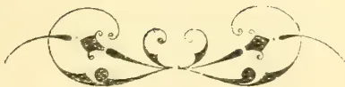
OBSERVER PRINTING WORKS.

1217------------------------------------------------

<!-- stage4: FAINT old-images-only -->

[Faint page: no legible print of its own could be verified; text withheld (stage 4 review list)]

1218------------------------------------------------

This image shows a blank, aged page with a light beige or cream color. The surface has a subtle texture and some minor blemishes or discolorations, particularly towards the bottom edge. There is no text or other content on the page.

1219------------------------------------------------

1220------------------------------------------------

This image shows a blank, aged, cream-colored page, likely an endpaper or flyleaf from an old book. The paper has a slightly textured appearance with some minor discoloration and faint smudges, characteristic of old paper. A dark green binding is visible along the bottom edge of the page.

1221------------------------------------------------

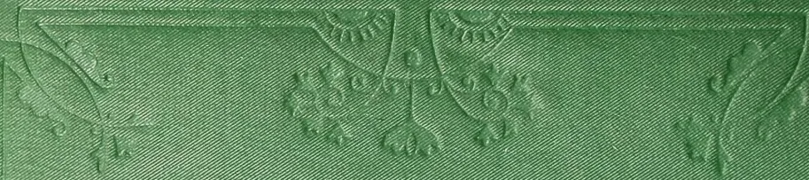An embossed decorative border on a green book cover. The top section features a central floral motif with symmetrical petals and a central stem, flanked by two smaller, curved floral elements. The entire design is set within a rectangular frame defined by multiple embossed lines.An embossed decorative element on the left side of the book cover, consisting of a small, stylized floral or scroll-like motif positioned vertically.An embossed decorative element on the right side of the book cover, consisting of a small, stylized floral or scroll-like motif positioned vertically.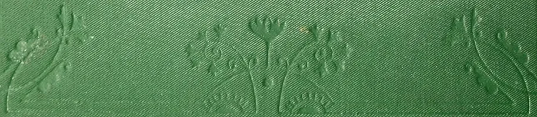An embossed decorative border at the bottom of the book cover, featuring a central floral motif with symmetrical petals and a central stem, flanked by two smaller, curved floral elements, mirroring the top design.